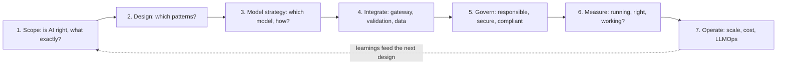
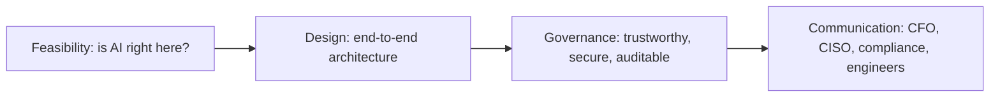
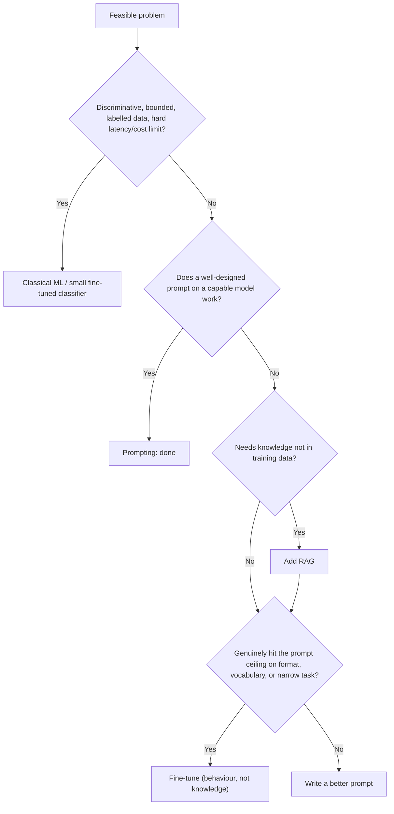
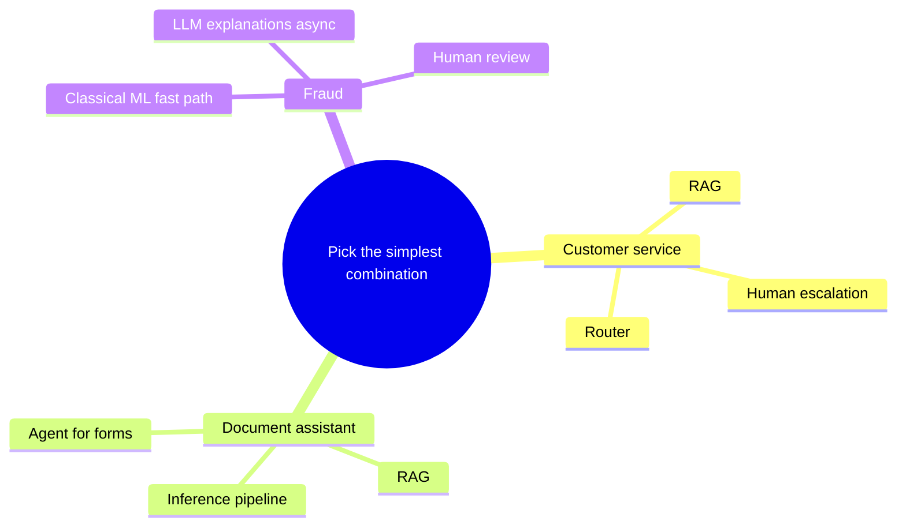
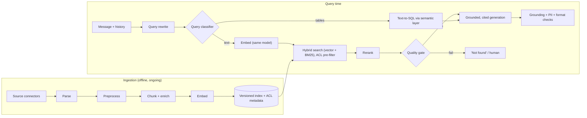
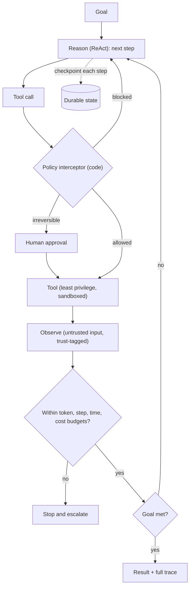
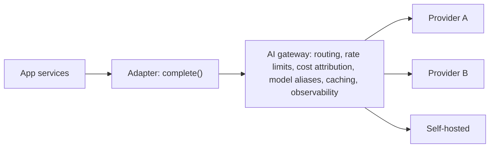
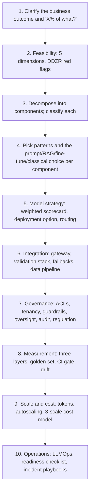
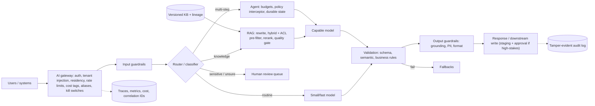
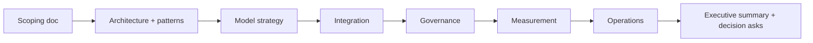

# AI System Design: The Complete Guide

> One reference for designing, building, governing, measuring, and operating production AI systems, consolidated from all seven modules of the AI Architect course.
> Use it three ways: **learn** the method end to end, **run it** as a design playbook for any new AI system, and **revise** it before an interview or design review.

📖 **How to read this guide**

- Each part distils one stage of the design method. 📚 **Deep dive** lines point to the module guide that covers the topic in full.
- 📎 **Beyond the course** callouts mark supplementary material not taught in the lectures.
- Code is **reconstructed illustration** kept deliberately short; the module guides hold fuller examples.
- Case studies are **fictional composites** from the course; numbers are illustrative.
- Model names, prices, and regulations change quickly. Learn the **tiers, patterns, and principles**; verify specifics before citing them.

---

## 📑 Table of Contents

1. [Session Overview](#-session-overview)
2. [Learning Objectives](#-learning-objectives)
3. [Detailed Notes](#-detailed-notes)
    - [Part 1: The AI Architect Mindset](#-part-1-the-ai-architect-mindset)
    - [Part 2: Scope the Problem](#-part-2-scope-the-problem)
    - [Part 3: Choose the Architecture Patterns](#-part-3-choose-the-architecture-patterns)
    - [Part 4: Designing RAG Systems](#-part-4-designing-rag-systems)
    - [Part 5: Designing Agent Systems](#-part-5-designing-agent-systems)
    - [Part 6: Model Strategy](#-part-6-model-strategy)
    - [Part 7: Enterprise Integration](#-part-7-enterprise-integration)
    - [Part 8: Governance and Security](#-part-8-governance-and-security)
    - [Part 9: Measurement and Evaluation](#-part-9-measurement-and-evaluation)
    - [Part 10: Scale, Cost, and Operations](#-part-10-scale-cost-and-operations)
    - [Part 11: The AI System Design Playbook](#-part-11-the-ai-system-design-playbook)
    - [Part 12: Case Study Library](#-part-12-case-study-library)
    - [Part 13: The Anti-Pattern Catalogue](#-part-13-the-anti-pattern-catalogue)
4. [Glossary](#-glossary)
5. [Revision Notes](#-revision-notes)
6. [Cheat Sheet](#-cheat-sheet)
7. [Interview Questions and Answers](#-interview-questions-and-answers)
8. [Scenario-Based Questions](#-scenario-based-questions)
9. [Hands-on Exercises](#-hands-on-exercises)
10. [Practice Assignment](#-practice-assignment)
11. [Additional Resources](#-additional-resources)
12. [Final Revision Sheet](#-final-revision-sheet)

---

## 🗺 Session Overview

**AI system design** is the discipline of turning "we should use AI" into a production system that is **useful, reliable, safe, explainable, affordable, and operable at scale.** The model is one component; the architect designs everything around it.

The course's seven modules form one lifecycle:



| Module | Question it answers | Core artefacts |
|---|---|---|
| **1. Architect role and landscape** | Is AI the right tool, and what exactly are we building? | Feasibility assessment, approach decision, scoping document |
| **2. System architecture** | Which patterns, and how do they fail? | Six-pattern map, RAG stack, agent design, memory, protocols |
| **3. Model strategy** | Which model, and build vs buy vs fine-tune? | Weighted scorecard, prompt discipline, fine-tuning decision, cost crossover |
| **4. Enterprise integration** | How does AI become a production service? | AI gateway, validation stack, NFRs, data pipeline, lineage |
| **5. Governance and security** | Is it responsible, secure, auditable, compliant? | Oversight design, OWASP controls, guardrails, audit trail, regulatory mapping |
| **6. Measurement** | Is it running, right, and solving the problem? | Three-layer metrics, golden dataset, eval gates, drift detection |
| **7. Operations at scale** | Will it stay reliable and affordable? | Scaling plan, three-scale cost model, LLMOps, readiness checklist, incident playbooks |

> 💡 **The one sentence to remember:** *"The model is the chef. The system is the restaurant. The AI Architect designs the restaurant."*

---

## 🎯 Learning Objectives

After working through this guide you should be able to:

- [ ] Explain why AI systems are architecturally different from conventional software.
- [ ] Decide whether AI is the right tool, classify the problem, and choose prompt, RAG, fine-tuning, or classical ML.
- [ ] Write a six-section scoping document and decompose any AI request into components.
- [ ] Select and combine the six core architecture patterns.
- [ ] Design a production RAG system and defend against its failure modes.
- [ ] Design a bounded, safe, observable agent system with memory and protocols.
- [ ] Select a model with a weighted scorecard and decide build vs buy vs fine-tune with a cost model.
- [ ] Put an AI gateway, validation stack, fallbacks, and a governed data pipeline around any model.
- [ ] Build governance in: oversight, security controls, OWASP agentic mitigations, guardrails, audit trails, regulatory mapping.
- [ ] Measure all three layers and catch silent regressions.
- [ ] Plan scaling, cost, LLMOps, readiness, and incident response.
- [ ] Run a complete AI system design (interview or real project) using a repeatable playbook.
- [ ] Recognise the anti-patterns at every stage before they become incidents.

---

## 📘 Detailed Notes

Thirteen parts: the mindset (Part 1), the design lifecycle stage by stage (Parts 2–10), a repeatable playbook (Part 11), and reference catalogues of case studies and anti-patterns (Parts 12–13).

### 🧭 Part 1: The AI Architect Mindset

📚 **Deep dive:** Module 1, Parts 1–6.

#### 🧠 A model is not a system

A **model** is a component. A **system** is everything that makes it safe, reliable, affordable, and explainable in production.

```text
   Data pipeline ──▶ ┌──────────────┐ ──▶ Validation ──▶ Downstream / user
                     │    MODEL     │          │
   Prompt + context ▶└──────┬───────┘          ▼
                            │               Fallback (the model WILL be wrong)
                            ▼
          Monitoring (drift)  ·  Audit trail  ·  Cost attribution  ·  Governance
```

#### ⚠️ Four reasons AI needs different architecture

| Property | Consequence | Design response |
|---|---|---|
| **Probabilistic outputs** | "Probably correct," not a transaction ID | Validation layers, confidence checks, fallbacks |
| **Soft, invisible failure** | Confidently wrong, consistently, silently | Evaluation, monitoring, human review for high stakes |
| **Non-linear cost** | Token bills grow faster than users | Cost model at 1x, 10x, peak; routing; caching |
| **Mandatory governance** | "The model decided" isn't an explanation | Audit trails, oversight, access control from day one |

#### 👷 The four responsibilities



| Role | Owns |
|---|---|
| ML Engineer | The model (data, training, metrics) |
| Data Scientist | Models as analytical instruments |
| Solutions Architect | Systems of **deterministic** components |
| **AI Architect** | **The space between model and production**: integration, failure, cost, governance, explanation |

The role exists because foundation-model APIs moved model-building to providers and created a new problem: **building production systems around a component you don't control**, which is probabilistic, usage-priced, silently updatable, and regulated.

#### 🔺 The Capability / Cost / Control triangle

```text
                    CAPABILITY
                        ▲
      Frontier API ●   / \
                      /   \   ● Fine-tuned (shaped behaviour on someone's base)
                     /     \
   COST ◀───────────●───────●──────────▶ CONTROL
            Classical ML   Self-hosted open-weight
```

*"There's no free position on this triangle."* Make the trade-off **explicit so it's a decision, not an accident.**

#### 🌐 The capability landscape in one table

| Option | Strength | Cost / constraint |
|---|---|---|
| **Proprietary API** (frontier/mid) | Highest general capability; start in an afternoon | Data leaves; pricing and behaviour change; deprecation |
| **Managed cloud platform** (Bedrock, Foundry, Vertex AI) | Same models inside your cloud boundary; easy procurement | Lock-in moves to the platform |
| **Self-hosted open-weight** | Sovereignty, customisation, volume economics | You run GPUs, serving, patching |
| **Fine-tuned specialist** | Best on a narrow trained task | Labelled data, re-tuning on base changes |
| **On-device / edge** | No network, offline, zero marginal cost | Lowest capability; device-fleet ops |
| **Classical ML** | Wins on tabular, time series, bounded classification, edge | Needs task data; narrow |
| **Agents** | Multi-step action | Injection blast radius, loops, cost, scope creep |

**Model tiers:** frontier, mid, small/fast, on-device. **Reasoning mode is a per-task dial** (multiplies cost and latency), not a tier. *Learn tiers, not names.*

#### 🎯 Key Takeaways

- Design the system, not just the model call.
- Feasibility → design → governance → communication.
- Every choice sits on the capability/cost/control triangle; state the trade-off.

---

### 🎯 Part 2: Scope the Problem

📚 **Deep dive:** Module 1, Parts 7–12.

#### 🔬 Feasibility: five dimensions and four red flags

| Dimension | Question |
|---|---|
| **Data availability** | Does it exist, can we access it, is it usable, who owns it, legal sign-off? |
| **Task structure** | Can we write a rubric for "good"? (No rubric → no eval → can't know it works) |
| **Error tolerance** | Annoying, harmful, or audit-triggering when wrong? |
| **Latency** | What budget? Design for **P95**, not the median |
| **Human-in-the-loop viability** | Can a human fit, given latency, volume, and capacity? |

🚩 **AI is the wrong answer when:** the problem is **deterministic** (use a rule/lookup), the **data doesn't exist**, error tolerance is **truly zero**, or **regulation prohibits** it. *Memory aid: DDZR.*

#### 🧭 Classify, then choose an approach

| Axis | Options |
|---|---|
| Output | **Discriminative** (bounded category/score) vs **generative** (new content) |
| Intelligence | **Retrieval** (find what exists) vs **reasoning** (infer what isn't stated); many tasks do both |
| Automation | **Fully automated** · **human-in-the-loop** (approve first) · **human-on-the-loop** (monitor aggregates) |



#### 📋 The six-section scoping document

| # | Section | Quality test |
|---|---|---|
| 1 | **Problem statement** | Specific, measurable, tied to a metric leadership cares about |
| 2 | **AI approach category** | RAG / classifier / prompt pipeline / agent / combination + one-line rationale |
| 3 | **System boundary** | What the AI owns, explicitly doesn't, upstream inputs, downstream consumers |
| 4 | **Success metrics** | Business metrics with thresholds ("escalation < 25% within 60 days") |
| 5 | **Key unknowns** | Honest list; none usually means nobody asked hard questions |
| 6 | **Stakeholder summary** | 90-second read for a non-technical executive |

**Decompose before designing:** "AI customer service" is really intent classification + knowledge retrieval (DB lookups + RAG) + response generation + escalation logic + output guardrails. Often one "system" is three, and one of them needs no AI.

> 📌 **Always ask "X% of what?"** (Module 1 fraud case: a "2% false positive rate" means 16,000 good customers/day to the business, while the alert FP ratio industry-wide is > 90%.)

#### 🎯 Key Takeaways

- Feasibility first: five dimensions, DDZR red flags.
- Classify → prompt → RAG → fine-tune; classical ML for bounded, labelled, constrained tasks.
- Scoping document with a boundary, measurable success, and honest unknowns; decompose.

---

### 🧩 Part 3: Choose the Architecture Patterns

📚 **Deep dive:** Module 2, Part 1.

| Pattern | Shape | Use when | Main risk |
|---|---|---|---|
| **Inference pipeline** | Preprocess → model → postprocess | Bounded tasks with self-contained input | Neglected edges (validation) |
| **RAG** | Retrieve → ground → generate | Knowledge outside training data | Many silent failure modes |
| **Agentic loop** | Goal → act → observe → repeat | Multi-step tasks not specifiable up front | Cost spirals, unsafe actions |
| **Ensemble / router** | Classifier → right model tier | Mixed complexity; cost pressure | Router misroutes |
| **Human-in-the-loop** | AI proposes → human approves | High stakes, regulated | Unresourced review queues, rubber-stamping |
| **Multimodal** | Vision, image output, real-time voice | Non-text inputs/outputs | Voice latency (few hundred ms), modality-specific evaluation |



> 📌 *Every pattern adds design, testing, and operational surface. The goal is the simplest combination that meets the requirements.* *"The pattern isn't the decision. The problem is the decision."*

#### 🎯 Key Takeaways

- Six patterns; most systems combine two or three.
- Choose by problem shape, not novelty.

---

### 📚 Part 4: Designing RAG Systems

📚 **Deep dive:** Module 2, Parts 2–5 and 9–10; Module 4, Part 5.

#### 🏛 The reference RAG architecture



#### ⚙️ Day-one decisions

| Decision | Why |
|---|---|
| **Parsing quality** | A ceiling on retrieval quality |
| **Semantic chunking + overlap** (not fixed-size) | Chunks must carry meaning |
| **Deliberate embedding model** | Coupled to the index; switching = re-embed everything |
| **Query rewriting** (chat) | Follow-ups aren't standalone queries |
| **Hybrid search** | Vectors miss IDs, codes, names |
| **Reranking** (~100–300 ms for top 10) | Similarity ≠ relevance |
| **Grounded prompt**: source of truth, cite, express uncertainty, **no training-memory supplement** | Stops confabulation |
| **ACL metadata + pre-filtered retrieval** | Similarity search ignores permissions |

#### 🧨 Failure modes and fixes

| Failure | Fix |
|---|---|
| **Coreference collapse** ("the acquirer" loses "Apex") | Contextual chunk enrichment; proposition chunking for entity-heavy corpora |
| **Absence blindness** (no "not found" signal) | **Retrieval quality gate** with a threshold calibrated on your corpus |
| **Write-side neglect** (stale, conflicting versions) | Chunk versioning, event-driven/incremental re-ingestion, staleness detection, **freshness SLA** |
| **Indirect prompt injection** via documents | Trust-tier labels, tool restriction after untrusted content, output sanitisation |
| **Tables answered by vectors** | Text-to-SQL through a semantic layer; classifier routes RAG vs SQL vs both |
| **Relational, multi-hop questions** | **GraphRAG** only if clean ontology + relational queries + team to maintain it (indexing ~10x+ cost) |
| **RAGAS looks fine, users fail** | Human known-answer tests; recall@k on a golden set |

💻 **Code Example: the retrieval quality gate** *(reconstructed illustration)*

```python
def answer(query, retrieve, rerank, generate, threshold=0.45):   # calibrate threshold on your corpus
    ranked = rerank(query, retrieve(query, k=20))                # [(chunk, score), ...]
    if not ranked or ranked[0][1] < threshold:
        return {"answer": "I couldn't find relevant information on that.", "escalate": True}
    top = [c for c, _ in ranked[:5]]
    return {"answer": generate(query, top), "sources": [c["doc_id"] for c in top]}
```

#### 🗄 Vector store and index choices

| Need | Pick |
|---|---|
| Local prototype | Chroma (then migrate before launch) |
| On-prem + already on Postgres | **pgvector** (set HNSW explicitly; no index = linear scan) |
| On-prem, dedicated performance | Qdrant |
| Managed, residency not a constraint | Pinecone |
| Multi-modal/graph needs | Weaviate |

| Index | Use |
|---|---|
| **HNSW** | Default under ~50M vectors: fast, 95–99% recall, RAM-hungry (768-dim ≈ 3 KB/vector + 30–100% graph) |
| **IVF** | Memory-bound or frequent rebuilds; tune `nprobe` |
| **IVF-PQ** | Billion scale; lower recall |

*"Vector database selection is a switching-cost decision dressed up as a performance question."*

#### 🎯 Key Takeaways

- Two pipelines; ingestion is ongoing data engineering.
- Rewrite, hybrid, rerank, gate, ground, cite: all day one.
- Version the index, pre-filter ACLs, treat retrieved text as untrusted.

---

### 🤖 Part 5: Designing Agent Systems

📚 **Deep dive:** Module 2, Parts 6–7 and 11–13; Module 5, Part 3.

#### 🔄 The bounded agent architecture



#### 🔧 Tools

**Atomic** (one job), **reversible where possible** (read before write, soft delete, staging), **well described** (like API docs). Scope each agent's registry to its task.

#### ⚠️ The six production realities

| Reality | Design response |
|---|---|
| **Cost spirals** (3–50 calls per request) | Token budget, step limit, cost circuit breaker **in the orchestrator**; caching (prompt → semantic → embedding) before summarisation |
| **Temperature 0 ≠ reproducible** | Log model version per output; treat provider updates as deployments; deterministic post-processing; human gates |
| **Context window is not an architecture** | Pinned goal + rolling summarisation + selective retrieval; cache-friendly append-only prefix |
| **Prompt-based safety fails** | **Application-layer policy interceptor**; least capability |
| **Tool outputs are untrusted** | Trust tiers, tool restriction after untrusted reads, check read-untrusted + send-outbound combinations |
| **You can't RAGAS an agent** | Evaluate task completion, trajectory, safety, consistency |

💻 **Code Example: the policy interceptor** *(reconstructed illustration)*

```python
def execute(call, tools, session, audit):
    ok, reason = True, "ok"
    if call["name"] not in session["allowed_tools"]:
        ok, reason = False, "tool not in this agent's registry"
    elif call["name"] == "send_email" and any(not r.endswith("@example.com") for r in call["args"]["to"]):
        ok, reason = False, "external recipients not permitted"
    elif session.get("tainted") and call["name"] in {"send_email", "http_request"}:
        ok, reason = False, "outbound action after untrusted input needs approval"
    audit.append({"call": call, "permitted": ok, "reason": reason, "model": session["model_version"]})
    return tools[call["name"]](**call["args"]) if ok else {"error": "not_permitted", "reason": reason}
```

#### 🧠 Memory

| Tier | Use | Must-have |
|---|---|---|
| In-context | Short, bounded tasks | Remember cost is quadratic: 2k tokens × 10 steps = **110k**, not 20k |
| External short-term | Long sessions | **TTLs**; store extractions, not transcripts |
| Long-term | What must persist | **Write gates** (explicit, confidence-gated, extract-then-store); poisoning defence |
| Procedural | Reusable workflows | Versioned |

Long-term memory is a **personal data store**: tag identity, purpose, TTL; keep a user → record index for erasure and access. Multi-agent: **start with orchestrator-owns-state**; tenant scope enforced in code.

#### 🔌 Protocols and runtime

| | Use |
|---|---|
| **MCP** (model ↔ tools, vertical) | Tools shared across agents/frameworks; servers are trust boundaries, **split read and write** |
| **A2A** (agent ↔ agent, horizontal) | Cross-team delegation; Agent Card, Task, Artifact; authenticated identity |
| **Neither** | One agent, small fixed tools, one codebase |
| **Runtime** | Graph-based (inspectable, strong checkpointing), role-based, conversation-driven, provider SDKs; **decide durability before choosing** |

#### 🛡 OWASP Top 10 for Agentic Applications (quick map)

| ID | Risk | Control |
|---|---|---|
| ASI01 | Goal hijack | Content/instruction separation, anomaly monitoring, least privilege |
| ASI02 | Tool misuse | Atomic scoped tools, confirmation gates |
| ASI03 | Identity/privilege abuse | Task-scoped registries, real agent identity |
| ASI04 | Supply chain | Verify, pin, audit models, tools, MCP servers |
| ASI05 | Code execution | Validate before action; sandbox without prod credentials |
| ASI06 | Memory poisoning | Validate before write; provenance; isolation |
| ASI07 | Inter-agent comms | Authenticate agents; sign/verify messages |
| ASI08 | Cascading failures | External limits; circuit breakers between agents |
| ASI09 | Trust exploitation | Review UIs that resist rubber-stamping |
| ASI10 | Rogue agents | Scope enforced outside the agent; kill switches; aggregate anomaly detection |

**Don't use an agent** for deterministic paths, sub-2-second budgets, or irreversible high-stakes actions without a human gate.

#### 🎯 Key Takeaways

- Constraints before capabilities: budgets, interceptor, least privilege, human gates, durable checkpoints.
- Treat every tool output and subagent message as untrusted.
- Memory is a governed data store; protocols buy portability at an operational cost.

---

### 🧬 Part 6: Model Strategy

📚 **Deep dive:** Module 3 (all parts).

#### 📊 The weighted five-dimension scorecard

**Weight first (by context), then score candidates.** Non-negotiables act as hard gates.

| Dimension | Key question | Watch |
|---|---|---|
| **Task capability fit** | Does it do *our* task? | 20–50 example eval decides; benchmarks (MMLU, HumanEval, GSM8K, LMArena) only shortlist |
| **Latency** | TTFT (chat) or total time (extraction)? | API latency partly outside your control |
| **Cost at scale** | Launch, 10x, peak | Measured token counts, not guesses |
| **Data privacy** | Where may the data go? | Often decides the architecture outright |
| **Operational complexity** | API ≪ self-hosted < fine-tuned | *"The foundation lab is not on your on-call rotation. You are."* |
| *(dial)* **Reasoning effort** | Does this task need it? | Unneeded reasoning is *"pure waste, not a safety margin"* |

#### ✍️ Prompts are architecture

- System prompt = **behavioural specification**: role, **specific** constraints, exact output format, 2–3 few-shot examples (cached).
- **Version** it, **log its ID on every call**, **test** it (format, boundary, adversarial), **stage** rollouts, keep it in **runtime config**, give it an **owner**.
- **Ceiling signals:** persistent format failures, terminology errors, domain safety/tone gaps, very diverse inputs. Benchmark the best prompt before concluding.

#### 🧪 Fine-tuning: behaviour, not knowledge

> 📌 **RAG = what it knows. Fine-tuning = how it behaves.** Fine-tuning on documents yields confident hallucinations in your house style.

| Worth it for | Needs |
|---|---|
| Format consistency, domain vocabulary, narrow task specialisation, safety/behavioural consistency | Hundreds to a few thousand **quality** pairs (LoRA); held-out 10–20% stratified set; **best-prompt baseline**; maintenance budget for base-model changes |

**Data sources:** synthetic (verify a sample), **distillation** (frontier teacher → small student; check provider terms), **production feedback loop** (corrections become training data). **Techniques:** LoRA (default), QLoRA (small GPUs), full fine-tuning (rare).

#### 🏗 Deployment, routing, lock-in, and the cost crossover

```text
Proprietary API ── Managed cloud platform ── Self-hosted open-weight ── On-device
 most capability        your cloud boundary        sovereignty, volume        offline, narrowest
 least control          procurement advantage      you operate it             device-fleet ops
```

- **Hybrid routing:** routine → cheap tier; complex → frontier. *70% at 10x cheaper → cost 0.37 → ~60% saving.*
- **Abstraction layer:** application calls `complete(prompt, config)`; providers sit behind adapters or an OpenAI-compatible gateway (e.g. LiteLLM). Swaps become config changes.
- **Crossover:** self-hosting beats API above roughly **0.5M–5M requests/month** (model- and token-dependent). Compute both at launch, 10x, peak.

💻 **Code Example: the crossover** *(reconstructed illustration; placeholder prices)*

```python
def api_monthly(req, tin=2000, tout=300, pin=3.0, pout=15.0):
    return req * (tin * pin + tout * pout) / 1e6

def self_hosted_monthly(req, gpu_hr=4.0, req_per_gpu=1_500_000, min_gpus=2, eng=12_000):
    return max(min_gpus, -(-req // req_per_gpu)) * gpu_hr * 730 + eng

for req in (500_000, 1_500_000, 5_000_000):
    print(req, round(api_monthly(req)), round(self_hosted_monthly(req)))
# 500000 5250 17840 | 1500000 15750 17840 | 5000000 52500 23680
```

#### ⚖️ Same answer, different drivers

| | Fintech loan risk (50k/day) | Hospital clinical notes |
|---|---|---|
| Result | Self-hosted LoRA-tuned small open-weight model | Same |
| Main driver | Cost above crossover + privacy + narrow task | **Non-negotiable privacy posture** (PHI stays in-house, despite BAAs being available) |
| Fine-tuning for | Task structure | Vocabulary and format safety |
| Evaluation | Analyst labels | Physician panel + rubric (e.g. PDQI-9) |

#### 🎯 Key Takeaways

- Weighted scorecard + your own eval; benchmarks only shortlist.
- Prompt engineering is versioned architecture; fine-tune only past an honest ceiling, for behaviour.
- Route, abstract, and model the crossover to keep choices reversible and affordable.

---

### 🔌 Part 7: Enterprise Integration

📚 **Deep dive:** Module 4 (all parts).

#### 🚪 The AI gateway + adapter



*"The model behind it is a configuration, not a contract."* Built at the start: **one sprint**. Retrofitted: **three months and an incident.**

**Request patterns:** synchronous + streaming (SSE/WebSockets; long timeouts) for interactive use; **async** (task ID + poll/webhook + queue) for anything over ~2–3 s.

#### 🧪 Probabilistic outputs into deterministic systems

```text
Constrain at source (JSON mode / tool-use schema, versioned like an API)
   ↓
1. Schema validation      (structure, types)            ← cheapest, first
2. Semantic validation    (negative totals, "N/A", 847 on a 1–10 scale)
3. Business rules         (allowed actions, real categories)
   ↓ stop at first failure
Fallbacks: retry with clarification (≤3) · deterministic template/default · human escalation · honest degraded message
```

**Retries:** 5xx/429 with backoff; never auth errors or business-rule failures; don't blindly retry slow inference; when exhausted, fail fast to the fallback.

#### ⏱ Non-functional requirements for AI

| Area | Rule |
|---|---|
| Latency | Design to **P95/P99**; stream (first token ~300 ms); cap `max_tokens`; **parallelise** independent calls |
| Caching | Exact (Redis + TTL) → semantic (calibrated threshold) → provider prefix (**stable content first**) |
| Throughput | **Batch** offline work; **queue** interactive bursts (queue depth = capacity signal) |
| Degradation | **Feature flags** per AI touchpoint, **defined fallback** per call, **circuit breakers**; AI is never a single point of failure |

#### 🗃 The data pipeline and lineage

```text
Connectors → parse → preprocess (dedupe, strip boilerplate) → chunk → embed → index
Freshness SLA → full re-ingest | incremental (hashes) | event-driven
Lineage: response → chunk IDs → source doc + version → embedding model → timestamp
```

Lineage powers **debugging, GDPR erasure, and regulatory audit**. *"'The model said so' is not a defensible audit trail."*

#### 🏚 Two integration shapes

| Legacy insurance (can't modify, PII on-prem) | Cloud-native e-commerce (shared by teams) |
|---|---|
| **Sidecar** reads the monolith's documents | **One LiteLLM gateway**, per-feature limits and attribution |
| Self-hosted model (residency, not volume) | Async descriptions; 500 ms search with semantic cache; streaming returns assistant |
| Three-layer validation → **staging table** → adjuster approval | **Circuit breaker** keeps checkout independent of AI |
| Metric: **correction frequency** (60% = AI adds work) | Escalate disputes/complaints to specialists |

#### 🎯 Key Takeaways

- Gateway + adapter from day one.
- Constrain, validate in three layers, and define a fallback for every failure.
- Design NFRs for tails and failure; treat the data pipeline and lineage as part of the product.

---

### 🛡 Part 8: Governance and Security

📚 **Deep dive:** Module 5 (all parts).

#### ⚖️ Responsible AI as constraints

| Pillar | Built as |
|---|---|
| Fairness | Disparate-impact testing before launch + production monitoring |
| Reliability | Guardrails, validation, fallbacks, HITL for high stakes |
| Privacy | PII redaction before the model and logs; retention by classification |
| Transparency | **System-level audit trails** (documents, versions, guardrails, reviewer decisions) |
| Accountability | Owners, override mechanisms (logged with reasons), escalation triggers |
| Inclusiveness | Multilingual, accessible, tested across the real user population |

Bias enters via base training data, fine-tuning labels, embeddings, knowledge-base coverage, and prompts. Agents follow **reversibility, escalation, transparency, bounded scope.**

#### 🔐 Security architecture

| Threat | Control |
|---|---|
| Direct prompt injection | Input classification, prompt hardening, output monitoring |
| **Indirect** injection (retrieved/tool content) | Treat as untrusted data, structural separation, least privilege, anomaly monitoring |
| Leakage via memorisation, retrieval, logs | Output PII scanning; **document-level ACL pre-filters**; redacted, access-controlled logs |
| Cross-tenant leakage | **Mandatory tenant ID injected at the gateway**; filtered search; isolation tests on every deploy |
| Supply chain | Verify hashes from original publishers; pin tools and MCP servers |

> 📌 **Why pre-filter ACLs:** post-filtering starves retrieval unevenly, scatters enforcement across call paths (one missed path = breach), and can leak that restricted documents exist.

#### 🚧 Guardrails

| Input | Output | Actions (agents) |
|---|---|---|
| Classification, PII redaction, jailbreak detection, length limit | Toxicity, **grounding**, format, PII scan | Policy enforcement, sandboxing, identity (e.g. LlamaFirewall, Agent Governance Toolkit) |

Execution modes: **inline** (must-block harm; costs latency), **async** (monitor and retract), **offline** (audits, drift).

#### 🎯 Red-teaming before launch

Per risk: **adversarial input + safe behaviour + objective pass criterion**, prioritised by likelihood × impact. **Automated** tools (garak, PyRIT) for breadth + **manual** testing for system-specific depth, against the real system in a **production-like sandbox**. **Exit criteria and residual-risk owners set before testing.**

#### 🔏 Evidence and audit

- Trace every interaction: identity, redacted full prompt, prompt/model versions, chunks, raw output, tokens/cost, guardrail results; spans + correlation ID.
- **Tamper-evident audit log**: append-only, no deletes, hash chain with **checkpoints held in a separate system**; kept separate from 30–90 day operational logs (audit: 5–10+ years).
- Tenant-partitioned observability with server-enforced scoping; drift canaries.

💻 **Code Example: hash-chained audit log (core idea)** *(reconstructed illustration)*

```python
import hashlib, json

def append(log: list, event: dict) -> dict:
    prev = log[-1]["hash"] if log else "0" * 64
    rec = {"event": event, "prev": prev,
           "hash": hashlib.sha256((prev + json.dumps(event, sort_keys=True)).encode()).hexdigest()}
    log.append(rec)
    return rec      # periodically publish the latest hash (or a Merkle root) to an external verifier
```

#### 🏛 Regulation → design

| Regime | Design implication |
|---|---|
| **EU AI Act** (unacceptable / high / limited / minimal) | High-risk (employment, credit, education, infrastructure…): risk management, data governance, technical docs, audit logs, deployer transparency, human oversight, robustness, **registration**. Per the course sources, high-risk obligations bind from **Dec 2027** |
| NIST AI RMF | Govern, Map, Measure, Manage |
| HIPAA / FDA | BAAs for PHI; clinical decision support may be a medical device |
| Financial model risk | Documented development, independent validation, monitoring, model inventory (per the lecture, SR 11-7 was rescinded in April 2026; verify current status) |
| ECOA / FCRA | Adverse-action explanations: capture decision factors |
| GDPR, residency, AML, DORA | Regional deployments, gateway residency routing, per-jurisdiction stores, retention vs erasure reconciled via lineage |

> 📌 **Classification ≠ burden.** A resume screener is high-risk under the AI Act; a bank's AML monitor probably isn't, yet carries the heavier load from AML law, GDPR, and DORA. *Find the regulation that actually binds.*

#### 🎯 Key Takeaways

- Governance is architecture from session one; enforce in code, not prompts.
- Pre-filter ACLs, gateway-enforced tenancy, guardrails in three places, red-team the real system.
- Keep a tamper-evident audit log separate from ops logs; map regulations to components.

---

### 📏 Part 9: Measurement and Evaluation

📚 **Deep dive:** Module 6 (all parts).

#### 🧱 Three layers, joined by a correlation ID

| Layer | Question | Examples |
|---|---|---|
| Infrastructure | Is it running? | Latency, errors, tokens, cost |
| Behavioural evaluation | Is it doing the right thing? | Faithfulness, relevance, format compliance, token efficiency |
| Business outcomes | Is it solving the problem? | Containment, escalation, STP, conversion |

**Measure before you build:** 5 eval-first cases → golden dataset before launch → numeric thresholds → **blocking gates**.

#### 🧪 Offline evaluation

- **Golden dataset:** happy path, edge, known failures, adversarial; specific labels; owner; grows with every incident.
- **RAGAS as a diagnostic map:** faithfulness ↓ = fabrication; relevance ↓ = wrong question; context precision ↓ = noisy retrieval; context recall ↓ = coverage gap.
- **DeepEval** for custom criteria; **Promptfoo** for prompt A/B.
- **CI gate:** deterministic checks zero-tolerance; judge aggregates vs noise-aware thresholds; production-sample comparison; human spot-check.

💻 **Code Example: a noise-aware gate** *(reconstructed illustration)*

```python
from statistics import mean

def gate(results, baseline, noise=0.03):
    fails = [r["id"] for r in results if not r["deterministic_pass"]]
    drops = [m for m in ("faithfulness", "answer_relevance")
             if mean(r[m] for r in results) < baseline[m] - noise]
    return (not fails and not drops), {"deterministic_failures": fails, "metric_drops": drops}
```

#### 🌐 Online evaluation

- **LLM-as-judge:** scalable trend signal with **length, self-preference, position, confidence** biases → calibrate against experts, randomise pairwise order, sample 1–5%.
- **Human review:** stratified sampling (rare but important cases), structured failure categories, signal-based escalation.
- **Signal hierarchy:** user behaviour > human review > automated metrics > LLM judge.

#### 💼 Business outcomes and silent failures

- Support: containment (read with resolution and retries), FCR, escalation by topic, retry rate. Documents: STP, exception rate + reason, correction frequency. Search: CTR, conversion, diversity, abandonment.
- **Token efficiency** by intent (mean, P95/P99, ratio) and **behavioural drift** (canaries checking properties, format compliance, field presence, length distribution, similarity).

> 📌 *Valid JSON ≠ matching the contract.* A renamed field (`ship_date` → `shipment_date`) dropped STP 87% → 61% overnight and took 8 days to find; format-compliance or field-presence monitoring would have caught it in hours.

#### 🎯 Key Takeaways

- All three layers, joined by correlation IDs.
- Golden set + RAGAS + CI gate before launch; calibrated judge + stratified humans after.
- Watch tokens and drift explicitly; check daily, not weekly.

---

### 📈 Part 10: Scale, Cost, and Operations

📚 **Deep dive:** Module 7 (all parts).

#### ↔️ Scaling

| Dimension | Rule |
|---|---|
| Demand | Size on **tokens/s**, not just requests/s |
| Context | Long context consumes GPU memory per request; manage it |
| State | **Externalise** session state (Redis/DB) over sticky sessions |
| Streaming | Long timeouts at every hop (a 30 s stream dies behind a 10 s timeout) |
| Autoscaling | **Queue depth, token throughput, GPU memory, P95 time-in-queue**, not CPU |
| Multi-region | Active-active, active-passive, or **data-sovereign** (no failover to unauthorised regions) |
| Cache hit rates | Exact 5–15% chat / 30–60% FAQ; semantic 15–40% |

#### 💰 Cost architecture

```text
Monthly LLM cost = (avg_in × in_price + avg_out × out_price) × requests/day × 30
Model at launch · 10x · peak, with sensitivity (session length, cache hit rate)
Levers: routing (~60% at 70%/10x) · prompt trimming (proportional) · caching (ROI = (savings − cost)/cost)
          · token budgets · conversation compression
```

**Costs grow non-linearly:** writing-assistant example, 500 → 500,000 users = 1,000x linearly but **~1,400x** with 40% longer sessions; routing 55% of traffic cut ~40%; a 25% semantic cache cut more.

#### 🔁 LLMOps

| MLOps | LLMOps |
|---|---|
| Artefact: trained model; weeks–months | Artefacts: **prompts, RAG data, adapters**; days–weeks |
| Defined metrics | Open-ended quality (needs Part 9's stack) |

Prompts in version control with IDs on every interaction; regression + comparison gates; **staged rollout** (5% → …); **config rollback**; **pin model versions**; **continuous** regression and canaries for silent provider updates.

#### ✅ Production readiness: 20 questions

| Category | Questions |
|---|---|
| Reliability | Fallback per failure mode · circuit breakers · inference-level health checks · load test at 2x peak |
| Cost | Cost modelled from real tokens · alerts at 50/80/100% · per-request token budget · cost-efficient spike fallback |
| Observability | Full-context logging · dashboards · distributed tracing · continuous evaluation |
| Security/governance | Injection tested (direct + indirect) · ACLs in place and verified · PII redaction validated · audit trail compliant |
| Operations | Runbooks for top 5 failures · AI on-call path · prompt rollback without deploy · pre-launch red team |

#### 🚨 Incident response

- **P1s:** mass hallucination, **any** confirmed data leakage, failure with inadequate fallback, guardrail failure at scale.
- Design for **detection before users** and **queryable blast radius** (correlation IDs).
- **Four no-deploy remediations:** prompt rollback, **index rollback** (versioned aliases), **adapter rollback**, **per-feature kill switch**; all rehearsed.

#### 🎯 Key Takeaways

- Scale on tokens; autoscale on AI signals; externalise state.
- Model cost non-linearly at three scales; pull routing, trimming, caching, budgets.
- Operate prompts like code, pass the 20 questions, rehearse the four rollbacks.

---

### 🗺 Part 11: The AI System Design Playbook

The whole course as one repeatable procedure for a real project **or** a system design interview.

#### 🪜 The ten-step method



| Step | Output | Key question |
|---|---|---|
| 1 | Problem statement + measurable targets | What business metric moves, and what's the denominator? |
| 2 | Feasibility verdict + unknowns | Do data, rubric, error tolerance, latency, and oversight work? |
| 3 | Component list with task types | What is each piece: discriminative/generative, retrieval/reasoning, automation level? |
| 4 | Pattern map | What's the simplest combination? |
| 5 | Model per component + deployment + router | What does privacy force? What does it cost at 10x? |
| 6 | Integration design | What happens when the model is wrong or down? |
| 7 | Governance design | Who can see what, who approves what, what's logged, which law binds? |
| 8 | Measurement plan | How will we know it's working, and catch silent regressions? |
| 9 | Scaling + cost plan | Tokens/s at peak? Cost at launch/10x/peak? |
| 10 | Operating model | Who's paged at 2am, and what can they roll back without deploying? |

#### ⏱ In an interview (about 45 minutes)

| Time | Do |
|---|---|
| 0–5 min | Clarify outcome, users, volumes, constraints (privacy, latency, regulation); ask "X% of what?" |
| 5–10 min | Feasibility and decomposition; state what does **not** need AI |
| 10–25 min | Draw the architecture (gateway, patterns, data, models); annotate model tiers, **dashed probabilistic flows**, p50/p95, human gates, eval hooks |
| 25–35 min | Failure modes: validation, fallbacks, injection, ACLs, drift, cost spirals |
| 35–42 min | Measurement (three layers) and operations (cost at 10x, rollouts, incidents) |
| 42–45 min | Trade-offs made explicit on the capability/cost/control triangle; what you'd defer and why |

#### 🏛 Reference architecture



#### 🛠 Worked example: "Design an AI assistant for a retail bank's customer support"

| Step | Decisions (condensed) |
|---|---|
| **Outcome** | Resolve routine queries automatically; target containment X% **of routine contacts** paired with CSAT parity; cut cost per contact |
| **Feasibility** | Policies and FAQs exist (RAG); account data via APIs; disputes and complaints high-stakes → human; latency budget ~2 s streamed |
| **Decompose** | Intent classifier (discriminative) · balance/transaction lookup (deterministic API, **no AI**) · policy Q&A (RAG) · response generation · escalation router · output guardrails |
| **Patterns** | Router + RAG + human-in-the-loop; **no autonomous agent** for money movement |
| **Models** | Small model for classification/rewrite; capable model for answers via a managed cloud platform inside the bank's tenancy (privacy) or self-hosted if policy demands; routing for cost |
| **Integration** | Gateway with per-feature attribution; read-only account APIs; three-layer validation; circuit breaker to a static FAQ; async for statement summaries |
| **Governance** | Customer-scoped ACL pre-filters; PII redaction before logs; injection defences on retrieved content; audit trail; check which regulations bind (e.g. consumer duty, GDPR, AI Act tier) |
| **Measurement** | Golden set with dispute and fee edge cases; RAGAS by topic; containment + retry + escalation by topic joined via correlation ID; canaries |
| **Scale/cost** | Tokens/s at month-end peaks; cost at launch/10x/peak with 20–40% cache; queue-depth autoscaling |
| **Operations** | Versioned prompts with staged rollout; readiness checklist; runbooks for hallucination and data leakage; kill switch per feature |

#### ✅ Design review checklist (one page)

- [ ] Business outcome, denominators, and targets written down
- [ ] Feasibility checked; red flags ruled out; unknowns owned
- [ ] Components classified; non-AI parts identified
- [ ] Patterns justified as the simplest combination
- [ ] Model scorecard weighted before scoring; privacy gates applied
- [ ] Gateway + adapter; model aliases; cost attribution
- [ ] Structured output + three-layer validation + fallback per touchpoint
- [ ] RAG: rewrite, hybrid, rerank, quality gate, citations, freshness SLA, versioned index
- [ ] Agents: budgets, policy interceptor, least privilege, human gates, checkpoints
- [ ] ACL pre-filters; tenant injection at the gateway; isolation tests in CI
- [ ] Guardrails placed (inline/async/offline); red-team plan with exit criteria
- [ ] Traces + tamper-evident audit log (if regulated); lineage for erasure
- [ ] Three-layer metrics with correlation IDs; golden set; CI eval gate; drift canaries
- [ ] Scaling on tokens; AI autoscaling signals; streaming timeouts
- [ ] Cost model at 1x/10x/peak with sensitivity; budget alerts
- [ ] Prompt versioning, staged rollout, four no-deploy rollbacks, on-call path

#### 🎯 Key Takeaways

- Ten steps from outcome to operations; the same method for interviews and real projects.
- Annotate diagrams with model tiers, probabilistic flows, latency, human gates, and eval hooks.
- End with explicit trade-offs and deferred edges.

---

### 📚 Part 12: Case Study Library

Every course case study, the lesson it teaches, and where to read it.

| Case | Module | Pattern(s) | The lesson |
|---|---|---|---|
| Retail customer service (15k contacts/week) | 1 | Classifier + DB lookup + RAG + generation + escalation + guardrails | Decompose a slogan into five designable components; containment ≠ resolution |
| Real-time fraud detection (800k tx/day) | 1 | Classical ML fast path + anomaly detection + async LLM explanations + human review | "2% of what?"; latency splits fast and slow paths; label latency drives retraining |
| Enterprise HR assistant | 2 | RAG + agent (forms) + human escalation behind a router | Uncertainty defaults to humans; confirmation gates; conservative escalation needs staffed triage |
| Legal precedent research | 2 | GraphRAG + vector RAG + query classifier | Relational multi-hop queries; "no match" bounded by extraction recall; graph-level ACLs |
| Fintech loan risk (50k/day) | 3 | Self-hosted LoRA specialist | Cost + privacy + narrow task all point one way |
| Hospital clinical notes | 3 | Self-hosted fine-tuned model + physician evaluation | Privacy posture decides first; vocabulary drives fine-tuning |
| Legacy insurance claims (500/day) | 4 | Sidecar + self-hosted extraction + staging table + adjuster approval | Additive, not invasive; self-hosting as a residency decision |
| Cloud-native e-commerce | 4 | Shared gateway + async batch + cached search + streaming assistant | Per-feature isolation; circuit breakers protect revenue flows |
| AI resume screening | 5 | Ranked shortlist + mandatory human decision | High-risk under the AI Act; fairness testing; provider registers |
| Bank financial-crime monitoring | 5 | AI flags → analyst → compliance officer | Probably not AI-Act high-risk, yet heavier burden from AML/GDPR/DORA |
| Call-centre chatbot (28% containment) | 6 | Three-layer diagnosis | Green dashboards hid fabrication and coverage gaps by topic |
| Silent document regression | 6 | Format compliance, canaries, field presence | Valid JSON ≠ contract; daily beats weekly |
| Writing assistant 500 → 500,000 users | 7 | Retrofit: routing, caching, LLMOps | ~1,400x not 1,000x; the retrofit tax |
| Greenfield fintech advisor | 7 | Designed for scale from day one | ~2 weeks upfront vs ~2 months retrofit |

#### 🎯 Key Takeaways

- The same principles recur; the binding constraint (latency, privacy, regulation, legacy, scale) changes the design.
- Each case is a template you can adapt in interviews.

---

### 🚫 Part 13: The Anti-Pattern Catalogue

All 41 anti-patterns from the course, grouped by stage. Each has a **tell** and a cheap design-time **prevention** (see the module guides for detail).

#### 🎯 Scoping and role (Module 1)

| Anti-pattern | Prevention |
|---|---|
| AI as a feature, not a system (one "LLM" box) | Ask "what happens when it's wrong?" |
| Skipping feasibility | Feasibility assessment is the first deliverable |
| Confused role ownership (four gateways) | Name owners for gateway, prompt registry, eval, guardrails before system #2 |
| Scoping too broadly ("Core AI Platform") | Scoping doc with named components and boundary |
| Success = model accuracy | Business success metrics before design |

#### 🧩 Architecture (Module 2)

| Anti-pattern | Prevention |
|---|---|
| Naive fixed-size chunking | Semantic boundaries + overlap |
| Vector-only retrieval | Hybrid search day one |
| No reranking | Cross-encoder rerank; measure |
| Ignoring the write side | Freshness SLA, versioning, re-ingestion |
| Unbounded agent loops | Budgets, step limits, circuit breakers in code |
| System prompt as the safety layer | Application-layer policy enforcement |

#### 🧬 Model strategy (Module 3)

| Anti-pattern | Prevention |
|---|---|
| Fine-tuning for knowledge | RAG for knowledge |
| Benchmark shopping | Your own task eval |
| No evaluation baseline | Measure the best prompt first |
| No lock-in mitigation | Abstraction layer (a day's work) |
| Ignoring fine-tune maintenance | Budget re-tuning; owner and cadence |
| Linear cost extrapolation | Three scales, realistic tokens |

#### 🔌 Integration (Module 4)

| Anti-pattern | Prevention |
|---|---|
| AI calls embedded in app code | Gateway + adapter |
| No structured output contract | JSON mode/tool use + schema validation |
| No fallback per touchpoint | Design and ship fallbacks with the feature |
| DB-style latency assumptions | AI-appropriate timeouts; retry errors, not slowness |
| Ignoring tail latency | P95/P99 targets; parallel calls |
| Synchronous everything | Streaming or async per feature |

#### 🛡 Governance (Module 5)

| Anti-pattern | Prevention |
|---|---|
| Governance as a compliance checkbox | Governance inputs in the first session |
| Prompt-only safety for agents | Tool-call interception |
| No document-level ACLs in RAG | ACL metadata + pre-filters |
| LLM-as-judge as ground truth | Calibrate against human labels |
| Standard logs as audit trail | Tamper-evident, long-retention audit log |
| Testing the model, not the system | Red-team the production configuration |

#### 📏 Measurement (Module 6)

| Anti-pattern | Prevention |
|---|---|
| Telemetry as evaluation | Separate quality dashboards |
| Judge as ground truth | Calibration |
| Disconnected metrics | Correlation IDs |
| Golden set built once | Owned, growing dataset |
| No token monitoring | Per-intent baselines and alerts |
| Evaluation after the first incident | 30 golden examples + RAGAS before launch |

#### 📈 Operations (Module 7)

| Anti-pattern | Prevention |
|---|---|
| Linear cost extrapolation | Non-linear, three-scale model |
| Frontier model for everything | Router (a day's work) |
| No prompt versioning | Prompts as versioned artefacts |
| Silent regression from model updates | Pinning, canaries, format compliance |
| Evaluation after the incident | Eval stack before launch |
| No cost circuit breakers | 50/80/100% alerts, token caps, gateway limits |

> 📌 **The common root:** something that feels optional at design time (feasibility, boundaries, validation, ACLs, evaluation, cost modelling, versioning) gets deferred, and *"later turned out to be too late."* Each prevention costs an afternoon to a sprint; each failure costs weeks to a quarter.

#### 🎯 Key Takeaways

- Anti-patterns cluster by stage; the same few preventions recur: design-time boundaries, code-level enforcement, measurement, and versioning.

---

## 📚 Glossary

| Term | Definition | Why It Matters |
|---|---|---|
| AI Architect | Owns the system between model and production | Integration, failure, cost, governance, explanation |
| Model vs system | Component vs everything around it | The core mental model |
| Capability / Cost / Control | Three-axis trade-off framework | No free position; make trade-offs explicit |
| Model tiers | Frontier, mid, small/fast, on-device | Match cost to difficulty |
| Reasoning dial | Per-task extended "thinking" | Multiplies cost and latency |
| Feasibility assessment | Data, task structure, error tolerance, latency, HITL | Stops the wrong project early |
| DDZR red flags | Deterministic, no data, zero tolerance, regulated out | When AI is the wrong answer |
| Discriminative / generative | Bounded label vs new content | Drives model choice |
| Scoping document | Six-section agreement artefact | Turns discussion into agreement |
| System boundary | What the AI owns and doesn't | Stops scope drift |
| Six patterns | Pipeline, RAG, agent, router, HITL, multimodal | Design vocabulary |
| RAG | Retrieve-then-generate grounded in your data | Knowledge without retraining |
| Query rewriting | Standalone query from chat history | Makes multi-turn RAG work |
| Hybrid search | Vector + keyword (BM25), fused | Catches exact identifiers |
| Reranker | Cross-encoder reordering by relevance | Fixes buried best chunks |
| Retrieval quality gate | Threshold before generation | Fixes absence blindness |
| Coreference collapse | Chunks losing their entities | Fix with enrichment/propositions |
| Freshness SLA | Maximum knowledge staleness | Chooses ingestion strategy |
| GraphRAG | Entity graph queried by traversal | Relational multi-hop questions |
| Text-to-SQL | Structured queries via a semantic layer | Tables aren't vector problems |
| HNSW / IVF / IVF-PQ | Vector index families | Latency, recall, memory trade-offs |
| Agent | Model looping over tool calls toward a goal | Action, with risk |
| Policy interceptor | Code that approves/blocks each tool call | The real safety layer |
| Least capability | Only the tools a task needs | Limits blast radius |
| Indirect prompt injection | Instructions hidden in retrieved/tool content | Primary agent threat |
| MCP / A2A | Model-to-tool / agent-to-agent protocols | Portability and composition |
| Durable execution | Checkpointed agent state | Survives crashes mid-task |
| Memory write gate | Validation before long-term storage | Prevents poisoning |
| Weighted scorecard | Context-weighted model evaluation | Defensible selection |
| TTFT | Time to first token | Perceived chat speed |
| Fine-tuning (behaviour) | Adapts style, format, vocabulary, narrow tasks | Not a knowledge store |
| LoRA / QLoRA | Adapter training on (quantised) frozen bases | Enterprise default |
| Distillation | Small student trained on frontier outputs | Cheap serving at volume |
| Managed cloud AI platform | Models inside your cloud boundary | Middle path; procurement |
| Crossover point | Volume where self-hosting beats API | ~0.5M–5M requests/month |
| Abstraction layer | Internal `complete()` over providers | Reversible model choices |
| AI gateway | Single entry for AI calls | Routing, limits, attribution, caching, tracing |
| Three-layer validation | Schema, semantic, business rules | Safe outputs for deterministic systems |
| Circuit breaker | Automatic fallback on errors/latency | AI never a single point of failure |
| Data lineage | Response → chunks → documents → versions | Debugging, erasure, audit |
| Sidecar integration | New service beside an unmodifiable system | Additive AI for legacy |
| Responsible AI pillars | Fairness, reliability, privacy, transparency, accountability, inclusiveness | Design constraints |
| ACL pre-filter | Authorisation applied to the search space | Secure, even retrieval |
| Tenant isolation | Mandatory tenant scope enforced centrally | Prevents cross-customer leaks |
| OWASP ASI01–10 | Agentic risk taxonomy | Maps risks to controls |
| Guardrail modes | Inline, async, offline | Safety vs latency |
| Red-team exit criteria | Pre-agreed launch blockers | Testing becomes a decision |
| Tamper-evident log | Hash-chained, externally checkpointed | Regulatory evidence |
| EU AI Act high-risk | Regulated AI categories with mandatory duties | Shapes design |
| Three measurement layers | Infrastructure, evaluation, business | Running vs right vs working |
| Golden dataset | Owned, growing labelled baseline | Regression protection |
| RAGAS metrics | Faithfulness, relevance, context precision/recall | Diagnostic map |
| LLM-as-judge biases | Length, self-preference, position, confidence | Need calibration |
| Signal hierarchy | Users > humans > metrics > judge | Resolving conflicts |
| Correlation ID | Shared ID across AI and business events | Joins the layers |
| Canary set | Daily behavioural fingerprint | Detects silent drift |
| Token throughput | Tokens/s | Primary AI capacity unit |
| AI autoscaling signals | Queue depth, token throughput, GPU memory, time-in-queue | Better than CPU |
| Three-scale cost model | Launch, 10x, peak with sensitivity | Prevents cost shock |
| Cache ROI | (savings − cost) / cost | Honest payback |
| LLMOps | Operating prompts, RAG data, adapters | Safe fast iteration |
| Production readiness checklist | 20 questions, 5 categories | Go-live gate |
| No-deploy remediations | Prompt, index, adapter rollback; kill switch | Fast incident containment |
| Blast radius | Exact set of affected interactions | Real incident reports |

---

## 📝 Revision Notes

### ⏱ One-Minute Revision

- **Model ≠ system.** AI is probabilistic, silently wrong, non-linearly costly, and governed. The architect designs the restaurant.
- **Scope:** feasibility (5 dimensions, DDZR) → classify → prompt / RAG / fine-tune / classical ML → six-section scoping doc → decompose; ask "X% of what?"
- **Patterns:** pipeline, RAG, agent, router, HITL, multimodal; simplest combination wins.
- **RAG:** rewrite, hybrid, rerank, quality gate, grounded + cited, ACL pre-filters, versioned index, freshness SLA; watch coreference, absence, staleness, injection, tables.
- **Agents:** loop + atomic tools + memory; budgets and policy interceptor in code; untrusted tool outputs; durable state; MCP/A2A when composition pays.
- **Model strategy:** weighted scorecard + own eval; prompts as versioned architecture; fine-tune behaviour not knowledge; API / managed / self-hosted / on-device; route; abstract; compute the crossover.
- **Integration:** gateway + adapter; JSON/tool schemas; schema → semantic → business validation; fallbacks; P95/P99; caches; flags + breakers; lineage.
- **Governance:** pillars as constraints; pre-filter ACLs; gateway tenancy; OWASP ASI controls; guardrails in/out/actions; red-team with exit criteria; tamper-evident audit; find the binding regulation.
- **Measurement:** three layers + correlation IDs; golden set + RAGAS + CI gate; calibrated judge; stratified humans; token and drift monitors.
- **Operations:** scale on tokens; AI autoscaling signals; three-scale non-linear cost model; routing/caching/trimming; LLMOps; 20-question readiness; four no-deploy remediations.

---

## 📄 Cheat Sheet

### 🧭 Master framework index

| Stage | Frameworks |
|---|---|
| Mindset | 4 AI differences · 4 responsibilities · Capability/Cost/Control · model tiers |
| Scope | 5 feasibility dimensions · DDZR · 3 classification axes · decision tree · 6-section scoping doc |
| Patterns | Pipeline · RAG · Agent · Router · HITL · Multimodal |
| RAG | 9-box stack · 3 core failures (coreference, absence, staleness) · trust tiers · text-to-SQL · GraphRAG rule · recall@k |
| Agents | 3 tool principles · 6 realities · 4 memory types · 4 agent evals · MCP/A2A · OWASP ASI01–10 |
| Model strategy | 5-dimension scorecard · prompt practices · 4 ceiling signals · 4 fine-tuning value cases · 5 deployment options · crossover |
| Integration | Gateway (6 capabilities) · 3-layer validation · 4 fallbacks · retry rules · 3 caches · flags/breakers · 6-stage pipeline · lineage |
| Governance | 6 pillars · 5 bias entry points · oversight trio · pre-filter ACLs · guardrail modes · red-team plan · audit log rules · regulatory map |
| Measurement | 3 layers · golden set (4 case types) · 4 RAGAS metrics · CI gate (4 steps) · 4 judge biases · signal hierarchy · drift detectors |
| Operations | Token scaling · 4 autoscaling signals · 3 multi-region modes · cost anatomy (6) · 3 scales · LLMOps · 20 readiness questions · 4 P1s · 4 remediations |

### 🔢 Numbers worth remembering (illustrative, from the course)

| Topic | Number |
|---|---|
| Reasoning multiplier | 2–10x (plan 3–5x); re-verify |
| Model eval set | 20–50 examples |
| Golden set to start | ~30 before launch; 50 to a few hundred for recall@k |
| Held-out fine-tune set | 10–20%, stratified |
| LoRA data | Hundreds to a few thousand quality pairs |
| Reranker | ~100–300 ms (top 10) |
| Agent calls per request | 3–50 |
| Quadratic context | 2k × 10 steps = 110k tokens |
| HNSW | ~3 KB/vector (768-dim fp32) + 30–100%; 10M ≈ 40–60 GB |
| Router saving | 70% at 10x cheaper → ~60% |
| Crossover | ~0.5M–5M requests/month |
| Async threshold | > 2–3 s |
| First token target | ~300 ms |
| Cache hit rates | Exact 5–15% chat / 30–60% FAQ; semantic 15–40% |
| Judge sampling | 1–5% of traffic |
| Budget alerts | 50%, 80%, 100% |
| Load test | 2x peak |
| Audit vs ops log retention | 5–10+ years vs 30–90 days |
| CI gate start | Block > 5-point faithfulness drop |

### ❓ The architect's question bank

- "What's the system around the model?" · "Should this be an LLM at all?" · "X% of what?"
- "What happens when it's wrong, slow, or down?"
- "What does the second chat turn look like to the retriever?" · "Can it find `ORD-2847-A`?"
- "What stops this agent at step 51 or $5,000?" · "Where in code is this policy enforced?"
- "Did we choose this model or default to it?" · "Knowledge gap or behaviour gap?"
- "Where is the tenant ID from: token or caller?" · "Could we prove this decision wasn't altered?" · "Which regulation binds?"
- "Is it running, is it right, is it working?" · "Would we notice a provider update today?"
- "What does it cost at 10x with longer sessions?" · "What can we roll back without deploying?"

---

## 🎤 Interview Questions and Answers

### 🟢 Beginner

❓ **Q1. What does an AI Architect do that an ML engineer doesn't?**

✅ **Answer:** Owns the system around the model: integration, validation, fallbacks, cost, governance, and explaining it to stakeholders.

💡 **Explanation:** The ML engineer's scope ends roughly where the model ends.

🎯 **Why Interviewers Ask This:** Role clarity.

➡️ **Possible Follow-up:** Name the four responsibilities.

❓ **Q2. Why do AI systems need different architecture from normal software?**

✅ **Answer:** Probabilistic outputs, silent failure, non-linear cost, and mandatory governance.

💡 **Explanation:** Each drives a component: validation, monitoring, cost modelling, audit trails.

🎯 **Why Interviewers Ask This:** Foundational reasoning.

➡️ **Possible Follow-up:** Give an example of silent failure.

❓ **Q3. When is AI the wrong tool?**

✅ **Answer:** Deterministic problems, missing data, truly zero error tolerance, or regulatory prohibition.

💡 **Explanation:** A rule or lookup beats AI on deterministic problems.

🎯 **Why Interviewers Ask This:** Judgement.

➡️ **Possible Follow-up:** How would you tell a stakeholder?

❓ **Q4. Name the six AI architecture patterns.**

✅ **Answer:** Inference pipeline, RAG, agentic loop, ensemble/router, human-in-the-loop, multimodal.

💡 **Explanation:** Combine two or three; prefer the simplest set.

🎯 **Why Interviewers Ask This:** Vocabulary.

➡️ **Possible Follow-up:** Which for a claims triage system?

❓ **Q5. When do you choose RAG vs fine-tuning?**

✅ **Answer:** RAG for knowledge the model lacks; fine-tuning for behaviour (format, vocabulary, narrow tasks) after the prompt ceiling is genuinely hit.

💡 **Explanation:** Fine-tuning doesn't reliably store facts.

🎯 **Why Interviewers Ask This:** Core decision.

➡️ **Possible Follow-up:** When would you use both?

❓ **Q6. What is an AI gateway?**

✅ **Answer:** A single entry point for AI calls providing routing, rate limits, cost attribution, model swapping, caching, and observability.

💡 **Explanation:** Centralises complexity otherwise scattered across services.

🎯 **Why Interviewers Ask This:** Integration basics.

➡️ **Possible Follow-up:** LiteLLM or a managed gateway?

❓ **Q7. What are the three layers of AI measurement?**

✅ **Answer:** Infrastructure (running?), behavioural evaluation (right?), business outcomes (solving the problem?).

💡 **Explanation:** None substitutes for another.

🎯 **Why Interviewers Ask This:** Measurement maturity.

➡️ **Possible Follow-up:** How do you connect them?

❓ **Q8. What is a golden dataset?**

✅ **Answer:** An owned, growing labelled set (happy path, edge, known failures, adversarial) used as the regression baseline.

💡 **Explanation:** Gate deployments on it.

🎯 **Why Interviewers Ask This:** Evaluation basics.

➡️ **Possible Follow-up:** How do you keep it current?

❓ **Q9. Why scale AI on tokens rather than requests?**

✅ **Answer:** Token volume drives compute and GPU memory; requests vary enormously in size.

💡 **Explanation:** Autoscale on queue depth and token throughput, not CPU.

🎯 **Why Interviewers Ask This:** Scaling basics.

➡️ **Possible Follow-up:** What autoscaling signals would you use?

❓ **Q10. Why is prompt-only safety insufficient?**

✅ **Answer:** The model follows instructions probabilistically; adversarial or confused inputs eventually break them. Enforce policies in application code.

💡 **Explanation:** The policy interceptor makes violations structurally impossible.

🎯 **Why Interviewers Ask This:** Safety fundamentals.

➡️ **Possible Follow-up:** Show an interceptor rule.

### 🟡 Intermediate

❓ **Q11. Walk through a production RAG pipeline.**

✅ **Answer:** Ingestion: connectors, parsing, preprocessing, chunking + enrichment, embedding, versioned ACL-tagged index. Query: rewrite, embed, hybrid search with ACL pre-filter, rerank, quality gate, grounded cited generation, output checks.

💡 **Explanation:** Each step prevents a named failure mode.

🎯 **Why Interviewers Ask This:** Depth on the most common pattern.

➡️ **Possible Follow-up:** Which step do teams skip first?

❓ **Q12. How do you make an agent safe and affordable?**

✅ **Answer:** Token/step/cost limits in the orchestrator, policy interceptor, least-privilege atomic tools, human approval for irreversible actions, trust-tagged tool outputs, durable checkpoints, full traces.

💡 **Explanation:** Constraints before capabilities.

🎯 **Why Interviewers Ask This:** Agent design maturity.

➡️ **Possible Follow-up:** How would you evaluate it?

❓ **Q13. How do you select a model defensibly?**

✅ **Answer:** Weight capability, latency, cost at scale, privacy, and ops for your context; apply hard gates; shortlist with benchmarks; decide on a 20–50 example task eval; tune reasoning effort per task.

💡 **Explanation:** Selection, not defaulting.

🎯 **Why Interviewers Ask This:** Decision rigour.

➡️ **Possible Follow-up:** How would you present it to a CFO?

❓ **Q14. How do you get deterministic downstream behaviour from a probabilistic model?**

✅ **Answer:** Constrain output (JSON mode/tool schema, versioned), validate schema → semantics → business rules, and route failures to retry, deterministic fallback, human, or degraded response.

💡 **Explanation:** Valid JSON isn't a correct contract.

🎯 **Why Interviewers Ask This:** Integration discipline.

➡️ **Possible Follow-up:** What should never be retried?

❓ **Q15. Why must RAG access control be a pre-filter?**

✅ **Answer:** Post-filtering starves retrieval unevenly, spreads enforcement across call paths (one gap = breach), and can reveal restricted documents exist.

💡 **Explanation:** Enforce once, centrally, in the query.

🎯 **Why Interviewers Ask This:** Precise security reasoning.

➡️ **Possible Follow-up:** How do you test it continuously?

❓ **Q16. How do you use LLM-as-judge responsibly?**

✅ **Answer:** Calibrate against expert labels, treat it as a trend, randomise pairwise order, sample 1–5%, and rank it below user behaviour and human review.

💡 **Explanation:** Length, self-preference, position, and confidence biases.

🎯 **Why Interviewers Ask This:** Evaluation integrity.

➡️ **Possible Follow-up:** What correlation would you require?

❓ **Q17. How do you catch silent provider model changes?**

✅ **Answer:** Pin versions, run the golden set continuously, daily canaries checking properties, format compliance and field-presence monitoring, and log model version per interaction.

💡 **Explanation:** Standard monitoring sees 200 OK and valid JSON.

🎯 **Why Interviewers Ask This:** Operational realism.

➡️ **Possible Follow-up:** What did the shipping-document case teach?

❓ **Q18. How do you build a cost model for an AI feature?**

✅ **Answer:** Tokens × price × volume from measured pilots, at launch, 10x, and peak, with sensitivity on session length and cache hit rate, plus optimisation levers (routing, caching, trimming, budgets).

💡 **Explanation:** Costs grow non-linearly with engagement.

🎯 **Why Interviewers Ask This:** Business awareness.

➡️ **Possible Follow-up:** Compute a routing saving.

❓ **Q19. When should you self-host a model?**

✅ **Answer:** When data can't leave your infrastructure, volume is above the crossover, or you need deep customisation, and the capability gap is acceptable for the task.

💡 **Explanation:** Managed cloud platforms often satisfy privacy without GPUs.

🎯 **Why Interviewers Ask This:** Build vs buy.

➡️ **Possible Follow-up:** Why was the 500-claims/day insurer self-hosted?

❓ **Q20. What makes a system production-ready?**

✅ **Answer:** Yes to the 20 readiness questions across reliability, cost, observability, security/governance, and operations, with evidence.

💡 **Explanation:** Unanswered questions are unmanaged risks.

🎯 **Why Interviewers Ask This:** Launch judgement.

➡️ **Possible Follow-up:** Which three matter most for your system?

### 🔴 Advanced

❓ **Q21. Design an AI support assistant for a bank end to end.**

✅ **Answer:** Follow the ten-step playbook: outcome + denominators; feasibility; decompose (classifier, deterministic account APIs, RAG policies, generation, escalation, guardrails); router + RAG + HITL; privacy-driven model hosting with routing; gateway, validation, fallbacks; ACLs, PII, audit, binding regulations; three-layer metrics; three-scale cost; LLMOps and incident playbooks.

💡 **Explanation:** Showing the method matters as much as the diagram.

🎯 **Why Interviewers Ask This:** Synthesis.

➡️ **Possible Follow-up:** What would you deliberately defer?

❓ **Q22. A fraud check must finish in 300 ms. Where does AI fit?**

✅ **Answer:** Classical ML (supervised + anomaly detection) on the synchronous fast path; LLM explanations asynchronously for analysts; human review routed by confidence × value; label-latency-aware retraining.

💡 **Explanation:** Split fast and slow paths.

🎯 **Why Interviewers Ask This:** Latency-constrained design.

➡️ **Possible Follow-up:** How do you define "false positive rate" here?

❓ **Q23. When is GraphRAG justified?**

✅ **Answer:** Clean extractable ontology, relational multi-hop queries, a need for explicit absence, and a team to maintain the graph; otherwise hybrid RAG with reranking.

💡 **Explanation:** Indexing costs roughly an order of magnitude more; graph errors look authoritative.

🎯 **Why Interviewers Ask This:** Avoiding hype.

➡️ **Possible Follow-up:** What does "no match" mean?

❓ **Q24. How do you design multi-tenant AI safely?**

✅ **Answer:** Tenant ID from the auth token injected at the gateway, filtered search in vector stores, tenant-scoped memory and observability, cross-tenant alerts, and adversarial isolation tests on every deploy.

💡 **Explanation:** Isolation verified once regresses silently.

🎯 **Why Interviewers Ask This:** Security architecture.

➡️ **Possible Follow-up:** How do you handle shared global content?

❓ **Q25. How would you prove an AI decision to a regulator two years later?**

✅ **Answer:** A compact, structured, tamper-evident audit log (hash chain + external checkpoints) recording inputs, model/prompt versions, lineage, guardrails, and human decisions, retained for the legal period and separate from ops logs.

💡 **Explanation:** A log isn't an audit trail.

🎯 **Why Interviewers Ask This:** Regulated design.

➡️ **Possible Follow-up:** Why keep checkpoints elsewhere?

❓ **Q26. The dashboards are green but the business says the AI isn't working. Diagnose.**

✅ **Answer:** Check business metrics by topic, run evaluations on the failing slices, trace root causes (coverage gaps, fabrication, scope), and join via correlation IDs; trust user behaviour over judge scores.

💡 **Explanation:** The call-centre case: 28% containment hidden by healthy infrastructure.

🎯 **Why Interviewers Ask This:** Diagnostic method.

➡️ **Possible Follow-up:** What would you change first?

❓ **Q27. How do you make model choices reversible?**

✅ **Answer:** Adapter interface + gateway aliases, versioned prompts and schemas, golden-set evaluation for swaps, and avoiding provider-specific features in business logic.

💡 **Explanation:** Swaps become configuration changes validated by evals.

🎯 **Why Interviewers Ask This:** Long-term architecture.

➡️ **Possible Follow-up:** What does sovereignty add?

❓ **Q28. Retrofit or design for scale up front? Argue it.**

✅ **Answer:** Up front: the course's cases show ~2 weeks of design vs ~2 months of retrofit on a live product, with better stability, faster incident diagnosis, and a cost model that can change pricing.

💡 **Explanation:** The retrofit tax is consistently higher.

🎯 **Why Interviewers Ask This:** Stakeholder persuasion.

➡️ **Possible Follow-up:** What's the minimum before a beta?

❓ **Q29. Which regulation binds an AI system, and how do you find out?**

✅ **Answer:** Map the use case to sector and data regimes (AI Act tier, GDPR, HIPAA, AML, DORA, employment law, credit rules) with legal; the binding constraint may not be the AI-specific law.

💡 **Explanation:** Resume screening vs AML monitoring shows classification ≠ burden.

🎯 **Why Interviewers Ask This:** Regulatory reasoning.

➡️ **Possible Follow-up:** Translate one requirement into a component.

❓ **Q30. What's your incident plan for mass hallucination?**

✅ **Answer:** Detect via format/escalation/faithfulness monitors; contain with a per-feature kill switch or prompt/index/adapter rollback; size the blast radius by correlation IDs; communicate; fix and validate against the golden set; add failing cases; postmortem.

💡 **Explanation:** All four no-deploy levers must be rehearsed.

🎯 **Why Interviewers Ask This:** Operational leadership.

➡️ **Possible Follow-up:** How do you know it's fixed?

---

## 🎬 Scenario-Based Questions

### 🎬 Scenario 1: "Leadership says we're using AI"

> **Scenario:** An executive announces an "AI initiative" with a Q2 date and no defined problem.

1. 🔎 **Initial investigation:** Identify the business outcome and metric.
2. 📊 **Metrics/data to check:** Data availability and ownership, error tolerance, latency, oversight capacity.
3. 🧩 **Possible causes of failure:** Deterministic sub-problems, missing data, regulation.
4. 🛠 **Approach:** Feasibility assessment, decomposition, approach decision tree.
5. ✅ **Resolution:** A six-section scoping document with unknowns; date renegotiated after unknowns close.
6. 🛡 **Prevention:** Feasibility as the first deliverable for every AI request.

### 🎬 Scenario 2: the RAG bot answers confidently and wrongly

> **Scenario:** Users report plausible but wrong policy answers.

1. 🔎 **Initial investigation:** Trace retrieved chunks and versions for bad answers.
2. 📊 **Metrics/logs to check:** Faithfulness, context recall by topic, quality-gate scores, index freshness.
3. 🧩 **Possible causes:** No quality gate, stale or conflicting chunks, coverage gaps, coreference loss.
4. 🐞 **Debugging:** Known-answer tests; staleness report.
5. ✅ **Resolution:** Calibrated gate, re-ingestion with versioning, enrichment, citations.
6. 🛡 **Prevention:** Freshness SLA, golden set with gap cases, CI gate.

### 🎬 Scenario 3: the agent did something nobody authorised

> **Scenario:** An agent emailed internal data to an external address after reading a web page.

1. 🔎 **Initial investigation:** Full trace of inputs and tool calls.
2. 📊 **Metrics/logs to check:** Trust tier of content, interceptor decisions, tool scopes.
3. 🧩 **Possible causes:** Indirect injection, excess privilege, prompt-only safety.
4. 🐞 **Debugging:** Sandbox replay.
5. ✅ **Resolution:** Interceptor blocks external sends, taint tracking, remove unneeded tools.
6. 🛡 **Prevention:** OWASP ASI controls and pre-launch red team.

### 🎬 Scenario 4: the bill tripled after launch

> **Scenario:** AI costs are 3x the forecast three months after launch.

1. 🔎 **Initial investigation:** Tokens per request by intent; traffic mix.
2. 📊 **Metrics/logs to check:** Session length, cache hit rate, model mix, P99 outliers.
3. 🧩 **Possible causes:** Linear forecast, frontier for everything, prompt bloat, no caches.
4. 🐞 **Debugging:** Rebuild the cost model from telemetry at 1x/10x/peak.
5. ✅ **Resolution:** Router, caches, prompt trimming, token budgets, budget alerts.
6. 🛡 **Prevention:** Non-linear three-scale model and alerts before launch.

### 🎬 Scenario 5: a regulator requests evidence

> **Scenario:** A regulator asks for 18 months of AI-assisted decisions with inputs and approvals.

1. 🔎 **Initial investigation:** Inventory logs, retention, and integrity guarantees.
2. 📊 **Metrics/logs to check:** Audit schema, retention, modification rights.
3. 🧩 **Possible causes of gaps:** Operational logs used as audit trail; short retention.
4. 🛠 **Approach:** Reconstruct from systems of record with legal guidance.
5. ✅ **Resolution:** Tamper-evident audit log with external checkpoints, separate from ops logs.
6. 🛡 **Prevention:** Governance requirements in the first architecture session.

### 🎬 Scenario 6: quality dropped overnight with no deploy

> **Scenario:** Exception rate jumped from 12% to 38% overnight.

1. 🔎 **Initial investigation:** Check provider model updates.
2. 📊 **Metrics/logs to check:** Format compliance, field presence, canaries, model version per request.
3. 🧩 **Possible causes:** Renamed/nullable fields after a silent update.
4. 🐞 **Debugging:** Compare canary outputs across versions.
5. ✅ **Resolution:** Pin model, map fields, enforce strict schema.
6. 🛡 **Prevention:** Daily canaries, field-presence alerts, continuous regression.

---

## 🧪 Hands-on Exercises

### 🟢 Easy

1. Write a six-section scoping document for "AI for our internal IT helpdesk."
2. Classify ten tasks as discriminative/generative and retrieval/reasoning, and pick prompt, RAG, fine-tune, or classical ML for each.
3. Fill in the one-page design review checklist for a system you know.

### 🟡 Medium

4. Build a small RAG service with query rewriting, hybrid search, reranking, a quality gate, citations, and ACL pre-filters; measure recall@k on 30 golden queries.
5. Put a LiteLLM gateway, adapter, and three-layer validation around two AI features with per-feature cost attribution.
6. Create a weighted model scorecard and a three-scale cost model with routing and caching sensitivity.

### 🔴 Advanced

7. Build a bounded agent with a policy interceptor, token/step budgets, trust tagging, and checkpointing; red-team it with garak plus manual tests against predefined exit criteria.
8. Implement the three measurement layers with Langfuse, RAGAS, a CI gate, canaries, and correlation IDs joined to a ticket table.
9. Run a tabletop incident: simulate a poisoned ingestion run and a silent provider update; use blast-radius queries and index/prompt rollbacks.

---

## 📦 Practice Assignment

### 🧪 Project: A Complete AI Architecture Proposal (capstone-style)

🎯 **Objective:** Produce the proposal the course capstone asks for (system design, model strategy, governance, measurement, operational model) for a scenario of your choice (e.g. a healthcare triage assistant, a legal research tool, or a retail assistant), presented as if to technology leadership.

📋 **Requirements**
- Scoping document (six sections) with feasibility and decomposition.
- Architecture diagram annotated with model tiers, probabilistic vs deterministic flows, p50/p95, human gates, and eval hooks.
- Model strategy with a weighted scorecard, deployment choice, routing, and crossover analysis.
- Integration design: gateway, validation, fallbacks, data pipeline, lineage.
- Governance: ACLs/tenancy, guardrails, OWASP mapping, red-team plan with exit criteria, audit design, regulatory mapping.
- Measurement plan across three layers with golden set, CI gate, and drift detection.
- Operations: scaling, three-scale cost model, LLMOps, 20-question readiness status, incident playbooks.

🏛 **Architecture**



⚙️ **Expected functionality**
- Every section answers the architect's question bank for your scenario.
- Trade-offs are explicit and quantified where possible.

💻 **Suggested implementation**
- Markdown or slides with Mermaid diagrams; optionally a small prototype of the riskiest component.

📤 **Expected output**
- A 10–15 page proposal plus a 90-second executive summary.

🧗 **Challenges**
- Finding the binding constraint (privacy, latency, regulation, legacy, cost).
- Keeping the design the simplest that works.
- Stating what you defer, and why.

⭐ **Bonus improvements**
- Prototype the RAG quality gate or agent interceptor and include eval results.
- A red-team report against your own design.
- A cost sensitivity chart at 1x/10x/peak.

---

## 🔗 Additional Resources

### 📘 Module guides (the deep dives)

| Guide | Covers |
|---|---|
| Module 1: The Architect Role and the Modern AI Landscape | Role, landscape, feasibility, scoping, case studies |
| Module 2: Designing AI System Architecture | Patterns, RAG, agents, diagrams, vector DBs, protocols, memory |
| Module 3: Model Selection Strategy | Scorecard, prompts, fine-tuning, build vs buy, cost crossover |
| Module 4: Enterprise Integration and System Design | Gateway, validation, NFRs, data pipeline, LiteLLM |
| Module 5: Governance, Responsible AI, and Security | Pillars, security, OWASP, red-teaming, guardrails, audit, regulation |
| Module 6: Measuring What Matters | Three layers, RAGAS, judges, business metrics, drift, Langfuse |
| Module 7: Scalability, Cost Optimisation, and Operations | Scaling, cost, LLMOps, readiness, incidents |

### 🔗 Key external references (from the course resources)

- **Security and risk:** [OWASP Top 10 for Agentic Applications](https://genai.owasp.org/resource/owasp-top-10-for-agentic-applications-for-2026/) · [OWASP Top 10 for LLM Applications](https://genai.owasp.org/llm-top-10/) · [NIST AI RMF](https://www.nist.gov/itl/ai-risk-management-framework) · [EU AI Act](https://eur-lex.europa.eu/eli/reg/2024/1689/oj/eng)
- **Protocols:** [Model Context Protocol](https://modelcontextprotocol.io/) · [A2A Protocol](https://a2a-protocol.org/)
- **Retrieval:** [pgvector](https://github.com/pgvector/pgvector) · [Qdrant](https://qdrant.tech/) · [Pinecone](https://www.pinecone.io/) · [Weaviate](https://weaviate.io/) · [FAISS](https://faiss.ai/) · [Microsoft GraphRAG](https://github.com/microsoft/graphrag) · [HyDE paper](https://arxiv.org/abs/2212.10496)
- **Models and serving:** [LoRA](https://arxiv.org/abs/2106.09685) · [QLoRA](https://arxiv.org/abs/2305.14314) · [vLLM](https://docs.vllm.ai/) · [Hugging Face TGI](https://github.com/huggingface/text-generation-inference) · [AWS Bedrock](https://aws.amazon.com/bedrock/) · [Microsoft Foundry](https://azure.microsoft.com/en-us/products/ai-foundry/) · [Google Vertex AI](https://cloud.google.com/vertex-ai)
- **Gateway and ops:** [LiteLLM](https://www.litellm.ai/) · [Redis](https://redis.io/) · [Langfuse](https://langfuse.com/) · [LangSmith](https://smith.langchain.com/) · [PromptLayer](https://www.promptlayer.com/)
- **Evaluation and red-teaming:** [RAGAS](https://docs.ragas.io/) · [DeepEval](https://deepeval.com/) · [Promptfoo](https://www.promptfoo.dev/) · [garak](https://github.com/NVIDIA/garak) · [PyRIT](https://github.com/Azure/PyRIT)
- **Guardrails:** [Guardrails AI](https://www.guardrailsai.com/docs) · [NeMo Guardrails](https://github.com/NVIDIA-NeMo/Guardrails) · [LlamaFirewall](https://meta-llama.github.io/PurpleLlama/LlamaFirewall/) · [Microsoft Agent Governance Toolkit](https://github.com/microsoft/agent-governance-toolkit)

### 📎 Beyond the course

| Resource | Why |
|---|---|
| Chip Huyen, *AI Engineering* (O'Reilly, 2025) | Broad foundation-model engineering reference |
| Chip Huyen, *Designing Machine Learning Systems* (O'Reilly, 2022) | Production ML fundamentals |
| [Google SRE book](https://sre.google/sre-book/table-of-contents/) | Incident response and on-call practice |
| [Judging LLM-as-a-Judge (arXiv 2306.05685)](https://arxiv.org/abs/2306.05685) | Judge bias research |

---

## 🏁 Final Revision Sheet

### 🧠 Core concepts
- The model is a component; the architect designs the system around it.
- Scope before design; the simplest pattern combination wins.
- Knowledge → RAG; behaviour → fine-tuning; bounded + labelled + constrained → classical ML.
- Enforce safety, access, and limits in code, not prompts.
- Measure running, right, and working; connect them.
- Plan for success: tokens, non-linear cost, LLMOps, rehearsed rollbacks.

### 📖 Must-know definitions
- **Feasibility (5) · DDZR · scoping doc (6)**
- **RAG quality gate · hybrid search · reranker · freshness SLA**
- **Policy interceptor · least capability · durable execution · MCP/A2A**
- **Weighted scorecard · crossover point · abstraction layer**
- **AI gateway · three-layer validation · circuit breaker · lineage**
- **ACL pre-filter · OWASP ASI01–10 · tamper-evident log**
- **Golden dataset · RAGAS metrics · signal hierarchy · canary set**
- **Token throughput · three-scale cost model · readiness checklist · no-deploy remediations**

### 🏛 Architecture and process
```text
Outcome → feasibility → decompose → patterns → model strategy → gateway + validation + fallbacks
→ governance (ACLs, tenancy, guardrails, oversight, audit, regulation) → measurement (3 layers)
→ scale + cost (tokens, 3 scales, levers) → operations (LLMOps, 20 questions, incident playbooks)
```

### 🚀 Best practices
- "What's the system around it?" and "X% of what?" in every first meeting.
- Day-one RAG decisions; constraints-first agents.
- Weight before scoring; version prompts; fine-tune only past the ceiling.
- Gateway, schemas, three-layer validation, fallbacks, flags, breakers.
- Pre-filter ACLs; gateway tenancy; red-team the real system; audit log separate from ops logs.
- Golden set + CI gate before launch; calibrated judge; correlation IDs; canaries.
- Cost at 1x/10x/peak; route, cache, trim; budget alerts; rehearse rollbacks.

### ❌ Common mistakes
- One "LLM" box; skipping feasibility; accuracy-only success.
- Fixed-size chunks, vector-only, no rerank, stale index.
- Unbounded agents; prompt-as-safety.
- Benchmark shopping; knowledge fine-tuning; SDK lock-in.
- No fallbacks; DB-style timeouts; median-only latency.
- No ACLs; logs as audit trails; testing the model, not the system.
- Telemetry as evaluation; disconnected metrics; frozen golden set.
- Linear cost forecasts; frontier for everything; no drift detection; no cost breakers.

### 🔥 Interview points
- Use the ten-step playbook out loud.
- Annotate diagrams: tiers, dashed probabilistic flows, p50/p95, human gates, eval hooks.
- Quote the arithmetic: 70%/10x → ~60%; 2k × 10 steps → 110k tokens; 1,000x vs ~1,400x.
- Name the binding constraint and the trade-off on the capability/cost/control triangle.
- End with what you'd defer and why.

### 📌 Things to remember
- *"A diagram without a narrative is just a pretty picture."*
- *"The pattern isn't the decision. The problem is the decision."*
- *"The model behind it is a configuration, not a contract."*
- *"Governance at design time costs an afternoon."*
- *"Infrastructure tells you it's running. Evaluation tells you it's correct. Business metrics tell you it's working."*
- *"Plan for success, not just for launch."*