# Module 1 Study Guide: The AI Architect Role and the Modern AI Landscape

> A complete learning, revision, and interview-prep guide built from the Module 1 lecture transcript, its lesson-resources sheet, and the two case-study source lists.
> You should be able to learn the whole module from this document without watching the videos.

📖 **How to read this guide**

- Plain text = what the lecture taught (cleaned up and restructured).
- 📎 **Beyond the transcript** callouts = supplementary explanation added for depth. Treat these as extra context, not as what the instructor said.
- Both case studies are **fictional composites** built from public industry research; all numbers are illustrative.

---

## 📑 Table of Contents

1. [Session Overview](#-session-overview)
2. [Learning Objectives](#-learning-objectives)
3. [Detailed Notes](#-detailed-notes)
    - [Part 1: A Model Is Not a System](#-part-1-a-model-is-not-a-system)
    - [Part 2: The AI Architect Role](#-part-2-the-ai-architect-role)
    - [Part 3: The Modern AI Capability Landscape](#-part-3-the-modern-ai-capability-landscape)
    - [Part 4: Classical ML and the Hammer Problem](#-part-4-classical-ml-and-the-hammer-problem)
    - [Part 5: The Agent Paradigm](#-part-5-the-agent-paradigm)
    - [Part 6: The Capability Cost Control Framework](#-part-6-the-capability-cost-control-framework)
    - [Part 7: AI Feasibility Assessment](#-part-7-ai-feasibility-assessment)
    - [Part 8: Problem Classification and the Approach Decision Tree](#-part-8-problem-classification-and-the-approach-decision-tree)
    - [Part 9: The AI System Scoping Document](#-part-9-the-ai-system-scoping-document)
    - [Part 10: Customer Service Case Study](#-part-10-customer-service-case-study)
    - [Part 11: Fraud Detection Case Study](#-part-11-fraud-detection-case-study)
    - [Part 12: The Five Anti-Patterns](#-part-12-the-five-anti-patterns)
4. [Glossary](#-glossary)
5. [Revision Notes](#-revision-notes)
6. [Cheat Sheet](#-cheat-sheet)
7. [Interview Questions and Answers](#-interview-questions-and-answers)
8. [Scenario-Based Questions](#-scenario-based-questions)
9. [Hands-on Exercises](#-hands-on-exercises)
10. [Practice Assignment](#-practice-assignment)
11. [Additional Resources](#-additional-resources)
12. [Final Revision Sheet](#-final-revision-sheet)

---

## 🗺 Session Overview

Module 1 answers two foundational questions before any design work begins:

1. **What does an AI Architect actually do?**
2. **What does today's AI landscape look like underneath the hype?**

It then builds the discipline that the rest of the course depends on:

| Theme | What you get |
|---|---|
| The role | Four responsibilities: **Feasibility, Design, Governance, Communication** |
| The landscape | Three foundation-model deployment paradigms, a model tier framework, classical ML's home turf, and the agent paradigm |
| The trade-off lens | The **Capability / Cost / Control** triangle |
| The discipline | A five-dimension **feasibility assessment**, a problem **classification** scheme, and an approach **decision tree** |
| The artefact | A six-section **AI system scoping document** |
| Practice | Two fully decomposed case studies (retail customer service, real-time fraud detection) |
| Failure modes | Five anti-patterns, each with a tell and a prevention |

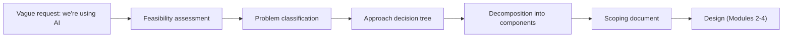

---

## 🎯 Learning Objectives

By the end of this module you should be able to:

- [ ] Explain the difference between an AI **model** and an AI **system**, and name the four properties that make AI systems architecturally different from ordinary software.
- [ ] Define the AI Architect role and distinguish it from ML Engineer, Data Scientist, and Solutions Architect.
- [ ] Name and explain the four responsibilities: Feasibility, Design, Governance, Communication.
- [ ] Compare the three deployment paradigms: API-first proprietary, self-hosted open-weight, fine-tuned specialist.
- [ ] Describe the four model tiers and why reasoning mode is "a dial, not a fifth tier."
- [ ] Identify the four domains where classical ML beats an LLM.
- [ ] Explain the architectural risks introduced by agents.
- [ ] Use the Capability / Cost / Control triangle to make trade-offs explicit.
- [ ] Run a feasibility assessment across five dimensions and recognise four red flags.
- [ ] Classify a problem (generative vs discriminative, retrieval vs reasoning, automation level) and walk the prompt → RAG → fine-tune → classical ML decision tree.
- [ ] Write a six-section scoping document and decompose a business request into components.
- [ ] Recognise the five scoping anti-patterns early.

---

## 📘 Detailed Notes

The module's core teaching, organised into twelve parts: foundations (Parts 1–6), the scoping discipline (Parts 7–9), worked case studies (Parts 10–11) and failure modes (Part 12).

### 🧩 Part 1: A Model Is Not a System

#### 🧠 Concept

When leadership says "we're using AI," they usually mean they have access to a **model**. What they do not yet have is a **system**. A model is one component. A system is everything around it that makes the model safe, reliable, affordable, and explainable in production.

> 💡 **Memory Trick: the chef and the restaurant.** Hire a Michelin-star chef and put them in a kitchen with no fridge, no prep team, no health inspector, and no menu. The chef is great; the restaurant still fails. **The model is the chef. The system is the restaurant. The AI Architect designs the restaurant.**

#### ⚙️ What "the system" includes

```text
                    ┌───────────────────────────────┐
   Data pipeline ──▶│                               │
                    │            MODEL              │──▶ Validation layer ──▶ User
                    │   (one component, not the     │          │
                    │        whole product)         │          ▼
                    └───────────────┬───────────────┘      Fallback path
                                    │                       (model WILL be wrong)
                                    ▼
                  Monitoring (drift)   +   Audit trail (what happened and why)
```

| System element | Question it answers |
|---|---|
| Data pipeline | What feeds the model, and is it fresh and correct? |
| Validation layer | Is this output acceptable before a user sees it? |
| Fallback | What happens when the model is wrong or unavailable? |
| Monitoring | Is behaviour drifting over time? |
| Audit trail | Can we explain to a regulator what happened and why? |

#### 🔍 Why AI systems are architecturally different

| # | Property | Ordinary software | AI component | Architectural consequence |
|---|---|---|---|---|
| 1 | **Outputs are probabilistic** | Payment API returns a transaction ID | Returns "probably correct" | Validation layers, confidence checks, graceful fallbacks |
| 2 | **Failure is soft and invisible** | Bugs crash (visibly) | Confidently wrong, consistently, silently ("quiet hallucination") | Output monitoring, evaluation, human review where stakes are high |
| 3 | **Cost scales non-linearly** | Predictable per-request cost | Token bills explode with success (1,000 → 100,000 users) | Plan for success, not just launch (deep dive in Module 7) |
| 4 | **Governance isn't optional** | Logic is inspectable | "The model decided" is not an explanation | Explainability and audit trails designed in from day one |

#### 💻 Code Example: a minimal validation layer around an LLM call

The lecture warns that a downstream component expecting clean JSON from an LLM "is a production incident waiting to be written." This sketch shows the missing system around a single LLM call. *(Reconstructed illustration; not from the transcript.)*

```python
import json
from dataclasses import dataclass

ALLOWED_INTENTS = {"order_status", "return_policy", "product_availability"}

@dataclass
class Result:
    ok: bool
    data: dict | None
    reason: str

def validate_llm_output(raw_text: str) -> Result:
    """Treat model output as untrusted input: parse, check schema, check values."""
    try:
        data = json.loads(raw_text)
    except json.JSONDecodeError:
        return Result(False, None, "not_json")          # model returned prose

    if not isinstance(data, dict) or "intent" not in data or "answer" not in data:
        return Result(False, None, "missing_fields")

    if data["intent"] not in ALLOWED_INTENTS:
        return Result(False, None, "unknown_intent")    # out-of-scope value

    return Result(True, data, "ok")

def handle(raw_text: str) -> dict:
    result = validate_llm_output(raw_text)
    if result.ok:
        return result.data
    # Fallback path: never pass garbage downstream, never crash.
    log_for_monitoring(result.reason, raw_text)
    return {"intent": "handoff_to_human", "answer": None}

def log_for_monitoring(reason: str, raw: str) -> None:
    print(f"[validation-failure] reason={reason} sample={raw[:80]!r}")
```

📝 **What it does:** parses the model's text, checks required fields and allowed values, and on any failure routes to a human instead of crashing or passing garbage on.

🔑 **Key lines:** `json.loads` guards against prose; the `ALLOWED_INTENTS` check stops out-of-range values; `log_for_monitoring` feeds drift detection.

⚠️ **Edge cases:** partial JSON, extra fields, correct schema but wrong content (validation catches form, not truth, which is why monitoring and evaluation are still needed).

#### ❌ Common Mistakes

- Treating the model as the product ("we have GPT, so we have a solution").
- Assuming the model won't return anything unexpected.
- Estimating cost at pilot scale only.

#### 🎯 Key Takeaways

- A model is a component; a system is the data pipeline, validation, fallback, monitoring, and audit trail around it.
- Four differences: probabilistic outputs, silent failure, non-linear cost, mandatory governance.
- The architect's reflex question: **"Great. What's the system around it?"**

---

### 👷 Part 2: The AI Architect Role

#### 📖 Definition

> The **AI Architect** owns the space between the model and the production system: how everything connects, how it fails without taking the product down, how it stays within budget, and how it can be explained to a regulator or sponsor.

#### 🔍 Contrast with adjacent roles

| Role | Focus | Where their scope ends |
|---|---|---|
| **ML Engineer** | Builds and trains models: data, loss functions, training pipelines, model metrics | Roughly where the model ends |
| **Data Scientist** | Explores data; models as analytical instruments for insight | Not the long-running production system |
| **Solutions Architect** | Designs systems (closest to this role) | Assumes deterministic components; patterns don't transfer cleanly to probabilistic, third-party, silently-changing models |
| **AI Architect** | The system around the model: integration, validation, fallback, cost, governance, explanation | End-to-end production behaviour |

#### ⚙️ The four responsibilities (the course's structural spine)

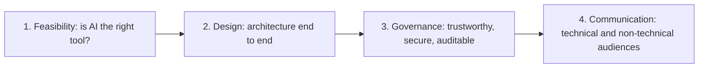

| Responsibility | Core question | Course coverage |
|---|---|---|
| **Feasibility** | Is AI the *right* tool here, and do the conditions for success exist? (Not "*can* we use AI" — you almost always can.) | Lesson 3 of this module |
| **Design** | Patterns, component connections, validation and fallback placement, data flow, graceful degradation | Modules 2, 3, 4 |
| **Governance** | Trust, security, auditability, compliance — designed in from day one, because retrofitting usually fails structurally | Module 5 |
| **Communication** | Can you brief a CFO on the investment and satisfy a compliance officer on failure modes? "A diagram without a narrative is just a pretty picture." | Throughout |

> 📌 **Remember:** **F-D-G-C** — "**F**irst **D**esign **G**ood **C**onversations." Feasibility before design, governance inside design, communication to close.

#### 🔄 Why the role exists now

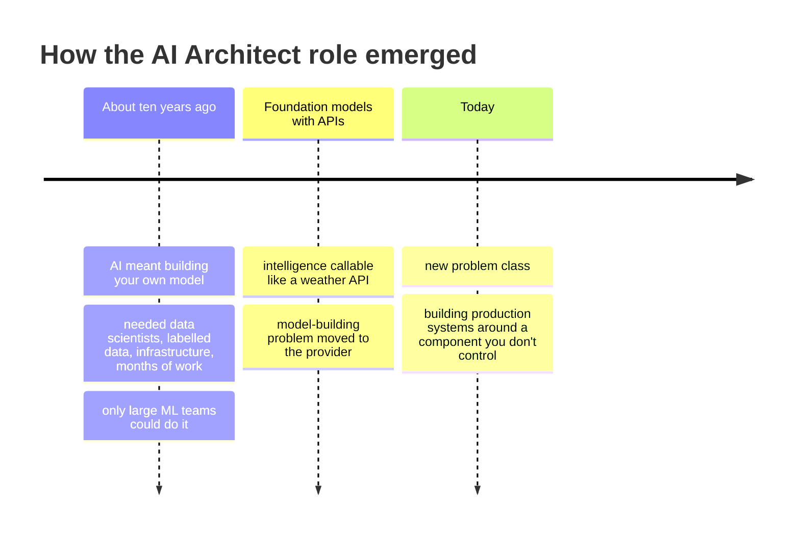

The new problem class: how do you build a production system around a component that

- you don't control,
- returns probabilistic outputs,
- costs money in proportion to usage you can't fully predict,
- can be silently updated by a third party without a changelog,
- carries legal, ethical, and regulatory implications compliance teams are still learning?

**That gap is where the AI Architect lives.** The architect doesn't build the model; they build the system that makes the model worth having in production — integrated, reliable, safe, explainable, and not secretly bankrupting you on tokens.

#### 🎯 Key Takeaways

- The AI Architect owns the seams between model and product.
- Four responsibilities: Feasibility, Design, Governance, Communication.
- The role exists because foundation-model APIs moved model-building elsewhere and created a new integration problem.

---

### 🌐 Part 3: The Modern AI Capability Landscape

#### 🧠 Concept

Your job isn't to know every model; it's to know **which paradigm** a model falls into and **what each costs you architecturally**. Which specific model leads at any moment "is worth about five minutes of your attention."

#### ⚙️ What architects need to know about foundation models

No transformer maths required — you need the **capability profile**:

| Property | What it means | Architectural consequence |
|---|---|---|
| **General-purpose** | One model can code, summarise, classify, answer questions without retraining | You integrate far more capability than you need → security, cost-control, and governance surface area |
| **Large and expensive** | Every inference costs money (per token or GPU time) | Economics unlike a normal service call; matters at real production scale |
| **Non-deterministic** | Same input → slightly different output (sampling from a token probability distribution) | Downstream code must tolerate variation (see the validation example in Part 1) |

#### 🏛 The three deployment paradigms

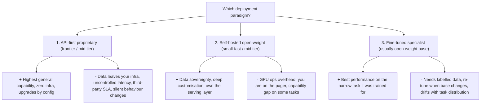

| Dimension | API-first proprietary | Self-hosted open-weight | Fine-tuned specialist |
|---|---|---|---|
| Typical tiers | Frontier, mid | Small/fast, mid | Built on a base (usually open-weight) |
| Capability | Highest on general and complex tasks | Closing the gap; competitive on *many* (not all) tasks | Highest on its specific trained task |
| Time to start | An afternoon | Weeks (infra) | Weeks to months (data + training) |
| Data residency | Leaves your infrastructure every call | Stays in your infrastructure | Depends on base / hosting |
| Latency control | None | Full | Depends on hosting |
| Ops burden | Minimal | High — you run serving, versioning, scaling, monitoring | High — plus annotation and retraining |
| Change risk | Provider can change behaviour without a changelog | You control versions | Base changes force re-tuning |
| Typical driver | Speed, capability | Regulation, sovereignty (often a legal *requirement*) | Consistent narrow-task behaviour |

> ⚠️ **Warning — the fine-tuning trap:** teams fine-tune when the real problem is a poorly designed prompt that nobody wants to admit is poor. Fine-tuning is sometimes right; it is not a shortcut.

> 📌 In regulated industries (financial services, healthcare, anything with personal data), "data leaves your infrastructure" is often a **hard blocker**, not a preference — sovereignty requirements frequently arrive from legal before the first design meeting.

#### 📊 The model tier framework (from the lesson resources)

| Tier | Strength | Weakness | Right for |
|---|---|---|---|
| **Frontier / flagship** | Highest capability ceiling, incl. ambiguous and novel tasks | Highest cost per token; highest latency with reasoning on | The hardest ~10–20% of requests: complex multi-step reasoning, high-stakes judgement |
| **Mid / balanced** | Meaningful step down at a fraction of cost and latency; often beats frontier models from 12–18 months earlier | Lower ceiling | The bulk of production traffic |
| **Small / fast** | Latency and cost first; often distilled from larger models | Narrower capability | Routing targets, classification, extraction, high-volume narrow tasks |
| **On-device / local** | No network round-trip, no data leaves the device, works offline, zero marginal inference cost | Lowest ceiling of the four | Edge, offline, privacy-critical, very high volume |

> 💡 **"Yesterday's frontier becomes today's mid tier"** faster than most cost models assume. Don't let a memorised price anchor a cost model you'll re-run in six months.

##### 🎚 Reasoning mode is a dial, not a fifth tier

Extended-reasoning / inference-time-compute modes can be applied to calls on frontier and mid-tier models. They **multiply both cost and latency** relative to a standard call. The resource sheet cites a commonly quoted **2–10x** range, with **3–5x** as an everyday planning assumption — re-verify against current pricing before committing a number to a client.

```text
 Capability ▲
            │   Frontier ●──────▶ Frontier + reasoning  (×2–10 cost & latency)
            │   Mid      ●──────▶ Mid + reasoning
            │   Small    ●
            │   On-device●
            └────────────────────────────────────────▶ Cost / latency
```

##### 📅 Snapshot examples (dated)

> ⚠️ The resource sheet's snapshot is dated **2026-07-18**. This guide was written on **2026-09-24**, so the snapshot is already over two months old. Its own instructions say to re-verify before using it as a talking point. Reproduced here as the course listed it:

| Tier | Examples listed in the course resource (as of 2026-07-18) |
|---|---|
| Frontier | Claude Opus 4.8, GPT-5.5, Gemini 3.1 Pro — roughly $2–5 / M input and $12–30 / M output tokens; reasoning available as a setting |
| Mid | Claude Sonnet line (~$3 / $15; a newer release with introductory pricing near $2 / $10) |
| Small / fast | Qwen 3.5, DeepSeek-V4 (open-weight, competitive with proprietary mid-tier on coding and reasoning benchmarks) |
| On-device | Gemma 4 (sub-1 GB quantised variants), Phi-4-mini (4-bit quantisation for edge) |

**Durable lesson:** learn the *tiers*, not the *names*. Cost per unit of capability keeps falling year over year.

#### ❌ Common Mistakes

- Choosing a paradigm by what the team experimented with last quarter.
- Picking the most impressive option instead of the best-fit option.
- Assuming open-weight parity on *all* tasks because it holds on many.

#### 🎯 Key Takeaways

- Three paradigms: API-first proprietary, self-hosted open-weight, fine-tuned specialist — each with a capability, cost, and constraint profile.
- Four tiers: frontier, mid, small/fast, on-device. Reasoning is a cost/latency multiplier on top.
- Model names go stale; paradigms and tiers don't.

---

### 🔨 Part 4: Classical ML and the Hammer Problem

#### 🧠 Concept

> **The hammer problem:** when your team just got a frontier-model API key, every problem looks like a prompt-engineering problem.

A clear sign an AI Architect is in the room: someone asks **"should we actually be using an LLM here?"** before design starts. Classical ML (gradient-boosted trees, random forests, logistic regression, time-series models) is the most underused tool in the stack — not because it lacks capability, but because it isn't new or exciting.

#### 🔍 The four domains where classical ML wins

| Domain | Examples | Why classical ML wins |
|---|---|---|
| **Tabular data** | Transaction records, customer attributes, sensor readings | Well-tuned gradient-boosted models beat LLMs on accuracy, latency, and cost; transformers weren't built for tabular data |
| **Time series** | Demand forecasting, failure prediction, sequential anomaly detection | Purpose-built statistical and neural forecasters beat prompted LLMs, faster and cheaper |
| **Well-bounded classification** | Fixed-label intent detection, domain sentiment, document routing | Faster, cheaper, more predictable; gives **calibrated probabilities** for confidence thresholds ("a generative model gives you words") |
| **Low-latency edge inference** | Phones, embedded controllers, network-edge sensors | Small quantised models fit; a frontier LLM on the edge is not a real option |

> 🚀 **Best Practice:** if someone proposes an LLM for a tabular classification problem, ask them to benchmark it against a gradient-boosted model first. "It's usually a short conversation."

#### 💻 Code Example: the benchmark conversation

*(Reconstructed illustration.)* A gradient-boosted baseline on tabular data takes minutes to build and gives you a latency and accuracy bar any LLM proposal must clear.

```python
import time
from sklearn.datasets import make_classification
from sklearn.ensemble import HistGradientBoostingClassifier
from sklearn.model_selection import train_test_split
from sklearn.metrics import roc_auc_score

# Synthetic stand-in for tabular features (amount, merchant category, hour, velocity, ...)
X, y = make_classification(n_samples=50_000, n_features=20, weights=[0.98], random_state=0)
X_tr, X_te, y_tr, y_te = train_test_split(X, y, stratify=y, random_state=0)

model = HistGradientBoostingClassifier(max_iter=300).fit(X_tr, y_tr)

start = time.perf_counter()
proba = model.predict_proba(X_te)[:, 1]          # calibrated-ish scores, not words
elapsed_ms = (time.perf_counter() - start) * 1000 / len(X_te)

print(f"ROC-AUC: {roc_auc_score(y_te, proba):.3f}")
print(f"Latency per row: {elapsed_ms:.4f} ms")    # compare to hundreds of ms per LLM call
```

📝 **What it shows:** a probability per row (usable for thresholds) at sub-millisecond per-row latency. Any LLM alternative now has a concrete bar to beat on accuracy, latency, and cost.

#### 🎯 Key Takeaways

- Tabular, time series, bounded classification, and edge inference are classical ML's home turf.
- Classical models give calibrated probabilities that feed confidence thresholds.
- Benchmark before you prompt.

---

### 🤖 Part 5: The Agent Paradigm

#### 📖 Definition

> An **agent** is an AI system that can **take actions**, not just generate text.

#### 🔄 Standard integration vs agent integration

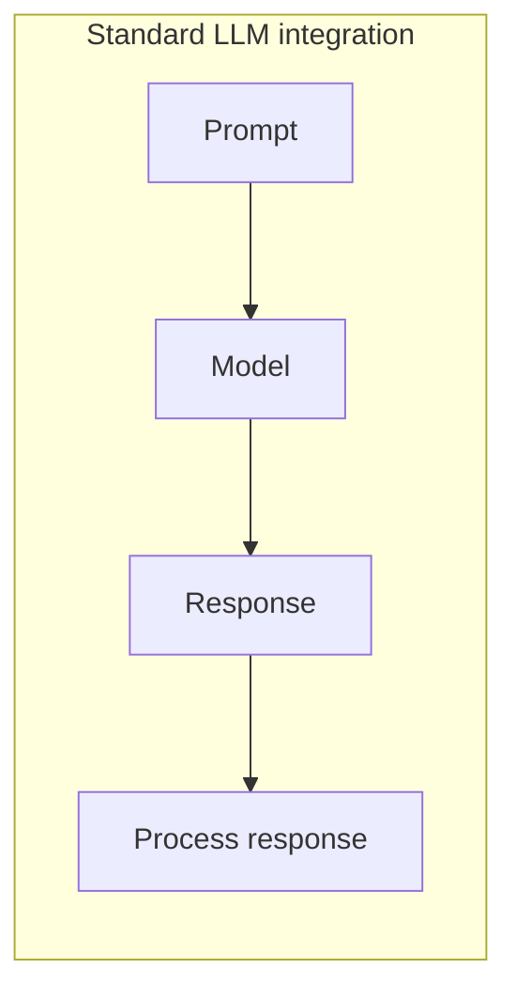

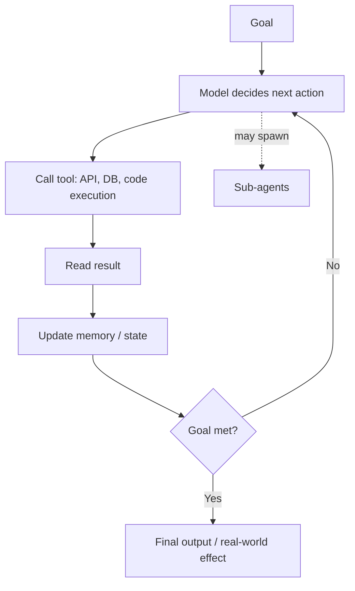

| Aspect | Standard integration | Agent integration |
|---|---|---|
| Turns | Single | Loops |
| State | Stateless | Memory across turns |
| Scope | Predictable | Decided at runtime |
| Side effects | None (returns text) | Real-world actions via tools |
| Reasoning about it | Easy | Hard |

#### ⚠️ The four architectural risks agents introduce

| Risk | Why it matters |
|---|---|
| **Non-deterministic action sequences in systems that must be auditable** | The tension doesn't resolve itself — design for it |
| **Prompt injection with real blast radius** | The model calls your APIs, so injected instructions can trigger real actions |
| **Retry and loop problems** | Agents get stuck in cycles or call expensive tools redundantly |
| **Runtime scope creep** | A loosely specified goal yields actions that are technically in scope but not intended |

> 🚀 **The principle:** none of these are reasons to avoid agents. They are reasons to **design the constraints before you design the capabilities.** (Deep dive: Module 2.)

#### 💻 Code Example: constraints first

*(Reconstructed illustration of "constraints before capabilities.")*

```python
MAX_STEPS = 8
ALLOWED_TOOLS = {"lookup_order", "search_kb"}      # read-only by design
MAX_CALLS_PER_TOOL = 3

def run_agent(goal, model, tools, audit_log):
    calls = {}
    for step in range(MAX_STEPS):                         # loop bound
        action = model.next_action(goal, audit_log)
        audit_log.append({"step": step, "action": action})  # auditable trace
        if action.kind == "finish":
            return action.output
        if action.tool not in ALLOWED_TOOLS:              # scope boundary
            return escalate("tool_not_allowed", audit_log)
        calls[action.tool] = calls.get(action.tool, 0) + 1
        if calls[action.tool] > MAX_CALLS_PER_TOOL:       # redundancy / cost guard
            return escalate("tool_call_budget_exceeded", audit_log)
        result = tools[action.tool](**action.args)
        audit_log.append({"step": step, "result_summary": str(result)[:200]})
    return escalate("max_steps_reached", audit_log)

def escalate(reason, audit_log):
    audit_log.append({"escalated": reason})
    return {"status": "handoff_to_human", "reason": reason}
```

🔑 **Key lines:** `MAX_STEPS` stops infinite loops; `ALLOWED_TOOLS` (read-only) limits blast radius from prompt injection; per-tool budgets stop redundant expensive calls; every step is logged for audit.

#### 🎯 Key Takeaways

- Agents act; that turns prompt injection, loops, and scope creep into production risks.
- Auditable systems + non-deterministic action sequences = a tension you must design for.
- Constraints first, capabilities second.

---

### 🔺 Part 6: The Capability Cost Control Framework

#### 🧠 Concept

Three axes for positioning any AI approach. You **can't maximise all three** — there is no free position on the triangle. The architect's job is to pick the right position for the problem and make the trade-off **explicit, so it's a decision, not an accident.**

```text
                         CAPABILITY
                             ▲
                            / \
          API frontier  ●  /   \
         (high capability,/     \
          low control)   /       \
                        /         \
                       /  Fine-    \
                      /   tuned ●   \   (shaped behaviour on
                     /               \   someone else's base)
                    /                 \
      COST  ◀──────●───────────────────●──────▶  CONTROL
     (cheapest) Classical ML     Self-hosted open-weight
                (narrow range)   (full control, ops overhead)
```

| Approach | Capability | Cost | Control |
|---|---|---|---|
| API proprietary | Highest on general / complex tasks | Variable, scales with usage (predictable until an unplanned spike) | Least — third-party service that can change |
| Self-hosted open-weight | Good, gap closing | Fixed infra cost, variable utilisation | Most — inspect, constrain, modify, fine-tune |
| Fine-tuned | Highest on its trained task | Training + maintenance | Middle — you shaped it, on someone else's base |
| Classical ML | Highest in its domains | Typically cheapest at scale | High, but needs task-specific data |

#### ⚖️ The unavoidable trade-offs

| You choose | You gain | You pay |
|---|---|---|
| High capability via API | Best general performance, fast start | Control, per-call cost |
| Full sovereignty via self-hosting | Data control, customisation | Operational overhead, infra risk |
| Classical ML for cost | Cheap, fast, predictable | Narrow capability, need labelled data |

#### 🎯 Key Takeaways

- Capability, Cost, Control: pick two-ish, and say which one you're giving up.
- The framework forces a trade-off conversation *before* anyone draws a diagram.

---

### 🔬 Part 7: AI Feasibility Assessment

#### 🧠 Concept

The feasibility assessment is **the discipline of asking the hard questions before design starts.** Done well, it's an afternoon of structured thinking plus a few honest conversations. Skipping it costs weeks — and your credibility.

> ⚠️ **The failure pattern:** a stakeholder with a problem + someone back from a conference + 45 minutes = a Confluence page titled "AI Initiative" with a delivery date. Nobody asked whether AI was the right answer.

#### ⚙️ The five dimensions

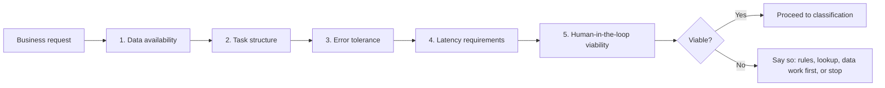

| # | Dimension | Core question | Probe deeper with | What it shapes |
|---|---|---|---|---|
| 1 | **Data availability** | Does the data exist, can you access it, is it usable? | Who owns it? What shape? Legal sign-off needed? Time to make usable? (e.g. "seven systems, no schema, not cleaned since 2019") | Delivery estimate |
| 2 | **Task structure** | Can you specify what success looks like? | Clear input? Bounded output? Can you write a rubric for a human reviewer? | Evaluability — no rubric → no eval → can't know it works |
| 3 | **Error tolerance** | What happens when the AI is wrong? | Annoying (search), harmful (medical triage), or audit-triggering (compliance)? | Validation layer, HITL, audit trail, fallback |
| 4 | **Latency** | Does the use case tolerate inference latency? | LLM: ~hundreds of ms short, seconds long, tens of seconds for agent loops. Need < 100 ms? | Model size, or whether generative AI fits at all. **Design for P95, not median.** |
| 5 | **Human-in-the-loop viability** | Can a human be inserted where needed? | Natural review points (drafts, recommendations) vs real-time automated decisions; volume vs reviewer capacity | Automation level |

> 📌 **Rule of thumb:** high error tolerance → can automate. Low error tolerance → usually needs a human checkpoint — *if* latency, volume, and capacity allow one.

#### 🚩 The four red flags (AI is not the answer)

| Red flag | Why | What to do instead |
|---|---|---|
| **Deterministic problem** | Same input always gives the same computable answer | Use a rule or lookup — AI adds cost, latency, unpredictability without value |
| **Data doesn't exist** | Can't RAG over an unwritten knowledge base or fine-tune on unlabelled data | Do the data work first; don't promise the system |
| **Error tolerance is truly zero** | HITL reduces risk but doesn't eliminate it | Say AI isn't the answer |
| **Regulatory prohibition** | Some jurisdictions exclude AI from certain decisions | Know the landscape before designing |

> 💡 **Memory aid — "DDZR":** **D**eterministic, **D**ata missing, **Z**ero tolerance, **R**egulated out.

#### 🪜 Running it as a workflow

```text
Request lands
   ↓
Check red flags (DDZR) ──────▶ any hit? → stop / redirect
   ↓
Score 5 dimensions (data, structure, errors, latency, HITL)
   ↓
Record unknowns (they go straight into the scoping doc)
   ↓
Go / no-go / "go after X is resolved"
```

> 🚀 Feasibility is **not a gate to block AI projects**; it makes sure the ones that proceed can succeed — and that you can defend them to a sponsor, a compliance officer, and yourself at 2 a.m.

#### 🎯 Key Takeaways

- Five dimensions: data, task structure, error tolerance, latency, HITL viability.
- Four red flags: deterministic, no data, zero tolerance, regulatory prohibition.
- No rubric → no evaluation → no way to know it works.
- Design for P95 latency.

---

### 🌳 Part 8: Problem Classification and the Approach Decision Tree

#### 🧠 Concept

"Use AI" is not a design decision; it's the start of one. Once a problem is feasible, classify it to decide **which kind** of AI.

#### 🔍 Axis 1: Generative vs discriminative

| | Discriminative | Generative |
|---|---|---|
| Does | Maps input → category / score | Produces new content |
| Examples | Spam or not? Customer intent? Fraudulent? | Summarise, answer, draft a complaint response |
| Output space | Bounded | Open-ended |
| Typical fit | Fine-tuned classifier / classical ML — faster, cheaper, more predictable (*only if* the output space is truly bounded) | Foundation model |

#### 🔍 Axis 2: Retrieval vs reasoning

| | Retrieval | Reasoning |
|---|---|---|
| Intelligence lies in | Locating and surfacing existing information | Inferring, synthesising, computing what isn't stated |
| Examples | Return policy lookup, KB answers | Loan risk assessment; contract clause vs regulation; novel responses |
| Pattern | RAG | Higher model-capability demands |

Many tasks **combine** both: retrieve, then reason. Separate the parts so each component is designed appropriately.

#### 🔍 Axis 3: The automation spectrum

```text
 Fully automated ───────────── Human-on-the-loop ───────────── Human-in-the-loop
 (AI acts, no review)          (AI acts; humans monitor         (AI drafts/recommends;
 high tolerance, low stakes     aggregates and intervene)        human approves first)
                                high volume, low per-item        regulated / high-stakes
                                stakes, needs good monitoring    — most common there
```

> ⚠️ Placing the use case on this spectrum **before** designing prevents building a fully automated system for a task that legally or operationally requires human review — a mistake made regularly.

#### 🔄 The approach decision tree

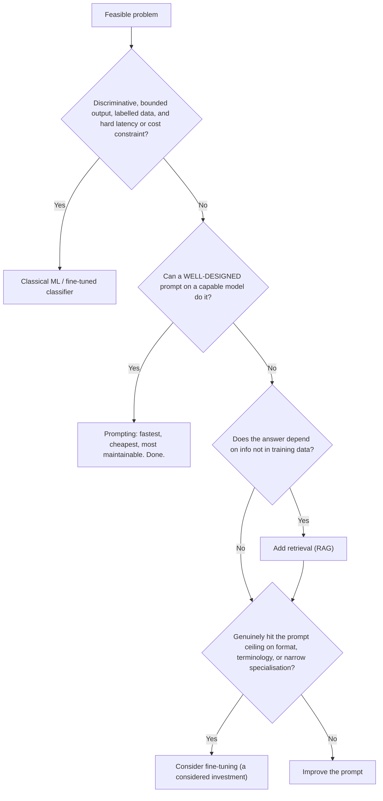

| Step | Test | Notes |
|---|---|---|
| **Prompt** | Try a genuinely well-designed system prompt with representative examples, not a throwaway | "You don't get points for complexity." |
| **RAG** | Does the answer depend on information not in training data (proprietary, recent, internal)? | Handles most enterprise knowledge-assistant cases |
| **Fine-tune** | Consistent behaviour prompting reliably can't achieve: format, terminology, narrow specialisation | Ceiling test: have you *actually* hit it, or does fine-tuning just feel easier? Costs labelling, compute, maintenance |
| **Classical ML** | Discriminative + bounded + labelled + latency/cost constraint | A GBM on good tabular features beats a prompted LLM "nine times out of ten" at a fraction of cost |

> 📎 **Beyond the transcript:** the lecture presents classical ML as "go back to it before going further with LLMs." In practice, many architects check the classical-ML condition *first* for discriminative tasks, which is how the diagram above orders it. Both orderings reach the same answer.

#### 🎯 Key Takeaways

- Three classification lenses: generative/discriminative, retrieval/reasoning, automation level.
- Decision tree: prompt → RAG → fine-tune, with classical ML for bounded, labelled, latency/cost-sensitive tasks.
- The frameworks prevent both over-engineering and under-engineering.

---

### 📋 Part 9: The AI System Scoping Document

#### 🧠 Concept

Without a scoping document you have a conversation — and conversations mean different things to different people afterwards. The scoping document closes the gap between **"we discussed this"** and **"we agreed on this,"** for three audiences: the business sponsor, the build team, and compliance.

#### 📋 The six sections

| # | Section | Answers | Test of quality |
|---|---|---|---|
| 1 | **Problem statement** | What business outcome? (1–2 paragraphs) | Specific, measurable, tied to a metric leadership cares about. "We want to use AI" is a solution looking for a problem |
| 2 | **AI approach category** | RAG? Fine-tuned classifier? Prompt pipeline? Agent? Combination? + one-line rationale | Lets you check later whether "can it also do X?" is the same category or a new architecture |
| 3 | **System boundary** | What the AI owns, what it explicitly doesn't, upstream inputs, downstream consumers | Without it, scope drifts toward the AI component because "AI can do everything" |
| 4 | **Success metrics** | Business metrics (not test-set accuracy) with thresholds | "Better than before" ✗ → "Escalation rate below 25% within 60 days of launch" ✓ |
| 5 | **Key unknowns** | What must be resolved before design proceeds | A doc with no unknowns usually means nobody asked hard questions |
| 6 | **Stakeholder summary** | One paragraph for a non-technical exec, readable in 90 seconds | No jargon; problem, approach, ask, how we'll know it worked |

#### 💻 Template

*(Reconstructed template following the six sections.)*

```markdown
# AI System Scoping Document: <System name>

## 1. Problem Statement
<Business outcome in 1-2 paragraphs. Volumes, current cost/pain, target metric.>

## 2. AI Approach Category
<e.g. Fine-tuned classifier + RAG + prompted generation.> Rationale: <one line>.

## 3. System Boundary
- Responsible for: ...
- Explicitly NOT responsible for: ...
- Upstream inputs: ...
- Downstream consumers: ...

## 4. Success Metrics
| Metric | Target | Timeframe | Measured by |
|---|---|---|---|

## 5. Key Unknowns
| Unknown | Why it matters | Owner | Resolve by |
|---|---|---|---|

## 6. Stakeholder Summary (90-second read)
<Problem, approach, what we're asking you to approve, how we'll know it worked.>
```

#### 🔍 Decomposition: where real architecture begins

Most business requests aren't atomic. "AI-powered customer service" is really:

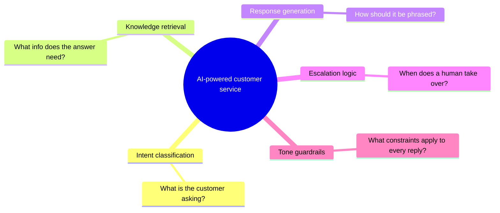

Each component has its own design considerations, failure modes, and evaluation strategy. Treating them as one thing gives "architecture diagrams that look clean and systems that fail in complex, hard-to-diagnose ways." Decomposition often reveals that one "system" is really three — one of which is deterministic and needs no AI.

#### 🎯 Key Takeaways

- Six sections: problem, approach, boundary, metrics, unknowns, exec summary.
- Unknowns signal rigour, not incompleteness.
- Decompose before you design.

---

### 🛒 Part 10: Customer Service Case Study

> Fictional composite; volumes and targets are illustrative. **Brief, verbatim:** "AI-powered customer service."

#### 1️⃣ Problem statement

- ~**15,000** contacts/week.
- **60%** routine (order status, return policy, product availability) → **9,000/week**.
- Handled by human agents at significant cost; agents find them low-value and repetitive.
- **Goal:** resolve routine inquiries automatically, freeing agents for complex contacts.

#### 2️⃣ Decomposition into five components

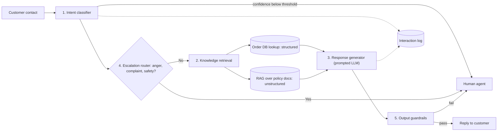

| # | Component | Task type | Approach | Key design point |
|---|---|---|---|---|
| 1 | **Intent classification** | Discriminative, ~20–30 intents | Fine-tuned smaller model on historical contacts | Needs a **confidence-threshold escape hatch**: a fixed-set classifier always returns *some* intent, even for messages that fit none |
| 2 | **Knowledge retrieval** | Retrieval | **Database lookup** for structured (order status, stock) + **RAG** for unstructured (return policy) | Two different components with different designs |
| 3 | **Response generation** | Generative | Capable foundation model, prompted with retrieved context + customer message | Strong system prompt for tone, brand, format; fine-tune only if style can't be prompted |
| 4 | **Escalation logic** | Routing / classification | Classifier on message + conversation so far | Explicit criteria (anger, significant complaint, safety), handoff design, context passed to the agent |
| 5 | **Tone / brand guardrails** | Output checks | Separate post-generation layer | No unkeepable promises, no competitor talk, no legal liability — don't just "bake into the prompt and hope" |

> 🔍 **Two different escalation triggers:**
> - **Uncertainty-driven** (component 1): the *model* isn't confident → "none of the above" → human.
> - **Emotion / risk-driven** (component 4): the *customer* is angry, or the topic is high-risk → human.

#### 💻 Code Example: the classifier's escape hatch

*(Reconstructed illustration.)*

```python
CONFIDENCE_THRESHOLD = 0.70   # tune on held-out data; this value is illustrative

def route_intent(message: str, classifier) -> str:
    probs = classifier.predict_proba(message)       # {"order_status": 0.62, "return_request": 0.21, ...}
    intent, confidence = max(probs.items(), key=lambda kv: kv[1])
    if confidence < CONFIDENCE_THRESHOLD:
        return "none_of_the_above"                  # out-of-scope → human, not a confident wrong answer
    return intent
```

This is exactly why calibrated probabilities (Part 4) matter: the threshold is only meaningful if scores reflect real likelihood.

#### 3️⃣ System boundary

| ✅ Responsible for | ❌ Not responsible for |
|---|---|
| Receiving contacts | The order management system |
| Classifying intent | The returns processing system |
| Retrieving from KB and OMS | Payment handling |
| Generating responses for in-scope intents | **Any transaction that modifies customer data** |
| Escalating out-of-scope / high-risk contacts | |
| Logging every interaction with full context | |

> 📌 **The AI system is a resolution layer. It answers questions; it does not take actions in backend systems.** That boundary matters for security, liability, and simplicity.

#### 4️⃣ Success metrics

| Metric | Target | Note |
|---|---|---|
| **Containment rate** (handled end to end without reaching a human) | 60% within 90 days | *Contained ≠ resolved.* A bot can dodge escalation with a vague non-answer |
| **CSAT on AI-handled contacts** (post-contact survey) | Within 5 points (on a 100-point scale) of human-handled | Sits beside containment precisely to catch non-answers |
| **Cost per contact** (automated channel) | −40% vs baseline | Ties to the sponsor's cost concern |

> 📎 **Beyond the transcript — a question worth asking:** routine contacts are 60% of volume, and containment is also targeted at 60%. If containment is measured over *all* contacts, hitting the target means containing essentially every routine contact within 90 days. Pinning down the denominator ("60% of all contacts" vs "60% of routine contacts") is exactly the kind of "two percent of what?" question the fraud case study teaches. The course's source list includes containment-vs-deflection benchmark articles (Alhena, Botpress) if you want to sanity-check the target.

#### 5️⃣ Key unknowns

| Unknown | Why it matters |
|---|---|
| Volume and distribution of historical contact data | Classifier fine-tuning and RAG both depend on it |
| Access model for the OMS API | Direct query or a dedicated integration service? |
| Regulatory position on AI in customer communications | Legal must confirm before the compliance layer is designed |
| Escalation capacity | If containment starts low, can agents absorb the overflow? |
| **Knowledge-base update path** | What re-indexes RAG when policy changes, how fast, and who owns freshness? A bot confidently quoting last quarter's return policy is worse than one that admits it doesn't know |

#### 🔍 What five components leave out

Production systems also need: conversation-state and session management, multiple languages, accessibility, and an analytics loop feeding new intents and CSAT signals back into the classifier. Stopping at five is a deliberate simplification that turns a slogan into something designable. **"Decomposition gives you not a harder problem, but a clearer one."**

#### 🎯 Key Takeaways

- One slogan → five components with separate designs and failure modes.
- Classifiers need a confidence escape hatch; escalation has two different triggers.
- Pair containment with CSAT so the bot can't "win" by dodging.
- RAG freshness is an ownership problem, not just a technical one.

---

### 💳 Part 11: Fraud Detection Case Study

> Fictional composite; numbers illustrative. **Brief:** "Can AI detect fraudulent transactions in real time?"

#### 1️⃣ Problem statement

- ~**800,000** transactions/day, retail and corporate.
- Current detection: manually maintained **rules** — catch known patterns reliably, **miss novel attack vectors**, and the rules team can't keep pace.
- **Objective:** increase detection of previously unseen fraud **without making false positives worse**.

#### 🔥 The "two percent of what?" trap

The stakeholder says "keep the false positive rate below 2%." The architect asks: **2% of what?**

| Meaning | Who uses it | Definition | At 800k/day | Reality |
|---|---|---|---|---|
| **Customer decline rate** | The business | Share of *all* transactions wrongly declined | 2% = **16,000** good customers turned away **daily** | Current rate is **1.4%** (~11,200/day) |
| **Alert false-positive ratio** | Fraud analysts | Share of *flagged* transactions that are legitimate | — | Industry average **> 90%**; best-in-class **~30–50%**. A 2% alert FP rate doesn't exist anywhere |

Same three words, two metrics, an order of magnitude apart. **Both go into scope:**
- Hold customer-facing decline rate at today's **1.4%**.
- Push alert precision toward the **best-in-class band**.

#### 2️⃣ Decomposition into six components

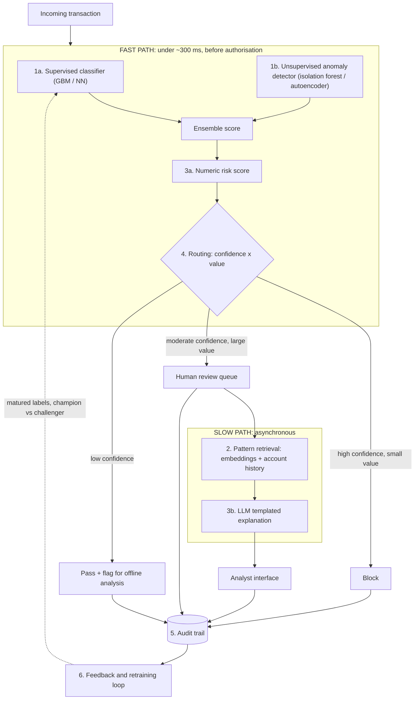

| # | Component | Approach | Why |
|---|---|---|---|
| 1 | **Transaction classification** | **Classical ML**: supervised GBM/NN **+ unsupervised anomaly detection** (isolation forest / autoencoder), ensembled | Tabular, bounded output, millisecond latency. Supervised models can't flag fraud they've never seen labelled — a *structural* limit, not a tuning problem. The unsupervised signal is how you actually deliver "previously unseen" |
| 2 | **Pattern retrieval** | Vector similarity over transaction embeddings + structured account-history lookups | Tells the analyst *why*: customer baseline, similar past anomalies, collectively suspicious session patterns |
| 3 | **Risk scoring + explanation** | Score (probability, exposure, suspected pattern) + **LLM-generated templated narrative** | The one place an LLM adds value — constrained fields the analyst UI expects, not free-form essays |
| 4 | **Human review trigger** | Threshold routing on confidence × value | Thresholds are a **business** decision but belong in scope: they drive tooling, escalation SLA, reviewer workload |
| 5 | **Audit trail** | First-class component | Regulatory requirement: what the system saw, score, explanation, analyst decision, outcome |
| 6 | **Feedback and retraining loop** | Label pipeline waits for labels to mature → scheduled retrain → champion-vs-challenger validation | Without it you've built "a snapshot that decays the moment it ships" |

#### 💻 Code Example: routing threshold model

*(Reconstructed illustration; thresholds are placeholders the business must set.)*

```python
def route(fraud_probability: float, amount: float) -> str:
    HIGH, LOW = 0.90, 0.30          # business-owned thresholds
    LARGE_AMOUNT = 5_000

    if fraud_probability >= HIGH and amount < LARGE_AMOUNT:
        return "BLOCK"                        # confident + low exposure → automate
    if fraud_probability >= LOW and amount >= LARGE_AMOUNT:
        return "HUMAN_REVIEW"                 # meaningful risk + high exposure
    if fraud_probability >= HIGH:
        return "HUMAN_REVIEW"                 # confident but large: a human confirms
    return "PASS_WITH_FLAG"                   # low confidence → offline analysis
```

> 📎 **Beyond the transcript:** the lecture gives three routing examples; the "high confidence + large amount" branch is an added assumption to make the function total. Tune thresholds against **analyst capacity** (e.g. if the system flags 5,000/day and the team handles 2,000, thresholds must move).

#### ⏱ Label latency and the retraining loop

```text
 Day 0              Day ~30             Day ~120 (card dispute window can run this long)
  │ decision made     │ some disputes      │ label finally "ripe"
  ▼                   ▼                    ▼
 [score + route] ── [chargebacks / analyst confirmations trickle in] ── [eligible for training]
```

Two consequences:
1. **Fraud patterns drift** — an un-retrained model can lose **20–40%** of its accuracy within months.
2. **You can't retrain until labels mature** — retraining runs on a delay dictated by label arrival, not a schedule you'd prefer.

*(Reconstructed illustration of label maturation.)*

```sql
-- Only train on decisions old enough that their label is unlikely to change
SELECT t.*, COALESCE(o.is_fraud, FALSE) AS label
FROM   audit_trail t
LEFT JOIN outcomes o ON o.transaction_id = t.transaction_id
WHERE  t.decided_at < CURRENT_DATE - INTERVAL '120 days';
```

#### ⚖️ Constraints that make this harder than customer service

| Constraint | Detail | Design consequence |
|---|---|---|
| **Latency** | Card authorisation window typically **< 300 ms** | Separate **fast path** (classifier + score) from **slow path** (LLM explanation, async to analyst queue) — must be in the scoping doc |
| **Error tolerance** | Both FP numbers are hard requirements; industry-wide, false positives cost more than fraud itself (~19% vs ~7% of total fraud-related cost) | Shapes model tuning, thresholds, evaluation |
| **Regulation** | AML, data retention, audit; some jurisdictions require explainability in credit/fraud decisions | Evidence retained per decision; legal review before design |

#### 🔍 Key unknowns

| Unknown | Why |
|---|---|
| Historical labelled data: volume, quality, history depth | Training and evaluation depend on it |
| Exact fast-path latency budget | Varies by payment network and merchant type |
| Regulatory position | Compliance confirms before design |
| Analyst capacity | Threshold model must fit reviewer throughput |
| **Actual label latency** | Sets retraining cadence — design for four months if that's reality, not four weeks |

#### 🎯 Key Takeaways

- "Two percent of what?" — always pin down the denominator of a metric.
- Real-time fraud = classical ML on the fast path; LLM only for async explanations.
- Supervised + unsupervised ensemble is what makes "previously unseen" achievable.
- Label latency dictates retraining cadence; the feedback loop is a designed component.
- Six components are still a simplification (shadow models, multi-source data quality, per-change regulatory review, vendor risk). **Knowing which edges to design now and which to defer with eyes open is the discipline.**

---

### 🚫 Part 12: The Five Anti-Patterns

None of these happen because teams are careless. They happen because the module's frameworks weren't applied.

| # | Anti-pattern | 🔎 The tell | 🚀 Prevention |
|---|---|---|---|
| 1 | **AI as a feature, not a system** | Architecture diagram has one "LLM" box with an arrow in and an arrow out — "that's not a system, that's a hope" | Before shipping, ask what happens when it returns something wrong. If the answer is "it won't," the design isn't finished |
| 2 | **Skipping feasibility, jumping to design** | First meeting produces a delivery date before anyone confirms the data exists | First deliverable is the feasibility assessment — ~48 hours of structured questioning |
| 3 | **Confused role ownership** | Design review covers model performance in detail, says little about unavailable / wrong / misbehaving model | Explicit AI Architect ownership of the system around the model — and explicit platform vs product ownership |
| 4 | **Scoping too broadly** | "Phase 1: Core AI Platform" with no definition | Scoping document: every component named, boundary drawn; not in the doc = not in scope. Build the highest-value feasible component first, learn, expand |
| 5 | **Success = model accuracy alone** | Eval framework is only model metrics; no business success definition | Success-metrics section written before design, covering business outcomes |

#### 🔍 Anti-pattern 1 in practice

```text
Demo works → ships → no validation, no fallback, no monitoring,
prompt is a string constant in app code → week 6: unexpected output
→ crash or garbage downstream → incident report says "AI failure"
→ real root cause: nobody designed a system.
```

#### 🔍 Anti-pattern 3, the organisational version: platform vs product

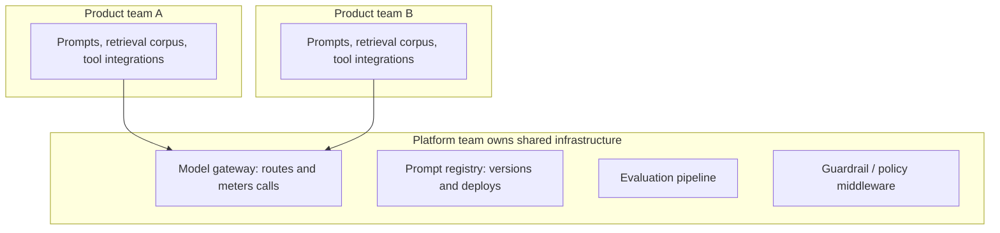

Without an explicit split: team 1 builds a gateway (none existed); team 2 builds a different one (didn't know or didn't trust the first); by system four there are **four inconsistent gateways, four prompt-versioning approaches, and four rollback answers.** None is wrong; none talk to each other.

**Fix:** name ownership **before the second system**, in writing: gateway, prompt registry, evaluation infrastructure, guardrail middleware — one accountable team each.

**AI review board:** a lightweight, cross-functional checkpoint (architecture + security + legal + AI Architect) that new systems pass before production. Not a bureaucratic gate — its job is catching "the model is excellent and nobody can tell you who owns the seams."

#### 🔍 Anti-pattern 5 in practice

| Model metric | System reality |
|---|---|
| 93% test accuracy | 40% escalation rate |
| — | 8-second average latency |
| — | 3× estimated cost per interaction |
| 7% error "on the benchmark" | The edge case a large customer hit on day two |

#### 🎯 Key Takeaways

- Each anti-pattern is prevented by a tool from this module: **feasibility before design, decomposition before scoping, explicit ownership, bounded scope, business-level success criteria.**

---

## 📚 Glossary

| Term | Definition | Why It Matters |
|---|---|---|
| AI Architect | Owns the system between model and production | Fills the gap no other role covers |
| Model vs system | Model = component; system = pipeline, validation, fallback, monitoring, audit | Core mental model of the course |
| Quiet hallucination | Confident, consistent, undetected wrong output | Why monitoring and validation are mandatory |
| Foundation model | Large general-purpose model usable without retraining | Default starting point; broad attack and cost surface |
| API-first proprietary | Model consumed via provider API, per-token pricing | High capability, low control, data leaves your infra |
| Open-weight model | Published weights you can self-host | Data sovereignty and control, with ops burden |
| Fine-tuning | Adapting a base model with your labelled data | Narrow-task performance at maintenance cost |
| Model tiers | Frontier, mid, small/fast, on-device | Match cost to request difficulty |
| Reasoning mode | Extended inference-time compute; a dial on existing tiers | Multiplies cost and latency (~2–10x) |
| Distillation | Training a smaller model to mimic a larger one | How small/fast tiers get capable |
| Quantisation | Lower-precision weights (e.g. 4-bit) | Enables on-device / edge inference |
| Classical ML | GBMs, random forests, logistic regression, time-series models | Wins on tabular, time series, bounded classification, edge |
| Calibrated probability | A score that reflects real likelihood | Makes confidence thresholds meaningful |
| Agent | AI system that takes actions via tools in a loop | New risks: injection, loops, scope creep, auditability |
| Prompt injection | Malicious instructions smuggled into model input | With agents, has real-world blast radius |
| Capability / Cost / Control | Three-axis positioning framework | Makes trade-offs explicit decisions |
| Feasibility assessment | Five-dimension check before design | Prevents building the wrong thing |
| Discriminative task | Input → category/score (bounded) | Usually classifier / classical ML |
| Generative task | Input → new content (open-ended) | Usually foundation model |
| RAG | Retrieval-Augmented Generation: fetch relevant docs, then generate | Answers from knowledge not in training data |
| Human-in-the-loop | Human approves before action | Standard in regulated / high-stakes work |
| Human-on-the-loop | AI acts; humans monitor aggregates and intervene | High volume, low per-item stakes |
| P95 latency | Latency 95% of requests beat | What users actually feel under load |
| Scoping document | Six-section agreement artefact | Converts discussion into agreement |
| System boundary | What the AI owns and explicitly doesn't | Prevents scope drift |
| Containment rate | Share of contacts handled without a human | Not the same as resolution |
| Deflection | Steering a contact away from an agent (not necessarily resolved) | Can inflate "success" without helping customers |
| CSAT | Customer satisfaction score | Guards containment against non-answers |
| Escape hatch / fallback threshold | Confidence cut-off below which output = "none of the above" | Stops confident wrong answers on out-of-scope input |
| False positive rate (decline) | Share of all transactions wrongly declined | Business view; customer impact |
| Alert false-positive ratio | Share of flagged items that are legitimate | Analyst view; typically > 90% industry-wide |
| Isolation forest / autoencoder | Unsupervised anomaly detectors | Catch novel fraud without labels |
| Label latency | Delay before ground truth arrives (e.g. up to ~120-day chargebacks) | Dictates retraining cadence |
| Model drift | Performance decay as data distribution changes | 20–40% accuracy loss within months in fraud |
| Champion vs challenger | New model validated against incumbent before replacing it | Safe model rollout |
| Fast path / slow path | Synchronous latency-critical path vs async enrichment | Keeps LLMs out of authorisation latency |
| Model gateway | Shared service routing and metering model calls | Platform-owned infrastructure |
| Prompt registry | Versioned store and deployment of prompts | Enables rollback and audit |
| AI review board | Cross-functional pre-production checkpoint | Catches ownership gaps |

---

## 📝 Revision Notes

### ⏱ One-Minute Revision

- **Model ≠ system.** The architect designs the restaurant, not the chef.
- AI differs from normal software: **probabilistic, silently wrong, non-linear cost, governance-bound.**
- Role = **Feasibility, Design, Governance, Communication.**
- Paradigms: **API proprietary / self-hosted open-weight / fine-tuned.** Tiers: **frontier / mid / small / on-device**; reasoning is a **dial**.
- Classical ML wins on **tabular, time series, bounded classification, edge.**
- Agents: **constraints before capabilities.**
- Triangle: **Capability / Cost / Control** — no free position.
- Feasibility: **data, structure, error tolerance, latency (P95), HITL.** Red flags: **deterministic, no data, zero tolerance, regulated out.**
- Decision tree: **prompt → RAG → fine-tune**; classical ML for bounded + labelled + latency/cost-bound.
- Scoping doc: **problem, approach, boundary, metrics, unknowns, exec summary.** Decompose first.
- Always ask **"X% of what?"**
- Anti-patterns: **feature not system, skip feasibility, confused ownership, scope too broad, accuracy-only success.**

---

## 📄 Cheat Sheet

### 🧭 Frameworks at a glance

| Framework | Items |
|---|---|
| 4 AI differences | Probabilistic outputs · Silent failure · Non-linear cost · Governance |
| 4 responsibilities | Feasibility · Design · Governance · Communication |
| 3 paradigms | API proprietary · Self-hosted open-weight · Fine-tuned |
| 4 tiers | Frontier · Mid · Small/fast · On-device (+ reasoning dial) |
| 4 classical-ML domains | Tabular · Time series · Bounded classification · Edge |
| 4 agent risks | Auditability vs non-determinism · Prompt injection · Loops/redundant calls · Runtime scope creep |
| 3 axes | Capability · Cost · Control |
| 5 feasibility dimensions | Data · Task structure · Error tolerance · Latency · HITL viability |
| 4 red flags | Deterministic · No data · Zero error tolerance · Regulatory prohibition |
| 3 classification lenses | Generative/discriminative · Retrieval/reasoning · Automation spectrum |
| Decision tree | Prompt → RAG → Fine-tune; classical ML when bounded + labelled + constrained |
| 6 scoping sections | Problem · Approach · Boundary · Metrics · Unknowns · Exec summary |
| 5 anti-patterns | Feature-not-system · Skip feasibility · Confused ownership · Too broad · Accuracy-only |

### 🔢 Numbers worth remembering (illustrative, from the course)

| Context | Number |
|---|---|
| Frontier tier share of requests | Hardest ~10–20% |
| Mid tier vs old frontier | Beats frontier from 12–18 months earlier |
| Reasoning multiplier | 2–10x (plan 3–5x) — re-verify |
| LLM latency | ~100s of ms short; seconds long; 10s of seconds agent loops |
| CS contacts | 15,000/week, 60% routine = 9,000 |
| CS targets | 60% containment in 90 days; CSAT within 5/100 of humans; −40% cost/contact |
| Fraud volume | 800,000 tx/day; 2% = 16,000; current decline rate 1.4% |
| Alert FP ratio | Industry > 90%; best-in-class ~30–50% |
| Card auth window | < ~300 ms |
| Chargeback window | Up to ~120 days |
| Drift | 20–40% accuracy loss within months if not retrained |
| FP vs fraud cost | ~19% vs ~7% of total fraud-related cost |

### ❓ Architect's question bank

- "What's the system around it?"
- "Should we actually be using an LLM here?"
- "Which one, and how?"
- "What happens when it's wrong?"
- "Two percent of *what*?"
- "Who owns the seams?"
- "Have we actually hit the prompt ceiling?"
- "What re-indexes the knowledge base, and how fast?"
- "How fast do labels actually arrive?"

---

## 🎤 Interview Questions and Answers

### 🟢 Beginner

❓ **Q1. What is the difference between an AI model and an AI system?**

✅ **Answer:** A model is a single component that produces predictions or content; a system is the model plus the data pipeline, validation layer, fallback, monitoring, and audit trail around it.

💡 **Explanation:** The lecture's chef/restaurant analogy: a great chef without a working kitchen still fails.

🎯 **Why Interviewers Ask This:** It tests whether you think in production systems or demos.

➡️ **Possible Follow-up:** Which system element would you build first for a customer-facing chatbot, and why?

❓ **Q2. Name four ways AI systems differ architecturally from traditional software.**

✅ **Answer:** Probabilistic outputs, soft/invisible failure, non-linear cost scaling, and mandatory governance/explainability.

💡 **Explanation:** Each drives a design element: validation, monitoring, cost planning, and audit trails respectively.

🎯 **Why Interviewers Ask This:** Checks you know *why* AI needs different patterns.

➡️ **Possible Follow-up:** Give an example of a "quiet hallucination" and how you'd detect it.

❓ **Q3. What are the four responsibilities of an AI Architect?**

✅ **Answer:** Feasibility, Design, Governance, Communication.

💡 **Explanation:** Feasibility decides if AI fits; Design specifies the system; Governance makes it trustworthy and auditable; Communication makes it legible to execs and compliance.

🎯 **Why Interviewers Ask This:** Tests role clarity.

➡️ **Possible Follow-up:** Which is most often neglected, and what does that cost?

❓ **Q4. How is an AI Architect different from an ML Engineer?**

✅ **Answer:** The ML Engineer builds and trains the model; the AI Architect owns the system around it — integration, fallback, cost, governance.

💡 **Explanation:** The ML Engineer's scope "ends roughly where the model ends."

🎯 **Why Interviewers Ask This:** Role confusion is a real anti-pattern.

➡️ **Possible Follow-up:** Who should own the evaluation pipeline?

❓ **Q5. What are the three deployment paradigms for foundation models?**

✅ **Answer:** API-first proprietary, self-hosted open-weight, and fine-tuned specialist models.

💡 **Explanation:** Each trades capability, cost, and control differently.

🎯 **Why Interviewers Ask This:** A first decision in almost every AI design.

➡️ **Possible Follow-up:** Which would you pick for a bank processing personal data, and why?

❓ **Q6. Name the four model tiers.**

✅ **Answer:** Frontier/flagship, mid/balanced, small/fast, on-device/local.

💡 **Explanation:** Capability falls and cost/latency improve down the list; on-device uniquely offers offline use and zero marginal inference cost.

🎯 **Why Interviewers Ask This:** Tier matching is the main cost lever.

➡️ **Possible Follow-up:** How would you route traffic across tiers?

❓ **Q7. Where does classical ML typically beat an LLM?**

✅ **Answer:** Tabular data, time series, well-bounded classification, and low-latency edge inference.

💡 **Explanation:** Better accuracy, latency, and cost in those domains, plus calibrated probabilities.

🎯 **Why Interviewers Ask This:** Tests resistance to the "hammer problem."

➡️ **Possible Follow-up:** How would you prove it to a team keen on an LLM?

❓ **Q8. What is an AI agent?**

✅ **Answer:** An AI system that takes actions via tools in a loop, possibly with memory and sub-agents, rather than only returning text.

💡 **Explanation:** Actions create real-world consequences, so risks change.

🎯 **Why Interviewers Ask This:** Agents are a common and risky design choice.

➡️ **Possible Follow-up:** Name two risks agents introduce.

❓ **Q9. What is the difference between generative and discriminative tasks?**

✅ **Answer:** Discriminative tasks map input to a bounded category or score; generative tasks produce new, open-ended content.

💡 **Explanation:** They differ in evaluation, failure modes, and model choice.

🎯 **Why Interviewers Ask This:** Classification drives approach selection.

➡️ **Possible Follow-up:** Is intent detection generative or discriminative?

❓ **Q10. What are the six sections of an AI scoping document?**

✅ **Answer:** Problem statement, AI approach category, system boundary, success metrics, key unknowns, stakeholder communication summary.

💡 **Explanation:** Together they turn a discussion into an agreement.

🎯 **Why Interviewers Ask This:** Tests delivery discipline.

➡️ **Possible Follow-up:** Which section is most often missing?

### 🟡 Intermediate

❓ **Q11. Walk through the five feasibility dimensions.**

✅ **Answer:** Data availability, task structure, error tolerance, latency requirements, human-in-the-loop viability.

💡 **Explanation:** Each answers whether the conditions for AI to succeed exist and shapes later design (e.g. error tolerance → validation and HITL).

🎯 **Why Interviewers Ask This:** Feasibility is where expensive mistakes are prevented.

➡️ **Possible Follow-up:** Which dimension most often changes the delivery estimate? (Data.)

❓ **Q12. When is AI the wrong answer?**

✅ **Answer:** When the problem is deterministic, the data doesn't exist, error tolerance is truly zero, or regulation prohibits it.

💡 **Explanation:** A rule or lookup beats AI on deterministic problems; HITL reduces but doesn't remove error.

🎯 **Why Interviewers Ask This:** Good architects say no when appropriate.

➡️ **Possible Follow-up:** Give an example of a deterministic problem teams often over-engineer.

❓ **Q13. Explain the prompt → RAG → fine-tune decision tree.**

✅ **Answer:** Start with a well-designed prompt; add RAG if answers depend on information outside training data; fine-tune only if prompting genuinely can't deliver consistent format, terminology, or narrow specialisation; use classical ML for bounded, labelled, latency/cost-constrained discriminative tasks.

💡 **Explanation:** Simplest adequate approach wins; complexity earns no points.

🎯 **Why Interviewers Ask This:** Over-engineering is common and expensive.

➡️ **Possible Follow-up:** How do you know you've really hit the prompt ceiling?

❓ **Q14. What's the difference between human-in-the-loop and human-on-the-loop?**

✅ **Answer:** In-the-loop: a human approves before action. On-the-loop: AI acts autonomously and humans monitor aggregates and intervene.

💡 **Explanation:** On-the-loop suits high-volume, low per-item stakes and needs strong monitoring.

🎯 **Why Interviewers Ask This:** Automation level often has legal implications.

➡️ **Possible Follow-up:** Where would fraud routing sit on this spectrum?

❓ **Q15. Why does an intent classifier need a confidence threshold?**

✅ **Answer:** A classifier over a fixed label set always returns one of those labels, even for out-of-scope messages, and the system then answers confidently and wrongly. A threshold routes low-confidence cases to "none of the above" → human.

💡 **Explanation:** This uncertainty trigger is distinct from emotion/risk-based escalation.

🎯 **Why Interviewers Ask This:** Tests understanding of closed-set failure.

➡️ **Possible Follow-up:** How would you pick the threshold value?

❓ **Q16. Why is containment rate alone a dangerous metric?**

✅ **Answer:** Contained means the contact never reached a human, not that it was resolved; a bot can avoid escalation with vague non-answers.

💡 **Explanation:** Pair it with CSAT on AI-handled contacts versus human-handled.

🎯 **Why Interviewers Ask This:** Tests metric design and Goodhart awareness.

➡️ **Possible Follow-up:** What other guard metric would you add? (e.g. repeat-contact rate.)

❓ **Q17. What does the Capability / Cost / Control framework tell you?**

✅ **Answer:** Every approach trades these off; you can't maximise all three, so the choice should be explicit.

💡 **Explanation:** API = capability, low control; self-hosted = control, ops cost; classical ML = cheap, narrow.

🎯 **Why Interviewers Ask This:** Tests structured trade-off reasoning.

➡️ **Possible Follow-up:** Position a healthcare summarisation tool on the triangle.

❓ **Q18. Why should output guardrails be a separate layer?**

✅ **Answer:** Instructions baked into a generation prompt are not reliably followed; a post-generation check enforces constraints (no unkeepable promises, competitors, liability) independently.

💡 **Explanation:** Separation also makes guardrails testable and reusable.

🎯 **Why Interviewers Ask This:** Defence-in-depth thinking.

➡️ **Possible Follow-up:** What happens when a response fails the guardrail?

❓ **Q19. What risks does the agent paradigm introduce, and what's the design principle?**

✅ **Answer:** Non-deterministic but auditable actions, prompt injection with blast radius, loops and redundant calls, runtime scope creep. Principle: design constraints before capabilities.

💡 **Explanation:** Step limits, tool allow-lists, budgets, audit logging.

🎯 **Why Interviewers Ask This:** Agents are high-risk in production.

➡️ **Possible Follow-up:** How would you limit prompt-injection blast radius?

❓ **Q20. Why keep the customer-service AI out of backend write actions?**

✅ **Answer:** A read-only resolution layer limits security exposure, liability, and complexity.

💡 **Explanation:** The boundary excludes OMS, returns processing, payments, and any data-modifying transaction.

🎯 **Why Interviewers Ask This:** Tests boundary thinking.

➡️ **Possible Follow-up:** If the business later wants the bot to process returns, what changes?

### 🔴 Advanced

❓ **Q21. A stakeholder says "keep false positives under 2%" for fraud. How do you respond?**

✅ **Answer:** Ask "2% of what?" — the business may mean decline rate over all transactions (2% of 800k = 16,000 good customers/day), analysts mean alert FP ratio (industry > 90%). Scope both: hold decline rate at 1.4%, push alert precision toward the 30–50% FP best-in-class band.

💡 **Explanation:** Same words, two metrics, an order of magnitude apart.

🎯 **Why Interviewers Ask This:** Tests requirement precision.

➡️ **Possible Follow-up:** How do the two metrics interact when you move the threshold?

❓ **Q22. Why pair a supervised fraud classifier with unsupervised anomaly detection?**

✅ **Answer:** A supervised model can only recognise patterns it was trained on; novel fraud has no labels. An isolation forest or autoencoder flags deviation from normal without labels. The ensemble delivers "previously unseen."

💡 **Explanation:** This is a structural limitation, not a tuning issue.

🎯 **Why Interviewers Ask This:** Tests understanding of model limits.

➡️ **Possible Follow-up:** How do you prevent the anomaly detector flooding analysts?

❓ **Q23. How does label latency shape a fraud retraining architecture?**

✅ **Answer:** Labels (chargebacks, disputes, analyst confirmations) can arrive up to ~120 days later, so retraining must wait for labels to mature; cadence follows label arrival. Meanwhile drift erodes accuracy (20–40% within months), so the loop needs a label pipeline, scheduled retraining, and champion-vs-challenger validation.

💡 **Explanation:** Training on immature labels mislabels fraud as legitimate.

🎯 **Why Interviewers Ask This:** Distinguishes production ML experience.

➡️ **Possible Follow-up:** How would you monitor drift before labels arrive? (Feature and score distribution monitoring.)

❓ **Q24. How do you fit an LLM into a system with a 300 ms authorisation budget?**

✅ **Answer:** Keep it off the fast path. Classifier and numeric score run synchronously; the LLM explanation runs asynchronously for the analyst queue.

💡 **Explanation:** Fast-path/slow-path separation must be written into the scope.

🎯 **Why Interviewers Ask This:** Tests latency-aware design.

➡️ **Possible Follow-up:** Why design for P95 rather than median?

❓ **Q25. How should reasoning mode factor into a cost model?**

✅ **Answer:** Treat it as a multiplier (often cited 2–10x, 3–5x planning assumption) on cost and latency applied per call, used selectively for the hardest requests; re-verify with current provider pricing.

💡 **Explanation:** It's a dial, not a tier; blanket use can blow up cost and latency.

🎯 **Why Interviewers Ask This:** Cost architecture awareness.

➡️ **Possible Follow-up:** How would you decide which requests get reasoning mode?

❓ **Q26. Describe the organisational version of "confused role ownership."**

✅ **Answer:** Without an explicit platform/product split, each product team builds its own gateway, prompt versioning, and rollback, producing incompatible duplicates. Fix: assign single owners for gateway, prompt registry, evaluation, and guardrails before the second system, plus a lightweight AI review board.

💡 **Explanation:** "Nobody can tell you who owns the seams."

🎯 **Why Interviewers Ask This:** Senior roles need org-design awareness.

➡️ **Possible Follow-up:** What belongs to product teams? (Prompts, retrieval corpus, tool integrations.)

❓ **Q27. Why can a 93%-accurate model still be a failed project?**

✅ **Answer:** System metrics — escalation rate, latency, cost per interaction, impact of specific failure cases — can be bad even when test accuracy is high.

💡 **Explanation:** Define business success metrics before design.

🎯 **Why Interviewers Ask This:** Tests business-outcome orientation.

➡️ **Possible Follow-up:** Which metrics would you put in the scoping doc for a claims triage system?

❓ **Q28. How would you handle RAG knowledge-base freshness?**

✅ **Answer:** Treat it as an owned process: define what triggers re-indexing, target latency from policy change to index, an accountable owner, and behaviour when content is stale (prefer "I don't know" to outdated confident answers).

💡 **Explanation:** A bot quoting last quarter's policy is worse than one that admits uncertainty.

🎯 **Why Interviewers Ask This:** Stale RAG is a common silent failure.

➡️ **Possible Follow-up:** How would you detect stale answers in production?

❓ **Q29. When is self-hosting open-weight models the right call despite the ops burden?**

✅ **Answer:** When data sovereignty is a legal requirement, when you need deep customisation or serving control, or when volume makes fixed infra cheaper than per-token pricing — and the task is one where open-weight capability is adequate.

💡 **Explanation:** "Many tasks" ≠ "all tasks"; confirm the capability gap on your task.

🎯 **Why Interviewers Ask This:** Tests nuanced paradigm selection.

➡️ **Possible Follow-up:** Who is on the pager for the model host?

❓ **Q30. How do you know when to stop decomposing?**

✅ **Answer:** Decompose until each component has distinct design considerations, failure modes, and evaluation strategy, and until the next stakeholder conversation is honest. Defer remaining edges (sessions, languages, shadow models) explicitly, "with your eyes open."

💡 **Explanation:** Both case studies stop at five/six components while naming what's omitted.

🎯 **Why Interviewers Ask This:** Tests judgement over completeness.

➡️ **Possible Follow-up:** Which deferred item in the fraud case would you pull in first?

---

## 🎬 Scenario-Based Questions

### 🎬 Scenario 1: vague AI mandate with a deadline
> **Scenario:** Your leadership returns from a conference and announces, "We're using AI to transform claims processing. Delivery in Q2." What do you do?

1. 🔎 **Initial investigation:** Reframe to the business outcome (e.g. reduce time-to-decision, improve accuracy). Get volumes and current pain.
2. 📊 **Metrics/data to check:** Does claims data exist, who owns it, what shape, is legal sign-off needed?
3. 🧩 **Possible causes of failure:** Deterministic sub-steps that need rules not AI; missing labels; regulatory limits on automated decisions.
4. 🛠 **Approach:** Run the five-dimension feasibility assessment and red-flag check; classify sub-tasks; walk the decision tree.
5. ✅ **Resolution:** Produce a scoping document with unknowns; negotiate the date after unknowns are resolved.
6. 🛡 **Prevention:** Make the feasibility assessment the first deliverable on every AI initiative.

### 🎬 Scenario 2: high containment, rising complaints
> **Scenario:** Your customer-service bot reports 70% containment, but complaints are rising.

1. 🔎 **Initial investigation:** Containment ≠ resolution — suspect vague non-answers.
2. 📊 **Metrics/logs:** CSAT on AI-handled vs human-handled contacts, repeat-contact rate, low-confidence classifications, guardrail hit rates.
3. 🧩 **Possible causes:** Missing confidence threshold; stale RAG content; escalation criteria too narrow.
4. 🐞 **Debugging:** Sample contained conversations; compare intents vs outcomes; check KB index dates vs policy dates.
5. ✅ **Resolution:** Add/tune the confidence escape hatch, fix KB freshness, widen escalation triggers.
6. 🛡 **Prevention:** Always pair containment with CSAT; own KB freshness with a defined cadence.

### 🎬 Scenario 3: fraud model decaying
> **Scenario:** Fraud detection was excellent at launch; six months later analysts report more missed fraud.

1. 🔎 **Initial investigation:** Suspect drift — fraud patterns evolve.
2. 📊 **Metrics:** Feature and score distributions over time, alert precision trend, chargeback rates, time since last retrain.
3. 🧩 **Possible causes:** No feedback loop; retraining blocked by immature labels; supervised model blind to novel patterns.
4. 🐞 **Debugging:** Check whether unsupervised signal exists and is weighted; inspect label pipeline latency.
5. ✅ **Resolution:** Retrain on matured labels, champion-vs-challenger validate, add or strengthen anomaly detection.
6. 🛡 **Prevention:** Design the feedback and retraining loop as a first-class component from day one.

### 🎬 Scenario 4: review queue overwhelmed
> **Scenario:** Your fraud review queue is overwhelmed: 5,000 flags per day, capacity 2,000.

1. 🔎 **Initial investigation:** Confirm the routing thresholds and value bands.
2. 📊 **Metrics:** Flag volume by confidence band, alert precision per band, reviewer throughput, SLA breaches.
3. 🧩 **Possible causes:** Thresholds set without analyst capacity; anomaly detector too sensitive.
4. 🛠 **Approach:** Model queue volume under alternate thresholds while holding the 1.4% decline rate.
5. ✅ **Resolution:** Adjust thresholds (business decision) and shift low-confidence items to pass-with-flag offline analysis.
6. 🛡 **Prevention:** Put analyst capacity in the scoping document's unknowns and threshold model.

### 🎬 Scenario 5: four model gateways
> **Scenario:** Your company's fourth AI product is launching and you discover four different model gateways.

1. 🔎 **Initial investigation:** Inventory gateways, prompt versioning, eval, and guardrail approaches across teams.
2. 📊 **Checks:** Rollback procedures, metering accuracy, policy enforcement gaps.
3. 🧩 **Cause:** No explicit platform vs product ownership.
4. 🛠 **Approach:** Propose a platform team owning gateway, prompt registry, eval, guardrails; product teams keep domain logic.
5. ✅ **Resolution:** Converge on one gateway via migration plan; establish an AI review board.
6. 🛡 **Prevention:** Name ownership before the second system is built.

---

## 🧪 Hands-on Exercises

### 🟢 Easy

1. For each task, label generative/discriminative and retrieval/reasoning: (a) spam detection, (b) summarising a policy PDF, (c) answering "what's your return window?", (d) judging whether a contract clause violates a regulation.
2. List the red flags (if any) for: a VAT calculator; a legally binding eligibility decision in a jurisdiction that prohibits automated decisions; a chatbot over a knowledge base that hasn't been written.
3. Place three use cases on the automation spectrum: product recommendations, loan approvals, spam filtering.

### 🟡 Medium

4. Implement the confidence-threshold intent router (Part 10) with a scikit-learn logistic-regression text classifier; measure what share of out-of-scope messages it catches at thresholds 0.5, 0.7, 0.9.
5. Write a validation layer that rejects non-JSON, missing fields, and disallowed values, and logs failure reasons (extend Part 1's example).
6. Given 800,000 transactions/day, compute daily wrongly declined customers at 1.4%, 2%, 0.5% decline rates, and discuss what each means for customer experience.

### 🔴 Advanced

7. Build a mini fraud pipeline on a public dataset: train a GBM and an isolation forest, ensemble their scores, and compare recall on a held-out "novel" fraud type deliberately excluded from supervised training.
8. Simulate label latency: train only on transactions older than N days and measure how model performance on recent data changes as N grows.
9. Write a full scoping document for "AI-powered HR helpdesk," including at least five components and five unknowns.

---

## 📦 Practice Assignment

### 🧪 Project: Scoping and Prototyping an AI Internal IT Helpdesk

🎯 **Objective:** Apply the full Module 1 discipline — feasibility, classification, decomposition, scoping — and prototype the riskiest component.

📋 **Requirements**
- Feasibility assessment across all five dimensions plus a red-flag check.
- Classification of each sub-task and a walk through the decision tree.
- A six-section scoping document.
- A working prototype of the intent classifier with a confidence escape hatch.

🏛 **Architecture**

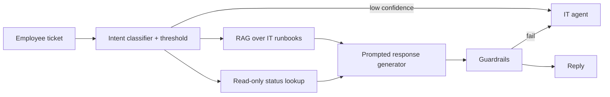

⚙️ **Expected functionality**
- Classifies tickets into ~10 intents (password reset, VPN, software request, hardware fault, ...).
- Returns "none of the above" below threshold.
- Boundary: never resets passwords or changes accounts — read-only resolution layer.

💻 **Suggested implementation**
- Python + scikit-learn for the classifier (TF-IDF + logistic regression gives calibrated-enough probabilities for a prototype).
- A small labelled dataset (write ~200 synthetic tickets).
- Markdown scoping document using the Part 9 template.

📤 **Expected output**
- `feasibility.md`, `scoping.md`, `classifier.py`, and a short evaluation table (accuracy, out-of-scope catch rate per threshold).

🧗 **Challenges**
- Choosing the threshold trade-off between containment and wrong answers.
- Defining business success metrics (e.g. containment paired with employee satisfaction).
- Identifying KB freshness ownership.

⭐ **Bonus improvements**
- Add an emotion/urgency escalation classifier separate from the uncertainty trigger.
- Add an output guardrail that blocks any response promising an action the system can't take.
- Estimate monthly cost for frontier vs mid vs small tier on the response generator.

---

## 🔗 Additional Resources

### 📰 Sources cited by the course case studies

**Customer service case study**
- Containment vs deflection: [Alhena — AI containment vs deflection benchmarks](https://alhena.ai/blog/what-is-ai-containment-vs-deflection-rate-2025-benchmarks/) · [Botpress — Containment rate](https://botpress.com/en/blog/containment-rate)
- CSAT parity: [FeedbackRobot — AI customer service KPI benchmarks](https://www.feedbackrobot.com/blog/metrics-ai-customer-service-usa) · [Fin.ai — ROI benchmarks](https://fin.ai/learn/roi-ai-customer-service-agents-benchmarks)
- Cost per contact: [eesel — AI vs human agent cost](https://www.eesel.ai/blog/ai-agent-vs-human-agent-cost) · [ecorp — AI chatbots cost reduction 2026](https://ecorpit.com/ai-chatbots-customer-service-cost-reduction-2026/)
- Fallback routing: [Rasa — Fallback and human handoff](https://legacy-docs-oss.rasa.com/docs/rasa/fallback-handoff/) · [SmartWeb — NLU confidence threshold](https://www.smartweb.jp/en/glossary/nlu-confidence-threshold/) · [Towards Data Science — Handling chatbot failure gracefully](https://towardsdatascience.com/handling-chatbot-failure-gracefully-466f0fb1dcc5/)
- RAG freshness: [ChatNexus — Content freshness in RAG](https://articles.chatnexus.io/knowledge-base/content-freshness-in-rag-keeping-your-chatbot-know/) · [Softwarelogic — 5 RAG chatbot mistakes](https://softwarelogic.co/en/blog/5-critical-mistakes-when-building-a-rag-chatbot-and-how-to-avoid-them)

**Fraud detection case study**
- False positives: [Flagright](https://www.flagright.com/post/understanding-false-positives-in-transaction-monitoring) · [J.P. Morgan](https://www.jpmorgan.com/insights/payments/analytics-and-insights/cnp-fraud-prevention-combat-chargebacks) · [Ravelin](https://www.ravelin.com/blog/reduce-false-positives-fraud) · [Intellias](https://intellias.com/how-to-reduce-to-the-volume-of-false-positives-in-payments-with-ml/) · [FluxForce — Benchmarks 2026](https://www.fluxforce.ai/blog/fraud-detection-benchmarks-2026-response)
- Novel-pattern blind spot: [ScienceDirect — Unsupervised + supervised](https://www.sciencedirect.com/science/article/abs/pii/S0020025519304451) · [F1000Research — Hybrid anomaly detection](https://f1000research.com/articles/14-664) · [Thoughtworks — GNNs in fraud](https://www.thoughtworks.com/en-us/insights/articles/graph-neural-networks-in-fraud-prevention) · [NVIDIA — GNN fraud detection](https://developer.nvidia.com/blog/optimizing-fraud-detection-in-financial-services-with-graph-neural-networks-and-nvidia-gpus/)
- Label latency: [Chargebacks911 — Visa time limits](https://chargebacks911.com/chargeback-rules/chargeback-time-limits/visa-chargeback-time-limit/) · [clear.sale — Chargeback time limits](https://www.clear.sale/blog/what-is-the-time-limit-on-chargebacks) · [Medium — Drift in real-time fraud systems](https://medium.com/@sivaramakrishnaganta1234/ml-model-feature-data-drift-a-practical-guide-for-real-time-fraud-systems-bcf3cbe2348b) · [Dal Pozzolo et al., IEEE 2015](https://ieeexplore.ieee.org/document/7280527/)
- Feedback loops: [WeblineGlobal — HITL fraud detection](https://www.weblineglobal.com/blog/human-in-the-loop-ai-fraud-detection/) · [SmartDev — Model drift and retraining](https://smartdev.com/ai-model-drift-retraining-a-guide-for-ml-system-maintenance/) · [arXiv — HITL feedback for financial fraud](https://arxiv.org/html/2411.05859v1)

### 📘 General references (supplementary)

| Resource | Why |
|---|---|
| [scikit-learn — Novelty and outlier detection](https://scikit-learn.org/stable/modules/outlier_detection.html) | Isolation forest and friends |
| [XGBoost docs](https://xgboost.readthedocs.io/) · [LightGBM docs](https://lightgbm.readthedocs.io/) | Gradient-boosted models for tabular data |
| [NIST AI Risk Management Framework](https://www.nist.gov/itl/ai-risk-management-framework) | Governance vocabulary |
| [Claude docs — prompt engineering](https://docs.claude.com/en/docs/build-with-claude/prompt-engineering/overview) | Test the "well-designed prompt" step properly |
| Chip Huyen, *Designing Machine Learning Systems* and *AI Engineering* (O'Reilly) | Production ML and foundation-model system design |

> ⚠️ For current model names and prices, check providers' own pricing pages — the course snapshot is dated 2026-07-18.

---

## 🏁 Final Revision Sheet

### 🧠 Core concepts
- **Model = chef; system = restaurant.** Architect designs the restaurant.
- AI is **probabilistic, silently wrong, non-linearly costly, and governance-bound.**
- The AI Architect owns **the seams** between model and product.

### 📖 Must-know definitions
- **Agent:** AI that takes actions via tools in a loop.
- **RAG:** retrieve relevant knowledge, then generate.
- **Containment:** handled without a human (≠ resolved).
- **Label latency:** delay until ground truth arrives (fraud: up to ~120 days).
- **HITL vs HOTL:** approve-before-act vs monitor-and-intervene.

### 🏛 Architecture and process
```text
Request → Red flags (DDZR) → 5-dimension feasibility → Classify (gen/disc, retr/reas, automation)
→ Decision tree (prompt → RAG → fine-tune | classical ML) → Decompose → 6-section scoping doc → Design
```

### 🚀 Best practices
- Validate every model output; always have a fallback.
- Design for **P95** latency.
- Confidence escape hatch on every closed-set classifier.
- Guardrails as a separate post-generation layer.
- Keep LLMs off latency-critical fast paths.
- Pair headline metrics with guard metrics (containment + CSAT).
- Own RAG freshness explicitly.
- Name platform vs product ownership before system #2.

### ❌ Common mistakes
- One "LLM" box on the diagram.
- Delivery date before data is confirmed.
- Fine-tuning to escape prompt work.
- "Core AI Platform" as a scope.
- Success = test-set accuracy.
- Accepting a metric without its denominator.

### 🔥 Interview points
- Ask **"what's the system around it?"** and **"X% of what?"**
- Classical ML wins on **tabular, time series, bounded classification, edge.**
- Supervised + unsupervised ensemble for **novel fraud**.
- **Constraints before capabilities** for agents.
- **No free position** on Capability / Cost / Control.

### 📌 Things to remember
- Reasoning mode is a **dial** (≈2–10x), not a tier.
- Yesterday's frontier is today's mid tier — **learn tiers, not names.**
- Key unknowns are a sign of rigour.
- Decomposition gives you **not a harder problem, but a clearer one.**