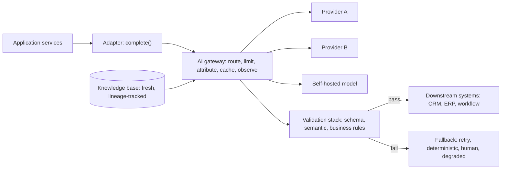
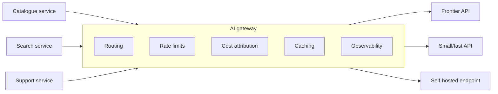
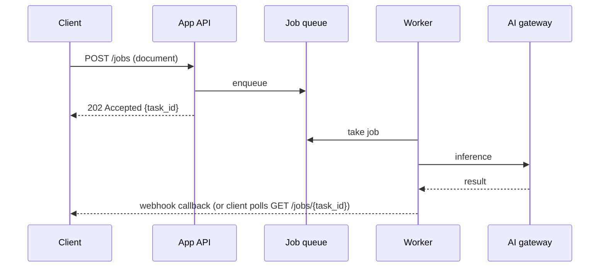
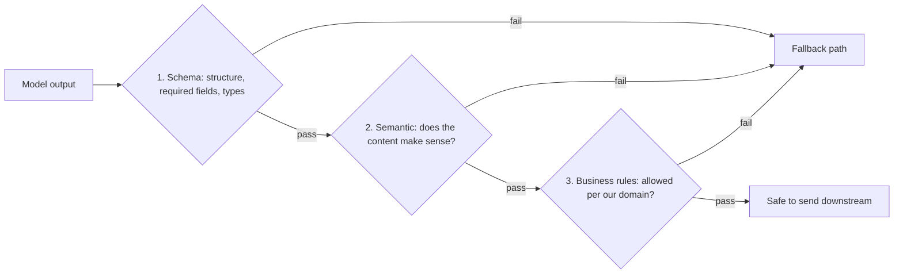
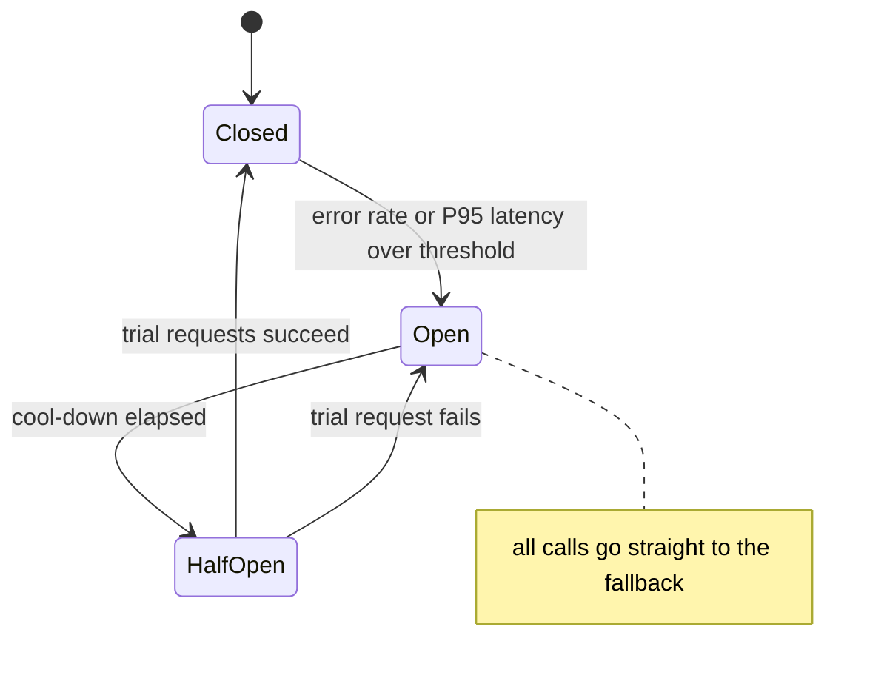
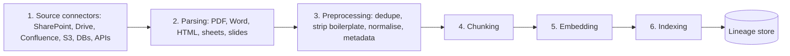
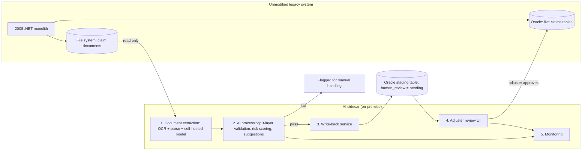
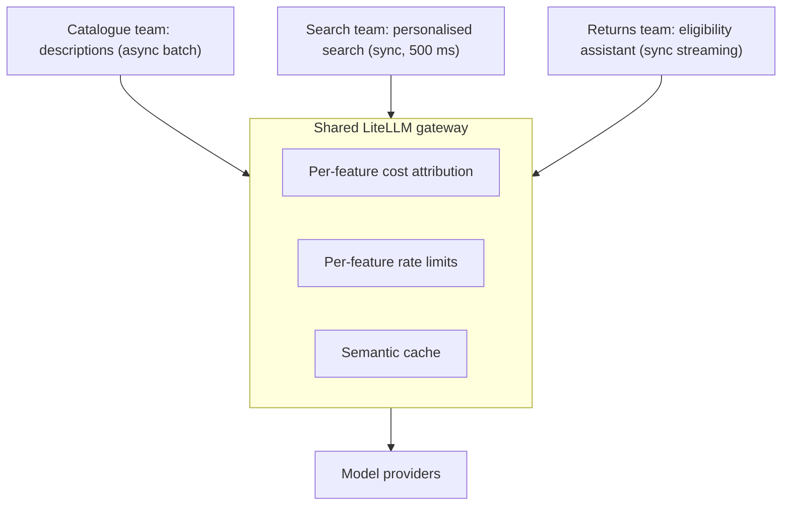
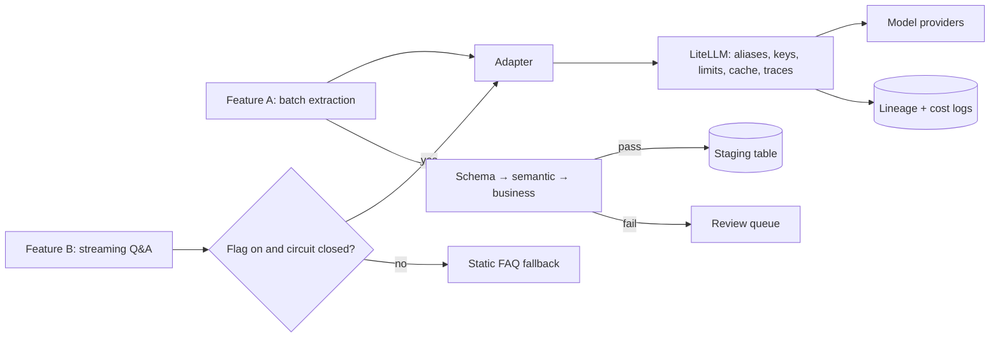

# Module 4 Study Guide: Enterprise Integration and System Design

> A complete learning, revision, and interview-prep guide built from the Module 4 lecture transcript, the four lesson-resource sheets (integration layer, non-functional requirements, data pipeline, LiteLLM tooling), and the case-study source list.
> You should be able to learn the whole module from this document without watching the videos.

📖 **How to read this guide**

- Plain text = what the lecture taught (cleaned up and restructured).
- 📎 **Beyond the transcript** callouts = supplementary explanation added for depth. Treat these as extra context, not as what the instructor said.
- All code and configuration is **reconstructed illustration** (the lecture has none); each block is labelled that way. For LiteLLM, check the current docs before copying settings.
- Both case studies are **fictional composites** built from public research; all numbers are illustrative.

---

## 📑 Table of Contents

1. [Session Overview](#-session-overview)
2. [Learning Objectives](#-learning-objectives)
3. [Detailed Notes](#-detailed-notes)
    - [Part 1: Why AI Systems Fail at the Seam](#-part-1-why-ai-systems-fail-at-the-seam)
    - [Part 2: The AI Gateway Pattern](#-part-2-the-ai-gateway-pattern)
    - [Part 3: Probabilistic Outputs in Deterministic Systems](#-part-3-probabilistic-outputs-in-deterministic-systems)
    - [Part 4: Non-Functional Requirements for AI](#-part-4-non-functional-requirements-for-ai)
    - [Part 5: The Data Pipeline](#-part-5-the-data-pipeline)
    - [Part 6: Legacy Insurance Claims Case Study](#-part-6-legacy-insurance-claims-case-study)
    - [Part 7: Cloud-Native E-Commerce Case Study](#-part-7-cloud-native-e-commerce-case-study)
    - [Part 8: The Six Integration Anti-Patterns](#-part-8-the-six-integration-anti-patterns)
    - [Part 9: LiteLLM in Practice](#-part-9-litellm-in-practice)
4. [Glossary](#-glossary)
5. [Revision Notes](#-revision-notes)
6. [Cheat Sheet](#-cheat-sheet)
7. [Interview Questions and Answers](#-interview-questions-and-answers)
8. [Scenario-Based Questions](#-scenario-based-questions)
9. [Hands-on Exercises](#-hands-on-exercises)
10. [Practice Assignment](#-practice-assignment)
11. [Additional Resources](#-additional-resources)
12. [Final Revision Sheet](#-final-revision-sheet)

---

## 🗺 Session Overview

*"Most AI systems don't fail because the model is bad. They fail because nobody designed the seam between the AI component and the rest of the system."* Module 4 designs that seam: the **integration layer** that makes AI behave like a production service (routable, observable, cost-attributed, and able to fail gracefully).

| Theme | What you get |
|---|---|
| The integration layer | The AI gateway: routing, rate limits, cost attribution, model swapping, caching, observability; an adapter interface; sync-streaming vs async |
| Output handling | Structured output (JSON mode, tool use), versioned schemas, the three-layer validation stack, fallbacks, retry rules |
| Non-functional requirements | Tail latency, `max_tokens`, three cache layers, batching and queuing, feature flags, fallbacks, circuit breakers |
| Data pipeline | Six ingestion stages, three freshness strategies, multimodal inputs, lineage for debugging, erasure, and audit |
| Practice | A legacy insurance monolith (sidecar) and a multi-team e-commerce platform (shared gateway) |
| Failure modes | Six integration anti-patterns |
| Tooling | LiteLLM configured as a production gateway |



> 💡 **The one sentence to remember:** *"The integration layer is what separates an AI proof of concept from an AI system."*

---

## 🎯 Learning Objectives

By the end of this module you should be able to:

- [ ] Explain why AI failures are usually integration failures, not model failures.
- [ ] Design an AI gateway covering routing, rate limiting, cost attribution, model swapping, caching, and observability.
- [ ] Put an adapter interface between application code and the gateway.
- [ ] Choose synchronous streaming or asynchronous processing for each AI feature.
- [ ] Enforce structured output with JSON mode or tool use, and version the output schema.
- [ ] Apply schema, semantic, and business-rule validation in order, with a defined fallback for each failure.
- [ ] Decide when to retry, when not to, and what to do when retries run out.
- [ ] Design for P95/P99 latency, use streaming and `max_tokens`, and parallelise AI calls.
- [ ] Use exact-match, semantic, and provider prefix caching, and structure prompts for prefix caching.
- [ ] Use batching, queuing, feature flags, fallbacks, and circuit breakers for throughput and graceful degradation.
- [ ] Design the six-stage ingestion pipeline, pick a freshness strategy from a freshness SLA, and handle multimodal inputs.
- [ ] Implement data lineage for debugging, right to erasure, and regulatory audit.
- [ ] Reproduce the sidecar (insurance) and shared-gateway (e-commerce) designs.
- [ ] Recognise the six integration anti-patterns.
- [ ] Configure LiteLLM with model aliases, fallbacks, metadata, rate limits, caching, and observability.

---

## 📘 Detailed Notes

The module's core teaching, organised into nine parts: the integration layer (Parts 1–2), output handling (Part 3), non-functional requirements (Part 4), the data pipeline (Part 5), two case studies (Parts 6–7), anti-patterns (Part 8), and LiteLLM tooling (Part 9).

### 🧩 Part 1: Why AI Systems Fail at the Seam

#### 🧠 Concept

The model usually does its job. The failures are around it:

| Symptom | Real cause |
|---|---|
| The application doesn't know what to do with the output | No output contract or validation |
| The model is unavailable and nothing else happens | No fallback |
| Nobody notices spend until the invoice | No cost attribution |
| The prompt differs across three services | Nobody centralised it |

> 📌 *"These are not model problems. They're integration problems. And they're predictable — which means they're preventable."*

#### 🔍 Without an integration layer

AI calls are embedded in application code. Each service makes provider-specific calls with its own retries, error handling, and prompt string.

```text
 Service A ──(SDK X, own retries, prompt v1)──▶ Provider X
 Service B ──(SDK X, other retries, prompt v2)─▶ Provider X
 Service C ──(SDK Y, no retries, prompt v3)────▶ Provider Y
```

| Question | Answer without a layer |
|---|---|
| Swap the model? | Touch every service |
| Add rate limiting? | Nowhere to add it |
| Which feature spends most on inference? | No answer |
| Are all AI inputs sanitised? | Audit every service one by one |

The integration layer fixes all of these, **"not by adding complexity — by centralising the complexity that's already there."**

#### 🎯 Key Takeaways

- Most AI production failures are integration failures.
- Scattered AI calls make swaps, rate limits, cost questions, and security reviews hard.
- A dedicated layer centralises what already exists.

---

### 🚪 Part 2: The AI Gateway Pattern

#### 📖 Definition

> An **AI gateway** is a single, controlled entry point for every AI call, sitting between all application services and all model providers.



#### ⚙️ What it provides

| Capability | What it does | Why it matters |
|---|---|---|
| **Request routing** | Picks the model per request by task type, latency need, cost class, or user tier | Services don't know which model they call; changing routing touches *"one component, not twenty"* |
| **Rate limiting** | Per-service limits | One service's bug, spike, or odd usage can't exhaust the shared provider quota |
| **Cost attribution** | Tags each request with cost centre, feature, service, user; token counts flow to a cost model | Answers "which feature spent most?", "which team is the outlier?", "which user tier is viable?" Otherwise AI cost is *"a single opaque number"* |
| **Model swapping** | Stable API to callers; *"the model behind it is a configuration, not a contract"* | Changing provider, tier, or API → self-hosted is a gateway config change |
| **Caching** | Exact match, semantic, prompt-prefix | Avoids paying twice for the same work |
| **Centralised observability** | Logs input, output, model version, tokens, latency, cost for every call | *"The gateway is where distributed tracing enters the AI system"* |

#### 🏪 Implementations

| Option | Profile | Pick when | Trade-off |
|---|---|---|---|
| **LiteLLM Proxy** | Open-source, self-hosted, OpenAI-compatible API over any provider | You want control, use several providers, or managed options don't fit your deployment | You run it (Part 9) |
| **AWS Bedrock / Microsoft Foundry / Google Vertex AI** | Managed, cloud-native; model access and gateway features bundled | Already committed to that cloud; want minimal ops | Less flexibility; cloud dependency **at the gateway layer itself** |

#### 🔌 The adapter pattern (even with a gateway)

Application services call **a thin interface in your own codebase**, not the gateway API directly.

```text
 App service ──▶ complete(prompt, config)  ──▶  GatewayAdapter ──▶ LiteLLM today
                  (your stable interface)        (one class)       Bedrock tomorrow
```

Migrate from LiteLLM to Bedrock, or absorb a request-format change, and **one adapter changes**, not every service. Same reason you abstract database access.

💻 **Code Example: adapter over a gateway** *(reconstructed illustration)*

```python
from dataclasses import dataclass, field

@dataclass
class AIRequest:
    prompt: str
    model_alias: str = "fast-model"          # logical name, resolved by the gateway
    max_tokens: int = 300
    metadata: dict = field(default_factory=dict)   # feature, team, cost_centre, user_id

@dataclass
class AIResponse:
    text: str
    model: str
    input_tokens: int
    output_tokens: int

class GatewayAdapter:
    """The only class that knows the gateway's API shape."""
    def __init__(self, client):                      # e.g. an OpenAI SDK client pointed at LiteLLM
        self.client = client

    def complete(self, req: AIRequest) -> AIResponse:
        r = self.client.chat.completions.create(
            model=req.model_alias,
            messages=[{"role": "user", "content": req.prompt}],
            max_tokens=req.max_tokens,
            extra_body={"metadata": req.metadata},   # cost attribution tags
        )
        return AIResponse(r.choices[0].message.content, r.model,
                          r.usage.prompt_tokens, r.usage.completion_tokens)
```

#### 🔄 Request and response patterns

| Pattern | Use for | Mechanics | Watch out |
|---|---|---|---|
| **Synchronous + streaming** | Interactive interfaces | Response streams token by token over **server-sent events (SSE)** or **WebSockets**; TTFT sets perceived speed | Gateway and proxy **timeouts must allow seconds**: standard HTTP timeouts close the connection mid-response |
| **Asynchronous** | Batch and long-running inference | Submit → get task ID → poll or receive a **webhook**; a queue absorbs bursts | Worth the extra design for anything expected to take **more than 2–3 seconds end to end** |



💻 **Code Example: streaming over SSE with a long timeout** *(reconstructed illustration, FastAPI)*

```python
from fastapi import FastAPI
from fastapi.responses import StreamingResponse
from openai import OpenAI
import httpx

app = FastAPI()
client = OpenAI(base_url="http://litellm.internal:4000/v1", api_key="sk-service-key",
                timeout=httpx.Timeout(60.0, connect=5.0))     # seconds, not milliseconds

@app.get("/assistant/stream")
def stream(q: str):
    def events():
        stream = client.chat.completions.create(
            model="capable-model", stream=True, max_tokens=300,
            messages=[{"role": "user", "content": q}])
        for chunk in stream:
            delta = chunk.choices[0].delta.content or ""
            if delta:
                yield f"data: {delta}\n\n"                     # SSE frame
        yield "data: [DONE]\n\n"
    return StreamingResponse(events(), media_type="text/event-stream")
```

🔑 **Key lines:** the 60-second read timeout reflects LLM latency; `max_tokens` bounds worst-case generation; each token is flushed as an SSE frame so the first words appear fast.

#### 🎯 Key Takeaways

- One gateway for every AI call: routing, rate limits, cost attribution, swapping, caching, observability.
- LiteLLM for control and multi-provider; managed gateways for low ops inside one cloud.
- Keep an adapter between application code and the gateway.
- Stream interactive calls; go async for anything over ~2–3 s.
- *"Building it from the start costs one sprint. Retrofitting it costs three months and a production incident to motivate."*

---

### 🧪 Part 3: Probabilistic Outputs in Deterministic Systems

#### 🧠 Concept

| AI component | Downstream enterprise systems |
|---|---|
| Probabilistic: the same input can differ in format, structure, completeness, correctness (*"not a bug — the nature of generative models"*) | Deterministic: the CRM has a schema, the ERP has validation rules, the workflow engine expects a data contract |

**The integration layer bridges the gap:** every AI output entering a downstream system passes through a validation architecture that catches, handles, or routes the unpredictable cases.

#### 🧷 Structured output enforcement (the first line of defence)

| Technique | How | Strength | Limit |
|---|---|---|---|
| **JSON mode** | Provider constrains output to valid JSON | Eliminates "can't parse" failures | Valid JSON can still hold **wrong values** |
| **Tool use as structured output** | Define a tool whose parameters **are** the schema; require the model to answer by calling it | Often more reliable for complex schemas (fills named, typed fields); **self-documenting** (the tool definition is the schema) | Still needs content validation |

**Output schema versioning:** treat the AI output schema like an **API contract**: version it, document it, validate downstream services against it; make changes explicit, communicated, and backward-compatible where needed.

💻 **Code Example: tool use as the output schema + Pydantic** *(reconstructed illustration)*

```python
from pydantic import BaseModel, Field
from typing import Literal

class ClaimExtractionV2(BaseModel):                  # versioned contract
    schema_version: Literal["claim-extraction/2"] = "claim-extraction/2"
    incident_date: str = Field(pattern=r"^\d{4}-\d{2}-\d{2}$")
    claim_type: Literal["auto", "property", "liability", "other"]
    amount_claimed: float
    parties: list[str]

EXTRACT_TOOL = {
    "type": "function",
    "function": {
        "name": "record_claim_extraction",
        "description": "Record the fields extracted from one insurance claim document.",
        "parameters": ClaimExtractionV2.model_json_schema(),
    },
}
# Call the gateway with tools=[EXTRACT_TOOL] and
# tool_choice={"type": "function", "function": {"name": "record_claim_extraction"}},
# then parse the tool call's arguments with ClaimExtractionV2.model_validate_json(...)
```

📝 **What it does:** the Pydantic model is the single source of truth for the schema sent to the model and for layer-1 validation.

#### 🧱 The three-layer validation stack

Apply **cheapest first; stop at the first failure.**



| Layer | Catches | Examples | Notes |
|---|---|---|---|
| **1. Schema** | Outputs downstream can't consume at all | Missing required field; wrong type | Deterministic, fast, runs first |
| **2. Semantic** | Structurally valid nonsense | **Negative invoice total**; **"N/A" in a required numeric field**; **risk score 847 on a 1–10 scale** | Domain-specific; someone must define "nonsensical." *Often skipped because it requires that thinking* |
| **3. Business rules** | Valid, sensible, but not allowed here | Risk rating outside the defined scale; recommended action **not in the allowed set**; a product category that **doesn't exist in your catalogue** | Needs business context |

📎 **Beyond the transcript:** the lecture lists "a risk score of 847 on a 1-to-10 scale" as semantic and "a risk rating outside the defined scale" as a business rule; the difference is where the rule comes from (general sense vs your domain's own definitions).

💻 **Code Example: the stack with retry-with-clarification** *(reconstructed illustration)*

```python
from pydantic import ValidationError

ALLOWED_ACTIONS = {"approve_for_review", "request_documents", "refer_to_siu"}

def semantic_errors(x: ClaimExtractionV2) -> list[str]:
    errs = []
    if x.amount_claimed <= 0:
        errs.append("amount_claimed must be positive")
    if not x.parties:
        errs.append("at least one party is required")
    return errs

def business_errors(x: ClaimExtractionV2, suggested_action: str, policy_limit: float) -> list[str]:
    errs = []
    if suggested_action not in ALLOWED_ACTIONS:
        errs.append(f"action '{suggested_action}' not allowed")
    if x.amount_claimed > policy_limit * 10:
        errs.append("amount exceeds 10x policy limit: implausible for this policy")
    return errs

def extract_with_validation(doc, call_model, policy_limit, max_attempts=3):
    feedback = ""
    for attempt in range(max_attempts):
        raw, action = call_model(doc, feedback)
        try:
            x = ClaimExtractionV2.model_validate_json(raw)            # layer 1
        except ValidationError as e:
            feedback = f"Your previous response had these problems: {e.errors()}. Correct and resubmit."
            continue                                                 # limited retry
        if errs := semantic_errors(x):                               # layer 2
            feedback = f"Your previous response had these problems: {errs}. Correct and resubmit."
            continue
        if errs := business_errors(x, action, policy_limit):         # layer 3
            return {"status": "escalate_to_human", "reasons": errs}  # don't retry
        return {"status": "ok", "data": x, "action": action}
    return {"status": "escalate_to_human", "reasons": ["retry budget exhausted"]}
```

🔑 **Key lines:** schema and semantic failures get the error fed back (max three attempts); business-rule failures escalate immediately because *retrying won't fix a model limitation*.

#### 🛟 Fallback strategies

Validation will sometimes fail. Every failure needs **a path, not just a log line.**

| Strategy | When | Example |
|---|---|---|
| **Retry with clarification** | Schema and semantic failures the model can fix | Feed the errors back; **limit 2–3 attempts**, then escalate |
| **Deterministic fallback** | A degraded answer beats none | Failed product description → **template**; failed ticket classification → **default category + manual-review flag** |
| **Human escalation** | High-stakes outputs | *"The AI system is an accelerant for the human, not a replacement."* Design the queue, reviewers, and their tools **up front** |
| **Degraded-mode response** | Customer-facing touchpoints | *"I wasn't able to complete that request"* beats a crash or corrupted output. **Honest without being alarming**; defined for every AI touchpoint |

#### 🔁 Retry rules for AI systems

| Situation | Retry? | Why |
|---|---|---|
| **5xx provider error** | ✅ With backoff | Transient; request was valid |
| **429 rate limit** | ✅ With backoff, honour `Retry-After` | Temporary overload |
| **Schema/semantic validation failure** | ⚠️ 1–2 times, with error feedback | Sometimes fixable |
| **Business-rule failure** | ❌ Escalate | Model limitation, not transient |
| **Auth error (401/403)** | ❌ Never | *"Retrying is pointless and wastes tokens"* |
| **Slow response / timeout** | ❌ Not blindly | Can cascade into duplicate inference (Part 8) |
| **Retry budget exhausted** | ❌ | **Fail fast → fallback → log for investigation** |

💻 **Code Example: retry classification with backoff** *(reconstructed illustration)*

```python
import random, time

class RetryableError(Exception): ...
class FatalError(Exception): ...

def classify(status: int) -> str:
    if status in (500, 502, 503, 504, 429):
        return "retry"
    if status in (401, 403, 400, 404):
        return "fatal"
    return "fatal"

def call_with_retries(send, max_attempts=4, base=0.5, cap=8.0):
    for attempt in range(1, max_attempts + 1):
        status, body, headers = send()
        if status == 200:
            return body
        if classify(status) == "fatal" or attempt == max_attempts:
            raise FatalError(f"status={status} after {attempt} attempt(s)")
        retry_after = float(headers.get("retry-after", 0))
        sleep = max(retry_after, min(cap, base * 2 ** attempt) * random.uniform(0.5, 1.0))
        time.sleep(sleep)                          # exponential backoff with jitter
```

#### 🎯 Key Takeaways

- Constrain at the source: JSON mode or (often better) tool use; version the schema like an API.
- Validate schema → semantic → business rules; stop at the first failure.
- Every failure has a path: retry with clarification, deterministic fallback, human, degraded response.
- Retry transient errors with backoff; never retry auth or business-rule failures.

---

### ⏱ Part 4: Non-Functional Requirements for AI

#### 🧠 Concept

AI non-functional requirements aren't harder, **they're different**: the standard assumptions don't carry over.

| | Database query | AI inference |
|---|---|---|
| Typical latency | ~5 ms, reliable at P99 | ~2 s median, ~8 s at P95 |
| Variance | Low | High: provider queue depth, output length, context size |
| Stability | Stable | Can shift without warning when the provider changes infrastructure |

#### 📈 Latency: the tail problem

The same prompt, model, and provider can take **400 ms on one call and 6 s on the next.**

```text
                 System A                 System B
 Median          1.5 s                    1.5 s
 P99             2.5 s                    12 s        ← same median, very different experience
```

🚀 **Latency design rules:**

| Rule | Detail |
|---|---|
| **Design to P95 or P99, not the median** | Specify both in requirements |
| **Stream interactive responses** | First token within **~300 ms** dramatically improves perceived speed even if total time is several seconds |
| **Set `max_tokens` as a latency control** | Generation time scales with output length; **300** on a conversational reply *"doesn't limit quality — it limits the worst-case generation time"* |

💻 **Code Example: measuring percentiles, not averages** *(reconstructed illustration)*

```python
import statistics

def latency_report(samples_ms: list[float]) -> dict:
    s = sorted(samples_ms)
    q = statistics.quantiles(s, n=100)            # 99 cut points
    return {"p50": round(q[49]), "p95": round(q[94]), "p99": round(q[98]), "max": round(s[-1])}

# Run this on load-test samples, not notebook calls with tiny prompts.
```

#### 🗂 Caching: the highest-leverage optimisation

| Layer | Key | Good for | Design point |
|---|---|---|---|
| **Exact-match cache** | Hash of the full prompt (e.g. in **Redis**) | FAQ systems, templated queries, repeated high-traffic inputs | **TTL matched to acceptable staleness**: short for time-sensitive, long for stable content |
| **Semantic cache** | Embedding similarity to previous queries | Natural-language interfaces with many phrasings of the same question | **Threshold tuning is the hard part:** too low → wrong answers served; too high → few hits. Set it **empirically on your query distribution** |
| **Provider KV / prefix cache** | Stable prompt prefix | Every request sharing a system prompt | Put **stable content first** (instructions, static context), **variable content last**, so the cached prefix is as long as possible |

```text
Cache-friendly prompt order
[ system instructions ][ static reference context ][ few-shot examples ] | [ user-specific data ][ user question ]
|<-------------------- identical across requests: cached ------------->| |<------ varies: always paid ------>|
```

💻 **Code Example: exact-match cache in Redis** *(reconstructed illustration)*

```python
import hashlib, json, redis

r = redis.Redis(host="redis.internal", port=6379)

def cache_key(model: str, messages: list[dict], params: dict) -> str:
    payload = json.dumps({"m": model, "msg": messages, "p": params}, sort_keys=True)
    return "ai:exact:" + hashlib.sha256(payload.encode()).hexdigest()

def cached_complete(model, messages, params, call, ttl_s=3600):
    key = cache_key(model, messages, params)
    if (hit := r.get(key)) is not None:
        return json.loads(hit), True
    result = call(model, messages, params)
    r.setex(key, ttl_s, json.dumps(result))      # TTL = acceptable staleness
    return result, False
```

🔑 **Key lines:** the key includes model and parameters (a temperature change must not reuse old answers); `setex` enforces the TTL.

💻 **Code Example: semantic cache lookup with a tuned threshold** *(reconstructed illustration)*

```python
import numpy as np

SIMILARITY_THRESHOLD = 0.92     # calibrate on labelled query pairs from your own traffic

def semantic_lookup(query_vec: np.ndarray, cache: list[tuple[np.ndarray, str]]):
    best, best_sim = None, -1.0
    for vec, answer in cache:
        sim = float(query_vec @ vec / (np.linalg.norm(query_vec) * np.linalg.norm(vec)))
        if sim > best_sim:
            best, best_sim = answer, sim
    return (best, best_sim) if best_sim >= SIMILARITY_THRESHOLD else (None, best_sim)
```

⚠️ **Edge cases:** "return policy for shoes" vs "return policy for electronics" can be very similar yet need different answers; calibrate the threshold on real pairs labelled same/different, and exclude personalised or time-sensitive queries from the semantic cache.

#### 🚚 Throughput and concurrency

| Technique | For | Benefit |
|---|---|---|
| **Batching** | Document processing, classification jobs, anything not real-time | Provider **batch APIs** cost less and give higher throughput: 10,000 documents overnight at a fraction of 10,000 synchronous calls |
| **Request queuing** | Interactive workloads under bursts | Stops the app overwhelming the gateway and provider; **queue depth is a monitoring signal** (growing = inference capacity is the bottleneck); prevents **thundering herd** saturation |

#### 🛡 Graceful degradation (the principle the instructor feels most strongly about)

> 📌 **The AI component should never be a single point of failure for product functionality.** If the model is down, the provider has an outage, or latency hits 30 s, the product keeps working in a degraded mode.

| Mechanism | What it is |
|---|---|
| **Feature flags on every AI touchpoint** | Disable any AI feature **without a deployment**, in seconds; the product reverts to pre-AI behaviour. *"Not a nice-to-have. A production safety mechanism."* |
| **A defined fallback for every AI call** | Rule-based response, cached result, reduced functionality, or human escalation, **designed and tested before the feature ships**. If the answer is "it doesn't work," that's a product design problem |
| **Circuit breakers** | When error rate or latency passes a threshold, route straight to the fallback instead of letting each request fail individually |



💻 **Code Example: latency-aware circuit breaker with a feature flag** *(reconstructed illustration)*

```python
import time
from collections import deque

class CircuitBreaker:
    def __init__(self, max_fail_rate=0.5, max_p95_s=4.0, window=50, cooldown_s=30):
        self.results = deque(maxlen=window)           # (ok: bool, latency_s: float)
        self.max_fail_rate, self.max_p95_s = max_fail_rate, max_p95_s
        self.cooldown_s, self.opened_at = cooldown_s, None

    def _p95(self):
        lat = sorted(l for _, l in self.results)
        return lat[int(len(lat) * 0.95) - 1] if len(lat) >= 20 else 0.0

    def allow(self) -> bool:
        if self.opened_at is None:
            return True
        return time.monotonic() - self.opened_at >= self.cooldown_s   # half-open trial

    def record(self, ok: bool, latency_s: float):
        self.results.append((ok, latency_s))
        fails = sum(not o for o, _ in self.results) / len(self.results)
        if fails > self.max_fail_rate or self._p95() > self.max_p95_s:
            self.opened_at = time.monotonic()
        elif ok and self.opened_at is not None:
            self.opened_at, self.results = None, deque(maxlen=self.results.maxlen)

def returns_assistant(question, flags, breaker, ai_call, static_faq):
    if not flags.get("returns_assistant_ai", True) or not breaker.allow():
        return static_faq(question)                    # feature flag off or circuit open
    t0 = time.monotonic()
    try:
        answer = ai_call(question)
        breaker.record(True, time.monotonic() - t0)
        return answer
    except Exception:
        breaker.record(False, time.monotonic() - t0)
        return static_faq(question)
```

🔑 **Key lines:** the breaker opens on failures **or** slow P95; the flag check comes first so operators can switch AI off instantly; both paths end in the same fallback.

#### 🎯 Key Takeaways

- Design to P95/P99; stream; cap `max_tokens`.
- Cache in layers: exact (Redis + TTL), semantic (calibrated threshold), provider prefix (stable content first).
- Batch offline work; queue interactive bursts and watch queue depth.
- Feature flags, defined fallbacks, and circuit breakers: the AI must never be a single point of failure.

---

### 🗃 Part 5: The Data Pipeline

#### 🧠 Concept

*"AI systems are data systems. The model is a component."* **The model's quality ceiling is set by the data pipeline**: *"The best RAG system in the world produces garbage answers from a stale, inconsistent knowledge base."*

#### 🪜 The six ingestion stages



| Stage | What it involves | Why it's hard |
|---|---|---|
| **1. Source connectors** | Reading from SharePoint, Google Drive, Confluence, S3, databases, APIs, file systems | Each has its own **auth model, rate limits, formats**; content is spread across teams with different **access controls** and **update frequencies**. *"Where you discover the organisational complexity behind 'we'll just index our internal documents.'"* |
| **2. Parsing** | Clean, structured text from PDFs, Word, HTML, spreadsheets, slides | **A ceiling on everything downstream:** tables lose structure, charts become gaps, footnotes land in the wrong place |
| **3. Preprocessing** | Deduplication, stripping navigation headers and legal footers, normalising formatting, extracting metadata | *"Unglamorous and important."* Skip it and near-duplicates confuse retrieval and inflate storage |
| **4–6. Chunking, embedding, indexing** | Covered in Module 2 | **Document and version these choices:** changing them means re-ingesting the whole corpus |

#### 🔄 Freshness management: three strategies

| Strategy | How | Fits | Cost / complexity |
|---|---|---|---|
| **Scheduled full re-ingestion** | Re-ingest everything daily/weekly | Small–medium corpora that change often | Simplest; expensive at scale |
| **Incremental update** | Detect changed documents (hashes or last-modified timestamps for every source doc and chunk); re-embed only those | Large corpora where little changes daily | More complex; **much cheaper** |
| **Event-driven update** | Source systems emit change events; pipeline reacts in near real time | When freshness is a business requirement: **pricing, availability, regulatory guidance** | Needs sources that can emit events (*many legacy systems can't*) |

> 📌 **Define the freshness SLA first.** *"How stale can the knowledge base be?"* decides the strategy, not the other way round.

💻 **Code Example: incremental update by content hash** *(reconstructed illustration)*

```python
import hashlib

def content_hash(data: bytes) -> str:
    return hashlib.sha256(data).hexdigest()

def incremental_sync(source, state_db, pipeline):
    """state_db maps doc_id -> last ingested hash."""
    seen = set()
    for doc in source.list_documents():                  # id, bytes, modified_at, acl
        seen.add(doc.id)
        h = content_hash(doc.bytes)
        if state_db.get(doc.id) == h:
            continue                                     # unchanged: skip re-embedding
        pipeline.reingest(doc, version=h)                # parse → preprocess → chunk → embed → index
        state_db[doc.id] = h
    for gone in set(state_db) - seen:                    # deleted at source
        pipeline.delete(gone)
        del state_db[gone]
```

#### 🖼 Multimodal inputs

| Input | Pipeline step | Quality driver |
|---|---|---|
| **Images** | Vision model or captioning → text description indexed alongside documents | Caption accuracy |
| **Scanned PDFs, photos of forms** | **OCR** → searchable text | *OCR quality directly determines retrievability* |
| **Audio** | Speech-to-text → transcript becomes the input | Accents, domain terms, background noise |
| **Mixed PDFs** (tables, charts, figures + prose) | **Tables parsed into structured formats before chunking; charts captioned by a vision model** | Where parsing most often fails; *"where 'ingest the documents' becomes a genuine engineering challenge"* |

#### 🧾 Data lineage for AI compliance

> 📖 **Lineage:** every AI response traceable to **which chunks** were retrieved, from **which source documents**, at **which version**, embedded by **which model**, **when**.

Not optional in regulated industries; increasingly expected elsewhere.

| Why | What lineage enables |
|---|---|
| **Debugging** | A wrong answer → which chunk was retrieved, and was it wrong, stale, or from the wrong document? |
| **Right to erasure (GDPR)** | Find every chunk and embedding derived from a person's data, and every response that cited it. *"Without it, compliance is not possible."* |
| **Regulatory audit** | Prove an AI-assisted decision in finance, healthcare, or insurance used accurate, current information at the time. *"'The model said so' is not a defensible audit trail."* |

**Implementation:** log **chunk IDs with every AI response**; store chunk metadata (source doc ID, version, embedding model, ingestion timestamp) in a queryable store. *"Structured logging, not inference logging. The overhead is small."*

💻 **Code Example: lineage tables and queries** *(reconstructed illustration, SQL)*

```sql
CREATE TABLE chunks (
  chunk_id        TEXT PRIMARY KEY,
  source_doc_id   TEXT NOT NULL,
  source_system   TEXT NOT NULL,          -- sharepoint, confluence, s3 ...
  doc_version     TEXT NOT NULL,          -- content hash or source version
  embedding_model TEXT NOT NULL,
  ingested_at     TIMESTAMPTZ NOT NULL,
  contains_pii_of TEXT[]                  -- subject identifiers, for erasure
);

CREATE TABLE ai_responses (
  response_id    TEXT PRIMARY KEY,
  created_at     TIMESTAMPTZ NOT NULL,
  model_version  TEXT NOT NULL,
  prompt_version TEXT NOT NULL,
  feature        TEXT NOT NULL
);

CREATE TABLE response_chunks (            -- which chunks each response used
  response_id TEXT REFERENCES ai_responses(response_id),
  chunk_id    TEXT REFERENCES chunks(chunk_id),
  rank        INT,
  PRIMARY KEY (response_id, chunk_id)
);

-- Debugging: what did response R rely on?
SELECT c.* FROM response_chunks rc JOIN chunks c USING (chunk_id)
WHERE rc.response_id = 'R-123' ORDER BY rc.rank;

-- Erasure: every chunk and response touched by subject S
SELECT chunk_id FROM chunks WHERE 'subject-S' = ANY(contains_pii_of);
SELECT DISTINCT response_id FROM response_chunks
WHERE chunk_id IN (SELECT chunk_id FROM chunks WHERE 'subject-S' = ANY(contains_pii_of));
```

#### 🎯 Key Takeaways

- Six stages: connectors, parsing, preprocessing, chunking, embedding, indexing; version the choices.
- Freshness SLA → full, incremental, or event-driven re-ingestion.
- Multimodal: OCR, captioning, transcription, structured table extraction.
- Lineage (chunk IDs per response + chunk metadata) powers debugging, erasure, and audit.

---

### 🏚 Part 6: Legacy Insurance Claims Case Study

> Fictional composite; numbers illustrative. The case-study sources note there's no authoritative "claims per day" benchmark; **~500/day (~182k/year)** is used as a plausible mid-size figure.

**Brief:** a mid-size insurer processes **500 claims a day** on a **2008 .NET monolith** with an **Oracle** backend, on-premise. It works; there are no modernisation plans. The business wants AI to **extract claim data, score risk, and suggest status updates for adjusters.**

#### 🔒 Three constraints

1. **The monolith cannot be modified.**
2. **Claim documents contain PII and cannot leave the premises.**
3. **AI outputs must be written back to Oracle in a specific schema.**

#### 🏗 The sidecar architecture: five components, none inside the monolith



| # | Component | What it does |
|---|---|---|
| 1 | **Document extraction** | Reads documents from the file system the monolith already writes to; OCR + parsing; calls a **self-hosted model**; outputs JSON: incident date, claim type, amounts, parties |
| 2 | **AI processing layer** | Validates against Oracle schema constraints with the **three-layer stack**; runs risk scoring; generates adjuster suggestions; passes or flags |
| 3 | **Write-back service** | Writes validated outputs to a **staging table** with a **human-review flag**, never directly to the main claims table |
| 4 | **Adjuster review UI** | Shows extraction and risk score beside the original document; confirm/edit/reject; **one click promotes** to the live schema. Designed in **from day one** |
| 5 | **Monitoring** | Extraction accuracy, validation failure rate, **adjuster correction frequency** |

> 💡 **Why self-hosted at only 500 claims/day?** *"Nobody stands up their own inference infrastructure for throughput"* at that volume; an API would be cheaper and easier. It's self-hosted for one reason: **the documents can't leave the building.** *"When you see self-hosting in a design, that's usually the tell — a data-residency decision, not a volume one."*

> 📌 **The metric that matters:** adjuster correction frequency. *"If adjusters are correcting sixty percent of AI outputs, the AI is creating more work, not less."*

💻 **Code Example: staging table and promotion** *(reconstructed illustration, Oracle SQL)*

```sql
CREATE TABLE ai_claim_staging (
  staging_id       NUMBER GENERATED ALWAYS AS IDENTITY PRIMARY KEY,
  claim_id         VARCHAR2(20)  NOT NULL,
  incident_date    DATE,
  claim_type       VARCHAR2(20),
  amount_claimed   NUMBER(12,2),
  risk_score       NUMBER(3,1) CHECK (risk_score BETWEEN 1 AND 10),
  suggested_status VARCHAR2(30),
  model_version    VARCHAR2(50)  NOT NULL,
  schema_version   VARCHAR2(30)  NOT NULL,
  human_review     VARCHAR2(10)  DEFAULT 'PENDING' CHECK (human_review IN ('PENDING','APPROVED','EDITED','REJECTED')),
  reviewed_by      VARCHAR2(50),
  reviewed_at      TIMESTAMP,
  created_at       TIMESTAMP DEFAULT SYSTIMESTAMP
);

-- Promotion runs only after the adjuster approves (called from the review UI)
UPDATE claims c
SET (c.incident_date, c.claim_type, c.amount_claimed) =
    (SELECT s.incident_date, s.claim_type, s.amount_claimed
       FROM ai_claim_staging s WHERE s.staging_id = :staging_id AND s.human_review IN ('APPROVED','EDITED'))
WHERE c.claim_id = (SELECT claim_id FROM ai_claim_staging WHERE staging_id = :staging_id);

-- Business metric: correction frequency over the last 30 days
SELECT ROUND(100 * SUM(CASE WHEN human_review IN ('EDITED','REJECTED') THEN 1 ELSE 0 END) / COUNT(*), 1)
       AS correction_pct
FROM ai_claim_staging
WHERE reviewed_at > SYSTIMESTAMP - INTERVAL '30' DAY;
```

🔑 **Key lines:** a database CHECK constraint enforces the 1–10 scale as a last line of defence; promotion requires an approved status; correction percentage comes straight from review outcomes.

📎 **Beyond the transcript:** the case-study sources relate this sidecar approach to the **strangler fig** pattern (new capability grown beside a legacy system without changing it).

#### 🎯 Key architectural decisions

| Decision | Reason |
|---|---|
| **Sidecar integration** | Adds capability without touching the monolith |
| **Self-hosted model** | Data residency: documents never leave the premises |
| **Human-in-the-loop on every write-back** | A wrong field in a live claims record has business and regulatory consequences |
| **Staging table** | No direct writes to production tables from an AI system |

---

### 🛒 Part 7: Cloud-Native E-Commerce Case Study

> Fictional composite; numbers illustrative.

**Brief:** a mid-size e-commerce platform on **AWS**, microservices, multiple product teams. Three AI features, three teams, **one shared AI gateway**:

1. AI-generated product descriptions.
2. Personalised search.
3. A returns eligibility assistant.

**The constraint isn't legacy, it's shared infrastructure:** *"one team's cost explosion or availability incident affects everyone."*



#### 📝 Feature 1: Product descriptions (async batch)

```text
Catalogue manager uploads product
  → description job queued
  → model generates from product attributes + category context
  → schema validation against the catalogue contract (title length, description format, SEO fields)
  → pass: appears in catalogue within minutes
  → fail: manual review queue (never the live catalogue)
```

#### 🔎 Feature 2: Personalised search (synchronous, 500 ms SLA)

- The whole search result must return within **500 ms**; semantic processing competes for that budget.
- **The semantic cache earns its keep:** e-commerce queries are **head-heavy** (a few popular queries take a large share of volume).
- Published production semantic-cache hit rates: **~20–45%**. Designing around **40%** on a concentrated workload is *"optimistic but not fantasy."*
- Each hit replaces a model round-trip with a vector lookup: *"the difference between comfortable and constantly firefighting."*

💻 **Worked example: what a 40% hit rate does to the budget** *(reconstructed illustration; latencies are assumptions)*

```python
def expected_latency(hit_rate, cache_ms=25, miss_ms=420, base_ms=60):
    return base_ms + hit_rate * cache_ms + (1 - hit_rate) * miss_ms

for h in (0.0, 0.2, 0.4):
    print(f"hit {h:.0%}: mean ≈ {expected_latency(h):.0f} ms")
# hit 0%: mean ≈ 480 ms   (no headroom under 500 ms)
# hit 20%: mean ≈ 401 ms
# hit 40%: mean ≈ 322 ms
```

⚠️ **Edge cases:** the mean improves, but **misses still take ~480 ms**, so P95/P99 barely move. Tail latency needs its own controls (a timeout that falls back to keyword search, a smaller model, precomputed results for top queries).

📎 **From the case-study sources:** e-commerce latency research is often summarised as "100 ms of added latency ≈ 1% of revenue lost," which is why the 500 ms budget is treated as hard.

#### ↩️ Feature 3: Returns eligibility assistant (sync streaming + circuit breaker)

- **Streaming** because users expect a conversational answer and streaming makes latency feel lower.
- **Circuit breaker protects checkout:** if AI latency passes the threshold, the circuit opens and the assistant **degrades to a static eligibility FAQ**. *"The checkout flow, which generates revenue, is never dependent on the AI component."*
- **Escalation trigger:** keywords indicating a **dispute, exception, or emotional complaint** → *"let me connect you with a specialist"* instead of attempting it.

#### ⚖️ Insurance vs e-commerce

| | Insurance | E-commerce |
|---|---|---|
| Core constraint | Legacy system that can't change | Shared platform, multiple teams |
| Integration shape | **Sidecar** beside the monolith | **Central gateway** with per-feature isolation |
| Model hosting | Self-hosted (data residency) | Providers via gateway |
| Key protection | Human review on every write-back; staging table | Rate limits and cost attribution per feature; circuit breakers around revenue flows |
| Cost lever | N/A (low volume) | Semantic cache |

> 📌 *"Integration architecture isn't one pattern applied universally. It's the same principles — isolate the AI component, validate its outputs, define fallback paths, protect the downstream systems — applied to the specific constraints of your context."*

**Honest caveat:** real deployments add retries, versioning, backfills, security review, compliance sign-off, and *"the day the OCR vendor changes their output format."* *"The decomposition is the teaching tool."*

#### 🎯 Key Takeaways

- The AI system is **additive, not invasive**; the integration layer carries the complexity.
- Legacy: sidecar, self-hosted for residency, staging + human approval.
- Shared platform: one gateway with per-feature limits and attribution; semantic cache for tight SLAs; circuit breakers protecting revenue.

---

### 🚫 Part 8: The Six Integration Anti-Patterns

Integration anti-patterns are **invisible until they're expensive**: bad chunking shows up quickly; a missing integration layer accumulates debt, hidden cost, and fragility until something breaks with a large blast radius.

| # | Anti-pattern | 🔎 What happens | 🚀 Fix |
|---|---|---|---|
| 1 | **AI calls embedded in application code** | *"The integration point is everywhere, which means the integration properties are nowhere."* Model change → every service; no rate limiting, cost attribution, or shared cache; each service fails differently in an outage. The equivalent of **hard-coding a DB connection string in every class** | Central gateway + adapter. **A sprint up front vs three months and an incident later** |
| 2 | **No structured output contract** | "Respond in JSON" → sometimes prose, wrong field names, JSON inside markdown fences, text before the JSON → crashes, garbage downstream, or silent bad data surfacing **weeks later in another system** | JSON mode / tool use + schema validation at the boundary: *"the contract enforcement mechanism"* |
| 3 | **No fallback for every AI touchpoint** | AI treated as a required dependency; outage, rate limit, or spike breaks the whole flow | Ask *"what does the product do when the AI doesn't work?"* Fallbacks that are functional, honest, **shipped with the feature** |
| 4 | **Treating AI latency like database latency** | Timeouts in the hundreds of ms → a slow-but-fine response times out → retry → same again → **cascade of duplicate inference** → provider rate limit | AI-appropriate timeouts; retry transient **errors**, not slow **inference** |
| 5 | **Ignoring tail latency** | Tested at P50 = 1.2 s; production P95 = 9 s; **three sequential calls** → very slow page loads, abandonment, lost conversion | Measure P95/P99 in load tests; timeouts from realistic worst case; **parallelise independent calls** |
| 6 | **Synchronous everything** | 5–10 s AI features block flows, tie up threads, and make the system fragile under load | Choose per feature: streaming (feels fast) or async (decoupled); for >2–3 s operations, the UX gain is real |

#### 🧮 The tail-latency arithmetic (anti-pattern 5)

```text
Sequential:  1.2 s + 1.2 s + 1.2 s = 3.6 s at the median
Parallel:    max(1.2, 1.2, 1.2)     = 1.2 s
Lecture:     "5% of page loads take 27 s" when all three calls hit the 9 s tail
```

📎 **Beyond the transcript:** the 27-second figure assumes the three calls are slow **together** (plausible when slowness comes from shared provider load). If slowness were independent, **~14%** of page loads (1 − 0.95³) would include at least one 9-second call, and only 0.0125% would hit all three. Either way the conclusion holds: sequential tails compound, so measure P95/P99 and parallelise.

💻 **Code Example: parallelising independent AI calls** *(reconstructed illustration)*

```python
import asyncio

async def build_page(product_id, ai):
    summary, faq, recs = await asyncio.gather(          # run concurrently
        asyncio.wait_for(ai.summary(product_id), timeout=4),
        asyncio.wait_for(ai.faq(product_id), timeout=4),
        asyncio.wait_for(ai.recommendations(product_id), timeout=4),
        return_exceptions=True,                          # one failure doesn't sink the page
    )
    return {
        "summary": summary if not isinstance(summary, Exception) else None,   # degrade per widget
        "faq": faq if not isinstance(faq, Exception) else None,
        "recs": recs if not isinstance(recs, Exception) else [],
    }
```

> 📌 *"The six decisions — centralised gateway, structured output contract, defined fallbacks, AI-appropriate timeout design, P99 latency planning, and async where the latency profile warrants it — are all design-time decisions. They cost an afternoon of thinking and a sprint of implementation."*

#### 🎯 Key Takeaways

- Anti-patterns compound and are hardest to fix after launch, when every touching component must change at once.
- Gateway, output contract, fallbacks, AI-sized timeouts, P99 planning, and async/streaming are the prevention.

---

### 🧰 Part 9: LiteLLM in Practice

#### 🧠 Concept

LiteLLM is an open-source proxy exposing **one OpenAI-compatible API** to all services, whatever providers sit underneath: *the AI gateway pattern made operational without building it yourself.* It runs as a standalone **Python service**; all AI calls go through it; the core configuration is a **YAML file**.

#### ⚙️ What to configure

| Feature | How it works in LiteLLM |
|---|---|
| **Unified proxy** | Every service calls one endpoint with the OpenAI request format; the proxy translates per provider. Swap models by editing config, not code |
| **Model aliases** | Logical names like `fast-model`, `capable-model`, `embedding-model` map to real providers/models. Re-point `fast-model` from one small model to another with **one config line** |
| **Load balancing** | Several entries under one alias (accounts/regions) → requests spread across them; route around a slow endpoint |
| **Cost attribution** | Requests carry metadata (user ID, feature, team, cost centre) in a header or body parameter; the proxy logs it with token counts and pricing → cost by feature, team, or user tier |
| **Rate limits** | By user, team, and model; over-limit calls get **429 with `retry-after`**, handled by normal retry logic, while other services keep full capacity |
| **Caching** | **Redis exact-match** with TTL globally or per model; **semantic caching** too, **enabled only after exact-match is tuned**, with a threshold calibrated to your queries |
| **Observability** | Structured logs per request (model, provider, tokens, latency, cost, tags, status) to CloudWatch, Datadog, Prometheus, or Langfuse/LangSmith; **Langfuse** gives one trace across gateway and app |

💻 **Example: a production-shaped `config.yaml`** *(reconstructed illustration; model IDs are placeholders and key names should be checked against current LiteLLM docs)*

```yaml
model_list:
  # Logical alias with two deployments = load balancing across accounts/regions
  - model_name: fast-model
    litellm_params:
      model: openai/<small-model-id>
      api_key: os.environ/OPENAI_API_KEY
      rpm: 3000
  - model_name: fast-model
    litellm_params:
      model: azure/<small-model-deployment>
      api_base: os.environ/AZURE_API_BASE
      api_key: os.environ/AZURE_API_KEY
      rpm: 3000

  - model_name: capable-model
    litellm_params:
      model: anthropic/<frontier-model-id>
      api_key: os.environ/ANTHROPIC_API_KEY

  - model_name: embedding-model
    litellm_params:
      model: openai/<embedding-model-id>
      api_key: os.environ/OPENAI_API_KEY

router_settings:
  routing_strategy: latency-based-routing    # steer away from slow deployments
  num_retries: 2                             # transient errors only
  timeout: 60                                # seconds: LLM-appropriate
  fallbacks:
    - capable-model: ["fast-model"]          # degrade tier if the primary is down

litellm_settings:
  cache: true
  cache_params:
    type: redis                              # exact-match first; try "redis-semantic" later
    host: os.environ/REDIS_HOST
    port: 6379
    ttl: 600                                 # seconds; match to content freshness
  success_callback: ["langfuse"]             # traces to Langfuse
  failure_callback: ["langfuse"]

general_settings:
  master_key: os.environ/LITELLM_MASTER_KEY
  database_url: os.environ/DATABASE_URL      # needed for keys, teams, budgets, spend logs
```

🔑 **Key lines:** two `fast-model` entries load-balance; `fallbacks` gives a degraded path; `timeout: 60` avoids anti-pattern 4; the DB URL enables per-team keys and spend tracking.

💻 **Example: per-team keys with rate limits and budgets** *(reconstructed illustration; check current API fields)*

```bash
# Create a virtual key for the catalogue team's batch job
curl -X POST http://litellm.internal:4000/key/generate \
  -H "Authorization: Bearer $LITELLM_MASTER_KEY" -H "Content-Type: application/json" \
  -d '{
        "key_alias": "catalogue-batch",
        "models": ["fast-model"],
        "rpm_limit": 600,
        "tpm_limit": 400000,
        "max_budget": 1500,
        "metadata": {"team": "catalogue", "feature": "product-descriptions", "cost_centre": "CC-204"}
      }'
```

💻 **Example: a service call carrying attribution metadata** *(reconstructed illustration)*

```python
from openai import OpenAI

client = OpenAI(base_url="http://litellm.internal:4000/v1", api_key="sk-search-team-key")

resp = client.chat.completions.create(
    model="fast-model",                                   # logical alias, not a vendor model
    messages=[{"role": "user", "content": "Rewrite for search: 'red running shoes wide fit'"}],
    max_tokens=60,
    user="customer-8812",                                 # per-user attribution
    extra_body={"metadata": {"feature": "personalised-search", "team": "search"}},
)
```

#### 🌳 LiteLLM vs a managed gateway

| Choose **LiteLLM** when | Choose **Bedrock / Foundry / Vertex AI** when |
|---|---|
| You use multiple providers and want one integration point | You're committed to that cloud and want native integration |
| Running a Python service is acceptable on your budget | You want **zero** ops for the gateway itself |
| You need custom routing, middleware, full control | You need **enterprise SLAs on the gateway**, not just the models |
| Data residency requires the proxy in your own infrastructure | |

*"LiteLLM gives you control. Managed gateways give you simplicity. Both implement the same architectural pattern."*

> 🚀 **Set it up before you ship the first AI feature.** Adding it to a live system is possible; adding it first is much cleaner. Configure rate limits **before** you need them: *"The conversation about rate limits is much easier to have during design than during an incident."*

#### 🎯 Key Takeaways

- Aliases for swap-safe routing; multiple deployments per alias for load balancing; fallbacks for degraded service.
- Metadata on every call for cost attribution; per-team/service keys with rate limits and budgets.
- Exact-match Redis cache first, semantic later; ship traces to your observability stack.

---

## 📚 Glossary

| Term | Definition | Why It Matters |
|---|---|---|
| Integration layer | Dedicated component between app services and AI providers | Turns AI calls into production services |
| AI gateway | Single controlled entry point for every AI call | Routing, limits, attribution, caching, observability in one place |
| Request routing | Choosing the model per request by task, latency, cost, tier | Model choice becomes configuration |
| Rate limiting | Per-service/team caps on AI usage | Stops one service exhausting shared quota |
| Cost attribution | Tagging requests with feature, team, cost centre, user | Answers "who spent what" |
| Model alias | Logical model name mapped to a real provider model | Swap models with one config line |
| Adapter pattern | Thin internal interface (`complete()`) in front of the gateway | Gateway changes touch one class |
| Streaming | Returning tokens as they're generated | Improves perceived latency (TTFT) |
| SSE / WebSockets | Transports for streamed responses | Carry token streams to clients |
| Async job pattern | Submit → task ID → poll or webhook | For work over ~2–3 s |
| Webhook | Server-to-server callback when work completes | Avoids polling |
| JSON mode | Provider setting forcing valid JSON output | Removes parse failures, not wrong values |
| Tool use as structured output | Schema expressed as a tool's parameters | Often more reliable for complex schemas |
| Output schema versioning | Treating the AI output schema as a versioned API contract | Explicit, communicated changes |
| Schema validation | Structure, required fields, types | Cheapest, first layer |
| Semantic validation | Does the content make sense? | Catches valid-but-nonsensical outputs |
| Business rule validation | Does it obey domain rules? | Catches domain violations |
| Retry with clarification | Feeding validation errors back for a corrected answer | Fixes some format errors; 2–3 tries max |
| Deterministic fallback | Rules or templates used when AI fails | Keeps the product working |
| Degraded-mode response | Honest "couldn't complete that" message | Better than a crash or corrupted output |
| Exponential backoff with jitter | Growing randomised waits between retries | Avoids hammering a struggling provider |
| Tail latency (P95/P99) | Latency of the slowest 5% / 1% of requests | What users actually feel under load |
| max_tokens | Upper bound on generated tokens | A worst-case latency control |
| Exact-match cache | Cache keyed by a hash of the full prompt | Cheap wins on repeated inputs |
| Semantic cache | Cache keyed by embedding similarity | Hits on rephrased queries; threshold must be tuned |
| KV / prefix cache | Provider reuse of computation for a stable prompt prefix | Stable content first saves latency and cost |
| TTL | Time a cached item stays valid | Matches acceptable staleness |
| Batch inference | Provider API processing many requests offline | Cheaper, higher throughput |
| Request queue | Buffer between app and gateway | Absorbs bursts; depth signals capacity limits |
| Thundering herd | Many requests hitting a resource at once | Queues prevent saturation |
| Feature flag | Runtime switch to disable a feature without deploying | Turn off misbehaving AI in seconds |
| Circuit breaker | Switch that routes to fallback when error rate/latency is too high | Prevents cascading failures |
| Graceful degradation | Product keeps working when AI fails | AI must not be a single point of failure |
| Source connector | Reader for a content system (SharePoint, Confluence, S3...) | Where organisational complexity appears |
| Preprocessing | Dedupe, boilerplate removal, normalisation, metadata | Prevents noisy near-duplicates |
| Freshness SLA | Maximum acceptable knowledge-base staleness | Chooses the re-ingestion strategy |
| Incremental update | Re-embedding only changed documents | Cheap freshness for large corpora |
| Event-driven update | Re-ingesting on source change events | Near-real-time freshness |
| OCR | Optical character recognition | Makes scanned documents searchable |
| Data lineage | Trace from response → chunks → documents → versions → embedding model | Debugging, erasure, audit |
| Sidecar integration | New service beside a legacy system without modifying it | Adds AI to unchangeable systems |
| Strangler fig pattern | Gradually growing new capability around a legacy system | Related modernisation pattern |
| Staging table | Intermediate table awaiting human approval | No direct AI writes to production |
| Correction frequency | Share of AI outputs humans edit or reject | Measures whether AI saves work |
| Head-heavy distribution | A few queries account for most traffic | Why semantic caching works in search |
| LiteLLM | Open-source OpenAI-compatible AI gateway proxy | Gateway pattern without building it |
| Virtual key | Per-team/service LiteLLM key with limits and budgets | Isolation on shared infrastructure |
| Langfuse / LangSmith | LLM tracing and evaluation tools | Unified AI observability |

---

## 📝 Revision Notes

### ⏱ One-Minute Revision

- **AI systems fail at the seam**, not in the model.
- **Gateway:** routing, rate limits, cost attribution, model swapping, caching, observability. **Adapter** in front of it. LiteLLM (control) vs managed (simplicity).
- **Sync streaming** for interactive; **async** (task ID, poll/webhook, queue) for >2–3 s. Long, LLM-appropriate timeouts.
- **Structured output:** JSON mode or tool use; version the schema like an API.
- **Validate:** schema → semantic → business rules; stop at first failure.
- **Fallbacks:** retry with clarification (≤3), deterministic, human, degraded message.
- **Retries:** 5xx/429 with backoff; never auth or business-rule failures; exhausted → fail fast.
- **NFRs:** design to P95/P99; stream (first token ~300 ms); cap `max_tokens`; cache exact → semantic → prefix (stable content first); batch and queue; feature flags, fallbacks, circuit breakers.
- **Data pipeline:** connectors, parsing, preprocessing, chunk, embed, index; freshness SLA → full, incremental, or event-driven; multimodal; **lineage** for debugging, erasure, audit.
- **Insurance:** sidecar, self-hosted for residency, three-layer validation, staging table + adjuster approval, correction frequency.
- **E-commerce:** shared LiteLLM gateway with per-feature limits and attribution; async descriptions; 500 ms search with semantic cache; streaming returns assistant behind a circuit breaker.
- **Anti-patterns:** embedded calls, no output contract, no fallback, DB-style latency assumptions, ignoring tails, sync everything.

---

## 📄 Cheat Sheet

### 🧭 Frameworks at a glance

| Framework | Items |
|---|---|
| Gateway capabilities | Routing · Rate limiting · Cost attribution · Model swapping · Caching · Observability |
| Request patterns | Sync + streaming · Async (task ID + poll/webhook) |
| Structured output | JSON mode · Tool use · Schema versioning |
| Validation stack | Schema · Semantic · Business rules |
| Fallbacks | Retry with clarification · Deterministic · Human escalation · Degraded response |
| Latency controls | P95/P99 targets · Streaming · max_tokens · Parallelism |
| Cache layers | Exact match · Semantic · Provider prefix |
| Throughput | Batching · Queuing |
| Degradation | Feature flags · Defined fallbacks · Circuit breakers |
| Ingestion stages | Connectors · Parsing · Preprocessing · Chunking · Embedding · Indexing |
| Freshness strategies | Full · Incremental · Event-driven |
| Lineage uses | Debugging · Right to erasure · Regulatory audit |
| Anti-patterns | Embedded calls · No output contract · No fallback · DB latency assumptions · Ignoring tails · Sync everything |

### 🔢 Numbers worth remembering (illustrative, from the course)

| Item | Value |
|---|---|
| Gateway build vs retrofit | ~1 sprint vs ~3 months + an incident |
| Async threshold | Operations over ~2–3 s end to end |
| DB vs AI latency | ~5 ms at P99 vs ~2 s median / ~8 s P95 |
| Same-prompt variance | 400 ms to 6 s |
| First token target | ~300 ms |
| Conversational max_tokens example | 300 |
| Retry-with-clarification limit | 2–3 attempts |
| Typical moderate LLM response | 2–10 s |
| Tail example | P50 1.2 s, P95 9 s; 3 sequential = 3.6 s median vs 1.2 s parallel |
| Insurance volume | 500 claims/day (~182k/year) |
| Correction red flag | 60% of outputs corrected → AI adds work |
| Search SLA | 500 ms |
| Semantic cache hit rates | ~20–45% in production; 40% optimistic for head-heavy search |

### ⚙️ LiteLLM configuration checklist

| Setting | Purpose |
|---|---|
| `model_list` with aliases | Swap-safe routing |
| Multiple entries per alias | Load balancing / regions |
| `router_settings.fallbacks` | Degraded path when a model fails |
| `timeout`, `num_retries` | LLM-appropriate timeouts; retry transient errors |
| `cache_params` (Redis, TTL) | Exact-match cache; semantic later |
| Virtual keys with `rpm_limit`, `tpm_limit`, `max_budget` | Per-team isolation |
| Request `metadata` / `user` | Cost attribution |
| `success_callback` / `failure_callback` | Observability (Langfuse etc.) |

### ❓ Architect's question bank

- "Where does every AI call in this system enter?"
- "Which feature spent the most last month?"
- "What does the product do when the AI doesn't work?"
- "What does this output contract look like, and what version is it?"
- "What counts as nonsensical for this task?"
- "Is this error worth retrying?"
- "What's the P99, measured under load?"
- "Can these AI calls run in parallel?"
- "How stale can this knowledge base be?"
- "Which chunks produced this answer, and from which document version?"
- "Can we switch this feature off without a deploy?"

---

## 🎤 Interview Questions and Answers

### 🟢 Beginner

❓ **Q1. Why do most AI systems fail in production?**

✅ **Answer:** Because the seam between the AI and the rest of the system wasn't designed: no output handling, no fallback, no cost attribution, scattered prompts.

💡 **Explanation:** These are integration problems, predictable and preventable.

🎯 **Why Interviewers Ask This:** Tests systems thinking beyond the model.

➡️ **Possible Follow-up:** Which of these would you fix first?

❓ **Q2. What does an AI gateway do?**

✅ **Answer:** It's a single entry point for all AI calls providing routing, rate limiting, cost attribution, model swapping, caching, and centralised observability.

💡 **Explanation:** It centralises complexity that otherwise lives in every service.

🎯 **Why Interviewers Ask This:** Core pattern of the module.

➡️ **Possible Follow-up:** How is it different from a normal API gateway?

❓ **Q3. Why add an adapter if you already have a gateway?**

✅ **Answer:** So application code depends on your stable interface, not the gateway's API; changing gateways or request formats touches one adapter.

💡 **Explanation:** Same reasoning as database abstraction layers.

🎯 **Why Interviewers Ask This:** Tests layering discipline.

➡️ **Possible Follow-up:** What would the interface look like?

❓ **Q4. When should an AI call be asynchronous?**

✅ **Answer:** For batch and long-running work, generally anything expected to take more than 2–3 seconds end to end.

💡 **Explanation:** Submit, get a task ID, poll or receive a webhook; a queue absorbs bursts.

🎯 **Why Interviewers Ask This:** UX and resilience judgement.

➡️ **Possible Follow-up:** When is streaming a better choice?

❓ **Q5. What is the difference between JSON mode and tool use for structured output?**

✅ **Answer:** JSON mode forces valid JSON; tool use makes the model fill a tool's typed parameters, which is often more reliable for complex schemas and self-documenting.

💡 **Explanation:** Neither guarantees correct values; validation still follows.

🎯 **Why Interviewers Ask This:** Practical output engineering.

➡️ **Possible Follow-up:** How would you version that schema?

❓ **Q6. Name the three validation layers.**

✅ **Answer:** Schema (structure and types), semantic (does it make sense), business rules (is it allowed in our domain).

💡 **Explanation:** Run cheapest first; stop at the first failure.

🎯 **Why Interviewers Ask This:** Core pattern recall.

➡️ **Possible Follow-up:** Give a semantic failure that passes schema validation.

❓ **Q7. Why design to P95/P99 instead of the median?**

✅ **Answer:** AI latency has a long tail; two systems with the same median can have very different P99s and user experiences.

💡 **Explanation:** Specify both in requirements and measure under load.

🎯 **Why Interviewers Ask This:** Latency literacy.

➡️ **Possible Follow-up:** What reduces tail latency?

❓ **Q8. What are the three cache layers for AI?**

✅ **Answer:** Exact-match (hash of the prompt), semantic (similar meaning), and provider prefix/KV caching (stable prompt prefix).

💡 **Explanation:** Put stable content first in prompts to maximise prefix reuse.

🎯 **Why Interviewers Ask This:** Cost and latency optimisation.

➡️ **Possible Follow-up:** What's hard about semantic caching?

❓ **Q9. What is data lineage in an AI system?**

✅ **Answer:** A record linking each response to the chunks retrieved, their source documents and versions, the embedding model, and timestamps.

💡 **Explanation:** It supports debugging, GDPR erasure, and audit.

🎯 **Why Interviewers Ask This:** Compliance awareness.

➡️ **Possible Follow-up:** What's the minimum you'd log?

❓ **Q10. What is LiteLLM?**

✅ **Answer:** An open-source, self-hosted proxy offering one OpenAI-compatible API across providers, with aliases, routing, rate limits, cost tracking, caching, and logging.

💡 **Explanation:** The gateway pattern without building it yourself.

🎯 **Why Interviewers Ask This:** Tool familiarity.

➡️ **Possible Follow-up:** When would you choose a managed gateway instead?

### 🟡 Intermediate

❓ **Q11. How should retries differ for AI calls?**

✅ **Answer:** Retry 5xx and 429 with exponential backoff (honour `Retry-After`); retry schema/semantic failures 1–2 times with error feedback; never retry auth errors or business-rule failures; don't blindly retry slow inference; when the budget is exhausted, fail fast to the fallback.

💡 **Explanation:** Blind retries multiply cost and can trigger rate limits.

🎯 **Why Interviewers Ask This:** Distinguishes AI-aware engineers.

➡️ **Possible Follow-up:** How do you avoid duplicate side effects on retry?

❓ **Q12. What fallback strategies exist when validation fails?**

✅ **Answer:** Retry with clarification, deterministic fallback (rules/templates/default category + review flag), human escalation, and a degraded-mode message.

💡 **Explanation:** Every AI touchpoint needs a defined path, not just a log line.

🎯 **Why Interviewers Ask This:** Resilience design.

➡️ **Possible Follow-up:** Which would you use for product descriptions vs claims?

❓ **Q13. How do feature flags and circuit breakers work together?**

✅ **Answer:** Flags let operators disable an AI feature instantly without deploying; breakers automatically route to the fallback when error rate or latency crosses a threshold.

💡 **Explanation:** Manual and automatic protection; both need a tested fallback.

🎯 **Why Interviewers Ask This:** Production safety.

➡️ **Possible Follow-up:** What should trip the breaker?

❓ **Q14. How would you tune a semantic cache threshold?**

✅ **Answer:** Label real query pairs as same/different answer, sweep thresholds, and pick the one balancing hit rate against wrong-answer rate; exclude personalised or time-sensitive queries.

💡 **Explanation:** Too low serves wrong answers; too high gets few hits.

🎯 **Why Interviewers Ask This:** Tests empirical tuning.

➡️ **Possible Follow-up:** What hit rate is realistic?

❓ **Q15. How do you choose a freshness strategy?**

✅ **Answer:** Define the freshness SLA first, then pick full re-ingestion (small, changing corpora), incremental (large corpora, little daily change), or event-driven (near-real-time needs and sources that emit events).

💡 **Explanation:** The SLA decides the strategy, not the reverse.

🎯 **Why Interviewers Ask This:** Data engineering judgement.

➡️ **Possible Follow-up:** What if the source can't emit events?

❓ **Q16. Why can't you add batching and queuing everywhere?**

✅ **Answer:** Batching suits offline work; interactive requests need responses now. Queues help interactive bursts but add wait time, so watch queue depth.

💡 **Explanation:** Match the throughput technique to the workload.

🎯 **Why Interviewers Ask This:** Nuance over rules.

➡️ **Possible Follow-up:** What does a growing queue tell you?

❓ **Q17. How does a gateway give you cost attribution?**

✅ **Answer:** Every request carries metadata (feature, team, cost centre, user); the gateway logs it with token counts and pricing, which feeds cost reports.

💡 **Explanation:** Without it, AI spend is one opaque number.

🎯 **Why Interviewers Ask This:** FinOps awareness.

➡️ **Possible Follow-up:** How would you enforce that services send metadata?

❓ **Q18. How should prompts be structured for provider prefix caching?**

✅ **Answer:** Stable content (system instructions, static context, few-shot examples) first; variable content (user data, question) last.

💡 **Explanation:** The cached prefix is longest when variable content comes last.

🎯 **Why Interviewers Ask This:** Low-effort, high-impact optimisation.

➡️ **Possible Follow-up:** What breaks the cache?

❓ **Q19. Why is `max_tokens` a latency control?**

✅ **Answer:** Generation time scales with output length, so bounding output bounds worst-case generation time.

💡 **Explanation:** 300 tokens for a conversational reply limits the tail, not quality.

🎯 **Why Interviewers Ask This:** Practical latency tuning.

➡️ **Possible Follow-up:** When would a low cap hurt?

❓ **Q20. What does the data pipeline's preprocessing stage do and why does it matter?**

✅ **Answer:** Deduplicates, strips boilerplate (nav headers, legal footers), normalises formatting, and extracts metadata.

💡 **Explanation:** Without it, near-duplicates confuse retrieval and inflate storage.

🎯 **Why Interviewers Ask This:** Data quality awareness.

➡️ **Possible Follow-up:** How would you detect near-duplicates?

### 🔴 Advanced

❓ **Q21. Design AI extraction for a legacy system you can't modify, with PII that can't leave the premises.**

✅ **Answer:** A sidecar: read documents from the system's existing output location, OCR/parse, self-hosted extraction model, three-layer validation, write to a staging table with a review flag, human approval UI promoting to production, and monitoring of correction frequency.

💡 **Explanation:** Additive, not invasive; self-hosting is a residency decision.

🎯 **Why Interviewers Ask This:** Real enterprise constraint handling.

➡️ **Possible Follow-up:** How would you backfill historical claims?

❓ **Q22. Adjusters correct 60% of AI outputs. What now?**

✅ **Answer:** The AI is creating work. Analyse corrections by field and error type, check OCR/parsing quality, improve prompts or fine-tune on corrections, tighten validation, and consider narrowing scope to fields with high accuracy.

💡 **Explanation:** Correction frequency is the business metric, not model accuracy.

🎯 **Why Interviewers Ask This:** Metric-driven iteration.

➡️ **Possible Follow-up:** At what correction rate would you pause the feature?

❓ **Q23. Multiple teams share one AI budget and quota. How do you prevent one team from hurting others?**

✅ **Answer:** Shared gateway with per-team/feature virtual keys, rate limits, token limits, and budgets; per-feature cost attribution; queue batch work separately from interactive traffic.

💡 **Explanation:** One team's batch job must not exhaust interactive capacity.

🎯 **Why Interviewers Ask This:** Multi-tenant platform design.

➡️ **Possible Follow-up:** How would you alert on a team's runaway spend?

❓ **Q24. A search feature must respond in 500 ms. How do you fit AI in?**

✅ **Answer:** Semantic cache for head queries, a small fast model or embeddings-only path for misses, a hard timeout that falls back to keyword search, precomputed results for top queries, and P99 monitoring.

💡 **Explanation:** Caching lowers the mean, but misses still set the tail.

🎯 **Why Interviewers Ask This:** Tight-budget design.

➡️ **Possible Follow-up:** How do you handle personalised results in the cache?

❓ **Q25. Why can timeouts and retries cause cost incidents with LLMs?**

✅ **Answer:** Short DB-style timeouts cut off slow-but-valid responses; automatic retries resend the request, multiplying inference calls and cost and eventually triggering rate limits.

💡 **Explanation:** Use AI-appropriate timeouts and retry only transient errors.

🎯 **Why Interviewers Ask This:** Tests understanding of failure cascades.

➡️ **Possible Follow-up:** How would you detect this in metrics?

❓ **Q26. How do you honour a GDPR erasure request in a RAG system?**

✅ **Answer:** Use lineage: find chunks derived from the subject's data, delete them and their embeddings, re-index affected documents, and identify responses that cited them; confirm deletion.

💡 **Explanation:** Without lineage, erasure isn't tractable.

🎯 **Why Interviewers Ask This:** Privacy engineering.

➡️ **Possible Follow-up:** What about cached responses containing that data?

❓ **Q27. How do you protect a revenue-critical flow from an AI dependency?**

✅ **Answer:** Keep the flow independent of the AI (checkout never waits on it), wrap the AI with a circuit breaker and feature flag, and degrade to a static fallback like an FAQ.

💡 **Explanation:** AI must never be a single point of failure.

🎯 **Why Interviewers Ask This:** Business-aware architecture.

➡️ **Possible Follow-up:** What thresholds would you set?

❓ **Q28. LiteLLM or a managed gateway for a bank with strict data residency and multiple model providers?**

✅ **Answer:** LiteLLM self-hosted in the bank's own infrastructure: multi-provider support, full control, and the proxy stays in-house; accept the ops cost.

💡 **Explanation:** Managed gateways suit single-cloud commitments and zero ops.

🎯 **Why Interviewers Ask This:** Trade-off reasoning.

➡️ **Possible Follow-up:** How would you make LiteLLM highly available?

❓ **Q29. A page makes three sequential AI calls. How do you fix its latency?**

✅ **Answer:** Parallelise independent calls, set per-call timeouts, degrade per widget on failure, stream the most visible content, and measure P95/P99.

💡 **Explanation:** Sequential medians add and tails compound; parallel calls cost only the slowest.

🎯 **Why Interviewers Ask This:** Concrete performance design.

➡️ **Possible Follow-up:** What if one call depends on another's output?

❓ **Q30. How would you version and evolve an AI output schema used by several downstream systems?**

✅ **Answer:** Treat it as an API contract: include a schema version in outputs, document it, validate consumers against it, make additive changes backward-compatible, and run old and new versions in parallel during migrations.

💡 **Explanation:** Silent format drift causes data-quality issues weeks later elsewhere.

🎯 **Why Interviewers Ask This:** Contract discipline.

➡️ **Possible Follow-up:** How do you detect a consumer still on the old version?

---

## 🎬 Scenario-Based Questions

### 🎬 Scenario 1: provider outage takes the product down

> **Scenario:** Your model provider has a 40-minute outage and the whole support portal becomes unusable.

1. 🔎 **Initial investigation:** Map which user flows depend on AI calls.
2. 📊 **Metrics/logs to check:** Error rates by feature, time to detection, whether circuit breakers exist.
3. 🧩 **Possible causes:** AI as a required dependency; no fallbacks, flags, or breakers.
4. 🐞 **Debugging:** Replay the outage in staging by blocking provider traffic.
5. ✅ **Resolution:** Add a fallback per touchpoint, feature flags, circuit breakers, and a secondary model via gateway fallbacks.
6. 🛡 **Prevention:** Test fallbacks before each AI feature ships; run chaos drills.

### 🎬 Scenario 2: the AI bill is one opaque number

> **Scenario:** The CFO asks which feature drives a 3x rise in AI spend; nobody can answer.

1. 🔎 **Initial investigation:** Find where AI calls originate.
2. 📊 **Metrics/logs to check:** Provider invoices, any per-service logs, token counts.
3. 🧩 **Possible causes:** Calls embedded in services; no metadata; no gateway.
4. 🛠 **Approach:** Route all calls through a gateway with required metadata; per-team keys.
5. ✅ **Resolution:** Cost dashboards by feature, team, and user tier; budgets per key.
6. 🛡 **Prevention:** Gateway before the first AI feature; reject calls without attribution metadata.

### 🎬 Scenario 3: bad data appears weeks later

> **Scenario:** The ERP team finds invoices with negative totals created by the AI extraction service three weeks ago.

1. 🔎 **Initial investigation:** Trace affected records to AI outputs.
2. 📊 **Metrics/logs to check:** Validation logs, schema version, model and prompt versions, lineage.
3. 🧩 **Possible causes:** Only schema validation; no semantic checks.
4. 🐞 **Debugging:** Reproduce with the source documents.
5. ✅ **Resolution:** Add semantic and business-rule validation; route failures to review; correct records.
6. 🛡 **Prevention:** Define "nonsensical" explicitly per task; monitor validation failure rates.

### 🎬 Scenario 4: retries amplify a slowdown

> **Scenario:** During a provider slowdown, your inference call volume triples and you hit rate limits.

1. 🔎 **Initial investigation:** Compare user requests vs inference calls.
2. 📊 **Metrics/logs to check:** Timeout counts, retry counts, latency percentiles, 429s.
3. 🧩 **Possible causes:** Short timeouts; retrying timeouts; no backoff.
4. 🐞 **Debugging:** Inspect client and gateway timeout and retry configs.
5. ✅ **Resolution:** LLM-appropriate timeouts; retry only 5xx/429 with backoff; circuit breaker; streaming for interactive calls.
6. 🛡 **Prevention:** Load tests that include slow-provider conditions.

### 🎬 Scenario 5: the assistant quotes an old price

> **Scenario:** A shopping assistant gives last week's price; pricing changed yesterday.

1. 🔎 **Initial investigation:** Find the chunk and document version used (lineage).
2. 📊 **Metrics/logs to check:** Ingestion timestamps, freshness SLA, cache TTLs.
3. 🧩 **Possible causes:** Weekly full re-ingestion; long cache TTL; no event-driven updates.
4. 🐞 **Debugging:** Compare source update time with index and cache times.
5. ✅ **Resolution:** Event-driven ingestion for pricing; short TTL or cache invalidation on price events; or fetch live prices via a tool.
6. 🛡 **Prevention:** Set a freshness SLA per content type before choosing the pipeline.

---

## 🧪 Hands-on Exercises

### 🟢 Easy

1. List every AI call in a sample app and write which gateway capability each is missing.
2. For five example outputs (negative total, "N/A" amount, risk 847 on 1–10, unknown product category, missing field), name the validation layer that should catch each.
3. Rewrite a prompt so stable content comes first and variable content last.

### 🟡 Medium

4. Run LiteLLM locally with two aliases, a fallback, Redis caching, and metadata logging; show a model swap by config only.
5. Implement the three-layer validation stack with retry-with-clarification and a human-escalation path for a JSON extraction task.
6. Build a circuit breaker + feature flag around an AI call and demonstrate fallback during simulated latency spikes.

### 🔴 Advanced

7. Build an incremental ingestion pipeline with content hashes, deletion handling, and a lineage table; demonstrate an erasure query.
8. Load-test an AI endpoint, report P50/P95/P99, then parallelise three calls and compare.
9. Tune a semantic cache on 200 labelled query pairs; report hit rate and wrong-hit rate across thresholds.

---

## 📦 Practice Assignment

### 🧪 Project: A Production-Grade AI Integration Layer for Two Features

🎯 **Objective:** Build a shared integration layer serving one async batch feature and one interactive feature, with validation, fallbacks, caching, cost attribution, and lineage.

📋 **Requirements**
- LiteLLM gateway with aliases, fallbacks, per-feature virtual keys, rate limits, Redis cache, and tracing.
- An adapter (`complete()`) used by all application code.
- Feature A (async): document extraction → three-layer validation → staging table → review UI stub.
- Feature B (interactive): streaming Q&A with a circuit breaker, feature flag, and static fallback.
- A lineage table linking responses to chunks and document versions.

🏛 **Architecture**



⚙️ **Expected functionality**
- Model swap by config.
- Cost report by feature.
- Degraded Q&A when the provider is blocked.
- Invalid extractions never reach staging.

💻 **Suggested implementation**
- Python (FastAPI), LiteLLM proxy, Redis, Postgres, Langfuse (optional).

📤 **Expected output**
- Repo, config files, a component diagram with p50/p95 annotations, and a short report: validation failure rates, cache hit rate, P95/P99, cost by feature.

🧗 **Challenges**
- Choosing timeouts and breaker thresholds from measured latency.
- Defining semantic checks for your domain.
- Keeping cache TTLs aligned with content freshness.

⭐ **Bonus improvements**
- Semantic cache with a tuned threshold.
- Event-driven ingestion with an erasure workflow.
- Batch API for Feature A and a cost comparison.

---

## 🔗 Additional Resources

### 📰 Lesson resources provided by the course

- **Gateways:** [LiteLLM](https://www.litellm.ai/) · [AWS Bedrock](https://aws.amazon.com/bedrock/) · [Microsoft Foundry](https://azure.microsoft.com/en-us/products/ai-foundry/) · [Google Vertex AI](https://cloud.google.com/vertex-ai)
- **Caching:** [Redis](https://redis.io/)
- **Document sources:** [SharePoint](https://www.microsoft.com/en-us/microsoft-365/sharepoint/collaboration) · [Google Drive](https://www.google.com/drive/) · [Confluence](https://www.atlassian.com/software/confluence) · [AWS S3](https://aws.amazon.com/s3/)
- **Observability:** [AWS CloudWatch](https://aws.amazon.com/cloudwatch/) · [Datadog](https://www.datadoghq.com/) · [Prometheus](https://prometheus.io/) · [Langfuse](https://langfuse.com/) · [LangSmith](https://www.langchain.com/langsmith)

### 📰 Case-study sources

- Insurance claims volume: [Coforge](https://www.coforge.com/what-we-know/blog/bps-claims-processing-p-and-c-insurance) · [OpsDog cycle time](https://opsdog.com/products/cycle-time-claims-settlement) · [OpsDog cost per claim](https://opsdog.com/products/unit-cost-claim-processing)
- Claims document AI and adjuster review: [CoverGo](https://covergo.com/blog/intelligent-document-processing-is-transforming-claims-processing-in-insurance/) · [ActionAI](https://www.actionai.co/posts/document-intelligence-insurance) · [V7 Labs](https://www.v7labs.com/blog/automated-claims-processing-for-insurance) · [Owl.co](https://owl.co/resources/what-is-ai-document-automation-for-insurance)
- Sidecar / strangler fig: [Azure Architecture Center](https://learn.microsoft.com/en-us/azure/architecture/patterns/strangler-fig) · [AWS Prescriptive Guidance](https://docs.aws.amazon.com/prescriptive-guidance/latest/cloud-design-patterns/strangler-fig.html) · [Swimm](https://swimm.io/learn/legacy-code/strangler-fig-pattern-modernizing-it-without-losing-it)
- E-commerce latency budget: [Alhena.ai](https://alhena.ai/blog/ai-latency-ecommerce-cx-speed-conversions/) · [Odown](https://odown.com/blog/api-response-time-standards/) · [P50/P90/P99 guide](https://medium.com/@jfindikli/the-ultimate-guide-to-faster-api-response-times-p50-p90-p99-latencies-0fb60f0a0198)
- Search query distribution: [Constructor](https://constructor.com/blog/extracting-ecommerce-search-intent-from-head-to-tail) · [Nielsen Norman Group](https://www.nngroup.com/articles/traffic-log-patterns/)
- Semantic cache hit rates: [Preto.ai](https://preto.ai/blog/semantic-caching-llm/) · [TianPan.co](https://tianpan.co/blog/2026-04-09-semantic-caching-llm-production) · [DEV Community](https://dev.to/gauravdagde/llm-semantic-caching-the-95-hit-rate-myth-and-what-production-data-actually-shows-8ga)

### 📘 General references (supplementary)

| Resource | Why |
|---|---|
| [LiteLLM proxy docs](https://docs.litellm.ai/docs/simple_proxy) | Configuration, keys, budgets, caching, callbacks |
| [Pydantic docs](https://docs.pydantic.dev/) | Schema definitions and validation |
| [Martin Fowler — Circuit Breaker](https://martinfowler.com/bliki/CircuitBreaker.html) | The pattern behind AI degradation |
| [AWS — Exponential backoff and jitter](https://aws.amazon.com/blogs/architecture/exponential-backoff-and-jitter/) | Correct retry timing |
| [OpenTelemetry](https://opentelemetry.io/) | Distributed tracing across gateway and services |

---

## 🏁 Final Revision Sheet

### 🧠 Core concepts
- AI systems fail at the seam; the integration layer is the fix.
- Gateway + adapter = routable, limited, attributed, cached, observable, swappable AI.
- Probabilistic outputs need a validation architecture before deterministic systems see them.
- The AI must never be a single point of failure.
- AI systems are data systems; lineage makes them auditable.

### 📖 Must-know definitions
- **AI gateway:** single entry point for all AI calls.
- **Three-layer validation:** schema → semantic → business rules.
- **Circuit breaker:** automatic switch to fallback on errors or latency.
- **Freshness SLA:** maximum acceptable knowledge staleness.
- **Lineage:** response → chunks → documents → versions → embedding model.

### 🏛 Architecture and process
```text
App → adapter → gateway (route · limit · attribute · cache · observe) → model
    → validate (schema → semantic → business) → downstream | fallback (retry · deterministic · human · degraded)
Data: connectors → parse → preprocess → chunk → embed → index (+ freshness strategy + lineage)
```

### 🚀 Best practices
- Build the gateway before the first AI feature.
- Stream interactive calls; async for >2–3 s.
- Tool use / JSON mode + versioned schemas.
- Retry transient errors only, with backoff.
- P95/P99 targets; `max_tokens`; parallel calls.
- Exact → semantic → prefix caching; stable prompt content first.
- Feature flags, fallbacks, and breakers on every AI touchpoint.
- Freshness SLA first; lineage from day one.
- Staging tables + human approval for AI writes to systems of record.

### ❌ Common mistakes
- SDK calls scattered through services.
- "Respond in JSON" as the only contract.
- No plan for when the AI fails.
- DB-style timeouts and blind retries.
- Median-only latency testing; sequential AI calls.
- Defaulting to synchronous calls.
- One-time ingestion; no lineage.

### 🔥 Interview points
- Walk through the gateway's six capabilities.
- Explain the validation stack with the 847-on-a-1–10-scale example.
- Explain why the insurance model is self-hosted at 500 claims/day.
- Explain how semantic caching helps a 500 ms search budget and why tails still need controls.
- Explain the sequential vs parallel latency maths.

### 📌 Things to remember
- *"The model behind it is a configuration, not a contract."*
- *"What does the product do when the AI doesn't work?"*
- *"'The model said so' is not a defensible audit trail."*
- Correction frequency measures whether AI helps.
- Rate limits are easier to agree during design than during an incident.