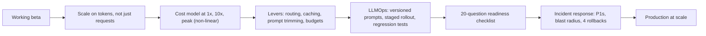
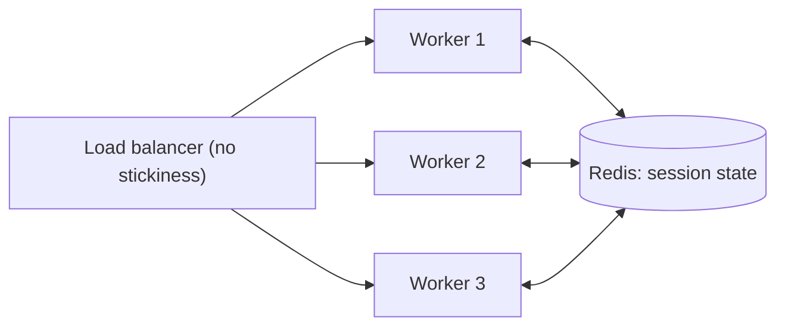
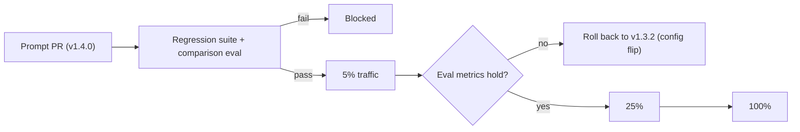
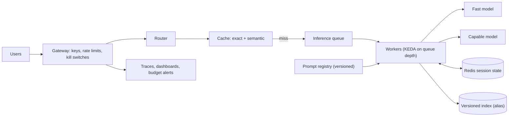

# Module 7 Study Guide: Scalability, Cost Optimisation, and Production Operations

> A complete learning, revision, and interview-prep guide built from the Module 7 lecture transcript (the final module of the course), the LLMOps lesson-resource sheet, and the case-study source list.
> You should be able to learn the whole module from this document without watching the videos.

📖 **How to read this guide**

- Plain text = what the lecture taught (cleaned up and restructured).
- 📎 **Beyond the transcript** callouts = supplementary explanation added for depth. Treat these as extra context, not as what the instructor said.
- All code and configuration is **reconstructed illustration** (the lecture has none); each block is labelled that way. Prices are placeholders.
- Both case studies are **fictional composites**; their arithmetic was fact-checked by the course (see the case-study sources).

---

## 📑 Table of Contents

1. [Session Overview](#-session-overview)
2. [Learning Objectives](#-learning-objectives)
3. [Detailed Notes](#-detailed-notes)
    - [Part 1: Scaling Dimensions Unique to AI](#-part-1-scaling-dimensions-unique-to-ai)
    - [Part 2: Cost Architecture](#-part-2-cost-architecture)
    - [Part 3: LLMOps](#-part-3-llmops)
    - [Part 4: The Production Readiness Checklist](#-part-4-the-production-readiness-checklist)
    - [Part 5: AI Incident Response](#-part-5-ai-incident-response)
    - [Part 6: Scaling a Writing Assistant Case Study](#-part-6-scaling-a-writing-assistant-case-study)
    - [Part 7: Greenfield Fintech Platform Case Study](#-part-7-greenfield-fintech-platform-case-study)
    - [Part 8: The Six Production Anti-Patterns](#-part-8-the-six-production-anti-patterns)
4. [Glossary](#-glossary)
5. [Revision Notes](#-revision-notes)
6. [Cheat Sheet](#-cheat-sheet)
7. [Interview Questions and Answers](#-interview-questions-and-answers)
8. [Scenario-Based Questions](#-scenario-based-questions)
9. [Hands-on Exercises](#-hands-on-exercises)
10. [Practice Assignment](#-practice-assignment)
11. [Additional Resources](#-additional-resources)
12. [Final Revision Sheet](#-final-revision-sheet)

---

## 🗺 Session Overview

You've designed, selected, integrated, governed, and measured the system. **Now: how do you keep it running reliably and affordably at the scale the business needs?** The beta works at 500 users; the things that were invisible at 500 become loud at 50,000.

| Theme | What you get |
|---|---|
| Scaling | Token vs request throughput, context as a GPU resource, stateless vs stateful scaling, streaming timeouts, cache layers, AI-specific autoscaling signals, multi-region patterns |
| Cost | The six-part cost anatomy, a three-scale model with sensitivity analysis, routing, prompt optimisation, cache ROI, non-linear growth |
| LLMOps | How it differs from MLOps; prompt versioning, staged rollout, silent-regression defences, prompt regression testing, toolchain |
| Readiness | A 20-question production readiness checklist in five categories |
| Incidents | What counts as a P1 for AI, how AI incidents differ, and four no-deploy remediation options |
| Practice | A writing assistant scaling 500 → 500,000 users (retrofit) vs a fintech platform built for scale from day one |
| Failure modes | Six production anti-patterns, then the capstone |



> 💡 **The one sentence to remember:** *"Plan for success, not just for launch."*

---

## 🎯 Learning Objectives

By the end of this module you should be able to:

- [ ] Explain why AI systems scale on tokens per second, not just requests per second.
- [ ] Treat the context window as a GPU-memory resource and design context management.
- [ ] Scale stateless inference horizontally and externalise state for stateful sessions.
- [ ] Configure load balancers for long-lived streaming connections.
- [ ] Quote typical hit rates for exact-match, semantic, and prefix caches and structure prompts for them.
- [ ] Autoscale on queue depth, token throughput, GPU memory, and time-in-queue instead of CPU.
- [ ] Choose active-active, active-passive, or data-sovereign multi-region designs.
- [ ] List the six cost components and model monthly cost at launch, 10x, and peak with sensitivity analysis.
- [ ] Quantify savings from routing, prompt optimisation, and caching, and compute cache ROI correctly.
- [ ] Explain why AI costs scale non-linearly with users.
- [ ] Explain how LLMOps differs from MLOps and run prompts as versioned, tested, staged artefacts.
- [ ] Defend against silent regressions from provider updates.
- [ ] Apply the 20-question production readiness checklist.
- [ ] Classify AI P1 incidents, estimate blast radius, and use the four no-deploy remediations.
- [ ] Contrast the retrofit and greenfield case studies and recognise the six anti-patterns.

---

## 📘 Detailed Notes

The module's core teaching, organised into eight parts: scaling (Part 1), cost (Part 2), operations (Parts 3–5), two case studies (Parts 6–7), and anti-patterns (Part 8).

### 📈 Part 1: Scaling Dimensions Unique to AI

#### 🧠 Concept

The beta pattern: 50–500 users, acceptable latency, manageable cost, proud team, go-live approved. Then at scale: **token costs become a line item, occasional slowness becomes systematic, CPU-based autoscaling doesn't work, and the infrastructure is the wrong shape.** This part is about anticipating that.

#### 🪙 Token throughput vs request throughput

Standard services scale on **requests per second**. AI systems must scale on **requests per second and tokens per second**, which are not the same.

```text
System A: 1,000 short queries/minute      →  high RPS, low tokens per request
System B:   100 long-context agent sessions/minute →  10x fewer requests,
                                                      far more tokens, far more GPU memory per request
Sizing on request count alone → size for A, under-provision B.
```

> 📌 **Token count is the primary unit of AI infrastructure demand.** Understand your token profile before designing sizing, autoscaling triggers, or the cost model.

#### 🧠 The context window is a resource

A 50,000-token agent session occupies far more GPU memory than a fresh 500-token query, **yet both are "one concurrent request" to the load balancer.** For agents and multi-turn chat, design explicit context management from the start: *unbounded context growth shows up as a scaling constraint.*

#### ↔️ Horizontal scaling: stateless vs stateful

| Type | How it scales | Notes |
|---|---|---|
| **Stateless inference** (most API and self-hosted calls) | Add instances behind a load balancer | The easy case |
| **Stateful sessions** (agent loops, multi-turn with accumulated context) | State must **travel with the request** (sticky routing) or be **externalised** and rebuilt per request | **Sticky sessions** work but cause uneven load and lose sessions when an instance dies. **Externalised state (Redis, a DB)** is more resilient and scales better: **the right default for production agents at volume** |



💻 **Code Example: externalised session state** *(reconstructed illustration)*

```python
import json, redis

r = redis.Redis(host="redis.internal", port=6379, decode_responses=True)
SESSION_TTL_S = 60 * 60 * 4

def load_session(session_id: str) -> dict:
    raw = r.get(f"sess:{session_id}")
    return json.loads(raw) if raw else {"summary": "", "recent_turns": [], "step": 0}

def save_session(session_id: str, state: dict) -> None:
    state["recent_turns"] = state["recent_turns"][-8:]          # bounded context, not unbounded growth
    r.setex(f"sess:{session_id}", SESSION_TTL_S, json.dumps(state))

def handle_turn(session_id: str, user_msg: str, agent_step) -> str:
    state = load_session(session_id)                            # any worker can serve any turn
    reply, state = agent_step(state, user_msg)
    save_session(session_id, state)
    return reply
```

🔑 **Key lines:** no worker holds session memory; the stored history is capped, which also bounds GPU memory per request.

#### ⏳ Streaming needs long-lived connections

Load balancers default to short-lived connections. **A response that streams for 30 seconds is dropped by a 10-second timeout.** *Works fine in development, fails immediately under production load.*

💻 **Example: proxy settings for streamed inference** *(reconstructed illustration, nginx)*

```nginx
location /v1/chat/ {
    proxy_pass            http://inference_upstream;
    proxy_http_version    1.1;
    proxy_read_timeout    300s;     # longer than the slowest expected generation
    proxy_send_timeout    300s;
    proxy_buffering       off;      # flush tokens to the client as they arrive (SSE)
    proxy_set_header      Connection "";
}
```

📎 **Beyond the transcript:** managed load balancers have equivalent idle-timeout settings (e.g. AWS ALB defaults to 60 seconds); check every hop (CDN, ingress, gateway, service mesh).

#### 🗂 Caching layers at scale

| Layer | Typical hit rate | Implementation | Notes |
|---|---|---|---|
| **Exact match** | **5–15%** conversational; **30–60%** FAQ/templated/search | Redis, TTL = acceptable staleness | Zero inference cost on hits: *"the cheapest inference call is the one you don't make"* |
| **Semantic** | **15–40%** depending on query diversity and threshold | Embedding similarity lookup | **Threshold tuning** is the operational challenge |
| **Provider KV / prefix** | n/a | Automatic for stable prefixes | **Stable content first, variable last**: the cached prefix is as long as the stable content runs |

#### 📏 Autoscaling on AI-specific signals

**CPU and memory are poor signals:** a GPU inference server can be fully saturated with low CPU.

| Signal | Meaning | Action |
|---|---|---|
| **Queue depth** | Pending inference requests | Growing → scale out; empty with low request rate → scale in |
| **Token throughput utilisation** | Tokens/s processed vs pool capacity | *The closest analogue to CPU utilisation for inference* |
| **GPU memory utilisation** (self-hosted) | The binding constraint for LLM serving | Near saturation → new requests can't fit without more instances |
| **Time-in-queue (P95)** | Wait before inference starts | Direct measure of whether capacity meets the latency SLA |

💻 **Example: scaling inference workers on queue depth with KEDA** *(reconstructed illustration)*

```yaml
apiVersion: keda.sh/v1alpha1
kind: ScaledObject
metadata:
  name: inference-workers
spec:
  scaleTargetRef:
    name: inference-worker            # the Deployment to scale
  minReplicaCount: 2
  maxReplicaCount: 24
  cooldownPeriod: 300
  triggers:
    - type: prometheus
      metadata:
        serverAddress: http://prometheus.monitoring:9090
        query: sum(inference_queue_depth)            # pending requests
        threshold: "40"                              # target queue per replica
    - type: prometheus
      metadata:
        serverAddress: http://prometheus.monitoring:9090
        query: histogram_quantile(0.95, sum(rate(inference_queue_wait_seconds_bucket[2m])) by (le))
        threshold: "2"                               # P95 time-in-queue, seconds
```

📎 **Beyond the transcript:** self-hosted servers such as vLLM export metrics like waiting requests and KV-cache (GPU memory) usage that can feed the same triggers; metric names vary by version.

#### 🌍 Multi-region AI architecture

| Pattern | How | Pros | Cons |
|---|---|---|---|
| **Active-active** | Capacity in several regions; route by geography | Highest availability, lowest latency | Most complex and costly |
| **Active-passive** | Primary + failover secondary | Simpler, cheaper | Users notice the added latency during failover |
| **Data-sovereign** | Regulated requests processed **only** in the authorised region; **no failover exceptions** | Enforces residency | The primary region must be highly available: failing over to an unauthorised region isn't allowed |

#### 🎯 Key Takeaways

- Size and scale on tokens, not just requests; context length costs GPU memory.
- Externalise session state; configure long streaming timeouts at every hop.
- Autoscale on queue depth, token throughput, GPU memory, time-in-queue.
- Pick a multi-region pattern by latency, availability, and residency needs.
- Design for these at projected peak **before** launch.

---

### 💰 Part 2: Cost Architecture

#### 🧠 Concept

The most common way AI succeeds technically and fails commercially: users love it, usage grows, and finance asks why the feature 50,000 users now use **costs more than the entire previous infrastructure budget.** *"It succeeded its way into a cost crisis"* (Module 1's "victim of your own success").

#### 🧩 The cost anatomy

| Component | Driver | Notes |
|---|---|---|
| **LLM inference** | (input tokens × in-price + output tokens × out-price) × requests | **Dominant at scale**; scales most directly with usage |
| **Embedding inference** | Every document at ingestion + every query at retrieval | Cheap per token; material with large corpora and frequent ingestion |
| **Vector DB** | Vectors stored + queries executed | Storage scales with KB size; queries with volume |
| **Orchestration compute** | App tier coordinating components | Usually minor; material for complex agents at volume |
| **Data pipeline compute** | Ingestion jobs | Batch; non-trivial for large, fresh corpora |
| **Monitoring and observability** | Logs, traces, evaluation runs | **Often underestimated** |

#### 🧮 The formula and three scales

```text
Monthly LLM cost = (avg_in × in_price + avg_out × out_price) × requests_per_day × 30
```

*Both* halves of the per-request figure scale with volume and days.

| Scale | Meaning |
|---|---|
| **Launch-day volume** | Minimum viable cost figure |
| **10x launch** | Where surprises typically hit: *the product succeeds but the model was only validated at launch* |
| **Projected peak** | *"The scale you'd be proud to reach"* |

**At each scale, vary assumptions** (session length growth, cache hit rate 20% vs 40%). *Sensitivity analysis separates cost models that hold from ones that surprise you.*

💻 **Code Example: three-scale cost model with sensitivity** *(reconstructed illustration; prices are placeholders)*

```python
from itertools import product

def monthly_cost(req_day, tok_in, tok_out, p_in=3.0, p_out=15.0, cache_hit=0.0,
                 routed_share=0.0, cheap_ratio=0.1):
    per_req = (tok_in * p_in + tok_out * p_out) / 1e6
    blended = per_req * ((1 - routed_share) + routed_share * cheap_ratio)   # routing
    return blended * req_day * 30 * (1 - cache_hit)                          # cache hits cost ~0

scales = {"launch": 20_000, "10x": 200_000, "peak": 600_000}
for (name, vol), growth, hit in product(scales.items(), [1.0, 1.4], [0.2, 0.4]):
    c = monthly_cost(vol, 2_000 * growth, 400 * growth, cache_hit=hit, routed_share=0.7)
    print(f"{name:>6} | session growth x{growth} | cache {hit:.0%} | ${c:>10,.0f}/month")
```

📝 **What it shows:** each scale is computed under several assumptions, so the business case sees a range rather than one optimistic number.

#### 🔀 Lever 1: model routing

Not every request needs the most expensive model (*"what are your opening hours?"* vs a multi-step analysis of three conflicting documents). A lightweight classifier (small model or rules) routes each request.

```text
Route 70% of traffic to a model 10x cheaper:
new cost = 0.30 × 1 + 0.70 × 0.1 = 0.37  →  ~60% saving (63%), no quality loss on the 70%
```

| Routing criterion | Examples |
|---|---|
| **Query complexity** | Token count, multi-step language, domain terms |
| **Request type** | FAQ vs analysis vs generation vs extraction |
| **User tier** | Free → cheaper; paid → capable |
| **Confidence in scope** | Known in-scope patterns → cheap; ambiguous/out-of-scope → capable |

💻 **Code Example: a rule-first router with a classifier fallback** *(reconstructed illustration)*

```python
import re

MULTI_STEP = re.compile(r"\b(compare|analy[sz]e|trade-?offs?|step[- ]by[- ]step|plan|why)\b", re.I)

def route(query: str, user_tier: str, classify) -> str:
    if len(query) < 80 and not MULTI_STEP.search(query):
        return "fast-model"                               # short, routine
    if user_tier == "free" and not MULTI_STEP.search(query):
        return "fast-model"
    label, confidence = classify(query)                   # small, cheap classifier
    if label == "routine" and confidence >= 0.8:
        return "fast-model"
    return "capable-model"                                # complex or uncertain → capable tier
```

#### ✂️ Lever 2: prompt optimisation

*"Every unnecessary token in a prompt is money spent on context that doesn't improve the output."*

| Tactic | Example |
|---|---|
| Remove redundant few-shot examples | A model that reliably follows the format doesn't need three examples in every request |
| Trim retrieved context | Passing 10 chunks when 2 suffice pays for 8 useless ones |
| Maximise cached prefix | Stable system prompt as long as needed; variable content as short as possible |
| Compress long conversations | Summarise the first 15 of 20 turns into ~200 tokens instead of 3,000 |

> 📌 **A 30% cut in average input tokens = a 30% cut in input inference cost.**

#### 📊 Lever 3: caching, with the ROI computed correctly

```text
Savings         = hit_rate × total_requests × cost_per_uncached_request
Cache cost      = infrastructure + engineering to build and maintain
ROI             = (savings − cost) / cost          ← not savings / cost
```

At savings = cost, **true ROI is 0 (break-even)**; dividing savings by cost would show 1 and overstate the return.

💻 **Code Example: cache ROI** *(reconstructed illustration)*

```python
def cache_roi(hit_rate, requests_month, cost_per_request, infra_month, eng_month):
    savings = hit_rate * requests_month * cost_per_request
    cost = infra_month + eng_month
    return {"savings": round(savings), "cost": cost, "roi": round((savings - cost) / cost, 2)}

print(cache_roi(0.10, 6_000_000, 0.0105, infra_month=900, eng_month=2_500))
# {'savings': 6300, 'cost': 3400, 'roi': 0.85}
```

📝 **What it shows:** even a 10% exact-match hit rate pays back at high volume; at low volume the same cache may not.

#### 📉 Why cost scales non-linearly

| Proof of concept | Production |
|---|---|
| Short conversations; curious evaluators; bounded structured tests | Engaged users with **longer sessions**; accumulated history; agents exploring more paths; **different cache hit rates** |

*$200/month at 1,000 users → linearly $200,000 at 1M users → in practice often more.* Model it non-linearly: **session length as a variable, cache hit-rate degradation as queries diversify, growing agent complexity as users push boundaries.**

#### 🎯 Key Takeaways

- Six cost components; inference dominates; observability is often forgotten.
- Model at launch, 10x, and peak with sensitivity ranges.
- Levers: routing (~60% at 70%/10x), prompt trimming (proportional savings), caching (ROI = (savings − cost)/cost).
- Costs grow non-linearly with engagement.

---

### 🔁 Part 3: LLMOps

#### 🧠 Concept

MLOps arose because training a model and operating it are different disciplines. **LLMOps** applies that insight to LLM systems, with different tooling, cadence, and failure modes.

| | Classical MLOps | LLMOps |
|---|---|---|
| Primary artefact | A trained model | **Prompts, RAG data, fine-tuning adapters** |
| Change mechanism | Retraining (expensive, infrequent) | Edit a prompt (minutes); deploy in an afternoon |
| Cadence | Weeks to months | **Days to weeks** |
| Quality metric | Defined (accuracy, F1, RMSE) on a held-out set | **Open-ended, task-dependent**; needs Module 6's evaluation stack |
| Characteristic risk | Stale model | A prompt change that silently degrades edge cases **reaching millions before anyone notices**; silent provider updates |

> ⚠️ *Faster doesn't mean safer.*

#### 🗃 Prompt versioning and deployment

| Practice | Why |
|---|---|
| **Prompts in version control**, reviewed and merged like code | Every change tracked |
| **Version ID on every deployed prompt** and **every production interaction** | Correlate a regression's start with deployment history *in minutes* instead of *"debugging without a timeline"* |
| **Staged rollout** (5% → 10% → …) watching eval metrics | Contain regressions |
| **Rollback = configuration change**, not code deployment | Prompt iteration in hours, code in days |



💻 **Example: semantically versioned prompt config** *(reconstructed illustration)*

```yaml
# prompts/writing-assistant.yaml — deployed as runtime configuration
id: writing-assistant
active: "1.3.2"
candidate:
  version: "1.4.0"
  traffic_percent: 5
versions:
  "1.3.2":
    changelog: "Tightened tone guidance for business emails"
    file: prompts/writing-assistant/1.3.2.txt
  "1.4.0":
    changelog: "Removed two redundant format examples (-310 input tokens)"
    file: prompts/writing-assistant/1.4.0.txt
eval_baseline:
  faithfulness: 0.91
  format_compliance: 0.995
```

#### 🌫 The silent regression problem

Providers update models, sometimes silently. **The system still runs, responses return, latency and errors are normal**, but the output distribution shifted: format changed slightly, a field sometimes disappears, the refusal threshold moved. *Users notice before monitoring; the investigation starts three weeks later.*

| Mitigation | Detail |
|---|---|
| **Pin model versions** where providers allow | Decouples your timeline from the provider's releases (migration still comes eventually) |
| **Continuous automated regression tests** | Not just at deploy time: the golden set runs against the model regularly, so you find out **the day it happens** |
| **Canary set + format compliance monitoring** (Module 6) | Built for exactly this |

💻 **Code Example: continuous regression against pinned and latest model** *(reconstructed illustration)*

```python
def nightly_model_check(golden, run, pinned="provider-model-2026-05-01", latest="provider-model-latest"):
    """Detect behaviour changes in the provider's latest model before you migrate."""
    diffs = []
    for case in golden:
        a, b = run(pinned, case["input"]), run(latest, case["input"])
        if case["check"](a) != case["check"](b):          # compare properties, not exact text
            diffs.append({"case": case["id"], "pinned_ok": case["check"](a), "latest_ok": case["check"](b)})
    return {"changed_cases": diffs, "safe_to_migrate": not any(not d["latest_ok"] for d in diffs)}
```

#### 🧪 Prompt regression testing

*"This sounds obvious. Most teams lack it until they've been burned."*

| Component | Detail |
|---|---|
| **Regression suite** | Fixed inputs (happy path, edge cases, known failures) + expected outputs/criteria; **runs automatically on every prompt change**; **a failure blocks deployment** |
| **Comparison evaluation** | New prompt vs current production on **recent production interactions**; catches regressions outside the golden set |
| **Decision** | Both pass → staged rollout. Either fails → blocked; investigate first |

#### 🧰 The LLMOps toolchain

| Tool | Role |
|---|---|
| **PromptLayer** | Prompt versioning, logging, A/B testing |
| **LangSmith** | Tracing, evaluation, datasets; widest adoption in the LangChain ecosystem |
| **Langfuse** | Open-source, self-hostable alternative to LangSmith; pick when **data sovereignty or cost** constrains |
| **RAGAS, DeepEval** | Evaluation frameworks run inside the regression pipeline, triggered by prompt changes and model updates, blocking on regression |

#### 🎯 Key Takeaways

- LLMOps ≠ MLOps: faster artefacts (prompts, RAG data, adapters), open-ended quality.
- Version prompts, tag every interaction, roll out in stages, roll back by config.
- Pin models, run regression continuously, watch canaries and format compliance.
- Regression suite + comparison eval gate every prompt change.

---

### ✅ Part 4: The Production Readiness Checklist

#### 🧠 Concept

For normal software, "ready" means tests pass and staging is stable. AI failure modes are **probabilistic, latent, scale-dependent, or adversarial**, so the question is harder. **Twenty questions in five categories.**

#### 🛡 Reliability and availability

| # | Question | What "yes" looks like |
|---|---|---|
| 1 | Defined fallback for **every** AI failure mode? | A specific, **tested** fallback per touchpoint that fails gracefully |
| 2 | **Circuit breakers** stop AI failures cascading to non-AI features? | The AI is a contained failure domain; the product continues |
| 3 | **Health checks** for all AI components? | Include a **lightweight inference test**, not just "process alive" |
| 4 | **Load-tested at 2x expected peak?** | Latency shifts, rate limits, cache behaviour observed before users find them |

#### 💸 Cost and capacity

| # | Question | What "yes" looks like |
|---|---|---|
| 5 | Monthly cost modelled at launch traffic? | From realistic token counts, **not extrapolated from the PoC** |
| 6 | **Cost alerts** configured? | At **50%, 80%, 100%** of budget; *the 50% alert is when you still have time* |
| 7 | **Per-request token budget**? | Agents and long-context pipelines capped |
| 8 | **Cost-efficient fallback** for traffic spikes? | Automatic degradation to cheaper tiers or cache instead of just spending more |

#### 🔭 Observability

| # | Question | What "yes" looks like |
|---|---|---|
| 9 | Every interaction logged with full context? | Input, retrieved content, output, model and prompt versions, latency, tokens |
| 10 | Dashboards for key AI metrics? | Faithfulness trend, format compliance, escalation rate, P50/P95 latency, token cost per request |
| 11 | Distributed tracing across the full chain? | Retrieval → generation → validation → guardrails in one trace |
| 12 | Evaluation running **continuously** on production samples? | Running, not on demand |

#### 🔐 Security and governance

| # | Question | What "yes" looks like |
|---|---|---|
| 13 | Prompt injection tested? | Direct **and** indirect; results logged |
| 14 | Document-level ACLs **in place** for all RAG retrieval? | Tested; cross-user retrieval verified impossible |
| 15 | PII redaction **validated**? | Against the real distribution of PII your users submit |
| 16 | Audit trail compliant? | For regulated domains: **binary**, compliant or not |

#### 🧑‍🚒 Operations

| # | Question | What "yes" looks like |
|---|---|---|
| 17 | **Runbooks for the top five AI failures**? | Mass hallucination, data leakage, complete AI failure, guardrail failure at scale, silent provider regression; each with an owner |
| 18 | **On-call escalation path** for AI incidents? | Who's paged at 2am, who can roll back a prompt without a deploy, who calls the provider |
| 19 | **Prompt rollback without a code deployment**? | Yes, via prompt-as-configuration, built before you need it |
| 20 | **Pre-launch red team** on AI attack surfaces? | Injection, retrieval manipulation, access control, agent scope; findings, mitigations, sign-off |

💻 **Code Example: budget alerts at 50/80/100% with automatic degradation** *(reconstructed illustration)*

```python
THRESHOLDS = [(0.5, "notify"), (0.8, "notify+route_cheaper"), (1.0, "page+cache_only_for_free_tier")]

def budget_guard(spend_to_date: float, monthly_budget: float, fired: set, act) -> set:
    ratio = spend_to_date / monthly_budget
    for level, action in THRESHOLDS:
        if ratio >= level and level not in fired:
            act(action, ratio)                     # alert, and at higher levels change routing
            fired.add(level)
    return fired
```

> 📌 A system that can't answer **ten** of these is carrying real, unaddressed risk in those categories. *"The checklist isn't an obstacle between you and launch."*

#### 🎯 Key Takeaways

- Five categories: reliability, cost, observability, security/governance, operations.
- Answer all twenty with evidence before go-live.

---

### 🚨 Part 5: AI Incident Response

#### 🔥 What counts as a P1

| P1 | Definition |
|---|---|
| **Mass hallucination** | **Systematic** confidently wrong information affecting a significant share of interactions (not occasional errors) |
| **Data leakage** | Unauthorised content or PII surfaced; **P1 regardless of volume: one confirmed instance triggers full response** |
| **Complete failure, inadequate fallback** | AI down and the fallback can't keep the product functional |
| **Guardrail failure at scale** | Prohibited content reaching users above the acceptable threshold |

#### 🧩 How AI incidents differ

| Property | Implication |
|---|---|
| **Detection lag** | Often found by user complaints first; make monitoring (format compliance, escalation rate) sensitive enough to beat users to it |
| **Scope ambiguity** | Blast radius is unclear without audit logs and correlation IDs. **Blast-radius estimation is a capability in its own right** |
| **No-deploy remediation** | You need levers that work without shipping code (below) |

> 📌 *"'We think it affected some users' is not an incident report. 'It affected these four thousand two hundred interactions, identified by these correlation IDs, starting at this timestamp' is."*

💻 **Code Example: queryable blast radius** *(reconstructed illustration, SQL)*

```sql
-- Interactions served by the bad prompt version on the affected feature, with who saw them
SELECT correlation_id, user_id, tenant_id, created_at
FROM ai_interactions
WHERE feature = 'writing-assistant'
  AND prompt_version = '1.4.0'
  AND created_at BETWEEN '2026-09-20 09:12:00+00' AND '2026-09-20 14:40:00+00'
ORDER BY created_at;

-- Summary for the incident report
SELECT COUNT(*) AS interactions, COUNT(DISTINCT user_id) AS users, COUNT(DISTINCT tenant_id) AS tenants
FROM ai_interactions
WHERE feature = 'writing-assistant' AND prompt_version = '1.4.0'
  AND created_at BETWEEN '2026-09-20 09:12:00+00' AND '2026-09-20 14:40:00+00';
```

#### ⏪ Four remediation options that don't need a code deployment

| Option | When | Prerequisite |
|---|---|---|
| **Prompt rollback** | A prompt version regressed | Prompt-as-configuration (most teams build this one) |
| **Corpus / index rollback** | A bad ingestion run (corrupted export, poisoned batch) degraded retrieval; *re-ingesting forward just adds bad data on top* | **Chunk-level version tracking**, so "revert the index to yesterday noon" is executable |
| **Fine-tuned adapter rollback** | A new LoRA adapter regressed | Adapters versioned and deployable like prompts |
| **Per-feature kill switches** | One feature is on fire | Disable **one** AI feature at the gateway/flag layer while the rest of the product works (not all-or-nothing) |

💻 **Code Example: index rollback via versioned aliases** *(reconstructed illustration)*

```python
class IndexRegistry:
    """Each ingestion run writes a new immutable index version; queries use an alias."""
    def __init__(self, store):
        self.store = store                                    # e.g. a table: alias -> version

    def publish(self, alias: str, new_version: str):
        self.store.history(alias).append(new_version)
        self.store.set(alias, new_version)

    def rollback(self, alias: str, to_version: str | None = None):
        history = self.store.history(alias)
        target = to_version or history[-2]                    # previous good version
        self.store.set(alias, target)                         # instant; no re-ingestion
        return target

# Queries always read registry.current("kb-prod"); a bad run is undone with rollback("kb-prod").
```

📎 **Beyond the transcript:** many vector databases support collection aliases or snapshots that implement this pattern natively.

> 🚀 **All four must exist and be rehearsed**, not just documented, before launch.

#### 🎯 Key Takeaways

- P1s: mass hallucination, any data leakage, failure without adequate fallback, guardrail failure at scale.
- Design for detection before users, and for queryable blast radius.
- Four no-deploy levers: prompt, index, adapter rollback; per-feature kill switch.

---

### ✍️ Part 6: Scaling a Writing Assistant Case Study

> Fictional composite; numbers illustrative and fact-checked by the course for internal consistency.

**The beta:** an AI writing assistant in a SaaS product. **500 users, $150/month inference**, users love it. **Projected 500,000 users within six months.**

**Beta architecture:** single OpenAI API integration, **no caching, no routing, no LLMOps tooling, system prompt hard-coded.** *"Fine for what it was. It is not a production architecture."*

#### 💥 Cost explosion analysis

- Beta usage: sessions averaging **2,400 input + 800 output tokens across three interactions per session per day.**
- **Linear:** 500 → 500,000 users = **1,000x** the beta cost (~$150,000/month).
- **Non-linear:** engaged users have **~40% longer sessions** → **~1,400x** (1,000 × 1.4) on inference alone (~$210,000/month).
- Additional, **unquantified** pressures on top: cache hit rates behave differently at scale, and usage **peaks around business hours** instead of spreading evenly.

> 📌 That number must be **in the business case before the launch investment**, not discovered in month three.

📎 **From the course fact-check:** an earlier draft folded the cache and peak effects into the 1,400x; it was corrected to attribute 1,400x to token growth only.

#### 🗂 Caching strategy

| Cache | Analysis | Effect |
|---|---|---|
| **Semantic** | Beta query analysis: **~25% hit rate** (similar grammar and rewrite requests) | 25% of 500,000 daily sessions at ~zero marginal cost; clear payback |
| **Exact match** | Document the assistant's internal templates ("improve this paragraph", "make this shorter") and cache structurally identical requests with identical content | Higher hits for users on similar document types |

#### 🔀 Model routing redesign

| Category (from beta logs) | Share | Model |
|---|---|---|
| Grammar and spelling checks (deterministic, bounded) | **55%** | Smaller, cheaper model |
| Style and tone rewrites (moderate, context-dependent) | — | Capable tier |
| Structure and argument improvement (deep reasoning) | — | Capable/frontier tier |

**Routing the 55% cuts total inference cost by ~40%** with no measurable grammar-quality loss. The router: **a lightweight intent classifier trained on beta session logs**, one extra small call per session, *"pays for itself in the first day."*

📎 **From the course fact-check:** a 40% saving from routing 55% implies the cheaper model costs about **27% of the frontier model** (~3.7x cheaper), conservative against real pricing spreads.

```text
1 − 0.55 × (1 − r) = 0.60  →  r ≈ 0.27
```

💻 **Code Example: the combined effect** *(reconstructed illustration)*

```python
def combined_reduction(route_share=0.55, cheap_ratio=0.27, semantic_hit=0.25):
    after_routing = 1 - route_share * (1 - cheap_ratio)          # ≈ 0.60 of original
    after_cache = after_routing * (1 - semantic_hit)             # hits skip inference
    return round(1 - after_routing, 3), round(1 - after_cache, 3)

print(combined_reduction())    # (0.401, 0.551): ~40% from routing, ~55% with caching layered on
```

📎 **Beyond the transcript:** the combined figure assumes cache hits are spread evenly across routed and unrouted traffic; in practice grammar checks may hit the cache more, so measure it.

#### 🔁 LLMOps implementation

- Extract the hard-coded prompt into version control; it becomes **v1.0.0**.
- Every change versioned, **tested against a golden dataset built from beta interactions**, and rolled out in stages.
- Immediate payoff: when the first regression arrives, *"there's a deployment history to correlate against."*

#### 🎯 Key Takeaways

- Linear forecasts undershoot; model session growth (1,400x vs 1,000x).
- Semantic cache (~25%) and routing (~40%) are the big levers.
- Prompt versioning and a beta-derived golden set make future regressions diagnosable.

---

### 🏦 Part 7: Greenfield Fintech Platform Case Study

> Fictional composite; qualitative claims, no numeric errors found in the course fact-check.

**The product:** an AI financial-advisor startup. No legacy, **zero users today**, projecting **0 → 200,000 users over 18 months.** Designing for scale from day one is **a deliberate trade:** more upfront engineering, less than the retrofit costs later.

#### 🧮 Cost model before the first line of code

| Scale | Assumptions |
|---|---|
| **10,000 users** | Baseline, no optimisation |
| **50,000 users** | Semantic cache at projected hit rate + model routing |
| **200,000 users** | Both optimisations + **token budgets** + **conversation compression** |

The gap between unoptimised and optimised cost at 200,000 users is large enough to **change the pricing model and the fundraising narrative**: *this is why cost architecture belongs at the design stage.*

#### 🔀 Routing designed in

| Query type | Example | Model |
|---|---|---|
| **Factual lookup** | "What's the current interest rate on this product type?" | Fast, cheap model |
| **Personalised planning** | "Given these goals and risk profile, what allocation makes sense?" | Frontier model with full context |

The router **and an evaluation framework per model tier** are built before launch; the cost model is **validated against real routing data in month one.**

#### 🔁 LLMOps from day one

- Prompt versioning configured **before the first user.**
- **Golden dataset of 50 examples** built during development; **RAGAS on production samples from week one.**
- **On-call model** defined, documented, and **exercised in a dry run** before public launch.

#### ⚖️ Retrofit vs greenfield

| | Writing assistant (retrofit) | Fintech (greenfield) |
|---|---|---|
| When the work happened | After success, **under time pressure on a live product** | Before launch, deliberately |
| Effort | **~Two months** of engineering | **~Two weeks** of upfront design |
| Stability | Risky transition | Stable from day one |
| First incident | Diagnosed in days | **Diagnosed in hours** |

> 📌 *"Plan for success, not just for launch. The investment is lower than the retrofit. And the victim-of-your-own-success scenario is avoidable with one afternoon of cost modelling."*

**Honest caveat:** real products have more categories and messier token distributions; *the categories of work are the same whether you do them under pressure after launch or deliberately before it.*

#### 🎯 Key Takeaways

- Cost model at three scales before code; it can change pricing and fundraising.
- Router, per-tier evals, golden set, and on-call drill before launch.
- Upfront design (~2 weeks) beats retrofit (~2 months).

---

### 🚫 Part 8: The Six Production Anti-Patterns

The gap between what this module teaches and what teams do under deadlines, constraints, and *"the optimism that comes from a working beta."*

| # | Anti-pattern | 🔎 What happens | 🚀 Prevention |
|---|---|---|---|
| 1 | **Linear cost extrapolation** | Beta cost × scale factor sent to finance; sessions lengthen, user mix shifts, cache hit rates evolve; the model is **wrong by 2x** and becomes a boardroom issue within three months | Three scales; session length as a variable; effect of each optimisation; realistic cache-hit degradation |
| 2 | **Most expensive model for everything** | "Opening hours?" goes to the frontier model; fine at 10,000 users, **structural** at 1M; routing becomes an emergency project under revenue pressure | A lightweight intent classifier is **a day of work**; ROI usually favourable within a month |
| 3 | **No prompt versioning** | Prompts as string constants; a regression appears; **three weeks** of commit archaeology; roll back a suspicious change; **regression persists** because the cause was something else | Prompts as deployable artefacts: version control, deployment process, evaluation baselines |
| 4 | **Silent regression from model updates** | A field starts returning null; 200 OK, valid JSON; **three weeks** unnoticed; a month of corrupted downstream records; *"the provider updated the model seventeen days ago"* | Canary set + format compliance monitoring: cheap, same-day detection |
| 5 | **Evaluation built after the incident** | Golden set and criteria built under pressure; **no baseline** to size the regression or prove the fix worked | **A day** for RAGAS, **a day** for the first golden set, **an afternoon** for CI: less than one week of post-incident work |
| 6 | **No cost circuit breakers** | An agent loop bug, a press spike, or an integration test hitting production burns **a week's tokens in an hour**, noticed at month end | Budget alerts (the 50% alert fires in hour one), orchestration-layer token limits, gateway rate limits per service/user |

#### 🎓 Course close and the capstone

Seven modules: **scope → design → model strategy → integration → governance → measurement → operations at scale.** The capstone asks for a complete architecture proposal (system design, model strategy, governance, measurement, operational model) for one of three scenarios, **HealthBridge, LexAI, or RetailMind**, presented as if to a company's technology leadership. Rubric and example solutions are available in the course.

> 💡 *"The design work is what you bring to the next real engagement where someone asks you to scope, design, govern, and communicate an AI system. That's the job."*

#### 🎯 Key Takeaways

- Non-linear cost models, routing, prompt versioning, drift detection, early evaluation, and cost circuit breakers are all design-time decisions.
- Each prevention costs a day or an afternoon; each failure costs weeks or a quarter.

---

## 📚 Glossary

| Term | Definition | Why It Matters |
|---|---|---|
| Request throughput | Requests per second | Insufficient alone for AI sizing |
| Token throughput | Tokens processed per second | The primary unit of AI infrastructure demand |
| Context window as a resource | GPU memory consumed per request grows with context | Long sessions constrain concurrency |
| Stateless inference | Self-contained requests | Scales horizontally with ease |
| Stateful session | Accumulated context across turns or steps | Needs sticky routing or externalised state |
| Sticky sessions | Routing a session to the same instance | Uneven load, lost sessions on failure |
| Externalised state | Session state in Redis or a DB | Resilient default for production agents |
| Streaming timeout | Connection timeout for long streamed responses | Short defaults drop long generations |
| Exact-match cache | Response cache keyed by identical prompt | 5–15% conversational, 30–60% FAQ hit rates |
| Semantic cache | Cache keyed by similar meaning | 15–40% hit rates; needs threshold tuning |
| KV / prefix cache | Provider reuse of stable prompt prefixes | Put stable content first |
| Queue depth | Pending inference requests | Primary autoscaling signal |
| Token throughput utilisation | Tokens/s vs pool capacity | Inference analogue of CPU utilisation |
| GPU memory utilisation | Memory used by models and KV cache | Binding constraint when self-hosting |
| Time-in-queue | Wait before inference begins (P95) | Direct SLA capacity signal |
| KEDA | Kubernetes event-driven autoscaler | Scales on custom metrics like queue depth |
| Active-active / active-passive / data-sovereign | Multi-region patterns | Trade latency, availability, residency, cost |
| Cost anatomy | Inference, embeddings, vector DB, orchestration, pipelines, observability | Complete view of spend |
| Three-scale cost model | Launch, 10x, projected peak | Prevents "victim of success" |
| Sensitivity analysis | Varying session length, cache hit rate, etc. | Shows the range, not one number |
| LLM router | Classifier sending requests to cheap or capable models | ~60% saving in the 70%/10x example |
| Prompt optimisation | Removing unneeded tokens from prompts and context | Savings proportional to tokens removed |
| Conversation compression | Summarising older turns | Cuts input tokens in long sessions |
| Cache ROI | (savings − cost) / cost | Break-even is 0, not 1 |
| Non-linear cost scaling | Cost growing faster than users | Engagement, cache, and agent effects |
| LLMOps | Operating discipline for LLM systems | Prompts, RAG data, adapters as artefacts |
| Prompt versioning | Version control + IDs on every interaction | Timeline for regressions |
| Staged rollout | Gradual traffic exposure for new versions | Contains regressions |
| Silent regression | Behaviour change from a provider update with no errors | Needs continuous tests and canaries |
| Model version pinning | Fixing a specific provider model version | Decouples from provider release cadence |
| Prompt regression suite | Fixed cases that must keep passing | Blocks bad prompt changes |
| Comparison evaluation | New vs production on recent real interactions | Catches issues outside the golden set |
| PromptLayer / LangSmith / Langfuse | LLMOps tools for versioning, tracing, evaluation | Toolchain options |
| Production readiness checklist | 20 questions in 5 categories | Go-live gate |
| Health check with inference test | Liveness probe that runs a tiny inference | Detects broken model serving |
| Cost alerts (50/80/100%) | Budget thresholds | 50% gives time to act |
| Runbook | Written response plan per failure scenario | Owned, rehearsed responses |
| AI P1 | Mass hallucination, any data leakage, failure without fallback, guardrail failure at scale | Triggers full incident response |
| Blast radius | Exact set of affected interactions/users | Needs correlation IDs and audit logs |
| Corpus / index rollback | Reverting the retrieval index to a prior version | Undoes bad ingestion runs |
| Adapter rollback | Reverting a fine-tuned adapter version | Treat adapters as deployable artefacts |
| Per-feature kill switch | Disable one AI feature without a deploy | Contain incidents narrowly |
| Retrofit tax | Extra cost of adding scale features after launch | Why to design for scale early |
| Capstone | Final course project (HealthBridge, LexAI, RetailMind) | Applies all seven modules |

---

## 📝 Revision Notes

### ⏱ One-Minute Revision

- **Scale on tokens, not just requests.** Context length costs GPU memory.
- **Externalise session state**; set long streaming timeouts at every hop.
- **Caches:** exact 5–15% (chat) / 30–60% (FAQ); semantic 15–40%; prefix = stable content first.
- **Autoscale** on queue depth, token throughput, GPU memory, P95 time-in-queue; not CPU.
- **Multi-region:** active-active, active-passive, data-sovereign (no failover to unauthorised regions).
- **Cost anatomy:** inference, embeddings, vector DB, orchestration, pipelines, observability.
- **Model cost** at launch, 10x, peak with sensitivity; costs grow **non-linearly**.
- **Levers:** routing (70% at 10x cheaper ≈ 60%), prompt trimming (proportional), caching (ROI = (savings − cost)/cost).
- **LLMOps:** prompts/RAG data/adapters as artefacts; version, tag, stage, roll back by config; pin models; continuous regression; canaries.
- **Checklist:** 20 questions across reliability, cost, observability, security/governance, operations.
- **Incidents:** P1 types; detection lag; blast radius via correlation IDs; four no-deploy remediations.
- **Cases:** writing assistant 1,000x linear vs ~1,400x real; 25% semantic cache; routing 55% → ~40% saving; fintech designed at three scales with routing and LLMOps from day one (2 weeks vs 2 months).
- **Anti-patterns:** linear extrapolation, frontier-for-everything, unversioned prompts, silent regressions, late evaluation, no cost circuit breakers.

---

## 📄 Cheat Sheet

### 🧭 Frameworks at a glance

| Framework | Items |
|---|---|
| AI scaling dimensions | Token throughput · Context as resource · Stateful sessions · Streaming timeouts · Caching · AI autoscaling signals · Multi-region |
| Autoscaling signals | Queue depth · Token throughput · GPU memory · P95 time-in-queue |
| Multi-region | Active-active · Active-passive · Data-sovereign |
| Cost anatomy | Inference · Embeddings · Vector DB · Orchestration · Data pipeline · Observability |
| Cost scales | Launch · 10x · Peak |
| Cost levers | Routing · Prompt optimisation · Caching · Token budgets · Compression |
| Routing criteria | Complexity · Request type · User tier · Scope confidence |
| LLMOps practices | Version control · Version IDs on interactions · Staged rollout · Config rollback · Pinning · Continuous regression · Canaries |
| Readiness categories | Reliability · Cost · Observability · Security/governance · Operations |
| AI P1s | Mass hallucination · Data leakage · Failure w/o fallback · Guardrail failure at scale |
| No-deploy remediations | Prompt rollback · Index rollback · Adapter rollback · Per-feature kill switch |
| Top-5 runbooks | Mass hallucination · Data leakage · Complete AI failure · Guardrail failure · Silent provider regression |
| Anti-patterns | Linear extrapolation · Frontier for everything · No prompt versioning · Silent regression · Late evaluation · No cost breakers |

### 🔢 Numbers worth remembering (illustrative, from the course)

| Item | Value |
|---|---|
| Streaming timeout failure example | 30 s stream vs 10 s LB timeout |
| Exact cache hit rates | 5–15% conversational; 30–60% FAQ/search |
| Semantic cache hit rates | 15–40% |
| Routing rule of thumb | 70% at 10x cheaper → ~60% saving |
| Prompt trimming | 30% fewer input tokens → 30% lower input cost |
| Conversation compression | 15 turns → ~200 tokens instead of 3,000 |
| Linear trap | $200 at 1k users → "$200k at 1M" (often more) |
| Load test | 2x expected peak |
| Budget alerts | 50%, 80%, 100% |
| Blast-radius example | 4,200 interactions by correlation ID |
| Writing assistant beta | 500 users, $150/month; 2,400 in + 800 out tokens per session |
| Scale-up | 1,000x linear; ~1,400x with +40% session tokens |
| Semantic cache (writing) | ~25% hit rate |
| Routing (writing) | 55% of volume → ~40% cost reduction (cheap model ≈ 27% of frontier price) |
| Fintech | 0 → 200,000 users in 18 months; cost modelled at 10k/50k/200k; 50-example golden set |
| Retrofit vs greenfield | ~2 months vs ~2 weeks |
| Eval setup | 1 day RAGAS + 1 day golden set + an afternoon CI |

### ❓ Architect's question bank

- "What's our token profile, not just our request rate?"
- "Where does session state live if this pod dies?"
- "What's the idle timeout on every hop between client and model?"
- "What does the autoscaler actually watch?"
- "What does this cost at 10x, with 40% longer sessions and half the cache hit rate?"
- "What share of traffic really needs the frontier model?"
- "Which prompt version produced this answer?"
- "Would we notice a provider update today?"
- "Can we answer all twenty readiness questions?"
- "Can we list every affected interaction by correlation ID?"
- "Can we roll back the index, the adapter, and one feature without deploying?"

---

## 🎤 Interview Questions and Answers

### 🟢 Beginner

❓ **Q1. Why isn't requests per second enough to size AI infrastructure?**

✅ **Answer:** Requests vary enormously in tokens; fewer long-context requests can need far more compute and GPU memory than many short ones.

💡 **Explanation:** Token count is the primary unit of AI demand.

🎯 **Why Interviewers Ask This:** Core scaling insight.

➡️ **Possible Follow-up:** How would you measure your token profile?

❓ **Q2. Why do CPU metrics make poor autoscaling signals for inference?**

✅ **Answer:** GPU inference can be saturated while CPU is low; better signals are queue depth, token throughput, GPU memory, and time-in-queue.

💡 **Explanation:** Scale on what actually limits capacity.

🎯 **Why Interviewers Ask This:** Practical ops knowledge.

➡️ **Possible Follow-up:** Which signal ties most directly to the SLA?

❓ **Q3. What are typical cache hit rates?**

✅ **Answer:** Exact-match 5–15% for conversational AI and 30–60% for FAQ/search; semantic 15–40% depending on diversity and threshold.

💡 **Explanation:** Use them to estimate ROI, then measure your own.

🎯 **Why Interviewers Ask This:** Realistic expectations.

➡️ **Possible Follow-up:** How do you raise the prefix cache benefit?

❓ **Q4. List the components of AI system cost.**

✅ **Answer:** LLM inference, embedding inference, vector DB storage/queries, orchestration compute, data pipeline compute, monitoring/observability.

💡 **Explanation:** Inference dominates; observability is often underestimated.

🎯 **Why Interviewers Ask This:** Cost literacy.

➡️ **Possible Follow-up:** When does embedding cost become material?

❓ **Q5. Why model cost at three scales?**

✅ **Answer:** Launch shows the minimum, 10x is where surprises hit, peak tests whether success is affordable.

💡 **Explanation:** Add sensitivity analysis at each scale.

🎯 **Why Interviewers Ask This:** Planning discipline.

➡️ **Possible Follow-up:** Which assumptions would you vary?

❓ **Q6. How does LLMOps differ from MLOps?**

✅ **Answer:** Artefacts are prompts, RAG data, and adapters, changed in minutes and deployed in days, with open-ended quality; MLOps centres on retraining models with defined metrics over weeks or months.

💡 **Explanation:** Faster cadence brings faster ways to break things silently.

🎯 **Why Interviewers Ask This:** Operational framing.

➡️ **Possible Follow-up:** What's the LLMOps equivalent of a model registry?

❓ **Q7. Why should prompts be runtime configuration?**

✅ **Answer:** So rollbacks and staged rollouts don't need code deployments; prompt iteration speed is decoupled from release cycles.

💡 **Explanation:** Critical during incidents.

🎯 **Why Interviewers Ask This:** Operability.

➡️ **Possible Follow-up:** How do you still keep review and history?

❓ **Q8. What are the five categories of the production readiness checklist?**

✅ **Answer:** Reliability and availability, cost and capacity, observability, security and governance, operations.

💡 **Explanation:** Twenty questions across them.

🎯 **Why Interviewers Ask This:** Launch readiness thinking.

➡️ **Possible Follow-up:** Which question do teams skip most?

❓ **Q9. What counts as an AI P1?**

✅ **Answer:** Mass hallucination, any confirmed data leakage, complete failure with inadequate fallback, and guardrail failure at scale.

💡 **Explanation:** Data leakage is P1 even for a single instance.

🎯 **Why Interviewers Ask This:** Incident classification.

➡️ **Possible Follow-up:** Who do you page?

❓ **Q10. Why do streaming responses break behind default load balancers?**

✅ **Answer:** Streams keep connections open for many seconds; short idle timeouts drop them mid-response.

💡 **Explanation:** Set timeouts above the slowest expected generation at every hop.

🎯 **Why Interviewers Ask This:** Common production gotcha.

➡️ **Possible Follow-up:** Which hops would you check?

### 🟡 Intermediate

❓ **Q11. How do you scale stateful agent sessions?**

✅ **Answer:** Externalise session state (Redis/DB) so any instance can serve any turn; cap stored context; avoid sticky sessions that cause uneven load and lost sessions.

💡 **Explanation:** Externalised state is the production default at volume.

🎯 **Why Interviewers Ask This:** Distributed design.

➡️ **Possible Follow-up:** What goes in the stored state?

❓ **Q12. Compute the saving from routing 70% of traffic to a model 10x cheaper.**

✅ **Answer:** New cost = 0.3 + 0.7 × 0.1 = 0.37 of the original, a 63% saving (~60%).

💡 **Explanation:** Quality is unaffected if the 70% truly didn't need the frontier model.

🎯 **Why Interviewers Ask This:** Quantitative reasoning.

➡️ **Possible Follow-up:** What does the router itself cost?

❓ **Q13. How do you compute cache ROI correctly?**

✅ **Answer:** ROI = (savings − cost) / cost, where savings = hit rate × requests × cost per uncached request.

💡 **Explanation:** Savings/cost makes break-even look like 100% return.

🎯 **Why Interviewers Ask This:** Financial rigour.

➡️ **Possible Follow-up:** At what volume does a cache stop paying off?

❓ **Q14. Why does AI cost scale non-linearly?**

✅ **Answer:** Engaged users have longer sessions, history accumulates, agents explore more, and cache hit rates change as queries diversify.

💡 **Explanation:** Model session length and cache degradation explicitly.

🎯 **Why Interviewers Ask This:** Business realism.

➡️ **Possible Follow-up:** Give the writing assistant numbers.

❓ **Q15. How do you defend against silent provider regressions?**

✅ **Answer:** Pin versions where possible, run the golden set continuously (not just at deploy), and monitor canaries and format compliance.

💡 **Explanation:** You learn about the change the day it happens.

🎯 **Why Interviewers Ask This:** Real operational risk.

➡️ **Possible Follow-up:** How would you test a new model before migrating?

❓ **Q16. What's in a prompt regression gate?**

✅ **Answer:** A fixed regression suite (happy path, edge, known failures) that blocks on failure, plus comparison evaluation of new vs production prompts on recent real traffic.

💡 **Explanation:** Both must pass before a staged rollout.

🎯 **Why Interviewers Ask This:** Release engineering for prompts.

➡️ **Possible Follow-up:** How do you handle judge noise?

❓ **Q17. What makes an AI health check meaningful?**

✅ **Answer:** It runs a lightweight inference end to end, not just a process-alive check.

💡 **Explanation:** A running process with a broken model or credential is still unhealthy.

🎯 **Why Interviewers Ask This:** Practical reliability.

➡️ **Possible Follow-up:** How often and how cheap should it be?

❓ **Q18. What is a cost-efficient fallback for traffic spikes?**

✅ **Answer:** Automatic degradation to cheaper tiers, cache-only responses for some traffic, or rate limits per user tier, instead of spending without limit.

💡 **Explanation:** Checklist question 8.

🎯 **Why Interviewers Ask This:** Cost resilience.

➡️ **Possible Follow-up:** Which users keep the premium tier?

❓ **Q19. Why is blast-radius estimation its own capability?**

✅ **Answer:** Without audit logs and correlation IDs you can't identify affected interactions, users, or tenants, which incident reports and notifications require.

💡 **Explanation:** Design queryable blast radius before incidents.

🎯 **Why Interviewers Ask This:** Incident maturity.

➡️ **Possible Follow-up:** What fields must each interaction record carry?

❓ **Q20. Choose a multi-region pattern for EU health data with global users.**

✅ **Answer:** Data-sovereign for regulated EU requests (processed only in authorised EU regions, no cross-border failover, highly available EU primary), possibly active-active elsewhere for non-regulated traffic.

💡 **Explanation:** Residency trumps failover convenience.

🎯 **Why Interviewers Ask This:** Compliance-aware design.

➡️ **Possible Follow-up:** How do you get high availability within the EU?

### 🔴 Advanced

❓ **Q21. Walk through the writing assistant's cost forecast.**

✅ **Answer:** 500 → 500,000 users is 1,000x linearly; +40% session tokens makes ~1,400x on inference; cache behaviour and business-hour peaks add unquantified pressure; routing 55% of volume cuts ~40%; a 25% semantic cache reduces further.

💡 **Explanation:** The realistic number belongs in the business case before launch.

🎯 **Why Interviewers Ask This:** Applied cost modelling.

➡️ **Possible Follow-up:** What price ratio does the 40% routing saving imply?

❓ **Q22. Design autoscaling for a self-hosted LLM fleet.**

✅ **Answer:** Scale on queue depth and P95 time-in-queue, with GPU memory/KV-cache utilisation and token throughput as capacity signals; keep a minimum warm pool (model load is slow); use cooldowns to avoid thrashing.

💡 **Explanation:** CPU doesn't reflect GPU saturation.

🎯 **Why Interviewers Ask This:** Infrastructure depth.

➡️ **Possible Follow-up:** How do cold starts affect your minimum replicas?

❓ **Q23. A bad ingestion run poisoned your knowledge base. How do you recover fast?**

✅ **Answer:** Roll the index back to the last good version via versioned aliases/snapshots (enabled by chunk-level versioning), quarantine the bad batch, fix the source, re-ingest, and validate recall@k before switching back.

💡 **Explanation:** Re-ingesting forward just layers more bad data.

🎯 **Why Interviewers Ask This:** Data-plane incident response.

➡️ **Possible Follow-up:** How would you detect the bad run earlier?

❓ **Q24. How would you run a staged prompt rollout safely?**

✅ **Answer:** Pass the regression and comparison gates; expose 5% of traffic with sticky assignment; compare eval, format compliance, escalation, and token metrics against control; ramp or roll back by config.

💡 **Explanation:** Rollback must not need a deploy.

🎯 **Why Interviewers Ask This:** Release safety.

➡️ **Possible Follow-up:** What sample size before ramping?

❓ **Q25. What would you include in a runbook for mass hallucination?**

✅ **Answer:** Detection signals, severity criteria, immediate containment (kill switch or prompt/index/model rollback), blast-radius query, communication plan, provider contact, evidence preservation, fix validation on the golden set, post-mortem owner.

💡 **Explanation:** One of the top-five runbooks.

🎯 **Why Interviewers Ask This:** Operational readiness.

➡️ **Possible Follow-up:** When would you disable the feature entirely?

❓ **Q26. How do per-feature kill switches differ from a global AI switch?**

✅ **Answer:** They disable only the failing feature at the gateway or flag layer, keeping other AI features and the product working.

💡 **Explanation:** Narrow containment limits business impact.

🎯 **Why Interviewers Ask This:** Blast-radius control.

➡️ **Possible Follow-up:** Where should the switch live?

❓ **Q27. How do you validate a greenfield cost model once you launch?**

✅ **Answer:** Compare real routing distribution, tokens per request by intent, cache hit rates, and session lengths against assumptions in month one; update the three-scale projections.

💡 **Explanation:** The fintech case validated routing data within the first month.

🎯 **Why Interviewers Ask This:** Closing the loop on estimates.

➡️ **Possible Follow-up:** Which variance would worry you most?

❓ **Q28. Argue for designing for scale on day one to a skeptical product lead.**

✅ **Answer:** Retrofit work (cost model, routing, caching, LLMOps) took ~2 months on a live product under pressure vs ~2 weeks upfront, with better stability and faster incident diagnosis; the cost model may change pricing and fundraising.

💡 **Explanation:** The retrofit tax is consistently higher than the upfront cost.

🎯 **Why Interviewers Ask This:** Stakeholder persuasion.

➡️ **Possible Follow-up:** What's the minimum you'd insist on before beta?

❓ **Q29. A test suite accidentally ran against the production API overnight. What stops the damage?**

✅ **Answer:** Separate keys per environment/service at the gateway, per-key rate limits and budgets, orchestration-level token caps, and 50% budget alerts firing within the hour.

💡 **Explanation:** Anti-pattern six.

🎯 **Why Interviewers Ask This:** Cost controls.

➡️ **Possible Follow-up:** How do you prevent test traffic reaching production at all?

❓ **Q30. Which checklist items most reduce detection lag for AI incidents?**

✅ **Answer:** Full interaction logging, dashboards (format compliance, escalation, faithfulness), distributed tracing, and continuous evaluation on production samples, plus canaries.

💡 **Explanation:** AI incidents are often found by users first unless monitoring is sensitive.

🎯 **Why Interviewers Ask This:** Prioritising observability.

➡️ **Possible Follow-up:** What alert thresholds would you set first?

---

## 🎬 Scenario-Based Questions

### 🎬 Scenario 1: the beta goes viral

> **Scenario:** Your 500-user beta is about to launch publicly; marketing expects 500,000 users in six months.

1. 🔎 **Initial investigation:** Measure the beta's token profile per session and per intent.
2. 📊 **Metrics/logs to check:** Session length distribution, query categories, repeat patterns (cacheability), peak-hour load.
3. 🧩 **Possible risks:** Linear cost forecast, frontier model for all traffic, hard-coded prompt, CPU autoscaling, short LB timeouts.
4. 🛠 **Approach:** Three-scale non-linear cost model; routing by category; semantic + exact caches; prompt versioning and golden set.
5. ✅ **Resolution:** Revised business case and a launch plan covering the readiness checklist.
6. 🛡 **Prevention:** Build these into the next product from day one.

### 🎬 Scenario 2: latency climbs at peak

> **Scenario:** During business hours P95 latency triples, yet CPU on inference nodes stays at 30%.

1. 🔎 **Initial investigation:** Check queue depth and time-in-queue.
2. 📊 **Metrics/logs to check:** GPU memory/KV-cache usage, tokens per request, context lengths, autoscaler signal.
3. 🧩 **Possible causes:** Autoscaling on CPU; long contexts consuming GPU memory; no context management.
4. 🐞 **Debugging:** Correlate queue growth with active long sessions.
5. ✅ **Resolution:** Scale on queue depth/time-in-queue; cap and compress context; add warm replicas for peaks.
6. 🛡 **Prevention:** Load test at 2x peak with realistic session lengths.

### 🎬 Scenario 3: the null field

> **Scenario:** Finance finds a month of corrupted records; a model field started returning null 17 days ago.

1. 🔎 **Initial investigation:** Identify the date and model version change.
2. 📊 **Metrics/logs to check:** Format compliance history, canary results, model version per interaction.
3. 🧩 **Possible causes:** Silent provider update; no pinning; no drift monitoring.
4. 🐞 **Debugging:** Reproduce with pinned vs current model on the golden set.
5. ✅ **Resolution:** Pin the model, add null handling, backfill corrected records using lineage/blast-radius queries.
6. 🛡 **Prevention:** Continuous regression tests, canaries, field-level monitoring.

### 🎬 Scenario 4: a prompt change hurts one segment

> **Scenario:** After a prompt update, escalations rise for enterprise users only.

1. 🔎 **Initial investigation:** Confirm timing against prompt versions.
2. 📊 **Metrics/logs to check:** Escalation by segment and prompt version; eval metrics per segment.
3. 🧩 **Possible causes:** Golden set lacks enterprise cases; rollout went to 100% without segment checks.
4. 🐞 **Debugging:** Compare old and new prompts on enterprise interactions.
5. ✅ **Resolution:** Config rollback; add enterprise cases to the golden set.
6. 🛡 **Prevention:** Staged rollouts with segment-level monitoring.

### 🎬 Scenario 5: runaway agent bill

> **Scenario:** An agent feature spent a week's budget in two hours overnight.

1. 🔎 **Initial investigation:** Identify sessions with extreme token use.
2. 📊 **Metrics/logs to check:** Steps per session, tool-call loops, per-key spend, alert history.
3. 🧩 **Possible causes:** Loop bug on unusual input, no token budget, no budget alerts or rate limits.
4. 🐞 **Debugging:** Replay the offending session in staging.
5. ✅ **Resolution:** Kill switch for the feature; add per-request token budgets and step limits; fix the loop.
6. 🛡 **Prevention:** 50/80/100% alerts, gateway rate limits, orchestration limits before launch.

---

## 🧪 Hands-on Exercises

### 🟢 Easy

1. Profile a sample of requests: tokens in/out by intent; compute tokens per second at expected peak.
2. Compute routing savings for 50%, 70%, and 85% of traffic at 5x and 10x cheaper tiers.
3. Answer the 20 readiness questions for a system you know; mark each yes/no/partial.

### 🟡 Medium

4. Build a three-scale cost model with sensitivity on session growth and cache hit rate; present it as a table for finance.
5. Put session state in Redis for a multi-turn chatbot and prove any instance can serve any turn.
6. Implement prompt versioning with a 5% staged rollout and config-only rollback.

### 🔴 Advanced

7. Deploy a queue-based inference worker on Kubernetes with KEDA scaling on queue depth; load test to 2x peak.
8. Implement index versioning with alias rollback; simulate a poisoned ingestion run and recover.
9. Write runbooks for the five top AI failure scenarios and run a tabletop exercise with blast-radius queries.

---

## 📦 Practice Assignment

### 🧪 Project: Production-Ready Scale Plan for an AI Assistant

🎯 **Objective:** Take a working prototype assistant and produce the architecture, cost model, and operations package needed to launch at 100x its current usage.

📋 **Requirements**
- Token profile and three-scale non-linear cost model with sensitivity analysis.
- Routing design with measured category shares and expected savings.
- Exact + semantic caching with ROI calculations.
- Externalised session state, streaming-safe timeouts, and AI-signal autoscaling.
- LLMOps: versioned prompts, regression + comparison gates, staged rollout, config rollback, pinned model with continuous regression.
- Completed 20-question readiness checklist with evidence.
- Incident package: P1 definitions, top-five runbooks, blast-radius queries, four no-deploy remediations.

🏛 **Architecture**



⚙️ **Expected functionality**
- The cost model reproduces measured costs within ±15% at current volume.
- Prompt and index rollback work without deployment.
- Budget alerts fire at 50%.

💻 **Suggested implementation**
- Python services, LiteLLM gateway, Redis, Kubernetes + KEDA, Langfuse, RAGAS, a vector DB with aliases.

📤 **Expected output**
- An architecture doc with annotated diagrams, a cost workbook, CI configuration, runbooks, and a launch go/no-go memo.

🧗 **Challenges**
- Realistic session-length growth assumptions.
- Balancing routing savings against quality risk.
- Rehearsing rollbacks, not just documenting them.

⭐ **Bonus improvements**
- Data-sovereign routing for one regulated region.
- Adapter versioning and rollback for a fine-tuned model.
- A cost-efficient spike mode (cheaper tier + cache-only for free users).

---

## 🔗 Additional Resources

### 📰 Lesson resources provided by the course

- **LLMOps toolchain:** [PromptLayer](https://www.promptlayer.com/) · [LangSmith](https://smith.langchain.com/) · [Langfuse](https://langfuse.com/) · [RAGAS](https://docs.ragas.io/) · [DeepEval](https://deepeval.com/)

### 📰 Case-study sources

- Model-tier pricing: [IntuitionLabs LLM API pricing 2025](https://intuitionlabs.ai/articles/llm-api-pricing-comparison-2025) · [CloudZero LLM API pricing 2026](https://www.cloudzero.com/blog/llm-api-pricing-comparison/)
- Semantic cache hit rates: [DEV Community: the 95% hit rate myth](https://dev.to/gauravdagde/llm-semantic-caching-the-95-hit-rate-myth-and-what-production-data-actually-shows-8ga)
- Cost optimisation practice: [Codezilla 2026 guide](https://codezilla.io/blog/how-to-optimize-llm-costs-in-production-2026-guide)

### 📘 General references (supplementary)

| Resource | Why |
|---|---|
| [KEDA](https://keda.sh/) | Event-driven autoscaling on custom metrics |
| [vLLM metrics docs](https://docs.vllm.ai/en/latest/serving/metrics.html) | Queue and KV-cache metrics for self-hosted serving |
| [Google SRE book](https://sre.google/sre-book/table-of-contents/) | Incident response, on-call, and postmortem practice |
| [LiteLLM budgets and rate limits](https://docs.litellm.ai/docs/proxy/users) | Per-key spend control at the gateway |
| [FinOps Foundation](https://www.finops.org/) | Cloud cost management practice |

---

## 🏁 Final Revision Sheet

### 🧠 Core concepts
- Tokens are the unit of AI demand; context is a GPU resource.
- Cost is a design input; model it non-linearly at three scales.
- LLMOps treats prompts, RAG data, and adapters as versioned, tested, rollback-able artefacts.
- Readiness = 20 answered questions; incidents need blast radius and no-deploy levers.
- Design for scale early: the retrofit tax is higher.

### 📖 Must-know definitions
- **Queue depth / time-in-queue:** the right autoscaling signals.
- **Cache ROI:** (savings − cost) / cost.
- **Silent regression:** provider change with no errors.
- **AI P1:** mass hallucination, any data leak, failure without fallback, guardrail failure at scale.
- **Per-feature kill switch:** disable one AI feature without a deploy.

### 🏛 Architecture and process
```text
Gateway (keys, limits, kill switches) → router → caches → queue → autoscaled workers (state in Redis)
→ fast / capable models; prompts from a versioned registry; retrieval from a versioned index alias
Cost model (1x, 10x, peak, sensitivity) → levers → budget alerts 50/80/100%
Prompt PR → regression + comparison gates → 5% → ramp | config rollback
Incident → detect → contain (kill switch / rollbacks) → blast radius by correlation ID → fix → postmortem
```

### 🚀 Best practices
- Externalised state; long streaming timeouts everywhere.
- Autoscale on AI signals; load test at 2x peak.
- Route by complexity; trim prompts; cache where ROI is positive.
- Pin models; continuous regression; canaries.
- Rehearse all four rollback levers before launch.

### ❌ Common mistakes
- Sizing on requests; autoscaling on CPU.
- Linear cost extrapolation.
- Frontier model for every request.
- Prompts as string constants.
- No drift monitoring; evaluation after incidents.
- No budget alerts or token caps.

### 🔥 Interview points
- 70% at 10x cheaper → 0.37 → ~60% saving.
- Writing assistant: 1,000x vs ~1,400x; 55% routed → ~40%; 25% semantic cache.
- The five checklist categories and a few key questions.
- The four no-deploy remediations.
- Retrofit (~2 months) vs greenfield (~2 weeks).

### 📌 Things to remember
- *"The cheapest inference call is the one you don't make."*
- *"Plan for success, not just for launch."*
- *"'We think it affected some users' is not an incident report."*
- *"The 50% alert is when you still have time to adjust."*
- *"That's the job. You're ready for it."*