# ☁ AWS Zero to Hero — Day 1: Introduction to AWS & Public Cloud

- <i>**Series:** AWS Zero to Hero (Day 1 of a stated, planned 30-day series) · 
- **Instructor:** Abhishek
- **Note on scope:** This is genuinely **Day 1** of a NEW, dedicated "AWS Zero to Hero" series — DIRECTLY, EXPLICITLY framed as a 30-DAY journey, taught SPECIFICALLY from a "DevOps engineer" PERSPECTIVE. This EPISODE covers ONLY foundational, CONCEPTUAL material — WHAT cloud computing IS, the PRECISE distinction between private and PUBLIC cloud, WHY public cloud (and AWS SPECIFICALLY) became so POPULAR, an HONEST, direct acknowledgment of "cloud REPATRIATION" (the RARE trend of moving BACK to private cloud), and a COMPLETE, real, LIVE AWS account CREATION walkthrough — the SAME account to be REUSED throughout the ENTIRE, planned 30-day series.</i>

---

## 📑 Table of Contents

1. [Session Overview](#-session-overview)
2. [Learning Objectives](#-learning-objectives)
3. [Detailed Notes](#-detailed-notes)
   - [1. Session Context: AWS Zero to Hero — A 30-Day Series, Day 1](#1-session-context-aws-zero-to-hero--a-30-day-series-day-1)
   - [2. What Is Cloud? From Physical Data Centers to Virtualization](#2-what-is-cloud-from-physical-data-centers-to-virtualization)
   - [3. Private Cloud vs. Public Cloud, Precisely Distinguished](#3-private-cloud-vs-public-cloud-precisely-distinguished)
   - [4. Why Public Cloud Is Popular: Maintenance Overhead First, Cost Second](#4-why-public-cloud-is-popular-maintenance-overhead-first-cost-second)
   - [5. AWS's Own Growth Story: From ~20 Services to 200+](#5-awss-own-growth-story-from-20-services-to-200)
   - [6. Why AWS Specifically Is Popular: First-Mover Advantage & Market Share](#6-why-aws-specifically-is-popular-first-mover-advantage--market-share)
   - [7. Cloud Repatriation: An Honest, Direct Acknowledgment](#7-cloud-repatriation-an-honest-direct-acknowledgment)
   - [8. Creating a Real AWS Account: A Complete, Live Walkthrough](#8-creating-a-real-aws-account-a-complete-live-walkthrough)
   - [9. Closing: What's Next](#9-closing-whats-next)
4. [Glossary](#-glossary)
5. [Revision Notes — One-Minute Revision](#-revision-notes--one-minute-revision)
6. [Cheat Sheet](#-cheat-sheet)
7. [Interview Questions & Answers](#-interview-questions--answers)
8. [Scenario-Based Interview Questions](#-scenario-based-interview-questions)
9. [Hands-on Exercises](#-hands-on-exercises)
10. [Practice Assignment](#-practice-assignment)
11. [Additional Resources](#-additional-resources)
12. [Final Revision Sheet](#-final-revision-sheet)

---

## 🎯 Session Overview

This episode builds cloud computing understanding entirely from FIRST principles — starting with a GENUINE, historical picture of HOW organizations DEPLOYED applications BEFORE cloud computing existed. It covers:

1. **A precise, historical account of the pre-cloud PROBLEM**: organizations GENUINELY had to BUY physical SERVERS and BUILD their OWN data centers — a REAL, concrete illustration of the RESOURCE-WASTE problem (a 100GB/100-CPU server running a 1GB/1-CPU application) that DIRECTLY motivated virtualization.
2. **Virtualization**, precisely EXPLAINED as the GENUINE solution — CREATING virtual SERVERS on TOP of a physical machine, ALLOWING multiple APPLICATIONS to SHARE one PHYSICAL server's own RESOURCES efficiently.
3. **The PRECISE, genuine distinction** between PRIVATE cloud (an ORGANIZATION manages its OWN virtualized INFRASTRUCTURE) and PUBLIC cloud (companies LIKE AWS, Microsoft, and GOOGLE build and MANAGE the infrastructure, RENTING it OUT on demand).
4. **TWO, genuine reasons public cloud became POPULAR** — DIRECTLY, EXPLICITLY ranked: eliminating MAINTENANCE overhead (the PRIMARY reason) and COST (a SECONDARY, though STILL genuine, factor).
5. **AWS's OWN, real growth STORY** — STARTING with ONLY ~20-30 services, NOW offering 200+, following a CONSISTENT PATTERN: WHENEVER a technology BECOMES popular in the MARKET (like Kubernetes), AWS CREATES a MANAGED SERVICE around IT.
6. **WHY AWS specifically DOMINATES** — its GENUINE "first-mover ADVANTAGE," DIRECTLY connected to its LARGEST market SHARE, and DIRECTLY, EXPLICITLY connected to GREATER job OPPORTUNITIES for LEARNERS.
7. **An HONEST, direct acknowledgment of "cloud REPATRIATION"** — SOME organizations DO move BACK from public to PRIVATE cloud, but this is GENUINELY, STATISTICALLY rare (ONLY "one PERCENT to two PERCENT" of users), with a POINTER to a SEPARATE, dedicated VIDEO for FURTHER depth.
8. **A COMPLETE, real, LIVE AWS account creation WALKTHROUGH** — root USER setup, EMAIL verification, PASSWORD creation (WITH a genuine, live-DEMONSTRATED "weak PASSWORD" rejection), PERSONAL vs. business ACCOUNT type, and an HONEST explanation of WHY a credit/debit CARD is genuinely REQUIRED (anti-spam VALIDATION, NOT immediate BILLING).

> 💡 **Key framing, given directly, on precisely WHY public cloud genuinely became popular:** *"There are two main reasons why public cloud is so popular. So one is cost, obviously, but that's not the FIRST point. The main concern of people moving towards the public cloud is... they want to get rid of this entire MAINTENANCE overhead."*

---

## 🎯 Learning Objectives

By the end of this guide, you will be able to:

- [ ] Explain what cloud computing is, tracing its origin from physical data centers through virtualization.
- [ ] Precisely distinguish private cloud from public cloud.
- [ ] Explain the two genuine reasons public cloud became popular, and rank them correctly.
- [ ] Describe AWS's own historical growth pattern, from ~20-30 services to 200+.
- [ ] Explain why AWS specifically dominates the public cloud market, and why this matters for job prospects.
- [ ] Explain cloud repatriation honestly, including its genuine, real prevalence.
- [ ] Create a real AWS account, understanding each required step and its genuine purpose.

---

## 📚 Detailed Notes

### 1. Session Context: AWS Zero to Hero — A 30-Day Series, Day 1

#### 🧠 Concept

> 💡 **Given directly, opening the session:** *"Today's episode 1 of AWS Zero to Hero series, and in this video I am going to introduce you to the world of AWS and public cloud... this is a 30 days of AWS series, and each day we'll be learning something new about AWS in the point of view of DevOps engineer."*

#### 🪜 Step-by-Step — The Complete, Stated Agenda

> 💡 **Given directly:** *"First of all we will understand what is cloud... then we will try to compare public cloud and private cloud... we will see why this public cloud is very popular... after that we will see why AWS is popular amongst the other cloud platforms... there is this topic where people recently are talking about moving back from public cloud to on-premises... finally we'll create an AWS account."*

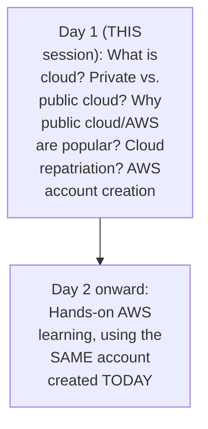

#### 🎯 Key Takeaways

* This is genuinely **Day 1 of a NEW, stated 30-day series** — from the SAME instructor as the PRIOR Linux and Shell Scripting series in this workspace.
* The series is EXPLICITLY, DIRECTLY framed from a **DEVOPS ENGINEER's own PERSPECTIVE** — NOT a generic, all-purpose AWS course.
* The AWS account CREATED in THIS episode will be **DIRECTLY, GENUINELY REUSED** throughout the ENTIRE 30-day series — making THIS episode's OWN account-setup portion GENUINELY foundational for EVERYTHING that follows.

---

### 2. What Is Cloud? From Physical Data Centers to Virtualization

#### 🔍 Internal Working — The Precise, Genuine, Historical Starting Point

> 💡 **Given directly:** *"If you go back 20 years, or 15 years, or even 10 years, for some organizations what they used to do is basically they used to buy servers to deploy their applications... they used to go to IBM, they used to go to HP or any other server providers... and they used to create a data center."*

#### 📖 Definition — Data Center, Precisely Defined

> 💡 **Given directly:** *"What is data center? A place where all the servers are stored and all the configurations are done for the servers — you need to connect a lot of wires for the servers, you need to create your own network for the servers, you have to make sure servers are well equipped and there is a right temperature set for the servers."*

#### ❓ Why It Exists — The Precise, Genuine, Real Resource-Waste Problem

> 💡 **Given directly:** *"These servers are very costly and they come with huge configuration — one server it can be of 100 GB RAM and 100 CPU. If you are just deploying one application which is using 1 GB RAM and one CPU, all the other 99 CPU and 99 RAM is wasted."*

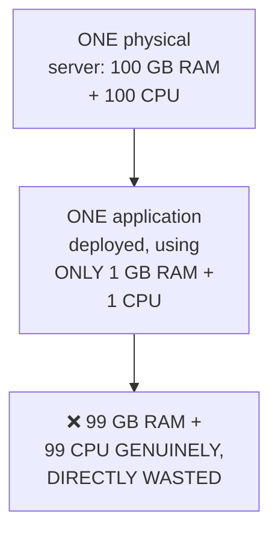

#### 📖 Definition — Virtualization, Precisely Introduced as the Genuine Solution

> 💡 **Given directly:** *"Virtualization is a concept where you will solve the problem of wasting resources on a server... instead of just deploying one application on that server, using virtualization you will create virtual servers on that actual server... instead of buying 15 servers, you can just buy one server with a required amount of configuration and you can deploy your 15 applications."*

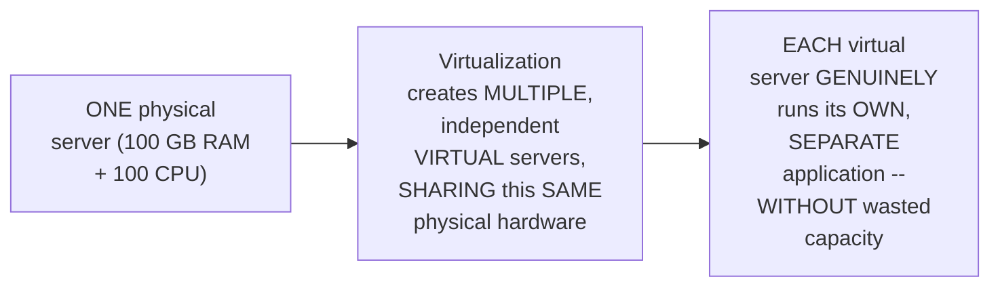

#### 🔍 Internal Working — Precisely How Virtualization Genuinely Enables "The Cloud"

> 💡 **Given directly:** *"You use this concept of virtualization and you can create a virtual machine in any part of the world and you can share with other people... if I am a developer and I'm requesting you five virtual machines... you can create five virtual machines and you can share the IP addresses with me and I don't know where exactly this servers are, but I will continue to use those servers — that's why this concept is called as cloud."*

#### ⚠ Common Mistakes

* Assuming "the cloud" is a GENUINELY, ENTIRELY NEW, abstract concept, UNRELATED to physical HARDWARE — explicitly, directly, PRECISELY traced BACK to REAL, physical SERVERS and DATA centers, made EFFICIENT through VIRTUALIZATION.
* Assuming BUYING MORE, INDIVIDUAL servers is the GENUINE, correct SOLUTION to resource-waste — explicitly, directly, PRECISELY clarified: VIRTUALIZATION (creating MULTIPLE virtual servers on ONE physical machine) is the GENUINE, efficient SOLUTION.

#### 🎯 Key Takeaways

* Before CLOUD computing, organizations GENUINELY BOUGHT physical SERVERS and built THEIR OWN **data centers** — a REAL, PHYSICAL location REQUIRING networking, TEMPERATURE control, and DEDICATED staff.
* This APPROACH GENUINELY WASTED resources (a 100GB/100-CPU server RUNNING a 1GB/1-CPU application) — DIRECTLY motivating **virtualization**: creating MULTIPLE virtual servers ON ONE physical machine.
* **"The cloud"** is precisely the CONCEPT of REQUESTING and USING these virtual RESOURCES WITHOUT knowing (or NEEDING to know) their EXACT, physical LOCATION.

---
### 3. Private Cloud vs. Public Cloud, Precisely Distinguished

#### 📖 Definition — Private Cloud, Precisely Defined

> 💡 **Given directly:** *"Because you do this entirely within your organization, this concept is called as private cloud... this is private to your organization — tomorrow no one else from other organizations can request you this instance, and you will not give them the instance — it is within the boundaries of your organization."*

#### 📖 Definition — Public Cloud, Precisely Defined

> 💡 **Given directly:** *"What people like Amazon, Microsoft — what they have seen is they saw an opportunity here... don't bother about all of these things, what we will do for you is we will buy the servers, we will create this infrastructure through multiple places in the world, and whenever anybody in the world requests... we will give an EC2 instance... this concept is called public cloud."*

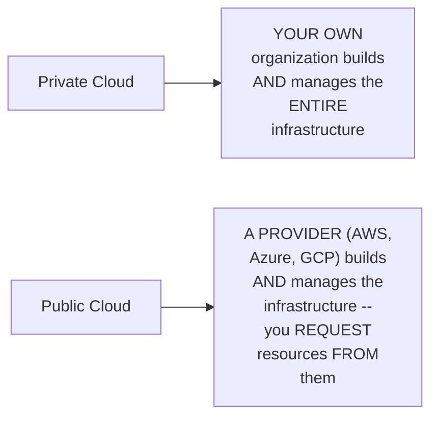

#### ❓ Why It Exists — Precisely WHY It's Called "Public"

> 💡 **Given directly:** *"Why is this called public cloud? Because anybody in the world, anyone who has account with AWS, anybody who has account with Azure, anybody who has account with GCP, irrespective of organization, they can create instances."*

#### 🔍 Internal Working — The Precise, Genuine Distinction in CONTROL

> 💡 **Given directly:** *"Who has the complete control? YOU have the complete control. But THEY are the ones who are creating that resources for you."*

#### ⚠ A Direct, Honest, Real Security Clarification

> 💡 **Given directly:** *"You might say that, hey, if I am creating a resource in public cloud, then AWS has the data center, AWS has all my information, so it is less secure... don't worry, we will learn this concept where you can create virtual private clouds inside the public cloud... for now just understand there is public cloud and there is private cloud."*

#### 🏢 Real-World / Production Usage — WHO Genuinely Still Uses Private Cloud

> 💡 **Given directly:** *"There are many companies who do it even today — if there is a banking sector company, or if there is any sensitive information company, where they don't want to go to public cloud, what they do is they buy the servers, they create their own data center, they use platforms like OpenStack, they use platforms like VMware, Xen, and they create this private cloud setup — whereas startups, mid-scale organizations, it's very easy for them to onboard onto a public cloud platform."*

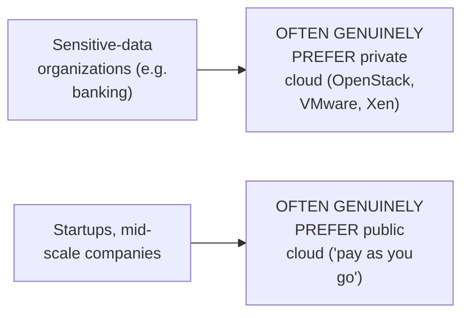

#### ⚠ Common Mistakes

* Assuming public cloud is GENUINELY, INHERENTLY less secure, WITHOUT any FURTHER mechanism to ADDRESS this — explicitly, directly, HONESTLY acknowledged as a GENUINE, common concern, WHILE directly pointing to VIRTUAL PRIVATE CLOUDS (a topic explicitly DEFERRED to FUTURE classes) as the GENUINE, real solution.
* Assuming EVERY organization SHOULD genuinely move to PUBLIC cloud — explicitly, directly clarified: SENSITIVE-data organizations (like BANKING) OFTEN GENUINELY, deliberately PREFER private cloud, EVEN today.

#### 🎯 Key Takeaways

* **Private cloud**: an ORGANIZATION builds and MANAGES its OWN virtualized infrastructure, ENTIRELY within its OWN boundaries.
* **Public cloud**: a PROVIDER (AWS, Azure, GCP) builds and MANAGES the infrastructure, RENTING resources to ANYONE with an ACCOUNT — you GENUINELY retain CONTROL over your OWN resources, but the PROVIDER owns the UNDERLYING hardware.
* Security CONCERNS around public cloud are HONESTLY acknowledged, WITH virtual private CLOUDS (VPCs) DIRECTLY pointed to as the GENUINE solution — a topic EXPLICITLY deferred to a LATER class.

---

### 4. Why Public Cloud Is Popular: Maintenance Overhead First, Cost Second

#### ❓ Why It Exists — The Precise, Genuine, PRIMARY Reason

> 💡 **Given directly:** *"There are two main reasons why public cloud is so popular. So one is cost, obviously, but that's not the first point. The main concern of people moving towards the public cloud is... they want to get rid of this entire maintenance overhead."*

#### 🪜 Step-by-Step — A Complete, Real, Concrete, Worked Scenario

> 💡 **Given directly:** *"If I am a startup and if I go sit there and create this entire data center, servers, network configuration, and every day I have to see if my servers are working fine or not, if I have to patch something, if there is any security issue — for a startup with 50 people, 100 people, if they have to maintain this data center, for that data center itself they might need 10 to 15 people, two to three people, five people — which is an overhead for the startup."*

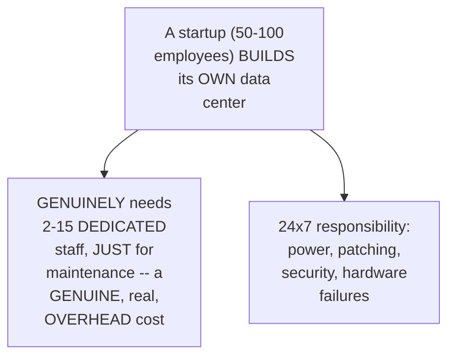

#### 📖 Definition — "Pay As You Go," Precisely Introduced

> 💡 **Given directly:** *"It is very easy to just go on a public cloud platform, create an account with it, and just tell all the members of the organization that, hey, you can use this public cloud, and you can start creating resources — so that's very very simple to onboard on a public cloud platform... that's why they are called as pay-as-you-go services."*

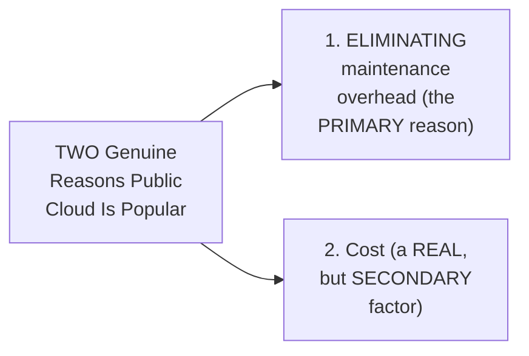

#### ⚠ Common Mistakes

* Assuming COST is the PRIMARY, MOST important reason for public cloud's OWN popularity — explicitly, directly, PRECISELY corrected: MAINTENANCE-overhead ELIMINATION is DIRECTLY named as the PRIMARY concern, with COST as a SECONDARY, though STILL genuine, factor.
* Assuming "MAINTENANCE overhead" is a VAGUE, abstract CONCERN — explicitly, directly, CONCRETELY illustrated via a REAL, worked example: a startup GENUINELY needing 2-15 DEDICATED staff, JUST for data-CENTER upkeep.

#### 🎯 Key Takeaways

* Public cloud's OWN popularity rests on **TWO, genuine, EXPLICITLY-ranked reasons**: eliminating MAINTENANCE overhead (the PRIMARY reason) and COST (SECONDARY).
* A REAL, worked scenario (a 50-100-person STARTUP GENUINELY needing 2-15 DEDICATED staff for data-center MAINTENANCE) directly, CONCRETELY illustrates WHY this overhead is GENUINELY significant.
* **"Pay as you go"** precisely captures public cloud's OWN genuine value PROPOSITION — SIMPLE onboarding, WITHOUT the BURDEN of building and MAINTAINING physical infrastructure.

---
### 5. AWS's Own Growth Story: From ~20 Services to 200+

#### 🔍 Internal Working — The Precise, Genuine, Historical Starting Point

> 💡 **Given directly:** *"Initially AWS started with very less resources — like they have started with 20 to 30 resources — that is, in AWS terms, it is called services. What are services? Like, initially AWS started with this virtual machine concept, then they said, hey, we can also give you server storage... then they said we can provide you volumes, then they said that we can provide you some database-related services — and today AWS has more than 200 services."*

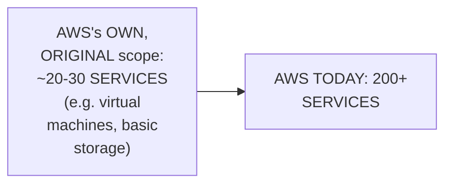

#### 📖 Definition — AWS's Own, Genuine, Recurring Pattern

> 💡 **Given directly:** *"The most popular one recent times you can talk about Kubernetes service — what AWS said is, hey, creating Kubernetes setup is very complicated, all that you need to do is come to us and say, hey, I want a Kubernetes cluster with five nodes, three nodes, 10 nodes, and we'll give you a Kubernetes cluster — similarly AWS is looking and growing in this same space, whenever they see that any service is going popular in the market, or any product that is going popular in the market, they just create a service out of it."*

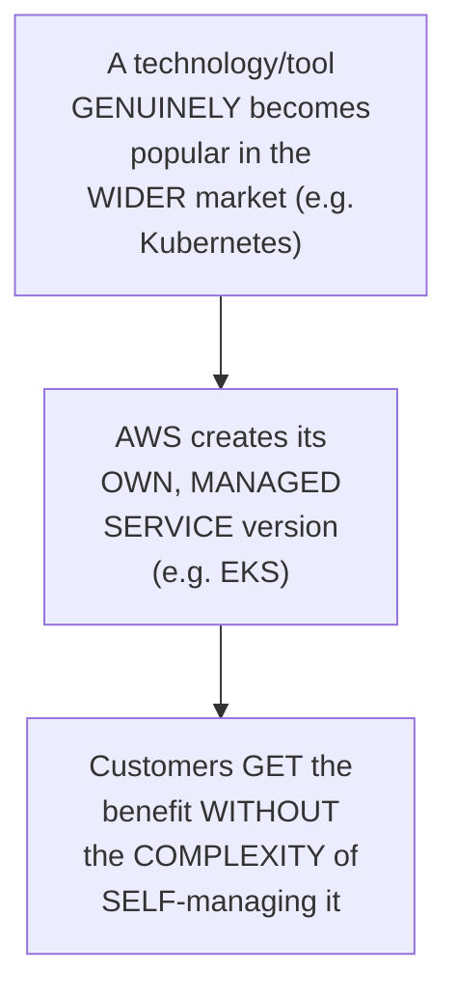

#### ⚠ Common Mistakes

* Assuming AWS's OWN, EXTENSIVE, 200+-service CATALOG was GENUINELY offered from the VERY START — explicitly, directly, HISTORICALLY corrected: AWS GENUINELY began with ONLY ~20-30 SERVICES, GROWING deliberately over TIME.
* Assuming AWS's OWN service EXPANSION is RANDOM or unpredictable — explicitly, directly clarified as a CONSISTENT, DIRECT pattern: AWS GENUINELY, REPEATEDLY creates a MANAGED service AROUND whatever technology BECOMES popular in the WIDER market.

#### 🎯 Key Takeaways

* AWS GENUINELY began with ONLY **~20-30 services** — TODAY offering **200+**.
* AWS follows a CONSISTENT, GENUINE pattern: WHENEVER a technology BECOMES popular in the WIDER market (like KUBERNETES), AWS CREATES a corresponding, MANAGED SERVICE (like EKS) — DIRECTLY, PRACTICALLY removing the COMPLEXITY of SELF-managing it.
* This HISTORICAL growth PATTERN directly, precisely EXPLAINS WHY AWS's OWN service catalog is SO extensive TODAY — a GENUINE, CONTINUOUS response to MARKET demand.

---

### 6. Why AWS Specifically Is Popular: First-Mover Advantage & Market Share

#### 📖 Definition — First-Mover Advantage, Precisely Explained

> 💡 **Given directly:** *"AWS is very popular because AWS has that first-time advantage, or the first-mover advantage. AWS is the first comer in this market, they are the pioneers of cloud... AWS is the one who looked into this opportunity, they saw that, hey, we can create something here, and they have successfully done it — so many companies when they started with the cloud platforms, they have actually started with AWS."*

#### 🔍 Internal Working — The Precise, Genuine Reason for the Name "Amazon Web Services"

> 💡 **Given directly:** *"That's the reason why the name is also Amazon Web Services — initially it used to be restricted to very less number of services — probably right now the name can be Amazon Services itself, because Amazon right now is into multiple things, they provide services not just related to web services, but they provide multiple other solutions."*

#### 🏢 Real-World / Production Usage — The Precise, Genuine, Direct Connection to Job Prospects

> 💡 **Given directly:** *"Many companies are using AWS over other platforms, so AWS has the large market share. Next is Azure, and next is GCP. So obviously many companies are using AWS, then many companies will ask or look for candidates who have knowledge on AWS."*

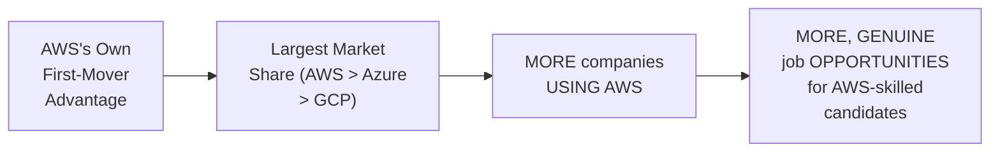

#### ⚠ A Direct, Honest, Important, Balanced Clarification

> 💡 **Given directly:** *"This entire cloud, or the entire cloud engineering thing, if you know any cloud platform, the interviewers or people who are doing the interviews, they'll be very open to get people from other cloud platforms as well, because the concept of cloud is more or less very same — it's only about the naming convention, it's the way of doing these things by AWS is different, and way of doing things by Microsoft is slightly different, and GCP is slightly different."*

#### ⚠ Common Mistakes

* Assuming AWS knowledge is the GENUINELY, EXCLUSIVELY required SKILL for cloud-related INTERVIEWS — explicitly, directly, HONESTLY clarified: INTERVIEWERS are GENUINELY OPEN to candidates FROM other cloud PLATFORMS, since the UNDERLYING CONCEPTS remain LARGELY the SAME across AWS, AZURE, and GCP.
* Assuming AWS's OWN popularity is PURELY due to TECHNICAL superiority — explicitly, directly clarified as PRIMARILY a FUNCTION of its GENUINE, historical FIRST-MOVER advantage, DIRECTLY leading to LARGER market share.

#### 🎯 Key Takeaways

* AWS's OWN dominance is directly, precisely attributed to its GENUINE **first-mover ADVANTAGE** — being the FIRST major cloud PROVIDER, DIRECTLY leading to the LARGEST market SHARE.
* This TRANSLATES directly, PRACTICALLY into MORE job OPPORTUNITIES for AWS-skilled CANDIDATES — a GENUINE, PRACTICAL reason to CHOOSE AWS as a STARTING point.
* This is BALANCED by an HONEST clarification: cloud CONCEPTS are LARGELY TRANSFERABLE across PLATFORMS — INTERVIEWERS are GENUINELY OPEN to candidates FROM Azure or GCP BACKGROUNDS too.

---

### 7. Cloud Repatriation: An Honest, Direct Acknowledgment

#### 📖 Definition — Cloud Repatriation, Precisely Defined

> 💡 **Given directly:** *"On-premise is nothing but using their own data centers and building the private cloud — so moving from public cloud to private cloud is called as cloud repatriation. People initially started with private cloud, moved to public cloud, and some people are coming back to private cloud."*

#### ⚠ A Direct, Honest Acknowledgment of Genuine Scale

> 💡 **Given directly:** *"This is true, but the number of people, or the percentage of users, who are moving back from public cloud to private cloud, is very very less — it's one percent to two percent, or even less than that."*

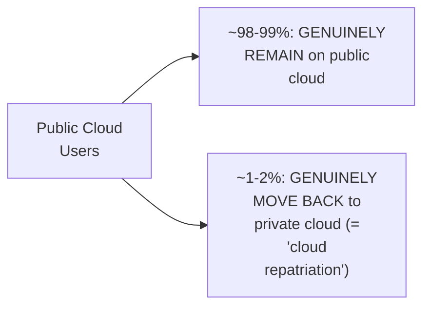

#### 🔍 Internal Working — The Precise, Genuine Reasons Some Organizations Genuinely Repatriate

> 💡 **Given directly:** *"The reason for it is multiple things — one is security, one is they were not ideally getting any cost optimization, and they were not getting a real advantage of moving towards public cloud — so then they have decided that, okay, let's move back to private cloud."*

#### 🏢 Real-World / Production Usage — A Genuine, Direct Pointer for Further Study

> 💡 **Given directly:** *"I made a video on cloud repatriation... I've done a complete video on this, you can go and check my video on cloud repatriation where I've discussed this thing in very detail."*

#### ⚠ Common Mistakes

* Assuming "cloud REPATRIATION" is a GENUINE, WIDESPREAD, GROWING trend — explicitly, directly, HONESTLY corrected via a REAL, specific statistic: ONLY "one PERCENT to two PERCENT" of users GENUINELY move BACK — a GENUINELY RARE occurrence, NOT a mainstream SHIFT.
* Assuming this small TREND means public cloud ADOPTION is GENUINELY SLOWING — explicitly, directly clarified: the NUMBER of NEW public-cloud USERS will "keep on GROWING," since STARTUPS and mid-scale COMPANIES GENUINELY cannot AFFORD data centers, in TERMS of both MONEY and SETUP/maintenance COMPLEXITY.

#### 🎯 Key Takeaways

* **Cloud repatriation** is GENUINELY, PRECISELY defined as moving FROM public cloud BACK to private CLOUD — a REAL, though GENUINELY RARE phenomenon.
* This session's own HONEST, statistical acknowledgment (**"one PERCENT to two PERCENT"** of users) directly, DIRECTLY corrects any EXAGGERATED impression that this trend is WIDESPREAD or GROWING.
* GENUINE reasons for repatriation INCLUDE security CONCERNS and a LACK of REAL cost OPTIMIZATION — but OVERALL, public-cloud ADOPTION is DIRECTLY, confidently EXPECTED to KEEP growing, SINCE startups GENUINELY cannot AFFORD the ALTERNATIVE.

---
### 8. Creating a Real AWS Account: A Complete, Live Walkthrough

#### 🪜 Step-by-Step — Starting the Account Creation Process

> 💡 **Given directly:** *"Search for AWS sign in... you will find this page called Amazon Web Services sign in... here what you need to do is you need to provide your email address... just keep this as a root user, you will understand what is root user, what is IAM user in the future."*

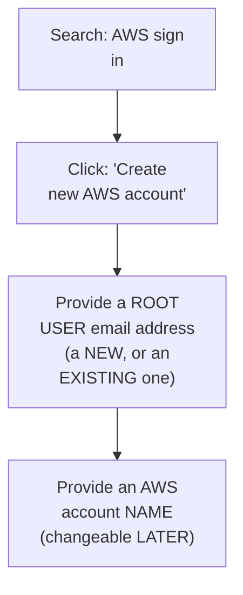

#### 🪜 Step-by-Step — Email Verification & Password Creation

> 💡 **Given directly:** *"You will get a verification code to this email address that you have just created... copy the verification code and put it here, click on verify button — once you do this then you have verified, now you can create a password for your AWS account... make sure that the password is very strong."*

> 💡 **Given directly, a genuine, honest, live-demonstrated REJECTION:** *"I did not provide a strong password, so it is asking me to change the password — so what I'll do is I'll create a slightly stronger password this time."*

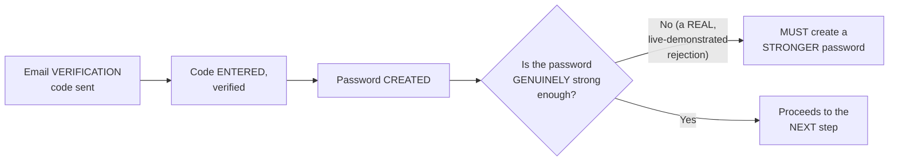

#### 🪜 Step-by-Step — Account Type, Personal Details & Address

> 💡 **Given directly:** *"The second question is, do you want to create this AWS account for the business purpose or personal learning purpose — click on personal... provide your full name, then put your phone number... then select the region... and provide your address — you don't have to put the exact address, this is just for the purpose of billing."*

#### 🪜 Step-by-Step — Payment Details: An Honest, Complete Explanation

> 💡 **Given directly:** *"This is the important page where you have to give AWS a credit card or a debit card, and not all credit cards and debit cards will work... let's say you are charged, AWS will not automatically debit the balance from this account... this is just for the purpose of validation, so that not everyone spams AWS — like, people don't create hundreds of accounts with AWS, and you are a legit user."*

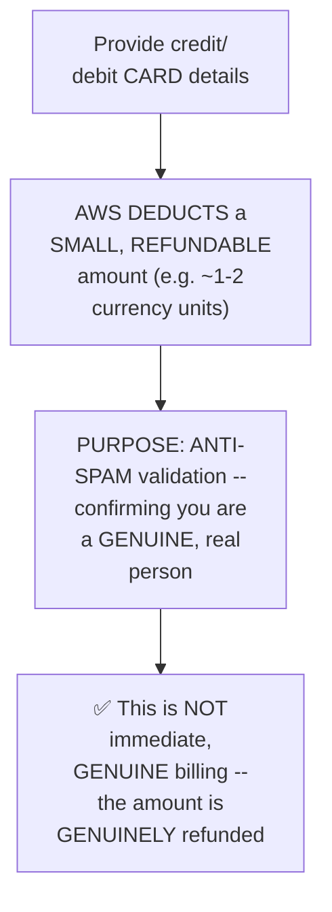

#### ⚠ A Direct, Honest, Practical Warning About Alternative Payment Methods

> 💡 **Given directly:** *"There are some workarounds, but I will not prefer them — like, you know, people have seen using some virtual credit cards, they go to some portals and get a virtual debit card, but I would not suggest that — if you don't have one, then try to borrow it from someone... personally I don't know how safe they are, so that's why I'm not recommending it to anyone."*

#### 🪜 Step-by-Step — PAN Card (India-Specific) & Final Verification

> 💡 **Given directly:** *"Do you have a valid PAN or not? If you click on yes, then it will ask for your PAN card details... AWS will keep this for safe, but they require this information for the tax settings — once you are done with this, then click on verify and complete, and after that you will be asked very basic questions, and step three out of five, four out of five, and five out of five will be done, and you will have your own AWS account."*

#### ⚠ Common Mistakes

* Assuming a WEAK, EASILY-guessed password will be GENUINELY accepted by AWS — explicitly, directly, LIVE-demonstrated as REJECTED — AWS GENUINELY enforces a MINIMUM password STRENGTH.
* Assuming PROVIDING a credit/debit card means you will be IMMEDIATELY, GENUINELY charged for AWS USAGE — explicitly, directly, HONESTLY clarified: it's SPECIFICALLY for ANTI-SPAM VALIDATION, with a SMALL, REFUNDABLE deduction — NOT a direct, ongoing billing COMMITMENT.
* Using VIRTUAL credit/debit CARDS from THIRD-party portals — explicitly, directly, HONESTLY discouraged as a GENUINE, real risk the instructor is NOT confident is SAFE, or GUARANTEED to WORK with AWS.

#### 🎯 Key Takeaways

* AWS account creation is a **COMPLETE, MULTI-step process**: root USER email → verification → PASSWORD (WITH genuine strength ENFORCEMENT) → personal/BUSINESS account type → PERSONAL details → PAYMENT details → (for INDIA) PAN card → FINAL verification.
* The REQUIRED credit/debit CARD is **SPECIFICALLY for ANTI-SPAM validation**, WITH only a SMALL, REFUNDABLE amount DEDUCTED — NOT an IMMEDIATE, ongoing BILLING commitment.
* The instructor **directly, HONESTLY discourages** using VIRTUAL credit/DEBIT cards from THIRD-party services, DUE to GENUINE, unresolved SAFETY/reliability concerns.

---

### 9. Closing: What's Next

#### 🪜 Step-by-Step — A Complete, Honest, Forward-Looking Statement

> 💡 **Given directly:** *"Once you have this AWS account, we will use the same AWS account for the next 30 days, and we will learn AWS using this account... I hope you enjoyed today's video, and going ahead the videos will be more interesting — day two, day three, day four, till day 30, will keep learning new things on AWS."*

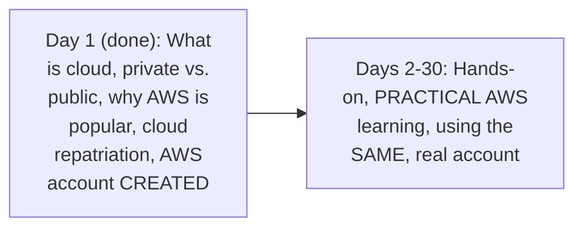

#### ⚠ A Direct, Honest, Practical Reassurance

> 💡 **Given directly:** *"If you are using AWS for free resources within the limit that AWS has provided, you will not be charged directly, and even if you are charged, AWS will not deduct money directly from this account — your account details that you are providing here — so you have to pay AWS, or else your account will be suspended."*

#### ⚠ Common Mistakes

* Assuming this episode's own coverage represents the FULL, complete AWS curriculum — explicitly, directly, honestly clarified: this is GENUINELY only DAY 1 of a stated, 30-DAY series — with 29 more DAYS of hands-on, PRACTICAL content STILL ahead.

#### 🎯 Key Takeaways

* This episode **genuinely, honestly recaps** its own complete scope: WHAT cloud is, PRIVATE vs. PUBLIC cloud, WHY public cloud/AWS are POPULAR, cloud repatriation, and a REAL, working AWS account NOW created.
* The instructor **directly, honestly reassures** learners: staying WITHIN AWS's OWN free-tier LIMITS avoids GENUINE, unexpected charges — thought UNPAID balances would EVENTUALLY suspend the ACCOUNT.
* **Days 2 through 30** are DIRECTLY, EXPLICITLY confirmed as CONTINUING, hands-on AWS CONTENT — using the SAME, real account CREATED in THIS episode.

---
## 📝 Glossary

| Term | Definition | Why It Matters |
|---|---|---|
| **Data Center** | A physical location housing organizational servers | The pre-cloud, GENUINE foundation of IT infrastructure |
| **Virtualization** | Creating multiple virtual servers on one physical machine | Solves the resource-waste problem, enables "the cloud" |
| **Private Cloud** | An organization's own, self-managed virtualized infrastructure | Used by security-sensitive orgs (e.g. banking) |
| **Public Cloud** | A provider (AWS/Azure/GCP) manages infrastructure, rented on demand | The GENUINE focus of this entire series |
| **Pay As You Go** | Public cloud's own billing/onboarding model | Simple onboarding, no upfront infrastructure investment |
| **EC2 Instance** | AWS's own term for a virtual machine | The FIRST, foundational AWS service mentioned |
| **VPC (Virtual Private Cloud)** | A private, isolated network WITHIN public cloud | Addresses public-cloud security concerns (deferred topic) |
| **First-Mover Advantage** | Being the FIRST major provider in a market | Directly explains AWS's own market dominance |
| **Cloud Repatriation** | Moving FROM public cloud BACK to private cloud | GENUINELY rare (~1-2% of users) |
| **Root User** | The initial, top-level AWS account identity | Created during account setup; distinct from IAM users |

---

## 🔄 Revision Notes — One-Minute Revision

* This is **Day 1** of a NEW, stated 30-day "AWS Zero to Hero" series -- foundational, conceptual content plus a REAL account creation walkthrough.
* **What is cloud**: historically, organizations bought physical servers and built data centers -- GENUINELY wasting resources (a 100GB/100-CPU server running a 1GB/1-CPU app). VIRTUALIZATION (creating multiple virtual servers on one physical machine) solved this, and DIRECTLY enabled "the cloud" -- requesting resources without knowing their physical location.
* **Private cloud**: an organization builds/manages its OWN infrastructure (e.g. banks, using OpenStack/VMware/Xen). **Public cloud**: a provider (AWS/Azure/GCP) builds/manages the infrastructure, RENTING it out -- "pay as you go." Security concerns addressed via VPCs (deferred to later classes).
* **Why public cloud is popular (2 reasons, RANKED)**: (1) eliminating MAINTENANCE overhead (the PRIMARY reason -- a real, worked example: a 50-100-person startup genuinely needing 2-15 dedicated staff just for data-center upkeep), (2) cost (secondary, though still real).
* **AWS's own growth**: started with ONLY ~20-30 services, NOW 200+. Consistent pattern: whenever a technology (like Kubernetes) becomes popular in the market, AWS creates a corresponding managed service (like EKS).
* **Why AWS specifically is popular**: first-mover advantage -> largest market share -> more job opportunities. HONEST balance: interviewers are genuinely open to candidates from Azure/GCP too, since cloud concepts are largely transferable.
* **Cloud repatriation**: moving FROM public BACK to private cloud -- GENUINELY, HONESTLY confirmed as rare (only ~1-2% of users), due to security/cost-optimization concerns. Public cloud adoption overall is expected to KEEP growing.
* **Real AWS account creation (complete walkthrough)**: root user email -> verification code -> password (WITH genuine strength enforcement, live-demonstrated rejection) -> personal vs. business account -> personal details/address -> payment details (credit/debit card, for ANTI-SPAM validation, small REFUNDABLE deduction, NOT immediate billing) -> PAN card (India-specific, for tax settings) -> final verification.
* **Closing**: this is genuinely only Day 1 of 30 -- the SAME account created today will be reused throughout the entire series.

---

## 📋 Cheat Sheet

**The historical progression:**
```text
Physical servers + data centers -> resource WASTE -> virtualization (multiple
virtual servers per physical machine) -> "the cloud" (request resources
without knowing their physical location)
```

**Private vs. public cloud:**
```text
Private Cloud: YOUR org builds + manages the infrastructure
Public Cloud:  a PROVIDER (AWS/Azure/GCP) builds + manages it, rented on demand
```

**Why public cloud is popular (ranked):**
```text
1. Eliminating maintenance overhead (PRIMARY reason)
2. Cost (secondary, but still real)
```

**Why AWS specifically dominates:**
```text
First-mover advantage -> largest market share -> most job opportunities
(Azure and GCP follow, in that order)
```

**Cloud repatriation:**
```text
Moving FROM public cloud BACK to private cloud
GENUINELY rare: only ~1-2% of users
Reasons: security concerns, lack of real cost optimization
```

**AWS account creation, complete steps:**
```text
1. Root user email -> verification code
2. Password (must be genuinely strong)
3. Personal vs. business account type
4. Personal details + address (for billing purposes)
5. Payment details (credit/debit card -- anti-spam validation, small refundable deduction)
6. PAN card (India-specific, for tax settings)
7. Final verification -> account ready
```

---

## 🔥 Interview Questions & Answers

### 🟢 Beginner

**Q1.**

**Question:** What problem did virtualization genuinely solve?

**Answer:** Wasted server resources -- running one small application on a large, powerful server wasted the vast majority of its capacity.

**Explanation:** Directly, precisely explained.

**Why Interviewers Ask This:** Foundational, conceptual cloud knowledge.

**Possible Follow-up:** "How did virtualization directly enable the concept of 'the cloud'?"

**Q2.**

**Question:** What is the genuine difference between private and public cloud?

**Answer:** Private cloud: an organization builds and manages its own infrastructure. Public cloud: a provider (AWS/Azure/GCP) builds and manages it, renting resources on demand.

**Explanation:** Directly, precisely distinguished.

**Why Interviewers Ask This:** Basic, essential cloud terminology.

**Possible Follow-up:** "Who genuinely still prefers private cloud today, and why?"

**Q3.**

**Question:** What are the two genuine reasons public cloud became popular, and which is primary?

**Answer:** Eliminating maintenance overhead (primary) and cost (secondary).

**Explanation:** Directly, explicitly ranked.

**Why Interviewers Ask This:** Tests genuine understanding beyond the surface-level "it's cheaper" assumption.

**Possible Follow-up:** "Give a concrete example of what 'maintenance overhead' genuinely means in practice."

**Q4.**

**Question:** How many services did AWS genuinely start with, and how many does it offer today?

**Answer:** ~20-30 originally; 200+ today.

**Explanation:** Directly, explicitly stated.

**Why Interviewers Ask This:** Tests genuine, historical AWS knowledge.

**Possible Follow-up:** "What pattern does AWS follow when deciding which new services to create?"

**Q5.**

**Question:** Why is AWS specifically the most popular cloud platform?

**Answer:** Its first-mover advantage, directly leading to the largest market share.

**Explanation:** Directly, precisely explained.

**Why Interviewers Ask This:** Basic, essential market-context knowledge.

**Possible Follow-up:** "Does this mean AWS is technically superior to Azure or GCP?"

**Q6.**

**Question:** What is cloud repatriation?

**Answer:** Moving from public cloud back to private cloud.

**Explanation:** Directly, explicitly defined.

**Why Interviewers Ask This:** Tests awareness of a real, though limited, industry trend.

**Possible Follow-up:** "How common is this trend, genuinely?"

**Q7.**

**Question:** What percentage of users genuinely engage in cloud repatriation, per this session?

**Answer:** Approximately 1-2%, or even less.

**Explanation:** Directly, explicitly, honestly stated.

**Why Interviewers Ask This:** Tests whether a learner has an accurate, non-exaggerated understanding of this trend.

**Possible Follow-up:** "What are the genuine reasons some organizations do repatriate?"

**Q8.**

**Question:** Does providing a credit/debit card during AWS signup mean you'll be immediately charged?

**Answer:** No -- it's for anti-spam validation, with only a small, refundable deduction.

**Explanation:** Directly, honestly clarified.

**Why Interviewers Ask This:** Tests genuine, practical understanding of AWS's own account-verification process.

**Possible Follow-up:** "What is the genuine purpose of this small, refundable charge?"

**Q9.**

**Question:** What does "EC2" genuinely refer to?

**Answer:** AWS's own term for a virtual machine/server instance.

**Explanation:** Directly, explicitly explained.

**Why Interviewers Ask This:** Basic, foundational AWS terminology.

**Possible Follow-up:** "What was the FIRST type of service AWS genuinely offered?"

**Q10.**

**Question:** What concept addresses public cloud's own genuine security concerns, per this session?

**Answer:** Virtual Private Clouds (VPCs) -- a topic explicitly deferred to a later class.

**Explanation:** Directly, honestly acknowledged.

**Why Interviewers Ask This:** Tests attention to what this specific session covers versus defers.

**Possible Follow-up:** "Why might a company still choose private cloud, despite VPCs being available?"

---

### 🟡 Intermediate

**Q11.**

**Question:** Explain why the instructor deliberately explains the historical, pre-cloud data-center problem in genuine, physical detail (wires, temperature, staffing) before introducing virtualization, rather than starting directly with virtualization's own definition.

**Answer:** This is a genuinely deliberate, first-principles teaching choice, DIRECTLY consistent with a PATTERN seen ACROSS this instructor's OWN, broader body of work in this workspace (e.g., Linux Day 1's own "why operating systems exist" opening). By FIRST establishing the GENUINE, PHYSICAL reality of pre-cloud infrastructure (REAL servers, REAL wires, REAL temperature CONTROL, REAL staffing needs), the instructor ensures "the cloud" NEVER feels like an ABSTRACT, MAGICAL concept — it remains DIRECTLY, CONCRETELY grounded in REAL, physical HARDWARE and REAL, historical BUSINESS problems. This directly, GENUINELY prevents a COMMON, real MISCONCEPTION among BEGINNERS — treating "the cloud" as something ENTIRELY virtual and DISCONNECTED from PHYSICAL reality, RATHER than understanding it as a GENUINE, PRACTICAL evolution of PHYSICAL infrastructure MANAGEMENT.

**Explanation:** Requires recognizing a deliberate "physical reality before abstraction" teaching choice, connecting it to a broader pattern in this instructor's own work.

**Why Interviewers Ask This:** Tests whether a learner recognizes the pedagogical value of grounding abstract concepts in concrete, historical reality.

**Possible Follow-up:** "How does understanding this PHYSICAL, historical reality genuinely help someone reason about REAL AWS billing costs later in this series?"

**Q12.**

**Question:** A learner argues that since public cloud adoption is "expected to keep growing" per this session, cloud repatriation is genuinely irrelevant and not worth understanding for interview purposes. Evaluate this claim.

**Answer:** This claim overstates the case, missing a GENUINELY important, PRACTICAL nuance. WHILE this session's own content DIRECTLY confirms cloud REPATRIATION is STATISTICALLY rare (1-2%), this does NOT mean it's GENUINELY irrelevant KNOWLEDGE — the SPECIFIC ORGANIZATIONS that DO repatriate (per Section 7's own REASONING: security-sensitive companies, or those NOT achieving REAL cost optimization) represent a GENUINE, real, PRACTICAL scenario a DevOps engineer COULD directly ENCOUNTER, PARTICULARLY in REGULATED industries (BANKING, healthcare) WHERE security CONCERNS are GENUINELY, PARTICULARLY significant. UNDERSTANDING WHY and WHEN repatriation GENUINELY happens is GENUINELY, PRACTICALLY valuable — NOT because it's a WIDESPREAD trend, but BECAUSE a candidate WHO can articulate BOTH the GENERAL cloud-ADOPTION trend AND the SPECIFIC, real EXCEPTIONS demonstrates a MORE complete, NUANCED understanding than ONE who ONLY knows the "cloud is ALWAYS growing" HEADLINE.

**Explanation:** Tests whether a learner recognizes that statistical rarity doesn't equal irrelevance, particularly for practically-important edge cases.

**Why Interviewers Ask This:** Distinguishes candidates with nuanced, complete understanding from those who only grasp the dominant, oversimplified narrative.

**Possible Follow-up:** "In what SPECIFIC type of organization (beyond banking) might a DevOps engineer GENUINELY need to understand cloud repatriation, in REAL, practical terms?"

**Q13.**

**Question:** Explain, precisely, why the instructor DIRECTLY, HONESTLY discourages using virtual/third-party credit cards for AWS signup (Section 8), rather than simply listing them as an "alternative option" without further comment.

**Answer:** This is a genuinely deliberate, HONEST, protective teaching choice: rather than PRESENTING virtual cards NEUTRALLY, as one EQUALLY-valid OPTION among several, the instructor DIRECTLY, EXPLICITLY states his OWN, genuine UNCERTAINTY about their SAFETY ("personally I DON'T know how SAFE they are"), and RECOMMENDS BORROWING a real card INSTEAD. This DIRECTLY, HONESTLY protects LEARNERS from a GENUINE, real RISK — RECOMMENDING an UNTESTED, POTENTIALLY unsafe THIRD-party financial SERVICE simply because it TECHNICALLY solves the IMMEDIATE, surface-level problem (LACKING a card) would be GENUINELY IRRESPONSIBLE teaching — the instructor CHOOSES honest UNCERTAINTY over a FALSE, CONFIDENT recommendation he CANNOT genuinely, PERSONALLY vouch for.

**Explanation:** Requires recognizing a deliberate, protective teaching choice — honestly expressing uncertainty rather than presenting an unverified option as equally valid.

**Why Interviewers Ask This:** Tests whether a learner recognizes the value of honest uncertainty over confident-sounding but unverified recommendations.

**Possible Follow-up:** "What GENUINE, real risk might a learner face if they used an UNVERIFIED, third-party virtual card service, beyond simply 'it might not work'?"

**Q14.**

**Question:** Using this session's own precise "AWS growth pattern" reasoning (Section 5), predict what KIND of NEW AWS service might GENUINELY emerge in response to a currently-popular, GENUINELY emerging technology trend (e.g., AI/LLM infrastructure), and explain your reasoning.

**Answer:** A precise, reasoned PREDICTION, directly applying Section 5's own EXACT, established PATTERN: per Section 5's own PRECISE reasoning, "WHENEVER they see that any service is GOING popular in the market... they JUST create a service OUT of it" — DIRECTLY, CONCRETELY demonstrated via THEIR own Kubernetes/EKS example. APPLYING this SAME, established PATTERN to a CURRENTLY, GENUINELY popular technology TREND (e.g., large LANGUAGE models and AI AGENT infrastructure, GENUINELY prominent AS of this session's own TIMEFRAME) would PREDICT AWS CREATING a MANAGED service SPECIFICALLY simplifying LLM/AI deployment and MANAGEMENT — REMOVING the COMPLEXITY of SELF-managing GPU infrastructure, MODEL hosting, and SCALING, JUST as EKS REMOVED the complexity of SELF-managing Kubernetes CLUSTERS. This directly, precisely APPLIES the session's OWN, EXPLICIT, GENERALIZABLE pattern ("popular TECHNOLOGY → AWS BUILDS a managed SERVICE around IT") to REASON about a NEW, hypothetical SCENARIO, rather than SIMPLY restating THE historical EXAMPLE given.

**Explanation:** Requires applying the session's own explicit, generalizable growth pattern to a new, hypothetical scenario, demonstrating genuine understanding rather than mere recall.

**Why Interviewers Ask This:** Tests whether a learner can apply a stated pattern predictively, not just recognize it retrospectively.

**Possible Follow-up:** "Research (beyond this session's own content) whether AWS has GENUINELY, ALREADY created such a service, and compare it to your OWN prediction."

**Q15.**

**Question:** Synthesize this session's complete "maintenance overhead" reasoning (Section 4) with its own "cloud repatriation reasons" (Section 7) to explain a GENUINE, real scenario where an organization COULD experience BOTH the benefit of public cloud AND STILL genuinely choose to repatriate.

**Answer:** A precise, synthesized SCENARIO, directly connecting TWO, separately-established SECTIONS: per Section 4's own precise REASONING, public cloud's OWN PRIMARY benefit is ELIMINATING maintenance OVERHEAD — a GENUINE, real ADVANTAGE for MOST organizations. Per Section 7's own PRECISE reasoning, SOME organizations GENUINELY repatriate due to "NOT ideally getting any COST optimization." SYNTHESIZING these TWO facts directly, PRECISELY reveals a GENUINE, real, POSSIBLE scenario: an ORGANIZATION could GENUINELY, ENTIRELY benefit FROM eliminating maintenance OVERHEAD (the PRIMARY reason for ADOPTING public cloud in the FIRST place, per Section 4), WHILE SIMULTANEOUSLY discovering that their OWN, SPECIFIC usage PATTERN (e.g., GENUINELY CONSISTENT, predictable, LARGE-scale compute NEEDS, RUNNING continuously) makes the ONGOING, per-USE billing of public CLOUD GENUINELY MORE expensive, OVER TIME, than the UPFRONT cost of BUILDING their OWN infrastructure — MEANING the MAINTENANCE-overhead BENEFIT (Section 4) REMAINS GENUINELY real, but is OUTWEIGHED, for THIS SPECIFIC organization's OWN usage PATTERN, by the COST factor (Section 7) — DIRECTLY illustrating WHY "COST optimization," NOT the ABSENCE of ANY benefit WHATSOEVER, is the PRECISE, genuine REASON some organizations STILL choose to REPATRIATE, DESPITE public cloud's OWN, genuine, real ADVANTAGES.

**Explanation:** Requires synthesizing the primary benefit of public cloud (maintenance-overhead reduction) with a specific repatriation reason (cost optimization) to construct a genuinely realistic scenario where both are simultaneously true.

**Why Interviewers Ask This:** A senior-level question testing whether a candidate can reconcile a technology's own stated benefits with genuine, real exceptions, rather than treating them as contradictory.

**Possible Follow-up:** "What SPECIFIC usage PATTERN (e.g., 'GENUINELY consistent, large-scale, continuous compute NEEDS') would make THIS EXACT scenario MOST likely, in REAL, practical terms?"

---

### 🔴 Advanced

**Q16.**

**Question:** Design a complete, reasoned ONBOARDING GUIDE (using ONLY this session's own established concepts) for a genuinely new team member who has NEVER created an AWS account, explicitly addressing each step's own genuine purpose, not just the mechanical action.

**Answer:** A reasonable, complete guide, directly applying this session's own EXACT, established REASONING for EACH step:

```text
1. Root user email: this becomes your account's own PRIMARY identity
   (you will LATER learn about IAM users, per this session's own direct
   mention, for MORE granular, team-based access).

2. Account name: purely a LABEL -- genuinely changeable LATER, so don't
   over-think it.

3. Password: AWS GENUINELY enforces a minimum strength requirement (per
   this session's own live-demonstrated rejection) -- use a GENUINELY
   strong password from the start, avoiding a repeat of this friction.

4. Personal vs. business: choose based on your GENUINE, intended use --
   this affects SUBSEQUENT account settings.

5. Personal details/address: used SPECIFICALLY for BILLING purposes --
   per this session's own direct clarification, EXACT precision is NOT
   genuinely required.

6. Payment details: REQUIRED for ANTI-SPAM validation (per Section 8's
   own honest explanation) -- expect a SMALL, REFUNDABLE deduction, NOT
   immediate, ongoing billing. AVOID virtual/third-party cards (per the
   instructor's own honest, direct discouragement) -- use a GENUINE,
   real card, borrowing one if genuinely necessary.

7. PAN card (India-specific): required for TAX settings, per AWS's own
   regulatory requirements.

8. Final verification: once complete, you have a WORKING account --
   REMEMBER to stay WITHIN AWS's own free-tier limits to avoid GENUINE,
   unexpected charges (per Section 9's own direct reassurance).
```

This complete guide directly, precisely applies EVERY established REASONING point from THIS session, EXPLAINING the "WHY" behind EACH mechanical STEP, not just the STEP itself.

**Explanation:** Requires synthesizing every established reasoning point from this session's own account-creation walkthrough into a complete, purpose-explaining onboarding guide.

**Why Interviewers Ask This:** A realistic, senior-level question testing whether a candidate can translate a walkthrough into genuine, transferable guidance for someone else.

**Possible Follow-up:** "What ADDITIONAL, genuine security practice (beyond what THIS session covers) would you recommend a new team member set up IMMEDIATELY after account creation?"

**Q17.**

**Question:** Critically evaluate: "Since this session confirms AWS has the largest market share due to first-mover advantage, this means AWS is UNCONDITIONALLY the technically superior cloud platform, and choosing Azure or GCP would be a GENUINELY inferior technical decision." Is this an accurate, complete characterization?

**Answer:** Not accurate — this significantly OVERSTATES a MARKET-share observation into an UNCONDITIONAL, technical-SUPERIORITY claim NEITHER this session's own CONTENT, nor sound REASONING, supports. Section 6's own PRECISE, DIRECT, HONEST clarification EXPLICITLY states: "the CONCEPT of cloud is more or LESS very SAME — it's ONLY about the naming CONVENTION... the way of doing THESE things by AWS is DIFFERENT, and way of doing things by MICROSOFT is SLIGHTLY different, and GCP is SLIGHTLY different." This DIRECTLY, EXPLICITLY confirms that MARKET share (a BUSINESS/adoption METRIC) is GENUINELY, STRUCTURALLY SEPARATE from TECHNICAL superiority (a CAPABILITY metric) — AWS's OWN dominance is DIRECTLY, PRECISELY attributed to being FIRST, NOT to being TECHNICALLY better. The ACCURATE, more PRECISE conclusion: AWS's OWN LARGER market share DOES GENUINELY translate into MORE JOB opportunities (a REAL, PRACTICAL reason to LEARN it FIRST) — but this is a MARKET-driven, CAREER-PRACTICAL reason, NOT a CLAIM of GENUINE technical SUPERIORITY over Azure or GCP.

**Explanation:** Tests whether a learner recognizes that market dominance and technical superiority are genuinely separate, distinguishing career-practical reasoning from unsupported technical claims.

**Why Interviewers Ask This:** Distinguishes candidates who understand the genuine, separate drivers of market share from those who conflate popularity with technical quality.

**Possible Follow-up:** "In what SPECIFIC, real scenario might Azure or GCP GENUINELY be the more APPROPRIATE technical choice for a SPECIFIC company, DESPITE AWS's own larger MARKET share?"

**Q18.**

**Question:** Synthesize this session's complete "virtualization" reasoning (Section 2) with its own "AWS growth pattern" reasoning (Section 5) to construct a precise, technical explanation of WHY AWS's own EC2 service (the FIRST service AWS GENUINELY offered) is STRUCTURALLY the FOUNDATION upon which its LATER services (like storage and DATABASES) were LIKELY built.

**Answer:** A precise, synthesized, technical explanation, directly connecting TWO, separately-established SECTIONS: per Section 2's own PRECISE virtualization REASONING, "the cloud" ITSELF is FUNDAMENTALLY built on the CONCEPT of VIRTUAL SERVERS/machines — the CORE, foundational UNIT of COMPUTE. Per Section 5's own PRECISE growth-PATTERN reasoning, AWS GENUINELY started with "this VIRTUAL machine CONCEPT" (EC2) FIRST, THEN EXPANDED into storage, VOLUMES, and DATABASE services. SYNTHESIZING these TWO facts directly, PRECISELY reveals WHY this SEQUENCING is STRUCTURALLY, TECHNICALLY LOGICAL, not MERELY historical COINCIDENCE: MANY of AWS's OWN, LATER services GENUINELY, STRUCTURALLY depend ON, or work ALONGSIDE, compute INSTANCES (EC2) — DATABASES need SOMETHING to CONNECT to and QUERY them; storage VOLUMES need SOMETHING to ATTACH to and USE them — EC2's OWN, foundational ROLE as "a VIRTUAL server" (per Section 2's own established DEFINITION) makes it the GENUINE, NATURAL starting point from WHICH additional, SUPPORTING services (storage, DATABASES, and EVENTUALLY managed KUBERNETES via EKS) could LOGICALLY, INCREMENTALLY be BUILT — DIRECTLY, PRECISELY explaining WHY AWS's OWN historical SERVICE-launch ORDER (per Section 5) DIRECTLY mirrors a GENUINE, TECHNICAL dependency HIERARCHY, not an ARBITRARY sequence.

**Explanation:** Requires synthesizing the fundamental virtualization concept with AWS's own stated service-launch order to construct a technical explanation for why this sequencing is structurally logical.

**Why Interviewers Ask This:** A capstone-level question testing whether a candidate can identify a genuine, structural/technical logic underlying a historical sequence, rather than treating it as arbitrary chronology.

**Possible Follow-up:** "Based on THIS SAME reasoning, what GENUINE, structural DEPENDENCY would you EXPECT AWS's own managed Kubernetes service (EKS) to have on EC2, SPECIFICALLY?"

---

## 🧪 Scenario-Based Interview Questions

> **Scenario 1:** A junior team member, new to cloud computing, asks why their company "just doesn't buy powerful servers directly" instead of paying AWS's own, ongoing fees. Using this session's concepts, construct a complete, reasoned response.

**Structured Answer:**
1. **Initial investigation:** Recognize this as directly connected to Section 4's own precise "maintenance overhead" reasoning — the JUNIOR team member's own question REFLECTS a GENUINE, common MISCONCEPTION that focuses ONLY on the DIRECT purchase cost, IGNORING the ONGOING maintenance BURDEN.
2. **Metrics/logs to check:** N/A (a CONCEPTUAL, not DEBUGGING, scenario).
3. **Possible causes:** Per Section 4's own precise reasoning, BUYING servers DIRECTLY would GENUINELY require the COMPANY to hire "2 to 15" DEDICATED staff, JUST for MAINTENANCE — a GENUINE, ONGOING, and OFTEN underestimated COST beyond the initial PURCHASE price.
4. **Debugging approach:** N/A.
5. **Resolution:** DIRECTLY explain BOTH of Section 4's own established REASONS — MAINTENANCE-overhead elimination (PRIMARY) and cost EFFICIENCY (SECONDARY) — using the SESSION's own CONCRETE, worked EXAMPLE (a startup's OWN genuine staffing NEEDS) to make the POINT TANGIBLE, RATHER than abstract.
6. **Prevention:** Encourage the JUNIOR team member to REVIEW this session's own COMPLETE "why public cloud" REASONING (Section 4), directly BUILDING a MORE complete, NUANCED understanding BEYOND the surface-level "buying is CHEAPER" assumption.

> **Scenario 2 (Advanced):** Your organization is debating whether to migrate a NEW, highly-regulated healthcare application to AWS, or to build a private, on-premises infrastructure instead. Using this session's own concepts, construct a complete, reasoned recommendation framework.

**Structured Answer:**
1. **Initial investigation:** Recognize this as DIRECTLY connected to Section 3's own precise "who genuinely still uses private cloud" reasoning — HEALTHCARE, LIKE banking, is a SENSITIVE-data DOMAIN this session's own content DIRECTLY identifies as a GENUINE candidate for PRIVATE cloud consideration.
2. **Relevant principle:** Per Section 3's own PRECISE, HONEST security ACKNOWLEDGMENT, public cloud's OWN security CONCERNS can be GENUINELY addressed via VIRTUAL PRIVATE CLOUDS (VPCs) — a topic THIS session EXPLICITLY defers to a LATER class, but DIRECTLY confirms EXISTS as a GENUINE, real SOLUTION.
3. **Possible causes for genuine consideration:** WEIGH the organization's OWN, SPECIFIC regulatory REQUIREMENTS (which MAY, in SOME cases, GENUINELY mandate PHYSICAL, ON-PREMISES data CONTROL) against the GENUINE, real BENEFITS of public cloud (per Section 4's own established REASONING — eliminating MAINTENANCE overhead, and COST efficiency).
4. **Debugging/evaluation approach:** Directly RESEARCH (beyond THIS session's own explicit content) SPECIFIC HEALTHCARE compliance STANDARDS (e.g., HIPAA, in a U.S. context) to DETERMINE WHETHER AWS's OWN, available compliance CERTIFICATIONS and VPC capabilities GENUINELY satisfy these SPECIFIC, regulatory requirements.
5. **Resolution:** IF AWS's own VPC and COMPLIANCE offerings GENUINELY satisfy the REGULATORY requirements, RECOMMEND public cloud (LEVERAGING Section 4's own established BENEFITS); IF genuine, UNRESOLVED regulatory CONCERNS remain, RECOMMEND private cloud, DIRECTLY consistent with Section 3's own established PATTERN for SENSITIVE-data organizations.
6. **Prevention:** Establish a standing ORGANIZATIONAL practice of EXPLICITLY, DELIBERATELY evaluating REGULATORY/compliance REQUIREMENTS BEFORE defaulting to EITHER public OR private cloud, DIRECTLY avoiding an UNINFORMED decision BASED solely on GENERAL market TRENDS (per Section 6's own established "AWS is POPULAR" reasoning), WITHOUT considering the ORGANIZATION's OWN, SPECIFIC, GENUINE needs.

---

## 🛠 Hands-on Exercises

### 🟢 Easy

1. Write out, from memory, the historical progression from physical data centers through virtualization to "the cloud."
2. Explain, in your own words, the genuine difference between private and public cloud.
3. List the two genuine reasons public cloud became popular, in the correct, ranked order.

### 🟡 Medium

4. Create a real AWS account, following this session's own exact, complete walkthrough, documenting each step's own genuine purpose.
5. Write a short explanation (150-200 words) of why AWS's own market dominance doesn't necessarily mean technical superiority, directly applying Advanced Interview Q17's own reasoning.
6. Research AWS's own current, complete list of service categories, and identify at least 3 examples of the "popular technology -> AWS builds a managed service" pattern described in Section 5.

### 🔴 Advanced

7. Complete the full, reasoned onboarding guide proposed in Advanced Interview Q16, and use it to walk a genuinely new user through account creation.
8. Implement the debugging scenario proposed in Scenario 1 -- construct your own, complete, cost-comparison analysis (buying servers directly vs. AWS's own pay-as-you-go model) for a hypothetical company of your own choosing.
9. Research (beyond this session's own content) AWS's own current compliance certifications (e.g., HIPAA, SOC 2), directly extending Scenario 2's own healthcare-migration reasoning into a genuine, real assessment.

---

## 🏗 Practice Assignment

### Build: "Complete AWS Account Setup & Foundational Knowledge Documentation"

**Objective:** Directly complete this session's own core, practical goal — create a genuine, real, working AWS account, ready for the REST of this 30-day series.

**Requirements:**
- Create a real AWS account, following this session's own exact, complete steps.
- Document each step you completed, and its own genuine purpose (per this session's own established reasoning).
- Write a complete, from-memory explanation (200-300 words) of the historical progression from physical servers to virtualization to cloud computing.
- Write a short comparison (150-200 words) of private versus public cloud, including at least one genuine, real-world example of an organization type that might prefer each.
- A written reflection (150-200 words) on which concept from this session was most genuinely surprising or clarifying to you.

**Architecture (suggested):**

```text
aws_day1_foundations_assignment/
├── account_setup_log.md              # your AWS account creation steps + purpose notes
├── cloud_history_explanation.md         # your from-memory historical explanation
├── private_vs_public_comparison.md        # your comparison + real-world examples
└── REFLECTION.md                              # your written reflection
```

**Expected Functionality:**
- Your AWS account should be genuinely, successfully created and ready for use.
- Your written explanations should reflect genuine, personal understanding, not simply restated transcript quotes.

**Challenges:**
- Correctly navigating AWS's own account-creation flow, especially payment verification.
- Choosing a genuinely strong password that passes AWS's own strength requirements on the first attempt.

**Bonus Improvements:**
- Research and watch the instructor's own referenced "cloud repatriation" video, for deeper context beyond this session's own brief mention.
- Explore the AWS Management Console after account creation, identifying at least 5 service categories mentioned or implied in this session.

---

## 📚 Additional Resources

- **The instructor's own DevOps Zero to Hero series** (referenced directly, in this same workspace) -- containing a deeper treatment of virtualization, directly referenced as a companion resource.
- **The instructor's own dedicated "Cloud Repatriation" video** (referenced directly) -- for deeper detail beyond this session's own brief, honest overview.
- **Day 2 of this series** (implied, forthcoming) -- the next, hands-on episode, directly building on the AWS account created in this session.

---

## 📌 Final Revision Sheet

### ⭐ Core Concepts
- **Cloud's own origin**: physical data centers -> resource waste -> virtualization -> "the cloud."
- **Private vs. public cloud**: who builds/manages the infrastructure.
- **Why public cloud is popular**: maintenance-overhead elimination (primary), cost (secondary).
- **AWS's own growth**: ~20-30 services originally, 200+ today, following a "popular tech -> managed service" pattern.
- **Why AWS dominates**: first-mover advantage -> largest market share -> most jobs.
- **Cloud repatriation**: genuinely rare (~1-2%), due to security/cost-optimization concerns.

### ⭐ Important Definitions
- **Data Center, Virtualization, EC2** (see Glossary for full definitions).

### ⭐ Important Commands/Code
```text
(This session is conceptual, plus a UI-based account-creation walkthrough; no CLI/code syntax was taught.)
```

### ⭐ Architecture/Process
- Complete conceptual flow: physical servers -> data centers -> virtualization -> private cloud -> public cloud (AWS/Azure/GCP) -> real account creation -> (Day 2 onward) hands-on AWS learning.

### ⭐ Best Practices
- Understand maintenance overhead as the PRIMARY, not secondary, reason for public cloud adoption.
- Recognize that market share and technical superiority are genuinely separate considerations.
- Avoid virtual/third-party credit cards for AWS signup; use a genuine, real card.
- Stay within AWS's own free-tier limits to avoid unexpected charges.

### ⭐ Common Mistakes
- Assuming cost is the primary reason for public cloud's own popularity (it's maintenance-overhead elimination).
- Assuming AWS's own popularity means it's technically superior to Azure/GCP.
- Assuming cloud repatriation is a widespread, growing trend (it's genuinely rare).
- Assuming providing payment details means immediate, ongoing billing.

### ⭐ Interview Points
- Be ready to explain the historical progression from data centers to cloud computing.
- Be ready to rank and explain the two genuine reasons public cloud became popular.
- Be ready to explain AWS's own market dominance without overstating it as technical superiority.
- Be ready to discuss cloud repatriation honestly, including its genuine, real prevalence.

### ⭐ Things to Remember
- This is **genuinely Day 1** of a stated, 30-day AWS Zero to Hero series — foundational only, with 29 more days of hands-on content ahead.
- The **real AWS account created in this episode** will be directly, genuinely reused throughout the entire remaining series.
- This instructor's own **honest, balanced framing** — ranking reasons precisely, acknowledging genuine trade-offs, discouraging risky shortcuts — is a consistent, valuable pattern worth recognizing throughout this series.

---

## 🔗 Source

- [Introduction to AWS](https://youtu.be/n6RWhajimZg?si=YFzI656eJ4eLRHEa)