# 🔐 AWS Zero to Hero — Day 2: IAM Deep Dive With Practicals

- <i>**Series:** AWS Zero to Hero (Day 2 of a stated 30-day series, direct continuation of Day 1) · 
- **Instructor:** Abhishek
- **Note on scope:** This is genuinely **Day 2**, DIRECTLY continuing Day 1's own established FOUNDATIONS (what CLOUD is, private vs. PUBLIC cloud, why AWS is POPULAR) into AWS's own **Identity and Access Management (IAM)** service — covering WHY IAM exists (through a GENUINELY memorable BANK analogy), its FOUR core COMPONENTS (users, POLICIES, groups, and ROLES), and a COMPLETE, LIVE, real, hands-on PRACTICAL demonstration — CREATING an actual IAM user, DIRECTLY observing a genuine "access DENIED" failure WITHOUT permissions, THEN attaching a real POLICY and CONFIRMING success. Roles are EXPLICITLY, HONESTLY introduced but DEFERRED to FUTURE classes (CI/CD, TERRAFORM, Jenkins INTEGRATION).</i>

---

## 📑 Table of Contents

1. [Session Overview](#-session-overview)
2. [Learning Objectives](#-learning-objectives)
3. [Detailed Notes](#-detailed-notes)
   - [1. Session Context: Day 2 — IAM Deep Dive](#1-session-context-day-2--iam-deep-dive)
   - [2. The Bank Analogy: Authentication vs. Authorization, Precisely Explained](#2-the-bank-analogy-authentication-vs-authorization-precisely-explained)
   - [3. Why IAM Exists: The Real, Root-Access Risk](#3-why-iam-exists-the-real-root-access-risk)
   - [4. Users & Policies: Authentication + Authorization in Practice](#4-users--policies-authentication--authorization-in-practice)
   - [5. Groups: Solving the Efficiency Problem at Scale](#5-groups-solving-the-efficiency-problem-at-scale)
   - [6. Roles: Briefly Introduced, Explicitly Deferred](#6-roles-briefly-introduced-explicitly-deferred)
   - [7. A Complete, Live Practical Demo: From "Access Denied" to Success](#7-a-complete-live-practical-demo-from-access-denied-to-success)
   - [8. A Genuine, Direct Interview Tip: Never Use Root in Real Work](#8-a-genuine-direct-interview-tip-never-use-root-in-real-work)
   - [9. Closing: The Assignment & What's Next](#9-closing-the-assignment--whats-next)
4. [Glossary](#-glossary)
5. [Revision Notes — One-Minute Revision](#-revision-notes--one-minute-revision)
6. [Cheat Sheet](#-cheat-sheet)
7. [Interview Questions & Answers](#-interview-questions--answers)
8. [Scenario-Based Interview Questions](#-scenario-based-interview-questions)
9. [Hands-on Exercises](#-hands-on-exercises)
10. [Practice Assignment](#-practice-assignment)
11. [Additional Resources](#-additional-resources)
12. [Final Revision Sheet](#-final-revision-sheet)

---

## 🎯 Session Overview

This episode builds AWS IAM understanding entirely through a GENUINELY relatable ANALOGY, before MOVING into a COMPLETE, real, hands-on DEMONSTRATION. It covers:

1. **A genuinely memorable BANK analogy** — DIRECTLY, PRECISELY distinguishing AUTHENTICATION (being a VERIFIED, recognized person) from AUTHORIZATION (WHAT that person is SPECIFICALLY allowed to DO, once VERIFIED) — MAPPED DIRECTLY onto AWS's OWN IAM service.
2. **The PRECISE, genuine PROBLEM IAM SOLVES**: WITHOUT it, an ORGANIZATION would GENUINELY need to SHARE its OWN root ACCOUNT access with EVERY employee — a REAL, concrete RISK of accidental OR malicious DELETION, DIRECTLY illustrated via a GENUINE, real EXAMPLE (a random EMPLOYEE deleting an ACTUAL EKS cluster).
3. **Users and POLICIES**, precisely EXPLAINED as the CORE authentication+authorization MECHANISM — a USER handles AUTHENTICATION (WHO can log IN); a POLICY handles AUTHORIZATION (WHAT they can DO once logged IN).
4. **Groups**, precisely MOTIVATED via a GENUINE, real EFFICIENCY problem — REPEATEDLY attaching the SAME policies to MANY, individual users BECOMES genuinely UNMANAGEABLE at SCALE — groups SOLVE this by LETTING an administrator MANAGE permissions ONCE, at the GROUP level.
5. **Roles**, BRIEFLY, precisely INTRODUCED and DISTINGUISHED from users — GENUINELY intended for APPLICATIONS/services (NOT people) or CROSS-ACCOUNT access, USING TEMPORARY credentials — EXPLICITLY, HONESTLY deferred to FUTURE, more ADVANCED classes.
6. **A COMPLETE, live, REAL practical demonstration**: CREATING a genuine IAM user (`test-user-501`), DIRECTLY, LIVE-observing a GENUINE "access DENIED" failure (UNABLE to list S3 BUCKETS) WITHOUT any attached POLICY, THEN attaching a REAL, AWS-managed POLICY (S3 Full Access) and CONFIRMING genuine, SUCCESSFUL access — INCLUDING creating a REAL S3 bucket.
7. **A GENUINE, direct, PRACTICAL, real-world/interview TIP**: NEVER use the ROOT account for REAL, ongoing WORK — ALWAYS use IAM users — DIRECTLY, HONESTLY confirmed via the INSTRUCTOR's OWN admission that HE uses root ONLY on his PERSONAL "play ACCOUNT," never in REAL organizational WORK.

> 💡 **Key framing, given directly, on precisely WHY IAM's own FOUR components (users, groups, POLICIES, roles) all genuinely MATTER:** *"I am is solving a problem of authentication and authorization... whenever a user requests access to AWS, any person who has joined the company, you have created them an AWS user... but who will take care of PROVIDING the things like, okay, what this user has to DO — that is taken care by the policies."*

---

## 🎯 Learning Objectives

By the end of this guide, you will be able to:

- [ ] Explain authentication and authorization, using the bank analogy, and map both onto AWS IAM.
- [ ] Explain the genuine, real risk of sharing root account access across an organization.
- [ ] Create an IAM user, and distinguish a user's own role from a policy's own role.
- [ ] Explain why groups genuinely improve efficiency at scale, using a concrete staffing scenario.
- [ ] Distinguish IAM roles from IAM users, and explain roles' own genuine, appropriate use case.
- [ ] Create a real IAM user, observe a genuine access-denied failure, and correctly resolve it by attaching a policy.
- [ ] Explain why root account usage should genuinely be avoided in real, professional work.

---

## 📚 Detailed Notes

### 1. Session Context: Day 2 — IAM Deep Dive

#### 🧠 Concept

> 💡 **Given directly, opening the session:** *"Welcome to day two of AWS Zero to Hero series — before we jump to the topic for today, let's quickly recap what we have learned as part of day one."*

#### 🪜 Step-by-Step — The Complete, Stated Agenda

> 💡 **Given directly:** *"As part of today's topic we will learn what is AWS IAM, why you need AWS IAM... then we will move on to understanding the different components of IAM where there is concept of users, groups, policies, and roles... and finally we will also do a practical today."*

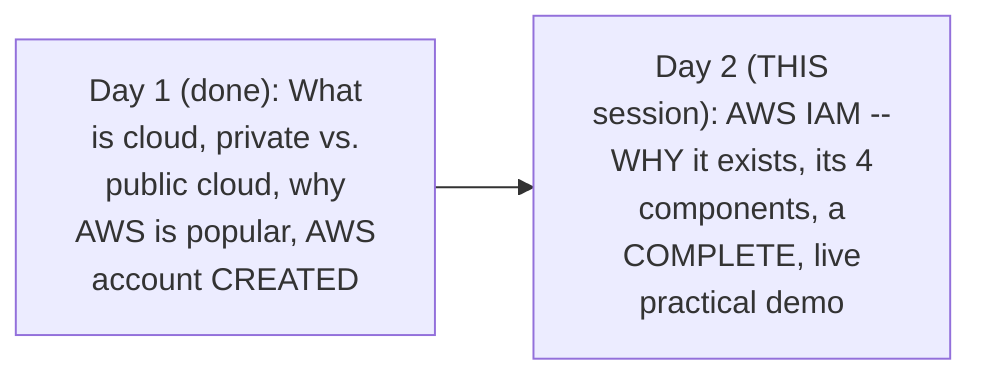

#### 🎯 Key Takeaways

* This episode **DIRECTLY, genuinely CONTINUES** Day 1's own established FOUNDATIONS — SPECIFICALLY applying them to AWS's OWN Identity and Access MANAGEMENT (IAM) service.
* The session's own STATED scope EXPLICITLY covers users, POLICIES, and groups in FULL, PRACTICAL depth — WITH roles ONLY briefly INTRODUCED, explicitly DEFERRED.
* EVERY major CONCEPT is DIRECTLY, LIVE-demonstrated on the REAL AWS account CREATED in Day 1 — NOT merely DESCRIBED abstractly.

---

### 2. The Bank Analogy: Authentication vs. Authorization, Precisely Explained

#### 🧠 Concept — A Genuinely Relatable, Complete, Real Analogy

> 💡 **Given directly:** *"Let's say that there is a bank here... inside the bank you have a lot of services — you have this service desk area, employee desk area, and then a very, very sensitive area — this area has things like user documents, bank-related documents, and some financials... to keep fine-grained access to the bank, what a bank does is, firstly, to enter the bank you need to be an authenticated person."*

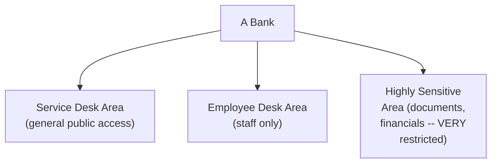

#### 📖 Definition — Authentication, Precisely Defined

> 💡 **Given directly:** *"Firstly you have to be an authenticated person — right, so if you are an authenticated person you will enter the bank."*

#### 📖 Definition — Authorization, Precisely Defined

> 💡 **Given directly:** *"Once you enter the bank, then we will see your authorization — authorization means WHAT specific thing you can do... if your authorization says that you have access to the specific area, then we will send you to this area."*

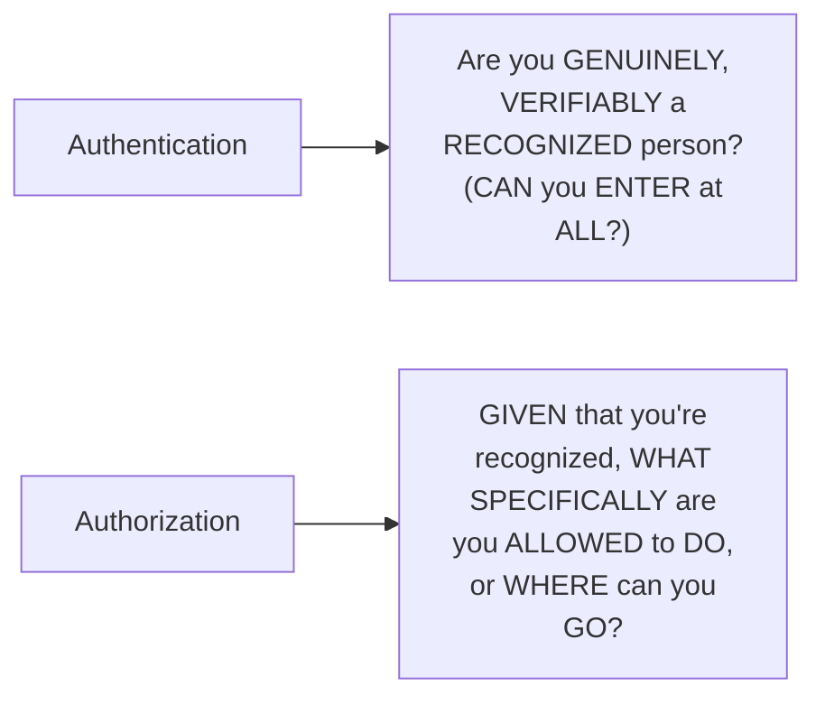

#### ❓ Why It Exists — The Precise, Genuine, Real Consequence of Skipping This

> 💡 **Given directly:** *"What if this entire thing is not there? Then anyone can directly enter the bank and go to this area, rob the money, and easily move out of the bank — so authentication and authorization is very, very important."*

#### ⚠ Common Mistakes

* Confusing authentication with AUTHORIZATION — explicitly, directly, PRECISELY distinguished: AUTHENTICATION is ABOUT WHO can genuinely ENTER; AUTHORIZATION is ABOUT what a VERIFIED person can SPECIFICALLY do ONCE inside.
* Assuming ONE of these TWO concepts ALONE is GENUINELY sufficient for SECURITY — explicitly, directly, CONCRETELY illustrated as BOTH being GENUINELY, SIMULTANEOUSLY necessary — AUTHENTICATION without AUTHORIZATION would STILL allow a VERIFIED person to DO anything, UNRESTRICTED.

#### 🎯 Key Takeaways

* **Authentication** answers "ARE you a genuinely RECOGNIZED, verified PERSON?"; **authorization** answers "GIVEN that you're recognized, WHAT are you SPECIFICALLY allowed to DO?"
* The BANK analogy directly, MEMORABLY illustrates WHY BOTH concepts are GENUINELY, SIMULTANEOUSLY necessary — WITHOUT them, ANYONE could ENTER and DO ANYTHING, UNRESTRICTED.
* This ANALOGY directly, precisely SETS UP the REST of this session's own IAM CONTENT — EVERY subsequent CONCEPT (users, policies, GROUPS, roles) maps DIRECTLY onto THIS SAME, foundational DISTINCTION.

---
### 3. Why IAM Exists: The Real, Root-Access Risk

#### ❓ Why It Exists — The Precise, Genuine, Real Problem WITHOUT IAM

> 💡 **Given directly:** *"Let's assume that there is no authentication and authorization practice in AWS... if there is no authentication and authorization process, what would this DevOps engineer do? He will just give this root access to everyone in the company — if there are a thousand people in the company, a thousand people just have access to this root permissions."*

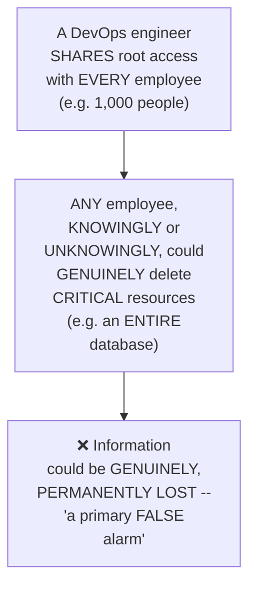

#### 📖 Definition — IAM, Precisely Introduced as the Genuine Solution

> 💡 **Given directly:** *"To solve this problem, what AWS did is, similar to the previous example, AWS also has come up with a process that is called as IAM — IAM in AWS is an AWS service which is doing the authentication and authorization for you."*

#### 🪜 Step-by-Step — The Complete, Genuine, Real, Correct Workflow

> 💡 **Given directly:** *"What a DevOps engineer would do — if there is an employee joining, let's say employee number 501 — when they join, if they require access to this AWS account, they would just go to the DevOps engineer and say, hey, I need access... the DevOps engineer would question them: for which services do you need access? Then the DevOps engineer would go and create a user for this person."*

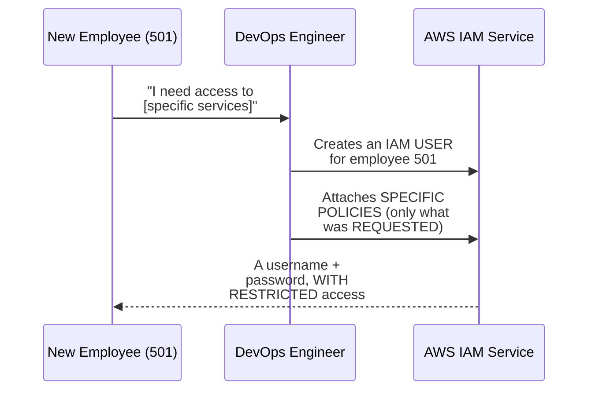

#### ⚠ Common Mistakes

* Assuming SHARING root ACCESS is a GENUINELY, PRACTICALLY convenient shortcut for a SMALL team — explicitly, directly, CONCRETELY demonstrated as a REAL, GENUINE risk, REGARDLESS of team SIZE — root access GRANTS complete, UNRESTRICTED power.
* Assuming a DELETED resource (like a DATABASE, or an EKS CLUSTER) could GENUINELY, EASILY be RECOVERED — explicitly, directly, HONESTLY implied as a REAL, SERIOUS, potentially PERMANENT loss.

#### 🎯 Key Takeaways

* IAM GENUINELY solves a REAL, concrete problem: WITHOUT it, an ORGANIZATION would need to SHARE its OWN root ACCESS with EVERY employee — a GENUINE, real RISK of accidental or MALICIOUS deletion.
* **IAM** is precisely AWS's OWN service for AUTHENTICATION and AUTHORIZATION — DIRECTLY, PRECISELY mirroring the BANK analogy's own established DISTINCTION.
* The CORRECT, real WORKFLOW: a DevOps ENGINEER creates an INDIVIDUAL, RESTRICTED user for EACH new employee, GRANTING ONLY the SPECIFIC access they GENUINELY, ACTUALLY need — NEVER sharing ROOT access.

---

### 4. Users & Policies: Authentication + Authorization in Practice

#### 📖 Definition — User, Precisely Defined Within IAM

> 💡 **Given directly:** *"You would create a user for any person that has requested — this comes under the authentication part — what you have done is, when a user requests access to AWS, any person who has joined the company, you have created them an AWS user."*

#### 📖 Definition — Policy, Precisely Defined Within IAM

> 💡 **Given directly:** *"Who will take care of providing the things like, okay, what this user has to do — that is taken care by the policies... whenever you create a user, you don't just create a user, but you will also attach some policies to the user — if you are not attaching policies to the user, then the user will only be able to enter the AWS account, but after entering the AWS account, if they can't do anything, then the user is of no use."*

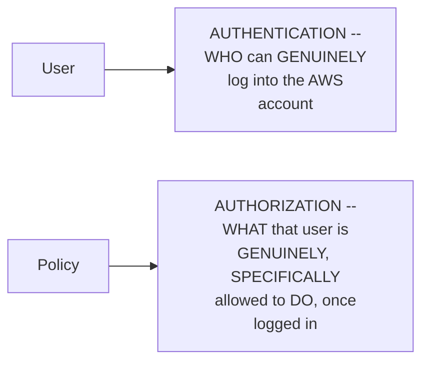

#### 🔍 Internal Working — A Genuine, Direct, Precise Confirmation of the Consequence of a User WITHOUT Any Policy

> 💡 **Given directly:** *"If you don't attach any policies, then the user will only be able to enter the AWS account, but he will not be able to create, delete any resources — that is exactly what we will see using the practical."*

#### ⚠ Common Mistakes

* Assuming CREATING a user ALONE is SUFFICIENT to GRANT genuine, USABLE access — explicitly, directly, PRECISELY clarified: a user WITHOUT any ATTACHED policy can ONLY log IN — they CANNOT genuinely DO anything USEFUL.
* Confusing a USER's own ROLE (authentication) with a POLICY's own role (AUTHORIZATION) — explicitly, directly, PRECISELY distinguished as TWO, SEPARATE, COMPLEMENTARY IAM COMPONENTS.

#### 🎯 Key Takeaways

* **Users** handle AUTHENTICATION — WHO can genuinely LOG INTO the AWS account.
* **Policies** handle AUTHORIZATION — WHAT a LOGGED-IN user is SPECIFICALLY, GENUINELY allowed to DO.
* A USER WITHOUT any attached POLICY is directly, PRECISELY confirmed as "OF NO use" — they can ENTER the account, but CANNOT genuinely PERFORM any USEFUL action.

---
### 5. Groups: Solving the Efficiency Problem at Scale

#### ❓ Why It Exists — The Precise, Genuine, Real Efficiency Problem

> 💡 **Given directly:** *"As a DevOps engineer in a company, there are people who keep joining very frequently and there are people who keep leaving the organization — every time if you have to create a user, and every time if you have to attach policies, then every day you might spend some two to three hours just for creating the users and attaching policies — which is like a very big no, because it will reduce your efficiency and it will increase the manual activity."*

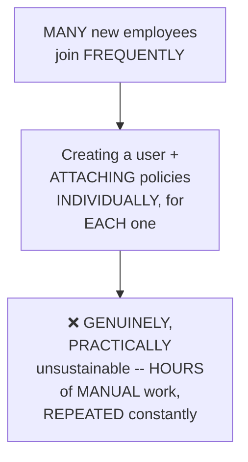

#### 📖 Definition — Groups, Precisely Introduced as the Genuine Solution

> 💡 **Given directly:** *"To solve this problem, what you will do is you will create groups — so in my company there are a particular set of people who are called developers, there are a particular set of people who are called QA engineers, there's a particular set of people who are called DB admins, and let's say there are rest other people, which are simply called as others."*

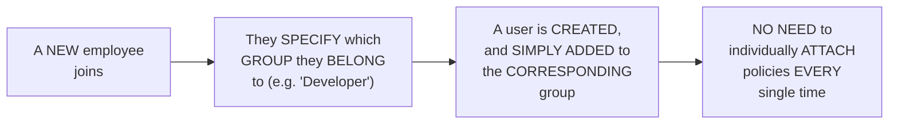

#### 🪜 Step-by-Step — A Complete, Real, Worked Example of Groups' Own Genuine Efficiency

> 💡 **Given directly:** *"Let's say 501, 502, 503, 504 all of them belong to the development group, but you did not use the concept of IAM groups, and you have created all of those users individually — after 10 days they'll come to you and say, hey, we also want to list EC2 instances — now what you need to do as a DevOps engineer, you will go to 501, attach policy, 502, 503, 504 — so you have to do it four times — but instead, if you have the concept of group, you can simply go to the group and attach that policy, now all four of them will get the access."*

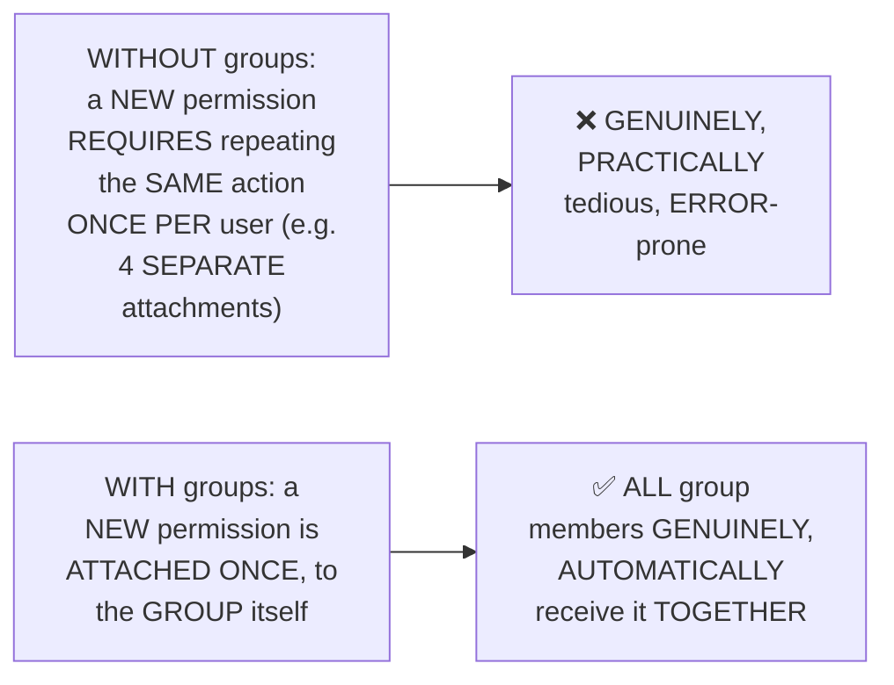

#### ⚠ Common Mistakes

* Assuming GROUPS are a GENUINELY, PURELY organizational CONVENIENCE, without a REAL, practical NECESSITY — explicitly, directly, CONCRETELY motivated as a GENUINE, real EFFICIENCY solution — WITHOUT groups, PERMISSION management GENUINELY becomes UNSUSTAINABLE at SCALE.
* Assuming EACH group MEMBER must STILL be individually MANAGED for FUTURE permission CHANGES — explicitly, directly, PRECISELY clarified: NEW permissions ATTACHED to the GROUP are AUTOMATICALLY, GENUINELY inherited by EVERY current MEMBER.

#### 🎯 Key Takeaways

* **Groups** GENUINELY solve a REAL, scale-DRIVEN efficiency PROBLEM — REPEATEDLY attaching the SAME policies to MANY individual USERS becomes GENUINELY, PRACTICALLY unsustainable.
* A REAL, worked EXAMPLE (four users, EACH needing a NEW EC2-related PERMISSION) directly, CONCRETELY illustrates the DIFFERENCE: FOUR separate ACTIONS (without groups) VERSUS ONE, single ACTION (with groups).
* This SAME "one-time SETUP, then EFFICIENT bulk MANAGEMENT" pattern DIRECTLY, precisely MIRRORS the group-based REASONING covered in THIS workspace's OWN, earlier Linux Day 3 SESSION (Linux user GROUPS) — a GENUINELY consistent, TRANSFERABLE concept ACROSS Linux and AWS.

---

### 6. Roles: Briefly Introduced, Explicitly Deferred

#### ❓ Why It Exists — The Precise, Genuine, Motivating Scenario

> 💡 **Given directly:** *"Let's say there is a scenario where I am a developer, and there is a DB service that I am using in AWS — my application is still on-premises, let's say my application is on private cloud, and when a customer tries to access my application that is in private cloud, I need to get the information from the DB service in AWS and I have to give this information back to the customer."*

#### 📖 Definition — Roles, Precisely Distinguished From Users

> 💡 **Given directly:** *"In this case you can't create a user for this application, right, because this application is not a user, but it is just like application accessing something from AWS — in such cases it is very, very simple to create a role... what will a role have? The role will also have something like username and password, but they are very temporary — even if someone tries to hack this role, because this is a temporary thing, they will not be able to access the DB service in future."*

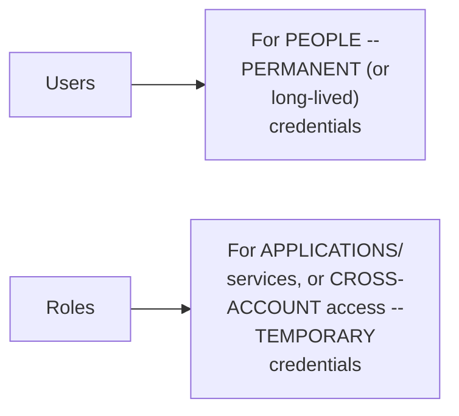

#### 🔍 Internal Working — A Second, Genuine Use Case for Roles: Cross-Account Access

> 💡 **Given directly:** *"Roles are mostly created for the temporary purpose, or the other way, roles are created for talking to one AWS account — if there are two AWS accounts, and if you want to talk between these AWS accounts, then you will use roles."*

#### ⚠ A Direct, Honest, Explicit Deferral

> 💡 **Given directly:** *"We will understand more about roles when we do more videos, when we do the practical sessions in our future videos — but in today's video, focus more on users, groups, and policies... we will learn this concept when we try to do things related to CI/CD services on AWS, when we integrate Jenkins with AWS which is running outside, or probably when we do some things related to Terraform."*

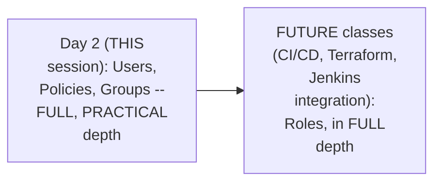

#### ⚠ Common Mistakes

* Assuming ROLES are simply a "TYPE" of user, with NO genuine, STRUCTURAL difference — explicitly, directly, PRECISELY distinguished: ROLES use TEMPORARY credentials and are GENUINELY intended for APPLICATIONS/services or CROSS-account access, NOT people.
* Assuming THIS session's own BRIEF mention of ROLES represents COMPLETE coverage — explicitly, directly, HONESTLY clarified: FULL depth is EXPLICITLY deferred to FUTURE classes SPECIFICALLY covering CI/CD, TERRAFORM, and Jenkins INTEGRATION.

#### 🎯 Key Takeaways

* **Roles** are GENUINELY, STRUCTURALLY different from USERS — INTENDED for APPLICATIONS/services (NOT people) or CROSS-account ACCESS, using TEMPORARY, rather than PERMANENT, credentials.
* A REAL, concrete SCENARIO (an ON-PREMISES application NEEDING to access an AWS DATABASE service) directly, CONCRETELY illustrates WHY a role — NOT a user — is the GENUINELY appropriate CHOICE here.
* This TOPIC is **explicitly, HONESTLY deferred** to FUTURE classes — SPECIFICALLY those covering CI/CD, TERRAFORM, and Jenkins INTEGRATION — NOT covered in FULL depth WITHIN this specific EPISODE.

---
### 7. A Complete, Live Practical Demo: From "Access Denied" to Success

#### 🪜 Step-by-Step — A Genuine, Real, Cautionary Demonstration of Root's Own Danger

> 💡 **Given directly:** *"Let's say in this account a random person who has probably less idea about AWS just went here and randomly clicked on something and deleted — okay, so this is my Kubernetes cluster, something that I've created in the past — and if someone deletes this, then I lose track of everything."*

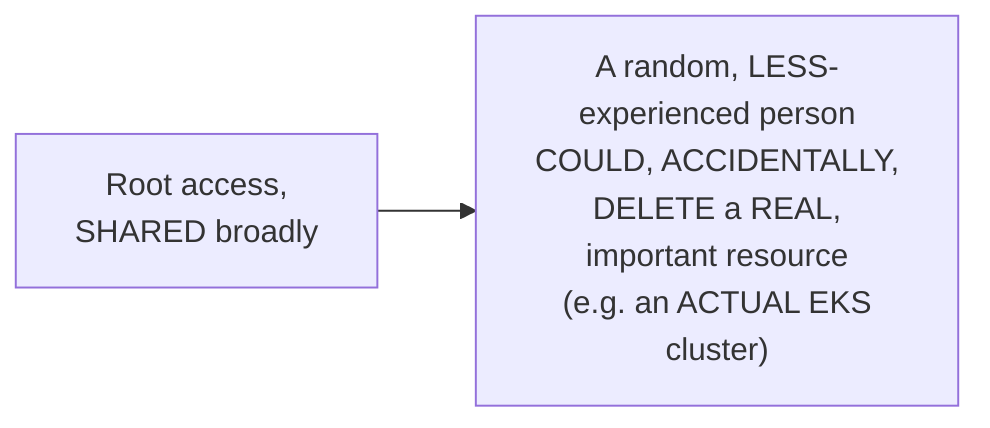

#### 🪜 Step-by-Step — Creating a Real IAM User

> 💡 **Given directly:** *"Let me add a new user, let me call this user as test-hyphen-user-hyphen-501... you have to provide console access... I want to create an IAM user... do you want an auto-generated password, or a custom password? Always go with auto-generated password — the reason is once you give them the auto-generated password, next time when they log in they can create their own password."*

```bash
# Via the AWS Console: IAM -> Users -> Add User
# Username: test-user-501
# Console access: YES
# Password: AUTO-GENERATED (recommended)
# "Users must create a new password at next sign-in": YES
```

#### 🔍 Internal Working — A Genuine, Real Confirmation: The ONE, Default Policy AWS Auto-Attaches

> 💡 **Given directly:** *"There is one policy that AWS attached by default — you can ask me, Abhishek, I haven't defined anything, there has to be one policy where user can change the password — so we are saying that user should have permissions to change the password, that is the only permission AWS will assign by default."*

#### 🪜 Step-by-Step — A Complete, Live, Real, First Login Attempt: "Access Denied"

> 💡 **Given directly:** *"Let's try to log in with the same things and see what I was talking about — what happens if there is only authentication and no authorization... let's try to access the same thing that we did before — access the S3 service... see, this is not only about buckets, anything you will not be able to do on this AWS account — even if you click on EC2 instances and click on launch instance, eventually you will notice that you don't have permissions to launch instance as well."*

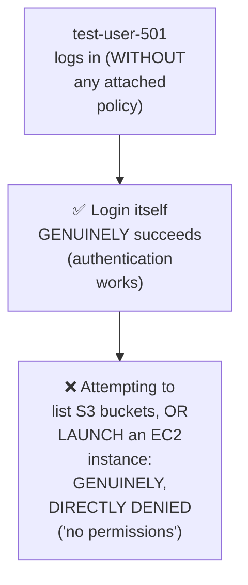

#### 🪜 Step-by-Step — Attaching a Real, AWS-Managed Policy

> 💡 **Given directly:** *"Let's go back to the IAM service, and the user that I have created, let's go to that particular user... click on 'Add permissions'... attach policies directly... AWS has provided you so many default policies — these are called AWS-managed policies... let's add S3 full access to understand what are the different things that you will get — S3 star, that means you will get everything related to S3."*

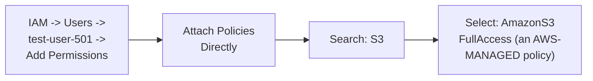

#### 🔍 Internal Working — A Genuine, Brief Preview of Custom (JSON) Policies

> 💡 **Given directly:** *"How you will write policies is using this JSON-formatted structure — overall you have version, statement, and inside statement you define an object, inside object you have three actions — one is Effect, one is Action, and one is Resource — what is the effect, do you want to allow or do you want to not allow, and then in action you can say what are the permissions for the services... and finally resource, where you can mention a specific thing."*

```json
{
  "Version": "...",
  "Statement": [
    {
      "Effect": "Allow",
      "Action": "s3:*",
      "Resource": "..."
    }
  ]
}
```

#### 🪜 Step-by-Step — A Complete, Live, Real, SECOND Login: Genuine Success

> 💡 **Given directly:** *"Let's go to this S3 bucket section and see if we are able to list the S3 buckets — we are able to see the S3 buckets — perfect — now, using test-user-501, you are able to see the list of buckets which we did not see previously... let me call this my-aws-demo-test-bucket-one — create bucket — see, I was able to create a bucket as well using test-user-501."*

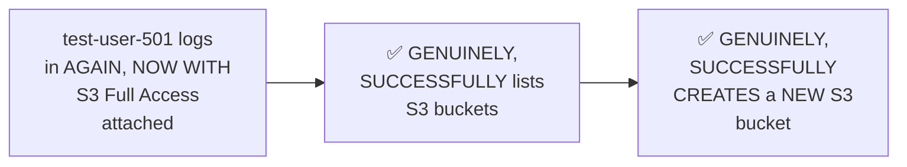

#### ⚠ Common Mistakes

* Assuming a WEAK, common PASSWORD would be GENUINELY sufficient for a NEW IAM user — explicitly, directly, PRACTICALLY demonstrated as REQUIRING careful, correct CREDENTIAL handling (the instructor HIMSELF experienced a genuine, LIVE copy-paste MISTAKE during this DEMO).
* Assuming a PERMISSION change TAKES effect WITHOUT logging OUT and back IN — explicitly, directly, LIVE-demonstrated as REQUIRING a fresh LOGIN (SIGN OUT, then SIGN back IN as the TEST user) to GENUINELY see the UPDATED access.

#### 🎯 Key Takeaways

* This session's own **COMPLETE, live DEMO** directly, CONCRETELY proved the ENTIRE authentication/authorization CYCLE — a NEW user GENUINELY, SUCCESSFULLY logs IN (authentication WORKS), but is COMPLETELY DENIED any REAL action (S3, EC2) WITHOUT a policy — DIRECTLY confirming Section 4's own established REASONING.
* ATTACHING a REAL, **AWS-managed policy** (S3 Full ACCESS) GENUINELY, IMMEDIATELY resolves this — DIRECTLY, LIVE-confirmed via a SUCCESSFUL bucket LISTING and CREATION.
* **Custom (JSON) POLICIES** were BRIEFLY previewed (Version, STATEMENT, Effect, ACTION, Resource) — EXPLICITLY, HONESTLY deferred to FUTURE sessions, WITH this session's OWN, DELIBERATE focus on the SIMPLER, AWS-managed policy APPROACH.

---

### 8. A Genuine, Direct Interview Tip: Never Use Root in Real Work

#### ⚠ A Direct, Honest, Explicit Warning

> 💡 **Given directly:** *"Never use the root user — in interview, if someone asks, are you using the root user, say that we don't use root user — as a DevOps engineer, there is a DevOps engineering team, and for each member, when we created the AWS account, we have created IAM users for DevOps engineers."*

#### 🔍 Internal Working — The Precise, Genuine, Real Reason: Accountability

> 💡 **Given directly:** *"Even if you do that [grant broad access], do it with the IAM user, but not with the root user — because if you do it with the root user, even if there are four members in the DevOps engineering team, you will never know who deleted a particular thing — in case someone deletes something, you'll still not be aware of who deleted that. So always go with the IAM user practice."*

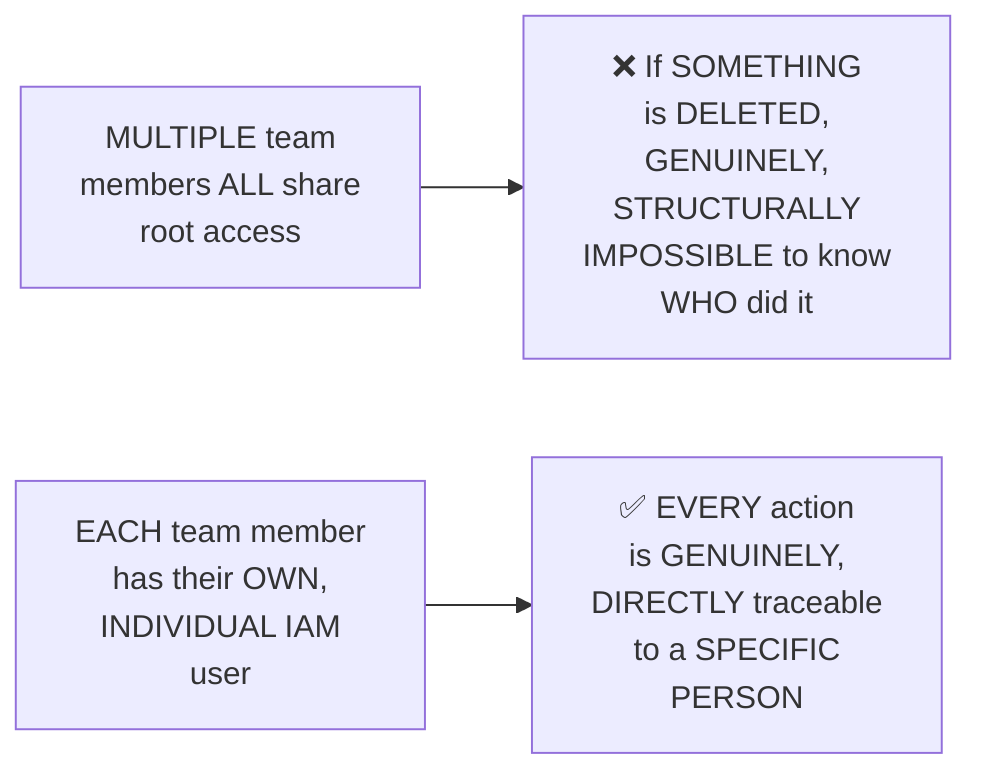

#### ⚠ A Direct, Honest, Personal Clarification

> 💡 **Given directly, in response to a GENUINE, direct audience QUESTION about WHY the instructor HIMSELF was using ROOT for the DEMO:** *"This is my personal AWS playground where I try a lot of things — all the new things that are in AWS... that's why I am using the root account — but in [my real] organization, even if I'm working in my organization, I will never use the root account. Make it a practice to use an IAM user — initially, when you're learning AWS, these 30 days, you can use the root account [for LEARNING purposes]."*

#### ⚠ Common Mistakes

* Assuming a SMALL team GENUINELY doesn't need INDIVIDUAL IAM users, SINCE "everyone TRUSTS each other" — explicitly, directly, PRECISELY corrected: the REAL issue is NOT trust, but ACCOUNTABILITY — root access GENUINELY makes it IMPOSSIBLE to TRACE WHO performed a SPECIFIC action, REGARDLESS of team SIZE or trust LEVEL.
* Assuming the INSTRUCTOR's OWN use of ROOT (during THIS demo) CONTRADICTS his OWN advice — explicitly, directly, HONESTLY clarified: THIS is a PERSONAL "PLAY" account, SPECIFICALLY for LEARNING/testing — NOT a REAL, organizational context, WHERE he DIRECTLY confirms he WOULD NEVER use root.

#### 🎯 Key Takeaways

* **NEVER use the root ACCOUNT for REAL, ongoing WORK** — DIRECTLY, EXPLICITLY confirmed as GENUINE, real interview MATERIAL ("in interview... say that we DON'T use root USER").
* The PRECISE, real REASON: root access GENUINELY makes INDIVIDUAL actions UNTRACEABLE — DIRECTLY undermining ACCOUNTABILITY, REGARDLESS of team SIZE.
* The instructor's OWN, honest, PERSONAL clarification directly, CONCRETELY models the CORRECT distinction: root is GENUINELY acceptable ONLY for PERSONAL learning/testing ("play ACCOUNTS") — NEVER for REAL, organizational WORK.

---
### 9. Closing: The Assignment & What's Next

#### 🪜 Step-by-Step — A Complete, Live Demonstration of Groups (Applied in Practice)

> 💡 **Given directly:** *"Let's create a group called 'Development Group'... we can add users when we create the group as well... for the group we can define what kind of policies that we want — I'll add permission for S3 full access... the group is created — now what I'll do is I'll add people to the group... users in this group, just click on Add Users."*

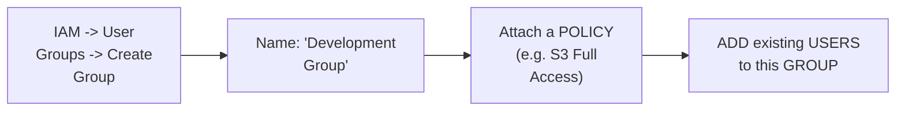

#### 🪜 Step-by-Step — The Explicit, Stated Assignment

> 💡 **Given directly:** *"I'll give you an assignment — you have to do the exact same thing — go and use the IAM service, create a user, just call it test user or whatever you would like to, and log in with the test user, and see, firstly, you will not be able to access anything — after that, what you will do is grant the permissions for S3, just add S3 full access, and see that you should be able to list buckets — then you have understood the concept of authentication and authorization practically — finally, also learn the concept of group."*

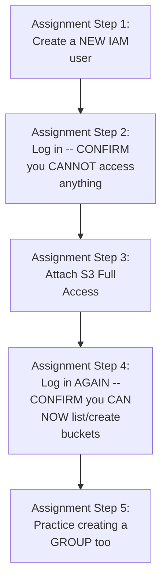

#### 🪜 Step-by-Step — A Complete, Honest Recap

> 💡 **Given directly:** *"I hope you understood the concept of users, you understood the concept of policies, and you also understood the concept of groups — now there is one thing that is left, which is called as roles."*

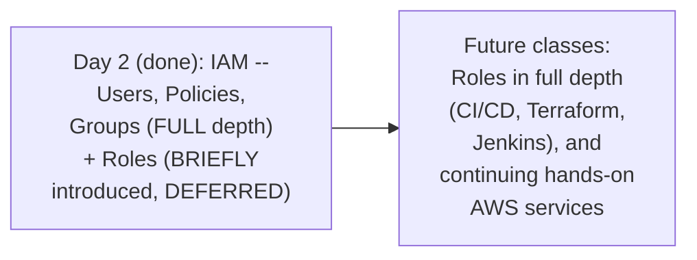

#### ⚠ Common Mistakes

* Assuming THIS episode's own coverage represents the FULL, complete IAM curriculum — explicitly, directly, HONESTLY clarified: ROLES remain EXPLICITLY deferred, with FULL depth SAVED for LATER, more ADVANCED classes.

#### 🎯 Key Takeaways

* This episode **genuinely, HONESTLY recaps** its own COMPLETE scope: the BANK analogy, WHY IAM exists, USERS, policies, GROUPS, and a BRIEF, honest INTRODUCTION to roles.
* An **EXPLICIT, hands-on ASSIGNMENT** is directly GIVEN — DIRECTLY replicating THIS session's own COMPLETE demo (create a USER, confirm DENIAL, attach a POLICY, confirm SUCCESS, and PRACTICE with groups).
* **ROLES, in FULL depth**, are directly, EXPLICITLY confirmed as a FUTURE topic — SPECIFICALLY connected to CI/CD, TERRAFORM, and Jenkins INTEGRATION content LATER in this SERIES.

---

## 📝 Glossary

| Term | Definition | Why It Matters |
|---|---|---|
| **Authentication** | Confirming WHO a user genuinely is | The "can you enter?" question (bank analogy) |
| **Authorization** | Confirming WHAT a user can genuinely do | The "what can you access?" question (bank analogy) |
| **IAM** | AWS's Identity and Access Management service | Handles BOTH authentication and authorization |
| **User** | An IAM identity for a specific PERSON | Handles authentication -- who can log in |
| **Policy** | A set of permissions attached to a user/group | Handles authorization -- what they can do |
| **AWS-Managed Policy** | A pre-built, ready-to-use policy provided by AWS | e.g. AmazonS3FullAccess |
| **Custom Policy** | A JSON-defined, user-written policy | Version, Statement, Effect, Action, Resource |
| **Group** | A collection of users sharing the same policies | Solves the efficiency problem at scale |
| **Role** | A TEMPORARY-credential IAM identity | For applications/services or cross-account access |
| **Root Account** | The account's own top-level, full-access identity | NEVER genuinely used for real, ongoing work |

---

## 🔄 Revision Notes — One-Minute Revision

* This is **Day 2**, directly continuing Day 1's own established foundations into AWS's own IAM service.
* **Bank analogy**: authentication = can you ENTER? authorization = what can you DO once inside? BOTH are genuinely, simultaneously necessary.
* **Why IAM exists**: without it, an organization would need to SHARE root access with EVERY employee -- a genuine, real risk of accidental/malicious deletion (illustrated via a real, cautionary EKS-cluster-deletion example).
* **Users vs. Policies**: users = authentication (who can log in); policies = authorization (what they can do). A user WITHOUT a policy can log in but do NOTHING useful.
* **Groups**: solve a real efficiency problem -- attaching policies to MANY individual users repeatedly is genuinely unsustainable at scale. Attach a policy ONCE to a group; ALL members inherit it automatically.
* **Roles**: for APPLICATIONS/services (not people) or CROSS-account access, using TEMPORARY credentials. Explicitly, honestly deferred to future classes (CI/CD, Terraform, Jenkins).
* **Complete, live practical demo**: created test-user-501 -> WITHOUT any policy, genuinely DENIED access to S3/EC2 -> attached AmazonS3FullAccess (an AWS-managed policy) -> genuinely SUCCEEDED at listing AND creating an S3 bucket. Custom/JSON policies (Version, Statement, Effect, Action, Resource) briefly previewed, deferred to later.
* **Groups in practice**: created a "Development Group" with S3 Full Access, added users to it -- demonstrating the real efficiency gain over per-user policy attachment.
* **Genuine interview tip**: NEVER use the root account for real, ongoing work -- always use IAM users. Root access makes individual actions untraceable, directly undermining accountability. The instructor's own honest clarification: root is acceptable ONLY on a personal "play account" for learning, never in real organizational work.
* **Closing**: an explicit assignment is given (replicate the complete demo). Roles, in full depth, remain a stated future topic.

---

## 📋 Cheat Sheet

**The bank analogy, mapped to AWS IAM:**
```text
Authentication (can you ENTER the bank?)  -> IAM Users
Authorization (what can you DO inside?)    -> IAM Policies
```

**The complete demo workflow:**
```text
1. Create an IAM user (auto-generated password, recommended)
2. Log in AS that user, WITHOUT any policy -> access DENIED (S3, EC2, everything)
3. As root/admin: attach an AWS-managed policy (e.g. AmazonS3FullAccess)
4. Log in AGAIN as that user -> access GRANTED (list/create S3 buckets)
```

**Custom (JSON) policy structure:**
```json
{
  "Version": "...",
  "Statement": [
    { "Effect": "Allow", "Action": "s3:*", "Resource": "..." }
  ]
}
```

**Groups, in one line:**
```text
Attach a policy to a GROUP (once) -> EVERY member of that group inherits it (automatically)
```

**Roles vs. Users, at a glance:**
```text
Users -- for PEOPLE, permanent/long-lived credentials
Roles -- for APPLICATIONS/services or CROSS-ACCOUNT access, TEMPORARY credentials
```

**The genuine interview tip:**
```text
NEVER use root for real, ongoing work.
Always use IAM users -- for accountability (who did what).
Root is acceptable ONLY on a personal "play" account, for learning/testing.
```

---

## 🔥 Interview Questions & Answers

### 🟢 Beginner

**Q1.**

**Question:** What is the genuine difference between authentication and authorization?

**Answer:** Authentication confirms who you are (can you log in); authorization confirms what you're allowed to do once logged in.

**Explanation:** Directly, precisely distinguished, using the bank analogy.

**Why Interviewers Ask This:** The most basic, foundational IAM question.

**Possible Follow-up:** "Which AWS IAM component handles each of these?"

**Q2.**

**Question:** What problem does AWS IAM genuinely solve?

**Answer:** It provides authentication and authorization, avoiding the need to share root access with every employee.

**Explanation:** Directly, precisely explained.

**Why Interviewers Ask This:** Foundational, frequently-tested IAM knowledge.

**Possible Follow-up:** "What genuine, real risk does sharing root access create?"

**Q3.**

**Question:** What happens if you create an IAM user but attach no policy?

**Answer:** The user can log in, but cannot perform any useful action (access denied on everything).

**Explanation:** Directly, live-demonstrated.

**Why Interviewers Ask This:** Tests genuine, practical understanding of the user/policy relationship.

**Possible Follow-up:** "What would you need to add to fix this?"

**Q4.**

**Question:** Why do groups genuinely matter in IAM?

**Answer:** They allow permissions to be managed once, at the group level, rather than repeatedly per individual user -- genuinely necessary for efficiency at scale.

**Explanation:** Directly, precisely explained.

**Why Interviewers Ask This:** Basic, essential group-management knowledge.

**Possible Follow-up:** "Give a concrete example of the efficiency this provides."

**Q5.**

**Question:** What is the genuine difference between an IAM role and an IAM user?

**Answer:** Users are for people, with permanent/long-lived credentials; roles are for applications/services or cross-account access, using temporary credentials.

**Explanation:** Directly, precisely distinguished.

**Why Interviewers Ask This:** Basic, essential IAM terminology.

**Possible Follow-up:** "Give a concrete example of when you'd genuinely need a role instead of a user."

**Q6.**

**Question:** What is an AWS-managed policy?

**Answer:** A pre-built, ready-to-use policy provided directly by AWS (e.g. AmazonS3FullAccess).

**Explanation:** Directly, explicitly explained.

**Why Interviewers Ask This:** Basic, practical policy knowledge.

**Possible Follow-up:** "What's the alternative to an AWS-managed policy?"

**Q7.**

**Question:** What are the three key components of a custom (JSON) policy statement?

**Answer:** Effect, Action, and Resource.

**Explanation:** Directly, explicitly named.

**Why Interviewers Ask This:** Basic, foundational policy-structure knowledge.

**Possible Follow-up:** "What does 'Effect' genuinely specify?"

**Q8.**

**Question:** Why should the root account genuinely never be used for real, ongoing work?

**Answer:** It makes individual actions untraceable, directly undermining accountability -- you can't know who did what.

**Explanation:** Directly, precisely explained.

**Why Interviewers Ask This:** An explicitly-named, genuine, common interview question.

**Possible Follow-up:** "When, if ever, is using root genuinely acceptable?"

**Q9.**

**Question:** After attaching a new policy to an already-logged-in IAM user, does the change take effect immediately, without re-login?

**Answer:** No -- per this session's own live demo, a fresh login (sign out, then back in) is genuinely required to see the updated access.

**Explanation:** Directly, live-demonstrated.

**Why Interviewers Ask This:** Tests genuine, practical, hands-on IAM awareness.

**Possible Follow-up:** "What real, practical implication does this have for troubleshooting a 'permission not working' report?"

**Q10.**

**Question:** Name a genuine, real scenario where an IAM role, rather than a user, would be the appropriate choice.

**Answer:** An on-premises application needing to access an AWS database service (an application, not a person, accessing AWS resources).

**Explanation:** Directly, precisely explained.

**Why Interviewers Ask This:** Tests genuine understanding of roles' own appropriate use case.

**Possible Follow-up:** "What is the OTHER genuine use case for roles, mentioned in this session?"

---

### 🟡 Intermediate

**Q11.**

**Question:** Explain why the instructor deliberately demonstrates a GENUINE "access denied" failure (Section 7) BEFORE attaching any policy, rather than simply creating a fully-permissioned user from the start.

**Answer:** This is a genuinely deliberate teaching choice, DIRECTLY consistent with a PATTERN seen ACROSS this instructor's OWN, broader body of work in this WORKSPACE (e.g., Linux Day 4's own LIVE `/sbin` deletion test). By GENUINELY, LIVE demonstrating the REAL consequence of AUTHENTICATION WITHOUT authorization (a user who can LOG IN, but CANNOT do ANYTHING), the instructor makes Section 4's OWN abstract CLAIM ("a user without a POLICY is of NO use") CONCRETELY, VISIBLY real — the LEARNER genuinely WITNESSES the FAILURE, rather than TRUSTING an UNVERIFIED assertion. This DIRECTLY, CONCRETELY reinforces the BANK analogy's own CORE lesson — being AUTHENTICATED ("entering the bank") does NOT, by ITSELF, grant ANY authorization ("access to a SPECIFIC area").

**Explanation:** Requires recognizing a deliberate, live-demonstrated failure as reinforcing an abstract claim, connecting it to a consistent pattern across this instructor's own body of work.

**Why Interviewers Ask This:** Tests whether a learner recognizes the genuine, practical value of demonstrated failure over abstract description.

**Possible Follow-up:** "What GENUINE, real risk might arise if a NEW hire's OWN IAM user was accidentally created WITH broad permissions FROM the start, rather than following THIS session's own gradual, tested approach?"

**Q12.**

**Question:** A learner argues that since AWS-managed policies (like AmazonS3FullAccess) are convenient and pre-built, they should ALWAYS be preferred over custom, JSON-based policies, since custom policies are "more work." Evaluate this claim.

**Answer:** This claim overstates the case, missing a GENUINELY important SECURITY consideration THIS session's own content DIRECTLY implies. `AmazonS3FullAccess` (per Section 7's own precise EXAMPLE) genuinely grants "S3 STAR" — EVERYTHING related to S3, WITHOUT restriction. For a REAL, production USER who GENUINELY only needs to READ from ONE specific BUCKET, granting FULL access to EVERY S3 bucket in the ACCOUNT is a GENUINE, real SECURITY over-GRANT — directly VIOLATING the PRINCIPLE of LEAST privilege (a GENERAL security concept THIS session's own content doesn't EXPLICITLY name, but DIRECTLY implies through its OWN careful, GRADUAL permission-granting APPROACH). Custom, JSON-based POLICIES (per Section 7's own BRIEF preview — Effect, Action, RESOURCE) GENUINELY allow RESTRICTING access to a SPECIFIC resource (e.g., ONE bucket), rather than ALL of them. The ACCURATE, more PRECISE conclusion: AWS-managed POLICIES are GENUINELY convenient for LEARNING/simple scenarios (per THIS session's own DELIBERATE, beginner-focused CHOICE) — but REAL, production environments GENERALLY require CUSTOM, more RESTRICTIVE policies, PRECISELY to AVOID unnecessary, OVER-BROAD access.

**Explanation:** Tests whether a learner recognizes that convenience doesn't outweigh genuine security considerations, correctly identifying the least-privilege principle implied by this session's own gradual approach.

**Why Interviewers Ask This:** Distinguishes candidates who understand real security trade-offs from those who default to the most convenient option.

**Possible Follow-up:** "Write a conceptual, custom JSON policy that would GENUINELY restrict a user to READ-ONLY access on ONE, SPECIFIC S3 bucket, rather than ALL buckets."

**Q13.**

**Question:** Explain, precisely, why the instructor directly, honestly ADDRESSES the audience question "why are YOU using root user?" (Section 8) rather than SIMPLY continuing the demo without comment.

**Answer:** This is a genuinely deliberate, HONEST, ACCOUNTABILITY-modeling choice — DIRECTLY consistent with THIS instructor's OWN established pattern of ADDRESSING apparent CONTRADICTIONS head-on, RATHER than IGNORING them. By DIRECTLY, HONESTLY acknowledging the APPARENT contradiction (using ROOT, DESPITE JUST warning AGAINST it) and EXPLAINING the GENUINE, real DISTINCTION (a PERSONAL "play" ACCOUNT for LEARNING vs. REAL, organizational WORK), the instructor PREVENTS a GENUINE, reasonable point of CONFUSION or DISTRUST — a LEARNER WHO noticed this CONTRADICTION but received NO explanation MIGHT genuinely QUESTION the instructor's OWN credibility, or ASSUME the "never use ROOT" advice is NOT genuinely IMPORTANT. By DIRECTLY addressing IT, the instructor DIRECTLY reinforces BOTH his OWN credibility AND the GENUINE importance of the UNDERLYING advice.

**Explanation:** Requires recognizing the value of directly addressing an apparent contradiction rather than ignoring it, and how this reinforces both credibility and the underlying lesson.

**Why Interviewers Ask This:** Tests whether a learner recognizes the pedagogical and credibility value of transparent, honest self-correction.

**Possible Follow-up:** "What GENERAL, professional habit does THIS SAME kind of honest, direct clarification model, BEYOND just THIS specific AWS context?"

**Q14.**

**Question:** Using this session's own precise "groups solve an efficiency problem" reasoning (Section 5), explain a GENUINE, real LIMITATION of groups that would arise if a SPECIFIC user, WITHIN a group, GENUINELY needed ONE, ADDITIONAL permission NOT shared by the REST of the group.

**Answer:** A precise, reasoned LIMITATION, directly extending Section 5's own established REASONING: per Section 5's own PRECISE mechanism, ATTACHING a policy to a GROUP GENUINELY grants that PERMISSION to EVERY member — meaning GROUPS are GENUINELY optimized for PERMISSIONS SHARED by an ENTIRE set of users, NOT for INDIVIDUAL, PERSON-specific exceptions. If ONE, SPECIFIC user WITHIN the "Development GROUP" GENUINELY needed an ADDITIONAL, UNIQUE permission (e.g., ACCESS to a SPECIFIC, sensitive DATABASE resource NO other developer SHOULD have), ATTACHING this to the ENTIRE group WOULD, INCORRECTLY, grant it to EVERYONE — VIOLATING least-PRIVILEGE principles (per Intermediate Q12's own REASONING). The GENUINE, correct SOLUTION (extending BEYOND this session's own EXPLICIT content, but a DIRECT, LOGICAL extension) would be to ATTACH this SPECIFIC, ADDITIONAL permission DIRECTLY to THAT individual USER (per Section 4's own ESTABLISHED user-LEVEL policy-attachment mechanism), IN ADDITION to their GROUP membership — DIRECTLY illustrating that GROUPS and INDIVIDUAL, user-LEVEL policies are GENUINELY COMPLEMENTARY, not MUTUALLY exclusive MECHANISMS.

**Explanation:** Requires extending the group-based reasoning to identify a genuine limitation, and correctly proposing that individual, user-level policies remain necessary alongside groups for exceptions.

**Why Interviewers Ask This:** Tests whether a learner understands that groups don't eliminate the need for individual-level permission management entirely.

**Possible Follow-up:** "How would you GENUINELY verify, in the AWS console, what COMBINATION of permissions (group-level PLUS individual) a specific user CURRENTLY has?"

**Q15.**

**Question:** Synthesize this session's complete "roles for on-premises applications" reasoning (Section 6) with its own "never use root" reasoning (Section 8) to explain WHY using a role (rather than sharing root credentials) for THIS EXACT scenario is GENUINELY, DOUBLY important from a security perspective.

**Answer:** A precise, synthesized explanation, directly connecting TWO, separately-established SECTIONS: per Section 6's own PRECISE reasoning, an ON-PREMISES application GENUINELY needs to ACCESS an AWS database SERVICE — and roles are SPECIFICALLY DESIGNED for this, using TEMPORARY credentials. Per Section 8's own PRECISE reasoning, ROOT access GENUINELY grants COMPLETE, unrestricted power, and makes ACTIONS UNTRACEABLE. SYNTHESIZING these TWO facts directly, PRECISELY reveals WHY using a ROLE (rather than, HYPOTHETICALLY, embedding ROOT credentials DIRECTLY into an ON-PREMISES application) is GENUINELY, DOUBLY important: FIRST, a ROLE's own TEMPORARY credentials (per Section 6) GENUINELY LIMIT the DAMAGE if THOSE credentials were EVER COMPROMISED — UNLIKE root credentials, WHICH would GRANT an ATTACKER PERMANENT, UNRESTRICTED access. SECOND, EMBEDDING root CREDENTIALS directly INTO an EXTERNAL, on-premises APPLICATION would be a GENUINELY, PARTICULARLY severe SECURITY risk — root access, per Section 8's own ESTABLISHED reasoning, is ALREADY discouraged even for TRUSTED, INTERNAL human USERS; embedding it INTO an EXTERNAL, potentially LESS-secure application ENVIRONMENT would GENUINELY, SIGNIFICANTLY amplify this RISK further. This directly, precisely illustrates HOW roles' own TEMPORARY-credential DESIGN (Section 6) DIRECTLY, STRUCTURALLY embodies the SAME underlying SECURITY principle Section 8 establishes for HUMAN users — MINIMIZING the BLAST radius of a POTENTIAL credential COMPROMISE.

**Explanation:** Requires synthesizing the role-based, temporary-credential design with the root-access security warning to explain why roles are a doubly-important security practice for the specific on-premises scenario.

**Why Interviewers Ask This:** A senior-level question testing whether a candidate can connect two, separately-taught security principles (temporary credentials, root-access avoidance) into one, coherent, reinforcing understanding.

**Possible Follow-up:** "What GENUINE, additional AWS mechanism (beyond what THIS session covers) might FURTHER limit a role's own potential BLAST radius, if its credentials WERE compromised?"

---

### 🔴 Advanced

**Q16.**

**Question:** Design a complete, reasoned IAM ONBOARDING plan (using ONLY this session's own established concepts) for a company hiring FOUR new employees SIMULTANEOUSLY — two developers, one QA engineer, and one DB admin — explicitly justifying your use of users, groups, and policies.

**Answer:** A reasonable, complete plan, directly applying this session's own EXACT, established concepts:

```text
1. CREATE three groups (per Section 5's own established, real-world
   categorization example): "Developers," "QA," and "DBAdmins."

2. ATTACH appropriate, ROLE-relevant AWS-managed policies to EACH group
   (per Section 7's own established mechanism) -- e.g., developers might
   genuinely need S3 and EC2 access; QA might need READ-ONLY access to
   relevant services; DB admins might need database-SPECIFIC permissions.

3. For EACH of the four new employees, CREATE an individual IAM user
   (per Section 4's own established mechanism) -- WITH auto-generated
   passwords (per Section 7's own recommended practice).

4. ADD each user to their CORRESPONDING group (per Section 5's own
   established mechanism) -- the two developers to "Developers," the
   QA engineer to "QA," the DB admin to "DBAdmins."

5. DO NOT share root access with ANY of these four employees (per
   Section 8's own established, genuine warning) -- EACH works
   EXCLUSIVELY through their OWN, individual IAM user.

6. IF, LATER, the ENTIRE "Developers" group genuinely needs an
   ADDITIONAL permission, attach it ONCE, to the GROUP (per Section 5's
   own established efficiency benefit) -- NOT individually, to EACH
   developer.
```

This complete PLAN directly, precisely APPLIES EVERY established CONCEPT from THIS session — USERS (individual identity), POLICIES (specific permissions), GROUPS (efficient, role-based MANAGEMENT), and the EXPLICIT avoidance of ROOT — to a GENUINELY realistic, multi-EMPLOYEE onboarding SCENARIO.

**Explanation:** Requires synthesizing every major IAM concept from this session into one complete, reasoned onboarding plan for a realistic, multi-person scenario.

**Why Interviewers Ask This:** A realistic, senior-level question testing whether a candidate can apply IAM concepts to a genuine, practical, multi-person organizational scenario.

**Possible Follow-up:** "If the DB admin LATER moves into a developer ROLE, what SPECIFIC, minimal set of changes would you make to REFLECT this, using ONLY this session's own established mechanisms?"

**Q17.**

**Question:** Critically evaluate: "Since this session confirms IAM users handle authentication and policies handle authorization, this means a user's OWN identity (username/password) and their PERMISSIONS are ENTIRELY, STRUCTURALLY independent — you could GENUINELY swap a user's OWN policy for ANY other user's policy with NO difference in outcome." Is this an accurate, complete characterization?

**Answer:** Partially accurate as a NARROW, TECHNICAL observation, but MISLEADING as a BROADER characterization. It IS genuinely TRUE, per Section 4's own PRECISE distinction, that a USER's OWN AUTHENTICATION identity (username/PASSWORD) is STRUCTURALLY, MECHANICALLY separate FROM their ATTACHED policy — you CAN, TECHNICALLY, attach ANY policy to ANY user, REGARDLESS of their identity. HOWEVER, this OVERLOOKS a GENUINELY important, REAL-world consideration THIS session's own content DIRECTLY implies through its EXAMPLES (developers, QA, DB admins, EACH with DIFFERENT, ROLE-appropriate permissions, per Section 5): WHILE technically POSSIBLE, "SWAPPING" a user's policy for AN UNRELATED one would GENUINELY, PRACTICALLY create a SIGNIFICANT security/OPERATIONAL problem — a QA engineer GIVEN a DB admin's OWN policy would GENUINELY have FAR MORE access than THEIR role GENUINELY requires, DIRECTLY violating least-PRIVILEGE principles (per Intermediate Q12's own established REASONING). The ACCURATE, more PRECISE conclusion: authentication and AUTHORIZATION ARE structurally SEPARATE MECHANISMS (technically TRUE), but they SHOULD, in GENUINE, real PRACTICE, be THOUGHTFULLY, DELIBERATELY paired — a USER's OWN attached POLICY should GENUINELY reflect THEIR actual, INTENDED role, NOT be arbitrarily INTERCHANGEABLE.

**Explanation:** Tests whether a learner recognizes that technical/structural independence doesn't mean practical interchangeability is genuinely appropriate.

**Why Interviewers Ask This:** Distinguishes candidates who understand the difference between "technically possible" and "practically appropriate" from those who conflate structural independence with genuine equivalence.

**Possible Follow-up:** "What GENUINE, real-world consequence might arise if an organization GENUINELY, CARELESSLY treated user identities and policies as fully interchangeable, WITHOUT deliberate, role-based pairing?"

**Q18.**

**Question:** Synthesize this session's complete "root access risk" reasoning (Section 3) with its own "groups solve efficiency" reasoning (Section 5) to construct a reasoned explanation of WHY a LARGE organization's own decision to AVOID root sharing GENUINELY becomes MORE, not less, PRACTICAL at SCALE — DESPITE initially seeming like MORE administrative overhead.

**Answer:** A precise, synthesized explanation, directly connecting TWO, separately-established SECTIONS into ONE, COUNTERINTUITIVE but CORRECT insight: a NAIVE, INTUITIVE assumption MIGHT suggest that, as an ORGANIZATION GROWS larger (per Section 3's own "a THOUSAND people" example), MANAGING INDIVIDUAL IAM users for EVERYONE becomes GENUINELY MORE burdensome than SIMPLY sharing ROOT access broadly. HOWEVER, per Section 5's own PRECISE GROUPS mechanism, this is DIRECTLY, PRECISELY where GROUPS become GENUINELY, INCREASINGLY valuable AS scale GROWS — RATHER than MANAGING permissions PER-INDIVIDUAL (which WOULD genuinely become UNMANAGEABLE, per Section 5's own established REASONING), an organization can CATEGORIZE its OWN employees into a SMALL, MANAGEABLE number of GROUPS (developers, QA, DB ADMINS, etc.), and MANAGE permissions AT that GROUP level. This directly, PRECISELY reveals a GENUINE, IMPORTANT insight: the COMBINATION of Section 3's own "AVOID root SHARING" principle WITH Section 5's own "USE groups" mechanism MEANS that PROPER IAM PRACTICE GENUINELY, STRUCTURALLY SCALES BETTER than the NAIVE "just SHARE root" APPROACH — the INITIAL, PERCEIVED overhead of SETTING UP individual USERS and GROUPS is GENUINELY, SIGNIFICANTLY outweighed by the ONGOING, COMPOUNDING efficiency and SECURITY benefits AS the organization GROWS — DIRECTLY contradicting the INTUITIVE, but INCORRECT, assumption that ROOT-sharing is GENUINELY "simpler" at SCALE.

**Explanation:** Requires synthesizing the root-access risk with the group-based efficiency mechanism to construct a counterintuitive but correct insight about how proper IAM practice scales better than the naive alternative.

**Why Interviewers Ask This:** A capstone-level question testing whether a candidate can reconcile an apparent trade-off (more setup vs. less overhead) using two, separately-established mechanisms from across the session.

**Possible Follow-up:** "At approximately WHAT organizational SIZE (in your OWN, reasoned estimate) would the GROUPS-based approach's OWN efficiency ADVANTAGE become GENUINELY, OVERWHELMINGLY clear, COMPARED to individual, per-user MANAGEMENT?"

---

## 🧪 Scenario-Based Interview Questions

> **Scenario 1:** A colleague reports that a newly-created IAM user, with S3 Full Access already attached, is STILL genuinely receiving "access denied" when attempting to list S3 buckets. Using this session's concepts, diagnose the most likely cause.

**Structured Answer:**
1. **Initial investigation:** Recognize this as directly connected to Section 7's own precise, LIVE-demonstrated REQUIREMENT — a permission CHANGE genuinely requires a FRESH login to take EFFECT.
2. **Metrics/logs to check:** Directly CONFIRM, in the AWS IAM console, whether the S3 Full Access POLICY is GENUINELY, CORRECTLY attached to the CORRECT user.
3. **Possible causes:** Per Section 7's own PRECISE, live-observed BEHAVIOR, the MOST LIKELY cause is that the USER is STILL logged IN with their OLD session, PREDATING the policy ATTACHMENT — the policy CHANGE genuinely REQUIRES a fresh LOGIN to take effect.
4. **Debugging approach:** Directly ASK the colleague to SIGN OUT completely, and SIGN back IN as the AFFECTED IAM user, THEN re-attempt the S3 operation.
5. **Resolution:** IF the fresh LOGIN resolves the ISSUE, this CONFIRMS the DIAGNOSIS; IF NOT, DOUBLE-CHECK the POLICY attachment itself (CONFIRMING it's attached to the CORRECT user, and IS genuinely the CORRECT policy).
6. **Prevention:** Establish a standing team PRACTICE of ALWAYS instructing NEWLY-permissioned users to SIGN OUT and back IN, DIRECTLY avoiding this EXACT, common, real SOURCE of confusion — DIRECTLY modeling Section 7's own established, LIVE-demonstrated WORKFLOW.

> **Scenario 2 (Advanced):** Your organization's security audit reveals that FOUR different employees, across FOUR different teams, all have IDENTICAL, broad S3/EC2 permissions attached DIRECTLY to their INDIVIDUAL user accounts (NOT via groups). Using this session's own concepts, construct a complete, reasoned remediation plan.

**Structured Answer:**
1. **Initial investigation:** Recognize this as DIRECTLY connected to Section 5's own precise "GROUPS solve efficiency" reasoning — FOUR users with IDENTICAL, individually-ATTACHED permissions is EXACTLY the SCENARIO groups are DESIGNED to SIMPLIFY.
2. **Metrics/logs to check:** Directly REVIEW each of the FOUR users' own CURRENTLY-attached POLICIES in the IAM console, CONFIRMING they are GENUINELY identical.
3. **Possible causes:** Per Section 5's own precise REASONING, this LIKELY resulted from the ORGANIZATION not YET having ADOPTED group-based MANAGEMENT — EACH user's OWN permissions were LIKELY set UP individually, over TIME.
4. **Debugging approach:** Directly CONFIRM whether these FOUR users GENUINELY share a COMMON role (per Advanced Q16's own established, ROLE-based grouping LOGIC) that WOULD justify a SHARED group.
5. **Resolution:** CREATE a NEW group (per Section 5's own established MECHANISM) REFLECTING these FOUR users' own SHARED role, ATTACH the IDENTICAL policy to THIS group, ADD all FOUR users to it, and THEN REMOVE the REDUNDANT, individually-attached POLICIES from EACH user (SINCE they now INHERIT the SAME permissions VIA the group).
6. **Prevention:** Establish a standing ORGANIZATIONAL practice of ALWAYS using GROUPS for ANY permission SHARED by TWO or more users, DIRECTLY avoiding this EXACT, real INEFFICIENCY and the FUTURE burden of MAINTAINING multiple, INDEPENDENT, but IDENTICAL, individual policy ATTACHMENTS.

---

## 🛠 Hands-on Exercises

### 🟢 Easy

1. Write out, from memory, the bank analogy, mapping authentication and authorization to their own AWS IAM equivalents.
2. Explain, in your own words, why a user without an attached policy is "of no use."
3. List the genuine difference between IAM users and IAM roles.

### 🟡 Medium

4. Complete this session's own explicit assignment: create a real IAM user, confirm access denial, attach S3 Full Access, and confirm success.
5. Write a short explanation (150-200 words) of why AWS-managed policies aren't always the best choice for production use, directly applying Intermediate Q12's own reasoning.
6. Create a real IAM group, attach a policy to it, and add at least two users, directly reproducing this session's own group demonstration.

### 🔴 Advanced

7. Complete the full, reasoned onboarding plan proposed in Advanced Interview Q16, for your own, real or hypothetical team.
8. Implement the debugging scenario proposed in Scenario 1 -- deliberately attach a policy without logging out/in first, confirm the resulting confusion, then correctly resolve it.
9. Write a conceptual, custom JSON policy (Version, Statement, Effect, Action, Resource) that would restrict a user to read-only access on one specific S3 bucket, directly extending this session's own brief JSON preview.

---

## 🏗 Practice Assignment

*(This session's own stated assignment, reproduced faithfully)*

> 💡 **The instructor's own words, given directly:** *"I'll give you an assignment — you have to do the exact same thing... go and use the IAM service, create a user... log in with the test user and see, firstly, you will not be able to access anything — after that, grant the permissions for S3, just add S3 full access, and see that you should be able to list buckets... finally also learn the concept of group."*

### Build: "Complete IAM Practice: Users, Policies & Groups"

**Objective:** Directly complete this session's own genuine, stated assignment — replicating the complete demo on your own, real AWS account.

**Requirements:**
- Create a real IAM user (with console access, auto-generated password).
- Log in as this user, WITHOUT any attached policy, and directly confirm the "access denied" behavior.
- As root/admin, attach S3 Full Access to this user.
- Log in AGAIN as this user, and confirm you can now list AND create S3 buckets.
- Create a real IAM group, attach a policy, and add at least two users to it.
- A written reflection (200-300 words) on which part of this exercise was most genuinely clarifying about how authentication and authorization work together.

**Architecture (suggested):**

```text
aws_day2_iam_practice/
├── user_creation_log.md              # your IAM user creation steps
├── access_denied_confirmation.md        # your "before policy" screenshot/notes
├── policy_attachment_log.md               # your policy attachment + "after" confirmation
├── group_creation_log.md                     # your group creation + user assignment
└── REFLECTION.md                                # your written reflection
```

**Expected Functionality:**
- Your IAM user should genuinely, directly demonstrate both the "denied" and "granted" states.
- Your group should genuinely, correctly reflect at least two users sharing the same policy.

**Challenges:**
- Correctly handling the login/logout cycle needed to see permission changes take effect.
- Correctly distinguishing AWS-managed policies from the custom JSON structure briefly previewed.

**Bonus Improvements:**
- Research and write your own, complete custom JSON policy, restricting access to a single, specific resource.
- Delete your practice IAM user and group afterward, to keep your AWS account clean, per good practice.

---

## 📚 Additional Resources

- **Day 1 of this series** -- the direct prerequisite session, establishing cloud fundamentals and the AWS account this session directly builds on.
- **This instructor's own earlier Linux Day 3 session** (in this same workspace) -- covering Linux user/group management, a directly transferable, complementary concept.
- **Future classes in this series** (referenced directly) -- covering roles in full depth, connected to CI/CD, Terraform, and Jenkins integration.

---

## 📌 Final Revision Sheet

### ⭐ Core Concepts
- **Bank analogy**: authentication (can you enter?) vs. authorization (what can you do?).
- **IAM**: AWS's authentication + authorization service.
- **Users**: authentication. **Policies**: authorization. **Groups**: efficient, shared permission management. **Roles**: temporary credentials, for applications/cross-account access.
- **Never use root** for real, ongoing work -- always use IAM users, for accountability.

### ⭐ Important Definitions
- **AWS-Managed Policy, Custom (JSON) Policy** (see Glossary for full definitions).

### ⭐ Important Commands/Code
```json
{
  "Version": "...",
  "Statement": [
    { "Effect": "Allow", "Action": "s3:*", "Resource": "..." }
  ]
}
```

### ⭐ Architecture/Process
- Complete IAM workflow: create user (authentication) -> attach policy (authorization) -> OR add to a group (efficient, shared authorization) -> verify via fresh login.

### ⭐ Best Practices
- Never use root for real, ongoing organizational work.
- Use groups for any permission shared by two or more users.
- Prefer custom, least-privilege policies over broad, AWS-managed ones in production.
- Always require a fresh login to verify a new permission takes effect.

### ⭐ Common Mistakes
- Assuming a user without a policy can still do something useful.
- Assuming a newly-attached policy takes effect without a fresh login.
- Confusing IAM roles with IAM users.
- Assuming root-sharing is genuinely simpler at scale (it isn't -- groups scale better).

### ⭐ Interview Points
- Be ready to explain authentication vs. authorization precisely, using the bank analogy.
- Be ready to explain why root access should genuinely never be used for real work.
- Be ready to explain groups' own genuine efficiency benefit with a concrete example.
- Be ready to distinguish roles from users, with a genuine use-case example.

### ⭐ Things to Remember
- This session **directly, genuinely continues** Day 1's own established foundations into AWS IAM specifically.
- The **complete, live demo** (denied -> policy attached -> granted) is this session's own central, memorable proof of the authentication/authorization distinction.
- **Roles, in full depth**, are explicitly deferred to future classes on CI/CD, Terraform, and Jenkins integration.

---

## 🔗 Source

- [IAM Deep Dive](https://youtu.be/mCLYcsJ0GXQ?si=roct5feVuP7P3pLt)