# 🖥 AWS Zero to Hero — Day 3: EC2 Deep Dive

- <i>**Series:** AWS Zero to Hero (Day 3 of a stated 30-day series, direct continuation of Day 2) · 
- **Instructor:** Abhishek
- **Note on scope:** This guide COMBINES **two, genuinely RELATED but SEPARATELY-released videos**. The PRIMARY content is genuinely **Day 3** — a COMPLETE theory-PLUS-practical deep DIVE into EC2 (Elastic COMPUTE Cloud), covering WHAT it is, WHY it exists, INSTANCE types, REGIONS/availability ZONES, and a COMPLETE, real, LIVE walkthrough — CREATING a real INSTANCE, CONNECTING to it, and DEPLOYING a REAL application (Jenkins), MADE accessible from OUTSIDE AWS. The SECOND piece is a genuinely **SUPPLEMENTARY, OUT-of-sequence video** — the INSTRUCTOR himself DIRECTLY, HONESTLY explains it was RELEASED specifically because MANY Windows USERS were struggling to CONNECT to EC2 instances — this guide PRESERVES it as its OWN, CLEARLY-marked section, SINCE it directly, PRACTICALLY COMPLEMENTS Day 3's own CONNECTION content for Windows-based LEARNERS specifically.</i>

---

## 📑 Table of Contents

1. [Session Overview](#-session-overview)
2. [Learning Objectives](#-learning-objectives)
3. [Detailed Notes](#-detailed-notes)
   - [1. Session Context: Day 3 (EC2 Deep Dive) + A Supplementary Windows Connectivity Guide](#1-session-context-day-3-ec2-deep-dive--a-supplementary-windows-connectivity-guide)
   - [2. What Is EC2? Breaking Down "Elastic Cloud Compute"](#2-what-is-ec2-breaking-down-elastic-cloud-compute)
   - [3. Why Use EC2? Maintenance & Cost, Revisited](#3-why-use-ec2-maintenance--cost-revisited)
   - [4. EC2 Instance Types: Five Categories, Explained via a Real Analogy](#4-ec2-instance-types-five-categories-explained-via-a-real-analogy)
   - [5. Regions & Availability Zones: Data Residency, Latency & High Availability](#5-regions--availability-zones-data-residency-latency--high-availability)
   - [6. Creating a Real EC2 Instance: The Complete Console Walkthrough](#6-creating-a-real-ec2-instance-the-complete-console-walkthrough)
   - [7. Connecting to the Instance & Deploying a Real Application (Jenkins)](#7-connecting-to-the-instance--deploying-a-real-application-jenkins)
   - [8. Making the Application Accessible: Security Group Inbound Rules](#8-making-the-application-accessible-security-group-inbound-rules)
   - [9. Supplementary Guide: Connecting to EC2 From Windows (MobaXterm)](#9-supplementary-guide-connecting-to-ec2-from-windows-mobaxterm)
   - [10. Closing: What's Next](#10-closing-whats-next)
4. [Glossary](#-glossary)
5. [Revision Notes — One-Minute Revision](#-revision-notes--one-minute-revision)
6. [Cheat Sheet](#-cheat-sheet)
7. [Interview Questions & Answers](#-interview-questions--answers)
8. [Scenario-Based Interview Questions](#-scenario-based-interview-questions)
9. [Hands-on Exercises](#-hands-on-exercises)
10. [Practice Assignment](#-practice-assignment)
11. [Additional Resources](#-additional-resources)
12. [Final Revision Sheet](#-final-revision-sheet)

---

## 🎯 Session Overview

This episode builds a COMPLETE, PRACTICAL understanding of EC2 — AWS's OWN, most WIDELY-used, most POPULAR service. It covers:

1. **A precise BREAKDOWN of "EC2"** ("Elastic COMPUTE Cloud") — EXPLAINING each WORD SEPARATELY: COMPUTE (a virtual SERVER — CPU+RAM+disk), CLOUD (AWS's OWN public CLOUD platform), and ELASTIC (AWS's OWN naming CONVENTION for SCALABLE services).
2. **TWO genuine reasons to USE EC2** — directly, PRECISELY connecting BACK to Day 1's own established REASONING: eliminating MAINTENANCE overhead and COST efficiency, NOW applied SPECIFICALLY to COMPUTE resources.
3. **FIVE, current-generation EC2 INSTANCE types** — general PURPOSE, compute OPTIMIZED, memory optimized, STORAGE optimized, and ACCELERATED computing — EXPLAINED via a GENUINELY relatable, REAL analogy (BUYING physical servers FROM IBM with DIFFERENT specifications).
4. **Regions and AVAILABILITY zones**, precisely DISTINGUISHED — regions ADDRESS data-RESIDENCY/compliance and LATENCY concerns; AVAILABILITY zones ADDRESS high-AVAILABILITY, protecting AGAINST a SINGLE zone's own FAILURE.
5. **A COMPLETE, real, LIVE console WALKTHROUGH**: creating a GENUINE EC2 instance — NAME, operating SYSTEM (Ubuntu), FREE-tier eligibility (750 HOURS/month, T2 MICRO specifically), key PAIR creation (WITH a genuine, IMPORTANT security WARNING about private-key HANDLING), and DEFAULT storage.
6. **A COMPLETE, real CONNECTION and DEPLOYMENT** — SSH-ing into the NEW instance (INCLUDING a GENUINE, live-DEMONSTRATED permission-error FIX via `chmod`), UPDATING packages, and INSTALLING a REAL application (Jenkins).
7. **Making the APPLICATION genuinely ACCESSIBLE from OUTSIDE AWS** — a REAL, honest EXPLANATION of WHY it's NOT immediately reachable (security GROUPS), followed by a LIVE, CORRECT fix (OPENING the required INBOUND port) and a GENUINE, successful ACCESS confirmation.
8. **A SUPPLEMENTARY, out-of-sequence VIDEO** — a COMPLETE, real WALKTHROUGH of connecting to EC2 SPECIFICALLY from WINDOWS, using MobaXterm — RELEASED because MANY Windows learners GENUINELY struggled with THIS exact step.

> 💡 **Key framing, given directly, on EC2's own genuine, foundational importance:** *"EC2 is one of the most widely used and one of the most popular services that AWS provides, so it is very important for you to understand both the theory and practical part of EC2 instances."*

---

## 🎯 Learning Objectives

By the end of this guide, you will be able to:

- [ ] Explain what EC2 stands for, and precisely define each component word.
- [ ] Explain the two genuine reasons for using EC2, connecting them to Day 1's own established reasoning.
- [ ] Name and distinguish the five current-generation EC2 instance types.
- [ ] Explain regions and availability zones, and why each genuinely matters.
- [ ] Create a real EC2 instance via the AWS console, understanding each configuration step.
- [ ] Connect to a real EC2 instance via SSH, and correctly resolve a common key-file permission error.
- [ ] Deploy a real application (Jenkins) on EC2, and make it accessible from outside AWS.
- [ ] Connect to EC2 from a Windows machine using MobaXterm.

---

## 📚 Detailed Notes

### 1. Session Context: Day 3 (EC2 Deep Dive) + A Supplementary Windows Connectivity Guide

#### 🧠 Concept

> 💡 **Given directly, opening Day 3:** *"Welcome to one more episode of AWS Zero to Hero series — in this video we'll try to understand and deep dive into the concept of AWS EC2."*

#### 🪜 Step-by-Step — A Direct, Honest Explanation of the Supplementary Video's Own Origin

> 💡 **Given directly, opening the SUPPLEMENTARY video:** *"Today ideally has to be day 16 of AWS Zero to Hero series, but many of our friends who are following this series and learning AWS are finding it difficult to log into the EC2 instances from their Windows machines — I've seen many comments... I am doing this video to explain for all of our Windows users how to access the EC2 instances from your laptop."*

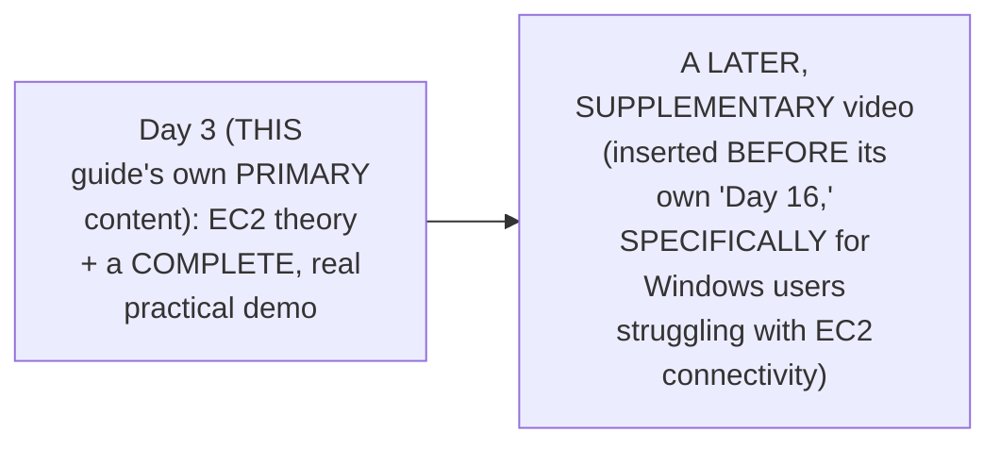

#### 🎯 Key Takeaways

* This GUIDE combines TWO, GENUINELY related but SEPARATELY-released videos — Day 3's OWN complete EC2 deep DIVE, PLUS a LATER, supplementary VIDEO addressing a REAL, common PAIN point (Windows connectivity).
* The SUPPLEMENTARY video is directly, HONESTLY confirmed as GENUINELY out-of-SEQUENCE — released IN RESPONSE to REAL, direct audience FEEDBACK, rather than FOLLOWING the series' own PLANNED, day-by-day ORDER.
* BOTH pieces GENUINELY, DIRECTLY center on THE SAME underlying TOPIC — EC2 — making THEM a GENUINELY coherent, COMBINED study RESOURCE.

---

### 2. What Is EC2? Breaking Down "Elastic Cloud Compute"

#### 📖 Definition — EC2, Precisely Defined

> 💡 **Given directly:** *"The word or the term EC2 represents Elastic Cloud Compute... there are three words in this — elastic, cloud, and compute."*

#### 📖 Definition — Compute, Precisely Explained

> 💡 **Given directly:** *"The word compute means that you are requesting AWS to provide you a compute instance, which is a combination of CPU, RAM, and disk — technically you are asking AWS to provide a virtual server."*

#### 🔍 Internal Working — Precisely HOW AWS Genuinely Provides a Virtual Server

> 💡 **Given directly:** *"AWS has multiple physical servers across the world — when you ask AWS to give me an EC2 instance in this specific region of the world, what it will do is it will take this request to the hypervisor that AWS has, or the virtualization platform that AWS has, and it will give you a virtual machine."*

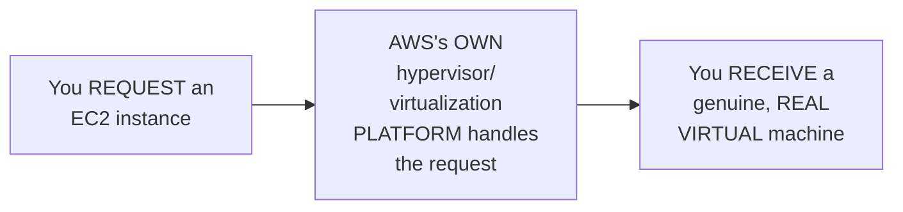

#### 📖 Definition — Elastic, Precisely Explained as AWS's Own Naming Convention

> 💡 **Given directly:** *"Whenever AWS provides you a service that can be scaled up or scaled down... this service is elastic in nature — for example, you have Elastic Cloud Compute, you have Elastic Kubernetes Service, Elastic Beanstalk, Elastic Load Balancer — so you have a lot of services on AWS with the prefix 'elastic.'"*

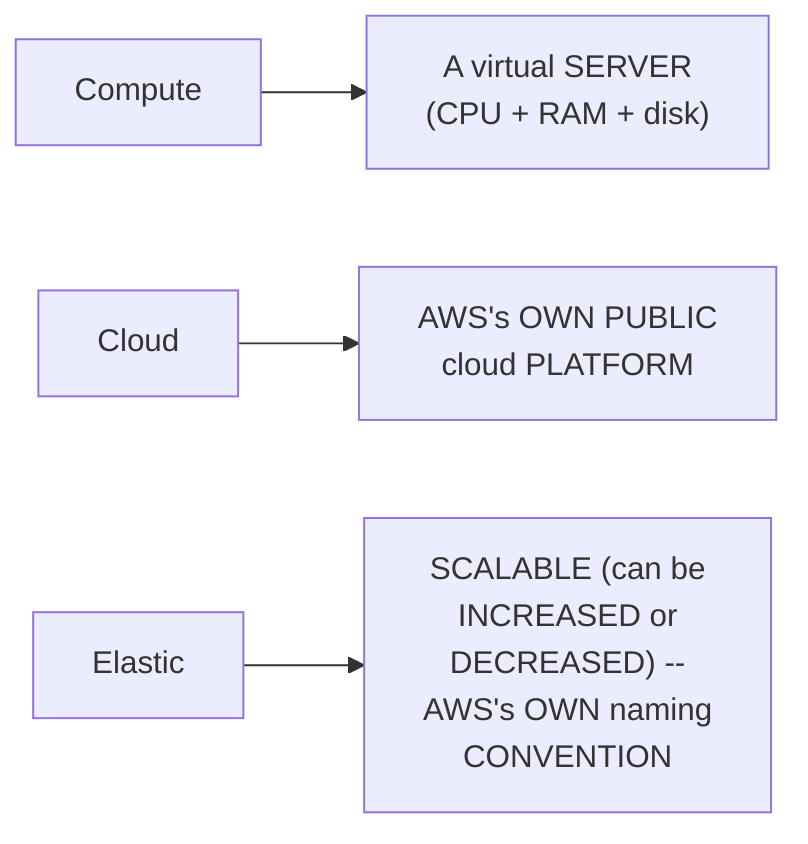

#### ⚠ Common Mistakes

* Assuming "EC2" is JUST an ARBITRARY, meaningless ACRONYM — explicitly, directly, PRECISELY decomposed INTO its THREE, genuine COMPONENT words, EACH with its OWN, specific MEANING.
* Assuming "elastic" is UNIQUE to EC2 SPECIFICALLY — explicitly, directly clarified: it's AWS's OWN, BROADER naming CONVENTION, applied to MANY scalable SERVICES (EKS, Elastic BEANSTALK, Elastic LOAD Balancer, etc.).

#### 🎯 Key Takeaways

* **EC2** precisely stands for "Elastic Cloud COMPUTE" — COMPUTE (a virtual SERVER), CLOUD (AWS's OWN public PLATFORM), and ELASTIC (SCALABLE, AWS's OWN naming CONVENTION).
* AWS GENUINELY provides virtual SERVERS by ROUTING requests THROUGH its OWN hypervisor/VIRTUALIZATION platform, ACROSS its OWN, REAL, physical DATA centers WORLDWIDE.
* The "ELASTIC" PREFIX directly, PRECISELY signals a SERVICE's own SCALABILITY — a PATTERN worth RECOGNIZING ACROSS MANY other AWS SERVICES (EKS, Elastic BEANSTALK, etc.).

---
### 3. Why Use EC2? Maintenance & Cost, Revisited

#### ❓ Why It Exists — A Direct, Precise Connection Back to Day 1's Own Established Reasoning

> 💡 **Given directly:** *"As a DevOps engineer, what are your activities after you create [servers]? You have to timely upgrade these virtual machines, verify the versions, verify that they don't have any security issues... to manage a thousand resources like this, it will be a huge headache — one of the major advantages of moving towards the public cloud platform is to get rid of this maintenance."*

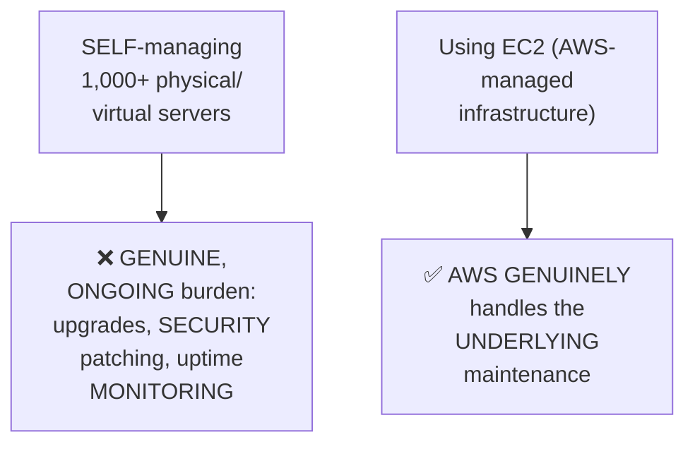

#### 📖 Definition — Cost Efficiency, Precisely Explained via Pay-As-You-Go

> 💡 **Given directly:** *"Let's say you don't want these servers to be up during the night, you don't want the servers to be up during Christmas, during Diwali, because nobody is using it — in such cases you can simply shut down these servers, and AWS will not ask you for money for the time period where you have shut down these servers — whereas if it were your own servers, you have to anyways pay for it, because you have already purchased it."*

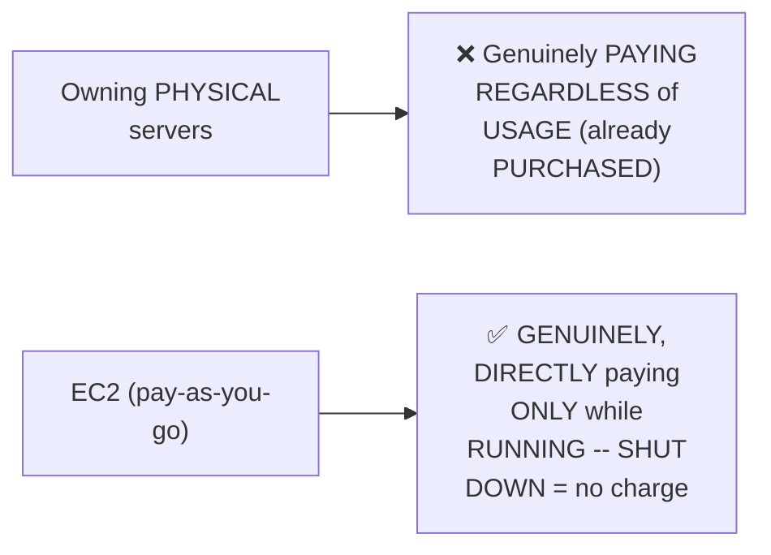

#### ⚠ Common Mistakes

* Assuming EC2's OWN "elastic" NATURE (Section 2) refers ONLY to COMPUTE capacity SCALING — explicitly, directly EXTENDED here: it ALSO GENUINELY enables COST-efficient, ON-DEMAND SHUTDOWN, DIRECTLY saving MONEY during PERIODS of genuine, real NON-use.

#### 🎯 Key Takeaways

* EC2's OWN genuine VALUE directly, PRECISELY mirrors Day 1's own ESTABLISHED "why PUBLIC cloud" reasoning: eliminating MAINTENANCE overhead (PRIMARY) and COST efficiency (SECONDARY) — NOW applied SPECIFICALLY to COMPUTE infrastructure.
* AWS GENUINELY handles ALL UNDERLYING server MAINTENANCE (upgrades, SECURITY, uptime) — a REAL, DIRECT relief for DEVOPS teams who would OTHERWISE manage this MANUALLY, at SCALE.
* EC2's OWN "PAY as you GO" model GENUINELY allows SHUTTING DOWN unused INSTANCES to AVOID charges — a REAL, DIRECT cost ADVANTAGE over OWNING physical HARDWARE outright.

---

### 4. EC2 Instance Types: Five Categories, Explained via a Real Analogy

#### 📖 Definition — The Five, Current-Generation Instance Types

> 💡 **Given directly:** *"There are five different types which are very commonly used — general purpose EC2 instances, compute optimized, memory optimized, storage optimized, and accelerated compute."*

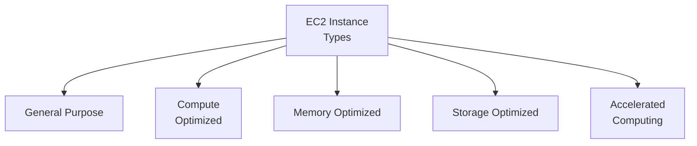

#### 🧠 Concept — A Genuinely Relatable, Real Analogy: Buying Servers From IBM

> 💡 **Given directly:** *"Let's say you have purchased two physical servers, and IBM says, hey, which type of server do you want — do you want memory optimized, or do you want compute optimized, or storage optimized? This server that you have purchased is very rich in terms of memory — that means memory operations are performed very quickly — whereas compute optimized means this instance provides a higher ratio of compute power when compared to memory."*

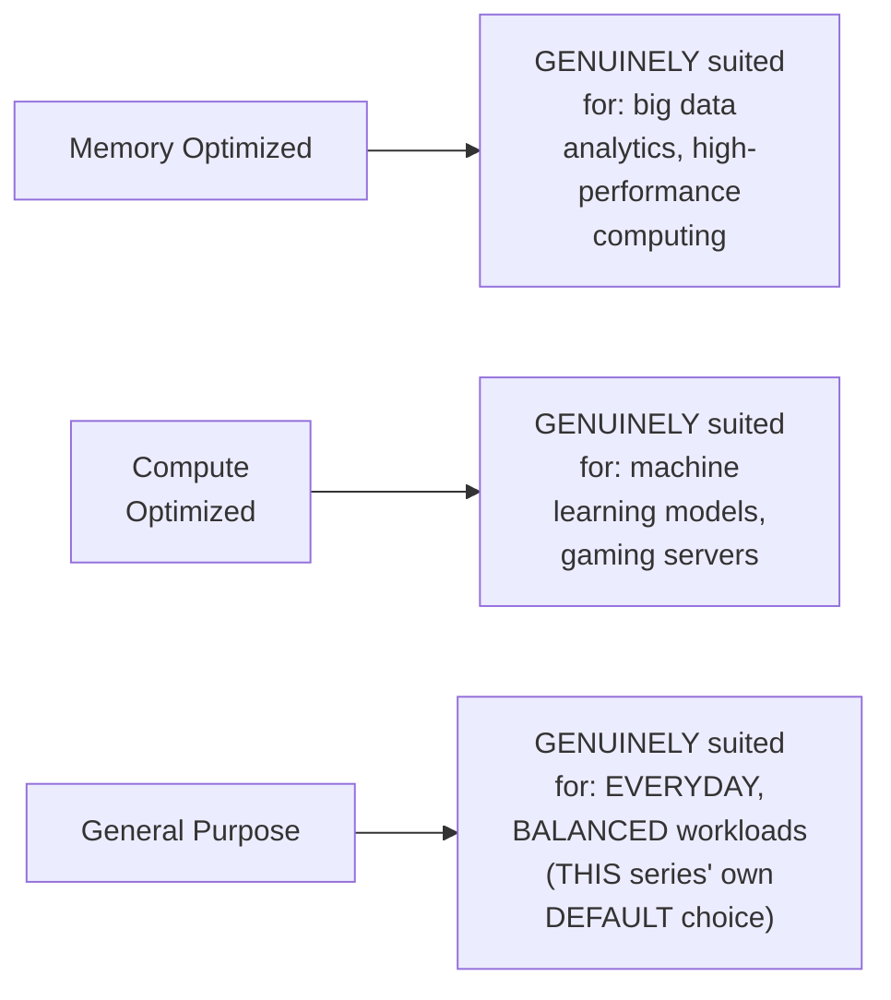

#### 🔍 Internal Working — A Genuine, Real, Direct Confirmation: Pricing Reflects Instance Type

> 💡 **Given directly:** *"AWS will not give you a memory-optimized instance at the same price as a general-purpose instance, because AWS might have also purchased these servers at a higher price."*

#### ⚠ A Direct, Honest, Practical Clarification for THIS Series' Own Scope

> 💡 **Given directly:** *"Throughout all of these series that we are doing, we will just use a general-purpose EC2 instance — because we don't want any memory optimized or compute optimized — I am not writing any gaming application... we are not doing any data analytics."*

#### 🏢 Real-World / Production Usage — A Genuine, Direct Interview Framing

> 💡 **Given directly:** *"It is very important for you to understand, in future when you join a company, or in your current organization, if you want to implement AWS, during your interviews also people will ask you what are the different types of EC2 instance."*

#### ⚠ Common Mistakes

* Assuming EVERY EC2 instance is GENUINELY, FUNCTIONALLY identical, DIFFERING only in SIZE — explicitly, directly, PRECISELY clarified: DIFFERENT TYPES are OPTIMIZED for GENUINELY different WORKLOAD characteristics (memory-HEAVY vs. compute-HEAVY vs. storage-HEAVY).
* Assuming ALL instance TYPES are PRICED identically — explicitly, directly, HONESTLY clarified: PRICING GENUINELY reflects the UNDERLYING hardware's OWN, real COST to AWS.

#### 🎯 Key Takeaways

* AWS offers **FIVE, current-GENERATION EC2 instance TYPES**: general PURPOSE, compute OPTIMIZED, memory OPTIMIZED, storage OPTIMIZED, and ACCELERATED computing — DIRECTLY, MEMORABLY explained via the "BUYING servers from IBM" ANALOGY.
* This SERIES' own PRACTICAL demonstrations DELIBERATELY use **general-PURPOSE instances** THROUGHOUT — SINCE the SERIES' own APPLICATIONS don't GENUINELY require SPECIALIZED (gaming, ML, ANALYTICS) hardware.
* This is directly, EXPLICITLY confirmed as **GENUINE, real INTERVIEW material** — LEARNERS should REMEMBER all FIVE types, EVEN THOUGH general PURPOSE is the ONLY type USED throughout THIS specific SERIES.

---
### 5. Regions & Availability Zones: Data Residency, Latency & High Availability

#### 📖 Definition — Region, Precisely Defined

> 💡 **Given directly:** *"AWS has their data centers across the world — AWS has the data center in India, AWS has the data center in US, Europe, and multiple other places — this thing in AWS is called as regions."*

#### ❓ Why It Exists — Reason 1: Data Residency & Compliance

> 💡 **Given directly:** *"You are working for a European bank... there is a restriction with the European banks that they don't want to put their data outside their country, or outside Europe — for that reason, whenever you create an EC2 instance for me, create that EC2 instance within the Europe zone... there is a region called Frankfurt, Frankfurt is in Germany, so you will create your EC2 instance in Germany, so that your customer feels safe."*

#### ❓ Why It Exists — Reason 2: Latency

> 💡 **Given directly:** *"Let's say your customer or your end customer is in the US, and if you create an instance in Mumbai, whenever they try to request information from the application, they have to make a request to one of the servers in Mumbai — there will be latency — latency is nothing but the time that is taken for the request to reach the application, and for the application to send the response back."*

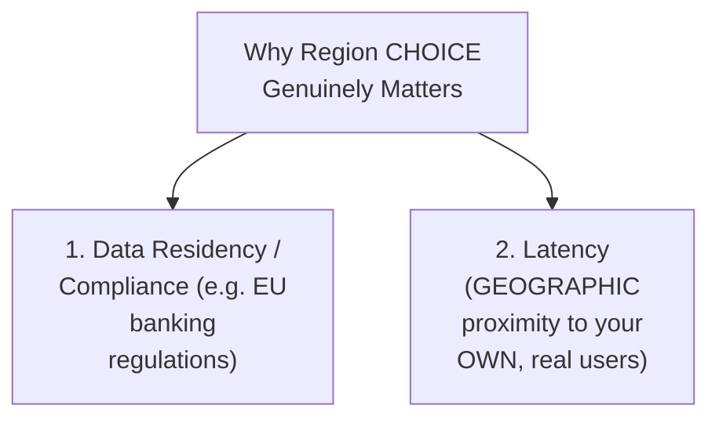

#### 📖 Definition — Availability Zone, Precisely Defined

> 💡 **Given directly:** *"Even within a region, we will have multiple availability zones — for example, in North Virginia we have two availability zones called US East 1A and US East 1B... instead of AWS revealing the server and data center location, they will use some alphabets to denote that."*

#### ❓ Why It Exists — The Precise, Genuine Reason for Availability Zones

> 💡 **Given directly:** *"Let's say there is a customer who has created an instance in North Virginia... one fine day there was a short circuit, or for some reason the region went down — there was some reliability issue with that site — then your customer will face downtime, and your application stops working. To avoid this problem, what AWS said is, even within a region, we will have multiple availability zones."*

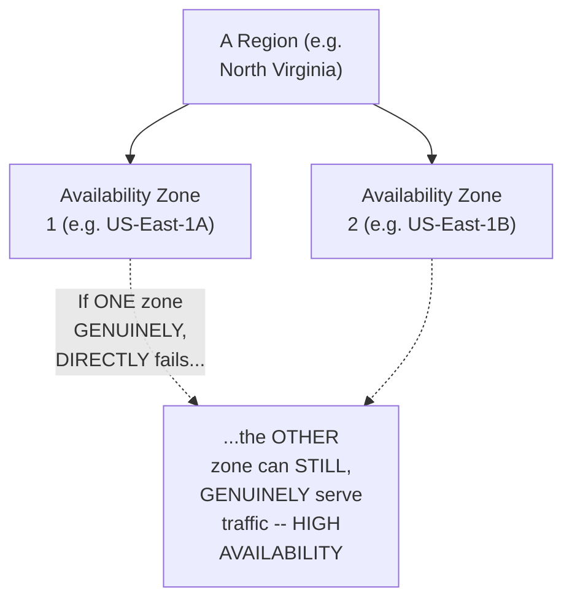

#### 🔍 Internal Working — A Genuine, Direct, Live-Confirmed Overview of AWS's Own Regions

> 💡 **Given directly:** *"AWS says that they have data centers in North Virginia, Ohio, California, Oregon, Mumbai, Singapore, Sydney — and apart from this you will see some 10 new regions which are not enabled by default, because they are the new regions created after 2019 by AWS, and they need to be enabled."*

#### ⚠ Common Mistakes

* Assuming REGION choice is GENUINELY, PRACTICALLY irrelevant for LEARNING/proof-of-CONCEPT purposes — explicitly, directly, HONESTLY clarified: "whenever you are DEALING with the free INSTANCE, you don't have to BOTHER about it... but when you WORK for an organization, this is IMPORTANT."
* Confusing REGIONS with AVAILABILITY zones — explicitly, directly, PRECISELY distinguished: REGIONS address GEOGRAPHIC/compliance CONCERNS (WHERE in the world); AVAILABILITY zones address RELIABILITY WITHIN a chosen REGION (redundancy AGAINST a SINGLE zone's own FAILURE).

#### 🎯 Key Takeaways

* **Regions** address TWO, genuine CONCERNS: data RESIDENCY/compliance (e.g., EU BANKING regulations) and LATENCY (GEOGRAPHIC proximity to REAL users).
* **Availability zones** exist WITHIN a chosen region, SPECIFICALLY to provide **HIGH AVAILABILITY** — PROTECTING against a SINGLE zone's own, GENUINE failure (e.g., a "SHORT circuit" or RELIABILITY issue).
* For LEARNING purposes (THIS series' own scope), region/AZ CHOICE is GENUINELY less critical — but is DIRECTLY, EXPLICITLY confirmed as GENUINELY important in REAL, professional/organizational CONTEXTS.

---

### 6. Creating a Real EC2 Instance: The Complete Console Walkthrough

#### 🪜 Step-by-Step — Naming & Choosing an Operating System

> 💡 **Given directly:** *"Click on launch instance... provide the name of the instance — let me call it 'my first instance'... AWS by default has all of these operating systems, which are basically distributions — Ubuntu, Amazon Linux, Red Hat, Solaris, Debian — let's say I want to choose Ubuntu."*

#### ⚠ A Direct, Honest, Important Free-Tier Warning

> 💡 **Given directly:** *"Make sure you always pick the free-tier eligible things only — the reason is that if you pick anything else, then AWS will charge you for that... AWS provides you only 750 hours of T2 micro, which is free-tier eligible instance... it's not for the year, but it's ONE month."*

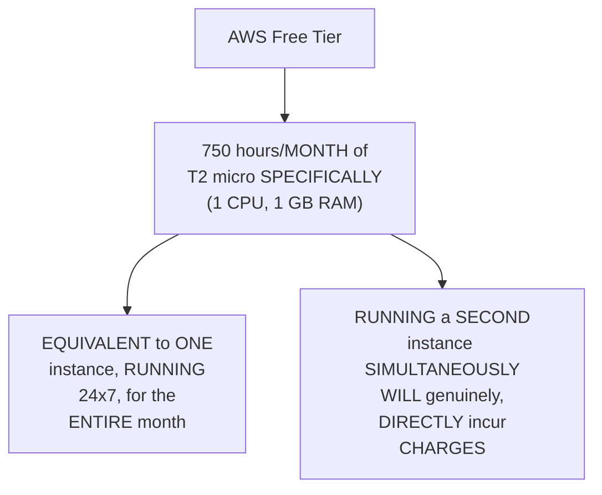

#### 🔍 Internal Working — A Genuine, Practical Habit Recommendation

> 💡 **Given directly:** *"It's a good habit — whenever you are done with your proof of concept, today you are learning something, once you are done with it, just try to turn off that instance or shut down that instance."*

#### 🪜 Step-by-Step — Instance Type & Key Pair Creation

> 💡 **Given directly:** *"There is another thing here — the instance type — free tier is only eligible for T2 micro, which belongs to family T2, 1 CPU, 1 GB memory... then you have key pair — this key pair is actually the one that helps us log into the instance... by default, when you create an instance, AWS does not provide your password — the only way you can log into the instance is using key pair, which is a combination of public/private key."*

```bash
# Key pair creation (via console):
# Create new key pair -> RSA -> Name it (e.g. "AWS_login") -> .pem format
# Downloaded automatically to your local machine
```

#### ⚠ A Direct, Important Security Warning

> 💡 **Given directly:** *"Do not share this public/private key with anyone — even if you share the public key, that's okay, but the private key should not be shared with anyone — keep this key pair with you, not to be shared with anyone."*

#### 🪜 Step-by-Step — Network Settings & Storage (Both Deferred)

> 💡 **Given directly:** *"You have a bunch of network settings which we will not touch today — in future videos when we learn about networking, security groups, inbound outbound traffic rules, route tables, we will get to all of these things... additionally you can increase the storage — by default the instance that AWS gives you has only 8 GB."*

#### ⚠ Common Mistakes

* Assuming a CUSTOM PASSWORD can be used to LOG into a NEW EC2 instance — explicitly, directly, PRECISELY clarified: PASSWORD authentication is DISABLED by DEFAULT — the KEY PAIR (public/PRIVATE) is the ONLY genuine LOGIN method.
* Selecting an INSTANCE type OTHER than T2 MICRO while INTENDING to stay WITHIN the free TIER — explicitly, directly, HONESTLY warned: ONLY T2 micro GENUINELY qualifies for the 750-HOUR free allowance.

#### 🎯 Key Takeaways

* Creating a REAL EC2 instance REQUIRES: a NAME, an operating SYSTEM (e.g., UBUNTU), a FREE-tier-eligible instance TYPE (T2 MICRO specifically), and a KEY PAIR (the ONLY genuine LOGIN method, SINCE password auth is DISABLED by default).
* AWS's OWN free TIER GENUINELY provides **750 HOURS/month of T2 micro SPECIFICALLY** — EQUIVALENT to ONE instance RUNNING continuously — a SECOND, SIMULTANEOUS instance GENUINELY incurs CHARGES.
* The PRIVATE key (from the DOWNLOADED `.pem` FILE) must **GENUINELY, NEVER be SHARED** — a REAL, important SECURITY practice DIRECTLY, EXPLICITLY emphasized.

---
### 7. Connecting to the Instance & Deploying a Real Application (Jenkins)

#### 🪜 Step-by-Step — Locating the Public IP & Connecting via SSH

> 💡 **Given directly:** *"Click on the instance ID and you will get the complete details — this is the public IP address, using this public IP address you can access the instance from outside world... take a terminal... SSH minus I, go to the location of your PEM file... because we have created an Ubuntu instance, the user ID by default available on that instance is Ubuntu — so I'll say ubuntu@[public IP address]."*

```bash
ssh -i AWS_login.pem ubuntu@<public_ip_address>
```

#### ⚠ A Direct, Honest, Live-Demonstrated Error & Its Fix

> 💡 **Given directly:** *"As soon as I do it, I land into an error — there is an error called the permissions for AWS_login.pem — it is a very sensitive file which has a lot of private key information, but you have kept the permissions to open — try to change that... you can use a command called chmod to change the permissions of the file to 600."*

```bash
chmod 600 AWS_login.pem
ssh -i AWS_login.pem ubuntu@<public_ip_address>
```

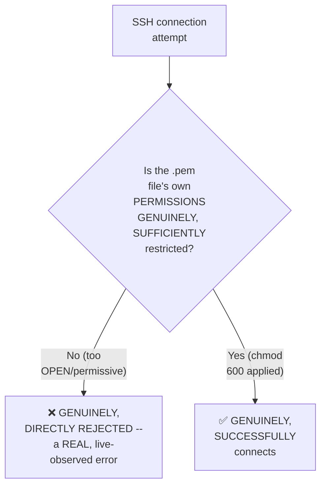

#### 🪜 Step-by-Step — Confirming a Genuine, Successful Login

> 💡 **Given directly:** *"So now I am logged into the instance — I can just say 'who am I,' and it will say that you are Ubuntu user on this specific server."*

#### 🪜 Step-by-Step — Updating Packages (A Recommended, First Habit)

> 💡 **Given directly:** *"As soon as I log into the EC2 instance, the thing that you need to do is you have to update the packages on this instance — if you are on Ubuntu user, all that you need to do is sudo apt update... it's a good practice whenever you log into a new instance, try to update the packages."*

```bash
sudo apt update
```

#### 🪜 Step-by-Step — Installing Java (A Genuine Prerequisite) & Jenkins

> 💡 **Given directly:** *"I will try to install Jenkins on this machine and try to access that Jenkins from the browser... before you install this, there is a prerequisite that you need to install Java — let's install Java first."*

```bash
sudo apt install openjdk-11-jdk
java --version    # verify installation
# ...then follow the official Jenkins Ubuntu install instructions
```

#### 🪜 Step-by-Step — Verifying the Jenkins Service Is Running

> 💡 **Given directly:** *"Once Jenkins is installed... we will start the Jenkins service if it is not started, and once the Jenkins service is started, you can try to access it from the browser... I can just say systemctl status Jenkins — perfect, Jenkins is up and running... by default Jenkins runs on a port called 8080."*

```bash
systemctl status jenkins
```

#### ⚠ Common Mistakes

* Attempting an SSH connection WITHOUT first CORRECTING an overly-PERMISSIVE key-file PERMISSION — explicitly, directly, HONESTLY demonstrated as a REAL, common ERROR — resolved via `chmod 600`.
* Assuming a NEW EC2 instance's OWN software is AUTOMATICALLY up TO DATE — explicitly, directly recommended: `sudo apt update` should GENUINELY be run IMMEDIATELY after CONNECTING, as a GOOD, standard PRACTICE.
* Attempting to INSTALL Jenkins WITHOUT first INSTALLING its OWN prerequisite (JAVA) — explicitly, directly, PRECISELY sequenced: JAVA FIRST, THEN Jenkins.

#### 🎯 Key Takeaways

* Connecting to a REAL EC2 instance GENUINELY requires the CORRECT `ssh -i <pem_file> ubuntu@<public_ip>` COMMAND — WITH a GENUINE, common permission ERROR (fixed via `chmod 600`) DIRECTLY, HONESTLY demonstrated LIVE.
* The RECOMMENDED, FIRST habit AFTER connecting is `sudo apt UPDATE` — ensuring the INSTANCE's own SOFTWARE is GENUINELY current.
* A COMPLETE, real APPLICATION (Jenkins) was GENUINELY installed — REQUIRING Java as a PREREQUISITE FIRST — and CONFIRMED running via `systemctl status JENKINS`, on its OWN DEFAULT port, **8080**.

---

### 8. Making the Application Accessible: Security Group Inbound Rules

#### ❓ Why It Exists — The Precise, Genuine, Real Problem

> 💡 **Given directly:** *"Ideally your application should be running, but it will not be accessible — the reason is that whenever you create anything on AWS, apart from creating the instance, running the application, there are a lot of settings... your application by default is NOT accessible to the external world — there's a lot of security things, networking things."*

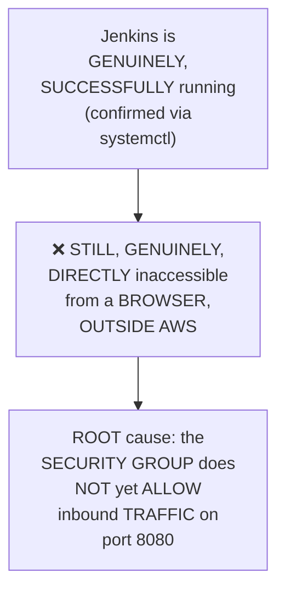

#### 🪜 Step-by-Step — The Complete, Real, Correct Fix

> 💡 **Given directly:** *"There is something called security group — if you go there, you have inbound traffic rules and outbound traffic rules — inbound is the request that is coming inside AWS to your EC2 instance, outbound is a request that is going outside — I'll just go to the security group inbound traffic rules, edit the inbound traffic rules, and add a new rule saying custom TCP, port 8080, from anywhere in the world."*

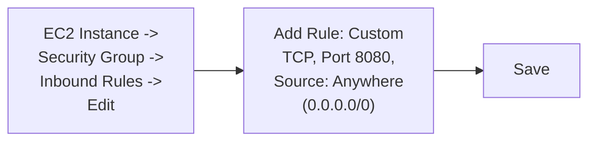

#### 🪜 Step-by-Step — A Complete, Genuine, Successful Access Confirmation

> 💡 **Given directly:** *"See, Jenkins is installed, and it said this is my initial password, and as soon as I enter, my Jenkins server is accessible — see, the Jenkins console is accessible and Jenkins is up and running — so this is your first application that you have deployed."*

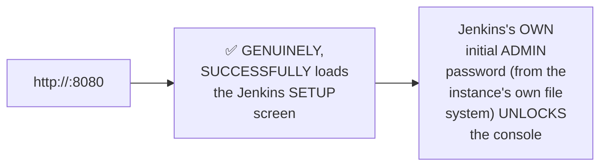

#### ⚠ Common Mistakes

* Assuming a RUNNING application (confirmed VIA `systemctl status`) is AUTOMATICALLY, GENUINELY accessible from OUTSIDE the EC2 instance — explicitly, directly, LIVE-demonstrated as REQUIRING an EXPLICIT security-GROUP inbound RULE.
* Forgetting that DIFFERENT applications GENUINELY use DIFFERENT DEFAULT ports (Jenkins: 8080) — explicitly, directly, PRECISELY confirmed as SOMETHING that MUST be KNOWN before CONFIGURING the CORRECT inbound RULE.

#### 🎯 Key Takeaways

* A RUNNING application is **GENUINELY, STRUCTURALLY still INACCESSIBLE** from OUTSIDE AWS WITHOUT an EXPLICIT security-GROUP inbound RULE — DIRECTLY, honestly EXPLAINED and LIVE-demonstrated.
* The CORRECT fix: EDIT the instance's OWN security GROUP, ADDING a CUSTOM TCP rule for the RELEVANT port (Jenkins's OWN default, **8080**), ALLOWING traffic FROM anywhere.
* This COMPLETE workflow was **directly, LIVE-verified**: Jenkins's OWN console GENUINELY, SUCCESSFULLY loaded via the PUBLIC IP and PORT, CONFIRMING the ENTIRE, real DEPLOYMENT cycle — CREATE, CONNECT, DEPLOY, and EXPOSE.

---
### 9. Supplementary Guide: Connecting to EC2 From Windows (MobaXterm)

#### 🧠 Concept — A Direct, Honest Framing of This Video's Own Purpose

> 💡 **Given directly:** *"Many of our friends who are following this series and learning AWS are finding it difficult to log into the EC2 instances from their Windows machines... people have issues with PuTTY, they don't know how to access the EC2 instances from their Windows machine — so I am doing this video to explain for all of our Windows users how to access the EC2 instances from your laptop... you don't need to install any Oracle VirtualBox or something — you can simply follow this video and connect to the EC2 instances in the next 5 minutes."*

#### 🪜 Step-by-Step — A Direct, Honest, Personal Note on the Demonstration Environment

> 💡 **Given directly:** *"This is a laptop that I have borrowed — I haven't used a Windows laptop for almost six years, so I got this laptop from someone else, and I don't have any setup of mine in this laptop, so I'm just recording this screen and I'll show you right from the basics — there is nothing installed in this laptop as of now."*

#### 🪜 Step-by-Step — Creating a NEW EC2 Instance for This Demo

> 💡 **Given directly:** *"Click on launch instance, provide any name, let's say 'test windows'... let me select Ubuntu, we'll connect to a Linux machine here, let's use T2 micro, and let me create the key pair... I am using the .pem file itself, because if you are using PuTTY you have to go with [the .ppk] option — but in this demo I am going to use MobaXterm, which is an even better software than PuTTY."*

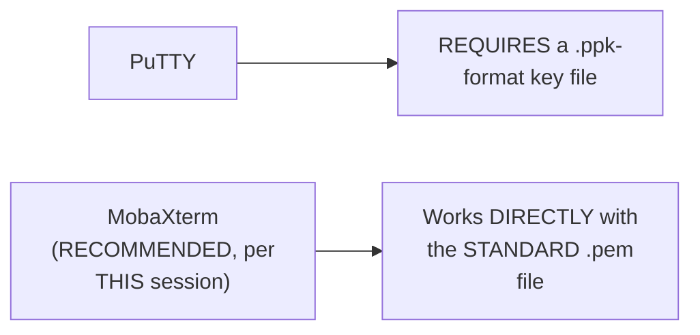

#### 🪜 Step-by-Step — Downloading & Installing MobaXterm

> 💡 **Given directly:** *"Search for download MobaXterm... you will see two options, once you click on download MobaXterm you will find a Community Edition and a Professional Edition — go for the Home Edition or the Community Edition... it gets installed as a zip file — click on 'extract all'... double-click on this one, and an installer gets opened — preparing to install, click next, agree to all the conditions, click next, install now."*

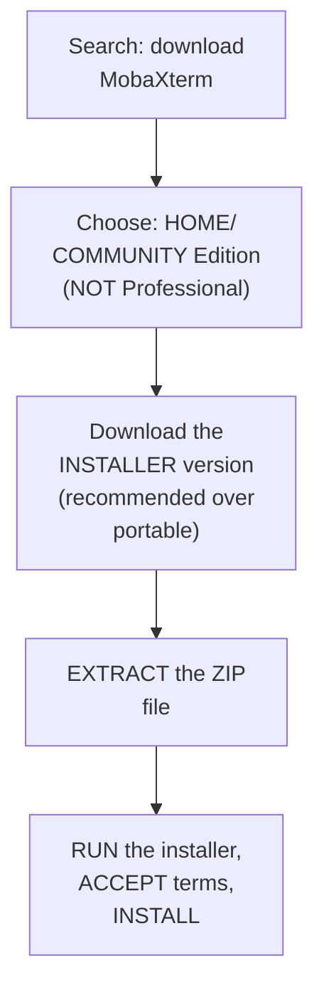

#### 🪜 Step-by-Step — The Complete, Real Connection Setup Within MobaXterm

> 💡 **Given directly:** *"Take the EC2 instance that you have created... get the IP address... copy the IP address to MobaXterm — go to sessions, you have this option SSH, Telnet, RSH — just go with SSH, and provide the host name here, that is the IP address — what should be your username? Your username should be Ubuntu — click on the advanced SSH settings, and here click on 'use private key,' and now select the private key that you have downloaded."*

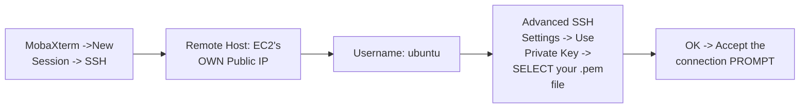

#### 🪜 Step-by-Step — A Complete, Live, Genuine Success Confirmation

> 💡 **Given directly:** *"Now your MobaXterm will be able to authenticate to the EC2 instance — if you see here, now I am inside the EC2 instance already — this is my EC2 instance, you can try out a bunch of commands to verify — you can just say sudo apt update — done — perfect."*

#### ⚠ Common Mistakes

* Assuming PuTTY is the ONLY, or the GENUINELY BEST, tool for WINDOWS-based EC2 connectivity — explicitly, directly, DIRECTLY recommended AGAINST: MobaXterm is DIRECTLY, EXPLICITLY confirmed as "an even BETTER software than PuTTY," WORKING directly with the STANDARD `.pem` format.
* Downloading the PROFESSIONAL edition of MobaXterm, ASSUMING it's GENUINELY necessary — explicitly, directly clarified: the FREE, Home/COMMUNITY edition is GENUINELY sufficient for THIS purpose.

#### 🎯 Key Takeaways

* This is a genuinely **SUPPLEMENTARY, out-of-SEQUENCE video**, DIRECTLY created in RESPONSE to REAL, common WINDOWS-connectivity struggles REPORTED by the AUDIENCE.
* **MobaXterm** (FREE, Home/COMMUNITY edition) is DIRECTLY recommended OVER PuTTY — WORKING DIRECTLY with the STANDARD `.pem` key FORMAT, WITHOUT requiring FORMAT conversion.
* The COMPLETE connection WORKFLOW — NEW session → SSH → host (PUBLIC IP) → username (`ubuntu`) → PRIVATE key selection — was **DIRECTLY, LIVE-verified**, CONFIRMED via a REAL, successful `sudo apt UPDATE` command RUN INSIDE the CONNECTED instance.

---

### 10. Closing: What's Next

#### 🪜 Step-by-Step — A Complete, Honest Recap (Day 3)

> 💡 **Given directly:** *"This is your first application that you have deployed — congratulations, if you are new to AWS, let's say you have just started learning, then you have already achieved something — you learned how to deploy your first application, and that too Jenkins on AWS, and access it from the outside world."*

#### 🪜 Step-by-Step — A Direct, Honest Pointer From the Supplementary Video

> 💡 **Given directly:** *"I made this video very specifically for our friends who are using Windows machines — that's all, see you in the next video, day 16, where we will cover about AWS CloudWatch."*

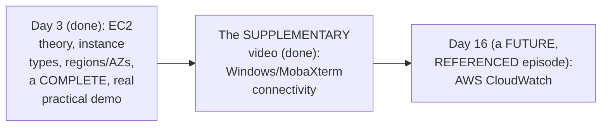

#### ⚠ Common Mistakes

* Assuming THIS combined GUIDE's own content represents the FULL, complete AWS SERIES — explicitly, directly, HONESTLY clarified: THIS covers ONLY Day 3, PLUS a SUPPLEMENTARY video — MANY more DAYS (up to DAY 30) remain, WITH Day 16 (CloudWatch) DIRECTLY, EXPLICITLY referenced as a KNOWN, upcoming TOPIC.

#### 🎯 Key Takeaways

* Day 3 **GENUINELY, COMPLETELY delivers** its OWN stated goal — EC2 theory PLUS a COMPLETE, real, PRACTICAL deployment CYCLE (create, CONNECT, deploy, EXPOSE).
* The SUPPLEMENTARY video **directly, HONESTLY serves** a SPECIFIC, real AUDIENCE need (Windows CONNECTIVITY) — NOT part of the SERIES' own SEQUENTIAL numbering, but GENUINELY, PRACTICALLY valuable ALONGSIDE Day 3's own CONTENT.
* **Day 16 (AWS CloudWatch)** is DIRECTLY, EXPLICITLY referenced as a KNOWN, FUTURE topic — CONFIRMING the SERIES' own CONTINUED, planned STRUCTURE beyond WHAT this GUIDE covers.

---
## 📝 Glossary

| Term | Definition | Why It Matters |
|---|---|---|
| **EC2** | Elastic Cloud Compute -- AWS's own virtual server service | AWS's most widely-used, most popular service |
| **Compute** | A virtual server (CPU + RAM + disk) | What you're genuinely requesting from EC2 |
| **Elastic** | Scalable -- AWS's own naming convention for scalable services | Also seen in EKS, Elastic Beanstalk, Elastic Load Balancer |
| **Instance Type** | A category of EC2 instance, optimized for a specific workload | General purpose, compute/memory/storage optimized, accelerated |
| **Free Tier** | AWS's own limited, no-cost usage allowance | 750 hours/month of T2 micro specifically |
| **Region** | A geographic location with AWS data centers | Addresses data residency/compliance and latency |
| **Availability Zone** | An isolated location WITHIN a region | Addresses high availability (protects against zone failure) |
| **Key Pair** | A public/private key combination, used for EC2 login | Password authentication is disabled by default |
| **.pem File** | The private key file, downloaded during instance creation | NEVER share this file with anyone |
| **Security Group** | A virtual firewall controlling inbound/outbound traffic | Must be configured to allow external access to a port |
| **MobaXterm** | A free SSH client for Windows | Recommended over PuTTY -- works directly with .pem files |

---

## 🔄 Revision Notes — One-Minute Revision

* This guide COMBINES Day 3 (EC2 Deep Dive) with a SEPARATE, SUPPLEMENTARY video (Windows/MobaXterm connectivity), released out of sequence due to real, common audience struggles.
* **EC2 = Elastic Cloud Compute**: Compute (a virtual server -- CPU+RAM+disk), Cloud (AWS's own public platform), Elastic (scalable -- AWS's own broader naming convention, also seen in EKS, Elastic Beanstalk, etc.).
* **Why EC2**: directly mirrors Day 1's own "why public cloud" reasoning -- eliminating maintenance overhead (AWS handles upgrades/security/uptime) + cost efficiency (pay-as-you-go, shut down when unused = no charge).
* **5 instance types**: general purpose, compute optimized, memory optimized, storage optimized, accelerated computing -- explained via the "buying servers from IBM" analogy. THIS series uses general purpose throughout. Explicitly framed as genuine interview material.
* **Regions vs. Availability Zones**: regions address data residency/compliance (e.g. EU banking) and latency; availability zones (WITHIN a region) address high availability, protecting against a single zone's own failure.
* **Creating a real instance**: name -> OS (Ubuntu) -> free-tier-eligible type (T2 micro, 750 hrs/month specifically) -> key pair (.pem, NEVER share the private key -- password auth is disabled by default) -> network settings/storage (deferred, 8GB default).
* **Connecting + deploying**: `ssh -i <pem> ubuntu@<public_ip>` -- a genuine, live-demonstrated permission error, fixed via `chmod 600`. Then: `sudo apt update` (recommended first habit) -> install Java (Jenkins's own prerequisite) -> install Jenkins -> confirm via `systemctl status jenkins` (default port: 8080).
* **Making it accessible**: a running application is STILL genuinely inaccessible externally without an explicit Security Group inbound rule (Custom TCP, port 8080, from anywhere) -- live-verified via successful Jenkins console access.
* **Supplementary (Windows/MobaXterm)**: MobaXterm (free Home/Community edition) directly recommended over PuTTY -- works natively with .pem files. Complete workflow: new SSH session -> host (public IP) -> username (ubuntu) -> advanced SSH settings -> private key selection -> connect. Live-verified via `sudo apt update`.
* **Closing**: Day 16 (AWS CloudWatch) is explicitly, directly referenced as a known, upcoming topic in this series.

---

## 📋 Cheat Sheet

**What EC2 means:**
```text
E lastic (scalable) + C loud (AWS's public platform) + C ompute (a virtual server) = EC2
```

**5 instance types:**
```text
General Purpose | Compute Optimized | Memory Optimized | Storage Optimized | Accelerated Computing
```

**Free tier (know this precisely):**
```text
750 hours/month of T2 micro SPECIFICALLY (1 CPU, 1 GB RAM)
= ONE instance running 24x7, for the ENTIRE month
A SECOND, simultaneous instance WILL genuinely incur charges
```

**Creating + connecting to a real instance:**
```bash
# 1. Console: Launch Instance -> name -> Ubuntu -> T2 micro -> create key pair (.pem)
# 2. Connect (Mac/Linux terminal, or MobaXterm on Windows):
chmod 600 <keyname>.pem
ssh -i <keyname>.pem ubuntu@<public_ip>
```

**Deploying an application (Jenkins example):**
```bash
sudo apt update
sudo apt install openjdk-11-jdk
java --version
# ...install Jenkins per official docs...
systemctl status jenkins
```

**Making it externally accessible:**
```text
EC2 Instance -> Security -> Security Groups -> Edit Inbound Rules
Add: Custom TCP, Port <app_port> (e.g. 8080), Source: Anywhere (0.0.0.0/0)
```

**Windows connectivity (MobaXterm):**
```text
1. Download MobaXterm (Home/Community edition, free)
2. New Session -> SSH -> Host: <public_ip> -> Username: ubuntu
3. Advanced SSH Settings -> Use Private Key -> select your .pem file
4. Connect
```

---

## 🔥 Interview Questions & Answers

### 🟢 Beginner

**Q1.**

**Question:** What does EC2 stand for?

**Answer:** Elastic Cloud Compute.

**Explanation:** Directly, explicitly stated.

**Why Interviewers Ask This:** The most basic, foundational EC2 question.

**Possible Follow-up:** "What does each of the three words genuinely mean?"

**Q2.**

**Question:** Why does AWS use the "Elastic" prefix on multiple service names?

**Answer:** It indicates the service can be scaled up or down -- AWS's own naming convention for scalable services.

**Explanation:** Directly, precisely explained.

**Why Interviewers Ask This:** Tests genuine understanding of AWS naming conventions.

**Possible Follow-up:** "Name another AWS service with this same prefix."

**Q3.**

**Question:** Name the five current-generation EC2 instance types.

**Answer:** General purpose, compute optimized, memory optimized, storage optimized, accelerated computing.

**Explanation:** Directly, explicitly named.

**Why Interviewers Ask This:** An explicitly-named, genuine interview topic.

**Possible Follow-up:** "Which type would you choose for a machine learning workload?"

**Q4.**

**Question:** What is the genuine difference between a region and an availability zone?

**Answer:** A region is a geographic location (addresses compliance/latency); an availability zone is an isolated location WITHIN a region (addresses high availability).

**Explanation:** Directly, precisely distinguished.

**Why Interviewers Ask This:** Basic, essential AWS infrastructure knowledge.

**Possible Follow-up:** "Why would a company genuinely need multiple availability zones?"

**Q5.**

**Question:** How many free-tier hours of T2 micro does AWS genuinely provide per month?

**Answer:** 750 hours.

**Explanation:** Directly, explicitly stated.

**Why Interviewers Ask This:** Tests genuine, practical, hands-on AWS awareness.

**Possible Follow-up:** "What happens if you run a second instance simultaneously?"

**Q6.**

**Question:** How do you genuinely log into a new EC2 instance, since password authentication is disabled by default?

**Answer:** Using a key pair (public/private key) -- specifically the downloaded .pem private key file.

**Explanation:** Directly, precisely explained.

**Why Interviewers Ask This:** Basic, essential EC2 access knowledge.

**Possible Follow-up:** "What should you NEVER do with your private key?"

**Q7.**

**Question:** Why might a fresh SSH connection attempt to a new EC2 instance genuinely fail with a permissions error?

**Answer:** The .pem file's own permissions are too open/permissive; running chmod 600 on it resolves this.

**Explanation:** Directly, live-demonstrated.

**Why Interviewers Ask This:** Tests genuine, practical, hands-on troubleshooting awareness.

**Possible Follow-up:** "What does chmod 600 genuinely grant?"

**Q8.**

**Question:** Why might a genuinely running application (confirmed via systemctl) still be inaccessible from a browser?

**Answer:** The EC2 instance's own Security Group likely doesn't yet allow inbound traffic on the application's own port.

**Explanation:** Directly, live-demonstrated and explained.

**Why Interviewers Ask This:** Basic, essential, practical AWS networking knowledge.

**Possible Follow-up:** "What specific rule would you add to fix this?"

**Q9.**

**Question:** What tool is recommended over PuTTY for connecting to EC2 from Windows, per this session?

**Answer:** MobaXterm.

**Explanation:** Directly, explicitly recommended.

**Why Interviewers Ask This:** Tests genuine, practical, real-world tooling awareness.

**Possible Follow-up:** "Why is it genuinely preferred over PuTTY?"

**Q10.**

**Question:** What is Jenkins's own default port?

**Answer:** 8080.

**Explanation:** Directly, explicitly stated.

**Why Interviewers Ask This:** Basic, practical, real-world deployment knowledge.

**Possible Follow-up:** "What genuine step is needed to make this port externally accessible on AWS?"

---

### 🟡 Intermediate

**Q11.**

**Question:** Explain why the instructor deliberately demonstrates a REAL SSH permission error (Section 7) and a REAL Windows-connectivity struggle (Section 9), rather than presenting an idealized, error-free walkthrough throughout.

**Answer:** This is a genuinely deliberate, CONSISTENT teaching choice, DIRECTLY matching a PATTERN seen ACROSS this instructor's OWN, broader body of work in this WORKSPACE (e.g., Linux Day 3's own HONEST `>`/`>>` mistake, AWS Day 5's own HONEST availability-zone mistake). By GENUINELY, LIVE encountering and CORRECTING real, common ERRORS (a permission ISSUE, a Windows CONNECTIVITY struggle), the instructor DIRECTLY prepares LEARNERS for the SAME kind of REAL, practical FRICTION they will GENUINELY encounter in their OWN, independent WORK — RATHER than leaving them GENUINELY unprepared when their FIRST attempt doesn't WORK perfectly. The SUPPLEMENTARY video's OWN EXISTENCE is ITSELF DIRECT evidence of THIS same philosophy — RATHER than assuming EVERYONE would GENUINELY succeed on the FIRST try, the instructor DIRECTLY, HONESTLY responded to REAL, reported STRUGGLES with a DEDICATED, targeted RESOURCE.

**Explanation:** Requires recognizing a deliberate, consistent pattern of honest, real-error demonstration, connecting it to the supplementary video's own existence as further evidence.

**Why Interviewers Ask This:** Tests whether a learner recognizes the genuine, practical value of honest, unedited demonstrations, and responsive, real-world teaching adjustments.

**Possible Follow-up:** "What OTHER, GENUINE evidence (from EARLIER sessions in THIS series) supports THIS SAME pattern of honest, real-error demonstration?"

**Q12.**

**Question:** A learner argues that since this session's own free-tier limit is "750 hours of T2 micro per month," and a month genuinely has fewer than 750 hours in some cases, this limit is GENUINELY, PRACTICALLY impossible to exceed accidentally. Evaluate this claim.

**Answer:** This claim OVERSTATES the case, missing a GENUINE, important DISTINCTION this session's own content DIRECTLY implies. A MONTH GENUINELY has APPROXIMATELY 730 HOURS (30 days × 24) — meaning "750 HOURS" is INTENTIONALLY, GENUINELY MORE than ENOUGH to cover a SINGLE instance RUNNING continuously for an ENTIRE month (per the session's own DIRECT confirmation: "that means EVEN if you are USING free tier RESOURCES, there is a TIME limit... 24x7... throughout the MONTH"). HOWEVER, this does NOT mean the LIMIT is GENUINELY impossible to EXCEED — per THIS session's own DIRECT, explicit WARNING, running a SECOND, SIMULTANEOUS T2-micro instance ALONGSIDE the FIRST would GENUINELY, DIRECTLY exceed 750 COMBINED hours WELL before the MONTH ends (TWO instances RUNNING simultaneously CONSUME the ALLOWANCE TWICE as FAST) — DIRECTLY confirmed BY the session's own EXPLICIT warning ("if you CREATE one more INSTANCE, then AWS will CHARGE you for that INSTANCE"). The ACCURATE, more PRECISE conclusion: the 750-HOUR limit is GENUINELY, CAREFULLY calibrated to COVER exactly ONE, continuously-running T2-MICRO instance — but is GENUINELY, EASILY exceeded the MOMENT a learner runs MULTIPLE instances SIMULTANEOUSLY, EVEN briefly.

**Explanation:** Tests whether a learner correctly reasons about the free-tier limit's own precise calibration, recognizing that running multiple instances simultaneously genuinely, easily exceeds it.

**Why Interviewers Ask This:** Distinguishes candidates who understand the precise, practical boundary of a stated limit from those who assume a generous-sounding number is genuinely unlimited.

**Possible Follow-up:** "If a learner GENUINELY needed to run TWO T2-micro instances SIMULTANEOUSLY for a SHORT, specific TEST, what practical STRATEGY (per THIS session's own established REASONING) could they use to STAY within, or MINIMIZE exceeding, the free-tier LIMIT?"

**Q13.**

**Question:** Explain, precisely, why the instructor genuinely creates a BRAND-NEW EC2 instance for the Windows/MobaXterm demonstration (Section 9), rather than REUSING the SAME instance already CREATED during Day 3's own PRACTICAL (Section 6).

**Answer:** A precise, REASONED explanation, extending BEYOND this session's OWN explicit content, but DIRECTLY following from ITS OWN established REASONING: while THIS session's own content does NOT EXPLICITLY state the REASON, THIS is DIRECTLY, LOGICALLY consistent with the SUPPLEMENTARY video's OWN, established PURPOSE (Section 9's OWN framing) — teaching an ENTIRELY NEW, POTENTIALLY less-technical AUDIENCE (Windows USERS struggling with CONNECTIVITY) the COMPLETE process, FROM SCRATCH, WITHOUT assuming they GENUINELY still HAVE, or REMEMBER, their OWN Day 3 instance. Creating a GENUINELY NEW, ISOLATED instance (named "test WINDOWS," per Section 9's OWN direct EXAMPLE) ALSO directly AVOIDS any RISK of CONFUSING or DISRUPTING a LEARNER's OWN, potentially ALREADY-configured Day 3 environment (e.g., their OWN, running JENKINS deployment) — DIRECTLY, PRACTICALLY isolating THIS specific, CONNECTIVITY-focused LESSON from ANY unrelated, PRIOR state.

**Explanation:** Requires reasoning through why a fresh, isolated instance makes pedagogical sense for a supplementary, connectivity-focused lesson, extending beyond the session's own explicit content but consistent with its established purpose.

**Why Interviewers Ask This:** Tests whether a learner can reason about a genuine, practical teaching/setup decision not explicitly explained in the source content.

**Possible Follow-up:** "What GENUINE, additional advantage does creating a FRESH instance offer for a VIEWER following ALONG, who may have ALREADY deleted or MODIFIED their OWN Day 3 instance?"

**Q14.**

**Question:** Using this session's own precise "security group" reasoning (Section 8), explain a GENUINE, real security RISK that could arise from the EXACT inbound rule DEMONSTRATED in this session ("Custom TCP, port 8080, from ANYWHERE"), and how you would GENUINELY, PRACTICALLY mitigate it in a REAL, production context.

**Answer:** A precise, reasoned RISK analysis, directly EXTENDING Section 8's own established MECHANISM: per Section 8's own PRECISE demonstration, the rule "FROM anywhere" (0.0.0.0/0) GENUINELY, DIRECTLY allows ANY device, ANYWHERE on the INTERNET, to ATTEMPT a connection to PORT 8080 — INCLUDING, potentially, MALICIOUS actors ATTEMPTING to EXPLOIT a KNOWN Jenkins VULNERABILITY, or ATTEMPTING brute-FORCE login attempts AGAINST the Jenkins CONSOLE itself. For THIS session's own LEARNING purpose, this is a GENUINELY, DELIBERATELY simplified CHOICE (matching THIS session's own EXPLICIT "we will LEARN networking in FUTURE classes" DEFERRAL) — but in a REAL, production CONTEXT, a MORE SECURE approach would GENUINELY restrict the SOURCE to a SPECIFIC, KNOWN IP range (e.g., ONLY the ORGANIZATION's own OFFICE network, or a VPN'S own IP range), RATHER than "ANYWHERE" — DIRECTLY, PRACTICALLY reducing the ATTACK surface WHILE STILL allowing LEGITIMATE, AUTHORIZED users to ACCESS the application.

**Explanation:** Requires extending the security-group mechanism to identify a genuine, real risk in the demonstrated configuration, and propose a practical, more secure alternative.

**Why Interviewers Ask This:** Tests whether a learner can recognize that a learning-appropriate simplification (open access) carries genuine, real risk in production, and can articulate a concrete mitigation.

**Possible Follow-up:** "What OTHER, GENUINE AWS mechanism (beyond SECURITY groups alone) might FURTHER protect a PRODUCTION Jenkins deployment, EXTENDING beyond THIS session's own explicit CONTENT?"

**Q15.**

**Question:** Synthesize this session's complete "instance types" reasoning (Section 4) with its own "region/AZ" reasoning (Section 5) to explain a GENUINE, real scenario where a company might GENUINELY need to choose BOTH a specific instance TYPE and a specific REGION/AZ configuration TOGETHER, for the SAME application.

**Answer:** A precise, SYNTHESIZED scenario, directly connecting TWO, SEPARATELY-established SECTIONS: IMAGINE a company GENUINELY building a REAL-TIME, HIGH-PERFORMANCE financial-TRADING application SERVING clients IN Europe, WITH strict EU data-RESIDENCY requirements (per Section 5's OWN established BANKING example). Per Section 4's OWN precise REASONING, this application's OWN, GENUINE need for FAST, real-time PROCESSING would DIRECTLY suggest a **COMPUTE-optimized** instance TYPE (per Section 4's OWN example: "HIGH-performance computing"). SIMULTANEOUSLY, per Section 5's OWN precise REASONING, the EU data-RESIDENCY requirement would DIRECTLY require DEPLOYING this instance WITHIN a EUROPEAN region (e.g., FRANKFURT, per Section 5's OWN direct EXAMPLE) — and, GIVEN the application's OWN CRITICAL, financial NATURE, the company would LIKELY ALSO want MULTIPLE availability ZONES within THAT region (per Section 5's OWN established high-AVAILABILITY reasoning), ENSURING the trading APPLICATION remains GENUINELY available EVEN if ONE zone GENUINELY fails. This directly, PRECISELY illustrates HOW instance-TYPE selection (Section 4) and region/AZ SELECTION (Section 5) are GENUINELY, SIMULTANEOUSLY, INDEPENDENTLY necessary DECISIONS for a SINGLE, REAL application — NEITHER decision ALONE fully ADDRESSES a REAL-world DEPLOYMENT's own COMPLETE requirements.

**Explanation:** Requires synthesizing instance-type selection with region/AZ selection to construct a genuinely realistic scenario where both decisions matter simultaneously for the same application.

**Why Interviewers Ask This:** A senior-level question testing whether a candidate can integrate MULTIPLE, separately-taught EC2 configuration decisions into ONE, coherent, real-world deployment scenario.

**Possible Follow-up:** "What ADDITIONAL, genuine CONSIDERATION (beyond instance type AND region/AZ) might THIS SAME financial-trading APPLICATION also GENUINELY need, extending BEYOND this session's own EXPLICIT content?"

---

### 🔴 Advanced

**Q16.**

**Question:** Design a complete, reasoned EC2 DEPLOYMENT checklist (using ONLY this session's own established concepts) for deploying a NEW, real application to production, explicitly covering instance creation through external accessibility.

**Answer:** A reasonable, complete CHECKLIST, directly applying this session's OWN exact, established CONCEPTS:

```text
1. CHOOSE the appropriate instance TYPE (Section 4) -- based on the
   application's OWN workload characteristics (general purpose, compute/
   memory/storage optimized, or accelerated computing).

2. CHOOSE the appropriate REGION (Section 5) -- based on data-residency/
   compliance requirements AND latency to your REAL, intended users.

3. CONSIDER availability zones (Section 5) -- for HIGH-availability,
   PRODUCTION-critical applications, deploy ACROSS multiple AZs within
   the chosen region.

4. LAUNCH the instance (Section 6) -- name, OS, instance type, key pair
   (NEVER share the private key), network/storage settings.

5. CONNECT via SSH (Section 7) -- ensure the KEY file has CORRECT
   permissions (chmod 600) BEFORE attempting to connect.

6. UPDATE packages IMMEDIATELY after connecting (sudo apt update) --
   a GOOD, standard practice (Section 7).

7. INSTALL any GENUINE prerequisites (e.g. Java, for Jenkins) BEFORE
   installing the MAIN application (Section 7).

8. VERIFY the application's OWN service status (e.g. systemctl status)
   BEFORE assuming it's genuinely running (Section 7).

9. CONFIGURE the security group's OWN inbound rules (Section 8) --
   allowing the SPECIFIC port your application GENUINELY uses.

10. VERIFY external access -- confirm the application is GENUINELY
    reachable via its OWN public IP and port (Section 8).
```

This complete CHECKLIST directly, precisely APPLIES every ESTABLISHED concept from THIS session, in a LOGICAL, SEQUENTIAL order — from INITIAL planning DECISIONS through FINAL, external VERIFICATION.

**Explanation:** Requires synthesizing every major concept from this session into one complete, sequentially-ordered, real-world deployment checklist.

**Why Interviewers Ask This:** A realistic, senior-level question testing whether a candidate can integrate MULTIPLE, separately-taught EC2 concepts into ONE, coherent, practical deployment PROCEDURE.

**Possible Follow-up:** "At WHICH SPECIFIC step in this checklist would you GENUINELY, additionally consider using an AVAILABILITY-zone-aware load BALANCER, EXTENDING beyond THIS session's own explicit CONTENT?"

**Q17.**

**Question:** Critically evaluate: "Since this session confirms MobaXterm is genuinely recommended over PuTTY for Windows users, this means PuTTY is GENUINELY, UNCONDITIONALLY obsolete, and NO ONE should ever use it for EC2 connectivity." Is this an accurate, complete characterization?

**Answer:** Not accurate — this significantly OVERSTATES a SPECIFIC, THIS-session's-own RECOMMENDATION into an UNCONDITIONAL, universal CLAIM neither this session's OWN content, NOR sound REASONING, supports. Section 9's own PRECISE LANGUAGE is DIRECT but SCOPED: "MobaXterm... is an EVEN better software THAN PuTTY" — this is a COMPARATIVE, PERSONAL recommendation, NOT a CLAIM that PuTTY is GENUINELY, technically BROKEN or unusable. Section 9 itself DIRECTLY, EXPLICITLY acknowledges PuTTY as a GENUINE, valid ALTERNATIVE ("if you are USING PuTTY, you have to GO with [the .ppk] option") — CONFIRMING it GENUINELY, STILL works, JUST requiring a DIFFERENT key FORMAT. The ACCURATE, more PRECISE conclusion: MobaXterm is THIS session's own PREFERRED, RECOMMENDED tool (for its DIRECT `.pem` compatibility AND additional FEATURES) — but PuTTY REMAINS a GENUINELY, PRACTICALLY valid ALTERNATIVE, PARTICULARLY for LEARNERS who ALREADY have PuTTY INSTALLED/familiar, or WHOSE organizations MAY specifically STANDARDIZE on it.

**Explanation:** Tests whether a learner recognizes that a comparative, personal recommendation doesn't equal a claim of the alternative's genuine obsolescence.

**Why Interviewers Ask This:** Distinguishes candidates who correctly scope a stated preference from those who over-generalize it into an absolute, unconditional claim.

**Possible Follow-up:** "In what GENUINE, real organizational context might PuTTY STILL be the more APPROPRIATE, PRACTICAL choice, DESPITE this session's own MobaXterm recommendation?"

**Q18.**

**Question:** Synthesize this session's complete "free tier" reasoning (Section 6) with its own "instance types" reasoning (Section 4) to construct a reasoned explanation of WHY a learner GENUINELY, PRACTICALLY cannot use the free tier to EXPERIMENT with compute-optimized or memory-optimized instances, and what this GENUINELY implies for how someone should LEARN about these OTHER instance types.

**Answer:** A precise, SYNTHESIZED explanation, directly connecting TWO, SEPARATELY-established SECTIONS: per Section 6's OWN precise, EXPLICIT confirmation, AWS's OWN free TIER GENUINELY, SPECIFICALLY covers "750 HOURS of T2 MICRO" — and T2 micro BELONGS, per Section 4's OWN established CATEGORIZATION, to the **GENERAL PURPOSE** instance TYPE SPECIFICALLY. This directly, PRECISELY reveals that the FREE tier does **NOT genuinely, DIRECTLY extend** to COMPUTE-optimized, MEMORY-optimized, STORAGE-optimized, or ACCELERATED-computing instance TYPES — THESE would GENUINELY, DIRECTLY incur REAL charges, EVEN for BRIEF, experimental USE. This directly, PRECISELY EXPLAINS WHY Section 4 itself HONESTLY notes: "IF you have some AWS CREDITS, or your ORGANIZATION provides you AWS credits for LEARNING, then you can GO and try to EXPLORE other instances as WELL" — DIRECTLY implying that GENUINE, hands-ON experimentation with NON-general-purpose instance TYPES GENUINELY requires EITHER a WILLINGNESS to INCUR real CHARGES, OR access to SPECIFIC, ADDITIONAL AWS credits BEYOND the STANDARD free TIER — a GENUINE, PRACTICAL constraint a LEARNER should be AWARE of BEFORE attempting to EXPERIMENT with THESE other TYPES casually.

**Explanation:** Requires synthesizing the free-tier's own precise scope with the instance-type categorization to explain a genuine, practical learning constraint, and its implication for how someone should approach further exploration.

**Why Interviewers Ask This:** A capstone-level question testing whether a candidate can identify a genuine, practical constraint by connecting two, separately-established facts, and reason about its real implication for a learner's own next steps.

**Possible Follow-up:** "What GENUINE, low-cost STRATEGY (extending BEYOND this session's own EXPLICIT content) might a learner use to EXPERIMENT with a compute-optimized instance, WHILE minimizing REAL, financial risk?"

---

## 🧪 Scenario-Based Interview Questions

> **Scenario 1:** A colleague reports they created a new EC2 instance, successfully connected via SSH, and installed a web application listening on port 3000 -- but the application is genuinely inaccessible from their browser. Using this session's concepts, diagnose the most likely cause.

**Structured Answer:**
1. **Initial investigation:** Recognize this as DIRECTLY connected to Section 8's own precise SECURITY-group reasoning — a RUNNING application is GENUINELY, STRUCTURALLY still INACCESSIBLE without an EXPLICIT inbound RULE.
2. **Metrics/logs to check:** Directly CONFIRM the APPLICATION is GENUINELY running (e.g., via `systemctl STATUS` or an EQUIVALENT check), THEN review the INSTANCE's own security-GROUP inbound rules.
3. **Possible causes:** Per Section 8's own PRECISE reasoning, the SECURITY group LIKELY does NOT yet ALLOW inbound TRAFFIC on port 3000 SPECIFICALLY.
4. **Debugging approach:** Directly navigate to the INSTANCE's own security GROUP, CONFIRMING whether a RULE for port 3000 GENUINELY exists.
5. **Resolution:** ADD a new inbound RULE (Custom TCP, port 3000, SOURCE: anywhere OR a MORE restricted range, per Advanced Q14's own SECURITY reasoning), then RE-TEST external ACCESS.
6. **Prevention:** Establish a standing PERSONAL/team CHECKLIST (per Advanced Q16's own established PROCEDURE) that ALWAYS includes SECURITY-group configuration as a REQUIRED, explicit STEP, DIRECTLY avoiding this EXACT, common, real OVERSIGHT.

> **Scenario 2 (Advanced):** Your organization's security audit flags that a PRODUCTION EC2 instance's own security group ALLOWS SSH (port 22) access "from ANYWHERE," rather than being restricted. Using this session's own concepts, construct a complete, reasoned remediation plan.

**Structured Answer:**
1. **Initial investigation:** Recognize this as DIRECTLY connected to Advanced Q14's own PRECISE security-RISK reasoning — an "ANYWHERE" (0.0.0.0/0) rule GENUINELY, DIRECTLY exposes the INSTANCE to ANY device, WORLDWIDE.
2. **Metrics/logs to check:** Directly REVIEW the instance's own SSH access LOGS (if AVAILABLE), CHECKING for ANY GENUINE, suspicious CONNECTION attempts FROM unexpected IP ADDRESSES.
3. **Possible causes:** Per Section 8's own established MECHANISM, this rule was LIKELY set up FOLLOWING THIS session's own SIMPLIFIED, learning-focused APPROACH ("from ANYWHERE"), WITHOUT LATER being TIGHTENED for PRODUCTION use.
4. **Debugging approach:** Directly IDENTIFY the SPECIFIC, LEGITIMATE IP RANGES that GENUINELY, ACTUALLY need SSH access (e.g., the ORGANIZATION's own office NETWORK, or a KNOWN VPN range).
5. **Resolution:** EDIT the security GROUP's own inbound RULE for port 22, RESTRICTING the SOURCE from "ANYWHERE" to ONLY these SPECIFIC, LEGITIMATE IP ranges — directly, PRACTICALLY applying Advanced Q14's own established MITIGATION reasoning.
6. **Prevention:** Establish a standing ORGANIZATIONAL practice of REGULARLY auditing ALL production security GROUPS for "ANYWHERE" rules, EXPLICITLY reserving THIS broad configuration ONLY for genuine LEARNING/development environments — DIRECTLY, PRECISELY connecting Section 8's own LEARNING-focused DEMONSTRATION to a MORE restrictive, PRODUCTION-appropriate STANDARD.

---

## 🛠 Hands-on Exercises

### 🟢 Easy

1. Write out, from memory, the complete meaning of "EC2" (all three component words).
2. Explain, in your own words, the genuine difference between a region and an availability zone.
3. List the five current-generation EC2 instance types.

### 🟡 Medium

4. Create a real EC2 instance (per Day 3's own exact steps), and directly connect to it via SSH (or MobaXterm, if on Windows).
5. Write a short explanation (150-200 words) of why a running application can still be genuinely inaccessible externally, directly applying Section 8's own reasoning.
6. Install a real application of your own choosing (not necessarily Jenkins) on your EC2 instance, and make it genuinely accessible from outside AWS.

### 🔴 Advanced

7. Complete the full, reasoned deployment checklist proposed in Advanced Interview Q16, applied to a genuinely different application of your own choosing.
8. Implement the debugging scenario proposed in Scenario 1 -- deliberately deploy an application without configuring the security group, confirm the resulting inaccessibility, then correctly diagnose and fix it.
9. Research and implement a more restrictive security-group configuration (per Advanced Q14/Scenario 2's own reasoning), replacing an "anywhere" rule with a specific, restricted IP range.

---

## 🏗 Practice Assignment

### Build: "Complete EC2 Deployment: From Instance Creation to External Access"

**Objective:** Directly reproduce Day 3's own complete, real workflow — from creating an EC2 instance through deploying and accessing a real application.

**Requirements:**
- Create a real EC2 instance, following Day 3's own exact steps (free-tier eligible, T2 micro, Ubuntu).
- Connect to it via SSH (using the appropriate method for your own operating system).
- Update packages, and install a real application of your own choosing.
- Configure the security group to allow external access to your application's own port.
- Confirm genuine, successful access via your browser, using the instance's own public IP.
- A written reflection (200-300 words) on any genuine challenges you encountered (e.g., permission errors, connectivity issues), and how you resolved them.

**Architecture (suggested):**

```text
aws_day3_ec2_practice/
├── instance_creation_log.md          # your console steps + configuration choices
├── connection_log.md                    # your SSH/MobaXterm connection steps
├── deployment_log.md                       # your application installation steps
├── security_group_log.md                     # your inbound rule configuration
└── REFLECTION.md                                  # your written reflection
```

**Expected Functionality:**
- Your EC2 instance should genuinely, successfully run and be accessible.
- Your deployed application should genuinely, successfully be reachable via a real, public URL.

**Challenges:**
- Correctly handling key-file permissions before connecting via SSH.
- Correctly identifying and opening the correct port for your own chosen application.

**Bonus Improvements:**
- Complete the full, reasoned deployment checklist from Advanced Interview Q16, documenting each step explicitly.
- Research and implement a more restrictive security-group configuration than "anywhere," per Advanced Q14's own reasoning.

---

## 📚 Additional Resources

- **Days 1 and 2 of this series** -- the direct prerequisite sessions, establishing cloud fundamentals and AWS IAM, both of which this session directly builds on.
- **The instructor's own free DevOps Zero to Hero series** (referenced directly) -- containing a deeper treatment of virtual machines, hypervisors, and the Linux kernel.
- **Official Jenkins documentation** (referenced directly, for the Ubuntu installation steps) -- the primary resource for this session's own real, live deployment.
- **MobaXterm's own official download page** (referenced directly) -- the primary resource for Windows-based EC2 connectivity.
- **Day 16 of this series** (referenced directly, forthcoming) -- covering AWS CloudWatch.

---

## 📌 Final Revision Sheet

### ⭐ Core Concepts
- **EC2**: Elastic Cloud Compute -- a virtual server, on AWS's public cloud, that's genuinely scalable.
- **Why EC2**: maintenance-overhead elimination + cost efficiency (pay-as-you-go).
- **5 instance types**: general purpose, compute/memory/storage optimized, accelerated computing.
- **Regions**: data residency + latency. **Availability zones**: high availability, within a region.
- **Free tier**: 750 hours/month of T2 micro specifically.
- **Key pairs**: the only login method (password auth disabled); never share the private key.
- **Security groups**: control external accessibility -- a running app is still inaccessible without an inbound rule.

### ⭐ Important Definitions
- **Instance Type, Availability Zone, Security Group** (see Glossary for full definitions).

### ⭐ Important Commands/Code
```bash
chmod 600 <keyname>.pem
ssh -i <keyname>.pem ubuntu@<public_ip>
sudo apt update
systemctl status jenkins
```

### ⭐ Architecture/Process
- Complete deployment flow: choose instance type/region -> launch (name, OS, key pair) -> connect (SSH, chmod 600) -> update packages -> install prerequisites -> install application -> verify service status -> configure security group -> verify external access.

### ⭐ Best Practices
- Always use general-purpose instances unless a specific workload genuinely requires otherwise.
- Never share your private key (.pem file) with anyone.
- Run `sudo apt update` immediately after connecting to a new instance.
- Restrict security-group inbound rules to specific IP ranges in production, rather than "anywhere."
- Shut down unused instances to avoid unnecessary free-tier consumption or charges.

### ⭐ Common Mistakes
- Assuming a running application is automatically externally accessible.
- Assuming any instance type qualifies for the free tier (only T2 micro does).
- Attempting SSH without first correcting overly-permissive key-file permissions.
- Assuming PuTTY is genuinely obsolete simply because MobaXterm is recommended.

### ⭐ Interview Points
- Be ready to explain what EC2 stands for, and each component word's own meaning.
- Be ready to name and distinguish all five EC2 instance types.
- Be ready to explain regions vs. availability zones precisely.
- Be ready to explain the complete deployment workflow, including security-group configuration.

### ⭐ Things to Remember
- This guide **combines Day 3's own complete EC2 deep dive** with a **separate, supplementary Windows-connectivity video** — both genuinely centered on EC2, but released on different schedules.
- The **complete, live demo** (create -> connect -> deploy -> expose) is Day 3's own central, memorable proof of the full EC2 workflow.
- **Day 16 (AWS CloudWatch)** is explicitly, directly confirmed as a known, upcoming topic in this series.

---

## 🔗 Source

- [EC2 Deep Dive](https://youtu.be/Dc0t4LDOySY?si=w9qqJxLir82O1UIa)
- [How to connect to EC2 instance from windows](https://youtu.be/MkIRh1mi8Ms?si=LKBtwgcZnqYWgFcw)