# 🌐 AWS Zero to Hero — Day 4: Virtual Private Cloud (VPC) Explained

- <i>**Series:** AWS Zero to Hero (Day 4 of a stated 30-day series, direct continuation of Day 3) · 
- **Instructor:** Abhishek
- **Note on scope:** This is genuinely **Day 4**, EXPLICITLY, DIRECTLY framed as a **FOUNDATIONAL-ONLY** session — the INSTRUCTOR HIMSELF confirms NO practical DEMONSTRATION occurs TODAY, SPECIFICALLY BECAUSE "it is VERY, very IMPORTANT to have STRONG foundational KNOWLEDGE on VPC" FIRST. VPC SECURITY (a MORE advanced TOPIC) is EXPLICITLY deferred to Day 5, and a COMPLETE, real PRACTICAL deployment INSIDE a VPC is deferred to Day 6. The ENTIRE session is BUILT around ONE, SINGLE, EXTENDED real-world ANALOGY — a "WISE builder" CONSTRUCTING secure, GATED communities FOR lazy villagers — DELIBERATELY, CAREFULLY mapped ONTO every MAJOR VPC component, ONE at a TIME.</i>

---

## 📑 Table of Contents

1. [Session Overview](#-session-overview)
2. [Learning Objectives](#-learning-objectives)
3. [Detailed Notes](#-detailed-notes)
   - [1. Session Context: Day 4 — A Deliberately Foundational-Only Session](#1-session-context-day-4--a-deliberately-foundational-only-session)
   - [2. The Real-World Analogy: A Village, a Wise Builder & Secure Communities](#2-the-real-world-analogy-a-village-a-wise-builder--secure-communities)
   - [3. Mapping the Analogy to AWS: The Pre-VPC Security Problem](#3-mapping-the-analogy-to-aws-the-pre-vpc-security-problem)
   - [4. VPC & Its Size: IP Address Ranges, Precisely Explained](#4-vpc--its-size-ip-address-ranges-precisely-explained)
   - [5. Subnets: Splitting the VPC's Own IP Range](#5-subnets-splitting-the-vpcs-own-ip-range)
   - [6. Public vs. Private Subnets & the Internet Gateway](#6-public-vs-private-subnets--the-internet-gateway)
   - [7. Load Balancers, Target Groups & Route Tables: The Complete Request Path](#7-load-balancers-target-groups--route-tables-the-complete-request-path)
   - [8. Security Groups: The Final Checkpoint](#8-security-groups-the-final-checkpoint)
   - [9. Briefly Introduced, Deferred to Tomorrow: NACLs](#9-briefly-introduced-deferred-to-tomorrow-nacls)
   - [10. NAT Gateways: Masking Private IPs for Outbound Access](#10-nat-gateways-masking-private-ips-for-outbound-access)
   - [11. VPC Flow Logs & Closing](#11-vpc-flow-logs--closing)
4. [Glossary](#-glossary)
5. [Revision Notes — One-Minute Revision](#-revision-notes--one-minute-revision)
6. [Cheat Sheet](#-cheat-sheet)
7. [Interview Questions & Answers](#-interview-questions--answers)
8. [Scenario-Based Interview Questions](#-scenario-based-interview-questions)
9. [Hands-on Exercises](#-hands-on-exercises)
10. [Practice Assignment](#-practice-assignment)
11. [Additional Resources](#-additional-resources)
12. [Final Revision Sheet](#-final-revision-sheet)

---

## 🎯 Session Overview

This episode builds a COMPLETE, conceptual understanding of AWS VPC ENTIRELY through ONE, EXTENDED, DELIBERATELY chosen real-WORLD analogy. It covers:

1. **A COMPLETE, real-world ANALOGY**: a "WISE" village BUILDER who FIRST constructs SEPARATE, individual HOUSES for LAZY villagers (a GENUINE security RISK — nearby houses can be HACKED/accessed by EACH other), THEN INVENTS "secure COMMUNITIES" — GATED, PROTECTED groups of HOUSES, ACCESSIBLE only THROUGH a controlled GATEWAY.
2. **A precise, DIRECT mapping** of THIS analogy ONTO AWS's OWN, real HISTORY — AWS (the "WISE person") BUILDING physical data CENTERS, INITIALLY placing MULTIPLE customers' OWN EC2 instances ON the SAME, shared PHYSICAL server (~2013-2014) — CREATING a GENUINE, real security RISK (ONE compromised CUSTOMER potentially EXPOSING others ON the SAME server).
3. **VPC**, precisely INTRODUCED as AWS's OWN, direct SOLUTION — DIRECTLY, PRECISELY explaining HOW its OWN "SIZE" is DEFINED via an **IP address RANGE** (e.g., `172.16.0.0/16` → 65,536 available ADDRESSES).
4. **Subnets**, precisely EXPLAINED as SPLITTING a VPC's OWN, larger IP RANGE into SMALLER, project-SPECIFIC ranges (e.g., `/24` blocks, EACH offering ~256 ADDRESSES).
5. **Public versus PRIVATE subnets**, and the **INTERNET gateway** — the REQUIRED, controlled ENTRY point FOR any external TRAFFIC.
6. **The COMPLETE, real request PATH**: internet GATEWAY → public SUBNET → LOAD balancer (WITH a target GROUP) → ROUTE table (DEFINING the PATH to the PRIVATE subnet) → security GROUP (the FINAL checkpoint) → the APPLICATION itself.
7. **Security GROUPS**, precisely EXPLAINED as the FINAL, per-INSTANCE checkpoint — CONTROLLING which PORTS and IP addresses CAN genuinely REACH a SPECIFIC application.
8. **NACLs**, BRIEFLY introduced as an AUTOMATION/reuse MECHANISM for SECURITY-group-like RULES — EXPLICITLY deferred to a MORE detailed, FUTURE (Day 5) discussion.
9. **NAT Gateways**, precisely EXPLAINED as SOLVING a GENUINELY different, REAL problem — MASKING a PRIVATE application's own IP ADDRESS WHEN it needs to REACH OUT to the INTERNET (e.g., DOWNLOADING a package) — PREVENTING the OUTSIDE world FROM ever LEARNING the APPLICATION's own, REAL, private IP.
10. **VPC Flow LOGS**, briefly introduced as a DEBUGGING/auditing TOOL — recording EVERY action WITHIN the VPC — WITH a genuine, HONEST note that THIS specific FEATURE is a **CHARGEABLE** AWS service.

> 💡 **Key framing, given directly, on precisely WHY this session is deliberately, entirely conceptual, WITHOUT any practical demonstration:** *"It is very very important to have strong foundational knowledge on VPC so today's video I will try to add that foundational knowledge on VPC for you and in tomorrow's video we will deep dive into slightly more complicated topic of VPC that is related to security and in day after video we will try to do a practical video."*

---

## 🎯 Learning Objectives

By the end of this guide, you will be able to:

- [ ] Explain why AWS genuinely needed to introduce VPC, using the pre-VPC security risk as motivation.
- [ ] Explain how a VPC's own size is defined, using IP address ranges.
- [ ] Explain what a subnet is, and how it relates to a VPC's own, larger IP range.
- [ ] Distinguish public and private subnets, and explain the internet gateway's own role.
- [ ] Trace the complete request path from the internet through to a private application.
- [ ] Explain security groups' own, precise role as the final access checkpoint.
- [ ] Explain NAT gateways' own, precise purpose in masking private IP addresses for outbound traffic.

---

## 📚 Detailed Notes

### 1. Session Context: Day 4 — A Deliberately Foundational-Only Session

#### 🧠 Concept

> 💡 **Given directly, opening the session:** *"In this video I'll deep dive through one of the most complicated topics of AWS that is virtual private Cloud also known as VPC... let's learn what is virtual private cloud, let's understand why you need virtual private cloud, what are the different components of virtual private cloud and also how do they interact with each other."*

#### 🪜 Step-by-Step — The Complete, Explicit, Three-Day VPC Plan

> 💡 **Given directly:** *"Today's video I will try to add that foundational knowledge on VPC for you and in tomorrow's video we will deep dive into slightly more complicated topic of VPC that is related to security and in day after video we will try to do a practical video deploy application inside VPC and explore the complete flow of VPC."*

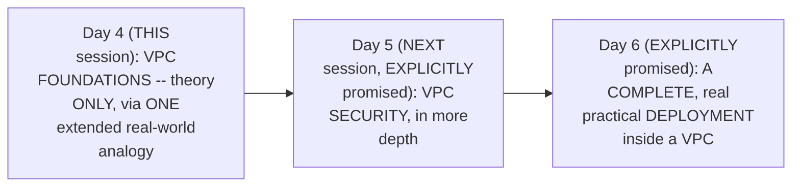

#### ⚠ A Direct, Honest Acknowledgment of a Genuine, Common Fear

> 💡 **Given directly:** *"There is a fear amongst a lot of people that virtual private cloud is a difficult topic... don't worry if you have any such fear or even if you are completely new to networking and VPC, after today's video you along with me will say that virtual private cloud is an easy concept."*

#### 🎯 Key Takeaways

* This is DELIBERATELY, EXPLICITLY a **FOUNDATIONAL-ONLY** session — NO practical DEMONSTRATION occurs TODAY, BY the instructor's OWN, direct DESIGN choice.
* VPC's OWN, COMPLETE coverage is DIRECTLY, EXPLICITLY spread ACROSS **THREE consecutive DAYS**: foundations (TODAY), security (Day 5), and a REAL, practical DEPLOYMENT (Day 6).
* The instructor **directly, HONESTLY acknowledges** a COMMON, genuine FEAR that VPC is "DIFFICULT" — and DIRECTLY commits to MAKING it "EASY" via a DELIBERATE, real-WORLD analogy.

---

### 2. The Real-World Analogy: A Village, a Wise Builder & Secure Communities

#### 🧠 Concept — The Complete, Genuine, Real-World Scenario

> 💡 **Given directly:** *"Let's say that there is a huge land... let's call this as a village... there are a lot of people in this village but there are specific set of lazy people... these lazy people are lazy enough that they can't construct their own houses... so these people they are actually looking for some people [to help]."*

#### 🧠 Concept — The Wise Builder's Own, Initial Solution

> 💡 **Given directly:** *"There is one wise person in this village okay let's say that this wise person is called ABC... he acquired a huge land in this village... what he's going to do is construct the houses for you... he purchased this entire land and constructed a house and said that I'll maintain this house for you."*

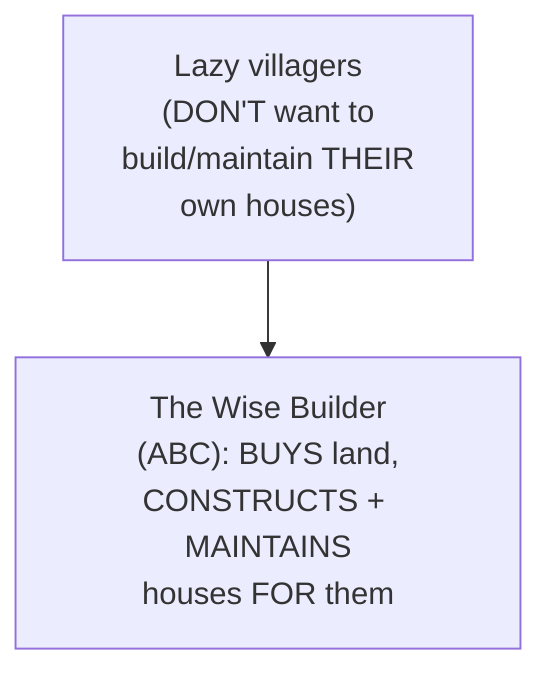

#### ❓ Why It Exists — The Precise, Genuine Security Problem With the Initial Solution

> 💡 **Given directly:** *"For the purpose of saving a lot of money what this person has done is he has constructed the houses but they are very nearby and there is some kind of security breach that anyone who access this house... can also access the other house."*

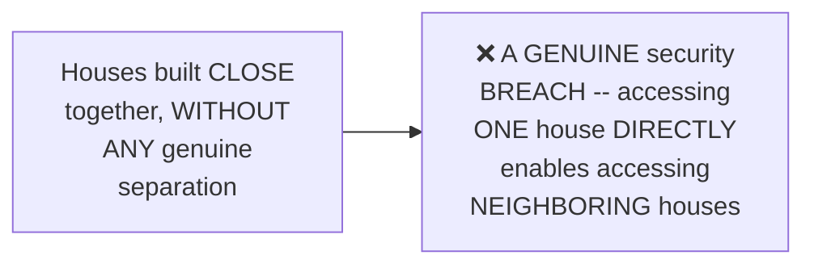

#### 📖 Definition — The Wise Builder's Own, Genuine, Improved Solution: The Secure Property

> 💡 **Given directly:** *"He came back with a new concept called secure land... if you come as a group where if you want a group housing... what I can do is I can build a secure property for you people... I'll construct a gate here which will act as a Gateway."*

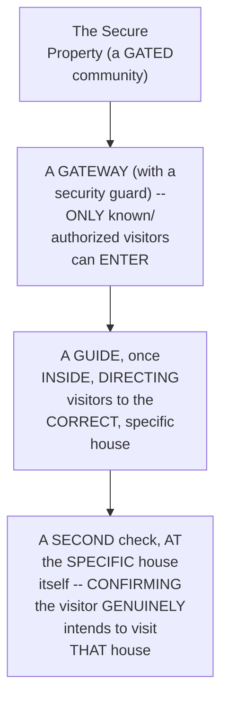

#### ⚠ Common Mistakes

* Assuming the WISE builder's OWN, INITIAL solution (INDIVIDUAL, standalone HOUSES) was GENUINELY sufficient — explicitly, directly, CONCRETELY demonstrated as CARRYING a REAL security RISK — PROXIMITY alone ENABLED cross-HOUSE access.
* Assuming the "secure PROPERTY" concept INVOLVES ONLY a SINGLE checkpoint — explicitly, directly, PRECISELY structured as a **TWO-stage** process: FIRST, the OUTER gateway (ENTERING the community AT ALL); SECOND, a SPECIFIC check AT the DESTINATION house ITSELF.

#### 🎯 Key Takeaways

* The COMPLETE analogy INTRODUCES a "WISE builder" WHO first CONSTRUCTS individual, STANDALONE houses (a GENUINE security RISK — proximity ENABLES cross-house ACCESS) — THEN INVENTS "secure PROPERTIES" (GATED communities) as the GENUINE fix.
* A **secure PROPERTY** involves TWO, distinct CHECKPOINTS: an OUTER gateway (CONTROLLING entry to the ENTIRE community) and a SECOND check AT the SPECIFIC destination HOUSE.
* This COMPLETE analogy directly, PRECISELY sets up EVERY subsequent VPC CONCEPT covered in THIS session — EACH AWS component MAPS directly ONTO a SPECIFIC piece of THIS story.

---
### 3. Mapping the Analogy to AWS: The Pre-VPC Security Problem

#### 🔍 Internal Working — The Precise, Direct Mapping: AWS as the "Wise Person"

> 💡 **Given directly:** *"Let's go to the same scenario where there is this big region... let's call this region as Mumbai or Ohio... there are companies... these people initially they were maintaining their own data centers but it was becoming too hectic for them... AWS saw this opportunity right so in this case who is the wise person? AWS is the wise person."*

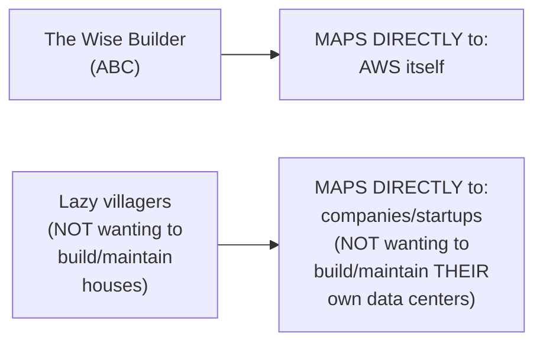

#### ❓ Why It Exists — The Precise, Genuine, Historical AWS Security Problem (~2013-2014)

> 💡 **Given directly:** *"During this time what AWS did is if example.com is requesting 10 EC2 instances... it went to the data center in region Mumbai... inside the data centers there will be multiple physical servers... example.com requested two EC2 instances so it gave two EC2 instances inside this server... then there is example two and what AWS did is it created again request of example 2 in the server one only."*

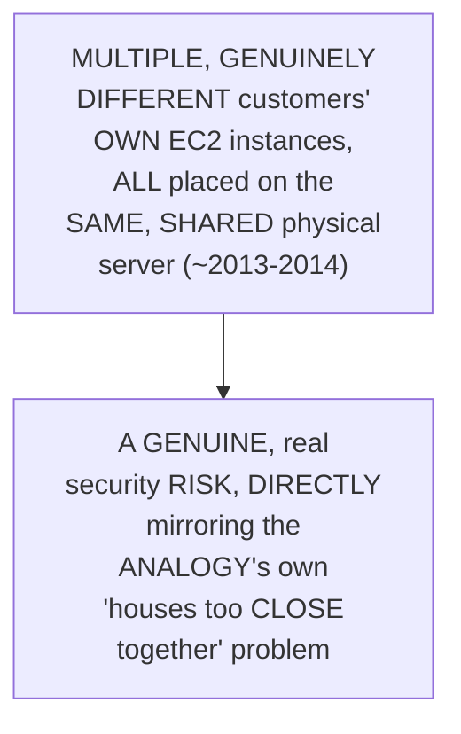

#### ❓ Why It Exists — The Precise, Genuine Consequence

> 💡 **Given directly:** *"If there is a hacker here because they were not maintaining proper security he entered into this server... and he was able to hack this particular server now because all of them are in the same physical server inside the AWS data center hacker can easily come here... he can hack the entire thing right so just because of example three... all of the servers are hacked."*

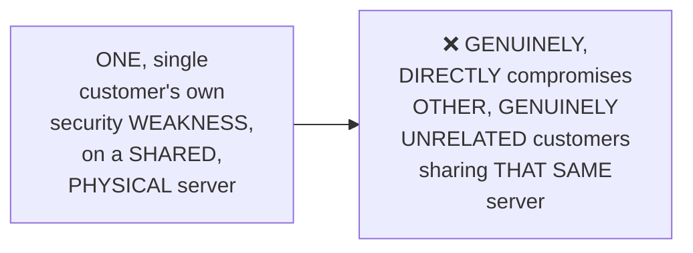

#### 📖 Definition — VPC, Precisely Introduced as AWS's Own, Direct Solution

> 💡 **Given directly:** *"To solve this problem, like I told you even in the previous example to solve the security breach, what AWS said is we will come up with a new concept, in that case it was secure community, in AWS terms it is called as VPC."*

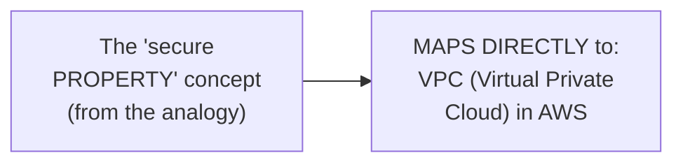

#### 🔍 Internal Working — Precisely WHO, in Real Practice, Genuinely Builds a VPC

> 💡 **Given directly:** *"Who is the one who builds this entire VPC and maintains the VPC? It is DevOps or AWS DevOps engineers... AWS DevOps engineer looking at the documentation of AWS, they will go to the AWS portal and they will request for the VPC and they will configure everything inside the VPC."*

#### ⚠ Common Mistakes

* Assuming AWS's OWN, PRE-VPC infrastructure GENUINELY, ALWAYS isolated DIFFERENT customers FROM each OTHER — explicitly, directly, HISTORICALLY clarified: PRIOR to VPC (~2013-2014), MULTIPLE, GENUINELY different CUSTOMERS' own EC2 instances COULD genuinely SHARE the SAME, physical SERVER.
* Assuming VPC creation is GENUINELY, AUTOMATICALLY handled BY AWS itself, WITHOUT any HUMAN involvement — explicitly, directly clarified: a DEVOPS engineer GENUINELY, DIRECTLY configures and BUILDS the VPC — AWS PROVIDES the underlying INFRASTRUCTURE and DOCUMENTATION.

#### 🎯 Key Takeaways

* AWS is directly, precisely MAPPED onto the ANALOGY's own "WISE builder" — companies/STARTUPS map onto the ANALOGY's own "LAZY villagers."
* AWS's OWN, GENUINE, HISTORICAL security RISK (~2013-2014): MULTIPLE, DIFFERENT customers' EC2 instances COULD genuinely SHARE the SAME, physical SERVER — a SINGLE compromised CUSTOMER could GENUINELY, DIRECTLY endanger OTHERS on the SAME server.
* **VPC** is directly, PRECISELY introduced as AWS's OWN, genuine SOLUTION — MAPPING directly ONTO the analogy's OWN "secure PROPERTY" concept — WITH a DEVOPS engineer, NOT AWS itself, GENUINELY responsible FOR building and CONFIGURING it.

---

### 4. VPC & Its Size: IP Address Ranges, Precisely Explained

#### ❓ Why It Exists — Precisely HOW a VPC's Own "Size" Is Defined

> 💡 **Given directly:** *"How do you define the size of a VPC? For defining the size of VPC there is something called as IP address range... whenever a DevOps engineer creates a VPC, what AWS asks is what is the IP address range."*

#### 💻 Code Example — A Complete, Real, Worked IP Range Example

> 💡 **Given directly:** *"If you say for example the IP address range is 172.16.0.0/16, that means AWS will allocate... don't worry about this calculation... for now understand that AWS will give you 65536 IP addresses."*

```text
VPC CIDR block example: 172.16.0.0/16
-> Genuinely provides 65,536 total IP addresses
-> Each address CAN, in principle, be assigned to ONE instance/application
```

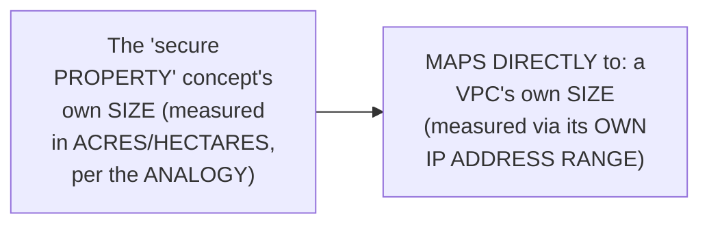

#### ⚠ Common Mistakes

* Assuming a VPC's OWN "SIZE" refers to SOME kind of PHYSICAL or STORAGE capacity — explicitly, directly, PRECISELY clarified: it GENUINELY refers to the TOTAL number of AVAILABLE IP addresses, DEFINED by its OWN, chosen IP ADDRESS range (CIDR block).

#### 🎯 Key Takeaways

* A VPC's OWN "SIZE" is directly, PRECISELY defined via its OWN **IP address RANGE** (e.g., `172.16.0.0/16`) — DIRECTLY, MEMORABLY analogous to the ANALOGY's own "LAND size" (measured IN acres/HECTARES).
* A `/16` RANGE GENUINELY provides **65,536 total IP ADDRESSES** — a CONCRETE, real number WORTH remembering.
* This ESTABLISHES the FOUNDATIONAL concept THAT the REST of this session's OWN content BUILDS on — SUBNETS (Section 5) GENUINELY, DIRECTLY split THIS same, larger RANGE into SMALLER pieces.

---
### 5. Subnets: Splitting the VPC's Own IP Range

#### ❓ Why It Exists — The Precise, Genuine, Real Motivating Scenario

> 💡 **Given directly:** *"TCS can be one project but inside the project there will be multiple sub projects right so there can be one project related to payments, one project related to transactions, one project related to XYZ... this DevOps engineer will split the IP address ranges."*

#### 💻 Code Example — A Complete, Real, Worked Splitting Example

> 💡 **Given directly:** *"For this particular sub project, this particular sub project, and this particular sub project, divide the IP addresses right so what he will say is 172.16.1.0/24, 2.0/24, 3.0/24... this particular thing will get some 255 addresses."*

```text
Original VPC range:    172.16.0.0/16   (65,536 total addresses)
Split into subnets:
  Sub-project A:  172.16.1.0/24   (~256 addresses)
  Sub-project B:  172.16.2.0/24   (~256 addresses)
  Sub-project C:  172.16.3.0/24   (~256 addresses)
```

#### 📖 Definition — Subnet, Precisely Defined

> 💡 **Given directly:** *"This particular concept is called subnet. The name itself says that it is sub network right so it is subnet. What you are doing here, the VPC is created with a particular IP address range, you are splitting the IP address for your sub projects."*

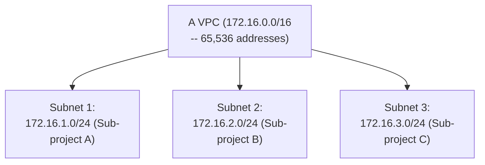

#### 🔍 Internal Working — A Genuine, Direct Confirmation of Application-Level Flexibility

> 💡 **Given directly:** *"Let's say this sub product has only one application, so you deploy an EC2 instance and you deploy that application here, there can be two instances here... depending upon the sub project it is up to the sub project development leads how many applications do they want to deploy inside a subnet."*

#### ⚠ Common Mistakes

* Assuming a VPC's OWN, ENTIRE IP address RANGE must be USED as ONE, single, UNDIVIDED block — explicitly, directly, PRECISELY demonstrated as FALSE: it's GENUINELY, DELIBERATELY split into SMALLER, project-SPECIFIC subnets.
* Assuming EVERY subnet MUST genuinely contain the SAME NUMBER of applications/INSTANCES — explicitly, directly clarified: this is GENUINELY, ENTIRELY up to EACH sub-project's OWN development LEAD/DevOps engineer.

#### 🎯 Key Takeaways

* A **subnet** ("SUB network") GENUINELY splits a VPC's OWN, larger IP RANGE into SMALLER, project-SPECIFIC ranges — DIRECTLY, MEMORABLY analogous to the ANALOGY's own "MULTIPLE secure PROPERTIES, EACH with THEIR own SPACE, WITHIN the SAME, larger LAND."
* A COMPLETE, real, worked EXAMPLE (`/16` → THREE `/24` SUBNETS) directly, CONCRETELY illustrates THIS splitting PROCESS.
* The NUMBER of APPLICATIONS/instances WITHIN each subnet is **GENUINELY, ENTIRELY flexible** — DETERMINED by EACH sub-project's OWN, specific NEEDS.

---

### 6. Public vs. Private Subnets & the Internet Gateway

#### ❓ Why It Exists — The Precise, Genuine Reasoning

> 💡 **Given directly:** *"Once he creates the subnet and all, now DevOps engineer... will create a Gateway. Why is this Gateway required? If there is no Gateway nobody can access this particular VPC right so without a gate nobody can enter the gated community."*

#### 📖 Definition — Internet Gateway, Precisely Introduced

> 💡 **Given directly:** *"Firstly there will be a Gateway and what this Gateway will do is Gateway is just like a pass for someone to enter to this VPC... this particular Gateway here we call it as internet gateway."*

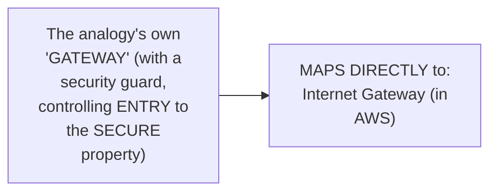

#### 📖 Definition — Private Subnets, Precisely Defined

> 💡 **Given directly:** *"This is all a free space right inside the VPC, these are the subnets which we call as private subnets because they don't have access to internet."*

#### 📖 Definition — Public Subnets, Precisely Defined

> 💡 **Given directly:** *"There is something called as public subnet right so what is public subnet? Public subnet is the one that a user first access inside the VPC... how does public subnet connect to the user or how does public subnet connect to the internet? Basically using the internet gateway."*

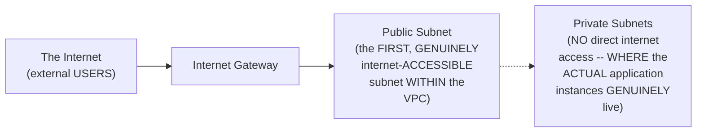

#### ⚠ Common Mistakes

* Assuming ALL subnets WITHIN a VPC are GENUINELY, EQUALLY accessible FROM the internet — explicitly, directly, PRECISELY distinguished: ONLY the PUBLIC subnet is DIRECTLY, GENUINELY internet-ACCESSIBLE; PRIVATE subnets GENUINELY lack DIRECT internet access.
* Assuming the internet GATEWAY DIRECTLY connects to the APPLICATION instances THEMSELVES — explicitly, directly clarified: it connects to the PUBLIC subnet FIRST — the REQUEST must STILL travel FURTHER (via a LOAD balancer and ROUTE table, per Section 7) to REACH a private-SUBNET application.

#### 🎯 Key Takeaways

* The **internet GATEWAY** is directly, PRECISELY the "PASS" enabling ENTRY into the VPC — DIRECTLY, MEMORABLY analogous to the ANALOGY's own GATEWAY (WITH its security GUARD).
* **Private SUBNETS** GENUINELY lack DIRECT internet access — this is WHERE the ACTUAL application INSTANCES typically, GENUINELY live; **public SUBNETS** are the FIRST, GENUINELY internet-ACCESSIBLE point WITHIN the VPC.
* This directly, precisely SETS UP the NEXT, CRITICAL question: HOW does a REQUEST GENUINELY travel FROM the public SUBNET to a PRIVATE-subnet application? (Section 7's OWN, direct FOCUS.)

---
### 7. Load Balancers, Target Groups & Route Tables: The Complete Request Path

#### 📖 Definition — Load Balancer, Precisely Introduced

> 💡 **Given directly:** *"There is something called as load balancer. What is load balancer? Load balancer is the one that forwards the request depending upon the load, for example there is this application and the user from the internet wants to access this application."*

#### 🔍 Internal Working — Precisely WHY a Route Table Is Genuinely Necessary

> 💡 **Given directly:** *"How will the request from this public subnet from the load balancer go to this application? There has to be a particular path... this route table defines how should application or how should the request go to the application."*

#### 📖 Definition — Target Group, Briefly Introduced

> 💡 **Given directly:** *"Load balancer can send the request depending upon the target group... what you will do is you will create a target group of this application."*

#### 📖 Definition — Route Table, Precisely Defined

> 💡 **Given directly:** *"If the request from the load balancer has to go to the subnet, load balancer does not know how to go to this particular thing, so what you will do is for [the] subnet you will create something called as a route table."*

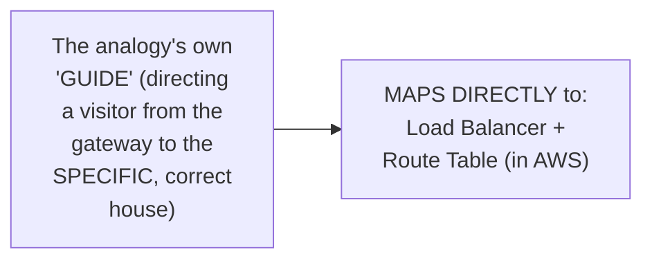

#### 🪜 Step-by-Step — The Complete, Precise, End-to-End Request Path

> 💡 **Given directly:** *"What is happening on the whole? If someone from the internet is trying to access an application in the private subnet, first of all the request has to go through the internet gateway, once it reaches the internet gateway it will go to the public subnet in the VPC... there is a load balancer here... load balancer is the one that takes the request to the private subnet and to the application."*

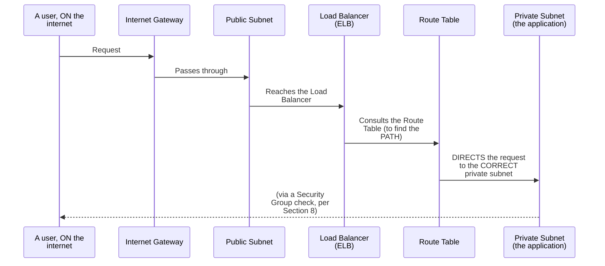

#### ⚠ Common Mistakes

* Assuming a LOAD balancer GENUINELY, AUTOMATICALLY "KNOWS" how to REACH a SPECIFIC, private-SUBNET application — explicitly, directly, PRECISELY clarified: this REQUIRES an EXPLICIT **route TABLE** (DEFINING the CORRECT path) AND a **target GROUP** (IDENTIFYING which SPECIFIC instances SHOULD receive TRAFFIC).
* Confusing the ROLE of a route TABLE (DEFINING the PATH a request SHOULD take) with a TARGET group (IDENTIFYING WHICH specific INSTANCES a load BALANCER should SEND traffic TO) — explicitly, directly, PRECISELY distinguished as TWO, genuinely DIFFERENT, COMPLEMENTARY components.

#### 🎯 Key Takeaways

* A **LOAD balancer**, PLUS its OWN **target GROUP**, directly, PRECISELY maps ONTO the analogy's own "GUIDE" — DIRECTING a REQUEST from the PUBLIC subnet TOWARD the CORRECT, specific APPLICATION.
* A **route TABLE** GENUINELY defines the PATH a request MUST take TO reach a SPECIFIC subnet — WITHOUT it, a LOAD balancer GENUINELY "does NOT know HOW to go" to the DESTINATION.
* The COMPLETE, real request PATH: internet → internet GATEWAY → public SUBNET → LOAD balancer (WITH target GROUP) → route TABLE (DEFINING the PATH) → private SUBNET (the APPLICATION).

---

### 8. Security Groups: The Final Checkpoint

#### 📖 Definition — Security Group, Precisely Introduced

> 💡 **Given directly:** *"Still at the EC2 instance, like I told you in the previous example there can be a security guard here who can block your request, similarly for the EC2 instance there can be something called as security group."*

#### 🔍 Internal Working — Precisely What a Security Group Genuinely Checks

> 💡 **Given directly:** *"This security group can say okay so on which port do you want to access me, or from which IP address are you coming from, what is your IP address... only if it is coming from this particular IP address in the internet, only if you are trying to access me on a particular port, then I will allow the access."*

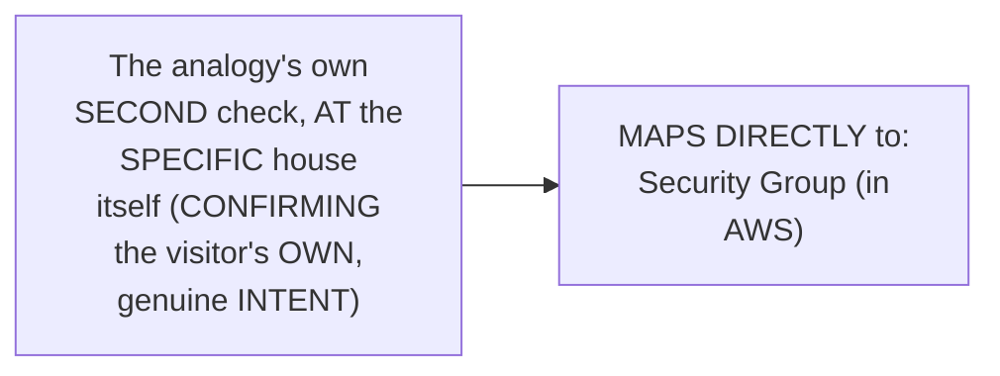

#### 📖 Definition — The Precise, Genuine Criteria a Security Group Evaluates

> 💡 **Given directly, precisely:** WHICH PORT is being ACCESSED, and WHICH source IP ADDRESS the request is GENUINELY coming FROM.

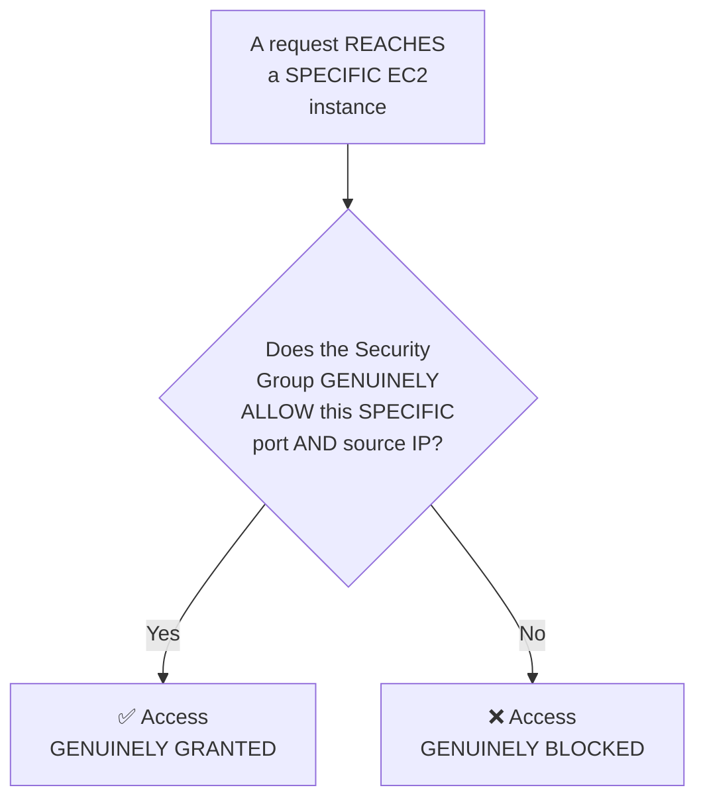

#### ⚠ Common Mistakes

* Assuming a REQUEST that SUCCESSFULLY passes THROUGH the internet GATEWAY, load BALANCER, and route TABLE is AUTOMATICALLY, GENUINELY granted ACCESS to the APPLICATION — explicitly, directly, PRECISELY clarified: the SECURITY group REMAINS a FINAL, GENUINE, PER-instance checkpoint — it CAN still BLOCK the request.
* Assuming SECURITY groups OPERATE at the VPC or SUBNET level — explicitly, directly, PRECISELY clarified: they OPERATE at the INDIVIDUAL, EC2-instance level SPECIFICALLY.

#### 🎯 Key Takeaways

* A **security GROUP** is directly, PRECISELY the FINAL, per-INSTANCE checkpoint — MAPPING onto the ANALOGY's own SECOND, destination-house-LEVEL check.
* It GENUINELY evaluates TWO, precise CRITERIA: the SPECIFIC **PORT** being ACCESSED, and the REQUEST's own **SOURCE IP address**.
* This COMPLETES the ENTIRE, real request PATH established IN Section 7 — internet GATEWAY → public SUBNET → load BALANCER → route TABLE → **security GROUP** (the FINAL gate) → the APPLICATION itself.

---
### 9. Briefly Introduced, Deferred to Tomorrow: NACLs

#### 📖 Definition — NACLs, Briefly Introduced

> 💡 **Given directly:** *"Within a subnet, if you want to define the same security group to multiple applications, multiple EC2 instances, or you want to repeat the security group configuration, there is something called as NACLs. NACLs are basically automation for your security groups where instead of defining the same thing again and again you can define that as part of NACLs."*

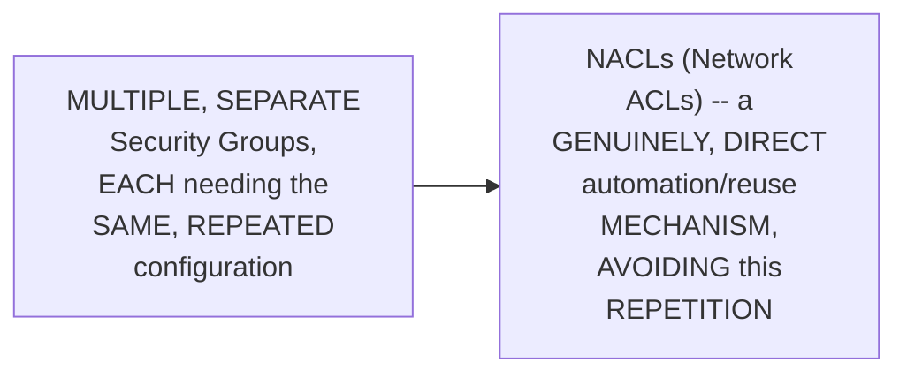

#### ⚠ A Direct, Honest, Explicit Deferral

> 💡 **Given directly:** *"Additionally there are few things which I'll cover very quickly but in future class, that is in tomorrow's class we will talk about them in detail."*

#### ⚠ Common Mistakes

* Assuming NACLs were COVERED in FULL, complete DEPTH within THIS specific SESSION — explicitly, directly, HONESTLY clarified: THIS is ONLY a BRIEF introduction — FULL depth is EXPLICITLY deferred to Day 5 ("TOMORROW's class").

#### 🎯 Key Takeaways

* **NACLs (Network Access Control LISTS)** are BRIEFLY introduced as a GENUINE automation/REUSE mechanism FOR security-group-LIKE rules — AVOIDING the NEED to repeatedly, MANUALLY configure the SAME rules ACROSS multiple SECURITY groups.
* This TOPIC is directly, HONESTLY confirmed as EXPLICITLY deferred to **Day 5** — consistent WITH this session's OWN, established, DELIBERATE "foundations FIRST, depth LATER" structure.

---

### 10. NAT Gateways: Masking Private IPs for Outbound Access

#### ❓ Why It Exists — The Precise, Genuine, Real Motivating Scenario

> 💡 **Given directly:** *"What if this particular application here tries to access something from the internet? What if the application tries to access something from the internet, from google.com, let's say this application wants to download a package which is quite common right, you might want to download something to your server."*

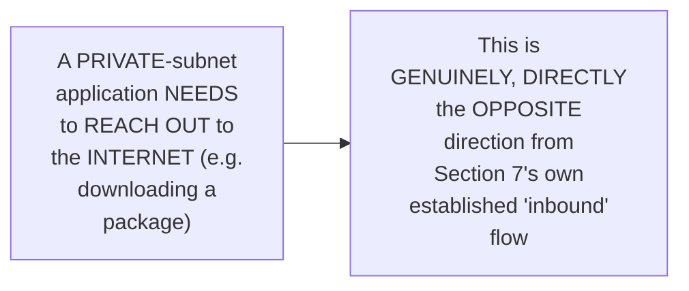

#### ❓ Why It Exists — The Precise, Genuine Security Concern

> 💡 **Given directly:** *"It is a bad practice to expose your applications or to expose your server's IP address to the internet... xyz.com should not know the IP address of your server or you should not know... the IP address of your private subnet's applications."*

#### 📖 Definition — NAT Gateway, Precisely Introduced as the Genuine Solution

> 💡 **Given directly:** *"How do you avoid that? You need to do a masking of IP address... this masking of IP address is called as NAT gateways... what NAT gateways do is they will send your request, they will help you to download some resources from the internet, but when you do that it will try to mask the IP address and it will change the IP address with the public IP address either of the load balancer or either of the router."*

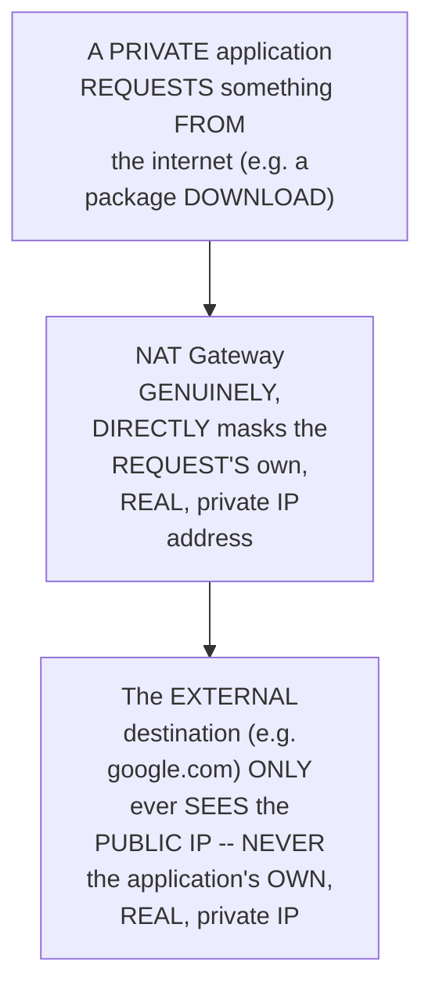

#### 🔍 Internal Working — A Precise, Genuine Distinction: SNAT vs. NAT Gateway

> 💡 **Given directly:** *"If it is doing using the load balancer we call it SNAT, if it is doing through the router we call it as NAT gateway."*

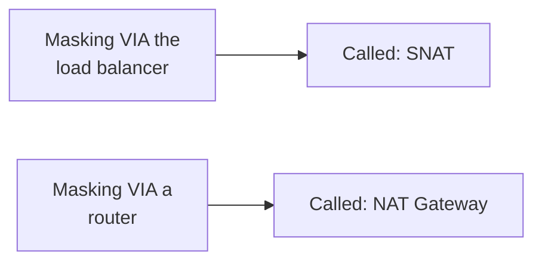

#### 🔍 Internal Working — A Genuine, Direct Confirmation of NAT Gateway's Own Placement

> 💡 **Given directly:** *"This concept is available along with the ALB, like if there is ELB in the public subnet you will create NAT gateway also in the public subnet only. So NAT gateway is created in the public subnet."*

#### ⚠ Common Mistakes

* Confusing NAT gateways' OWN purpose WITH the internet GATEWAY's own PURPOSE — explicitly, directly, PRECISELY distinguished: the INTERNET gateway handles INBOUND traffic (FROM the internet, INTO the VPC); the NAT gateway handles OUTBOUND traffic (FROM a private APPLICATION, OUT to the internet) — WITH IP masking as its OWN, genuine, additional PURPOSE.
* Assuming NAT gateways are GENUINELY created WITHIN private SUBNETS (WHERE the applications THEMSELVES live) — explicitly, directly, PRECISELY clarified: they are GENUINELY created WITHIN the PUBLIC subnet, ALONGSIDE the load BALANCER.

#### 🎯 Key Takeaways

* **NAT gateways** GENUINELY solve a DIFFERENT, real PROBLEM from EVERYTHING covered so FAR — MASKING a PRIVATE application's own, REAL IP address WHEN it needs to REACH OUT to the INTERNET (e.g., DOWNLOADING a package).
* This PREVENTS the EXTERNAL, receiving PARTY from EVER learning the APPLICATION's own, REAL, private IP — a GENUINE, real SECURITY practice.
* Masking VIA a LOAD balancer is CALLED **SNAT**; masking VIA a ROUTER is CALLED a **NAT gateway** — BOTH are GENUINELY, DIRECTLY created WITHIN the PUBLIC subnet.

---

### 11. VPC Flow Logs & Closing

#### 📖 Definition — VPC Flow Logs, Briefly Introduced

> 💡 **Given directly:** *"If you want to debug this entire thing and if you want to understand this entire flow of how the traffic is flowing... there is one final concept that is called as VPC flow logs... it records every action."*

#### ⚠ A Direct, Honest, Important Cost Clarification

> 💡 **Given directly:** *"VPC flow logs which is chargeable, so inside the VPC there are few things that are chargeable, there are few things which are not chargeable, when we do the practicals I'll also explain that."*

```mermaid
flowchart LR
    A["VPC Flow Logs"] --> B["GENUINELY,<br/>DIRECTLY useful for<br/>DEBUGGING/auditing<br/>traffic FLOW"]
    A --> C["HONESTLY,<br/>DIRECTLY confirmed<br/>as a CHARGEABLE<br/>AWS service"]
```

#### 🪜 Step-by-Step — A Complete, Direct, Explicit Assignment

> 💡 **Given directly:** *"Your assignment would be to write down all of these components and go through the AWS documentation... there is a GitHub repository... I have created a few notes so you can go through those notes and you can validate your understanding."*

```mermaid
flowchart LR
    A["Day 4 (done):<br/>VPC FOUNDATIONS --<br/>the COMPLETE<br/>analogy, EVERY major<br/>component<br/>introduced"] --> B["Day 5 (NEXT<br/>session): VPC<br/>SECURITY, in more<br/>depth"]
    B --> C["Day 6: A<br/>COMPLETE, real<br/>PRACTICAL<br/>deployment INSIDE a<br/>VPC"]
```

#### ⚠ Common Mistakes

* Assuming EVERY component of a VPC is GENUINELY, UNIFORMLY free of CHARGE — explicitly, directly, HONESTLY clarified: SOME components (like VPC flow LOGS) are GENUINELY, DIRECTLY chargeable — WITH a FULLER explanation EXPLICITLY deferred to the PRACTICAL session (Day 6).

#### 🎯 Key Takeaways

* **VPC flow LOGS** GENUINELY provide a DEBUGGING/auditing CAPABILITY — RECORDING every ACTION within the VPC — but are directly, HONESTLY confirmed as a **CHARGEABLE** AWS service.
* This episode **GENUINELY, COMPLETELY delivers** its OWN, stated FOUNDATIONAL goal — EVERY major VPC COMPONENT (VPC itself, subnets, internet GATEWAY, load BALANCER, route TABLE, security GROUP, NACLs, NAT gateway, FLOW logs) was directly, CLEARLY introduced VIA the SAME, single, EXTENDED analogy.
* **Day 5 (VPC security) and Day 6 (a REAL, practical DEPLOYMENT)** are directly, EXPLICITLY confirmed as the NEXT, planned CONTINUATIONS of THIS exact topic.

---
## 📝 Glossary

| Term | Analogy Equivalent | AWS Definition |
|---|---|---|
| **VPC** | The "secure property" | A logically isolated section of AWS, defined by an IP address range |
| **IP Address Range (CIDR)** | The property's own land size | Defines a VPC's own total number of available IP addresses |
| **Subnet** | A specific house/plot within the secure property | A smaller IP range, split from the VPC's own larger range |
| **Public Subnet** | The property's own, shared, entry-accessible area | A subnet with direct internet access, via the internet gateway |
| **Private Subnet** | An individual, gated house within the property | A subnet WITHOUT direct internet access -- typically where applications live |
| **Internet Gateway** | The property's own front gate (with a guard) | The controlled entry point for external traffic into a VPC |
| **Load Balancer** | The guide directing a visitor to a specific house | Forwards incoming requests toward the correct application(s) |
| **Target Group** | -- | Identifies which specific instances a load balancer should send traffic to |
| **Route Table** | The path/directions within the property | Defines the path a request must take to reach a specific subnet |
| **Security Group** | The final, destination-house-level check | A per-instance checkpoint, filtering by port and source IP |
| **NACL** | Reusable "house rules," applied automatically | An automation/reuse mechanism for security-group-like rules |
| **NAT Gateway** | Masking a resident's identity when they leave the property | Masks a private application's own IP when it makes outbound requests |
| **SNAT** | -- | IP masking performed via a load balancer (vs. a router, for NAT gateway) |
| **VPC Flow Logs** | A record of every visitor's movements | Records all traffic within a VPC, for debugging/auditing (chargeable) |

---

## 🔄 Revision Notes — One-Minute Revision

* This is **Day 4**, a DELIBERATELY foundational-only VPC session -- no practicals today. VPC security is deferred to Day 5; a real, practical deployment is deferred to Day 6.
* **The core analogy**: a "wise builder" (ABC) first builds standalone houses for lazy villagers -- a GENUINE security risk (proximity enables cross-house hacking). He then invents "secure properties" (gated communities) -- with a gateway, a guide, and a destination-house-level check.
* **Mapping to AWS**: AWS = the wise builder; companies/startups = the lazy villagers. AWS's own, real, historical problem (~2013-2014): multiple different customers' EC2 instances could share the SAME physical server -- one compromised customer could endanger others sharing it. VPC = the "secure property" solution.
* **VPC size**: defined via an IP address range (CIDR block) -- e.g., 172.16.0.0/16 = 65,536 total addresses.
* **Subnets**: split a VPC's own larger range into smaller, project-specific ranges (e.g., three /24 subnets, each ~256 addresses, from one /16 VPC).
* **Public vs. private subnets**: public subnets are the FIRST, genuinely internet-accessible point (via the internet gateway); private subnets lack direct internet access -- this is typically where applications live.
* **The complete request path**: internet -> internet gateway -> public subnet -> load balancer (with a target group) -> route table (defining the path) -> private subnet's own application.
* **Security groups**: the FINAL, per-instance checkpoint -- filtering by specific port and source IP address.
* **NACLs**: briefly introduced as an automation/reuse mechanism for security-group-like rules, explicitly deferred to Day 5's own, deeper coverage.
* **NAT Gateways**: solve the OPPOSITE-direction problem -- masking a private application's own, real IP address when IT needs to reach OUT to the internet (e.g., downloading a package), preventing external parties from ever learning the real, private IP. Masking via a load balancer = SNAT; via a router = NAT Gateway. Both created within the PUBLIC subnet.
* **VPC Flow Logs**: a debugging/auditing tool, recording all VPC traffic -- honestly confirmed as a chargeable AWS service.
* **Closing**: an explicit assignment is given (write down all components, review AWS documentation and the instructor's own GitHub notes).

---

## 📋 Cheat Sheet

**The complete analogy-to-AWS mapping:**
```text
The Wise Builder (ABC)          -> AWS
Lazy villagers                     -> Companies/startups
Standalone houses (risky)             -> Pre-VPC, shared physical servers
The secure property                      -> VPC
The property's own land size                -> A VPC's own IP address range
Individual houses/plots                        -> Subnets
The front gate (with a guard)                     -> Internet Gateway
The guide (directing visitors)                       -> Load Balancer + Target Group
The path/directions within the property                 -> Route Table
The destination-house-level check                          -> Security Group
```

**VPC sizing:**
```text
172.16.0.0/16  -> 65,536 total IP addresses (the FULL VPC)
172.16.1.0/24  -> ~256 addresses (ONE subnet, split from the VPC)
```

**The complete request path (inbound):**
```text
Internet -> Internet Gateway -> Public Subnet -> Load Balancer (+ Target Group)
-> Route Table -> Private Subnet -> Security Group -> Application
```

**Outbound (NAT Gateway):**
```text
Private Application -> NAT Gateway (masks the real, private IP)
-> Internet (only sees the PUBLIC IP, never the real one)
```

---

## 🔥 Interview Questions & Answers

### 🟢 Beginner

**Q1.**

**Question:** What genuine problem did VPC solve, historically?

**Answer:** Multiple, different customers' EC2 instances could share the same physical server (~2013-2014), meaning one compromised customer could endanger others sharing that server.

**Explanation:** Directly, historically explained.

**Why Interviewers Ask This:** Foundational, frequently-tested VPC motivation.

**Possible Follow-up:** "What did AWS introduce specifically to solve this?"

**Q2.**

**Question:** How is a VPC's own size defined?

**Answer:** Via an IP address range (CIDR block).

**Explanation:** Directly, precisely explained.

**Why Interviewers Ask This:** Basic, essential VPC terminology.

**Possible Follow-up:** "How many IP addresses does a /16 range genuinely provide?"

**Q3.**

**Question:** What is a subnet?

**Answer:** A smaller IP range, split from a VPC's own larger range.

**Explanation:** Directly, explicitly defined.

**Why Interviewers Ask This:** Foundational, frequently-tested VPC terminology.

**Possible Follow-up:** "What is the genuine difference between a public and private subnet?"

**Q4.**

**Question:** What is the genuine difference between a public and private subnet?

**Answer:** Public subnets have direct internet access (via the internet gateway); private subnets do not.

**Explanation:** Directly, precisely distinguished.

**Why Interviewers Ask This:** Basic, essential VPC networking knowledge.

**Possible Follow-up:** "Where do applications typically, genuinely live -- public or private subnets?"

**Q5.**

**Question:** What does a route table genuinely define?

**Answer:** The path a request must take to reach a specific subnet.

**Explanation:** Directly, precisely explained.

**Why Interviewers Ask This:** Basic, essential VPC routing knowledge.

**Possible Follow-up:** "What would genuinely happen without a route table?"

**Q6.**

**Question:** What does a security group genuinely check?

**Answer:** The specific port being accessed, and the request's own source IP address.

**Explanation:** Directly, precisely explained.

**Why Interviewers Ask This:** Basic, essential VPC security knowledge.

**Possible Follow-up:** "At what level does a security group genuinely operate -- VPC, subnet, or instance?"

**Q7.**

**Question:** What is a NAT Gateway genuinely used for?

**Answer:** Masking a private application's own, real IP address when it makes outbound requests to the internet.

**Explanation:** Directly, precisely explained.

**Why Interviewers Ask This:** Basic, essential VPC networking knowledge.

**Possible Follow-up:** "What is the genuine difference between a NAT Gateway and an Internet Gateway?"

**Q8.**

**Question:** What is the genuine difference between SNAT and a NAT Gateway?

**Answer:** SNAT masks IP via a load balancer; a NAT Gateway masks IP via a router.

**Explanation:** Directly, precisely distinguished.

**Why Interviewers Ask This:** Tests genuine, precise knowledge of IP-masking mechanisms.

**Possible Follow-up:** "Where are NAT Gateways genuinely created -- public or private subnets?"

**Q9.**

**Question:** What do NACLs genuinely provide?

**Answer:** An automation/reuse mechanism for security-group-like rules.

**Explanation:** Directly, explicitly explained.

**Why Interviewers Ask This:** Basic, foundational VPC security terminology.

**Possible Follow-up:** "How do NACLs genuinely differ from security groups?"

**Q10.**

**Question:** Are VPC Flow Logs a free AWS service?

**Answer:** No -- they are honestly confirmed as a chargeable service.

**Explanation:** Directly, honestly clarified.

**Why Interviewers Ask This:** Tests genuine, practical AWS cost awareness.

**Possible Follow-up:** "What genuine purpose do VPC Flow Logs serve?"

---

### 🟡 Intermediate

**Q11.**

**Question:** Explain why the instructor deliberately builds the ENTIRE session around a single, extended, non-AWS analogy, rather than introducing each VPC component with its own, separate, technical explanation.

**Answer:** This is a genuinely deliberate teaching choice, DIRECTLY addressing the instructor's OWN, explicitly-stated concern — VPC is WIDELY perceived as a "DIFFICULT" topic, PRECISELY because of its MANY, interconnected COMPONENTS. By using ONE, SINGLE, EXTENDED analogy (the VILLAGE/secure-PROPERTY story) ACROSS the ENTIRE session, EVERY new VPC component (subnet, GATEWAY, load BALANCER, security GROUP, NAT gateway) can be DIRECTLY, IMMEDIATELY mapped onto an ALREADY-familiar, CONCRETE piece of the SAME story — RATHER than requiring the LEARNER to build a GENUINELY new mental MODEL for EACH, SEPARATE component. This DIRECTLY, CONCRETELY reduces COGNITIVE load and REINFORCES how these COMPONENTS genuinely, PRACTICALLY relate to EACH OTHER (SINCE they're all PART of the SAME, unified STORY), rather than PRESENTING them as ISOLATED, disconnected FACTS.

**Explanation:** Requires recognizing the deliberate pedagogical value of a single, unified analogy across an entire, multi-component topic.

**Why Interviewers Ask This:** Tests whether a learner recognizes why a sustained analogy is more effective than piecemeal technical definitions for a topic with many interconnected parts.

**Possible Follow-up:** "Map EVERY VPC component covered in THIS session to its OWN, precise equivalent WITHIN the analogy, from memory."

**Q12.**

**Question:** A learner argues that since private subnets "don't have access to the internet," an application in a private subnet can NEVER genuinely reach the internet under any circumstances. Evaluate this claim.

**Answer:** This claim overstates the case, missing a GENUINELY important distinction THIS session's own content DIRECTLY clarifies. Section 6's own PRECISE statement is that private subnets LACK "DIRECT" internet access — this refers SPECIFICALLY to INBOUND access (EXTERNAL users CANNOT directly REACH a private-subnet application WITHOUT going THROUGH the internet gateway/load BALANCER/route-table PATH). Section 10's own PRECISE, SEPARATE content DIRECTLY confirms that a PRIVATE-subnet application CAN, GENUINELY, initiate OUTBOUND requests TO the internet (e.g., DOWNLOADING a package) — VIA a NAT Gateway, WHICH masks the APPLICATION's own, real IP address DURING this PROCESS. The ACCURATE, more PRECISE conclusion: "NO internet access" GENUINELY means "NO direct, INBOUND accessibility FROM external parties" — NOT "GENUINELY, ENTIRELY unable to REACH the internet in EITHER direction."

**Explanation:** Tests whether a learner correctly distinguishes inbound accessibility (which private subnets lack) from outbound capability (which they genuinely retain, via NAT Gateways).

**Why Interviewers Ask This:** Distinguishes candidates who understand the directional nature of network access from those who treat "no internet access" as an absolute, bidirectional statement.

**Possible Follow-up:** "Why does the NAT Gateway's own IP-masking behavior GENUINELY matter, even though the private application is INITIATING the outbound request itself?"

**Q13.**

**Question:** Explain, precisely, why the instructor introduces load balancers and route tables TOGETHER, within the SAME explanatory moment, rather than treating them as two, entirely separate topics.

**Answer:** This is a genuinely deliberate teaching choice, DIRECTLY reflecting a REAL, functional DEPENDENCY between the TWO components. Per Section 7's own PRECISE reasoning, a LOAD balancer GENUINELY "does NOT know HOW to go" to a SPECIFIC, private-subnet destination WITHOUT a ROUTE table DEFINING that EXACT path. By introducing THEM together, the instructor DIRECTLY, CONCRETELY prevents a GENUINELY common misconception — that a LOAD balancer ALONE is SUFFICIENT to ROUTE traffic to ITS destination. INSTEAD, the LEARNER directly, IMMEDIATELY understands that BOTH components must GENUINELY, SIMULTANEOUSLY be CONFIGURED (a load BALANCER to RECEIVE and FORWARD the request, PLUS a route TABLE to DEFINE the ACTUAL path) FOR a request to GENUINELY, SUCCESSFULLY reach its DESTINATION.

**Explanation:** Requires recognizing a deliberate, connected introduction reflecting a genuine, functional dependency between two components.

**Why Interviewers Ask This:** Tests whether a learner understands the FUNCTIONAL relationship between load balancers and route tables, not just their separate definitions.

**Possible Follow-up:** "What would GENUINELY, PRACTICALLY happen if a load balancer were CORRECTLY configured, but its OWN, associated route table was MISSING or INCORRECT?"

**Q14.**

**Question:** Using this session's own precise "security group as final checkpoint" reasoning (Section 8), explain WHY a request could GENUINELY, SUCCESSFULLY pass through EVERY earlier stage (internet gateway, public subnet, load balancer, route table) and STILL be blocked.

**Answer:** A precise, reasoned explanation, directly applying Section 8's own established MECHANISM: per Section 7's own COMPLETE request PATH, PASSING through the INTERNET gateway, public SUBNET, load BALANCER, and ROUTE table GENUINELY confirms ONLY that the REQUEST has GENUINELY, STRUCTURALLY reached the CORRECT, intended DESTINATION (the private-SUBNET application's own NETWORK location) — it does NOT genuinely CONFIRM the REQUEST is AUTHORIZED to access THAT specific application. Per Section 8's own PRECISE reasoning, the SECURITY group is a GENUINELY, STRUCTURALLY SEPARATE, FINAL checkpoint — EVALUATING the request's OWN source IP and TARGET port INDEPENDENTLY of WHETHER it correctly NAVIGATED the earlier NETWORKING path. This directly, precisely reveals a GENUINE, important ARCHITECTURAL principle: "CORRECTLY ROUTED" (REACHING the right DESTINATION) and "AUTHORIZED" (being ALLOWED to ACCESS it) are TWO, genuinely SEPARATE, INDEPENDENT concerns — a REQUEST can GENUINELY satisfy the FIRST WITHOUT satisfying the SECOND.

**Explanation:** Requires distinguishing "correctly routed" from "authorized" as two, genuinely separate, sequential concerns within the complete request path.

**Why Interviewers Ask This:** Tests whether a learner understands that reaching a destination and being authorized to access it are architecturally distinct, sequential checks.

**Possible Follow-up:** "Construct a GENUINE, real scenario where a request would GENUINELY reach the correct destination, but STILL be blocked by the security group."

**Q15.**

**Question:** Synthesize this session's complete "pre-VPC security risk" reasoning (Section 3) with its own "NAT Gateway" reasoning (Section 10) to explain WHY masking a private application's own IP address, during OUTBOUND requests, GENUINELY addresses a SIMILAR, underlying security concern to VPC's own, ORIGINAL motivation.

**Answer:** A precise, synthesized explanation, directly connecting TWO, separately-established sections: per Section 3's own PRECISE, historical reasoning, VPC's own, ORIGINAL motivation was PREVENTING an EXTERNAL party (a HACKER) FROM directly, GENUINELY accessing and COMPROMISING a customer's OWN, private INFRASTRUCTURE (BY exploiting SHARED, physical-server PROXIMITY). Per Section 10's own PRECISE reasoning, NAT Gateways EXIST SPECIFICALLY because "it is a BAD practice to EXPOSE your applications OR to expose your SERVER's IP address to the internet" — PREVENTING an EXTERNAL party (e.g., a WEBSITE the application is DOWNLOADING from) FROM learning the APPLICATION's own, REAL, private IP address. SYNTHESIZING these TWO facts directly, PRECISELY reveals a SHARED, underlying SECURITY principle CONNECTING VPC's own ENTIRE architecture: MINIMIZING the INFORMATION and DIRECT access an EXTERNAL party GENUINELY has ABOUT a PRIVATE resource's own, REAL network IDENTITY — WHETHER that's PREVENTING a HACKER from REACHING a shared SERVER (Section 3's own ORIGINAL motivation) or PREVENTING an EXTERNAL destination FROM learning a PRIVATE application's own, REAL IP DURING an OUTBOUND request (Section 10's own NAT-gateway REASONING) — BOTH are GENUINELY, DIRECTLY expressions of THE SAME, underlying "MINIMIZE external VISIBILITY into PRIVATE infrastructure" security PRINCIPLE.

**Explanation:** Requires synthesizing VPC's own original security motivation with the NAT Gateway's own specific purpose to identify a shared, underlying security principle connecting both.

**Why Interviewers Ask This:** A senior-level question testing whether a candidate can identify a unifying security principle connecting VPC's own historical origin to one of its later, specific components.

**Possible Follow-up:** "What OTHER, GENUINE VPC component (covered in THIS session) ALSO, DIRECTLY reflects this SAME, shared 'minimize EXTERNAL visibility' principle?"

---

### 🔴 Advanced

**Q16.**

**Question:** Design a complete, reasoned VPC architecture (using ONLY this session's own established concepts) for a hypothetical company deploying a public-facing web application with a backend database that should NEVER be directly, publicly accessible.

**Answer:** A reasonable, complete architecture, directly applying this session's OWN, exact established CONCEPTS:

```text
1. CREATE a VPC with an appropriate IP range (per Section 4's own
   established mechanism) -- e.g., 10.0.0.0/16.

2. CREATE at least TWO subnets (per Section 5's own established
   splitting mechanism):
   - A PUBLIC subnet (e.g., 10.0.1.0/24) -- for the load balancer.
   - A PRIVATE subnet (e.g., 10.0.2.0/24) -- for BOTH the web
     application's own EC2 instances AND the database.

3. ATTACH an Internet Gateway (per Section 6's own established
   mechanism) to the VPC, associated WITH the public subnet.

4. DEPLOY a Load Balancer (per Section 7's own established mechanism)
   in the PUBLIC subnet, WITH a Target Group pointing to the WEB
   application's own EC2 instances in the PRIVATE subnet.

5. CONFIGURE a Route Table (per Section 7's own established mechanism)
   ensuring traffic can GENUINELY flow FROM the load balancer TO the
   private subnet.

6. CONFIGURE Security Groups (per Section 8's own established
   mechanism):
   - The web application's OWN security group: allow traffic ONLY from
     the load balancer, on the APPLICATION's own port.
   - The DATABASE's own security group: allow traffic ONLY from the
     WEB application's own security group -- NEVER directly from the
     internet OR the load balancer.

7. IF the web application GENUINELY needs outbound internet access
   (e.g., DOWNLOADING updates), CREATE a NAT Gateway (per Section 10's
   own established mechanism) in the PUBLIC subnet, masking the
   application's own, real IP.
```

This complete ARCHITECTURE directly, precisely APPLIES every ESTABLISHED VPC concept FROM this session — CORRECTLY ensuring the DATABASE remains GENUINELY, STRUCTURALLY inaccessible DIRECTLY from the internet, WHILE the WEB application remains PUBLICLY reachable THROUGH the CORRECT, layered PATH.

**Explanation:** Requires synthesizing every major VPC concept from this session into one complete, reasoned, real-world architecture satisfying a specific security requirement.

**Why Interviewers Ask This:** A realistic, senior-level question testing whether a candidate can apply VPC concepts to design a genuinely secure, correct architecture from stated requirements.

**Possible Follow-up:** "How would you MODIFY this architecture if the database GENUINELY needed to be accessible FROM a SEPARATE, internal analytics application, WITHOUT exposing it to the PUBLIC internet?"

**Q17.**

**Question:** Critically evaluate: "Since this session confirms that private subnets lack direct internet access, this means placing an application in a private subnet is UNCONDITIONALLY, ALWAYS the more secure choice, and public subnets should GENERALLY be avoided for application deployment." Is this an accurate, complete characterization?

**Answer:** Not fully accurate — this OVERSTATES a GENERALLY sound PRINCIPLE into an UNCONDITIONAL rule NEITHER this session's own content, NOR sound REASONING, fully SUPPORTS. WHILE THIS session's own content GENUINELY, DIRECTLY implies private SUBNETS are the PREFERRED location FOR application instances (per Section 6's own ESTABLISHED "public SUBNET is the ONE that a USER first ACCESSES" framing, WITH applications typically LIVING in PRIVATE subnets), the ARCHITECTURE's own COMPLETE design GENUINELY, STRUCTURALLY REQUIRES public-subnet COMPONENTS too — SPECIFICALLY the LOAD balancer (Section 7) and NAT gateway (Section 10), BOTH of WHICH are DIRECTLY, EXPLICITLY confirmed as GENUINELY needing to LIVE WITHIN the public SUBNET. The ACCURATE, more PRECISE conclusion: it's NOT that PUBLIC subnets should be AVOIDED — it's that DIFFERENT COMPONENTS genuinely NEED to live in DIFFERENT subnet TYPES, based ON their OWN, SPECIFIC role (PUBLIC-facing ENTRY points VERSUS PROTECTED, backend APPLICATIONS) — a WELL-designed VPC GENUINELY, DELIBERATELY uses BOTH subnet TYPES together, EACH for ITS own, APPROPRIATE purpose.

**Explanation:** Tests whether a learner recognizes that a sound general principle (prefer private subnets for applications) doesn't mean public subnets are avoidable entirely, since certain components structurally require them.

**Why Interviewers Ask This:** Distinguishes candidates who understand the complementary role of both subnet types from those who over-generalize "private is more secure" into "public should be avoided."

**Possible Follow-up:** "Name the TWO, SPECIFIC components THIS session's own content confirms MUST genuinely live WITHIN the public subnet, and explain WHY EACH one genuinely requires this placement."

**Q18.**

**Question:** Synthesize this session's complete "subnet splitting" reasoning (Section 5) with its own "security group as final checkpoint" reasoning (Section 8) to construct a reasoned explanation of WHY a company with MULTIPLE, genuinely SENSITIVE sub-projects (e.g., payments, HR data) might WANT to use BOTH separate subnets AND separate security groups, RATHER than relying on EITHER mechanism alone.

**Answer:** A precise, synthesized explanation, directly connecting TWO, separately-established SECTIONS: per Section 5's own PRECISE reasoning, SUBNETS provide NETWORK-LEVEL separation — DIFFERENT sub-PROJECTS (payments, HR) GENUINELY occupy DIFFERENT IP RANGES, WITHIN the SAME, larger VPC. Per Section 8's own PRECISE reasoning, SECURITY groups provide INSTANCE-level ACCESS control — FILTERING by PORT and SOURCE IP, REGARDLESS of WHICH subnet an INSTANCE lives IN. SYNTHESIZING these TWO facts directly, PRECISELY reveals a GENUINE, important ARCHITECTURAL insight: SUBNET separation ALONE does NOT genuinely PREVENT an INSTANCE in ONE subnet FROM attempting to COMMUNICATE with an INSTANCE in ANOTHER subnet WITHIN the SAME VPC (SUBNETS primarily ORGANIZE and ISOLATE at the NETWORK-addressing level, NOT necessarily BLOCK all cross-subnet TRAFFIC by DEFAULT) — SECURITY groups provide the GENUINE, ADDITIONAL, fine-GRAINED control NEEDED to EXPLICITLY restrict WHICH specific SOURCES (e.g., ONLY the payments SUBNET's own instances) can GENUINELY reach a SPECIFIC, sensitive APPLICATION (e.g., an HR-data INSTANCE) — meaning a COMPANY with GENUINELY sensitive, SEPARATE sub-projects SHOULD, IN PRACTICE, use BOTH mechanisms TOGETHER — subnets FOR organizational/NETWORK-level separation, and SECURITY groups FOR the FINE-grained, EXPLICIT access-control LAYER on TOP of that separation.

**Explanation:** Requires synthesizing subnet-level network separation with security-group-level access control to explain why both, layered together, provide genuinely stronger protection than either alone.

**Why Interviewers Ask This:** A capstone-level question testing whether a candidate can articulate the complementary, layered relationship between network-level and instance-level security controls.

**Possible Follow-up:** "What GENUINE, additional VPC mechanism (briefly introduced in THIS session, but DEFERRED to a LATER session) might ALSO help REINFORCE this SAME, layered security APPROACH?"

---

## 🧪 Scenario-Based Interview Questions

> **Scenario 1:** A colleague reports that their private-subnet application, correctly configured with a load balancer, target group, and route table, is STILL genuinely inaccessible from the internet. Using this session's concepts, diagnose the most likely cause.

**Structured Answer:**
1. **Initial investigation:** Recognize this as directly connected to Section 8's own precise "security GROUP as final CHECKPOINT" reasoning — a REQUEST can GENUINELY pass EVERY earlier stage and STILL be BLOCKED.
2. **Metrics/logs to check:** Directly REVIEW the APPLICATION's own EC2 instance's SECURITY group CONFIGURATION, CONFIRMING whether it GENUINELY allows traffic ON the CORRECT port, FROM the CORRECT source (LIKELY the LOAD balancer's own SECURITY group or IP range).
3. **Possible causes:** Per Section 8's own PRECISE reasoning, the SECURITY group is LIKELY, GENUINELY blocking the REQUEST — EITHER the PORT is INCORRECT, or the SOURCE IP restriction is TOO narrow.
4. **Debugging approach:** Directly ATTEMPT to CONNECT to the application FROM within the SAME VPC (BYPASSING the internet GATEWAY entirely), CONFIRMING whether the APPLICATION itself is GENUINELY, CORRECTLY running, ISOLATING the issue TO the security group SPECIFICALLY.
5. **Resolution:** UPDATE the SECURITY group's own inbound RULES to ALLOW the CORRECT port and SOURCE, then RE-TEST external ACCESS.
6. **Prevention:** Establish a standing team PRACTICE of ALWAYS reviewing security-GROUP configuration as an EXPLICIT, FINAL step, IMMEDIATELY after CONFIRMING load-balancer/route-TABLE configuration — DIRECTLY applying Section 8's own established "FINAL checkpoint" REASONING.

> **Scenario 2 (Advanced):** Your organization's security audit reveals that a private-subnet application was somehow able to communicate directly with an external website, WITHOUT going through a NAT Gateway, meaning the application's own real IP address may have been GENUINELY exposed. Using this session's own concepts, construct a complete, reasoned investigation and remediation plan.

**Structured Answer:**
1. **Initial investigation:** Recognize this as DIRECTLY connected to Section 10's own precise NAT-Gateway REASONING — OUTBOUND traffic FROM a private application SHOULD genuinely be ROUTED through a NAT Gateway SPECIFICALLY to MASK its own, real IP.
2. **Metrics/logs to check:** Directly REVIEW the AFFECTED subnet's OWN route TABLE, CONFIRMING whether OUTBOUND traffic is GENUINELY, CORRECTLY configured to ROUTE through the NAT Gateway.
3. **Possible causes:** Per Section 10's own PRECISE reasoning, this LIKELY indicates a MISCONFIGURED (or MISSING) route-TABLE entry for OUTBOUND traffic, OR the SUBNET was GENUINELY, INCORRECTLY configured as a "PUBLIC" subnet WHEN it SHOULD have REMAINED private.
4. **Debugging approach:** Directly CONFIRM whether the AFFECTED subnet has a DIRECT route to an INTERNET gateway (a genuine, STRUCTURAL indicator of a "PUBLIC" subnet, per Section 6's OWN established distinction), RATHER than a NAT Gateway.
5. **Resolution:** CORRECT the subnet's OWN route-table CONFIGURATION, ENSURING outbound TRAFFIC genuinely ROUTES through a NAT Gateway (per Section 10's OWN established mechanism), NOT a direct INTERNET gateway connection.
6. **Prevention:** Establish a standing ORGANIZATIONAL practice of REGULARLY auditing SUBNET route TABLES, SPECIFICALLY confirming that PRIVATE subnets GENUINELY lack DIRECT internet-gateway ROUTES, and that ALL outbound TRAFFIC correctly FLOWS through a NAT Gateway — DIRECTLY preserving Section 10's own established IP-MASKING security GUARANTEE.

---

## 🛠 Hands-on Exercises

### 🟢 Easy

1. Write out, from memory, the complete mapping between the village/secure-property analogy and every corresponding AWS VPC component.
2. Explain, in your own words, why AWS genuinely needed to introduce VPC, using its own, historical (~2013-2014) security risk.
3. Calculate the number of available IP addresses for a VPC with the range 10.0.0.0/16, and for a subnet with the range 10.0.1.0/24.

### 🟡 Medium

4. Draw a complete, labeled diagram of the full, inbound request path (from the internet through to a private-subnet application), including every component covered in this session.
5. Write a short explanation (150-200 words) of the genuine difference between an Internet Gateway and a NAT Gateway.
6. Complete this session's own stated assignment: review the instructor's own GitHub documentation and notes, and validate your own understanding against them.

### 🔴 Advanced

7. Complete the full, reasoned VPC architecture proposed in Advanced Interview Q16, for a genuinely different application scenario of your own choosing.
8. Implement the debugging scenario proposed in Scenario 1 -- deliberately misconfigure a security group, confirm the resulting inaccessibility, then correctly diagnose and fix it.
9. Research (beyond this session's own content) the specific, real pricing details for VPC Flow Logs and NAT Gateways, directly extending this session's own honest, but brief, cost acknowledgment.

---

## 🏗 Practice Assignment

*(This session's own stated assignment, reproduced faithfully)*

> 💡 **The instructor's own words, given directly:** *"Your assignment would be to write down all of these components and go through the AWS documentation and see whatever I have told you, are you understanding it or not... I have created a few notes so you can go through those notes and you can validate your understanding."*

### Build: "Complete VPC Conceptual Mastery, Before Any Practicals"

**Objective:** Directly complete this session's own genuine, stated assignment — solidifying foundational VPC understanding, ahead of Day 5 (security) and Day 6 (practical deployment).

**Requirements:**
- Write out, from memory, every VPC component covered in this session, with its own precise definition.
- Draw a complete, labeled diagram of the full, inbound request path.
- Review the instructor's own referenced GitHub documentation and notes, validating your own understanding.
- Write a short comparison (150-200 words) of public versus private subnets, including at least one genuine, real-world reason to use each.
- A written reflection (150-200 words) on which VPC component you found most genuinely non-obvious, and why.

**Architecture (suggested):**

```text
aws_day4_vpc_foundations_assignment/
├── component_definitions.md            # your from-memory definitions
├── request_path_diagram.md                # your labeled diagram
├── public_vs_private_comparison.md           # your comparison + real-world reasons
└── REFLECTION.md                                # your written reflection
```

**Expected Functionality:**
- Your written explanations should reflect genuine, personal understanding, not simply restated transcript quotes.

**Challenges:**
- Correctly distinguishing the roles of load balancers, target groups, and route tables.
- Correctly explaining why NAT Gateways are genuinely necessary, despite applications already being able to make outbound requests.

**Bonus Improvements:**
- Research AWS's own official VPC documentation, comparing it against this session's own analogy-based explanations.
- Sketch a complete VPC architecture for a hypothetical, real application of your own choosing, ahead of Day 6's own practical session.

---

## 📚 Additional Resources

- **Days 1-3 of this series** (in this same workspace) -- the direct prerequisite sessions, establishing cloud fundamentals, IAM, and EC2, all of which this session directly builds on.
- **The instructor's own GitHub repository** (referenced directly) -- containing additional notes, reference links, and diagrams for VPC.
- **Day 5 of this series** (explicitly promised, forthcoming) -- covering VPC security in greater depth.
- **Day 6 of this series** (explicitly promised, forthcoming) -- a complete, real practical deployment inside a VPC.

---

## 📌 Final Revision Sheet

### ⭐ Core Concepts
- **VPC's own historical motivation**: preventing shared-server security risks between different customers.
- **VPC sizing**: via IP address ranges (CIDR blocks).
- **Subnets**: splitting a VPC's own range into smaller, project-specific pieces.
- **Public vs. private subnets**: internet-accessible vs. not.
- **The complete request path**: internet gateway -> public subnet -> load balancer -> route table -> private subnet -> security group -> application.
- **NAT Gateways**: masking private IPs for outbound requests.

### ⭐ Important Definitions
- **Security Group, NACL, Route Table** (see Glossary for full definitions).

### ⭐ Important Commands/Code
```text
(This session is entirely conceptual; no CLI/code syntax was taught -- deferred to Day 6's own practical session.)
```

### ⭐ Architecture/Process
- Complete VPC request flow: internet -> internet gateway -> public subnet -> load balancer (+ target group) -> route table -> private subnet -> security group -> application (inbound); private application -> NAT Gateway -> internet (outbound).

### ⭐ Best Practices
- Keep applications in private subnets; keep load balancers and NAT Gateways in public subnets.
- Use security groups as a final, explicit, per-instance access-control layer, on top of subnet-level separation.
- Never expose a private application's own, real IP address directly to the internet -- always route outbound traffic through a NAT Gateway.
- Be aware that some VPC components (like Flow Logs) are genuinely chargeable.

### ⭐ Common Mistakes
- Assuming private subnets can never reach the internet in any direction (they can, outbound, via NAT Gateways).
- Confusing route tables with target groups.
- Assuming a correctly-routed request is automatically authorized (security groups remain a separate, final check).
- Assuming public subnets should always be avoided (certain components genuinely require them).

### ⭐ Interview Points
- Be ready to explain VPC's own historical motivation precisely.
- Be ready to trace the complete, inbound request path from memory.
- Be ready to explain the genuine difference between Internet Gateways and NAT Gateways.
- Be ready to explain why security groups remain a necessary, final checkpoint even after correct routing.

### ⭐ Things to Remember
- This is **genuinely, deliberately a foundational-only session** — no practicals today, by explicit design.
- The **entire session is built around one, single, extended analogy** — worth remembering as a complete, connected story, not isolated facts.
- **Day 5 (security) and Day 6 (a real, practical deployment)** are explicitly, directly confirmed as the next, planned continuations of this exact topic.

---

## 🔗 Source

- [VPC Deep Dive](https://youtu.be/P8g7Z4NYk3Q)
