# 🛡 AWS Zero to Hero — Day 5: Security Groups & NACLs (With a Complete Live Practical)

- <i>**Series:** AWS Zero to Hero (Day 5 of a stated 30-day series, direct continuation and EXPLICIT "Part 2" of Day 4) · 
- **Instructor:** Abhishek
- **Note on scope:** This is genuinely **Day 5**, EXPLICITLY, DIRECTLY confirmed by the INSTRUCTOR himself as "an EXTENSION of Day 4... you can CONSIDER it as a PART two of DAY 4." UNLIKE Day 4 (WHICH was DELIBERATELY theory-only), THIS session is EXPLICITLY BOTH theory AND a COMPLETE, real, LIVE practical — CREATING a CUSTOM VPC from SCRATCH, DEPLOYING a REAL Python application, and DIRECTLY, LIVE-testing HOW security GROUPS and NACLs GENUINELY interact — INCLUDING a GENUINELY clever, LIVE demonstration of NACL rule-ORDER priority that DIRECTLY, CONCRETELY proves a SUBTLE, important BEHAVIOR.</i>

---

## 📑 Table of Contents

1. [Session Overview](#-session-overview)
2. [Learning Objectives](#-learning-objectives)
3. [Detailed Notes](#-detailed-notes)
   - [1. Session Context: Day 5 — Security Groups & NACLs, Part 2 of Day 4](#1-session-context-day-5--security-groups--nacls-part-2-of-day-4)
   - [2. Security Is a Shared Responsibility: The AWS/DevOps Split](#2-security-is-a-shared-responsibility-the-awsdevops-split)
   - [3. Security Groups vs. NACLs: The Precise, Genuine Distinction](#3-security-groups-vs-nacls-the-precise-genuine-distinction)
   - [4. Security Groups: Inbound, Outbound & AWS's Own Default Behavior](#4-security-groups-inbound-outbound--awss-own-default-behavior)
   - [5. The Port 25 Story: Why AWS Blocks Outbound Mail Traffic by Default](#5-the-port-25-story-why-aws-blocks-outbound-mail-traffic-by-default)
   - [6. NACLs: Why They Exist & How They Complement Security Groups](#6-nacls-why-they-exist--how-they-complement-security-groups)
   - [7. NACL Rule Evaluation: Numbered Order & the Catch-All Rule](#7-nacl-rule-evaluation-numbered-order--the-catch-all-rule)
   - [8. A Complete, Live Practical: Creating a Custom VPC](#8-a-complete-live-practical-creating-a-custom-vpc)
   - [9. A Complete, Live Practical: Testing Security Groups & NACLs Together](#9-a-complete-live-practical-testing-security-groups--nacls-together)
   - [10. A Genuine, Live Demonstration of Rule-Order Priority](#10-a-genuine-live-demonstration-of-rule-order-priority)
   - [11. Closing: The Assignment & What's Next](#11-closing-the-assignment--whats-next)
4. [Glossary](#-glossary)
5. [Revision Notes — One-Minute Revision](#-revision-notes--one-minute-revision)
6. [Cheat Sheet](#-cheat-sheet)
7. [Interview Questions & Answers](#-interview-questions--answers)
8. [Scenario-Based Interview Questions](#-scenario-based-interview-questions)
9. [Hands-on Exercises](#-hands-on-exercises)
10. [Practice Assignment](#-practice-assignment)
11. [Additional Resources](#-additional-resources)
12. [Final Revision Sheet](#-final-revision-sheet)

---

## 🎯 Session Overview

This episode COMPLETES Day 4's own DEFERRED promise — SECURITY groups and NACLs — WITH genuine, hands-ON depth. It covers:

1. **AWS's OWN, foundational security PHILOSOPHY**: "shared RESPONSIBILITY" — AWS PROVIDES security TOOLS (VPC, security GROUPS, NACLs, API gateway), but DEVOPS engineers/admins are GENUINELY, DIRECTLY responsible FOR correctly CONFIGURING them.
2. **A precise, DIRECT distinction**: **security GROUPS** operate at the INSTANCE (EC2) LEVEL; **NACLs** operate at the SUBNET level — BOTH serving as the "LAST point of security" BEFORE a request GENUINELY reaches an APPLICATION.
3. **Inbound versus OUTBOUND traffic**, precisely DEFINED via a REAL, relatable EXAMPLE (Amazon.com RECEIVING user requests VERSUS Amazon.com CALLING out to Amazon PAY) — WITH AWS's OWN, genuine DEFAULT behavior: ALLOW all OUTBOUND, DENY all INBOUND, by DEFAULT.
4. **The GENUINE "port 25" story** — AWS DIRECTLY, DELIBERATELY blocks OUTBOUND port 25 (mail/SMTP) BY default, SPECIFICALLY to PREVENT spam ABUSE originating FROM its OWN infrastructure.
5. **NACLs**, precisely MOTIVATED via a REAL, concrete SCENARIO — a CARELESS development TEAM opening "ALLOW all" security-GROUP rules — NACLs GENUINELY allow DEVOPS/network ADMINS to OVERRIDE this, AT the SUBNET level, AFFECTING every INSTANCE within IT automatically.
6. **A CRITICAL, precise DISTINCTION**: security GROUPS can ONLY genuinely **ALLOW** traffic; NACLs CAN genuinely BOTH **ALLOW and DENY** — a GENUINE, structural DIFFERENCE.
7. **NACL rule EVALUATION**: rules are CHECKED in **ASCENDING numerical ORDER**, WITH the FIRST matching RULE taking EFFECT — ENDING with a FINAL, catch-ALL (`*`) rule.
8. **A COMPLETE, real, LIVE practical**: CREATING a CUSTOM VPC (WITH auto-generated PUBLIC/private subnets, ROUTE tables, and an internet GATEWAY), DEPLOYING a REAL Python HTTP server, and DIRECTLY, LIVE-testing the COMPLETE interaction BETWEEN security groups AND NACLs — INCLUDING a GENUINELY clever DEMONSTRATION of HOW rule-order PRIORITY can OVERRIDE an "ALLOW all" default.

> 💡 **Key framing, given directly, on AWS's own foundational security philosophy:** *"AWS says that okay from our side we will try to add as much security as possible... but along with that we will need help of DevOps engineers or AWS admins... AWS says that security should be a shared responsibility, we will do our part, as DevOps engineers, AWS admins, or network admins, you also have to do your part."*

---

## 🎯 Learning Objectives

By the end of this guide, you will be able to:

- [ ] Explain AWS's own "shared responsibility" security philosophy.
- [ ] Distinguish security groups from NACLs, by their own precise operating level and capability.
- [ ] Explain inbound versus outbound traffic, and AWS's own default behavior for each.
- [ ] Explain why AWS blocks outbound port 25 by default.
- [ ] Explain why NACLs genuinely matter, even when security groups are already configured.
- [ ] Explain NACL rule-evaluation order, including the catch-all rule.
- [ ] Create a real, custom VPC, and configure security groups and NACLs to control real application access.

---

## 📚 Detailed Notes

### 1. Session Context: Day 5 — Security Groups & NACLs, Part 2 of Day 4

#### 🧠 Concept

> 💡 **Given directly, opening the session:** *"Welcome to day five of AWS Zero to Hero series, before we start today's topic let's quickly recap what we have learned as part of day 4 because day 5 is going to be an extension of day 4 or you can consider it as a part two of day 4."*

#### 🪜 Step-by-Step — A Direct, Precise Confirmation of Today's Own, Complete Scope

> 💡 **Given directly:** *"In today's video what we will do is it is going to be both theory and practical and theoretically practically we will understand one of the most important concepts of VPC which adds additional security, that is security groups as well as NACL."*

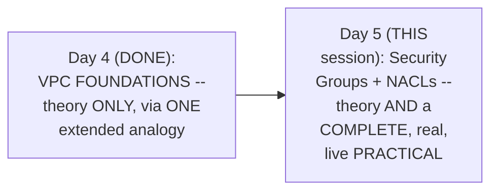

#### 🎯 Key Takeaways

* This episode **DIRECTLY, EXPLICITLY continues** Day 4's own DEFERRED promise ("VPC SECURITY, in more DEPTH") — the INSTRUCTOR himself CONFIRMS it as "PART two OF day 4."
* UNLIKE Day 4 (DELIBERATELY theory-ONLY), THIS session is EXPLICITLY, DIRECTLY confirmed as BOTH theory AND a COMPLETE, real PRACTICAL.
* Security GROUPS and NACLs are directly, precisely framed as the **"LAST point of SECURITY"** — the FINAL checkpoints a REQUEST GENUINELY passes THROUGH before REACHING an application.

---

### 2. Security Is a Shared Responsibility: The AWS/DevOps Split

#### 📖 Definition — The Precise, Genuine, Foundational Security Philosophy

> 💡 **Given directly:** *"In AWS, security is always a shared responsibility. What does this mean? AWS says that okay from our side we will try to add as much security as possible... but along with that we will need help of DevOps engineers or AWS admins."*

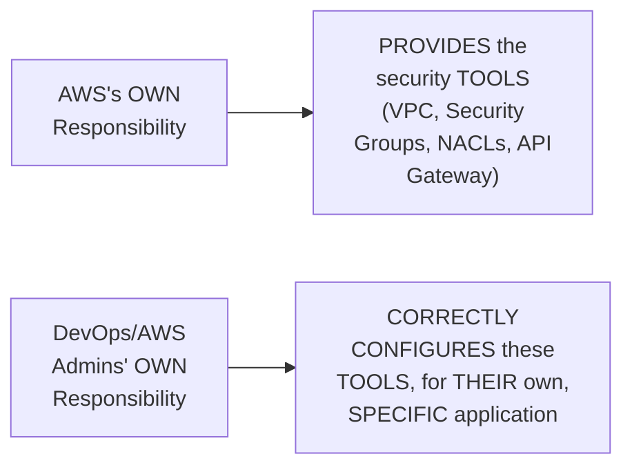

#### ❓ Why It Exists — The Precise, Genuine, Real-World Stakes

> 💡 **Given directly:** *"For any organization if they want to move to public cloud, what they will first see is is that public cloud secure enough or not... if your organization is using AWS it will have your organizational user details... database and everything is hosted on AWS, so first thing organizations look at is how secure is AWS."*

#### ⚠ Common Mistakes

* Assuming AWS's OWN, provided security TOOLS are AUTOMATICALLY, GENUINELY sufficient WITHOUT any FURTHER, human CONFIGURATION — explicitly, directly, PRECISELY clarified: security is GENUINELY, EXPLICITLY a SHARED responsibility — AWS PROVIDES the TOOLS, but CORRECT configuration REMAINS the DEVOPS engineer's OWN responsibility.

#### 🎯 Key Takeaways

* AWS's OWN, foundational SECURITY philosophy is **GENUINELY "shared RESPONSIBILITY"** — AWS PROVIDES the security TOOLS (VPC, security GROUPS, NACLs, API GATEWAY); DEVOPS engineers/admins are GENUINELY responsible FOR correctly CONFIGURING them.
* This is directly, PRECISELY framed as a GENUINE, REAL business CONCERN — ORGANIZATIONS evaluate a CLOUD provider's OWN security POSTURE BEFORE trusting it WITH their OWN, sensitive DATA and infrastructure.
* This PHILOSOPHY directly, precisely SETS UP the REST of this session's OWN content — security GROUPS and NACLs are BOTH, GENUINELY, "the DEVOPS engineer's OWN part" of THIS shared RESPONSIBILITY.

---
### 3. Security Groups vs. NACLs: The Precise, Genuine Distinction

#### 📖 Definition — The Precise, Genuine, Core Distinction

> 💡 **Given directly:** *"Security Group basically serves at the instance level... whereas if you want to add more security here at the subnet level, then we will use NACLs."*

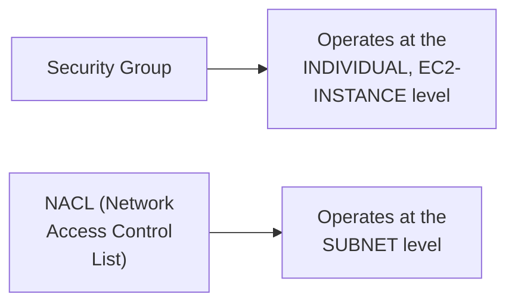

#### 🔍 Internal Working — A Direct, Precise Connection Back to Day 3's Own Established Content

> 💡 **Given directly:** *"On day three... whoever has followed our day three's video... we created an EC2 instance and within the EC2 instance we tried to deploy a Jenkins application and as a user we try to access this Jenkins application, what happened? We were not able to access this application by default because... there was something that was blocking this one."*

#### 📖 Definition — NACL, Precisely Spelled Out

> 💡 **Given directly:** *"NACL basically stands for Network Access Control List... this is a very complicated name that's why in the world of AWS people just call it as NACL."*

#### 🔍 Internal Working — A Genuine, Direct Confirmation of Where Each Applies

> 💡 **Given directly:** *"There are two things: one is you can add additional security at the layer of the subnet... for each subnet AWS says that you can add more security at the subnet level... whereas even if you bypass this... you can add more security at the EC2 instance level."*

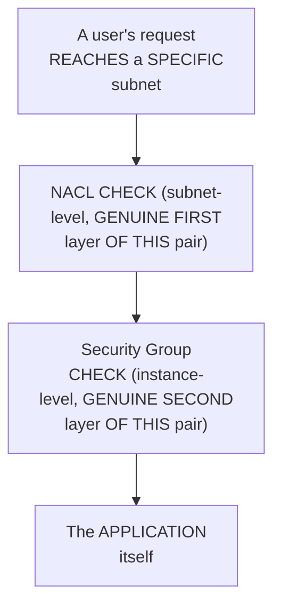

#### ⚠ Common Mistakes

* Assuming security GROUPS and NACLs are GENUINELY, FUNCTIONALLY interchangeable — explicitly, directly, PRECISELY distinguished: they OPERATE at GENUINELY DIFFERENT LEVELS (instance VERSUS subnet).
* Assuming EITHER mechanism ALONE is GENUINELY sufficient — explicitly, directly clarified: BOTH GENUINELY, TOGETHER serve as "the LAST point OF security" — a REQUEST must GENUINELY satisfy BOTH checks.

#### 🎯 Key Takeaways

* **Security GROUPS** operate at the **INSTANCE (EC2) level**; **NACLs** operate at the **SUBNET level** — a GENUINE, PRECISE, structural DISTINCTION.
* This connects DIRECTLY back to Day 3's own ESTABLISHED content — the "JENKINS blocked BY default" EXPERIENCE was PRECISELY security-GROUP behavior, NOW given its OWN, formal NAME and CONTEXT.
* BOTH mechanisms GENUINELY, TOGETHER form THIS session's own "LAST point OF security" — a REQUEST must GENUINELY pass THROUGH both CHECKS to REACH an application.

---

### 4. Security Groups: Inbound, Outbound & AWS's Own Default Behavior

#### 📖 Definition — Inbound Traffic, Precisely Defined via a Real Example

> 💡 **Given directly:** *"Let's say this application that we are talking about is amazon.com... user today I can be a user who will try to access amazon.com... this access where user is trying to access amazon.com is called as inbound traffic."*

#### 📖 Definition — Outbound Traffic, Precisely Defined via the Same, Real Example

> 💡 **Given directly:** *"Amazon.com probably can access other applications like Amazon Pay... to access Amazon Pay, amazon.com this request has to move out of your EC2 instance and access some other application... amazon.com trying to access the Razorpay or the Amazon Pay is called as outbound traffic."*

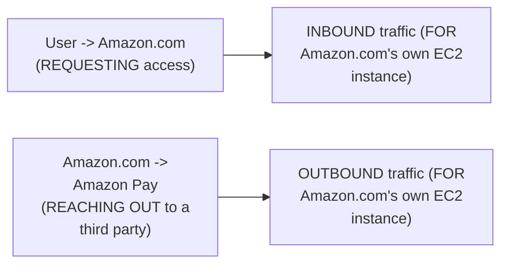

#### 🔍 Internal Working — AWS's Own, Precise, Genuine Default Behavior

> 💡 **Given directly:** *"By default when you create a Security Group... AWS will assign a default Security Group... in this default Security Group what AWS says is, hey, what I'll do is by default I will allow all the outbound traffic... except for port 25... but anything that is coming inside... as inbound traffic, I will deny everything by default."*

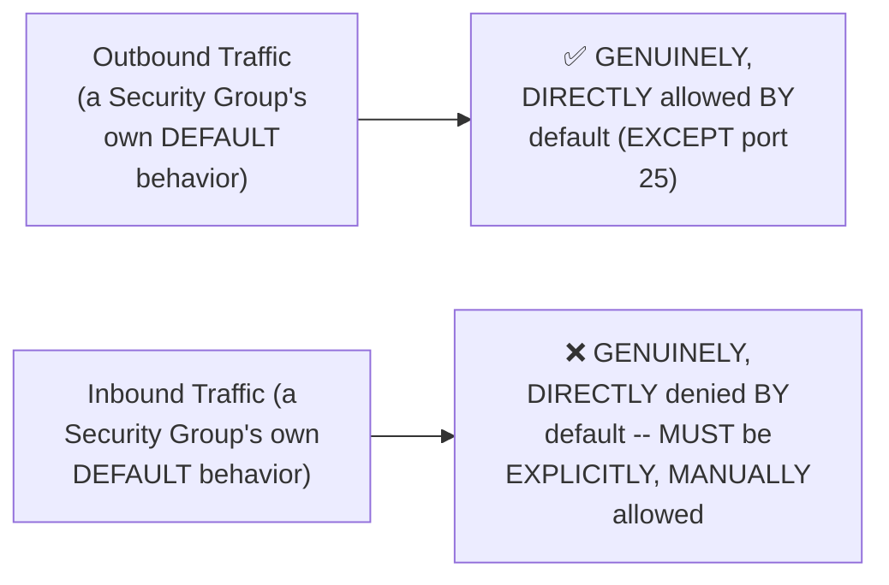

#### ⚠ A Direct, Honest, Important Security Warning

> 💡 **Given directly:** *"You should be very careful because... instead of opening port 8080, let's say in your organization you have opened some other port... and there was one hacker who was trying to access this and they were luckily able to access these ports and try to hack something."*

#### ⚠ Common Mistakes

* Assuming INBOUND and OUTBOUND traffic are GENUINELY treated IDENTICALLY, by DEFAULT — explicitly, directly, PRECISELY clarified: AWS's OWN default SECURITY group GENUINELY allows ALL outbound traffic, but DENIES all INBOUND traffic — a GENUINELY, DELIBERATELY ASYMMETRIC default.
* Opening UNNECESSARY ports "JUST in CASE" — explicitly, directly, HONESTLY warned as a GENUINE, real SECURITY risk — EVERY, unnecessarily OPEN port is a GENUINE, potential ATTACK surface.

#### 🎯 Key Takeaways

* **Inbound traffic** GENUINELY refers to REQUESTS COMING INTO an EC2 instance (e.g., a USER accessing amazon.COM); **outbound TRAFFIC** refers to REQUESTS the INSTANCE itself SENDS OUT (e.g., amazon.COM calling AMAZON Pay).
* AWS's OWN, default SECURITY group GENUINELY, DELIBERATELY allows **ALL outbound TRAFFIC** (except PORT 25), but **DENIES all INBOUND traffic** — REQUIRING explicit, MANUAL configuration to ALLOW any inbound ACCESS.
* Opening UNNECESSARY ports is directly, HONESTLY warned as a GENUINE, real security RISK — EVERY open PORT is a POTENTIAL attack SURFACE.

---
### 5. The Port 25 Story: Why AWS Blocks Outbound Mail Traffic by Default

#### ❓ Why It Exists — The Precise, Genuine, Direct Explanation

> 💡 **Given directly:** *"AWS does not allow the outbound traffic default on the port 25 because port 25 is basically a mailing service... AWS does not want you to, you know, their AWS does not want any kind of spam activity or, you know, AWS does not want to record the IP address of this EC2 instance."*

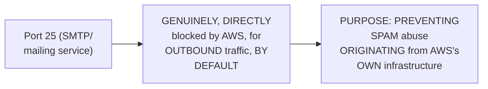

#### ⚠ Common Mistakes

* Assuming port 25 is BLOCKED for the SAME, general REASONS as other SECURITY restrictions — explicitly, directly, PRECISELY clarified: this is a SPECIFIC, DELIBERATE anti-SPAM measure, GENUINELY, DIRECTLY tied to PROTECTING AWS's own, BROADER infrastructure REPUTATION.

#### 🎯 Key Takeaways

* AWS **GENUINELY, DELIBERATELY blocks OUTBOUND port 25** (mail/SMTP TRAFFIC) by DEFAULT — a SPECIFIC, real EXCEPTION to its OWN, otherwise "ALLOW all outbound" DEFAULT policy.
* This is directly, PRECISELY explained as an anti-SPAM measure — PREVENTING AWS's OWN, shared INFRASTRUCTURE from being USED to send UNSOLICITED mail.
* This is a GENUINE, real, commonly-referenced AWS DETAIL — worth REMEMBERING as a SPECIFIC exception TO the "outbound is ALWAYS allowed BY default" rule.

---

### 6. NACLs: Why They Exist & How They Complement Security Groups

#### ❓ Why It Exists — A Genuine, Real, Concrete Motivating Scenario

> 💡 **Given directly:** *"Let's say you gave an EC2 instance for development team one, and what this development team did is, you know, just to make their process quicker, what they have done is... instead of they could have just opened port 8080, what they have done is they said okay allow all the traffic inside my EC2 instance... and allow from all the IP address in the world."*

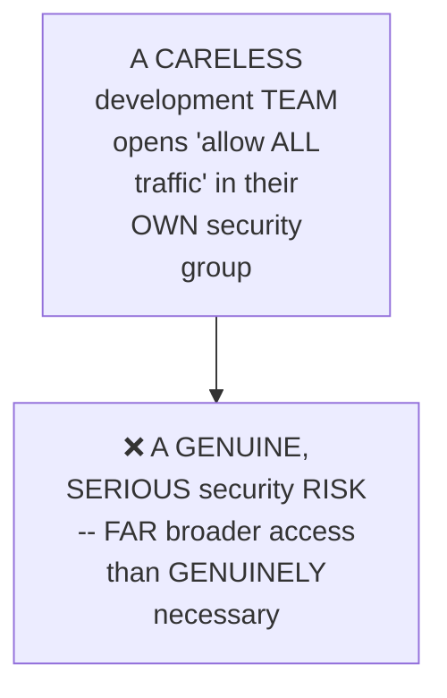

#### 📖 Definition — NACLs, Precisely Introduced as the Genuine, Overriding Solution

> 💡 **Given directly:** *"As DevOps engineers, network engineers or AWS administrators, what they can do is they can make advantage of NACLs to define their organizational network traffic... if something is applied at the subnet level then it is by default applied to all the instances within the subnet."*

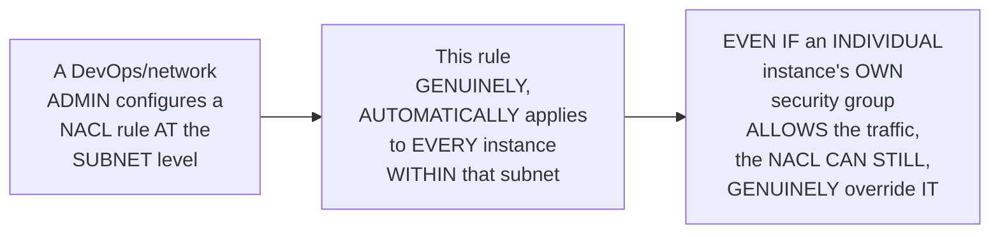

#### 🔍 Internal Working — A Genuine, Real, Worked Scale Example

> 💡 **Given directly:** *"If there are 10,000 EC2 instances also, this NACL configuration is directly applied to all the 10,000 EC2 instances... so that you can automate this manual activity of assigning the rules to each and every instance using security group."*

#### 📖 Definition — The Critical, Precise Structural Difference: Deny Capability

> 💡 **Given directly:** *"NACL basically the primary purpose is you can deny what kind of traffic that you would want to, and you can allow what kind of traffic you want to, whereas Security Group is only for allowing. Security Group does not have deny thing in Security Group, you will only configure the rules for allowing."*

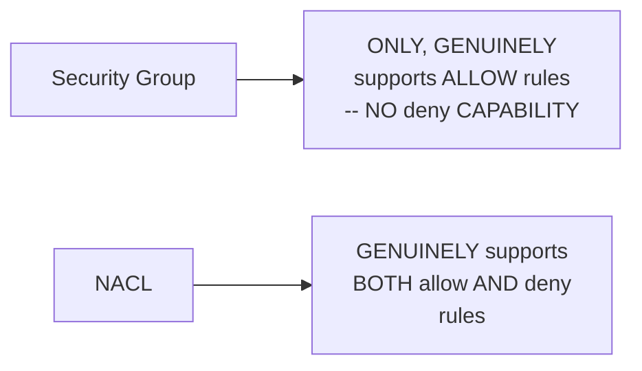

#### ⚠ Common Mistakes

* Assuming SECURITY groups can GENUINELY, EXPLICITLY deny traffic — explicitly, directly, PRECISELY corrected: security GROUPS are GENUINELY, STRUCTURALLY allow-ONLY — DENYING traffic REQUIRES a NACL, SPECIFICALLY.
* Assuming NACL CONFIGURATION requires MANUALLY updating EACH, individual EC2 instance — explicitly, directly, PRECISELY clarified: a NACL rule GENUINELY, AUTOMATICALLY applies to EVERY instance WITHIN its OWN subnet, AT scale — a GENUINE, real automation BENEFIT.

#### 🎯 Key Takeaways

* NACLs GENUINELY solve a REAL, concrete problem: a CARELESS team's OWN "allow ALL" security-GROUP misconfiguration CAN be GENUINELY overridden BY a subnet-LEVEL NACL rule.
* NACL rules GENUINELY, AUTOMATICALLY apply to **EVERY instance WITHIN a subnet** — a REAL, PRACTICAL automation BENEFIT at SCALE (illustrated VIA a genuine "10,000 instances" EXAMPLE).
* The **CRITICAL, structural DIFFERENCE**: Security GROUPS are **ALLOW-only**; NACLs GENUINELY support **BOTH allow AND deny** — a PRECISE, frequently-tested INTERVIEW distinction.

---
### 7. NACL Rule Evaluation: Numbered Order & the Catch-All Rule

#### 📖 Definition — The Precise, Genuine Rule-Evaluation Order

> 💡 **Given directly:** *"Order goes with the order of priority, whatever is here in the first row... so it depends upon the number, least number will be here first... let's say I'll configure one more rule and the rule number is 200, so first rule 100 will be verified, then rule 200 will be verified, and finally it will go to rule star."*

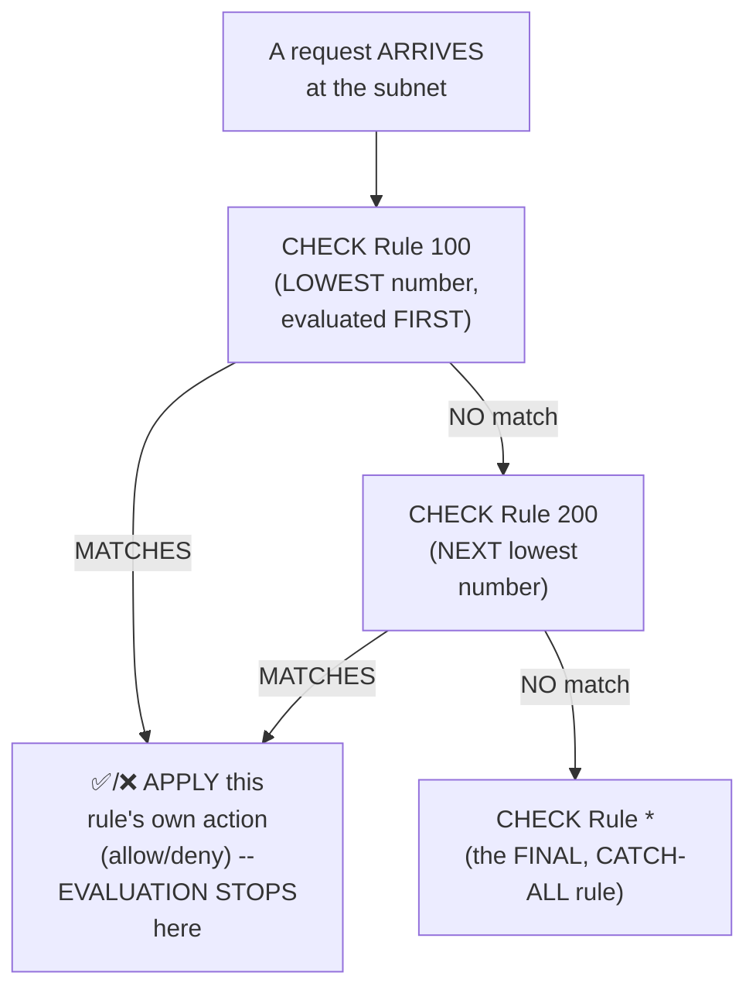

#### 🔍 Internal Working — Precisely Confirming the "Ascending Order" Rule

> 💡 **Given directly:** *"It goes with a specific order that is mentioned here, it is mentioned in the ascending order itself, so firstly it will check rule number 100 which says all traffic is allowed, so this rule is met, AWS will forward the request."*

#### ⚠ Common Mistakes

* Assuming NACL rules are EVALUATED in the ORDER they were CREATED, or SOME other, NON-numerical criteria — explicitly, directly, PRECISELY clarified: they are GENUINELY, STRICTLY evaluated in **ASCENDING numerical ORDER**, WITH the FIRST matching RULE taking EFFECT.
* Assuming ALL NACL rules are EVALUATED simultaneously, WITH the "MOST restrictive" one WINNING — explicitly, directly, PRECISELY corrected: EVALUATION genuinely STOPS at the FIRST matching RULE — LOWER-numbered rules GENUINELY take PRIORITY, REGARDLESS of WHETHER a LATER rule would have been MORE restrictive.

#### 🎯 Key Takeaways

* NACL rules are GENUINELY, STRICTLY evaluated in **ASCENDING numerical ORDER** — the LOWEST-numbered rule is CHECKED first.
* EVALUATION **STOPS** at the FIRST matching RULE — a LOWER-numbered rule GENUINELY takes PRIORITY over a LATER, potentially CONFLICTING one.
* A FINAL, **catch-ALL rule (`*`)** exists as the LAST, DEFAULT fallback — ONLY reached IF no EARLIER, numbered rule GENUINELY matched.

---

### 8. A Complete, Live Practical: Creating a Custom VPC

#### 🪜 Step-by-Step — Choosing "VPC and More" for Automatic Component Creation

> 💡 **Given directly:** *"There is two options here, VPC only, VPC and more. Go for VPC and more because AWS will take care of creating the default resources for you... when I create this VPC using VPC and more, what AWS is going to do — AWS is going to create public subnet for me as well as private subnet for me in both the availability zones."*

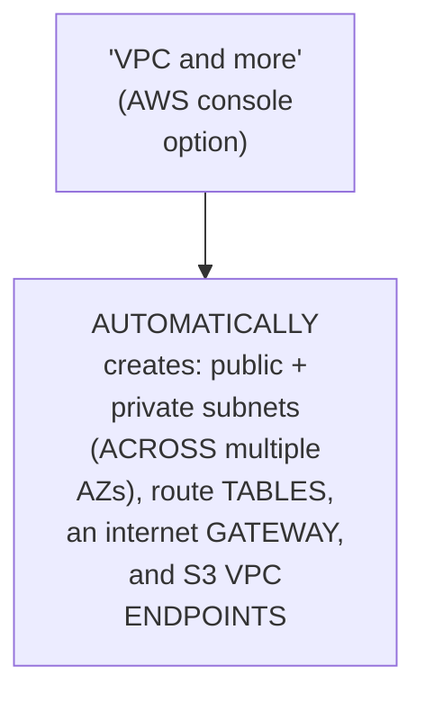

#### 🪜 Step-by-Step — A Complete, Real, Live-Confirmed CIDR Example

> 💡 **Given directly:** *"If you see if I provide this configuration slash 16, what AWS is saying is you will get 65536 IPs, if I want to modify, if I just say this as slash 24, see what happened, AWS said that you will get only 256 IP addresses."*

```text
/16 CIDR block -> 65,536 IP addresses
/24 CIDR block -> 256 IP addresses
```

#### 🪜 Step-by-Step — A Complete, Real, Live-Confirmed Creation Workflow

> 💡 **Given directly:** *"See what exactly VPC is doing — firstly it created the VPC, then it is configuring the DNS... VPC creation is done, it has created subnet for me... then it created internet gateway... AWS has then created route tables, create route, associate the route tables with the public private subnets."*

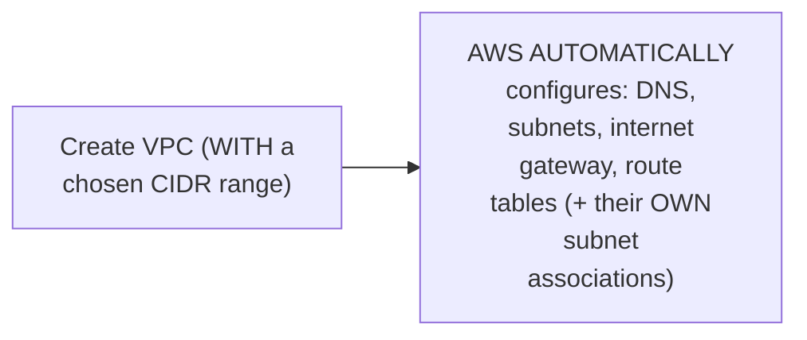

#### ⚠ Common Mistakes

* Assuming a VPC's OWN, DEFAULT NACL and security-GROUP configuration is CHOSEN randomly, or ARBITRARILY — explicitly, directly, LIVE-confirmed: AWS GENUINELY, AUTOMATICALLY creates a NACL (DEFAULT: allow ALL) and DEFAULT security group AS PART of the "VPC and more" WORKFLOW, DIRECTLY reflecting the SAME "shared RESPONSIBILITY" principle (Section 2).

#### 🎯 Key Takeaways

* Using the **"VPC and MORE"** option GENUINELY, AUTOMATICALLY creates a COMPLETE set of DEFAULT components — PUBLIC/private subnets (ACROSS multiple AZs), route TABLES, an internet GATEWAY, and S3 VPC ENDPOINTS.
* A LIVE, worked CIDR example directly, CONCRETELY confirmed: **`/16` = 65,536 addresses; `/24` = 256 addresses** — DIRECTLY, PRACTICALLY reinforcing Day 4's own established CONCEPT.
* This session's OWN, LIVE demonstration CONFIRMS that a NEWLY-created VPC GENUINELY, AUTOMATICALLY comes WITH a DEFAULT NACL (allow ALL) and DEFAULT security GROUP — DIRECTLY, CONCRETELY illustrating the "shared RESPONSIBILITY" principle IN practice.

---
### 9. A Complete, Live Practical: Testing Security Groups & NACLs Together

#### 🪜 Step-by-Step — Deploying a Real EC2 Instance Into the Custom VPC's Own Public Subnet

> 💡 **Given directly:** *"I want to place the EC2 instance in the public subnet of the VPC and demonstrate security groups as well as NACL... don't go with the default VPC... demo VPC, let me click on this one... this is a general industry practice, by default your EC2 instance and the application should be in the private subnet, but because today we are trying to understand this concept... I will change this to the public subnet."*

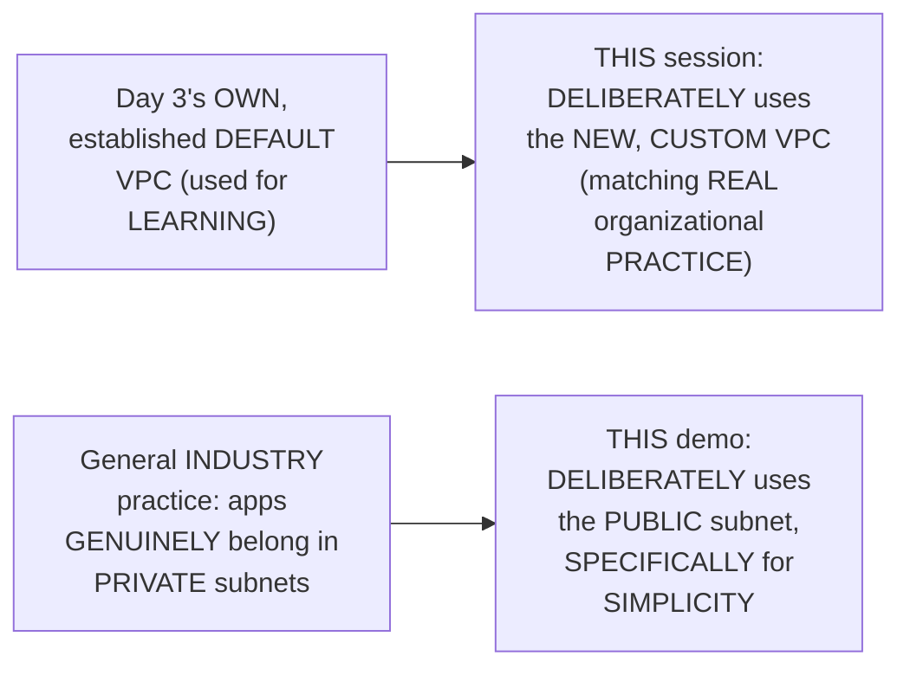

#### 🪜 Step-by-Step — Deploying a Real Python HTTP Server

> 💡 **Given directly:** *"I will just run a very simple HTTP server on Python for that... you don't even have to write a single command... just say `python3 -m http.server` and provide the port whatever you would like to."*

```bash
sudo apt update
python3 --version   # confirm python is installed
python3 -m http.server 8000   # a genuinely simple, zero-code HTTP server
```

#### 🪜 Step-by-Step — Confirming the Genuine, Default "Blocked" Behavior

> 💡 **Given directly:** *"The application will not be accessed because... this EC2 instance is attached with the security group, this is the default security group... what is happening in this default security group is that AWS is saying I will allow only port 22... AWS only wants to allow the SSH traffic."*

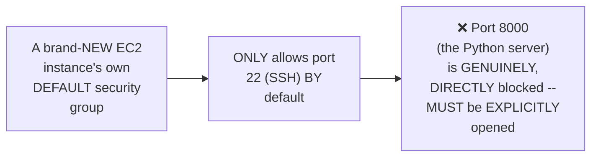

#### 🪜 Step-by-Step — Confirming the NACL's Own, Default "Allow All" Configuration

> 💡 **Given directly:** *"Let's look at the NACL configuration as well... what is the network ACL attached to our VPC?... it says all the traffic is currently allowed... network ACL, which is the first layer of defense for the entire subnet, what is configured here is it said allow all the traffic."*

#### 🪜 Step-by-Step — Opening Port 8000 in the Security Group: A Genuine, Live Success

> 💡 **Given directly:** *"Go to the security group, edit the inbound configuration, add one more rule and inside this say I want port 8000... custom TCP means the custom port 8000... allowing port 8000 from any IP address... save the rules... you will see the output... you got 200 response that means the request is successfully sent."*

```bash
# Security Group inbound rule:
# Type: Custom TCP | Port: 8000 | Source: 0.0.0.0/0 (anywhere, IPv4)
```

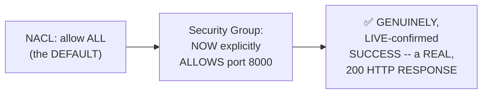

#### ⚠ Common Mistakes

* Assuming the CUSTOM VPC (RATHER than the DEFAULT VPC used in EARLIER sessions) is GENUINELY, MERELY a COSMETIC choice — explicitly, directly clarified: it DIRECTLY, MEANINGFULLY reflects REAL, organizational PRACTICE, WHERE custom VPCs are the GENUINE, standard CHOICE.
* Assuming DEPLOYING an APPLICATION in a PUBLIC subnet (as DONE in THIS specific DEMO) is GENUINELY, ALWAYS the CORRECT, recommended PRACTICE — explicitly, directly, HONESTLY clarified: THIS is a DELIBERATE SIMPLIFICATION FOR this SPECIFIC demo — GENERAL industry PRACTICE places applications IN private subnets.

#### 🎯 Key Takeaways

* This session's OWN, COMPLETE, live PRACTICAL used a GENUINELY REAL, CUSTOM VPC (NOT the default VPC FROM earlier SESSIONS) — DIRECTLY, PRACTICALLY mirroring REAL, organizational SETUP.
* A REAL Python HTTP server was DEPLOYED and CONFIRMED as GENUINELY, INITIALLY inaccessible (PORT 8000 blocked BY the default SECURITY group, WHICH only ALLOWS port 22 BY default).
* EXPLICITLY opening PORT 8000 in the SECURITY group, WITH the NACL's OWN default "ALLOW all" configuration STILL in PLACE, resulted in a **GENUINE, live-CONFIRMED success** — a REAL, 200 HTTP RESPONSE.

---

### 10. A Genuine, Live Demonstration of Rule-Order Priority

#### 🪜 Step-by-Step — A Complete, Live, Real Test: Blocking Port 8000 at the NACL Level

> 💡 **Given directly:** *"I will block port 8000 in the NACL... rule 100, custom TCP, port range 8000, I want to block anything that is coming from internet, just deny... you will see that the request will not reach the application, that is because DevOps engineering team has blocked that specific IP range... it will be blocked for the entire subnet."*

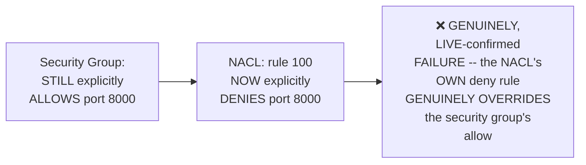

#### 🪜 Step-by-Step — A Genuinely Clever, Live Test of Rule-Order Priority

> 💡 **Given directly:** *"Let's try to edit this inbound traffic rule and say that for rule 100 I will just say all traffic, allow, save changes. Edit inbound rule, I will add one more inbound rule... custom TCP, port 8000, any guesses on what would happen? I will deny this... rule number 200... let's see if I save changes and refresh this, you will see that the traffic is sent even you have denied the configuration."*

```text
NACL Rules (attempt 1):
  Rule 100: ALL traffic -> ALLOW
  Rule 200: Port 8000 -> DENY
Result: Traffic SUCCEEDS (rule 100 matches FIRST, and ALLOWS everything --
        rule 200 is NEVER genuinely reached)
```

#### 🪜 Step-by-Step — Renumbering: A Genuine, Direct, Live-Confirmed Reversal

> 💡 **Given directly:** *"Let's keep this as 200, let's keep this as 110... now try to save the changes, so it will reflect and 110 goes above enough... this is the first rule, what it says is if the port number is 8000, block, if the port number is not 8000 then it will go to the next rule... let us see what would happen, just copy this URL... the traffic will not reach the EC2 instance."*

```text
NACL Rules (attempt 2, RENUMBERED):
  Rule 110: Port 8000 -> DENY   (NOW evaluated FIRST -- lower number)
  Rule 200: ALL traffic -> ALLOW
Result: Traffic FAILS (rule 110 matches FIRST, and DENIES port 8000 --
        the SAME "allow all" rule 200 is now GENUINELY, NEVER reached)
```

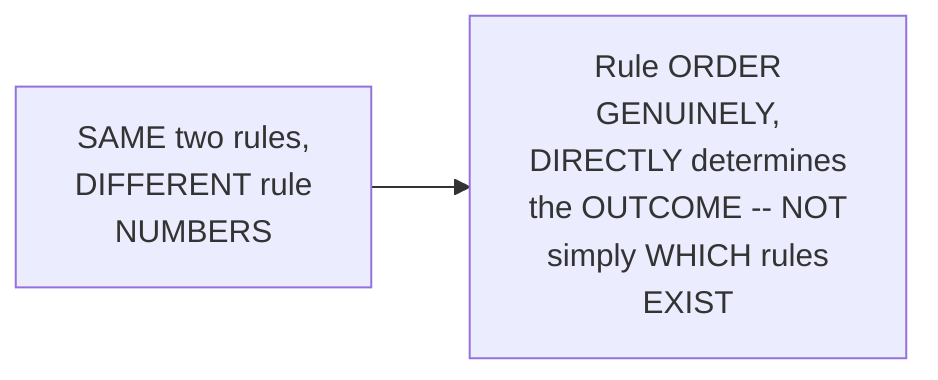

#### 🔍 Internal Working — A Genuine, Direct, Real-World Framing of This Result

> 💡 **Given directly:** *"Now the application developer will be confused, hey what happened, I have opened the port 8000 here but still my application is not getting the traffic, because DevOps engineer or the network engineers have blocked this specific port."*

#### ⚠ Common Mistakes

* Assuming NACL "ALLOW" and "DENY" rules for the SAME port GENUINELY produce an AMBIGUOUS, UNDEFINED outcome — explicitly, directly, LIVE-demonstrated as FALSE: the OUTCOME is GENUINELY, PRECISELY determined BY rule ORDER — the LOWER-numbered rule ALWAYS wins.
* Assuming a SECURITY group's OWN "allow" CONFIGURATION guarantees ACCESS, REGARDLESS of NACL RULES — explicitly, directly, LIVE-demonstrated as FALSE: a NACL's OWN, correctly-ORDERED deny RULE can GENUINELY, COMPLETELY override an ALLOWING security GROUP.

#### 🎯 Key Takeaways

* This session's own **MOST clever, LIVE demonstration**: the SAME two NACL RULES ("ALLOW all" and "DENY port 8000"), MERELY RENUMBERED, produced **GENUINELY OPPOSITE outcomes** — DIRECTLY, CONCRETELY proving that RULE ORDER, NOT just rule EXISTENCE, determines the RESULT.
* A NACL's OWN, correctly-PRIORITIZED deny rule CAN **GENUINELY, COMPLETELY override** an ALLOWING security GROUP — DIRECTLY confirming NACLs' OWN role as the GENUINE "first LAYER of defense."
* This directly, CONCRETELY illustrates a GENUINE, real-world SCENARIO: an application DEVELOPER correctly OPENS their OWN security-GROUP port, YET remains GENUINELY confused WHEN traffic STILL fails — BECAUSE a DEVOPS/network team's OWN, SEPARATE NACL rule is GENUINELY, DIRECTLY blocking it, AT a HIGHER, structural LEVEL.

---
### 11. Closing: The Assignment & What's Next

#### 🪜 Step-by-Step — A Complete, Explicit, Direct Assignment

> 💡 **Given directly:** *"Please take this as an assessment, you can watch this practical part one more time and you can try this at your end, this is really really important... today we just tried with one public subnet, in future we will enhance the scope, we will add the private subnets, we will add load balancers, we will add API gateways, we'll add a lot of configuration, multiple availability zones."*

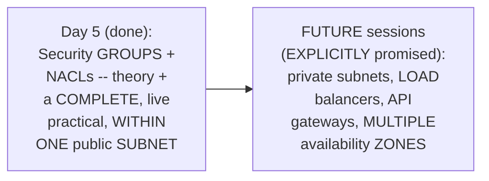

#### 🔍 Internal Working — A Direct, Honest Summary of the Complete, Genuine Takeaway

> 💡 **Given directly:** *"What you have understood at the end — even if you allow the configuration in the security groups, NACL acts as the first layer of defense, and DevOps engineers as well as system engineers, network configurations, or the admins who has access to NACLs, they can overall block the configuration at the subnet level."*

#### ⚠ Common Mistakes

* Assuming THIS session's own SCOPE represents a COMPLETE, PRODUCTION-ready VPC ARCHITECTURE — explicitly, directly, HONESTLY clarified: THIS demo GENUINELY used ONLY a SINGLE public SUBNET, FOR simplicity — REAL production SETUPS genuinely NEED private subnets, LOAD balancers, and API gateways TOO (explicitly DEFERRED to FUTURE sessions).

#### 🎯 Key Takeaways

* This episode **GENUINELY, COMPLETELY delivers** its OWN, stated GOAL — security GROUPS and NACLs, in BOTH theory AND a COMPLETE, real, LIVE practical.
* The COMPLETE, genuine TAKEAWAY: EVEN when a SECURITY group GENUINELY allows TRAFFIC, a NACL's OWN, correctly-ordered RULE can STILL, GENUINELY block it — NACLs GENUINELY serve as the "FIRST layer OF defense."
* **PRIVATE subnets, LOAD balancers, API gateways, and MULTIPLE availability ZONES** are directly, EXPLICITLY confirmed as FUTURE, planned TOPICS — THIS session's OWN, deliberate SIMPLIFICATION (a SINGLE public SUBNET) is HONESTLY acknowledged as NOT yet a COMPLETE, production ARCHITECTURE.

---

## 📝 Glossary

| Term | Definition | Why It Matters |
|---|---|---|
| **Shared Responsibility** | AWS provides security tools; DevOps engineers configure them correctly | AWS's own, foundational security philosophy |
| **Security Group** | Instance-level (EC2) traffic control | Allow-only; no deny capability |
| **NACL** | Subnet-level traffic control (Network ACL) | Supports BOTH allow and deny rules |
| **Inbound Traffic** | Requests coming INTO an instance | Denied by default (security groups) |
| **Outbound Traffic** | Requests going OUT of an instance | Allowed by default (except port 25) |
| **Port 25** | The SMTP/mailing port | Blocked outbound by default, to prevent spam |
| **Rule Order (NACL)** | Rules evaluated in ascending numerical order | The FIRST matching rule wins |
| **Catch-All Rule (*)** | The final, default NACL rule | Reached only if no earlier, numbered rule matches |
| **CIDR Block** | An IP address range notation (e.g. /16, /24) | Defines VPC/subnet size |

---

## 🔄 Revision Notes — One-Minute Revision

* This is **Day 5**, EXPLICITLY confirmed as "Part 2 of Day 4" -- BOTH theory AND a complete, live practical, unlike Day 4's theory-only session.
* **Shared responsibility**: AWS provides security tools (VPC, security groups, NACLs, API Gateway); DevOps engineers/admins are genuinely responsible for correctly configuring them.
* **Security Groups vs. NACLs**: security groups operate at the INSTANCE level; NACLs operate at the SUBNET level. Both serve as the "last point of security."
* **Inbound vs. outbound**: inbound = requests coming IN (e.g. a user accessing Amazon.com); outbound = requests going OUT (e.g. Amazon.com calling Amazon Pay). Default security group behavior: ALLOW all outbound (except port 25), DENY all inbound.
* **Port 25 story**: AWS blocks outbound port 25 (SMTP/mail) by default, specifically to prevent spam abuse from its own infrastructure.
* **Why NACLs exist**: a real, motivating scenario -- a careless dev team opens "allow all" in their own security group. NACLs let DevOps/network admins override this at the SUBNET level, automatically applying to EVERY instance within it (a genuine automation benefit at scale, e.g. 10,000 instances).
* **Critical distinction**: Security Groups are ALLOW-ONLY (no deny capability); NACLs support BOTH allow AND deny.
* **NACL rule evaluation**: rules are checked in ASCENDING numerical order; the FIRST matching rule wins; a final catch-all (*) rule exists as the ultimate default.
* **Complete, live practical**: created a custom VPC (via "VPC and more," auto-generating subnets/route tables/internet gateway), confirmed /16 = 65,536 IPs and /24 = 256 IPs, deployed a real Python HTTP server on port 8000 in the PUBLIC subnet (a deliberate simplification -- apps normally belong in private subnets).
* **Live testing**: a new EC2 instance's default security group blocked port 8000 (only port 22/SSH allowed by default); the default NACL allowed all traffic. Explicitly opening port 8000 in the security group -> genuine, live SUCCESS.
* **The clever rule-order demonstration**: blocking port 8000 directly at the NACL (rule 100, deny) blocked traffic DESPITE the security group still allowing it. Then: adding "allow all" at rule 100 and "deny port 8000" at rule 200 -> traffic SUCCEEDED (rule 100 matched first). RENUMBERING the deny rule to 110 (now evaluated BEFORE the allow-all at 200) -> traffic FAILED -- the exact SAME two rules, different order, opposite outcomes.
* **Closing**: an explicit assignment to replicate this practical. Private subnets, load balancers, API gateways, and multiple AZs are explicitly deferred to future sessions.

---

## 📋 Cheat Sheet

**Security Groups vs. NACLs:**
```text
Security Group  -- INSTANCE level, ALLOW-ONLY (no deny)
NACL            -- SUBNET level, BOTH allow AND deny
Both act as the "last point of security" before a request reaches the application
```

**Default behaviors:**
```text
Security Group (default): ALLOW all outbound (EXCEPT port 25) | DENY all inbound
NACL (default, via "VPC and more"): ALLOW all traffic (both directions)
```

**NACL rule evaluation:**
```text
Rules are checked in ASCENDING numerical order.
The FIRST matching rule wins -- evaluation STOPS there.
A final catch-all (*) rule exists as the ultimate default.
```

**CIDR sizing (live-confirmed):**
```text
/16 -> 65,536 IP addresses
/24 -> 256 IP addresses
```

**The complete, live practical workflow:**
```bash
# 1. Create a custom VPC (via "VPC and more" in the AWS console)
# 2. Launch an EC2 instance INTO the custom VPC's own public subnet
sudo apt update
python3 -m http.server 8000
# 3. Confirm initial failure (default SG only allows port 22)
# 4. Open port 8000 in the Security Group (custom TCP, source: 0.0.0.0/0)
# 5. Confirm success (a genuine, 200 HTTP response)
# 6. Test NACL override: deny port 8000 at the NACL -> traffic BLOCKED,
#    even though the Security Group still allows it
```

**The rule-order demonstration, precisely:**
```text
Attempt 1: Rule 100 = ALLOW all | Rule 200 = DENY port 8000  -> SUCCEEDS
Attempt 2: Rule 110 = DENY port 8000 | Rule 200 = ALLOW all  -> FAILS
(Same two rules. Different order. Opposite outcome.)
```

---

## 🔥 Interview Questions & Answers

### 🟢 Beginner

**Q1.**

**Question:** What does "shared responsibility" mean in AWS's own security model?

**Answer:** AWS provides security tools; DevOps engineers/admins are responsible for correctly configuring them.

**Explanation:** Directly, precisely explained.

**Why Interviewers Ask This:** Foundational, frequently-tested AWS security philosophy.

**Possible Follow-up:** "Name three security tools AWS genuinely provides."

**Q2.**

**Question:** What is the genuine difference between a Security Group and a NACL?

**Answer:** Security Groups operate at the instance level and are allow-only; NACLs operate at the subnet level and support both allow and deny rules.

**Explanation:** Directly, precisely distinguished.

**Why Interviewers Ask This:** An explicitly-named, genuine, common interview question.

**Possible Follow-up:** "Which one can genuinely deny traffic?"

**Q3.**

**Question:** What is AWS's own default behavior for inbound vs. outbound traffic?

**Answer:** Deny all inbound by default; allow all outbound by default (except port 25).

**Explanation:** Directly, precisely explained.

**Why Interviewers Ask This:** Basic, essential security group knowledge.

**Possible Follow-up:** "Why is port 25 the exception?"

**Q4.**

**Question:** Why does AWS block outbound port 25 by default?

**Answer:** To prevent spam abuse originating from its own infrastructure.

**Explanation:** Directly, precisely explained.

**Why Interviewers Ask This:** A commonly-referenced, genuine AWS detail.

**Possible Follow-up:** "What port is genuinely used for SMTP/mail traffic?"

**Q5.**

**Question:** Can a Security Group genuinely deny traffic?

**Answer:** No -- Security Groups are allow-only.

**Explanation:** Directly, explicitly confirmed.

**Why Interviewers Ask This:** A commonly-confused, genuine distinction.

**Possible Follow-up:** "What would you use instead, if you genuinely needed to deny traffic?"

**Q6.**

**Question:** In what order are NACL rules evaluated?

**Answer:** Ascending numerical order -- the first matching rule wins.

**Explanation:** Directly, explicitly stated.

**Why Interviewers Ask This:** Basic, essential NACL knowledge.

**Possible Follow-up:** "What happens if no numbered rule matches?"

**Q7.**

**Question:** What is the catch-all (*) rule in a NACL?

**Answer:** The final, default rule, reached only if no earlier, numbered rule matches.

**Explanation:** Directly, explicitly explained.

**Why Interviewers Ask This:** Basic, essential NACL structure knowledge.

**Possible Follow-up:** "What is this rule's own, default action?"

**Q8.**

**Question:** Does a NACL rule genuinely apply to just one instance, or an entire subnet?

**Answer:** An entire subnet -- automatically applying to every instance within it.

**Explanation:** Directly, precisely explained.

**Why Interviewers Ask This:** Tests genuine understanding of NACLs' own scope and automation benefit.

**Possible Follow-up:** "Why is this genuinely valuable at scale (e.g., thousands of instances)?"

**Q9.**

**Question:** Can a NACL's own deny rule genuinely override a Security Group's own allow rule?

**Answer:** Yes -- live-demonstrated directly.

**Explanation:** Directly, live-confirmed.

**Why Interviewers Ask This:** Tests genuine, practical understanding of how these two layers interact.

**Possible Follow-up:** "Which one is genuinely checked first, in the complete request path?"

**Q10.**

**Question:** How many IP addresses does a /24 CIDR block genuinely provide?

**Answer:** 256.

**Explanation:** Directly, live-confirmed.

**Why Interviewers Ask This:** Basic, practical VPC sizing knowledge.

**Possible Follow-up:** "How many does a /16 block provide?"

---

### 🟡 Intermediate

**Q11.**

**Question:** Explain why the instructor deliberately performs the SAME rule-order demonstration TWICE (Section 10) -- first blocking directly at rule 100, then constructing the "allow all + deny, renumbered" scenario -- rather than showing only one, simpler test.

**Answer:** This is a genuinely deliberate, escalating teaching choice: the FIRST test (DIRECTLY denying port 8000 at rule 100, with NOTHING else configured) establishes the BASIC, genuine fact that a NACL CAN override a Security Group. The SECOND, more ELABORATE test (allow-all + deny, THEN renumbered) goes FURTHER — DIRECTLY, CONCRETELY proving that rule EXISTENCE alone is NOT sufficient to PREDICT the outcome; RULE ORDER is THE deciding FACTOR. By LIVE-demonstrating the EXACT SAME two rules PRODUCING opposite RESULTS, based SOLELY on their OWN numbering, the instructor PREVENTS a GENUINELY common, real MISCONCEPTION — that a "DENY" rule ALWAYS, UNCONDITIONALLY takes PRECEDENCE over an "ALLOW" rule, REGARDLESS of ORDER. This is a SUBTLE, but GENUINELY important DISTINCTION that a SINGLE, simpler test WOULD NOT have SUFFICIENTLY proven.

**Explanation:** Requires recognizing a deliberate, escalating demonstration sequence designed to prove a subtle point (order matters, not just rule existence) that a single test wouldn't establish.

**Why Interviewers Ask This:** Tests whether a learner recognizes the genuine, practical importance of NACL rule ordering, beyond simply knowing that allow/deny rules exist.

**Possible Follow-up:** "Construct your OWN, similar example with THREE rules, where the CORRECT ordering is GENUINELY less obvious than in THIS session's own, two-rule demonstration."

**Q12.**

**Question:** A learner argues that since NACLs can override Security Groups, teams should genuinely rely on NACLs alone for all traffic control, making Security Groups redundant. Evaluate this claim.

**Answer:** This claim overstates the case, missing a GENUINELY important, PRACTICAL distinction THIS session's own content DIRECTLY implies. WHILE NACLs CAN genuinely OVERRIDE Security Groups (per Section 10's own LIVE demonstration), Section 6's own PRECISE reasoning DIRECTLY establishes NACLs' own GENUINE value as an ORGANIZATIONAL, subnet-WIDE automation TOOL — NOT as a REPLACEMENT for PER-instance, application-SPECIFIC control. Security GROUPS remain GENUINELY, PRACTICALLY valuable PRECISELY because DIFFERENT applications, even WITHIN the SAME subnet, OFTEN need GENUINELY DIFFERENT, specific PORT/IP rules (e.g., ONE application on port 8000, ANOTHER on port 5000) — a SINGLE, subnet-WIDE NACL rule CANNOT genuinely provide THIS level of PER-application GRANULARITY WITHOUT becoming EXTREMELY complex. The ACCURATE, more PRECISE conclusion: NACLs and Security GROUPS are GENUINELY COMPLEMENTARY, NOT substitutable — NACLs for BROAD, subnet-wide POLICY; Security Groups FOR fine-grained, PER-application control.

**Explanation:** Tests whether a learner recognizes that NACLs' own overriding capability doesn't make them a substitute for the fine-grained, per-instance control Security Groups genuinely provide.

**Why Interviewers Ask This:** Distinguishes candidates who understand the complementary, layered nature of these two mechanisms from those who assume the "more powerful" option makes the other redundant.

**Possible Follow-up:** "Construct a GENUINE, real scenario where relying on NACLs ALONE (without Security Groups) would GENUINELY become impractical."

**Q13.**

**Question:** Explain, precisely, why the instructor deliberately deploys the EC2 instance into the PUBLIC subnet for this specific demo, DESPITE directly, honestly acknowledging that "general industry practice" places applications in PRIVATE subnets.

**Answer:** This is a genuinely deliberate, PEDAGOGICAL simplification, DIRECTLY consistent with THIS instructor's OWN, established teaching PATTERN across THIS series (e.g., Day 3's OWN similar public-subnet SIMPLIFICATION, for the SAME reason). By AVOIDING the ADDITIONAL complexity of a LOAD balancer, target GROUP, and route TABLE (all GENUINELY required for a PRIVATE-subnet demo, per Day 4's own established REQUEST-path), the instructor can DIRECTLY, ISOLATE and FOCUS on THIS session's own, SPECIFIC learning GOAL — DEMONSTRATING the INTERACTION between security GROUPS and NACLs SPECIFICALLY, WITHOUT introducing UNRELATED, additional VARIABLES. The instructor's own DIRECT, HONEST acknowledgment ("this is a GENERAL industry PRACTICE... but BECAUSE today we are TRYING to understand THIS concept") DIRECTLY confirms this is a DELIBERATE, ACKNOWLEDGED trade-off — NOT a genuine RECOMMENDATION for REAL, production DEPLOYMENTS.

**Explanation:** Requires recognizing a deliberate pedagogical simplification, honestly acknowledged, that isolates the specific learning objective from unrelated architectural complexity.

**Why Interviewers Ask This:** Tests whether a learner recognizes the difference between a simplified teaching demonstration and a genuine, recommended production practice.

**Possible Follow-up:** "What ADDITIONAL components (per Day 4's own established REQUEST path) would GENUINELY need to be added to convert THIS demo into a PRODUCTION-appropriate, private-subnet deployment?"

**Q14.**

**Question:** Using this session's own precise "NACL automation at scale" reasoning (Section 6), explain a GENUINE, real risk that could arise if an organization applied an OVERLY broad "deny" NACL rule to a subnet containing MULTIPLE, genuinely different applications.

**Answer:** A precise, reasoned RISK analysis, directly extending Section 6's own established MECHANISM: per Section 6's own PRECISE reasoning, a NACL rule GENUINELY, AUTOMATICALLY applies to EVERY instance WITHIN its OWN subnet — a GENUINE, real EFFICIENCY benefit WHEN the INTENT is UNIFORM (e.g., "block PORT 8000 for the ENTIRE subnet"). HOWEVER, this SAME, automatic-APPLICATION property becomes a GENUINE RISK if the SUBNET contains MULTIPLE, genuinely DIFFERENT applications, EACH needing DIFFERENT, legitimate PORTS — an OVERLY broad "DENY" rule (e.g., BLOCKING an ENTIRE port RANGE, rather than a SPECIFIC port) COULD genuinely, UNINTENTIONALLY block LEGITIMATE traffic FOR applications the RULE was NEVER intended TO affect. This directly, PRECISELY reveals a GENUINE, real TRADE-OFF: NACLs' own AUTOMATION benefit (Section 6) is GENUINELY, DIRECTLY tied to the SAME property that CREATES this RISK — BROAD, subnet-wide RULES require GENUINELY careful, DELIBERATE scoping to AVOID unintended, COLLATERAL blocking of UNRELATED applications SHARING the SAME subnet.

**Explanation:** Requires extending the NACL automation-at-scale reasoning to identify a genuine, practical risk arising from that same automatic-application property.

**Why Interviewers Ask This:** Tests whether a learner recognizes that NACLs' own strength (automatic, subnet-wide application) is also a genuine source of risk requiring careful scoping.

**Possible Follow-up:** "What GENUINE, practical subnet-DESIGN strategy (extending BEYOND this session's own explicit content) could help MITIGATE this risk?"

**Q15.**

**Question:** Synthesize this session's complete "Security Groups are allow-only" reasoning (Section 6) with its own "inbound denied by default" reasoning (Section 4) to explain WHY a Security Group's own INABILITY to explicitly deny traffic is GENUINELY, STRUCTURALLY less limiting than it might initially appear.

**Answer:** A precise, synthesized explanation, directly connecting TWO, separately-established sections: per Section 4's own PRECISE, established DEFAULT, a Security Group GENUINELY, ALREADY denies ALL inbound TRAFFIC by DEFAULT — MEANING the "DEFAULT state" of ANY port is ALREADY "DENIED," WITHOUT requiring an EXPLICIT deny rule AT ALL. Per Section 6's own PRECISE reasoning, Security Groups are GENUINELY, STRUCTURALLY allow-ONLY — this INITIALLY sounds LIMITING, but SYNTHESIZING it WITH Section 4's own established DEFAULT reveals it's GENUINELY, LOGICALLY sufficient: SINCE everything is ALREADY denied BY default, a Security Group ONLY ever needs to SPECIFY what SHOULD be ALLOWED — there is GENUINELY no PRACTICAL need for an EXPLICIT "deny" RULE, because the ABSENCE of an "ALLOW" rule ALREADY, STRUCTURALLY means "DENIED." This directly, precisely reveals WHY Security Groups' own allow-ONLY design is GENUINELY, ARCHITECTURALLY coherent, RATHER than a GENUINE limitation — it's a DIRECT, LOGICAL consequence OF their OWN, "deny-by-DEFAULT" starting POINT (UNLIKE NACLs, WHICH default to "ALLOW all," per Section 8's own LIVE-confirmed observation, and THEREFORE GENUINELY, STRUCTURALLY require an EXPLICIT deny CAPABILITY to be GENUINELY useful).

**Explanation:** Requires synthesizing the allow-only design with the deny-by-default starting point to explain why this design is architecturally coherent rather than genuinely limiting.

**Why Interviewers Ask This:** A senior-level question testing whether a candidate can reconcile an apparent limitation (no deny capability) with the underlying default behavior that makes it logically unnecessary.

**Possible Follow-up:** "Why does THIS SAME reasoning NOT genuinely apply to NACLs, GIVEN that THEIR own default (per THIS session's own live-confirmed observation) is 'ALLOW all,' rather than 'deny ALL'?"

---

### 🔴 Advanced

**Q16.**

**Question:** Design a complete, reasoned security configuration (using ONLY this session's own established concepts) for a subnet containing THREE, genuinely different applications (a web app on port 8000, an API on port 5000, and a database that should NEVER be publicly accessible), explicitly justifying your use of both Security Groups and NACLs.

**Answer:** A reasonable, complete configuration, directly applying this session's OWN, exact established CONCEPTS:

```text
NACL (subnet-level, per Section 6's own established mechanism):
  Rule 100: ALLOW inbound TCP port 8000 (web app), source: 0.0.0.0/0
  Rule 110: ALLOW inbound TCP port 5000 (API), source: 0.0.0.0/0
  Rule 120: DENY inbound TCP port <database_port>, source: 0.0.0.0/0
  Rule *:   DENY all (the default catch-all)

Security Groups (instance-level, per Section 4/6's own established
mechanism -- ONE per application):
  Web app's own SG: ALLOW inbound TCP port 8000, source: 0.0.0.0/0
  API's own SG: ALLOW inbound TCP port 5000, source: 0.0.0.0/0
  Database's own SG: ALLOW inbound ONLY from the API's own SG (NOT
    from 0.0.0.0/0) -- ensuring the database is GENUINELY reachable
    ONLY by the API, never directly by the public internet.
```

This complete CONFIGURATION directly, precisely APPLIES both LAYERS TOGETHER (per Advanced Q12's own established "COMPLEMENTARY, not substitutable" reasoning) — the NACL provides a BROAD, subnet-wide POLICY (explicitly DENYING the database's OWN port at the SUBNET level, per Section 6's own established DENY capability), WHILE Security Groups provide the FINE-grained, per-APPLICATION control (per Section 4's own established mechanism) ENSURING the database is GENUINELY reachable ONLY from the intended, INTERNAL source.

**Explanation:** Requires synthesizing every major security concept from this session into one complete, reasoned, real-world, multi-application configuration.

**Why Interviewers Ask This:** A realistic, senior-level question testing whether a candidate can design a genuinely layered, defense-in-depth security configuration using both mechanisms appropriately.

**Possible Follow-up:** "What GENUINE, additional risk might arise if the database's OWN NACL-level deny rule (rule 120) were ACCIDENTALLY removed, but the Security Group restriction REMAINED in place?"

**Q17.**

**Question:** Critically evaluate: "Since this session confirms NACLs can override Security Groups, this means NACLs are UNCONDITIONALLY the 'more important' or 'more powerful' security mechanism, and teams should PRIORITIZE configuring NACLs correctly OVER Security Groups." Is this an accurate, complete characterization?

**Answer:** Not fully accurate — this OVERSTATES a GENUINE, structural OBSERVATION (NACLs CAN override) into an UNCONDITIONAL priority CLAIM neither this session's OWN content, NOR sound reasoning, FULLY supports. WHILE NACLs GENUINELY, STRUCTURALLY sit AS "the FIRST layer OF defense" (per Section 3's OWN established ORDERING), this does NOT genuinely mean they are MORE "important" in a GENERAL sense — Section 12's own (Q12's) established REASONING DIRECTLY confirms Security GROUPS remain GENUINELY, PRACTICALLY essential FOR fine-grained, PER-application CONTROL that NACLs CANNOT efficiently PROVIDE at SCALE. The ACCURATE, more PRECISE conclusion: NACLs and Security GROUPS serve GENUINELY DIFFERENT, COMPLEMENTARY purposes — NEITHER is UNCONDITIONALLY "MORE important"; a WELL-designed security CONFIGURATION GENUINELY requires BOTH to be CORRECTLY configured, WORKING together — PRIORITIZING one OVER the other WOULD genuinely leave a REAL, exploitable GAP in the OVERALL security POSTURE.

**Explanation:** Tests whether a learner recognizes that NACLs' own structural priority in the request path doesn't translate into unconditional, overall importance over Security Groups.

**Why Interviewers Ask This:** Distinguishes candidates who understand the genuine, complementary layering of these two mechanisms from those who conflate "evaluated first" with "more important overall."

**Possible Follow-up:** "Describe a GENUINE, real security GAP that would result FROM correctly configuring NACLs, but GENUINELY neglecting Security Groups entirely."

**Q18.**

**Question:** Synthesize this session's complete "port 25 story" reasoning (Section 5) with its own "shared responsibility" reasoning (Section 2) to construct a reasoned explanation of WHY AWS chose to implement this SPECIFIC restriction as a PLATFORM-level default, RATHER than simply documenting it as a "best practice" recommendation for DevOps engineers to configure themselves.

**Answer:** A precise, synthesized explanation, directly connecting TWO, separately-established sections: per Section 2's own PRECISE, established PHILOSOPHY, "shared RESPONSIBILITY" GENERALLY means AWS PROVIDES tools, and DEVOPS engineers are RESPONSIBLE for CORRECTLY configuring them — MOST security DECISIONS (per Section 4's own established "DENY all inbound BY default" pattern) are GENUINELY LEFT to the DEVOPS engineer's OWN, EXPLICIT configuration. HOWEVER, per Section 5's own PRECISE reasoning, PORT 25's OWN, SPECIFIC restriction is GENUINELY, STRUCTURALLY different — it's NOT merely PROTECTING the INDIVIDUAL customer's OWN application (WHICH would be the CUSTOMER's own, PROPER responsibility), but PROTECTING AWS's own, BROADER infrastructure REPUTATION FROM spam ABUSE that could GENUINELY affect ALL AWS customers COLLECTIVELY (e.g., AWS's OWN IP ranges being BLACKLISTED by EMAIL providers, DUE to ONE customer's own ABUSE). This directly, precisely reveals WHY AWS chose a PLATFORM-level DEFAULT, RATHER than a "best PRACTICE" recommendation, FOR this SPECIFIC case: WHEN a RISK genuinely, DIRECTLY threatens the SHARED, collective INFRASTRUCTURE (not JUST an INDIVIDUAL customer), AWS's own "shared RESPONSIBILITY" model SHIFTS toward AWS itself TAKING more DIRECT, platform-level ACTION — RATHER than LEAVING it ENTIRELY to individual DEVOPS engineers' own, POTENTIALLY inconsistent JUDGMENT.

**Explanation:** Requires synthesizing the shared responsibility model with the specific port-25 restriction to explain why AWS enforces this particular default at the platform level rather than leaving it to individual configuration.

**Why Interviewers Ask This:** A capstone-level question testing whether a candidate can identify a nuanced exception within a broader, stated philosophy, and reason about why that exception exists.

**Possible Follow-up:** "Can you identify ANOTHER, GENUINE AWS default (POSSIBLY beyond this session's own explicit content) that LIKELY follows this SAME, 'protect the SHARED infrastructure' reasoning, RATHER than the standard 'leave it to the CUSTOMER' pattern?"

---

## 🧪 Scenario-Based Interview Questions

> **Scenario 1:** A colleague reports that their application, with a correctly-configured Security Group allowing the necessary port, is STILL genuinely inaccessible, and they've confirmed the NACL's own default "allow all" rule is unchanged. Using this session's concepts, diagnose the most likely cause.

**Structured Answer:**
1. **Initial investigation:** Recognize this as directly connected to Section 3's own precise "BOTH checks REQUIRED" reasoning — IF both the SECURITY group AND the NACL are GENUINELY, correctly configured to ALLOW, the ISSUE likely lies ELSEWHERE in the COMPLETE request PATH (per Day 4's own established, BROADER architecture).
2. **Metrics/logs to check:** Directly REVIEW the COMPLETE request path (per Day 4's own established FLOW) — internet GATEWAY, route TABLE, and (IF applicable) LOAD balancer/target-GROUP configuration.
3. **Possible causes:** Per Day 4's own PRECISE, broader REASONING, an ISSUE could GENUINELY exist AT an EARLIER stage — a MISSING or INCORRECT route-TABLE entry, an UNATTACHED internet GATEWAY, or (IF using a LOAD balancer) a MISCONFIGURED target GROUP.
4. **Debugging approach:** Directly ATTEMPT to CONNECT from WITHIN the SAME VPC (BYPASSING the internet gateway ENTIRELY), ISOLATING whether the ISSUE is GENUINELY network-PATH related, versus SECURITY-configuration related.
5. **Resolution:** Based on the ISOLATED cause, CORRECT the SPECIFIC, broken COMPONENT (route table, INTERNET gateway ATTACHMENT, or LOAD balancer configuration).
6. **Prevention:** Establish a standing team PRACTICE of SYSTEMATICALLY verifying the COMPLETE request path (Day 4's OWN established components) BEFORE assuming the ISSUE is SPECIFICALLY security-GROUP or NACL related, SINCE this session's OWN content CONFIRMS these are ONLY the FINAL two CHECKPOINTS in a LONGER, established PATH.

> **Scenario 2 (Advanced):** Your organization's security audit reveals that a subnet's own NACL contains 15 different rules, in a GENUINELY confusing, seemingly-arbitrary numbering order (e.g., 47, 203, 12, 156), making it GENUINELY difficult for the team to predict which rule will apply in any given scenario. Using this session's own concepts, construct a complete, reasoned remediation plan.

**Structured Answer:**
1. **Initial investigation:** Recognize this as DIRECTLY connected to Section 7's own precise "ASCENDING order EVALUATION" reasoning — a CONFUSING, seemingly-ARBITRARY numbering makes it GENUINELY, PRACTICALLY difficult to PREDICT outcomes, EVEN though the UNDERLYING evaluation LOGIC remains CONSISTENT.
2. **Metrics/logs to check:** Directly LIST all 15 rules, SORTED by their OWN, actual numerical ORDER (per Section 7's own established EVALUATION sequence), CONFIRMING the GENUINE, real evaluation SEQUENCE.
3. **Possible causes:** Per Section 10's own PRECISE, live-DEMONSTRATED example, THIS kind of confusing NUMBERING GENUINELY, DIRECTLY risks UNINTENDED behavior — a TEAM member ADDING a new rule WITHOUT fully understanding the EXISTING order COULD genuinely, ACCIDENTALLY create a rule that's NEVER reached (per THIS session's own "rule 200 NEVER reached" EXAMPLE), or UNINTENTIONALLY overrides an EXISTING, correct rule.
4. **Debugging approach:** Directly TEST several, REAL traffic SCENARIOS against the CURRENT rule set, CONFIRMING WHETHER the ACTUAL behavior MATCHES the team's OWN, intended POLICY.
5. **Resolution:** RENUMBER the ENTIRE rule set (per Section 10's own established RENUMBERING mechanism) INTO a CLEAR, LOGICAL, evenly-SPACED sequence (e.g., 100, 200, 300...), ORDERED FROM most-specific/RESTRICTIVE rules TO the most-GENERAL, ensuring the team's OWN, intended PRIORITY is GENUINELY, EXPLICITLY reflected in the NUMBERING itself.
6. **Prevention:** Establish a standing team PRACTICE of MAINTAINING evenly-SPACED rule NUMBERS (e.g., increments OF 100), SPECIFICALLY leaving ROOM to INSERT new rules AT the CORRECT priority POSITION WITHOUT requiring a COMPLETE renumbering EVERY time — DIRECTLY, PRACTICALLY applying Section 10's own established "ORDER matters" LESSON as a STANDING, organizational CONVENTION.

---

## 🛠 Hands-on Exercises

### 🟢 Easy

1. Write out, from memory, the precise difference between Security Groups and NACLs.
2. Explain, in your own words, why AWS blocks outbound port 25 by default.
3. Explain, in your own words, why NACL rule order genuinely matters, using this session's own two-rule example.

### 🟡 Medium

4. Create a real, custom VPC (per this session's own exact steps), and deploy a simple application to test Security Group and NACL interaction.
5. Write a short explanation (150-200 words) of why Security Groups' own "allow-only" design is architecturally coherent, directly applying Intermediate Q15's own reasoning.
6. Reproduce this session's own exact rule-order demonstration (allow-all + deny, then renumbered), confirming the same, opposite outcomes on your own account.

### 🔴 Advanced

7. Complete the full, reasoned multi-application security configuration proposed in Advanced Interview Q16, on a real AWS account.
8. Implement the debugging scenario proposed in Scenario 2 -- deliberately create a confusingly-numbered NACL rule set, then correctly diagnose and renumber it into a clear, logical sequence.
9. Research and document (beyond this session's own content) AWS's own official documentation on NACL vs. Security Group best practices, comparing it against this session's own conclusions.

---

## 🏗 Practice Assignment

*(This session's own stated, direct assignment, reproduced faithfully)*

> 💡 **The instructor's own words, given directly:** *"Please take this as an assessment, you can watch this practical part one more time and you can try this at your end, this is really really important."*

### Build: "Complete Security Group & NACL Interaction Test"

**Objective:** Directly reproduce this session's own complete, real workflow — creating a custom VPC, deploying a real application, and testing the full interaction between Security Groups and NACLs.

**Requirements:**
- Create a real, custom VPC (using "VPC and more"), noting the auto-generated components.
- Deploy a real EC2 instance into the public subnet, running a simple application (e.g., a Python HTTP server).
- Confirm the default "blocked" behavior (security group only allows port 22).
- Open the application's own port in the Security Group, confirming genuine success.
- Deny that same port directly at the NACL, confirming the NACL genuinely overrides the Security Group.
- Reproduce the exact rule-order demonstration (allow-all + deny, then renumbered), confirming the same, opposite outcomes.
- A written reflection (200-300 words) on which part of this exercise most clearly illustrated the "last point of security" concept for you.

**Architecture (suggested):**

```text
aws_day5_sg_nacl_assignment/
├── vpc_creation_log.md                 # your custom VPC setup steps
├── initial_block_confirmation.md          # your default-security-group test
├── security_group_success_log.md            # your port-opening + success confirmation
├── nacl_override_test.md                        # your NACL-deny test
├── rule_order_demonstration.md                     # your renumbering test + results
└── REFLECTION.md                                        # your written reflection
```

**Expected Functionality:**
- Your test results should genuinely, directly reproduce this session's own confirmed outcomes.
- Your rule-order demonstration should genuinely, precisely show the SAME two rules producing OPPOSITE results, based solely on numbering.

**Challenges:**
- Correctly configuring the custom VPC's own subnet placement (public vs. private).
- Correctly predicting NACL rule outcomes before testing, based on rule order alone.

**Bonus Improvements:**
- Extend this test to a private-subnet deployment, incorporating a load balancer, per this session's own "future sessions" preview.
- Research and test AWS's own default NACL and Security Group behavior across multiple, different regions.

---

## 📚 Additional Resources

- **Days 1-4 of this series** -- the direct prerequisite sessions, establishing cloud fundamentals, IAM, EC2, and VPC, all of which this session directly builds on.
- **The instructor's own GitHub repository** (referenced directly, per Day 4's own established pattern) -- containing additional notes and reference material.
- **Future sessions in this series** (explicitly promised) -- covering private subnets, load balancers, API gateways, and multiple availability zones.

---

## 📌 Final Revision Sheet

### ⭐ Core Concepts
- **Shared responsibility**: AWS provides tools; DevOps engineers configure them.
- **Security Groups**: instance-level, allow-only.
- **NACLs**: subnet-level, allow AND deny, automatically applied to every instance within.
- **NACL rule order**: ascending numerical order; first match wins.
- **Default behaviors**: security groups deny inbound/allow outbound (except port 25); NACLs (via "VPC and more") allow all, by default.

### ⭐ Important Definitions
- **CIDR block, catch-all rule** (see Glossary for full definitions).

### ⭐ Important Commands/Code
```bash
python3 -m http.server 8000   # a genuinely simple, zero-code HTTP server, used in this session's own live demo
```

### ⭐ Architecture/Process
- Complete security-check flow: NACL (subnet-level, first layer) -> Security Group (instance-level, second layer) -> the application itself.

### ⭐ Best Practices
- Use Security Groups for fine-grained, per-application control; NACLs for broad, subnet-wide policy.
- Never assume a correctly-configured Security Group guarantees access -- always check the NACL too.
- Maintain evenly-spaced NACL rule numbers, to leave room for future insertions.
- Avoid opening unnecessary ports, even "just in case."

### ⭐ Common Mistakes
- Assuming Security Groups can genuinely deny traffic (they cannot -- allow-only).
- Assuming NACL rules are evaluated by "most restrictive wins" rather than strict, ascending order.
- Assuming a NACL "deny" rule always beats an "allow" rule, regardless of their own numbering.
- Assuming NACLs make Security Groups redundant (they're genuinely complementary).

### ⭐ Interview Points
- Be ready to explain the precise difference between Security Groups and NACLs.
- Be ready to explain NACL rule-evaluation order, with a concrete example.
- Be ready to explain why Security Groups' own allow-only design is architecturally coherent.
- Be ready to explain the port 25 story and its own, genuine rationale.

### ⭐ Things to Remember
- This is genuinely **"Part 2 of Day 4"** — explicitly confirmed by the instructor, combining theory with a complete, live practical.
- The **rule-order demonstration** (Section 10) is this session's own single most memorable, concrete proof point — the exact same two rules, renumbered, producing opposite outcomes.
- **Private subnets, load balancers, API gateways, and multiple AZs** are explicitly, directly confirmed as future, planned topics — this session's own single-public-subnet demo is a deliberate, acknowledged simplification.

---

## 🔗 Source

- [Security Groups & NACLs](https://youtu.be/TtlKFgfN3PU?si=0CUik3wLngQRz17L)