# 🌍 AWS Zero to Hero — Day 6: DNS & Route 53 Explained

- <i>**Series:** AWS Zero to Hero (Day 6 of a stated 30-day series, direct continuation of Day 5) · 
- **Instructor:** Abhishek
- **Note on scope:** This is genuinely **Day 6** — a DELIBERATELY, EXPLICITLY **conceptual-ONLY** session, WITH NO practical DEMONSTRATION (a GENUINE contrast to Day 5's OWN, complete THEORY-plus-practical STRUCTURE). The instructor HIMSELF, DIRECTLY confirms this session GIVES a "HIGH level" OVERVIEW of Route 53 SPECIFICALLY — DEEPER details (ROUTING policies, hosted-ZONE specifics) are EXPLICITLY deferred to a FUTURE, "PRACTICAL project." The session ALSO EXPLICITLY confirms the NEXT class will be a "VERY full-FLEDGED project" — BUILDING a COMPLETE public+PRIVATE subnet ARCHITECTURE, DIRECTLY named as a COMMON, real INTERVIEW topic.</i>

---

## 📑 Table of Contents

1. [Session Overview](#-session-overview)
2. [Learning Objectives](#-learning-objectives)
3. [Detailed Notes](#-detailed-notes)
   - [1. Session Context: Day 6 — DNS & Route 53, A Conceptual-Only Session](#1-session-context-day-6--dns--route-53-a-conceptual-only-session)
   - [2. What Is DNS? Route 53 as "DNS as a Service"](#2-what-is-dns-route-53-as-dns-as-a-service)
   - [3. Why Domain Names, Not IP Addresses? Two Genuine Reasons](#3-why-domain-names-not-ip-addresses-two-genuine-reasons)
   - [4. Where Route 53 Sits: Intercepting & Resolving Requests](#4-where-route-53-sits-intercepting--resolving-requests)
   - [5. What You'd Need Without Route 53](#5-what-youd-need-without-route-53)
   - [6. Route 53's Three Core Capabilities: Domain Registration, Hosted Zones & Health Checks](#6-route-53s-three-core-capabilities-domain-registration-hosted-zones--health-checks)
   - [7. Closing: Tomorrow's Full-Fledged Practical Project](#7-closing-tomorrows-full-fledged-practical-project)
4. [Glossary](#-glossary)
5. [Revision Notes — One-Minute Revision](#-revision-notes--one-minute-revision)
6. [Cheat Sheet](#-cheat-sheet)
7. [Interview Questions & Answers](#-interview-questions--answers)
8. [Scenario-Based Interview Questions](#-scenario-based-interview-questions)
9. [Hands-on Exercises](#-hands-on-exercises)
10. [Practice Assignment](#-practice-assignment)
11. [Additional Resources](#-additional-resources)
12. [Final Revision Sheet](#-final-revision-sheet)

---

## 🎯 Session Overview

This episode builds a COMPLETE, conceptual UNDERSTANDING of DNS and Route 53 — DIRECTLY connecting BACK to EVERY VPC component ESTABLISHED across Days 4-5. It covers:

1. **A precise DEFINITION of DNS** ("Domain NAME System") and **Route 53** — DIRECTLY, MEMORABLY explained VIA the SAME "AS a SERVICE" pattern ALREADY established BY EC2 (compute AS a service) and EKS (Kubernetes AS a service) — Route 53 provides **DNS as a SERVICE**.
2. **TWO, genuine, REAL reasons** we use DOMAIN names (like amazon.COM) RATHER than raw IP ADDRESSES: they're GENUINELY easier to REMEMBER, and IP addresses CAN, GENUINELY, change OVER time.
3. **PRECISELY where Route 53 SITS** within the COMPLETE VPC architecture ESTABLISHED across Days 4-5 — DIRECTLY in FRONT of the load BALANCER, INTERCEPTING incoming REQUESTS and RESOLVING domain NAMES to the CORRECT IP address.
4. **A DIRECT, honest EXPLANATION of what you'd GENUINELY need WITHOUT Route 53** — SEPARATELY purchasing a DOMAIN (e.g., VIA GoDaddy), a HOSTING solution, AND manually MAINTAINING DNS records — Route 53 CONSOLIDATES all of THIS into ONE, unified AWS service.
5. **Route 53's THREE, genuine core CAPABILITIES**: **domain REGISTRATION** (BUY a domain DIRECTLY from AWS, OR BRING an EXTERNAL one), **hosted ZONES** (WHERE the ACTUAL DNS records/MAPPINGS genuinely LIVE), and **health CHECKS** (MONITORING application/SERVER health ACROSS availability ZONES, INFORMING routing DECISIONS).
6. **An HONEST, direct ACKNOWLEDGMENT** that THIS session is DELIBERATELY, EXPLICITLY high-LEVEL — DEEPER details (ROUTING policies, hosted-zone SPECIFICS) are EXPLICITLY deferred to a FUTURE, "PRACTICAL project."

> 💡 **Key framing, given directly, on precisely WHY DNS genuinely matters:** *"We never use IP addresses in real world right, do you ever happen to use an IP address for accessing a public application?... you never actually use IP addresses but you actually use something called as domain names."*

---

## 🎯 Learning Objectives

By the end of this guide, you will be able to:

- [ ] Explain what DNS and Route 53 are, using the "as a service" pattern already established by EC2 and EKS.
- [ ] Explain the two genuine reasons domain names are used instead of raw IP addresses.
- [ ] Explain precisely where Route 53 sits within the complete VPC request path.
- [ ] Explain what you would need to manually manage without Route 53.
- [ ] Name and describe Route 53's three core capabilities: domain registration, hosted zones, and health checks.

---

## 📚 Detailed Notes

### 1. Session Context: Day 6 — DNS & Route 53, A Conceptual-Only Session

#### 🧠 Concept

> 💡 **Given directly, opening the session:** *"Let's go back to the topic for today that is Route 53. In today's video we will try to understand what exactly is Route 53 and why you need Route 53 on AWS."*

#### 🪜 Step-by-Step — A Direct, Honest Confirmation of Today's Own, Deliberately High-Level Scope

> 💡 **Given directly:** *"I am saying it very high level, if we go internally there will be additional things, there will be routing policies and lot of other things, but at this point of time I'm not covering them, we will do when we do the practical projects."*

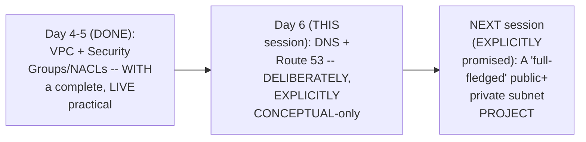

#### 🎯 Key Takeaways

* This episode **DIRECTLY, genuinely CONTINUES** the VPC-focused CONTENT established across DAYS 4-5 — Route 53 is DIRECTLY connected TO the SAME, established REQUEST-path architecture.
* UNLIKE Day 5 (BOTH theory AND a COMPLETE practical), THIS session is **DELIBERATELY, EXPLICITLY conceptual-ONLY** — NO live DEMONSTRATION occurs.
* The instructor **directly, HONESTLY acknowledges** this is a "HIGH level" OVERVIEW — DEEPER details (ROUTING policies, hosted-ZONE specifics) are EXPLICITLY deferred to a FUTURE, PRACTICAL session.

---

### 2. What Is DNS? Route 53 as "DNS as a Service"

#### 📖 Definition — Route 53, Precisely Introduced via an Established Pattern

> 💡 **Given directly:** *"Route 53 on AWS provides DNS as a service... to understand this in a very simple way, when you use EC2, basically AWS provides through EC2 compute as a service, if you are using EKS, AWS provides you Elastic Kubernetes, that is Kubernetes as a service, similarly when you use Route 53, AWS provides you DNS as a service."*

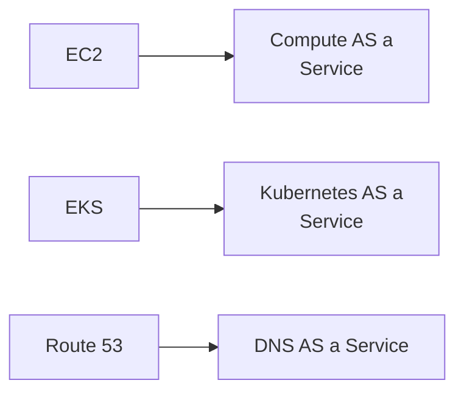

#### 📖 Definition — DNS, Precisely Defined

> 💡 **Given directly:** *"DNS basically stands for domain name system... DNS is something that we keep using... when you use these things you are directly or indirectly actually using DNS."*

#### 🔍 Internal Working — DNS's Own, Precise, Core Function

> 💡 **Given directly:** *"This domain name has to be eventually converted to the IP address, right?... DNS service is the one that maps your domain name with the IP address, or DNS is the one that resolves your domain name to the IP address."*

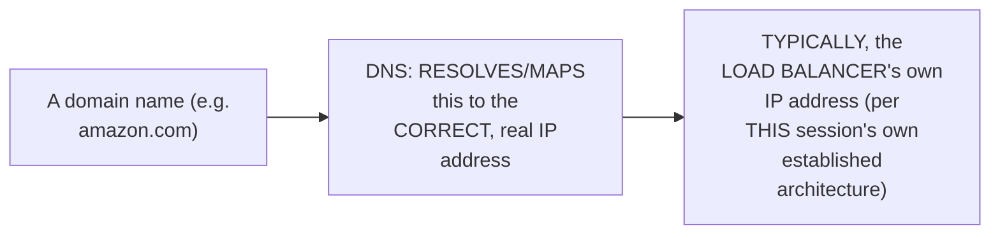

#### ⚠ Common Mistakes

* Assuming DNS is a GENUINELY, entirely NEW, unfamiliar CONCEPT — explicitly, directly clarified: EVERYONE GENUINELY, ALREADY uses DNS "on a DAY-to-day basis" — EVERY TIME they visit a WEBSITE by NAME, rather than BY its OWN, raw IP address.
* Assuming Route 53 is a GENUINELY, entirely NEW category of AWS SERVICE — explicitly, directly, MEMORABLY connected BACK to the SAME "as a SERVICE" pattern ALREADY established BY EC2 and EKS.

#### 🎯 Key Takeaways

* **Route 53** provides **"DNS as a SERVICE"** — DIRECTLY, MEMORABLY analogous TO EC2 ("compute as a SERVICE") and EKS ("Kubernetes as a SERVICE").
* **DNS** ("Domain NAME System") GENUINELY, PRECISELY resolves/MAPS a domain NAME (e.g., amazon.COM) to its CORRESPONDING, REAL IP address.
* In THIS session's own established ARCHITECTURE, DNS TYPICALLY resolves a DOMAIN name to the **LOAD balancer's OWN** IP address — DIRECTLY connecting BACK to Day 4's OWN established REQUEST-path.

---
### 3. Why Domain Names, Not IP Addresses? Two Genuine Reasons

#### ❓ Why It Exists — Reason 1: Memorability

> 💡 **Given directly:** *"Let's say the load balancer is assigned with an IP address called 3.6.10.171, is this IP address easy to remember, or a domain name such as amazon.com is easy to remember?... instead of sharing them this IP address, it will be very easy to share them the domain name."*

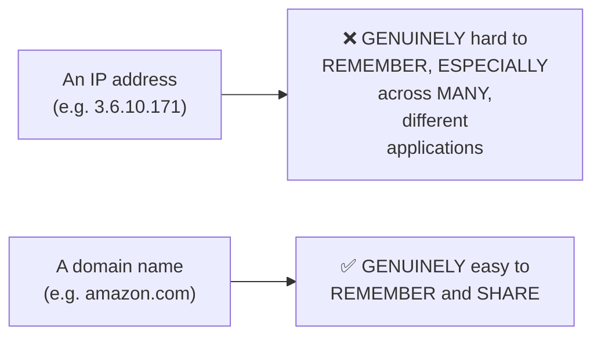

#### ❓ Why It Exists — Reason 2: IP Addresses Can Genuinely Change

> 💡 **Given directly:** *"IP address can be subjected to change, right? IP address can be subjected to change, let's say tomorrow you have restarted your load balancer and you have not assigned a static IP address... IP address can be static or IP address can be dynamic, so to solve again this problem, it is very simple to remember the domain names."*

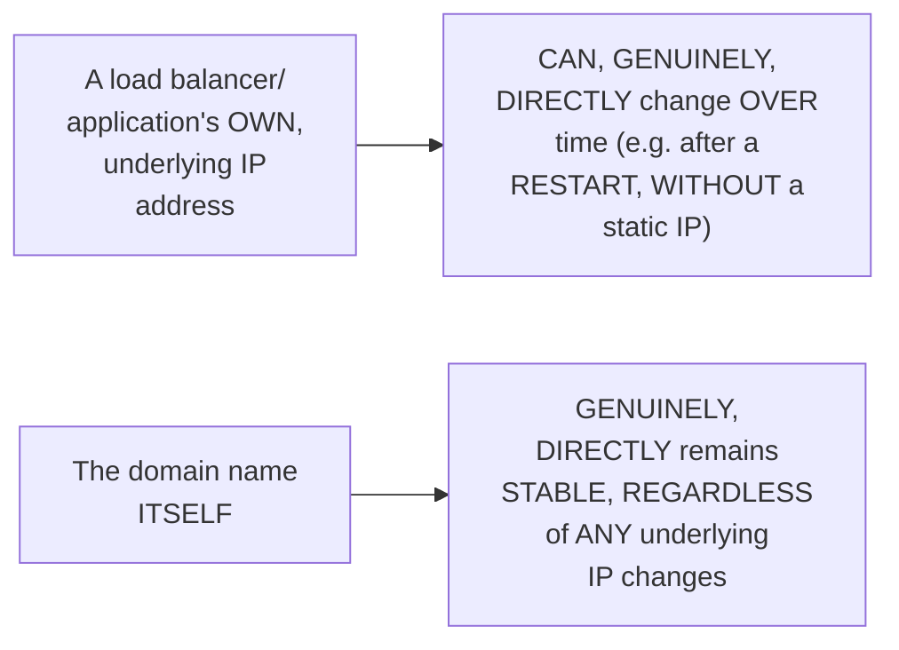

#### ⚠ Common Mistakes

* Assuming ONLY ONE of these TWO reasons (MEMORABILITY) GENUINELY explains WHY domain NAMES are used — explicitly, directly, EXPLICITLY confirmed as TWO, SEPARATE, GENUINE reasons: memorability AND the GENUINE, real possibility of UNDERLYING IP address CHANGE.
* Assuming a LOAD balancer's own IP ADDRESS is ALWAYS genuinely STATIC/permanent — explicitly, directly, HONESTLY clarified: it CAN genuinely CHANGE — e.g., AFTER a RESTART, WITHOUT an EXPLICITLY assigned STATIC IP.

#### 🎯 Key Takeaways

* Domain names are GENUINELY, DIRECTLY preferred over RAW IP addresses for **TWO, precise REASONS**: they're GENUINELY EASIER to REMEMBER, and the UNDERLYING IP address CAN genuinely CHANGE over TIME.
* A REAL, worked EXAMPLE (`3.6.10.171` VERSUS `amazon.com`) directly, CONCRETELY illustrates the MEMORABILITY reason.
* This DIRECTLY, precisely MOTIVATES DNS's own CORE, genuine VALUE — PROVIDING a STABLE, human-FRIENDLY name that REMAINS constant, EVEN as UNDERLYING infrastructure CHANGES.

---

### 4. Where Route 53 Sits: Intercepting & Resolving Requests

#### 🔍 Internal Working — A Precise, Direct Extension of the Established VPC Architecture

> 💡 **Given directly:** *"There is one simple change that will be added to our previous diagram which we have been drawing — that is in front of the load balancer... there will be something called as Route 53... whenever a request comes from the user, let's say user is trying to access amazon.com, Route 53 is the one which intercepts the request, it checks in its DNS records."*

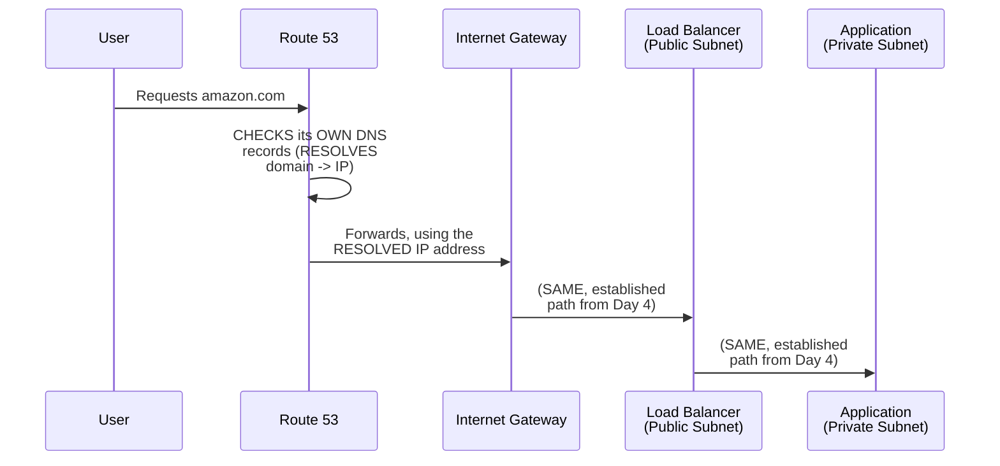

#### 🔍 Internal Working — Precisely Confirming Route 53's Own, Direct Position

> 💡 **Given directly:** *"What is the request? It will try to resolve the DNS name to the IP address of the load balancer and from there the process is same."*

#### ⚠ Common Mistakes

* Assuming Route 53 GENUINELY, DIRECTLY replaces OR eliminates ANY of the PREVIOUSLY-established VPC COMPONENTS (internet GATEWAY, load BALANCER, etc.) — explicitly, directly clarified: it is GENUINELY, SIMPLY ADDED in FRONT of the EXISTING architecture — "FROM there the process is SAME."

#### 🎯 Key Takeaways

* **Route 53** is directly, precisely POSITIONED **in FRONT of** the load BALANCER, WITHIN the COMPLETE request PATH already ESTABLISHED across Days 4-5.
* It GENUINELY **INTERCEPTS** the incoming REQUEST FIRST, RESOLVING the domain NAME to the CORRECT IP address, BEFORE the REQUEST continues THROUGH the REST of the ALREADY-established path.
* THIS addition is directly, PRECISELY confirmed as a SIMPLE, ADDITIVE change — the REST of the REQUEST path REMAINS EXACTLY as ESTABLISHED in EARLIER sessions.

---
### 5. What You'd Need Without Route 53

#### ❓ Why It Exists — A Direct, Honest, Real-World Illustration

> 💡 **Given directly:** *"Let's say today you have written an application on your personal laptop and to make this application available to outside world using the domain name, what are things that you have to do — firstly probably you will go to GoDaddy or some domain seller and firstly you will try to buy a domain name."*

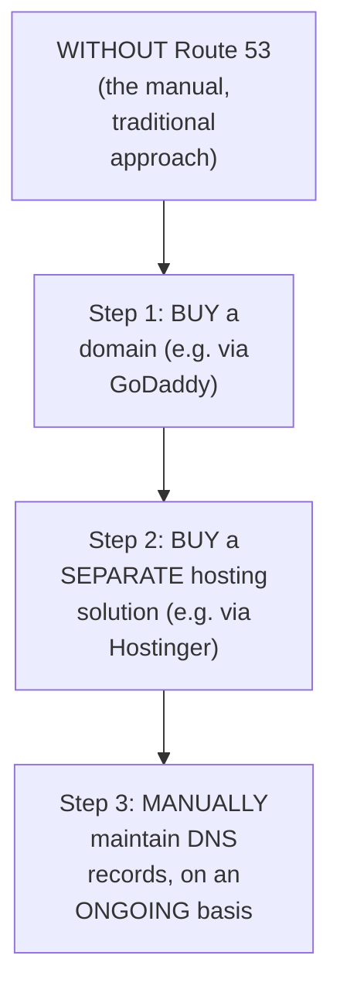

#### 🔍 Internal Working — A Genuine, Real, Relatable Example of the Manual Process

> 💡 **Given directly:** *"If this application is called abhishek.com, firstly you will search for abhishek.com, if you don't have abhishek.com probably you'll search for abhishek.in, if you don't have that probably you'll search for abhishek.cricket... finally you will buy a domain and then once you buy a domain you also need a hosting solution."*

#### 📖 Definition — Route 53's Own, Genuine, Consolidating Value

> 💡 **Given directly:** *"To solve all of these things what AWS said is, okay, don't bother about all of those things, if you are hosting your application on the AWS platform within the VPC or somewhere, we will provide you something called as Route 53."*

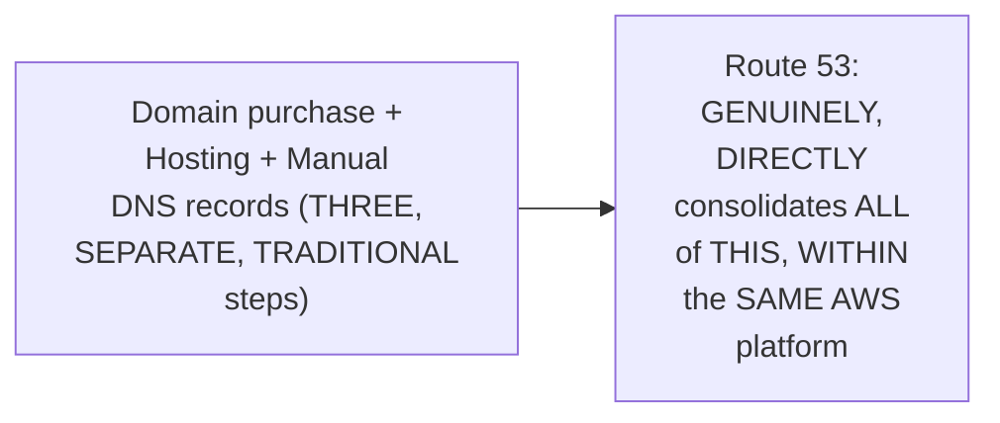

#### ⚠ Common Mistakes

* Assuming DOMAIN registration and DNS management are GENUINELY, NECESSARILY SEPARATE, unrelated PROCESSES — explicitly, directly clarified: Route 53 GENUINELY, DIRECTLY combines BOTH, WITHIN ONE, unified AWS SERVICE.
* Assuming YOU MUST genuinely purchase your OWN domain THROUGH AWS SPECIFICALLY to USE Route 53 — explicitly, directly clarified (Section 6): AWS GENUINELY, DIRECTLY supports EITHER buying THROUGH AWS, OR BRINGING an EXTERNALLY-purchased domain.

#### 🎯 Key Takeaways

* WITHOUT Route 53, ACHIEVING a WORKING, domain-BASED application GENUINELY requires **THREE, separate STEPS**: PURCHASING a domain (e.g., VIA GoDaddy), OBTAINING a SEPARATE hosting SOLUTION, and MANUALLY maintaining DNS RECORDS.
* Route 53's OWN, genuine VALUE is **CONSOLIDATION** — BRINGING all of THIS together WITHIN one, UNIFIED AWS service.
* A REAL, relatable EXAMPLE (searching FOR "abhishek.com," THEN "abhishek.in," THEN "abhishek.CRICKET") directly, CONCRETELY illustrates the GENUINE, real domain-SHOPPING experience THIS session assumes MOST learners have ALREADY encountered.

---

### 6. Route 53's Three Core Capabilities: Domain Registration, Hosted Zones & Health Checks

#### 📖 Definition — Capability 1: Domain Registration

> 💡 **Given directly:** *"First is basically the domain registration itself... either you can purchase the domain name from AWS, or if you already have the domain name that you have purchased let's say two years back three years back from GoDaddy, then Route 53 also says that okay no problem either you can do the domain registration with me or outside."*

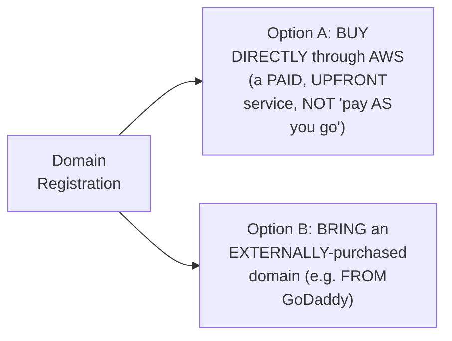

#### 📖 Definition — Capability 2: Hosted Zones

> 💡 **Given directly:** *"In either of the case you have to do hosted zones... in hosted zone you basically create the DNS records, this is exactly where all your DNS mapping and all the things... in future when you make a request... Route 53 goes to the hosted zone and in the hosted zone this Route 53 will look for DNS records."*

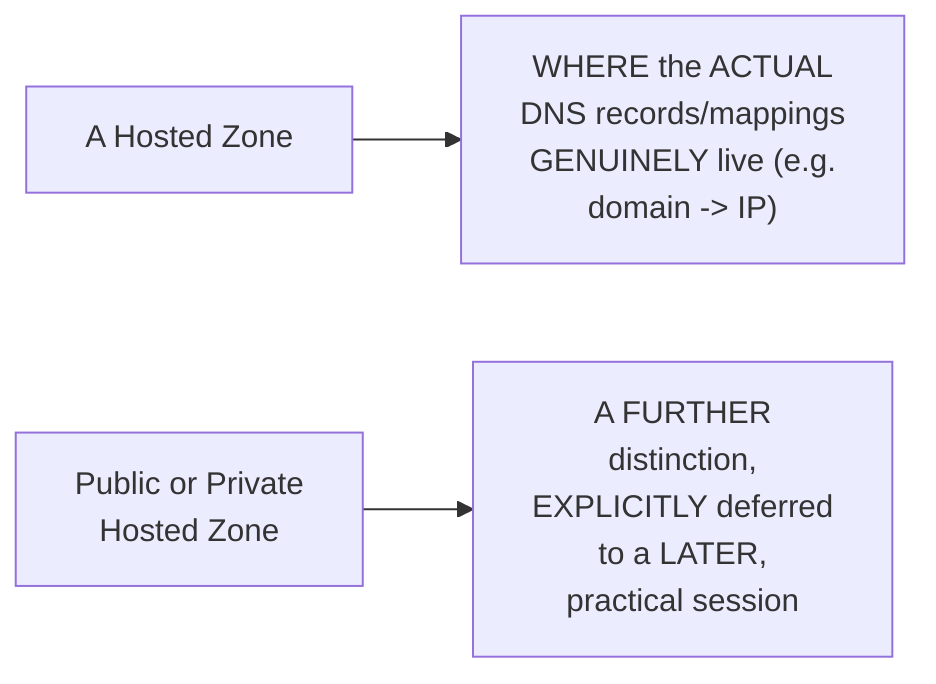

#### 📖 Definition — Capability 3: Health Checks

> 💡 **Given directly:** *"Route 53 also supports something called as health checks... let's say your application is hosted on two different availability zones on two different web servers, so what Route 53 can do is it can simultaneously check the health of these web servers... every one minute, every five minutes, it can send the request to the web servers and see if this web server is active or not."*

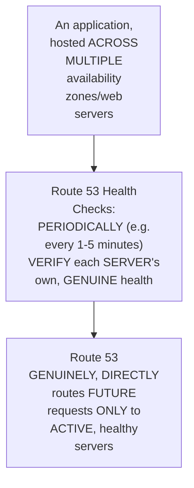

#### ⚠ A Direct, Honest Note on Domain Registration's Own Billing Model

> 💡 **Given directly:** *"This is not, you know, a pay and go kind of service, whereas if you use domain registration you will pay AWS upfront and you will purchase the domain."*

#### ⚠ Common Mistakes

* Assuming domain REGISTRATION through AWS FOLLOWS the SAME "PAY as you GO" billing MODEL as MOST other AWS SERVICES — explicitly, directly, HONESTLY clarified: it's GENUINELY an UPFRONT purchase, NOT a CONTINUOUS, usage-based CHARGE.
* Assuming HOSTED zones are ONLY genuinely NEEDED if you BOUGHT your domain THROUGH AWS SPECIFICALLY — explicitly, directly clarified: "IN EITHER of the CASE you have to DO hosted zones" — REGARDLESS of WHERE the DOMAIN was ORIGINALLY purchased.

#### 🎯 Key Takeaways

* Route 53 provides **THREE, genuine core CAPABILITIES**: **domain REGISTRATION** (BUY through AWS OR bring an EXTERNAL domain — an UPFRONT, NOT pay-as-you-GO, charge), **hosted ZONES** (WHERE the ACTUAL DNS records GENUINELY live), and **health CHECKS** (MONITORING application HEALTH across MULTIPLE servers/AZs).
* **Hosted zones** are GENUINELY, DIRECTLY required REGARDLESS of WHERE the DOMAIN was ORIGINALLY purchased — they're WHERE Route 53 GENUINELY looks UP its OWN DNS records.
* **Health checks** GENUINELY enable Route 53 to ROUTE traffic ONLY to ACTIVE, healthy SERVERS — a REAL, practical CAPABILITY directly, PRECISELY connecting to HIGH-availability concepts ESTABLISHED in EARLIER sessions.

---
### 7. Closing: Tomorrow's Full-Fledged Practical Project

#### 🪜 Step-by-Step — A Direct, Honest, Complete Recap

> 💡 **Given directly:** *"Till now we have done all the concepts, like we have covered an overview of the concepts of VPC, the important ones, and what we will do tomorrow is we will try to perform a project."*

#### 📖 Definition — Precisely Distinguishing Tomorrow's Project From Day 5's Own, Simpler One

> 💡 **Given directly:** *"In day five we did a project but there we only use the public subnet and we use security groups and we try to access it, but in tomorrow's project it will be a very full-fledged project which most of the companies use and even this is something that is constantly asked in interviews — have you implemented the public private subnet architecture in AWS, what exactly is it, how does the traffic flow within the VPC and how your end application actually gets the request."*

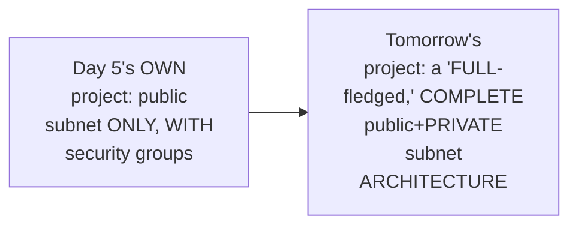

#### 🏢 Real-World / Production Usage — A Genuine, Direct Confirmation of Real Interview Relevance

> 💡 **Given directly:** *"This is something that is constantly asked in interviews — have you implemented the public private subnet architecture in AWS?"*

#### ⚠ Common Mistakes

* Assuming Day 5's OWN, single-public-SUBNET project ALREADY represents a COMPLETE, production-READY architecture — explicitly, directly, HONESTLY clarified (DIRECTLY connecting BACK to Day 5's OWN, explicit ACKNOWLEDGMENT): TOMORROW's project GENUINELY extends THIS into a FAR more COMPLETE, "full-FLEDGED," public-PLUS-private architecture.

#### 🎯 Key Takeaways

* This episode **genuinely, COMPLETELY delivers** its OWN, stated conceptual GOAL — DNS and Route 53, EXPLAINED via THEIR own PRECISE definition, MOTIVATION, and THREE core CAPABILITIES.
* The instructor **directly, EXPLICITLY distinguishes** tomorrow's UPCOMING project FROM Day 5's OWN, simpler, public-subnet-ONLY project — CONFIRMING it will be a "VERY full-FLEDGED" architecture.
* This UPCOMING, complete public+PRIVATE subnet PROJECT is directly, EXPLICITLY confirmed as a **GENUINE, real, COMMONLY-asked interview TOPIC** — DIRECTLY motivating why LEARNERS should GENUINELY prioritize UNDERSTANDING it thoroughly.

---
## 📝 Glossary

| Term | Definition | Why It Matters |
|---|---|---|
| **DNS** | Domain Name System | Resolves/maps a domain name to its corresponding IP address |
| **Route 53** | AWS's own "DNS as a Service" offering | Consolidates domain registration, hosted zones, and health checks |
| **Domain Registration** | Purchasing a domain name | An upfront, NOT pay-as-you-go, AWS charge |
| **Hosted Zone** | Where a domain's own DNS records genuinely live | Required regardless of where the domain was originally purchased |
| **Health Check** | Route 53's periodic verification of server/application health | Enables routing only to active, healthy servers |
| **Public/Private Hosted Zone** | A further distinction within hosted zones | Explicitly deferred to a later, practical session |

---

## 🔄 Revision Notes — One-Minute Revision

* This is **Day 6**, a DELIBERATELY, EXPLICITLY conceptual-only session -- no practical demonstration, unlike Day 5's complete theory-plus-practical structure.
* **Route 53 = "DNS as a Service"** -- directly, memorably analogous to EC2 (compute as a service) and EKS (Kubernetes as a service).
* **DNS**, precisely defined: resolves/maps a domain name (e.g. amazon.com) to its corresponding, real IP address (typically the load balancer's own IP, in this session's established architecture).
* **Why domain names, not IP addresses (2 genuine reasons)**: (1) memorability -- "3.6.10.171" vs. "amazon.com"; (2) IP addresses can genuinely change over time (e.g. after a restart, without a static IP assigned), while the domain name remains stable.
* **Where Route 53 sits**: directly IN FRONT of the load balancer, within the complete request path already established (Days 4-5) -- it intercepts the request FIRST, resolves the domain to an IP, then the rest of the path proceeds exactly as before.
* **Without Route 53**: you'd genuinely need THREE, separate steps -- buy a domain (e.g. GoDaddy), buy a separate hosting solution (e.g. Hostinger), and manually maintain DNS records. Route 53's own genuine value is CONSOLIDATION of all three.
* **Route 53's 3 core capabilities**: (1) Domain Registration -- buy through AWS (an UPFRONT charge, not pay-as-you-go) OR bring an externally-purchased domain; (2) Hosted Zones -- where the actual DNS records/mappings genuinely live, required regardless of where the domain was purchased; (3) Health Checks -- periodically verifying server/application health across multiple AZs, enabling routing only to active, healthy servers.
* **Closing**: this session is honestly, explicitly confirmed as high-level only -- routing policies and deeper hosted-zone details are deferred to a future, practical session. Tomorrow's class is explicitly confirmed as a "full-fledged" public+private subnet project -- genuinely more complete than Day 5's own, simpler, public-subnet-only project -- and directly named as a common, real interview topic.

---

## 📋 Cheat Sheet

**The "as a service" pattern:**
```text
EC2      -> Compute as a Service
EKS      -> Kubernetes as a Service
Route 53 -> DNS as a Service
```

**Why domain names, not IP addresses:**
```text
1. Memorability: "amazon.com" vs. "3.6.10.171"
2. IP addresses CAN genuinely change over time; domain names remain stable
```

**Where Route 53 sits:**
```text
User -> Route 53 (intercepts, resolves domain -> IP) -> Internet Gateway
-> Load Balancer -> Application (the SAME, established path from Day 4)
```

**Without Route 53, you'd genuinely need:**
```text
1. A purchased domain (e.g. via GoDaddy)
2. A separate hosting solution (e.g. via Hostinger)
3. Manually maintained DNS records
```

**Route 53's 3 core capabilities:**
```text
1. Domain Registration -- buy via AWS (upfront charge) OR bring an external domain
2. Hosted Zones -- where the actual DNS records/mappings live
3. Health Checks -- periodic server/application health verification
```

---

## 🔥 Interview Questions & Answers

### 🟢 Beginner

**Q1.**

**Question:** What does Route 53 genuinely provide?

**Answer:** DNS as a Service.

**Explanation:** Directly, explicitly stated.

**Why Interviewers Ask This:** The most basic, foundational Route 53 question.

**Possible Follow-up:** "What other AWS services follow this same 'as a service' naming pattern?"

**Q2.**

**Question:** What does DNS genuinely do?

**Answer:** Resolves/maps a domain name to its corresponding IP address.

**Explanation:** Directly, precisely explained.

**Why Interviewers Ask This:** Foundational, frequently-tested DNS knowledge.

**Possible Follow-up:** "What IP address does DNS typically resolve to, in a load-balanced architecture?"

**Q3.**

**Question:** What are the two genuine reasons domain names are used instead of raw IP addresses?

**Answer:** Memorability, and the fact that IP addresses can genuinely change over time.

**Explanation:** Directly, precisely explained.

**Why Interviewers Ask This:** Basic, essential DNS motivation knowledge.

**Possible Follow-up:** "Give a concrete, real example of an IP address genuinely changing."

**Q4.**

**Question:** Where does Route 53 genuinely sit, within the complete request path?

**Answer:** In front of the load balancer -- it intercepts the request first, resolving the domain to an IP.

**Explanation:** Directly, precisely explained.

**Why Interviewers Ask This:** Basic, essential VPC/DNS architecture knowledge.

**Possible Follow-up:** "What happens to the request after Route 53 resolves the domain?"

**Q5.**

**Question:** Name Route 53's three core capabilities.

**Answer:** Domain registration, hosted zones, and health checks.

**Explanation:** Directly, explicitly named.

**Why Interviewers Ask This:** Basic, essential Route 53 feature knowledge.

**Possible Follow-up:** "What does a hosted zone genuinely contain?"

**Q6.**

**Question:** Can you use Route 53 with a domain purchased outside of AWS?

**Answer:** Yes -- Route 53 genuinely supports bringing an externally-purchased domain.

**Explanation:** Directly, explicitly confirmed.

**Why Interviewers Ask This:** Tests genuine, practical Route 53 flexibility knowledge.

**Possible Follow-up:** "Do you still need a hosted zone, even if you didn't buy the domain through AWS?"

**Q7.**

**Question:** Is Route 53's own domain registration a pay-as-you-go service?

**Answer:** No -- it's an upfront charge.

**Explanation:** Directly, honestly clarified.

**Why Interviewers Ask This:** Tests genuine, practical AWS billing awareness.

**Possible Follow-up:** "How does this genuinely differ from most other AWS services' own billing model?"

**Q8.**

**Question:** What does a Route 53 health check genuinely do?

**Answer:** Periodically verifies whether a server/application is active, enabling routing only to healthy servers.

**Explanation:** Directly, precisely explained.

**Why Interviewers Ask This:** Basic, practical Route 53 capability knowledge.

**Possible Follow-up:** "How often might a health check genuinely run?"

**Q9.**

**Question:** What three, separate things would you genuinely need to manage WITHOUT Route 53?

**Answer:** A purchased domain, a separate hosting solution, and manually maintained DNS records.

**Explanation:** Directly, precisely explained.

**Why Interviewers Ask This:** Tests genuine understanding of Route 53's own consolidating value.

**Possible Follow-up:** "What is Route 53's own, genuine value proposition, in one sentence?"

**Q10.**

**Question:** Is a hosted zone required only if you bought your domain through AWS?

**Answer:** No -- it's genuinely required regardless of where the domain was originally purchased.

**Explanation:** Directly, explicitly clarified.

**Why Interviewers Ask This:** Tests attention to a commonly-overlooked, genuine detail.

**Possible Follow-up:** "What does a hosted zone genuinely store?"

---

### 🟡 Intermediate

**Q11.**

**Question:** Explain why the instructor deliberately introduces Route 53 using the SAME "as a service" pattern already established by EC2 and EKS, rather than introducing it as a genuinely new kind of concept.

**Answer:** This is a genuinely deliberate, CONTINUITY-preserving teaching choice, DIRECTLY consistent with a PATTERN seen ACROSS this instructor's OWN, broader series (e.g., connecting NEW concepts BACK to ALREADY-established ones). By DIRECTLY, EXPLICITLY connecting Route 53 to the SAME "as a SERVICE" naming CONVENTION learners ALREADY, GENUINELY understand FROM EC2 and EKS, the instructor ENSURES the LEARNER can IMMEDIATELY, CONFIDENTLY grasp Route 53's own GENERAL purpose (AWS MANAGING a COMPLEX capability ON your BEHALF) WITHOUT needing to LEARN an ENTIRELY new mental MODEL. This directly, GENUINELY reduces cognitive LOAD and REINFORCES a broader, TRANSFERABLE pattern — "X AS a service" GENERALLY means AWS is HANDLING the UNDERLYING complexity OF X, so YOU don't have TO.

**Explanation:** Requires recognizing a deliberate, connective teaching choice linking a new concept to an already-familiar naming pattern.

**Why Interviewers Ask This:** Tests whether a learner recognizes the pedagogical value of connecting new AWS services to already-understood naming conventions.

**Possible Follow-up:** "Name ANOTHER AWS service (BEYOND EC2, EKS, and Route 53) that LIKELY follows THIS same 'as a service' NAMING pattern, and explain WHAT complexity it LIKELY abstracts away."

**Q12.**

**Question:** A learner argues that since IP addresses "can change," this means EVERY application's own IP address changes frequently and unpredictably, making domain names an absolute necessity for ALL applications. Evaluate this claim.

**Answer:** This claim overstates the case, missing a GENUINE, important NUANCE this session's own content DIRECTLY implies. Section 3's own PRECISE language is CAREFULLY conditional: "IP address CAN be subjected to CHANGE... let's say TOMORROW you have RESTARTED your load balancer and you have NOT assigned a STATIC IP address" — this DIRECTLY, EXPLICITLY describes a SPECIFIC, CONDITIONAL scenario (a RESTART, WITHOUT a STATIC IP CONFIGURED), NOT a UNIVERSAL, GUARANTEED behavior FOR every APPLICATION. In FACT, AWS GENUINELY offers static (Elastic) IP options FOR resources that GENUINELY need a PERMANENT, unchanging ADDRESS. The ACCURATE, more PRECISE conclusion: domain NAMES remain GENUINELY valuable EVEN for applications WITH static IPs (PRIMARILY for MEMORABILITY, per Section 3's OWN FIRST reason), but the "IP addresses CAN change" REASON specifically APPLIES to scenarios WHERE a STATIC IP has NOT been EXPLICITLY configured — NOT as a UNIVERSAL, guaranteed PROPERTY of ALL cloud infrastructure.

**Explanation:** Tests whether a learner correctly interprets the conditional nature of the "IP addresses can change" reasoning, rather than treating it as a universal, guaranteed behavior.

**Why Interviewers Ask This:** Distinguishes candidates who understand the precise, conditional scope of a stated reason from those who over-generalize it into an absolute rule.

**Possible Follow-up:** "What AWS feature GENUINELY allows a resource to have a PERMANENT, unchanging IP address, DESPITE this session's own 'IP addresses can change' framing?"

**Q13.**

**Question:** Explain, precisely, why the instructor deliberately, honestly frames THIS session as "high level," EXPLICITLY deferring routing policies and deeper hosted-zone details, rather than attempting to cover Route 53 exhaustively in one session.

**Answer:** This is a genuinely deliberate, HONEST scoping choice, DIRECTLY consistent with a PATTERN seen ACROSS this instructor's OWN, broader series (e.g., Day 4's OWN, deliberately theory-only STRUCTURE, WITH practicals EXPLICITLY deferred). By DIRECTLY, HONESTLY acknowledging the LIMITS of THIS specific session's OWN scope, the instructor PREVENTS a GENUINELY common, real RISK — LEARNERS assuming they've RECEIVED a COMPLETE, exhaustive UNDERSTANDING of Route 53, WHEN in FACT SIGNIFICANT, PRACTICAL depth (ROUTING policies, hosted-ZONE specifics) REMAINS genuinely UNCOVERED. This directly, HONESTLY sets ACCURATE expectations, and DIRECTLY motivates the NEXT, planned session's OWN, more COMPLETE, practical TREATMENT.

**Explanation:** Requires recognizing the deliberate value of honest scope-setting, connecting it to a consistent pattern across this instructor's own series.

**Why Interviewers Ask This:** Tests whether a learner recognizes the pedagogical and practical value of honestly acknowledging a session's own limited scope, rather than implying false completeness.

**Possible Follow-up:** "What GENUINE, real risk might arise if a learner assumed THIS session's own, high-level content was GENUINELY sufficient for a REAL, production Route 53 deployment?"

**Q14.**

**Question:** Using this session's own precise "health checks" reasoning (Section 6), explain a GENUINE, real scenario where Route 53's own health-check capability would DIRECTLY complement the high-availability concepts already established in Day 4's own VPC content.

**Answer:** A precise, reasoned scenario, directly connecting TWO, separately-established sections: per Day 4's own PRECISE reasoning (ALREADY established IN this workspace), AVAILABILITY zones EXIST SPECIFICALLY to provide HIGH availability — PROTECTING against a SINGLE zone's own, GENUINE failure. Per THIS session's own PRECISE health-check REASONING (Section 6), Route 53 CAN genuinely, PERIODICALLY verify WHETHER a SPECIFIC web server (WITHIN a SPECIFIC availability ZONE) is GENUINELY active. SYNTHESIZING these TWO facts directly, PRECISELY reveals a GENUINE, real, COMPLETE high-availability WORKFLOW: an application DEPLOYED across MULTIPLE availability ZONES (per Day 4's own established REASONING) GENUINELY, PRACTICALLY benefits FROM Route 53's own health CHECKS, WHICH can GENUINELY detect WHEN one ZONE's own server GENUINELY fails, and AUTOMATICALLY route FUTURE traffic ONLY to the REMAINING, healthy ZONE(S) — a DIRECT, PRACTICAL completion of the high-availability GOAL Day 4's own AVAILABILITY-zone content ORIGINALLY established, but did NOT, on its OWN, fully EXPLAIN how TRAFFIC would GENUINELY, AUTOMATICALLY be redirected AWAY from a FAILED zone.

**Explanation:** Requires synthesizing Route 53's own health-check capability with the earlier, established availability-zone concept to construct a complete, practical high-availability workflow.

**Why Interviewers Ask This:** A senior-level question testing whether a candidate can connect Route 53's own specific capability to a broader, previously-established architectural goal.

**Possible Follow-up:** "What GENUINE, additional Route 53 feature (beyond THIS session's own explicit content) might FURTHER refine HOW traffic is DISTRIBUTED across MULTIPLE, healthy availability zones SIMULTANEOUSLY?"

**Q15.**

**Question:** Synthesize this session's complete "Route 53 sits in front of the load balancer" reasoning (Section 4) with its own "domain registration is upfront, not pay-as-you-go" reasoning (Section 6) to explain a GENUINE, real cost-planning implication for a team launching a new, public-facing application.

**Answer:** A precise, synthesized explanation, directly connecting TWO, separately-established sections: per Section 4's own precise POSITIONING, Route 53 GENUINELY sits AT the VERY beginning OF the complete request PATH — MEANING it's ONE of the FIRST, real DECISIONS a team MUST make WHEN launching a NEW, public-facing APPLICATION (BEFORE users can EVEN reach the LOAD balancer/application). Per Section 6's own PRECISE, honest BILLING clarification, DOMAIN registration is GENUINELY an UPFRONT charge — UNLIKE MOST other AWS services' OWN, familiar "pay AS you go" MODEL (e.g., EC2's own HOURLY billing, per EARLIER sessions). SYNTHESIZING these TWO facts directly, PRECISELY reveals a GENUINE, real cost-PLANNING implication: a team's OWN, EARLY-stage budget PLANNING for a NEW application launch MUST genuinely, DIRECTLY account FOR this UPFRONT, one-time domain COST SEPARATELY from their ONGOING, usage-based INFRASTRUCTURE costs (EC2, load BALANCER, etc.) — a GENUINE, PRACTICAL distinction EASILY overlooked IF a team ASSUMES ALL AWS costs GENERALLY follow the SAME, familiar, PAY-as-you-go PATTERN.

**Explanation:** Requires synthesizing Route 53's own early-path position with its own upfront billing model to identify a genuine, practical cost-planning implication.

**Why Interviewers Ask This:** A senior-level question testing whether a candidate can connect Route 53's own architectural position with its own distinct billing model to reason about practical, real-world budget planning.

**Possible Follow-up:** "What OTHER, GENUINE AWS cost (beyond domain registration) might ALSO, SIMILARLY require UPFRONT, rather than usage-based, budget PLANNING?"

---

### 🔴 Advanced

**Q16.**

**Question:** Design a complete, reasoned Route 53 setup plan (using ONLY this session's own established concepts) for a company that already owns a domain purchased from GoDaddy three years ago, and is now migrating their application to AWS.

**Answer:** A reasonable, complete plan, directly applying this session's OWN, exact established CONCEPTS:

```text
1. DO NOT re-purchase the domain through AWS (per Section 6's own
   established OPTION B -- "you can do the domain registration with me
   OR outside") -- the EXISTING GoDaddy domain can genuinely be REUSED.

2. CREATE a hosted zone in Route 53 (per Section 6's own established
   REQUIREMENT -- "IN EITHER of the case you have to DO hosted zones"),
   REGARDLESS of the domain's own, EXTERNAL origin.

3. WITHIN the hosted zone, CONFIGURE the necessary DNS records,
   MAPPING the domain to the NEW, AWS-hosted application's own load
   balancer IP (per Section 4's own established RESOLUTION mechanism).

4. UPDATE the domain's own NAMESERVER settings AT GoDaddy (a step
   BEYOND this session's own explicit content, but a DIRECT, LOGICAL
   requirement for POINTING an EXTERNALLY-registered domain TOWARD
   Route 53's own hosted zone).

5. IF the application is DEPLOYED across MULTIPLE availability zones
   (per Day 4's own established HIGH-availability reasoning), CONFIGURE
   Route 53 health checks (per Section 6's own established mechanism)
   to MONITOR each zone's own server health.
```

This complete PLAN directly, precisely APPLIES every ESTABLISHED Route 53 concept FROM this session — CONFIRMING that AN EXTERNALLY-purchased domain REMAINS fully USABLE, WHILE STILL requiring a HOSTED zone and (IF applicable) health CHECKS.

**Explanation:** Requires synthesizing every major Route 53 concept from this session into one complete, reasoned migration plan for a realistic, external-domain scenario.

**Why Interviewers Ask This:** A realistic, senior-level question testing whether a candidate can apply Route 53 concepts to a genuine, common real-world migration scenario.

**Possible Follow-up:** "What GENUINE, real risk might arise DURING the nameserver-UPDATE step, if it's NOT performed CAREFULLY (e.g., causing TEMPORARY application DOWNTIME)?"

**Q17.**

**Question:** Critically evaluate: "Since this session confirms Route 53 consolidates domain registration, hosting, and DNS management, this means using Route 53 is UNCONDITIONALLY, ALWAYS the better choice over managing these components separately (e.g., GoDaddy + a separate hosting provider)." Is this an accurate, complete characterization?

**Answer:** Not fully accurate — this session's OWN content GENUINELY, DIRECTLY supports Route 53's OWN, real CONVENIENCE benefit, but does NOT genuinely CLAIM it's UNCONDITIONALLY superior in EVERY, possible SCENARIO. Section 6's own PRECISE, HONEST framing DIRECTLY confirms domain REGISTRATION through AWS is an UPFRONT charge — a team ALREADY, GENUINELY comfortable MANAGING a separate DOMAIN registrar (e.g., GoDaddy) and HOSTING provider MIGHT genuinely find NO real, PRACTICAL benefit in SWITCHING, PARTICULARLY if their OWN, EXISTING workflow is ALREADY well-established and FUNCTIONING correctly. The GENUINE, real VALUE of Route 53 (per Section 5's own established REASONING) is SPECIFICALLY for TEAMS ALREADY hosting THEIR application ON AWS — CONSOLIDATING DNS management WITHIN the SAME platform GENUINELY reduces OPERATIONAL complexity FOR that SPECIFIC scenario. The ACCURATE, more PRECISE conclusion: Route 53 is GENUINELY, PRACTICALLY valuable FOR teams ALREADY invested IN the AWS ecosystem — NOT UNCONDITIONALLY superior FOR every, POSSIBLE hosting SCENARIO regardless of context.

**Explanation:** Tests whether a learner recognizes that Route 53's own consolidation benefit is genuinely most valuable within a specific context (AWS-hosted applications), rather than an unconditional, universal superiority claim.

**Why Interviewers Ask This:** Distinguishes candidates who correctly scope a service's own genuine value to its appropriate context from those who over-generalize convenience into unconditional superiority.

**Possible Follow-up:** "Describe a GENUINE, real scenario where a team might REASONABLY choose to KEEP their DNS management SEPARATE from Route 53, DESPITE hosting their application ON AWS."

**Q18.**

**Question:** Synthesize this session's complete "Route 53 as DNS as a Service" reasoning (Section 2) with its own "hosted zones required regardless of domain origin" reasoning (Section 6) to construct a reasoned explanation of WHY Route 53's own architecture GENUINELY separates "domain OWNERSHIP" (registration) from "domain RESOLUTION" (hosted zones), RATHER than treating them as ONE, unified step.

**Answer:** A precise, synthesized explanation, directly connecting TWO, separately-established sections: per Section 2's own PRECISE "AS a service" REASONING, Route 53's own CORE, defining PURPOSE is GENUINELY, SPECIFICALLY about DNS RESOLUTION (MAPPING domain NAMES to IP addresses) — NOT necessarily about domain OWNERSHIP itself. Per Section 6's own PRECISE, DIRECT confirmation, HOSTED zones are GENUINELY, STRUCTURALLY required "IN EITHER of the CASE" — WHETHER the DOMAIN was purchased THROUGH AWS or EXTERNALLY. This directly, precisely REVEALS a GENUINE, DELIBERATE architectural SEPARATION: domain REGISTRATION (per Section 6's OWN "option A OR option B" FRAMING) is GENUINELY about LEGAL/administrative OWNERSHIP of the NAME itself, WHEREAS a HOSTED zone is GENUINELY, SPECIFICALLY about the TECHNICAL, DNS-resolution FUNCTION — MAPPING that NAME to real INFRASTRUCTURE. By KEEPING these TWO, genuinely DIFFERENT concerns STRUCTURALLY separate, Route 53's OWN architecture GENUINELY allows MAXIMUM flexibility — a DOMAIN'S own OWNERSHIP can REMAIN with ANY registrar (AWS OR external), WHILE its OWN, technical DNS RESOLUTION can STILL be MANAGED through Route 53's OWN, dedicated hosted-ZONE mechanism, WITHOUT requiring BOTH concerns to be BUNDLED, INSEPARABLY, into ONE, single SERVICE relationship.

**Explanation:** Requires synthesizing Route 53's own core DNS-resolution purpose with the "hosted zones required regardless of domain origin" detail to explain a genuine, deliberate architectural separation between ownership and resolution.

**Why Interviewers Ask This:** A capstone-level question testing whether a candidate can identify and explain a genuine, deliberate architectural design choice by connecting two, separately-established facts.

**Possible Follow-up:** "What GENUINE, practical flexibility does THIS architectural separation provide, for a team that WANTS to switch domain REGISTRARS in the FUTURE, WITHOUT disrupting their EXISTING DNS resolution setup?"

---

## 🧪 Scenario-Based Interview Questions

> **Scenario 1:** A colleague reports that after migrating their externally-purchased domain to point at a new, AWS-hosted application, the domain genuinely still resolves to their OLD, previous hosting provider, days after the migration. Using this session's concepts, diagnose the most likely cause.

**Structured Answer:**
1. **Initial investigation:** Recognize this as directly connected to Section 6's own precise "hosted ZONE required, regardless OF domain origin" reasoning — CONFIRM whether a HOSTED zone was GENUINELY, correctly created and CONFIGURED in Route 53.
2. **Metrics/logs to check:** Directly VERIFY the DOMAIN's own NAMESERVER settings AT the ORIGINAL registrar (e.g., GoDaddy), CONFIRMING whether they GENUINELY point TO Route 53's own NAMESERVERS.
3. **Possible causes:** Per Section 6's own established REQUIREMENT, this is LIKELY either a MISSING/misconfigured HOSTED zone, OR the ORIGINAL registrar's OWN nameserver SETTINGS were NEVER genuinely updated TO point AT Route 53.
4. **Debugging approach:** Directly USE a DNS lookup tool TO confirm WHICH nameservers the DOMAIN is CURRENTLY, genuinely pointing TO.
5. **Resolution:** UPDATE the domain's OWN nameserver settings AT the ORIGINAL registrar to POINT to Route 53's OWN nameservers, and ALLOW sufficient TIME for DNS propagation (a GENUINE, real, time-dependent PROCESS).
6. **Prevention:** Establish a standing team PRACTICE of EXPLICITLY documenting and VERIFYING nameserver UPDATES as a REQUIRED step, WHENEVER migrating an EXTERNALLY-registered domain TOWARD Route 53 — DIRECTLY addressing a STEP this session's own content GESTURES toward, but does NOT explicitly, fully COVER (per Advanced Q16's own IDENTIFIED gap).

> **Scenario 2 (Advanced):** Your organization is planning to launch a new, public-facing application with a hard, non-negotiable launch date, and a colleague suggests purchasing the domain "at the last minute" to save on unnecessary early costs. Using this session's own concepts, construct a complete, reasoned recommendation.

**Structured Answer:**
1. **Initial investigation:** Recognize this as DIRECTLY connected to Section 6's own precise "domain REGISTRATION is UPFRONT, not PAY-as-you-go" reasoning, COMBINED with Section 4's own PRECISE "Route 53 sits AT the VERY beginning of the request PATH" positioning.
2. **Relevant principle:** Per Section 4's own established POSITIONING, DOMAIN/DNS setup is GENUINELY one of the FIRST, foundational STEPS in a WORKING, public-facing APPLICATION — NOT a task that CAN genuinely be DEFERRED to the VERY last MOMENT.
3. **Possible risks:** DNS PROPAGATION (per Scenario 1's own established REASONING) is a GENUINE, real, TIME-dependent process — WAITING until the "LAST minute" GENUINELY, DIRECTLY risks the APPLICATION being UNREACHABLE by its OWN domain name AT the launch DATE, EVEN if the UNDERLYING application ITSELF is READY.
4. **Debugging/evaluation approach:** Directly ESTIMATE the GENUINE, real TIME required FOR domain purchase, HOSTED-zone configuration, and DNS PROPAGATION, WORKING backward FROM the hard LAUNCH date.
5. **Resolution:** RECOMMEND purchasing the DOMAIN and CONFIGURING Route 53 WELL in ADVANCE of the launch DATE — NOT "at the LAST minute" — DIRECTLY avoiding the GENUINE risk of DNS-related delays JEOPARDIZING the hard LAUNCH deadline.
6. **Prevention:** Establish a standing team PRACTICE of TREATING domain/DNS setup as an EARLY-stage, FOUNDATIONAL project TASK — DIRECTLY connecting Section 4's own "Route 53 sits AT the beginning" POSITIONING to REAL, practical PROJECT-planning timelines.

---

## 🛠 Hands-on Exercises

### 🟢 Easy

1. Write out, from memory, the "as a service" pattern connecting EC2, EKS, and Route 53.
2. Explain, in your own words, the two genuine reasons domain names are used instead of raw IP addresses.
3. List Route 53's three core capabilities, with a one-sentence description of each.

### 🟡 Medium

4. Draw a complete, labeled diagram showing where Route 53 sits within the complete request path, connecting it to Day 4's own established VPC architecture.
5. Write a short explanation (150-200 words) of what you would genuinely need to manage without Route 53, and why Route 53 consolidates these steps.
6. Research AWS's own official Route 53 documentation (as the instructor directly recommends), and identify at least 3 additional details not covered in this session.

### 🔴 Advanced

7. Complete the full, reasoned Route 53 setup plan proposed in Advanced Interview Q16, for your own, real or hypothetical domain.
8. Implement the debugging scenario proposed in Scenario 1 -- research the genuine, real steps for updating nameserver settings at a domain registrar, to point toward Route 53.
9. Research and document (beyond this session's own content) Route 53's own routing policies (e.g., weighted, latency-based, failover), directly extending this session's own honestly-acknowledged, deferred scope.

---

## 🏗 Practice Assignment

### Build: "Complete Conceptual Mastery of DNS & Route 53, Ahead of Tomorrow's Full Project"

**Objective:** Directly solidify this session's own conceptual foundation, ahead of the next session's own "full-fledged" public+private subnet project.

**Requirements:**
- Write out, from memory, the complete definition of DNS and Route 53.
- Draw a complete, labeled diagram showing Route 53's own position within the complete request path.
- Write a short comparison (150-200 words) of the "with Route 53" versus "without Route 53" workflows.
- Research AWS's own official Route 53 documentation, as directly recommended by the instructor.
- A written reflection (150-200 words) on how Route 53 connects to and extends the VPC architecture already established in Days 4-5.

**Architecture (suggested):**

```text
aws_day6_dns_route53_assignment/
├── dns_route53_definitions.md          # your from-memory definitions
├── request_path_diagram.md                # your labeled diagram
├── with_without_comparison.md                # your comparison
└── REFLECTION.md                                # your written reflection
```

**Expected Functionality:**
- Your written explanations should reflect genuine, personal understanding, not simply restated transcript quotes.

**Challenges:**
- Correctly explaining why domain names remain valuable even for applications with static IPs.
- Correctly distinguishing domain registration from hosted zones.

**Bonus Improvements:**
- If you have access to a real domain, walk through creating a Route 53 hosted zone for it (even without a live application to point it at).
- Research Route 53's own health-check configuration options, ahead of the next session's own, more complete practical.

---

## 📚 Additional Resources

- **Days 4-5 of this series** (in this same workspace) -- the direct prerequisite sessions, establishing the complete VPC request-path architecture this session directly builds on.
- **AWS's own official Route 53 documentation** (directly recommended by the instructor) -- "AWS has a wonderful documentation about Route 53 where you can understand Route 53 in very detail with a lot of practical examples."
- **The next session in this series** (explicitly promised) -- a complete, "full-fledged" public+private subnet practical project.

---

## 📌 Final Revision Sheet

### ⭐ Core Concepts
- **Route 53**: DNS as a Service, following the same pattern as EC2/EKS.
- **DNS**: resolves domain names to IP addresses.
- **Why domain names**: memorability + IP addresses can genuinely change.
- **Route 53's position**: in front of the load balancer, in the established request path.
- **Route 53's 3 capabilities**: domain registration, hosted zones, health checks.

### ⭐ Important Definitions
- **Hosted Zone, Health Check** (see Glossary for full definitions).

### ⭐ Important Commands/Code
```text
(This session is entirely conceptual; no CLI/code syntax was taught -- deferred to the next, practical session.)
```

### ⭐ Architecture/Process
- Complete request flow: User -> Route 53 (resolves domain -> IP) -> Internet Gateway -> Load Balancer -> Application (the same, established path from Day 4, with Route 53 added at the front).

### ⭐ Best Practices
- Set up domain/DNS configuration early in a project timeline, not "at the last minute," given DNS propagation delays.
- Remember hosted zones are required regardless of where a domain was purchased.
- Budget domain registration as an upfront cost, separate from ongoing, usage-based infrastructure costs.

### ⭐ Common Mistakes
- Assuming IP addresses always, universally change (the reasoning is conditional, tied to lacking a static IP).
- Assuming domain registration follows AWS's typical pay-as-you-go billing model (it's upfront).
- Assuming hosted zones are only needed for AWS-purchased domains.
- Assuming this session's own high-level content is sufficient for a complete, production Route 53 deployment.

### ⭐ Interview Points
- Be ready to explain DNS and Route 53's own precise definitions.
- Be ready to explain the two genuine reasons domain names are preferred over IP addresses.
- Be ready to name and describe Route 53's three core capabilities.
- Be ready to explain why the next session's "public private subnet architecture" is a commonly-asked, real interview topic.

### ⭐ Things to Remember
- This is genuinely a **deliberately, explicitly conceptual-only session** — no practicals today, honestly acknowledged as "high level."
- **Route 53's own position** — directly in front of the load balancer — connects seamlessly to the complete VPC architecture already established in Days 4-5.
- The **next session** is explicitly, directly confirmed as a "full-fledged" public+private subnet project — genuinely more complete than Day 5's own project, and a commonly-asked, real interview topic.

---

## 🔗 Source

- [DNS or Route53](https://youtu.be/6BoTfTtNsGU?si=DEAk4gG9oM1y6D7c)