# 🏗 AWS Zero to Hero — Day 7: A Complete, Production-Grade Project (Full Implementation)

- <i>**Series:** AWS Zero to Hero (Day 7 of a stated 30-day series, direct continuation of Days 0-6) · 
- **Instructor:** Abhishek
- **Note on scope:** This is genuinely the **"full-FLEDGED" project** EXPLICITLY promised at the CLOSE of Day 6 — a COMPLETE, real, LIVE implementation of a PRODUCTION-grade AWS architecture, BRINGING together EVERY concept established ACROSS Days 0-6 (EC2, VPC, public/PRIVATE subnets, security GROUPS, load BALANCERS) — PLUS THREE, genuinely NEW/deepened concepts INTRODUCED at a "SUMMARY" level SPECIFICALLY for THIS project: **Auto Scaling GROUPS**, a MORE complete treatment OF **Load Balancers**, and a GENUINELY new concept, **Bastion HOSTS**. The instructor HIMSELF directly CONFIRMS this is "the MOST recommended APPROACH by AWS" for SECURELY deploying applications, and DIRECTLY, EXPLICITLY connects it to REAL, common INTERVIEW expectations.</i>

---

## 📑 Table of Contents

1. [Session Overview](#-session-overview)
2. [Learning Objectives](#-learning-objectives)
3. [Detailed Notes](#-detailed-notes)
   - [1. Session Context: Day 7 — The Complete, Production-Grade Capstone Project](#1-session-context-day-7--the-complete-production-grade-capstone-project)
   - [2. The Complete Architecture: Two Availability Zones & Why They Matter](#2-the-complete-architecture-two-availability-zones--why-they-matter)
   - [3. Three Components at Summary Level: Auto Scaling Groups, Load Balancers & Bastion Hosts](#3-three-components-at-summary-level-auto-scaling-groups-load-balancers--bastion-hosts)
   - [4. Building the VPC: A Complete, Live Walkthrough (Including a Real Troubleshooting Moment)](#4-building-the-vpc-a-complete-live-walkthrough-including-a-real-troubleshooting-moment)
   - [5. Elastic IPs: A Precise, Genuine Definition](#5-elastic-ips-a-precise-genuine-definition)
   - [6. Creating a Launch Template & Auto Scaling Group](#6-creating-a-launch-template--auto-scaling-group)
   - [7. The Bastion Host: A Complete, Live SSH Walkthrough](#7-the-bastion-host-a-complete-live-ssh-walkthrough)
   - [8. Deploying the Application — Deliberately, to Only One Instance](#8-deploying-the-application--deliberately-to-only-one-instance)
   - [9. Creating the Application Load Balancer & Target Group (With Two Genuine, Live Troubleshooting Moments)](#9-creating-the-application-load-balancer--target-group-with-two-genuine-live-troubleshooting-moments)
   - [10. The Complete, Live Success Test & an Honest Explanation of Health-Check Behavior](#10-the-complete-live-success-test--an-honest-explanation-of-health-check-behavior)
   - [11. Closing: The Assignment & What's Next](#11-closing-the-assignment--whats-next)
4. [Glossary](#-glossary)
5. [Revision Notes — One-Minute Revision](#-revision-notes--one-minute-revision)
6. [Cheat Sheet](#-cheat-sheet)
7. [Interview Questions & Answers](#-interview-questions--answers)
8. [Scenario-Based Interview Questions](#-scenario-based-interview-questions)
9. [Hands-on Exercises](#-hands-on-exercises)
10. [Practice Assignment](#-practice-assignment)
11. [Additional Resources](#-additional-resources)
12. [Final Revision Sheet](#-final-revision-sheet)

---

## 🎯 Session Overview

This CAPSTONE episode brings EVERY concept from Days 0-6 TOGETHER into ONE, COMPLETE, REAL, production-GRADE deployment. It covers:

1. **A COMPLETE architecture OVERVIEW**: a VPC with PUBLIC and PRIVATE subnets ACROSS **TWO availability ZONES** (a DIRECT upgrade FROM earlier, single-AZ DEMOS) — DIRECTLY, PRECISELY explained AS protecting AGAINST a SINGLE availability ZONE's own, GENUINE failure.
2. **THREE, genuinely NEW/deepened CONCEPTS**, introduced AT a "summary" LEVEL SPECIFICALLY for THIS project: **Auto Scaling GROUPS** (AUTOMATICALLY managing INSTANCE count BASED on demand), a MORE complete TREATMENT of **Load BALANCERS**, and a GENUINELY new CONCEPT — **Bastion HOSTS** (a SECURE "jump HOST" enabling SSH access TO private-subnet INSTANCES WITHOUT giving them PUBLIC IPs).
3. **A COMPLETE, live, REAL VPC build** — USING "VPC and MORE" WITH two AVAILABILITY zones, TWO public/PRIVATE subnets, and ONE NAT gateway PER zone — INCLUDING a GENUINE, live TROUBLESHOOTING moment (HITTING an Elastic IP LIMIT, resolved BY releasing OLD IPs).
4. **Elastic IPs**, precisely DEFINED as a STATIC IP address THAT genuinely REMAINS the SAME, even IF the underlying INSTANCE changes OR restarts.
5. **A COMPLETE, live LAUNCH template and Auto SCALING Group** — DEPLOYING TWO EC2 instances INTO the PRIVATE subnet, ONE per AVAILABILITY zone, WITHOUT any DIRECT load-BALANCER attachment YET.
6. **A COMPLETE, live BASTION-host walkthrough** — CREATING a SEPARATE, public-IP-ENABLED instance, COPYING the SSH key VIA `scp`, and SSH-ing THROUGH it INTO a PRIVATE-subnet instance.
7. **A DELIBERATE, real DEPLOYMENT choice**: installing the APPLICATION on ONLY ONE of the TWO private instances — SPECIFICALLY to LATER, LIVE-demonstrate HOW a load balancer's OWN health CHECK behaves.
8. **A COMPLETE, live APPLICATION Load Balancer and TARGET Group setup** — INCLUDING **TWO, genuine, LIVE troubleshooting MOMENTS** (a WRONG target-group PORT, and a MISSING security-group INBOUND rule) — ENDING in a REAL, successful APPLICATION access TEST.

> 💡 **Key framing, given directly, on this project's own genuine, real-world importance:** *"This is also the most recommended approach by AWS if you want to deploy your applications securely in a EC2 instance... this is the entire architecture that even I am trying to explain here, so you can pause the video here and you can also just read through this entire thing so that you can explain this same thing when interviewers ask you in the interview process."*

---

## 🎯 Learning Objectives

By the end of this guide, you will be able to:

- [ ] Explain why a production VPC architecture genuinely uses two availability zones, not one.
- [ ] Explain Auto Scaling Groups, Load Balancers, and Bastion Hosts at a working, summary level.
- [ ] Build a complete, real VPC with public/private subnets across two AZs.
- [ ] Explain what an Elastic IP is, and why NAT Gateways genuinely need one.
- [ ] Create a launch template and Auto Scaling Group, deploying instances into a private subnet.
- [ ] Use a Bastion Host to securely SSH into a private-subnet instance.
- [ ] Create an Application Load Balancer and Target Group, and correctly diagnose common, real configuration errors.
- [ ] Explain why a load balancer's own health check might route traffic away from an unhealthy instance.

---

## 📚 Detailed Notes

### 1. Session Context: Day 7 — The Complete, Production-Grade Capstone Project

#### 🧠 Concept

> 💡 **Given directly, opening the session:** *"Today is day 7 of AWS Zero to Hero series and in this video I'll show you how to implement a real-time production grade AWS project... we will see how to use all the concepts that we have learned till today, that means from day 0 to day 6."*

#### 🪜 Step-by-Step — A Direct, Honest Framing of What's Genuinely New Today

> 💡 **Given directly:** *"Before I jump onto the video you should know about these four things because I covered these things in the day 0 to day 6, but I did not cover them to an extent that it is registered for everyone. Bastion is something that I did not cover at all, but the other three things I covered but not to the fullest."*

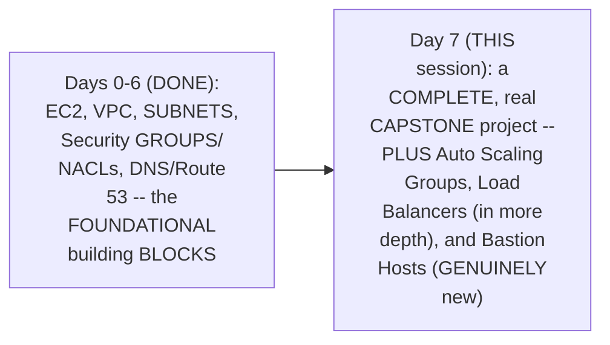

#### 🎯 Key Takeaways

* This is genuinely the **CAPSTONE project** EXPLICITLY promised at the CLOSE of Day 6 — DIRECTLY, EXPLICITLY confirmed as "the MOST recommended APPROACH by AWS" for SECURE EC2 deployment.
* THREE concepts (Auto SCALING groups, load BALANCERS, Bastion HOSTS) are directly, HONESTLY introduced at a **"summary" LEVEL** — SUFFICIENT to COMPLETE this PROJECT, but EXPLICITLY deferred to FUTURE, DEDICATED sessions for FULL depth.
* This project is directly, EXPLICITLY confirmed as GENUINE, real **interview MATERIAL** — the instructor DIRECTLY encourages LEARNERS to "EXPLAIN this SAME thing WHEN interviewers ASK you."

---

### 2. The Complete Architecture: Two Availability Zones & Why They Matter

#### 🔍 Internal Working — A Complete, Precise, High-Level Architecture Summary

> 💡 **Given directly:** *"First we will create a VPC that has public subnets as well as private subnets in two availability zones... in the public subnet what we will do is we'll deploy a NAT Gateway and a load balancer... and in the private subnet you will launch these applications using an auto scaling group."*

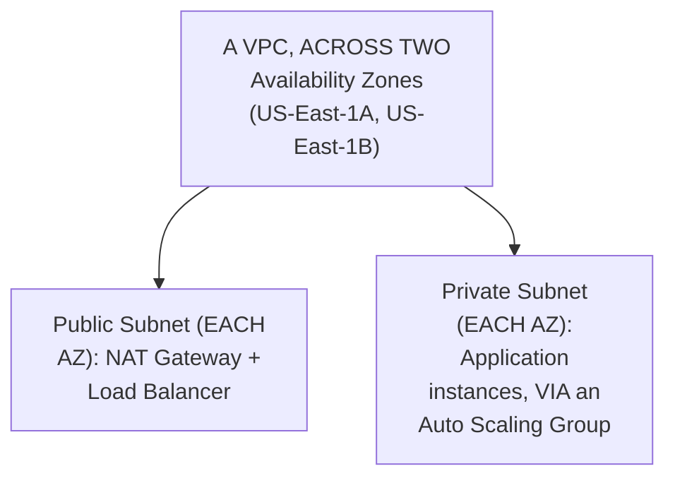

#### ❓ Why It Exists — The Precise, Genuine Reason for TWO Availability Zones

> 💡 **Given directly:** *"Why I need two availability zones, you can ask me — Abhishek, when you explain the theory part, you were just using one VPC... and that too in one single availability zone. But when you do this in production, you need to create two availability zones instead of one, so that for some reason if the data center of AWS in a specific region or the availability zone of AWS in a specific region goes down, you will still have the other availability zone that is serving the traffic for you."*

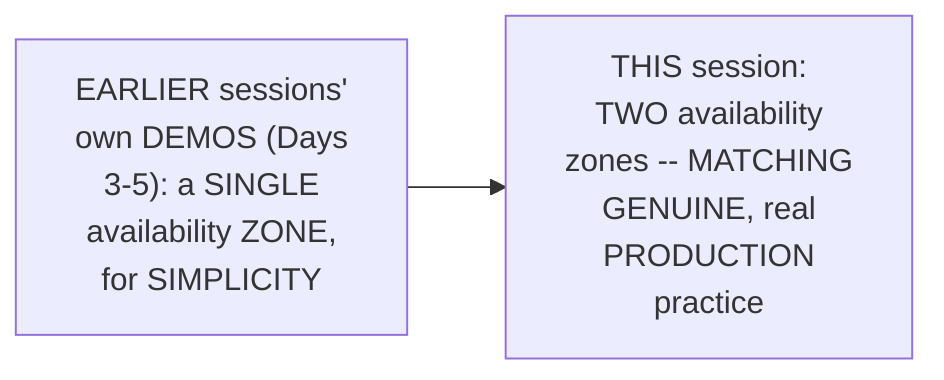

#### ⚠ Common Mistakes

* Assuming the SINGLE-availability-ZONE demos FROM earlier SESSIONS (Days 3-5) GENUINELY represent PRODUCTION-ready ARCHITECTURE — explicitly, directly, HONESTLY clarified: THOSE were DELIBERATE SIMPLIFICATIONS FOR learning; REAL production DEPLOYMENTS GENUINELY require MULTIPLE availability ZONES.

#### 🎯 Key Takeaways

* This project's OWN, COMPLETE architecture GENUINELY, DIRECTLY upgrades EARLIER sessions' OWN single-AZ SIMPLIFICATIONS INTO a REAL, TWO-availability-zone DESIGN.
* The PRECISE, genuine REASON: PROTECTING against a SINGLE availability ZONE's own, REAL failure — IF one zone GOES down, the OTHER GENUINELY continues SERVING traffic.
* The COMPLETE architecture PLACES **NAT gateways and LOAD balancers** in the PUBLIC subnet, and **application INSTANCES** (via an AUTO Scaling Group) in the PRIVATE subnet — DIRECTLY, PRECISELY mirroring Day 4's OWN established REQUEST-path REASONING.

---
### 3. Three Components at Summary Level: Auto Scaling Groups, Load Balancers & Bastion Hosts

#### 📖 Definition — Auto Scaling Group, Precisely Introduced

> 💡 **Given directly:** *"Order scaling group is — you can just understand it as a concept — let's say you want to deploy your application into availability zones, instead of creating your EC2 instance two times, what you can do is you can just tell the auto scaling group that, okay, create minimum of two replicas, and in case my application receives more requests... what auto scaling group can do is it immediately can take a decision and scale your servers."*

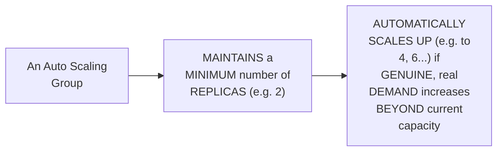

#### 📖 Definition — Load Balancer, Precisely Re-Introduced

> 💡 **Given directly:** *"Load balancer takes the responsibility of sending 50 requests here and 50 requests here... or you can say send 60 requests here, 40 requests here... apart from that, using load balancer you can also do path-based routing, host-based routing, different kinds of routing mechanisms which we will cover in depth."*

#### 📖 Definition — Bastion Host, Genuinely New, Precisely Introduced

> 💡 **Given directly:** *"These EC2 instances that we are creating are created in a private subnet, so they don't have a public IP address, we cannot SSH into these instances directly. So what we will do is, because we want to keep them secure, we will not create any public IP address for them, but we will create a Bastion host or just a jump host in this public subnet, and through that Bastion or jump host we will connect to this EC2 instance."*

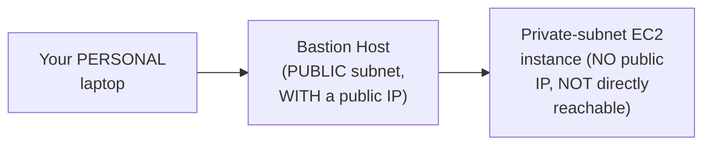

#### ❓ Why It Exists — The Precise, Genuine, Additional Benefits of a Bastion Host

> 💡 **Given directly:** *"There are multiple advantages of using Bastion host... if you use Bastion host instead of directly connecting to the server, you can connect from the Bastion so that there will be a proper logging mechanism, you can do proper auditing of who is accessing this private subnet, you can configure a bunch of rules in that Bastion host where the traffic actually moves."*

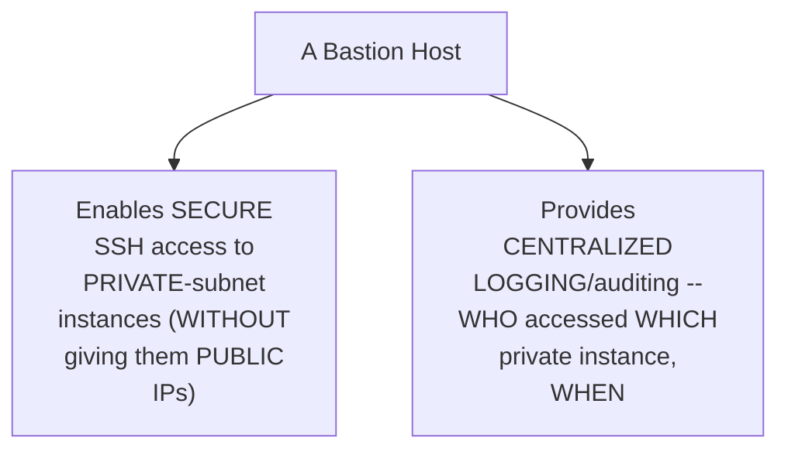

#### ⚠ Common Mistakes

* Assuming a PRIVATE-subnet EC2 instance can GENUINELY, DIRECTLY be SSH'd into, JUST like a PUBLIC-subnet one — explicitly, directly, PRECISELY clarified: it GENUINELY LACKS a public IP ADDRESS — a BASTION host is GENUINELY, STRUCTURALLY required as an INTERMEDIARY.
* Assuming a BASTION host's OWN value is PURELY about ENABLING access — explicitly, directly clarified: it ALSO provides a GENUINE, real SECURITY benefit — CENTRALIZED logging AND auditing of PRIVATE-subnet access.

#### 🎯 Key Takeaways

* **Auto SCALING groups** GENUINELY maintain a MINIMUM instance COUNT, AUTOMATICALLY scaling UP based on REAL, growing DEMAND.
* **Load BALANCERS** distribute TRAFFIC across MULTIPLE instances — WITH path-BASED/host-based ROUTING mentioned as a FUTURE, deeper TOPIC.
* **Bastion HOSTS** (GENUINELY NEW in this session) enable SECURE SSH access TO private-subnet instances (WHICH GENUINELY lack PUBLIC IPs) — PROVIDING a GENUINE, additional SECURITY benefit VIA centralized LOGGING/auditing.

---

### 4. Building the VPC: A Complete, Live Walkthrough (Including a Real Troubleshooting Moment)

#### 🪜 Step-by-Step — Configuring "VPC and More" for This Specific Project

> 💡 **Given directly:** *"AWS creates a public private subnet in US East 1A availability zone, and it will also create a public subnet and private subnet in US East 1B as well... number of availability zones, it is 2 that I require... number of public subnets, two... number of private subnets, two... NAT gateways, yes, I want one NAT gateway in one particular availability zone, so let's say one per availability zone."*

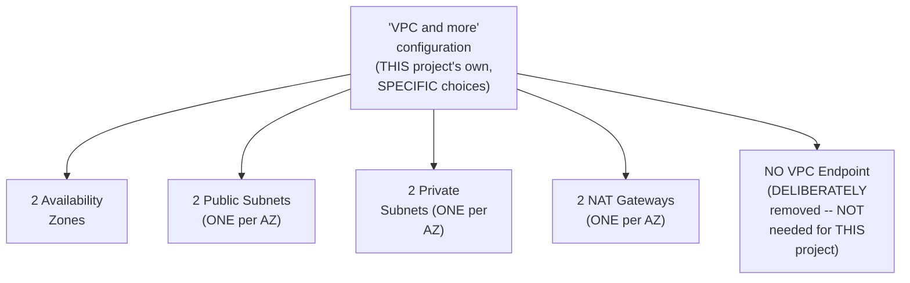

#### ⚠ A Direct, Honest, Live-Encountered Error & Its Fix

> 💡 **Given directly:** *"Maximum number of addresses have been reached... there is an issue here while I was creating the VPC — the number of public elastic IP addresses is reached — so let me go here and release some elastic IP addresses... these are some previous projects that I was doing, so let me release those IP addresses."*

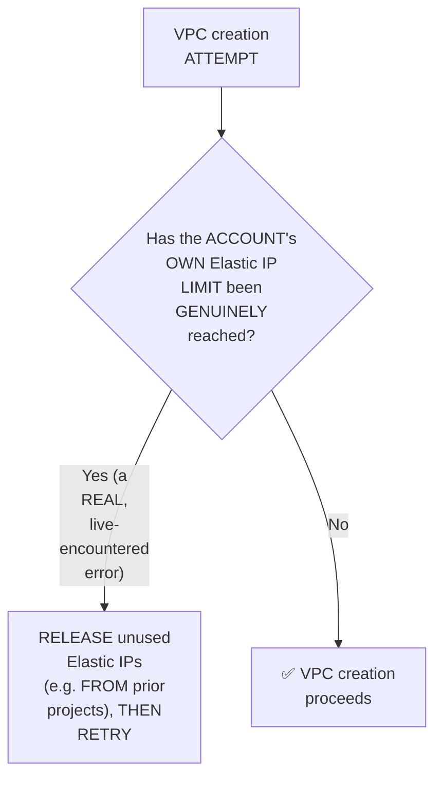

#### ⚠ Common Mistakes

* Assuming REMOVING the DEFAULT "VPC ENDPOINT for S3" option is GENUINELY a REQUIRED part OF every VPC SETUP — explicitly, directly, HONESTLY clarified: it's DELIBERATELY removed HERE SPECIFICALLY because "THIS project has NOTHING to DO with VPC endpoint."
* Assuming AWS ACCOUNTS GENUINELY have UNLIMITED Elastic IP CAPACITY — explicitly, directly, LIVE-demonstrated as FALSE: a REAL, ACCOUNT-level limit was GENUINELY hit, REQUIRING the RELEASE of UNUSED IPs FROM prior PROJECTS before PROCEEDING.

#### 🎯 Key Takeaways

* THIS project's OWN, SPECIFIC "VPC and MORE" configuration GENUINELY uses **TWO availability ZONES**, TWO public/PRIVATE subnets EACH, and **ONE NAT gateway PER availability zone**.
* The VPC ENDPOINT for S3 (AWS's OWN, default SUGGESTION) is **DELIBERATELY removed** — SINCE it's GENUINELY, DIRECTLY unrelated to THIS project's OWN, specific SCOPE.
* A REAL, GENUINE "Elastic IP LIMIT reached" error was **LIVE-encountered and RESOLVED** — HONESTLY demonstrating a REAL, PRACTICAL AWS account CONSTRAINT, and its GENUINE fix (RELEASING unused IPs FROM prior projects).

---
### 5. Elastic IPs: A Precise, Genuine Definition

#### 📖 Definition — Elastic IP, Precisely Defined

> 💡 **Given directly:** *"What is elastic IP address? Elastic IP address in AWS is nothing but an IP address that will remain the same even if the instance is deleted... in general it does not remain the same, but if you are using elastic IP address then the IP address will remain same. In very simple language, if I have to explain in a plain English, elastic IP address can be called as a static IP address because it never changes."*

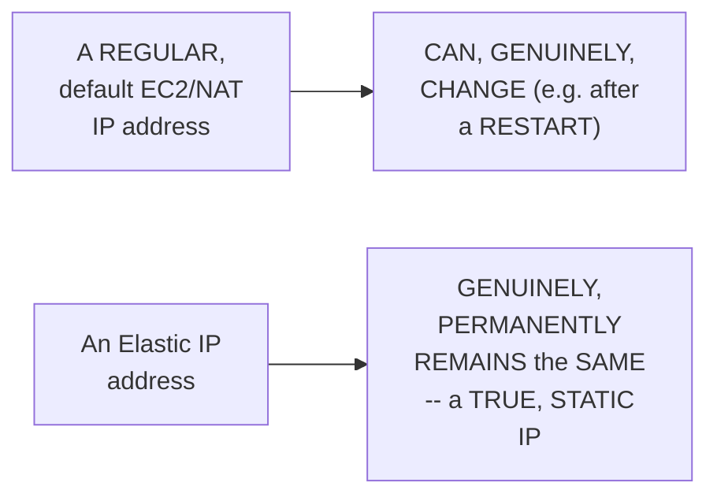

#### 🔍 Internal Working — Precisely WHERE This Project Genuinely Uses an Elastic IP

> 💡 **Given directly:** *"In this case, the elastic IP address, in my example, it will get attached to the NAT Gateway, because, like I explained you, what is NAT Gateway — it will mask the IP address of my EC2 instance or the applications with the public IP address of the NAT Gateway. So this is where the VPC is using the elastic IP address."*

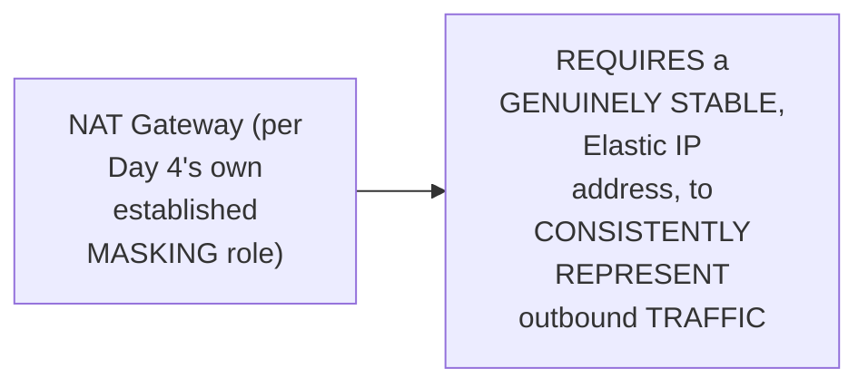

#### ⚠ Common Mistakes

* Assuming a REGULAR (non-ELASTIC) IP address GENUINELY, ALWAYS remains STABLE, REGARDLESS of instance CHANGES — explicitly, directly, PRECISELY clarified: "IN general it does NOT remain the SAME" — Elastic IPs are SPECIFICALLY needed WHEN genuine STABILITY is REQUIRED.

#### 🎯 Key Takeaways

* An **Elastic IP** is precisely a **STATIC IP address** — GENUINELY, PERMANENTLY remaining the SAME, EVEN if the UNDERLYING instance is DELETED or RESTARTED.
* THIS project's OWN, SPECIFIC VPC configuration GENUINELY, DIRECTLY attaches an Elastic IP to EACH **NAT gateway** — ENSURING its OWN, masking IP ADDRESS remains GENUINELY, CONSISTENTLY stable.
* This directly, precisely CONNECTS back to Day 4's OWN established NAT-Gateway REASONING — the NAT gateway's OWN masking FUNCTION GENUINELY, STRUCTURALLY requires a STABLE, Elastic IP to WORK correctly.

---

### 6. Creating a Launch Template & Auto Scaling Group

#### 🪜 Step-by-Step — Creating a Launch Template

> 💡 **Given directly:** *"Auto scaling group in AWS cannot be created directly, you can use launch template — why do you need launch template? Because you can use this launch template across multiple auto scaling groups, or this template acts as a reference."*

```bash
# Launch Template configuration (THIS project's own, specific choices):
# Name: AWS-prod-example
# AMI: Ubuntu
# Instance type: FREE-tier eligible
# Key pair: (your own, existing key)
# Security Group: NEW -- with TWO inbound rules:
#   - SSH (port 22), source: anywhere
#   - Custom TCP (port 8000), source: anywhere (the APPLICATION's own port)
```

#### 🪜 Step-by-Step — Creating the Auto Scaling Group Itself

> 💡 **Given directly:** *"Which VPC do you want to choose? You want to choose the VPC that you have created... availability zones and subnets in which you want this EC2 instances to be available — where this EC2 instances should be there? If you go to the diagram, they should be there in the private subnet."*

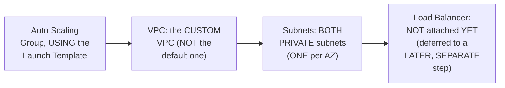

#### 🔍 Internal Working — Desired, Minimum & Maximum Capacity, Precisely Explained

> 💡 **Given directly:** *"Specify the size of auto scaling group by changing the desired capacity, okay, so let's say you want two EC2 instances, select this as two... let's say during Christmas or during Diwali, or some other festival occasions, if you receive a lot of traffic, then auto scaling... can automatically go up to maximum capacity of three instances and four instances."*

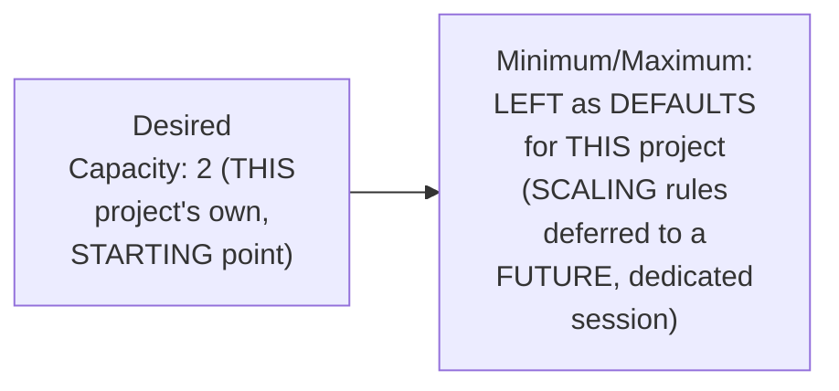

#### 🔍 Internal Working — A Genuine, Real, Live-Confirmed Result

> 💡 **Given directly:** *"Let's go to the AWS EC2 and see if this auto scaling group indeed has created two instances for us or not... yes, there are two instances... one of the instance is created in US East 1A and the other instance is created in US East 1B."*

#### ⚠ Common Mistakes

* Assuming an AUTO Scaling group can be CREATED DIRECTLY, WITHOUT a LAUNCH template — explicitly, directly, PRECISELY clarified: it GENUINELY, STRUCTURALLY requires a LAUNCH template FIRST, WHICH can THEN be REUSED across MULTIPLE, different Auto SCALING groups.
* Assuming a LOAD balancer MUST be attached DURING Auto-Scaling-GROUP creation — explicitly, directly, LIVE-demonstrated as OPTIONAL/deferrable: "I will NOT attach ANY load balancer HERE... I'll attach LOAD balancer in a DIFFERENT context."

#### 🎯 Key Takeaways

* Auto SCALING groups GENUINELY, STRUCTURALLY require a **LAUNCH template FIRST** — REUSABLE across MULTIPLE auto-scaling GROUPS.
* THIS project's OWN Auto SCALING group DEPLOYS instances INTO the **PRIVATE subnets SPECIFICALLY** (ACROSS both AZs) — WITH a **desired CAPACITY of 2** (min/MAX left at DEFAULTS, deferred to a FUTURE session).
* A REAL, live TEST directly, CONCRETELY confirmed **TWO instances, ONE per AVAILABILITY zone** — DIRECTLY, PRACTICALLY fulfilling THIS project's own established, TWO-AZ architecture GOAL.

---
### 7. The Bastion Host: A Complete, Live SSH Walkthrough

#### 🪜 Step-by-Step — Creating the Bastion Host Itself

> 💡 **Given directly:** *"Go back to the EC2 console, click on the instances, and start creating a Bastion host, launch instance... call it Bastion host, choose Ubuntu as the image... make sure you add a security group which has access to SSH... make sure this Bastion host is created in the same VPC... auto-assign public IP address, yes, enable — without public IP address it will not be of no use."*

```bash
# Bastion Host configuration:
# Name: Bastion host
# AMI: Ubuntu | Instance type: T2 micro
# Key pair: AWS_login (the SAME key used throughout this series)
# Security Group: SSH access (port 22)
# VPC: the SAME, custom VPC (CRITICAL -- must match)
# Auto-assign public IP: YES (REQUIRED -- otherwise it's "of no use")
```

#### 🪜 Step-by-Step — Copying the SSH Key to the Bastion Host (via SCP)

> 💡 **Given directly:** *"I'll copy my key value pair to the Bastion host as well, why? Because if the Bastion host does not have the key value pair... how can it log into the private host? Key value pair is in my personal instance, so what I'll do, firstly I'll show you — I'll use a shell command called SCP."*

```bash
# From your OWN, personal laptop:
scp -i AWS_login.pem AWS_login.pem ubuntu@<bastion_public_ip>:~
```

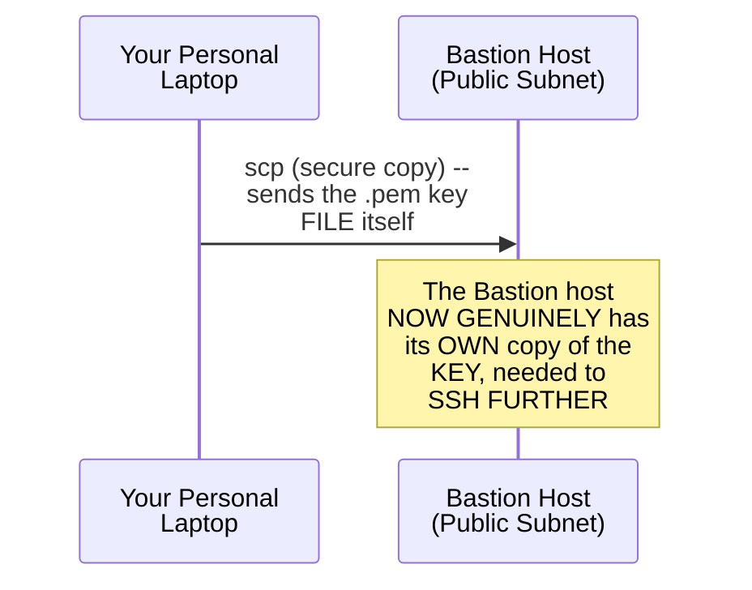

#### 🪜 Step-by-Step — SSH-ing INTO the Bastion, Then FROM the Bastion Into a Private Instance

> 💡 **Given directly:** *"Let's go to the Bastion host and see if it is copied or not — how do I log into the Bastion host? Just copy this IP address again, SSH minus I, your key value pair, PEM file location, Ubuntu at the rate, this IP address... take the private IP address, SSH minus I AWS PEM file, Ubuntu at the rate, private IP address — see, I am able to log into this specific instance with the private IP address."*

```bash
# Step 1: SSH into the Bastion host (using its PUBLIC IP):
ssh -i AWS_login.pem ubuntu@<bastion_public_ip>

# Step 2 (FROM WITHIN the Bastion host): SSH into the private instance
# (using its PRIVATE IP -- the key file was ALREADY copied there in the prior step):
ssh -i AWS_login.pem ubuntu@<private_instance_private_ip>
```

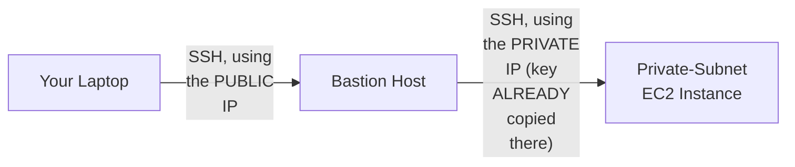

#### ⚠ Common Mistakes

* Assuming YOU can GENUINELY SSH DIRECTLY from your OWN laptop INTO a PRIVATE-subnet instance, USING its PRIVATE IP address — explicitly, directly, STRUCTURALLY clarified: THIS is GENUINELY, ARCHITECTURALLY impossible — the PRIVATE IP is ONLY reachable FROM WITHIN the SAME VPC (e.g., FROM the Bastion HOST itself).
* Forgetting to COPY the SSH key FILE to the BASTION host BEFORE attempting the SECOND SSH hop — explicitly, directly, LIVE-demonstrated as a REQUIRED, PREREQUISITE step — WITHOUT it, the BASTION cannot GENUINELY authenticate INTO the private INSTANCE.

#### 🎯 Key Takeaways

* The COMPLETE, real BASTION workflow GENUINELY requires **THREE steps**: CREATE the Bastion HOST (WITH a public IP, in the SAME VPC), **COPY the SSH key** to it (VIA `scp`), THEN **SSH through it** (using the PRIVATE instance's OWN, private IP address).
* This is directly, LIVE-demonstrated as **GENUINELY, SUCCESSFULLY working** — CONFIRMED via a REAL, SUCCESSFUL login TO a private-SUBNET instance, USING its OWN private IP.
* This directly, PRECISELY completes Section 3's OWN, established BASTION-host CONCEPT — TURNING the THEORETICAL explanation INTO a REAL, working, hands-ON capability.

---

### 8. Deploying the Application — Deliberately, to Only One Instance

#### 🪜 Step-by-Step — A Complete, Real Deployment of a Simple HTML/Python Application

> 💡 **Given directly:** *"All that I'll do is install the Python application here — very simple one... let's pick up a very simple HTML page... I'll pick up a random example... let's take this one, copy this entire thing and put this in my file... let me say that my first AWS project to demonstrate apps in private subnet."*

```bash
# On the PRIVATE-subnet instance (accessed via the Bastion host):
# 1. Create/edit index.html, with custom content:
#    "My first AWS project to demonstrate apps in private subnet"
# 2. Run a simple Python HTTP server:
python3 -m http.server 8000
```

#### ❓ Why It Exists — A Direct, Honest, Deliberate Explanation of This Choice

> 💡 **Given directly:** *"I have logged into only one of the instance because, while using load balancer, I want to demonstrate that traffic is going to one particular instance — it is hitting and giving you back the response, whereas when it goes to the other particular application in a different subnet, it is giving you an error response because this page is not available."*

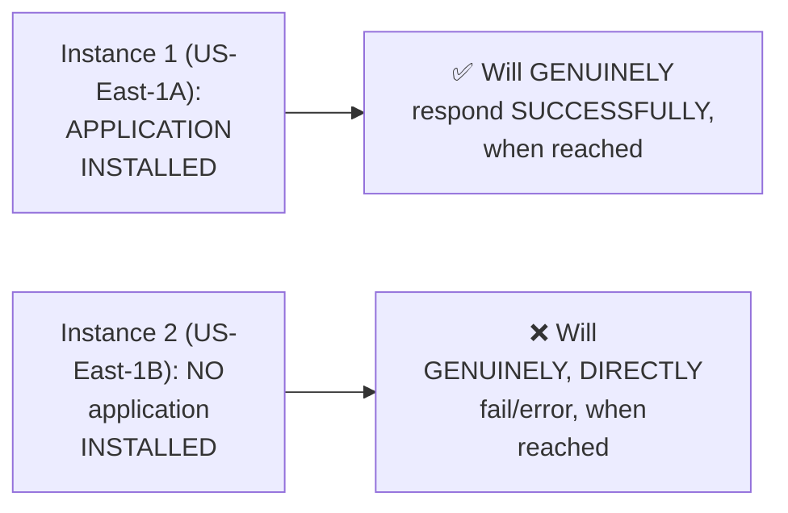

#### ⚠ Common Mistakes

* Assuming this ASYMMETRIC deployment (ONE instance WITH the app, ONE without) is a GENUINE MISTAKE or OVERSIGHT — explicitly, directly, HONESTLY clarified as a **DELIBERATE, intentional TEACHING choice** — SPECIFICALLY to LATER demonstrate LOAD-balancer health-CHECK behavior (Section 10).

#### 🎯 Key Takeaways

* THIS session's own APPLICATION deployment is **DELIBERATELY, INTENTIONALLY asymmetric** — ONLY ONE of the TWO private INSTANCES genuinely RECEIVES the application.
* This CHOICE directly, PRECISELY sets UP a LATER, IMPORTANT teaching MOMENT (Section 10) — DIRECTLY demonstrating HOW a load BALANCER's own health CHECK genuinely, PRACTICALLY behaves WHEN one INSTANCE is healthy AND another is NOT.
* A REAL, simple PYTHON HTTP server (`python3 -m HTTP.server 8000`) was USED — DIRECTLY, PRECISELY mirroring the SAME approach ESTABLISHED in EARLIER sessions (Days 3 AND 5).

---
### 9. Creating the Application Load Balancer & Target Group (With Two Genuine, Live Troubleshooting Moments)

#### 📖 Definition — Application Load Balancer, Precisely Introduced

> 💡 **Given directly:** *"What is an application load balancer? On a high level, it does the HTTP and HTTPS, which is L7 load balancer, layer 7 load balancer... the load balancer should always be internet facing, it should be in the public subnet."*

```bash
# Application Load Balancer configuration:
# Name: AWS-prod-example
# Scheme: Internet-facing
# VPC: the SAME, custom VPC
# Availability Zones: BOTH, using the PUBLIC subnet in each
# Security Group: (see the FIRST troubleshooting moment, below)
```

#### 🪜 Step-by-Step — Creating the Target Group

> 💡 **Given directly:** *"You need to create a target group where you will define which instances should be accessible... create a target group first... what you are trying to use is the HTTP protocol only to the instances... select the instances — this is one instance and this is the other instance, one instance has the application, other instance does not have the application."*

#### ⚠ A Direct, Honest, Live-Encountered Error #1: The Wrong Target Group Port

> 💡 **Given directly:** *"If you have noticed here, what I am trying to do is I have misconfigured, I said that the target group on port 80... but actually the port is 8000... so let me delete the target group, no problem, and recreate."*

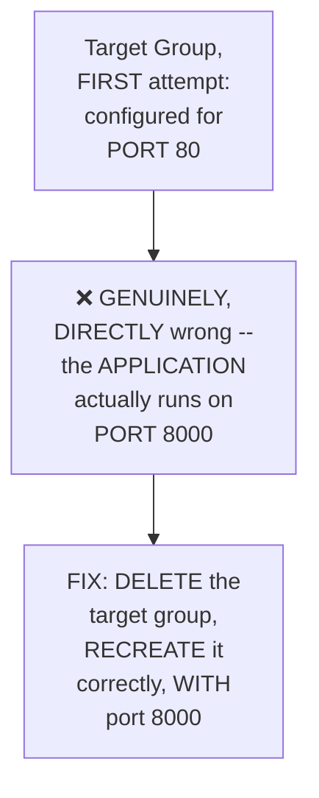

#### ⚠ A Direct, Honest, Live-Encountered Error #2: The Load Balancer's Own Security Group

> 💡 **Given directly:** *"Even if you go to the load balancer you will notice an error... it says that the port 80 is not reachable... it will say security groups for your load balancer don't allow traffic on the listener port. So what you need to do is either go to the security group... open it and allow the HTTP traffic on it."*

```bash
# Fixing the load balancer's OWN security group:
# Inbound rule: Custom TCP (or HTTP), port 80, source: 0.0.0.0/0 (anywhere)
```

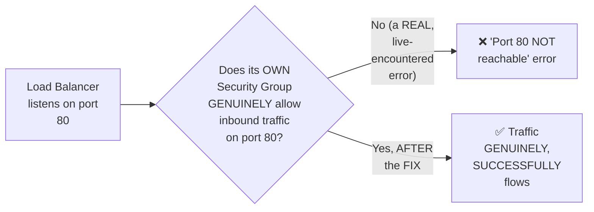

#### ⚠ Common Mistakes

* Assuming the TARGET group's OWN port MUST genuinely MATCH the LOAD balancer's OWN listener PORT — explicitly, directly, LIVE-demonstrated as GENUINELY, STRUCTURALLY SEPARATE: the LOAD balancer LISTENS on PORT 80 (EXTERNALLY), while the TARGET group FORWARDS to PORT 8000 (the APPLICATION's own, ACTUAL port) — TWO, genuinely DIFFERENT, INDEPENDENT configuration POINTS.
* Assuming a NEWLY-created LOAD balancer's own SECURITY group AUTOMATICALLY, GENUINELY allows TRAFFIC on its OWN listener PORT — explicitly, directly, LIVE-demonstrated as REQUIRING an EXPLICIT, MANUAL inbound RULE.

#### 🎯 Key Takeaways

* An **Application LOAD Balancer** operates at **LAYER 7** (HTTP/HTTPS) — MUST genuinely be INTERNET-facing, and PLACED in the PUBLIC subnet.
* A **TARGET group** DEFINES WHICH specific INSTANCES receive TRAFFIC, and ON WHICH port — a REAL, LIVE-demonstrated MISCONFIGURATION (PORT 80 instead OF 8000) required DELETING and RECREATING it CORRECTLY.
* A SECOND, REAL, live-ENCOUNTERED error CONFIRMED that a LOAD balancer's own SECURITY group must be EXPLICITLY configured to ALLOW inbound TRAFFIC on its OWN listener PORT — THIS is NOT automatic.

---

### 10. The Complete, Live Success Test & an Honest Explanation of Health-Check Behavior

#### 🪜 Step-by-Step — A Complete, Live, Real, Successful Access Test

> 💡 **Given directly:** *"Now let us access this particular IP address from the internet and see if I am able to access... my first AWS project to demonstrate app in private subnet. Congratulations, you have implemented your first AWS project."*

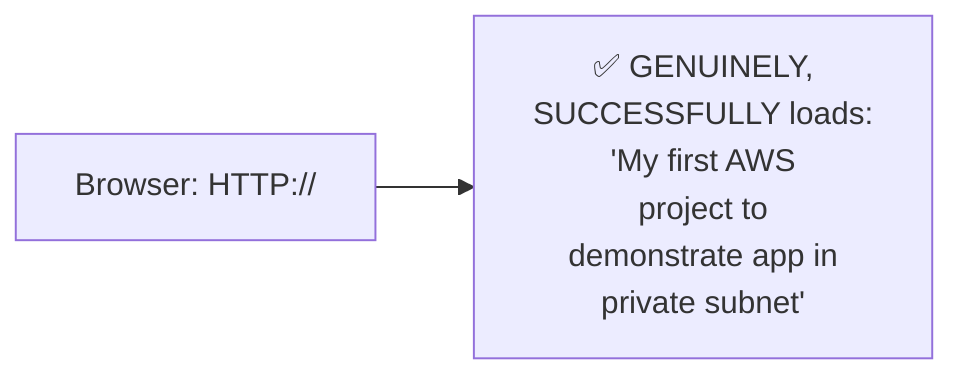

#### ⚠ A Direct, Honest Explanation of Apparently Inconsistent Behavior

> 💡 **Given directly:** *"Sometimes you will get an error... what is happening is the page is not getting reflected... the reason why it is going is there is a target group here which is actively monitoring the healthy parts... this target group which I have created has a health check, and it is only forwarding the traffic to the healthiest EC2 instance. So one is healthy and one is unhealthy — so what is happening is the load is always going to the healthiest EC2 instance."*

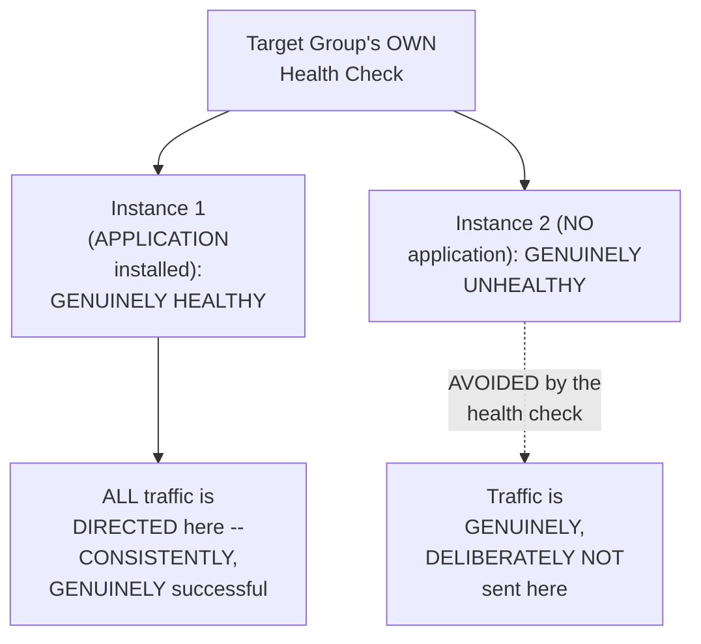

#### ⚠ Common Mistakes

* Assuming INCONSISTENT-seeming behavior (SOME requests SUCCEEDING, IMPLYING others MIGHT fail) is a GENUINE, real BUG or MISCONFIGURATION — explicitly, directly, HONESTLY clarified: this is GENUINELY, CORRECTLY EXPECTED behavior — the TARGET group's OWN health CHECK is INTELLIGENTLY routing traffic ONLY to the HEALTHY instance.
* Assuming a LOAD balancer's OWN health-CHECK mechanism must be MANUALLY, EXPLICITLY disabled to GET consistent RESULTS during THIS specific demo — explicitly, directly clarified: THIS behavior is GENUINELY the INTENDED, correct FUNCTION of health CHECKS — a FUTURE session WILL show HOW to adjust THIS behavior IF genuinely needed.

#### 🎯 Key Takeaways

* A REAL, live TEST directly, CONCRETELY confirmed **GENUINE, SUCCESSFUL access** to the DEPLOYED application, VIA the LOAD balancer's own PUBLIC address.
* The instructor **directly, HONESTLY explains** an APPARENTLY inconsistent BEHAVIOR (occasional "PAGE not REFLECTING" moments) as GENUINELY, CORRECTLY expected — the TARGET group's own **health CHECK** intelligently ROUTES traffic ONLY to the HEALTHY instance.
* This directly, CONCRETELY demonstrates a REAL, PRACTICAL benefit of LOAD balancers BEYOND simple traffic DISTRIBUTION — GENUINE, AUTOMATIC avoidance OF unhealthy, non-RESPONSIVE instances.

---
### 11. Closing: The Assignment & What's Next

#### 🪜 Step-by-Step — A Complete, Explicit, Direct Assignment

> 💡 **Given directly:** *"What you can do to see the load balancing concept is go to the other EC2 instance... and call this as, this is my second AWS project... deploy the application, deploy the HTML page with my second AWS project, and now when you hit the load balancer once, you should see my first AWS project, and second time when you hit, you should see my second AWS project — because that time both your EC2 instances will be in a healthy state, and target groups will forward one request to one EC2 instance, other request to other EC2 instance. This is your assignment."*

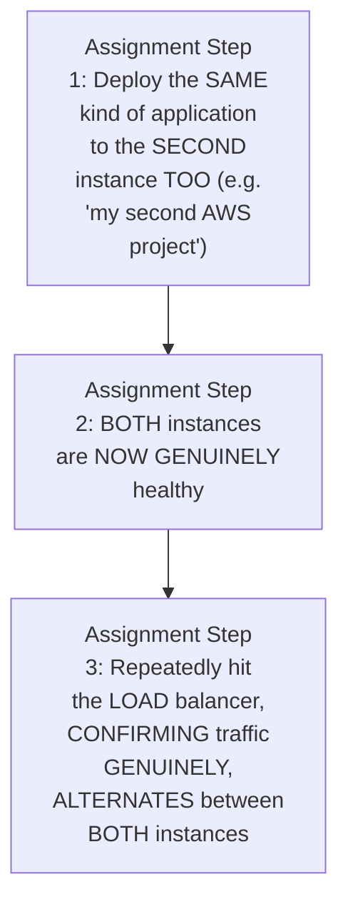

#### 🎯 Key Takeaways

* This CAPSTONE episode **genuinely, COMPLETELY delivers** its OWN, stated GOAL — a REAL, production-GRADE, TWO-availability-zone ARCHITECTURE, COMBINING every CONCEPT from Days 0-6 PLUS three NEWLY-introduced ONES (Auto SCALING groups, DEEPER load-balancer KNOWLEDGE, Bastion hosts).
* An **EXPLICIT, hands-on ASSIGNMENT** directly EXTENDS this session's OWN, deliberate "ONE healthy INSTANCE" setup — DEPLOYING the APPLICATION to the SECOND instance TOO, and CONFIRMING genuine, ALTERNATING load-BALANCING behavior.
* This project is directly, EXPLICITLY confirmed as **REAL, common INTERVIEW material** — "MOST DevOps engineers IN their organizations... have IMPLEMENTED this ENTIRE concept."

---

## 📝 Glossary

| Term | Definition | Why It Matters |
|---|---|---|
| **Auto Scaling Group** | Automatically maintains/scales a set number of EC2 instances | Ensures capacity matches genuine, real demand |
| **Launch Template** | A reusable configuration reference for Auto Scaling Groups | Required before an ASG can be created |
| **Bastion Host** | A public-IP "jump host" enabling SSH into private instances | Genuinely new in this session; enables secure access + auditing |
| **Elastic IP** | A static IP address that never changes | Used by NAT Gateways, for stable outbound masking |
| **Target Group** | Defines which instances a load balancer sends traffic to, and on which port | Includes automatic health checking |
| **Application Load Balancer (ALB)** | A Layer 7 (HTTP/HTTPS) load balancer | Must be internet-facing, in the public subnet |
| **Health Check** | A target group's own, automatic instance-health verification | Routes traffic ONLY to healthy instances |
| **Desired/Min/Max Capacity** | An Auto Scaling Group's own capacity settings | Desired = starting point; min/max = scaling boundaries |

---

## 🔄 Revision Notes — One-Minute Revision

* This is genuinely the **"full-fledged" capstone project** explicitly promised at the close of Day 6 -- combining EVERY concept from Days 0-6, plus THREE newly-introduced concepts (Auto Scaling Groups, deeper load balancer knowledge, Bastion Hosts).
* **Why TWO availability zones**: protects against a single AZ's own, genuine failure -- a direct, real upgrade from earlier sessions' own single-AZ simplifications.
* **Architecture**: public subnet (NAT Gateway + Load Balancer) + private subnet (application instances, via an Auto Scaling Group), across BOTH AZs.
* **3 concepts at summary level**: Auto Scaling Groups (maintain minimum replicas, scale up under demand), Load Balancers (distribute traffic; path/host-based routing deferred), Bastion Hosts (a public-IP jump host enabling secure SSH into private instances, PLUS centralized logging/auditing).
* **Building the VPC**: "VPC and more," 2 AZs, 2 public/2 private subnets, 1 NAT Gateway per AZ, S3 VPC Endpoint deliberately removed. A REAL, live-encountered error: hit the account's own Elastic IP limit, resolved by releasing unused IPs from prior projects.
* **Elastic IP**: a genuinely static IP that never changes -- used here by the NAT Gateway, for stable, consistent outbound IP masking.
* **Launch Template + Auto Scaling Group**: launch templates are required BEFORE an ASG can be created. This ASG deploys into the PRIVATE subnets (both AZs), desired capacity = 2, no load balancer attached yet (deferred to a separate step). Live-confirmed: 2 instances created, one per AZ.
* **Bastion Host workflow**: create a Bastion instance (public IP, same VPC) -> copy the SSH key via `scp` -> SSH into the Bastion (public IP) -> SSH from the Bastion into the private instance (private IP). Live-confirmed working.
* **Deliberate, asymmetric app deployment**: the Python HTTP server (port 8000) was installed on ONLY ONE of the two private instances -- intentionally, to later demonstrate load-balancer health-check behavior.
* **Application Load Balancer + Target Group**: an ALB (Layer 7, internet-facing, public subnet). TWO genuine, live-encountered errors: (1) the target group was first misconfigured to port 80 instead of 8000, requiring deletion and recreation; (2) the load balancer's own security group didn't allow inbound port 80, requiring an explicit inbound rule fix.
* **Success + honest health-check explanation**: a real, live test confirmed successful application access via the load balancer. Occasional "page not reflecting" moments were honestly explained as CORRECT, expected behavior -- the target group's own health check routes traffic only to the healthy instance (the one with the app installed).
* **Closing**: an explicit assignment -- deploy the app to the SECOND instance too, confirming genuine, alternating load-balancing behavior between both, now-healthy instances.

---

## 📋 Cheat Sheet

**The complete architecture:**
```text
VPC (2 Availability Zones)
├── Public Subnet (EACH AZ): NAT Gateway + Load Balancer
└── Private Subnet (EACH AZ): App instances, via Auto Scaling Group
```

**The complete build sequence:**
```text
1. Create VPC ("VPC and more"): 2 AZs, 2 public/2 private subnets, 1 NAT Gateway/AZ
2. Create a Launch Template (AMI, instance type, key pair, security group: SSH + app port)
3. Create an Auto Scaling Group (using the template) -> deploy into PRIVATE subnets
4. Create a Bastion Host (public IP, same VPC)
5. SCP the SSH key to the Bastion; SSH through it into a private instance
6. Deploy the application (deliberately, to only ONE instance, for the health-check demo)
7. Create an Application Load Balancer (internet-facing, public subnet)
8. Create a Target Group (CORRECT port -- matching the app, e.g. 8000)
9. Fix the load balancer's own security group (allow inbound on its listener port)
10. Test: access the load balancer's own address -> confirm success
```

**Bastion Host commands:**
```bash
# Copy the SSH key to the Bastion:
scp -i AWS_login.pem AWS_login.pem ubuntu@<bastion_public_ip>:~

# SSH into the Bastion:
ssh -i AWS_login.pem ubuntu@<bastion_public_ip>

# FROM the Bastion, SSH into the private instance:
ssh -i AWS_login.pem ubuntu@<private_instance_private_ip>
```

**Common, real errors encountered (and their fixes):**
```text
"Elastic IP limit reached"        -> release unused IPs from prior projects
Target group on WRONG port          -> delete + recreate with the correct port
"Port 80 not reachable" (ALB)          -> add an inbound rule to the ALB's own security group
```

---

## 🔥 Interview Questions & Answers

### 🟢 Beginner

**Q1.**

**Question:** Why does a production VPC architecture genuinely use two availability zones instead of one?

**Answer:** To protect against a single availability zone's own, genuine failure -- if one goes down, the other continues serving traffic.

**Explanation:** Directly, precisely explained.

**Why Interviewers Ask This:** Foundational, frequently-tested high-availability reasoning.

**Possible Follow-up:** "What specifically would genuinely fail if only one AZ were used, and it went down?"

**Q2.**

**Question:** What does an Auto Scaling Group genuinely do?

**Answer:** Automatically maintains a minimum number of instance replicas, scaling up if demand genuinely increases.

**Explanation:** Directly, precisely explained.

**Why Interviewers Ask This:** Basic, essential Auto Scaling Group knowledge.

**Possible Follow-up:** "What is a launch template's own, genuine relationship to an Auto Scaling Group?"

**Q3.**

**Question:** What is a Bastion Host?

**Answer:** A public-IP "jump host" enabling secure SSH access into private-subnet instances, which genuinely lack public IPs.

**Explanation:** Directly, precisely explained.

**Why Interviewers Ask This:** Basic, essential secure-access architecture knowledge.

**Possible Follow-up:** "What additional security benefit does a Bastion Host provide, beyond just enabling access?"

**Q4.**

**Question:** What is an Elastic IP?

**Answer:** A static IP address that genuinely remains the same, even if the underlying instance is deleted or restarted.

**Explanation:** Directly, precisely explained.

**Why Interviewers Ask This:** Basic, essential AWS networking knowledge.

**Possible Follow-up:** "Where does this specific project genuinely use an Elastic IP?"

**Q5.**

**Question:** What is a target group, in the context of a load balancer?

**Answer:** Defines which specific instances receive traffic, and on which port.

**Explanation:** Directly, precisely explained.

**Why Interviewers Ask This:** Basic, essential load-balancer configuration knowledge.

**Possible Follow-up:** "Does a target group's own port have to match the load balancer's own listener port?"

**Q6.**

**Question:** What layer does an Application Load Balancer genuinely operate at?

**Answer:** Layer 7 (HTTP/HTTPS).

**Explanation:** Directly, explicitly stated.

**Why Interviewers Ask This:** Basic, foundational load-balancer terminology.

**Possible Follow-up:** "Where must an internet-facing ALB genuinely be placed -- public or private subnet?"

**Q7.**

**Question:** Can you SSH directly from your own laptop into a private-subnet EC2 instance, using its private IP?

**Answer:** No -- genuinely, structurally impossible; a private IP is only reachable from within the same VPC.

**Explanation:** Directly, precisely clarified.

**Why Interviewers Ask This:** Tests genuine, practical understanding of private-subnet access.

**Possible Follow-up:** "What is the correct, genuine way to access such an instance?"

**Q8.**

**Question:** What genuinely happens if a target group's own health check finds one instance healthy and another unhealthy?

**Answer:** All traffic is routed to the healthy instance; the unhealthy one is genuinely avoided.

**Explanation:** Directly, live-confirmed.

**Why Interviewers Ask This:** Tests genuine, practical understanding of health-check behavior.

**Possible Follow-up:** "Is this genuinely a bug, or expected, correct behavior?"

**Q9.**

**Question:** Where should application instances genuinely live -- the public or private subnet, in this project's own architecture?

**Answer:** The private subnet.

**Explanation:** Directly, explicitly confirmed.

**Why Interviewers Ask This:** Basic, essential architecture-placement knowledge.

**Possible Follow-up:** "What genuinely lives in the public subnet instead?"

**Q10.**

**Question:** Must a load balancer's own security group be manually configured to allow inbound traffic on its own listener port?

**Answer:** Yes -- genuinely, live-demonstrated as required; it is not automatic.

**Explanation:** Directly, live-confirmed.

**Why Interviewers Ask This:** Tests genuine, practical, hands-on troubleshooting awareness.

**Possible Follow-up:** "What specific error message would you genuinely see if this were misconfigured?"

---

### 🟡 Intermediate

**Q11.**

**Question:** Explain why the instructor deliberately, genuinely deploys the application to only ONE of the two private instances, rather than both, during the initial setup.

**Answer:** This is a genuinely deliberate teaching choice, DIRECTLY consistent with a PATTERN seen ACROSS this instructor's OWN, broader series (e.g., Day 5's OWN deliberate, LIVE model-failure tests). By GENUINELY, INTENTIONALLY leaving ONE instance WITHOUT the application, the instructor creates a REAL, LIVE opportunity to DEMONSTRATE a target group's OWN health-check BEHAVIOR — SPECIFICALLY, that TRAFFIC is INTELLIGENTLY routed ONLY to the HEALTHY instance. This directly, CONCRETELY teaches a GENUINELY important, real-world LESSON (health checks GENUINELY, ACTIVELY protect users FROM broken instances) THAT would be GENUINELY harder to DEMONSTRATE if BOTH instances were SYMMETRICALLY, IDENTICALLY configured FROM the start.

**Explanation:** Requires recognizing a deliberate, asymmetric setup choice designed to create a genuine, observable teaching moment about health-check behavior.

**Why Interviewers Ask This:** Tests whether a learner recognizes the practical, pedagogical value of an intentionally imperfect setup over a "clean," symmetric one.

**Possible Follow-up:** "What GENUINE, additional test could you perform to FURTHER confirm the health check's own, precise behavior, beyond what THIS session explicitly showed?"

**Q12.**

**Question:** A learner argues that since this session's own architecture places NAT Gateways in the public subnet, this means NAT Gateways are GENUINELY, functionally similar to load balancers, since both live in the same subnet. Evaluate this claim.

**Answer:** This claim overstates the case, missing a GENUINELY important, functional distinction THIS session's own content (COMBINED with Day 4's own established REASONING) directly clarifies. WHILE BOTH components GENUINELY, STRUCTURALLY live in the public SUBNET, their OWN, PRECISE FUNCTIONS are GENUINELY, ENTIRELY different: per Day 4's own established REASONING, a NAT Gateway GENUINELY masks a PRIVATE application's own IP address WHEN it makes OUTBOUND requests (e.g., DOWNLOADING a package); per THIS session's own established REASONING (Section 9), a LOAD balancer GENUINELY receives INBOUND user requests and DISTRIBUTES them TO the appropriate, PRIVATE-subnet application INSTANCES. These are TWO, GENUINELY OPPOSITE-direction, distinct FUNCTIONS (outbound MASKING versus inbound DISTRIBUTION) that MERELY happen to SHARE the SAME, PUBLIC-subnet location — SHARED location does NOT genuinely IMPLY shared FUNCTION.

**Explanation:** Tests whether a learner recognizes that shared physical/network location doesn't imply functional similarity between two, genuinely distinct components.

**Why Interviewers Ask This:** Distinguishes candidates who understand the precise, distinct roles of NAT Gateways and Load Balancers from those who conflate them based on shared subnet placement.

**Possible Follow-up:** "Could a REAL, production VPC genuinely function correctly with ONLY a NAT Gateway, but NO load balancer, or vice versa? Explain your reasoning."

**Q13.**

**Question:** Explain, precisely, why the instructor deliberately, honestly shows TWO, SEPARATE, real configuration errors (the wrong target-group port, and the missing security-group rule) during THIS specific project, rather than a flawless, error-free walkthrough.

**Answer:** This is a genuinely deliberate, CONSISTENT teaching choice, DIRECTLY matching a PATTERN established ACROSS this instructor's OWN entire series (e.g., Day 3's OWN chmod PERMISSION error, Day 5's OWN availability-zone MISTAKE). By GENUINELY, LIVE encountering and CORRECTING real, COMMON configuration errors — errors a REAL, practicing DevOps engineer would GENUINELY, PLAUSIBLY encounter — the instructor DIRECTLY prepares LEARNERS for the SAME kind of REAL, practical TROUBLESHOOTING they will GENUINELY face independently, RATHER than presenting an UNREALISTICALLY smooth, error-free PROCESS that would LEAVE learners GENUINELY unprepared WHEN their OWN, first attempt INEVITABLY encounters SIMILAR issues.

**Explanation:** Requires recognizing a deliberate, consistent pattern of honest, real-error demonstration across this instructor's entire series, connecting it to genuine, practical learner preparation.

**Why Interviewers Ask This:** Tests whether a learner recognizes the genuine, practical value of honest, unedited demonstrations that include real troubleshooting, not just successful outcomes.

**Possible Follow-up:** "What GENUINE, additional common error (NOT explicitly shown in THIS session) might a learner GENUINELY, PLAUSIBLY encounter when REPRODUCING this EXACT project on THEIR OWN account?"

**Q14.**

**Question:** Using this session's own precise "Bastion Host" reasoning (Section 3/7), explain a GENUINE, real security risk that could arise if an organization's own Bastion Host itself became compromised.

**Answer:** A precise, reasoned RISK analysis, directly extending Section 3/7's own established MECHANISM: per Section 7's own PRECISE, live-demonstrated WORKFLOW, the Bastion HOST GENUINELY, DIRECTLY holds a COPY of the SSH key (VIA `scp`) NEEDED to access EVERY private-subnet INSTANCE it CONNECTS to. This directly, PRECISELY reveals a GENUINE, real RISK: IF the Bastion host ITSELF were GENUINELY compromised (e.g., THROUGH a VULNERABILITY in its OWN, public-facing SSH service), an ATTACKER would GENUINELY, DIRECTLY gain access to the SAME key FILE, and COULD then use IT to access EVERY private-subnet INSTANCE the Bastion was EVER used to REACH — MEANING the Bastion HOST, DESPITE improving SECURITY overall (per Section 3's own established REASONING), ALSO becomes a GENUINE, CONCENTRATED, high-value TARGET — a SINGLE point of COMPROMISE that WOULD, if BREACHED, GENUINELY expose the ENTIRE private-subnet ENVIRONMENT it was DESIGNED to PROTECT.

**Explanation:** Requires extending the Bastion Host's own established mechanism to identify a genuine, real security risk arising from its own, concentrated access.

**Why Interviewers Ask This:** Tests whether a learner recognizes that a security-improving component (the Bastion Host) also becomes a genuine, high-value target requiring its own, additional protection.

**Possible Follow-up:** "What GENUINE, additional security practice (extending BEYOND this session's own explicit content) might an organization implement to SPECIFICALLY protect their OWN Bastion Host?"

**Q15.**

**Question:** Synthesize this session's complete "Elastic IP" reasoning (Section 5) with its own "NAT Gateway, one per availability zone" configuration (Section 4) to explain a GENUINE, real cost implication of this specific, two-AZ architecture choice.

**Answer:** A precise, synthesized explanation, directly connecting TWO, separately-established sections: per Section 4's own PRECISE configuration CHOICE, THIS project GENUINELY creates **ONE NAT gateway PER availability zone** (TWO total, for TWO AZs). Per Section 5's own PRECISE reasoning, EACH NAT gateway GENUINELY requires its OWN, DEDICATED Elastic IP address to FUNCTION (per the ESTABLISHED "elastic IP GETS attached to the NAT gateway" MECHANISM). SYNTHESIZING these TWO facts directly, PRECISELY reveals a GENUINE, real COST implication: THIS project's own, DELIBERATE choice to use TWO, SEPARATE NAT gateways (RATHER than ONE, SHARED gateway ACROSS both AZs) GENUINELY, DIRECTLY doubles BOTH the NAT-gateway COST and the Elastic-IP ALLOCATION REQUIRED, COMPARED to a SINGLE-NAT-gateway design — a GENUINE, real TRADE-OFF between HIGHER availability (EACH AZ has its OWN, INDEPENDENT NAT gateway, AVOIDING a cross-AZ DEPENDENCY) and HIGHER, DIRECT infrastructure COST — DIRECTLY connecting BACK to THIS session's own OPENING motivation (Section 2) FOR using multiple AZs in the FIRST place.

**Explanation:** Requires synthesizing the Elastic IP mechanism with the "one NAT Gateway per AZ" configuration choice to identify a genuine, real cost trade-off tied to the availability goal.

**Why Interviewers Ask This:** A senior-level question testing whether a candidate can connect an infrastructure configuration choice to its own, genuine, real cost implications.

**Possible Follow-up:** "Under WHAT genuine, real circumstances might a team GENUINELY choose to use a SINGLE, shared NAT gateway INSTEAD, accepting the TRADE-OFF this would introduce?"

---

### 🔴 Advanced

**Q16.**

**Question:** Design a complete, reasoned incident-response plan (using ONLY this session's own established concepts) for the scenario: "Users report they are intermittently unable to access the production application, though the application was working correctly yesterday."

**Answer:** A reasonable, complete plan, directly applying this session's OWN, exact established CONCEPTS:

```text
1. CHECK the Target Group's OWN health status (per Section 10's own
   established mechanism) -- CONFIRM how MANY instances are CURRENTLY,
   GENUINELY reported as healthy VERSUS unhealthy.

2. IF one or MORE instances are GENUINELY unhealthy, use the BASTION
   host (per Section 7's own established WORKFLOW) to SSH into the
   AFFECTED, private-subnet instance(s) DIRECTLY, and INVESTIGATE
   (e.g., confirm the APPLICATION process is STILL genuinely RUNNING).

3. CHECK the Auto Scaling Group's OWN current instance COUNT (per
   Section 6's own established mechanism) -- CONFIRM it MATCHES the
   EXPECTED, desired capacity.

4. CHECK the load balancer's OWN security group (per Section 9's own
   established mechanism) -- CONFIRM inbound rules are STILL GENUINELY,
   correctly configured (RULING OUT an ACCIDENTAL, recent CHANGE).

5. IF ONLY one AZ's own instance is AFFECTED (per Section 2's own
   established two-AZ REASONING), this MIGHT indicate a genuine,
   AZ-specific issue -- the OTHER AZ's own instance SHOULD still be
   serving traffic CORRECTLY, per the SAME two-AZ HIGH-availability
   design.

6. RESOLUTION: restart/replace the UNHEALTHY instance(s) (the Auto
   Scaling Group SHOULD, per Section 6's own established MECHANISM,
   automatically REPLACE a GENUINELY terminated instance to MAINTAIN
   desired capacity).
```

This complete PLAN directly, precisely APPLIES every ESTABLISHED concept from THIS session — TARGET-group health CHECKS, Bastion-host ACCESS, Auto-Scaling-group CAPACITY, and the two-AZ ARCHITECTURE's own, GENUINE resilience benefit.

**Explanation:** Requires synthesizing every major concept from this session into one complete, reasoned, real-world incident-response procedure.

**Why Interviewers Ask This:** A realistic, senior-level question testing whether a candidate can integrate MULTIPLE, separately-taught concepts into ONE, coherent, practical troubleshooting workflow.

**Possible Follow-up:** "At WHICH SPECIFIC step in this plan would you GENUINELY escalate to checking OUTSIDE this session's own, explicit scope (e.g., APPLICATION-level logs, RATHER than infrastructure)?"

**Q17.**

**Question:** Critically evaluate: "Since this session confirms Bastion Hosts improve security by avoiding public IPs on private instances, this means EVERY EC2 instance in ANY VPC should GENUINELY, ALWAYS be placed in a private subnet, accessed ONLY via a Bastion Host, with NO exceptions." Is this an accurate, complete characterization?

**Answer:** Not fully accurate — this OVERSTATES a GENUINE, sound SECURITY principle into an UNCONDITIONAL, universal RULE neither this session's own CONTENT, nor sound REASONING, fully SUPPORTS. THIS session's own COMPLETE architecture (Section 2) DIRECTLY, EXPLICITLY places CERTAIN components — SPECIFICALLY, the LOAD balancer and NAT gateway — in the PUBLIC subnet, WITH direct INTERNET-facing configuration, PRECISELY BECAUSE they GENUINELY, STRUCTURALLY need to be REACHABLE from (or REACH out TO) the internet DIRECTLY. The BASTION host ITSELF (per Section 7) is ALSO, GENUINELY, DELIBERATELY given a PUBLIC IP — DIRECTLY, NECESSARILY, since its OWN PURPOSE requires EXTERNAL reachability. The ACCURATE, more PRECISE conclusion: THIS session's own architecture GENUINELY demonstrates a NUANCED, ROLE-based principle — APPLICATION instances (WHICH GENUINELY don't NEED direct, PUBLIC reachability) SHOULD BE private, ACCESSED via a BASTION; but COMPONENTS whose OWN, genuine FUNCTION REQUIRES direct internet EXPOSURE (load BALANCERS, NAT gateways, THE Bastion host ITSELF) GENUINELY, APPROPRIATELY remain PUBLIC — NOT every SINGLE instance, UNCONDITIONALLY, belongs in a PRIVATE subnet.

**Explanation:** Tests whether a learner recognizes that the "private subnet + Bastion access" principle applies specifically to application instances, not universally to every component in a VPC.

**Why Interviewers Ask This:** Distinguishes candidates who understand role-based, nuanced security architecture from those who over-generalize a sound principle into an absolute, universal rule.

**Possible Follow-up:** "Name the THREE, SPECIFIC components (from THIS session's own, complete architecture) that GENUINELY, APPROPRIATELY remain in the PUBLIC subnet, and explain WHY each GENUINELY needs to."

**Q18.**

**Question:** Synthesize this session's complete "Auto Scaling Group, desired capacity = 2" configuration (Section 6) with its own "deliberately asymmetric application deployment" choice (Section 8) to construct a reasoned explanation of a GENUINE, real operational risk this combination could create in an ACTUAL, unintentional production scenario (rather than this session's own, deliberate teaching demo).

**Answer:** A precise, synthesized explanation, directly connecting TWO, separately-established sections into a GENUINE, real-world CAUTIONARY insight: per Section 6's own PRECISE configuration, an Auto SCALING group GENUINELY maintains a DESIRED capacity OF 2 INSTANCES — but per Section 8's own established SCENARIO, an Auto Scaling GROUP's own capacity MANAGEMENT does NOT, BY itself, GENUINELY guarantee that EVERY instance it CREATES has the CORRECT application GENUINELY, SUCCESSFULLY installed and RUNNING (THIS session's own instructor MANUALLY, DELIBERATELY installed the application on JUST one instance, VIA a SEPARATE, MANUAL SSH step). SYNTHESIZING these TWO facts directly, PRECISELY reveals a GENUINE, real, OPERATIONAL risk IN an ACTUAL, unintentional PRODUCTION scenario: IF an Auto Scaling GROUP genuinely, AUTOMATICALLY creates a NEW instance (e.g., REPLACING a TERMINATED one, or SCALING up DURING high DEMAND), THAT new instance would GENUINELY, AUTOMATICALLY launch FROM the SAME launch TEMPLATE (per Section 6's own established MECHANISM) — but WOULD NOT genuinely, AUTOMATICALLY have the APPLICATION installed, UNLESS the DEPLOYMENT process ITSELF is GENUINELY, PROPERLY automated (e.g., VIA a STARTUP script EMBEDDED in the launch TEMPLATE, or a SEPARATE CI/CD pipeline) — a TOPIC THIS session's own, MANUAL, one-time SSH-based deployment PROCESS does NOT, on its OWN, genuinely ADDRESS or SOLVE for FUTURE, automatically-created INSTANCES.

**Explanation:** Requires synthesizing the ASG's own automatic capacity management with the manual, one-time application deployment process to identify a genuine, real operational gap this combination would create if instances were automatically added later.

**Why Interviewers Ask This:** A capstone-level question testing whether a candidate can identify a genuine, practical gap between infrastructure automation (ASG) and application deployment automation, which this session's own manual process doesn't resolve.

**Possible Follow-up:** "What GENUINE, real solution (extending BEYOND this session's own explicit, manual approach) would GENUINELY ensure EVERY, NEWLY auto-scaled instance ALSO has the application CORRECTLY, AUTOMATICALLY installed?"

---

## 🧪 Scenario-Based Interview Questions

> **Scenario 1:** A colleague reports that after creating a Bastion Host and copying the SSH key to it, they still cannot SSH from the Bastion into a private-subnet instance. Using this session's concepts, diagnose the most likely cause.

**Structured Answer:**
1. **Initial investigation:** Recognize this as directly connected to Section 7's own precise, COMPLETE Bastion workflow — MULTIPLE, SEQUENTIAL steps are GENUINELY required.
2. **Metrics/logs to check:** Directly CONFIRM the EXACT SSH command being USED FROM the Bastion — SPECIFICALLY, whether it's USING the private INSTANCE's own **PRIVATE** IP address (NOT a public ONE, which it GENUINELY lacks).
3. **Possible causes:** Per Section 7's own precise WORKFLOW, LIKELY causes INCLUDE: the KEY file GENUINELY wasn't CORRECTLY copied to the BASTION (per the SCP step), OR the private INSTANCE's own SECURITY group does NOT genuinely ALLOW SSH traffic FROM the Bastion host's OWN, specific IP/security GROUP.
4. **Debugging approach:** Directly CONFIRM the KEY file's own PRESENCE on the Bastion (VIA `ls`, per Section 7's own established VERIFICATION step), and REVIEW the PRIVATE instance's own SECURITY group's INBOUND rules.
5. **Resolution:** RE-COPY the key FILE if MISSING/incorrect; OR update the PRIVATE instance's own security GROUP to EXPLICITLY allow SSH FROM the Bastion's own SOURCE.
6. **Prevention:** Establish a standing team PRACTICE of DOCUMENTING the COMPLETE, correct Bastion WORKFLOW (per THIS session's own established SEQUENCE) as a STANDARD, REPEATABLE runbook, DIRECTLY avoiding this EXACT, common SOURCE of confusion.

> **Scenario 2 (Advanced):** Your organization's Auto Scaling Group has just scaled UP, adding a third instance to handle increased traffic, but the NEW instance is genuinely reporting as "unhealthy" in the target group, despite the ORIGINAL two instances working correctly. Using this session's own concepts, construct a complete, reasoned investigation and remediation plan.

**Structured Answer:**
1. **Initial investigation:** Recognize this as directly connected to Advanced Q18's own precise "ASG capacity management does NOT guarantee APPLICATION deployment" reasoning — the NEW instance LIKELY GENUINELY lacks the APPLICATION itself.
2. **Metrics/logs to check:** Directly USE the Bastion host (per Section 7's own established workflow) to SSH into the NEW, unhealthy instance, CONFIRMING whether the APPLICATION process is GENUINELY, ACTUALLY running.
3. **Possible causes:** Per Advanced Q18's own established REASONING, THIS is LIKELY BECAUSE the ORIGINAL application DEPLOYMENT was a MANUAL, one-TIME SSH-based process (per Section 8's own established APPROACH), which does NOT genuinely, AUTOMATICALLY apply to NEW instances the Auto Scaling GROUP creates LATER.
4. **Debugging approach:** Directly CONFIRM, via the Bastion HOST, whether the NEW instance's own launch TEMPLATE (per Section 6's own established MECHANISM) includes ANY automated APPLICATION-installation step (e.g., a STARTUP script), or WHETHER it GENUINELY relies ENTIRELY on manual, POST-launch configuration.
5. **Resolution:** MANUALLY install the APPLICATION on the NEW instance (per Section 8's own established, MANUAL process) AS an IMMEDIATE fix; FOR a LONGER-term solution, UPDATE the launch TEMPLATE to INCLUDE an AUTOMATED startup SCRIPT, ensuring ALL future, auto-SCALED instances GENUINELY receive the APPLICATION automatically.
6. **Prevention:** Establish a standing team PRACTICE of NEVER relying SOLELY on MANUAL, one-time APPLICATION deployment FOR any instance MANAGED by an Auto Scaling GROUP — DIRECTLY addressing the GENUINE, real gap IDENTIFIED in Advanced Q18's own established REASONING.

---

## 🛠 Hands-on Exercises

### 🟢 Easy

1. Write out, from memory, the complete architecture diagram for this project (VPC, 2 AZs, public/private subnets, NAT Gateway, Load Balancer, Auto Scaling Group).
2. Explain, in your own words, why a Bastion Host is genuinely necessary for accessing private-subnet instances.
3. Explain, in your own words, why this session's own health-check behavior (routing only to the healthy instance) is expected, not a bug.

### 🟡 Medium

4. Build this complete project on your own, real AWS account, following this session's own exact steps.
5. Write a short explanation (150-200 words) of the genuine cost trade-off between one NAT Gateway per AZ versus a single, shared NAT Gateway.
6. Complete this session's own explicit assignment: deploy the application to the second instance, and confirm genuine, alternating load-balancing behavior.

### 🔴 Advanced

7. Complete the full, reasoned incident-response plan proposed in Advanced Interview Q16, testing it against a deliberately-broken instance on your own account.
8. Implement the debugging scenario proposed in Scenario 2 -- configure a launch template WITHOUT an automated startup script, scale up your Auto Scaling Group, and confirm the new instance genuinely lacks the application, then fix it with a startup script.
9. Research and implement EC2 user data / startup scripts, directly extending Advanced Q18's own identified gap between infrastructure and application deployment automation.

---

## 🏗 Practice Assignment

*(This session's own stated, direct assignment, reproduced faithfully)*

> 💡 **The instructor's own words, given directly:** *"Go to the other EC2 instance... deploy the application, deploy the HTML page with my second AWS project, and now when you hit the load balancer once you should see my first AWS project, and second time when you hit you should see my second AWS project... this is your assignment, try to do it and let me know in the comment section if you are able to perform the assignment or not."*

### Build: "Complete, Two-Healthy-Instance Load Balancing Demonstration"

**Objective:** Directly complete this session's own genuine, stated assignment — extending the deliberately-asymmetric demo into a fully-healthy, genuinely load-balanced setup.

**Requirements:**
- Build this session's own complete architecture on your own, real AWS account.
- Deploy the application to BOTH private-subnet instances (not just one), using distinct content for each (e.g., "my first AWS project" and "my second AWS project").
- Confirm, via the Bastion Host, that both instances are genuinely running the application.
- Repeatedly access the load balancer's own public address, confirming genuine, alternating responses between both instances.
- A written reflection (200-300 words) on any genuine challenges you encountered while reproducing this project, and how you resolved them.

**Architecture (suggested):**

```text
aws_day7_capstone_assignment/
├── vpc_and_asg_setup_log.md              # your VPC, launch template, and ASG steps
├── bastion_host_workflow_log.md             # your Bastion creation + SSH workflow
├── application_deployment_log.md               # your app installation on BOTH instances
├── load_balancer_setup_log.md                     # your ALB + target group configuration
├── load_balancing_confirmation.md                    # your alternating-response test results
└── REFLECTION.md                                        # your written reflection
```

**Expected Functionality:**
- Your load balancer should genuinely, successfully alternate between both, now-healthy instances.
- Your Bastion Host workflow should genuinely, correctly enable access to both private instances.

**Challenges:**
- Correctly configuring the target group's own port to match your application.
- Correctly troubleshooting the load balancer's own security-group configuration.

**Bonus Improvements:**
- Add an EC2 user data / startup script to your launch template, automating application installation for any future, auto-scaled instances.
- Research and implement Auto Scaling Group scaling policies (based on CPU utilization), extending beyond this session's own, deferred "min/max" configuration.

---

## 📚 Additional Resources

- **Days 0-6 of this series** (in this same workspace) -- the direct prerequisite sessions, establishing every foundational concept this capstone project directly combines.
- **AWS's own official "public private subnet architecture" blog** (referenced directly) -- the instructor's own cited reference, though noted as "very high level" compared to this session's own, complete walkthrough.
- **Future sessions in this series** (referenced directly) -- covering Auto Scaling Groups, Load Balancers, and Bastion Hosts each in their own, dedicated, deeper depth (Load Balancer topic explicitly noted as coming "after day 20 or something").

---

## 📌 Final Revision Sheet

### ⭐ Core Concepts
- **Two-AZ architecture**: protects against a single availability zone's own, genuine failure.
- **Auto Scaling Groups**: maintain/scale instance capacity based on demand.
- **Load Balancers**: distribute traffic (Layer 7, internet-facing, public subnet), with automatic health checking.
- **Bastion Hosts**: secure, public-IP jump hosts enabling SSH into private instances.
- **Elastic IPs**: static IPs, used by NAT Gateways for stable masking.

### ⭐ Important Definitions
- **Target Group, Launch Template** (see Glossary for full definitions).

### ⭐ Important Commands/Code
```bash
scp -i AWS_login.pem AWS_login.pem ubuntu@<bastion_public_ip>:~
ssh -i AWS_login.pem ubuntu@<bastion_public_ip>
ssh -i AWS_login.pem ubuntu@<private_instance_private_ip>
python3 -m http.server 8000
```

### ⭐ Architecture/Process
- Complete build sequence: VPC (2 AZs) -> Launch Template -> Auto Scaling Group (private subnets) -> Bastion Host -> deploy application -> Application Load Balancer + Target Group -> fix security group -> verify access.

### ⭐ Best Practices
- Always use at least two availability zones in production.
- Never give application instances public IPs; use a Bastion Host instead.
- Ensure the target group's own port matches the application's own actual port.
- Automate application deployment (e.g., via startup scripts) for any instance managed by an Auto Scaling Group.

### ⭐ Common Mistakes
- Assuming a single AZ is sufficient for production.
- Assuming a target group's port must match the load balancer's listener port.
- Assuming a load balancer's security group automatically allows its own listener port.
- Assuming Auto Scaling Group capacity management guarantees application deployment on new instances.

### ⭐ Interview Points
- Be ready to explain and draw this complete, two-AZ production architecture from memory.
- Be ready to explain the Bastion Host workflow precisely.
- Be ready to explain why health-check-driven, uneven traffic routing is expected, correct behavior.
- Be ready to discuss the genuine trade-off between one NAT Gateway per AZ versus a shared one.

### ⭐ Things to Remember
- This is genuinely the **capstone project** explicitly promised at the end of Day 6 — combining every concept from Days 0-6, plus three newly-introduced ones.
- The **two, genuine, live-encountered troubleshooting moments** (wrong target-group port, missing security-group rule) are worth remembering as realistic, common configuration errors, not embarrassing mistakes to gloss over.
- The **deliberately asymmetric application deployment** is this session's own central teaching device for demonstrating genuine, real health-check behavior — not an oversight.

---

## 🔗 Source

- [A complete Production Grade Project](https://youtu.be/FZPTL_kNvXc?si=mV-0i29LRukQPoRR)