# 🪣 AWS Zero to Hero — Day 9: AWS S3 Buckets Deep Dive

- <i>**Series:** AWS Zero to Hero (Day 9, direct continuation of Days 0-7 already processed in this workspace) · 
- **Instructor:** Abhishek
- **Note on scope:** This is genuinely a **DEEP-dive** episode, EXPLICITLY, DIRECTLY confirmed AS one of the "MOST easy SERVICES to learn ON AWS." The SESSION combines a COMPLETE, precise theoretical FOUNDATION (S3's own FIVE core characteristics, STORAGE classes, VERSIONING) WITH **TWO, complete, real, LIVE-demonstrated practical SCENARIOS**: RESTRICTING bucket ACCESS via bucket POLICIES (INCLUDING a GENUINE, honest, LIVE-encountered JSON SYNTAX mistake), and HOSTING a STATIC website ON S3.</i>

---

## 📑 Table of Contents

1. [Session Overview](#-session-overview)
2. [Learning Objectives](#-learning-objectives)
3. [Detailed Notes](#-detailed-notes)
   - [1. Session Context: Day 9 — A Deep Dive Into AWS S3](#1-session-context-day-9--a-deep-dive-into-aws-s3)
   - [2. What Problem Does S3 Solve? A Precise, Real-World Motivation](#2-what-problem-does-s3-solve-a-precise-real-world-motivation)
   - [3. The "11 Nines": S3's Own, Legendary Durability Number](#3-the-11-nines-s3s-own-legendary-durability-number)
   - [4. Objects & Global Accessibility: Precise, Foundational Concepts](#4-objects--global-accessibility-precise-foundational-concepts)
   - [5. A Complete, Real, Live Demo: Creating Your First S3 Bucket](#5-a-complete-real-live-demo-creating-your-first-s3-bucket)
   - [6. Why Buckets Are Region-Scoped, Despite Being "Globally Accessible"](#6-why-buckets-are-region-scoped-despite-being-globally-accessible)
   - [7. The Five Core Characteristics of S3, In Detail](#7-the-five-core-characteristics-of-s3-in-detail)
   - [8. Storage Classes: The Real Cost-vs-Access-Time Trade-Off](#8-storage-classes-the-real-cost-vs-access-time-trade-off)
   - [9. Bucket Versioning: A Complete, Real, Live Demonstration](#9-bucket-versioning-a-complete-real-live-demonstration)
   - [10. Additional Bucket Properties: Tags, Logging, Event Notifications & Object Locking](#10-additional-bucket-properties-tags-logging-event-notifications--object-locking)
   - [11. A Complete, Real, Live Demo: Restricting Access via Bucket Policies](#11-a-complete-real-live-demo-restricting-access-via-bucket-policies)
   - [12. A Complete, Real, Live Demo: Hosting a Static Website on S3](#12-a-complete-real-live-demo-hosting-a-static-website-on-s3)
   - [13. Closing: Connecting Versioning to Cost Management via Storage Classes](#13-closing-connecting-versioning-to-cost-management-via-storage-classes)
4. [Glossary](#-glossary)
5. [Revision Notes — One-Minute Revision](#-revision-notes--one-minute-revision)
6. [Cheat Sheet](#-cheat-sheet)
7. [Interview Questions & Answers](#-interview-questions--answers)
8. [Scenario-Based Interview Questions](#-scenario-based-interview-questions)
9. [Hands-on Exercises](#-hands-on-exercises)
10. [Practice Assignment](#-practice-assignment)
11. [Additional Resources](#-additional-resources)
12. [Final Revision Sheet](#-final-revision-sheet)

---

## 🎯 Session Overview

This DEEP-dive EPISODE builds a COMPLETE, PRECISE understanding OF AWS S3, GROUNDED in TWO, complete, REAL, live-demonstrated PRACTICAL scenarios. It covers:

1. **THE precise, real-WORLD problem** S3 GENUINELY solves — ORGANIZATION-scale STORAGE (databases, APPLICATION logs, BACKUPS) — and WHY it was AWS's OWN, SECOND service EVER launched.
2. **The famous "11 NINES" (99.999999999%) DURABILITY number**, precisely EXPLAINED via a REAL, worked example: OUT of 1 BILLION objects STORED over 100 YEARS, AWS GENUINELY guarantees ONLY about ONE object's own, POTENTIAL loss.
3. **OBJECTS and GLOBAL accessibility**, precisely DEFINED — ANYTHING uploaded TO S3 is CALLED an "OBJECT" (NO file-type RESTRICTION), and IS accessible VIA HTTPS FROM anywhere IN the world.
4. **A COMPLETE, real, LIVE demo** of CREATING an S3 BUCKET — INCLUDING the GENUINE, critical NAMING rule (GLOBALLY unique, ACROSS all AWS ACCOUNTS, not JUST your own).
5. **WHY buckets are GENUINELY region-SCOPED**, despite S3's OWN "globally ACCESSIBLE" nature — GROUNDED in a REAL, LATENCY-based reasoning (a HYDERABAD example).
6. **S3's FIVE core CHARACTERISTICS**, explained IN full DETAIL: availability/DURABILITY, scalability, SECURITY, cost EFFICIENCY, and PERFORMANCE.
7. **STORAGE classes**, precisely EXPLAINED as THE key cost-VERSUS-access-time TRADE-off — FROM S3 Standard THROUGH Glacier Deep ARCHIVE.
8. **BUCKET versioning**, demonstrated LIVE — INCLUDING a GENUINE, direct COMPARISON to Git's OWN version-control CONCEPT.
9. **TWO, complete, real, LIVE-demonstrated PRACTICAL scenarios**: RESTRICTING bucket ACCESS via bucket POLICIES (EVEN for USERS with FULL S3 IAM PERMISSIONS), and HOSTING a COMPLETE static WEBSITE on S3.

> 💡 **Key framing, given directly, on precisely WHY S3 became so popular:** *"The reason why AWS S3 is very simple is because the problem that it is solving is very easily understandable... organizations run into problems of storage, and what Amazon said is, don't worry, we will give you a service which is called Amazon S3, which stands for Simple Storage Service."*

---

## 🎯 Learning Objectives

By the end of this guide, you will be able to:

- [ ] Explain the real-world storage problem S3 solves for organizations.
- [ ] Explain S3's "11 nines" durability guarantee, with a concrete, worked example.
- [ ] Define an S3 "object," and explain why bucket names must be globally unique.
- [ ] Explain why S3 buckets are region-scoped despite being globally accessible.
- [ ] Explain S3's five core characteristics: availability/durability, scalability, security, cost efficiency, and performance.
- [ ] Choose an appropriate S3 storage class based on cost vs. access-time trade-offs.
- [ ] Enable and use S3 bucket versioning.
- [ ] Write a bucket policy to restrict access, even for users with broad IAM permissions.
- [ ] Host a complete static website on S3.

---

## 📚 Detailed Notes

### 1. Session Context: Day 9 — A Deep Dive Into AWS S3

#### 🧠 Concept

> 💡 **Given directly, opening the session:** *"Today is day 9 of AWS Zero to Hero series, and in this video we will deep dive into the concept of AWS S3. In today's video we will learn what is S3, what are the properties, characteristics, features, why S3 is very popular, and along with that we will also do two practical demonstrations."*

#### 🪜 Step-by-Step — A Direct, Honest Confirmation of the Session's Own, Supporting Materials

> 💡 **Given directly:** *"I have added both the theory part and the demonstration part in our GitHub repository... you will find a folder called Day9... a README document which will explain the complete theory part... it also has some additional information for the interview point of view."*

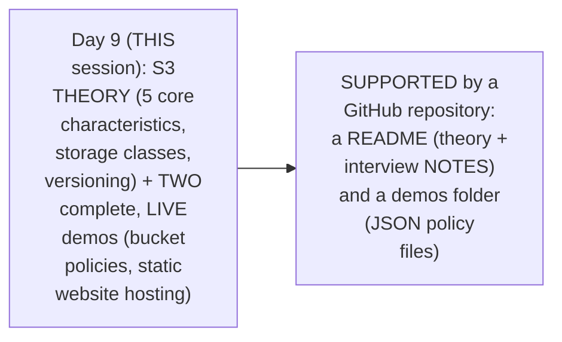

#### 🎯 Key Takeaways

* This is GENUINELY a **DEEP-dive** episode — EXPLICITLY confirmed AS one of the "MOST easy" AWS services TO learn, PRECISELY because the PROBLEM it SOLVES is so GENUINELY, INTUITIVELY understandable.
* The instructor **directly, HONESTLY points learners** TOWARD a SUPPORTING GitHub repository — CONTAINING a COMPLETE README (THEORY plus interview NOTES) and READY-to-use demo FILES (JSON policy DOCUMENTS).
* THIS session's own, EXPLICIT structure COMBINES theory WITH **TWO, complete, PRACTICAL demonstrations** — DIRECTLY, CONSISTENTLY matching THIS series' own, ESTABLISHED "learn BY doing" philosophy.

---

### 2. What Problem Does S3 Solve? A Precise, Real-World Motivation

#### ❓ Why It Exists — A Genuine, Real, Relatable Motivating Problem

> 💡 **Given directly:** *"When we use our mobile phones or laptops, most of the time we run out of storage, and what we do is go and buy a hard disk or a pen drive... but what will an organization do? You deal with a lot of heavy databases, database dumps, continuous backups, application logs... where can an organization save all of these things?"*

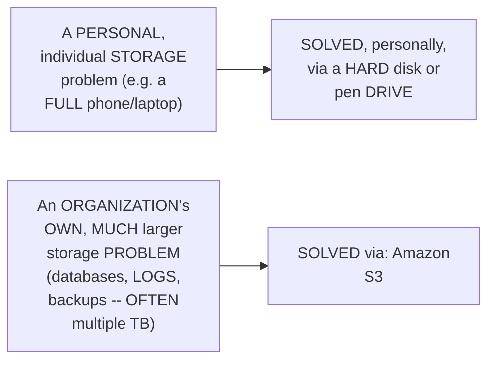

#### 📖 Definition — S3, Precisely Defined

> 💡 **Given directly:** *"Amazon S3 is a storage service... S3 stands for Simple Storage Service."*

#### 🏢 Real-World / Production Usage — A Genuine, Direct, Historical Confirmation

> 💡 **Given directly:** *"S3 was the second service that AWS has introduced... you can imagine how much important problem was the storage when people move to public cloud... it was first of its kind."*

#### ⚠ Common Mistakes

* Assuming S3 GENUINELY, EXCLUSIVELY exists FOR devops-SPECIFIC use cases (LIKE application LOGS or database BACKUPS) — explicitly, directly, PRECISELY clarified: "S3 does NOT have ANY restriction" — it CAN genuinely STORE ANY kind of FILE (pictures, VIDEOS, spreadsheets) — the DEVOPS-specific examples are SIMPLY the MOST common, PRACTICAL use case.

#### 🎯 Key Takeaways

* **S3 (SIMPLE Storage SERVICE)** GENUINELY, DIRECTLY solves ORGANIZATIONS' own, REAL storage PROBLEMS — DATABASES, application LOGS, backups — AT a scale FAR beyond PERSONAL hard-disk SOLUTIONS.
* S3 is directly, HISTORICALLY confirmed as AWS's OWN **SECOND service EVER introduced** — DIRECTLY, CONCRETELY signaling HOW critical the STORAGE problem GENUINELY was, EARLY in cloud COMPUTING's own history.
* S3 GENUINELY has **NO restriction** on WHAT kind of FILE you can STORE — THOUGH devops ENGINEERS specifically, TYPICALLY deal WITH application logs, DATABASE backups, and CONFIGURATION files.

---
### 3. The "11 Nines": S3's Own, Legendary Durability Number

#### 📖 Definition — The Precise, Famous Number

> 💡 **Given directly:** *"Just remember the number, it is 99.999999999 percent — 11 nines. So there are 11 nines here after 99. It is popularly called as 11 nines."*

#### 🪜 Step-by-Step — A Complete, Real, Worked Example of What "11 Nines" Genuinely Means

> 💡 **Given directly:** *"If you try to put 1 billion objects in S3 over the period of 100 years, what AWS guarantees you is you can expect 99.999... only ONE object is the reliability... that means if you have 1 billion objects that you are uploading, that is 100 crore objects, over a period of 100 years, AWS says there is a chance of only one object getting deleted — rest all will be safe."*

```text
The "11 Nines" (99.999999999%) Durability Guarantee:
  1,000,000,000 objects, stored over 100 years
  -> AWS guarantees: approximately 1 object might, genuinely, be lost
  -> Everything else remains genuinely, reliably safe
```

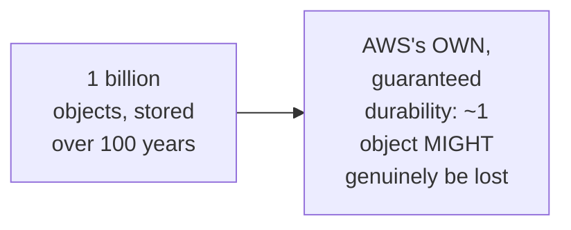

#### 🔍 Internal Working — Precisely HOW AWS Achieves This: Replication

> 💡 **Given directly:** *"What AWS does is it creates multiple replicas... in one region there are multiple availability zones, in one availability zone there are multiple data centers. What AWS does is it creates multiple copies of this index.html, so that even if one of the data centers, one of the availability zones goes down, still you have copies of this in multiple places."*

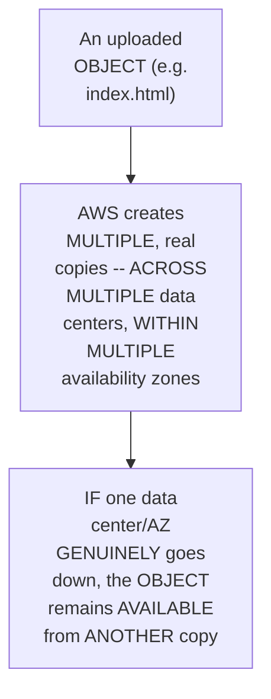

#### ⚠ Common Mistakes

* Confusing S3's OWN **DURABILITY** (11 NINES — DATA never GENUINELY gets LOST) with **AVAILABILITY** (99.9% — a SEPARATE, related METRIC about whether the SERVICE is ACCESSIBLE at ANY given MOMENT) — explicitly, directly IMPLIED as TWO, genuinely DIFFERENT, related METRICS.
* Assuming the "11 NINES" number is GENUINELY, MERELY a MARKETING claim, WITHOUT a REAL, underlying MECHANISM — explicitly, directly, PRECISELY grounded IN AWS's OWN, genuine, MULTI-data-center REPLICATION strategy.

#### 🎯 Key Takeaways

* S3's OWN, famous **"11 nines" (99.999999999%)** durability GUARANTEE precisely MEANS: OUT of 1 BILLION objects, stored OVER 100 years, AWS EXPECTS only ABOUT one OBJECT'S own, POTENTIAL loss.
* This GUARANTEE is directly, CONCRETELY achieved VIA **automatic REPLICATION** — EVERY object is COPIED across MULTIPLE data CENTERS, within MULTIPLE availability ZONES, within a REGION.
* This "11 NINES" number is directly, EXPLICITLY confirmed as ONE of the **KEY factors** BEHIND S3's own, GENUINE, widespread SUCCESS and popularity.

---

### 4. Objects & Global Accessibility: Precise, Foundational Concepts

#### 📖 Definition — "Object," Precisely Defined

> 💡 **Given directly:** *"Anything that you put in S3 is an object. For example, right now I created this index.html — index.html is an object in S3. Anything that you upload in S3 is an object, because in S3 there is no hardcore requirement — it does not mean you have to save a file, or a folder, or a movie file, database file — you can save anything."*

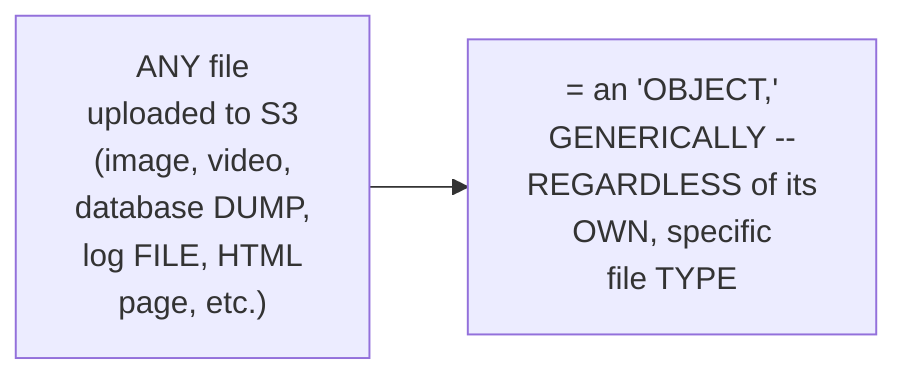

#### 📖 Definition — Global Accessibility, Precisely Explained

> 💡 **Given directly:** *"Anything that you upload on S3, you can access using an HTTP protocol... S3 becomes globally accessible — that means you can put your database files or application logs anywhere in the world, and access it from anywhere in the world."*

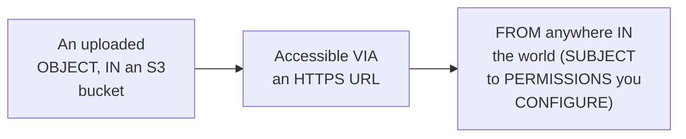

#### ⚠ Common Mistakes

* Assuming "GLOBALLY accessible" GENUINELY means "PUBLICLY accessible BY default" — explicitly, directly, LATER clarified (Section 5): PUBLIC access is BLOCKED by DEFAULT — "GLOBALLY accessible" DESCRIBES the POTENTIAL reach (ANYONE, anywhere, IF permitted), NOT the DEFAULT, actual PERMISSION state.

#### 🎯 Key Takeaways

* An **"OBJECT"** in S3 is GENUINELY, PRECISELY defined as ANYTHING you UPLOAD — WITH absolutely **NO restriction** on FILE type.
* S3's OWN, genuine "GLOBAL accessibility" means ANY object CAN, in PRINCIPLE, be accessed VIA an HTTPS URL FROM anywhere IN the world — SUBJECT to the PERMISSIONS you EXPLICITLY configure.
* This directly, PRECISELY sets UP the REST of this SESSION's own, DETAILED security DISCUSSION (Section 7, and the LIVE demos IN Sections 11-12) — GLOBAL reach REQUIRES careful, DELIBERATE permission MANAGEMENT.

---
### 5. A Complete, Real, Live Demo: Creating Your First S3 Bucket

#### 🪜 Step-by-Step — The Critical, Global Uniqueness Naming Rule

> 💡 **Given directly:** *"This is globally accessible — what does that mean? You need to provide a unique name. The S3 bucket name that you put here should be unique across all the AWS accounts. It's not within your AWS account, but it should be across all the AWS accounts."*

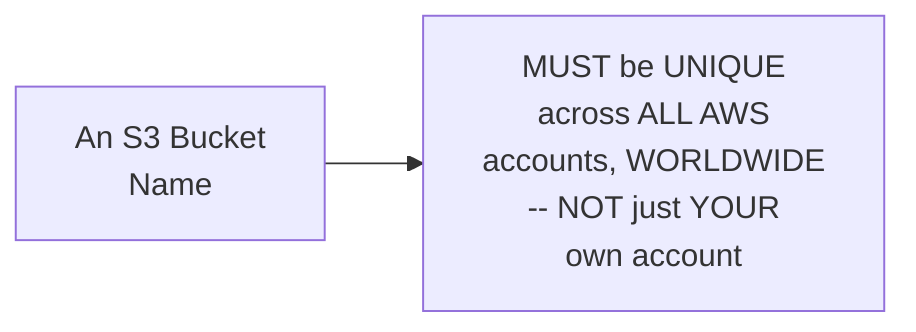

#### 🏢 Real-World / Production Usage — A Genuine, Real Naming-Convention Example

> 💡 **Given directly:** *"As a devops engineer, you try to come up with a nomenclature... let's say I'm working for an organization called example.com — I'll say app1, followed by the feature name, followed by which environment (production, staging), followed by the domain: app1-payments-prod-example.com."*

```text
A real, worked naming convention example:
  app1  -  payments  -  prod  -  example.com
  (app) - (feature)  - (env)  - (organization domain)
```

#### 🪜 Step-by-Step — A Complete, Real Bucket-Creation Walkthrough

> 💡 **Given directly:** *"Go to the search bar, click on S3... click on buckets, and to your right side you'll find 'create bucket'... provide the name... select an AWS region."*

```bash
# Bucket creation checklist (live-demonstrated):
# 1. Choose a GLOBALLY unique bucket name (e.g. app1-payments-prod-example.com)
# 2. Select an AWS Region
# 3. Bucket ownership: left as default
# 4. Block Public Access: LEFT ENABLED (the safe, default choice)
# 5. Bucket Versioning: left as default (disabled) for now
# 6. Default encryption: already enabled, by default
```

#### ⚠ A Direct, Honest, Important Security Warning

> 💡 **Given directly:** *"By default, public access is blocked. But if you disable this one, anyone in the world can access your resources in S3 buckets — sometimes this information can be highly sensitive... AWS gives you a warning already saying that if you turn off this one, you might land into some problems. So always keep this enabled."*

#### ⚠ A Direct, Honest, Genuine Note on Recent Default Changes

> 💡 **Given directly:** *"By default, S3 buckets are encrypted with respect to the data. I think six months back or a year back, this option was not by default. AWS has recently come up with this, that they have encrypted objects by default. So this is one good thing."*

#### 🪜 Step-by-Step — A Complete, Real, Live Object Upload

> 💡 **Given directly:** *"Just go here, click on the upload button, and you can upload anything from your laptop... I have a file here called index.html... click on upload... it got uploaded so quick."*

#### ⚠ Common Mistakes

* Assuming an S3 BUCKET name ONLY needs to be UNIQUE WITHIN your OWN, personal AWS ACCOUNT — explicitly, directly, REPEATEDLY corrected: it MUST be unique ACROSS **ALL** AWS accounts, WORLDWIDE.
* Assuming "BLOCK all public ACCESS" is a SAFE setting to DISABLE without CONSEQUENCE — explicitly, directly, HONESTLY warned against — AWS ITSELF displays a WARNING, since SENSITIVE data (LIKE database DUMPS) could become PUBLICLY exposed.

#### 🎯 Key Takeaways

* S3 bucket NAMES must be **GLOBALLY unique**, ACROSS every, SINGLE AWS account WORLDWIDE — a GENUINE, real NAMING-convention practice (e.g., `app1-PAYMENTS-prod-example.COM`) helps MANAGE this AT the organizational LEVEL.
* **"BLOCK all public ACCESS"** is ENABLED by DEFAULT, and SHOULD genuinely, TYPICALLY remain SO — DISABLING it EXPOSES the bucket'S own contents TO the entire, PUBLIC internet.
* **DEFAULT encryption** is directly, HONESTLY confirmed as a RELATIVELY RECENT (WITHIN the PAST year, AT time of RECORDING) AWS improvement — PREVIOUSLY, encryption REQUIRED manual, EXPLICIT configuration.

---

### 6. Why Buckets Are Region-Scoped, Despite Being "Globally Accessible"

#### ❓ Why It Exists — A Genuine, Direct Clarification

> 💡 **Given directly:** *"You need to understand it very clearly that S3 buckets are scoped in a region, like you create an S3 bucket like an EC2 instance — only where you put it in a region. But the only difference is the content in S3 is globally accessible."*

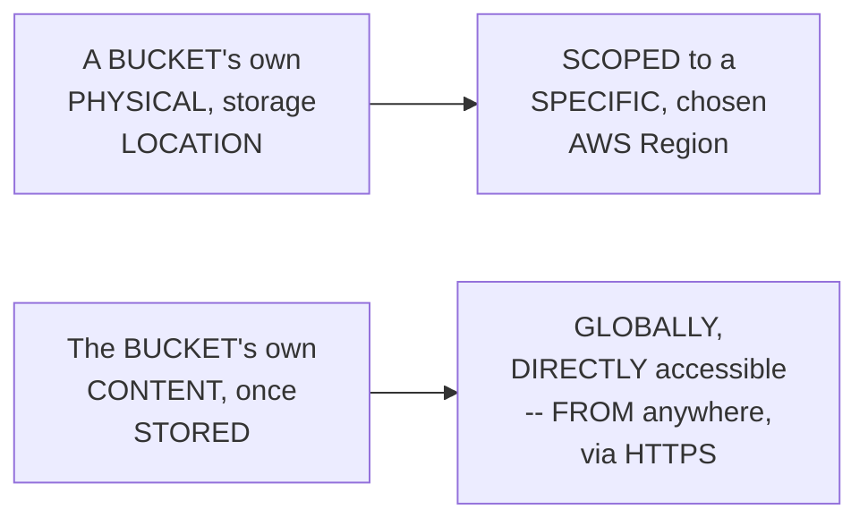

#### 🧠 Concept — A Genuinely Relatable, Real Latency Explanation

> 💡 **Given directly:** *"If I'm sitting today in Hyderabad, and if I create an S3 bucket in Hyderabad, the advantage that I get is basically the storage is very near to me — there will be less latency. Now if I create an S3 bucket somewhere in North America, it will take more time for my request to go there and give the response back."*

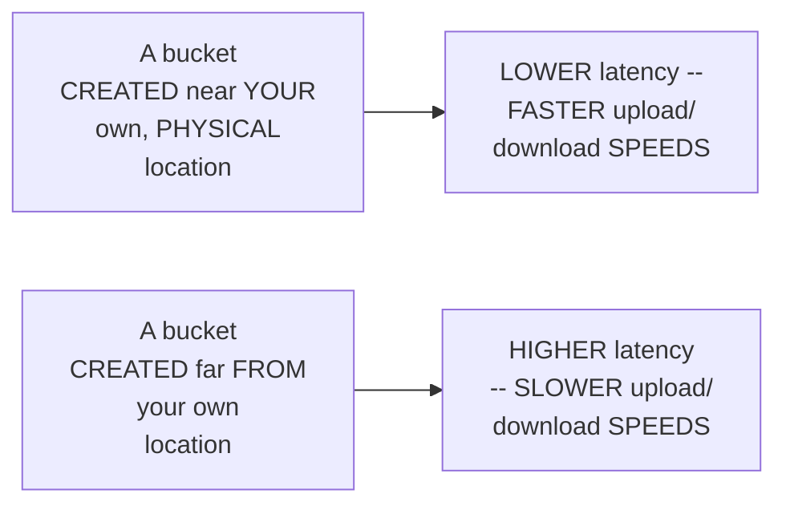

#### ⚠ Common Mistakes

* Assuming "GLOBALLY accessible" GENUINELY contradicts S3 buckets ALSO being "REGION-scoped" — explicitly, directly, PRECISELY reconciled: the BUCKET's own PHYSICAL storage LOCATION is REGION-specific (LIKE ANY other AWS RESOURCE), but its OWN, stored CONTENT remains ACCESSIBLE from ANYWHERE — THESE are TWO, genuinely DIFFERENT, complementary FACTS, not a CONTRADICTION.

#### 🎯 Key Takeaways

* S3 buckets are GENUINELY, DIRECTLY **region-SCOPED** (JUST like EC2 instances) — but THEIR own, STORED content REMAINS **GLOBALLY accessible**.
* CHOOSING a region CLOSER to YOUR own, PHYSICAL location GENUINELY, DIRECTLY reduces **LATENCY** — a REAL, practical CONSIDERATION when CREATING a bucket.
* This directly, PRECISELY reconciles WHAT could OTHERWISE seem LIKE a CONTRADICTION — "REGION-scoped" describes WHERE the DATA physically LIVES; "GLOBALLY accessible" describes WHO can REACH it.

---
### 7. The Five Core Characteristics of S3, In Detail

#### 📖 Definition — The Five, Precise Characteristics

> 💡 **Given directly:** *"These are the five major advantages of AWS S3: S3 is highly available and durable, S3 is highly scalable, S3 has very good amount of security, there is cost effectiveness, and the performance point of view."*

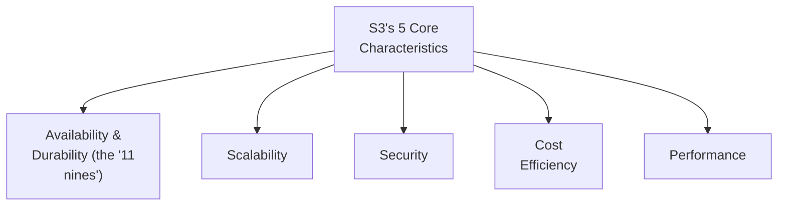

#### 📖 Definition — Scalability, Precisely Explained

> 💡 **Given directly:** *"The file that you can upload for one object should not exceed 5 TB, which is very much more... you can keep expanding your bucket to however much you want — you can put 5 petabytes or 55 petabytes of files, AWS will not restrict you."*

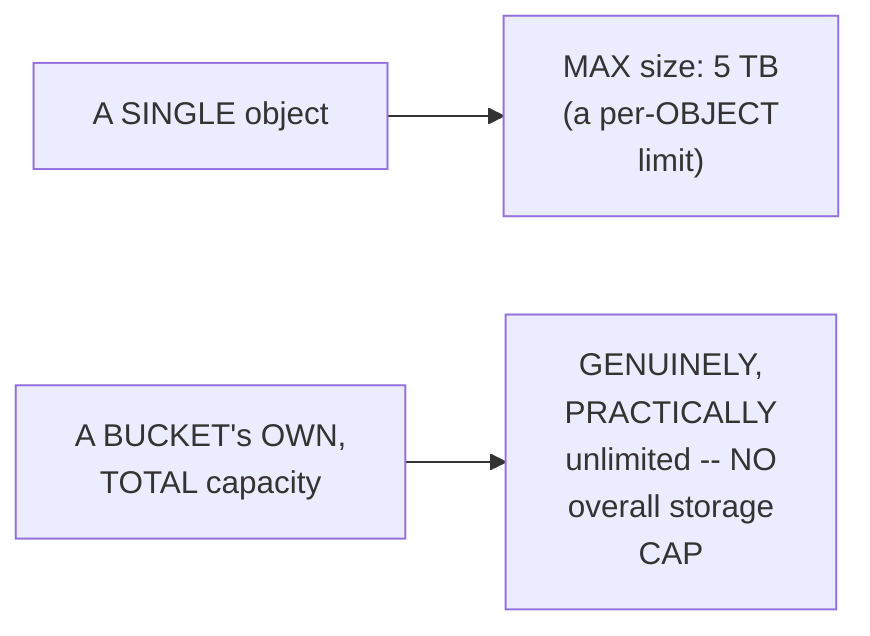

#### 📖 Definition — Security, Precisely Explained

> 💡 **Given directly:** *"There are two things: encryption at rest and encryption at transit. AWS supports both... AWS has a lot of ACLs, bucket policies — you can restrict permissions on who can access these buckets... you can also enable logging, integrate with CloudWatch, and send notifications through Lambda functions."*

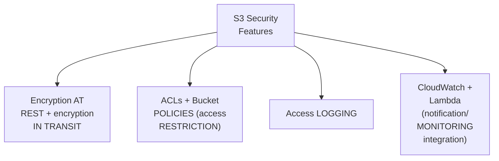

#### 📖 Definition — Performance, Precisely Explained via Multi-Part Uploads

> 💡 **Given directly:** *"If you want to upload a huge file, let's say a 4TB file... because of your internet connection or other factors, your upload keeps failing, and the upload takes days. To solve this, AWS came up with a concept called multi-part uploads — you can define, upload in 100MB chunks, and even if there's a mishap, AWS will retry and continue your upload."*

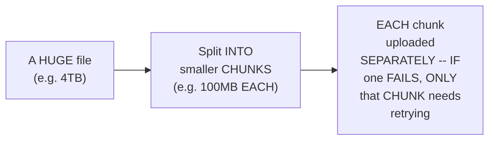

#### ⚠ Common Mistakes

* Assuming a SINGLE object's OWN 5TB size LIMIT ALSO applies TO an ENTIRE bucket's OWN, total CAPACITY — explicitly, directly, PRECISELY clarified: the 5TB LIMIT is PER-object; a BUCKET's own, OVERALL capacity is GENUINELY, PRACTICALLY unlimited.
* Assuming MULTI-part uploads are GENUINELY, MERELY a "NICE to have" — explicitly, directly, CONCRETELY motivated: WITHOUT it, a LARGE file's own UPLOAD could GENUINELY, REPEATEDLY fail and RESTART from SCRATCH, TAKING "days AND days."

#### 🎯 Key Takeaways

* S3's FIVE core CHARACTERISTICS: **AVAILABILITY/durability** (the "11 NINES"), **scalability** (5TB PER object, UNLIMITED bucket CAPACITY), **security** (encryption, ACLs, BUCKET policies, logging), **cost EFFICIENCY** (via storage CLASSES, Section 8), and **performance** (VIA multi-part UPLOADS, among OTHER optimizations).
* **SCALABILITY**'s own, GENUINE limit is PER-object (5TB) — NOT a bucket-WIDE, total storage CAP.
* **MULTI-part uploads** directly, PRACTICALLY solve a GENUINE, real problem — LARGE file uploads BEING vulnerable TO network INTERRUPTIONS — BY splitting them INTO smaller, INDEPENDENTLY-retriable CHUNKS.

---

### 8. Storage Classes: The Real Cost-vs-Access-Time Trade-Off

#### ❓ Why It Exists — A Genuine, Real, Relatable Motivating Analogy

> 💡 **Given directly:** *"Just like when you're purchasing a hard disk — do you want a cheap storage where reading/writing has to be extensive and fast? Then that kind of storage will be costlier. Or do you not care about fast input/output, just storage? Then that kind of storage will cost less."*

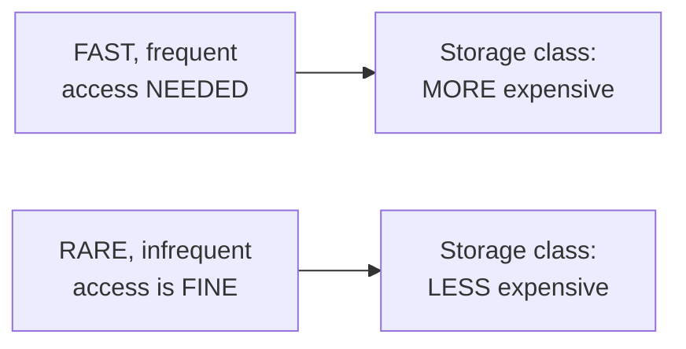

#### 📖 Definition — The Precise, Real Storage Class Options

> 💡 **Given directly:** *"S3 Standard, S3 Standard-IA, One Zone-IA, S3 Glacier, Glacier Instant Retrieval, Glacier Deep Archive, Intelligent Tiering, Outposts... it depends on the type of data you're storing, and what your organization needs."*

```text
S3's Real Storage Classes (from FASTEST/most expensive to SLOWEST/cheapest):
  S3 Standard              -> fastest access, highest cost (e.g. $0.02/GB)
  S3 Standard-IA           -> infrequent access, lower cost
  S3 One Zone-IA           -> infrequent access, single AZ, even lower cost
  S3 Intelligent-Tiering   -> automatically moves data between tiers
  S3 Glacier               -> archival, slow retrieval
  S3 Glacier Instant Retrieval -> archival, but FASTER retrieval
  S3 Glacier Deep Archive  -> the CHEAPEST; 12-48 HOUR retrieval time
  S3 Outposts              -> on-premises AWS storage
```

#### 🪜 Step-by-Step — A Complete, Real, Worked Example: The Concrete Trade-Off

> 💡 **Given directly:** *"AWS is clearly giving you metrics: cost, access time, durability, availability, minimum storage duration... if you want the cheapest storage service, go with S3 Glacier Deep Archive, where the access time is 12 to 48 hours... but if you take S3 Standard, for one GB it costs you 0.02 [dollars]... you might feel 0.02 is less, but with TBs of data, this converts into real dollars."*

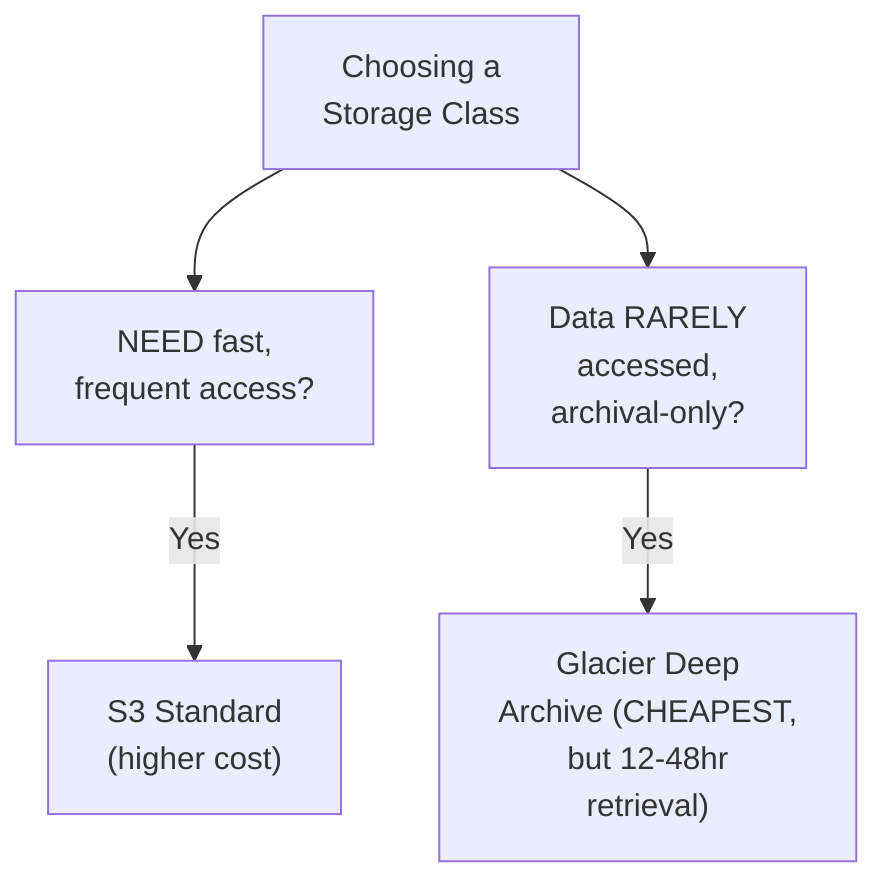

#### ⚠ Common Mistakes

* Assuming a SMALL, PER-gigabyte cost DIFFERENCE (e.g., $0.02) is GENUINELY, PRACTICALLY negligible — explicitly, directly, HONESTLY clarified: AT organizational SCALE (TERABYTES of data), THESE small, PER-unit differences GENUINELY, DIRECTLY translate INTO substantial, REAL dollar amounts.
* Assuming ONE, SINGLE storage class is GENUINELY, UNIVERSALLY "BEST" — explicitly, directly, HONESTLY clarified: the CORRECT choice GENUINELY depends ON your SPECIFIC data's own ACCESS patterns and YOUR organization's OWN, particular needs.

#### 🎯 Key Takeaways

* **STORAGE classes** GENUINELY represent THE core cost-VERSUS-access-time TRADE-off — FROM **S3 Standard** (fast, EXPENSIVE) through **Glacier Deep ARCHIVE** (cheapest, BUT 12-48 hour RETRIEVAL).
* A COMPLETE, real WORKED example directly, CONCRETELY confirmed: S3 STANDARD costs ~$0.02/GB — a SMALL number that GENUINELY, DIRECTLY scales INTO substantial COSTS at organizational (TB-scale) volumes.
* CHOOSING the RIGHT storage CLASS is directly, HONESTLY confirmed as GENUINELY, PRACTICALLY requiring COLLABORATION with YOUR development TEAM and PRODUCT owners — THERE is NO universally "BEST" choice, ONLY the RIGHT choice FOR your SPECIFIC, real DATA and NEEDS.

---
### 9. Bucket Versioning: A Complete, Real, Live Demonstration

#### ❓ Why It Exists — A Genuine, Real, Relatable Motivating Scenario

> 💡 **Given directly:** *"Let's take an example of a log file — today I have this log file, tomorrow I'll have a new log file of the same application... if you take the example of Git, if there's a code change, and if someone comes and says, 'the file you uploaded yesterday is wrong, can you give me day-before-yesterday's file?' You can go to Git, retrieve the old version, and give it back. You can do the same thing with AWS S3."*

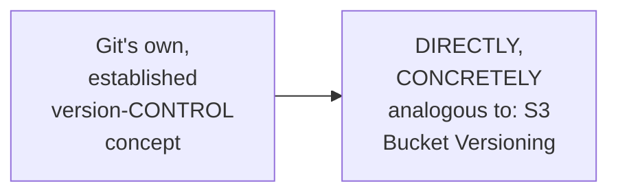

#### 🪜 Step-by-Step — A Complete, Real, Live-Demonstrated Result: Without Versioning

> 💡 **Given directly:** *"By default, if you already have a file, S3 will replace the file... versioning is disabled — what S3 has done is S3 has replaced this file."*

#### 🪜 Step-by-Step — A Complete, Real, Live-Demonstrated Result: With Versioning Enabled

> 💡 **Given directly:** *"Go to the properties, click on this bucket versioning, click on the edit button, and enable the bucket versioning... now let me try to re-upload this object, but before that I have to make some changes to it... if you go to the objects, versions, you have two copies of this version — this is one copy that I have created just now, and this is the previous copy."*

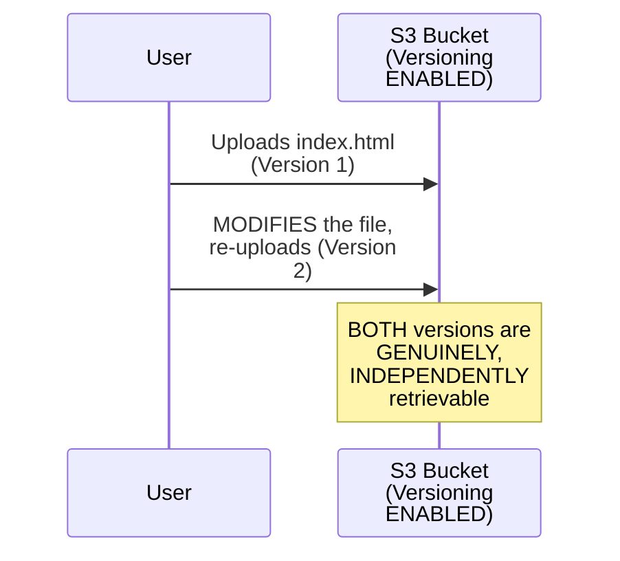

#### 🔍 Internal Working — A Genuine, Honest Comparison to Git

> 💡 **Given directly:** *"This way you can not only use S3 buckets for storing data, but you can also use S3 as a versioning system — similarly [to how] we use GitHub. But the problem is it does not have code reviews or those things, so it's not extensively used as a Version Control System, but it has that capability."*

#### ⚠ Common Mistakes

* Assuming S3 GENUINELY, AUTOMATICALLY preserves EVERY version of a FILE, by DEFAULT — explicitly, directly, LIVE-demonstrated as FALSE: WITHOUT explicitly ENABLING versioning, RE-uploading a file WITH the SAME name GENUINELY, DIRECTLY replaces the ORIGINAL, with NO way to RECOVER it.
* Assuming S3's own VERSIONING capability GENUINELY makes it a FULL, practical REPLACEMENT for a REAL version-control SYSTEM (like GIT/GitHub) — explicitly, directly, HONESTLY clarified: it LACKS code REVIEWS and OTHER, genuine VCS-specific features — it's NOT "EXTENSIVELY used" as a TRUE VCS, DESPITE having the UNDERLYING capability.

#### 🎯 Key Takeaways

* **BUCKET versioning** is DISABLED by DEFAULT — RE-uploading a file WITH the SAME name GENUINELY, DIRECTLY **replaces** the ORIGINAL, with NO automatic RECOVERY.
* ONCE ENABLED, S3 GENUINELY, DIRECTLY maintains MULTIPLE, INDEPENDENTLY-retrievable VERSIONS of the SAME object — LIVE-demonstrated with a REAL, TWO-version example.
* This capability is directly, HONESTLY compared TO Git's OWN version-control CONCEPT — THOUGH S3 GENUINELY lacks CODE-review features, so it's NOT typically USED as a FULL replacement FOR a real VCS.

---

### 10. Additional Bucket Properties: Tags, Logging, Event Notifications & Object Locking

#### 📖 Definition — Tags, Precisely Explained

> 💡 **Given directly:** *"Tags is basically for identifying the resources... you can say that this belongs to app1 project, and you can create a tag. As devops engineers, we have multiple buckets across accounts — if someone says, 'can you give me a list of S3 buckets used by this specific project,' we can make use of these tags."*

#### 📖 Definition — Access Logging, Precisely Explained

> 💡 **Given directly:** *"You can enable this access logging to ensure who is logging into this bucket, what kind of actions they are performing... you can also restrict them, remove their access, send out notifications depending upon the actions they are performing."*

#### 🔍 Internal Working — A Genuine, Direct Pointer to a Deferred, Related Topic: Event Notifications

> 💡 **Given directly:** *"If you've been following our channel, I did a complete demonstration — I think it's a 45-minute demonstration on event notifications... but for this you need to understand the concept of Lambda functions as well... it was a very good project used by Netflix, and EventBridge is also used in the same scenario."*

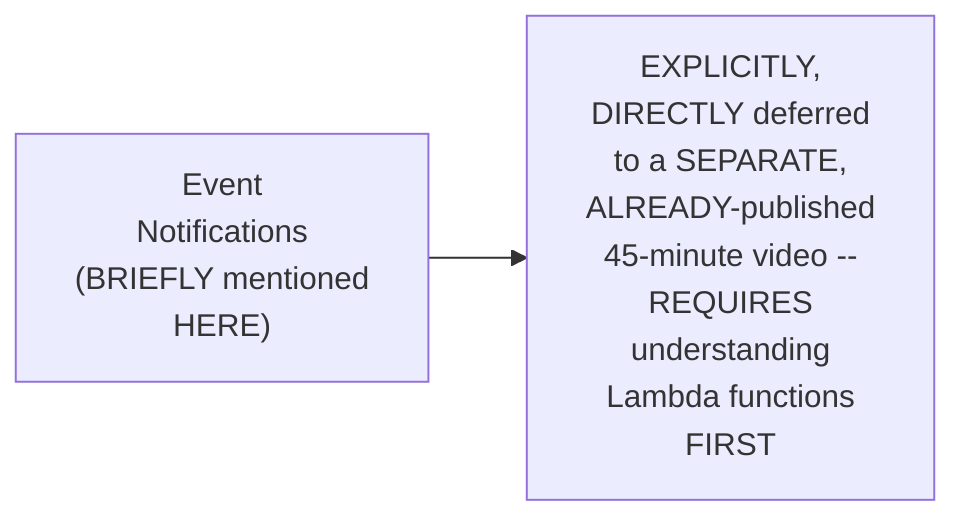

#### 📖 Definition — Object Locking, Precisely Explained

> 💡 **Given directly:** *"Let's say once I upload the object into the bucket, I want to lock the object so that nobody else should use that object, and there should not be any updates to the object — probably some sensitive information which you've decided nobody has to override."*

#### ⚠ Common Mistakes

* Assuming EVENT notifications ARE, genuinely, COVERED in FULL detail WITHIN this SPECIFIC session — explicitly, directly, HONESTLY deferred to a SEPARATE, PRE-EXISTING video — WITH an EXPLICIT prerequisite (LAMBDA functions) NOTED.

#### 🎯 Key Takeaways

* **TAGS** enable GENUINE, practical RESOURCE identification/ORGANIZATION — ESPECIALLY valuable ACROSS large, MULTI-bucket, multi-PROJECT AWS environments.
* **ACCESS logging** GENUINELY tracks WHO accesses a BUCKET and WHAT actions they PERFORM — DIRECTLY, PRACTICALLY integrable WITH CloudWatch/Lambda FOR automated monitoring/NOTIFICATIONS.
* **EVENT notifications** are directly, HONESTLY deferred to a SEPARATE, already-PUBLISHED, dedicated VIDEO — REQUIRING Lambda-FUNCTION knowledge as a PREREQUISITE; **OBJECT locking** PREVENTS any MODIFICATION/override of SENSITIVE, stored objects.

---
### 11. A Complete, Real, Live Demo: Restricting Access via Bucket Policies

#### ❓ Why It Exists — A Genuine, Real, Motivating Problem

> 💡 **Given directly:** *"Let's say you are a devops engineer, and you want to store some very sensitive information of a specific project, and you want to say that even if people from other projects have access to S3 — in their IAM policies it says 'S3 all,' so they can access everything, every S3 bucket — but I want to restrict them specifically for THIS bucket, because it has sensitive information. How will you do that? Using bucket permissions."*

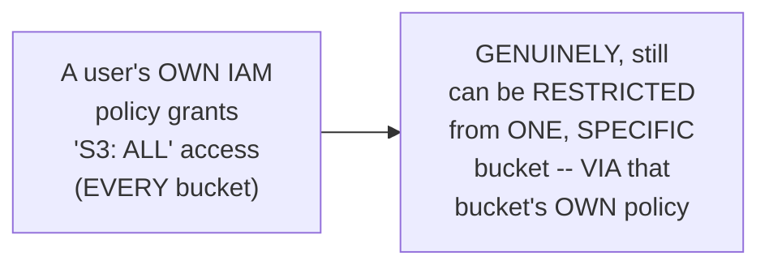

#### 🪜 Step-by-Step — Step 1: Creating an IAM User With NO Initial Permissions

> 💡 **Given directly:** *"Let's create an IAM user... let's call this demo-S3-bucket-user... let me not grant anything, so I'll just say next — I'm not granting any permissions, to show you that by default no one will be able to access it, because they don't have even permissions to S3 buckets."*

#### 🪜 Step-by-Step — Step 2: Confirming the Baseline (No Access)

> 💡 **Given directly:** *"Let me log into this account, using the IAM user I just created... if they search for S3, go to buckets — 'you don't have permissions to list the buckets' — which is expected behavior."*

#### 🪜 Step-by-Step — Step 3: Granting Broad S3 IAM Access

> 💡 **Given directly:** *"Let's go and grant this person IAM permissions for S3 — go to this user, add permissions, attach policies directly, search for S3, give S3 Full Access... now I can see all the buckets here."*

#### ⚠ A Direct, Honest, Real Demonstration of the Genuine Problem

> 💡 **Given directly:** *"Even though you are the bucket owner, and this file is very sensitive for you, this person, because they have access to all S3 buckets, can simply come here, click on this option, and download the file... now my task, as a devops engineer, is to restrict such actions."*

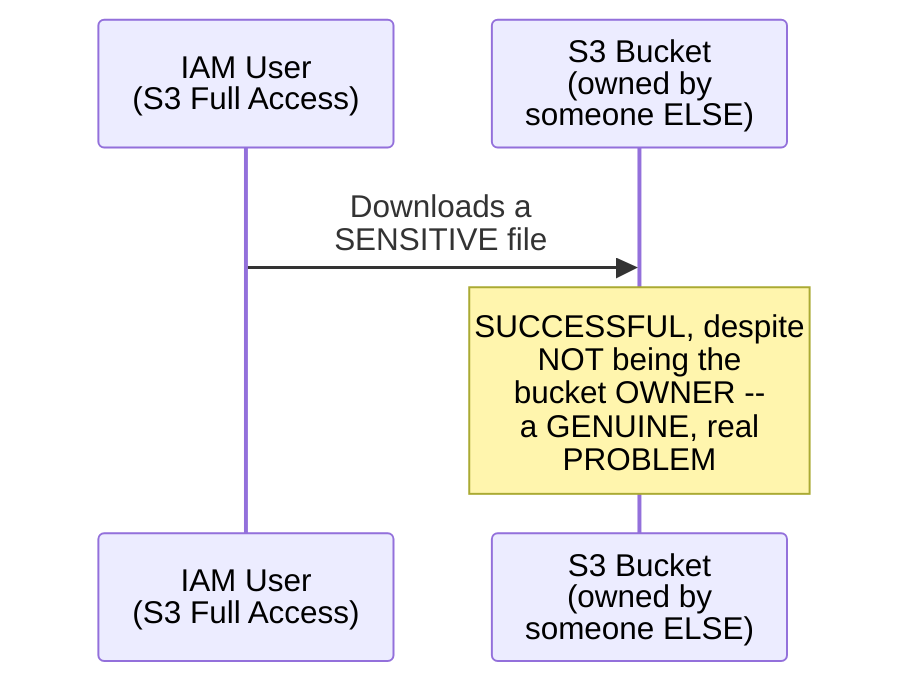

#### 🪜 Step-by-Step — Step 4: Writing a Bucket Policy to Deny Access

> 💡 **Given directly:** *"Go to bucket permissions, bucket policy, edit it... add statement... principal, star (everyone)... effect, deny... action, search for S3, all actions... resource, provide the S3 bucket... but if you're blocking everyone, you're blocking yourself as well — so add a condition: for the AWS principal ARN, string not equals [your own ARN] — except for me, this action should be executed for everyone."*

```json
{
  "Statement": [
    {
      "Sid": "BlockAllPublicAccess",
      "Effect": "Deny",
      "Principal": "*",
      "Action": "s3:*",
      "Resource": ["arn:aws:s3:::app1-payments-prod-example.com", "arn:aws:s3:::app1-payments-prod-example.com/*"],
      "Condition": {
        "StringNotEquals": {
          "aws:PrincipalArn": "<the bucket owner's own ARN>"
        }
      }
    }
  ]
}
```

```mermaid
flowchart TD
    A["Bucket Policy:<br/>Effect=Deny,<br/>Principal=*,<br/>Action=S3:*"] --> B["A GENUINE,<br/>CRITICAL condition:<br/>StringNotEquals ON<br/>the BUCKET OWNER's<br/>own ARN"]
    B --> C["EVERYONE is<br/>DENIED -- EXCEPT<br/>the bucket OWNER<br/>themselves"]
```

#### ⚠ A Direct, Honest, Live-Encountered Mistake

> 💡 **Given directly:** *"There was some issue... I missed a very basic thing, where for the bucket and for the resources inside the bucket... this is corrected in my GitHub, when you copy it you don't have to worry about it."*

#### 🪜 Step-by-Step — Step 5: Confirming the Fix, Live

> 💡 **Given directly:** *"Let me try it from the other user... let me go back and try to refresh — 'insufficient permissions to list objects.' You've noticed that this specific IAM user has access to S3 buckets, all the global S3 buckets, but still they are failing to read the objects, because of the bucket permissions we have enabled."*

#### ⚠ Common Mistakes

* Assuming BROAD, IAM-level S3 permissions ("S3: ALL") GENUINELY, AUTOMATICALLY grant access TO every, INDIVIDUAL bucket, WITH no FURTHER restriction POSSIBLE — explicitly, directly, LIVE-demonstrated as FALSE: a BUCKET-level policy CAN, genuinely, OVERRIDE and RESTRICT access, EVEN for users WITH broad IAM permissions.
* Forgetting to EXPLICITLY exempt the BUCKET owner (via a CONDITION) when WRITING a "DENY everyone" policy — explicitly, directly, HONESTLY warned against: "IF you're blocking EVERYONE, you're BLOCKING yourself AS well."
* Assuming a LIVE, HONEST JSON-syntax mistake REFLECTS a GENUINE, deep MISUNDERSTANDING — explicitly, directly, PRACTICALLY treated as a NORMAL, real PART of writing BUCKET policies — WORTH double-CHECKING carefully, and CORRECTABLE.

#### 🎯 Key Takeaways

* A COMPLETE, real, FIVE-step LIVE demonstration directly, CONCRETELY confirmed: BUCKET policies CAN genuinely, DIRECTLY **override** broad, IAM-level S3 PERMISSIONS — RESTRICTING access to a SPECIFIC bucket, EVEN for users WITH "S3: all" ACCESS.
* Writing a "DENY everyone" bucket POLICY REQUIRES an EXPLICIT, CAREFUL **condition** (StringNotEquals ON the bucket OWNER's own ARN) — OTHERWISE, the OWNER themselves GETS genuinely, ACCIDENTALLY locked OUT.
* A REAL, HONEST, live-ENCOUNTERED JSON syntax MISTAKE was DIRECTLY, TRANSPARENTLY shown and CORRECTED — REINFORCING that CAREFUL, precise SYNTAX matters GENUINELY, PRACTICALLY when WRITING bucket policies.

---

### 12. A Complete, Real, Live Demo: Hosting a Static Website on S3

#### ❓ Why It Exists — A Genuine, Real Motivation

> 💡 **Given directly:** *"Why should you host a static website on S3? One, S3 is a very cheap solution — if not, you have to go to any hosting platform. In AWS, you can purchase the domain using Route 53, use a CDN service CloudFront... but at the end of the day, that will be very cheap compared to any other hosting platform."*

#### 🪜 Step-by-Step — Step 1: Upload & Enable Static Website Hosting

> 💡 **Given directly:** *"I already have an index.html... go to bucket properties, scroll down, find 'static website hosting,' edit it, enable it — 'host a static website,' what is your index document? In my case, index.html."*

#### ⚠ A Direct, Honest, Live-Encountered Error #1: "Forbidden"

> 💡 **Given directly:** *"You will get a forbidden error. The reason is because of this — when you created the bucket, you said public access to the bucket is disabled. Go here, uncheck this one, save the changes... there is a possibility that at your account level, permission is disabled for you to uncheck this box — even at the organization level, there's an option called 'block all public access.'"*

#### ⚠ A Direct, Honest, Live-Encountered Error #2: "Access Denied" (Even After Unblocking)

> 💡 **Given directly:** *"Still there is access denied... one final thing you have to do is go to the permission section, and add a new bucket policy — regarding get-all-objects access for everyone in the internet."*

```json
{
  "Statement": [
    {
      "Effect": "Allow",
      "Principal": "*",
      "Action": "s3:GetObject",
      "Resource": "arn:aws:s3:::app1-payments-prod-example.com/*"
    }
  ]
}
```

```mermaid
flowchart TD
    A["Static Website<br/>Hosting: Complete<br/>Setup Requires TWO<br/>Separate Steps"] --> B["Step 1: UNCHECK<br/>'Block all public<br/>access'"]
    A --> C["Step 2: ADD an<br/>EXPLICIT 'Allow'<br/>bucket policy for<br/>s3:GetObject"]
    B --> D["EITHER step ALONE<br/>is GENUINELY,<br/>DIRECTLY<br/>insufficient"]
    C --> D
```

#### 🪜 Step-by-Step — Step 3: Confirming the Complete, Live Success

> 💡 **Given directly:** *"Now let's save this and see what will happen — 'My first heading, my first paragraph' — I have taken a basic example from W3Schools."*

#### ⚠ A Direct, Honest, Brief Pointer to a Deferred Topic: CORS

> 💡 **Given directly:** *"If you use rich JavaScript that gets information from other APIs, and that code is available in your S3 bucket, your browser will by default restrict such cases — you have to enable something called CORS. We will try to cover [this] when we learn about CloudFront."*

#### ⚠ Common Mistakes

* Assuming UNCHECKING "BLOCK all public ACCESS" ALONE is SUFFICIENT to MAKE a static WEBSITE genuinely, PUBLICLY accessible — explicitly, directly, LIVE-demonstrated as FALSE: an EXPLICIT, "ALLOW" bucket policy (GRANTING `s3:GetObject` to EVERYONE) is ALSO, genuinely, SEPARATELY required.
* Assuming a "BLOCK all public ACCESS" checkbox is ALWAYS, GENUINELY editable AT the bucket LEVEL — explicitly, directly, HONESTLY noted: an ORGANIZATION-level SETTING can ALSO block THIS, REQUIRING a DIFFERENT, higher-LEVEL fix.

#### 🎯 Key Takeaways

* HOSTING a STATIC website ON S3 GENUINELY, PRACTICALLY requires **TWO, SEPARATE steps**: (1) UNCHECKING "block ALL public ACCESS," AND (2) ADDING an EXPLICIT "ALLOW" bucket POLICY granting `s3:GetObject` TO everyone — NEITHER step ALONE is SUFFICIENT.
* THIS demo directly, HONESTLY includes TWO, real, LIVE-encountered ERRORS ("FORBIDDEN," then "ACCESS denied") — EACH requiring a DIFFERENT, SPECIFIC fix — a GENUINE, realistic REPRESENTATION of ACTUAL, real-world TROUBLESHOOTING.
* **CORS** (cross-ORIGIN resource SHARING) is BRIEFLY, HONESTLY mentioned AS a related CONCERN (FOR JavaScript-heavy SITES calling EXTERNAL APIs) — EXPLICITLY deferred to a FUTURE, CloudFront-focused SESSION.

---
### 13. Closing: Connecting Versioning to Cost Management via Storage Classes

#### 🪜 Step-by-Step — A Direct, Honest, Final Connection

> 💡 **Given directly:** *"One final thing I forgot to tell you was regarding the versioning — I told you that you need to enable versioning and create multiple copies of it, but how does AWS remain cost effective? What you can do is: the latest version can use a particular storage class, and for the previous version, you can say 'delete the previous version after 10 days,' or 'delete after 5 days,' or 'whenever there's a previous version, send it to S3 Glacier' — that way you can reduce the cost."*

```mermaid
flowchart LR
    A["A NEWLY-created<br/>OBJECT version"] --> B["Stored in a<br/>FAST, MORE<br/>expensive class<br/>(e.g. S3 Standard)"]
    C["An OLDER,<br/>PREVIOUS version<br/>(from VERSIONING)"] --> D["Can be<br/>AUTOMATICALLY<br/>MOVED to a<br/>CHEAPER class (e.g.<br/>Glacier), OR<br/>DELETED after a SET<br/>number of days"]
```

#### ⚠ Common Mistakes

* Assuming ENABLING versioning (Section 9) GENUINELY, INEVITABLY leads to EVER-growing, UNCONTROLLED storage COSTS as VERSIONS accumulate — explicitly, directly, HONESTLY clarified: STORAGE-class-based LIFECYCLE management (MOVING or DELETING older VERSIONS) directly, PRACTICALLY controls THIS cost OVER time.

#### 🎯 Key Takeaways

* This episode **GENUINELY, COMPLETELY delivers** its OWN, stated GOALS — a COMPLETE theoretical FOUNDATION (FIVE characteristics, storage CLASSES, versioning) PLUS two, real, LIVE-demonstrated practical SCENARIOS (bucket POLICIES, static WEBSITE hosting).
* The instructor **directly, HONESTLY circles BACK** to CONNECT bucket VERSIONING (Section 9) WITH storage-CLASS-based cost MANAGEMENT (Section 8) — OLDER versions CAN be AUTOMATICALLY moved TO cheaper storage OR deleted AFTER a set PERIOD.
* This directly, PRACTICALLY demonstrates HOW multiple, SEPARATELY-taught S3 CONCEPTS (versioning AND storage classes) GENUINELY, PRACTICALLY combine IN real-world, COST-conscious bucket MANAGEMENT.

---

## 📝 Glossary

| Term | Definition | Why It Matters |
|---|---|---|
| **S3 (Simple Storage Service)** | AWS's object storage service | Solves organization-scale storage problems |
| **Object** | Anything uploaded to S3 | No restriction on file type |
| **11 Nines** | 99.999999999% durability guarantee | ~1 object lost per 1 billion, over 100 years |
| **Bucket** | A named container for storing objects | Must have a globally unique name |
| **Region-Scoped** | A bucket's physical storage location | Content remains globally accessible regardless |
| **Storage Class** | A cost-vs-access-time tier for stored data | e.g., S3 Standard, Glacier Deep Archive |
| **Bucket Versioning** | Maintaining multiple, retrievable copies of an object | Disabled by default; replaces files without it |
| **Multi-Part Upload** | Splitting large files into smaller, independently-retriable chunks | Improves upload reliability for large files |
| **Bucket Policy** | A JSON document controlling bucket-level access | Can override broad, IAM-level permissions |
| **Block Public Access** | A setting preventing public bucket access | Enabled by default; must be carefully managed |
| **CORS** | Cross-Origin Resource Sharing | Needed for JavaScript-heavy sites calling external APIs |

---

## 🔄 Revision Notes — One-Minute Revision

* This is **Day 9**, a deep dive into AWS S3 -- combining a complete theoretical foundation with TWO complete, live-demonstrated practical scenarios.
* **What problem S3 solves**: organization-scale storage (databases, logs, backups) -- S3 was AWS's own SECOND service ever launched. S3 = "Simple Storage Service," genuinely has NO restriction on file type.
* **The "11 nines" (99.999999999%) durability guarantee**: out of 1 billion objects, stored over 100 years, AWS expects only ~1 object might be lost. Achieved via automatic replication across multiple data centers/AZs.
* **Objects & global accessibility**: anything uploaded is called an "object"; accessible via HTTPS from anywhere in the world (subject to permissions).
* **Bucket creation**: names must be GLOBALLY unique across ALL AWS accounts (not just your own) -- a real naming convention example: app1-payments-prod-example.com. "Block all public access" is enabled by default and should generally stay that way. Default encryption is a relatively recent AWS improvement.
* **Region-scoped, yet globally accessible**: buckets are created in a specific region (like EC2), affecting latency, but their content remains globally accessible once stored.
* **5 core characteristics**: availability/durability (11 nines), scalability (5TB per-object limit, unlimited bucket capacity), security (encryption at rest/transit, ACLs, bucket policies, logging, CloudWatch/Lambda integration), cost efficiency (storage classes), performance (multi-part uploads for large files).
* **Storage classes**: the core cost-vs-access-time trade-off. S3 Standard (fast, ~$0.02/GB) through Glacier Deep Archive (cheapest, 12-48hr retrieval). No universally "best" choice -- depends on your specific data and needs.
* **Bucket versioning**: disabled by default (re-uploading replaces files). Once enabled, multiple, independently-retrievable versions are maintained -- directly analogous to Git, though S3 lacks code reviews so isn't used as a full VCS replacement.
* **Additional properties**: tags (resource identification), access logging (with CloudWatch/Lambda integration), event notifications (deferred to a separate, existing 45-minute video, requires Lambda knowledge), object locking (prevents modification of sensitive objects).
* **Live Demo 1 -- Bucket Policies**: a complete, 5-step demonstration -- create an IAM user with NO permissions (confirmed: can't even list buckets) -> grant "S3 Full Access" (confirmed: CAN now download files from someone else's bucket) -> write a bucket policy (Effect=Deny, Principal=*, Action=S3:*, with a CRITICAL StringNotEquals condition on the bucket owner's own ARN, to avoid self-lockout) -> a genuine, honest, live JSON syntax mistake, corrected -> confirmed: the SAME IAM user (still with full S3 access) is now blocked at the bucket level.
* **Live Demo 2 -- Static Website Hosting**: upload index.html, enable "static website hosting" in bucket properties. TWO separate steps required: (1) uncheck "block all public access" (may ALSO be blocked at the organization level); (2) add an explicit "Allow" bucket policy granting s3:GetObject to everyone. Two real, live-encountered errors ("Forbidden," then "Access Denied") each required a different fix. CORS is briefly mentioned, deferred to a future CloudFront session.
* **Closing**: connects versioning back to cost management -- older versions can be automatically moved to cheaper storage classes (e.g. Glacier) or deleted after a set number of days, to control costs as versions accumulate.

---

## 📋 Cheat Sheet

**S3's 5 core characteristics:**
```text
Availability/Durability -- the "11 nines" (99.999999999%)
Scalability              -- 5TB max PER OBJECT; unlimited bucket capacity
Security                 -- encryption (rest+transit), ACLs, bucket policies, logging
Cost Efficiency          -- via storage classes
Performance              -- multi-part uploads for large files
```

**Storage classes, fastest/most-expensive to cheapest/slowest:**
```text
S3 Standard -> S3 Standard-IA -> S3 One Zone-IA -> Intelligent-Tiering ->
Glacier -> Glacier Instant Retrieval -> Glacier Deep Archive (cheapest, 12-48hr)
```

**Bucket naming rule:**
```text
MUST be globally unique across ALL AWS accounts (not just your own)
Convention example: app1-payments-prod-example.com
```

**Bucket policy for DENYING everyone except the owner:**
```json
{
  "Effect": "Deny",
  "Principal": "*",
  "Action": "s3:*",
  "Resource": ["arn:aws:s3:::bucket-name", "arn:aws:s3:::bucket-name/*"],
  "Condition": {
    "StringNotEquals": { "aws:PrincipalArn": "<owner's own ARN>" }
  }
}
```

**Static website hosting — 2 required steps:**
```text
1. Uncheck "Block all public access"
2. Add an explicit "Allow" bucket policy for s3:GetObject, Principal: *
   (BOTH steps are required; neither alone is sufficient)
```

---

## 🔥 Interview Questions & Answers

### 🟢 Beginner

**Q1.**

**Question:** What does S3 stand for, and what problem does it solve?

**Answer:** Simple Storage Service; it solves organization-scale storage problems (databases, logs, backups).

**Explanation:** Directly, precisely explained.

**Why Interviewers Ask This:** The most basic, foundational S3 question.

**Possible Follow-up:** "Was S3 one of AWS's earliest services?"

**Q2.**

**Question:** What does the "11 nines" durability guarantee genuinely mean?

**Answer:** Out of 1 billion objects, stored over 100 years, AWS expects only about 1 object might be lost.

**Explanation:** Directly, precisely explained with a worked example.

**Why Interviewers Ask This:** A frequently-tested, memorable S3 statistic.

**Possible Follow-up:** "How does AWS achieve this level of durability?"

**Q3.**

**Question:** What is an S3 "object"?

**Answer:** Anything uploaded to S3 -- there's no restriction on file type.

**Explanation:** Directly, precisely defined.

**Why Interviewers Ask This:** Basic, essential S3 terminology.

**Possible Follow-up:** "What is the maximum size of a single object?"

**Q4.**

**Question:** Must an S3 bucket name be unique only within your own AWS account?

**Answer:** No -- it must be unique across ALL AWS accounts, worldwide.

**Explanation:** Directly, repeatedly emphasized.

**Why Interviewers Ask This:** A commonly-tested, genuine naming rule.

**Possible Follow-up:** "What naming convention might a devops team adopt to manage this?"

**Q5.**

**Question:** Are S3 buckets region-scoped, or truly global resources?

**Answer:** Region-scoped for storage location, but their content is globally accessible.

**Explanation:** Directly, precisely reconciled.

**Why Interviewers Ask This:** Tests genuine understanding of a commonly-confused nuance.

**Possible Follow-up:** "Why does choosing a nearby region genuinely matter?"

**Q6.**

**Question:** Name the 5 core characteristics of S3.

**Answer:** Availability/durability, scalability, security, cost efficiency, and performance.

**Explanation:** Directly, explicitly named.

**Why Interviewers Ask This:** Foundational, frequently-tested S3 vocabulary.

**Possible Follow-up:** "What genuinely enables S3's cost efficiency?"

**Q7.**

**Question:** What is the cheapest S3 storage class, and what is its genuine trade-off?

**Answer:** S3 Glacier Deep Archive; its trade-off is a 12-48 hour retrieval time.

**Explanation:** Directly, precisely explained.

**Why Interviewers Ask This:** Basic, practical storage-class knowledge.

**Possible Follow-up:** "When would S3 Standard genuinely be preferred instead?"

**Q8.**

**Question:** Is bucket versioning enabled by default?

**Answer:** No -- by default, re-uploading a file with the same name replaces it.

**Explanation:** Directly, live-demonstrated.

**Why Interviewers Ask This:** Basic, essential versioning knowledge.

**Possible Follow-up:** "What happens once versioning IS enabled?"

**Q9.**

**Question:** Can a bucket policy genuinely override a user's broad, IAM-level S3 permissions?

**Answer:** Yes -- a bucket policy can restrict access even for users with "S3 Full Access."

**Explanation:** Directly, live-demonstrated.

**Why Interviewers Ask This:** Tests genuine, practical understanding of the IAM-vs-bucket-policy relationship.

**Possible Follow-up:** "What critical condition must a 'deny everyone' bucket policy include?"

**Q10.**

**Question:** Is unchecking "Block all public access" alone sufficient to host a public static website on S3?

**Answer:** No -- an explicit "Allow" bucket policy granting s3:GetObject is also required.

**Explanation:** Directly, live-demonstrated as a two-step requirement.

**Why Interviewers Ask This:** Tests genuine, practical, hands-on static-website-hosting knowledge.

**Possible Follow-up:** "What error would you genuinely see if only one of these two steps were completed?"

---

### 🟡 Intermediate

**Q11.**

**Question:** Explain why the instructor deliberately demonstrates the bucket-policy restriction (Section 11) using a user who ALREADY has "S3 Full Access," rather than a user with no S3 permissions at all.

**Answer:** This is a genuinely deliberate, REALISTIC teaching choice: by SPECIFICALLY granting the IAM user BROAD, "S3 Full Access" permissions FIRST, and THEN showing that a BUCKET policy can STILL, GENUINELY restrict them, the instructor DIRECTLY demonstrates the MOST PRACTICALLY relevant, REAL-world scenario — a DEVOPS engineer OFTEN cannot CONTROL or CHANGE another TEAM's own, BROAD IAM policies, but CAN still, GENUINELY protect THEIR OWN, specific bucket VIA a bucket-level POLICY. Demonstrating THIS with a NO-permission user WOULD have been GENUINELY less INSTRUCTIVE, since it WOULDN'T show the GENUINE, practical value of BUCKET policies as an ADDITIONAL, INDEPENDENT layer OF defense, ON TOP of (and POTENTIALLY overriding) IAM.

**Explanation:** Requires recognizing the deliberate, realistic value of demonstrating bucket-policy override against a user who ALREADY has broad access, rather than one with no access.

**Why Interviewers Ask This:** Tests whether a learner recognizes why bucket policies matter specifically as an additional, overriding layer of defense beyond IAM.

**Possible Follow-up:** "Describe a GENUINE, real organizational SCENARIO where a DEVOPS engineer would GENUINELY need THIS exact capability."

**Q12.**

**Question:** A learner argues that since S3 buckets support versioning, similar to Git, this makes S3 a genuinely complete replacement for a dedicated version control system like GitHub. Evaluate this claim.

**Answer:** This claim overstates the case, missing a GENUINELY important, DIRECTLY-stated LIMITATION this session's own content PROVIDES. Section 9's own PRECISE, HONEST clarification DIRECTLY states S3 "does NOT have the CODE reviews or THOSE things, so it's NOT extensively USED as a Version Control SYSTEM, but it HAS that capability." REAL version-CONTROL systems (like GITHUB) GENUINELY, STRUCTURALLY provide FEATURES like code REVIEWS, pull REQUESTS, branching, and MERGE workflows — NONE of which S3's own VERSIONING capability GENUINELY provides. The ACCURATE, more PRECISE conclusion: S3 versioning GENUINELY, PRACTICALLY solves the NARROWER problem of RETRIEVING previous COPIES of a FILE — it does NOT, on its OWN, REPLACE the BROADER, collaborative WORKFLOW features a DEDICATED VCS genuinely PROVIDES.

**Explanation:** Tests whether a learner recognizes that "has similar capability" doesn't mean "genuinely, fully replaces," given the session's own honest, stated limitation.

**Why Interviewers Ask This:** Distinguishes candidates who understand the scoped, specific value of a feature from those who over-generalize a surface-level similarity into full equivalence.

**Possible Follow-up:** "Describe a GENUINE, real scenario where S3 versioning WOULD, genuinely, be a REASONABLE, sufficient choice, DESPITE lacking FULL VCS features."

**Q13.**

**Question:** Explain, precisely, why the instructor deliberately performs the static website hosting demo (Section 12) by INTENTIONALLY encountering both a "Forbidden" error and then an "Access Denied" error, rather than presenting a clean, error-free walkthrough.

**Answer:** This is a genuinely deliberate teaching choice, DIRECTLY consistent with a PATTERN seen ACROSS this instructor's OWN, entire series (e.g., Day 3's OWN chmod PERMISSION error, Day 7's OWN target-group PORT mistake). By GENUINELY, LIVE encountering BOTH, REAL, common ERRORS — and SHOWING the DISTINCT, SEPARATE fix FOR each (UNBLOCKING public ACCESS, THEN adding an EXPLICIT allow POLICY) — the instructor DIRECTLY prepares LEARNERS for the SAME, REALISTIC troubleshooting SEQUENCE they will GENUINELY encounter WHEN attempting THIS exact task THEMSELVES, RATHER than presenting an UNREALISTICALLY smooth PROCESS that would LEAVE learners GENUINELY unprepared for the SAME, PREDICTABLE errors.

**Explanation:** Requires recognizing the deliberate, consistent pattern of honest, real-error demonstration across this instructor's entire series, connecting it to genuine, practical learner preparation.

**Why Interviewers Ask This:** Tests whether a learner recognizes the genuine, practical value of honest, unedited demonstrations that include real troubleshooting steps.

**Possible Follow-up:** "What GENUINE, additional error might a learner ENCOUNTER, BEYOND the two SHOWN here, WHEN attempting THIS exact static-website-hosting TASK on THEIR own account?"

**Q14.**

**Question:** Using this session's own precise "storage classes" reasoning (Section 8), explain a GENUINE, real risk of choosing S3 Glacier Deep Archive for data that a team might, unexpectedly, need to access on short notice.

**Answer:** A precise, reasoned RISK analysis, directly extending Section 8's own established TRADE-off: per Section 8's own PRECISE reasoning, Glacier Deep ARCHIVE is the CHEAPEST storage CLASS, but its OWN, genuine TRADE-off is a **12-48 HOUR retrieval TIME**. IF a team GENUINELY, UNEXPECTEDLY needs URGENT access to DATA stored in THIS class (e.g., FOR an EMERGENCY audit, or a CRITICAL, time-sensitive BUSINESS need), they would GENUINELY, DIRECTLY face a SIGNIFICANT, POTENTIALLY costly DELAY — DESPITE the DATA'S own low STORAGE cost. This directly, PRECISELY illustrates WHY storage-CLASS selection (per Section 8's own established REASONING) must GENUINELY, CAREFULLY account FOR a team's OWN, REALISTIC access PATTERNS — NOT simply MINIMIZE storage COST in isolation, WITHOUT considering the GENUINE, real COST of an UNEXPECTED, urgent RETRIEVAL need.

**Explanation:** Requires extending the storage-class trade-off reasoning to identify a genuine, practical risk of choosing the cheapest option without considering realistic access-pattern needs.

**Why Interviewers Ask This:** Tests whether a learner understands that storage-class selection requires balancing cost against genuine, realistic operational risk, not just minimizing price.

**Possible Follow-up:** "What GENUINE, real storage CLASS (from THIS session's own established OPTIONS) might GENUINELY, BETTER balance cost AND retrieval SPEED, for data that's RARELY, but SOMETIMES, urgently NEEDED?"

**Q15.**

**Question:** Synthesize this session's complete "bucket policy, Deny + Condition" reasoning (Section 11) with its own "static website hosting, Allow policy" reasoning (Section 12) to explain a GENUINE, structural principle connecting these two, seemingly opposite bucket-policy approaches.

**Answer:** A precise, synthesized explanation, directly connecting TWO, separately-established sections: per Section 11's own PRECISE mechanism, a bucket POLICY was used to **DENY** access TO everyone, WITH a CONDITION carving OUT an EXCEPTION for the BUCKET owner. Per Section 12's own PRECISE mechanism, a bucket POLICY was used to **ALLOW** access (SPECIFICALLY, `s3:GetObject`) TO everyone, WITH NO exception NEEDED (SINCE the GOAL was GENUINELY, PUBLIC accessibility). SYNTHESIZING these TWO, seemingly OPPOSITE examples directly, PRECISELY reveals a GENUINE, shared, STRUCTURAL principle: a BUCKET policy is GENUINELY, FUNDAMENTALLY a FLEXIBLE, DECLARATIVE tool FOR precisely SPECIFYING **WHO** (principal), **WHAT** (action), and **UNDER what CONDITIONS**, should be EITHER allowed OR denied ACCESS — the SAME, underlying JSON STRUCTURE (Effect, PRINCIPAL, Action, RESOURCE, optionally CONDITION) genuinely, DIRECTLY supports BOTH restrictive (DENY-based) and PERMISSIVE (allow-BASED) use cases — THE "correct" choice GENUINELY depends ENTIRELY on the SPECIFIC, real-world GOAL (PRIVATE, sensitive DATA versus a PUBLIC, static WEBSITE).

**Explanation:** Requires synthesizing the deny-based and allow-based bucket policy examples to identify the shared, underlying structural principle (a flexible, declarative access-control tool) connecting these two, seemingly opposite use cases.

**Why Interviewers Ask This:** A senior-level question testing whether a candidate can identify the common, underlying mechanism connecting two, superficially opposite, real demonstrations from the same session.

**Possible Follow-up:** "Design a SINGLE, real bucket POLICY that GENUINELY, DIRECTLY combines BOTH approaches -- ALLOWING public READ access to CERTAIN objects (e.g. IN a 'public' FOLDER), while DENYING access to OTHERS (e.g. a 'PRIVATE' folder), WITHIN the SAME bucket."

---

### 🔴 Advanced

**Q16.**

**Question:** Design a complete, reasoned S3 architecture (using ONLY this session's own established concepts) for a hypothetical company that needs to: (1) store sensitive financial database backups, (2) host a public marketing website, and (3) archive old application logs for compliance purposes.

**Answer:** A reasonable, complete architecture, directly applying this session's OWN, exact established CONCEPTS:

```text
1. Sensitive financial database backups (per Section 11's own
   established mechanism): store in a DEDICATED bucket (e.g.
   finance-backups-prod-example.com), with "Block all public
   access" GENUINELY enabled (the default, per Section 5), PLUS an
   EXPLICIT bucket policy DENYING all access EXCEPT specific,
   AUTHORIZED IAM roles (per Section 11's own established Deny +
   Condition pattern). USE S3 Standard or Standard-IA (per Section
   8's own established storage-class reasoning), depending on how
   frequently backups are GENUINELY, ACTIVELY restored/verified.

2. Public marketing website (per Section 12's own established
   mechanism): store in a SEPARATE bucket (e.g.
   marketing-site-prod-example.com), with "Block all public access"
   EXPLICITLY unchecked, PLUS an explicit "Allow" bucket policy
   granting s3:GetObject to everyone (per Section 12's own
   established TWO-step requirement). USE S3 Standard (per Section
   8), since website content is GENUINELY, FREQUENTLY accessed.

3. Old application logs, for compliance (per Section 8's own
   established storage-class reasoning, and Section 13's own
   established versioning-to-cost-management connection): store in
   a THIRD bucket, using S3 Glacier or Glacier Deep Archive (per
   Section 8's own established CHEAPEST-tier reasoning), SINCE
   compliance-only logs are RARELY, if EVER, genuinely accessed --
   ACCEPTING the 12-48 hour retrieval TIME as a REASONABLE trade-off
   FOR this SPECIFIC use case.

4. Cross-cutting concerns (per Sections 7 and 10's own established
   mechanisms): ENABLE default encryption (already ON by default,
   per Section 5) across ALL three buckets; APPLY consistent TAGS
   (per Section 10) for resource identification; ENABLE access
   logging (per Section 10) on the SENSITIVE, financial-backups
   bucket SPECIFICALLY, for compliance/AUDIT purposes.
```

This complete ARCHITECTURE directly, precisely APPLIES every ESTABLISHED S3 concept FROM this session — bucket POLICIES (BOTH deny- and ALLOW-based), storage CLASSES, default SECURITY settings, and ADDITIONAL properties (tags, LOGGING) — to a GENUINELY realistic, MULTI-purpose organizational SCENARIO.

**Explanation:** Requires synthesizing bucket policies, storage classes, and additional S3 properties into one complete, reasoned architecture for three, genuinely distinct, realistic use cases.

**Why Interviewers Ask This:** A realistic, senior-level question testing whether a candidate can apply the complete range of S3 concepts to a genuinely practical, multi-bucket organizational scenario.

**Possible Follow-up:** "Which of THESE three buckets would you GENUINELY, PRACTICALLY prioritize enabling VERSIONING on, and WHY, per THIS session's own established REASONING?"

**Q17.**

**Question:** Critically evaluate: "Since this session confirms bucket policies can override broad, IAM-level S3 permissions, this means bucket policies are GENUINELY, UNCONDITIONALLY a more important security control than IAM policies, and organizations should focus their security efforts primarily on bucket policies." Is this an accurate, complete characterization?

**Answer:** Not accurate — this OVERSTATES a GENUINE, SPECIFIC capability (BUCKET-level override) into an UNCONDITIONAL claim of GENERAL superiority NEITHER this session's own CONTENT, nor sound SECURITY reasoning, fully SUPPORTS. Section 11's own PRECISE, LIVE demonstration SHOWS bucket policies GENUINELY, DIRECTLY providing an ADDITIONAL, COMPLEMENTARY layer OF defense — NOT a REPLACEMENT for IAM. IAM policies GENUINELY, STRUCTURALLY control WHAT a USER/role can ATTEMPT to do ACROSS the ENTIRE AWS account (a BROADER, foundational LAYER); bucket POLICIES genuinely, SPECIFICALLY control access TO one, PARTICULAR resource (a NARROWER, resource-SPECIFIC layer). A GENUINELY, PROPERLY secure ORGANIZATION needs BOTH layers WORKING together — RELYING SOLELY on bucket POLICIES, WITHOUT also MAINTAINING careful, PRINCIPLE-of-least-privilege IAM policies, WOULD genuinely, PRACTICALLY leave OTHER AWS resources (EC2, RDS, ETC.) GENUINELY unprotected, SINCE bucket policies ONLY, SPECIFICALLY apply TO S3. The ACCURATE, more PRECISE conclusion: bucket POLICIES and IAM policies are GENUINELY, STRUCTURALLY complementary — NEITHER is UNCONDITIONALLY "MORE important"; BOTH are GENUINELY, NECESSARILY part OF a complete, DEFENSE-in-depth security STRATEGY.

**Explanation:** Tests whether a learner recognizes that bucket-policy override capability demonstrates complementary, defense-in-depth security, not unconditional superiority over IAM.

**Why Interviewers Ask This:** Distinguishes candidates who understand layered, defense-in-depth security architecture from those who over-generalize one demonstrated capability into a broader claim of superiority.

**Possible Follow-up:** "Describe a GENUINE, real AWS resource (OTHER than S3) where BUCKET policies would GENUINELY, STRUCTURALLY provide NO protection AT all, REQUIRING IAM policies INSTEAD."

**Q18.**

**Question:** Synthesize this session's complete "11 nines durability via replication" reasoning (Section 3) with its own "storage classes" reasoning (Section 8) to explain a GENUINE, subtle nuance: does the "11 nines" durability guarantee GENUINELY apply equally across ALL storage classes, or might it GENUINELY vary?

**Answer:** A precise, synthesized, and HONEST answer, directly connecting TWO, separately-established sections: per Section 3's own PRECISE mechanism, DURABILITY is achieved VIA automatic REPLICATION across MULTIPLE data centers/AZs. Per Section 8's own PRECISE, established STORAGE-class comparison, THIS session's own content DIRECTLY, EXPLICITLY shows AWS's own METRICS table INCLUDING a SEPARATE "durability" COLUMN alongside COST and access TIME — WITH the session's own instructor DIRECTLY noting SOME classes SHOW "100" (durability) WHILE others SHOW "99.999... 11 nines." SYNTHESIZING these TWO facts directly, PRECISELY reveals a GENUINE, subtle NUANCE this session's OWN content HONESTLY surfaces (THOUGH does NOT fully ELABORATE on): DURABILITY figures CAN, genuinely, VARY somewhat ACROSS storage CLASSES — MOST notably, "ONE Zone-IA" GENUINELY, STRUCTURALLY stores data IN only a SINGLE availability ZONE (RATHER than REPLICATING across MULTIPLE zones, per Section 3's own established MECHANISM), MEANING its OWN durability GUARANTEE is GENUINELY, STRUCTURALLY lower than CLASSES that DO replicate ACROSS multiple zones. This directly, PRECISELY illustrates WHY a data SCIENTIST/engineer SHOULD genuinely, CAREFULLY review the SPECIFIC durability FIGURE for THEIR chosen storage CLASS, RATHER than assuming THE famous "11 nines" NUMBER universally, UNCONDITIONALLY applies to EVERY, single storage OPTION.

**Explanation:** Requires synthesizing the replication mechanism with the storage-class comparison table to identify a genuine, subtle nuance about durability varying by storage class (specifically, single-AZ options).

**Why Interviewers Ask This:** A capstone-level question testing whether a candidate can identify a genuine, honest nuance the session's own content surfaces but doesn't fully elaborate on, requiring careful synthesis of two, separately-presented facts.

**Possible Follow-up:** "Given THIS nuance, WOULD you GENUINELY, PRACTICALLY recommend 'One Zone-IA' storage FOR the SENSITIVE, financial DATABASE backups scenario FROM Advanced Q16? Explain your REASONING."

---

## 🧪 Scenario-Based Interview Questions

> **Scenario 1:** A colleague reports that after creating an S3 bucket and setting a bucket policy to deny all access except their own, they've accidentally locked themselves out and can no longer access their own bucket. Using this session's concepts, diagnose the most likely cause.

**Structured Answer:**
1. **Initial investigation:** Recognize this as directly connected to Section 11's own precise, HONEST warning — "IF you're blocking EVERYONE, you're BLOCKING yourself as WELL."
2. **Metrics/logs to check:** Directly REVIEW the bucket policy's OWN JSON, SPECIFICALLY checking WHETHER a `Condition` block (WITH `StringNotEquals` on the OWNER's own PRINCIPAL ARN) is GENUINELY, CORRECTLY present.
3. **Possible causes:** Per Section 11's own established REASONING, the COLLEAGUE LIKELY, GENUINELY omitted THIS critical CONDITION, or ENTERED the WRONG ARN VALUE — CAUSING the "DENY" to APPLY even to THEMSELVES.
4. **Debugging approach:** Directly VERIFY the CORRECT, own ARN VALUE (per Section 11's own established WORKFLOW), and CONFIRM the JSON's own SYNTAX is CORRECT (per THIS session's own, HONEST, live-ENCOUNTERED syntax-mistake EXAMPLE).
5. **Resolution:** IF genuinely, COMPLETELY locked OUT (even the ROOT/owner ACCOUNT), USE the AWS root ACCOUNT (WHICH retains OVERRIDE capability FOR account-owned RESOURCES) to CORRECT or REMOVE the PROBLEMATIC bucket policy.
6. **Prevention:** Establish a standing PRACTICE of ALWAYS testing a NEW "deny-EVERYONE" bucket policy IN a NON-production, TEST bucket FIRST (per THIS session's own established, CAREFUL approach) — DIRECTLY, PROACTIVELY avoiding ACCIDENTAL, real PRODUCTION lockouts.

> **Scenario 2 (Advanced):** Your organization's compliance team requires that application logs be retained for 7 years but almost never accessed after the first 90 days. Your current setup stores everything in S3 Standard indefinitely, resulting in high costs. Using this session's own concepts, construct a complete, reasoned recommendation.

**Structured Answer:**
1. **Initial investigation:** Recognize this as directly connected to Section 8's own precise "storage CLASSES, cost-VERSUS-access-time" reasoning — THE current setup GENUINELY, UNNECESSARILY pays S3 Standard'S own HIGHER cost FOR data that's RARELY accessed AFTER 90 days.
2. **Relevant principle:** Per Section 13's own established "VERSIONING-to-cost-management" REASONING (WHICH directly EXTENDS to non-versioned DATA too), OLDER, less-frequently-ACCESSED data CAN genuinely, AUTOMATICALLY be MOVED to cheaper STORAGE classes OVER time.
3. **Possible solutions:** Per Section 8's own established OPTIONS, RECOMMEND a TIERED approach: KEEP logs in S3 STANDARD for the FIRST 90 days (WHEN access is GENUINELY, FREQUENTLY needed), THEN automatically TRANSITION to S3 GLACIER or Glacier Deep ARCHIVE (per Section 8's own established, CHEAPEST-tier reasoning) FOR the REMAINING, 7-year COMPLIANCE retention PERIOD.
4. **Debugging/evaluation approach:** Directly CONFIRM the COMPLIANCE team's own, GENUINE access REQUIREMENTS — SPECIFICALLY, whether the 12-48 HOUR Glacier Deep ARCHIVE retrieval TIME (per Section 8's own established TRADE-off) is GENUINELY, PRACTICALLY acceptable FOR their COMPLIANCE-audit use CASE.
5. **Resolution:** IMPLEMENT an AUTOMATED, LIFECYCLE-based transition (PER Section 13's own established PRINCIPLE) — MOVING logs FROM S3 Standard TO Glacier Deep ARCHIVE after 90 DAYS, achieving SUBSTANTIAL, genuine COST savings WHILE meeting the 7-year COMPLIANCE requirement.
6. **Prevention:** Establish a standing team PRACTICE of REGULARLY reviewing STORAGE-class assignments AGAINST GENUINE, REAL access patterns (per Section 8's own established REASONING) — DIRECTLY, PROACTIVELY avoiding UNNECESSARY, ongoing COSTS from DATA sitting IN an inappropriately EXPENSIVE storage class.

---

## 🛠 Hands-on Exercises

### 🟢 Easy

1. Write out, from memory, S3's five core characteristics.
2. Explain, in your own words, why S3 bucket names must be globally unique.
3. Explain, in your own words, the genuine difference between S3 Standard and S3 Glacier Deep Archive.

### 🟡 Medium

4. Create a real S3 bucket on your own AWS account, following this session's own naming-convention example.
5. Enable bucket versioning, and reproduce this session's own exact demonstration (uploading, modifying, and re-uploading a file).
6. Write your own bucket policy denying access to everyone except yourself, including the critical condition to avoid self-lockout.

### 🔴 Advanced

7. Complete the full, reasoned S3 architecture proposed in Advanced Interview Q16, for a genuinely different organizational scenario of your own choosing.
8. Implement the debugging scenario proposed in Scenario 1 -- deliberately create a bucket policy without the owner-exception condition, confirm the lockout, then correctly diagnose and fix it.
9. Research S3 lifecycle policies (briefly referenced in Section 13), and implement an automated transition rule moving objects from S3 Standard to Glacier after a set number of days.

---

## 🏗 Practice Assignment

### Build: "Complete S3 Bucket: Secure Storage + Public Static Website"

**Objective:** Directly reproduce this session's own complete, real workflow -- from bucket creation through both live-demonstrated practical scenarios.

**Requirements:**
- Create a real S3 bucket, following this session's own naming-convention guidance.
- Upload an object, and enable/test bucket versioning.
- Create a new IAM user, grant them S3 Full Access, and confirm they can access your bucket's objects.
- Write and apply a bucket policy that denies this IAM user access to your specific bucket, while preserving your own, owner-level access.
- Host a complete static website on a SEPARATE S3 bucket, correctly completing both required steps (unblocking public access, and adding an explicit "Allow" policy).
- A written reflection (200-300 words) on the genuine difference between IAM-level and bucket-level access control, based on your own, hands-on experience.

**Architecture (suggested):**

```text
aws_day9_s3_assignment/
├── bucket_creation_log.md                # your naming convention + bucket setup
├── versioning_demonstration.md              # your versioning test results
├── bucket_policy_restriction.md                # your IAM user + deny-policy test
├── static_website_hosting_log.md                  # your complete, two-step setup
└── REFLECTION.md                                      # your written reflection
```

**Expected Functionality:**
- Your bucket policy should genuinely, correctly restrict the test IAM user, while preserving your own access.
- Your static website should genuinely, successfully load, publicly, once both required steps are complete.

**Challenges:**
- Correctly writing the JSON condition to avoid self-lockout.
- Correctly diagnosing which of the two required static-website-hosting steps is still missing, if the site doesn't load.

**Bonus Improvements:**
- Implement an S3 lifecycle policy, automatically transitioning older object versions to a cheaper storage class.
- Research and implement CORS configuration, ahead of this session's own deferred, CloudFront-focused coverage.

---

## 📚 Additional Resources

- **Days 0-7 of this series** (in this same workspace) -- the direct prerequisite sessions, establishing foundational AWS concepts (EC2, VPC, security groups, load balancers) this session builds on.
- **The instructor's own GitHub repository** (referenced directly) -- containing the complete README (theory + interview notes) and ready-to-use JSON policy files for both demos.
- **AWS's own official S3 documentation** (referenced directly) -- described as "very, very good" for deep-diving into storage classes and other S3 details.
- **The instructor's own, existing 45-minute video on S3 event notifications** (referenced directly) -- a Netflix-style project using Lambda and EventBridge; requires Lambda-function knowledge as a prerequisite.
- **A future, planned CloudFront/Route 53 session** (referenced directly) -- where CORS and CDN-based website hosting will be covered in a more complete project.

---

## 📌 Final Revision Sheet

### ⭐ Core Concepts
- **S3**: Simple Storage Service, solving organization-scale storage problems.
- **11 nines durability**: achieved via automatic, multi-data-center replication.
- **5 core characteristics**: availability/durability, scalability, security, cost efficiency, performance.
- **Storage classes**: the cost-vs-access-time trade-off, from S3 Standard to Glacier Deep Archive.
- **Bucket versioning**: disabled by default; maintains multiple, retrievable copies once enabled.
- **Bucket policies**: can override broad IAM permissions; support both deny-based and allow-based access control.

### ⭐ Important Definitions
- **Object, Multi-Part Upload, CORS** (see Glossary for full definitions).

### ⭐ Important Commands/Code
```json
// Deny everyone except the owner:
{"Effect": "Deny", "Principal": "*", "Action": "s3:*", "Resource": [...],
 "Condition": {"StringNotEquals": {"aws:PrincipalArn": "<owner ARN>"}}}

// Allow public read access (for static website hosting):
{"Effect": "Allow", "Principal": "*", "Action": "s3:GetObject", "Resource": "arn:aws:s3:::bucket-name/*"}
```

### ⭐ Architecture/Process
- Complete bucket-security workflow: create bucket (globally unique name, region selection) -> keep "block public access" enabled by default -> use bucket policies for fine-grained, resource-specific access control -> layer this on top of (not instead of) IAM policies.
- Complete static-website workflow: upload content -> enable static website hosting -> uncheck "block public access" -> add an explicit "Allow" bucket policy for s3:GetObject.

### ⭐ Best Practices
- Always include an owner-exception condition in "deny-everyone" bucket policies.
- Choose storage classes based on genuine, realistic access patterns, not just minimum cost.
- Use bucket policies and IAM policies together, as complementary, defense-in-depth layers.
- Combine versioning with lifecycle-based storage-class transitions to control long-term cost.

### ⭐ Common Mistakes
- Assuming a bucket name only needs to be unique within your own account.
- Assuming unblocking public access alone is sufficient for static website hosting.
- Assuming durability figures are identical across every storage class.
- Assuming bucket policies replace, rather than complement, IAM policies.

### ⭐ Interview Points
- Be ready to explain the "11 nines" durability guarantee with a concrete, worked example.
- Be ready to explain all 5 core S3 characteristics.
- Be ready to explain storage-class trade-offs, and choose an appropriate one for a given scenario.
- Be ready to write a complete bucket policy, including the owner-exception condition.

### ⭐ Things to Remember
- This session **genuinely, comprehensively delivers** a complete S3 foundation, grounded in TWO complete, real, live-demonstrated practical scenarios.
- The **bucket-policy demonstration** (Section 11) is this session's own central, memorable proof that bucket-level policies can override broad, IAM-level permissions.
- **Event notifications** and **CORS** are explicitly, honestly deferred to separate, existing/future videos — not covered in full here.\

---

## 🔗 Source

- [AWS S3 Buckets Deep Dive](https://youtu.be/DiWWPo2Qoso?si=Gnofi6TiYi7WUYla)