# 💻 AWS Zero to Hero — Day 10: AWS CLI Deep Dive

- <i>**Series:** AWS Zero to Hero (Day 10, direct continuation of Days 0-9 already processed in this workspace) · 
- **Instructor:** Abhishek
- **Note on scope:** This is GENUINELY the SERIES' own FIRST session to MOVE beyond the AWS CONSOLE (UI) — EXPLICITLY, DIRECTLY confirming Days 0-9 EXCLUSIVELY used the UI, WHILE THIS session INTRODUCES the **AWS CLI (COMMAND Line Interface)** as a GENUINELY faster, AUTOMATION-friendly ALTERNATIVE. The SESSION combines a COMPLETE conceptual FOUNDATION (API, abstraction LAYERS, IaC categorization) WITH **THREE, complete, real, LIVE-demonstrated practical ACTIVITIES**: installing the CLI, CONFIGURING it, and USING it to LIST S3 buckets AND create an EC2 instance — INCLUDING a GENUINE, live TROUBLESHOOTING walkthrough of the AWS CLI's OWN, helpful ERROR messages.</i>

---

## 📑 Table of Contents

1. [Session Overview](#-session-overview)
2. [Learning Objectives](#-learning-objectives)
3. [Detailed Notes](#-detailed-notes)
   - [1. Session Context: Day 10 — Moving From UI to CLI](#1-session-context-day-10--moving-from-ui-to-cli)
   - [2. Why the UI Is Not Automation-Friendly: A Genuine, Real Motivating Problem](#2-why-the-ui-is-not-automation-friendly-a-genuine-real-motivating-problem)
   - [3. API, Precisely Defined: The Foundation Beneath Every Automation Tool](#3-api-precisely-defined-the-foundation-beneath-every-automation-tool)
   - [4. AWS CLI: An Abstraction Layer Over the Raw API](#4-aws-cli-an-abstraction-layer-over-the-raw-api)
   - [5. CLI, CFT & Terraform: Why So Many Tools Exist for "The Same" Problem](#5-cli-cft--terraform-why-so-many-tools-exist-for-the-same-problem)
   - [6. A Complete, Real, Live Demo: Installing AWS CLI](#6-a-complete-real-live-demo-installing-aws-cli)
   - [7. A Complete, Real, Live Demo: Configuring AWS CLI (aws configure)](#7-a-complete-real-live-demo-configuring-aws-cli-aws-configure)
   - [8. A Complete, Real, Live Verification: Listing S3 Buckets via CLI](#8-a-complete-real-live-verification-listing-s3-buckets-via-cli)
   - [9. A Complete, Real, Live Demo: Creating an EC2 Instance via CLI](#9-a-complete-real-live-demo-creating-an-ec2-instance-via-cli)
   - [10. Learning the AWS CLI Reference Documentation (& a Genuine, Live Troubleshooting Walkthrough)](#10-learning-the-aws-cli-reference-documentation--a-genuine-live-troubleshooting-walkthrough)
   - [11. Closing: The Assignment & Reinforcing CLI's Own, Genuine Sweet Spot](#11-closing-the-assignment--reinforcing-clis-own-genuine-sweet-spot)
4. [Glossary](#-glossary)
5. [Revision Notes — One-Minute Revision](#-revision-notes--one-minute-revision)
6. [Cheat Sheet](#-cheat-sheet)
7. [Interview Questions & Answers](#-interview-questions--answers)
8. [Scenario-Based Interview Questions](#-scenario-based-interview-questions)
9. [Hands-on Exercises](#-hands-on-exercises)
10. [Practice Assignment](#-practice-assignment)
11. [Additional Resources](#-additional-resources)
12. [Final Revision Sheet](#-final-revision-sheet)

---

## 🎯 Session Overview

This episode INTRODUCES the AWS CLI as the SERIES' own FIRST, genuine ALTERNATIVE to the AWS console — GROUNDED in a COMPLETE conceptual FOUNDATION and THREE, real, LIVE-demonstrated practical ACTIVITIES. It covers:

1. **WHY the AWS CONSOLE (UI) is GENUINELY, PRACTICALLY "not automation-FRIENDLY"** — a REAL, relatable motivating PROBLEM: being ASKED to create TEN VPCs quickly, OR handling a FLOOD of daily, resource-CREATION requests.
2. **API (application PROGRAMMING interface)**, precisely DEFINED — the FOUNDATIONAL mechanism ENABLING programmatic AUTOMATION, AS opposed to MANUAL, UI-based interaction.
3. **AWS CLI**, precisely DEFINED as **a PYTHON utility**, BUILT and SUPPORTED by AWS ITSELF — PROVIDING an **abstraction LAYER** over the RAW API, SO you don't NEED to write API-CALLING code YOURSELF.
4. **WHY multiple TOOLS exist** (CLI, TERRAFORM, CloudFormation TEMPLATES) for WHAT seems like "the SAME" underlying PROBLEM — a precise, GENUINE distinction: CLI EXCELS at QUICK, simple TASKS; Terraform/CFT excel AT large, COMPLEX infrastructure STACKS.
5. **THREE, complete, real, LIVE-demonstrated PRACTICAL activities**: INSTALLING the AWS CLI (WITH genuine, HONEST guidance FOR Windows users), CONFIGURING it (`AWS configure`, access KEYS, default REGION/output format), and USING it to BOTH list S3 BUCKETS and CREATE a real EC2 instance.
6. **HOW to read the AWS CLI REFERENCE documentation** — INCLUDING a GENUINE, live TROUBLESHOOTING walkthrough WHERE the instructor DELIBERATELY breaks a COMMAND to DEMONSTRATE the CLI's own, GENUINELY helpful ERROR messages.

> 💡 **Key framing, given directly, on precisely WHY the UI genuinely falls short for automation:** *"UI is not automation friendly... let's say you are given a task to create 10 VPCs within 30 minutes... if you keep doing this same thing, login to the UI, go to the specific project or region, and start creating resources through the UI, you will waste your entire day."*

---

## 🎯 Learning Objectives

By the end of this guide, you will be able to:

- [ ] Explain why the AWS console (UI) is genuinely not automation-friendly.
- [ ] Define API precisely, and explain how it enables programmatic automation.
- [ ] Explain what the AWS CLI genuinely is, and how it acts as an abstraction layer over the raw API.
- [ ] Explain the genuine distinction between CLI's own use case and Terraform/CFT's own use case.
- [ ] Install and configure the AWS CLI on your own machine.
- [ ] Use the AWS CLI to list S3 buckets and create an EC2 instance.
- [ ] Read and apply the AWS CLI reference documentation to construct new commands.
- [ ] Diagnose and resolve common AWS CLI errors using its own, built-in error messages.

---

## 📚 Detailed Notes

### 1. Session Context: Day 10 — Moving From UI to CLI

#### 🧠 Concept

> 💡 **Given directly, opening the session:** *"Today is day 10 of AWS Zero to Hero series, and in this video we will explore and deep dive into the concept of AWS CLI, that means command line interface... firstly, all these days, from day 0 to day 9, whenever we tried to create resources... we have done all of these things using the AWS UI."*

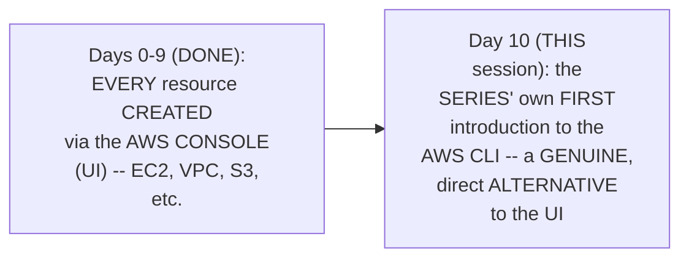

#### 🎯 Key Takeaways

* This is GENUINELY the SERIES' own **FIRST session** to MOVE beyond the AWS console — EXPLICITLY, DIRECTLY confirming DAYS 0-9 exclusively USED the UI.
* Today's COMPLETE, explicit GOAL: understanding WHAT the AWS CLI IS, WHAT problem it SOLVES, and PERFORMING real, live PRACTICAL demonstrations.
* This session GENUINELY, DIRECTLY sets UP the NEXT day's CLASS (CloudFormation Templates), WHICH will DIRECTLY build ON today's own, established **IaC (Infrastructure as CODE)** categorization.

---

### 2. Why the UI Is Not Automation-Friendly: A Genuine, Real Motivating Problem

#### ❓ Why It Exists — A Genuine, Real, Relatable Motivating Scenario

> 💡 **Given directly:** *"One of the primary responsibilities of devops engineers or AWS administrators is infrastructure management... let's say you are given a task to create 10 VPCs within 30 minutes. If you only know this way of doing things using UI, you will firstly create one VPC, then another... it's still fine if you only get 10 requests, but what if your Jira is flooded?"*

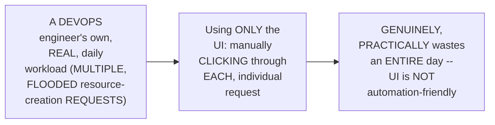

#### ⚠ Common Mistakes

* Assuming THIS problem is GENUINELY, UNIQUELY specific TO AWS — explicitly, directly, HONESTLY clarified: "THIS is not JUST the problem OF AWS... this PROBLEM is common" ACROSS any APPLICATION/tool (e.g., JENKINS) — UI-only INTERACTION is GENERALLY, STRUCTURALLY less automation-FRIENDLY.

#### 🎯 Key Takeaways

* The AWS CONSOLE (UI) is GENUINELY, PRACTICALLY **NOT automation-FRIENDLY** — a REAL, relatable SCENARIO (CREATING 10 VPCs QUICKLY, or HANDLING a FLOOD of daily REQUESTS) directly, CONCRETELY illustrates WHY.
* This is directly, HONESTLY confirmed as a **GENERAL, common PROBLEM** across ANY application/TOOL — NOT unique TO AWS specifically.
* This GENUINE, real PROBLEM directly, PRECISELY motivates the NEXT, essential CONCEPT — **API** (Section 3) — the FOUNDATIONAL mechanism THAT enables genuine AUTOMATION.

---
### 3. API, Precisely Defined: The Foundation Beneath Every Automation Tool

#### 📖 Definition — API, Precisely Defined

> 💡 **Given directly:** *"API basically stands for application programming interface... using this application programming interface, you can automate creation, deletion, management of resources on AWS."*

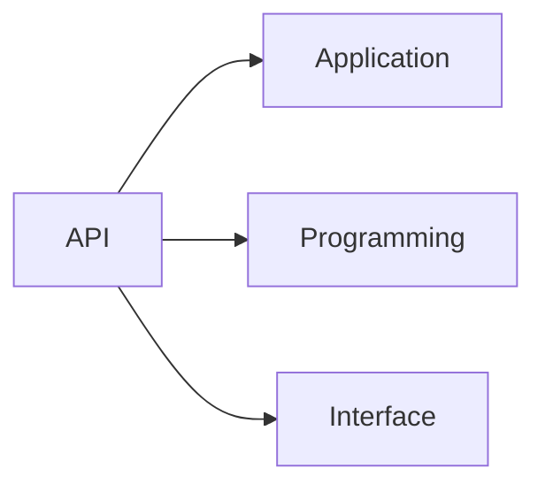

#### 📖 Definition — Two Ways to Connect: UI vs. API

> 💡 **Given directly:** *"There are two ways to connect: one is through the UI, which you traditionally do, you go to the console and access it. And the other thing is through the API — you reach these applications not directly, but through programmatically."*

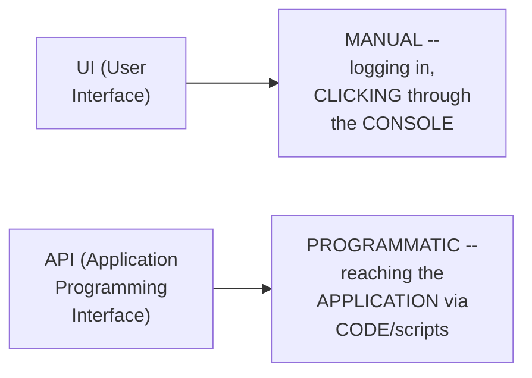

#### 🏢 Real-World / Production Usage — A Genuine, Real, Illustrative Example

> 💡 **Given directly:** *"What AWS says is, you can access... api.aws.com/s3/create, post — this is just an example — write this specific URL and pass the parameters, such as what is the name of this S3 bucket that you want to create, and if you want versioning enabled for this bucket."*

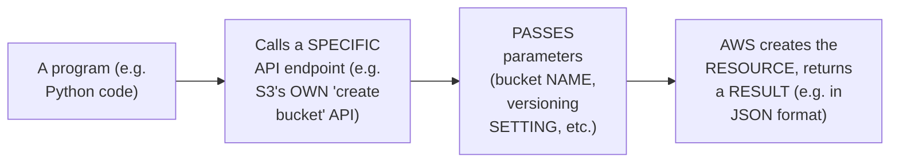

#### ⚠ Common Mistakes

* Assuming "PROGRAMMATIC" access GENUINELY, NECESSARILY means WRITING complex, FROM-scratch code (LIKE raw HTTP REQUESTS) — explicitly, directly, DIRECTLY foreshadowed (Section 4): TOOLS like the AWS CLI GENUINELY, DIRECTLY abstract THIS complexity AWAY.

#### 🎯 Key Takeaways

* **API (application PROGRAMMING interface)** is precisely the MECHANISM enabling PROGRAMMATIC (rather THAN manual, UI-BASED) interaction WITH an application — ENABLING genuine AUTOMATION.
* THERE are precisely **TWO ways** to CONNECT to ANY application: the **UI** (manual, CONSOLE-based) and the **API** (programmatic, CODE-based).
* A REAL, illustrative EXAMPLE (an S3 "CREATE bucket" API ENDPOINT) directly, CONCRETELY grounds THIS abstract concept — DIRECTLY setting UP the NEXT, essential IDEA — HOW tools like the AWS CLI GENUINELY, PRACTICALLY simplify THIS process (Section 4).

---

### 4. AWS CLI: An Abstraction Layer Over the Raw API

#### 📖 Definition — AWS CLI, Precisely Defined

> 💡 **Given directly:** *"What AWS command line interface does is, AWS command line interface is a Python utility... there is this Python program that is written by AWS engineers itself, AWS itself supports the AWS CLI Python utility, and using this utility you can pass some arguments... and you can create resources on AWS."*

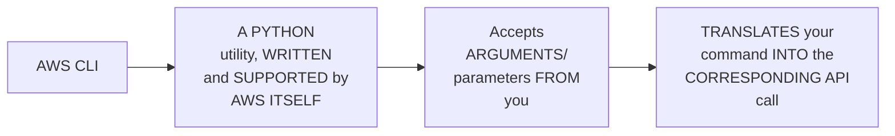

#### 📖 Definition — The Abstraction Layer, Precisely Explained

> 💡 **Given directly:** *"These tools said, hey devops engineers, don't worry about it — whether it is CLI, Terraform, CFT — you don't need to programmatically write anything, because we created an abstraction layer... all that you need to know is how to install this AWS CLI, go to the documentation, and read about what parameters it wants you to pass."*

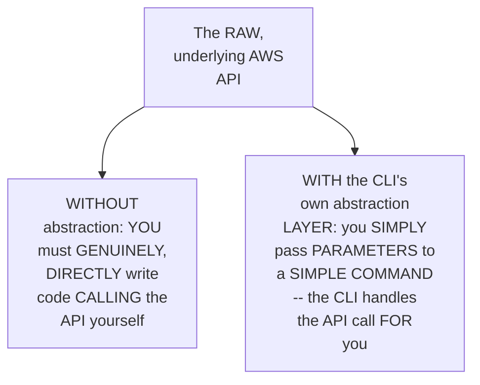

#### 🔍 Internal Working — A Genuine, Direct, Complete Summary

> 💡 **Given directly:** *"AWS CLI acts as a layer between user and AWS API. If you pass inputs to AWS CLI, like invoking it using shell commands on your terminal, what AWS CLI does is it will translate your request into an API call that AWS understands, and AWS creates this resource for you."*

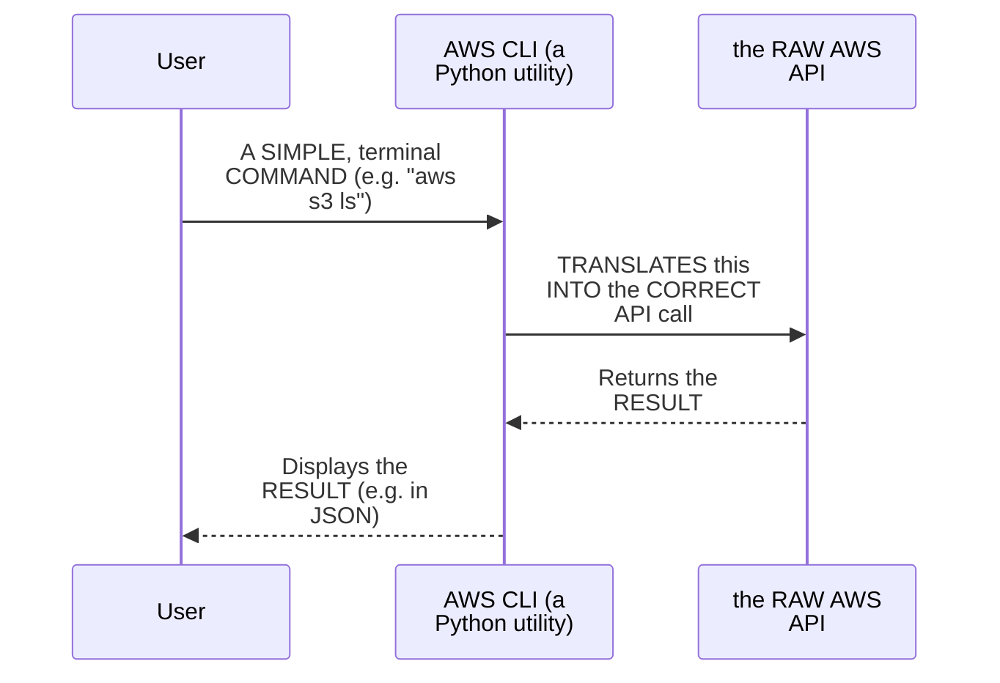

#### ⚠ Common Mistakes

* Assuming USING the AWS CLI GENUINELY, DIRECTLY requires YOU to UNDERSTAND raw API-CALLING mechanics (HTTP methods, JSON PAYLOADS, etc.) — explicitly, directly, PRECISELY clarified: "ALL that you NEED to know is HOW to install THIS AWS CLI... and HOW to read the DOCUMENTATION" — the CLI ITSELF handles the RAW, underlying API CALL.
* Assuming TERRAFORM, CloudFormation TEMPLATES (CFT), and CDK are GENUINELY, STRUCTURALLY unrelated to THE CLI — explicitly, directly, PRECISELY clarified: THEY all GENUINELY, DIRECTLY serve the SAME, core PURPOSE — PROVIDING an abstraction LAYER over the RAW AWS API (WITH CDK NOTED as a PARTIAL exception).

#### 🎯 Key Takeaways

* **AWS CLI** is precisely a **PYTHON utility**, BUILT and SUPPORTED by AWS ITSELF — TRANSLATING your SIMPLE, terminal COMMANDS into the CORRESPONDING, underlying API CALL.
* THIS, and OTHER similar TOOLS (Terraform, CFT, CDK), ALL genuinely, DIRECTLY provide an **abstraction LAYER** over the RAW API — SO you don't NEED to write RAW, API-calling CODE yourself.
* This directly, PRECISELY sets UP the NEXT, essential DISTINCTION — WHY multiple, DIFFERENT abstraction TOOLS (CLI, TERRAFORM, CFT) genuinely EXIST, DESPITE serving a SIMILAR, underlying PURPOSE (Section 5).

---
### 5. CLI, CFT & Terraform: Why So Many Tools Exist for "The Same" Problem

#### 🔍 Internal Working — A Genuine, Direct Confirmation: These Tools Fall Under "IaC"

> 💡 **Given directly:** *"Out of these things, three tools fall into the category of IaC — what is IaC, we will come to know in tomorrow's class when we learn about CloudFormation templates."*

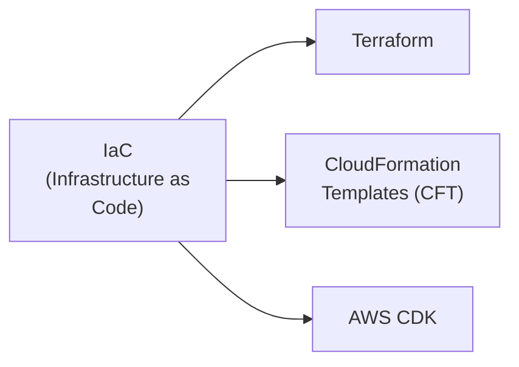

#### ❓ Why It Exists — A Genuine, Direct Question and Precise Answer

> 💡 **Given directly:** *"If CLI is solving the same purpose, if CFT is solving the same purpose, if Terraform is solving the same purpose, then why do you need so many tools? CLI is a very quick use-case thing — if your manager says, 'give me a list of S3 buckets,' you can quickly run 'aws s3 ls.' Whereas with CFT and Terraform, you need to write declarative YAML files, execute them, and only then get the output."*

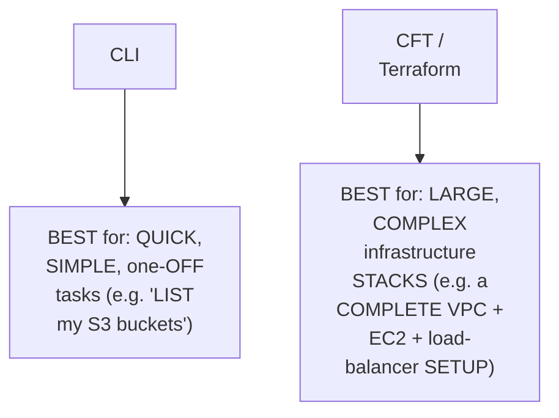

#### 🔍 Internal Working — A Genuine, Direct Confirmation: Additional Advantages of CFT/Terraform

> 💡 **Given directly:** *"They follow the principle of API as code as well, which will help you to review the code and all — but don't worry, I think this will be out of context for today's class."*

#### ⚠ Common Mistakes

* Assuming YOU must GENUINELY, EXCLUSIVELY choose ONLY ONE, single TOOL (CLI, CFT, OR Terraform) and MASTER it ALONE — explicitly, directly, HONESTLY clarified: "END of the DAY, YOU should LEARN CLI" — REGARDLESS of WHICH other tool(s) YOU also LEARN — CLI's own, GENUINE, quick-REFERENCE value REMAINS relevant.
* Assuming CLI is GENUINELY, UNCONDITIONALLY "BETTER" or "WORSE" than TERRAFORM/CFT — explicitly, directly, PRECISELY clarified: EACH tool GENUINELY excels IN a DIFFERENT, specific SCENARIO — quick TASKS versus LARGE, complex STACKS.

#### 🎯 Key Takeaways

* CLI, TERRAFORM, and CloudFormation TEMPLATES (CFT) ALL, genuinely FALL under the **IaC (INFRASTRUCTURE as Code)** category — EXPLICITLY, DIRECTLY deferred to the NEXT day's class FOR a fuller EXPLANATION.
* The PRECISE, genuine DISTINCTION: **CLI** excels AT quick, SIMPLE, one-OFF tasks (e.g., "LIST my S3 BUCKETS" — a SINGLE command); **Terraform/CFT** excel AT large, COMPLEX infrastructure STACKS (REQUIRING declarative YAML FILES, but OFFERING genuine REVIEW/repeatability BENEFITS).
* The instructor **directly, EXPLICITLY recommends** LEARNING the CLI REGARDLESS of WHICH other TOOLS you ALSO learn — its OWN, genuine, DAY-to-day, quick-REFERENCE value REMAINS relevant FOR any devops ENGINEER.

---

### 6. A Complete, Real, Live Demo: Installing AWS CLI

#### ⚠ A Direct, Honest, Genuine Recommendation for Windows Users

> 💡 **Given directly:** *"If you are on Windows, try out this Oracle VirtualBox — install any Linux distribution and practice the things. Or, for simple purposes, you can install Git Bash — it will not give you a complete Linux environment, but it will give you a terminal where you can perform SSH, basic Linux commands, and the AWS CLI demonstration."*

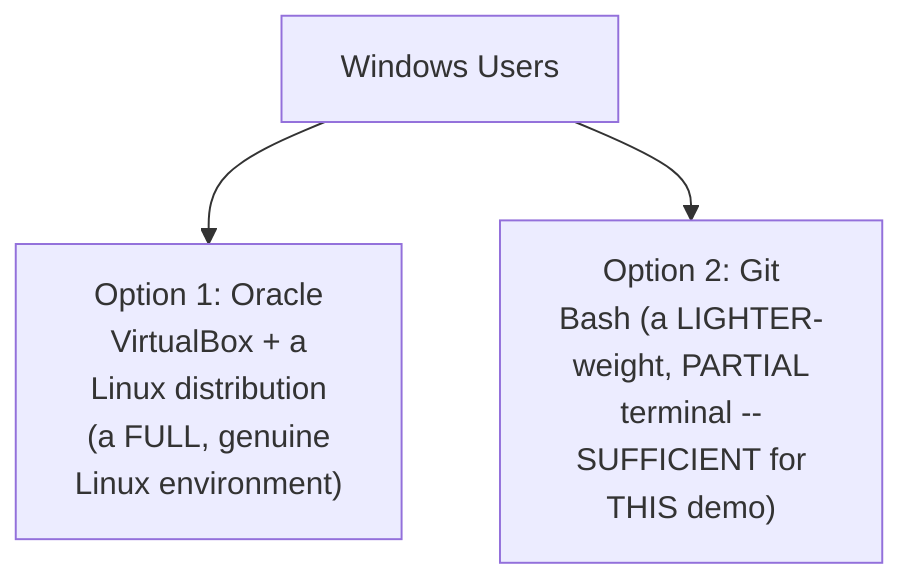

#### 🪜 Step-by-Step — A Complete, Real, Official Installation Walkthrough

> 💡 **Given directly:** *"Go to your browser, search for AWS CLI, click on the first option. Do NOT download AWS CLI from any other sources — there are multiple wrong installations, different versions of CLI. Make sure you go to the AWS official documentation only."*

```bash
# Complete, official installation checklist (live-demonstrated):
# 1. Search "AWS CLI" -> click the OFFICIAL AWS documentation link
# 2. Navigate to: User Guide -> Get Started -> Install or Update
# 3. Choose your OS (Linux, macOS, or Windows)
# 4. On macOS: use the "command line installer" option; copy and run the command
```

#### 🪜 Step-by-Step — A Complete, Real, Live-Confirmed Verification

> 💡 **Given directly:** *"It will take a minute or so, and even after installing, it will take some 30 seconds to reflect. Once you get the output, you can be rest assured your AWS CLI is installed. Also, you can use the 'aws --version' command."*

```bash
aws --version
# Confirms installation; MUST be AWS CLI version 2.x (e.g. "aws-cli/2.x.y")
```

#### ⚠ A Direct, Honest, Important Prerequisite Reminder

> 💡 **Given directly:** *"I forgot to tell you one thing — Python is a requirement, so make sure you have Python installed on your machine. In my machine it is pre-installed, so I don't have any problem."*

#### ⚠ Common Mistakes

* Downloading AWS CLI FROM an UNOFFICIAL, third-PARTY source — explicitly, directly, REPEATEDLY warned AGAINST: "DO not download AWS CLI FROM any OTHER sources — THERE are multiple WRONG installations."
* Assuming AWS CLI version 1 is GENUINELY, STILL an ACCEPTABLE choice — explicitly, directly, PRECISELY clarified: "MAKE sure you are INSTALLING AWS 2 only — AWS ONE is an OLD version."
* Assuming WINDOWS is GENUINELY, EQUALLY well-suited FOR devops WORK, compared TO Linux/macOS — explicitly, directly, HONESTLY clarified: "WINDOWS is NOT super devops FRIENDLY" — THOUGH genuinely IMPROVING — WITH TWO, real WORKAROUNDS offered (VirtualBox OR Git Bash).

#### 🎯 Key Takeaways

* AWS CLI MUST be INSTALLED from the **OFFICIAL AWS DOCUMENTATION only** — AVOIDING third-PARTY sources, WHICH may PROVIDE "wrong INSTALLATIONS" or OUTDATED versions.
* MUST be **VERSION 2.x** (NOT the OLD, deprecated VERSION 1) — VERIFIED via `AWS --version`; **PYTHON** is a REQUIRED prerequisite.
* WINDOWS users are directly, HONESTLY given TWO, real WORKAROUNDS — **ORACLE VirtualBox** (a FULL Linux environment) OR **Git BASH** (a LIGHTER-weight, PARTIAL terminal, SUFFICIENT for THIS specific demo).

---
### 7. A Complete, Real, Live Demo: Configuring AWS CLI (aws configure)

#### ❓ Why It Exists — A Genuine, Direct Question and Answer

> 💡 **Given directly:** *"You told me in the theory part that it acts as a middleman between user and AWS — but how does this AWS CLI that is installed on this machine know that it has to talk to this AWS account only? There are hundreds, thousands, or millions of AWS accounts."*

#### 📖 Definition — Access Key & Secret Access Key, Precisely Explained

> 💡 **Given directly:** *"For any API to access them, there are a couple of things like access keys, API tokens. In case of AWS, we will use the access keys, and why you need this access key is it is similar to username and password for your UI login."*

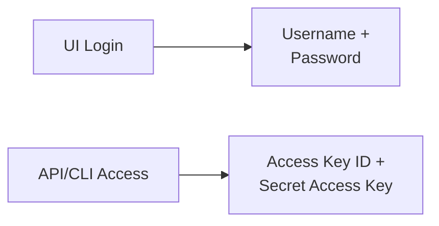

#### 🪜 Step-by-Step — A Complete, Real, Live Walkthrough of Generating Access Keys

> 💡 **Given directly:** *"Go to your account, click on the username, click on security credentials, keep scrolling down, and you'll find an option called access keys. There are only two access keys that you can create on an account."*

#### ⚠ A Direct, Honest, Important Best-Practice Reminder

> 💡 **Given directly:** *"Root user is not preferred. If you want to practice on a dummy AWS account, you can use the root user, but in your organization you will not use root users — you will always use IAM users. Even as a devops engineer, you will not have access to root user — you will create IAM users for devops engineers as well."*

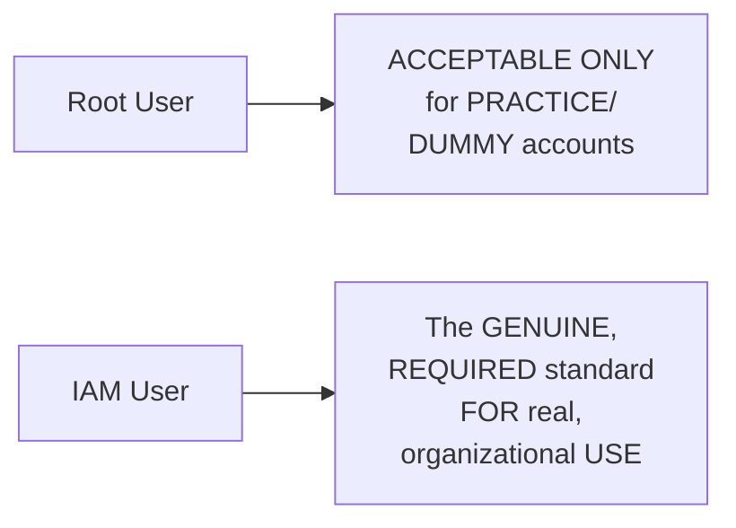

#### 🪜 Step-by-Step — A Complete, Real, Live Configuration Walkthrough

> 💡 **Given directly:** *"Go to your terminal and run 'aws configure.' Enter your AWS access key, then enter your AWS secret key, provide the default region... and then default output format — JSON is always preferred."*

```bash
aws configure
# AWS Access Key ID: <your access key>
# AWS Secret Access Key: <your secret key>
# Default region name: us-east-1  (example)
# Default output format: json
```

#### ⚠ A Direct, Honest, Live-Demonstrated Security Practice

> 💡 **Given directly:** *"Because this is very, very sensitive, I cannot show you what is my secret access key — if I show you my secret access key, you can technically use my AWS account. Of course, after this demo, I'll delete both the access key and the secret access key."*

#### ⚠ Common Mistakes

* Assuming ACCESS keys are GENUINELY, MERELY a "NICE-to-have" DETAIL, rather THAN a CORE security CREDENTIAL — explicitly, directly, PRECISELY clarified: they are DIRECTLY analogous TO a username/PASSWORD — GENUINELY, EXTREMELY sensitive, and NEVER to be SHARED.
* Assuming ROOT-user access KEYS are GENUINELY, ALWAYS an ACCEPTABLE choice — explicitly, directly, REPEATEDLY warned AGAINST for REAL, organizational use — IAM users ARE the GENUINE, required STANDARD, DIRECTLY connecting BACK to Day 2's own, ESTABLISHED guidance.

#### 🎯 Key Takeaways

* `AWS configure` GENUINELY, DIRECTLY connects the LOCALLY-installed CLI TO a SPECIFIC AWS account — REQUIRING an **access KEY ID**, a **SECRET access key**, a **default REGION**, and a **DEFAULT output format** (JSON RECOMMENDED).
* ACCESS keys are precisely ANALOGOUS to a **USERNAME/password** for API/CLI ACCESS — EXTREMELY sensitive, and NEVER to be SHARED (a REAL, live-demonstrated SECURITY practice — the INSTRUCTOR explicitly REFUSED to show HIS own secret KEY on screen).
* **ROOT-user** access KEYS are ACCEPTABLE only FOR practice/dummy ACCOUNTS — REAL, organizational use GENUINELY, DIRECTLY requires **IAM users** — a REPEATED, consistent BEST practice ACROSS this ENTIRE series.

---

### 8. A Complete, Real, Live Verification: Listing S3 Buckets via CLI

#### 🪜 Step-by-Step — A Complete, Real, Live Command

> 💡 **Given directly:** *"For verification, let me run a very simple AWS CLI command — 'aws s3 ls.' What this AWS CLI does is it understands you want to talk to the S3 service on this AWS, and you want to invoke the ls command, that means you want to list the buckets. AWS CLI will translate this command to an API call that AWS understands."*

```bash
aws s3 ls
# Live-confirmed output:
# 2026-XX-XX XX:XX:XX  demo-abhishek   (the S3 bucket created in a prior session)
```

#### 🔍 Internal Working — A Genuine, Direct, Live-Confirmed Success

> 💡 **Given directly:** *"You will notice it will give me the exact information that is visible here — demo Abhishek, that is in the US East 1 region that I have created, and this is a timestamp of creation. It says there is only one bucket. Perfect, it is giving me the information accurately."*

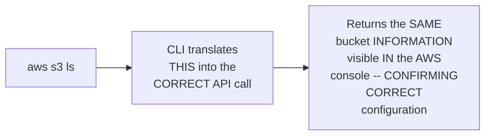

#### ⚠ Common Mistakes

* Assuming `AWS s3 ls` is GENUINELY, MERELY a "SIMPLE" command WITH little EDUCATIONAL value — explicitly, directly, PRACTICALLY confirmed as a GENUINE, real **VERIFICATION** tool — CONFIRMING the CLI is CORRECTLY configured AND connected to the RIGHT account.

#### 🎯 Key Takeaways

* `AWS s3 ls` is a COMPLETE, real, SIMPLE command — DIRECTLY, PRACTICALLY confirming the CLI's own, CORRECT configuration BY cross-CHECKING its OWN output AGAINST the AWS console's own, KNOWN bucket LIST.
* This directly, CONCRETELY confirms the ENTIRE, established WORKFLOW (Section 4): the CLI GENUINELY, DIRECTLY translates a SIMPLE command INTO the correct API CALL, and RETURNS accurate, REAL-world results.
* This SIMPLE, successful TEST directly, PRECISELY sets UP the NEXT, MORE complex demonstration (Section 9) — CREATING a REAL EC2 instance VIA the SAME, underlying CLI mechanism.

---
### 9. A Complete, Real, Live Demo: Creating an EC2 Instance via CLI

#### 🪜 Step-by-Step — A Complete, Real, Genuinely Complex Command

> 💡 **Given directly:** *"This command is very big, because when you have to create an EC2 instance, you pass bunch of parameters — what is the name, what distribution of Linux, what AMI, what type of instance (T2 micro or whatever), the key value pair. All of this information should be passed from the CLI as well — that's why this command ends up this big."*

```bash
# A GENUINE, real, complete EC2-creation command (structure, per the live demo):
aws ec2 run-instances \
  --image-id ami-xxxxxxxxx \
  --instance-type t2.micro \
  --key-name my-key-pair \
  --security-group-ids sg-xxxxxxxxx \
  --subnet-id subnet-xxxxxxxxx
```

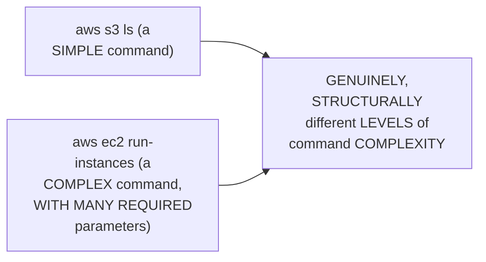

#### 🪜 Step-by-Step — A Complete, Real, Live-Confirmed Cross-Verification

> 💡 **Given directly:** *"Because we selected the option as JSON, I got the output in JSON format — what is this output, the instance ID, what is the private IP of the instance? Let's see if the private IP is the same or not... let me go back, instances... let's switch to US East 1... there is this instance that is created. Click on this one, you will notice the IP address is exactly the same."*

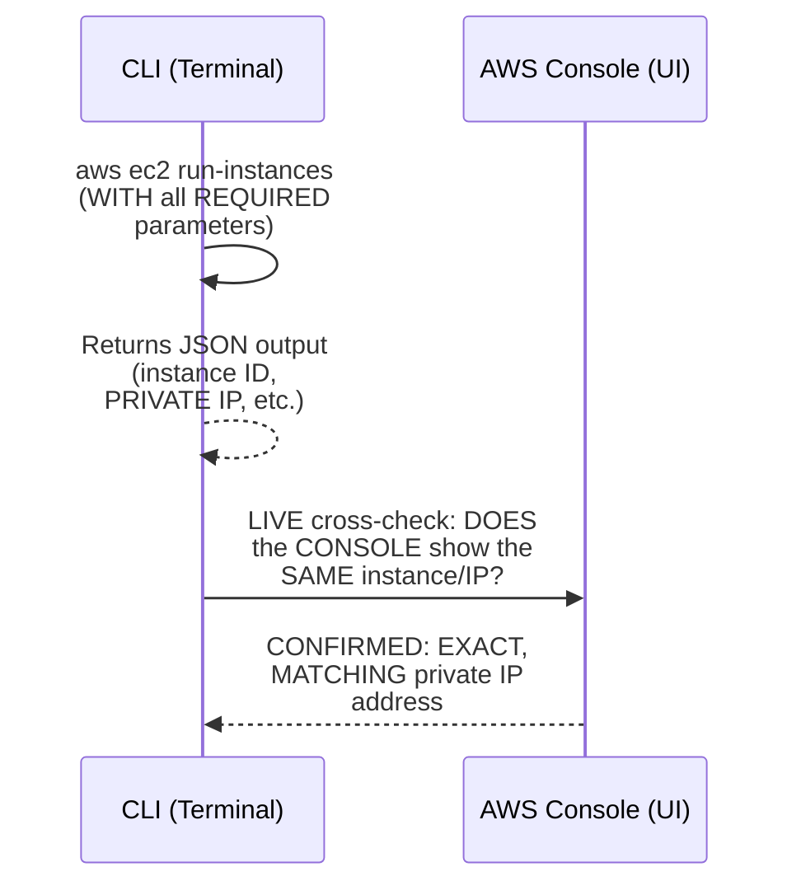

#### ⚠ Common Mistakes

* Assuming a CLI-CREATED resource is GENUINELY, SOMEHOW different FROM (or LESS "real" THAN) a UI-created ONE — explicitly, directly, LIVE-demonstrated as GENUINELY, PRECISELY identical — the SAME, real EC2 INSTANCE, VISIBLE and VERIFIABLE in BOTH the terminal's OWN JSON output AND the AWS console's OWN UI.

#### 🎯 Key Takeaways

* CREATING an EC2 instance VIA CLI (`aws ec2 RUN-instances`) requires a GENUINELY, SIGNIFICANTLY **LONGER, more complex COMMAND** than `aws s3 LS` — REFLECTING the GENUINE, real NUMBER of parameters EC2 creation GENUINELY requires (AMI, instance TYPE, key pair, SECURITY group, subnet).
* A COMPLETE, real, LIVE cross-VERIFICATION directly, CONCRETELY confirmed the CLI-created INSTANCE's own PRIVATE IP address EXACTLY matches WHAT'S visible IN the AWS console'S own UI — PROVING the CLI GENUINELY creates REAL, identical RESOURCES.
* This directly, PRECISELY sets UP the NEXT, essential SKILL — LEARNING to READ the AWS CLI reference DOCUMENTATION (Section 10) — WHICH is PRECISELY how THIS complex COMMAND was ORIGINALLY constructed.

---

### 10. Learning the AWS CLI Reference Documentation (& a Genuine, Live Troubleshooting Walkthrough)

#### 🪜 Step-by-Step — A Complete, Real, Documentation-Navigation Walkthrough

> 💡 **Given directly:** *"Just go to your browser, search for 'AWS CLI reference,' select the service — let's say S3. You will find different commands — cp, ls, mb, mv, etc. Let me try 'mb' — 'MB stands for make bucket.' You have all the options here on how to create the bucket, and similarly for LS, you get the full documentation."*

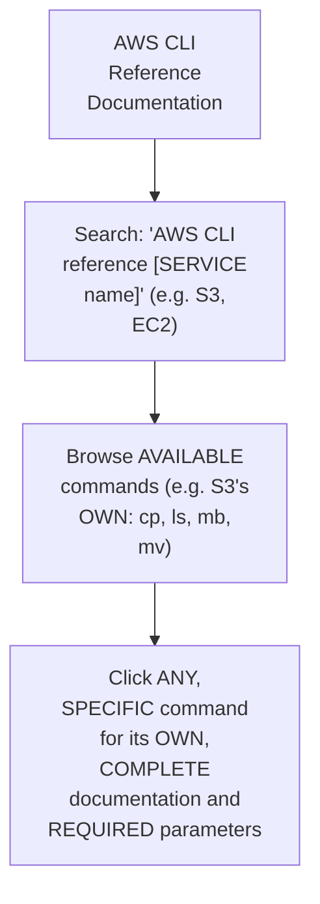

#### 🪜 Step-by-Step — A Genuine, Live, Deliberate Troubleshooting Demonstration

> 💡 **Given directly:** *"Let's remove one of the options and see how AWS CLI will complain about it. Let's remove the key value pair... it threw an error saying 'unknown options subnet'... let's try removing the image ID itself — 'missing parameter when calling the RunInstances operation: the request must contain the parameter imageId.' It clearly mentions what is the missing thing."*

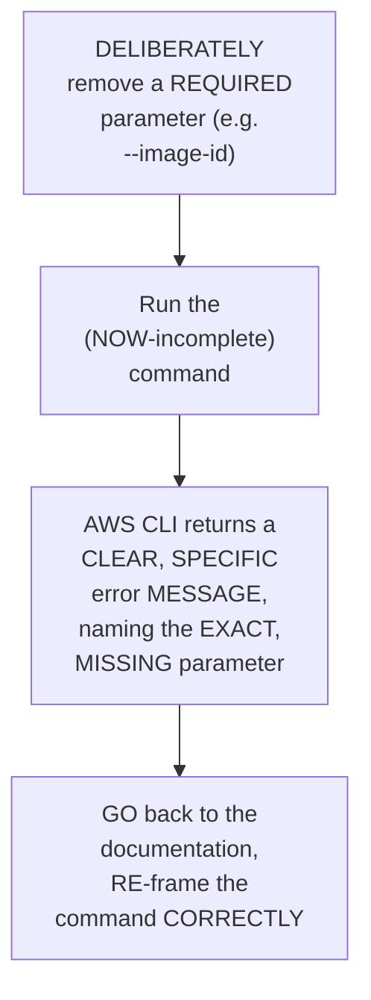

#### ⚠ Common Mistakes

* Assuming AWS CLI's OWN error MESSAGES are GENUINELY, UNHELPFULLY vague — explicitly, directly, LIVE-demonstrated as GENUINELY, DIRECTLY specific and ACTIONABLE — "IT clearly MENTIONS what is the MISSING thing."
* Assuming CONSTRUCTING a COMPLEX command (LIKE EC2 creation) REQUIRES GENUINELY, ENTIRELY memorizing IT from SCRATCH — explicitly, directly, PRACTICALLY demonstrated: it's GENUINELY, DIRECTLY constructed BY reading the OFFICIAL documentation, ONE parameter AT a time.

#### 🎯 Key Takeaways

* The AWS CLI REFERENCE documentation (SEARCHED via "AWS CLI reference [SERVICE]") directly, PRACTICALLY provides COMPLETE, per-COMMAND documentation — INCLUDING every, AVAILABLE parameter and ITS own, precise DESCRIPTION.
* A GENUINE, LIVE, DELIBERATE troubleshooting DEMONSTRATION directly, CONCRETELY confirmed AWS CLI's own, GENUINELY helpful ERROR messages — CLEARLY naming the EXACT, missing PARAMETER (e.g., "the REQUEST must CONTAIN the parameter imageId").
* This directly, PRACTICALLY teaches a REAL, transferable SKILL — LEARNING to READ documentation and INTERPRET error MESSAGES is, per THIS session's own DEMONSTRATION, the GENUINE, core competency FOR mastering the CLI — NOT rote MEMORIZATION.

---
### 11. Closing: The Assignment & Reinforcing CLI's Own, Genuine Sweet Spot

#### 🪜 Step-by-Step — A Complete, Real, Direct Assignment

> 💡 **Given directly:** *"I will try to put this same command in the description section, so you can copy paste — or else, let's do one thing, you can take this as an assignment. Try it, and if you still don't get it, you can pause the video and see what I was doing. Of course, the security group belongs to my AWS account, you have to change it accordingly."*

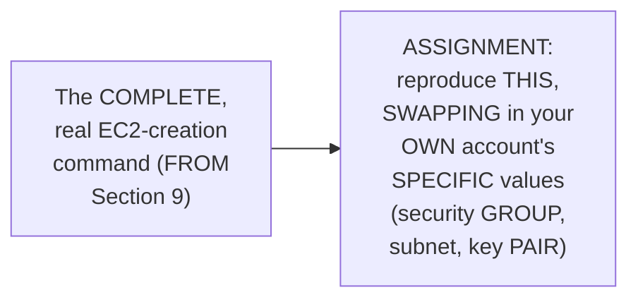

#### 🪜 Step-by-Step — A Direct, Final Reinforcement of CLI's Own, Genuine Value

> 💡 **Given directly:** *"If the same manager comes to you and says, 'Abhishek, can you create an instance for me,' you have to paste this entire command, or remember it, or go through documentation. This is just for instance creation — sometimes you'll be asked to create VPC plus all the configuration, install EC2, create a load balancer. In such cases, AWS CLI will not be handy."*

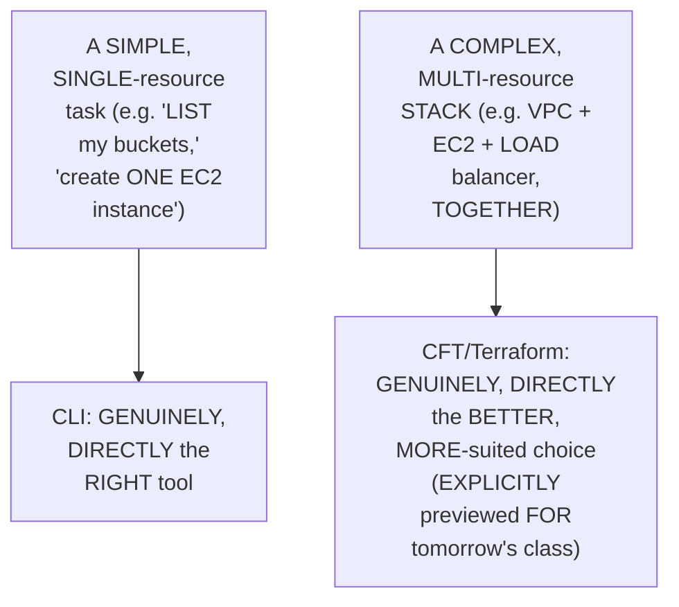

#### ⚠ Common Mistakes

* Assuming AWS CLI is GENUINELY, UNIVERSALLY "the BEST" tool FOR every, SINGLE infrastructure TASK, REGARDLESS of SCALE/complexity — explicitly, directly, REPEATEDLY, HONESTLY clarified: it's GENUINELY, SPECIFICALLY best-SUITED for QUICK, simple TASKS — NOT for LARGE, complex, MULTI-resource stacks.

#### 🎯 Key Takeaways

* This episode **GENUINELY, COMPLETELY delivers** its OWN, stated GOALS — a COMPLETE conceptual FOUNDATION (API, abstraction LAYERS, IaC) PLUS three, real, LIVE-demonstrated practical ACTIVITIES.
* A DIRECT, EXPLICIT assignment REQUIRES reproducing THE EC2-creation command, SWAPPING in the LEARNER's own, ACCOUNT-specific values — REINFORCING the DOCUMENTATION-reading skill FROM Section 10.
* CLI's OWN, genuine "SWEET spot" is directly, REPEATEDLY reinforced: **QUICK, simple TASKS** — NOT large, COMPLEX infrastructure stacks — WITH CloudFormation Templates AND Terraform EXPLICITLY previewed AS tomorrow's OWN, more-suited TOPIC for THAT complementary USE case.

---

## 📝 Glossary

| Term | Definition | Why It Matters |
|---|---|---|
| **API** | Application Programming Interface | Enables programmatic, rather than manual, automation |
| **AWS CLI** | A Python utility, built by AWS, that translates commands into API calls | An abstraction layer over the raw API |
| **Abstraction Layer** | A simplification hiding the raw, underlying API complexity | Used by CLI, Terraform, CFT, and CDK alike |
| **IaC (Infrastructure as Code)** | A category including Terraform, CFT, and CDK | Deferred to the next day's class for full explanation |
| **Access Key ID / Secret Access Key** | API/CLI credentials, analogous to a username/password | Extremely sensitive; never to be shared |
| **aws configure** | The command that connects the local CLI to a specific AWS account | Requires access key, secret key, region, and output format |
| **aws s3 ls** | Lists all S3 buckets in the configured account | A simple, real verification command |
| **aws ec2 run-instances** | Creates a new EC2 instance via CLI | A genuinely complex command, requiring many parameters |

---

## 🔄 Revision Notes — One-Minute Revision

* This is **Day 10** -- the series' own first session moving beyond the AWS console (UI) to introduce the AWS CLI.
* **Why the UI isn't automation-friendly**: a real, relatable scenario -- being asked to create 10 VPCs quickly, or handling a flood of daily resource requests. Manually clicking through the UI wastes an entire day; this is a general problem across any application/tool, not just AWS.
* **API (Application Programming Interface)**: the mechanism enabling programmatic (rather than manual, UI-based) automation. Two ways to connect to any application: UI (manual) or API (programmatic).
* **AWS CLI**: a Python utility, built and supported by AWS itself, that translates your simple, terminal commands into the corresponding, underlying API call -- an abstraction layer, so you don't need to write raw API-calling code yourself.
* **CLI, Terraform, and CFT all fall under "IaC" (Infrastructure as Code)** -- explicitly deferred to the next day's class for a full explanation.
* **Why multiple tools exist**: CLI excels at quick, simple, one-off tasks (e.g., "list my S3 buckets" -- a single command); Terraform/CFT excel at large, complex infrastructure stacks (requiring declarative YAML, but offering genuine review/repeatability benefits, per "infrastructure as code" principles). Learn CLI regardless of which other tools you also learn.
* **Installing AWS CLI**: must be from the OFFICIAL AWS documentation only (never third-party sources); must be version 2.x (not the old version 1); Python is a required prerequisite. Windows users: use Oracle VirtualBox (full Linux environment) or Git Bash (lighter-weight, sufficient for this demo).
* **Configuring AWS CLI (`aws configure`)**: requires an Access Key ID, Secret Access Key (analogous to a username/password, extremely sensitive, never shared), default region, and default output format (JSON recommended). Root-user access keys are acceptable only for practice/dummy accounts -- real, organizational use requires IAM users (directly connecting back to Day 2's own established guidance).
* **Live verification (`aws s3 ls`)**: confirmed the CLI's correct configuration by matching its output against the AWS console's own, known bucket list.
* **Live EC2 creation (`aws ec2 run-instances`)**: a genuinely complex command (many required parameters: AMI, instance type, key pair, security group, subnet), live cross-verified -- the CLI-created instance's private IP exactly matched what the AWS console showed.
* **Reading the AWS CLI reference documentation**: search "AWS CLI reference [service]" (e.g., S3, EC2), browse available commands (cp, ls, mb="make bucket", mv), click any command for its own complete documentation. A genuine, live, DELIBERATE troubleshooting demo: removing required parameters (like --image-id) and observing AWS CLI's own clear, specific error messages naming the exact missing parameter.
* **Closing**: an explicit assignment to reproduce the EC2-creation command with your own account's values. CLI's own genuine "sweet spot" reinforced: quick, simple tasks -- NOT large, complex, multi-resource stacks (that's Terraform/CFT's own domain, explicitly previewed for tomorrow's class).

---

## 📋 Cheat Sheet

**UI vs. API:**
```text
UI  -- manual, console-based interaction
API -- programmatic, code-based interaction (enables automation)
```

**AWS CLI's own role:**
```text
Your simple command -> AWS CLI (a Python utility) -> translates to the correct API call -> AWS
```

**When to use CLI vs. Terraform/CFT:**
```text
CLI          -- QUICK, simple, one-off tasks (e.g. "list my buckets")
Terraform/CFT -- LARGE, complex, multi-resource infrastructure STACKS
```

**Complete setup workflow:**
```bash
# 1. Install (from the OFFICIAL AWS docs only; must be v2.x)
aws --version

# 2. Configure (connects the CLI to a specific AWS account)
aws configure
# -> Access Key ID, Secret Access Key, default region, default output format (json)

# 3. Verify
aws s3 ls
```

**Reading the docs & troubleshooting:**
```text
Search: "AWS CLI reference [service]" (e.g. "AWS CLI reference EC2")
-> browse available commands -> click one for full documentation
-> if a command fails, AWS CLI's own error message names the EXACT missing parameter
```

---

## 🔥 Interview Questions & Answers

### 🟢 Beginner

**Q1.**

**Question:** Why is the AWS console (UI) genuinely not automation-friendly?

**Answer:** It requires manual, one-by-one clicking through the console for each resource, which doesn't scale for bulk or repeated tasks.

**Explanation:** Directly, precisely explained.

**Why Interviewers Ask This:** The most basic, foundational motivation for learning the CLI.

**Possible Follow-up:** "Is this problem unique to AWS?"

**Q2.**

**Question:** What does API stand for, and what does it enable?

**Answer:** Application Programming Interface; it enables programmatic, rather than manual, automation.

**Explanation:** Directly, precisely defined.

**Why Interviewers Ask This:** Basic, essential automation terminology.

**Possible Follow-up:** "What are the two ways to connect to any application?"

**Q3.**

**Question:** What is the AWS CLI, precisely?

**Answer:** A Python utility, built and supported by AWS itself, that translates commands into API calls.

**Explanation:** Directly, precisely defined.

**Why Interviewers Ask This:** Foundational, frequently-tested CLI knowledge.

**Possible Follow-up:** "What is this kind of tool called, in general terms?"

**Q4.**

**Question:** What category do CLI, Terraform, and CFT all fall under?

**Answer:** IaC (Infrastructure as Code).

**Explanation:** Directly, explicitly confirmed.

**Why Interviewers Ask This:** Basic, essential DevOps tooling vocabulary.

**Possible Follow-up:** "What is the genuine distinction between CLI and Terraform/CFT's own use cases?"

**Q5.**

**Question:** What AWS CLI version should you genuinely install?

**Answer:** Version 2.x (not the old, deprecated version 1).

**Explanation:** Directly, explicitly stated.

**Why Interviewers Ask This:** Basic, practical installation knowledge.

**Possible Follow-up:** "Where should you download AWS CLI from?"

**Q6.**

**Question:** What credentials are required to configure the AWS CLI?

**Answer:** Access Key ID and Secret Access Key.

**Explanation:** Directly, explicitly stated.

**Why Interviewers Ask This:** Basic, essential CLI configuration knowledge.

**Possible Follow-up:** "What is the genuine, real-world analogy for these credentials?"

**Q7.**

**Question:** Should you genuinely use root-user access keys in a real organizational context?

**Answer:** No -- IAM users should genuinely be used instead.

**Explanation:** Directly, repeatedly emphasized.

**Why Interviewers Ask This:** A commonly-tested, genuine security best practice.

**Possible Follow-up:** "When IS the root user acceptable to use?"

**Q8.**

**Question:** What command lists all S3 buckets via the CLI?

**Answer:** `aws s3 ls`.

**Explanation:** Directly, explicitly demonstrated.

**Why Interviewers Ask This:** Basic, practical CLI command knowledge.

**Possible Follow-up:** "What does this command genuinely verify?"

**Q9.**

**Question:** Is AWS CLI genuinely well-suited for creating a large, complex, multi-resource infrastructure stack?

**Answer:** No -- Terraform or CloudFormation Templates are genuinely better suited for this.

**Explanation:** Directly, repeatedly emphasized.

**Why Interviewers Ask This:** Tests genuine understanding of CLI's own, appropriate scope.

**Possible Follow-up:** "What is CLI genuinely, specifically good for instead?"

**Q10.**

**Question:** If an AWS CLI command fails due to a missing required parameter, what does the CLI genuinely provide?

**Answer:** A clear, specific error message naming the exact missing parameter.

**Explanation:** Directly, live-demonstrated.

**Why Interviewers Ask This:** Tests genuine, practical troubleshooting knowledge.

**Possible Follow-up:** "Where would you go to find the correct parameter, once identified?"

---

### 🟡 Intermediate

**Q11.**

**Question:** Explain why the instructor deliberately, live demonstrates BOTH a simple command (`aws s3 ls`) and a genuinely complex one (`aws ec2 run-instances`), rather than only showing one.

**Answer:** This is a genuinely deliberate, CONTRASTIVE teaching choice: by SHOWING both a SIMPLE command AND a GENUINELY complex ONE, the instructor DIRECTLY, CONCRETELY illustrates the REAL, GENUINE range of CLI command COMPLEXITY — PREVENTING a learner FROM assuming EVERY CLI command is AS simple as `aws s3 LS`. This directly, HONESTLY prepares LEARNERS for the REAL, PRACTICAL reality that SOME tasks (LIKE EC2 creation) GENUINELY, STRUCTURALLY require MANY parameters — DIRECTLY setting UP Section 5's own, LATER, honest ACKNOWLEDGMENT that CLI genuinely, PRACTICALLY becomes LESS convenient FOR increasingly COMPLEX tasks — a HONEST, BALANCED portrayal, RATHER than an OVERSIMPLIFIED, "CLI is ALWAYS easy" IMPRESSION.

**Explanation:** Requires recognizing the deliberate, contrastive value of demonstrating both a simple and a genuinely complex command to honestly convey CLI's own real range of complexity.

**Why Interviewers Ask This:** Tests whether a learner recognizes the pedagogical value of showing a realistic range of complexity, rather than only the easiest possible example.

**Possible Follow-up:** "Construct your OWN prediction: WOULD a command TO create a COMPLETE VPC (WITH subnets, ROUTE tables, an internet GATEWAY) be GENUINELY, EVEN more complex THAN the EC2 example SHOWN here? Explain your REASONING."

**Q12.**

**Question:** A learner argues that since AWS CLI acts as an abstraction layer over the raw API, this means using the CLI requires no genuine understanding of what the underlying AWS resources or their required parameters actually are. Evaluate this claim.

**Answer:** This claim overstates the case, missing a GENUINELY important, DIRECTLY-demonstrated NUANCE this session's own CONTENT provides. WHILE Section 4's own PRECISE reasoning CONFIRMS the CLI GENUINELY abstracts AWAY the RAW, underlying API-CALLING mechanics (HTTP methods, JSON PAYLOADS), Section 9-10's own, LIVE demonstration DIRECTLY shows that CONSTRUCTING a CORRECT command STILL, GENUINELY requires KNOWING which PARAMETERS a GIVEN resource TYPE requires (e.g., AN AMI, instance TYPE, key PAIR, security GROUP, and subnet, FOR EC2 creation SPECIFICALLY) — and Section 10's own, DELIBERATE error-message DEMONSTRATION further CONFIRMS that MISSING or INCORRECT parameters STILL, GENUINELY produce ERRORS requiring GENUINE troubleshooting. The ACCURATE, more PRECISE conclusion: the CLI abstracts AWAY *how* to CALL the API (the RAW mechanics), but does NOT, genuinely, eliminate the NEED to understand *WHAT* parameters a GIVEN AWS resource GENUINELY, STRUCTURALLY requires.

**Explanation:** Tests whether a learner recognizes that "abstraction layer" specifically means abstracting the API-calling mechanics, not eliminating the need to understand a resource's own required parameters.

**Why Interviewers Ask This:** Distinguishes candidates who understand the precise, scoped nature of "abstraction" from those who assume it eliminates all underlying complexity entirely.

**Possible Follow-up:** "Based on THIS session's own, established REASONING, what GENUINE, real KNOWLEDGE would you STILL need, EVEN when using TERRAFORM or CFT INSTEAD of the raw CLI?"

**Q13.**

**Question:** Explain, precisely, why the instructor deliberately, live demonstrates deleting one of his own, real access keys (Section 7), rather than simply describing access keys conceptually.

**Answer:** This is a genuinely deliberate, SECURITY-conscious teaching choice, DIRECTLY consistent with a PATTERN seen ACROSS this instructor's OWN, broader series (e.g., Day 9's own REFUSAL to share HIS S3 bucket's SENSITIVE contents PUBLICLY). By GENUINELY, LIVE showing the PROCESS of generating AND later DELETING an access KEY — RATHER than just DESCRIBING it — the instructor DIRECTLY, CONCRETELY models a GENUINE, real SECURITY practice: access keys are EXTREMELY sensitive CREDENTIALS that SHOULD genuinely be ROTATED/deleted WHEN no longer NEEDED (e.g., AFTER a public DEMO). This directly, HONESTLY reinforces THIS session's own, ESTABLISHED security MESSAGING — NOT merely TELLING learners "access KEYS are sensitive," but GENUINELY, VISIBLY practicing GOOD credential HYGIENE himself.

**Explanation:** Requires recognizing the deliberate, security-conscious value of demonstrating genuine credential hygiene (creating and deleting keys), rather than merely describing the concept abstractly.

**Why Interviewers Ask This:** Tests whether a learner recognizes the practical, modeling value of demonstrating good security practices, not just stating them as advice.

**Possible Follow-up:** "What GENUINE, additional security PRACTICE (beyond DELETING unused KEYS) might a REAL organization ALSO implement, FOR managing access KEYS at SCALE?"

**Q14.**

**Question:** Using this session's own precise "CLI vs. Terraform/CFT" reasoning (Section 5), explain a GENUINE, real risk of a devops team relying EXCLUSIVELY on CLI commands (rather than Terraform/CFT) for managing their ENTIRE, growing production infrastructure over time.

**Answer:** A precise, reasoned RISK analysis, directly extending Section 5's own established DISTINCTION: per Section 5's own PRECISE reasoning, CLI GENUINELY, STRUCTURALLY lacks the "API as CODE" principle THAT Terraform/CFT genuinely PROVIDE — MEANING CLI commands, ONCE executed, do NOT genuinely, AUTOMATICALLY leave BEHIND a REVIEWABLE, version-CONTROLLED record OF what infrastructure GENUINELY exists and WHY. IF a team GENUINELY, EXCLUSIVELY relies on AD-hoc CLI commands (RUN manually, OVER time, by DIFFERENT team MEMBERS) to build THEIR entire, GROWING production infrastructure, they would GENUINELY, PRACTICALLY lose the ABILITY to easily ANSWER "what EXACTLY does our INFRASTRUCTURE consist OF, right now, and WHY" — a REAL, structural RISK that Terraform/CFT's own, DECLARATIVE, code-REVIEWABLE approach GENUINELY, DIRECTLY solves (per Section 5's own established "REVIEW the code" BENEFIT). This directly, PRECISELY illustrates WHY, per THIS session's own established GUIDANCE, CLI GENUINELY remains BEST suited for QUICK, one-off TASKS — NOT as the SOLE, primary tool FOR managing an ENTIRE, evolving PRODUCTION environment.

**Explanation:** Requires extending the CLI-vs-Terraform/CFT distinction to identify a genuine, structural risk of relying exclusively on CLI for entire production infrastructure management over time.

**Why Interviewers Ask This:** Tests whether a learner understands the genuine, long-term consequence of CLI's own lack of a reviewable, declarative record, beyond just its immediate command-complexity trade-off.

**Possible Follow-up:** "Describe a GENUINE, real, PRACTICAL migration PATH a team could FOLLOW to move FROM ad-hoc CLI-managed infrastructure TOWARD a proper, TERRAFORM/CFT-based approach."

**Q15.**

**Question:** Synthesize this session's complete "documentation-reading" reasoning (Section 10) with its own "assignment" reasoning (Section 11) to explain WHY the instructor deliberately frames the assignment as reproducing a command with ACCOUNT-SPECIFIC value substitutions, rather than simply asking learners to copy-paste the exact, given command.

**Answer:** A precise, synthesized explanation, directly connecting TWO, separately-established sections: per Section 10's own PRECISE, established TEACHING goal, the GENUINE, core competency THIS session emphasizes is LEARNING to READ documentation and UNDERSTAND what EACH parameter GENUINELY means — NOT ROTE memorization OF one, specific COMMAND. Per Section 11's own PRECISE assignment FRAMING, learners are DIRECTLY, EXPLICITLY required to SUBSTITUTE their OWN, account-SPECIFIC values (security GROUP, subnet, KEY pair) — RATHER than SIMPLY copy-pasting the EXACT, given command VERBATIM. SYNTHESIZING these TWO facts directly, PRECISELY reveals WHY this SPECIFIC framing MATTERS: REQUIRING account-SPECIFIC substitution GENUINELY, DIRECTLY forces the LEARNER to GENUINELY understand WHAT each PARAMETER represents (e.g., "SECURITY group" is NOT just an ARBITRARY string — it's a REAL, specific reference TO their OWN account's own RESOURCES) — DIRECTLY, PRACTICALLY reinforcing Section 10's own established, CORE lesson (understanding PARAMETERS, not MEMORIZING commands) — a SIMPLE copy-PASTE assignment WOULD, genuinely, have FAILED to reinforce THIS same, essential SKILL.

**Explanation:** Requires synthesizing the documentation-reading teaching goal with the assignment's own specific framing to explain why requiring account-specific substitution reinforces genuine parameter understanding, rather than rote command memorization.

**Why Interviewers Ask This:** A senior-level question testing whether a candidate can connect an assignment's own specific design (requiring substitution) to the session's own, deeper pedagogical goal (understanding, not memorization).

**Possible Follow-up:** "Design a SIMILAR, follow-up ASSIGNMENT (for a DIFFERENT AWS resource TYPE, e.g. an S3 bucket WITH versioning) that would SIMILARLY reinforce THIS SAME, genuine parameter-UNDERSTANDING skill."

---

### 🔴 Advanced

**Q16.**

**Question:** Critically evaluate: "Since this session confirms AWS CLI is best suited for quick, simple tasks, this means CLI has GENUINELY, NO legitimate role in a mature, production DevOps workflow that already uses Terraform/CFT for infrastructure management." Is this an accurate, complete characterization?

**Answer:** Not accurate — this OVERSTATES CLI's own, SPECIFIC limitation (LESS suited FOR large, COMPLEX stacks) into an UNCONDITIONAL claim OF "no LEGITIMATE role," which NEITHER this session's own CONTENT, nor sound REASONING, SUPPORTS. Section 5's own PRECISE, DIRECT closing STATEMENT explicitly CONFIRMS the OPPOSITE: "AS a devops ENGINEER, day-to-day ACTIVITIES, you will USE CLI a LOT" — EVEN in an ORGANIZATION that GENUINELY, PRIMARILY manages infrastructure VIA Terraform/CFT, devops ENGINEERS STILL, GENUINELY need QUICK, ad-hoc COMMANDS for TASKS like CHECKING resource STATUS, listing EXISTING resources, OR performing ONE-off, exploratory ACTIONS that DON'T genuinely WARRANT a FULL, declarative TEMPLATE change. The ACCURATE, more PRECISE conclusion: CLI GENUINELY, DIRECTLY remains a VALUABLE, complementary TOOL EVEN within a MATURE, Terraform/CFT-based WORKFLOW — SPECIFICALLY for the QUICK, day-to-day TASKS that DON'T genuinely REQUIRE (or JUSTIFY) a FULL infrastructure-AS-code change.

**Explanation:** Tests whether a learner recognizes that CLI's own, specific limitation for complex stacks doesn't eliminate its genuine, complementary value for quick, day-to-day tasks even in a Terraform/CFT-primary environment.

**Why Interviewers Ask This:** Distinguishes candidates who understand CLI and Terraform/CFT as complementary tools from those who assume one, more "sophisticated" tool entirely replaces the simpler one.

**Possible Follow-up:** "Describe THREE, genuine, real, DAY-to-day tasks a devops ENGINEER would GENUINELY still USE the CLI for, EVEN within an ORGANIZATION that PRIMARILY manages infrastructure VIA Terraform."

**Q17.**

**Question:** Synthesize this session's complete "access key = username/password analogy" reasoning (Section 7) with its own "IAM users, not root" reasoning (also Section 7) to construct a reasoned explanation of a GENUINE, real, additional security risk specifically created when a root user's own access keys (rather than an IAM user's) are used for CLI configuration.

**Answer:** A precise, synthesized, SECURITY-focused explanation, directly connecting TWO, established points WITHIN the SAME section: per Section 7's own PRECISE analogy, an ACCESS key is GENUINELY, DIRECTLY equivalent to a USERNAME/password FOR API/CLI access. Per Section 7's own PRECISE, established BEST-practice warning, ROOT-user credentials should GENUINELY, DIRECTLY be AVOIDED in REAL organizational contexts, IN favor OF IAM users. SYNTHESIZING these TWO facts directly, PRECISELY reveals a GENUINE, ADDITIONAL, and PARTICULARLY severe security RISK: SINCE the root USER genuinely, STRUCTURALLY has **UNRESTRICTED, complete** access to EVERY, single AWS resource and SETTING (UNLIKE an IAM user, WHICH can be GIVEN narrowly-SCOPED, LIMITED permissions), a LEAKED or COMPROMISED **ROOT-user** access KEY would GENUINELY, DIRECTLY grant an ATTACKER **COMPLETE, unrestricted CONTROL** over the ENTIRE AWS account — WHEREAS a LEAKED IAM-user KEY, IF that user's OWN permissions were GENUINELY, PROPERLY scoped (per the PRINCIPLE of least PRIVILEGE), would GENUINELY, STRUCTURALLY limit the ATTACKER's own, POTENTIAL damage TO only WHATEVER that SPECIFIC IAM user was AUTHORIZED to DO. This directly, PRECISELY reveals WHY the "IAM, not ROOT" guidance (Section 7) is NOT merely a STYLISTIC preference, but a GENUINE, STRUCTURAL security safeguard — DIRECTLY limiting the "BLAST radius" of a POTENTIAL credential LEAK.

**Explanation:** Requires synthesizing the access-key-as-credential analogy with the root-vs-IAM guidance to construct a genuine, structural explanation of why root-key leakage is a particularly severe, "unlimited blast radius" security risk.

**Why Interviewers Ask This:** A capstone-level question testing whether a candidate can connect a basic security analogy to a genuine, structural understanding of why scoped (IAM) credentials genuinely limit risk exposure, compared to unrestricted (root) ones.

**Possible Follow-up:** "Describe a GENUINE, real IAM POLICY you might CREATE for a devops ENGINEER who ONLY, genuinely needs CLI access TO manage EC2 instances, WITHOUT granting THEM broader, UNNECESSARY permissions."

---

## 🧪 Scenario-Based Interview Questions

> **Scenario 1:** A colleague runs `aws configure` and enters their credentials, but `aws s3 ls` returns a permissions error, even though they're confident they entered the correct access key and secret key. Using this session's concepts, diagnose the most likely cause.

**Structured Answer:**
1. **Initial investigation:** Recognize this as directly connected to Section 7's own precise "IAM users, NOT root" reasoning — the ISSUE is LIKELY, GENUINELY related to the SPECIFIC IAM user's OWN, underlying PERMISSIONS, NOT the CREDENTIAL entry ITSELF.
2. **Metrics/logs to check:** Directly REVIEW the SPECIFIC IAM user's OWN attached POLICIES (per Day 7's own, ESTABLISHED bucket-POLICY/IAM reasoning FROM this SAME series), CONFIRMING whether THEY genuinely HAVE S3-related PERMISSIONS.
3. **Possible causes:** Per Section 7's own established REASONING, the COLLEAGUE is LIKELY using an IAM user (CORRECTLY, per BEST practice) that SIMPLY has NOT been GRANTED sufficient S3 PERMISSIONS — a DIFFERENT, GENUINE issue FROM incorrect credential ENTRY.
4. **Debugging approach:** Directly CONFIRM (per Section 6-7's own established WORKFLOW) that `aws --version` SHOWS a CORRECT installation, and THAT `aws configure` GENUINELY, CORRECTLY saved the credentials — THEN pivot to CHECKING the IAM user's OWN, attached policies SPECIFICALLY.
5. **Resolution:** GRANT the IAM user APPROPRIATE, scoped S3 permissions (e.g., `S3:ListAllMyBuckets`), THEN re-RUN `aws s3 ls` to CONFIRM the fix.
6. **Prevention:** Establish a standing PRACTICE of ALWAYS verifying an IAM user's OWN, intended permissions BEFORE generating THEIR access keys — DIRECTLY, PROACTIVELY avoiding THIS exact, common SOURCE of confusion.

> **Scenario 2 (Advanced):** Your team currently uses ad-hoc AWS CLI commands (run manually, by different engineers) to manage a growing set of production EC2 instances. A new engineer proposes migrating entirely to Terraform. A colleague argues this is unnecessary, since "the CLI commands work fine." Using this session's own concepts, construct a complete, reasoned response.

**Structured Answer:**
1. **Initial investigation:** Recognize this as directly connected to Advanced Q14's own precise "CLI lacks a reviewable record" reasoning — the COLLEAGUE's own claim ("it WORKS fine") FOCUSES only ON immediate FUNCTIONALITY, NOT on LONG-term, structural RISK.
2. **Relevant principle:** Per Section 5's own established REASONING, CFT/Terraform GENUINELY provide "API as CODE," ENABLING code REVIEW and a CLEAR, declarative RECORD of the infrastructure'S own, intended STATE — a GENUINE, structural benefit AD-hoc CLI usage LACKS.
3. **Possible risks:** AS the TEAM's own infrastructure GENUINELY grows (per THIS scenario's own "GROWING set" framing), the LACK of a SINGLE, reviewable RECORD (per Advanced Q14's own established RISK) GENUINELY, INCREASINGLY makes it HARDER to KNOW the TRUE, current state OF all resources, INCREASING the RISK of CONFIGURATION drift, DUPLICATE resources, or FORGOTTEN, orphaned INFRASTRUCTURE.
4. **Debugging/evaluation approach:** Directly ASSESS the TEAM's own, CURRENT ability to ANSWER "what EXACTLY exists IN our production ACCOUNT, right NOW, and WHY" — a GENUINE, real TEST of whether AD-hoc CLI management is ALREADY, PRACTICALLY becoming a LIABILITY.
5. **Resolution:** RECOMMEND a GRADUAL migration TOWARD Terraform (per THIS session's own established, COMPLEMENTARY tool RELATIONSHIP) — IMPORTING existing, CLI-created resources INTO Terraform'S own state, WHILE continuing to USE CLI for GENUINELY quick, ad-HOC tasks (per Advanced Q17's own established, CONTINUED-relevance REASONING) — RATHER than an ALL-or-nothing choice.
6. **Prevention:** Establish a standing team POLICY: NEW, production INFRASTRUCTURE changes GENUINELY go through TERRAFORM (for REVIEWABILITY); the CLI REMAINS available FOR quick, read-ONLY, or genuinely ONE-off tasks — DIRECTLY, PRACTICALLY balancing BOTH tools' own, established STRENGTHS (per Section 5's own COMPLETE framework).

---

## 🛠 Hands-on Exercises

### 🟢 Easy

1. Write out, from memory, the genuine distinction between UI and API-based interaction with AWS.
2. Explain, in your own words, why AWS CLI is described as "an abstraction layer" over the raw API.
3. Explain, in your own words, when you would genuinely choose CLI over Terraform/CFT, and vice versa.

### 🟡 Medium

4. Install AWS CLI (version 2.x) on your own machine, following this session's own official-documentation guidance.
5. Create a real IAM user (not root), generate its access keys, and configure the AWS CLI to use them.
6. Run `aws s3 ls` on your own account, and cross-verify the output against the AWS console's own bucket list.

### 🔴 Advanced

7. Complete this session's own, exact assignment: reproduce the EC2-creation command, substituting your own account's specific values (security group, subnet, key pair).
8. Implement the debugging scenario proposed in Scenario 1 -- deliberately configure an IAM user with insufficient S3 permissions, confirm the resulting error, then correctly diagnose and fix it.
9. Deliberately remove a required parameter from an `aws ec2 run-instances` command (as demonstrated in Section 10), and document AWS CLI's own, resulting error message.

---

## 🏗 Practice Assignment

*(This session's own stated, direct assignment, reproduced faithfully)*

> 💡 **The instructor's own words, given directly:** *"You can take this as an assignment... of course the security group belongs to my AWS account, you have to change it accordingly on your AWS account. Subnet also, something you have to change according to your AWS account."*

### Build: "Complete AWS CLI Setup & EC2 Creation, With Your Own Account's Values"

**Objective:** Directly reproduce this session's own genuine, stated assignment -- installing, configuring, and using the CLI end-to-end, with your own, real account.

**Requirements:**
- Install AWS CLI (version 2.x) from the official documentation.
- Create a real IAM user, generate its access keys, and run `aws configure`.
- Verify your setup with `aws s3 ls`.
- Reproduce the EC2-creation command, substituting your own account's AMI, security group, subnet, and key pair values.
- Deliberately remove one required parameter, document the resulting error message, then correct and successfully run the command.
- A written reflection (150-200 words) on the genuine difference in effort between using the CLI versus the AWS console, for this same task.

**Architecture (suggested):**

```text
aws_day10_cli_assignment/
├── installation_and_configuration_log.md      # your install + `aws configure` steps
├── s3_verification.md                            # your `aws s3 ls` output
├── ec2_creation_command.md                          # your account-specific, complete command
├── deliberate_error_log.md                             # your removed-parameter error message
└── REFLECTION.md                                          # your written reflection
```

**Expected Functionality:**
- Your `aws s3 ls` output should genuinely, correctly match your own account's real bucket list.
- Your EC2-creation command should genuinely, successfully create a real instance, using your own account's values.

**Challenges:**
- Correctly locating your own account's specific AMI ID, security group ID, and subnet ID.
- Correctly interpreting AWS CLI's own error messages when a required parameter is missing.

**Bonus Improvements:**
- Explore the AWS CLI reference documentation for a service not covered in this session (e.g., IAM or VPC), and construct an original command.
- Research AWS CLI named profiles, allowing you to configure and switch between multiple AWS accounts.

---

## 📚 Additional Resources

- **Days 0-9 of this series** (in this same workspace) -- the direct prerequisite sessions, establishing the foundational AWS resources (EC2, VPC, S3) this session's own CLI commands directly operate on.
- **The official AWS CLI documentation** (referenced directly) -- the ONLY recommended installation source, and the primary reference for constructing new commands.
- **Day 2 of this series** (referenced directly) -- where IAM users vs. root user guidance was first, directly established.
- **Day 11 of this series** (explicitly, directly previewed) -- covering CloudFormation Templates (CFT), IaC, and the genuine distinction between CFT and Terraform.

---

## 📌 Final Revision Sheet

### ⭐ Core Concepts
- **API**: enables programmatic automation, as opposed to manual, UI-based interaction.
- **AWS CLI**: a Python utility, providing an abstraction layer over the raw AWS API.
- **IaC**: the category including CLI, Terraform, and CFT.
- **CLI's own sweet spot**: quick, simple, one-off tasks -- not large, complex, multi-resource stacks.
- **Access keys**: analogous to a username/password; IAM users, not root, should genuinely be used.

### ⭐ Important Definitions
- **Abstraction Layer, aws configure** (see Glossary for full definitions).

### ⭐ Important Commands/Code
```bash
aws --version
aws configure
aws s3 ls
aws ec2 run-instances --image-id <ami> --instance-type t2.micro --key-name <key> --security-group-ids <sg> --subnet-id <subnet>
```

### ⭐ Architecture/Process
- Complete CLI workflow: install (official docs, v2.x) -> configure (access key + secret + region + output format) -> verify (`aws s3 ls`) -> use (construct commands via the reference documentation).

### ⭐ Best Practices
- Install AWS CLI only from official AWS documentation.
- Use IAM users, never root credentials, for real, organizational CLI configuration.
- Read AWS CLI's own error messages carefully -- they name the exact, missing parameter.
- Reserve CLI for quick, simple tasks; use Terraform/CFT for large, complex infrastructure stacks.

### ⭐ Common Mistakes
- Downloading AWS CLI from an unofficial, third-party source.
- Installing/using AWS CLI version 1, rather than version 2.
- Using root-user access keys in a real, organizational context.
- Assuming CLI is equally well-suited for both quick tasks and large, complex infrastructure stacks.

### ⭐ Interview Points
- Be ready to explain why the UI is not automation-friendly, and how API/CLI solve this.
- Be ready to explain AWS CLI's own role as an abstraction layer over the raw API.
- Be ready to explain the genuine distinction between CLI and Terraform/CFT's own use cases.
- Be ready to walk through installing, configuring, and using the CLI, including reading its own documentation and error messages.

### ⭐ Things to Remember
- This is the series' own **first session moving beyond the AWS console** — establishing the CLI as a genuine, complementary (not competing) tool.
- The **live, deliberate troubleshooting demonstration** (Section 10) is this session's own most practically valuable moment — proving AWS CLI's own error messages are genuinely, directly actionable.
- **CloudFormation Templates and the full IaC distinction** are explicitly, directly previewed for Day 11.

---

## 🔗 Source

- [AWS CLI Deep Dive](https://youtu.be/TiDSwf8gydk?si=C92mHamteBxY0hUM)