# 🏗 AWS Zero to Hero — Day 11: Infrastructure as Code with AWS CloudFormation Templates

- <i>**Series:** AWS Zero to Hero (Day 11, direct continuation of Days 0-10 already processed in this workspace) · 
- **Instructor:** Abhishek
- **Note on scope:** This session GENUINELY delivers ON the "IaC" (INFRASTRUCTURE as Code) CONCEPT explicitly DEFERRED at the CLOSE of Day 10. It COMBINES a COMPLETE theoretical FOUNDATION (IaC PRINCIPLES, declarative/VERSIONED concepts, the FULL CFT structure) WITH **THREE, distinct, real, LIVE-demonstrated practical ACTIVITIES**: creating an S3 BUCKET via the CloudFormation DESIGNER, TWO genuine drift-DETECTION scenarios, and WRITING a complete EC2 TEMPLATE from scratch USING real VS Code PLUGINS — CLOSING with a GENUINE, precise COMPARISON between CFT and TERRAFORM.</i>

---

## 📑 Table of Contents

1. [Session Overview](#-session-overview)
2. [Learning Objectives](#-learning-objectives)
3. [Detailed Notes](#-detailed-notes)
   - [1. Session Context: Day 11 — From CLI to Infrastructure as Code](#1-session-context-day-11--from-cli-to-infrastructure-as-code)
   - [2. CFT & IaC, Precisely Defined](#2-cft--iac-precisely-defined)
   - [3. The Genuine Principles of Any IaC Tool](#3-the-genuine-principles-of-any-iac-tool)
   - [4. Declarative & Versioned: Two, Precise, Foundational Concepts](#4-declarative--versioned-two-precise-foundational-concepts)
   - [5. CLI vs. CFT: A Genuine, Precise Decision Rule](#5-cli-vs-cft-a-genuine-precise-decision-rule)
   - [6. YAML vs. JSON: A Genuine, Direct Recommendation](#6-yaml-vs-json-a-genuine-direct-recommendation)
   - [7. Drift Detection: A Genuine, Real, Powerful Feature](#7-drift-detection-a-genuine-real-powerful-feature)
   - [8. Stacks: How a Template Gets Submitted to AWS](#8-stacks-how-a-template-gets-submitted-to-aws)
   - [9. The Complete CFT Structure: Every Component, Precisely Explained](#9-the-complete-cft-structure-every-component-precisely-explained)
   - [10. A Complete, Real Tour of the Official AWS CFT Documentation](#10-a-complete-real-tour-of-the-official-aws-cft-documentation)
   - [11. A Complete, Real, Live Demo: Creating an S3 Bucket via CloudFormation Designer](#11-a-complete-real-live-demo-creating-an-s3-bucket-via-cloudformation-designer)
   - [12. A Complete, Real, Live Demo: Drift Detection in Action (Two Scenarios)](#12-a-complete-real-live-demo-drift-detection-in-action-two-scenarios)
   - [13. Two, Real VS Code Plugins That Accelerate Writing CFTs](#13-two-real-vs-code-plugins-that-accelerate-writing-cfts)
   - [14. A Complete, Real, Live Demo: Writing an EC2 CFT From Scratch, Fast](#14-a-complete-real-live-demo-writing-an-ec2-cft-from-scratch-fast)
   - [15. Terraform vs. CFT: A Genuine, Precise, Real Comparison](#15-terraform-vs-cft-a-genuine-precise-real-comparison)
   - [16. Closing: The Assignment](#16-closing-the-assignment)
4. [Glossary](#-glossary)
5. [Revision Notes — One-Minute Revision](#-revision-notes--one-minute-revision)
6. [Cheat Sheet](#-cheat-sheet)
7. [Interview Questions & Answers](#-interview-questions--answers)
8. [Scenario-Based Interview Questions](#-scenario-based-interview-questions)
9. [Hands-on Exercises](#-hands-on-exercises)
10. [Practice Assignment](#-practice-assignment)
11. [Additional Resources](#-additional-resources)
12. [Final Revision Sheet](#-final-revision-sheet)

---

## 🎯 Session Overview

This episode DELIVERS on the SERIES' own, EXPLICITLY-deferred "IaC" CONCEPT — GROUNDED in a COMPLETE theoretical FOUNDATION and THREE, real, LIVE-demonstrated practical ACTIVITIES. It covers:

1. **CFT (CloudFormation TEMPLATES)** and **IaC (Infrastructure AS Code)**, precisely DEFINED — a GENUINELY memorable, DIRECT analogy: JUST as you WRITE code to CREATE applications, IaC says "WRITE code to CREATE infrastructure."
2. **THE genuine, precise PRINCIPLES** of ANY IaC tool — ACTING as a MIDDLEMAN between USER and cloud PROVIDER(S), REQUIRING a **declarative** and **VERSIONED** template.
3. **A precise, genuine DECISION rule**: CLI for QUICK, short ACTIONS; CFT for CREATING actual, COMPLEX infrastructure — DIRECTLY extending Day 10's OWN, established GUIDANCE.
4. **A genuine, direct RECOMMENDATION**: YAML over JSON — SUPPORTS comments, MORE readable (INDENTATION-based, LIKE Python), LESS complex.
5. **DRIFT detection**, a GENUINE, powerful FEATURE — detecting WHEN someone MANUALLY modifies AWS resources OUTSIDE of the CFT-managed STACK.
6. **THE complete CFT STRUCTURE** — EVERY component, precisely EXPLAINED — WITH **"Resources"** confirmed AS the ONLY, genuinely MANDATORY field.
7. **THREE, complete, real, LIVE-demonstrated practical ACTIVITIES**: CREATING an S3 bucket VIA the CloudFormation DESIGNER, TWO genuine DRIFT-detection scenarios, and WRITING a complete EC2 template FROM scratch USING real VS Code PLUGINS.
8. **A genuine, precise COMPARISON** between CFT and TERRAFORM — WHEN each is GENUINELY, PRACTICALLY the RIGHT choice.

> 💡 **Key framing, given directly, on precisely WHAT "infrastructure as code" genuinely means:** *"What infrastructure as code says is, write code to create infrastructure. It's very interesting, right? And this concept of infrastructure as code makes CFT a choice — a tool that should be used instead of AWS CLI."*

---

## 🎯 Learning Objectives

By the end of this guide, you will be able to:

- [ ] Define CFT and IaC precisely, and explain why CLI doesn't qualify as an IaC tool.
- [ ] Explain the genuine principles every IaC tool must follow.
- [ ] Define "declarative" and "versioned" precisely, with real examples.
- [ ] Apply a precise decision rule for choosing between CLI and CFT.
- [ ] Explain why YAML is generally preferred over JSON for writing CFTs.
- [ ] Explain drift detection, and demonstrate it on a real AWS resource.
- [ ] Name and explain every component of the complete CFT structure.
- [ ] Write a real CloudFormation template, using both the Designer and VS Code.
- [ ] Explain when to choose CFT versus Terraform, in a real interview context.

---

## 📚 Detailed Notes

### 1. Session Context: Day 11 — From CLI to Infrastructure as Code

#### 🧠 Concept

> 💡 **Given directly, opening the session:** *"Today is day 11 of AWS Zero to Hero series, and in this video we will deep dive into the concept of AWS CFT, which means we will deep dive into the concept of CloudFormation templates. CloudFormation templates basically are used to create infrastructure on AWS, and they implement the principles of IAC — infrastructure as code."*

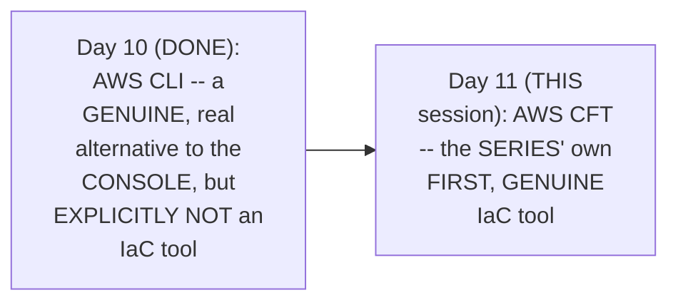

#### 🎯 Key Takeaways

* This is GENUINELY the SERIES' own SESSION that DELIVERS on the "IaC" CONCEPT — EXPLICITLY, DIRECTLY deferred AT the CLOSE of Day 10.
* Today's COMPLETE, explicit GOAL: understanding WHAT CFT is, HOW it implements IaC PRINCIPLES, its OWN characteristics/FEATURES/components, and PERFORMING a REAL, practical DEMONSTRATION.
* This session DIRECTLY, EXPLICITLY closes WITH a genuine COMPARISON to Terraform — a COMMONLY-asked, REAL interview TOPIC.

---

### 2. CFT & IaC, Precisely Defined

#### 📖 Definition — CFT, Precisely Defined

> 💡 **Given directly:** *"CFT basically stands for CloudFormation Templates. Basically, it is a template that helps in cloud formation. What is our cloud in this case? We are talking about AWS. So CloudFormation templates are templates that help us in the cloud formation of AWS — that is, in creating the resources, managing, and updating the cloud infrastructure on AWS."*

#### 📖 Definition — IaC, Precisely Defined via a Genuine, Memorable Analogy

> 💡 **Given directly:** *"Usually we write code to create applications, right? Whether you are a Java developer, Python developer... you write Java code to create a Java app, you write Python code to create a Python app. What infrastructure as code says is, no — write code to create infrastructure."*

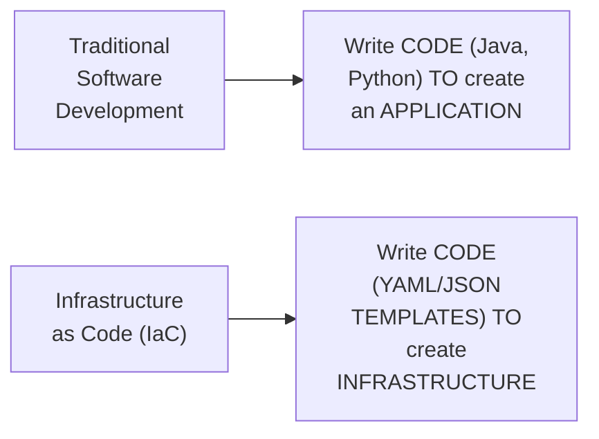

#### ⚠ Common Mistakes

* Assuming CFT is GENUINELY, MERELY "another WAY" to create AWS resources, EQUIVALENT to CLI OR the console — explicitly, directly, PRECISELY distinguished: CFT GENUINELY, DIRECTLY implements the PRINCIPLES of **IaC**, WHICH CLI does NOT.

#### 🎯 Key Takeaways

* **CFT (CloudFormation TEMPLATES)** is precisely DEFINED as TEMPLATES that HELP create, MANAGE, and UPDATE cloud infrastructure ON AWS.
* **IaC (Infrastructure AS Code)** is directly, MEMORABLY defined VIA a REAL, relatable ANALOGY — JUST as you WRITE code to CREATE an application, IaC MEANS writing CODE to CREATE infrastructure.
* This directly, PRECISELY sets UP the NEXT, essential QUESTION — WHAT, specifically, MAKES a TOOL genuinely "IaC," WHEN CLI (WHICH also USES code/PARAMETERS) does NOT qualify (Section 3)?

---
### 3. The Genuine Principles of Any IaC Tool

#### 📖 Definition — The Precise, Complete Principles

> 💡 **Given directly:** *"If you want to build a new IaC tool... this tool has to act as a middleman between user and one or multiple cloud providers. It's up to the IaC tool if it wants to support one, or multiple, cloud providers... CloudFormation templates support only one cloud provider, that is AWS. Azure Resource Manager supports only one cloud provider, that is Azure. Whereas tools like Terraform... support multiple cloud providers."*

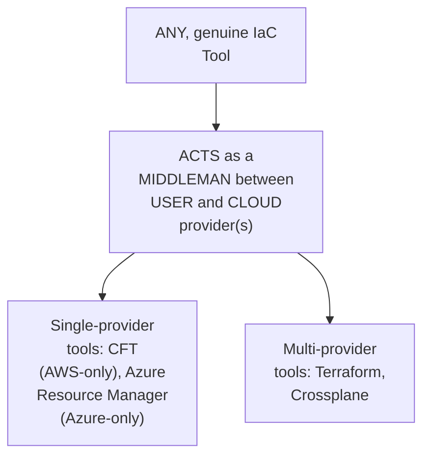

#### 📖 Definition — The Precise, Two-Part Requirement

> 💡 **Given directly:** *"If user submits a template — okay, so understand here carefully — in terms of IaC, users have to submit some templates. This template can be YAML files, this template can be JSON files, or anything that is declarative and versioned in nature... what this [tool] has to do is take this input and convert this template to a language that the cloud provider understands — usually API calls."*

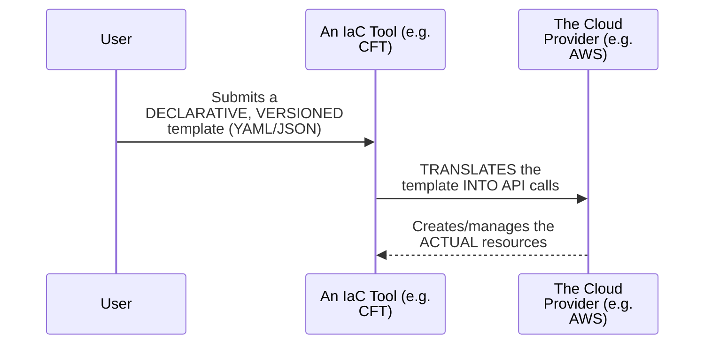

#### ⚠ Common Mistakes

* Assuming EVERY genuine IaC tool MUST support MULTIPLE cloud PROVIDERS — explicitly, directly, PRECISELY clarified: "IT is UP to the IaC TOOL" — SINGLE-provider tools (CFT, AZURE Resource Manager) are STILL, genuinely CONFIRMED as valid IaC TOOLS.
* Assuming "CONVERTING input into API CALLS" alone is SUFFICIENT to QUALIFY a tool AS "IaC" — explicitly, directly, IMPLIED as GENUINELY, ADDITIONALLY requiring the INPUT itself to BE a **declarative and VERSIONED template** — a DISTINCTION THIS session's own, LATER content (Section 4) DIRECTLY clarifies.

#### 🎯 Key Takeaways

* ANY genuine IaC TOOL must, precisely, ACT as a **middleman** BETWEEN the user AND one or MULTIPLE cloud providers — WHETHER it SUPPORTS one (CFT, AZURE Resource Manager) OR many (TERRAFORM, Crossplane) is GENUINELY up TO the tool.
* The USER submits a **DECLARATIVE and VERSIONED** template (YAML OR JSON) — and the TOOL translates THIS template into the CLOUD provider's own **API calls**.
* This directly, PRECISELY sets UP the NEXT, essential DEFINITIONS — WHAT "declarative" and "VERSIONED" genuinely, PRECISELY mean (Section 4) — the CORE distinction THAT separates a GENUINE IaC tool FROM CLI.

---

### 4. Declarative & Versioned: Two, Precise, Foundational Concepts

#### 📖 Definition — Versioned, Precisely Defined

> 💡 **Given directly:** *"Version means that you can take these templates and you should be able to store these templates in any Git repository, or you can store them in S3 buckets or any other places, and what should happen is you can go back and you can trace the changes — whatever the changes 10 days ago, or what were the changes 5 days ago."*

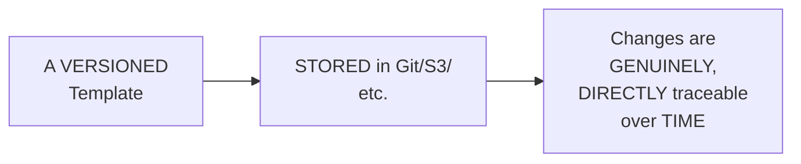

#### 📖 Definition — Declarative, Precisely Defined via a Genuine, Memorable Framing

> 💡 **Given directly:** *"Declarative means, if you want to understand declarative in one single line — declarative states that what you see is what you have. What does this mean? If I am looking at any declarative template... when I look at the template, the same thing should be available on the AWS infrastructure. By reading the template, I should understand — okay, so these are the resources that are available on AWS."*

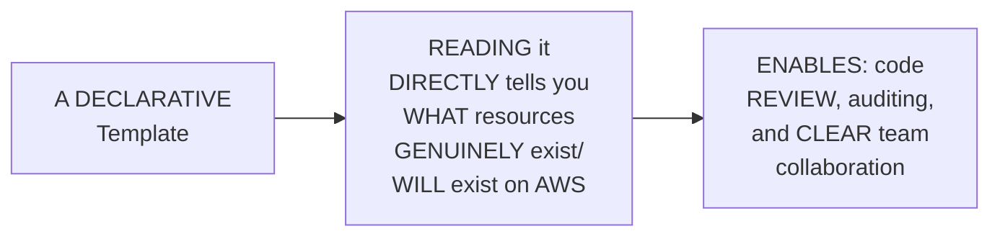

#### ⚠ Common Mistakes

* Assuming "DECLARATIVE" is a GENUINELY, ABSTRACT, hard-to-GRASP concept — explicitly, directly, MEMORABLY summarized IN one line: "WHAT you SEE is what YOU have."
* Assuming AWS CLI COMMANDS (WHICH also USE parameters/CODE) GENUINELY, STRUCTURALLY satisfy THIS "declarative AND versioned" requirement — explicitly, directly, IMPLIED as FALSE: CLI COMMANDS are IMPERATIVE, one-OFF actions — NOT a SINGLE, complete, READABLE, versioned TEMPLATE representing the ENTIRE, intended infrastructure STATE.

#### 🎯 Key Takeaways

* **VERSIONED** means a TEMPLATE can be STORED (in Git, S3, etc.) WITH a FULLY traceable HISTORY of changes OVER time.
* **DECLARATIVE** is precisely, MEMORABLY summarized as **"WHAT you see IS what you HAVE"** — READING the template DIRECTLY tells you WHAT resources GENUINELY exist ON AWS — ENABLING code REVIEW and AUDITING.
* THESE two, precise CONCEPTS directly, TOGETHER explain WHY CFT GENUINELY qualifies AS an IaC tool, WHILE CLI — DESPITE also USING "code" (COMMANDS/parameters) — does NOT.

---
### 5. CLI vs. CFT: A Genuine, Precise Decision Rule

#### 📖 Definition — The Precise, Genuine Decision Rule

> 💡 **Given directly:** *"When do you use CFT and when do you use AWS CLI... for quick and short actions, I'll use CLI. Whereas I will use CFT when I want to create actual resources — like, if I want to create two, or if I want to create three resources, or similarly if I want to create huge tasks, then in such cases I'll use CFT."*

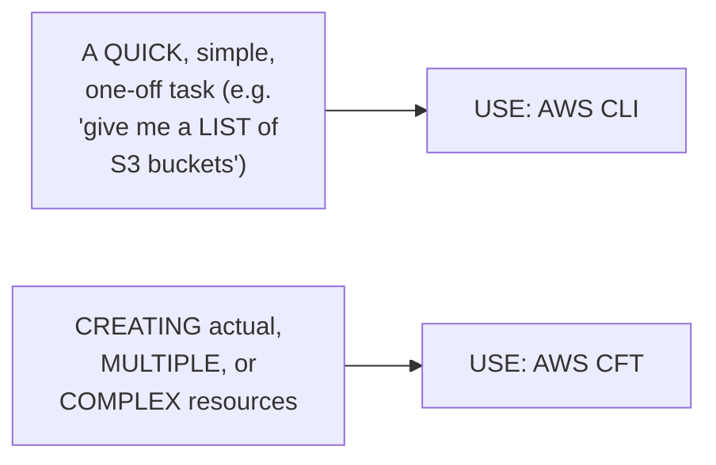

#### 🔍 Internal Working — A Genuine, Direct Confirmation of Why CFT Would Be Slow for Quick Tasks

> 💡 **Given directly:** *"Let's say someone asks you, 'Abhishek, can you quickly give me a list of S3 buckets?' ... if you start writing a template, and you submit this template to the IaC tool, and it has to convert that to the API calls and give you the action back, then it will take you a lot of time."*

#### ⚠ Common Mistakes

* Assuming CFT is GENUINELY, UNCONDITIONALLY "the BETTER" choice OVER CLI, SIMPLY because it IMPLEMENTS IaC principles — explicitly, directly, PRECISELY clarified: FOR quick, SIMPLE, one-off TASKS, CLI REMAINS genuinely, DIRECTLY faster and MORE appropriate.

#### 🎯 Key Takeaways

* The PRECISE, genuine decision RULE, DIRECTLY extending Day 10's OWN established GUIDANCE: **CLI** for QUICK, short ACTIONS; **CFT** for CREATING actual, MULTIPLE, or COMPLEX resources.
* WRITING and SUBMITTING a FULL template FOR a SIMPLE, quick TASK (LIKE listing S3 BUCKETS) would GENUINELY, DIRECTLY take LONGER than SIMPLY using CLI — a REAL, practical REASON behind this DECISION rule.
* This directly, PRECISELY reinforces THIS series' own, CONSISTENT message — DIFFERENT tools GENUINELY, DIRECTLY excel AT different, specific USE cases — NOT a SINGLE, universally "BEST" tool.

---

### 6. YAML vs. JSON: A Genuine, Direct Recommendation

#### 📖 Definition — The Direct, Genuine Recommendation

> 💡 **Given directly:** *"If you are learning CloudFormation templates new, then go with YAML, because YAML is most widely used in this DevOps world — whether it is Kubernetes or whether you are using Ansible, you basically use YAML."*

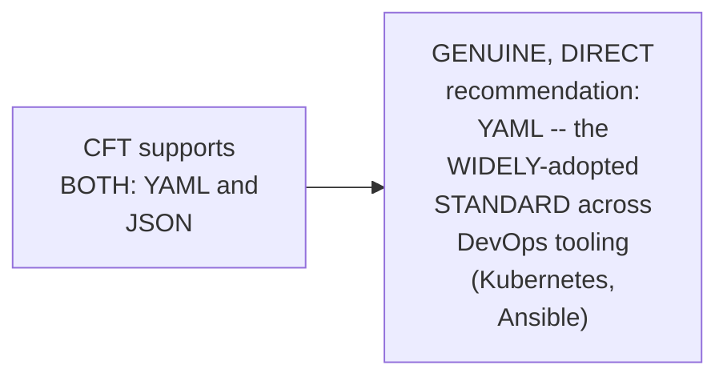

#### 🔍 Internal Working — Three, Genuine, Precise Advantages of YAML

> 💡 **Given directly:** *"It supports commenting as well... whereas JSON does not support commenting... YAML is more readable as well — the reason is that YAML basically depends on indentation, whereas JSON depends upon the curly braces... YAML is like kind of Python, where you can easily read it... YAML is also less complex."*

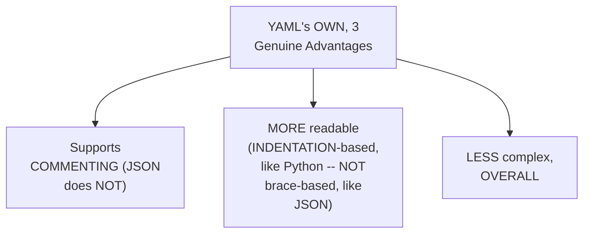

#### ⚠ Common Mistakes

* Assuming JSON is GENUINELY, STRICTLY forbidden FOR writing CFTs — explicitly, directly, PRECISELY clarified: "THERE is NO restriction THAT for CloudFormation TEMPLATES you cannot USE JSON" — TEAMS with EXISTING JSON expertise CAN still, GENUINELY use it — YAML is a RECOMMENDATION, not a REQUIREMENT.
* Assuming "COMMENTING" is a GENUINELY, MERELY cosmetic FEATURE — explicitly, directly, PRECISELY connected TO real, team-BASED collaboration — COMMENTS genuinely, DIRECTLY help TEAMMATES understand CODE without needing to FULLY re-read IT.

#### 🎯 Key Takeaways

* The instructor **directly, EXPLICITLY recommends YAML** OVER JSON — SPECIFICALLY because it's the MOST widely-ADOPTED format ACROSS the broader DevOps ECOSYSTEM (Kubernetes, ANSIBLE).
* YAML's THREE, genuine ADVANTAGES: it GENUINELY, DIRECTLY supports **comments** (JSON does NOT), is MORE **readable** (INDENTATION-based, LIKE Python), and is GENERALLY **less COMPLEX**.
* THIS remains a **RECOMMENDATION**, not a STRICT requirement — TEAMS with EXISTING JSON expertise CAN, genuinely, STILL use it FOR writing CFTs.

---
### 7. Drift Detection: A Genuine, Real, Powerful Feature

#### 📖 Definition — Drift Detection, Precisely Introduced

> 💡 **Given directly:** *"CFT also supports drift detection. So drift detection means, let's say today you created an EC2 instance plus S3 bucket using one CloudFormation template, and tomorrow there is one devops engineer in your team [who] unexpectedly went to the AWS UI and modified something in the S3 bucket."*

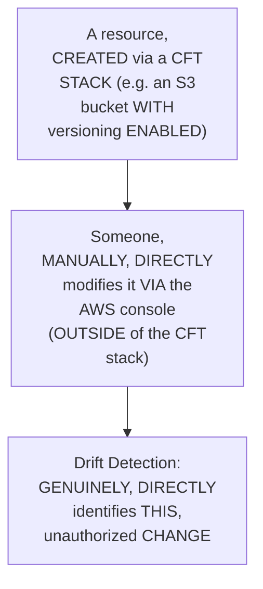

#### 🔍 Internal Working — A Genuine, Precise Explanation of Why This Matters

> 💡 **Given directly:** *"This drift detection is very, very important, because you will not manage a single resource... to manage this bunch of resources, what you will do sometimes is manually go there and see, okay, if it is created properly or not — when there are hundreds, thousands of resources, without such techniques you will not understand what did you create 15 days ago, 20 days ago."*

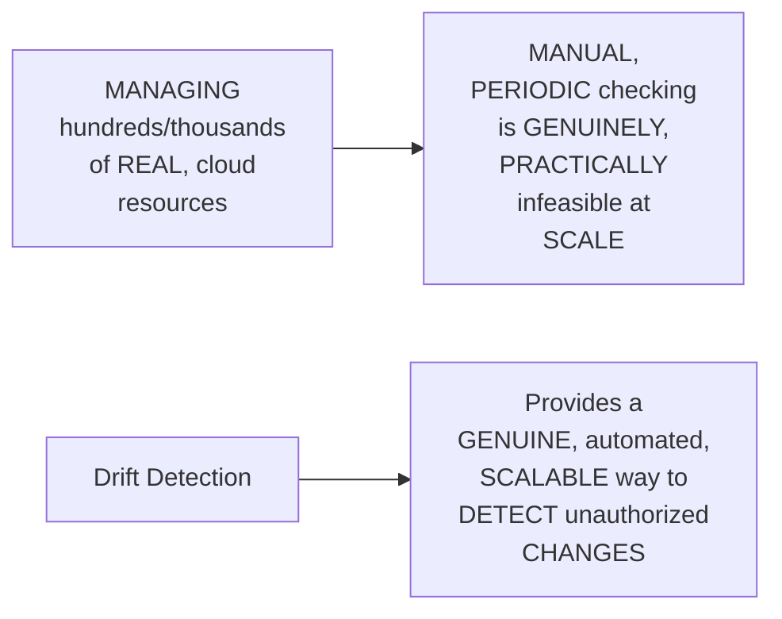

#### ⚠ Common Mistakes

* Assuming drift DETECTION is a GENUINELY, MERELY "nice-to-HAVE" convenience FEATURE — explicitly, directly, HONESTLY reframed as GENUINELY, PRACTICALLY essential — WITHOUT it, TRACKING configuration DRIFT across LARGE, real-world INFRASTRUCTURE becomes GENUINELY, PRACTICALLY infeasible.

#### 🎯 Key Takeaways

* **DRIFT detection** GENUINELY, DIRECTLY identifies WHEN a resource'S own, ACTUAL AWS configuration has GENUINELY diverged FROM what a CFT stack ORIGINALLY, DECLARATIVELY defined — e.g., SOMEONE manually MODIFYING an S3 bucket'S own SETTINGS.
* This feature is directly, HONESTLY confirmed as GENUINELY, PRACTICALLY essential AT scale — MANUALLY tracking CONFIGURATION drift across HUNDREDS or THOUSANDS of real RESOURCES is GENUINELY infeasible WITHOUT it.
* This directly, PRECISELY sets UP the SESSION's own, LATER, complete, LIVE demonstration (Section 12) — SHOWING drift DETECTION genuinely, PRACTICALLY working ON real, live AWS resources.

---

### 8. Stacks: How a Template Gets Submitted to AWS

#### 📖 Definition — Stack, Precisely Defined

> 💡 **Given directly:** *"There is one thing on the AWS CFT that is called as 'stack.' What you need to do is, you should go to the CFT — you can either go through the CLI, or you can go through the UI — it's up to you. So even CFT can be implemented using CLI, or CFT can be implemented using UI."*

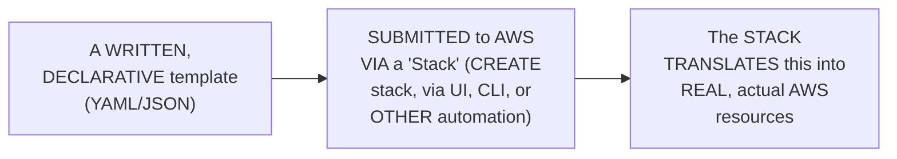

#### ⚠ Common Mistakes

* Assuming a CFT TEMPLATE must GENUINELY, EXCLUSIVELY be submitted VIA the AWS console (UI) — explicitly, directly, PRECISELY clarified: "EVEN CFT can be IMPLEMENTED using CLI, OR CFT can be IMPLEMENTED using UI" — MULTIPLE, genuine SUBMISSION paths EXIST.

#### 🎯 Key Takeaways

* A **"STACK"** is precisely the MECHANISM through WHICH a WRITTEN, declarative TEMPLATE is GENUINELY, DIRECTLY submitted TO AWS — CREATING the ACTUAL, real RESOURCES it DESCRIBES.
* STACKS can be MANAGED via MULTIPLE, genuine PATHS — the AWS CONSOLE (UI), the CLI, OR other AUTOMATION (e.g., Jenkins PIPELINES).
* This directly, PRECISELY sets UP THIS session's own, COMPLETE, LIVE demonstrations (SECTIONS 11-12) — WHICH directly, PRACTICALLY use the "CREATE stack" WORKFLOW to SUBMIT real TEMPLATES.

---
### 9. The Complete CFT Structure: Every Component, Precisely Explained

#### 📖 Definition — The Complete, Precise Structure

> 💡 **Given directly:** *"Firstly, you will write the version of CFT... then you provide the description... then metadata information... then you will put some parameters... then you can define some rules... then you have mappings... then you have conditions... [and] the only mandatory thing of the template is this specific section that is called resources... finally, you can also define outputs."*

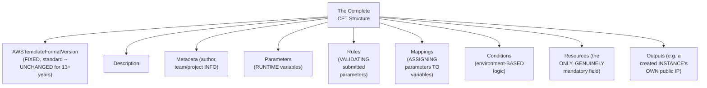

#### 🔍 Internal Working — Parameters, Precisely Explained via a Genuine, Real Example

> 💡 **Given directly:** *"What if I want to use this same template for 10 teams? What I can do is, I can parameterize the image ID — that means instead of mentioning the image ID here, I can say, 'take this when you actually run the template.' So during the runtime I can populate this image ID using a parameter."*

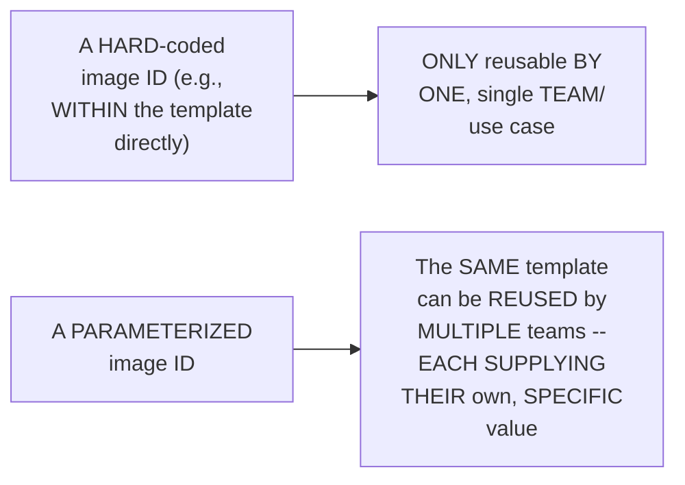

#### 🔍 Internal Working — Rules, Precisely Explained via a Genuine, Real Cost-Control Example

> 💡 **Given directly:** *"You shared this template across your organization... one person, instead of using T2 micro, uses T2 X-large... your AWS cost will go rocket high. So in the rules, even if you are sharing with multiple people, what you can do is define specific set of things saying that this field, instance type, should only be T2 micro or T2 medium — if anyone submits above that, reject that template request."*

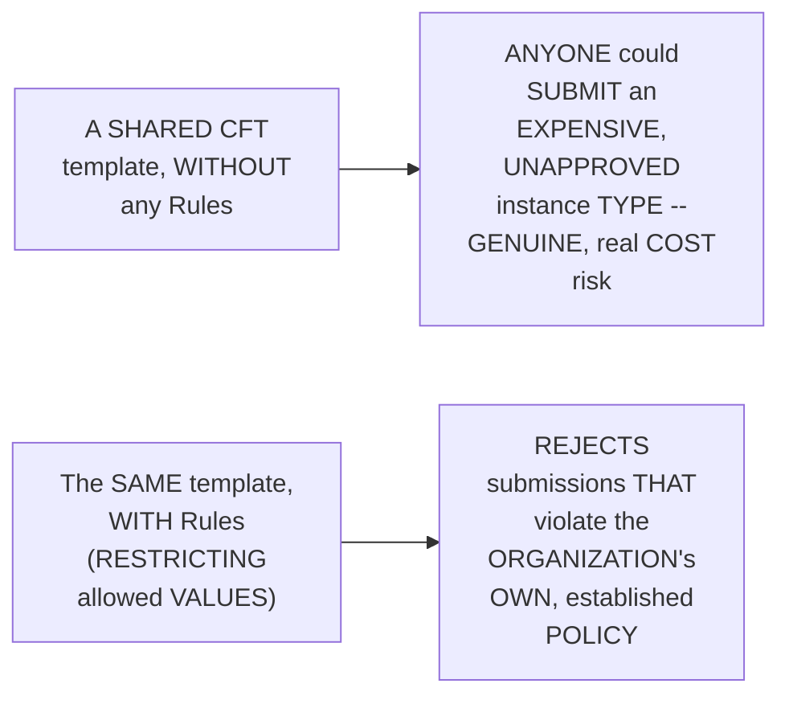

#### 🔍 Internal Working — Mappings & Conditions, Precisely Explained

> 💡 **Given directly, on mappings:** *"Mappings is basically like, if you parameterize this thing, you need a variable to assign this parameter. What this mapping section does is it will map a variable with a parameter."*

> 💡 **Given directly, on conditions:** *"Let's say you don't want [someone] to execute this template in a production environment... what you can do is take a parameter from them and say, on which environment are you using this template? If they reply as prod... you can say, our condition is to only execute this for a production environment."*

#### ⚠ Common Mistakes

* Assuming EVERY, single COMPONENT (parameters, RULES, mappings, CONDITIONS) is GENUINELY, STRICTLY required IN every CFT — explicitly, directly, REPEATEDLY confirmed: "THE only MANDATORY thing OF the TEMPLATE is THIS specific SECTION that is CALLED resources" — EVERY other component is GENUINELY optional.
* Confusing "PARAMETERS" (RUNTIME input VALUES) with "RULES" (VALIDATION logic APPLIED to those SAME parameters) — explicitly, directly, PRECISELY distinguished VIA their OWN, separate, real EXAMPLES.

#### 🎯 Key Takeaways

* The COMPLETE CFT structure INCLUDES: FORMAT version, DESCRIPTION, metadata, PARAMETERS, rules, MAPPINGS, conditions, RESOURCES, and outputs — but **ONLY "Resources"** is GENUINELY, DIRECTLY mandatory.
* **PARAMETERS** enable a SINGLE template to be GENUINELY, PRACTICALLY reused ACROSS multiple TEAMS/use cases (e.g., a REUSABLE image-ID VALUE); **RULES** enable GENUINE, real cost-CONTROL and validation (e.g., RESTRICTING instance TYPES to APPROVED values ONLY).
* **MAPPINGS** connect PARAMETERS to VARIABLES; **CONDITIONS** enable ENVIRONMENT-based logic (e.g., RESTRICTING a template TO non-production USE only).

---
### 10. A Complete, Real Tour of the Official AWS CFT Documentation

#### 🏢 Real-World / Production Usage — A Genuine, Direct Endorsement

> 💡 **Given directly:** *"I would like to take you through the official documentation of AWS CFT, because this is one of the best documentations that you can come across for any AWS service. The reason why I'm saying this is you have everything here — the theory part, there are a bunch of examples, you can technically copy-paste a lot of examples from here."*

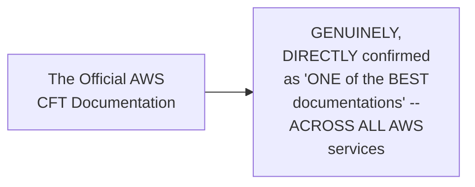

#### 🪜 Step-by-Step — A Complete, Real Navigation Path

> 💡 **Given directly:** *"If you go to this documentation, you will find a section called 'Working with Templates,' and it is this — this is where exactly you have to focus, because if you go to this section, you have 'Template Formats'... after that, there is also a section called 'Template Anatomy,' which explains what each and every property in the template is."*

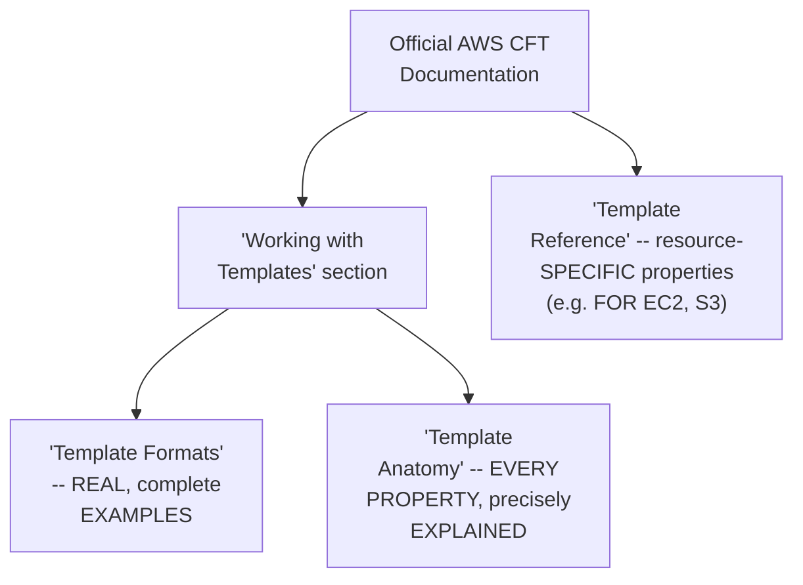

#### ⚠ Common Mistakes

* Assuming a devops ENGINEER should GENUINELY, PRACTICALLY memorize EVERY parameter FOR every AWS SERVICE, WITHOUT relying ON documentation — explicitly, directly, DIRECTLY implied as UNREALISTIC and UNNECESSARY: "THERE is NO way THAT someone would REFER or REMEMBER all OF this configuration WITHOUT looking INTO the AWS documentation."

#### 🎯 Key Takeaways

* The OFFICIAL AWS CFT documentation is directly, EXPLICITLY endorsed AS "ONE of the BEST documentations" ACROSS all AWS SERVICES — CONTAINING theory, EXAMPLES, and COMPLETE reference MATERIAL.
* THE key navigation PATH: "WORKING with Templates" → "TEMPLATE Formats" (real EXAMPLES) and "TEMPLATE Anatomy" (EVERY property, EXPLAINED) — PLUS "template REFERENCE" for resource-SPECIFIC properties.
* This directly, HONESTLY reinforces a GENUINE, professional REALITY — EVEN experienced devops ENGINEERS genuinely, PRACTICALLY rely ON documentation CONSTANTLY, RATHER than memorizing EVERY, single PARAMETER.

---

### 11. A Complete, Real, Live Demo: Creating an S3 Bucket via CloudFormation Designer

#### 🪜 Step-by-Step — A Complete, Real, Beginner-Friendly Workflow

> 💡 **Given directly:** *"'Create template in designer' — if you click on this one, this is a very interesting one, and this is designed for beginners... you can assume it as any tool, as a drag-and-drop tool... I want a CloudFormation template for S3 bucket... I can just drop this bucket here, and if you see here, the code is populated."*

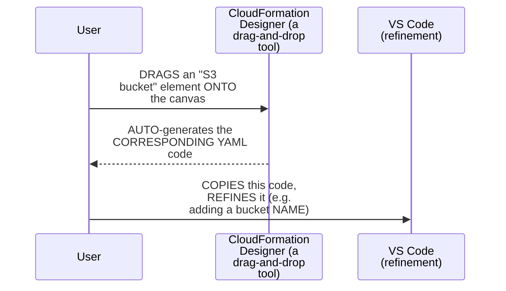

#### 🪜 Step-by-Step — A Complete, Real, Live Submission & Verification

> 💡 **Given directly:** *"Create stack, now let's say the template is ready... upload a template file... provide a name for the stack, let me call it as S3 bucket... click on submit, and you will notice that a bucket gets created."*

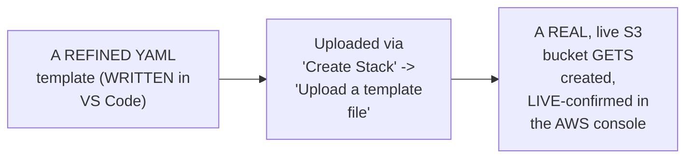

#### 🔍 Internal Working — A Genuine, Honest Note: When This Workflow Is Genuinely Worth It

> 💡 **Given directly:** *"If I am only creating S3 bucket, then this entire process does not make sense — S3 bucket can be easily created through the CLI. If I am creating EC2 instance plus S3 bucket plus VPC plus a bunch of configuration, then CloudFormation template makes much more sense."*

#### ⚠ Common Mistakes

* Assuming CFT is GENUINELY, DIRECTLY the "BEST" tool FOR creating a SINGLE, simple resource (LIKE ONE S3 bucket) — explicitly, directly, HONESTLY clarified: FOR a SINGLE resource, "THIS entire PROCESS does NOT make SENSE" — CLI WOULD, genuinely, be FASTER — CFT's own, REAL value EMERGES with MULTIPLE, complex RESOURCES.

#### 🎯 Key Takeaways

* The **CloudFormation DESIGNER** is directly, EXPLICITLY confirmed as a **BEGINNER-friendly**, drag-and-DROP tool — GENERATING real, WORKING YAML code, WITHOUT requiring MANUAL, from-scratch WRITING.
* A COMPLETE, real, LIVE demonstration directly, CONCRETELY confirmed the FULL workflow — FROM designer-GENERATED YAML, through VS-Code REFINEMENT, to a REAL, live-CREATED S3 bucket, VERIFIED in the AWS CONSOLE.
* The instructor **directly, HONESTLY acknowledges** THIS specific, SINGLE-resource example is GENUINELY "not the BEST use CASE" for CFT — REINFORCING Section 5's own established GUIDANCE — CFT's OWN, real value GENUINELY emerges WITH multiple, COMPLEX resources.

---
### 12. A Complete, Real, Live Demo: Drift Detection in Action (Two Scenarios)

#### 🪜 Step-by-Step — Scenario 1: A Deleted Resource

> 💡 **Given directly:** *"Let me delete this bucket... let's go back to this one here — right now, in the stacks, you have this thing available. I did not delete the CloudFormation template... but what I have done is I have deleted the S3 bucket that is created through the CloudFormation template. So what I can do right now is I can check for the drift using 'detect stack drift.'"*

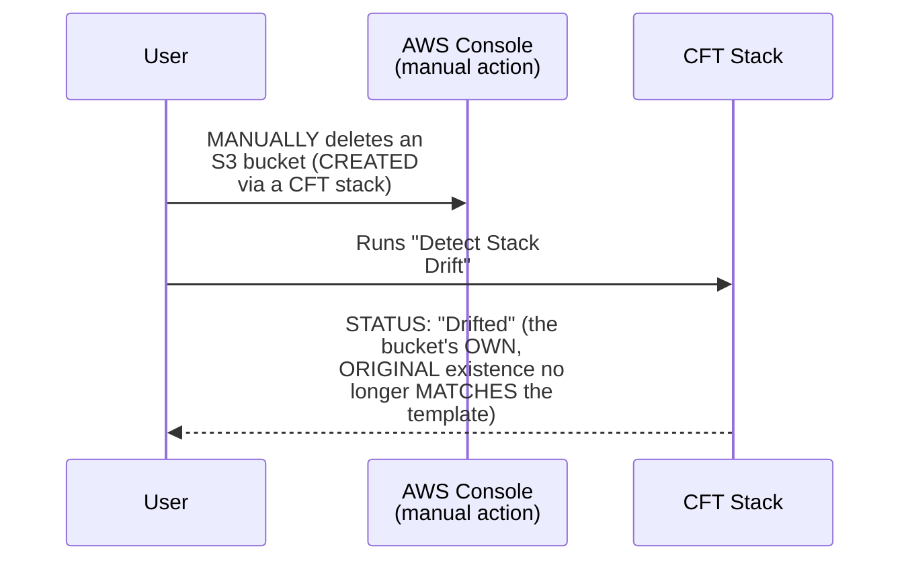

#### 🪜 Step-by-Step — Scenario 2: A More Precise Demo (Versioning Enabled, Then Suspended)

> 💡 **Given directly:** *"I'll create S3 bucket with bucket configuration, like the bucket versioning enabled, and through manual entry I'll go to the S3 service and I will disable the S3 versioning. Now let us see how does CloudFormation drift detection behave in that case."*

```mermaid
sequenceDiagram
    participant User
    participant CFT as CFT Stack<br/>(versioning<br/>ENABLED)
    participant Console as AWS Console<br/>(manual change)
    User->>CFT: Creates an S3<br/>bucket, WITH<br/>versioning=Enabled<br/>(via the TEMPLATE)
    User->>Console: MANUALLY suspends<br/>versioning (a DIRECT,<br/>OUT-of-band change)
    User->>CFT: Runs "Detect Stack<br/>Drift"
    CFT-->>User: PRECISE, EXACT<br/>before/after<br/>DIFFERENCE: LEFT<br/>"Enabled," RIGHT<br/>"Suspended"
```

#### 🔍 Internal Working — A Genuine, Direct, Live-Confirmed Success

> 💡 **Given directly:** *"View drift results, what is the drift result? It says drifted. Now what is drifted? Click on this and see — view drift details — see, it has clearly provided that in left the status is enabled, and in right the status is suspended. So someone has manually made this configuration change."*

#### 🏢 Real-World / Production Usage — A Genuine, Direct Connection to Real Accountability

> 💡 **Given directly:** *"If your S3 bucket has bucket logging enabled... you can go and see who has modified it, and you can warn them, you can send them notifications, you can escalate, or you can revoke access for them on this S3 bucket itself."*

```mermaid
flowchart LR
    A["Drift Detection<br/>CONFIRMS an<br/>unauthorized<br/>CHANGE"] --> B["COMBINED with<br/>bucket LOGGING:<br/>identifies WHO made<br/>the CHANGE"]
    B --> C["ENABLES: warnings,<br/>notifications,<br/>ESCALATION, or<br/>ACCESS revocation"]
```

#### ⚠ Common Mistakes

* Assuming DRIFT detection ALWAYS, GENUINELY shows the EXACT, precise DIFFERENCE for ANY kind OF change — explicitly, directly, HONESTLY clarified: WHEN the ENTIRE resource IS deleted (SCENARIO 1), the "drifted" STATUS is SHOWN, but the SPECIFIC change ISN'T — WHEREAS a MORE granular CHANGE (SCENARIO 2, VERSIONING enabled→SUSPENDED) genuinely, DIRECTLY reveals the EXACT, before/AFTER difference.

#### 🎯 Key Takeaways

* A COMPLETE, real, LIVE demonstration — SCENARIO 1 (a DELETED S3 bucket) — directly, CONCRETELY confirmed drift DETECTION correctly IDENTIFIES a "DRIFTED" status, THOUGH the SPECIFIC change ISN'T shown WHEN the ENTIRE resource is GONE.
* A SECOND, MORE precise, complete, real DEMONSTRATION — S3 versioning ENABLED via CFT, THEN manually SUSPENDED via the CONSOLE — directly, CONCRETELY confirmed drift DETECTION correctly, PRECISELY reveals the EXACT before/AFTER difference (ENABLED versus suspended).
* Drift DETECTION, COMBINED with bucket LOGGING, directly, PRACTICALLY enables REAL, organizational accountability — IDENTIFYING who MADE an unauthorized CHANGE, and ENABLING warnings, NOTIFICATIONS, or access REVOCATION.

---

### 13. Two, Real VS Code Plugins That Accelerate Writing CFTs

#### 🏢 Real-World / Production Usage — The YAML Plugin (by Red Hat)

> 💡 **Given directly:** *"The first plugin that you will install is YAML. If you click on the YAML, you will get this — this plugin is provided by Red Hat, this is a free plugin, and look at the number of downloads — this is a very good one. It will give you all the information — let's say you have messed up with the YAML indentation, you don't know how to write YAML files, then this YAML plugin by Red Hat will be of super help."*

```mermaid
flowchart LR
    A["YAML Plugin<br/>(by Red Hat, free,<br/>WIDELY-downloaded)"] --> B["HELPS with:<br/>INDENTATION issues,<br/>SYNTAX validation,<br/>GENERAL YAML<br/>authoring"]
```

#### 🏢 Real-World / Production Usage — The AWS Toolkit Plugin

> 💡 **Given directly:** *"The second thing is a plugin called AWS Toolkit... AWS Toolkit has use cases beyond CloudFormation — you can use this simple toolkit plugin to interact with AWS directly, you can do a bunch of things with it... using this, basically the life of a developer or the life of a devops engineer with AWS can be made very, very easy."*

```mermaid
flowchart LR
    A["AWS Toolkit<br/>Plugin"] --> B["PROVIDES:<br/>AUTOCOMPLETE for<br/>AWS resource TYPES<br/>and PROPERTIES,<br/>DIRECTLY within VS<br/>Code"]
    A --> C["USE cases BEYOND<br/>CloudFormation --<br/>BROADER AWS<br/>interaction"]
```

#### ⚠ Common Mistakes

* Assuming WRITING a REAL, correct CFT ALWAYS, GENUINELY requires CONSTANTLY switching TO the browser/DOCUMENTATION — explicitly, directly, LIVE-demonstrated as UNNECESSARY, ONCE these TWO plugins are INSTALLED — MUCH of the AUTHORING can HAPPEN directly WITHIN VS Code, VIA autocomplete.

#### 🎯 Key Takeaways

* THE **YAML plugin** (by Red HAT, free, WIDELY-downloaded) directly, PRACTICALLY helps WITH indentation and SYNTAX issues — a COMMON, real PAIN point when WRITING YAML.
* THE **AWS Toolkit plugin** directly, PRACTICALLY provides AUTOCOMPLETE for AWS resource TYPES and PROPERTIES — DIRECTLY within VS Code — WITH broader USE cases BEYOND just CloudFormation.
* TOGETHER, these TWO plugins directly, PRACTICALLY accelerate CFT AUTHORING — REDUCING the NEED to CONSTANTLY switch TO external DOCUMENTATION.

---
### 14. A Complete, Real, Live Demo: Writing an EC2 CFT From Scratch, Fast

#### 🪜 Step-by-Step — A Complete, Real, Live-Demonstrated, Autocomplete-Driven Workflow

> 💡 **Given directly:** *"Let's say I want to write the CloudFormation template... I'll go through the documentation, let's say I want to create a S3 bucket — so I know that AWS template format version, see I just search for AWS, and it gave me the options... after that, let's say I don't want to write metadata properties, anything — I can directly switch to resources, just search for 'res,' and it will give you."*

```mermaid
flowchart TD
    A["Type a PARTIAL<br/>keyword (e.g. 'AWS,'<br/>'res')"] --> B["The AWS Toolkit<br/>plugin AUTO-suggests<br/>the CORRECT,<br/>COMPLETE property/<br/>section"]
    B --> C["NO NEED to<br/>SWITCH to the<br/>browser/<br/>documentation, FOR<br/>MOST, common CASES"]
```

#### 🪜 Step-by-Step — A Complete, Real, Live-Demonstrated EC2 Instance Template

> 💡 **Given directly:** *"In my case, I just want to create an instance... so in my EC2 instance, either you can take help of this documentation, or just type colon AWS, and you'll get everything here as well... I know that the mandatory things are AMI, that is image ID... key value... you need to choose the security group."*

```yaml
AWSTemplateFormatVersion: "2010-09-09"
Description: My first CloudFormation template for EC2 instance
Resources:
  MyEC2Instance:
    Type: AWS::EC2::Instance
    Properties:
      ImageId: ami-xxxxxxxxx
      InstanceType: t2.micro
      KeyName: my-key-pair
      SecurityGroups:
        - my-security-group
```

#### 🔍 Internal Working — A Genuine, Direct Confirmation of the Real, Achieved Speed

> 💡 **Given directly:** *"See, I'm writing all of these things without even looking at the documentation. I did not even open AWS EC2 documentation, but I am still able to write, because I mastered this using the AWS Toolkit and YAML [plugins]. As you keep writing, you can also master [it]."*

```mermaid
flowchart LR
    A["Beginner-Level<br/>CFT Authoring"] --> B["HEAVY reliance ON<br/>the OFFICIAL AWS<br/>documentation"]
    C["Plugin-ASSISTED,<br/>PRACTICED CFT<br/>Authoring"] --> D["GENUINELY,<br/>DIRECTLY faster --<br/>MOST properties<br/>WRITTEN via<br/>AUTOCOMPLETE ALONE"]
```

#### ⚠ A Direct, Honest, Genuine Recommendation to New Learners

> 💡 **Given directly:** *"At this point of time, don't go till that point [conditions, parameters, rules]. Firstly, try to create instant... create some resources using CFT. Later, when you learn, when you master it, you can go with other options such as conditions, parameters."*

#### ⚠ Common Mistakes

* Assuming a BEGINNER should GENUINELY, IMMEDIATELY attempt to USE every, ADVANCED CFT feature (PARAMETERS, rules, CONDITIONS) from THE start — explicitly, directly, HONESTLY advised AGAINST: "DON'T go TILL that point" — MASTER the BASIC, resources-ONLY workflow FIRST.

#### 🎯 Key Takeaways

* A COMPLETE, real, LIVE demonstration directly, CONCRETELY confirmed WRITING a COMPLETE, working EC2 TEMPLATE — WITH AMI, key NAME, security GROUP, and instance TYPE — ENTIRELY via PLUGIN-driven autocomplete, **WITHOUT** opening the OFFICIAL documentation.
* This directly, PRACTICALLY demonstrates HOW mastering PLUGIN-assisted authoring GENUINELY, DIRECTLY accelerates REAL, production CFT writing OVER time.
* The instructor **directly, HONESTLY recommends** NEW learners MASTER the BASIC, resources-ONLY workflow FIRST — DEFERRING advanced FEATURES (parameters, RULES, conditions) until AFTER genuine, foundational COMFORT is established.

---

### 15. Terraform vs. CFT: A Genuine, Precise, Real Comparison

#### 📖 Definition — The Precise, Direct Comparison

> 💡 **Given directly:** *"Terraform is basically used in a hybrid cloud environment or multi-cloud environment. Let's say your organization is on both AWS, Azure — if your organization is on-premises and AWS, in such cases it is better to go with tools like Terraform, because Terraform can handle multi-cloud."*

```mermaid
flowchart LR
    A["A SINGLE-cloud<br/>organization<br/>(AWS-only)"] --> B["CFT: GENUINELY,<br/>DIRECTLY the<br/>APPROPRIATE choice"]
    C["A MULTI-cloud/<br/>hybrid-cloud<br/>organization<br/>(AWS+Azure,<br/>ON-premises+cloud)"] --> D["Terraform:<br/>GENUINELY,<br/>DIRECTLY the<br/>BETTER-suited choice"]
```

#### 🏢 Real-World / Production Usage — A Genuine, Honest, Industry-Level Observation

> 💡 **Given directly:** *"Terraform is the tool for future — of course, there are competitors to Terraform, like Crossplane, and Crossplane has many advantages... but for now, in the current market, Terraform is the one that's in boom, because Crossplane is still a CNCF sandbox project, and it is improving."*

```mermaid
flowchart LR
    A["Terraform"] --> B["The GENUINE,<br/>CURRENT industry<br/>STANDARD for<br/>multi-cloud IaC"]
    C["Crossplane"] --> D["A GENUINE,<br/>EMERGING competitor<br/>-- STILL, HONESTLY, a<br/>CNCF sandbox<br/>PROJECT"]
```

#### 🪜 Step-by-Step — A Genuine, Direct, Real Interview-Answer Framing

> 💡 **Given directly:** *"If you know CloudFormation templates, and if you want to answer in your interviews, then what you can say is, 'I am using CloudFormation templates because my organization is only on AWS — tomorrow they will not make a decision to switch from AWS to Azure, because they have been successfully working on AWS over the last few years, and we are quite comfortable with AWS only.' Then your interviewer will be satisfied."*

#### ⚠ Common Mistakes

* Assuming EITHER Terraform OR CFT is GENUINELY, UNCONDITIONALLY "the BETTER" tool, IN isolation — explicitly, directly, PRECISELY clarified: the CORRECT choice GENUINELY, DIRECTLY depends ON the organization's OWN, real cloud STRATEGY — single-CLOUD (CFT) versus MULTI-cloud/hybrid (TERRAFORM).
* Assuming LEARNING ONLY CFT is GENUINELY, EQUALLY as CAREER-valuable as LEARNING Terraform — explicitly, directly, HONESTLY clarified: "IF you want TO learn ONLY one THING, then GO with Terraform, NOT with CloudFormation templates" — Terraform's OWN, broader, MULTI-cloud applicability GENUINELY, DIRECTLY makes it the MORE strategically VALUABLE skill, OVERALL.

#### 🎯 Key Takeaways

* THE precise, genuine COMPARISON: **Terraform** GENUINELY, DIRECTLY excels IN multi-cloud/HYBRID-cloud environments; **CFT** GENUINELY, DIRECTLY excels FOR single-cloud (AWS-only) ORGANIZATIONS.
* The instructor **directly, HONESTLY confirms** Terraform is GENUINELY "the TOOL for the FUTURE" — WITH Crossplane MENTIONED as a REAL, emerging COMPETITOR, STILL early-STAGE (a CNCF SANDBOX project).
* A GENUINE, real INTERVIEW-answer framing is directly, EXPLICITLY provided: JUSTIFY CFT usage BY explaining YOUR organization's OWN, genuine, AWS-only COMMITMENT — RATHER than CLAIMING CFT is UNIVERSALLY "better."

---
### 16. Closing: The Assignment

#### 🪜 Step-by-Step — A Direct, Genuine Assignment

> 💡 **Given directly:** *"The assignment for today is to create EC2 instance using CloudFormation template. You can use ChatGPT, you can use this documentation... you will find the exact example in this documentation as well, but what I will recommend you is to try it by yourself... by taking help of the documentation and designer, try to do it by yourself."*

```mermaid
flowchart LR
    A["The Assignment"] --> B["CREATE an EC2<br/>instance USING a<br/>REAL CFT"]
    B --> C["ALLOWED resources:<br/>OFFICIAL AWS<br/>documentation,<br/>CloudFormation<br/>Designer, ChatGPT<br/>(IF genuinely<br/>stuck)"]
```

#### ⚠ Common Mistakes

* Assuming THIS session's own DEMONSTRATIONS (S3 bucket, DRIFT detection) represent the COMPLETE, final SCOPE of the assignment — explicitly, directly, CLARIFIED: the ASSIGNMENT specifically ASKS learners to CREATE an **EC2 instance**, EXTENDING beyond the S3-bucket EXAMPLES shown LIVE.

#### 🎯 Key Takeaways

* This episode **GENUINELY, COMPREHENSIVELY delivers** its OWN, stated GOALS — a COMPLETE theoretical FOUNDATION (IaC, declarative/VERSIONED, the FULL CFT structure) PLUS three, real, LIVE-demonstrated practical ACTIVITIES.
* A DIRECT, EXPLICIT assignment REQUIRES creating a REAL EC2 instance VIA CFT — WITH the OFFICIAL documentation, the DESIGNER, and (IF genuinely NEEDED) ChatGPT ALL confirmed AS acceptable, LEGITIMATE resources.
* This directly, DIRECTLY closes THIS session's own, COMPLETE arc — FROM theory (IaC PRINCIPLES) through PRACTICE (THREE live DEMOS) to a GENUINE, real, hands-ON assignment.

---

## 📝 Glossary

| Term | Definition | Why It Matters |
|---|---|---|
| **CFT** | CloudFormation Templates | AWS's own, native IaC tool |
| **IaC** | Infrastructure as Code | Write code to create infrastructure, not just applications |
| **Declarative** | "What you see is what you have" | Reading the template tells you what resources exist |
| **Versioned** | Storable and traceable over time | Enables code review, auditing (like Git) |
| **Stack** | The mechanism that submits a template to AWS | Via UI, CLI, or automation |
| **Drift Detection** | Detects unauthorized, out-of-band changes | Essential at scale, across many resources |
| **Resources (CFT)** | The only, genuinely mandatory CFT section | Everything else is optional |
| **Parameters** | Runtime input values | Enable one template to be reused across teams |
| **Rules (CFT)** | Validation logic for submitted parameters | Enables cost control and policy enforcement |
| **CloudFormation Designer** | A drag-and-drop, beginner-friendly template builder | Generates real, working YAML |
| **AWS Toolkit / YAML Plugins** | Real VS Code extensions | Accelerate CFT authoring via autocomplete |

---

## 🔄 Revision Notes — One-Minute Revision

* This is **Day 11**, delivering on the "IaC" concept explicitly deferred at the close of Day 10.
* **CFT and IaC, defined**: CFT = templates that create/manage/update AWS infrastructure. IaC = "write code to create infrastructure," just as you'd write code to create an application.
* **The genuine principles of any IaC tool**: acts as a middleman between user and one or multiple cloud providers (CFT/Azure Resource Manager = single-provider; Terraform/Crossplane = multi-provider); the user submits a DECLARATIVE and VERSIONED template; the tool converts this into API calls.
* **Declarative**: "what you see is what you have" -- reading the template directly tells you what resources exist. **Versioned**: storable (Git/S3) with a full, traceable change history. Together, these explain why CFT qualifies as IaC while CLI does not.
* **CLI vs. CFT decision rule**: CLI for quick, short actions; CFT for creating actual, multiple, or complex resources.
* **YAML over JSON (a recommendation, not a requirement)**: supports comments, more readable (indentation-based, like Python), less complex.
* **Drift detection**: identifies when a resource's real, AWS configuration has diverged from what a CFT stack originally defined -- essential at scale, since manually tracking hundreds/thousands of resources is genuinely infeasible.
* **Stacks**: the mechanism through which a template gets submitted to AWS, via UI, CLI, or other automation.
* **The complete CFT structure**: AWSTemplateFormatVersion, Description, Metadata, Parameters, Rules, Mappings, Conditions, Resources (the ONLY mandatory field), and Outputs.
* **The official AWS CFT documentation**: explicitly endorsed as "one of the best" across all AWS services -- key path: "Working with Templates" -> "Template Formats" and "Template Anatomy."
* **Live Demo 1 (S3 bucket via Designer)**: a beginner-friendly, drag-and-drop tool generates real YAML; refined in VS Code; uploaded via "Create Stack," creating a real, live-verified bucket. Honestly acknowledged as NOT the best use case for CFT (a single resource is faster via CLI).
* **Live Demo 2 (Drift Detection, two scenarios)**: (1) deleting a CFT-created S3 bucket confirms "drifted" status, though the specific change isn't shown; (2) enabling versioning via CFT, then manually suspending it via the console, produces a PRECISE, exact before/after diff (Enabled vs. Suspended).
* **Two real VS Code plugins**: the YAML plugin (Red Hat, free, widely-downloaded) helps with indentation/syntax; the AWS Toolkit plugin provides autocomplete for AWS resource types/properties directly in VS Code.
* **Live Demo 3 (writing an EC2 template from scratch)**: a complete, working EC2 template (AMI, key name, security group, instance type) written entirely via plugin-driven autocomplete, without opening the official documentation. New learners are advised to master the basic, resources-only workflow before attempting parameters/rules/conditions.
* **Terraform vs. CFT**: Terraform for multi-cloud/hybrid-cloud organizations; CFT for single-cloud (AWS-only) organizations. Terraform is honestly confirmed as "the tool for the future," with Crossplane as an emerging, still-early competitor. A real interview-answer framing: justify CFT usage via your organization's own, genuine AWS-only commitment.
* **Closing**: the assignment is to create a real EC2 instance using CFT, using documentation/Designer/ChatGPT as needed.

---

## 📋 Cheat Sheet

**CFT vs. CLI decision rule:**
```text
CLI -- QUICK, short actions (e.g. "list my S3 buckets")
CFT -- creating ACTUAL, multiple, or COMPLEX resources
```

**The genuine principles of an IaC tool:**
```text
1. Acts as a middleman between user and cloud provider(s)
2. User submits a DECLARATIVE and VERSIONED template
3. The tool converts this into API calls
```

**Declarative & Versioned:**
```text
Declarative: "what you see IS what you have"
Versioned:   storable + traceable over time (Git, S3)
```

**The complete CFT structure:**
```yaml
AWSTemplateFormatVersion: "2010-09-09"  # fixed, standard
Description: ...
Metadata: ...          # optional
Parameters: ...        # optional
Rules: ...              # optional
Mappings: ...            # optional
Conditions: ...            # optional
Resources: ...                # THE ONLY MANDATORY SECTION
Outputs: ...                    # optional
```

**A minimal, real EC2 CFT:**
```yaml
Resources:
  MyEC2Instance:
    Type: AWS::EC2::Instance
    Properties:
      ImageId: ami-xxxxxxxxx
      InstanceType: t2.micro
      KeyName: my-key-pair
      SecurityGroups:
        - my-security-group
```

**Terraform vs. CFT:**
```text
Terraform -- multi-cloud / hybrid-cloud organizations
CFT       -- single-cloud (AWS-only) organizations
```

---

## 🔥 Interview Questions & Answers

### 🟢 Beginner

**Q1.**

**Question:** What does CFT stand for, and what does it do?

**Answer:** CloudFormation Templates; it creates, manages, and updates AWS infrastructure.

**Explanation:** Directly, precisely defined.

**Why Interviewers Ask This:** The most basic, foundational CFT question.

**Possible Follow-up:** "What principle does CFT implement, that CLI does not?"

**Q2.**

**Question:** What does "infrastructure as code" genuinely mean?

**Answer:** Write code to create infrastructure, just as you'd write code to create an application.

**Explanation:** Directly, memorably explained.

**Why Interviewers Ask This:** Foundational, frequently-tested DevOps vocabulary.

**Possible Follow-up:** "What are the two, genuine requirements a template must satisfy to be considered IaC?"

**Q3.**

**Question:** Does an IaC tool need to support multiple cloud providers?

**Answer:** No -- it's up to the tool; CFT and Azure Resource Manager are single-provider, while Terraform and Crossplane support multiple.

**Explanation:** Directly, precisely clarified.

**Why Interviewers Ask This:** Tests genuine understanding of IaC's own, flexible scope.

**Possible Follow-up:** "Name a real, multi-provider IaC tool."

**Q4.**

**Question:** What does "declarative" mean, in one line?

**Answer:** "What you see is what you have."

**Explanation:** Directly, memorably stated.

**Why Interviewers Ask This:** A commonly-tested, essential IaC concept.

**Possible Follow-up:** "What does 'versioned' mean?"

**Q5.**

**Question:** When should you genuinely use CLI instead of CFT?

**Answer:** For quick, short, simple actions.

**Explanation:** Directly, precisely stated.

**Why Interviewers Ask This:** Tests genuine, practical tool-selection judgment.

**Possible Follow-up:** "When is CFT genuinely the better choice?"

**Q6.**

**Question:** Which format is generally recommended for writing CFTs -- YAML or JSON?

**Answer:** YAML.

**Explanation:** Directly, explicitly recommended.

**Why Interviewers Ask This:** Basic, practical CFT authoring knowledge.

**Possible Follow-up:** "Name two, genuine advantages YAML has over JSON."

**Q7.**

**Question:** What is the ONLY, genuinely mandatory section of a CFT?

**Answer:** Resources.

**Explanation:** Directly, repeatedly emphasized.

**Why Interviewers Ask This:** Foundational, frequently-tested CFT structure knowledge.

**Possible Follow-up:** "Name three, optional CFT sections."

**Q8.**

**Question:** What does drift detection genuinely do?

**Answer:** Identifies when a resource's real AWS configuration has diverged from what a CFT stack originally defined.

**Explanation:** Directly, precisely explained.

**Why Interviewers Ask This:** Basic, essential CFT feature knowledge.

**Possible Follow-up:** "Why is this feature genuinely essential at scale?"

**Q9.**

**Question:** When should an organization genuinely prefer Terraform over CFT?

**Answer:** When operating in a multi-cloud or hybrid-cloud environment.

**Explanation:** Directly, precisely stated.

**Why Interviewers Ask This:** A commonly-asked, genuine interview comparison.

**Possible Follow-up:** "When is CFT genuinely the more appropriate choice instead?"

**Q10.**

**Question:** What are the two, real VS Code plugins recommended for writing CFTs?

**Answer:** The YAML plugin (by Red Hat) and the AWS Toolkit plugin.

**Explanation:** Directly, explicitly named.

**Why Interviewers Ask This:** Basic, practical, real-world tooling knowledge.

**Possible Follow-up:** "What does each plugin genuinely help with?"

---

### 🟡 Intermediate

**Q11.**

**Question:** Explain why the instructor deliberately demonstrates drift detection TWICE -- once with a fully deleted resource, and once with a more granular, single-property change (versioning) -- rather than showing only one scenario.

**Answer:** This is a genuinely deliberate, CONTRASTIVE teaching choice: by SHOWING both a COMPLETE deletion AND a MORE granular, SINGLE-property change, the instructor DIRECTLY, CONCRETELY demonstrates the GENUINE, real RANGE of drift-DETECTION's own capability — the FIRST scenario CONFIRMS drift is DETECTED even when a RESOURCE is COMPLETELY gone (THOUGH the SPECIFIC change isn't SHOWN); the SECOND, more PRECISE scenario directly, CONCRETELY proves drift DETECTION can identify the EXACT, granular DIFFERENCE (ENABLED versus SUSPENDED) FOR a single, SPECIFIC property. This directly, HONESTLY gives LEARNERS a MORE complete, REALISTIC understanding OF drift detection's own, GENUINE strengths and LIMITS, RATHER than an INCOMPLETE picture FROM a SINGLE scenario alone.

**Explanation:** Requires recognizing the deliberate, contrastive value of demonstrating both a coarse-grained and a fine-grained drift scenario to convey a complete, honest picture of the feature's capability.

**Why Interviewers Ask This:** Tests whether a learner recognizes the pedagogical value of demonstrating a feature's own, genuine range and limits through contrasting examples.

**Possible Follow-up:** "Describe a THIRD, genuine drift SCENARIO (NOT explicitly SHOWN in this session) that would GENUINELY, DIRECTLY test drift DETECTION's own capability IN yet ANOTHER way."

**Q12.**

**Question:** A learner argues that since CFT is described as AWS's own, native IaC tool, this means it must genuinely be the technically superior choice over Terraform for ANY AWS-based project. Evaluate this claim.

**Answer:** This claim overstates the case, missing a GENUINELY important, DIRECTLY-stated NUANCE this session's own content PROVIDES. Section 15's own PRECISE, HONEST comparison DIRECTLY confirms Terraform is GENUINELY "the TOOL for the FUTURE" — EVEN for organizations CURRENTLY on AWS ONLY — SPECIFICALLY because ORGANIZATIONS are "RAPIDLY switching FROM one CLOUD to another," and LEARNING Terraform GENUINELY, DIRECTLY provides BROADER, more TRANSFERABLE, multi-cloud CAPABILITY. "NATIVE to AWS" does NOT, genuinely, EQUATE to "TECHNICALLY superior" — it SPECIFICALLY means CFT is WELL-suited FOR organizations WITH a genuine, CONFIRMED, long-term AWS-ONLY commitment. The ACCURATE, more PRECISE conclusion: CFT'S own "native" status is a GENUINE, real ADVANTAGE specifically FOR AWS-only USE cases — but it does NOT, genuinely, make it UNCONDITIONALLY superior TO Terraform, EVEN within an AWS-only CONTEXT, GIVEN Terraform's own BROADER, career-relevant APPLICABILITY.

**Explanation:** Tests whether a learner recognizes that "native to AWS" is a scoped advantage for specific use cases, not an unconditional claim of technical superiority over a more broadly-applicable tool.

**Why Interviewers Ask This:** Distinguishes candidates who understand the genuine, context-dependent trade-off between CFT and Terraform from those who assume "native" automatically means "superior."

**Possible Follow-up:** "Describe a GENUINE, real, SPECIFIC scenario where a TEAM might GENUINELY, DIRECTLY choose CFT OVER Terraform, EVEN knowing Terraform is 'the TOOL for the FUTURE.'"

**Q13.**

**Question:** Explain, precisely, why the instructor deliberately writes the EC2 template LIVE, using ONLY plugin-driven autocomplete (without opening the official documentation), rather than simply referencing the documentation throughout.

**Answer:** This is a genuinely deliberate, AASPIRATIONAL demonstration: by DELIBERATELY, LIVE writing the ENTIRE template WITHOUT opening THE documentation, the instructor DIRECTLY, CONCRETELY shows learners WHAT genuine, PRACTICED proficiency GENUINELY looks LIKE — a REAL, achievable GOAL to WORK toward, RATHER than an ABSTRACT claim ("YOU'LL get faster WITH practice"). This directly, HONESTLY contrasts WITH Section 10's own, EARLIER, HONEST acknowledgment that "THERE is no WAY that SOMEONE would REFER or REMEMBER ALL of this CONFIGURATION without LOOKING into the AWS DOCUMENTATION" — REVEALING that the GENUINE path to SPEED is NOT memorizing EVERY parameter, but MASTERING the PLUGIN-assisted, autocomplete-DRIVEN workflow ITSELF.

**Explanation:** Requires recognizing the deliberate, aspirational value of demonstrating genuine, practiced proficiency live, as a concrete goal, rather than an abstract claim about improvement over time.

**Why Interviewers Ask This:** Tests whether a learner recognizes the pedagogical value of a live, achievable demonstration of expertise, connected to the session's own, earlier honesty about documentation dependency.

**Possible Follow-up:** "RECONCILE this session's OWN, TWO statements: 'THERE is no WAY someone WOULD remember ALL of this CONFIGURATION without DOCUMENTATION' (Section 10) AND 'I am STILL able to WRITE without EVEN looking AT the documentation' (Section 14). ARE these GENUINELY contradictory?"

**Q14.**

**Question:** Using this session's own precise "Rules" reasoning (Section 9), explain a GENUINE, real risk of an organization sharing a CFT template WITHOUT any Rules defined, even if Parameters ARE genuinely used.

**Answer:** A precise, reasoned RISK analysis, directly extending Section 9's own established, REAL cost-CONTROL example: per Section 9's own PRECISE reasoning, PARAMETERS alone GENUINELY, DIRECTLY allow a template TO be reused ACROSS teams (e.g., a PARAMETERIZED instance TYPE) — but they do NOT, on THEIR own, RESTRICT what VALUES can genuinely be SUBMITTED. WITHOUT rules SPECIFICALLY constraining ALLOWED values (per Section 9's own, ESTABLISHED "T2 micro ONLY" example), a PARAMETERIZED template GENUINELY, DIRECTLY remains VULNERABLE to the EXACT, real risk THIS session's own CONTENT describes — "ONE person... uses T2 X-large... YOUR AWS cost will GO rocket high." This directly, PRECISELY illustrates WHY Parameters AND Rules GENUINELY, STRUCTURALLY serve DIFFERENT, complementary PURPOSES: Parameters ENABLE flexibility; RULES constrain that SAME flexibility WITHIN safe, APPROVED boundaries.

**Explanation:** Requires extending the Rules mechanism to identify a genuine, real risk when Parameters are used without corresponding Rules to constrain their allowed values.

**Why Interviewers Ask This:** Tests whether a learner understands that Parameters and Rules are complementary, not redundant, and that using one without the other reintroduces a genuine, real risk.

**Possible Follow-up:** "Write a GENUINE, real Rules DEFINITION (in PLAIN English) that WOULD, directly, PREVENT this SPECIFIC, established cost RISK."

**Q15.**

**Question:** Synthesize this session's complete "declarative and versioned" reasoning (Section 4) with its own "drift detection" reasoning (Section 7) to explain a GENUINE, structural reason why drift detection is GENUINELY, DIRECTLY necessary, specifically BECAUSE CFT templates are declarative.

**Answer:** A precise, synthesized explanation, directly connecting TWO, separately-established sections: per Section 4's own PRECISE, established DEFINITION, a DECLARATIVE template GENUINELY, DIRECTLY represents "WHAT you SEE is what YOU have" — the TEMPLATE itself is SUPPOSED to be an ACCURATE, complete RECORD of the INFRASTRUCTURE's own, intended STATE. Per Section 7's own PRECISE, established MECHANISM, drift DETECTION identifies WHEN a resource's OWN, real configuration has GENUINELY diverged FROM this template. SYNTHESIZING these TWO facts directly, PRECISELY reveals a GENUINE, STRUCTURAL necessity: BECAUSE the ENTIRE value OF a declarative TEMPLATE depends ON it GENUINELY, ACCURATELY reflecting REALITY (per Section 4's OWN "what you SEE is what YOU have" PRINCIPLE), ANY, unauthorized, OUT-of-band change (e.g., a MANUAL console EDIT) DIRECTLY, FUNDAMENTALLY undermines the TEMPLATE's own, CORE declarative PROMISE — WITHOUT drift DETECTION, there WOULD be NO, genuine WAY to KNOW the template HAD, silently, STOPPED being an ACCURATE, "declarative" representation OF the real INFRASTRUCTURE. This directly, PRECISELY illustrates WHY drift DETECTION isn't MERELY a "NICE" additional FEATURE — it's a GENUINE, STRUCTURAL requirement FOR maintaining a declarative TEMPLATE's own, CORE value PROPOSITION, over TIME.

**Explanation:** Requires synthesizing the declarative definition with the drift-detection mechanism to reveal that drift detection is structurally necessary to preserve the template's own core, declarative promise over time.

**Why Interviewers Ask This:** A senior-level question testing whether a candidate can identify the deep, structural connection between two, separately-taught concepts, rather than treating drift detection as merely one feature among several.

**Possible Follow-up:** "IF an ORGANIZATION genuinely NEVER ran drift DETECTION, EXPLAIN, precisely, HOW this would GENUINELY, DIRECTLY undermine THEIR ability to PERFORM genuine CODE review on THEIR own CFT templates (per Section 4's OWN, established REASONING)."

---

### 🔴 Advanced

**Q16.**

**Question:** Design a complete, reasoned IaC governance policy (using ONLY this session's own established concepts) for a hypothetical, AWS-only organization that wants to allow individual teams to self-serve infrastructure, while genuinely preventing runaway costs and unauthorized configuration drift.

**Answer:** A reasonable, complete policy, directly applying this session's OWN, exact established CONCEPTS:

```text
1. Template Standardization (per Sections 6 and 9's own established
   guidance): ALL templates GENUINELY, DIRECTLY written in YAML (per
   Section 6's own established RECOMMENDATION), FOLLOWING the
   COMPLETE CFT structure (per Section 9) -- with a MANDATORY
   Description and Metadata SECTION (author/team), EVEN THOUGH these
   are TECHNICALLY optional, for GENUINE team-wide TRACEABILITY.

2. Parameterization & Cost Control (per Section 9's own established
   Parameters/Rules mechanism): TEAMS are GIVEN parameterized
   templates (e.g. FOR EC2 instance CREATION), but WITH explicit
   Rules RESTRICTING allowed instance TYPES to a PRE-APPROVED,
   COST-conscious set (per Section 9's own established "T2 micro
   only" EXAMPLE) -- DIRECTLY, STRUCTURALLY preventing the GENUINE,
   real cost RISK this session's own content DESCRIBES.

3. Version Control (per Section 4's own established "versioned"
   requirement): ALL templates STORED in a SHARED Git repository
   (NOT individual laptops), ENSURING a COMPLETE, traceable CHANGE
   history ACROSS the entire ORGANIZATION.

4. Mandatory Drift Detection (per Section 7's own established
   mechanism, and Advanced Q15's OWN established, STRUCTURAL
   reasoning): SCHEDULE regular (e.g. DAILY or WEEKLY) drift-
   detection CHECKS across ALL, active STACKS -- COMBINED with S3
   bucket LOGGING (per Section 12's own established REASONING) to
   IDENTIFY who MADE any UNAUTHORIZED change.

5. Tool Selection Boundary (per Section 5's own established CLI-vs-
   CFT rule): TEAMS retain CLI access FOR genuinely QUICK,
   read-ONLY, or exploratory TASKS -- but ANY resource-CREATING
   action GENUINELY, DIRECTLY must go THROUGH an APPROVED,
   Rules-constrained CFT template.

6. Onboarding (per Section 14's own established, PRACTICAL
   recommendation): NEW team members ARE explicitly INSTRUCTED to
   MASTER the basic, RESOURCES-only workflow FIRST (per Section 14),
   BEFORE being GRANTED access to WRITE their OWN, custom Rules/
   Conditions/Mappings.
```

This complete POLICY directly, precisely APPLIES every ESTABLISHED CFT concept FROM this session — TEMPLATE structure, PARAMETERS/rules, VERSIONING, drift DETECTION, and the CLI/CFT BOUNDARY — to a GENUINELY realistic, SELF-service, cost-CONSCIOUS organizational SCENARIO.

**Explanation:** Requires synthesizing nearly every major concept from this session into one complete, reasoned governance policy for a realistic, self-service, cost-conscious organization.

**Why Interviewers Ask This:** A comprehensive, capstone-level question testing whether a candidate can apply the full range of CFT concepts to a genuine, practical organizational governance challenge.

**Possible Follow-up:** "WHICH of THESE six, POLICY components would you GENUINELY, PRACTICALLY prioritize IMPLEMENTING first, IF your ORGANIZATION had LIMITED engineering TIME, and WHY?"

**Q17.**

**Question:** Critically evaluate: "Since this session confirms Terraform is 'the tool for the future' and better for multi-cloud environments, this means any organization currently using CFT should immediately begin migrating away from it, regardless of their current cloud strategy." Is this an accurate, complete characterization?

**Answer:** Not accurate — this OVERSTATES a GENUINE, FORWARD-looking industry OBSERVATION into an UNCONDITIONAL, "IMMEDIATE migration" recommendation NEITHER this session's own CONTENT, nor sound REASONING, SUPPORTS. Section 15's own PRECISE, DIRECT interview-ANSWER framing EXPLICITLY confirms the OPPOSITE, practical GUIDANCE: "I am USING CloudFormation templates BECAUSE my ORGANIZATION is only ON AWS — TOMORROW they will NOT make a DECISION to switch FROM AWS to Azure, BECAUSE they have BEEN successfully WORKING on AWS OVER the last FEW years." This directly, HONESTLY confirms that a GENUINE, confirmed AWS-only COMMITMENT is a LEGITIMATE, real REASON to CONTINUE using CFT — REGARDLESS of Terraform's OWN, broader, forward-LOOKING industry TREND. The ACCURATE, more PRECISE conclusion: Terraform's OWN "tool of the FUTURE" status is GENUINELY relevant FOR organizations GENUINELY, ACTIVELY considering MULTI-cloud strategies, OR for INDIVIDUALS seeking the MOST broadly-transferable CAREER skill — but it does NOT, genuinely, DIRECTLY obligate an EXISTING, stable, AWS-only ORGANIZATION to immediately MIGRATE away FROM a tool that GENUINELY, PRACTICALLY continues to SERVE their OWN, real needs.

**Explanation:** Tests whether a learner recognizes that a forward-looking industry trend doesn't translate into an unconditional, immediate migration obligation for organizations with a genuinely stable, single-cloud strategy.

**Why Interviewers Ask This:** Distinguishes candidates who understand the context-dependent, practical application of industry trends from those who over-generalize a forward-looking observation into an absolute, universal recommendation.

**Possible Follow-up:** "Describe a GENUINE, real, SPECIFIC business CIRCUMSTANCE that WOULD, legitimately, JUSTIFY an EXISTING, AWS-only ORGANIZATION beginning a GENUINE migration TOWARD Terraform."

---

## 🧪 Scenario-Based Interview Questions

> **Scenario 1:** A colleague's CFT stack shows a "drifted" status, but when they check the drift details, no specific property difference is shown -- just the drifted status itself. Using this session's concepts, diagnose the most likely cause.

**Structured Answer:**
1. **Initial investigation:** Recognize this as directly connected to Section 12's own precise "Scenario 1" reasoning — a GENUINE, real PATTERN this session's OWN content directly DEMONSTRATED.
2. **Relevant principle:** Per Section 12's own established OBSERVATION, when an ENTIRE resource is GENUINELY, COMPLETELY deleted (RATHER than having a SINGLE property MODIFIED), drift DETECTION correctly SHOWS "drifted" status, but MAY not display a SPECIFIC, granular property DIFFERENCE — SINCE there's NO longer a RESOURCE to COMPARE properties against.
3. **Possible causes:** The COLLEAGUE's own, SPECIFIC resource was LIKELY, genuinely COMPLETELY deleted (OR replaced ENTIRELY) OUTSIDE of the CFT STACK — NOT merely MODIFIED.
4. **Debugging approach:** Directly CHECK the AWS console TO confirm whether the SPECIFIC resource GENUINELY, STILL exists AT all — RATHER than SEARCHING for a granular PROPERTY-level difference.
5. **Resolution:** IF the RESOURCE was genuinely DELETED, the colleague SHOULD either RE-create it (via a STACK update), OR genuinely DECIDE whether the DELETION was intentional AND update the TEMPLATE accordingly.
6. **Prevention:** Establish a standing team PRACTICE of COMBINING drift DETECTION with resource-level LOGGING/monitoring (per Section 12's OWN established REASONING) — DIRECTLY identifying WHO deleted a RESOURCE, and WHY, RATHER than relying SOLELY on drift STATUS.

> **Scenario 2 (Advanced):** Your organization currently uses CFT exclusively, and a new engineering leader proposes migrating entirely to Terraform within the next quarter, citing "Terraform is the tool of the future." Using this session's own concepts, construct a complete, reasoned response.

**Structured Answer:**
1. **Initial investigation:** Recognize this as directly connected to Advanced Q17's own precise reasoning — a FORWARD-looking industry TREND does NOT, genuinely, AUTOMATICALLY obligate an IMMEDIATE, complete MIGRATION.
2. **Relevant principle:** Per Section 15's own established, COMPLETE comparison, the GENUINE, correct QUESTION is WHETHER the ORGANIZATION genuinely, ACTIVELY needs MULTI-cloud/hybrid-cloud CAPABILITY — NOT simply WHETHER Terraform is, GENERALLY, the "TOOL of the future."
3. **Possible risks:** An IMMEDIATE, complete MIGRATION (WITHIN just one QUARTER) carries GENUINE, real RISK — re-WRITING existing, WORKING CFT templates, RE-training the entire TEAM, and POTENTIALLY introducing NEW, unfamiliar-TOOL errors, ALL without a GENUINE, confirmed MULTI-cloud business NEED.
4. **Debugging/evaluation approach:** Directly ASSESS whether the ORGANIZATION genuinely, ACTIVELY has (OR anticipates) a REAL, multi-cloud/HYBRID-cloud requirement — per Section 15's own established, PRIMARY decision CRITERION.
5. **Resolution:** IF no genuine, CONFIRMED multi-cloud NEED exists, RECOMMEND against an IMMEDIATE, full migration — INSTEAD, SUGGEST a MEASURED, incremental APPROACH: EVALUATE Terraform for NEW, future PROJECTS specifically, WHILE preserving EXISTING, WORKING CFT infrastructure — REDUCING genuine, unnecessary MIGRATION risk.
6. **Prevention:** Establish a standing PRACTICE of EVALUATING major, TOOLING migration DECISIONS against a GENUINE, confirmed BUSINESS need (per Section 15's own established CRITERION) — RATHER than SOLELY based ON general, industry-WIDE trends.

---

## 🛠 Hands-on Exercises

### 🟢 Easy

1. Write out, from memory, the complete CFT structure, correctly identifying the only mandatory section.
2. Explain, in your own words, the genuine difference between "declarative" and "versioned."
3. Explain, in your own words, when you would genuinely choose CFT over Terraform, and vice versa.

### 🟡 Medium

4. Use the CloudFormation Designer to generate a real template for a resource of your own choosing, then refine it in VS Code.
5. Reproduce this session's own exact, second drift-detection demo (enable versioning via CFT, then manually suspend it), confirming the precise before/after diff.
6. Install the YAML and AWS Toolkit VS Code plugins, and write a complete EC2 template using only autocomplete, without opening the official documentation.

### 🔴 Advanced

7. Complete the full, reasoned IaC governance policy proposed in Advanced Interview Q16, for a genuinely different organizational scenario of your own choosing.
8. Implement the debugging scenario proposed in Scenario 1 -- deliberately delete a CFT-created resource, confirm the resulting drift status, and document the limitation in specificity.
9. Research CFT's own "Transform" section (explicitly deferred in this session) and write a summary of its own, genuine relationship to serverless compute.

---

## 🏗 Practice Assignment

*(This session's own stated, direct assignment, reproduced faithfully)*

> 💡 **The instructor's own words, given directly:** *"The assignment is to create EC2 instance using the CloudFormation template. You can use ChatGPT, you can use this documentation... you can also use the CloudFormation Template Designer."*

### Build: "Complete EC2 Instance via CloudFormation Template"

**Objective:** Directly complete this session's own genuine, stated assignment.

**Requirements:**
- Create a real, complete CFT that provisions an EC2 instance (with a valid AMI, instance type, key pair, and security group).
- Use at least one of the recommended resources: the official AWS documentation, the CloudFormation Designer, or the AWS Toolkit/YAML VS Code plugins.
- Submit the template via a real "Create Stack" workflow, and confirm the instance is genuinely created.
- Enable drift detection on your stack, and deliberately introduce a manual change to test it.
- A written reflection (150-200 words) on which resource (documentation, Designer, or plugins) you found most genuinely helpful, and why.

**Architecture (suggested):**

```text
aws_day11_cft_assignment/
├── ec2_template.yaml                    # your complete, real CFT
├── stack_creation_log.md                    # your "Create Stack" workflow + confirmation
├── drift_detection_test.md                      # your deliberate change + drift-detection result
└── REFLECTION.md                                    # your written reflection
```

**Expected Functionality:**
- Your template should genuinely, successfully create a real, working EC2 instance.
- Your drift-detection test should genuinely, correctly identify your deliberate change.

**Challenges:**
- Correctly identifying the mandatory properties for an EC2 instance (AMI, instance type, key name, security group).
- Correctly navigating the official documentation's own "Template Reference" section.

**Bonus Improvements:**
- Extend your template to include Parameters, allowing the instance type to be configurable at stack-creation time.
- Add Rules restricting the allowed instance types, directly applying this session's own established cost-control example.

---

## 📚 Additional Resources

- **Days 0-10 of this series** (in this same workspace) -- the direct prerequisite sessions, establishing foundational AWS concepts (EC2, S3, IAM, VPC, CLI) this session's own CFT templates directly build on.
- **The official AWS CFT documentation** (referenced directly) -- explicitly confirmed as "one of the best" AWS documentation resources; key sections: "Working with Templates," "Template Formats," "Template Anatomy," and "Template Reference."
- **The YAML VS Code plugin** (by Red Hat, referenced directly) -- a free, widely-downloaded plugin for YAML authoring.
- **The AWS Toolkit VS Code plugin** (referenced directly) -- provides autocomplete and broader AWS interaction, beyond just CloudFormation.
- **A future, planned dedicated video on the AWS Toolkit plugin** (referenced directly, likely after the 30-day series concludes).
- **Terraform and Crossplane** (referenced directly) -- real, multi-cloud IaC alternatives; Crossplane explicitly noted as a still-early, CNCF sandbox project.

---

## 📌 Final Revision Sheet

### ⭐ Core Concepts
- **CFT and IaC**: write code to create infrastructure; CFT is AWS's own, native IaC tool.
- **The genuine IaC principles**: middleman + declarative + versioned template.
- **Declarative**: "what you see is what you have." **Versioned**: traceable, storable over time.
- **CLI vs. CFT**: quick actions vs. actual, complex resource creation.
- **The complete CFT structure**: only "Resources" is mandatory.
- **Drift detection**: identifies unauthorized, out-of-band changes.
- **Terraform vs. CFT**: multi-cloud vs. single-cloud (AWS-only).

### ⭐ Important Definitions
- **Stack, Rules (CFT)** (see Glossary for full definitions).

### ⭐ Important Commands/Code
```yaml
AWSTemplateFormatVersion: "2010-09-09"
Resources:
  MyEC2Instance:
    Type: AWS::EC2::Instance
    Properties:
      ImageId: ami-xxxxxxxxx
      InstanceType: t2.micro
      KeyName: my-key-pair
      SecurityGroups:
        - my-security-group
```

### ⭐ Architecture/Process
- Complete CFT workflow: write/generate a declarative template (Designer or VS Code) -> submit via "Create Stack" -> resources are created -> enable drift detection -> monitor for unauthorized changes -> use Rules/Parameters for safe, team-wide reuse.

### ⭐ Best Practices
- Use YAML over JSON, for comments and readability.
- Use Parameters AND Rules together -- never Parameters alone, to avoid uncontrolled cost risk.
- Store templates in version control (Git/S3), not just local machines.
- Enable regular drift detection, combined with resource logging, for accountability.

### ⭐ Common Mistakes
- Using CFT for simple, single-resource, quick tasks (CLI is faster).
- Sharing a parameterized template without corresponding Rules.
- Assuming CFT is universally superior to Terraform, or vice versa, without considering actual cloud strategy.
- Attempting advanced CFT features (Parameters, Rules, Conditions) before mastering the basic, Resources-only workflow.

### ⭐ Interview Points
- Be ready to define CFT, IaC, declarative, and versioned precisely.
- Be ready to explain the complete CFT structure, and identify the only mandatory section.
- Be ready to explain drift detection, with a concrete example.
- Be ready to give a genuine, real interview answer for "CFT or Terraform?"

### ⭐ Things to Remember
- This session **genuinely, comprehensively delivers** the series' own, explicitly-deferred "IaC" concept from Day 10.
- The **two, real, live drift-detection demonstrations** (Section 12) are this session's own central, memorable proof that CFT genuinely, practically tracks configuration drift.
- **"Transform"** (a section related to serverless compute) is explicitly, honestly deferred to a future class.

---

## 🔗 Source

- [Iac with AWS CFT](https://youtu.be/ov4WmWgQgsA?si=O9q2Err_i78Vrvjt)