# 🔧 AWS Zero to Hero — Day 12: AWS CodeCommit

- <i>**Series:** AWS Zero to Hero (Day 12, direct continuation of Days 0-11 already processed in this workspace) · 
- **Instructor:** Abhishek
- **Note on scope:** This session GENUINELY opens a **BRAND-new, four-part SUB-series** — IMPLEMENTING a COMPLETE CI/CD pipeline USING only **AWS-native, MANAGED services** (CodeCommit, CODEPIPELINE, CodeBuild, CodeDeploy) — EXPLICITLY, DIRECTLY confirmed as **NOT** using JENKINS, ArgoCD, GITHUB Actions, or GitLab CI/CD. TODAY's episode is DEDICATED solely TO **AWS CodeCommit** — COMBINING a COMPLETE, real CONCEPTUAL foundation (a GENUINE, direct MAPPING onto a FAMILIAR Jenkins WORKFLOW) WITH a COMPLETE, real, LIVE demonstration (REPOSITORY creation, IAM SETUP, and a GIT-based CLONE assignment) — and CLOSING with a GENUINELY honest, THOROUGH "disadvantages" SECTION that DIRECTLY shapes THIS entire sub-series' own, FORWARD-looking pedagogical APPROACH.</i>

---

## 📑 Table of Contents

1. [Session Overview](#-session-overview)
2. [Learning Objectives](#-learning-objectives)
3. [Detailed Notes](#-detailed-notes)
   - [1. Session Context: Day 12 — Opening a New, 4-Part CI/CD-on-AWS Sub-Series](#1-session-context-day-12--opening-a-new-4-part-cicd-on-aws-sub-series)
   - [2. Mapping a Familiar Jenkins Workflow Onto AWS's Own, Native CI/CD Services](#2-mapping-a-familiar-jenkins-workflow-onto-awss-own-native-cicd-services)
   - [3. A Genuine, Direct Pointer to a Separate, Complete CI/CD Playlist](#3-a-genuine-direct-pointer-to-a-separate-complete-cicd-playlist)
   - [4. AWS CodeCommit, Precisely Defined: A Managed, PRIVATE-Only Git Service](#4-aws-codecommit-precisely-defined-a-managed-private-only-git-service)
   - [5. Why AWS Built CodeCommit: A Genuine, Real Motivating Problem](#5-why-aws-built-codecommit-a-genuine-real-motivating-problem)
   - [6. Three, Genuine Advantages of CodeCommit](#6-three-genuine-advantages-of-codecommit)
   - [7. A Complete, Real, Live Demo: Creating a Repository (& Skipping CodeGuru)](#7-a-complete-real-live-demo-creating-a-repository--skipping-codeguru)
   - [8. A Genuine, Honest UI Limitation: Only One File at a Time](#8-a-genuine-honest-ui-limitation-only-one-file-at-a-time)
   - [9. Root vs. IAM: A Genuine, Important Clarification for CodeCommit Specifically](#9-root-vs-iam-a-genuine-important-clarification-for-codecommit-specifically)
   - [10. A Complete, Real, Live Demo: Creating & Using an IAM User](#10-a-complete-real-live-demo-creating--using-an-iam-user)
   - [11. A Complete, Real, Live Demo & Assignment: Cloning via Git, Locally](#11-a-complete-real-live-demo--assignment-cloning-via-git-locally)
   - [12. The Genuine, Honest Disadvantages of AWS CodeCommit](#12-the-genuine-honest-disadvantages-of-aws-codecommit)
   - [13. A Genuine, Forward-Looking Pedagogical Decision: Why This Series Will Use GitHub Instead](#13-a-genuine-forward-looking-pedagogical-decision-why-this-series-will-use-github-instead)
   - [14. Closing: The Assignment](#14-closing-the-assignment)
4. [Glossary](#-glossary)
5. [Revision Notes — One-Minute Revision](#-revision-notes--one-minute-revision)
6. [Cheat Sheet](#-cheat-sheet)
7. [Interview Questions & Answers](#-interview-questions--answers)
8. [Scenario-Based Interview Questions](#-scenario-based-interview-questions)
9. [Hands-on Exercises](#-hands-on-exercises)
10. [Practice Assignment](#-practice-assignment)
11. [Additional Resources](#-additional-resources)
12. [Final Revision Sheet](#-final-revision-sheet)

---

## 🎯 Session Overview

This episode OPENS a BRAND-new, FOUR-part sub-series — IMPLEMENTING CI/CD ENTIRELY through AWS-native, MANAGED services. It covers:

1. **A GENUINE, direct MAPPING** of a FAMILIAR, Jenkins-BASED CI/CD workflow (GitHub → Jenkins PIPELINE → build → DEPLOY) ONTO AWS's own, FOUR native services: **CodeCommit** (hosting), **CodePipeline** (orchestration), **CodeBuild** (building), and **CodeDeploy** (deployment).
2. **AWS CodeCommit**, precisely DEFINED — a MANAGED Git service, COMPARABLE to GitHub/GitLab, but **PRIVATE-only** — NO public REPOSITORIES exist WITHIN it.
3. **WHY AWS built CODECOMMIT** — a GENUINE, real motivating PROBLEM: organizations that SELF-host Git (VIA GitLab servers, GitHub ENTERPRISE) must MANAGE their own SERVER scaling, PATCHING, and security — AWS's own, ESTABLISHED "managed-SERVICE" pattern (EC2, S3, Route 53) EXTENDS here.
4. **A COMPLETE, real, LIVE demonstration** — CREATING a repository, UNDERSTANDING the UI's own, GENUINE one-file-at-a-time LIMITATION, SETTING up a CORRECT, non-root IAM user, and a GENUINE, direct ASSIGNMENT to CLONE, commit, and PUSH via GIT.
5. **A GENUINELY honest, THOROUGH "disadvantages" SECTION** — LIMITED features, RESTRICTED integrations, a POOR UI — DIRECTLY explaining WHY even AWS-only ORGANIZATIONS mostly AVOID CodeCommit IN practice.
6. **A GENUINE, forward-looking, PEDAGOGICAL decision** — the instructor EXPLICITLY confirms he will **NOT** use CodeCommit IN the REMAINING three videos OF this sub-series — CHOOSING GitHub.com INSTEAD, specifically FOR real, interview-RELEVANT value.

> 💡 **Key framing, given directly, on precisely WHY this entire sub-series genuinely exists:** *"From this video to the next four videos, we will be learning about a new concept on AWS — that is, how to implement CI/CD on AWS. Yes, you heard it right — we will take four complete episodes to learn about AWS services that help us implement CI/CD on AWS. We will not be using Jenkins, we will not be using any other open-source or available CI/CD solutions, but we will use the AWS-managed services to implement CI/CD on AWS."*

---

## 🎯 Learning Objectives

By the end of this guide, you will be able to:

- [ ] Explain how AWS's four native CI/CD services map onto a familiar, Jenkins-based workflow.
- [ ] Define AWS CodeCommit precisely, and explain why it's genuinely "private-only."
- [ ] Explain why AWS built CodeCommit, connecting it to AWS's broader, established, managed-service pattern.
- [ ] Name and explain CodeCommit's three genuine advantages.
- [ ] Create a real CodeCommit repository, and explain the UI's own, genuine limitation.
- [ ] Explain why the root account is genuinely unsuitable for CodeCommit specifically.
- [ ] Create and correctly configure a real IAM user for CodeCommit access.
- [ ] Clone a real CodeCommit repository via Git, from your local terminal.
- [ ] Explain CodeCommit's genuine, real-world disadvantages, and why they matter for interviews.

---

## 📚 Detailed Notes

### 1. Session Context: Day 12 — Opening a New, 4-Part CI/CD-on-AWS Sub-Series

#### 🧠 Concept

> 💡 **Given directly, opening the session:** *"Today is day 12 of AWS Zero to Hero series, and from this video to the next four videos, we will be learning about a new concept on AWS — that is, how to implement CI/CD on AWS."*

#### 🪜 Step-by-Step — A Direct, Explicit Confirmation of Today's Own, Narrow Scope

> 💡 **Given directly:** *"Today's video is dedicated to only one service — that is AWS CodeCommit."*

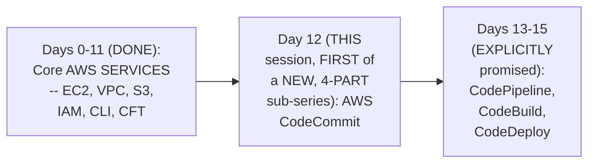

#### 🎯 Key Takeaways

* This is GENUINELY the SERIES' own, FIRST session OPENING a **BRAND-new, FOUR-part sub-series** — IMPLEMENTING CI/CD ENTIRELY via AWS-native, MANAGED services.
* The instructor **directly, EXPLICITLY confirms** THIS sub-series will **NOT** use JENKINS, ArgoCD, GitHub ACTIONS, or GitLab CI/CD — ONLY AWS's own, native SERVICES.
* TODAY's episode is EXPLICITLY, NARROWLY scoped TO just **ONE** service — AWS CodeCommit — WITH the REMAINING three services (CodePipeline, CODEBUILD, CodeDeploy) EXPLICITLY deferred TO the NEXT three videos.

---

### 2. Mapping a Familiar Jenkins Workflow Onto AWS's Own, Native CI/CD Services

#### 🪜 Step-by-Step — A Complete, Real, Familiar Jenkins-Based Workflow

> 💡 **Given directly:** *"Let's take example of Jenkins... you have a application that you want to deploy on Kubernetes, or you want to deploy it on EC2, and you use Jenkins as your orchestrator... firstly, you need to have a place where your code is hosted, let's say GitHub. Then, when someone commits the code to GitHub, this GitHub triggers a webhook and triggers the Jenkins pipeline... within the pipeline you have build process... and finally, fourth step, you take this build product... and deploy it onto Kubernetes or EC2 instance."*

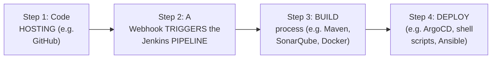

#### 📖 Definition — The Precise, Direct Mapping Onto AWS's Own Services

> 💡 **Given directly:** *"AWS said, instead of using these four tools... for version control system, for hosting your code, instead of using GitHub, AWS says that you can use CodeCommit. For building, or for the Jenkins pipeline which we are using, you can use AWS CodePipeline. For building the application... instead you can use the AWS CodeBuilder. And finally, instead of using ArgoCD or shell scripts, you can use CodeDeployer."*

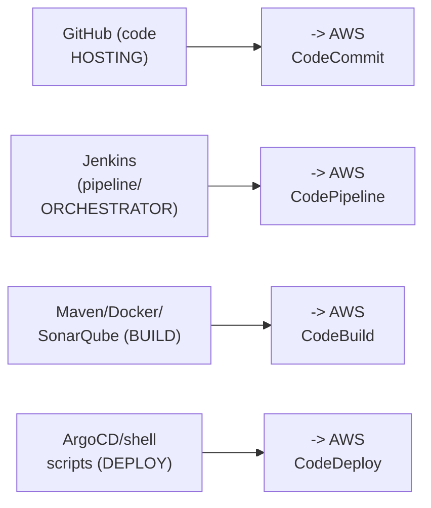

#### ⚠ A Direct, Honest Caveat on This Mapping's Own, Genuine Precision

> 💡 **Given directly:** *"Of course, whatever I said might not be the exact correlation, but for explaining you, or for making you people understand, I have taken some liberty — but when I explain each of these concepts in the next four videos, you will definitely be able to understand, and you will definitely relate yourself with your Jenkins orchestrator."*

#### ⚠ Common Mistakes

* Assuming THIS four-way MAPPING (GitHub→CodeCommit, JENKINS→CodePipeline, etc.) is GENUINELY, PRECISELY exact, ONE-to-one CORRESPONDENCE — explicitly, directly, HONESTLY clarified: it's a DELIBERATE, PEDAGOGICAL simplification — "SOME liberty" was TAKEN, specifically TO build INITIAL, intuitive UNDERSTANDING.

#### 🎯 Key Takeaways

* A COMPLETE, real, FAMILIAR Jenkins-BASED workflow (code HOSTING → pipeline ORCHESTRATION → build → DEPLOY) directly, CONCRETELY maps ONTO AWS's own, FOUR native SERVICES: **CodeCommit, CodePipeline, CODEBUILD, CodeDeploy**.
* The instructor **directly, HONESTLY acknowledges** THIS mapping is a DELIBERATE, PEDAGOGICAL simplification — NOT a PERFECTLY precise, ONE-to-one correspondence — BUT genuinely USEFUL for BUILDING initial INTUITION.
* This directly, PRECISELY sets UP the ENTIRE, four-part SUB-series' own STRUCTURE — EACH video WILL, individually, DEEPEN understanding OF one, specific SERVICE within THIS overall mapping.

---
### 3. A Genuine, Direct Pointer to a Separate, Complete CI/CD Playlist

#### 🏢 Real-World / Production Usage — A Genuine, Direct Confirmation

> 💡 **Given directly:** *"Let's say you are new to CI/CD, and you don't understand the concept of CI/CD itself — don't worry, there is a very elaborated playlist on my channel... you have 10 videos, using this 10 videos you can master the concept of CI/CD — you will learn what is CI/CD, you will use Jenkins, you will understand how to implement Jenkins configure setup, you will learn about the CI/CD process in depth."*

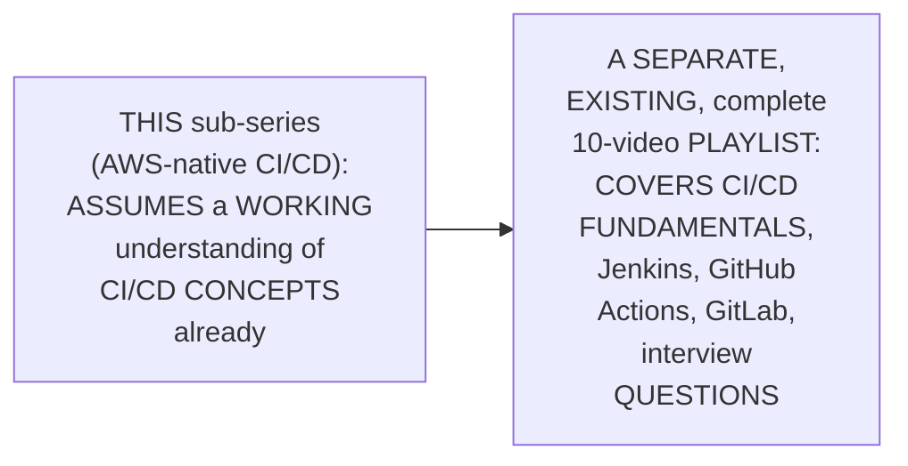

#### ⚠ Common Mistakes

* Assuming THIS four-part SUB-series (AWS-NATIVE CI/CD) GENUINELY, DIRECTLY teaches CI/CD CONCEPTS from FIRST principles — explicitly, directly, HONESTLY clarified: it ASSUMES SOME, prior FAMILIARITY — a SEPARATE, dedicated 10-VIDEO playlist EXISTS for LEARNERS genuinely NEW to CI/CD.

#### 🎯 Key Takeaways

* A SEPARATE, COMPLETE, 10-video CI/CD PLAYLIST is directly, EXPLICITLY pointed TO — COVERING CI/CD FUNDAMENTALS, Jenkins, GITHUB Actions, GitLab, and INTERVIEW questions.
* This directly, HONESTLY confirms THIS sub-series' own, GENUINE prerequisite — LEARNERS genuinely NEW to CI/CD are DIRECTLY, EXPLICITLY advised TO complete that SEPARATE playlist FIRST.
* THIS is directly, EXPLICITLY confirmed as "VERY required" FOR devops engineers — "CI/CD IS the top PRIORITY" — REINFORCING its GENUINE, foundational IMPORTANCE.

---

### 4. AWS CodeCommit, Precisely Defined: A Managed, PRIVATE-Only Git Service

#### 📖 Definition — CodeCommit, Precisely Defined

> 💡 **Given directly:** *"AWS CodeCommit is something very similar to GitHub or GitLab, right, you can compare it with them — but the only thing is that this is a managed AWS service."*

#### 📖 Definition — The Precise, Critical Distinction: Private-Only

> 💡 **Given directly:** *"Store code in private Git repositories — the word 'private' is very, very important here, because in terms of AWS CodeCommit, there are no public repositories. And it makes sense, right? Because if you are using an AWS account — like this is my AWS account — definitely no one in the world will be able to access this AWS account, unless they are part of my organization."*

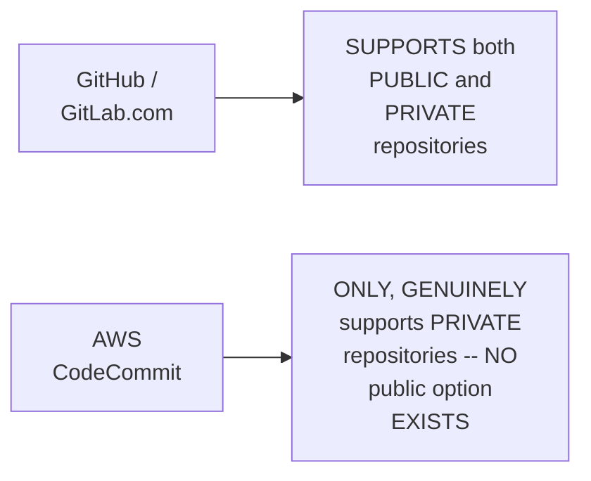

#### 🔍 Internal Working — A Genuine, Precise Clarification: CodeCommit's Own, Real Competitor

> 💡 **Given directly:** *"AWS CodeCommit is not a competitor to open source or public GitHub repository or open source gitlab.com — it is only a competitor to the private repositories that people usually use in their organizations."*

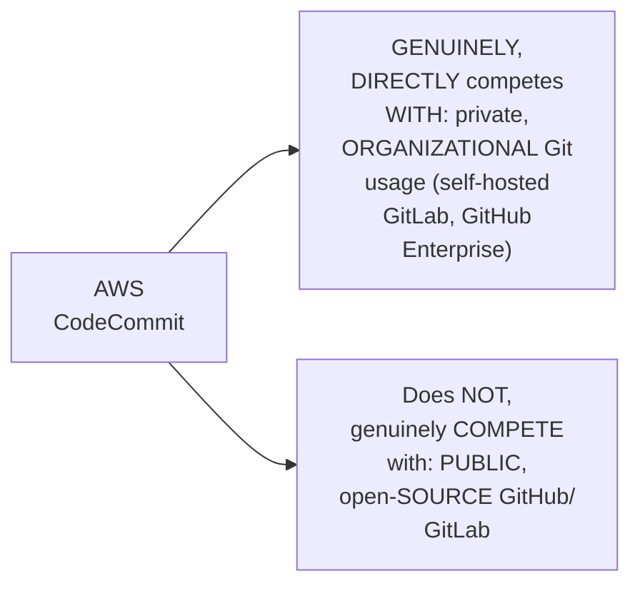

#### ⚠ Common Mistakes

* Assuming AWS CODECOMMIT genuinely, DIRECTLY competes WITH open-SOURCE, public GITHUB/GitLab usage — explicitly, directly, PRECISELY corrected: it ONLY, genuinely COMPETES with **PRIVATE**, organizational GIT usage — NOT public, open-SOURCE repositories.
* Assuming "PRIVATE" repositories are UNIQUE to CODECOMMIT — explicitly, directly, PRECISELY clarified: BOTH GitHub AND GitLab ALSO support PRIVATE repositories — CODECOMMIT's own, GENUINE distinction is that it ONLY, EXCLUSIVELY offers private ONES.

#### 🎯 Key Takeaways

* **AWS CodeCommit** is precisely a **MANAGED Git service**, COMPARABLE to GitHub/GitLab — but **EXCLUSIVELY private** — NO public REPOSITORIES exist WITHIN it.
* CodeCommit's OWN, genuine COMPETITOR is SPECIFICALLY **private, organizational GIT usage** (self-HOSTED GitLab, GitHub ENTERPRISE) — **NOT** open-SOURCE, public GitHub/GitLab.
* This directly, PRECISELY sets UP the NEXT, essential QUESTION — WHY did AWS GENUINELY, DIRECTLY build THIS service in the FIRST place (Section 5)?

---
### 5. Why AWS Built CodeCommit: A Genuine, Real Motivating Problem

#### ❓ Why It Exists — A Genuine, Real, Relatable Motivating Problem

> 💡 **Given directly:** *"Many organizations also use hosted Git solutions like either they use GitLab — they download the GitLab package and install GitLab on their own servers, it can be EC2 instances or on-premises servers... whenever it is required, you have to scale up these servers, you have to install GitLab on more number of servers."*

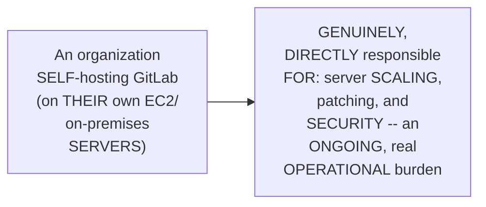

#### 🔍 Internal Working — A Genuine, Direct Connection to AWS's Own, Established Pattern

> 💡 **Given directly:** *"AWS said, don't worry, like every solution that we are offering, we will come up with a managed service for this solution as well — like when AWS saw the problem of compute, they came up with EC2 instance; when they saw the problem of storage, they came up with S3 buckets; when they saw the problem with DNS, they came up with Route 53. Similarly, when they saw this problem, that a lot of people are installing packages such as self-hosted Git repositories — don't worry, we will come up with a managed Git service."*

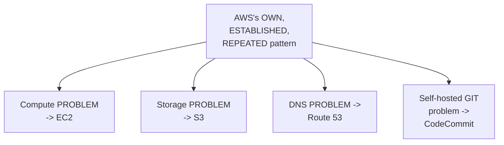

#### ⚠ Common Mistakes

* Assuming CODECOMMIT is a GENUINELY, ARBITRARY, disconnected AWS SERVICE — explicitly, directly, DIRECTLY connected TO AWS's OWN, REPEATED, established PATTERN — "EVERY solution THAT we are OFFERING, we will COME up WITH a managed SERVICE" — DIRECTLY paralleling EC2 (compute), S3 (STORAGE), and Route 53 (DNS).

#### 🎯 Key Takeaways

* AWS built CODECOMMIT to GENUINELY, DIRECTLY solve a REAL, common ORGANIZATIONAL problem — SELF-hosting Git (VIA GitLab servers OR GitHub Enterprise) REQUIRES ongoing, real OPERATIONAL burden — SCALING, patching, and SECURING servers.
* This directly, CONCRETELY connects TO AWS's OWN, established, REPEATED pattern — JUST as EC2 SOLVED compute, S3 SOLVED storage, and ROUTE 53 solved DNS, CodeCommit GENUINELY, DIRECTLY solves self-HOSTED Git.
* This directly, PRECISELY sets UP the NEXT, essential SECTION — the THREE, genuine ADVANTAGES this managed APPROACH provides (Section 6).

---

### 6. Three, Genuine Advantages of CodeCommit

#### 📖 Definition — Advantage 1: Managed Git

> 💡 **Given directly:** *"One, it is managed Git."*

#### 📖 Definition — Advantage 2: Scalability

> 💡 **Given directly:** *"Second, the scalability — tomorrow, if you want to... previously you were only 100 developers... now, as the team grows, your organization grows, and number of applications grows... AWS said, don't worry, if you are using my service, then we will take care of the scalability — you can keep creating repositories. Now you have one repository, no problem, tomorrow you have 10, you have 100, 200, 10,000 — only thing is you have to pay for us for using the services."*

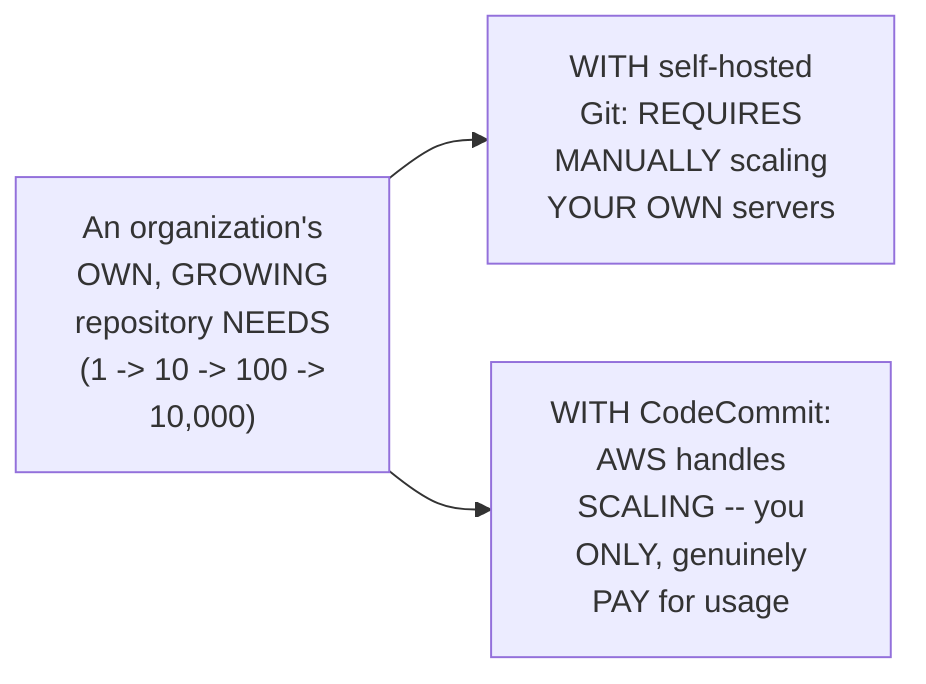

#### 📖 Definition — Advantage 3: Reliability

> 💡 **Given directly:** *"And it is definitely reliable, because AWS is managing it — so if you have any issues with AWS CodeCommit, you know that you can talk to AWS, and there is an SLA agreement that you can also approach them and see what is the reliability."*

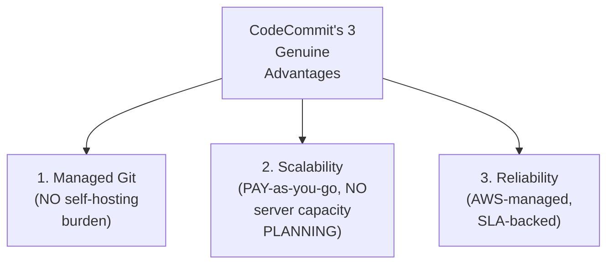

#### ⚠ Common Mistakes

* Assuming CREATING repositories on GITHUB is GENUINELY, DIRECTLY comparable to CODECOMMIT's own, paid PRICING model — explicitly, directly, HONESTLY clarified: "IN most ORGANIZATIONS, the CODE is NOT open SOURCE" — REAL, organizational Git USAGE typically REQUIRES paid, PRIVATE hosting (WHETHER via GitHub PRIVATE repos, self-HOSTED GitLab, OR CodeCommit) — NOT free, PUBLIC repositories.

#### 🎯 Key Takeaways

* CODECOMMIT'S three, genuine ADVANTAGES: **(1) MANAGED Git** (no SELF-hosting burden); **(2) SCALABILITY** (pay-AS-you-go, from 1 TO 10,000+ repositories, WITHOUT manual server CAPACITY planning); **(3) RELIABILITY** (AWS-managed, SLA-BACKED).
* The instructor **directly, HONESTLY clarifies** a COMMON, potential MISCONCEPTION — REAL, organizational Git USAGE (UNLIKE personal, open-SOURCE projects) typically REQUIRES paid, PRIVATE hosting REGARDLESS of the CHOSEN platform.
* THESE three advantages directly, PRECISELY set UP THIS session's own, COMPLETE, live DEMONSTRATION (Sections 7-11) — DIRECTLY, PRACTICALLY confirming THESE claims ON a REAL, working AWS account.

---
### 7. A Complete, Real, Live Demo: Creating a Repository (& Skipping CodeGuru)

#### 🪜 Step-by-Step — A Complete, Real, Live Repository-Creation Walkthrough

> 💡 **Given directly:** *"You can create a repository here — let's say that I'll create a repository to host my code, or to store my code. So let's call this repository as a demo repo... demo repo for learning CodeCommit."*

#### ⚠ A Direct, Honest Recommendation: Skip AWS CodeGuru

> 💡 **Given directly:** *"You don't have to enable this one — AWS provides something called AWS CodeGuru, but you don't have to use it. It is very specific to Java and Python applications only, and it does not give you a lot of added advantage, so you can ignore AWS CodeGuru — you don't have to use it."*

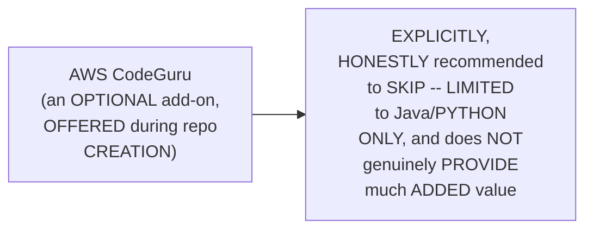

#### 🔍 Internal Working — A Genuine, Direct Confirmation: The Root-Account Warning

> 💡 **Given directly:** *"Click on the create button, so your repository is created — and see, here there is a warning sign saying that you don't use root, or root is not that much compatible."*

#### ⚠ Common Mistakes

* Assuming AWS CodeGuru is a GENUINELY, WORTHWHILE add-on TO enable BY default, DURING repository CREATION — explicitly, directly, HONESTLY recommended AGAINST — IT's specific TO Java/Python ONLY, and OFFERS limited, GENUINE added value.

#### 🎯 Key Takeaways

* A COMPLETE, real, LIVE demonstration directly, CONCRETELY confirmed the BASIC repository-CREATION workflow — a SIMPLE, straightforward PROCESS, DIRECTLY comparable to GitHub/GitLab'S own repository CREATION.
* **AWS CodeGuru**, an OPTIONAL add-on OFFERED during CREATION, is directly, HONESTLY recommended TO **skip** — LIMITED to Java/PYTHON applications ONLY, WITH limited, genuine ADDED value.
* AWS ITSELF directly, PROACTIVELY displays a WARNING against using the ROOT account WITH CodeCommit — DIRECTLY setting UP Section 9's own, MORE detailed EXPLANATION of WHY.

---

### 8. A Genuine, Honest UI Limitation: Only One File at a Time

#### 🪜 Step-by-Step — A Complete, Real, Live UI Demonstration

> 💡 **Given directly:** *"You can also use the browser itself — even from here, what you can do is you can go to your repository... and you can upload the file from the UI as well... I can go to my personal laptop from the upload category, and I can upload any file here."*

#### ⚠ A Direct, Honest, Genuine Limitation

> 💡 **Given directly:** *"You might ask me, then Abhishek, if I can do it from here, why should I install Git on my personal terminal? ... It is required because, from here, you can only upload one file at once, or you can also edit only one file at once... uploading files or editing files can only be done one by one if you are using the user interface. So if you want to upload multiple files, or if you want to edit multiple files as part of your Terraform scripts or as part of your code, then in such cases you will need Visual Studio code or you will need a terminal."*

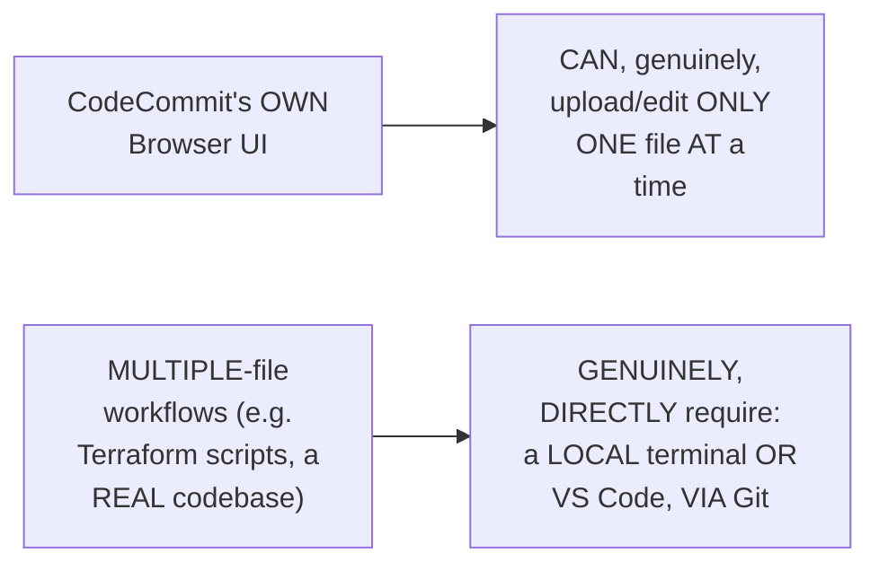

#### ⚠ Common Mistakes

* Assuming CODECOMMIT's own BROWSER UI is GENUINELY, PRACTICALLY sufficient FOR real, ongoing DEVELOPMENT work — explicitly, directly, HONESTLY clarified: it's GENUINELY, STRUCTURALLY limited TO one FILE at a TIME — REAL, multi-file WORK requires terminal/VS-CODE-based Git ACCESS.

#### 🎯 Key Takeaways

* CODECOMMIT's OWN browser UI GENUINELY, DIRECTLY supports UPLOADING and EDITING files — but **ONLY one FILE at a TIME**.
* This GENUINE, real LIMITATION directly, CONCRETELY motivates the NEED for TERMINAL/VS-Code-based, GIT-driven access — ESSENTIAL for ANY real, multi-file DEVELOPMENT workflow.
* This directly, PRECISELY sets UP the SESSION's own, NEXT, essential TOPIC — HOW to genuinely, CORRECTLY set UP terminal-based ACCESS, STARTING with the RIGHT kind OF AWS user (Section 9).

---
### 9. Root vs. IAM: A Genuine, Important Clarification for CodeCommit Specifically

#### ⚠ A Direct, Honest, Important Clarification

> 💡 **Given directly:** *"Once we move ahead, we will use an IAM user — root account will not be suitable for this demo. I'll tell you why — AWS CodeCommit does not work well with the root account. There are some restrictions with respect to accessing them, with respect to SSH and HTTPS."*

#### 🔍 Internal Working — A Genuine, Precise Distinction: SSH vs. HTTPS With Root

> 💡 **Given directly:** *"Even if you are trying to use the root account, you cannot implement SSH using root account for cloning. HTTPS can be done, but still it is not a secure option — it is not a good option, it's a... it's not a good option, and AWS does not recommend it."*

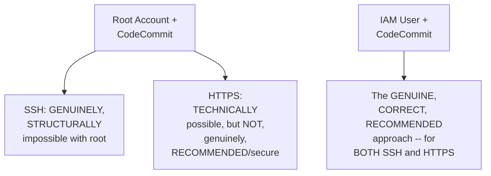

#### ⚠ Common Mistakes

* Assuming ROOT-account restrictions AROUND CodeCommit are GENUINELY, MERELY a GENERAL, best-PRACTICE recommendation (LIKE the SERIES' own, EARLIER, general "USE IAM, not ROOT" guidance) — explicitly, directly, PRECISELY clarified: THIS is a GENUINELY, STRUCTURALLY specific LIMITATION — SSH access GENUINELY, TECHNICALLY cannot BE implemented with ROOT at all.

#### 🎯 Key Takeaways

* AWS CODECOMMIT genuinely, STRUCTURALLY does **NOT work WELL** with the ROOT account — a MORE specific, TECHNICAL limitation THAN this series' own, GENERAL "avoid ROOT" guidance.
* **SSH** access is GENUINELY, STRUCTURALLY **impossible** with ROOT; **HTTPS** is TECHNICALLY possible but GENUINELY, DIRECTLY not RECOMMENDED/secure.
* This directly, PRECISELY sets UP the SESSION's own, COMPLETE, LIVE demonstration (Section 10) — CREATING and USING a PROPER, correctly-CONFIGURED IAM user, INSTEAD.

---

### 10. A Complete, Real, Live Demo: Creating & Using an IAM User

#### 🪜 Step-by-Step — A Complete, Real, Live IAM-User Creation Walkthrough

> 💡 **Given directly:** *"Let's see how to create an IAM user, and what permissions need to be granted... let me provide a username, code commit user, provide AWS Management console access... let me provide a custom password."*

#### 🪜 Step-by-Step — Attaching the Correct, Specific Permission Policy

> 💡 **Given directly:** *"The policy that is required — watch carefully — if you search for CodeCommit, you'll get power user, full access, read only. Go for the power user... with power user, you will get all the access that are required for you to try the demonstrations, for you to enable CloudWatch integrations, SNS integrations — everything you will get through the CodeCommit power user."*

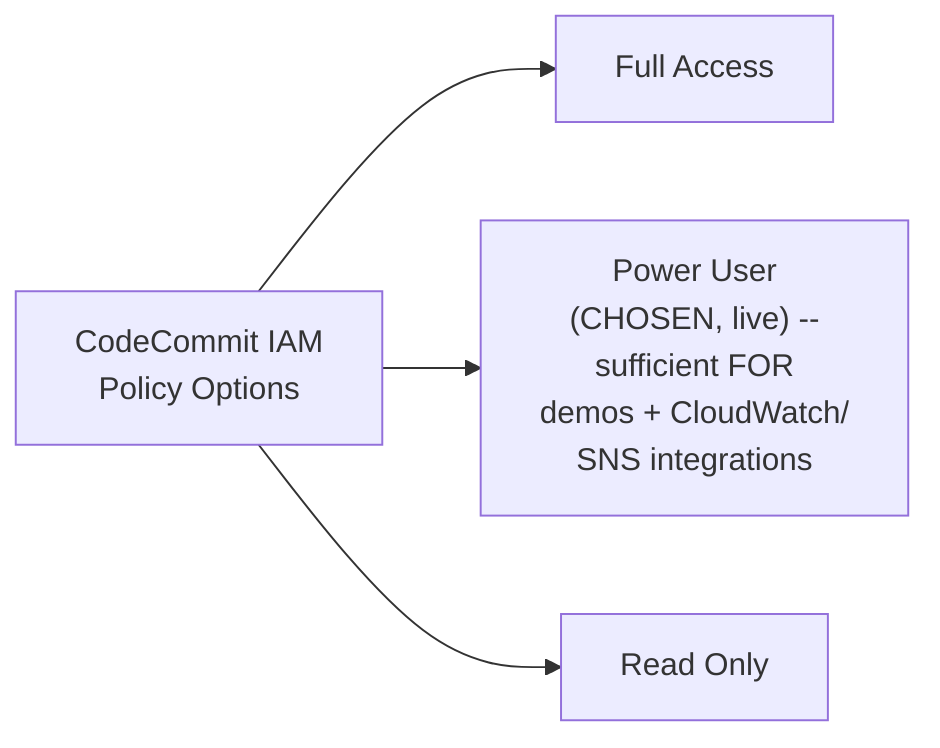

#### 🪜 Step-by-Step — A Complete, Real, Live Login Confirmation

> 💡 **Given directly:** *"Let's take an incognito window... go to AWS console, and here click log back in... I don't want root account, I want the IAM user, and here I can provide the account ID... very good, I have logged in now let's try to increase the font and access the repository that we have created."*

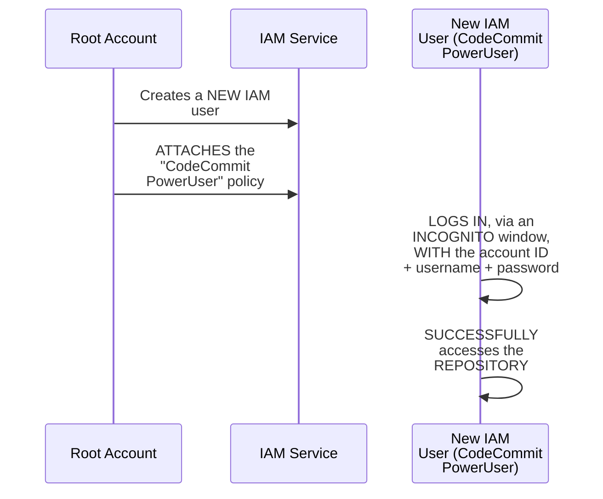

#### ⚠ A Direct, Honest, Practical Reminder

> 💡 **Given directly:** *"Whenever you are doing any demonstrations that I am doing, please try to delete them after the demo — in this case, you will not be charged, whatever I am using are free, but anyways, even if they are free, please try to delete them."*

#### ⚠ Common Mistakes

* Assuming "FULL access" is the GENUINELY, CORRECT, or SAFEST policy CHOICE for THIS demo — explicitly, directly, LIVE-demonstrated as UNNECESSARY: "POWER user" is SPECIFICALLY, DELIBERATELY chosen INSTEAD — SUFFICIENT for the DEMO's own, genuine NEEDS, WITHOUT granting UNNECESSARILY broad ACCESS.
* Assuming DEMO/practice RESOURCES (EVEN genuinely FREE ones) should be LEFT running INDEFINITELY — explicitly, directly, HONESTLY advised AGAINST — "PLEASE try TO delete them AFTER the demo."

#### 🎯 Key Takeaways

* A COMPLETE, real, LIVE demonstration directly, CONCRETELY confirmed the CORRECT workflow — CREATE a NEW IAM user, ATTACH the **"CodeCommit PowerUser"** policy (NOT full ACCESS or read-ONLY), and LOG in VIA a SEPARATE, incognito SESSION.
* The **"POWER user"** policy is directly, EXPLICITLY confirmed as SUFFICIENT for THIS demo's own, GENUINE needs — INCLUDING CloudWatch/SNS INTEGRATIONS — WITHOUT granting UNNECESSARILY broad, "FULL access" permissions.
* The instructor **directly, HONESTLY reminds** learners to DELETE demo RESOURCES after PRACTICE — a GENUINE, responsible HABIT, REGARDLESS of WHETHER the resources ARE, technically, FREE.

---
### 11. A Complete, Real, Live Demo & Assignment: Cloning via Git, Locally

#### 🪜 Step-by-Step — A Complete, Real, Live Git-Installation & Clone Walkthrough

> 💡 **Given directly:** *"Go and search for Git download... you will find this option called Git Downloads... choose your category, choose your distribution, and install the one that is appropriate to your machine. And once you install, just search for 'git --version,' and it should give you output like this — only then your Git installation is successful."*

```bash
git --version   # confirms a successful Git installation
```

#### 🪜 Step-by-Step — Cloning the Repository via HTTPS

> 💡 **Given directly:** *"Once it is successful, then you can go back and you can click on the clone URL — use HTTPS clone... if you just click on this one, it will get copied, you don't have to do anything. Now use the command called 'git clone'... it will ask you for the username and password."*

```bash
git clone <copied HTTPS clone URL>
# Enter your IAM user's own credentials, when prompted
```

#### 🪜 Step-by-Step — A Genuine, Direct Assignment: Completing the Full Git Workflow

> 💡 **Given directly:** *"I just want to give you this as an assignment — clone this repository using the credentials, and once you clone, you have to set your Git config as well... use 'git config --user.name'... you will get this when you try to commit the files... use the CD command, move to this specific thing on your personal machine, and once you move you can use the Vim command, add some test file, then use the Git commands, like 'git add,' then 'git commit -m,' pass some message, and finally say 'git push.'"*

```bash
cd demo-repo-CC
git config --user.name "your-name"
git config --user.email "your-email@example.com"

vim testfile.txt   # create a real, test file
git add .
git commit -m "your commit message"
git push
```

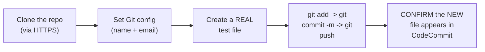

#### ⚠ Common Mistakes

* Assuming this COMPLETE, git-BASED workflow (CLONE, config, add, COMMIT, push) is GENUINELY, STRUCTURALLY unique TO CodeCommit — explicitly, directly, IMPLIED as GENUINELY, DIRECTLY identical TO the STANDARD Git workflow used WITH GitHub/GitLab — CodeCommit's OWN, genuine DIFFERENCE lies ONLY in ITS backend/HOSTING, not ITS Git-based INTERFACE.

#### 🎯 Key Takeaways

* A COMPLETE, real, LIVE-demonstrated WORKFLOW directly, CONCRETELY confirmed: INSTALL Git LOCALLY, CONFIRM via `GIT --version`, then CLONE the CodeCommit repository VIA its HTTPS clone URL, USING the CORRECTLY-configured IAM user's OWN credentials.
* A DIRECT, EXPLICIT **assignment** requires LEARNERS to COMPLETE the REMAINING workflow INDEPENDENTLY — SETTING git CONFIG (name/EMAIL), creating a TEST file, and RUNNING `git ADD`, `git commit -M`, and `git PUSH`.
* This directly, PRACTICALLY confirms CODECOMMIT's own, STANDARD Git-BASED interface — the SAME, FAMILIAR commands used WITH GitHub/GitLab GENUINELY, DIRECTLY apply here TOO.

---

### 12. The Genuine, Honest Disadvantages of AWS CodeCommit

#### ⚠ A Direct, Honest, Important Enumeration of Genuine Limitations

> 💡 **Given directly:** *"Disadvantages are very, very important, I'll tell you why... it has very, very less features — right, what are the disadvantages? One is it has very, very less features. Today, if you go to GitHub, or if you go to GitLab, you will find some amazing features, like GitHub has GitHub Copilot, right — GitLab also has something called Auto DevOps."*

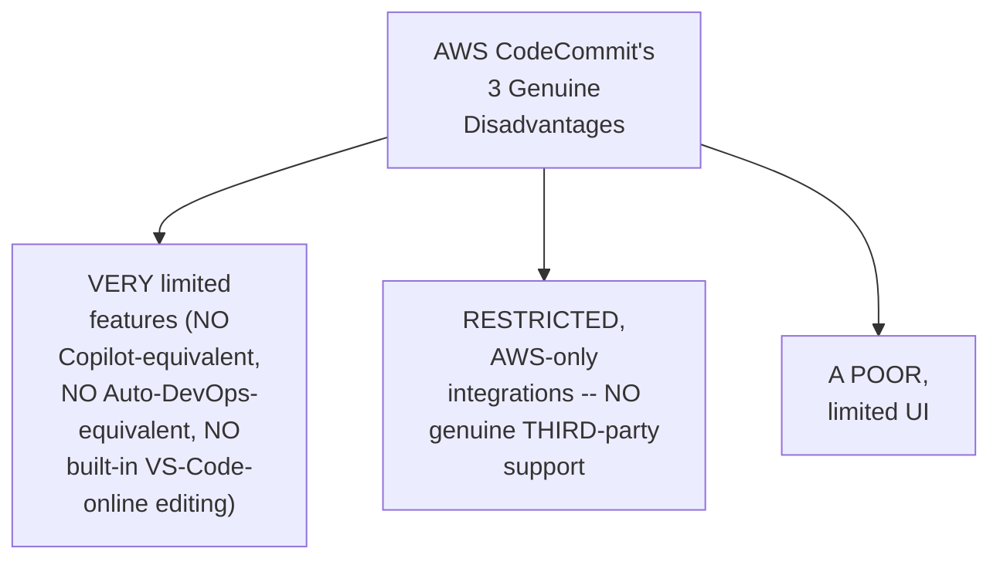

#### 🔍 Internal Working — A Genuine, Direct Example: GitHub's Own, Richer Feature Set

> 💡 **Given directly:** *"GitHub is coming up with new integrations with Visual Studio Code — you can just go to github.com, click on the space bar, or click on the dot button, just click on the dot, and it will open a Visual Studio Code online, you can edit the files there — so these are rich in feature features."*

#### 🏢 Real-World / Production Usage — A Genuine, Honest, Real Market Observation

> 💡 **Given directly:** *"That's the reason why AWS CodeCommit is very, very less used by organizations — even organizations that are completely in AWS, they use something like GitLab, or they use GitHub, and they use private repositories within github.com, or they even install their Git solutions on their servers."*

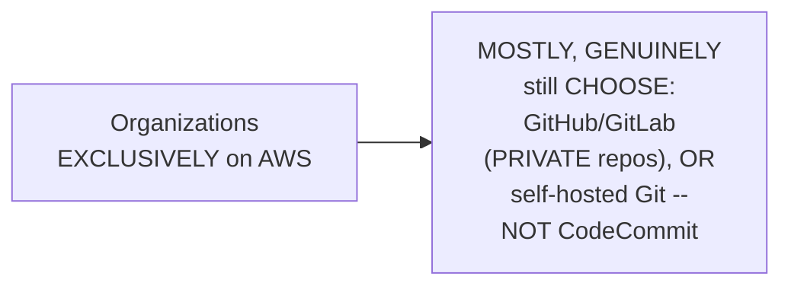

#### ⚠ Common Mistakes

* Assuming an ORGANIZATION genuinely, EXCLUSIVELY committed TO AWS would AUTOMATICALLY prefer CODECOMMIT, SIMPLY for the SAKE of "STAYING within AWS" — explicitly, directly, HONESTLY confirmed as GENUINELY, LARGELY false — EVEN AWS-only ORGANIZATIONS mostly, GENUINELY choose GitHub/GitLab/BITBUCKET instead.

#### 🎯 Key Takeaways

* CODECOMMIT's THREE, genuine DISADVANTAGES: **VERY limited FEATURES** (no GitHub-COPILOT-equivalent, no GITLAB-Auto-DevOps-equivalent), **RESTRICTED, AWS-only INTEGRATIONS** (no genuine THIRD-party support), and a **POOR, limited UI**.
* A GENUINE, honest, real MARKET observation directly, CONCRETELY confirms: EVEN organizations COMPLETELY committed TO AWS mostly, GENUINELY still CHOOSE GitHub, GitLab, OR Bitbucket (WITH private repositories) OVER CodeCommit.
* This directly, PRECISELY sets UP the SESSION's own, FINAL, forward-LOOKING pedagogical DECISION (Section 13) — DIRECTLY shaping HOW the REST of this SUB-series will PROCEED.

---
### 13. A Genuine, Forward-Looking Pedagogical Decision: Why This Series Will Use GitHub Instead

#### 🪜 Step-by-Step — A Direct, Honest, Forward-Looking Confirmation

> 💡 **Given directly:** *"So that's the reason why, when we deal with the next videos, where we will learn about CodePipeline, we'll learn about CodeBuild, we will learn about CodeDeploy, we will not use CodeCommit. Because during your interviews, it is very important for you to pick up the right tools — even if you are trying for AWS DevOps, GitHub or GitLab or Bitbucket will add a lot of value for you. CodeCommit does not add a lot of value."*

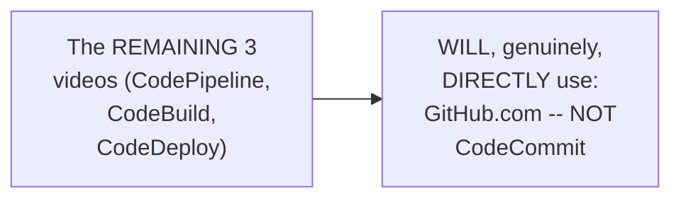

#### 🔍 Internal Working — A Genuine, Direct, Career-Focused Justification

> 💡 **Given directly:** *"In my course, I am mostly interested in giving knowledge to people that helps you, or that helps them, in getting jobs — that helps them in talking to the interviewer in a more productive way. So that's why, instead of using CodeCommit, I have explained everything about CodeCommit, but I will not use CodeCommit in the next class."*

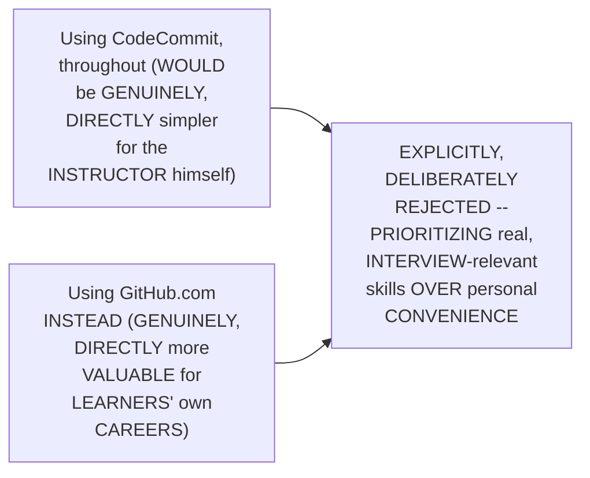

#### ⚠ A Direct, Honest, Personal Acknowledgment

> 💡 **Given directly:** *"For me, using CodeCommit makes very, very simple my life becomes very easy, because when I'm doing the demos, everything is within AWS. But I'll take that extra step and show you with github.com only, so that it helps you a lot during your interviews."*

#### ⚠ Common Mistakes

* Assuming an INSTRUCTOR's own, PERSONAL convenience (e.g., KEEPING everything WITHIN one, single ECOSYSTEM) should GENUINELY, DIRECTLY drive TEACHING decisions — explicitly, directly, HONESTLY contradicted: THIS instructor EXPLICITLY, DELIBERATELY chooses the LESS convenient (BUT more career-RELEVANT) path FOR learners' own, genuine BENEFIT.

#### 🎯 Key Takeaways

* The instructor **directly, EXPLICITLY confirms** the REMAINING three VIDEOS (CodePipeline, CODEBUILD, CodeDeploy) will **NOT** use CodeCommit — THEY will USE **GitHub.com** instead.
* This DECISION is directly, HONESTLY justified BY real, INTERVIEW relevance — "GITHUB or GitLab OR Bitbucket will ADD a LOT of VALUE for you — CodeCommit does NOT add a LOT of value."
* The instructor **directly, HONESTLY acknowledges** THIS choice is GENUINELY, PERSONALLY less CONVENIENT for HIMSELF (SINCE CodeCommit WOULD keep EVERYTHING within AWS) — but he EXPLICITLY prioritizes LEARNERS' own, real CAREER value INSTEAD.

---

### 14. Closing: The Assignment

#### 🪜 Step-by-Step — A Complete, Direct, Final Assignment Recap

> 💡 **Given directly:** *"I hope you found today's video informative — please try the assignment that I have given to you, and let me know in the comment section if you are able to implement the demonstration or not."*

```mermaid
flowchart LR
    A["The Complete<br/>Assignment"] --> B["Clone the REPO<br/>(via HTTPS + IAM<br/>credentials)"]
    B --> C["Set git CONFIG<br/>(name + email)"]
    C --> D["Create a test<br/>FILE, add + commit<br/>+ push"]
    D --> E["CONFIRM the NEW<br/>file GENUINELY<br/>appears in<br/>CodeCommit"]
```

#### ⚠ Common Mistakes

* Assuming THIS session's own, HONEST "disadvantages" section MEANS the ENTIRE lesson was GENUINELY, PRACTICALLY wasted EFFORT — explicitly, directly, IMPLIED as FALSE: UNDERSTANDING CodeCommit's OWN, genuine STRENGTHS and WEAKNESSES REMAINS valuable, REAL interview KNOWLEDGE — EVEN if it WON'T be the TOOL used GOING forward.

#### 🎯 Key Takeaways

* This episode **GENUINELY, COMPREHENSIVELY delivers** its OWN, stated GOALS — a COMPLETE conceptual FOUNDATION (the JENKINS-to-AWS mapping, CodeCommit's OWN definition/advantages), a REAL, hands-ON demonstration (repo CREATION, IAM setup), and an HONEST, thorough "disadvantages" ASSESSMENT.
* A DIRECT, FINAL assignment REQUIRES completing the COMPLETE git WORKFLOW independently (CLONE, config, ADD, commit, PUSH) — REINFORCING the SESSION's own, hands-ON teaching PHILOSOPHY.
* This directly, PRECISELY sets UP the REST of THIS sub-series (CODEPIPELINE, CodeBuild, CODEDEPLOY) — WHICH will GENUINELY, DIRECTLY use GITHUB.com instead OF CodeCommit, per SECTION 13's own established, CAREER-focused REASONING.

---

## 📝 Glossary

| Term | Definition | Why It Matters |
|---|---|---|
| **AWS CodeCommit** | AWS's own, managed, PRIVATE-only Git service | Comparable to GitHub/GitLab, but no public repos |
| **CodePipeline** | AWS's own orchestration service | The AWS-native equivalent of a Jenkins pipeline |
| **CodeBuild** | AWS's own build service | The AWS-native equivalent of Maven/Docker/SonarQube |
| **CodeDeploy** | AWS's own deployment service | The AWS-native equivalent of ArgoCD/shell scripts |
| **AWS CodeGuru** | An optional, Java/Python-specific add-on | Explicitly recommended to skip |
| **CodeCommit PowerUser** | The specific IAM policy used in this session | Sufficient for demos, without granting full access |

---

## 🔄 Revision Notes — One-Minute Revision

* This is **Day 12**, the series' own, FIRST session opening a brand-new, 4-part sub-series -- implementing CI/CD entirely via AWS-native, managed services (NOT Jenkins/ArgoCD/GitHub Actions/GitLab CI). Today's episode is dedicated solely to AWS CodeCommit.
* **The Jenkins-to-AWS mapping**: GitHub (hosting) -> CodeCommit; Jenkins (pipeline/orchestrator) -> CodePipeline; Maven/Docker/SonarQube (build) -> CodeBuild; ArgoCD/shell scripts (deploy) -> CodeDeploy. Honestly acknowledged as a deliberate simplification, not a precise, exact correlation.
* **A separate, existing 10-video CI/CD playlist** is pointed to for learners genuinely new to CI/CD concepts -- this sub-series assumes some prior familiarity.
* **AWS CodeCommit, defined**: a managed Git service, comparable to GitHub/GitLab, but genuinely PRIVATE-only -- no public repositories exist. Its own, real competitor is specifically private, organizational Git usage (self-hosted GitLab, GitHub Enterprise), NOT open-source, public GitHub/GitLab.
* **Why AWS built CodeCommit**: self-hosting Git requires ongoing operational burden (scaling, patching, securing servers) -- directly connecting to AWS's own, established, repeated pattern (EC2 for compute, S3 for storage, Route 53 for DNS).
* **CodeCommit's 3 genuine advantages**: managed Git, scalability (pay-as-you-go, 1 to 10,000+ repos), and reliability (AWS-managed, SLA-backed).
* **Live demo 1 (repository creation)**: AWS CodeGuru is explicitly recommended to skip (Java/Python-specific, limited added value). AWS itself displays a warning against using the root account.
* **A genuine, honest UI limitation**: CodeCommit's own browser UI can only upload/edit ONE file at a time -- real, multi-file development genuinely requires terminal/VS-Code-based Git access instead.
* **Root vs. IAM, specifically for CodeCommit**: SSH access is genuinely, structurally impossible with root; HTTPS is technically possible but not recommended/secure. A proper IAM user is required.
* **Live demo 2 (IAM setup)**: create a new IAM user, attach the "CodeCommit PowerUser" policy (not Full Access or Read Only), log in via a separate, incognito session. Delete demo resources afterward, even if free.
* **Live demo 3 & assignment (Git clone workflow)**: install Git, confirm via `git --version`, clone via the repository's own HTTPS URL, using the IAM user's credentials. The remaining workflow (git config, add, commit, push) is left as a direct, explicit assignment.
* **The genuine, honest disadvantages**: very limited features (no GitHub-Copilot-equivalent, no GitLab-Auto-DevOps-equivalent), restricted AWS-only integrations, and a poor UI. Even AWS-only organizations mostly, genuinely still choose GitHub/GitLab/Bitbucket over CodeCommit.
* **A genuine, forward-looking pedagogical decision**: the remaining 3 videos (CodePipeline, CodeBuild, CodeDeploy) will use GitHub.com instead of CodeCommit -- explicitly justified by real, interview relevance, even though CodeCommit would be more personally convenient for the instructor.
* **Closing**: the assignment is to complete the full git clone/config/add/commit/push workflow independently.

---

## 📋 Cheat Sheet

**The Jenkins-to-AWS mapping:**
```text
GitHub (hosting)              -> AWS CodeCommit
Jenkins (pipeline)            -> AWS CodePipeline
Maven/Docker/SonarQube (build) -> AWS CodeBuild
ArgoCD/shell scripts (deploy)  -> AWS CodeDeploy
```

**CodeCommit's 3 genuine advantages:**
```text
1. Managed Git (no self-hosting burden)
2. Scalability (pay-as-you-go, 1 to 10,000+ repos)
3. Reliability (AWS-managed, SLA-backed)
```

**Root vs. IAM, for CodeCommit specifically:**
```text
SSH:   impossible with root; requires IAM
HTTPS: technically possible with root, but NOT recommended
```

**The complete Git workflow (the assignment):**
```bash
git --version                       # confirm installation
git clone <HTTPS clone URL>         # using IAM user credentials
cd <repo-name>
git config --user.name "your-name"
git config --user.email "your-email"
vim testfile.txt
git add .
git commit -m "your message"
git push
```

**CodeCommit's genuine, real disadvantages:**
```text
- Very limited features (no Copilot/Auto-DevOps equivalent)
- Restricted, AWS-only integrations
- Poor UI
-> Even AWS-only orgs mostly still choose GitHub/GitLab/Bitbucket
```

---

## 🔥 Interview Questions & Answers

### 🟢 Beginner

**Q1.**

**Question:** What does AWS CodeCommit correspond to, in a typical Jenkins-based CI/CD workflow?

**Answer:** Code hosting (like GitHub).

**Explanation:** Directly, precisely mapped.

**Why Interviewers Ask This:** The most basic, foundational CodeCommit question.

**Possible Follow-up:** "What does CodePipeline correspond to?"

**Q2.**

**Question:** Does AWS CodeCommit support public repositories?

**Answer:** No -- it is genuinely, exclusively private-only.

**Explanation:** Directly, repeatedly emphasized.

**Why Interviewers Ask This:** A commonly-tested, essential CodeCommit distinction.

**Possible Follow-up:** "What is CodeCommit's own, genuine competitor, then?"

**Q3.**

**Question:** Why did AWS build CodeCommit?

**Answer:** To solve the operational burden of self-hosting Git (scaling, patching, securing servers).

**Explanation:** Directly, precisely explained.

**Why Interviewers Ask This:** Tests genuine understanding of CodeCommit's own, real motivation.

**Possible Follow-up:** "What other AWS services follow this same, established pattern?"

**Q4.**

**Question:** Name CodeCommit's three genuine advantages.

**Answer:** Managed Git, scalability, and reliability.

**Explanation:** Directly, explicitly named.

**Why Interviewers Ask This:** Basic, essential CodeCommit vocabulary.

**Possible Follow-up:** "What does 'scalability' genuinely mean, in this context?"

**Q5.**

**Question:** Can you use SSH to clone a CodeCommit repository with the root account?

**Answer:** No -- SSH access is genuinely, structurally impossible with root.

**Explanation:** Directly, precisely stated.

**Why Interviewers Ask This:** Tests genuine, specific, practical CodeCommit knowledge.

**Possible Follow-up:** "Is HTTPS access possible with root? Is it recommended?"

**Q6.**

**Question:** What IAM policy was used in this session's own, live demo, for CodeCommit access?

**Answer:** CodeCommit PowerUser.

**Explanation:** Directly, explicitly demonstrated.

**Why Interviewers Ask This:** Basic, practical IAM/CodeCommit setup knowledge.

**Possible Follow-up:** "Why was this chosen over 'Full Access'?"

**Q7.**

**Question:** Can you upload multiple files at once via CodeCommit's own browser UI?

**Answer:** No -- only one file can be uploaded or edited at a time.

**Explanation:** Directly, honestly acknowledged.

**Why Interviewers Ask This:** Tests genuine, practical, hands-on CodeCommit knowledge.

**Possible Follow-up:** "What's the genuine workaround for multi-file workflows?"

**Q8.**

**Question:** Name two, genuine disadvantages of AWS CodeCommit.

**Answer:** Very limited features, and restricted, AWS-only integrations (or a poor UI).

**Explanation:** Directly, explicitly named.

**Why Interviewers Ask This:** A commonly-tested, honest, real-world CodeCommit assessment.

**Possible Follow-up:** "Do even AWS-only organizations genuinely prefer CodeCommit?"

**Q9.**

**Question:** Will this series' own remaining CI/CD videos (CodePipeline, CodeBuild, CodeDeploy) use CodeCommit?

**Answer:** No -- they will use GitHub.com instead.

**Explanation:** Directly, explicitly confirmed.

**Why Interviewers Ask This:** Tests attention to the session's own, forward-looking, stated plan.

**Possible Follow-up:** "Why was this specific choice genuinely made?"

**Q10.**

**Question:** What AWS add-on, offered during CodeCommit repository creation, is explicitly recommended to skip?

**Answer:** AWS CodeGuru.

**Explanation:** Directly, explicitly recommended against.

**Why Interviewers Ask This:** Tests attention to practical, hands-on session detail.

**Possible Follow-up:** "Why is it genuinely not recommended?"

---

### 🟡 Intermediate

**Q11.**

**Question:** Explain why the instructor deliberately, honestly acknowledges that the Jenkins-to-AWS mapping "might not be the exact correlation," rather than presenting it as a precise, definitive equivalence.

**Answer:** This is a genuinely deliberate, HONEST teaching choice: by DIRECTLY, EXPLICITLY acknowledging the MAPPING is a SIMPLIFICATION ("I have TAKEN some liberty"), the instructor AVOIDS creating a FALSE, overly RIGID mental MODEL that COULD, genuinely, MISLEAD learners ONCE they encounter the ACTUAL, more nuanced DETAILS of each SERVICE, ACROSS the REMAINING three videos. This directly, HONESTLY sets APPROPRIATE expectations — the MAPPING is GENUINELY useful FOR building INITIAL intuition, but LEARNERS should REMAIN open to REFINING their understanding AS each, individual SERVICE is TAUGHT in GREATER depth.

**Explanation:** Requires recognizing the deliberate, honest value of acknowledging a simplification's own limits, rather than presenting it as a definitive, precise equivalence.

**Why Interviewers Ask This:** Tests whether a learner recognizes the pedagogical value of honest, appropriately-scoped analogies over overly rigid, potentially misleading ones.

**Possible Follow-up:** "Identify ONE, GENUINE way the ACTUAL AWS CodePipeline SERVICE might, genuinely, DIFFER from a TRADITIONAL Jenkins PIPELINE, BEYOND what THIS simple MAPPING suggests."

**Q12.**

**Question:** A learner argues that since this session's own content confirms even AWS-only organizations mostly avoid CodeCommit, this means learning about CodeCommit was genuinely a waste of time, and this entire session should have been skipped. Evaluate this claim.

**Answer:** This claim is GENUINELY, DIRECTLY incorrect, and MISSES the session's OWN, explicit, STATED value. WHILE Section 12's own PRECISE, HONEST content CONFIRMS CodeCommit is GENUINELY, PRACTICALLY less-used IN real organizations, Section 12 ALSO directly, EXPLICITLY states WHY understanding it STILL matters: "IT is VERY important FOR you to LOOK into the DISADVANTAGES section" — SPECIFICALLY BECAUSE real INTERVIEWS may GENUINELY ask ABOUT CodeCommit, REQUIRING candidates to GENUINELY, KNOWLEDGEABLY explain BOTH its STRENGTHS and its REAL, practical LIMITATIONS (per Section 13's OWN, established, CAREER-focused REASONING). The ACCURATE, more PRECISE conclusion: UNDERSTANDING a TOOL's own, GENUINE limitations — EVEN one you WON'T end up USING — is GENUINELY, DIRECTLY valuable, REAL interview PREPARATION — NOT wasted EFFORT.

**Explanation:** Tests whether a learner recognizes that understanding a tool's own, honest limitations is genuine, practical interview preparation, even when that tool won't be used going forward.

**Why Interviewers Ask This:** Distinguishes candidates who understand the value of comprehensive, honest tool assessment from those who assume only "the tool you'll actually use" is worth learning.

**Possible Follow-up:** "Construct a GENUINE, real interview QUESTION (BASED on THIS session's own CONTENT) that a CANDIDATE should GENUINELY be PREPARED to answer ABOUT CodeCommit, DESPITE not USING it in PRACTICE."

**Q13.**

**Question:** Explain, precisely, why the instructor deliberately demonstrates CodeCommit's own UI limitation (one file at a time) by attempting the SAME action described in the theory, rather than simply stating the limitation abstractly.

**Answer:** This is a genuinely deliberate, EVIDENCE-based teaching choice, DIRECTLY consistent with a PATTERN seen ACROSS THIS instructor's OWN, broader series (e.g., Day 9's own, LIVE-demonstrated bucket-POLICY errors). By GENUINELY, LIVE attempting the UI-based UPLOAD process HIMSELF, the instructor DIRECTLY, CONCRETELY proves the LIMITATION is REAL and GENUINELY, PRACTICALLY encountered — RATHER than merely CLAIMING it exists. This directly, HONESTLY builds LEARNER trust, and MORE importantly, DIRECTLY motivates the GENUINE, real NEED for the terminal/GIT-based workflow THAT follows — a MUCH stronger, MORE convincing MOTIVATION than an ABSTRACT, unverified STATEMENT would provide.

**Explanation:** Requires recognizing the deliberate, evidence-based value of demonstrating a limitation live, rather than merely describing it abstractly.

**Why Interviewers Ask This:** Tests whether a learner recognizes the pedagogical and persuasive value of live demonstration over abstract assertion, especially for motivating a subsequent workflow.

**Possible Follow-up:** "Describe ANOTHER, GENUINE example FROM this session WHERE the instructor SIMILARLY demonstrates a CLAIM live, RATHER than STATING it abstractly."

**Q14.**

**Question:** Using this session's own precise "root vs. IAM, for CodeCommit specifically" reasoning (Section 9), explain a GENUINE, real reason why this restriction might be GENUINELY, STRUCTURALLY stricter for CodeCommit than for other AWS services covered earlier in this series (like S3 or EC2).

**Answer:** A precise, reasoned analysis, directly extending Section 9's own established, SPECIFIC restriction: per Section 9's own PRECISE reasoning, SSH access to CodeCommit is GENUINELY, STRUCTURALLY "IMPOSSIBLE" with ROOT — a MORE ABSOLUTE, technical LIMITATION than the SERIES' own, EARLIER, GENERAL "avoid ROOT" best-PRACTICE guidance (e.g., for S3/EC2 access via THE console or CLI, WHERE root COULD, technically, STILL perform actions, EVEN if NOT recommended). This directly, PRECISELY suggests a GENUINE, structural REASON: SSH-based Git ACCESS GENUINELY, DIRECTLY relies ON a SPECIFIC kind OF credential (SSH keys, TIED to an INDIVIDUAL IAM user's OWN identity) that the ROOT account GENUINELY, STRUCTURALLY does NOT support IN the SAME way — UNLIKE broader, API-based ACCESS (used by S3/EC2 VIA CLI/console), WHICH root CAN, technically, STILL perform, EVEN if DISCOURAGED.

**Explanation:** Requires extending the specific root/CodeCommit restriction to construct a plausible, structural explanation for why this restriction is more absolute than the series' own, general root-avoidance guidance for other services.

**Why Interviewers Ask This:** Tests whether a learner can reason about why a specific, technical restriction (SSH/root) might genuinely differ in strictness from a general best-practice recommendation, based on the underlying access mechanism.

**Possible Follow-up:** "Research (OR reason THROUGH) whether THIS same, SSH-specific RESTRICTION would GENUINELY, DIRECTLY apply to OTHER AWS services THAT also SUPPORT SSH-based access."

**Q15.**

**Question:** Synthesize this session's complete "why AWS built CodeCommit" reasoning (Section 5) with its own "genuine, honest disadvantages" reasoning (Section 12) to explain a GENUINE, real tension between AWS's own, stated motivation for building CodeCommit and its own, real-world, market outcome.

**Answer:** A precise, synthesized explanation, directly connecting TWO, separately-established sections: per Section 5's own PRECISE, established MOTIVATION, AWS built CODECOMMIT SPECIFICALLY to SOLVE the REAL, operational BURDEN of self-HOSTING Git — DIRECTLY, GENUINELY paralleling AWS's OWN, successful pattern WITH EC2, S3, and ROUTE 53. Per Section 12's own PRECISE, HONEST market OBSERVATION, DESPITE this GENUINE, well-INTENTIONED motivation, "EVEN organizations THAT are completely IN AWS... they use SOMETHING like GitLab, OR they use GitHub" — CodeCommit HAS NOT, genuinely, ACHIEVED the SAME, widespread ADOPTION success AS EC2/S3/Route 53. SYNTHESIZING these TWO facts directly, PRECISELY reveals a GENUINE, real TENSION: SOLVING a REAL, genuine operational PROBLEM (per Section 5) does NOT, automatically, GUARANTEE market SUCCESS (per Section 12) — CODECOMMIT's own, genuine FEATURE limitations and RESTRICTED integrations (per Section 12) APPARENTLY outweighed the GENUINE, real VALUE of its OWN, managed-service CONVENIENCE, FOR most, real ORGANIZATIONS — a GENUINE, important LESSON about the GAP between "SOLVING a real PROBLEM" and "WINNING genuine, market ADOPTION."

**Explanation:** Requires synthesizing the genuine motivation behind CodeCommit's creation with its own, honestly-acknowledged market underperformance to reveal a real, structural tension between problem-solving and market adoption.

**Why Interviewers Ask This:** A senior-level question testing whether a candidate can identify the gap between a product's own, genuine value proposition and its actual, real-world adoption, based on directly-stated evidence from across the session.

**Possible Follow-up:** "Based ONLY on THIS session's own established CONTENT, what SPECIFIC, genuine IMPROVEMENT would CodeCommit GENUINELY need to MAKE, to CLOSE this gap BETWEEN its OWN, intended VALUE and its ACTUAL, real-world ADOPTION?"

---

### 🔴 Advanced

**Q16.**

**Question:** Design a complete, reasoned decision framework (using ONLY this session's own established concepts) for a hypothetical DevOps team deciding whether to adopt AWS CodeCommit, GitHub Enterprise, or self-hosted GitLab, for a new, AWS-only organization.

**Answer:** A reasonable, complete framework, directly applying this session's OWN, exact established CONCEPTS:

```text
1. Confirm the organization's own, genuine cloud strategy (per Section
   4's own established "private-only" scope): is the organization
   GENUINELY, exclusively AWS-only, with NO plans for multi-cloud
   or hybrid infrastructure? (This is a PREREQUISITE for CodeCommit
   to even be a genuine, reasonable candidate.)

2. Weigh CodeCommit's own, genuine advantages (per Section 6):
   managed Git (no self-hosting burden), scalability (pay-as-you-go),
   and reliability (SLA-backed) -- AGAINST self-hosted GitLab's own,
   REAL, ongoing operational burden (per Section 5's own established
   motivation).

3. Weigh CodeCommit's own, HONEST disadvantages (per Section 12):
   very limited features, restricted AWS-only integrations, and a
   poor UI -- AGAINST GitHub Enterprise's own, GENUINELY richer
   feature set (Copilot-equivalent tooling, broader integrations).

4. Directly, HONESTLY consider the team's own, real, FUTURE hiring
   and interview needs (per Section 13's own established, CAREER-
   focused reasoning): will team members' own, GENUINE CodeCommit
   experience genuinely transfer to future roles, COMPARED to
   GitHub/GitLab experience, which is FAR more WIDELY, GENUINELY
   valued across the industry?

5. Final recommendation (per Section 12's own established, real
   MARKET observation): GIVEN that "EVEN organizations completely IN
   AWS" mostly choose GitHub/GitLab, RECOMMEND GitHub Enterprise (OR
   private GitHub/GitLab repositories) UNLESS the organization has a
   GENUINE, SPECIFIC, compelling reason to prioritize
   AWS-ecosystem-native tooling OVER industry-standard, broader
   feature sets and team hiring value.
```

This complete FRAMEWORK directly, precisely APPLIES every ESTABLISHED concept FROM this session — CodeCommit's OWN genuine advantages AND honest DISADVANTAGES, and THE real, career-FOCUSED reasoning behind THIS series' own TOOL choice — to a GENUINELY realistic, organizational DECISION scenario.

**Explanation:** Requires synthesizing CodeCommit's own established advantages, disadvantages, and the session's own career-focused reasoning into one complete, reasoned framework for a realistic tool-selection decision.

**Why Interviewers Ask This:** A realistic, senior-level question testing whether a candidate can apply the complete range of this session's own concepts to a genuine, practical organizational decision.

**Possible Follow-up:** "Describe a GENUINE, real, SPECIFIC organizational circumstance THAT would, LEGITIMATELY, justify choosing CodeCommit DESPITE this session's own, established, GENERAL recommendation against it."

**Q17.**

**Question:** Critically evaluate: "Since this session confirms the instructor will use GitHub.com instead of CodeCommit for the remaining CI/CD videos, this means AWS CodeCommit is genuinely, entirely useless, and no organization should ever consider it." Is this an accurate, complete characterization?

**Answer:** Not accurate — this OVERSTATES a GENUINE, SPECIFIC, PEDAGOGICAL decision (made FOR this PARTICULAR series' own, CAREER-focused TEACHING goals) into an UNCONDITIONAL claim of "ENTIRELY useless," which NEITHER this session's own CONTENT, nor sound REASONING, SUPPORTS. Section 6's own PRECISE, DIRECT content CONFIRMS CodeCommit GENUINELY, DIRECTLY solves a REAL, legitimate PROBLEM (managed Git, SCALABILITY, reliability) — and Section 12's own HONEST market OBSERVATION notes it is "VERY, very LESS used," NOT NEVER used. The INSTRUCTOR's own DECISION (Section 13) is SPECIFICALLY, EXPLICITLY motivated BY this PARTICULAR course's OWN, career-focused TEACHING goals — NOT a GENERAL, universal CLAIM that CodeCommit HAS zero, genuine USE cases FOR every, POSSIBLE organization. The ACCURATE, more PRECISE conclusion: CodeCommit GENUINELY, PRACTICALLY remains a VALID, if NICHE, choice FOR organizations with a GENUINE, confirmed, DEEP AWS-only commitment and LIMITED external COLLABORATION needs — it's NOT "ENTIRELY useless," MERELY genuinely LESS adopted AND less STRATEGICALLY valuable FOR most, real-world CAREER and organizational SCENARIOS.

**Explanation:** Tests whether a learner recognizes that a specific, pedagogically-motivated teaching decision doesn't translate into an unconditional claim that the deprioritized tool has zero, genuine value in any context.

**Why Interviewers Ask This:** Distinguishes candidates who understand the context-specific nature of tool-selection decisions from those who over-generalize a course's own, particular teaching choice into an absolute, universal claim.

**Possible Follow-up:** "Describe a GENUINE, real, NICHE organizational SCENARIO where CodeCommit WOULD, legitimately, remain the GENUINELY, DIRECTLY preferred CHOICE, DESPITE this session's own, GENERAL recommendation."

---

## 🧪 Scenario-Based Interview Questions

> **Scenario 1:** A colleague is trying to clone a CodeCommit repository using their organization's root account, and the HTTPS clone succeeds, but they're confused why their team lead insists this needs to change immediately. Using this session's concepts, construct a complete, reasoned response.

**Structured Answer:**
1. **Initial investigation:** Recognize this as directly connected to Section 9's own precise "root vs. IAM, for CodeCommit specifically" reasoning — HTTPS access WITH root is GENUINELY, TECHNICALLY possible, but NOT genuinely RECOMMENDED/secure.
2. **Relevant principle:** Per Section 9's own established REASONING, AWS ITSELF does NOT genuinely RECOMMEND root-based ACCESS for CodeCommit, REGARDLESS of WHETHER it TECHNICALLY works.
3. **Possible risks:** ROOT-account credentials GENUINELY, DIRECTLY carry UNRESTRICTED, complete ACCOUNT access (per THIS series' own, EARLIER, established root-VERSUS-IAM security REASONING) — a LEAKED root CREDENTIAL, used FOR CodeCommit access, WOULD genuinely, DIRECTLY expose the ENTIRE AWS account, NOT just the REPOSITORY.
4. **Debugging/evaluation approach:** Directly CONFIRM whether a PROPER, correctly-scoped IAM user (per Section 10's own established "CodeCommit PowerUser" EXAMPLE) has ALREADY been SET up for the TEAM's own, genuine USE.
5. **Resolution:** MIGRATE the team's OWN CodeCommit access TO a properly-CONFIGURED IAM user (per Section 10's own established WORKFLOW), REPLACING the root-based HTTPS access — EVEN though the ROOT-based approach WAS technically FUNCTIONING.
6. **Prevention:** Establish a standing team PRACTICE of NEVER using root CREDENTIALS for ANY, day-to-day OPERATIONAL task (per THIS series' own, REPEATEDLY established SECURITY guidance) — REGARDLESS of WHETHER a SPECIFIC action IS, technically, POSSIBLE with root.

> **Scenario 2 (Advanced):** Your organization is currently using AWS CodeCommit, and a new engineering leader wants to understand whether the team should continue investing in CodeCommit-specific tooling and training, or migrate to GitHub Enterprise. Using this session's own concepts, construct a complete, reasoned response.

**Structured Answer:**
1. **Initial investigation:** Recognize this as directly connected to Advanced Q16's own precise, established decision framework — a GENUINE, real, organizational TOOL-selection decision.
2. **Relevant principle:** Per Section 12's own established, HONEST market observation, "EVEN organizations COMPLETELY in AWS" mostly, GENUINELY choose GitHub/GitLab OVER CodeCommit — a REAL, important data POINT for THIS decision.
3. **Possible risks:** CONTINUING to invest IN CodeCommit-specific TRAINING/tooling RISKS building TEAM skills THAT are GENUINELY, DIRECTLY less TRANSFERABLE (per Section 13's own established, CAREER-focused REASONING) — POTENTIALLY impacting FUTURE hiring and RETENTION.
4. **Debugging/evaluation approach:** Directly ASSESS the team's OWN, CURRENT pain points WITH CodeCommit (per Section 12's own established DISADVANTAGES — limited FEATURES, restricted INTEGRATIONS, poor UI) — ARE these GENUINELY, PRACTICALLY impacting DAILY productivity?
5. **Resolution:** RECOMMEND a MEASURED evaluation — IF the organization GENUINELY has NO compelling, AWS-only-SPECIFIC reason to REMAIN on CodeCommit (per Advanced Q16's own established DECISION framework), CONSIDER a GRADUAL migration TOWARD GitHub Enterprise, PRIORITIZING both IMPROVED features AND team members' own, GENUINE, career-relevant SKILL development.
6. **Prevention:** Establish a standing PRACTICE of PERIODICALLY re-evaluating TOOLING decisions AGAINST both GENUINE, current team PRODUCTIVITY needs AND long-term, CAREER-relevant skill DEVELOPMENT (per Section 13's own established REASONING) — RATHER than DEFAULTING to inertia SIMPLY because a TOOL is "ALREADY in place."

---

## 🛠 Hands-on Exercises

### 🟢 Easy

1. Write out, from memory, the complete Jenkins-to-AWS-services mapping.
2. Explain, in your own words, why AWS CodeCommit is genuinely private-only.
3. Explain, in your own words, why the root account is genuinely unsuitable for CodeCommit's own SSH access.

### 🟡 Medium

4. Create a real CodeCommit repository, and a correctly-configured IAM user (using the "CodeCommit PowerUser" policy), following this session's own established workflow.
5. Complete this session's own, exact, stated assignment: clone the repository, set your Git config, and push a real test file.
6. Write a summary comparing CodeCommit's own genuine advantages against its honest disadvantages, in your own words.

### 🔴 Advanced

7. Complete the full, reasoned decision framework proposed in Advanced Interview Q16, for a genuinely different organizational scenario of your own choosing.
8. Implement the debugging scenario proposed in Scenario 1 -- deliberately attempt root-based HTTPS access, confirm it technically works, then migrate to a properly-configured IAM user.
9. Research AWS CodeCommit's own, real-world adoption trends (beyond this session's own content), and write a summary of whether this session's own "very, very less used" observation remains accurate.

---

## 🏗 Practice Assignment

*(This session's own stated, direct assignment, reproduced faithfully)*

> 💡 **The instructor's own words, given directly:** *"Take that as an assignment... clone this repository using the credentials, and once you clone, you have to set your Git config as well... use the Git commands like git add, then you can use git commit -m, pass some message, and finally say git push, and you should be able to see that new files on this repository."*

### Build: "Complete CodeCommit Repository: Setup, Clone & Push"

**Objective:** Directly reproduce this session's own complete, real workflow -- from repository creation through a genuine, hands-on Git push.

**Requirements:**
- Create a real CodeCommit repository (skipping AWS CodeGuru).
- Create a new IAM user, and attach the "CodeCommit PowerUser" policy.
- Log in as this IAM user, and confirm repository access.
- Install Git locally, and confirm the installation via `git --version`.
- Clone the repository via its HTTPS URL, using your IAM user's credentials.
- Set your Git config (name and email), create a real test file, and complete `git add`, `git commit -m`, and `git push`.
- Confirm the new file genuinely appears in the CodeCommit repository, via the AWS console.
- A written reflection (150-200 words) on which of CodeCommit's own, honest disadvantages you found most genuinely significant, based on your own, hands-on experience.

**Architecture (suggested):**

```text
aws_day12_codecommit_assignment/
├── repository_creation_log.md      # your repo setup steps
├── iam_user_setup_log.md              # your IAM user + PowerUser policy setup
├── git_workflow_log.md                    # your complete clone/config/add/commit/push log
├── confirmation_screenshot_notes.md           # your confirmed, pushed file
└── REFLECTION.md                                  # your written reflection
```

**Expected Functionality:**
- Your test file should genuinely, successfully appear in the CodeCommit repository, confirmed via the AWS console.

**Challenges:**
- Correctly configuring Git credentials for the first time, if you haven't done so before.
- Correctly troubleshooting authentication issues (a common, real, first-time CodeCommit experience).

**Bonus Improvements:**
- Research and implement SSH-based access instead of HTTPS, using a properly-configured IAM user's own SSH key.
- Delete your demo resources (repository and IAM user) after completing the assignment, per this session's own established best practice.

---

## 📚 Additional Resources

- **Days 0-11 of this series** (in this same workspace) -- the direct prerequisite sessions, establishing foundational AWS concepts (IAM, EC2, CLI) this session's own IAM-user workflow directly builds on.
- **The instructor's own, separate, existing 10-video CI/CD playlist** (referenced directly) -- covering CI/CD fundamentals, Jenkins, GitHub Actions, and GitLab, for learners genuinely new to CI/CD.
- **Days 13-15 of this series** (explicitly, directly promised) -- covering AWS CodePipeline, CodeBuild, and CodeDeploy, using GitHub.com instead of CodeCommit.

---

## 📌 Final Revision Sheet

### ⭐ Core Concepts
- **The Jenkins-to-AWS mapping**: GitHub->CodeCommit, Jenkins->CodePipeline, build tools->CodeBuild, deploy tools->CodeDeploy.
- **CodeCommit**: a managed, PRIVATE-only Git service.
- **3 genuine advantages**: managed Git, scalability, reliability.
- **Root is genuinely unsuitable**: SSH is impossible, HTTPS is discouraged.
- **3 genuine disadvantages**: limited features, restricted integrations, poor UI.
- **A forward-looking decision**: the remaining sub-series will use GitHub.com, not CodeCommit.

### ⭐ Important Definitions
- **CodeCommit PowerUser, AWS CodeGuru** (see Glossary for full definitions).

### ⭐ Important Commands/Code
```bash
git --version
git clone <HTTPS clone URL>
git config --user.name "your-name"
git config --user.email "your-email"
git add .
git commit -m "message"
git push
```

### ⭐ Architecture/Process
- Complete CodeCommit setup workflow: create repository (skip CodeGuru) -> create IAM user (PowerUser policy) -> log in as IAM user -> install Git locally -> clone via HTTPS -> configure Git -> add/commit/push.

### ⭐ Best Practices
- Never use the root account for CodeCommit access, especially SSH.
- Use the minimum sufficient IAM policy (PowerUser, not Full Access) for demos.
- Delete demo resources after practice, even if free.
- Use terminal/VS-Code-based Git access for any real, multi-file work.

### ⭐ Common Mistakes
- Assuming CodeCommit competes with public, open-source GitHub/GitLab (it only competes with private usage).
- Assuming CodeCommit's UI supports multi-file uploads/edits.
- Assuming root-account HTTPS access is a safe, recommended practice.
- Assuming this session's honest "disadvantages" section means CodeCommit knowledge is worthless for interviews.

### ⭐ Interview Points
- Be ready to explain the Jenkins-to-AWS services mapping.
- Be ready to define CodeCommit precisely, and explain its "private-only" nature.
- Be ready to explain CodeCommit's genuine advantages AND honest disadvantages.
- Be ready to justify, in interview language, why an organization might (or might not) choose CodeCommit.

### ⭐ Things to Remember
- This session **genuinely opens** a brand-new, 4-part CI/CD-on-AWS sub-series — Day 12 of 15 (with Days 13-15 covering CodePipeline, CodeBuild, and CodeDeploy).
- The **honest "disadvantages" section** (Section 12) is this session's own most practically valuable, real-world contribution — directly shaping the rest of the sub-series.
- **GitHub.com, not CodeCommit**, will be used going forward — an explicit, career-focused pedagogical decision.

---

## 🔗 Source

- [AWS CodeCommit](https://youtu.be/n42nFDTkTCI?si=2zWQMhgLchY07ha8)