# 🔀 AWS Zero to Hero — Day 13: AWS CodePipeline (Comparing AWS-Native CI/CD to Jenkins)

- <i>**Series:** AWS Zero to Hero (Day 13, direct continuation of Day 12's own CodeCommit session, already processed in this workspace) · 
- **Instructor:** Abhishek
- **Note on scope:** This is GENUINELY a **PURELY conceptual, comparison-BASED session** — the instructor EXPLICITLY, DIRECTLY confirms THERE is **NO live CONSOLE demo** today, RESERVING that FOR tomorrow. The ENTIRE session is BUILT around a COMPLETE, side-by-SIDE comparison BETWEEN a FAMILIAR, Jenkins-based CI/CD WORKFLOW and its AWS-NATIVE equivalent — CULMINATING in a GENUINELY thorough, HONEST answer to the SESSION's own, CENTRAL interview QUESTION: WHY would an ORGANIZATION pay FOR AWS CodePipeline WHEN Jenkins is OPEN source and FREE?</i>

---

## 📑 Table of Contents

1. [Session Overview](#-session-overview)
2. [Learning Objectives](#-learning-objectives)
3. [Detailed Notes](#-detailed-notes)
   - [1. Session Context: Day 13 — A Purely Conceptual, Comparison-Based Session](#1-session-context-day-13--a-purely-conceptual-comparison-based-session)
   - [2. The Complete, Classic Jenkins-Based CI/CD Workflow](#2-the-complete-classic-jenkins-based-cicd-workflow)
   - [3. Implement vs. Invoke: A Genuine, Precise, Important Distinction](#3-implement-vs-invoke-a-genuine-precise-important-distinction)
   - [4. The Recommended Path for Continuous Delivery: GitOps](#4-the-recommended-path-for-continuous-delivery-gitops)
   - [5. Mapping the Same Workflow Onto AWS CodePipeline](#5-mapping-the-same-workflow-onto-aws-codepipeline)
   - [6. A Genuine, Direct Interview-Answer Framing: Side-by-Side Diagrams](#6-a-genuine-direct-interview-answer-framing-side-by-side-diagrams)
   - [7. A Genuine, Honest Confirmation: Why Tomorrow's Demo Will Use GitHub, Not CodeCommit](#7-a-genuine-honest-confirmation-why-tomorrows-demo-will-use-github-not-codecommit)
   - [8. The Central Interview Question: Why Pay for CodePipeline When Jenkins Is Free?](#8-the-central-interview-question-why-pay-for-codepipeline-when-jenkins-is-free)
   - [9. A Genuine, Honest Counter-Argument: Jenkins CAN Be Managed Efficiently Too](#9-a-genuine-honest-counter-argument-jenkins-can-be-managed-efficiently-too)
   - [10. The Single, Most Important, Genuine Drawback: Vendor Lock-In](#10-the-single-most-important-genuine-drawback-vendor-lock-in)
   - [11. A Complete, Genuine Interview-Answer Framing: Jenkins vs. CodePipeline](#11-a-complete-genuine-interview-answer-framing-jenkins-vs-codepipeline)
   - [12. Closing: What's Deferred to the Next Two Days](#12-closing-whats-deferred-to-the-next-two-days)
4. [Glossary](#-glossary)
5. [Revision Notes — One-Minute Revision](#-revision-notes--one-minute-revision)
6. [Cheat Sheet](#-cheat-sheet)
7. [Interview Questions & Answers](#-interview-questions--answers)
8. [Scenario-Based Interview Questions](#-scenario-based-interview-questions)
9. [Hands-on Exercises](#-hands-on-exercises)
10. [Practice Assignment](#-practice-assignment)
11. [Additional Resources](#-additional-resources)
12. [Final Revision Sheet](#-final-revision-sheet)

---

## 🎯 Session Overview

This episode BUILDS a COMPLETE, conceptual UNDERSTANDING of AWS CodePipeline — ENTIRELY through DIRECT comparison WITH a FAMILIAR, Jenkins-based WORKFLOW. It covers:

1. **A COMPLETE, real, whiteboard-STYLE walkthrough** of the CLASSIC Jenkins-based CI/CD workflow — SOURCE repo → webhook-TRIGGERED pipeline → CI stages (CHECKOUT, build, static ANALYSIS, image CREATION/scanning/push) → CD invocation.
2. **A precise, GENUINE distinction**: Jenkins **IMPLEMENTS** continuous INTEGRATION directly, but ONLY **INVOKES** continuous DELIVERY — a SUBTLE but IMPORTANT nuance THIS session carefully PRESERVES.
3. **GitOps** (ArgoCD, FluxCD, SPINNAKER), confirmed as the **RECOMMENDED** approach FOR continuous delivery — SPECIFICALLY because GITOPS tools CONTINUOUSLY reconcile STATE, DIRECTLY connecting BACK to this SERIES' own, ESTABLISHED "declarative" CONCEPT (FROM the CFT session).
4. **THE SAME workflow, precisely MAPPED** onto AWS's own, NATIVE services: **CodeCommit** (hosting) → **CodePipeline** (ORCHESTRATION, invoking BOTH CI and CD) → **CodeBuild** (implementing CI) → **CodeDeploy** (implementing CD).
5. **THE session's own, CENTRAL interview QUESTION**, answered THOROUGHLY and HONESTLY: WHY would an ORGANIZATION genuinely PAY for AWS CodePipeline, WHEN Jenkins is OPEN source and FREE?
6. **THE single, MOST important, GENUINE drawback** of AWS-managed CI/CD SERVICES: **vendor LOCK-in** — AWS CodePipeline TEMPLATES are STRICTLY restricted TO AWS, WHILE Jenkins PIPELINES remain PORTABLE across ANY infrastructure.

> 💡 **Key framing, given directly, on precisely why this session is purely conceptual, today:** *"You might be thinking, now, why am I not sharing my screen, and why am I keep — why am I talking? So I'll explain you, I'll share my screen and I'm going to present you. Now let me get the board... how does a usual CI/CD work with Jenkins?"*

---

## 🎯 Learning Objectives

By the end of this guide, you will be able to:

- [ ] Explain the complete, classic Jenkins-based CI/CD workflow, stage by stage.
- [ ] Explain the precise distinction between "implementing" and "invoking" continuous integration/delivery.
- [ ] Explain why GitOps is the recommended approach for continuous delivery.
- [ ] Map the Jenkins-based workflow precisely onto AWS's own, native CI/CD services.
- [ ] Explain why AWS CodePipeline's own role differs subtly from Jenkins's own role.
- [ ] Construct a complete, genuine interview answer for "why pay for AWS CodePipeline when Jenkins is free?"
- [ ] Explain vendor lock-in as the single, most significant drawback of AWS-managed CI/CD services.

---

## 📚 Detailed Notes

### 1. Session Context: Day 13 — A Purely Conceptual, Comparison-Based Session

#### 🧠 Concept

> 💡 **Given directly, opening the session:** *"Today's topic is going to be on AWS CodePipeline. In the last class, I have explained you about AWS CodeCommit, and I've explained you very clearly that there are four parts, or four major services, that AWS offers for the continuous integration and continuous delivery."*

#### 🪜 Step-by-Step — A Direct, Explicit Confirmation of Today's Own, Comparison-Based Approach

> 💡 **Given directly:** *"To make it very easy for the viewers, what I have planned is I will try to compare this with a very popular open-source CI platform that is available — that is Jenkins... I'll compare AWS CodePipeline with Jenkins, so that you people will be easily able to correlate."*

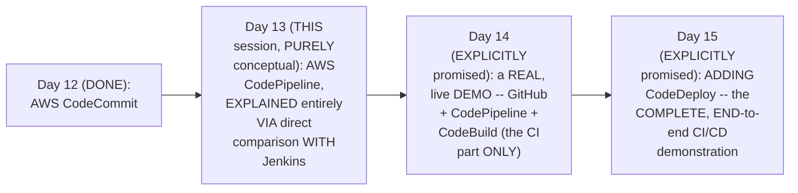

#### 🎯 Key Takeaways

* This is GENUINELY a **PURELY conceptual** session — the instructor EXPLICITLY, DIRECTLY confirms THERE is NO live CONSOLE demo TODAY — THAT is EXPLICITLY reserved FOR tomorrow.
* THE entire session is BUILT around a COMPLETE, DIRECT comparison WITH Jenkins — a FAMILIAR tool MOST devops LEARNERS already, GENUINELY understand.
* This directly, EXPLICITLY confirms the REMAINING structure OF this FOUR-part sub-SERIES — Day 14 IMPLEMENTS the CI part (GitHub + CodePipeline + CodeBuild); Day 15 ADDS CodeDeploy FOR the COMPLETE, end-to-end PIPELINE.

---

### 2. The Complete, Classic Jenkins-Based CI/CD Workflow

#### 🪜 Step-by-Step — The Complete, Real, Classic Workflow

> 💡 **Given directly:** *"There is a source code repository, let's consider it as GitHub or Bitbucket or GitLab... there is a target platform that is called Kubernetes... there will be a user, let's call this user as a developer... this user makes a code commit — this is not AWS CodeCommit, this is a general code commit... he commits the code to the git repository. What happens after that is the major picture, or the main orchestrator, comes into the picture — that is Jenkins."*

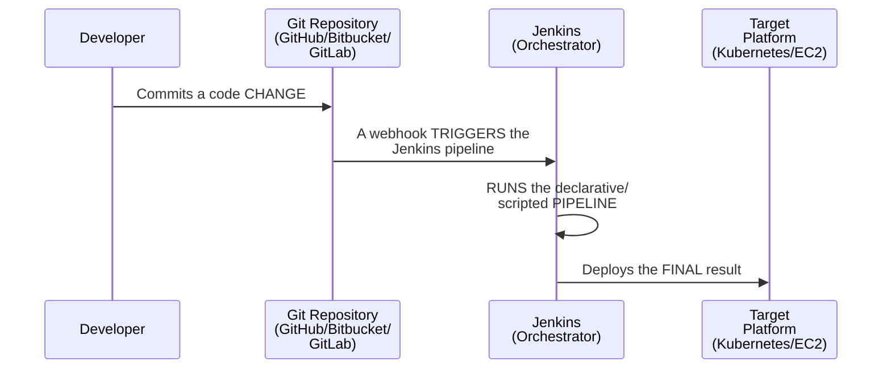

#### 🪜 Step-by-Step — The Complete, Real, Standard CI Stages

> 💡 **Given directly:** *"The Groovy scripting that you have written implements code checkout, right — implements build and unit test cases... then you can implement the static code analysis... you can use tools like SonarCube for implementation... then there is basically a Docker image scanning, right, there are stages regarding the image creation, then you have Docker image scanning, and finally there is a Docker image push stage."*

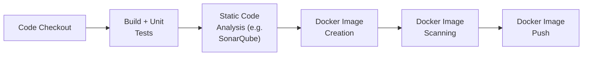

#### ⚠ A Direct, Honest Clarification: Stages Genuinely Vary by Organization

> 💡 **Given directly:** *"This stages depends upon organization to organization, right — one organization might have many, one organization might have slightly less... it depends upon the applications that you are using — is it a mobile application, is it a web application, or is it related to ML, is it related to AI — so depending upon the applications, your stages keeps changing."*

#### ⚠ Common Mistakes

* Assuming THE specific SIX stages LISTED (checkout, BUILD, static ANALYSIS, image CREATE/scan/push) are a GENUINELY, UNIVERSALLY fixed, REQUIRED set — explicitly, directly, HONESTLY clarified: "THERE is NOTHING like YOUR continuous integration SHOULD have THESE stages only" — THEY genuinely, DIRECTLY vary BY organization and APPLICATION type.

#### 🎯 Key Takeaways

* THE classic JENKINS workflow: a DEVELOPER commits CODE to a GIT repository (GitHub/Bitbucket/GITLAB) → a WEBHOOK triggers the JENKINS pipeline → the PIPELINE runs its OWN, defined STAGES.
* SIX, commonly-used CI STAGES were directly, CONCRETELY enumerated: CODE checkout, BUILD+unit TESTS, static CODE analysis (SONARQUBE), Docker IMAGE creation, image SCANNING, and image PUSH.
* THESE specific stages are directly, HONESTLY confirmed as **NOT genuinely, UNIVERSALLY fixed** — THEY vary, REALISTICALLY, by ORGANIZATION and APPLICATION type (mobile, WEB, ML, AI).

---
### 3. Implement vs. Invoke: A Genuine, Precise, Important Distinction

#### 📖 Definition — The Precise, Central Distinction

> 💡 **Given directly:** *"These pipelines... are typically responsible for two actions — one is continuous integration, and the second thing is to invoke the continuous delivery. Watch this very carefully — I said, for implementing continuous integration, and invoking continuous delivery. One is implementation, other is invoking, because Jenkins is more or less a continuous integration platform only. Jenkins is not responsible for continuous delivery, but Jenkins invokes the continuous delivery."*

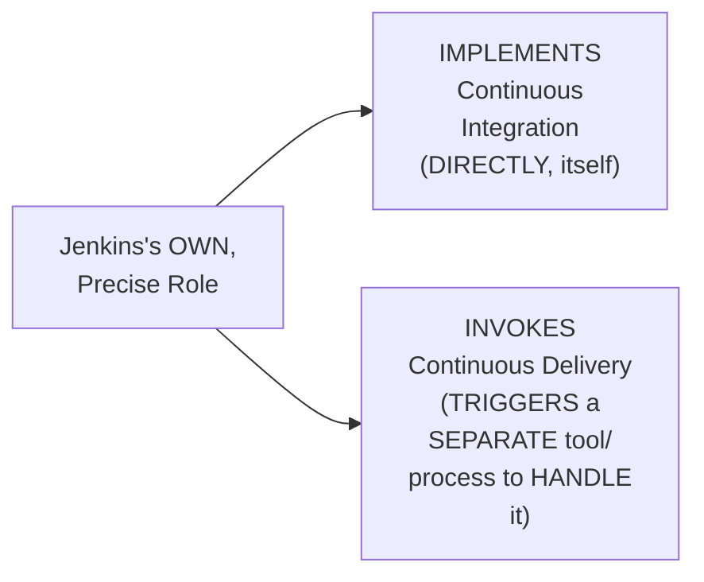

#### ⚠ Common Mistakes

* Assuming JENKINS genuinely, DIRECTLY performs BOTH continuous INTEGRATION and continuous DELIVERY, IN the SAME, unified WAY — explicitly, directly, REPEATEDLY corrected: "WATCH this VERY carefully" — JENKINS **IMPLEMENTS** CI DIRECTLY, but ONLY **INVOKES** (TRIGGERS) CD — a GENUINE, structural DIFFERENCE.

#### 🎯 Key Takeaways

* JENKINS'S own, PRECISE role is TWO, genuinely DIFFERENT things: it **IMPLEMENTS** continuous INTEGRATION directly (RUNNING the ACTUAL build/TEST/scan stages ITSELF), but it ONLY **INVOKES** continuous DELIVERY — TRIGGERING a SEPARATE process/TOOL to HANDLE the ACTUAL deployment.
* This is directly, EXPLICITLY flagged as a GENUINELY important DISTINCTION worth "WATCHING very CAREFULLY" — a COMMONLY-confused, but PRECISE, real DIFFERENCE.
* This directly, PRECISELY sets UP the SESSION's own, LATER, PARALLEL distinction — AWS CodePipeline's OWN role GENUINELY, DIRECTLY differs FROM Jenkins's OWN role IN a related, but DIFFERENT way (Section 5).

---

### 4. The Recommended Path for Continuous Delivery: GitOps

#### 📖 Definition — Multiple, Genuine Paths for Invoking Continuous Delivery

> 💡 **Given directly:** *"There are multiple ways of invoking this continuous delivery process — one is you can use Ansible, which is an outdated way, or you can use some shell scripts, which is again an outdated way, or you can use platforms like ArgoCD, which is GitOps-based platform... FluxCD, you can use Spinnaker... GitOps is the best way of implementing continuous delivery."*

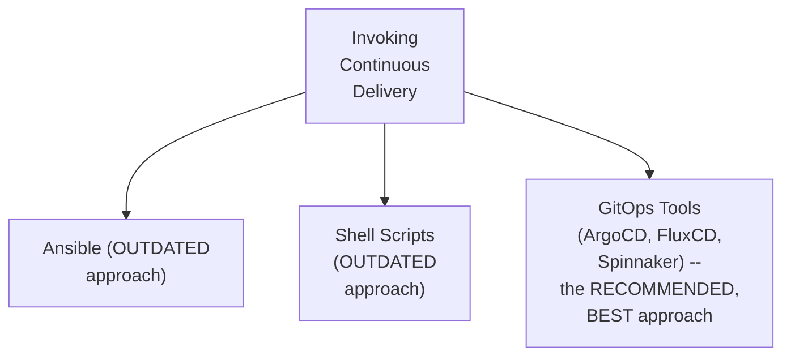

#### 🔍 Internal Working — A Genuine, Precise Explanation of WHY GitOps Is Preferred

> 💡 **Given directly:** *"Using GitOps, you can not only push the artifacts, not only push your Kubernetes-related resources onto the Kubernetes cluster, but you can also constantly manage them — because GitOps tools can constantly reconcile, they are declarative in nature, you know, they can always make sure that if someone modifies resources on the Kubernetes cluster, it will revoke the change, or it will put the change back to the state that is... single source of truth, which is a git platform."*

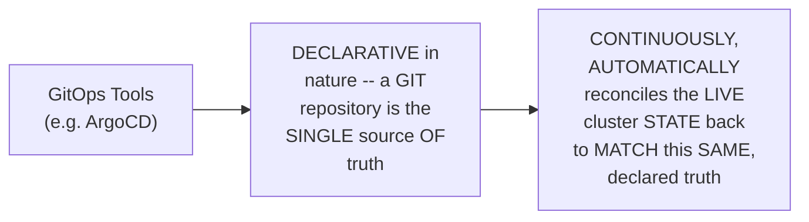

#### ⚠ Common Mistakes

* Assuming ANSIBLE and SHELL scripts are GENUINELY, EQUALLY valid, MODERN approaches FOR continuous delivery — explicitly, directly, HONESTLY confirmed AS "outdated" — GITOPS is the CLEARLY, DIRECTLY preferred, MODERN approach.

#### 🎯 Key Takeaways

* MULTIPLE, genuine APPROACHES exist for INVOKING continuous DELIVERY: ANSIBLE and shell SCRIPTS (BOTH honestly CONFIRMED as "OUTDATED"), and GitOps TOOLS (ArgoCD, FLUXCD, Spinnaker) — the EXPLICITLY recommended, **BEST** approach.
* GitOps TOOLS are GENUINELY preferred BECAUSE they are **DECLARATIVE** — a GIT repository SERVES as the SINGLE source OF truth, and the TOOL **CONTINUOUSLY reconciles** the LIVE cluster STATE to MATCH it — DIRECTLY connecting BACK to THIS series' own, ESTABLISHED "declarative" CONCEPT (from the CFT session).
* This directly, PRECISELY sets UP the SESSION's own, NEXT, essential STEP — MAPPING this ENTIRE, established Jenkins WORKFLOW onto AWS's OWN, native services (Section 5).

---
### 5. Mapping the Same Workflow Onto AWS CodePipeline

#### 🪜 Step-by-Step — A Complete, Precise, Direct Mapping

> 💡 **Given directly:** *"Again there is a user, now let's say the requirement is for you to move this entire ecosystem onto AWS managed services... this user makes a code change not to GitHub, but this user makes a code change to the AWS CodeCommit... once this AWS CodeCommit triggers here — previously the GitHub webhook was triggering a Jenkins pipeline, here you will trigger a AWS code pipeline."*

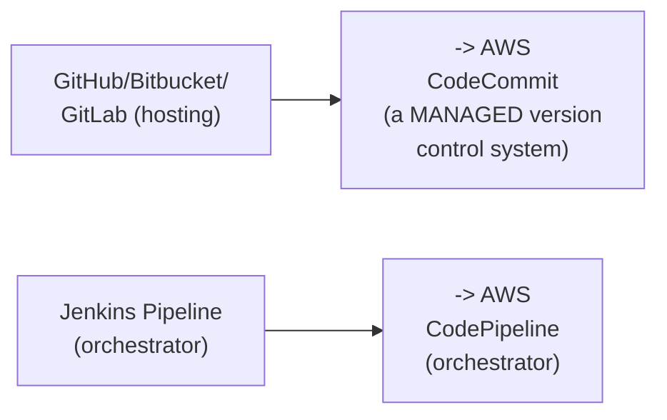

#### 📖 Definition — AWS CodePipeline's Own, Precise Role

> 💡 **Given directly:** *"This AWS code pipeline takes the responsibility of invoking continuous integration, and invoking continuous delivery — here I said invoking continuous integration and also invoking continuous delivery. Last time in Jenkins, I said implementing continuous integration and invoking delivery, but here what AWS code pipeline does is, in most of the cases, it will invoke the continuous integration using a service called AWS CodeBuild."*

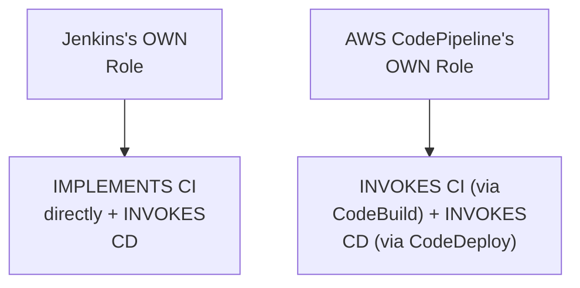

#### 📖 Definition — CodeBuild & CodeDeploy, Precisely Mapped

> 💡 **Given directly:** *"Mostly this AWS CodeBuild — of course you can write some scripts as well, but mostly what people do is they make use of this AWS CodeBuild to implement all the stages... and then there is something called CodeDeploy, where CodeDeploy will take care of the CD part, and it will deploy either to Kubernetes cluster or EC2 instances or ECS."*

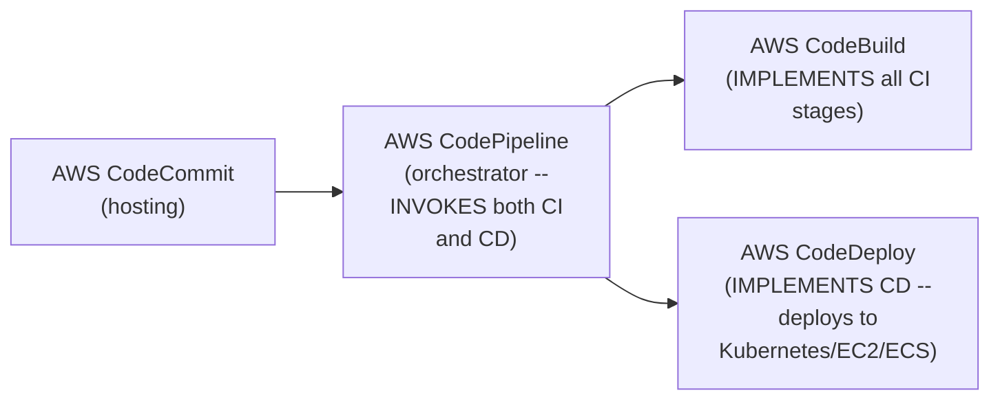

#### ⚠ Common Mistakes

* Assuming AWS CODEPIPELINE's own role is GENUINELY, DIRECTLY identical TO Jenkins's own ROLE — explicitly, directly, PRECISELY distinguished: JENKINS **IMPLEMENTS** CI directly; CODEPIPELINE only **INVOKES** CodeBuild TO implement CI — a SUBTLE, but GENUINE, structural DIFFERENCE.
* Assuming AWS CODEBUILD is the ONLY, genuinely POSSIBLE way to IMPLEMENT CI stages WITHIN CodePipeline — explicitly, directly, PRECISELY clarified: "OF course you CAN write SOME scripts AS well" — but CodeBuild REMAINS the STANDARD, recommended APPROACH.

#### 🎯 Key Takeaways

* The COMPLETE, precise MAPPING: **CodeCommit** (hosting, REPLACING GitHub) → **CodePipeline** (ORCHESTRATOR, replacing JENKINS) → **CodeBuild** (implements CI, INVOKED by CodePipeline) → **CodeDeploy** (implements CD, INVOKED by CodePipeline).
* AWS CODEPIPELINE's own, precise ROLE genuinely, STRUCTURALLY differs FROM Jenkins's own ROLE: CodePipeline **ONLY invokes** BOTH CI (via CODEBUILD) and CD (via CODEDEPLOY) — WHEREAS Jenkins DIRECTLY implements CI ITSELF, and ONLY invokes CD.
* This directly, PRECISELY sets UP the SESSION's own, NEXT, PRACTICAL application — USING both, COMPLETE diagrams TOGETHER to CONSTRUCT a GENUINE, real interview NARRATIVE (Section 6).

---

### 6. A Genuine, Direct Interview-Answer Framing: Side-by-Side Diagrams

#### 🪜 Step-by-Step — A Direct, Practical, Interview-Focused Recommendation

> 💡 **Given directly:** *"If you compare both the pictures, you can go back, place both the pictures side by side, right — then you will get the clear picture, and even the interviews, if the interview is very dedicated to AWS, if the job description or the company only wants AWS services, managed services for implementing CI/CD, you can easily tell them by keeping both of these pictures side by side, and you can create your own story."*

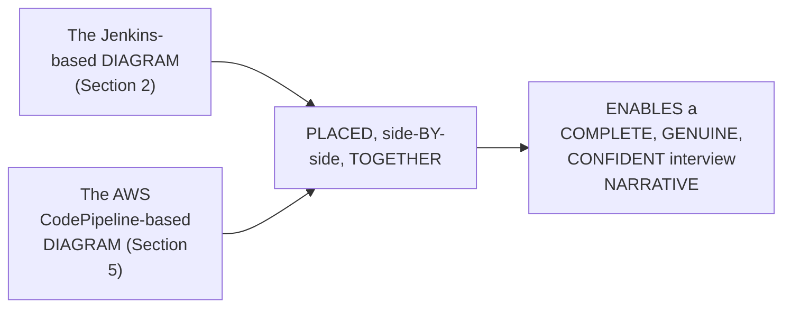

#### ⚠ Common Mistakes

* Assuming ONLY ONE of the TWO diagrams (JENKINS-based OR AWS-based) is GENUINELY, SUFFICIENTLY useful FOR interview PREPARATION — explicitly, directly, PRACTICALLY recommended: HOLDING both DIAGRAMS together, SIDE by SIDE, produces a FAR clearer, MORE confident, COMPLETE understanding.

#### 🎯 Key Takeaways

* A GENUINE, direct, PRACTICAL recommendation: PLACING the JENKINS-based and AWS-BASED diagrams **SIDE by SIDE** directly, CONCRETELY produces a CLEARER, more COMPLETE understanding.
* This approach is directly, EXPLICITLY confirmed as PARTICULARLY valuable FOR **AWS-dedicated INTERVIEWS** — WHERE a JOB description or COMPANY specifically REQUIRES AWS-managed CI/CD KNOWLEDGE.
* This directly, PRECISELY sets UP the SESSION's own, NEXT, HONEST confirmation — WHICH tool WILL genuinely be USED in TOMORROW's real, live DEMO (Section 7).

---
### 7. A Genuine, Honest Confirmation: Why Tomorrow's Demo Will Use GitHub, Not CodeCommit

#### ⚠ A Direct, Honest, Genuine Confirmation

> 💡 **Given directly:** *"We will do the demonstration tomorrow using AWS CodeCommit — or instead of CodeCommit, I'll use a GitHub repository, so that you will understand it in a much better way. And even in real time, CodeCommit is a very, very less used managed AWS service, because of its features — it does not offer as many features as GitHub or GitLab."*

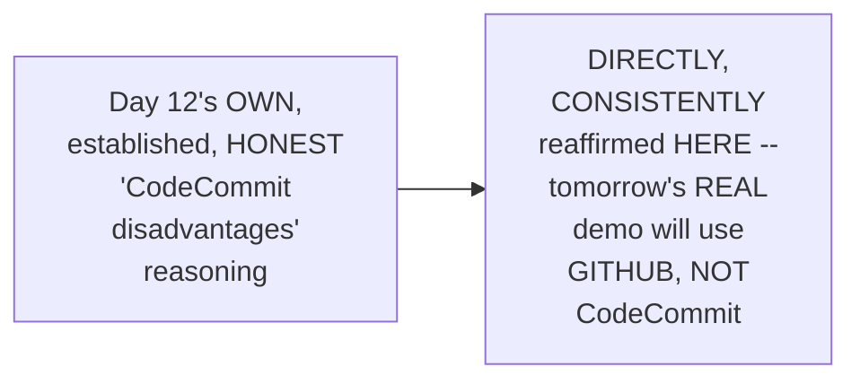

#### 🪜 Step-by-Step — A Direct, Explicit Confirmation of Tomorrow's Own, Precise Scope

> 💡 **Given directly:** *"Tomorrow's video I'll use GitHub repository, I'll put Java or Python code in the repository, and using CodePipeline I will invoke AWS CodeBuild, and I'll show you how to build this entire application. So tomorrow's video will only be restricted to this part, right — we will only be doing GitHub repository, AWS CodePipeline, and AWS CodeBuild. So we will try to implement the CI part only."*

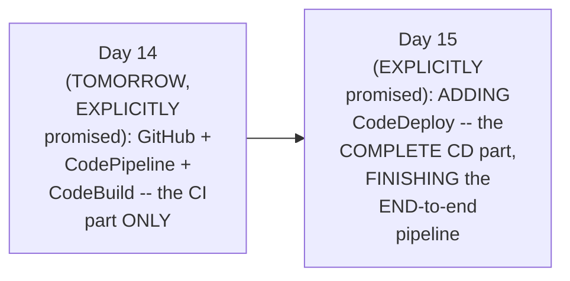

#### ⚠ Common Mistakes

* Assuming THIS series' own, PLANNED demonstration WOULD genuinely, DIRECTLY use ALL four AWS-native SERVICES (INCLUDING CodeCommit) TOGETHER — explicitly, directly, HONESTLY clarified: CONSISTENT with Day 12's OWN, established FINDINGS, GitHub will GENUINELY, DIRECTLY replace CodeCommit IN the ACTUAL, practical DEMONSTRATION.

#### 🎯 Key Takeaways

* DIRECTLY, HONESTLY reaffirming Day 12's own, ESTABLISHED "CodeCommit disadvantages" REASONING, TOMORROW's real DEMO will use **GITHUB**, not CodeCommit — SINCE CodeCommit REMAINS "VERY, very LESS used" in REAL, practical organizational SETTINGS.
* TOMORROW's own, PRECISE scope is EXPLICITLY confirmed: **GitHub + CodePipeline + CodeBuild** — implementing ONLY the **CI** part.
* THE **CD** part (VIA CodeDeploy) is EXPLICITLY deferred TO the FOLLOWING day — COMPLETING the ENTIRE, end-to-END CI/CD pipeline.

---

### 8. The Central Interview Question: Why Pay for CodePipeline When Jenkins Is Free?

#### ❓ Why It Exists — The Session's Own, Central, Genuine Question

> 💡 **Given directly:** *"Now comes the major question that you might ask me — Abhishek, if AWS CodePipeline is chargeable, and if it is a pay-as-you-use service, whereas open-source solutions like Jenkins are available, why organizations prefer AWS CodePipeline?"*

#### 🔍 Internal Working — A Complete, Real, Genuine Explanation: The Master-Slave Management Burden

> 💡 **Given directly:** *"As a devops engineer, let's say you have installed Jenkins, and for Jenkins definitely you will go with master-slave architecture... let's say you started with two worker nodes, later tomorrow your organization increased the size, grew up the pipelines grew up, now you have increased the worker nodes to 4, 8, 16, 20 — and what will happen eventually is you have to manage this 20 virtual machines... managing is the thing that is taking place, so there have to be one dedicated devops engineer who has to take care of this entire Jenkins infrastructure."*

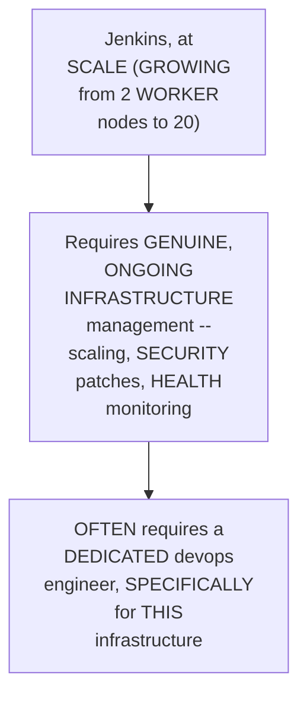

#### 🔍 Internal Working — A Genuine, Direct Connection to AWS's Own, Established Pattern

> 💡 **Given directly:** *"Whenever management comes into picture, you know what AWS does — AWS, whenever they see the opportunity, they will start their managed services... they saw the opportunity for compute, they came up with EC2, they saw the opportunity for managing storage, they came up with S3... they saw the manage opportunity for managing CI/CD services, that's why they came up with CodeCommit, CodePipeline, CodeBuild, and CodeDeploy."*

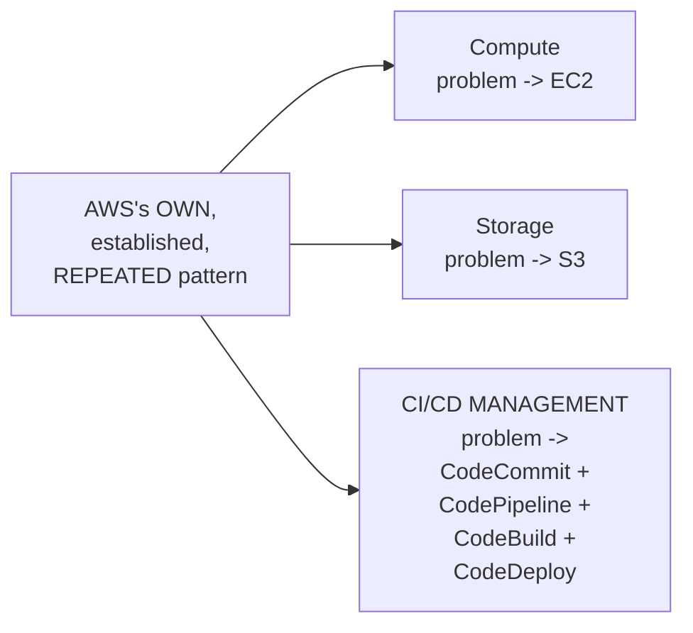

#### ⚠ Common Mistakes

* Assuming AWS's OWN, managed CI/CD SERVICES are GENUINELY, MERELY a "MONEY grab," WITHOUT any REAL, GENUINE justification — explicitly, directly, HONESTLY reframed: "THERE is NO disadvantage WITH it, or AWS is NOT doing ANYTHING wrong" — it GENUINELY, DIRECTLY solves a REAL, common OPERATIONAL burden.

#### 🎯 Key Takeaways

* THE session's own, CENTRAL interview QUESTION: WHY would ORGANIZATIONS genuinely PAY for AWS CODEPIPELINE, when JENKINS is OPEN source and FREE?
* THE genuine, real ANSWER: JENKINS, at SCALE, requires ONGOING, real INFRASTRUCTURE management (SCALING, patching, HEALTH monitoring) — OFTEN requiring a DEDICATED devops ENGINEER.
* THIS directly, CONCRETELY connects TO AWS's OWN, established, REPEATED pattern — JUST as EC2 SOLVED compute, and S3 SOLVED storage, CodeCommit/CodePipeline/CodeBuild/CodeDeploy GENUINELY, DIRECTLY solve the MANAGEMENT burden of self-HOSTED CI/CD infrastructure.

---
### 9. A Genuine, Honest Counter-Argument: Jenkins CAN Be Managed Efficiently Too

#### ⚠ A Direct, Honest, Balanced Counter-Argument

> 💡 **Given directly:** *"There is no disadvantage with it... but why Jenkins is a preferred solution in that case? Because, you know, Jenkins firstly is open source, and for each and every organization, management is not that big [a] problem, right — for some companies, they can run entire Jenkins workloads on two EC2 instances... if they are managing it efficiently using Docker slaves."*

#### 🔍 Internal Working — A Genuine, Direct, Real Example: Docker Agents

> 💡 **Given directly:** *"I showed you in one of the videos, that's called Ultimate CI/CD Pipeline, where I've used Docker agents — and what this Docker agent is doing, when the pipeline is run, the Docker agent gets started, and once the pipeline is completed, the Docker agent, or the Docker container, gets deleted completely. So that way, you are efficiently managing the infrastructure of your Jenkins."*

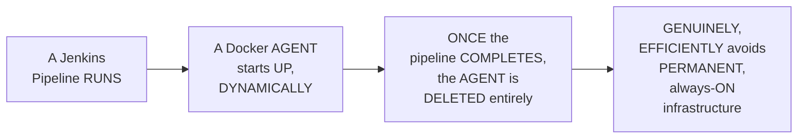

#### 🔍 Internal Working — A Genuine, Direct, Real Alternative: Running Jenkins on EC2 With Auto Scaling

> 💡 **Given directly:** *"You can also create this Jenkins on EC2 instances, right — when you create Jenkins on EC2 instances, you can configure auto-scaling groups, you can configure the AWS CloudWatch, you can configure AWS alarms, and AWS will definitely take care of these EC2 instances. So that way, even if you want to manage Jenkins, then AWS has solutions like EC2."*

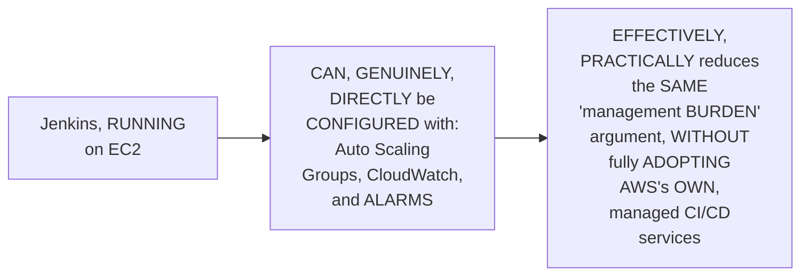

#### ⚠ Common Mistakes

* Assuming "MANAGED Git/CI/CD is ALWAYS better" is a GENUINELY, UNCONDITIONALLY true STATEMENT — explicitly, directly, HONESTLY balanced: EFFICIENT devops ENGINEERS, using TECHNIQUES like DOCKER agents OR EC2 auto-SCALING, CAN genuinely, DIRECTLY manage JENKINS efficiently — MAKING the "MANAGEMENT burden" ARGUMENT less, GENUINELY decisive THAN it might FIRST appear.

#### 🎯 Key Takeaways

* THE instructor **directly, HONESTLY provides a BALANCED counter-ARGUMENT**: "THERE is no DISADVANTAGE" to AWS's OWN approach, but JENKINS remains GENUINELY, PRACTICALLY preferred BY many organizations — SINCE "MANAGEMENT is NOT that BIG a PROBLEM" for TEAMS that MANAGE it EFFICIENTLY.
* A REAL, concrete EXAMPLE — **DOCKER agents** (SPINNING up DYNAMICALLY, per PIPELINE run, and DELETING afterward) — directly, CONCRETELY demonstrates HOW Jenkins CAN, genuinely, AVOID permanent, ALWAYS-on infrastructure BURDEN.
* Jenkins can ALSO, genuinely, be RUN on **EC2** WITH Auto Scaling GROUPS, CloudWatch, and ALARMS — REDUCING the SAME "management BURDEN" concern, WITHOUT fully ADOPTING AWS's own, MANAGED CI/CD services.

---

### 10. The Single, Most Important, Genuine Drawback: Vendor Lock-In

#### 📖 Definition — The Precise, Critical, Genuine Drawback

> 💡 **Given directly:** *"The major drawback of this entire AWS managed services is that they are very much restricted to AWS only. Tomorrow, let's say your organization did not like AWS, and they want to move to Azure, or they are moving to hybrid cloud — that means they have some things on AWS and they have some things on Azure — then all the pipelines that you have written will stop working, because your pipelines, that is AWS code pipelines that you have written, are only restricted to AWS. They will not work outside AWS."*

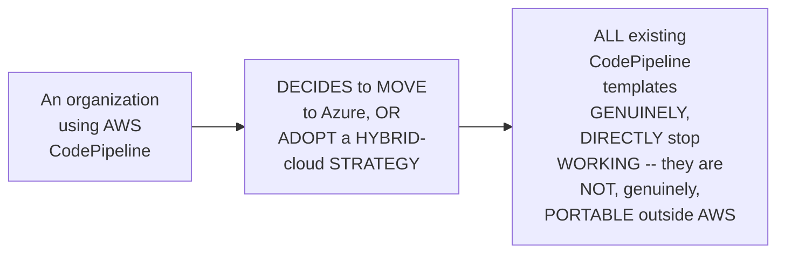

#### 🔍 Internal Working — A Genuine, Direct Contrast: Jenkins's Own, Real Portability

> 💡 **Given directly:** *"Whereas if you are using Jenkins... tomorrow, even if your organization says, hey, move away from Jenkins, you will just delete the Jenkins instance here, spin up another Jenkins instance there, and your pipelines will remain the same — you can just take backup of your Jenkins, and you can reuse that pipelines even on Azure infrastructure, Google Cloud infrastructure, or even on-premises."*

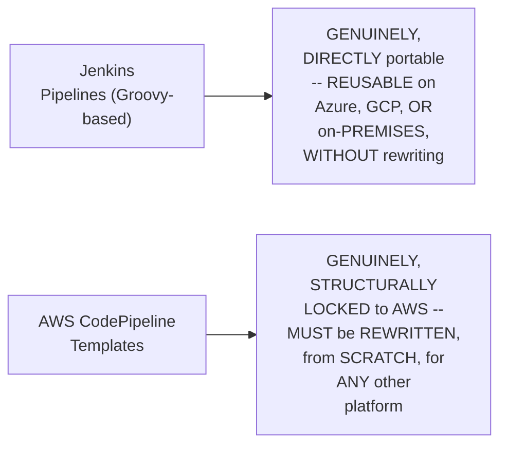

#### ⚠ Common Mistakes

* Assuming AWS's OWN, managed CI/CD services are GENUINELY, UNCONDITIONALLY "the BETTER" choice, ONCE cost CONSIDERATIONS are SET aside — explicitly, directly, DIRECTLY corrected: VENDOR lock-IN remains a GENUINE, real RISK, INDEPENDENT of cost — EVEN a WELL-funded organization COULD, genuinely, face SIGNIFICANT, real DISRUPTION from a FUTURE cloud-PROVIDER change.

#### 🎯 Key Takeaways

* THE session's own, EXPLICITLY-confirmed **SINGLE, most IMPORTANT drawback**: AWS-managed CI/CD SERVICES are GENUINELY, STRUCTURALLY **restricted to AWS ONLY** — a REAL, significant **VENDOR lock-in** risk.
* IF an ORGANIZATION genuinely, DIRECTLY moves TO Azure, GCP, OR a HYBRID-cloud strategy, **ALL existing AWS CodePipeline TEMPLATES stop WORKING** — REQUIRING a COMPLETE rewrite.
* JENKINS, BY genuine, direct CONTRAST, remains GENUINELY, PRACTICALLY **portable** — PIPELINES can be REUSED, largely UNCHANGED, ACROSS Azure, GCP, OR on-PREMISES infrastructure.

---
### 11. A Complete, Genuine Interview-Answer Framing: Jenkins vs. CodePipeline

#### 🪜 Step-by-Step — A Direct, Complete, Practical Interview-Answer Framework

> 💡 **Given directly:** *"If your interviewer is asking these questions, then you have to clearly mention them — why Jenkins is popular than AWS CodePipeline, if they're asking this question: one, you will say features of Jenkins, integrations of Jenkins — Jenkins can be integrated with lot of tools, and Jenkins is not restricted to AWS platform only, tomorrow if you want to move outside, you can move outside. And if someone is asking about advantages of CodePipeline, you will tell them that everything is managed by AWS, so I don't have to worry about it — tomorrow if cost is not a barrier for me, then even if scaling up of this AWS CodePipeline resources, scaling down, reliability, the management, everything is taken care by AWS."*

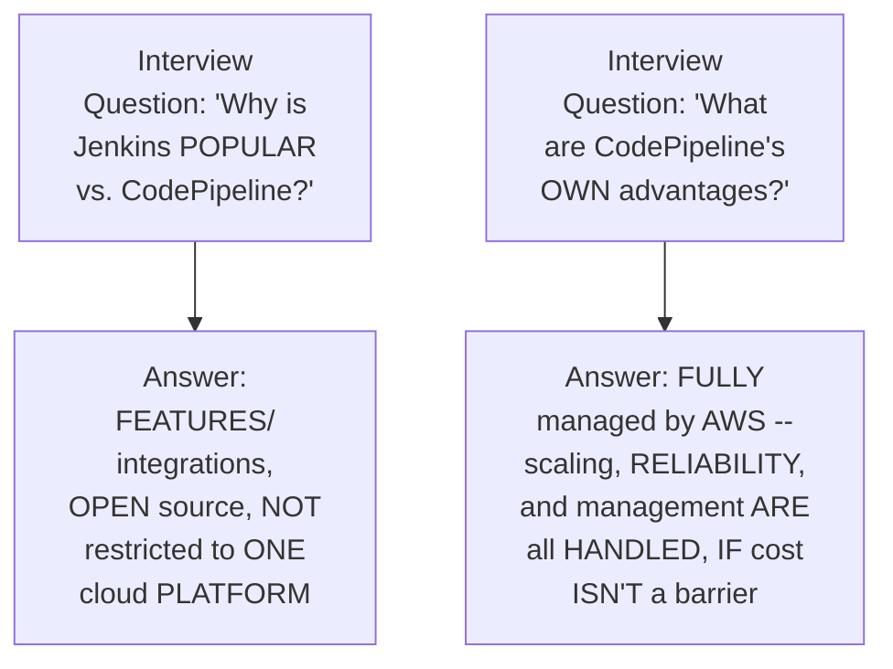

#### ⚠ Common Mistakes

* Assuming a REAL interview REQUIRES declaring ONE tool (JENKINS or CodePipeline) as GENUINELY, UNCONDITIONALLY "the BETTER" one — explicitly, directly, PRACTICALLY framed as a BALANCED, TWO-sided answer — EACH tool's OWN, genuine STRENGTHS are DIRECTLY, CLEARLY articulated, WITHOUT declaring an ABSOLUTE "winner."

#### 🎯 Key Takeaways

* A COMPLETE, genuine INTERVIEW-answer framework: WHY Jenkins is POPULAR — its OWN, rich FEATURES/integrations, and its GENUINE, real PORTABILITY (NOT restricted TO one cloud PLATFORM).
* WHY CodePipeline is CHOSEN, in CONTRAST — EVERYTHING is FULLY managed BY AWS (scaling, RELIABILITY, general MANAGEMENT) — GENUINELY valuable IF cost is NOT a genuine BARRIER.
* This directly, PRACTICALLY equips LEARNERS with a BALANCED, TWO-sided, genuinely CONFIDENT interview NARRATIVE — DIRECTLY synthesizing EVERY, prior section OF this session's OWN, established REASONING.

---

### 12. Closing: What's Deferred to the Next Two Days

#### 🪜 Step-by-Step — A Direct, Honest, Complete Confirmation

> 💡 **Given directly:** *"Wait for tomorrow's demonstration video, where we will implement the continuous integration part using CodePipeline, CodeBuild, and GitHub repository instead of CodeCommit."*

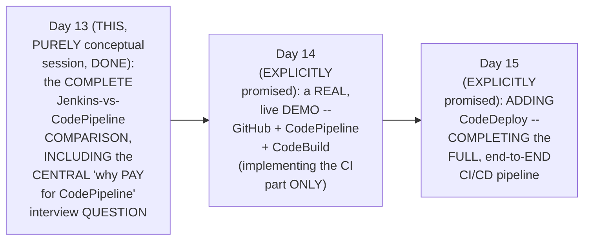

#### 🪜 Step-by-Step — A Genuine, Direct, Motivating Closing Statement

> 💡 **Given directly:** *"You might be thinking, Abhishek, if you say that Jenkins is a popular choice, GitHub Actions is a popular choice, GitLab is a popular choice, why should I learn about this? Because if there is an organization, if they want things to be completely in AWS, then it should not be a barrier for you — because we are learning AWS Zero to Hero, it is also a good option to learn about AWS-managed CI/CD services."*

#### ⚠ Common Mistakes

* Assuming LEARNING AWS's OWN, LESS-popular CI/CD services is GENUINELY, PRACTICALLY a WASTE of time, SINCE Jenkins/GitHub ACTIONS/GitLab remain MORE widely ADOPTED — explicitly, directly, HONESTLY reframed: SOME, real ORGANIZATIONS/interviews GENUINELY, SPECIFICALLY require AWS-only KNOWLEDGE — MAKING this GENUINELY worthwhile, COMPLEMENTARY learning.

#### 🎯 Key Takeaways

* This episode **GENUINELY, COMPREHENSIVELY delivers** its OWN, stated GOALS — a COMPLETE, conceptual COMPARISON between JENKINS and AWS CODEPIPELINE, CULMINATING in a THOROUGH, honest ANSWER to the SESSION's own, CENTRAL interview QUESTION.
* **DAY 14** (EXPLICITLY promised) will IMPLEMENT the **CI** part ONLY — VIA a REAL, live demo USING GitHub, CodePipeline, and CODEBUILD; **DAY 15** will ADD CodeDeploy, COMPLETING the FULL pipeline.
* The instructor **directly, HONESTLY frames** LEARNING AWS-managed CI/CD SERVICES as GENUINELY worthwhile — NOT because THEY are MORE popular THAN Jenkins/GitHub Actions/GITLAB, but BECAUSE some, REAL organizations and INTERVIEWS genuinely, SPECIFICALLY require THIS exact knowledge.

---
## 📝 Glossary

| Term | Definition | Why It Matters |
|---|---|---|
| **AWS CodePipeline** | AWS's own, native CI/CD orchestrator | Compared directly against Jenkins throughout this session |
| **Implement vs. Invoke** | A precise distinction in how a tool handles CI/CD stages | Jenkins implements CI directly, invokes CD; CodePipeline invokes both |
| **GitOps** | A declarative, self-reconciling approach to continuous delivery | The explicitly-recommended, best approach (ArgoCD, FluxCD, Spinnaker) |
| **Master-Slave Architecture** | Jenkins's own, standard scaling model | Requires ongoing, real infrastructure management at scale |
| **Docker Agents (Jenkins)** | Dynamically-spun-up, per-pipeline-run Jenkins workers | A genuine, efficient way to avoid always-on infrastructure |
| **Vendor Lock-In** | The single, most significant drawback of AWS-managed CI/CD | AWS CodePipeline templates don't work outside AWS |

---

## 🔄 Revision Notes — One-Minute Revision

* This is **Day 13**, a genuinely, PURELY conceptual session -- NO live console demo today; explicitly reserved for tomorrow. The entire session is built around a complete, side-by-side comparison between Jenkins and AWS CodePipeline.
* **The classic Jenkins workflow**: a developer commits code to a git repository (GitHub/Bitbucket/GitLab) -> a webhook triggers the Jenkins pipeline -> the pipeline runs its own stages (code checkout, build+unit tests, static code analysis, Docker image creation/scanning/push) -> Jenkins invokes continuous delivery. These specific stages genuinely vary by organization and application type.
* **Implement vs. invoke, a precise distinction**: Jenkins IMPLEMENTS continuous integration directly, but only INVOKES continuous delivery -- a genuinely important, commonly-confused nuance.
* **GitOps (ArgoCD, FluxCD, Spinnaker)** is the explicitly-recommended, best approach for continuous delivery -- since it's declarative, using Git as the single source of truth, and continuously reconciles live cluster state back to match it. Ansible and shell scripts are honestly confirmed as "outdated" alternatives.
* **The precise mapping onto AWS**: CodeCommit (hosting) -> CodePipeline (orchestrator) -> CodeBuild (implements CI) -> CodeDeploy (implements CD). AWS CodePipeline's own role genuinely differs from Jenkins's: CodePipeline only INVOKES both CI (via CodeBuild) and CD (via CodeDeploy) -- it doesn't implement CI directly, the way Jenkins does.
* **A genuine, practical interview tip**: place both diagrams (Jenkins-based and AWS-based) side by side, to construct a clear, complete interview narrative -- especially valuable for AWS-dedicated interviews.
* **Tomorrow's demo will use GitHub, not CodeCommit** -- directly, honestly reaffirming Day 12's own established finding that CodeCommit remains "very, very less used" in real practice. Day 14 implements the CI part only (GitHub + CodePipeline + CodeBuild); Day 15 adds CodeDeploy for the complete pipeline.
* **The central interview question**: why would organizations pay for AWS CodePipeline when Jenkins is free? Answer: Jenkins, at scale, requires ongoing, real infrastructure management (master-slave architecture, scaling, patching) -- often requiring a dedicated devops engineer. This directly connects to AWS's own, established, managed-service pattern (EC2 for compute, S3 for storage).
* **A genuine, honest counter-argument**: Jenkins CAN be managed efficiently too -- via Docker agents (dynamically spun up/deleted per pipeline run) or by running Jenkins on EC2 with Auto Scaling Groups, CloudWatch, and alarms.
* **The single, most important, genuine drawback of AWS-managed CI/CD**: vendor lock-in. AWS CodePipeline templates are strictly restricted to AWS -- moving to Azure, GCP, or hybrid-cloud means rewriting everything from scratch. Jenkins pipelines, by contrast, remain genuinely portable across any infrastructure.
* **A complete, genuine interview-answer framing**: Jenkins is popular for its rich features/integrations and its real portability (not restricted to one cloud); CodePipeline is chosen when everything being fully managed by AWS (scaling, reliability) is genuinely valuable, and cost isn't a barrier.
* **Closing**: learning AWS-managed CI/CD services remains genuinely worthwhile, not because they're more popular than Jenkins/GitHub Actions/GitLab, but because some, real organizations and interviews genuinely require this exact knowledge.

---

## 📋 Cheat Sheet

**The complete Jenkins-to-AWS mapping:**
```text
GitHub/Bitbucket/GitLab (hosting)  -> AWS CodeCommit
Jenkins (orchestrator)              -> AWS CodePipeline
Jenkins's own CI stages              -> AWS CodeBuild
Ansible/shell scripts/GitOps (CD)     -> AWS CodeDeploy
```

**Implement vs. Invoke:**
```text
Jenkins:         IMPLEMENTS CI directly, INVOKES CD
AWS CodePipeline: INVOKES both CI (via CodeBuild) AND CD (via CodeDeploy)
```

**GitOps as the recommended CD approach:**
```text
Ansible / shell scripts  -- outdated
GitOps (ArgoCD, FluxCD, Spinnaker) -- RECOMMENDED
  -> declarative, Git as single source of truth, continuously reconciles state
```

**Why pay for AWS CodePipeline?**
```text
Jenkins at scale -> requires ongoing infrastructure management (master-slave,
                     scaling, patching) -> often needs a dedicated devops engineer
AWS CodePipeline -> fully managed, pay-as-you-go, no operational burden
```

**The single, biggest drawback:**
```text
Vendor Lock-In: AWS CodePipeline templates ONLY work within AWS.
Jenkins pipelines remain portable across Azure, GCP, on-premises.
```

---

## 🔥 Interview Questions & Answers

### 🟢 Beginner

**Q1.**

**Question:** What does AWS CodePipeline correspond to, in a Jenkins-based workflow?

**Answer:** Jenkins itself (the orchestrator).

**Explanation:** Directly, precisely mapped.

**Why Interviewers Ask This:** The most basic, foundational CodePipeline question.

**Possible Follow-up:** "What does CodeBuild correspond to?"

**Q2.**

**Question:** Does Jenkins implement or merely invoke continuous integration?

**Answer:** It implements continuous integration directly.

**Explanation:** Directly, precisely stated.

**Why Interviewers Ask This:** Tests genuine understanding of a commonly-confused, precise distinction.

**Possible Follow-up:** "Does Jenkins implement or invoke continuous delivery?"

**Q3.**

**Question:** Does AWS CodePipeline implement continuous integration directly?

**Answer:** No -- it invokes AWS CodeBuild to implement it.

**Explanation:** Directly, precisely clarified.

**Why Interviewers Ask This:** Tests genuine understanding of how CodePipeline's own role differs from Jenkins's.

**Possible Follow-up:** "What does CodePipeline invoke for continuous delivery?"

**Q4.**

**Question:** What is the explicitly-recommended, best approach for continuous delivery?

**Answer:** GitOps (e.g., ArgoCD, FluxCD, Spinnaker).

**Explanation:** Directly, explicitly recommended.

**Why Interviewers Ask This:** Basic, essential CI/CD tooling knowledge.

**Possible Follow-up:** "Why is GitOps genuinely preferred over Ansible or shell scripts?"

**Q5.**

**Question:** Will this series' own upcoming demo use AWS CodeCommit or GitHub?

**Answer:** GitHub.

**Explanation:** Directly, explicitly confirmed.

**Why Interviewers Ask This:** Tests attention to the session's own, stated, forward-looking plan.

**Possible Follow-up:** "Why was this specific choice made?"

**Q6.**

**Question:** Why might an organization genuinely prefer AWS CodePipeline over free, open-source Jenkins?

**Answer:** To avoid the ongoing operational burden of managing Jenkins's own infrastructure at scale.

**Explanation:** Directly, precisely explained.

**Why Interviewers Ask This:** The session's own, central, frequently-tested interview question.

**Possible Follow-up:** "What AWS services follow this same, established pattern?"

**Q7.**

**Question:** Can Jenkins be managed efficiently, without significant infrastructure burden?

**Answer:** Yes -- e.g., via Docker agents (dynamically spun up/deleted per pipeline run) or EC2 with Auto Scaling Groups.

**Explanation:** Directly, honestly acknowledged.

**Why Interviewers Ask This:** Tests genuine, balanced understanding beyond a one-sided "AWS is always better" view.

**Possible Follow-up:** "What is a Docker agent, in this context?"

**Q8.**

**Question:** What is the single, most significant genuine drawback of AWS-managed CI/CD services?

**Answer:** Vendor lock-in -- templates only work within AWS.

**Explanation:** Directly, explicitly confirmed.

**Why Interviewers Ask This:** A commonly-tested, critical, real-world consideration.

**Possible Follow-up:** "What happens to existing Jenkins pipelines if an organization switches cloud providers?"

**Q9.**

**Question:** Will Day 14's demo implement the complete CI/CD pipeline, or just part of it?

**Answer:** Just the CI part; CodeDeploy (the CD part) is added on Day 15.

**Explanation:** Directly, explicitly confirmed.

**Why Interviewers Ask This:** Tests attention to the session's own, stated plan.

**Possible Follow-up:** "What three tools will Day 14's demo specifically use?"

**Q10.**

**Question:** According to this session, is Jenkins genuinely more popular than AWS CodePipeline, industry-wide?

**Answer:** Yes -- Jenkins, GitHub Actions, and GitLab remain more widely adopted.

**Explanation:** Directly, honestly acknowledged.

**Why Interviewers Ask This:** Tests whether a learner absorbed the session's own, honest, real-world framing.

**Possible Follow-up:** "Why does this course still teach AWS-managed CI/CD services, then?"

---

### 🟡 Intermediate

**Q11.**

**Question:** Explain why the instructor deliberately spends this entire session on a purely conceptual comparison, rather than jumping straight into a live console demo.

**Answer:** This is a genuinely deliberate, FOUNDATION-first teaching choice: by BUILDING a COMPLETE, conceptual UNDERSTANDING (the PRECISE Jenkins-to-AWS MAPPING, and the IMPLEMENT-versus-INVOKE distinction) BEFORE any HANDS-on work, the instructor ENSURES learners GENUINELY understand WHAT each AWS SERVICE is DOING, and WHY, BEFORE seeing it IN the console. This directly, PEDAGOGICALLY prevents a COMMON, real RISK — learners FOLLOWING click-by-CLICK demo STEPS without GENUINELY understanding the UNDERLYING architecture — a RISK THIS instructor's own, BROADER series CONSISTENTLY avoids (e.g., Day 9's OWN, complete THEORY before its LIVE S3 demos).

**Explanation:** Requires recognizing the deliberate, foundation-first value of building complete conceptual understanding before hands-on demonstration.

**Why Interviewers Ask This:** Tests whether a learner recognizes the pedagogical value of conceptual grounding before practical application.

**Possible Follow-up:** "PREDICT ONE, GENUINE thing you EXPECT to SEE, live, IN tomorrow's ACTUAL CodePipeline CONSOLE, BASED on THIS session's own, established THEORY."

**Q12.**

**Question:** A learner argues that since this session confirms AWS CodePipeline's own role is "only invoking" both CI and CD (rather than implementing anything directly), this means CodePipeline is genuinely less powerful or valuable than Jenkins. Evaluate this claim.

**Answer:** This claim MISUNDERSTANDS the GENUINE, structural PURPOSE of an ORCHESTRATOR. Section 5's own PRECISE, established DISTINCTION confirms CodePipeline "INVOKES" rather than "IMPLEMENTS" — but THIS is NOT, genuinely, a MEASURE of "POWER" or "value" — it's a STRUCTURAL, architectural CHOICE, DIRECTLY reflecting AWS's OWN, broader philosophy of SEPARATING concerns INTO distinct, SPECIALIZED services (CodeBuild FOR building, CodeDeploy for DEPLOYING). EVEN Jenkins, per Section 3's own established REASONING, similarly ONLY "invokes" continuous DELIVERY, RATHER than implementing it DIRECTLY — MEANING "invoking, RATHER than implementing," is NOT genuinely a CODEPIPELINE-specific WEAKNESS, but a COMMON, structural PATTERN across ORCHESTRATION tools GENERALLY. The ACCURATE, more PRECISE conclusion: CodePipeline's own ORCHESTRATION-focused role is a DELIBERATE, architectural DESIGN choice — NOT a GENUINE indicator of REDUCED power OR value, COMPARED to Jenkins.

**Explanation:** Tests whether a learner recognizes that "invoking rather than implementing" reflects a deliberate, common orchestration pattern, not a genuine measure of reduced capability.

**Why Interviewers Ask This:** Distinguishes candidates who understand orchestration architecture from those who conflate "delegates to specialized tools" with "less powerful."

**Possible Follow-up:** "Name ONE, genuine ADVANTAGE of CodePipeline's OWN, 'invoke-ONLY' architecture, COMPARED to a TOOL that implements EVERYTHING directly, WITHIN itself."

**Q13.**

**Question:** Explain, precisely, why the instructor deliberately provides an honest counter-argument (Jenkins CAN be managed efficiently) immediately after explaining AWS's own, genuine motivation for building managed CI/CD services, rather than presenting only a one-sided case for AWS.

**Answer:** This is a genuinely deliberate, BALANCED teaching choice, DIRECTLY consistent with a PATTERN seen ACROSS this instructor's OWN, broader series (e.g., Day 11's OWN, similarly BALANCED Terraform-versus-CFT comparison). By DIRECTLY, HONESTLY acknowledging that EFFICIENT devops engineers CAN, genuinely, MANAGE Jenkins WITHOUT significant BURDEN (via Docker AGENTS or EC2 auto-SCALING), the instructor PREVENTS an OVERSIMPLIFIED, "AWS is ALWAYS better" TAKEAWAY — INSTEAD, equipping LEARNERS with a GENUINELY nuanced, BALANCED understanding — ESSENTIAL for CONSTRUCTING a CREDIBLE, THOUGHTFUL interview ANSWER (per Section 11's own established FRAMEWORK), RATHER than a ONE-sided, UNCONVINCING argument.

**Explanation:** Requires recognizing the deliberate, balanced value of presenting a genuine counter-argument, consistent with this instructor's broader pattern of honest, two-sided tool comparisons.

**Why Interviewers Ask This:** Tests whether a learner recognizes the pedagogical and practical value of balanced, honest tool comparisons over one-sided advocacy.

**Possible Follow-up:** "Identify ANOTHER, genuine EXAMPLE from THIS series where the instructor SIMILARLY provides a BALANCED, honest COUNTER-argument, RATHER than a ONE-sided recommendation."

**Q14.**

**Question:** Using this session's own precise "vendor lock-in" reasoning (Section 10), explain a GENUINE, real way an organization could partially mitigate this risk while STILL using AWS's own managed CI/CD services.

**Answer:** A precise, reasoned MITIGATION strategy, directly extending Section 10's own established RISK: per Section 10's own PRECISE reasoning, the CORE, genuine risk is that CodePipeline TEMPLATES are GENUINELY, STRUCTURALLY tied TO AWS's own, SPECIFIC syntax/services. ONE, genuine MITIGATION approach (EXTENDING beyond THIS session's own, EXPLICIT content, but DIRECTLY reasoning FROM its OWN, established PRINCIPLES) would be to KEEP the ACTUAL, underlying BUILD/deployment LOGIC (e.g., DOCKERFILE definitions, KUBERNETES manifests, or SHELL scripts) GENUINELY, STRUCTURALLY portable and CLOUD-agnostic, WHILE using CodePipeline ONLY as a THIN, orchestration LAYER invoking THESE portable ARTIFACTS. THIS way, IF an organization GENUINELY needed to MIGRATE away FROM AWS, ONLY the "GLUE" (the CodePipeline TEMPLATE itself) would NEED rewriting — THE actual, substantive BUILD/deploy LOGIC would REMAIN largely REUSABLE, GENUINELY reducing (THOUGH not ELIMINATING) the FULL, established vendor-LOCK-in risk.

**Explanation:** Requires extending the vendor lock-in risk to construct a genuine, reasoned mitigation strategy based on separating portable build/deploy logic from AWS-specific orchestration.

**Why Interviewers Ask This:** Tests whether a learner can move beyond simply identifying a risk to proposing a genuine, practical, architecturally-sound mitigation.

**Possible Follow-up:** "Would THIS SAME mitigation STRATEGY genuinely, DIRECTLY apply to JENKINS'S own PIPELINES too? Explain your REASONING."

**Q15.**

**Question:** Synthesize this session's complete "implement vs. invoke" reasoning (Section 3) with its own "GitOps, declarative reconciliation" reasoning (Section 4) to explain a GENUINE, structural reason why GitOps tools are GENUINELY well-suited to being "invoked" by an orchestrator, rather than needing to be "implemented" directly within it.

**Answer:** A precise, synthesized explanation, directly connecting TWO, separately-established sections: per Section 3's own PRECISE, established DISTINCTION, an ORCHESTRATOR (LIKE Jenkins OR CodePipeline) GENUINELY, STRUCTURALLY "invokes" a SEPARATE tool/PROCESS, RATHER than implementing IT directly, WHEN that TASK is BEST handled BY a SPECIALIZED, independent SYSTEM. Per Section 4's own PRECISE, established MECHANISM, GitOps tools ARE, genuinely, STRUCTURALLY designed to CONTINUOUSLY, INDEPENDENTLY reconcile STATE — a FUNDAMENTALLY ongoing, PERSISTENT process, RATHER than a ONE-time, discrete ACTION. SYNTHESIZING these TWO facts directly, PRECISELY reveals a GENUINE, structural REASON: BECAUSE GitOps tools MUST genuinely, CONTINUOUSLY monitor and RECONCILE state (NOT just PERFORM a single, one-TIME deployment ACTION), they are GENUINELY, STRUCTURALLY better suited TO running as an INDEPENDENT, ongoing PROCESS — RATHER than being DIRECTLY, TEMPORARILY "implemented" WITHIN a pipeline'S own, LINEAR, start-to-finish EXECUTION — an ORCHESTRATOR GENUINELY, APPROPRIATELY "invokes" (TRIGGERS/hands off TO) such a TOOL, RATHER than ATTEMPTING to REPLICATE its ONGOING, reconciliation LOGIC directly, ITSELF.

**Explanation:** Requires synthesizing the implement-vs-invoke distinction with GitOps's own continuous reconciliation mechanism to explain why GitOps tools are structurally well-suited to being invoked, rather than implemented directly.

**Why Interviewers Ask This:** A senior-level question testing whether a candidate can identify the deep, structural connection between an orchestration pattern and the specific, ongoing nature of the tool it's orchestrating.

**Possible Follow-up:** "Using THIS SAME reasoning, explain WHY 'code CHECKOUT' and 'BUILD' (per Section 2's OWN established CI stages) are GENUINELY, STRUCTURALLY well-suited to being 'IMPLEMENTED' directly WITHIN a pipeline, RATHER than being 'invoked' as a SEPARATE, ongoing process."

---

### 🔴 Advanced

**Q16.**

**Question:** Design a complete, reasoned CI/CD tooling decision framework (using ONLY this session's own established concepts) for a hypothetical organization currently deciding between AWS-native CI/CD services and a self-managed Jenkins setup, given three, genuinely different scenarios: (1) a small startup with limited devops staffing, (2) a mid-sized company with a dedicated, experienced devops team, and (3) a large enterprise actively planning a multi-cloud strategy.

**Answer:** A reasonable, complete framework, directly applying this session's OWN, exact established CONCEPTS:

```text
1. Small startup, LIMITED devops staffing (per Section 8's own
   established, CENTRAL reasoning): GENUINELY, STRONGLY favors AWS-
   native CI/CD services (CodePipeline + CodeBuild + CodeDeploy) --
   per Section 8's own established REASONING, "there are MANY lazy
   people that AWS knows" -- AVOIDING the GENUINE, real burden of a
   DEDICATED devops engineer JUST to manage Jenkins infrastructure
   is DIRECTLY, PRACTICALLY valuable HERE.

2. Mid-sized company, WITH a dedicated, EXPERIENCED devops team (per
   Section 9's own established, HONEST counter-argument): GENUINELY
   COULD, reasonably, choose EITHER path -- an EXPERIENCED team CAN,
   genuinely, manage JENKINS efficiently (via DOCKER agents or EC2
   auto-scaling, per Section 9), MAKING the "management BURDEN"
   argument LESS decisive HERE. The DECISION should GENUINELY,
   DIRECTLY depend on OTHER factors (e.g. EXISTING tool
   INTEGRATIONS, per Section 11's own established Jenkins
   ADVANTAGES).

3. Large enterprise, ACTIVELY planning MULTI-cloud (per Section 10's
   own established, CENTRAL "vendor lock-IN" risk): GENUINELY,
   STRONGLY favors JENKINS (or ANOTHER, cloud-agnostic TOOL) -- per
   Section 10's own established REASONING, AWS CodePipeline
   TEMPLATES "will NOT work OUTSIDE AWS" -- a GENUINE, DIRECT,
   structural RISK for an organization ALREADY planning a
   MULTI-cloud future.
```

This complete FRAMEWORK directly, precisely APPLIES this session's OWN, established CONCEPTS — THE genuine MANAGEMENT-burden motivation, the HONEST Jenkins counter-argument, and the CRITICAL vendor-LOCK-in risk — to THREE, genuinely DIFFERENT, realistic organizational SCENARIOS.

**Explanation:** Requires synthesizing the management-burden motivation, the honest Jenkins counter-argument, and the vendor lock-in risk into one complete, reasoned framework for three, genuinely different organizational scenarios.

**Why Interviewers Ask This:** A realistic, senior-level question testing whether a candidate can apply the complete range of this session's own concepts to distinguish appropriate tool choices across genuinely different organizational contexts.

**Possible Follow-up:** "For SCENARIO 2 (the MID-sized company WITH an EXPERIENCED team), what SPECIFIC, ADDITIONAL question would you ASK to HELP make a FINAL, genuine DECISION?"

**Q17.**

**Question:** Critically evaluate: "Since this session confirms vendor lock-in is the single, most important drawback of AWS-managed CI/CD services, this means no organization with any future multi-cloud ambitions should ever use AWS CodePipeline, even for a single, isolated, low-risk project." Is this an accurate, complete characterization?

**Answer:** Not accurate — this OVERSTATES a GENUINE, IMPORTANT risk (vendor LOCK-in, at the ORGANIZATIONAL level) into an UNCONDITIONAL, "NEVER use it FOR anything" claim NEITHER this session's own CONTENT, nor sound REASONING, SUPPORTS. Section 10's own PRECISE, established RISK is GENUINELY, DIRECTLY framed AT the level of an ORGANIZATION's own, BROADER infrastructure STRATEGY ("your ORGANIZATION... move to AZURE") — NOT as a BLANKET prohibition AGAINST EVERY, single, POSSIBLE use case. A GENUINELY, DELIBERATELY isolated, LOW-risk PROJECT (e.g., an INTERNAL tool, WITH no GENUINE expectation of EVER needing multi-CLOUD portability) COULD, reasonably, STILL benefit FROM AWS CodePipeline's own, GENUINE advantages (Section 8) — WITHOUT meaningfully INCREASING the ORGANIZATION's own, OVERALL lock-in exposure. The ACCURATE, more PRECISE conclusion: VENDOR lock-in is a GENUINE, IMPORTANT factor to WEIGH — ESPECIALLY for an organization's CORE, strategic infrastructure — but it does NOT, genuinely, mean AWS CodePipeline is UNCONDITIONALLY off-limits FOR every, POSSIBLE project, REGARDLESS of that PROJECT's own, genuine SCOPE and RISK profile.

**Explanation:** Tests whether a learner recognizes that an organizational-level risk (vendor lock-in) doesn't translate into an unconditional prohibition against every possible use case, regardless of scope or risk profile.

**Why Interviewers Ask This:** Distinguishes candidates who understand nuanced, scope-dependent risk assessment from those who over-generalize a genuine, important risk into an absolute, universal prohibition.

**Possible Follow-up:** "Describe a GENUINE, real, SPECIFIC project TYPE where an organization WITH genuine multi-CLOUD ambitions might STILL, reasonably, CHOOSE to use AWS CodePipeline."

---

## 🧪 Scenario-Based Interview Questions

> **Scenario 1:** A colleague argues that since AWS CodePipeline is "fully managed," their team should immediately migrate their entire, existing Jenkins infrastructure to AWS CodePipeline, without further evaluation. Using this session's own concepts, construct a complete, reasoned response.

**Structured Answer:**
1. **Initial investigation:** Recognize this as directly connected to Section 9's own precise, HONEST counter-argument — "FULLY managed" alone does NOT, genuinely, AUTOMATICALLY justify a COMPLETE migration, WITHOUT further EVALUATION.
2. **Relevant principle:** Per Section 9's own established REASONING, an EFFICIENT devops team CAN, genuinely, MANAGE Jenkins WITHOUT significant BURDEN — MEANING the "MANAGEMENT burden" ARGUMENT (Section 8) may NOT, genuinely, APPLY equally to EVERY team.
3. **Possible risks:** An IMMEDIATE, unevaluated MIGRATION risks INTRODUCING Section 10's own established **VENDOR lock-IN** risk, WITHOUT a GENUINE, confirmed NEED — ESPECIALLY if the ORGANIZATION has ANY, future multi-CLOUD ambitions.
4. **Debugging/evaluation approach:** Directly ASSESS the TEAM's own, CURRENT Jenkins management EXPERIENCE — ARE they, genuinely, STRUGGLING with infrastructure BURDEN (per Section 8), or ARE they ALREADY managing it EFFICIENTLY (per Section 9)?
5. **Resolution:** RECOMMEND a MEASURED, honest EVALUATION (per Advanced Q16's OWN established FRAMEWORK) — WEIGHING the team's OWN, genuine management BURDEN AGAINST the ORGANIZATION's own, real vendor-LOCK-in risk TOLERANCE — RATHER than an IMMEDIATE, unevaluated migration.
6. **Prevention:** Establish a standing PRACTICE of EVALUATING major TOOLING migrations AGAINST BOTH genuine, current PAIN points AND long-term, STRATEGIC risk (per THIS session's own, BALANCED, two-SIDED reasoning) — RATHER than migrating SOLELY based ON one, single ADVANTAGE ("fully MANAGED").

> **Scenario 2 (Advanced):** Your organization currently uses AWS CodePipeline for a critical, internal application, and leadership is now discussing a potential multi-cloud strategy for future projects. A colleague worries this means the EXISTING CodePipeline-based application must be immediately rewritten. Using this session's own concepts, construct a complete, reasoned response.

**Structured Answer:**
1. **Initial investigation:** Recognize this as directly connected to Advanced Q17's own precise reasoning — the VENDOR lock-in RISK genuinely applies to FUTURE tooling DECISIONS, not NECESSARILY requiring an IMMEDIATE rewrite of EXISTING, working systems.
2. **Relevant principle:** Per Section 10's own established RISK, vendor lock-IN GENUINELY, DIRECTLY matters WHEN an organization ACTIVELY needs to MIGRATE a SPECIFIC pipeline TO a new PLATFORM — NOT merely BECAUSE a multi-cloud STRATEGY is being DISCUSSED, generally, for FUTURE projects.
3. **Possible risks:** IMMEDIATELY, UNNECESSARILY rewriting a WORKING, critical APPLICATION's own pipeline INTRODUCES genuine, real RISK (POTENTIAL downtime, NEW bugs) WITHOUT a CONFIRMED, immediate NEED.
4. **Debugging/evaluation approach:** Directly CLARIFY whether the ORGANIZATION's own, multi-CLOUD strategy GENUINELY, DIRECTLY requires MIGRATING this SPECIFIC, existing APPLICATION — OR whether it's PRIMARILY focused ON future, NEW projects.
5. **Resolution:** IF the EXISTING application GENUINELY has NO, immediate NEED to migrate, RECOMMEND leaving it ON CodePipeline for NOW — WHILE applying Advanced Q14's own established MITIGATION strategy (KEEPING build/deploy LOGIC portable) FOR any NEW, future projects THAT genuinely NEED multi-cloud FLEXIBILITY from the START.
6. **Prevention:** Establish a standing PRACTICE of EVALUATING vendor lock-IN risk ON a PER-project basis (per THIS session's own established, SCOPE-dependent REASONING, per Advanced Q17) — RATHER than TREATING every, EXISTING system as REQUIRING immediate, BLANKET migration WHENEVER a BROADER, organizational strategy SHIFTS.

---

## 🛠 Hands-on Exercises

### 🟢 Easy

1. Write out, from memory, the complete Jenkins-to-AWS-services mapping.
2. Explain, in your own words, the precise difference between "implementing" and "invoking" a CI/CD stage.
3. Explain, in your own words, why vendor lock-in is genuinely the biggest drawback of AWS-managed CI/CD services.

### 🟡 Medium

4. Construct your own, complete, two-sided interview answer for "Jenkins vs. AWS CodePipeline," using this session's own established framework.
5. Research GitOps tools (ArgoCD, FluxCD, or Spinnaker) further, and write a summary of how their own, continuous reconciliation mechanism genuinely works.
6. Diagram, from memory, both the Jenkins-based and AWS-CodePipeline-based workflows, side by side.

### 🔴 Advanced

7. Complete the full, reasoned CI/CD tooling decision framework proposed in Advanced Interview Q16, for a genuinely different set of organizational scenarios of your own choosing.
8. Implement the debugging scenario proposed in Scenario 1 -- construct a complete, honest evaluation checklist a team should complete before migrating from Jenkins to AWS CodePipeline.
9. Research AWS CodeBuild and AWS CodeDeploy's own, official documentation, in preparation for Day 14 and Day 15's own, upcoming, real, live demonstrations.

---

## 🏗 Practice Assignment

### Build: "Complete Jenkins vs. AWS CodePipeline Interview Preparation Document"

**Objective:** Directly consolidate this session's own, complete, conceptual comparison into a genuine, ready-to-use interview preparation resource.

**Requirements:**
- Diagram both the complete Jenkins-based and AWS-CodePipeline-based workflows, side by side, reproducing this session's own established structure.
- Write a complete, two-sided answer for "why might an organization choose AWS CodePipeline over Jenkins, and vice versa?"
- Explicitly explain the "implement vs. invoke" distinction, for both Jenkins and CodePipeline.
- Explicitly explain vendor lock-in, with a concrete, real-world example scenario.
- A written reflection (200-300 words) on which of the two approaches (AWS-managed or self-managed Jenkins) you would genuinely recommend for an organization you're personally familiar with, and why.

**Architecture (suggested):**

```text
aws_day13_codepipeline_assignment/
├── side_by_side_diagrams.md              # your reproduced, complete comparison diagrams
├── interview_answer_two_sided.md            # your complete, balanced interview answer
├── implement_vs_invoke_explanation.md          # your explanation of this precise distinction
├── vendor_lock_in_scenario.md                     # your concrete, real-world example
└── REFLECTION.md                                     # your written recommendation
```

**Expected Functionality:**
- Your interview answer should genuinely, directly reflect this session's own, balanced, two-sided framework.

**Challenges:**
- Correctly distinguishing "implement" from "invoke," for both tools.
- Constructing a genuinely balanced, rather than one-sided, interview answer.

**Bonus Improvements:**
- Research a real, additional GitOps tool (beyond ArgoCD, FluxCD, and Spinnaker) not mentioned in this session, and add it to your comparison.
- Prepare a list of specific, anticipated questions for Day 14's own, upcoming, live CodeBuild demonstration.

---

## 📚 Additional Resources

- **Day 12 of this series** (in this same workspace) -- the direct prerequisite session, establishing AWS CodeCommit and its own, honest, real-world adoption limitations, directly reaffirmed in this session.
- **The instructor's own, separate, existing 10-video CI/CD playlist** (referenced directly) -- covering CI/CD fundamentals and Jenkins, recommended especially for the first two episodes.
- **The instructor's own "Ultimate CI/CD Pipeline" video** (referenced directly) -- demonstrating Jenkins with Docker agents, directly referenced in this session's own, honest counter-argument.
- **Days 14-15 of this series** (explicitly, directly promised) -- covering AWS CodeBuild (implementing the CI part, via GitHub) and AWS CodeDeploy (completing the full, end-to-end CI/CD pipeline).

---

## 📌 Final Revision Sheet

### ⭐ Core Concepts
- **The Jenkins-to-AWS mapping**: GitHub->CodeCommit, Jenkins->CodePipeline, CI stages->CodeBuild, CD->CodeDeploy.
- **Implement vs. invoke**: Jenkins implements CI, invokes CD; CodePipeline invokes both.
- **GitOps**: the recommended, declarative, self-reconciling approach to CD.
- **The central interview question**: managed-service convenience (AWS) vs. management burden (Jenkins).
- **Vendor lock-in**: the single, biggest genuine drawback of AWS-managed CI/CD.

### ⭐ Important Definitions
- **Master-Slave Architecture, Docker Agents (Jenkins)** (see Glossary for full definitions).

### ⭐ Important Commands/Code
```text
(This session is entirely conceptual; no code or commands were demonstrated -- a live demo is explicitly reserved for Day 14.)
```

### ⭐ Architecture/Process
- Complete Jenkins workflow: git commit -> webhook -> Jenkins pipeline -> CI stages (implemented directly) -> CD (invoked, via GitOps).
- Complete AWS workflow: CodeCommit commit -> CodePipeline (orchestrator) -> CodeBuild (invoked, for CI) -> CodeDeploy (invoked, for CD).

### ⭐ Best Practices
- Use GitOps (not Ansible/shell scripts) for continuous delivery.
- Place Jenkins-based and AWS-based diagrams side by side, for clear interview preparation.
- Evaluate CI/CD tooling decisions against both current management burden AND long-term vendor lock-in risk.
- Keep build/deploy logic portable, even when using AWS-managed orchestration, to partially mitigate lock-in.

### ⭐ Common Mistakes
- Confusing "implement" with "invoke," for either Jenkins or CodePipeline.
- Assuming AWS-managed services are unconditionally better, once cost is set aside (ignoring vendor lock-in).
- Assuming Jenkins always requires significant, ongoing infrastructure management (efficient teams can avoid this).
- Assuming vendor lock-in is an absolute prohibition, rather than a scope-dependent risk to weigh.

### ⭐ Interview Points
- Be ready to construct a complete, balanced, two-sided "Jenkins vs. CodePipeline" interview answer.
- Be ready to explain the "implement vs. invoke" distinction precisely.
- Be ready to explain vendor lock-in as the single, biggest, genuine drawback.
- Be ready to explain why AWS-managed CI/CD knowledge remains valuable, despite lower industry-wide adoption.

### ⭐ Things to Remember
- This is a genuinely **purely conceptual session** — no live demo; that's explicitly reserved for Day 14 and Day 15.
- The **side-by-side, Jenkins-vs-AWS diagram comparison** (Section 6) is this session's own central, most practically useful interview-preparation tool.
- **Vendor lock-in** (Section 10) is explicitly confirmed as the single, most important, genuine drawback — worth remembering precisely, above all other considerations.

---

## 🔗 Source

- [AWS CodePipeline](https://youtu.be/Tbp8325cKJ8?si=aAYYtWYFVmmMgPrV)