# 🛠 AWS Zero to Hero — Day 14: End-to-End CI With AWS CodePipeline & CodeBuild

- <i>**Series:** AWS Zero to Hero (Day 14, direct continuation of Day 13's own conceptual CodePipeline session, already processed in this workspace) · 
- **Instructor:** Abhishek
- **Note on scope:** This is GENUINELY the SERIES' own, FIRST, real, **FULLY practical**, LIVE demonstration OF the CI/CD-on-AWS sub-SERIES — EXPLICITLY, DIRECTLY confirmed AS "a FULLY practical VIDEO, a STEP-by-step TUTORIAL." The SESSION combines a COMPLETE, real PROJECT setup (a FLASK Python APP), a LIVE, from-SCRATCH `buildspec.yaml` WALKTHROUGH, a COMPLETE Parameter-STORE secrets-management DEMO, and a GENUINELY honest, EXTENDED live DEBUGGING sequence — **FIVE, distinct, real ERRORS**, each ENCOUNTERED and FIXED, on SCREEN, unedited — CULMINATING in a COMPLETE, real, END-to-end VERIFICATION where a LIVE code CHANGE automatically TRIGGERS the ENTIRE pipeline.</i>

---

## 📑 Table of Contents

1. [Session Overview](#-session-overview)
2. [Learning Objectives](#-learning-objectives)
3. [Detailed Notes](#-detailed-notes)
   - [1. Session Context: Day 14 — The First, Real, Live CI Demonstration](#1-session-context-day-14--the-first-real-live-ci-demonstration)
   - [2. The Complete Project Setup: A Real Flask App & Dockerfile](#2-the-complete-project-setup-a-real-flask-app--dockerfile)
   - [3. The Plan: Build First, Then Orchestrate](#3-the-plan-build-first-then-orchestrate)
   - [4. A Complete, Real, Live Demo: Creating an AWS CodeBuild Project](#4-a-complete-real-live-demo-creating-an-aws-codebuild-project)
   - [5. Writing the buildspec.yaml, Live: The Install & Pre-Build Phases](#5-writing-the-buildspecyaml-live-the-install--pre-build-phases)
   - [6. Writing the buildspec.yaml, Live: The Build & Post-Build Phases (Deliberately Incomplete)](#6-writing-the-buildspecyaml-live-the-build--post-build-phases-deliberately-incomplete)
   - [7. AWS Systems Manager Parameter Store: A Complete, Real Secrets-Management Demo](#7-aws-systems-manager-parameter-store-a-complete-real-secrets-management-demo)
   - [8. Wiring Parameters Into the buildspec: Completing the Docker Commands](#8-wiring-parameters-into-the-buildspec-completing-the-docker-commands)
   - [9. A Genuinely Honest, Live Debugging Sequence: Five Real Errors, Five Real Fixes](#9-a-genuinely-honest-live-debugging-sequence-five-real-errors-five-real-fixes)
   - [10. A Genuine, Honest Reflection on the Value of Unedited, Live Errors](#10-a-genuine-honest-reflection-on-the-value-of-unedited-live-errors)
   - [11. A Complete, Real, Live-Confirmed Success: Verifying the Pushed Docker Image](#11-a-complete-real-live-confirmed-success-verifying-the-pushed-docker-image)
   - [12. A Complete, Real, Live Demo: Creating the AWS CodePipeline](#12-a-complete-real-live-demo-creating-the-aws-codepipeline)
   - [13. The Complete, Real, End-to-End Verification: A Live Code Change Auto-Triggers the Pipeline](#13-the-complete-real-end-to-end-verification-a-live-code-change-auto-triggers-the-pipeline)
   - [14. Closing: CI Is Complete, CD Is Tomorrow](#14-closing-ci-is-complete-cd-is-tomorrow)
4. [Glossary](#-glossary)
5. [Revision Notes — One-Minute Revision](#-revision-notes--one-minute-revision)
6. [Cheat Sheet](#-cheat-sheet)
7. [Interview Questions & Answers](#-interview-questions--answers)
8. [Scenario-Based Interview Questions](#-scenario-based-interview-questions)
9. [Hands-on Exercises](#-hands-on-exercises)
10. [Practice Assignment](#-practice-assignment)
11. [Additional Resources](#-additional-resources)
12. [Final Revision Sheet](#-final-revision-sheet)

---

## 🎯 Session Overview

This episode DELIVERS the SERIES' own, FIRST, real, HANDS-on CI DEMONSTRATION — COMBINING a COMPLETE project SETUP, a LIVE, from-SCRATCH build-spec WALKTHROUGH, and a GENUINELY honest, EXTENDED debugging SEQUENCE. It covers:

1. **A COMPLETE, real PROJECT setup** — a SIMPLE Flask PYTHON application, a REAL Dockerfile, and a GITHUB repository — SERVING as the FOUNDATION for the ENTIRE demonstration.
2. **A COMPLETE, real, LIVE demonstration** of CREATING an **AWS CodeBuild PROJECT** — CONNECTING it to GITHUB (VIA OAuth), CHOOSING a BUILD environment (Ubuntu), and CONFIGURING a **SERVICE role** — DIRECTLY, EXPLICITLY connecting BACK to Day 2's own, established IAM users-VERSUS-roles distinction.
3. **A LIVE, from-SCRATCH `buildspec.YAML` walkthrough** — WRITTEN directly IN the AWS CONSOLE editor — COVERING install, PRE-build, build, and POST-build phases.
4. **A COMPLETE, real SECRETS-management demonstration** — USING **AWS Systems MANAGER Parameter Store** to AVOID hardcoding DOCKER credentials — WITH a GENUINE, real NAMING-convention RECOMMENDATION.
5. **A GENUINELY honest, EXTENDED live DEBUGGING sequence** — **FIVE, distinct, real ERRORS**, encountered and FIXED, unedited, ON screen — DIRECTLY teaching a REAL, transferable TROUBLESHOOTING workflow.
6. **A COMPLETE, real, LIVE demonstration** of CREATING the **AWS CodePipeline** — WIRING GitHub (SOURCE) to CodeBuild (BUILD) — EXPLICITLY skipping the DEPLOY stage (DEFERRED to tomorrow).
7. **A COMPLETE, real, END-to-end VERIFICATION** — a LIVE code CHANGE, made DIRECTLY in GitHub, AUTOMATICALLY triggers the ENTIRE pipeline — CONFIRMING the GENUINE, core VALUE of using AN orchestrator.

> 💡 **Key framing, given directly, on precisely why the live errors are genuinely, deliberately preserved:** *"I don't want to edit this part of the video, and I'll upload as is, with errors that I am doing and how I am fixing these errors."*

---

## 🎯 Learning Objectives

By the end of this guide, you will be able to:

- [ ] Create a complete AWS CodeBuild project, connected to a real GitHub repository.
- [ ] Write a complete buildspec.yaml file, covering install, pre-build, build, and post-build phases.
- [ ] Use AWS Systems Manager Parameter Store to securely manage Docker credentials.
- [ ] Diagnose and resolve the five, common, real errors this session's own, live demonstration encountered.
- [ ] Create an AWS CodePipeline, wiring GitHub and CodeBuild together as an automated orchestrator.
- [ ] Explain why a live code change automatically triggers the entire, integrated pipeline.

---

## 📚 Detailed Notes

### 1. Session Context: Day 14 — The First, Real, Live CI Demonstration

#### 🧠 Concept

> 💡 **Given directly, opening the session:** *"Today is day 14 of AWS Zero to Hero series, and in this video I will explain you how to implement continuous integration pipeline on the AWS platform using managed AWS services. So this is going to be a fully practical video, a step-by-step tutorial that you can also follow by watching the video."*

#### 🪜 Step-by-Step — A Direct, Explicit Confirmation of Today's Own, Precise Scope

> 💡 **Given directly:** *"In this video we will use AWS CodePipeline, we will use AWS CodeBuild, and instead of CodeCommit I will explain you using GitHub, because GitHub needs additional configuration, and also GitHub is the one that is most widely used... today's video is only about continuous integration, so watch the video till the end so that you can also perform the practicals."*

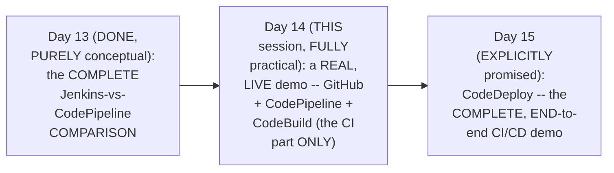

#### 🎯 Key Takeaways

* This is GENUINELY the SERIES' own **FIRST, real, LIVE, fully PRACTICAL** session — EXPLICITLY, DIRECTLY confirmed as a "STEP-by-step TUTORIAL."
* TODAY's scope is EXPLICITLY, PRECISELY confirmed: **GitHub + CodePipeline + CodeBuild**, implementing ONLY the **CI** part — CONSISTENT with Day 12's OWN, established REASONING for USING GitHub over CODECOMMIT.
* The **CD** part (via CODEDEPLOY) is EXPLICITLY deferred TO tomorrow's SESSION — COMPLETING the FULL, end-to-END pipeline.

---

### 2. The Complete Project Setup: A Real Flask App & Dockerfile

#### 🪜 Step-by-Step — A Complete, Real Repository & Application

> 💡 **Given directly:** *"For the purpose of [this] video, first of all, I have created this GitHub repository... AWS DevOps Zero to Hero... there will be a folder with today's name, that is Day 14, and inside which I have a simple Python application — this is a Flask-based Python application, and there is a README which explains everything."*

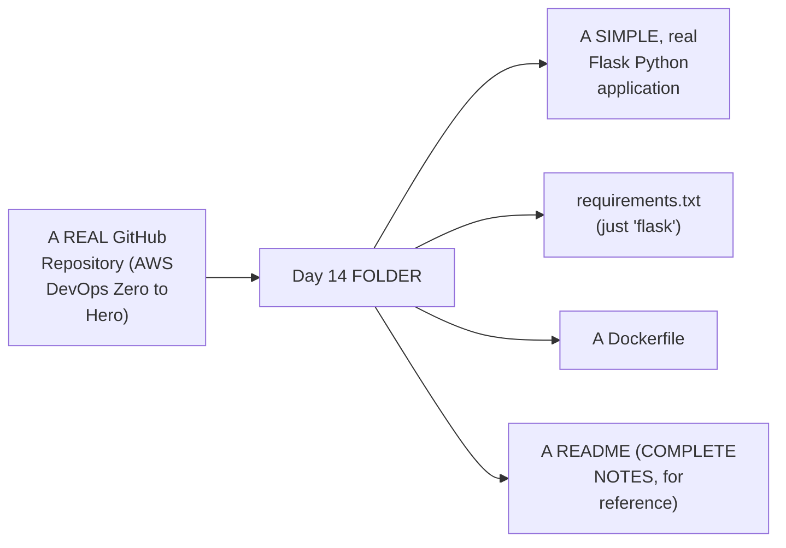

#### 🪜 Step-by-Step — A Complete, Real Dockerfile Walkthrough

> 💡 **Given directly:** *"I have written a Python-related Dockerfile as well... I am using a Python-based image, I have created a workspace, I'm copying the requirements.txt into this one... and finally I am copying the Flask-related source code, exposing the required port, and in the command — that is the Docker command — I am just starting the Flask application."*

```dockerfile
FROM python:3.11
WORKDIR /workspace
COPY requirements.txt .
RUN pip install -r requirements.txt
COPY . .
EXPOSE 5000
CMD ["python", "app.py"]
```

#### ⚠ Common Mistakes

* Assuming a REAL, working CI/CD DEMONSTRATION genuinely REQUIRES a COMPLEX, real-world APPLICATION — explicitly, directly, PRACTICALLY demonstrated as GENUINELY, DELIBERATELY unnecessary: "EVEN if it is a COMPLICATED application, the STEPS will not CHANGE" — a SIMPLE, "hello WORLD"-style Flask APP is GENUINELY sufficient TO teach the COMPLETE workflow.

#### 🎯 Key Takeaways

* THE complete, real PROJECT setup — a REAL GitHub repository, CONTAINING a SIMPLE Flask PYTHON app, `requirements.txt`, a DOCKERFILE, and a REFERENCE README — SERVES as the ENTIRE demonstration's OWN, real FOUNDATION.
* A COMPLETE, real DOCKERFILE walkthrough directly, CONCRETELY confirmed a STANDARD, straightforward PATTERN — PYTHON base IMAGE, copy REQUIREMENTS, install DEPENDENCIES, copy SOURCE, expose a PORT, and RUN the application.
* THE instructor **directly, EXPLICITLY confirms** APPLICATION complexity is GENUINELY IRRELEVANT to THIS session's own, CORE teaching GOAL — the CI/CD WORKFLOW steps REMAIN identical, REGARDLESS of the APPLICATION's own, real COMPLEXITY.

---
### 3. The Plan: Build First, Then Orchestrate

#### 🪜 Step-by-Step — A Direct, Explicit Confirmation of the Session's Own, Chosen Order

> 💡 **Given directly:** *"As part of this implementation, what we will do is, firstly, we will write the AWS CodeBuild — you can start from here as well, but we have already created the GitHub repository with all the code... let's start with the CodeBuilder, because if you start with the code build, you will first be able to build your project with all the steps... then what you can do, basically, is we will go with creating the pipeline, which is basically an orchestrator."*

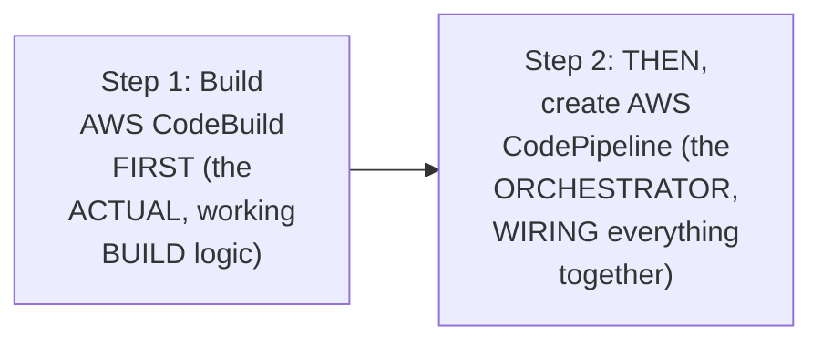

#### ⚠ Common Mistakes

* Assuming AWS CodePipeline MUST genuinely, ALWAYS be CREATED first, BEFORE CodeBuild — explicitly, directly, CLARIFIED as GENUINELY, PRACTICALLY optional ORDERING: "YOU can start FROM here AS well" — but BUILDING CodeBuild FIRST allows YOU to VERIFY the ACTUAL build LOGIC works, BEFORE wiring it INTO an orchestrator.

#### 🎯 Key Takeaways

* THE session's own, DELIBERATE ORDER: build **AWS CodeBuild** FIRST (VERIFYING the ACTUAL, real build LOGIC works), THEN create **AWS CodePipeline** (the ORCHESTRATOR, WIRING everything TOGETHER).
* This ORDER is directly, HONESTLY confirmed AS a DELIBERATE, PRACTICAL choice, NOT a STRICT requirement — BUILDING and VERIFYING the CORE logic FIRST is GENUINELY, PRACTICALLY easier TO debug.
* This directly, PRECISELY sets UP the SESSION's own, COMPLETE, first MAJOR practical STEP — CREATING the AWS CodeBuild PROJECT (Section 4).

---

### 4. A Complete, Real, Live Demo: Creating an AWS CodeBuild Project

#### 🪜 Step-by-Step — A Complete, Real, Initial Setup Walkthrough

> 💡 **Given directly:** *"Firstly, let's start with 'create build project'... provide the name of the project... provide description, in organization you will provide the name of your project."*

#### 🪜 Step-by-Step — Configuring the Source Provider

> 💡 **Given directly:** *"What is the CodeCommit repository that you want to use? In our case, we want to use GitHub — these are the supported ones, it supports GitHub, Bitbucket, GitHub Enterprise, AWS CodeCommit, and S3 buckets. If you want to use any other version control systems, let's say GitLab... what you need to do is you need to basically create mirroring of that version control system onto any of these platforms."*

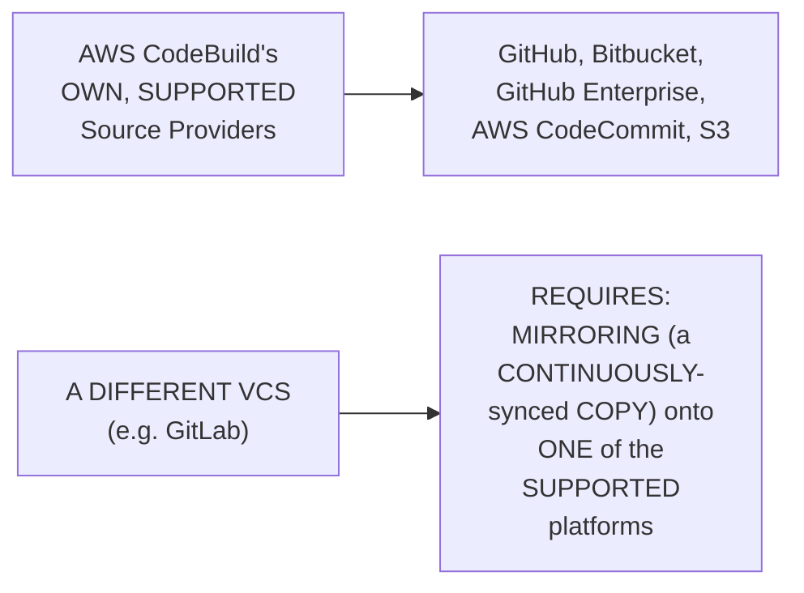

#### 🪜 Step-by-Step — A Complete, Real, Live GitHub Connection Walkthrough

> 💡 **Given directly:** *"If you are not connected, it will look like this — where it will ask you 'connect with OAuth' or 'connect with GitHub personal access token'... select connect with OAuth, click on connect to GitHub, and then you will see a pop-up... you need to firstly select your GitHub account, and then you need to click on the confirm button."*

#### 📖 Definition — The Build Environment, Precisely Explained (& Compared to Jenkins)

> 💡 **Given directly:** *"The environment that we are looking for would be a virtual machine image or a Docker image — AWS offers a preset of these managed images... let me use Ubuntu... when you are using Jenkins, what you usually do is you create worker nodes, and on top of the worker nodes you install some operating system... in the same way, when you are using AWS CodePipeline, you will use AWS CodeBuild as a build service, and within AWS CodeBuild, because it is a managed service, AWS will provide you ready-made images."*

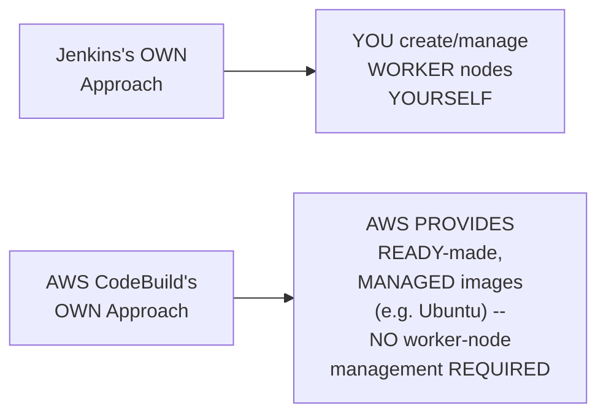

#### 📖 Definition — The Service Role, Precisely Explained (& Connected Back to Day 2)

> 💡 **Given directly:** *"Do you want to create a new service role, or do you want to use an existing service role? ... if you go back to the AWS Day 2 course that I have taught you, I told you that there will be IAM users and there will be IAM roles... for me to log into this AWS account, I either need root account, or I either need AWS IAM user... whereas AWS CodeBuild is a service, but it's not a user — now for AWS, this specific CodeBuild to perform actions on AWS, it will need a service role, or an IAM role."*

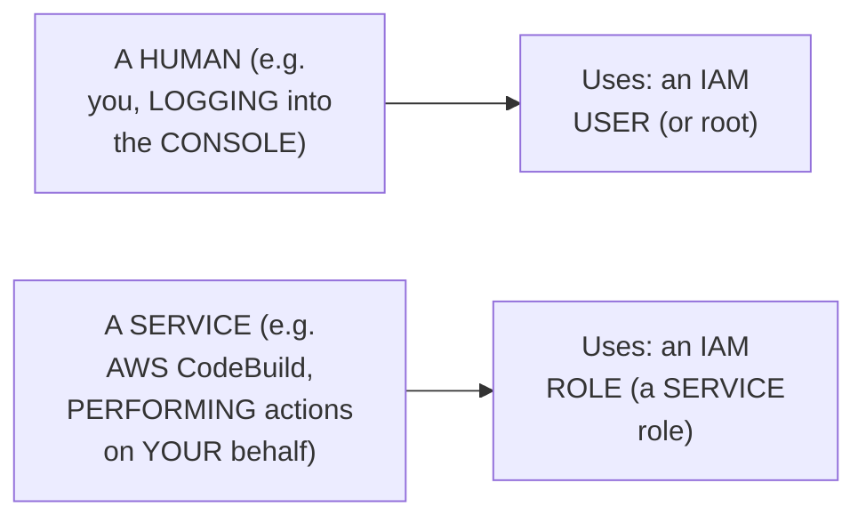

#### ⚠ Common Mistakes

* Assuming AWS CODEBUILD, AS a service, would GENUINELY, DIRECTLY use an IAM **USER** (LIKE a human LOGGING in) — explicitly, directly, PRECISELY corrected: SERVICES genuinely, STRUCTURALLY require an IAM **ROLE** — DIRECTLY connecting BACK to Day 2's own, ESTABLISHED user-versus-role DISTINCTION.
* Assuming a NEWLY-created SERVICE role WILL, genuinely, ALWAYS have SUFFICIENT permissions FROM the start — explicitly, directly, HONESTLY foreshadowed: "RIGHT now this IAM role WILL not have MUCH access" — ADDITIONAL permissions (LIKE Systems MANAGER access) will GENUINELY, DIRECTLY need to be GRANTED later.

#### 🎯 Key Takeaways

* A COMPLETE, real, LIVE demonstration directly, CONCRETELY confirmed the FULL CodeBuild-PROJECT creation WORKFLOW — NAMING, source PROVIDER selection (GitHub, VIA OAuth), and BUILD-environment configuration (UBUNTU, standard RUNTIME).
* AWS's OWN, managed BUILD environment directly, CONCRETELY CONTRASTS with Jenkins's own, SELF-managed WORKER-node approach — AWS PROVIDES ready-MADE, managed IMAGES, REQUIRING no worker-NODE setup.
* THE **SERVICE role** requirement directly, PRECISELY connects BACK to Day 2's own, ESTABLISHED IAM users-VERSUS-roles distinction — SERVICES (LIKE CodeBuild) GENUINELY, STRUCTURALLY require an IAM **role**, NOT a user.

---
### 5. Writing the buildspec.yaml, Live: The Install & Pre-Build Phases

#### 📖 Definition — buildspec.yaml, Precisely Introduced

> 💡 **Given directly:** *"The build specifications file — you can consider it as [the] same as something that you write in GitHub Actions, or something that you write in Jenkins pipelines... AWS is technically telling you what all the options that are available, it has commented out all the options, and whichever you want to use, you can simply uncomment."*

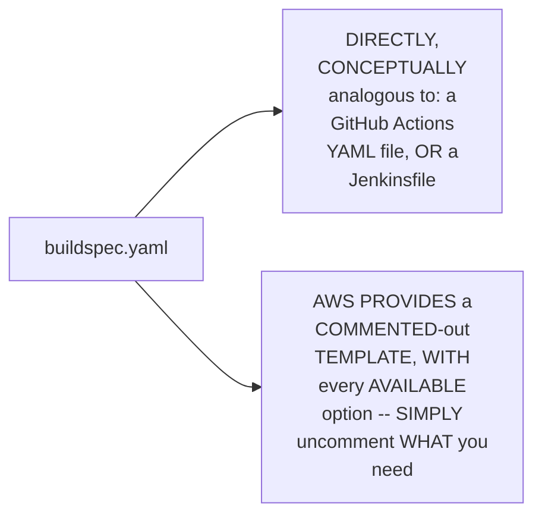

#### 🪜 Step-by-Step — The Install Phase, Live

> 💡 **Given directly:** *"Firstly, uncomment the install — what do you want to do in the install? You want to select what kind of runtime you need, right? What is the first step, what is the runtime that you require? In my case, the runtime is Python — so what I'll do is I will add Python here, so just select the name as Python, version as 3.11, and uncomment this one."*

```yaml
phases:
  install:
    runtime-versions:
      python: 3.11
```

#### 🪜 Step-by-Step — The Pre-Build Phase, Live (& a Genuine, Live Path Error)

> 💡 **Given directly:** *"Do you have any pre-build actions? ... even before building my application, I have to install Flask on the virtual machine, or I have to install Flask on the image where I am building this application — so this will be my pre-build stage, where I'll uncomment this one, and let me say here 'pip install -r requirements.txt.'"*

```yaml
  pre_build:
    commands:
      - pip install -r requirements.txt
```

#### ⚠ A Direct, Honest, Live-Encountered Path Clarification

> 💡 **Given directly:** *"One thing is, in my case, I did not put this source code at the root level... if you see here, I put the requirements.txt inside this folder, and inside the sample Python app — so I have to provide the absolute path, that is Day 14, inside the Day 14 I have another folder called sample Python app, and inside that I have this requirements.txt."*

```yaml
  pre_build:
    commands:
      - cd day-14/sample-python-app
      - pip install -r requirements.txt
```

#### ⚠ Common Mistakes

* Assuming a `PIP install` command GENUINELY, ALWAYS works FROM the REPOSITORY's own, root DIRECTORY, REGARDLESS of WHERE `requirements.txt` GENUINELY lives — explicitly, directly, LIVE-demonstrated as REQUIRING the CORRECT, ABSOLUTE path — a REAL, common SOURCE of error (DIRECTLY foreshadowing Section 9's OWN, live-encountered PATH-typo error).

#### 🎯 Key Takeaways

* THE `buildspec.YAML` file is directly, CONCEPTUALLY analogous TO a GitHub ACTIONS workflow OR a JENKINSFILE — AWS PROVIDES a COMMENTED-out TEMPLATE, requiring ONLY uncommenting the RELEVANT sections.
* THE **install PHASE** specifies the REQUIRED runtime (PYTHON 3.11, in THIS case) — a REQUIRED, foundational STEP before ANY, further build ACTIONS.
* THE **pre-BUILD phase** installs DEPENDENCIES (`pip INSTALL -r requirements.txt`) — REQUIRING the CORRECT, absolute PATH to the application's OWN, real folder STRUCTURE — a GENUINE, real SOURCE of potential ERROR.

---

### 6. Writing the buildspec.yaml, Live: The Build & Post-Build Phases (Deliberately Incomplete)

#### 🪜 Step-by-Step — The Build Phase, Live

> 💡 **Given directly:** *"Firstly, let's run the build stage, Docker image stage, and Docker push stage... firstly, what I'll do is to switch the directory... then let's add an echo statement saying 'building Docker image'... then the next command, in my case, would be to run the Docker-related commands."*

```yaml
  build:
    commands:
      - cd day-14/sample-python-app
      - echo "building Docker image"
      - docker build -t ...   # DELIBERATELY incomplete
      - docker push ...        # DELIBERATELY incomplete
```

#### ⚠ A Direct, Honest, Deliberate Design Choice

> 💡 **Given directly:** *"For the image tag, and for the Docker username and all, you need to keep them sensitively — you should not directly update them here, but we will use the AWS Systems Manager and store our credentials... let me not put the username and password for now, and let me say this is the Docker build command, and then you have one more command for Docker push — so these commands are right now incomplete, and I intentionally did not complete them, because I want to show you the AWS Systems Manager."*

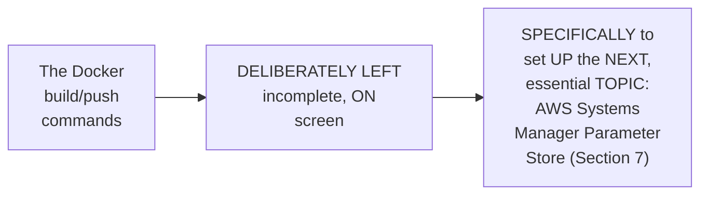

#### 🪜 Step-by-Step — The Post-Build Phase, Live (Simplified for This Session)

> 💡 **Given directly:** *"Do you have any post-build actions? Right now, post-build actions can be — because we are not implementing the continuous delivery, we are only doing continuous integration in this video — so I'll just add an echo statement, so I'll just add a print statement saying, 'inside the commands,' I'll just say echo build is successful."*

```yaml
  post_build:
    commands:
      - echo "build is successful"
```

#### ⚠ Common Mistakes

* Assuming the BUILD phase's OWN, initially-INCOMPLETE Docker COMMANDS represent a GENUINE, real MISTAKE — explicitly, directly, HONESTLY clarified: THIS was a **DELIBERATE, intentional DESIGN choice** — SPECIFICALLY to MOTIVATE the NEXT, essential TOPIC (secure CREDENTIAL management).
* Assuming THE post-build PHASE should GENUINELY, DIRECTLY include COMPLEX, deployment-RELATED logic AT this stage — explicitly, directly, PRECISELY clarified: "BECAUSE we are NOT implementing the CONTINUOUS delivery" — a SIMPLE echo STATEMENT is GENUINELY, DELIBERATELY sufficient FOR this session's own, CI-only scope.

#### 🎯 Key Takeaways

* THE **build PHASE** directly, CONCRETELY sets UP the DOCKER build/push COMMANDS — but the instructor **DELIBERATELY, intentionally LEAVES them incomplete**, SPECIFICALLY to MOTIVATE the NEXT topic — SECURE credential MANAGEMENT.
* THE **post-BUILD phase** is DELIBERATELY kept SIMPLE (a SINGLE echo STATEMENT) — SINCE THIS session's own SCOPE is EXPLICITLY, DIRECTLY limited TO continuous INTEGRATION only.
* This directly, PRECISELY sets UP the SESSION's own, ESSENTIAL secrets-MANAGEMENT demonstration — AWS SYSTEMS Manager Parameter STORE (Section 7).

---
### 7. AWS Systems Manager Parameter Store: A Complete, Real Secrets-Management Demo

#### ❓ Why It Exists — A Genuine, Direct Motivation

> 💡 **Given directly:** *"If you put the password and username directly here, what will happen? Anyone who opens this file, they can see your username and password, and they can use your username and password, which is compromising the security... similarly for AWS, you have something called AWS Systems Manager."*

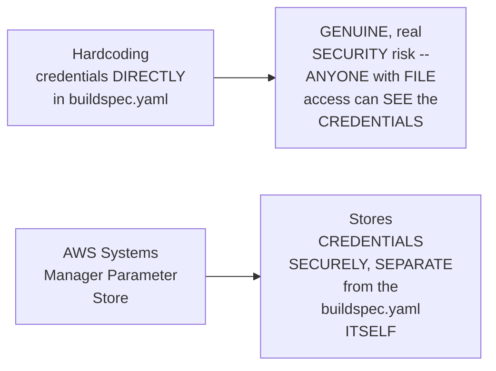

#### 🔍 Internal Working — A Genuine, Direct Comparison to Other, Familiar Tools

> 💡 **Given directly:** *"When we use Jenkins, we store them in the Jenkins credentials store; when we use a GitHub, we store them in the GitHub CI/CD secrets; or we use some external tools like HashiCorp Vault."*

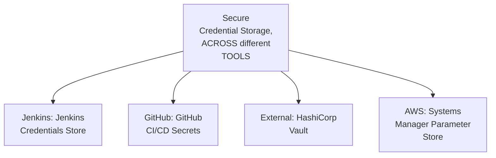

#### 📖 Definition — A Genuine, Real, Recommended Naming Convention

> 💡 **Given directly:** *"The reason why I followed this format is it will be very easy to understand for which application that I have created, and what kind of credentials is this, and what is the username... in real-time organization, you will create a lot of secrets, and sometimes you will forget which secret is for what... so it is important to follow a standard."*

```text
Recommended Naming Convention: [app-name]-[credential-type]-[field]
  Example: my-app-docker-credentials-username
           my-app-docker-credentials-password
           my-app-docker-registry-url
```

#### 🪜 Step-by-Step — A Complete, Real, Live Parameter-Creation Walkthrough

> 💡 **Given directly:** *"Click on create parameter... provide a description for better understanding later... use standard, and select 'secure string' — you should select secure string only — and here, use the default encryption... and here you can put the value."*

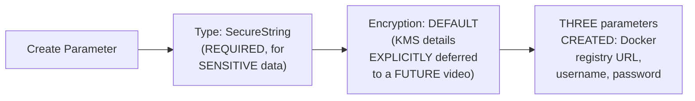

#### ⚠ Common Mistakes

* Assuming ANY parameter TYPE (e.g., a REGULAR "String") is GENUINELY, SAFELY sufficient FOR sensitive CREDENTIALS — explicitly, directly, REPEATEDLY emphasized: "YOU should select SECURE string ONLY."
* Assuming PARAMETER-store NAMING is GENUINELY, MERELY a cosmetic PREFERENCE — explicitly, directly, HONESTLY connected TO real, ORGANIZATIONAL scale — "WHEN you have HUNDREDS of services... it is IMPORTANT to follow a STANDARD."

#### 🎯 Key Takeaways

* **AWS Systems MANAGER Parameter Store** GENUINELY, DIRECTLY solves the SAME, real PROBLEM other TOOLS address DIFFERENTLY — JENKINS Credentials STORE, GitHub CI/CD SECRETS, or HashiCorp VAULT.
* A GENUINE, real NAMING convention (`[APP-name]-[credential-TYPE]-[field]`) is directly, PRACTICALLY recommended — ESPECIALLY valuable AT real, ORGANIZATIONAL scale, WHERE hundreds OF secrets could GENUINELY become CONFUSING.
* THREE, real PARAMETERS were directly, CONCRETELY created — Docker REGISTRY URL, username, AND password — EACH using the **"SecureString"** TYPE, WITH default ENCRYPTION (KMS details EXPLICITLY deferred TO a future SESSION).

---

### 8. Wiring Parameters Into the buildspec: Completing the Docker Commands

#### 🪜 Step-by-Step — A Complete, Real, Live Environment-Variable Wiring

> 💡 **Given directly:** *"Let me uncomment environment, let me uncomment parameter store, because I stored the username and passwords in the parameter store — now the key will be docker_registry_username, another key will be docker_registry_password, and then finally the last one that I have is for Docker registry URL."*

```yaml
env:
  parameter-store:
    DOCKER_REGISTRY_USERNAME: my-app-docker-credentials-username
    DOCKER_REGISTRY_PASSWORD: my-app-docker-credentials-password
    DOCKER_REGISTRY_URL: my-app-docker-registry-url
```

#### 🪜 Step-by-Step — A Complete, Real, Live-Completed Docker Build Command

> 💡 **Given directly:** *"Instead of putting these things like this, instead of exposing your registry, exposing your username, what I have done is I am replacing it with the environment variables that we have just copied from parameter store... Docker registry URL, Docker registry username, simple Python flask application, and the tag."*

```yaml
  build:
    commands:
      - cd day-14/sample-python-app
      - echo "building Docker image"
      - docker build -t $DOCKER_REGISTRY_URL/$DOCKER_REGISTRY_USERNAME/sample-python-flask-app:latest .
      - docker push $DOCKER_REGISTRY_URL/$DOCKER_REGISTRY_USERNAME/sample-python-flask-app:latest
```

#### ⚠ Common Mistakes

* Assuming ENVIRONMENT variables, ONCE referenced FROM Parameter STORE, are GENUINELY, AUTOMATICALLY sufficient TO authenticate WITH the Docker REGISTRY — explicitly, directly, LATER revealed (Section 9) as GENUINELY, PRACTICALLY incomplete — a SEPARATE `docker LOGIN` command is STILL, genuinely REQUIRED.

#### 🎯 Key Takeaways

* THE buildspec's OWN `env.PARAMETER-store` section directly, PRACTICALLY maps EACH, real Parameter-STORE key TO a USABLE, in-BUILD environment VARIABLE.
* THE `docker BUILD`/`docker PUSH` commands are directly, CONCRETELY completed — USING the WIRED environment VARIABLES, RATHER than any HARDCODED, plain-TEXT credentials.
* This directly, PRECISELY sets UP the SESSION's own, MOST substantial, HONEST section — a REAL, live DEBUGGING sequence (SECTION 9) — WHERE this SEEMINGLY-complete configuration STILL, genuinely ENCOUNTERS multiple, REAL errors.

---
### 9. A Genuinely Honest, Live Debugging Sequence: Five Real Errors, Five Real Fixes

#### ⚠ Error 1: SSM (Systems Manager) Access Denied

> 💡 **Given directly:** *"You will notice that there will be an error — the first error that you will see will be with respect to the Docker credentials... you did not grant this AWS CodeBuild access to the Systems Manager... because this is an IAM service, we will go to IAM roles and grant the permissions... attach policies, search for SSM, which stands for Systems Manager, and grant SSM full access."*

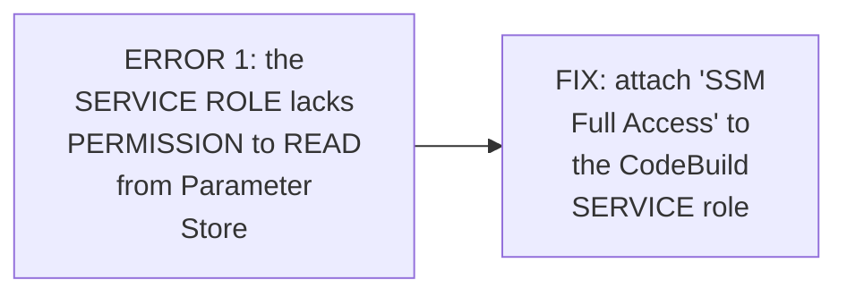

#### ⚠ Error 2: A Path Typo ("Sample" vs. "Simple")

> 💡 **Given directly:** *"We are left with only one error, that is: it is saying there is no such file or directory, requirements.txt... we have provided the path slightly wrong — day 14, instead of simple python app, I set it as sample python app, right... this is how you need to look into the errors and fix it."*

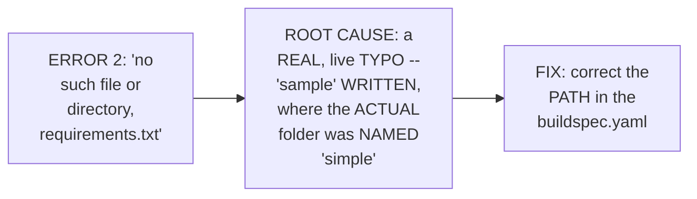

#### ⚠ Error 3: A Missing Trailing Dot in `docker build`

> 💡 **Given directly:** *"Docker image creation will fail... 'Docker build requires exactly one argument, build an image with Docker file'... what did I do here? I said 'Docker build -t' everything, but I forgot to add the dot here — without dot, it does not understand which Docker file to build."*

```bash
# INCORRECT (missing the trailing context path):
docker build -t $DOCKER_REGISTRY_URL/.../sample-python-flask-app:latest

# CORRECT:
docker build -t $DOCKER_REGISTRY_URL/.../sample-python-flask-app:latest .
```

#### ⚠ Error 4: "Cannot Connect to the Docker Daemon" (Privileged Mode)

> 💡 **Given directly:** *"Why did you run into this error? Because by default, AWS CodeBuild does not allow you to create Docker images on the build systems that it provides. All that you need to do is click on this 'override image' option, and if you scroll down, you have a button called 'privileged' — just enable this one."*

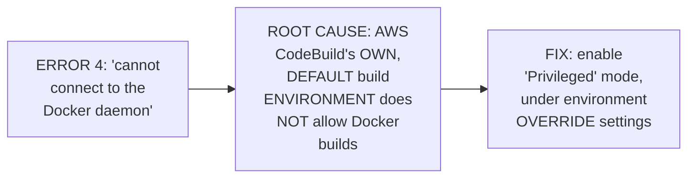

#### ⚠ Error 5: "Requested Access to the Resource Is Denied" (Missing docker login)

> 💡 **Given directly:** *"We forgot one important command here, which I had to add — that is, when we go to the build details, we forgot to add the credentials itself — we copied the credentials from parameter store here, but where did we actually authenticate? That means we missed the docker login command."*

```bash
echo $DOCKER_REGISTRY_PASSWORD | docker login -u $DOCKER_REGISTRY_USERNAME $DOCKER_REGISTRY_URL --password-stdin
```

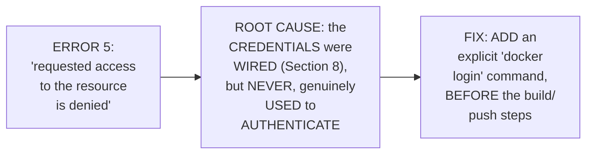

#### ⚠ Common Mistakes

* Assuming a REAL, working CI PIPELINE is GENUINELY, TYPICALLY built WITHOUT any GENUINE, real TRIAL-and-error — explicitly, directly, HONESTLY demonstrated as the OPPOSITE — **FIVE, distinct, real ERRORS** were GENUINELY encountered, ONE by ONE, and EACH required its OWN, SPECIFIC diagnosis and FIX.
* Assuming WIRING credentials INTO environment VARIABLES (Section 8) is GENUINELY, AUTOMATICALLY sufficient FOR Docker AUTHENTICATION — explicitly, directly, LIVE-demonstrated as GENUINELY, PRACTICALLY incomplete — a SEPARATE, explicit `docker LOGIN` command REMAINS required.

#### 🎯 Key Takeaways

* A COMPLETE, GENUINELY honest, LIVE debugging SEQUENCE directly, CONCRETELY worked THROUGH **FIVE, distinct, real ERRORS**: (1) MISSING SSM permissions on the SERVICE role; (2) a REAL path TYPO ("sample" versus "SIMPLE"); (3) a MISSING trailing DOT in `docker BUILD`; (4) MISSING "privileged" mode (REQUIRED for Docker BUILDS within CodeBuild); and (5) a MISSING, explicit `docker LOGIN` command.
* EACH error was directly, HONESTLY diagnosed and FIXED, ON screen, UNEDITED — DIRECTLY teaching a REAL, transferable TROUBLESHOOTING workflow — READ the error MESSAGE carefully, IDENTIFY the ROOT cause, and APPLY a TARGETED fix.
* THIS sequence directly, CONCRETELY reinforces a GENUINE, IMPORTANT lesson: EVEN a SEEMINGLY complete, WELL-configured pipeline (WITH credentials PROPERLY wired) can STILL, genuinely ENCOUNTER multiple, DISTINCT, real issues — REQUIRING careful, SYSTEMATIC debugging.

---
### 10. A Genuine, Honest Reflection on the Value of Unedited, Live Errors

#### ⚠ A Direct, Honest, Meta-Level Acknowledgment

> 💡 **Given directly:** *"It's good to make errors, because if I make errors only then, you will understand that even I am doing it from scratch, okay, just kidding — but when I do these errors, it will also help you in debugging the issues and fixing the issues, so I don't want to edit this part of the video, and I'll upload as is, with errors that I am doing and how I am fixing these errors."*

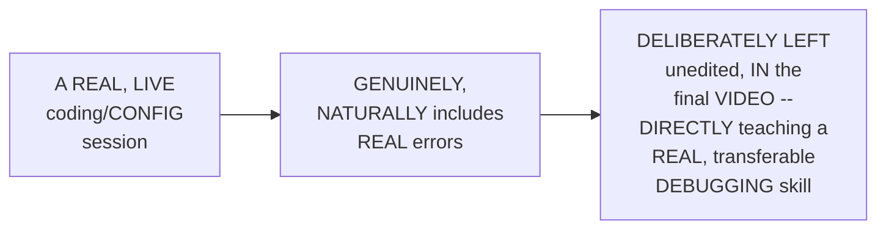

#### ⚠ Common Mistakes

* Assuming a PROFESSIONAL, EXPERIENCED devops ENGINEER would GENUINELY, TYPICALLY produce a PERFECT, error-FREE CI/CD configuration ON the FIRST attempt — explicitly, directly, HONESTLY disproven — EVEN THIS session's own, EXPERIENCED instructor GENUINELY encountered FIVE, distinct, real ERRORS.

#### 🎯 Key Takeaways

* THE instructor **directly, EXPLICITLY confirms** THIS session's own, LIVE errors WERE deliberately LEFT unedited — a GENUINE, CONSISTENT pedagogical CHOICE, DIRECTLY reinforcing THIS series' own, ESTABLISHED philosophy (SEEN across MULTIPLE, prior SESSIONS in this WORKSPACE).
* This directly, HONESTLY normalizes REAL, professional DEBUGGING work — EVEN EXPERIENCED practitioners GENUINELY, ROUTINELY encounter MULTIPLE, real ERRORS when BUILDING new CI/CD PIPELINES.
* This directly, PRECISELY sets UP the SESSION's own, FINAL, SUCCESSFUL verification (SECTION 11) — the GENUINE, earned PAYOFF after WORKING through ALL five, real ERRORS.

---

### 11. A Complete, Real, Live-Confirmed Success: Verifying the Pushed Docker Image

#### 🪜 Step-by-Step — A Complete, Real, Live Verification

> 💡 **Given directly:** *"When you see this success, you will realize that all your hard work is useful — right, all the hard work that you have put in building this pipeline is now successful, because the project is created, you have implemented the continuous integration using AWS CodeBuild. If you go to your Docker Hub now, just go to Docker Hub and go to your registry... you will notice that if you go to your username space, you will find a sample Python application."*

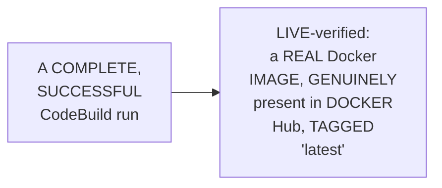

#### ⚠ Common Mistakes

* Assuming a "SUCCESS" message WITHIN the AWS CONSOLE alone is GENUINELY, SUFFICIENTLY convincing PROOF of a WORKING pipeline — explicitly, directly, PRACTICALLY demonstrated as GENUINELY, DIRECTLY cross-VERIFIED — CHECKING the ACTUAL, real DOCKER Hub registry CONFIRMS the image GENUINELY exists.

#### 🎯 Key Takeaways

* A COMPLETE, real, LIVE verification directly, CONCRETELY confirmed the ENTIRE CodeBuild WORKFLOW's own, GENUINE success — the PUSHED Docker IMAGE was DIRECTLY, VISIBLY confirmed WITHIN Docker HUB itself.
* This directly, PRACTICALLY demonstrates a GENUINE, IMPORTANT verification HABIT — CROSS-checking the ACTUAL, external SYSTEM (Docker HUB), rather THAN trusting a CONSOLE message ALONE.
* This directly, PRECISELY sets UP the SESSION's own, FINAL, essential STEP — WIRING this WORKING CodeBuild project INTO a COMPLETE, automated AWS CodePipeline (SECTION 12).

---
### 12. A Complete, Real, Live Demo: Creating the AWS CodePipeline

#### ❓ Why It Exists — A Genuine, Direct Motivation

> 💡 **Given directly:** *"The last step that is left is to integrate it with pipeline — why you will integrate it with pipeline? Because you don't want to do this manually, you want it to be invoked automatically, and that invocation will be done by AWS code pipeline whenever a code change is made to GitHub repository."*

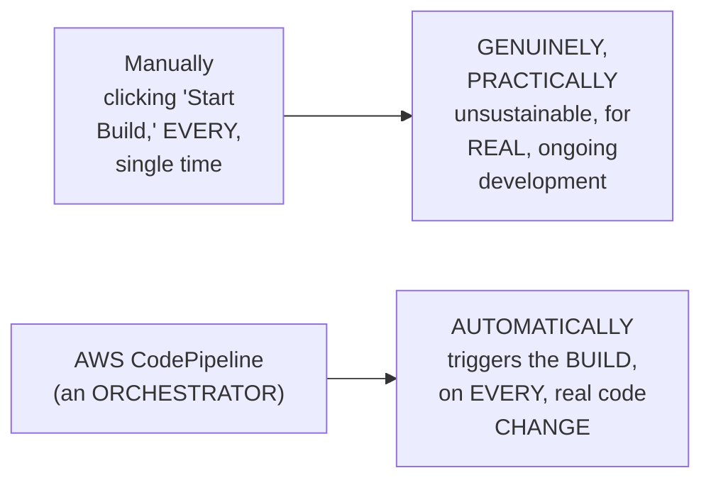

#### 🪜 Step-by-Step — A Complete, Real, Live Pipeline-Creation Walkthrough

> 💡 **Given directly:** *"In the code pipeline, create pipeline — name of the pipeline... Source provider, what is your source provider? Provide GitHub version 2... provide the repository name... provide the branch name main... build provider — of course, the code build project that we have just built... do you want single build or batch of builds? For now, let's select the single build... deployment provider — this will cover in the CD part, so that's why we can skip the deployment stage."*

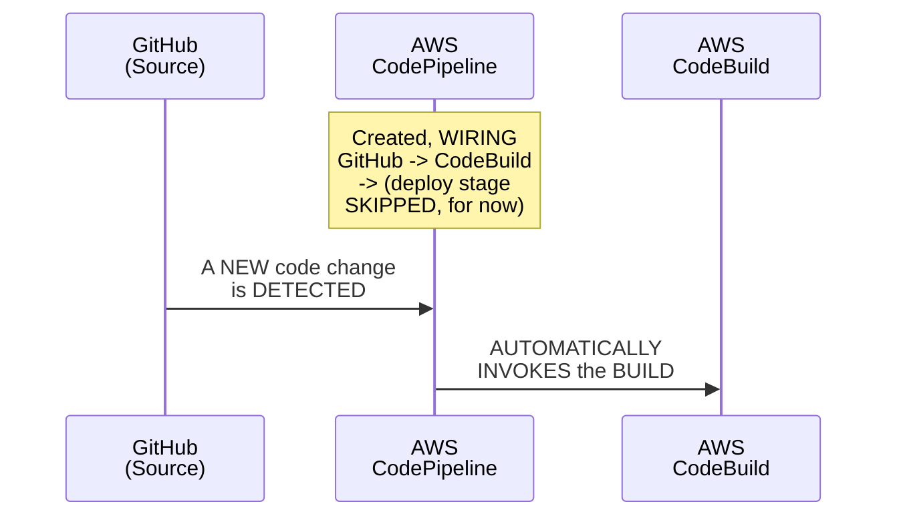

#### ⚠ Common Mistakes

* Assuming CREATING an AWS CODEPIPELINE genuinely, DIRECTLY requires CONFIGURING a "DEPLOY" stage FROM the START — explicitly, directly, PRECISELY clarified: THIS stage is EXPLICITLY, DELIBERATELY skipped IN this session — RESERVED for TOMORROW's own, COMPLETE CD demonstration.

#### 🎯 Key Takeaways

* THE genuine, real MOTIVATION for CREATING AWS CodePipeline: AVOIDING the NEED to MANUALLY trigger EVERY, single BUILD — the PIPELINE genuinely, AUTOMATICALLY invokes CodeBuild ON any, real code CHANGE.
* A COMPLETE, real, LIVE demonstration directly, CONCRETELY confirmed the FULL pipeline-CREATION workflow — CONNECTING GitHub (SOURCE), CodeBuild (BUILD), and EXPLICITLY skipping the DEPLOY stage (DEFERRED to tomorrow).
* This directly, PRECISELY sets UP the SESSION's own, FINAL, most CONVINCING demonstration — a REAL, live CODE change AUTOMATICALLY triggering the ENTIRE, integrated PIPELINE (Section 13).

---

### 13. The Complete, Real, End-to-End Verification: A Live Code Change Auto-Triggers the Pipeline

#### 🪜 Step-by-Step — A Complete, Real, Live, End-to-End Test

> 💡 **Given directly:** *"Let's do the final verification part, and let's submit a code change here — I can modify directly because this is my repository. Let me add a simple space here, commit change — see what did it say? Automatically, now this change to 'in progress'... now what is happening: the source is triggering the AWS code pipeline, that got done, now it is triggering the AWS code build."*

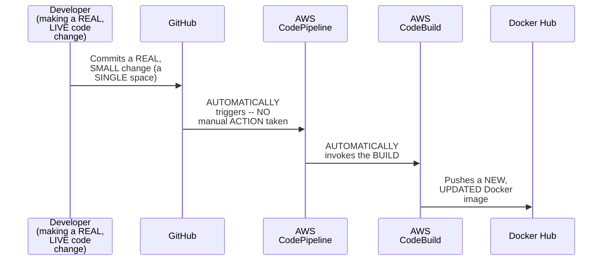

#### 🔍 Internal Working — A Genuine, Direct, Live-Confirmed Success

> 💡 **Given directly:** *"How is it going now? Perfect, it is successful, and let me refresh and see — done, pushed a few seconds ago. So here I conclude the demonstration of continuous integration."*

#### 🔍 Internal Working — A Genuine, Direct Confirmation of the Core Value Proposition

> 💡 **Given directly:** *"See the job is getting triggered automatically — that is the advantage of using AWS code pipeline, it acts as an orchestrator, it will automatically invoke the AWS code build or build service whenever there is a code change."*

#### ⚠ Common Mistakes

* Assuming THE genuine, real VALUE of AWS CODEPIPELINE is GENUINELY, MERELY theoretical — explicitly, directly, LIVE-demonstrated as CONCRETELY, DIRECTLY real — a SINGLE, tiny CODE change (ADDING one SPACE) genuinely, AUTOMATICALLY triggered the ENTIRE, complete PIPELINE, WITHOUT any manual INTERVENTION.

#### 🎯 Key Takeaways

* A COMPLETE, real, END-to-end VERIFICATION directly, CONCRETELY confirmed the ENTIRE, integrated SYSTEM's own, GENUINE success — a LIVE code CHANGE (adding a SINGLE space) directly, AUTOMATICALLY triggered CodePipeline, WHICH invoked CodeBuild, WHICH pushed a NEW, updated DOCKER image.
* This directly, CONCRETELY demonstrates the GENUINE, core VALUE proposition OF using an ORCHESTRATOR — "THE job is GETTING triggered AUTOMATICALLY" — NO manual INTERVENTION was GENUINELY required.
* This directly, PRECISELY completes THIS session's own, COMPLETE, END-to-end CI DEMONSTRATION — GitHub, CodePipeline, and CodeBuild, ALL genuinely, SUCCESSFULLY working TOGETHER.

---
### 14. Closing: CI Is Complete, CD Is Tomorrow

#### 🪜 Step-by-Step — A Direct, Honest, Complete Confirmation

> 💡 **Given directly:** *"So here I conclude the demonstration of continuous integration. I hope you enjoyed the video, it's an end-to-end project, and I will expect you to do this same thing from your end as well, so that you can learn about the AWS build services — so we have demonstrated AWS CodeCommit, or GitHub, with AWS CodePipeline, with AWS CodeBuild, so that way the continuous integration part is done."*

```mermaid
flowchart LR
    A["Day 14 (THIS<br/>session, DONE):<br/>a COMPLETE, real,<br/>working CI<br/>PIPELINE -- GitHub<br/>+ CodePipeline +<br/>CodeBuild"] --> B["Day 15<br/>(EXPLICITLY<br/>promised): ADDING<br/>CodeDeploy --<br/>COMPLETING the FULL,<br/>end-to-END CI/CD<br/>pipeline"]
```

#### ⚠ Common Mistakes

* Assuming THIS session's own, COMPLETE demonstration REPRESENTS a FULL, end-to-END CI/CD pipeline — explicitly, directly, HONESTLY clarified: it GENUINELY, DIRECTLY covers ONLY the **CI** part — the **CD** part (DEPLOYING the BUILT image SOMEWHERE, VIA CodeDeploy) REMAINS explicitly DEFERRED to TOMORROW.

#### 🎯 Key Takeaways

* This episode **GENUINELY, COMPREHENSIVELY delivers** its OWN, stated GOALS — a COMPLETE, real, END-to-end CI DEMONSTRATION, INCLUDING a GENUINELY honest, FIVE-error debugging SEQUENCE.
* A DIRECT, EXPLICIT encouragement is GIVEN: LEARNERS should REPRODUCE this SAME, complete DEMONSTRATION independently — DIRECTLY reinforcing THIS series' own, CONSISTENT hands-ON philosophy.
* **AWS CodeDeploy**, COMPLETING the FULL, end-to-END CI/CD pipeline, is directly, EXPLICITLY confirmed AS tomorrow's OWN, promised CONTINUATION.

---

## 📝 Glossary

| Term | Definition | Why It Matters |
|---|---|---|
| **buildspec.yaml** | AWS CodeBuild's own build-configuration file | Conceptually similar to GitHub Actions YAML or a Jenkinsfile |
| **Service Role (IAM)** | The IAM role a service (like CodeBuild) uses to act on your behalf | Required because CodeBuild is a service, not a user |
| **AWS Systems Manager Parameter Store** | AWS's own, secure credential storage service | Avoids hardcoding sensitive values in buildspec.yaml |
| **Privileged Mode (CodeBuild)** | A required environment override, for Docker builds | Not enabled by default; a common, real source of error |
| **docker login** | The command that authenticates to a Docker registry | Easy to forget, even after wiring credentials correctly |
| **Mirroring (Source Provider)** | Continuously syncing an unsupported VCS to a supported one | Required for using GitLab, etc. with CodeBuild |

---

## 🔄 Revision Notes — One-Minute Revision

* This is **Day 14**, the series' own FIRST, real, fully practical, live CI demonstration -- using GitHub + AWS CodePipeline + AWS CodeBuild (NOT CodeCommit). Today covers ONLY the CI part; CD (via CodeDeploy) is deferred to Day 15.
* **The project setup**: a real GitHub repository, containing a simple Flask Python app, requirements.txt, a Dockerfile (Python base image, copy requirements, install deps, copy source, expose port, run app), and a reference README.
* **The plan**: build AWS CodeBuild FIRST (verifying the actual build logic), THEN create AWS CodePipeline (the orchestrator, wiring everything together).
* **Creating the CodeBuild project**: source provider = GitHub (via OAuth); environment = Ubuntu (AWS provides ready-made images, unlike Jenkins's own, self-managed worker nodes); a SERVICE ROLE is required (not an IAM user), directly connecting back to Day 2's own established IAM users-vs-roles distinction.
* **Writing buildspec.yaml, live**: install phase (Python 3.11 runtime); pre-build phase (`pip install -r requirements.txt`, requiring the correct, absolute path); build phase (cd into the app folder, echo statement, Docker build/push commands -- DELIBERATELY left incomplete to motivate the next topic); post-build phase (a simple echo statement, since CD isn't covered today).
* **AWS Systems Manager Parameter Store**: avoids hardcoding Docker credentials directly in buildspec.yaml (compared directly to Jenkins Credentials Store, GitHub Secrets, HashiCorp Vault). A genuine, recommended naming convention: `[app-name]-[credential-type]-[field]`. Three parameters created (registry URL, username, password), all using "SecureString" type with default encryption.
* **Wiring parameters into the buildspec**: the `env.parameter-store` section maps each Parameter Store key to a usable, in-build environment variable, used within the Docker build/push commands.
* **A genuinely honest, live debugging sequence -- FIVE real errors, five real fixes**: (1) SSM access denied (fixed by granting "SSM Full Access" to the service role); (2) a real path typo, "sample" vs. "simple" (fixed by correcting the path); (3) a missing trailing dot in `docker build` (fixed by adding it); (4) "cannot connect to the Docker daemon" (fixed by enabling "Privileged" mode); (5) "requested access denied" (fixed by adding a missing, explicit `docker login` command).
* **A genuine, honest reflection**: these errors were deliberately left unedited in the final video, specifically because they teach real, transferable debugging skills.
* **Live-confirmed success**: the pushed Docker image was directly verified in Docker Hub, tagged "latest."
* **Creating AWS CodePipeline**: wires GitHub (source) to CodeBuild (build), explicitly skipping the deploy stage (deferred to Day 15).
* **The complete, end-to-end verification**: a real, live code change (adding a single space, directly in GitHub) automatically triggered CodePipeline, which invoked CodeBuild, which pushed a new, updated Docker image -- with NO manual intervention. This is the core, demonstrated value of using an orchestrator.
* **Closing**: this is a complete, working CI pipeline. CD (via CodeDeploy) is explicitly deferred to Day 15, completing the full, end-to-end CI/CD demonstration.

---

## 📋 Cheat Sheet

**The complete workflow:**
```text
1. Build AWS CodeBuild FIRST (verify the build logic works)
2. THEN create AWS CodePipeline (wire GitHub -> CodeBuild together)
```

**A complete, minimal buildspec.yaml (reconstructed):**
```yaml
version: 0.2
env:
  parameter-store:
    DOCKER_REGISTRY_USERNAME: my-app-docker-credentials-username
    DOCKER_REGISTRY_PASSWORD: my-app-docker-credentials-password
    DOCKER_REGISTRY_URL: my-app-docker-registry-url
phases:
  install:
    runtime-versions:
      python: 3.11
  pre_build:
    commands:
      - cd day-14/sample-python-app
      - pip install -r requirements.txt
  build:
    commands:
      - cd day-14/sample-python-app
      - echo "building Docker image"
      - echo $DOCKER_REGISTRY_PASSWORD | docker login -u $DOCKER_REGISTRY_USERNAME $DOCKER_REGISTRY_URL --password-stdin
      - docker build -t $DOCKER_REGISTRY_URL/$DOCKER_REGISTRY_USERNAME/sample-python-flask-app:latest .
      - docker push $DOCKER_REGISTRY_URL/$DOCKER_REGISTRY_USERNAME/sample-python-flask-app:latest
  post_build:
    commands:
      - echo "build is successful"
```

**The five, real errors & fixes:**
```text
1. SSM access denied          -> grant "SSM Full Access" to the service role
2. Path typo ("sample" vs.
   "simple")                  -> correct the path in buildspec.yaml
3. Missing trailing dot        -> add "." to `docker build -t ... .`
4. Cannot connect to Docker
   daemon                      -> enable "Privileged" mode (environment override)
5. Access denied (push)         -> add a missing `docker login` command
```

**Parameter Store naming convention:**
```text
[app-name]-[credential-type]-[field]
e.g., my-app-docker-credentials-username
```

---

## 🔥 Interview Questions & Answers

### 🟢 Beginner

**Q1.**

**Question:** Does this session use AWS CodeCommit or GitHub for the live demo?

**Answer:** GitHub.

**Explanation:** Directly, explicitly confirmed.

**Why Interviewers Ask This:** Tests attention to this session's own, stated, practical choice.

**Possible Follow-up:** "Why was this specific choice made?"

**Q2.**

**Question:** What is a buildspec.yaml file conceptually similar to?

**Answer:** A GitHub Actions workflow file, or a Jenkinsfile.

**Explanation:** Directly, precisely explained.

**Why Interviewers Ask This:** Basic, essential CodeBuild terminology.

**Possible Follow-up:** "What are the four main phases of a buildspec.yaml?"

**Q3.**

**Question:** Why does AWS CodeBuild require a service role, rather than an IAM user?

**Answer:** Because CodeBuild is a service, not a user -- services require IAM roles.

**Explanation:** Directly, precisely explained, connecting back to Day 2.

**Why Interviewers Ask This:** Tests genuine, foundational IAM understanding.

**Possible Follow-up:** "What permission did the service role initially lack, in this session's own demo?"

**Q4.**

**Question:** What AWS service was used to avoid hardcoding Docker credentials in the buildspec.yaml?

**Answer:** AWS Systems Manager Parameter Store.

**Explanation:** Directly, explicitly named.

**Why Interviewers Ask This:** Basic, practical, real-world CI/CD secrets management.

**Possible Follow-up:** "What parameter type should genuinely be used for sensitive credentials?"

**Q5.**

**Question:** Does AWS CodeBuild allow Docker builds by default?

**Answer:** No -- "Privileged" mode must be explicitly enabled.

**Explanation:** Directly, live-demonstrated.

**Why Interviewers Ask This:** Tests genuine, practical, hands-on CodeBuild knowledge.

**Possible Follow-up:** "What error message genuinely indicates this specific issue?"

**Q6.**

**Question:** Is wiring credentials into environment variables alone sufficient for Docker authentication?

**Answer:** No -- an explicit `docker login` command is still, genuinely required.

**Explanation:** Directly, live-demonstrated as a real, common oversight.

**Why Interviewers Ask This:** Tests genuine, practical debugging knowledge.

**Possible Follow-up:** "What error message genuinely results from missing this step?"

**Q7.**

**Question:** Why is AWS CodePipeline genuinely needed, if AWS CodeBuild can already build the application?

**Answer:** To avoid manually triggering every build -- CodePipeline automatically invokes CodeBuild on any code change.

**Explanation:** Directly, precisely explained.

**Why Interviewers Ask This:** Basic, essential orchestration knowledge.

**Possible Follow-up:** "What stage was explicitly skipped when creating the pipeline in this session?"

**Q8.**

**Question:** Does this session's own demo implement the complete CD (continuous delivery) process?

**Answer:** No -- only CI; CD is explicitly deferred to the next session.

**Explanation:** Directly, explicitly confirmed.

**Why Interviewers Ask This:** Tests attention to the session's own, stated scope.

**Possible Follow-up:** "What AWS service will implement CD, in the next session?"

**Q9.**

**Question:** How many distinct, real errors did this session's own live demo genuinely encounter?

**Answer:** Five.

**Explanation:** Directly, explicitly confirmed.

**Why Interviewers Ask This:** Tests attention to this session's own, honest, detailed debugging sequence.

**Possible Follow-up:** "Name at least two of these five errors."

**Q10.**

**Question:** What alternative version control systems could be used with AWS CodeBuild, beyond its own, directly-supported list?

**Answer:** Any system genuinely mirrored to a supported platform (GitHub, Bitbucket, GitHub Enterprise, CodeCommit, or S3).

**Explanation:** Directly, precisely explained.

**Why Interviewers Ask This:** Tests genuine, practical understanding of CodeBuild's own, real constraints.

**Possible Follow-up:** "What does 'mirroring' genuinely mean, in this context?"

---

### 🟡 Intermediate

**Q11.**

**Question:** Explain why the instructor deliberately leaves the Docker build/push commands incomplete at first, rather than writing the complete buildspec.yaml in one, continuous pass.

**Answer:** This is a genuinely deliberate, SEQUENCED teaching choice: by INTENTIONALLY leaving the DOCKER commands INCOMPLETE (Section 6), the instructor CREATES a GENUINE, felt NEED for the SUBSEQUENT, Parameter-STORE demonstration (Section 7) — RATHER than INTRODUCING secrets MANAGEMENT as an ABSTRACT, unmotivated ADD-on. This directly, PEDAGOGICALLY mirrors a PATTERN seen ELSEWHERE in THIS instructor's own, BROADER series (e.g., the PDF/PMF/CDF video's OWN "puzzle-first" APPROACH) — POSING an INCOMPLETE state FIRST makes the SUBSEQUENT, complete SOLUTION feel GENUINELY earned and MEMORABLE, rather than ARBITRARY.

**Explanation:** Requires recognizing the deliberate, sequenced value of leaving a configuration intentionally incomplete to motivate the subsequent, necessary topic.

**Why Interviewers Ask This:** Tests whether a learner recognizes the pedagogical value of motivated, problem-first sequencing over presenting a complete solution all at once.

**Possible Follow-up:** "Identify ANOTHER, genuine EXAMPLE, FROM this SAME session, WHERE a SIMILAR, 'incomplete-FIRST' teaching PATTERN is used."

**Q12.**

**Question:** A learner argues that since this session's own live demo encountered five, distinct errors, this proves AWS CodeBuild is genuinely poorly designed or overly complicated, compared to simpler CI tools. Evaluate this claim.

**Answer:** This claim MISATTRIBUTES the GENUINE, real SOURCE of these ERRORS. REVIEWING Section 9's own, PRECISE breakdown: ERROR 1 (SSM permissions) is a STANDARD, EXPECTED IAM-configuration STEP, common ACROSS any, cloud-NATIVE service; ERROR 2 (a PATH typo) is a GENUINE, human TYPING mistake, UNRELATED to CodeBuild's OWN design; ERROR 3 (a MISSING dot) is a STANDARD Docker CLI syntax REQUIREMENT, NOT specific TO CodeBuild; ERROR 4 (privileged MODE) is a DELIBERATE, GENUINE security DEFAULT (NOT allowing Docker BUILDS by default IS a REASONABLE, safety-CONSCIOUS choice); and ERROR 5 (missing DOCKER login) is a GENUINE, common OVERSIGHT when WORKING with ANY, credential-based AUTHENTICATION system. The ACCURATE, more PRECISE conclusion: THESE errors GENUINELY, DIRECTLY reflect NORMAL, real-WORLD CI/CD configuration WORK (HUMAN typos, STANDARD Docker SYNTAX, and REASONABLE security DEFAULTS) — NOT a GENUINE, structural FLAW unique TO AWS CodeBuild's OWN design.

**Explanation:** Tests whether a learner can correctly attribute each, specific error to its genuine, real cause, rather than over-generalizing a series of normal, real-world debugging steps into a claim about the tool's own, fundamental design quality.

**Why Interviewers Ask This:** Distinguishes candidates who can accurately diagnose the genuine source of each error from those who over-generalize a realistic debugging sequence into an unfounded critique of tool quality.

**Possible Follow-up:** "WOULD a SIMPLER CI tool (e.g. GitHub ACTIONS) GENUINELY, DIRECTLY avoid ALL five of THESE specific ERRORS? Explain your REASONING FOR each."

**Q13.**

**Question:** Explain, precisely, why the instructor deliberately verifies the pushed Docker image directly in Docker Hub (Section 11), rather than relying solely on the "success" message shown within the AWS CodeBuild console.

**Answer:** This is a genuinely deliberate, EXTERNAL-verification teaching choice, DIRECTLY consistent with a PATTERN seen ACROSS this instructor's OWN, broader series (e.g., Day 9's OWN, direct cross-VERIFICATION of a CLI-created EC2 instance AGAINST the AWS console'S own UI). By DIRECTLY, LIVE checking the ACTUAL, external SYSTEM (Docker HUB) — RATHER than trusting the AWS CONSOLE's own, internal "SUCCESS" message ALONE — the instructor MODELS a GENUINE, important PROFESSIONAL habit: TRUE verification MEANS confirming the REAL, intended OUTCOME (a WORKING, pushed image) actually OCCURRED, NOT merely TRUSTING that a PROCESS reported "success."

**Explanation:** Requires recognizing the deliberate, professional value of external, cross-system verification, rather than trusting an internal "success" message alone.

**Why Interviewers Ask This:** Tests whether a learner recognizes the practical, professional importance of independent, external verification over trusting a single system's own, self-reported status.

**Possible Follow-up:** "Describe ANOTHER, genuine SITUATION (BEYOND this SESSION's own CONTENT) where TRUSTING a SINGLE system's own 'success' MESSAGE, WITHOUT external VERIFICATION, could GENUINELY, PRACTICALLY lead to a REAL, undetected PROBLEM."

**Q14.**

**Question:** Using this session's own precise "service role" reasoning (Section 4), explain a GENUINE, real risk of granting the CodeBuild service role "SSM Full Access" (as this session's own, live demo did), rather than a more narrowly-scoped permission set.

**Answer:** A precise, reasoned RISK analysis, directly extending Section 4's own established MECHANISM: per Section 4's own PRECISE reasoning, an IAM ROLE (LIKE the CodeBuild SERVICE role) GENUINELY, DIRECTLY grants the SERVICE permission to PERFORM specific ACTIONS on AWS. Per Section 7-9's own established, LIVE demonstration, "SSM Full ACCESS" was GRANTED SPECIFICALLY to RESOLVE Error 1 — but THIS is a GENUINELY, STRUCTURALLY broad PERMISSION, allowing the CODEBUILD service to READ **ANY** parameter STORED in Systems MANAGER, NOT just the THREE, specific Docker-RELATED parameters this PROJECT genuinely NEEDS. This directly, PRECISELY reveals a GENUINE, real RISK: IF the CodeBuild SERVICE role (OR its UNDERLYING credentials) were EVER genuinely COMPROMISED, an ATTACKER would GAIN access TO **EVERY** SecureString PARAMETER in the ACCOUNT — NOT just this PROJECT's own, SPECIFIC secrets — a REAL, "PRINCIPLE of least PRIVILEGE" violation. A MORE narrowly-SCOPED policy (GRANTING read access ONLY to THIS project's own, SPECIFIC parameter PATHS) would GENUINELY, DIRECTLY reduce this RISK.

**Explanation:** Requires extending the service-role mechanism to identify a genuine, real security risk of over-broad permissions, connecting to the principle of least privilege.

**Why Interviewers Ask This:** Tests whether a learner understands that a demo-appropriate, "full access" grant carries genuine, real security implications that a production environment should genuinely address more narrowly.

**Possible Follow-up:** "Design a MORE narrowly-SCOPED IAM policy STATEMENT that would GENUINELY, DIRECTLY grant access ONLY to THIS project's own, SPECIFIC three parameters, RATHER than 'SSM Full Access.'"

**Q15.**

**Question:** Synthesize this session's complete "build first, then orchestrate" reasoning (Section 3) with its own "five-error debugging sequence" reasoning (Section 9) to explain a GENUINE, structural reason why this specific, chosen order (CodeBuild before CodePipeline) genuinely made debugging easier than the reverse order would have.

**Answer:** A precise, synthesized explanation, directly connecting TWO, separately-established sections: per Section 3's own PRECISE, established REASONING, the instructor DELIBERATELY built AND VERIFIED CodeBuild FIRST, BEFORE wiring it INTO CodePipeline. Per Section 9's own PRECISE, established DEBUGGING sequence, ALL five, real ERRORS GENUINELY, DIRECTLY occurred WITHIN CodeBuild's own, ISOLATED "Start BUILD" testing PROCESS — NOT within a FULLY-integrated pipeline RUN. SYNTHESIZING these TWO facts directly, PRECISELY reveals a GENUINE, structural REASON: by ISOLATING CodeBuild FIRST, EACH error COULD be GENUINELY, DIRECTLY diagnosed and FIXED WITHOUT the ADDED complexity OF also troubleshooting CodePipeline's own, SEPARATE orchestration LOGIC simultaneously — HAD CodePipeline been BUILT first (WITH CodeBuild's own LOGIC still, genuinely BROKEN), EACH of THESE five errors WOULD have ALSO required DETERMINING whether the ISSUE was GENUINELY within CodeBuild ITSELF, or WITHIN CodePipeline's own INTEGRATION/invocation LOGIC — a GENUINELY, DIRECTLY more COMPLEX, harder-to-ISOLATE debugging PROCESS.

**Explanation:** Requires synthesizing the deliberate build-order choice with the specific location of all five, real errors to explain why this order genuinely simplified debugging, by isolating variables.

**Why Interviewers Ask This:** A senior-level question testing whether a candidate can identify the deep, structural, debugging-related benefit of a specific, deliberate build-order choice, connecting two, separately-taught sections.

**Possible Follow-up:** "Describe a GENUINE, real, SEPARATE scenario (BEYOND CI/CD) where THIS SAME, 'build and VERIFY the CORE component FIRST, BEFORE integrating it INTO a LARGER system' principle WOULD, similarly, GENUINELY simplify DEBUGGING."

---

### 🔴 Advanced

**Q16.**

**Question:** Design a complete, reasoned, production-hardening checklist (using ONLY this session's own established concepts) that a team should apply BEFORE promoting this session's own demo pipeline from a personal/demo environment into a genuine, production-grade CI system.

**Answer:** A reasonable, complete checklist, directly applying this session's OWN, exact established CONCEPTS:

```text
1. IAM Permissions (per Section 4 and Advanced Q14's own established
   reasoning): REPLACE the DEMO's own "SSM Full Access" grant with a
   NARROWLY-scoped IAM policy, GRANTING read access ONLY to this
   SPECIFIC project's own, REQUIRED parameter paths -- DIRECTLY
   applying the PRINCIPLE of least PRIVILEGE.

2. Root vs. IAM (per THIS series' own, REPEATEDLY established
   guidance, e.g. Day 12): CONFIRM the ENTIRE workflow is GENUINELY
   performed using a PROPERLY-configured IAM user (NOT the ROOT
   account, WHICH this session's own DEMO explicitly, HONESTLY
   acknowledged using, FOR demo purposes ONLY).

3. Concurrent Build Limits (per Section 4's own established, BRIEFLY-
   mentioned option): EXPLICITLY configure a REASONABLE concurrent-
   build LIMIT, RATHER than leaving it UNRESTRICTED (per THIS
   session's own, DEMO-appropriate CHOICE) -- PREVENTING a POTENTIAL
   cost/resource SPIKE from MANY, simultaneous code CHANGES.

4. Credential Rotation (per Section 7's own established Parameter-
   Store mechanism): ESTABLISH a REGULAR, documented PROCESS for
   ROTATING the STORED Docker credentials -- Section 7's own DEMO
   created them ONCE, but a PRODUCTION system GENUINELY needs
   ONGOING rotation.

5. ECR, Rather Than Docker Hub (per THIS session's own, HONEST
   acknowledgment): CONSIDER migrating FROM Docker Hub TO AWS's own
   Elastic Container REGISTRY (ECR) -- THIS session's own instructor
   EXPLICITLY noted ECR was SKIPPED only BECAUSE it HADN'T yet been
   COVERED in the SERIES, NOT because IT is genuinely LESS
   appropriate for PRODUCTION.

6. Complete the CD Stage (per Section 14's own established, EXPLICIT
   deferral): DO NOT consider THIS pipeline GENUINELY "production-
   ready" until the DEPLOY stage (CodeDeploy, EXPLICITLY promised for
   the NEXT session) is ALSO, genuinely integrated -- a CI-ONLY
   pipeline is GENUINELY incomplete for REAL, production use.
```

This complete CHECKLIST directly, precisely APPLIES this session's OWN, established CONCEPTS — IAM scoping, ROOT-vs-IAM guidance, CONCURRENT-build limits, CREDENTIAL rotation, and the CI-only SCOPE limitation — to a GENUINELY realistic, PRODUCTION-hardening SCENARIO.

**Explanation:** Requires synthesizing IAM security concerns, credential management, and this session's own, explicitly-acknowledged demo shortcuts into one complete, reasoned production-readiness checklist.

**Why Interviewers Ask This:** A comprehensive, capstone-level question testing whether a candidate can identify the gap between a working, demo-appropriate pipeline and a genuinely production-hardened one.

**Possible Follow-up:** "WHICH of THESE six, checklist ITEMS would you GENUINELY, PRACTICALLY prioritize FIRST, if your TEAM had LIMITED time BEFORE a REQUIRED production LAUNCH?"

**Q17.**

**Question:** Critically evaluate: "Since this session confirms that a single, tiny code change (adding one space) successfully, automatically triggered the entire pipeline end-to-end, this proves the pipeline is genuinely, fully production-ready, with no further work needed." Is this an accurate, complete characterization?

**Answer:** Not accurate — this OVERSTATES a GENUINE, SPECIFIC, successful TEST (one, SIMPLE change, triggering the PIPELINE correctly) into an UNCONDITIONAL claim OF "full production READINESS," which NEITHER this session's own CONTENT, nor sound REASONING, SUPPORTS. Section 14's own PRECISE, DIRECT confirmation EXPLICITLY states this ONLY completes the **CI** part — "the CONTINUOUS integration PART is done" — WITH the ENTIRE CD (continuous DELIVERY/deployment) portion EXPLICITLY, HONESTLY deferred TO the NEXT session. ADDITIONALLY, per Advanced Q16's own established REASONING, MULTIPLE, genuine PRODUCTION-hardening concerns (NARROWLY-scoped IAM PERMISSIONS, credential ROTATION, concurrent-BUILD limits) REMAIN, honestly, UNADDRESSED in THIS session's own, DELIBERATELY demo-scoped CONFIGURATION. The ACCURATE, more PRECISE conclusion: THIS successful, END-to-end TEST GENUINELY confirms the **CI mechanics** are CORRECTLY wired and WORKING — but it does NOT, genuinely, confirm FULL production READINESS, WHICH would GENUINELY, ADDITIONALLY require the COMPLETE CD stage PLUS the SECURITY/hardening considerations THIS session's own content EXPLICITLY or IMPLICITLY leaves OPEN.

**Explanation:** Tests whether a learner recognizes that a successful, end-to-end CI test confirms the mechanics work, but doesn't constitute full production readiness, given the session's own, explicit acknowledgment of remaining CD work and demo-appropriate shortcuts.

**Why Interviewers Ask This:** Distinguishes candidates who understand the genuine, remaining gap between "working demo" and "production-ready system" from those who conflate a successful test with complete readiness.

**Possible Follow-up:** "BEYOND completing the CD stage, name TWO, SPECIFIC, genuine PRODUCTION concerns (FROM Advanced Q16's own established CHECKLIST) that THIS session's own, successful END-to-end test does NOT, genuinely, ADDRESS."

---

## 🧪 Scenario-Based Interview Questions

> **Scenario 1:** A colleague's own CodeBuild project fails with "cannot connect to the Docker daemon," despite their buildspec.yaml appearing syntactically correct. Using this session's own concepts, diagnose the most likely cause.

**Structured Answer:**
1. **Initial investigation:** Recognize this as directly connected to Section 9's own precise "Error 4" reasoning — a GENUINELY, DIRECTLY common, WELL-documented CodeBuild issue.
2. **Relevant principle:** Per Section 9's own established REASONING, AWS CodeBuild does NOT, genuinely, ALLOW Docker builds BY default — "PRIVILEGED" mode MUST be EXPLICITLY enabled.
3. **Possible causes:** The COLLEAGUE's own PROJECT LIKELY, genuinely has NOT enabled the "PRIVILEGED" environment OVERRIDE setting.
4. **Debugging approach:** Directly NAVIGATE to the PROJECT's own "EDIT" -> "ENVIRONMENT" section (per Section 9's own established WORKFLOW), and CONFIRM whether "PRIVILEGED" mode is GENUINELY, CURRENTLY enabled.
5. **Resolution:** ENABLE the "PRIVILEGED" checkbox (per Section 9's own established FIX), then RE-run the build TO confirm resolution.
6. **Prevention:** Establish a standing team PRACTICE of DIRECTLY, PROACTIVELY enabling "PRIVILEGED" mode WHENEVER a CodeBuild PROJECT genuinely, DIRECTLY needs to PERFORM Docker builds — RATHER than DISCOVERING this REQUIREMENT reactively, VIA a live ERROR.

> **Scenario 2 (Advanced):** Your team's CodeBuild project successfully builds and pushes Docker images, but a security audit flags that the service role has "SSM Full Access," even though the project only genuinely needs to read three, specific parameters. Using this session's own concepts, construct a complete, reasoned response.

**Structured Answer:**
1. **Initial investigation:** Recognize this as directly connected to Advanced Q14's own precise, established "least privilege" risk analysis — a GENUINE, real, WELL-founded security CONCERN.
2. **Relevant principle:** Per Section 4's own established SERVICE-role mechanism, an IAM role's OWN permissions SHOULD, genuinely, be SCOPED to ONLY what the SERVICE actually, GENUINELY needs — NOT broad, "FULL access" grants, EVEN if THOSE were CONVENIENT for INITIAL, demo-stage SETUP.
3. **Possible risks:** Per Advanced Q14's own established REASONING, THIS overly-broad GRANT means a COMPROMISED CodeBuild role WOULD, genuinely, EXPOSE every, SINGLE SecureString parameter IN the account — NOT just THIS project's own, specific SECRETS.
4. **Debugging/evaluation approach:** Directly IDENTIFY the EXACT, three parameter PATHS this PROJECT genuinely, ACTUALLY reads FROM (per Section 7's own established PARAMETER-store setup).
5. **Resolution:** REPLACE "SSM Full ACCESS" with a NARROWLY-scoped, CUSTOM IAM policy — GRANTING `ssm:GetParameter` PERMISSION ONLY for THOSE three, SPECIFIC parameter paths — DIRECTLY applying the PRINCIPLE of least PRIVILEGE (per Advanced Q14's own established REASONING).
6. **Prevention:** Establish a standing team PRACTICE of ALWAYS scoping IAM SERVICE-role permissions NARROWLY, EVEN during INITIAL, demo-stage SETUP — TREATING "full ACCESS" grants as GENUINELY, TEMPORARY, demo-ONLY conveniences, REQUIRING explicit, DOCUMENTED narrowing BEFORE any PRODUCTION promotion (per Advanced Q16's own established CHECKLIST).

---

## 🛠 Hands-on Exercises

### 🟢 Easy

1. Write out, from memory, the four phases of a complete buildspec.yaml file.
2. Explain, in your own words, why AWS CodeBuild requires a service role, rather than an IAM user.
3. List, from memory, all five of this session's own, real, live-encountered errors.

### 🟡 Medium

4. Reproduce this session's own exact CodeBuild project setup, using your own, simple application (Flask or otherwise).
5. Create your own, real AWS Systems Manager Parameter Store entries, following this session's own established naming convention.
6. Deliberately reproduce at least two of this session's own, five real errors, and correctly diagnose and fix them.

### 🔴 Advanced

7. Complete the full, reasoned production-hardening checklist proposed in Advanced Interview Q16, for your own, reproduced pipeline.
8. Implement the debugging scenario proposed in Scenario 2 -- design and apply a narrowly-scoped, custom IAM policy, replacing "SSM Full Access."
9. Research AWS ECR (Elastic Container Registry), and reproduce this session's own, complete demo using ECR instead of Docker Hub.

---

## 🏗 Practice Assignment

*(This session's own stated, direct encouragement, reproduced faithfully)*

> 💡 **The instructor's own words, given directly:** *"I will expect you to do this same thing from your end as well, so that you can learn about the AWS build services."*

### Build: "Complete, Reproduced End-to-End CI Pipeline"

**Objective:** Directly reproduce this session's own complete, real workflow, end to end, on your own AWS account.

**Requirements:**
- Create your own GitHub repository with a simple application and Dockerfile (reusing this session's own Flask example, or your own choice).
- Create a real AWS CodeBuild project, connected to your repository via OAuth.
- Write a complete buildspec.yaml, covering install, pre-build, build, and post-build phases.
- Create real AWS Systems Manager Parameter Store entries for your own Docker credentials, following the established naming convention.
- Successfully resolve any real errors you encounter (aim to encounter and fix at least one, genuinely, on your own).
- Create a real AWS CodePipeline, wiring your repository and CodeBuild project together.
- Make a real, live code change, and confirm the pipeline automatically triggers, producing a new, pushed Docker image.
- A written reflection (200-300 words) on which of this session's own, five errors you found most genuinely instructive, and why.

**Architecture (suggested):**

```text
aws_day14_codebuild_assignment/
├── project_setup_log.md               # your repo + Dockerfile setup
├── codebuild_project_log.md              # your CodeBuild project creation
├── buildspec.yaml                           # your complete, working file
├── parameter_store_setup.md                    # your Parameter Store entries
├── debugging_log.md                                # your own, encountered errors + fixes
├── codepipeline_setup_log.md                          # your CodePipeline creation
└── REFLECTION.md                                          # your written reflection
```

**Expected Functionality:**
- Your pipeline should genuinely, successfully build and push a real Docker image, automatically, on any new code change.

**Challenges:**
- Correctly diagnosing and fixing your own, genuine errors, without simply copying this session's own, exact fixes.
- Correctly configuring Parameter Store permissions, without over-granting access.

**Bonus Improvements:**
- Apply Advanced Q16's own established production-hardening checklist to your own, reproduced pipeline.
- Migrate from Docker Hub to AWS ECR, ahead of this series' own, future coverage.

---

## 📚 Additional Resources

- **Days 12-13 of this series** (in this same workspace) -- the direct prerequisite sessions, establishing AWS CodeCommit and the complete, conceptual Jenkins-vs-CodePipeline comparison this session's own, real demo directly implements.
- **Day 2 of this series** (referenced directly) -- where IAM users vs. IAM roles was first, directly established -- the foundation for this session's own "service role" explanation.
- **The instructor's own, separate Docker playlist** (referenced directly) -- for learners unfamiliar with Docker, containers, multi-stage builds, and distroless images.
- **Day 15 of this series** (explicitly, directly promised) -- covering AWS CodeDeploy, completing the full, end-to-end CI/CD pipeline.

---

## 📌 Final Revision Sheet

### ⭐ Core Concepts
- **The build-first, then-orchestrate order**: verify CodeBuild works independently, before wiring it into CodePipeline.
- **buildspec.yaml's 4 phases**: install, pre_build, build, post_build.
- **Service roles**: required for AWS services (like CodeBuild), not IAM users.
- **AWS Systems Manager Parameter Store**: secure, SecureString-type credential management.
- **The five, real, live-encountered errors**: SSM permissions, path typo, missing dot, privileged mode, missing docker login.
- **AWS CodePipeline as orchestrator**: automatically invokes CodeBuild on any real code change.

### ⭐ Important Definitions
- **Privileged Mode, Mirroring (Source Provider)** (see Glossary for full definitions).

### ⭐ Important Commands/Code
```bash
docker build -t <registry>/<username>/<app>:<tag> .
docker push <registry>/<username>/<app>:<tag>
echo $PASSWORD | docker login -u $USERNAME $REGISTRY --password-stdin
```

### ⭐ Architecture/Process
- Complete CI workflow: create CodeBuild project (source, environment, service role) -> write buildspec.yaml (install, pre-build, build, post-build) -> configure Parameter Store secrets -> wire secrets into buildspec -> debug real errors -> verify pushed image -> create CodePipeline (source + build, skip deploy) -> verify automatic, end-to-end triggering.

### ⭐ Best Practices
- Build and verify CodeBuild independently, before integrating with CodePipeline.
- Never hardcode credentials; always use Parameter Store (SecureString type).
- Follow a consistent, documented naming convention for stored secrets.
- Scope IAM service-role permissions narrowly, especially before production use.
- Verify results in the actual, external system (e.g., Docker Hub), not just the console's own "success" message.

### ⭐ Common Mistakes
- Forgetting the trailing dot in `docker build -t ... .`
- Assuming Docker builds work by default in CodeBuild (Privileged mode is required).
- Wiring credentials into environment variables, but forgetting the explicit `docker login` step.
- Granting overly-broad IAM permissions (e.g., "SSM Full Access") for demo convenience, without narrowing before production.

### ⭐ Interview Points
- Be ready to walk through a complete buildspec.yaml, phase by phase.
- Be ready to explain and diagnose each of this session's own, five real errors.
- Be ready to explain why AWS CodeBuild requires a service role, not an IAM user.
- Be ready to explain the genuine, demonstrated value of AWS CodePipeline as an automated orchestrator.

### ⭐ Things to Remember
- This is the series' own **first, real, fully practical, live CI demonstration** — a complete, working pipeline, built and debugged on screen, unedited.
- The **five-error debugging sequence** (Section 9) is this session's own most practically valuable, honest contribution — directly teaching real, transferable troubleshooting skills.
- **AWS CodeDeploy**, completing the full CI/CD pipeline, is explicitly, directly promised for Day 15.

---

## 🔗 Source

- [AWS End-to-End CI](https://youtu.be/kOU-7_Sc72U?si=McxinE_D6tzH7Ro-)