# 🚀 AWS Zero to Hero — Day 15: The Ultimate CI/CD Pipeline (Completing CD With AWS CodeDeploy)

- <i>**Series:** AWS Zero to Hero (Day 15, the FOURTH and FINAL episode of the CI/CD-on-AWS sub-series, direct continuation of Days 12-14 already processed in this workspace) ·
- **Instructor:** Abhishek
- **Note on scope:** This is GENUINELY the "GRAND finale" of the ENTIRE, four-part CI/CD SUB-series — COMPLETING the **CD (continuous DELIVERY)** half USING **AWS CodeDeploy**, and WIRING it INTO the EXISTING pipeline (FROM Days 12-14) to PRODUCE a COMPLETE, real, END-to-end CI/CD SYSTEM. THIS session is GENUINELY, PARTICULARLY dense with REAL, hands-ON work — EC2 setup, IAM roles, AGENT installation, a NEW `appspec.YAML` file, and a GENUINELY extended, HONEST, multi-error LIVE debugging sequence — CULMINATING in a COMPLETE, real, END-to-end DEMONSTRATION of the FULL pipeline, RUNNING "in ONE single STRETCH."</i>

---

## 📑 Table of Contents

1. [Session Overview](#-session-overview)
2. [Learning Objectives](#-learning-objectives)
3. [Detailed Notes](#-detailed-notes)
   - [1. Session Context: Day 15 — Completing the CI/CD Arc & a Genuine Series Milestone](#1-session-context-day-15--completing-the-cicd-arc--a-genuine-series-milestone)
   - [2. AWS CodeDeploy: Three Core Components](#2-aws-codedeploy-three-core-components)
   - [3. A Complete, Real, Live Demo: Creating a CodeDeploy Application](#3-a-complete-real-live-demo-creating-a-codedeploy-application)
   - [4. A Complete, Real, Live Demo: Creating & Tagging an EC2 Instance](#4-a-complete-real-live-demo-creating--tagging-an-ec2-instance)
   - [5. Why Tags Matter: A Genuine, Thorough, Real-World Explanation](#5-why-tags-matter-a-genuine-thorough-real-world-explanation)
   - [6. A Complete, Real, Live Demo: Installing the CodeDeploy Agent](#6-a-complete-real-live-demo-installing-the-codedeploy-agent)
   - [7. A Complete, Real, Live Demo: Granting IAM Role Permissions (& the Restart Requirement)](#7-a-complete-real-live-demo-granting-iam-role-permissions--the-restart-requirement)
   - [8. A Complete, Real, Live Demo: Creating a Deployment Group](#8-a-complete-real-live-demo-creating-a-deployment-group)
   - [9. appspec.yaml: A Precise, Important Structural Constraint](#9-appspecyaml-a-precise-important-structural-constraint)
   - [10. A Genuine, Honest, Live-Encountered Error: The Missing appspec.yaml File](#10-a-genuine-honest-live-encountered-error-the-missing-appspecyaml-file)
   - [11. Writing appspec.yaml's Hooks, Live: ApplicationStop & AfterInstall](#11-writing-appspecyamls-hooks-live-applicationstop--afterinstall)
   - [12. A Genuinely Honest, Extended Live Debugging Sequence](#12-a-genuinely-honest-extended-live-debugging-sequence)
   - [13. Writing a Real stop_container.sh Script: The Session's Own, Direct Assignment](#13-writing-a-real-stop_containersh-script-the-sessions-own-direct-assignment)
   - [14. A Complete, Real, Live Demo: Adding CodeDeploy to the Existing CodePipeline](#14-a-complete-real-live-demo-adding-codedeploy-to-the-existing-codepipeline)
   - [15. The Complete, Real, End-to-End Verification (& the Same Bug, Twice)](#15-the-complete-real-end-to-end-verification--the-same-bug-twice)
   - [16. Closing: The Complete CI/CD Arc, Concluded](#16-closing-the-complete-cicd-arc-concluded)
4. [Glossary](#-glossary)
5. [Revision Notes — One-Minute Revision](#-revision-notes--one-minute-revision)
6. [Cheat Sheet](#-cheat-sheet)
7. [Interview Questions & Answers](#-interview-questions--answers)
8. [Scenario-Based Interview Questions](#-scenario-based-interview-questions)
9. [Hands-on Exercises](#-hands-on-exercises)
10. [Practice Assignment](#-practice-assignment)
11. [Additional Resources](#-additional-resources)
12. [Final Revision Sheet](#-final-revision-sheet)

---

## 🎯 Session Overview

This "GRAND finale" episode COMPLETES the ENTIRE, four-part CI/CD sub-SERIES — WIRING AWS CodeDeploy INTO the EXISTING pipeline TO produce a COMPLETE, real, end-to-END system. It covers:

1. **A GENUINE, direct SERIES milestone** — Day 15 MARKS the HALFWAY point OF the COMPLETE, 30-day SERIES — WITH a GENUINE, direct PREVIEW of the NEXT 15 days' own, HIGHER-level content.
2. **AWS CODEDEPLOY's own, THREE core COMPONENTS**: **applications**, **DEPLOYMENT groups**, and **deployments** — EACH, precisely EXPLAINED via REAL, live DEMONSTRATIONS.
3. **A COMPLETE, real, LIVE demonstration** of CREATING and TAGGING an EC2 instance — WITH a GENUINE, thorough EXPLANATION of WHY tags GENUINELY matter, BOTH for CodeDeploy'S own targeting MECHANISM and for REAL, organizational cost-OPTIMIZATION purposes.
4. **A COMPLETE, real, LIVE demonstration** of INSTALLING the **CodeDeploy AGENT** on EC2 — DIRECTLY, GENUINELY analogous TO a Jenkins AGENT or GitLab RUNNER.
5. **`appspec.yaml`**, precisely EXPLAINED — the CodeDeploy-SPECIFIC equivalent OF `buildspec.yaml` — WITH a GENUINE, IMPORTANT structural CONSTRAINT (MUST live at the REPOSITORY root, for GitHub-hosted SOURCE).
6. **A GENUINELY honest, EXTENDED live DEBUGGING sequence** — MULTIPLE, real, DISTINCT errors (a MISSING appspec FILE, an uninstalled DOCKER engine, and a GENUINELY tricky "PORT already bound" CONFLICT) — EACH encountered and FIXED, unedited, ON screen.
7. **A COMPLETE, real, END-to-end VERIFICATION** — CODEDEPLOY added AS a NEW stage WITHIN the EXISTING CodePipeline (FROM Day 14) — PRODUCING a COMPLETE, real CI/CD system, DEMONSTRATED "in ONE single STRETCH."

> 💡 **Key framing, given directly, on precisely why this session marks a genuine milestone:** *"We have already reached day 15, that means we are halfway down the AWS DevOps Zero to Hero series... in this 15 days we got a very strong foundational understanding of AWS... I am personally excited about the next 15 days journey."*

---

## 🎯 Learning Objectives

By the end of this guide, you will be able to:

- [ ] Explain AWS CodeDeploy's own three core components: applications, deployment groups, and deployments.
- [ ] Create and correctly tag an EC2 instance, for CodeDeploy targeting.
- [ ] Install and configure the CodeDeploy agent on an EC2 instance.
- [ ] Grant correct IAM role permissions, connecting EC2 and CodeDeploy.
- [ ] Write a complete appspec.yaml file, including ApplicationStop and AfterInstall hooks.
- [ ] Diagnose and resolve the genuine, real errors this session's own, live demonstration encountered.
- [ ] Wire CodeDeploy into an existing AWS CodePipeline, completing a full, end-to-end CI/CD system.

---

## 📚 Detailed Notes

### 1. Session Context: Day 15 — Completing the CI/CD Arc & a Genuine Series Milestone

#### 🧠 Concept

> 💡 **Given directly, opening the session:** *"Today is day 15 of AWS Zero to Hero series, and in this video we will implement this entire CI/CD solution — specifically we will learn about AWS CodeDeploy, and how to deploy the application on EC2 instance. The reason is, in the last class we have already implemented all of these stages... we have completed the CI part in the last class, and today's class we will explore the CD part."*

#### 🪜 Step-by-Step — A Direct, Honest, Genuine Series Milestone

> 💡 **Given directly:** *"We have already reached day 15, that means we are halfway down the AWS DevOps Zero to Hero series... the next 15 days is going to be the high-level concepts, where we are going to touch about concepts like serverless, we'll look at projects like AWS cloud optimization... monitoring solutions on AWS... container orchestration, that is ECS and EKS... a project on understanding how applications are migrated to AWS."*

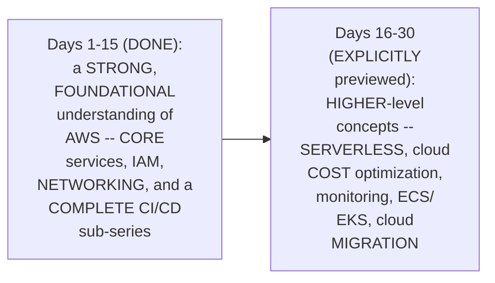

#### 🎯 Key Takeaways

* This is GENUINELY the SERIES' own, **FOURTH and FINAL** episode of the CI/CD-on-AWS SUB-series — COMPLETING the **CD** half, USING AWS CODEDEPLOY.
* Day 15 directly, HONESTLY marks the **HALFWAY point** of the COMPLETE, 30-day SERIES — WITH a GENUINE, direct PREVIEW of the NEXT 15 days' own, HIGHER-level, "RESUME-worthy" content.
* THE instructor **directly, EXPLICITLY confirms** the PRIOR day's own SESSION (Day 14, CI) IS a REQUIRED prerequisite — "CD will NOT have MUCH value WITHOUT CI."

---

### 2. AWS CodeDeploy: Three Core Components

#### 📖 Definition — The Three, Precise Components

> 💡 **Given directly:** *"This is where we are, AWS CodeDeploy, and it has multiple components like deployments, applications, deployment configuration — so we will understand what each of them does, they are very, very simple concepts to understand."*

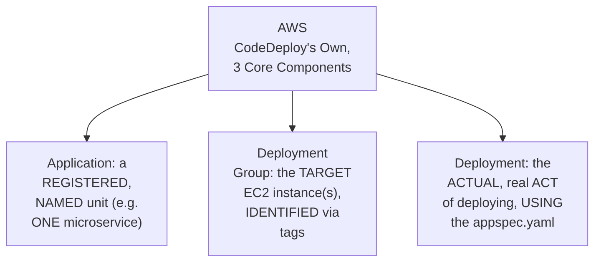

#### ⚠ A Direct, Honest, Important Warning

> 💡 **Given directly:** *"The only thing here in today's video is you have to watch very carefully how I am doing the installations, because even if you miss a single point, today's video demonstration will be difficult — so even while doing the video I might run into some issues, so watch carefully how I am troubleshooting those issues."*

#### ⚠ Common Mistakes

* Assuming CODEDEPLOY's own, "SIMPLE concepts" GENUINELY, DIRECTLY translate INTO a SIMPLE, error-FREE setup PROCESS — explicitly, directly, HONESTLY warned AGAINST — "EVEN if you MISS a SINGLE point, TODAY's video DEMONSTRATION will be DIFFICULT."

#### 🎯 Key Takeaways

* AWS CODEDEPLOY genuinely, STRUCTURALLY consists OF **THREE core COMPONENTS**: **applications** (a REGISTERED unit, LIKE a microservice), **DEPLOYMENT groups** (the TARGET EC2 instance(s)), and **DEPLOYMENTS** (the ACTUAL deployment ACT itself).
* THE instructor **directly, HONESTLY warns** THAT this session GENUINELY, PRACTICALLY requires CAREFUL attention — MISSING even ONE, single STEP can GENUINELY cause REAL difficulty.
* This directly, PRECISELY sets UP the SESSION's own, COMPLETE, sequential DEMONSTRATION — BUILDING each of THESE three COMPONENTS, one BY one (Sections 3-8).

---
### 3. A Complete, Real, Live Demo: Creating a CodeDeploy Application

#### 📖 Definition — "Application," Precisely Explained via a Real, Relatable Example

> 💡 **Given directly:** *"What is application here? Basically CodeDeploy is one software that AWS is providing — in your organization you might have multiple applications, so one application can be considered as one microservice. Let's say you're working for Amazon.com — Amazon.com has payments as a microservice, transactions as a microservice, you have login/logout, each of them can be different microservices."*

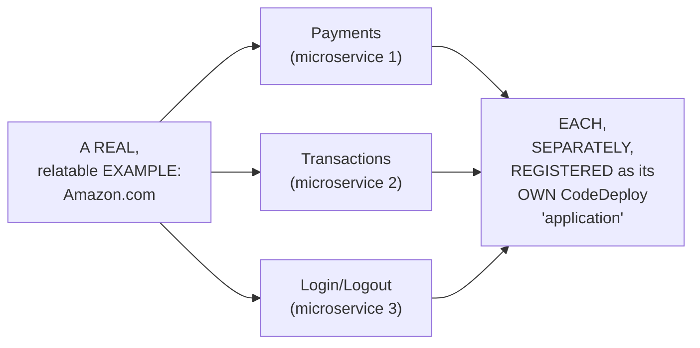

#### 🪜 Step-by-Step — A Direct, Honest Confirmation of the UI-First Learning Philosophy

> 💡 **Given directly:** *"AWS things can be done from the UI, things can be done from the CLI — today's video I'm showing you through the UI, because you will understand whenever you try to understand the things, definitely do it from the UI, because you will understand the complete flow. Once you master it, you can use the CLI."*

#### 🪜 Step-by-Step — A Complete, Real, Live Platform Selection

> 💡 **Given directly:** *"Provide the platform where you want to deploy — do you want to deploy on EC2, do you want to deploy on ECS, or do you want to deploy on AWS Lambda? The thing is, I'm not going to explain you using ECS and Lambda, because we haven't covered both Lambda functions and ECS in the course, which will be covered in the later stages... let's use the one that we have already learned, that is EC2."*

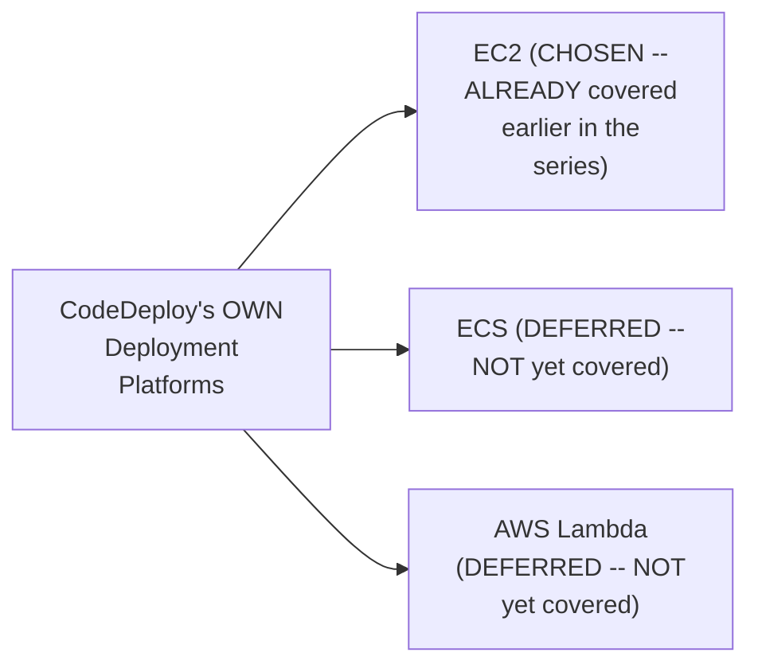

#### ⚠ Common Mistakes

* Assuming a REPETITIVE task (LIKE creating HUNDREDS of CodeDeploy APPLICATIONS, one PER microservice) should GENUINELY, ALWAYS be AUTOMATED from the START, VIA the CLI — explicitly, directly, PRECISELY clarified: "WITHOUT UI you will NOT understand WHAT exactly YOU are doing... CLI is JUST a bunch OF commands" — UI-FIRST learning REMAINS genuinely, PEDAGOGICALLY valuable, EVEN for repetitive TASKS.

#### 🎯 Key Takeaways

* A CODEDEPLOY **"APPLICATION"** is precisely, MEMORABLY explained VIA a REAL, relatable EXAMPLE — Amazon.com's OWN, separate microservices (PAYMENTS, transactions, LOGIN/logout) — EACH, genuinely REGISTERED as its OWN, distinct APPLICATION.
* The instructor **directly, EXPLICITLY confirms** a UI-FIRST learning PHILOSOPHY — EVEN for REPETITIVE tasks — SINCE genuinely UNDERSTANDING the COMPLETE workflow REQUIRES seeing IT, before AUTOMATING it.
* **EC2** was DIRECTLY, EXPLICITLY chosen AS the deployment PLATFORM — over ECS/LAMBDA — SINCE those SERVICES haven't YET been covered IN this series.

---

### 4. A Complete, Real, Live Demo: Creating & Tagging an EC2 Instance

#### 🪜 Step-by-Step — A Complete, Real, Standard EC2 Setup

> 💡 **Given directly:** *"Let's provide Ubuntu... T2 micro is the image that I have selected, key value pair, use whatever key value pair that you have, and go to your network configurations, make sure that the public IP is enabled."*

#### 📖 Definition — Tags, Precisely Introduced

> 💡 **Given directly:** *"For every resource on AWS you can create tags — what is tag? Tag is basically for the identification purpose... let's say there are EC2 instances created by different teams, you can create tags to differentiate the EC2 instance for your team and the other team."*

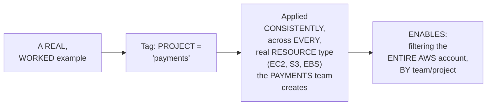

#### ⚠ Common Mistakes

* Assuming a GENERIC, non-tagged NAME (LIKE "example.COM") is GENUINELY, SUFFICIENTLY unique TO identify an EC2 INSTANCE, WITHIN a LARGE, real AWS ACCOUNT — explicitly, directly, PRECISELY clarified: "IF someone ELSE creates an EC2 INSTANCE with EXAMPLE.com... it will be VERY difficult FOR CodeDeploy to IDENTIFY WHICH example.COM" — TAGS genuinely, DIRECTLY solve THIS ambiguity.

#### 🎯 Key Takeaways

* A COMPLETE, real EC2 SETUP (UBUNTU, T2 micro, PUBLIC IP enabled) directly, CONCRETELY establishes the DEPLOYMENT target FOR CodeDeploy.
* **TAGS** are precisely INTRODUCED as the IDENTIFICATION mechanism — ENABLING teams to DIFFERENTIATE resources, and DIRECTLY, PRACTICALLY supporting real, ORGANIZATIONAL filtering (e.g., "GIVE me ALL resources the PAYMENTS team HAS created").
* This directly, PRECISELY sets UP the SESSION's own, NEXT, essential EXPLANATION — WHY tags SPECIFICALLY matter FOR CodeDeploy's OWN, real targeting MECHANISM (Section 5).

---
### 5. Why Tags Matter: A Genuine, Thorough, Real-World Explanation

#### 🔍 Internal Working — A Genuine, Direct Connection to CodeDeploy's Own, Real Targeting Mechanism

> 💡 **Given directly:** *"The code deploy service here needs an EC2 instance — now there can be multiple EC2 instances, right? People like me, I might create an EC2 instance with name example.com, again within the entire AWS account, if someone else creates EC2 instance with example.com, then it will be very difficult for the CodeDeploy to identify which example.com should I refer to."*

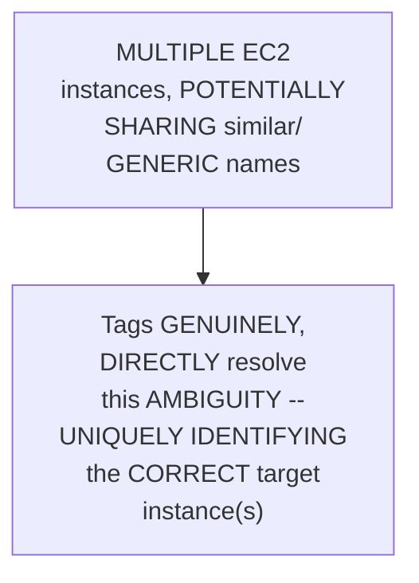

#### 🔍 Internal Working — A Genuine, Direct Confirmation: One-to-Many Deployment

> 💡 **Given directly:** *"Also the other advantage is that CodeDeploy can be used to deploy to one single EC2 instance, or multiple EC2 instances — so you can provide multiple EC2 instances with the same tag, and assign it to the CodeDeploy, and CodeDeploy will understand — even if they had 10 more EC2 instances, if the key-value pair is same, I have to deploy to 20 EC2 instances, 100 EC2 instances, or 10 EC2 instances."*

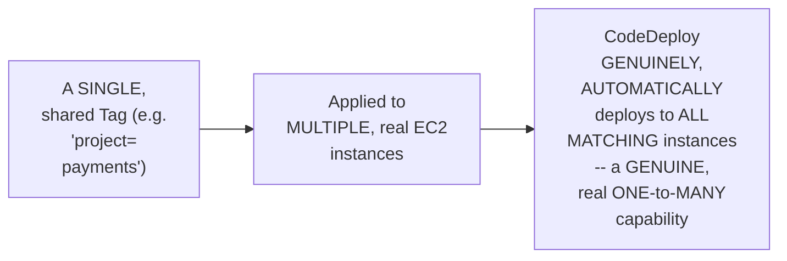

#### 🏢 Real-World / Production Usage — A Genuine, Real, Cost-Optimization Connection

> 💡 **Given directly:** *"This tags play a critical role when we learn about the cost optimization, or to understand which resources are created and not deleted... you can also keep specific things like environment production, environment staging... this way it will help your devops engineers or management to track how many EC2 instances are there in production, how many EC2 instances are there in staging."*

#### ⚠ Common Mistakes

* Assuming TAGS are GENUINELY, MERELY relevant TO CodeDeploy's OWN, SPECIFIC use CASE — explicitly, directly, HONESTLY clarified: TAGS GENUINELY, DIRECTLY serve MULTIPLE, broader PURPOSES — INCLUDING future COST-optimization work (EXPLICITLY, DIRECTLY previewed FOR a later SESSION).

#### 🎯 Key Takeaways

* TAGS GENUINELY, DIRECTLY solve TWO, real PROBLEMS for CodeDeploy: **(1) UNIQUELY identifying** the CORRECT target INSTANCE(S), among POTENTIALLY similarly-NAMED resources; and **(2) enabling GENUINE, real ONE-to-MANY deployment** — the SAME tag CAN, genuinely, match MULTIPLE EC2 instances.
* TAGS ALSO, genuinely, SERVE a BROADER, real ORGANIZATIONAL purpose — DIRECTLY connecting TO future COST-optimization work (EXPLICITLY previewed) — TRACKING resources BY project, TEAM, or ENVIRONMENT (production/STAGING/development).
* This directly, PRECISELY sets UP the SESSION's own, NEXT, essential STEP — INSTALLING the CodeDeploy AGENT on THIS, newly-tagged EC2 instance (Section 6).

---

### 6. A Complete, Real, Live Demo: Installing the CodeDeploy Agent

#### 📖 Definition — The CodeDeploy Agent, Precisely Introduced (& Compared to Familiar Tools)

> 💡 **Given directly:** *"Within this EC2 instance we have to install an agent — now why I should install an agent, and what agent is this? This agent is called the CodeDeploy agent. If you have worked previously with Jenkins, you know that when you install Jenkins, you create an agent... better example would be GitLab or GitHub Actions, when we have demonstrated that... when you create worker nodes... we were also installing a software there that is called an agent or runner software."*

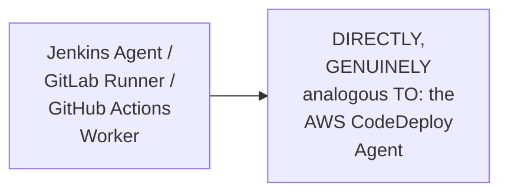

#### 🪜 Step-by-Step — A Complete, Real, Live SSH-Based Installation Walkthrough

> 💡 **Given directly:** *"SSH -i [location of my pem file] Ubuntu@[IP address]... first of all you have to update the packages, so 'sudo apt update' will update the packages, and then... I'm installing the Ruby-full package... let's go to the next package, next thing that we need to install is wget."*

```bash
sudo apt update
sudo apt install ruby-full -y
sudo apt install wget -y
```

#### 🪜 Step-by-Step — A Genuine, Precise Explanation: Region-Specific Installers

> 💡 **Given directly:** *"What AWS says here is, to install the runner, you have to replace the bucket name and the region identifier — in the region that you have created the EC2 instance, this is for less latency, right — when you want to download, if you download it from a region that is nearby you, then you can download it a little quicker."*

```bash
wget https://aws-codedeploy-us-east-1.s3.us-east-1.amazonaws.com/latest/install
chmod +x ./install
sudo ./install auto
sudo service codedeploy-agent status
```

#### ⚠ A Direct, Honest, Live-Encountered Troubleshooting Note

> 💡 **Given directly:** *"Let's say if in your case, when you entered this command, if it was showing something like 'no AWS CodeDeploy agent running,' then you have to perform this command [start] again — if you are watching, or in your case on your instance, if you are seeing this error, don't get confused or don't panic, you can simply run this specific command, and it will work."*

#### ⚠ Common Mistakes

* Assuming a REGION-generic INSTALLER script GENUINELY, EQUALLY works FOR any AWS REGION — explicitly, directly, PRECISELY clarified: the CORRECT, REGION-specific BUCKET must be USED — SPECIFICALLY for LOWER latency DURING download.
* Assuming a "no AGENT running" MESSAGE, immediately AFTER installation, GENUINELY indicates a REAL, deep PROBLEM — explicitly, directly, HONESTLY reassured AS a COMMON, easily-RESOLVED situation — SIMPLY re-RUN the start COMMAND.

#### 🎯 Key Takeaways

* THE **CodeDeploy AGENT** is directly, MEMORABLY compared TO a Jenkins AGENT or GitLab RUNNER — a REQUIRED, SEPARATE software COMPONENT, installed ON each, target EC2 INSTANCE.
* A COMPLETE, real, LIVE SSH-based INSTALLATION walkthrough directly, CONCRETELY confirmed the FULL process — UPDATING packages, INSTALLING Ruby and WGET, downloading a REGION-specific installer SCRIPT, and STARTING the service.
* A GENUINE, HONEST troubleshooting NOTE directly, PRACTICALLY reassures LEARNERS — a "no AGENT running" message IS a COMMON, easily-RESOLVED situation, NOT a genuine CAUSE for panic.

---
### 7. A Complete, Real, Live Demo: Granting IAM Role Permissions (& the Restart Requirement)

#### 🔍 Internal Working — A Genuine, Direct Callback to Day 2's Own, Established Reasoning

> 💡 **Given directly:** *"This EC2 instance is going to talk to the AWS CodeDeploy, and similarly CodeDeploy is going to talk to the EC2 instance — right now we are at the creation of EC2 instance, so what I'll do is I'll create a role, and I'll grant this EC2 instance with a role to talk to the AWS CodeDeploy. Again this concept I have explained very clearly on Day 2 — when you are granting permissions to users to access any services on AWS, then we use IAM users, whereas if we are granting permissions to any service to access another service in AWS, then we use IAM roles."*

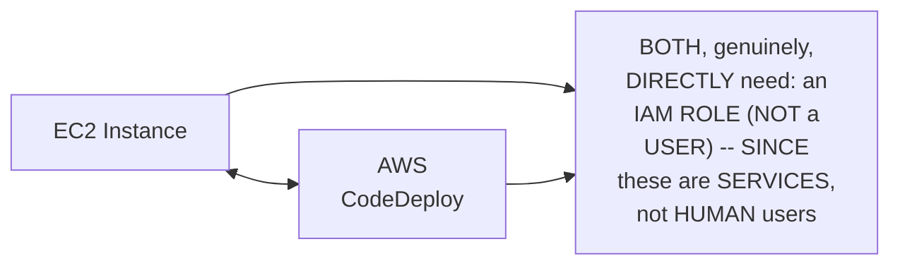

#### 🪜 Step-by-Step — A Complete, Real, Live Role-Creation & Assignment Walkthrough

> 💡 **Given directly:** *"Search for services, you can grant permissions to EC2, and grant permissions to CodeDeploy... allows CodeDeploy to call AWS services such as auto-scaling on your behalf... provide name for this role, EC2 CodeDeploy role... now how to assign this specific thing? Click on the instance, click on actions, security, modify IAM role, and provide that thing here."*

#### ⚠ A Direct, Honest, IMPORTANT Operational Requirement

> 💡 **Given directly:** *"Once you update the IAM role, you also need to go to your terminal one more time and restart the service — which service? The agent service, right. Just search for status, and submit a command called restart. If you're not doing this restart, the agent within the EC2 instance, it will not be able to communicate to the CodeDeploy — every time you make such modifications, you have to restart the process, specifically in case of AWS CodeDeploy."*

```bash
sudo service codedeploy-agent restart
sudo service codedeploy-agent status  # confirm it started successfully
```

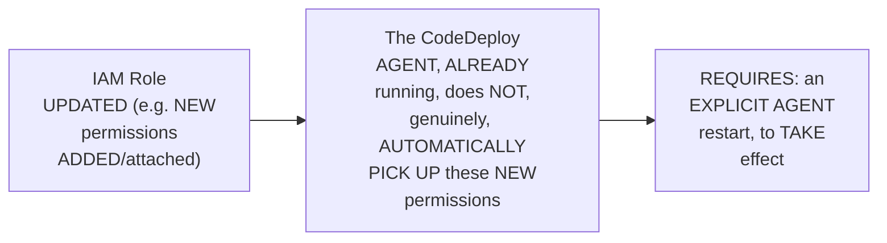

#### ⚠ Common Mistakes

* Assuming an IAM ROLE update GENUINELY, AUTOMATICALLY, IMMEDIATELY takes EFFECT for an ALREADY-running AGENT — explicitly, directly, HONESTLY corrected: THE CodeDeploy AGENT genuinely, STRUCTURALLY REQUIRES an EXPLICIT restart, EVERY time the UNDERLYING IAM role IS modified.

#### 🎯 Key Takeaways

* BOTH the EC2 instance AND AWS CodeDeploy GENUINELY, STRUCTURALLY require an **IAM ROLE** (not a USER) — DIRECTLY, PRECISELY connecting BACK to Day 2's own, ESTABLISHED users-versus-ROLES distinction.
* A COMPLETE, real, LIVE demonstration directly, CONCRETELY confirmed the FULL role-CREATION and ASSIGNMENT workflow — GRANTING CodeDeploy PERMISSIONS, then ATTACHING this ROLE to the EC2 INSTANCE.
* A GENUINE, IMPORTANT operational REQUIREMENT was directly, HONESTLY flagged: **AFTER any IAM role MODIFICATION, the CodeDeploy AGENT must be EXPLICITLY restarted** — the NEW permissions do NOT, genuinely, TAKE effect AUTOMATICALLY.

---

### 8. A Complete, Real, Live Demo: Creating a Deployment Group

#### 📖 Definition — Deployment Group, Precisely Explained (via a Real, Familiar Analogy)

> 💡 **Given directly:** *"Now when you create an application in CodeDeploy, you have to provide what is the target group — just like we do in the load balancer, right? Similarly for CodeDeploy also you have to provide the target group, so now go to this section, and here the target group is called deployment groups."*

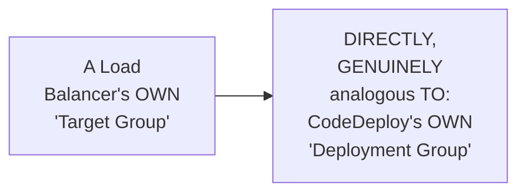

#### 🪜 Step-by-Step — A Complete, Real, Live-Confirmed Tag-Matching Demonstration

> 💡 **Given directly:** *"Enter a deployment group name... enter service role... this one is asking, do you want to deploy in a very straightforward way, or do you want to go with a blue/green deployment process?... Amazon EC2 instance key-value pair, name, code deploy — this is the name that I've given... immediately it will say one unique matched instance — let me change this and show you... it said immediately zero unique matched instances, and when you change this to sample python, you will immediately notice one unique matched instance."*

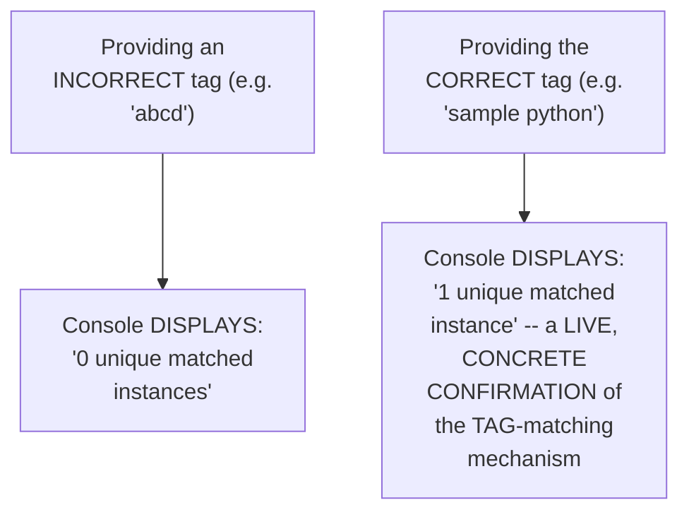

#### 🪜 Step-by-Step — A Genuine, Direct Deployment-Type Decision

> 💡 **Given directly:** *"To do blue/green deployment process, you will need a load balancer, you will need two different sites — I have explained this in one of my videos, where I have explained about the deployment strategies... today we'll go with a very plain single deployment strategy, because we are just learning code deploy."*

#### ⚠ Common Mistakes

* Assuming a REAL, live-DEMONSTRATED "0 UNIQUE matched INSTANCES" result GENUINELY, DIRECTLY signals a REAL, deep PROBLEM — explicitly, directly, LIVE-demonstrated as a NORMAL, EXPECTED result — SIMPLY the RESULT of PROVIDING an INCORRECT tag VALUE, CORRECTABLE by ENTERING the RIGHT tag.
* Assuming "BLUE/green" deployment is GENUINELY, ALWAYS the RIGHT choice FOR any, real CODEDEPLOY setup — explicitly, directly, HONESTLY clarified: FOR THIS, learning-FOCUSED demonstration, the SIMPLER, "in-PLACE" strategy is DELIBERATELY, GENUINELY chosen INSTEAD.

#### 🎯 Key Takeaways

* A CODEDEPLOY **"DEPLOYMENT group"** is directly, MEMORABLY compared TO a load BALANCER's own "TARGET group" — DEFINING WHICH EC2 instance(S) a GIVEN application SHOULD genuinely DEPLOY to.
* A COMPLETE, real, LIVE demonstration directly, CONCRETELY confirmed the TAG-matching mechanism WORKING — an INCORRECT tag SHOWED "0 unique MATCHED instances"; the CORRECT tag SHOWED "1 unique MATCHED instance."
* THE session's own, DELIBERATE choice of "IN-place" (SIMPLE) deployment, OVER "blue/GREEN," is directly, HONESTLY explained — BLUE/green REQUIRES additional INFRASTRUCTURE (a LOAD balancer, TWO sites) — EXPLICITLY deferred to a SEPARATE, existing VIDEO on deployment STRATEGIES.

---
### 9. appspec.yaml: A Precise, Important Structural Constraint

#### 📖 Definition — appspec.yaml, Precisely Introduced (& Compared to buildspec.yaml)

> 💡 **Given directly:** *"When we were doing the code build, I have showed you that there is a file called buildspec.yaml — similarly, for code deploy also, you have a file... and how we will do this configuration is you will put this appspec.yaml inside your GitHub repository, where your source code is hosted."*

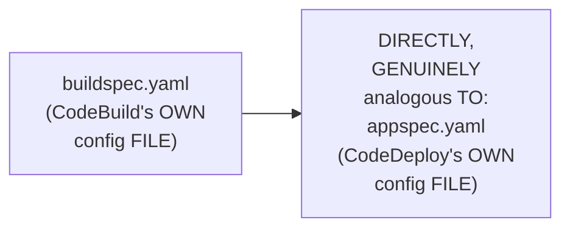

#### ⚠ A Direct, Honest, Important Structural Constraint

> 💡 **Given directly:** *"App spec.yaml always has to be at the root of the repository — if you are using S3 buckets, then you can provide the folder path where exactly inside your S3 bucket the folder is there, you can put in any folder path, but if you are using the GitHub repository, then you have to put it at the root of the repository... whereas code deploy will not offer that much flexibility if you are using github.com."*

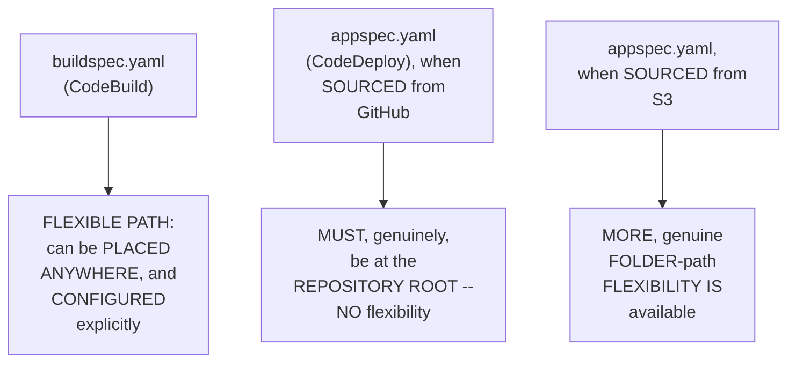

#### ⚠ Common Mistakes

* Assuming `APPSPEC.yaml` GENUINELY, DIRECTLY offers the SAME, flexible PATH configuration as `buildspec.YAML` — explicitly, directly, PRECISELY corrected: FOR GitHub-hosted SOURCE specifically, `appspec.YAML` GENUINELY, STRUCTURALLY **must** live AT the repository ROOT — a REAL, important CONSTRAINT worth REMEMBERING.

#### 🎯 Key Takeaways

* `**appspec.yaml**` is precisely the CodeDeploy-SPECIFIC equivalent OF `buildspec.YAML` — DIRECTLY, CONCEPTUALLY analogous, but WITH a GENUINE, structural DIFFERENCE.
* FOR **GitHub-hosted SOURCE** specifically, `appspec.YAML` genuinely, STRUCTURALLY **MUST** be PLACED at the repository'S own ROOT — WITH NO, genuine FLEXIBILITY (UNLIKE `buildspec.yaml`).
* FOR **S3-hosted SOURCE**, MORE genuine FOLDER-path FLEXIBILITY is available — a REAL, important DISTINCTION between the TWO source TYPES.

---

### 10. A Genuine, Honest, Live-Encountered Error: The Missing appspec.yaml File

#### ⚠ A Direct, Honest, Live-Encountered Error

> 💡 **Given directly:** *"You will notice that the deployment process will fail — the reason is, inside this one... I haven't provided, at the root of your GitHub repository, you have to provide the appspec.yaml... let's see step one, step two has succeeded, that means it was able to connect to github.com — so github.com connection is successful, but after the connection, it is not able to fetch the file, because it does not find the file at all — I haven't put the file."*

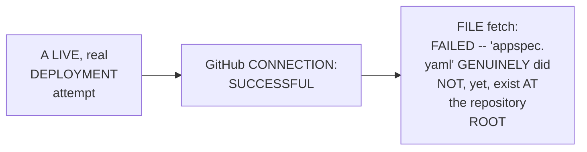

#### 🪜 Step-by-Step — A Complete, Real, Live Fix (& a Genuine, Useful Trick)

> 💡 **Given directly:** *"If you just go to GitHub repository and click on the dot, right, you just have to go to your keyboard and click on the dot button, and it will convert your GitHub repository on your browser itself to a Visual Studio Code setup, okay, so the advantage will be, if you want to modify or if you want to update multiple files at once, then instead of cloning this repository and going to your local, you can do it from here itself."*

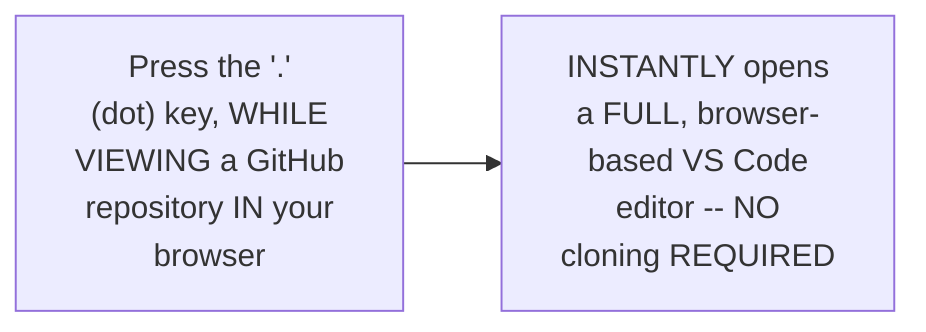

#### ⚠ Common Mistakes

* Assuming FIXING a MISSING file GENUINELY, ALWAYS requires CLONING the repository LOCALLY first — explicitly, directly, PRACTICALLY demonstrated as GENUINELY, DIRECTLY unnecessary — GitHub's OWN, browser-based VS CODE editor (VIA the "." KEY) enables DIRECT, in-BROWSER editing.

#### 🎯 Key Takeaways

* A COMPLETE, real, LIVE-encountered ERROR directly, CONCRETELY confirmed the GENUINE, real CONSEQUENCE of Section 9's own, established CONSTRAINT — a MISSING `appspec.YAML`, at the repository ROOT, GENUINELY, DIRECTLY caused a REAL deployment FAILURE.
* A GENUINE, useful TRICK (PRESSING the "." KEY WHILE viewing a GitHub REPOSITORY) directly, PRACTICALLY opens a FULL, browser-BASED VS Code EDITOR — ENABLING fast, DIRECT file CREATION/editing, WITHOUT cloning.
* This directly, PRECISELY sets UP the SESSION's own, NEXT, essential STEP — WRITING the ACTUAL, complete `appspec.YAML` content, LIVE (Section 11).

---
### 11. Writing appspec.yaml's Hooks, Live: ApplicationStop & AfterInstall

#### 🪜 Step-by-Step — A Complete, Real, Live appspec.yaml Walkthrough

> 💡 **Given directly:** *"This is the version, this is the OS, and inside the hooks I have two steps — one is application stop, and second is I am installing the application and running some commands."*

```yaml
version: 0.0
os: linux
hooks:
  ApplicationStop:
    - location: scripts/stop_container.sh
      timeout: 300
      runas: root
  AfterInstall:
    - location: scripts/start_container.sh
      timeout: 300
      runas: root
```

#### 🪜 Step-by-Step — Writing start_container.sh, Live

> 💡 **Given directly:** *"Inside the start container, you can add the script for Docker image pull, and you can add the script for Docker run... pull the Docker image from Docker Hub... run it as a daemon, or if you want to run it on background, then just say Docker run -d -p... run it on a port, for example 8000... let's also do the same thing [as the Dockerfile] — Docker run -d, mount... I'm running it as a background process, I am exposing this port."*

```bash
#!/bin/bash
docker pull abhishekf5/sample-python-flask-app:latest
docker run -d -p 5000:5000 --name sample-python-app abhishekf5/sample-python-flask-app:latest
```

#### ⚠ A Direct, Honest, Important Port-Matching Confirmation

> 💡 **Given directly:** *"If you go to app.py, I was not using any port to run the application, I was just running the Flask application, right — so there is no problem, if you go to the Docker file, you can find what port was I using — I was exposing the port 5000. Okay, so let's also do the same thing... 5000, and expose it on the 5000 of host, followed by the container itself."*

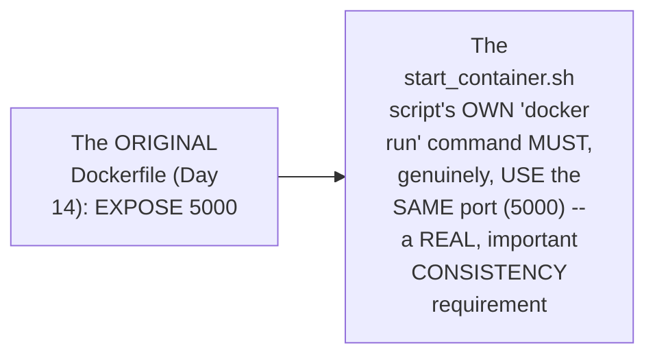

#### 🪜 Step-by-Step — Writing stop_container.sh, Live (Initially, a Placeholder)

> 💡 **Given directly:** *"Inside the stop container.sh, what I am doing is I'm just printing a 'hi' command, or you can stop the running container, but in my case there is no container that is running already, so I can just copy-paste this one."*

```bash
#!/bin/bash
echo "hi"
```

#### ⚠ Common Mistakes

* Assuming the `docker RUN` command's own PORT mapping is GENUINELY, ARBITRARILY chosen — explicitly, directly, PRECISELY clarified: it MUST, genuinely, DIRECTLY match the ORIGINAL Dockerfile's own, ESTABLISHED `EXPOSE` port (5000, FROM Day 14) — a REAL, important CONSISTENCY requirement.
* Assuming the ORIGINALLY-written `stop_CONTAINER.sh` (a SIMPLE "ECHO hi" placeholder) is GENUINELY, PRACTICALLY sufficient FOR real, ongoing USE — explicitly, directly, DIRECTLY foreshadowed (Section 12) as GENUINELY, DIRECTLY insufficient — THIS placeholder WILL, later, CAUSE a REAL, significant ERROR.

#### 🎯 Key Takeaways

* A COMPLETE, real, LIVE `appspec.YAML` walkthrough directly, CONCRETELY confirmed ITS own STRUCTURE — a VERSION, OS, and **HOOKS** section, DEFINING `ApplicationSTOP` and `AfterINSTALL` steps.
* THE `start_CONTAINER.sh` script directly, PRACTICALLY performs `docker PULL` (fetching the SAME image BUILT in Day 14's OWN CI pipeline) and `docker RUN` — REQUIRING the SAME port (5000) as the ORIGINAL Dockerfile.
* THE `stop_CONTAINER.sh` script was INITIALLY, DELIBERATELY left as a SIMPLE PLACEHOLDER ("echo HI") — a CHOICE that DIRECTLY, GENUINELY foreshadows a REAL, significant ERROR EXPLORED later (Section 12).

---
### 12. A Genuinely Honest, Extended Live Debugging Sequence

#### ⚠ Error: "Docker Command Not Found"

> 💡 **Given directly:** *"This is something that we like about debugging activities, right — what has failed? Perfect, I know what is the error, can someone guess what is the error here? So all the stages have been successful, but the script has failed. What it says: Docker command not found. Now we all know the reason why Docker command is not found, because we have to go and install Docker."*

```bash
sudo apt install docker.io -y
```

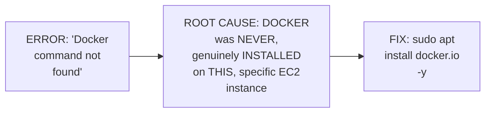

#### ⚠ The Central, Most Substantial Error: "Port Is Already Bound"

> 💡 **Given directly:** *"What was the issue? The issue is that we have triggered this CodeBuild two times... initially when I tested the code deploy, I tested it manually, right — I triggered the code deploy without code pipeline, and what has happened, the port has been already registered... that means there is already a container that is running on this port, there are two ways to solve this."*

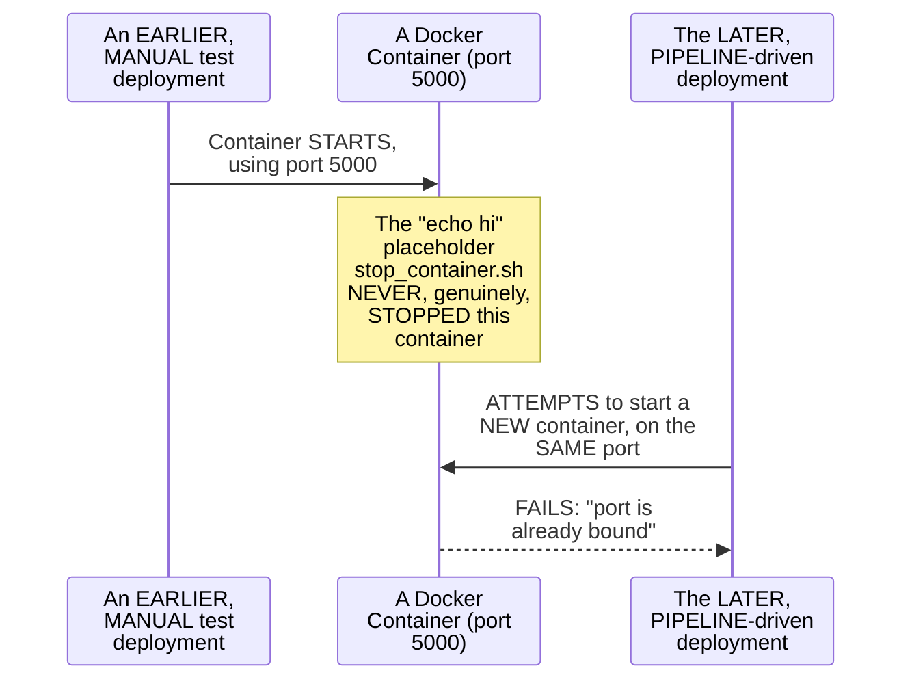

#### 🔍 Internal Working — A Genuine, Direct, Honest Root-Cause Explanation

> 💡 **Given directly:** *"Abhishek, you have done this manually, and you did not delete that container — so that's where the stop_container.sh, the script that I was writing, is useful, for the purpose of demo I did not write it, but see what happened."*

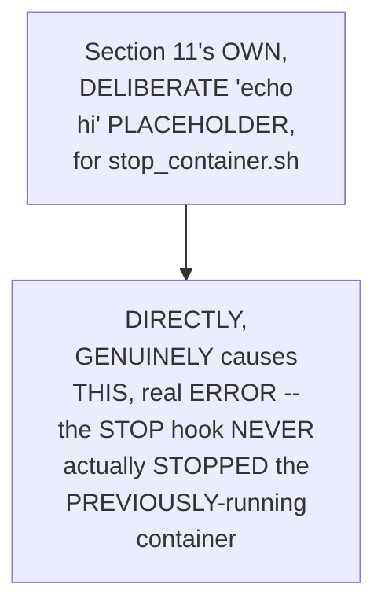

#### ⚠ Common Mistakes

* Assuming a REAL, "PORT already bound" ERROR is GENUINELY, MYSTERIOUSLY unrelated TO any EARLIER, prior ACTION — explicitly, directly, HONESTLY traced BACK to a SPECIFIC, real cause — an EARLIER, MANUAL test DEPLOYMENT left a CONTAINER running, WHICH the PLACEHOLDER `stop_CONTAINER.sh` never GENUINELY stopped.
* Assuming EACH, new ERROR in a LIVE debugging SEQUENCE is GENUINELY, ENTIRELY unrelated TO prior, EARLIER decisions — explicitly, directly, DIRECTLY connected: THIS session's own, DELIBERATE Section 11 CHOICE (a placeholder STOP script) is the DIRECT, root CAUSE of THIS section's own, MOST substantial ERROR.

#### 🎯 Key Takeaways

* A GENUINELY honest, EXTENDED debugging SEQUENCE directly, CONCRETELY worked THROUGH multiple, REAL errors — a MISSING Docker INSTALLATION (FIXED via `sudo APT install docker.IO`), and a FAR more SUBSTANTIAL, genuinely TRICKY "port ALREADY bound" conflict.
* THE "port ALREADY bound" error was directly, HONESTLY traced BACK to its GENUINE, real ROOT cause — an EARLIER, MANUAL test DEPLOYMENT left a CONTAINER running, WHICH the PLACEHOLDER `stop_container.SH` script never GENUINELY, ACTUALLY stopped.
* This directly, PRECISELY confirms a GENUINE, important LESSON — Section 11's own, DELIBERATE, simplified PLACEHOLDER choice DIRECTLY, CAUSALLY produced THIS section's own, MOST significant, real ERROR — a GENUINE, connected CONSEQUENCE, not a RANDOM, unrelated ISSUE.

---
### 13. Writing a Real stop_container.sh Script: The Session's Own, Direct Assignment

#### 🪜 Step-by-Step — A Complete, Real, Live-Written, Corrected Script

> 💡 **Given directly:** *"It is always better to write the script in such a way — first of all you will do Docker PS, and you will register what is the container ID, right, you can get the container ID from Docker PS... you can use this command like this... then in the next command, you can simply say Docker RM -f, dollar container ID."*

```bash
#!/bin/bash
CONTAINER_ID=$(docker ps | awk -F' ' '{print $1}' | tail -n 1)
docker rm -f $CONTAINER_ID
```

#### 🔍 Internal Working — A Genuine, Precise Explanation of the `awk` Command

> 💡 **Given directly:** *"What awk does — awk is basically for the string formatting, or you want to get anything from the huge line... minus F, you can provide the delimiter here, and inside the delimiter I'll say divide it by space, so whenever there is space you can split the characters... it is giving you the container ID, followed by the process of the container, etc., etc. — when you do this, then you will get the container ID."*

```mermaid
flowchart LR
    A["docker ps<br/>(OUTPUTS a LINE,<br/>WITH the container<br/>ID FIRST)"] --> B["awk -F' '<br/>(SPLITS the LINE, BY<br/>space DELIMITER)"]
    B --> C["'{print $1}'<br/>(EXTRACTS just the<br/>FIRST field -- the<br/>CONTAINER ID)"]
```

#### 🪜 Step-by-Step — A Genuine, Direct, Live-Given Assignment

> 💡 **Given directly:** *"So this is how you write the script, so you can take this as an assignment, but for now, for a very quick recap, because I want to complete this demo... the important assignment that you have to take from this video is to write the stop_container.sh script... let me share it one more time so that you people will be confident in writing either kill the process like me."*

```mermaid
flowchart LR
    A["THIS session's<br/>OWN, DIRECT,<br/>explicit<br/>ASSIGNMENT"] --> B["WRITE a PROPER,<br/>working<br/>stop_container.sh<br/>script -- USING<br/>docker PS + awk +<br/>docker RM -f"]
```

#### ⚠ Common Mistakes

* Assuming a "STOP" script GENUINELY, SIMPLY requires KNOWING the container'S own NAME, without NEEDING its ACTUAL, real container ID — explicitly, directly, PRACTICALLY demonstrated as REQUIRING the CONTAINER ID, EXTRACTED dynamically VIA `docker PS` and `AWK` — a REAL, more ROBUST approach THAN hardcoding a NAME.

#### 🎯 Key Takeaways

* A COMPLETE, real, LIVE-written FIX directly, CONCRETELY replaced the ORIGINAL, placeholder `stop_CONTAINER.sh` — using `docker PS` to FIND the RUNNING container, `awk` to EXTRACT its CONTAINER ID, and `docker RM -f` to FORCEFULLY remove IT.
* THE `AWK -F' ' '{PRINT $1}'` pattern directly, PRECISELY explains HOW to EXTRACT the FIRST field (the CONTAINER ID) from `docker PS`'s own, MULTI-column output.
* THIS session's own, DIRECT, EXPLICIT assignment REQUIRES learners to WRITE this SAME, COMPLETE, corrected SCRIPT themselves — a GENUINE, hands-ON reinforcement of THIS session's own, CENTRAL debugging LESSON.

---

### 14. A Complete, Real, Live Demo: Adding CodeDeploy to the Existing CodePipeline

#### 🪜 Step-by-Step — A Complete, Real, Live Pipeline-Editing Walkthrough

> 💡 **Given directly:** *"Just go to code pipeline here, and all that you need to do is just add one more stage to the code pipeline that we have created in the last class... click on the edit button... click on add stage here, and say 'code deploy,' add stage... click on Action Group, what kind of action do you want to perform... action provider is AWS CodeDeploy... provide what is your deployment group."*

```mermaid
flowchart LR
    A["The EXISTING<br/>CodePipeline (FROM<br/>Day 14): Source<br/>(GitHub) -> Build<br/>(CodeBuild)"] --> B["A NEW, THIRD<br/>stage ADDED:<br/>Deploy (AWS<br/>CodeDeploy)"]
    B --> C["The COMPLETE,<br/>final pipeline:<br/>Source -> Build -><br/>Deploy"]
```

#### ⚠ Common Mistakes

* Assuming ADDING a NEW stage to an EXISTING pipeline GENUINELY, DIRECTLY requires RECREATING the ENTIRE pipeline FROM scratch — explicitly, directly, PRACTICALLY demonstrated as GENUINELY, DIRECTLY simpler — SIMPLY "EDIT" the EXISTING pipeline, and "ADD stage."

#### 🎯 Key Takeaways

* A COMPLETE, real, LIVE demonstration directly, CONCRETELY confirmed ADDING CodeDeploy AS a THIRD, new STAGE — DIRECTLY extending the EXISTING pipeline FROM Day 14 (SOURCE + build ONLY).
* THIS directly, PRACTICALLY completes the SERIES' own, ESTABLISHED architecture: **Source (GitHub) → Build (CodeBuild) → Deploy (CodeDeploy)** — a COMPLETE, three-STAGE CI/CD pipeline.
* This directly, PRECISELY sets UP the SESSION's own, FINAL, COMPLETE verification — a REAL, live CODE change, TRIGGERING the ENTIRE, three-stage PIPELINE (Section 15).

---
### 15. The Complete, Real, End-to-End Verification (& the Same Bug, Twice)

#### 🪜 Step-by-Step — A Complete, Real, Live End-to-End Test

> 💡 **Given directly:** *"Let's push a simple change here to the start_container.sh — what I'll do is I'll just add a space, click on commit — now this will run... code build will be triggered, and it will push a new image."*

```mermaid
sequenceDiagram
    participant Dev as Developer<br/>(a REAL, LIVE<br/>code change)
    participant GitHub
    participant Pipeline as CodePipeline
    participant Build as CodeBuild
    participant Deploy as CodeDeploy
    participant EC2
    Dev->>GitHub: Commits a REAL,<br/>small CHANGE
    GitHub->>Pipeline: AUTOMATICALLY<br/>triggers
    Pipeline->>Build: Invokes the BUILD<br/>(pushes a NEW Docker<br/>image)
    Pipeline->>Deploy: Invokes the DEPLOY
    Deploy->>EC2: Runs the appspec.yaml<br/>HOOKS (stop + start)
```

#### ⚠ A Direct, Honest, Live-Encountered Repeat of the Same Bug

> 💡 **Given directly:** *"The build is successful but the code deploy has failed — let us try to see what has happened... link to execution details... it clearly mentions that Abhishek, your entire deployment process is perfect, but you have already bound the port."*

```mermaid
flowchart LR
    A["THE SAME,<br/>'port already<br/>bound' error (FROM<br/>Section 12)"] --> B["REAPPEARS, EVEN<br/>after WRITING the<br/>PROPER<br/>stop_container.sh<br/>(Section 13) --<br/>because THAT fix<br/>had NOT yet been<br/>DEPLOYED/tested<br/>against the SAME,<br/>ALREADY-stuck<br/>container"]
```

#### 🪜 Step-by-Step — A Complete, Real, Live, Final Resolution

> 💡 **Given directly:** *"Let me show you one final time, because I want to make this demo successful, and show you that this entire thing has been implemented — the CI/CD. If we go to this entire pipeline, code pipeline, these are the different stages — now what you can simply do is click on the 'release change' button, and it will release the entire thing one more time, and this time it will definitely be successful, because there is no container that is running."*

```bash
sudo docker ps          # confirm what's running
sudo docker rm -f <container_id>   # manually clear the stuck container
# Then: click "Release Change" in CodePipeline
```

#### 🔍 Internal Working — A Genuine, Direct, Live-Confirmed, Complete Success

> 💡 **Given directly:** *"If you see here, now all the three stages are successful, right — just by deleting the process on the host, all the three stages are successful. Now if I simply do sudo docker PS, you will see that the container is up and running, and this is our container."*

#### ⚠ Common Mistakes

* Assuming WRITING a CORRECT script (Section 13) GENUINELY, AUTOMATICALLY resolves an ALREADY-existing, STUCK state — explicitly, directly, HONESTLY demonstrated as GENUINELY, DIRECTLY insufficient — the ALREADY-running, STUCK container STILL, genuinely NEEDED manual CLEANUP, BEFORE the CORRECTED script's own LOGIC could genuinely TAKE effect.

#### 🎯 Key Takeaways

* A COMPLETE, real, LIVE end-to-END test directly, CONCRETELY confirmed the ENTIRE, three-STAGE pipeline (SOURCE → build → DEPLOY) triggering AUTOMATICALLY, FROM a SINGLE, real code CHANGE.
* THE SAME "port ALREADY bound" bug HONESTLY, GENUINELY reappeared — DIRECTLY demonstrating that a CORRECTED script ALONE does NOT, AUTOMATICALLY resolve an ALREADY-stuck, EXISTING state.
* A COMPLETE, real, FINAL resolution directly, CONCRETELY confirmed — MANUALLY clearing the STUCK container, THEN clicking "RELEASE change" — RESULTING in ALL three STAGES succeeding, and the APPLICATION genuinely, VERIFIABLY running.

---

### 16. Closing: The Complete CI/CD Arc, Concluded

#### 🪜 Step-by-Step — A Direct, Honest, Complete, Series-Level Reflection

> 💡 **Given directly:** *"So this is our end-to-end demo of CI/CD process using AWS CI/CD services... it took four dedicated classes, because I want to explain everyone the entire CI/CD workflow... I am personally feeling very happy that I have taught you this entire process."*

```mermaid
flowchart LR
    A["Day 12: AWS<br/>CodeCommit"] --> B["Day 13: AWS<br/>CodePipeline<br/>(CONCEPTUAL)"]
    B --> C["Day 14: AWS<br/>CodeBuild (a REAL,<br/>working CI<br/>demo)"]
    C --> D["Day 15 (THIS<br/>session): AWS<br/>CodeDeploy --<br/>COMPLETING the<br/>FULL, real,<br/>end-to-END CI/CD<br/>pipeline"]
```

#### 🪜 Step-by-Step — A Genuine, Direct, Final Assignment

> 💡 **Given directly:** *"The important assignment that you have to take from this video is to write the stop_container.sh script... let me know in the comment section, were you able to do it or not — if you are not able to do the assignment, then simply you can follow the same approach that I've done, even that way you can complete this entire video."*

#### ⚠ Common Mistakes

* Assuming THIS session's own, GENUINELY complete DEMONSTRATION represents the ABSOLUTE, final WORD on AWS CI/CD — explicitly, directly, IMPLIED as a GENUINE, SOLID foundation — WITH future, more ADVANCED sessions (e.g., USING ECS/EKS FOR container orchestration, per Day 15's own EARLIER, series-level PREVIEW) BUILDING further ON this SAME, established base.

#### 🎯 Key Takeaways

* This episode **GENUINELY, COMPREHENSIVELY completes** the ENTIRE, four-part CI/CD-ON-AWS sub-series — DELIVERING a COMPLETE, real, WORKING, end-to-end PIPELINE (SOURCE, build, AND deploy).
* THE session's own, DIRECT, FINAL assignment — WRITING a CORRECT `stop_CONTAINER.sh` script — DIRECTLY reinforces THIS session's own, CENTRAL, most SUBSTANTIAL debugging LESSON.
* The instructor **directly, GENUINELY reflects** on the COMPLETE, four-class JOURNEY — a REAL, honest EXPRESSION of the EFFORT invested IN teaching this COMPLETE, real-world WORKFLOW.

---
## 📝 Glossary

| Term | Definition | Why It Matters |
|---|---|---|
| **CodeDeploy Application** | A registered, named unit, conceptually one microservice | The first component you create |
| **Deployment Group** | The target EC2 instance(s), identified via tags | Directly analogous to a load balancer's "target group" |
| **CodeDeploy Agent** | A required, per-instance software component | Directly analogous to a Jenkins agent or GitLab Runner |
| **appspec.yaml** | CodeDeploy's own build-configuration file | For GitHub sources, MUST be at the repository root |
| **ApplicationStop / AfterInstall** | The two, core appspec.yaml hooks used in this session | Map to stop_container.sh and start_container.sh |
| **In-Place Deployment** | The simple, single-target deployment strategy used | Contrasted with Blue/Green (deferred to a separate video) |
| **Tags (EC2)** | Key-value identification labels | Used by CodeDeploy for targeting; also for cost optimization |

---

## 🔄 Revision Notes — One-Minute Revision

* This is **Day 15**, the FOURTH and FINAL episode of the CI/CD-on-AWS sub-series -- completing the CD half with AWS CodeDeploy, and wiring everything into one, complete pipeline. This also marks the genuine HALFWAY point of the complete, 30-day series.
* **AWS CodeDeploy's 3 core components**: applications (one, conceptually per microservice), deployment groups (the target EC2 instance(s), via tags), and deployments (the actual deployment act).
* **Creating a CodeDeploy application**: EC2 was chosen as the platform (over ECS/Lambda, not yet covered). A UI-first learning philosophy was explicitly reaffirmed.
* **Creating & tagging an EC2 instance**: standard Ubuntu/T2 micro setup. Tags genuinely, directly solve two problems: uniquely identifying the correct target instance(s) among similarly-named resources, and enabling one-to-many deployment (the same tag matching multiple instances). Tags also serve broader, organizational purposes (cost optimization, tracking by team/environment).
* **Installing the CodeDeploy agent**: directly analogous to a Jenkins agent or GitLab Runner. A complete, real SSH-based installation: update packages, install Ruby and wget, download a REGION-SPECIFIC installer script (for lower latency), grant execute permissions, and start the service.
* **Granting IAM role permissions**: both EC2 and CodeDeploy genuinely need an IAM ROLE (not a user), directly connecting back to Day 2's own established distinction. A genuine, important operational requirement: after ANY IAM role modification, the CodeDeploy agent must be explicitly restarted.
* **Creating a deployment group**: directly analogous to a load balancer's own "target group." Live-confirmed: an incorrect tag showed "0 unique matched instances"; the correct tag showed "1 unique matched instance." "In-place" deployment was chosen over "Blue/Green" (which requires a load balancer, deferred to a separate video).
* **appspec.yaml**: CodeDeploy's own equivalent to buildspec.yaml. A genuine, important structural constraint: for GitHub-hosted source, it MUST be at the repository root (unlike buildspec.yaml's own flexibility). A real, live-encountered error (a missing appspec.yaml file) was fixed using GitHub's own "." key trick, opening a browser-based VS Code editor.
* **Writing the hooks, live**: ApplicationStop (-> stop_container.sh) and AfterInstall (-> start_container.sh). start_container.sh performs `docker pull` and `docker run`, using the SAME port (5000) as the original Dockerfile. stop_container.sh was initially, deliberately left as a simple "echo hi" placeholder.
* **A genuinely honest, extended debugging sequence**: (1) "Docker command not found" (fixed via `sudo apt install docker.io`); (2) the session's own, MOST substantial error -- "port is already bound" -- directly, honestly traced back to the placeholder stop_container.sh never actually stopping an earlier, manually-tested container.
* **The session's own, direct assignment**: writing a real, working stop_container.sh, using `docker ps` + `awk -F' ' '{print $1}'` (to extract the container ID) + `docker rm -f $CONTAINER_ID`.
* **Adding CodeDeploy to the existing CodePipeline**: a new, third stage, extending the existing Source -> Build pipeline (from Day 14) into a complete Source -> Build -> Deploy pipeline.
* **The complete, end-to-end verification**: a real, live code change triggered the full pipeline automatically. The SAME "port already bound" bug honestly reappeared (since the corrected script hadn't yet been tested against the already-stuck container) -- resolved by manually clearing the container, then clicking "Release Change."
* **Closing**: this concludes the entire, four-part CI/CD sub-series (CodeCommit, CodePipeline, CodeBuild, CodeDeploy) -- a complete, real, working, end-to-end pipeline. A direct, final assignment: write a correct stop_container.sh script.

---

## 📋 Cheat Sheet

**The complete, 4-part CI/CD-on-AWS arc:**
```text
Day 12: CodeCommit (concept)      Day 13: CodePipeline (concept)
Day 14: CodeBuild (real CI demo)  Day 15: CodeDeploy (real CD demo, COMPLETING the pipeline)
```

**CodeDeploy's 3 components:**
```text
Application       -- registered unit (e.g., one microservice)
Deployment Group   -- target EC2 instance(s), via tags
Deployment          -- the actual deployment act, using appspec.yaml
```

**A complete, minimal appspec.yaml (reconstructed):**
```yaml
version: 0.0
os: linux
hooks:
  ApplicationStop:
    - location: scripts/stop_container.sh
      timeout: 300
      runas: root
  AfterInstall:
    - location: scripts/start_container.sh
      timeout: 300
      runas: root
```

**A real, working stop_container.sh:**
```bash
#!/bin/bash
CONTAINER_ID=$(docker ps | awk -F' ' '{print $1}' | tail -n 1)
docker rm -f $CONTAINER_ID
```

**Agent installation & IAM restart requirement:**
```bash
sudo apt update
sudo apt install ruby-full wget -y
wget https://aws-codedeploy-<region>.s3.<region>.amazonaws.com/latest/install
chmod +x ./install
sudo ./install auto
sudo service codedeploy-agent status

# AFTER any IAM role change:
sudo service codedeploy-agent restart
```

---

## 🔥 Interview Questions & Answers

### 🟢 Beginner

**Q1.**

**Question:** What are AWS CodeDeploy's three core components?

**Answer:** Applications, deployment groups, and deployments.

**Explanation:** Directly, explicitly named.

**Why Interviewers Ask This:** The most basic, foundational CodeDeploy question.

**Possible Follow-up:** "What is a deployment group directly analogous to?"

**Q2.**

**Question:** What is a CodeDeploy application, conceptually?

**Answer:** A registered unit, conceptually equivalent to one microservice.

**Explanation:** Directly, memorably explained.

**Why Interviewers Ask This:** Basic, essential CodeDeploy terminology.

**Possible Follow-up:** "Give a real example of separate applications within one company."

**Q3.**

**Question:** Why does CodeDeploy specifically need EC2 instances to be tagged?

**Answer:** To uniquely identify the correct target instance(s), among potentially similarly-named resources, and to enable one-to-many deployment.

**Explanation:** Directly, precisely explained.

**Why Interviewers Ask This:** Tests genuine understanding of a core, practical CodeDeploy mechanism.

**Possible Follow-up:** "What other, broader purpose do tags genuinely serve?"

**Q4.**

**Question:** What must happen after modifying an EC2 instance's IAM role, for CodeDeploy to genuinely recognize the new permissions?

**Answer:** The CodeDeploy agent must be explicitly restarted.

**Explanation:** Directly, explicitly confirmed.

**Why Interviewers Ask This:** Tests genuine, practical, hands-on CodeDeploy knowledge.

**Possible Follow-up:** "What command restarts the agent?"

**Q5.**

**Question:** For a GitHub-hosted source, where must appspec.yaml genuinely be located?

**Answer:** At the root of the repository.

**Explanation:** Directly, repeatedly emphasized.

**Why Interviewers Ask This:** A commonly-tested, precise, real CodeDeploy constraint.

**Possible Follow-up:** "Is this constraint the same for S3-hosted sources?"

**Q6.**

**Question:** What are the two hooks used in this session's own appspec.yaml?

**Answer:** ApplicationStop and AfterInstall.

**Explanation:** Directly, explicitly named.

**Why Interviewers Ask This:** Basic, practical, hands-on CodeDeploy configuration knowledge.

**Possible Follow-up:** "What script does each hook genuinely call?"

**Q7.**

**Question:** What was the genuine, root cause of this session's own, most substantial "port already bound" error?

**Answer:** An earlier, manually-tested container was never actually stopped, since the original stop_container.sh script was just a placeholder ("echo hi").

**Explanation:** Directly, honestly traced.

**Why Interviewers Ask This:** Tests genuine, practical debugging knowledge.

**Possible Follow-up:** "What real fix genuinely resolved this issue?"

**Q8.**

**Question:** Did the corrected stop_container.sh script alone, immediately resolve the port-already-bound error?

**Answer:** No -- the already-stuck container still required manual cleanup first.

**Explanation:** Directly, honestly demonstrated.

**Why Interviewers Ask This:** Tests genuine understanding of the difference between fixing a script and fixing an already-existing, stuck state.

**Possible Follow-up:** "What button, in CodePipeline, was used to re-trigger the deployment after cleanup?"

**Q9.**

**Question:** Was "In-Place" or "Blue/Green" deployment used in this session's own demo?

**Answer:** In-Place (the simpler strategy).

**Explanation:** Directly, explicitly confirmed.

**Why Interviewers Ask This:** Basic, practical deployment-strategy knowledge.

**Possible Follow-up:** "What additional infrastructure does Blue/Green deployment genuinely require?"

**Q10.**

**Question:** Does Day 15 mark a genuine milestone in this series' own, complete, 30-day structure?

**Answer:** Yes -- the halfway point.

**Explanation:** Directly, explicitly confirmed.

**Why Interviewers Ask This:** Tests attention to the session's own, stated context.

**Possible Follow-up:** "What topics were previewed for the remaining 15 days?"

---

### 🟡 Intermediate

**Q11.**

**Question:** Explain why the instructor deliberately leaves stop_container.sh as a simple "echo hi" placeholder in Section 11, rather than writing the complete, correct script immediately.

**Answer:** This is a genuinely deliberate, SEQUENCED teaching choice, DIRECTLY consistent with a PATTERN seen in Day 14's own, established APPROACH (LEAVING Docker COMMANDS incomplete, to MOTIVATE the Parameter-STORE topic). By LEAVING stop_CONTAINER.sh as a SIMPLE placeholder, the instructor CREATES the CONDITIONS for a GENUINE, real "PORT already bound" ERROR to NATURALLY occur — RATHER than PRESENTING the CORRECT script UPFRONT, and MERELY explaining, ABSTRACTLY, why it's NEEDED. THIS directly, CONCRETELY makes the SUBSEQUENT debugging LESSON (Section 12) FAR more MEMORABLE and CONVINCING — LEARNERS genuinely, DIRECTLY witness the REAL, causal CONSEQUENCE of an INCOMPLETE script, RATHER than SIMPLY being TOLD "always WRITE a proper STOP script."

**Explanation:** Requires recognizing the deliberate, sequenced value of leaving a script intentionally incomplete, to make the subsequent, causally-connected error and its lesson more concrete and convincing.

**Why Interviewers Ask This:** Tests whether a learner recognizes the pedagogical value of experiencing a genuine, causally-connected error, rather than only being told about a best practice abstractly.

**Possible Follow-up:** "Identify the OTHER, SIMILAR, 'DELIBERATELY incomplete FIRST' teaching PATTERN used in Day 14's own SESSION."

**Q12.**

**Question:** A learner argues that since the "port already bound" error reappeared even after writing the correct stop_container.sh script, this proves the corrected script was genuinely still broken or incorrect. Evaluate this claim.

**Answer:** This claim is GENUINELY, DIRECTLY incorrect, and MISSES Section 15's own, EXPLICIT, honest EXPLANATION. THE corrected SCRIPT (Section 13) was GENUINELY, STRUCTURALLY correct — it CORRECTLY, DIRECTLY finds and REMOVES a running CONTAINER, using `docker PS` + `awk` + `docker RM -f`. The REASON the error REAPPEARED (Section 15) is GENUINELY, DIRECTLY different: the ALREADY-existing, STUCK container (FROM the EARLIER, manual TEST) was STILL running AT the moment the NEW deployment ATTEMPT began — and a CORRECTED script's own LOGIC only GENUINELY, DIRECTLY takes effect DURING the NEXT deployment's OWN "ApplicationStop" HOOK execution — NOT retroactively, ON a PRIOR, already-STUCK state. The ACCURATE, more PRECISE conclusion: THE script was GENUINELY correct — the ISSUE was a GENUINE, real TIMING/state problem (an ALREADY-stuck container, EXISTING before the CORRECTED script COULD, genuinely, run) — REQUIRING one, MANUAL cleanup STEP, NOT a FURTHER script CORRECTION.

**Explanation:** Tests whether a learner can distinguish between a script being logically incorrect and a script being correct but encountering an already-existing, stuck state it hasn't yet had the chance to run against.

**Why Interviewers Ask This:** Distinguishes candidates who understand the genuine difference between "code logic error" and "pre-existing state issue" from those who conflate any repeated failure with a fundamentally broken fix.

**Possible Follow-up:** "AFTER this ONE-TIME, manual CLEANUP, would you GENUINELY expect THIS SAME error to REAPPEAR on FUTURE, SUBSEQUENT deployments? Explain your REASONING."

**Q13.**

**Question:** Explain, precisely, why the instructor deliberately demonstrates the tag-matching mechanism live (showing "0 unique matched instances," then correcting it to "1"), rather than simply stating that tags must match correctly.

**Answer:** This is a genuinely deliberate, EVIDENCE-based teaching choice, DIRECTLY consistent with a PATTERN seen ACROSS this instructor's OWN, broader series (e.g., Day 9's own, LIVE bucket-POLICY error DEMONSTRATIONS). By GENUINELY, LIVE showing BOTH the INCORRECT result ("0 unique MATCHED instances") and the CORRECTED result ("1 unique MATCHED instance"), the instructor DIRECTLY, CONCRETELY proves the TAG-matching mechanism GENUINELY, ACTIVELY works — RATHER than ASKING learners to SIMPLY trust an ABSTRACT claim. This directly, PRACTICALLY equips LEARNERS with a REAL, self-CHECKING technique THEY can USE themselves — IF their OWN, real deployment GROUP ever shows "0" matched INSTANCES, they GENUINELY, DIRECTLY know their TAG value is INCORRECT.

**Explanation:** Requires recognizing the deliberate, evidence-based value of live-demonstrating both a failing and a succeeding tag match, rather than simply asserting the mechanism works.

**Why Interviewers Ask This:** Tests whether a learner recognizes the practical, self-diagnostic value of a live, contrasting demonstration.

**Possible Follow-up:** "IF your OWN, real DEPLOYMENT group GENUINELY showed '0 unique MATCHED instances,' what WOULD be your FIRST, genuine debugging STEP?"

**Q14.**

**Question:** Using this session's own precise "appspec.yaml root-placement constraint" reasoning (Section 9), explain a GENUINE, real organizational challenge this constraint could create for a company managing MULTIPLE, separate microservices within a SINGLE, monorepo-style GitHub repository (similar to this session's own, real "AWS DevOps Zero to Hero" repository structure).

**Answer:** A precise, reasoned CHALLENGE analysis, directly extending Section 9's own established CONSTRAINT: per Section 9's own PRECISE reasoning, `appspec.yaml`, FOR github-hosted SOURCE, GENUINELY, STRUCTURALLY must live AT the repository's OWN root — WITH **NO** genuine FLEXIBILITY for ALTERNATIVE folder PATHS (UNLIKE `buildspec.yaml`). THIS session's OWN, real repository STRUCTURE (per Section 2's own established SETUP) CONTAINS multiple, SEPARATE day-BY-day folders (Day 12, Day 14, etc.) WITHIN one, SINGLE GitHub repository. IF a REAL organization GENUINELY, SIMILARLY managed MULTIPLE, separate microservices WITHIN one MONOREPO, THIS root-placement CONSTRAINT would GENUINELY, DIRECTLY create a REAL challenge: ONLY **ONE**, single `appspec.yaml` FILE could genuinely EXIST at the repository'S own root, MEANING MULTIPLE, DIFFERENT microservices (EACH potentially NEEDING their OWN, distinct DEPLOYMENT hooks/logic) COULD NOT, genuinely, EACH have THEIR own, INDEPENDENT `appspec.YAML` — REQUIRING either SEPARATE repositories PER microservice, OR a MORE complex, SINGLE `appspec.yaml` THAT somehow HANDLES multiple, DIFFERENT services' own DEPLOYMENT logic.

**Explanation:** Requires extending the appspec.yaml root-placement constraint to identify a genuine, real organizational challenge for monorepo-style, multi-microservice management, connecting back to this session's own, actual repository structure.

**Why Interviewers Ask This:** Tests whether a learner can identify a genuine, practical, architectural implication of a specific, stated technical constraint, applied to a realistic, multi-service organizational scenario.

**Possible Follow-up:** "Propose a GENUINE, real SOLUTION (EXTENDING beyond this SESSION's own, EXPLICIT content) that WOULD allow MULTIPLE microservices, WITHIN one MONOREPO, to EACH, genuinely have THEIR own, INDEPENDENT CodeDeploy configuration."

**Q15.**

**Question:** Synthesize this session's complete "IAM role restart requirement" reasoning (Section 7) with its own "IAM role update, EC2 access" reasoning (also Section 7-8) to explain a GENUINE, structural reason why CodeDeploy's own IAM permissions model requires MORE careful, deliberate management than a typical, standalone IAM policy change.

**Answer:** A precise, synthesized explanation, directly connecting TWO, closely-related points WITHIN this session's OWN, established content: per Section 7's own PRECISE, established REQUIREMENT, ANY IAM-role MODIFICATION genuinely, DIRECTLY requires an EXPLICIT CodeDeploy-AGENT restart, BEFORE it TAKES effect. Per Section 8's own PRECISE, established WORKFLOW, the SAME, underlying IAM ROLE was ALSO, genuinely, DIRECTLY modified a SECOND time (ADDING "EC2 Full ACCESS," alongside the ORIGINAL CodeDeploy PERMISSIONS) — REUSING one, SINGLE role FOR both purposes. SYNTHESIZING these TWO facts directly, PRECISELY reveals a GENUINE, structural REASON for EXTRA care: BECAUSE a SINGLE, shared IAM role IS being INCREMENTALLY modified MULTIPLE times (FIRST for CodeDeploy ACCESS, THEN for EC2 access), and EACH, individual MODIFICATION genuinely, DIRECTLY requires its OWN, SEPARATE agent RESTART — a devops ENGINEER must GENUINELY, CAREFULLY track WHICH modifications HAVE already been MADE, and WHETHER the AGENT has, genuinely, been RESTARTED after the MOST-RECENT change — a GENUINE, real risk OF forgetting a RESTART, and ASSUMING permissions ARE active, WHEN they GENUINELY are NOT yet.

**Explanation:** Requires synthesizing the restart requirement with the incremental, multi-step IAM role modification pattern to identify a genuine, structural risk of forgetting a required restart amid multiple, sequential permission changes.

**Why Interviewers Ask This:** A senior-level question testing whether a candidate can identify a genuine, compounding operational risk arising from the interaction of two, separately-established requirements within the same session.

**Possible Follow-up:** "Design a GENUINE, real, practical CHECKLIST/process a devops ENGINEER could USE to ENSURE they NEVER forget a REQUIRED agent RESTART, AFTER an IAM-role MODIFICATION."

---

### 🔴 Advanced

**Q16.**

**Question:** Design a complete, reasoned production-hardening checklist (using ONLY this session's own established concepts) for promoting this session's own, complete, four-part CI/CD pipeline from a personal/demo environment into a genuine, production-grade system.

**Answer:** A reasonable, complete checklist, directly applying this session's OWN, exact established CONCEPTS:

```text
1. IAM Role Scoping (per Section 7's own established mechanism, and
   Day 14's own, established "least privilege" reasoning): REPLACE
   the DEMO's own, broad "EC2 Full Access" and "CodeDeploy" grants,
   COMBINED into ONE, single role, WITH TWO, separate, NARROWLY-
   scoped roles -- ONE for CodeDeploy's OWN, specific needs, ONE for
   the EC2 instance's OWN, specific needs.

2. Deployment Strategy (per Section 8's own established, "In-Place
   vs. Blue/Green" distinction): FOR a genuine, PRODUCTION workload,
   CONSIDER migrating FROM "In-Place" TO "Blue/Green" deployment --
   AVOIDING the GENUINE, real DOWNTIME an in-place DEPLOYMENT
   introduces DURING the stop/start CYCLE.

3. Script Robustness (per Section 13's own established,
   corrected stop_container.sh): ENSURE ALL deployment SCRIPTS
   (start AND stop) INCLUDE proper ERROR handling -- e.g. WHAT
   happens if `docker PS` genuinely RETURNS no RUNNING containers
   (per Section 13's own, IMPLIED edge case)?

4. Multi-Instance Deployment (per Section 5's own established,
   ONE-to-many capability): FOR genuine, real PRODUCTION resilience,
   APPLY the SAME tag to MULTIPLE EC2 instances, RATHER than
   RELYING on a SINGLE instance (per THIS session's own,
   DEMO-appropriate, single-INSTANCE setup).

5. Monorepo Structure (per Advanced Q14's own established
   reasoning): IF managing MULTIPLE microservices, CONSIDER
   SEPARATE repositories PER service (RATHER than THIS session's own,
   DEMO-style, single MONOREPO) -- to GENUINELY avoid the
   appspec.yaml root-PLACEMENT conflict.

6. Restart Discipline (per Advanced Q15's own established, GENUINE
   risk): ESTABLISH a documented, STANDARD operating PROCEDURE,
   EXPLICITLY requiring a CodeDeploy-agent RESTART confirmation,
   AFTER every, single IAM-role MODIFICATION.
```

This complete CHECKLIST directly, precisely APPLIES this session's OWN, established CONCEPTS — IAM scoping, DEPLOYMENT strategy, SCRIPT robustness, MULTI-instance resilience, REPOSITORY structure, and RESTART discipline — to a GENUINELY realistic, PRODUCTION-hardening SCENARIO.

**Explanation:** Requires synthesizing IAM security, deployment strategy, script robustness, and this session's own, explicitly-acknowledged demo shortcuts into one complete, reasoned production-readiness checklist.

**Why Interviewers Ask This:** A comprehensive, capstone-level question testing whether a candidate can identify the complete gap between a working, demo-appropriate CI/CD pipeline and a genuinely production-hardened one.

**Possible Follow-up:** "WHICH of THESE six, checklist ITEMS would you GENUINELY, PRACTICALLY prioritize FIRST, if your TEAM had LIMITED time BEFORE a REQUIRED production LAUNCH?"

**Q17.**

**Question:** Critically evaluate: "Since this session confirms the entire, four-part CI/CD pipeline successfully, automatically deployed a real application end-to-end, this proves the instructor's own approach of building CI first, then CD, is genuinely the ONLY correct way to learn AWS's CI/CD services." Is this an accurate, complete characterization?

**Answer:** Not accurate — this OVERSTATES a GENUINE, SUCCESSFUL, PEDAGOGICAL sequencing CHOICE (CI FIRST, then CD) into an UNCONDITIONAL claim OF "the ONLY correct WAY," which NEITHER this session's own CONTENT, nor sound REASONING, SUPPORTS. THIS session's own, ESTABLISHED sequencing (CodeCommit → CodePipeline → CodeBuild → CodeDeploy, ACROSS four, SEPARATE days) was a DELIBERATE, PEDAGOGICAL choice, SPECIFICALLY suited TO this course's OWN, incremental TEACHING style — BUILDING and VERIFYING each COMPONENT independently BEFORE integration (per DAY 14's own established "BUILD first, then ORCHESTRATE" reasoning). HOWEVER, THIS does NOT, genuinely, mean OTHER, valid learning SEQUENCES (e.g., STUDYING the COMPLETE, four-service architecture FIRST, conceptually, BEFORE any hands-ON work AT all) are GENUINELY, DIRECTLY incorrect — DIFFERENT learners, WITH different, PRIOR experience LEVELS, may GENUINELY benefit FROM different, valid SEQUENCING approaches. The ACCURATE, more PRECISE conclusion: THIS session's own, CI-first, THEN-CD sequencing GENUINELY, DEMONSTRABLY WORKED, for THIS specific COURSE's own, teaching GOALS — but it is NOT, genuinely, the "ONLY correct WAY" to learn THESE, same AWS services.

**Explanation:** Tests whether a learner recognizes that a successful, specific pedagogical sequence doesn't constitute the only valid learning approach for the same underlying material.

**Why Interviewers Ask This:** Distinguishes candidates who understand that pedagogical effectiveness is context-dependent from those who over-generalize one, successful teaching sequence into an absolute, universal claim.

**Possible Follow-up:** "Describe a GENUINE, real, ALTERNATIVE learning SEQUENCE (DIFFERENT from THIS session's own, ESTABLISHED CI-first APPROACH) that COULD, ALSO, genuinely be EFFECTIVE, for a DIFFERENT type OF learner."

---

## 🧪 Scenario-Based Interview Questions

> **Scenario 1:** A colleague's CodeDeploy deployment group genuinely shows "0 unique matched instances," despite them being confident their EC2 instance is correctly tagged. Using this session's own concepts, construct a complete, reasoned debugging response.

**Structured Answer:**
1. **Initial investigation:** Recognize this as directly connected to Section 8's own precise, live-demonstrated tag-matching mechanism — a GENUINE, real, common MISMATCH issue.
2. **Relevant principle:** Per Section 8's own established REASONING, "0 unique MATCHED instances" DIRECTLY, GENUINELY means the TAG value ENTERED in the DEPLOYMENT-group configuration does NOT, genuinely, EXACTLY match the TAG applied TO the actual EC2 INSTANCE.
3. **Possible causes:** COMMON, real CAUSES include: a CASE-sensitivity mismatch (e.g. "Sample PYTHON" versus "sample PYTHON"), a TYPO in either the TAG key OR value, or the TAG genuinely NOT being APPLIED to the CORRECT EC2 instance AT all.
4. **Debugging approach:** Directly NAVIGATE to the EC2 console, and CONFIRM the EXACT, precise TAG key/value ACTUALLY applied to the TARGET instance (per Section 4's own established TAGGING workflow) — then COMPARE it, CHARACTER by character, AGAINST what's ENTERED in the DEPLOYMENT group.
5. **Resolution:** CORRECT any MISMATCH (per Section 8's own established, LIVE-confirmed fix) — RE-entering the EXACT, correct tag VALUE, until "1 UNIQUE matched INSTANCE" (or MORE) genuinely APPEARS.
6. **Prevention:** Establish a standing team PRACTICE of COPY-pasting tag VALUES directly, RATHER than RE-typing them MANUALLY — DIRECTLY, PROACTIVELY avoiding THIS exact, common TYPO/mismatch source.

> **Scenario 2 (Advanced):** Your team's CI/CD pipeline, closely modeled after this session's own architecture, experiences repeated "port already bound" failures during routine deployments, even though the team believes their stop_container.sh script is correctly written. Using this session's own concepts, construct a complete, reasoned response.

**Structured Answer:**
1. **Initial investigation:** Recognize this as directly connected to Section 15's own precise, HONEST distinction — a CORRECT script does NOT, genuinely, AUTOMATICALLY resolve an ALREADY-existing, STUCK state.
2. **Relevant principle:** Per Advanced Q12's own established REASONING, a script's OWN logic ONLY, genuinely TAKES effect DURING its OWN, NEXT execution — it does NOT, genuinely, RETROACTIVELY fix a CONTAINER that was LEFT running BEFORE the SCRIPT correction was MADE.
3. **Possible causes:** THE team's own, REPEATED failures LIKELY, genuinely INDICATE that SOME, earlier DEPLOYMENT (OR manual TEST) left a CONTAINER running, WITHOUT it GENUINELY being cleaned UP, BEFORE the SUBSEQUENT, "CORRECT" script COULD run.
4. **Debugging approach:** Directly SSH into the TARGET EC2 instance, and RUN `docker PS` (per Section 15's own established DEBUGGING approach) to CONFIRM whether a GENUINE, real, STUCK container IS currently RUNNING.
5. **Resolution:** MANUALLY clear ANY, currently STUCK container (per Section 15's own established FIX), THEN re-trigger the DEPLOYMENT — CONFIRMING the CORRECT script's own LOGIC genuinely, SUCCESSFULLY prevents FUTURE recurrences.
6. **Prevention:** Establish a standing team PRACTICE of NEVER manually TESTING deployments OUTSIDE of the FORMAL pipeline (per THIS session's own, HONEST acknowledgment OF this EXACT, root cause) — OR, if MANUAL testing is genuinely NECESSARY, ALWAYS manually CLEANING up AFTERWARD, to AVOID leaving a STUCK state FOR future, pipeline-driven DEPLOYMENTS to ENCOUNTER.

---

## 🛠 Hands-on Exercises

### 🟢 Easy

1. Write out, from memory, AWS CodeDeploy's own three core components.
2. Explain, in your own words, why appspec.yaml must be at the repository root, for GitHub-hosted source.
3. Explain, in your own words, why the CodeDeploy agent must be restarted after an IAM role change.

### 🟡 Medium

4. Reproduce this session's own exact CodeDeploy application, EC2 instance, and deployment group setup.
5. Write a complete, correct appspec.yaml, plus start_container.sh and stop_container.sh scripts, following this session's own established structure.
6. Deliberately reproduce the "port already bound" error, then correctly diagnose and resolve it, following this session's own, complete debugging process.

### 🔴 Advanced

7. Complete the full, reasoned production-hardening checklist proposed in Advanced Interview Q16, for your own, reproduced pipeline.
8. Implement the debugging scenario proposed in Scenario 2 -- construct a genuine, real test that confirms whether a script fix alone, versus a script fix plus manual cleanup, resolves a stuck-container situation.
9. Complete this session's own, full, four-part CI/CD pipeline (Days 12-15), end to end, on your own AWS account, and document your own, genuinely-encountered errors along the way.

---

## 🏗 Practice Assignment

*(This session's own stated, direct assignment, reproduced faithfully)*

> 💡 **The instructor's own words, given directly:** *"The important assignment that you have to take from this video is to write the stop_container.sh script... use Vim, stop_container.sh, open the file, and what you will do after that is use this command called docker PS... use the awk command... store that in something like container ID is equals to, and run this script."*

### Build: "Complete, Production-Style stop_container.sh Script"

**Objective:** Directly complete this session's own genuine, stated assignment -- writing a correct, robust stop_container.sh script.

**Requirements:**
- Write a complete stop_container.sh script, using `docker ps`, `awk`, and `docker rm -f`, following this session's own established pattern.
- Test your script against a genuinely running container, confirming it correctly identifies and removes it.
- Test your script against a scenario with NO running containers, confirming it handles this edge case gracefully (without erroring).
- Integrate your script into a complete, reproduced appspec.yaml, and confirm a full CodeDeploy deployment succeeds using it.
- A written reflection (150-200 words) on why a simple "echo hi" placeholder genuinely caused a real, significant failure in this session's own, live demonstration.

**Architecture (suggested):**

```text
aws_day15_codedeploy_assignment/
├── stop_container_script.sh              # your complete, correct script
├── edge_case_test_log.md                    # your "no running containers" test
├── appspec_yaml_integration.md                  # your full, integrated appspec.yaml
├── deployment_confirmation.md                       # your successful deployment log
└── REFLECTION.md                                        # your written reflection
```

**Expected Functionality:**
- Your script should genuinely, correctly remove a running container, and gracefully handle the case of no running containers.

**Challenges:**
- Correctly handling the edge case of `docker ps` returning no results.
- Correctly testing your script within a real, live CodeDeploy deployment.

**Bonus Improvements:**
- Extend your appspec.yaml to include additional hooks (e.g., BeforeInstall, ValidateService), researching their own, genuine purpose.
- Complete this session's own, complete, four-part CI/CD pipeline reproduction (Advanced Exercise 9), documenting your own, complete journey.

---

## 📚 Additional Resources

- **Days 12-14 of this series** (in this same workspace) -- the direct prerequisite sessions, establishing AWS CodeCommit, the conceptual CodePipeline comparison, and the complete, real CodeBuild-based CI demonstration this session's own CD work directly extends.
- **Day 2 of this series** (referenced directly) -- where IAM users vs. IAM roles was first, directly established -- the foundation for this session's own, repeated "service role" explanations.
- **The instructor's own, separate video on deployment strategies** (referenced directly) -- covering Canary, Blue/Green, and alternate-backend deployment models, explicitly deferred from this session's own, simpler "In-Place" choice.
- **Days 16-30 of this series** (explicitly, directly previewed) -- covering serverless, cloud cost optimization, monitoring, ECS/EKS container orchestration, and cloud migration projects.

---

## 📌 Final Revision Sheet

### ⭐ Core Concepts
- **CodeDeploy's 3 components**: application, deployment group, deployment.
- **Tags**: uniquely identify target instances; enable one-to-many deployment.
- **The CodeDeploy agent**: analogous to a Jenkins agent/GitLab Runner; requires restart after IAM changes.
- **appspec.yaml**: must be at the repository root, for GitHub sources.
- **The complete, 4-part arc**: CodeCommit -> CodePipeline -> CodeBuild -> CodeDeploy.

### ⭐ Important Definitions
- **In-Place Deployment, ApplicationStop/AfterInstall** (see Glossary for full definitions).

### ⭐ Important Commands/Code
```bash
sudo service codedeploy-agent restart
docker ps | awk -F' ' '{print $1}'
docker rm -f $CONTAINER_ID
```

### ⭐ Architecture/Process
- Complete CD workflow: create application -> create + tag EC2 instance -> install CodeDeploy agent -> grant IAM role (+ restart agent) -> create deployment group (tag-matched) -> write appspec.yaml + scripts -> test deployment -> debug real errors -> add CodeDeploy to existing CodePipeline -> verify full, automatic, end-to-end deployment.

### ⭐ Best Practices
- Never leave placeholder scripts (like "echo hi") in a real deployment hook.
- Always restart the CodeDeploy agent after any IAM role modification.
- Use `docker ps` + `awk` to dynamically identify container IDs, rather than hardcoding names.
- Verify tag matching live (checking for "0" vs. "1+ unique matched instances") before troubleshooting further.

### ⭐ Common Mistakes
- Forgetting appspec.yaml must be at the repository root, for GitHub sources.
- Assuming a corrected script automatically fixes an already-existing, stuck state.
- Leaving containers running after manual tests, causing later, pipeline-driven deployments to fail.
- Forgetting to restart the CodeDeploy agent after an IAM role change.

### ⭐ Interview Points
- Be ready to explain and diagnose the "port already bound" error, and its genuine, root cause.
- Be ready to explain the complete, 4-part CI/CD-on-AWS architecture, end to end.
- Be ready to explain why appspec.yaml's own root-placement constraint matters.
- Be ready to write a correct, robust stop_container.sh script.

### ⭐ Things to Remember
- This is the **fourth and final episode** of the CI/CD-on-AWS sub-series — and the genuine, series-wide halfway point (Day 15 of 30).
- The **"port already bound" debugging sequence** (Sections 12, 15) is this session's own single most instructive, honestly-preserved lesson — directly demonstrating that a corrected script and a cleaned-up state are two, separate things.
- **Days 16-30**, covering serverless, cost optimization, monitoring, ECS/EKS, and cloud migration, are explicitly, directly previewed as the series' own next chapter.

---

## 🔗 Source

- [AWS Ultimate CICD Pipeline](https://youtu.be/8ftrKNbSv28?si=HrFtFEtCxNX4oMZW)