# 👁 AWS Zero to Hero — Day 16: AWS CloudWatch Deep Dive

- <i>**Series:** AWS Zero to Hero (Day 16, opening the series' own "next 15 days," high-level arc, directly continuing from Day 15's own established preview) · 
- **Instructor:** Abhishek
- **Note on scope:** This session GENUINELY delivers a COMPLETE theory-PLUS-demo treatment OF AWS CloudWatch — EXPLICITLY, DIRECTLY confirmed AS featuring **TWO** demos (RATHER than THIS series' own, USUAL single DEMO), THOUGH the SECOND demo (CUSTOM metrics) is ULTIMATELY, HONESTLY deferred to a FUTURE session, DUE to length. The SESSION combines a GENUINELY memorable "GATEKEEPER" analogy, a COMPLETE, real LOG-groups demonstration (WITH a DIRECT callback TO Day 14's own, ESTABLISHED content), and a COMPLETE, real, end-TO-end metrics-AND-alarms demonstration — INCLUDING a LIVE, CPU-spiking PYTHON script and a REAL, received EMAIL notification.</i>

---

## 📑 Table of Contents

1. [Session Overview](#-session-overview)
2. [Learning Objectives](#-learning-objectives)
3. [Detailed Notes](#-detailed-notes)
   - [1. Session Context: Day 16 — Beginning the Series' Own, Next 15-Day Arc](#1-session-context-day-16--beginning-the-series-own-next-15-day-arc)
   - [2. Why Doing the Demos Yourself Genuinely Matters (A Direct, Honest Motivation)](#2-why-doing-the-demos-yourself-genuinely-matters-a-direct-honest-motivation)
   - [3. CloudWatch, Precisely Defined: A Genuinely Memorable "Gatekeeper" Analogy](#3-cloudwatch-precisely-defined-a-genuinely-memorable-gatekeeper-analogy)
   - [4. CloudWatch's Six Core Features, Explained at a High Level](#4-cloudwatchs-six-core-features-explained-at-a-high-level)
   - [5. A Genuine, Honest Scoping Decision: What This Session Will (and Won't) Demo](#5-a-genuine-honest-scoping-decision-what-this-session-will-and-wont-demo)
   - [6. A Complete, Real, Live Demo: CloudWatch Log Groups (& a Direct Callback to Day 14)](#6-a-complete-real-live-demo-cloudwatch-log-groups--a-direct-callback-to-day-14)
   - [7. A Complete, Real, Live Demo: CloudWatch Metrics — 1,036 Default Metrics](#7-a-complete-real-live-demo-cloudwatch-metrics--1036-default-metrics)
   - [8. Simulating a Real CPU Spike: A Complete, Real, Live Demonstration](#8-simulating-a-real-cpu-spike-a-complete-real-live-demonstration)
   - [9. Average vs. Maximum: A Genuine, Important Aggregation Distinction](#9-average-vs-maximum-a-genuine-important-aggregation-distinction)
   - [10. A Complete, Real, Live Demo: Creating a CloudWatch Alarm](#10-a-complete-real-live-demo-creating-a-cloudwatch-alarm)
   - [11. SNS & Email Notification: A Complete, Real, Live Walkthrough](#11-sns--email-notification-a-complete-real-live-walkthrough)
   - [12. A Complete, Real, Live-Confirmed Success: The Alarm Triggers, the Email Arrives](#12-a-complete-real-live-confirmed-success-the-alarm-triggers-the-email-arrives)
   - [13. Dashboards: Briefly, Implicitly Covered](#13-dashboards-briefly-implicitly-covered)
   - [14. Closing: Custom Metrics Deferred, & a Direct Encouragement to Practice](#14-closing-custom-metrics-deferred--a-direct-encouragement-to-practice)
4. [Glossary](#-glossary)
5. [Revision Notes — One-Minute Revision](#-revision-notes--one-minute-revision)
6. [Cheat Sheet](#-cheat-sheet)
7. [Interview Questions & Answers](#-interview-questions--answers)
8. [Scenario-Based Interview Questions](#-scenario-based-interview-questions)
9. [Hands-on Exercises](#-hands-on-exercises)
10. [Practice Assignment](#-practice-assignment)
11. [Additional Resources](#-additional-resources)
12. [Final Revision Sheet](#-final-revision-sheet)

---

## 🎯 Session Overview

This episode OPENS the SERIES' own "NEXT 15 days," HIGHER-level arc — BUILDING a COMPLETE, theory-PLUS-demo understanding OF AWS CloudWatch. It covers:

1. **A GENUINE, direct MOTIVATION** for DOING the demos YOURSELF — REAL interview RELEVANCE requires HANDS-on experience, NOT just theoretical KNOWLEDGE.
2. **AWS CloudWatch**, precisely DEFINED via a GENUINELY memorable "GATEKEEPER" analogy — WATCHING every ACTIVITY on your AWS cloud.
3. **CLOUDWATCH's SIX core FEATURES**: monitoring, REAL-life metrics, alarms, LOG insights, CUSTOM metrics, cost OPTIMIZATION, and SCALING integration.
4. **A COMPLETE, real, LIVE demonstration** of CLOUDWATCH **log GROUPS** — INCLUDING a DIRECT, genuine CALLBACK to Day 14's OWN, established CONTENT — CONFIRMING that PAST, real BUILD errors REMAIN permanently LOGGED.
5. **A COMPLETE, real, LIVE demonstration** of CLOUDWATCH **metrics** — 1,036 DEFAULT metrics, TRACKED automatically — DEMONSTRATED via a REAL, live-RUNNING CPU-spike PYTHON script.
6. **A precise, GENUINE distinction** between **AVERAGE** and **MAXIMUM** metric AGGREGATION — DIRECTLY explaining WHY organizations GENUINELY prefer AVERAGE for REAL, production ALARMS.
7. **A COMPLETE, real, LIVE demonstration** of CREATING a **CLOUDWATCH alarm**, WIRED to **SNS (Simple NOTIFICATION Service)** — CULMINATING in a REAL, ACTUALLY-received EMAIL notification.

> 💡 **Key framing, given directly, on precisely why hands-on practice genuinely matters:** *"If you don't do this demos at your end, you will not be able to answer the real-life interview questions in interviews — interviewers usually prefer to ask about real-life scenarios, about the issues that you faced while using a service, and if you're not doing this demos at your end, then there is no way you can answer that question."*

---

## 🎯 Learning Objectives

By the end of this guide, you will be able to:

- [ ] Explain AWS CloudWatch precisely, using the "gatekeeper" analogy.
- [ ] Explain CloudWatch's six core features, at a high level.
- [ ] Navigate CloudWatch log groups, and explain how they're automatically organized.
- [ ] Explain CloudWatch metrics, and the genuine scale of AWS's own, default metric tracking.
- [ ] Distinguish average from maximum metric aggregation, and explain why organizations prefer average.
- [ ] Create a complete CloudWatch alarm, wired to an SNS topic for email notification.
- [ ] Explain why custom metrics extend CloudWatch beyond its own, default tracking capability.

---

## 📚 Detailed Notes

### 1. Session Context: Day 16 — Beginning the Series' Own, Next 15-Day Arc

#### 🧠 Concept

> 💡 **Given directly, opening the session:** *"Today is day 16 of AWS Zero to Hero series, and in this video we'll be learning about CloudWatch. This video is going to be theory plus demo, like every AWS service that we are learning — even today we will perform theory and we will do demo, but additionally today we have two demos."*

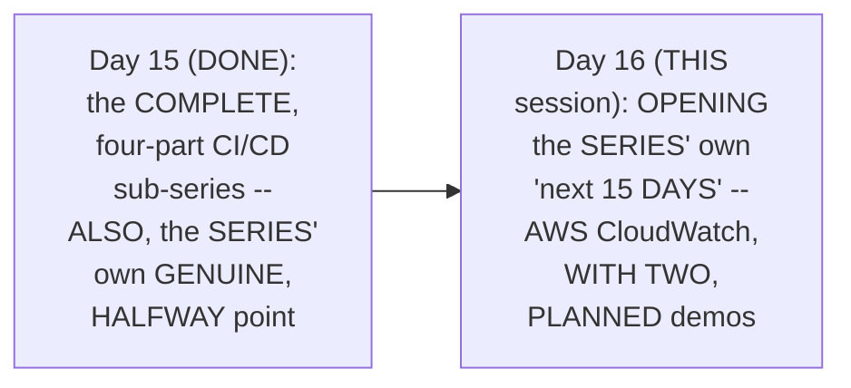

#### 🎯 Key Takeaways

* This is GENUINELY the SERIES' own, FIRST session OF the "NEXT 15 days," HIGHER-level arc — EXPLICITLY, DIRECTLY previewed AT the close OF Day 15.
* TODAY's session is EXPLICITLY, DIRECTLY confirmed AS featuring **TWO** demos — UNUSUAL for this SERIES' own, TYPICAL single-DEMO structure.
* This directly, PRECISELY sets UP the SESSION's own, COMPLETE structure — THEORY (CLOUDWATCH's own DEFINITION and FEATURES) FOLLOWED by hands-ON, practical DEMONSTRATION.

---

### 2. Why Doing the Demos Yourself Genuinely Matters (A Direct, Honest Motivation)

#### ⚠ A Direct, Honest, Genuine Motivation

> 💡 **Given directly:** *"What I notice is a lot of people are actually following the theory part — they are understanding about the theory, fundamental concept of what is a service and why a service, but only a few people are actually performing the demos... if you don't do this demos at your end, you will not be able to answer the real-life interview questions in interviews."*

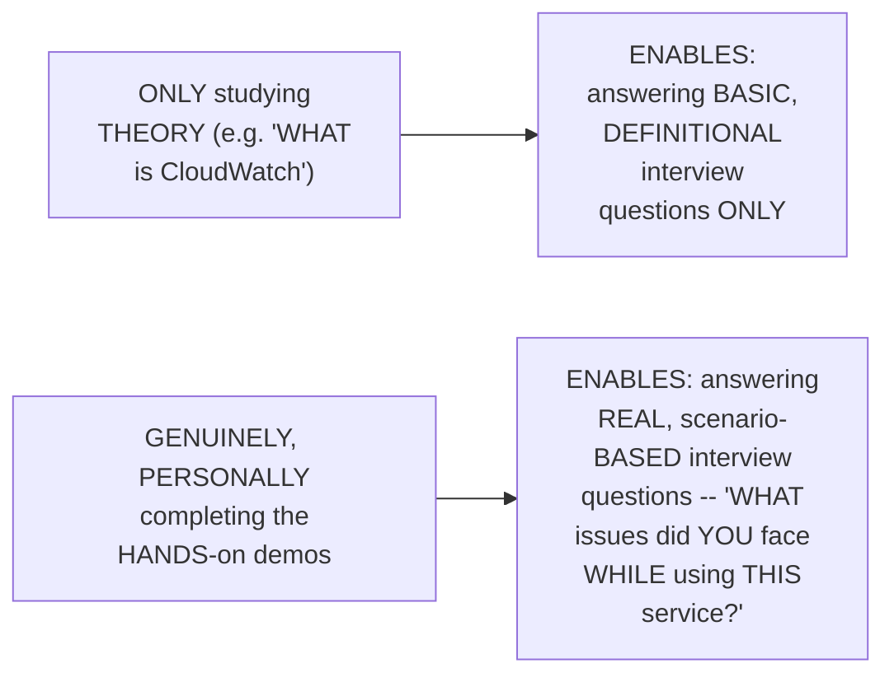

#### ⚠ Common Mistakes

* Assuming THEORETICAL knowledge ALONE (KNOWING "WHAT is CloudWatch") is GENUINELY, PRACTICALLY sufficient FOR real, professional INTERVIEWS — explicitly, directly, HONESTLY clarified: REAL interviewers GENUINELY, TYPICALLY ask about REAL, scenario-BASED issues — REQUIRING genuine, PERSONAL, hands-ON experience.

#### 🎯 Key Takeaways

* The instructor **directly, HONESTLY motivates** hands-ON practice — DISTINGUISHING between BASIC, theoretical KNOWLEDGE ("what IS CloudWatch") and REAL, scenario-BASED interview readiness ("WHAT issues did YOU face").
* This directly, CONSISTENTLY reinforces THIS series' own, ESTABLISHED, hands-ON teaching PHILOSOPHY — a THEME REPEATED across MULTIPLE, prior sessions IN this workspace.
* This directly, PRECISELY sets UP the SESSION's own, CORE content — a COMPLETE theoretical FOUNDATION (Sections 3-5) FOLLOWED by GENUINE, hands-on DEMONSTRATIONS (Sections 6-12).

---

### 3. CloudWatch, Precisely Defined: A Genuinely Memorable "Gatekeeper" Analogy

#### 📖 Definition — CloudWatch, Precisely Defined

> 💡 **Given directly:** *"You can split this word into two parts — one is cloud, and the second thing is watch. So what is CloudWatch? CloudWatch is basically a person who is watching the activities on cloud — it is a service which is watching activities on cloud, so you can consider CloudWatch as a gatekeeper."*

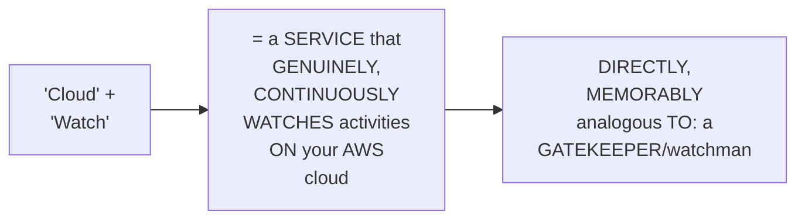

#### 🧠 Concept — A Genuinely Memorable, Real, Relatable Analogy

> 💡 **Given directly:** *"Let's say you have a secure property, okay, what you usually do to this secure property — you have a watchman, or you have a gatekeeper to this secure property, right, and you can ask this gatekeeper, 'hey, what happened when I'm not around?'... exactly in the same way, you can ask this CloudWatch, because it's a gatekeeper of AWS, 'hey CloudWatch, tell me what activities happened today on my AWS account.'"*

#### 📖 Definition — A Genuine, Direct, Interview-Ready Definition

> 💡 **Given directly:** *"When someone asks you in an interview, 'what is CloudWatch,' you can tell them that CloudWatch is basically a gatekeeper for my AWS account, which will help in understanding and implementing the monitoring, alerting, reporting, and logging."*

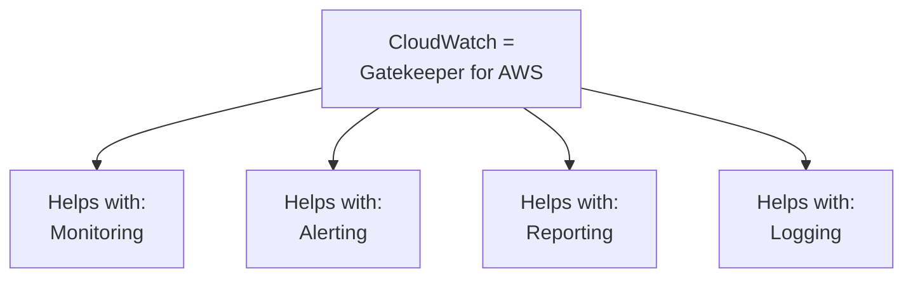

#### ⚠ Common Mistakes

* Assuming CLOUDWATCH is a GENUINELY, MERELY passive, "STORAGE" service FOR logs — explicitly, directly, MEMORABLY reframed AS an ACTIVE, CONTINUOUSLY-watching "GATEKEEPER" — DIRECTLY, GENUINELY monitoring EVERY, real activity ON your AWS cloud.

#### 🎯 Key Takeaways

* **AWS CLOUDWATCH** is precisely, MEMORABLY defined AS a **"GATEKEEPER"** for AWS — CONTINUOUSLY watching ACTIVITIES on your CLOUD, JUST as a REAL, physical gatekeeper WATCHES a secure PROPERTY.
* A GENUINE, direct, INTERVIEW-ready definition: "CloudWatch HELPS in **MONITORING, alerting, REPORTING, and logging**" — the FOUR, primary THINGS.
* THIS "gatekeeper" analogy directly, MEMORABLY anchors EVERY, subsequent FEATURE explained IN this session (SECTION 4) — EACH feature GENUINELY, DIRECTLY connects BACK to this CORE, watching FUNCTION.

---
### 4. CloudWatch's Six Core Features, Explained at a High Level

#### 📖 Definition — Feature 1: Monitoring

> 💡 **Given directly:** *"You can implement monitoring — monitoring is a very first thing, and the very biggest advantage of AWS CloudWatch, because these days monitoring is a very, very important activity for devops engineers... whether it's your Kubernetes applications monitoring, or whether it's your infrastructure monitoring, CloudWatch basically plays a critical role."*

#### 📖 Definition — Feature 2: Real-Life Metrics

> 💡 **Given directly:** *"A metric is nothing but — you can say that, okay, when you are using EC2 instance, a metric can be how many API requests did my application inside the EC2 instance receive, or the other metric can be, during last 30 minutes, what was the CPU utilization on my AWS EC2 instance."*

#### 📖 Definition — Feature 3: Alarms (Closely Tied to Metrics)

> 💡 **Given directly:** *"Sometimes you have to take actions on this metric, right — what kind of actions? See, if your EC2 instance is going to 100% utilization, then your EC2 instance will be not usable... so you can say, 'hey CloudWatch, if your metric for CPU utilization shows 80%, then send out a notification'... that's why metrics and alarms are very, very closely associated."*

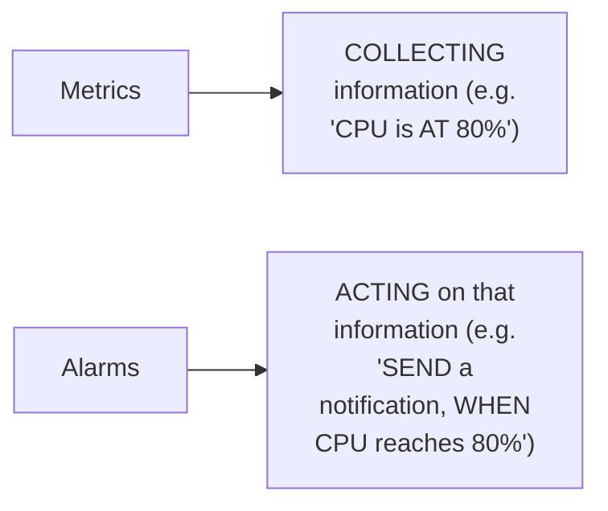

#### 📖 Definition — Feature 4: Log Insights

> 💡 **Given directly:** *"Log insights basically means that it can provide you a log, saying that, 'hey, this specific service tried to access your EC2 instance, this specific service tried to access your S3 bucket, at this point of time'... in last class I used EC2 instance to connect to AWS CodeDeploy, right — now that activity will be recorded in AWS CloudWatch."*

#### 📖 Definition — Feature 5: Custom Metrics

> 💡 **Given directly:** *"CPU utilization is a default metric, by default CloudWatch tracks the CPU utilization as a metric for your EC2 instances — but CloudWatch does not track the memory utilization, so if you want to get the memory utilization, then you have to enhance CloudWatch... you have to send this custom metric to CloudWatch, because CloudWatch is not tracking this metric."*

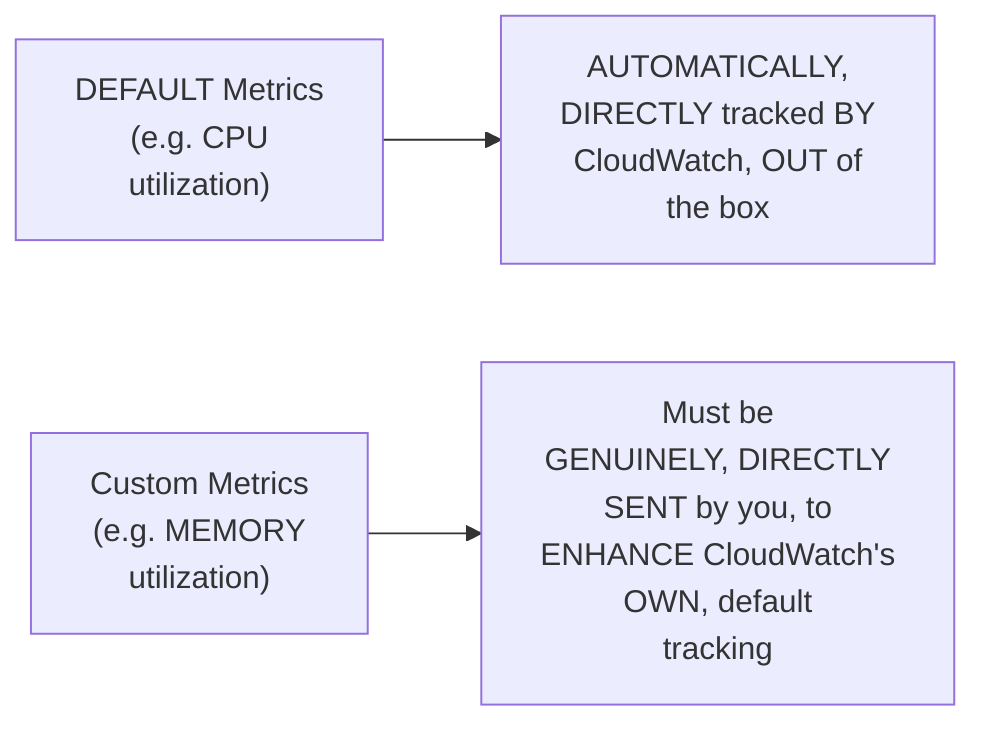

#### 📖 Definition — Feature 6: Cost Optimization & Scaling Integration (Both Honestly Deferred)

> 💡 **Given directly:** *"CloudWatch cannot directly perform the cost optimization... but it can integrate with other services like Lambda functions... we will do a video on this one as well, that will be Day 18... it will be unfair if I talk about cloud cost optimization now, because I did not teach you about Lambda functions."*

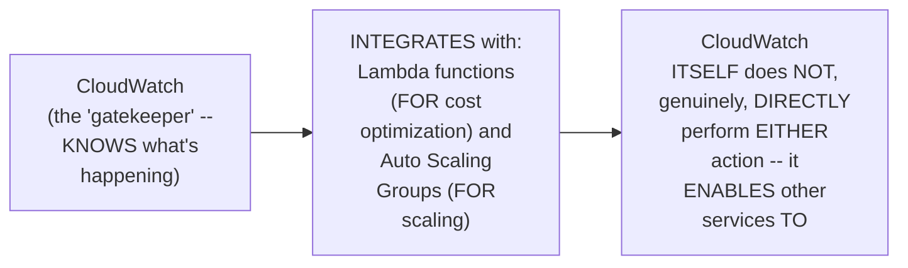

#### ⚠ Common Mistakes

* Assuming CLOUDWATCH GENUINELY, DIRECTLY performs COST optimization OR auto-SCALING itself — explicitly, directly, PRECISELY corrected: it GENUINELY, STRUCTURALLY **integrates** WITH other services (LAMBDA, Auto SCALING Groups) — WHICH perform THOSE actions, USING CloudWatch's own, GATHERED information.
* Assuming "COST optimization" will be GENUINELY, DIRECTLY covered WITHIN this SAME session — explicitly, directly, HONESTLY deferred TO **Day 18** — SPECIFICALLY, because LAMBDA functions (a GENUINE prerequisite) HAVEN'T yet been TAUGHT.

#### 🎯 Key Takeaways

* CLOUDWATCH's SIX core FEATURES: **MONITORING**, real-LIFE **metrics**, **ALARMS** (CLOSELY tied TO metrics — COLLECT versus ACT), **LOG insights**, **CUSTOM metrics** (extending BEYOND default TRACKING), and **COST optimization/SCALING** (via INTEGRATION with OTHER services).
* **METRICS** collect INFORMATION; **ALARMS** act ON that information — a GENUINE, closely-tied RELATIONSHIP, worth REMEMBERING precisely.
* **COST optimization** is directly, HONESTLY deferred TO **Day 18** — REQUIRING Lambda FUNCTIONS (a genuine PREREQUISITE) to be TAUGHT first.

---

### 5. A Genuine, Honest Scoping Decision: What This Session Will (and Won't) Demo

#### 🪜 Step-by-Step — A Direct, Honest Confirmation of the Session's Own, Chosen Scope

> 💡 **Given directly:** *"Practically it will be impossible to do all of these demos, so that's why I have chosen three very important ones... firstly we will do the real-life metrics thing, then we will do the custom metrics thing, and then we will do the cost optimization... cost optimization will be covered in the next video, that means once I teach you Lambda functions, I'll cover the cost optimization as well."*

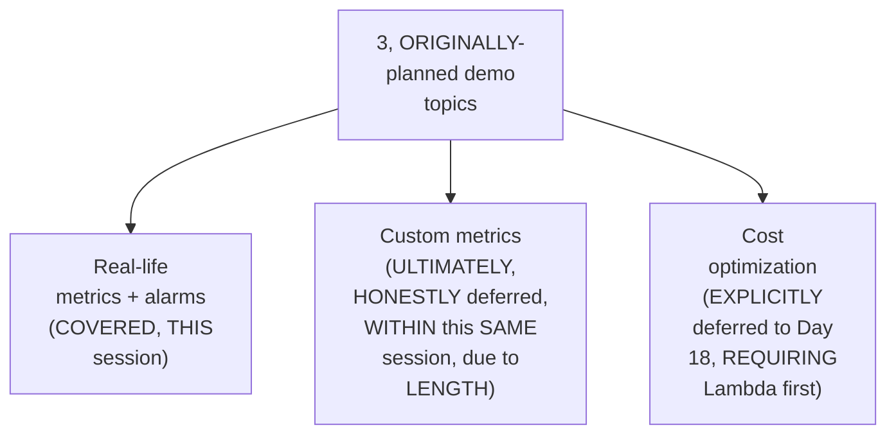

#### ⚠ Common Mistakes

* Assuming THIS session's own, INITIALLY-stated PLAN (THREE demo TOPICS) genuinely, DIRECTLY matches WHAT was ACTUALLY, completely DELIVERED — explicitly, directly, HONESTLY clarified: ONLY real-LIFE metrics + alarms was GENUINELY, FULLY demonstrated — CUSTOM metrics was ULTIMATELY, ALSO deferred (Section 14), DESPITE being INITIALLY planned.

#### 🎯 Key Takeaways

* THE instructor **directly, HONESTLY confirms** a GENUINE, practical SCOPING constraint — "PRACTICALLY it will be IMPOSSIBLE to do ALL of these DEMOS" — LEADING to a DELIBERATE, THREE-topic SELECTION.
* COST optimization is directly, EXPLICITLY deferred TO Day 18 (REQUIRING Lambda FUNCTIONS first); CUSTOM metrics, DESPITE being INITIALLY planned FOR this session, was ULTIMATELY, ALSO deferred (Section 14) — due TO genuine, real LENGTH constraints.
* This directly, HONESTLY sets ACCURATE, precise EXPECTATIONS — THIS session's own, ACTUAL, delivered DEMO content is real-LIFE metrics and ALARMS only (Sections 6-12).

---
### 6. A Complete, Real, Live Demo: CloudWatch Log Groups (& a Direct Callback to Day 14)

#### 📖 Definition — Log Groups, Precisely Explained

> 💡 **Given directly:** *"Log groups is nothing but CloudWatch automatically creates a group for your logs — what kind of group is it? For example, today you have created an application in CodeBuild — all the activities that are happening in that project, CloudWatch automatically creates a log group, and it will log all the information inside that log group only, so that it will be very easy for you if you have 100 projects inside CodeBuild."*

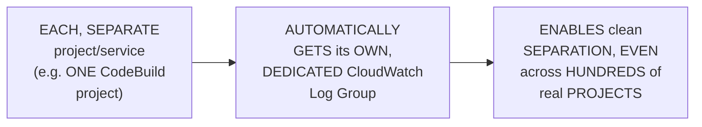

#### 🪜 Step-by-Step — A Genuine, Direct, Live Callback to Day 14's Own, Established Content

> 💡 **Given directly:** *"If you have watched our previous videos, on Day 14 what I've done is I have created a project inside CodeBuild, right — automatically when I've created the project, CloudWatch was watching for the CodeBuild service, it was tracking the activities... if you go to this one, you will notice that it gives you all the information — what was your Docker file, how did you build it, what was the entire log of the build process."*

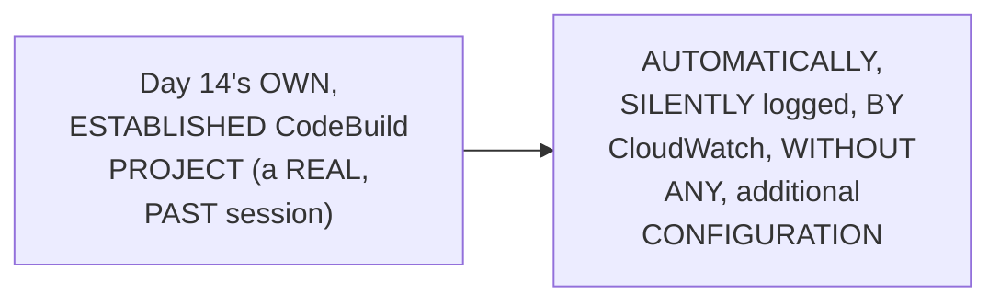

#### 🔍 Internal Working — A Genuine, Direct, Live-Confirmed Discovery: The Exact, Same Past Error

> 💡 **Given directly:** *"Go back to the log group again, and if you scroll down, this is the first build that we have built, okay, and if you remember, on Day 14 we got error related to pip... error related to the requirements.txt file, so that error should be there — if you scroll down, you will notice that this build was failed because it could not open the requirements.txt file, so the same error is recorded here."*

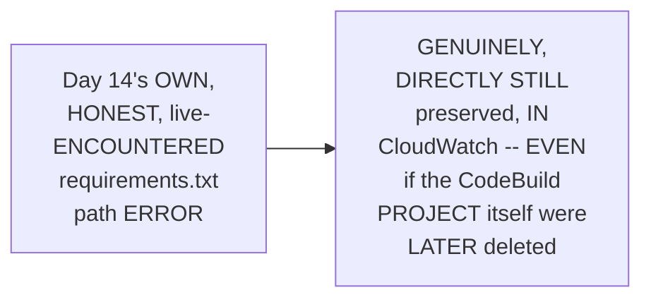

#### ⚠ Common Mistakes

* Assuming LOG data is GENUINELY, PERMANENTLY lost, ONCE the ORIGINAL, source PROJECT (e.g., a CODEBUILD project) is DELETED — explicitly, directly, LIVE-demonstrated as FALSE — "EVEN you have DELETED that project, you CAN still come BACK to CloudWatch, and you CAN get the INFORMATION from CloudWatch."

#### 🎯 Key Takeaways

* **LOG groups** are directly, AUTOMATICALLY created BY CloudWatch, ONE per PROJECT/service — DIRECTLY, PRACTICALLY enabling CLEAN separation, EVEN across HUNDREDS of real PROJECTS.
* A GENUINE, LIVE demonstration directly, CONCRETELY confirmed CLOUDWATCH'S own, AUTOMATIC logging OF Day 14's own, ESTABLISHED CodeBuild PROJECT — INCLUDING the EXACT, SAME, honest, REQUIREMENTS.txt path ERROR from THAT earlier session.
* This directly, CONCRETELY proves LOG data GENUINELY, DIRECTLY persists BEYOND the ORIGINAL project's own LIFETIME — a REAL, valuable AUDIT/troubleshooting CAPABILITY.

---

### 7. A Complete, Real, Live Demo: CloudWatch Metrics — 1,036 Default Metrics

#### 🏢 Real-World / Production Usage — A Genuine, Real, Impressive Number

> 💡 **Given directly:** *"It says that it has 1,036 default metrics that it is tracking all the time on your AWS account — that means every 5 minutes, every 10 minutes, it is collecting all the information from all the services on your AWS account, with this 1,036 metrics."*

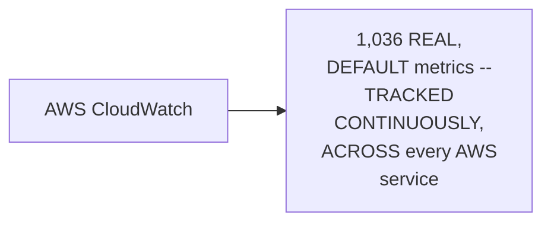

#### 🪜 Step-by-Step — A Complete, Real, Live EC2 Instance Setup (For Demonstration)

> 💡 **Given directly:** *"Let's take an example — instead of talking about this from the console, what I'll do is I'll create an EC2 instance... I have written a Python application for making this demo much, much easier — I'll increase, decrease the CPU, and I'll show you how this information is collected in this dashboard."*

#### 🪜 Step-by-Step — A Genuine, Direct Explanation: Detailed Monitoring

> 💡 **Given directly:** *"By default EC2 instance sends metrics every 5 minutes... what you can do is you can go to 'manage detail monitoring,' because I want to show you this real-time, enable this feature, and the metric is sent every 1 minute."*

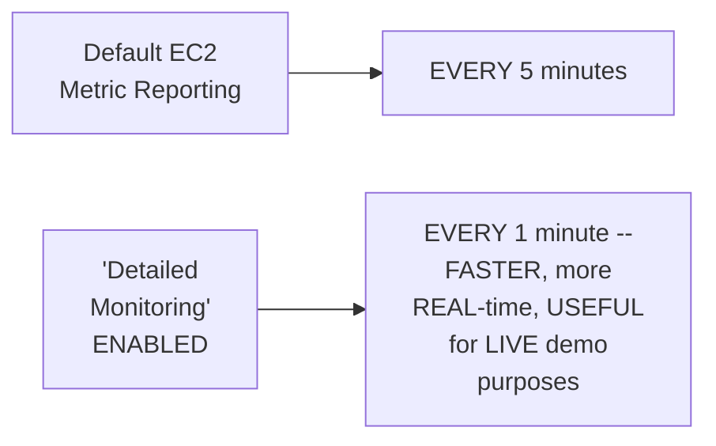

#### ⚠ Common Mistakes

* Assuming EXPLORING ALL 1,036 default METRICS is GENUINELY, PRACTICALLY necessary FOR any, real DEVOPS role — explicitly, directly, HONESTLY clarified: "AS a devops ENGINEER, you might NOT need all OF the metrics — you JUST need the METRICS that is HELPFUL for your PROJECT."

#### 🎯 Key Takeaways

* AWS CLOUDWATCH genuinely, DIRECTLY tracks **1,036 DEFAULT metrics**, CONTINUOUSLY, across EVERY AWS SERVICE — a GENUINELY, REAL, impressive SCALE.
* A COMPLETE, real EC2 INSTANCE was CREATED specifically TO demonstrate METRIC collection LIVE — WITH "DETAILED monitoring" ENABLED to SPEED up the DEMO (5-minute → 1-minute REPORTING interval).
* This directly, PRECISELY sets UP the SESSION's own, NEXT, CENTRAL demonstration — a LIVE, real CPU-spike SCRIPT, USED to GENERATE genuine, VISIBLE metric DATA (Section 8).

---
### 8. Simulating a Real CPU Spike: A Complete, Real, Live Demonstration

#### 🪜 Step-by-Step — A Complete, Real, Live Script Execution

> 💡 **Given directly:** *"I've written a Python script that I have written will help you... let's run this program, right — Python 3, cpu_spike.py — simulating CPU spike at 80%... what I'm trying to do here is I'm trying to increase the CPU spike."*

```bash
python3 cpu_spike.py
# "Simulating CPU spike at 80%"
```

#### ⚠ A Direct, Honest, Important Safety Warning

> 💡 **Given directly:** *"If you are using this program of mine, make sure that you use it carefully, okay, because this is a CPU spike generator... if you're running this program of mine on any of your office-related virtual machines, or your personal laptop, or something, be very careful — because sometimes if CPU goes beyond a particular thing, like let's say if your CPU consumption is 100%, then your laptop or your virtual machine will be unresponsive."*

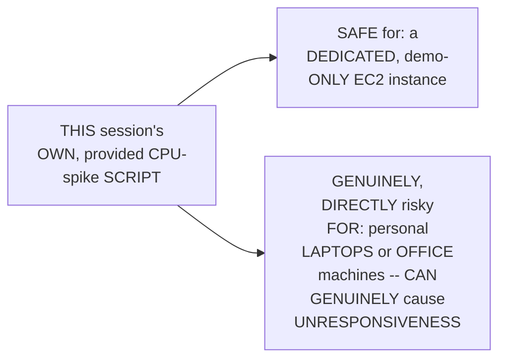

#### 🪜 Step-by-Step — A Complete, Real, Live-Confirmed Metric Update

> 💡 **Given directly:** *"See, it started collecting, and what did it say? The CPU was spiked to 50% at this point of time... as it keeps going, the CPU spike will keep increasing, and the information will also be collected here... yes, so it started going up to 100% as well."*

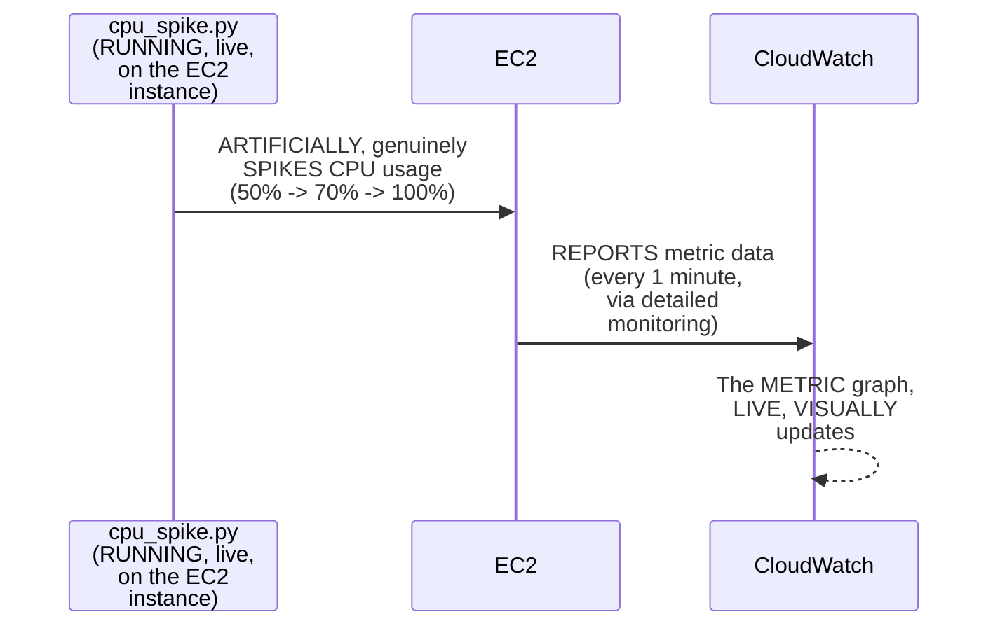

#### ⚠ A Direct, Honest, Real-Time Troubleshooting Note

> 💡 **Given directly:** *"This CloudWatch metric, it takes some time to reflect, so for now it is just at 0.77... you can keep refreshing, you can get the information in different types as well."*

#### ⚠ Common Mistakes

* Assuming CLOUDWATCH metric DATA reflects INSTANTANEOUSLY, the MOMENT a REAL, underlying CHANGE (like a CPU spike) OCCURS — explicitly, directly, HONESTLY acknowledged: a GENUINE, real DELAY exists — "IT takes SOME time TO reflect" — REQUIRING patience and REPEATED refreshing.

#### 🎯 Key Takeaways

* A COMPLETE, real, LIVE demonstration directly, CONCRETELY confirmed a PROVIDED Python SCRIPT genuinely, DIRECTLY spiking a REAL EC2 instance's OWN CPU usage — FROM 50% up to 100%.
* A GENUINE, IMPORTANT safety WARNING was directly, HONESTLY given — THIS script is SAFE only FOR dedicated, DEMO-only instances — GENUINELY risky ON personal/office MACHINES.
* A GENUINE, honest, REAL-time troubleshooting NOTE confirmed CLOUDWATCH metric DATA GENUINELY, DIRECTLY takes SOME time to REFLECT — a REAL, practical CHARACTERISTIC worth REMEMBERING.

---

### 9. Average vs. Maximum: A Genuine, Important Aggregation Distinction

#### 📖 Definition — The Precise, Important Distinction

> 💡 **Given directly:** *"In organizations we will use average metrics — what average does is, see, sometimes what will happen is CPU goes to 100%, and immediately it will come back, right, but in organization we will look for average of metrics — that means if the CPU utilization is at 70% for one minute, okay, then only report it as an issue."*

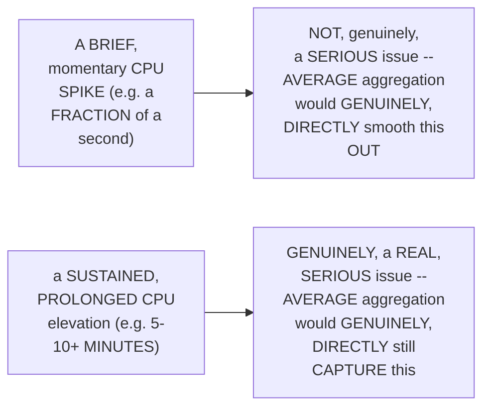

#### 🔍 Internal Working — A Genuine, Real, Live-Demonstrated Confirmation

> 💡 **Given directly:** *"It says maximum here, in the last 5 minutes, is 85%, whereas if you change it to average, you might get a different result... average of last 30 days, it has changed to 33 — the reason is you are playing with this parameter."*

#### ⚠ Common Mistakes

* Assuming "MAXIMUM" aggregation is GENUINELY, ALWAYS the RIGHT choice FOR real, PRODUCTION alarm CONFIGURATION — explicitly, directly, PRECISELY clarified: "IN organizations we WILL use AVERAGE metrics ONLY" — MAXIMUM was USED, in THIS session, SPECIFICALLY for DEMO-speed convenience, NOT as a REAL, recommended PRACTICE.

#### 🎯 Key Takeaways

* **AVERAGE** aggregation GENUINELY, DIRECTLY smooths OUT brief, MOMENTARY spikes — ONLY flagging a GENUINE issue WHEN elevation is SUSTAINED (e.g., OVER 5 minutes); **MAXIMUM** aggregation CAPTURES the SINGLE, highest VALUE — INCLUDING brief, POTENTIALLY non-serious SPIKES.
* REAL, PRODUCTION organizations GENUINELY, DIRECTLY prefer **AVERAGE** — MAXIMUM was ONLY used IN this session's own DEMO, for SPEED convenience.
* This directly, PRECISELY sets UP the SESSION's own, NEXT, essential STEP — CONFIGURING a REAL CloudWatch ALARM, using THIS same AGGREGATION choice (Section 10).

---
### 10. A Complete, Real, Live Demo: Creating a CloudWatch Alarm

#### 🪜 Step-by-Step — A Complete, Real, Live Alarm-Configuration Walkthrough

> 💡 **Given directly:** *"Click on create alarm, okay, select kind of metrics that you want for the alarm... I want metrics related to EC2 instance... what is that metric, CPU utilization, search for it... do you want average or maximum? Because this is demo, let's select on maximum."*

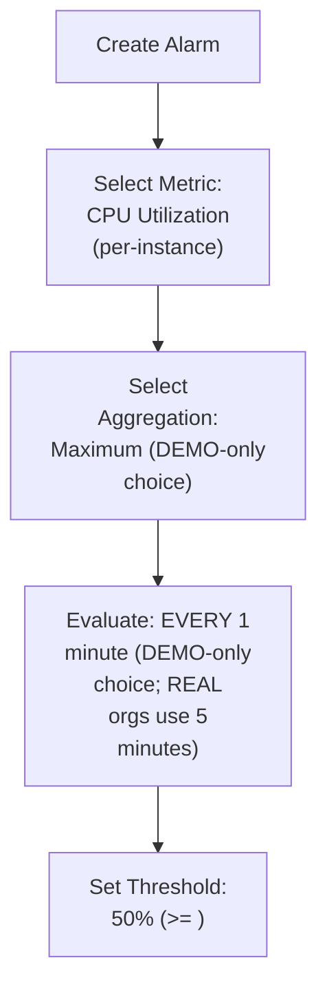

#### 🪜 Step-by-Step — A Genuine, Direct Explanation of the Configured Threshold

> 💡 **Given directly:** *"So every 1 minute, CloudWatch will watch for that EC2 instance — CloudWatch will get the metrics from that instance, and if in 1 minute, within that one minute that it is watching, the maximum is reaching a specific point, you can configure that specific point... let's say 50% only."*

```text
The Complete, Configured Alarm Rule:
  Metric:      CPU Utilization (per-instance)
  Aggregation: Maximum
  Period:      1 minute
  Threshold:   >= 50%
  -> Trigger the alarm
```

#### ⚠ Common Mistakes

* Assuming EVALUATING an ALARM "EVERY 1 minute" is GENUINELY, ALWAYS the RIGHT, production-appropriate CHOICE — explicitly, directly, IMPLICITLY clarified (via Section 9's own, established CONTEXT): THIS 1-minute, MAXIMUM-based configuration was CHOSEN specifically FOR demo speed — REAL organizations GENUINELY, TYPICALLY prefer LONGER evaluation PERIODS (e.g., 5 minutes), WITH average AGGREGATION.

#### 🎯 Key Takeaways

* A COMPLETE, real, LIVE demonstration directly, CONCRETELY confirmed the FULL alarm-CONFIGURATION workflow — SELECTING the CPU-utilization METRIC, choosing AGGREGATION (maximum, FOR demo SPEED), and SETTING a 50% THRESHOLD.
* THE complete, configured ALARM rule directly, PRECISELY specifies: EVERY 1 MINUTE, IF the maximum CPU UTILIZATION reaches OR exceeds 50%, TRIGGER the alarm.
* This directly, PRECISELY sets UP the SESSION's own, NEXT, essential STEP — CONFIGURING HOW this alarm ACTUALLY, genuinely NOTIFIES someone — VIA AWS SNS (Section 11).

---

### 11. SNS & Email Notification: A Complete, Real, Live Walkthrough

#### 📖 Definition — SNS, Briefly Introduced (& Explicitly Deferred as a Future Topic)

> 💡 **Given directly:** *"In AWS to send out notifications, we will use a service called SNS topics — simple notification service topic, okay, so we haven't reached to SNS, but for now let's understand that SNS is a service that is simple notification service, and using SNS you can send out emails, you can send out any kind of information."*

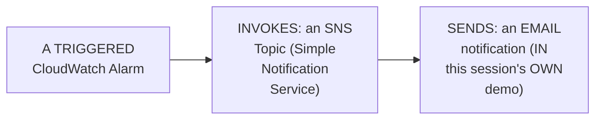

#### 🪜 Step-by-Step — A Complete, Real, Live SNS Topic & Subscription Setup

> 💡 **Given directly:** *"Create a new topic, topic, provide name of topic, CloudWatch topic, okay, and here provide the email address... click on create topic, so the topic will be created."*

#### 🪜 Step-by-Step — A Complete, Real, Genuine, Organizational-Style Alarm Message

> 💡 **Given directly:** *"Usually in organizations you provide something like this — 'hey team, this is an automated notification from CloudWatch to let you know that your instance CPU has spiked to 50% or above, please take the necessary action,' right, so you can type something like this, and usually this is our organizations will put."*

#### ⚠ A Direct, Honest, Live-Encountered Step: Email Confirmation Required

> 💡 **Given directly:** *"At this point of time your alarm is not activated, right — click on this one, you will understand why, it says that insufficient data, right, that is because you haven't activated from the email address. So if you go and refresh your email page, you will either go to the spam as well — so in the spam you will see a notification from AWS saying that please approve this — click on the confirm subscription."*

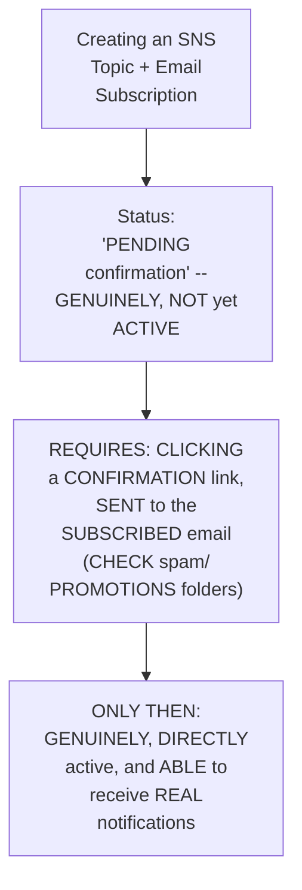

#### ⚠ Common Mistakes

* Assuming an SNS EMAIL subscription is GENUINELY, IMMEDIATELY active, THE moment an EMAIL address is PROVIDED — explicitly, directly, LIVE-demonstrated as REQUIRING an EXPLICIT, real CONFIRMATION step — CLICKING a LINK, sent TO the subscribed EMAIL, BEFORE notifications CAN genuinely be RECEIVED.

#### 🎯 Key Takeaways

* **SNS (SIMPLE Notification SERVICE)** was BRIEFLY introduced AS the MECHANISM used to SEND real notifications (EMAIL, in THIS demo) — EXPLICITLY confirmed AS a FUTURE, dedicated TOPIC, not FULLY explained here.
* A COMPLETE, real, GENUINE, organizational-STYLE alarm MESSAGE was directly, CONCRETELY written — a REAL, practical EXAMPLE worth REMEMBERING for REAL, professional use.
* A GENUINE, live-ENCOUNTERED step directly, HONESTLY confirmed: SNS email SUBSCRIPTIONS REQUIRE explicit CONFIRMATION (VIA a LINK, sent TO the subscribed EMAIL) — WITHOUT this, the ALARM remains GENUINELY, PRACTICALLY inactive.

---
### 12. A Complete, Real, Live-Confirmed Success: The Alarm Triggers, the Email Arrives

#### 🪜 Step-by-Step — A Complete, Real, Live Re-Trigger

> 💡 **Given directly:** *"Now you can go back to the CloudWatch, and if you refresh again, you will see one thing is activated... now you can go back and if you refresh it, you will not receive any notification at this point of time because the alarm is not triggered — so we will trigger the alarm from our terminal... Python 3, cpu_spike — now this will start increasing the CPU usage."*

#### ⚠ A Direct, Honest, Real-Time Waiting Period

> 💡 **Given directly:** *"Let's see, still there is no luck, still the program is running — after a while this program will increase the CPU limit, and you will see the notification, okay, till that time you have to be very patient."*

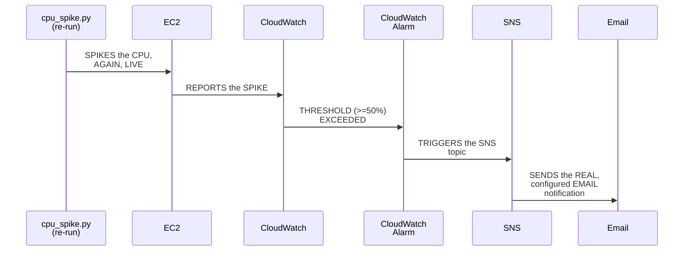

#### 🔍 Internal Working — A Genuine, Direct, Live-Confirmed, Complete Success

> 💡 **Given directly:** *"Watch for all the inboxes, do not complain that Abhishek, I have not received this thing — you will definitely receive it, but check for spam folder, check for promotions folder, all the folders that are available, and wait for a couple of minutes... so see, you have got a very clear information — description, 'hey team, this is an automated notification from CloudWatch to let you know that the CPU spike is 50% or above' — exactly what I've written."*

#### ⚠ Common Mistakes

* Assuming a REAL, configured EMAIL notification WILL, genuinely, ALWAYS arrive DIRECTLY in the PRIMARY inbox, WITHIN seconds — explicitly, directly, HONESTLY clarified: it CAN, genuinely, LAND in SPAM or PROMOTIONS folders, and CAN take a FEW minutes TO arrive — REQUIRING patience AND thorough CHECKING.

#### 🎯 Key Takeaways

* A COMPLETE, real, LIVE re-TRIGGER of the CPU-SPIKE script directly, CONCRETELY confirmed the ENTIRE, end-to-END alarm PIPELINE working — METRIC spike → ALARM threshold EXCEEDED → SNS TRIGGERED → a REAL email GENUINELY received.
* A GENUINE, honest, REAL-time waiting PERIOD was directly, HONESTLY shown — REINFORCING that REAL, cloud-based SYSTEMS genuinely INVOLVE some, real LATENCY, NOT instantaneous RESULTS.
* THIS complete, real SUCCESS directly, CONCRETELY validates EVERY, prior STEP in THIS session's own, ESTABLISHED demonstration — METRICS, aggregation, ALARM configuration, and SNS — ALL genuinely, DIRECTLY working TOGETHER.

---

### 13. Dashboards: Briefly, Implicitly Covered

#### 🪜 Step-by-Step — A Direct, Honest Confirmation

> 💡 **Given directly:** *"Then you might be thinking, what is dashboards, Abhishek, you have not explained dashboards? Dashboard is the same thing — like, you know, I just created a dashboard for the alarm, and you know, if you create dashboard, you will find the same thing, so you can create dashboard and you can track a particular metric, or group of metrics, that you want."*

```mermaid
flowchart LR
    A["CloudWatch<br/>Dashboards"] --> B["GENUINELY,<br/>IMPLICITLY, ALREADY<br/>demonstrated -- VIA<br/>the SAME metric/<br/>ALARM views SHOWN,<br/>earlier IN this<br/>session"]
```

#### ⚠ Common Mistakes

* Assuming DASHBOARDS were GENUINELY, ENTIRELY skipped, or GENUINELY left UNEXPLAINED — explicitly, directly, HONESTLY clarified: THEY were IMPLICITLY, DIRECTLY covered — the SAME, underlying CONCEPT (VISUALIZING one OR more metrics) was ALREADY, genuinely SHOWN throughout the EARLIER, metric/alarm DEMONSTRATIONS.

#### 🎯 Key Takeaways

* **DASHBOARDS** were directly, HONESTLY confirmed as ALREADY, IMPLICITLY covered — THE same, underlying CONCEPT (visualizing METRICS, in LINE/pie/bar FORMAT) was DIRECTLY demonstrated THROUGHOUT the EARLIER, metric-based SECTIONS.
* This directly, EFFICIENTLY avoids GENUINE, unnecessary REPETITION — RATHER than a SEPARATE, redundant DEMO, the instructor DIRECTLY connects DASHBOARDS back TO what's ALREADY been SHOWN.
* This directly, PRECISELY sets UP the SESSION's own, FINAL, honest DEFERRAL — CUSTOM metrics, EXPLICITLY confirmed AS NOT covered TODAY (Section 14).

---
### 14. Closing: Custom Metrics Deferred, & a Direct Encouragement to Practice

#### ⚠ A Direct, Honest, Genuine Deferral

> 💡 **Given directly:** *"The only thing that I did not cover, because the video is getting extremely lengthy, is the custom metrics — I have prepared the script for it, I have everything ready, but I think we should not include that in this video, because it's getting extremely lengthy. I'll make a different video, probably a follow-up video, or sometime later in the AWS 30 days course regarding this custom metrics."*

```mermaid
flowchart LR
    A["Custom Metrics"] --> B["FULLY PREPARED<br/>(per the<br/>instructor's own,<br/>DIRECT confirmation)<br/>-- but DELIBERATELY<br/>HELD BACK, due to<br/>GENUINE length<br/>constraints"]
    B --> C["EXPLICITLY<br/>promised: a FUTURE<br/>session -- EXACT<br/>TIMING not, yet,<br/>SPECIFIED"]
```

#### 🪜 Step-by-Step — A Direct, Honest, Final Encouragement

> 💡 **Given directly:** *"I hope you found the video informative, and definitely please try to do the demo from your side only — then you will get the real-life experience and expertise. I tried one metric on AWS CloudWatch, out of 1,036 metrics — it's your turn, you can pick up any other metrics and try the same experiment."*

#### ⚠ Common Mistakes

* Assuming CUSTOM metrics were GENUINELY, ENTIRELY unprepared or FORGOTTEN — explicitly, directly, HONESTLY clarified: "I HAVE prepared the SCRIPT for it, I have EVERYTHING ready" — the DEFERRAL is PURELY, GENUINELY about MANAGING this session's OWN, real length, NOT a LACK of readiness.

#### 🎯 Key Takeaways

* This episode **GENUINELY, COMPREHENSIVELY delivers** its OWN, stated GOALS — a COMPLETE, theoretical FOUNDATION (the "GATEKEEPER" analogy, SIX features) PLUS a COMPLETE, real, end-TO-end metrics-AND-alarms demonstration.
* **CUSTOM metrics** is directly, HONESTLY confirmed as FULLY prepared, but DELIBERATELY deferred TO a FUTURE session — SPECIFICALLY to AVOID excessive VIDEO length.
* A DIRECT, final ENCOURAGEMENT reinforces THIS session's own, OPENING motivation (Section 2) — LEARNERS should GENUINELY, PERSONALLY try ADDITIONAL metrics THEMSELVES, BEYOND the SINGLE one DEMONSTRATED.

---

## 📝 Glossary

| Term | Definition | Why It Matters |
|---|---|---|
| **CloudWatch** | AWS's own "gatekeeper" service | Monitors, alerts, reports, and logs activity across your account |
| **Metric** | A collected piece of information (e.g., CPU utilization) | The raw data CloudWatch gathers |
| **Alarm** | An action taken based on a metric | Metrics collect; alarms act |
| **Log Group** | An automatically-created, per-project log container | Persists even after the original resource is deleted |
| **Custom Metric** | Data sent BY you, beyond CloudWatch's own defaults | E.g., memory utilization, which isn't tracked by default |
| **SNS (Simple Notification Service)** | AWS's own notification-sending service | Used here to send real email alerts |
| **Average vs. Maximum** | Two metric aggregation types | Average smooths brief spikes; Maximum captures the single highest value |
| **Detailed Monitoring** | An EC2 setting reducing report interval to 1 minute | Default is 5 minutes |

---

## 🔄 Revision Notes — One-Minute Revision

* This is **Day 16**, opening the series' own "next 15 days," higher-level arc -- a theory-plus-demo session on AWS CloudWatch, explicitly featuring TWO planned demos (though custom metrics was ultimately, honestly deferred).
* **Why doing demos yourself matters**: theoretical knowledge alone only supports basic, definitional interview answers -- real interviewers ask about genuine, scenario-based issues, requiring hands-on experience.
* **CloudWatch, defined**: a "gatekeeper" for AWS -- continuously watching cloud activity. Interview-ready definition: helps with monitoring, alerting, reporting, and logging.
* **CloudWatch's 6 core features**: monitoring, real-life metrics, alarms (closely tied to metrics -- collect vs. act), log insights, custom metrics (extending beyond default tracking), and cost optimization/scaling (via integration with Lambda and Auto Scaling Groups, NOT performed directly by CloudWatch itself).
* **Cost optimization is honestly deferred to Day 18** (requires Lambda functions first). Custom metrics, though fully prepared, was ALSO ultimately deferred within this same session, due to length.
* **Log Groups (live demo)**: automatically created per project/service. A genuine, direct callback to Day 14 confirmed the EXACT, same requirements.txt path error remains permanently logged, even though that CodeBuild project itself could be deleted.
* **Metrics (live demo)**: 1,036 default metrics, tracked continuously across every AWS service. A real EC2 instance was created, with "detailed monitoring" enabled (5-minute -> 1-minute reporting), and a provided Python script (cpu_spike.py) was used to genuinely spike CPU usage -- with an honest safety warning against using it on personal/office machines.
* **Average vs. Maximum**: Average smooths brief, momentary spikes (only flagging sustained elevation); Maximum captures the single highest value. Real organizations genuinely prefer Average; Maximum was used here only for demo speed.
* **Creating a CloudWatch alarm**: CPU Utilization metric, Maximum aggregation (demo-only), evaluated every 1 minute, threshold >= 50%.
* **SNS & email notification**: SNS (briefly introduced, deferred as a future topic) sends the actual notification. A real, organizational-style alarm message was written. A genuine, honest step: email subscriptions require explicit confirmation (checking spam/promotions) before becoming active.
* **The complete, live-confirmed success**: re-running the CPU-spike script triggered the entire pipeline -- metric spike, threshold exceeded, SNS triggered, and a real email genuinely received (with an honest, real-time waiting period shown).
* **Dashboards**: honestly confirmed as already, implicitly covered via the same metric/alarm views shown earlier -- no separate, redundant demo needed.
* **Closing**: custom metrics, though fully prepared, is explicitly deferred to a future session, purely due to length constraints. A direct, final encouragement to independently try additional metrics, beyond the one demonstrated.

---

## 📋 Cheat Sheet

**CloudWatch's 6 core features:**
```text
Monitoring | Real-Life Metrics | Alarms | Log Insights | Custom Metrics | Cost Optimization/Scaling (via integration)
```

**Metrics vs. Alarms:**
```text
Metrics -- COLLECT information (e.g., "CPU is at 80%")
Alarms  -- ACT on that information (e.g., "send a notification")
```

**Average vs. Maximum:**
```text
Average -- smooths brief spikes; used in REAL production
Maximum -- captures the single highest value; used here for DEMO speed only
```

**A complete alarm configuration (from this session's own demo):**
```text
Metric:      CPU Utilization (per-instance)
Aggregation: Maximum (demo-only; real orgs use Average)
Period:      1 minute (demo-only; real orgs use 5 minutes)
Threshold:   >= 50%
Action:      SNS Topic -> Email notification
```

**The complete, live-demonstrated pipeline:**
```text
cpu_spike.py -> EC2 (real CPU spike) -> CloudWatch (metric collected)
-> Alarm (threshold exceeded) -> SNS Topic -> Email (real notification received)
```

---

## 🔥 Interview Questions & Answers

### 🟢 Beginner

**Q1.**

**Question:** What is AWS CloudWatch, in one, memorable sentence?

**Answer:** A "gatekeeper" for AWS -- continuously watching activities across your cloud.

**Explanation:** Directly, memorably defined.

**Why Interviewers Ask This:** The most basic, foundational CloudWatch question.

**Possible Follow-up:** "What four things does CloudWatch help with?"

**Q2.**

**Question:** What is the genuine difference between a metric and an alarm?

**Answer:** A metric collects information; an alarm acts on that information.

**Explanation:** Directly, precisely distinguished.

**Why Interviewers Ask This:** A commonly-tested, foundational CloudWatch distinction.

**Possible Follow-up:** "Give a real example of each."

**Q3.**

**Question:** Does CloudWatch track memory utilization by default?

**Answer:** No -- only CPU utilization is tracked by default; memory requires a custom metric.

**Explanation:** Directly, precisely clarified.

**Why Interviewers Ask This:** Tests genuine understanding of default vs. custom metrics.

**Possible Follow-up:** "What does 'custom metric' genuinely mean?"

**Q4.**

**Question:** Does CloudWatch directly perform cost optimization or auto-scaling?

**Answer:** No -- it integrates with other services (like Lambda and Auto Scaling Groups) that perform those actions.

**Explanation:** Directly, precisely clarified.

**Why Interviewers Ask This:** Tests genuine understanding of CloudWatch's own, actual role vs. a common misconception.

**Possible Follow-up:** "What service does CloudWatch integrate with, for cost optimization?"

**Q5.**

**Question:** How many default metrics does AWS CloudWatch genuinely track?

**Answer:** 1,036.

**Explanation:** Directly, explicitly stated.

**Why Interviewers Ask This:** Basic, memorable, real-world CloudWatch scale knowledge.

**Possible Follow-up:** "Does a devops engineer genuinely need to know all of them?"

**Q6.**

**Question:** What does "detailed monitoring" genuinely change, for an EC2 instance?

**Answer:** It reduces the metric-reporting interval from 5 minutes to 1 minute.

**Explanation:** Directly, explicitly explained.

**Why Interviewers Ask This:** Basic, practical, hands-on CloudWatch configuration knowledge.

**Possible Follow-up:** "Is this the default setting, or must it be explicitly enabled?"

**Q7.**

**Question:** Which aggregation type do real organizations genuinely prefer for alarms -- Average or Maximum?

**Answer:** Average.

**Explanation:** Directly, explicitly confirmed.

**Why Interviewers Ask This:** Tests genuine, practical, real-world alarm configuration knowledge.

**Possible Follow-up:** "Why is Average genuinely preferred over Maximum?"

**Q8.**

**Question:** What AWS service does a CloudWatch alarm genuinely use to send email notifications?

**Answer:** SNS (Simple Notification Service).

**Explanation:** Directly, explicitly named.

**Why Interviewers Ask This:** Basic, practical CloudWatch/SNS integration knowledge.

**Possible Follow-up:** "Does an email subscription become active immediately?"

**Q9.**

**Question:** Does log data genuinely persist in CloudWatch, even after the original resource (e.g., a CodeBuild project) is deleted?

**Answer:** Yes.

**Explanation:** Directly, live-demonstrated.

**Why Interviewers Ask This:** Tests genuine, practical understanding of CloudWatch's own, persistent logging value.

**Possible Follow-up:** "What real example, from this session's own demo, confirmed this?"

**Q10.**

**Question:** Was custom metrics fully covered in this session?

**Answer:** No -- explicitly, honestly deferred to a future session, due to length.

**Explanation:** Directly, honestly acknowledged.

**Why Interviewers Ask This:** Tests attention to the session's own, stated scope.

**Possible Follow-up:** "Was the custom-metrics content genuinely prepared, despite being deferred?"

---

### 🟡 Intermediate

**Q11.**

**Question:** Explain why the instructor deliberately revisits Day 14's own, established CodeBuild project to demonstrate CloudWatch log groups, rather than using a brand-new, unrelated example.

**Answer:** This is a genuinely deliberate, CONTINUITY-based teaching choice: by DIRECTLY, LIVE revisiting a PROJECT learners ALREADY, genuinely RECOGNIZE (per Day 14's OWN, established, HONEST debugging SEQUENCE), the instructor MAKES CloudWatch's OWN, "automatic, NO-configuration-required" LOGGING capability GENUINELY, CONCRETELY tangible — RATHER than an ABSTRACT claim. SEEING the EXACT, SAME requirements.txt ERROR, STILL preserved, DIRECTLY, VISCERALLY proves THAT CloudWatch was GENUINELY, SILENTLY capturing EVERYTHING, EVEN during a SESSION that had NOTHING, explicitly, to DO with CloudWatch AT the time.

**Explanation:** Requires recognizing the deliberate, continuity-based value of revisiting genuinely familiar, prior content to make an abstract claim (automatic logging) concretely, viscerally provable.

**Why Interviewers Ask This:** Tests whether a learner recognizes the pedagogical value of connecting new content to genuinely familiar, prior material, to make an abstract capability concrete.

**Possible Follow-up:** "Describe ANOTHER, genuine EXAMPLE, from EARLIER in THIS series, that CloudWatch would LIKELY, ALSO have SILENTLY, automatically LOGGED."

**Q12.**

**Question:** A learner argues that since this session confirms Maximum aggregation was used for the live alarm demo, this means Maximum is genuinely the industry-standard, recommended choice for real, production CloudWatch alarms. Evaluate this claim.

**Answer:** This claim is GENUINELY, DIRECTLY incorrect, and MISSES Section 9's own, EXPLICIT, HONEST clarification. Section 9's own PRECISE statement DIRECTLY confirms: "IN organizations we WILL use AVERAGE metrics ONLY" — Maximum was GENUINELY, EXPLICITLY chosen, IN Section 10's own LIVE demo, SPECIFICALLY "BECAUSE this is DEMO" — a DELIBERATE, speed-focused CHOICE, NOT a genuine, PRODUCTION recommendation. The ACCURATE, more PRECISE conclusion: Average AGGREGATION (SMOOTHING brief, MOMENTARY spikes, ONLY flagging SUSTAINED elevation) is the GENUINE, real, industry-STANDARD choice — Maximum was ONLY used HERE for THIS session's own, DEMO-specific convenience, EXPLICITLY acknowledged as NOT the real-world RECOMMENDATION.

**Explanation:** Tests whether a learner recognizes that a demo-appropriate choice, explicitly acknowledged as such, doesn't represent the session's own, genuine, real-world recommendation.

**Why Interviewers Ask This:** Distinguishes candidates who correctly track a session's own, explicit distinctions between "demo convenience" and "production best practice" from those who conflate the two.

**Possible Follow-up:** "IF you GENUINELY needed to configure a REAL, production ALARM today, WHAT aggregation TYPE and evaluation PERIOD would you GENUINELY, DIRECTLY choose, BASED on this session's OWN, established GUIDANCE?"

**Q13.**

**Question:** Explain, precisely, why the instructor deliberately shows the real-time waiting period (both for the metric to reflect, and for the email to arrive), rather than editing these delays out of the final video.

**Answer:** This is a genuinely deliberate, HONEST, real-WORLD-accuracy teaching choice, DIRECTLY consistent with THIS instructor's OWN, established PATTERN across the SERIES (e.g., Day 14's own, DELIBERATELY-preserved, LIVE debugging ERRORS). By GENUINELY, HONESTLY showing THESE real DELAYS — RATHER than EDITING them OUT for a SLICKER, faster-PACED video — the instructor SETS accurate, REALISTIC expectations: REAL, cloud-based SYSTEMS genuinely INVOLVE some, GENUINE latency — METRICS don't UPDATE instantaneously, and EMAILS don't ARRIVE immediately. THIS directly, HONESTLY prevents learners FROM genuinely, INCORRECTLY assuming SOMETHING is BROKEN, when THEY encounter THIS same, NORMAL delay THEMSELVES.

**Explanation:** Requires recognizing the deliberate, honest value of preserving real-world timing/delays, rather than editing them out for a faster-paced but less realistic demonstration.

**Why Interviewers Ask This:** Tests whether a learner recognizes the practical, expectation-setting value of honestly preserving real-world system behavior, including delays, in a demonstration.

**Possible Follow-up:** "Describe ANOTHER, genuine EXAMPLE, FROM elsewhere in THIS series, where a SIMILAR, real-TIME delay or WAITING period was SIMILARLY, honestly PRESERVED."

**Q14.**

**Question:** Using this session's own precise "CloudWatch integrates, rather than directly performs" reasoning (Section 4), explain a GENUINE, real architectural implication for a devops engineer designing a cost-optimization system, BEFORE Lambda functions have been learned.

**Answer:** A precise, reasoned, ARCHITECTURAL implication, directly extending Section 4's own established MECHANISM: per Section 4's own PRECISE reasoning, CloudWatch GENUINELY, STRUCTURALLY cannot, ON its OWN, directly PERFORM cost-optimization ACTIONS (e.g., STOPPING an unused EC2 instance) — it can ONLY, genuinely PROVIDE the underlying DATA/trigger (per its OWN, established "gatekeeper" role). THIS directly, PRECISELY reveals a GENUINE, architectural IMPLICATION: ANY, real cost-OPTIMIZATION system GENUINELY, STRUCTURALLY requires a SECOND, separate COMPONENT (per Section 4's OWN, established Lambda-INTEGRATION example) — CloudWatch ALONE is GENUINELY, STRUCTURALLY insufficient — a devops ENGINEER designing SUCH a system, EVEN before FORMALLY learning Lambda, should GENUINELY, DIRECTLY anticipate NEEDING some, SEPARATE "ACTION-taking" component, BEYOND CloudWatch's own, "OBSERVATION-only" role.

**Explanation:** Requires extending the "CloudWatch integrates, rather than directly performs" principle to identify a genuine, architectural implication for designing a cost-optimization system before the specific integration tool (Lambda) has been formally taught.

**Why Interviewers Ask This:** Tests whether a learner can anticipate a genuine, architectural requirement from a stated, general principle, even without having yet learned the specific, complementary tool.

**Possible Follow-up:** "BEYOND Lambda FUNCTIONS specifically, name ANOTHER, GENUINE type OF service (EXTENDING beyond THIS session's own, EXPLICIT content) that COULD, similarly, serve as CloudWatch's own, NECESSARY 'action-taking' COMPLEMENT."

**Q15.**

**Question:** Synthesize this session's complete "log groups persist beyond project deletion" reasoning (Section 6) with its own "1,036 default metrics" reasoning (Section 7) to explain a GENUINE, real, organizational risk of NOT genuinely understanding CloudWatch's own, default, persistent tracking behavior.

**Answer:** A precise, synthesized explanation, directly connecting TWO, separately-established sections: per Section 6's own PRECISE, established MECHANISM, CloudWatch GENUINELY, AUTOMATICALLY logs and PERSISTS data, WITHOUT requiring ANY, explicit CONFIGURATION — EVEN SURVIVING the DELETION of the ORIGINAL, source resource. Per Section 7's own PRECISE, established SCALE, CloudWatch GENUINELY, CONTINUOUSLY tracks **1,036 DEFAULT metrics**, ACROSS every AWS SERVICE. SYNTHESIZING these TWO facts directly, PRECISELY reveals a GENUINE, real, ORGANIZATIONAL risk: an ORGANIZATION that does NOT, genuinely UNDERSTAND this AUTOMATIC, persistent TRACKING behavior COULD, genuinely, be UNKNOWINGLY accumulating a VAST, ongoing VOLUME of LOG/metric data (PER Section 7's own, established, MASSIVE scale) — WITHOUT any, genuine AWARENESS of the ASSOCIATED, real STORAGE/retention COSTS, or WITHOUT genuinely KNOWING what SENSITIVE information (e.g., PER Section 6's own established EXAMPLE, DETAILED build LOGS) might be GENUINELY, PERSISTENTLY retained, LONG after a RESOURCE is deleted — a REAL, genuine COMPLIANCE and cost RISK, hiding WITHIN CloudWatch's own, GENUINELY powerful, but LARGELY invisible, DEFAULT behavior.

**Explanation:** Requires synthesizing the persistent-logging mechanism with the massive, default metric scale to identify a genuine, real organizational risk (cost and compliance) of not understanding CloudWatch's own, automatic tracking behavior.

**Why Interviewers Ask This:** A senior-level question testing whether a candidate can identify a genuine, structural risk arising from the combination of two, separately-established facts about CloudWatch's own scale and persistence.

**Possible Follow-up:** "Design a GENUINE, real, practical AUDIT process a devops ENGINEER could USE to REGULARLY review WHAT data CloudWatch is GENUINELY, PERSISTENTLY retaining, TO manage this SPECIFIC, identified risk."

---

### 🔴 Advanced

**Q16.**

**Question:** Design a complete, reasoned CloudWatch monitoring strategy (using ONLY this session's own established concepts) for a hypothetical, production e-commerce application, explicitly distinguishing which of this session's own, demo-specific choices should genuinely be changed for production use.

**Answer:** A reasonable, complete strategy, directly applying this session's OWN, exact established CONCEPTS:

```text
1. Metric Selection (per Section 4's own established distinction):
   IDENTIFY the SPECIFIC, genuinely relevant DEFAULT metrics for THIS
   application (e.g. CPU utilization, network I/O) -- per Section 7's
   own established REASONING, a devops engineer does NOT genuinely
   need ALL 1,036 metrics, ONLY the ones RELEVANT to THIS specific
   project.

2. Aggregation & Period (per Section 9's own established, EXPLICIT
   distinction): CHANGE this session's own, DEMO-only choices --
   REPLACE "Maximum" WITH "Average" aggregation, and REPLACE the
   1-minute evaluation PERIOD with a MORE realistic, PRODUCTION-
   appropriate period (e.g. 5 minutes) -- per Section 9's own,
   EXPLICIT, "real organizations use AVERAGE" guidance.

3. Alarm Thresholds (per Section 10's own established mechanism):
   SET genuinely appropriate, PRODUCTION-relevant thresholds (e.g.
   70-80% CPU, RATHER than this session's OWN, demo-friendly 50%) --
   AVOIDING excessive, FALSE-positive alerting.

4. Notification Routing (per Section 11's own established SNS
   mechanism): FOR a genuine, PRODUCTION system, CONSIDER routing
   CRITICAL alerts to MULTIPLE channels (e.g. SNS -> both EMAIL and
   Slack/PagerDuty), RATHER than THIS session's OWN, single-email
   demo setup.

5. Log Retention Awareness (per Advanced Q15's own established RISK
   analysis): ESTABLISH a DOCUMENTED, regular AUDIT process,
   REVIEWING what CloudWatch is GENUINELY, PERSISTENTLY retaining --
   DIRECTLY managing the GENUINE cost/compliance RISK this
   session's own, powerful DEFAULT behavior CREATES.

6. Custom Metrics (per Section 4 and Section 14's own established,
   HONEST deferral): FOR this e-commerce APPLICATION, IDENTIFY
   application-SPECIFIC data (e.g. checkout SUCCESS rate, PAYMENT
   processing TIME) that CloudWatch does NOT, genuinely, track by
   DEFAULT -- REQUIRING custom metrics (per Section 4's OWN
   established mechanism) TO capture, ONCE that FUTURE session's own
   content BECOMES available.
```

This complete STRATEGY directly, precisely APPLIES this session's OWN, established CONCEPTS — METRIC selection, AGGREGATION/period CHOICES, threshold SETTING, notification ROUTING, and CUSTOM metrics — to a GENUINELY realistic, PRODUCTION e-commerce SCENARIO, EXPLICITLY distinguishing demo-ONLY choices from PRODUCTION-appropriate ones.

**Explanation:** Requires synthesizing metric selection, aggregation/period configuration, threshold setting, and this session's own, explicitly-acknowledged demo-vs-production distinctions into one complete, reasoned monitoring strategy.

**Why Interviewers Ask This:** A comprehensive, capstone-level question testing whether a candidate can distinguish demo-appropriate configuration choices from genuinely production-appropriate ones, across every major concept in this session.

**Possible Follow-up:** "WHICH of THESE six, strategy COMPONENTS would you GENUINELY, PRACTICALLY prioritize IMPLEMENTING first, GIVEN a LIMITED, initial monitoring BUDGET?"

**Q17.**

**Question:** Critically evaluate: "Since this session confirms CloudWatch automatically tracks 1,036 default metrics without any configuration, this means a devops engineer genuinely never needs to configure anything manually, and CloudWatch's own, default behavior is always sufficient for production monitoring." Is this an accurate, complete characterization?

**Answer:** Not accurate — this OVERSTATES a GENUINE, IMPRESSIVE, default TRACKING capability into an UNCONDITIONAL claim OF "NEVER needing MANUAL configuration," which NEITHER this session's own CONTENT, nor sound REASONING, SUPPORTS. Section 4's own PRECISE, established REASONING DIRECTLY confirms CloudWatch does NOT, genuinely, DEFAULT-track EVERYTHING — MOST notably, "CLOUDWATCH does NOT track the MEMORY utilization" — REQUIRING genuine, MANUAL custom-METRIC configuration FOR this, and OTHER, application-SPECIFIC data. ADDITIONALLY, Sections 10-11's own, COMPLETE, LIVE demonstrations DIRECTLY confirm ALARMS, SNS topics, and EMAIL subscriptions ALL genuinely, DIRECTLY REQUIRE MANUAL, explicit CONFIGURATION — CloudWatch does NOT, genuinely, AUTOMATICALLY send NOTIFICATIONS without THIS setup. The ACCURATE, more PRECISE conclusion: CLOUDWATCH's own, DEFAULT metric TRACKING is GENUINELY, IMPRESSIVELY comprehensive FOR basic, INFRASTRUCTURE-level data — but GENUINE, production-READY monitoring STILL, DIRECTLY requires MANUAL configuration — custom METRICS (for application-SPECIFIC data), alarms, and NOTIFICATION routing ALL remain, GENUINELY, essential, HUMAN-configured components.

**Explanation:** Tests whether a learner recognizes that impressive, default tracking coverage doesn't eliminate the genuine, ongoing need for manual configuration of custom metrics, alarms, and notifications.

**Why Interviewers Ask This:** Distinguishes candidates who understand the scoped, specific nature of CloudWatch's own default capability from those who over-generalize it into a claim of complete, "zero-configuration" sufficiency.

**Possible Follow-up:** "Beyond MEMORY utilization, name ANOTHER, GENUINE type of DATA (per THIS session's own, established REASONING) that would GENUINELY, DIRECTLY require a CUSTOM metric, RATHER than being tracked BY default."

---

## 🧪 Scenario-Based Interview Questions

> **Scenario 1:** A colleague configures a CloudWatch alarm and email notification exactly as this session's own demo shows, but reports they never received a confirmation email, and the alarm status shows "insufficient data." Using this session's own concepts, construct a complete, reasoned debugging response.

**Structured Answer:**
1. **Initial investigation:** Recognize this as directly connected to Section 11's own precise, HONEST, live-encountered "email CONFIRMATION required" step.
2. **Relevant principle:** Per Section 11's own established REASONING, an SNS EMAIL subscription genuinely, DIRECTLY remains "PENDING," and the ALARM shows "INSUFFICIENT data," UNTIL the SUBSCRIPTION confirmation LINK is explicitly CLICKED.
3. **Possible causes:** THE confirmation EMAIL LIKELY, genuinely LANDED in a SPAM or PROMOTIONS folder (per Section 12's own established, HONEST acknowledgment) — a COMMON, real OCCURRENCE.
4. **Debugging approach:** Directly INSTRUCT the colleague TO thoroughly CHECK every EMAIL folder (INBOX, spam, PROMOTIONS) — per Section 12's OWN established GUIDANCE — RATHER than ASSUMING the email GENUINELY failed to SEND.
5. **Resolution:** ONCE located, CLICK the "CONFIRM subscription" link (per Section 11's own established WORKFLOW) — THEN verify the SNS topic's own STATUS shows "CONFIRMED" (per Section 12's own established, ADDITIONAL verification STEP, via the SNS console).
6. **Prevention:** Establish a standing team PRACTICE of PROACTIVELY checking ALL email FOLDERS (not JUST the primary INBOX) IMMEDIATELY after SETTING up any NEW SNS subscription — DIRECTLY, PROACTIVELY avoiding THIS exact, common CONFUSION.

> **Scenario 2 (Advanced):** Your organization's AWS bill has genuinely increased, and a review reveals significant, unexpected CloudWatch-related storage costs, despite no one explicitly configuring extensive custom logging. Using this session's own concepts, construct a complete, reasoned response.

**Structured Answer:**
1. **Initial investigation:** Recognize this as directly connected to Advanced Q15's own precise, established RISK analysis — CloudWatch's own, GENUINELY automatic, PERSISTENT logging BEHAVIOR, COMBINED with its MASSIVE, default metric SCALE.
2. **Relevant principle:** Per Section 6's own established MECHANISM, CloudWatch GENUINELY, AUTOMATICALLY creates LOG groups and RETAINS data, WITHOUT requiring ANY, explicit CONFIGURATION — and per Section 7's OWN established scale, IT tracks 1,036 DEFAULT metrics, CONTINUOUSLY.
3. **Possible causes:** THE organization LIKELY, genuinely has MANY, accumulated LOG groups (per Section 6's own established MECHANISM) — FROM numerous, PAST projects (SOME possibly ALREADY deleted, per Section 6's own established "PERSISTS beyond DELETION" finding) — ACCUMULATING genuine, real STORAGE costs OVER time, WITHOUT anyone EXPLICITLY, deliberately CONFIGURING this.
4. **Debugging/evaluation approach:** Directly AUDIT the CloudWatch CONSOLE's own log-GROUP list (per Section 6's own established NAVIGATION), IDENTIFYING old, POTENTIALLY unnecessary log GROUPS — ESPECIALLY those FROM deleted or INACTIVE projects.
5. **Resolution:** ESTABLISH and APPLY a genuine, DOCUMENTED log-RETENTION policy — EXPLICITLY setting EXPIRATION/deletion RULES for old LOG groups, RATHER than allowing THEM to accumulate INDEFINITELY (per Advanced Q15's own established, RECOMMENDED audit PROCESS).
6. **Prevention:** Establish a standing team PRACTICE of REGULARLY (e.g. QUARTERLY) reviewing CloudWatch's own, ACCUMULATED log GROUPS and STORED metrics — DIRECTLY, PROACTIVELY managing the GENUINE, real cost RISK this session's own, POWERFUL default BEHAVIOR creates (per Advanced Q15's own established REASONING).

---

## 🛠 Hands-on Exercises

### 🟢 Easy

1. Write out, from memory, CloudWatch's own six core features.
2. Explain, in your own words, the genuine difference between average and maximum aggregation.
3. Explain, in your own words, why CloudWatch's own log groups genuinely persist beyond project deletion.

### 🟡 Medium

4. Navigate to your own AWS account's CloudWatch console, and explore the log group for a real, past resource you've created (e.g., an EC2 instance or CodeBuild project).
5. Create a real EC2 instance, and reproduce this session's own exact CPU-spike demonstration, using the provided script.
6. Create a complete, real CloudWatch alarm with SNS email notification, following this session's own established workflow, using Average aggregation and a production-appropriate threshold.

### 🔴 Advanced

7. Complete the full, reasoned monitoring strategy proposed in Advanced Interview Q16, for a genuinely different application scenario of your own choosing.
8. Implement the debugging scenario proposed in Scenario 2 -- audit your own AWS account's CloudWatch log groups, and identify any old, potentially unnecessary ones.
9. Research and implement a custom metric (e.g., memory utilization), ahead of this series' own, deferred, future coverage.

---

## 🏗 Practice Assignment

*(This session's own stated, direct encouragement, reproduced faithfully)*

> 💡 **The instructor's own words, given directly:** *"Please try to do the demo from your side only, then you will get the real-life experience and expertise. I tried one metric on AWS CloudWatch, out of 1,036 metrics -- it's your turn, you can pick up any other metrics and try the same experiment."*

### Build: "Complete, Original CloudWatch Metrics & Alarm Demonstration"

**Objective:** Directly reproduce and extend this session's own, complete demonstration, using an original, self-chosen metric.

**Requirements:**
- Create a real EC2 instance, and confirm CloudWatch is tracking its own, default metrics.
- Choose a DIFFERENT metric than CPU utilization (e.g., network in/out, disk read/write), and configure detailed monitoring for it.
- Write or find a real way to genuinely trigger a change in your chosen metric (adapting this session's own, provided script, or writing your own).
- Create a complete, real CloudWatch alarm for your chosen metric, using Average aggregation and a genuinely reasoned threshold.
- Set up a real SNS topic and email subscription, and confirm you receive a genuine notification.
- A written reflection (200-300 words) on which metric you chose, why, and how it genuinely differs from this session's own CPU-utilization example.

**Architecture (suggested):**

```text
aws_day16_cloudwatch_assignment/
├── ec2_setup_log.md                      # your EC2 instance creation
├── chosen_metric_justification.md            # your metric choice + reasoning
├── trigger_script_or_method.md                   # your metric-triggering approach
├── alarm_configuration.md                            # your complete alarm setup
├── sns_confirmation.md                                   # your email subscription + received notification
└── REFLECTION.md                                            # your written reflection
```

**Expected Functionality:**
- Your alarm should genuinely, successfully trigger, and you should genuinely receive a real email notification.

**Challenges:**
- Correctly identifying a realistic way to trigger your own, chosen metric.
- Correctly reasoning through an appropriate, production-style threshold, rather than a demo-convenient one.

**Bonus Improvements:**
- Research and implement a custom metric, ahead of this series' own, deferred, future coverage.
- Audit your own AWS account's existing CloudWatch log groups, and document any genuinely old, unnecessary ones you find.

---

## 📚 Additional Resources

- **Day 14 of this series** (in this same workspace) -- the direct, real source of the CodeBuild project and requirements.txt error genuinely, live-confirmed as still-logged within CloudWatch in this session's own demonstration.
- **The instructor's own GitHub repository** (referenced directly) -- containing the complete Day 16 folder, including the theory notes, the CPU-spike Python script, and (already-prepared, but deferred) custom-metrics materials.
- **AWS's own official CloudWatch documentation** (referenced directly) -- recommended for further, independent revision of this session's own, complete theory content.
- **Day 18 of this series** (explicitly, directly promised) -- covering cloud cost optimization, requiring Lambda functions (covered in an intervening session) as a genuine prerequisite.
- **A future, unspecified session** (explicitly, directly promised) -- covering custom metrics in full, already fully prepared by the instructor.

---

## 📌 Final Revision Sheet

### ⭐ Core Concepts
- **CloudWatch**: a "gatekeeper" for AWS, helping with monitoring, alerting, reporting, and logging.
- **Metrics vs. Alarms**: metrics collect; alarms act.
- **1,036 default metrics**, tracked continuously, across every AWS service.
- **Average vs. Maximum aggregation**: Average is the genuine, real, production standard.
- **Log Groups**: automatically created, persisting beyond original-resource deletion.
- **Custom metrics**: required for data CloudWatch doesn't track by default (e.g., memory).

### ⭐ Important Definitions
- **SNS, Detailed Monitoring** (see Glossary for full definitions).

### ⭐ Important Commands/Code
```bash
python3 cpu_spike.py  # this session's own, provided demo script
```

### ⭐ Architecture/Process
- Complete metrics-and-alarms workflow: create EC2 -> enable detailed monitoring -> trigger a real metric change -> create an alarm (metric, aggregation, period, threshold) -> configure SNS topic + email -> confirm subscription -> verify end-to-end notification delivery.

### ⭐ Best Practices
- Use Average (not Maximum) aggregation for real, production alarms.
- Check spam/promotions folders when awaiting SNS confirmation or notification emails.
- Regularly audit accumulated CloudWatch log groups, to manage genuine, real storage costs.
- Only track metrics genuinely relevant to your specific project, not all 1,036 available ones.

### ⭐ Common Mistakes
- Assuming CloudWatch directly performs cost optimization or scaling, rather than integrating with other services.
- Assuming Maximum aggregation (used for demo speed) is the genuine, production-recommended choice.
- Assuming an SNS email subscription is immediately active, without requiring explicit confirmation.
- Assuming log data is lost once the original, source resource is deleted.

### ⭐ Interview Points
- Be ready to explain CloudWatch using the "gatekeeper" analogy, and its four core capabilities.
- Be ready to distinguish metrics from alarms, and Average from Maximum aggregation.
- Be ready to explain why custom metrics are genuinely necessary, beyond CloudWatch's own defaults.
- Be ready to walk through a complete, real alarm-and-SNS-notification setup.

### ⭐ Things to Remember
- This session **genuinely opens** the series' own "next 15 days," higher-level arc — Day 16 of 30.
- The **live callback to Day 14's own, preserved requirements.txt error** (Section 6) is this session's own most concrete, memorable proof of CloudWatch's automatic, persistent logging.
- **Custom metrics**, though fully prepared, and **cost optimization** (Day 18, requiring Lambda) are both explicitly, honestly deferred to future sessions.

---

## 🔗 Source

- [AWS CloudWatch](https://youtu.be/u4XngwbY-O0?si=WI72_kqLiT1rj7cx)