# ⚡ AWS Zero to Hero — Day 17: AWS Lambda & Serverless Architecture

- <i>**Series:** AWS Zero to Hero (Day 17, direct continuation of Day 16's own CloudWatch session, and the EXPLICITLY-promised prerequisite for Day 18's own cost-optimization project) · 
- **Instructor:** Abhishek
- **Note on scope:** This session GENUINELY delivers the FOUNDATIONAL, THEORY-heavy HALF of a TWO-part Lambda ARC — EXPLICITLY, DIRECTLY confirmed AS setting UP Day 18's OWN, real, cost-OPTIMIZATION project. THE session COMBINES a COMPLETE, precise COMPARISON between EC2 and LAMBDA, a THOROUGH explanation OF why devops ENGINEERS genuinely NEED Lambda (COST optimization, SECURITY/compliance), and ONE, complete, real, LIVE demonstration — CREATING a BASIC Lambda function VIA the AWS console, EXPLORING its OWN configuration, and INVOKING it via a PUBLIC function URL.</i>

---

## 📑 Table of Contents

1. [Session Overview](#-session-overview)
2. [Learning Objectives](#-learning-objectives)
3. [Detailed Notes](#-detailed-notes)
   - [1. Session Context: Day 17 — Building the Foundation for Day 18's Own Cost-Optimization Project](#1-session-context-day-17--building-the-foundation-for-day-18s-own-cost-optimization-project)
   - [2. A Genuine, Direct Scoping Decision: DevOps-Focused Lambda, Not General Serverless Development](#2-a-genuine-direct-scoping-decision-devops-focused-lambda-not-general-serverless-development)
   - [3. Lambda, Precisely Introduced: Compute + Serverless](#3-lambda-precisely-introduced-compute--serverless)
   - [4. EC2 vs. Lambda: A Complete, Precise, Thorough Comparison](#4-ec2-vs-lambda-a-complete-precise-thorough-comparison)
   - [5. A Genuine, Real, Memorable Example: The Food-Delivery Checkout Flow](#5-a-genuine-real-memorable-example-the-food-delivery-checkout-flow)
   - [6. Who Decides Server vs. Serverless? A Genuine, Important Clarification](#6-who-decides-server-vs-serverless-a-genuine-important-clarification)
   - [7. Why Lambda (Not EC2) for Recurring, Scheduled DevOps Scripts](#7-why-lambda-not-ec2-for-recurring-scheduled-devops-scripts)
   - [8. Event-Driven by Design: A Genuine, Important Architectural Principle](#8-event-driven-by-design-a-genuine-important-architectural-principle)
   - [9. Two, Real DevOps Use Cases: Cost Optimization & Security/Compliance](#9-two-real-devops-use-cases-cost-optimization--securitycompliance)
   - [10. A Complete, Real, Live Demo: Creating a Basic Lambda Function](#10-a-complete-real-live-demo-creating-a-basic-lambda-function)
   - [11. Exploring the Function's Own Configuration: Handler, Triggers, Roles & More](#11-exploring-the-functions-own-configuration-handler-triggers-roles--more)
   - [12. A Genuine, Direct Confirmation: Advanced Options, Deliberately Skipped](#12-a-genuine-direct-confirmation-advanced-options-deliberately-skipped)
   - [13. Closing: Setting Up Day 18's Own, Real Cost-Optimization Project](#13-closing-setting-up-day-18s-own-real-cost-optimization-project)
4. [Glossary](#-glossary)
5. [Revision Notes — One-Minute Revision](#-revision-notes--one-minute-revision)
6. [Cheat Sheet](#-cheat-sheet)
7. [Interview Questions & Answers](#-interview-questions--answers)
8. [Scenario-Based Interview Questions](#-scenario-based-interview-questions)
9. [Hands-on Exercises](#-hands-on-exercises)
10. [Practice Assignment](#-practice-assignment)
11. [Additional Resources](#-additional-resources)
12. [Final Revision Sheet](#-final-revision-sheet)

---

## 🎯 Session Overview

This episode BUILDS the ESSENTIAL, foundational UNDERSTANDING of AWS LAMBDA — SPECIFICALLY through the LENS of a DEVOPS engineer's OWN, real needs. It covers:

1. **A GENUINE, direct SCOPING decision** — THIS course FOCUSES specifically ON how DEVOPS engineers USE Lambda — NOT the BROADER, developer-FOCUSED serverless APPLICATION-development use CASE.
2. **LAMBDA**, precisely INTRODUCED — BELONGING to the SAME "compute" FAMILY as EC2, but SOLVING the SERVERLESS problem SPECIFICALLY.
3. **A COMPLETE, precise COMPARISON** between EC2 and LAMBDA — WHO manages the SERVER, WHO tears it DOWN, and WHAT level OF visibility/control EACH provides.
4. **A GENUINE, important CLARIFICATION** — the CHOICE between SERVER and SERVERLESS architecture is DECIDED by the DEVELOPMENT/architecture TEAM, NOT the devops ENGINEER — WHOSE own ROLE is to USE Lambda WHEN instructed, OR apply it TO their own, DEVOPS-specific activities.
5. **TWO, real, GENUINE devops USE cases** for LAMBDA: **COST optimization** (the SESSION's own, PRIMARY focus, SETTING up Day 18) and **SECURITY/compliance** (a GENUINE, real, WORKED example — enforcing an EBS gp2-TO-gp3 policy).
6. **A COMPLETE, real, LIVE demonstration** — CREATING a BASIC Lambda FUNCTION via the AWS CONSOLE, EXPLORING its OWN structure (the `lambda_HANDLER` entry POINT, triggers, DESTINATIONS, environment VARIABLES, IAM roles), and INVOKING it VIA a PUBLIC function URL.

> 💡 **Key framing, given directly, on precisely why devops engineers genuinely need Lambda:** *"On a day-to-day basis there are multiple use cases of Lambda functions for devops engineers — you use Lambda functions for projects such as cloud cost optimization, as a devops engineer it's one of your primary responsibility."*

---

## 🎯 Learning Objectives

By the end of this guide, you will be able to:

- [ ] Explain what problem AWS Lambda genuinely solves, and how it relates to EC2.
- [ ] Precisely compare EC2 and Lambda, across responsibility, visibility, and control.
- [ ] Explain who genuinely decides between server and serverless architecture.
- [ ] Explain why Lambda, rather than EC2, is the right tool for recurring, scheduled DevOps scripts.
- [ ] Explain why Lambda functions should genuinely be event-driven.
- [ ] Describe two, real DevOps use cases for Lambda: cost optimization and security/compliance.
- [ ] Create a basic Lambda function, and explain its own core configuration options.

---

## 📚 Detailed Notes

### 1. Session Context: Day 17 — Building the Foundation for Day 18's Own Cost-Optimization Project

#### 🧠 Concept

> 💡 **Given directly, opening the session:** *"Today is day 17, and in this video we will explore the concept of AWS Lambda... by the end of today and tomorrow's video, that means we'll take two videos for Lambda functions, and by the end of these two videos we will master Lambda functions from the point of view of a devops engineer."*

#### 🪜 Step-by-Step — A Direct, Explicit Confirmation of Today's Own, Precise Scope

> 💡 **Given directly:** *"Today's video will be focused on the fundamentals — you will understand what is the serverless architecture, you will understand the difference between EC2 and Lambda functions... but in tomorrow's video we will do practical demonstration regarding the cost optimization... but to understand this demo, you should definitely watch today's video, because without the foundational knowledge on AWS Lambda... it is not possible to understand tomorrow's video."*

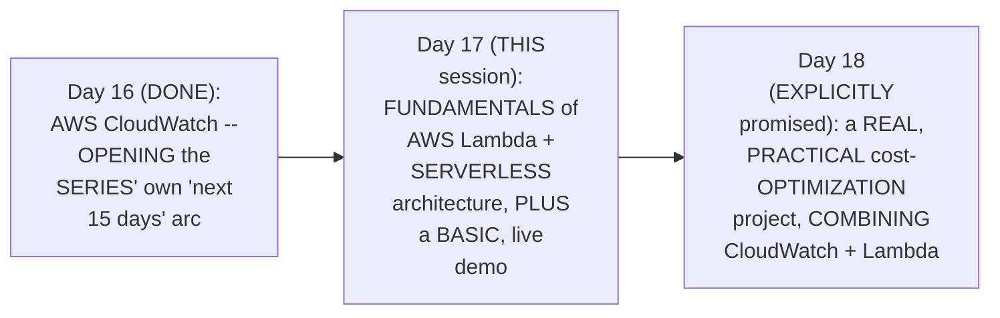
```mermaid
flowchart LR
    A["Day 16 (DONE):<br/>AWS CloudWatch --<br/>OPENING the<br/>SERIES' own 'next<br/>15 days' arc"] --> B["Day 17 (THIS<br/>session):<br/>FUNDAMENTALS of<br/>AWS Lambda +<br/>SERVERLESS<br/>architecture, PLUS<br/>a BASIC, live<br/>demo"]
    B --> C["Day 18<br/>(EXPLICITLY<br/>promised): a REAL,<br/>PRACTICAL cost-<br/>OPTIMIZATION<br/>project, COMBINING<br/>CloudWatch + Lambda"]
```

#### 🎯 Key Takeaways

* This is GENUINELY the SERIES' own, SECOND session OF the "NEXT 15 days" arc — EXPLICITLY, DIRECTLY confirmed AS the REQUIRED, foundational PREREQUISITE for Day 18's OWN, real cost-OPTIMIZATION project.
* TODAY's session is EXPLICITLY, PRECISELY scoped TO fundamentals — SERVERLESS architecture, EC2-versus-Lambda, and a BASIC, live DEMO — NOT the FULL, real-world PROJECT (RESERVED for tomorrow).
* THE instructor **directly, EXPLICITLY confirms** the ENTIRE Lambda ARC spans **TWO, complete VIDEOS** — a DELIBERATE, two-part STRUCTURE.

---

### 2. A Genuine, Direct Scoping Decision: DevOps-Focused Lambda, Not General Serverless Development

#### 🪜 Step-by-Step — A Direct, Explicit Confirmation

> 💡 **Given directly:** *"Lambda functions has wide range of use cases — developers also use Lambda functions with respect to serverless architecture, serverless application development, but what we will try to do is we will try to learn how devops engineers make use of Lambda functions."*

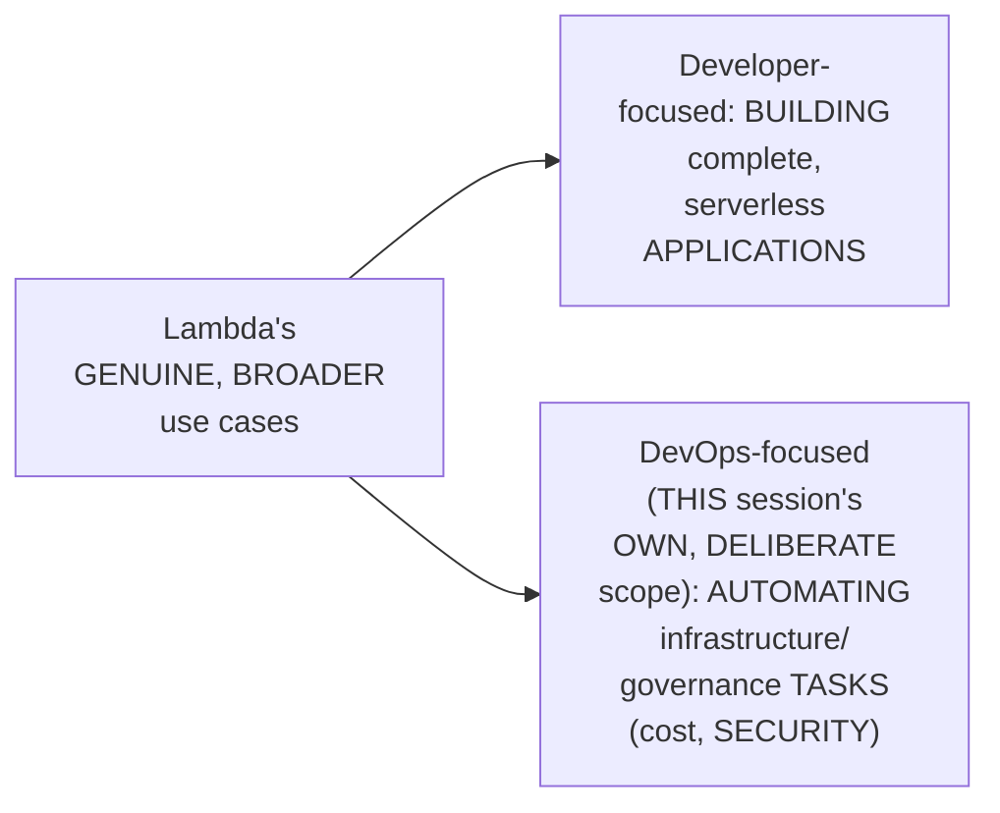
```mermaid
flowchart LR
    A["Lambda's<br/>GENUINE, BROADER<br/>use cases"] --> B["Developer-<br/>focused: BUILDING<br/>complete,<br/>serverless<br/>APPLICATIONS"]
    A --> C["DevOps-focused<br/>(THIS session's<br/>OWN, DELIBERATE<br/>scope): AUTOMATING<br/>infrastructure/<br/>governance TASKS<br/>(cost, SECURITY)"]
```

#### ⚠ Common Mistakes

* Assuming THIS session's own COVERAGE of LAMBDA will GENUINELY, COMPREHENSIVELY explain EVERY, possible USE case (e.g., BUILDING a COMPLETE, serverless WEB application) — explicitly, directly, PRECISELY scoped: THIS course DELIBERATELY focuses ON the DEVOPS-specific ANGLE — "REAL-time use CASES of devops ENGINEERS," not "EDGE cases" OR general APPLICATION development.

#### 🎯 Key Takeaways

* THE instructor **directly, EXPLICITLY confirms** a DELIBERATE, NARROW scoping DECISION — THIS course FOCUSES specifically ON how DEVOPS engineers USE Lambda — NOT the BROADER, developer-focused SERVERLESS application-development USE case.
* This directly, HONESTLY sets ACCURATE expectations — LEARNERS should NOT expect a COMPREHENSIVE, general-PURPOSE serverless-development TUTORIAL.
* This directly, PRECISELY sets UP the SESSION's own, CONSISTENT framing THROUGHOUT — EVERY, subsequent EXAMPLE and USE case genuinely, DIRECTLY reflects a REAL, devops-SPECIFIC scenario.

---
### 3. Lambda, Precisely Introduced: Compute + Serverless

#### 📖 Definition — Lambda, Precisely Positioned

> 💡 **Given directly:** *"Whenever we discuss about a service, we always talk about the problem that service is solving... when Lambda comes to your mind, there are two things — one thing is compute, and the other thing is serverless, so Lambda functions belong to the compute family, but it solves the problem of serverless — so it has two primary characteristics, it belongs to the same family that EC2 belongs to."*

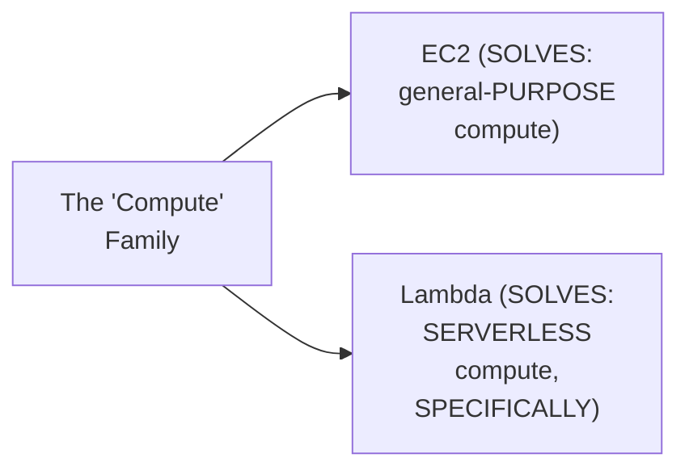
```mermaid
flowchart LR
    A["The 'Compute'<br/>Family"] --> B["EC2 (SOLVES:<br/>general-PURPOSE<br/>compute)"]
    A --> C["Lambda (SOLVES:<br/>SERVERLESS<br/>compute,<br/>SPECIFICALLY)"]
```

#### ⚠ Common Mistakes

* Assuming LAMBDA is a GENUINELY, ENTIRELY separate SERVICE category FROM EC2 — explicitly, directly, PRECISELY clarified: BOTH belong TO the SAME, established "COMPUTE" family — LAMBDA'S own, DEFINING, ADDITIONAL characteristic is SPECIFICALLY its SERVERLESS nature.

#### 🎯 Key Takeaways

* **AWS LAMBDA** is precisely POSITIONED as BELONGING to the SAME "COMPUTE" family AS EC2 — but WITH a SECOND, defining CHARACTERISTIC: it GENUINELY, SPECIFICALLY solves the **SERVERLESS** problem.
* This directly, CONSISTENTLY reinforces THIS series' own, ESTABLISHED "WHAT problem DOES this SERVICE solve" framing — APPLIED here TO Lambda's OWN, precise POSITIONING.
* This directly, PRECISELY sets UP the SESSION's own, NEXT, essential COMPARISON — EC2 versus LAMBDA, in PRACTICAL, operational TERMS (Section 4).

---

### 4. EC2 vs. Lambda: A Complete, Precise, Thorough Comparison

#### 📖 Definition — The EC2 Model, Precisely Recapped

> 💡 **Given directly:** *"You have to provide bunch of parameters to it — what kind of image you want, what kind of instance type, which is basically memory requirements, CPU requirements, and if there is any security-related stuff. Once you provide all of these things, AWS will give you an EC2 instance, which is nothing but a virtual computer."*

#### 📖 Definition — The Lambda Model, Precisely Explained

> 💡 **Given directly:** *"With Lambda functions, you will not provide all of these details to AWS — AWS will automatically take care of the server, depending upon the application that you are running... once your application is done, let's say your application is triggered, you wrote an application for a calculator function... once this function is done, what AWS does is AWS will tear down the compute."*

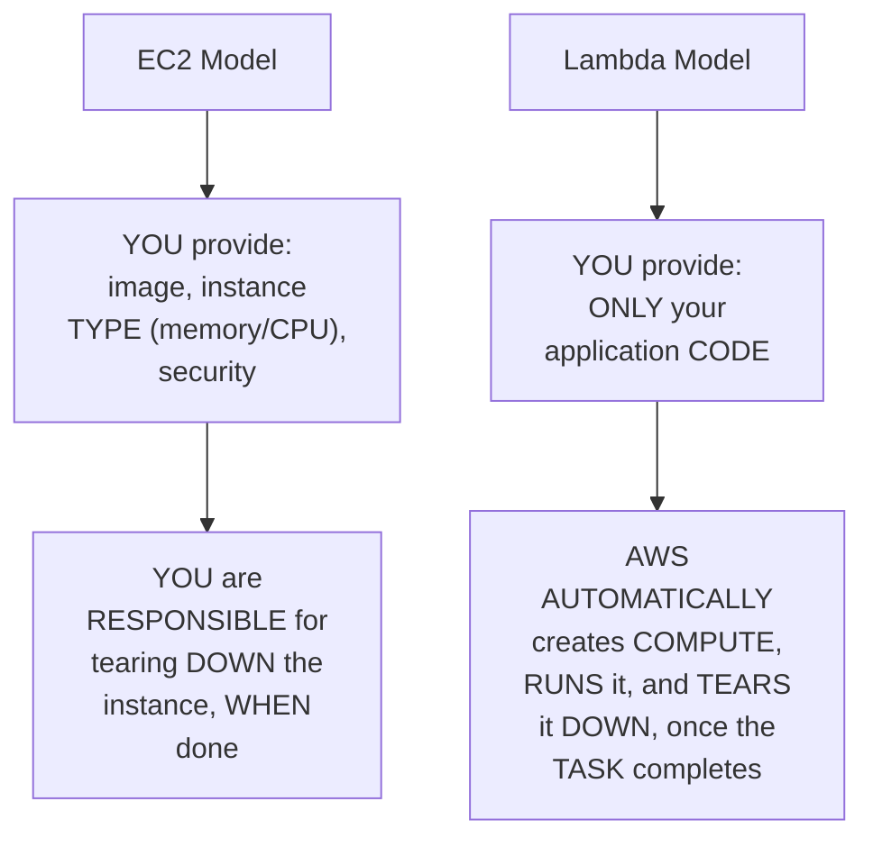
```mermaid
flowchart TD
    A["EC2 Model"] --> B["YOU provide:<br/>image, instance<br/>TYPE (memory/CPU),<br/>security"]
    B --> C["YOU are<br/>RESPONSIBLE for<br/>tearing DOWN the<br/>instance, WHEN<br/>done"]
    D["Lambda Model"] --> E["YOU provide:<br/>ONLY your<br/>application CODE"]
    E --> F["AWS<br/>AUTOMATICALLY<br/>creates COMPUTE,<br/>RUNS it, and TEARS<br/>it DOWN, once the<br/>TASK completes"]
```

#### 🔍 Internal Working — A Genuine, Direct Clarification on "Pay As You Use"

> 💡 **Given directly:** *"EC2 instance is basically pay as you use, but you have to take care of using — you have to take care of scaling up, scaling down, when you don't require EC2 instance you have to manually go there and you have to tear down the instance — but here everything happens automatically, that's why this architecture is called serverless."*

#### 📖 Definition — A Genuine, Precise Distinction: Visibility & Control

> 💡 **Given directly:** *"If you create an EC2 instance, you will get an IP address, right, whether it's public IP address, private IP address, anything — whereas in terms of Lambda functions, you don't get anything related to IP address, or you will not even know where this instance is created... whereas if you are talking about the EC2 instance, you are the complete owner of all of these details."*

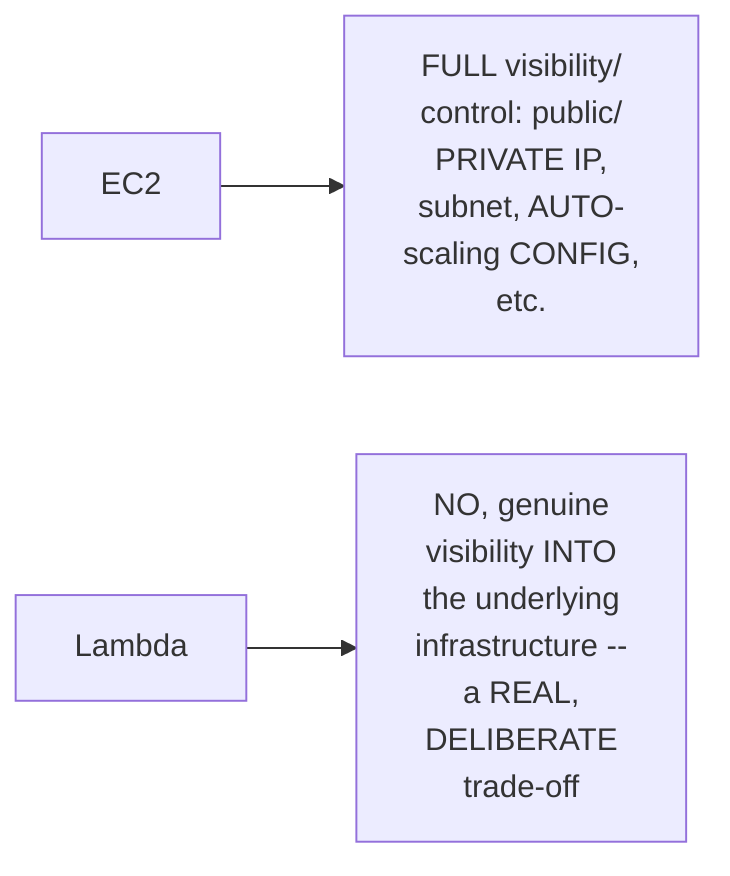
```mermaid
flowchart LR
    A["EC2"] --> B["FULL visibility/<br/>control: public/<br/>PRIVATE IP,<br/>subnet, AUTO-<br/>scaling CONFIG,<br/>etc."]
    C["Lambda"] --> D["NO, genuine<br/>visibility INTO<br/>the underlying<br/>infrastructure --<br/>a REAL,<br/>DELIBERATE<br/>trade-off"]
```

#### ⚠ Common Mistakes

* Assuming ONLY LAMBDA is GENUINELY "pay AS you use," WHILE EC2 is NOT — explicitly, directly, PRECISELY clarified: EC2 is ALSO "pay AS you use" — the GENUINE, real DIFFERENCE is WHO manages the SCALING/teardown PROCESS (MANUAL for EC2, AUTOMATIC for Lambda).
* Assuming LAMBDA's own LACK of infrastructure VISIBILITY is GENUINELY a "FLAW" — explicitly, directly, IMPLIED as a DELIBERATE, STRUCTURAL trade-off — THE reduced CONTROL is the DIRECT, necessary CONSEQUENCE of NOT needing to MANAGE that infrastructure AT all.

#### 🎯 Key Takeaways

* THE PRECISE, core DIFFERENCE: WITH **EC2**, you PROVIDE detailed SPECIFICATIONS (image, instance TYPE, security) and are RESPONSIBLE for TEARDOWN; WITH **Lambda**, you provide ONLY code, and AWS AUTOMATICALLY creates AND tears DOWN compute, PER execution.
* BOTH EC2 and LAMBDA are GENUINELY "pay AS you use" — the REAL, DEFINING difference is WHO manages SCALING and TEARDOWN — MANUAL (EC2) versus AUTOMATIC (LAMBDA).
* EC2 GENUINELY provides FULL visibility/CONTROL (IP addresses, SUBNET, auto-SCALING config); Lambda PROVIDES none OF this — a REAL, deliberate TRADE-off FOR its OWN, automated CONVENIENCE.

---
### 5. A Genuine, Real, Memorable Example: The Food-Delivery Checkout Flow

#### 🪜 Step-by-Step — A Complete, Real, Relatable, Worked Example

> 💡 **Given directly:** *"Let's say there is a platform called delivery platform... let's assume that there is a food delivery platform... when a user creates a request... he goes to the checkout, he performs the payments, and once his transaction is done, then he will simply move out of the application, and his food order is placed."*

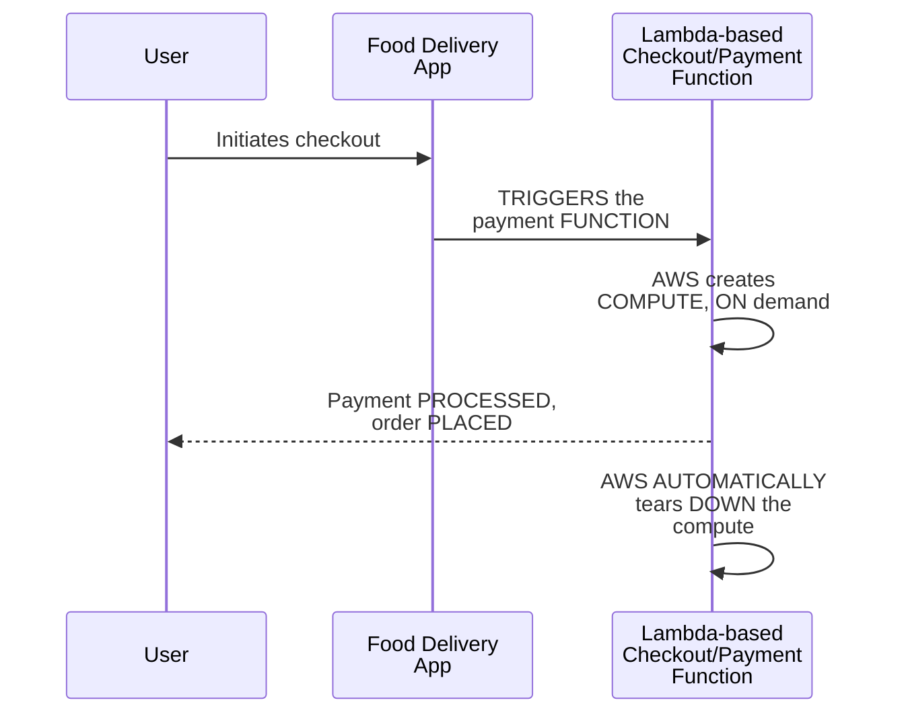
```mermaid
sequenceDiagram
    participant User
    participant App as Food Delivery<br/>App
    participant Lambda as Lambda-based<br/>Checkout/Payment<br/>Function
    User->>App: Initiates checkout
    App->>Lambda: TRIGGERS the<br/>payment FUNCTION
    Lambda->>Lambda: AWS creates<br/>COMPUTE, ON demand
    Lambda-->>User: Payment PROCESSED,<br/>order PLACED
    Lambda->>Lambda: AWS AUTOMATICALLY<br/>tears DOWN the<br/>compute
```

#### 🔍 Internal Working — A Genuine, Direct Confirmation of the Core Advantage

> 💡 **Given directly:** *"If you use serverless architecture, this is the advantage — once the requirement is there, AWS will create that server for you, once the requirement is done, AWS will tear down that server for you, right, so this is the primary advantage of serverless."*

#### ⚠ Common Mistakes

* Assuming a REAL application (LIKE a food-DELIVERY platform) MUST, genuinely, choose EITHER FULLY server-BASED or FULLY serverless ARCHITECTURE, for its ENTIRE system — explicitly, directly, IMPLIED as GENUINELY, PRACTICALLY flexible — a SINGLE application CAN genuinely MIX approaches, using LAMBDA specifically FOR discrete, EVENT-triggered actions (LIKE checkout), WHILE other PARTS use different ARCHITECTURES.

#### 🎯 Key Takeaways

* A COMPLETE, real, MEMORABLE example (a FOOD-delivery app's OWN checkout/PAYMENT flow) directly, CONCRETELY illustrates Lambda's OWN, core VALUE — infrastructure is CREATED only WHEN a user GENUINELY, ACTIVELY makes a REQUEST, and TORN down IMMEDIATELY after.
* THIS directly, VIVIDLY demonstrates THE "serverless" advantage — NO idle, always-ON infrastructure WAITING for the NEXT, occasional REQUEST.
* This directly, PRECISELY sets UP the SESSION's own, NEXT, essential QUESTION — WHO, genuinely, DECIDES whether an APPLICATION should USE this serverless APPROACH (Section 6)?

---

### 6. Who Decides Server vs. Serverless? A Genuine, Important Clarification

#### 📖 Definition — A Precise, Important Clarification of Responsibility

> 💡 **Given directly:** *"As a devops engineer, you will not decide if the application that you are working on... should go with the server approach or should go with the serverless approach — this will be taken care by the development team, the architecture team, the design team, they will decide... because it depends a lot on the application that is written."*

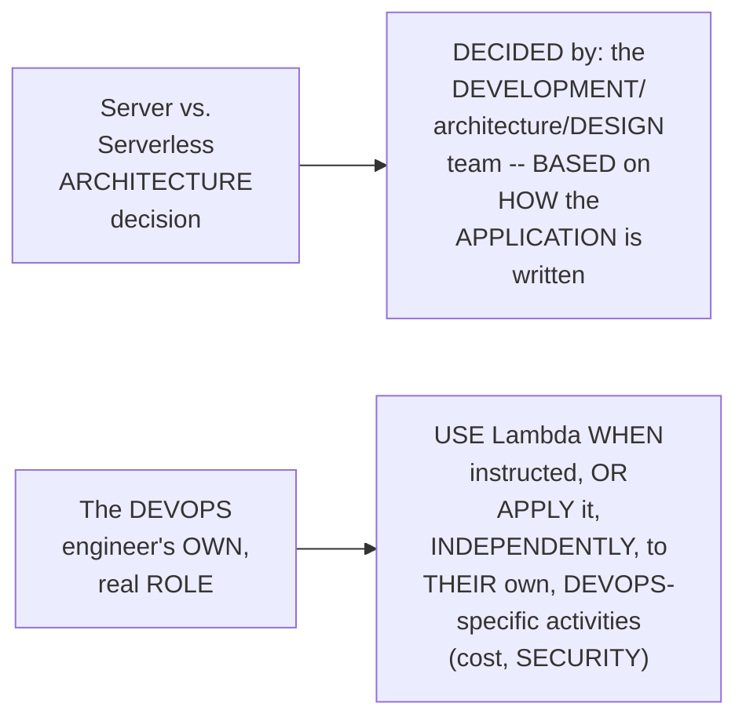
```mermaid
flowchart LR
    A["Server vs.<br/>Serverless<br/>ARCHITECTURE<br/>decision"] --> B["DECIDED by: the<br/>DEVELOPMENT/<br/>architecture/DESIGN<br/>team -- BASED on<br/>HOW the<br/>APPLICATION is<br/>written"]
    C["The DEVOPS<br/>engineer's OWN,<br/>real ROLE"] --> D["USE Lambda WHEN<br/>instructed, OR<br/>APPLY it,<br/>INDEPENDENTLY, to<br/>THEIR own, DEVOPS-<br/>specific activities<br/>(cost, SECURITY)"]
```

#### ⚠ Common Mistakes

* Assuming a DEVOPS engineer is GENUINELY, DIRECTLY responsible FOR choosing BETWEEN server AND serverless ARCHITECTURE, for a GIVEN application — explicitly, directly, PRECISELY corrected: THIS decision GENUINELY, STRUCTURALLY belongs TO the DEVELOPMENT/architecture TEAM — NOT devops.

#### 🎯 Key Takeaways

* THE choice BETWEEN server AND serverless ARCHITECTURE is directly, PRECISELY confirmed AS the DEVELOPMENT/architecture TEAM's own, genuine RESPONSIBILITY — **NOT** the devops ENGINEER's.
* A DEVOPS engineer's OWN, real ROLE is TWOFOLD: (1) USING Lambda WHEN explicitly INSTRUCTED (e.g., to CREATE infrastructure FOR a serverless APPLICATION), and (2) INDEPENDENTLY applying LAMBDA to THEIR own, devops-SPECIFIC activities (COST optimization, SECURITY compliance).
* This directly, PRECISELY sets UP the SESSION's own, NEXT, essential EXAMPLE — WHY, specifically, DEVOPS engineers GENUINELY choose LAMBDA (not EC2) FOR their OWN, recurring, SCHEDULED automation TASKS (Section 7).

---
### 7. Why Lambda (Not EC2) for Recurring, Scheduled DevOps Scripts

#### 🪜 Step-by-Step — A Complete, Real, Worked Example: A Daily Cost-Optimization Script

> 💡 **Given directly:** *"Let's say you have written 10 Python scripts for this activity... and this activity you will run, let's say, every day at 10 AM in the morning... you would definitely prefer to use Lambda functions, or you would definitely prefer to use serverless architecture, over the traditional EC2 instance — because if you use an EC2 instance, every day morning 10 AM you have to go and create an EC2 instance, if this script runs for 5 minutes, then after 5 minutes you have to delete that EC2 instance."*

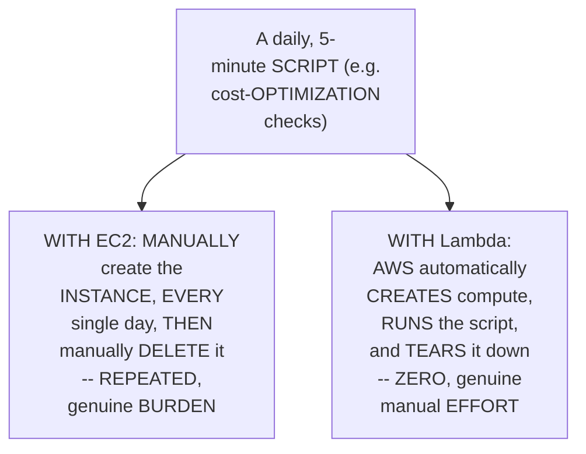
```mermaid
flowchart TD
    A["A daily, 5-<br/>minute SCRIPT (e.g.<br/>cost-OPTIMIZATION<br/>checks)"] --> B["WITH EC2: MANUALLY<br/>create the<br/>INSTANCE, EVERY<br/>single day, THEN<br/>manually DELETE it<br/>-- REPEATED,<br/>genuine BURDEN"]
    A --> C["WITH Lambda:<br/>AWS automatically<br/>CREATES compute,<br/>RUNS the script,<br/>and TEARS it down<br/>-- ZERO, genuine<br/>manual EFFORT"]
```

#### ⚠ A Direct, Honest, Important Risk Confirmation

> 💡 **Given directly:** *"In some case you know you forget it, then you will be affected with the cost — right, because it is automatically created and it is automatically torn down, whereas in this case you have to either write a Python script, or again you have to write a shell script, or you have to write a CLI script to create an instance."*

#### ⚠ Common Mistakes

* Assuming MANUALLY managing an EC2 INSTANCE for a SHORT, recurring TASK is GENUINELY, PRACTICALLY equivalent, in EFFORT, to USING Lambda — explicitly, directly, HONESTLY clarified: MANUAL EC2 management CARRIES a REAL, genuine RISK — "IF in SOME case YOU forget it, THEN you WILL be AFFECTED with the COST" — a RISK Lambda GENUINELY, STRUCTURALLY eliminates.

#### 🎯 Key Takeaways

* FOR a RECURRING, SHORT-duration TASK (e.g., a DAILY, 5-minute COST-optimization script), LAMBDA is directly, CONCRETELY preferred OVER EC2 — AVOIDING the REPEATED, manual BURDEN of creating AND deleting an INSTANCE every, single TIME.
* A GENUINE, real RISK of the EC2 APPROACH is directly, HONESTLY confirmed — FORGETTING to DELETE a manually-CREATED instance GENUINELY, DIRECTLY results in UNNECESSARY, ongoing COST.
* This directly, PRECISELY sets UP the SESSION's own, NEXT, essential ARCHITECTURAL principle — Lambda FUNCTIONS should GENUINELY be **EVENT-driven**, rather THAN manually invoked (Section 8).

---

### 8. Event-Driven by Design: A Genuine, Important Architectural Principle

#### 📖 Definition — The Precise, Important Principle

> 💡 **Given directly:** *"This Lambda functions, or in general the serverless solution on AWS using Lambda function, is only event-driven — that means it has to be driven by the event, it cannot run by itself manually... that's a better practice to trigger the Lambda functions using an event, so what you do is every day at 10 AM you can just configure a cron job or something in the CloudWatch, and tell CloudWatch to trigger the Lambda function."*

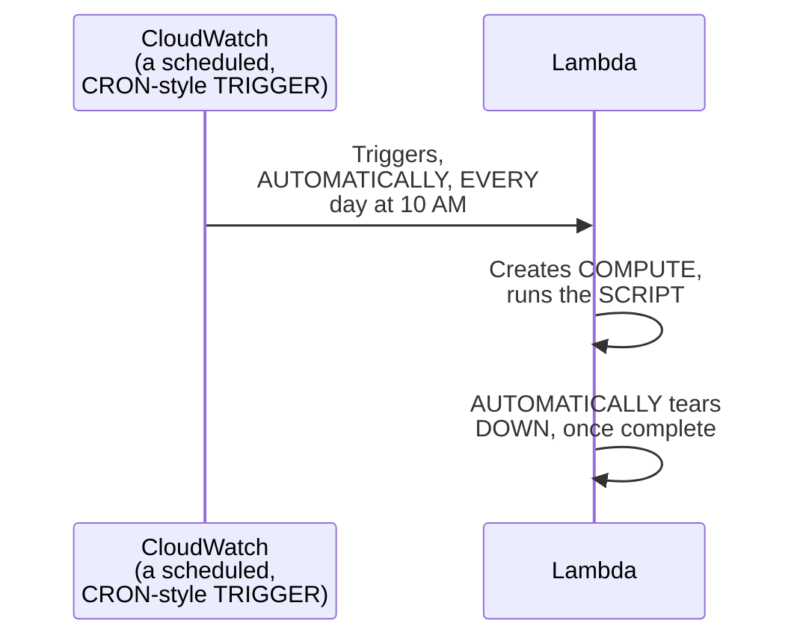
```mermaid
sequenceDiagram
    participant CloudWatch as CloudWatch<br/>(a scheduled,<br/>CRON-style TRIGGER)
    participant Lambda
    CloudWatch->>Lambda: Triggers,<br/>AUTOMATICALLY, EVERY<br/>day at 10 AM
    Lambda->>Lambda: Creates COMPUTE,<br/>runs the SCRIPT
    Lambda->>Lambda: AUTOMATICALLY tears<br/>DOWN, once complete
```

#### ⚠ Common Mistakes

* Assuming Lambda FUNCTIONS should GENUINELY, TYPICALLY be TRIGGERED manually, BY a human, EACH time THEY are needed — explicitly, directly, PRECISELY clarified: THIS "KILLS the PURPOSE of creating THE serverless application" — the BEST practice is CONFIGURING an AUTOMATIC, event-BASED trigger (e.g., a CloudWatch SCHEDULE).

#### 🎯 Key Takeaways

* LAMBDA functions are directly, PRECISELY confirmed as GENUINELY, STRUCTURALLY **event-DRIVEN** — MANUALLY running them, EVERY time, "KILLS the PURPOSE" of using SERVERLESS architecture in the FIRST place.
* THE best-PRACTICE approach: CONFIGURE CloudWatch (OR another SUPPORTED event SOURCE) to AUTOMATICALLY trigger the LAMBDA function — e.g., a DAILY, cron-STYLE schedule.
* This directly, PRECISELY sets UP the SESSION's own, NEXT, essential CONTENT — TWO, complete, real DEVOPS use CASES that GENUINELY apply THIS event-DRIVEN principle (Section 9).

---
### 9. Two, Real DevOps Use Cases: Cost Optimization & Security/Compliance

#### 📖 Definition — Use Case 1: Cost Optimization (The Session's Own, Primary Focus)

> 💡 **Given directly:** *"There is a developer who has created an EBS volume, this EBS volume was created 30 days ago, and no one is using it... as a devops engineer your responsibility is either go and delete this EBS volume, or send out notification saying, 'hey developer, you have created EBS volume 30 days ago, and it is costing the organization and no one is using it.'"*

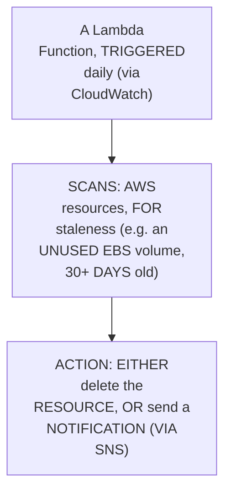
```mermaid
flowchart TD
    A["A Lambda<br/>Function, TRIGGERED<br/>daily (via<br/>CloudWatch)"] --> B["SCANS: AWS<br/>resources, FOR<br/>staleness (e.g. an<br/>UNUSED EBS volume,<br/>30+ DAYS old)"]
    B --> C["ACTION: EITHER<br/>delete the<br/>RESOURCE, OR send a<br/>NOTIFICATION (VIA<br/>SNS)"]
```

#### 🔍 Internal Working — A Genuine, Real, Second, Worked Example

> 💡 **Given directly:** *"Someone has created an EC2 instance almost a year ago, nobody is using it, but the instance is still running with a static IP address... you will be costed for the elastic IP, and you will be costed for the EC2 instance as well, so I'd recommend you to delete it — and who shared this information? The script that you have written has shared this information."*

#### 📖 Definition — Use Case 2: Security/Compliance (A Genuine, Real, Worked Example)

> 💡 **Given directly:** *"Let's say your organization has decided that nobody will create an EBS volume of type gp2... if there is any gp2-based EBS volume, you can trigger a notification — again you can use SNS service there — you can trigger this notification, and you can send the notification to your management, or the person who has created this EBS volume, to immediately delete that, because it's against the compliance of your organization."*

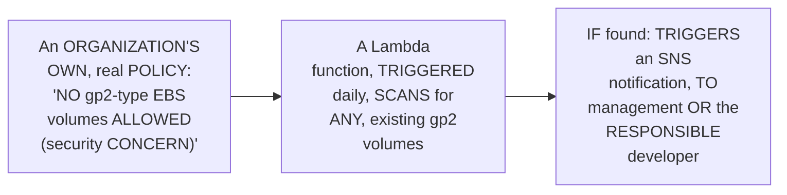
```mermaid
flowchart LR
    A["An ORGANIZATION'S<br/>OWN, real POLICY:<br/>'NO gp2-type EBS<br/>volumes ALLOWED<br/>(security CONCERN)'"] --> B["A Lambda<br/>function, TRIGGERED<br/>daily, SCANS for<br/>ANY, existing gp2<br/>volumes"]
    B --> C["IF found: TRIGGERS<br/>an SNS<br/>notification, TO<br/>management OR the<br/>RESPONSIBLE<br/>developer"]
```

#### 🏢 Real-World / Production Usage — A Genuine, Direct Pointer to an Existing, Separate Video

> 💡 **Given directly:** *"This demo, for example, if we take the security or compliance — I have already created the EBS gp2 to gp3, that is already available on my channel, I'll put the link in the description, so you can take a look at the link, and you will understand how you will convert, or you can report, send out a notification, using Lambda functions."*

#### ⚠ Common Mistakes

* Assuming LAMBDA's own, DEVOPS-relevant USE cases are GENUINELY, STRICTLY limited TO cost OPTIMIZATION alone — explicitly, directly, CONFIRMED as GENUINELY, DIRECTLY EXTENDING to SECURITY/compliance ENFORCEMENT, and BEYOND — "THE scope IS endless."

#### 🎯 Key Takeaways

* **COST optimization** (THIS session's own, PRIMARY, emphasized EXAMPLE): a Lambda FUNCTION scans FOR stale/unused RESOURCES (EBS volumes, EC2 instances WITH elastic IPs) — EITHER deleting THEM or NOTIFYING someone.
* **SECURITY/compliance** (a SECOND, genuine, REAL use case): a LAMBDA function ENFORCES organizational POLICY (e.g., BANNING gp2-TYPE EBS volumes) — DIRECTLY, EXPLICITLY pointed TO an EXISTING, SEPARATE, already-PUBLISHED video FOR the COMPLETE demo.
* THE session's own, DIRECT confirmation: LAMBDA's own, GENUINE devops APPLICABILITY is "ENDLESS" — a THIRD, briefly-MENTIONED example INCLUDES auditing IAM USERS/roles FOR unauthorized PERMISSION changes.

---
### 10. A Complete, Real, Live Demo: Creating a Basic Lambda Function

#### 🪜 Step-by-Step — A Complete, Real, Initial Creation Walkthrough

> 💡 **Given directly:** *"Go to this page called Lambda, or Lambda functions, click on create a function — do you want to write code from scratch, so let's say you want to start writing your program directly here, or do you want to use any samples that are provided by AWS?"*

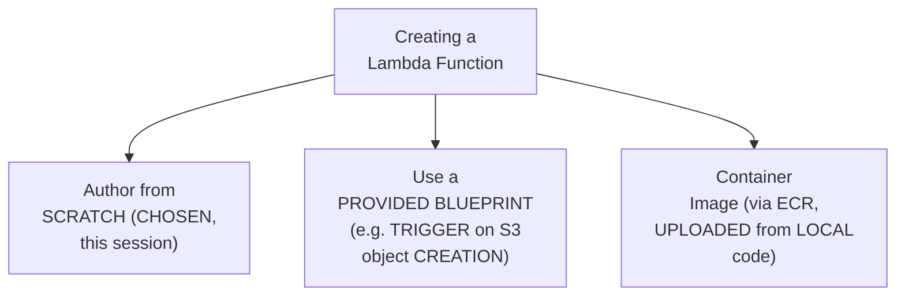
```mermaid
flowchart TD
    A["Creating a<br/>Lambda Function"] --> B["Author from<br/>SCRATCH (CHOSEN,<br/>this session)"]
    A --> C["Use a<br/>PROVIDED BLUEPRINT<br/>(e.g. TRIGGER on S3<br/>object CREATION)"]
    A --> D["Container<br/>Image (via ECR,<br/>UPLOADED from LOCAL<br/>code)"]
```

#### 📖 Definition — A Genuine, Direct, Honest Clarification on Supported Languages

> 💡 **Given directly:** *"Lambda functions can be written only in this programming languages that are available here — let's say you don't know any of the programming language that is mentioned here, then you cannot write Lambda functions... it supports Go, it supports Java, it supports Python and Ruby, primarily, of course Node.js — but let's say you want to write it in shell scripting or something, it's not possible."*

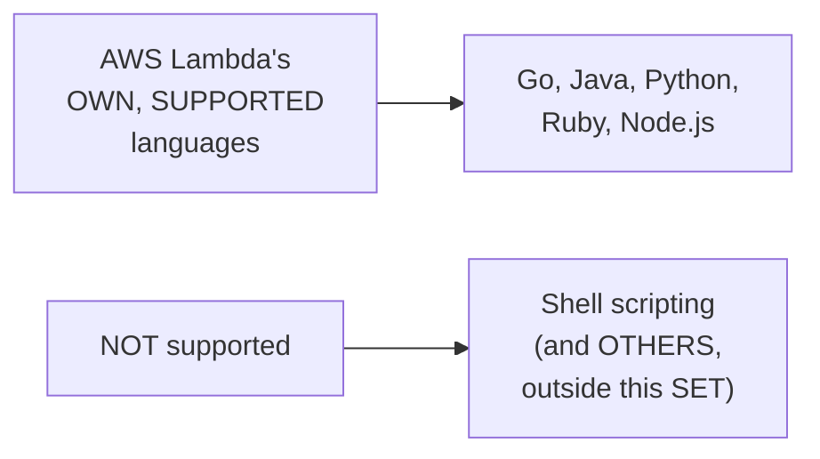
```mermaid
flowchart LR
    A["AWS Lambda's<br/>OWN, SUPPORTED<br/>languages"] --> B["Go, Java, Python,<br/>Ruby, Node.js"]
    C["NOT supported"] --> D["Shell scripting<br/>(and OTHERS,<br/>outside this SET)"]
```

#### 📖 Definition — "Enable Function URL," Precisely Explained

> 💡 **Given directly:** *"When you enable this one, then you will get a public IP address, or you will get an IP address to access the application that you have written in the Lambda functions — if you don't enable this, you cannot access it from outside, you can still run the program inside the AWS environment."*

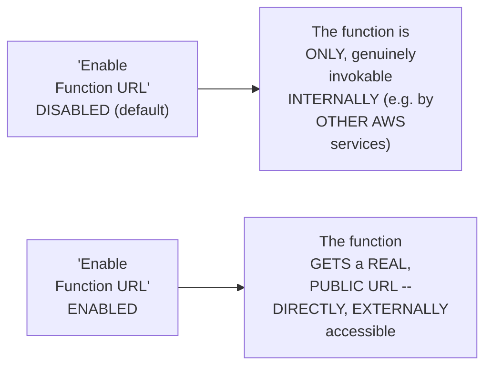
```mermaid
flowchart LR
    A["'Enable<br/>Function URL'<br/>DISABLED (default)"] --> B["The function is<br/>ONLY, genuinely<br/>invokable<br/>INTERNALLY (e.g. by<br/>OTHER AWS<br/>services)"]
    C["'Enable<br/>Function URL'<br/>ENABLED"] --> D["The function<br/>GETS a REAL,<br/>PUBLIC URL --<br/>DIRECTLY, EXTERNALLY<br/>accessible"]
```

#### ⚠ Common Mistakes

* Assuming LAMBDA functions CAN, genuinely, be WRITTEN in ANY, arbitrary PROGRAMMING language OR scripting APPROACH (LIKE shell SCRIPTING) — explicitly, directly, HONESTLY clarified: ONLY a SPECIFIC, limited SET of LANGUAGES (Go, JAVA, Python, Ruby, NODE.JS) are GENUINELY, DIRECTLY supported.
* Assuming a NEWLY-created Lambda FUNCTION is GENUINELY, AUTOMATICALLY accessible FROM outside AWS, BY default — explicitly, directly, PRECISELY clarified: EXTERNAL access GENUINELY, DIRECTLY requires EXPLICITLY enabling "FUNCTION URL" — WITHOUT it, the FUNCTION remains INTERNAL-only.

#### 🎯 Key Takeaways

* A COMPLETE, real, LIVE demonstration directly, CONCRETELY confirmed the BASIC Lambda-FUNCTION creation WORKFLOW — CHOOSING "author FROM scratch," selecting PYTHON, and CONFIGURING basic OPTIONS.
* LAMBDA GENUINELY, STRUCTURALLY supports ONLY a SPECIFIC set OF programming LANGUAGES (GO, Java, PYTHON, Ruby, Node.js) — NOTABLY excluding SHELL scripting.
* **"ENABLE function URL"** directly, PRECISELY controls WHETHER a Lambda FUNCTION is GENUINELY, EXTERNALLY accessible — a REAL, important, OPT-in setting, DIRECTLY analogous TO an EC2 instance's OWN public IP CONFIGURATION.

---

### 11. Exploring the Function's Own Configuration: Handler, Triggers, Roles & More

#### 📖 Definition — Triggers & Destinations, Precisely Distinguished

> 💡 **Given directly:** *"There are two options to it, right — one is what is the trigger to this function, and what is the destination to this function... a trigger... that event can be a CloudWatch event... or it can be trigger from S3... without a trigger, you have to manually run the Lambda functions, and that will kill the purpose of creating the serverless application."*

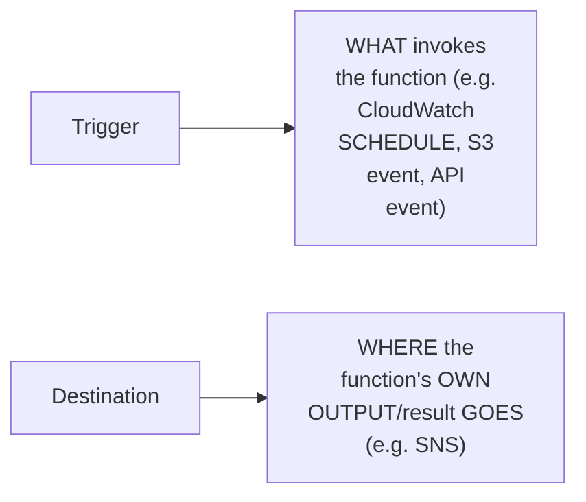
```mermaid
flowchart LR
    A["Trigger"] --> B["WHAT invokes<br/>the function (e.g.<br/>CloudWatch<br/>SCHEDULE, S3<br/>event, API<br/>event)"]
    C["Destination"] --> D["WHERE the<br/>function's OWN<br/>OUTPUT/result GOES<br/>(e.g. SNS)"]
```

#### 📖 Definition — The `lambda_handler` Entry Point, Precisely Explained (& Compared to a Familiar Concept)

> 💡 **Given directly:** *"You have to make sure that the name of the function is lambda_handler... this Lambda Handler is the function that this serverless architecture calls, right — if your CloudWatch is triggering the Lambda function, and if you have 10 functions here, AWS has to know which function has to be called... just like if you are a Java developer, you have a main function."*

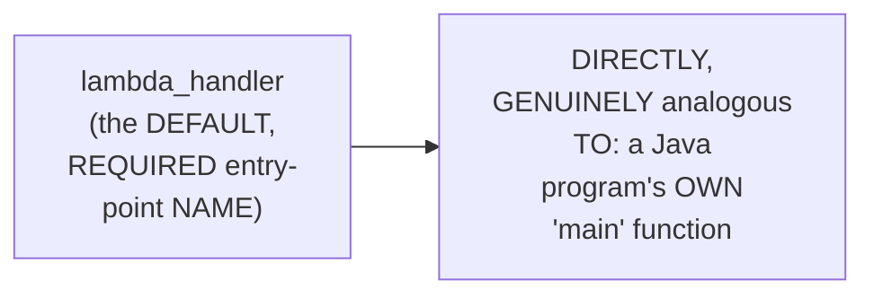
```mermaid
flowchart LR
    A["lambda_handler<br/>(the DEFAULT,<br/>REQUIRED entry-<br/>point NAME)"] --> B["DIRECTLY,<br/>GENUINELY analogous<br/>TO: a Java<br/>program's OWN<br/>'main' function"]
```

#### 🪜 Step-by-Step — A Complete, Real Exploration of Code Management, Environment Variables, and IAM Roles

> 💡 **Given directly:** *"You can also upload from a zip file... you can write your code in Visual Studio Code, and you can upload the zip file here... even Lambda function supports environment variables, so you can tweak the environment variables... a role gets created for you, okay, so AWS automatically creates a role for you — let's say you don't want to use that role, you can use an existing role."*

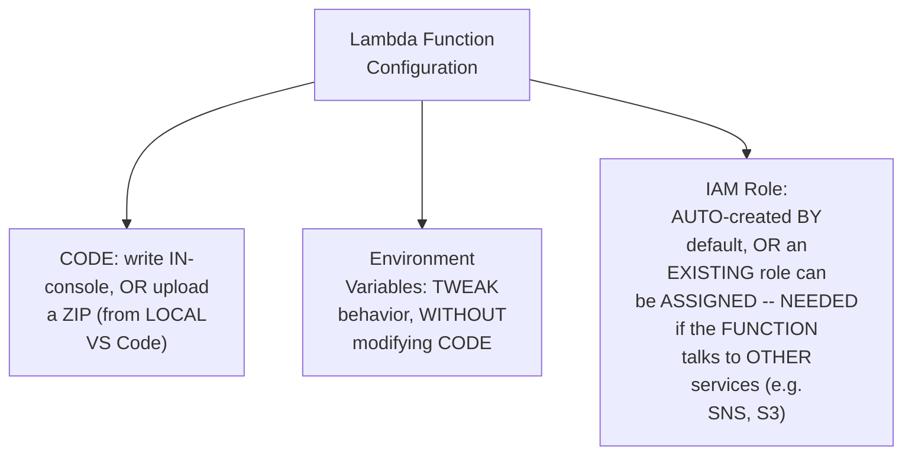
```mermaid
flowchart TD
    A["Lambda Function<br/>Configuration"] --> B["CODE: write IN-<br/>console, OR upload<br/>a ZIP (from LOCAL<br/>VS Code)"]
    A --> C["Environment<br/>Variables: TWEAK<br/>behavior, WITHOUT<br/>modifying CODE"]
    A --> D["IAM Role:<br/>AUTO-created BY<br/>default, OR an<br/>EXISTING role can<br/>be ASSIGNED -- NEEDED<br/>if the FUNCTION<br/>talks to OTHER<br/>services (e.g.<br/>SNS, S3)"]
```

#### 🪜 Step-by-Step — A Complete, Real, Live-Confirmed Test

> 💡 **Given directly:** *"This is my function URL, I can make use of this URL and I can access the application, right — now when I use this, what would happen if I click on this button, it will give me the output called 'hello from Lambda.'"*

#### ⚠ Common Mistakes

* Assuming a LAMBDA function's OWN entry-POINT name CAN, genuinely, be ANYTHING, WITHOUT any, genuine CONSEQUENCE — explicitly, directly, PRECISELY clarified: UNLESS EXPLICITLY reconfigured, it MUST genuinely, STRUCTURALLY be NAMED `LAMBDA_handler` — a REQUIRED, structural CONVENTION.
* Assuming a Lambda FUNCTION's own, AUTO-created IAM ROLE is GENUINELY, ALWAYS sufficient FOR every, real USE case — explicitly, directly, PRECISELY clarified: IF the FUNCTION needs to TALK to OTHER services (SNS, S3), the ROLE'S own PERMISSIONS must be GENUINELY, DIRECTLY expanded — DIRECTLY connecting BACK to this SERIES' own, ESTABLISHED IAM concepts.

#### 🎯 Key Takeaways

* **TRIGGERS** define WHAT invokes a LAMBDA function (e.g., CloudWatch SCHEDULE, S3 EVENT); **DESTINATIONS** define WHERE its OWN output GOES (e.g., SNS) — TWO, genuinely DISTINCT concepts.
* THE function's OWN entry POINT MUST, by DEFAULT, be NAMED **`lambda_HANDLER`** — DIRECTLY, MEMORABLY analogous TO a JAVA program's own "MAIN" function.
* A COMPLETE, real, LIVE test directly, CONCRETELY confirmed the FUNCTION URL genuinely, SUCCESSFULLY invoking the DEPLOYED function — RETURNING the REAL, configured OUTPUT ("hello FROM Lambda").

---
### 12. A Genuine, Direct Confirmation: Advanced Options, Deliberately Skipped

#### ⚠ A Direct, Honest, Scoped Confirmation

> 💡 **Given directly:** *"There are few other options for asynchronous invocation, concurrency, database proxies — so these things are not that important from the devops engineer point of view, and specifically in this course that we are doing, I don't think it makes sense to cover it, because we are focusing on the job opportunities for devops engineers — we will focus on real-time use cases of devops engineers, will not focus on the edge cases."*

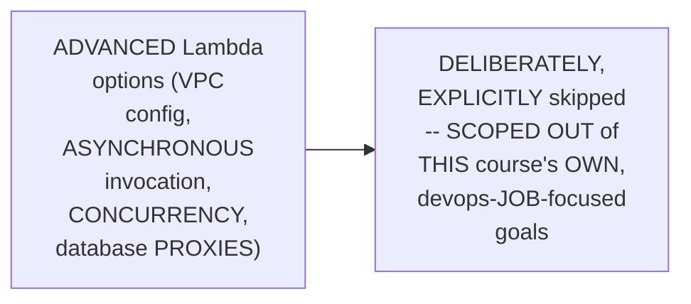
```mermaid
flowchart LR
    A["ADVANCED Lambda<br/>options (VPC<br/>config,<br/>ASYNCHRONOUS<br/>invocation,<br/>CONCURRENCY,<br/>database PROXIES)"] --> B["DELIBERATELY,<br/>EXPLICITLY skipped<br/>-- SCOPED OUT of<br/>THIS course's OWN,<br/>devops-JOB-focused<br/>goals"]
```

#### ⚠ Common Mistakes

* Assuming SKIPPING these ADVANCED options REFLECTS a GENUINE, real LIMITATION in THE instructor's own KNOWLEDGE — explicitly, directly, HONESTLY clarified: it's a DELIBERATE, SCOPE-driven DECISION — "WE will focus ON real-time USE cases... will NOT focus ON the edge CASES" — CONSISTENT with THIS course's own, JOB-oriented GOALS.

#### 🎯 Key Takeaways

* SEVERAL, real, ADVANCED Lambda OPTIONS (VPC CONFIGURATION, asynchronous INVOCATION, concurrency, DATABASE proxies) are directly, HONESTLY confirmed as DELIBERATELY skipped — SCOPED out OF this course's OWN, devops-JOB-focused goals.
* This directly, CONSISTENTLY reinforces THIS course's own, REPEATEDLY-stated PHILOSOPHY — PRIORITIZING "REAL-time use CASES" over COMPREHENSIVE, exhaustive COVERAGE of every, POSSIBLE feature.
* This directly, PRECISELY sets UP the SESSION's own, FINAL, closing CONFIRMATION — THIS foundational content DIRECTLY prepares LEARNERS for Day 18's OWN, real PROJECT (Section 13).

---

### 13. Closing: Setting Up Day 18's Own, Real Cost-Optimization Project

#### 🪜 Step-by-Step — A Direct, Honest, Final Confirmation

> 💡 **Given directly:** *"This is about day 17, where I wanted to explain you about the serverless architecture, Lambda functions, difference between EC2 instance, and just to give you a feel of how this Lambda functions would look like, and you can also do this very basic demo, just run the Lambda function, so that you will be ready for tomorrow's video, where you will be able to perform that cloud cost optimization project."*

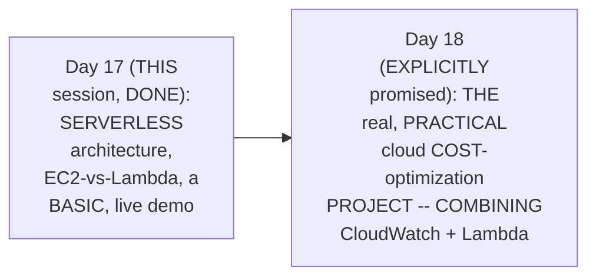
```mermaid
flowchart LR
    A["Day 17 (THIS<br/>session, DONE):<br/>SERVERLESS<br/>architecture,<br/>EC2-vs-Lambda, a<br/>BASIC, live demo"] --> B["Day 18<br/>(EXPLICITLY<br/>promised): THE<br/>real, PRACTICAL<br/>cloud COST-<br/>optimization<br/>PROJECT -- COMBINING<br/>CloudWatch + Lambda"]
```

#### ⚠ Common Mistakes

* Assuming THIS session's own, BASIC demo REPRESENTS the COMPLETE, final SCOPE of WHAT learners should EXPECT to BUILD with LAMBDA — explicitly, directly, HONESTLY clarified: it's SPECIFICALLY designed TO "give you a FEEL" — the REAL, substantial PROJECT (cost OPTIMIZATION) is EXPLICITLY reserved FOR Day 18.

#### 🎯 Key Takeaways

* This episode **GENUINELY, COMPREHENSIVELY delivers** its OWN, stated GOALS — a COMPLETE, theoretical FOUNDATION (SERVERLESS architecture, EC2-VERSUS-Lambda) PLUS a BASIC, real, LIVE demonstration.
* THE instructor **directly, EXPLICITLY confirms** THIS session's own, PRIMARY purpose — PREPARING learners FOR Day 18's own, REAL, cloud COST-optimization project.
* A DIRECT, genuine ENCOURAGEMENT is GIVEN — LEARNERS should COMPLETE the BASIC demo THEMSELVES, ENSURING readiness FOR tomorrow's, MORE substantial CONTENT.

---

## 📝 Glossary

| Term | Definition | Why It Matters |
|---|---|---|
| **AWS Lambda** | A serverless compute service | Belongs to the "compute" family, like EC2, but solves serverless |
| **Serverless** | Architecture where AWS manages server creation/teardown | You never provision or manage infrastructure directly |
| **Event-Driven** | Lambda functions are triggered by events, not run manually | A core architectural best practice |
| **lambda_handler** | The default, required entry-point function name | Analogous to a Java program's "main" function |
| **Function URL** | An opt-in setting enabling public, external access | Disabled by default; Lambda is otherwise internal-only |
| **Trigger** | What invokes a Lambda function | E.g., a CloudWatch schedule, an S3 event |
| **Destination** | Where a Lambda function's output goes | E.g., an SNS topic |

---

## 🔄 Revision Notes — One-Minute Revision

* This is **Day 17**, the foundational, first half of a two-part Lambda arc -- explicitly setting up Day 18's own, real cost-optimization project.
* **A deliberate scoping decision**: this course focuses specifically on how DEVOPS engineers use Lambda, NOT the broader, developer-focused serverless application-development use case.
* **Lambda, positioned**: belongs to the same "compute" family as EC2, but solves the SERVERLESS problem specifically.
* **EC2 vs. Lambda, the core difference**: with EC2, you provide detailed specs and are responsible for teardown; with Lambda, you provide only code, and AWS automatically creates and tears down compute per execution. Both are "pay as you use" -- the real difference is WHO manages scaling/teardown (manual vs. automatic). EC2 gives full visibility/control (IP addresses, subnet, auto-scaling config); Lambda gives none of this -- a deliberate trade-off.
* **A memorable example**: a food-delivery app's checkout/payment flow -- infrastructure created only when a user actively requests it, torn down immediately after.
* **Who decides server vs. serverless?** The development/architecture team -- NOT the devops engineer, whose role is to use Lambda when instructed, or apply it independently to their own devops-specific activities.
* **Why Lambda for recurring, scheduled scripts**: manually managing EC2 for a short, daily task carries a real, genuine risk of forgetting to tear it down (and being charged unnecessarily) -- Lambda eliminates this entirely.
* **Event-driven by design**: Lambda functions should be triggered by events (e.g., a CloudWatch schedule), not run manually -- manual invocation "kills the purpose" of serverless architecture.
* **Two, real DevOps use cases**: (1) cost optimization -- scanning for stale resources (unused EBS volumes, EC2 instances with elastic IPs) and deleting or notifying; (2) security/compliance -- enforcing policy (e.g., banning gp2-type EBS volumes), with a direct pointer to an existing, separate video covering this exact demo. The scope is confirmed as "endless" -- e.g., auditing IAM users/roles for unauthorized changes.
* **Creating a basic Lambda function (live demo)**: choosing "author from scratch," Python. Lambda supports ONLY specific languages (Go, Java, Python, Ruby, Node.js) -- notably NOT shell scripting. "Enable Function URL" is required for external access; disabled by default.
* **Exploring the configuration**: Triggers (what invokes the function) vs. Destinations (where output goes) are distinct concepts. The entry point must be named `lambda_handler` by default -- directly analogous to a Java "main" function. Code can be written in-console or uploaded as a ZIP. Environment variables allow tweaking behavior without code changes. IAM roles are auto-created, but may need expanded permissions for the function to talk to other services (SNS, S3). A live test confirmed the function URL successfully returns "hello from Lambda."
* **Advanced options (VPC config, asynchronous invocation, concurrency, database proxies) were deliberately skipped** -- scoped out of this course's own, job-focused goals, not a knowledge gap.
* **Closing**: this session's own, basic demo is explicitly meant only to "give a feel" for Lambda -- the real, substantial cost-optimization project is reserved for Day 18.

---

## 📋 Cheat Sheet

**EC2 vs. Lambda:**
```text
EC2:    YOU provide specs (image, instance type, security); YOU tear down
Lambda: YOU provide only code; AWS creates AND tears down, automatically
Both:   "Pay as you use" -- the difference is WHO manages scaling/teardown
```

**Lambda's supported languages:**
```text
Go, Java, Python, Ruby, Node.js  (NOT shell scripting)
```

**Triggers vs. Destinations:**
```text
Trigger     -- WHAT invokes the function (CloudWatch schedule, S3 event)
Destination -- WHERE the output goes (e.g., SNS)
```

**The default entry point:**
```python
def lambda_handler(event, context):
    return "hello from Lambda"
```

**Two, real DevOps use cases:**
```text
Cost Optimization: scan for stale resources -> delete or notify
Security/Compliance: scan for policy violations (e.g., gp2 EBS volumes) -> notify via SNS
```

---

## 🔥 Interview Questions & Answers

### 🟢 Beginner

**Q1.**

**Question:** What "family" of AWS services does Lambda belong to, and what problem does it specifically solve?

**Answer:** The "compute" family (like EC2); it specifically solves the serverless problem.

**Explanation:** Directly, precisely positioned.

**Why Interviewers Ask This:** The most basic, foundational Lambda question.

**Possible Follow-up:** "What does 'serverless' genuinely mean?"

**Q2.**

**Question:** With EC2, who is responsible for tearing down an instance when it's no longer needed?

**Answer:** You are (manually).

**Explanation:** Directly, precisely stated.

**Why Interviewers Ask This:** Tests genuine understanding of the core EC2-vs-Lambda distinction.

**Possible Follow-up:** "Who is responsible for this with Lambda?"

**Q3.**

**Question:** Does Lambda give you visibility into infrastructure details like IP addresses?

**Answer:** No -- unlike EC2, Lambda provides no such visibility.

**Explanation:** Directly, precisely clarified.

**Why Interviewers Ask This:** Tests genuine understanding of a real, deliberate trade-off.

**Possible Follow-up:** "Why might this reduced visibility genuinely be acceptable?"

**Q4.**

**Question:** Who genuinely decides whether an application uses server or serverless architecture?

**Answer:** The development/architecture team -- not the devops engineer.

**Explanation:** Directly, precisely clarified.

**Why Interviewers Ask This:** A commonly-tested, genuine clarification of devops responsibility.

**Possible Follow-up:** "What is the devops engineer's own role, then?"

**Q5.**

**Question:** Should Lambda functions genuinely be triggered manually, or by events?

**Answer:** By events -- manual invocation "kills the purpose" of serverless architecture.

**Explanation:** Directly, precisely stated.

**Why Interviewers Ask This:** Tests genuine understanding of a core architectural best practice.

**Possible Follow-up:** "Give an example of a genuine event source."

**Q6.**

**Question:** Which programming languages does AWS Lambda genuinely support?

**Answer:** Go, Java, Python, Ruby, and Node.js.

**Explanation:** Directly, explicitly named.

**Why Interviewers Ask This:** Basic, practical Lambda knowledge.

**Possible Follow-up:** "Can you write a Lambda function in shell scripting?"

**Q7.**

**Question:** What must a Lambda function's own entry-point be named, by default?

**Answer:** lambda_handler.

**Explanation:** Directly, explicitly confirmed.

**Why Interviewers Ask This:** Basic, practical, hands-on Lambda knowledge.

**Possible Follow-up:** "What is this function directly analogous to, in Java?"

**Q8.**

**Question:** Is a newly-created Lambda function externally accessible by default?

**Answer:** No -- "Enable Function URL" must be explicitly turned on.

**Explanation:** Directly, precisely clarified.

**Why Interviewers Ask This:** Tests genuine, practical, hands-on Lambda configuration knowledge.

**Possible Follow-up:** "What happens if this setting is left disabled?"

**Q9.**

**Question:** Name two, real DevOps use cases for Lambda, discussed in this session.

**Answer:** Cost optimization (scanning for stale resources) and security/compliance (enforcing policy, e.g., banning gp2 EBS volumes).

**Explanation:** Directly, explicitly named.

**Why Interviewers Ask This:** Tests genuine, practical understanding of real Lambda applicability for devops.

**Possible Follow-up:** "What service is typically used to send the resulting notifications?"

**Q10.**

**Question:** What does this session's own, basic Lambda demo directly prepare learners for?

**Answer:** Day 18's own, real cloud cost-optimization project.

**Explanation:** Directly, explicitly confirmed.

**Why Interviewers Ask This:** Tests attention to the session's own, stated purpose and context.

**Possible Follow-up:** "What two AWS services does that upcoming project combine?"

---

### 🟡 Intermediate

**Q11.**

**Question:** Explain why the instructor deliberately explains the food-delivery checkout example BEFORE showing the live console demo, rather than starting directly with the hands-on work.

**Answer:** This is a genuinely deliberate, CONCEPTUAL-FIRST teaching choice: by ESTABLISHING a REAL, relatable, MEMORABLE example (a FOOD-delivery app's OWN checkout FLOW) BEFORE any, HANDS-on work, the instructor ENSURES learners GENUINELY understand *WHY* serverless architecture GENUINELY matters — the CORE, "CREATE on demand, TEAR down after" advantage — BEFORE encountering the MORE abstract, TECHNICAL details of the AWS console ITSELF. This directly, PEDAGOGICALLY prevents LEARNERS from merely FOLLOWING click-by-CLICK console steps WITHOUT genuinely UNDERSTANDING the underlying, MOTIVATING problem LAMBDA solves.

**Explanation:** Requires recognizing the deliberate, conceptual-first value of establishing a relatable, motivating example before technical, hands-on demonstration.

**Why Interviewers Ask This:** Tests whether a learner recognizes the pedagogical value of conceptual grounding before console-level, technical detail.

**Possible Follow-up:** "Construct YOUR OWN, DIFFERENT, real-world EXAMPLE (BEYOND food delivery) that WOULD, similarly, genuinely ILLUSTRATE Lambda's own, CORE, 'create-on-DEMAND' advantage."

**Q12.**

**Question:** A learner argues that since this session confirms Lambda functions should genuinely be event-driven, this means a devops engineer should NEVER manually invoke a Lambda function, even for testing or debugging purposes. Evaluate this claim.

**Answer:** This claim OVERSTATES the GENUINE, established BEST-practice PRINCIPLE (Section 8) into an UNCONDITIONAL, "NEVER manually INVOKE" prohibition, WHICH neither THIS session's own CONTENT, nor sound REASONING, SUPPORTS. Section 8's own PRECISE reasoning DIRECTLY confirms manual INVOCATION "kills the PURPOSE of CREATING the serverless APPLICATION" — SPECIFICALLY in the CONTEXT of a function's OWN, intended, ONGOING, PRODUCTION operation. HOWEVER, Section 10's own LIVE demonstration DIRECTLY, PRACTICALLY shows the instructor HIMSELF manually INVOKING the function (VIA its OWN function URL) — SPECIFICALLY to VERIFY it WORKS correctly, DURING setup/TESTING. The ACCURATE, more PRECISE conclusion: the "event-DRIVEN" principle GENUINELY applies TO a function's OWN, intended, ONGOING production OPERATION — NOT to LEGITIMATE, one-off TESTING or debugging ACTIONS, which GENUINELY, PRACTICALLY remain a NORMAL, necessary part OF development and VERIFICATION.

**Explanation:** Tests whether a learner recognizes that the "event-driven" best practice applies to a function's ongoing, production operation, not to legitimate, one-off testing/verification actions the instructor's own demo directly performs.

**Why Interviewers Ask This:** Distinguishes candidates who understand the scoped, practical application of a best practice from those who over-generalize it into an absolute, unconditional rule.

**Possible Follow-up:** "Describe a GENUINE, real SCENARIO where MANUALLY invoking a LAMBDA function WOULD, legitimately, remain APPROPRIATE, EVEN in a REAL, production ENVIRONMENT."

**Q13.**

**Question:** Explain, precisely, why the instructor deliberately points learners to an EXISTING, separate, already-published video for the security/compliance (gp2-to-gp3) demo, rather than reproducing that entire demo within this session.

**Answer:** This is a genuinely deliberate, EFFICIENT, non-REDUNDANT teaching choice: RATHER than SPENDING THIS session's own, LIMITED time REPRODUCING a COMPLETE demo that ALREADY, genuinely EXISTS elsewhere ON the instructor's channel, he DIRECTLY, EFFICIENTLY points LEARNERS to that EXISTING resource — PRESERVING this session's OWN time FOR its PRIMARY, stated FOCUS (SETTING up Day 18's own, cost-OPTIMIZATION project). This directly, PRACTICALLY demonstrates a GENUINE, resourceful TEACHING approach — LEVERAGING existing CONTENT, rather THAN redundantly re-CREATING it, WHILE still ENSURING learners have a COMPLETE path TO the material IF they genuinely WANT it.

**Explanation:** Requires recognizing the deliberate, efficient value of pointing to existing content rather than redundantly reproducing it, preserving session time for the primary, stated focus.

**Why Interviewers Ask This:** Tests whether a learner recognizes the practical, resourceful value of leveraging existing material rather than unnecessarily duplicating content.

**Possible Follow-up:** "WHAT genuine, real TRADE-off does THIS approach INTRODUCE, FOR a learner WHO wants a COMPLETE, self-CONTAINED understanding WITHIN a SINGLE session?"

**Q14.**

**Question:** Using this session's own precise "IAM roles, auto-created by default" reasoning (Section 11), explain a GENUINE, real risk of a devops engineer's cost-optimization Lambda function relying entirely on its own, default, auto-created role, without any, deliberate review.

**Answer:** A precise, reasoned RISK analysis, directly extending Section 11's own established MECHANISM: per Section 11's own PRECISE reasoning, a Lambda FUNCTION's role GENUINELY, DIRECTLY determines WHAT other AWS SERVICES it can GENUINELY access (e.g., SNS, S3). Per Section 9's own ESTABLISHED, real COST-optimization use CASE, such a FUNCTION would GENUINELY, DIRECTLY need to READ information ACROSS potentially MANY, different AWS SERVICES (EC2, EBS, ELASTIC IPs), and WRITE/trigger notifications (VIA SNS). IF a DEVOPS engineer relies ENTIRELY on the DEFAULT, auto-created ROLE, WITHOUT genuine, DELIBERATE review, TWO, real RISKS emerge: (1) the DEFAULT role MIGHT genuinely LACK sufficient PERMISSIONS, CAUSING the function TO silently fail WHEN attempting to ACCESS a needed SERVICE; OR (2), IF the DEFAULT role is BROADLY over-permissioned (e.g. via a GENERIC, catch-all POLICY), it VIOLATES the PRINCIPLE of least PRIVILEGE — a COMPROMISED function COULD, genuinely, access FAR more THAN its OWN, intended, cost-OPTIMIZATION scope GENUINELY requires.

**Explanation:** Requires extending the IAM-role mechanism to identify a genuine, real risk (either insufficient or overly-broad permissions) of relying entirely on a Lambda function's default, auto-created role without deliberate review.

**Why Interviewers Ask This:** Tests whether a learner understands that a default, convenience-oriented setting still requires deliberate, security-conscious review before real, production use.

**Possible Follow-up:** "Design a GENUINE, real, NARROWLY-scoped IAM policy STATEMENT that would GENUINELY, DIRECTLY grant a COST-optimization Lambda function ONLY the SPECIFIC permissions it GENUINELY needs."

**Q15.**

**Question:** Synthesize this session's complete "who decides server vs. serverless" reasoning (Section 6) with its own "two, real devops use cases" reasoning (Section 9) to explain a GENUINE, structural reason why a devops engineer's OWN use of Lambda (for cost optimization/security) is architecturally different from a development team's use of Lambda (for a serverless application).

**Answer:** A precise, synthesized explanation, directly connecting TWO, separately-established sections: per Section 6's own PRECISE, established DISTINCTION, the DECISION to use SERVERLESS architecture, FOR a GIVEN APPLICATION, is GENUINELY, STRUCTURALLY made BY the development/ARCHITECTURE team — DRIVEN by HOW that application's OWN, core BUSINESS logic (e.g., a FOOD-delivery checkout FLOW, per Section 5) is DESIGNED. Per Section 9's own PRECISE, established USE cases, a DEVOPS engineer's OWN use OF Lambda (cost OPTIMIZATION, security COMPLIANCE) is GENUINELY, STRUCTURALLY different — it's NOT part OF any application's OWN, core BUSINESS logic AT all; it's an INDEPENDENT, GOVERNANCE/monitoring FUNCTION, OPERATING ACROSS the ENTIRE AWS account. SYNTHESIZING these TWO facts directly, PRECISELY reveals a GENUINE, structural DIFFERENCE: a DEVELOPMENT team's LAMBDA usage is GENUINELY, DIRECTLY triggered BY genuine, real USER actions (e.g., a CUSTOMER checking OUT) — WHEREAS a DEVOPS engineer's LAMBDA usage is GENUINELY, DIRECTLY triggered BY a SCHEDULED, TIME-based event (per Section 8's OWN established "EVERY day AT 10 AM" example) — COMPLETELY independent OF any, real USER activity. THIS reveals TWO, genuinely DIFFERENT, valid "event-DRIVEN" patterns — USER-driven (development) VERSUS TIME-driven (devops GOVERNANCE) — BOTH, genuinely CONSISTENT with Lambda's own, CORE, event-driven ARCHITECTURE (Section 8).

**Explanation:** Requires synthesizing the "who decides architecture" distinction with the two, real devops use cases to identify a genuine, structural difference in trigger patterns (user-driven vs. time-driven) between development and devops uses of Lambda.

**Why Interviewers Ask This:** A senior-level question testing whether a candidate can identify a deep, structural distinction between two, genuinely different applications of the same, underlying event-driven architecture.

**Possible Follow-up:** "Describe a GENUINE, real SCENARIO where a DEVOPS engineer's OWN Lambda usage MIGHT, genuinely, be TRIGGERED by a USER-driven event, RATHER than a TIME-based schedule."

---

### 🔴 Advanced

**Q16.**

**Question:** Design a complete, reasoned decision framework (using ONLY this session's own established concepts) for a devops engineer evaluating whether a NEW, recurring, internal automation task should genuinely be built using AWS Lambda, or a traditional, always-running EC2 instance.

**Answer:** A reasonable, complete framework, directly applying this session's OWN, exact established CONCEPTS:

```text
1. Task Duration & Frequency (per Section 7's own established
   example): IS the TASK genuinely SHORT-duration (e.g. MINUTES) and
   RECURRING (e.g. DAILY)? IF yes, this GENUINELY, STRONGLY favors
   Lambda -- AVOIDING the REPEATED, manual burden (and REAL risk of
   forgetting TEARDOWN) THAT an EC2-based approach WOULD introduce.

2. Event-Driven Feasibility (per Section 8's own established
   principle): CAN this TASK genuinely be TRIGGERED by a REAL event
   (e.g. a CloudWatch SCHEDULE, an S3 event)? IF yes, Lambda's own,
   EVENT-driven architecture is GENUINELY, DIRECTLY well-suited.

3. Visibility/Control Needs (per Section 4's own established
   trade-off): DOES this TASK genuinely REQUIRE deep infrastructure
   VISIBILITY/control (e.g. a SPECIFIC IP address, CUSTOM network
   configuration)? IF yes, THIS may, genuinely, favor EC2 --
   Lambda's own, DELIBERATE lack OF such visibility COULD genuinely
   be a REAL, structural limitation.

4. Language/Runtime Constraints (per Section 10's own established
   limitation): IS the TASK genuinely WRITABLE in one OF Lambda's
   own, SUPPORTED languages (Go, Java, PYTHON, Ruby, Node.js)? IF the
   task GENUINELY requires SHELL scripting (OR another,
   UNSUPPORTED language), EC2 REMAINS the only, GENUINE option.

5. Permission Scope (per Advanced Q14's own established, "least
   privilege" reasoning): CAN a NARROWLY-scoped IAM role be
   GENUINELY, DIRECTLY defined FOR this task's OWN, specific needs?
   IF yes, THIS supports a SAFE, well-scoped LAMBDA implementation.

6. Default Recommendation (per Section 7's own established,
   CENTRAL example): FOR the OVERWHELMING majority of GENUINE,
   real, RECURRING devops AUTOMATION tasks (cost OPTIMIZATION,
   security COMPLIANCE, per Section 9), Lambda GENUINELY, DIRECTLY
   remains the DEFAULT, PREFERRED choice -- EC2 should GENUINELY
   only be CONSIDERED when factors 3 OR 4, above, GENUINELY apply.
```

This complete FRAMEWORK directly, precisely APPLIES this session's OWN, established CONCEPTS — TASK duration, EVENT-driven feasibility, VISIBILITY needs, LANGUAGE constraints, and PERMISSION scoping — to a GENUINELY realistic, TASK-evaluation SCENARIO.

**Explanation:** Requires synthesizing task duration, event-driven feasibility, visibility needs, language constraints, and permission scoping into one complete, reasoned decision framework for choosing between Lambda and EC2.

**Why Interviewers Ask This:** A realistic, senior-level question testing whether a candidate can apply the complete range of this session's own concepts to a genuine, practical tool-selection decision.

**Possible Follow-up:** "Describe a GENUINE, real, SPECIFIC devops automation TASK where FACTOR 3 (VISIBILITY/control needs) WOULD, legitimately, TIP the decision TOWARD EC2, DESPITE the TASK also being SHORT and RECURRING."

**Q17.**

**Question:** Critically evaluate: "Since this session confirms Lambda automatically creates and tears down compute, with no server management required, this means Lambda functions are genuinely free of any real infrastructure or security considerations a devops engineer needs to think about." Is this an accurate, complete characterization?

**Answer:** Not accurate — this OVERSTATES Lambda's own, GENUINE "no SERVER management" convenience INTO an UNCONDITIONAL claim of "NO real infrastructure OR security considerations AT all," which NEITHER this session's own CONTENT, nor sound REASONING, SUPPORTS. Section 11's own PRECISE, established CONTENT DIRECTLY confirms IAM roles GENUINELY, DIRECTLY remain a REAL, necessary consideration — a LAMBDA function's own PERMISSIONS must be GENUINELY, DELIBERATELY configured/REVIEWED (per Advanced Q14's own established RISK analysis), to AVOID either INSUFFICIENT access OR over-BROAD, security-risking PERMISSIONS. ADDITIONALLY, Section 10's own established CONTENT confirms "ENABLE function URL" GENUINELY, DIRECTLY requires a DELIBERATE, security-relevant DECISION — WHETHER to EXPOSE the function PUBLICLY at ALL. The ACCURATE, more PRECISE conclusion: LAMBDA genuinely, DIRECTLY eliminates the NEED for SERVER-level infrastructure MANAGEMENT (patching, SCALING, teardown) — but it does NOT, genuinely, eliminate ALL infrastructure OR security considerations — IAM permissions and PUBLIC-access decisions REMAIN genuine, REAL, necessary responsibilities.

**Explanation:** Tests whether a learner recognizes that eliminating server-level management doesn't eliminate all infrastructure and security responsibilities, particularly around IAM permissions and public access configuration.

**Why Interviewers Ask This:** Distinguishes candidates who understand the scoped nature of "serverless convenience" from those who over-generalize it into a claim of zero remaining operational responsibility.

**Possible Follow-up:** "Beyond IAM roles and function-URL EXPOSURE, name ANOTHER, GENUINE, real CONSIDERATION (EXTENDING beyond THIS session's own, EXPLICIT content) a devops ENGINEER should STILL, genuinely think ABOUT, when USING Lambda functions."

---

## 🧪 Scenario-Based Interview Questions

> **Scenario 1:** A colleague has written a Lambda function for daily cost-optimization checks, but reports the function fails whenever it tries to send an SNS notification, despite the code itself appearing correct. Using this session's own concepts, construct a complete, reasoned debugging response.

**Structured Answer:**
1. **Initial investigation:** Recognize this as directly connected to Section 11's own precise, established IAM-role reasoning — a GENUINE, common, PERMISSIONS-related issue, RATHER than a code-LOGIC problem.
2. **Relevant principle:** Per Section 11's own established MECHANISM, a Lambda FUNCTION's own, DEFAULT, auto-created ROLE may GENUINELY, DIRECTLY lack SUFFICIENT permissions to ACCESS other services (LIKE SNS) — REQUIRING explicit EXPANSION.
3. **Possible causes:** THE colleague's own FUNCTION is LIKELY, genuinely USING its DEFAULT, auto-created ROLE, WHICH has NOT been GRANTED explicit SNS-publishing permissions.
4. **Debugging approach:** Directly NAVIGATE to the FUNCTION's own CONFIGURATION -> permissions SECTION (per Section 11's own established WORKFLOW), and CONFIRM the ATTACHED role's own, CURRENT permissions.
5. **Resolution:** ADD the NECESSARY SNS-publishing PERMISSION to the FUNCTION's own IAM role — EITHER via the AWS-provided REDIRECT to the IAM console (per Section 11's own established WORKFLOW), OR by ATTACHING a MORE appropriate, EXISTING role.
6. **Prevention:** Establish a standing team PRACTICE of EXPLICITLY reviewing and DOCUMENTING a Lambda FUNCTION's own, REQUIRED permissions BEFORE deployment (per Advanced Q14's own established REASONING) — RATHER than DISCOVERING missing PERMISSIONS reactively, VIA a live FAILURE.

> **Scenario 2 (Advanced):** Your organization is deciding whether to build a new, recurring, internal automation task (checking for orphaned load balancers, running hourly) using Lambda or EC2. A colleague argues for EC2, citing the need for "full control." Using this session's own concepts, construct a complete, reasoned response.

**Structured Answer:**
1. **Initial investigation:** Recognize this as directly connected to Advanced Q16's own precise, established decision framework — WEIGHING task CHARACTERISTICS against BOTH tools' own, genuine STRENGTHS.
2. **Relevant principle:** Per Section 4's own established TRADE-off, EC2 GENUINELY, DIRECTLY provides MORE visibility/CONTROL — but Section 7's own established REASONING confirms THIS specific TYPE of task (SHORT, recurring, HOURLY) is PRECISELY the scenario WHERE Lambda's own, AUTOMATED convenience GENUINELY, DIRECTLY outweighs the NEED for such CONTROL.
3. **Possible risks:** CHOOSING EC2, for a TASK this GENUINELY short-DURATION and RECURRING, introduces the SAME, real RISK Section 7 established — MANUAL creation/TEARDOWN burden, and the GENUINE possibility of FORGETTING to tear DOWN the instance, LEADING to unnecessary COST.
4. **Debugging/evaluation approach:** Directly ASK the colleague TO specify WHAT, exactly, "FULL control" is GENUINELY needed for, IN this SPECIFIC task — per Section 4's own established DISTINCTION (IP addresses, subnet CONFIGURATION, etc.) — DOES this task GENUINELY require ANY of THESE, specific things?
5. **Resolution:** IF the task GENUINELY, DIRECTLY has NO real need FOR deep infrastructure VISIBILITY/control (LIKELY, given it's an INTERNAL, automated CHECK), RECOMMEND Lambda — per Advanced Q16's own established FRAMEWORK, THIS task's own CHARACTERISTICS (short, RECURRING, event-drivable) GENUINELY, STRONGLY favor it.
6. **Prevention:** Establish a standing team PRACTICE of EXPLICITLY articulating WHAT, specific CAPABILITY is GENUINELY needed (RATHER than a VAGUE preference FOR "full control") — BEFORE defaulting TO the more OPERATIONALLY-burdensome EC2 approach, FOR tasks that GENUINELY don't require IT.

---

## 🛠 Hands-on Exercises

### 🟢 Easy

1. Write out, from memory, the core, precise difference between EC2 and Lambda.
2. Explain, in your own words, why Lambda functions should genuinely be event-driven.
3. Name, from memory, two, real devops use cases for Lambda, discussed in this session.

### 🟡 Medium

4. Create a real, basic Lambda function, following this session's own established workflow (author from scratch, Python, enable function URL).
5. Explore your own, created function's configuration -- triggers, destinations, environment variables, and IAM role.
6. Modify your function's own code, and re-invoke it via its function URL, confirming the updated output.

### 🔴 Advanced

7. Complete the full, reasoned decision framework proposed in Advanced Interview Q16, for a genuinely different automation task of your own choosing.
8. Implement the debugging scenario proposed in Scenario 1 -- deliberately configure a Lambda function with insufficient SNS permissions, confirm the resulting failure, then correctly diagnose and fix it.
9. Watch the instructor's own, separately-referenced gp2-to-gp3 compliance video, and summarize how it applies this session's own, established security/compliance use case.

---

## 🏗 Practice Assignment

*(This session's own stated, direct encouragement, reproduced faithfully)*

> 💡 **The instructor's own words, given directly:** *"You can also do this very basic demo, just run the Lambda function, so that you will be ready for tomorrow's video, where you will be able to perform that cloud cost optimization project."*

### Build: "Complete, Reproduced Basic Lambda Function"

**Objective:** Directly reproduce this session's own, complete, basic demo -- preparing for Day 18's own, real cost-optimization project.

**Requirements:**
- Create a real Lambda function, authored from scratch, using Python.
- Enable the function URL, and confirm external access.
- Modify the default code to return a custom, personalized message.
- Review the function's own, auto-created IAM role, and document its current permissions.
- Explore (without necessarily configuring) the Triggers and Destinations sections, documenting what options are available.
- A written reflection (150-200 words) on how you'd expect a cost-optimization Lambda function (Day 18's own, upcoming topic) to differ from this session's own, basic example.

**Architecture (suggested):**

```text
aws_day17_lambda_assignment/
├── function_creation_log.md              # your Lambda function setup
├── function_url_confirmation.md              # your external access test
├── iam_role_review.md                            # your reviewed, default role permissions
├── triggers_destinations_notes.md                    # your exploration notes
└── REFLECTION.md                                         # your written reflection
```

**Expected Functionality:**
- Your function should genuinely, successfully return your own, custom message, when accessed via its function URL.

**Challenges:**
- Correctly understanding the required `lambda_handler` naming convention.
- Correctly navigating the IAM console to review your function's own, current permissions.

**Bonus Improvements:**
- Configure a real CloudWatch trigger, scheduling your function to run automatically.
- Watch the instructor's own, referenced gp2-to-gp3 video, and attempt to reproduce a basic version of that security-compliance use case.

---

## 📚 Additional Resources

- **Day 16 of this series** (in this same workspace) -- the direct prerequisite session, establishing AWS CloudWatch, which this session's own, event-driven trigger examples directly build on.
- **Day 3 of this series** (referenced directly) -- the original, foundational EC2 session, directly referenced for a deeper comparison.
- **The instructor's own, separate, existing video on converting EBS gp2 volumes to gp3** (referenced directly) -- the complete, real security/compliance demo, referenced but not reproduced in this session.
- **The instructor's own GitHub repository** (referenced directly) -- containing the interview questions and theory notes discussed in this session.
- **Day 18 of this series** (explicitly, directly promised) -- the real, practical cloud cost-optimization project, combining CloudWatch and Lambda.

---

## 📌 Final Revision Sheet

### ⭐ Core Concepts
- **Lambda**: belongs to the "compute" family, solving the "serverless" problem specifically.
- **EC2 vs. Lambda**: manual vs. automatic scaling/teardown; full vs. no infrastructure visibility.
- **Who decides architecture**: development/architecture team, not devops.
- **Event-driven by design**: manual invocation defeats the purpose of serverless.
- **Two, real devops use cases**: cost optimization and security/compliance.
- **lambda_handler**: the required, default entry-point function name.

### ⭐ Important Definitions
- **Function URL, Trigger vs. Destination** (see Glossary for full definitions).

### ⭐ Important Commands/Code
```python
def lambda_handler(event, context):
    return "hello from AWS Zero to Hero series"
```

### ⭐ Architecture/Process
- Complete Lambda setup workflow: author from scratch (choose a supported language) -> enable Function URL (if external access is needed) -> write code, named as lambda_handler -> configure environment variables (if needed) -> review/expand the IAM role -> configure a trigger (e.g., CloudWatch schedule) -> test via the function URL.

### ⭐ Best Practices
- Always trigger Lambda functions via events (e.g., CloudWatch schedules), not manual invocation, for production use.
- Review and narrow the auto-created IAM role's own permissions, rather than relying on defaults blindly.
- Only enable Function URL (public access) when genuinely required.
- Choose Lambda over EC2 for short-duration, recurring, automatable devops tasks.

### ⭐ Common Mistakes
- Assuming a devops engineer decides server vs. serverless architecture (it's the development/architecture team).
- Assuming Lambda functions can be written in any language, including shell scripting.
- Assuming a Lambda function is externally accessible by default.
- Assuming "no server management" means no infrastructure or security considerations remain.

### ⭐ Interview Points
- Be ready to precisely compare EC2 and Lambda, across responsibility, visibility, and control.
- Be ready to explain why Lambda functions should genuinely be event-driven.
- Be ready to describe two, real devops use cases for Lambda.
- Be ready to walk through a basic Lambda function's own configuration (handler, triggers, roles).

### ⭐ Things to Remember
- This session is **explicitly, directly foundational** — setting up Day 18's own, real, practical cost-optimization project, which combines CloudWatch and Lambda together.
- The **food-delivery checkout example** (Section 5) is this session's own most memorable, concrete illustration of Lambda's core, "create-on-demand, tear-down-after" value.
- **Advanced Lambda options** (VPC config, async invocation, concurrency, database proxies) were **deliberately, honestly skipped** — scoped out of this course's own, job-focused goals.

---

## 🔗 Source

- [AWS Lambda](https://youtu.be/5fTtmeCpSRw?si=dBtHa2VInowfkVSb)