# 💰 AWS Zero to Hero — Day 18: Cloud Cost Optimization (A Real, Practical Lambda Project)

> **Series:** AWS Zero to Hero (Day 18, the REAL, practical payoff explicitly promised at the close of Day 17's own Lambda-fundamentals session, directly combining Day 16's CloudWatch and Day 17's Lambda) · **Instructor:** Abhishek
> **Note on scope:** This session GENUINELY delivers a COMPLETE, real, RESUME-worthy DEVOPS project — EXPLICITLY, DIRECTLY confirmed AS "ONE of the most REQUIRED things FOR organizations." The SESSION combines a THOROUGH, honest EXPLANATION of WHY cost OPTIMIZATION genuinely matters, a COMPLETE, real, HANDS-on Lambda-function BUILD (USING Python + the `boto3` MODULE), a GENUINELY honest, MULTI-error live DEBUGGING sequence (a TIMEOUT error, PLUS two, SEPARATE rounds OF permissions errors), and a COMPLETE, precise CODE walkthrough — CULMINATING in a REAL, live-CONFIRMED, automated CloudWatch TRIGGER.

---

## 📑 Table of Contents

1. [Session Overview](#-session-overview)
2. [Learning Objectives](#-learning-objectives)
3. [Detailed Notes](#-detailed-notes)
   - [1. Session Context: Day 18 — The Real, Practical Payoff of the CloudWatch & Lambda Arc](#1-session-context-day-18--the-real-practical-payoff-of-the-cloudwatch--lambda-arc)
   - [2. Why Cost Optimization Genuinely Matters: A Direct, Honest Explanation](#2-why-cost-optimization-genuinely-matters-a-direct-honest-explanation)
   - [3. A Genuine, Important Clarification: Moving to Cloud Doesn't Automatically Reduce Cost](#3-a-genuine-important-clarification-moving-to-cloud-doesnt-automatically-reduce-cost)
   - [4. Stale Resources, Precisely Defined](#4-stale-resources-precisely-defined)
   - [5. A DevOps Engineer's Two Real Options (& Why This Session Focuses on Deletion)](#5-a-devops-engineers-two-real-options--why-this-session-focuses-on-deletion)
   - [6. The Complete, Real Architecture: Lambda + boto3 + AWS APIs](#6-the-complete-real-architecture-lambda--boto3--aws-apis)
   - [7. A Complete, Real, Live Demo: Setting Up the Test Scenario](#7-a-complete-real-live-demo-setting-up-the-test-scenario)
   - [8. A Complete, Real, Live Demo: Creating the Lambda Function (& a Genuine, Honest Timeout Error)](#8-a-complete-real-live-demo-creating-the-lambda-function--a-genuine-honest-timeout-error)
   - [9. Building a Custom, Least-Privilege IAM Policy (& a Second Round of Errors)](#9-building-a-custom-least-privilege-iam-policy--a-second-round-of-errors)
   - [10. A Complete, Real, Live-Confirmed Success: Correct, Non-Destructive Behavior](#10-a-complete-real-live-confirmed-success-correct-non-destructive-behavior)
   - [11. Triggering the Real Deletion: A Complete, Real, Live-Confirmed Second Test](#11-triggering-the-real-deletion-a-complete-real-live-confirmed-second-test)
   - [12. A Second, Real Worked Example: A Standalone Volume & Snapshot](#12-a-second-real-worked-example-a-standalone-volume--snapshot)
   - [13. A Complete, Precise Code Walkthrough: boto3 & the Script's Own, Complete Logic](#13-a-complete-precise-code-walkthrough-boto3--the-scripts-own-complete-logic)
   - [14. A Genuine, Honest Acknowledgment: Real Requirements Vary by Organization](#14-a-genuine-honest-acknowledgment-real-requirements-vary-by-organization)
   - [15. A Complete, Real, Live Demo: Configuring an Automatic, CloudWatch-Based Trigger](#15-a-complete-real-live-demo-configuring-an-automatic-cloudwatch-based-trigger)
   - [16. Closing: A Genuine, Resume-Worthy, Real-World DevOps Project](#16-closing-a-genuine-resume-worthy-real-world-devops-project)
4. [Glossary](#-glossary)
5. [Revision Notes — One-Minute Revision](#-revision-notes--one-minute-revision)
6. [Cheat Sheet](#-cheat-sheet)
7. [Interview Questions & Answers](#-interview-questions--answers)
8. [Scenario-Based Interview Questions](#-scenario-based-interview-questions)
9. [Hands-on Exercises](#-hands-on-exercises)
10. [Practice Assignment](#-practice-assignment)
11. [Additional Resources](#-additional-resources)
12. [Final Revision Sheet](#-final-revision-sheet)

---

## 🎯 Session Overview

This episode DELIVERS the REAL, practical PAYOFF explicitly promised AT the close OF Day 17 — a COMPLETE, resume-WORTHY cloud cost-OPTIMIZATION project, COMBINING CloudWatch and LAMBDA. It covers:

1. **A THOROUGH, honest EXPLANATION** of WHY cost OPTIMIZATION genuinely MATTERS — MOVING to cloud does NOT, automatically, REDUCE cost — it ONLY does SO if managed EFFICIENTLY.
2. **"STALE resources"**, precisely DEFINED — resources CREATED but FORGOTTEN — a GENUINE, real, RECURRING organizational PROBLEM.
3. **THE complete, real ARCHITECTURE**: a LAMBDA function, WRITTEN in Python, USING the `boto3` MODULE to talk TO AWS APIs — FETCHING, filtering, and DELETING stale EBS SNAPSHOTS.
4. **A COMPLETE, real, HANDS-on build** — CREATING the LAMBDA function, and a GENUINELY honest, MULTI-error live DEBUGGING sequence — a TIMEOUT error, PLUS TWO, separate rounds OF permissions errors.
5. **BUILDING a CUSTOM, least-PRIVILEGE IAM policy** — EXPLICITLY, DIRECTLY contrasted WITH the "LAZIER," broader alternative OF simply granting FULL access.
6. **A COMPLETE, real, LIVE-confirmed VERIFICATION** — BOTH the "SHOULD NOT delete" (a snapshot STILL genuinely attached TO an ACTIVE instance) and "SHOULD delete" (a GENUINELY orphaned SNAPSHOT) scenarios, TESTED and CONFIRMED.
7. **A COMPLETE, precise CODE walkthrough** — EXPLAINING the SCRIPT's own, COMPLETE logic, and a GENUINE, practical TIP on USING the `boto3` documentation (PLUS ChatGPT) TO construct AWS API calls.
8. **A COMPLETE, real, LIVE demonstration** of CONFIGURING an ACTUAL, automated CloudWatch TRIGGER — DIRECTLY, EXPLICITLY connecting BACK to Day 17's own, established "EVENT-driven" principle.

> 💡 **Key framing, given directly, on precisely why this project genuinely matters:** *"This is a very important project, and most of the devops engineers use the cost optimization on a day-to-day basis... this is one of the primary responsibilities of a devops engineer."*

---

## 🎯 Learning Objectives

By the end of this guide, you will be able to:

- [ ] Explain why cloud cost optimization is a genuine, primary devops responsibility.
- [ ] Explain why simply moving to the cloud doesn't automatically reduce cost.
- [ ] Define "stale resources" precisely, with real examples.
- [ ] Explain the complete, real architecture of a Lambda-based cost-optimization function.
- [ ] Build and debug a real, working Lambda function, using Python and boto3.
- [ ] Construct a custom, least-privilege IAM policy for a specific automation task.
- [ ] Explain the complete logic of a real EBS-snapshot cleanup script.
- [ ] Configure an automated, CloudWatch-based trigger for a Lambda function.

---

## 📚 Detailed Notes

### 1. Session Context: Day 18 — The Real, Practical Payoff of the CloudWatch & Lambda Arc

#### 🧠 Concept

> 💡 **Given directly, opening the session:** *"Today is day 18 of AWS DevOps Zero to Hero series, and in this video we will learn about the concept of cloud cost optimization — so this video is going to be both theory and demonstration video, as part of demo we will do a project using which I'll explain you how devops and cloud engineers... are going to use this project in an organization."*

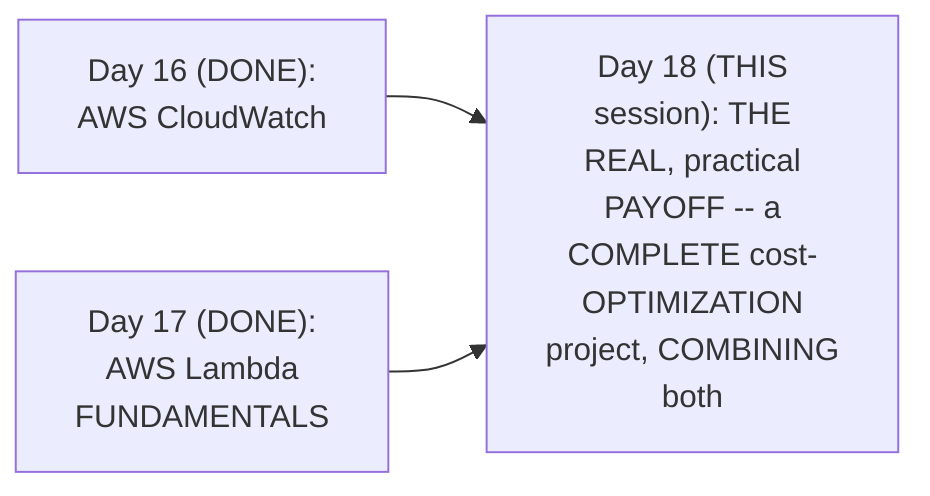

#### 🎯 Key Takeaways

* This is GENUINELY the SERIES' own, REAL, PRACTICAL payoff SESSION — EXPLICITLY, DIRECTLY combining Day 16's OWN CloudWatch foundation AND Day 17's OWN Lambda foundation INTO one, COMPLETE, working project.
* THIS project is directly, EXPLICITLY confirmed as RELEVANT to BOTH devops AND cloud ENGINEERS — a GENUINE, real, DAY-to-day activity, NOT a niche EDGE case.
* THIS session directly, CONSISTENTLY reinforces THIS series' own, ESTABLISHED "REAL job RELEVANCE" philosophy — EXPLICITLY confirmed AS RESUME-worthy CONTENT.

---

### 2. Why Cost Optimization Genuinely Matters: A Direct, Honest Explanation

#### 🧠 Concept — A Genuine, Direct Callback to This Series' Own, Established Foundation

> 💡 **Given directly:** *"In previous videos I have told you multiple times that there are two primary reasons why organizations move towards cloud — the reason one is to reduce the overhead of the infrastructure, and the second thing is to optimize their cloud cost."*

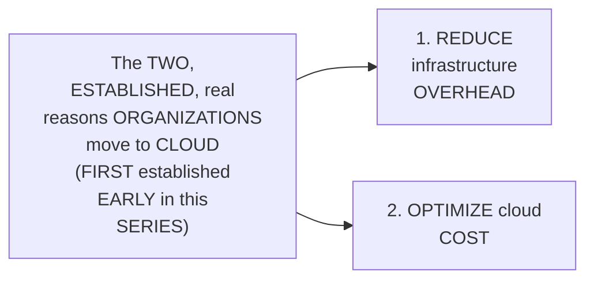

#### 🔍 Internal Working — A Genuine, Real, Relatable Explanation

> 💡 **Given directly:** *"For a startup, or for a mid-scale organization, the process of setting up the entire data center, then purchasing the servers, arranging those servers, and maintaining an entire team... so building this entire setup, the data center setup, the server setup, and continuously this team has to monitor this data center... so that's why, for them, an easy, go-to solution is cloud."*

#### ⚠ Common Mistakes

* Assuming COST optimization is a GENUINELY, MERELY optional, "NICE-to-have" activity FOR devops ENGINEERS — explicitly, directly, HONESTLY clarified: it's a GENUINE, PRIMARY responsibility, DIRECTLY connected TO one of the CORE, ORIGINAL reasons organizations GENUINELY move TO cloud in the FIRST place.

#### 🎯 Key Takeaways

* THIS session's own, CENTRAL topic (COST optimization) directly, HONESTLY connects BACK to this SERIES' own, ESTABLISHED, FOUNDATIONAL reasoning — organizations MOVE to cloud SPECIFICALLY to REDUCE overhead AND optimize COST.
* A GENUINE, real explanation directly, CONCRETELY grounds THIS reasoning — SELF-managed data CENTERS require SIGNIFICANT, ongoing INVESTMENT (servers, TEAMS, monitoring) — a REAL, PRACTICAL burden CLOUD genuinely SOLVES.
* This directly, PRECISELY sets UP the SESSION's own, NEXT, essential CLARIFICATION — WHY simply MOVING to cloud does NOT, automatically, GUARANTEE this COST-reduction benefit (Section 3).

---
### 3. A Genuine, Important Clarification: Moving to Cloud Doesn't Automatically Reduce Cost

#### ⚠ A Direct, Honest, Important Clarification

> 💡 **Given directly:** *"You might say, 'as a startup and as a devops engineer in the startup, I can just suggest my organization that instead of going towards the culture of building this entire data center... simply move towards the cloud platform, and my job is done' — you can say that, but this is a wrong thing, because after moving to cloud, the cost will go down only if you are doing this efficiently."*

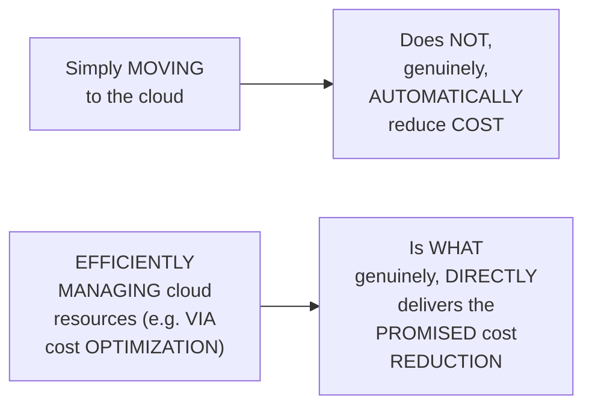

#### 🪜 Step-by-Step — A Complete, Real, Narrative, Worked Example

> 💡 **Given directly:** *"There is a developer here, he went ahead and he created his own EC2 instance on the cloud platform, and what he has done is he has attached a volume to this EC2 instance... this developer has created the EC2 instance, and he has started populating the volume... each and every day this person has started taking the snapshots... after a while, this person said, 'okay, this feature is deprecated, I don't want this,' so let me delete the EC2 instance... and deleted the volume as well... but forgot to delete the volume... if the volume itself is forgotten to delete, of course the snapshots that this person has taken each and every day will also be forgotten and will not be deleted, and AWS will keep charging you for all these snapshots and all these volumes."*

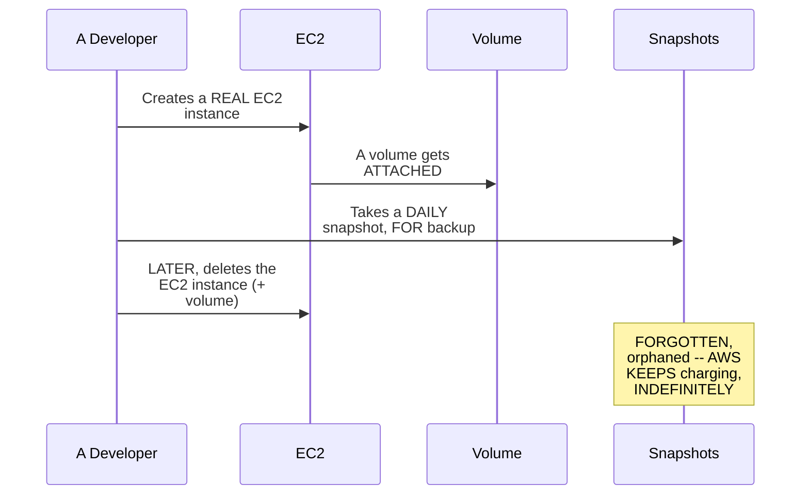

#### ⚠ Common Mistakes

* Assuming a DEVELOPER's own, GENUINE intention (e.g., TAKING daily BACKUPS) automatically PREVENTS a REAL, costly MISTAKE — explicitly, directly, HONESTLY demonstrated as FALSE — EVEN a WELL-intentioned, KNOWLEDGEABLE developer CAN genuinely, ACCIDENTALLY leave ORPHANED, cost-INCURRING resources BEHIND.

#### 🎯 Key Takeaways

* A COMPLETE, real, NARRATIVE, worked EXAMPLE directly, CONCRETELY illustrates HOW cloud COST genuinely, DIRECTLY spirals — a DEVELOPER creates AN EC2 instance, TAKES daily SNAPSHOTS, then LATER deletes the INSTANCE and volume — but FORGETS the snapshots THEMSELVES.
* AWS GENUINELY, DIRECTLY continues CHARGING for THESE forgotten, ORPHANED snapshots — INDEFINITELY, UNTIL someone genuinely NOTICES and deletes THEM.
* This directly, PRECISELY sets UP the SESSION's own, NEXT, essential TERM — "STALE resources" — the PRECISE, GENERALIZED name for THIS exact, real PHENOMENON (Section 4).

---

### 4. Stale Resources, Precisely Defined

#### 📖 Definition — Stale Resources, Precisely Defined

> 💡 **Given directly:** *"There are 200 resources on AWS, and manually monitoring this 200 resources to verify if someone has created some stale resources... what is stale resources? Stale resources is something someone has created, but forgotten to delete those resources."*

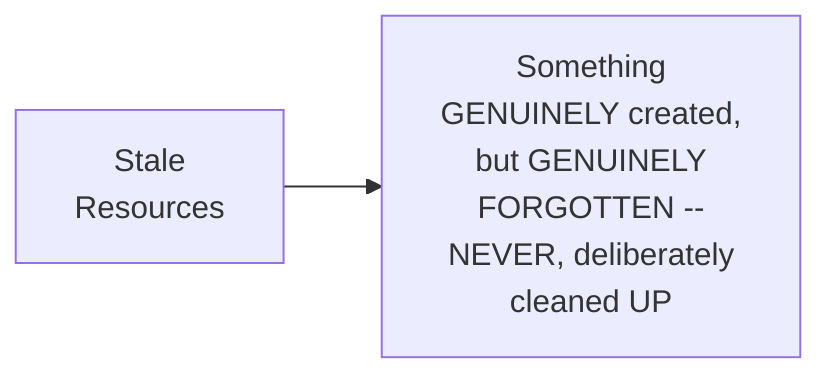

#### 🔍 Internal Working — A Genuine, Direct Confirmation: This Applies Broadly

> 💡 **Given directly:** *"There can be S3 buckets that are created by some developer, and probably that developer stopped using the S3 buckets, but he has forgotten to delete the S3 bucket and the content in the S3 bucket... or let's say this person has created an EKS cluster and forgotten to delete the EKS cluster."*

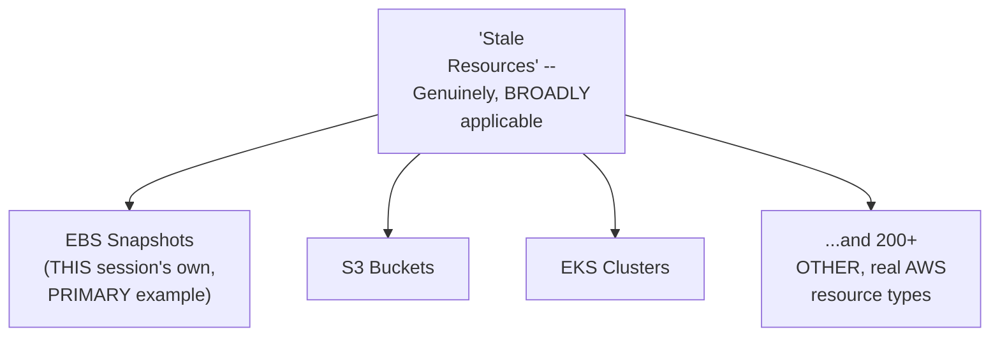

#### ⚠ Common Mistakes

* Assuming "STALE resources" is a GENUINELY, NARROW concept, SPECIFIC only TO EBS snapshots (THIS session's own, PRIMARY, worked EXAMPLE) — explicitly, directly, HONESTLY clarified: it GENUINELY, BROADLY applies ACROSS virtually EVERY, real AWS resource TYPE — S3 buckets, EKS CLUSTERS, and 200+ others.

#### 🎯 Key Takeaways

* **"STALE resources"** is precisely DEFINED as SOMETHING genuinely CREATED, but GENUINELY forgotten/UNCLEANED — a PRECISE, generalized TERM for the EXACT phenomenon Section 3's OWN, narrative example ILLUSTRATED.
* This CONCEPT genuinely, DIRECTLY applies BROADLY — NOT just to EBS snapshots (THIS session's own, PRIMARY focus), but ALSO S3 buckets, EKS CLUSTERS, and countless OTHER, real AWS resource TYPES.
* This directly, PRECISELY sets UP the SESSION's own, NEXT, essential QUESTION — WHAT, precisely, SHOULD a devops ENGINEER genuinely DO about stale RESOURCES, ONCE identified (Section 5)?

---
### 5. A DevOps Engineer's Two Real Options (& Why This Session Focuses on Deletion)

#### 📖 Definition — The Precise, Two Real Options

> 💡 **Given directly:** *"If there are any stale resources, a devops engineer can typically do two things — one is devops engineer can send out the notifications... or, if this devops engineer has access or has permissions to delete them, which is, in general cases, devops engineer would have that access, you can go ahead and also delete the instances."*

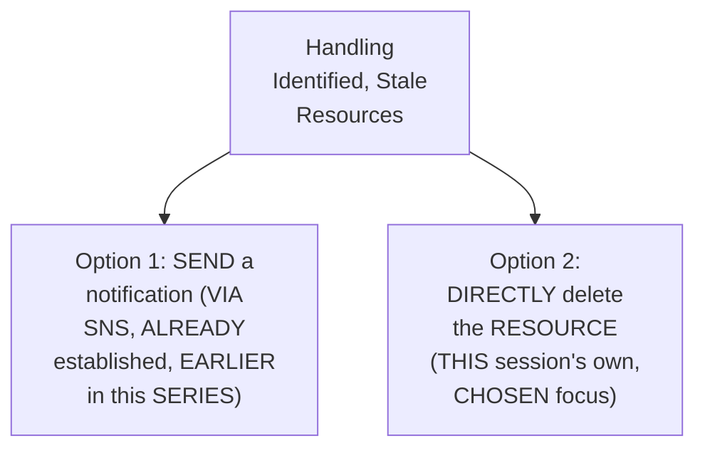

#### 🪜 Step-by-Step — A Direct, Explicit Confirmation of Today's Own, Chosen Focus

> 💡 **Given directly:** *"In today's video we will explore the second option, because sending of the notifications using SNS topics is something that we have seen in the past in this series — so let's focus on understanding how devops engineers can implement the cost optimization using the delete option."*

#### ⚠ Common Mistakes

* Assuming DELETING a stale RESOURCE is GENUINELY, ALWAYS the CORRECT, or ONLY, REAL approach — explicitly, directly, IMPLICITLY clarified (VIA the SESSION's own, EXPLICIT acknowledgment OF a "NOTIFICATION" alternative): the RIGHT choice GENUINELY, DIRECTLY depends ON organizational POLICY — SOME organizations MAY prefer NOTIFYING first, RATHER than IMMEDIATE, automatic deletion.

#### 🎯 Key Takeaways

* A DEVOPS engineer's TWO, genuine, real OPTIONS for handling STALE resources: **(1) SEND a notification** (via SNS, ALREADY established EARLIER in this SERIES), or **(2) DIRECTLY delete** the resource.
* THIS session EXPLICITLY, DIRECTLY focuses ON the **SECOND** option (DELETION) — SPECIFICALLY because the NOTIFICATION-based approach WAS already, GENUINELY covered IN a PRIOR session.
* This directly, PRECISELY sets UP the SESSION's own, NEXT, essential CONTENT — the COMPLETE, real ARCHITECTURE that IMPLEMENTS this DELETE-based approach (Section 6).

---

### 6. The Complete, Real Architecture: Lambda + boto3 + AWS APIs

#### 📖 Definition — The Complete, Precise Architecture

> 💡 **Given directly:** *"We will use Lambda functions, and inside this Lambda functions we will write Python code, which is quite general for devops engineers — devops engineers usually write the code in Python for the Lambda functions, because many devops engineers are familiar with Python... we will use a module in the Python code called boto3 — this will talk to the AWS APIs."*

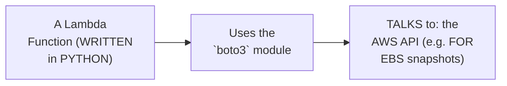

#### 🔍 Internal Working — A Genuine, Direct Confirmation: One Function Per Resource Type

> 💡 **Given directly:** *"You will not write one simple, or one single Lambda function for each and everything on the AWS, but you will write Lambda functions individually — that means you will write a Lambda function, for example, for EBS snapshots... this Python code that you have written will talk to the AWS API, and it will get the complete information of the EBS snapshots."*

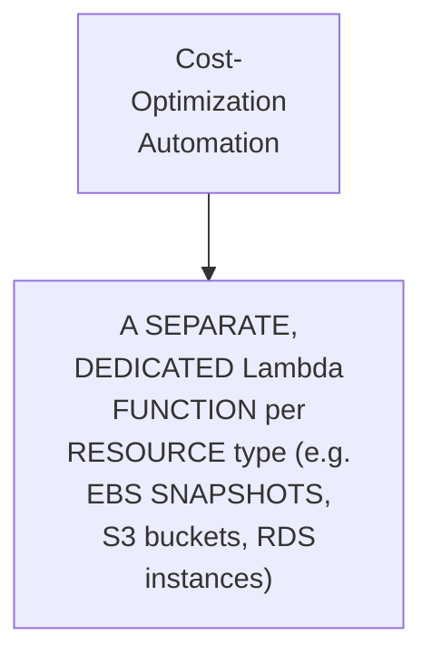

#### 📖 Definition — The Complete, Precise, Three-Step Logic

> 💡 **Given directly:** *"EBS volume snapshots — this is the problem statement, and what you would do is basically write a Lambda function... step one would be to fetch all the EBS snapshots, and step two would be to filter out the snapshots that are stale, and once we identify this one, we will just delete the snapshot."*

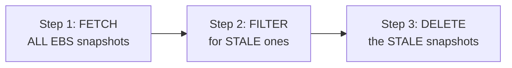

#### ⚠ Common Mistakes

* Assuming a SINGLE, universal LAMBDA function GENUINELY, PRACTICALLY handles COST optimization ACROSS every, DIFFERENT AWS resource TYPE — explicitly, directly, PRECISELY corrected: DEVOPS engineers GENUINELY, TYPICALLY write SEPARATE, dedicated FUNCTIONS, one PER resource type.

#### 🎯 Key Takeaways

* THE complete, real ARCHITECTURE: a LAMBDA function (WRITTEN in PYTHON, using the **`boto3`** module) TALKS to the AWS API — IMPLEMENTING a THREE-step logic: **FETCH** all SNAPSHOTS → **FILTER** for STALE ones → **DELETE** them.
* DEVOPS engineers GENUINELY, TYPICALLY write **SEPARATE, dedicated LAMBDA functions**, one PER resource TYPE (EBS snapshots, S3 BUCKETS, RDS instances) — NOT a SINGLE, universal function.
* This directly, PRECISELY sets UP the SESSION's own, COMPLETE, hands-ON demonstration — BUILDING and TESTING this EXACT architecture, LIVE (Sections 7-12).

---
### 7. A Complete, Real, Live Demo: Setting Up the Test Scenario

#### 🪜 Step-by-Step — A Complete, Real, Test-Scenario Setup

> 💡 **Given directly:** *"Let me implement this and then I'll explain you the code structure... I need to create a EBS volume snapshot — go to the EC2 dashboard, and within the EC2 dashboard, now let's create an EC2 instance... now the instance is launched, and with the instance comes a volume."*

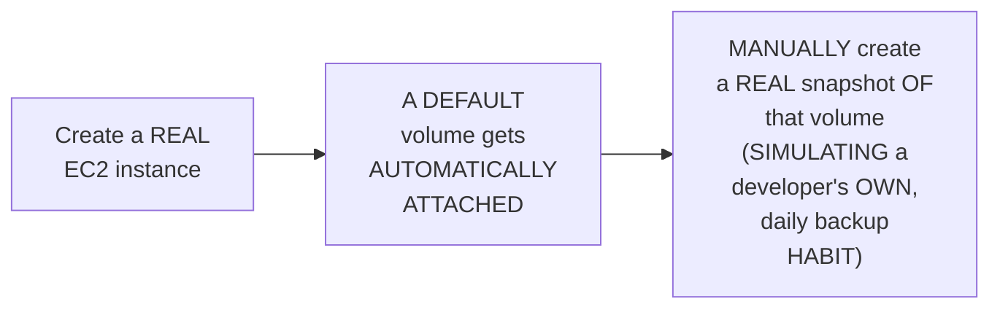

#### 🪜 Step-by-Step — A Complete, Real, Narrative Continuation

> 💡 **Given directly:** *"What this developer has done is each and every day he started taking the snapshots... now what this person has done is, after a while, he actually wants to delete the instance, wants to delete the volume, and also wants to delete the snapshot, but this person has forgotten — he has some hundreds of snapshots, but he forgot to delete all the snapshots, he just deletes the instance, automatically the volume got deleted, but snapshot stayed back."*

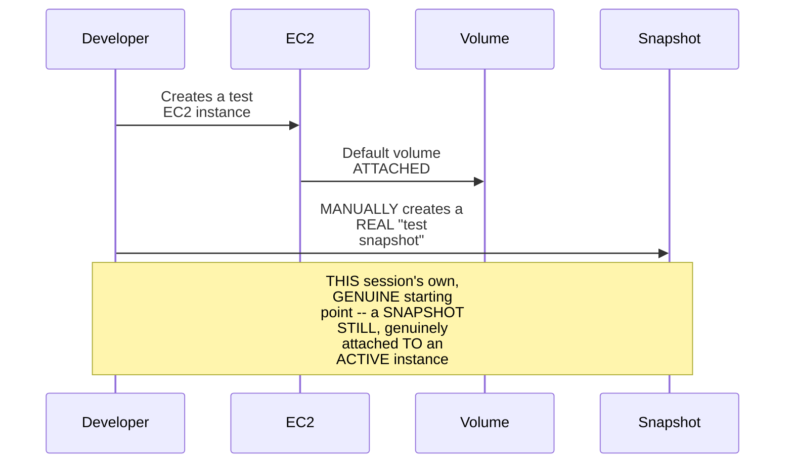

#### ⚠ Common Mistakes

* Assuming a REAL, working COST-optimization DEMO requires a COMPLEX, elaborate TEST setup — explicitly, directly, PRACTICALLY demonstrated as GENUINELY, DELIBERATELY simple — ONE EC2 instance, ITS default VOLUME, and ONE manual SNAPSHOT are GENUINELY sufficient TO illustrate the COMPLETE, real SCENARIO.

#### 🎯 Key Takeaways

* A COMPLETE, real TEST-scenario setup directly, CONCRETELY reconstructs Section 3's own, NARRATIVE example — a REAL EC2 instance, ITS default VOLUME, and a MANUALLY-created "TEST snapshot."
* THIS setup DELIBERATELY, genuinely REPRESENTS the "STARTING point" — a snapshot STILL, genuinely ATTACHED to an ACTIVE instance (VIA its volume) — the CORRECT, expected BEHAVIOR is FOR the script to LEAVE this ALONE.
* This directly, PRECISELY sets UP the SESSION's own, NEXT, essential STEP — BUILDING the ACTUAL Lambda function THAT will process THIS test SCENARIO (Section 8).

---

### 8. A Complete, Real, Live Demo: Creating the Lambda Function (& a Genuine, Honest Timeout Error)

#### 🪜 Step-by-Step — A Complete, Real, Live Function-Creation Walkthrough

> 💡 **Given directly:** *"Let's go to the Lambda function, create a Lambda function called cost optimization EBS snapshot, let's say Python, we will go with the default permissions and I'll update the permissions later... firstly let's go to our GitHub page and copy this entire code... paste the code here."*

#### ⚠ A Direct, Honest, Genuine Warning

> 💡 **Given directly:** *"This function will fail a couple of times, I'll tell you the reasons."*

#### ⚠ Error 1: A Genuine, Honest Timeout Error

> 💡 **Given directly:** *"Click on the test button, and now it will fail, because by default Lambda functions execution is only 3 seconds, and it is also failing for some permissions issue... let's go to the configuration tab and edit, increase the default invocation time to 10 seconds — so if someone asks you what is the default execution time for Lambda, it's 3 seconds, but you can increase it as your wish."*

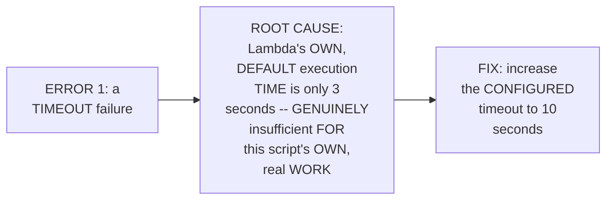

#### ⚠ A Direct, Honest, Important Cost-Awareness Note

> 💡 **Given directly:** *"It is better to keep the execution time as small as possible, because AWS will charge you using this as a parameter — like the Lambda execution time is also one of the parameters for charging, so make sure that you keep this time as less as possible."*

#### ⚠ Common Mistakes

* Assuming LAMBDA's own, DEFAULT execution TIME (3 seconds) is GENUINELY, ALWAYS sufficient FOR real, PRACTICAL scripts — explicitly, directly, LIVE-demonstrated as FREQUENTLY, GENUINELY insufficient — REQUIRING an EXPLICIT, manual INCREASE.
* Assuming a LONGER, more GENEROUS execution TIMEOUT is GENUINELY, ALWAYS the "SAFER" choice — explicitly, directly, HONESTLY clarified: EXECUTION time is ITSELF a BILLING parameter — "KEEP this TIME as LESS as possible."

#### 🎯 Key Takeaways

* A COMPLETE, real, LIVE demonstration directly, CONCRETELY confirmed the BASIC Lambda-function CREATION workflow — COPYING the PROVIDED Python CODE from GitHub, PASTING it INTO a new FUNCTION.
* THE instructor **directly, HONESTLY warns** "THIS function WILL fail a COUPLE of times" — SETTING up a GENUINELY, deliberately PRESERVED, multi-ERROR debugging SEQUENCE.
* **ERROR 1** was directly, CONCRETELY diagnosed AS a **TIMEOUT** failure — LAMBDA's own, DEFAULT 3-second EXECUTION limit is GENUINELY, FREQUENTLY insufficient — FIXED by INCREASING it to 10 SECONDS, WHILE remembering EXECUTION time is ITSELF a REAL, genuine BILLING factor.

---
### 9. Building a Custom, Least-Privilege IAM Policy (& a Second Round of Errors)

#### ⚠ Error 2: A Genuine, Honest, First Permissions Error

> 💡 **Given directly:** *"It is saying that the described snapshots permission — or that role which is running this EC2 Lambda function — does not have permissions to describe the snapshots... because what I am doing, I am describing all the snapshots, and I am filtering out the stale snapshots."*

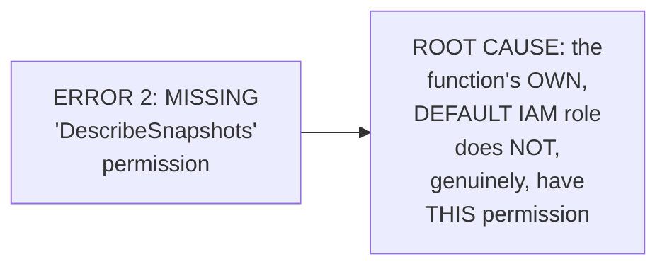

#### 🪜 Step-by-Step — A Complete, Real, Live, Custom Policy Creation

> 💡 **Given directly:** *"If you just search for 'snapshots' here, you will not find anything... so what you can simply do is you can create a policy by yourself — I'll say the role as EC2... I want delete snapshot permission, I want permissions to list all the snapshots, that is describe snapshots — I think that should be enough... resources should be all resources... give the name of the policy, cost optimization EBS, create policy."*

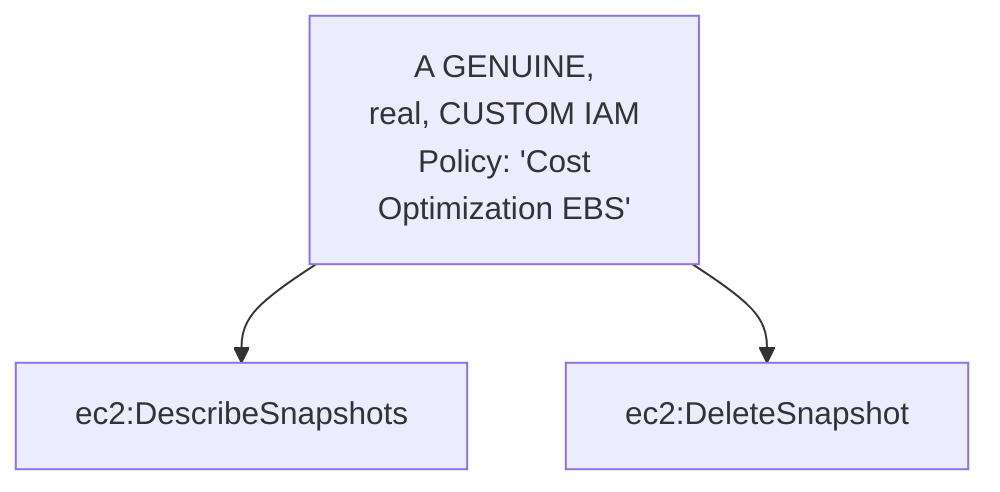

#### 🔍 Internal Working — A Genuine, Direct Confirmation of the Least-Privilege Principle

> 💡 **Given directly:** *"If you are less patient, you can give complete EC2 instance permissions, but basically we want to do the least privilege, or the least zero privilege, approach."*

#### ⚠ Error 3: A Genuine, Honest, Second Round of Permissions Errors

> 💡 **Given directly:** *"Let's try to execute the role... it said unauthorized, calling describe instances — because we are also describing the EC2 instances, right, we are trying to see that this snapshot belongs to a volume that belongs to EC2 instances, so we need describe instances, we also need describe volumes as well."*

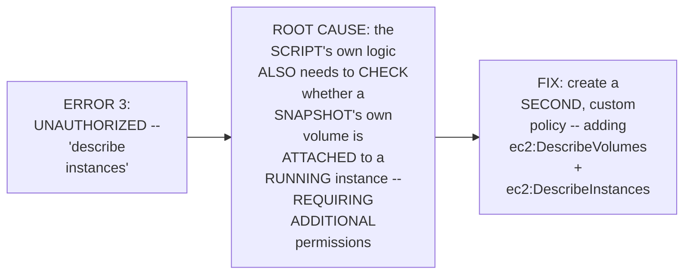

#### ⚠ A Direct, Honest, Real-Time Troubleshooting Note

> 💡 **Given directly:** *"If you feel that the information is not reflecting, wait for a while and just refresh it, you will get that thing... now let's perform one more time, and if it fails again, don't worry, I am here only."*

#### ⚠ Common Mistakes

* Assuming a QUICK SEARCH for a "SNAPSHOTS"-related, PRE-built AWS policy WILL genuinely, ALWAYS succeed — explicitly, directly, HONESTLY demonstrated as GENUINELY unsuccessful — REQUIRING a MANUALLY-constructed, CUSTOM policy INSTEAD.
* Assuming GRANTING BROAD, "FULL access" permissions is GENUINELY, ALWAYS the FASTER, more PRACTICAL choice — explicitly, directly, HONESTLY acknowledged AS a GENUINE, real TEMPTATION ("IF you are LESS patient") — but the SESSION deliberately CHOOSES the SLOWER, MORE precise, LEAST-privilege approach INSTEAD.
* Assuming IAM permission CHANGES take EFFECT INSTANTLY, WITHOUT any, genuine DELAY — explicitly, directly, HONESTLY acknowledged: "WAIT for a WHILE and JUST refresh it" — a REAL, practical PROPAGATION delay CAN genuinely OCCUR.

#### 🎯 Key Takeaways

* A COMPLETE, real, LIVE demonstration directly, CONCRETELY confirmed BUILDING a **CUSTOM, least-PRIVILEGE IAM policy** — SPECIFICALLY granting `ec2:DESCRIBESnapshots` and `ec2:DELETESnapshot` — RATHER than a BROADER, pre-BUILT, or "FULL access" alternative.
* A SECOND, genuine ROUND of PERMISSIONS errors ("UNAUTHORIZED... describe INSTANCES") was directly, HONESTLY encountered and FIXED — REQUIRING a SECOND, custom POLICY, adding `ec2:DESCRIBEVolumes` and `ec2:DescribeINSTANCES`.
* A GENUINE, honest, REAL-time troubleshooting NOTE confirmed IAM permission CHANGES can GENUINELY, PRACTICALLY take a MOMENT to PROPAGATE — REQUIRING patience AND repeated REFRESHING.

---
### 10. A Complete, Real, Live-Confirmed Success: Correct, Non-Destructive Behavior

#### 🪜 Step-by-Step — A Complete, Real, Live-Confirmed, First Success

> 💡 **Given directly:** *"Now the script got executed — congratulations, we have increased the Lambda function's timeout, and we have granted the permissions — now the script got executed, but you will notice that the snapshot will not be deleted, okay, I'm going to show you that — search for EC2, see, the snapshot is still here."*

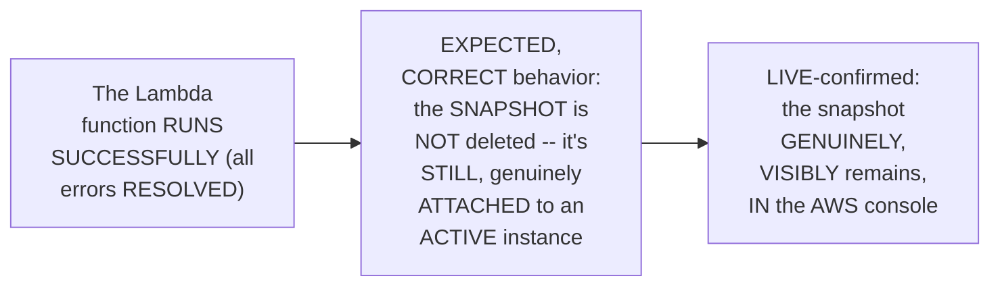

#### 🔍 Internal Working — A Genuine, Important, Correct-Behavior Validation

> 💡 **Given directly:** *"I'll show you that it does not delete snapshots which are attached to volumes that are attached to EC2 instances... we are in that state right now, this EC2 instance has this volume, and this volume is taken as a snapshot."*

#### ⚠ Common Mistakes

* Assuming a "SUCCESSFUL" script EXECUTION genuinely, ALWAYS means the SNAPSHOT was DELETED — explicitly, directly, LIVE-demonstrated as GENUINELY, IMPORTANTLY different — SUCCESS, HERE, MEANS the script CORRECTLY, INTELLIGENTLY chose NOT to delete a STILL-in-use resource.

#### 🎯 Key Takeaways

* A COMPLETE, real, LIVE-confirmed FIRST success directly, CONCRETELY validated the SCRIPT's own, CORRECT, non-DESTRUCTIVE behavior — the SNAPSHOT, STILL genuinely ATTACHED to an ACTIVE EC2 instance (via ITS volume), was CORRECTLY, DELIBERATELY left UNTOUCHED.
* THIS is directly, IMPORTANTLY confirmed AS the GENUINELY, DESIRED outcome — a COST-optimization script MUST, genuinely, avoid DELETING resources that are STILL, actively IN use.
* This directly, PRECISELY sets UP the SESSION's own, NEXT, essential STEP — GENUINELY triggering the ACTUAL, intended DELETION scenario, and RE-testing the script (Section 11).

---

### 11. Triggering the Real Deletion: A Complete, Real, Live-Confirmed Second Test

#### 🪜 Step-by-Step — A Complete, Real, Live Deletion Trigger

> 💡 **Given directly:** *"What I am going to do is I am going to delete this instance, okay, that instance will delete the volume as well, terminate the instance — so the instance is shutting down, as soon as the instance will go down, the volume will also be deleted."*

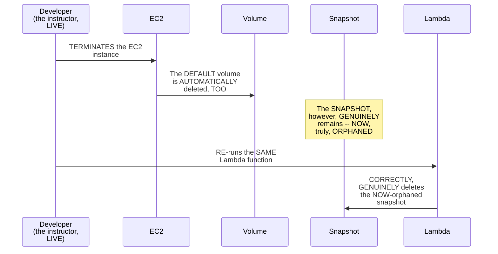

#### 🔍 Internal Working — A Genuine, Direct, Live-Confirmed, Complete Success

> 💡 **Given directly:** *"Instance is deleted, volume is deleted, and snapshot is still there — let me refresh the page and show you, snapshot is still available... let's go to our project and give the test again, this time I'm expecting our code to delete the snapshot as well — see, it said 'deleted the EBS snapshot, as it's not associated,' as it's associated with a volume that was not found, and that was our aim."*

#### ⚠ Common Mistakes

* Assuming DELETING an EC2 INSTANCE genuinely, AUTOMATICALLY deletes its ASSOCIATED snapshots TOO — explicitly, directly, LIVE-demonstrated as FALSE — the INSTANCE and its DEFAULT volume WERE deleted, but the SNAPSHOT genuinely, DIRECTLY remained — EXACTLY the "STALE resource" pattern ESTABLISHED earlier (Section 3).

#### 🎯 Key Takeaways

* A COMPLETE, real, LIVE demonstration directly, CONCRETELY confirmed: DELETING the EC2 INSTANCE also DELETED its DEFAULT volume — but the SNAPSHOT itself GENUINELY, DIRECTLY remained — NOW truly ORPHANED.
* RE-running the SAME Lambda FUNCTION directly, CONCRETELY confirmed the SCRIPT's own, CORRECT, INTENDED behavior — GENUINELY, SUCCESSFULLY deleting the NOW-orphaned SNAPSHOT.
* THIS complete, real, TWO-part verification (Section 10's own "DO NOT delete" case, PLUS this section's "DO delete" case) directly, THOROUGHLY validates the ENTIRE, complete SCRIPT's own logic — WORKING correctly IN both, genuine SCENARIOS.

---
### 12. A Second, Real Worked Example: A Standalone Volume & Snapshot

#### 🪜 Step-by-Step — A Complete, Real, Second, Independent Test

> 💡 **Given directly:** *"If you want one more example, let me quickly show you one more example — go to EC2 dashboard, go to volumes, create volume... go back to the EC2 dashboard, go to the snapshots, create snapshot... now I have one volume, I have one snapshot, and now let's see how will this project behave — test it — the project got executed."*

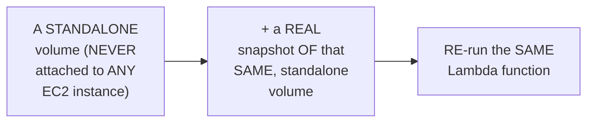

#### 🔍 Internal Working — A Genuine, Direct, Live-Confirmed, Precise Result

> 💡 **Given directly:** *"If you go to the dashboard and click on the refresh page, the snapshot is zero, but the volume is still there — why? What is the reason? Because I have written this in such a way that if the snapshot belongs to a volume that is not attached to any EC2 instance, then delete the snapshot."*

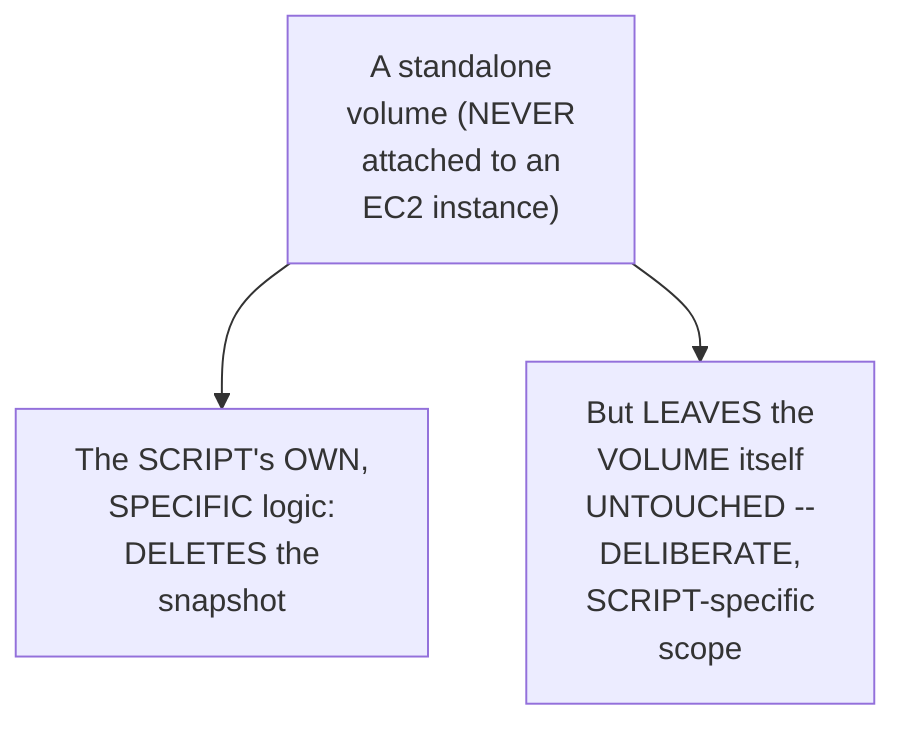

#### ⚠ Common Mistakes

* Assuming THIS script GENUINELY, DIRECTLY deletes BOTH the snapshot AND its UNDERLYING volume, WHEN that VOLUME is NOT attached TO any instance — explicitly, directly, LIVE-demonstrated as PRECISELY, DELIBERATELY scoped — ONLY the SNAPSHOT is DELETED; the STANDALONE volume ITSELF is GENUINELY, INTENTIONALLY left UNTOUCHED, per THIS script's own, SPECIFIC logic.

#### 🎯 Key Takeaways

* A SECOND, genuine, INDEPENDENT test — a STANDALONE volume (NEVER attached TO any EC2 INSTANCE) plus ITS own snapshot — directly, CONCRETELY confirmed the SCRIPT's own, PRECISE, deliberate SCOPE.
* THE script GENUINELY, DIRECTLY deletes the SNAPSHOT (SINCE its underlying VOLUME isn't ATTACHED to an INSTANCE) — but DELIBERATELY, GENUINELY leaves the STANDALONE volume ITSELF untouched.
* This directly, HONESTLY confirms a GENUINE, important LESSON — a REAL, automated SCRIPT's own, PRECISE scope MATTERS — "THIS requirement might VARY in your ORGANIZATION... it DEPENDS."

---

### 13. A Complete, Precise Code Walkthrough: boto3 & the Script's Own, Complete Logic

#### 🏢 Real-World / Production Usage — A Genuine, Practical Tip on Using boto3 Documentation

> 💡 **Given directly:** *"The boto3 documentation is very, very good — all that you need to do is you can just write steps of what you want to perform, write it in plain English on a notepad, then just go to the boto3 documentation... these days you can make use of ChatGPT and other things as well."*

```mermaid
flowchart LR
    A["1. Write your<br/>PLAN, in PLAIN<br/>English"] --> B["2. CONSULT the<br/>OFFICIAL boto3<br/>documentation<br/>(PLUS, optionally,<br/>ChatGPT)"]
    B --> C["3. WRITE/adapt<br/>the ACTUAL Python<br/>code"]
```

#### 🪜 Step-by-Step — A Complete, Precise Explanation of the Script's Own, Complete Logic

> 💡 **Given directly:** *"What I am doing here is I am going to use a for loop on all the EC2 instances JSON, and I'm just going to get the instance ID... similarly I got all the snapshots information, and I've got the volumes information... once I have the snapshot information, I am verifying if that snapshot has a volume ID or not — if it does not have any volume ID, then I am deleting the snapshot. If it has a volume ID that is attached to it, then I am verifying if the volume still exists or not — using the try/except condition, I am handling the situation, and I am deleting the snapshots."*

```mermaid
flowchart TD
    A["Start"] --> B["List ALL running<br/>EC2 instances,<br/>ALL volumes, ALL<br/>snapshots (via<br/>boto3)"]
    B --> C["FOR each<br/>SNAPSHOT:"]
    C --> D{"Does it have an<br/>ASSOCIATED volume<br/>ID?"}
    D -->|"No"| E["DELETE the<br/>snapshot (STALE --<br/>NEVER had a<br/>volume)"]
    D -->|"Yes"| F{"Does that<br/>VOLUME still EXIST?<br/>(via try/except)"}
    F -->|"No"| G["DELETE the<br/>snapshot (the<br/>volume was<br/>DELETED)"]
    F -->|"Yes"| H["LEAVE the<br/>snapshot ALONE<br/>(still, GENUINELY,<br/>in use)"]
```

#### ⚠ Common Mistakes

* Assuming WRITING a REAL, working AWS-API SCRIPT genuinely, PRACTICALLY requires MEMORIZING every, SPECIFIC `boto3` FUNCTION and PARAMETER — explicitly, directly, PRACTICALLY demonstrated as UNNECESSARY — the OFFICIAL documentation (PLUS ChatGPT) GENUINELY, DIRECTLY provides the NEEDED syntax, ADAPTED to your OWN, specific use CASE.

#### 🎯 Key Takeaways

* A GENUINE, practical TIP directly, PRACTICALLY recommends: WRITE your PLAN in PLAIN English FIRST, THEN consult the OFFICIAL `boto3` DOCUMENTATION (plus, OPTIONALLY, ChatGPT) to CONSTRUCT the ACTUAL code.
* THE script's own, COMPLETE logic directly, PRECISELY confirmed: LIST all INSTANCES/volumes/snapshots → FOR each SNAPSHOT, check FOR an associated VOLUME ID → IF none, DELETE it; IF present, CHECK (via try/EXCEPT) whether THAT volume STILL exists → IF not, DELETE the snapshot.
* This COMPLETE, precise WALKTHROUGH directly, THOROUGHLY explains WHY the script CORRECTLY produced BOTH of THIS session's own, LIVE-confirmed results (SECTIONS 10-11) — a GENUINELY, PRECISE, two-CONDITION check.

---
### 14. A Genuine, Honest Acknowledgment: Real Requirements Vary by Organization

#### ⚠ A Direct, Honest, Important Acknowledgment

> 💡 **Given directly:** *"In your organization, if the request is slightly different — because there is no standard procedure for every organization, in some organizations they keep the snapshots... they just take the snapshots and put that in S3 Glacier, which is a cheap S3 lifecycle — they'll just go there and store the snapshots. Some organizations would delete the snapshots — it depends upon organization to organization, we took one scenario, and I've explained you the entire thing."*

```mermaid
flowchart LR
    A["A GENUINE,<br/>REAL, stale<br/>snapshot"] --> B["Organization<br/>CHOICE A (THIS<br/>session's OWN,<br/>chosen approach):<br/>DELETE it,<br/>directly"]
    A --> C["Organization<br/>CHOICE B (a REAL,<br/>alternative<br/>approach):<br/>ARCHIVE it TO S3<br/>Glacier (a CHEAP,<br/>deep-ARCHIVE<br/>storage tier)"]
```

#### 🔍 Internal Working — A Genuine, Direct, Earlier Acknowledgment: Adding a Buffer/Threshold

> 💡 **Given directly:** *"You need to understand that even in such cases, what you can simply do is you can verify the timestamp — like what is today's date, and when was that snapshot created — you can give a buffer time, let's say for six months, if this snapshot is not used, then just delete it... it is just an if condition, you can add it anytime."*

```mermaid
flowchart LR
    A["A GENUINE,<br/>REAL enhancement:<br/>checking a<br/>SNAPSHOT's own AGE<br/>(e.g. '30+ days<br/>OLD')"] --> B["ADDS a<br/>DELIBERATE 'buffer'<br/>BEFORE deletion --<br/>NOT covered IN<br/>this session's own,<br/>ACTUAL, LIVE-coded<br/>SCRIPT"]
```

#### ⚠ Common Mistakes

* Assuming THIS session's own, SPECIFIC, live-CODED script represents a GENUINELY, UNIVERSAL, "ONE-size-fits-ALL" standard FOR every, real ORGANIZATION — explicitly, directly, HONESTLY clarified: "THERE is no STANDARD procedure FOR every organization" — THIS is ONE, specific, CHOSEN approach, AMONG several, GENUINELY valid alternatives.

#### 🎯 Key Takeaways

* THE instructor **directly, HONESTLY acknowledges** REAL, organizational REQUIREMENTS genuinely, DIRECTLY vary — SOME organizations DELETE stale SNAPSHOTS outright (THIS session's own, CHOSEN approach); OTHERS ARCHIVE them TO S3 Glacier (a CHEAP, deep-archive STORAGE tier) instead.
* A GENUINE, real ENHANCEMENT — CHECKING a SNAPSHOT's own AGE (e.g., ADDING a "30-DAY" or "6-month" BUFFER before DELETION) — is directly, HONESTLY acknowledged as a SIMPLE, additional "IF condition" — NOT actually IMPLEMENTED in this SESSION's own, LIVE-coded script, but GENUINELY, EASILY addable.
* This directly, HONESTLY reinforces a GENUINE, important LESSON — REAL, production-READY automation OFTEN requires ADAPTING a BASE, demonstrated PATTERN to YOUR own, SPECIFIC organizational POLICY — NOT blindly COPYING a SINGLE, fixed APPROACH.

---

### 15. A Complete, Real, Live Demo: Configuring an Automatic, CloudWatch-Based Trigger

#### 🪜 Step-by-Step — A Direct, Genuine Callback to Day 17's Own, Established Principle

> 💡 **Given directly:** *"I told you in the last class that Lambda functions are event-driven in nature, but here I was running this Lambda function manually — so it's again up to you, if you want to run it manually, then you can create a test event and run it, or else, you know, we have our friend which is CloudWatch."*

#### 🪜 Step-by-Step — A Complete, Real, Live EventBridge Scheduling Walkthrough

> 💡 **Given directly:** *"Go to CloudWatch, and here you have events, in the events you can just say rules, and you can configure the Lambda function as an event... create a rule, what is the name of the rule that you want, let's say EBS snapshots rule... instead of running with an event pattern, you can run it on a specific schedule... EventBridge scheduler, that means this CloudWatch is creating an event bridge between CloudWatch and Lambda function."*

```mermaid
sequenceDiagram
    participant CloudWatch as CloudWatch<br/>(via EventBridge,<br/>a SCHEDULED<br/>RULE)
    participant Lambda
    CloudWatch->>Lambda: AUTOMATICALLY<br/>triggers, ON the<br/>CONFIGURED schedule
    Lambda->>Lambda: RUNS the COST-<br/>optimization<br/>script, AUTOMATICALLY,<br/>WITHOUT manual<br/>intervention
```

#### ⚠ A Direct, Honest, Important Safety Warning

> 💡 **Given directly:** *"Do not do that if you want to keep your cloud cost low, because if you forget that, then this Lambda function keeps executing every day, and that would incur cost — I just wanted to explain you how this pattern works."*

#### ⚠ Common Mistakes

* Assuming CONFIGURING an AUTOMATIC, SCHEDULED trigger is GENUINELY, ALWAYS the SAFE, "SET it and forget IT" final STEP — explicitly, directly, HONESTLY warned AGAINST — LEAVING it GENUINELY, ACTIVELY enabled (WITHOUT deliberate INTENT) can ITSELF, genuinely, INCUR unnecessary, ONGOING cost.

#### 🎯 Key Takeaways

* A COMPLETE, real, LIVE demonstration directly, CONCRETELY confirmed CONFIGURING a GENUINE, automated CLOUDWATCH trigger (via EVENTBRIDGE) — DIRECTLY, EXPLICITLY fulfilling Day 17's OWN, established "EVENT-driven" principle.
* THIS directly, PRACTICALLY completes the SESSION's own, established ARCHITECTURE — the LAMBDA function NO longer REQUIRES manual, TEST-event invocation — it NOW runs AUTOMATICALLY, on a REAL, configured SCHEDULE.
* THE instructor **directly, HONESTLY warns** against GENUINELY, CARELESSLY leaving THIS schedule ENABLED — ITSELF a REAL, potential SOURCE of unnecessary, ONGOING cost, IF forgotten.

---
### 16. Closing: A Genuine, Resume-Worthy, Real-World DevOps Project

#### 🪜 Step-by-Step — A Direct, Honest, Heartfelt Closing

> 💡 **Given directly:** *"I hope you got a clear picture of how this entire thing works, and if you have any questions, do let me know in the comment section, but do not fail to perform this demo — it takes a lot of time for me to build this demo for you and explain, so if you do this, and if you find this helpful, I'll be more than happy."*

```mermaid
flowchart LR
    A["Day 16<br/>(CloudWatch) +<br/>Day 17 (LAMBDA<br/>fundamentals)"] --> B["Day 18 (THIS<br/>session): the<br/>COMPLETE, REAL,<br/>working COST-<br/>optimization<br/>PROJECT -- a<br/>GENUINE, RESUME-<br/>worthy DELIVERABLE"]
```

#### ⚠ Common Mistakes

* Assuming THIS session's own, COMPLETE demonstration is GENUINELY, MERELY an EDUCATIONAL exercise, WITHOUT real, PRACTICAL career VALUE — explicitly, directly, REPEATEDLY confirmed THROUGHOUT this session AS a GENUINE, resume-WORTHY, day-to-DAY devops ACTIVITY.

#### 🎯 Key Takeaways

* This episode **GENUINELY, COMPREHENSIVELY delivers** its OWN, stated GOALS — a COMPLETE, real, RESUME-worthy cost-OPTIMIZATION project, COMBINING CloudWatch and LAMBDA, WITH a GENUINELY honest, MULTI-error debugging SEQUENCE.
* THE instructor **directly, PERSONALLY encourages** learners to GENUINELY, PERSONALLY complete THIS demo THEMSELVES — REINFORCING the SIGNIFICANT, real EFFORT invested IN building it.
* This directly, PRECISELY completes the SERIES' own, THREE-session arc (CloudWatch → LAMBDA fundamentals → THIS, real PROJECT) — a COMPLETE, coherent, PRACTICAL learning JOURNEY.

---

## 📝 Glossary

| Term | Definition | Why It Matters |
|---|---|---|
| **Cost Optimization** | Reducing unnecessary cloud spending | A primary, day-to-day devops responsibility |
| **Stale Resources** | Resources created but forgotten/uncleaned | Apply broadly: EBS, S3, EKS, and 200+ others |
| **boto3** | Python's own AWS SDK module | Used to talk to AWS APIs from Lambda code |
| **Least Privilege** | Granting only the specific permissions needed | Explicitly chosen over broader, "Full Access" grants |
| **EventBridge Scheduler** | CloudWatch's own scheduling mechanism | Enables automatic, event-driven Lambda triggering |
| **S3 Glacier** | A cheap, deep-archive storage tier | An alternative to deletion, for some organizations |

---

## 🔄 Revision Notes — One-Minute Revision

* This is **Day 18**, the real, practical payoff explicitly promised at the close of Day 17 -- a complete, resume-worthy cost-optimization project, combining Day 16's CloudWatch and Day 17's Lambda.
* **Why cost optimization matters**: directly connects back to this series' own, established, foundational reasons organizations move to cloud (reducing overhead, optimizing cost).
* **A genuine, important clarification**: simply moving to cloud does NOT automatically reduce cost -- it only does so if managed efficiently. A complete, real, narrative example: a developer creates an EC2 instance, takes daily snapshots, later deletes the instance and volume, but forgets the snapshots -- which AWS keeps charging for indefinitely.
* **"Stale resources," defined**: something genuinely created, but genuinely forgotten -- applying broadly across EBS snapshots, S3 buckets, EKS clusters, and 200+ other AWS resource types.
* **A devops engineer's two, real options**: (1) send a notification (via SNS, already covered), or (2) directly delete the resource. This session explicitly focuses on option 2.
* **The complete, real architecture**: a Lambda function, written in Python, using the `boto3` module, implementing a 3-step logic: fetch all snapshots -> filter for stale ones -> delete them. Devops engineers typically write ONE, dedicated Lambda function PER resource type.
* **Live demo setup**: a real EC2 instance (with its default volume) plus a manually-created "test snapshot" -- simulating a developer's own, daily backup habit.
* **Building the function (live)**: copying provided code from GitHub. A genuine, honest warning: "this function will fail a couple of times." Error 1 (timeout): Lambda's own, default 3-second execution limit is insufficient -- fixed by increasing to 10 seconds, while remembering execution time is itself a real billing factor.
* **Building a custom, least-privilege IAM policy**: Error 2 (missing DescribeSnapshots permission) required creating a custom policy (no pre-built AWS policy matched). The least-privilege approach was explicitly chosen over "Full Access." Error 3 (a second round -- missing DescribeInstances/DescribeVolumes) required a second, custom policy, since the script's own logic checks whether a snapshot's volume is attached to a running instance. A genuine, honest note: IAM permission changes can take a moment to propagate.
* **Live-confirmed success #1 (non-destructive)**: with all errors fixed, the script correctly did NOT delete a snapshot still genuinely attached to an active instance.
* **Live-confirmed success #2 (real deletion)**: after deleting the EC2 instance (and its volume), the snapshot became genuinely orphaned. Re-running the function correctly, genuinely deleted it.
* **A second, real worked example**: a standalone volume (never attached to any instance) plus its own snapshot. The script deleted the snapshot but deliberately left the standalone volume itself untouched -- a precise, script-specific scope.
* **The complete code walkthrough**: a genuine, practical tip -- write your plan in plain English, then consult the official boto3 documentation (plus, optionally, ChatGPT). The script's own, complete logic: list all instances/volumes/snapshots -> for each snapshot, check for an associated volume ID -> if none, delete; if present, check (via try/except) whether that volume still exists -> if not, delete.
* **A genuine, honest acknowledgment**: real organizational requirements vary -- some delete stale snapshots outright (this session's chosen approach); others archive them to S3 Glacier instead. A simple, additional "if condition" (checking a snapshot's own age, e.g., a 30-day buffer) is mentioned as a genuine, easy enhancement, though not actually implemented here.
* **Configuring an automatic, CloudWatch-based trigger**: directly fulfills Day 17's own, established "event-driven" principle, using EventBridge scheduling. A genuine, honest safety warning: don't leave this schedule genuinely enabled unless intended -- it can itself incur real, ongoing cost.
* **Closing**: this completes a genuine, resume-worthy, real-world devops project -- the culmination of the CloudWatch + Lambda arc (Days 16-18).

---

## 📋 Cheat Sheet

**The complete, real architecture:**
```text
Lambda function (Python + boto3) -> talks to AWS API
  Step 1: Fetch all EBS snapshots
  Step 2: Filter for stale ones
  Step 3: Delete the stale ones
```

**The script's own, complete decision logic:**
```text
FOR each snapshot:
  Does it have an associated volume ID?
    NO  -> DELETE (never had a volume)
    YES -> Does that volume still exist? (try/except)
             NO  -> DELETE (volume was removed)
             YES -> LEAVE ALONE (still in use)
```

**The three, real, live-encountered errors:**
```text
1. Timeout (default 3s, too short)      -> increase to 10s
2. Missing DescribeSnapshots permission  -> create a custom, least-privilege policy
3. Missing DescribeInstances/Volumes      -> create a second, custom policy
```

**Setting up an automatic trigger:**
```text
CloudWatch -> Events -> Rules -> EventBridge Scheduler
  -> configure a schedule -> automatically invokes the Lambda function
  (WARNING: don't leave this enabled unless genuinely intended -- it incurs real cost)
```

---

## 🔥 Interview Questions & Answers

### 🟢 Beginner

**Q1.**

**Question:** Does simply moving to the cloud automatically reduce an organization's costs?

**Answer:** No -- cost only genuinely goes down if resources are managed efficiently.

**Explanation:** Directly, precisely clarified.

**Why Interviewers Ask This:** The most basic, foundational cost-optimization question.

**Possible Follow-up:** "What can cause cloud costs to unexpectedly increase?"

**Q2.**

**Question:** What is a "stale resource"?

**Answer:** Something genuinely created, but genuinely forgotten/never cleaned up.

**Explanation:** Directly, precisely defined.

**Why Interviewers Ask This:** Foundational, frequently-tested cost-optimization vocabulary.

**Possible Follow-up:** "Name three, different types of AWS resources that can become stale."

**Q3.**

**Question:** What are a devops engineer's two, genuine options for handling identified, stale resources?

**Answer:** Send a notification (via SNS), or directly delete the resource.

**Explanation:** Directly, explicitly named.

**Why Interviewers Ask This:** Basic, essential cost-optimization workflow knowledge.

**Possible Follow-up:** "Which option did this session's own demo focus on?"

**Q4.**

**Question:** What Python module does this session's own Lambda function use to talk to AWS APIs?

**Answer:** boto3.

**Explanation:** Directly, explicitly named.

**Why Interviewers Ask This:** Basic, practical, hands-on Lambda/AWS-automation knowledge.

**Possible Follow-up:** "What resource does this session's own script recommend consulting, to write boto3 code?"

**Q5.**

**Question:** What is AWS Lambda's own, default execution timeout?

**Answer:** 3 seconds.

**Explanation:** Directly, explicitly stated.

**Why Interviewers Ask This:** A commonly-tested, genuine, memorable Lambda fact.

**Possible Follow-up:** "Why is it genuinely important to keep this time as short as possible?"

**Q6.**

**Question:** Why was a custom IAM policy created, rather than using a pre-built, AWS-provided one?

**Answer:** No pre-built policy genuinely matched the specific, needed snapshot permissions.

**Explanation:** Directly, honestly acknowledged.

**Why Interviewers Ask This:** Tests genuine, practical, hands-on IAM knowledge.

**Possible Follow-up:** "What two, specific permissions did this custom policy grant?"

**Q7.**

**Question:** Does this session's own script delete a snapshot that's still genuinely attached to an active EC2 instance?

**Answer:** No -- it correctly, deliberately leaves it alone.

**Explanation:** Directly, live-demonstrated.

**Why Interviewers Ask This:** Tests genuine understanding of the script's own, correct, non-destructive logic.

**Possible Follow-up:** "What condition genuinely triggers deletion, instead?"

**Q8.**

**Question:** When this session's own script deletes a snapshot from a standalone (never-attached) volume, does it also delete the volume itself?

**Answer:** No -- only the snapshot is deleted; the volume is deliberately left untouched.

**Explanation:** Directly, live-demonstrated.

**Why Interviewers Ask This:** Tests genuine, precise understanding of the script's own, specific scope.

**Possible Follow-up:** "Is this behavior a universal standard, or specific to this session's own script?"

**Q9.**

**Question:** What AWS service is used to automatically, genuinely trigger the Lambda function on a schedule?

**Answer:** CloudWatch, via EventBridge scheduling.

**Explanation:** Directly, explicitly confirmed.

**Why Interviewers Ask This:** Tests genuine understanding of the event-driven architecture principle from Day 17.

**Possible Follow-up:** "What genuine risk does leaving this schedule enabled carry?"

**Q10.**

**Question:** Do all organizations genuinely handle stale EBS snapshots the same way (deletion)?

**Answer:** No -- some archive them to S3 Glacier instead; requirements genuinely vary by organization.

**Explanation:** Directly, honestly acknowledged.

**Why Interviewers Ask This:** Tests whether a learner absorbed the session's own, honest acknowledgment of real-world variation.

**Possible Follow-up:** "What is S3 Glacier, and why might an organization prefer it over deletion?"

---

### 🟡 Intermediate

**Q11.**

**Question:** Explain why the instructor deliberately tests the script TWICE -- once confirming it does NOT delete an in-use snapshot, and once confirming it DOES delete an orphaned one -- rather than showing only the successful deletion.

**Answer:** This is a genuinely deliberate, COMPLETE-verification teaching choice: by GENUINELY, LIVE testing BOTH scenarios — the "SHOULD not delete" case (Section 10) AND the "SHOULD delete" case (Section 11) — the instructor DIRECTLY, CONCRETELY proves the SCRIPT's own logic is GENUINELY, CORRECTLY discriminating, NOT simply DELETING every, single SNAPSHOT indiscriminately. THIS is a GENUINELY, PARTICULARLY important DEMONSTRATION for a COST-optimization tool SPECIFICALLY, since a SCRIPT that GENUINELY, ACCIDENTALLY deletes an IN-USE, critical SNAPSHOT would be FAR more DANGEROUS than one THAT merely fails TO delete a STALE one — PROVING the "DO NOT delete" case is, ARGUABLY, EVEN more IMPORTANT than PROVING the "DO delete" case.

**Explanation:** Requires recognizing that testing the "should not delete" case is at least as important as testing the "should delete" case, given the genuine, real danger of a cost-optimization script accidentally deleting in-use resources.

**Why Interviewers Ask This:** Tests whether a learner recognizes the heightened importance of verifying non-destructive behavior, specifically for automated deletion tools.

**Possible Follow-up:** "Describe a GENUINE, real, ADDITIONAL test SCENARIO (BEYOND the TWO shown IN this session) that WOULD further VALIDATE this script's OWN, correct BEHAVIOR."

**Q12.**

**Question:** A learner argues that since this session confirms a custom IAM policy was needed (rather than a pre-built AWS one), this means AWS's own, pre-built policies are generally poorly designed or incomplete. Evaluate this claim.

**Answer:** This claim is GENUINELY, DIRECTLY incorrect, and MISATTRIBUTES the GENUINE, real REASON a custom policy was NEEDED. Section 9's own PRECISE, HONEST account CONFIRMS the search WAS for a HIGHLY specific, NARROW permission SET (snapshot describe/DELETE) — AWS's own, PRE-built policies are GENERALLY, DELIBERATELY designed AROUND broader, common USE-case groupings (e.g., "EC2 Full ACCESS," "S3 Read-ONLY"), NOT every, POSSIBLE, narrow COMBINATION a SPECIFIC automation SCRIPT might GENUINELY need. The ACCURATE, more PRECISE conclusion: NEEDING a CUSTOM policy, for a HIGHLY specific, LEAST-privilege use CASE, is a GENUINELY, STRUCTURALLY expected, NORMAL outcome of GOOD, security-conscious IAM PRACTICE — NOT evidence THAT AWS's own, pre-BUILT policies are GENERALLY deficient.

**Explanation:** Tests whether a learner recognizes that needing a custom, narrowly-scoped IAM policy reflects good, least-privilege practice, not a deficiency in AWS's own, broader, pre-built policy offerings.

**Why Interviewers Ask This:** Distinguishes candidates who understand the genuine, expected relationship between narrow, custom policies and least-privilege security from those who conflate this with a critique of AWS's own tooling.

**Possible Follow-up:** "Describe a GENUINE, real SCENARIO where USING a BROADER, pre-BUILT AWS policy WOULD, legitimately, be the MORE appropriate CHOICE, over a CUSTOM one."

**Q13.**

**Question:** Explain, precisely, why the instructor deliberately demonstrates a second, independent test scenario (a standalone volume and snapshot), rather than considering the demo complete after the first, two-part EC2-based test.

**Answer:** This is a genuinely deliberate, EDGE-CASE-verification teaching choice: the FIRST, two-part TEST (Sections 10-11) verified the SCRIPT's own BEHAVIOR SPECIFICALLY for a SNAPSHOT that ONCE belonged TO an EC2-attached VOLUME. THE second, INDEPENDENT test (Section 12) verifies a GENUINELY DIFFERENT, related SCENARIO — a snapshot BELONGING to a volume THAT was NEVER attached TO any instance AT all. By GENUINELY, LIVE testing THIS additional, DISTINCT case, the instructor DIRECTLY, CONCRETELY confirms the SCRIPT's own logic GENUINELY handles MULTIPLE, real-world VARIATIONS of "stale," NOT just the ONE, specific narrative ESTABLISHED earlier — a MORE thorough, GENUINELY convincing VALIDATION of the SCRIPT's own, real-world ROBUSTNESS.

**Explanation:** Requires recognizing the deliberate, edge-case-verification value of testing a second, genuinely distinct scenario, rather than considering the demo complete after only one narrative's worth of testing.

**Why Interviewers Ask This:** Tests whether a learner recognizes the practical, thoroughness-focused value of testing multiple, genuinely distinct scenarios for an automated deletion script.

**Possible Follow-up:** "Describe a THIRD, genuine EDGE-case scenario (BEYOND the TWO shown IN this session) that WOULD, similarly, be WORTH testing FOR this script."

**Q14.**

**Question:** Using this session's own precise "least privilege" reasoning (Section 9), explain a GENUINE, real risk of a devops engineer choosing to grant "EC2 Full Access" instead of the demonstrated, custom, narrowly-scoped policy, purely to save setup time.

**Answer:** A precise, reasoned RISK analysis, directly extending Section 9's own established, EXPLICIT contrast: per Section 9's own PRECISE, HONEST acknowledgment, "IF you are LESS patient, you CAN give COMPLETE EC2 instance PERMISSIONS" — a GENUINE, real TEMPTATION, for FASTER setup. HOWEVER, "EC2 Full ACCESS" would GENUINELY, DIRECTLY grant this LAMBDA function THE ability to PERFORM **ANY** EC2-related ACTION — CREATING instances, MODIFYING security GROUPS, terminating UNRELATED resources — FAR beyond its OWN, intended, NARROW scope (SNAPSHOT management ONLY). IF this FUNCTION's own CODE genuinely CONTAINED a bug, OR if its UNDERLYING credentials were EVER compromised, THIS overly-broad GRANT would GENUINELY, DIRECTLY enable FAR greater, UNINTENDED damage — DIRECTLY violating the SAME "LEAST privilege" principle THIS session's own content EXPLICITLY establishes AS the CORRECT, preferred approach.

**Explanation:** Requires extending the least-privilege principle to identify a genuine, real security risk of the "faster but broader" alternative the session itself acknowledges as tempting but ultimately rejects.

**Why Interviewers Ask This:** Tests whether a learner understands the concrete, real security consequence of choosing convenience over the deliberately-demonstrated, least-privilege approach.

**Possible Follow-up:** "Describe a GENUINE, real, SPECIFIC scenario where an OVERLY-broad 'EC2 Full Access' GRANT (RATHER than the NARROW, custom policy) COULD, genuinely, lead TO a REAL, costly INCIDENT."

**Q15.**

**Question:** Synthesize this session's complete "stale resources apply broadly" reasoning (Section 4) with its own "one Lambda function per resource type" reasoning (Section 6) to explain a GENUINE, real, organizational scaling challenge a devops team would face when implementing comprehensive cost optimization across many AWS services.

**Answer:** A precise, synthesized explanation, directly connecting TWO, separately-established sections: per Section 4's own PRECISE, established REASONING, "STALE resources" GENUINELY, DIRECTLY apply BROADLY — ACROSS EBS snapshots, S3 buckets, EKS CLUSTERS, and 200+ OTHER, real AWS resource TYPES. Per Section 6's own PRECISE, established ARCHITECTURAL pattern, DEVOPS engineers GENUINELY, TYPICALLY write a **SEPARATE, dedicated LAMBDA function** for EACH, individual resource TYPE — RATHER than one, UNIVERSAL function. SYNTHESIZING these TWO facts directly, PRECISELY reveals a GENUINE, real, ORGANIZATIONAL scaling CHALLENGE: COMPREHENSIVE cost OPTIMIZATION, covering EVERY, genuinely-relevant AWS SERVICE an organization USES, would GENUINELY, DIRECTLY require BUILDING, testing, and MAINTAINING **MANY, separate LAMBDA functions** — EACH with its OWN, distinct CODE, IAM permissions (per Section 9's OWN established, per-FUNCTION, least-privilege PATTERN), and SCHEDULING configuration (per SECTION 15). THIS reveals a GENUINE, real OPERATIONAL burden — devops TEAMS must, genuinely, BALANCE comprehensive COVERAGE (implementing MANY, resource-specific FUNCTIONS) against the GENUINE, real MAINTENANCE cost OF managing an EVER-growing COLLECTION of INDEPENDENT, automated SCRIPTS.

**Explanation:** Requires synthesizing the broad applicability of stale resources with the one-function-per-resource-type architecture to identify a genuine, real organizational scaling challenge in comprehensive cost optimization.

**Why Interviewers Ask This:** A senior-level question testing whether a candidate can identify a genuine, structural, operational challenge arising from the combination of two, separately-established facts about scope and architecture.

**Possible Follow-up:** "Propose a GENUINE, real, PRACTICAL strategy a devops TEAM could use to MANAGE this SPECIFIC, identified SCALING challenge, AS their OWN cost-optimization COVERAGE genuinely GROWS."

---

### 🔴 Advanced

**Q16.**

**Question:** Design a complete, reasoned, organization-wide cost-optimization strategy (using ONLY this session's own established concepts) that extends this session's own, single-function EBS-snapshot example to a genuinely comprehensive program covering multiple, real AWS resource types.

**Answer:** A reasonable, complete strategy, directly applying this session's OWN, exact established CONCEPTS:

```text
1. Resource Type Inventory (per Section 4's own established, BROAD
   applicability): CATALOG all, genuinely RELEVANT AWS resource
   TYPES the organization ACTIVELY uses (EBS snapshots, S3 buckets,
   RDS instances, EKS clusters, etc.) -- per Section 4's own
   established REASONING, "stale resources" GENUINELY apply
   BROADLY, NOT just to ONE resource type.

2. Dedicated Functions (per Section 6's own established
   architecture): BUILD a SEPARATE, dedicated Lambda FUNCTION for
   EACH, individual resource TYPE -- reusing THIS session's own,
   established THREE-step logic pattern (fetch, FILTER, delete/
   notify) as a GENERAL template.

3. Least-Privilege IAM (per Section 9's own established, EXPLICIT
   principle): FOR EACH, individual function, CONSTRUCT a
   NARROWLY-scoped, CUSTOM IAM policy -- GRANTING ONLY the
   SPECIFIC permissions THAT function GENUINELY needs -- AVOIDING
   the "EC2 Full Access"-STYLE, overly-broad SHORTCUT (per Advanced
   Q14's own established RISK analysis).

4. Deletion vs. Archival Decision (per Section 14's own established,
   HONEST acknowledgment): FOR EACH resource TYPE, EXPLICITLY decide
   -- WITH the organization's own STAKEHOLDERS -- whether STALE
   resources should GENUINELY be DELETED outright, or ARCHIVED (e.g.
   TO S3 Glacier) -- SINCE "there IS no standard PROCEDURE for
   every organization."

5. Buffer/Threshold Logic (per Section 14's own established,
   BRIEFLY-mentioned enhancement): FOR EACH function, CONSIDER
   adding a GENUINE age-based BUFFER (e.g. "ONLY delete IF 30+ days
   STALE") -- RATHER than IMMEDIATE deletion, per THIS session's
   own, SIMPLIFIED demo.

6. Automated, Scheduled Triggers (per Section 15's own established
   mechanism): CONFIGURE a GENUINE, CloudWatch-based, SCHEDULED
   trigger FOR each function -- WHILE explicitly, DOCUMENTED
   tracking WHICH functions are GENUINELY, actively ENABLED --
   DIRECTLY, PROACTIVELY avoiding Section 15's own established,
   HONEST "forgotten, ONGOING cost" risk, ACROSS an
   INCREASINGLY-large COLLECTION of automated functions.
```

This complete STRATEGY directly, precisely APPLIES this session's OWN, established CONCEPTS — BROAD stale-resource applicability, PER-resource-type architecture, LEAST-privilege IAM, delete-VERSUS-archive decisions, and AUTOMATED scheduling — to a GENUINELY realistic, ORGANIZATION-wide, comprehensive COST-optimization program.

**Explanation:** Requires synthesizing every major concept from this session into one complete, reasoned, scalable, organization-wide cost-optimization strategy.

**Why Interviewers Ask This:** A comprehensive, capstone-level question testing whether a candidate can extend this session's own, single-example demonstration into a genuinely scalable, organization-wide program.

**Possible Follow-up:** "WHICH of THESE six, strategy COMPONENTS would you GENUINELY, PRACTICALLY prioritize IMPLEMENTING first, GIVEN a LIMITED, initial devops TEAM and BUDGET?"

**Q17.**

**Question:** Critically evaluate: "Since this session confirms the demonstrated script correctly deletes genuinely orphaned EBS snapshots, this means it is safe to deploy this exact script, with an automatic, daily CloudWatch trigger enabled, in any organization's production AWS account, without further review." Is this an accurate, complete characterization?

**Answer:** Not accurate — this OVERSTATES a GENUINE, SUCCESSFUL, LIMITED-scope DEMONSTRATION into an UNCONDITIONAL claim of "SAFE for ANY production ACCOUNT, without FURTHER review," which NEITHER this session's own CONTENT, nor sound REASONING, SUPPORTS. Section 14's own PRECISE, HONEST acknowledgment DIRECTLY confirms "THERE is NO standard PROCEDURE for EVERY organization" — SOME organizations GENUINELY, DELIBERATELY prefer ARCHIVING (not DELETING) stale snapshots — MEANING THIS session's own, SPECIFIC, delete-BASED script COULD genuinely, DIRECTLY conflict WITH a DIFFERENT organization's OWN, real POLICY. ADDITIONALLY, Section 14 ALSO honestly ACKNOWLEDGES the script LACKS any, genuine AGE-based buffer/THRESHOLD — POTENTIALLY deleting a SNAPSHOT a team GENUINELY intended TO keep for BACKUP purposes, EVEN if its VOLUME was deliberately DELETED. The ACCURATE, more PRECISE conclusion: THIS session's own SCRIPT genuinely, SUCCESSFULLY demonstrates the CORE, underlying PATTERN — but GENUINE, real, production DEPLOYMENT would GENUINELY require ADAPTING it TO the SPECIFIC organization's OWN policy (DELETE versus ARCHIVE), POSSIBLY adding AGE-based buffers, and UNDERGOING genuine, DELIBERATE review — NOT deploying it, AS-is, WITHOUT further CONSIDERATION.

**Explanation:** Tests whether a learner recognizes that a successful, demonstrated script represents a foundational pattern requiring genuine, organization-specific adaptation and review, not an unconditionally safe, drop-in production solution.

**Why Interviewers Ask This:** Distinguishes candidates who understand the genuine gap between "successfully demonstrated pattern" and "production-ready, organization-specific solution" from those who conflate the two.

**Possible Follow-up:** "Beyond DELETE-vs-archive POLICY and AGE-based buffers, name ANOTHER, GENUINE, real CONSIDERATION (EXTENDING beyond THIS session's own, EXPLICIT content) a TEAM should REVIEW before DEPLOYING this SCRIPT to a REAL, production ACCOUNT."

---

## 🧪 Scenario-Based Interview Questions

> **Scenario 1:** A colleague deploys a Lambda function closely modeled on this session's own script, but reports it fails with a timeout error, even though they increased the configured timeout to 10 seconds, as demonstrated. Using this session's own concepts, construct a complete, reasoned debugging response.

**Structured Answer:**
1. **Initial investigation:** Recognize this as potentially connected to Section 8's own precise, established TIMEOUT reasoning — but ALSO, GENUINELY, possibly a DIFFERENT, related ISSUE, SINCE the colleague ALREADY applied THIS session's own, SPECIFIC fix.
2. **Relevant principle:** Per Section 8's own established REASONING, 10 seconds was SUFFICIENT for THIS session's own, SPECIFIC, SMALL-scale test (ONE EC2 instance, ONE snapshot) — a REAL, PRODUCTION account, WITH FAR more RESOURCES (per Section 4's own established "200 RESOURCES" scale), COULD genuinely, DIRECTLY require an EVEN LONGER timeout.
3. **Possible causes:** THE colleague's own, REAL AWS account LIKELY, genuinely has SIGNIFICANTLY more SNAPSHOTS/volumes/instances THAN this session's own, SIMPLIFIED demo — GENUINELY requiring MORE processing TIME than 10 SECONDS provides.
4. **Debugging approach:** Directly REVIEW the FUNCTION's own CloudWatch logs (per Day 16's own established LOG-groups mechanism) TO confirm HOW far the SCRIPT genuinely GOT, before TIMING out.
5. **Resolution:** INCREASE the timeout FURTHER (per Section 8's own established WORKFLOW), WHILE remaining MINDFUL of Section 8's own, HONEST cost-AWARENESS reminder — EXECUTION time is GENUINELY a REAL billing PARAMETER, so INCREASE it DELIBERATELY, not EXCESSIVELY.
6. **Prevention:** Establish a standing team PRACTICE of TESTING cost-optimization FUNCTIONS against a REALISTIC, representative VOLUME of resources (RATHER than a MINIMAL, single-instance DEMO scenario) — BEFORE deploying to a REAL, larger-scale PRODUCTION account.

> **Scenario 2 (Advanced):** Your organization is planning to deploy this session's own, exact cost-optimization script, with a daily CloudWatch trigger, but a compliance team member raises concerns about the script's lack of any audit trail before deletion. Using this session's own concepts, construct a complete, reasoned response.

**Structured Answer:**
1. **Initial investigation:** Recognize this as directly connected to Advanced Q17's own precise, established reasoning — a GENUINE, real, VALID concern, GIVEN this session's own, HONEST acknowledgment that ORGANIZATIONAL requirements GENUINELY vary.
2. **Relevant principle:** Per Section 5's own established, TWO real options (notify VERSUS delete), and Section 14's own established, HONEST "delete vs. ARCHIVE" acknowledgment, a GENUINE, real PRODUCTION deployment MIGHT reasonably COMBINE both APPROACHES — NOTIFYING BEFORE deleting, RATHER than SILENT, immediate deletion.
3. **Possible risks:** DEPLOYING this session's own, EXACT script, AS-is, WITHOUT any, genuine NOTIFICATION or logging STEP, GENUINELY risks DELETING a resource a TEAM member GENUINELY intended TO keep, WITHOUT any, real OPPORTUNITY for them TO object FIRST.
4. **Debugging/evaluation approach:** Directly REVIEW whether CloudWatch's own, AUTOMATIC logging (per Day 16's own established MECHANISM) GENUINELY provides SUFFICIENT audit TRAIL, or WHETHER an EXPLICIT, additional NOTIFICATION step (per Section 5's own established SNS option) is GENUINELY needed.
5. **Resolution:** EXTEND this session's own, BASE script TO send an SNS NOTIFICATION (per Section 5's own established, FIRST option) BEFORE, or AT the SAME time AS, each DELETION — GENUINELY addressing the COMPLIANCE team's own, REAL concern, WHILE preserving the CORE, automated-DELETION value.
6. **Prevention:** Establish a standing team PRACTICE of EXPLICITLY reviewing COMPLIANCE/audit requirements (per Advanced Q17's own established REASONING) BEFORE deploying ANY, real, AUTOMATED deletion SCRIPT — RATHER than deploying THIS session's own, DEMONSTRATED pattern, AS-is, WITHOUT such REVIEW.

---

## 🛠 Hands-on Exercises

### 🟢 Easy

1. Write out, from memory, the script's own, complete, three-step architecture (fetch, filter, delete).
2. Explain, in your own words, why "stale resources" is a genuinely broad concept, not limited to EBS snapshots.
3. Explain, in your own words, why the least-privilege approach was chosen over granting "EC2 Full Access."

### 🟡 Medium

4. Reproduce this session's own exact test scenario (EC2 instance, volume, manual snapshot), and build the complete Lambda function.
5. Deliberately reproduce all three of this session's own, real errors (timeout, missing snapshot permissions, missing instance/volume permissions), and correctly diagnose and fix each.
6. Reproduce Section 12's own, second worked example (a standalone volume and snapshot), confirming the script's own, precise, deliberate scope.

### 🔴 Advanced

7. Complete the full, reasoned, organization-wide cost-optimization strategy proposed in Advanced Interview Q16, extending this session's own, single-function example to at least one additional AWS resource type.
8. Implement the debugging scenario proposed in Scenario 2 -- extend this session's own script to send an SNS notification before each deletion, addressing a genuine, real compliance concern.
9. Add a genuine, real age-based buffer/threshold to this session's own script (e.g., only delete snapshots older than 30 days), as briefly mentioned but not implemented in this session.

---

## 🏗 Practice Assignment

*(This session's own stated, direct encouragement, reproduced faithfully)*

> 💡 **The instructor's own words, given directly:** *"Do not fail to perform this demo... you just need to understand the concept... you can play with the project, you can create multiple instances, multiple snapshots, try out multiple scenarios by yourself."*

### Build: "Complete, Reproduced Cost-Optimization Lambda Function"

**Objective:** Directly reproduce this session's own, complete, real project, end to end, on your own AWS account.

**Requirements:**
- Create a real EC2 instance, with its default volume, and a real, manual snapshot.
- Build a complete Lambda function, using Python and boto3, implementing this session's own, established logic.
- Build a complete, custom, least-privilege IAM policy, granting only the necessary permissions.
- Successfully resolve any real errors you encounter (aim to genuinely reproduce and fix at least the timeout error).
- Test both scenarios: (1) confirm the script does NOT delete a snapshot still attached to an active instance; (2) confirm it DOES delete a genuinely orphaned snapshot.
- Configure a real, CloudWatch-based, scheduled trigger (but genuinely disable or delete it immediately after confirming it works, to avoid ongoing cost).
- A written reflection (200-300 words) on how you would genuinely adapt this script for your own, hypothetical organization's specific requirements (delete vs. archive, age-based buffers, notification-before-deletion).

**Architecture (suggested):**

```text
aws_day18_cost_optimization_assignment/
├── test_scenario_setup.md                  # your EC2 + volume + snapshot setup
├── lambda_function_code.py                    # your complete, working Python script
├── iam_policy_document.md                        # your custom, least-privilege policy
├── debugging_log.md                                  # your own, real errors + fixes
├── verification_results.md                              # your two, tested scenarios
├── cloudwatch_trigger_setup.md                              # your scheduled-trigger configuration
└── REFLECTION.md                                                # your written adaptation reflection
```

**Expected Functionality:**
- Your function should genuinely, correctly distinguish between in-use and genuinely orphaned snapshots, deleting only the latter.

**Challenges:**
- Correctly diagnosing and fixing your own, genuine permissions errors, without simply copying this session's own, exact fixes.
- Correctly reasoning through an appropriate, least-privilege IAM policy for your own, specific script.

**Bonus Improvements:**
- Extend your function to handle a second, different AWS resource type (e.g., unattached EBS volumes themselves, or unused Elastic IPs).
- Implement the age-based buffer/threshold enhancement, briefly mentioned but not implemented in this session.

---

## 📚 Additional Resources

- **Day 16 of this series** (in this same workspace) -- the direct prerequisite session, establishing AWS CloudWatch, whose EventBridge scheduling mechanism this session's own, automated trigger directly builds on.
- **Day 17 of this series** (in this same workspace) -- the direct prerequisite session, establishing AWS Lambda fundamentals, including the "event-driven" principle this session's own CloudWatch trigger directly fulfills.
- **Day 2 of this series** (referenced directly) -- where IAM users vs. IAM roles was first, directly established -- the foundation for this session's own, custom IAM policy work.
- **The instructor's own GitHub repository** (referenced directly) -- containing the complete Day 18 folder, including the README (problem statement) and the complete, real Python code.
- **The official boto3 documentation** (referenced directly) -- recommended, alongside ChatGPT, for constructing real AWS API calls.

---

## 📌 Final Revision Sheet

### ⭐ Core Concepts
- **Cost optimization**: a primary, genuine devops responsibility; moving to cloud alone doesn't reduce cost.
- **Stale resources**: created but forgotten; apply broadly across many AWS resource types.
- **The 3-step architecture**: fetch, filter, delete (or notify).
- **Least privilege**: custom, narrowly-scoped IAM policies, over broad "Full Access" grants.
- **Real requirements vary**: delete vs. archive (S3 Glacier); this session demonstrates one, chosen approach.
- **Event-driven automation**: CloudWatch + EventBridge scheduling, fulfilling Day 17's own principle.

### ⭐ Important Definitions
- **boto3, EventBridge Scheduler** (see Glossary for full definitions).

### ⭐ Important Commands/Code
```python
import boto3
ec2 = boto3.client('ec2')
instances = ec2.describe_instances()
snapshots = ec2.describe_snapshots(OwnerIds=['self'])
volumes = ec2.describe_volumes()
# For each snapshot: check volume ID -> check volume existence -> delete if stale
```

### ⭐ Architecture/Process
- Complete cost-optimization workflow: set up test scenario -> build Lambda function -> debug (timeout, permissions x2) -> build custom, least-privilege IAM policy -> verify both "should not delete" and "should delete" scenarios -> test a second, independent scenario -> configure automated CloudWatch trigger.

### ⭐ Best Practices
- Always test BOTH the non-destructive and destructive paths of an automated deletion script.
- Use custom, least-privilege IAM policies, rather than broad "Full Access" grants.
- Keep Lambda execution time as short as possible (it's a genuine billing parameter).
- Explicitly decide (with stakeholders) between deletion and archival, based on real organizational policy.
- Disable or remove test-only, scheduled triggers, to avoid unintended, ongoing cost.

### ⭐ Common Mistakes
- Assuming moving to the cloud automatically reduces cost.
- Assuming deleting an EC2 instance automatically deletes its associated snapshots too.
- Assuming a script that deletes a snapshot also deletes its underlying, standalone volume.
- Leaving an automated, scheduled trigger enabled without deliberate intent, incurring unnecessary cost.

### ⭐ Interview Points
- Be ready to explain the complete, real architecture and script logic, step by step.
- Be ready to explain and diagnose this session's own, three real, live-encountered errors.
- Be ready to explain why least-privilege IAM policies were chosen over broad access grants.
- Be ready to discuss how real organizational requirements vary (delete vs. archive).

### ⭐ Things to Remember
- This session is **the real, practical payoff** of the Day 16-18 arc — a complete, resume-worthy project combining CloudWatch and Lambda.
- The **two-part, live verification** (Sections 10-11: correctly NOT deleting an in-use snapshot, then correctly deleting an orphaned one) is this session's own most important, concrete proof of correct script behavior.
- **Real organizational requirements genuinely vary** — this session's own, delete-based script represents one, chosen approach, not a universal standard.

---

## 🔗 Source

- [AWS Cloud Cost Optimization](https://youtu.be/OKYJCHHSWb4?si=Me8LGsIpMqMLmJ4n)