# 🌐 AWS Zero to Hero — Day 19: AWS CloudFront (A Guest Collaboration With Piyush)

- <i>**Series:** AWS Zero to Hero (Day 19, direct continuation of Day 18's own cost-optimization project) · 
- **Instructor:** Abhishek (theory) + **Guest Instructor:** Piyush, of "Tech Tutorials with Piyush" (demonstration)
- **Note on scope:** This is GENUINELY a **UNIQUE, guest-COLLABORATION episode** — EXPLICITLY, DIRECTLY confirmed AS FEATURING Piyush, WHO LEADS the ENTIRE demonstration PORTION. Abhishek's OWN, THEORETICAL introduction ESTABLISHES the CORE "CDN" concept VIA a COMPLETE, real, MEMORABLE Instagram EXAMPLE — THEN hands OFF to Piyush, WHO delivers a COMPLETE, real, hands-ON demonstration — HOSTING a STATIC website on S3, and CREATING a REAL CloudFront DISTRIBUTION to SERVE it, SECURELY and EFFICIENTLY, VIA edge locations.</i>

---

## 📑 Table of Contents

1. [Session Overview](#-session-overview)
2. [Learning Objectives](#-learning-objectives)
3. [Detailed Notes](#-detailed-notes)
   - [1. Session Context: Day 19 — A Guest Collaboration With Piyush](#1-session-context-day-19--a-guest-collaboration-with-piyush)
   - [2. CloudFront & CDN, Precisely Introduced](#2-cloudfront--cdn-precisely-introduced)
   - [3. Without a CDN: A Complete, Real, Worked Example (Instagram, Hops & Latency)](#3-without-a-cdn-a-complete-real-worked-example-instagram-hops--latency)
   - [4. With a CDN: The Same Example, Solved via Edge Locations](#4-with-a-cdn-the-same-example-solved-via-edge-locations)
   - [5. A Genuine, Direct Handoff: Introducing Piyush & His Own, Complementary Framing](#5-a-genuine-direct-handoff-introducing-piyush--his-own-complementary-framing)
   - [6. Why Not Host Directly From S3? Three, Genuine, Real Problems](#6-why-not-host-directly-from-s3-three-genuine-real-problems)
   - [7. CloudFront's Precise Role & Three Genuine Advantages](#7-cloudfronts-precise-role--three-genuine-advantages)
   - [8. A Complete, Real, Live Demo: Hosting a Static Website on S3](#8-a-complete-real-live-demo-hosting-a-static-website-on-s3)
   - [9. A Complete, Real, Live Demo: Creating a CloudFront Distribution](#9-a-complete-real-live-demo-creating-a-cloudfront-distribution)
   - [10. A Genuine, Honest, Important Cost-Awareness Warning](#10-a-genuine-honest-important-cost-awareness-warning)
   - [11. A Complete, Real, Live Demo: Verifying the Updated Bucket Policy](#11-a-complete-real-live-demo-verifying-the-updated-bucket-policy)
   - [12. A Complete, Real, Live-Confirmed Success: The Website Renders via CloudFront](#12-a-complete-real-live-confirmed-success-the-website-renders-via-cloudfront)
   - [13. Closing: A Genuine Reminder to Delete Resources, & a Warm, Mutual Send-Off](#13-closing-a-genuine-reminder-to-delete-resources--a-warm-mutual-send-off)
4. [Glossary](#-glossary)
5. [Revision Notes — One-Minute Revision](#-revision-notes--one-minute-revision)
6. [Cheat Sheet](#-cheat-sheet)
7. [Interview Questions & Answers](#-interview-questions--answers)
8. [Scenario-Based Interview Questions](#-scenario-based-interview-questions)
9. [Hands-on Exercises](#-hands-on-exercises)
10. [Practice Assignment](#-practice-assignment)
11. [Additional Resources](#-additional-resources)
12. [Final Revision Sheet](#-final-revision-sheet)

---

## 🎯 Session Overview

This UNIQUE, guest-COLLABORATION episode BUILDS a COMPLETE understanding OF AWS CloudFront — COMBINING Abhishek's OWN, theoretical FOUNDATION with Piyush's OWN, complete, hands-ON demonstration. It covers:

1. **CLOUDFRONT and CDN (CONTENT Delivery Network)**, precisely INTRODUCED — a MANAGED AWS service, SOLVING the SAME, real PROBLEM that virtually EVERYONE unknowingly ENCOUNTERS daily (YouTube, INSTAGRAM, Amazon, Flipkart).
2. **A COMPLETE, real, MEMORABLE, worked EXAMPLE** (Instagram's OWN image-upload/access FLOW) — precisely ILLUSTRATING the REAL, genuine PROBLEM of network "HOPS" and LATENCY, WITHOUT a CDN — and HOW edge-LOCATION-based caching genuinely SOLVES it.
3. **A GENUINE, direct HANDOFF** to Piyush (OF "Tech Tutorials WITH Piyush") — WHO leads the ENTIRE, complete demonstration PORTION.
4. **THREE, genuine, real PROBLEMS** with hosting DIRECTLY from S3 (WITHOUT CloudFront): SECURITY, latency, and COST — and CLOUDFRONT's own, PRECISE, three-part SOLUTION.
5. **A COMPLETE, real, LIVE demonstration** — HOSTING a STATIC website on S3 (WITH public ACCESS explicitly BLOCKED), and CREATING a REAL CloudFront DISTRIBUTION — USING an **Origin Access IDENTITY (OAI)** to SECURELY grant CloudFront ACCESS.
6. **A COMPLETE, real, LIVE-confirmed VERIFICATION** — the ORIGINAL S3 bucket URL REMAINS genuinely FORBIDDEN, WHILE the CloudFront DISTRIBUTION's own domain SUCCESSFULLY renders the WEBSITE.

> 💡 **Key framing, given directly, on precisely why CDN concepts are genuinely more familiar than they seem:** *"Most of us, or all of us, interact with CDNs on a day-to-day basis — we use CDNs, we interact with CDNs on a daily basis when we access applications like YouTube, when we use Instagram, when we use Snapchat, or when we use any of these image-sharing or video-sharing platforms."*

---

## 🎯 Learning Objectives

By the end of this guide, you will be able to:

- [ ] Explain what problem CloudFront (and CDNs, generally) genuinely solve.
- [ ] Explain network "hops" and latency, using a complete, real, worked example.
- [ ] Explain how edge locations solve the latency problem, via local caching.
- [ ] Explain the three, genuine problems with hosting directly from S3.
- [ ] Explain CloudFront's three, genuine advantages: security, cost, and latency.
- [ ] Host a real, static website on S3, with public access correctly blocked.
- [ ] Create a real CloudFront distribution, using an Origin Access Identity to securely serve S3 content.

---

## 📚 Detailed Notes

### 1. Session Context: Day 19 — A Guest Collaboration With Piyush

#### 🧠 Concept

> 💡 **Given directly, opening the session:** *"Today is day 19, and in this video we will explore the concept of CloudFront. You might be surprised by looking at Piyush on the thumbnail — yes, Piyush will join us during the demonstration part, he will lead the demonstration part, and will explain us how to configure CloudFront, how to integrate CloudFront with a storage system."*

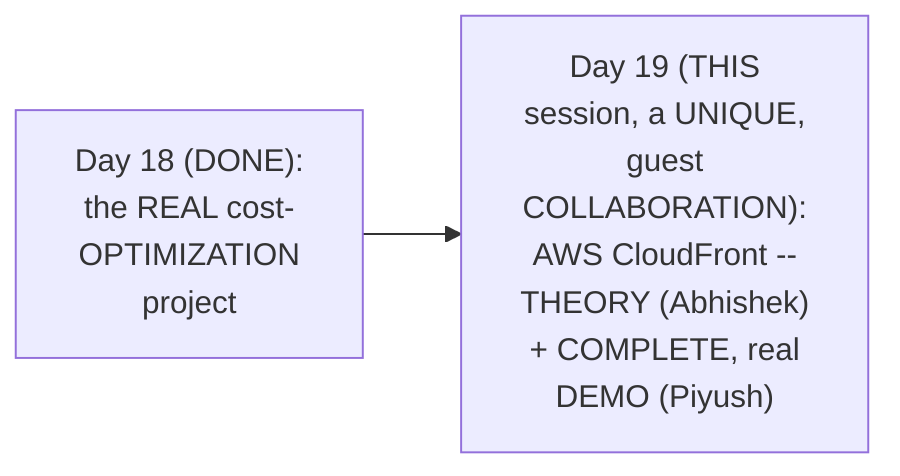

#### 🎯 Key Takeaways

* This is GENUINELY a **UNIQUE, guest-COLLABORATION session** — EXPLICITLY, DIRECTLY confirmed AS featuring PIYUSH (of "TECH Tutorials WITH Piyush"), WHO leads the ENTIRE, COMPLETE demonstration PORTION.
* THE session's own, COMPLETE structure: Abhishek DELIVERS the THEORETICAL foundation (CDN CONCEPTS), THEN hands OFF to Piyush FOR the REAL, hands-on DEMONSTRATION.
* THIS directly, CONSISTENTLY reinforces THIS series' own, ESTABLISHED "WHAT problem DOES this service SOLVE" framing — APPLIED here TO CloudFront's OWN, precise POSITIONING.

---

### 2. CloudFront & CDN, Precisely Introduced

#### 📖 Definition — CloudFront, Precisely Defined

> 💡 **Given directly:** *"The textbook definition, or the AWS definition, says CloudFront is a managed AWS offering, or a managed AWS service, that provides you the solution for CDN — what does CDN stand for? CDN is Content Delivery Network."*

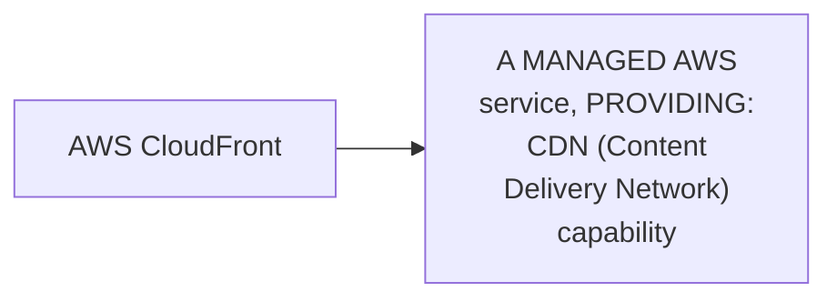

#### 🧠 Concept — A Genuine, Memorable, Relatable Framing

> 💡 **Given directly:** *"Let me tell you a fun fact — most of us, or all of us, interact with CDNs on a day-to-day basis... when we use YouTube, when we use Instagram, when we use Snapchat, or when we use any of this image-sharing or video-sharing platforms... whether you are using Amazon.com, whether you are using Flipkart or any applications, you are typically interacting with their CDNs."*

#### ⚠ Common Mistakes

* Assuming "CDN" is a GENUINELY, INHERENTLY complicated, UNFAMILIAR concept — explicitly, directly, MEMORABLY reframed: EVERYONE genuinely, DIRECTLY interacts WITH CDNs EVERY, single day — SIMPLY WITHOUT realizing IT.

#### 🎯 Key Takeaways

* **AWS CLOUDFRONT** is precisely defined AS a **MANAGED service PROVIDING CDN** (Content DELIVERY Network) capability.
* THE instructor **directly, MEMORABLY reframes** CDN as a GENUINELY, ALREADY-familiar concept — EVERYONE interacts WITH CDNs daily, VIA platforms LIKE YouTube, INSTAGRAM, Amazon, and FLIPKART.
* This directly, PRECISELY sets UP the SESSION's own, COMPLETE, worked EXAMPLE — USING Instagram TO concretely ILLUSTRATE precisely WHAT problem a CDN genuinely SOLVES (Section 3).

---
### 3. Without a CDN: A Complete, Real, Worked Example (Instagram, Hops & Latency)

#### 🪜 Step-by-Step — A Complete, Real, Worked Example, Without a CDN

> 💡 **Given directly:** *"Let's say there is a person in Australia, uploads a reel, image, post, story, anything — it gets uploaded to the Instagram portal, and Instagram will have a central storage system... let's say there is a friend of this person in Australia... he goes to the Instagram portal, and Instagram will redirect him to this particular image in the storage system."*

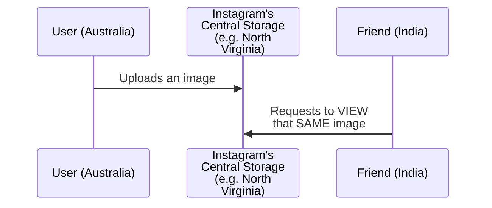

#### 📖 Definition — "Hops," Precisely Defined

> 💡 **Given directly:** *"What is hops here, what am I talking about? I'm basically talking about multiple routers — for anything you access on internet... the request goes through multiple routers. Now, depending upon the number of routers, or depending upon the number of hops your request has to take to reach the content, the latency keeps increasing."*

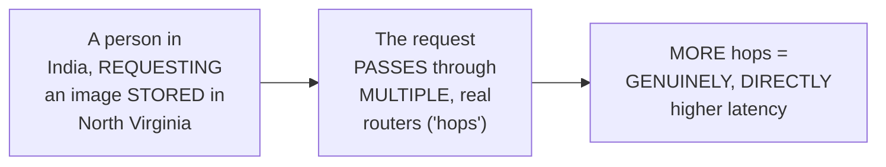

#### 🔍 Internal Working — A Genuine, Direct, Real Consequence: Uneven User Experience

> 💡 **Given directly:** *"For people in the US, they can easily access them, and they will not find any latency — the reels and the images get quickly populated, and they can access it without any loading or without any buffering. For people in other parts of the world, because it has to go through multiple routers, they will find loading time — the content to reach them, it will take a lot of time, and you will not have a better user experience."*

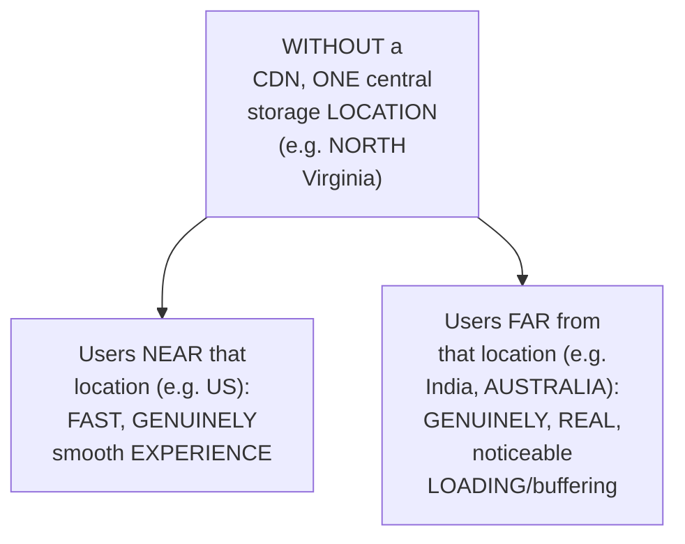

#### ⚠ Common Mistakes

* Assuming NETWORK latency is GENUINELY, MERELY a VAGUE, abstract CONCEPT — explicitly, directly, PRECISELY grounded IN a CONCRETE mechanism — "HOPS" (multiple, real ROUTERS a REQUEST must GENUINELY pass THROUGH) — MORE hops GENUINELY, DIRECTLY means MORE latency.

#### 🎯 Key Takeaways

* A COMPLETE, real, WORKED example (INSTAGRAM's own image-UPLOAD/access flow) directly, CONCRETELY illustrates the REAL problem: WITHOUT a CDN, ALL requests must REACH one, CENTRAL storage LOCATION — REGARDLESS of the REQUESTING user's own, REAL, geographic PROXIMITY.
* **"HOPS"** is precisely DEFINED as the MULTIPLE, real ROUTERS a NETWORK request must GENUINELY pass THROUGH — MORE hops GENUINELY, DIRECTLY produces HIGHER latency.
* This GENUINE, real PROBLEM directly, CONCRETELY produces an UNEVEN user EXPERIENCE — users NEAR the central LOCATION enjoy FAST access; users FAR away GENUINELY experience REAL, noticeable LOADING delays — a GENUINELY, DIRECTLY unacceptable OUTCOME for a REAL, global platform LIKE Instagram.

---

### 4. With a CDN: The Same Example, Solved via Edge Locations

#### 📖 Definition — Edge Locations, Precisely Introduced

> 💡 **Given directly:** *"What CDN will do is it will solve this problem in a very simple way... you will place a CDN here, and what you will tell people from other parts of the world... instead of accessing the Instagram server directly, you will map the CDN to the Instagram's DNS... CDN will basically create local copies — that means instead of the image getting stored in the central location, it will get stored in the edge locations."*

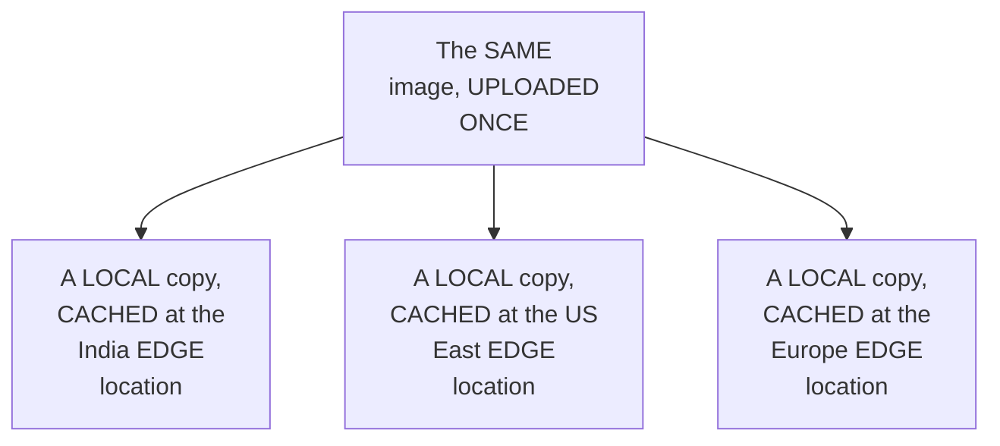

#### 🔍 Internal Working — A Genuine, Direct, Complete Explanation

> 💡 **Given directly:** *"If a person from India is trying to access, what CDN will do — CDN will say, 'I have a copy for you in the India region itself, instead of going through the central server, you can access it from here.' If a person in the US is trying to access, the CDN will say, 'you don't have to go to the central storage system, I have a copy for you in the US, in the Europe region itself.'"*

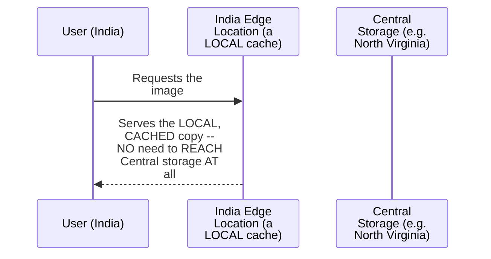

#### ⚠ Common Mistakes

* Assuming a CDN GENUINELY, DIRECTLY eliminates the NEED for a CENTRAL storage SYSTEM entirely — explicitly, directly, PRECISELY clarified: the CENTRAL system STILL, genuinely EXISTS — the CDN GENUINELY, ADDITIONALLY creates LOCAL, cached COPIES at edge LOCATIONS, SPECIFICALLY to AVOID the NEED to REACH that central SYSTEM for EVERY, single REQUEST.

#### 🎯 Key Takeaways

* A CDN GENUINELY, DIRECTLY solves the "HOPS"/latency problem BY creating **LOCAL copies** of CONTENT at DISTRIBUTED **edge LOCATIONS** — RATHER than KEEPING everything IN one, CENTRAL location.
* WHEN a USER requests CONTENT, the CDN SERVES it FROM their OWN, NEAREST edge LOCATION — COMPLETELY avoiding the NEED to REACH the ORIGINAL, central STORAGE system.
* This directly, PRECISELY sets UP the SESSION's own, NEXT, essential TRANSITION — HANDING off to PIYUSH, who WILL deliver a COMPLETE, real, HANDS-on demonstration OF this EXACT architecture (Section 5).

---
### 5. A Genuine, Direct Handoff: Introducing Piyush & His Own, Complementary Framing

#### 🪜 Step-by-Step — A Direct, Warm, Genuine Introduction

> 💡 **Given directly:** *"Let me introduce you first, Piyush, who is going to be our tutor/trainer for today's video — Piyush is a cloud expert, he's doing great work on his channel, Tech Tutorials with Piyush."*

#### 🪜 Step-by-Step — A Genuine, Direct Confirmation of the Demo's Own, Precise Scope

> 💡 **Given directly:** *"In this video we'll be talking about how to host a static website on S3 bucket — we will not be talking much about what S3 bucket is, because you have already explained that in your previous video."*

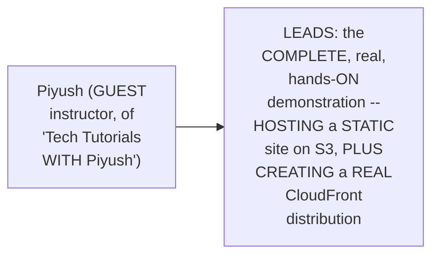

#### ⚠ Common Mistakes

* Assuming THIS session's own, DEMO portion will GENUINELY, DIRECTLY re-EXPLAIN S3's own, BASIC concepts FROM scratch — explicitly, directly, PRECISELY clarified: THAT foundational CONTENT was ALREADY, genuinely COVERED in a PRIOR, existing SESSION — THIS demo ASSUMES that PRIOR knowledge.

#### 🎯 Key Takeaways

* PIYUSH is directly, WARMLY introduced AS a CLOUD expert, and the GENUINE, real HOST of "TECH Tutorials WITH Piyush" — LEADING this SESSION's own, COMPLETE demonstration PORTION.
* THIS demo EXPLICITLY, DIRECTLY builds ON prior, ALREADY-established S3 KNOWLEDGE (FROM an EARLIER session IN this series) — NOT re-explaining S3'S own, basic CONCEPTS from SCRATCH.
* This directly, PRECISELY sets UP Piyush's OWN, complementary THEORETICAL framing — WHY hosting DIRECTLY from S3 (WITHOUT CloudFront) is GENUINELY, PRACTICALLY problematic (Section 6).

---

### 6. Why Not Host Directly From S3? Three, Genuine, Real Problems

#### 📖 Definition — S3, Briefly Recapped (Piyush's Own Framing)

> 💡 **Given directly:** *"S3 bucket is an object-based storage which is used to host static files — static files such as your audio files, your video files, and your binary large objects... we can directly host our website to S3 bucket, and users can directly go to your bucket, and your content will be rendered — but that is not considered as a best practice."*

#### ⚠ A Direct, Honest, Precise Explanation: Three, Genuine, Real Problems

> 💡 **Given directly:** *"If user can directly have access to S3 bucket for rendering the content, there'll be a lot of challenges, there'll be a lot of security concerns, because they have direct access to your bucket... another challenge would be latency, because everyone will be accessing the bucket, so there could be slowness in loading... and also there'll be cost, right, because every time you download or upload something to S3 bucket, there is a cost associated with it."*

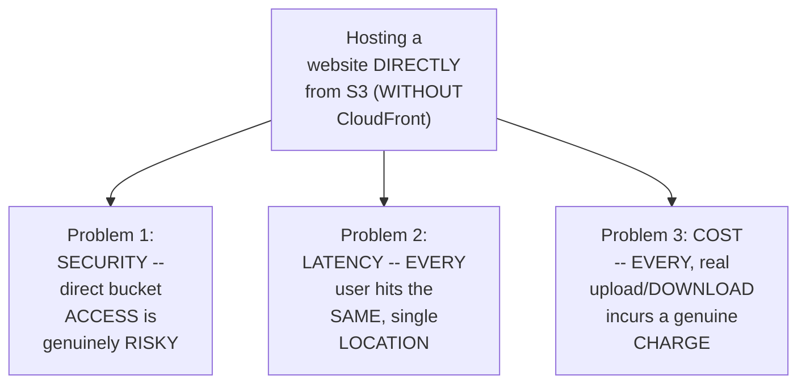

#### ⚠ Common Mistakes

* Assuming DIRECTLY hosting a WEBSITE from S3 (WITHOUT CloudFront) is GENUINELY, TECHNICALLY impossible — explicitly, directly, PRECISELY clarified: it's GENUINELY, TECHNICALLY possible — but it's NOT, genuinely, CONSIDERED "best PRACTICE," due to THREE, real, SPECIFIC problems.

#### 🎯 Key Takeaways

* HOSTING a WEBSITE directly FROM S3 (WITHOUT CloudFront) is GENUINELY, TECHNICALLY possible — but EXPLICITLY, DIRECTLY confirmed as **NOT** best PRACTICE.
* THREE, genuine, real PROBLEMS motivate THIS: **(1) SECURITY** (direct bucket ACCESS is risky); **(2) LATENCY** (everyone ACCESSES the SAME, single LOCATION); **(3) COST** (EVERY upload/download GENUINELY incurs a real CHARGE).
* This directly, PRECISELY sets UP the SESSION's own, NEXT, essential CONTENT — CLOUDFRONT's own, precise ROLE, and its THREE, genuine, corresponding ADVANTAGES (Section 7).

---
### 7. CloudFront's Precise Role & Three Genuine Advantages

#### 📖 Definition — CloudFront's Precise Role (Piyush's Own Framing)

> 💡 **Given directly:** *"CloudFront is a type of CDN service — what it will do is it will cache all the content, like audio, video content and everything, at its edge location... let's say we have two users, one is accessing the website from somewhere in India, let's say New Delhi, another one is somewhere sitting in Canada, let's say Toronto — when they are accessing the website through the edge location, the content will be cached... next time someone from Delhi tries to access the website, they don't have to go to the S3 bucket, they can directly go to the edge location."*

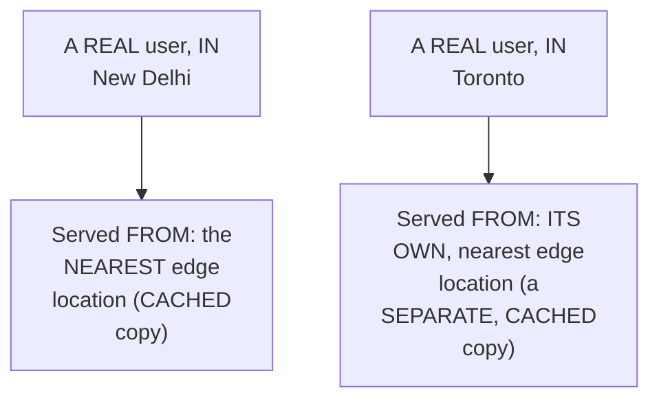

#### 📖 Definition — Three, Precise, Genuine Advantages, Explicitly Enumerated

> 💡 **Given directly:** *"It helps enhancing the security, because now users are not accessing the S3 bucket directly — that's one thing. Second one is cost — now you won't have to pay all the upload and download cost, because the content is already cached in the CloudFront edge location. And latency, it provides the lowest possible latency, because content is cached at the nearest location of the user."*

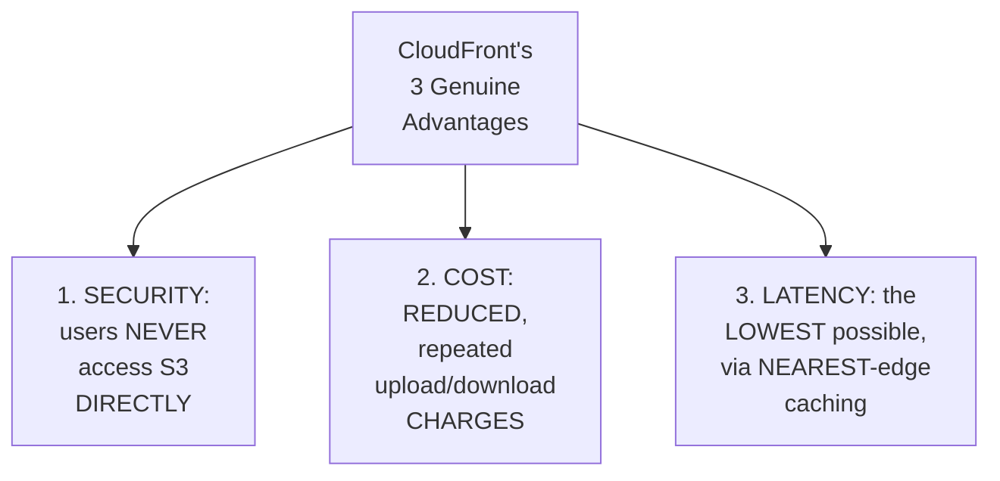

#### 🔍 Internal Working — A Genuine, Direct Confirmation From Abhishek (Reinforcing the Same Point)

> 💡 **Given directly:** *"CloudFront might be a paid service, but if you are using CloudFront when you have a large number of people accessing your application... if they host on S3 buckets, then large number of people when they try to access, CDN will actually reduce the cost."*

#### ⚠ Common Mistakes

* Assuming CLOUDFRONT's own, THREE advantages (security, COST, latency) are GENUINELY, INDEPENDENTLY separate BENEFITS — explicitly, directly, IMPLIED as GENUINELY, DIRECTLY interconnected — REDUCED, direct S3 ACCESS (security) is WHAT enables BOTH the REDUCED cost AND the REDUCED latency, SIMULTANEOUSLY.

#### 🎯 Key Takeaways

* **CLOUDFRONT**'s precise ROLE: CACHING content AT distributed EDGE locations, SERVING each USER from THEIR own, NEAREST location — RATHER than the ORIGINAL S3 bucket, DIRECTLY.
* CLOUDFRONT's THREE, genuine, EXPLICITLY-enumerated advantages: **SECURITY** (no DIRECT S3 access), **COST** (reduced UPLOAD/download charges), and **LATENCY** (the LOWEST possible, via NEAREST-edge caching).
* THIS complete, theoretical FOUNDATION directly, PRECISELY sets UP the SESSION's own, COMPLETE, hands-ON demonstration — BUILDING this EXACT architecture, LIVE (Sections 8-12).

---
### 8. A Complete, Real, Live Demo: Hosting a Static Website on S3

#### 🪜 Step-by-Step — A Complete, Real, Bucket-Creation Walkthrough

> 💡 **Given directly:** *"We'll go ahead and create a bucket... the bucket name should be same as your domain name, right — so currently we are not using any domain, but let me just put my domain over here, tutorialswithpiyush.com — if we were using a custom domain, then this name should be same as your custom domain."*

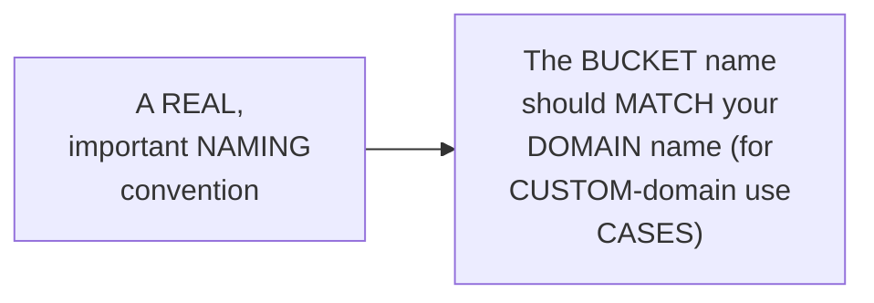

#### 🪜 Step-by-Step — A Genuine, Direct Security Confirmation

> 💡 **Given directly:** *"There is this option, 'block all public access,' so make sure it is checked — that means only CloudFront should be able to access this bucket, and user cannot directly access it."*

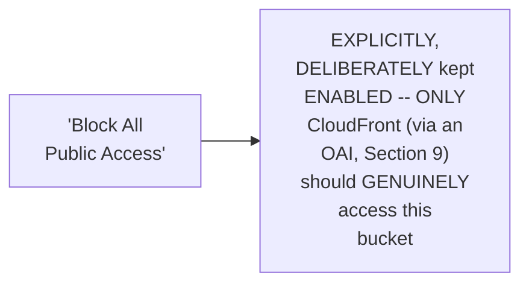

#### 🪜 Step-by-Step — Enabling Static Website Hosting

> 💡 **Given directly:** *"Go to properties, the second tab, scroll at the bottom of the page, and there'll be a section which says 'static website hosting' — enable it, and there will be two options, host a static website or redirect requests — we will be using the first option, host a static website — add your index page, index.html, and if you have an error page as well, error.html."*

#### 🪜 Step-by-Step — A Complete, Real, Live-Confirmed "403 Forbidden" Test

> 💡 **Given directly:** *"If you copy it and try to open it, it shouldn't access it, like you shouldn't have access to it, because we have disabled the public access — so that's why it is showing the error, 403 Forbidden."*

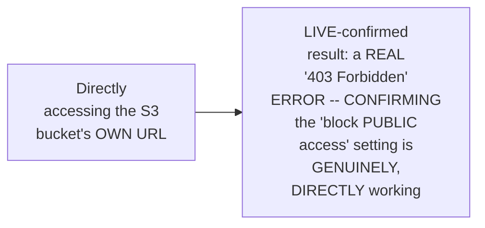

#### ⚠ Common Mistakes

* Assuming a "403 FORBIDDEN" error, at THIS stage, GENUINELY, DIRECTLY signals a REAL, unintended PROBLEM — explicitly, directly, LIVE-demonstrated AS the GENUINELY, CORRECTLY expected OUTCOME — DIRECTLY, POSITIVELY confirming the "BLOCK public access" SETTING is WORKING exactly AS intended.

#### 🎯 Key Takeaways

* A COMPLETE, real, LIVE demonstration directly, CONCRETELY confirmed the FULL, static-WEBSITE-hosting workflow — CREATING a bucket (NAMED to MATCH a real DOMAIN), keeping "BLOCK all public ACCESS" enabled, ENABLING static hosting, and UPLOADING real, static CONTENT.
* A REAL, LIVE test directly, CONCRETELY confirmed the BUCKET's own URL GENUINELY returns a **"403 Forbidden"** error — the CORRECT, GENUINELY expected result, GIVEN the "BLOCK public access" SETTING.
* This directly, PRECISELY sets UP the SESSION's own, NEXT, essential STEP — CREATING the CloudFront DISTRIBUTION that WILL, genuinely, PROVIDE the NEEDED, secure ACCESS (Section 9).

---
### 9. A Complete, Real, Live Demo: Creating a CloudFront Distribution

#### 🪜 Step-by-Step — A Complete, Real, Initial Setup

> 💡 **Given directly:** *"Create distribution, and then choose origin domain — origin, which is the source origin from where the data will be rendered... this is the bucket that we just created, so we choose this as an origin domain."*

#### 📖 Definition — Origin Access Identity (OAI), Precisely Explained (& Memorably Compared)

> 💡 **Given directly:** *"Origin access should not be public, it should be either origin access control settings or legacy access settings, legacy access identity — consider this as a user that has access to the bucket... if you have worked with a Linux environment earlier, there is a concept called functional IDs — consider this as a functional ID that has access to your bucket, so this is like a virtual user that we are creating, with access to the bucket."*

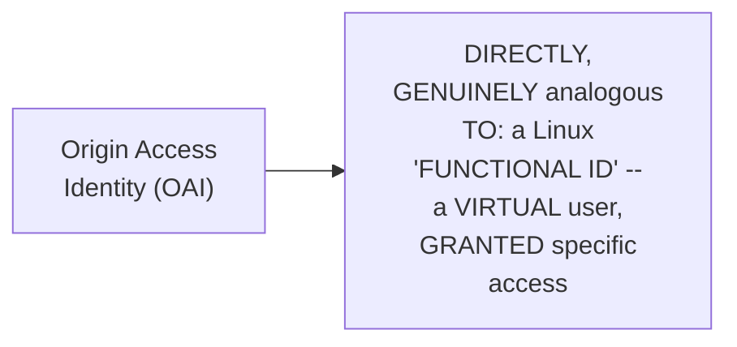

#### 🪜 Step-by-Step — A Genuine, Direct Confirmation: Updating the Bucket Policy

> 💡 **Given directly:** *"Create new OAI, and hit create — a new identity will be created, and it will have access to your bucket, and then to enable that access, you have to update the bucket policy... it will add one more rule to the bucket policy, which states, allow access from this OAI to the bucket."*

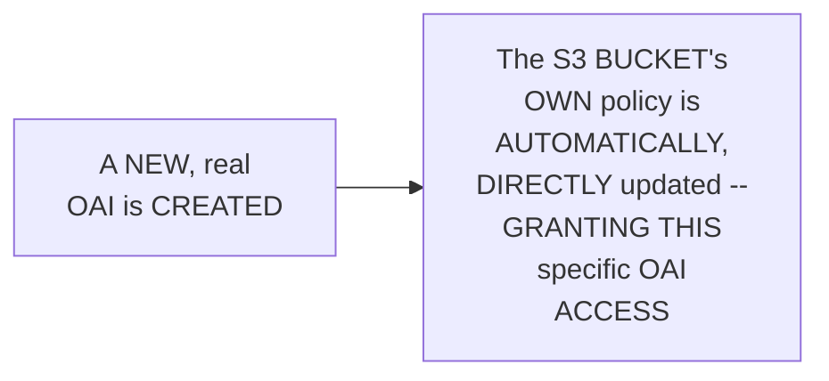

#### 🪜 Step-by-Step — A Genuine, Real, Business-Driven Choice: Geographic Distribution Scope

> 💡 **Given directly:** *"These are the edge locations that we talked about, so you can use all edge locations — let's say your website is hosted, your users are expected to visit the website throughout the world... but let's say you have an e-commerce website, and your customer base is only North America and Europe region, right, so there is no point of enabling that to the world."*

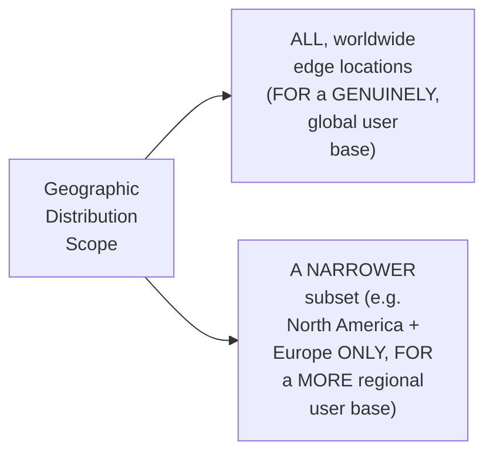

#### 📖 Definition — Web Application Firewall (WAF) & SSL, Briefly Mentioned (Both Skipped)

> 💡 **Given directly:** *"Optionally you can enable web application firewall for enhanced security, but for this demo let's just keep it the way it is right now, because it costs extra, like $14 for 10 million requests... if you have created an SSL certificate — like, had I been using the custom domain, I would have created this SSL certificate, but because we are not using it... let's not use it."*

#### 📖 Definition — "Default Root Object," Precisely Explained

> 💡 **Given directly:** *"If your bucket, if the content inside your bucket has multiple subfolders, subdirectory, then there is this option in which you can specify default root object — that your website will use as the home page, right, so you can just add index.html."*

#### ⚠ Common Mistakes

* Assuming the "ORIGIN access IDENTITY" is GENUINELY, MERELY a technical, ABSTRACT setting — explicitly, directly, MEMORABLY explained VIA a REAL, relatable ANALOGY — DIRECTLY comparable TO a LINUX "functional ID" — a VIRTUAL user, GRANTED specific ACCESS.
* Assuming a WORLDWIDE distribution SCOPE is GENUINELY, ALWAYS the RIGHT choice — explicitly, directly, PRACTICALLY clarified: the CORRECT scope GENUINELY, DIRECTLY depends ON your REAL, actual user BASE — a NARROWER, regional scope CAN genuinely be MORE appropriate.

#### 🎯 Key Takeaways

* A COMPLETE, real, LIVE demonstration directly, CONCRETELY confirmed the FULL CloudFront-distribution CREATION workflow — SELECTING the S3 BUCKET as the ORIGIN, and CREATING a NEW **Origin Access IDENTITY (OAI)**.
* THE **OAI** is precisely, MEMORABLY explained AS a "VIRTUAL user" — DIRECTLY analogous TO a Linux "FUNCTIONAL ID" — CREATING one AUTOMATICALLY, DIRECTLY updates the S3 bucket's OWN policy, GRANTING it access.
* THE geographic DISTRIBUTION scope (ALL edge LOCATIONS, versus a NARROWER subset) is directly, PRACTICALLY confirmed AS a REAL, business-DRIVEN decision — DEPENDING on YOUR actual, real USER base's own, GEOGRAPHIC distribution.

---
### 10. A Genuine, Honest, Important Cost-Awareness Warning

#### ⚠ A Direct, Honest, Explicit, Repeated Warning

> 💡 **Given directly:** *"Let's just give a disclaimer that if you want to try this video, you have to be very careful — there can be some pricing, if you are using a free tier AWS account, and if you don't want to add or include any kind of expense or pricing to your account, then do this video very carefully, because there are multiple places where pricing can be included."*

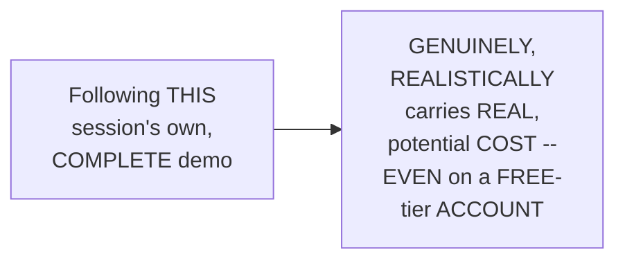

#### 🔍 Internal Working — A Genuine, Direct, Alternative for Cost-Conscious Learners

> 💡 **Given directly:** *"If you don't want to include any kind of pricing, then you can still watch this video, understand the concept, and restrict yourself to the static website hosting on S3 bucket — enable the public access there, no price will be charged to you."*

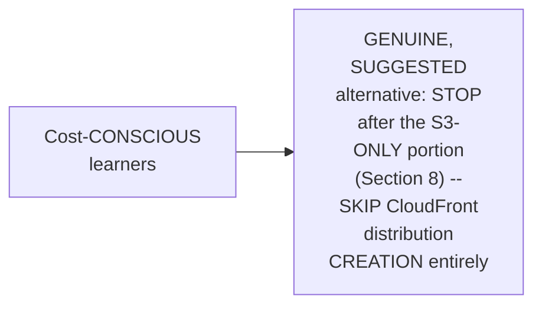

#### ⚠ A Direct, Honest, Real-World Cost Nuance

> 💡 **Given directly:** *"When we talk about a real-time use case, you know, when there is a website on which millions and thousands of users are expected to visit, in that case that cost will be lower than the use case when we are not using CloudFront."*

#### ⚠ Common Mistakes

* Assuming CLOUDFRONT is GENUINELY, DIRECTLY "expensive" IN an unconditional, ABSOLUTE sense — explicitly, directly, HONESTLY clarified: AT real, PRODUCTION scale (MILLIONS of real USERS), CloudFront GENUINELY, DIRECTLY REDUCES overall cost — the GENUINE, real COST concern applies SPECIFICALLY to SMALL-scale, PERSONAL demo/testing SCENARIOS.

#### 🎯 Key Takeaways

* THE instructor **directly, HONESTLY, REPEATEDLY warns** THIS demo GENUINELY, REALISTICALLY carries REAL, potential cost — EVEN on a FREE-tier ACCOUNT — REQUIRING genuine, CAREFUL attention.
* A GENUINE, real ALTERNATIVE is directly, EXPLICITLY offered FOR cost-CONSCIOUS learners — STOPPING after the S3-ONLY portion (WITH public access ENABLED, INSTEAD of CloudFront) AVOIDS incurring REAL cost.
* A GENUINE, honest, REAL-world nuance is directly, CONCRETELY confirmed — AT genuine, PRODUCTION SCALE (millions OF real users), CloudFront GENUINELY reduces OVERALL cost — the WARNING specifically APPLIES to SMALL-scale, personal DEMO/testing scenarios.

---

### 11. A Complete, Real, Live Demo: Verifying the Updated Bucket Policy

#### 🪜 Step-by-Step — A Complete, Real, Live Bucket-Policy Walkthrough

> 💡 **Given directly:** *"Let me show you the S3 bucket policy that was updated... go to permissions, scroll down, bucket policy — you see there is this object added, which says effect is allow, principal is CloudFront origin access identity, and this is an ID for that OAI that was created, and action is S3 GetObject, and resource is the S3 bucket."*

```json
{
  "Effect": "Allow",
  "Principal": {
    "AWS": "arn:aws:iam::cloudfront:user/CloudFront Origin Access Identity <OAI-ID>"
  },
  "Action": "s3:GetObject",
  "Resource": "arn:aws:s3:::<bucket-name>/*"
}
```

#### 🔍 Internal Working — A Genuine, Direct Callback to a Prior, Already-Established Concept

> 💡 **Given directly:** *"I have explained that concept in one of our last videos, how to use bucket policy, and only allow specific users to access the bucket."*

#### ⚠ Common Mistakes

* Assuming THIS OAI-based BUCKET policy is a GENUINELY, ENTIRELY new, UNFAMILIAR concept — explicitly, directly, DIRECTLY connected TO a PRIOR, already-ESTABLISHED session's own CONTENT (bucket POLICIES, general) — a REAL, applied EXTENSION of that PRIOR knowledge.

#### 🎯 Key Takeaways

* A COMPLETE, real, LIVE demonstration directly, CONCRETELY confirmed the ACTUAL, updated BUCKET-policy JSON — GRANTING the SPECIFIC OAI an `s3:GetObject` PERMISSION, scoped SPECIFICALLY to THIS one bucket.
* THIS directly, EXPLICITLY connects BACK to a PRIOR, already-ESTABLISHED session's own CONTENT (general BUCKET policies) — REINFORCING and EXTENDING that EARLIER knowledge, RATHER than introducing it FROM scratch.
* This directly, PRECISELY sets UP the SESSION's own, FINAL, complete VERIFICATION — CONFIRMING the ENTIRE, established architecture GENUINELY, SUCCESSFULLY works, END-to-end (Section 12).

---
### 12. A Complete, Real, Live-Confirmed Success: The Website Renders via CloudFront

#### 🪜 Step-by-Step — A Complete, Real, Live, Final Verification

> 💡 **Given directly:** *"I've copied the distribution once again, and I have opened it — oh wow, I think now we are seeing it, awesome, so yes, it's deployed, so it's just a simple page, nothing fancy about it, and this is what we created for 10 weeks of Cloud Ops Challenge demo."*

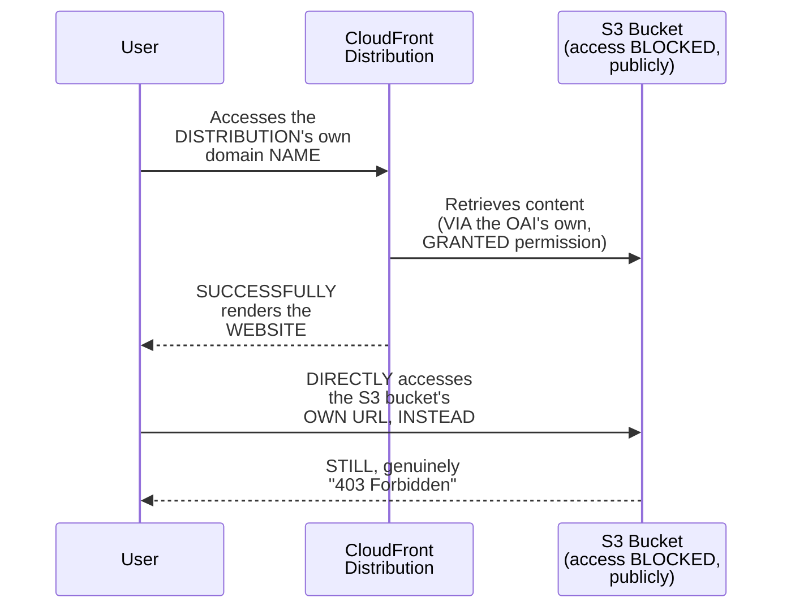

#### 🔍 Internal Working — A Genuine, Honest, Real-Time Clarification

> 💡 **Given directly:** *"We were seeing it as in deploying status, but we were able to access it, because we enabled it for multiple locations, you know, North America and Europe — it might have deployed it for North America, I'm in the North America region, so that's why I was able to access it before it was completely deployed."*

```mermaid
flowchart LR
    A["The<br/>DISTRIBUTION's<br/>OVERALL status:<br/>STILL 'deploying'"] --> B["BUT: Piyush's<br/>OWN, physical<br/>location (North<br/>America) had<br/>ALREADY, genuinely<br/>FINISHED"]
    B --> C["EXPLAINS why<br/>ACCESS was<br/>GENUINELY possible,<br/>BEFORE the<br/>OVERALL status<br/>showed 'COMPLETE'"]
```

#### 🪜 Step-by-Step — A Complete, Real, Final, Cross-Verification

> 💡 **Given directly:** *"Can we go to the S3 bucket URL and try to access it? Yes, so here is the bucket URL over here, and yes, it will be still forbidden, user should not have access to it... so still, what is happening is, if you try to access it from the S3 bucket URL, you are still getting access denied, but if someone tries to access from the URL that we have seen, that's from the CDN, or the CloudFront URL, then they will be able to access it directly."*

#### ⚠ Common Mistakes

* Assuming a DISTRIBUTION's own "DEPLOYING" status GENUINELY, DIRECTLY means it's COMPLETELY, UNIVERSALLY inaccessible EVERYWHERE — explicitly, directly, HONESTLY clarified: DEPLOYMENT GENUINELY, PRACTICALLY happens REGION by region — SOME edge LOCATIONS (LIKE the ONE genuinely NEAREST to the TESTER) CAN, genuinely, FINISH before OTHERS.

#### 🎯 Key Takeaways

* A COMPLETE, real, LIVE-confirmed FINAL test directly, CONCRETELY validated the ENTIRE, established ARCHITECTURE — the CLOUDFRONT distribution's OWN domain SUCCESSFULLY renders the WEBSITE, WHILE the ORIGINAL S3 bucket URL REMAINS genuinely "403 FORBIDDEN."
* A GENUINE, honest, REAL-time clarification directly, PRACTICALLY explained WHY access WAS possible BEFORE the distribution's OWN status showed "COMPLETE" — deployment GENUINELY, PRACTICALLY happens REGION by region, NOT all-AT-once.
* THIS complete, real, TWO-part verification (CLOUDFRONT working, S3 STILL forbidden) directly, THOROUGHLY proves the ENTIRE, established SECURITY/architecture goal — USERS genuinely, DIRECTLY access CONTENT only VIA CloudFront, NEVER the RAW S3 bucket.

---

### 13. Closing: A Genuine Reminder to Delete Resources, & a Warm, Mutual Send-Off

#### ⚠ A Direct, Honest, Genuine, Personal Reminder

> 💡 **Given directly:** *"I'm gonna disable the distribution — so my wife was using my account, and she left the CloudFront open, so she forgot to delete it, so I'm gonna delete it now... once it is disabled, we can just select it and delete it, and the same way we can delete the S3 bucket as well."*

```mermaid
flowchart LR
    A["A GENUINE,<br/>real, PERSONAL<br/>anecdote (Piyush's<br/>OWN wife<br/>FORGETTING to<br/>delete a PRIOR<br/>distribution)"] --> B["DIRECTLY,<br/>CONCRETELY<br/>reinforces THIS<br/>session's own,<br/>REPEATED cost-<br/>awareness WARNING<br/>(Section 10)"]
```

#### 🪜 Step-by-Step — A Genuine, Direct, Final Encouragement

> 💡 **Given directly:** *"Please guys try to do the hands-on, because sometimes, you know, when we see something, we easily forget, like after a couple of hours or maybe after a few days — make sure you do the actual hands-on, let us know in the comment if you face any difficulty."*

#### ⚠ Common Mistakes

* Assuming a GENUINE, real REMINDER to DELETE resources is GENUINELY, MERELY a GENERIC, formulaic CLOSING statement — explicitly, directly, VIVIDLY reinforced BY a GENUINE, real, PERSONAL anecdote — EVEN experienced, cloud-EXPERT professionals CAN genuinely, REALISTICALLY forget TO clean up RESOURCES.

#### 🎯 Key Takeaways

* This episode **GENUINELY, COMPREHENSIVELY delivers** its OWN, stated GOALS — a COMPLETE, theoretical FOUNDATION (CDN, hops, EDGE locations) PLUS a COMPLETE, real, hands-ON demonstration (S3 + CloudFront, SECURELY integrated).
* A GENUINE, real, PERSONAL anecdote (PIYUSH's own WIFE forgetting TO delete a PRIOR distribution) directly, MEMORABLY reinforces THIS session's own, REPEATED cost-AWARENESS warning (Section 10) — EVEN experts GENUINELY, REALISTICALLY make THIS mistake.
* This UNIQUE, guest-COLLABORATION session closes WITH a GENUINE, WARM, mutual EXCHANGE — DIRECTLY, EXPLICITLY recommending PIYUSH's own CHANNEL (COVERING Azure and GCP CONTENT, as well) FOR further LEARNING.

---
## 📝 Glossary

| Term | Definition | Why It Matters |
|---|---|---|
| **CDN (Content Delivery Network)** | A globally-distributed caching network | CloudFront is AWS's own CDN offering |
| **Edge Location** | A distributed, local cache location | Serves content from the nearest point to the user |
| **Hops** | The multiple routers a network request passes through | More hops = higher latency |
| **Origin Access Identity (OAI)** | A virtual user granting CloudFront access to S3 | Analogous to a Linux "functional ID" |
| **Block All Public Access** | An S3 bucket setting | Ensures only CloudFront (via OAI) can access content |
| **Default Root Object** | The file served as a distribution's own home page | E.g., index.html |

---

## 🔄 Revision Notes — One-Minute Revision

* This is **Day 19**, a genuinely unique, guest-collaboration episode -- Abhishek delivers the theory, then hands off to Piyush (of "Tech Tutorials with Piyush"), who leads the complete, hands-on demonstration.
* **CloudFront, defined**: a managed AWS service providing CDN (Content Delivery Network) capability. A genuine, memorable framing: everyone interacts with CDNs daily (YouTube, Instagram, Amazon, Flipkart), without realizing it.
* **Without a CDN (a complete, worked Instagram example)**: all requests must reach ONE, central storage location, regardless of the user's own, real geographic proximity. "Hops" (multiple routers a request passes through) directly determine latency -- more hops, more latency. This produces an uneven experience: users near the central location get fast access; users far away experience real, noticeable delays.
* **With a CDN**: local copies are cached at distributed edge locations. A user is served from their own, nearest edge location, completely avoiding the need to reach the original, central storage system.
* **A genuine handoff to Piyush**: this demo builds on already-established S3 knowledge from a prior session, focusing specifically on hosting a static website + integrating CloudFront.
* **Three, genuine, real problems with hosting directly from S3 (without CloudFront)**: security (direct bucket access is risky), latency (everyone hits the same location), and cost (every upload/download incurs a charge).
* **CloudFront's precise role & three genuine advantages**: caches content at edge locations, serving each user from their nearest location. Advantages: (1) security -- no direct S3 access; (2) cost -- reduced upload/download charges; (3) latency -- the lowest possible, via nearest-edge caching.
* **Live demo 1 (S3 static hosting)**: bucket name should match your domain name; "Block All Public Access" is deliberately kept ENABLED; static website hosting is enabled (specifying an index page); a live test confirms the bucket's own URL genuinely returns "403 Forbidden" -- the correct, expected result.
* **Live demo 2 (CloudFront distribution)**: the S3 bucket is selected as the origin; an Origin Access Identity (OAI) is created -- a "virtual user," directly analogous to a Linux functional ID -- which automatically updates the S3 bucket's own policy to grant access. Geographic distribution scope (all edge locations vs. a narrower subset, e.g., North America + Europe) is a real, business-driven choice. WAF and SSL were both explicitly skipped for this demo.
* **A genuine, honest, repeated cost-awareness warning**: this demo carries real, potential cost, even on a free-tier account. A genuine alternative for cost-conscious learners: stop after the S3-only portion (with public access enabled instead). At real, production scale (millions of users), CloudFront genuinely reduces overall cost -- the warning specifically applies to small-scale, personal demo/testing scenarios.
* **Verifying the bucket policy (live demo)**: confirmed the OAI's own, specific `s3:GetObject` permission, directly connecting back to a prior, already-established session on bucket policies.
* **The complete, live-confirmed success**: the CloudFront distribution's own domain successfully renders the website, while the original S3 bucket URL remains genuinely "403 Forbidden." A genuine, honest clarification: deployment happens region by region, so access was possible before the overall status showed "complete," since Piyush's own, physical location had already finished.
* **Closing**: a genuine, personal anecdote (Piyush's own wife forgetting to delete a prior distribution) reinforces the cost-awareness warning -- even experts make this mistake. A warm, mutual send-off, recommending Piyush's own channel (covering Azure and GCP content too).

---

## 📋 Cheat Sheet

**Without vs. with a CDN:**
```text
Without CDN: EVERY request -> ONE, central storage location -> latency scales with "hops"
With CDN:    EACH request -> the user's OWN, nearest edge location (a local, cached copy)
```

**CloudFront's 3 genuine advantages:**
```text
1. Security -- users never access S3 directly
2. Cost     -- reduced, repeated upload/download charges
3. Latency  -- the lowest possible, via nearest-edge caching
```

**The complete, secure architecture:**
```text
User -> CloudFront Distribution -> (via OAI) -> S3 Bucket (public access BLOCKED)
User -> S3 Bucket URL directly  -> 403 Forbidden (correct, expected result)
```

**A minimal, real bucket policy (granting OAI access):**
```json
{
  "Effect": "Allow",
  "Principal": {"AWS": "arn:aws:iam::cloudfront:user/CloudFront Origin Access Identity <OAI-ID>"},
  "Action": "s3:GetObject",
  "Resource": "arn:aws:s3:::<bucket-name>/*"
}
```

---

## 🔥 Interview Questions & Answers

### 🟢 Beginner

**Q1.**

**Question:** What does CDN stand for, and what does CloudFront provide?

**Answer:** Content Delivery Network; CloudFront is AWS's own, managed CDN service.

**Explanation:** Directly, precisely defined.

**Why Interviewers Ask This:** The most basic, foundational CloudFront question.

**Possible Follow-up:** "Give a real, everyday example of a CDN in action."

**Q2.**

**Question:** What are "hops," in the context of network latency?

**Answer:** The multiple routers a network request passes through; more hops mean higher latency.

**Explanation:** Directly, precisely defined.

**Why Interviewers Ask This:** Tests genuine understanding of why latency genuinely occurs.

**Possible Follow-up:** "How does a CDN genuinely reduce the number of hops?"

**Q3.**

**Question:** What is an "edge location"?

**Answer:** A distributed, local cache location, serving content from the point nearest to the user.

**Explanation:** Directly, precisely defined.

**Why Interviewers Ask This:** Foundational, frequently-tested CDN terminology.

**Possible Follow-up:** "Does using edge locations eliminate the need for the original, central storage?"

**Q4.**

**Question:** Name the three, genuine problems with hosting a website directly from S3, without CloudFront.

**Answer:** Security, latency, and cost.

**Explanation:** Directly, explicitly named.

**Why Interviewers Ask This:** Basic, essential CloudFront motivation knowledge.

**Possible Follow-up:** "How does CloudFront directly address each of these three problems?"

**Q5.**

**Question:** What is an Origin Access Identity (OAI)?

**Answer:** A "virtual user" that CloudFront uses to securely access an S3 bucket, directly analogous to a Linux functional ID.

**Explanation:** Directly, memorably explained.

**Why Interviewers Ask This:** Tests genuine, practical, hands-on CloudFront/S3 integration knowledge.

**Possible Follow-up:** "What does creating an OAI automatically update, on the S3 bucket?"

**Q6.**

**Question:** Should "Block All Public Access" genuinely be enabled or disabled, for a CloudFront-fronted S3 bucket?

**Answer:** Enabled -- only CloudFront (via the OAI) should genuinely access the bucket.

**Explanation:** Directly, explicitly confirmed.

**Why Interviewers Ask This:** Tests genuine, practical security configuration knowledge.

**Possible Follow-up:** "What error would you genuinely expect, if you tried accessing the bucket's own URL directly?"

**Q7.**

**Question:** Does CloudFront always deploy to all edge locations worldwide?

**Answer:** No -- you can choose a narrower geographic scope (e.g., North America + Europe only), based on your real user base.

**Explanation:** Directly, precisely clarified.

**Why Interviewers Ask This:** Tests genuine, practical, business-driven configuration understanding.

**Possible Follow-up:** "Why might a narrower scope genuinely be the better choice, for some organizations?"

**Q8.**

**Question:** Is using CloudFront for a small, personal demo genuinely free of cost concerns?

**Answer:** No -- it can incur real charges, even on a free-tier account.

**Explanation:** Directly, honestly warned.

**Why Interviewers Ask This:** Tests attention to the session's own, repeated, honest cost warning.

**Possible Follow-up:** "What genuine alternative was suggested, for cost-conscious learners?"

**Q9.**

**Question:** At real, production scale, does CloudFront genuinely increase or decrease overall cost?

**Answer:** Decrease -- for applications with large numbers of real users.

**Explanation:** Directly, honestly clarified.

**Why Interviewers Ask This:** Tests genuine understanding of the scale-dependent cost trade-off.

**Possible Follow-up:** "Why does this cost dynamic genuinely change at scale?"

**Q10.**

**Question:** Who led the complete, hands-on demonstration in this session?

**Answer:** Piyush, a guest instructor from "Tech Tutorials with Piyush."

**Explanation:** Directly, explicitly confirmed.

**Why Interviewers Ask This:** Tests attention to this session's own, unique, stated structure.

**Possible Follow-up:** "What topics, beyond AWS, does Piyush's own channel genuinely cover?"

---

### 🟡 Intermediate

**Q11.**

**Question:** Explain why Abhishek deliberately uses the Instagram example (rather than a more technical, abstract explanation) to introduce the concept of CDN and hops.

**Answer:** This is a genuinely deliberate, RELATABLE-first teaching choice: by GROUNDING the ABSTRACT concept OF "hops" and LATENCY in a GENUINELY, DIRECTLY familiar, EVERYDAY experience (using INSTAGRAM), the instructor ENSURES learners GENUINELY, INTUITIVELY grasp WHY a CDN matters — BEFORE encountering the MORE technical, CONSOLE-level details OF actually CONFIGURING one (WITH Piyush). This directly, PEDAGOGICALLY mirrors THIS instructor's own, BROADER, established PATTERN (e.g., Day 17's OWN food-delivery EXAMPLE, for Lambda) — ESTABLISHING a REAL, relatable MOTIVATION before ANY, technical, hands-ON work begins.

**Explanation:** Requires recognizing the deliberate, relatable-first value of grounding an abstract technical concept in a genuinely familiar, everyday experience before technical configuration.

**Why Interviewers Ask This:** Tests whether a learner recognizes the pedagogical value of relatable, real-world framing before console-level, technical detail.

**Possible Follow-up:** "Construct YOUR OWN, DIFFERENT, real-world EXAMPLE (BEYOND Instagram) that WOULD, similarly, genuinely ILLUSTRATE the SAME, core 'HOPS and latency' CONCEPT."

**Q12.**

**Question:** A learner argues that since this session confirms CloudFront can be genuinely costly for a small, personal demo, this means CloudFront is generally a poor choice for any small-scale, low-traffic website. Evaluate this claim.

**Answer:** This claim OVERSTATES a GENUINE, SPECIFIC, DEMO-focused warning INTO an UNCONDITIONAL claim ABOUT small-scale WEBSITES generally, WHICH neither THIS session's own CONTENT, nor sound REASONING, SUPPORTS. Section 10's own PRECISE, HONEST warning is SPECIFICALLY scoped TO "IF you are USING a free TIER AWS account, and IF you don't WANT to include ANY kind of EXPENSE" — a GENUINE, PRACTICAL caution FOR risk-averse, EXPERIMENTAL learners, SPECIFICALLY. Section 7's own established, THREE genuine ADVANTAGES (security, COST, latency) GENUINELY, DIRECTLY apply, IN PRINCIPLE, REGARDLESS of a WEBSITE's own, SPECIFIC traffic SCALE — a SMALL website STILL, genuinely BENEFITS from NOT exposing its S3 bucket DIRECTLY (security), and FROM reduced LATENCY for ITS own, real VISITORS. The ACCURATE, more PRECISE conclusion: the COST warning is GENUINELY, SPECIFICALLY about UNINTENTIONAL, forgotten RESOURCES during EXPERIMENTATION/learning — NOT a GENERAL claim that CloudFront is a GENUINELY poor CHOICE for SMALL, real, production websites.

**Explanation:** Tests whether a learner recognizes that a demo-specific, cost-awareness warning doesn't generalize into a claim about CloudFront's own, real production suitability for small-scale websites.

**Why Interviewers Ask This:** Distinguishes candidates who correctly scope a specific warning from those who over-generalize it into a broader, unsupported claim about the technology's own real-world suitability.

**Possible Follow-up:** "Describe a GENUINE, real, SMALL-scale website that WOULD, legitimately, STILL benefit FROM using CloudFront, DESPITE its GENUINELY low TRAFFIC volume."

**Q13.**

**Question:** Explain, precisely, why Piyush deliberately demonstrates the S3 bucket's own "403 Forbidden" error TWICE -- once before creating the CloudFront distribution, and once again after it's successfully deployed -- rather than showing this check only once.

**Answer:** This is a genuinely deliberate, BEFORE-and-AFTER verification teaching choice: the FIRST "403 FORBIDDEN" check (Section 8) CONFIRMS the S3 bucket's OWN, "block PUBLIC access" setting is GENUINELY working, IN isolation. THE SECOND check (Section 12), performed AFTER the CloudFront distribution is FULLY working, directly, CONCRETELY proves a GENUINELY, DIRECTLY more important POINT — that the SECURITY boundary GENUINELY, STRUCTURALLY remains INTACT, EVEN once the CONTENT is PUBLICLY accessible VIA CloudFront. WITHOUT this SECOND check, a LEARNER might, genuinely, WONDER whether CREATING the CloudFront distribution HAD somehow, INADVERTENTLY relaxed the S3 bucket's OWN, original SECURITY setting — THIS second test DIRECTLY, CONCRETELY rules OUT that GENUINE, reasonable concern.

**Explanation:** Requires recognizing the deliberate, before-and-after verification value of confirming the security boundary remains intact even after the content becomes publicly accessible via CloudFront, ruling out a genuine, reasonable concern about the distribution's own creation process.

**Why Interviewers Ask This:** Tests whether a learner recognizes the practical, security-confirming value of testing the same boundary condition both before and after a related configuration change.

**Possible Follow-up:** "Describe a GENUINE, real scenario where THIS second, 'AFTER' check WOULD, legitimately, have REVEALED a REAL, genuine security PROBLEM, had ONE genuinely EXISTED."

**Q14.**

**Question:** Using this session's own precise "edge locations as local caches" reasoning (Section 4), explain a GENUINE, real limitation of CDN caching for a website whose content changes very frequently (e.g., a live, real-time stock-trading dashboard).

**Answer:** A precise, reasoned LIMITATION analysis, directly extending Section 4's own established MECHANISM: per Section 4's own PRECISE reasoning, a CDN GENUINELY, DIRECTLY works BY creating LOCAL, CACHED copies OF content AT edge locations — SERVING these CACHED copies, RATHER than FETCHING fresh CONTENT from the ORIGINAL source, ON every, single REQUEST. THIS directly, PRECISELY reveals a GENUINE, real LIMITATION: FOR content that GENUINELY, CONSTANTLY changes (e.g., a LIVE, real-time STOCK-trading dashboard, UPDATING every SECOND), a CDN's own, CACHED copies COULD, genuinely, become STALE/outdated ALMOST immediately — POTENTIALLY serving USERS incorrect, OUTDATED information, UNLESS the CACHE is GENUINELY, DIRECTLY configured with a VERY short (OR effectively DISABLED) cache-EXPIRATION/TTL setting FOR such, highly-DYNAMIC content — a GENUINE, real trade-off BETWEEN CloudFront's OWN, established latency BENEFITS and CONTENT freshness REQUIREMENTS.

**Explanation:** Requires extending the edge-location caching mechanism to identify a genuine, real limitation for highly dynamic, frequently-changing content, and the trade-off between caching benefits and content freshness.

**Why Interviewers Ask This:** Tests whether a learner understands that CDN caching, while genuinely valuable for static content, introduces a real, structural trade-off for highly dynamic content requiring near-real-time freshness.

**Possible Follow-up:** "What GENUINE, real CONFIGURATION setting (EXTENDING beyond THIS session's own, EXPLICIT content) would you RESEARCH, to GENUINELY, DIRECTLY address this SPECIFIC limitation?"

**Q15.**

**Question:** Synthesize this session's complete "three problems with direct S3 hosting" reasoning (Section 6) with its own "OAI as a virtual user" reasoning (Section 9) to explain a GENUINE, structural reason why the OAI mechanism specifically, directly solves the "security" problem, without meaningfully compromising the "latency" and "cost" advantages.

**Answer:** A precise, synthesized explanation, directly connecting TWO, separately-established sections: per Section 6's own PRECISE, established PROBLEM, DIRECT S3 access CREATES a GENUINE, real security RISK — users HAVE unrestricted, DIRECT access to the RAW bucket. Per Section 9's own PRECISE, established MECHANISM, the OAI GENUINELY, DIRECTLY acts as a "VIRTUAL user" — the S3 bucket's OWN policy is UPDATED to GRANT access SPECIFICALLY, and ONLY, to THIS identity — NOT to real, human USERS directly. SYNTHESIZING these TWO facts directly, PRECISELY reveals a GENUINE, structural REASON why THIS mechanism WORKS so WELL: BECAUSE the OAI's own ACCESS is GRANTED to CloudFront ITSELF (NOT to individual, REAL users), REAL users STILL, genuinely BENEFIT from CloudFront's own EDGE-caching (PRESERVING the LATENCY advantage) and REDUCED, direct S3 REQUESTS (PRESERVING the COST advantage) — WHILE the underlying S3 BUCKET remains GENUINELY, STRUCTURALLY inaccessible to THOSE same, real users DIRECTLY (SOLVING the security PROBLEM) — a GENUINELY, ELEGANT architecture WHERE solving ONE problem (security) does NOT, genuinely, UNDERMINE the OTHER TWO (latency, cost).

**Explanation:** Requires synthesizing the three genuine problems with direct S3 access with the OAI's own, specific mechanism to explain why granting access to CloudFront itself (rather than to individual users) simultaneously solves security without compromising latency or cost.

**Why Interviewers Ask This:** A senior-level question testing whether a candidate can identify the elegant, structural reason why a single mechanism (OAI) simultaneously addresses one problem without undermining the others.

**Possible Follow-up:** "Describe a GENUINE, real, ALTERNATIVE security MECHANISM (EXTENDING beyond THIS session's own, EXPLICIT 'OAI' content) that COULD, similarly, achieve THIS same, THREE-way balance."

---

### 🔴 Advanced

**Q16.**

**Question:** Design a complete, reasoned CloudFront deployment strategy (using ONLY this session's own established concepts) for a hypothetical, global e-commerce company launching a new website, explicitly distinguishing which of this session's own, demo-specific choices should genuinely be changed for a real, production launch.

**Answer:** A reasonable, complete strategy, directly applying this session's OWN, exact established CONCEPTS:

```text
1. Bucket Naming & Security (per Section 8's own established
   workflow): NAME the S3 bucket to GENUINELY match the company's
   OWN, real, custom DOMAIN name; KEEP "block ALL public access"
   ENABLED -- per Section 8's own established, CORRECT, secure
   BASELINE.

2. Origin Access (per Section 9's own established mechanism): CREATE
   a REAL, dedicated OAI, GRANTING it access VIA an AUTOMATICALLY-
   updated bucket POLICY -- per Section 9's own established,
   CORRECT workflow.

3. Geographic Scope (per Section 9's own established, business-
   DRIVEN choice): FOR a GENUINELY GLOBAL e-commerce COMPANY
   (UNLIKE this session's own, NARROWER, North-America-PLUS-Europe
   demo choice), SELECT the "ALL edge LOCATIONS worldwide" option
   -- MATCHING the company's OWN, genuinely GLOBAL customer BASE.

4. SSL/Custom Domain (per Section 9's own established, EXPLICITLY-
   skipped item): UNLIKE this session's own DEMO (which SKIPPED
   SSL, due to NO custom domain BEING used), a REAL, production
   launch GENUINELY requires BOTH a REAL, custom domain AND a
   GENUINE, valid SSL certificate -- THIS is a REQUIRED, NOT
   optional, change from the DEMO.

5. WAF (per Section 9's own established, EXPLICITLY-skipped item):
   FOR a REAL, production e-commerce SITE (handling GENUINE,
   sensitive customer/PAYMENT data), GENUINELY, SERIOUSLY consider
   ENABLING the Web Application FIREWALL -- UNLIKE this session's
   own, cost-CONSCIOUS demo choice TO skip it.

6. Cost Monitoring (per Section 10's own established, HONEST
   warning, and Day 18's own established COST-optimization
   PRINCIPLES): ESTABLISH genuine, ONGOING cost MONITORING for the
   PRODUCTION CloudFront distribution -- DIRECTLY applying Day 18's
   own, established COST-optimization PRINCIPLES to this NEW,
   real SERVICE.
```

This complete STRATEGY directly, precisely APPLIES this session's OWN, established CONCEPTS — SECURE bucket SETUP, OAI-based access, GEOGRAPHIC scope, and the EXPLICITLY-skipped DEMO items (SSL, WAF) — to a GENUINELY realistic, PRODUCTION e-commerce LAUNCH, EXPLICITLY distinguishing demo-ONLY choices from PRODUCTION-required ones.

**Explanation:** Requires synthesizing every major concept from this session, explicitly distinguishing demo-appropriate shortcuts from genuinely required production choices, into one complete deployment strategy.

**Why Interviewers Ask This:** A comprehensive, capstone-level question testing whether a candidate can distinguish demo-appropriate configuration choices from genuinely production-required ones, across every major concept in this session.

**Possible Follow-up:** "WHICH of THESE six, strategy COMPONENTS would you GENUINELY, PRACTICALLY prioritize IMPLEMENTING first, GIVEN a LIMITED, initial launch TIMELINE?"

**Q17.**

**Question:** Critically evaluate: "Since this session confirms CloudFront's own edge-location caching provides the lowest possible latency, this means CloudFront-fronted websites will always load faster than any website that doesn't use a CDN, regardless of any other factors." Is this an accurate, complete characterization?

**Answer:** Not accurate — this OVERSTATES CloudFront's own, GENUINE latency ADVANTAGE into an UNCONDITIONAL, "ALWAYS faster, REGARDLESS of ANY other FACTORS" claim, WHICH neither THIS session's own CONTENT, nor sound REASONING, SUPPORTS. Section 4's own PRECISE, established MECHANISM confirms CDN CACHING genuinely, DIRECTLY reduces LATENCY SPECIFICALLY by AVOIDING the NEED to reach a DISTANT, central SERVER — but Advanced Q14's OWN established REASONING DIRECTLY reveals a GENUINE, real LIMITATION: FOR highly DYNAMIC content (per THAT question's OWN, established stock-TRADING example), CACHING advantages GENUINELY, DIRECTLY diminish — POTENTIALLY requiring FREQUENT, direct-to-ORIGIN requests ANYWAY. ADDITIONALLY, a WEBSITE's own, OVERALL loading SPEED genuinely, DIRECTLY depends ON many OTHER, real factors ENTIRELY unrelated TO CDN usage (e.g., THE efficiency of ITS own, underlying CODE, image OPTIMIZATION, database QUERY performance) — a CDN GENUINELY, DIRECTLY optimizes ONE, specific PORTION of the OVERALL, real user EXPERIENCE (CONTENT delivery), NOT EVERY, single FACTOR. The ACCURATE, more PRECISE conclusion: CLOUDFRONT genuinely, DIRECTLY reduces LATENCY specifically RELATED to content DELIVERY/geographic DISTANCE — but it does NOT, genuinely, GUARANTEE unconditional SUPERIORITY over EVERY, non-CDN website, REGARDLESS of OTHER, genuinely RELEVANT performance FACTORS.

**Explanation:** Tests whether a learner recognizes that CloudFront's genuine latency advantage is specific to content-delivery/geographic-distance factors, not an unconditional guarantee of superiority over every possible non-CDN website, given other, unrelated performance factors.

**Why Interviewers Ask This:** Distinguishes candidates who understand the scoped, specific nature of CDN latency benefits from those who over-generalize it into an absolute, unconditional performance guarantee.

**Possible Follow-up:** "Name TWO, GENUINE, real factors (BEYOND CDN usage) that GENUINELY, DIRECTLY affect a WEBSITE's own, OVERALL loading SPEED."

---

## 🧪 Scenario-Based Interview Questions

> **Scenario 1:** A colleague configures a CloudFront distribution exactly as demonstrated in this session, but reports that even after full deployment, accessing the distribution's own domain name returns an "Access Denied" error, identical to what they'd expect from the raw S3 bucket. Using this session's own concepts, construct a complete, reasoned debugging response.

**Structured Answer:**
1. **Initial investigation:** Recognize this as directly connected to Section 9's own precise, established OAI/bucket-policy mechanism — a GENUINE, likely MISCONFIGURATION in THIS specific linkage.
2. **Relevant principle:** Per Section 9's own established WORKFLOW, CREATING an OAI SHOULD, genuinely, AUTOMATICALLY update the S3 bucket's OWN policy — GRANTING it ACCESS.
3. **Possible causes:** THE colleague LIKELY, genuinely SKIPPED or DECLINED the "UPDATE the bucket POLICY" step (per Section 9's own established WORKFLOW) DURING distribution creation — OR the BUCKET policy update GENUINELY failed, for SOME reason.
4. **Debugging approach:** Directly NAVIGATE to the S3 bucket's own PERMISSIONS -> bucket POLICY section (per SECTION 11's own established VERIFICATION method), and CONFIRM whether the EXPECTED OAI-granting RULE genuinely, ACTUALLY exists.
5. **Resolution:** IF the RULE is MISSING, MANUALLY add it (per Section 11's OWN established JSON STRUCTURE), OR return TO the CloudFront DISTRIBUTION's own settings AND re-trigger the "UPDATE bucket POLICY" option.
6. **Prevention:** Establish a standing PRACTICE of ALWAYS verifying the BUCKET policy update GENUINELY, SUCCESSFULLY completed (per Section 11's own established VERIFICATION step) — RATHER than ASSUMING it happened AUTOMATICALLY, WITHOUT confirmation.

> **Scenario 2 (Advanced):** Your organization is planning to migrate an existing, high-traffic website from direct S3 hosting to a CloudFront-fronted architecture, and a stakeholder asks whether this migration will genuinely reduce their current AWS costs. Using this session's own concepts, construct a complete, reasoned response.

**Structured Answer:**
1. **Initial investigation:** Recognize this as directly connected to Advanced Q12's own precise, established reasoning — the GENUINE, real cost IMPACT depends SIGNIFICANTLY on the SITE's own, REAL traffic SCALE.
2. **Relevant principle:** Per Section 10's own established, HONEST nuance, "WHEN there is a WEBSITE on which MILLIONS and thousands OF users are expected TO visit... that COST will be LOWER than the USE case when we are NOT using CloudFront."
3. **Possible risks:** A GENUINE, real MIGRATION, undertaken WITHOUT first CONFIRMING the SITE's own, real TRAFFIC volume GENUINELY justifies the SWITCH, risks a MISLEADING, overly-OPTIMISTIC cost EXPECTATION.
4. **Debugging/evaluation approach:** Directly REVIEW the site's own, CURRENT, real TRAFFIC data (per THIS session's own established, "HIGH-traffic" framing IN the question ITSELF) — CONFIRMING it GENUINELY, DIRECTLY matches the "MILLIONS/thousands of USERS" scale THIS session's own CONTENT associates WITH genuine cost REDUCTION.
5. **Resolution:** GIVEN the STATED "HIGH-traffic" context, CONFIRM to the STAKEHOLDER that THIS migration GENUINELY, LIKELY will reduce OVERALL costs (per Section 10's own established REASONING) — WHILE also HONESTLY noting the ADDITIONAL, genuine benefits (SECURITY, latency, per Section 7's OWN established, THREE advantages) BEYOND cost ALONE.
6. **Prevention:** Establish a standing PRACTICE of EXPLICITLY, DELIBERATELY assessing a SITE's own, REAL traffic SCALE before MAKING any, genuine cost PREDICTIONS about a CloudFront MIGRATION — RATHER than ASSUMING cost REDUCTION applies UNIFORMLY, REGARDLESS of SCALE (per Advanced Q12's own established, SCOPE-dependent REASONING).

---

## 🛠 Hands-on Exercises

### 🟢 Easy

1. Write out, from memory, the complete, worked Instagram example, explaining "hops" and latency.
2. Explain, in your own words, the three, genuine problems with hosting directly from S3.
3. Explain, in your own words, what an Origin Access Identity (OAI) genuinely is, and what it does.

### 🟡 Medium

4. Reproduce this session's own, exact S3 static-website-hosting setup, confirming the "403 Forbidden" result on the raw bucket URL.
5. Create a complete, real CloudFront distribution, using an OAI, following this session's own established workflow.
6. Verify the automatically-updated bucket policy, confirming it matches this session's own, established JSON structure.

### 🔴 Advanced

7. Complete the full, reasoned deployment strategy proposed in Advanced Interview Q16, for a genuinely different, hypothetical organization of your own choosing.
8. Implement the debugging scenario proposed in Scenario 1 -- deliberately skip the bucket-policy update step, confirm the resulting "Access Denied" error, then correctly diagnose and fix it.
9. Research CloudFront's own cache-expiration (TTL) settings, and explain how they would genuinely address Advanced Q14's own established, "highly dynamic content" limitation.

---

## 🏗 Practice Assignment

*(This session's own stated, direct encouragement, reproduced faithfully)*

> 💡 **Piyush's own words, given directly:** *"Please guys try to do the hands-on, because sometimes, you know, when we see something, we easily forget, like after a couple of hours or maybe after a few days -- make sure you do the actual hands-on."*

### Build: "Complete, Reproduced Static Website With Secure CloudFront Delivery"

**Objective:** Directly reproduce this session's own, complete, real project, end to end, on your own AWS account.

**Requirements:**
- Create a real S3 bucket, named to match a (real or placeholder) domain, with "Block All Public Access" enabled.
- Enable static website hosting, and upload real, simple HTML/CSS content.
- Confirm the bucket's own URL genuinely returns "403 Forbidden."
- Create a real CloudFront distribution, using the S3 bucket as the origin, and creating a new OAI.
- Verify the automatically-updated bucket policy.
- Confirm the CloudFront distribution's own domain successfully renders your website, once deployed.
- **Delete both the CloudFront distribution and the S3 bucket immediately after completing this assignment**, to avoid ongoing cost, per this session's own, repeated, honest warning.
- A written reflection (150-200 words) on the genuine difference you observed (or would expect) between accessing content via the raw S3 URL versus the CloudFront distribution URL.

**Architecture (suggested):**

```text
aws_day19_cloudfront_assignment/
├── s3_bucket_setup_log.md                  # your bucket creation + static hosting setup
├── forbidden_error_confirmation.md             # your "403 Forbidden" test
├── cloudfront_distribution_setup.md                # your distribution + OAI creation
├── bucket_policy_verification.md                       # your confirmed, updated policy
├── final_success_confirmation.md                          # your working CloudFront URL
└── REFLECTION.md                                              # your written reflection
```

**Expected Functionality:**
- Your CloudFront distribution's own domain should genuinely, successfully render your uploaded content.
- Your raw S3 bucket URL should genuinely remain "403 Forbidden," throughout.

**Challenges:**
- Correctly configuring the OAI and confirming the bucket policy update.
- Managing the genuine wait time for full distribution deployment.

**Bonus Improvements:**
- Research and configure a custom cache-expiration (TTL) setting.
- Research AWS Certificate Manager (ACM), and explore what would genuinely be required to add a real, custom domain with SSL.

---

## 📚 Additional Resources

- **A prior session in this series** (referenced directly, on S3 fundamentals) -- the direct prerequisite for this session's own, complete S3 static-hosting demo.
- **A prior session in this series** (referenced directly, on S3 bucket policies) -- the direct prerequisite for this session's own, OAI-based bucket-policy update.
- **Piyush's own YouTube channel, "Tech Tutorials with Piyush"** (referenced directly) -- covering AWS, Azure (including a complete AZ-900 fundamentals course), and GCP content.
- **A separate video by the instructor, on AWS deployment strategies** (referenced in the prior Day 15 session, and implicitly relevant here) -- covering Blue/Green and other deployment models, for further, related learning.

---

## 📌 Final Revision Sheet

### ⭐ Core Concepts
- **CloudFront/CDN**: caches content at distributed edge locations, reducing latency.
- **Hops**: the routers a request passes through; more hops = more latency.
- **Edge Locations**: local, cached copies, serving the nearest user.
- **3 problems with direct S3 hosting**: security, latency, cost.
- **CloudFront's 3 advantages**: security, cost, latency.
- **OAI**: a "virtual user," granting CloudFront (not real users) access to S3.

### ⭐ Important Definitions
- **Block All Public Access, Default Root Object** (see Glossary for full definitions).

### ⭐ Important Commands/Code
```json
{
  "Effect": "Allow",
  "Principal": {"AWS": "arn:aws:iam::cloudfront:user/CloudFront Origin Access Identity <OAI-ID>"},
  "Action": "s3:GetObject",
  "Resource": "arn:aws:s3:::<bucket-name>/*"
}
```

### ⭐ Architecture/Process
- Complete, secure workflow: create S3 bucket (matching domain name, public access blocked) -> enable static hosting, upload content -> confirm "403 Forbidden" on raw URL -> create CloudFront distribution (S3 origin, new OAI) -> verify updated bucket policy -> confirm successful rendering via CloudFront domain.

### ⭐ Best Practices
- Always keep "Block All Public Access" enabled on a CloudFront-fronted S3 bucket.
- Use an OAI, rather than granting real users direct S3 access.
- Choose a geographic distribution scope matching your genuine, real user base.
- Delete CloudFront distributions and S3 buckets immediately after demos/testing, to avoid ongoing cost.

### ⭐ Common Mistakes
- Assuming a CDN eliminates the need for the original, central storage system.
- Assuming direct S3 hosting is technically impossible (it's possible, just not best practice).
- Assuming a "403 Forbidden" result, before CloudFront is configured, is itself a problem.
- Assuming CloudFront's latency advantage is unconditional, regardless of content type or other performance factors.

### ⭐ Interview Points
- Be ready to explain CDN, hops, and edge locations, using a concrete, relatable example.
- Be ready to name and explain the three problems with direct S3 hosting, and CloudFront's corresponding three advantages.
- Be ready to explain the OAI mechanism, and why it solves security without compromising latency/cost.
- Be ready to discuss the genuine, scale-dependent nature of CloudFront's own cost trade-off.

### ⭐ Things to Remember
- This is a genuinely **unique, guest-collaboration session** — Piyush leads the complete, hands-on demonstration, while Abhishek delivers the theoretical foundation.
- The **two-part "403 Forbidden" verification** (before and after CloudFront setup, Sections 8 and 12) is this session's own most concrete, important proof that the security boundary remains genuinely intact throughout.
- **Cost awareness was repeated, explicitly, twice** — once as a general warning (Section 10), and once via a genuine, personal anecdote (Section 13) — reinforcing that even experts can forget to clean up resources.

---

## 🔗 Source

- [AWS CloudFront](https://youtu.be/yhieOhvHz6Q?si=Lh7xV4mbO0bCmxlW)