# 📦 AWS Zero to Hero — Day 20: AWS ECR (Elastic Container Registry)

- <i>**Series:** AWS Zero to Hero (Day 20, direct continuation of Day 19's own CloudFront session) · 
- **Instructor:** Abhishek
- **Note on scope:** This session GENUINELY delivers a COMPLETE, THOROUGH theoretical FOUNDATION — a PRECISE, letter-by-LETTER breakdown OF "ECR," and a GENUINELY IMPORTANT, complete COMPARISON against Docker HUB (EXPLICITLY flagged AS a COMMON interview QUESTION) — COMBINED with a COMPLETE, real, HANDS-on demonstration: CREATING a REAL ECR repository, LOGGING in VIA the AWS CLI, and BUILDING, tagging, and PUSHING a REAL Docker image, END to end.</i>

---

## 📑 Table of Contents

1. [Session Overview](#-session-overview)
2. [Learning Objectives](#-learning-objectives)
3. [Detailed Notes](#-detailed-notes)
   - [1. Session Context: Day 20 — Mastering ECR, Theory & Demo](#1-session-context-day-20--mastering-ecr-theory--demo)
   - [2. A Genuine, Direct Prerequisite: Understanding Containers First](#2-a-genuine-direct-prerequisite-understanding-containers-first)
   - [3. ECR, Precisely Broken Down: Elastic, Container, Registry](#3-ecr-precisely-broken-down-elastic-container-registry)
   - [4. ECR vs. Docker Hub: A Complete, Thorough, Genuinely Important Comparison](#4-ecr-vs-docker-hub-a-complete-thorough-genuinely-important-comparison)
   - [5. A Genuine, Practical Interview-Answer Recommendation](#5-a-genuine-practical-interview-answer-recommendation)
   - [6. A Complete, Real, Live Demo: Exploring the ECR Console (& a Genuine, Honest Documentation Bug)](#6-a-complete-real-live-demo-exploring-the-ecr-console--a-genuine-honest-documentation-bug)
   - [7. A Complete, Real, Live Demo: Creating an ECR Repository](#7-a-complete-real-live-demo-creating-an-ecr-repository)
   - [8. A Complete, Real, Live Demo: Logging Into ECR via the CLI](#8-a-complete-real-live-demo-logging-into-ecr-via-the-cli)
   - [9. Root vs. IAM User: A Genuine, Important Permissions Clarification](#9-root-vs-iam-user-a-genuine-important-permissions-clarification)
   - [10. A Complete, Real, Live Demo: Building, Tagging & Pushing a Docker Image](#10-a-complete-real-live-demo-building-tagging--pushing-a-docker-image)
   - [11. A Genuine, Direct, Forward-Looking Confirmation: ECR's Role in ECS/EKS & Retroactive CI/CD](#11-a-genuine-direct-forward-looking-confirmation-ecrs-role-in-ecseks--retroactive-cicd)
   - [12. Closing: A Direct Encouragement to Practice](#12-closing-a-direct-encouragement-to-practice)
4. [Glossary](#-glossary)
5. [Revision Notes — One-Minute Revision](#-revision-notes--one-minute-revision)
6. [Cheat Sheet](#-cheat-sheet)
7. [Interview Questions & Answers](#-interview-questions--answers)
8. [Scenario-Based Interview Questions](#-scenario-based-interview-questions)
9. [Hands-on Exercises](#-hands-on-exercises)
10. [Practice Assignment](#-practice-assignment)
11. [Additional Resources](#-additional-resources)
12. [Final Revision Sheet](#-final-revision-sheet)

---

## 🎯 Session Overview

This episode DELIVERS a COMPLETE, thorough understanding OF AWS ECR — COMBINING a PRECISE theoretical FOUNDATION with a REAL, hands-ON demonstration. It covers:

1. **A GENUINE, direct PREREQUISITE** — a SEPARATE, existing "INTRODUCTION to Containers" VIDEO, EXPLICITLY recommended FIRST, for ANYONE unfamiliar WITH containers.
2. **ECR**, precisely BROKEN down, LETTER by letter: **E**lastic (SCALABLE and AVAILABLE), **C**ontainer, **R**egistry (a SERVICE for STORING and SHARING container IMAGES).
3. **A COMPLETE, thorough COMPARISON** between ECR and DOCKER Hub — EXPLICITLY flagged AS a COMMONLY-asked, REAL interview QUESTION — COVERING default VISIBILITY, IAM integration, ACCOUNTABILITY, and AWS-service INTEGRATION.
4. **A GENUINE, practical interview-ANSWER recommendation** — WHICH container REGISTRY to NAME, depending ON your cloud PROVIDER and USE case.
5. **A COMPLETE, real, LIVE demonstration** — CREATING a REAL ECR repository, LOGGING in VIA the AWS CLI (USING a PIPED `docker LOGIN` command), and BUILDING, tagging, and PUSHING a REAL Docker image — CONFIRMED, live, IN the ECR console.
6. **A GENUINE, important, PERMISSIONS clarification** — WHY using the ROOT account SKIPS explicit IAM PERMISSIONS, WHILE a REAL, non-root IAM user GENUINELY requires THEM.

> 💡 **Key framing, given directly, on precisely why this ECR-vs-Docker-Hub comparison genuinely matters:** *"Let's try to compare it with the other container registries, because that will be your fundamental question, and even in most of the interviews people ask you... during the interviews your interviewer might ask you, what container registry are you using?"*

---

## 🎯 Learning Objectives

By the end of this guide, you will be able to:

- [ ] Precisely break down "ECR" into its own three, component meanings.
- [ ] Explain the genuine, complete difference between ECR and Docker Hub.
- [ ] Give a genuine, practical, interview-ready answer for which container registry to use.
- [ ] Create a real ECR repository, with appropriate visibility and scanning settings.
- [ ] Log into ECR via the AWS CLI, and explain how the login command genuinely works.
- [ ] Explain why root-account usage skips explicit IAM permissions, while a real IAM user requires them.
- [ ] Build, tag, and push a real Docker image to ECR, end to end.

---

## 📚 Detailed Notes

### 1. Session Context: Day 20 — Mastering ECR, Theory & Demo

#### 🧠 Concept

> 💡 **Given directly, opening the session:** *"Today is day 20 of AWS DevOps Zero to Hero series, and in this video we will deep dive and master the concept called ECR — like every video, even in today's video we will learn both theory and the demo part, so that means by the end of this video, using this demonstration, you will understand how to access, use, and push and pull your first Docker image onto ECR."*

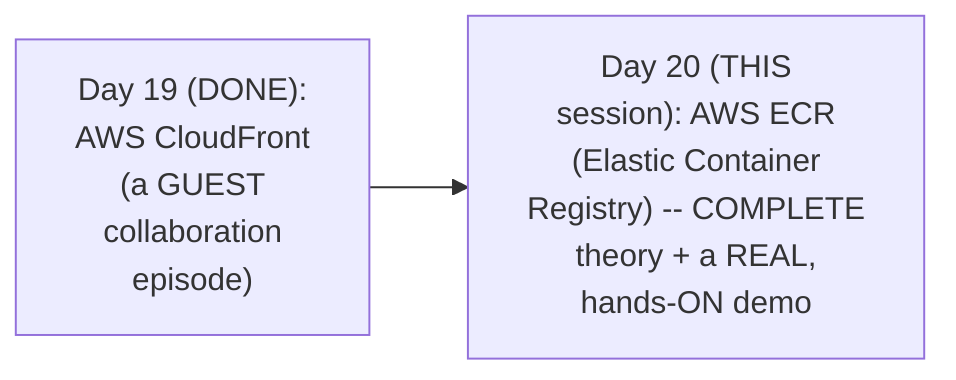

#### 🎯 Key Takeaways

* THIS session's own, EXPLICIT, stated GOAL: by the END, LEARNERS will GENUINELY understand HOW to access, USE, and PUSH/pull THEIR first REAL Docker image ONTO ECR.
* THE session COMBINES a COMPLETE, precise THEORETICAL foundation WITH a REAL, hands-ON demonstration — CONSISTENT with THIS series' own, ESTABLISHED format.
* This directly, PRECISELY sets UP the SESSION's own, FIRST, essential STEP — a GENUINE, direct prerequisite CHECK, for LEARNERS unfamiliar WITH containers GENERALLY (Section 2).

---

### 2. A Genuine, Direct Prerequisite: Understanding Containers First

#### ⚠ A Direct, Honest, Genuine Prerequisite

> 💡 **Given directly:** *"ECR is an AWS service that is used to store and manage containers — that means this service is typically related to containers, and if there is someone who is not aware of the concept of containers, or if you haven't used containers before, I will highly recommend you to watch this video called 'Introduction to Containers'... because in today's video I will use and reference this word called containers multiple times, and if you are not aware of containers, then you will get disconnected."*

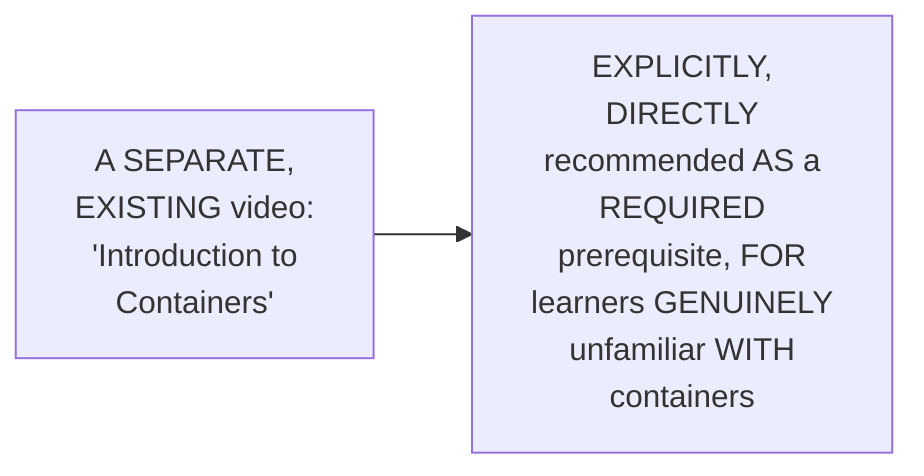

#### ⚠ Common Mistakes

* Assuming THIS session's own CONTENT will GENUINELY, DIRECTLY re-explain WHAT a "CONTAINER" fundamentally IS, from SCRATCH — explicitly, directly, HONESTLY clarified: THAT foundational CONTENT lives IN a SEPARATE, dedicated VIDEO — THIS session ASSUMES that PRIOR knowledge.

#### 🎯 Key Takeaways

* THE instructor **directly, HONESTLY confirms** a GENUINE prerequisite — LEARNERS UNFAMILIAR with CONTAINERS should WATCH a SEPARATE, dedicated VIDEO FIRST.
* This directly, HONESTLY sets ACCURATE expectations — THIS session GENUINELY, REPEATEDLY references "CONTAINERS" throughout, ASSUMING this FOUNDATIONAL understanding is ALREADY in PLACE.
* This directly, PRECISELY sets UP the SESSION's own, NEXT, essential CONTENT — the PRECISE, letter-by-LETTER breakdown of "ECR" ITSELF (Section 3).

---
### 3. ECR, Precisely Broken Down: Elastic, Container, Registry

#### 📖 Definition — The Complete, Precise Breakdown

> 💡 **Given directly:** *"Let's start with breaking down this word called ECR itself — now this word ECR can be divided into three parts, where each alphabet refers to one phrase, and using these three phrases you can completely understand about ECR. E stands for elastic, C stands for container, and R here stands for registry."*

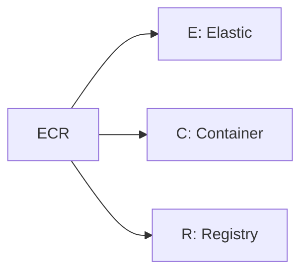

#### 📖 Definition — "Registry" (CR), Precisely Explained

> 💡 **Given directly:** *"CR here represents that ECR is an AWS service that is a container registry — okay, so ECR is a container registry, similar to Docker Hub... let's say you have a Docker image on your personal laptop, and you want to share this Docker image with someone else in the world... you can simply place your Docker image onto this container registry, and someone else... can pull the image from this container registry — just like you post the image onto Instagram, and someone else can see the image."*

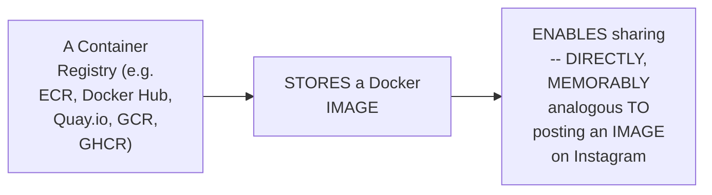

#### 📖 Definition — "Elastic" (E), Precisely Explained via a Genuine, Pattern-Recognition Tip

> 💡 **Given directly:** *"Any AWS services that you see, if they start with the alphabet called E, that means they represent that this service is highly scalable and available in nature — for example, you might have heard about EC2, EBS, EKS... scalable means you can increase the capacity of this AWS service to accommodate any number of resources... in terms of ECR, that means you can store any number of container images, it is just a pay-as-you-use service where AWS does not restrict you with the number of container images."*

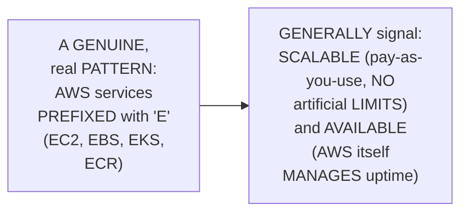

#### 🔍 Internal Working — "Availability," Precisely Explained (& Compared to Docker Hub)

> 💡 **Given directly:** *"Availability here means that AWS will take care of making sure that this service, that is ECR, is available all the time — for example, if you are using Docker Hub, Docker is a company that is responsible for keeping the Docker Hub up and running, similarly if you are using ECR, AWS is the company that is responsible for keeping your Elastic Container Registry available all the time."*

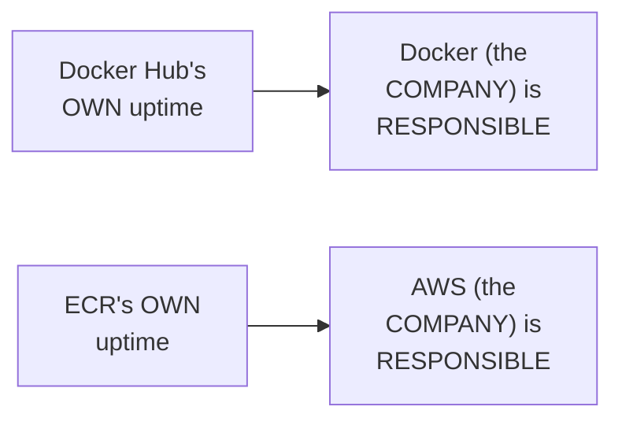

#### ⚠ Common Mistakes

* Assuming the "E" prefix on AWS SERVICE names (EC2, EBS, EKS, ECR) is GENUINELY, MERELY coincidental — explicitly, directly, PRECISELY identified AS a GENUINE, real, RECOGNIZABLE naming PATTERN — SIGNALING scalability AND availability, CONSISTENTLY, across MULTIPLE, real AWS SERVICES.

#### 🎯 Key Takeaways

* **ECR** is precisely, LETTER-by-letter BROKEN down: **E**lastic (SCALABLE and AVAILABLE), **C**ontainer, and **R**egistry (a SERVICE for STORING and SHARING container IMAGES).
* THE "REGISTRY" concept is directly, MEMORABLY explained VIA a REAL, relatable ANALOGY — SHARING a container IMAGE is COMPARABLE to POSTING an image ON Instagram.
* THE "E" (ELASTIC) prefix is directly, PRECISELY identified AS a GENUINE, RECOGNIZABLE AWS naming PATTERN (SHARED with EC2, EBS, EKS) — SIGNALING BOTH scalability (PAY-as-you-use, NO artificial LIMITS) and AVAILABILITY (AWS itself MANAGES uptime — DIRECTLY paralleling Docker's OWN responsibility FOR Docker Hub).

---

### 4. ECR vs. Docker Hub: A Complete, Thorough, Genuinely Important Comparison

#### 📖 Definition — Default Visibility, Precisely Contrasted

> 💡 **Given directly:** *"By default if you create a repository in Docker Hub, it will be a public repository, whereas by default ECR's repositories are private in nature — of course you can create a public repository in ECR as well, but by default it will create private repositories, that means ECR keeps security... ECR is fundamentally focused on private repositories, whereas Docker Hub... has started its focus with public repositories."*

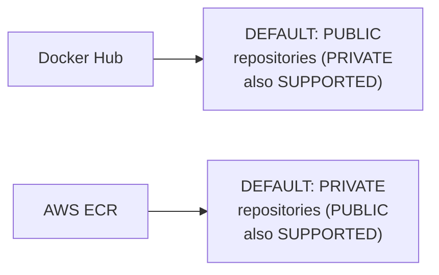

#### 🔍 Internal Working — A Genuine, Real, Practical IAM Advantage

> 💡 **Given directly:** *"If your company is already on AWS, then you can use your IAM users... you can directly integrate this IAM with ECR — that means, unlike here, if your company decides to use Docker Hub private repositories, usually in companies... each and every person has to create an account with Docker Hub... let's say you have 1,000 users, or you have 10,000 users in your organization — now everybody going here, creating account, or as an admin you have to create account for 10,000 users again."*

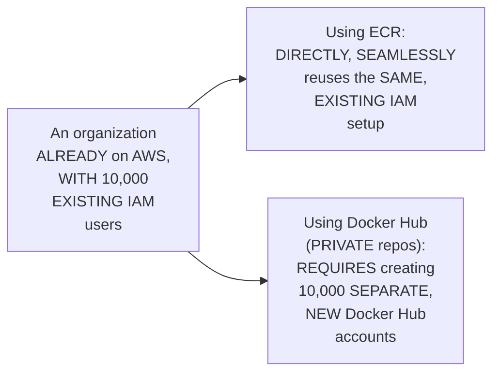

#### 🔍 Internal Working — A Genuine, Honest Accountability Point

> 💡 **Given directly:** *"You never know, let's say one fine day Docker Hub has gone down, or any container registry that you are using has gone down — now you cannot say that Docker Hub is directly accountable, and you might not have direct support with Docker Hub as much as you have for ECR."*

#### 🔍 Internal Working — A Genuine, Direct Confirmation: Broader AWS-Service Integration

> 💡 **Given directly:** *"ECR has very good integration with other AWS services — for example, you are using EKS, you are using ECS, you are using Fargate, in such cases ECR has very good integration, better integration, compared to Docker Hub or other registries."*

#### ⚠ Common Mistakes

* Assuming DOCKER Hub and ECR are GENUINELY, MERELY interchangeable, WITH no real, PRACTICAL difference BEYOND branding — explicitly, directly, THOROUGHLY corrected: FOUR, genuine, REAL distinctions EXIST — default VISIBILITY, IAM integration, ACCOUNTABILITY, and BROADER AWS-service INTEGRATION.

#### 🎯 Key Takeaways

* **DEFAULT visibility**: Docker HUB defaults to **PUBLIC** repositories; ECR defaults to **PRIVATE** ones — BOTH support the OPPOSITE, but their OWN, genuine DEFAULTS differ.
* **IAM integration**: AN organization ALREADY on AWS can DIRECTLY, SEAMLESSLY reuse ITS existing IAM SETUP with ECR — AVOIDING the NEED to create SEPARATE Docker Hub ACCOUNTS for EVERY, individual EMPLOYEE (a REAL, worked example: 10,000 users).
* **ACCOUNTABILITY and BROADER integration**: ECR OFFERS more DIRECT support/accountability (AS a PAYING AWS customer), and INTEGRATES more TIGHTLY with OTHER AWS services (EKS, ECS, FARGATE) — TWO, further, genuine ADVANTAGES.

---
### 5. A Genuine, Practical Interview-Answer Recommendation

#### 🪜 Step-by-Step — A Direct, Practical Recommendation

> 💡 **Given directly:** *"During your interviews, let's say you are working as an AWS devops engineer, or you are projecting yourself as an AWS devops engineer, better to go with container registries on your cloud provider — if you are an AWS, better to say that your images are managed using ECR; if you are using Google Cloud, then go for GCR."*

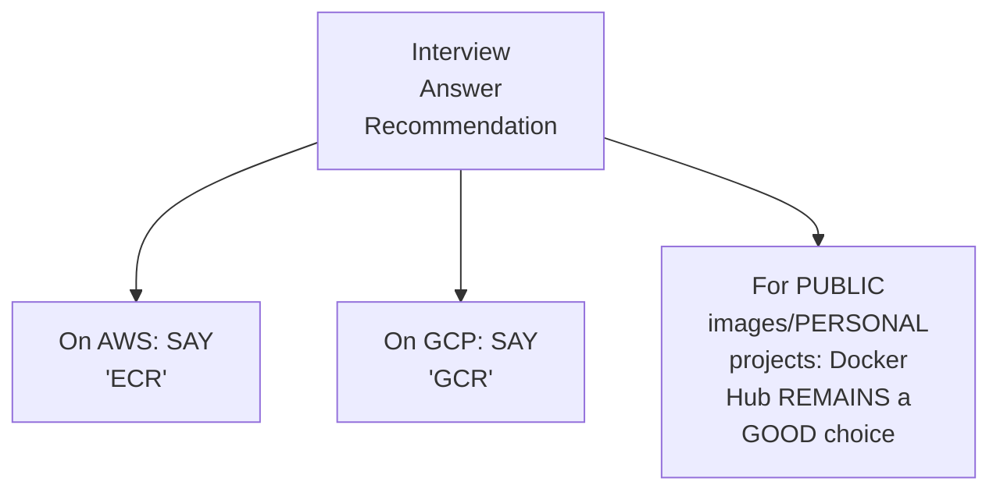

#### ⚠ Common Mistakes

* Assuming DOCKER Hub is GENUINELY, ALWAYS the "WRONG" answer, IN a real INTERVIEW context — explicitly, directly, PRECISELY clarified: "OF course Docker HUB is a VERY, very GOOD solution" — it REMAINS the RIGHT answer SPECIFICALLY for PUBLIC images OR personal PROJECTS — the CLOUD-native registry (ECR/GCR) is the RIGHT answer FOR private, organizational, PRODUCTION contexts.

#### 🎯 Key Takeaways

* A GENUINE, practical INTERVIEW-answer recommendation: ON AWS, SAY you USE **ECR**; on GCP, SAY **GCR** — DIRECTLY matching YOUR stated cloud PROVIDER.
* Docker HUB REMAINS a GENUINELY good CHOICE — SPECIFICALLY for PUBLIC images and PERSONAL projects — NOT a "WRONG" answer, GENERALLY, but a DIFFERENTLY-scoped ONE.
* This directly, PRECISELY completes THIS session's own, THEORETICAL foundation — SETTING up the SESSION's own, COMPLETE, hands-ON demonstration (Sections 6-10).

---

### 6. A Complete, Real, Live Demo: Exploring the ECR Console (& a Genuine, Honest Documentation Bug)

#### ⚠ A Direct, Honest, Genuinely Amusing Documentation Correction

> 💡 **Given directly:** *"While going through the documentation, I found multiple bugs in the documentation — of course they are very, very minute — the thing is, Elastic Container Registry, multiple times in the documentation, says that it's a 'fully managed Docker container registry' — ideally the term Docker should not be here, because containers can be created and managed with various other tools as well... I've also submitted a ticket to AWS, stating what needs to be fixed."*

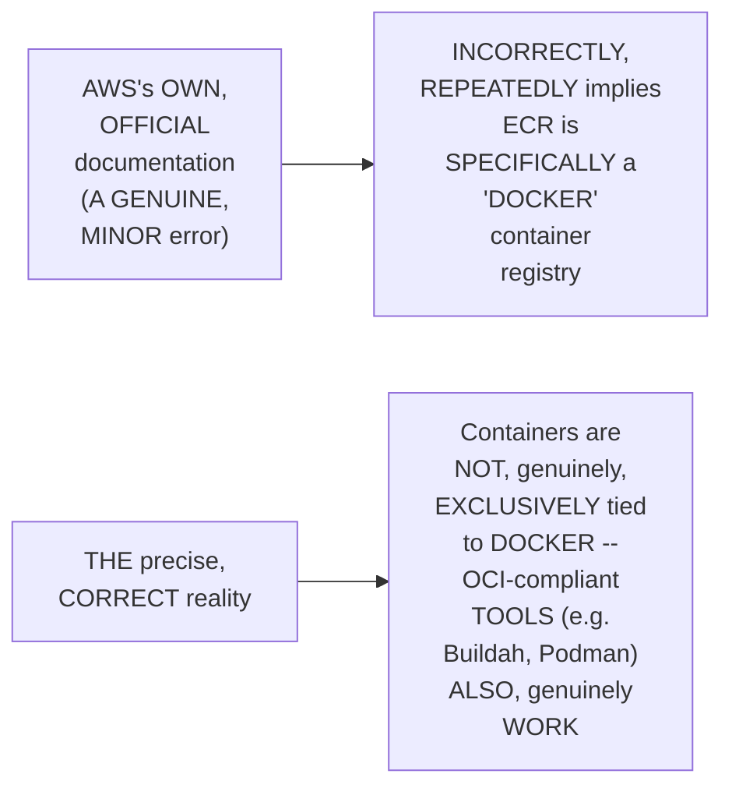

#### 🪜 Step-by-Step — A Complete, Real, Live Console Walkthrough

> 💡 **Given directly:** *"Let's go into this Elastic Container Registry, and click on get started — it's a very, very simple service to use, just like Docker Hub... whereas here you don't have to create account, because you are already logged into the AWS account."*

#### ⚠ Common Mistakes

* Assuming AWS's OWN, OFFICIAL documentation is GENUINELY, ALWAYS perfectly ACCURATE, WITHOUT any, real ERRORS — explicitly, directly, HONESTLY demonstrated as FALSE — EVEN OFFICIAL documentation CAN genuinely CONTAIN minor, real MISTAKES — WORTH reporting, WHEN found.

#### 🎯 Key Takeaways

* THE instructor **directly, HONESTLY identifies** a GENUINE, real DOCUMENTATION error — AWS's OWN docs incorrectly, REPEATEDLY describe ECR AS specifically "DOCKER"-focused — and CONFIRMS he SUBMITTED a REAL fix TICKET to AWS.
* THIS directly, PRECISELY reinforces a GENUINE, important TECHNICAL clarification — CONTAINERS are NOT exclusively TIED to Docker — OCI-COMPLIANT tools (BUILDAH, Podman) ALSO genuinely WORK.
* A COMPLETE, real, LIVE console WALKTHROUGH directly, CONCRETELY confirmed ECR's OWN, GENUINELY simple SETUP — NO separate ACCOUNT creation NEEDED, unlike DOCKER Hub.

---
### 7. A Complete, Real, Live Demo: Creating an ECR Repository

#### 🪜 Step-by-Step — A Complete, Real, Repository-Creation Walkthrough

> 💡 **Given directly:** *"You get this option called 'get started,' and you can create a repository — like I told you, by default the setting is private, that means by default AWS recommends you to create private repositories... access is managed by IAM and repository-policy permissions... provide a repository name, your repository name can be anything, like demo-app-repo."*

#### 📖 Definition — Tag Immutability, Briefly Explained

> 💡 **Given directly:** *"If you want to enable tag immutability, you can enable the tag immutability, where what happens is, if you are trying to overwrite the images with the same tag, that will be disabled by default."*

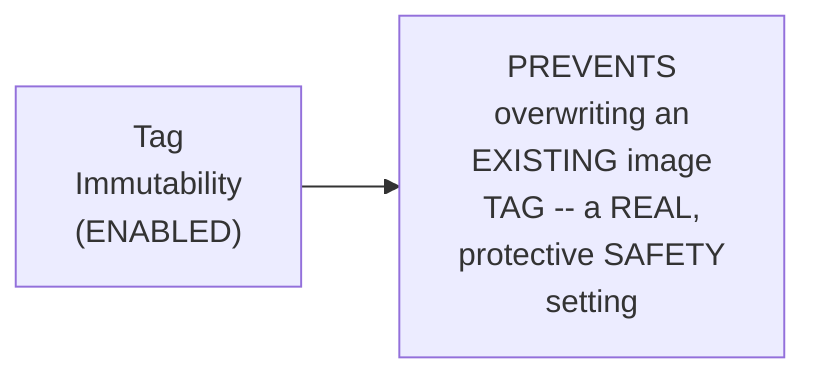

#### 📖 Definition — Image Scanning, Precisely Explained (& Compared to Quay.io)

> 💡 **Given directly:** *"You can also use image scan settings — automatically, when you are pushing the images, images can be scanned, and this feature is available with modern-day container registries... even here, this is another container registry which is very, very widely used, apart from Docker Hub — even here, whenever you push your images, they are by default security-scanned."*

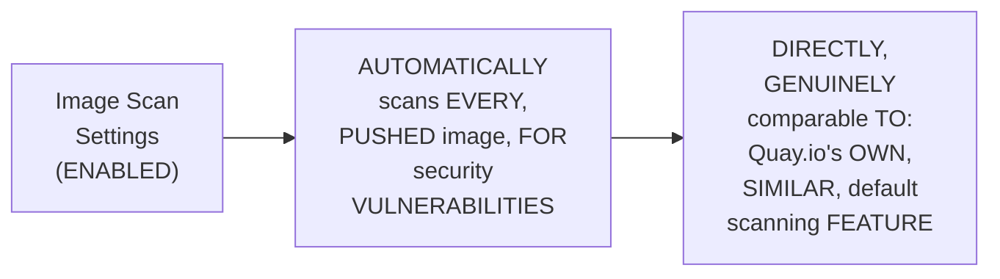

#### ⚠ A Direct, Honest, Genuine Cost-Awareness Note

> 💡 **Given directly:** *"Let me tell you, ECR is not a free service, so whenever you are creating any image repositories, then after the demonstration, please try to delete that."*

#### ⚠ Common Mistakes

* Assuming ECR is GENUINELY, ENTIRELY free TO use — explicitly, directly, HONESTLY clarified: "ECR is NOT a FREE service" — RESOURCES should GENUINELY, DIRECTLY be deleted AFTER any DEMO/practice.

#### 🎯 Key Takeaways

* A COMPLETE, real, LIVE demonstration directly, CONCRETELY confirmed the FULL repository-CREATION workflow — NAMING the repository, KEEPING the DEFAULT "private" VISIBILITY, and CONFIGURING optional FEATURES.
* **TAG immutability** GENUINELY, DIRECTLY prevents OVERWRITING an EXISTING image tag; **IMAGE scanning** GENUINELY, AUTOMATICALLY scans EVERY pushed IMAGE for SECURITY vulnerabilities — DIRECTLY comparable TO Quay.io's OWN, similar FEATURE.
* THE instructor **directly, HONESTLY confirms** ECR is **NOT free** — a GENUINE, important REMINDER to DELETE demo RESOURCES afterward.

---

### 8. A Complete, Real, Live Demo: Logging Into ECR via the CLI

#### 🪜 Step-by-Step — A Direct, Genuine Pointer to Prior, Established Content

> 💡 **Given directly:** *"The first thing that you need to do is you need to have the AWS CLI installed... in the same playlist, if you go to Day 10, I have discussed very detailed about AWS CLI — what exactly it is, how does it function, how to use, and how to write your first CLI script."*

#### 🪜 Step-by-Step — A Complete, Real, Login Command Walkthrough

> 💡 **Given directly:** *"To login to ECR, you need to use this command called AWS ECR, which will fetch your AWS ECR username and password, and it will submit it to the docker login command... by default docker login commands work for docker.io, whereas if you have any other registries, such as Quay.io, or GCR, or in this case ECR, what we are doing is we are providing our registry name."*

```bash
aws ecr get-login-password --region <region> | docker login --username AWS --password-stdin <account-id>.dkr.ecr.<region>.amazonaws.com
```

#### 🔍 Internal Working — A Genuine, Precise Explanation of Piping

> 💡 **Given directly:** *"What does pipe do in shell scripting? It will pass the output of the first command as an input to the second command — so once this command fetches the username and password, it will pass it to this command, that's how you are logging into the AWS ECR."*

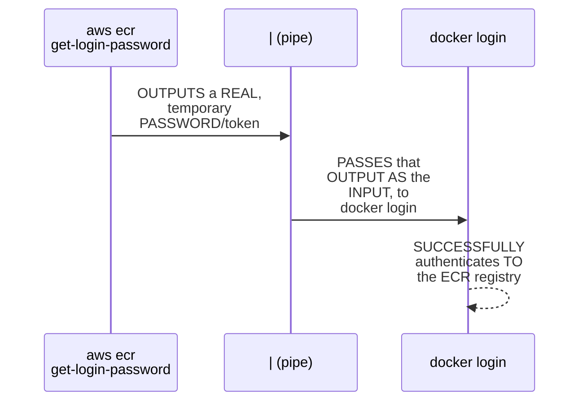

#### ⚠ Common Mistakes

* Assuming `DOCKER login` GENUINELY, ALWAYS authenticates AGAINST Docker.IO by DEFAULT, REGARDLESS of the REGISTRY you're ACTUALLY trying to USE — explicitly, directly, PRECISELY clarified: YOU must EXPLICITLY provide the TARGET registry's OWN name (e.g., YOUR ECR registry URL) — OTHERWISE, it DEFAULTS to docker.io.
* Assuming "PIPING" is a GENUINELY, MERELY cosmetic SHELL-scripting detail — explicitly, directly, PRECISELY explained: it's the CORE mechanism ENABLING the LOGIN command to WORK at all — PASSING the FETCHED credentials DIRECTLY into `docker LOGIN`'s own INPUT.

#### 🎯 Key Takeaways

* A COMPLETE, real, LIVE demonstration directly, CONCRETELY confirmed the ECR-LOGIN workflow — USING `AWS ecr GET-login-password`, PIPED into `docker LOGIN`.
* **PIPING** is precisely EXPLAINED as PASSING one COMMAND's own OUTPUT as ANOTHER command's INPUT — the CORE mechanism ENABLING this LOGIN command to GENUINELY work.
* This directly, PRECISELY sets UP the SESSION's own, NEXT, essential CLARIFICATION — WHY this LOGIN step's own, REQUIRED permissions GENUINELY differ, DEPENDING on WHETHER you're using ROOT or a REAL IAM user (Section 9).

---
### 9. Root vs. IAM User: A Genuine, Important Permissions Clarification

#### ⚠ A Direct, Honest, Important Clarification

> 💡 **Given directly:** *"If you are using root account — like, let's say in my case, I am using the root account for the purpose of demo — so by default I will have access to ECR and everything on the account, whereas if you are not using the root account, then you need to explicitly grant access."*

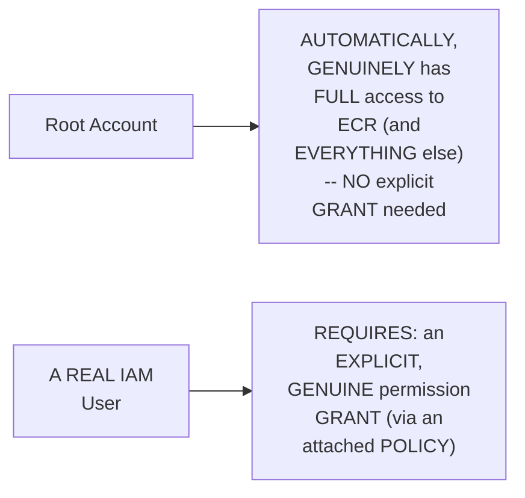

#### 🪜 Step-by-Step — A Complete, Real, Live IAM-Permission-Granting Walkthrough

> 💡 **Given directly:** *"Let's say if your Docker push is failing, then you need to go to your image — let's say, go to IAM, in IAM what you will do is go to your user... then you can go to permissions tab, add permissions, and you can add any required permissions regarding ECR — attach policies, directly search for ECR, there are five matching permissions."*

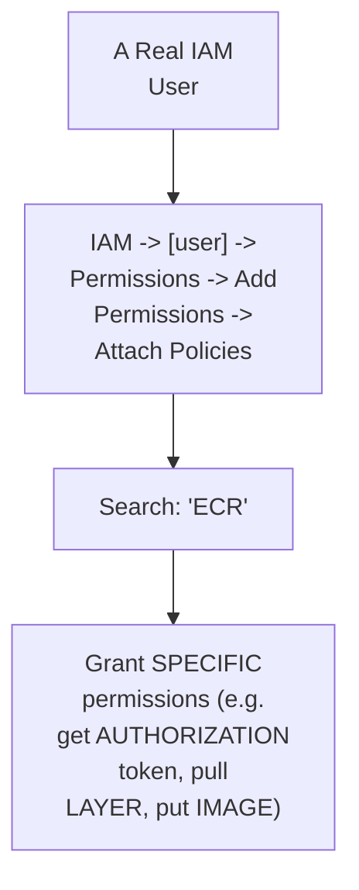

#### ⚠ Common Mistakes

* Assuming a REAL, IAM-user-BASED `docker PUSH` will GENUINELY, AUTOMATICALLY succeed, WITHOUT any EXPLICIT, additional PERMISSION grant — explicitly, directly, PRECISELY clarified: UNLIKE root, a REAL IAM user REQUIRES explicit ECR-related PERMISSIONS (VIA an attached POLICY) — OTHERWISE, the PUSH will GENUINELY, DIRECTLY fail.

#### 🎯 Key Takeaways

* USING the **ROOT account** GENUINELY, AUTOMATICALLY grants FULL access to ECR (and EVERYTHING else) — NO explicit PERMISSION grant is REQUIRED.
* A REAL, **NON-root IAM user** GENUINELY, DIRECTLY requires an EXPLICIT permission GRANT — VIA an attached POLICY, SPECIFICALLY covering ECR-related ACTIONS (authorization TOKEN, pull LAYER, put IMAGE).
* This directly, PRECISELY sets UP the SESSION's own, NEXT, essential STEP — COMPLETING the FULL, real WORKFLOW: BUILDING, tagging, and PUSHING an ACTUAL Docker image (Section 10).

---

### 10. A Complete, Real, Live Demo: Building, Tagging & Pushing a Docker Image

#### 🪜 Step-by-Step — A Complete, Real, Docker Build Walkthrough

> 💡 **Given directly:** *"If you have a container image, you can build that container image using a Docker file — let's say I have a very simple Docker file here, I'm not doing anything, I'm just writing the base command here for the purpose of demo, and let's try to build this Docker image."*

```bash
docker build -t test-image .
```

#### 🪜 Step-by-Step — A Complete, Real, Tagging Walkthrough

> 💡 **Given directly:** *"What is the tag doing? Basically you have created the Docker image with this name on your local laptop... so what I am trying to do with this command here is I am trying to tag the image that is created on my local, to the docker registry that I have — so that this local image will be properly tagged and pushed to the registry."*

```bash
docker tag test-image:latest <account-id>.dkr.ecr.<region>.amazonaws.com/demo-app-repo:latest
```

#### 🪜 Step-by-Step — A Complete, Real, Push Walkthrough & Live-Confirmed Success

> 💡 **Given directly:** *"Now let's try to push the image, by running this command you will successfully push your image on your local laptop to the container registry, and anyone who has proper IAM access, they can access this from the other part of the world... let's try to refresh and see — perfect, my Docker image is available in the ECR."*

```bash
docker push <account-id>.dkr.ecr.<region>.amazonaws.com/demo-app-repo:latest
```

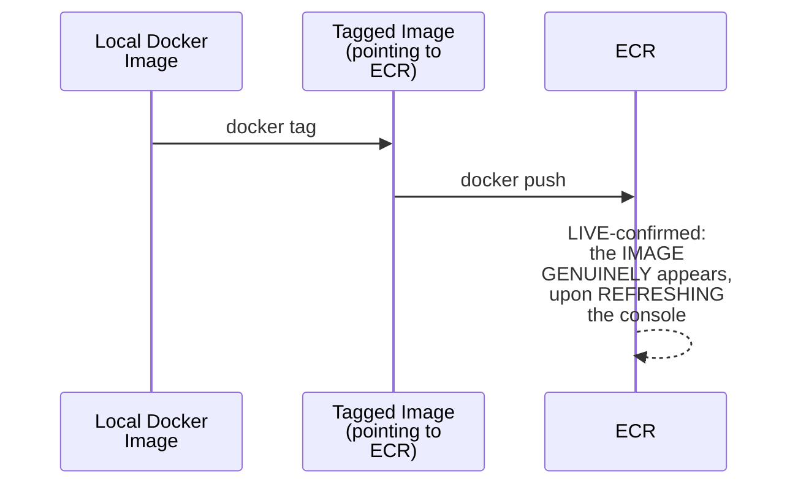

#### ⚠ Common Mistakes

* Assuming a REAL, meaningful DOCKER image is GENUINELY, PRACTICALLY required TO demonstrate THIS complete WORKFLOW — explicitly, directly, PRACTICALLY demonstrated as GENUINELY, DELIBERATELY simple — a MINIMAL, "BASE command only" DOCKERFILE is GENUINELY sufficient TO illustrate the COMPLETE build/TAG/push process.

#### 🎯 Key Takeaways

* A COMPLETE, real, LIVE demonstration directly, CONCRETELY confirmed the FULL, three-STEP workflow — `DOCKER build` (CREATING the image LOCALLY), `docker TAG` (POINTING the local IMAGE toward the ECR REGISTRY), and `docker PUSH` (UPLOADING it).
* **TAGGING** is precisely EXPLAINED as the STEP that CONNECTS a LOCAL image to a SPECIFIC, remote REGISTRY destination — a REQUIRED, INTERMEDIATE step BETWEEN building and PUSHING.
* A COMPLETE, real, LIVE-confirmed SUCCESS directly, CONCRETELY verified the PUSHED image GENUINELY appears WITHIN the ECR console, UPON refreshing.

---
### 11. A Genuine, Direct, Forward-Looking Confirmation: ECR's Role in ECS/EKS & Retroactive CI/CD

#### 🪜 Step-by-Step — A Direct, Forward-Looking Confirmation

> 💡 **Given directly:** *"Going ahead, when we talk about ECS, when we talk about EKS, this ECR will keep revolving — I mean you will listen to this word called ECR multiple times, and we will be using this registry itself."*

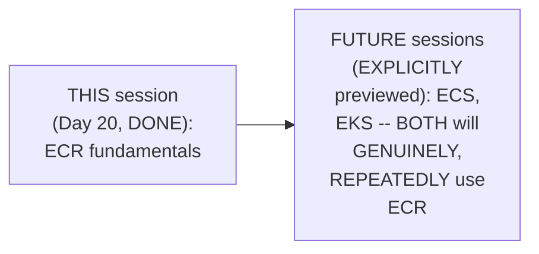

#### 🔍 Internal Working — A Genuine, Honest, Retroactive Confirmation

> 💡 **Given directly:** *"Last time on Day 14 and Day 15, when we did the AWS CI and CD videos, I've used Docker Hub, because I haven't covered this concept called ECR — but now that I have covered it, you can replace those videos, in those videos instead of Docker Hub you can try using Amazon ECR."*

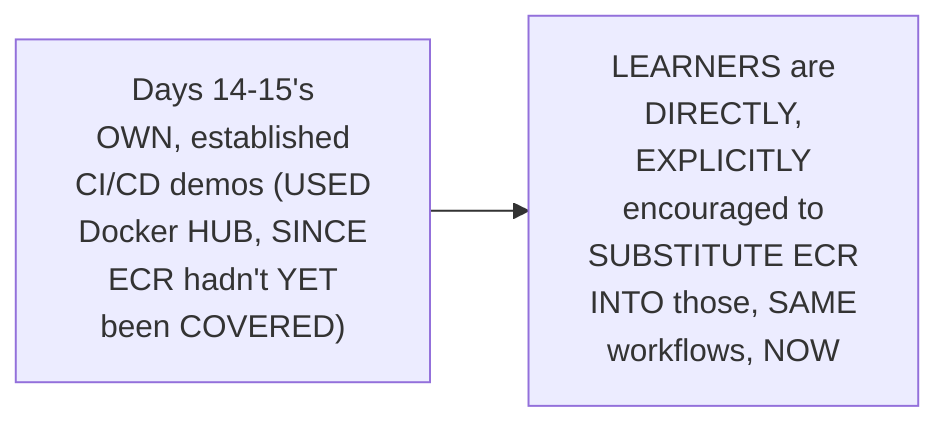

#### ⚠ Common Mistakes

* Assuming Days 14-15's OWN, established USE of Docker HUB (RATHER than ECR) REFLECTS a GENUINE, DELIBERATE, permanent CHOICE — explicitly, directly, HONESTLY clarified: it WAS purely a SEQUENCING constraint — ECR HADN'T yet BEEN taught, AT that point IN the series.

#### 🎯 Key Takeaways

* THE instructor **directly, EXPLICITLY confirms** ECR will GENUINELY, REPEATEDLY reappear IN future SESSIONS — SPECIFICALLY when COVERING ECS and EKS.
* A GENUINE, HONEST, retroactive CONFIRMATION: DAYS 14-15's own, ESTABLISHED CI/CD demos USED Docker Hub ONLY because ECR HADN'T yet BEEN covered — LEARNERS are DIRECTLY, EXPLICITLY encouraged TO substitute ECR INTO those, SAME workflows NOW.
* This directly, PRECISELY confirms ECR's own, GENUINE, ONGOING relevance THROUGHOUT the REST of this SERIES — NOT an ISOLATED, standalone TOPIC.

---

### 12. Closing: A Direct Encouragement to Practice

#### 🪜 Step-by-Step — A Direct, Genuine, Final Encouragement

> 💡 **Given directly:** *"I hope you enjoyed today's video... if you have any questions, post that in the comment section, and if you have any feedback, definitely share it to me."*

#### ⚠ Common Mistakes

* Assuming THIS session's own, RELATIVELY BRIEF demo (BUILDING/tagging/pushing ONE, simple IMAGE) represents the COMPLETE, final SCOPE of REAL, practical ECR usage — explicitly, directly, IMPLIED as GENUINELY, DIRECTLY foundational — Section 11's own established CONFIRMATION makes CLEAR that ECR's own, REAL, practical importance EXTENDS far BEYOND this SESSION's own, INITIAL demo.

#### 🎯 Key Takeaways

* This episode **GENUINELY, COMPREHENSIVELY delivers** its OWN, stated GOALS — a COMPLETE, precise theoretical FOUNDATION (the letter-BY-letter breakdown, the ECR-vs-Docker-Hub COMPARISON) plus a COMPLETE, real, HANDS-on demonstration.
* THE instructor **directly, GENUINELY encourages** ONGOING learner ENGAGEMENT — QUESTIONS and FEEDBACK, via the COMMENT section.
* This directly, PRECISELY completes a FOUNDATIONAL session THAT will, GENUINELY, DIRECTLY continue to MATTER — ECR is EXPLICITLY confirmed AS a RECURRING, essential COMPONENT of FUTURE ECS/EKS sessions.

---

## 📝 Glossary

| Term | Definition | Why It Matters |
|---|---|---|
| **ECR** | Elastic Container Registry | AWS's own, managed container registry service |
| **Container Registry** | A service for storing/sharing container images | Comparable to Docker Hub, Quay.io, GCR, GHCR |
| **Tag Immutability** | Prevents overwriting an existing image tag | A real, protective safety setting |
| **Image Scanning** | Automatic security scanning upon push | Comparable to Quay.io's own, similar feature |
| **Piping** | Passing one command's output as another's input | The core mechanism behind the ECR login command |
| **OCI (Open Container Initiative)** | A standard containers can comply with | Confirms containers aren't exclusively tied to Docker |

---

## 🔄 Revision Notes — One-Minute Revision

* This is **Day 20**, delivering a complete theoretical foundation on AWS ECR, plus a real, hands-on demo building, tagging, and pushing a Docker image.
* **A genuine prerequisite**: a separate "Introduction to Containers" video is explicitly recommended first, for anyone unfamiliar with containers.
* **ECR, broken down letter by letter**: Elastic (scalable + available, matching a real AWS naming pattern shared with EC2/EBS/EKS), Container, Registry (a service for storing/sharing images, memorably compared to posting on Instagram).
* **ECR vs. Docker Hub, a complete, thorough, genuinely important comparison** (explicitly flagged as a common interview question): default visibility (Docker Hub = public by default; ECR = private by default); IAM integration (an organization already on AWS can directly reuse existing IAM setup with ECR, avoiding separate Docker Hub accounts for e.g. 10,000 users); accountability (more direct support as a paying AWS customer); and broader AWS-service integration (EKS, ECS, Fargate).
* **A genuine, practical interview recommendation**: on AWS, say ECR; on GCP, say GCR; Docker Hub remains a good choice for public images/personal projects.
* **Live demo (console exploration)**: a genuine, honest documentation correction -- AWS's own docs incorrectly, repeatedly call ECR a "Docker" registry, when containers aren't exclusively tied to Docker (OCI-compliant tools like Buildah/Podman also work). No separate account creation needed, unlike Docker Hub.
* **Live demo (repository creation)**: default private visibility; tag immutability (prevents overwrite); image scanning (automatic, on push, like Quay.io). A genuine, honest cost-awareness note: ECR is NOT free -- delete resources after the demo.
* **Live demo (CLI login)**: `aws ecr get-login-password` piped into `docker login`. Piping precisely explained as passing one command's output as another's input. Docker login defaults to docker.io unless you explicitly specify your target registry.
* **Root vs. IAM user**: root automatically has full ECR access; a real IAM user requires an explicit permission grant (via an attached policy covering ECR actions).
* **Live demo (build, tag, push)**: `docker build` -> `docker tag` (connecting the local image to the ECR destination) -> `docker push`. A live-confirmed success: the pushed image genuinely appears in the ECR console upon refresh.
* **A genuine, forward-looking confirmation**: ECR will repeatedly reappear in future ECS/EKS sessions. A genuine, honest, retroactive note: Days 14-15's own CI/CD demos used Docker Hub only because ECR hadn't yet been covered -- learners are encouraged to substitute ECR into those, same workflows now.
* **Closing**: this session is foundational -- ECR's real, practical importance extends well beyond this session's initial demo.

---

## 📋 Cheat Sheet

**ECR, broken down:**
```text
E - Elastic  (scalable + available, like EC2/EBS/EKS)
C - Container
R - Registry (stores/shares images, like Docker Hub/Quay.io/GCR/GHCR)
```

**ECR vs. Docker Hub:**
```text
Default visibility:  Docker Hub = public | ECR = private
IAM integration:      ECR reuses existing AWS IAM (no separate accounts needed)
Accountability:        ECR = direct AWS support (as a paying customer)
AWS integration:        ECR integrates tightly with EKS/ECS/Fargate
```

**The complete CLI workflow:**
```bash
# 1. Login
aws ecr get-login-password --region <region> | docker login --username AWS --password-stdin <account-id>.dkr.ecr.<region>.amazonaws.com

# 2. Build
docker build -t test-image .

# 3. Tag
docker tag test-image:latest <account-id>.dkr.ecr.<region>.amazonaws.com/demo-app-repo:latest

# 4. Push
docker push <account-id>.dkr.ecr.<region>.amazonaws.com/demo-app-repo:latest
```

**Root vs. IAM user permissions:**
```text
Root:        automatic, full ECR access -- no explicit grant needed
IAM User:    requires an explicitly-attached ECR policy (auth token, pull layer, put image)
```

---

## 🔥 Interview Questions & Answers

### 🟢 Beginner

**Q1.**

**Question:** What does ECR stand for?

**Answer:** Elastic Container Registry.

**Explanation:** Directly, explicitly stated.

**Why Interviewers Ask This:** The most basic, foundational ECR question.

**Possible Follow-up:** "What does each of the three words genuinely mean?"

**Q2.**

**Question:** Are ECR repositories public or private, by default?

**Answer:** Private.

**Explanation:** Directly, explicitly confirmed.

**Why Interviewers Ask This:** A commonly-tested, genuine ECR-vs-Docker-Hub distinction.

**Possible Follow-up:** "Are Docker Hub repositories public or private, by default?"

**Q3.**

**Question:** What genuine advantage does ECR offer an organization already using AWS IAM?

**Answer:** Direct, seamless reuse of existing IAM users/roles, without needing separate accounts for every employee.

**Explanation:** Directly, precisely explained.

**Why Interviewers Ask This:** Tests genuine, practical understanding of a real, organizational advantage.

**Possible Follow-up:** "What would an organization need to do instead, if using Docker Hub private repositories?"

**Q4.**

**Question:** Is ECR a free service?

**Answer:** No.

**Explanation:** Directly, explicitly confirmed.

**Why Interviewers Ask This:** Basic, practical, real-world cost awareness.

**Possible Follow-up:** "What should you genuinely do after completing a demo/practice session?"

**Q5.**

**Question:** Which container registry should you name in an interview, if you're positioning yourself as an AWS devops engineer?

**Answer:** ECR.

**Explanation:** Directly, explicitly recommended.

**Why Interviewers Ask This:** A commonly-tested, genuine, practical interview-answer tip.

**Possible Follow-up:** "What would you say instead, on GCP?"

**Q6.**

**Question:** Does using the root account require explicit IAM permissions to push to ECR?

**Answer:** No -- root automatically has full access.

**Explanation:** Directly, explicitly confirmed.

**Why Interviewers Ask This:** Tests genuine, practical, hands-on ECR/IAM knowledge.

**Possible Follow-up:** "What does a real, non-root IAM user genuinely require, instead?"

**Q7.**

**Question:** What does the `docker tag` command genuinely do, in this session's own workflow?

**Answer:** Connects a locally-built image to a specific, remote registry destination.

**Explanation:** Directly, precisely explained.

**Why Interviewers Ask This:** Basic, practical, hands-on Docker/ECR workflow knowledge.

**Possible Follow-up:** "What are the three, complete steps of this session's own push workflow?"

**Q8.**

**Question:** Are containers exclusively tied to Docker?

**Answer:** No -- OCI-compliant tools like Buildah and Podman can also be used.

**Explanation:** Directly, precisely clarified.

**Why Interviewers Ask This:** Tests genuine, technical precision beyond a common misconception.

**Possible Follow-up:** "What does OCI stand for?"

**Q9.**

**Question:** Did this session's own CI/CD project (from Days 14-15) originally use ECR?

**Answer:** No -- it used Docker Hub, since ECR hadn't yet been covered.

**Explanation:** Directly, honestly acknowledged.

**Why Interviewers Ask This:** Tests attention to this session's own, honest, retroactive confirmation.

**Possible Follow-up:** "What are learners now encouraged to do, with those, earlier workflows?"

**Q10.**

**Question:** Will ECR reappear in future sessions of this series?

**Answer:** Yes -- explicitly, in upcoming ECS and EKS sessions.

**Explanation:** Directly, explicitly confirmed.

**Why Interviewers Ask This:** Tests attention to the session's own, forward-looking, stated plan.

**Possible Follow-up:** "Why does ECR genuinely integrate especially well with ECS/EKS?"

---

### 🟡 Intermediate

**Q11.**

**Question:** Explain why the instructor deliberately breaks "ECR" down into its three, component letters, rather than simply giving a single, combined definition.

**Answer:** This is a genuinely deliberate, STRUCTURED teaching choice: by DIRECTLY, EXPLICITLY breaking the TERM into "ELASTIC," "container," and "REGISTRY" — EACH explained SEPARATELY — the instructor ENSURES learners GENUINELY understand WHICH, specific PART of the term CORRESPONDS to WHICH, specific CONCEPT (SCALABILITY/availability, CONTAINERS generally, and the REGISTRY function specifically) — RATHER than TREATING "ECR" as an OPAQUE, memorized ACRONYM. This directly, PEDAGOGICALLY connects TO a GENUINE, transferable PATTERN — the SAME "E-prefix" logic GENUINELY, DIRECTLY applies TO other AWS services (EC2, EBS, EKS) — MAKING this session's own EXPLANATION USEFUL beyond JUST ECR itself.

**Explanation:** Requires recognizing the deliberate, structured value of breaking down an acronym into its component, individually-meaningful parts, connecting to a broader, transferable naming pattern.

**Why Interviewers Ask This:** Tests whether a learner recognizes the pedagogical value of structured, component-by-component explanation over rote acronym memorization.

**Possible Follow-up:** "Name ANOTHER, real AWS SERVICE (BEYOND EC2, EBS, EKS, and ECR) that GENUINELY follows THIS same, 'E-PREFIX' naming PATTERN."

**Q12.**

**Question:** A learner argues that since this session confirms ECR defaults to private repositories while Docker Hub defaults to public ones, this means Docker Hub is genuinely, fundamentally less secure than ECR. Evaluate this claim.

**Answer:** This claim OVERSTATES a GENUINE, SPECIFIC, DEFAULT-setting difference INTO an UNCONDITIONAL claim ABOUT overall SECURITY, which NEITHER this session's own CONTENT, nor sound REASONING, SUPPORTS. Section 4's own PRECISE, established REASONING DIRECTLY confirms Docker Hub GENUINELY, DIRECTLY "ALSO has PRIVATE repositories" — the DIFFERENCE is SPECIFICALLY about WHICH visibility TYPE is the DEFAULT, upon CREATION, NOT about WHETHER private, SECURE options are GENUINELY available at ALL. A Docker HUB private REPOSITORY, correctly CONFIGURED, is GENUINELY, STRUCTURALLY just as PRIVATE/secure as an ECR PRIVATE repository. The ACCURATE, more PRECISE conclusion: the GENUINE, real DIFFERENCE lies in WHICH option REQUIRES deliberate, ACTIVE configuration (Docker Hub REQUIRES actively CHOOSING private; ECR MAKES it the DEFAULT) — NOT in an INHERENT, structural SECURITY superiority OF one PLATFORM over the OTHER.

**Explanation:** Tests whether a learner recognizes that a difference in default settings doesn't equate to an inherent difference in the maximum, achievable security of each platform when properly configured.

**Why Interviewers Ask This:** Distinguishes candidates who understand the distinction between "default configuration" and "maximum achievable security" from those who conflate the two.

**Possible Follow-up:** "WHY might a DEFAULT setting (RATHER than the mere AVAILABILITY of an option) STILL, genuinely MATTER, from a REAL, organizational security PERSPECTIVE?"

**Q13.**

**Question:** Explain, precisely, why the instructor deliberately shares his own, real experience of finding and reporting a documentation bug, rather than simply correcting the misconception silently, without mentioning the source.

**Answer:** This is a genuinely deliberate, TRANSPARENCY-focused teaching choice, DIRECTLY consistent with a PATTERN seen ACROSS this instructor's OWN, broader series (e.g., the HONEST, live-preserved DEBUGGING errors in Days 14-15 and 18). By DIRECTLY, OPENLY sharing THAT he found a REAL error IN AWS's own, OFFICIAL documentation — and TOOK the ACTIVE step OF reporting it — the instructor MODELS a GENUINE, professional HABIT: CRITICALLY reading EVEN authoritative, OFFICIAL sources, RATHER than accepting THEM uncritically, and CONTRIBUTING back WHEN errors are GENUINELY found. This directly, PRACTICALLY demonstrates a REAL, transferable professional SKILL, beyond just THE specific, corrected FACT itself.

**Explanation:** Requires recognizing the deliberate, transparency-focused value of sharing the real process of finding and reporting a documentation error, modeling a genuine, professional habit of critical reading.

**Why Interviewers Ask This:** Tests whether a learner recognizes the pedagogical and professional value of demonstrating critical engagement with official documentation, rather than simply presenting corrected facts.

**Possible Follow-up:** "Describe a GENUINE, real, DIFFERENT scenario (BEYOND this SESSION's own CONTENT) where CRITICALLY reading OFFICIAL, authoritative DOCUMENTATION would GENUINELY, DIRECTLY matter, FOR a real devops ENGINEER."

**Q14.**

**Question:** Using this session's own precise "root vs. IAM user" reasoning (Section 9), explain a GENUINE, real risk of a devops team routinely using the root account for real, day-to-day ECR operations, rather than properly-configured IAM users.

**Answer:** A precise, reasoned RISK analysis, directly extending Section 9's own established DISTINCTION, and DIRECTLY connecting BACK to THIS series' own, REPEATEDLY-established root-VERSUS-IAM security GUIDANCE (e.g., Day 2, Day 9, Day 12): per Section 9's own PRECISE reasoning, the ROOT account GENUINELY, AUTOMATICALLY has FULL access to ECR "and EVERYTHING on the ACCOUNT" — a GENUINELY, STRUCTURALLY unrestricted LEVEL of access. IF a DEVOPS team GENUINELY, ROUTINELY used ROOT credentials FOR day-to-day ECR PUSH/pull operations (RATHER than properly-SCOPED IAM users, per Section 9's own established, "FIVE matching PERMISSIONS" example), a SINGLE, compromised CREDENTIAL (e.g., a LEAKED root ACCESS key, used FOR a Docker LOGIN) would GENUINELY, DIRECTLY grant an ATTACKER complete, UNRESTRICTED control OVER the ENTIRE AWS account — NOT merely ECR-related RESOURCES — DIRECTLY violating THIS series' own, REPEATEDLY established "PRINCIPLE of least PRIVILEGE," and creating a FAR larger "BLAST radius" than a PROPERLY-scoped, ECR-specific IAM USER would.

**Explanation:** Requires extending the root-vs-IAM distinction to identify a genuine, real security risk, connecting back to this series' own, repeatedly-established root-avoidance guidance and the "blast radius" concept.

**Why Interviewers Ask This:** Tests whether a learner can connect this session's own, specific ECR-permissions content to the series' own, broader, consistently-reinforced security principles.

**Possible Follow-up:** "Design a GENUINE, real, minimal IAM POLICY (per Section 9's own established '5 MATCHING permissions' example) that would GENUINELY, DIRECTLY grant a REAL devops team member ONLY the PERMISSIONS they GENUINELY need, FOR routine ECR push/PULL work."

**Q15.**

**Question:** Synthesize this session's complete "IAM integration advantage" reasoning (Section 4) with its own "forward-looking, ECS/EKS integration" reasoning (Section 11) to explain a GENUINE, structural reason why an organization's initial choice of container registry (ECR vs. Docker Hub) could have compounding, long-term consequences as that organization adopts more AWS services.

**Answer:** A precise, synthesized explanation, directly connecting TWO, separately-established sections: per Section 4's own PRECISE, established ADVANTAGE, ECR GENUINELY, DIRECTLY integrates SEAMLESSLY with an ORGANIZATION's own, EXISTING IAM setup. Per Section 11's own PRECISE, established, FORWARD-looking CONFIRMATION, ECR will GENUINELY, REPEATEDLY reappear ACROSS future, RELATED AWS services (ECS, EKS) — WITH "VERY good INTEGRATION, better INTEGRATION, compared to Docker Hub." SYNTHESIZING these TWO facts directly, PRECISELY reveals a GENUINE, structural, COMPOUNDING consequence: AN organization that INITIALLY chooses Docker HUB (RATHER than ECR) does NOT, genuinely, ONLY face the IMMEDIATE, Day-20-level TRADE-offs (DEFAULT visibility, IAM INTEGRATION) — it ALSO, genuinely, SETS itself UP for a MORE complex, FRICTION-filled integration EXPERIENCE later, WHEN adopting ECS OR EKS (WHICH integrate MORE naturally WITH ECR specifically) — MEANING the INITIAL registry CHOICE genuinely, DIRECTLY compounds OVER time, AS an organization's OWN AWS-service footprint GROWS — a GENUINE, real ARGUMENT for choosing ECR EARLY, for ORGANIZATIONS already committed TO the AWS ecosystem.

**Explanation:** Requires synthesizing the IAM integration advantage with the forward-looking ECS/EKS integration confirmation to identify a genuine, structural, compounding consequence of an organization's initial container-registry choice.

**Why Interviewers Ask This:** A senior-level question testing whether a candidate can identify a long-term, structural consequence arising from the combination of two, separately-established facts about integration and future service adoption.

**Possible Follow-up:** "Describe a GENUINE, real, PRACTICAL migration PATH an organization COULD follow, IF they had GENUINELY started WITH Docker Hub, but NOW want to MIGRATE toward ECR, AHEAD of adopting ECS/EKS."

---

### 🔴 Advanced

**Q16.**

**Question:** Design a complete, reasoned container-registry decision framework (using ONLY this session's own established concepts) for a hypothetical organization evaluating ECR, Docker Hub, and GCR, given three, genuinely different scenarios: (1) a small, open-source project seeking maximum community visibility, (2) a mid-sized company already fully committed to AWS, and (3) a company planning a genuine, multi-cloud strategy across AWS and GCP.

**Answer:** A reasonable, complete framework, directly applying this session's OWN, exact established CONCEPTS:

```text
1. Small, open-source project, SEEKING maximum COMMUNITY visibility
   (per Section 5's own established recommendation): GENUINELY,
   STRONGLY favors DOCKER HUB -- per Section 5's own established
   REASONING, "for PUBLIC images/personal PROJECTS," Docker Hub
   REMAINS "a VERY, very GOOD solution" -- ITS own, DEFAULT PUBLIC
   visibility (per Section 4) DIRECTLY, GENUINELY matches THIS
   project's OWN, stated GOAL.

2. Mid-sized company, FULLY committed to AWS (per Section 4's own
   established IAM-integration ADVANTAGE, and Section 11's OWN
   established, FORWARD-looking ECS/EKS INTEGRATION): GENUINELY,
   STRONGLY favors ECR -- SEAMLESS IAM reuse (AVOIDING separate
   account CREATION for POTENTIALLY thousands OF employees, per
   Section 4's own established EXAMPLE), PLUS SUPERIOR, future
   INTEGRATION with ECS/EKS (per Advanced Q15's own established,
   COMPOUNDING-consequence REASONING).

3. Company PLANNING a genuine, MULTI-cloud strategy (AWS + GCP):
   GENUINELY, REASONABLY could CONSIDER a THIRD-party, cloud-
   AGNOSTIC registry (e.g. QUAY.io, per Section 4's own established,
   BRIEFLY-mentioned ALTERNATIVE) -- RATHER than committing
   EXCLUSIVELY to EITHER ECR or GCR INDIVIDUALLY -- SINCE Section
   4's own established IAM-INTEGRATION advantage is,
   STRUCTURALLY, cloud-PROVIDER-specific, and would NOT,
   genuinely, extend EQUALLY across BOTH clouds SIMULTANEOUSLY.
```

This complete FRAMEWORK directly, precisely APPLIES this session's OWN, established CONCEPTS — DEFAULT visibility, IAM INTEGRATION, and FORWARD-looking service INTEGRATION — to THREE, genuinely DIFFERENT, realistic organizational SCENARIOS.

**Explanation:** Requires synthesizing default visibility, IAM integration, and forward-looking service integration into one complete, reasoned framework for three, genuinely different organizational scenarios.

**Why Interviewers Ask This:** A realistic, senior-level question testing whether a candidate can apply the complete range of this session's own concepts to distinguish appropriate registry choices across genuinely different organizational contexts.

**Possible Follow-up:** "FOR scenario 3 (MULTI-cloud), what GENUINE, ADDITIONAL, real-world FACTOR (BEYOND this session's OWN, explicit CONTENT) might GENUINELY influence the FINAL decision?"

**Q17.**

**Question:** Critically evaluate: "Since this session confirms ECR integrates seamlessly with an organization's existing IAM setup, this means any organization already using AWS should always, unconditionally choose ECR over Docker Hub, with no exceptions." Is this an accurate, complete characterization?

**Answer:** Not accurate — this OVERSTATES a GENUINE, SPECIFIC, real ADVANTAGE (IAM integration) into an UNCONDITIONAL, "NO exceptions" claim, WHICH neither THIS session's own CONTENT, nor sound REASONING, SUPPORTS. Section 5's own PRECISE, EXPLICIT recommendation DIRECTLY confirms Docker Hub REMAINS the GENUINELY, appropriate CHOICE "for PUBLIC images OR for PERSONAL projects" — EVEN for an ORGANIZATION otherwise fully COMMITTED to AWS, a GENUINELY public-FACING, open-source COMPONENT of that SAME organization's own WORK might STILL, legitimately, BENEFIT from Docker Hub's own, GENUINE, broader COMMUNITY visibility and DISCOVERABILITY — SOMETHING ECR's own, PRIVATE-by-default nature does NOT, genuinely, DIRECTLY optimize for. The ACCURATE, more PRECISE conclusion: an AWS-committed ORGANIZATION should GENUINELY, STRONGLY prefer ECR FOR its own, PRIVATE, internal/production CONTAINER images — but THIS does NOT, genuinely, mean Docker Hub becomes UNCONDITIONALLY irrelevant FOR that SAME organization's OWN, genuinely public-FACING use cases.

**Explanation:** Tests whether a learner recognizes that ECR's own, genuine IAM-integration advantage for private, organizational use doesn't eliminate Docker Hub's own, continued relevance for genuinely public-facing components, even within an AWS-committed organization.

**Why Interviewers Ask This:** Distinguishes candidates who understand the scoped, use-case-dependent nature of a genuine advantage from those who over-generalize it into an absolute, unconditional recommendation with no exceptions.

**Possible Follow-up:** "Describe a GENUINE, real, SPECIFIC scenario where an ORGANIZATION fully COMMITTED to AWS would STILL, legitimately, CHOOSE to use DOCKER Hub for ONE, specific COMPONENT of their WORK."

---

## 🧪 Scenario-Based Interview Questions

> **Scenario 1:** A colleague, using a real IAM user (not root), reports their `docker push` to ECR consistently fails with an authorization error, even though their `aws ecr get-login-password` command succeeds. Using this session's own concepts, construct a complete, reasoned debugging response.

**Structured Answer:**
1. **Initial investigation:** Recognize this as directly connected to Section 9's own precise, established root-vs-IAM DISTINCTION — a GENUINE, likely PERMISSIONS gap, SPECIFICALLY for the PUSH operation.
2. **Relevant principle:** Per Section 9's own established REASONING, a REAL IAM user GENUINELY, DIRECTLY requires an EXPLICIT permission GRANT for ECR — the FACT that LOGIN SUCCEEDED (GENERALLY, a LOWER-privilege operation) does NOT, genuinely, GUARANTEE sufficient PERMISSIONS for the SEPARATE, PUSH-specific action.
3. **Possible causes:** THE colleague's own IAM user LIKELY, genuinely has SOME ECR permissions (SUFFICIENT for LOGIN/authorization), but is MISSING the SPECIFIC "put IMAGE" permission (per Section 9's own established, "FIVE matching PERMISSIONS" example) GENUINELY required FOR the push OPERATION itself.
4. **Debugging approach:** Directly NAVIGATE to IAM -> [COLLEAGUE's user] -> permissions (per Section 9's own established WORKFLOW), and CONFIRM whether the ATTACHED ECR policy GENUINELY includes PUSH-related (put IMAGE) permissions, SPECIFICALLY.
5. **Resolution:** ADD the MISSING, specific PERMISSION (per Section 9's own established WORKFLOW) — RATHER than granting BROAD, "full ECR access," PER a LEAST-privilege approach (per Advanced Q14's own established REASONING).
6. **Prevention:** Establish a standing team PRACTICE of EXPLICITLY documenting and REVIEWING the COMPLETE, specific SET of ECR permissions (login, PULL, push) a GIVEN role GENUINELY needs — RATHER than assuming ONE, successful OPERATION (login) GENUINELY confirms SUFFICIENT permissions FOR all, related ACTIONS.

> **Scenario 2 (Advanced):** Your organization currently uses Docker Hub private repositories for all internal container images, and leadership is now evaluating a migration to ECR, ahead of an planned adoption of EKS. A team member argues the migration is unnecessary, since "Docker Hub images work fine with EKS too." Using this session's own concepts, construct a complete, reasoned response.

**Structured Answer:**
1. **Initial investigation:** Recognize this as directly connected to Advanced Q15's own precise, established, compounding-CONSEQUENCE reasoning — the TEAM member's own claim FOCUSES only on IMMEDIATE, technical FUNCTIONALITY ("works FINE"), not on LONGER-term, STRUCTURAL considerations.
2. **Relevant principle:** Per Section 4's own established REASONING, ECR GENUINELY, DIRECTLY offers SEAMLESS IAM integration (AVOIDING separate DOCKER Hub accounts FOR every, real EMPLOYEE); per Section 11's own established, FORWARD-looking CONFIRMATION, ECR GENUINELY has "VERY good INTEGRATION, better INTEGRATION" with EKS specifically, COMPARED to Docker Hub.
3. **Possible risks:** WHILE Docker Hub images MAY, genuinely, TECHNICALLY function WITH EKS, CONTINUING to use IT means FOREGOING the GENUINE, real IAM-integration BENEFITS (per Section 4), and POTENTIALLY facing a MORE friction-FILLED, less-OPTIMIZED integration EXPERIENCE (per Section 11) — a REAL, structural TRADE-off, NOT merely a "WORKS or doesn't WORK" binary.
4. **Debugging/evaluation approach:** Directly ASSESS the ORGANIZATION's own, CURRENT IAM setup — HOW many REAL employees/services WOULD genuinely benefit FROM the SEAMLESS IAM-integration advantage (per Section 4), IF migrating TO ECR?
5. **Resolution:** RECOMMEND proceeding WITH the migration TO ECR, AHEAD of EKS adoption (per Advanced Q15's own established, COMPOUNDING-consequence REASONING) — EXPLICITLY explaining that "WORKS fine" TECHNICALLY is a DIFFERENT question FROM "IS optimally INTEGRATED and SECURELY managed," WHICH ECR GENUINELY, DIRECTLY provides.
6. **Prevention:** Establish a standing PRACTICE of EVALUATING major, INFRASTRUCTURE-related decisions (LIKE container-REGISTRY choice) AGAINST BOTH immediate, TECHNICAL functionality AND longer-term, STRUCTURAL integration considerations (per Advanced Q15's own established REASONING) — RATHER than SETTLING for "it WORKS," alone.

---

## 🛠 Hands-on Exercises

### 🟢 Easy

1. Write out, from memory, the precise, letter-by-letter breakdown of "ECR."
2. Explain, in your own words, the genuine, complete difference between ECR and Docker Hub.
3. Explain, in your own words, why using root vs. a real IAM user genuinely changes ECR permission requirements.

### 🟡 Medium

4. Create a real ECR repository, with tag immutability and image scanning enabled.
5. Log into ECR via the AWS CLI, using a real, non-root IAM user, and correctly grant the required permissions.
6. Build, tag, and push a real Docker image to your ECR repository, confirming its appearance in the console.

### 🔴 Advanced

7. Complete the full, reasoned decision framework proposed in Advanced Interview Q16, for a genuinely different set of organizational scenarios of your own choosing.
8. Implement the debugging scenario proposed in Scenario 1 -- deliberately configure an IAM user with login-only ECR permissions, confirm the resulting push failure, then correctly diagnose and fix it.
9. Revisit this series' own Day 14-15 CI/CD project, and substitute ECR for Docker Hub, following this session's own, direct encouragement.

---

## 🏗 Practice Assignment

### Build: "Complete, Reproduced ECR Push/Pull Workflow"

**Objective:** Directly reproduce this session's own, complete, real workflow -- from repository creation through a genuine, hands-on image push.

**Requirements:**
- Create a real ECR repository, keeping the default private visibility, with tag immutability and image scanning enabled.
- Install and configure the AWS CLI, if not already done.
- Log into ECR via the CLI, using a real, non-root IAM user with correctly-granted permissions.
- Build a simple Docker image, tag it for your ECR repository, and push it.
- Confirm the image genuinely appears in the ECR console.
- **Delete your repository/image after completing this assignment**, per this session's own, honest cost-awareness reminder.
- A written reflection (150-200 words) on which of ECR's own, genuine advantages (default privacy, IAM integration, accountability, or broader AWS-service integration) you found most personally compelling, and why.

**Architecture (suggested):**

```text
aws_day20_ecr_assignment/
├── repository_creation_log.md              # your repo setup (visibility, tags, scanning)
├── iam_user_permissions_log.md                 # your granted, ECR-specific permissions
├── cli_login_confirmation.md                       # your successful CLI login
├── build_tag_push_log.md                               # your complete Docker workflow
├── console_verification.md                                 # your confirmed, pushed image
└── REFLECTION.md                                              # your written reflection
```

**Expected Functionality:**
- Your image should genuinely, successfully appear in the ECR console, after pushing.

**Challenges:**
- Correctly configuring IAM permissions for a real, non-root user, rather than defaulting to root.
- Correctly understanding the tagging step's own, specific purpose (connecting local to remote).

**Bonus Improvements:**
- Revisit and update this series' own Day 14-15 CI/CD project, substituting ECR for Docker Hub.
- Research and report on AWS's own official documentation correction process, in light of this session's own, real, reported bug.

---

## 📚 Additional Resources

- **Days 14-15 of this series** (in this same workspace) -- the direct, real CI/CD project this session's own, retroactive encouragement directly references, for substituting ECR in place of Docker Hub.
- **Day 10 of this series** (referenced directly) -- the direct prerequisite session, establishing AWS CLI installation, configuration, and usage.
- **The instructor's own, separate "Introduction to Containers" video** (referenced directly) -- the direct, recommended prerequisite for learners unfamiliar with containers generally.
- **The instructor's own GitHub repository** (referenced directly) -- containing the complete Day 20 folder, including theory notes and practical code.

---

## 📌 Final Revision Sheet

### ⭐ Core Concepts
- **ECR**: Elastic (scalable + available) + Container + Registry.
- **ECR vs. Docker Hub**: default visibility, IAM integration, accountability, AWS-service integration.
- **Root vs. IAM user**: root has automatic, full access; IAM users require explicit permission grants.
- **The complete push workflow**: build -> tag -> push, preceded by a piped CLI login.
- **ECR's ongoing relevance**: repeatedly used in future ECS/EKS sessions.

### ⭐ Important Definitions
- **Tag Immutability, Piping** (see Glossary for full definitions).

### ⭐ Important Commands/Code
```bash
aws ecr get-login-password --region <region> | docker login --username AWS --password-stdin <account-id>.dkr.ecr.<region>.amazonaws.com
docker build -t test-image .
docker tag test-image:latest <account-id>.dkr.ecr.<region>.amazonaws.com/demo-app-repo:latest
docker push <account-id>.dkr.ecr.<region>.amazonaws.com/demo-app-repo:latest
```

### ⭐ Architecture/Process
- Complete ECR workflow: create repository (private, tag immutability, scanning) -> configure AWS CLI -> log in (piped command) -> grant IAM permissions (if not root) -> build -> tag -> push -> verify in console.

### ⭐ Best Practices
- Use ECR for private, organizational images; Docker Hub for public images/personal projects.
- Use a properly-scoped IAM user, rather than routinely using root, for ECR operations.
- Enable tag immutability and image scanning, for real, production repositories.
- Delete demo repositories/images after practice, since ECR is not free.

### ⭐ Common Mistakes
- Assuming Docker Hub's own private repositories are inherently less secure than ECR's.
- Assuming containers are exclusively tied to Docker.
- Assuming a successful ECR login guarantees sufficient permissions for push/pull operations too.
- Assuming ECR is a free service.

### ⭐ Interview Points
- Be ready to break down "ECR" precisely, letter by letter.
- Be ready to explain the complete, genuine difference between ECR and Docker Hub.
- Be ready to give a practical, interview-ready registry recommendation, by cloud provider.
- Be ready to walk through the complete build/tag/push workflow, and explain root-vs-IAM permission differences.

### ⭐ Things to Remember
- This session establishes **a genuinely important, commonly-interviewed comparison** (ECR vs. Docker Hub) — not just a how-to for one AWS service.
- The **honest documentation-bug correction** (Section 6) is a small but genuine example of critical engagement with official sources, worth remembering as a professional habit.
- **ECR will genuinely, repeatedly reappear** in future ECS/EKS sessions, and learners are explicitly encouraged to retroactively apply it to the series' own, earlier CI/CD project (Days 14-15).

---

## 🔗 Source

- [AWS ECR](https://youtu.be/-8_r28jJ6AM?si=jcp4LldXEwkj7cNz)