# 🐳 AWS Zero to Hero — Day 21: AWS ECS (Elastic Container Service)

- <i>**Series:** AWS Zero to Hero (Day 21, direct continuation of Day 20's own ECR session) · 
- **Instructor:** Abhishek
- **Note on scope:** This session is EXPLICITLY, DIRECTLY confirmed AS "ESPECIALLY... theory PART is very, VERY important" — CENTERED on ONE, genuinely IMPORTANT, commonly-asked SCENARIO-based interview QUESTION: HOW does ECS GENUINELY differ FROM Kubernetes-based container ORCHESTRATION (EKS, on-PREMISES Kubernetes, OpenShift, TANZU)? The session COMBINES a COMPLETE, thorough, HONEST analysis OF ECS's own, real ADVANTAGES and DISADVANTAGES, WITH a COMPLETE, real, hands-ON demonstration — CREATING a CLUSTER, BUILDING/pushing a Docker IMAGE to ECR, and DEPLOYING a REAL, working APPLICATION via a TASK definition.</i>

---

## 📑 Table of Contents

1. [Session Overview](#-session-overview)
2. [Learning Objectives](#-learning-objectives)
3. [Detailed Notes](#-detailed-notes)
   - [1. Session Context: Day 21 — A Genuinely Theory-Heavy Session, Centered on One Key Interview Question](#1-session-context-day-21--a-genuinely-theory-heavy-session-centered-on-one-key-interview-question)
   - [2. A Genuine, Direct Prerequisite: Containers & Kubernetes Knowledge](#2-a-genuine-direct-prerequisite-containers--kubernetes-knowledge)
   - [3. Why Container Orchestration Exists: Two Fundamental Docker Problems](#3-why-container-orchestration-exists-two-fundamental-docker-problems)
   - [4. How Kubernetes Solves These Problems (& the Kubernetes "Distributions" Ecosystem)](#4-how-kubernetes-solves-these-problems--the-kubernetes-distributions-ecosystem)
   - [5. AWS's Own, Deliberate Decision: Building ECS as a Separate, Non-Kubernetes Platform](#5-awss-own-deliberate-decision-building-ecs-as-a-separate-non-kubernetes-platform)
   - [6. The Central Interview Question, Part 1: Two Genuine Disadvantages of ECS](#6-the-central-interview-question-part-1-two-genuine-disadvantages-of-ecs)
   - [7. The Central Interview Question, Part 2: Three Genuine Advantages of ECS](#7-the-central-interview-question-part-2-three-genuine-advantages-of-ecs)
   - [8. A Genuine, Practical Interview-Answer Recommendation: EKS Over ECS](#8-a-genuine-practical-interview-answer-recommendation-eks-over-ecs)
   - [9. ECS's Complete Architecture, Precisely Explained (& Mapped to Kubernetes)](#9-ecss-complete-architecture-precisely-explained--mapped-to-kubernetes)
   - [10. A Complete, Real, Live Demo: Creating an ECS Cluster](#10-a-complete-real-live-demo-creating-an-ecs-cluster)
   - [11. A Complete, Real, Live Demo: Building & Pushing a Docker Image to ECR](#11-a-complete-real-live-demo-building--pushing-a-docker-image-to-ecr)
   - [12. A Complete, Real, Live Demo: Creating a Task Definition (Task Role vs. Task Execution Role)](#12-a-complete-real-live-demo-creating-a-task-definition-task-role-vs-task-execution-role)
   - [13. A Complete, Real, Live Demo: Running the Task & Live-Confirmed Success](#13-a-complete-real-live-demo-running-the-task--live-confirmed-success)
   - [14. A Genuine, Honest, Career-Focused Reflection: Why This Demo Stayed Simple](#14-a-genuine-honest-career-focused-reflection-why-this-demo-stayed-simple)
   - [15. Closing: Cost-Awareness & a Direct Encouragement to Review Scenario Questions](#15-closing-cost-awareness--a-direct-encouragement-to-review-scenario-questions)
4. [Glossary](#-glossary)
5. [Revision Notes — One-Minute Revision](#-revision-notes--one-minute-revision)
6. [Cheat Sheet](#-cheat-sheet)
7. [Interview Questions & Answers](#-interview-questions--answers)
8. [Scenario-Based Interview Questions](#-scenario-based-interview-questions)
9. [Hands-on Exercises](#-hands-on-exercises)
10. [Practice Assignment](#-practice-assignment)
11. [Additional Resources](#-additional-resources)
12. [Final Revision Sheet](#-final-revision-sheet)

---

## 🎯 Session Overview

This GENUINELY theory-HEAVY episode BUILDS a COMPLETE, thorough understanding OF AWS ECS — CENTERED on ONE, genuinely IMPORTANT interview QUESTION. It covers:

1. **WHY container ORCHESTRATION exists AT all** — a COMPLETE, precise EXPLANATION of Docker's OWN, TWO fundamental PROBLEMS (auto-HEALING and auto-SCALING), and a THIRD, related ISSUE (changing container IP addresses).
2. **HOW Kubernetes SOLVES these SAME problems** — and the GENUINE, real "DISTRIBUTIONS" ecosystem it HAS spawned (OpenShift, RANCHER, EKS, AKS, GKE) — MEMORABLY compared TO Linux's own, MANY distributions.
3. **AWS's OWN, deliberate DECISION** to BUILD ECS as a COMPLETELY separate, NON-Kubernetes-based PLATFORM — USING its OWN, unique TERMINOLOGY.
4. **THE session's own, CENTRAL, scenario-based interview QUESTION** — a COMPLETE, thorough, HONEST analysis of ECS's OWN, real ADVANTAGES (SIMPLICITY, FARGATE/serverless, COST-effectiveness) AND disadvantages (VENDOR lock-in, FEWER features).
5. **A GENUINE, practical interview-ANSWER recommendation** — EKS knowledge is GENERALLY more VALUABLE than ECS knowledge, IN today's job MARKET.
6. **ECS's COMPLETE architecture**, precisely EXPLAINED and DIRECTLY mapped TO familiar Kubernetes CONCEPTS — cluster, TASK definition, task, and SERVICE.
7. **A COMPLETE, real, LIVE demonstration** — CREATING a REAL ECS cluster (USING Fargate), BUILDING and PUSHING a Docker IMAGE to ECR, and DEPLOYING it VIA a task DEFINITION — CONFIRMED, live, AS a genuinely RUNNING application.

> 💡 **Key framing, given directly, on precisely why this session's own theory is especially important:** *"Especially for today's video, the theory part is very, very important... along with the fundamentals, I am also going to explain you some scenario-based interview questions — one of the most commonly asked scenario-based interview questions, that is, how ECS is different from other Kubernetes-based container orchestration environments."*

---

## 🎯 Learning Objectives

By the end of this guide, you will be able to:

- [ ] Explain the two, fundamental problems with Docker alone that container orchestration solves.
- [ ] Explain how Kubernetes solves these problems, and why a "distributions" ecosystem emerged around it.
- [ ] Explain why AWS built ECS as a completely separate, non-Kubernetes-based platform.
- [ ] Construct a complete, thorough, balanced answer to "how does ECS differ from Kubernetes-based orchestration?"
- [ ] Explain ECS's complete architecture, mapping each concept to its Kubernetes equivalent.
- [ ] Create a real ECS cluster, using Fargate.
- [ ] Build, push, and deploy a real Docker image to ECS, via a task definition.
- [ ] Explain the difference between a Task Role and a Task Execution Role.

---

## 📚 Detailed Notes

### 1. Session Context: Day 21 — A Genuinely Theory-Heavy Session, Centered on One Key Interview Question

#### 🧠 Concept

> 💡 **Given directly, opening the session:** *"Today is day 21 of AWS DevOps Zero to Hero series, and in this video we will deep dive into the concept of ECS, which is Elastic Container Service... using the demo you will learn how to deploy your first ever application onto the ECS platform."*

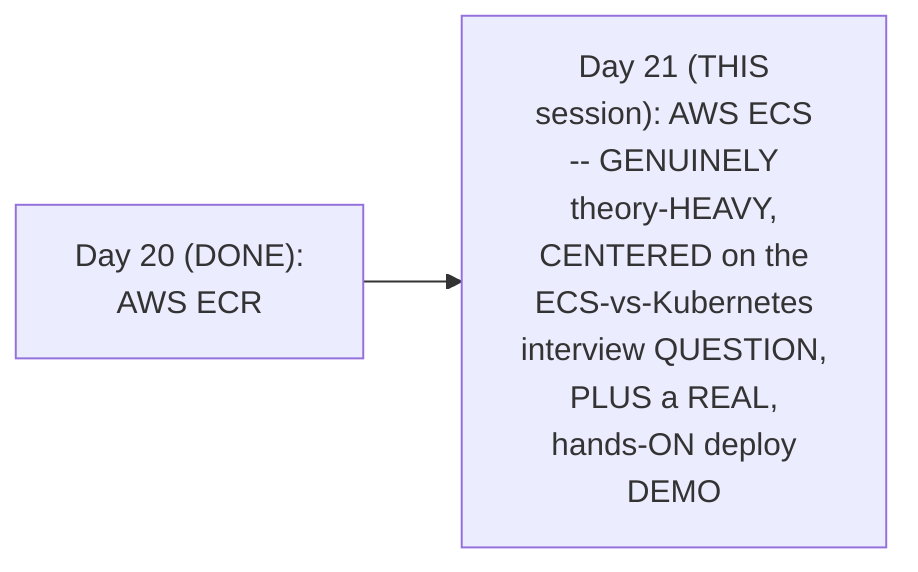
```mermaid
flowchart LR
    A["Day 20 (DONE):<br/>AWS ECR"] --> B["Day 21 (THIS<br/>session): AWS ECS<br/>-- GENUINELY<br/>theory-HEAVY,<br/>CENTERED on the<br/>ECS-vs-Kubernetes<br/>interview QUESTION,<br/>PLUS a REAL,<br/>hands-ON deploy<br/>DEMO"]
```

#### 🎯 Key Takeaways

* THIS session's own, EXPLICIT emphasis: "ESPECIALLY for TODAY's video, the THEORY part is VERY, very IMPORTANT" — SIGNALING a GENUINELY unusual, HEAVIER theoretical FOCUS than SOME other, prior SESSIONS.
* THE session's own, CENTRAL, stated GOAL: THOROUGHLY answering ONE, commonly-asked, REAL interview QUESTION — HOW ECS genuinely DIFFERS from Kubernetes-BASED container orchestration.
* THIS directly, PRECISELY sets UP the SESSION's own, complete STRUCTURE — a THOROUGH theoretical FOUNDATION (Sections 2-9), FOLLOWED by a COMPLETE, real, hands-ON demonstration (Sections 10-13).

---

### 2. A Genuine, Direct Prerequisite: Containers & Kubernetes Knowledge

#### ⚠ A Direct, Honest, Genuine Prerequisite

> 💡 **Given directly:** *"There are some prerequisites for today's video — one is if you have an idea of containers... and if you have knowledge of Kubernetes, then you will be able to understand the concept of ECS in a much better way... I've covered both containers and Kubernetes in my free devops course... but at least try to understand the basics before watching today's video, because in today's video I'll reference containers and Kubernetes a lot of times."*

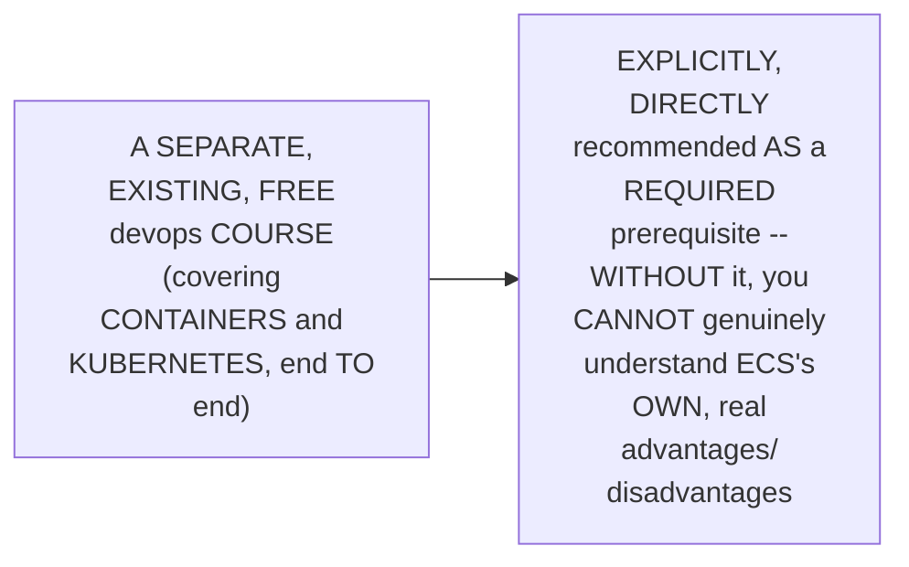
```mermaid
flowchart LR
    A["A SEPARATE,<br/>EXISTING, FREE<br/>devops COURSE<br/>(covering<br/>CONTAINERS and<br/>KUBERNETES, end TO<br/>end)"] --> B["EXPLICITLY,<br/>DIRECTLY<br/>recommended AS a<br/>REQUIRED<br/>prerequisite --<br/>WITHOUT it, you<br/>CANNOT genuinely<br/>understand ECS's<br/>OWN, real<br/>advantages/<br/>disadvantages"]
```

#### ⚠ Common Mistakes

* Assuming THIS session's own CONTENT is GENUINELY, FULLY accessible WITHOUT any, PRIOR Kubernetes KNOWLEDGE — explicitly, directly, HONESTLY clarified: "IF you don't KNOW any of THESE things... GO and understand AT least the BASICS" — WITHOUT this, you CANNOT genuinely UNDERSTAND ECS's own, REAL trade-offs.

#### 🎯 Key Takeaways

* THE instructor **directly, HONESTLY confirms** a GENUINE, TWO-part prerequisite — CONTAINERS knowledge, AND Kubernetes KNOWLEDGE — BOTH covered IN a SEPARATE, existing, FREE course.
* This directly, HONESTLY sets ACCURATE expectations — WITHOUT Kubernetes KNOWLEDGE specifically, LEARNERS "will NOT be able TO understand the DRAWBACKS or... ADVANTAGES of ECS OVER this Kubernetes PLATFORM."
* This directly, PRECISELY sets UP the SESSION's own, NEXT, essential CONTENT — WHY container ORCHESTRATION genuinely EXISTS, at ALL (Section 3).

---
### 3. Why Container Orchestration Exists: Two Fundamental Docker Problems

#### 📖 Definition — Problem 1: No Auto-Healing

> 💡 **Given directly:** *"There is some issue with the Linux system... that bad person has deleted this container — now Docker does not have the capability of auto-healing. When there is no auto-healing, the problem is that someone who is accessing this application... will face downtime of the application, or they'll see some kind of errors."*

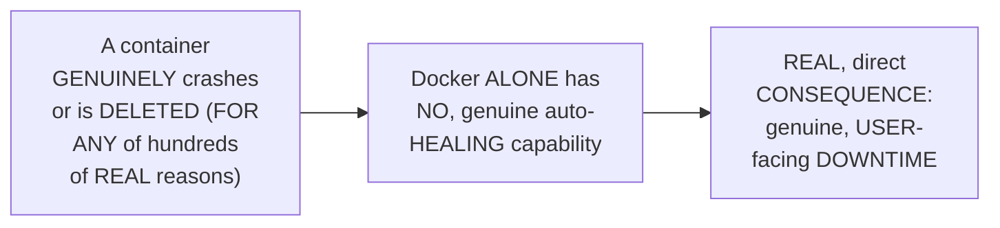
```mermaid
flowchart LR
    A["A container<br/>GENUINELY crashes<br/>or is DELETED (FOR<br/>ANY of hundreds<br/>of REAL reasons)"] --> B["Docker ALONE has<br/>NO, genuine auto-<br/>HEALING capability"]
    B --> C["REAL, direct<br/>CONSEQUENCE:<br/>genuine, USER-<br/>facing DOWNTIME"]
```

#### 📖 Definition — Problem 2: No Auto-Scaling

> 💡 **Given directly:** *"Let's say there is a festival, or there is some kind of occasion, and the number of APIs that you receive every day is 100, but on this unusual day you have received some 10,000 API requests — ideally the containers that you are using will not be able to handle the traffic... because the Docker platform does not have the auto-scaling capability."*

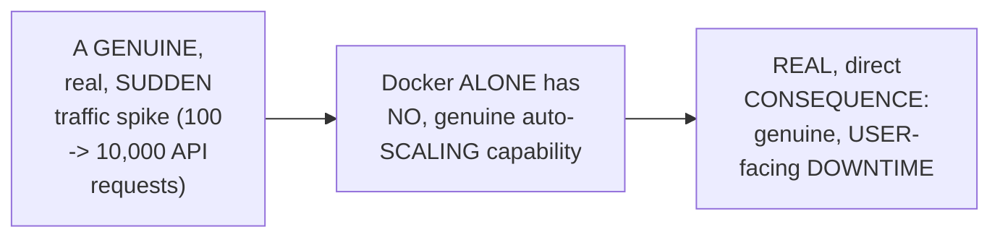
```mermaid
flowchart LR
    A["A GENUINE,<br/>real, SUDDEN<br/>traffic spike (100<br/>-> 10,000 API<br/>requests)"] --> B["Docker ALONE has<br/>NO, genuine auto-<br/>SCALING capability"]
    B --> C["REAL, direct<br/>CONSEQUENCE:<br/>genuine, USER-<br/>facing DOWNTIME"]
```

#### 🔍 Internal Working — A Genuine, Third, Related Problem: Changing IP Addresses

> 💡 **Given directly:** *"Let's say this container has gone down, you will be saying to me, 'okay, I'll continuously monitor it and I'll bring this container up' — what would happen is when the container comes up, the IP address of the container will change... so if someone is trying to access your container on the IP address, then they will face this issue of the IP address being changed."*

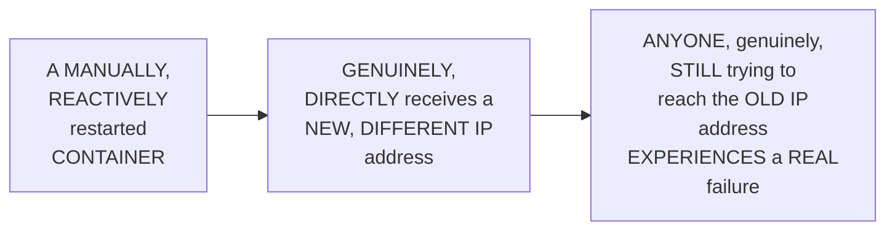
```mermaid
flowchart LR
    A["A MANUALLY,<br/>REACTIVELY<br/>restarted<br/>CONTAINER"] --> B["GENUINELY,<br/>DIRECTLY receives a<br/>NEW, DIFFERENT IP<br/>address"]
    B --> C["ANYONE, genuinely,<br/>STILL trying to<br/>reach the OLD IP<br/>address<br/>EXPERIENCES a REAL<br/>failure"]
```

#### ⚠ Common Mistakes

* Assuming a DEVOPS engineer's OWN, MANUAL, reactive MONITORING (WATCHING for a crash, and MANUALLY restarting) is GENUINELY, PRACTICALLY sufficient to REPLACE genuine, AUTOMATED healing — explicitly, directly, PRECISELY clarified: EVEN with MANUAL intervention, the RESTARTED container's OWN, NEW IP address STILL, genuinely BREAKS anyone REACHING the OLD one.

#### 🎯 Key Takeaways

* DOCKER, ALONE, GENUINELY lacks **TWO, fundamental capabilities**: **AUTO-healing** (RECOVERING from a CRASHED/deleted container) and **AUTO-scaling** (HANDLING sudden, GENUINE traffic spikes).
* A THIRD, RELATED, genuine PROBLEM: EVEN manual RESTARTS produce a NEW, DIFFERENT container IP address — BREAKING anyone STILL, genuinely TRYING to reach the OLD one.
* THESE three, genuine PROBLEMS directly, PRECISELY motivate the ENTIRE, established "EVOLUTION of container ORCHESTRATION" — SETTING up the SESSION's own, NEXT, essential CONTENT — HOW Kubernetes GENUINELY solves THESE same problems (Section 4).

---

### 4. How Kubernetes Solves These Problems (& the Kubernetes "Distributions" Ecosystem)

#### 📖 Definition — Kubernetes's Own, Precise Solutions

> 💡 **Given directly:** *"Kubernetes said, 'okay, I will solve the problem of auto-healing and auto-scaling with Docker'... kubernetes says that 'I will come up with the concept of controllers, and I will immediately bring in the capability of auto-healing'... kubernetes has concepts like horizontal pod autoscalers, or VPA, HPA... kubernetes also says that 'I will solve the problem of IP address being changed' — kubernetes added some concepts like services and service discovery."*

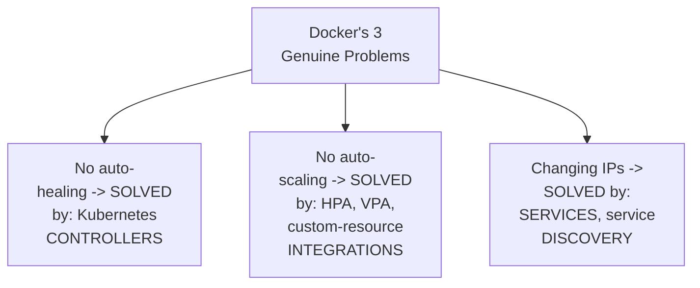
```mermaid
flowchart TD
    A["Docker's 3<br/>Genuine Problems"] --> B["No auto-<br/>healing -> SOLVED<br/>by: Kubernetes<br/>CONTROLLERS"]
    A --> C["No auto-<br/>scaling -> SOLVED<br/>by: HPA, VPA,<br/>custom-resource<br/>INTEGRATIONS"]
    A --> D["Changing IPs -><br/>SOLVED by:<br/>SERVICES, service<br/>DISCOVERY"]
```

#### 🔍 Internal Working — A Genuine, Direct Confirmation: Kubernetes Enabled Production Use

> 💡 **Given directly:** *"Previously with Docker platform, containers were being used, but they were only restricted to the development environment — now with Kubernetes, you can take this containers to the production level as well, that's where Kubernetes has become very, very popular."*

#### 🧠 Concept — A Genuine, Memorable Analogy: Kubernetes "Distributions"

> 💡 **Given directly:** *"Kubernetes is an open-source thing — what people like Red Hat has done is, 'okay, let's come up with our own product that is based on Kubernetes,' and let's call it OpenShift... AWS has its own managed Kubernetes service, which is called EKS, Azure has something called AKS... just like you have federero, and then there are multiple Linux distributions — Linux is an open-source thing, and on top of Linux people have created their own distributions."*

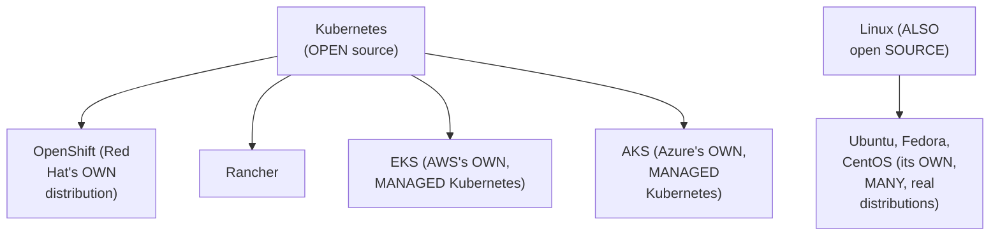
```mermaid
flowchart TD
    A["Kubernetes<br/>(OPEN source)"] --> B["OpenShift (Red<br/>Hat's OWN<br/>distribution)"]
    A --> C["Rancher"]
    A --> D["EKS (AWS's OWN,<br/>MANAGED Kubernetes)"]
    A --> E["AKS (Azure's OWN,<br/>MANAGED<br/>Kubernetes)"]
    F["Linux (ALSO<br/>open SOURCE)"] --> G["Ubuntu, Fedora,<br/>CentOS (its OWN,<br/>MANY, real<br/>distributions)"]
```

#### ⚠ Common Mistakes

* Assuming "KUBERNETES" and "EKS" (or OpenShift, OR Rancher) are GENUINELY, ENTIRELY separate, UNRELATED technologies — explicitly, directly, MEMORABLY clarified: THEY are ALL, genuinely "DISTRIBUTIONS" BUILT on the SAME, underlying, open-SOURCE Kubernetes — DIRECTLY comparable TO Linux's OWN, many DISTRIBUTIONS.

#### 🎯 Key Takeaways

* KUBERNETES GENUINELY, DIRECTLY solves ALL three of DOCKER's own, established PROBLEMS: **CONTROLLERS** (auto-healing), **HPA/VPA** (auto-scaling), and **SERVICES/service DISCOVERY** (the changing-IP PROBLEM).
* THIS enabled a GENUINE, important SHIFT — containers MOVED from being RESTRICTED to development ENVIRONMENTS only, to GENUINELY, PRACTICALLY viable FOR production USE.
* Kubernetes' OWN, open-SOURCE nature has SPAWNED a GENUINE, real "DISTRIBUTIONS" ecosystem (OpenShift, RANCHER, EKS, AKS) — MEMORABLY, DIRECTLY compared TO Linux's own, MANY distributions.

---
### 5. AWS's Own, Deliberate Decision: Building ECS as a Separate, Non-Kubernetes Platform

#### 🪜 Step-by-Step — A Direct, Explicit Confirmation of AWS's Own, Deliberate Choice

> 💡 **Given directly:** *"What AWS said is, 'okay, kubernetes is open source, I know that kubernetes is one of the top container orchestration environments, but let me build my own platform that is not dependent on kubernetes, and let me call it something like Elastic Container Service'... in this journey they said that we will not follow anything that is related to kubernetes — we will not use the concept of pods, we will not use the concept of deployments, but we will use our own concepts, such as task definition, task, services, and clusters."*

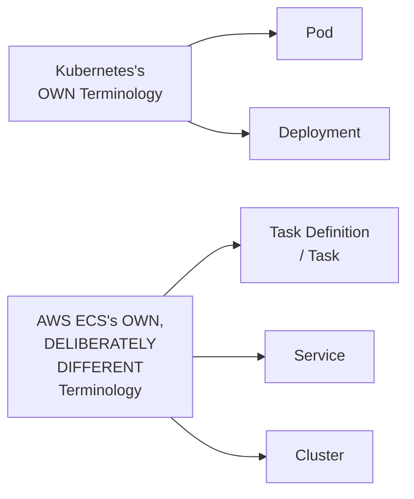
```mermaid
flowchart LR
    A["Kubernetes's<br/>OWN Terminology"] --> B["Pod"]
    A --> C["Deployment"]
    D["AWS ECS's OWN,<br/>DELIBERATELY<br/>DIFFERENT<br/>Terminology"] --> E["Task Definition<br/>/ Task"]
    D --> F["Service"]
    D --> G["Cluster"]
```

#### 🔍 Internal Working — A Genuine, Direct Confirmation: AWS Isn't the First to Try This

> 💡 **Given directly:** *"AWS is not the first one to start a container orchestration solution that is not based on Kubernetes — there are other things, but none of them have been so successful — but still AWS has started their own journey."*

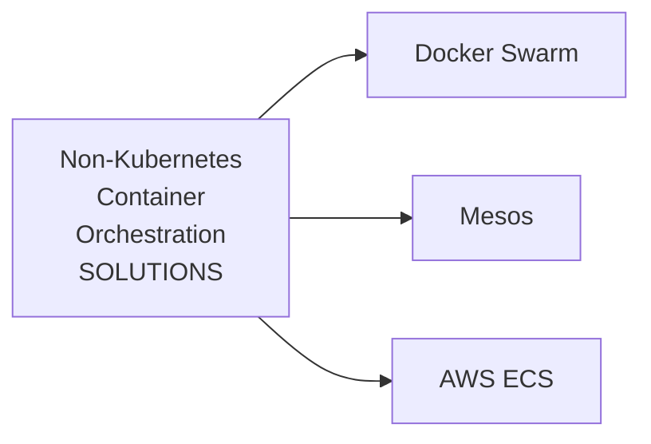
```mermaid
flowchart LR
    A["Non-Kubernetes<br/>Container<br/>Orchestration<br/>SOLUTIONS"] --> B["Docker Swarm"]
    A --> C["Mesos"]
    A --> D["AWS ECS"]
```

#### 📖 Definition — A Genuine, Direct Confirmation: ECS Is AWS-Exclusive

> 💡 **Given directly:** *"The ECS platform that we are developing will be only restricted to AWS, right, and this will not be an open-source platform like Kubernetes is an open-source platform, but we will restrict this only to AWS and the customers of AWS."*

#### ⚠ Common Mistakes

* Assuming ECS is GENUINELY, MERELY a "REBRANDED," minor VARIATION on Kubernetes CONCEPTS — explicitly, directly, PRECISELY clarified: AWS DELIBERATELY, EXPLICITLY chose a COMPLETELY different SET of concepts (TASK definition, task, SERVICE, cluster) — NOT pods OR deployments.
* Assuming AWS is GENUINELY, UNIQUELY the FIRST company to BUILD a non-KUBERNETES container-orchestration SOLUTION — explicitly, directly, HONESTLY clarified: DOCKER Swarm and MESOS also EXIST — AWS is NOT the FIRST, but ITS own attempt HAS, genuinely, proven MORE durable/SUCCESSFUL than THOSE alternatives.

#### 🎯 Key Takeaways

* AWS DELIBERATELY, EXPLICITLY built ECS as a **COMPLETELY separate**, NON-Kubernetes-based PLATFORM — USING its OWN, unique TERMINOLOGY (task DEFINITION, task, SERVICE, cluster) — NOT pods OR deployments.
* AWS is NOT the FIRST company to ATTEMPT this — DOCKER Swarm and MESOS are GENUINE, prior EXAMPLES — but NONE, INCLUDING those, have MATCHED Kubernetes' OWN, dominant POPULARITY.
* ECS is directly, EXPLICITLY confirmed AS **AWS-exclusive** — UNLIKE Kubernetes' OWN, open-SOURCE nature — a GENUINE, foundational FACT that DIRECTLY sets UP the SESSION's own, CENTRAL interview QUESTION (Section 6).

---

### 6. The Central Interview Question, Part 1: Two Genuine Disadvantages of ECS

#### ⚠ Disadvantage 1: Vendor Lock-In

> 💡 **Given directly:** *"Today if you are using ECS in your organization, if you move from AWS to Azure, then you cannot use the tasks, task definition, services, or clusters that we have created in ECS — you have to start your journey newly on Azure... whereas if you are using Kubernetes... after six months, after one year, even if you move to Azure platform... there will be at least 80 to 90 percent match if you move from one platform to another platform."*

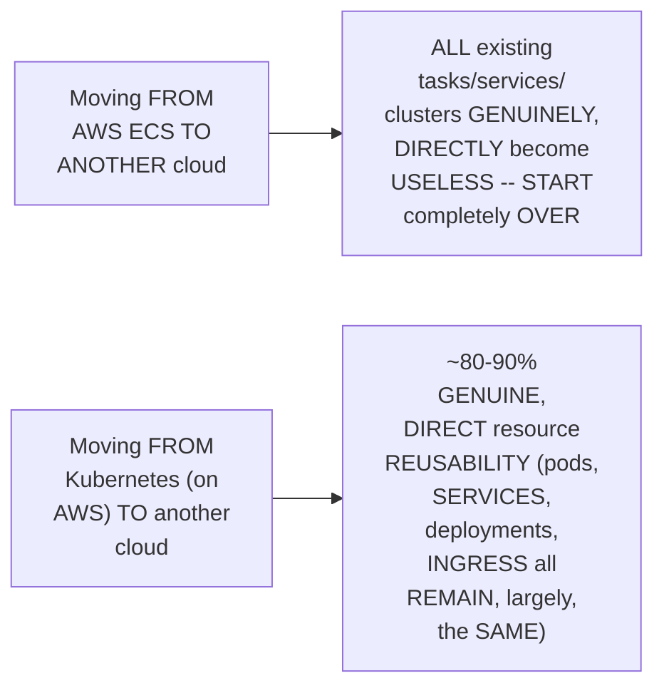
```mermaid
flowchart LR
    A["Moving FROM<br/>AWS ECS TO<br/>ANOTHER cloud"] --> B["ALL existing<br/>tasks/services/<br/>clusters GENUINELY,<br/>DIRECTLY become<br/>USELESS -- START<br/>completely OVER"]
    C["Moving FROM<br/>Kubernetes (on<br/>AWS) TO another<br/>cloud"] --> D["~80-90%<br/>GENUINE,<br/>DIRECT resource<br/>REUSABILITY (pods,<br/>SERVICES,<br/>deployments,<br/>INGRESS all<br/>REMAIN, largely,<br/>the SAME)"]
```

#### 🔍 Internal Working — A Genuine, Honest Framing: Disadvantage for You, Advantage for AWS

> 💡 **Given directly:** *"Is this an advantage or a disadvantage? This is a disadvantage — because in the world of multi-cloud... you never know when you will move from one cloud platform to the other... but AWS has an advantage here — if someone wants to move from their platform to a different platform, if they are heavily using ECS, then for AWS it is an advantage, because they have to rethink about it."*

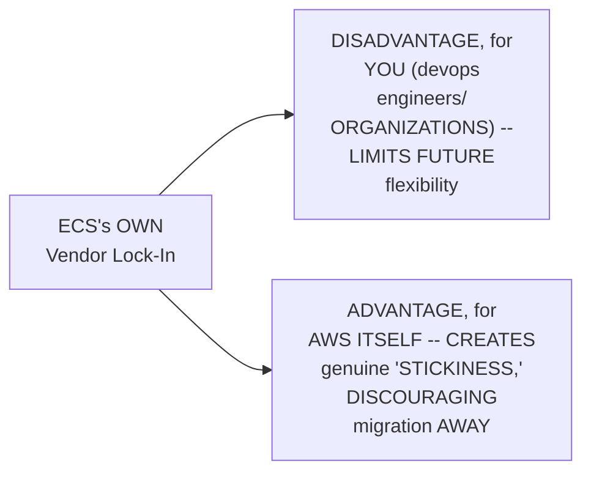
```mermaid
flowchart LR
    A["ECS's OWN<br/>Vendor Lock-In"] --> B["DISADVANTAGE, for<br/>YOU (devops<br/>engineers/<br/>ORGANIZATIONS) --<br/>LIMITS FUTURE<br/>flexibility"]
    A --> C["ADVANTAGE, for<br/>AWS ITSELF -- CREATES<br/>genuine 'STICKINESS,'<br/>DISCOURAGING<br/>migration AWAY"]
```

#### ⚠ Disadvantage 2: Fewer Features (A Weaker Community/Ecosystem)

> 💡 **Given directly:** *"Kubernetes has a concept called custom resource definitions... you can build your own controller, and you can submit that custom resource to Kubernetes, so that you can extend the capabilities of Kubernetes... today if you have products like Istio... or you have tools like ArgoCD... or FluxCD... they are typically focused on Kubernetes, because Kubernetes allows them to extend the capabilities using the custom resources and using the controllers — this kind of features are not available on ECS."*

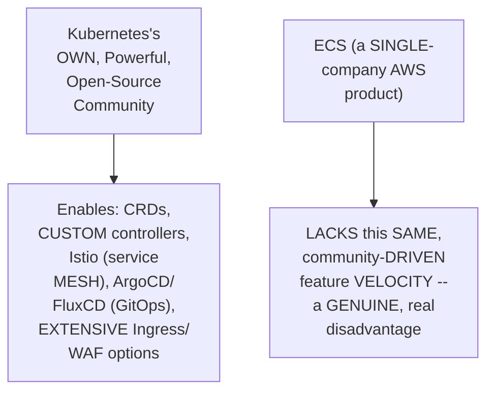
```mermaid
flowchart TD
    A["Kubernetes's<br/>OWN, Powerful,<br/>Open-Source<br/>Community"] --> B["Enables: CRDs,<br/>CUSTOM controllers,<br/>Istio (service<br/>MESH), ArgoCD/<br/>FluxCD (GitOps),<br/>EXTENSIVE Ingress/<br/>WAF options"]
    C["ECS (a SINGLE-<br/>company AWS<br/>product)"] --> D["LACKS this SAME,<br/>community-DRIVEN<br/>feature VELOCITY --<br/>a GENUINE, real<br/>disadvantage"]
```

#### ⚠ Common Mistakes

* Assuming ECS's OWN, vendor-LOCK-in characteristic is GENUINELY, UNCONDITIONALLY "bad," WITHOUT any, real NUANCE — explicitly, directly, HONESTLY reframed: it's a GENUINE, real DISADVANTAGE for DEVOPS engineers/organizations — but a GENUINE, DIRECT, structural ADVANTAGE for AWS ITSELF (creating STICKINESS).

#### 🎯 Key Takeaways

* **DISADVANTAGE 1 — vendor LOCK-in**: ECS resources are GENUINELY, ENTIRELY AWS-specific — MOVING clouds REQUIRES starting FROM scratch (versus KUBERNETES' own, ~80-90% REUSABILITY) — a REAL disadvantage FOR you, but a REAL advantage FOR AWS.
* **DISADVANTAGE 2 — fewer FEATURES**: Kubernetes' OWN, powerful, open-SOURCE community ENABLES extensive EXTENSIBILITY (CRDs, ISTIO, ArgoCD, FluxCD) — ECS, AS a single-company PRODUCT, GENUINELY lacks this SAME, community-driven FEATURE velocity.
* This directly, PRECISELY sets UP the SESSION's own, NEXT, essential CONTENT — THREE, genuine, real ADVANTAGES that BALANCE this HONEST, thorough analysis (Section 7).

---
### 7. The Central Interview Question, Part 2: Three Genuine Advantages of ECS

#### 📖 Definition — Advantage 1: Genuine Simplicity (No Management Overhead)

> 💡 **Given directly:** *"Kubernetes has a very complicated architecture — kubernetes has a control plane, kubernetes has worker nodes, and in control plane you have five different components... you have API server, you have etcd, you have scheduler and controller manager, cloud controller manager... and on the worker nodes you have components such as kube-proxy, you have kube-DNS, you have kubelet... whereas ECS is a very, very simple thing — all that you need to do is you just create a task definition, and that would indeed create a task."*

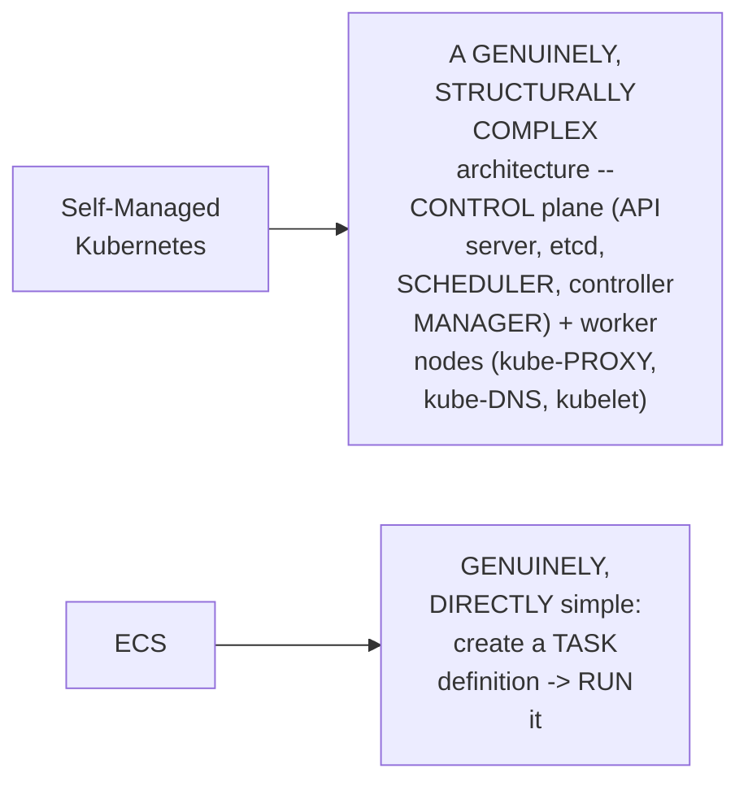
```mermaid
flowchart LR
    A["Self-Managed<br/>Kubernetes"] --> B["A GENUINELY,<br/>STRUCTURALLY<br/>COMPLEX<br/>architecture --<br/>CONTROL plane (API<br/>server, etcd,<br/>SCHEDULER, controller<br/>MANAGER) + worker<br/>nodes (kube-PROXY,<br/>kube-DNS, kubelet)"]
    C["ECS"] --> D["GENUINELY,<br/>DIRECTLY simple:<br/>create a TASK<br/>definition -> RUN<br/>it"]
```

#### 📖 Definition — Advantage 2: Fargate (A Genuine, Complete, Serverless Option)

> 💡 **Given directly:** *"AWS supports Fargate as well as EC2, that means you can use both the serverless model as well as the server model with AWS ECS... if you use Fargate, then you don't have to manage anything with respect to your environment... Fargate is a completely serverless model, just like Lambda functions."*

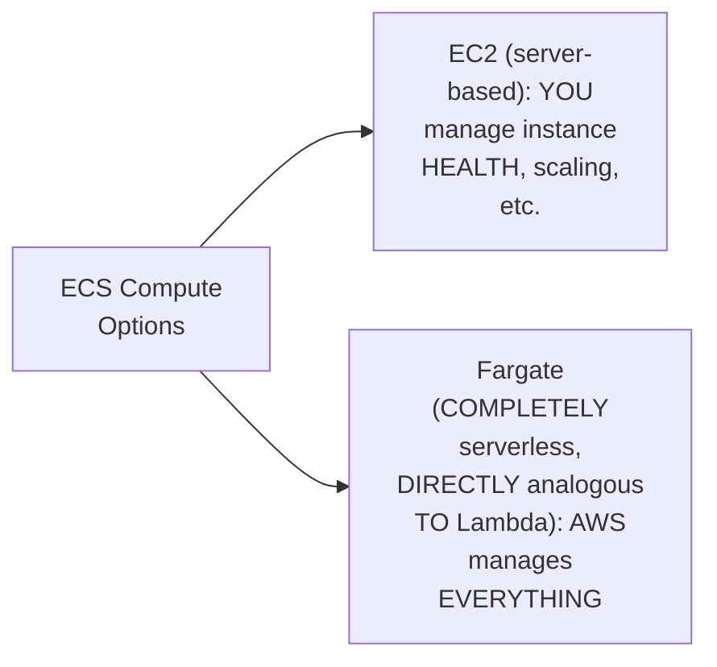
```mermaid
flowchart LR
    A["ECS Compute<br/>Options"] --> B["EC2 (server-<br/>based): YOU<br/>manage instance<br/>HEALTH, scaling,<br/>etc."]
    A --> C["Fargate<br/>(COMPLETELY<br/>serverless,<br/>DIRECTLY analogous<br/>TO Lambda): AWS<br/>manages<br/>EVERYTHING"]
```

#### 📖 Definition — Advantage 3: Genuine Cost-Effectiveness

> 💡 **Given directly:** *"ECS is also cost-effective when you compare with Kubernetes, because predefined a lot of workloads keep running on Kubernetes — Kubernetes is resource-intensive compared to ECS, so ECS is also a cost-effective solution."*

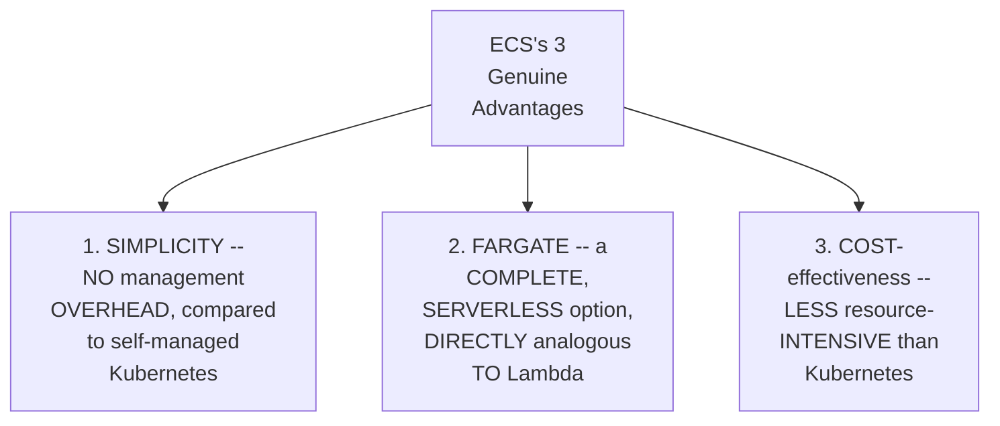
```mermaid
flowchart TD
    A["ECS's 3<br/>Genuine<br/>Advantages"] --> B["1. SIMPLICITY --<br/>NO management<br/>OVERHEAD, compared<br/>to self-managed<br/>Kubernetes"]
    A --> C["2. FARGATE -- a<br/>COMPLETE,<br/>SERVERLESS option,<br/>DIRECTLY analogous<br/>TO Lambda"]
    A --> D["3. COST-<br/>effectiveness --<br/>LESS resource-<br/>INTENSIVE than<br/>Kubernetes"]
```

#### ⚠ Common Mistakes

* Assuming ECS's OWN, genuine SIMPLICITY advantage APPLIES equally, REGARDLESS of WHETHER Kubernetes is SELF-managed OR a MANAGED service (LIKE EKS) — explicitly, directly, IMPLIED as SPECIFICALLY, DIRECTLY relevant WHEN comparing ECS AGAINST a **SELF-managed** Kubernetes SETUP — NOT necessarily against EKS ITSELF, WHICH also REDUCES management OVERHEAD.

#### 🎯 Key Takeaways

* **ADVANTAGE 1 — SIMPLICITY**: ECS GENUINELY, DIRECTLY avoids Kubernetes' OWN, complex ARCHITECTURE (control PLANE, worker-node COMPONENTS) — a SIMPLE "task DEFINITION → task" WORKFLOW suffices.
* **ADVANTAGE 2 — FARGATE**: a COMPLETE, GENUINE serverless OPTION — DIRECTLY analogous TO Lambda — REQUIRING zero, ongoing COMPUTE management.
* **ADVANTAGE 3 — COST-effectiveness**: ECS is GENERALLY, DIRECTLY less resource-INTENSIVE (and THEREFORE cheaper) THAN Kubernetes.
* This directly, PRECISELY sets UP the SESSION's own, FINAL, practical INTERVIEW-answer recommendation — SYNTHESIZING these ADVANTAGES/disadvantages INTO a CLEAR, actionable RECOMMENDATION (Section 8).

---

### 8. A Genuine, Practical Interview-Answer Recommendation: EKS Over ECS

#### 🪜 Step-by-Step — A Direct, Practical Recommendation

> 💡 **Given directly:** *"During the interviews, better go for EKS rather than ECS, because there are many chances that interviewer can take you — of course if in the job description they are saying that they are using ECS, then yeah, if you have knowledge on ECS then tell them your knowledge on ECS — but if the interviewer gives you an option, like, 'what are you using, are you using EKS or ECS,' and in their organization if they're using Kubernetes, then definitely go for EKS."*

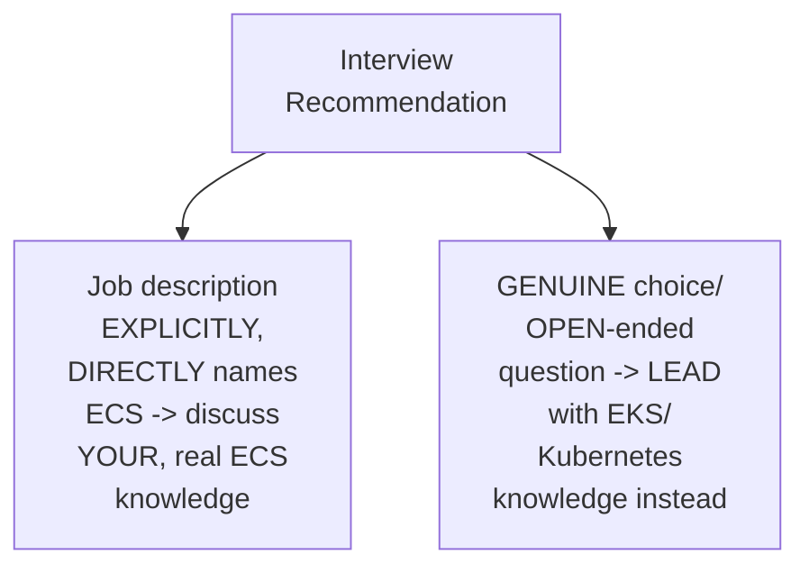
```mermaid
flowchart TD
    A["Interview<br/>Recommendation"] --> B["Job description<br/>EXPLICITLY,<br/>DIRECTLY names<br/>ECS -> discuss<br/>YOUR, real ECS<br/>knowledge"]
    A --> C["GENUINE choice/<br/>OPEN-ended<br/>question -> LEAD<br/>with EKS/<br/>Kubernetes<br/>knowledge instead"]
```

#### 🔍 Internal Working — A Genuine, Direct, Honest Justification

> 💡 **Given directly:** *"There will be many less companies that are looking for the ECS expertise, but EKS expertise is much needed, because Kubernetes is on the rising, or Kubernetes is the one that is very, very widely used in the IT industry — there will be many job requirements if you know Kubernetes very well."*

#### ⚠ Common Mistakes

* Assuming THIS session's own, HONEST RECOMMENDATION (LEAD with EKS) MEANS ECS knowledge is GENUINELY, ENTIRELY worthless — explicitly, directly, PRECISELY clarified: "OF course THERE are a LOT of advantages WITH ECS as WELL" — it's a MATTER of GENUINE, real MARKET demand/PRIORITY, not an ABSOLUTE dismissal.

#### 🎯 Key Takeaways

* A GENUINE, practical INTERVIEW-answer recommendation: LEAD with **EKS/Kubernetes** knowledge, IN open-ended SITUATIONS — UNLESS a SPECIFIC job DESCRIPTION explicitly NAMES ECS.
* THIS is directly, HONESTLY justified BY genuine, real MARKET demand — KUBERNETES expertise is GENERALLY, DIRECTLY more WIDELY sought-AFTER than ECS-specific EXPERTISE.
* This directly, PRECISELY completes THIS session's own, CENTRAL interview-QUESTION treatment — SETTING up the SESSION's own, NEXT, essential CONTENT — ECS's COMPLETE architecture (Section 9).

---
### 9. ECS's Complete Architecture, Precisely Explained (& Mapped to Kubernetes)

#### 📖 Definition — The Complete, Precise Architecture

> 💡 **Given directly:** *"All that you need to do is just like Kubernetes, you have to create a cluster in ECS — once your cluster is created, you will have two options, either you can go with Fargate for running your containers, or you can go with EC2... in terms of ECS you have something called task definition, okay, so in the task definition you will explain how does your container look like... when you implement this task definition, or you can go to a task definition and you can run this task definition, and that would create a task."*

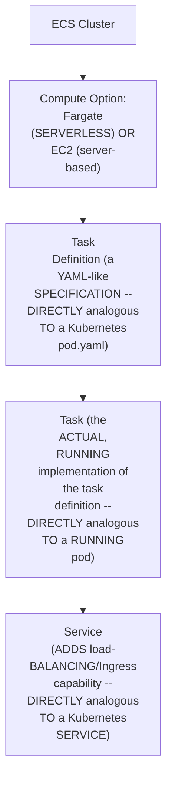
```mermaid
flowchart TD
    A["ECS Cluster"] --> B["Compute Option:<br/>Fargate<br/>(SERVERLESS) OR<br/>EC2 (server-<br/>based)"]
    B --> C["Task<br/>Definition (a<br/>YAML-like<br/>SPECIFICATION --<br/>DIRECTLY analogous<br/>TO a Kubernetes<br/>pod.yaml)"]
    C --> D["Task (the<br/>ACTUAL,<br/>RUNNING<br/>implementation of<br/>the task<br/>definition --<br/>DIRECTLY analogous<br/>TO a RUNNING<br/>pod)"]
    D --> E["Service<br/>(ADDS load-<br/>BALANCING/Ingress<br/>capability --<br/>DIRECTLY analogous<br/>TO a Kubernetes<br/>SERVICE)"]
```

#### 🔍 Internal Working — A Genuine, Direct, Memorable Comparison to pod.yaml

> 💡 **Given directly:** *"When you are writing the pod.yaml, you provide most of these things, but in the YAML definition format... task definition is basically like your pod.yaml, where you will describe everything... and the implementation of your pod.yaml is basically creating the container — similarly, when you implement the task definition, you would create a task that is running the containers."*

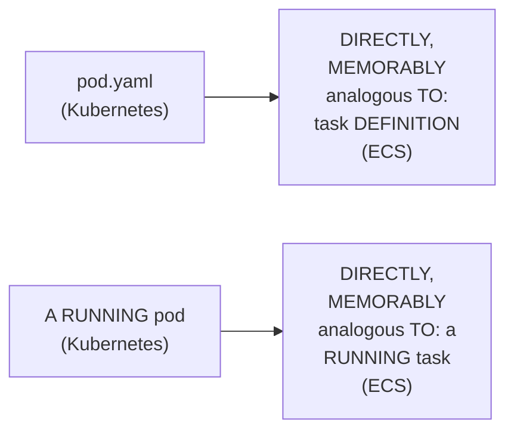
```mermaid
flowchart LR
    A["pod.yaml<br/>(Kubernetes)"] --> B["DIRECTLY,<br/>MEMORABLY<br/>analogous TO:<br/>task DEFINITION<br/>(ECS)"]
    C["A RUNNING pod<br/>(Kubernetes)"] --> D["DIRECTLY,<br/>MEMORABLY<br/>analogous TO: a<br/>RUNNING task<br/>(ECS)"]
```

#### 🔍 Internal Working — A Genuine, Direct Confirmation: Native IAM Integration

> 💡 **Given directly:** *"ECS has an advantage that you can use your inbuilt IAM rules and policies, so that additionally you don't have to make sure that... the containers that are running inside this ECS, if they want to access any other AWS resources, again you can make use of the IAM rules and policies."*

#### ⚠ Common Mistakes

* Assuming ECS's OWN concepts (TASK definition, task, SERVICE) are GENUINELY, ENTIRELY unrelated TO Kubernetes' own, FAMILIAR concepts (POD, deployment, SERVICE) — explicitly, directly, MEMORABLY clarified: THEY are DIRECTLY, STRUCTURALLY analogous — TASK definition ≈ pod.YAML; task ≈ a RUNNING pod.

#### 🎯 Key Takeaways

* ECS's COMPLETE architecture directly, PRECISELY consists OF: a **CLUSTER** (WITH Fargate OR EC2 compute), a **TASK definition** (DIRECTLY analogous TO a pod.yaml), a **TASK** (the RUNNING implementation, DIRECTLY analogous TO a RUNNING pod), and a **SERVICE** (adding LOAD-balancing/Ingress, DIRECTLY analogous TO a Kubernetes SERVICE).
* ECS GENUINELY, NATIVELY integrates WITH IAM roles/POLICIES — ENABLING containers to SECURELY access OTHER AWS services.
* This directly, PRECISELY sets UP the SESSION's own, COMPLETE, hands-ON demonstration — BUILDING this EXACT architecture, LIVE (Sections 10-13).

---

### 10. A Complete, Real, Live Demo: Creating an ECS Cluster

#### 🪜 Step-by-Step — A Direct, UI-First Confirmation

> 💡 **Given directly:** *"You can do all of these things from the command line as well, but when you do it for the first time, anything that you do for the first time, do it through the UI, because through the UI you will understand what exactly you are doing."*

#### 🪜 Step-by-Step — A Complete, Real, Cluster-Creation Walkthrough

> 💡 **Given directly:** *"Let me call this demo-ECS-cluster... I am just creating a cluster with the basic configuration... here comes the option that I discussed — you have the option for Fargate, and you have option for EC2 instances... I am going with Fargate, and mostly organizations go with Fargate."*

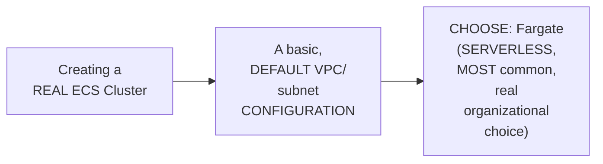
```mermaid
flowchart LR
    A["Creating a<br/>REAL ECS Cluster"] --> B["A basic,<br/>DEFAULT VPC/<br/>subnet<br/>CONFIGURATION"]
    B --> C["CHOOSE: Fargate<br/>(SERVERLESS,<br/>MOST common,<br/>real<br/>organizational<br/>choice)"]
```

#### 🔍 Internal Working — A Genuine, Direct, Live-Confirmed Observation: Speed

> 💡 **Given directly:** *"If you see, it will take very, very less time to create the cluster — the reason is because you are using the Fargate instances... you know, when you are using the Fargate instances, everything is managed automatically, they are not created, they are not predefined configurations, but they are the runtime configurations, right — usually ECS takes very less time when compared to Kubernetes."*

#### 🔍 Internal Working — A Genuine, Direct Confirmation: Default CloudWatch Integration

> 💡 **Given directly:** *"ECS has a default CloudWatch monitoring enabled... because both of them are managed AWS solutions... whereas if you are using Kubernetes, you have to create your default monitoring, you can set it up with Prometheus or any other things."*

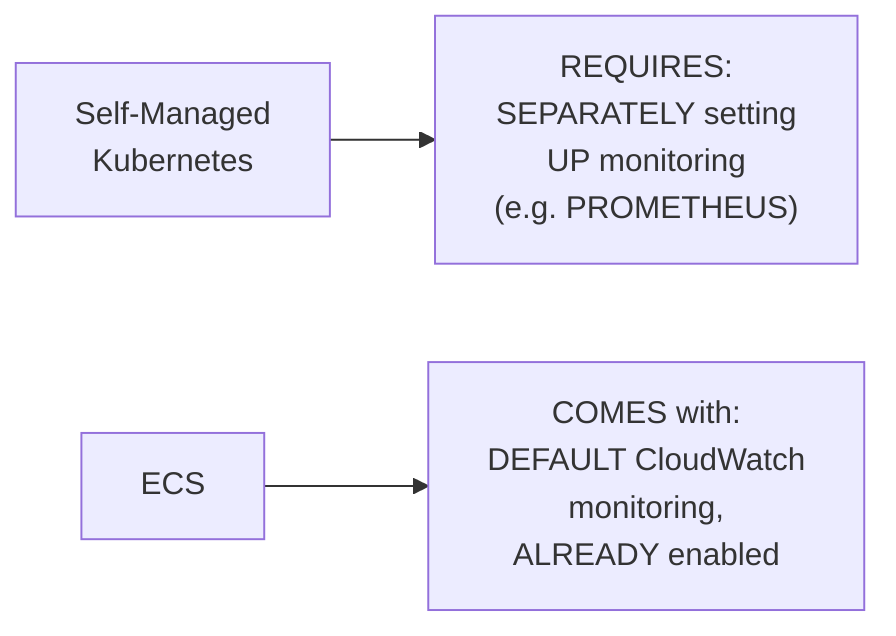
```mermaid
flowchart LR
    A["Self-Managed<br/>Kubernetes"] --> B["REQUIRES:<br/>SEPARATELY setting<br/>UP monitoring<br/>(e.g. PROMETHEUS)"]
    C["ECS"] --> D["COMES with:<br/>DEFAULT CloudWatch<br/>monitoring,<br/>ALREADY enabled"]
```

#### ⚠ Common Mistakes

* Assuming ECS cluster CREATION genuinely, TYPICALLY takes a SIMILAR amount OF time TO a real, SELF-managed Kubernetes CLUSTER — explicitly, directly, LIVE-demonstrated as GENUINELY, DIRECTLY faster — SPECIFICALLY BECAUSE Fargate INVOLVES no PRE-provisioned infrastructure.

#### 🎯 Key Takeaways

* A COMPLETE, real, LIVE demonstration directly, CONCRETELY confirmed the FULL ECS-cluster CREATION workflow — CHOOSING **FARGATE** (the MOST common, real organizational CHOICE) over EC2.
* A GENUINE, live-CONFIRMED observation: ECS cluster CREATION is GENUINELY, DIRECTLY faster THAN Kubernetes — SPECIFICALLY because FARGATE requires NO pre-PROVISIONED infrastructure.
* ECS directly, GENUINELY comes WITH **DEFAULT CloudWatch monitoring ENABLED** — UNLIKE self-managed KUBERNETES, WHICH requires SEPARATELY setting UP tools LIKE Prometheus.

---
### 11. A Complete, Real, Live Demo: Building & Pushing a Docker Image to ECR

#### 🪜 Step-by-Step — A Genuine, Direct, Repeated Recommendation

> 💡 **Given directly:** *"I have to build this Docker image and have to push the Docker image to the ECR container registry — will not be using... always use the managed AWS services, like for monitoring use CloudWatch, for container images use ECR, because it has some inbuilt additional support."*

```mermaid
flowchart LR
    A["ECS's OWN,<br/>established, REAL<br/>PHILOSOPHY"] --> B["USE managed AWS<br/>services TOGETHER<br/>-- ECS + ECR (FOR<br/>images) +<br/>CloudWatch (FOR<br/>monitoring)"]
```

#### 🪜 Step-by-Step — A Complete, Real Application Setup

> 💡 **Given directly:** *"From Python, I'm using the Python as a base image, and I'm running a very simple Python Flask application on the port 3000... it's running two APIs, one is slash API, and the second thing is the greeting API — this is a very, very simple application."*

#### ⚠ A Direct, Honest, Live-Encountered, Minor Troubleshooting Moment

> 💡 **Given directly:** *"For the login command, just copy this one and replace the registry at the end... what happened? Ah, sorry, so the region here is not required — you can just say, oh sorry, I have not provided the region, my bad — so here you have to say US East 1, so during your demo, take care of this thing."*

```mermaid
flowchart LR
    A["A REAL, LIVE,<br/>MINOR error --<br/>FORGETTING to<br/>SPECIFY the AWS<br/>REGION, in the<br/>ECR login<br/>command"] --> B["QUICKLY, HONESTLY<br/>identified and<br/>CORRECTED, on<br/>SCREEN"]
```

#### 🪜 Step-by-Step — A Complete, Real, Live-Confirmed Push

> 💡 **Given directly:** *"To push the image, what you can do, just use the same one, previous one, remove the dot at the end, and replace the build with push... now you should see, once this is done, you should see an image here inside the ECR — see, when did it get pushed? It got pushed right now, so now the image is available here."*

```bash
docker build -t <account-id>.dkr.ecr.<region>.amazonaws.com/<repo>:latest .
docker push <account-id>.dkr.ecr.<region>.amazonaws.com/<repo>:latest
```

#### ⚠ Common Mistakes

* Assuming a REAL, experienced INSTRUCTOR would GENUINELY, TYPICALLY never MAKE a SIMPLE, common MISTAKE (LIKE forgetting a REGION parameter) — explicitly, directly, HONESTLY demonstrated as GENUINELY, REALISTICALLY normal — EVEN experienced PRACTITIONERS make THESE, small, EASILY-corrected errors.

#### 🎯 Key Takeaways

* A COMPLETE, real, LIVE demonstration directly, CONCRETELY confirmed the RECOMMENDED, "USE managed AWS SERVICES together" philosophy — ECS PAIRED with ECR (FOR images) and CLOUDWATCH (for MONITORING).
* A GENUINE, honest, LIVE-encountered, MINOR troubleshooting MOMENT (forgetting the REGION parameter) was DIRECTLY, QUICKLY corrected ON screen — REINFORCING this SERIES' own, CONSISTENT, honest DEBUGGING philosophy.
* A COMPLETE, real, LIVE-confirmed SUCCESS directly, CONCRETELY verified the DOCKER image GENUINELY appears WITHIN the ECR CONSOLE — DIRECTLY, PRACTICALLY building ON Day 20's own, ESTABLISHED ECR workflow.

---

### 12. A Complete, Real, Live Demo: Creating a Task Definition (Task Role vs. Task Execution Role)

#### ⚠ A Direct, Honest, Genuine Cost-Awareness Warning

> 💡 **Given directly:** *"This demo that you are seeing, it will incur cost — that means if you are trying to do this demo at your end, you have to make sure... this demo will cost you, or AWS will charge you for this demo... if you want to do it, then make sure you do it and immediately delete it."*

#### 📖 Definition — Task Role, Precisely Explained

> 💡 **Given directly:** *"A task role allows containers in the task to make API calls, or API requests, to the AWS services — for example, let's say this container wants to talk to S3 buckets, or this container wants to talk to the CloudWatch service, or this container wants to talk to any other services on the AWS platform."*

```mermaid
flowchart LR
    A["Task Role"] --> B["PERMISSIONS FOR:<br/>the CONTAINER<br/>itself TO call<br/>other AWS<br/>services (e.g. S3,<br/>CloudWatch)"]
```

#### 📖 Definition — Task Execution Role, Precisely Explained (& Precisely Distinguished)

> 💡 **Given directly:** *"A task execution role is used for the container agent to make API requests on your behalf — for example, here also, let's say your task execution agent wants to talk to the CloudWatch service, or it wants to talk to anything."*

```mermaid
flowchart TD
    A["Task Role vs.<br/>Task Execution<br/>Role"] --> B["Task Role:<br/>PERMISSIONS for<br/>the CONTAINER<br/>itself (e.g. YOUR<br/>app CODE calling<br/>S3)"]
    A --> C["Task Execution<br/>Role: PERMISSIONS<br/>for the UNDERLYING<br/>AGENT (e.g.<br/>PULLING the image,<br/>WRITING logs TO<br/>CloudWatch, ON your<br/>BEHALF)"]
```

#### 🪜 Step-by-Step — A Complete, Real, Container Configuration Walkthrough

> 💡 **Given directly:** *"What is our container port? Our container port is 3000, protocol is HTTP... this is a memory hard limit, this is a soft limit — I don't require anything, this is just like the resource requirements in Kubernetes, where you have resource limits and where you have resource requests. I am integrating it with CloudWatch here, you can provide what is a log group for the CloudWatch."*

```mermaid
flowchart LR
    A["Container<br/>Configuration"] --> B["Name, image<br/>(REPOSITORY URL +<br/>TAG), port<br/>MAPPING (3000)"]
    A --> C["Memory<br/>hard/SOFT limits<br/>(DIRECTLY analogous<br/>TO Kubernetes<br/>resource<br/>LIMITS/requests)"]
    A --> D["CloudWatch<br/>Log Group<br/>(INTEGRATED<br/>LOGGING)"]
```

#### ⚠ Common Mistakes

* Assuming "TASK role" and "TASK execution ROLE" are GENUINELY, MERELY two, REDUNDANT names FOR the SAME, single PERMISSION concept — explicitly, directly, PRECISELY distinguished: TASK role GRANTS permissions to the CONTAINER/application ITSELF; task EXECUTION role GRANTS permissions to the UNDERLYING agent (PULLING images, WRITING logs) — TWO, genuinely DIFFERENT, real PURPOSES.
* Assuming MEMORY "hard" and "SOFT" limits are GENUINELY, MERELY arbitrary AWS-specific TERMS — explicitly, directly, MEMORABLY connected TO a FAMILIAR, established Kubernetes CONCEPT — DIRECTLY analogous TO resource LIMITS and requests.

#### 🎯 Key Takeaways

* THE instructor **directly, HONESTLY, REPEATEDLY warns** THIS demo GENUINELY, REALISTICALLY carries REAL cost — REQUIRING deliberate DELETION afterward.
* **TASK role** and **TASK execution role** are precisely, DIRECTLY distinguished: task ROLE grants the CONTAINER itself PERMISSION to call OTHER AWS services; task EXECUTION role grants the UNDERLYING agent PERMISSION to act ON your behalf (PULLING images, WRITING logs).
* A COMPLETE, real, LIVE demonstration directly, CONCRETELY confirmed the FULL container-CONFIGURATION workflow — NAME, image, PORT mapping, MEMORY limits (DIRECTLY analogous TO Kubernetes resource LIMITS/requests), and CLOUDWATCH log INTEGRATION.

---
### 13. A Complete, Real, Live Demo: Running the Task & Live-Confirmed Success

#### 🪜 Step-by-Step — A Genuine, Direct Confirmation: A Task Definition Alone Doesn't Run Anything

> 💡 **Given directly:** *"Till now you have created a cluster, the cluster is active, cluster is created, it says no tasks are running... if you go to the task definitions, we have created a task definition which is active — and if you go to that task definition, you have option here called 'run task,' right, once your task definition is in the active status, you need to come here and click on the run task."*

```mermaid
flowchart LR
    A["A CREATED,<br/>'active' Task<br/>Definition"] --> B["Does NOT,<br/>genuinely,<br/>AUTOMATICALLY run<br/>ANYTHING, by<br/>ITSELF"]
    B --> C["REQUIRES: an<br/>EXPLICIT 'Run<br/>Task' action --<br/>ONLY THEN does a<br/>REAL, running TASK<br/>get CREATED"]
```

#### 🪜 Step-by-Step — A Complete, Real, Live-Confirmed Success

> 💡 **Given directly:** *"Now the task is launched, okay, now let's see if the task will be created or not... see, the task is provisioning... now it says that the last status is running — what you can do is you can go back to your cluster, and inside the cluster, if you refresh here, you need to see that the task is running — okay, it says that the task is running."*

```mermaid
sequenceDiagram
    participant TaskDef as Task<br/>Definition<br/>(active)
    participant Task
    participant Cluster
    TaskDef->>Task: "Run Task" clicked
    Task->>Task: Status: PROVISIONING
    Task->>Task: Status: RUNNING
    Task->>Cluster: LIVE-confirmed, WITHIN<br/>the cluster's OWN<br/>view, TOO
```

#### 🔍 Internal Working — A Genuine, Direct, Live-Confirmed, Final Verification

> 💡 **Given directly:** *"You can go to the logs, basically this logs are from the CloudWatch logs, okay, so here you will see that the application is running, and this is my Flask application that is running, and it is giving you the implementation — it says that the application is running on the specific port, we have used the 3000 port."*

```mermaid
flowchart LR
    A["The RUNNING<br/>Task"] --> B["CloudWatch<br/>Logs GENUINELY,<br/>DIRECTLY confirm:<br/>the REAL Flask<br/>APPLICATION is<br/>running, ON port<br/>3000"]
```

#### ⚠ Common Mistakes

* Assuming a "COMPLETED"/active TASK definition GENUINELY, DIRECTLY means a REAL, running CONTAINER already EXISTS — explicitly, directly, PRECISELY clarified: an EXPLICIT "run TASK" action is GENUINELY, STRUCTURALLY required — a task DEFINITION alone is MERELY a SPECIFICATION, not a RUNNING instance.

#### 🎯 Key Takeaways

* A GENUINE, important CLARIFICATION: a "ACTIVE" task DEFINITION does NOT, genuinely, AUTOMATICALLY run ANYTHING — an EXPLICIT **"Run TASK"** action is REQUIRED to CREATE a REAL, running task.
* A COMPLETE, real, LIVE-confirmed SUCCESS directly, CONCRETELY tracked the TASK's own STATUS — FROM "provisioning" TO "running" — VERIFIED both WITHIN the task VIEW and the CLUSTER view.
* A FINAL, complete VERIFICATION directly, CONCRETELY confirmed (VIA CloudWatch LOGS) the REAL Flask APPLICATION is GENUINELY, SUCCESSFULLY running on PORT 3000 — a COMPLETE, real, end-to-END deployment SUCCESS.

---

### 14. A Genuine, Honest, Career-Focused Reflection: Why This Demo Stayed Simple

#### ⚠ A Direct, Honest, Career-Focused Reflection

> 💡 **Given directly:** *"I have not covered the additional details, because the focus should be on the EKS rather than on ECS — if you know ECS in a better way, there will be many less companies that are looking for the ECS expertise, but EKS expertise is much needed, because Kubernetes is in the rising."*

```mermaid
flowchart LR
    A["THIS session's<br/>OWN, DELIBERATELY<br/>simple, FOUNDATIONAL<br/>demo SCOPE"] --> B["DIRECTLY,<br/>CONSISTENTLY<br/>reinforces Section<br/>8's own, ESTABLISHED<br/>'LEAD with EKS'<br/>interview<br/>RECOMMENDATION"]
```

#### ⚠ Common Mistakes

* Assuming THIS session's own, RELATIVELY brief DEMO scope REFLECTS a GENUINE, real GAP in the instructor's OWN knowledge OF ECS — explicitly, directly, HONESTLY clarified: it's a DELIBERATE, CAREER-focused SCOPING decision — DIRECTLY, CONSISTENTLY connected TO Section 8's OWN, established interview-ANSWER recommendation.

#### 🎯 Key Takeaways

* THE instructor **directly, HONESTLY acknowledges** THIS session's own, DELIBERATELY simple DEMO scope — a GENUINE, career-focused CHOICE, not a KNOWLEDGE gap.
* THIS directly, CONSISTENTLY reinforces Section 8's OWN, established INTERVIEW-answer recommendation — PRIORITIZING EKS/Kubernetes DEPTH over EXHAUSTIVE ECS coverage.
* This directly, PRECISELY sets UP the SESSION's own, FINAL, closing CONTENT — a GENUINE, honest cost-AWARENESS reminder, and a DIRECT encouragement TO review the SESSION's own, PROVIDED scenario QUESTIONS (Section 15).

---

### 15. Closing: Cost-Awareness & a Direct Encouragement to Review Scenario Questions

#### ⚠ A Direct, Honest, Final Cost-Awareness Reminder

> 💡 **Given directly:** *"The major thing is, once you are done with the demo, you have to delete it, because there is a public IP address that is involved, and there are some Fargate instances which are pay-as-you-go service."*

#### 🪜 Step-by-Step — A Direct, Final Encouragement

> 💡 **Given directly:** *"On top of this one, you need to understand the scenario-based questions on ECS — for that, please go through the document here, that is the README.md, and just revise the concepts that we have just discussed."*

```mermaid
flowchart LR
    A["THIS session<br/>(Day 21, DONE):<br/>a COMPLETE,<br/>thorough THEORY<br/>foundation, PLUS a<br/>REAL, hands-ON<br/>deploy DEMO"] --> B["DIRECT<br/>encouragement:<br/>REVIEW the<br/>PROVIDED README's<br/>own SCENARIO-based<br/>questions,<br/>INDEPENDENTLY"]
```

#### ⚠ Common Mistakes

* Assuming THIS session's own, COMPLETE demonstration is FINISHED, WITHOUT any, further ACTION required — explicitly, directly, HONESTLY clarified: DELETING the CREATED resources (CLUSTER, task, ECR IMAGE) is a GENUINE, required, FINAL step.

#### 🎯 Key Takeaways

* This episode **GENUINELY, COMPREHENSIVELY delivers** its OWN, stated GOALS — a THOROUGH, honest treatment OF the ECS-vs-Kubernetes INTERVIEW question, PLUS a COMPLETE, real, END-to-end deployment DEMONSTRATION.
* A DIRECT, FINAL cost-AWARENESS reminder REINFORCES this SERIES' own, CONSISTENT PATTERN — DELETE demo RESOURCES (cluster, TASK, ECR image) AFTER completing PRACTICE.
* A DIRECT encouragement TO review the SESSION's own, PROVIDED README REINFORCES the SCENARIO-based interview PREPARATION this session's OWN, central QUESTION exemplifies.

---
## 📝 Glossary

| Term | Definition | Why It Matters |
|---|---|---|
| **ECS** | Elastic Container Service | AWS's own, proprietary, non-Kubernetes container orchestrator |
| **Fargate** | A completely serverless compute option for ECS | Directly analogous to Lambda; no compute management needed |
| **Task Definition** | A container specification | Directly analogous to a Kubernetes pod.yaml |
| **Task** | The running implementation of a task definition | Directly analogous to a running pod |
| **Service (ECS)** | Adds load-balancing/Ingress capability | Directly analogous to a Kubernetes Service |
| **Task Role** | Permissions for the container itself | E.g., to call S3 or CloudWatch |
| **Task Execution Role** | Permissions for the underlying agent | E.g., to pull the image, write logs |
| **Vendor Lock-In** | ECS resources are AWS-exclusive | A key disadvantage vs. Kubernetes' portability |

---

## 🔄 Revision Notes — One-Minute Revision

* This is **Day 21**, an explicitly, genuinely theory-heavy session, centered on one, commonly-asked interview question: how does ECS differ from Kubernetes-based container orchestration?
* **A genuine prerequisite**: containers AND Kubernetes knowledge, both covered in a separate, existing, free course -- without this, you can't genuinely understand ECS's own trade-offs.
* **Why container orchestration exists**: Docker alone lacks auto-healing (a crashed container stays down) and auto-scaling (a sudden traffic spike overwhelms fixed capacity) -- plus a third, related problem: even manual restarts produce a new, different IP address, breaking anyone reaching the old one.
* **How Kubernetes solves these**: controllers (auto-healing), HPA/VPA (auto-scaling), services/service discovery (the IP problem). This enabled containers to move from development-only to genuine production use.
* **The Kubernetes "distributions" ecosystem**: OpenShift, Rancher, EKS, AKS -- all built on the same, open-source Kubernetes, memorably compared to Linux's own, many distributions.
* **AWS's own, deliberate decision**: build ECS as a completely separate, non-Kubernetes platform, with its own terminology (task definition, task, service, cluster -- NOT pods/deployments). AWS isn't the first to try this (Docker Swarm, Mesos also exist), but none have matched Kubernetes' popularity. ECS is AWS-exclusive, unlike open-source Kubernetes.
* **The central interview question -- two genuine disadvantages**: (1) vendor lock-in -- ECS resources are entirely AWS-specific, vs. Kubernetes' ~80-90% cross-cloud reusability -- a disadvantage for you, but an advantage for AWS (creating stickiness); (2) fewer features -- Kubernetes' open-source community enables extensive extensibility (CRDs, Istio, ArgoCD, FluxCD) that ECS, as a single-company product, genuinely lacks.
* **Three genuine advantages**: (1) simplicity -- no complex control-plane/worker-node architecture to manage; (2) Fargate -- a complete, serverless option, directly analogous to Lambda; (3) cost-effectiveness -- less resource-intensive than Kubernetes.
* **A genuine, practical interview recommendation**: lead with EKS/Kubernetes knowledge in open-ended situations; discuss ECS specifically only if a job description explicitly names it -- genuine market demand for Kubernetes/EKS expertise is generally higher.
* **ECS's complete architecture, mapped to Kubernetes**: Cluster (Fargate or EC2) -> Task Definition (≈ pod.yaml) -> Task (≈ a running pod) -> Service (≈ a Kubernetes Service). Native IAM integration throughout.
* **Live demo (cluster creation)**: Fargate chosen (the most common, real organizational choice); genuinely faster than Kubernetes cluster creation; comes with default CloudWatch monitoring enabled (unlike self-managed Kubernetes, which needs separate tools like Prometheus).
* **Live demo (build & push to ECR)**: reinforces the "use managed AWS services together" philosophy (ECS + ECR + CloudWatch). A genuine, honest, live-encountered, minor error (forgetting the region parameter) was quickly corrected on screen.
* **Live demo (task definition)**: a genuine, honest, repeated cost-awareness warning. Task Role (permissions for the container itself) vs. Task Execution Role (permissions for the underlying agent) precisely distinguished. Memory hard/soft limits directly compared to Kubernetes resource limits/requests.
* **Live demo (running the task)**: a task definition alone doesn't run anything -- an explicit "Run Task" action is required. Live-confirmed success: status moved from "provisioning" to "running," verified via CloudWatch logs showing the real Flask app running on port 3000.
* **A genuine, honest, career-focused reflection**: the demo deliberately stayed simple, since "the focus should be on EKS rather than ECS" -- directly reinforcing the earlier interview recommendation.
* **Closing**: a genuine, honest reminder to delete resources (cluster, task, ECR image) after the demo, plus a direct encouragement to review the provided README's own scenario-based questions.

---

## 📋 Cheat Sheet

**Docker's 2 fundamental problems (& Kubernetes' solutions):**
```text
No auto-healing  -> Kubernetes Controllers
No auto-scaling  -> Kubernetes HPA/VPA
Changing IPs      -> Kubernetes Services/service discovery
```

**ECS vs. Kubernetes -- the complete, honest comparison:**
```text
ECS Disadvantages:                    ECS Advantages:
- Vendor lock-in (AWS-exclusive)       - Simplicity (no control-plane mgmt)
- Fewer features (no CRD ecosystem)     - Fargate (complete serverless option)
                                          - Cost-effectiveness
```

**Architecture mapping:**
```text
Kubernetes          ECS
-----------          ---
pod.yaml       ≈      Task Definition
Running pod    ≈      Task
Service        ≈      Service
(N/A)                Cluster (Fargate or EC2)
```

**Task Role vs. Task Execution Role:**
```text
Task Role:           permissions for the CONTAINER itself (e.g., call S3)
Task Execution Role: permissions for the underlying AGENT (e.g., pull image, write logs)
```

**Interview recommendation:**
```text
Open-ended question       -> lead with EKS/Kubernetes
Job description names ECS -> discuss your real ECS knowledge
```

---

## 🔥 Interview Questions & Answers

### 🟢 Beginner

**Q1.**

**Question:** What does ECS stand for?

**Answer:** Elastic Container Service.

**Explanation:** Directly, explicitly stated.

**Why Interviewers Ask This:** The most basic, foundational ECS question.

**Possible Follow-up:** "Is ECS based on Kubernetes?"

**Q2.**

**Question:** What are the two, fundamental problems with Docker alone that container orchestration solves?

**Answer:** No auto-healing, and no auto-scaling.

**Explanation:** Directly, explicitly named.

**Why Interviewers Ask This:** Foundational, frequently-tested container-orchestration motivation.

**Possible Follow-up:** "What third, related problem was also mentioned?"

**Q3.**

**Question:** Is ECS built on Kubernetes?

**Answer:** No -- AWS deliberately built it as a completely separate, non-Kubernetes platform.

**Explanation:** Directly, explicitly confirmed.

**Why Interviewers Ask This:** A commonly-tested, genuine ECS foundational fact.

**Possible Follow-up:** "What terminology does ECS use instead of pods/deployments?"

**Q4.**

**Question:** Name ECS's own, genuine vendor lock-in disadvantage.

**Answer:** ECS resources (tasks, services, clusters) are entirely AWS-specific; moving clouds requires starting from scratch.

**Explanation:** Directly, precisely explained.

**Why Interviewers Ask This:** The session's own, central, most commonly-tested interview point.

**Possible Follow-up:** "How much resource reusability does Kubernetes offer, across clouds, by comparison?"

**Q5.**

**Question:** What is Fargate?

**Answer:** A completely serverless compute option for ECS, directly analogous to Lambda.

**Explanation:** Directly, precisely explained.

**Why Interviewers Ask This:** Basic, practical, hands-on ECS knowledge.

**Possible Follow-up:** "What's the alternative, server-based compute option?"

**Q6.**

**Question:** What is a Task Definition, in ECS?

**Answer:** A container specification, directly analogous to a Kubernetes pod.yaml.

**Explanation:** Directly, memorably explained.

**Why Interviewers Ask This:** Basic, essential ECS architecture terminology.

**Possible Follow-up:** "What's the difference between a task definition and a task?"

**Q7.**

**Question:** What is the genuine difference between a Task Role and a Task Execution Role?

**Answer:** Task Role grants permissions to the container itself; Task Execution Role grants permissions to the underlying agent.

**Explanation:** Directly, precisely distinguished.

**Why Interviewers Ask This:** Tests genuine, practical, hands-on ECS/IAM understanding.

**Possible Follow-up:** "Give a real example of each."

**Q8.**

**Question:** Which should you generally lead with, in an interview: ECS or EKS knowledge?

**Answer:** EKS/Kubernetes, unless a job description explicitly names ECS.

**Explanation:** Directly, explicitly recommended.

**Why Interviewers Ask This:** A commonly-tested, genuine, practical interview-answer tip.

**Possible Follow-up:** "Why does this recommendation genuinely hold?"

**Q9.**

**Question:** Does ECS come with default monitoring enabled?

**Answer:** Yes -- default CloudWatch monitoring.

**Explanation:** Directly, explicitly confirmed.

**Why Interviewers Ask This:** Tests genuine, practical, hands-on ECS knowledge.

**Possible Follow-up:** "What would you need to do instead, with self-managed Kubernetes?"

**Q10.**

**Question:** Does creating an "active" task definition automatically start a running container?

**Answer:** No -- an explicit "Run Task" action is required.

**Explanation:** Directly, precisely clarified.

**Why Interviewers Ask This:** Tests genuine, hands-on, practical understanding of the ECS workflow.

**Possible Follow-up:** "What are the two, distinct statuses a task will show, before becoming fully running?"

---

### 🟡 Intermediate

**Q11.**

**Question:** Explain why the instructor deliberately explains the vendor lock-in disadvantage from BOTH perspectives -- as a disadvantage for devops engineers, and as an advantage for AWS -- rather than only presenting it as a single, one-sided drawback.

**Answer:** This is a genuinely deliberate, BALANCED teaching choice: by DIRECTLY, EXPLICITLY reframing the SAME, single FACT (vendor lock-IN) from TWO, genuinely DIFFERENT stakeholder PERSPECTIVES, the instructor MODELS a GENUINE, important analytical HABIT — RECOGNIZING that a GIVEN, real business DECISION can be SIMULTANEOUSLY disadvantageous FOR one party and ADVANTAGEOUS for another, WITHOUT either FRAMING being genuinely WRONG. This directly, PRACTICALLY equips LEARNERS to CONSTRUCT a MORE sophisticated, GENUINELY complete interview ANSWER — RATHER than a ONE-dimensional, "ECS is BAD because LOCK-in" response.

**Explanation:** Requires recognizing the deliberate, dual-perspective value of reframing a single fact from two, genuinely different stakeholder viewpoints.

**Why Interviewers Ask This:** Tests whether a learner recognizes the pedagogical and analytical value of presenting a business trade-off from multiple, genuinely valid perspectives.

**Possible Follow-up:** "Identify ANOTHER, genuine EXAMPLE, FROM this SAME session, WHERE a SIMILAR, dual-PERSPECTIVE framing COULD, ALSO, genuinely APPLY."

**Q12.**

**Question:** A learner argues that since this session confirms ECS is genuinely simpler and more cost-effective than Kubernetes, this means ECS should always be chosen over EKS, for any AWS-based organization. Evaluate this claim.

**Answer:** This claim OVERSTATES ECS's own, GENUINE, SPECIFIC advantages (SIMPLICITY, cost) into an UNCONDITIONAL, "ALWAYS choose ECS" recommendation, WHICH directly CONTRADICTS this session's own, EXPLICIT, established GUIDANCE. Section 8's own PRECISE, DIRECT recommendation CONFIRMS the OPPOSITE priority — "BETTER go for EKS RATHER than ECS," SPECIFICALLY because of GENUINE, real MARKET demand and Kubernetes' OWN, richer FEATURE set (per Section 6's own established "FEWER features" DISADVANTAGE). ECS's own, GENUINE simplicity/cost ADVANTAGES (Section 7) are REAL, but THEY are EXPLICITLY, DIRECTLY weighed AGAINST genuine, real DISADVANTAGES (vendor LOCK-in, fewer FEATURES) — and THIS session's own, FINAL, synthesized RECOMMENDATION favors EKS, NOT ECS, for MOST, real organizational and CAREER contexts. The ACCURATE, more PRECISE conclusion: ECS's own, genuine ADVANTAGES make it a REASONABLE choice FOR specific, appropriate SCENARIOS (e.g., SIMPLE startups, per Section 7's OWN implied CONTEXT) — but NOT, genuinely, an UNCONDITIONAL, "ALWAYS" choice OVER EKS.

**Explanation:** Tests whether a learner recognizes that genuine, specific advantages don't override this session's own, explicit, synthesized recommendation favoring EKS in most contexts.

**Why Interviewers Ask This:** Distinguishes candidates who correctly weigh multiple, genuine factors against a session's own, final recommendation from those who cherry-pick one advantage into an absolute conclusion.

**Possible Follow-up:** "Describe a GENUINE, real, SPECIFIC organizational SCENARIO where ECS WOULD, legitimately, remain the BETTER choice, DESPITE this session's own, GENERAL EKS recommendation."

**Q13.**

**Question:** Explain, precisely, why the instructor deliberately walks through Kubernetes' own, complex, multi-component architecture (API server, etcd, scheduler, kubelet, etc.) in detail, rather than simply stating "Kubernetes is more complex than ECS."

**Answer:** This is a genuinely deliberate, EVIDENCE-based teaching choice: by DIRECTLY, CONCRETELY naming Kubernetes' OWN, SPECIFIC components (control-PLANE: API server, ETCD, scheduler, CONTROLLER manager; worker-NODE: kube-proxy, KUBE-DNS, kubelet), the instructor TRANSFORMS an ABSTRACT claim ("Kubernetes is COMPLEX") into a GENUINELY, CONCRETELY substantiated one — LEARNERS can DIRECTLY, VISIBLY see the REAL, SPECIFIC scope of WHAT self-managed KUBERNETES genuinely REQUIRES, RATHER than SIMPLY trusting an UNSUPPORTED, general CLAIM. This directly, PRACTICALLY makes ECS's OWN, contrasting SIMPLICITY ("just CREATE a task DEFINITION") FEEL genuinely, CONCRETELY earned, RATHER than an ARBITRARY assertion.

**Explanation:** Requires recognizing the deliberate, evidence-based value of concretely naming specific architectural components, rather than making an unsupported, general complexity claim.

**Why Interviewers Ask This:** Tests whether a learner recognizes the pedagogical value of concrete, specific evidence over abstract, general assertions when making a comparative claim.

**Possible Follow-up:** "Name TWO, SPECIFIC Kubernetes CONTROL-plane components, and BRIEFLY explain WHAT each ONE genuinely DOES."

**Q14.**

**Question:** Using this session's own precise "Task Role vs. Task Execution Role" reasoning (Section 12), explain a GENUINE, real security risk of a team configuring a container's own Task Role with unnecessarily broad AWS-service permissions, "just in case" the application might need them later.

**Answer:** A precise, reasoned RISK analysis, directly extending Section 12's own established DISTINCTION, and DIRECTLY connecting BACK to THIS series' own, REPEATEDLY established "LEAST privilege" PRINCIPLE (e.g., Day 14's own, established SSM-permissions REASONING): per Section 12's own PRECISE, established MECHANISM, the TASK role GENUINELY, DIRECTLY grants the CONTAINER/application ITSELF permission TO call OTHER AWS services. IF a TEAM genuinely, PROACTIVELY grants a CONTAINER's own task ROLE broad, "JUST in CASE" permissions (e.g., FULL S3 access, FULL CloudWatch access) — FAR beyond WHAT the application's OWN, actual CODE genuinely requires — a GENUINE, real risk EMERGES: IF that SPECIFIC application's own CODE were EVER compromised (e.g., VIA a real VULNERABILITY, or a MALICIOUS dependency), an ATTACKER would GENUINELY, DIRECTLY inherit ALL of THOSE, over-broad PERMISSIONS — DIRECTLY violating the SAME "LEAST privilege" principle THIS series' own, established SECURITY guidance CONSISTENTLY reinforces — a FAR larger "BLAST radius" than a PROPERLY, narrowly-SCOPED task role WOULD allow.

**Explanation:** Requires extending the Task Role mechanism to identify a genuine, real security risk of over-broad, "just in case" permissions, connecting back to this series' own, repeatedly-established least-privilege principle.

**Why Interviewers Ask This:** Tests whether a learner can connect this session's own, specific ECS-permissions content to the series' own, broader, consistently-reinforced security principles.

**Possible Follow-up:** "Design a GENUINE, real, minimal TASK role policy STATEMENT, for a CONTAINER that GENUINELY, ONLY needs to READ from ONE, specific S3 bucket."

**Q15.**

**Question:** Synthesize this session's complete "Kubernetes distributions ecosystem" reasoning (Section 4) with its own "AWS's deliberate, non-Kubernetes decision" reasoning (Section 5) to explain a GENUINE, structural reason why AWS's choice to build ECS as a completely separate platform (rather than, say, its own Kubernetes distribution from the start) represented a genuinely distinct strategic bet, compared to what companies like Red Hat (OpenShift) chose to do.

**Answer:** A precise, synthesized explanation, directly connecting TWO, separately-established sections: per Section 4's own PRECISE, established ECOSYSTEM, MULTIPLE companies (RED Hat, RANCHER, AND, eventually, AWS ITSELF via EKS) CHOSE to BUILD their OWN, VALUE-added "DISTRIBUTIONS" ON TOP of the SAME, underlying, open-SOURCE Kubernetes — PRESERVING broad COMPATIBILITY while ADDING their OWN, differentiated FEATURES/support. Per Section 5's own PRECISE, established DECISION, AWS's OWN, SEPARATE ECS product EXPLICITLY, DELIBERATELY REJECTED this SAME, "build ON Kubernetes" approach — CHOOSING instead to BUILD an ENTIRELY independent PLATFORM, with ITS own, unique TERMINOLOGY. SYNTHESIZING these TWO facts directly, PRECISELY reveals a GENUINE, structural DIFFERENCE in STRATEGIC bets: RED Hat's OWN OpenShift STRATEGY genuinely, DIRECTLY bet ON capturing VALUE WHILE remaining COMPATIBLE with the BROADER, GROWING Kubernetes ecosystem (PER Section 4's own established REASONING) — WHEREAS AWS's OWN, ECS strategy GENUINELY, DIRECTLY bet ON a COMPLETELY independent PATH, ACCEPTING the GENUINE, real RISK of forgoing KUBERNETES' own, broader ecosystem BENEFITS (per Section 6's own established "FEWER features" DISADVANTAGE), IN exchange FOR simplicity and TIGHT, native AWS INTEGRATION (per Section 7's OWN established ADVANTAGES) — AND, NOTABLY, AWS ITSELF LATER, ALSO, genuinely HEDGED this bet BY additionally OFFERING EKS (a GENUINE, real Kubernetes DISTRIBUTION, per Section 4's own established ECOSYSTEM) — SUGGESTING even AWS ITSELF, ULTIMATELY, recognized the GENUINE, real VALUE of the "BUILD on Kubernetes" approach, ALONGSIDE its OWN, independent ECS bet.

**Explanation:** Requires synthesizing the Kubernetes-distributions ecosystem with AWS's own, deliberate, non-Kubernetes ECS decision to identify a genuine, structural strategic difference, and connect it to AWS's own, later hedge via EKS.

**Why Interviewers Ask This:** A senior-level question testing whether a candidate can identify a deep, structural strategic distinction between two, different real companies' approaches to the same, underlying market opportunity.

**Possible Follow-up:** "Does AWS's OWN, LATER decision to ALSO offer EKS (per Section 4's OWN established ECOSYSTEM) GENUINELY, DIRECTLY suggest their ORIGINAL, ECS-only STRATEGY was a MISTAKE? Explain your REASONING."

---

### 🔴 Advanced

**Q16.**

**Question:** Design a complete, reasoned container-orchestration decision framework (using ONLY this session's own established concepts) for a devops engineer evaluating ECS, EKS, and self-managed Kubernetes, given three, genuinely different organizational scenarios: (1) an early-stage startup with a small devops team, (2) a mid-sized company planning genuine, future multi-cloud expansion, and (3) a large enterprise with deep, existing Kubernetes/DevOps expertise and complex, custom infrastructure requirements.

**Answer:** A reasonable, complete framework, directly applying this session's OWN, exact established CONCEPTS:

```text
1. Early-stage startup, WITH a small devops TEAM (per Section 7's
   own established ADVANTAGES): GENUINELY, STRONGLY favors ECS
   (WITH Fargate) -- per Section 7's own established REASONING,
   GENUINE simplicity (NO control-plane MANAGEMENT), a COMPLETE
   serverless OPTION (Fargate), and COST-effectiveness ALL,
   genuinely, DIRECTLY suit a SMALL team's OWN, LIMITED bandwidth
   and BUDGET.

2. Mid-sized company, PLANNING genuine, FUTURE multi-cloud
   EXPANSION (per Section 6's own established, VENDOR-lock-in
   DISADVANTAGE): GENUINELY, STRONGLY favors EKS (or SELF-managed
   Kubernetes) -- per Section 6's own established REASONING,
   Kubernetes' OWN, ~80-90% cross-CLOUD reusability DIRECTLY,
   GENUINELY serves a company ANTICIPATING a FUTURE, multi-cloud
   MIGRATION -- ECS's OWN vendor LOCK-in would GENUINELY, DIRECTLY
   undermine this SAME, future FLEXIBILITY.

3. Large enterprise, WITH deep, EXISTING Kubernetes expertise AND
   complex, CUSTOM infrastructure REQUIREMENTS (per Section 6's own
   established "FEWER features" disadvantage): GENUINELY, STRONGLY
   favors EKS or SELF-managed Kubernetes -- per Section 6's own
   established REASONING, Kubernetes' OWN, extensive EXTENSIBILITY
   (CRDs, ISTIO, custom CONTROLLERS) directly, GENUINELY serves
   COMPLEX, CUSTOM requirements THAT ECS's own, MORE limited feature
   SET cannot, genuinely, ACCOMMODATE -- PLUS, the ENTERPRISE's own,
   EXISTING expertise DIRECTLY, GENUINELY reduces THE "genuine
   COMPLEXITY" disadvantage (per Section 7) THAT would otherwise
   MAKE self-managed Kubernetes GENUINELY challenging FOR a LESS
   experienced team.
```

This complete FRAMEWORK directly, precisely APPLIES this session's OWN, established CONCEPTS — SIMPLICITY, vendor LOCK-in, feature RICHNESS, and TEAM expertise — to THREE, genuinely DIFFERENT, realistic organizational SCENARIOS.

**Explanation:** Requires synthesizing simplicity, vendor lock-in risk, feature richness, and team expertise into one complete, reasoned framework for three, genuinely different organizational scenarios.

**Why Interviewers Ask This:** A realistic, senior-level question testing whether a candidate can apply the complete range of this session's own concepts to distinguish appropriate orchestration choices across genuinely different organizational contexts.

**Possible Follow-up:** "FOR scenario 1 (the EARLY-stage startup), UNDER what SPECIFIC, GENUINE, future CIRCUMSTANCE might THEY, reasonably, need to MIGRATE away FROM ECS, LATER?"

**Q17.**

**Question:** Critically evaluate: "Since this session confirms Kubernetes' own community adds far more features than ECS's single-company development model can match, this means Kubernetes-based orchestration is unconditionally, objectively superior to ECS in every genuine, technical dimension." Is this an accurate, complete characterization?

**Answer:** Not accurate — this OVERSTATES a GENUINE, SPECIFIC advantage (FEATURE richness/extensibility) into an UNCONDITIONAL claim OF "superior IN every DIMENSION," which NEITHER this session's own CONTENT, nor sound REASONING, SUPPORTS. Section 7's own PRECISE, established CONTENT DIRECTLY confirms ECS GENUINELY, DIRECTLY excels IN at LEAST three, SEPARATE, genuine DIMENSIONS Kubernetes does NOT, structurally, MATCH as EASILY: SIMPLICITY (NO complex control-PLANE architecture to MANAGE), a COMPLETE serverless OPTION (FARGATE, requiring ZERO ongoing compute MANAGEMENT), and COST-effectiveness (LESS resource-intensive). THESE are GENUINE, real, TECHNICAL advantages — NOT merely SUBJECTIVE preferences. The ACCURATE, more PRECISE conclusion: KUBERNETES genuinely, DIRECTLY excels IN feature richness/EXTENSIBILITY and CROSS-cloud portability — WHILE ECS genuinely, DIRECTLY excels IN operational SIMPLICITY and A complete, SERVERLESS option — NEITHER platform is GENUINELY, UNCONDITIONALLY "superior" ACROSS every, single TECHNICAL dimension SIMULTANEOUSLY — THE right choice GENUINELY, DIRECTLY depends on WHICH, specific dimensions a GIVEN organization GENUINELY prioritizes (per Advanced Q16's own established DECISION framework).

**Explanation:** Tests whether a learner recognizes that Kubernetes' genuine feature-richness advantage doesn't translate into unconditional superiority across every technical dimension, given ECS's own, genuine, real advantages in simplicity, serverless operation, and cost.

**Why Interviewers Ask This:** Distinguishes candidates who understand multi-dimensional trade-offs from those who collapse a specific, genuine advantage into a blanket claim of overall technical superiority.

**Possible Follow-up:** "Name TWO, SPECIFIC, genuine technical DIMENSIONS (from THIS session's own, established CONTENT) where ECS GENUINELY, DIRECTLY outperforms Kubernetes."

---

## 🧪 Scenario-Based Interview Questions

> **Scenario 1:** A colleague's ECS task definition shows "active" status, and they're confused why their application isn't genuinely accessible yet, despite having completed all the container configuration steps. Using this session's own concepts, construct a complete, reasoned debugging response.

**Structured Answer:**
1. **Initial investigation:** Recognize this as directly connected to Section 13's own precise, established distinction — an "ACTIVE" task DEFINITION does NOT, genuinely, AUTOMATICALLY create a RUNNING task.
2. **Relevant principle:** Per Section 13's own established MECHANISM, a task DEFINITION is MERELY a SPECIFICATION (DIRECTLY analogous TO a pod.yaml FILE) — an EXPLICIT "Run TASK" action is GENUINELY, STRUCTURALLY required TO create an ACTUAL, running INSTANCE.
3. **Possible causes:** THE colleague LIKELY, genuinely COMPLETED the task-DEFINITION creation STEPS, but has NOT yet CLICKED "Run TASK."
4. **Debugging approach:** Directly NAVIGATE to the TASK definition's own "ACTIONS" menu (per Section 13's own established WORKFLOW), and CONFIRM whether a REAL, running TASK genuinely EXISTS yet.
5. **Resolution:** CLICK "Run TASK" (per Section 13's own established WORKFLOW), THEN monitor the TASK's own status TRANSITION from "PROVISIONING" to "RUNNING."
6. **Prevention:** Establish a standing team PRACTICE of EXPLICITLY, CLEARLY distinguishing "task DEFINITION created" FROM "task GENUINELY running" — TWO, genuinely SEPARATE, distinct MILESTONES in the ECS DEPLOYMENT process.

> **Scenario 2 (Advanced):** Your organization currently runs several, small internal tools on self-managed Kubernetes, and a new team member proposes migrating them all to ECS for "simplicity," without further analysis. Using this session's own concepts, construct a complete, reasoned response.

**Structured Answer:**
1. **Initial investigation:** Recognize this as directly connected to Advanced Q16's own precise, established decision framework — a GENUINE need to EVALUATE this PROPOSAL against MULTIPLE, real FACTORS, not SIMPLICITY alone.
2. **Relevant principle:** Per Section 6's own established, "FEWER features" DISADVANTAGE, and Section 4's own established KUBERNETES-ecosystem REASONING, IF these INTERNAL tools GENUINELY rely on ANY Kubernetes-SPECIFIC extensibility (CRDs, SERVICE mesh, GitOps CONTROLLERS), migrating TO ECS could GENUINELY, DIRECTLY break OR complicate THOSE, existing capabilities.
3. **Possible risks:** BLINDLY migrating FOR "simplicity" ALONE, WITHOUT first AUDITING what Kubernetes-SPECIFIC features THESE tools GENUINELY depend ON, risks a REAL, disruptive MIGRATION that GENUINELY, DIRECTLY loses NEEDED capabilities.
4. **Debugging/evaluation approach:** Directly AUDIT each, EXISTING tool's OWN, real DEPENDENCY on Kubernetes-SPECIFIC features (per Section 6's own established EXAMPLES: CRDs, Istio, ArgoCD) — DOES it GENUINELY use ANY of these?
5. **Resolution:** FOR tools GENUINELY, STRUCTURALLY simple (WITH no Kubernetes-specific DEPENDENCIES), RECOMMEND proceeding WITH the ECS migration (per Section 7's own established SIMPLICITY/cost ADVANTAGES). FOR tools that GENUINELY rely ON Kubernetes-specific FEATURES, RECOMMEND remaining ON Kubernetes (OR migrating TO EKS specifically, per Advanced Q16's own established FRAMEWORK).
6. **Prevention:** Establish a standing team PRACTICE of AUDITING genuine, SPECIFIC feature DEPENDENCIES (per Section 6's own established REASONING) BEFORE any, major PLATFORM migration decision — RATHER than migrating BASED on a SINGLE, general PREFERENCE (LIKE "simplicity") ALONE.

---

## 🛠 Hands-on Exercises

### 🟢 Easy

1. Write out, from memory, the two, fundamental problems with Docker alone that container orchestration solves.
2. Explain, in your own words, why AWS built ECS as a completely separate, non-Kubernetes platform.
3. Map, from memory, ECS's four core concepts (cluster, task definition, task, service) to their Kubernetes equivalents.

### 🟡 Medium

4. Construct your own, complete, balanced answer to "how does ECS differ from Kubernetes-based orchestration?", covering both genuine advantages and disadvantages.
5. Create a real ECS cluster (using Fargate), build and push a real Docker image to ECR, and deploy it via a task definition.
6. Configure both a Task Role and a Task Execution Role for your deployed container, explaining the genuine difference between them.

### 🔴 Advanced

7. Complete the full, reasoned decision framework proposed in Advanced Interview Q16, for a genuinely different set of organizational scenarios of your own choosing.
8. Implement the debugging scenario proposed in Scenario 1 -- deliberately create a task definition without running it, confirm its "active but not running" status, then correctly run and verify it.
9. Research AWS EKS (the topic of the series' own next session), and write a preliminary comparison against this session's own, established ECS content.

---

## 🏗 Practice Assignment

*(This session's own stated, direct encouragement, reproduced faithfully)*

> 💡 **The instructor's own words, given directly:** *"Practice this same thing from your end... you can also use my GitHub page and try to do it by yourself... you need to understand the scenario-based questions on ECS -- for that, please go through the document here, that is the README.md, and just revise the concepts that we have just discussed."*

### Build: "Complete, Reproduced ECS Deployment, With a Full Interview-Ready Comparison"

**Objective:** Directly reproduce this session's own, complete, real workflow, and construct a genuine, interview-ready ECS-vs-Kubernetes comparison.

**Requirements:**
- Create a real ECS cluster, using Fargate.
- Build and push a real Docker image (a simple application of your own choosing) to ECR.
- Create a complete task definition, correctly configuring both a Task Role and a Task Execution Role.
- Run the task, and verify its status transitions from "provisioning" to "running."
- Confirm your application's own, real logs appear in CloudWatch.
- **Delete all created resources (cluster, task, ECR image) immediately after completing this assignment**, per this session's own, repeated, honest cost-awareness warning.
- Write a complete, structured, interview-ready answer (300-400 words) to "how does ECS differ from Kubernetes-based container orchestration?", covering both genuine advantages and disadvantages.

**Architecture (suggested):**

```text
aws_day21_ecs_assignment/
├── cluster_creation_log.md               # your Fargate-based cluster setup
├── ecr_build_push_log.md                     # your Docker build/push workflow
├── task_definition_config.md                     # your complete task definition (roles, ports, limits)
├── task_run_verification.md                          # your provisioning -> running confirmation
├── cloudwatch_logs_confirmation.md                        # your verified application logs
└── INTERVIEW_ANSWER.md                                        # your written, structured comparison
```

**Expected Functionality:**
- Your task should genuinely, successfully run, and your application's own logs should genuinely appear in CloudWatch.

**Challenges:**
- Correctly distinguishing and configuring the Task Role vs. Task Execution Role.
- Correctly remembering to explicitly "Run Task," after task-definition creation.

**Bonus Improvements:**
- Research and add an ECS Service (rather than a standalone task), integrating a load balancer.
- Prepare a written, self-assessment for each of this session's own, established scenario-based questions (from the README).

---

## 📚 Additional Resources

- **Day 20 of this series** (in this same workspace) -- the direct prerequisite session, establishing AWS ECR, whose push/pull workflow this session's own demo directly builds on.
- **The instructor's own, separate, existing Kubernetes playlist** (referenced directly) -- covering the auto-healing/auto-scaling/IP-address problems, and Kubernetes' own solutions, in far greater depth (30-45 minutes, versus this session's own, brief 5-minute recap).
- **The instructor's own, free, complete devops course** (referenced directly) -- covering both containers and Kubernetes end to end, the direct, recommended prerequisite for this session.
- **The instructor's own GitHub repository** (referenced directly) -- containing the complete Day 21 folder, including theory notes, scenario-based interview questions (README.md), and practical code.
- **A future session in this series** (explicitly, directly previewed) -- covering AWS EKS (Elastic Kubernetes Service), directly building on this session's own, established ECS-vs-Kubernetes comparison.

---

## 📌 Final Revision Sheet

### ⭐ Core Concepts
- **Docker's 2 fundamental problems**: no auto-healing, no auto-scaling (+ a related IP-address issue).
- **AWS's deliberate, non-Kubernetes ECS decision**: its own terminology, AWS-exclusive.
- **ECS's 2 genuine disadvantages**: vendor lock-in, fewer features.
- **ECS's 3 genuine advantages**: simplicity, Fargate (serverless), cost-effectiveness.
- **Interview recommendation**: lead with EKS/Kubernetes, unless ECS is explicitly named.
- **Architecture mapping**: Task Definition ≈ pod.yaml; Task ≈ running pod; Service ≈ Kubernetes Service.

### ⭐ Important Definitions
- **Task Role, Task Execution Role** (see Glossary for full definitions).

### ⭐ Important Commands/Code
```bash
docker build -t <account-id>.dkr.ecr.<region>.amazonaws.com/<repo>:latest .
docker push <account-id>.dkr.ecr.<region>.amazonaws.com/<repo>:latest
```

### ⭐ Architecture/Process
- Complete ECS workflow: create cluster (Fargate) -> build/push image to ECR -> create task definition (roles, container config, port mapping, CloudWatch logging) -> run task -> verify "running" status -> confirm application logs.

### ⭐ Best Practices
- Lead interview answers with EKS/Kubernetes, unless the job specifically requires ECS.
- Use Fargate for most, real organizational use cases (avoiding EC2-instance management).
- Scope Task Roles narrowly -- avoid "just in case" broad permissions.
- Delete ECS clusters, tasks, and ECR images immediately after demos/practice.

### ⭐ Common Mistakes
- Assuming ECS is built on, or compatible with, Kubernetes.
- Assuming vendor lock-in is unconditionally "bad," without recognizing it as an advantage for AWS specifically.
- Assuming an "active" task definition means a container is already running.
- Assuming Kubernetes is unconditionally superior to ECS across every, single technical dimension.

### ⭐ Interview Points
- Be ready to construct a complete, balanced ECS-vs-Kubernetes comparison, covering both advantages and disadvantages.
- Be ready to explain the vendor lock-in trade-off from both the organization's and AWS's own perspectives.
- Be ready to explain Task Role vs. Task Execution Role precisely.
- Be ready to give a practical, market-aware recommendation on which container-orchestration skill to lead with.

### ⭐ Things to Remember
- This is a **genuinely theory-heavy session**, explicitly prioritizing one, commonly-asked interview question over exhaustive, hands-on ECS coverage.
- The **honest, dual-perspective framing of vendor lock-in** (Section 6) is this session's own most sophisticated, interview-ready analytical technique.
- **EKS**, the series' own next, promised topic, directly builds on this session's own, established ECS-vs-Kubernetes comparison.

---

## 🔗 Source

- [AWS ECS](https://youtu.be/nnIFkEOzNp4?si=MJXWlroXemXkv3T7)