# ☸ AWS Zero to Hero — Day 22: Kubernetes End-to-End Project on EKS

- <i>**Series:** AWS Zero to Hero (Day 22, direct continuation of Day 21's own ECS session) · 
- **Instructor:** Abhishek
- **Note on scope:** This is GENUINELY the MOST substantial, PRACTICALLY dense SESSION in this ENTIRE series SO far — EXPLICITLY, DIRECTLY framed AS "a REALLY, really IMPORTANT" video THAT "can CONVERT your PROJECT... into a VERY impressive ONE" for YOUR resume. THE session COMBINES a COMPLETE, precise theoretical FOUNDATION (WHY EKS genuinely MATTERS, HOW Ingress/load-BALANCING genuinely WORKS) WITH a COMPLETE, real, end-TO-end DEPLOYMENT — a REAL, internet-FACING "2048" game APPLICATION, DEPLOYED via a VPC WITH public/PRIVATE subnets, a SERVICE, an INGRESS, and a REAL Application LOAD Balancer — CULMINATING in a GENUINELY EXTENSIVE, honest, MULTI-error live DEBUGGING sequence, ARGUABLY the MOST substantial ONE in this ENTIRE series.</i>

---

## 📑 Table of Contents

1. [Session Overview](#-session-overview)
2. [Learning Objectives](#-learning-objectives)
3. [Detailed Notes](#-detailed-notes)
   - [1. Session Context: Day 22 — A Genuinely Resume-Worthy, End-to-End EKS Project](#1-session-context-day-22--a-genuinely-resume-worthy-end-to-end-eks-project)
   - [2. EKS, Precisely Defined: A Managed Control Plane (Not a Managed Data Plane)](#2-eks-precisely-defined-a-managed-control-plane-not-a-managed-data-plane)
   - [3. The Genuine, Real Pain of Self-Managed Kubernetes](#3-the-genuine-real-pain-of-self-managed-kubernetes)
   - [4. Worker-Node Options With EKS: EC2 vs. Fargate](#4-worker-node-options-with-eks-ec2-vs-fargate)
   - [5. Three, Real Ways to Run Kubernetes on AWS (& a Brief, Honest Nod to Cloud Repatriation)](#5-three-real-ways-to-run-kubernetes-on-aws--a-brief-honest-nod-to-cloud-repatriation)
   - [6. Why a Pod Alone Isn't Enough: The Complete, Real Networking Problem](#6-why-a-pod-alone-isnt-enough-the-complete-real-networking-problem)
   - [7. Service Modes, Precisely Explained: ClusterIP, NodePort & LoadBalancer](#7-service-modes-precisely-explained-clusterip-nodeport--loadbalancer)
   - [8. Ingress & Ingress Controller: The Complete, Precise Architecture](#8-ingress--ingress-controller-the-complete-precise-architecture)
   - [9. A Complete, Real, Live Demo: Prerequisites & Creating the EKS Cluster](#9-a-complete-real-live-demo-prerequisites--creating-the-eks-cluster)
   - [10. A Complete, Real, Live Demo: Exploring the Cluster (OIDC, Fargate Profiles, kubeconfig)](#10-a-complete-real-live-demo-exploring-the-cluster-oidc-fargate-profiles-kubeconfig)
   - [11. A Complete, Real, Live Demo: Creating a Fargate Profile for a Custom Namespace](#11-a-complete-real-live-demo-creating-a-fargate-profile-for-a-custom-namespace)
   - [12. A Complete, Real, Live Demo: Deploying the Application (& a Genuine, Live-Confirmed "Nothing Happens Yet")](#12-a-complete-real-live-demo-deploying-the-application--a-genuine-live-confirmed-nothing-happens-yet)
   - [13. A Complete, Real, Live Demo: Setting Up the ALB Ingress Controller (IAM OIDC, Policy, Role)](#13-a-complete-real-live-demo-setting-up-the-alb-ingress-controller-iam-oidc-policy-role)
   - [14. A Genuinely Extensive, Honest, Multi-Error Live Debugging Sequence](#14-a-genuinely-extensive-honest-multi-error-live-debugging-sequence)
   - [15. A Complete, Real, Live-Confirmed Success: The Load Balancer & the Live Application](#15-a-complete-real-live-confirmed-success-the-load-balancer--the-live-application)
   - [16. A Genuine, Honest, Closing Reflection: One-Time vs. Ongoing DevOps Responsibility](#16-a-genuine-honest-closing-reflection-one-time-vs-ongoing-devops-responsibility)
   - [17. Closing: A Direct, Resume-Focused Encouragement](#17-closing-a-direct-resume-focused-encouragement)
4. [Glossary](#-glossary)
5. [Revision Notes — One-Minute Revision](#-revision-notes--one-minute-revision)
6. [Cheat Sheet](#-cheat-sheet)
7. [Interview Questions & Answers](#-interview-questions--answers)
8. [Scenario-Based Interview Questions](#-scenario-based-interview-questions)
9. [Hands-on Exercises](#-hands-on-exercises)
10. [Practice Assignment](#-practice-assignment)
11. [Additional Resources](#-additional-resources)
12. [Final Revision Sheet](#-final-revision-sheet)

---

## 🎯 Session Overview

This "GRAND finale"-STYLE episode DELIVERS a COMPLETE, real, END-to-end Kubernetes DEPLOYMENT on AWS EKS. It covers:

1. **EKS**, precisely DEFINED — a **MANAGED control PLANE** (NOT a managed DATA plane) — AWS handles the ENTIRE control-PLANE burden (API server, ETCD, master nodes), while YOU choose HOW to run WORKER nodes.
2. **THE genuine, REAL pain** of SELF-managed Kubernetes — a FIRST-hand, honest ACCOUNT of certificate EXPIRATIONS, API-server SLOWNESS, and ETCD crashes — the REAL, motivating PROBLEM EKS solves.
3. **THE complete, real NETWORKING problem** — WHY a POD alone isn't ENOUGH, and HOW Service MODES (ClusterIP, NodePort, LoadBalancer) and, ULTIMATELY, **Ingress + Ingress CONTROLLER**, genuinely SOLVE it.
4. **A COMPLETE, real, END-to-end DEPLOYMENT** — CREATING a REAL EKS cluster (VIA `eksctl`), DEPLOYING a REAL "2048" game APPLICATION, and SETTING up a REAL Application LOAD Balancer, VIA an ALB Ingress CONTROLLER.
5. **A GENUINELY extensive, HONEST, multi-error LIVE debugging sequence** — ARGUABLY the MOST substantial ONE in this ENTIRE series — INCLUDING IAM-policy COLLISIONS, service-ACCOUNT creation failures, and HELM-installation errors — ALL diagnosed and FIXED, on SCREEN, unedited.
6. **A COMPLETE, real, LIVE-confirmed SUCCESS** — the REAL, deployed APPLICATION, GENUINELY accessible and PLAYABLE, via a REAL, public LOAD Balancer URL.

> 💡 **Key framing, given directly, on precisely why this session's own demo genuinely matters:** *"This can be one single demo that can convert your project, or that can convert your resume, into a very impressive one... this is a very, very important thing for your resume, so anybody who wants to show proper experience on Kubernetes, this will definitely help them."*

---

## 🎯 Learning Objectives

By the end of this guide, you will be able to:

- [ ] Explain what EKS genuinely manages (control plane), and what it doesn't (data plane, by default).
- [ ] Explain the genuine, real operational burden of self-managed Kubernetes.
- [ ] Compare EC2 and Fargate as worker-node options within EKS.
- [ ] Explain why a pod alone is insufficient, and how Service modes address this.
- [ ] Explain the complete Ingress + Ingress Controller architecture, and why Ingress is preferred over per-service load balancers.
- [ ] Create a real EKS cluster using eksctl, and deploy a real application onto it.
- [ ] Set up a real ALB Ingress Controller, including IAM OIDC integration.
- [ ] Diagnose and resolve real, multi-stage deployment errors, following a genuine, live debugging sequence.

---

## 📚 Detailed Notes

### 1. Session Context: Day 22 — A Genuinely Resume-Worthy, End-to-End EKS Project

#### 🧠 Concept

> 💡 **Given directly, opening the session:** *"Today is day 22 of AWS DevOps Zero to Hero series, and in this video we will deep dive into the concept of EKS, which is Elastic Kubernetes Service. This video is a really, really important one, because Kubernetes is the most required skill in a devops engineer's job role these days."*

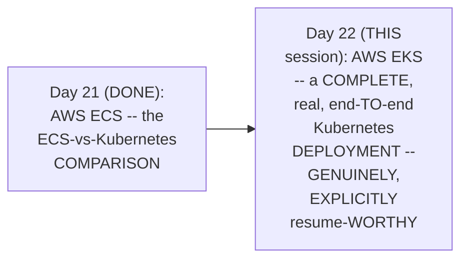

#### 🎯 Key Takeaways

* THIS session is directly, EXPLICITLY confirmed AS "a REALLY, really IMPORTANT" video — GENUINELY, DIRECTLY capable of "CONVERTING your PROJECT" or "CONVERTING your RESUME into a VERY impressive ONE."
* THE session's own, STATED goal: DEPLOY a REAL, PRACTICAL, internet-FACING application (VIA a VPC WITH public/PRIVATE subnets, a SERVICE, Ingress, Ingress CONTROLLER, and a LOAD balancer).
* This directly, PRECISELY sets UP the SESSION's own, COMPLETE structure — a THOROUGH theoretical FOUNDATION (Sections 2-8), FOLLOWED by a COMPLETE, real, end-TO-end demonstration (Sections 9-15).

---

### 2. EKS, Precisely Defined: A Managed Control Plane (Not a Managed Data Plane)

#### 📖 Definition — EKS, Precisely Defined

> 💡 **Given directly:** *"EKS is basically a managed Kubernetes offering... typically in a Kubernetes cluster there are two components — one is the control plane component, and then there is another thing called the data plane, or people can also call it master nodes and worker nodes."*

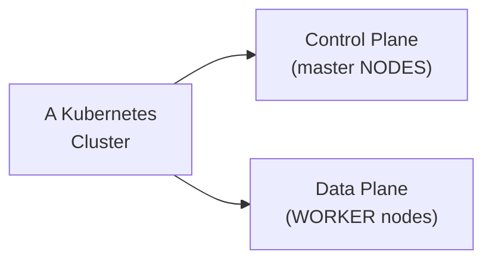

#### 🔍 Internal Working — A Precise, Genuine Clarification

> 💡 **Given directly:** *"EKS is a managed control plane — understand this carefully, EKS is a managed control plane, but it is NOT a managed data plane, that means what EKS is saying is, 'okay, go to my EKS service portal on the AWS platform, and request for a Kubernetes cluster'... everything related to control plane is taken care of by the AWS platform."*

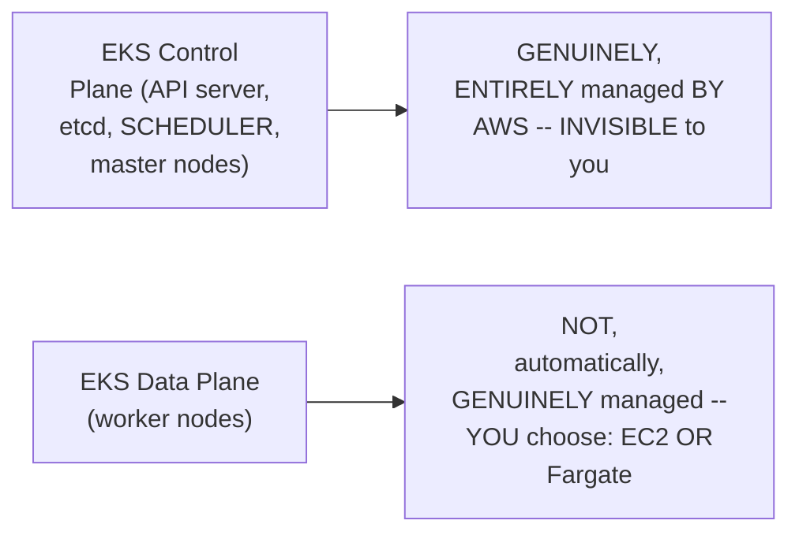

#### ⚠ Common Mistakes

* Assuming EKS GENUINELY, ENTIRELY manages EVERY, single ASPECT of a Kubernetes CLUSTER, INCLUDING worker NODES automatically — explicitly, directly, PRECISELY clarified: "IT is NOT a managed DATA plane" — WORKER-node management REMAINS, at LEAST partially, YOUR own, genuine RESPONSIBILITY (UNLESS Fargate is USED).

#### 🎯 Key Takeaways

* **EKS** is precisely, CAREFULLY defined AS a **MANAGED control PLANE** — AWS genuinely, ENTIRELY manages the API SERVER, etcd, and MASTER nodes.
* EKS is EXPLICITLY, DIRECTLY confirmed AS **NOT** a managed DATA plane — WORKER-node management REMAINS, at LEAST partially, YOUR own responsibility (UNLESS you CHOOSE Fargate).
* This directly, PRECISELY sets UP the SESSION's own, NEXT, essential CONTENT — WHY this CONTROL-plane management GENUINELY, DIRECTLY matters — a FIRST-hand account OF self-managed Kubernetes' OWN, real PAIN (Section 3).

---
### 3. The Genuine, Real Pain of Self-Managed Kubernetes

#### 🪜 Step-by-Step — A Complete, Real, Manual Setup Walkthrough (Without EKS)

> 💡 **Given directly:** *"Let's say you want to do it all alone, but you are already on AWS — typically what you will do is you would spin up six EC2 instances, three for master nodes, three for worker nodes... initially you will start with installing the configuration in this master nodes — master node typically has an API server, you have etcd, you have a scheduler, you have a cloud control manager, controller manager."*

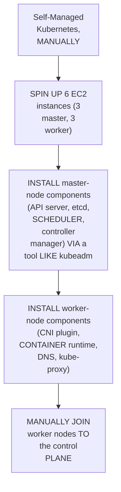

#### 🔍 Internal Working — A Genuine, First-Hand, Honest Account of the Ongoing Pain

> 💡 **Given directly:** *"After a while, what happened is one of the master nodes went down — certificate expired, API server is down, etcd crashed, scheduler is not working — these are some of the problems that I remember at this point of time... these are not small issues to debug... it will make a devops engineer's life very, very hectic."*

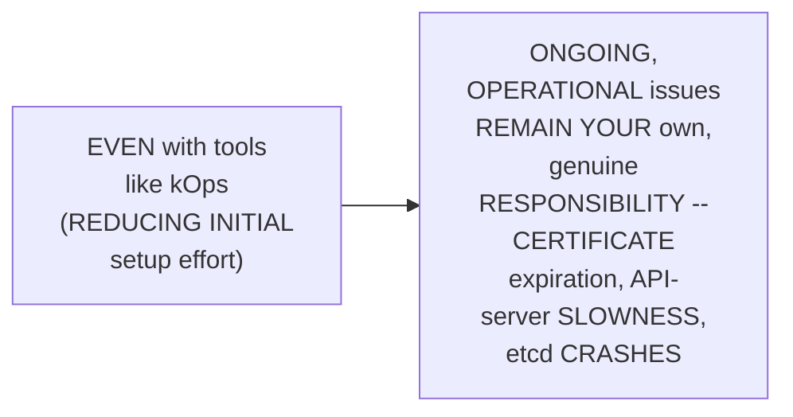

#### 🔍 Internal Working — A Genuine, Direct Scaling Concern

> 💡 **Given directly:** *"This is just about one cluster — now what if you have hundreds of clusters, what if you have thousands of Kubernetes clusters? As a devops engineer, you have to take care of all of these things... each and every day your effort will go on solving these issues."*

#### ⚠ Common Mistakes

* Assuming MODERN tools LIKE kOps GENUINELY, COMPLETELY eliminate the OPERATIONAL burden OF self-managed KUBERNETES — explicitly, directly, HONESTLY clarified: "I AGREE using kOps you CAN reduce this EFFORT significantly" — but ONGOING, real ISSUES (certificate EXPIRATION, etcd CRASHES) genuinely, STILL remain YOUR own RESPONSIBILITY, REGARDLESS of the INITIAL setup TOOL used.

#### 🎯 Key Takeaways

* A COMPLETE, real, MANUAL setup WALKTHROUGH (WITHOUT EKS) directly, CONCRETELY illustrated the GENUINE, real EFFORT required — SPINNING up SIX EC2 instances, INSTALLING every, individual COMPONENT, and MANUALLY joining WORKER nodes.
* A GENUINE, first-HAND, honest ACCOUNT directly, VIVIDLY confirmed the ONGOING, real PAIN — CERTIFICATE expiration, API-SERVER slowness, and ETCD crashes REMAIN your OWN responsibility, EVEN with SETUP-simplifying tools LIKE kOps.
* THIS genuine, real PAIN directly, PRECISELY motivates EKS's own, ESTABLISHED value PROPOSITION (Section 2) — AWS GENUINELY, DIRECTLY absorbs THIS entire, ONGOING operational BURDEN, backed BY a real SLA.

---

### 4. Worker-Node Options With EKS: EC2 vs. Fargate

#### 📖 Definition — The Two, Precise Worker-Node Options

> 💡 **Given directly:** *"When you attach the worker nodes, AWS EKS will give you two options — one is you can use your EC2 instances, so you can create the EC2 instances by yourself, or AWS is saying that you can go with options like Fargate... Fargate is a AWS serverless compute that allows you to run containers."*

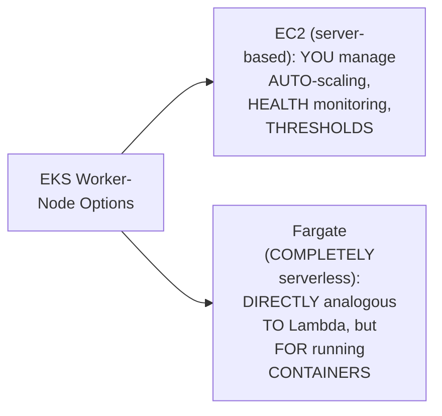

#### 🔍 Internal Working — A Genuine, Precise Distinction From Lambda

> 💡 **Given directly:** *"Lambda functions are defined for a small amount of workloads — if you want to perform any quick actions, then you can use Lambda functions — but Fargates are defined for running containers, so it's an AWS serverless compute that allows you to run containers."*

#### 🔍 Internal Working — A Genuine, Direct Confirmation: The Complete, Combined Advantage

> 💡 **Given directly:** *"If you are using Fargate in combination with EKS, you don't have to worry about anything — EKS takes care of the control plane, Fargate takes care of your worker node — anything like your worker node going down, or the size of the worker node resources... you don't have to bother about anything, you can deploy any number of applications."*

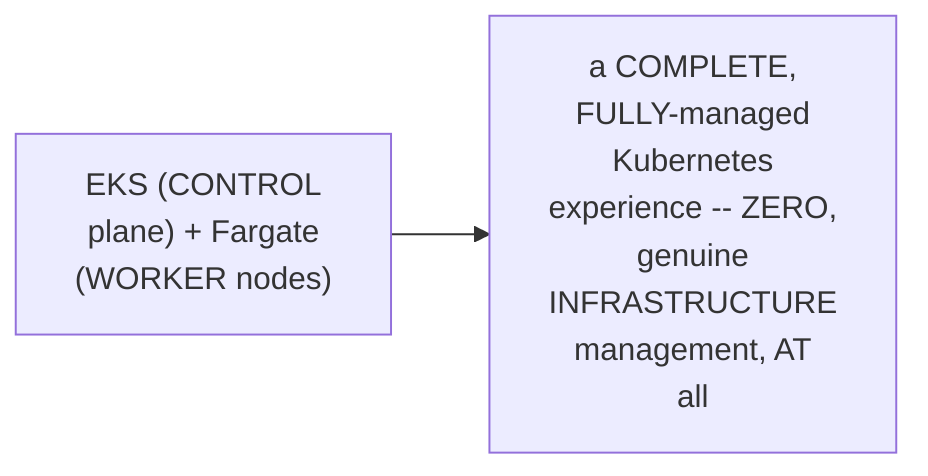

#### ⚠ Common Mistakes

* Assuming LAMBDA and FARGATE are GENUINELY, MERELY interchangeable, "SERVERLESS" concepts — explicitly, directly, PRECISELY distinguished: LAMBDA is DESIGNED for SMALL, quick WORKLOADS; FARGATE is SPECIFICALLY designed FOR running CONTAINERS.

#### 🎯 Key Takeaways

* EKS offers TWO, genuine worker-NODE options: **EC2** (server-BASED, REQUIRING your OWN auto-SCALING/monitoring) and **FARGATE** (a COMPLETE, serverless OPTION, DIRECTLY analogous TO Lambda, BUT specifically FOR running containers).
* COMBINING EKS (CONTROL plane) with FARGATE (worker NODES) produces a GENUINELY, COMPLETELY managed Kubernetes EXPERIENCE — ZERO, real infrastructure MANAGEMENT required.
* This directly, PRECISELY sets UP the SESSION's own, NEXT, essential CONTENT — the THREE, real, distinct WAYS to run Kubernetes ON AWS (Section 5).

---
### 5. Three, Real Ways to Run Kubernetes on AWS (& a Brief, Honest Nod to Cloud Repatriation)

#### 📖 Definition — The Three, Precise Options

> 💡 **Given directly:** *"Typically if you are on AWS platform, there are two ways of installing Kubernetes on AWS platform — one is you can create virtual machines by yourself, and you can use tools like kOps or kubeadm... second thing is you can go with EKS... and the other way is, let's say you are on-premises, then on-premises you can just install Kubernetes cluster on your data center."*

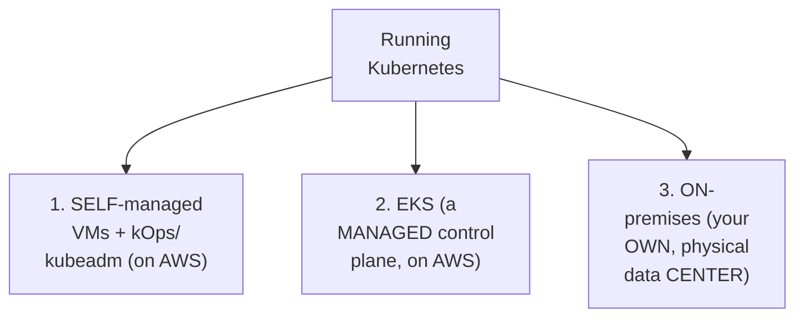

#### 🔍 Internal Working — A Genuine, Brief, Honest Nod to Cloud Repatriation

> 💡 **Given directly:** *"People are moving from on-premises to cloud, and from cloud, instead of doing everything by yourself, you are moving towards the managed services — of course there are a lot of customers on the on-premises, people are also moving back, which we discussed like cloud repatriation, but let's not discuss because it's a very, very less number for now."*

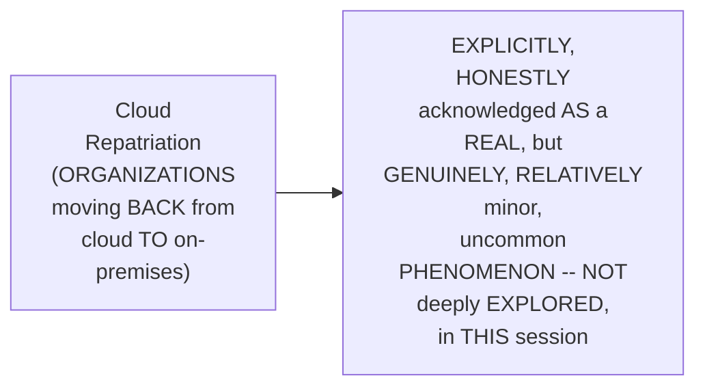

#### ⚠ Common Mistakes

* Assuming the GENUINE, real TREND is EXCLUSIVELY, ONE-directionally toward MANAGED cloud SERVICES, WITHOUT any, GENUINE exceptions — explicitly, directly, HONESTLY acknowledged: "CLOUD repatriation" (moving BACK) is a REAL, GENUINE, though RELATIVELY minor PHENOMENON — NOT deeply EXPLORED here, but NOT dismissed ENTIRELY either.

#### 🎯 Key Takeaways

* THERE are precisely **THREE, real WAYS** to run KUBERNETES, in THIS session's own, ESTABLISHED framing: **SELF-managed VMs** (via kOps/kubeadm, ON AWS), **EKS** (a MANAGED control PLANE, on AWS), and **ON-premises** (YOUR own, physical data CENTER).
* THE instructor **directly, HONESTLY acknowledges** "CLOUD repatriation" — ORGANIZATIONS genuinely, SOMETIMES moving BACK from cloud TO on-premises — a REAL, but RELATIVELY minor PHENOMENON, EXPLICITLY not DEEPLY explored in THIS session.
* This directly, PRECISELY sets UP the SESSION's own, NEXT, essential CONTENT — the COMPLETE, real NETWORKING problem THIS session's own, PRACTICAL demo will GENUINELY solve (Section 6).

---

### 6. Why a Pod Alone Isn't Enough: The Complete, Real Networking Problem

#### 🪜 Step-by-Step — A Complete, Real, Worked Example (the 2048 Game)

> 💡 **Given directly:** *"Let's say my application is deployed in the pod... when the application is deployed as a pod using deployment... typically this will just have the cluster IP, that means this pod can be accessed anywhere from the cluster — it can be accessed from the master node, this worker node, this worker node — but end user cannot access it, and this is not what we want, because my application needs to be accessed from the external world."*

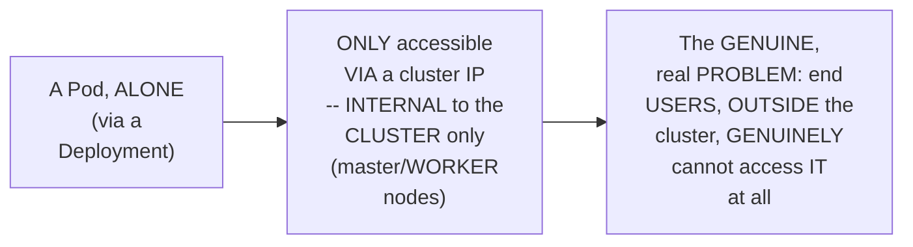

#### ⚠ Common Mistakes

* Assuming a DEPLOYED pod is GENUINELY, AUTOMATICALLY accessible TO real, EXTERNAL end USERS, ONCE it's RUNNING — explicitly, directly, PRECISELY clarified: a POD, by ITSELF, is ONLY, genuinely ACCESSIBLE from WITHIN the cluster — a REAL, additional layer (SERVICE, THEN Ingress) is GENUINELY required for EXTERNAL access.

#### 🎯 Key Takeaways

* A COMPLETE, real, worked EXAMPLE (the "2048" GAME application) directly, CONCRETELY illustrates the GENUINE, core PROBLEM — a POD, deployed ALONE, is ONLY accessible VIA its cluster IP — INVISIBLE to REAL, external end USERS.
* THIS directly, PRECISELY motivates the ENTIRE, remaining NETWORKING architecture THIS session's own DEMO will BUILD — Service MODES, and ULTIMATELY, Ingress.
* This directly, PRECISELY sets UP the SESSION's own, NEXT, essential CONTENT — the THREE, precise Service MODES, and their OWN, genuine trade-OFFS (Section 7).

---
### 7. Service Modes, Precisely Explained: ClusterIP, NodePort & LoadBalancer

#### 📖 Definition — The Three, Precise Service Modes

> 💡 **Given directly:** *"Service is going to say that I am going to give you three options — one is you can use the cluster IP model that you are using already, or I can allow you to expose this to the node level using the NodePort mode, or you can expose it to public using the load balancer mode."*

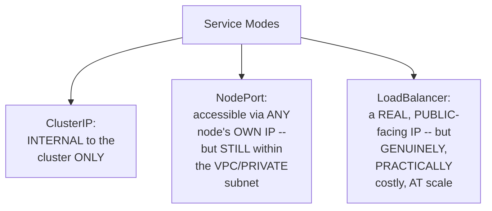

#### 🔍 Internal Working — NodePort's Own, Genuine Limitation

> 💡 **Given directly:** *"If you convert your service to NodePort model, this pod can be accessed from any of these IP addresses — let's say all of these are EC2 instances, people who have access to this EC2 instances IP addresses, they can access the application — but usually this kubernetes cluster will be within a VPC, and this VPC will have a public subnet and a private subnet... the people who have access to this private subnet only can access it."*

#### 🔍 Internal Working — LoadBalancer's Own, Genuine Cost Problem

> 💡 **Given directly:** *"For people outside to access it, you need a load balancer... but the problem is that load balancer mode is very, very costly — if you have 10,000 applications, and if you create load balancer mode for all the pods using services, then you will see significantly high pricing on your AWS environment."*

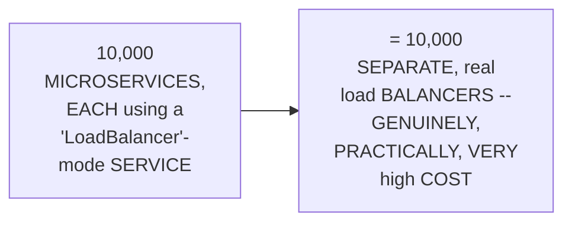

#### ⚠ Common Mistakes

* Assuming the "LOADBALANCER" service MODE is GENUINELY, ALWAYS the RIGHT, final ANSWER for MAKING an APPLICATION externally ACCESSIBLE — explicitly, directly, HONESTLY clarified: it's GENUINELY, PRACTICALLY viable FOR one, isolated SERVICE — but BECOMES prohibitively COSTLY at REAL, organizational scale (MANY microservices) — DIRECTLY motivating the NEED for INGRESS instead.

#### 🎯 Key Takeaways

* **THREE, precise SERVICE modes**: **ClusterIP** (INTERNAL only), **NodePort** (accessible VIA any node's OWN IP, but STILL within the PRIVATE subnet), and **LoadBalancer** (a REAL, public-FACING IP).
* THE **LoadBalancer** mode GENUINELY, DIRECTLY solves the EXTERNAL-access problem — but is GENUINELY, PRACTICALLY **COST-prohibitive** at REAL, organizational scale — a REAL, worked EXAMPLE: 10,000 applications × 10,000 SEPARATE load balancers.
* This directly, PRECISELY sets UP the SESSION's own, NEXT, essential SOLUTION — **INGRESS**, a SINGLE, shared entry POINT, AVOIDING this SAME, genuine cost PROBLEM (Section 8).

---

### 8. Ingress & Ingress Controller: The Complete, Precise Architecture

#### 📖 Definition — Ingress Resource, Precisely Explained

> 💡 **Given directly:** *"Devops engineer will write this ingress.yaml file, where in the ingress.yaml file you will write, 'I want this user to access the application on example.com/abc' — if someone is accessing example.com/abc, forward the request to the service, and from the service the request will go to the pod."*

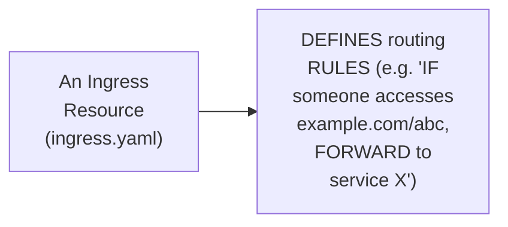

#### ⚠ A Direct, Honest, Important Clarification: The Ingress Resource Alone Does Nothing

> 💡 **Given directly:** *"Just by deploying the Ingress resource, nothing will happen — right, because you have deployed the Ingress resource, there has to be someone who has to help you in taking this request from outside to here."*

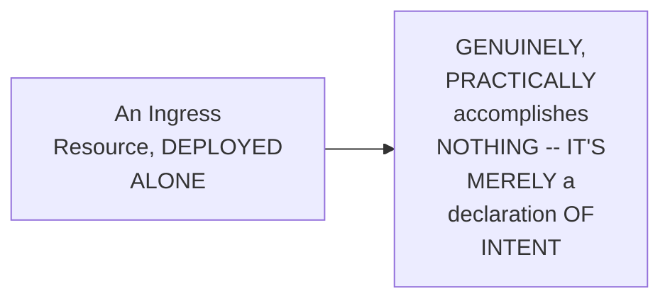

#### 📖 Definition — Ingress Controller, Precisely Explained

> 💡 **Given directly:** *"There is a concept in Kubernetes called Ingress controller, and typically all the load balancers support Ingress controllers... let's say I have deployed the Ingress controller for AWS ALB — as soon as the devops engineer creates an Ingress resource, this Ingress controller will watch for the Ingress resource, and it will create the ALB for you."*

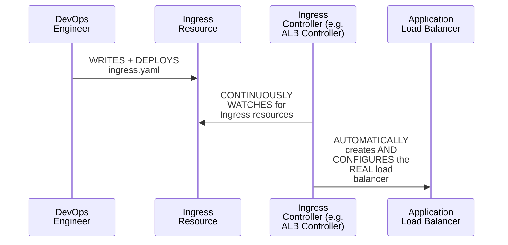

#### 🔍 Internal Working — A Genuine, Direct Confirmation: Multiple Controllers Can Coexist

> 💡 **Given directly:** *"In the market there are hundreds of Ingress controllers, you can choose according to your requirement... if you create NGINX Ingress controller, ALB Ingress controller, and everything in the same cluster, then you can define in the Ingress itself who should access this Ingress resource — there is something called Ingress class."*

#### ⚠ Common Mistakes

* Assuming a SINGLE, "STANDARD" Ingress CONTROLLER is GENUINELY, EXCLUSIVELY usable PER cluster — explicitly, directly, CLARIFIED: MULTIPLE, genuine controllers (NGINX, ALB, F5) CAN, genuinely COEXIST — "INGRESS class" DETERMINES which controller HANDLES a GIVEN Ingress resource.

#### 🎯 Key Takeaways

* An **INGRESS resource** GENUINELY, PRECISELY defines ROUTING rules — but, EXPLICITLY, DIRECTLY confirmed, "NOTHING will HAPPEN" if deployed ALONE.
* An **INGRESS controller** (e.g., the ALB CONTROLLER) is a REAL, running COMPONENT that CONTINUOUSLY watches FOR Ingress resources, and AUTOMATICALLY creates/CONFIGURES the ACTUAL load balancer.
* MULTIPLE, genuine Ingress CONTROLLERS can COEXIST within ONE cluster — "INGRESS class" determines WHICH controller HANDLES a GIVEN resource — a REAL, flexible ARCHITECTURE.

---
### 9. A Complete, Real, Live Demo: Prerequisites & Creating the EKS Cluster

#### 🪜 Step-by-Step — A Complete, Real Prerequisites Confirmation

> 💡 **Given directly:** *"There are some things that you have to install on your laptop to interact with EKS — the very first thing is you need to have kubectl installed... the second thing that you are going to install is eksctl... and the final thing that you have to get ready is the AWS CLI."*

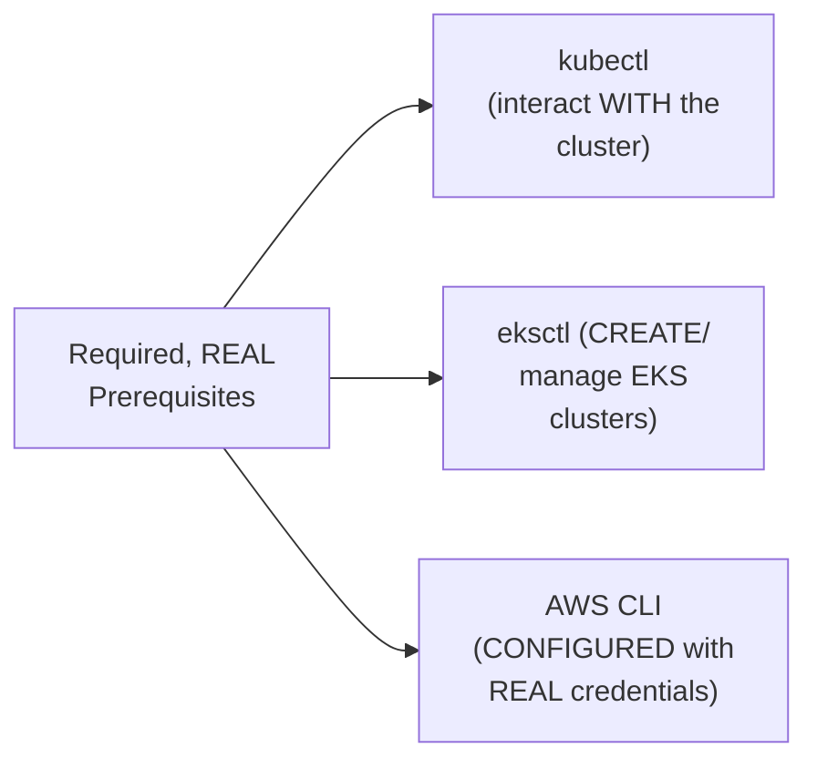

#### ⚠ A Direct, Honest, Demo-Specific Justification for Using Root

> 💡 **Given directly:** *"For the purpose of this demo, I am using my root account, because I have to grant so many permissions — if I am not using root account, and because many people are doing it for the first time, I don't want to confuse by using any IAM and granting permission each and every time — so for the purpose of demo, just use the root account."*

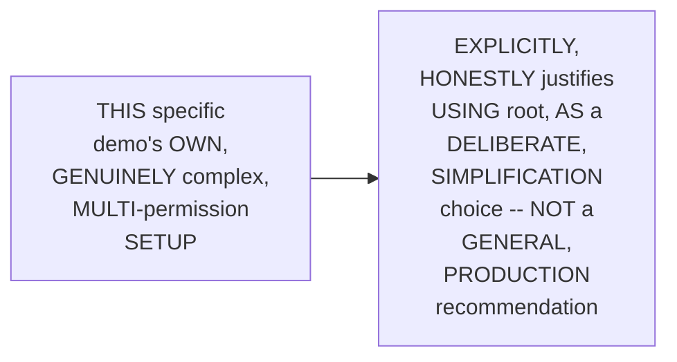

#### 🪜 Step-by-Step — A Complete, Real, eksctl-Based Cluster Creation

> 💡 **Given directly:** *"One of the most preferred ways in organizations is to create these clusters using eksctl... eksctl create cluster --name demo-cluster --region us-east-1... I am choosing Fargate, like I told you — unless your organization has a requirement that your worker nodes have to be a specific distribution... go with EC2 instances, if not, you can go with Fargate."*

```bash
eksctl create cluster --name demo-cluster-1 --region us-east-1 --fargate
```

#### ⚠ A Direct, Honest, Live-Encountered Naming Collision

> 💡 **Given directly:** *"There is some error here, it says eksctl demo-cluster already exists... the reason for that is when I was performing a demo at my end, I might have created with the same name — so let me change it and call it demo-cluster-1."*

#### 🔍 Internal Working — A Genuine, Direct Confirmation of eksctl's Own, Automated Value

> 💡 **Given directly:** *"This EKS CTL is creating everything for us — it requires some service roles, it requires some configuration related to networking, like you need a public subnet, you need a private subnet — whereas this eksctl... it creates a public subnet, it creates a private subnet, and in the private subnet we will place our applications."*

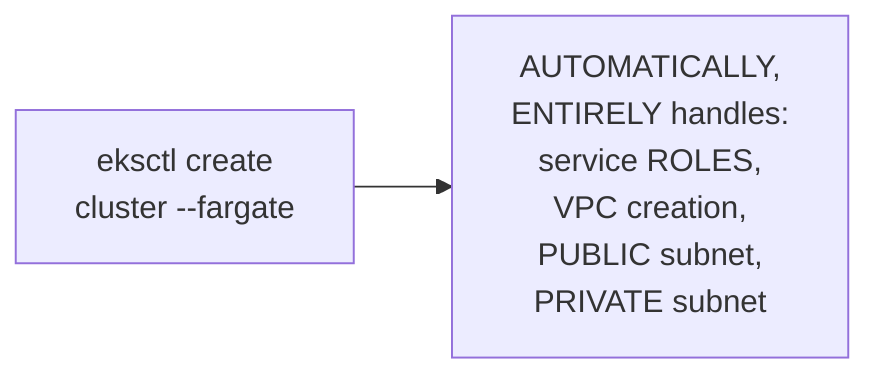

#### ⚠ A Direct, Honest, Real-Time Waiting Period

> 💡 **Given directly:** *"This will take 15 to 20 minutes — in some cases it might be done in 10 minutes, in some cases it can be 5 minutes, so please be patient here... wait for the control plane to become ready."*

#### ⚠ Common Mistakes

* Assuming ROOT-account USAGE, in THIS session's own DEMO, is GENUINELY, DIRECTLY recommended AS a GENERAL, production-WORTHY practice — explicitly, directly, HONESTLY clarified: it's a DELIBERATE, DEMO-specific simplification, CHOSEN specifically TO avoid CONFUSING first-TIME viewers WITH IAM permission-GRANTING complexity.
* Assuming EKS cluster CREATION genuinely, TYPICALLY completes QUICKLY, WITHOUT any, real WAITING — explicitly, directly, HONESTLY clarified: "15 to 20 MINUTES" is the GENUINE, expected RANGE — REQUIRING real PATIENCE.

#### 🎯 Key Takeaways

* THREE, real PREREQUISITES are REQUIRED: **kubectl**, **eksctl**, and a CONFIGURED **AWS CLI** — ALL, genuinely DOCUMENTED in the SESSION's own, provided GitHub REPOSITORY.
* THE instructor **directly, HONESTLY justifies** USING the ROOT account FOR this SPECIFIC demo — AVOIDING IAM-permission COMPLEXITY for FIRST-time viewers — NOT a GENERAL, production RECOMMENDATION.
* **`eksctl`** is directly, PRACTICALLY confirmed AS the PREFERRED, real, ORGANIZATIONAL method for CLUSTER creation — AUTOMATICALLY handling SERVICE roles, VPC, and SUBNET creation — a GENUINE, real TIME-saver, DESPITE the GENUINE, real "15-20 MINUTE" wait.

---

### 10. A Complete, Real, Live Demo: Exploring the Cluster (OIDC, Fargate Profiles, kubeconfig)

#### 🔍 Internal Working — A Genuine, Direct Confirmation: The Console's Own, Real Advantage

> 💡 **Given directly:** *"There is a resources tab, and if you click on that resources tab, you can check the resources that are available on your cluster — for example, you don't need to go to your command line and type kubectl get pods, you can just see here... this kind of features are available in most of the kubernetes distributions, but with plain kubernetes, unless you install dashboard by yourself, you don't get this kind of features."*

#### 📖 Definition — OIDC (OpenID Connect) Provider, Precisely Explained

> 💡 **Given directly:** *"This kubernetes cluster that we have created, you can integrate any identity providers... AWS allows you to attach any identity provider, so that for this EKS you can manage — one is you can use IAM... if you don't integrate the IAM identity provider, let's say you have created a kubernetes pod, and this pod wants to talk to S3 bucket... how will you give access to this pod?"*

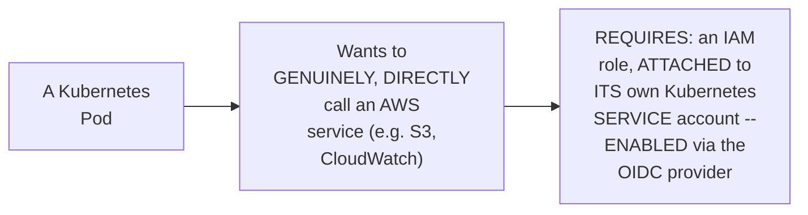

#### 📖 Definition — Fargate Profile, Precisely Explained (& a Real, Important Constraint)

> 💡 **Given directly:** *"Right now the Fargate profile is attached to the default and kube-system namespace — that means you can only deploy the pods onto these two namespaces. If you want to deploy pods to any other namespace, you have to add an additional Fargate profile."*

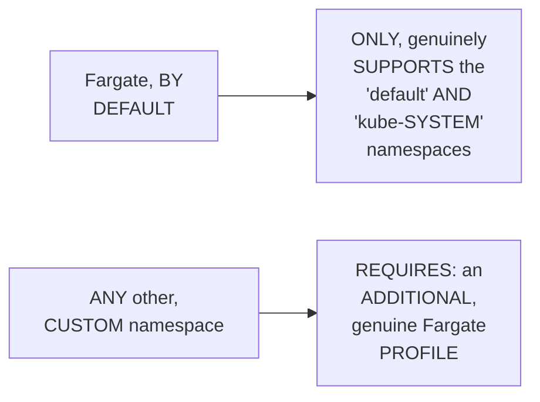

#### 🪜 Step-by-Step — Connecting kubectl to the New Cluster

> 💡 **Given directly:** *"Let me get that kubectl command line — to get that, we installed eksctl, right, let me do this command called update kubeconfig... AWS EKS update-kubeconfig, what is the name of the cluster, region us-east-1."*

```bash
aws eks update-kubeconfig --name demo-cluster-1 --region us-east-1
```

#### ⚠ Common Mistakes

* Assuming a KUBERNETES pod, RUNNING within EKS, CAN genuinely, AUTOMATICALLY call OTHER AWS services (LIKE S3), WITHOUT any, EXPLICIT integration — explicitly, directly, PRECISELY clarified: THIS genuinely REQUIRES an IAM ROLE, attached TO the pod's OWN service account, ENABLED via the OIDC PROVIDER.
* Assuming FARGATE, by DEFAULT, GENUINELY supports DEPLOYING to ANY, arbitrary KUBERNETES namespace — explicitly, directly, PRECISELY corrected: IT ONLY, genuinely supports "DEFAULT" and "kube-SYSTEM," BY default — ANY other namespace REQUIRES an ADDITIONAL Fargate PROFILE.

#### 🎯 Key Takeaways

* THE EKS console's OWN "RESOURCES" tab directly, PRACTICALLY provides a REAL dashboard-LIKE view — a GENUINE advantage OVER plain, UN-dashboarded Kubernetes.
* **OIDC (OpenID CONNECT)** integration GENUINELY, DIRECTLY enables SECURELY attaching IAM ROLES to Kubernetes SERVICE accounts — REQUIRED for PODS to GENUINELY, DIRECTLY call OTHER AWS services.
* **FARGATE profiles**, BY default, ONLY support the "DEFAULT" and "kube-SYSTEM" namespaces — DEPLOYING to ANY other, CUSTOM namespace REQUIRES an ADDITIONAL, genuine PROFILE.

---
### 11. A Complete, Real, Live Demo: Creating a Fargate Profile for a Custom Namespace

#### 🪜 Step-by-Step — A Complete, Real, Live Fargate Profile Creation

> 💡 **Given directly:** *"The first thing that I'm doing here is I am creating a Fargate profile... I am attaching the namespace called '2048-game'... demo-cluster-1, us-east-1, alb-sample-app — I am providing the name as a sample application, and this is the namespace where I am deploying game-2048."*

```bash
eksctl create fargateprofile \
  --cluster demo-cluster-1 \
  --region us-east-1 \
  --name alb-sample-app \
  --namespace game-2048
```

#### 🔍 Internal Working — A Genuine, Direct, Live-Confirmed Result

> 💡 **Given directly:** *"Once it is created, if you go to the compute section and scroll down, you should see another Fargate profile along with default and kube-system — you should also see the game-2048 namespace... now the Fargate profile is also created for us."*

```mermaid
flowchart LR
    A["A NEW,<br/>GENUINE Fargate<br/>Profile: 'alb-<br/>sample-app'"] --> B["ATTACHED to the<br/>NEW namespace:<br/>'game-2048'"]
    B --> C["LIVE-confirmed,<br/>WITHIN the<br/>cluster's OWN<br/>'compute' section"]
```

#### 🔍 Internal Working — A Genuine, Precise Clarification: Why This Step Is Fargate-Specific

> 💡 **Given directly:** *"You might be thinking, Abhishek, why do I have to do this for Fargate? This is a simple concept, like if you are using bare-metal kubernetes, or if you are using kubernetes that you have created, there is a concept called pod affinity or node affinity, anti-affinity — whereas with Fargate, you have this concept, and every time you want to deploy to any namespaces on Fargate, you have to do it, whereas if you are using EC2 instances, you can avoid this step."*

```mermaid
flowchart LR
    A["Bare-Metal /<br/>EC2-based<br/>Kubernetes"] --> B["Uses: pod/node<br/>AFFINITY (a<br/>DIFFERENT,<br/>GENERAL mechanism)"]
    C["Fargate-based<br/>Kubernetes (EKS)"] --> D["REQUIRES: an<br/>EXPLICIT Fargate<br/>PROFILE, PER<br/>namespace -- a<br/>UNIQUE, Fargate-<br/>SPECIFIC step"]
```

#### ⚠ Common Mistakes

* Assuming THIS Fargate-PROFILE requirement is GENUINELY, UNIVERSALLY required, REGARDLESS of WORKER-node choice — explicitly, directly, PRECISELY clarified: it's SPECIFICALLY, UNIQUELY tied TO Fargate — EC2-based WORKER nodes GENUINELY, DIRECTLY avoid THIS extra step.

#### 🎯 Key Takeaways

* A COMPLETE, real, LIVE demonstration directly, CONCRETELY confirmed CREATING a NEW Fargate PROFILE ("alb-sample-app"), ATTACHED to a NEW, custom NAMESPACE ("game-2048").
* THIS requirement is directly, PRECISELY confirmed AS **UNIQUE to FARGATE** — CONCEPTUALLY related to (BUT distinct FROM) pod/node AFFINITY — EC2-based WORKER nodes genuinely, DIRECTLY avoid this SAME, extra step.
* This directly, PRECISELY sets UP the SESSION's own, NEXT, essential STEP — DEPLOYING the ACTUAL application INTO this NEWLY-created namespace (Section 12).

---

### 12. A Complete, Real, Live Demo: Deploying the Application (& a Genuine, Live-Confirmed "Nothing Happens Yet")

#### 🪜 Step-by-Step — A Complete, Real, Single-Command Deployment

> 💡 **Given directly:** *"This specific command, kubectl apply -f, followed by this file — now what is in this file? This file has all the configuration related to deployment, service, and Ingress... it is creating a namespace called game-2048... then this is the deployment for the 2048 application... then this is the service."*

```bash
kubectl apply -f 2048-app-deploy-ingress.yaml
# Deploys, in ONE command: a namespace, a deployment, a service, AND an Ingress resource
```

#### 🔍 Internal Working — A Genuine, Precise Explanation of Labels & Selectors

> 💡 **Given directly:** *"The service does two things — one is you have to make sure that the target port is the container port of your pod, and the second thing is you have proper labels and selectors — the selector is app.kubernetes.io/name: app-2048, and this selector should match this specific thing here — labels: app.kubernetes.io/name: app-2048 — this way, my service will be able to discover the pods."*

```mermaid
flowchart LR
    A["A Deployment's<br/>OWN, Pod-level<br/>LABEL (e.g.<br/>app.KUBERNETES.io/<br/>NAME: app-2048)"] --> B["MUST, genuinely,<br/>DIRECTLY match: a<br/>Service's OWN<br/>SELECTOR"]
    B --> C["ENABLES: the<br/>SERVICE to<br/>GENUINELY,<br/>CORRECTLY discover<br/>the RIGHT pods"]
```

#### ⚠ A Direct, Honest, Important, Live-Confirmed Reminder: Nothing Happens Yet

> 💡 **Given directly:** *"Keep in mind that we are only creating pod, deployment, service, and Ingress — but right now there is no Ingress controller, that means there is nothing on the cluster that can understand this resource, I haven't deployed the Ingress controller, so without Ingress controller, I can say that this resource is a useless resource, because nothing will happen if you just deploy this — let's see if I am right or wrong."*

```bash
kubectl get ingress -n game-2048
# Live-confirmed: an Ingress resource EXISTS, but its own "ADDRESS" field is EMPTY --
# NO load balancer has been created yet, since NO Ingress controller exists on the cluster
```

#### ⚠ Common Mistakes

* Assuming DEPLOYING a POD, service, AND Ingress resource TOGETHER is GENUINELY, PRACTICALLY sufficient TO make an APPLICATION externally ACCESSIBLE — explicitly, directly, LIVE-demonstrated as GENUINELY, DIRECTLY insufficient — "THIS resource IS a USELESS resource" WITHOUT a GENUINE, running Ingress CONTROLLER.

#### 🎯 Key Takeaways

* A COMPLETE, real, SINGLE-command DEPLOYMENT directly, CONCRETELY created FOUR resources AT once — a NAMESPACE, a deployment, a SERVICE, and an INGRESS resource.
* **LABELS and selectors** are precisely EXPLAINED as the MECHANISM enabling a SERVICE to GENUINELY, CORRECTLY discover the RIGHT pods — REQUIRING an EXACT match.
* A GENUINE, honest, LIVE-confirmed REMINDER directly, CONCRETELY validated SECTION 8's own, established WARNING — the INGRESS resource, WITHOUT a RUNNING Ingress CONTROLLER, remains GENUINELY, DIRECTLY "useless" — CONFIRMED via `kubectl GET ingress`'s OWN, EMPTY "address" FIELD.

---
### 13. A Complete, Real, Live Demo: Setting Up the ALB Ingress Controller (IAM OIDC, Policy, Role)

#### 🪜 Step-by-Step — A Complete, Real, Prerequisite: Associating the IAM OIDC Provider

> 💡 **Given directly:** *"This is done in every organization, and every organization, usually if they're on AWS, they prefer to use the IAM OIDC provider itself... copy this command that is in the document, eksctl utils associate-iam-oidc-provider... the reason why we need IAM OIDC is because the ALB controller, which is running, needs to access the application load balancer — this ALB controller is nothing but a kubernetes pod again, so this kubernetes pod needs to talk to some AWS resources, and to talk to AWS resources, it needs to have IAM integrated."*

```bash
eksctl utils associate-iam-oidc-provider --cluster demo-cluster-1 --approve
```

#### 🪜 Step-by-Step — A Complete, Real IAM Policy & Role Creation

> 💡 **Given directly:** *"Firstly, let's create an IAM policy for this one, and we will create an IAM role as well... the final thing is I am creating the role, I'm attaching this role to the service account of the pod — that's the whole purpose — whenever the pod is running, the pod will have a service account, and for that service account you need the role attached, so that it can integrate with other AWS resources."*

```mermaid
flowchart TD
    A["The ALB<br/>Controller (ITSELF<br/>a Kubernetes pod)"] --> B["Needs a<br/>Kubernetes<br/>SERVICE account"]
    B --> C["THAT service<br/>account needs an<br/>ATTACHED IAM<br/>ROLE"]
    C --> D["THAT role<br/>needs a<br/>CUSTOM, real IAM<br/>POLICY (granting<br/>ALB-related<br/>PERMISSIONS)"]
```

#### 🔍 Internal Working — A Genuine, Real, Organizational Pattern

> 💡 **Given directly:** *"This is how you do it in your organization — basically you create some service accounts, or developers create some service account, depending upon the requirement that they have — let's say developers want to talk to RDS, what they'll do is they'll create a service account, and they'll ask you to create a role with specific permissions."*

#### 🪜 Step-by-Step — Installing the ALB Controller via Helm

> 💡 **Given directly:** *"We are going to use the Helm chart, and this Helm chart will create the actual controller, and it will use this service account for running the pod... you have to modify a couple of things — one is your VPC ID... then region... provide the cluster name."*

```bash
helm install aws-load-balancer-controller eks/aws-load-balancer-controller \
  --set clusterName=demo-cluster-1 \
  --set serviceAccount.create=false \
  --set serviceAccount.name=aws-load-balancer-controller \
  --set region=us-east-1 \
  --set vpcId=<your-vpc-id> \
  -n kube-system
```

#### ⚠ Common Mistakes

* Assuming the ALB CONTROLLER's OWN, required PERMISSIONS are GENUINELY, EASILY available VIA a SIMPLE, PRE-built AWS policy — explicitly, directly, IMPLIED as REQUIRING a LARGE, CUSTOM-provided JSON POLICY (SOURCED directly FROM the ALB controller's OWN, official documentation).

#### 🎯 Key Takeaways

* SETTING up the ALB INGRESS controller directly, PRECISELY requires FOUR, sequential STEPS: **(1) associate an IAM OIDC PROVIDER**; **(2) CREATE a custom IAM POLICY**; **(3) create an IAM ROLE**, attached TO a Kubernetes SERVICE account; and **(4) INSTALL the controller ITSELF**, via a HELM chart.
* THIS entire WORKFLOW directly, CONCRETELY reflects a GENUINE, real, ORGANIZATIONAL pattern — DEVELOPERS request SPECIFIC service accounts, TIED to specific, REQUIRED AWS permissions.
* This directly, PRECISELY sets UP the SESSION's own, MOST extensive, HONEST content — a GENUINELY, real, multi-STAGE debugging SEQUENCE, ENCOUNTERED while ATTEMPTING this EXACT setup (Section 14).

---

### 14. A Genuinely Extensive, Honest, Multi-Error Live Debugging Sequence

#### ⚠ Error 1: An IAM Policy Name Collision

> 💡 **Given directly:** *"AWS IAM create-policy... it says that 'entity already exists' — there is a policy that already exists in my account... let me go ahead and delete it, so that we all will be on the same page."*

```mermaid
flowchart LR
    A["ERROR 1: IAM<br/>POLICY 'entity<br/>already EXISTS'"] --> B["ROOT CAUSE: a<br/>LEFTOVER policy,<br/>FROM an EARLIER,<br/>PRIOR demo RUN BY<br/>the instructor<br/>HIMSELF"]
    B --> C["FIX: DELETE the<br/>EXISTING policy,<br/>then RE-create it"]
```

#### ⚠ Error 2: A Failed Service-Account Creation, Diagnosed via kubectl describe

> 💡 **Given directly:** *"It says 'one error occurred, IAM role stacks haven't created properly, you may have to check the CloudFormation console'... okay, let's try it one more time — see, now it got created, service account that exists will be existing service account."*

```mermaid
flowchart LR
    A["ERROR 2: a<br/>FAILED CLOUD-<br/>FORMATION stack,<br/>creating the<br/>SERVICE account"] --> B["Confirmed VIA:<br/>the CloudFormation<br/>console DIRECTLY"]
```

#### ⚠ Error 3: The ALB Controller Deployment Stuck at "0 of 2" Ready

> 💡 **Given directly:** *"One final check that you have to do is you have to verify that this load balancer is created, and there are at least two replicas of it... till now the ready state is 0 of 2... this will take one or two minutes for both of the replicas to be up and running."*

#### 🔍 Internal Working — A Genuine, Honest, Precise Root-Cause Diagnosis

> 💡 **Given directly:** *"So how do I do that? Just kubectl edit deploy... if you go to the status field, usually you will see what is the error, or else you can also do the describe — what does it say? Pods AWS load balancer controller is forbidden, error looking up service account kube-system AWS load balancer controller."*

```mermaid
flowchart LR
    A["ERROR 3: the<br/>ALB controller's<br/>OWN pods GENUINELY,<br/>DIRECTLY fail to<br/>START"] --> B["ROOT CAUSE (via<br/>kubectl DESCRIBE):<br/>'forbidden, error<br/>looking UP service<br/>account' -- DIRECTLY<br/>traced BACK to<br/>Error 2's OWN,<br/>ORIGINAL, failed<br/>service-account<br/>creation"]
```

#### 🪜 Step-by-Step — A Complete, Real, Live Fix

> 💡 **Given directly:** *"Let's try to fix it, and let's try to redeploy the deployment — it says 'service account that exists in kubernetes will be excluded, use --override' — I'm overriding the service account... let's try it one more time — see, uh, 'cannot reuse the name that is still in use' — okay, that is because the Helm chart... let me just delete the Helm chart, Helm delete."*

```bash
kubectl edit deploy aws-load-balancer-controller -n kube-system
# (diagnosing the root cause via describe/status)

helm delete aws-load-balancer-controller -n kube-system
# Then, re-run the original helm install command
```

#### ⚠ A Direct, Honest, Important, Meta-Level Acknowledgment

> 💡 **Given directly:** *"In your case, this is not needed — I know why this is happening on my cluster, in your case, if you follow the same commands, you will not run into this issue, because I did the demo before, there are some stale resources, that's why I think I'm running into it... troubleshooting is very common when we do the demos, and that is also good, right?"*

```mermaid
flowchart LR
    A["THIS session's<br/>OWN, EXTENSIVE,<br/>cascading ERROR<br/>sequence"] --> B["HONESTLY,<br/>DIRECTLY<br/>attributed to:<br/>STALE resources,<br/>LEFT over from<br/>the INSTRUCTOR's<br/>own, PRIOR demo<br/>RUN -- NOT<br/>something a<br/>GENUINE, first-<br/>TIME viewer should<br/>EXPECT"]
```

#### ⚠ Common Mistakes

* Assuming this GENUINELY, EXTENSIVE debugging SEQUENCE reflects a GENUINE, real FLAW in the ESTABLISHED setup PROCESS ITSELF — explicitly, directly, HONESTLY clarified: it STEMMED specifically FROM stale, LEFTOVER resources FROM the instructor's OWN, prior DEMO run — "IN your case... you will NOT run into THIS issue."
* Assuming REAL, professional TROUBLESHOOTING, EVEN by an EXPERIENCED instructor, is GENUINELY, TYPICALLY a QUICK, single-STEP process — explicitly, directly, HONESTLY demonstrated as GENUINELY, REALISTICALLY multi-STAGE — MULTIPLE, DISTINCT, cascading ERRORS, each REQUIRING its OWN diagnosis AND fix.

#### 🎯 Key Takeaways

* A GENUINELY EXTENSIVE, honest, MULTI-error debugging SEQUENCE directly, CONCRETELY worked THROUGH: **(1)** an IAM POLICY name COLLISION; **(2)** a FAILED, CloudFormation-based SERVICE-account creation; and **(3)** the RESULTING, CASCADING ALB-controller STARTUP failure — ALL diagnosed and FIXED, live, UNEDITED.
* THE root CAUSE of Error 3 was directly, HONESTLY traced (VIA `kubectl DESCRIBE`) back TO Error 2's OWN, original, FAILED service-account CREATION — a GENUINE, real, CAUSALLY-connected error CHAIN, not THREE, unrelated issues.
* THE instructor **directly, HONESTLY acknowledges** this ENTIRE, extensive SEQUENCE stemmed FROM stale RESOURCES, left OVER from HIS own, PRIOR demo RUN — EXPLICITLY reassuring GENUINE, first-time VIEWERS they should NOT, generally, EXPECT this SAME, extensive TROUBLESHOOTING.

---
### 15. A Complete, Real, Live-Confirmed Success: The Load Balancer & the Live Application

#### 🪜 Step-by-Step — A Complete, Real, Live-Confirmed ALB Controller Success

> 💡 **Given directly:** *"Now it got created — if you go to the deployments as well, you will see 2 by 2 replicas — perfect, so this is the perfect state of the application load balancer controller."*

#### 🪜 Step-by-Step — A Complete, Real, Live-Confirmed Load Balancer Creation

> 💡 **Given directly:** *"Let us see if this AWS load balancer controller has created an ALB or not — if you go to EC2, and inside application load balancers, you need to see a load balancer — perfect, I am seeing a load balancer, and this load balancer has just been created, see, August 4th, the time is 1:57, and here it is 1:56 — that means it is just created."*

```mermaid
sequenceDiagram
    participant Ingress as Ingress<br/>Resource<br/>(game-2048)
    participant Controller as ALB<br/>Controller
    participant ALB as A REAL, NEW<br/>Application Load<br/>Balancer
    Controller->>Ingress: WATCHES, finds<br/>the Ingress<br/>resource
    Controller->>ALB: AUTOMATICALLY,<br/>GENUINELY creates<br/>a REAL ALB
```

#### 🔍 Internal Working — A Genuine, Direct, Live-Confirmed Cross-Verification

> 💡 **Given directly:** *"Kubectl get ingress -n game-2048... here we got the address — this address is the load balancer that the Ingress controller has created... if we go to the browser here, and if you go to the load balancer section... see, this is the same specific IP address... this is the same thing that is available in the address section — that means the Ingress controller has read the Ingress resource, and created this load balancer."*

```mermaid
flowchart LR
    A["`kubectl GET<br/>ingress`'s own,<br/>NOW-populated<br/>'ADDRESS' field"] --> B["DIRECTLY,<br/>GENUINELY matches:<br/>the REAL load<br/>balancer's own<br/>DNS name, SEEN in<br/>the EC2 console"]
```

#### 🪜 Step-by-Step — A Complete, Real, Final, Live-Confirmed Success

> 💡 **Given directly:** *"Once the status is active, what I'll do is I'll just copy this URL, click on a new tab, and as soon as I click on the enter button... this is the 2048 game, and now you can play this game, and let me know in the comment section who has got the highest score — just kidding — but yeah, so this is what we exactly deployed, and we are accessing the load balancer, and through the load balancer we are getting the request."*

```mermaid
flowchart LR
    A["The Load<br/>Balancer's OWN,<br/>REAL URL"] --> B["OPENED, LIVE, in<br/>a BROWSER"]
    B --> C["SUCCESSFULLY,<br/>GENUINELY renders<br/>the REAL, playable<br/>'2048' game<br/>application -- a<br/>COMPLETE, real,<br/>end-to-END<br/>success"]
```

#### ⚠ Common Mistakes

* Assuming a "COMPLETED" load-BALANCER creation, ALONE, GENUINELY confirms the ENTIRE, complete deployment IS working — explicitly, directly, THOROUGHLY cross-VERIFIED — CONFIRMING the load BALANCER's own IP/DNS GENUINELY matches the INGRESS resource's OWN "address" field, AND that the APPLICATION genuinely, VISIBLY renders WHEN accessed.

#### 🎯 Key Takeaways

* A COMPLETE, real, LIVE-confirmed SUCCESS directly, CONCRETELY validated the ALB CONTROLLER's own, TWO replicas REACHING "2/2" ready STATUS.
* A GENUINE, real, LIVE-confirmed CROSS-verification directly, CONCRETELY matched the INGRESS resource's own, NOW-populated "ADDRESS" field AGAINST the REAL, newly-created load BALANCER's own DNS NAME, visible WITHIN the EC2 console.
* A COMPLETE, real, FINAL verification directly, VISUALLY confirmed the ENTIRE, established ARCHITECTURE genuinely, SUCCESSFULLY works — the REAL "2048" game APPLICATION, GENUINELY accessible and PLAYABLE, via a REAL, public LOAD-balancer URL.

---

### 16. A Genuine, Honest, Closing Reflection: One-Time vs. Ongoing DevOps Responsibility

#### 🪜 Step-by-Step — A Direct, Honest, Complete, Organizational Reflection

> 💡 **Given directly:** *"For each microservice, it is the responsibility of the devops engineer to just write the pod, deployment, service.yaml, ingress.yaml — and it is your one-time responsibility to create the Ingress controller, and rest is taken care of by the Ingress controller."*

```mermaid
flowchart LR
    A["ONGOING, PER-<br/>microservice<br/>responsibility"] --> B["Writing<br/>deployment.yaml,<br/>service.yaml,<br/>ingress.yaml"]
    C["ONE-TIME, per-<br/>CLUSTER<br/>responsibility"] --> D["SETTING up the<br/>Ingress CONTROLLER<br/>itself"]
```

#### ⚠ A Direct, Honest, Important Comparison to On-Premises Kubernetes

> 💡 **Given directly:** *"Because it is an EKS cluster, the configuration of Ingress controller is a little bit tricky, because we have to create a service account and we have to attach that service account with the IAM profile or IAM role — but otherwise, on an on-premises kubernetes cluster, this much is not required, you can just assign service account with proper RBAC."*

```mermaid
flowchart LR
    A["On-Premises<br/>Kubernetes"] --> B["Ingress-<br/>controller SETUP:<br/>SIMPLER -- plain<br/>RBAC-based<br/>service ACCOUNTS<br/>suffice"]
    C["EKS<br/>(AWS-managed)"] --> D["Ingress-<br/>controller SETUP:<br/>GENUINELY, DIRECTLY<br/>'a LITTLE bit<br/>tricky' -- REQUIRES<br/>IAM/OIDC<br/>integration,<br/>SPECIFICALLY"]
```

#### ⚠ Common Mistakes

* Assuming SETTING up an Ingress CONTROLLER is a GENUINELY, EQUALLY complex PROCESS, REGARDLESS of WHETHER you're USING EKS OR on-premises Kubernetes — explicitly, directly, HONESTLY clarified: EKS's own, IAM-INTEGRATED setup is GENUINELY, DIRECTLY "a LITTLE bit TRICKIER" than the SIMPLER, RBAC-only approach ON-premises Kubernetes GENUINELY allows.

#### 🎯 Key Takeaways

* A DEVOPS engineer's OWN, real RESPONSIBILITY genuinely, STRUCTURALLY splits INTO two, DISTINCT categories: **ONGOING, per-MICROSERVICE work** (writing deployment/SERVICE/Ingress YAML) VERSUS **ONE-TIME, per-cluster WORK** (setting up the Ingress CONTROLLER itself).
* THE instructor **directly, HONESTLY acknowledges** EKS's own Ingress-CONTROLLER setup is GENUINELY "a LITTLE bit tricky" — SPECIFICALLY due to REQUIRED IAM/OIDC integration — COMPARED to the SIMPLER, RBAC-only approach ON-premises Kubernetes ALLOWS.
* This directly, PRECISELY completes THIS session's own, COMPLETE, honest REFLECTION — SETTING up the SESSION's own, FINAL, closing CONTENT (Section 17).

---

### 17. Closing: A Direct, Resume-Focused Encouragement

#### 🪜 Step-by-Step — A Direct, Genuine, Final Encouragement

> 💡 **Given directly:** *"I hope you found it useful — please let me know in the comment section what is your take on this one, are you going to try it, and are you going to share it with your friends and colleagues — this is a very good addition to your resume."*

```mermaid
flowchart LR
    A["THIS session's<br/>OWN, COMPLETE,<br/>real, end-TO-end<br/>EKS PROJECT"] --> B["EXPLICITLY,<br/>DIRECTLY confirmed<br/>AS 'a VERY good<br/>ADDITION to YOUR<br/>resume'"]
```

#### ⚠ Common Mistakes

* Assuming THIS session's own, EXTENSIVE, real DEMONSTRATION represented a GENUINELY, MERELY educational EXERCISE, WITHOUT real, PRACTICAL career VALUE — explicitly, directly, REPEATEDLY confirmed THROUGHOUT this SESSION as a GENUINE, resume-WORTHY, real-world DEVOPS deliverable.

#### 🎯 Key Takeaways

* This episode **GENUINELY, COMPREHENSIVELY delivers** its OWN, stated GOALS — a COMPLETE, precise theoretical FOUNDATION, PLUS a COMPLETE, real, END-to-end EKS deployment — INCLUDING a GENUINELY extensive, HONEST debugging SEQUENCE.
* THE instructor **directly, PERSONALLY encourages** learners to GENUINELY, PERSONALLY complete THIS demo THEMSELVES — REINFORCING the SESSION's own, OPENING, resume-FOCUSED motivation.
* This directly, PRECISELY confirms THIS session's own, GENUINE STATUS as one OF the series' own, MOST substantial, PRACTICALLY valuable DELIVERABLES — a COMPLETE, real, working, internet-FACING Kubernetes application.

---
## 📝 Glossary

| Term | Definition | Why It Matters |
|---|---|---|
| **EKS** | Elastic Kubernetes Service | AWS's own, managed control plane for Kubernetes |
| **Control Plane** | API server, etcd, scheduler, master nodes | Fully managed by AWS, with EKS |
| **Data Plane** | Worker nodes | NOT automatically managed; you choose EC2 or Fargate |
| **eksctl** | A CLI utility for managing EKS clusters | The preferred, real, organizational creation method |
| **OIDC Provider** | Enables identity-provider integration | Required for pods to securely call AWS services |
| **Fargate Profile** | Defines which namespaces Fargate supports | Required for any namespace beyond default/kube-system |
| **Ingress** | Defines routing rules for external traffic | Does nothing without a running Ingress Controller |
| **Ingress Controller** | Watches for Ingress resources, creates/configures load balancers | E.g., the ALB Controller |

---

## 🔄 Revision Notes — One-Minute Revision

* This is **Day 22**, explicitly framed as a genuinely resume-worthy, complete, end-to-end EKS project -- deploying a real, internet-facing "2048" game application.
* **EKS, precisely defined**: a managed CONTROL PLANE (API server, etcd, master nodes) -- but explicitly NOT a managed DATA plane (worker nodes remain your choice: EC2 or Fargate).
* **The genuine, real pain of self-managed Kubernetes**: a first-hand account of manually creating 6 EC2 instances, installing every component, and then, ongoingly, dealing with certificate expiration, API-server slowness, and etcd crashes -- even with setup tools like kOps. This pain compounds at scale (hundreds/thousands of clusters).
* **Worker-node options**: EC2 (server-based, you manage scaling/health) vs. Fargate (completely serverless, directly analogous to Lambda, but for containers). Combining EKS + Fargate = zero, genuine infrastructure management.
* **Three ways to run Kubernetes on AWS**: self-managed VMs + kOps/kubeadm, EKS, or on-premises. A brief, honest nod to "cloud repatriation" (organizations moving back), acknowledged as real but relatively minor.
* **Why a pod alone isn't enough**: a pod, deployed alone, is only accessible via its cluster IP -- invisible to real, external users.
* **Service modes**: ClusterIP (internal only), NodePort (accessible via node IP, but still within the private subnet), LoadBalancer (a real, public IP -- but genuinely cost-prohibitive at scale, e.g., 10,000 apps x 10,000 load balancers).
* **Ingress + Ingress Controller**: an Ingress resource alone does NOTHING -- it requires a running Ingress Controller (e.g., the ALB Controller) to watch for it and automatically create/configure the real load balancer. Multiple controllers can coexist; "Ingress class" determines which handles a given resource.
* **Live demo (prerequisites & cluster creation)**: kubectl, eksctl, and AWS CLI required. Root account used deliberately, for demo simplicity (not a production recommendation). `eksctl create cluster --fargate` automates VPC/subnet creation entirely; a genuine, honest 15-20 minute wait; a live-encountered, honestly-resolved cluster-naming collision.
* **Live demo (exploring the cluster)**: the console's own "Resources" tab provides dashboard-like visibility. OIDC integration enables pods to securely call AWS services via IAM roles attached to service accounts. Fargate profiles, by default, only support "default" and "kube-system" namespaces -- any other namespace requires an additional, genuine profile.
* **Live demo (Fargate profile + deployment)**: a new Fargate profile was created for the "game-2048" namespace (a Fargate-specific requirement, unlike EC2). A single `kubectl apply -f` command deployed namespace, deployment, service, and Ingress together. Labels/selectors precisely explained as the service-to-pod discovery mechanism. A live-confirmed "nothing happens yet" -- the Ingress resource's own "address" field remained empty, since no Ingress controller existed yet.
* **Live demo (ALB Ingress Controller setup)**: required associating an IAM OIDC provider, creating a custom IAM policy + role (attached to a Kubernetes service account), and installing the controller via Helm -- reflecting a genuine, real organizational pattern.
* **A genuinely extensive, honest, multi-error debugging sequence** (arguably this series' own most substantial): an IAM policy name collision, a failed CloudFormation-based service-account creation, and the resulting, cascading ALB-controller startup failure ("0 of 2" ready) -- all diagnosed (via `kubectl describe`) and fixed live. Honestly attributed to stale resources from the instructor's own, prior demo run -- explicitly not expected for genuine, first-time viewers.
* **The complete, live-confirmed success**: the ALB controller reached "2/2" ready; a real, new load balancer appeared in the EC2 console; its DNS matched the Ingress resource's own, now-populated "address" field; and the real 2048 game genuinely, successfully loaded and was playable via the load balancer's own URL.
* **A genuine, honest, closing reflection**: devops responsibility splits into ongoing, per-microservice work (deployment/service/Ingress YAML) vs. one-time, per-cluster work (Ingress controller setup). EKS's own Ingress-controller setup is honestly acknowledged as "a little bit tricky" (IAM/OIDC integration required), compared to the simpler, RBAC-only approach on-premises Kubernetes allows.
* **Closing**: a direct, resume-focused encouragement -- this complete project is explicitly confirmed as "a very good addition to your resume."

---

## 📋 Cheat Sheet

**EKS's own, precise scope:**
```text
Control Plane (API server, etcd, master nodes) -- FULLY managed by AWS
Data Plane (worker nodes)                        -- YOUR choice: EC2 or Fargate
```

**Service modes:**
```text
ClusterIP    -- internal to the cluster only
NodePort     -- accessible via any node's IP, but still within the private subnet
LoadBalancer -- a real, public IP, but cost-prohibitive at scale
```

**The complete Ingress architecture:**
```text
Ingress Resource (routing rules) + Ingress Controller (watches + creates the load balancer)
= a single, shared, cost-effective entry point
```

**The complete EKS setup workflow:**
```bash
# 1. Create the cluster
eksctl create cluster --name <name> --region <region> --fargate

# 2. Connect kubectl
aws eks update-kubeconfig --name <name> --region <region>

# 3. Create a Fargate profile (for any non-default namespace)
eksctl create fargateprofile --cluster <name> --region <region> --name <profile> --namespace <ns>

# 4. Deploy the application (namespace, deployment, service, Ingress)
kubectl apply -f app.yaml

# 5. Set up the ALB Ingress Controller
eksctl utils associate-iam-oidc-provider --cluster <name> --approve
aws iam create-policy --policy-name AWSLoadBalancerControllerIAMPolicy --policy-document file://policy.json
eksctl create iamserviceaccount --cluster <name> --namespace kube-system --name aws-load-balancer-controller --attach-policy-arn <policy-arn> --approve
helm install aws-load-balancer-controller eks/aws-load-balancer-controller --set clusterName=<name> -n kube-system
```

**Debugging the ALB Controller:**
```bash
kubectl get deploy -n kube-system                 # check replica readiness (should be 2/2)
kubectl describe pod <pod-name> -n kube-system     # diagnose "forbidden" / service-account errors
helm delete aws-load-balancer-controller -n kube-system  # if "name still in use"
```

---

## 🔥 Interview Questions & Answers

### 🟢 Beginner

**Q1.**

**Question:** Does EKS manage the data plane (worker nodes) automatically?

**Answer:** No -- EKS is a managed control plane only; you choose EC2 or Fargate for worker nodes.

**Explanation:** Directly, precisely clarified.

**Why Interviewers Ask This:** The most basic, foundational, and commonly-misunderstood EKS fact.

**Possible Follow-up:** "What does EKS's own control plane genuinely include?"

**Q2.**

**Question:** Name two, genuine, real operational issues a devops engineer must handle with self-managed Kubernetes, even after initial setup.

**Answer:** Certificate expiration, and etcd/API-server failures.

**Explanation:** Directly, explicitly named.

**Why Interviewers Ask This:** Tests genuine, first-hand understanding of the real motivation behind managed Kubernetes services.

**Possible Follow-up:** "How does EKS genuinely address these, specific issues?"

**Q3.**

**Question:** What is the genuine difference between Fargate and Lambda?

**Answer:** Lambda is for small, quick workloads; Fargate is specifically for running containers.

**Explanation:** Directly, precisely distinguished.

**Why Interviewers Ask This:** A commonly-tested, genuine serverless-compute distinction.

**Possible Follow-up:** "Can Fargate be used as EKS's own worker-node option?"

**Q4.**

**Question:** Does a pod, deployed alone, have any real, external accessibility?

**Answer:** No -- it's only accessible via its cluster IP, internal to the cluster.

**Explanation:** Directly, precisely clarified.

**Why Interviewers Ask This:** Foundational, frequently-tested Kubernetes networking knowledge.

**Possible Follow-up:** "What are the three, real Service modes that address this?"

**Q5.**

**Question:** Why is the "LoadBalancer" service mode genuinely problematic at scale?

**Answer:** It's genuinely, prohibitively costly -- each service gets its own, separate load balancer.

**Explanation:** Directly, precisely explained.

**Why Interviewers Ask This:** Tests genuine, real-world cost awareness beyond basic functionality.

**Possible Follow-up:** "What's the recommended alternative, instead?"

**Q6.**

**Question:** Does deploying an Ingress resource alone accomplish anything?

**Answer:** No -- it genuinely requires a running Ingress Controller to act on it.

**Explanation:** Directly, repeatedly emphasized, and live-demonstrated.

**Why Interviewers Ask This:** A commonly-tested, genuine Ingress architecture distinction.

**Possible Follow-up:** "What does the Ingress Controller genuinely do?"

**Q7.**

**Question:** By default, which two namespaces does a Fargate profile support?

**Answer:** "default" and "kube-system."

**Explanation:** Directly, explicitly stated.

**Why Interviewers Ask This:** Tests genuine, practical, hands-on EKS/Fargate knowledge.

**Possible Follow-up:** "What's required to deploy to any other namespace?"

**Q8.**

**Question:** What does OIDC integration genuinely enable, for EKS?

**Answer:** Securely attaching IAM roles to Kubernetes service accounts, so pods can call other AWS services.

**Explanation:** Directly, precisely explained.

**Why Interviewers Ask This:** Tests genuine, practical, hands-on IAM/EKS integration knowledge.

**Possible Follow-up:** "Give a real example of why a pod might genuinely need this."

**Q9.**

**Question:** What CLI utility does this session recommend for creating EKS clusters, over using the UI directly?

**Answer:** eksctl.

**Explanation:** Directly, explicitly recommended.

**Why Interviewers Ask This:** Basic, practical, real-world EKS tooling knowledge.

**Possible Follow-up:** "What does eksctl automatically handle, that the UI would require manually?"

**Q10.**

**Question:** Is setting up an Ingress Controller a one-time or ongoing, per-microservice devops responsibility?

**Answer:** One-time (per cluster) -- writing deployment/service/Ingress YAML is the ongoing, per-microservice work.

**Explanation:** Directly, honestly clarified.

**Why Interviewers Ask This:** Tests genuine, practical, organizational understanding of devops responsibility.

**Possible Follow-up:** "Is Ingress-controller setup genuinely simpler on EKS or on-premises Kubernetes?"

---

### 🟡 Intermediate

**Q11.**

**Question:** Explain why the instructor deliberately keeps his own, extensive, multi-error debugging sequence in the final video, rather than editing it out or re-recording a clean run.

**Answer:** This is a genuinely deliberate, HONEST teaching choice, DIRECTLY consistent with a PATTERN seen ACROSS this instructor's OWN, broader series (e.g., Day 14's own, PRESERVED CI errors; Day 18's own, PRESERVED cost-optimization DEBUGGING). By GENUINELY, DIRECTLY preserving THIS extensive, REAL sequence — INCLUDING his OWN, honest acknowledgment THAT it STEMMED from stale, PERSONAL leftover resources — the instructor MODELS a GENUINE, real, PROFESSIONAL debugging WORKFLOW (using `kubectl DESCRIBE` to DIAGNOSE root CAUSES, systematically WORKING through cascading ERRORS) — RATHER than presenting an UNREALISTICALLY smooth, "EVERYTHING just WORKS" demonstration THAT would, genuinely, POORLY prepare learners FOR their own, INEVITABLE, real-world TROUBLESHOOTING.

**Explanation:** Requires recognizing the deliberate, honest value of preserving a real, extensive debugging sequence, consistent with this instructor's broader pattern of unedited, live troubleshooting.

**Why Interviewers Ask This:** Tests whether a learner recognizes the pedagogical value of realistic, preserved debugging over an artificially smooth demonstration.

**Possible Follow-up:** "Identify the SPECIFIC `kubectl` COMMAND the instructor USED to DIAGNOSE the ROOT cause OF Error 3, and EXPLAIN what INFORMATION it REVEALED."

**Q12.**

**Question:** A learner argues that since this session confirms EKS's own Ingress-controller setup is "a little bit tricky" (requiring IAM/OIDC integration), this means EKS is genuinely, overall, a worse choice than on-premises Kubernetes for running containerized applications. Evaluate this claim.

**Answer:** This claim OVERSTATES a GENUINE, SPECIFIC, LIMITED observation (Ingress-CONTROLLER setup COMPLEXITY) into an UNCONDITIONAL, "OVERALL worse" claim, WHICH neither THIS session's own CONTENT, nor sound REASONING, SUPPORTS. Section 3's own PRECISE, established CONTENT DIRECTLY confirms on-PREMISES/self-managed Kubernetes CARRIES its OWN, GENUINELY significant, ONGOING operational BURDEN (certificate EXPIRATION, etcd CRASHES, API-server SLOWNESS) — a BURDEN EKS's own, MANAGED control PLANE genuinely, DIRECTLY eliminates. THE "a little BIT tricky" Ingress-CONTROLLER observation (Section 16) is a GENUINE, SPECIFIC, narrow TRADE-off — NOT a BLANKET statement ABOUT EKS's own, OVERALL value. The ACCURATE, more PRECISE conclusion: EKS GENUINELY, DIRECTLY trades a SIMPLER, RBAC-only INGRESS-controller setup (available ON-premises) FOR a FAR more significant, GENUINE reduction IN overall, ONGOING control-plane MANAGEMENT burden — a NET, GENUINE positive TRADE-off for MOST, real organizations, DESPITE the ONE, specific, ACKNOWLEDGED complexity.

**Explanation:** Tests whether a learner recognizes that one, specific, acknowledged complexity (Ingress-controller setup) doesn't outweigh the session's own, much larger, established advantage (eliminated control-plane management burden).

**Why Interviewers Ask This:** Distinguishes candidates who correctly weigh a specific, narrow trade-off against a much larger, established advantage from those who over-generalize a single observation into an overall verdict.

**Possible Follow-up:** "Weigh THESE two, GENUINE trade-offs AGAINST each OTHER, EXPLICITLY, to CONSTRUCT a COMPLETE, balanced INTERVIEW answer."

**Q13.**

**Question:** Explain, precisely, why the instructor deliberately walks through the complete Ingress + Ingress Controller architecture BEFORE the hands-on demo, using the abstract "example.com/abc" routing example, rather than jumping straight into deploying the real 2048 application's own, actual YAML files.

**Answer:** This is a genuinely deliberate, CONCEPTUAL-first teaching choice, DIRECTLY consistent with a PATTERN seen THROUGHOUT this instructor's OWN, broader series. By ESTABLISHING the GENERAL, abstract MECHANISM (Ingress RESOURCE defines rules; INGRESS controller watches AND acts) BEFORE showing the SPECIFIC, real YAML, the instructor ENSURES learners GENUINELY, CONCEPTUALLY understand *WHY* each, SUBSEQUENT, real STEP (associating OIDC, creating IAM roles, installing the ALB CONTROLLER via Helm) is GENUINELY necessary — RATHER than MERELY following COMMANDS without UNDERSTANDING their OWN, underlying PURPOSE. THIS directly, PRACTICALLY prepares learners TO troubleshoot INDEPENDENTLY (e.g., GENUINELY understanding WHY "the resource IS useless WITHOUT a controller" DIRECTLY explains the EMPTY "address" field THEY will LATER, genuinely observe).

**Explanation:** Requires recognizing the deliberate, conceptual-first value of establishing the abstract Ingress mechanism before the concrete, hands-on setup, so subsequent steps are understood, not merely followed.

**Why Interviewers Ask This:** Tests whether a learner recognizes the pedagogical value of conceptual grounding before technical, hands-on execution, especially for a multi-step, interconnected setup process.

**Possible Follow-up:** "Identify the SPECIFIC, LATER moment in THIS session's own, LIVE demo WHERE this EARLIER, conceptual foundation DIRECTLY, GENUINELY helped EXPLAIN a REAL, observed result."

**Q14.**

**Question:** Using this session's own precise "Fargate profile, per-namespace" reasoning (Section 11), explain a GENUINE, real organizational risk of a team deploying many, different microservices across many, different Kubernetes namespaces, without a documented, standard process for creating the corresponding Fargate profiles.

**Answer:** A precise, reasoned RISK analysis, directly extending Section 11's own established MECHANISM: per Section 11's own PRECISE reasoning, FARGATE, by DEFAULT, ONLY supports the "DEFAULT" and "kube-SYSTEM" namespaces — ANY, additional, CUSTOM namespace GENUINELY, DIRECTLY requires its OWN, explicit FARGATE profile, CREATED separately. IF a TEAM genuinely, REPEATEDLY deploys NEW microservices INTO new, DIFFERENT namespaces (a COMMON, real, organizational PATTERN), WITHOUT a documented, STANDARD process for CREATING the CORRESPONDING Fargate profile EACH time, a GENUINE, real RISK emerges: a NEWLY-deployed microservice's OWN pods would GENUINELY, DIRECTLY remain STUCK in a "PENDING" state INDEFINITELY (UNABLE to be SCHEDULED onto Fargate AT all) — a GENUINE, real, CONFUSING failure MODE for a team UNAWARE of this SPECIFIC, Fargate-related REQUIREMENT — POTENTIALLY causing SIGNIFICANT, wasted DEBUGGING time, SPECIFICALLY because the ROOT cause (a MISSING Fargate PROFILE) is NOT, immediately, OBVIOUS from a STANDARD pod-status CHECK alone.

**Explanation:** Requires extending the per-namespace Fargate profile mechanism to identify a genuine, real organizational risk of teams repeatedly deploying to new namespaces without a documented, standard process.

**Why Interviewers Ask This:** Tests whether a learner can anticipate a genuine, practical, organizational consequence of a specific, technical constraint, connecting it to a real, common operational pattern (deploying new microservices to new namespaces).

**Possible Follow-up:** "Design a GENUINE, real, standard OPERATING procedure (SOP) a TEAM could adopt TO consistently, PROACTIVELY avoid this EXACT, identified risk."

**Q15.**

**Question:** Synthesize this session's complete "genuine pain of self-managed Kubernetes" reasoning (Section 3) with its own "extensive, honest debugging sequence" reasoning (Section 14) to explain a GENUINE, structural reason why EKS's own value proposition remains intact, DESPITE this session's own, live-demonstrated evidence that "managed" doesn't mean "error-free."

**Answer:** A precise, synthesized explanation, directly connecting TWO, separately-established sections: per Section 3's own PRECISE, established PAIN points, self-MANAGED Kubernetes GENUINELY, DIRECTLY requires devops ENGINEERS to diagnose and FIX **CONTROL-plane-level** issues — CERTIFICATE expiration, ETCD crashes, API-SERVER slowness — GENUINELY, STRUCTURALLY deep, INFRASTRUCTURE-level problems. Per Section 14's own PRECISE, established DEBUGGING sequence, the REAL errors ENCOUNTERED in THIS session (IAM policy COLLISIONS, service-ACCOUNT creation failures, HELM naming CONFLICTS) were ALL, genuinely, **APPLICATION/configuration-LEVEL** issues — RELATED to SETTING up the ALB CONTROLLER (a THIRD-party ADD-on), NOT the EKS CONTROL plane ITSELF. SYNTHESIZING these TWO facts directly, PRECISELY reveals a GENUINE, structural REASON why EKS's own VALUE proposition REMAINS intact: EKS's own, CORE promise (a MANAGED control PLANE) GENUINELY, DIRECTLY held true THROUGHOUT this ENTIRE session — NOT ONE of the LIVE-encountered errors GENUINELY involved a CONTROL-plane failure (API server, ETCD) — EVERY, single error occurred AT the APPLICATION/add-on CONFIGURATION layer, WHICH remains GENUINELY, STRUCTURALLY your OWN responsibility, REGARDLESS of WHETHER you're using EKS OR self-managed Kubernetes.

**Explanation:** Requires synthesizing the genuine, control-plane-level pain of self-managed Kubernetes with the application/configuration-level nature of this session's own, live-encountered errors to reveal that EKS's core promise remained genuinely intact throughout.

**Why Interviewers Ask This:** A senior-level question testing whether a candidate can distinguish between control-plane-level failures (which EKS genuinely eliminates) and application-configuration-level errors (which remain your own responsibility, regardless of platform), based on direct evidence from this session's own content.

**Possible Follow-up:** "IDENTIFY the SPECIFIC MOMENT, in THIS session's own, LIVE demo, WHERE the EKS CONTROL plane's OWN, genuine RELIABILITY was DIRECTLY, IMPLICITLY confirmed, DESPITE the ONGOING, application-LEVEL debugging."

---

### 🔴 Advanced

**Q16.**

**Question:** Design a complete, reasoned EKS production-readiness checklist (using ONLY this session's own established concepts) for promoting this session's own, complete demo project from a personal/learning environment into a genuine, production-grade deployment.

**Answer:** A reasonable, complete checklist, directly applying this session's OWN, exact established CONCEPTS:

```text
1. IAM/Root Usage (per Section 9's own established, DEMO-specific
   justification): REPLACE the DEMO's own, root-ACCOUNT usage WITH
   a PROPERLY-scoped IAM user/role -- Section 9's own EXPLICIT
   acknowledgment CONFIRMS root was ONLY used TO avoid DEMO-specific
   complexity, NOT as a GENUINE, production recommendation.

2. Worker-Node Choice (per Section 4's own established EC2-vs-
   Fargate trade-off): EXPLICITLY, DELIBERATELY evaluate WHETHER
   Fargate's OWN, genuine CONVENIENCE (per Section 4) GENUINELY
   suits the PRODUCTION workload's OWN, real requirements -- OR
   whether SPECIFIC worker-node REQUIREMENTS (e.g. a PARTICULAR OS
   distribution) GENUINELY necessitate EC2 instead.

3. Fargate Profile Documentation (per Advanced Q14's own
   established RISK analysis): ESTABLISH a documented, STANDARD
   process for CREATING Fargate profiles, PER new namespace --
   DIRECTLY, PROACTIVELY avoiding the GENUINE, real risk OF
   confusing, "STUCK pending" pod FAILURES.

4. Ingress Controller Robustness (per Section 14's own established,
   EXTENSIVE debugging SEQUENCE): BEFORE production USE, GENUINELY,
   THOROUGHLY test the COMPLETE ALB-controller setup PROCESS on a
   GENUINELY clean, FRESH cluster -- CONFIRMING it WORKS reliably,
   WITHOUT the STALE-resource issues THIS session's own DEMO
   genuinely ENCOUNTERED.

5. Cost Monitoring (per Section 7's own established, LoadBalancer-
   mode cost PROBLEM, and Day 18's own established COST-
   optimization PRINCIPLES): ESTABLISH genuine, ONGOING cost
   monitoring FOR the created Application LOAD Balancer(s) --
   DIRECTLY applying Day 18's own, established COST-optimization
   principles TO this NEW, real infrastructure.

6. RBAC/IAM Scoping (per Section 13's own established, service-
   account PATTERN, and THIS series' own, REPEATEDLY established
   "least PRIVILEGE" principle): ENSURE the ALB controller's own
   IAM role, and ANY other, application-SPECIFIC service accounts,
   are GENUINELY, NARROWLY scoped -- RATHER than granting BROAD,
   "just in CASE" permissions.
```

This complete CHECKLIST directly, precisely APPLIES this session's OWN, established CONCEPTS — IAM/root USAGE, worker-NODE choice, Fargate-PROFILE documentation, INGRESS-controller robustness, COST monitoring, and RBAC scoping — to a GENUINELY realistic, PRODUCTION-hardening SCENARIO.

**Explanation:** Requires synthesizing IAM/root usage, worker-node selection, Fargate-profile documentation, Ingress-controller robustness, cost monitoring, and RBAC scoping into one complete, reasoned production-readiness checklist.

**Why Interviewers Ask This:** A comprehensive, capstone-level question testing whether a candidate can identify the complete gap between a working, demo-appropriate EKS deployment and a genuinely production-hardened one.

**Possible Follow-up:** "WHICH of THESE six, checklist ITEMS would you GENUINELY, PRACTICALLY prioritize FIRST, if your TEAM had LIMITED time BEFORE a REQUIRED production LAUNCH?"

**Q17.**

**Question:** Critically evaluate: "Since this session confirms EKS's own control plane remained reliable throughout this entire, extensive debugging sequence, this proves EKS deployments are genuinely, unconditionally simpler to troubleshoot than self-managed Kubernetes, in all circumstances." Is this an accurate, complete characterization?

**Answer:** Not accurate — this OVERSTATES a GENUINE, SPECIFIC observation (the CONTROL plane's own, DEMONSTRATED reliability, IN this ONE session) into an UNCONDITIONAL claim ABOUT overall TROUBLESHOOTING simplicity, IN "all circumstances," which NEITHER this session's own CONTENT, nor sound REASONING, SUPPORTS. Section 14's own PRECISE, HONEST, EXTENSIVE debugging SEQUENCE directly, CONCRETELY demonstrates the OPPOSITE — EKS deployments GENUINELY, DIRECTLY still REQUIRE substantial, REAL troubleshooting SKILL, SPECIFICALLY at the APPLICATION/add-on configuration LAYER (IAM policies, SERVICE accounts, Helm INSTALLATIONS) — SKILLS genuinely, STRUCTURALLY distinct FROM (though POTENTIALLY less SEVERE than) control-plane-LEVEL debugging. The ACCURATE, more PRECISE conclusion: EKS GENUINELY, DIRECTLY eliminates ONE, SPECIFIC category OF troubleshooting BURDEN (control-plane-LEVEL issues, per Section 3) — but it does NOT, genuinely, ELIMINATE the NEED for real, SUBSTANTIAL troubleshooting SKILL overall — APPLICATION/add-on-LEVEL debugging (per Section 14's OWN, extensive, REAL example) genuinely, DIRECTLY remains a REQUIRED, real-world SKILL, REGARDLESS of WHETHER the underlying PLATFORM is EKS OR self-managed Kubernetes.

**Explanation:** Tests whether a learner recognizes that EKS's genuine control-plane reliability doesn't eliminate the need for substantial, real troubleshooting skill at the application/add-on configuration layer, as this session's own, extensive debugging sequence directly demonstrates.

**Why Interviewers Ask This:** Distinguishes candidates who correctly scope EKS's genuine advantage (control-plane reliability) from those who over-generalize it into a claim of overall, unconditional troubleshooting simplicity.

**Possible Follow-up:** "Name TWO, SPECIFIC categories OF troubleshooting SKILL (BEYOND control-PLANE management) that REMAIN, genuinely, ESSENTIAL for a REAL EKS-based devops ENGINEER, based ON this session's own, established CONTENT."

---

## 🧪 Scenario-Based Interview Questions

> **Scenario 1:** A colleague's newly-deployed microservice pods remain stuck in "Pending" status indefinitely, on a fresh EKS cluster using Fargate, despite the deployment YAML appearing syntactically correct. Using this session's own concepts, construct a complete, reasoned debugging response.

**Structured Answer:**
1. **Initial investigation:** Recognize this as directly connected to Section 11's own precise, established Fargate-profile REQUIREMENT — a GENUINE, likely CAUSE for pods GENUINELY, INDEFINITELY stuck "PENDING" on Fargate.
2. **Relevant principle:** Per Section 11's own established MECHANISM, Fargate, BY default, ONLY supports the "DEFAULT" and "kube-SYSTEM" namespaces — ANY other, CUSTOM namespace GENUINELY, DIRECTLY requires an ADDITIONAL, explicit Fargate PROFILE.
3. **Possible causes:** THE colleague's own MICROSERVICE is LIKELY, genuinely DEPLOYED into a CUSTOM namespace THAT does NOT, yet, HAVE a CORRESPONDING Fargate profile CREATED.
4. **Debugging approach:** Directly CHECK which NAMESPACE the microservice was DEPLOYED into, and CONFIRM (per Section 10's own established WORKFLOW, via the EKS console's OWN "compute" section) whether a MATCHING Fargate profile GENUINELY exists.
5. **Resolution:** IF missing, CREATE the required Fargate PROFILE (per Section 11's own established `eksctl CREATE fargateprofile` command), SPECIFYING the CORRECT, matching namespace.
6. **Prevention:** Establish a standing team PRACTICE (per Advanced Q14's own established RISK analysis) of ALWAYS creating the CORRESPONDING Fargate profile, AS a STANDARD, documented STEP, whenever DEPLOYING to a NEW, custom namespace ON a Fargate-based EKS cluster.

> **Scenario 2 (Advanced):** Your organization's ALB Ingress Controller deployment is stuck at "0 of 2" ready replicas, and `kubectl describe` reveals a "forbidden, error looking up service account" message, closely matching this session's own, live-encountered Error 3. Using this session's own concepts, construct a complete, reasoned response.

**Structured Answer:**
1. **Initial investigation:** Recognize this as directly connected to Section 14's own precise, established, root-cause CHAIN — a GENUINE, likely CONNECTION to an EARLIER, FAILED service-account CREATION step.
2. **Relevant principle:** Per Section 14's own established DIAGNOSIS, THIS exact ERROR message DIRECTLY traces BACK to a service ACCOUNT that was NEVER, genuinely, SUCCESSFULLY created — OFTEN due TO an underlying CloudFormation STACK failure.
3. **Possible causes:** AN earlier `eksctl CREATE iamserviceaccount` command LIKELY, genuinely FAILED (per Section 14's own established, "IAM role STACKS haven't created PROPERLY" error) — LEAVING the REQUIRED service account GENUINELY, NEVER properly CREATED.
4. **Debugging approach:** Directly CHECK the AWS CloudFormation CONSOLE (per Section 14's own established WORKFLOW) for ANY, failed STACKS related to the SERVICE account's own CREATION.
5. **Resolution:** DELETE the FAILED CloudFormation stack (per Section 14's own established FIX), then RE-run the service-ACCOUNT creation command — POSSIBLY renaming the SERVICE account SLIGHTLY, for SAFETY (per Section 14's own established, LIVE-demonstrated approach) — THEN redeploy the ALB CONTROLLER (via `helm DELETE` followed by a FRESH `helm install`, if a "NAME still in use" error ALSO occurs).
6. **Prevention:** Establish a standing team PRACTICE of VERIFYING each, INDIVIDUAL setup STEP's own, GENUINE success (e.g., CONFIRMING the service ACCOUNT genuinely EXISTS) BEFORE proceeding to the NEXT step — RATHER than ASSUMING success and DISCOVERING failures ONLY later, VIA a cascading, DOWNSTREAM error (per Section 14's OWN, established, CAUSALLY-connected error CHAIN).

---

## 🛠 Hands-on Exercises

### 🟢 Easy

1. Write out, from memory, the precise distinction between EKS's own control plane and data plane.
2. Explain, in your own words, why an Ingress resource alone accomplishes nothing.
3. Explain, in your own words, the three Service modes, and why LoadBalancer mode becomes cost-prohibitive at scale.

### 🟡 Medium

4. Create a real EKS cluster using eksctl, with Fargate as the worker-node option.
5. Deploy the same "2048" application (or a different, real application of your choosing), including a Fargate profile for a custom namespace.
6. Set up a complete ALB Ingress Controller, including IAM OIDC integration, and confirm a real load balancer is created.

### 🔴 Advanced

7. Complete the full, reasoned production-readiness checklist proposed in Advanced Interview Q16, for your own, reproduced EKS deployment.
8. Implement the debugging scenario proposed in Scenario 1 -- deliberately deploy to a namespace without a corresponding Fargate profile, confirm the resulting "Pending" state, then correctly diagnose and fix it.
9. Research and compare this session's own EKS+Fargate approach against an EKS+EC2 approach, documenting the genuine, real differences in setup complexity.

---

## 🏗 Practice Assignment

*(This session's own stated, direct encouragement, reproduced faithfully)*

> 💡 **The instructor's own words, given directly:** *"Please let me know in the comment section what is your take on this one, are you going to try it, and are you going to share it with your friends and colleagues -- this is a very good addition to your resume."*

### Build: "Complete, Reproduced End-to-End EKS Deployment"

**Objective:** Directly reproduce this session's own, complete, real project, end to end, on your own AWS account.

**Requirements:**
- Install the three, required prerequisites: kubectl, eksctl, and a configured AWS CLI.
- Create a real EKS cluster, using eksctl with Fargate.
- Explore the cluster's own console (Resources tab, OIDC, Fargate profiles, networking).
- Create a Fargate profile for a custom namespace of your own choosing.
- Deploy a real application (the 2048 game, or your own choice), including namespace, deployment, service, and Ingress.
- Confirm, live, that the Ingress resource's own "address" field remains empty, before the controller is installed.
- Set up a complete ALB Ingress Controller: IAM OIDC association, custom IAM policy, IAM role/service account, and Helm-based installation.
- Successfully resolve any real errors you encounter, documenting your own debugging process.
- Confirm your application is genuinely, successfully accessible via the resulting load balancer's own, public URL.
- **Delete your entire cluster and all associated resources immediately after completing this assignment**, to avoid ongoing cost.
- A written reflection (250-300 words) on which part of this complete workflow you found most genuinely challenging, and why.

**Architecture (suggested):**

```text
aws_day22_eks_assignment/
├── prerequisites_installation_log.md         # kubectl, eksctl, AWS CLI setup
├── cluster_creation_log.md                       # your eksctl cluster creation
├── fargate_profile_setup.md                          # your custom-namespace Fargate profile
├── application_deployment_log.md                         # your deployment/service/Ingress YAML
├── alb_controller_setup_log.md                               # your complete IAM/OIDC/Helm setup
├── debugging_log.md                                              # your own, genuinely-encountered errors + fixes
├── final_success_confirmation.md                                     # your working, playable application URL
└── REFLECTION.md                                                          # your written reflection
```

**Expected Functionality:**
- Your application should genuinely, successfully be accessible via a real, public load balancer URL.

**Challenges:**
- Correctly diagnosing your own, genuine errors, without simply copying this session's own, exact fixes.
- Correctly understanding the causal relationship between service-account creation and Ingress-controller startup failures.

**Bonus Improvements:**
- Apply Advanced Q16's own established production-readiness checklist to your own, reproduced deployment.
- Deploy a second, different application, using EC2 (rather than Fargate) as the worker-node option, and document the genuine, real differences in setup.

---

## 📚 Additional Resources

- **Day 21 of this series** (in this same workspace) -- the direct prerequisite session, establishing the ECS-vs-Kubernetes comparison this session's own EKS content directly extends and applies practically.
- **The instructor's own, separate, existing Kubernetes playlist** (referenced directly, ~15 hours) -- the direct, recommended prerequisite for learners without fundamental Kubernetes knowledge.
- **The instructor's own GitHub repository** (referenced directly) -- containing the complete Day 22 folder, including prerequisites.md, the complete application YAML, and the ALB-connector-addon.md setup guide.
- **The AWS Load Balancer Controller's own, official documentation** (referenced directly) -- the source of the large, custom IAM policy JSON used in this session's own, complete setup.

---

## 📌 Final Revision Sheet

### ⭐ Core Concepts
- **EKS**: a managed control plane, NOT a managed data plane.
- **The genuine pain of self-managed Kubernetes**: ongoing certificate/etcd/API-server issues.
- **EC2 vs. Fargate**: server-based vs. completely serverless worker nodes.
- **Service modes**: ClusterIP, NodePort, LoadBalancer (cost-prohibitive at scale).
- **Ingress + Ingress Controller**: the recommended, cost-effective, shared entry point.
- **Fargate profiles**: required per custom namespace.

### ⭐ Important Definitions
- **OIDC Provider, Ingress Class** (see Glossary for full definitions).

### ⭐ Important Commands/Code
```bash
eksctl create cluster --name <name> --region <region> --fargate
aws eks update-kubeconfig --name <name> --region <region>
eksctl create fargateprofile --cluster <name> --region <region> --name <profile> --namespace <ns>
kubectl apply -f app.yaml
eksctl utils associate-iam-oidc-provider --cluster <name> --approve
```

### ⭐ Architecture/Process
- Complete EKS workflow: install prerequisites -> create cluster (Fargate) -> explore console -> create Fargate profile (per custom namespace) -> deploy application (namespace + deployment + service + Ingress) -> set up ALB Ingress Controller (OIDC + IAM policy/role + Helm) -> verify load balancer creation -> confirm live, external access.

### ⭐ Best Practices
- Use eksctl (not the UI) for real, organizational cluster creation.
- Never use LoadBalancer-mode services at scale; use Ingress instead.
- Always create a Fargate profile before deploying to a new, custom namespace.
- Use `kubectl describe` to diagnose root causes, rather than guessing.
- Delete entire EKS clusters and associated resources after demos/practice.

### ⭐ Common Mistakes
- Assuming EKS automatically manages worker nodes (data plane).
- Assuming an Ingress resource, deployed alone, accomplishes anything.
- Assuming Fargate supports deployment to any namespace by default.
- Assuming a "managed" platform (EKS) eliminates all troubleshooting needs.

### ⭐ Interview Points
- Be ready to precisely explain what EKS manages, and what it doesn't.
- Be ready to explain the complete Service-mode-to-Ingress evolution, and why.
- Be ready to walk through the complete ALB Ingress Controller setup process.
- Be ready to diagnose a realistic, multi-stage EKS/Ingress-controller failure.

### ⭐ Things to Remember
- This is **explicitly, genuinely one of this series' own most substantial, resume-worthy projects** — a complete, real, internet-facing Kubernetes deployment.
- The **extensive, honest, multi-error debugging sequence** (Section 14) is this session's own single most valuable, real-world troubleshooting demonstration — genuinely more extensive than any prior session in this series.
- The **honest, closing distinction between control-plane-level and application-level troubleshooting** (Sections 3, 14, and Advanced Q15/17) is the session's own most sophisticated, nuanced takeaway about what "managed" genuinely does and doesn't mean.

---

## 🔗 Source

- [AWS EKS](https://youtu.be/RRCrY12VY_s?si=4CzYdUFs2PYj_kEK)