# 🔐 AWS Zero to Hero — Day 23: Secret Management on AWS

- <i>**Series:** AWS Zero to Hero (Day 23, direct continuation of Day 22's own EKS session) · 
- **Instructor:** Abhishek
- **Note on scope:** THIS is a GENUINELY, NOTABLY **theory-ONLY** session — a REAL, DIRECT departure FROM this SERIES' own, USUAL theory-plus-DEMO format — EXPLICITLY, DIRECTLY justified: "THIS video IS very, VERY important FROM your interview POINT of view, BECAUSE 90 PERCENTAGE of the TIMES you WILL be asked THIS question DURING your interview." THE session COMBINES a COMPLETE, precise EXPLANATION of THREE, distinct secrets-MANAGEMENT solutions (SYSTEMS Manager, SECRETS Manager, HASHICORP Vault), a GENUINE, precise DECISION framework (SENSITIVITY + cost), and MULTIPLE, direct CALLBACKS to this SERIES' own, PREVIOUSLY-established content (DAYS 13-14, 17, 18, 21).</i>

---

## 📑 Table of Contents

1. [Session Overview](#-session-overview)
2. [Learning Objectives](#-learning-objectives)
3. [Detailed Notes](#-detailed-notes)
   - [1. Session Context: Day 23 — A Genuinely Important, Theory-Only Interview Topic](#1-session-context-day-23--a-genuinely-important-theory-only-interview-topic)
   - [2. Why Secrets Management Genuinely Matters: Real, Worked Examples](#2-why-secrets-management-genuinely-matters-real-worked-examples)
   - [3. Three, Precise Secrets-Management Solutions on AWS](#3-three-precise-secrets-management-solutions-on-aws)
   - [4. Systems Manager Parameter Store: Simple, IAM-Integrated Storage](#4-systems-manager-parameter-store-simple-iam-integrated-storage)
   - [5. Why Secrets Manager Exists: Automatic Rotation, Precisely Explained](#5-why-secrets-manager-exists-automatic-rotation-precisely-explained)
   - [6. A Precise Decision Framework: Systems Manager vs. Secrets Manager](#6-a-precise-decision-framework-systems-manager-vs-secrets-manager)
   - [7. A Complete, Real, Worked Example: Categorizing a Container-Registry Integration](#7-a-complete-real-worked-example-categorizing-a-container-registry-integration)
   - [8. A Genuine, Additional Secrets-Manager Capability: Lambda-Based Custom Rotation](#8-a-genuine-additional-secrets-manager-capability-lambda-based-custom-rotation)
   - [9. Why HashiCorp Vault, Given AWS's Own Two Native Offerings](#9-why-hashicorp-vault-given-awss-own-two-native-offerings)
   - [10. A Genuine, Practical, Interview-Ready Recommendation](#10-a-genuine-practical-interview-ready-recommendation)
   - [11. Closing: A Direct Encouragement to Prepare This Answer](#11-closing-a-direct-encouragement-to-prepare-this-answer)
4. [Glossary](#-glossary)
5. [Revision Notes — One-Minute Revision](#-revision-notes--one-minute-revision)
6. [Cheat Sheet](#-cheat-sheet)
7. [Interview Questions & Answers](#-interview-questions--answers)
8. [Scenario-Based Interview Questions](#-scenario-based-interview-questions)
9. [Hands-on Exercises](#-hands-on-exercises)
10. [Practice Assignment](#-practice-assignment)
11. [Additional Resources](#-additional-resources)
12. [Final Revision Sheet](#-final-revision-sheet)

---

## 🎯 Session Overview

This GENUINELY, theory-ONLY episode BUILDS a COMPLETE, precise understanding OF secrets management ON AWS — a TOPIC EXPLICITLY, DIRECTLY confirmed as a NEAR-universal, GENUINE interview QUESTION. It covers:

1. **WHY secrets MANAGEMENT genuinely MATTERS** for a devops ENGINEER — REAL, worked EXAMPLES (Docker CREDENTIALS, database PASSWORDS, Terraform/Ansible PROVIDER credentials) — and the GENUINE, real CONSEQUENCES of a LEAK.
2. **THREE, precise secrets-MANAGEMENT solutions ON AWS**: **SYSTEMS Manager** (Parameter STORE), **Secrets MANAGER**, and **HASHICORP Vault** (a THIRD-party, non-AWS OFFERING).
3. **SYSTEMS Manager Parameter STORE**, precisely explained — SIMPLE, IAM-INTEGRATED storage, DIRECTLY callback to Days 13-14's OWN, established CI/CD content.
4. **WHY Secrets MANAGER exists** — a COMPLETE, precise EXPLANATION of **AUTOMATIC rotation** — WITH real, worked EXAMPLES (certificates, DATABASE passwords) — GENUINELY reducing SECURITY risk over TIME.
5. **A precise, GENUINE decision FRAMEWORK** — WHEN to USE Systems Manager VERSUS Secrets MANAGER — BASED on SENSITIVITY level AND cost.
6. **WHY HashiCorp VAULT** — GIVEN AWS's OWN, two native OFFERINGS — a COMPLETE explanation CENTERED on VENDOR lock-in AVOIDANCE and OPEN-source, community-DRIVEN feature VELOCITY.
7. **A GENUINE, practical, interview-READY recommendation** — HOW to CONFIDENTLY, precisely ANSWER "how DO you handle SECRETS" in a REAL interview.

> 💡 **Key framing, given directly, on precisely why this session exists as a standalone, dedicated video:** *"This video is very, very important from your interview point of view, because 90 percentage of the times you will be asked this question during your interview, that how do you handle secrets, or how do you manage sensitive information — whether you are on AWS, whether you are on Azure, GCP, or even on-premises."*

---

## 🎯 Learning Objectives

By the end of this guide, you will be able to:

- [ ] Explain why secrets management is a genuine, primary devops responsibility, with real examples.
- [ ] Name and distinguish AWS's three, precise secrets-management solutions.
- [ ] Explain Systems Manager Parameter Store's own, genuine simplicity and IAM integration.
- [ ] Explain why Secrets Manager exists, centered on automatic rotation.
- [ ] Apply a precise decision framework for choosing between Systems Manager and Secrets Manager.
- [ ] Explain why an organization might genuinely choose HashiCorp Vault over AWS's own, native offerings.
- [ ] Construct a complete, confident, interview-ready answer to "how do you handle secrets?"

---

## 📚 Detailed Notes

### 1. Session Context: Day 23 — A Genuinely Important, Theory-Only Interview Topic

#### 🧠 Concept

> 💡 **Given directly, opening the session:** *"Today is day 23 of AWS DevOps Zero to Hero series, and in this video we will explore a concept called Secrets Management... I could have explained this as part of different topics, but the reason why I'm making it as a dedicated video is so that you can explain this topic to the interviewer in a convincing way."*

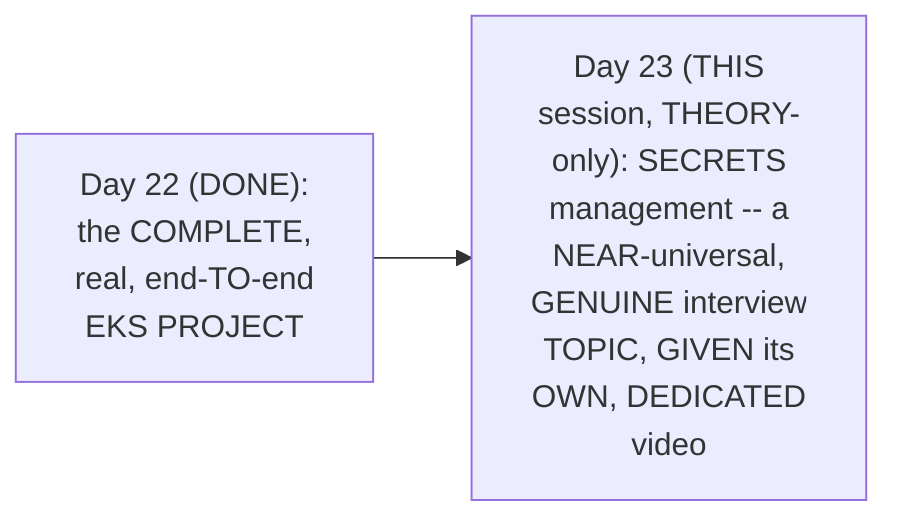

#### 🎯 Key Takeaways

* THIS session is GENUINELY, NOTABLY a **THEORY-only** session — a REAL, DIRECT departure FROM this SERIES' own, USUAL theory-PLUS-demo format.
* THE instructor **directly, EXPLICITLY justifies** this DEDICATED format — SECRETS management is GENUINELY, near-UNIVERSALLY asked ABOUT in REAL interviews ("90 PERCENTAGE of the TIMES").
* This directly, PRECISELY sets UP the SESSION's own, COMPLETE structure — a THOROUGH, precise EXPLANATION of THREE, distinct SOLUTIONS, and a GENUINE, practical DECISION framework.

---

### 2. Why Secrets Management Genuinely Matters: Real, Worked Examples

#### 🪜 Step-by-Step — A Complete, Real, Worked Example: CI/CD Credentials

> 💡 **Given directly:** *"During your CI/CD implementation, you use Docker, for example — so there can be your Docker username, Docker password, or the registry URL that is required to upload your Docker image, right, and all of this is very, very sensitive — let's say if this information is leaked, then anyone who has access, they can delete the images, they can upload the wrong images."*

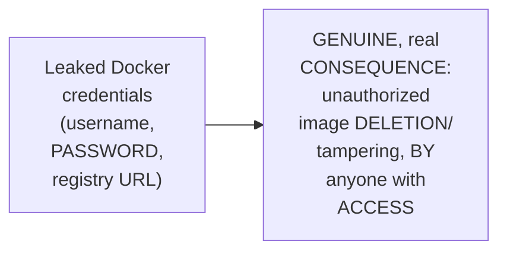

#### 🪜 Step-by-Step — Two, Further, Real, Worked Examples

> 💡 **Given directly:** *"Let's say you are working with the CI/CD, and you have to interact with a database — again, the database username and password... has to be very, very secure, if not they will just access your database and delete the entries... let's say you are working on Ansible, you need access to your AWS account, let's say you are working with Terraform, so again you need your AWS provider credentials."*

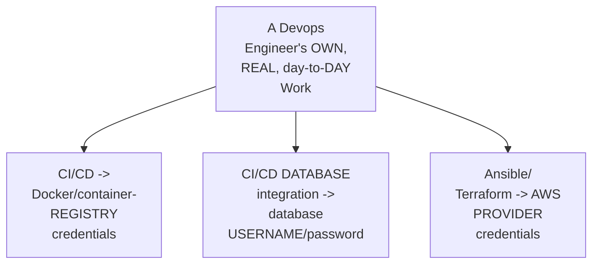

#### ⚠ Common Mistakes

* Assuming SECRETS management is GENUINELY, MERELY a niche, SPECIALIZED concern — explicitly, directly, THOROUGHLY demonstrated as GENUINELY, DIRECTLY touching virtually EVERY, real DEVOPS activity — CI/CD, DATABASE integration, and infrastructure-AS-code tools (ANSIBLE, Terraform) ALL, genuinely REQUIRE it.

#### 🎯 Key Takeaways

* SECRETS management GENUINELY, DIRECTLY touches MULTIPLE, real DEVOPS activities: **CI/CD** (Docker/CONTAINER-registry credentials), **DATABASE integration** (username/PASSWORD), and **infrastructure-as-CODE** (Ansible/TERRAFORM provider credentials).
* A REAL, genuine CONSEQUENCE of a LEAK is directly, CONCRETELY confirmed — UNAUTHORIZED image DELETION/tampering, or DATABASE entry DELETION — REAL, organizational HARM.
* This directly, PRECISELY sets UP the SESSION's own, NEXT, essential CONTENT — the THREE, precise SOLUTIONS AWS (and THIRD-party TOOLS) genuinely OFFER, to address THIS exact problem (Section 3).

---
### 3. Three, Precise Secrets-Management Solutions on AWS

#### 📖 Definition — The Three, Precise Solutions

> 💡 **Given directly:** *"Specifically coming to AWS, there are three very important things — one is your Systems Manager Parameter Store... second thing, again AWS provides you another service called Secrets Manager... then there is another thing which is called HashiCorp Vault, which is not an AWS offering."*

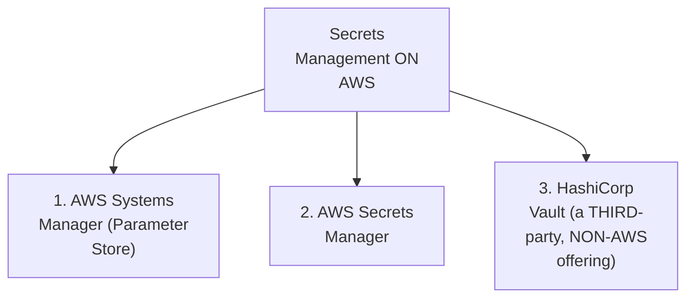

#### 🔍 Internal Working — A Genuine, Direct Clarification on HashiCorp Vault's Own, Different Nature

> 💡 **Given directly:** *"HashiCorp Vault is a HashiCorp offering, but it is very, very widely used in the market, and you can implement this solution on your AWS platform by yourselves — this is not an AWS offering, you have to take care of this offering, I mean if you install HashiCorp Vault and you manage it by yourself, then you are responsible for your installation and configuration."*

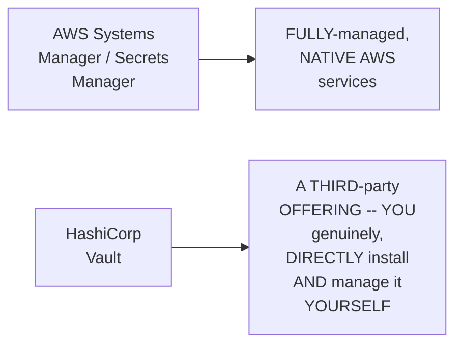

#### ⚠ Common Mistakes

* Assuming ALL three SOLUTIONS are GENUINELY, EQUALLY "AWS SERVICES" — explicitly, directly, PRECISELY clarified: ONLY SYSTEMS Manager and SECRETS Manager are GENUINE, native AWS OFFERINGS — HashiCorp VAULT is a THIRD-party solution YOU install and MANAGE yourself.

#### 🎯 Key Takeaways

* THREE, precise, genuine SOLUTIONS exist FOR secrets MANAGEMENT on AWS: **SYSTEMS Manager** (Parameter STORE), **Secrets MANAGER**, and **HASHICORP Vault**.
* ONLY the FIRST two are GENUINELY, NATIVELY AWS-managed OFFERINGS — HASHICORP Vault is a THIRD-party solution, WIDELY used in the MARKET, but REQUIRING self-managed INSTALLATION and CONFIGURATION.
* This directly, PRECISELY sets UP the SESSION's own, NEXT, essential CONTENT — a THOROUGH, precise EXPLANATION of EACH solution, STARTING with SYSTEMS Manager (Section 4).

---

### 4. Systems Manager Parameter Store: Simple, IAM-Integrated Storage

#### 🪜 Step-by-Step — A Genuine, Direct Callback to This Series' Own, Established Content

> 💡 **Given directly:** *"If you watched our CI/CD videos on AWS platform, that is Day 13 and Day 14... I used a lot of sensitive information, such as Docker username, password, registry URL, and I secured them in the systems manager — within the systems manager there is something called Parameter Store."*

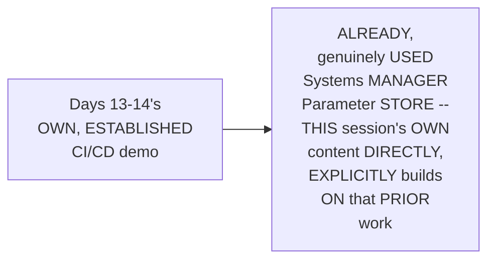

#### 📖 Definition — A Genuine, Direct Confirmation of Its Own, Real Simplicity

> 💡 **Given directly:** *"If you store any information in the systems manager, it is very, very easy to retrieve — all that you need to do is, any other AWS service, if it tries to access this information, you just need to grant that AWS service an IAM role... using this IAM role, they will access the systems manager — this is very, very simple to integrate and very simple to use."*

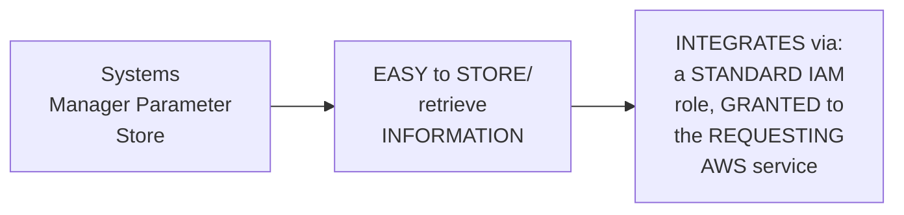

#### ⚠ Common Mistakes

* Assuming THIS session's own COVERAGE of Systems MANAGER represents GENUINELY, ENTIRELY new CONTENT — explicitly, directly, EXPLICITLY connected TO a PRIOR, already-ESTABLISHED session's own, PRACTICAL demonstration (DAYS 13-14) — THIS session RE-explains it, WITHIN a BROADER, comparative CONTEXT.

#### 🎯 Key Takeaways

* **SYSTEMS Manager Parameter STORE** is directly, EXPLICITLY confirmed AS GENUINELY, practically ALREADY used — IN this SERIES' own, ESTABLISHED CI/CD demo (DAYS 13-14).
* IT is directly, REPEATEDLY confirmed AS "VERY, very SIMPLE to integrate AND very SIMPLE to use" — INTEGRATING via a STANDARD IAM role.
* This directly, PRECISELY sets UP the SESSION's own, NEXT, essential QUESTION — GIVEN this GENUINE simplicity, WHY does SECRETS Manager (a SECOND, seemingly REDUNDANT solution) genuinely EXIST (Section 5)?

---
### 5. Why Secrets Manager Exists: Automatic Rotation, Precisely Explained

#### 📖 Definition — Rotation, Precisely Introduced

> 💡 **Given directly:** *"A lot of times when you are working with this sensitive information, you might have to rotate the sensitive information automatically — what do you mean by rotating the information? Let's say you are using a certificate... the certificates should be expired in a specific duration, let's say once in 180 days your certificate has to be expired, and it should be automatically rotated."*

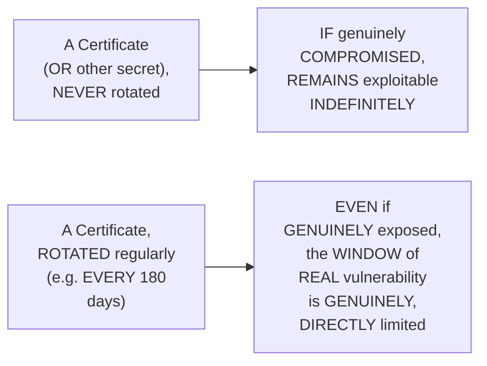

#### 🔍 Internal Working — A Genuine, Precise Explanation of WHY Rotation Reduces Risk

> 💡 **Given directly:** *"Even if your certificate is exposed, or even if your certificate is compromised, someone has access to your certificate's public key — still, if you rotate your certificates at the right time... you will reduce the chance of risk — so even if your certificate's public [key] is exposed, because once in 180 days, 90 days, you are rotating and changing the certificates automatically, the chance of risk will reduce."*

#### 🪜 Step-by-Step — A Second, Genuine, Real, Worked Example: Database Passwords

> 💡 **Given directly:** *"Let's say you have a password, and this password is a DB-related password, and you are using this in one of your day-to-day activities — because database is a very, very sensitive thing, better put it in the secrets manager, and ask your secrets manager to rotate this password once in every 90 days... whoever has access to this password, they will not be able to access the database, and your information will still be secure."*

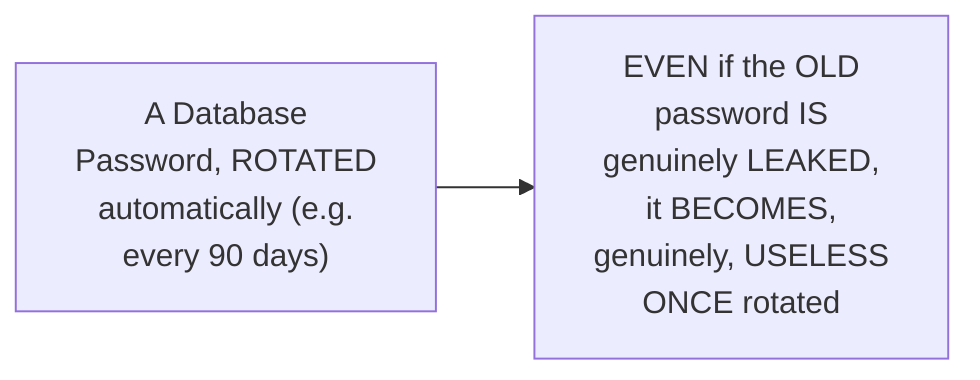

#### ⚠ Common Mistakes

* Assuming ROTATION is GENUINELY, MERELY a "NICE-to-have" convenience FEATURE — explicitly, directly, PRECISELY explained AS a GENUINE, real, SECURITY-critical mechanism — DIRECTLY, STRUCTURALLY limiting the "WINDOW" during WHICH a COMPROMISED secret genuinely REMAINS exploitable.

#### 🎯 Key Takeaways

* SECRETS MANAGER genuinely, DIRECTLY exists TO solve ONE, primary PROBLEM: **AUTOMATIC secret ROTATION**.
* TWO, real, worked EXAMPLES (CERTIFICATES, database PASSWORDS) directly, CONCRETELY illustrate the SAME, underlying PRINCIPLE — REGULAR rotation GENUINELY, DIRECTLY reduces SECURITY risk — EVEN if a secret IS, genuinely, EVENTUALLY exposed, ITS own, USABLE window is GENUINELY, STRUCTURALLY limited.
* This directly, PRECISELY sets UP the SESSION's own, NEXT, essential CONTENT — a PRECISE decision FRAMEWORK for CHOOSING between Systems MANAGER and Secrets MANAGER (Section 6).

---

### 6. A Precise Decision Framework: Systems Manager vs. Secrets Manager

#### 📖 Definition — The Precise, Complete Decision Framework

> 💡 **Given directly:** *"If you have information that is not that much sensitive, still sensitive but not highly sensitive, go with systems manager parameter store — but if that information is highly secure, then go with secrets manager, because using secrets manager you can do a lot of additional things, that is you can go with password rotation policy... but secrets manager is slightly on a higher price when compared to systems manager."*

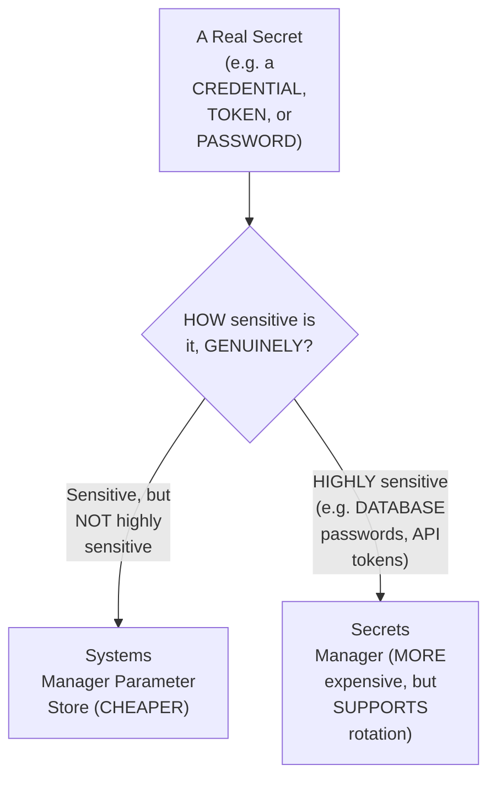

#### 🔍 Internal Working — A Genuine, Direct, Honest Cost Clarification

> 💡 **Given directly:** *"Secrets manager is slightly on a higher price when compared to systems manager, because AWS is providing you all of these things, so you can use secrets manager, but at the cost of paying a high amount to AWS — that's why always go with a combined solution, that is systems manager plus secrets manager."*

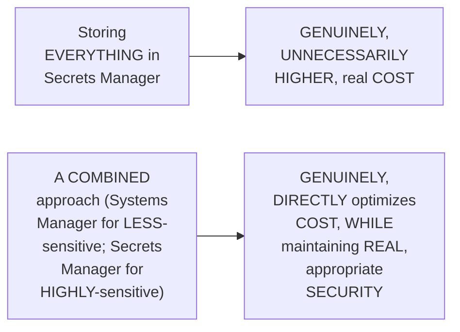

#### ⚠ Common Mistakes

* Assuming STORING EVERY, single SECRET in SECRETS Manager (THE "more secure-SOUNDING" option) is GENUINELY, ALWAYS the SAFEST, best CHOICE — explicitly, directly, HONESTLY corrected: THIS genuinely, UNNECESSARILY increases COST — a COMBINED approach (MATCHING each SECRET's own, real SENSITIVITY to the APPROPRIATE tool) is the GENUINE, recommended PRACTICE.

#### 🎯 Key Takeaways

* THE precise, complete DECISION framework: **NOT highly sensitive** → SYSTEMS Manager Parameter STORE (cheaper); **HIGHLY sensitive** → SECRETS Manager (MORE expensive, but SUPPORTS rotation and ADDITIONAL security FEATURES).
* THE instructor **directly, HONESTLY confirms** Secrets MANAGER is GENUINELY, DIRECTLY more EXPENSIVE than Systems MANAGER — DIRECTLY connecting BACK to this SERIES' own, established COST-optimization principles (DAY 18).
* THE genuine, RECOMMENDED practice: **"ALWAYS go WITH a COMBINED solution"** — Systems MANAGER plus SECRETS Manager, USED together, MATCHED to EACH secret's own, REAL sensitivity level.

---
### 7. A Complete, Real, Worked Example: Categorizing a Container-Registry Integration

#### 🪜 Step-by-Step — A Complete, Real, Worked Example

> 💡 **Given directly:** *"I am using AWS CodePipeline... I want to publish the images that are created by the CI/CD solution to a container registry... for this container registry, definitely there will be a username, there will be a password, and then there will be your container registry URL — one, two, and three, which are sensitive information."*

#### 🔍 Internal Working — A Genuine, Precise Categorization by Sensitivity

> 💡 **Given directly:** *"Username and registry URL are not highly sensitive, right — they are important, but they are not highly sensitive — if your username is exposed, still, without password, they will not be able to use this, they will not be able to manipulate your Docker images — so username and registry URL you can secure them in the systems manager parameter store, whereas... you have something called Docker password... which you can store in the secrets manager."*

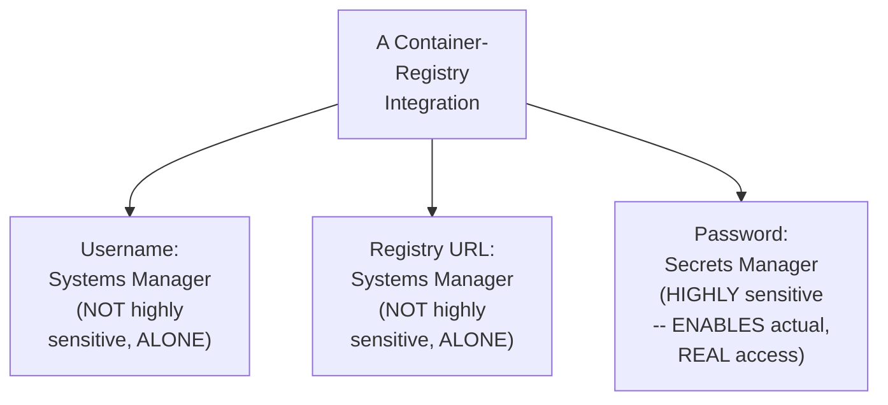

#### 🔍 Internal Working — A Genuine, Direct Confirmation of the Underlying Cost Logic

> 💡 **Given directly:** *"That way, what you are doing is you are trying to use two solutions effectively, and you are also keeping the cost optimization in your mind — what happens if you store everything in the secrets manager? AWS will charge you slightly higher for that purpose — you can use the systems manager and you can reduce the cost."*

#### ⚠ Common Mistakes

* Assuming a USERNAME or a REGISTRY URL, BEING GENUINELY, "PART of" a SENSITIVE credential SET, is GENUINELY, EQUALLY as SENSITIVE as the PASSWORD itself — explicitly, directly, PRECISELY distinguished: WITHOUT the PASSWORD, a LEAKED username/URL ALONE GENUINELY, DIRECTLY cannot ENABLE real, UNAUTHORIZED access.

#### 🎯 Key Takeaways

* A COMPLETE, real, WORKED example (a CONTAINER-registry integration: USERNAME, password, REGISTRY URL) directly, CONCRETELY applies Section 6's OWN, established DECISION framework.
* **USERNAME** and **REGISTRY URL** are precisely CATEGORIZED as "NOT highly SENSITIVE" (ALONE, they CANNOT enable REAL, unauthorized ACCESS) — appropriately STORED in Systems MANAGER.
* **PASSWORD** is precisely CATEGORIZED as "HIGHLY sensitive" (it GENUINELY, DIRECTLY enables REAL access) — appropriately STORED in Secrets MANAGER — DIRECTLY, CONCRETELY demonstrating the SAME, established cost-OPTIMIZATION logic FROM Section 6.

---

### 8. A Genuine, Additional Secrets-Manager Capability: Lambda-Based Custom Rotation

#### 🪜 Step-by-Step — A Genuine, Direct Confirmation of the Organizational Scaling Problem

> 💡 **Given directly:** *"When you are working in an organization, the number of usernames, the number of passwords will keep on increasing, and the number of secure things that you are doing in your secrets manager will become very difficult to manage as well."*

#### 📖 Definition — A Genuine, Additional, Real Capability

> 💡 **Given directly:** *"Let's say you are using a DB service — what secrets manager can do is, it can integrate with Lambda functions, and it can ask you to write your custom secrets rotation policy — you can integrate it with your custom Lambda function logic as well."*

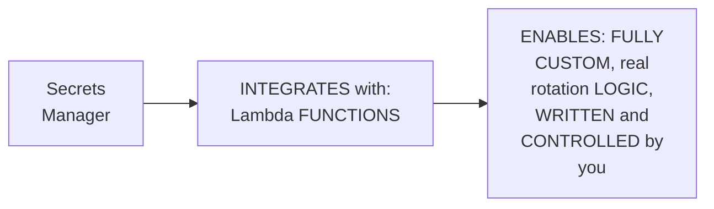

#### ⚠ Common Mistakes

* Assuming SECRETS Manager's OWN rotation CAPABILITY is GENUINELY, STRICTLY limited to a SMALL, FIXED set of BUILT-in rotation TYPES — explicitly, directly, PRECISELY clarified: it GENUINELY, DIRECTLY supports FULLY custom ROTATION logic, VIA Lambda-FUNCTION integration.

#### 🎯 Key Takeaways

* AT REAL, organizational SCALE, the SHEER number OF secrets GENUINELY, DIRECTLY becomes DIFFICULT to MANAGE — a GENUINE, real MOTIVATION for USING Secrets Manager's OWN, more ADVANCED capabilities.
* SECRETS Manager directly, GENUINELY integrates WITH **Lambda functions** — ENABLING fully CUSTOM, real rotation LOGIC — DIRECTLY connecting BACK to Day 17's own, ESTABLISHED Lambda CONTENT.
* This directly, PRECISELY completes the SESSION's own, ESTABLISHED comparison BETWEEN Systems Manager and SECRETS Manager — SETTING up the SESSION's own, FINAL, core COMPARISON — WHY choose HASHICORP Vault instead (Section 9).

---
### 9. Why HashiCorp Vault, Given AWS's Own Two Native Offerings

#### 📖 Definition — Advantage 1: Avoiding Vendor Lock-In (A Genuine Callback)

> 💡 **Given directly:** *"Whenever you are using an AWS managed offering, you will be tied to the AWS platform — let's say your organization is using hybrid cloud, that means a combination of different clouds, or multi-cloud, or your organization has plans to move from AWS to Azure — then these things become a bottleneck for you... instead, if your organization is using HashiCorp Vault, which is a centralized solution, you can use it with AWS, you can use it with Azure, or any other cloud platform."*

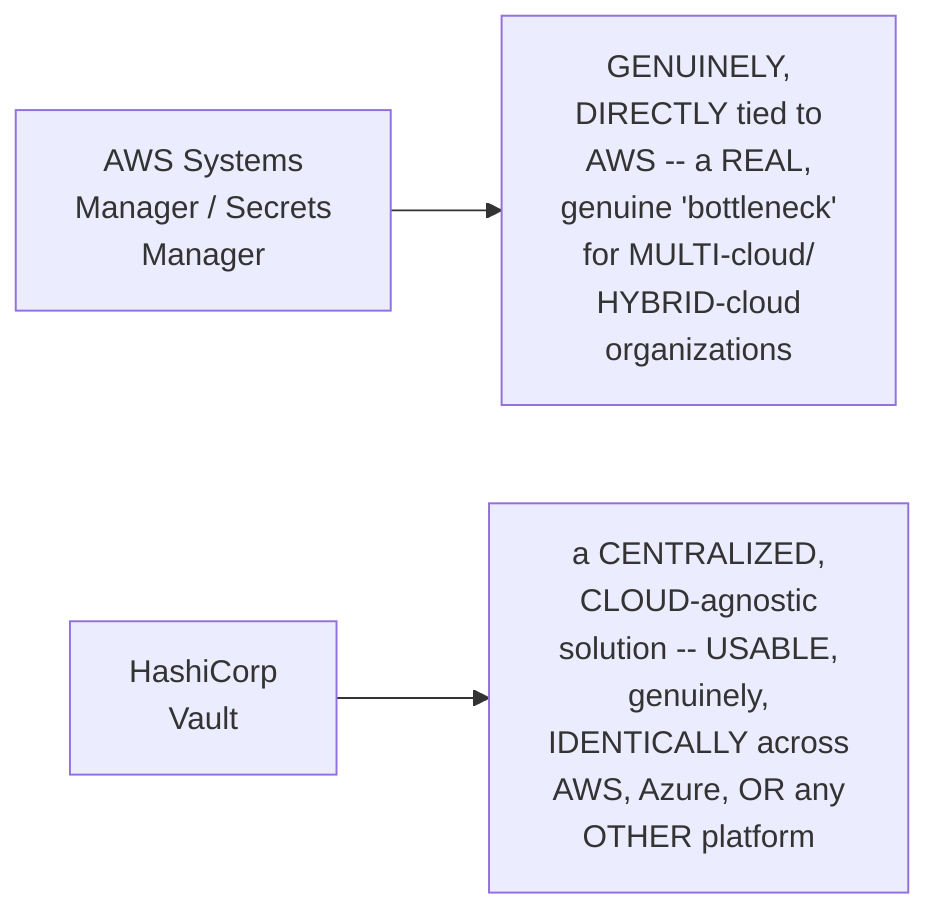

#### 📖 Definition — Advantage 2: Open-Source, Community-Driven Feature Velocity

> 💡 **Given directly:** *"HashiCorp Vault is a very dedicated secrets management solution that is available for years... it's an open-source platform, that means not just HashiCorp, but it is a community-driven project as well — because of this, the Vault offering has a lot of community backup, and there are so many features, many additional encryption strategies that HashiCorp Vault offers over the AWS managed offerings."*

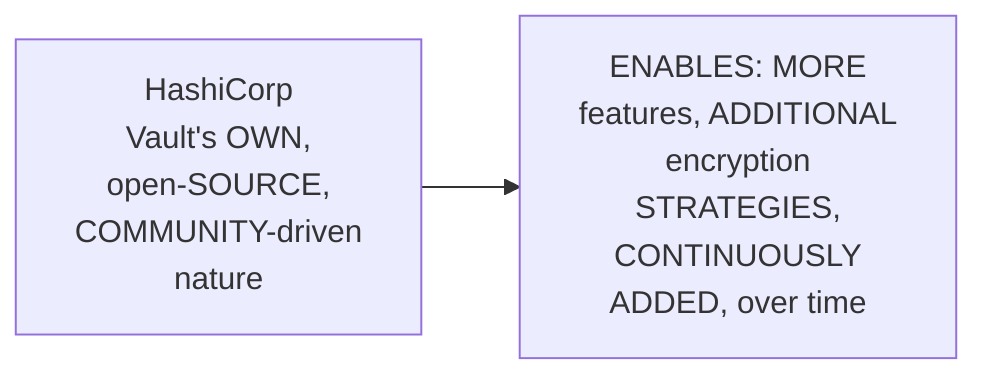

#### ⚠ Common Mistakes

* Assuming HASHICORP Vault's own, GENUINE advantages are GENUINELY, MERELY about AVOIDING vendor LOCK-in ALONE — explicitly, directly, ADDITIONALLY confirmed: its OWN, open-SOURCE, community-DRIVEN nature ALSO, genuinely PROVIDES a REAL, SEPARATE advantage — MORE features and ENCRYPTION strategies, DIRECTLY paralleling THIS series' own, ESTABLISHED Kubernetes-vs-ECS "COMMUNITY feature VELOCITY" reasoning (Day 21).

#### 🎯 Key Takeaways

* **ADVANTAGE 1 — AVOIDING vendor LOCK-in**: HASHICORP Vault is a CENTRALIZED, cloud-AGNOSTIC solution — GENUINELY, DIRECTLY valuable FOR multi-cloud/HYBRID-cloud organizations, UNLIKE AWS's OWN, natively-TIED offerings.
* **ADVANTAGE 2 — open-SOURCE feature VELOCITY**: VAULT's own, community-DRIVEN nature GENUINELY, DIRECTLY enables MORE features and ENCRYPTION strategies — DIRECTLY paralleling THIS series' own, ESTABLISHED Kubernetes-community REASONING (Day 21's OWN ECS-vs-Kubernetes COMPARISON).
* This directly, PRECISELY sets UP the SESSION's own, FINAL, practical CONTENT — a GENUINE, interview-READY recommendation FOR synthesizing ALL of this REASONING (Section 10).

---

### 10. A Genuine, Practical, Interview-Ready Recommendation

#### 🪜 Step-by-Step — A Direct, Practical, Interview-Answer Framework

> 💡 **Given directly:** *"During your interviews, you can say that I use a combination of both systems manager and secrets manager, whenever it is required to use systems manager I'll go with it, and whenever I require secrets manager I'll go with the other option... let's say in your organization if you are using multi-cloud, during your interviews go with HashiCorp Vault — or if the interviewer asks you when did you migrate to AWS, and what were you using before that, then probably you can say, 'before migrating to AWS, we were using HashiCorp Vault.'"*

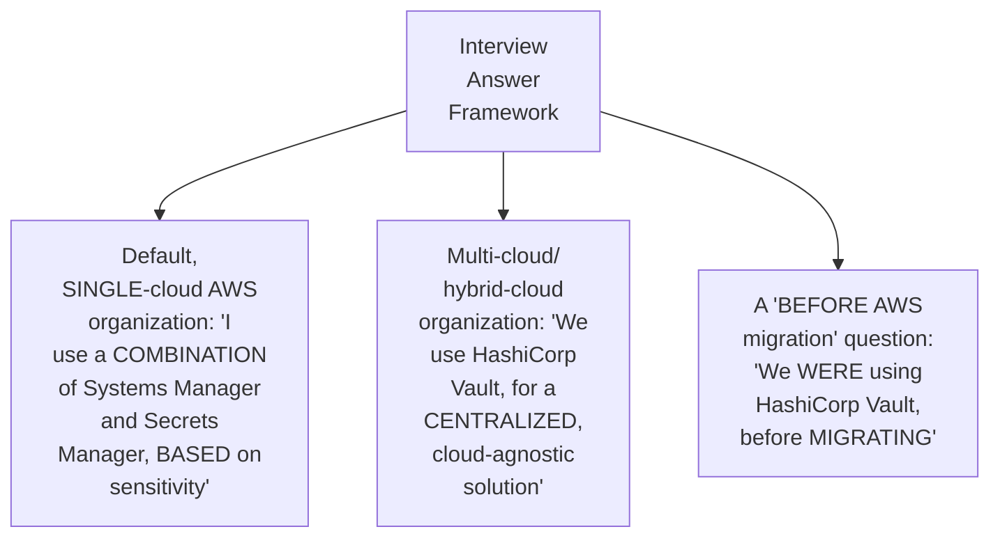

#### ⚠ Common Mistakes

* Assuming a REAL interview REQUIRES declaring ONE, single "CORRECT" secrets-MANAGEMENT solution, UNIVERSALLY — explicitly, directly, PRACTICALLY framed as a CONTEXT-dependent ANSWER — THE right CHOICE genuinely, DIRECTLY depends ON your organization's OWN, real cloud STRATEGY (single-CLOUD versus MULTI-cloud) and HISTORICAL context.

#### 🎯 Key Takeaways

* A GENUINE, practical INTERVIEW-answer framework directly, CONCRETELY synthesizes THIS session's own, COMPLETE reasoning — RECOMMEND a COMBINED Systems-MANAGER/Secrets-Manager approach FOR single-cloud AWS ORGANIZATIONS; recommend HASHICORP Vault for MULTI-cloud/hybrid ORGANIZATIONS.
* THE instructor **directly, PRACTICALLY provides** a REAL, ready-to-USE interview PHRASE for a COMMON, related question — "BEFORE migrating to AWS, we WERE using HashiCorp VAULT."
* This directly, PRECISELY sets UP the SESSION's own, FINAL, direct ENCOURAGEMENT — TAKING notes and PREPARING this EXACT, genuine interview ANSWER (Section 11).

---

### 11. Closing: A Direct Encouragement to Prepare This Answer

#### 🪜 Step-by-Step — A Direct, Genuine, Final Encouragement

> 💡 **Given directly:** *"I hope this difference is very clear to you, and try to answer this — like, take a note of it, write down these things, and be ready for your interview — when the interviewer is asking about this secret management, don't be blank, be ready with your answer, and tell them according to your organizational requirement."*

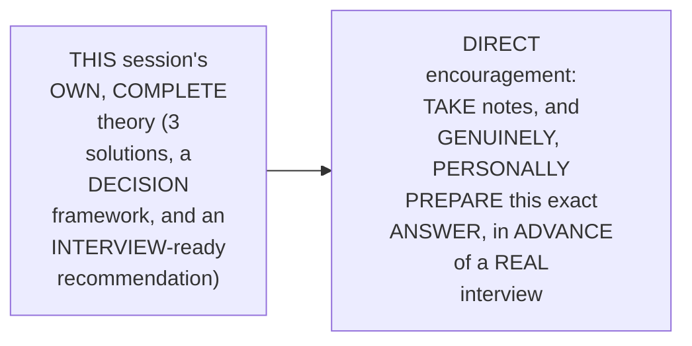

#### ⚠ Common Mistakes

* Assuming THIS session's own, THEORETICAL content is GENUINELY, MERELY informational, WITHOUT requiring FURTHER, PERSONAL preparation — explicitly, directly, DIRECTLY encouraged AGAINST — "DON'T be BLANK, be READY with your ANSWER" — ACTIVE, personal PREPARATION is GENUINELY, DIRECTLY required.

#### 🎯 Key Takeaways

* This episode **GENUINELY, COMPREHENSIVELY delivers** its OWN, stated GOALS — a COMPLETE, precise EXPLANATION of THREE secrets-MANAGEMENT solutions, a GENUINE decision FRAMEWORK, and a PRACTICAL, interview-READY recommendation.
* THE instructor **directly, PERSONALLY encourages** learners to GENUINELY, ACTIVELY prepare THIS exact answer, IN advance — RATHER than PASSIVELY absorbing the THEORY alone.
* This directly, PRECISELY completes THIS session's own, GENUINELY unique, theory-ONLY FORMAT — a COMPLETE, standalone, interview-FOCUSED deliverable.

---
## 📝 Glossary

| Term | Definition | Why It Matters |
|---|---|---|
| **Systems Manager Parameter Store** | AWS's own, simple, IAM-integrated secret storage | Cheaper; best for non-highly-sensitive information |
| **Secrets Manager** | AWS's own, rotation-capable secret storage | More expensive; best for highly-sensitive information |
| **HashiCorp Vault** | A third-party, open-source, cloud-agnostic secrets solution | Requires self-managed installation/configuration |
| **Rotation** | Automatically changing a secret on a schedule | Limits the exploitable window of a compromised secret |
| **Vendor Lock-In** | Being tied to one cloud provider's own tooling | The core motivation for choosing Vault, in multi-cloud contexts |

---

## 🔄 Revision Notes — One-Minute Revision

* This is **Day 23**, a genuinely, notably theory-ONLY session -- explicitly justified because secrets management is asked about in roughly 90% of real interviews, across every cloud provider.
* **Why secrets management matters**: real, worked examples across CI/CD (Docker/container-registry credentials), database integration (username/password), and infrastructure-as-code (Ansible/Terraform provider credentials). A genuine leak causes real, organizational harm (unauthorized image deletion, database entry deletion).
* **Three, precise solutions on AWS**: Systems Manager (Parameter Store), Secrets Manager, and HashiCorp Vault (explicitly NOT an AWS offering -- a third-party solution you install and manage yourself).
* **Systems Manager Parameter Store**: already, genuinely used in this series' own, established CI/CD demo (Days 13-14). Very simple to integrate (via a standard IAM role) and use.
* **Why Secrets Manager exists**: automatic ROTATION. Two, real, worked examples (certificates, database passwords) demonstrate the same principle -- regular rotation genuinely reduces risk, even if a secret is eventually exposed, by limiting its exploitable window.
* **The precise decision framework**: not highly sensitive -> Systems Manager (cheaper); highly sensitive -> Secrets Manager (more expensive, but supports rotation). The recommended practice: "always go with a combined solution" -- matching each secret's own, real sensitivity to the appropriate tool, directly connecting back to this series' own, established cost-optimization principles (Day 18).
* **A complete, real, worked example**: a container-registry integration (username, password, registry URL). Username and registry URL, alone, aren't highly sensitive (can't enable real access without the password) -- Systems Manager. Password IS highly sensitive (enables real access) -- Secrets Manager.
* **A genuine, additional Secrets Manager capability**: integration with Lambda functions, enabling fully custom rotation logic -- directly connecting back to Day 17's own, established Lambda content.
* **Why HashiCorp Vault**: (1) avoiding vendor lock-in -- a centralized, cloud-agnostic solution, genuinely valuable for multi-cloud/hybrid-cloud organizations, directly paralleling this series' own, established vendor-lock-in reasoning (Day 21's ECS-vs-Kubernetes comparison); (2) open-source, community-driven feature velocity -- more features and encryption strategies, directly paralleling Day 21's own Kubernetes-community reasoning.
* **A genuine, practical interview-ready recommendation**: for single-cloud AWS organizations, describe a combined Systems-Manager/Secrets-Manager approach; for multi-cloud/hybrid organizations, recommend HashiCorp Vault. A ready-to-use phrase for "what were you using before AWS": "we were using HashiCorp Vault, before migrating."
* **Closing**: a direct, personal encouragement to take notes and genuinely prepare this exact answer in advance -- "don't be blank" in a real interview.

---

## 📋 Cheat Sheet

**Three, precise solutions:**
```text
Systems Manager (Parameter Store) -- AWS-native, simple, cheaper
Secrets Manager                    -- AWS-native, rotation-capable, more expensive
HashiCorp Vault                     -- third-party, self-managed, cloud-agnostic
```

**The decision framework:**
```text
NOT highly sensitive  -> Systems Manager (cheaper)
HIGHLY sensitive        -> Secrets Manager (rotation + additional security, at higher cost)
```

**A real, worked example (container-registry credentials):**
```text
Username, Registry URL -> Systems Manager (not highly sensitive, alone)
Password                -> Secrets Manager (highly sensitive -- enables real access)
```

**Why HashiCorp Vault:**
```text
1. Avoids vendor lock-in -- works identically across AWS, Azure, and other clouds
2. Open-source, community-driven -- more features, more encryption strategies
```

**Interview-ready phrases:**
```text
Single-cloud AWS org:  "I use a combination of Systems Manager and Secrets Manager,
                         based on each secret's own sensitivity."
Multi-cloud org:        "We use HashiCorp Vault, for a centralized, cloud-agnostic solution."
"What before AWS?":      "Before migrating to AWS, we were using HashiCorp Vault."
```

---

## 🔥 Interview Questions & Answers

### 🟢 Beginner

**Q1.**

**Question:** Name AWS's three, precise secrets-management solutions.

**Answer:** Systems Manager (Parameter Store), Secrets Manager, and HashiCorp Vault.

**Explanation:** Directly, explicitly named.

**Why Interviewers Ask This:** The most basic, foundational secrets-management question.

**Possible Follow-up:** "Which of these is genuinely NOT an AWS offering?"

**Q2.**

**Question:** Is HashiCorp Vault an AWS service?

**Answer:** No -- it's a third-party offering you install and manage yourself.

**Explanation:** Directly, explicitly confirmed.

**Why Interviewers Ask This:** A commonly-tested, genuine distinction.

**Possible Follow-up:** "What does 'managing it yourself' genuinely mean, in practice?"

**Q3.**

**Question:** What genuine, primary capability does Secrets Manager offer that Systems Manager doesn't?

**Answer:** Automatic secret rotation.

**Explanation:** Directly, precisely explained.

**Why Interviewers Ask This:** Foundational, frequently-tested Systems-Manager-vs-Secrets-Manager distinction.

**Possible Follow-up:** "Give a real example of why rotation genuinely matters."

**Q4.**

**Question:** Which is genuinely more expensive: Systems Manager or Secrets Manager?

**Answer:** Secrets Manager.

**Explanation:** Directly, explicitly confirmed.

**Why Interviewers Ask This:** Tests genuine, practical cost-awareness.

**Possible Follow-up:** "What's the recommended practice, given this cost difference?"

**Q5.**

**Question:** In the container-registry example, why is a username considered less sensitive than a password?

**Answer:** Alone, without the password, a leaked username can't genuinely enable real, unauthorized access.

**Explanation:** Directly, precisely explained.

**Why Interviewers Ask This:** Tests genuine, practical application of the sensitivity-based decision framework.

**Possible Follow-up:** "Where would you store each of these, respectively?"

**Q6.**

**Question:** Does Secrets Manager support fully custom rotation logic?

**Answer:** Yes -- via integration with Lambda functions.

**Explanation:** Directly, explicitly confirmed.

**Why Interviewers Ask This:** Tests genuine, practical, advanced Secrets Manager knowledge.

**Possible Follow-up:** "What series topic does this directly connect back to?"

**Q7.**

**Question:** Name two, genuine advantages of HashiCorp Vault over AWS's native offerings.

**Answer:** Avoiding vendor lock-in, and open-source, community-driven feature velocity.

**Explanation:** Directly, explicitly named.

**Why Interviewers Ask This:** A commonly-tested, genuine Vault-vs-AWS-native comparison.

**Possible Follow-up:** "Which advantage genuinely matters most, for a multi-cloud organization?"

**Q8.**

**Question:** How does regular rotation genuinely reduce security risk, even if a secret is eventually exposed?

**Answer:** It limits the exploitable window during which the compromised secret remains usable.

**Explanation:** Directly, precisely explained.

**Why Interviewers Ask This:** Tests genuine, conceptual understanding beyond rote definitions.

**Possible Follow-up:** "Give a real example, using certificates."

**Q9.**

**Question:** What is the recommended, general practice for using Systems Manager and Secrets Manager together?

**Answer:** A combined approach, matching each secret's own sensitivity to the appropriate tool.

**Explanation:** Directly, explicitly recommended.

**Why Interviewers Ask This:** Basic, practical, real-world secrets-management strategy.

**Possible Follow-up:** "Why not just use Secrets Manager for everything?"

**Q10.**

**Question:** What percentage of the time does this session claim you'll genuinely be asked about secrets management, in a real interview?

**Answer:** Roughly 90%.

**Explanation:** Directly, explicitly stated.

**Why Interviewers Ask This:** Tests attention to the session's own, stated motivation and context.

**Possible Follow-up:** "Does this apply only to AWS interviews?"

---

### 🟡 Intermediate

**Q11.**

**Question:** Explain why the instructor deliberately makes this session a standalone, dedicated video, rather than explaining secrets management as part of other, related topics (like the CI/CD sessions where it was already, practically used).

**Answer:** This is a genuinely deliberate, INTERVIEW-preparation-focused teaching choice: by CONSOLIDATING secrets MANAGEMENT into ONE, dedicated VIDEO — RATHER than LEAVING it SCATTERED across MULTIPLE, earlier sessions (WHERE it was ALREADY, practically USED, e.g., Days 13-14) — the instructor ENSURES learners have a SINGLE, COMPLETE, easily-REVIEWABLE resource SPECIFICALLY for this NEAR-universal interview QUESTION. This directly, EXPLICITLY connects TO Section 1's own, STATED motivation — "SO that you CAN explain this TOPIC to the INTERVIEWER in a CONVINCING way" — a SCATTERED, PIECEMEAL explanation WOULD, genuinely, be HARDER to REVIEW and SYNTHESIZE into a SINGLE, confident INTERVIEW answer.

**Explanation:** Requires recognizing the deliberate, interview-preparation value of consolidating a cross-cutting topic into one, dedicated, easily-reviewable resource, rather than leaving it scattered across its various, practical applications.

**Why Interviewers Ask This:** Tests whether a learner recognizes the pedagogical value of consolidating cross-cutting, interview-relevant topics into standalone resources.

**Possible Follow-up:** "Identify ANOTHER, GENUINE topic (FROM elsewhere in THIS series) that COULD, similarly, BENEFIT from THIS same, CONSOLIDATED, dedicated-VIDEO treatment."

**Q12.**

**Question:** A learner argues that since this session confirms Secrets Manager offers more security features (like rotation) than Systems Manager, this means an organization should always use Secrets Manager for every secret, to maximize security, regardless of cost. Evaluate this claim.

**Answer:** This claim DIRECTLY contradicts Section 6's own, EXPLICIT, established RECOMMENDATION — "ALWAYS go WITH a COMBINED solution." Section 6's own PRECISE REASONING confirms STORING everything IN Secrets Manager GENUINELY, DIRECTLY incurs UNNECESSARY, higher COST — WITHOUT a CORRESPONDING, genuine SECURITY benefit for INFORMATION that ISN'T, genuinely, highly SENSITIVE in the FIRST place (per Section 7's own established, container-REGISTRY-username EXAMPLE). MAXIMIZING "SECURITY" in THE abstract, WITHOUT considering GENUINE, real sensitivity LEVELS, is NOT, actually, the SESSION's own RECOMMENDED practice — it's a MISAPPLICATION of the ESTABLISHED framework. The ACCURATE, more PRECISE conclusion: the RIGHT approach GENUINELY, DIRECTLY matches EACH secret's own, REAL sensitivity LEVEL to the APPROPRIATE tool — NOT defaulting TO the "MORE secure-sounding" option UNIVERSALLY, WHICH would GENUINELY, UNNECESSARILY waste REAL, organizational budget.

**Explanation:** Tests whether a learner recognizes that this session's own, explicit recommendation is a combined, sensitivity-matched approach, not a blanket "always use the more feature-rich option" strategy.

**Why Interviewers Ask This:** Distinguishes candidates who understand cost-conscious, sensitivity-matched security practice from those who conflate "more features" with "always use it, regardless of need."

**Possible Follow-up:** "Construct a GENUINE, real, COMPLETE cost-VERSUS-security ARGUMENT you could GIVE to a MANAGER who INSISTS on using SECRETS Manager for EVERYTHING."

**Q13.**

**Question:** Explain, precisely, why the instructor deliberately uses the SAME, underlying "rotation reduces the exploitable window" reasoning for both the certificate example and the database-password example, rather than treating them as two, entirely separate concepts.

**Answer:** This is a genuinely deliberate, PATTERN-reinforcing teaching choice: by APPLYING the SAME, underlying PRINCIPLE (regular ROTATION genuinely, DIRECTLY limits a COMPROMISED secret's own, EXPLOITABLE window) to TWO, genuinely DIFFERENT, real EXAMPLES (certificates AND database passwords), the instructor DIRECTLY, CONCRETELY demonstrates that THIS is a GENERALIZABLE, TRANSFERABLE security PRINCIPLE — NOT a NARROW, certificate-SPECIFIC quirk. THIS helps LEARNERS genuinely, DIRECTLY recognize and APPLY this SAME reasoning TO ANY, future, real SECRET type they ENCOUNTER (API tokens, OTHER credentials) — RATHER than MEMORIZING two, SEPARATE, unconnected FACTS.

**Explanation:** Requires recognizing the deliberate, pattern-reinforcing value of applying the same, underlying security principle to two, genuinely different examples, to demonstrate its generalizability.

**Why Interviewers Ask This:** Tests whether a learner recognizes the pedagogical value of demonstrating a transferable principle through multiple, varied examples, rather than treating each example as an isolated fact.

**Possible Follow-up:** "APPLY this SAME, established PRINCIPLE to a THIRD, genuine SECRET type (BEYOND certificates AND database PASSWORDS) of YOUR own choosing."

**Q14.**

**Question:** Using this session's own precise "vendor lock-in" reasoning for HashiCorp Vault (Section 9), explain a GENUINE, real, structural reason why an organization's choice of secrets-management solution could have compounding consequences as that organization's own cloud strategy evolves over time.

**Answer:** A precise, reasoned analysis, directly extending Section 9's own established REASONING, and DIRECTLY connecting BACK to Advanced Q15's own SIMILAR, established REASONING FROM Day 21 (ECS's OWN vendor lock-IN, COMPOUNDING with FUTURE ECS/EKS integration): per Section 9's own PRECISE reasoning, AWS's OWN, native secrets SOLUTIONS (Systems MANAGER, Secrets Manager) GENUINELY, DIRECTLY tie an organization TO the AWS platform SPECIFICALLY. IF an ORGANIZATION genuinely, INITIALLY commits to AWS's OWN, native secrets TOOLING — WITHOUT anticipating a FUTURE, potential multi-CLOUD or hybrid-CLOUD strategy — a GENUINE, structural CONSEQUENCE compounds OVER time: EVERY, new SECRET, credential, and INTEGRATION built ON top of THESE AWS-native TOOLS becomes GENUINELY, DIRECTLY harder to MIGRATE later, SHOULD the organization'S own cloud STRATEGY genuinely EVOLVE — DIRECTLY mirroring the SAME, "COMPOUNDING vendor lock-IN" structural RISK this series ALREADY established FOR ECS (Day 21). THIS reveals a GENUINE, real, STRATEGIC parallel: BOTH container ORCHESTRATION (ECS) and SECRETS management (Systems Manager/Secrets MANAGER) carry the SAME, underlying, STRUCTURAL vendor-lock-IN risk, and BOTH decisions GENUINELY, DIRECTLY benefit FROM the SAME, early, STRATEGIC consideration — IS multi-cloud a GENUINE, real POSSIBILITY, even IF not IMMEDIATELY planned?

**Explanation:** Requires extending the vendor-lock-in reasoning to identify a genuine, structural, compounding consequence over time, explicitly connecting it to this series' own, parallel reasoning about ECS's own vendor lock-in from Day 21.

**Why Interviewers Ask This:** A senior-level question testing whether a candidate can identify a structural parallel between two, genuinely different AWS-adoption decisions (container orchestration and secrets management) that share the same, underlying vendor-lock-in risk pattern.

**Possible Follow-up:** "Propose a GENUINE, real, PRACTICAL strategy an organization COULD adopt TO hedge AGAINST this SPECIFIC, compounding RISK, WITHOUT genuinely, PREMATURELY committing to HashiCorp Vault BEFORE a REAL, confirmed multi-CLOUD need EXISTS."

**Q15.**

**Question:** Synthesize this session's complete "Lambda-based custom rotation" reasoning (Section 8) with its own "organizational scaling" reasoning (also Section 8) to explain a GENUINE, real operational risk of an organization relying entirely on manually-triggered secret rotation, rather than genuinely automating it via Secrets Manager's own Lambda integration.

**Answer:** A precise, synthesized explanation, directly connecting TWO, closely-related points WITHIN Section 8's own, established CONTENT: per Section 8's own PRECISE, established SCALING observation, "THE number of USERNAMES, the NUMBER of passwords WILL keep on INCREASING" as an ORGANIZATION genuinely GROWS. Per Section 8's own PRECISE, established CAPABILITY, Secrets MANAGER genuinely, DIRECTLY supports FULLY automated, custom ROTATION logic, via LAMBDA integration. SYNTHESIZING these TWO facts directly, PRECISELY reveals a GENUINE, real, OPERATIONAL risk: AN organization that GENUINELY relies ON manual, human-TRIGGERED rotation (RATHER than genuinely AUTOMATING it) will, AS its OWN secret COUNT genuinely GROWS (per Section 8's own established SCALING observation), GENUINELY, DIRECTLY face an INCREASING, real RISK of secrets GENUINELY, ACCIDENTALLY being FORGOTTEN/missed DURING routine rotation CYCLES — DIRECTLY undermining THE entire, CORE security BENEFIT rotation is SUPPOSED to provide (per Section 5's own established "REDUCED exploitable WINDOW" reasoning) — SINCE a FORGOTTEN, un-rotated SECRET genuinely, DIRECTLY retains its FULL, original, EXPLOITABLE window, INDEFINITELY.

**Explanation:** Requires synthesizing the organizational-scaling observation with the Lambda-based automation capability to identify a genuine, real operational risk of relying on manual, rather than automated, rotation as an organization grows.

**Why Interviewers Ask This:** A senior-level question testing whether a candidate can connect two, related facts within the same section to identify a genuine, practical, scaling-related risk that undermines rotation's own, core security benefit.

**Possible Follow-up:** "Design a GENUINE, real, practical MONITORING/alerting process a devops TEAM could use to ENSURE NO secrets are GENUINELY, ACCIDENTALLY missed, DURING routine rotation CYCLES, AT scale."

---

### 🔴 Advanced

**Q16.**

**Question:** Design a complete, reasoned secrets-management strategy (using ONLY this session's own established concepts) for a hypothetical organization currently AWS-only, but genuinely, actively evaluating a future migration to a multi-cloud strategy within the next 2-3 years.

**Answer:** A reasonable, complete strategy, directly applying this session's OWN, exact established CONCEPTS:

```text
1. Immediate, Current-State Categorization (per Section 6's own
   established decision FRAMEWORK): APPLY the ESTABLISHED
   sensitivity-based FRAMEWORK to ALL, current SECRETS -- USING
   Systems Manager FOR non-highly-sensitive INFORMATION, and
   Secrets Manager FOR highly-sensitive INFORMATION (per Section
   7's own established, CONTAINER-registry EXAMPLE) -- MINIMIZING
   IMMEDIATE, unnecessary COST.

2. Rotation Policy (per Section 5 and Section 8's own established
   mechanisms): ESTABLISH genuine, AUTOMATED rotation POLICIES
   (via Secrets Manager's OWN, Lambda-based CAPABILITY) FOR all,
   genuinely HIGH-sensitivity secrets -- DIRECTLY avoiding Advanced
   Q15's own established, "MANUAL rotation, forgotten AT scale"
   risk.

3. Strategic, Forward-Looking Consideration (per Advanced Q14's own
   established, COMPOUNDING vendor-LOCK-in reasoning): GIVEN the
   organization's OWN, GENUINE, 2-3-year multi-CLOUD evaluation
   TIMELINE, BEGIN a MEASURED, PARALLEL evaluation OF HashiCorp
   Vault (per Section 9's own established ADVANTAGES) -- SPECIFICALLY
   for NEW, future SECRETS/integrations, RATHER than an IMMEDIATE,
   COMPLETE migration OF existing, WORKING AWS-native secrets.

4. Cost Monitoring (per Section 6's own established cost
   REASONING, and Day 18's own established COST-optimization
   PRINCIPLES): ESTABLISH genuine, ONGOING cost MONITORING, ACROSS
   BOTH Systems Manager AND Secrets Manager USAGE -- DIRECTLY
   applying Day 18's own, established COST-optimization principles
   TO this SPECIFIC domain.

5. Migration Readiness Documentation (per Section 9's own
   established vendor-LOCK-in risk): MAINTAIN a CLEAR, documented
   INVENTORY of ALL, current AWS-native SECRETS -- DIRECTLY, PROACTIVELY
   reducing the GENUINE, real "migration HEADACHE" Section 9's own
   content EXPLICITLY warns AGAINST, SHOULD a REAL, future migration
   GENUINELY become necessary.
```

This complete STRATEGY directly, precisely APPLIES this session's OWN, established CONCEPTS — SENSITIVITY-based categorization, AUTOMATED rotation, VENDOR-lock-in awareness, COST monitoring, and MIGRATION readiness — to a GENUINELY realistic, FORWARD-looking organizational SCENARIO.

**Explanation:** Requires synthesizing sensitivity-based categorization, automated rotation, vendor-lock-in strategic consideration, cost monitoring, and migration readiness into one complete, reasoned strategy for a realistic, forward-looking organizational scenario.

**Why Interviewers Ask This:** A comprehensive, capstone-level question testing whether a candidate can apply the complete range of this session's own concepts to a realistic, evolving organizational context, rather than a static, single-moment decision.

**Possible Follow-up:** "WHICH of THESE five, strategy COMPONENTS would you GENUINELY, PRACTICALLY prioritize IMPLEMENTING first, GIVEN a LIMITED, initial devops TEAM and TIMELINE?"

**Q17.**

**Question:** Critically evaluate: "Since this session confirms HashiCorp Vault offers genuine advantages in avoiding vendor lock-in and providing more features, this means any organization, regardless of its own, genuine cloud strategy, should immediately adopt Vault over AWS's own, native secrets-management offerings." Is this an accurate, complete characterization?

**Answer:** Not accurate — this OVERSTATES HashiCorp VAULT's own, GENUINE, SPECIFIC advantages INTO an UNCONDITIONAL, "ANY organization SHOULD immediately ADOPT" recommendation, WHICH neither THIS session's own CONTENT, nor sound REASONING, SUPPORTS. Section 10's own PRECISE, established INTERVIEW-answer framework DIRECTLY confirms the OPPOSITE, CONTEXT-dependent guidance — HASHICORP Vault is GENUINELY, SPECIFICALLY recommended FOR organizations "USING multi-CLOUD" — NOT unconditionally, FOR every, SINGLE organization. FOR a GENUINELY, DELIBERATELY single-cloud, AWS-only ORGANIZATION (WITH no genuine, REAL multi-cloud plans), Section 6's own established, COMBINED Systems-Manager/Secrets-Manager APPROACH REMAINS the session's OWN, genuinely RECOMMENDED default — AVOIDING the GENUINE, real, ADDITIONAL operational BURDEN of self-MANAGING Vault's own INSTALLATION and CONFIGURATION (per Section 3's own established DISTINCTION), WITHOUT a GENUINE, corresponding NEED for its OWN, cloud-agnostic ADVANTAGES. The ACCURATE, more PRECISE conclusion: VAULT's own, genuine ADVANTAGES are GENUINELY, DIRECTLY valuable SPECIFICALLY for multi-cloud/HYBRID-cloud organizations — NOT a UNIVERSAL, unconditional RECOMMENDATION for EVERY, single AWS-USING organization, REGARDLESS of their OWN, genuine cloud STRATEGY.

**Explanation:** Tests whether a learner recognizes that HashiCorp Vault's genuine advantages are explicitly, contextually scoped to multi-cloud organizations, not a universal recommendation overriding this session's own, established, context-dependent interview framework.

**Why Interviewers Ask This:** Distinguishes candidates who correctly apply the session's own, explicit, context-dependent recommendation from those who over-generalize Vault's specific advantages into an unconditional, universal recommendation.

**Possible Follow-up:** "Describe a GENUINE, real, SPECIFIC organizational circumstance where a SINGLE-cloud, AWS-only organization MIGHT, nonetheless, LEGITIMATELY choose HashiCorp Vault, DESPITE this session's own, GENERAL guidance."

---

## 🧪 Scenario-Based Interview Questions

> **Scenario 1:** A colleague stores every single secret their team uses -- including low-sensitivity items like public API endpoint URLs -- exclusively in AWS Secrets Manager, and their organization's AWS bill has genuinely, noticeably increased. Using this session's own concepts, construct a complete, reasoned response.

**Structured Answer:**
1. **Initial investigation:** Recognize this as directly connected to Section 6's own precise, established decision framework — a GENUINE, likely MISAPPLICATION of the ESTABLISHED, sensitivity-based CATEGORIZATION.
2. **Relevant principle:** Per Section 6's own established REASONING, "ALWAYS go WITH a COMBINED solution" — NOT storing EVERYTHING in the MORE expensive, feature-RICH option, REGARDLESS of GENUINE sensitivity.
3. **Possible causes:** THE colleague's own TEAM LIKELY, genuinely stored GENUINELY low-SENSITIVITY items (LIKE public API ENDPOINT URLs) in SECRETS Manager, WHEN Systems Manager (per Section 7's own established, CONTAINER-registry EXAMPLE) would have GENUINELY, DIRECTLY sufficed, AT lower COST.
4. **Debugging approach:** Directly AUDIT the TEAM's own, CURRENT Secrets-Manager INVENTORY, RE-categorizing each SECRET's own, GENUINE sensitivity LEVEL (per Section 6's own established FRAMEWORK).
5. **Resolution:** MIGRATE genuinely LOW-sensitivity items FROM Secrets Manager TO Systems Manager (per Section 7's own established, CATEGORIZATION example) — REDUCING overall COST, WITHOUT genuinely, MEANINGFULLY compromising SECURITY.
6. **Prevention:** Establish a standing team PRACTICE of EXPLICITLY, DELIBERATELY categorizing EACH, new SECRET's own, genuine SENSITIVITY level (per Section 6's own established FRAMEWORK) BEFORE storing IT — RATHER than DEFAULTING to the MORE feature-rich, but MORE expensive, OPTION out of CONVENIENCE.

> **Scenario 2 (Advanced):** Your organization is currently AWS-only, using a combined Systems-Manager/Secrets-Manager approach, and leadership is now discussing a potential acquisition of a company that runs entirely on Azure. A colleague argues you should immediately migrate all secrets to HashiCorp Vault, in anticipation. Using this session's own concepts, construct a complete, reasoned response.

**Structured Answer:**
1. **Initial investigation:** Recognize this as directly connected to Advanced Q16's own precise, established, forward-looking STRATEGY — a GENUINE, real consideration, but REQUIRING measured, NOT immediate, ACTION.
2. **Relevant principle:** Per Section 9's own established REASONING, HashiCorp VAULT genuinely, DIRECTLY benefits MULTI-cloud/hybrid-CLOUD organizations — a GENUINE, real ACQUISITION discussion (INVOLVING an Azure-based COMPANY) is a LEGITIMATE, real SIGNAL toward THIS same, eventual NEED.
3. **Possible risks:** An IMMEDIATE, complete MIGRATION of ALL, existing SECRETS to VAULT, BEFORE the acquisition IS genuinely, CONFIRMED, risks a SIGNIFICANT, unnecessary OPERATIONAL disruption — AND the genuine, ADDITIONAL burden OF self-managing VAULT's own installation/CONFIGURATION (per Section 3's own established DISTINCTION), WITHOUT yet HAVING a CONFIRMED, real NEED.
4. **Debugging/evaluation approach:** Directly ASSESS the ACQUISITION's own, GENUINE, current STATUS — is it CONFIRMED, or STILL under DISCUSSION/evaluation?
5. **Resolution:** RECOMMEND a MEASURED, phased APPROACH (per Advanced Q16's own established STRATEGY) — BEGIN evaluating HASHICORP Vault, IN parallel, FOR future, NEW secrets/INTEGRATIONS, WHILE preserving the EXISTING, working AWS-native SETUP for CURRENT, established secrets — RATHER than an IMMEDIATE, wholesale MIGRATION based ON a still-UNCONFIRMED, future POSSIBILITY.
6. **Prevention:** Establish a standing PRACTICE of TYING major, INFRASTRUCTURE-migration decisions TO genuinely CONFIRMED, real business EVENTS (per THIS scenario's own, established REASONING) — RATHER than migrating REACTIVELY, based ON early-stage, UNCONFIRMED discussions ALONE.

---

## 🛠 Hands-on Exercises

### 🟢 Easy

1. Write out, from memory, AWS's three, precise secrets-management solutions.
2. Explain, in your own words, why rotation genuinely reduces security risk, even for an eventually-exposed secret.
3. Explain, in your own words, the precise decision framework for choosing between Systems Manager and Secrets Manager.

### 🟡 Medium

4. Categorize a real, complete set of your own application's secrets (e.g., database credentials, API keys, configuration values), applying this session's own established sensitivity framework.
5. Research and document AWS Secrets Manager's own, real, built-in rotation support for common services (e.g., RDS), versus genuinely custom, Lambda-based rotation.
6. Construct your own, complete, written interview answer to "how do you handle secrets on AWS?", following this session's own established framework.

### 🔴 Advanced

7. Complete the full, reasoned secrets-management strategy proposed in Advanced Interview Q16, for a genuinely different organizational scenario of your own choosing.
8. Implement the debugging scenario proposed in Scenario 1 -- audit a real or hypothetical set of secrets, identify any genuinely mis-categorized ones, and construct a migration plan.
9. Research HashiCorp Vault's own, real, open-source feature set, and compare it directly against AWS Secrets Manager's own, native capabilities.

---

## 🏗 Practice Assignment

*(This session's own stated, direct encouragement, reproduced faithfully)*

> 💡 **The instructor's own words, given directly:** *"Try to answer this -- like, take a note of it, write down these things, and be ready for your interview -- when the interviewer is asking about this secret management, don't be blank, be ready with your answer."*

### Build: "Complete, Written, Interview-Ready Secrets Management Answer"

**Objective:** Directly complete this session's own genuine, stated encouragement -- constructing a complete, confident, interview-ready answer.

**Requirements:**
- Write out, from memory, all three of AWS's precise secrets-management solutions, with a one-sentence description of each.
- Write out the complete, precise decision framework for choosing between Systems Manager and Secrets Manager.
- Write out a complete, real, worked example of your own choosing (different from the container-registry example), correctly categorizing each secret by sensitivity.
- Write out both of HashiCorp Vault's own, genuine advantages, and the specific organizational context in which you'd recommend it.
- Write out a complete, ready-to-deliver, 200-300 word answer to "how do you handle secrets on AWS?", as if genuinely answering a real interviewer.

**Architecture (suggested):**

```text
day23_secrets_management_assignment/
├── three_solutions_summary.md          # your own, written summary
├── decision_framework.md                   # your own, written framework
├── worked_example.md                          # your own, original, categorized example
├── vault_advantages.md                            # your own, written Vault reasoning
└── INTERVIEW_ANSWER.md                                # your complete, ready-to-deliver answer
```

**Expected Functionality:**
- Your written interview answer should genuinely, confidently, and completely address the question, without needing to reference this guide.

**Challenges:**
- Correctly, independently categorizing a new, original example's own secrets by genuine sensitivity.
- Constructing a genuinely confident, complete answer, from memory, without notes.

**Bonus Improvements:**
- Research and document a real, additional secrets-management solution used by another major cloud provider (e.g., Azure Key Vault, GCP Secret Manager), and compare it to this session's own, established AWS solutions.
- Practice delivering your written interview answer aloud, timing yourself, to ensure genuine confidence and completeness.

---

## 📚 Additional Resources

- **Days 13-14 of this series** (in this same workspace) -- the direct, real, prior demonstration of Systems Manager Parameter Store, in a genuine, practical CI/CD context, this session's own content directly references and builds on.
- **Day 17 of this series** (in this same workspace) -- the direct prerequisite session establishing AWS Lambda, whose integration with Secrets Manager (for custom rotation logic) this session directly references.
- **Day 18 of this series** (in this same workspace) -- the direct prerequisite session establishing cost-optimization principles, directly applied to this session's own Systems-Manager-vs-Secrets-Manager cost reasoning.
- **Day 21 of this series** (in this same workspace) -- the direct prerequisite session establishing the "vendor lock-in" and "open-source community feature velocity" reasoning (via the ECS-vs-Kubernetes comparison), directly paralleled in this session's own HashiCorp Vault reasoning.
- **HashiCorp's own, official Vault documentation** (referenced indirectly) -- for further, independent research into Vault's own, complete feature set.

---

## 📌 Final Revision Sheet

### ⭐ Core Concepts
- **Three solutions**: Systems Manager, Secrets Manager, HashiCorp Vault.
- **The decision framework**: sensitivity-based, with cost as a genuine, direct factor.
- **Rotation**: the core, genuine reason Secrets Manager exists.
- **Vendor lock-in**: the core, genuine reason to consider HashiCorp Vault.
- **A combined approach**: the session's own, genuinely recommended, default practice.

### ⭐ Important Definitions
- **Parameter Store, Rotation** (see Glossary for full definitions).

### ⭐ Important Commands/Code
```text
(This session is entirely conceptual; no live demo or commands were shown -- a notable, deliberate departure from this series' own, usual format.)
```

### ⭐ Architecture/Process
- Complete decision process: identify a secret -> assess its genuine sensitivity -> categorize (Systems Manager vs. Secrets Manager) -> for highly-sensitive secrets, configure automatic rotation (built-in or Lambda-based) -> for multi-cloud organizations, evaluate HashiCorp Vault instead.

### ⭐ Best Practices
- Always use a combined Systems-Manager/Secrets-Manager approach, matched to genuine sensitivity.
- Enable automatic rotation for all highly-sensitive secrets.
- Consider HashiCorp Vault specifically for multi-cloud/hybrid-cloud organizations.
- Document your organization's own, current secrets inventory, to ease any future migration.

### ⭐ Common Mistakes
- Storing every secret in Secrets Manager, regardless of genuine sensitivity (unnecessary cost).
- Assuming rotation is a "nice-to-have," rather than a core security mechanism.
- Assuming HashiCorp Vault is unconditionally recommended, regardless of an organization's own, genuine cloud strategy.
- Relying entirely on manual, rather than automated, secret rotation at scale.

### ⭐ Interview Points
- Be ready to name and distinguish all three, precise secrets-management solutions.
- Be ready to apply the sensitivity-based decision framework to a real, worked example.
- Be ready to explain HashiCorp Vault's own, two genuine advantages, and when to recommend it.
- Be ready to deliver a complete, confident, 200-300 word answer to "how do you handle secrets?"

### ⭐ Things to Remember
- This session is **genuinely, notably theory-only** — a deliberate departure from this series' own, usual theory-plus-demo format, justified by secrets management's own, near-universal interview relevance.
- The **combined Systems-Manager/Secrets-Manager recommendation** (Section 6) is this session's own single most practically important, genuinely cost-conscious takeaway.
- The **HashiCorp Vault reasoning** (Section 9) directly, deliberately parallels this series' own, established vendor-lock-in and open-source-community reasoning from Day 21's ECS-vs-Kubernetes comparison.

---

## 🔗 Source

- [Secret Management on AWS](https://youtu.be/FllcHYsBm78?si=iPMWTeVz3aqICQjK)