# 📋 AWS Zero to Hero — Day 25: AWS Config (Compliance Monitoring)

- <i>**Series:** AWS Zero to Hero (Day 25, direct continuation of Day 23's own Secrets Management session) · 
- **Instructor:** Abhishek
- **Note on scope:** This session is GENUINELY, STRUCTURALLY **unique** — EXPLICITLY, DELIBERATELY starting WITH the DEMO first, and the THEORY second — a REAL, direct departure FROM this series' own, USUAL, theory-FIRST structure. THE session COMBINES a COMPLETE, real, LIVE demonstration (INCLUDING a GENUINE, honest, LIVE-encountered TIMEOUT error, debugged VIA CloudWatch) WITH a THOROUGH, precise EXPLANATION of "COMPLIANCE," and a COMPLETE, precise CODE walkthrough OF the Lambda function THAT powers a REAL, working AWS Config RULE.</i>

---

## 📑 Table of Contents

1. [Session Overview](#-session-overview)
2. [Learning Objectives](#-learning-objectives)
3. [Detailed Notes](#-detailed-notes)
   - [1. Session Context: Day 25 — A Uniquely Structured, Demo-First Session](#1-session-context-day-25--a-uniquely-structured-demo-first-session)
   - [2. A Complete, Real, Worked Example Setup: Two EC2 Instances, One Rule](#2-a-complete-real-worked-example-setup-two-ec2-instances-one-rule)
   - [3. Why This Genuinely Matters: A Devops Engineer's Own, Real Responsibility](#3-why-this-genuinely-matters-a-devops-engineers-own-real-responsibility)
   - [4. A Complete, Real, Live Demo: Exploring AWS Config's Own, Existing Setup](#4-a-complete-real-live-demo-exploring-aws-configs-own-existing-setup)
   - [5. A Complete, Real, Live Demo: Testing the Rule (& a Genuine, Honest Timeout Error)](#5-a-complete-real-live-demo-testing-the-rule--a-genuine-honest-timeout-error)
   - [6. A Complete, Real, Live-Confirmed Success: Both Directions, Verified](#6-a-complete-real-live-confirmed-success-both-directions-verified)
   - [7. A Genuine, Honest, Meta-Level Reflection on Unedited Demos](#7-a-genuine-honest-meta-level-reflection-on-unedited-demos)
   - [8. Compliance, Precisely Explained: Organization-Specific, Domain-Dependent Rules](#8-compliance-precisely-explained-organization-specific-domain-dependent-rules)
   - [9. A Complete, Real, Step-by-Step Walkthrough: Creating an AWS Config Rule](#9-a-complete-real-step-by-step-walkthrough-creating-an-aws-config-rule)
   - [10. The Required Lambda Function & Its Own, Required IAM Permissions](#10-the-required-lambda-function--its-own-required-iam-permissions)
   - [11. A Complete, Precise Code Walkthrough: The Lambda Function's Own, Complete Logic](#11-a-complete-precise-code-walkthrough-the-lambda-functions-own-complete-logic)
   - [12. A Genuine, Direct, Extensibility Tip: Adapting This Pattern for Other Resources](#12-a-genuine-direct-extensibility-tip-adapting-this-pattern-for-other-resources)
   - [13. Closing: A Direct, Resume-Focused Encouragement](#13-closing-a-direct-resume-focused-encouragement)
4. [Glossary](#-glossary)
5. [Revision Notes — One-Minute Revision](#-revision-notes--one-minute-revision)
6. [Cheat Sheet](#-cheat-sheet)
7. [Interview Questions & Answers](#-interview-questions--answers)
8. [Scenario-Based Interview Questions](#-scenario-based-interview-questions)
9. [Hands-on Exercises](#-hands-on-exercises)
10. [Practice Assignment](#-practice-assignment)
11. [Additional Resources](#-additional-resources)
12. [Final Revision Sheet](#-final-revision-sheet)

---

## 🎯 Session Overview

This STRUCTURALLY unique episode BUILDS a COMPLETE understanding OF AWS Config — DELIBERATELY LEADING with a REAL, live DEMONSTRATION, BEFORE explaining the UNDERLYING theory. It covers:

1. **A GENUINE, direct, UNIQUE structural CHOICE** — STARTING with the DEMO first, SPECIFICALLY because "COMPLIANCE might be VERY new" for SOME learners — SEEING it IN action FIRST aids LATER, theoretical UNDERSTANDING.
2. **A COMPLETE, real, WORKED example** — TWO EC2 instances, ONE compliant (WITH detailed MONITORING enabled) and ONE non-compliant (WITHOUT it) — ILLUSTRATING the CORE problem AWS CONFIG solves.
3. **A COMPLETE, real, LIVE demonstration** — EXPLORING an EXISTING AWS Config RULE, TESTING it by TOGGLING monitoring ON/off, and INCLUDING a GENUINE, honest, LIVE-encountered TIMEOUT error — DIAGNOSED via CLOUDWATCH logs.
4. **"COMPLIANCE," precisely EXPLAINED** — ORGANIZATION-specific, domain-DEPENDENT rules (GOVERNMENT, banking, FINANCIAL sector EXAMPLES) — and a GENUINE, practical TIP for LEARNING your OWN organization's SPECIFIC rules.
5. **A COMPLETE, precise, step-BY-step walkthrough** of CREATING a REAL AWS Config RULE — INCLUDING the REQUIRED Lambda FUNCTION and its OWN, required IAM PERMISSIONS.
6. **A COMPLETE, precise CODE walkthrough** — the LAMBDA function's own, COMPLETE logic — FETCHING instance DETAILS, checking MONITORING state, and UPDATING the compliance STATUS back in AWS CONFIG.

> 💡 **Key framing, given directly, on precisely why this session starts with the demo, unusually:** *"This might find difficult for some of you — compliance might be very new for people who are watching this video, so that's why what I've decided is firstly I'll start with the demonstration, which is very unusual — we usually start with the theory part, but for today's video I'll start with the demo."*

---

## 🎯 Learning Objectives

By the end of this guide, you will be able to:

- [ ] Explain what AWS Config genuinely does, and what problem it solves.
- [ ] Explain "compliance" precisely, with real, organization-specific examples.
- [ ] Create a real AWS Config rule, integrated with a custom Lambda function.
- [ ] Explain the required IAM permissions for a Config-integrated Lambda function.
- [ ] Walk through the complete logic of a real, working compliance-checking Lambda function.
- [ ] Diagnose and resolve a genuine Lambda timeout error, using CloudWatch logs.
- [ ] Adapt this session's own, established pattern to a different AWS resource type.

---

## 📚 Detailed Notes

### 1. Session Context: Day 25 — A Uniquely Structured, Demo-First Session

#### 🧠 Concept

> 💡 **Given directly, opening the session:** *"Today is day 25 of AWS DevOps Zero to Hero series, and in this video we will deep dive into a concept called AWS Config. Now, AWS Config deals with compliance — it makes sure that your AWS account, or your AWS resources, aligns with the rules and regulations of your organization."*

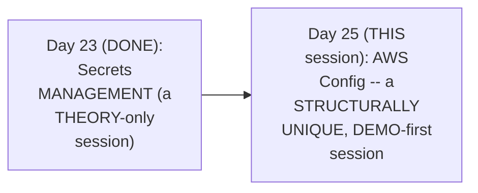

#### 🎯 Key Takeaways

* THIS session is GENUINELY, STRUCTURALLY unique — EXPLICITLY, DELIBERATELY leading WITH a REAL, live DEMONSTRATION — a DIRECT departure FROM this series' OWN, usual, theory-FIRST structure.
* THE instructor **directly, EXPLICITLY justifies** this CHOICE — COMPLIANCE is a GENUINELY, POTENTIALLY new CONCEPT for SOME learners — SEEING it WORK, first, GENUINELY aids LATER, theoretical UNDERSTANDING.
* AWS CONFIG is precisely, DIRECTLY confirmed AS dealing WITH **COMPLIANCE** — ENSURING AWS resources GENUINELY align WITH an organization's OWN rules and REGULATIONS.

---

### 2. A Complete, Real, Worked Example Setup: Two EC2 Instances, One Rule

#### 🪜 Step-by-Step — A Complete, Real, Worked Example

> 💡 **Given directly:** *"For the purpose of demonstration, I have two AWS EC2 instances here — let's say your organization has a defined rule, that is, whenever you create an EC2 instance... for this EC2 instances, monitoring should be enabled... if you go to this monitoring tab, there is a section called 'manage detailed monitoring,' and this checkbox... should be clicked."*

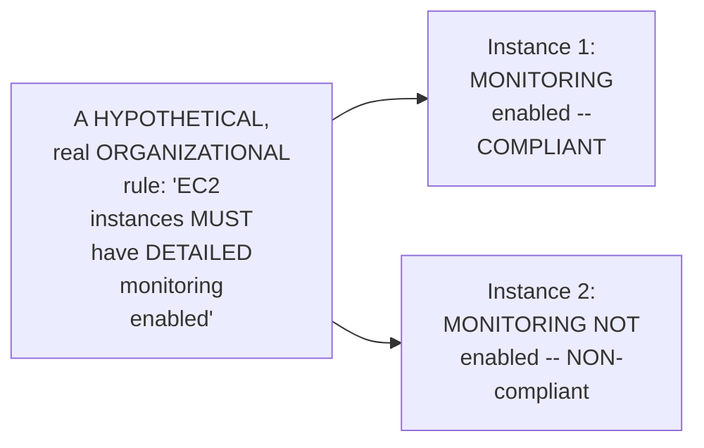

#### 🔍 Internal Working — A Genuine, Direct Explanation of Why This Rule Might Genuinely Matter

> 💡 **Given directly:** *"Your organization might have some rules that if there is detailed monitoring enabled, you can always track what has happened to the EC2 instance — if there is any security issues, or if there is any issues with the application, you can auto-detect what is happening, or you can integrate it with some monitoring tools."*

#### ⚠ Common Mistakes

* Assuming a "NON-compliant" resource is GENUINELY, INHERENTLY broken OR malfunctioning — explicitly, directly, PRECISELY clarified: it's GENUINELY, SIMPLY a resource that DOESN'T, currently, ADHERE to a SPECIFIC, organizational RULE — the resource ITSELF may be FUNCTIONING entirely, NORMALLY.

#### 🎯 Key Takeaways

* A COMPLETE, real, WORKED example directly, CONCRETELY establishes THIS session's own, CORE scenario — TWO EC2 instances, ONE compliant (MONITORING enabled), ONE non-COMPLIANT (monitoring NOT enabled), AGAINST a HYPOTHETICAL, real ORGANIZATIONAL rule.
* A GENUINE, real EXPLANATION grounds WHY such a RULE might GENUINELY matter — DETAILED monitoring ENABLES faster, real SECURITY/application issue DETECTION.
* This directly, PRECISELY sets UP the SESSION's own, NEXT, essential QUESTION — AT real, ORGANIZATIONAL scale, WHO is genuinely RESPONSIBLE for verifying THIS kind of COMPLIANCE (Section 3)?

---
### 3. Why This Genuinely Matters: A Devops Engineer's Own, Real Responsibility

#### 🪜 Step-by-Step — A Genuine, Direct, Important Framing Question

> 💡 **Given directly:** *"There is this huge AWS account, there can be thousands of EC2 instances — not just EC2 instance, this applies for different resources, right — for example your organization has a rule that all the S3 buckets should have lifecycle management enabled, or public access disabled — now who is responsible for looking at all of these things, and how will you ensure that your AWS account adheres to the compliance rules and regulations of your organization?"*

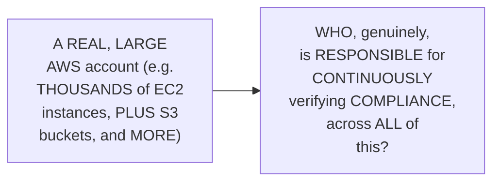

#### 🔍 Internal Working — A Genuine, Direct, Precise Answer

> 💡 **Given directly:** *"As a devops engineer, it's your responsibility — now you might be thinking, 'but Abhishek, how can I do all of these things?' So for that very own reason, AWS provides a resource called Config."*

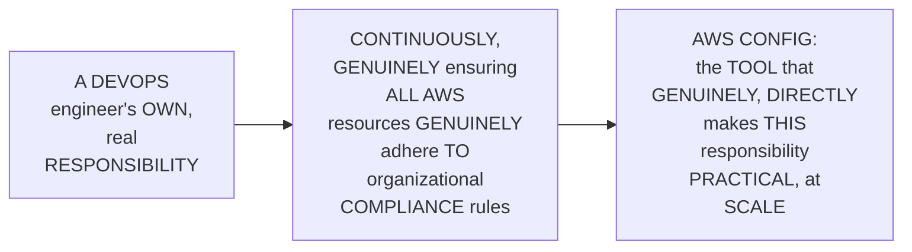

#### ⚠ Common Mistakes

* Assuming COMPLIANCE verification is GENUINELY, PRACTICALLY manageable, AT real, organizational SCALE, WITHOUT any, GENUINE automation — explicitly, directly, IMPLIED as GENUINELY, PRACTICALLY impossible — "THOUSANDS of EC2 INSTANCES" and MULTIPLE, other RESOURCE types GENUINELY, DIRECTLY require an AUTOMATED, scalable SOLUTION.

#### 🎯 Key Takeaways

* A DEVOPS engineer's OWN, real RESPONSIBILITY directly, EXPLICITLY includes ENSURING their ORGANIZATION's entire AWS ACCOUNT genuinely, CONTINUOUSLY adheres TO compliance RULES.
* AT real, ORGANIZATIONAL scale (THOUSANDS of resources, ACROSS multiple TYPES), THIS is GENUINELY, PRACTICALLY impossible to VERIFY manually — MOTIVATING the NEED for AWS CONFIG.
* This directly, PRECISELY sets UP the SESSION's own, NEXT, essential CONTENT — a COMPLETE, real, LIVE exploration OF AWS Config's OWN, existing SETUP (Section 4).

---

### 4. A Complete, Real, Live Demo: Exploring AWS Config's Own, Existing Setup

#### 🪜 Step-by-Step — A Complete, Real, Console Walkthrough

> 💡 **Given directly:** *"You can simply search for config, and you will find this section called 'track resource inventory and changes'... using this, basically you can verify how many resources are compliant, and how many resources are non-compliant."*

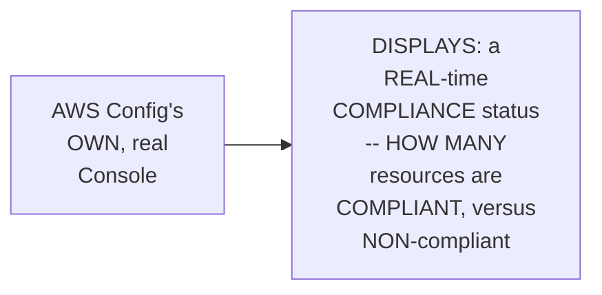

#### 📖 Definition — A Genuine, Precise Explanation of the Underlying Mechanism

> 💡 **Given directly:** *"When you create a rule here, you can integrate this rule with a Lambda function — this AWS Config will tell you when an EC2 instance is created, when an EC2 instance is updated, when an EC2 instance is deleted, every event notification is sent to the function that you are configuring."*

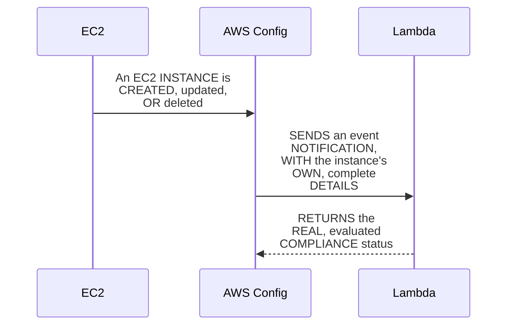

#### 🔍 Internal Working — A Genuine, Direct Confirmation: Default vs. Custom Rules

> 💡 **Given directly:** *"There are some default rules — AWS also provides you some default rules, you can use those default rules — but as a devops engineer, you have to write the custom rules as well."*

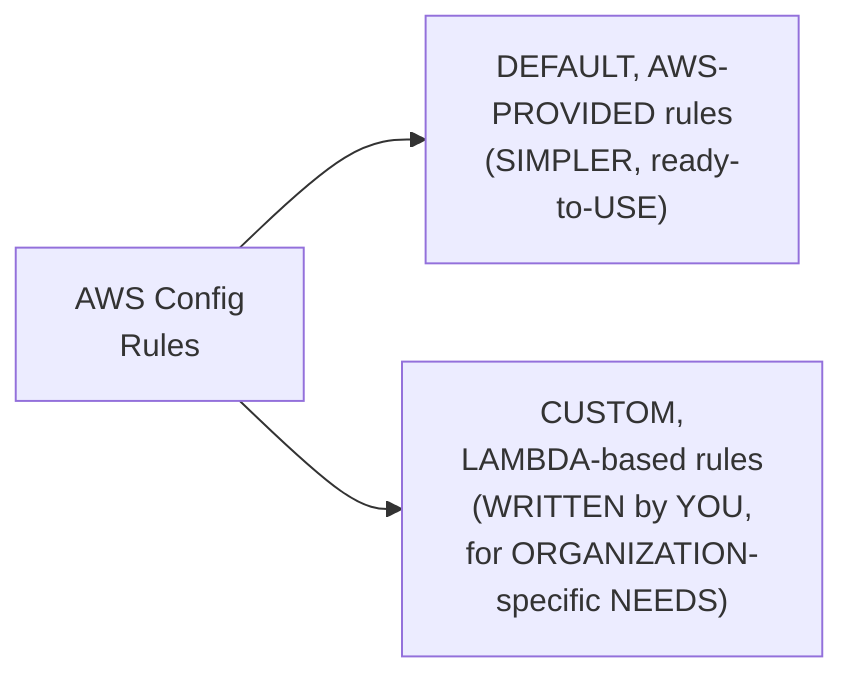

#### ⚠ Common Mistakes

* Assuming AWS CONFIG's own, PRE-built, DEFAULT rules ARE genuinely, ALWAYS sufficient FOR every, real ORGANIZATIONAL need — explicitly, directly, PRECISELY clarified: DEVOPS engineers GENUINELY, TYPICALLY need to WRITE custom RULES (via LAMBDA) FOR organization-SPECIFIC requirements.

#### 🎯 Key Takeaways

* AWS CONFIG's own CONSOLE directly, CONCRETELY displays a REAL-time COMPLIANCE status — HOW many resources ARE compliant, VERSUS non-COMPLIANT.
* AWS CONFIG rules GENUINELY, DIRECTLY integrate WITH Lambda FUNCTIONS — SENDING event NOTIFICATIONS (created/UPDATED/deleted) to a CONFIGURED function.
* BOTH **DEFAULT, AWS-provided RULES** and **CUSTOM, Lambda-based RULES** are GENUINELY available — devops ENGINEERS typically NEED custom rules FOR organization-SPECIFIC requirements.

---
### 5. A Complete, Real, Live Demo: Testing the Rule (& a Genuine, Honest Timeout Error)

#### 🪜 Step-by-Step — A Complete, Real, Live Test: Enabling Monitoring

> 💡 **Given directly:** *"What I'm going to do is I'm going to go to this instance, I'll edit the monitoring section, and what I'm going to do is I am also going to enable this one — now you will see that within a couple of minutes, this EC2 instance, because it is updated, the AWS Config is going to continuously watch for the instances."*

#### ⚠ A Direct, Honest, Live-Encountered Delay

> 💡 **Given directly:** *"Let me refresh and see, it takes a couple of minutes, don't worry, okay, it's not yet refreshed — how did I know? Because I'm checking the time... I actually waited for three to four minutes, but still it is not getting updated, so let us see what is happening."*

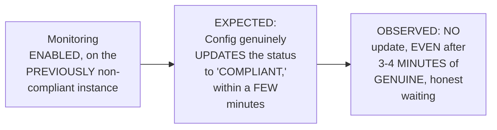

#### 🪜 Step-by-Step — A Genuine, Direct, Transferable Troubleshooting Methodology

> 💡 **Given directly:** *"Whenever there is an issue, we have to troubleshoot it — how do you troubleshoot? Whenever there is some issue on AWS, the first thing, or the first place that you would go, is the CloudWatch — let me go to CloudWatch, and in the CloudWatch there will be a log group for the Lambda function."*

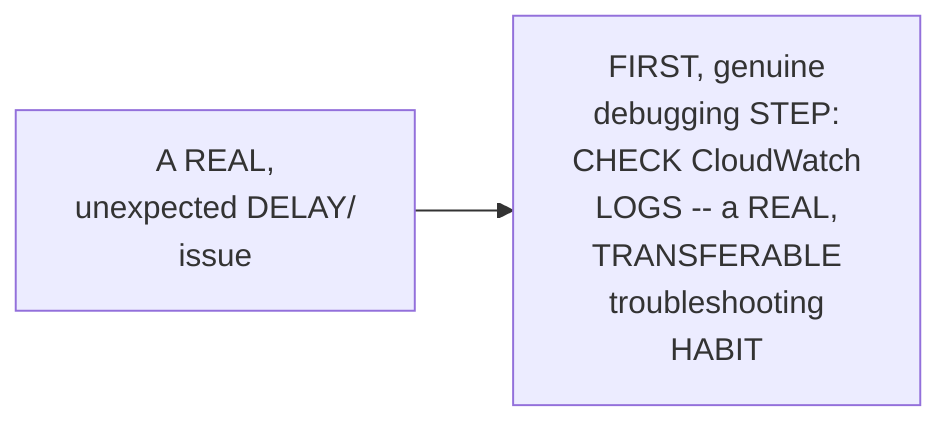

#### ⚠ Error: A Genuine, Honest Timeout, Diagnosed via CloudWatch

> 💡 **Given directly:** *"It says that the task has timed out after 3.06 seconds — I mean, usually you know that for Lambda functions, the default execution is just three seconds, so let's try to increase that."*

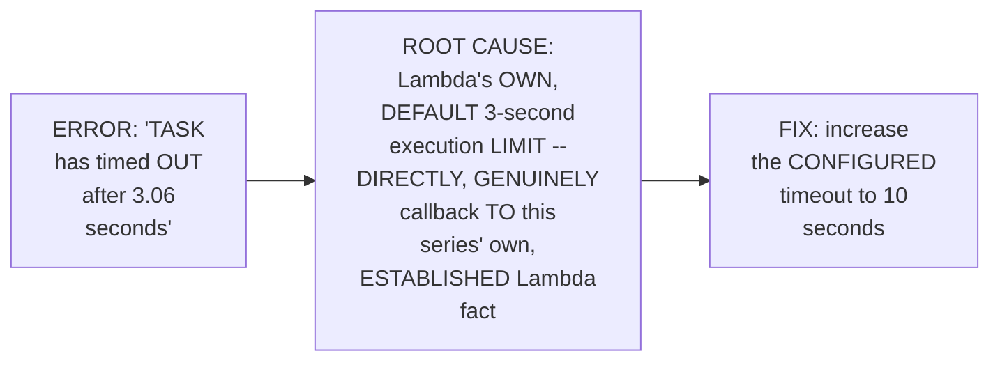

#### ⚠ Common Mistakes

* Assuming a REAL, unexpected DELAY genuinely, ALWAYS indicates a DEEP, complex PROBLEM, requiring ELABORATE debugging — explicitly, directly, PRACTICALLY demonstrated as OFTEN, genuinely SIMPLE — CHECKING CLOUDWATCH logs FIRST directly, QUICKLY revealed the SPECIFIC, real ROOT cause.
* Assuming LAMBDA's own, DEFAULT 3-SECOND timeout is GENUINELY, ALWAYS sufficient — explicitly, directly, LIVE-demonstrated as GENUINELY, FREQUENTLY insufficient — a REAL, recurring ISSUE ACROSS multiple, DIFFERENT sessions in THIS series (Day 18, AND now Day 25).

#### 🎯 Key Takeaways

* A COMPLETE, real, LIVE test directly, CONCRETELY confirmed ENABLING monitoring ON a previously NON-compliant instance — EXPECTING an AUTOMATIC status UPDATE.
* A GENUINE, honest, LIVE-encountered DELAY was directly, HONESTLY shown — the EXPECTED update DID NOT appear, EVEN after SEVERAL minutes OF genuine waiting.
* A GENUINE, direct, TRANSFERABLE troubleshooting METHODOLOGY was DIRECTLY demonstrated — CHECK CloudWatch LOGS first — REVEALING the REAL root CAUSE: LAMBDA's own, DEFAULT 3-second TIMEOUT — FIXED by INCREASING it TO 10 seconds.

---

### 6. A Complete, Real, Live-Confirmed Success: Both Directions, Verified

#### 🪜 Step-by-Step — A Complete, Real, Live-Confirmed First Success

> 💡 **Given directly:** *"Now let's go back, and whenever there are these kind of actions, you have a section here called click on the action button, and click on re-evaluate... now I'm hoping it to update this configuration, let me refresh... the time of invocation is 9:40, which is perfect — now click on all button, let us see if both of them are compliant or not — perfect."*

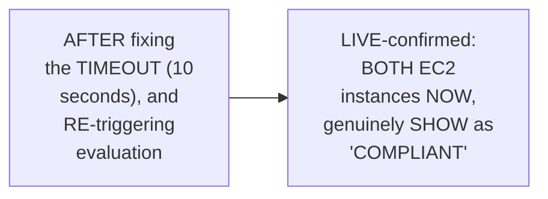

#### 🪜 Step-by-Step — A Complete, Real, Second, Live-Confirmed Test (Reverse Direction)

> 💡 **Given directly:** *"I'll go back to this initial bucket, okay, click on the instance ID, and then click on monitoring... now I clicked on confirm, now the monitoring is disabled again — this rule should automatically get trigger... see, there is one bucket as non-compliant, okay — I just had to wait for a couple of minutes."*

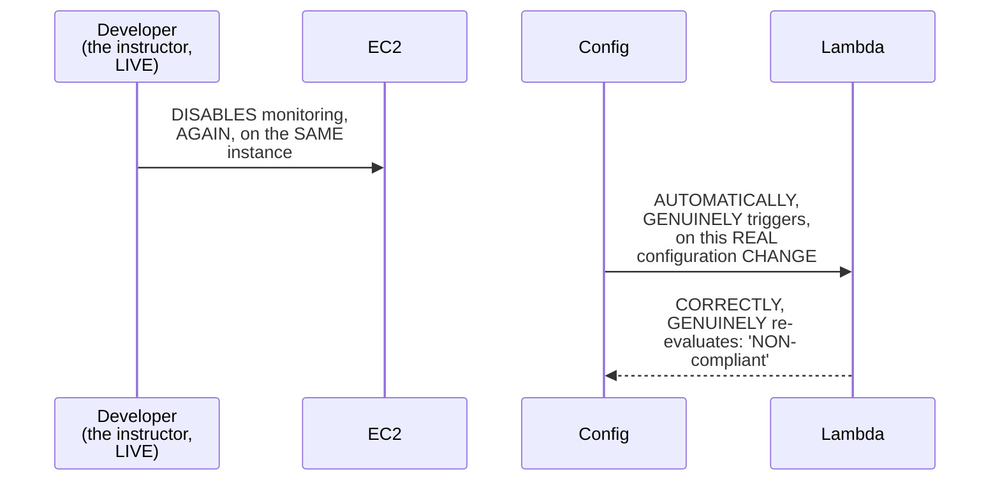

#### ⚠ Common Mistakes

* Assuming a SINGLE, successful TEST (enabling MONITORING, and SEEING "compliant") is GENUINELY, SUFFICIENTLY thorough VERIFICATION — explicitly, directly, PRACTICALLY demonstrated as GENUINELY, ADDITIONALLY verified — a SECOND, REVERSE test (DISABLING monitoring AGAIN) directly, CONCRETELY confirms the RULE genuinely, CORRECTLY works IN both DIRECTIONS.

#### 🎯 Key Takeaways

* A COMPLETE, real, LIVE-confirmed FIRST success directly, CONCRETELY validated the FIX — BOTH EC2 instances NOW, genuinely SHOW as "COMPLIANT," after the TIMEOUT was INCREASED and evaluation RE-triggered.
* A COMPLETE, real, SECOND, REVERSE test directly, CONCRETELY confirmed the RULE's own, CORRECT, bidirectional BEHAVIOR — DISABLING monitoring AGAIN correctly, AUTOMATICALLY re-flagged the INSTANCE as "NON-compliant."
* THIS complete, TWO-directional verification directly, THOROUGHLY validates the ENTIRE, established AWS CONFIG + Lambda ARCHITECTURE — WORKING correctly, IN both, genuine SCENARIOS.

---
### 7. A Genuine, Honest, Meta-Level Reflection on Unedited Demos

#### ⚠ A Direct, Honest, Meta-Level Acknowledgment

> 💡 **Given directly:** *"Whenever we are doing the demos, I prefer not to edit it, because you are seeing here what is happening, and even when you try to perform the demonstrations, you will not be scared, or you will not worry that something has happened at your end, okay, so it's quite common."*

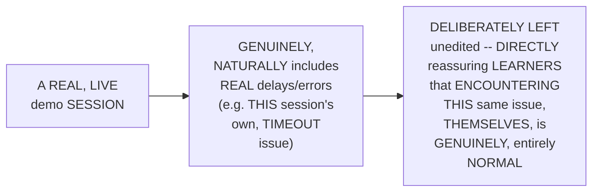

#### ⚠ Common Mistakes

* Assuming a REAL, professional AWS CONFIG setup GENUINELY, TYPICALLY works PERFECTLY, on the FIRST attempt — explicitly, directly, HONESTLY disproven — EVEN THIS session's own, EXPERIENCED instructor GENUINELY encountered a REAL, live TIMEOUT issue.

#### 🎯 Key Takeaways

* THE instructor **directly, EXPLICITLY confirms** THIS session's own, LIVE timeout ISSUE was DELIBERATELY left UNEDITED — a GENUINE, CONSISTENT pedagogical CHOICE, DIRECTLY reinforcing THIS series' own, ESTABLISHED philosophy (SEEN across MULTIPLE, prior SESSIONS in this WORKSPACE).
* This directly, HONESTLY normalizes REAL, professional DEBUGGING work — EVEN EXPERIENCED practitioners GENUINELY, ROUTINELY encounter REAL issues WHEN building NEW automation.
* This directly, PRECISELY sets UP the SESSION's own, NEXT, essential TRANSITION — MOVING from the COMPLETE, live DEMONSTRATION into the SESSION's own, THOROUGH theory PART (Section 8).

---

### 8. Compliance, Precisely Explained: Organization-Specific, Domain-Dependent Rules

#### 📖 Definition — Compliance, Precisely Explained

> 💡 **Given directly:** *"In your organization there can be different kinds of rules — for example, you are working for a government project, or you are working for a banking project, or a financial sector project — depending upon your organization, your domain, each and every organization has their own compliance rules."*

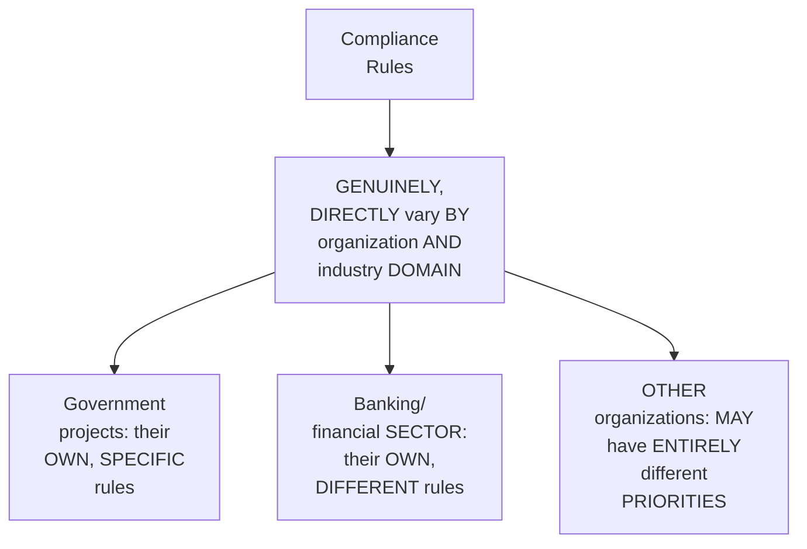

#### 🔍 Internal Working — A Genuine, Precise, Real Set of Examples

> 💡 **Given directly:** *"One organization might say that all the S3 buckets that you are creating should have lifecycle management enabled — for some organizations this might not be important — for some organizations, like I showed you, the EC2 instance monitoring enabled must be mandatory — this can be for some organizations, whereas for other organizations this cannot be that important."*

#### 🪜 Step-by-Step — A Genuine, Practical Tip for Learning Your Own, Organization's Rules

> 💡 **Given directly:** *"You don't have to worry about it — you can verify, like, whoever is your point of contact, it can be your manager, or it can be any other person, you can just ask them — I want to set up the compliance rules, I want to set up AWS Config, and I want to give you detailed information, can you provide me a detailed set of rules and regulations that you are looking for?"*

#### 🔍 Internal Working — A Genuine, Direct Confirmation: Compliance Is a Security Priority

> 💡 **Given directly:** *"This is very, very important, because compliance is related to security — whenever there is something related to security, your organization takes that as the highest priority."*

#### ⚠ Common Mistakes

* Assuming COMPLIANCE rules are GENUINELY, UNIVERSALLY standardized, ACROSS every, real ORGANIZATION — explicitly, directly, PRECISELY clarified: THEY genuinely, DIRECTLY vary BY organization and INDUSTRY domain — a RULE mandatory FOR one organization MAY genuinely be IRRELEVANT for ANOTHER.
* Assuming a DEVOPS engineer must GENUINELY, INDEPENDENTLY determine THEIR organization's OWN, specific COMPLIANCE requirements, WITHOUT asking ANYONE — explicitly, directly, PRACTICALLY clarified: SIMPLY ASK your manager/POINT of contact FOR a detailed, REAL set of requirements.

#### 🎯 Key Takeaways

* **COMPLIANCE** is precisely EXPLAINED as a SET of organization-SPECIFIC, domain-DEPENDENT rules — VARYING genuinely, DIRECTLY by INDUSTRY (government, BANKING, financial SECTOR) and individual ORGANIZATION.
* A GENUINE, practical TIP directly, PRACTICALLY recommends SIMPLY asking your MANAGER/point of CONTACT for a DETAILED, real set OF your organization's OWN, specific COMPLIANCE requirements.
* COMPLIANCE is directly, GENUINELY confirmed AS a **SECURITY** priority — ORGANIZATIONS genuinely, DIRECTLY treat security-RELATED matters as THEIR highest PRIORITY.

---
### 9. A Complete, Real, Step-by-Step Walkthrough: Creating an AWS Config Rule

#### 🪜 Step-by-Step — A Complete, Real, Initial Rule-Creation Walkthrough

> 💡 **Given directly:** *"Click on the rules button... add AWS managed rule, or create Lambda rule... go with the AWS managed rule if it's very, very simple to set up — you don't have to do much there, there are AWS managed rules available — but I want to show you slightly complicated option, so click on create Lambda rule."*

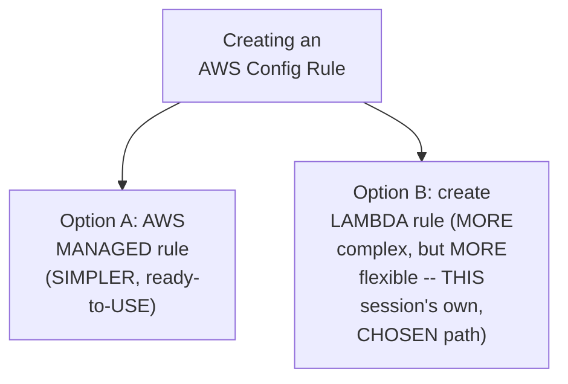

#### 🪜 Step-by-Step — A Complete, Real, Trigger-Type Confirmation

> 💡 **Given directly:** *"There are two different things — one is 'when configuration changes,' other is 'periodic,' periodic is like a cron job... you can tell it to trigger the Lambda function every day at 5 o'clock — but I don't want that, what I want is this option, 'when configuration changes.'"*

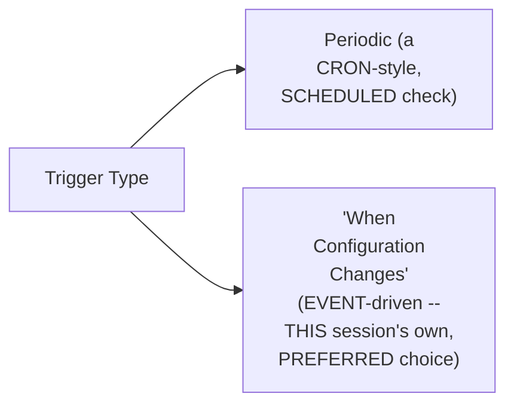

#### 🪜 Step-by-Step — A Complete, Real, Resource-Scope Confirmation

> 💡 **Given directly:** *"Here you can select what kind of resources you are looking for — click on resources, and here you can search for AWS resources, EC2 — search for EC2 instance... I want to look for all the EC2 instances, I don't want to add any resource identifier."*

#### ⚠ Common Mistakes

* Assuming "PERIODIC" (cron-STYLE) checking is GENUINELY, EQUALLY as EFFECTIVE as "WHEN configuration CHANGES" (event-DRIVEN) checking — explicitly, directly, IMPLICITLY preferred: EVENT-driven triggering PROVIDES genuinely, DIRECTLY faster, REAL-time compliance UPDATES — DIRECTLY, CONSISTENTLY connecting BACK to this SERIES' own, established "EVENT-driven" Lambda PRINCIPLE (Day 17).

#### 🎯 Key Takeaways

* A COMPLETE, real, STEP-by-step WALKTHROUGH directly, CONCRETELY confirmed CREATING an AWS CONFIG rule — CHOOSING BETWEEN an AWS-MANAGED rule (SIMPLER) and a CUSTOM Lambda RULE (more FLEXIBLE, THIS session's own, CHOSEN path).
* THE PREFERRED trigger TYPE is directly, PRACTICALLY confirmed AS **"WHEN configuration CHANGES"** (event-DRIVEN) — RATHER than PERIODIC, cron-STYLE checking.
* THE rule's own RESOURCE scope directly, PRECISELY specifies WHICH resource TYPE(s) to WATCH (e.g., ALL EC2 instances) — DIRECTLY, PRECISELY setting UP the SESSION's own, NEXT, essential CONTENT — the REQUIRED Lambda function ITSELF (Section 10).

---

### 10. The Required Lambda Function & Its Own, Required IAM Permissions

#### 🪜 Step-by-Step — A Complete, Real, Lambda-Function Creation Confirmation

> 💡 **Given directly:** *"Before you start creation of the config rule, you need to have the Lambda function ready, okay, so that you can copy the Lambda function ARN and paste it here... click on create function, create from scratch, write the Lambda function... you will have two options, do you want to use the default Lambda function role, or an existing role — just go with the default role."*

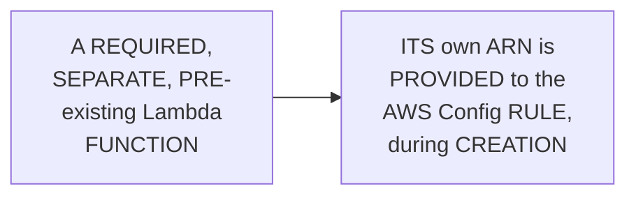

#### 📖 Definition — A Genuine, Direct, Honest Admission on Required Permissions

> 💡 **Given directly:** *"So I have granted these permissions to my Lambda function... CloudWatch full access, EC2 full access, config full access, CloudTrail full access — you don't have to give the full access, but initially when you are performing the demo, if you don't know what permissions are exactly required, you might fail, or you might do this demo multiple times — initially start with this full access, then move towards the least privilege."*

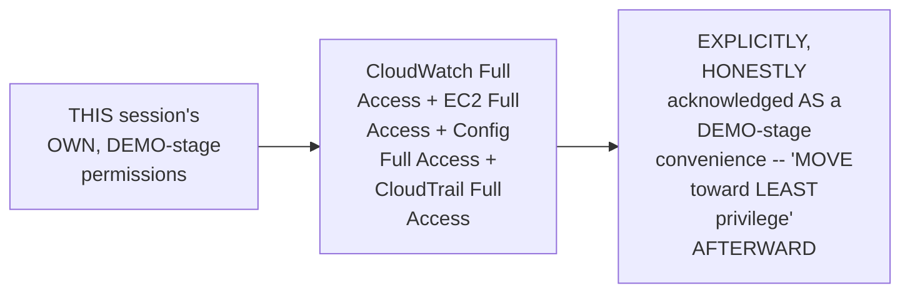

#### ⚠ Common Mistakes

* Assuming GRANTING "FULL access" permissions is GENUINELY, ALWAYS the CORRECT, final, PRODUCTION-ready approach — explicitly, directly, HONESTLY clarified: THIS is a DELIBERATE, DEMO-stage CONVENIENCE — the GENUINE, real GOAL, afterward, is TO "move TOWARDS the LEAST privilege" — DIRECTLY, CONSISTENTLY connecting BACK to this SERIES' own, REPEATEDLY established SECURITY principle.

#### 🎯 Key Takeaways

* A REQUIRED, SEPARATE Lambda FUNCTION must be CREATED first — ITS own ARN is THEN provided TO the AWS CONFIG rule, DURING creation.
* THE instructor **directly, HONESTLY admits** USING "FULL access" permissions (CLOUDWATCH, EC2, CONFIG, CloudTrail) FOR this session's OWN, demo-STAGE setup — EXPLICITLY, DIRECTLY acknowledging LEAST privilege AS the GENUINE, eventual GOAL.
* This directly, PRECISELY sets UP the SESSION's own, NEXT, essential CONTENT — the ACTUAL, complete CODE walkthrough OF the Lambda FUNCTION itself (Section 11).

---
### 11. A Complete, Precise Code Walkthrough: The Lambda Function's Own, Complete Logic

#### 📖 Definition — A Genuine, Direct Callback: lambda_handler

> 💡 **Given directly:** *"Usually you have the Lambda Handler function — inside the Lambda Handler, Lambda Handler is the one that is going to be invoked by the function that is triggering this Lambda function... similar to, let's say you are writing a Java application, main is a function that gets called first."*

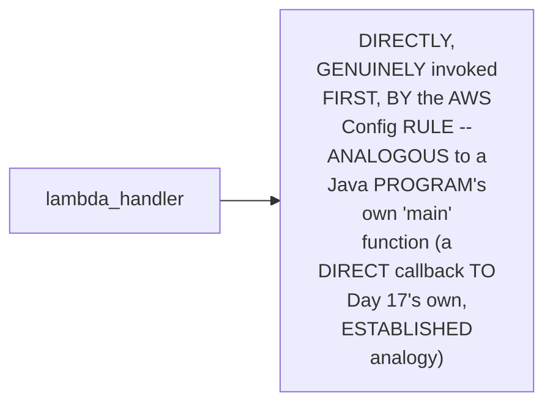

#### 🪜 Step-by-Step — A Complete, Precise Explanation of the Function's Own, Complete Logic

> 💡 **Given directly:** *"I have imported boto3 and JSON... I have created an EC2 client in boto3... then I am setting up a variable, the default value for this variable is compliant — by default I am assuming that everything is compliant... then I have taken this JSON payload — event is the one that AWS Config has given to this Lambda function... from the event, basically what I am doing is I am getting the instance ID... then I am trying to describe the instance, and get the monitoring status."*

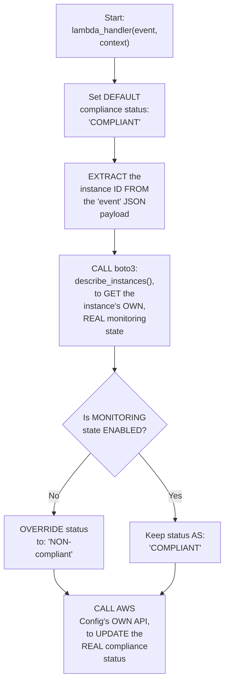

#### 🔍 Internal Working — A Genuine, Direct, Deferred Reference to boto3

> 💡 **Given directly:** *"If you are not aware of boto3, then for this video you can just watch these things as is, because I am going to do a dedicated boto3 session where I am going to explain you how to use boto3... for this class, it will be completely out of discussion."*

```mermaid
flowchart LR
    A["boto3<br/>(Python's own AWS<br/>SDK)"] --> B["USED throughout<br/>THIS session's own,<br/>REAL code -- but<br/>EXPLICITLY,<br/>DIRECTLY deferred<br/>AS a FUTURE,<br/>dedicated TOPIC"]
```

#### ⚠ Common Mistakes

* Assuming DEEP, prior BOTO3 knowledge is GENUINELY, STRICTLY required TO genuinely BENEFIT from THIS session's own CODE walkthrough — explicitly, directly, HONESTLY clarified: "YOU can just WATCH these things AS is" — a DEEPER, dedicated BOTO3 explanation is EXPLICITLY deferred TO a FUTURE session.

#### 🎯 Key Takeaways

* THE `LAMBDA_handler` function directly, MEMORABLY connects BACK to Day 17's own, ESTABLISHED "JAVA main FUNCTION" analogy — the FIRST, genuine ENTRY point INVOKED by AWS CONFIG.
* THE function's OWN, complete LOGIC directly, PRECISELY confirmed: DEFAULT to "COMPLIANT" → EXTRACT the instance ID → DESCRIBE the instance (via BOTO3), checking its MONITORING state → IF not ENABLED, override to "NON-compliant" → CALL AWS Config's OWN API to UPDATE the REAL status.
* A DEEPER explanation OF `boto3` itself is directly, HONESTLY DEFERRED to a FUTURE, dedicated SESSION — LEARNERS can GENUINELY, PRACTICALLY follow THIS session's own CODE "as IS," WITHOUT requiring PRIOR, deep boto3 EXPERTISE.

---

### 12. A Genuine, Direct, Extensibility Tip: Adapting This Pattern for Other Resources

#### 🪜 Step-by-Step — A Direct, Practical, Extensibility Recommendation

> 💡 **Given directly:** *"If you think you have understood this completely, you can change this example to S3 bucket — all that you need to do is, when you are creating this rule, instead of EC2, just check for S3 buckets... this config rule, whenever a bucket is created, deleted, modified, updated, it will call the Lambda function that you are trying to write... you can see if the public access is enabled or not, write the Lambda function accordingly, and verify if the status is updated here or not."*

```mermaid
flowchart LR
    A["THIS session's<br/>OWN, established,<br/>REAL EC2/<br/>monitoring<br/>PATTERN"] --> B["DIRECTLY,<br/>GENUINELY<br/>adaptable TO:<br/>S3 buckets<br/>(CHECKING public-<br/>ACCESS settings,<br/>INSTEAD)"]
```

#### ⚠ Common Mistakes

* Assuming THIS session's own, established PATTERN is GENUINELY, STRICTLY limited to EC2/monitoring SPECIFICALLY — explicitly, directly, PRACTICALLY confirmed as a GENUINELY, DIRECTLY generalizable PATTERN — THE SAME, underlying ARCHITECTURE (Config RULE → Lambda FUNCTION → compliance CHECK) applies TO virtually ANY, real AWS resource TYPE.

#### 🎯 Key Takeaways

* THE instructor **directly, PRACTICALLY recommends** an INDEPENDENT, hands-ON extension — ADAPTING this SAME, established PATTERN to S3 BUCKETS, checking PUBLIC-access settings, INSTEAD of EC2 monitoring.
* THIS directly, CONCRETELY confirms the UNDERLYING architecture (CONFIG rule → Lambda FUNCTION → compliance CHECK) is GENUINELY, DIRECTLY generalizable — APPLICABLE to virtually ANY, real AWS resource TYPE.
* This directly, PRECISELY sets UP the SESSION's own, FINAL, closing CONTENT — a GENUINE, resume-FOCUSED encouragement (Section 13).

---
### 13. Closing: A Direct, Resume-Focused Encouragement

#### 🪜 Step-by-Step — A Direct, Genuine, Final Encouragement

> 💡 **Given directly:** *"This is a very, very useful video — many organizations do it, many devops engineers in their organization implement this kind of projects, which is very, very real time — so I hope you will use it in your resumes if required, or during your interviews you can convey this thing."*

```mermaid
flowchart LR
    A["THIS session's<br/>OWN, COMPLETE,<br/>real AWS Config +<br/>Lambda PROJECT"] --> B["EXPLICITLY,<br/>DIRECTLY confirmed<br/>AS: a GENUINE,<br/>real-WORLD, resume-<br/>WORTHY, and<br/>interview-RELEVANT<br/>deliverable"]
```

#### ⚠ Common Mistakes

* Assuming THIS session's own, COMPLETE demonstration REPRESENTS a GENUINELY, MERELY educational EXERCISE, WITHOUT real, PRACTICAL career VALUE — explicitly, directly, DIRECTLY confirmed AS a GENUINE, real-WORLD, "very, VERY real TIME" project — MANY, real organizations GENUINELY implement THIS exact PATTERN.

#### 🎯 Key Takeaways

* This episode **GENUINELY, COMPREHENSIVELY delivers** its OWN, stated GOALS — a COMPLETE, real, LIVE demonstration (INCLUDING a GENUINELY honest, TIMEOUT-error debugging SEQUENCE), a THOROUGH theory SECTION, and a COMPLETE, precise CODE walkthrough.
* THE instructor **directly, EXPLICITLY confirms** THIS session's own, COMPLETE project IS genuinely, DIRECTLY resume-WORTHY and interview-RELEVANT — MANY, real ORGANIZATIONS genuinely IMPLEMENT this EXACT pattern.
* This directly, PRECISELY completes THIS session's own, STRUCTURALLY unique, DEMO-first FORMAT — a COMPLETE, coherent, PRACTICAL learning JOURNEY, from LIVE demonstration THROUGH thorough THEORY.

---

## 📝 Glossary

| Term | Definition | Why It Matters |
|---|---|---|
| **AWS Config** | AWS's own compliance-monitoring service | Tracks resource inventory and compliance status |
| **Compliance** | Adherence to an organization's own, specific rules | Varies by industry/domain; a security priority |
| **Config Rule** | Defines what to monitor, and how | Can be AWS-managed (simple) or Lambda-based (custom) |
| **"When Configuration Changes"** | An event-driven trigger type | Preferred over periodic, cron-style checking |
| **lambda_handler** | The Lambda function's own entry point | Invoked by AWS Config on each, relevant event |

---

## 🔄 Revision Notes — One-Minute Revision

* This is **Day 25**, a structurally unique session -- explicitly, deliberately starting with the demo first, and the theory second, since compliance may be a genuinely new concept for some learners.
* **AWS Config** deals with compliance -- ensuring AWS resources genuinely align with an organization's own rules and regulations.
* **A complete, worked example**: two EC2 instances, one compliant (monitoring enabled), one non-compliant (monitoring not enabled), against a hypothetical organizational rule.
* **Why this genuinely matters**: at real, organizational scale (thousands of resources), manually verifying compliance is genuinely impractical -- it's a devops engineer's own, real responsibility, and AWS Config exists specifically to make it practical.
* **Live demo (exploring Config)**: the console displays a real-time compliance status. Config rules integrate with Lambda functions, receiving event notifications (created/updated/deleted). Both default, AWS-provided rules and custom, Lambda-based rules exist.
* **Live demo (testing the rule)**: enabling monitoring on the non-compliant instance was expected to trigger an automatic update -- but a genuine, honest delay occurred. The transferable troubleshooting methodology: check CloudWatch logs first. The real error: "task timed out after 3.06 seconds" -- Lambda's own, default 3-second limit (a direct callback to this series' own, established Lambda fact) -- fixed by increasing the timeout to 10 seconds.
* **Live-confirmed success, both directions**: after the fix, both instances showed "compliant." A second, reverse test (disabling monitoring again) confirmed the rule correctly, automatically re-flags the instance as "non-compliant."
* **A genuine, honest, meta-level reflection**: the live timeout issue was deliberately left unedited -- a consistent, established pedagogical choice throughout this series.
* **Compliance, precisely explained**: organization-specific, domain-dependent rules (government, banking, financial-sector examples). A practical tip: simply ask your manager/point of contact for your organization's own, specific requirements. Compliance is explicitly confirmed as a security priority.
* **Creating an AWS Config rule (live, step-by-step)**: choose between an AWS-managed rule (simpler) or a custom Lambda rule (more flexible, this session's own chosen path). Trigger type: "when configuration changes" (event-driven, preferred) vs. periodic (cron-style). Resource scope: specify which resource type(s) to watch.
* **The required Lambda function & IAM permissions**: a separate, pre-existing Lambda function's ARN is provided to the Config rule. A genuine, honest admission: "full access" permissions (CloudWatch, EC2, Config, CloudTrail) were used for this demo, with an explicit acknowledgment that least privilege is the genuine, eventual goal.
* **The complete code walkthrough**: `lambda_handler` (directly analogous to a Java "main" function) -> default to "compliant" -> extract the instance ID from the event -> describe the instance (via boto3), checking monitoring state -> if not enabled, override to "non-compliant" -> call AWS Config's own API to update the real status. A deeper boto3 explanation is explicitly deferred to a future, dedicated session.
* **A genuine, direct extensibility tip**: this same pattern can be adapted to S3 buckets (checking public-access settings), or virtually any other AWS resource type.
* **Closing**: a direct, resume-focused encouragement -- this complete project is explicitly confirmed as "very, very real time," genuinely implemented by many, real organizations.

---

## 📋 Cheat Sheet

**The complete AWS Config + Lambda architecture:**
```text
EC2 instance created/updated/deleted
  -> AWS Config Rule (triggered: "when configuration changes")
    -> Lambda Function (checks the real, current state)
      -> AWS Config API (updated with the real compliance status)
```

**The Lambda function's own, complete logic:**
```python
def lambda_handler(event, context):
    ec2 = boto3.client('ec2')
    compliance_status = 'COMPLIANT'  # default assumption

    instance_id = event['invokingEvent']['configurationItem']['resourceId']  # (illustrative)
    instance_details = ec2.describe_instances(InstanceIds=[instance_id])

    monitoring_state = instance_details['Reservations'][0]['Instances'][0]['Monitoring']['State']
    if monitoring_state != 'enabled':
        compliance_status = 'NON_COMPLIANT'

    config_client = boto3.client('config')
    config_client.put_evaluations(
        Evaluations=[{
            'ComplianceResourceType': 'AWS::EC2::Instance',
            'ComplianceResourceId': instance_id,
            'ComplianceType': compliance_status,
            'OrderingTimestamp': event['notificationCreationTime']
        }],
        ResultToken=event['resultToken']
    )
```

**Debugging methodology:**
```text
1. Check CloudWatch Logs FIRST, for the relevant Lambda function's own log group
2. Diagnose the specific error (e.g., "task timed out after 3.06 seconds")
3. Apply the targeted fix (e.g., increase the Lambda timeout)
4. Manually "Re-evaluate" the Config rule, to confirm the fix
```

---

## 🔥 Interview Questions & Answers

### 🟢 Beginner

**Q1.**

**Question:** What does AWS Config genuinely deal with?

**Answer:** Compliance -- ensuring AWS resources align with an organization's own rules and regulations.

**Explanation:** Directly, explicitly stated.

**Why Interviewers Ask This:** The most basic, foundational AWS Config question.

**Possible Follow-up:** "Give a real example of a compliance rule."

**Q2.**

**Question:** Does AWS Config only provide pre-built, default rules?

**Answer:** No -- devops engineers can also write custom rules, integrated with Lambda functions.

**Explanation:** Directly, explicitly confirmed.

**Why Interviewers Ask This:** Tests genuine, practical understanding of Config's own flexibility.

**Possible Follow-up:** "When might a default rule genuinely be sufficient?"

**Q3.**

**Question:** What are the two, precise trigger types for a Config rule, and which is generally preferred?

**Answer:** "When configuration changes" (event-driven, preferred) and "periodic" (cron-style).

**Explanation:** Directly, explicitly named.

**Why Interviewers Ask This:** Basic, practical, hands-on Config configuration knowledge.

**Possible Follow-up:** "Why is event-driven triggering generally preferred?"

**Q4.**

**Question:** What is AWS Lambda's own, default execution timeout, and did it genuinely cause an issue in this session's own demo?

**Answer:** 3 seconds; yes, it caused a real, live-encountered timeout error.

**Explanation:** Directly, live-demonstrated.

**Why Interviewers Ask This:** Tests genuine, practical, recurring Lambda knowledge across this series.

**Possible Follow-up:** "What's the first, genuine debugging step, when troubleshooting an AWS issue?"

**Q5.**

**Question:** Does compliance mean the same thing for every organization?

**Answer:** No -- it genuinely varies by organization and industry domain.

**Explanation:** Directly, precisely clarified.

**Why Interviewers Ask This:** Tests genuine understanding of the organization-specific nature of compliance.

**Possible Follow-up:** "How would you genuinely learn your own organization's specific rules?"

**Q6.**

**Question:** In this session's own Lambda function, what is the default, initial compliance status assumption?

**Answer:** "Compliant."

**Explanation:** Directly, explicitly stated.

**Why Interviewers Ask This:** Basic, practical, hands-on Lambda-logic knowledge.

**Possible Follow-up:** "What condition genuinely overrides this default?"

**Q7.**

**Question:** What must be created BEFORE a Lambda-based Config rule can be configured?

**Answer:** The Lambda function itself (its ARN is needed during rule creation).

**Explanation:** Directly, explicitly confirmed.

**Why Interviewers Ask This:** Tests genuine, practical, hands-on setup-order knowledge.

**Possible Follow-up:** "What IAM permissions were used for this session's own demo Lambda function?"

**Q8.**

**Question:** Were "full access" IAM permissions genuinely recommended as a final, production practice, in this session?

**Answer:** No -- explicitly acknowledged as a demo-stage convenience; least privilege is the genuine, eventual goal.

**Explanation:** Directly, honestly clarified.

**Why Interviewers Ask This:** Tests genuine understanding of this series' own, consistently-reinforced security principle.

**Possible Follow-up:** "Why might starting with full access genuinely make sense, during initial learning?"

**Q9.**

**Question:** Can this session's own EC2/monitoring pattern be adapted to other AWS resource types?

**Answer:** Yes -- e.g., S3 buckets, checking public-access settings instead.

**Explanation:** Directly, explicitly recommended.

**Why Interviewers Ask This:** Tests genuine understanding of the pattern's own, generalizable architecture.

**Possible Follow-up:** "What would genuinely need to change, to adapt this pattern to S3?"

**Q10.**

**Question:** Why did this session deliberately start with the demo, rather than the theory?

**Answer:** Because compliance may be a genuinely new concept for some learners; seeing it work first aids later, theoretical understanding.

**Explanation:** Directly, explicitly justified.

**Why Interviewers Ask This:** Tests attention to this session's own, stated, structural reasoning.

**Possible Follow-up:** "Is this the series' own usual structure?"

---

### 🟡 Intermediate

**Q11.**

**Question:** Explain why the instructor deliberately performs a SECOND, reverse test (disabling monitoring again), rather than considering the demo complete after confirming both instances show "compliant."

**Answer:** This is a genuinely deliberate, BIDIRECTIONAL-verification teaching choice: the FIRST test (Section 6) ONLY, genuinely CONFIRMED the rule CORRECTLY detects a TRANSITION from non-COMPLIANT to COMPLIANT. A SECOND, REVERSE test — DISABLING monitoring AGAIN, and CONFIRMING the rule CORRECTLY, AUTOMATICALLY re-flags the INSTANCE as non-compliant — directly, CONCRETELY proves the RULE genuinely, SYMMETRICALLY works in BOTH directions, NOT just ONE. WITHOUT this SECOND test, a LEARNER might, REASONABLY, wonder WHETHER the rule GENUINELY, ACTIVELY monitors ONGOING changes, or WHETHER it MERELY performed a ONE-time, initial EVALUATION that HAPPENED to match.

**Explanation:** Requires recognizing the deliberate, bidirectional-verification value of testing both the "becomes compliant" and "becomes non-compliant" transitions, rather than stopping after only one, successful direction.

**Why Interviewers Ask This:** Tests whether a learner recognizes the practical, thoroughness-focused value of verifying a monitoring rule's own, ongoing, bidirectional correctness.

**Possible Follow-up:** "Describe a GENUINE, real, ADDITIONAL test scenario (BEYOND the TWO shown IN this session) that WOULD further VALIDATE this rule's OWN, correct BEHAVIOR."

**Q12.**

**Question:** A learner argues that since this session confirms the instructor used "full access" IAM permissions for the demo Lambda function, this means full-access permissions are genuinely, generally acceptable for real, production AWS Config setups. Evaluate this claim.

**Answer:** This claim is GENUINELY, DIRECTLY incorrect, and CONTRADICTS Section 10's own, EXPLICIT, HONEST clarification. Section 10's own PRECISE statement DIRECTLY confirms: "YOU don't HAVE to give the FULL access... INITIALLY, WHEN you are PERFORMING the demo... START with this FULL access, then MOVE towards the LEAST privilege" — a DELIBERATE, DEMO-stage convenience, EXPLICITLY NOT presented as a GENUINE, production RECOMMENDATION. THIS directly, CONSISTENTLY mirrors THIS series' own, REPEATEDLY established SECURITY guidance (e.g., DAY 18's own SSM-permissions REASONING, Day 21's OWN Task-Role reasoning) — FULL-access grants are GENUINELY, CONSISTENTLY confirmed AS demo-appropriate, LEARNING conveniences — NEVER genuine, PRODUCTION-ready best PRACTICE.

**Explanation:** Tests whether a learner recognizes that a demo-appropriate, explicitly-acknowledged convenience doesn't represent this session's own, genuine, production-level recommendation, consistent with this series' broader, repeated security guidance.

**Why Interviewers Ask This:** Distinguishes candidates who correctly track a session's own, explicit distinctions between "demo convenience" and "production best practice" from those who conflate the two.

**Possible Follow-up:** "Design a GENUINE, real, NARROWLY-scoped IAM policy that WOULD, genuinely, grant THIS specific LAMBDA function ONLY the PERMISSIONS it GENUINELY needs, FOR production use."

**Q13.**

**Question:** Explain, precisely, why the instructor deliberately checks CloudWatch logs FIRST, as his genuine, default troubleshooting step, rather than immediately guessing at potential causes or re-running the demo from scratch.

**Answer:** This is a genuinely deliberate, EVIDENCE-based debugging METHODOLOGY, DIRECTLY consistent WITH a PATTERN seen ACROSS this instructor's OWN, broader series (e.g., Day 14's OWN, established "CHECK the error MESSAGE carefully" approach). By DIRECTLY, EXPLICITLY stating "WHENEVER there is SOME issue on AWS, the FIRST thing... is the CloudWatch," the instructor MODELS a GENUINE, TRANSFERABLE, professional DEBUGGING habit — GATHERING concrete, REAL evidence (THE actual error MESSAGE) BEFORE forming a HYPOTHESIS — RATHER than GUESSING or BLINDLY re-attempting the SAME action, WHICH would, genuinely, WASTE time and RISK missing the ACTUAL, underlying root CAUSE.

**Explanation:** Requires recognizing the deliberate, evidence-based value of a stated, default "check logs first" debugging methodology, consistent with this instructor's broader pattern of evidence-based troubleshooting.

**Why Interviewers Ask This:** Tests whether a learner recognizes the practical, professional value of a systematic, evidence-first debugging methodology over guessing or blind repetition.

**Possible Follow-up:** "Describe a GENUINE, real SCENARIO (BEYOND this SESSION's own content) where SKIPPING this 'CHECK logs FIRST' step, and GUESSING instead, COULD genuinely LEAD to a WORSE, real OUTCOME."

**Q14.**

**Question:** Using this session's own precise "event-driven trigger" reasoning (Section 9), explain a GENUINE, real operational risk of an organization choosing "periodic" (cron-style) checking, instead of "when configuration changes," for a security-critical compliance rule.

**Answer:** A precise, reasoned RISK analysis, directly extending Section 9's own established DISTINCTION, and CONNECTING back TO Section 8's own established REASONING (compliance AS a security PRIORITY): per Section 9's own PRECISE reasoning, "PERIODIC" checking GENUINELY, DIRECTLY operates ON a FIXED schedule (e.g., "EVERY day AT 5 O'clock") — MEANING a GENUINE, real COMPLIANCE violation COULD, genuinely, exist and REMAIN undetected FOR up to a FULL day (OR whatever the CONFIGURED interval IS), BEFORE the NEXT, scheduled CHECK genuinely occurs. GIVEN Section 8's own established REASONING — "COMPLIANCE is related TO security... your ORGANIZATION takes that AS the highest PRIORITY" — THIS delay REPRESENTS a GENUINE, real, and POTENTIALLY significant SECURITY exposure WINDOW — a NON-compliant, SECURITY-relevant resource (e.g., a PUBLICLY-exposed S3 BUCKET) could GENUINELY remain UNDETECTED and UNADDRESSED for a SUBSTANTIAL period, UNDER a periodic-CHECKING approach — DIRECTLY, STRUCTURALLY worse THAN the "WHEN configuration CHANGES" approach, WHICH genuinely, DIRECTLY detects and FLAGS such issues IMMEDIATELY, upon OCCURRENCE.

**Explanation:** Requires extending the event-driven-vs-periodic distinction to identify a genuine, real security risk (an undetected compliance violation window), connecting it to the session's own, established "compliance is a security priority" reasoning.

**Why Interviewers Ask This:** Tests whether a learner can connect a specific, technical configuration choice (trigger type) to a genuine, real-world security consequence, using the session's own, established reasoning about compliance's own priority level.

**Possible Follow-up:** "Describe a GENUINE, real SCENARIO where 'PERIODIC' checking WOULD, nonetheless, remain a GENUINELY, reasonably ACCEPTABLE choice, DESPITE this identified RISK."

**Q15.**

**Question:** Synthesize this session's complete "genuine, honest timeout debugging" reasoning (Section 5) with its own "extensibility to other resources" reasoning (Section 12) to explain a GENUINE, structural reason why an organization implementing MANY, different Config rules (across MANY, different resource types) should establish a documented, standard Lambda-timeout baseline, rather than configuring each rule's own timeout independently, on an ad-hoc basis.

**Answer:** A precise, synthesized explanation, directly connecting TWO, separately-established sections: per Section 5's own PRECISE, established DEBUGGING experience, THIS session's own, SPECIFIC Lambda function GENUINELY, DIRECTLY exceeded the DEFAULT 3-second TIMEOUT — REQUIRING an INCREASE to 10 SECONDS. Per Section 12's own PRECISE, established EXTENSIBILITY confirmation, THIS same, underlying PATTERN (Config RULE + Lambda function) is GENUINELY, DIRECTLY adaptable TO many, DIFFERENT resource TYPES (S3, and POTENTIALLY many OTHERS). SYNTHESIZING these TWO facts directly, PRECISELY reveals a GENUINE, structural REASON for a DOCUMENTED, standard TIMEOUT baseline: AS an organization GENUINELY, PROGRESSIVELY implements MANY, different Config RULES (EACH with ITS own, SEPARATE Lambda function, per Section 12's OWN established PATTERN), EACH, individual FUNCTION genuinely, INDEPENDENTLY risks ENCOUNTERING the SAME, established 3-SECOND default-timeout ISSUE (per Section 5's own EXPERIENCE) — WITHOUT a documented, STANDARD baseline (e.g., "ALL Config-integrated LAMBDA functions should GENUINELY default to A 10-second timeout"), a DEVOPS team RISKS repeatedly, INDEPENDENTLY re-discovering and RE-debugging THIS exact, SAME issue, across EVERY, new rule THEY implement — a GENUINE, real, AVOIDABLE waste OF time, GIVEN the underlying CAUSE is ALREADY, genuinely KNOWN and DOCUMENTED (per Section 5's own, HONEST, live-preserved DEBUGGING sequence).

**Explanation:** Requires synthesizing the specific, live-encountered timeout issue with the pattern's own, broader extensibility to identify a genuine, structural, organizational reason for standardizing a timeout baseline, rather than re-discovering the same issue repeatedly.

**Why Interviewers Ask This:** A senior-level question testing whether a candidate can identify a genuine, organizational-scale efficiency opportunity arising from the combination of a specific, known issue and the pattern's own, broader, repeated applicability.

**Possible Follow-up:** "Propose a GENUINE, real, documented STANDARD (e.g. a TEMPLATE, or a CHECKLIST) a devops TEAM could ADOPT, to CONSISTENTLY avoid this EXACT, identified, REPEATED-discovery risk."

---

### 🔴 Advanced

**Q16.**

**Question:** Design a complete, reasoned AWS Config governance strategy (using ONLY this session's own established concepts) for a hypothetical organization implementing compliance monitoring across three, genuinely different resource types: EC2 instances (this session's own example), S3 buckets (the session's own, suggested extension), and a third, unspecified resource type of your own choosing.

**Answer:** A reasonable, complete strategy, directly applying this session's OWN, exact established CONCEPTS:

```text
1. Compliance Requirements Gathering (per Section 8's own
   established, practical TIP): FOR each RESOURCE type, EXPLICITLY,
   DIRECTLY ask the ORGANIZATION's own, real POINT of contact
   (manager OR compliance TEAM) for a DETAILED, SPECIFIC set of
   rules -- RATHER than assuming UNIVERSAL, generic RULES apply.

2. Trigger-Type Selection (per Section 9's own established
   distinction, and Advanced Q14's own established RISK analysis):
   FOR all, genuinely security-RELEVANT rules, USE "when
   configuration CHANGES" (event-DRIVEN) -- AVOIDING the GENUINE,
   real security-EXPOSURE window PERIODIC checking WOULD introduce.

3. Standardized Lambda Timeout Baseline (per Advanced Q15's own
   established, SYNTHESIZED reasoning): ESTABLISH a documented,
   STANDARD Lambda-timeout BASELINE (e.g. 10 seconds, per THIS
   session's own, LIVE-discovered fix) -- APPLIED consistently
   ACROSS all, NEW Config-integrated Lambda FUNCTIONS, FOR every
   resource TYPE -- AVOIDING repeated, INDEPENDENT re-discovery of
   the SAME, KNOWN issue.

4. IAM Permission Scoping (per Section 10's own established,
   HONEST "full access, THEN least privilege" acknowledgment):
   FOR each, NEW Lambda function, BEGIN with broad PERMISSIONS
   DURING initial development/TESTING, but EXPLICITLY, DELIBERATELY
   narrow them TO least-privilege BEFORE any, real PRODUCTION
   deployment.

5. Pattern Reuse & Documentation (per Section 12's own established
   EXTENSIBILITY confirmation): DOCUMENT the CORE, reusable
   PATTERN (Config rule + Lambda function LOGIC: default TO
   compliant, CHECK a SPECIFIC condition, UPDATE via the Config
   API) AS a shared, INTERNAL template -- ENABLING future,
   ADDITIONAL resource-TYPE rules to be BUILT faster, and MORE
   consistently.
```

This complete STRATEGY directly, precisely APPLIES this session's OWN, established CONCEPTS — REQUIREMENTS gathering, TRIGGER-type selection, TIMEOUT standardization, IAM SCOPING, and PATTERN reuse — to a GENUINELY realistic, MULTI-resource-type GOVERNANCE scenario.

**Explanation:** Requires synthesizing requirements gathering, trigger-type selection, timeout standardization, IAM scoping, and pattern reuse into one complete, reasoned governance strategy across multiple, genuinely different resource types.

**Why Interviewers Ask This:** A comprehensive, capstone-level question testing whether a candidate can extend this session's own, single-resource-type demonstration into a genuinely scalable, organization-wide governance strategy.

**Possible Follow-up:** "WHICH of THESE five, strategy COMPONENTS would you GENUINELY, PRACTICALLY prioritize IMPLEMENTING first, GIVEN a LIMITED, initial devops TEAM and TIMELINE?"

**Q17.**

**Question:** Critically evaluate: "Since this session confirms AWS Config can automatically detect and flag non-compliant resources, this means an organization using AWS Config no longer needs any, real human involvement in maintaining compliance, once the initial rules are configured." Is this an accurate, complete characterization?

**Answer:** Not accurate — this OVERSTATES AWS CONFIG's own, GENUINE, automated DETECTION capability into an UNCONDITIONAL claim OF "no REAL human INVOLVEMENT needed," which NEITHER this session's own CONTENT, nor sound REASONING, SUPPORTS. Section 4's own PRECISE, established MECHANISM confirms AWS CONFIG genuinely, DIRECTLY **DETECTS and FLAGS** non-compliant RESOURCES — but it does NOT, genuinely, AUTOMATICALLY **REMEDIATE** them (e.g., AWS Config did NOT, genuinely, AUTOMATICALLY enable MONITORING on the non-compliant INSTANCE, in THIS session's own DEMO — a HUMAN, the instructor, MANUALLY enabled it). ADDITIONALLY, Section 8's own established REASONING confirms COMPLIANCE rules THEMSELVES must be GENUINELY, DELIBERATELY defined BY humans (per THE "ask your MANAGER" recommendation) — and Section 10's own established CONTENT confirms the REQUIRED Lambda FUNCTIONS/IAM permissions must be GENUINELY, ONGOINGLY maintained/REVIEWED (e.g., MOVING toward LEAST privilege). The ACCURATE, more PRECISE conclusion: AWS CONFIG genuinely, DIRECTLY automates the DETECTION and FLAGGING of compliance VIOLATIONS — but GENUINE, real human INVOLVEMENT remains ESSENTIAL for DEFINING rules, REMEDIATING violations, and MAINTAINING the UNDERLYING Lambda/IAM INFRASTRUCTURE.

**Explanation:** Tests whether a learner recognizes that AWS Config's genuine, automated detection capability doesn't eliminate the need for ongoing, real human involvement in rule definition, violation remediation, and infrastructure maintenance.

**Why Interviewers Ask This:** Distinguishes candidates who understand the scoped nature of "automated detection" from those who over-generalize it into a claim of complete, human-free compliance management.

**Possible Follow-up:** "Describe a GENUINE, real ENHANCEMENT (EXTENDING beyond THIS session's own, EXPLICIT content) that COULD, genuinely, AUTOMATE the REMEDIATION step TOO -- NOT just the DETECTION."

---

## 🧪 Scenario-Based Interview Questions

> **Scenario 1:** A colleague's newly-configured AWS Config rule shows no compliance status update at all, even 10+ minutes after a genuine, real EC2 configuration change, and they're unsure where to even begin looking. Using this session's own concepts, construct a complete, reasoned debugging response.

**Structured Answer:**
1. **Initial investigation:** Recognize this as directly connected to Section 5's own precise, established troubleshooting methodology — a GENUINE, first, DEFAULT debugging STEP.
2. **Relevant principle:** Per Section 5's own established REASONING, "WHENEVER there IS some ISSUE on AWS, the FIRST thing... IS the CloudWatch."
3. **Possible causes:** COMMON, real CAUSES INCLUDE a LAMBDA timeout (per THIS session's own, EXACT, live-encountered EXAMPLE), a MISSING or INCORRECT IAM permission, OR an INCORRECTLY-configured TRIGGER type/resource SCOPE.
4. **Debugging approach:** Directly NAVIGATE to CloudWatch -> LOG groups (per Section 5's own established WORKFLOW), and FIND the RELEVANT Lambda function's OWN, most RECENT log ENTRIES.
5. **Resolution:** DIAGNOSE the SPECIFIC, real ERROR message FOUND in the LOGS (per Section 5's own established EXAMPLE — a TIMEOUT error), and APPLY the CORRESPONDING, targeted FIX (e.g., INCREASE the timeout, per Section 5's OWN established RESOLUTION) — THEN manually "RE-evaluate" the RULE, to CONFIRM the fix WORKED.
6. **Prevention:** Establish a standing team PRACTICE of ALWAYS checking CloudWatch LOGS as the FIRST, default DEBUGGING step, FOR any AWS-related ISSUE (per Section 5's own, EXPLICITLY stated METHODOLOGY) — RATHER than GUESSING or repeatedly RE-attempting the SAME action WITHOUT genuine, evidence-BASED diagnosis.

> **Scenario 2 (Advanced):** Your organization has implemented Config rules across dozens of EC2 instances, each with its own, separately-configured Lambda function, and a security audit reveals significant inconsistency in IAM permissions across these functions -- some have "full access," others have narrowly-scoped policies. Using this session's own concepts, construct a complete, reasoned response.

**Structured Answer:**
1. **Initial investigation:** Recognize this as directly connected to Advanced Q16's own precise, established governance strategy — a GENUINE, real GAP in STANDARDIZED IAM practice, ACROSS multiple, SEPARATE Lambda functions.
2. **Relevant principle:** Per Section 10's own established, HONEST acknowledgment, "FULL access" is a GENUINE, demo-stage CONVENIENCE only — the GENUINE, eventual GOAL is "LEAST privilege," CONSISTENTLY applied.
3. **Possible risks:** THE identified INCONSISTENCY (SOME functions WITH full ACCESS) represents a GENUINE, real SECURITY risk — DIRECTLY violating THIS series' own, REPEATEDLY established "LEAST privilege" principle, FOR a POTENTIALLY significant NUMBER of functions.
4. **Debugging/evaluation approach:** Directly AUDIT EVERY, individual Config-INTEGRATED Lambda function's OWN, current IAM PERMISSIONS, IDENTIFYING which ONES still, genuinely HAVE overly-broad, "FULL access" grants.
5. **Resolution:** SYSTEMATICALLY, narrow EACH, identified FUNCTION's own permissions TO least-privilege (per Section 10's OWN established GOAL) — DIRECTLY applying Advanced Q16's own established, STANDARDIZED "IAM permission SCOPING" governance COMPONENT.
6. **Prevention:** Establish a standing, DOCUMENTED organizational STANDARD (per Advanced Q16's own established GOVERNANCE strategy) — REQUIRING every, NEW Config-integrated LAMBDA function to GENUINELY, EXPLICITLY move to LEAST-privilege permissions, WITHIN a DEFINED timeframe AFTER initial, DEMO-stage development — PREVENTING this SAME, identified INCONSISTENCY from RECURRING, as the ORGANIZATION'S own Config-rule COVERAGE continues to GROW.

---

## 🛠 Hands-on Exercises

### 🟢 Easy

1. Write out, from memory, the complete architecture: Config rule -> Lambda function -> compliance status update.
2. Explain, in your own words, why compliance rules genuinely vary by organization and industry.
3. Explain, in your own words, the first, genuine debugging step for any AWS-related issue.

### 🟡 Medium

4. Reproduce this session's own exact EC2/monitoring compliance rule, including the complete Lambda function code.
5. Deliberately reproduce the timeout error (using a 3-second default), confirm it via CloudWatch logs, then correctly diagnose and fix it.
6. Test your own, reproduced rule bidirectionally -- confirming it correctly detects both "becomes compliant" and "becomes non-compliant" transitions.

### 🔴 Advanced

7. Complete the full, reasoned governance strategy proposed in Advanced Interview Q16, for three, genuinely different resource types of your own choosing.
8. Implement the debugging scenario proposed in Scenario 2 -- audit a set of (real or hypothetical) Lambda functions' own IAM permissions, and construct a least-privilege remediation plan.
9. Adapt this session's own established pattern to S3 buckets, checking public-access settings, per the session's own, direct extensibility tip.

---

## 🏗 Practice Assignment

*(This session's own stated, direct encouragement, reproduced faithfully)*

> 💡 **The instructor's own words, given directly:** *"If you think you have understood this completely, you can change this example to S3 bucket... write the Lambda function accordingly, and verify if the status is updated here or not."*

### Build: "Complete, Reproduced AWS Config Compliance Monitor"

**Objective:** Directly reproduce this session's own, complete, real project, and extend it to a second, different resource type.

**Requirements:**
- Create two real EC2 instances, one with detailed monitoring enabled, one without.
- Write a complete Lambda function, following this session's own established logic (default compliant, check monitoring state, update via the Config API).
- Create a real AWS Config rule, using "when configuration changes" as the trigger, integrated with your Lambda function.
- Successfully resolve any real errors you encounter (aim to genuinely reproduce and fix the timeout error).
- Test your rule bidirectionally -- toggling monitoring on and off, confirming the compliance status updates correctly each time.
- Extend this same pattern to a second resource type (S3 buckets, checking public-access settings, or another resource type of your own choosing).
- A written reflection (200-300 words) on how you would genuinely scope least-privilege IAM permissions for your own, reproduced Lambda function, moving beyond the demo-stage "full access" approach.

**Architecture (suggested):**

```text
day25_aws_config_assignment/
├── ec2_setup_log.md                      # your two, test EC2 instances
├── lambda_function_code.py                    # your complete, working Python code
├── iam_permissions_demo_stage.md                  # your initial, demo-stage permissions
├── config_rule_setup_log.md                          # your complete rule configuration
├── debugging_log.md                                      # your own, genuine errors + fixes
├── bidirectional_test_results.md                              # your two, tested transitions
├── s3_extension_pattern.md                                        # your adapted, second-resource-type rule
└── REFLECTION.md                                                      # your written, least-privilege reflection
```

**Expected Functionality:**
- Your rule should genuinely, correctly, automatically update compliance status, in both directions, for your chosen resource type(s).

**Challenges:**
- Correctly diagnosing your own, genuine Lambda errors, without simply copying this session's own, exact fixes.
- Correctly adapting the boto3-based logic to a genuinely different resource type (S3, rather than EC2).

**Bonus Improvements:**
- Apply Advanced Q16's own established governance strategy to your own, reproduced, multi-resource-type setup.
- Research AWS Config's own, built-in remediation actions, and explore automating the fix step, not just the detection step.

---

## 📚 Additional Resources

- **Day 17 of this series** (in this same workspace) -- the direct prerequisite session, establishing AWS Lambda fundamentals, including the `lambda_handler`/Java-"main" analogy this session directly reuses.
- **Day 18 of this series** (in this same workspace) -- the direct prerequisite session establishing the recurring Lambda default-timeout issue, and the "check logs first" debugging methodology this session's own demo directly confirms, again.
- **Day 21 of this series** (in this same workspace) -- the direct prerequisite session establishing the least-privilege IAM reasoning this session's own, honest "full access, then least privilege" admission directly connects back to.
- **The instructor's own, separately-promised, dedicated boto3 session** (referenced directly) -- explicitly deferred, for a deeper explanation of the boto3 module used throughout this session's own code.
- **The instructor's own GitHub repository** (referenced directly) -- containing the complete Day 25 folder, including the full Lambda function code.

---

## 📌 Final Revision Sheet

### ⭐ Core Concepts
- **AWS Config**: compliance monitoring -- resources aligning with organizational rules.
- **Config Rules**: default (AWS-managed) or custom (Lambda-based).
- **Event-driven triggering**: "when configuration changes," preferred over periodic checking.
- **Compliance**: organization-specific, domain-dependent, a security priority.
- **The complete architecture**: EC2 change -> Config Rule -> Lambda -> Config API update.

### ⭐ Important Definitions
- **lambda_handler, "When Configuration Changes"** (see Glossary for full definitions).

### ⭐ Important Commands/Code
```python
def lambda_handler(event, context):
    # default: compliant -> check real state -> override if needed -> update via Config API
```

### ⭐ Architecture/Process
- Complete workflow: create test resources -> create Config rule (trigger + resource scope) -> create/configure Lambda function (with appropriate IAM permissions) -> test bidirectionally -> debug via CloudWatch logs, as needed -> extend the pattern to other resource types.

### ⭐ Best Practices
- Use "when configuration changes" (event-driven), not periodic checking, for security-relevant rules.
- Start with broad IAM permissions during demo/learning, then move to least privilege.
- Always check CloudWatch logs first, when debugging any AWS-related issue.
- Test compliance rules bidirectionally, not just in one direction.
- Ask your organization's own point of contact for a detailed, specific set of compliance requirements.

### ⭐ Common Mistakes
- Assuming AWS Config's own, default rules are always sufficient for organization-specific needs.
- Assuming "full access" IAM permissions are a genuine, production-ready practice.
- Assuming AWS Config automatically remediates, rather than merely detects and flags, non-compliant resources.
- Assuming compliance rules are genuinely universal, rather than organization/domain-specific.

### ⭐ Interview Points
- Be ready to explain AWS Config's own, complete architecture (rule, Lambda, compliance status).
- Be ready to explain compliance as organization-specific, and a genuine security priority.
- Be ready to walk through the complete Lambda function logic, step by step.
- Be ready to diagnose a realistic Config/Lambda troubleshooting scenario.

### ⭐ Things to Remember
- This session is **structurally unique** — demo first, theory second — a deliberate, honest departure from this series' own, usual format.
- The **live-encountered, honestly-preserved timeout error** (Section 5) directly reinforces this series' own, recurring Lambda-timeout lesson (first seen in Day 18), and models a genuine, transferable "check CloudWatch first" debugging habit.
- The **extensibility tip** (Section 12) confirms this session's own pattern is genuinely generalizable — not limited to EC2/monitoring specifically.

---

## 🔗 Source

- [AWS Config](https://youtu.be/ig1KxKgN8ls?si=VA3vVXrcgfgwemAB)