# ⚖ AWS Zero to Hero — Day 26: AWS Load Balancers (ALB, NLB & GWLB)

- <i>**Series:** AWS Zero to Hero (Day 26, direct continuation of Day 25's own AWS Config session) · 
- **Instructor:** Abhishek
- **Note on scope:** THIS is a GENUINELY, theory-ONLY session — SIMILAR, STRUCTURALLY, to Day 23's own SECRETS-management session — EXPLICITLY, DIRECTLY confirmed AS a REPEATEDLY-REQUESTED topic, BASED on VIEWER comments ASKING for a REAL, practical COMPARISON between AWS's THREE load-BALANCER types, SINCE "THE documentation IS slightly CONFUSING." THE session COMBINES a COMPLETE, precise EXPLANATION of the OSI MODEL's own, seven LAYERS with a THOROUGH, three-WAY comparison BETWEEN Application LOAD Balancer (ALB), Network LOAD Balancer (NLB), and GATEWAY Load BALANCER (GWLB) — GROUNDED, throughout, IN real, worked EXAMPLES.</i>

---

## 📑 Table of Contents

1. [Session Overview](#-session-overview)
2. [Learning Objectives](#-learning-objectives)
3. [Detailed Notes](#-detailed-notes)
   - [1. Session Context: Day 26 — A Genuinely, Directly Requested, Theory-Only Topic](#1-session-context-day-26--a-genuinely-directly-requested-theory-only-topic)
   - [2. What Is a Load Balancer? A Complete, Real, Worked Example](#2-what-is-a-load-balancer-a-complete-real-worked-example)
   - [3. Round Robin & Beyond: Real, Market Load-Balancing Techniques](#3-round-robin--beyond-real-market-load-balancing-techniques)
   - [4. The OSI Model, Precisely Explained: A Complete, Real, Worked Example](#4-the-osi-model-precisely-explained-a-complete-real-worked-example)
   - [5. Why the OSI Model Genuinely Matters: Different Load Balancers, Different Layers](#5-why-the-osi-model-genuinely-matters-different-load-balancers-different-layers)
   - [6. Application Load Balancer (ALB): Layer 7, Precisely Explained](#6-application-load-balancer-alb-layer-7-precisely-explained)
   - [7. A Genuine, Honest Trade-Off: ALB's Own Cost & Latency](#7-a-genuine-honest-trade-off-albs-own-cost--latency)
   - [8. Network Load Balancer (NLB): Layer 4, Precisely Explained](#8-network-load-balancer-nlb-layer-4-precisely-explained)
   - [9. A Genuine, Additional NLB Advantage: Sticky Sessions](#9-a-genuine-additional-nlb-advantage-sticky-sessions)
   - [10. Gateway Load Balancer (GWLB): Virtual Appliances, Precisely Explained](#10-gateway-load-balancer-gwlb-virtual-appliances-precisely-explained)
   - [11. A Complete, Practical Decision Framework: ALB vs. NLB vs. GWLB](#11-a-complete-practical-decision-framework-alb-vs-nlb-vs-gwlb)
   - [12. Closing: A Direct Confirmation of Clarity](#12-closing-a-direct-confirmation-of-clarity)
4. [Glossary](#-glossary)
5. [Revision Notes — One-Minute Revision](#-revision-notes--one-minute-revision)
6. [Cheat Sheet](#-cheat-sheet)
7. [Interview Questions & Answers](#-interview-questions--answers)
8. [Scenario-Based Interview Questions](#-scenario-based-interview-questions)
9. [Hands-on Exercises](#-hands-on-exercises)
10. [Practice Assignment](#-practice-assignment)
11. [Additional Resources](#-additional-resources)
12. [Final Revision Sheet](#-final-revision-sheet)

---

## 🎯 Session Overview

This GENUINELY, theory-ONLY episode BUILDS a COMPLETE, precise understanding OF AWS's THREE load-BALANCER types. It covers:

1. **A GENUINE, direct CONFIRMATION** — THIS topic was REPEATEDLY, DIRECTLY requested BY viewers, SPECIFICALLY because "THE documentation IS slightly CONFUSING."
2. **WHAT a load BALANCER genuinely IS** — a COMPLETE, real, WORKED example (a GAME application, OUTGROWING a SINGLE EC2 instance) — and **ROUND robin**, the BASIC, foundational load-BALANCING technique.
3. **THE OSI model's OWN, seven LAYERS**, precisely EXPLAINED — via a COMPLETE, real, worked EXAMPLE (accessing LINKEDIN.com) — WALKING through EACH layer, IN order, FROM application (7) down TO physical (1).
4. **WHY understanding THESE layers genuinely MATTERS** — DIFFERENT load balancers OPERATE at DIFFERENT layers — ALB AT layer 7; NLB AT layer 4.
5. **APPLICATION Load Balancer (ALB)**, precisely EXPLAINED — operating AT layer 7, ENABLING advanced, HTTP-aware ROUTING — WITH a genuine, HONEST cost/LATENCY trade-off.
6. **NETWORK Load Balancer (NLB)**, precisely EXPLAINED — operating AT layer 4, OFFERING lower LATENCY and cost — PLUS a genuine, ADDITIONAL advantage: **STICKY sessions**.
7. **GATEWAY Load Balancer (GWLB)**, precisely EXPLAINED — a GENUINELY, DISTINCT, third TYPE, specifically FOR virtual APPLIANCES (VPN, FIREWALL applications).
8. **A COMPLETE, practical DECISION framework** — SYNTHESIZING all THREE types INTO one, CLEAR, actionable GUIDE.

> 💡 **Key framing, given directly, on precisely why this session genuinely exists:** *"I keep seeing in the comment section, 'Abhishek, can you please explain about load balancers, what are the different types of load balancers that are available on AWS, and explain a realistic comparison between these load balancers'... people are asking me to explain with real-time examples, because the documentation is slightly confusing."*

---

## 🎯 Learning Objectives

By the end of this guide, you will be able to:

- [ ] Explain what a load balancer genuinely is, and why it's needed.
- [ ] Explain the OSI model's own seven layers, in order, using a real, worked example.
- [ ] Explain why different load balancers genuinely operate at different OSI layers.
- [ ] Precisely distinguish ALB, NLB, and GWLB, using real, worked examples for each.
- [ ] Explain sticky sessions, and why they genuinely matter for certain, real applications.
- [ ] Apply a complete, practical decision framework for choosing the right load balancer.

---

## 📚 Detailed Notes

### 1. Session Context: Day 26 — A Genuinely, Directly Requested, Theory-Only Topic

#### 🧠 Concept

> 💡 **Given directly, opening the session:** *"Today is day 26 of AWS DevOps Zero to Hero series, and in this video we will deep dive into a concept called AWS load balancers... right now AWS has three different types of load balancers that are supported, and people are asking me to explain with real-time examples, because the documentation is slightly confusing."*

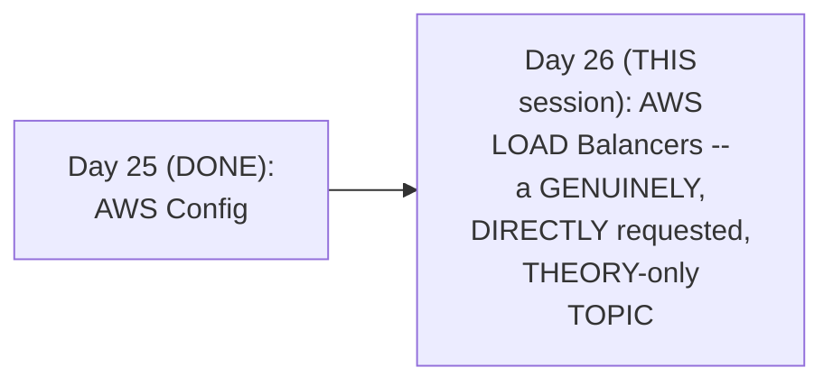

#### 🎯 Key Takeaways

* THIS session is GENUINELY, DIRECTLY confirmed AS a REPEATEDLY-requested TOPIC — VIEWERS genuinely, REPEATEDLY asked, IN comments, FOR this EXACT comparison.
* THE instructor **directly, EXPLICITLY justifies** the SESSION's own, real-WORLD, practical FOCUS — "THE documentation IS slightly CONFUSING" — MOTIVATING a REAL, example-DRIVEN explanation, INSTEAD.
* This directly, PRECISELY sets UP the SESSION's own, COMPLETE structure — TWO, essential PREREQUISITE concepts (LOAD balancing GENERALLY, and the OSI MODEL) BEFORE the THREE, specific LOAD-balancer types.

---

### 2. What Is a Load Balancer? A Complete, Real, Worked Example

#### 🪜 Step-by-Step — A Complete, Real, Worked Example

> 💡 **Given directly:** *"Let's say that I am an application developer, and I wrote a game application... I've deployed this game application on an AWS EC2 instance... initially there were only five users... but after a while, the game has become very popular, and now instead of five there are actually hundreds of users — this one single instance cannot handle the load."*

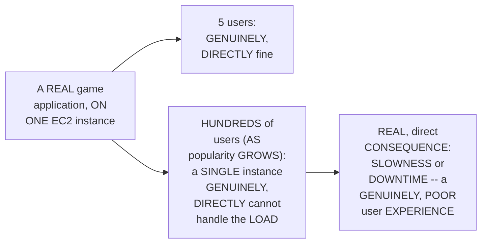

#### 📖 Definition — The Solution: Multiple Instances + a Load Balancer

> 💡 **Given directly:** *"Instead of deploying it in one EC2 instance, what you can do is you can create multiple EC2 instances... and in front of these three EC2 instances you will place a load balancer... now for this hundreds of users, instead of accessing the EC2 instance, just access the load balancer, and now it is the responsibility of the load balancer to manage the request."*

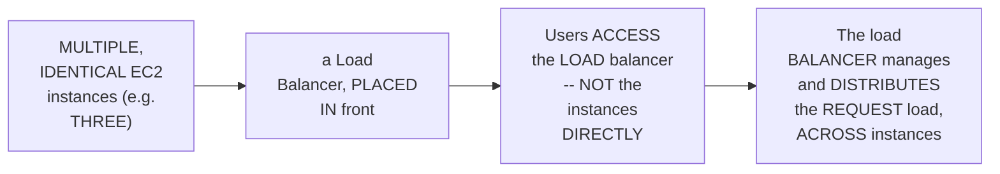

#### ⚠ Common Mistakes

* Assuming a REAL, popular APPLICATION should GENUINELY, DIRECTLY be scaled BY simply upgrading TO a MORE powerful, single INSTANCE — explicitly, directly, IMPLIED as GENUINELY, PRACTICALLY insufficient at SCALE — the SESSION's own, established SOLUTION is HORIZONTAL scaling (MULTIPLE instances), COORDINATED via a LOAD balancer.

#### 🎯 Key Takeaways

* A COMPLETE, real, WORKED example (a GAME application) directly, CONCRETELY illustrates the CORE problem — a SINGLE EC2 instance GENUINELY, DIRECTLY cannot HANDLE growing, REAL user demand — CAUSING slowness OR downtime.
* THE genuine, real SOLUTION: DEPLOY multiple, IDENTICAL EC2 instances, WITH a LOAD balancer PLACED in FRONT — users ACCESS the load BALANCER, which DISTRIBUTES requests ACROSS instances.
* This directly, PRECISELY sets UP the SESSION's own, NEXT, essential CONTENT — the BASIC, foundational LOAD-balancing technique (ROUND robin), and REAL, market ALTERNATIVES (Section 3).

---
### 3. Round Robin & Beyond: Real, Market Load-Balancing Techniques

#### 📖 Definition — Round Robin, Precisely Explained

> 💡 **Given directly:** *"Let's assume that all three EC2 instances have the same characteristics — same specifications, such as RAM, CPU, type of operating system, everything is same — then a basic load balancing mechanism can be round robin... if there are 100 requests, it will simply forward 33 requests here, 33 requests here, and 33 requests here."*

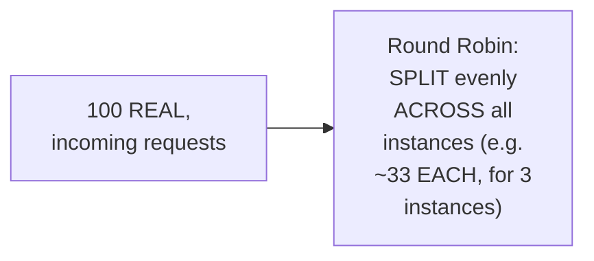

#### 🔍 Internal Working — A Genuine, Direct Confirmation: Many, Real Techniques & Load Balancers Exist

> 💡 **Given directly:** *"There are hundreds of load balancing techniques, it depends upon the type of load balancer you are using — there are many load balancers in the market, like NGINX is a load balancer, F5 is a load balancer, HAProxy is a load balancer, Traefik is a load balancer, you have Ambassador, which is a load balancer."*

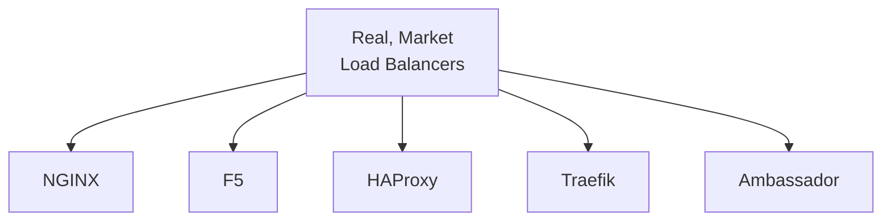

#### 📖 Definition — Beyond Round Robin: Ratio-Based & Weight-Based Techniques

> 💡 **Given directly:** *"Let's say one of these EC2 instances is a highly powerful instance, compared to the other instances — then you can say your load balancer to send 50 requests here, 25, 25 requests here — you can also configure those things, which is called ratio-based load balancing, or there is weight-based load balancing."*

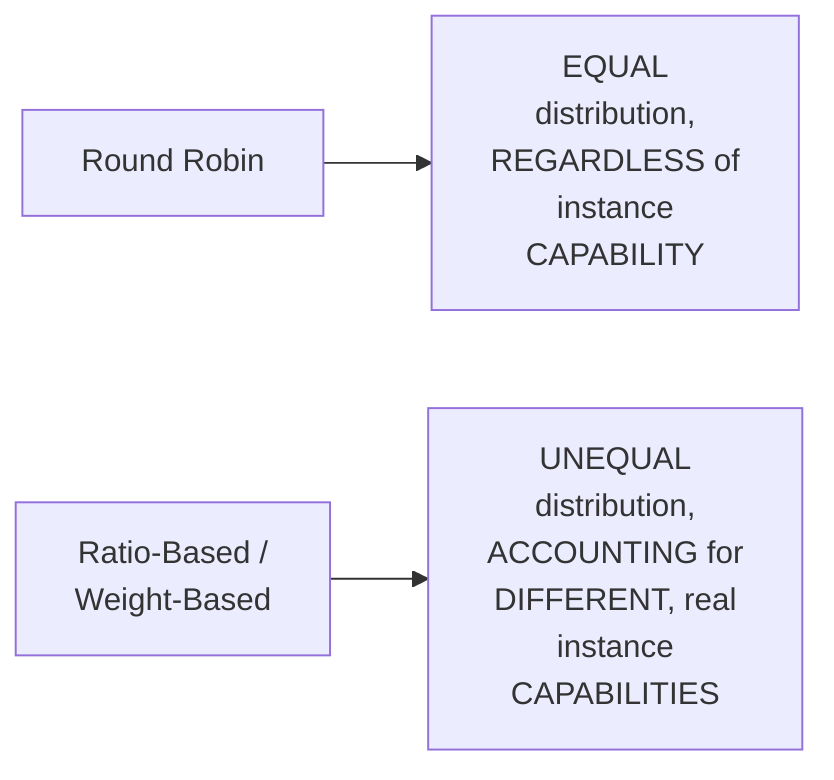

#### ⚠ Common Mistakes

* Assuming ROUND robin is GENUINELY, ALWAYS the RIGHT, universal load-BALANCING technique — explicitly, directly, PRECISELY clarified: it's GENUINELY, SPECIFICALLY appropriate ONLY when ALL instances GENUINELY have the SAME specifications — RATIO/weight-based TECHNIQUES exist SPECIFICALLY for UNEQUAL, real instance CAPABILITIES.

#### 🎯 Key Takeaways

* **ROUND robin** is precisely EXPLAINED as the BASIC, foundational load-BALANCING technique — SPLITTING requests EQUALLY, ACROSS instances WITH identical SPECIFICATIONS.
* MANY, real, MARKET load balancers EXIST (NGINX, F5, HAProxy, TRAEFIK, Ambassador) — EACH SUPPORTING its OWN, DIFFERENT load-BALANCING techniques.
* **RATIO-based** and **WEIGHT-based** techniques EXIST specifically FOR unequal, REAL instance capabilities — SENDING more TRAFFIC to MORE powerful INSTANCES.

---

### 4. The OSI Model, Precisely Explained: A Complete, Real, Worked Example

#### 🪜 Step-by-Step — A Complete, Real, Worked Example: Accessing LinkedIn

> 💡 **Given directly:** *"Let's say that there is a user, now this user wants to access linkedin.com/abhishekvmala... this request will travel over the internet, and finally it would reach one of the LinkedIn servers, and this LinkedIn server will respond back... but what is happening internally? Your request from the client is traveling and reaching the server in seven different layers."*

#### 📖 Definition — Layer 7 (Application) & Layer 6 (Presentation)

> 💡 **Given directly:** *"This user has initiated an HTTP request, okay, so this is called the application layer — layer 7, where you decide what kind of protocol you want to use... from layer 7, that is the application layer, your request goes to layer 6, which is called the presentation layer — should this request be a secure request, or is it okay to send an insecure request? If you want a secure request, then there should be something like SSL or TLS."*

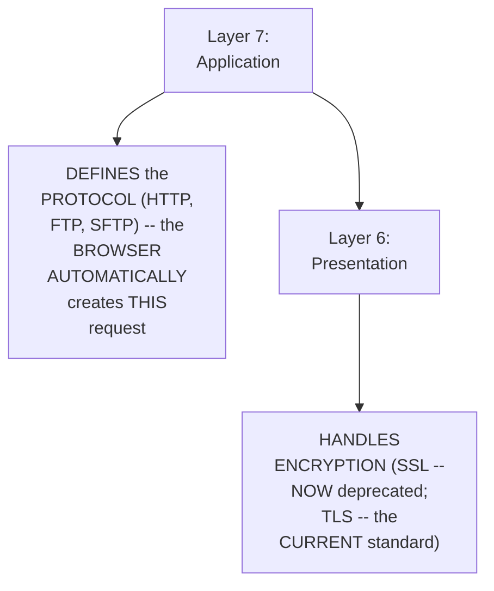

#### 📖 Definition — Layer 5 (Session) & Layer 4 (Transport)

> 💡 **Given directly:** *"You have layer 5, where in the session layer basically you deal with session objects — when the server receives the request, the server wants to understand a few things about the session... then it will go through the transport layer, so transport layer is a very critical or key layer, because in the transport layer your request is split into multiple packets, or small chunks."*

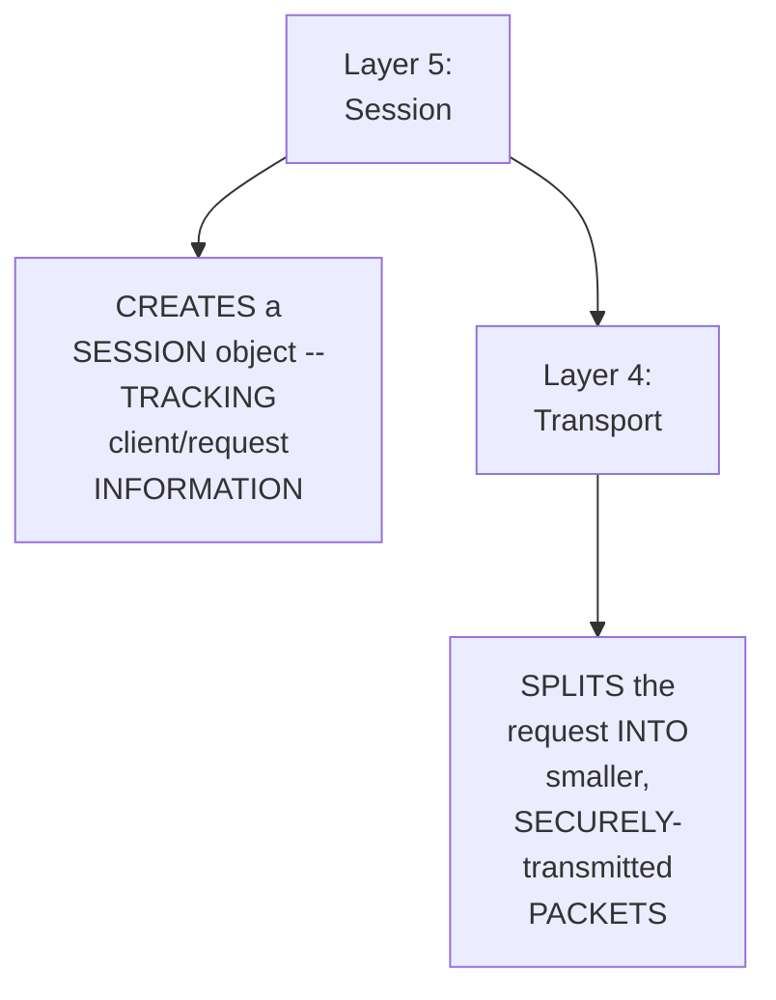

#### 📖 Definition — Layer 3 (Network), Layer 2 (Data Link) & Layer 1 (Physical)

> 💡 **Given directly:** *"Then it will go to the network layer, that is layer 3, where once the small packets are created, the small packets have to travel from user to server through multiple routers... then comes layer 2, that is the data link layer, so where you have all the switches... and finally it will go to the physical layer, that is layer 1, where you have all the cables that are connected to your servers."*

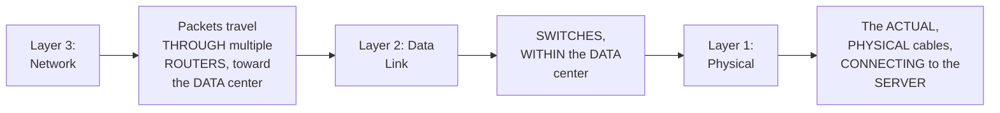

#### ⚠ Common Mistakes

* Assuming a REAL, user-INITIATED request GENUINELY, DIRECTLY reaches a SERVER instantly, IN one, single STEP — explicitly, directly, THOROUGHLY demonstrated as GENUINELY, STRUCTURALLY passing THROUGH seven, DISTINCT layers — EACH performing a SPECIFIC, real FUNCTION (protocol DEFINITION, encryption, SESSION management, PACKET splitting, ROUTING, switching, and PHYSICAL transmission).

#### 🎯 Key Takeaways

* A COMPLETE, real, WORKED example (ACCESSING linkedin.COM) directly, CONCRETELY walks THROUGH all SEVEN OSI LAYERS, in ORDER — from APPLICATION (7) DOWN to physical (1).
* EACH layer PERFORMS a SPECIFIC, real FUNCTION: **7 (application)** defines the PROTOCOL; **6 (presentation)** handles ENCRYPTION; **5 (session)** creates SESSION objects; **4 (transport)** splits REQUESTS into PACKETS; **3 (network)** routes THROUGH multiple routers; **2 (data LINK)** handles SWITCHES; **1 (physical)** is the ACTUAL, physical CABLING.
* This directly, PRECISELY sets UP the SESSION's own, NEXT, essential CONNECTION — WHY understanding THESE layers GENUINELY matters FOR choosing the RIGHT load balancer (Section 5).

---
### 5. Why the OSI Model Genuinely Matters: Different Load Balancers, Different Layers

#### 📖 Definition — A Genuine, Direct Connection

> 💡 **Given directly:** *"You might be thinking, 'but Abhishek, why should I understand about these seven layers, what is the advantage?' You need to understand, because different load balancers act on different layers — for example, application load balancer would act on layer 7, whereas the network load balancer is pretty effective on layer 4."*

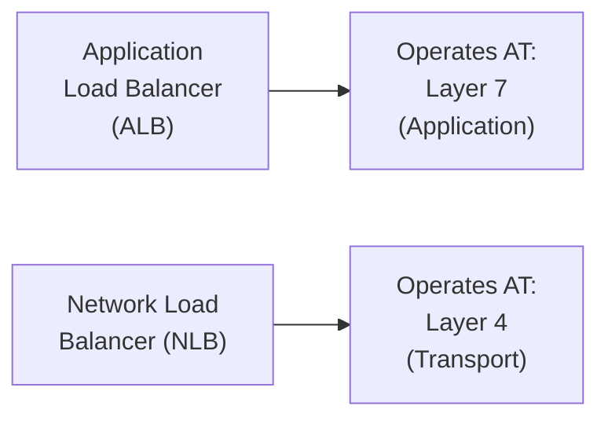

#### 🔍 Internal Working — A Genuine, Direct Confirmation of Who Decides

> 💡 **Given directly:** *"Depending upon these two things, we will decide which load balancer to use — that is, should we go for ALB, should we go for NLB for our applications — who will decide this? Devops engineers and the application developers, together."*

#### ⚠ Common Mistakes

* Assuming CHOOSING BETWEEN ALB and NLB is GENUINELY, SOLELY a devops-ENGINEER decision — explicitly, directly, PRECISELY clarified: it's a GENUINE, COLLABORATIVE decision — MADE together BY devops engineers AND application DEVELOPERS.

#### 🎯 Key Takeaways

* THE OSI model's OWN, seven layers GENUINELY, DIRECTLY matter BECAUSE different, REAL load balancers OPERATE at DIFFERENT layers — **ALB** at LAYER 7; **NLB** at LAYER 4.
* THE decision OF which load BALANCER to USE is directly, EXPLICITLY confirmed AS a GENUINE, collaborative ONE — MADE together BY devops engineers AND application DEVELOPERS.
* This directly, PRECISELY sets UP the SESSION's own, NEXT, essential CONTENT — a COMPLETE, precise EXPLANATION of ALB itself (Section 6).

---

### 6. Application Load Balancer (ALB): Layer 7, Precisely Explained

#### 🪜 Step-by-Step — A Complete, Real, Worked Example

> 💡 **Given directly:** *"Let's say I am accessing amazon.com/payments, then my request has to go to a particular service which is called a payment service — if I am accessing amazon.com/transactions, then my request has to go to the transactions target group — or if I'm accessing amazon.com/login, then it has to go to the login service group."*

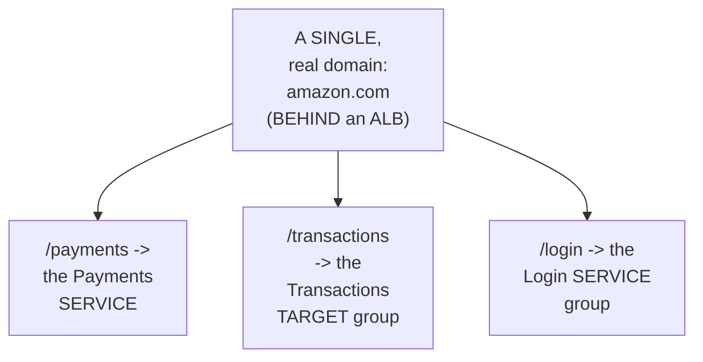

#### 📖 Definition — ALB's Own, Precise Capabilities

> 💡 **Given directly:** *"You can intercept your HTTP request, the HTTP request that the user is sending, and you can read the HTTP request — what are the headers that the user is trying to send, what is the path that the user is trying to access, what is the host... you can also perform ratio-based routing."*

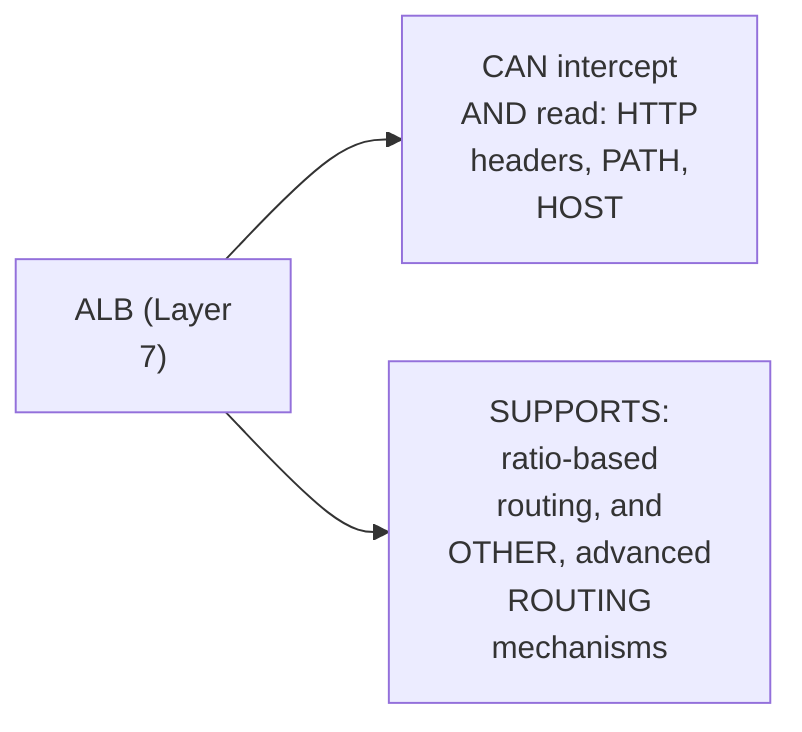

#### 📖 Definition — A Genuine, Additional Capability: SSL Offloading

> 💡 **Given directly:** *"It can also perform SSL offloading — even if you send a plain HTTP request to the load balancer, this load balancer can initiate a secure connection to your servers, so at least the connection from load balancer to the server is secure."*

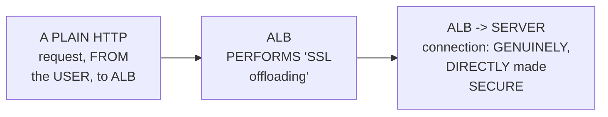

#### ⚠ Common Mistakes

* Assuming ALB's own ROUTING decisions are GENUINELY, MERELY based on SIMPLE, LOAD-balancing math (LIKE round ROBIN alone) — explicitly, directly, PRECISELY clarified: it GENUINELY, DIRECTLY reads and INTERPRETS the ACTUAL, real HTTP request (PATH, host, HEADERS) to MAKE intelligent, CONTENT-aware routing DECISIONS.

#### 🎯 Key Takeaways

* **ALB** operates AT layer 7 — GENUINELY, DIRECTLY intercepting and READING the ACTUAL HTTP request (HEADERS, path, HOST) — a REAL, worked EXAMPLE (amazon.COM/payments vs. /TRANSACTIONS vs. /login) DEMONSTRATES its OWN, precise, PATH-based routing CAPABILITY.
* ALB directly, ADDITIONALLY supports **RATIO-based routing** and **SSL offloading** — SECURING the load-BALANCER-to-server CONNECTION, EVEN if the ORIGINAL, client request was PLAIN HTTP.
* This directly, PRECISELY sets UP the SESSION's own, NEXT, essential, HONEST TRADE-off — WHY these ADVANCED capabilities GENUINELY come AT a real COST (Section 7).

---
### 7. A Genuine, Honest Trade-Off: ALB's Own Cost & Latency

#### ⚠ A Direct, Honest, Important Trade-Off

> 💡 **Given directly:** *"One thing to remember is ALB is a costly load balancer, because it has many additional, or advanced, capabilities — it can intercept an HTTP request, and depending upon the HTTP request that it has intercepted, it can decide which server to forward the request — because it is intercepting and providing you additional capabilities, it is a costly thing, and the second thing is it is slightly slow as well."*

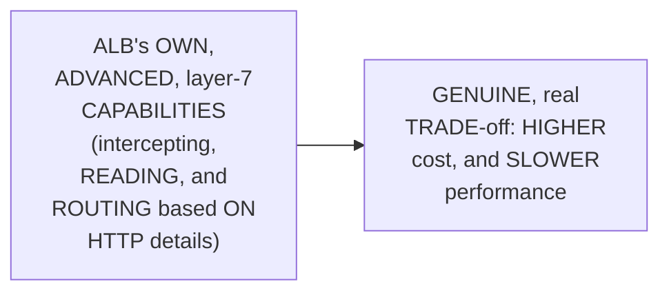

#### 🔍 Internal Working — A Genuine, Precise Explanation of Why It's Slower

> 💡 **Given directly:** *"Why is it slow? Because there is a layer which is stopping, right — you are sending the request to ALB, and ALB is analyzing your layer 7, and then it is forwarding to the servers, so there is a hop in between, or there is a stoppage in between — that's why ALB is costly, and it is also slow because there is a latency involved."*

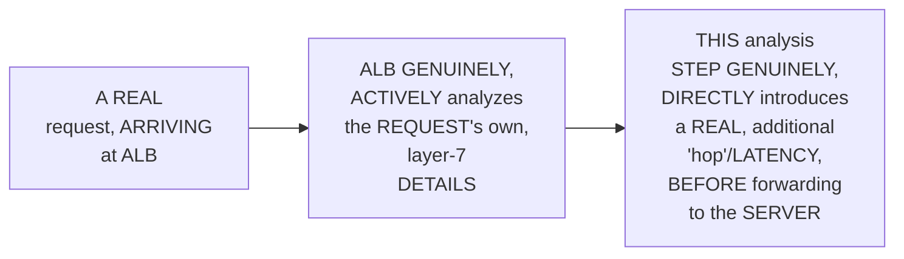

#### ⚠ Common Mistakes

* Assuming ALB's own, GENUINE, advanced CAPABILITIES (INTERCEPTING and READING HTTP DETAILS) are GENUINELY, ENTIRELY "free" — WITH no, real TRADE-off — explicitly, directly, HONESTLY clarified: THESE capabilities GENUINELY, DIRECTLY come AT a real COST — HIGHER price, AND slower PERFORMANCE, due TO the required ANALYSIS step.

#### 🎯 Key Takeaways

* THE instructor **directly, HONESTLY confirms** ALB is GENUINELY, DIRECTLY a **MORE costly** and **SLOWER** load BALANCER — DUE to its OWN, advanced, layer-7 CAPABILITIES.
* THE genuine, precise REASON for the SLOWDOWN: ALB MUST genuinely, ACTIVELY analyze EACH request's own, layer-7 DETAILS — introducing a REAL, additional "HOP"/latency, BEFORE forwarding IT to the SERVER.
* This directly, PRECISELY sets UP the SESSION's own, NEXT, essential CONTRAST — NETWORK Load Balancer (NLB), WHICH genuinely, DIRECTLY avoids THIS same trade-OFF (Section 8).

---

### 8. Network Load Balancer (NLB): Layer 4, Precisely Explained

#### 📖 Definition — NLB, Precisely Explained (& Contrasted With ALB)

> 💡 **Given directly:** *"Network load balancer cannot intercept your HTTP request — that means it cannot perform any intercepting and any modifications at layer 7 — but when the request comes from layer 7 to layer 5 to layer 4, there NLB can play a critical role... it can forward the request depending upon port, depending upon IP address."*

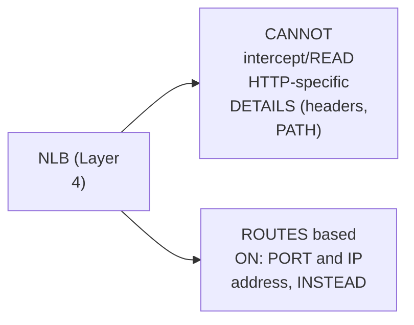

#### 🪜 Step-by-Step — A Complete, Real, Worked Example: Latency-Sensitive Applications

> 💡 **Given directly:** *"Who requires this kind of routing? There are some things like your game servers, there are some things like YouTube streaming platforms — they require layer 4 routing, because at the transport layer, it transmits data in small chunks, and it ensures that data is transmitted from client to server without any latency, without any issues like loss of data."*

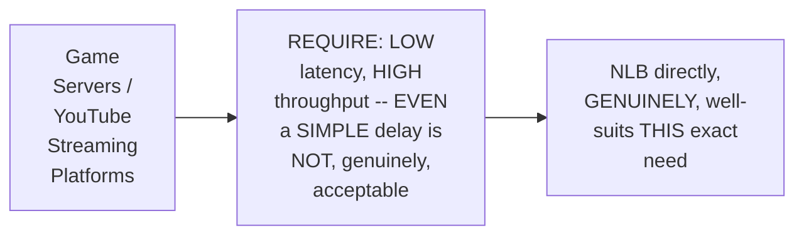

#### 🔍 Internal Working — A Genuine, Direct Confirmation: Cost & Speed

> 💡 **Given directly:** *"It is less costly, network load balancer, and the other thing is that it will not involve in any kind of latency — that means it is very fast, compared to the application load balancer."*

#### ⚠ Common Mistakes

* Assuming NLB is GENUINELY, MERELY a "CHEAPER, feature-POOR" alternative TO ALB — explicitly, directly, PRECISELY reframed: it's GENUINELY, SPECIFICALLY well-SUITED to a DIFFERENT, real USE case — LOW-latency, high-THROUGHPUT applications (GAME servers, VIDEO streaming) — WHERE ALB's own, ADVANCED, layer-7 capabilities WOULD, genuinely, introduce UNACCEPTABLE delay.

#### 🎯 Key Takeaways

* **NLB** operates AT layer 4 — GENUINELY, DIRECTLY unable to INTERCEPT/read HTTP-SPECIFIC details — ROUTING based ON port and IP ADDRESS, instead.
* A COMPLETE, real, WORKED example (GAME servers, YOUTUBE streaming) directly, CONCRETELY illustrates NLB's OWN, ideal USE case — APPLICATIONS where EVEN a SIMPLE delay IS genuinely, DIRECTLY unacceptable.
* NLB is directly, GENUINELY confirmed AS **LESS costly** and **FASTER** than ALB — a DIRECT, precise CONTRAST to Section 7's OWN, established ALB trade-OFF.

---
### 9. A Genuine, Additional NLB Advantage: Sticky Sessions

#### 📖 Definition — Sticky Sessions, Precisely Explained

> 💡 **Given directly:** *"One additional advantage of using NLB is that NLB can create sticky sessions — let's say you're watching a three-hour-long movie on YouTube, then all your requests have to go to one specific server... NLB creates a sticky session, that means the first request that the load balancer has sent to server one, then all the requests from that user will be sent to server one only."*

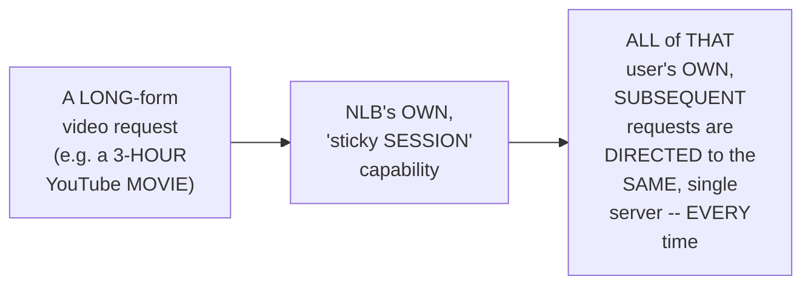

#### 🔍 Internal Working — A Genuine, Precise Explanation of Why This Genuinely Matters

> 💡 **Given directly:** *"If you are placing an ALB in front of these video streaming platforms, what will happen is, one packet, like this 10-hour whole thing can be one request, but one packet will go to one server and another packet will go to another server — in such cases this will not work, if all your packets goes to one single server, because this entire video is one particular output that you want to send to the client."*

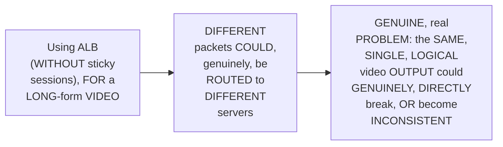

#### ⚠ Common Mistakes

* Assuming BOTH ALB and NLB GENUINELY, EQUALLY support "STICKY sessions," by DEFAULT — explicitly, directly, PRECISELY clarified: THIS is directly, EXPLICITLY confirmed AS a GENUINE, ADDITIONAL, NLB-specific ADVANTAGE — a REAL, important DISTINGUISHING factor FOR long-form, CONTENT-streaming use CASES.

#### 🎯 Key Takeaways

* **STICKY sessions** are precisely EXPLAINED as NLB's OWN, ADDITIONAL, genuine ADVANTAGE — ENSURING ALL of a GIVEN user's REQUESTS are DIRECTED to the SAME, single SERVER, consistently.
* THIS is GENUINELY, DIRECTLY essential FOR long-form CONTENT (e.g., a 3-HOUR video) — WITHOUT it, DIFFERENT packets COULD genuinely be ROUTED to DIFFERENT servers, BREAKING the CONSISTENCY of a SINGLE, logical OUTPUT.
* This directly, PRECISELY completes THIS session's own, ESTABLISHED ALB-vs-NLB comparison — SETTING up the SESSION's own, THIRD, genuinely DISTINCT load-BALANCER type — GWLB (Section 10).

---

### 10. Gateway Load Balancer (GWLB): Virtual Appliances, Precisely Explained

#### 📖 Definition — GWLB, Precisely Introduced

> 💡 **Given directly:** *"Gateway load balancer is used when you are dealing with some kind of virtual appliances — that means let's say you are using a VPN kind of application, or you are working for a customer that deals with firewall kind of applications — in such cases you have to front-face these kind of applications with Gateway load balancer."*

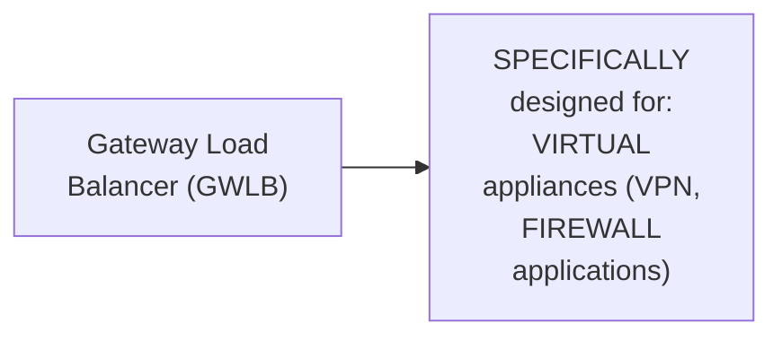

#### 🔍 Internal Working — A Genuine, Direct Explanation of Why ALB/NLB Genuinely Don't Suffice

> 💡 **Given directly:** *"The kind of traffic that these firewalls receive, an application load balancer cannot handle... application load balancer does not add capabilities of security — same thing with network load balancer... when you are using virtual appliances such as VPN or firewall, your traffic has to be highly secure — Gateway load balancer offers high security, and it sends highly encrypted packets to this virtual appliances, which network load balancer and application load balancer cannot offer."*

```mermaid
flowchart TD
    A["VPN/Firewall<br/>Applications'<br/>OWN, SPECIFIC<br/>Traffic"] --> B["ALB: does NOT,<br/>genuinely, HANDLE<br/>this TRAFFIC type<br/>well, and LACKS<br/>sufficient<br/>SECURITY"]
    A --> C["NLB: SAME,<br/>genuine LIMITATIONS<br/>-- INSUFFICIENT<br/>security FOR this<br/>SPECIFIC use CASE"]
    A --> D["GWLB: GENUINELY,<br/>DIRECTLY handles<br/>this TRAFFIC type,<br/>WITH high, real<br/>SECURITY (highly<br/>ENCRYPTED<br/>packets)"]
```

#### ⚠ Common Mistakes

* Assuming ALB OR NLB could GENUINELY, ADEQUATELY substitute FOR GWLB, GIVEN enough CONFIGURATION/proxying — explicitly, directly, PRECISELY clarified: "YOU can DO some proxying... but the OTHER problem is THAT application load BALANCER does NOT add CAPABILITIES of security" — NEITHER ALB nor NLB GENUINELY, STRUCTURALLY match GWLB's own, REQUIRED security LEVEL.

#### 🎯 Key Takeaways

* **GWLB** is precisely INTRODUCED as a GENUINELY, STRUCTURALLY distinct THIRD type — SPECIFICALLY designed FOR virtual APPLIANCES (VPN, FIREWALL applications).
* NEITHER ALB nor NLB GENUINELY, ADEQUATELY handle THIS specific TRAFFIC type, OR provide SUFFICIENT security — GWLB genuinely, DIRECTLY sends HIGHLY encrypted PACKETS, a LEVEL of SECURITY neither ALB nor NLB CAN match.
* This directly, PRECISELY completes THIS session's own, COMPLETE, three-WAY load-balancer EXPLANATION — SETTING up the SESSION's own, FINAL, practical DECISION framework (Section 11).

---
### 11. A Complete, Practical Decision Framework: ALB vs. NLB vs. GWLB

#### 📖 Definition — The Complete, Precise Decision Framework

> 💡 **Given directly:** *"If you want to perform traffic load balancing on layer 7, then you should choose application load balancer — if you want to perform traffic load balancing on layer 4, then you have to choose the network load balancer... when you want to use, or when you are working for a company that develops virtual appliances such as VPN or firewall, go with Gateway load balancer."*

```mermaid
flowchart TD
    A["Choosing a<br/>Load Balancer"] --> B{"WHAT kind of<br/>routing does the<br/>APPLICATION<br/>genuinely need?"}
    B -->|"Advanced,<br/>HTTP-aware<br/>routing (path,<br/>HOST, headers) --<br/>e.g. E-commerce,<br/>WEB apps"| C["ALB (Layer<br/>7)"]
    B -->|"LOW latency,<br/>HIGH throughput,<br/>NO HTTP-level<br/>inspection<br/>needed -- e.g.<br/>GAME servers,<br/>VIDEO streaming"| D["NLB (Layer<br/>4)"]
    B -->|"VIRTUAL<br/>appliances (VPN,<br/>FIREWALL)"| E["GWLB"]
```

#### 🔍 Internal Working — A Genuine, Direct, Final Synthesis

> 💡 **Given directly:** *"In your organization, let's say there are application servers, web servers, where you don't want to intercept the request on the HTTP layer, and you want high transmission, you don't want any kind of delay, then go for network load balancer — whereas if your applications are something like game server or video streaming platforms... where you want to perform advanced routing techniques, then go for application load balancer."*

#### ⚠ Common Mistakes

* Assuming "GAME servers AND video STREAMING" genuinely, ALWAYS map DIRECTLY to a SINGLE, universal LOAD-balancer choice, WITHOUT further NUANCE — explicitly, directly, PRECISELY clarified: the GENUINE deciding FACTOR is SPECIFICALLY whether ADVANCED, layer-7 routing IS genuinely NEEDED (→ALB) VERSUS raw, LOW-latency throughput WITHOUT HTTP-level inspection (→NLB) — game SERVERS and streaming PLATFORMS, in THIS session's own, ESTABLISHED framing, GENUINELY fall INTO the LATTER, NLB-appropriate category.

#### 🎯 Key Takeaways

* THE complete, precise DECISION framework: **LAYER-7, advanced ROUTING** (path/host/HEADER-based) → **ALB**; **LAYER-4, latency-SENSITIVE, high-THROUGHPUT** needs → **NLB**; **VIRTUAL appliances** (VPN/FIREWALL) → **GWLB**.
* THIS framework directly, PRECISELY synthesizes EVERY, established CONCEPT from THIS session — the OSI model (WHICH layer), the REAL, worked examples (E-commerce VS. game servers VS. VPN/firewall), and the HONEST cost/LATENCY trade-offs.
* This directly, PRECISELY sets UP the SESSION's own, FINAL, closing CONTENT — a DIRECT confirmation OF clarity (Section 12).

---

### 12. Closing: A Direct Confirmation of Clarity

#### 🪜 Step-by-Step — A Direct, Genuine, Final Confirmation

> 💡 **Given directly:** *"I hope you understood the difference very clearly, what are the different kinds of load balancers, and when you have to use these load balancers — I'll see you in the next video, take care everyone, bye."*

```mermaid
flowchart LR
    A["THIS session's<br/>OWN, COMPLETE<br/>theory (LOAD<br/>balancing, the<br/>OSI model, and<br/>THREE, precise<br/>load-BALANCER<br/>types)"] --> B["DIRECT,<br/>CONFIDENT<br/>confirmation OF<br/>clarity -- the<br/>SESSION's own,<br/>ESTABLISHED,<br/>real-world<br/>COMPARISON goal<br/>is GENUINELY,<br/>DIRECTLY fulfilled"]
```

#### ⚠ Common Mistakes

* Assuming THIS session's own, THEORETICAL content is GENUINELY, MERELY definitional, WITHOUT real, PRACTICAL, interview-READY value — explicitly, directly, DIRECTLY confirmed THROUGHOUT this SESSION as a GENUINE, real-world, PRACTICAL comparison — EXPLICITLY motivated BY genuine, viewer-REQUESTED confusion WITH the OFFICIAL documentation.

#### 🎯 Key Takeaways

* This episode **GENUINELY, COMPREHENSIVELY delivers** its OWN, stated GOALS — a COMPLETE, precise EXPLANATION of LOAD balancing, the OSI MODEL, and a THOROUGH, three-WAY comparison BETWEEN ALB, NLB, and GWLB.
* THE instructor **directly, CONFIDENTLY confirms** THIS session's own, COMPLETE content SHOULD now MAKE the DIFFERENCE "very, VERY clear" — DIRECTLY fulfilling the SESSION's own, OPENING, viewer-REQUESTED motivation.
* This directly, PRECISELY completes THIS session's own, GENUINELY unique, theory-ONLY FORMAT — a COMPLETE, coherent, PRACTICAL, real-world COMPARISON, grounded THROUGHOUT in REAL, worked examples.

---

## 📝 Glossary

| Term | Definition | Why It Matters |
|---|---|---|
| **Load Balancer** | A component distributing traffic across multiple instances | Enables high availability, avoiding slowness/downtime |
| **Round Robin** | Equal request distribution across identical instances | The basic, foundational load-balancing technique |
| **OSI Model** | The 7 layers a network request passes through | Different load balancers operate at different layers |
| **ALB (Application Load Balancer)** | Operates at Layer 7 | Advanced, HTTP-aware routing; costlier, slower |
| **NLB (Network Load Balancer)** | Operates at Layer 4 | Low-latency, high-throughput; cheaper, faster |
| **GWLB (Gateway Load Balancer)** | For virtual appliances | Handles VPN/firewall traffic with high security |
| **Sticky Sessions** | Routes all of a user's requests to the same server | An NLB-specific advantage, critical for long-form content |
| **SSL Offloading** | ALB secures the connection onward, even from a plain HTTP request | An advanced, ALB-specific capability |

---

## 🔄 Revision Notes — One-Minute Revision

* This is **Day 26**, a genuinely, directly requested, theory-only session -- comparing AWS's three load-balancer types (ALB, NLB, GWLB), motivated by viewer confusion with the official documentation.
* **What is a load balancer**: a complete, worked example -- a game application outgrows a single EC2 instance as popularity grows, causing slowness/downtime. The solution: multiple, identical instances, with a load balancer in front, distributing requests (e.g., via round robin).
* **Round robin & beyond**: round robin (equal distribution) suits identical instances; ratio/weight-based techniques suit unequal instance capabilities. Many, real market load balancers exist (NGINX, F5, HAProxy, Traefik, Ambassador).
* **The OSI model, precisely explained** (via a complete, worked LinkedIn example): Layer 7 (Application) defines the protocol; Layer 6 (Presentation) handles encryption (SSL, deprecated; TLS, current); Layer 5 (Session) creates session objects; Layer 4 (Transport) splits requests into packets; Layer 3 (Network) routes through routers; Layer 2 (Data Link) handles switches; Layer 1 (Physical) is the actual cabling.
* **Why this genuinely matters**: different load balancers operate at different layers -- ALB at Layer 7, NLB at Layer 4. Choosing between them is a genuine, collaborative decision, made by devops engineers and application developers together.
* **ALB, precisely explained**: operates at Layer 7, genuinely intercepting and reading HTTP details (headers, path, host) -- enabling path-based routing (e.g., amazon.com/payments vs. /transactions vs. /login). Also supports ratio-based routing and SSL offloading. A genuine, honest trade-off: ALB is more costly and slower, due to the required, layer-7 analysis step introducing a real "hop"/latency.
* **NLB, precisely explained**: operates at Layer 4, cannot intercept/read HTTP details -- routes based on port and IP address instead. Ideal for latency-sensitive, high-throughput applications (game servers, YouTube streaming), where even a simple delay is unacceptable. Genuinely less costly and faster than ALB.
* **A genuine, additional NLB advantage -- sticky sessions**: ensures all of a user's requests go to the same server, critical for long-form content (e.g., a 3-hour video) -- without it, different packets could be routed to different servers, breaking a single, logical output.
* **GWLB, precisely explained**: a genuinely, structurally distinct third type, specifically for virtual appliances (VPN, firewall applications). Neither ALB nor NLB genuinely handle this specific traffic type or provide sufficient security -- GWLB sends highly encrypted packets, a security level neither ALB nor NLB can match.
* **The complete decision framework**: Layer-7, advanced routing needs -> ALB; Layer-4, latency-sensitive, high-throughput needs -> NLB; virtual appliances (VPN/firewall) -> GWLB.
* **Closing**: a direct, confident confirmation that this session's own, complete comparison should now make the difference "very, very clear" -- directly fulfilling the session's own, viewer-requested motivation.

---

## 📋 Cheat Sheet

**The OSI model's 7 layers:**
```text
7. Application  -- protocol (HTTP, FTP)
6. Presentation -- encryption (SSL/TLS)
5. Session      -- session objects
4. Transport    -- splits into packets
3. Network      -- routers
2. Data Link    -- switches
1. Physical     -- actual cables
```

**The 3 load balancers, at a glance:**
```text
ALB (Layer 7): advanced, HTTP-aware routing; costlier, slower; SSL offloading
NLB (Layer 4): port/IP-based routing; cheaper, faster; sticky sessions
GWLB:           for virtual appliances (VPN, firewall); highest security
```

**Decision framework:**
```text
Need path/host/header-based routing?     -> ALB
Need lowest latency, highest throughput?  -> NLB
Need to front a VPN or firewall app?       -> GWLB
```

**Real, worked examples:**
```text
ALB:  amazon.com/payments, /transactions, /login (path-based routing)
NLB:  game servers, YouTube streaming (latency-sensitive, sticky sessions)
GWLB: VPN applications, firewall applications (virtual appliances)
```

---

## 🔥 Interview Questions & Answers

### 🟢 Beginner

**Q1.**

**Question:** What OSI layer does Application Load Balancer (ALB) operate at?

**Answer:** Layer 7 (Application).

**Explanation:** Directly, explicitly confirmed.

**Why Interviewers Ask This:** The most basic, foundational ALB question.

**Possible Follow-up:** "What layer does NLB operate at?"

**Q2.**

**Question:** Can ALB genuinely read and route based on HTTP-specific details, like the request path?

**Answer:** Yes.

**Explanation:** Directly, explicitly confirmed.

**Why Interviewers Ask This:** Tests genuine, foundational ALB capability knowledge.

**Possible Follow-up:** "Give a real, worked example."

**Q3.**

**Question:** Which is genuinely faster and cheaper: ALB or NLB?

**Answer:** NLB.

**Explanation:** Directly, explicitly confirmed.

**Why Interviewers Ask This:** A commonly-tested, genuine ALB-vs-NLB distinction.

**Possible Follow-up:** "Why, precisely, is ALB genuinely slower?"

**Q4.**

**Question:** What is a "sticky session," and which load balancer genuinely offers it?

**Answer:** Routing all of a user's requests to the same server; an NLB-specific advantage.

**Explanation:** Directly, explicitly explained.

**Why Interviewers Ask This:** Tests genuine, practical understanding of a key, differentiating NLB feature.

**Possible Follow-up:** "Why does this genuinely matter, for long-form video content?"

**Q5.**

**Question:** What is Gateway Load Balancer (GWLB) genuinely used for?

**Answer:** Virtual appliances -- VPN and firewall applications.

**Explanation:** Directly, explicitly confirmed.

**Why Interviewers Ask This:** Basic, essential GWLB use-case knowledge.

**Possible Follow-up:** "Why can't ALB or NLB genuinely substitute for GWLB, here?"

**Q6.**

**Question:** What does "SSL offloading" genuinely mean, for ALB?

**Answer:** ALB can secure the connection from itself to the server, even if the original, client request was plain HTTP.

**Explanation:** Directly, precisely explained.

**Why Interviewers Ask This:** Tests genuine, practical, advanced ALB capability knowledge.

**Possible Follow-up:** "Does this make the client-to-ALB connection secure, too?"

**Q7.**

**Question:** Which OSI layer does the transport layer split requests into?

**Answer:** Layer 4.

**Explanation:** Directly, explicitly stated.

**Why Interviewers Ask This:** Foundational, frequently-tested OSI-model knowledge.

**Possible Follow-up:** "What does the transport layer genuinely do, at this layer?"

**Q8.**

**Question:** Is choosing between ALB and NLB genuinely a solo, devops-engineer decision?

**Answer:** No -- a genuine, collaborative decision, made with application developers too.

**Explanation:** Directly, explicitly confirmed.

**Why Interviewers Ask This:** Tests genuine, organizational understanding of the decision process.

**Possible Follow-up:** "What two, real factors genuinely drive this decision?"

**Q9.**

**Question:** What basic load-balancing technique distributes requests equally, across identical instances?

**Answer:** Round robin.

**Explanation:** Directly, explicitly named.

**Why Interviewers Ask This:** Basic, foundational load-balancing terminology.

**Possible Follow-up:** "What technique would you use instead, for unequal instance capabilities?"

**Q10.**

**Question:** Name two, real, worked example use cases: one genuinely suited to ALB, and one genuinely suited to NLB.

**Answer:** ALB: an e-commerce site with path-based routing (amazon.com/payments); NLB: game servers or YouTube streaming.

**Explanation:** Directly, explicitly given.

**Why Interviewers Ask This:** Tests genuine, practical application of the ALB-vs-NLB distinction.

**Possible Follow-up:** "Why does NLB genuinely suit the second example, specifically?"

---
### 🟡 Intermediate

**Q11.**

**Question:** Explain why the instructor deliberately explains the OSI model's own, complete seven layers, rather than only explaining Layer 7 (for ALB) and Layer 4 (for NLB) directly, since those are the only two layers genuinely, directly relevant to the load-balancer comparison.

**Answer:** This is a genuinely deliberate, COMPLETE-foundation teaching choice: by EXPLAINING all SEVEN layers (NOT just the TWO directly RELEVANT to ALB/NLB), the instructor ENSURES learners GENUINELY understand the COMPLETE, sequential CONTEXT — WHY layer 7 COMES before layer 4 IN the packet's OWN, real JOURNEY, and WHAT happens BOTH before (layers 6-5) and AFTER (layers 3-1) the TWO, load-balancer-relevant LAYERS. THIS directly, PEDAGOGICALLY prevents a GENUINELY, PARTIAL, disconnected UNDERSTANDING — a LEARNER who ONLY knows "ALB = layer 7, NLB = LAYER 4," WITHOUT the SURROUNDING context, WOULD genuinely, STRUCTURALLY lack the DEEPER, complete PICTURE of HOW a request GENUINELY flows, END to end — a COMPLETENESS THIS instructor CONSISTENTLY prioritizes THROUGHOUT this series (e.g., Day 21's OWN, complete Kubernetes-ARCHITECTURE explanation, EVEN when ONLY specific COMPONENTS were DIRECTLY relevant to THAT session's own, CENTRAL comparison).

**Explanation:** Requires recognizing the deliberate, complete-foundation value of explaining the full, seven-layer context, rather than only the two, directly-relevant layers, to build genuine, structural understanding of the complete request journey.

**Why Interviewers Ask This:** Tests whether a learner recognizes the pedagogical value of complete, contextual grounding over a narrowly-scoped, "just enough" explanation.

**Possible Follow-up:** "Identify ANOTHER, genuine EXAMPLE, from ELSEWHERE in THIS series, where a SIMILAR, 'COMPLETE-context-first' teaching PATTERN was used."

**Q12.**

**Question:** A learner argues that since this session confirms NLB is genuinely cheaper and faster than ALB, this means NLB should always be the default, preferred choice, and ALB should only be used when NLB's own limitations genuinely prevent it. Evaluate this claim.

**Answer:** This claim OVERSTATES NLB's own, GENUINE cost/SPEED advantages into an UNCONDITIONAL, "ALWAYS default TO NLB" recommendation, WHICH neither THIS session's own CONTENT, nor sound REASONING, SUPPORTS. Section 11's own PRECISE, established DECISION framework DIRECTLY confirms the CHOICE genuinely, DIRECTLY depends ON the APPLICATION's own, real, FUNCTIONAL requirements — NOT simply COST/speed alone. Section 6's own established REASONING confirms MANY, real applications (e.g., THE amazon.com PATH-based-routing example) GENUINELY, STRUCTURALLY require ALB's own, ADVANCED, layer-7 capabilities (PATH/host-based ROUTING) — NLB, GENUINELY, cannot PROVIDE this SAME, required FUNCTIONALITY, REGARDLESS of its OWN, genuine cost/SPEED advantages. The ACCURATE, more PRECISE conclusion: the CHOICE between ALB and NLB is GENUINELY, DIRECTLY driven BY the APPLICATION's own, real, FUNCTIONAL routing REQUIREMENTS (per Section 5's own established, "WHICH layer" framing) — NOT a SIMPLE, cost-MINIMIZING default, WITH ALB as a "FALLBACK" only.

**Explanation:** Tests whether a learner recognizes that the ALB-vs-NLB choice is driven by genuine, functional routing requirements, not simply defaulting to the cheaper, faster option whenever possible.

**Why Interviewers Ask This:** Distinguishes candidates who correctly apply the session's own, functionality-first decision framework from those who over-generalize a cost/speed advantage into a default-preference rule.

**Possible Follow-up:** "Describe a GENUINE, real APPLICATION that WOULD, LEGITIMATELY require ALB's own, ADVANCED capabilities, EVEN if COST and SPEED were the ORGANIZATION's own, ABSOLUTE highest PRIORITIES."

**Q13.**

**Question:** Explain, precisely, why the instructor deliberately uses the SAME, underlying "long-form video" reasoning to explain BOTH why ALB genuinely fails at this use case AND why NLB's sticky-session capability genuinely succeeds, rather than explaining each load balancer's own behavior in isolation.

**Answer:** This is a genuinely deliberate, CONTRASTIVE teaching choice: by APPLYING the SAME, SINGLE, real SCENARIO (a LONG-form VIDEO) to BOTH sides OF the comparison — SHOWING precisely HOW ALB's own, DEFAULT behavior (POTENTIALLY splitting PACKETS across DIFFERENT servers) WOULD genuinely BREAK the experience, and precisely HOW NLB's own, STICKY-session capability GENUINELY solves it — the instructor CREATES a DIRECT, MEMORABLE, side-by-SIDE contrast, RATHER than TWO, separate, DISCONNECTED explanations. THIS directly, CONCRETELY makes the ABSTRACT concept of "STICKY sessions" GENUINELY, VISCERALLY understandable — LEARNERS can DIRECTLY see WHAT specific, real PROBLEM it SOLVES, rather than MEMORIZING an ISOLATED, abstract DEFINITION.

**Explanation:** Requires recognizing the deliberate, contrastive value of applying a single, shared scenario to both sides of a comparison, to make an abstract capability (sticky sessions) concretely, viscerally understandable.

**Why Interviewers Ask This:** Tests whether a learner recognizes the pedagogical value of a single, shared, contrasting example over two, separate, isolated explanations.

**Possible Follow-up:** "Construct YOUR OWN, DIFFERENT, real-world EXAMPLE (BEYOND long-FORM video) that WOULD, similarly, genuinely ILLUSTRATE the SAME, 'sticky SESSION' need."

**Q14.**

**Question:** Using this session's own precise "GWLB, high security" reasoning (Section 10), explain a GENUINE, real, structural reason why a company specifically building firewall or VPN products would prioritize GWLB adoption EARLY, rather than initially prototyping with ALB or NLB and migrating later.

**Answer:** A precise, reasoned analysis, directly extending Section 10's own established REASONING: per Section 10's own PRECISE, established DISTINCTION, NEITHER ALB nor NLB GENUINELY, STRUCTURALLY provide the LEVEL of security (HIGHLY encrypted PACKETS) that VPN/firewall TRAFFIC genuinely, DIRECTLY requires — AND, additionally, NEITHER can GENUINELY, PROPERLY handle THIS specific TRAFFIC type at ALL (NOT merely a SECURITY gap, but a GENUINE, functional INCOMPATIBILITY). THIS directly, PRECISELY reveals a GENUINE, structural REASON to prioritize GWLB EARLY: UNLIKE the ALB-versus-NLB choice (WHERE a REAL, functioning APPLICATION could, GENUINELY, initially work WITH either, and be OPTIMIZED later), attempting to PROTOTYPE a FIREWALL/VPN product WITH ALB or NLB RISKS a GENUINE, fundamental FAILURE to FUNCTION correctly AT all — NOT merely a SUBOPTIMAL, but WORKING, initial CHOICE — MAKING early GWLB adoption a GENUINE, structural NECESSITY, rather than an OPTIONAL, later OPTIMIZATION.

**Explanation:** Requires extending the GWLB reasoning to identify a genuine, structural distinction between GWLB adoption (a functional necessity, from the start) and the ALB-vs-NLB choice (an optimization that could, genuinely, be adjusted later).

**Why Interviewers Ask This:** Tests whether a learner can distinguish between a load-balancer choice that's a genuine, functional prerequisite versus one that's a later-adjustable optimization, based on the session's own, established reasoning.

**Possible Follow-up:** "Describe a GENUINE, real, PRACTICAL risk a TEAM would GENUINELY face, if they ATTEMPTED to prototype a FIREWALL product USING ALB or NLB, BEFORE discovering THIS specific, structural INCOMPATIBILITY."

**Q15.**

**Question:** Synthesize this session's complete "OSI model, sequential layers" reasoning (Section 4) with its own "ALB's own hop/latency" reasoning (Section 7) to explain a GENUINE, structural reason why ALB's own performance cost is specifically located AT layer 7, rather than being distributed evenly across all seven layers a request genuinely passes through.

**Answer:** A precise, synthesized explanation, directly connecting TWO, separately-established sections: per Section 4's own PRECISE, established SEQUENCE, EVERY, single request GENUINELY, STRUCTURALLY passes THROUGH all SEVEN OSI layers, REGARDLESS of WHICH load balancer IS used. Per Section 7's own PRECISE, established REASONING, ALB's own, SPECIFIC latency COST comes FROM its OWN, ACTIVE analysis OF the request's OWN, layer-7 (application) DETAILS — a STEP genuinely, STRUCTURALLY unique TO ALB, and NOT genuinely PERFORMED by NLB (per Section 8's OWN established DISTINCTION — NLB CANNOT intercept LAYER-7 details AT all). SYNTHESIZING these TWO facts directly, PRECISELY reveals a GENUINE, structural REASON: THE "hop"/latency Section 7 DESCRIBES is NOT, genuinely, a UNIFORM cost SPREAD across ALL seven LAYERS — it's a SPECIFIC, ADDITIONAL, layer-7-LOCATED processing STEP, unique TO ALB's own, DELIBERATE choice to INSPECT and ROUTE based ON application-level DETAILS. NLB, by GENUINE, direct CONTRAST, GENUINELY, STRUCTURALLY "skips" this SPECIFIC, layer-7 ANALYSIS step ENTIRELY (operating ONLY at LAYER 4) — WHICH is PRECISELY, STRUCTURALLY why it GENUINELY, DIRECTLY avoids ALB's own, established LATENCY cost.

**Explanation:** Requires synthesizing the sequential, seven-layer OSI journey with the specific, layer-7-located source of ALB's own latency cost to explain why this cost is structurally localized, not uniformly distributed, and why NLB genuinely avoids it.

**Why Interviewers Ask This:** A senior-level question testing whether a candidate can identify the precise, structural location of a performance cost within a multi-layer system, based on two, separately-established facts about the system's own architecture.

**Possible Follow-up:** "USING this SAME, established REASONING, EXPLAIN why GWLB's own, ESTABLISHED 'high SECURITY' capability (per Section 10) is GENUINELY, STRUCTURALLY a DIFFERENT kind OF trade-off THAN ALB's own, layer-7-SPECIFIC latency COST."

---

### 🔴 Advanced

**Q16.**

**Question:** Design a complete, reasoned load-balancer selection framework (using ONLY this session's own established concepts) for a hypothetical, large organization running FIVE, genuinely different, real applications: (1) a public-facing e-commerce website with multiple microservices, (2) a real-time multiplayer game backend, (3) a corporate VPN gateway, (4) an internal, long-form employee-training video platform, and (5) a simple, single-purpose internal API with no path-based routing needs.

**Answer:** A reasonable, complete framework, directly applying this session's OWN, exact established CONCEPTS:

```text
1. E-commerce website, WITH multiple MICROSERVICES (per Section 6's
   own established, amazon.com EXAMPLE): GENUINELY, DIRECTLY requires
   ALB -- PATH-based routing (e.g. /payments, /transactions, /login)
   is a CORE, functional REQUIREMENT ONLY ALB's own, layer-7
   capabilities CAN provide.

2. Real-time multiplayer game BACKEND (per Section 8's own
   established, game-SERVER example): GENUINELY, DIRECTLY requires
   NLB -- LOW latency and HIGH throughput ARE critical, and NO
   path/host-based ROUTING is GENUINELY needed.

3. Corporate VPN GATEWAY (per Section 10's own established,
   virtual-APPLIANCE reasoning): GENUINELY, DIRECTLY requires GWLB
   -- NEITHER ALB nor NLB CAN genuinely handle THIS specific
   traffic TYPE, or provide SUFFICIENT security.

4. Internal, long-form EMPLOYEE-training video PLATFORM (per
   Section 9's own established, STICKY-session reasoning):
   GENUINELY, DIRECTLY requires NLB -- STICKY sessions are
   ESSENTIAL, to ENSURE a SINGLE, long-form VIDEO's own packets
   ALL reach the SAME server, AVOIDING the SAME, established RISK
   Section 9's own, YouTube EXAMPLE illustrates.

5. Simple, single-purpose internal API, WITH NO path-based
   routing NEEDS (per Section 11's own established DECISION
   framework): COULD, reasonably, use EITHER -- but GIVEN NLB's
   own, established COST/speed ADVANTAGE (per Section 8), and the
   ABSENCE of any GENUINE need FOR ALB's own, advanced,
   layer-7 CAPABILITIES, NLB is the MORE cost-EFFECTIVE, genuinely
   REASONABLE choice HERE.
```

This complete FRAMEWORK directly, precisely APPLIES this session's OWN, established CONCEPTS — LAYER-based routing NEEDS, latency SENSITIVITY, virtual-APPLIANCE requirements, and STICKY-session needs — to FIVE, genuinely DIFFERENT, realistic APPLICATION scenarios.

**Explanation:** Requires synthesizing every major concept from this session — path-based routing, latency sensitivity, virtual-appliance security, and sticky sessions — into one complete, reasoned selection framework across five, genuinely different, realistic application types.

**Why Interviewers Ask This:** A comprehensive, capstone-level question testing whether a candidate can apply the complete range of this session's own concepts to distinguish appropriate load-balancer choices across genuinely different, realistic application scenarios.

**Possible Follow-up:** "FOR application 5 (the SIMPLE, internal API), UNDER what SPECIFIC, GENUINE, future CIRCUMSTANCE might THEY need to MIGRATE from NLB to ALB, LATER?"

**Q17.**

**Question:** Critically evaluate: "Since this session confirms ALB is genuinely more costly and slower than NLB due to its own, layer-7 analysis overhead, this means any application that doesn't strictly require path-based routing should always choose NLB, purely to save on cost and latency, even if some other, genuine ALB-specific capability might eventually become useful." Is this an accurate, complete characterization?

**Answer:** Not accurate — this OVERSTATES the GENUINE, established COST/latency trade-off INTO an UNCONDITIONAL, "ALWAYS choose NLB WHENEVER path-based ROUTING isn't STRICTLY required" recommendation, WHICH oversimplifies THIS session's own, MULTI-dimensional DECISION framework (Section 11). Section 6's own ESTABLISHED content CONFIRMS ALB genuinely, DIRECTLY offers SEVERAL, real capabilities BEYOND path-BASED routing ALONE — INCLUDING SSL offloading (per Section 6's OWN established EXPLANATION) and RATIO-based routing — WHICH could GENUINELY, DIRECTLY prove VALUABLE even FOR an application that DOESN'T, initially, STRICTLY require path-BASED routing. CHOOSING NLB PURELY to minimize COST/latency, WITHOUT genuinely CONSIDERING whether OTHER, real ALB capabilities MIGHT eventually BECOME useful, RISKS a GENUINE, real, future MIGRATION burden, SHOULD those CAPABILITIES later, genuinely BECOME necessary. The ACCURATE, more PRECISE conclusion: the DECISION genuinely, DIRECTLY requires WEIGHING the COMPLETE, real set OF an application's OWN, CURRENT and REASONABLY-anticipated FUTURE needs (routing COMPLEXITY, SSL requirements, LATENCY sensitivity) — NOT simply DEFAULTING to the CHEAPER, faster OPTION whenever the SINGLE, most-OBVIOUS ALB feature (path-BASED routing) isn't STRICTLY, immediately required.

**Explanation:** Tests whether a learner recognizes that the ALB-vs-NLB decision requires weighing ALB's own, complete set of capabilities (not just path-based routing) against genuine, anticipated future needs, rather than defaulting to NLB purely on cost/latency grounds.

**Why Interviewers Ask This:** Distinguishes candidates who understand a genuinely complete, multi-capability decision process from those who reduce the ALB-vs-NLB choice to a single feature (path-based routing) and a cost-minimization default.

**Possible Follow-up:** "Name ONE, GENUINE, real ALB capability (BEYOND path-based ROUTING) that MIGHT, reasonably, justify CHOOSING ALB, EVEN for an application WITHOUT an IMMEDIATE, path-based ROUTING need."

---

## 🧪 Scenario-Based Interview Questions

> **Scenario 1:** A colleague's newly-deployed, long-form, internal training-video platform is using ALB, and employees are reporting that videos frequently stutter, freeze, or fail partway through playback, despite each, individual EC2 instance appearing healthy. Using this session's own concepts, construct a complete, reasoned debugging response.

**Structured Answer:**
1. **Initial investigation:** Recognize this as directly connected to Section 9's own precise, established sticky-session reasoning — a GENUINE, likely EXPLANATION for THIS specific, real SYMPTOM.
2. **Relevant principle:** Per Section 9's own established REASONING, ALB does NOT, genuinely, PROVIDE sticky SESSIONS by default — DIFFERENT packets, FROM the SAME, single LOGICAL video, COULD, genuinely, be ROUTED to DIFFERENT, separate SERVERS.
3. **Possible causes:** THE colleague's own, LONG-form video PLATFORM is LIKELY, genuinely EXPERIENCING this EXACT, established PROBLEM — packets BEING split ACROSS multiple, DIFFERENT servers, CAUSING the REPORTED stuttering/FREEZING/failure.
4. **Debugging approach:** Directly CONFIRM whether the CURRENT setup USES ALB (per Section 9's own established, PROBLEMATIC scenario) — AND whether STICKY sessions are GENUINELY, currently CONFIGURED/enabled at ALL.
5. **Resolution:** RECOMMEND migrating to **NLB** (per Section 9's own established SOLUTION) — SPECIFICALLY to GAIN its OWN, native sticky-SESSION capability — DIRECTLY, GENUINELY resolving the REPORTED, real symptoms.
6. **Prevention:** Establish a standing team PRACTICE of EXPLICITLY, DELIBERATELY considering STICKY-session requirements (per Section 9's own established REASONING) DURING the INITIAL load-balancer SELECTION process, FOR any, genuine LONG-form, stateful CONTENT-delivery application — RATHER than DISCOVERING this REQUIREMENT reactively, AFTER a real, USER-facing problem EMERGES.

> **Scenario 2 (Advanced):** Your organization's e-commerce platform, currently using ALB with path-based routing (as in this session's own example), is planning to add a new, real-time, live-chat customer-support feature to the same domain. A colleague argues you should simply add this feature as another path under the existing ALB configuration. Using this session's own concepts, construct a complete, reasoned response.

**Structured Answer:**
1. **Initial investigation:** Recognize this as directly connected to Section 11's own precise, established decision framework — a GENUINE need to EVALUATE whether THIS new FEATURE's own, real REQUIREMENTS genuinely MATCH ALB's own STRENGTHS.
2. **Relevant principle:** Per Section 8's own established REASONING, REAL-time, LOW-latency communication (SIMILAR, in SPIRIT, to Section 8's own, established GAME-server/streaming EXAMPLES) is SPECIFICALLY the KIND of use CASE NLB genuinely EXCELS at — WHEREAS ALB's own, established layer-7 ANALYSIS (per Section 7) GENUINELY introduces REAL, additional latency.
3. **Possible risks:** SIMPLY adding THIS new, real-TIME feature UNDER the EXISTING ALB configuration RISKS introducing GENUINE, real LATENCY (per Section 7's OWN established "hop" REASONING) — POTENTIALLY degrading the LIVE-chat feature's OWN, real-time RESPONSIVENESS.
4. **Debugging/evaluation approach:** Directly ASSESS whether the NEW, live-CHAT feature GENUINELY requires ANY, real path-BASED or host-based ROUTING (per Section 6's own established ALB CAPABILITY) — OR whether it's PRIMARILY, genuinely a LOW-latency, real-time COMMUNICATION need.
5. **Resolution:** RECOMMEND a HYBRID approach — KEEPING the EXISTING, path-based E-commerce ROUTES on ALB (per Section 6's own established STRENGTH), WHILE routing the NEW, real-time LIVE-chat feature THROUGH a SEPARATE NLB (per Section 8's own established STRENGTH) — RATHER than FORCING a SINGLE, real load-BALANCER type to HANDLE both, GENUINELY different NEEDS.
6. **Prevention:** Establish a standing team PRACTICE of EXPLICITLY, DELIBERATELY re-evaluating LOAD-balancer choice, PER new FEATURE (per Section 11's own established DECISION framework) — RATHER than ASSUMING an EXISTING load-BALANCER configuration is AUTOMATICALLY the RIGHT choice FOR every, NEW, genuinely DIFFERENT feature ADDED to the SAME, existing DOMAIN.

---

## 🛠 Hands-on Exercises

### 🟢 Easy

1. Write out, from memory, all seven layers of the OSI model, in order.
2. Explain, in your own words, the genuine difference between ALB and NLB, using a real, worked example for each.
3. Explain, in your own words, what a "sticky session" is, and why it genuinely matters.

### 🟡 Medium

4. Construct your own, complete, written comparison of ALB, NLB, and GWLB, including when to use each, and why.
5. Research AWS's own, official documentation for ALB, NLB, and GWLB, and compare it against this session's own, real-world-example-driven explanation.
6. Diagram, from memory, the complete OSI-layer journey of a real, HTTP request, from a browser to a server.

### 🔴 Advanced

7. Complete the full, reasoned load-balancer selection framework proposed in Advanced Interview Q16, for five, genuinely different applications of your own choosing.
8. Implement the debugging scenario proposed in Scenario 1 -- research and document how to configure sticky sessions on a real, AWS NLB.
9. Research and compare AWS's own three load balancers against a real, third-party alternative (e.g., NGINX, HAProxy), documenting genuine, real differences.

---

## 🏗 Practice Assignment

*(This session's own, genuine, viewer-driven motivation, reproduced faithfully)*

> 💡 **The instructor's own words, given directly:** *"I hope you understood the difference very clearly, what are the different kinds of load balancers, and when you have to use these load balancers."*

### Build: "Complete, Written, Interview-Ready Load Balancer Comparison Guide"

**Objective:** Directly reproduce this session's own, complete, comparative understanding, in a genuine, self-authored, interview-ready format.

**Requirements:**
- Write out a complete, precise explanation of what a load balancer is, using an original, worked example (different from this session's own game-application example).
- Write out all seven OSI layers, with a one-sentence description of each layer's own, genuine function.
- Write out a complete, three-way comparison table (ALB vs. NLB vs. GWLB), covering: OSI layer, cost, speed, routing basis, and a real, worked example use case for each.
- Write out a complete, ready-to-deliver, 200-300 word answer to "explain the difference between AWS's load balancers, and when you'd use each."

**Architecture (suggested):**

```text
day26_load_balancers_assignment/
├── load_balancer_explanation.md          # your own, original worked example
├── osi_model_summary.md                      # your own, written 7-layer summary
├── comparison_table.md                           # your complete, 3-way comparison
└── INTERVIEW_ANSWER.md                               # your complete, ready-to-deliver answer
```

**Expected Functionality:**
- Your written comparison should genuinely, confidently, and completely address all three load-balancer types, without needing to reference this guide.

**Challenges:**
- Correctly, independently constructing a new, original worked example (beyond the game-application/LinkedIn examples used in this session).
- Constructing a genuinely confident, complete answer, from memory, without notes.

**Bonus Improvements:**
- Research and document a real, additional load-balancing technique (beyond round robin, ratio-based, and weight-based) used by a real, third-party load balancer.
- Practice delivering your written interview answer aloud, timing yourself, to ensure genuine confidence and completeness.

---

## 📚 Additional Resources

- **AWS's own, official Elastic Load Balancing documentation** (referenced indirectly) -- explicitly, honestly acknowledged as "slightly confusing," the direct motivation for this session's own, real-world, example-driven approach.
- **The instructor's own GitHub repository** (referenced implicitly, per this series' own, established pattern) -- for further, independent review of this session's own, theoretical content.

---

## 📌 Final Revision Sheet

### ⭐ Core Concepts
- **Load balancer**: distributes traffic across multiple instances, avoiding slowness/downtime.
- **OSI model's 7 layers**: application, presentation, session, transport, network, data link, physical.
- **ALB (Layer 7)**: advanced, HTTP-aware routing; costlier, slower.
- **NLB (Layer 4)**: port/IP-based routing; cheaper, faster; sticky sessions.
- **GWLB**: for virtual appliances (VPN, firewall); highest security.

### ⭐ Important Definitions
- **Sticky Sessions, SSL Offloading** (see Glossary for full definitions).

### ⭐ Important Commands/Code
```text
(This session is entirely conceptual; no live demo or commands were shown.)
```

### ⭐ Architecture/Process
- The complete decision process: identify the application's own, genuine routing needs -> assess whether layer-7, advanced routing is genuinely required (-> ALB) -> assess whether low latency/high throughput, without HTTP inspection, is the priority (-> NLB) -> assess whether the application is a virtual appliance (VPN/firewall) (-> GWLB).

### ⭐ Best Practices
- Choose ALB when genuine, path/host-based routing or SSL offloading is required.
- Choose NLB for latency-sensitive, high-throughput applications, and whenever sticky sessions are genuinely needed.
- Always choose GWLB for virtual appliances (VPN, firewall) -- neither ALB nor NLB genuinely substitute.
- Treat the ALB-vs-NLB decision as a genuine, collaborative one, between devops engineers and application developers.

### ⭐ Common Mistakes
- Assuming ALB and NLB are interchangeable, differing only in cost and speed.
- Assuming game servers/streaming platforms always require NLB, without considering the underlying, functional reasoning (latency sensitivity, sticky sessions).
- Assuming ALB or NLB can adequately substitute for GWLB, with enough configuration/proxying.
- Assuming the OSI model's remaining five layers (beyond 7 and 4) are irrelevant to understanding load balancers.

### ⭐ Interview Points
- Be ready to explain the OSI model's seven layers, in order, with a real, worked example.
- Be ready to precisely distinguish ALB, NLB, and GWLB, across layer, cost, speed, and use case.
- Be ready to explain sticky sessions, and why they matter for long-form content.
- Be ready to apply the complete decision framework to a new, unfamiliar application scenario.

### ⭐ Things to Remember
- This session is **genuinely, directly requested content** — explicitly motivated by real, repeated viewer confusion with AWS's own, official documentation.
- The **long-form video, sticky-session example** (Section 9) is this session's own most concrete, memorable illustration of why NLB's own, additional capability genuinely matters, beyond raw speed/cost.
- **GWLB's own security requirement** (Section 10) is structurally different from the ALB-vs-NLB trade-off — it's a genuine, functional necessity from the start, not a later-adjustable optimization.

---

## 🔗 Source

- [AWS Load Balancers](https://youtu.be/bCS9m5RVPyo?si=4AHgyIwaf7BtuGjc)