# 🚚 AWS Zero to Hero — Day 28: Migrating Applications to AWS Cloud

- <i>**Series:** AWS Zero to Hero (Day 28, direct continuation of Day 26's own Load Balancers session) · 
- **Instructor:** Abhishek
- **Note on scope:** THIS is a GENUINELY, theory-ONLY session — but GENUINELY, DISTINCTLY grounded IN the instructor's OWN, real, FIRST-hand PROFESSIONAL experience — a TOP European BANK migration PROJECT (2015-16) and a SEPARATE, 2018 FREELANCING project. THE session EXPLICITLY, HONESTLY critiques MOST existing online CONTENT (WHICH covers ONLY the SEVEN, well-known migration STRATEGIES) and INSTEAD teaches a COMPLETE, five-STAGE, REAL-world migration FRAMEWORK — PREPARATION, planning, MIGRATE, monitor, and OPTIMIZE — PROPERLY contextualizing the SEVEN strategies WITHIN this LARGER, more COMPLETE picture.</i>

---

## 📑 Table of Contents

1. [Session Overview](#-session-overview)
2. [Learning Objectives](#-learning-objectives)
3. [Detailed Notes](#-detailed-notes)
   - [1. Session Context: Day 28 — A Genuinely Important, Experience-Driven Topic](#1-session-context-day-28--a-genuinely-important-experience-driven-topic)
   - [2. A Genuine, Honest Critique: Why "The Seven Strategies" Alone Won't Satisfy an Interviewer](#2-a-genuine-honest-critique-why-the-seven-strategies-alone-wont-satisfy-an-interviewer)
   - [3. A Genuine, Direct, Personal Credibility Statement](#3-a-genuine-direct-personal-credibility-statement)
   - [4. The Complete, Five-Stage, Real Migration Process](#4-the-complete-five-stage-real-migration-process)
   - [5. Stage 1 — Preparation: Monolith-to-Microservices, A Complete, Real, Worked Example](#5-stage-1--preparation-monolith-to-microservices-a-complete-real-worked-example)
   - [6. Stage 2 — Planning, Part 1: Phasing Your Migration](#6-stage-2--planning-part-1-phasing-your-migration)
   - [7. Stage 2 — Planning, Part 2: The Seven Migration Strategies, Properly Contextualized](#7-stage-2--planning-part-2-the-seven-migration-strategies-properly-contextualized)
   - [8. A Genuine, Direct Ranking: Which Strategies Genuinely Matter Most](#8-a-genuine-direct-ranking-which-strategies-genuinely-matter-most)
   - [9. Stage 3 — Migrate: A Genuine, Real, Multi-Year, Multi-Phase Process](#9-stage-3--migrate-a-genuine-real-multi-year-multi-phase-process)
   - [10. Stages 4 & 5 — Monitor & Optimize: Completing the Real-World Cycle](#10-stages-4--5--monitor--optimize-completing-the-real-world-cycle)
   - [11. A Genuine, Important Clarification: One-Time vs. Repeated Stages](#11-a-genuine-important-clarification-one-time-vs-repeated-stages)
   - [12. A Genuine, Additional Topic: Database Migration, Precisely Explained](#12-a-genuine-additional-topic-database-migration-precisely-explained)
   - [13. Closing: A Direct, Honest, Interview-Focused Encouragement](#13-closing-a-direct-honest-interview-focused-encouragement)
4. [Glossary](#-glossary)
5. [Revision Notes — One-Minute Revision](#-revision-notes--one-minute-revision)
6. [Cheat Sheet](#-cheat-sheet)
7. [Interview Questions & Answers](#-interview-questions--answers)
8. [Scenario-Based Interview Questions](#-scenario-based-interview-questions)
9. [Hands-on Exercises](#-hands-on-exercises)
10. [Practice Assignment](#-practice-assignment)
11. [Additional Resources](#-additional-resources)
12. [Final Revision Sheet](#-final-revision-sheet)

---

## 🎯 Session Overview

This GENUINELY, experience-DRIVEN episode BUILDS a COMPLETE, real-WORLD understanding OF cloud migration — GOING far BEYOND the SEVEN, commonly-cited STRATEGIES most online CONTENT covers. It covers:

1. **A GENUINE, honest CRITIQUE** — MOST existing content ONLY covers the SEVEN, well-known migration STRATEGIES — but "YOUR interviewer WILL not be 100% OKAY if you JUST talk ABOUT one OF these."
2. **A GENUINE, direct, PERSONAL credibility STATEMENT** — the instructor's OWN, real, FIRST-hand experience — a TOP European BANK migration (2015-16), and a SEPARATE, 2018 FREELANCING project.
3. **THE complete, FIVE-stage, real MIGRATION process**: **PREPARATION**, **planning**, **MIGRATE**, **monitor**, and **OPTIMIZE** — the FRAMEWORK genuinely, DIRECTLY impresses REAL interviewers.
4. **STAGE 1 (preparation)**, precisely EXPLAINED — via a REAL, worked EXAMPLE: CONVERTING a MONOLITHIC application INTO microservices, BEFORE any, real MIGRATION begins.
5. **STAGE 2 (planning)**, precisely EXPLAINED — TWO, genuine sub-DECISIONS: PHASING your migration, AND choosing a MIGRATION strategy — PROPERLY contextualizing the SEVEN, well-known STRATEGIES (rehost, REPLATFORM, refactor, RELOCATE, retain, RETIRE, repurchase) WITHIN this LARGER framework.
6. **STAGES 3-5 (migrate, MONITOR, optimize)**, precisely EXPLAINED — INCLUDING a genuine, REAL, personal EXAMPLE (a ONE-and-a-half-YEAR, 10-15-phase BANK migration).
7. **A GENUINE, additional TOPIC**: DATABASE migration — REQUIRING extra CAUTION, via a TWO-step approach (FINDING the RIGHT AWS-managed EQUIVALENT, and MAINTAINING a SAFE, fallback BACKUP).

> 💡 **Key framing, given directly, on precisely why this session goes beyond "the seven strategies":** *"To be very honest, your interviewer will not be 100% okay if you just talk about one of these cloud migration strategies, because this is just one simple stage of cloud migration — but before that, when you have to start with cloud migration, you have to follow some process."*

---

## 🎯 Learning Objectives

By the end of this guide, you will be able to:

- [ ] Explain why the seven, commonly-cited migration strategies alone are genuinely insufficient for a strong interview answer.
- [ ] Explain the complete, five-stage, real-world migration process.
- [ ] Explain the "preparation" stage, including why monolith-to-microservices conversion matters.
- [ ] Explain the "planning" stage's own, two sub-decisions: phasing, and strategy selection.
- [ ] Precisely distinguish all seven migration strategies, and rank their real-world usage.
- [ ] Explain the "migrate," "monitor," and "optimize" stages, using real, worked examples.
- [ ] Explain the additional, genuine caution required for database migration.

---

## 📚 Detailed Notes

### 1. Session Context: Day 28 — A Genuinely Important, Experience-Driven Topic

#### 🧠 Concept

> 💡 **Given directly, opening the session:** *"Today is day 28 of AWS DevOps Zero to Hero series, and in this video we will deep dive into the concept of cloud migration strategies on AWS platform — now this video is very, very important, because there are still a lot of companies, such as MNCs, who are exploring the path to the public cloud platform."*

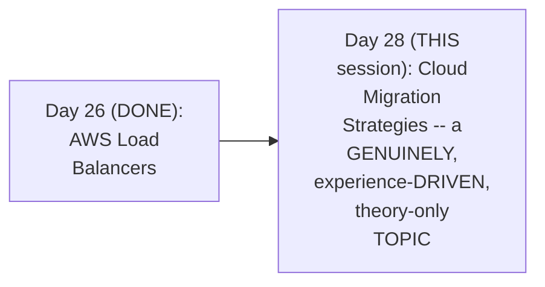
```mermaid
flowchart LR
    A["Day 26 (DONE):<br/>AWS Load<br/>Balancers"] --> B["Day 28 (THIS<br/>session): Cloud<br/>Migration<br/>Strategies -- a<br/>GENUINELY,<br/>experience-DRIVEN,<br/>theory-only<br/>TOPIC"]
```

#### 🔍 Internal Working — A Genuine, Direct Confirmation: This Applies Broadly

> 💡 **Given directly:** *"There are still companies on on-premises — yes, there are still a lot of banking companies who are on-premises, and they want to explore the path of cloud migration... if you are applying for MNCs, you should be prepared for AWS cloud migration strategies."*

#### 🎯 Key Takeaways

* THIS session is GENUINELY, DIRECTLY confirmed AS "VERY, very IMPORTANT" — MANY, real MNCs are GENUINELY, CURRENTLY exploring OR actively UNDERGOING cloud MIGRATION.
* THE instructor **directly, HONESTLY confirms** SOME organizations (INCLUDING banking COMPANIES) genuinely REMAIN on-premises TODAY — this TOPIC's own, real RELEVANCE is GENUINELY ongoing.
* This directly, PRECISELY sets UP the SESSION's own, NEXT, essential CONTENT — a GENUINE, honest critique OF why the "SEVEN strategies" ALONE genuinely FALL short (Section 2).

---

### 2. A Genuine, Honest Critique: Why "The Seven Strategies" Alone Won't Satisfy an Interviewer

#### ⚠ A Direct, Honest, Important Critique

> 💡 **Given directly:** *"Unfortunately there are a lot of videos on YouTube, there are a lot of documents, blogs which talk about the different kinds of cloud migration strategies... but to be very honest, your interviewer will not be 100% okay if you just talk about one of these cloud migration strategies, because this is just one simple stage of cloud migration."*

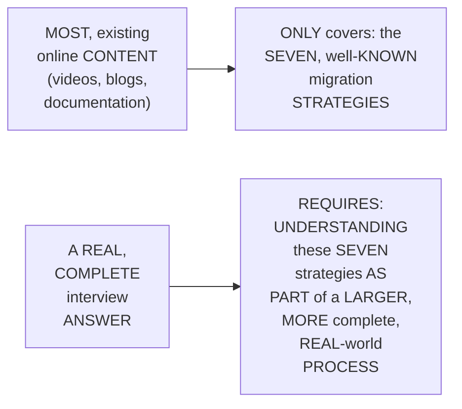
```mermaid
flowchart LR
    A["MOST, existing<br/>online CONTENT<br/>(videos, blogs,<br/>documentation)"] --> B["ONLY covers: the<br/>SEVEN, well-KNOWN<br/>migration<br/>STRATEGIES"]
    C["A REAL,<br/>COMPLETE<br/>interview<br/>ANSWER"] --> D["REQUIRES:<br/>UNDERSTANDING<br/>these SEVEN<br/>strategies AS<br/>PART of a LARGER,<br/>MORE complete,<br/>REAL-world<br/>PROCESS"]
```

#### 🔍 Internal Working — A Genuine, Direct Confirmation of Where the Seven Strategies Actually Fit

> 💡 **Given directly:** *"All of these seven cloud migration strategies that you read on the internet, they fall into these first two stages — they are part of your preparation and planning stage — but even after that there are things like migrate, monitor, and optimize."*

#### ⚠ Common Mistakes

* Assuming NAMING one OF the seven, WELL-known migration STRATEGIES (e.g., "LIFT and SHIFT") is GENUINELY, PRACTICALLY sufficient TO answer a REAL interview QUESTION about cloud MIGRATION — explicitly, directly, HONESTLY clarified: "EVERYBODY knows ABOUT the seven's" — THIS alone GENUINELY, DIRECTLY fails to DEMONSTRATE real, PRACTICAL migration EXPERIENCE.

#### 🎯 Key Takeaways

* THE instructor **directly, HONESTLY critiques** MOST existing ONLINE content — it GENUINELY, TYPICALLY covers ONLY the SEVEN, well-known migration STRATEGIES, WITHOUT the LARGER, real-WORLD context.
* THE SEVEN strategies are directly, PRECISELY confirmed AS belonging TO only the FIRST two STAGES (preparation AND planning) of a LARGER, five-STAGE process — NOT the COMPLETE picture, ON their OWN.
* This directly, PRECISELY sets UP the SESSION's own, NEXT, essential CONTENT — the instructor's OWN, personal CREDIBILITY, grounding THIS more COMPLETE framework (Section 3).

---
### 3. A Genuine, Direct, Personal Credibility Statement

#### 🪜 Step-by-Step — A Direct, Genuine, Personal Statement

> 💡 **Given directly:** *"I am teaching you these things from my personal experience, because I was part of some very critical cloud migration process, like back in 2015-16 I worked for cloud migration for one of the top European banks, and then in 2018 I also worked on a cloud migration freelancing project — so from my experience I am teaching you how a cloud migration project works."*

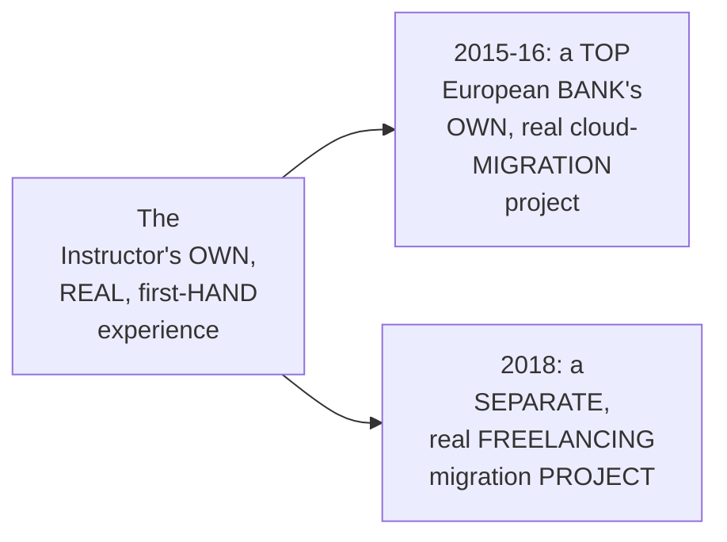
```mermaid
flowchart LR
    A["The<br/>Instructor's OWN,<br/>REAL, first-HAND<br/>experience"] --> B["2015-16: a TOP<br/>European BANK's<br/>OWN, real cloud-<br/>MIGRATION<br/>project"]
    A --> C["2018: a<br/>SEPARATE,<br/>real FREELANCING<br/>migration PROJECT"]
```

#### 🔍 Internal Working — A Genuine, Direct Confirmation of Why This Matters for Interviews

> 💡 **Given directly:** *"This is where your interviewer will be mostly interested, because you can read about this cloud migration strategies from the internet, but your real experience will come into the picture — like, during your interview discussion, if you just talk about these things, then your interviewer might say, 'okay, you might have read about it, but how does your project work, what are the steps that you have taken?'"*

#### ⚠ Common Mistakes

* Assuming a REAL interviewer is GENUINELY, PRIMARILY interested IN whether a CANDIDATE can DEFINE the SEVEN migration STRATEGIES — explicitly, directly, HONESTLY clarified: THEY are GENUINELY, DIRECTLY more interested IN the CANDIDATE's own, REAL, practical PROJECT experience — "HOW does YOUR project WORK."

#### 🎯 Key Takeaways

* THE instructor **directly, PERSONALLY grounds** THIS session's own, ESTABLISHED framework IN real, first-HAND experience — a TOP European BANK migration (2015-16) and a SEPARATE, 2018 FREELANCING project.
* THIS directly, HONESTLY reinforces WHY real, PRACTICAL experience GENUINELY matters MORE than THEORETICAL knowledge, IN a real INTERVIEW context.
* This directly, PRECISELY sets UP the SESSION's own, CORE, established CONTENT — the COMPLETE, five-STAGE, real migration PROCESS itself (Section 4).

---

### 4. The Complete, Five-Stage, Real Migration Process

#### 📖 Definition — The Five, Precise Stages

> 💡 **Given directly:** *"Any project with cloud migration would start with these steps — the first step would be preparation... the second step would be planning, the third step would be migrate, fourth step would be monitor, and the fifth step would be optimize... this is what you have to talk about in your interviews."*

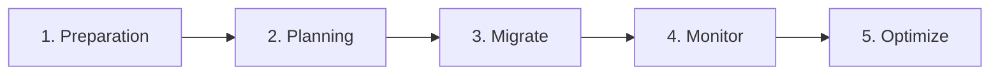
```mermaid
flowchart LR
    A["1. Preparation"] --> B["2. Planning"]
    B --> C["3. Migrate"]
    C --> D["4. Monitor"]
    D --> E["5. Optimize"]
```

#### 🔍 Internal Working — A Genuine, Direct Confirmation of Where the "Seven Strategies" Fit

> 💡 **Given directly:** *"So all of these seven cloud migration strategies... they fall into these first two stages, right — they are part of your preparation and planning stage — but even after that there are things like migrate, monitor, and optimize."*

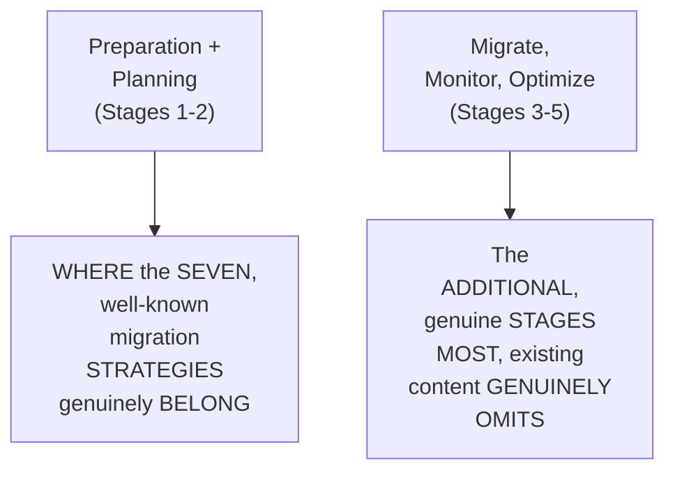
```mermaid
flowchart TD
    A["Preparation +<br/>Planning<br/>(Stages 1-2)"] --> B["WHERE the SEVEN,<br/>well-known<br/>migration<br/>STRATEGIES<br/>genuinely BELONG"]
    C["Migrate,<br/>Monitor, Optimize<br/>(Stages 3-5)"] --> D["The<br/>ADDITIONAL,<br/>genuine STAGES<br/>MOST, existing<br/>content GENUINELY<br/>OMITS"]
```

#### ⚠ Common Mistakes

* Assuming THE "seven STRATEGIES" and THIS "five-STAGE process" are GENUINELY, entirely SEPARATE, competing FRAMEWORKS — explicitly, directly, PRECISELY clarified: the SEVEN strategies GENUINELY, DIRECTLY fit WITHIN the FIRST two stages (PREPARATION and PLANNING) of THIS, larger, five-STAGE process.

#### 🎯 Key Takeaways

* THE complete, real MIGRATION process directly, PRECISELY consists OF **FIVE, sequential stages**: **PREPARATION**, **planning**, **MIGRATE**, **monitor**, and **OPTIMIZE**.
* THE session's own, ESTABLISHED "SEVEN strategies" (Section 2) directly, PRECISELY belong WITHIN the FIRST two stages — NOT a SEPARATE, competing framework.
* This directly, PRECISELY sets UP the SESSION's own, DETAILED exploration OF each, individual STAGE — STARTING with PREPARATION (Section 5).

---
### 5. Stage 1 — Preparation: Monolith-to-Microservices, A Complete, Real, Worked Example

#### 🪜 Step-by-Step — A Complete, Real, Worked Example

> 💡 **Given directly:** *"Let's say initially you got selected as a devops engineer in one of these top MNCs, and let's say they have some 200 microservices — or your MNC might have a single monolithic application itself... during your preparation stage, firstly you will check what is the current architecture of your applications — is your application already in the microservice architecture, then you have passed the preparation stage."*

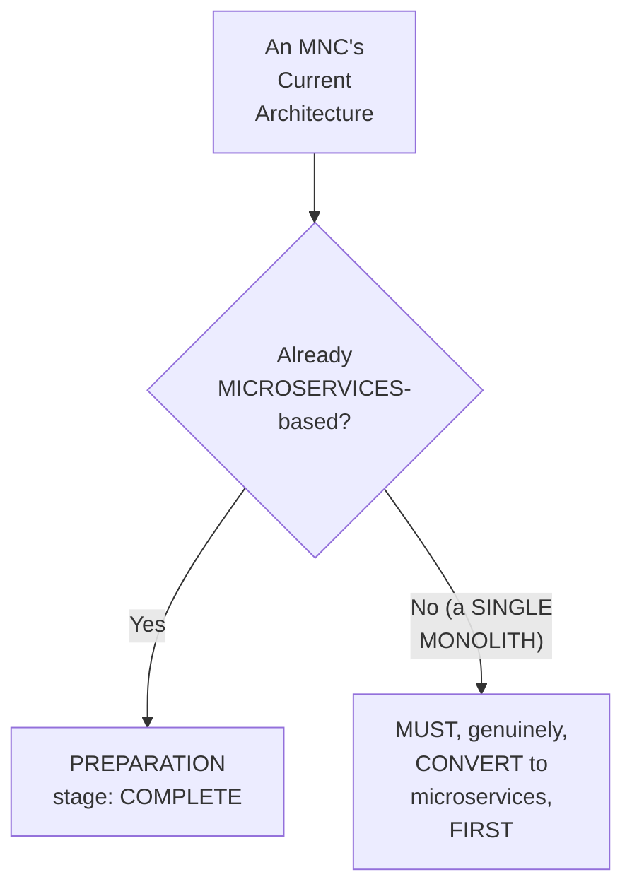
```mermaid
flowchart TD
    A["An MNC's<br/>Current<br/>Architecture"] --> B{"Already<br/>MICROSERVICES-<br/>based?"}
    B -->|"Yes"| C["PREPARATION<br/>stage: COMPLETE"]
    B -->|"No (a SINGLE<br/>MONOLITH)"| D["MUST, genuinely,<br/>CONVERT to<br/>microservices,<br/>FIRST"]
```

#### 🔍 Internal Working — A Genuine, Precise Explanation of Why This Conversion Matters

> 💡 **Given directly:** *"When you move onto cloud, when you want to be cloud native in nature, you move towards being in the microservice architecture — and these days, in the world of containers, containers are a very lightweight, simple process that are individually managed and deployable, and microservices fall into the category — they are the best fit for containers."*

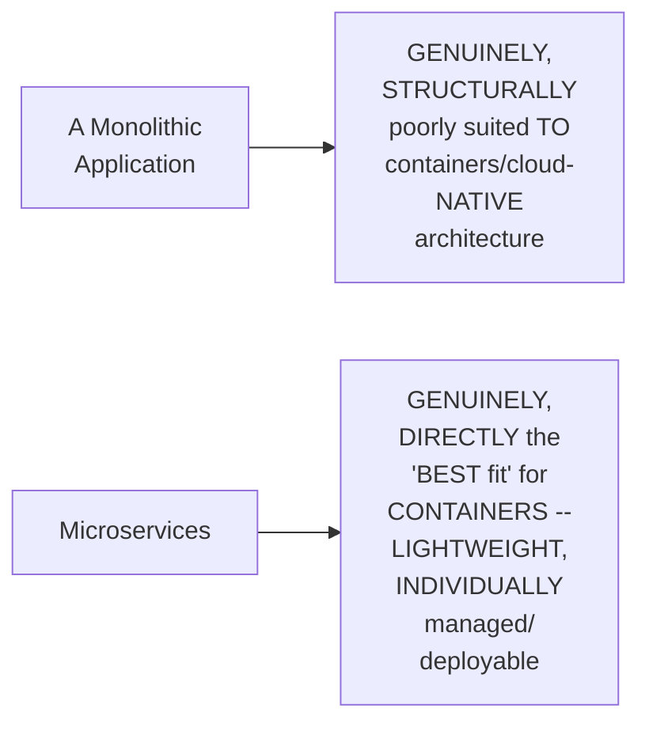
```mermaid
flowchart LR
    A["A Monolithic<br/>Application"] --> B["GENUINELY,<br/>STRUCTURALLY<br/>poorly suited TO<br/>containers/cloud-<br/>NATIVE<br/>architecture"]
    C["Microservices"] --> D["GENUINELY,<br/>DIRECTLY the<br/>'BEST fit' for<br/>CONTAINERS --<br/>LIGHTWEIGHT,<br/>INDIVIDUALLY<br/>managed/<br/>deployable"]
```

#### ⚠ Common Mistakes

* Assuming a REAL, monolithic APPLICATION can be GENUINELY, DIRECTLY migrated TO cloud, "AS is," WITHOUT any, real ARCHITECTURAL preparation — explicitly, directly, PRECISELY clarified: BECOMING cloud-NATIVE genuinely, STRUCTURALLY requires FIRST converting to MICROSERVICES — a REQUIRED, foundational STEP, not an OPTIONAL one.

#### 🎯 Key Takeaways

* THE **PREPARATION** stage directly, CONCRETELY requires CHECKING an organization's OWN, current ARCHITECTURE — IF already microservices-BASED, this stage IS complete; IF monolithic, CONVERSION to MICROSERVICES is genuinely, DIRECTLY required first.
* THIS conversion GENUINELY, DIRECTLY matters BECAUSE microservices are the "BEST fit" FOR containers/cloud-NATIVE architecture — LIGHTWEIGHT, INDIVIDUALLY manageable and DEPLOYABLE.
* This directly, PRECISELY sets UP the SESSION's own, NEXT, essential STAGE — PLANNING, and ITS own, two GENUINE sub-decisions (Section 6).

---

### 6. Stage 2 — Planning, Part 1: Phasing Your Migration

#### 🪜 Step-by-Step — A Complete, Real, Worked Example

> 💡 **Given directly:** *"As part of your planning, you will decide two things — one is you will decide which applications or which services have to go in phase one... usually if you have some 200 microservices, you will split this 200 microservices into phases — you will say phase one, phase two, phase three, phase four, and phase five."*

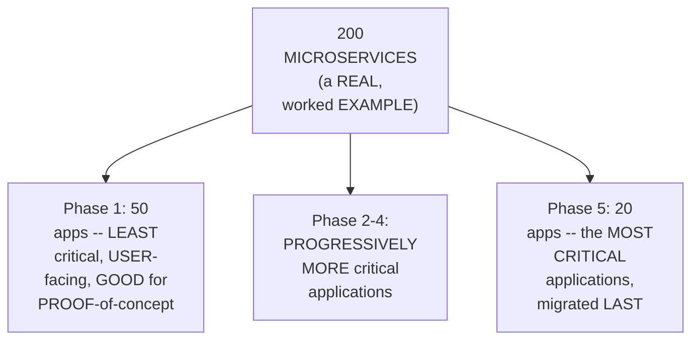
```mermaid
flowchart TD
    A["200<br/>MICROSERVICES<br/>(a REAL,<br/>worked EXAMPLE)"] --> B["Phase 1: 50<br/>apps -- LEAST<br/>critical, USER-<br/>facing, GOOD for<br/>PROOF-of-concept"]
    A --> C["Phase 2-4:<br/>PROGRESSIVELY<br/>MORE critical<br/>applications"]
    A --> D["Phase 5: 20<br/>apps -- the MOST<br/>CRITICAL<br/>applications,<br/>migrated LAST"]
```

#### 🔍 Internal Working — A Genuine, Direct Confirmation of the Underlying Logic

> 💡 **Given directly:** *"Amongst this 200 microservices, there are 20 microservices which are very, very critical, so let's put them in phase five — that means we will take them from on-premises onto the cloud platform as part of the last stage... then you might be saying that there are some 50 applications that are very less user-facing... you can send them as part of your phase one."*

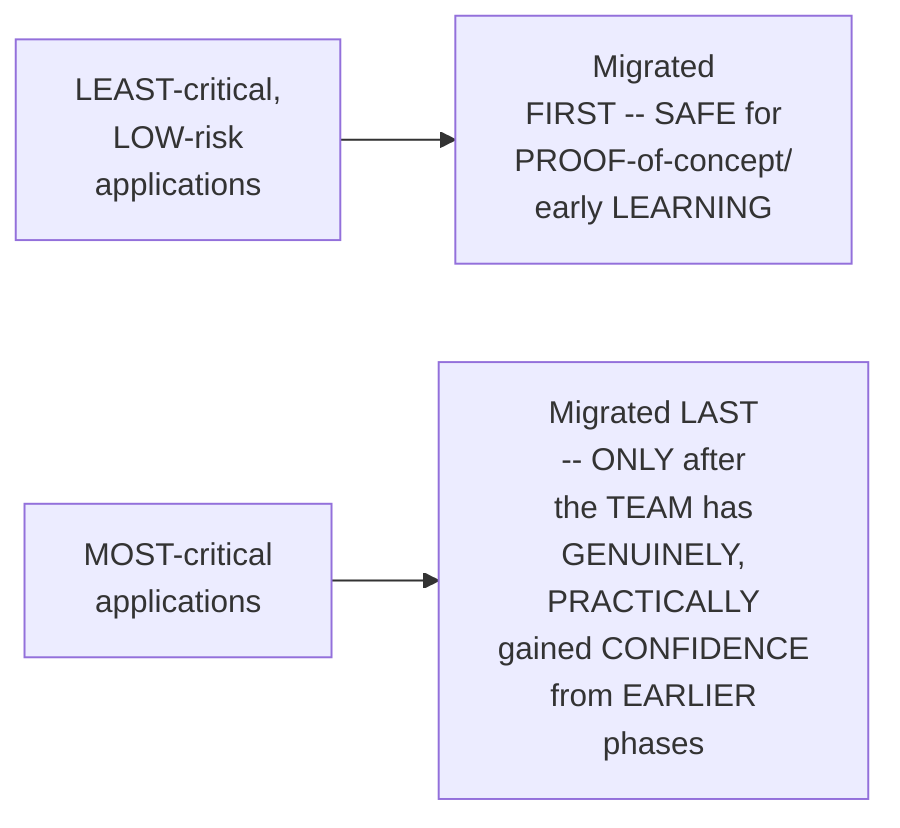
```mermaid
flowchart LR
    A["LEAST-critical,<br/>LOW-risk<br/>applications"] --> B["Migrated<br/>FIRST -- SAFE for<br/>PROOF-of-concept/<br/>early LEARNING"]
    C["MOST-critical<br/>applications"] --> D["Migrated LAST<br/>-- ONLY after<br/>the TEAM has<br/>GENUINELY,<br/>PRACTICALLY<br/>gained CONFIDENCE<br/>from EARLIER<br/>phases"]
```

#### ⚠ Common Mistakes

* Assuming a REAL, organizational MIGRATION should GENUINELY, DIRECTLY begin WITH its MOST critical APPLICATIONS, to "GET it done" FASTEST — explicitly, directly, IMPLICITLY corrected: the ESTABLISHED, real PATTERN is the OPPOSITE — LEAST-critical APPLICATIONS migrate FIRST (as LOW-risk PROOFS of CONCEPT), with MOST-critical ones DELIBERATELY, genuinely SAVED for LAST.

#### 🎯 Key Takeaways

* THE planning STAGE's own, FIRST sub-DECISION: SPLITTING a LARGE set OF applications (e.g., 200 MICROSERVICES) into MULTIPLE, real MIGRATION phases.
* A GENUINE, real, WORKED example directly, CONCRETELY illustrates the UNDERLYING logic — LEAST-critical, low-RISK applications MIGRATE first (as PROOFS of CONCEPT); MOST-critical applications MIGRATE last, ONLY once the TEAM has genuinely, PRACTICALLY gained CONFIDENCE.
* This directly, PRECISELY sets UP the SESSION's own, NEXT, essential SUB-decision — CHOOSING an ACTUAL migration STRATEGY, per PHASE (Section 7).

---
### 7. Stage 2 — Planning, Part 2: The Seven Migration Strategies, Properly Contextualized

#### 📖 Definition — Rehost ("Lift and Shift")

> 💡 **Given directly:** *"Rehost is basically lift and shift — with very minimalistic effort, or with zero percent effort, you will take this microservices from your on-premises cloud and deploy on the AWS cloud... you will create the same Kubernetes cluster, same type, and on top of that you will deploy those applications — literally there is no change, except these applications are on your public cloud now."*

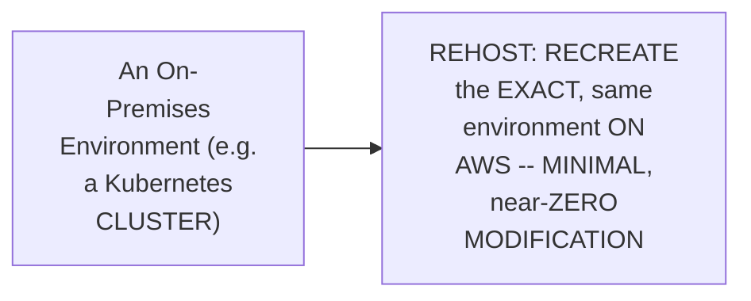
```mermaid
flowchart LR
    A["An On-<br/>Premises<br/>Environment (e.g.<br/>a Kubernetes<br/>CLUSTER)"] --> B["REHOST: RECREATE<br/>the EXACT, same<br/>environment ON<br/>AWS -- MINIMAL,<br/>near-ZERO<br/>MODIFICATION"]
```

#### 📖 Definition — Replatform

> 💡 **Given directly:** *"As part of replatform, what you will try to do is you will try to add some little changes — once you decide to move your applications onto AWS cloud platform, you will take advantage of this AWS platform... instead of creating this Kubernetes cluster in one region, you can create the control plane in multiple regions, so that you can achieve high availability."*

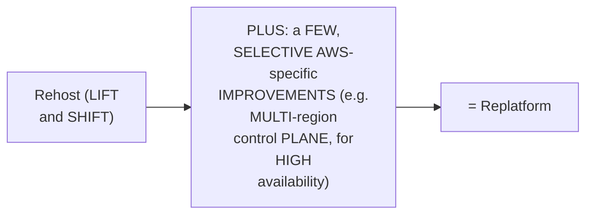
```mermaid
flowchart LR
    A["Rehost (LIFT<br/>and SHIFT)"] --> B["PLUS: a FEW,<br/>SELECTIVE AWS-<br/>specific<br/>IMPROVEMENTS (e.g.<br/>MULTI-region<br/>control PLANE, for<br/>HIGH<br/>availability)"]
    B --> C["= Replatform"]
```

#### 📖 Definition — Refactor / Re-Architecture

> 💡 **Given directly:** *"Refactor model is very, very suitable in this example — let's say you are using monolithic applications, so these have to be converted to microservices, and when that has to be converted, you have to re-architect your application... you will explore for the latest and new technologies, and go with the best things that are available on AWS."*

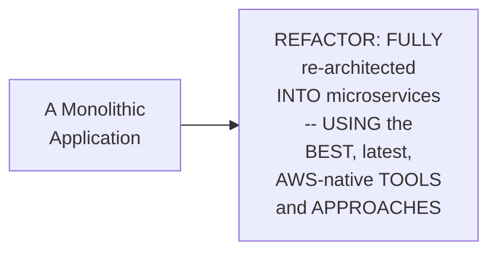
```mermaid
flowchart LR
    A["A Monolithic<br/>Application"] --> B["REFACTOR: FULLY<br/>re-architected<br/>INTO microservices<br/>-- USING the<br/>BEST, latest,<br/>AWS-native TOOLS<br/>and APPROACHES"]
```

#### ⚠ Common Mistakes

* Assuming REHOST, replatform, AND refactor are GENUINELY, EQUALLY simple, INVOLVING the SAME degree OF effort — explicitly, directly, PRECISELY distinguished: THEY represent a GENUINE, real SPECTRUM — from MINIMAL effort (REHOST) to SUBSTANTIAL, architectural CHANGE (refactor).

#### 🎯 Key Takeaways

* **REHOST ("lift AND shift")**: MINIMAL effort — RECREATING the EXACT, SAME environment ON AWS, WITHOUT any, GENUINE modification.
* **REPLATFORM**: rehost PLUS a FEW, SELECTIVE AWS-specific IMPROVEMENTS (e.g., multi-REGION control PLANE, for HIGH availability).
* **REFACTOR/re-architecture**: the MOST involved — FULLY converting a MONOLITHIC application INTO microservices, USING the BEST, latest AWS-native TOOLS and APPROACHES.

---

#### 📖 Definition — Relocate

> 💡 **Given directly:** *"Relocate is nothing but, let's say you are using a Kubernetes cluster on your on-premises — what you will try to do as part of relocate is you will move to platforms like EKS, or you will move to platforms like OpenShift on AWS, there is a service called ROSA, which is Red Hat OpenShift on AWS... relocate can be costly as well, and you have to use relocate very, very carefully."*

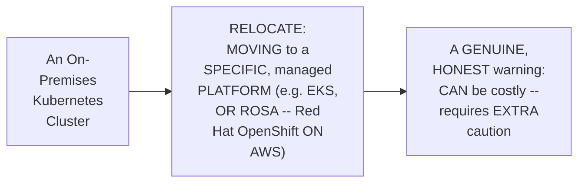
```mermaid
flowchart LR
    A["An On-<br/>Premises<br/>Kubernetes<br/>Cluster"] --> B["RELOCATE:<br/>MOVING to a<br/>SPECIFIC, managed<br/>PLATFORM (e.g. EKS,<br/>OR ROSA -- Red<br/>Hat OpenShift ON<br/>AWS)"]
    B --> C["A GENUINE,<br/>HONEST warning:<br/>CAN be costly --<br/>requires EXTRA<br/>caution"]
```

#### 📖 Definition — Retain

> 💡 **Given directly:** *"Retain is a very, very simple thing — let's say there are some 30 applications... they can either be on-premises, or they are not that important to migrate on cloud — when I was working on a banking project, there were some applications which are very, very secure, like they have user-related information, some mainframe applications very important for payments and transactions — the bank said, do not migrate these, keep it on our on-premises platform, and the applications on AWS will connect to them in a secure way."*

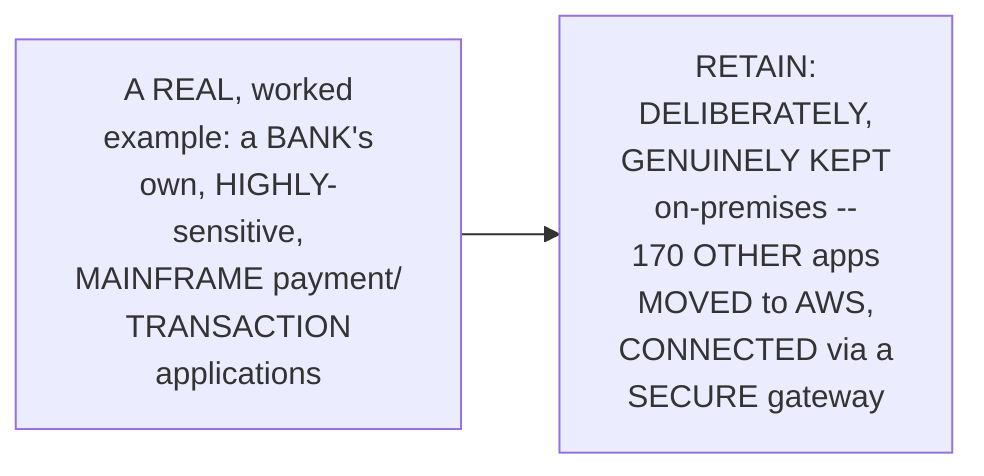
```mermaid
flowchart LR
    A["A REAL, worked<br/>example: a BANK's<br/>own, HIGHLY-<br/>sensitive,<br/>MAINFRAME payment/<br/>TRANSACTION<br/>applications"] --> B["RETAIN:<br/>DELIBERATELY,<br/>GENUINELY KEPT<br/>on-premises --<br/>170 OTHER apps<br/>MOVED to AWS,<br/>CONNECTED via a<br/>SECURE gateway"]
```

#### 📖 Definition — Retire & Repurchase

> 💡 **Given directly:** *"Retire is nothing but, let's say out of this 200 applications, you have realized that 10 applications nobody is using, and if you migrate them onto cloud, you have to spend time, and there are zero customers, you can simply retire those applications... repurchase is nothing but, let's say you are using VMware platform on your on-premises — what you can do is either purchase a similar kind of platform on your AWS cloud platform, or look for other options."*

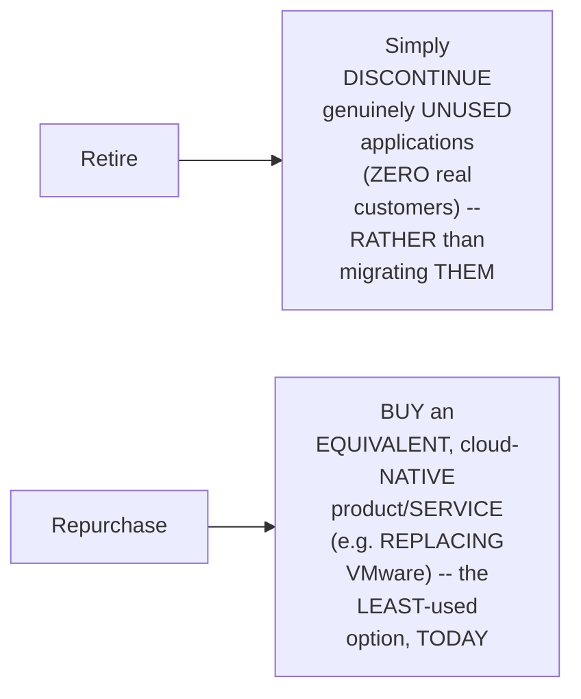
```mermaid
flowchart LR
    A["Retire"] --> B["Simply<br/>DISCONTINUE<br/>genuinely UNUSED<br/>applications<br/>(ZERO real<br/>customers) --<br/>RATHER than<br/>migrating THEM"]
    C["Repurchase"] --> D["BUY an<br/>EQUIVALENT, cloud-<br/>NATIVE<br/>product/SERVICE<br/>(e.g. REPLACING<br/>VMware) -- the<br/>LEAST-used<br/>option, TODAY"]
```

#### ⚠ Common Mistakes

* Assuming EVERY, real APPLICATION should GENUINELY, ALWAYS be migrated TO the cloud, EVENTUALLY — explicitly, directly, HONESTLY corrected: RETAIN and RETIRE explicitly, DIRECTLY confirm that SOME applications GENUINELY, DELIBERATELY should NOT be migrated AT all — EITHER for SECURITY reasons (RETAIN) or GENUINE, real LACK of usage (RETIRE).

#### 🎯 Key Takeaways

* **RELOCATE**: MOVING to a SPECIFIC, managed PLATFORM (e.g., EKS OR ROSA) — GENUINELY, HONESTLY confirmed AS potentially COSTLY, requiring EXTRA caution.
* **RETAIN**: DELIBERATELY, genuinely KEEPING certain APPLICATIONS on-premises — a REAL, worked example (a BANK's own, SENSITIVE mainframe APPLICATIONS) directly, CONCRETELY illustrates WHY.
* **RETIRE** and **REPURCHASE** complete the SEVEN — retire DISCONTINUES genuinely UNUSED applications; REPURCHASE buys an EQUIVALENT, cloud-native PRODUCT — EXPLICITLY confirmed AS the LEAST-used OPTION today.

---
### 8. A Genuine, Direct Ranking: Which Strategies Genuinely Matter Most

#### 🪜 Step-by-Step — A Direct, Honest Confirmation

> 💡 **Given directly:** *"There is no requirement that you have to remember all of these things, because in any company you will not follow all of these approaches, you will only follow one approach — so even if you master one single approach, that's totally fine... if you order in terms of ranking, these are the three things that are very, very widely used that I've seen: rehost, replatform, and re-architecture."*

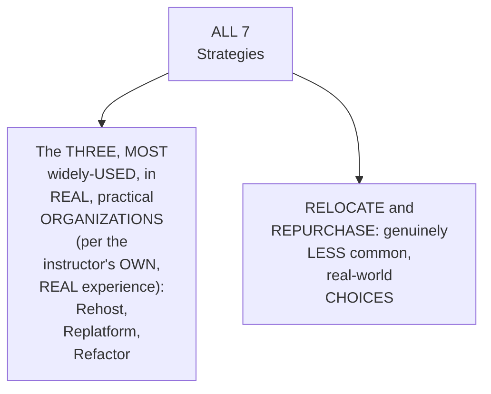
```mermaid
flowchart TD
    A["ALL 7<br/>Strategies"] --> B["The THREE, MOST<br/>widely-USED, in<br/>REAL, practical<br/>ORGANIZATIONS<br/>(per the<br/>instructor's OWN,<br/>REAL experience):<br/>Rehost,<br/>Replatform,<br/>Refactor"]
    A --> C["RELOCATE and<br/>REPURCHASE: genuinely<br/>LESS common,<br/>real-world<br/>CHOICES"]
```

#### 🔍 Internal Working — A Genuine, Honest Clarification: Retain & Retire Aren't Quite "Strategies"

> 💡 **Given directly:** *"Retain and retire is not exactly a cloud migration strategy — it is a way where you decide, okay, should I keep these applications on-premises, should I retire these applications, is it okay if these applications don't go onto cloud — so it's kind of a discussion where you decide within the team."*

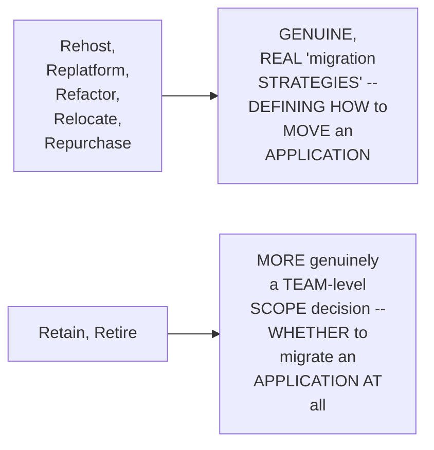
```mermaid
flowchart LR
    A["Rehost,<br/>Replatform,<br/>Refactor,<br/>Relocate,<br/>Repurchase"] --> B["GENUINE,<br/>REAL 'migration<br/>STRATEGIES' --<br/>DEFINING HOW to<br/>MOVE an<br/>APPLICATION"]
    C["Retain, Retire"] --> D["MORE genuinely<br/>a TEAM-level<br/>SCOPE decision --<br/>WHETHER to<br/>migrate an<br/>APPLICATION AT<br/>all"]
```

#### ⚠ Common Mistakes

* Assuming a REAL, practicing DEVOPS engineer must GENUINELY, PERSONALLY master ALL seven, REAL migration STRATEGIES, EQUALLY — explicitly, directly, HONESTLY clarified: "EVEN if you MASTER one SINGLE approach, that's TOTALLY fine" — NO single, real ORGANIZATION genuinely, PRACTICALLY uses ALL seven.

#### 🎯 Key Takeaways

* THE instructor **directly, HONESTLY ranks** the SEVEN strategies, BASED on his OWN, real EXPERIENCE — **REHOST, replatform, and REFACTOR** are the THREE most WIDELY-used, in REAL, practical ORGANIZATIONS.
* **RETAIN** and **RETIRE** are directly, HONESTLY clarified AS NOT quite GENUINE "migration STRATEGIES" themselves — MORE accurately, a TEAM-level DISCUSSION/decision ABOUT whether to MIGRATE an APPLICATION at ALL.
* This directly, PRECISELY completes THIS session's own, ESTABLISHED "PLANNING" stage — SETTING up the SESSION's own, NEXT, essential CONTENT — the "MIGRATE" stage itself (Section 9).

---

### 9. Stage 3 — Migrate: A Genuine, Real, Multi-Year, Multi-Phase Process

#### 🪜 Step-by-Step — A Genuine, Real, Personal Example

> 💡 **Given directly:** *"The migrate stage goes into multiple phases — in some companies it can go on for one year, two years, three years, as well, because there are companies, like I worked on a migration project back in 2015-16 for one and a half years, because it was a European bank, and there were like 200, 300 microservices, and we did it in multiple phases, like 10 or 15 phases."*

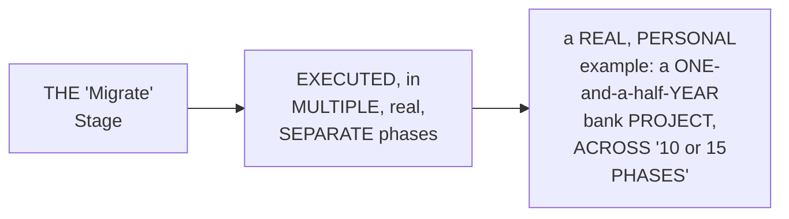
```mermaid
flowchart LR
    A["THE 'Migrate'<br/>Stage"] --> B["EXECUTED, in<br/>MULTIPLE, real,<br/>SEPARATE phases"]
    B --> C["a REAL, PERSONAL<br/>example: a ONE-<br/>and-a-half-YEAR<br/>bank PROJECT,<br/>ACROSS '10 or 15<br/>PHASES'"]
```

#### 📖 Definition — Real, Genuine, DevOps-Specific Activities Within This Stage

> 💡 **Given directly:** *"Typically what happens in the migrate stage, basically you will write some scripts as a devops engineer — like, let's say you are choosing the lift and shift mechanism, then you will write some Terraform scripts, or some shell scripts for starting the EC2 instances, or you will write some CloudWatch monitors, you will write some cron jobs, you will monitor this activity in CloudWatch continuously."*

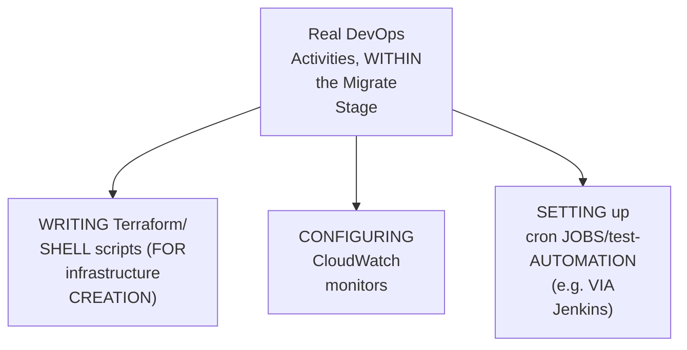
```mermaid
flowchart TD
    A["Real DevOps<br/>Activities, WITHIN<br/>the Migrate<br/>Stage"] --> B["WRITING Terraform/<br/>SHELL scripts (FOR<br/>infrastructure<br/>CREATION)"]
    A --> C["CONFIGURING<br/>CloudWatch<br/>monitors"]
    A --> D["SETTING up<br/>cron JOBS/test-<br/>AUTOMATION<br/>(e.g. VIA<br/>Jenkins)"]
```

#### ⚠ Common Mistakes

* Assuming the "MIGRATE" stage genuinely, DIRECTLY refers to a SINGLE, brief, one-TIME event — explicitly, directly, HONESTLY demonstrated as GENUINELY, PRACTICALLY extended — POTENTIALLY spanning MULTIPLE YEARS, and DOZENS of SEPARATE, real PHASES, for LARGE, real organizations.

#### 🎯 Key Takeaways

* THE **"MIGRATE"** stage directly, GENUINELY executes ACROSS multiple, SEPARATE, real PHASES — a REAL, personal EXAMPLE directly, CONCRETELY confirms this CAN span "ONE, two, THREE years" FOR large, real ORGANIZATIONS.
* REAL, devops-SPECIFIC activities WITHIN this STAGE directly, CONCRETELY include WRITING Terraform/SHELL scripts, CONFIGURING CloudWatch MONITORING, and SETTING up cron-JOB-based test AUTOMATION.
* This directly, PRECISELY sets UP the SESSION's own, NEXT, essential STAGES — MONITOR and OPTIMIZE, COMPLETING the REAL-world migration CYCLE (Section 10).

---
### 10. Stages 4 & 5 — Monitor & Optimize: Completing the Real-World Cycle

#### 📖 Definition — Stage 4: Monitor

> 💡 **Given directly:** *"Once you migrate, what you will do after that is basically you will monitor your applications for a while — let's say you have deployed this 50 applications as part of your phase one onto the public cloud platform, that is not done, you have to monitor your phase one applications for one month, two months, depending upon the criticality... you can give it to your beta customers, and tell them, why don't you share the feedback of the performance."*

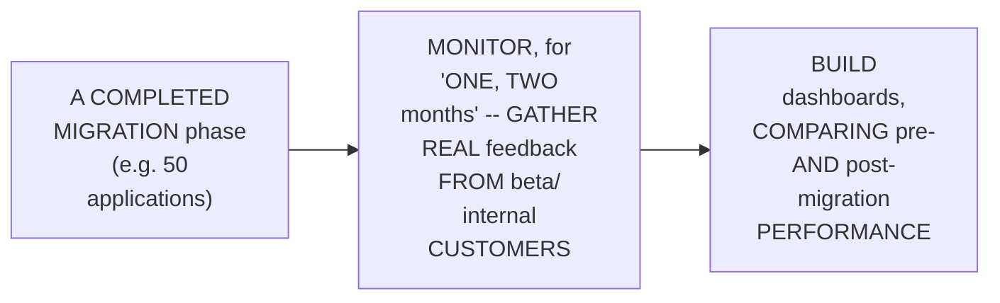
```mermaid
flowchart LR
    A["A COMPLETED<br/>MIGRATION phase<br/>(e.g. 50<br/>applications)"] --> B["MONITOR, for<br/>'ONE, TWO<br/>months' -- GATHER<br/>REAL feedback<br/>FROM beta/<br/>internal<br/>CUSTOMERS"]
    B --> C["BUILD<br/>dashboards,<br/>COMPARING pre-<br/>AND post-<br/>migration<br/>PERFORMANCE"]
```

#### 📖 Definition — Stage 5: Optimize

> 💡 **Given directly:** *"The final stage is to improve, or you can call it optimize — let's say there is some 40% cost optimization by migrating applications onto cloud, now in the optimize stage you will see, can we increase this 40 to 50%, if we can do, you can create some JIRAs or tasks, and say, this is what I've observed, right now we are at 40, but we can improve our efficiency to 50% in six months, one year, whatever that could be."*

```mermaid
flowchart LR
    A["A REAL,<br/>ACHIEVED result<br/>(e.g. 40% cost<br/>OPTIMIZATION)"] --> B["OPTIMIZE: SET a<br/>NEW, higher GOAL<br/>(e.g. 50%),<br/>CREATING real,<br/>FOLLOW-up TASKS/<br/>JIRAs"]
```

#### 🔍 Internal Working — A Genuine, Direct Confirmation of the Complete Evaluation Question

> 💡 **Given directly:** *"You have to evaluate if there is an advantage or not — okay, I migrated onto cloud, what did I achieve? Did I get some cost benefit, did I reduce the maintenance overhead, what did I achieve by spending one year, two years of time on this cloud migration?"*

#### ⚠ Common Mistakes

* Assuming "MONITOR" and "OPTIMIZE" are GENUINELY, MERELY vague, GENERIC follow-up ACTIVITIES, WITHOUT any, real STRUCTURE — explicitly, directly, PRECISELY defined: MONITOR is a GENUINE, real, TIME-bound (one-TWO month) FEEDBACK-gathering PROCESS; OPTIMIZE is a GENUINE, real EVALUATION, PRODUCING specific, MEASURABLE, follow-UP goals.

#### 🎯 Key Takeaways

* **MONITOR** directly, CONCRETELY involves a REAL, time-BOUND (ONE-two month) PERIOD of GATHERING feedback FROM beta/internal CUSTOMERS, and BUILDING dashboards TO compare pre/POST-migration performance.
* **OPTIMIZE** directly, CONCRETELY involves a GENUINE, real EVALUATION — DID the migration GENUINELY deliver VALUE (cost SAVINGS, reduced MAINTENANCE)? — PRODUCING specific, MEASURABLE follow-up GOALS (e.g., "IMPROVE from 40% TO 50%").
* THIS complete, five-STAGE cycle (PREPARATION → planning → MIGRATE → monitor → OPTIMIZE) directly, THOROUGHLY represents the SESSION's own, ESTABLISHED, complete, real-WORLD migration FRAMEWORK.

---

### 11. A Genuine, Important Clarification: One-Time vs. Repeated Stages

#### ⚠ A Direct, Honest, Important Clarification

> 💡 **Given directly:** *"Your preparation and planning is done once, okay — it is a one-time activity... once you decide upon the phases, and once you decide upon the migration strategy, you will never come back to these stages again — but the migration thing goes into multiple phases, so the step three is performed in multiple stages."*

```mermaid
flowchart TD
    A["Preparation +<br/>Planning"] --> B["a ONE-TIME<br/>activity -- DECIDED<br/>once, and<br/>GENUINELY, NEVER<br/>revisited"]
    C["Migrate<br/>(& implicitly,<br/>Monitor)"] --> D["REPEATED,<br/>MULTIPLE times --<br/>ONCE per REAL,<br/>established<br/>PHASE"]
    E["Optimize"] --> F["a FINAL, ONE-<br/>TIME evaluation,<br/>AFTER all PHASES<br/>complete"]
```

#### ⚠ Common Mistakes

* Assuming ALL five, established STAGES are GENUINELY, EQUALLY repeated, ACROSS every, individual MIGRATION phase — explicitly, directly, PRECISELY clarified: PREPARATION and PLANNING are GENUINELY, STRUCTURALLY one-TIME activities — ONLY "migrate" (and, IMPLICITLY, MONITOR) genuinely, REPEATEDLY occurs, ONCE PER established PHASE.

#### 🎯 Key Takeaways

* **PREPARATION** and **PLANNING** are directly, PRECISELY confirmed AS **ONE-time activities** — DECIDED once, and GENUINELY, NEVER revisited, ONCE the PHASES and STRATEGY are established.
* **"MIGRATE"** (and, IMPLICITLY, "MONITOR") genuinely, DIRECTLY repeats — ONCE per, REAL, established PHASE — POTENTIALLY dozens OF times, for LARGE organizations.
* This directly, PRECISELY sets UP the SESSION's own, NEXT, essential, ADDITIONAL topic — a GENUINE, real, IMPORTANT caveat SPECIFIC to DATABASE migration (Section 12).

---
### 12. A Genuine, Additional Topic: Database Migration, Precisely Explained

#### ⚠ A Direct, Honest, Important Clarification: Extra Caution Required

> 💡 **Given directly:** *"Sometimes you will have databases — now if your applications have databases, or if your applications are connecting to databases, you also have to migrate these databases onto cloud platform — now you have to be additionally, like, you have to be a little more cautious when you deal with databases."*

#### 📖 Definition — Step 1: Finding the Right, Managed Fit

> 💡 **Given directly:** *"You have to find the right fit on the AWS platform — let's say you are using MySQL, or any kind of database on your local, and you have a similar kind of service that AWS provides, but that service is highly reliable, because AWS is managing that... best example is RDS, many people migrate onto AWS RDS, because RDS is fully managed by AWS."*

```mermaid
flowchart LR
    A["A SELF-<br/>managed database<br/>(e.g. MySQL, ON-<br/>premises)"] --> B["Step 1:<br/>MIGRATE to a<br/>SIMILAR,<br/>EQUIVALENT, FULLY-<br/>managed AWS<br/>SERVICE (e.g.<br/>Amazon RDS)"]
```

#### 📖 Definition — Step 2: Backups & a Safe, Fallback Mechanism

> 💡 **Given directly:** *"The second step is that you have to take backups of your database, because sometimes databases are very huge, and during the migration you might lose some data — even while migrating your database onto cloud, you have to have a database in one of your pre-prod or staging environments, and if something goes wrong, you can immediately redirect your customer to this database — simply you can change the URLs that your application is trying to access."*

```mermaid
sequenceDiagram
    participant App as Application
    participant AWSdb as AWS Database<br/>(e.g. RDS,<br/>MID-migration)
    participant Backup as A REAL,<br/>FALLBACK<br/>database (pre-<br/>PROD/staging OR<br/>ON-premises)
    App->>AWSdb: NORMALLY, points<br/>HERE
    Note over App,AWSdb: IF something<br/>GENUINELY, DIRECTLY<br/>goes WRONG,<br/>during migration
    App->>Backup: REDIRECTED, via a<br/>SIMPLE URL<br/>CHANGE -- a SAFE,<br/>QUICK rollback
```

#### ⚠ Common Mistakes

* Assuming DATABASE migration is GENUINELY, MERELY a SIMPLE, "COPY the DATA" operation, REQUIRING no SPECIAL, additional CAUTION — explicitly, directly, HONESTLY clarified: it GENUINELY, DIRECTLY requires TWO, distinct, CAREFUL steps — FINDING the RIGHT, managed AWS EQUIVALENT, and MAINTAINING a REAL, safe FALLBACK, IN case something GOES wrong.

#### 🎯 Key Takeaways

* DATABASE migration directly, HONESTLY requires GENUINE, EXTRA caution — a TWO-step approach: **(1)** FIND the RIGHT, EQUIVALENT, FULLY-managed AWS SERVICE (e.g., MySQL → Amazon RDS); **(2)** MAINTAIN backups AND a REAL, safe FALLBACK database (pre-PROD/staging OR on-PREMISES).
* THE genuine, real FALLBACK mechanism directly, PRACTICALLY enables a QUICK, safe ROLLBACK — SIMPLY redirecting the APPLICATION's own database URL, IF something GENUINELY goes WRONG during MIGRATION.
* This directly, PRECISELY completes THIS session's own, COMPLETE, real-WORLD migration FRAMEWORK — SETTING up the SESSION's own, FINAL, closing CONTENT (Section 13).

---

### 13. Closing: A Direct, Honest, Interview-Focused Encouragement

#### 🪜 Step-by-Step — A Direct, Honest, Final Encouragement

> 💡 **Given directly:** *"Please follow the same process during the interviews, and do not panic — migration strategies is basically your experience, it's not something that you can read and learn, but if you watch videos like this you can at least get some knowledge... if you are not sure about something, just tell them, okay, I worked in cloud migration just for six months, and have not encountered that scenario, given an opportunity, I'll learn about it."*

```mermaid
flowchart LR
    A["A REAL, honest<br/>gap in PERSONAL,<br/>migration<br/>EXPERIENCE"] --> B["DIRECTLY,<br/>HONESTLY<br/>acceptable TO<br/>acknowledge, IN a<br/>real INTERVIEW --<br/>RATHER than<br/>GUESSING or<br/>OVERSTATING"]
```

#### ⚠ Common Mistakes

* Assuming a REAL, HONEST admission of LIMITED, personal MIGRATION experience GENUINELY, DIRECTLY hurts a CANDIDATE's own interview PERFORMANCE — explicitly, directly, DIRECTLY encouraged AS the RIGHT, honest APPROACH — RATHER than GUESSING or OVERSTATING one's OWN, real EXPERIENCE.

#### 🎯 Key Takeaways

* This episode **GENUINELY, COMPREHENSIVELY delivers** its OWN, stated GOALS — a COMPLETE, real-WORLD, five-STAGE migration FRAMEWORK, PROPERLY contextualizing the SEVEN, well-known STRATEGIES, PLUS a genuine, ADDITIONAL section ON database migration.
* THE instructor **directly, HONESTLY encourages** learners to GENUINELY, HONESTLY acknowledge ANY, real GAPS in their OWN, personal migration EXPERIENCE, DURING a real INTERVIEW — RATHER than guessing OR overstating.
* THIS directly, HONESTLY confirms migration KNOWLEDGE is GENUINELY, PRIMARILY built THROUGH real, PRACTICAL experience — NOT merely READING or watching CONTENT — a GENUINE, honest, FINAL reflection.

---
## 📝 Glossary

| Term | Definition | Why It Matters |
|---|---|---|
| **Rehost** | "Lift and shift" -- minimal-effort migration | The most widely-used, real migration strategy |
| **Replatform** | Rehost + selective AWS-specific improvements | Adds high availability/scalability, without full re-architecture |
| **Refactor / Re-architecture** | Full monolith-to-microservices conversion | Uses the best, latest AWS-native tools |
| **Relocate** | Moving to a specific, managed platform (EKS, ROSA) | Can be costly; requires extra caution |
| **Retain** | Deliberately keeping applications on-premises | Common for highly-sensitive, regulated applications |
| **Retire** | Discontinuing genuinely unused applications | Avoids wasted migration effort |
| **Repurchase** | Buying an equivalent, cloud-native product | The least-used option, today |
| **Amazon RDS** | AWS's own, fully-managed relational database service | The typical, "right fit" target for database migration |

---

## 🔄 Revision Notes — One-Minute Revision

* This is **Day 28**, a genuinely important, experience-driven, theory-only session -- explicitly grounded in the instructor's own, real, first-hand migration project experience (a 2015-16 European bank, and a 2018 freelancing project).
* **A genuine, honest critique**: most existing online content only covers the seven, well-known migration strategies -- but a real interviewer wants more than that, since these strategies are only one part of a larger, real-world process.
* **The complete, five-stage, real migration process**: (1) Preparation, (2) Planning, (3) Migrate, (4) Monitor, (5) Optimize. The seven, well-known strategies genuinely belong within the first two stages, not as a separate, standalone framework.
* **Stage 1 (Preparation)**: check the current architecture -- if monolithic, convert to microservices first, since microservices are genuinely the "best fit" for containers/cloud-native architecture.
* **Stage 2 (Planning), part 1 -- phasing**: split a large set of applications (e.g., 200 microservices) into multiple, real phases. Least-critical applications migrate first (as low-risk proofs of concept); most-critical applications migrate last.
* **Stage 2 (Planning), part 2 -- the seven strategies, properly contextualized**: Rehost (lift and shift, minimal effort); Replatform (rehost + selective AWS improvements); Refactor/re-architecture (full microservices conversion, using the best AWS-native tools); Relocate (moving to a specific, managed platform like EKS or ROSA, potentially costly); Retain (deliberately keeping sensitive applications on-premises, e.g., a bank's mainframe payment systems); Retire (discontinuing genuinely unused applications); Repurchase (buying an equivalent, cloud-native product, the least-used option today).
* **A genuine, direct ranking**: rehost, replatform, and refactor are the three most widely-used, real strategies. Retain and retire are honestly clarified as not quite "strategies" themselves -- more a team-level scope decision.
* **Stage 3 (Migrate)**: executed across multiple, real, separate phases -- potentially spanning multiple years (a real, personal example: 1.5 years, 10-15 phases, for a European bank). Real, devops-specific activities: writing Terraform/shell scripts, configuring CloudWatch monitoring, setting up cron-job/test-automation.
* **Stage 4 (Monitor)**: a real, time-bound (1-2 month) period of gathering feedback from beta/internal customers, and building dashboards comparing pre/post-migration performance.
* **Stage 5 (Optimize)**: a genuine, final evaluation -- did the migration genuinely deliver value (cost savings, reduced maintenance)? Producing specific, measurable follow-up goals (e.g., improving from 40% to 50% cost optimization).
* **A genuine, important clarification**: Preparation and Planning are one-time activities, never revisited. Migrate (and, implicitly, Monitor) repeats, once per established phase.
* **A genuine, additional topic -- database migration**: requires extra caution, via two steps: (1) find the right, fully-managed AWS equivalent (e.g., MySQL -> Amazon RDS); (2) maintain backups and a real, safe fallback database (pre-prod/staging or on-premises), enabling a quick, safe rollback via a simple URL change.
* **Closing**: a direct, honest, interview-focused encouragement -- don't panic if you haven't encountered every scenario; honestly acknowledge gaps in your own, real experience, rather than guessing or overstating.

---

## 📋 Cheat Sheet

**The complete, 5-stage migration process:**
```text
1. Preparation (one-time)  -- check/convert architecture (monolith -> microservices)
2. Planning (one-time)      -- decide phases + migration strategy (the "7 strategies")
3. Migrate (repeated)         -- execute, per phase (scripts, CloudWatch, cron/tests)
4. Monitor (repeated)          -- 1-2 months of feedback, per phase
5. Optimize (one-time, final)   -- evaluate value achieved, set improvement goals
```

**The 7 migration strategies, ranked by real-world usage:**
```text
Most used:  Rehost (lift and shift), Replatform, Refactor/Re-architecture
Also used:  Relocate (costly), Repurchase (least common)
Not quite "strategies": Retain, Retire (team-level scope decisions)
```

**Database migration, 2-step approach:**
```text
1. Find the right, fully-managed AWS equivalent (e.g., MySQL -> RDS)
2. Maintain backups + a safe, fallback database (quick rollback via URL change)
```

---

## 🔥 Interview Questions & Answers

### 🟢 Beginner

**Q1.**

**Question:** Name the five stages of the complete, real migration process.

**Answer:** Preparation, Planning, Migrate, Monitor, Optimize.

**Explanation:** Directly, explicitly named.

**Why Interviewers Ask This:** The most basic, foundational, and this session's own central question.

**Possible Follow-up:** "Where do the seven, well-known migration strategies genuinely fit, within this process?"

**Q2.**

**Question:** What does "rehost" (lift and shift) genuinely mean?

**Answer:** Recreating the exact, same environment on AWS, with minimal effort or modification.

**Explanation:** Directly, precisely defined.

**Why Interviewers Ask This:** Basic, essential migration-strategy terminology.

**Possible Follow-up:** "What's the genuine trade-off of this approach?"

**Q3.**

**Question:** Which three migration strategies are genuinely most widely used, in real practice?

**Answer:** Rehost, replatform, and refactor/re-architecture.

**Explanation:** Directly, explicitly ranked.

**Why Interviewers Ask This:** Tests genuine, practical, real-world awareness beyond textbook definitions.

**Possible Follow-up:** "Which two strategies are honestly confirmed as not quite genuine 'strategies' themselves?"

**Q4.**

**Question:** Why might an organization genuinely choose "retain," rather than migrating an application?

**Answer:** For highly-sensitive, regulated applications (e.g., banking mainframe payment systems) that must remain on-premises.

**Explanation:** Directly, precisely explained.

**Why Interviewers Ask This:** Tests genuine understanding of a real, practical migration decision.

**Possible Follow-up:** "How would a retained application typically stay connected to migrated ones?"

**Q5.**

**Question:** Are "preparation" and "planning" genuinely one-time activities, or repeated across each migration phase?

**Answer:** One-time -- decided once, never revisited.

**Explanation:** Directly, explicitly clarified.

**Why Interviewers Ask This:** Tests genuine, precise understanding of the complete process's own structure.

**Possible Follow-up:** "Which stage(s) genuinely repeat, instead?"

**Q6.**

**Question:** What AWS service is the typical, "right fit" target for a self-managed MySQL database migration?

**Answer:** Amazon RDS.

**Explanation:** Directly, explicitly named.

**Why Interviewers Ask This:** Basic, practical database-migration knowledge.

**Possible Follow-up:** "What is the second, genuine step required for safe database migration?"

**Q7.**

**Question:** How long did the instructor's own, real bank migration project genuinely take?

**Answer:** One and a half years, across 10-15 phases.

**Explanation:** Directly, explicitly stated.

**Why Interviewers Ask This:** Tests genuine, real-world awareness of migration project timelines.

**Possible Follow-up:** "What real, devops-specific activities occur during the 'migrate' stage?"

**Q8.**

**Question:** In a real migration plan, do the most-critical applications genuinely migrate first, or last?

**Answer:** Last -- least-critical applications migrate first, as low-risk proofs of concept.

**Explanation:** Directly, precisely clarified.

**Why Interviewers Ask This:** Tests genuine, practical understanding of real-world phasing logic.

**Possible Follow-up:** "Why is this ordering genuinely preferred?"

**Q9.**

**Question:** What is the honest, recommended response if an interviewer asks about a migration scenario you genuinely haven't encountered?

**Answer:** Honestly acknowledge the gap, rather than guessing or overstating your experience.

**Explanation:** Directly, explicitly recommended.

**Why Interviewers Ask This:** Tests genuine, professional interview honesty and self-awareness.

**Possible Follow-up:** "Why does this honest approach genuinely work better than guessing?"

**Q10.**

**Question:** What is the genuine purpose of the "optimize" stage?

**Answer:** A final evaluation of whether the migration delivered genuine value, producing specific, measurable follow-up goals.

**Explanation:** Directly, precisely explained.

**Why Interviewers Ask This:** Tests genuine understanding of the process's own, final, real-world stage.

**Possible Follow-up:** "Give a real, worked example of an optimize-stage goal."

---
### 🟡 Intermediate

**Q11.**

**Question:** Explain why the instructor deliberately grounds this entire session in his own, personal, real migration project experience, rather than presenting the five-stage framework as an abstract, general model.

**Answer:** This is a genuinely deliberate, CREDIBILITY-establishing teaching choice: by DIRECTLY, REPEATEDLY grounding the FRAMEWORK in HIS own, REAL, first-hand experience (the 2015-16 BANK project, the 2018 FREELANCING project), the instructor DIRECTLY, CONCRETELY demonstrates the SAME, exact QUALITY he's teaching learners TO demonstrate IN their OWN interviews — REAL, practical EXPERIENCE, rather than MERELY reciting THEORETICAL knowledge. THIS directly, PEDAGOGICALLY models the SESSION's own, CENTRAL, stated LESSON (Section 2-3) — an ABSTRACT, textbook EXPLANATION of the five STAGES, WITHOUT this PERSONAL grounding, would GENUINELY, IRONICALLY undermine the SESSION's own, CORE message ABOUT the value OF real, PRACTICAL experience OVER theoretical RECITATION.

**Explanation:** Requires recognizing the deliberate, credibility-establishing value of grounding the framework in real, personal experience, which directly models the session's own, central lesson about the superiority of practical experience over theoretical recitation.

**Why Interviewers Ask This:** Tests whether a learner recognizes the pedagogical, self-consistent value of an instructor demonstrating the exact quality (real experience) they're advocating for.

**Possible Follow-up:** "Identify ANOTHER, GENUINE moment, elsewhere IN this session, WHERE a REAL, personal EXAMPLE (RATHER than an ABSTRACT one) is USED to make a SIMILAR point."

**Q12.**

**Question:** A learner argues that since this session confirms rehost, replatform, and refactor are the three most widely-used migration strategies, this means an organization should always choose one of these three, and relocate/repurchase are genuinely poor, outdated choices to avoid. Evaluate this claim.

**Answer:** This claim OVERSTATES a GENUINE, real-world POPULARITY ranking (Section 8) into an UNCONDITIONAL, "ALWAYS avoid relocate/REPURCHASE" recommendation, WHICH neither THIS session's own CONTENT, nor sound REASONING, SUPPORTS. Section 7's own PRECISE, established EXPLANATION confirms BOTH relocate AND repurchase GENUINELY, DIRECTLY serve REAL, specific PURPOSES — RELOCATE (per Section 7's own established EXAMPLE) is GENUINELY appropriate WHEN an organization GENUINELY wants to MOVE to a SPECIFIC, managed PLATFORM (EKS, ROSA); REPURCHASE genuinely APPLIES when a DIRECT, cloud-native EQUIVALENT exists FOR an existing, on-PREMISES platform (e.g., VMware). THEIR lower, real-WORLD usage FREQUENCY (per Section 8) REFLECTS that FEWER, real organizational SCENARIOS genuinely CALL for them — NOT that THEY are genuinely "POOR" or "OUTDATED" choices, WHEN their SPECIFIC, real circumstances DO apply. The ACCURATE, more PRECISE conclusion: STRATEGY selection GENUINELY, DIRECTLY depends ON an application's OWN, SPECIFIC, real CIRCUMSTANCES (per Section 7's OWN established, PER-strategy REASONING) — NOT simply DEFAULTING to the MOST statistically COMMON options, REGARDLESS of FIT.

**Explanation:** Tests whether a learner recognizes that a real-world popularity ranking doesn't mean the less-common strategies are genuinely inferior, but rather that fewer scenarios call for them specifically.

**Why Interviewers Ask This:** Distinguishes candidates who correctly apply strategy-specific reasoning to individual circumstances from those who conflate statistical popularity with universal superiority.

**Possible Follow-up:** "Describe a GENUINE, real, SPECIFIC circumstance where an ORGANIZATION would GENUINELY, LEGITIMATELY choose RELOCATE, despite it BEING a LESS common, real-WORLD choice."

**Q13.**

**Question:** Explain, precisely, why the instructor deliberately uses the SAME, real banking-industry context (his own, 2015-16 project) for BOTH the "retain" strategy example AND the "migrate stage" timeline example, rather than using two, separate, unrelated industries.

**Answer:** This is a genuinely deliberate, CONTINUITY-based teaching choice: by REUSING the SAME, real, established BANKING context ACROSS multiple, SEPARATE points WITHIN the session (Section 7's own RETAIN example, and Section 9's own MIGRATE-timeline example), the instructor BUILDS a SINGLE, COHERENT, increasingly-DETAILED, real-world CASE study — RATHER than SCATTERING disconnected, hypothetical EXAMPLES across the session. THIS directly, PEDAGOGICALLY allows LEARNERS to GENUINELY, PROGRESSIVELY build a RICHER, more COMPLETE mental MODEL of ONE, real, COMPLEX migration project — DIRECTLY reinforcing THIS session's own, CENTRAL message (Sections 2-3) — REAL migration PROJECTS are GENUINELY, HOLISTICALLY complex, INVOLVING multiple, INTERCONNECTED decisions (WHICH strategy, WHICH timeline, WHICH applications to RETAIN) — NOT a SERIES of ISOLATED, independent choices.

**Explanation:** Requires recognizing the deliberate, continuity-based value of reusing the same, real case study across multiple points in the session, building a coherent, holistic understanding rather than scattered, disconnected examples.

**Why Interviewers Ask This:** Tests whether a learner recognizes the pedagogical value of a single, deepening case study over multiple, disconnected, hypothetical examples.

**Possible Follow-up:** "Identify a THIRD, genuine DETAIL (FROM elsewhere in THIS session) that COULD, plausibly, ALSO belong to THIS SAME, real banking CASE study."

**Q14.**

**Question:** Using this session's own precise "preparation and planning are one-time" reasoning (Section 11), explain a GENUINE, real organizational risk of a team discovering, midway through a multi-year "migrate" execution, that their original, one-time strategy decision was genuinely wrong for a specific application.

**Answer:** A precise, reasoned RISK analysis, directly extending Section 11's own established, ONE-TIME-versus-REPEATED distinction: per Section 11's own PRECISE reasoning, "PREPARATION and PLANNING is DONE once... you will NEVER come BACK to these STAGES again" — a GENUINELY, STRUCTURALLY firm, ONE-time COMMITMENT. GIVEN Section 9's own established REASONING that the "MIGRATE" stage CAN genuinely span MULTIPLE years (per the SESSION's own, REAL, 1.5-year EXAMPLE), a GENUINE, real RISK emerges: IF a TEAM genuinely DISCOVERS, PARTWAY through EXECUTION (e.g., DURING phase 6 OF 10), that their ORIGINAL strategy CHOICE (e.g., "REHOST") was GENUINELY, DIRECTLY wrong FOR a specific, upcoming APPLICATION (e.g., ONE that GENUINELY requires REFACTOR-level architectural CHANGE instead), THIS session's own, ESTABLISHED "NEVER come back" GUIDANCE could, GENUINELY, be MISINTERPRETED as PROHIBITING any, GENUINE, mid-course CORRECTION — a GENUINE, real, PRACTICAL tension BETWEEN the session's own, established "PLANNING is one-TIME" principle and REAL-world, PRACTICAL adaptability.

**Explanation:** Requires extending the one-time-vs-repeated distinction to identify a genuine, real tension between firm, upfront planning commitment and the practical need for mid-course correction over a multi-year execution.

**Why Interviewers Ask This:** A senior-level question testing whether a candidate can identify a genuine, practical tension within the session's own, established framework, rather than treating it as an absolute, unconditional rule.

**Possible Follow-up:** "Propose a GENUINE, real, REASONABLE resolution to THIS specific tension -- HOW might a REAL team GENUINELY balance the VALUE of a FIRM, upfront PLAN against the GENUINE need for MID-course, per-APPLICATION flexibility?"

**Q15.**

**Question:** Synthesize this session's complete "database migration, two-step" reasoning (Section 12) with its own "monitor stage" reasoning (Section 10) to explain a GENUINE, structural reason why database-specific fallback mechanisms are especially, distinctly important during the monitor stage, compared to non-database application components.

**Answer:** A precise, synthesized explanation, directly connecting TWO, separately-established sections: per Section 12's own PRECISE, established MECHANISM, DATABASE migration GENUINELY, DIRECTLY requires MAINTAINING a REAL, safe FALLBACK database, ENABLING a QUICK rollback VIA a simple URL CHANGE, IF something GOES wrong. Per Section 10's own PRECISE, established MECHANISM, the "MONITOR" stage GENUINELY, DIRECTLY involves a REAL, extended (ONE-two month) period WHERE real, GENUINE issues are ACTIVELY being DISCOVERED (via BETA/customer feedback). SYNTHESIZING these TWO facts directly, PRECISELY reveals a GENUINE, structural REASON why database-SPECIFIC fallback mechanisms are ESPECIALLY important DURING this SPECIFIC stage: UNLIKE STATELESS application COMPONENTS (WHICH can, GENUINELY, often be SIMPLY redeployed/rolled BACK, without DATA loss CONCERNS), a DATABASE genuinely, STRUCTURALLY accumulates REAL, ongoing, STATEFUL data DURING the monitor PERIOD — MEANING a GENUINE, real issue DISCOVERED during MONITORING (per Section 10) could GENUINELY, DIRECTLY risk REAL, valuable, ALREADY-accumulated DATA — MAKING the FALLBACK/backup MECHANISM (per Section 12) GENUINELY, STRUCTURALLY more CRITICAL for DATABASES specifically, THAN for OTHER, stateless application COMPONENTS, PRECISELY during THIS extended, real-WORLD monitoring WINDOW.

**Explanation:** Requires synthesizing the database-fallback mechanism with the extended, real-world monitoring window to identify a genuine, structural reason why database components carry distinctly higher, stateful risk during this specific stage, compared to stateless components.

**Why Interviewers Ask This:** A senior-level question testing whether a candidate can identify a genuine, structural distinction (stateful vs. stateless risk) arising from the combination of two, separately-established facts about database migration and the monitoring stage's own, extended timeline.

**Possible Follow-up:** "Describe a GENUINE, real, ADDITIONAL precaution (EXTENDING beyond THIS session's own, EXPLICIT content) a team COULD take, SPECIFICALLY to PROTECT accumulated, STATEFUL data DURING an EXTENDED monitoring WINDOW."

---

### 🔴 Advanced

**Q16.**

**Question:** Design a complete, reasoned migration project plan (using ONLY this session's own established concepts) for a hypothetical, mid-sized company with 80 microservices (currently already microservices-based), including a database layer, planning to migrate over an 18-month period.

**Answer:** A reasonable, complete plan, directly applying this session's OWN, exact established CONCEPTS:

```text
1. Preparation (per Section 5's own established stage): SINCE the
   company's own 80 MICROSERVICES are ALREADY, genuinely
   microservices-BASED (per Section 5's own established CHECK),
   this stage is GENUINELY, ALREADY complete -- NO monolith-to-
   microservices CONVERSION is GENUINELY needed.

2. Planning -- Phasing (per Section 6's own established sub-
   decision): SPLIT the 80 microservices INTO, e.g., 4 PHASES (20
   apps EACH) -- LEAST-critical, low-RISK applications FIRST (per
   Section 6's own established LOGIC), MOST-critical ones LAST.

3. Planning -- Strategy Selection (per Section 7-8's own
   established, RANKED strategies): FOR the MAJORITY of
   applications, GENUINELY, REASONABLY default TO rehost OR
   replatform (per Section 8's own established, MOST-common
   choices) -- RESERVING refactor SPECIFICALLY for any,
   GENUINELY complex applications REQUIRING deeper, AWS-native
   re-architecture.

4. Migrate & Monitor, PER phase (per Section 9-10's own
   established, REPEATED-stage reasoning): EXECUTE EACH of the
   4 phases SEQUENTIALLY, ACROSS the 18-month TIMELINE (~4-5
   months PER phase) -- WRITING real, devops-SPECIFIC scripts/
   monitoring (per Section 9), THEN monitoring EACH phase FOR
   1-2 months (per Section 10) BEFORE proceeding to the NEXT.

5. Database Migration (per Section 12's own established, two-
   step approach): IDENTIFY the RIGHT, fully-managed AWS
   equivalent (e.g. RDS) FOR the company's own DATABASE layer --
   MAINTAINING a REAL, safe FALLBACK/backup, THROUGHOUT the
   ENTIRE, 18-month migration PROCESS.

6. Optimize (per Section 10's own established, FINAL stage): AFTER
   all 4 phases COMPLETE, CONDUCT a GENUINE, final EVALUATION --
   MEASURING real, ACHIEVED cost/maintenance BENEFITS, and
   SETTING specific, FOLLOW-up improvement GOALS.
```

This complete PLAN directly, precisely APPLIES this session's OWN, established CONCEPTS — PREPARATION status, PHASING logic, STRATEGY selection, the REPEATED migrate/MONITOR cycle, DATABASE-specific caution, and a FINAL optimize STAGE — to a GENUINELY realistic, MID-sized, 18-month MIGRATION scenario.

**Explanation:** Requires synthesizing every major concept from this session into one complete, reasoned, realistic project plan for a specific, hypothetical organization and timeline.

**Why Interviewers Ask This:** A comprehensive, capstone-level question testing whether a candidate can apply the complete, five-stage framework to construct a genuinely realistic, end-to-end migration plan.

**Possible Follow-up:** "WHICH of THESE six, plan COMPONENTS would you GENUINELY, PRACTICALLY prioritize REVISITING first, IF the COMPANY's own 18-month TIMELINE genuinely NEEDED to be COMPRESSED to 12 months?"

**Q17.**

**Question:** Critically evaluate: "Since this session confirms preparation and planning are genuinely one-time activities, never revisited, this means an organization's initial migration-strategy decision, made at the very start of a multi-year project, should never be questioned or adjusted, even if circumstances genuinely, significantly change partway through." Is this an accurate, complete characterization?

**Answer:** Not accurate — this OVERSTATES Section 11's own, GENUINE, structural DESCRIPTION of the process's OWN, normal FLOW into an UNCONDITIONAL, "NEVER question OR adjust" prohibition, which NEITHER this session's own CONTENT, nor sound REASONING, SUPPORTS. Section 11's own PRECISE statement DESCRIBES the GENERAL, EXPECTED pattern (PLANNING is normally DONE once, and NOT routinely re-VISITED) — it does NOT, genuinely, EXPLICITLY address the SPECIFIC, edge-case SCENARIO of GENUINELY, SIGNIFICANTLY changed CIRCUMSTANCES partway THROUGH a multi-year PROJECT (a GENUINE tension DIRECTLY identified in Advanced Q14's own, established ANALYSIS). Treating THIS general, NORMAL-flow description AS an ABSOLUTE, unconditional PROHIBITION against ANY, genuine reconsideration WOULD, genuinely, be a POOR, overly-RIGID interpretation — REAL, professional project MANAGEMENT genuinely, REASONABLY allows FOR deliberate, WELL-justified re-evaluation, WHEN circumstances GENUINELY, SIGNIFICANTLY warrant it. The ACCURATE, more PRECISE conclusion: Section 11's own established GUIDANCE describes the NORMAL, EXPECTED workflow (AVOIDING unnecessary, FREQUENT re-planning) — NOT an ABSOLUTE, exception-free RULE against ANY, genuine, WARRANTED reconsideration, GIVEN significantly CHANGED, real circumstances.

**Explanation:** Tests whether a learner recognizes that a description of the normal, expected process flow doesn't constitute an absolute, unconditional prohibition against genuine, well-justified reconsideration when circumstances significantly change.

**Why Interviewers Ask This:** Distinguishes candidates who understand the difference between a normal, described workflow and an absolute, exception-free rule from those who over-literally apply a general description to every, genuine edge case.

**Possible Follow-up:** "Describe a GENUINE, real, SPECIFIC circumstance (BEYOND Advanced Q14's own established EXAMPLE) that WOULD, legitimately, WARRANT revisiting an ORIGINAL planning DECISION, mid-project."

---

## 🧪 Scenario-Based Interview Questions

> **Scenario 1:** A colleague's organization is planning its first cloud migration and has decided to migrate their most business-critical, revenue-generating application first, believing this demonstrates the migration's value fastest. Using this session's own concepts, construct a complete, reasoned response.

**Structured Answer:**
1. **Initial investigation:** Recognize this as directly connected to Section 6's own precise, established phasing logic — a GENUINE, likely MISALIGNMENT with the SESSION's own, ESTABLISHED, real-world BEST practice.
2. **Relevant principle:** Per Section 6's own established REASONING, "LEAST-critical, LOW-risk applications" should GENUINELY migrate FIRST (as PROOFS of CONCEPT) — MOST-critical applications should GENUINELY migrate LAST.
3. **Possible risks:** MIGRATING the MOST business-CRITICAL, revenue-GENERATING application FIRST, WITHOUT the TEAM having GENUINELY, first BUILT confidence FROM earlier, LOWER-risk phases, RISKS a GENUINE, real, HIGH-impact failure — DIRECTLY, POTENTIALLY affecting REVENUE and CUSTOMERS.
4. **Debugging/evaluation approach:** Directly REVIEW the ORGANIZATION's own, CURRENT phasing PLAN, and IDENTIFY whether GENUINELY LOWER-risk, LESS-critical applications EXIST that COULD, reasonably, serve AS an EARLIER, proof-of-CONCEPT phase INSTEAD.
5. **Resolution:** RECOMMEND re-ordering the PHASING plan (per Section 6's own established LOGIC) — MOVING the MOST-critical application to a LATER phase, AFTER the TEAM has GENUINELY, practically GAINED confidence from EARLIER, lower-risk MIGRATIONS.
6. **Prevention:** Establish a standing team PRACTICE of EXPLICITLY, DELIBERATELY applying THIS session's own, established, RISK-based phasing LOGIC (per Section 6) DURING the planning STAGE — RATHER than PRIORITIZING applications BASED solely ON perceived "SPEED to demonstrate VALUE."

> **Scenario 2 (Advanced):** Your organization is six months into an 18-month, multi-phase migration, using "rehost" as the primary strategy, and a team member reports that the next phase's applications genuinely have significant, undocumented dependencies on legacy, on-premises hardware, making a simple "lift and shift" genuinely infeasible. Using this session's own concepts, construct a complete, reasoned response.

**Structured Answer:**
1. **Initial investigation:** Recognize this as directly connected to Advanced Q14's own precise, established tension — a GENUINE, real-world SCENARIO where circumstances have GENUINELY, SIGNIFICANTLY changed, MID-project.
2. **Relevant principle:** Per Section 7's own established REASONING, "REHOST" GENUINELY, STRUCTURALLY works BEST "IF there IS no dependency ON your operating SYSTEM, or IF there is NO dependency on your HARDWARE" — THIS reported, GENUINE hardware DEPENDENCY directly, DIRECTLY violates that CORE assumption.
3. **Possible risks:** FORCING a REHOST approach ONTO applications WITH genuine, real HARDWARE dependencies RISKS a GENUINE, significant MIGRATION failure — the APPLICATIONS may GENUINELY, DIRECTLY not FUNCTION correctly, ONCE moved.
4. **Debugging/evaluation approach:** Directly, THOROUGHLY document the SPECIFIC, genuine HARDWARE dependencies REPORTED, and ASSESS whether a DIFFERENT strategy (per Section 7's own established ALTERNATIVES — REPLATFORM or REFACTOR) would GENUINELY, more appropriately ADDRESS them.
5. **Resolution:** PER Advanced Q14's own established, REASONABLE resolution (allowing WELL-justified, MID-project reconsideration), RECOMMEND adjusting the STRATEGY specifically FOR this, upcoming PHASE — POSSIBLY to REPLATFORM or refactor (per Section 7's own established REASONING) — WHILE explicitly, HONESTLY documenting the JUSTIFICATION for THIS deviation FROM the original, established PLAN.
6. **Prevention:** Establish a standing team PRACTICE of GENUINELY, THOROUGHLY auditing EACH, upcoming PHASE's own, real DEPENDENCIES (HARDWARE, operating SYSTEM, etc.) BEFORE finalizing its OWN, specific migration STRATEGY — RATHER than ASSUMING the ORIGINAL, overall project STRATEGY (per Section 7's own established REHOST assumptions) GENUINELY, UNIFORMLY applies to EVERY, individual application, WITHOUT exception.

---

## 🛠 Hands-on Exercises

### 🟢 Easy

1. Write out, from memory, all five stages of the complete migration process.
2. Explain, in your own words, why the seven, well-known migration strategies alone don't fully satisfy a real interview answer.
3. Explain, in your own words, the genuine difference between "retain" and "retire."

### 🟡 Medium

4. Construct your own, complete, written explanation of all seven migration strategies, with a real, worked example for each.
5. Design a complete, phased migration plan for a hypothetical set of 50 applications, applying this session's own established phasing logic.
6. Write out the complete, two-step database migration approach, applied to a specific, real database technology of your own choosing.

### 🔴 Advanced

7. Complete the full, reasoned migration project plan proposed in Advanced Interview Q16, for a genuinely different organization and timeline of your own choosing.
8. Implement the debugging scenario proposed in Scenario 2 -- research a real, genuine hardware-dependency issue that could complicate a rehost strategy, and document an appropriate, alternative approach.
9. Research a real, publicly-documented, large-scale, enterprise cloud migration case study, and map it against this session's own, established five-stage framework.

---

## 🏗 Practice Assignment

*(This session's own stated, direct encouragement, reproduced faithfully)*

> 💡 **The instructor's own words, given directly:** *"Please follow the same process during the interviews, and do not panic -- migration strategies is basically your experience, it's not something that you can read and learn, but if you watch videos like this you can at least get some knowledge."*

### Build: "Complete, Written, Interview-Ready Cloud Migration Narrative"

**Objective:** Directly construct a genuine, complete, interview-ready narrative of a (real or realistic, hypothetical) cloud migration project, following this session's own established, five-stage framework.

**Requirements:**
- Write out a complete, realistic scenario: an organization's own starting architecture, application count, and general context.
- Write out the complete "preparation" stage -- including whether monolith-to-microservices conversion is genuinely needed.
- Write out the complete "planning" stage -- including your own, specific phasing plan, and your chosen migration strategy (or strategies) for each phase, with clear, genuine justification.
- Write out the complete "migrate," "monitor," and "optimize" stages -- including realistic, devops-specific activities, a realistic monitoring timeline, and specific, measurable optimization goals.
- Write out a complete, separate section on database migration, if applicable to your own, chosen scenario.
- Write out a complete, ready-to-deliver, 300-400 word answer to "walk me through how you would approach a cloud migration project," as if genuinely answering a real interviewer.

**Architecture (suggested):**

```text
day28_migration_assignment/
├── scenario_overview.md                   # your own, chosen organization/context
├── preparation_stage.md                       # your architecture assessment
├── planning_stage.md                              # your phasing + strategy decisions
├── migrate_monitor_optimize.md                        # your complete, 3-stage execution plan
├── database_migration_plan.md                            # your 2-step database approach (if applicable)
└── INTERVIEW_NARRATIVE.md                                    # your complete, ready-to-deliver answer
```

**Expected Functionality:**
- Your written narrative should genuinely, confidently, and completely address all five stages, without needing to reference this guide.

**Challenges:**
- Correctly, independently justifying your own, specific strategy choices for a new, original scenario.
- Constructing a genuinely confident, complete, coherent narrative, from memory, without notes.

**Bonus Improvements:**
- Extend your narrative to include a genuine, mid-project complication (similar to Scenario 2), and how you would reasonably address it.
- Research a real, publicly-documented enterprise migration, and compare its own, real timeline/approach against your own, constructed scenario.

---

## 📚 Additional Resources

- **AWS's own, official "6 R's" (and related) cloud migration strategy documentation** (referenced indirectly) -- covering the seven, well-known strategies this session directly builds on and contextualizes.
- **This series' own, prior sessions on IAM, cost optimization, and container orchestration** (in this same workspace) -- directly relevant, practical foundations for real, hands-on migration work.

---

## 📌 Final Revision Sheet

### ⭐ Core Concepts
- **The 5-stage process**: Preparation, Planning, Migrate, Monitor, Optimize.
- **The 7 strategies, properly contextualized**: Rehost, Replatform, Refactor, Relocate, Retain, Retire, Repurchase -- belonging within Preparation/Planning.
- **One-time vs. repeated stages**: Preparation/Planning are one-time; Migrate/Monitor repeat, per phase.
- **Database migration's own, extra caution**: find the right, managed equivalent, plus a safe fallback.
- **Real experience > theoretical recitation**: this session's own, central, repeated message.

### ⭐ Important Definitions
- **Rehost, Retain** (see Glossary for full definitions).

### ⭐ Important Commands/Code
```text
(This session is entirely conceptual; no live demo or commands were shown.)
```

### ⭐ Architecture/Process
- Complete migration workflow: assess/convert architecture (Preparation) -> phase applications + choose strategy (Planning) -> execute, script, and configure monitoring (Migrate) -> gather feedback for 1-2 months (Monitor) -> evaluate and set new goals (Optimize) -> repeat Migrate/Monitor for each subsequent phase.

### ⭐ Best Practices
- Explain the complete, 5-stage process in interviews, not just "which of the 7 strategies you used."
- Migrate least-critical applications first, as low-risk proofs of concept.
- Match each application's own, specific strategy to its own, real circumstances -- don't default to one strategy for everything.
- Always maintain a genuine, safe fallback when migrating databases.
- Honestly acknowledge gaps in your own, real experience, rather than guessing, in interviews.

### ⭐ Common Mistakes
- Treating the seven, well-known migration strategies as the complete picture.
- Assuming the most business-critical application should migrate first.
- Assuming database migration is a simple "copy the data" operation.
- Assuming preparation/planning's "one-time" nature is an absolute rule against any, well-justified reconsideration.

### ⭐ Interview Points
- Be ready to explain the complete, 5-stage migration process, not just the 7 strategies.
- Be ready to precisely distinguish and rank all seven migration strategies.
- Be ready to explain the two-step database migration approach.
- Be ready to honestly discuss the limits of your own, real, practical experience.

### ⭐ Things to Remember
- This session's own, **central, repeated lesson** — a real interviewer wants your genuine, practical experience, not just a recitation of the seven, well-known strategies.
- The **instructor's own, personal migration experience** (a 2015-16 European bank, a 2018 freelancing project) directly, deliberately grounds and validates this entire, established framework.
- **Database migration requires genuine, extra caution** — a safe, real fallback mechanism is essential, given its own, uniquely stateful risk profile during the monitoring stage.

---

## 🔗 Source

- [Migrating Applications to AWS Cloud](https://youtu.be/cAXPA5lqkV4?si=Ss76tvNlTluifp5P)