# 🏛 AWS Zero to Hero — Day 30 (FINALE): Three-Tier Architecture Implementation on AWS

- <i>**Series:** AWS Zero to Hero (Day 30, the GENUINE, FINAL episode of this SERIES' own, established PLAYLIST, direct continuation of Day 28's own Cloud Migration session) ·
- **Instructor:** Abhishek
- **Note on scope:** THIS is a GENUINELY, DEEPLY personal, MILESTONE session — the SERIES' own, FINAL episode — OPENING and CLOSING with a GENUINELY warm, REFLECTIVE acknowledgment OF the COURSE's own, complete JOURNEY (the CHANNEL grew FROM 40,000 to 85,000 SUBSCRIBERS during THIS course). THE session COMBINES this GENUINE, personal REFLECTION with a COMPLETE, precise EXPLANATION of THREE-tier architecture ON AWS — INCLUDING a THOROUGH, honest, PROMISED discussion OF precisely WHEN to genuinely MENTION this architecture IN a real INTERVIEW, and WHEN not TO.</i>

---

## 📑 Table of Contents

1. [Session Overview](#-session-overview)
2. [Learning Objectives](#-learning-objectives)
3. [Detailed Notes](#-detailed-notes)
   - [1. Session Context: Day 30 — A Genuinely Personal, Milestone, Final Episode](#1-session-context-day-30--a-genuinely-personal-milestone-final-episode)
   - [2. A Genuine, Important Clarification: The Playlist Ends, But AWS Content Continues](#2-a-genuine-important-clarification-the-playlist-ends-but-aws-content-continues)
   - [3. Two-Tier vs. Three-Tier Architecture, Precisely Explained](#3-two-tier-vs-three-tier-architecture-precisely-explained)
   - [4. A Genuine, Direct Callback: Day 22's Own EKS Demo Was Genuinely Two-Tier](#4-a-genuine-direct-callback-day-22s-own-eks-demo-was-genuinely-two-tier)
   - [5. The Complete, Real, Three-Tier AWS Architecture, Component by Component](#5-the-complete-real-three-tier-aws-architecture-component-by-component)
   - [6. The Complete, Real Request Flow, End to End](#6-the-complete-real-request-flow-end-to-end)
   - [7. A Genuine, Direct Pointer: A Community-Authored, Step-by-Step Blog](#7-a-genuine-direct-pointer-a-community-authored-step-by-step-blog)
   - [8. A Genuine, Practical Recommendation: Build One-Tier & Two-Tier First](#8-a-genuine-practical-recommendation-build-one-tier--two-tier-first)
   - [9. The Central, Promised Discussion: When to Genuinely Mention This Architecture (& When Not To)](#9-the-central-promised-discussion-when-to-genuinely-mention-this-architecture--when-not-to)
   - [10. A Genuine, Direct, Forward-Looking Promise: A Future, Dedicated Webinar](#10-a-genuine-direct-forward-looking-promise-a-future-dedicated-webinar)
   - [11. Closing: A Genuinely Warm, Heartfelt Farewell & a Tease of What's Next](#11-closing-a-genuinely-warm-heartfelt-farewell--a-tease-of-whats-next)
4. [Glossary](#-glossary)
5. [Revision Notes — One-Minute Revision](#-revision-notes--one-minute-revision)
6. [Cheat Sheet](#-cheat-sheet)
7. [Interview Questions & Answers](#-interview-questions--answers)
8. [Scenario-Based Interview Questions](#-scenario-based-interview-questions)
9. [Hands-on Exercises](#-hands-on-exercises)
10. [Practice Assignment](#-practice-assignment)
11. [Additional Resources](#-additional-resources)
12. [Final Revision Sheet](#-final-revision-sheet)

---

## 🎯 Session Overview

This GENUINELY, deeply PERSONAL, milestone EPISODE closes the ENTIRE, 30-day SERIES — COMBINING a WARM, reflective ACKNOWLEDGMENT of the COURSE's own, complete JOURNEY WITH a COMPLETE, precise EXPLANATION of THREE-tier architecture. It covers:

1. **A GENUINE, heartfelt, PERSONAL reflection** — THIS is the SERIES' own, FINAL episode — WITH a GENUINE, direct MILESTONE (the CHANNEL growing FROM 40,000 to 85,000 SUBSCRIBERS, DURING this COURSE).
2. **A GENUINE, important CLARIFICATION** — THIS playlist ENDS, but AWS content ON the channel CONTINUES — FUTURE, real-TIME troubleshooting AND interview-prep CONTENT is EXPLICITLY, DIRECTLY promised.
3. **TWO-tier versus THREE-tier architecture**, precisely EXPLAINED — via a COMPLETE, real, WORKED example (amazon.COM) — and a SECOND, contrasting EXAMPLE (a SIMPLE calculator, REQUIRING no database).
4. **THE complete, real, THREE-tier AWS architecture**, component BY component — a VPC, THREE private SUBNETS (front-end, BACK-end, database), Auto SCALING groups, and PRIMARY/secondary RDS instances.
5. **THE complete, real REQUEST flow**, end TO end — FROM Route 53, THROUGH an OPTIONAL CDN, an APPLICATION load balancer, and FINALLY to the DATABASE and back.
6. **THE session's own, CENTRAL, promised DISCUSSION** — precisely WHEN to genuinely MENTION this architecture IN a real interview, and WHEN it's GENUINELY, DIRECTLY better NOT to.

> 💡 **Key framing, given directly, on precisely why this session marks such a genuine, personal milestone:** *"I feel very sad to say that we have reached to the last episode of this wonderful playlist... but I feel happy at the same time that I was able to finish all the things that I've committed... when we started this AWS course, I remember that the channel was at 40,000 subscribers, and today we are at 85K subscribers."*

---

## 🎯 Learning Objectives

By the end of this guide, you will be able to:

- [ ] Precisely distinguish two-tier and three-tier architecture, using real, worked examples.
- [ ] Explain the complete, real, three-tier AWS architecture, component by component.
- [ ] Explain the complete, real request flow, from a user's browser to the database and back.
- [ ] Explain why VPCs, subnets, Auto Scaling Groups, and primary/secondary RDS instances each genuinely matter.
- [ ] Explain precisely when to genuinely mention three-tier, EC2-based architecture in a real interview, and when to discuss EKS/containers instead.

---

## 📚 Detailed Notes

### 1. Session Context: Day 30 — A Genuinely Personal, Milestone, Final Episode

#### 🧠 Concept

> 💡 **Given directly, opening the session:** *"Today is day 30 of AWS DevOps Zero to Hero series, and in this video we will deep dive into the concept of three-tier architecture model on AWS. Now I feel very sad to say that we have reached to the last episode of this wonderful playlist — of course I feel happy at the same time that I was able to finish all the things that I've committed early."*

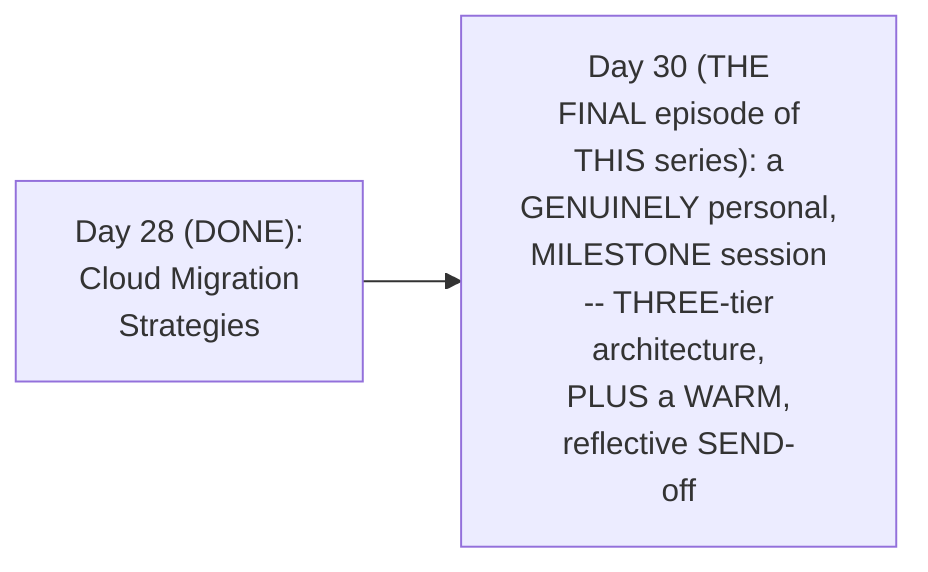

#### 🔍 Internal Working — A Genuine, Direct, Personal Milestone

> 💡 **Given directly:** *"This course is even more special to me, because it not only helped our learners, but it has also helped our channel to grow at a significant pace — when we started this AWS course, I remember that the channel was at 40,000 subscribers, and today we are at 85K subscribers."*

#### 🎯 Key Takeaways

* THIS session is directly, GENUINELY confirmed AS the SERIES' own, **FINAL episode** of THIS, established PLAYLIST — a REAL, significant MILESTONE.
* THE instructor **directly, PERSONALLY shares** a GENUINE, real MILESTONE — THE channel GREW from 40,000 to 85,000 SUBSCRIBERS, DURING the COURSE of THIS specific SERIES.
* This directly, PRECISELY sets UP the SESSION's own, NEXT, essential CLARIFICATION — WHILE THIS playlist ENDS, AWS content ON the channel GENUINELY continues (Section 2).

---

### 2. A Genuine, Important Clarification: The Playlist Ends, But AWS Content Continues

#### 🪜 Step-by-Step — A Direct, Important Clarification

> 💡 **Given directly:** *"I just want to tell you, before I start with this video, that this is the final episode of the playlist, but this is not the final episode of the AWS videos that we are going to do on this channel — in future I am going to explain you even complicated AWS scenarios, I'm going to do a lot of real-time scenario videos on AWS troubleshooting, I'll help you with the interview preparation for AWS devops job roles."*

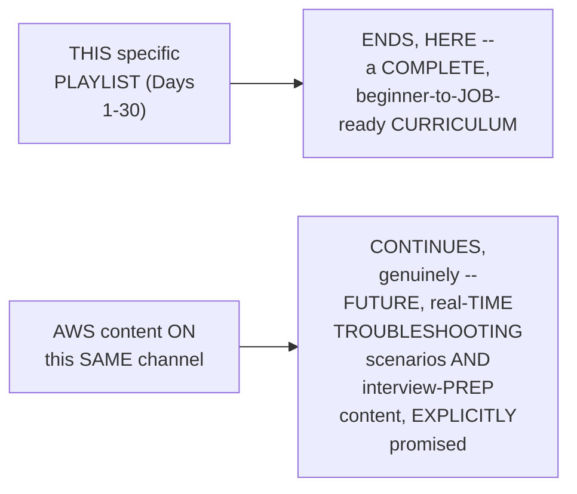

#### ⚠ Common Mistakes

* Assuming THIS session's own STATUS as "the FINAL episode" GENUINELY, DIRECTLY means NO further, real AWS content WILL genuinely BE produced, on THIS channel — explicitly, directly, CLARIFIED as FALSE — ONLY this SPECIFIC, 30-day PLAYLIST is CONCLUDING — FUTURE, more ADVANCED AWS content is EXPLICITLY, DIRECTLY promised.

#### 🎯 Key Takeaways

* THE instructor **directly, EXPLICITLY clarifies** THIS is the FINAL episode OF this SPECIFIC playlist — NOT the FINAL episode OF AWS content ON the channel GENERALLY.
* FUTURE content is DIRECTLY, EXPLICITLY promised — MORE complicated, REAL-time troubleshooting SCENARIOS, and DEDICATED interview-PREPARATION content.
* This directly, PRECISELY sets UP the SESSION's own, CORE, technical CONTENT — BEGINNING with a PRECISE distinction BETWEEN two-tier AND three-tier architecture (Section 3).

---
### 3. Two-Tier vs. Three-Tier Architecture, Precisely Explained

#### 🪜 Step-by-Step — A Complete, Real, Worked Example: Amazon.com

> 💡 **Given directly:** *"Let's say there is a user, and this user wants to get details of a product on amazon.com — user would open his or her favorite browser, and browser will show a web page, or a user interface, or front end — user would be requested for login, then user can search for the product... UI does not have the information of the product, so there is something called a back end, where you write your backend application... backend sends the request to a database, and database sends the response back to the backend, and backend will display this response to the user."*

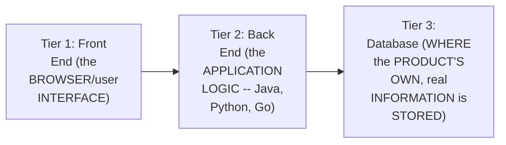

#### 📖 Definition — Three-Tier Architecture, Precisely Defined

> 💡 **Given directly:** *"So there are three parts here, right — one is front end, one is back end, and one is database, tier one, tier two, and tier three, for example — any application that has a front end plus backend plus database, such applications are called three-tier applications, or applications designed in the three-tier architecture model."*

#### 🪜 Step-by-Step — A Genuine, Direct, Contrasting Example: A Two-Tier Application

> 💡 **Given directly:** *"For some applications, database might not be required — let's say I'm writing a simple calculator, and I'm hosting this simple calculator on one of the websites... I just need a front end, where a user can say, 'what is two plus two,' and from front end I can send the request to the backend, where in Java I'll try to calculate what is two plus two, and I'll send the response back to the front end — so in this case, database is not required. Such applications are called two-tier applications."*

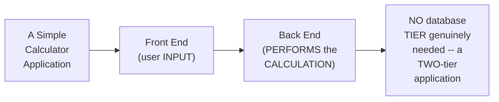

#### ⚠ Common Mistakes

* Assuming EVERY, real APPLICATION genuinely, DIRECTLY requires a DATABASE tier — explicitly, directly, PRECISELY clarified: SOME applications (e.g., a SIMPLE calculator) GENUINELY, DIRECTLY function WITH only a FRONT-end and back-END — NO database is GENUINELY required — a "TWO-tier" application.

#### 🎯 Key Takeaways

* **THREE-tier architecture** GENUINELY, PRECISELY consists OF three, distinct PARTS: **FRONT end** (the USER interface), **BACK end** (the APPLICATION logic), and **DATABASE** (WHERE information IS stored) — a REAL, worked example (amazon.COM) directly, CONCRETELY illustrates ALL three.
* **TWO-tier architecture** GENUINELY, DIRECTLY omits the DATABASE tier — a REAL, worked example (a SIMPLE calculator) directly, CONCRETELY illustrates WHY some, GENUINE applications don't NEED persistent DATA storage.
* This directly, PRECISELY sets UP the SESSION's own, NEXT, essential CONNECTION — a DIRECT callback TO a PRIOR, already-established SESSION's own, REAL, two-tier EXAMPLE (Section 4).

---

### 4. A Genuine, Direct Callback: Day 22's Own EKS Demo Was Genuinely Two-Tier

#### 🪜 Step-by-Step — A Direct, Genuine Callback

> 💡 **Given directly:** *"In this series, on the day when we learned about EKS, I hope the day number is correct, if not you can basically go to the playlist and search for the EKS video — in the EKS video I have deployed a 2048 game application, and that is basically a two-tier architecture model — in that application there is no database, right, so I have shown you how to deploy a two-tier architecture in AWS, on the managed Kubernetes platform."*

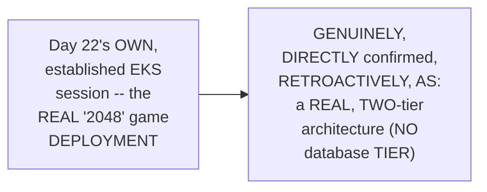

#### 🪜 Step-by-Step — A Genuine, Direct Confirmation of Today's Own, New Territory

> 💡 **Given directly:** *"So we have seen tier-one, or one-tier application, on Day [X] we have seen two-tier, when we try to understand about EKS, and today we'll be looking at the three-tier application, and how the AWS components, or what should be the architecture that is required to design for a three-tier architecture."*

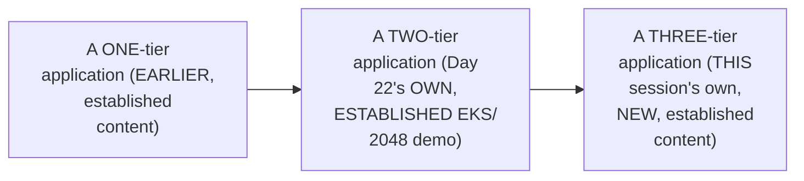

#### ⚠ Common Mistakes

* Assuming THIS session's own, THREE-tier CONTENT is GENUINELY, ENTIRELY disconnected FROM this series' own, PRIOR, established SESSIONS — explicitly, directly, DIRECTLY connected BACK to Day 22's own, ESTABLISHED EKS demo — a REAL, PRACTICAL, retroactive EXAMPLE OF two-tier architecture, ALREADY covered.

#### 🎯 Key Takeaways

* THE instructor **directly, GENUINELY connects** THIS session's OWN, new CONTENT back TO Day 22's own, ESTABLISHED EKS session — the "2048" GAME deployment WAS, genuinely, a REAL, two-TIER architecture EXAMPLE.
* THIS directly, PRECISELY confirms a GENUINE, DELIBERATE, progressive TEACHING sequence — ONE-tier, THEN two-tier (EKS), and NOW, three-tier (THIS session) — BUILDING complexity GRADUALLY.
* This directly, PRECISELY sets UP the SESSION's own, CORE, new CONTENT — the COMPLETE, real, THREE-tier AWS architecture, component BY component (Section 5).

---
### 5. The Complete, Real, Three-Tier AWS Architecture, Component by Component

#### 📖 Definition — The VPC & Why It Genuinely Matters

> 💡 **Given directly:** *"First we will start with creating a virtual private cloud — why do you need a virtual private cloud? Because in your organization there can be other projects as well... to keep your project secure from the other projects, better to keep a defined virtual private cloud — you can create this virtual private cloud with a CIDR block range, let's say 170.16.0.0/16."*

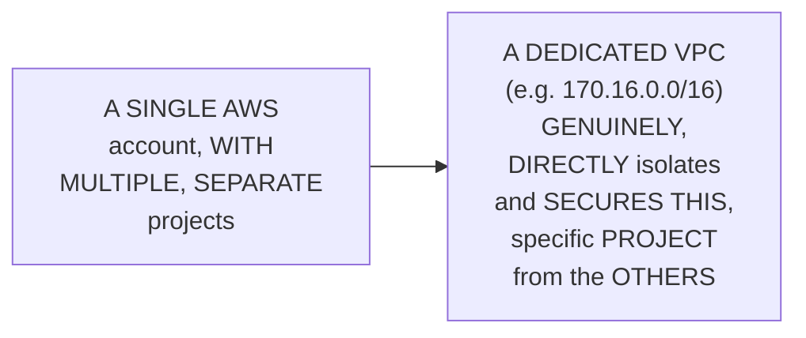

#### 📖 Definition — Three, Private Subnets

> 💡 **Given directly:** *"Depending upon your application, so in our case our application is a three-tier application, there is front end, there is back end, and then there is a database — so what I can do is I will split this virtual private cloud into three subnets — private subnet 1, private subnet 2, and private subnet 3."*

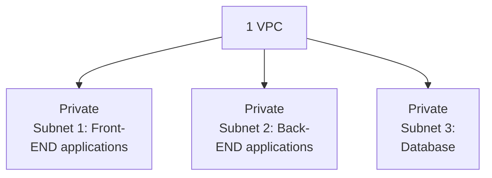

#### 📖 Definition — The Database Tier: RDS

> 💡 **Given directly:** *"In the database subnet, what you will do is you will use any managed AWS offerings, such as RDS — using RDS, you can create MySQL, or any other instances on AWS."*

#### 📖 Definition — Front-End & Back-End Tiers: Auto Scaling Groups

> 💡 **Given directly:** *"In private subnet front end, what you will do is you will use an auto scaling group — using auto scaling group you will create applications in EC2 instances. The reason for using auto scaling groups is auto scaling group can create your application in different EC2 instances, it can scale up, scale down, and put these instances in different availability zones as well."*

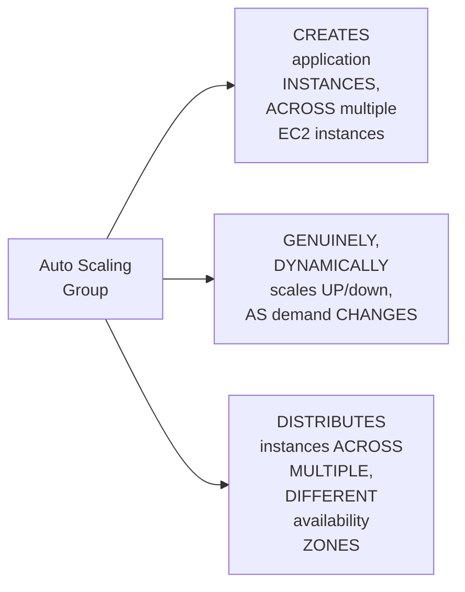

#### 📖 Definition — Primary & Secondary RDS

> 💡 **Given directly:** *"There will be an auto scaling group for your backend instances, and you will create a primary RDS and a secondary RDS — the reason is that if something happens to this database, all your information should not be lost, so there has to be a secondary RDS — so you create one RDS instance, and a secondary RDS instance for backup purposes."*

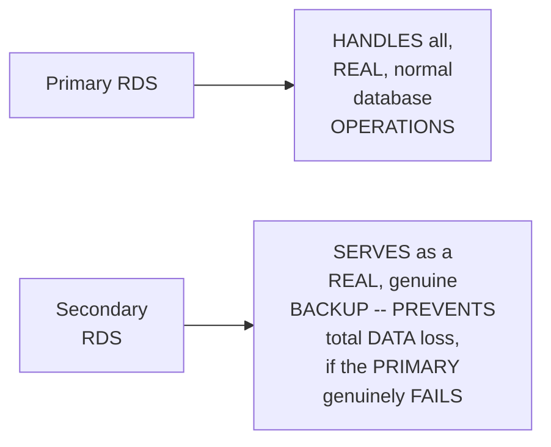

#### ⚠ Common Mistakes

* Assuming a SINGLE, real RDS instance is GENUINELY, PRACTICALLY sufficient FOR a real, PRODUCTION three-tier ARCHITECTURE — explicitly, directly, PRECISELY clarified: a SECONDARY RDS instance is GENUINELY, DIRECTLY required — SPECIFICALLY to PREVENT total DATA loss, IF something GENUINELY happens TO the primary.

#### 🎯 Key Takeaways

* THE complete, real, THREE-tier AWS architecture directly, PRECISELY consists OF: **a DEDICATED VPC** (isolating the PROJECT), **THREE private subnets** (front-END, back-END, database), **RDS** (the DATABASE tier), **AUTO Scaling Groups** (the front-END and back-END tiers), and **PRIMARY/secondary RDS** instances (for BACKUP/data-loss PREVENTION).
* **AUTO Scaling GROUPS** genuinely, DIRECTLY provide THREE, real BENEFITS: CREATING instances ACROSS multiple EC2 SERVERS, DYNAMICALLY scaling UP/down, and DISTRIBUTING across MULTIPLE availability ZONES.
* This directly, PRECISELY sets UP the SESSION's own, NEXT, essential CONTENT — the COMPLETE, real REQUEST flow, CONNECTING all of THESE components TOGETHER (Section 6).

---
### 6. The Complete, Real Request Flow, End to End

#### 🪜 Step-by-Step — The Complete, Real, End-to-End Request Flow

> 💡 **Given directly:** *"Whenever a user tries to send a request, users' request would ideally go to Route 53... from Route 53, if we are using any content delivery network, or if you are using any CDN, request would go to the CDN — from the CDN there will be an ELB, in general an application load balancer... available in a public subnet — from the elastic load balancer, the request would go to one of these EC2 instances."*

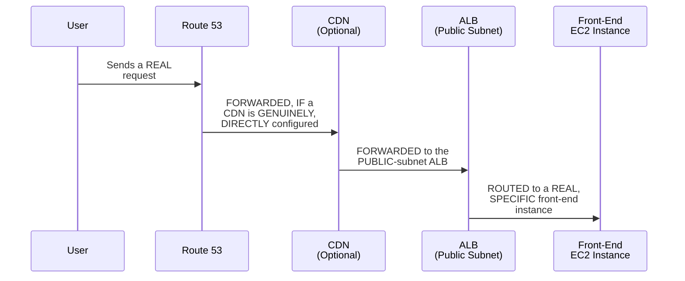

#### 🪜 Step-by-Step — The Complete, Real Continuation: Front End to Database and Back

> 💡 **Given directly:** *"This EC2 instance will again coordinate with an application load balancer — from the application load balancer, request will go to one of the EC2 instances — from there, request would go to a primary RDS... and from there, response will come back to this backend, response will come back to front end, and user will see whatever he has requested for."*

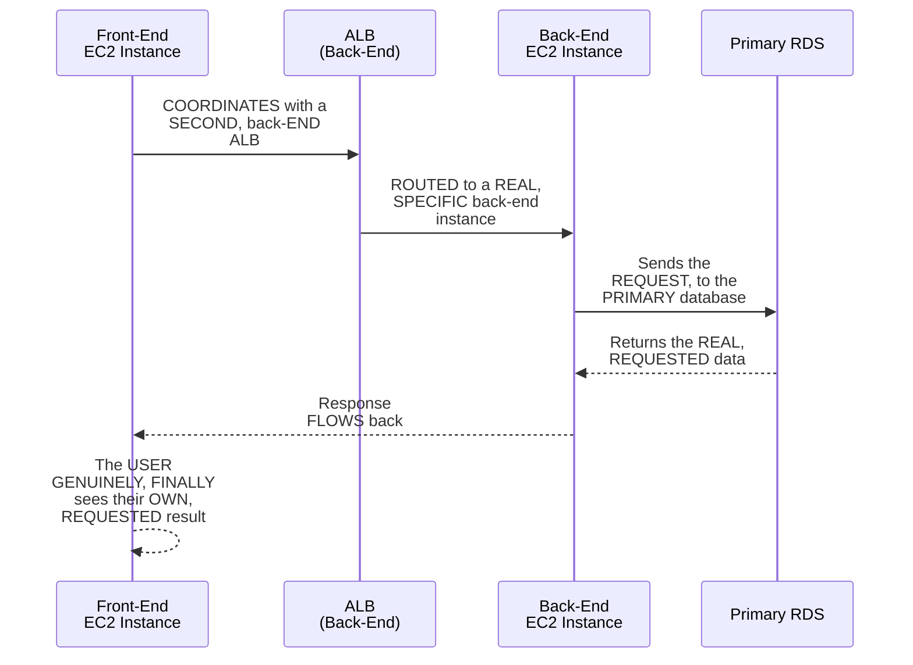

#### ⚠ Common Mistakes

* Assuming a REAL request GENUINELY, DIRECTLY travels FROM the front END straight TO the database, WITHOUT any, INTERMEDIATE routing — explicitly, directly, PRECISELY clarified: THIS architecture GENUINELY, STRUCTURALLY uses **TWO, separate application LOAD balancers** — ONE routing TO front-end INSTANCES, a SECOND routing TO back-end INSTANCES — EACH tier's OWN, real TRAFFIC is INDEPENDENTLY load-BALANCED.

#### 🎯 Key Takeaways

* THE complete, real REQUEST flow directly, PRECISELY traces: **USER → Route 53 → (OPTIONAL CDN) → Application LOAD Balancer (public SUBNET) → front-END EC2 → (a SECOND) Application LOAD Balancer → back-END EC2 → PRIMARY RDS → response FLOWS back**, in REVERSE.
* THIS architecture GENUINELY, STRUCTURALLY uses **TWO, separate LOAD balancers** — ONE for FRONT-end traffic, ONE for BACK-end traffic — EACH tier is INDEPENDENTLY, genuinely LOAD-balanced.
* This directly, PRECISELY sets UP the SESSION's own, NEXT, essential RESOURCE — a COMPLETE, real, community-AUTHORED blog PROVIDING step-BY-step implementation GUIDANCE (Section 7).

---

### 7. A Genuine, Direct Pointer: A Community-Authored, Step-by-Step Blog

#### 🪜 Step-by-Step — A Direct, Genuine, Community Resource

> 💡 **Given directly:** *"I know you might be finding this diagram that I have drawn very complicated, so for that purpose what I've done is, I am here with a complete blog — I'll put the link here in the description as well — this is the blog from Ankit... here you will understand right from step one — this is what I've explained, from user, request would go to the web server, then it would go to the app server, and it would go to the database."*

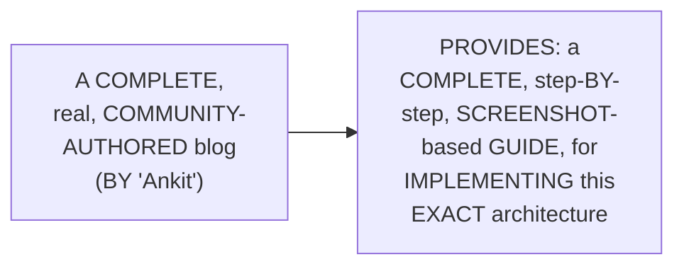

#### 🔍 Internal Working — A Genuine, Direct Mention of Disaster Recovery

> 💡 **Given directly:** *"You might be wondering why there are two VPCs here, right — basically here in this diagram, Ankit is also showing about the disaster recovery strategy, where you will create VPCs in different regions — region one and region two — using both of these regions, even if something goes entirely wrong in one region, you still have the other region as your backup."*

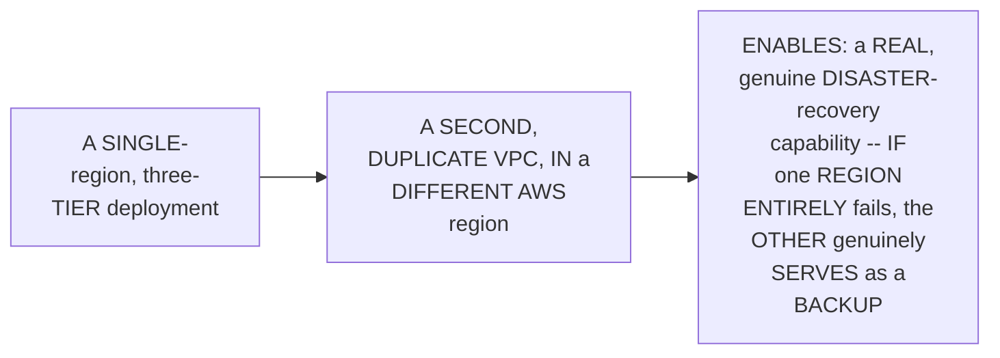

#### 🔍 Internal Working — A Genuine, Direct, Practical Time Estimate

> 💡 **Given directly:** *"You can follow this blog as is, it will take three to four hours very easily, and follow each and every screenshot, and you can deploy your three-tier application."*

#### ⚠ Common Mistakes

* Assuming THIS session's own, VERBAL/diagram-BASED explanation ALONE is GENUINELY, PRACTICALLY sufficient TO independently IMPLEMENT the COMPLETE, real ARCHITECTURE — explicitly, directly, PRACTICALLY clarified: a SEPARATE, COMPLETE, community-AUTHORED blog (WITH screenshots) PROVIDES the GENUINE, detailed, step-BY-step guidance NEEDED for REAL, hands-ON implementation.

#### 🎯 Key Takeaways

* A COMPLETE, real, COMMUNITY-authored BLOG (by "ANKIT") directly, PRACTICALLY provides the DETAILED, step-BY-step, screenshot-BASED guidance NEEDED to GENUINELY implement THIS architecture.
* THIS same BLOG additionally, GENUINELY covers **DISASTER recovery** — DEPLOYING a SECOND, duplicate VPC IN a DIFFERENT AWS region, ENABLING a REAL, genuine BACKUP capability.
* A GENUINE, practical TIME estimate is directly, HONESTLY given — FOLLOWING the COMPLETE blog GENUINELY takes "THREE to FOUR hours."

---
### 8. A Genuine, Practical Recommendation: Build One-Tier & Two-Tier First

#### 🪜 Step-by-Step — A Direct, Genuine, Practical Recommendation

> 💡 **Given directly:** *"You have to watch my videos and create one-tier application and two-tier application — only then the three-tier application will be easy to understand for you, if not, looking at so many components, you will get scared — but it is very easy if you have deployed one-tier and two-tier applications."*

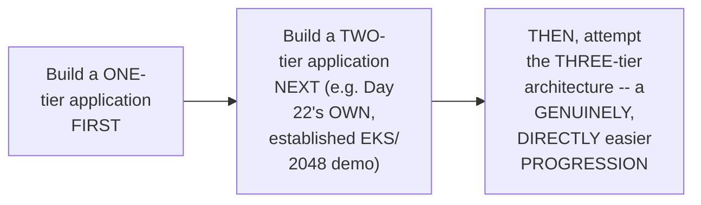

#### ⚠ Common Mistakes

* Assuming a LEARNER should GENUINELY, DIRECTLY attempt THIS complete, three-TIER architecture FIRST, WITHOUT any, PRIOR, simpler PRACTICE — explicitly, directly, PRACTICALLY discouraged: "IF not... you WILL get SCARED" — BUILDING confidence VIA simpler, ONE-tier and TWO-tier deployments FIRST is GENUINELY, DIRECTLY recommended.

#### 🎯 Key Takeaways

* THE instructor **directly, PRACTICALLY recommends** a GENUINE, progressive LEARNING path — BUILD a ONE-tier APPLICATION first, THEN a TWO-tier application, BEFORE attempting THIS, more COMPLEX, three-tier ARCHITECTURE.
* THIS directly, HONESTLY acknowledges the RISK of feeling GENUINELY "scared" BY the SHEER number OF components, WITHOUT this GRADUAL, progressive FOUNDATION.
* This directly, PRECISELY sets UP the SESSION's own, CENTRAL, promised DISCUSSION — precisely WHEN to genuinely MENTION this architecture IN a real INTERVIEW (Section 9).

---

### 9. The Central, Promised Discussion: When to Genuinely Mention This Architecture (& When Not To)

#### ⚠ A Direct, Honest, Important Industry Observation

> 💡 **Given directly:** *"These days everything is serverless, or people are moving towards the Kubernetes architecture — but here we are talking about EC2 instances, we are talking about scaling multiple EC2 instances... most organizations are shifting from this architecture model to the Kubernetes architecture model — very few organizations are deploying their applications onto EC2 instances, everybody is moving towards containers or the serverless approach."*

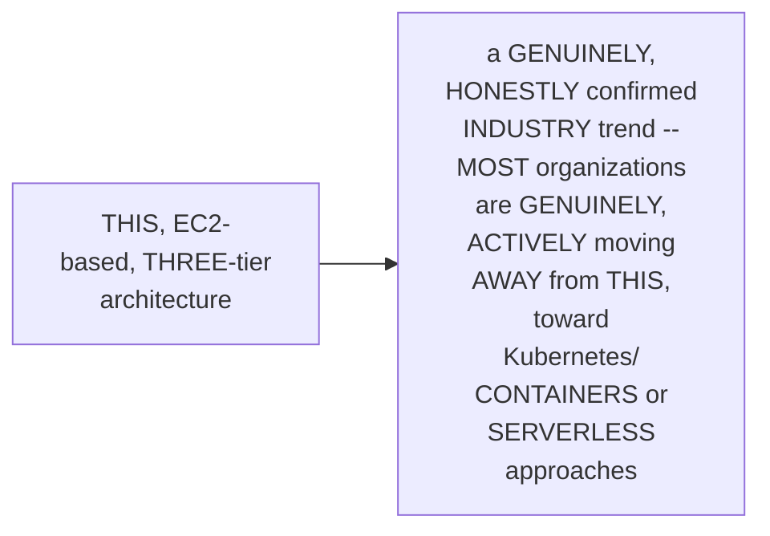

#### 🪜 Step-by-Step — A Direct, Practical, Interview-Answer Recommendation

> 💡 **Given directly:** *"If the job description requires knowledge on containers, explain the EKS architecture model — if the job description requires knowledge of applications on EC2 instances, then you can explain this three-tier architecture model."*

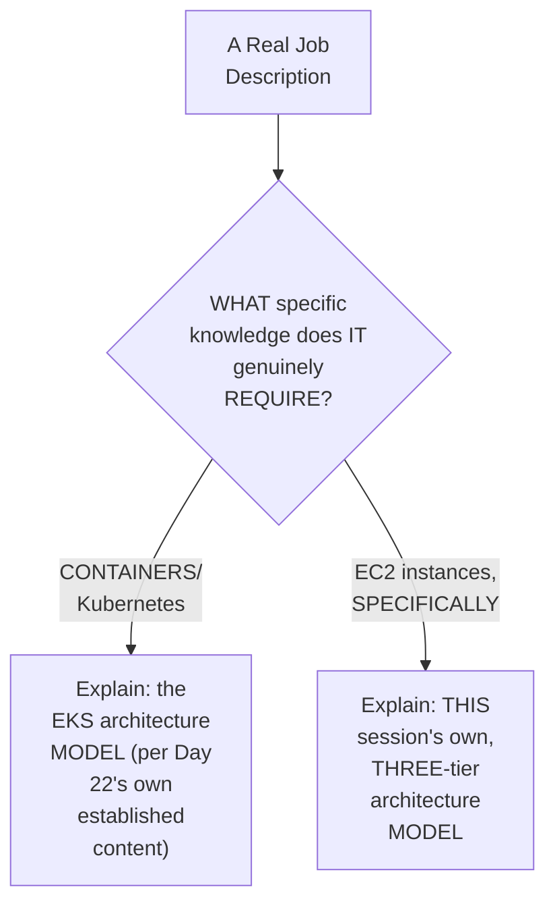

#### ⚠ A Direct, Honest, Important Warning

> 💡 **Given directly:** *"If you talk about containers, and if you talk about this architecture model, then your interviewer will not be convinced, and he will assume that you have not worked on AWS in real time."*

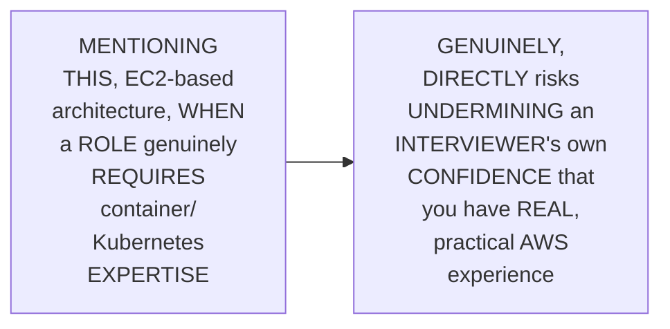

#### ⚠ Common Mistakes

* Assuming ANY, real THREE-tier, EC2-based ARCHITECTURE knowledge is GENUINELY, UNIVERSALLY, always the RIGHT thing to MENTION, in EVERY, real AWS interview — explicitly, directly, HONESTLY corrected: THE right choice GENUINELY, DIRECTLY depends ON the SPECIFIC job DESCRIPTION's own, stated REQUIREMENTS — CONTAINER-focused roles GENUINELY, DIRECTLY call for EKS knowledge INSTEAD.

#### 🎯 Key Takeaways

* THE instructor **directly, HONESTLY confirms** a GENUINE, important INDUSTRY trend — MOST organizations are GENUINELY, ACTIVELY shifting AWAY from EC2-based ARCHITECTURES, toward KUBERNETES/containers OR serverless APPROACHES.
* A GENUINE, practical INTERVIEW-answer recommendation: EXPLAIN the **EKS** architecture MODEL if a JOB description REQUIRES container KNOWLEDGE; explain **THIS, three-TIER** architecture ONLY if it REQUIRES EC2-instance EXPERIENCE, specifically.
* THE instructor **directly, HONESTLY warns**: mentioning THIS EC2-based ARCHITECTURE, when a ROLE genuinely REQUIRES container EXPERTISE, GENUINELY, DIRECTLY risks CONVINCING an interviewer YOU lack real, PRACTICAL AWS experience.

---
### 10. A Genuine, Direct, Forward-Looking Promise: A Future, Dedicated Webinar

#### 🪜 Step-by-Step — A Direct, Genuine, Forward-Looking Promise

> 💡 **Given directly:** *"I'll explain this entire three-tier architecture using the demonstration in one of the webinars — I have to take a dedicated two to three hours on a weekend to explain about this, because it does not qualify for a YouTube video, it is too much to explain in one single video, because there are so many components, and it also includes some pricing."*

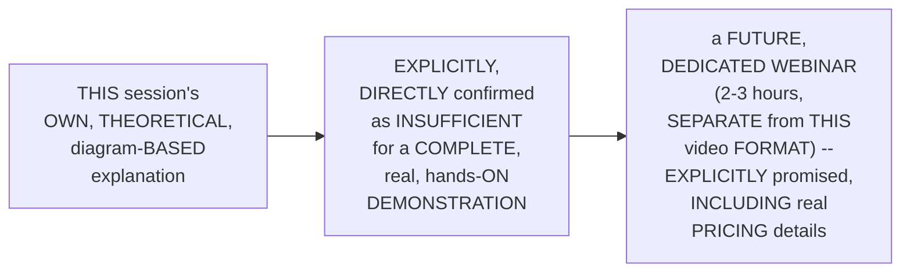

#### ⚠ Common Mistakes

* Assuming a COMPLETE, real, hands-ON DEMONSTRATION of THIS entire ARCHITECTURE could GENUINELY, PRACTICALLY fit WITHIN a STANDARD, single YouTube VIDEO — explicitly, directly, HONESTLY clarified: "IT does NOT qualify FOR a YouTube VIDEO" — the GENUINE, real COMPLEXITY (MANY components, PLUS pricing CONSIDERATIONS) requires a SEPARATE, DEDICATED, longer-FORM webinar FORMAT instead.

#### 🎯 Key Takeaways

* THE instructor **directly, HONESTLY confirms** a COMPLETE, real, hands-ON DEMONSTRATION of THIS architecture GENUINELY requires a SEPARATE, dedicated FORMAT — a FUTURE webinar (2-3 HOURS), rather THAN a standard YouTube VIDEO.
* THIS future WEBINAR is directly, EXPLICITLY promised TO include REAL pricing DETAILS — a GENUINE, practical CONSIDERATION this SESSION's own, theoretical EXPLANATION did NOT cover.
* This directly, PRECISELY sets UP the SESSION's own, FINAL, closing CONTENT — a GENUINELY warm, heartfelt FAREWELL (Section 11).

---

### 11. Closing: A Genuinely Warm, Heartfelt Farewell & a Tease of What's Next

#### 🪜 Step-by-Step — A Direct, Genuinely Warm, Final Request

> 💡 **Given directly:** *"If you have any questions, let me know in the comment section, and I am more than happy to help you — so share the feedback of this 30-day entire course, how did you find it, what is your feedback, I'm more than happy to listen about it — future, wait for my future series, future playlist, it is going to be very, very exciting."*

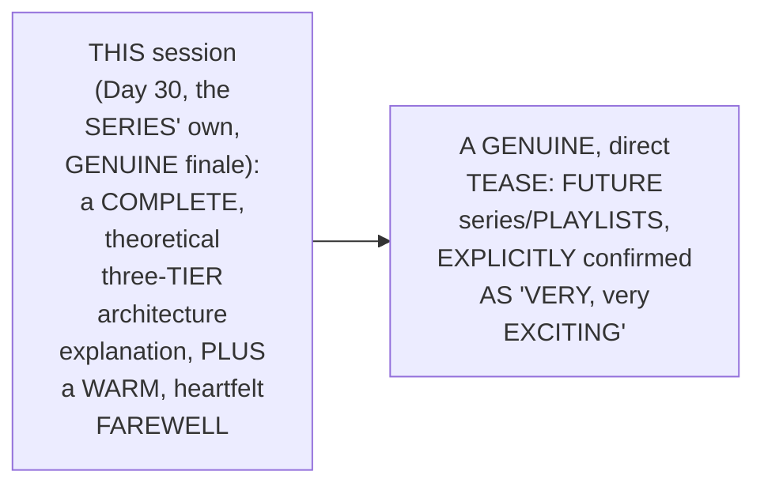

#### ⚠ Common Mistakes

* Assuming THIS session's own, GENUINELY warm, PERSONAL closing REMARKS are GENUINELY, MERELY a FORMULAIC, standard SIGN-off — explicitly, directly, DIRECTLY confirmed AS a GENUINELY, DEEPLY personal REFLECTION on the COMPLETE, 30-day JOURNEY — INCLUDING a REAL, specific SUBSCRIBER-growth milestone (Section 1).

#### 🎯 Key Takeaways

* This episode **GENUINELY, COMPREHENSIVELY delivers** its OWN, stated GOALS — a COMPLETE, precise THREE-tier architecture EXPLANATION, PLUS a THOROUGH, honest DISCUSSION of WHEN to genuinely MENTION it, in REAL interviews.
* THE instructor **directly, GENUINELY closes** the ENTIRE, 30-day SERIES with a WARM, heartfelt REQUEST for FEEDBACK — and a GENUINE, direct TEASE of FUTURE, "very, VERY exciting" content.
* This directly, PRECISELY completes THIS series' own, COMPLETE, 30-day JOURNEY — FROM foundational AWS CONCEPTS through ADVANCED, real-world ARCHITECTURE — WHILE EXPLICITLY, DIRECTLY confirming AWS content ON this CHANNEL genuinely CONTINUES, beyond THIS specific playlist.

---
## 📝 Glossary

| Term | Definition | Why It Matters |
|---|---|---|
| **Three-Tier Architecture** | Front end + back end + database | The classic, foundational web-application model |
| **Two-Tier Architecture** | Front end + back end, no database | E.g., a simple calculator, or Day 22's own 2048 game |
| **VPC** | An isolated, dedicated network space | Secures one project from others, in the same AWS account |
| **Auto Scaling Group** | Manages EC2 instances dynamically | Scales up/down; distributes across availability zones |
| **Primary/Secondary RDS** | A managed database + its own backup | Prevents total data loss if the primary fails |
| **Application Load Balancer (ALB)** | Routes traffic to EC2 instances | Used twice here: once for front end, once for back end |

---

## 🔄 Revision Notes — One-Minute Revision

* This is **Day 30**, the genuine, final episode of this entire, 30-day series -- a deeply personal, milestone session, combining a warm reflection on the complete course journey (the channel grew from 40,000 to 85,000 subscribers) with a complete, technical explanation of three-tier architecture.
* **A genuine, important clarification**: this playlist ends here, but AWS content on the channel continues -- future, real-time troubleshooting scenarios and dedicated interview-prep content are explicitly promised.
* **Two-tier vs. three-tier, precisely explained**: a three-tier application (e.g., amazon.com) has a front end, back end, and database. A two-tier application (e.g., a simple calculator) has only a front end and back end -- no database is genuinely needed.
* **A genuine, direct callback**: Day 22's own EKS session (the "2048" game deployment) was, genuinely, a real, two-tier architecture example -- no database was involved.
* **The complete, real, three-tier AWS architecture, component by component**: a dedicated VPC (isolating the project); three private subnets (front-end, back-end, database); RDS for the database tier; Auto Scaling Groups for the front-end and back-end tiers (enabling dynamic scaling and multi-AZ distribution); and primary + secondary RDS instances (for backup/data-loss prevention).
* **The complete, real request flow**: user -> Route 53 -> (optional CDN) -> Application Load Balancer (public subnet) -> front-end EC2 -> (a second) Application Load Balancer -> back-end EC2 -> primary RDS -> response flows back, in reverse. Two, separate load balancers are used -- one for each tier's own traffic.
* **A genuine, direct pointer**: a complete, community-authored blog (by "Ankit") provides step-by-step, screenshot-based implementation guidance, taking roughly 3-4 hours to follow -- and additionally covers disaster recovery, via a second, duplicate VPC in a different AWS region.
* **A genuine, practical recommendation**: build a one-tier application, then a two-tier application, before attempting this, more complex, three-tier architecture -- avoiding feeling "scared" by the sheer number of components.
* **The central, promised discussion -- when to genuinely mention this architecture**: most organizations are genuinely, actively shifting away from EC2-based architectures, toward Kubernetes/containers or serverless approaches. If a job description requires container knowledge, explain the EKS architecture model instead; if it requires EC2-instance experience specifically, explain this three-tier architecture. Mentioning this EC2-based architecture when a role genuinely requires container expertise risks convincing an interviewer you lack real, practical AWS experience.
* **A genuine, forward-looking promise**: a future, dedicated webinar (2-3 hours) will cover the complete, hands-on implementation, including pricing details -- explicitly confirmed as too extensive for a single YouTube video.
* **Closing**: a genuinely warm, heartfelt farewell -- a direct request for feedback on the complete, 30-day course, and a genuine tease of future, "very, very exciting" content.

---

## 📋 Cheat Sheet

**Two-tier vs. three-tier:**
```text
Two-tier:    Front End + Back End                (e.g., a calculator, Day 22's 2048 game)
Three-tier:  Front End + Back End + Database      (e.g., amazon.com)
```

**The complete, real architecture:**
```text
1 VPC
  -> Private Subnet 1: Front End  (Auto Scaling Group, EC2)
  -> Private Subnet 2: Back End   (Auto Scaling Group, EC2)
  -> Private Subnet 3: Database   (Primary RDS + Secondary RDS)
```

**The complete request flow:**
```text
User -> Route 53 -> (CDN, optional) -> ALB (public subnet) -> Front-End EC2
     -> ALB (second) -> Back-End EC2 -> Primary RDS -> response flows back
```

**When to mention this architecture, in interviews:**
```text
Job requires container/Kubernetes knowledge -> explain EKS architecture instead
Job requires EC2-instance experience, specifically -> explain THIS, three-tier architecture
```

---

## 🔥 Interview Questions & Answers

### 🟢 Beginner

**Q1.**

**Question:** What are the three, precise components of a three-tier architecture?

**Answer:** Front end, back end, and database.

**Explanation:** Directly, explicitly named.

**Why Interviewers Ask This:** The most basic, foundational architecture question.

**Possible Follow-up:** "Give a real, worked example."

**Q2.**

**Question:** What is a two-tier application, and does it genuinely require a database?

**Answer:** Front end + back end only; no, a database is genuinely not required.

**Explanation:** Directly, precisely explained.

**Why Interviewers Ask This:** Tests genuine understanding of when a database tier is, and isn't, necessary.

**Possible Follow-up:** "Give a real, worked example."

**Q3.**

**Question:** Why does this architecture genuinely require a dedicated VPC?

**Answer:** To isolate and secure this specific project from other projects, within the same AWS account.

**Explanation:** Directly, precisely explained.

**Why Interviewers Ask This:** Basic, foundational VPC/architecture knowledge.

**Possible Follow-up:** "How many private subnets does this architecture genuinely use, and for what?"

**Q4.**

**Question:** Why does this architecture use Auto Scaling Groups for the front-end and back-end tiers?

**Answer:** To dynamically scale instances up/down, and distribute them across multiple availability zones.

**Explanation:** Directly, precisely explained.

**Why Interviewers Ask This:** Tests genuine, practical understanding of a core scalability mechanism.

**Possible Follow-up:** "Why does the database tier not genuinely use an Auto Scaling Group in the same way?"

**Q5.**

**Question:** Why does this architecture genuinely use both a primary AND a secondary RDS instance?

**Answer:** To prevent total data loss, if something happens to the primary.

**Explanation:** Directly, precisely explained.

**Why Interviewers Ask This:** Tests genuine, practical database-resilience knowledge.

**Possible Follow-up:** "What real, worked example, from this series, was confirmed as a two-tier architecture?"

**Q6.**

**Question:** How many, separate application load balancers does this complete architecture genuinely use?

**Answer:** Two -- one for front-end traffic, one for back-end traffic.

**Explanation:** Directly, precisely confirmed.

**Why Interviewers Ask This:** Tests genuine, detailed understanding of the complete request flow.

**Possible Follow-up:** "Trace the complete, real request flow, from user to database and back."

**Q7.**

**Question:** According to this session, is most of the industry genuinely moving toward, or away from, EC2-based architectures like this one?

**Answer:** Away from -- toward Kubernetes/containers or serverless approaches.

**Explanation:** Directly, honestly confirmed.

**Why Interviewers Ask This:** Tests genuine, current industry awareness.

**Possible Follow-up:** "What should you explain instead, if a job description requires container knowledge?"

**Q8.**

**Question:** Under what specific circumstance should you genuinely mention this three-tier, EC2-based architecture in an interview?

**Answer:** When the job description specifically requires EC2-instance experience.

**Explanation:** Directly, explicitly recommended.

**Why Interviewers Ask This:** Tests genuine, practical, context-aware interview judgment.

**Possible Follow-up:** "What risk do you run, if you mention it when the role requires containers instead?"

**Q9.**

**Question:** What additional capability does the community-authored blog referenced in this session also cover?

**Answer:** Disaster recovery, via a second, duplicate VPC in a different AWS region.

**Explanation:** Directly, explicitly confirmed.

**Why Interviewers Ask This:** Tests attention to this session's own, referenced resources.

**Possible Follow-up:** "Roughly how long does the blog say this complete implementation genuinely takes?"

**Q10.**

**Question:** Is this session genuinely the final AWS-related video on this instructor's channel?

**Answer:** No -- only the final episode of this specific, 30-day playlist; future AWS content is explicitly promised.

**Explanation:** Directly, explicitly clarified.

**Why Interviewers Ask This:** Tests attention to this session's own, stated, personal context.

**Possible Follow-up:** "What kind of future content was specifically promised?"

---
### 🟡 Intermediate

**Q11.**

**Question:** Explain why the instructor deliberately connects this session's own, new, three-tier content back to Day 22's own, established EKS/2048-game example, rather than introducing "two-tier architecture" as an entirely new, abstract concept.

**Answer:** This is a genuinely deliberate, CONTINUITY-based teaching choice: by DIRECTLY, EXPLICITLY reframing a session LEARNERS already, GENUINELY know (Day 22's REAL, hands-on EKS demo) as a CONCRETE example OF "two-tier ARCHITECTURE," the instructor MAKES an ABSTRACT, new CONCEPT immediately, CONCRETELY tangible — RATHER than introducing IT as an ISOLATED, hypothetical DEFINITION, requiring a BRAND-new example. THIS directly, PEDAGOGICALLY demonstrates a CONSISTENT pattern SEEN throughout THIS series — BUILDING new CONCEPTS on TOP of learners' OWN, already-established, REAL, hands-on EXPERIENCE, RATHER than PRESENTING each, new TOPIC in COMPLETE isolation.

**Explanation:** Requires recognizing the deliberate, continuity-based value of retroactively reframing prior, hands-on content as a concrete example of a new concept, rather than introducing the concept in complete isolation.

**Why Interviewers Ask This:** Tests whether a learner recognizes the pedagogical value of connecting new concepts to genuinely familiar, prior, hands-on experience.

**Possible Follow-up:** "Identify ANOTHER, genuine EXAMPLE, from EARLIER in this series, WHERE a SIMILAR, 'retroactive reframing' teaching PATTERN was used."

**Q12.**

**Question:** A learner argues that since this session confirms most organizations are genuinely moving away from EC2-based architectures, this means learning three-tier, EC2-based architecture is genuinely a waste of time, and should be skipped entirely in favor of only learning EKS/container-based architecture. Evaluate this claim.

**Answer:** This claim OVERSTATES a GENUINE, real INDUSTRY trend (Section 9) into an UNCONDITIONAL, "SKIP it entirely" recommendation, WHICH directly CONTRADICTS this session's OWN, EXPLICIT, nuanced GUIDANCE. Section 9's own PRECISE, established RECOMMENDATION does NOT say "NEVER learn THIS architecture" — it SAYS, SPECIFICALLY, "IF the job DESCRIPTION requires KNOWLEDGE of applications ON EC2 instance, THEN you can EXPLAIN this three-TIER architecture model" — a GENUINE, real, CONDITIONAL recommendation, NOT a BLANKET dismissal. THE instructor EVEN, explicitly, DEDICATES an ENTIRE, dedicated SESSION (THIS one) plus a FUTURE, PROMISED webinar (Section 10) to THIS exact TOPIC — a GENUINE, DIRECT signal that IT still, genuinely HOLDS real, PRACTICAL value, FOR the SPECIFIC, real organizational CONTEXTS where it GENUINELY applies. The ACCURATE, more PRECISE conclusion: THIS architecture's own, GENUINE, real-world RELEVANCE has GENUINELY, DIRECTLY narrowed (per the INDUSTRY trend) — but it has NOT, genuinely, DISAPPEARED entirely, and REMAINS a REAL, valuable, CONTEXT-dependent skill TO have, RATHER than a WASTE of time TO learn.

**Explanation:** Tests whether a learner recognizes that a genuine, narrowing industry trend doesn't translate into a recommendation to skip the topic entirely, given the session's own, explicit, conditional guidance and continued investment in teaching it.

**Why Interviewers Ask This:** Distinguishes candidates who correctly apply the session's own, conditional, context-dependent recommendation from those who over-generalize an industry trend into a blanket dismissal.

**Possible Follow-up:** "Describe a GENUINE, real, SPECIFIC organizational context (BEYOND this session's OWN, explicit content) where THIS, EC2-based ARCHITECTURE would STILL, legitimately, be the RIGHT, real choice."

**Q13.**

**Question:** Explain, precisely, why the instructor deliberately recommends building a one-tier and two-tier application BEFORE attempting this, more complex, three-tier architecture, rather than simply presenting the complete, three-tier diagram directly, with all its components at once.

**Answer:** This is a genuinely deliberate, SCAFFOLDED-learning teaching choice, DIRECTLY consistent WITH a PATTERN seen ACROSS this instructor's OWN, broader series (e.g., Day 22's OWN, established "COMPLETE Kubernetes architecture BEFORE the hands-ON demo" approach). By EXPLICITLY, DIRECTLY recommending a GRADUAL, PROGRESSIVE build-UP (one-tier → TWO-tier → three-TIER), the instructor PREVENTS learners FROM genuinely, REASONABLY feeling "SCARED" by the SHEER number OF components (per Section 8's OWN, EXPLICIT acknowledgment) — a COMPLEX, multi-COMPONENT diagram, presented ALL at ONCE, WITHOUT this PROGRESSIVE foundation, WOULD, genuinely, RISK overwhelming LEARNERS, RATHER than genuinely BUILDING their OWN, real UNDERSTANDING and CONFIDENCE incrementally.

**Explanation:** Requires recognizing the deliberate, scaffolded-learning value of building complexity gradually (one-tier, then two-tier, then three-tier), rather than presenting the complete, complex architecture all at once.

**Why Interviewers Ask This:** Tests whether a learner recognizes the pedagogical value of progressive, scaffolded complexity over presenting a complete, complex system all at once.

**Possible Follow-up:** "Describe a GENUINE, real RISK a learner might FACE, if they GENUINELY attempted this THREE-tier architecture FIRST, WITHOUT the recommended, PROGRESSIVE foundation."

**Q14.**

**Question:** Using this session's own precise "two separate load balancers" reasoning (Section 6), explain a GENUINE, real, architectural reason why using a SINGLE, shared load balancer for both front-end and back-end traffic would genuinely be a poor, structural choice for this three-tier architecture.

**Answer:** A precise, reasoned analysis, directly extending Section 6's own established ARCHITECTURE, and CONNECTING back TO Section 5's OWN established "PRIVATE subnet" REASONING: per Section 5's own PRECISE reasoning, front-END and back-END applications GENUINELY, STRUCTURALLY live IN SEPARATE, distinct PRIVATE subnets, EACH with ITS own, INDEPENDENT Auto SCALING group. Per Section 6's own PRECISE, established ARCHITECTURE, TWO, SEPARATE application LOAD balancers GENUINELY, DIRECTLY route TRAFFIC — ONE to FRONT-end instances, ONE to BACK-end instances. IF a SINGLE, SHARED load balancer WERE used INSTEAD, it would GENUINELY, STRUCTURALLY need to CORRECTLY distinguish BETWEEN front-end-BOUND and back-end-BOUND traffic, WITHOUT the CLEAR, architectural SEPARATION Section 5's own, DISTINCT subnets PROVIDE — GENUINELY, DIRECTLY risking MISROUTED traffic, and UNDERMINING the INDEPENDENT, per-TIER auto-SCALING (per Section 5's own established REASONING) THIS architecture is SPECIFICALLY designed TO achieve — a GENUINE, structural ARGUMENT for KEEPING these TWO, distinct load-BALANCING concerns SEPARATE.

**Explanation:** Requires extending the two-load-balancer architecture to identify a genuine, structural reason (maintaining clear tier separation and independent auto-scaling) why a single, shared load balancer would be architecturally problematic.

**Why Interviewers Ask This:** Tests whether a learner can connect the specific, two-load-balancer design choice to the broader, established principle of tier separation and independent scaling.

**Possible Follow-up:** "Describe a GENUINE, real SCENARIO where a SINGLE, shared load BALANCER might, NONETHELESS, be a REASONABLE architectural CHOICE, for a SIMPLER, different application."

**Q15.**

**Question:** Synthesize this session's complete "when to genuinely mention this architecture" reasoning (Section 9) with its own "future webinar, pricing details" promise (Section 10) to explain a GENUINE, structural reason why a complete, real interview answer about this architecture likely needs to go beyond just describing the components and request flow.

**Answer:** A precise, synthesized explanation, directly connecting TWO, separately-established sections: per Section 9's own PRECISE, established WARNING, an INTERVIEWER genuinely, DIRECTLY wants CONVINCING evidence OF "REAL time" AWS EXPERIENCE — NOT merely a RECITATION of ARCHITECTURAL components. Per Section 10's own PRECISE, established ACKNOWLEDGMENT, a COMPLETE, real IMPLEMENTATION of THIS architecture GENUINELY, DIRECTLY involves SUBSTANTIAL, real PRICING considerations — EXPLICITLY confirmed AS TOO extensive FOR even a SINGLE, standard YouTube VIDEO. SYNTHESIZING these TWO facts directly, PRECISELY reveals a GENUINE, structural REASON: a TRULY convincing, REAL interview ANSWER (per Section 9's own established GOAL) genuinely, LIKELY needs to GO beyond MERELY describing COMPONENTS and REQUEST flow — it SHOULD, genuinely, ALSO touch ON real, PRACTICAL considerations LIKE cost (per Section 10's OWN established ACKNOWLEDGMENT) — SINCE a CANDIDATE who can DISCUSS the REAL, financial trade-OFFS of THEIR own architecture DECISIONS (e.g., WHY a secondary RDS ADDS cost, but PREVENTS data LOSS) DEMONSTRATES a GENUINELY, DEEPER level OF real, practical EXPERIENCE than ONE who can ONLY recite the TECHNICAL components THEMSELVES.

**Explanation:** Requires synthesizing the "convince the interviewer of real experience" goal with the acknowledged, substantial pricing dimension to identify a genuine, structural reason why a complete interview answer likely needs to address cost trade-offs, not just technical components.

**Why Interviewers Ask This:** A senior-level question testing whether a candidate can identify a genuine, additional dimension (cost) that a truly convincing, real-experience-demonstrating interview answer likely needs to address, beyond the session's own, explicit, technical explanation.

**Possible Follow-up:** "Name ONE, GENUINE, real, SPECIFIC cost TRADE-off (FROM this session's own, established ARCHITECTURE) that a STRONG, real interview ANSWER might GENUINELY, DIRECTLY discuss."

---

### 🔴 Advanced

**Q16.**

**Question:** Design a complete, reasoned interview-preparation strategy (using ONLY this session's own established concepts) for a candidate who has genuine, practical experience with BOTH this three-tier, EC2-based architecture AND EKS/container-based architecture, preparing for interviews across three, genuinely different types of organizations: (1) a legacy, financial-services company known for EC2-heavy infrastructure, (2) a modern, cloud-native startup known for Kubernetes-based infrastructure, and (3) a company whose specific job description is ambiguous about its own, current infrastructure approach.

**Answer:** A reasonable, complete strategy, directly applying this session's OWN, exact established CONCEPTS:

```text
1. Legacy, financial-services company (EC2-heavy) (per Section 9's
   own established RECOMMENDATION): GENUINELY, DIRECTLY lead WITH
   this session's own, established THREE-tier, EC2-based
   architecture -- per Section 9's own established GUIDANCE, this
   is PRECISELY the CONTEXT where THIS knowledge GENUINELY,
   DIRECTLY convinces an interviewer OF real, PRACTICAL AWS
   experience.

2. Modern, cloud-native startup (Kubernetes-based) (per Section 9's
   own established, industry-TREND acknowledgment): GENUINELY,
   DIRECTLY lead WITH EKS/container-based ARCHITECTURE knowledge
   (per Day 22's own, established CONTENT) -- per Section 9's own
   established WARNING, MENTIONING this session's OWN, EC2-based
   architecture HERE risks GENUINELY, DIRECTLY undermining
   credibility.

3. Ambiguous job description (per Advanced Q15's own established,
   "beyond COMPONENTS" reasoning): PREPARE to DISCUSS BOTH
   architectures, GENUINELY, DIRECTLY -- ASK a CLARIFYING question,
   EARLY in the INTERVIEW (e.g. "IS your CURRENT infrastructure
   PRIMARILY EC2-based, OR container/Kubernetes-BASED?") -- THEN,
   per Section 9's own established, CONDITIONAL recommendation,
   TAILOR your ANSWER accordingly, RATHER than GUESSING or
   DEFAULTING to ONE, single architecture WITHOUT genuine,
   real CONTEXT.
```

This complete STRATEGY directly, precisely APPLIES this session's OWN, established CONCEPTS — the CONDITIONAL, job-DESCRIPTION-based recommendation, and the GENUINE industry TREND — to THREE, genuinely DIFFERENT, realistic interview CONTEXTS.

**Explanation:** Requires synthesizing the conditional, job-description-based recommendation with the genuine industry trend into one complete, reasoned interview-preparation strategy across three, genuinely different organizational contexts.

**Why Interviewers Ask This:** A comprehensive, capstone-level question testing whether a candidate can apply this session's own, context-dependent guidance to genuinely different, realistic interview scenarios, including handling ambiguity.

**Possible Follow-up:** "FOR scenario 3 (the AMBIGUOUS job DESCRIPTION), what SPECIFIC, additional QUESTION might you ASK, to FURTHER refine YOUR own, real-TIME interview STRATEGY?"

**Q17.**

**Question:** Critically evaluate: "Since this session confirms most organizations are genuinely moving toward Kubernetes/containers or serverless approaches, this means EC2-based, three-tier architecture knowledge will genuinely become completely obsolete and irrelevant within the AWS industry, within the next few years." Is this an accurate, complete characterization?

**Answer:** Not accurate — this OVERSTATES a GENUINE, established, CURRENT-state INDUSTRY trend (Section 9) into an UNCONDITIONAL, PREDICTIVE claim of "COMPLETELY obsolete AND irrelevant," which NEITHER this session's own CONTENT, nor sound REASONING, SUPPORTS. Section 9's own PRECISE statement CONFIRMS a GENUINE, CURRENT trend ("MOST organizations ARE shifting," "VERY few... deploying ONTO EC2 instances") — THIS is a DESCRIPTIVE observation ABOUT the present-DAY, relative POPULARITY of DIFFERENT approaches — it does NOT, genuinely, make a SPECIFIC, predictive CLAIM about COMPLETE future OBSOLESCENCE. ADDITIONALLY, Section 9's own established, EXPLICIT guidance ("IF the job DESCRIPTION requires... EC2 instance, THEN you CAN explain THIS") directly, DIRECTLY confirms THIS knowledge GENUINELY, STILL retains REAL, practical VALUE for SPECIFIC, real ORGANIZATIONAL contexts, TODAY. The ACCURATE, more PRECISE conclusion: EC2-based, THREE-tier architecture KNOWLEDGE has GENUINELY, DIRECTLY become LESS commonly-REQUIRED, industry-wide — but THIS session's own CONTENT does NOT, genuinely, SUPPORT the STRONGER, PREDICTIVE claim that it WILL become "COMPLETELY obsolete AND irrelevant" — LEGACY systems and SPECIFIC, real organizational CONTEXTS (per Section 9's OWN, explicit GUIDANCE) genuinely, LIKELY continue to REQUIRE this KNOWLEDGE, for the FORESEEABLE future.

**Explanation:** Tests whether a learner recognizes that a genuine, current-state, descriptive industry trend doesn't support a stronger, unconditional, predictive claim about complete future obsolescence.

**Why Interviewers Ask This:** Distinguishes candidates who correctly scope a descriptive, current-state observation from those who over-extend it into an unsupported, predictive claim about complete future irrelevance.

**Possible Follow-up:** "Describe a GENUINE, real TYPE of organization (BEYOND this session's OWN, explicit BANKING/financial-services EXAMPLES) that WOULD, LIKELY, continue to GENUINELY require THIS, EC2-based architecture KNOWLEDGE, for the FORESEEABLE future."

---

## 🧪 Scenario-Based Interview Questions

> **Scenario 1:** A colleague preparing for an AWS devops interview at a well-known, cloud-native technology startup mentions they're planning to lead with a detailed explanation of this session's own, three-tier, EC2-based architecture, since it's the most complex architecture they've personally built. Using this session's own concepts, construct a complete, reasoned response.

**Structured Answer:**
1. **Initial investigation:** Recognize this as directly connected to Section 9's own precise, established, job-description-based RECOMMENDATION — a GENUINE, likely MISALIGNMENT with the TARGET company's OWN, real, TECHNICAL profile.
2. **Relevant principle:** Per Section 9's own established REASONING, "IF the JOB description REQUIRES knowledge ON containers, EXPLAIN the EKS architecture MODEL" — a CLOUD-native STARTUP genuinely, LIKELY falls INTO this CATEGORY.
3. **Possible risks:** LEADING with THIS, EC2-based ARCHITECTURE, at a CLOUD-native startup, RISKS the EXACT, genuine OUTCOME Section 9's own established WARNING describes — the INTERVIEWER "WILL not be CONVINCED," and may GENUINELY, DIRECTLY assume the CANDIDATE lacks REAL, current AWS EXPERIENCE.
4. **Debugging/evaluation approach:** Directly RESEARCH the TARGET company's OWN, genuine, current TECHNOLOGY stack (e.g., VIA their OWN engineering BLOG, job POSTINGS, or public STATEMENTS) — CONFIRMING whether they GENUINELY, DIRECTLY use Kubernetes/CONTAINERS.
5. **Resolution:** RECOMMEND the colleague LEAD, instead, WITH their OWN, real EKS/container-BASED experience (per Section 9's OWN established GUIDANCE) — RESERVING this session's OWN, three-tier ARCHITECTURE knowledge FOR a DIFFERENT, more APPROPRIATE context (per Advanced Q16's own established STRATEGY).
6. **Prevention:** Establish a standing PRACTICE of EXPLICITLY, DELIBERATELY researching a TARGET company's OWN, real, current TECHNOLOGY approach BEFORE an interview (per Section 9's own established, job-DESCRIPTION-matching PRINCIPLE) — RATHER than DEFAULTING to WHATEVER architecture the CANDIDATE personally FINDS most IMPRESSIVE or complex.

> **Scenario 2 (Advanced):** During a real interview, after explaining this session's own, complete three-tier architecture, an interviewer asks a genuine follow-up: "Why did you choose a primary-and-secondary RDS setup here, rather than simply relying on regular, scheduled database backups?" Using this session's own concepts, construct a complete, reasoned response.

**Structured Answer:**
1. **Initial investigation:** Recognize this as directly connected to Section 5's own precise, established, primary/secondary RDS reasoning — a GENUINE, real, follow-up QUESTION testing deeper, PRACTICAL understanding, BEYOND the basic COMPONENT description.
2. **Relevant principle:** Per Section 5's own established REASONING, the SECONDARY RDS instance EXISTS SPECIFICALLY "SO all your INFORMATION should NOT be lost" — a REAL-time, CONTINUOUS backup MECHANISM.
3. **Possible risks:** RELYING solely ON scheduled, PERIODIC backups (RATHER than a REAL-time secondary INSTANCE) would GENUINELY, DIRECTLY risk LOSING any, real DATA created BETWEEN the LAST scheduled BACKUP and a GENUINE, real FAILURE event — a REAL, meaningful GAP a secondary RDS INSTANCE is SPECIFICALLY designed to AVOID.
4. **Debugging/evaluation approach:** Directly EXPLAIN the GENUINE, real DIFFERENCE between PERIODIC, scheduled BACKUPS (WHICH genuinely, DIRECTLY leave a REAL, data-loss WINDOW between BACKUPS) and a REAL-time, SECONDARY database INSTANCE (WHICH genuinely, CONTINUOUSLY stays UP to date).
5. **Resolution:** ANSWER by DIRECTLY, PRECISELY explaining THIS exact, real trade-OFF — the SECONDARY RDS instance GENUINELY, DIRECTLY minimizes the REAL, potential DATA-loss window, COMPARED to relying SOLELY on PERIODIC backups — DEMONSTRATING the DEEPER, genuinely PRACTICAL understanding Section 9's OWN established GOAL (CONVINCING an interviewer OF real experience) REQUIRES.
6. **Prevention:** Establish a standing PRACTICE of PREPARING to EXPLAIN the GENUINE, real "WHY" behind EACH, individual architectural DECISION (per THIS scenario's own, established EXAMPLE) — NOT just the "WHAT" (per Advanced Q15's own established, "BEYOND components" REASONING) — ANTICIPATING genuine, real FOLLOW-up questions, BEFORE they ARISE.

---

## 🛠 Hands-on Exercises

### 🟢 Easy

1. Write out, from memory, the precise, three-part distinction between a two-tier and a three-tier application.
2. Explain, in your own words, why a dedicated VPC genuinely matters, for this architecture.
3. Explain, in your own words, when you should genuinely mention this three-tier, EC2-based architecture in an interview, and when you shouldn't.

### 🟡 Medium

4. Diagram, from memory, the complete, real, three-tier AWS architecture, including all components (VPC, subnets, ALBs, ASGs, RDS instances).
5. Trace, from memory, the complete, real request flow, from a user's browser to the database and back.
6. Follow the community-authored blog referenced in this session, and implement a real, working version of this architecture on your own AWS account.

### 🔴 Advanced

7. Complete the full, reasoned interview-preparation strategy proposed in Advanced Interview Q16, for three, genuinely different organizational contexts of your own choosing.
8. Implement the debugging scenario proposed in Scenario 2 -- prepare complete, written answers to at least three, genuine, likely follow-up questions about this architecture's own, specific design decisions.
9. Research a real, publicly-documented AWS disaster-recovery strategy, and compare it against this session's own, briefly-mentioned, multi-region approach.

---

## 🏗 Practice Assignment

*(This session's own stated, direct encouragement, reproduced faithfully)*

> 💡 **The instructor's own words, given directly:** *"Please try to follow this entire document -- if you have any questions, let me know in the comment section, and I am more than happy to help you."*

### Build: "Complete, Reproduced Three-Tier Architecture on AWS"

**Objective:** Directly reproduce this session's own, complete, real architecture, end to end, on your own AWS account, following the referenced community blog.

**Requirements:**
- Create a real VPC, with an appropriate CIDR block, and three, real, private subnets (front-end, back-end, database).
- Configure a real RDS instance (primary), for the database tier.
- Configure Auto Scaling Groups for both the front-end and back-end tiers, deploying real EC2 instances.
- Configure two, separate application load balancers, correctly routing traffic to each tier.
- Confirm the complete, real request flow works, end to end -- from a real, public URL, through to the database, and back.
- **Delete all created resources immediately after completing this assignment**, to avoid ongoing cost.
- A written reflection (200-300 words) on which specific job description(s) you would genuinely, confidently discuss this architecture for, versus when you would discuss EKS/container-based architecture instead.

**Architecture (suggested):**

```text
day30_three_tier_assignment/
├── vpc_and_subnets_setup.md              # your VPC + 3 private subnets
├── database_tier_setup.md                    # your RDS (primary) configuration
├── frontend_backend_setup.md                     # your 2 Auto Scaling Groups
├── load_balancer_setup.md                            # your 2 application load balancers
├── end_to_end_verification.md                            # your complete, tested request flow
└── REFLECTION.md                                            # your written, interview-context reflection
```

**Expected Functionality:**
- Your complete architecture should genuinely, successfully route a real request from a public URL through to the database, and return a real response.

**Challenges:**
- Correctly configuring the two, separate load balancers, and their own, respective routing rules.
- Correctly setting up primary/secondary RDS replication.

**Bonus Improvements:**
- Extend your architecture to include the disaster-recovery, multi-region approach briefly mentioned in this session.
- Research and document the real, approximate monthly cost of running this complete architecture.

---

## 📚 Additional Resources

- **Day 22 of this series** (in this same workspace) -- the direct, real, prior example this session retroactively confirms as a genuine, two-tier architecture (the EKS/2048-game deployment).
- **The community-authored blog, by "Ankit"** (referenced directly, link in the original video's description) -- the complete, step-by-step, screenshot-based implementation guide for this exact architecture, including disaster-recovery guidance.
- **A future, dedicated webinar** (explicitly, directly promised) -- covering the complete, hands-on implementation of this architecture, including real pricing details, in a 2-3 hour format.
- **This entire, 30-day AWS Zero to Hero playlist** (in this same workspace) -- the complete, foundational curriculum this session concludes.

---

## 📌 Final Revision Sheet

### ⭐ Core Concepts
- **Three-tier architecture**: front end + back end + database.
- **Two-tier architecture**: front end + back end, no database.
- **The complete AWS architecture**: VPC, 3 subnets, ALBs x2, ASGs x2, RDS (primary + secondary).
- **The complete request flow**: Route 53 -> CDN -> ALB -> front-end -> ALB -> back-end -> RDS -> back.
- **The interview-context rule**: EC2-based architecture for EC2-focused roles; EKS for container-focused roles.

### ⭐ Important Definitions
- **Auto Scaling Group, Primary/Secondary RDS** (see Glossary for full definitions).

### ⭐ Important Commands/Code
```text
(This session is entirely conceptual; no live demo or commands were shown -- a
complete, hands-on demonstration was explicitly deferred to a future, dedicated
webinar, due to its own, genuine complexity and pricing considerations.)
```

### ⭐ Architecture/Process
- Complete workflow: create VPC + 3 subnets -> configure RDS (primary + secondary) -> configure 2 Auto Scaling Groups (front-end, back-end) -> configure 2 ALBs -> configure Route 53 (+ optional CDN) -> verify the complete, end-to-end request flow.

### ⭐ Best Practices
- Build one-tier and two-tier applications first, before attempting three-tier architecture.
- Use a dedicated VPC per project, to maintain isolation and security.
- Always use primary + secondary RDS instances, for real database resilience.
- Match your interview explanation (EC2-based vs. EKS/container-based) to the specific job description's own, stated requirements.

### ⭐ Common Mistakes
- Assuming every application genuinely requires a database tier.
- Assuming a single, shared load balancer would suffice for both front-end and back-end traffic.
- Mentioning EC2-based, three-tier architecture when a role genuinely requires container/Kubernetes expertise.
- Assuming this architecture's declining, industry-wide popularity means it's genuinely obsolete or irrelevant.

### ⭐ Interview Points
- Be ready to precisely distinguish two-tier and three-tier architecture, with real examples.
- Be ready to explain the complete, real AWS architecture, component by component.
- Be ready to trace the complete, real request flow, end to end.
- Be ready to explain precisely when to mention this architecture, versus EKS, based on the job description.

### ⭐ Things to Remember
- This is **the genuine, final episode** of this entire, 30-day AWS Zero to Hero series — a deeply personal, milestone session for both the instructor and the course.
- The **conditional, job-description-based interview guidance** (Section 9) is this session's own most practically important, nuanced takeaway — not a blanket "always" or "never" rule.
- **AWS content on this channel genuinely continues** beyond this specific playlist — including a future, dedicated webinar on this exact architecture, and ongoing, real-time troubleshooting and interview-prep content.

---

## 🔗 Source

- [Three-Tier Architecture Implementation on AWS](https://youtu.be/PYtgemvmHcU?si=AU9aRuDziAHglKzs)