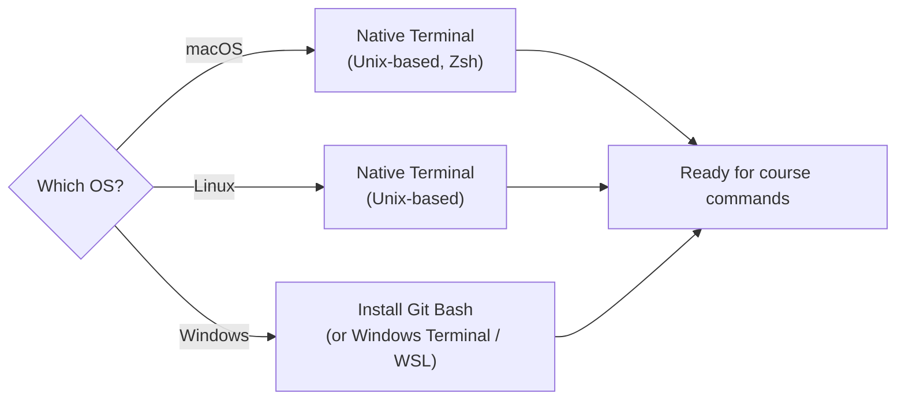
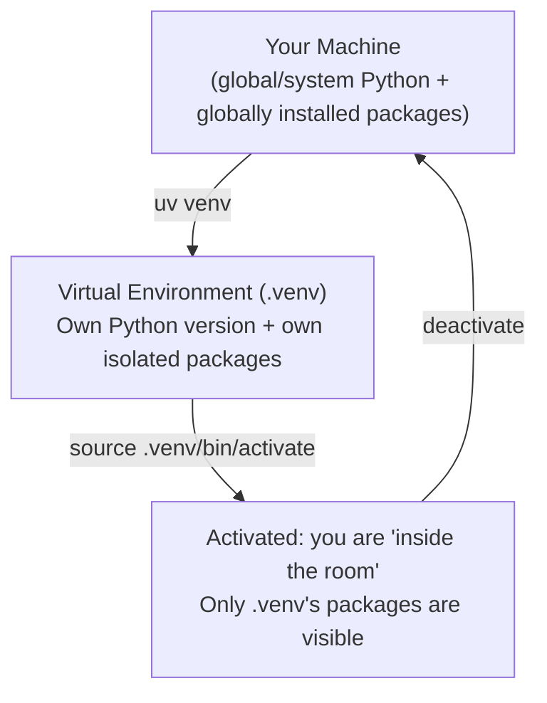

# 🐍 Python for Agentic AI — Development Environment, Fundamentals & the API Mental Model

- <i>**Session:** Day 2 — Class 1: "Python AI" ·
- **Instructor:** Mayank Aggarwal
- **Note on scope:** This class is the **first substantive technical session** of the batch. Roughly the first half is a deep, deliberate dive into the **professional Python development environment** (terminal, Python installation, UV, virtual environments, project structure) — treated as a first-class topic, not throat-clearing, because the instructor's stated philosophy is that broken environments cause more real-world pain than any framework concept. The second half moves into **core Python fundamentals** (variables, f-strings, conditionals, functions, docstrings) and the **API mental model**, demonstrated with a live public currency-conversion API call. OOP (classes/objects) is introduced as a named prerequisite topic but explicitly deferred to a later class — this guide reflects that honestly rather than inventing content that wasn't taught.</i>

---

## 📑 Table of Contents

1. [Session Overview](#-session-overview)
2. [Learning Objectives](#-learning-objectives)
3. [Detailed Notes](#-detailed-notes)
   - [1. Development Environment Philosophy: Why the Terminal Matters](#1-development-environment-philosophy-why-the-terminal-matters)
   - [2. Installing the Core Toolchain: Python & VS Code](#2-installing-the-core-toolchain-python--vs-code)
   - [3. UV: The Modern Python Package & Project Manager](#3-uv-the-modern-python-package--project-manager)
   - [4. Virtual Environments: Isolating Project Dependencies](#4-virtual-environments-isolating-project-dependencies)
   - [5. UV as a Project Manager: pyproject.toml & uv.lock](#5-uv-as-a-project-manager-pyprojecttoml--uvlock)
   - [6. Python Fundamentals Refresher: Variables, F-Strings & Conditionals](#6-python-fundamentals-refresher-variables-f-strings--conditionals)
   - [7. Functions & Docstrings](#7-functions--docstrings)
   - [8. The API Mental Model — And a Live Currency-Conversion Demo](#8-the-api-mental-model--and-a-live-currency-conversion-demo)
   - [9. OOP: What's Coming Next (Preview Only)](#9-oop-whats-coming-next-preview-only)
   - [10. Class Learning Methodology](#10-class-learning-methodology)
4. [Glossary](#-glossary)
5. [Revision Notes — One-Minute Revision](#-revision-notes--one-minute-revision)
6. [Cheat Sheet](#-cheat-sheet)
7. [Interview Questions & Answers](#-interview-questions--answers)
8. [Scenario-Based Interview Questions](#-scenario-based-interview-questions)
9. [Hands-on Exercises](#-hands-on-exercises)
10. [Practice Assignment](#-practice-assignment)
11. [Additional Resources](#-additional-resources)
12. [Final Revision Sheet](#-final-revision-sheet)

---

## 🎯 Session Overview

This class establishes the **practical development foundation** the entire batch will build on. The instructor's explicit rationale: agentic AI courses that jump straight into LangChain/LangGraph leave learners unable to debug basic environment issues once they leave the tutorial — so this class is deliberately "boring" in a useful way. It covers:

1. **Terminal fundamentals** across Windows, macOS, and Linux, and why a Unix-style terminal is the industry standard.
2. **Python and VS Code installation.**
3. **UV** — the modern Python package *and* project manager — covered in real depth (package manager use, project manager use, `pyproject.toml`, `uv.lock`, backward compatibility with `requirements.txt`).
4. **Virtual environments** — what they are, why they exist, and how to create/activate/deactivate them.
5. A **Python language fundamentals refresher**: variables, f-strings, `if` statements, functions, docstrings.
6. The **API mental model**, explained with a real-world analogy and then demonstrated live using a public currency-conversion API.
7. A brief, deliberately deferred **preview of OOP** (classes/objects) as a named prerequisite for later classes.

> 💡 **Memory Trick — the instructor's own framing:** *"Today I taught you what rice is — the actual biryani recipe (agents) comes later. But if you don't know your rice, you'll never make good biryani."*

---

## 🎯 Learning Objectives

By the end of this guide, you will be able to:

- [ ] Explain why the instructor recommends a Unix-style terminal (Git Bash on Windows; native terminal on macOS/Linux) over CMD/PowerShell for AI development work.
- [ ] Install and verify Python (3.10+) and VS Code, and understand what `which python` / `which python3` reveal about your system's Python path resolution.
- [ ] Explain the two roles of **UV**: package manager and project manager.
- [ ] Create, activate, and deactivate a Python virtual environment, and explain *why* virtual environments exist (dependency isolation).
- [ ] Initialize a UV-managed project (`uv init`) and explain the purpose of `pyproject.toml` and `uv.lock`.
- [ ] Explain how UV remains backward-compatible with `requirements.txt`-based workflows.
- [ ] Write basic Python: variable declarations, f-strings, `if` statements, and functions with docstrings.
- [ ] Explain what an API is using a plain-language analogy, and identify when your code "needs an API" versus when it doesn't.
- [ ] Make a real HTTP GET request in Python using the `requests` library, including query parameters and a timeout.
- [ ] Describe why OOP (classes and objects) matters for building agents/tools, even though the deep dive is deferred to a later class.

---

## 📚 Detailed Notes

### 1. Development Environment Philosophy: Why the Terminal Matters

#### 🧠 Concept

Before any Python code is written, the instructor establishes a hard rule: **all development in this course happens through a terminal**, and specifically a **Unix-style (Linux/macOS-compatible) terminal** — not Windows' native CMD or PowerShell.

#### ❓ Why It Exists

Two converging reasons:

1. **Cloud reality:** Virtually every machine you'll access on the cloud (AWS, GCP, Azure, a VPS) runs **Linux**. Commands practiced on a Windows-native shell (CMD/PowerShell) frequently do not translate directly to a Linux remote session.
2. **Tooling reality:** Most modern AI/dev tooling (UV, Git, many CLI-first frameworks) is built and documented **Unix-first** — instructions are typically given for macOS/Linux, with Windows treated as a secondary case.

#### ⚙️ How It Works — The Three-OS Landscape

| OS | Default terminal situation | Recommended fix |
|---|---|---|
| **macOS** | Has a native Unix-based terminal (Zsh) by default | None needed — use it as-is |
| **Linux** | Has a native terminal by default | None needed — use it as-is |
| **Windows** | No Unix-style terminal by default; has **CMD** and **PowerShell** instead | Install **Git Bash** (or Windows Terminal / WSL) to get Unix-compatible commands |



#### 💡 Real-World Example

> 💡 **Memory Trick:** *"You don't install Notepad on Windows because Windows already ships with it. Similarly, macOS already ships with a Unix terminal — Git Bash is the equivalent 'missing piece' for Windows."*

The instructor demonstrates this live by SSH-ing into a remote VPS instance — the moment you connect to almost any cloud machine, you land in a Unix-style shell, regardless of what OS your own laptop runs.

#### ⚠️ Common Mistakes

* Running macOS/Linux install commands (e.g., a `curl ... | sh` install script) directly in Windows PowerShell — these are two different command syntaxes and will fail or behave unexpectedly.
* Assuming PowerShell/CMD is "good enough" for real project development — the instructor is explicit that many real development commands "will fail" in CMD specifically.
* Using an **office laptop** — many corporate environments block script execution or external links, which breaks the ability to follow along with live installs (this mirrors the same warning from the Day 1 induction session).

#### 🚀 Best Practices

* Install **Git Bash** on Windows specifically to get Git command-line support *and* a Unix-compatible shell in one tool.
* VS Code's built-in terminal is functionally identical to your OS-level terminal — commands behave the same either place, once the right shell is configured.
* Being "platform agnostic" (comfortable on any OS's terminal) is framed as a hallmark of being a "real developer," not a nice-to-have.

#### 🎯 Key Takeaways

* Three real OS terminal situations: macOS/Linux get a Unix terminal for free; Windows needs Git Bash (or WSL/Windows Terminal) added.
* The reason this matters: **cloud machines are Linux**, and most tooling documentation assumes a Unix shell.
* VS Code's integrated terminal = your OS terminal, just embedded in the editor.

---

### 2. Installing the Core Toolchain: Python & VS Code

#### 📖 Definition

The two non-negotiable installs for this course: **Python** (the language runtime) and **VS Code** (the code editor), explicitly *instead of* Jupyter Notebooks or Anaconda/Miniconda.

#### ❓ Why It Exists

| Tool considered | Instructor's verdict | Reasoning |
|---|---|---|
| **Anaconda / Miniconda** | Not needed for this course | Historically a convenient bundled Python + package installer for data science, but unnecessary overhead for the practical, application-building focus of this course |
| **Jupyter Notebooks** | Deliberately avoided (not banned outright) | Were essential for data science/ML exploratory work, but in the agentic-AI era, most real development happens directly in an IDE; notebooks are also flagged as comparatively **token-wasteful** when working with AI coding assistants |
| **VS Code** | The chosen standard | Free, used across the industry (explicitly referenced: a 3-person startup backend team, and Goldman Sachs, both used VS Code) |

> 🛠️ **Reconstructed for completeness:** the instructor mentions "token wastage" regarding notebooks only briefly and defers full explanation of tokens/context windows to a later class (Class 3) — flagged here as a forward reference, not something explained in depth in this session.

#### ⚙️ How It Works

| Requirement | Detail |
|---|---|
| **Python version** | 3.10+ recommended; latest stable (3.14.x at time of session) is fine |
| **VS Code** | Free download for any OS; Cursor, Antigravity, or similar AI-native editors are acceptable alternatives if the learner is already comfortable with them |
| **Installation source** | Official Python website — install for your *own* machine/OS only |

#### ⚠️ Common Mistakes

* Worrying that an older installed Python version is a blocker — any version ≥3.10 is acceptable; updating is straightforward.
* Assuming you need Python 2 compatibility — Python 2 is explicitly called out as **fully discontinued**; the "Python vs. Python3" naming split (see Section 3) is a legacy artifact from when both versions coexisted, not a sign you need Python 2 today.

#### 🎯 Key Takeaways

* Course standard: **Python 3.10+** and **VS Code** (or an equivalent modern IDE).
* Anaconda/Miniconda and Jupyter Notebooks are consciously **not** the course's primary tools, in favor of a leaner, IDE-first, terminal-first workflow.

---

### 3. UV: The Modern Python Package & Project Manager

#### 📖 Definition

**UV** is presented as the course's standard tool for two related but distinct jobs: installing individual **packages** (like `pip`) and managing an entire **project's** dependencies/configuration (like `npm`/`Maven` do for JavaScript/Java).

#### ❓ Why It Exists

> 💡 **Memory Trick:** *"Python by itself is 'vanilla ice cream' — plain. Packages are the toppings (chocolate sauce, nuts) that give it real functionality. To get those toppings, you need a package manager — that's UV (or pip, conda, etc.)."*

Compared to older tools (`pip`, `venv`, Conda, Poetry), UV is used because it is:
- **Significantly faster** (the instructor states it is commonly cited as up to ~100–200x faster than `pip` for many operations, largely due to caching and its Rust-based implementation).
- **Increasingly the de-facto standard** in the current AI/Python tooling ecosystem.

> ⚖️ The instructor is explicit that this is a **pragmatic industry-standard choice, not a claim that alternatives are "bad"** — Poetry, Conda, `pip`+`venv` all remain valid, and any of them can accomplish the same underlying goals.

#### ⚙️ How It Works — Installing UV

| OS | Install method |
|---|---|
| macOS / Linux | Run the official install script via `curl`/`sh` from the UV documentation, directly in the terminal |
| Windows | Run the equivalent install command in **PowerShell** (a common live-class mistake: pasting the macOS/Linux command into PowerShell — the install script itself is OS-specific even though later UV *usage* is uniform) |
| Any OS (pip-based) | `pip install uv` also works |

#### 💻 UV as a Package Manager — Basic Usage

```bash
# Two equivalent ways to install a single package with UV
uv pip install requests
uv add requests
```

> ⚠️ **Common Mistake:** Mixing package-manager style commands (`uv pip install ...`) with project-manager style commands (`uv add ...`) inconsistently within the same project without understanding which mode you're in — the instructor recommends settling into the **project-manager** workflow (Section 5) as the primary approach once you've understood the basics.

#### 🎯 Key Takeaways

* UV = **package manager** (installs individual libraries fast) **+** **project manager** (manages an entire project's dependency/config state — covered in depth in Section 5).
* Chosen for speed and current industry adoption, not because alternatives (`pip`, Poetry, Conda) are wrong.
* Two installer paths: OS-specific shell script (macOS/Linux vs. Windows PowerShell), or `pip install uv` universally.

---

### 4. Virtual Environments: Isolating Project Dependencies

#### 🧠 Concept

A **virtual environment** is an isolated, self-contained Python installation + package set, separate from your machine's global/system-level Python — created so that different projects can use different (potentially conflicting) package versions without interfering with each other.

#### ❓ Why It Exists

> 💡 **Memory Trick — the instructor's core analogy:** *"Think of your virtual environment as a room. Creating it = building the room. Activating it = walking into the room. Deactivating it = walking back out. Packages installed 'outside' (at machine level) are not visible from inside the room, and vice versa."*

The classic real-world problem this solves: **"it works on my machine but not on my friend's machine."** This happens when package versions differ between two setups — directly analogous to trying to run a game (the instructor uses a GTA example) built for a newer OS on an older, incompatible one.

#### ⚙️ How It Works

```bash
# Create a virtual environment with a specific Python version, using UV
uv venv --python 3.12

# Activate it (macOS/Linux)
source .venv/bin/activate

# Activate it (Windows — command differs; PowerShell-specific activation script)
.venv\Scripts\Activate.ps1

# Deactivate (any OS)
deactivate
```

#### 🔍 Internal Working — "Inside the Room" vs. "Outside the Room"



Demonstrated live: with `requests` installed only at the machine level (outside any virtual environment), `import requests` succeeds *outside* a virtual environment but fails with `ModuleNotFoundError` *inside* a freshly created, empty virtual environment — until `requests` is explicitly installed inside that environment too.

#### 🪜 Step-by-Step Execution

1. **Create** the virtual environment, optionally pinning a Python version: `uv venv --python 3.12`.
2. **Activate** it (enter the "room").
3. **Install** only the packages this specific project needs: `uv pip install <package>` or `pip install <package>`.
4. **Work** inside the activated environment — imports now resolve only to what's installed there.
5. **Deactivate** when done (exit the "room") — machine-level Python and packages are unaffected.

#### ⚖️ Advantages & Limitations

| Advantages | Limitations / friction points (acknowledged live) |
|---|---|
| Prevents version conflicts between unrelated projects | Learners had to consciously check *which* terminal/shell instance was actually inside vs. outside the activated environment — a common source of live confusion |
| Each project can pin its own Python version independently | Windows activation syntax differs from macOS/Linux (`Scripts\Activate.ps1` vs. `source .venv/bin/activate`), adding a platform-specific wrinkle |
| Mirrors a very common real-world debugging root cause ("works on my machine") | Manual create/activate/deactivate is more steps than the project-manager workflow in Section 5, which UV increasingly makes optional |

#### 🎯 Key Takeaways

* A virtual environment = an isolated Python + package set, separate from your machine's global installation.
* "Room" analogy: create → activate (enter) → install packages → deactivate (exit).
* Solves the classic "works on my machine" problem caused by mismatched package/Python versions.

---

### 5. UV as a Project Manager: pyproject.toml & uv.lock

#### 📖 Definition

Beyond installing individual packages, UV can manage an **entire project's** configuration and dependency state via two key files: **`pyproject.toml`** (human-authored project definition) and **`uv.lock`** (machine-generated, exact-version lock file) — replacing the older, manual create-venv-then-activate-then-pip-install-from-requirements.txt workflow with a single, self-describing project folder.

#### ⚙️ How It Works

```bash
# Initialize a new UV-managed project
uv init my_first_project
cd my_first_project

# Add dependencies directly to the project (updates pyproject.toml + uv.lock)
uv add numpy
uv add requests
uv add pandas
```

**Resulting project structure:**

```text
my_first_project/
├── .python-version      # pins the Python version for this project
├── main.py               # a starter file to verify things work
├── pyproject.toml        # human-readable project definition (name, version, dependencies)
└── uv.lock                # exact, locked dependency versions (auto-generated — never hand-edited)
```

**Example `pyproject.toml` content (as demonstrated):**

```toml
[project]
name = "my-first-project"
version = "0.1.0"
description = ""
requires-python = ">=3.13"
dependencies = [
    "numpy>=2.5.0",
    "requests",
    "pandas",
]
```

> 💡 **Memory Trick:** *"pyproject.toml is a recipe card: it lists the exact 'ingredients' (Python version, package names) required to recreate this project anywhere. uv.lock is the receipt confirming the exact version of every ingredient actually bought — down to the specific batch/URL — so anyone rebuilding the project gets byte-for-byte the same result."*

#### 🔍 Internal Working — Why This Replaces `requirements.txt`

| Old approach | UV project-manager approach |
|---|---|
| Manually `pip install -r requirements.txt` after manually creating + activating a venv | `uv add <package>` updates `pyproject.toml` and `uv.lock` automatically, and UV figures out environment handling for you |
| `requirements.txt` typically lists only package names + loose version constraints | `pyproject.toml` also carries project metadata (name, version, description, Python version requirement); `uv.lock` pins **exact** resolved versions and sources |
| You must remember to activate/deactivate the environment | UV recognizes you're "inside a UV project folder" (via `pyproject.toml`) and resolves the right environment automatically — explicit activation becomes optional |

**Backward compatibility — `requirements.txt` still works if needed:**

```bash
uv add -r requirements.txt
```

This installs everything listed in an existing `requirements.txt` file into the current UV-managed project, so teams transitioning from the older workflow are not locked out.

#### 🪜 Step-by-Step: Syncing/Locking a Project

```bash
uv sync   # ensures installed packages match pyproject.toml, (re)creates uv.lock if missing
uv lock   # explicitly (re)generates uv.lock from the current pyproject.toml
```

#### ⚖️ Advantages & Limitations

| Advantages | Limitations |
|---|---|
| A single, portable folder fully describes a runnable project (Python version + exact dependencies) | `uv.lock` is UV-specific — a collaborator using only `pip`/`requirements.txt` needs the `uv add -r requirements.txt` bridge (or an exported `requirements.txt`) to interoperate cleanly |
| No manual activate/deactivate required in normal day-to-day use | Mixing `pip install` and `uv add` inconsistently in the same project can create confusion about which file (`requirements.txt` vs. `pyproject.toml`) is the actual source of truth — UV always prioritizes `pyproject.toml`/`uv.lock` when both are present and UV commands are used |
| Analogous to `package.json`/`package-lock.json` (npm) or Maven's `pom.xml` — familiar to developers coming from JS/Java backgrounds, which the instructor notes is a deliberate design trend in the wider AI-tooling ecosystem | Team members must standardize on the same tool (don't mix `uv add` and raw `pip install` unpredictably within one project) |

#### ⚠️ Common Mistakes

* Hand-editing `uv.lock` — it's auto-generated and should never be manually maintained.
* Assuming `pyproject.toml` and `requirements.txt` are automatically kept in sync — they are not; `requirements.txt` is only read when you explicitly run `uv add -r requirements.txt`.

#### 🎯 Key Takeaways

* `uv init` scaffolds a project with `.python-version`, `main.py`, `pyproject.toml`, and (after adding dependencies) `uv.lock`.
* `pyproject.toml` = human-authored project definition; `uv.lock` = machine-generated exact version lock.
* This project-manager workflow is now favored over manual venv activation for day-to-day development, while still supporting `requirements.txt` for compatibility.

---

### 6. Python Fundamentals Refresher: Variables, F-Strings & Conditionals

#### 🧠 Concept

A rapid refresher aimed at learners who may be new to Python specifically (even if experienced in another language), covering variable declaration, string interpolation via f-strings, and basic conditional logic.

#### ⚙️ How It Works — Variables

Unlike statically-typed languages (C++, Java), Python does **not** require explicit type declarations:

```python
# C++/Java style (NOT how Python works):
# String city = "Tokyo";

# Python style — type is inferred automatically:
city = "Tokyo"          # string
is_warm = True           # boolean
temperature = 27.5       # float
cities = ["Tokyo", "Delhi", "Bengaluru"]   # list (conceptually similar to an array)
```

#### 💻 Example — F-Strings

```python
city = "Tokyo"
print(f"{city} is great")   # → "Tokyo is great"

city = "Delhi"
print(f"{city} is great")   # → "Delhi is great"
```

> ⚠️ **Common Mistake:** Hardcoding a value directly into a string (`print("Tokyo is great")`) when the value should be dynamic. F-strings (`f"{variable} is great"`) let the same line of code correctly reflect whatever the variable currently holds — critical once you're building anything that responds to varying user input (e.g., a different city each time).

#### 🪜 Step-by-Step: A Basic `if` Statement

```python
is_raining = False
is_hot = True

if is_raining:
    print("Umbrella needed")
else:
    print("No umbrella needed")

if is_hot:
    print("It's a warm day")
else:
    print("It's a mild day")
```

#### 🎯 Key Takeaways

* Python infers variable types automatically — no explicit type declarations like `String city = ...`.
* F-strings (`f"...{variable}..."`) are the standard way to interpolate variables into strings — essential once output needs to reflect dynamic data rather than fixed text.
* Basic `if`/`else` conditionals work as in most languages, evaluating a boolean expression to choose a branch.

---

### 7. Functions & Docstrings

#### 📖 Definition

A function groups reusable logic under a name; a **docstring** is a string literal placed as the first statement inside a function to document what it does — treated as **mandatory practice** in this course specifically because AI-assisted development and agent/tool-calling both rely heavily on clear, machine-readable function documentation (a direct forward-reference to tool schemas/descriptions covered in later classes).

#### 💻 Code Example

```python
import time

def get_current_time() -> str:
    """Returns the current date and time as a formatted string."""
    return time.strftime("%d/%m/%Y, %H:%M:%S")

print(get_current_time())
```

**What each part does:**
- `import time` — brings in Python's built-in `time` module.
- `def get_current_time() -> str:` — defines a function named `get_current_time` that returns a `str`.
- `"""Returns the current date and time as a formatted string."""` — the **docstring**, explaining the function's purpose.
- `time.strftime(...)` — "string format time," converts the current time into a formatted string according to the given pattern (removing part of the format string, e.g., dropping the time portion, changes what's included in the output — demonstrated live by simplifying the format and observing the date-only output).
- `return ...` — sends the formatted string back to the caller.

#### ⚠️ Common Mistakes

* Skipping docstrings out of habit — flagged explicitly as a bad habit to break in an AI-development context, since these same descriptive patterns become critical later for tool/function schemas that LLMs read to decide when and how to call a function.
* Memorizing exact library function names/signatures instead of understanding the underlying pattern — the instructor's stated philosophy (reinforced from his own school days) is: *"never memorize code, always understand it,"* and to look up specifics (e.g., "what functions does the `time` library have?") via documentation or an AI assistant as needed.

#### 🎯 Key Takeaways

* Functions are defined with `def`, can specify a return type hint (`-> str`), and should include a **docstring** describing their purpose.
* `time.strftime(...)` formats the current time into a string per a given pattern.
* Docstrings are emphasized early because they directly foreshadow how tool/function descriptions work when LLMs are given tools to call (covered in later classes).

---

### 8. The API Mental Model — And a Live Currency-Conversion Demo

#### 🧠 Concept

An **API (Application Programming Interface)** is the mechanism by which one piece of software asks another piece of software (often running elsewhere) for information or an action — conceptually identical to how a person calls another person to get information they don't have themselves.

#### ❓ Why It Exists

> 💡 **Memory Trick — the instructor's core analogy:** *"Imagine you have a phone with no internet or apps — just a keypad. You want to know the ticket price from India to Dubai. You can't look it up yourself, so you call a travel agent, tell them what you need (India → Dubai), and they call you back with the price. Software works the same way: when your code needs information it doesn't have, it 'calls' an API — another piece of software — and gets an answer back."*

#### ⚙️ How It Works — Two Illustrations

**1. A "fake" local API (to isolate the concept from network complexity):**

```python
fake_weather_data = {
    "tokyo": {"temp_c": 22, "condition": "cloudy"},
    "delhi": {"temp_c": 35, "condition": "sunny"},
}

def get_weather(city: str):
    """Looks up weather for a given city from a local, hardcoded data source."""
    return fake_weather_data.get(city.lower())
```

> 🛠️ **Reconstructed for completeness:** the instructor builds this "fake weather data" example live to demonstrate the *shape* of an API interaction (you provide an input, you get structured data back) before moving to a real network call — the exact dictionary contents shown live were illustrative, not meant to be copied verbatim.

**2. A real, live public API call — currency conversion via the Frankfurter API:**

```python
import requests

BASE_URL = "https://api.frankfurter.dev/v1/latest"

def convert_currency(from_currency: str, to_currency: str, amount: float):
    """Converts an amount from one currency to another using the Frankfurter API."""
    params = {
        "base": from_currency,
        "symbols": to_currency,
        "amount": amount,
    }
    response = requests.get(BASE_URL, params=params, timeout=10)
    return response.json()

result = convert_currency("USD", "INR", 100)
print(result)
```

> 🛠️ **Reconstructed for completeness:** the exact parameter names shown live are representative of Frankfurter's documented API (base currency, target symbols, amount); the instructor demonstrated the working call and confirmed the returned exchange rate matched a real, live, current USD→INR rate at the time of the class — confirming the request was hitting a genuine external data source, not a mock.

#### 🪜 Step-by-Step Execution

1. `import requests` — a third-party library that makes HTTP requests simple in Python (installed via `pip install requests` or `uv add requests`).
2. Define the **base URL** (the "phone number" you're calling) and the **parameters** you're sending (the "question" you're asking — e.g., from/to currency, amount).
3. Call `requests.get(url, params=..., timeout=...)` — this is the actual "phone call."
4. A **timeout** (e.g., 10 seconds) ensures your code doesn't hang forever if the remote service doesn't respond — directly analogous to hanging up a call if no one picks up.
5. `response.json()` parses the returned data into a usable Python object.

#### 🔍 Internal Working — Why This Matters for Agentic AI

> ⚠️ **Forward Reference (explicitly flagged live):** The instructor notes that LLMs themselves are also accessed via API calls — the exact same underlying mechanism used here for a currency API. This session deliberately teaches the *general* API pattern first, before Class 3+ applies it specifically to calling LLM providers.

#### ⚠️ Common Mistakes

* Jumping straight to a specific framework (e.g., "FastAPI") without understanding plain APIs first — explicitly called out as a mistake ("not fast API, not anything — start from the basic, don't jump").
* Forgetting a `timeout` on network calls — without one, a request can hang indefinitely if the remote server never responds.
* Not realizing `import requests` failing can simply mean the library isn't installed **in the currently active Python environment** (see Section 4) — a very common, easily fixed source of confusion when multiple Python installations exist on one machine.

#### 🚀 Best Practices

* Always set a `timeout` on outbound API calls.
* Parse responses with `.json()` (or equivalent) rather than manually string-parsing raw response text.
* Understand the *general* concept of an API before layering framework-specific abstractions (like FastAPI) on top of it.

#### 🎯 Key Takeaways

* An API = one program asking another program for information/action, conceptually identical to a phone call to someone who has the answer.
* The `requests` library is the standard, minimal way to make HTTP calls from Python.
* This exact mechanism (`requests.get` with parameters and a timeout) is the same underlying pattern used later to call LLM provider APIs — a deliberate, explicit setup for future classes.

---

### 9. OOP: What's Coming Next (Preview Only)

#### 🧠 Concept

Object-Oriented Programming (OOP) — specifically **classes** and **objects** — is named as a required prerequisite concept for building agents and tools, but the instructor explicitly **defers the full explanation** to a later class due to time, rather than rushing through it.

#### 📖 What Was Named (Not Yet Taught in Depth)

The instructor lists OOP as a topic with roughly six commonly-referenced sub-concepts (the standard set typically includes: **class, object, encapsulation, inheritance, polymorphism, abstraction**) as things learners should have "a little bit of clarity about" — explicitly stating this is a baseline expectation, not mastery, and that a dedicated resource/video would be shared separately.

> ⚠️ **Honesty Note:** Beyond naming "classes" and "objects" as the starting point and confirming OOP ≠ design patterns, the transcript does not contain a worked OOP code example in this session — that content is intentionally left for a subsequent class. This guide does not fabricate an OOP deep-dive that wasn't actually taught here.

#### ❓ Why It Matters (as stated)

The instructor connects OOP directly to the course's near-future direction: defining **tools** (the same "tool schema" concept that later powers agent tool-calling) benefits from being structured as classes/objects rather than loose, ad hoc functions and dictionaries.

#### 🎯 Key Takeaways

* OOP (classes/objects, and the broader six-concept set) is flagged as required prerequisite knowledge — but its full teaching is deferred.
* The stated reason OOP matters here specifically: defining agent **tools** cleanly benefits from OOP structure.
* Action item for learners: review OOP fundamentals independently (via the instructor's own referenced resources or any equivalent source) ahead of the class where it's formally covered.

---

### 10. Class Learning Methodology

#### ⚙️ How It Works

| Element | Detail |
|---|---|
| **Teaching rhythm** | Pomodoro-style: ~15–20 minutes of teaching + ~5 minutes for doubts, repeated throughout the session |
| **Break** | One break, ~10–15 minutes, typically mid-session (~9:30 AM in this class) |
| **Dedicated doubt session** | A full, queue-based doubt-clearing block after the main teaching content (after ~11 AM) |
| **Chat direction** | Zoom chat is one-directional: learners can message the instructor, but cannot see each other's messages — a deliberate design choice to reduce distraction and message clutter during live teaching |
| **Resource sharing** | A **single, persistent shared link** (a Notion/Craft-style page) is used for *all* code, commands, prompts, and resources for the entire course — bookmarked once, reused every class, rather than re-sharing scattered links in chat |
| **Lateness policy** | After the first (grace-period) class, sessions start strictly on time; joining significantly late means missing content with no repeated recap |

#### ⚠️ Common Mistakes

* Trying to type along with every command in real time during class instead of watching, understanding, then practicing afterward using the recording — the instructor explicitly discourages "coding along live" during first exposure to a new concept, in favor of understanding first.
* Expecting individual, immediate chat responses during the teaching block — doubts are intentionally batched into the queue-based doubt-clearing session, consistent with the approach described in the Day 1 induction session.

#### 🚀 Best Practices

* Use headphones/earphones rather than speaker audio for a better learning experience (explicitly requested).
* Take your own notes even though official notes/code are provided — reinforces retention.
* Bookmark the single shared resource link early, since it is reused (with a new "Class N" entry added) every session rather than replaced.

#### 🎯 Key Takeaways

* Teaching follows a Pomodoro-like rhythm (short teaching bursts + short doubt windows), with a dedicated longer doubt session at the end.
* All resources live on one continuously-updated shared link — not scattered across chat messages.
* Zoom chat is intentionally one-way during teaching to preserve focus.

---

## 📝 Glossary

| Term | Definition | Why It Matters |
|---|---|---|
| **Terminal** | A text-based interface for running commands directly on a computer or remote machine | The primary interface for this entire course's development workflow |
| **Git Bash** | A Unix-compatible terminal emulator for Windows, bundled with Git | The recommended way for Windows users to get Unix-style command compatibility |
| **UV** | A modern, fast Python package **and** project manager | The course's standard tool for installing packages and managing project dependencies |
| **Package Manager** | A tool for installing/managing individual third-party libraries | What lets you `import` code others have written rather than writing everything from scratch |
| **Project Manager (in UV's sense)** | A tool for managing an entire project's configuration, dependencies, and Python version as one coherent unit | Replaces ad hoc combinations of venv + requirements.txt with a single self-describing project folder |
| **Virtual Environment (venv)** | An isolated Python installation + package set, separate from the machine's global Python | Prevents version conflicts between unrelated projects ("works on my machine" problem) |
| **`pyproject.toml`** | A human-authored configuration file describing a Python project's name, version, dependencies, and required Python version | The modern, richer replacement for `requirements.txt`, used by UV as the project's source of truth |
| **`uv.lock`** | An auto-generated file recording the exact resolved versions of every dependency | Guarantees reproducible installs — "the exact same ingredients, every time" |
| **`requirements.txt`** | A plain-text list of Python package dependencies (older convention) | Still supported by UV via `uv add -r requirements.txt`, for backward compatibility |
| **F-String** | A Python string-literal syntax (`f"...{variable}..."`) allowing variables to be interpolated directly into strings | The standard way to build dynamic text output in Python |
| **Docstring** | A string literal as the first statement in a function/class, documenting its purpose | Foreshadows how tool/function descriptions work in later agent tool-calling contexts |
| **API (Application Programming Interface)** | A defined way for one piece of software to request information/action from another | The universal mechanism later used to call LLM providers, exactly as demonstrated here with a currency API |
| **`requests`** | A popular third-party Python library for making HTTP requests | The tool used to make the live currency-conversion API call in this session |
| **Timeout (in an API call)** | A maximum wait time before an API call is abandoned if no response arrives | Prevents code from hanging indefinitely on an unresponsive remote server |
| **OOP (Object-Oriented Programming)** | A programming paradigm organizing code around classes and objects | Named as a required prerequisite for defining agent tools cleanly; deep dive deferred to a later class |

---

## 🔄 Revision Notes — One-Minute Revision

> This class builds the **professional development foundation** for the whole batch, before any agent/framework code is written. Use a **Unix-style terminal** (native on macOS/Linux; Git Bash on Windows) because cloud machines and most tooling are Unix-first. Install **Python 3.10+** and **VS Code**. Use **UV** as both a **package manager** (`uv add <package>` / `uv pip install <package>`) and a **project manager** (`uv init`, producing `pyproject.toml` + `uv.lock`, which together replace the older manual venv + `requirements.txt` workflow — while still supporting `requirements.txt` via `uv add -r requirements.txt`). A **virtual environment** is an isolated Python + package set — think "a room you create, enter (activate), and leave (deactivate)" — solving the classic "works on my machine" problem. On the language side: Python infers variable types automatically, **f-strings** (`f"{var}"`) interpolate variables into text, `if`/`else` works as expected, and **functions should always include a docstring** (this habit directly foreshadows tool/function descriptions used later for agent tool-calling). Finally, an **API** is just "your code calling another piece of software for information," exactly like calling a travel agent for a ticket price — demonstrated live with `requests.get(url, params=..., timeout=...)` against a real currency-conversion API, the *same* underlying pattern later classes will use to call LLM providers. **OOP (classes/objects)** was named as an essential prerequisite but its full teaching was explicitly deferred to a later class.

---

## 📋 Cheat Sheet

**Terminal setup:**
- macOS/Linux: native terminal, ready to go.
- Windows: install **Git Bash** (or Windows Terminal / WSL).
- VS Code's built-in terminal behaves identically to your OS terminal.

**UV — package manager commands:**
```bash
uv pip install <package>
uv add <package>
```

**UV — project manager workflow:**
```bash
uv init my_project
cd my_project
uv add numpy requests pandas
uv sync          # ensure installed packages match pyproject.toml
uv lock           # regenerate uv.lock
uv add -r requirements.txt   # backward-compat bridge
```

**Virtual environment (manual) workflow:**
```bash
uv venv --python 3.12
source .venv/bin/activate      # macOS/Linux
.venv\Scripts\Activate.ps1     # Windows PowerShell
deactivate
```

**Python fundamentals quick reference:**
```python
city = "Tokyo"                     # dynamic typing, no declarations needed
print(f"{city} is great")          # f-string interpolation

if is_raining:
    print("Umbrella needed")
else:
    print("No umbrella needed")

def get_current_time() -> str:
    """Docstring explaining the function."""
    return time.strftime("%d/%m/%Y, %H:%M:%S")
```

**API call pattern (the pattern used again and again in future classes):**
```python
import requests
response = requests.get(url, params={...}, timeout=10)
data = response.json()
```

---

## 🔥 Interview Questions & Answers

### 🟢 Beginner

**Q1. Why does the instructor recommend a Unix-style terminal instead of Windows CMD/PowerShell for AI development?**
**Answer:** Because most cloud machines (AWS/GCP/Azure/VPS) run Linux, and most modern development tooling is documented and built Unix-first — commands practiced on CMD/PowerShell often don't translate directly.
**Explanation:** Reduces future friction when moving from local development to remote/cloud machines.
**Why Interviewers Ask This:** Tests awareness of practical, environment-level development realities, not just syntax.
**Possible Follow-up:** "What tool would you install on Windows to get this compatibility?"

**Q2. What are the two roles UV plays in this course's workflow?**
**Answer:** Package manager (installing individual libraries) and project manager (managing an entire project's dependencies/configuration as one unit).
**Explanation:** UV unifies what `pip` and manual venv/`requirements.txt` management used to do separately.
**Why This Matters:** Core, testable recall of the session's central tool.
**Possible Follow-up:** "Give one command example for each role."

**Q3. What problem does a virtual environment solve?**
**Answer:** The "works on my machine but not on my friend's machine" problem, caused by mismatched package or Python versions between two setups.
**Explanation:** Isolating a project's dependencies prevents version conflicts across unrelated projects on the same machine.
**Why This Matters:** A foundational Python development concept.
**Possible Follow-up:** "What are the three basic lifecycle actions for a virtual environment?"

**Q4. What are the three lifecycle actions of a virtual environment?**
**Answer:** Create, activate, deactivate.
**Explanation:** Mirrors the "room" analogy: build the room, enter it, leave it.
**Why This Matters:** Practical, hands-on recall.
**Possible Follow-up:** "What's the activation command difference between macOS/Linux and Windows?"

**Q5. What is the purpose of `pyproject.toml` in a UV-managed project?**
**Answer:** It's a human-readable file describing the project's name, version, description, required Python version, and dependencies.
**Explanation:** Acts as the project's single source of truth, replacing the looser `requirements.txt` convention.
**Why This Matters:** Core modern Python tooling knowledge.
**Possible Follow-up:** "How does this differ from `uv.lock`?"

**Q6. What is `uv.lock`, and should you ever hand-edit it?**
**Answer:** An auto-generated file recording the exact resolved versions of every dependency; it should **never** be manually edited.
**Explanation:** Guarantees reproducible installs across machines/collaborators.
**Why This Matters:** Prevents a common beginner mistake.
**Possible Follow-up:** "What command regenerates it explicitly?"

**Q7. In plain language, what is an API?**
**Answer:** A way for one piece of software to ask another piece of software for information or action — like calling someone (a "travel agent") who has the information you need.
**Explanation:** The core mental model taught in this session, deliberately kept framework-agnostic.
**Why This Matters:** Foundational concept underlying essentially all later agent/LLM-calling work.
**Possible Follow-up:** "What Python library was used to demonstrate this live?"

**Q8. What does the `timeout` parameter do in a `requests.get()` call, and why does it matter?**
**Answer:** It sets the maximum time to wait for a response before giving up; without it, a call to an unresponsive server could hang indefinitely.
**Explanation:** A basic but essential defensive-programming practice for any network call.
**Why This Matters:** Practical reliability concern, not just syntax.
**Possible Follow-up:** "What would you do in your code if a request times out?"

**Q9. What is an f-string, and why is it preferred over hardcoding text with a variable's current value?**
**Answer:** An f-string (`f"...{variable}..."`) interpolates a variable's value directly into a string at runtime; it's preferred because the same code correctly reflects the variable's value even as that value changes (e.g., different cities on different runs).
**Explanation:** Basic but essential for writing genuinely dynamic Python code.
**Why This Matters:** Tests understanding of *why*, not just *how*.
**Possible Follow-up:** "Show the difference between a hardcoded print statement and an f-string version for the same output."

**Q10. Why does this course emphasize writing docstrings for functions, even for simple examples?**
**Answer:** Because clear, descriptive documentation of what a function does directly foreshadows how tool/function descriptions work later, when LLMs are given "tools" they can choose to call based on how well those tools are described.
**Explanation:** Connects a basic language habit to a forward-looking, agentic-AI-specific reason.
**Why This Matters:** Tests whether the learner grasps *why* a seemingly generic best practice was emphasized in this specific course.
**Possible Follow-up:** "How might a vague or missing docstring cause problems later, once functions become 'tools' an AI can call?"

---

### 🟡 Intermediate

**Q11. Explain why `import requests` might succeed outside a virtual environment but fail with `ModuleNotFoundError` inside a newly created one.**
**Answer:** A virtual environment starts with its own empty (or minimal) package set, isolated from the machine's global Python installation. If `requests` was only ever installed at the machine (global) level, it simply isn't present inside a fresh virtual environment until explicitly installed there too.
**Explanation:** Directly demonstrated live in the session as a teaching moment about environment isolation.
**Why Interviewers Ask This:** Tests real understanding of environment isolation, not just memorized commands.
**Possible Follow-up:** "How would you fix this without leaving the virtual environment?"

**Q12. What is the practical difference between `uv pip install requests` and `uv add requests`?**
**Answer:** `uv pip install` behaves like a direct package-manager-style install (similar to plain `pip install`), while `uv add` is the project-manager-style command that also updates `pyproject.toml` and `uv.lock` to formally record the dependency as part of the project's definition.
**Explanation:** Reflects UV's dual role (package manager vs. project manager) from Section 3.
**Why This Matters:** Tests nuanced understanding of a tool with two overlapping but distinct modes.
**Possible Follow-up:** "Which would you use if you just want to quickly test a library without formally adding it to the project?"

**Q13. How does UV handle a project that has both a `pyproject.toml`/`uv.lock` and a `requirements.txt` present?**
**Answer:** UV commands (like `uv add`, `uv sync`) treat `pyproject.toml`/`uv.lock` as the source of truth; `requirements.txt` is only pulled in if you explicitly run `uv add -r requirements.txt`, and generally whichever installation method was run *last* determines the currently installed state.
**Explanation:** A subtlety raised directly in the live Q&A, addressing a realistic team-transition scenario.
**Why This Matters:** Tests understanding of tool precedence/interoperability, a real-world migration concern.
**Possible Follow-up:** "What risk exists if team members inconsistently mix `pip install` and `uv add` on the same project?"

**Q14. What is the significance of `which python` vs. `which python3` returning different paths on the same machine?**
**Answer:** It indicates the system has multiple Python installations, and the `python` and `python3` command names are separately mapped ("pointed") to potentially different specific installations/versions — both should simply be version ≥3.10 for this course, regardless of which exact path each name resolves to.
**Explanation:** A path-resolution/"shortcut" concept demonstrated live to explain a common source of confusion.
**Why This Matters:** Tests grasp of how command-name resolution works at the OS level, a genuinely useful debugging skill.
**Possible Follow-up:** "How would you make both `python` and `python3` point to the exact same installation?"

**Q15. Why did the instructor deliberately build a "fake" local weather API example before demonstrating a real network API call?**
**Answer:** To isolate and teach the *conceptual shape* of an API interaction (you provide input, you get structured data back) without the added complexity of real network calls, error handling, and external dependencies — then layer the real `requests`-based network call on top once the concept was clear.
**Explanation:** A deliberate pedagogical sequencing choice, not an accident.
**Why This Matters:** Tests understanding of *teaching methodology*, which is itself a useful skill to recognize and apply.
**Possible Follow-up:** "What's a risk of skipping straight to a real network API demo without this intermediate step?"

**Q16. In the `pyproject.toml` example shown, what does `requires-python = ">=3.13"` actually enforce, and what would happen if you tried to run this project with Python 3.9?**
**Answer:** It declares the minimum Python version the project is compatible with; attempting to run/install the project with an incompatible (older) Python version should fail or be blocked by UV, since the project explicitly requires 3.13 or higher.
**Explanation:** Tests understanding of version constraints as enforced project metadata, not just documentation.
**Why This Matters:** Practical dependency-management competency.
**Possible Follow-up:** "How would you update this constraint if you wanted to broaden compatibility to Python 3.10+?"

**Q17. The instructor states UV is "up to 100-200x faster" than pip in some cases. What two reasons were given for this speed advantage?**
**Answer:** UV caches packages, and it is implemented in Rust (a compiled, high-performance language) rather than pure Python.
**Explanation:** Tests whether the learner retained *why* a stated performance claim holds, not just the claim itself.
**Why This Matters:** Distinguishes surface-level recall from actual comprehension.
**Possible Follow-up:** "Why might caching specifically matter more on a CI/CD pipeline than on a one-off local install?"

**Q18. Why does the instructor explicitly avoid teaching in Jupyter Notebooks for this particular course, despite acknowledging they were historically excellent for learning?**
**Answer:** Because the course's focus has shifted from exploratory data-science-style work (where notebooks shine) toward building real applications directly in an IDE, and because notebook-based workflows were flagged as comparatively more "token-wasteful" when working with AI coding assistants — a concern specific to the AI-development era this course targets.
**Explanation:** Tests whether the learner distinguishes "notebooks are bad" (not the claim made) from "notebooks are a poor fit for this course's specific goals" (the actual claim).
**Why This Matters:** Encourages nuanced, context-aware reasoning rather than absolutist takeaways.
**Possible Follow-up:** "In what situation might a notebook still be the better choice, even in an AI-development context?"

**Q19. What does the analogy "each virtual environment can have its own Python version, just like installing Office 2007 and Office 2016 side-by-side" actually illustrate about how Python version pointers work?**
**Answer:** It illustrates that multiple Python installations can coexist on one machine, each independently addressable — a virtual environment simply "points to" a specific chosen Python installation/version at creation time, without disturbing any other installation or environment.
**Explanation:** Tests understanding of the underlying path/pointer mechanism, not just the surface analogy.
**Why This Matters:** Connects an accessible analogy back to the real technical mechanism (as the instructor intended).
**Possible Follow-up:** "If you create two virtual environments with different Python versions on the same machine, do they interfere with each other? Why or why not?"

**Q20. Why is understanding plain APIs (as taught in this session) considered a prerequisite before learning a framework like FastAPI?**
**Answer:** Because FastAPI (and similar frameworks) are built *on top of* the same fundamental request/response API concept — learners who skip straight to a framework without understanding the underlying mechanism struggle to debug or reason about what the framework is actually doing for them.
**Explanation:** Directly echoes the instructor's explicit warning against "jumping the gun" from zero API knowledge straight to FastAPI knowledge.
**Why This Matters:** Reinforces a "fundamentals-first" pedagogical principle that recurs throughout this course (echoing the Day 1 induction session's own framing).
**Possible Follow-up:** "What specifically would a learner likely misunderstand about FastAPI if they'd never learned plain API concepts first?"

---

### 🔴 Advanced

**Q21. A teammate proposes standardizing your team's Python projects entirely on UV's project-manager workflow (`pyproject.toml` + `uv.lock`), deprecating `requirements.txt` entirely. What migration risks would you flag, based on what was taught in this session?**
**Answer:** Key risks: (1) any external tooling, CI/CD pipeline, or collaborator still expecting a `requirements.txt` file would break unless a compatibility bridge is maintained (UV can still consume `requirements.txt` via `uv add -r requirements.txt`, but that's a one-way import, not an automatically-synced two-way relationship); (2) team members must be disciplined about using UV consistently (`uv add`, not raw `pip install`) to avoid the two files/states silently diverging; (3) any team member unfamiliar with UV needs onboarding, since the mental model (project-as-a-whole vs. manually-activated venv) is genuinely different, not just a syntax swap.
**Explanation:** Synthesizes the UV/`requirements.txt` interoperability details from Section 5 into a realistic team-process risk assessment.
**Why Interviewers Ask This:** Tests the ability to reason about tooling migrations at a team/process level, not just individual command syntax.
**Possible Follow-up:** "How would you phase this migration to minimize risk?"

**Q22. The instructor asserts that virtual environments and UV's project-manager approach are "two separate, somewhat unrelated things" that can still be combined. Explain precisely what remains true/independent about manual virtual-environment activation even when using UV's project-manager workflow.**
**Answer:** UV's project-manager workflow (via `pyproject.toml`) can implicitly resolve and use the correct environment for commands run *through UV* (e.g., `uv run`, `uv add`) without requiring manual `source .venv/bin/activate`. However, the underlying concept of an isolated virtual environment (a `.venv` folder with its own Python/packages) still exists and can still be manually activated/deactivated exactly as in the traditional workflow if a developer chooses to interact with it directly (e.g., running a raw `python` command outside of any `uv run` wrapper) — the two mechanisms coexist, and manual activation is optional convenience, not eliminated by UV.
**Explanation:** Requires distinguishing "UV makes manual activation *unnecessary* for UV-driven workflows" from "UV eliminates virtual environments as a concept," which the transcript does not claim.
**Why Interviewers Ask This:** Tests precision in distinguishing convenience features from fundamental mechanism changes — a common trap in "new tool replaces old concept" claims.
**Possible Follow-up:** "Give a concrete scenario where you would still want to manually activate a virtual environment despite using UV."

**Q23. Design a short onboarding checklist (5–7 items) for a new team member joining a Python project that uses this session's exact toolchain (UV, `pyproject.toml`, virtual environments, `requests`-based API integrations), assuming they are experienced in a different language ecosystem (e.g., Java/Maven) but new to modern Python tooling.**
**Answer:** A reasonable checklist: (1) Install a Unix-compatible terminal (native on Mac/Linux, Git Bash on Windows); (2) Install Python 3.10+ and verify via `python --version` / `python3 --version`; (3) Install UV; (4) Clone the project and run `uv sync` to reproduce the exact locked dependency set from `uv.lock`; (5) Learn the `uv add <package>` pattern instead of ad hoc `pip install`, to keep `pyproject.toml`/`uv.lock` authoritative; (6) Understand that `pyproject.toml` here plays the role their `pom.xml` (Maven) plays — project metadata + dependencies — and `uv.lock` plays the role of a fully-resolved dependency graph, similar in spirit to a Maven lock/resolved-dependency report; (7) Review the project's API integration pattern (`requests.get(url, params=..., timeout=...)`) as the baseline convention for any new external service calls.
**Explanation:** Tests the ability to translate this session's specific tool knowledge into a transferable, mentorship-style artifact — while accurately mapping concepts to a *different* ecosystem's mental model (Maven), as the instructor himself does throughout the session (npm/Maven analogies).
**Why Interviewers Ask This:** A realistic, senior-level "can you teach/onboard others" competency check.
**Possible Follow-up:** "What's the single most likely early mistake this new team member would make, based on the common errors this transcript surfaced?"

**Q24. Critically evaluate the instructor's claim that Jupyter Notebooks are comparatively "token-wasteful" for AI-assisted development, even though this claim is not explained in depth in this session. What plausible technical reasons might justify it, and what counter-considerations would you raise?**
**Answer:** Plausible justifications: notebooks interleave code, outputs, and often large cell-execution history/state in ways that, if fed wholesale to an AI coding assistant for context, could consume significantly more tokens than a clean `.py` file containing only source code; notebook JSON structure (cell metadata, outputs, execution counts) adds non-essential token overhead if not carefully filtered before being shared with an LLM. Counter-considerations: this depends heavily on *how* the notebook content is extracted/shared with the AI tool (raw `.ipynb` JSON vs. just the code cells); modern AI-integrated IDEs and notebook extensions increasingly strip this overhead automatically, potentially narrowing or eliminating the gap the instructor is referencing informally.
**Explanation:** Tests the ability to reason critically about a claim that was asserted but not technically substantiated in the source material — an important interview-adjacent skill (not accepting claims uncritically, while still engaging with their plausibility).
**Why Interviewers Ask This:** Distinguishes candidates who can evaluate reasoning versus those who only repeat stated conclusions.
**Possible Follow-up:** "How would you empirically test this claim yourself before adopting it as a firm team policy?"

**Q25. The instructor connects docstrings today to "tool descriptions" for LLM tool-calling in future classes. Precisely articulate the conceptual link, and identify one way a "good docstring for a human reader" might still be insufficient as a "good tool description for an LLM."**
**Answer:** The conceptual link: both a docstring and a tool description exist to communicate *purpose, inputs, and expected behavior* of a callable unit of code to a reader who did not write it — a human reading source code, or an LLM reading a tool's schema before deciding whether/how to call it. Where they diverge: a docstring aimed at a human reader can rely on surrounding code context, variable names, and the reader's ability to open related files/tests for clarification; an LLM tool description typically must be **fully self-contained** within the description/parameter fields actually sent in the API call — it cannot "go read the rest of the codebase" the way a human engineer debugging unfamiliar code might. A docstring that says "handles the weather request" (relying on implicit context) might be perfectly adequate for a human skimming the file, but insufficiently explicit for an LLM deciding, with zero other context, whether this is the right tool to call for a specific user question.
**Explanation:** Requires synthesizing this session's docstring content with forward knowledge of tool-schema design (as referenced, though not deeply taught, in this same session) into a precise technical distinction.
**Why Interviewers Ask This:** A genuinely senior-level question probing whether a candidate understands *why* documentation practices need to adapt for AI-consumed interfaces versus human-consumed ones.
**Possible Follow-up:** "Rewrite a vague, human-oriented docstring into a description suitable for an LLM tool schema."

---

## 🧪 Scenario-Based Interview Questions

> **Scenario 1:** A new learner joins your team mid-project. They report: *"`import requests` works fine when I just run `python` in my terminal, but fails with `ModuleNotFoundError` when I run the project's actual startup script."* Walk through your diagnosis, using this session's concepts.

**Structured Answer:**
1. **Initial investigation:** Ask whether a virtual environment is involved in the project, and whether the startup script is being run *inside* an activated environment (or via `uv run`) versus their ad hoc `python` command being run *outside* any environment.
2. **Metrics/logs to check:** Compare `which python` (or equivalent) output in both contexts to see if they resolve to different Python installations/environments.
3. **Possible causes:** `requests` is installed at the machine (global) level but not inside the project's virtual environment (or vice versa) — exactly the isolation behavior demonstrated live in this session.
4. **Debugging approach:** Activate the project's virtual environment explicitly (or confirm `uv sync` has been run against the project's `pyproject.toml`/`uv.lock`), then re-check whether `requests` is present in that specific environment.
5. **Resolution:** Install `requests` inside the correct (project) environment via `uv add requests` (preferred, since it also updates `pyproject.toml`/`uv.lock`) or `pip install requests` inside the activated venv.
6. **Prevention:** Standardize on running all project commands via `uv run`/an activated project environment, and document this in onboarding materials, so ad hoc global-Python usage doesn't mask environment-specific issues going forward.

> **Scenario 2 (Advanced):** Your team's `pyproject.toml` specifies `requires-python = ">=3.13"`, but a new contributor's machine only has Python 3.10 installed, and they're unable to install a newer version due to a locked-down corporate laptop. Propose two different solutions grounded in this session's material, with trade-offs.

**Structured Answer:**
1. **Initial investigation:** Confirm whether Python 3.13-specific language/library features are *actually* used in the project, or whether the constraint is stricter than necessary.
2. **Option A — Relax the constraint:** If nothing in the codebase genuinely requires 3.13+, update `pyproject.toml`'s `requires-python` to a lower, still-valid floor (e.g., `>=3.10`, matching this course's own stated minimum) and re-verify via `uv sync`/`uv lock`. Trade-off: broadens compatibility but risks masking a real future incompatibility if 3.13-only features are later introduced without re-checking the constraint.
3. **Option B — Get the contributor a usable environment despite their locked-down laptop:** Recommend (per this session's repeated, explicit guidance) that the contributor avoid the corporate/office laptop for this work altogether — either use a personal machine, or work against a remote development environment (e.g., a cloud VM/VPS) where the correct Python version can be installed without local machine restrictions. Trade-off: doesn't fix the constraint mismatch directly, but sidesteps a recurring, explicitly-flagged root cause (office laptop restrictions) rather than weakening the project's stated requirements.
4. **Resolution:** Choose based on whether the 3.13 requirement is genuinely load-bearing for the codebase; if not, Option A is simpler and more inclusive; if it is genuinely required, Option B (or providing sanctioned cloud dev access) is the correct long-term fix.
5. **Prevention:** Document the project's actual minimum-required Python version rationale in the README, so future constraint changes are made deliberately rather than accidentally.

---

## 🛠 Hands-on Exercises

### 🟢 Easy

1. Install Python (3.10+), VS Code, and UV on your own machine, following this session's guidance. Verify installation by running `python --version` (or `python3 --version`) and `uv --version` in your terminal.
2. Create a virtual environment named `.venv` using `uv venv --python 3.12` (or your installed 3.10+ version), activate it, confirm you're "inside" it, then deactivate and confirm you're "outside" it again.
3. Write a Python script with a variable `favorite_language` and use an f-string to print `f"My favorite language is {favorite_language}"`.

### 🟡 Medium

4. Initialize a new UV project (`uv init my_practice_project`), add three packages of your choice via `uv add`, and inspect the resulting `pyproject.toml` and `uv.lock` files — write a short explanation (in your own words) of what each file now contains.
5. Write a function `get_current_time_formatted(date_only: bool = False) -> str` that returns either the full date+time or just the date, based on the `date_only` flag, complete with a proper docstring. (This extends the session's `get_current_time` example.)
6. Using the `requests` library, make a live GET call to any free public API of your choice (e.g., a joke API, a random-fact API, or the Frankfurter currency API shown in this session), including a `timeout`, and print the parsed JSON response.

### 🔴 Advanced

7. Deliberately reproduce the "works in one terminal but not another" bug from Section 4: install a package only inside an activated virtual environment, then open a **new**, non-activated terminal in the same project folder and confirm the import fails there — document the exact commands and outputs that demonstrate the isolation.
8. Take an existing `requirements.txt` file (real or self-authored with 3–4 packages) and migrate it into a UV-managed project using `uv add -r requirements.txt` — then compare the resulting `pyproject.toml`/`uv.lock` against the original `requirements.txt` and note what additional information UV captured that the original file didn't have.
9. Extend the `convert_currency` function from Section 8 into a small CLI tool that accepts `from_currency`, `to_currency`, and `amount` as command-line arguments (using Python's built-in `argparse` or `sys.argv`), and includes proper error handling for a failed/timed-out API call (rather than letting the program crash).

---

## 🏗 Practice Assignment

### Build: "Environment & API Sanity-Check Toolkit"

**Objective:** Build a small, self-contained Python project — using exactly the toolchain taught in this session (UV, `pyproject.toml`, `requests`) — that verifies your own development environment is correctly configured, and demonstrates the plain-API pattern this session is building toward.

**Requirements:**
- A UV-initialized project (`uv init`) with a proper `pyproject.toml` and `uv.lock`.
- At least **one function with a docstring** that reports the current Python version and confirms it meets the course's `3.10+` requirement (raising or printing a clear warning if not).
- At least **one function with a docstring** that makes a real, live API call (any public API of your choice — currency, weather, or otherwise) using `requests`, including a `timeout`, and returns the parsed result.
- A `main.py` entry point that calls both functions and prints a clear, human-readable summary (e.g., `"✅ Python version OK (3.12.9)"`, `"✅ API call succeeded: 1 USD = 94.36 INR"`).
- Basic error handling: if the API call fails or times out, print a graceful error message instead of letting the script crash with a raw traceback.

**Architecture (suggested):**

```text
env_sanity_check/
├── .python-version
├── main.py                # entry point: calls both checks, prints summary
├── pyproject.toml
├── uv.lock
└── checks/
    ├── python_version.py   # function: check_python_version() -> str
    └── api_check.py         # function: check_api_connectivity() -> dict
```

**Expected Functionality:**
- Running `uv run main.py` (or `python main.py` inside the activated environment) prints a clear pass/fail summary for both checks.
- If run with an incompatible Python version, the script clearly reports this rather than crashing on some unrelated syntax error.
- If run without internet access (or against a deliberately broken URL), the API check fails gracefully with a clear message, not a raw stack trace.

**Expected Output (example):**
```text
✅ Python version OK: 3.12.9 (course requires 3.10+)
✅ API connectivity OK: 1 USD = 94.36 INR (via Frankfurter API)
```

**Challenges:**
- Handling the case where multiple Python installations exist on your machine (as demonstrated live with `which python` vs. `which python3`) and ensuring your script reports the version actually being used to run it, not just any installed version.
- Adding a `--timeout` command-line flag to let a user override the default API timeout, reinforcing comfort with basic CLI argument handling.

**Bonus Improvements:**
- Add a third check that verifies you are running **inside** an activated virtual environment or a UV-managed project (rather than the machine's global Python) — reinforcing Section 4/5's core distinction.
- Package the whole toolkit so a teammate can clone it and get identical results via `uv sync` alone, no other setup steps required.

---

## 📚 Additional Resources

- **UV official documentation** — for the authoritative reference on `uv venv`, `uv init`, `uv add`, `uv sync`, `uv lock`, and `pyproject.toml`/`uv.lock` semantics referenced throughout this session.
- **VS Code official site** — for installation and the built-in terminal feature referenced in Section 1.
- **Frankfurter API documentation** — the free, public currency-conversion API used in the live demo in Section 8.
- **`requests` library documentation** — for the full API of `requests.get()`, parameters, timeouts, and response handling.
- **Instructor's own YouTube channel** (referenced repeatedly, including a dedicated Python crash-course series and a Hindi-language OOP video) — named as the recommended supplementary resource for learners needing a deeper Python/OOP refresher before the next class.

---

## 📌 Final Revision Sheet

### ⭐ Core Concepts
- **Terminal-first, Unix-style development** (Git Bash on Windows) — because cloud machines are Linux.
- **UV** = package manager + project manager, replacing the older pip/venv/requirements.txt combo while remaining backward-compatible with it.
- **Virtual environments** = isolated Python + packages ("a room you build, enter, and leave").
- **APIs** = one program asking another for information, exactly the same mechanism later used to call LLM providers.

### ⭐ Important Definitions
- **`pyproject.toml`**, **`uv.lock`**, **f-string**, **docstring**, **timeout** (see Glossary for full definitions).

### ⭐ Important Commands/Code
```bash
uv init my_project
uv add <package>
uv sync
uv lock
uv venv --python 3.12
source .venv/bin/activate      # macOS/Linux
deactivate
uv add -r requirements.txt
```
```python
f"{variable} is great"
def my_func() -> str:
    """Docstring."""
    return "..."
requests.get(url, params={...}, timeout=10)
```

### ⭐ Architecture/Process
- Toolchain install order: Terminal (Git Bash if Windows) → Python 3.10+ → VS Code → UV.
- Project workflow: `uv init` → `uv add <packages>` → develop → `uv sync`/`uv lock` as needed.
- API call pattern: define URL + params → `requests.get(..., timeout=...)` → `.json()`.

### ⭐ Best Practices
- Never hand-edit `uv.lock`.
- Always set a `timeout` on outbound API calls.
- Always write docstrings — this habit directly matters later for tool-calling descriptions.
- Avoid mixing `pip install` and `uv add` inconsistently within one project.
- Avoid office laptops for this coursework due to restricted permissions.

### ⭐ Common Mistakes
- Running macOS/Linux install commands in Windows PowerShell (or vice versa).
- Forgetting which terminal/environment is currently "activated" when an import unexpectedly fails.
- Hardcoding values into strings instead of using f-strings for anything meant to be dynamic.
- Skipping docstrings out of habit.
- Jumping to a framework (e.g., FastAPI) before understanding plain APIs.

### ⭐ Interview Points
- Be ready to explain UV's dual role (package manager + project manager) precisely.
- Be ready to explain virtual environment isolation using the "room" analogy or an equivalent precise explanation.
- Be ready to explain APIs using a clear analogy **and** the technical mechanism (`requests.get` + params + timeout + `.json()`).
- Be ready to explain *why* docstrings foreshadow tool-calling descriptions — a genuinely forward-looking, course-specific insight.

### ⭐ Things to Remember
- OOP (classes/objects) was named as required prerequisite knowledge but **not** taught in depth this session — review independently before it's formally covered.
- This session's API pattern (`requests.get` with params/timeout) is the *exact* pattern later reused to call LLM provider APIs — recognizing this connection now will make future classes click faster.
- All course resources live on one continuously-updated shared link, not scattered chat messages — bookmark it once.
