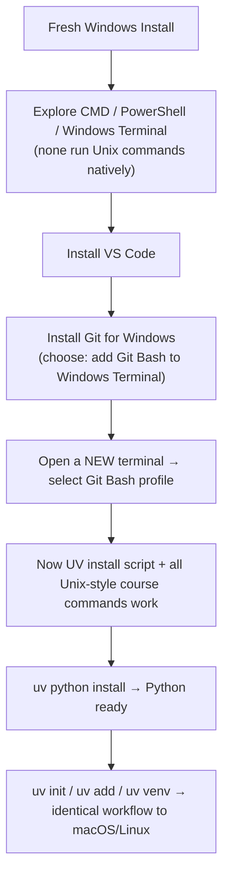
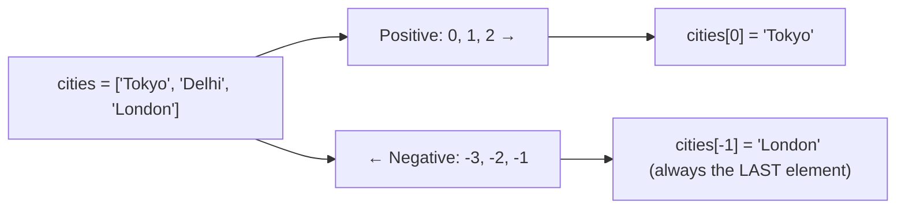
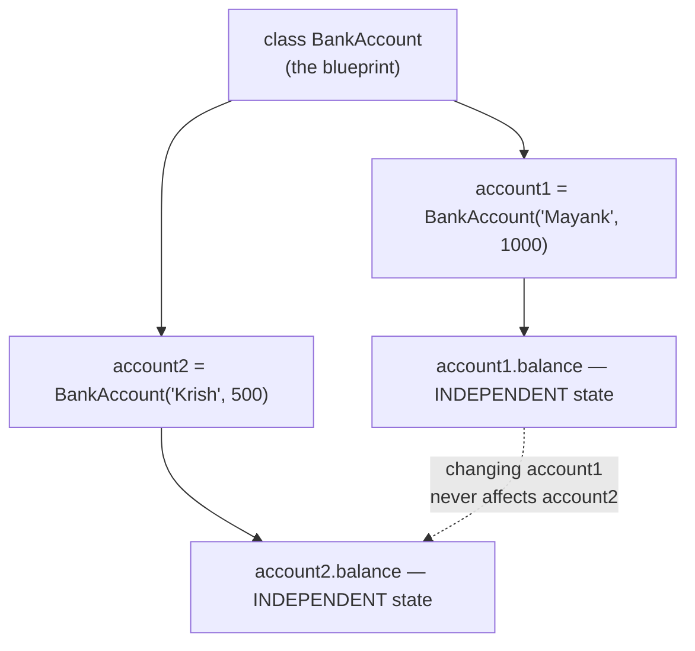
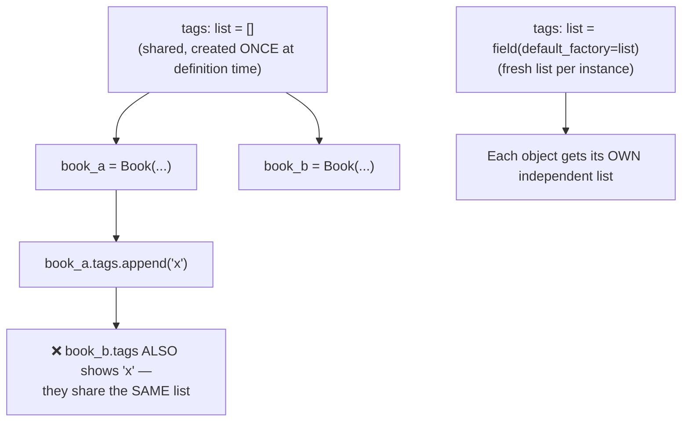
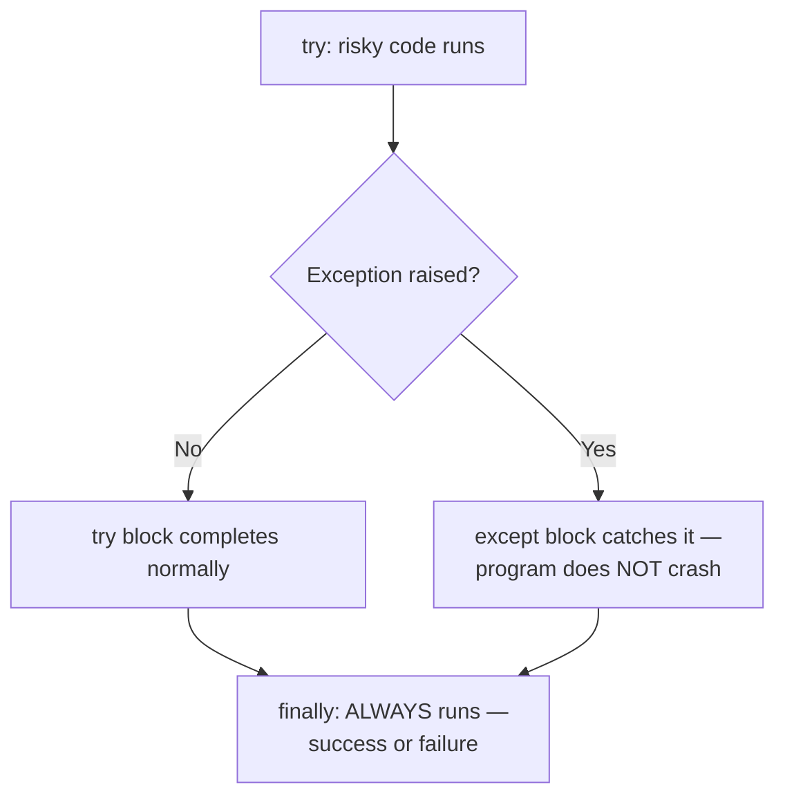
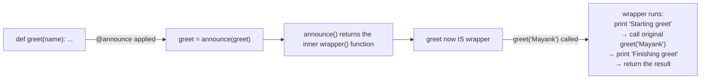
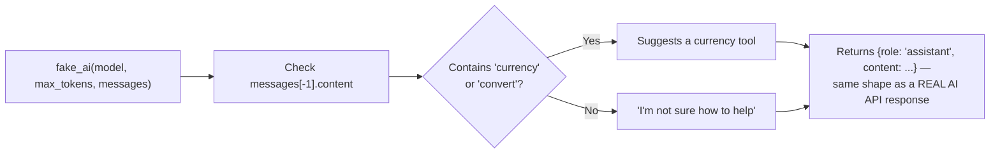
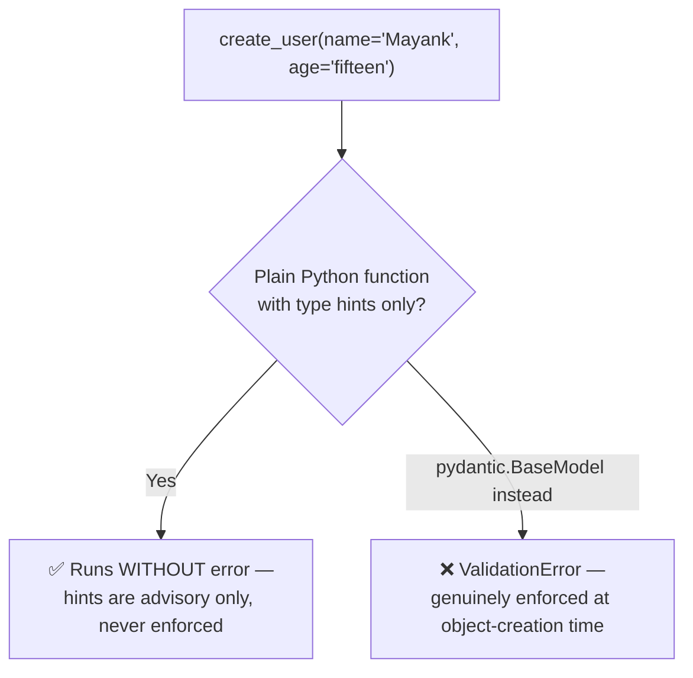

# 🐍 Python Revision for Agentic AI — OOP, Decorators, Error Handling & Pydantic

- <i>**Session:** Day 3 — Class 2: "Python Revision" ·
- **Instructor:** Mayank Aggarwal
- **Note on scope:** This class opens with a live, from-scratch **Windows environment setup** (installing Git Bash, VS Code, and UV on a completely fresh Windows installation, run as a container on the instructor's Mac — used deliberately to also teach the concept of containerization/environments). It then moves into a fast-paced **Python fundamentals revision**: variables/types, f-strings, lists vs. arrays, JSON-as-dictionary, **OOP** (classes, objects, `self`, constructors), **dataclasses**, **error handling** (`try`/`except`/`finally`), **decorators**, a hand-built simulation of how an AI API call is structured (roles/messages), and finally an introduction to **Pydantic** as the solution to Python's lack of type safety. This is explicitly framed as prerequisite revision — real AI/agent-building code begins in the next class.</i>

---

## 📑 Table of Contents

1. [Session Overview](#-session-overview)
2. [Learning Objectives](#-learning-objectives)
3. [Detailed Notes](#-detailed-notes)
   - [1. Windows Development Environment Setup & the Containerization Concept](#1-windows-development-environment-setup--the-containerization-concept)
   - [2. Python Fundamentals Refresher: Variables, F-Strings & Control Flow](#2-python-fundamentals-refresher-variables-f-strings--control-flow)
   - [3. Lists, Indexing, Arrays & JSON-as-Dictionary](#3-lists-indexing-arrays--json-as-dictionary)
   - [4. Object-Oriented Programming: Classes, Objects & `self`](#4-object-oriented-programming-classes-objects--self)
   - [5. Dataclasses: Removing Boilerplate — and a Classic Mutable-Default Bug](#5-dataclasses-removing-boilerplate--and-a-classic-mutable-default-bug)
   - [6. Error Handling: try / except / finally](#6-error-handling-try--except--finally)
   - [7. Decorators: Wrapping a Function Without Changing Its Code](#7-decorators-wrapping-a-function-without-changing-its-code)
   - [8. Simulating an AI API Call: Roles, Messages & Fake Responses](#8-simulating-an-ai-api-call-roles-messages--fake-responses)
   - [9. Pydantic: Enforcing Type Safety in a Dynamically Typed Language](#9-pydantic-enforcing-type-safety-in-a-dynamically-typed-language)
4. [Glossary](#-glossary)
5. [Revision Notes — One-Minute Revision](#-revision-notes--one-minute-revision)
6. [Cheat Sheet](#-cheat-sheet)
7. [Interview Questions & Answers](#-interview-questions--answers)
8. [Scenario-Based Interview Questions](#-scenario-based-interview-questions)
9. [Hands-on Exercises](#-hands-on-exercises)
10. [Practice Assignment](#-practice-assignment)
11. [Additional Resources](#-additional-resources)
12. [Final Revision Sheet](#-final-revision-sheet)

---

## 🎯 Session Overview

This session has two distinct halves:

**Half 1 — Windows Setup, Live:** The instructor installs a **completely fresh copy of Windows** (running as a virtual machine/container on his own Mac) and walks through the entire setup from zero: exploring CMD vs. PowerShell vs. Windows Terminal, installing **VS Code**, installing **Git Bash**, and installing **UV** and **Python** through Git Bash — deliberately using this exercise to teach the broader concept of **containers/environments** as an isolated "copy" of an OS with nothing pre-installed.

**Half 2 — Python Revision:** A fast, code-heavy revision of core Python concepts every learner needs before agent-building begins: variables and f-strings, control flow, list indexing (including negative indexing), the list-vs-array distinction, why **"dictionary = JSON"** for this course's purposes, **OOP** (classes, objects, `self`, constructors) via a bank-account example, **dataclasses** (and a classic mutable-default-argument bug), **error handling** (`try`/`except`/`finally`), **decorators** (built from first principles, including a real timing-decorator use case), and a hand-built simulation of an AI chat completion call — setting up the **Pydantic** introduction that closes the session.

> 💡 **Memory Trick — the instructor's framing:** *"You get paid not for creating an agent — anyone can do that with a framework. You get paid for being able to go inside the code and understand why something is failing. That level of understanding is what these fundamentals buy you."*

---

## 🎯 Learning Objectives

By the end of this guide, you will be able to:

- [ ] Set up a Unix-compatible development environment on Windows from scratch (Git Bash, VS Code, UV, Python).
- [ ] Explain the concept of containerization/environments using the "fresh Windows install with nothing pre-installed" analogy.
- [ ] Write Python variables, f-strings, conditionals, and index/slice lists (including negative indexing).
- [ ] Explain the difference between a Python `list` and an `array`, and why Python's built-in `list` is preferred by default.
- [ ] Explain why, for this course's practical purposes, "a dictionary is a JSON."
- [ ] Define a Python class with `__init__`, `self`, instance attributes, and methods — and create/manipulate multiple objects from it.
- [ ] Use `@dataclass` to eliminate constructor boilerplate, and explain (and avoid) the classic mutable-default-argument bug via `field(default_factory=list)`.
- [ ] Implement `try`/`except`/`finally` error handling, and explain when `finally` always runs.
- [ ] Build a decorator from scratch (including `functools.wraps`), explain what problem it solves, and apply one to a real function (e.g., timing execution).
- [ ] Explain, in your own words, how an AI provider's chat API is structured (roles, messages, request/response), using a hand-built "fake AI" simulation.
- [ ] Explain why Python's dynamic typing is a liability for real applications, and how Pydantic's `BaseModel` solves the type-enforcement half of that problem.

---

## 📚 Detailed Notes

### 1. Windows Development Environment Setup & the Containerization Concept

#### 🧠 Concept

To make sure Windows-based learners aren't left behind, the instructor performs a **live, from-scratch Windows setup** — deliberately using a totally fresh Windows installation (running as a VM/container on his own Mac) so that every single install step is visible, with no pre-existing configuration hiding any steps.

#### ❓ Why It Exists

Beyond simply helping Windows users, this exercise is used to teach a **transferable concept**: an isolated "container" or "environment" is a copy of an operating system that starts with **nothing installed** — directly foreshadowing later concepts like virtual environments, Docker containers, and cloud VMs.

> 💡 **Memory Trick:** *"This Windows machine is running as a container/environment inside my Mac. Whatever I've installed on my Mac is NOT automatically available inside it — it starts completely empty, exactly like a virtual environment starts with no packages."*

#### ⚙ How It Works — The Windows Toolchain, Step by Step

| Step | What's installed/checked | Why |
|---|---|---|
| 1 | Check OS version (`Settings → System → About`, or `winver` via CMD) | Confirms the exact Windows build, useful for troubleshooting |
| 2 | Explore **CMD**, **PowerShell**, and **Windows Terminal** (Windows Terminal bundles both, plus Azure Cloud Shell) | These are Windows' native options — and none of them natively run Unix/Linux (`sh`) commands |
| 3 | Install **VS Code** | The course's standard editor (same as Section 2 of the prior class) |
| 4 | Install **Git for Windows** (Git Bash) — critically, during setup, choose the option to **"add a Git Bash profile to Windows Terminal"** | This is what actually gives Windows a Unix-compatible shell |
| 5 | Open a **new Git Bash terminal** (not PowerShell) and run the UV install command | UV's macOS/Linux-style install script now works correctly inside Git Bash |
| 6 | From Git Bash, run `uv python install` to install Python, or install directly from python.org | Confirms UV can manage Python installs directly |
| 7 | In VS Code, always open a **new terminal with the Git Bash profile** (not the PowerShell default) going forward | Ensures every subsequent command in the course (all written for Unix-style shells) works identically on Windows |



#### 🔍 Internal Working — Confirming the Fix Live

The instructor demonstrates the *before* and *after* explicitly:
- **Before Git Bash:** copying the UV install command into CMD/PowerShell fails with `'sh' is not recognized as an internal or external command`.
- **After Git Bash:** the exact same install command, run inside a Git Bash terminal, works "like a charm" — and once UV is installed via one Git Bash window, it is immediately available in any *new* Git Bash window opened afterward (because the install updates the shell's `PATH`, requiring a fresh terminal session to pick up the change).

#### ⚠ Common Mistakes

* Running macOS/Linux-style install commands directly in PowerShell/CMD instead of Git Bash.
* Forgetting to select the **"add Git Bash profile"** option during Git for Windows installation — without it, Windows Terminal still only offers CMD/PowerShell.
* Not opening a **new** terminal window after installing something that modifies `PATH` (e.g., UV) — the currently-open terminal won't see the update until restarted.
* Trying to copy content directly out of a VM/container to the host machine's clipboard (or vice versa) without realizing the container is isolated — the instructor notes this explicitly while demonstrating on his Windows-in-a-container setup.

#### 🎯 Key Takeaways

* On Windows: install **Git Bash** (with the "add to Windows Terminal" option), and use it — not CMD/PowerShell — for all course commands going forward.
* A **container/environment** = an isolated OS instance that starts with nothing pre-installed — the exact same underlying idea as a Python virtual environment, just at a larger (whole-OS) scale.
* Once Git Bash + UV + Python are installed via this workflow, the Windows experience becomes functionally identical to macOS/Linux for the rest of the course.

---

### 2. Python Fundamentals Refresher: Variables, F-Strings & Control Flow

#### ⚙ How It Works

A rapid-fire revision, run live in a Jupyter-notebook-style `.ipynb` file executed via `uv run` (used here specifically as a *learning/demo* convenience — recall from the prior class that `.ipynb` is otherwise de-emphasized for the course's main project work).

```python
city = "Tokyo"
temperature = 25.5
is_raining = False

print(type(city))          # <class 'str'>
print(type(temperature))   # <class 'float'>
print(type(is_raining))    # <class 'bool'>

print(f"{city} is great")  # f-string interpolation
```

**Control flow, comparison, and boolean operators (demonstrated together):**

```python
print(5 == 5)          # True
print(5 != 3)           # True
print(10 > 20)          # False

has_ticket = True
has_id = True
print(has_ticket and has_id)   # ready to vote / board, etc.
```

#### 🎯 Key Takeaways

* `type(variable)` reveals Python's dynamically-inferred type for any variable — foreshadows the "Python doesn't enforce types" problem central to Section 9 (Pydantic).
* F-strings remain the standard for dynamic string interpolation.
* Comparison (`==`, `!=`, `>`, etc.) and boolean (`and`, `or`, `not`) operators work as expected and are frequently combined in real conditional logic.

---

### 3. Lists, Indexing, Arrays & JSON-as-Dictionary

#### 🧠 Concept

Python's `list` is the default, flexible sequence type; indexing (including **negative indexing**) is a core skill; and — critically for this course — a **JSON object and a Python dictionary are treated as functionally equivalent**.

#### ⚙ How It Works — Lists & Negative Indexing



```python
cities = ["Tokyo", "Delhi", "London"]

print(cities[0])    # "Tokyo"  — indexing starts at 0
print(cities[-1])   # "London" — negative indexing starts from the end
print(cities[-2])   # "Delhi"
```

| Positive index | 0 | 1 | 2 |
|---|---|---|---|
| **Value** | Tokyo | Delhi | London |
| **Negative index** | -3 | -2 | -1 |

> 💡 **Memory Trick:** Positive indices count forward from the start (`0, 1, 2, ...`); negative indices count backward from the end (`-1, -2, -3, ...`) — `list[-1]` is always the *last* element, regardless of the list's length.

#### ⚖ List vs. Array

| | Python `list` | Array (e.g., NumPy, or the built-in `array` module) |
|---|---|---|
| **Element types** | Can mix types freely (e.g., `[1, "two", 3.0]` is valid) | Elements must all be the **same type** |
| **Size** | Dynamically resizable — append as much as you want | Traditionally fixed-size (language/implementation dependent) |
| **Built into Python by default?** | Yes — `list` is a core built-in type | No — Python has no default array type; you need `NumPy` or the standard-library `array` module (built on CPython internals) |

> ⚠️ **Common Mistake:** Assuming Python has a native "array" type the way C/Java do. It does not — what most Python code calls an "array-like" structure is either a `list` (heterogeneous, flexible) or an explicit `NumPy`/`array` module object (homogeneous, more C-like). The instructor's default recommendation for this course: **just use `list`** unless you have a specific reason not to.

#### ⚙ JSON as Dictionary

```python
weather_reading = {
    "city": "Tokyo",
    "temp_c": 25,
}

print(weather_reading["city"])              # "Tokyo"
print(weather_reading.get("humidity"))       # None — .get() avoids a crash on a missing key
# print(weather_reading["humidity"])         # would raise a KeyError instead
```

> 💡 **Memory Trick:** *"For this course's practical purposes: JSON = dictionary."* A JSON object is fundamentally key-value pairs — exactly what a Python `dict` is. Nested JSON (an object inside an object, or a list of objects) maps directly to a dictionary containing other dictionaries or lists.

**Iterating a dictionary's key-value pairs:**

```python
greetings = {"Alice": "Hi", "Bob": "Hello"}

for key, value in greetings.items():
    print(key, value)
```

**Live example — a real public API returning JSON (the "Cat Facts" API):**
The instructor calls a live public cat-facts API and shows the raw response is exactly a JSON object with keys like `fact` and `length` — directly reinforcing that virtually all real-world API responses are JSON, and therefore Python-dictionary-shaped once parsed.

#### ⚠ Common Mistakes

* Using `dictionary["key"]` when a key might be missing — raises a `KeyError` and can crash your program. Prefer `.get("key")`, which returns `None` (or a specified default) instead of crashing.
* Confusing a JSON **array of objects** (a Python `list` of `dict`s) with a JSON **nested object** (a `dict` containing another `dict`) — the shape/structure genuinely differs and affects how you access nested data.

#### 🎯 Key Takeaways

* Negative indices count from the end of a list (`-1` = last element).
* Python has no native "array" type — `list` is the default; use NumPy or the `array` module only when you specifically need same-type, more C-like storage.
* For this course, **"dictionary = JSON"** — nearly every API response you'll parse becomes a (possibly nested) Python dictionary.
* Use `.get()` instead of direct key access (`[...]`) when a key might not be present, to avoid crashes.

---

### 4. Object-Oriented Programming: Classes, Objects & `self`

#### 🧠 Concept

**OOP (Object-Oriented Programming)** lets you define a reusable **blueprint** (a `class`) for a kind of "thing," then create as many independent **objects** (instances) from that blueprint as needed — instead of manually writing out separate variables for every individual instance.

#### ❓ Why It Exists

> 💡 **Memory Trick:** *"Would you create `bank_account_1`, `bank_account_2`, `bank_account_3` as separate hardcoded variables every time someone opens an account? Of course not — you define the blueprint once (the class), then create as many objects from it as you need."*

#### 💻 Code Example — A Bank Account Class



```python
class BankAccount:
    def __init__(self, owner: str, balance: float = 0):
        self.owner = owner
        self.balance = balance
        self.history = []

    def deposit(self, amount: float):
        self.balance += amount
        self.history.append(f"Deposited {amount}")

    def withdraw(self, amount: float):
        if amount > self.balance:
            print("Insufficient funds")
        else:
            self.balance -= amount
            self.history.append(f"Withdrew {amount}")

    def show_history(self):
        for entry in self.history:
            print(entry)


account1 = BankAccount(owner="Mayank", balance=1000)
account2 = BankAccount(owner="Krish", balance=500)

account1.deposit(200)      # balance: 1200, history: ["Deposited 200"]
account1.withdraw(50)      # balance: 1150, history: [..., "Withdrew 50"]
account2.withdraw(1000)    # prints "Insufficient funds" — account2 only has 500

print(account1.balance)    # 1150
account1.show_history()
```

#### 🪜 Step-by-Step Execution

1. `class BankAccount:` defines the **blueprint** — no actual account exists yet.
2. `__init__` is the **constructor** — it runs automatically whenever a new object is created, setting up that object's starting state (`owner`, `balance`, an empty `history` list).
3. `self` refers to **"this specific object"** — it's how a method distinguishes `account1`'s data from `account2`'s data, even though both were built from the same class.
4. `account1 = BankAccount(owner="Mayank", balance=1000)` creates an **object** (an instance) — the constructor runs, setting `account1.owner = "Mayank"`, `account1.balance = 1000`, `account1.history = []`.
5. Calling `account1.deposit(200)` runs the `deposit` method **on `account1` specifically** — `self` inside that call refers to `account1`, so only `account1.balance` changes, not `account2.balance`.
6. The `withdraw` method includes a basic guardrail: it checks `amount > self.balance` before allowing a withdrawal — demonstrating that methods can enforce logic/rules, not just store data.

> ⚠️ **Common Mistake:** Confusing `self` with a special Python keyword that behaves identically to concepts in other languages (e.g., Java's implicit `this`). The instructor deliberately avoids over-simplifying this and instead points learners to a dedicated resource for a deeper, honest explanation of `self` — flagged here rather than glossed over.

#### 🔍 Internal Working — Why This Matters for Agents

> ⚠️ **Forward Reference:** The instructor explicitly states that the agent the class will build later (with no framework, pure Python) will itself be built using OOP — and that LangChain, LangGraph, and essentially every serious AI library are themselves built on classes/objects under the hood. Understanding OOP now is what will make reading *any* framework's source code approachable later.

#### 💡 Real-World Example

The instructor recommends "Python Tutor" (a visual code-execution tool) as a way to *see* objects being created and modified step-by-step in memory — used live to visually confirm that `account1` and `account2` are genuinely separate objects with independent state, not shared references.

#### 🎯 Key Takeaways

* A `class` is a blueprint; each object created from it (`account1`, `account2`, ...) has its own independent data.
* `__init__` is the constructor, automatically run when an object is created.
* `self` refers to "this specific object" inside any method — it's how different objects built from the same class keep their data separate.
* Nearly every serious Python library/framework (including agent frameworks you'll learn later) is built using this exact pattern.

---

### 5. Dataclasses: Removing Boilerplate — and a Classic Mutable-Default Bug

#### 📖 Definition

`@dataclass` is a built-in Python decorator that **auto-generates the constructor (`__init__`) and other standard methods** for a class, based purely on the type-hinted attributes you declare — eliminating repetitive "boilerplate" code.

#### ❓ Why It Exists

> 💡 **Memory Trick:** *"Think of a passport application form — name, country, date of birth, passport number. You don't manually invent a new passport format every time; there's already a template. A dataclass is exactly that: a template for storing data, so you stop hand-writing the same `__init__` structure over and over."*

#### 💻 Code Example

```python
from dataclasses import dataclass, field

@dataclass
class Book:
    title: str
    author: str
    pages_read: int = 0
    tags: list = field(default_factory=list)

    def read(self, pages: int):
        self.pages_read += pages

    def add_tag(self, tag: str):
        self.tags.append(tag)


my_book = Book(title="Atomic Habits", author="James Clear")
my_book.read(40)
my_book.add_tag("self-help")
```

Notice: **no `__init__` was written** — `@dataclass` generates it automatically from the type-hinted fields above it.

#### ⚠ Common Mistakes — The Mutable Default Argument Bug



```python
# ❌ WRONG — a dangerous, subtle bug:
@dataclass
class Book:
    tags: list = []   # DO NOT do this
```

> ⚠️ **Why this is dangerous:** If you write `tags: list = []` directly, **every single `Book` object secretly shares the exact same list object.** Adding a tag to `book_a` would silently also add that tag to `book_b`, `book_c`, and every other `Book` ever created — because they all point to the *same* underlying list in memory, not independent copies.

```python
# ✅ CORRECT — a new, independent list per object:
tags: list = field(default_factory=list)
```

`field(default_factory=list)` tells Python: *"whenever a new object is created, call `list()` fresh to build a brand-new, independent empty list for this specific object"* — rather than reusing one shared list across every instance.

#### 🔍 Internal Working — What `@dataclass` Actually Generates

> 💡 **Memory Trick:** *"`@dataclass` is like a junior developer (or an AI assistant) who writes the boring, repetitive `__init__` code for you, based purely on the fields you list."*

```python
# This dataclass...
@dataclass
class Book:
    title: str
    author: str

# ...is roughly equivalent to manually writing:
class Book:
    def __init__(self, title: str, author: str):
        self.title = title
        self.author = author
```

Beyond `__init__`, `@dataclass` also auto-generates other standard methods (e.g., a readable string representation and equality comparison) that you would otherwise have to write by hand for every class.

#### 🏢 Real-World / Production Usage

> ⚠️ **Forward Reference:** The instructor explicitly connects this to future course content: frameworks like LangGraph (and many custom agent frameworks) commonly use `dataclass`-style patterns (or similar structured-model approaches) to represent **agent state** — because it keeps state-representation code clean and maintainable, exactly the same reasoning as the `Book` example.

#### ⚖ Advantages & Limitations

| Advantages | Limitations |
|---|---|
| Eliminates repetitive `__init__` boilerplate, especially valuable as a class grows to many fields | Still requires understanding the underlying mutable-default-argument pitfall — `@dataclass` doesn't automatically protect you if you write `tags: list = []` instead of using `field(default_factory=list)` |
| Scales cleanly — hundreds of fields are handled the same simple way | Not a replacement for Pydantic's *validation* capabilities (see Section 9) — dataclasses reduce boilerplate but do not, by themselves, enforce strict type/data validation the way Pydantic does |

#### 🎯 Key Takeaways

* `@dataclass` is a **decorator** (foreshadowing Section 7) that auto-generates `__init__` and other boilerplate from type-hinted fields.
* **Never** use a mutable default value (like `[]` or `{}`) directly as a field default — always use `field(default_factory=list)` (or `dict`, etc.) to guarantee each object gets its own independent copy.
* This exact pattern (structured, type-hinted data containers) is what agent frameworks later use to represent agent state.

---

### 6. Error Handling: try / except / finally



#### 🧠 Concept

Python's `try` / `except` / `finally` structure lets code **attempt** an operation that might fail, **catch and handle** the failure gracefully instead of crashing, and optionally run cleanup code that **always executes regardless of success or failure**.

#### ⚙ How It Works

```python
def safe_divide(numerator, denominator):
    try:
        result = numerator / denominator
    except ZeroDivisionError:
        result = None
        print("Cannot divide by zero")
    return result
```

| Error type shown | What triggers it |
|---|---|
| **`ZeroDivisionError`** | Dividing any number by zero — a runtime/logic issue, not a syntax problem |
| **`SyntaxError`** (contrasted explicitly) | Writing code that is not valid Python at all (e.g., malformed syntax) — this is a *different* category of error than a `ZeroDivisionError` |
| **`ValueError`** (implied via the "age is not a number" example) | Attempting to convert something invalid (e.g., a non-numeric string) into an `int` |

> ⚠️ **Common Mistake:** Confusing a **syntax error** (invalid Python code structure — caught before the program even runs) with a **runtime/logic error** (valid Python code that fails only when it hits a specific bad input, like dividing by zero). These require different mental models and different fixes.

#### 💻 The `finally` Block

```python
def read_settings():
    try:
        # ... attempt to read a config/key ...
        print("Settings read successfully")
    except Exception:
        print("Failed to read settings")
    finally:
        print("Done attempting to read the settings")
```

> ⚠️ **Critical property, demonstrated live:** The `finally` block runs **every single time**, regardless of whether the `try` block succeeded or the `except` block was triggered. There is no scenario shown in this session where `finally` does *not* execute.

#### 🏢 Real-World / Production Usage

| Use case | Why error handling matters here |
|---|---|
| **Calling any external API** (including an LLM/AI provider) | A failed or slow API response should **not** crash your entire application/agent — this is explicitly called out as directly relevant to the agent-building work coming in later classes |
| **Reading a configuration key/secret** | Demonstrated live: wrapping key-reading logic in `try`/`except` so a missing or malformed key doesn't halt the whole program |
| **Database connections** | The instructor's own example for `finally`: always closing a database connection, whether the operation succeeded or failed |

#### 🎯 Key Takeaways

* `try` = attempt risky code; `except` = handle a specific failure gracefully instead of crashing; `finally` = code that **always** runs, success or failure.
* A `ZeroDivisionError` (or similar runtime error) is fundamentally different from a `SyntaxError` — one is invalid code structure, the other is valid code hitting a bad input at runtime.
* Any code that calls an external service (an API, an AI provider, a database) should be wrapped in error handling — a single failed call should never be allowed to crash an entire agent/application.

---

### 7. Decorators: Wrapping a Function Without Changing Its Code

#### 🧠 Concept

A **decorator** is a function that takes another function as input and returns a **new, enhanced function** — adding behavior around the original function **without modifying the original function's own code**.

#### ❓ Why It Exists

> 💡 **Memory Trick — the instructor's core analogy:** *"You have a gift inside a box. You wrap it with gift wrap. The contents of the gift itself don't change — but now, when someone receives it, they get both the original gift AND the wrapping together. A decorator works the same way: it doesn't change what your original function does internally, it wraps additional behavior around it."*

#### 💻 Code Example — Building a Decorator From Scratch

```python
import functools

def announce(func):
    @functools.wraps(func)
    def wrapper(*args, **kwargs):
        print(f"Starting {func.__name__}")
        result = func(*args, **kwargs)
        print(f"Finishing {func.__name__}")
        return result
    return wrapper


@announce
def greet(name):
    return f"Hello, {name}"


print(greet("Mayank"))
# Output:
# Starting greet
# Finishing greet
# Hello, Mayank
```

#### 🪜 Step-by-Step Execution — What `@announce` Actually Does



1. `@announce` above `def greet(name):` is exactly equivalent to writing `greet = announce(greet)` right after defining `greet`.
2. `announce(func)` receives the **original `greet` function itself** as its `func` argument (Python functions can be passed around like any other value).
3. Inside `announce`, a new inner function `wrapper` is defined — this `wrapper` is what `announce` **returns**.
4. Because `greet = announce(greet)`, the name `greet` now actually points to `wrapper`, not the original function.
5. So calling `greet("Mayank")` actually calls `wrapper("Mayank")`, which: prints "Starting greet", calls the **original** `greet` function internally (stored as `func` inside the closure), captures its `result`, prints "Finishing greet", and finally returns that `result`.
6. `functools.wraps(func)` preserves the original function's metadata (like `func.__name__`) on the wrapper — without it, tools inspecting `greet.__name__` after decoration would see `"wrapper"` instead of `"greet"`.

#### 💻 A Real Use Case — Timing a Function

```python
import time
import functools

def timed(func):
    @functools.wraps(func)
    def wrapper(*args, **kwargs):
        start = time.time()
        result = func(*args, **kwargs)
        end = time.time()
        print(f"{func.__name__} took {end - start:.4f} seconds")
        return result
    return wrapper


@timed
def convert_currency(amount, from_currency, to_currency):
    # ... calls the currency API from the previous session ...
    ...
```

> 💡 **Memory Trick:** *"Would you manually write `start = time.time()` / `end = time.time()` inside every single function you ever want to time? Of course not — you write the timing logic once, as a decorator, and apply `@timed` to any function you want measured, forever."*

#### ⚖ Advantages & Limitations

| Advantages | Limitations / things to know |
|---|---|
| Reusable across any number of functions — write once, apply everywhere with `@decorator_name` | Decorators can be **stacked** (multiple `@` lines on one function) — the order they're written in matters, since they apply from the innermost (closest to the function) outward |
| Doesn't require modifying the original function's internal code at all | Understanding `*args` and `**kwargs` (how a wrapper forwards *any* arguments to the original function) is a prerequisite the instructor explicitly deferred for a separate, dedicated explanation |

#### 🏢 Real-World / Production Usage

> ⚠️ **Forward Reference (explicitly flagged live):** The instructor shows a live preview of a `@tool` decorator used when defining agent tools in a framework — confirming decorators are not just an academic exercise, but the actual mechanism many agent frameworks use to register/define tools.

#### ⚠ Common Mistakes

* Assuming a decorated function still behaves exactly like the plain original — it doesn't; it's now the `wrapper` function, executing whatever extra logic the decorator adds.
* Forgetting that a `wrapper` function must explicitly `return` the original function's result — otherwise, calling the decorated function silently returns `None` (demonstrated live as a deliberate "gotcha").
* Not using `functools.wraps` — the decorated function loses its original name/metadata, which can confuse debugging or introspection later.

#### 🎯 Key Takeaways

* A decorator = a function that takes a function, wraps it in a new function with added behavior, and returns that new function — the original function's code is never altered.
* `@decorator_name` above a function is shorthand for `func = decorator_name(func)`.
* `functools.wraps` preserves the original function's identity/metadata on the wrapper.
* Decorators are the exact mechanism used later for defining agent tools in real frameworks — not just a toy example.

---

### 8. Simulating an AI API Call: Roles, Messages & Fake Responses

#### 🧠 Concept

Before hitting a *real* AI provider's API (deferred to the next class), the instructor builds a **hand-crafted, fake simulation** of exactly how AI chat APIs are structured — using OOP, so the shape of a real API request/response becomes intuitive before the real thing is introduced.

#### ❓ Why It Exists

> 💡 **Memory Trick:** *"Just like calling a travel agent who only speaks English, ChatGPT's API has a required 'language' — a specific request/response shape it expects. I'm building a fake version of that shape here so you understand the format before we call the real thing."*

#### ⚙ How It Works



```python
class Message:
    def __init__(self, role: str, content: str):
        self.role = role
        self.content = content


def fake_ai(model: str, max_tokens: int, messages: list[Message]):
    """Simulates an AI provider's chat completion response."""
    last_user_message = messages[-1].content.lower()

    if "currency" in last_user_message or "convert" in last_user_message:
        reply = "I would use a currency conversion tool rather than guessing an exchange rate."
    else:
        reply = "I'm not sure how to help with that."

    return {
        "role": "assistant",
        "content": reply,
    }


questions = ["Convert $50 to Euro"]

for question in questions:
    response = fake_ai(
        model="fake-model",
        max_tokens=200,
        messages=[Message(role="user", content=question)],
    )
    print(response)
```

#### 🪜 Step-by-Step Execution

1. A `Message` class models a single chat turn, carrying a **role** (`"user"` or `"assistant"`) and its **content**.
2. `fake_ai(...)` deliberately mimics the real shape of provider APIs: it takes a `model`, a `max_tokens` cap, and a list of `messages` — the exact same request shape used by real chat completion APIs (explicitly cross-referenced live against OpenAI's actual `client.chat.completions.create(...)` documentation).
3. Inside, simple keyword logic decides the "AI's" reply — a stand-in for what a real model would decide.
4. The function returns a **dictionary shaped like a JSON response** (`{"role": ..., "content": ...}`) — reinforcing Section 3's "JSON = dictionary" equivalence.

#### 🔍 Internal Working — Why "Role" Matters

> ⚠️ **Key insight, called out explicitly:** Every message in the conversation carries a **role** — who "sent" it (`user` vs. `assistant`, or elsewhere `human`/`AI`). This isn't incidental; it's a structural requirement of how conversational AI APIs represent dialogue history, and it's the exact same `role`/`content` shape real providers (OpenAI, etc.) use.

#### ⚖ Advantages & Limitations — A Deliberately "Bad" First Version

The instructor explicitly critiques his own first-pass version of this code as **intentionally not well structured** (loose dictionaries and ad hoc shapes instead of clean, reusable classes) — used as a teaching device to make the point that this is exactly the kind of code that benefits from the OOP and Pydantic patterns already covered, once you formalize "request" and "response" as proper typed classes/models rather than loose dictionaries.

#### 🎯 Key Takeaways

* Real AI provider APIs share a consistent shape: a `model`, some generation limits (like `max_tokens`), and a list of role-tagged `messages`.
* Building a "fake" version of this shape first — before touching a real, paid API — is a deliberate teaching technique to remove fear/mystery from the real thing.
* The **role** field (`user` vs. `assistant`) is a structural requirement of virtually every conversational AI API, not an arbitrary design choice.
* This exact "loose dictionary" version is presented as an example of code that *should* be cleaned up using proper classes/Pydantic models — a direct bridge into Section 9.

---

### 9. Pydantic: Enforcing Type Safety in a Dynamically Typed Language



#### ❓ Why It Exists — The Core Problem

Python is a **dynamically typed language**: it does not enforce, at definition time, what type a variable must hold — and that type can even change during runtime.

```python
name = "Mayank"
name = 8          # Python allows this without error — no type was ever locked in

def create_user(name: str, age: int):
    """Type hints here are advisory only — Python does NOT enforce them."""
    print(name, age)

create_user(name="Mayank", age="fifteen")   # Runs WITHOUT error, despite age not being an int
```

> ⚠️ **Critical distinction demonstrated live:** Type hints (`name: str`, `age: int`) in plain Python are **not enforced** — they exist purely as documentation/hints for humans and tools like IDEs, but the Python interpreter itself will happily run code that violates them. This is explicitly contrasted with **TypeScript**, which layers *static* typing on top of JavaScript and *does* enforce shape/type constraints.

#### ⚙ Manual Type-Checking — The Painful Alternative

```python
def create_user(name, age):
    if not isinstance(name, str):
        raise TypeError("name must be a string")
    if not isinstance(age, int):
        raise TypeError("age must be an integer")
    # ... proceed ...
```

> ⚠️ **Why this doesn't scale:** If your application has 10, 15, or more functions (`create_user`, `update_user`, `delete_user`, ...), manually writing this validation logic **inside every single function** is repetitive, error-prone, and easy to forget — exactly the kind of boilerplate problem `@dataclass` solved for constructors (Section 5), and which Pydantic now solves for **type enforcement**.

#### 💻 The Pydantic Solution

```python
from pydantic import BaseModel

class User(BaseModel):
    name: str
    age: int


new_user = User(name="Mayank", age=25)     # ✅ Works
print(new_user.name, new_user.age)

bad_user = User(name="Mayank", age=[1, 2, 3])   # ❌ Raises a ValidationError
# "Input should be a valid integer"
```

#### 🔍 Internal Working — Type Coercion vs. Type Enforcement

Demonstrated live as an important nuance:

```python
flexible_user = User(name="Mayank", age="25")   # ✅ This actually WORKS
print(flexible_user.age)   # 25 (an int) — Pydantic converted the string "25" into an int
```

> ⚠️ **Important subtlety:** Pydantic doesn't just *reject* mismatched types outright — where a value can be **sensibly converted** (a numeric string like `"25"` into an `int`), Pydantic performs that conversion automatically. It only raises a `ValidationError` when the value **cannot** be meaningfully coerced into the expected type (e.g., a list can't become an integer).

#### 🪜 Step-by-Step: Why `BaseModel` Beats `@dataclass` Here

| Need | `@dataclass` | `pydantic.BaseModel` |
|---|---|---|
| Auto-generates `__init__` from typed fields | ✅ Yes | ✅ Yes |
| **Enforces/validates** that values actually match their declared type at creation time | ❌ No | ✅ Yes |
| Performs sensible type coercion (e.g., `"25"` → `25`) | ❌ No | ✅ Yes |

> 💡 **Memory Trick — direct instructor summary, verbatim in spirit:** *"Pydantic helps us create rigid data models for our inputs and outputs, making our code more error-safe, and our agents/software better. We can enforce type and data validation."*

#### 🏢 Real-World / Production Usage

> ⚠️ **Forward Reference (explicitly flagged live):** Pydantic is explicitly called out as essential once the course reaches **FastAPI** (building API servers to interact with agents) — virtually every FastAPI-based server uses Pydantic models to define request/response shapes, and the course assumes this familiarity going forward. The instructor also notes that **data validation** (e.g., "age must be positive," not just "age must be an int") is the topic of the *next* class — this session covers **type** validation only.

#### ⚖ Advantages & Limitations

| Advantages | Limitations (as scoped in this session) |
|---|---|
| Eliminates repetitive manual `isinstance()` checks across every function | This session only covers **type** enforcement (is it an `int`?) — **value/data** validation (is it a *positive* `int`? is it within a valid range?) is explicitly deferred to the next class |
| Automatically coerces sensibly-convertible values (e.g., numeric strings) | Requires understanding that coercion happens silently — a value's *runtime* type after validation may not exactly match what was passed in (e.g., `"25"` in, `25` (int) out) |
| Scales cleanly to functions with many parameters, replacing repeated manual checks with one reusable model | Not a substitute for genuinely understanding your data's *business rules* — Pydantic enforces shape/type, not domain logic, without additional configuration (covered next class) |

#### 🎯 Key Takeaways

* Python is dynamically typed and does **not** enforce type hints at runtime on its own — this is a real risk for production code (bad data can silently enter a database, a spreadsheet, an API response, etc.).
* `pydantic.BaseModel` solves this by validating (and, where sensible, coercing) types automatically whenever an object is created — no manual `isinstance()` checks required.
* This session covers **type** validation only; **data** validation (value constraints) is the explicit topic of the next class.
* Pydantic is a hard prerequisite for the FastAPI work coming later in the course.

---

## 📝 Glossary

| Term | Definition | Why It Matters |
|---|---|---|
| **Container / Environment (OS-level)** | An isolated instance of an operating system, starting with nothing pre-installed | The conceptual foundation for later ideas: virtual environments, Docker, cloud VMs |
| **Git Bash** | A Unix-compatible terminal for Windows, bundled with Git for Windows | Gives Windows users a shell where the course's Unix-style commands actually work |
| **`self`** | Inside a class method, refers to "this specific object" (the instance the method was called on) | Lets different objects built from the same class keep independent data |
| **`__init__`** | A class's constructor — automatically runs when a new object is created | Sets up an object's starting attributes/state |
| **Instance / Object** | A specific, concrete "thing" created from a class blueprint | Each instance has its own independent data, even though built from the same class |
| **`@dataclass`** | A decorator that auto-generates `__init__` (and other methods) from type-hinted class fields | Eliminates repetitive constructor boilerplate |
| **`field(default_factory=list)`** | A dataclass pattern that guarantees a fresh, independent mutable default value (e.g., an empty list) per object | Prevents the mutable-default-argument bug where all instances secretly share one list |
| **`try` / `except` / `finally`** | Python's error-handling structure: attempt code, catch specific failures, and always run cleanup code | Prevents a single failed operation (e.g., an API call) from crashing an entire program |
| **Decorator** | A function that takes another function, wraps it with added behavior, and returns the new, enhanced function | Used to add cross-cutting behavior (logging, timing, tool registration) without modifying the original function's code |
| **`functools.wraps`** | A utility that preserves a wrapped function's original name/metadata on its decorator's inner wrapper function | Prevents losing useful debugging/introspection information after decoration |
| **`*args` / `**kwargs`** | Python syntax for accepting any number of positional (`*args`) or keyword (`**kwargs`) arguments in a function | Lets a generic decorator's `wrapper` forward arbitrary arguments to the original function it wraps |
| **Dictionary = JSON (course convention)** | For this course's practical purposes, a Python `dict` and a JSON object are treated as equivalent | Nearly every real-world API response, once parsed, becomes a (possibly nested) Python dictionary |
| **Dynamically Typed** | A language property where variable types are not fixed/enforced at definition time and can change at runtime | The core problem Pydantic exists to solve for real applications |
| **`pydantic.BaseModel`** | A Pydantic base class that, when subclassed, automatically validates (and where sensible, coerces) the types of its declared fields | The foundation for building reliable, type-safe data models for AI/agent inputs and outputs |
| **Type Coercion (Pydantic)** | Pydantic's behavior of automatically converting a value into the expected type when a sensible conversion exists (e.g., `"25"` → `25`) | An important nuance — Pydantic isn't purely "reject anything that doesn't match exactly" |
| **Type Validation vs. Data Validation** | Type validation checks *what kind* of value something is (an `int`?); data validation checks *whether the value itself* is acceptable (a *positive* `int`?) | This session covers only type validation; data validation is the next class's topic |

---

## 🔄 Revision Notes — One-Minute Revision

* On **Windows**, install **Git Bash** (choosing the "add to Windows Terminal" option) so that all of the course's Unix-style commands (UV install, `uv` commands, etc.) work correctly — this exercise also illustrates the broader concept of a **container/environment**: an isolated OS instance starting with nothing pre-installed, the same underlying idea behind Python virtual environments.
* On the Python side:
  * Variables are dynamically typed; **f-strings** interpolate variables into text.
  * Lists support **negative indexing** (`list[-1]` = last item).
  * Python has **no native array type** (use `list` by default).
  * For this course — **"dictionary = JSON."**
* **OOP** lets you define a reusable blueprint (`class`) with a constructor (`__init__`) and instance data tracked via `self`, so multiple independent objects can be created from one blueprint (demonstrated via a `BankAccount` class).
* **`@dataclass`** auto-generates that constructor from type-hinted fields — but mutable defaults (like `[]`) must use `field(default_factory=list)` to avoid all instances secretly sharing one list.
* **Error handling** (`try`/`except`/`finally`) lets code fail gracefully instead of crashing — critical for any external API call — and `finally` always runs regardless of outcome.
* A **decorator** wraps a function with new behavior without changing the original function's code (built from scratch with `functools.wraps`, demonstrated via a real timing-decorator use case) — and this exact mechanism is used later to define agent tools in real frameworks.
* A hand-built "fake AI" function demonstrated that real AI provider APIs share a consistent shape: a model, a token limit, and a list of role-tagged messages (`user`/`assistant`).
* Finally, because **Python does not enforce type hints at runtime**, **Pydantic's `BaseModel`** was introduced to automatically validate (and where sensible, coerce) field types when an object is created — solving the type-safety half of the problem, with full data/value validation deferred to the next class.

---

## 📋 Cheat Sheet

**Windows setup (once):**
```text
1. Install VS Code
2. Install Git for Windows → check "add Git Bash profile to Windows Terminal"
3. Open a NEW terminal → select Git Bash (not PowerShell)
4. Run UV's install command inside Git Bash
5. uv python install   (or install Python directly)
```

**Python quick reference:**
```python
cities[-1]                          # last element (negative indexing)
weather.get("humidity")              # safe dict access, returns None if missing
for key, value in d.items(): ...     # iterate dict key-value pairs
```

**OOP skeleton:**
```python
class Thing:
    def __init__(self, x):
        self.x = x
    def do_something(self):
        return self.x
```

**Dataclass (with the mutable-default fix):**
```python
from dataclasses import dataclass, field

@dataclass
class Thing:
    name: str
    tags: list = field(default_factory=list)   # NEVER: tags: list = []
```

**Error handling:**
```python
try:
    risky()
except SpecificError:
    handle()
finally:
    always_runs()
```

**Decorator skeleton:**
```python
import functools

def my_decorator(func):
    @functools.wraps(func)
    def wrapper(*args, **kwargs):
        # do something before
        result = func(*args, **kwargs)
        # do something after
        return result
    return wrapper

@my_decorator
def my_function(): ...
```

**Pydantic skeleton:**
```python
from pydantic import BaseModel

class MyModel(BaseModel):
    name: str
    age: int

obj = MyModel(name="X", age="25")   # coerces "25" -> 25
```

---

## 🔥 Interview Questions & Answers

### 🟢 Beginner

**Q1.**

**Question:** What does installing Git Bash's "Windows Terminal profile" option actually enable?

**Answer:** It adds a Unix-compatible shell option to Windows Terminal, so Unix-style commands (like the UV install script) run correctly, instead of failing in CMD/PowerShell.

**Explanation:** Without this, Windows users cannot run most of the course's terminal commands as written.

**Why Interviewers Ask This:** Practical, hands-on setup knowledge.

**Possible Follow-up:** "What error would you see if you ran the same install command in PowerShell instead?"

**Q2.**

**Question:** What is negative indexing in a Python list, and what does `my_list[-1]` return?

**Answer:** Negative indices count backward from the end of the list; `my_list[-1]` always returns the last element, regardless of the list's length.

**Explanation:** A core, frequently-used Python skill.

**Why Interviewers Ask This:** Baseline Python competency.

**Possible Follow-up:** "What does `my_list[-2]` return?"

**Q3.**

**Question:** Does Python have a native "array" type like C or Java?

**Answer:** No — Python's default sequence type is `list`, which can hold mixed types and resize dynamically; a true fixed-type array requires NumPy or the standard-library `array` module.

**Explanation:** A common point of confusion for learners coming from other languages.

**Why Interviewers Ask This:** Prevents misapplying array-based mental models to Python.

**Possible Follow-up:** "When might you actually want NumPy's array type instead of a list?"

**Q4.**

**Question:** For this course's practical purposes, what is the relationship between a JSON object and a Python dictionary?

**Answer:** They are treated as equivalent — a JSON object is key-value pairs, exactly what a Python `dict` is.

**Explanation:** Nearly every parsed API response becomes a Python dictionary.

**Why Interviewers Ask This:** Foundational for all future API/agent work.

**Possible Follow-up:** "How would a JSON array of objects map to Python?"

**Q5.**

**Question:** What is `self` used for inside a Python class method?

**Answer:** It refers to the specific object the method is being called on, letting different instances of the same class keep independent data.

**Explanation:** Demonstrated via the `BankAccount` example — `account1` and `account2` have separate balances despite sharing a class.

**Why Interviewers Ask This:** Core OOP competency.

**Possible Follow-up:** "What would happen if two objects accidentally shared the same underlying data?"

**Q6.**

**Question:** What does `@dataclass` do for a class?

**Answer:** It auto-generates the constructor (`__init__`) and other standard methods, based on the class's type-hinted fields — eliminating manual boilerplate.

**Explanation:** Demonstrated via the `Book` example.

**Why Interviewers Ask This:** A common, practical Python productivity tool.

**Possible Follow-up:** "What's the danger of using a mutable default value like `[]` directly in a dataclass field?"

**Q7.**

**Question:** What is the correct way to give a dataclass field a default empty list, and why?

**Answer:** `tags: list = field(default_factory=list)` — using a plain `tags: list = []` causes every instance of the class to secretly share the exact same list object.

**Explanation:** A classic, subtle Python bug directly demonstrated in this session.

**Why Interviewers Ask This:** A genuinely common real-world bug source.

**Possible Follow-up:** "What symptom would you observe in your program if you made this mistake?"

**Q8.**

**Question:** What is the difference between a `try`/`except` block catching an error, and a `finally` block?

**Answer:** `except` runs only if a matching error occurs inside `try`; `finally` runs **every time**, regardless of whether an error occurred or was caught.

**Explanation:** Demonstrated live — `finally`'s message printed in every tested scenario.

**Why Interviewers Ask This:** Core, testable error-handling knowledge.

**Possible Follow-up:** "Give a real-world example of code that belongs in a `finally` block."

**Q9.**

**Question:** In plain language, what does a decorator do to a function?

**Answer:** It wraps the function with additional behavior (before/after logic) and returns a new, enhanced version — without modifying the original function's own code.

**Explanation:** The "gift wrap" analogy: the gift's contents (original function) don't change; new wrapping (the decorator's added behavior) surrounds it.

**Why Interviewers Ask This:** Widely used pattern in real frameworks, including agent tool definitions.

**Possible Follow-up:** "What Python syntax applies a decorator to a function?"

**Q10.**

**Question:** Why doesn't plain Python enforce type hints like `def create_user(name: str, age: int):` at runtime?

**Answer:** Because Python is dynamically typed — type hints are advisory documentation for humans/tools, not runtime-enforced constraints; the interpreter will still run code that violates them.

**Explanation:** Demonstrated live by successfully calling `create_user(name="Mayank", age="fifteen")` without error.

**Why Interviewers Ask This:** The exact motivating problem Pydantic solves.

**Possible Follow-up:** "What library was introduced to solve this problem?"

---

### 🟡 Intermediate

**Q11.**

**Question:** Explain, step by step, what actually happens when `@announce` is placed above a function definition.

**Answer:** It's exactly equivalent to writing `greet = announce(greet)` right after defining `greet`. `announce` receives the original `greet` function as an argument, defines an inner `wrapper` function that adds behavior around a call to the original `greet`, and returns `wrapper`. After decoration, the name `greet` actually refers to `wrapper`, not the original function.

**Explanation:** A precise mechanical explanation of decorator syntax, directly demonstrated live via a `print(decorator_name(func))` inspection.

**Why Interviewers Ask This:** Tests real understanding versus surface-level "decorators add stuff" recall.

**Possible Follow-up:** "Why is `functools.wraps` needed inside the wrapper function?"

**Q12.**

**Question:** Why does calling a decorated function sometimes print `None` unexpectedly if the decorator isn't written carefully?

**Answer:** If the `wrapper` function inside the decorator doesn't explicitly `return` the result of calling the original function, then calling the decorated function returns `None` by default (since Python functions return `None` when no explicit `return` occurs) — even if the original function itself does return something.

**Explanation:** A live "gotcha" moment deliberately shown in the session to illustrate this exact bug.

**Why Interviewers Ask This:** A genuinely common, easy-to-miss decorator bug.

**Possible Follow-up:** "How would you fix a decorator that swallows the original function's return value?"

**Q13.**

**Question:** Why did the instructor build a "fake AI" function using classes/dictionaries before showing a real AI API call?

**Answer:** To let learners understand the *general shape* of an AI provider's request/response structure (model, token limit, role-tagged messages) using safe, free, fully-controllable fake code — before introducing the complexity, cost, and unfamiliarity of a real paid API call.

**Explanation:** A deliberate pedagogical sequencing choice, consistent with earlier sessions' "fake API before real API" approach.

**Why Interviewers Ask This:** Tests grasp of *why* a teaching technique was used, not just the content itself.

**Possible Follow-up:** "What specific field, present in every message, does this fake version correctly foreshadow about real AI APIs?"

**Q14.**

**Question:** What does it mean that Pydantic performs "type coercion," and how is this different from strict type rejection?

**Answer:** Rather than only accepting values that are already exactly the expected type, Pydantic will convert values into the expected type when a sensible conversion exists — e.g., the string `"25"` passed for an `int` field is automatically converted to the integer `25`. It only raises a `ValidationError` when no sensible conversion is possible (e.g., a list can't become an int).

**Explanation:** Directly demonstrated live, and explicitly flagged as a nuance many learners miss (assuming Pydantic is purely "reject anything not already the exact right type").

**Why Interviewers Ask This:** Tests precision about a commonly-misunderstood Pydantic behavior.

**Possible Follow-up:** "Give an example input that Pydantic would still reject, despite this coercion behavior."

**Q15.**

**Question:** Why is manually adding `isinstance()` checks inside every function considered a poor long-term solution, compared to using Pydantic?

**Answer:** It doesn't scale — as an application grows to dozens of functions (`create_user`, `update_user`, `delete_user`, etc.), each one would need its own repeated, easy-to-forget validation logic. A Pydantic model centralizes that validation once, in one place, and is reused everywhere that data shape is needed.

**Explanation:** Directly addressed in the live Q&A when a learner proposed manual `isinstance` checks as an alternative.

**Why Interviewers Ask This:** Tests understanding of *why* a library-based solution beats ad hoc manual checks at scale.

**Possible Follow-up:** "What Python built-in construct performs a type check like `isinstance()`, and why is it insufficient alone at scale?"

**Q16.**

**Question:** What's the practical difference between `@dataclass` and `pydantic.BaseModel` for defining a data structure?

**Answer:** Both auto-generate a constructor from type-hinted fields, eliminating manual `__init__` boilerplate. But `@dataclass` does **not** validate or enforce that provided values actually match their declared types at runtime, while `pydantic.BaseModel` does — raising a `ValidationError` (or coercing, where sensible) if a value doesn't match.

**Explanation:** A precise, testable distinction drawn directly from this session's content.

**Why Interviewers Ask This:** A very common real-world "which tool do I reach for" decision.

**Possible Follow-up:** "In what scenario would `@dataclass` alone still be the right choice over Pydantic?"

**Q17.**

**Question:** Why does the instructor recommend avoiding a mutable default argument (like `tags: list = []`) even though Python allows it without a syntax error?

**Answer:** Because default argument values in Python are evaluated **once**, at function/class definition time, not fresh on every call/instantiation — so a mutable default like `[]` is created exactly once and then shared by every instance/call that relies on that default, causing unrelated objects to silently affect each other's data.

**Explanation:** Extends the session's `Book`/`tags` example into the precise underlying language mechanism (default values evaluated once at definition time).

**Why Interviewers Ask This:** A classic, high-value Python interview question about a genuinely subtle language behavior.

**Possible Follow-up:** "Does this same issue apply to default dictionary or set arguments? Why?"

**Q18.**

**Question:** In the "fake AI" simulation, why does the function check `messages[-1].content` specifically, rather than the first message?

**Answer:** `messages[-1]` retrieves the most recent message in the conversation (via negative indexing) — the "latest" user input is generally what a conversational AI needs to respond to, not necessarily the first message in a potentially long conversation history.

**Explanation:** Connects Section 3's negative-indexing concept directly to a realistic application in Section 8.

**Why Interviewers Ask This:** Tests the ability to connect two separately-taught concepts into a coherent, applied understanding.

**Possible Follow-up:** "What would change if the function needed to consider the entire conversation history, not just the last message?"

**Q19.**

**Question:** Why does the instructor consider his own first-pass "fake AI" code (using loose dictionaries) to be "bad code," and what would fix it?

**Answer:** Because it relies on loosely-shaped dictionaries scattered through the logic instead of well-defined, reusable, type-safe structures — making the code harder to validate, extend, and reason about. Formalizing the request and response shapes as proper classes (or, better, Pydantic models) would make the code more maintainable and self-documenting.

**Explanation:** A deliberate, self-critiquing teaching moment, directly bridging Sections 8 and 9.

**Why Interviewers Ask This:** Tests whether the learner can identify *why* code quality matters, not just whether code "works."

**Possible Follow-up:** "Sketch what a Pydantic-based `Message` and `AIResponse` model might look like for this exact use case."

**Q20.**

**Question:** Why is understanding `self` and constructors important even if you never intend to hand-write agent code yourself (relying on AI-generated code instead)?

**Answer:** Because the instructor's stated goal isn't for learners to hand-write everything, but to be able to **read and understand** code (including AI-generated or framework-internal code) confidently — and virtually every serious library/framework, including agent frameworks, is built using classes, constructors, and `self` internally.

**Explanation:** Directly addressed in the live Q&A in response to a learner questioning the point of deep OOP knowledge in an AI-coding-assistant era.

**Why Interviewers Ask This:** Reinforces the session's overarching pedagogical thesis: understanding beats blind reliance on AI-generated code.

**Possible Follow-up:** "Give an example of a bug you could only diagnose because you understood how `self` and constructors work."

---

### 🔴 Advanced

**Q21.**

**Question:** Design a small internal coding-standards checklist (4–5 rules) for a team building agent/AI applications, based specifically on the pitfalls demonstrated in this session (mutable defaults, unvalidated types, unhandled API failures, undocumented decorators).

**Answer:** A reasonable checklist: (1) Never use a mutable literal (`[]`, `{}`) as a dataclass/function default — always use `field(default_factory=...)` or an equivalent pattern; (2) any data crossing an application boundary (API input/output, agent tool arguments) must be defined as a `pydantic.BaseModel`, not a loose dictionary, to guarantee type safety; (3) every external call (API, LLM, database) must be wrapped in `try`/`except`, with a `finally` block for any required cleanup (e.g., closing connections); (4) any custom decorator must use `functools.wraps` and must explicitly return the wrapped function's result, to avoid silently discarding return values; (5) prefer well-defined classes/models over ad hoc dictionaries for any structure (like a chat message) that's reused across multiple parts of the codebase.

**Explanation:** Synthesizes essentially every "common mistake" flagged throughout this session into a single, coherent, real-world engineering artifact.

**Why Interviewers Ask This:** Tests the ability to convert scattered tactical lessons into a reusable, team-level standard — a genuinely senior-level skill.

**Possible Follow-up:** "Which of these rules would you enforce via automated linting/CI, versus code review alone?"

**Q22.**

**Question:** A colleague argues: "Since Pydantic performs type coercion automatically, we don't need any additional validation logic in our agent's tool functions." Critically evaluate this claim using this session's explicit scope boundaries.

**Answer:** This overstates what was actually covered. This session explicitly demonstrated only **type** validation/coercion (is the value an `int`, and can it be sensibly converted to one?) — it explicitly deferred **data/value** validation (e.g., is the `int` within an acceptable range, is a string non-empty, is an age realistically positive) to the next class. Relying on type coercion alone would still allow, for example, a `Pydantic`-validated but nonsensical negative age or an empty required string to pass through untouched, since neither violates the *type* (`int`, `str`) — only stricter, explicitly-added value constraints (covered in the next class) would catch that.

**Explanation:** Tests precise recall of what this specific session did and did not cover, resisting the temptation to over-generalize Pydantic's power based on incomplete exposure.

**Why Interviewers Ask This:** Distinguishes candidates who track scope/boundaries of what they've actually learned from those who overconfidently extrapolate.

**Possible Follow-up:** "What Pydantic feature (beyond what was shown in this session) would you research next to add value-level constraints?"

**Q23.**

**Question:** The instructor states he personally often avoids using heavyweight agent frameworks (LangChain/LangGraph) in his own production client work, citing higher token consumption and reduced control, preferring "simple API calls and orchestration" when possible. Reconcile this stance with the fact that this same instructor is about to teach these frameworks extensively in this course.

**Answer:** These positions are not actually contradictory: the instructor's stated pedagogical philosophy throughout the course (echoed again here) is that **understanding fundamentals first** (raw API calls, OOP, decorators, Pydantic, and eventually a framework-free hand-built agent) is what allows an engineer to make an *informed* choice later about whether a given task genuinely benefits from a framework's abstractions, versus being solvable more cheaply and controllably with simpler orchestration. Teaching the frameworks extensively is about ensuring **capability and industry fluency** (since real employers/clients use these frameworks), not an endorsement that they are always the optimal choice for every problem — the instructor explicitly frames this as a professional judgment call developers should be equipped to make themselves, not a fixed rule.

**Explanation:** Requires synthesizing this session's Q&A content (the token-cost/control tradeoff discussion) with the broader course philosophy repeated across multiple sessions ("frameworks are just languages," "understand fundamentals first").

**Why Interviewers Ask This:** Tests the ability to reconcile an instructor's/mentor's nuanced, context-dependent professional opinion with a broader curriculum, rather than reading it as a simple contradiction.

**Possible Follow-up:** "Under what conditions would you personally choose a full agent framework over simple orchestration, based on this session's stated tradeoffs (cost, control)?"

**Q24.**

**Question:** Explain precisely why `field(default_factory=list)` fixes the mutable-default bug, referencing exactly *when* Python evaluates default argument/field values.

**Answer:** In Python, a plain default value in a function signature or dataclass field declaration (e.g., `tags: list = []`) is evaluated **exactly once**, at the moment the function/class is *defined* — not fresh on every call or every object instantiation. This means every call/instance that relies on that default ends up referencing the **same single list object** created at definition time. `field(default_factory=list)`, in contrast, doesn't provide a pre-built default value at all — instead, it stores a *callable* (`list`, the constructor) that Pydantic/dataclasses invoke **fresh, once per object**, at the moment each new instance is created, guaranteeing every object gets its own independent list.

**Explanation:** Requires articulating the underlying language mechanism (default evaluation timing), not just the symptom or the fix syntax.

**Why Interviewers Ask This:** A classic, genuinely deep Python interview question that separates surface-level pattern-matching from real language-level understanding.

**Possible Follow-up:** "Would `tags: list = list()` (calling the constructor directly, without `field`) have the same bug as `tags: list = []`? Why or why not?"

**Q25.**

**Question:** Design a decorator, building on this session's `announce`/`timed` examples, that logs a warning (without raising an exception) if a wrapped function takes longer than a configurable threshold to execute — and explain how you would apply it to multiple different functions with different thresholds.

**Answer:** A parameterized decorator requires an extra layer of function nesting: an outer function accepting the `threshold` argument, which returns the actual decorator, which returns the `wrapper`. Example:
```python
import time, functools

def warn_if_slow(threshold_seconds):
    def decorator(func):
        @functools.wraps(func)
        def wrapper(*args, **kwargs):
            start = time.time()
            result = func(*args, **kwargs)
            elapsed = time.time() - start
            if elapsed > threshold_seconds:
                print(f"WARNING: {func.__name__} took {elapsed:.2f}s (threshold: {threshold_seconds}s)")
            return result
        return wrapper
    return decorator

@warn_if_slow(threshold_seconds=1.0)
def convert_currency(...): ...

@warn_if_slow(threshold_seconds=0.1)
def fast_lookup(...): ...
```
Each decorated function can specify its own threshold via `@warn_if_slow(threshold_seconds=X)`, since `warn_if_slow` is now a *factory* that produces a customized decorator per call.

**Explanation:** Extends the session's exact `timed` decorator pattern into a genuinely useful, parameterized, production-style variant, requiring correct handling of the extra nesting level parameterized decorators require.

**Why Interviewers Ask This:** Tests the ability to extend a taught pattern into a non-trivial, correct, real-world enhancement — exactly the kind of "go beyond the example" thinking senior engineers need.

**Possible Follow-up:** "How would you modify this decorator to raise an exception instead of just warning, for functions where a timeout is a hard requirement?"

---

## 🧪 Scenario-Based Interview Questions

> **Scenario 1:** A teammate's agent-tool function occasionally returns stale, shared data across unrelated requests — but only in production, never in their local single-request tests. Using this session's concepts, walk through your diagnosis.

**Structured Answer:**
1. **Initial investigation:** Ask whether any of the tool's data structures (lists, dicts) are declared as class-level or dataclass-field defaults, and whether they use a mutable literal default (`= []`, `= {}`) rather than a factory pattern.
2. **Metrics/logs to check:** Look for symptoms consistent with shared-state bugs — data from one request appearing unexpectedly in an unrelated request's output, especially under concurrent/repeated usage (which a single local test might not trigger).
3. **Possible causes:** The exact mutable-default-argument bug demonstrated in Section 5 — multiple "independent" objects/requests are secretly sharing one underlying list/dict created once at definition time.
4. **Debugging approach:** Inspect the relevant class/function definitions for any `= []`, `= {}`, or similar mutable literal defaults; confirm the bug by creating two objects/calls in sequence and checking whether modifying one affects the other.
5. **Resolution:** Replace any mutable literal defaults with `field(default_factory=list)` (or the equivalent `dict`/`set` factory) so each object/call gets an independent instance.
6. **Prevention:** Add this exact rule to team coding standards/linting (as in Advanced Q21) — many linters can actually flag mutable default arguments automatically.

> **Scenario 2 (Advanced):** Your team is deciding whether to formalize all internal agent-tool inputs/outputs as `pydantic.BaseModel` classes, versus continuing to pass loose dictionaries (as in this session's first "fake AI" example). Using this session's material, present the case for and against.

**Structured Answer:**
1. **Initial investigation:** Assess how often malformed/mismatched-type data currently causes silent bugs or crashes downstream (in a database, a UI, another service) versus how much velocity loose dictionaries currently provide for fast prototyping.
2. **Case for Pydantic models:** Automatic type enforcement/coercion at the boundary where data is created, catching bad data immediately rather than letting it silently propagate (directly addressing the "messy dataset" risk raised in Section 9); self-documenting code (a `BaseModel` class is a readable contract, unlike an implicit dictionary shape); centralizes validation logic instead of repeating manual checks per function.
3. **Case for continuing with loose dictionaries (for now):** Faster to prototype with no upfront schema definition; this session's own "fake AI" example deliberately used loose dictionaries first specifically because it lowers the barrier to understanding the *concept* before formalizing it — a legitimate argument for very early-stage, throwaway exploration code.
4. **Debugging/decision approach:** Recommend Pydantic models for anything that will be reused, shared across team members, or exposed at an application boundary (an API, an agent tool, a persisted record) — reserving loose dictionaries only for genuinely temporary, single-use, exploratory scratch code.
5. **Resolution:** A hybrid policy: prototype freely with dictionaries, but require formalization into Pydantic models before code is merged/shared, directly mirroring the session's own pedagogical arc (fake dictionary-based AI call → the explicit acknowledgment that this "should" become proper models).
6. **Prevention:** Document this policy explicitly, and use the exact critique the instructor gave of his own code ("this is bad because it's not [formalized]") as a concrete before/after example in team onboarding material.

---

## 🛠 Hands-on Exercises

### 🟢 Easy

1. Given `cities = ["Tokyo", "Delhi", "London", "Paris"]`, write expressions to retrieve the first city, the last city, and the second-to-last city, using both positive and negative indexing.
2. Write a `Book` class (without `@dataclass`) manually, with `title`, `author`, and `pages_read` attributes, an `__init__` constructor, and a `read(pages)` method — then create two `Book` objects and confirm their `pages_read` values remain independent.
3. Write a `try`/`except`/`finally` block around a division operation that might divide by zero, printing a friendly error message in the `except` block and a "Done" message in the `finally` block.

### 🟡 Medium

4. Rewrite your manual `Book` class from Exercise 2 using `@dataclass`, adding a `tags: list` field with the correct `field(default_factory=list)` pattern — then write a short test proving two `Book` objects do NOT share the same `tags` list.
5. Build a decorator called `log_calls` that prints the function name and its arguments every time the decorated function is called, using `functools.wraps` and `*args`/`**kwargs` — apply it to at least two different functions with different signatures.
6. Define a `pydantic.BaseModel` called `Product` with `name: str`, `price: float`, and `in_stock: bool` fields. Test it with: (a) fully valid data, (b) a numeric string for `price` (to observe coercion), and (c) an invalid type for `name` (to observe a `ValidationError`).

### 🔴 Advanced

7. Deliberately reproduce the mutable-default-argument bug from Section 5 using a plain Python function (not a dataclass) — e.g., `def add_item(item, cart=[]): cart.append(item); return cart` — call it multiple times without passing `cart` explicitly, and document the surprising shared-state behavior you observe. Then fix it using the standard idiom (`cart=None`, then `if cart is None: cart = []` inside the function).
8. Extend the `fake_ai` function from Section 8 into a small class-based simulation with a `Conversation` class that stores a growing list of `Message` objects, a `send(role, content)` method to append new messages, and a `get_last_message()` method using negative indexing — then wire your Section 7 timing decorator onto the `send` method.
9. Build the parameterized `warn_if_slow` decorator from Advanced Interview Q25 from scratch, apply it to two functions with different thresholds, and verify (with an intentional `time.sleep()` call in a test function) that the warning fires correctly only when the threshold is exceeded.

---

## 🏗 Practice Assignment

### Build: "Type-Safe Fake Agent Message Log"

**Objective:** Combine every concept from this session — OOP, dataclasses, error handling, decorators, and Pydantic — into one small, coherent project that simulates a simplified agent conversation log, fully type-safe and instrumented.

**Requirements:**
- A `pydantic.BaseModel` called `Message` with `role: str` (validated to be either `"user"` or `"assistant"` — a stretch goal if you research Pydantic's validation options beyond this session's scope) and `content: str`.
- A `ConversationLog` class (plain OOP, with `__init__` and `self`) that stores a `list[Message]` and provides:
  - `add_message(role: str, content: str)` — creates a `Message` and appends it.
  - `get_last_message() -> Message` — returns the most recent message using negative indexing.
  - `show_history()` — prints every message in order.
- A **decorator** (`@timed`, from Section 7) applied to `add_message`, printing how long each call took.
- **Error handling**: `get_last_message()` should gracefully handle (via `try`/`except`) the case where the conversation log is empty, rather than crashing with an `IndexError`.
- A small `fake_ai_reply(conversation: ConversationLog) -> Message` function (echoing Section 8) that inspects the last user message and returns a canned `Message(role="assistant", content=...)` based on simple keyword logic.

**Architecture (suggested):**

```text
fake_agent_log/
├── main.py              # wires everything together, runs a short demo conversation
├── models.py             # Message (Pydantic BaseModel)
├── conversation.py       # ConversationLog class
└── decorators.py         # @timed decorator
```

**Expected Functionality:**
- Running `main.py` simulates a short back-and-forth: a user message is added, `fake_ai_reply` generates a reply, the reply is added back into the log, and `show_history()` prints the full, correctly-ordered conversation.
- Attempting to create a `Message` with an invalid `role` type (e.g., passing a number instead of a string) raises a clear Pydantic `ValidationError`.
- Calling `get_last_message()` on an empty `ConversationLog` prints a friendly message instead of crashing.
- Each call to `add_message` prints its execution time via the `@timed` decorator.

**Challenges:**
- Correctly threading the decorator onto a method that takes `self` as its first argument (rather than a plain function) — `*args`/`**kwargs` in your wrapper must still correctly forward `self`.
- Deciding where Pydantic validation should live versus where plain Python error handling is more appropriate (e.g., validating message *shape* via Pydantic, but handling *empty conversation* via `try`/`except`, not Pydantic).

**Bonus Improvements:**
- Add a `field(default_factory=list)`-based dataclass or Pydantic model to also track basic conversation *metadata* (e.g., a `tags: list` field for topics discussed), deliberately avoiding the mutable-default bug from Section 5.
- Add a `@log_calls`-style decorator (from Hands-on Exercise 5) alongside `@timed` on `add_message`, and confirm both decorators can be stacked correctly.

---

## 📚 Additional Resources

- **"Python Tutor"** (referenced repeatedly) — a visual, step-by-step code execution tool the instructor uses live to show objects being created and modified in memory; recommended for deepening OOP/`self` understanding.
- **Instructor's Hindi-language OOP video** (referenced as "one of the best," shared on his YouTube channel) — recommended specifically for Hindi-speaking learners needing a deeper OOP foundation.
- **`functools` module documentation** — for the full behavior of `functools.wraps` and related decorator utilities.
- **Pydantic official documentation** — for the full scope of `BaseModel`, type coercion behavior, and (for the next class's topic) value/data validation features like `Field(gt=0)`-style constraints.
- **Official Python documentation on dataclasses** — for the complete list of auto-generated methods (`__init__`, `__repr__`, `__eq__`, etc.) beyond what was covered live.

---

## 📌 Final Revision Sheet

### ⭐ Core Concepts
- **Windows dev setup**: Git Bash (with Windows Terminal integration) makes Unix-style commands work — and illustrates the broader **container/environment** concept.
- **OOP**: `class` = blueprint, `__init__` = constructor, `self` = "this specific object" — demonstrated via a `BankAccount` example.
- **`@dataclass`**: auto-generates boilerplate constructors; **always** use `field(default_factory=list)` for mutable defaults.
- **Error handling**: `try`/`except`/`finally` — `finally` always runs.
- **Decorators**: wrap a function with new behavior without changing its code; built from scratch with `functools.wraps`.
- **Pydantic `BaseModel`**: enforces (and sensibly coerces) types at object-creation time — solving what plain Python type hints cannot.

### ⭐ Important Definitions
- **Negative indexing**, **dictionary = JSON**, **type coercion**, **mutable default argument bug** (see Glossary for full definitions).

### ⭐ Important Commands/Code
```python
cities[-1]                              # negative indexing
weather.get("key")                       # safe dict access

class Thing:
    def __init__(self, x): self.x = x

@dataclass
class Thing:
    tags: list = field(default_factory=list)

try:
    ...
except SpecificError:
    ...
finally:
    ...

@functools.wraps(func)
def wrapper(*args, **kwargs): ...

class MyModel(BaseModel):
    name: str
    age: int
```

### ⭐ Architecture/Process
- Windows setup order: VS Code → Git for Windows (with Windows Terminal integration) → new Git Bash terminal → UV → Python.
- Class definition order: `class` keyword → `__init__` constructor → instance attributes (`self.x = ...`) → methods.
- Decorator application: `def decorator(func): def wrapper(*a, **kw): ...; return wrapper; return decorator`, then `@decorator` above the target function.

### ⭐ Best Practices
- Always use `field(default_factory=list)` (never a bare `= []`) for mutable dataclass/field defaults.
- Wrap any external call (API, database, AI provider) in `try`/`except`, with `finally` for required cleanup.
- Use `functools.wraps` in every custom decorator.
- Prefer `pydantic.BaseModel` over loose dictionaries for any data structure crossing an application boundary.
- Use `.get()` instead of direct key access on dictionaries when a key might be missing.

### ⭐ Common Mistakes
- Running Unix-style install commands in PowerShell/CMD instead of Git Bash.
- Using a mutable literal (`[]`, `{}`) as a default argument/field value.
- Forgetting that a decorator's `wrapper` must explicitly `return` the original function's result.
- Assuming Python enforces type hints at runtime — it does not, without a library like Pydantic.
- Confusing Pydantic's type coercion with strict rejection of any non-exact-type input.

### ⭐ Interview Points
- Be ready to explain exactly what `@decorator` syntax expands to, step by step.
- Be ready to explain precisely *why* the mutable-default bug happens (default values evaluated once, at definition time).
- Be ready to distinguish `@dataclass` (boilerplate reduction) from `pydantic.BaseModel` (boilerplate reduction **plus** validation/coercion).
- Be ready to explain that this session covered **type** validation only — **data/value** validation is explicitly a separate, later topic.

### ⭐ Things to Remember
- Real code begins next class: hitting a real AI provider, then building a full framework-free agent by around "class 12" of the course's numbering.
- The fake AI/message simulation in this session directly foreshadows real chat-completion API shapes (`role`, `content`, `messages` list) used by every major AI provider.
- "You get paid for understanding why something is failing, not for creating an agent anyone with a framework could create" — the throughline motivating this entire fundamentals-first sequence.