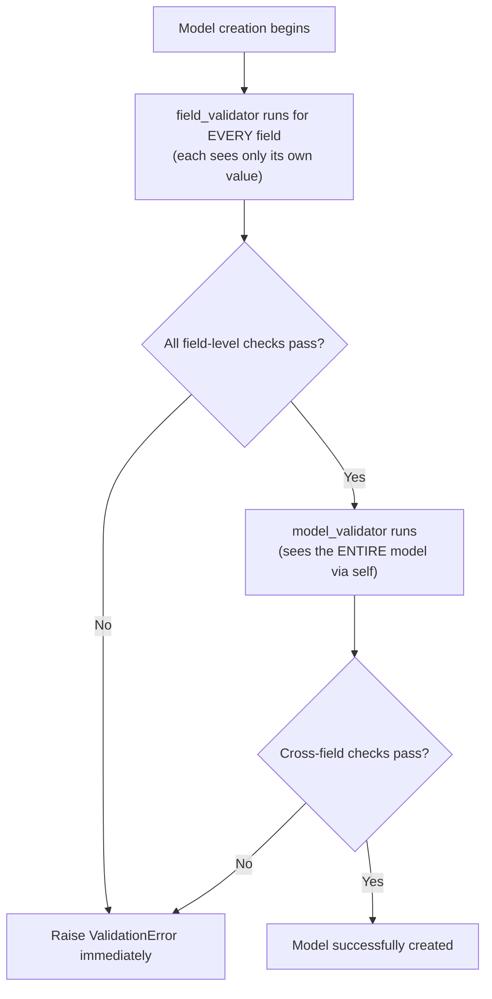

# 🧩 Mastering Pydantic + AI Foundations: Type Safety, Data Validation & the Building Blocks of LLMs

- <i>**Session:** Day 4 — Class 3: "Pydantic" ·
- **Instructor:** Mayank Aggarwal
- **Note on scope:** This class has two distinct halves. The **first half** goes deep into Pydantic — well beyond the type-validation basics introduced in the previous class — covering field constraints, Pydantic's built-in special types, custom `field_validator`s, cross-field `model_validator`s, computed fields, and nested models. The **second half** is a deliberate, no-code, whiteboard-style walkthrough of the core AI vocabulary every learner needs before agent-building begins: **LLMs, tokens, vector embeddings, context window, and parameters**. Real API calls and the first actual agent are explicitly deferred to the next class — this session builds the conceptual and data-validation foundation first.</i>

---

## 📑 Table of Contents

1. [Session Overview](#-session-overview)
2. [Learning Objectives](#-learning-objectives)
3. [Detailed Notes](#-detailed-notes)
   - [1. Why Pydantic Exists: The Type-Safety Gap in Python](#1-why-pydantic-exists-the-type-safety-gap-in-python)
   - [2. Three Ways to Define a Class: Plain Class vs. Dataclass vs. Pydantic BaseModel](#2-three-ways-to-define-a-class-plain-class-vs-dataclass-vs-pydantic-basemodel)
   - [3. Creating Models: Required Fields, Optional Fields & Defaults](#3-creating-models-required-fields-optional-fields--defaults)
   - [4. Automatic Type Coercion](#4-automatic-type-coercion)
   - [5. Serialization: model_dump and model_dump_json](#5-serialization-model_dump-and-model_dump_json)
   - [6. Field Constraints & Pydantic's Built-in Special Types](#6-field-constraints--pydantics-built-in-special-types)
   - [7. Custom Validation with field_validator](#7-custom-validation-with-field_validator)
   - [8. Cross-Field Validation with model_validator](#8-cross-field-validation-with-model_validator)
   - [9. Computed Fields](#9-computed-fields)
   - [10. Nested Models](#10-nested-models)
   - [11. AI Foundations: LLMs, Tokens, Vector Embeddings, Context Window & Parameters](#11-ai-foundations-llms-tokens-vector-embeddings-context-window--parameters)
4. [Glossary](#-glossary)
5. [Revision Notes — One-Minute Revision](#-revision-notes--one-minute-revision)
6. [Cheat Sheet](#-cheat-sheet)
7. [Interview Questions & Answers](#-interview-questions--answers)
8. [Scenario-Based Interview Questions](#-scenario-based-interview-questions)
9. [Hands-on Exercises](#-hands-on-exercises)
10. [Practice Assignment](#-practice-assignment)
11. [Additional Resources](#-additional-resources)
12. [Final Revision Sheet](#-final-revision-sheet)

---

## 🎯 Session Overview

This class completes the Pydantic arc started in the previous session and then pivots to pure AI theory:

1. **Why Pydantic exists** — a deeper dive into Python's lack of type safety, framed around a real-world "sign-up form" that can be broken by malicious or malformed input.
2. **Three ways to define a class** in Python (plain class, `@dataclass`, `pydantic.BaseModel`) — and why only the third actually enforces anything.
3. **Core Pydantic mechanics**: required vs. optional fields, default values, automatic type coercion, and serialization (`model_dump`, `model_dump_json`).
4. **Field-level data validation**: `Field()` constraints (`min_length`, `ge`, `le`, etc.), the `Annotated` syntax alternative, and Pydantic's built-in special types (`EmailStr`, `SecretStr`, `HttpUrl`).
5. **Custom validation logic**: `@field_validator` for single-field business rules, and `@model_validator` for rules that depend on *multiple* fields (like confirming two passwords match).
6. **Computed fields**: deriving a field's value on the fly instead of asking the user to supply it.
7. **Nested models**: reusing one Pydantic model inside another, mirroring how real, nested JSON is structured.
8. **AI foundations** (deliberately theory-only, screen-share paused for focus): LLMs as next-token predictors, tokens as "the currency of AI," vector embeddings as meaning-as-coordinates, the context window as a whiteboard with limited space, and parameters as a trained model's internal tunable values.

> 💡 **Memory Trick — the instructor's framing for the whole session:** *"Yes, AI will write your code. But what you make AI write — that is on you. If you don't understand Pydantic, your AI-generated code will be mediocre, because AI writes code the way you prompt it, and you can only prompt well what you actually understand."*

---

## 🎯 Learning Objectives

By the end of this guide, you will be able to:

- [ ] Explain precisely why Python's lack of type enforcement becomes a real production risk, using a "broken sign-up form" example.
- [ ] Compare a plain Python class, a `@dataclass`, and a `pydantic.BaseModel` in terms of what each one actually enforces.
- [ ] Create Pydantic models with required fields, optional fields (via defaults or `None`), and understand Pydantic's automatic type coercion behavior.
- [ ] Serialize a Pydantic model using `model_dump()` and `model_dump_json()`.
- [ ] Add field-level constraints using `Field(...)` (e.g., `min_length`, `max_length`, `ge`, `le`) and the equivalent `Annotated` syntax.
- [ ] Use Pydantic's built-in special types (`EmailStr`, `SecretStr`, `HttpUrl`) instead of hand-writing validation logic.
- [ ] Write a custom `@field_validator` for single-field business logic that Pydantic's built-in types can't express.
- [ ] Write a `@model_validator` for validation logic that depends on *more than one field at once* (e.g., password confirmation).
- [ ] Define a `@computed_field` that derives its value from other fields rather than accepting user input.
- [ ] Nest one Pydantic model inside another to mirror real nested JSON structures.
- [ ] Explain, in plain language, what an LLM, a token, a vector embedding, a context window, and a parameter each are — and how they relate to each other.

---

## 📚 Detailed Notes

### 1. Why Pydantic Exists: The Type-Safety Gap in Python

#### 🧠 Concept

Python does not enforce variable types the way statically-typed languages (Java, C++) do — and this gap becomes a genuine production risk the moment your code accepts input from the outside world (a form, an API call, a user).

#### ❓ Why It Exists

> 💡 **Memory Trick:** *"In Java or C++, you must declare a variable's type up front, and memory is allocated accordingly (e.g., exactly 4 bytes for an integer) — the language physically won't let you violate that. Python and JavaScript dropped this rigidity to make the language approachable for beginners, which is great for learning, but becomes a liability the moment you deploy something real."*

```python
age = 25          # fine
age = "twenty-five"   # ALSO fine — Python raises no error
age = [1, 2, 3]         # ALSO fine — still no error
```

#### 🔍 Internal Working — Why Python Allows This

Python variables don't directly hold a value the way lower-level languages do; instead, a variable name simply **points to** wherever the actual object lives in memory. Since Python never locks a name to a fixed type up front, reassigning it to point at a completely different type of object is not seen as an error — the language "doesn't raise an eyebrow."

#### ⚠ Common Mistakes — A Concrete Failure Case

```python
def register_user(name, email, age):
    """Registers a user — no validation at all."""
    print(f"Registered {name}, born approx {2026 - age}")

register_user("Mayank", "mayank@example.com", 28)          # ✅ works fine
register_user("Mayank", "mayank@example.com", "bad_form")   # ❌ crashes:
# TypeError: unsupported operand type(s) for -: 'int' and 'str'
```

> ⚠️ **The core problem, stated precisely:** As long as "good data" comes in, plain Python works fine. The moment **wrong or malicious data** comes in — deliberately or accidentally — the system either crashes outright, or (worse) silently accepts nonsensical values like `age = 1000`. This is exactly why the instructor draws a hard line: *"not only field type validation is required — data validation is also something that becomes important as you move toward production systems."*

#### 🏢 Real-World / Production Usage

Pydantic is not a niche tool — the instructor points to its documented use across major companies and libraries: **Anthropic's SDK**, **NVIDIA**, **Google**, and critically, **OpenAI's own chat completion API** — all use Pydantic internally, reinforcing that this is industry-standard, not optional polish.

> 💡 **Memory Trick — on why you should still learn this even with AI writing code for you:** *"Just because Swiggy/Zomato exist doesn't mean you never need to know how to cook. If AI writes your code but you can't read a `field_validator` it generates, you can't debug, extend, or trust that code — and that's exactly the skill gap companies are hiring to fill."*

#### 🎯 Key Takeaways

* Python enforces **neither** type validation (is this an `int`?) **nor** data validation (is this `int` a *sensible* value, like an age under 150?) on its own.
* This becomes a real risk only once your code accepts real-world input — not during simple, "happy path" scripting.
* Pydantic is genuinely industry-standard, used internally by major AI SDKs (including OpenAI's own chat completion API).

---

### 2. Three Ways to Define a Class: Plain Class vs. Dataclass vs. Pydantic BaseModel

#### ⚙ How It Works — Direct Comparison

```python
# 1. Plain class — attribute type hints are NOT enforced
class FormDataPlain:
    name: str
    email: str
    age: int

f = FormDataPlain()
f.name = 8   # ✅ runs without error — the type hint is purely cosmetic


# 2. @dataclass — auto-generates __init__, but STILL doesn't enforce types
from dataclasses import dataclass

@dataclass
class FormDataClass:
    name: str
    email: str
    age: int

f2 = FormDataClass(name="Mayank", email=123, age="not-a-number")   # ✅ ALSO runs without error


# 3. pydantic.BaseModel — the only one that actually validates
from pydantic import BaseModel, ValidationError

class FormDataPydantic(BaseModel):
    name: str
    email: str
    age: int

try:
    f3 = FormDataPydantic(name="Mayank", email="mayank@example.com", age="not-a-number")
except ValidationError as e:
    print(e)   # ❌ raises a real ValidationError
```

| | Plain class | `@dataclass` | `pydantic.BaseModel` |
|---|---|---|---|
| Auto-generates `__init__` | ❌ No | ✅ Yes | ✅ Yes |
| Enforces declared types at creation time | ❌ No | ❌ No | ✅ Yes |
| Raises a clear validation error on bad input | ❌ No | ❌ No | ✅ Yes (`ValidationError`) |

> ⚠️ **Common Mistake, explicitly flagged live:** Assuming that because `@dataclass` looks "stricter" (it uses type hints prominently), it actually *enforces* those types. It does not — it only saves you from writing `__init__` by hand. Many AI-generated code samples default to `@dataclass` when the task actually calls for `pydantic.BaseModel`.

#### 🎯 Key Takeaways

* Only inheriting from `pydantic.BaseModel` gets you real, automatic type enforcement.
* A plain class and a `@dataclass` both look like they constrain data (via type hints) but neither actually does.
* This is the exact reason Pydantic exists as a separate library rather than something Python's core language already handles.

---

### 3. Creating Models: Required Fields, Optional Fields & Defaults

#### ⚙ How It Works

```python
from pydantic import BaseModel

class SignUpForm(BaseModel):
    name: str
    age: int
    is_employee: bool = False   # has a default -> becomes OPTIONAL

user = SignUpForm(name="Mayank", age=28)
print(user.is_employee)   # False (used the default)

user2 = SignUpForm(name="Mayank", age=28, is_employee=True)
print(user2.is_employee)   # True
```

#### 🪜 Step-by-Step Execution — Required vs. Optional

1. Any field **without** a default value is **required** — omitting it raises a `ValidationError`.
2. Any field **with** a default value (e.g., `= False`, `= "Indian"`) automatically becomes **optional**.
3. If you don't know what default makes sense, use Python's `None` (capital `N`) — Python has no separate `null` keyword; `None` is the equivalent.

```python
from typing import Optional

class SignUpForm(BaseModel):
    name: str
    email: Optional[str] = None   # optional, defaults to None if omitted
```

#### ⚠ Common Mistakes

* Trying to create a model instance with **positional arguments** (`SignUpForm("Mayank", 28)`) instead of **keyword arguments** (`SignUpForm(name="Mayank", age=28)`) — Pydantic models expect keyword arguments (`**kwargs`-style), and positional creation fails.
* Forgetting that omitting a field with no default is a hard error, not a silent `None`.

#### 🎯 Key Takeaways

* Fields are required by default; adding a default value (including `None`) is what makes a field optional.
* Pydantic models are constructed using keyword arguments.

---

### 4. Automatic Type Coercion

#### 🧠 Concept

Pydantic doesn't just *reject* anything that isn't already the exact declared type — it will **coerce** (convert) a value into the expected type when a sensible conversion exists.

#### 💻 Code Example

```python
class SignUpForm(BaseModel):
    name: str
    age: int
    is_interested: bool = False

# age passed as a STRING — Pydantic coerces "28" into the int 28
user1 = SignUpForm(name="Mayank", age="28", is_interested="true")
print(type(user1.age))   # <class 'int'>

# But this fails — "28eight" cannot be sensibly parsed as an int
user2 = SignUpForm(name="Mayank", age="28eight")
# ValidationError: Input should be a valid integer, unable to parse string as an integer

# This ALSO fails — 28.5 cannot become an int without losing information
user3 = SignUpForm(name="Mayank", age=28.5)
# ValidationError
```

#### ⚖ Advantages & Limitations

| What Pydantic *will* coerce | What Pydantic *will not* coerce |
|---|---|
| A numeric string (`"28"`) → `int` | A non-numeric string (`"28eight"`) → `int` |
| A recognizable boolean-like string (`"true"`) → `bool` | A `float` (`28.5`) → `int` (would silently lose precision) |

#### 🎯 Key Takeaways

* Pydantic performs **sensible, limited** type coercion — it's still doing real validation, just with some built-in flexibility for common, safe conversions.
* Precision-losing or nonsensical conversions (float → int, garbled string → int) are correctly rejected.

---

### 5. Serialization: model_dump and model_dump_json

#### ⚙ How It Works

```python
user_data = user1.model_dump()          # returns a plain Python dict
user_json = user1.model_dump_json()      # returns a JSON-formatted string

import json
with open("user.json", "w") as f:
    json.dump(user_data, f)
```

#### 🎯 Key Takeaways

* `model_dump()` extracts a Pydantic model's data as a plain Python `dict` — useful for saving to a file, passing to another function, or further processing.
* `model_dump_json()` does the same but returns a JSON string directly.
* This pattern (dump → save/send) is common in ML/data pipelines, which is why the instructor calls it a light "prerequisite" concept rather than something novel to Pydantic.

---

### 6. Field Constraints & Pydantic's Built-in Special Types

#### ❓ Why It Exists

Type validation alone (is this an `int`?) doesn't stop nonsensical *values* (an age of `1000`). This is the **data validation** half of the problem introduced in Section 1.

#### 💻 Code Example — `Field()` Constraints

```python
from pydantic import BaseModel, Field

class JobApplication(BaseModel):
    full_name: str = Field(min_length=2, max_length=100)
    years_experience: int = Field(ge=0, le=50)
    portfolio_url: str


job = JobApplication(full_name="M", years_experience=5, portfolio_url="https://example.com")
# ValidationError: full_name — String should have at least 2 characters
```

| Constraint | Meaning |
|---|---|
| `min_length` / `max_length` | Minimum/maximum string length |
| `ge` | Greater than **or equal to** |
| `le` | Less than **or equal to** |
| (also available: `gt`, `lt` for strict greater/less-than) | Strict greater-than / less-than |

#### 💻 The `Annotated` Syntax — An Equivalent Alternative

```python
from typing import Annotated
from pydantic import BaseModel, Field

class JobApplication(BaseModel):
    full_name: Annotated[str, Field(min_length=2, max_length=100)]
    years_experience: Annotated[int, Field(ge=0, le=50)]
```

> 💡 **Memory Trick:** Both forms are **functionally identical** — purely a syntax choice. The instructor's personal preference is the simpler `Field(...)` default-value form ("I like my code less bulky"), but notes `Annotated` shows up frequently in AI-generated code, so recognizing both is essential.

#### 💻 Pydantic's Built-in Special Types

Rather than hand-writing validation (e.g., a regex for email format), Pydantic ships ready-made types for common real-world data shapes:

```python
from pydantic import BaseModel, EmailStr, SecretStr, HttpUrl

class UserAccount(BaseModel):
    email: EmailStr            # validates real email *format* (requires the `email-validator` package)
    password: SecretStr         # masks the value when printed/logged — never shows raw text
    website: HttpUrl            # validates it's a well-formed HTTP(S) URL
```

> ⚠️ **Common Mistake / Setup Note:** `EmailStr` requires the optional `email-validator` dependency. If you see `ImportError: email-validator is not installed`, install it explicitly (`uv add email-validator` / `pip install email-validator`) — it's usually bundled by default with a full Pydantic install, but not always in every environment (e.g., some hosted notebook environments).

#### 🔍 Internal Working — What `EmailStr` Does and Does Not Validate

> ⚠️ **Critical distinction, demonstrated live:** `EmailStr` only validates that an email is *correctly formatted* (has an `@`, a valid-looking domain, etc.) — it says nothing about whether that email is a **good** email for your business. A genuinely valid, correctly-formatted address like `abc@yopmail.com` (a known disposable/spam email provider) will pass `EmailStr` validation perfectly, even though a real signup form should probably reject it.

> 💡 **Memory Trick:** *"Pydantic tells you if the email is well-formed. Whether you want to accept disposable emails, or only allow emails from a specific company domain (e.g., only @axisbank.com for a partner promotion) — that's your business logic, not Pydantic's job."* This exact gap is what Section 7 (`field_validator`) exists to close.

#### 🎯 Key Takeaways

* `Field(...)` (or the equivalent `Annotated[...]` syntax) adds **data validation** on top of Pydantic's automatic **type validation**.
* Pydantic ships built-in special types (`EmailStr`, `SecretStr`, `HttpUrl`, and others) for common real-world data shapes — don't hand-write validation logic Pydantic already provides.
* `EmailStr` validates *format only* — it cannot enforce business-specific rules like "reject disposable email domains."

---

### 7. Custom Validation with field_validator

#### 🧠 Concept

`@field_validator` lets you attach **custom business logic** to a single specific field — for rules that Pydantic's built-in types and `Field()` constraints simply cannot express (like rejecting a specific list of disposable email domains).

#### 💻 Code Example

```python
from pydantic import BaseModel, EmailStr, field_validator

class JobApplication(BaseModel):
    full_name: str
    email: EmailStr
    years_experience: int = 0

    @field_validator("email")
    @classmethod
    def reject_disposable_domains(cls, value: str) -> str:
        blocked_domains = ["yopmail.com", "tempmail.com", "mailinator.com"]
        user_domain = value.split("@")[-1]   # -1 handles multi-part domains safely
        if user_domain in blocked_domains:
            raise ValueError("Disposable email addresses are not accepted")
        return value


JobApplication(full_name="Mayank", email="rohan@yopmail.com")
# ValidationError: Disposable email addresses are not accepted
```

#### 🪜 Step-by-Step Execution

1. `@field_validator("email")` is a **decorator** that registers this function to run whenever the `email` field is validated.
2. `@classmethod` marks it as a class method — `cls` refers to the class itself (not an object instance, the way `self` does).
3. The function receives the field's proposed `value` (here, the email string) — **and only that one field's value**, nothing else about the rest of the model.
4. Using `value.split("@")[-1]` (rather than `[1]`) is a deliberate defensive choice: some domains have multiple `.` or unusual structures, but the actual domain is *always* the last segment after the final `@` — using `-1` is safer than assuming a fixed position.
5. `raise ValueError(...)` inside the validator causes Pydantic to reject the entire model creation with a `ValidationError`, carrying your custom message.
6. If validation passes, the function must `return value` — Pydantic uses this returned value as the field's final, validated value.

#### 🔍 Internal Working — Field-Level Validation Order

> ⚠️ **Key insight, demonstrated with a deliberately staged failure:** When *both* `EmailStr`'s built-in format validation and a custom `field_validator` are present on the same field, format validation runs first. If the format itself is invalid, the custom validator function never even executes — Pydantic fails fast at the earliest possible check.

#### ⚠ Common Mistakes

* Believing you can access a *different* field's value inside a `field_validator` — you cannot. A `field_validator` receives **only the value of the field it's attached to**, nothing else about the model (this exact limitation motivates Section 8).
* Forgetting to `return value` at the end of the validator function — the function's job is to both *validate* and *return* the (possibly transformed) value.

#### 🎯 Key Takeaways

* Use `field_validator` for **business rules specific to a single field** that Pydantic's built-in types/constraints can't express.
* A `field_validator` sees only its own field's value — never any other field on the model.
* `raise ValueError(...)` triggers a `ValidationError`; a successful validator must `return` the (validated) value.

---

### 8. Cross-Field Validation with model_validator

#### ❓ Why It Exists — The Exact Limitation field_validator Can't Cross

> 💡 **Memory Trick — the instructor's own phrase:** *"It's kind of a Schrödinger's cat situation — either you can see the email, or you can see the years of experience, in a field_validator. You cannot see both at once."*

This becomes a real problem for genuinely common rules, such as:
- *"If the applicant's email is `@infosys.com`, require at least 5 years of experience."*
- *"The `password` and `confirm_password` fields must match."*

Neither of these can be expressed with a `field_validator`, because each `field_validator` only ever sees **one** field's value.

#### 💻 Code Example

```python
from pydantic import BaseModel, model_validator

class SignUpForm(BaseModel):
    password: str
    confirm_password: str

    @field_validator("password")
    @classmethod
    def check_password_length(cls, value: str) -> str:
        if len(value) < 8:
            raise ValueError("Password must be at least 8 characters long")
        return value

    @model_validator(mode="after")
    def check_passwords_match(self):
        if self.password != self.confirm_password:
            raise ValueError("Password and confirm password do not match")
        return self


SignUpForm(password="ecdef123", confirm_password="different123")
# ValidationError: Password and confirm password do not match
```

#### 🔍 Internal Working — Execution Order Is Fixed

> ⚠️ **Critical, explicitly emphasized rule:** **Every individual `field_validator` on a model always runs first, for every field, before any `model_validator` ever runs.** This is logical, not arbitrary: there's no point checking cross-field relationships on data that hasn't even passed its own basic per-field checks yet.



#### 🪜 Step-by-Step Execution

1. `@model_validator(mode="after")` means this validator runs **after** all individual field validation has already succeeded.
2. Unlike `field_validator`, a `model_validator` receives `self` — giving it access to **every field on the model at once** (`self.password`, `self.confirm_password`, etc.), exactly like any other instance method.
3. Because it has full access via `self`, it can express any cross-field business rule — matching passwords, conditional requirements based on another field's value, and so on.
4. It must `return self` at the end if validation succeeds, so Pydantic can finalize the fully-validated model instance.

#### ⚖ Advantages & Limitations

| `field_validator` | `model_validator` |
|---|---|
| Sees only **one** field's value | Sees **every** field on the model (via `self`) |
| Best for validation local to a single field | Required for any rule spanning **two or more** fields |
| Runs first, for every field | Runs **after** all field validators have already passed |
| Preferred as the default choice — simpler | Should be reserved for genuinely cross-field logic — using it everywhere makes models unnecessarily long/complex |

#### ⚠ Common Mistakes

* Trying to solve a cross-field problem (like password confirmation) using two separate `field_validator`s — this cannot work, since neither one can see the other field's value.
* Overusing `model_validator` for logic that's really just single-field validation — the instructor explicitly frames this as unnecessary complexity; reach for `field_validator` first, and `model_validator` only when a rule genuinely requires more than one field.

#### 🎯 Key Takeaways

* `field_validator` = one field's value only. `model_validator` = the *entire* model, via `self`.
* Execution order is fixed: **all field validators run before any model validator does.**
* Use `model_validator` specifically (and only) for rules that genuinely depend on the relationship between two or more fields.

---

### 9. Computed Fields

#### 🧠 Concept

A **computed field** is a model attribute whose value is **derived on the fly** from other fields — rather than something the user is asked to directly supply (and which could therefore be entered incorrectly or inconsistently).

#### ❓ Why It Exists

> 💡 **Memory Trick:** *"Should you ask a user to type in their own BMI? No — it can be calculated from height and weight, so calculate it. Should a job applicant get to self-declare their own 'experience tier' (junior/mid/senior)? No — that should be derived from their actual years of experience, consistently, not left to the user's own judgment."*

#### 💻 Code Example

```python
from pydantic import BaseModel, computed_field

class JobApplicant(BaseModel):
    full_name: str
    years_experience: int

    @computed_field
    @property
    def experienced_tier(self) -> str:
        if self.years_experience < 2:
            return "Junior"
        elif self.years_experience < 7:
            return "Mid"
        else:
            return "Senior"


applicant = JobApplicant(full_name="Aditya Sharma", years_experience=4)
print(applicant.experienced_tier)   # "Mid"
```

#### 🪜 Step-by-Step Execution

1. `@computed_field` is the **first** decorator (outermost) — it tells Pydantic this property should be treated as part of the model's data (e.g., included in `model_dump()`), not just a regular Python property.
2. `@property` is the **second** decorator (this exact stacking order is required, per Pydantic's own defined syntax — not something to improvise) — it's what makes `experienced_tier` accessible as `applicant.experienced_tier` (no parentheses), like any other model field, rather than as a method you'd call.
3. The function name (`experienced_tier` in this example) **becomes the exact property name** — there is no separate "output name" you configure elsewhere; whatever you name the function *is* the field name.
4. Inside, `self` gives access to every other field on the model (`self.years_experience`), so the logic can reference any of them.
5. The function must `return` the computed value — there is no separate "set" step; it recalculates fresh every time the property is accessed.

#### ⚠ Common Mistakes

* Writing the underlying logic as a plain `if self.years_experience > 2:` check *outside* a properly decorated function — the instructor explicitly flags this as a sign of needing to revisit basic Python/OOP fundamentals, since the whole point of `@computed_field` + `@property` is that it behaves like a *field*, not a manually-called function.
* Naming the function something other than the intended field name (e.g., `get_tier` instead of `tier`) — there is no name-remapping option; the function name **is** the field name, exactly as written.

#### 🎯 Key Takeaways

* `@computed_field` + `@property` (in that specific order) turns a method into a model attribute that's derived, not user-supplied.
* The function's name becomes the exact field name — no aliasing.
* Use computed fields whenever a value can be reliably derived from other fields, rather than trusted to (potentially inconsistent) user input.

---

### 10. Nested Models

#### 🧠 Concept

A Pydantic model can be used as the **type of a field** inside another Pydantic model — letting you reuse a well-defined, validated structure (like an `Address`) across multiple parent models, exactly mirroring how real-world JSON is naturally nested.

#### 💻 Code Example

```python
from pydantic import BaseModel

class Address(BaseModel):
    street: str
    city: str
    zip_code: str

class Applicant(BaseModel):
    full_name: str
    address: Address   # nested model — reuses Address's own validation rules


applicant_data = {
    "full_name": "Aditya Sharma",
    "address": {
        "street": "MG Road",
        "city": "Bengaluru",
        "zip_code": "560001",
    },
}

applicant = Applicant(**applicant_data)
print(applicant.address.city)   # "Bengaluru"
```

#### ❓ Why It Exists

> 💡 **Memory Trick:** *"If you've already defined validation rules on Address (e.g., a zip code must match a certain length or pattern), don't you want that reused everywhere Address appears in your codebase — rather than redefining those rules every single time?"* Any constraints (`Field(...)`, `field_validator`s, etc.) defined on `Address` are automatically enforced wherever `Address` is nested inside another model — this is ordinary composition/reuse, not a special new mechanism.

#### 🏢 Real-World / Production Usage

Nested models exist precisely **because real-world JSON is nested** — an API response or request payload frequently contains an object inside an object (e.g., a `user` object containing an `address` object, which itself might contain further structure). Nested Pydantic models let your Python data model mirror that real structure directly, rather than flattening everything into one giant model.

#### ⚠ Common Mistakes

* Confusing "nested models" with **inheritance/composition patterns from Java** — the instructor explicitly clarifies this is not analogous to Java's composition mechanics; it's simply "a model, used as a field's type, inside another model" — conceptually much simpler than it might initially sound.

#### 🎯 Key Takeaways

* A Pydantic model can be used as a field's type inside another model — this is **nesting**, not inheritance.
* Validation rules defined once on the nested model (e.g., `Address`) apply automatically everywhere that model is reused.
* This directly mirrors how real JSON payloads are naturally structured (objects inside objects).

---

### 11. AI Foundations: LLMs, Tokens, Vector Embeddings, Context Window & Parameters

#### 🧠 Concept

Before any real API call or agent-building begins (explicitly deferred to the next class), the instructor deliberately paused screen-sharing and delivered a **theory-only, whiteboard-style explanation** of five foundational AI terms every learner — technical or not — should be able to speak to confidently.

> 💡 **Memory Trick — framing for this whole section:** *"Think of these as the 5 terms out of a broader ~21 that anyone working in AI today, technical or not, should know cold — not in shallow, buzzword form, but with real intuition."*

#### 📖 Term 1 — LLM (Large Language Model)

> 💡 **Memory Trick:** *"Imagine a friend who has read every book, every website, every conversation ever published — but nobody ever explained to them what any of it *means*. They've simply seen the phrase 'thank you for' followed by 'your business' so many millions of times that when you say 'thank you for,' they instinctively continue with 'your business' — not because they understand gratitude, but because that's overwhelmingly what tends to come next."*

- ChatGPT, Claude, Gemini are all **LLMs** — models trained on an enormous slice of everything humans have written, purely to predict, statistically, **the next most likely token** given everything written so far.
- **An LLM is fundamentally a next-token predictor.** It generates its response one token at a time, each new token chosen based on everything generated (and provided) so far.
- Demonstrated live with a simple audience prompt: *"Best of…"* → most people instinctively think "luck." This is the same statistical pattern-completion mechanism, just happening in a human brain instead of a neural network.

#### 📖 Term 2 — Token

> 💡 **Memory Trick:** *"A token is a Lego brick, not a full word. Short, common words often become a single brick ('cat', 'these'). Longer or unusual words get split into two or three ('unbelievable' → 'un' + 'believ' + 'able'). You can roughly think of a token as three-fourths of a word, though the exact splitting logic depends on the specific tokenizer algorithm."*

- LLMs don't see or understand **words** — they see and generate **tokens**. "It takes tokens as input, it gives you tokens as output. Just that."
- **Tokens are "the currency of AI"** — directly analogous to the pre-unlimited-plan era of being billed by the minute for phone calls: more words spoken → more minutes billed; more tokens processed → more cost billed.
- **Input tokens vs. output tokens have different costs — output is always more expensive**, because generating a response requires the model to actually "think" (run inference) and produce new content, whereas input tokens are comparatively cheaper to simply process/read.
- Demonstrated live via real provider pricing pages (Claude, OpenAI): prices are quoted per **million tokens (M/tok)**, with output pricing consistently higher than input pricing for the same model.

| Concept | Real-world phone-plan analogy |
|---|---|
| Token | A unit of "talk time" |
| Input tokens (your prompt/message) | Time *you* spend talking |
| Output tokens (the model's reply) | Time *they* spend talking back — priced higher, since generating a thoughtful reply costs more than just listening |

#### 📖 Term 3 — Vector Embedding

> 💡 **Memory Trick:** *"Every word gets converted into a long list of numbers — a vector — that captures its meaning as a location in space, like coordinates on a map. 'Puppy' and 'dog' sit close together because they mean similar things. 'Happy' and 'puppy' sit far apart, even though they rhyme, because their *meanings* are unrelated."*

- This concept **predates and is independent of modern LLMs** — it comes from classical NLP (Natural Language Processing).
- Demonstrated live with an interactive word-embedding visualization: words plotted in a high-dimensional space (the live example used **200 dimensions**, though this is a configurable design choice, not a fixed universal number), where semantically related words cluster near each other.
- **Ambiguity example:** the word "Apple" can mean the company or the fruit — embeddings are how a model captures and disambiguates that a word's *meaning* depends on its surrounding context/coordinates in this space, not just the literal characters.
- **Dimensionality is a design choice, not a fixed property of language:** you decide how many dimensions to embed words into. Fewer dimensions (e.g., a single line, or 1D) forces many unrelated words to sit unnaturally close together; more dimensions give the model more "room" to place words precisely relative to their true meaning — at the cost of more memory/compute.

#### 📖 Term 4 — Context Window

> 💡 **Memory Trick:** *"Think of it as a whiteboard. Every message you send gets written on that board — your messages, the model's own earlier replies, any document you've shared. The board only has so much space. Once it fills up, whatever was written first gets erased to make room for new content, whether it still matters or not. That 'wait, why did the AI forget what I told it 3 minutes ago?' moment isn't the model being careless — that's the whiteboard running out of room."*

- The **context window** is everything a model can "see" at once, measured in tokens — demonstrated live via a real provider's model page (400K-token context window for a current ChatGPT model at the time of the session).
- Once the token limit is hit, the **oldest content is silently dropped** to make room for new content — not because the model "chose" to forget, but because there's a hard capacity limit.
- **Context window ≠ Memory.** The instructor explicitly flags this distinction and defers a full explanation of memory (a separate, smaller, deliberately-preserved store of information the model is told never to forget) to a later class — but is clear these are two different mechanisms, not synonyms.

#### 📖 Term 5 — Parameters

> 💡 **Memory Trick:** *"Picture a mixing console with billions of tiny sliders, each nudged a fraction of a millimeter during training. You can't point to 'the one slider that knows Paris is in France' — no single parameter means anything on its own. Capability emerges only from the combined positions of billions of them together."*

- Parameters are the model's **internal, trained (or fine-tuned) numeric values** — set during **training**, not something that changes when you're simply chatting with the model afterward.
- **"More parameters" is a rough proxy for capacity to learn** — not a guarantee of how smart any single answer will actually be. A larger model (more sliders) has more *potential*, but quality still depends on how well it was trained.
- Referenced live: GPT-4 is publicly estimated to be in the **trillions** of parameters (not merely billions) — reinforcing the scale involved.

#### 🔍 Internal Working — How Parameters, Tokens, and Vectors Relate (Directly Addressed in Live Q&A)

A recurring point of learner confusion, addressed explicitly and repeatedly:

| Term | When it matters | What it actually is |
|---|---|---|
| **Parameter** | During **training** (fixed once training/fine-tuning is complete) | An internal numeric weight inside the model's neural network — has no meaning in isolation |
| **Token** | During **inference** (every time you interact with the model) | The unit the model reads as input and generates as output |
| **Vector / Embedding dimension** | Also used during inference/representation | A coordinate value representing a token/word's position in a meaning-space you (or the model's designers) define the size of |

> 💡 **Memory Trick — the instructor's clarifying analogy for a confused learner:** *"Parameters are like the number of weather factors you track (temperature, humidity, wind, pressure) — more parameters (factors) generally give you a more complete, accurate picture, but a single parameter (like just 'temperature = 35°C') means very little on its own without the others."*

#### ⚠ Common Mistakes (Directly Surfaced in Live Q&A)

* Confusing **parameters** with **vector dimensions** — they are entirely separate concepts (one relates to training-time model capacity; the other relates to how meaning is represented in embedding space).
* Assuming a "long chat getting confused" is a memory failure — it is almost always the **context window** silently dropping old content, not a distinct "memory" system failing (memory is a separate topic).
* Assuming input and output tokens are priced the same — output tokens are consistently more expensive, because generation requires active computation, not just reading.

#### 🎯 Key Takeaways

* **LLM** = a next-token predictor trained on massive text data — not a system that "understands" meaning in a human sense.
* **Token** = the actual unit AI reads/generates (roughly ~¾ of a word) — and the literal billing unit ("the currency of AI"), with output tokens always costing more than input tokens.
* **Vector embedding** = a word/token's meaning represented as coordinates in a (designer-chosen-dimensionality) space, where semantically similar words cluster together — a concept that predates modern LLMs, from classical NLP.
* **Context window** = the total token capacity a model can "see" at once (a whiteboard with limited space) — distinct from "memory," which is a separate, later topic.
* **Parameter** = an internal, trained numeric value inside the model — set during training, meaningless individually, and only a rough proxy (not a guarantee) of capability at scale.

---

## 📝 Glossary

| Term | Definition | Why It Matters |
|---|---|---|
| **Type Validation** | Checking that a value is the *correct type* (e.g., is this actually an `int`?) | The most basic protection Pydantic provides, automatically, via `BaseModel` |
| **Data Validation** | Checking that a value, beyond being the right type, is *sensible/acceptable* (e.g., is this age between 0–120?) | Requires explicit `Field()` constraints or custom validators — not automatic |
| **`ValidationError`** | The exception Pydantic raises when a model fails validation | The primary error-handling target when working with Pydantic models |
| **Type Coercion (Pydantic)** | Automatically converting a value into the expected type when a sensible conversion exists (e.g., `"28"` → `28`) | An important nuance — Pydantic isn't purely "reject anything not already exact" |
| **`model_dump()` / `model_dump_json()`** | Methods that export a Pydantic model's data as a plain dict / JSON string, respectively | Used for saving, transmitting, or further processing validated data |
| **`Field(...)`** | A Pydantic function for declaring constraints (`min_length`, `ge`, `le`, etc.) on a model field | The primary tool for data (not just type) validation |
| **`Annotated[...]`** | An alternative syntax for attaching `Field(...)` constraints to a type hint | Functionally identical to the default-value `Field(...)` form; common in AI-generated code |
| **`EmailStr` / `SecretStr` / `HttpUrl`** | Pydantic's built-in special types for common real-world data shapes | Save you from hand-writing regex/validation logic for common cases |
| **`@field_validator`** | A decorator for attaching custom validation logic to a **single** field | Used for business rules a field's type/constraints can't express |
| **`@model_validator`** | A decorator for attaching validation logic that needs access to the **entire model** (via `self`) | Required for any rule spanning two or more fields (e.g., password confirmation) |
| **`@computed_field` + `@property`** | The decorator pair for defining a model attribute derived from other fields rather than supplied directly | Prevents asking users for data that can/should be calculated instead |
| **Nested Model** | Using one Pydantic model as the type of a field inside another Pydantic model | Mirrors how real JSON is naturally structured (objects inside objects) |
| **LLM (Large Language Model)** | A model trained on massive text data to predict the next most likely token given prior context | The foundational technology behind ChatGPT, Claude, Gemini, etc. |
| **Token** | The actual unit of text an LLM reads and generates (roughly ¾ of a word) | The literal billing unit for AI usage — "the currency of AI" |
| **Vector Embedding** | A numeric representation of a word/token's meaning as coordinates in a defined-dimensionality space | How models represent and compare meaning; predates modern LLMs (classical NLP) |
| **Context Window** | The total token capacity a model can process/"see" at once in a single interaction | Explains why long conversations cause a model to "forget" earlier content |
| **Parameter** | An internal, trained numeric value inside a model's neural network | A rough proxy for model capacity; meaningless in isolation; set during training, not inference |

---

## 🔄 Revision Notes — One-Minute Revision

> Python enforces **neither type nor data validation** on its own — a plain `class` and even `@dataclass` both look constrained (via type hints) but enforce nothing; only `pydantic.BaseModel` actually validates. Fields are **required by default**; giving a field a default value (including `None`) makes it **optional**. Pydantic performs limited, sensible **type coercion** (`"28"` → `28`) but rejects nonsensical or precision-losing conversions. Use `model_dump()`/`model_dump_json()` to export a validated model's data. For **data validation** beyond type, use `Field(min_length=..., ge=..., le=...)` (or the equivalent `Annotated[...]` syntax) and Pydantic's built-in special types (`EmailStr`, `SecretStr`, `HttpUrl`) — but remember these only check *format*, not business rules (e.g., `EmailStr` won't reject a correctly-formatted but disposable email address). For custom business logic on **one** field, use `@field_validator`; for logic depending on **multiple** fields at once (like password confirmation), use `@model_validator`, since field validators can only ever see their own single field's value — and all field validators always run before any model validator does. Use `@computed_field` + `@property` (in that order) for values that should be **derived**, not user-supplied. **Nested models** let you reuse one Pydantic model as a field inside another, mirroring real nested JSON. The session closed with five foundational AI terms: an **LLM** is fundamentally a next-token predictor trained on massive text; a **token** (not a word) is the actual unit AI reads/generates and the literal "currency" it's billed in (output tokens always cost more than input); a **vector embedding** represents a word's meaning as coordinates in space, with semantically similar words clustering together; the **context window** is a model's total token "whiteboard" capacity, with oldest content silently dropped once it fills (distinct from "memory," a separate mechanism); and **parameters** are a model's internal trained values, meaningless individually, and only a rough proxy — not a guarantee — of capability.

---

## 📋 Cheat Sheet

**The three class-definition options:**
```python
class Plain: ...                    # type hints = decoration only, nothing enforced
@dataclass
class DC: ...                        # auto __init__, still nothing enforced
class Model(BaseModel): ...          # ACTUAL enforcement
```

**Required vs. optional:**
```python
class M(BaseModel):
    required_field: str
    optional_field: bool = False      # any default => optional
    optional_none: Optional[str] = None
```

**Field constraints (two equivalent syntaxes):**
```python
full_name: str = Field(min_length=2, max_length=100)
full_name: Annotated[str, Field(min_length=2, max_length=100)]
```

**Built-in special types:**
```python
from pydantic import EmailStr, SecretStr, HttpUrl
```

**Single-field custom validation:**
```python
@field_validator("email")
@classmethod
def my_check(cls, value: str) -> str:
    if not_ok(value):
        raise ValueError("message")
    return value
```

**Cross-field validation:**
```python
@model_validator(mode="after")
def my_check(self):
    if self.a != self.b:
        raise ValueError("message")
    return self
```

**Computed field:**
```python
@computed_field
@property
def derived_name(self) -> str:
    return compute(self.other_field)
```

**Nested model:**
```python
class Address(BaseModel): ...
class Applicant(BaseModel):
    address: Address
```

**AI vocabulary, one line each:**
- **LLM** = next-token predictor.
- **Token** = the actual unit AI reads/writes (~¾ word); AI's billing currency; output > input in cost.
- **Vector embedding** = meaning as coordinates; similar meaning = nearby points.
- **Context window** = total token capacity visible at once (a whiteboard, not memory).
- **Parameter** = a trained internal model weight; meaningless alone; rough capacity proxy.

---

## 🔥 Interview Questions & Answers

### 🟢 Beginner

**Q1. Does a Python `@dataclass` enforce the types declared in its type hints?**
**Answer:** No — it auto-generates `__init__` for convenience, but does not validate or enforce the declared types at all.
**Explanation:** A commonly misunderstood point; only `pydantic.BaseModel` actually enforces types.
**Why This Matters:** Prevents relying on `@dataclass` for safety it doesn't provide.
**Possible Follow-up:** "What does `pydantic.BaseModel` do differently?"

**Q2. What makes a Pydantic model field optional rather than required?**
**Answer:** Giving it a default value (including `None`) — any field without a default is required.
**Explanation:** Straightforward but essential Pydantic mechanics.
**Why This Matters:** Core, testable recall.
**Possible Follow-up:** "How would you make a field optional with no sensible default?"

**Q3. What is Pydantic's automatic type coercion, and give one example where it succeeds and one where it fails.**
**Answer:** Succeeds: passing `"28"` for an `int` field converts to `28`. Fails: passing `28.5` for an `int` field, or a non-numeric string like `"28eight"` — both raise a `ValidationError`.
**Explanation:** Demonstrated live in the session.
**Why This Matters:** Tests precise understanding of coercion's limits.
**Possible Follow-up:** "Why does Pydantic refuse to coerce a float into an int?"

**Q4. What do `model_dump()` and `model_dump_json()` each return?**
**Answer:** `model_dump()` returns a plain Python dictionary; `model_dump_json()` returns a JSON-formatted string.
**Explanation:** Basic serialization API.
**Why This Matters:** Practical, frequently-used functionality.
**Possible Follow-up:** "When would you use one over the other?"

**Q5. What does `Field(min_length=2, max_length=100)` add to a Pydantic field beyond its basic type hint?**
**Answer:** Data validation — constraints on the *value* itself (its length), beyond just confirming it's a `str`.
**Explanation:** The core distinction between type validation and data validation.
**Why This Matters:** Foundational Pydantic vocabulary.
**Possible Follow-up:** "What's the `Annotated` equivalent of this same constraint?"

**Q6. Does `EmailStr` reject a correctly-formatted but disposable email address (e.g., `abc@yopmail.com`)?**
**Answer:** No — `EmailStr` only validates format/structure, not business-specific rules like disposable-domain blocking.
**Explanation:** Directly demonstrated live via a real signup-form test.
**Why This Matters:** A commonly-missed nuance about what built-in types actually check.
**Possible Follow-up:** "What tool would you use to add that business rule?"

**Q7. Can a `field_validator` access the value of a different field on the same model?**
**Answer:** No — a `field_validator` only ever receives the value of the single field it's attached to.
**Explanation:** The exact limitation that motivates `model_validator`.
**Why This Matters:** A frequently-tested, precise Pydantic distinction.
**Possible Follow-up:** "What decorator would you use instead for a cross-field rule?"

**Q8. What is the fixed execution order between field validators and model validators?**
**Answer:** Every `field_validator` on a model runs first, for every field, before any `model_validator` ever runs.
**Explanation:** Explicitly stated and justified live ("no point checking cross-field relationships on data that hasn't passed its own basic checks yet").
**Why This Matters:** Tests precise, ordered recall.
**Possible Follow-up:** "Why does this ordering make logical sense?"

**Q9. What two decorators are required (and in what order) to define a computed field?**
**Answer:** `@computed_field`, then `@property` — in that specific order.
**Explanation:** Demonstrated live with an explicit note that this stacking order is required by Pydantic's syntax, not something to improvise.
**Why This Matters:** A precise, testable syntax fact.
**Possible Follow-up:** "What does the function's name become, once decorated this way?"

**Q10. In plain language, what is a "token" to an LLM?**
**Answer:** The actual unit of text an LLM reads and generates — roughly three-fourths of a word (exact splitting depends on the tokenizer) — not a full word, and not a single character.
**Explanation:** The session's core "Lego brick" analogy.
**Why This Matters:** Foundational AI vocabulary needed before any agent-building work.
**Possible Follow-up:** "Why are output tokens typically priced higher than input tokens?"

---

### 🟡 Intermediate

**Q11. Explain why a job-application form needs both `Field(ge=0, le=50)` on `years_experience` AND a `field_validator` on `email`, rather than relying on just one validation mechanism.**
**Answer:** `Field(ge=0, le=50)` expresses a simple, self-contained numeric range constraint — well-suited to Pydantic's built-in constraint system. Rejecting specific disposable email domains, however, requires custom business logic (checking against a list, string manipulation) that no built-in constraint can express — this is exactly the class of rule `field_validator` exists for. Using the right tool for each type of rule keeps the model both concise and correct.
**Explanation:** Synthesizes Sections 6 and 7 into a coherent "which tool for which job" understanding.
**Why This Matters:** Tests the ability to choose the right Pydantic mechanism for a given constraint, not just recall each one in isolation.
**Possible Follow-up:** "Could you express the disposable-domain check using only `Field(...)`? Why or why not?"

**Q12. A learner proposes solving the "Infosys applicants need 5+ years of experience" rule using two separate `field_validator`s — one on `email`, one on `years_experience`. Why won't this work, and what's the correct approach?**
**Answer:** It cannot work because each `field_validator` only ever sees its own single field's value — the `email` validator has no access to `years_experience`, and vice versa, so neither can express a rule that depends on *both* fields simultaneously. The correct approach is a single `@model_validator(mode="after")`, which receives the entire model via `self` and can therefore reference `self.email` and `self.years_experience` together in one conditional check.
**Explanation:** Directly addresses a live misconception surfaced and corrected in the session's Q&A.
**Why This Matters:** Tests genuine understanding of the field_validator/model_validator boundary, not just memorized definitions.
**Possible Follow-up:** "Write the `model_validator` that expresses this exact rule."

**Q13. Why does the instructor prefer splitting an email by `@` and taking index `-1` (`value.split("@")[-1]`) rather than index `1`, when extracting the domain?**
**Answer:** Using `-1` (the last element) is more defensive/robust than assuming the domain is always at a fixed positional index like `[1]` — real-world email-like strings could, in edge cases, contain unusual structures, and taking the *last* segment after any `@` reliably captures the domain regardless of what precedes it.
**Explanation:** A small but genuinely instructive defensive-coding detail called out explicitly in the session.
**Why This Matters:** Tests attention to practical, real-world robustness details, not just "does the demo work."
**Possible Follow-up:** "Can you think of an email-like input where `[1]` would actually fail but `[-1]` would still succeed?"

**Q14. Explain precisely why "more parameters" in a model is described as only a "rough proxy" for capability, not a guarantee.**
**Answer:** Because parameters are simply the trained numeric weights inside a neural network — no single parameter, and no fixed *count* of parameters, inherently guarantees quality. A model's actual usefulness depends on the combined, well-tuned interaction of all its parameters after training — a larger model that was poorly or insufficiently trained can still underperform a smaller, well-trained one. Parameter count indicates *potential capacity to learn*, not *demonstrated quality*.
**Explanation:** Directly reflects the session's "mixing console with billions of sliders" analogy and its explicit caveat.
**Why This Matters:** Tests whether the learner internalizes the nuance, not just the raw fact ("bigger = more parameters").
**Possible Follow-up:** "Give a real-world example where a smaller, well-trained model might outperform a larger, poorly-trained one."

**Q15. A learner in the session confuses "parameters" with "vector dimensions." Precisely distinguish the two.**
**Answer:** Parameters are internal values inside a model's neural network, fixed once training/fine-tuning completes, with no individual meaning — they determine *how* the model computes its outputs. Vector dimensions are a separate, chosen design property of how *words/tokens* are represented as coordinates in a meaning-space (e.g., 200 dimensions in the session's live example) — they determine *how precisely* semantic relationships between words can be captured and compared. One relates to model training/capacity; the other relates to how meaning is represented and compared at inference/embedding time.
**Explanation:** Directly resolves a specific, extended live Q&A confusion in the transcript.
**Why This Matters:** A genuinely common point of confusion worth being able to cleanly resolve.
**Possible Follow-up:** "Does increasing the number of embedding dimensions increase a model's parameter count?"

**Q16. Why does the instructor explicitly distinguish "context window" from "memory," rather than treating them as synonyms?**
**Answer:** The context window is a hard, token-limited capacity for what a model can process in a single interaction — once full, the oldest content is automatically and indiscriminately dropped, regardless of importance. "Memory" (deferred to a later class) refers to a separate, deliberately-curated mechanism for information the system is specifically designed to retain and recall regardless of context window pressure — the two solve related but distinct problems and shouldn't be conflated.
**Explanation:** An explicit, repeated clarification in the session, given how often learners conflate the two.
**Why This Matters:** Prevents a common conceptual error that would confuse later agent-memory topics.
**Possible Follow-up:** "Why might a system need both a context window AND a separate memory mechanism?"

**Q17. Why are output tokens more expensive than input tokens for the same model, at the same token count?**
**Answer:** Processing input tokens is comparatively cheap — the model is essentially "reading" already-given text. Generating output tokens requires the model to actively perform inference computation to produce each new token, which is a meaningfully more expensive operation — hence the higher price per token for output versus input.
**Explanation:** Directly stated and reinforced with a real pricing-page demonstration in the session.
**Why This Matters:** A practical, cost-relevant distinction for anyone building or budgeting for an AI application.
**Possible Follow-up:** "How would this pricing asymmetry influence how you design a prompt or system message?"

**Q18. In the session's nested-model example (`Applicant` containing `Address`), if `Address` has a `field_validator` on `zip_code`, does that validator still run when `Address` is used inside `Applicant`?**
**Answer:** Yes — nesting a model doesn't strip away or bypass its own validation logic; `Address`'s validators (field-level or model-level) run exactly as they would if `Address` were validated standalone, since Pydantic validates the nested model as a genuine, fully-formed `Address` instance internally.
**Explanation:** An inference from the session's stated principle that nested models let you "reuse" validation rules everywhere the nested model appears.
**Why This Matters:** Tests whether the learner grasps that nesting is composition of *fully validated* sub-models, not a validation-bypassing shortcut.
**Possible Follow-up:** "What would the resulting `ValidationError` structure look like if the nested `zip_code` failed validation?"

**Q19. Why does the session teach `EmailStr` as "not enough" for a real signup form, rather than presenting it as a complete solution?**
**Answer:** Because `EmailStr` only validates that an email is *well-formed* — it has no awareness of business-specific requirements (blocking disposable domains, restricting to a partner company's domain, etc.). Presenting it as sufficient on its own would give a false sense of security about data quality; the session deliberately shows a real, valid-but-undesirable email (`abc@yopmail.com`) passing `EmailStr` cleanly, specifically to motivate the need for `field_validator` on top of it.
**Explanation:** Reflects the session's explicit pedagogical sequencing (built-in type first, then its gap, then the fix).
**Why This Matters:** Tests grasp of *why* a teaching example was structured the way it was, not just the isolated facts.
**Possible Follow-up:** "What's a second real-world example of a `EmailStr`-valid but business-invalid email address?"

**Q20. Why does the instructor argue that understanding Pydantic deeply changes the *quality* of AI-generated code you receive, using the "school student model" ChatGPT demo as evidence?**
**Answer:** In the live demo, asking ChatGPT for a generic Python "model of a school student" produced plain, unvalidated code; simply adding the word "Pydantic" to the same request (once the requester actually understood what that meant and why it mattered) produced meaningfully better code — using field validators, proper constraints, and best practices. This demonstrates that an AI assistant's output quality is bounded by the requester's own ability to specify *what good looks like* — a requester who doesn't know Pydantic exists, or why it matters, has no way to prompt for it, regardless of how capable the underlying AI model is.
**Explanation:** Ties the session's opening philosophical framing directly to a concrete, demonstrated example.
**Why This Matters:** Reinforces the course's recurring "understand fundamentals so you can direct AI well" thesis with a specific, memorable proof point.
**Possible Follow-up:** "What other single word/concept, if a requester knew to ask for it, would similarly upgrade AI-generated code quality?"

---

### 🔴 Advanced

**Q21. Design a `JobApplication` Pydantic model from scratch that combines every mechanism covered in this session: a `Field()` constraint, a built-in special type, a `field_validator`, a `model_validator`, and a `computed_field`. Briefly justify each choice.**
**Answer:**
```python
from pydantic import BaseModel, EmailStr, Field, field_validator, model_validator, computed_field

class JobApplication(BaseModel):
    full_name: str = Field(min_length=2, max_length=100)   # Field(): simple length constraint
    email: EmailStr                                           # built-in type: format validation
    years_experience: int = Field(ge=0, le=50)                 # Field(): numeric range constraint
    referral_code: str | None = None
    confirm_email: str

    @field_validator("email")
    @classmethod
    def reject_disposable(cls, value: str) -> str:            # field_validator: single-field business rule
        if value.split("@")[-1] in ["yopmail.com", "mailinator.com"]:
            raise ValueError("Disposable email addresses are not accepted")
        return value

    @model_validator(mode="after")
    def emails_match(self):                                    # model_validator: cross-field rule
        if self.email != self.confirm_email:
            raise ValueError("Email and confirmation email do not match")
        return self

    @computed_field
    @property
    def experienced_tier(self) -> str:                         # computed_field: derived, not user-supplied
        if self.years_experience < 2:
            return "Junior"
        elif self.years_experience < 7:
            return "Mid"
        return "Senior"
```
**Explanation:** Each mechanism is chosen for the specific *class* of problem it uniquely solves — simple numeric/length constraints (`Field`), common data-shape validation (`EmailStr`), single-field business logic (`field_validator`), cross-field business logic (`model_validator`), and derived-not-supplied data (`computed_field`) — deliberately avoiding overlap or redundant mechanisms.
**Why Interviewers Ask This:** Tests whether a candidate can synthesize an entire session's toolkit into one coherent, well-justified design, not just recall each piece in isolation.
**Possible Follow-up:** "Which of these five mechanisms would you remove first if asked to simplify this model, and why?"

**Q22. Critically evaluate: "Since Pydantic's `EmailStr` and a custom `field_validator` can both reject invalid input on the same field, using both is redundant — just pick one." Is this accurate?**
**Answer:** Not accurate. They reject *different classes* of invalidity, and layering both is the correct design, not redundancy. `EmailStr` catches malformed emails (missing `@`, invalid domain syntax) — a check that should happen regardless of business context. The `field_validator` catches emails that are *well-formed but still unacceptable for this specific application's business rules* (disposable domains, restricted partner domains, etc.) — a check that is inherently business-specific and can never be baked into a general-purpose library type. Removing either one leaves a real gap: dropping `EmailStr` means hand-rolling format validation Pydantic already provides reliably; dropping the `field_validator` means silently accepting valid-but-undesirable addresses like `abc@yopmail.com`, exactly as demonstrated live in the session.
**Explanation:** Tests precise understanding of the layered relationship between built-in types and custom validators, resisting a superficially reasonable but incorrect simplification.
**Why Interviewers Ask This:** Distinguishes candidates who understand *why* a pattern exists from those who only pattern-match "two things doing similar things = redundant."
**Possible Follow-up:** "Give an example of a field where using ONLY a built-in type genuinely would be sufficient, with no need for a custom validator."

**Q23. The session claims tokens are "the currency of AI" and describes an LLM as fundamentally "a next-token predictor." Reconcile these two claims into a single explanation of why AI usage costs scale the way they do — and explain why a longer, more "thoughtful" AI response costs disproportionately more than a short one, beyond simply "more tokens = more cost."**
**Answer:** Because an LLM generates its response **one token at a time**, each new token requires the model to run a fresh inference step incorporating everything generated so far (which is also why context window size affects both capability and cost) — so a longer response isn't just "more tokens billed linearly," it also means each subsequent token's generation is conditioned on an ever-growing context, making sustained long-form generation computationally heavier in aggregate, not just proportionally priced. Combined with the session's stated fact that output tokens are inherently priced higher than input tokens (since generation, unlike reading input, requires active computation), a long, elaborate AI response compounds both effects: more tokens, each more expensive than an input token, generated via progressively heavier computation.
**Explanation:** Requires synthesizing the "next-token predictor" mechanism (Term 1) with the token-cost asymmetry (Term 2) and the context-window mechanism (Term 4) into a single, technically coherent cost explanation — going beyond any single fact stated in isolation in the transcript.
**Why Interviewers Ask This:** A genuinely senior-level synthesis question, testing whether a candidate can connect multiple foundational concepts into real, practical reasoning about AI application cost — directly relevant to the "should we subscribe to a Gen AI coding tool" business question raised live in this exact session's Q&A.
**Possible Follow-up:** "What's one concrete prompt-engineering strategy you'd use to control this cost compounding in a production application?"

**Q24. A learner in the session's Q&A works at a startup building an "Agentic OS" that stores a company's entire knowledge base for new employees to query. Using only the five AI foundations covered in this session (no RAG, no agent-specific concepts not yet taught), identify the single most immediate technical constraint this use case will hit, and explain why.**
**Answer:** The **context window**. A company's entire knowledge base is almost certainly far larger than any single model's token capacity — attempting to paste "all the company's data" directly into a single conversation will hit the hard token limit demonstrated live (e.g., 400K tokens for the example model shown), causing the oldest/least-recent content to be silently dropped exactly as described in Section 11's "whiteboard" analogy, well before the knowledge base is fully represented. This is precisely why real systems handling large knowledge bases require retrieval-based approaches (fetching only the relevant subset of data per query) rather than attempting to fit everything into context at once — a technique explicitly deferred to a future class, but whose *necessity* is fully explainable using only this session's context-window concept.
**Explanation:** Tests the ability to apply a single session's foundational concept to correctly anticipate a real, practical engineering constraint in a scenario the instructor didn't fully solve live (deliberately deferring RAG to later material).
**Why Interviewers Ask This:** A realistic, applied systems-thinking question that rewards genuine understanding over rote definition recall.
**Possible Follow-up:** "Without naming RAG explicitly, describe in your own words a general strategy that could work around this constraint."

**Q25. Explain why the instructor's explicit choice to pause screen-sharing during the AI-foundations portion of this session ("I'm not sharing my screen, I'm first talking to you all") is pedagogically significant, and connect it to how a technical mentor might structure a similarly foundational (non-code) explanation in a professional onboarding context.**
**Answer:** Pausing the screen-share removes the option to passively follow along visually or copy code, forcing full auditory/conceptual attention on abstract ideas (what a token *is*, what an embedding *represents*) that don't have a natural "watch me type it" demonstration the way Pydantic syntax does — the instructor explicitly frames this as deliberate: "that is by design... I want you to focus on me first." In a professional onboarding context, a mentor explaining a similarly abstract foundational concept (e.g., a company's core domain model, a security threat model, or a costing/billing philosophy) could apply the same principle: separate "concept-building" moments (no screen, discussion-only, checking for understanding via direct questions) from "tool/syntax-building" moments (screen-shared, hands-on, code-following) — rather than blending both modes together, which risks learners passively copying without internalizing the underlying reasoning.
**Explanation:** Requires recognizing and generalizing a deliberate pedagogical choice made in the session, beyond the technical content itself.
**Why Interviewers Ask This:** Tests reflective, meta-level thinking about *how* effective technical communication/mentorship is structured — a genuinely valuable but rarely-tested interview angle for senior or mentorship-track roles.
**Possible Follow-up:** "What's a risk of overusing this 'screen-off, concept-only' technique too frequently in a technical training context?"

---

## 🧪 Scenario-Based Interview Questions

> **Scenario 1:** Your team's signup API uses a Pydantic model with `email: EmailStr`. A user reports being able to sign up successfully using a known disposable email service, and your product manager asks why "the validation" didn't catch it. Walk through your explanation and fix, using this session's concepts.

**Structured Answer:**
1. **Initial investigation:** Confirm the exact email used, and verify it is genuinely well-formed (has a valid `@`, valid-looking domain structure) — if so, this is expected `EmailStr` behavior, not a bug.
2. **Explanation to the PM:** `EmailStr` validates *format only* — it has no concept of "this specific domain is disposable/undesirable for our business." This is intentional Pydantic design: general-purpose libraries validate structure, not business policy.
3. **Resolution:** Add a `@field_validator("email")` that checks the domain (via `value.split("@")[-1]`) against a maintained list of blocked/disposable domains, raising a `ValueError` with a clear message if matched — exactly the pattern demonstrated in Section 7.
4. **Prevention:** Maintain the blocked-domain list as an externally configurable resource (not hardcoded) so it can be updated without a code deployment as new disposable-email services emerge.

> **Scenario 2 (Advanced):** Your organization is evaluating whether to subscribe to a paid Gen AI coding assistant (directly echoing a real question raised live in this session's Q&A). Using only the token/context-window/parameter concepts from Section 11, outline the technical due-diligence questions you'd want answered before recommending a subscription tier.

**Structured Answer:**
1. **Initial investigation:** Determine typical prompt sizes (input tokens) and expected response lengths (output tokens) for your team's actual coding workflows, since output tokens are consistently priced higher than input tokens.
2. **Context window fit:** Check whether the candidate tool's context window is large enough for your team's typical codebase/file sizes to be included in a single request without hitting the "oldest content silently dropped" problem mid-task.
3. **Possible causes of unexpectedly high cost:** Long, sprawling conversations that repeatedly resend large context (since context isn't "free" to reuse — the whole accumulated conversation counts toward tokens on every subsequent call), and/or verbose, over-long AI responses where a shorter, more targeted prompt could have sufficed.
4. **Debugging/evaluation approach:** Run a realistic pilot with a small group, tracking actual token consumption against the tool's own usage dashboard (as demonstrated live via provider pricing pages), rather than estimating from vendor marketing claims alone.
5. **Resolution:** Recommend a tier/plan based on measured, realistic token usage patterns — not a generic "most popular" tier — and factor in the output-token cost premium explicitly when projecting monthly spend.
6. **Prevention:** Establish internal best practices (e.g., resource management via well-structured project documentation, avoiding unnecessarily long context re-sends) to keep token consumption efficient over time — directly echoing this session's own framing of tokens as "a resource to be used wisely," not treated as infinite.

---

## 🛠 Hands-on Exercises

### 🟢 Easy

1. Create a plain Python class, a `@dataclass`, and a `pydantic.BaseModel`, each with `name: str` and `age: int` fields. For each, attempt to instantiate it with `age` set to a list (`age=[1,2,3]`) and document which one(s) raise an error.
2. Write a `SignUpForm` Pydantic model with `username: str` (required) and `newsletter_opt_in: bool = False` (optional). Create two instances — one supplying only `username`, one supplying both fields — and print `newsletter_opt_in` for each.
3. Use `model_dump_json()` on any Pydantic model instance you've created, and write the resulting JSON string to a file using Python's built-in `open()`/`json` module.

### 🟡 Medium

4. Build a `Product` Pydantic model with `name: str = Field(min_length=3, max_length=50)`, `price: float = Field(gt=0)`, and `email_contact: EmailStr`. Test it with at least three inputs: one fully valid, one with a too-short name, and one with a malformed email — document the exact `ValidationError` message for each failure.
5. Write a `field_validator` for a `username` field that rejects any username containing a space or starting with a digit — test it against at least four different usernames (two valid, two invalid).
6. Write a `model_validator` for a `DateRange` model with `start_date` and `end_date` fields (as strings in `YYYY-MM-DD` format) that raises a `ValueError` if `end_date` is earlier than `start_date`.

### 🔴 Advanced

7. Build a `computed_field` called `full_address` on an `Address` model that concatenates `street`, `city`, and `zip_code` into a single formatted string (e.g., `"MG Road, Bengaluru - 560001"`) — then nest this `Address` model inside an `Applicant` model and confirm `applicant.address.full_address` works correctly.
8. Reproduce the session's exact "Infosys applicants need 5+ years of experience" cross-field rule as a `model_validator`, then extend it to a *second* similar rule (e.g., "applicants from any `@startup.io`-style small-company domain need at least 1 year less experience than the general minimum") — demonstrating that a single `model_validator` can express multiple related cross-field business rules.
9. Design and implement a small Pydantic-based "AI usage cost estimator": a model with `input_tokens: int`, `output_tokens: int`, `input_price_per_million: float`, and `output_price_per_million: float`, with a `@computed_field` called `estimated_cost` that correctly calculates the total cost — directly applying Section 11's "output tokens cost more" principle in real arithmetic.

---

## 🏗 Practice Assignment

### Build: "Validated Job Application Intake System"

**Objective:** Build a complete, realistic Pydantic-based data model for a job application intake system, combining every mechanism taught in this session, and pair it with a short written explanation (for a non-technical stakeholder) of the AI foundations covered in Section 11.

**Requirements — Part A (Pydantic model):**
- A nested `Address` model (`street`, `city`, `zip_code`) with at least one `Field()` constraint (e.g., `zip_code` length).
- A top-level `JobApplication` model including:
  - `full_name: str` with `Field(min_length=2, max_length=100)`.
  - `email: EmailStr`.
  - `password: SecretStr` and `confirm_password: SecretStr`, validated via `model_validator` to ensure they match.
  - `years_experience: int` with `Field(ge=0, le=50)`.
  - `portfolio_url: HttpUrl` (optional — defaulting to `None`).
  - `address: Address` (nested model).
  - A `@field_validator` on `email` rejecting at least 3 disposable email domains of your choice.
  - A `@computed_field` called `experienced_tier` (Junior/Mid/Senior), reusing the logic pattern from Section 9.
- A short script demonstrating: (a) a fully valid application succeeding, (b) at least three different validation failures (one type error, one `Field()` constraint failure, one custom `field_validator`/`model_validator` failure), each with the resulting error message printed clearly.

**Requirements — Part B (AI foundations write-up):**
- A ~150–250 word plain-language explanation (no code, aimed at a non-technical manager) covering: what an LLM is, what a token is and why it affects cost, and why "the AI forgot what I said earlier" happens (context window) — directly modeling the same non-technical clarity the instructor aimed for in Section 11.

**Architecture (suggested):**

```text
job_application_intake/
├── models.py         # Address, JobApplication (all Pydantic mechanisms)
├── demo.py            # valid + failing test cases, printed clearly
└── ai_foundations.md  # Part B write-up
```

**Expected Functionality:**
- Running `demo.py` clearly prints: one successful application creation (with its `experienced_tier` shown), and three distinct, clearly-labeled validation failures with their exact error messages.

**Challenges:**
- Correctly ordering your validators so that a `SecretStr` field (which masks its value) can still be compared for equality inside a `model_validator` (hint: `SecretStr` requires calling `.get_secret_value()` to access the raw string for comparison).
- Writing the Part B explanation without lapsing into jargon — a genuine test of whether you understood Section 11 well enough to re-explain it simply, echoing the instructor's own repeated use of plain analogies.

**Bonus Improvements:**
- Add a second nested model (e.g., `EmergencyContact`) to further demonstrate nested-model reuse.
- Extend the disposable-domain `field_validator` to load its blocklist from an external list/file rather than hardcoding it inline, directly addressing the "Prevention" step from Scenario 1 above.

---

## 📚 Additional Resources

- **Official Pydantic documentation** — for the complete reference on `BaseModel`, `Field`, `field_validator`, `model_validator`, `computed_field`, and the full list of built-in special types beyond `EmailStr`/`SecretStr`/`HttpUrl`.
- **PyPI Pydantic package page** — referenced live for download statistics, reinforcing Pydantic's industry-standard adoption.
- **OpenAI / Anthropic pricing pages** — referenced live to demonstrate real per-million-token (input vs. output) pricing.
- **A public vector-embedding visualization tool** (referenced live, showing a ~10,000-word, ~200-dimension space) — recommended for building intuition about how semantic similarity is represented spatially.
- **Instructor's custom "Mayank GPT"** (referenced repeatedly) — a custom-instructed AI assistant tailored to this course's exact syllabus, recommended for quick syntax/doubt-clearing outside class time.

---

## 📌 Final Revision Sheet

### ⭐ Core Concepts
- **Only `pydantic.BaseModel` actually enforces types** — plain classes and `@dataclass` do not, despite looking similarly "typed."
- **Type validation** (is it the right type?) vs. **data validation** (is the value itself sensible?) — two distinct problems requiring different Pydantic tools.
- **`field_validator`** = one field only. **`model_validator`** = the whole model via `self` — required for any cross-field rule.
- **`@computed_field` + `@property`** (in that order) = derive, don't ask the user to supply.
- **Nested models** = real JSON's natural "objects inside objects" structure, directly mirrored in Pydantic.
- Five AI foundations: **LLM** (next-token predictor), **token** (AI's actual unit + billing currency), **vector embedding** (meaning as coordinates), **context window** (limited-capacity "whiteboard," not memory), **parameter** (trained internal weight, meaningless alone).

### ⭐ Important Definitions
- **`ValidationError`**, **type coercion**, **`Annotated`**, **execution order (field → model validators)** (see Glossary for full definitions).

### ⭐ Important Commands/Code
```python
class M(BaseModel):
    field: str = Field(min_length=2, ge=0, le=50)

@field_validator("field")
@classmethod
def check(cls, value): ...

@model_validator(mode="after")
def check_all(self): ...

@computed_field
@property
def derived(self) -> str: ...

model.model_dump()
model.model_dump_json()
```

### ⭐ Architecture/Process
- Model creation order: **all field validators run first (each field independently) → then model validators run (with full self access)**.
- Nested model resolution: a nested model is validated as a complete, independent model, then attached as a field's value.
- Computed field access pattern: `instance.property_name` (no parentheses), exactly like a stored field.

### ⭐ Best Practices
- Prefer `Field()`/built-in types before reaching for a custom `field_validator`; prefer `field_validator` before reaching for `model_validator`.
- Use Pydantic's built-in special types (`EmailStr`, `SecretStr`, `HttpUrl`) instead of hand-writing regex/format validation.
- Always know that `EmailStr` (and similar) validate *format only* — layer custom validators for business-specific rules.
- Treat AI token usage as "a resource to manage wisely," not an unlimited utility — track input vs. output cost asymmetry explicitly.

### ⭐ Common Mistakes
- Assuming `@dataclass` enforces its type hints — it does not.
- Trying to access one field's value from inside another field's `field_validator` — impossible; use `model_validator` instead.
- Confusing "context window" with "memory" — they are distinct mechanisms.
- Confusing "parameters" (trained model weights) with "vector dimensions" (embedding space size) — unrelated concepts.

### ⭐ Interview Points
- Be ready to precisely state the field-validator-before-model-validator execution order, and *why* it's logical.
- Be ready to explain why `EmailStr` alone is insufficient for real-world business validation, with a concrete example.
- Be ready to explain, with the "Lego brick" and "whiteboard" analogies (or your own equivalents), what a token and a context window are.
- Be ready to explain why output tokens cost more than input tokens.

### ⭐ Things to Remember
- Real API calls and the first hand-built agent are **explicitly deferred to the next class** — this session is entirely foundation-building (data validation + AI vocabulary), not yet application code.
- The instructor's core thesis for the whole session: understanding these fundamentals is what lets you *direct* AI-generated code well, not just accept whatever it produces — demonstrated concretely via the "Pydantic-aware prompt produces meaningfully better AI-generated code" live example.
