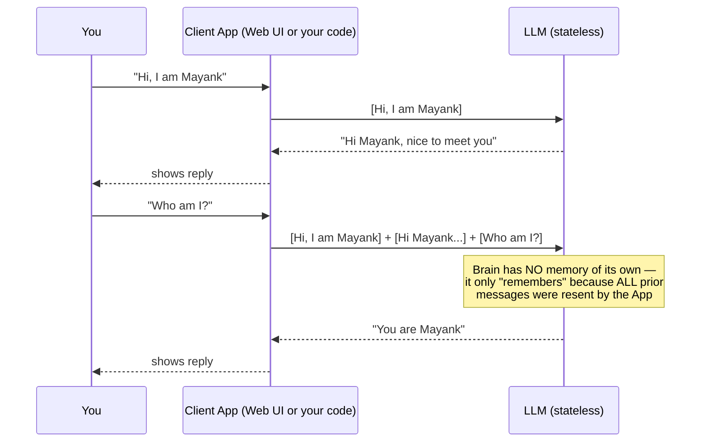
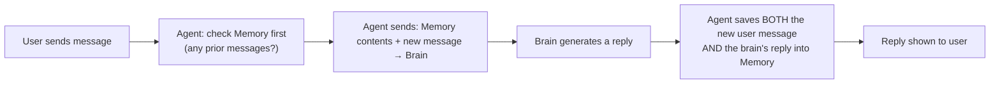
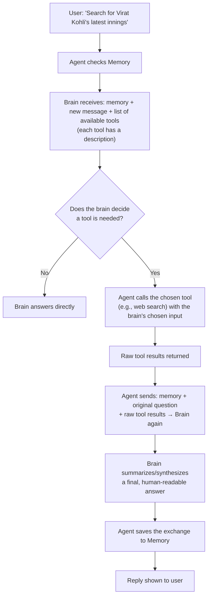
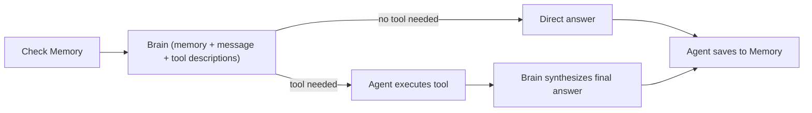

# 🤖 GenAI Basics & Agentic AI: Web vs. API, Statelessness Proven Live & the Anatomy of an Agent

- <i>**Session:** Day 5 — Class 4: "GenAI Basics & Agentic AI" ·
- **Instructor:** Mayank Aggarwal
- **Note on scope:** This is a **deliberately code-free, concept-first session** — the instructor explicitly defers all raw Python agent-building code to "the next weekend class." Instead, this session uses **live demonstrations on real platforms** (ChatGPT web, Claude web, the OpenAI API platform, OpenRouter, and an n8n visual workflow used purely as a teaching aid) to build rock-solid intuition for: the web-vs-API distinction, why LLM calls are stateless, how context windows behave under real, escalating token pressure, and — the session's centerpiece — the full "Anatomy of an Agent" (brain + memory + tools) demonstrated end-to-end without writing a single line of code. This guide reflects that scope faithfully rather than inventing code that wasn't taught here.</i>

---

## 📑 Table of Contents

1. [Session Overview](#-session-overview)
2. [Learning Objectives](#-learning-objectives)
3. [Detailed Notes](#-detailed-notes)
   - [1. Web vs. API: The Buffet vs. À La Carte Model](#1-web-vs-api-the-buffet-vs-à-la-carte-model)
   - [2. Making a Real API Call: OpenRouter & the OpenAI Platform](#2-making-a-real-api-call-openrouter--the-openai-platform)
   - [3. Message Roles & the System/Developer Message](#3-message-roles--the-systemdeveloper-message)
   - [4. Proving Statelessness Live: Why Every Message Gets Resent](#4-proving-statelessness-live-why-every-message-gets-resent)
   - [5. Context Window Management in Practice](#5-context-window-management-in-practice)
   - [6. Token Economics: Estimating & Controlling Production Costs](#6-token-economics-estimating--controlling-production-costs)
   - [7. The Anatomy of an Agent: Brain + Memory + Tools](#7-the-anatomy-of-an-agent-brain--memory--tools)
   - [8. The Agentic Loop, Step by Step (Live n8n Demonstration)](#8-the-agentic-loop-step-by-step-live-n8n-demonstration)
   - [9. Multi-Model Agents & Why Frameworks Are "Just Pizza Chains"](#9-multi-model-agents--why-frameworks-are-just-pizza-chains)
4. [Glossary](#-glossary)
5. [Revision Notes — One-Minute Revision](#-revision-notes--one-minute-revision)
6. [Cheat Sheet](#-cheat-sheet)
7. [Interview Questions & Answers](#-interview-questions--answers)
8. [Scenario-Based Interview Questions](#-scenario-based-interview-questions)
9. [Hands-on Exercises](#-hands-on-exercises)
10. [Practice Assignment](#-practice-assignment)
11. [Additional Resources](#-additional-resources)
12. [Final Revision Sheet](#-final-revision-sheet)

---

## 🎯 Session Overview

This class picks up immediately after the Pydantic deep-dive and spends its entire three-plus hours making one thing unshakeably clear: **before you can build an agent, you must deeply, viscerally understand what a "brain" (LLM) can and cannot do on its own.** The session unfolds as:

1. A rapid revision of Day 4's AI vocabulary (LLM, token, vector embedding — reinforced, not re-taught).
2. **Web vs. API** — why `chatgpt.com` can never be embedded inside your own product, demonstrated with a real "billion-dollar idea" thought experiment.
3. **Live API calls** via OpenRouter and the OpenAI platform, watching real token usage and billing update in real time.
4. **Statelessness, proven — not just asserted** — via a deliberately slow, Socratic, repeatedly-checked walkthrough that most learners initially get wrong.
5. **Context window behavior under real pressure** — demonstrated by dragging a large PDF into Claude and watching "messages left" visibly collapse, followed by Claude's own conversation-compacting feature and ChatGPT's branching feature.
6. **Token economics** — how to actually estimate production AI costs for a client or employer.
7. The session's climax: the **"Anatomy of an Agent"** — brain + memory + tools — built live, node by node, in a visual workflow tool (n8n, used purely as a teaching visualization, not as course content), proving that every "AI agent" you've ever used is fundamentally the same three-part loop.

> 💡 **Memory Trick — the instructor's own stated goal for this class:** *"If your basics are wrong here, I cannot teach you LangChain or LangGraph — it would be like building the second floor before the first. Once you understand agent from first principles, no framework will ever confuse you again."*

---

## 🎯 Learning Objectives

By the end of this guide, you will be able to:

- [ ] Explain, using the buffet/à la carte analogy, precisely why a product can never simply "use chatgpt.com" internally.
- [ ] Describe how to obtain and use an API key (via OpenRouter or a provider's own platform) to call an LLM programmatically.
- [ ] Name the standard message roles (system/developer, user, assistant) and explain why the system message is resent on every single call.
- [ ] Prove, from first principles, why "LLM calls are stateless" — and correctly distinguish this from how a web chat UI *appears* to remember you.
- [ ] Explain what causes a long AI conversation to become slow, expensive, and forgetful — and name at least three real mitigation techniques (summarization, branching, fresh chats, prompt editing).
- [ ] Estimate the rough production cost of an AI-powered feature using token economics.
- [ ] Draw and explain the "Anatomy of an Agent" (brain + memory + tools) from memory, and trace exactly what happens, step by step, when an agent decides to use zero, one, or multiple tools.
- [ ] Explain why the instructor insists every agent framework (LangChain, LangGraph, CrewAI) is doing "the same thing" underneath, using the pizza-chain analogy.

---

## 📚 Detailed Notes

### 1. Web vs. API: The Buffet vs. À La Carte Model

#### 🧠 Concept

Every major AI provider (OpenAI, Anthropic, Google) offers **two fundamentally different ways** to access the same underlying model: a **web product** (ChatGPT.com, Claude.ai) and a **developer API**. These are not the same thing, are priced completely differently, and serve entirely different purposes.

#### ❓ Why It Exists

> 💡 **Memory Trick — the instructor's core analogy:** *"A restaurant gives you two offerings: a controlled buffet, and à la carte. In a buffet, you pay a flat fee and eat as much as you want, but in a controlled manner — there's a time limit, and the restaurant is deliberately taking a bit of a loss to get you hooked. À la carte, you're charged for exactly what you order, down to the last ingredient — no limits, no hidden subsidy."*

- **Web (ChatGPT.com, Claude.ai) = the controlled buffet.** You pay a flat monthly fee (e.g., $20) and get a *usage-limited* experience (a rolling token/message quota, resetting every few hours). Providers deliberately price this generously — even at a loss — because the goal is adoption and lock-in ("the GEO model," as the instructor calls it: get people hooked on a free/cheap experience, monetize elsewhere).
- **API = à la carte.** Every single input and output token is metered and billed, with no flat-fee subsidy. This is the *only* way to embed an LLM's intelligence inside your own product.

#### 🪜 Step-by-Step Proof — "The Billion-Dollar Idea" Thought Experiment

The instructor poses this directly to the class, repeatedly, until no one can answer it:

> *"If you wanted to make an existing chatbot on a website smarter, could you just tell your app: 'always keep a browser open, go to chatgpt.com, search for the reply, copy it, and come back'? If you can find a way to genuinely do that at scale, come talk to me — we'll build a billion-dollar company together."*

No learner could propose a workable answer — which is exactly the point: **there is no way to programmatically, reliably embed the ChatGPT.com web product inside another application.** The only path to "AI-powered features" in a real product is the **API**.

#### 💻 Live Demonstration — Real Cost Comparison

| | Claude Web (Pro subscription) | Claude API (Sonnet model) |
|---|---|---|
| Price paid | $20/month flat | Billed per token — demonstrated live: output priced at **$10 per million tokens** |
| What you get | A rolling usage quota (shown live: "3 million tokens" per session window, refreshing periodically) | Metered, unlimited access — no quota, only cost |
| Why the price gap makes sense | Provider is *subsidizing* web usage to drive adoption | You are paying the full, real compute cost |

> ⚠️ **Common Mistake, directly corrected live:** Assuming that because web usage feels "free-ish" or flat-rate, the underlying compute is somehow cheaper. It isn't — the provider is absorbing the cost difference deliberately, as a customer-acquisition strategy, "because they know they'll make it back via API customers."

#### 🔍 Internal Working — Web vs. API Feature Comparison

| Concept | Web behavior | API behavior |
|---|---|---|
| Pricing model | Flat subscription + rolling usage quota | Per-token metering, no subsidy |
| "Session"/quota shown in UI | Real — controlled by the provider (e.g., "you've used 14% of your 5-hour limit") | Does not exist — you're never quota-limited, only billed |
| Model choice | Limited to whichever models the web product exposes | Full catalog — every model version, including decommissioned/legacy ones |
| Suitable for building a product | ❌ No — cannot be embedded | ✅ Yes — this is the only correct approach |

#### 🎯 Key Takeaways

* Web and API are **two separate commercial products**, not two views of the same thing — priced completely differently, for different purposes.
* You can **never** embed a web chat product (ChatGPT.com, Claude.ai) inside your own application — there is no legitimate technical path to do this.
* Any real AI-powered product **must** use the provider's API — this is non-negotiable, not a stylistic preference.

---

### 2. Making a Real API Call: OpenRouter & the OpenAI Platform

#### 📖 Definition

**OpenRouter** is a unified marketplace/gateway that exposes models from many different providers (OpenAI, Anthropic, Google, Mistral, and open-source models) behind a single API and a single API key — letting a developer try or switch between providers without separately signing up with each one.

#### ⚙ How It Works — Live Walkthrough

1. Sign up on OpenRouter, go to **Profile → API Keys**, and generate a new key (the instructor demonstrates creating a short-lived, 1-hour-expiring key live, specifically so it can't be misused after the class).
2. Paste this key into AI-generated Python code (the instructor asks an AI assistant directly: *"Give me the code to call OpenAI API by setting up my key, and calling the GPT model, and getting an answer"*) running inside a Google Colab notebook.
3. Send a simple prompt (*"What is the capital of France?"*) using a **free-tier model** available on OpenRouter.
4. Immediately check the OpenRouter **Activity** dashboard: it shows the exact token breakdown for that single call (e.g., ~7–8 input tokens, a larger output including the model's reasoning/explanation) and confirms **$0 total cost**, since a free model was used.

#### 🏢 Real-World / Production Usage — Direct Provider Platforms

Beyond OpenRouter, the instructor also demonstrates the **OpenAI platform** directly (`platform.openai.com`, distinct from `chatgpt.com`):

- OpenAI's platform exposes many more models than are ever available in the ChatGPT web product (older, decommissioned, or specialized versions like `o1`, `o3`, `4.1`, etc.) — reinforcing the buffet/à la carte distinction from Section 1.
- A live key is generated on the OpenAI platform, used to call `gpt-5.4-mini` directly, and the resulting token usage (input: 45 tokens, output: 82 tokens, across two exchanged messages) is confirmed on the platform's own **Usage** dashboard — directly connecting the code, the API call, and the real, itemized bill in front of the class.

#### ⚠ Common Mistakes

* Trying to paste an API key from one provider (e.g., OpenAI) into a call configured for a different provider/base URL (e.g., OpenRouter) — these are separate systems requiring separate, correctly-matched keys.
* Assuming any AI-generated "give me code to call an API" snippet will work first-try — the instructor's own live demo initially failed (a real, unresolved "endpoint not found" error) before switching to a different, correctly-configured model, modeling realistic debugging rather than a scripted, error-free demo.

#### 🎯 Key Takeaways

* OpenRouter is a convenient single-key gateway to many providers' models — useful for learning and rapid experimentation.
* Direct provider platforms (like `platform.openai.com`) expose their **full** model catalog and their own usage/billing dashboards.
* Every real API call has a directly observable, itemized token cost — this isn't theoretical; the instructor deliberately shows the live dashboard updating after each call.

---

### 3. Message Roles & the System/Developer Message

#### 🧠 Concept

Every API call to a chat-based LLM includes a **system (or developer) message** — hidden instructions that are **always** sent, on every single call, whether or not the end user ever sees or types them.

#### ❓ Why It Exists

> 💡 **Memory Trick:** *"When you send even a single-character message like 'hi' to ChatGPT, why does it consume 4,000+ tokens instead of 1? Because internally, ChatGPT is quietly sending a large system message — behavioral instructions, safety rules, formatting guidelines, and (in tool-augmented products) descriptions of every connected tool/MCP server — alongside your one word, every single time."*

#### 💻 Live Demonstration

1. In the OpenAI platform's Playground, the instructor sets a system/developer message: *"You are a very helpful assistant. You always give the answer in poetry."*
2. Sends a plain `"hi"` — the reply comes back correctly styled as poetry, proving the hidden instruction genuinely shaped the response.
3. Separately, in Claude's web UI (with an extension showing live token counts), a single `"hi"` message is shown consuming **~4,169 tokens**, and — after attaching documents/tools — ballooning to **~35,000 tokens**, entirely from hidden system-level content (behavioral instructions, connected tool/MCP descriptions) the user never typed or sees.

#### 🔍 Internal Working — "Developer Message" vs. "System Message"

> ⚠️ **Explicitly simplified for this course's current stage:** The instructor notes that "developer message" and "system message" are, for this course's purposes right now, **the same concept** — both refer to the hidden, always-resent instruction block shaping the model's behavior. (Some providers use both terms with subtly different technical scoping, but that distinction is deliberately deferred as unnecessary complexity at this stage.)

#### ⚠ Common Mistakes

* Assuming a "hi" message should cost roughly one token's worth of billing — real systems almost always carry substantial hidden system-message overhead, which explains real-world token/cost surprises.
* Confusing the *web product's own* internal system prompt (which you cannot see or control) with the system message *you* explicitly write when calling the raw API (which you fully control).

#### 🎯 Key Takeaways

* A system (or developer) message is sent on **every single call**, not just the first — this is the same statelessness principle explored fully in Section 4.
* Real-world token costs are frequently dominated by hidden system-level content, not by what the user visibly typed.
* You have full control over the system message only when calling the **raw API** — not when using a provider's finished web product.

---

### 4. Proving Statelessness Live: Why Every Message Gets Resent

#### 🧠 Concept

**LLM calls are stateless**: the model retains **zero** memory between separate calls. Every apparent "memory" you observe in a chat product is an illusion created by the *client* re-sending the entire conversation history on every single new message.

#### ❓ Why It Exists

> 💡 **Memory Trick — the instructor's deliberately slow, Socratic proof:** *"When I send a message to ChatGPT, how many messages get sent to the brain? If I then send a second message, how many total messages go this time?"* Most learners initially answer "1" or "2" — the correct answer, proven repeatedly and explicitly, is that **every prior message plus the new one** is sent, every time. After 3 exchanges, sending a 4th message means **all 4** (3 prior + 1 new) are transmitted.

#### 🪜 Step-by-Step Proof — Constructed Live, With No Shortcuts Allowed

1. The instructor explicitly forbids "smart" shortcuts during this proof: *"If you say 'well, there's caching, there's a system message, there's a transformer array' — I don't care right now. Stay with me at the black-box level first."*
2. **Google search comparison:** Ask Google "Who is Virat Kohli?" then, in a **new** search, ask "How many runs did he score?" — Google has **zero** context linking the two; each search is entirely independent. Everyone agrees on this instantly.
3. **The claim:** *"Same is the case with AI. Every single time you give it an input, it just gives you an output. It doesn't remember anything — hence, the term 'LLM calls are stateless.'"*
4. **The live proof, via a real API call (not the web UI):** the instructor calls OpenAI's API directly, asks *"Hi, I am Mayank"*, gets a reply, then in a **separate** call asks *"Who am I?"* — the model has **no idea**, because (unlike the web product) no chat history was manually re-sent along with this raw API call.
5. This directly demonstrates: the **web product** (ChatGPT.com, Claude.ai) *appears* to remember you only because the client application is automatically re-collecting and re-sending your full chat history on every message — the underlying model call itself is still stateless.



#### ⚖ Advantages & Limitations — A Real, Nuanced Objection Handled Live

A learner (Jitendra) pushed back with a genuinely sharp point: *"But practically, the server maintains a message store — so is it really stateless?"* The instructor's resolution:

> 💡 **Memory Trick — the instructor's precise reframing:** *"Technically, yes, it's stateless — but you're mixing two different things: the **raw model call** (always stateless, no exceptions) versus the **web product around it** (which manages a database of your chat history behind the scenes, and re-sends the relevant portion for you automatically). If you want to understand 'stateless,' apply it strictly to the API/model call — not to the finished web product, which absolutely does manage state on your behalf, just not inside the model itself."*

#### 🔍 Internal Working — Why Long Conversations Get Slow and Expensive

Because **every** prior message must be resent on every new call:

- Token count (and therefore cost) grows **cumulatively**, not per-message — confirmed explicitly in the live Q&A ("token consumption will be exponentially increased... yes, exactly, it's totally correct").
- Response latency increases as more content must be processed on each call.
- Older content is eventually pushed out by the context window limit (Section 5), causing the model to "forget" early instructions or facts.

#### ⚠ Common Mistakes

* Concluding that fewer input/output tokens on a given call *proves* the call was stateless — as directly corrected live (a learner, Anshul, made exactly this error): the real, better explanation is simply *"we were not sending previous context/chat history on that particular call"* — statelessness is a property of **every** call, not something you can toggle on/off by observing token counts.
* Treating "stateless" as meaning "the AI has amnesia and can never appear to remember anything" — it means the **model itself** has no memory; a well-built application layer absolutely can (and does) simulate memory by resending history.

#### 🎯 Key Takeaways

* **LLM calls are stateless, without exception** — this applies to the raw model/API call, always.
* Any appearance of "memory" in a chat product is the **application layer** re-sending the full (or a curated) history on every call — not the model remembering anything on its own.
* This single principle explains: why long chats get slower and more expensive, why cost grows cumulatively, and why context windows eventually cause forgetting.

---

### 5. Context Window Management in Practice

#### 🧠 Concept

The context window (introduced conceptually in the previous class) is demonstrated here under **real, escalating pressure** — showing exactly what a user experiences as a conversation grows, and the concrete techniques real products use to manage it.

#### 💻 Live Demonstration — Watching a Context Window Fill Up in Real Time

1. Starting a fresh Claude chat, the instructor sends a large PDF document (estimated ~2,000–3,000 tokens) plus a complex, multi-step research request.
2. A live "messages left" indicator (from a Chrome extension tracking context usage) is watched explicitly as it **drops** with each subsequent exchange — moving from a high number down toward single digits as the conversation's cumulative token count climbs (documented live: 4,169 tokens → ~35,000 tokens → ~37,000 tokens → 42,000+ tokens, purely from continued back-and-forth on one growing chat).
3. When finally asked *"What was my first message in this chat?"*, the model correctly recalls **"hi"** — proving the entire growing history genuinely was being resent and read on each call, exactly as established in Section 4.

#### 🪜 Step-by-Step — Four Real Mitigation Techniques Demonstrated Live

| Technique | How it works | Where demonstrated |
|---|---|---|
| **Start a fresh chat frequently** | A new chat = a new, empty context window — the single most effective fix | Cited from a real "how to avoid Claude limits" article, confirmed as the #1 recommended tip |
| **Summarization / conversation compacting** | The full history is fed back into the model with an instruction to compress it, trading some detail for a much smaller token footprint going forward | Demonstrated live via Claude's own built-in **"Compacting our conversation so we can keep chatting"** feature |
| **Branching** | Starting a new chat from a specific point, causing everything below/after that point to be summarized/discarded rather than carried forward in full | Discussed via a learner's own real-world experience noticing faster replies after branching a long ChatGPT conversation |
| **Manually editing an earlier prompt** | Editing and resending an earlier message discards everything that came *after* it, shrinking the effective context going forward | Demonstrated live by editing a prior message and observing the (now much smaller) context reflected in the extension's live token counter |

> 💡 **Memory Trick — the "chapati" analogy used throughout for quota/session limits:** *"Claude telling you 'you've used 14% of your 5-hour session' is like a buffet saying 'you're allowed 100 chapatis in 3 hours' — this is a provider-side usage quota, entirely separate from your context window. You can ignore the session-quota number when reasoning about context; focus only on your chat's actual token size."*

#### ⚠ Common Mistakes

* Confusing the **session/usage quota** (a provider-imposed limit on total web usage, e.g., "3 million tokens per 5 hours" — a *business* constraint) with the **context window** (a *technical* limit on how much of a single conversation the model can process at once) — these are two entirely different concepts that happen to both be measured in tokens.
* Believing that "message left" counters, session-reset timers, or similar UI indicators are *from the underlying model* — these are provider- or extension-specific UI conveniences layered on top, not properties of the raw API.

#### 🏢 Real-World / Production Usage

For enterprise cost estimation (directly addressed in the live Q&A), the practical guidance given:
- Estimate cost as **(expected number of requests) × (typical tokens per request) × (per-token price)**.
- Layer in observability/monitoring tooling (the instructor names **AgentOps** as one example: *"a leading developer platform for building agents and observability"*) to validate assumptions against real usage patterns, since not every response will hit the theoretical maximum token count.
- Manage growing context proactively via summarization or a **sliding window** approach (explicitly mentioned: *"either we summarize the context, or we send only the latest 20K of it — not everything"*).

#### 🎯 Key Takeaways

* Context window pressure is directly observable in real products — this session demonstrated it live via visibly shrinking "messages left" counters.
* Four real, concrete mitigations exist: **fresh chats, summarization/compacting, branching, and manually editing/trimming earlier prompts.**
* **Session/usage quota ≠ context window** — one is a business-imposed usage cap; the other is a technical single-conversation processing limit.

---

### 6. Token Economics: Estimating & Controlling Production Costs

#### ❓ Why It Exists

A learner working in a cloud/DevOps role asked directly, on behalf of a real client-facing scenario: *"If we're going to deploy an agent/tool, how do we estimate the cost to quote a client?"* This section captures the instructor's live-built answer.

#### ⚙ How It Works — The Baseline Estimation Formula

> 💡 **Memory Trick, confirmed correct live by the instructor:** *"If you expect 1,000 requests, and your maximum output cap is 4,000 tokens per request, priced at (say) $5 per million output tokens — your worst-case estimate is 1,000 × 4,000 = 4,000,000 tokens, priced accordingly. That's your ceiling; real usage will typically come in under that, since not every response maxes out its token limit."*

```text
Worst-case cost ≈ (number of expected requests) × (max_tokens per request) × (price per token)
```

#### 🪜 Step-by-Step — Refining the Estimate Beyond the Worst Case

1. **Set a firm `max_tokens` cap** per request as a guardrail — this alone gives you a reliable upper bound.
2. **Add observability/monitoring** (e.g., a tool like AgentOps) to see *real* average token usage per request, since actual usage is typically well below the worst-case ceiling.
3. **Factor in growing conversational context** for any multi-turn use case — since (per Section 4) every prior message gets resent, a long-running conversation's *effective* per-call token count keeps climbing, not staying flat at your initial estimate.
4. **Apply context-management techniques** (Section 5: summarization, sliding windows) to keep this growth bounded rather than unbounded.

#### 💻 Live Demonstration — A Real, Escalating Bill

The instructor uses his own funded n8n/Anthropic account (a real $5 balance) to show, live, exactly how a single `"hi"` message's cost changes as conversational context grows:

| Message # | Approx. tokens consumed for that single "hi" |
|---|---|
| 1st "hi" in a fresh context | ~11,624 tokens |
| Subsequent "hi" in the same, now-longer context | Projected/observed to climb toward ~12,000+ tokens |

> ⚠️ **The key lesson, stated explicitly:** *"Even though I'm sending the exact same one-word message every time, the cost keeps climbing — because the growing chat history is being resent along with it, every single time."* This is the direct, financial consequence of statelessness (Section 4) combined with an ever-growing context.

#### 🎯 Key Takeaways

* Baseline cost estimation: `requests × max_tokens × price_per_token`, refined downward using real observability data.
* Setting a `max_tokens` cap is a genuine cost-control lever, not just a technical safety setting.
* For any multi-turn/conversational use case, cost estimation must explicitly account for **growing context** — a flat "cost per message" assumption will always underestimate real-world spend.

---

### 7. The Anatomy of an Agent: Brain + Memory + Tools

#### 📖 Definition

> 💡 **Memory Trick — the instructor's core, repeatedly-reinforced definition:** *"An agent is just: Brain + Memory + Tools. I like to think of it as an intern — or even better, a digital human. Just like your intern has a brain, a memory of what you've told them, and access to tools like a laptop — that's exactly what an AI agent is."*

#### ❓ Why It Exists

An AI model on its own ("the brain") is, as the instructor puts it, *"just a Gajini brain"* (referencing the amnesiac protagonist of the Bollywood film *Ghajini*) — capable of reasoning, but with **no memory** and **no ability to act on the world**. An agent is what you get when you deliberately wrap that brain with the two missing capabilities.

#### ⚙ How It Works — The Three Components

| Component | What it is | Real-world equivalent |
|---|---|---|
| **Brain** | The LLM itself (OpenAI, Anthropic, Google, or an open-source model) — the only component capable of *reasoning/deciding* | An intern's actual intelligence/judgment |
| **Memory** | A persistent store (a SQL/NoSQL database, or a simpler mechanism) holding the conversation history so it can be resent on each call | An intern's notes/recollection of prior conversations with you |
| **Tools** | Discrete, well-described capabilities the agent can invoke (web search, a calculator, a calendar, etc.) | An intern's laptop, internet access, or other equipment |

> ⚠️ **A pointed, deliberately provocative example, given live:** *"If I hire an intern and tell him 'reply to all my emails,' but I take away his laptop — is that intern of any use? No. Similarly, if you build an 'email-replying agent' but never actually give it access to your email as a tool, it is completely useless, no matter how smart the underlying brain is."*

#### 🔍 Internal Working — Brain Quality Also Matters Independently

> 💡 **Memory Trick:** *"Imagine hiring a baby as your intern — brain not yet developed. You could hand them a laptop and full email access (perfect tools, perfect memory setup), and it still wouldn't work, because the brain itself isn't capable enough. Similarly, if you pick a cheap, fast, but weak model (like Haiku) and ask it to do something genuinely complex, it will fail — not because the tools or memory were wrong, but because the brain wasn't strong enough for the task."*

This establishes a **three-way dependency**: a genuinely capable agent needs an adequate brain, a working memory setup, *and* the right tools — a weakness in any one component breaks the whole system.

#### 🎯 Key Takeaways

* **Agent = Brain + Memory + Tools** — this is the single, framework-independent definition the entire rest of the course builds on.
* All three components are independently necessary: a great brain with no tools is useless for real-world tasks; great tools with a weak brain still produce poor results; and no memory means no continuity across turns.
* This definition applies identically regardless of which specific framework (LangChain, LangGraph, CrewAI, or none at all) is eventually used to implement it.

---

### 8. The Agentic Loop, Step by Step (Live n8n Demonstration)

#### 🧠 Concept

Using a visual workflow tool purely as a **teaching aid** (explicitly not course content to be memorized — *"don't get confused that this is n8n, just focus on the visuals"*), the instructor builds an agent live, one component at a time, and traces exactly what happens on each message.

#### 🪜 Step-by-Step Execution — Built Incrementally, Live

**Stage 1 — Brain only, no memory:**
```text
"Hi, I am Mayank" → Brain → "Hi Mayank, nice to meet you!"
"Who am I?"        → Brain → "I don't know who you are — you haven't told me."
```
Confirms: with no memory attached, the agent behaves exactly as statelessly as the raw API calls in Section 4.

**Stage 2 — Brain + Memory added:**

- First message ("Hi, I am Mayank"): memory is empty → sent as-is to the brain → reply saved back into memory (now holding 2 messages).
- Second message ("Who am I?"): agent retrieves the 2 prior messages from memory, sends **all 3** (2 prior + 1 new) to the brain → correctly replies "You are Mayank" → memory now holds 4 messages (this exact flow — *"how many messages will it send to Claude? Four previous, plus the fifth new one"* — is confirmed explicitly, live, with the class).
- **Crucially, this is why the brain gets called twice per turn once tools are involved** (once to decide/respond, and implicitly the memory-write step) — directly explaining a UI detail (the visual workflow tool showing "2 hits") that had confused learners moments earlier.

**Stage 3 — Tools added (web search + calculator):**


#### 🔍 Internal Working — How the Brain "Knows" Which Tool to Use

> ⚠️ **Directly demonstrated and repeatedly emphasized:** *"The second you create a tool, its description gets sent to the agent — and by extension, to the brain — on every call. The brain decides which tool (if any) is relevant purely by reading these descriptions."* When given a generic greeting ("Hi, I am Mayank"), the brain correctly chooses **not** to invoke any tool, since neither the web-search nor calculator description is relevant — proving tool use is a genuine, context-sensitive **decision**, not an automatic reflex.

**Multi-tool decision-making, demonstrated live:** given a compound request (*"Tell me about the latest FIFA results, and also [a math question]"*), the agent correctly routes the first part to the web-search tool and the second part to the calculator tool **in a single turn** — confirming the brain can plan and dispatch multiple, distinct tool calls based purely on each tool's description matching each sub-request.

#### ⚖ Advantages & Limitations — Who's Actually "In Charge"?

A sharp learner question (Karanbir) probed exactly this, and the instructor's resolution is important:

| Question | Resolution |
|---|---|
| "Does the brain drive the whole flow, or does the agent?" | **The agent orchestrates; the brain decides.** The agent is the surrounding code/logic that always: checks memory first, calls the brain, checks whether the brain requested a tool, calls that tool if so, feeds results back to the brain, and saves everything to memory. The brain itself never manages memory or executes tools directly — it only *decides* what should happen next. |
| "So is 'agent' just a separate wrapper/external code?" | Not quite "external" in isolation — it's the **combination** and **orchestration logic** binding brain, memory, and tools together into one coherent loop. |

> 💡 **Memory Trick:** *"Think of yourself: your brain decides 'I should pick up this pen,' but your body/nervous system subconsciously handles the actual mechanics and remembers what just happened. The agent is that surrounding orchestration — the brain only ever decides."*

#### ⚠ Common Mistakes

* Believing tool results are automatically, permanently saved into long-term memory/chat history — this is **explicitly a design choice**, not an automatic behavior. The instructor notes that in his own real work, he'd often choose *not* to save raw tool output into memory (or would save it separately), since doing so unnecessarily inflates future context/cost — directly reinforcing Sections 5–6.
* Assuming "the agent decides which tool to call" — technically imprecise. The **brain** decides (based on tool descriptions); the **agent** is what actually executes that decision.

#### 🎯 Key Takeaways

* The full agentic loop, traced live: **check memory → call brain (with memory + tool descriptions) → brain decides: answer directly, or request a tool → if a tool, agent executes it and returns results to the brain → brain summarizes a final answer → agent saves the exchange to memory.**
* The brain is called potentially multiple times per user turn — once to decide/plan, and again after any tool results come back, to synthesize a final answer.
* Whether/how tool results get saved to memory is a deliberate design decision with direct cost implications, not an automatic default.

---

### 9. Multi-Model Agents & Why Frameworks Are "Just Pizza Chains"

#### 🧠 Concept

An agent's "brain" is not limited to a single model — real systems commonly configure **multiple LLMs**, with explicit developer-defined logic for when to use which.

#### ⚙ How It Works — Fallback Models

Demonstrated live in the visual workflow tool: an "Enable fallback model" option lets you specify a **secondary** brain (e.g., OpenAI) to automatically take over if the **primary** brain (e.g., Anthropic) fails or is unavailable.

> ⚠️ **Explicitly clarified, in response to a learner's question:** This fallback behavior is **not automatic magic** — *"you have to define that logic"* yourself (which model is primary, which is the fallback, and under what conditions the switch happens). The framework/tool provides the *mechanism*; the developer supplies the *policy*.

#### 🏢 Real-World / Production Usage — Multi-Agent Orchestration (Previewed, Not Yet Taught)

In response to advanced questions about multi-agent systems, the instructor gives a deliberately high-level preview (full depth explicitly deferred to later classes):

- An **orchestrator** is simply an agent whose job is to decide, based on a user's query, *which other agent(s)* should handle it — the term "orchestrator" describes a **role/function**, not a special technical category of agent.
- Routing logic between multiple agents can be handled by an LLM's judgment **or** by simple deterministic code (an `if`/`else` statement) — "it's totally on you" which approach fits a given use case.
- > 💡 **Memory Trick — the instructor's explicit warning against premature terminology:** *"Please don't get hung up on terms like 'orchestrator agent' or 'customer support agent' right now — these are just names we give agents based on what they do. If you fixate on the vocabulary before you understand the underlying mechanism, you'll get confused. Stay with my definitions for now; the journey will make sense."*

#### 🔍 Internal Working — Why Every Framework "Does the Same Thing"

> 💡 **Memory Trick — the instructor's closing analogy for this entire session:** *"You know what a pizza is, right? There are hundreds of pizza chains — Domino's, Pizza Hut, a hundred others — but they're all still making pizza. I'm teaching you what pizza is. LangChain, LangGraph, CrewAI, LlamaIndex — there can be hundreds of frameworks, and there will keep being new ones. But they are all still implementing this exact same brain-memory-tools loop. Once you know what pizza is, learning any specific chain's recipe is just syntax."*

This is reinforced with a live, direct comparison: opening the actual LangChain documentation and code the instructor had previously prepared, pointing out that its `create_agent`, `tools`, and `model` concepts map **one-to-one** onto the brain/tools components just demonstrated — with memory *"addressed separately"* in LangChain's own API, but conceptually identical to the memory node just built live.

#### ⚠ Common Mistakes

* Assuming that because a specific framework's code sample doesn't show an explicit "memory" object, memory isn't actually part of that agent — as the instructor states firmly: *"It will never happen that any agent will not have memory. It can never happen."* Different frameworks simply expose/name the memory component differently.
* Worrying about which specific framework(s) a course or company will use, before understanding the underlying mechanism — per the pizza analogy, this is treated as premature and ultimately unproductive anxiety.

#### 🎯 Key Takeaways

* Agents can be configured with **multiple brains** (e.g., primary + fallback) — but the switching *logic* must be explicitly defined by the developer, not assumed to be automatic.
* "Orchestrator," "customer support agent," and similar terms describe a **role an agent plays**, not a distinct technical category — avoid over-indexing on naming before the underlying mechanism is solid.
* Every agent framework (LangChain, LangGraph, CrewAI, and any future framework) implements the same brain-memory-tools loop — understanding the loop itself is what makes any specific framework's syntax easy to pick up later.

---

## 📝 Glossary

| Term | Definition | Why It Matters |
|---|---|---|
| **Web product** | A finished, provider-built application (ChatGPT.com, Claude.ai) offering flat-fee, quota-limited access to a model | Cannot be embedded in your own product; useful only for direct personal/manual use |
| **API (in this context)** | A provider's raw, per-token-billed programmatic interface to its models | The only legitimate way to embed AI capability inside a real application |
| **OpenRouter** | A unified gateway exposing many providers' models behind a single API key | Convenient for experimentation and comparing models/providers |
| **System / Developer Message** | Hidden instructions resent on every single API call, shaping model behavior | Explains "why did a 1-word message cost 4,000 tokens?"; fully controllable only via raw API |
| **Statelessness (LLM calls)** | The property that a model retains zero memory between separate calls | The foundational principle explaining why chat history must be manually resent |
| **Context Window** | The maximum token capacity a model can process in a single call | Explains conversational slowdown, rising cost, and "forgetting" in long chats |
| **Session / Usage Quota** | A provider-imposed limit on total *web* usage over a rolling time window | Distinct from the context window; a business constraint, not a technical one |
| **Conversation Compacting / Summarization** | Compressing prior chat history into a shorter form to free up context window space | A real, product-level mitigation for context window pressure (demonstrated via Claude) |
| **Branching** | Starting a new chat thread from a specific point in an existing conversation | Effectively discards/summarizes everything after that point, freeing context |
| **Agent** | Brain (LLM) + Memory (persistent history store) + Tools (invokable capabilities) | The single, framework-independent definition underlying every agent framework |
| **Brain** | The LLM component of an agent — the only part capable of reasoning/deciding | Its quality/capability directly bounds what the agent can reliably accomplish |
| **Memory (in an agent)** | A persistent store (SQL/NoSQL DB, or simpler) holding conversation history for reuse across calls | What makes an agent *appear* to remember, despite the underlying brain being stateless |
| **Tool** | A discrete, described capability an agent can invoke (web search, calculator, etc.) | Tool descriptions are what the brain reads to decide when/whether to use each one |
| **Orchestration (agent)** | The surrounding logic that sequences brain calls, tool calls, and memory reads/writes | Performed by the *agent*, not the brain — the brain only ever decides, never executes directly |
| **Fallback Model** | A secondary brain configured to take over if a primary model fails | Requires explicit developer-defined switching logic — not automatic by default |
| **Orchestrator (agent role)** | An agent whose specific job is routing a query to other agent(s) | A functional role/name, not a distinct technical agent category |

---

## 🔄 Revision Notes — One-Minute Revision

> Every AI provider offers two separate products: the **web** app (a flat-fee, quota-limited "controlled buffet") and the **API** (per-token-billed, "à la carte," and the *only* way to embed AI in your own product — there is no way to programmatically use ChatGPT.com inside an app). Every API call includes a **system/developer message**, resent on every single call, which is why even a one-word "hi" can consume thousands of tokens. **LLM calls are stateless, without exception** — proven live by calling the raw API twice in a row and watching the model fail to recall a name it was told moments earlier; any apparent "memory" in a chat product comes entirely from the client re-sending the full history each time, not from the model itself. This statelessness directly explains why **context windows** fill up (demonstrated live via a shrinking "messages left" counter as one chat grew past 40,000 tokens) and why long conversations get slower, more expensive, and more forgetful — mitigated in practice via **fresh chats, summarization/compacting, branching, or manually trimming earlier prompts**. Cost estimation for production AI features follows `requests × max_tokens × price_per_token`, refined downward with real observability data. The session's core deliverable: an **agent = Brain (the LLM, which only ever decides) + Memory (a persistent store, resent each call) + Tools (described capabilities the brain can choose to invoke)** — demonstrated live, step by step, in a visual workflow tool: check memory → call the brain with memory + tool descriptions → the brain either answers directly or requests a tool → the agent executes that tool and feeds results back to the brain → the brain synthesizes a final answer → the agent saves the exchange to memory. Multiple brains (with explicit, developer-defined fallback logic) and multi-agent "orchestration" are possible extensions of this same loop — and, per the instructor's closing "pizza" analogy, **every agent framework (LangChain, LangGraph, CrewAI, and beyond) implements this exact same brain-memory-tools loop**, meaning fluency with the underlying mechanism is what makes any specific framework's syntax trivial to pick up later.

---

## 📋 Cheat Sheet

**Web vs. API, one line each:**
- Web = flat fee + quota (buffet); cannot be embedded in your product.
- API = per-token billed (à la carte); the only real way to add AI to an app.

**Statelessness, proven:**
```text
Call 1: "Hi, I am Mayank" → model has no memory of anything before this call
Call 2: "Who am I?"        → model FAILS unless call 1 + its reply are manually resent
```

**Context window mitigation techniques (four real ones):**
1. Start a fresh chat.
2. Summarize / let the product compact the conversation.
3. Branch from a specific point.
4. Manually edit/trim an earlier prompt.

**Cost estimation formula:**
```text
Worst-case cost ≈ (# requests) × (max_tokens per request) × (price per token)
```

**Agent = Brain + Memory + Tools.**


**Key distinctions to never confuse:**
- Session/usage quota (web, business limit) ≠ Context window (technical, per-conversation limit).
- The brain **decides**; the agent **orchestrates/executes**.
- Statelessness applies to the **raw model call** — not to how a finished web product manages history for you.

---

## 🔥 Interview Questions & Answers

### 🟢 Beginner

**Q1. Why can't a product simply use `chatgpt.com` internally to power an AI feature?**
**Answer:** There is no legitimate technical mechanism to embed a finished web product inside another application; AI capability must be added via the provider's API instead.
**Explanation:** Directly demonstrated via the instructor's "billion-dollar idea" thought experiment, which no learner could solve.
**Why This Matters:** A fundamental, frequently-misunderstood distinction for anyone new to building AI products.
**Possible Follow-up:** "What's the actual correct way to add AI capability to a product?"

**Q2. What is the buffet/à la carte analogy used to distinguish web and API access?**
**Answer:** Web access is like a buffet — a flat fee for usage within a controlled quota; API access is à la carte — billed precisely for what you consume, with no subsidy.
**Explanation:** Providers deliberately subsidize web usage to drive adoption, recovering costs via API customers.
**Why This Matters:** Explains real, observed pricing differences between web subscriptions and API costs for the same underlying model.
**Possible Follow-up:** "Why would a provider intentionally lose money on web usage?"

**Q3. What does "LLM calls are stateless" mean?**
**Answer:** A model retains zero memory between separate calls — each call is entirely independent, exactly like separate Google searches.
**Explanation:** The session's central, repeatedly-proven principle.
**Why This Matters:** Explains why chat history must be manually resent to simulate "memory."
**Possible Follow-up:** "If the model has no memory, how does ChatGPT.com appear to remember earlier messages?"

**Q4. What causes a single-word message like "hi" to consume thousands of tokens?**
**Answer:** A hidden system/developer message (behavioral instructions, safety rules, and possibly connected tool descriptions) is resent alongside the visible message on every call.
**Explanation:** Demonstrated live via a token-count extension jumping from ~1 to ~4,000+ tokens on a single "hi."
**Why This Matters:** A common source of confusion/surprise about real-world AI costs.
**Possible Follow-up:** "Is this hidden system message the same thing every time, or can it change?"

**Q5. Name the three components of an agent, per this session's definition.**
**Answer:** Brain (the LLM), Memory (persistent history storage), and Tools (invokable capabilities).
**Explanation:** The session's central, repeatedly-reinforced definition.
**Why This Matters:** Framework-independent — applies regardless of which specific tool/library is eventually used.
**Possible Follow-up:** "Which of the three components is responsible for deciding whether to use a tool?"

**Q6. What is a context window, and how was it demonstrated live in this session?**
**Answer:** The maximum token capacity a model can process at once; demonstrated by a "messages left" counter visibly shrinking as a real chat's cumulative token count grew from ~4,000 to over 40,000.
**Explanation:** A direct, observable consequence of statelessness plus a growing conversation.
**Why This Matters:** Explains real slowdown/forgetting behavior users commonly observe.
**Possible Follow-up:** "Name one real technique to manage a filling context window."

**Q7. What is the difference between a session/usage quota and a context window?**
**Answer:** A session/usage quota is a provider-imposed limit on total *web* usage over time (a business constraint); a context window is a technical limit on how much of one conversation a model can process at once.
**Explanation:** Explicitly distinguished live using the "chapati" analogy.
**Why This Matters:** A commonly-confused pair of concepts that happen to share the "token" unit.
**Possible Follow-up:** "Which of the two can you meaningfully manage/reduce as a developer calling the raw API?"

**Q8. In the agent's flow, who decides whether a tool should be called — the brain or the agent?**
**Answer:** The brain decides (based on reading each tool's description); the agent then executes that decision.
**Explanation:** A precise distinction directly addressed and corrected in the live Q&A.
**Why This Matters:** Prevents a common conceptual muddle about "who's in charge" inside an agent.
**Possible Follow-up:** "What information does the brain need in order to make this decision?"

**Q9. Give one real, concrete technique (from this session) for managing a growing, expensive AI conversation.**
**Answer:** Any of: starting a fresh chat, using conversation summarization/compacting, branching from a specific point, or manually editing/trimming an earlier prompt.
**Explanation:** All four were directly demonstrated live.
**Why This Matters:** Practical, applicable knowledge beyond pure theory.
**Possible Follow-up:** "Which of these is described as the single most effective, per the referenced 'how to avoid limits' article?"

**Q10. What is OpenRouter, and why was it used in this session's live demo?**
**Answer:** A unified gateway exposing many providers' models behind one API key; used here to make a real, low-stakes API call and observe live token usage/billing without individually signing up for each provider.
**Explanation:** A practical convenience tool for learning/experimentation.
**Why This Matters:** A realistic on-ramp to making real API calls.
**Possible Follow-up:** "What did the OpenRouter Activity dashboard show after the demo call?"

---

### 🟡 Intermediate

**Q11. A learner argued that low token usage on a given API call proves that call was "more stateless" than a call with high token usage. Why is this reasoning flawed?**
**Answer:** Statelessness is a fixed, unconditional property of every model call — it does not vary by degree. Low token usage on a particular call simply means less prior context/history was included in that specific request; it says nothing about whether the underlying call mechanism was "more" or "less" stateless.
**Explanation:** Directly corrected live, with the instructor's suggested reframing: attribute the lower token count to "we weren't sending previous chat history," not to varying statelessness.
**Why This Matters:** Tests precise conceptual boundaries versus loosely-associated reasoning.
**Possible Follow-up:** "Rewrite the flawed claim into a technically accurate statement."

**Q12. Explain why the same underlying model can appear to "remember you" on a web product but fail to do so when called directly via a fresh API request.**
**Answer:** The web product's client application is transparently managing a database of your chat history and automatically resending the relevant portion with each new message; a fresh, standalone API call (with no such history manually attached) has nothing to work with, since the model itself never retains anything between calls.
**Explanation:** The exact mechanism proven live via a side-by-side web vs. raw-API demonstration.
**Why This Matters:** Central to correctly reasoning about "memory" in any AI system.
**Possible Follow-up:** "What would you need to do, programmatically, to replicate this apparent memory using the raw API yourself?"

**Q13. Why does the instructor insist that fresh chats, summarization, and branching all ultimately solve the "same" underlying problem?**
**Answer:** All three are strategies for reducing the amount of prior content that must be resent on each new call — either by starting from zero (fresh chat), by compressing prior content into a smaller form (summarization/compacting), or by discarding/summarizing content after a chosen point (branching). Each is a different tactic for managing the same root cause: cumulative context growth under statelessness.
**Explanation:** Synthesizes Sections 4 and 5 into one coherent mechanism.
**Why This Matters:** Tests whether a learner sees the shared principle behind seemingly different product features.
**Possible Follow-up:** "Which of these three would you recommend for a use case where losing early conversational detail is unacceptable?"

**Q14. In the live agent build, why did the visual workflow tool show the brain being "hit twice" once tools were introduced, whereas earlier (memory-only) turns showed only a single hit?**
**Answer:** With tools involved, the brain must be called once to decide whether a tool is needed (and which one, with what input), and then called again after the tool's raw results come back, to synthesize those results into a final, human-readable answer. Without tools, a single brain call suffices to produce the reply directly.
**Explanation:** Directly observed and explained live as the agent's tool-handling stage was added.
**Why This Matters:** A concrete, mechanistic detail that clarifies the "agentic loop" beyond a purely abstract description.
**Possible Follow-up:** "How would this change if a request required calling two different tools in sequence?"

**Q15. Why does the instructor argue that raw tool results (e.g., full web search output) generally should not be shown directly to the end user, even though the agent has access to them?**
**Answer:** Raw tool output (search result snippets, links, unformatted data) is not inherently useful or readable to an end user in that form — the value of the agent lies in the brain synthesizing/summarizing that raw data into a coherent, relevant answer, exactly as a competent human assistant would rather than dumping raw search results on you.
**Explanation:** Directly illustrated via the "would you fire an intern who just handed you raw search result screenshots?" example.
**Why This Matters:** A practical UX/design principle for building genuinely useful agents, not just technically functional ones.
**Possible Follow-up:** "At what point in the agentic loop does this summarization step actually occur?"

**Q16. Why is "whether to save raw tool output into memory" described as a deliberate design decision rather than an automatic default?**
**Answer:** Saving every raw tool result into long-term memory/chat history directly inflates the token count (and therefore cost and context-window pressure) of every future call in that conversation, per the statelessness principle — so a developer must weigh the value of retaining that raw data against its ongoing cost, rather than assuming it's automatically or "correctly" saved.
**Explanation:** Explicitly addressed live in response to a learner's question about Wikipedia/search data being saved.
**Why This Matters:** Connects agent design choices directly to the cost/context-window mechanics from earlier sections.
**Possible Follow-up:** "Propose an alternative to saving full raw tool output that still preserves some value for future turns."

**Q17. What's the difference between a fallback model being "available" in a framework/tool and it being "automatic"?**
**Answer:** A framework or platform may provide the *mechanism* to configure a fallback model (a UI toggle, a config option), but the actual *policy* — which model is primary, under what failure conditions the fallback triggers, and how that failure is detected — must still be explicitly defined by the developer. The mechanism existing does not mean the switching logic writes itself.
**Explanation:** A precise distinction drawn directly from a live learner Q&A exchange.
**Why This Matters:** Prevents an overly optimistic assumption that "the framework will just handle it."
**Possible Follow-up:** "What real failure conditions might justify triggering a fallback model in production?"

**Q18. Explain the instructor's "pizza chain" analogy, and identify exactly what it claims is (and is not) shared across different agent frameworks.**
**Answer:** The analogy claims that just as many different pizza chains all fundamentally make "pizza" (despite different recipes/branding), every agent framework (LangChain, LangGraph, CrewAI, etc.) fundamentally implements the same brain-memory-tools loop — despite differing syntax, naming conventions, or additional abstractions layered on top. It does *not* claim every framework is functionally identical in every feature or performance characteristic — only that the underlying core mechanism is the same.
**Explanation:** Tests precise understanding of an analogy's actual scope, avoiding overreading it as "all frameworks are interchangeable in every respect."
**Why This Matters:** Encourages nuanced reasoning about analogies rather than treating them as absolute claims.
**Possible Follow-up:** "Give an example of something that genuinely does differ meaningfully between two agent frameworks, despite sharing the same core loop."

**Q19. A learner asked whether an agent framework's code lacking an explicit "memory" object means that agent has no memory. How did the instructor resolve this, and why is the resolution significant?**
**Answer:** The instructor stated flatly that "it will never happen that any agent will not have memory — it can never happen," clarifying that different frameworks simply expose or name the memory component differently (sometimes handled implicitly, sometimes as a separate configuration) rather than omitting it entirely. This is significant because it prevents learners from concluding a framework is somehow "worse" or fundamentally different just because its memory handling isn't presented identically to the visual demo.
**Explanation:** Directly reinforces the "agent = brain + memory + tools, always" definition even when surface-level code doesn't make each component equally visible.
**Why This Matters:** Tests whether a learner can apply a stated principle even when surface evidence initially seems to contradict it.
**Possible Follow-up:** "Where might memory be implicitly handled in a framework, if not as an obviously separate object?"

**Q20. Why does the instructor deliberately avoid teaching multi-agent orchestration terminology (e.g., "orchestrator agent," "customer support agent") in depth during this session?**
**Answer:** Because these terms describe *roles* an agent plays based on its configured purpose, not distinct technical categories requiring separate mechanisms — introducing this vocabulary before the underlying brain-memory-tools loop is fully solidified risks learners fixating on naming/taxonomy rather than genuinely understanding the mechanism, which the instructor explicitly warns against ("if you're confused with all these terms... you will get confused").
**Explanation:** Reflects the session's overall "fundamentals before vocabulary/frameworks" pedagogical philosophy, consistent with earlier classes in this course.
**Why This Matters:** A transferable lesson about how to approach learning any fast-moving, terminology-heavy technical field.
**Possible Follow-up:** "What foundational understanding would you want solid before introducing multi-agent terminology yourself?"

---

### 🔴 Advanced

**Q21. Design a cost-estimation and monitoring plan for a client asking you to deploy a customer-support agent expected to handle 5,000 conversations/month, each averaging 8 turns, using this session's token-economics principles.**
**Answer:** Start with a worst-case baseline: estimate typical resent-context growth per turn (since, per Section 4, statelessness means turn *N* resends turns 1 through *N-1*), multiply by a chosen `max_tokens` output cap per turn, and by the per-token price for the chosen model — then multiply by 5,000 conversations × 8 turns to get a theoretical ceiling. Refine this downward using observability tooling (e.g., AgentOps, as named live) tracking real average tokens per turn, since few conversations will hit the worst-case cap every turn. Explicitly budget for context growth across the 8 turns (later turns in a conversation cost meaningfully more than the first, per Section 6's live demonstration of "hi" costing more as context grows) rather than treating all 8 turns as equal-cost. Recommend a context-management strategy (e.g., summarizing after a certain turn count, or capping how much history is resent) to bound worst-case growth for unusually long conversations, directly applying Section 5's mitigation techniques at the architecture level rather than leaving it to ad hoc user behavior.
**Explanation:** Synthesizes the cost formula, statelessness-driven context growth, and real mitigation techniques into one coherent, realistic client-facing estimate — exactly the kind of question raised live by a learner in a similar real role.
**Why Interviewers Ask This:** A genuinely realistic, senior-level "translate session concepts into a real deliverable" question.
**Possible Follow-up:** "How would your estimate change if the client insisted on retaining full, unsummarized conversation history for compliance reasons?"

**Q22. Critically evaluate: "Since the brain decides which tool to use based on tool descriptions, a poorly-described tool is functionally equivalent to having no tool at all." Is this accurate?**
**Answer:** Largely accurate, and directly consistent with the session's framing that tool descriptions are the *only* information the brain has to reason about tool relevance — a vague or missing description means the brain cannot reliably recognize when that tool is actually applicable, functionally similar to it not existing for decision-making purposes (though it would still technically exist and be callable if somehow selected). The distinction worth adding: a *poorly* described tool is arguably worse than no tool at all in some cases, since it could also cause the brain to select it *incorrectly* for irrelevant requests (a false positive), whereas a genuinely absent tool at least can't be mistakenly invoked.
**Explanation:** Tests the ability to evaluate a claim precisely, including identifying where a stronger/more nuanced version of the claim would actually be more accurate than the original.
**Why Interviewers Ask This:** Distinguishes candidates who accept plausible-sounding claims uncritically from those who reason through edge cases.
**Possible Follow-up:** "How would you validate, empirically, whether a tool's description is 'good enough' before deploying an agent?"

**Q23. The instructor demonstrates that Claude's "conversation compacting" feature summarizes prior context to free up space. Analyze the trade-off this introduces for a use case requiring precise recall of early conversational details (e.g., exact figures given by a user 40 messages ago).**
**Answer:** Compacting/summarization inherently trades completeness for context efficiency — by design, it compresses prior content, which the instructor himself acknowledges live ("of course, it will lose something"). For a use case demanding *exact* recall of specific early details, this is a genuine risk: a summarized version of "the user mentioned a budget of $47,350" might become "the user mentioned a budget of roughly $47K," losing precision that could matter materially (e.g., in a financial or compliance context). The appropriate mitigation is not to rely on automatic compacting for such use cases, but instead to explicitly extract and separately persist (outside the compacted narrative) any values requiring exact fidelity — effectively building a lightweight, structured "memory of record" alongside the conversational summary, rather than trusting summarization alone.
**Explanation:** Requires extending a session-demonstrated feature (compacting) into a genuine engineering trade-off analysis with a concrete mitigation, not just restating what compacting does.
**Why Interviewers Ask This:** Tests systems-thinking about the real costs of a convenience feature, appropriate for senior/architecture-level roles.
**Possible Follow-up:** "How might you design an agent's memory system to support both efficient summarization AND precise recall of critical facts?"

**Q24. A learner proposed that an agent's routing decision in a multi-agent system should always be made by an LLM rather than deterministic code, reasoning that "AI should always be the smart part." Evaluate this claim using this session's stated philosophy.**
**Answer:** The session explicitly rejects this as a categorical rule: the instructor states directly that routing "can be handled by an LLM's judgment or by simple deterministic code (an if/else statement) — it's totally on you," reflecting the recurring course-wide principle that the *simplest solution that reliably solves the problem* should be preferred, not the most "AI-heavy" one by default. If a routing decision is genuinely deterministic (e.g., "urgent" keyword always routes to a priority queue), a plain conditional is more reliable, cheaper, faster, and more debuggable than delegating that same deterministic decision to an LLM call, which introduces unnecessary cost, latency, and non-determinism for no corresponding benefit.
**Explanation:** Tests whether a learner can apply a general engineering-judgment principle (favor simplicity) to override an intuitively appealing but ultimately unjustified "more AI is always better" assumption.
**Why Interviewers Ask This:** A realistic architecture-judgment question, testing engineering maturity over technology enthusiasm.
**Possible Follow-up:** "Describe a routing scenario where LLM-based judgment genuinely would be justified over a deterministic rule."

**Q25. Synthesize this session's demonstration of statelessness, context windows, and the agentic loop into a single explanation of why a poorly-designed agent's costs can grow *nonlinearly* (not just linearly) with conversation length, even without any change in the complexity of what the user is asking.**
**Answer:** Because of statelessness (Section 4), each new turn resends the *entire* prior conversation, meaning turn *N*'s input token count already includes everything from turns 1 through *N-1* — so a conversation with linearly increasing turn count produces a **cumulative, roughly linearly-growing per-turn token cost that compounds across the whole conversation** (a quadratic-like total cost pattern across the conversation as a whole, even though each individual message the user types remains simple and constant in length). Layer in tool use (Section 8), where each tool-invoking turn may call the brain *twice* (once to decide, once to synthesize), and the compounding effect intensifies further if raw tool results are also saved into memory (Section 8's explicit warning) and thus get resent on every subsequent turn too — meaning a single verbose tool result early in a conversation continues silently inflating the cost of every later turn, not just the turn it was generated in. This is precisely why the session's real mitigations (fresh chats, summarization, selective tool-result retention) aren't optional polish — they are structurally necessary to prevent this compounding cost growth in any sufficiently long, tool-using conversation.
**Explanation:** Requires connecting statelessness, cumulative resending, multi-call tool turns, and memory-retention choices into one coherent nonlinear-cost explanation — genuinely synthesizing the entire session rather than restating any single fact.
**Why Interviewers Ask This:** A capstone-level synthesis question testing whether a candidate can reason about compounding system behavior, not just isolated facts — highly relevant to any real production agent cost/architecture discussion.
**Possible Follow-up:** "Propose a concrete architectural pattern that would flatten this cost curve for a very long-running, tool-heavy agent conversation."

---

## 🧪 Scenario-Based Interview Questions

> **Scenario 1:** A client reports that their deployed customer-support agent's per-conversation cost has grown noticeably over the past month, even though conversation volume and average conversation length haven't measurably changed. Using this session's concepts, walk through your investigation.

**Structured Answer:**
1. **Initial investigation:** Confirm whether the *type* of content flowing through conversations has changed (e.g., more tool use, longer tool outputs, users attaching larger documents) even if turn *count* is stable — since cost is driven by cumulative tokens, not turn count alone.
2. **Metrics/logs to check:** Per-turn token counts (input vs. output) over time, tool invocation frequency, and whether raw tool results are being saved into memory (a design choice per Section 8) and thus silently compounding cost turn over turn.
3. **Possible causes:** A recent change adding a new, verbose tool (e.g., a document-search tool returning large raw excerpts) whose results are being saved into memory by default, inflating every subsequent turn's resent context; or a system/developer message that grew (e.g., new tool descriptions added) without anyone tracking its token footprint.
4. **Debugging approach:** Compare system-message token size and average per-turn resent-context size before vs. after the suspected change window; audit whether tool outputs are currently persisted into long-term conversational memory.
5. **Resolution:** If verbose tool outputs are the culprit, either stop saving raw tool results into memory (saving only a synthesized summary instead, per Section 8's guidance) or apply a sliding-window/summarization strategy (Section 5) to cap resent context growth.
6. **Prevention:** Add ongoing token-usage monitoring/alerting (an AgentOps-style tool, as named live) that flags anomalous growth in average per-turn token counts, catching this class of issue proactively rather than only after a cost report surfaces it.

> **Scenario 2 (Advanced):** You're advising a team building a multi-agent system with an "orchestrator" agent routing requests to three specialized sub-agents. A team member insists the orchestrator must itself be a heavyweight, expensive model "to make good routing decisions." Evaluate this using this session's principles.

**Structured Answer:**
1. **Initial investigation:** Clarify what "good routing decision" actually requires for this specific system — is it a nuanced judgment call based on ambiguous natural language, or a comparatively simple classification (e.g., matching a request to one of three clearly distinct domains)?
2. **Relevant principle:** Per Section 9, routing logic can legitimately be handled by either an LLM's judgment *or* simple deterministic code — there's no rule that routing inherently requires a heavyweight brain; per Section 7, brain "strength" should be matched to task complexity (the Haiku/complex-task example), not maximized by default.
3. **Possible causes for the team member's assumption:** A general but unexamined belief that "more AI = better," rather than an assessment grounded in the orchestrator's actual decision complexity.
4. **Debugging/evaluation approach:** Test whether a smaller, cheaper model (or even deterministic keyword/classification logic) achieves acceptable routing accuracy for this system's actual request patterns before defaulting to an expensive model "just in case."
5. **Resolution:** Recommend matching the orchestrator's model size/cost to its actual decision complexity — reserving the heavyweight, expensive brain for the *specialized sub-agents* actually doing complex reasoning/generation, while the orchestrator itself may reasonably run on a smaller, faster, cheaper model (or simple code) if its routing decisions are genuinely straightforward.
6. **Prevention:** Establish a team norm of empirically testing model-size/cost trade-offs per component *before* defaulting to the most powerful available option everywhere, directly applying this session's repeated "brain capability should match task complexity" principle.

---

## 🛠 Hands-on Exercises

### 🟢 Easy

1. Sign up for a free OpenRouter account, generate a short-lived API key, and make a single call to a free-tier model asking any simple question. Screenshot (or note down) the exact token breakdown shown in the Activity dashboard.
2. Using any chat product you have access to (ChatGPT, Claude, Gemini), send a message, then open a **brand-new** chat and ask "What did I just ask you?" — document exactly what happens, and explain it using this session's statelessness principle.
3. Write, in your own words (3–5 sentences), the buffet/à la carte analogy for web vs. API access, using a real example (a specific model and its web vs. API pricing) you look up yourself.

### 🟡 Medium

4. In any AI chat product with a visible token/usage indicator (or using a browser extension if needed), have a long, multi-turn conversation and document at three different points how the token count / "messages left" indicator changes as the conversation grows — connecting your observations directly to this session's context-window demonstration.
5. Design (on paper, no code required) a simple `max_tokens × requests × price` cost estimate for a hypothetical AI feature: a support chatbot expected to handle 2,000 conversations per month, averaging 6 turns each. State your assumptions explicitly (model chosen, price per token, max_tokens cap).
6. Draw your own version of the "Anatomy of an Agent" diagram (brain, memory, tools) from memory, without looking at this guide — then compare it against Section 7/8's diagrams and note anything you missed or got wrong.

### 🔴 Advanced

7. Using any framework's documentation you have access to (LangChain, CrewAI, or similar — even just reading, no need to run code), find where "memory" is configured or referenced, and write a short paragraph mapping it onto this session's brain/memory/tools definition — directly testing the "every framework does the same thing" claim from Section 9.
8. Design a written cost-monitoring and alerting plan (bullet points are fine) for a hypothetical production agent, specifying: what metrics you'd track, what would trigger an alert, and how you'd distinguish "expected cost growth from increased usage" from "unexpected cost growth from a context-management bug" — directly applying Advanced Interview Q25's nonlinear-cost-growth reasoning.
9. Write out, step by step (in prose or as a diagram), exactly what you'd expect to happen — including how many times the brain gets called — if a user asks an agent (with web search and calculator tools) a single question requiring **both** tools **and** a follow-up clarifying question in the same turn. Justify each step using this session's demonstrated flow.

---

## 🏗 Practice Assignment

### Build: "Agent Anatomy Explainer" (No-Code, Conceptual Deliverable)

**Objective:** Since this session was deliberately code-free, this assignment mirrors that spirit: produce a complete, correct, from-memory explanation of everything covered — proving you could now teach a colleague the agent concept without a framework, exactly as the instructor modeled.

**Requirements:**
- A **written or recorded (audio/video) explanation**, aimed at a colleague with zero AI background, covering, in order:
  1. Why "just use ChatGPT.com inside our app" doesn't work (the billion-dollar-idea framing).
  2. What "stateless" means, with your own concrete example (not copied from this guide).
  3. What a context window is, and at least two real mitigation techniques.
  4. The full "Brain + Memory + Tools" definition of an agent, with a worked example of a user request that requires one tool call.
- A **hand-drawn or diagrammed** version of the full agentic loop (memory check → brain → tool decision → tool execution → brain synthesis → memory save), labeled in your own words.
- A **short cost-estimation worked example** (your own hypothetical use case), applying the `requests × max_tokens × price` formula and explicitly noting how you'd refine it with real observability data.

**Architecture (suggested structure of your explainer):**

```text
1. The Problem: Why can't we just use the ChatGPT website?
2. The Fix: APIs, and why they're billed differently than web access
3. The Surprising Truth: AI has no memory of its own (statelessness, proven)
4. The Consequence: Context windows fill up — here's what to do about it
5. Putting It Together: What an "agent" actually is (Brain + Memory + Tools)
6. Show Me the Money: How much would this actually cost to run?
```

**Expected Output:** A document, slide deck, or recording you could genuinely hand to a non-technical colleague or use to onboard a new teammate — the real test of whether you've internalized this session as deeply as the instructor intended.

**Challenges:**
- Explaining statelessness without falling into the exact trap corrected live in Section 4 (confusing low token counts with "more stateless" behavior).
- Correctly attributing tool-use decisions to the brain and orchestration/execution to the agent, without conflating the two (a distinction several live learners initially got wrong).

**Bonus Improvements:**
- Extend your cost-estimation example to account for growing conversational context across multiple turns (not just a flat per-request estimate), directly applying Section 6's "hi" cost-escalation demonstration.
- Add a short section addressing why every agent framework (name at least two) implements this same underlying loop, using your own research into their documentation.

---

## 📚 Additional Resources

- **OpenRouter** (`openrouter.ai`) — the unified multi-provider API gateway used for the live demo in Section 2.
- **OpenAI Platform** (`platform.openai.com`) — distinct from ChatGPT.com; the direct developer API and usage dashboard demonstrated live.
- **Anthropic Claude web app** and its "conversation compacting" feature — demonstrated live in Section 5.
- **A real "how to avoid Claude limits" article** (referenced live, unnamed) — cited as the source confirming "start fresh chats frequently" as the top recommended context-management tip.
- **AgentOps** — named live as an example observability/monitoring platform for production agents, relevant to Section 6's cost-estimation and monitoring discussion.
- **LangChain documentation** — briefly opened live to show the one-to-one mapping between this session's brain/tools/memory concepts and LangChain's own `create_agent`/`tools`/`model` API surface.

---

## 📌 Final Revision Sheet

### ⭐ Core Concepts
- **Web (buffet) vs. API (à la carte)** — only the API can power a real product.
- **Statelessness**: every LLM call is independent; "memory" is the client resending history.
- **Context window**: a hard per-conversation token cap, distinct from a provider's session/usage quota.
- **Agent = Brain (decides) + Memory (persists) + Tools (act)** — framework-independent.

### ⭐ Important Definitions
- **System/developer message**, **conversation compacting**, **branching**, **orchestration** (see Glossary for full definitions).

### ⭐ Important Commands/Code
- N/A this session (deliberately code-free) — real Python agent code begins next class.

### ⭐ Architecture/Process
- Agentic loop: **check memory → call brain (memory + message + tool descriptions) → brain decides → [optional] agent executes tool → brain synthesizes final answer → agent saves to memory.**
- Cost formula: `requests × max_tokens × price_per_token`, refined with real observability data.

### ⭐ Best Practices
- Always set a `max_tokens` cap as both a safety and cost-control guardrail.
- Don't automatically save raw tool output into long-term memory — it's a deliberate, cost-relevant design choice.
- Match brain "strength" (model choice) to actual task complexity — don't default to the most powerful/expensive model everywhere.
- Use fresh chats, summarization, branching, or prompt-trimming proactively in any long-running conversational product.

### ⭐ Common Mistakes
- Believing low token usage on one call proves that call was "more stateless" than another.
- Confusing session/usage quota with context window.
- Assuming the agent (not the brain) decides which tool to call.
- Assuming fallback models or multi-agent routing "just work" automatically without developer-defined logic.

### ⭐ Interview Points
- Be ready to precisely state and defend "LLM calls are stateless," including handling the "but the server stores history" objection correctly.
- Be ready to draw the full agentic loop from memory, correctly attributing each step to brain vs. agent.
- Be ready to explain, with a worked example, why conversational AI costs can grow nonlinearly, not just linearly, with conversation length.

### ⭐ Things to Remember
- This entire session was intentionally code-free — real Python implementation of everything demonstrated here begins in the next class, followed by framework coverage (LangChain, LangGraph, and beyond).
- Every agent framework you'll ever learn implements the exact same brain-memory-tools loop taught in this session — per the instructor's "pizza chain" analogy, understanding this loop is what makes any specific framework's syntax easy, not the other way around.
