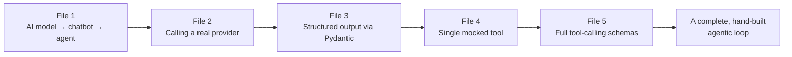
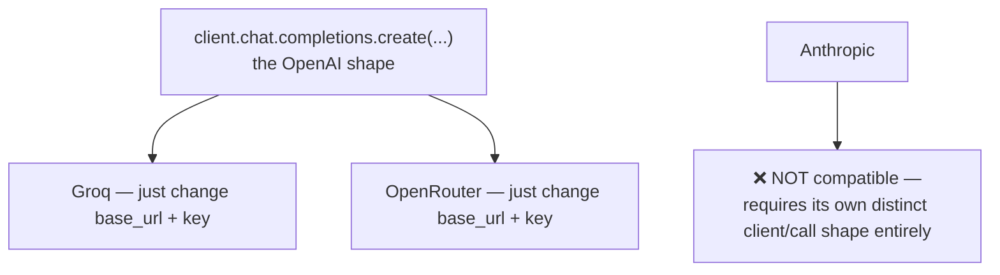
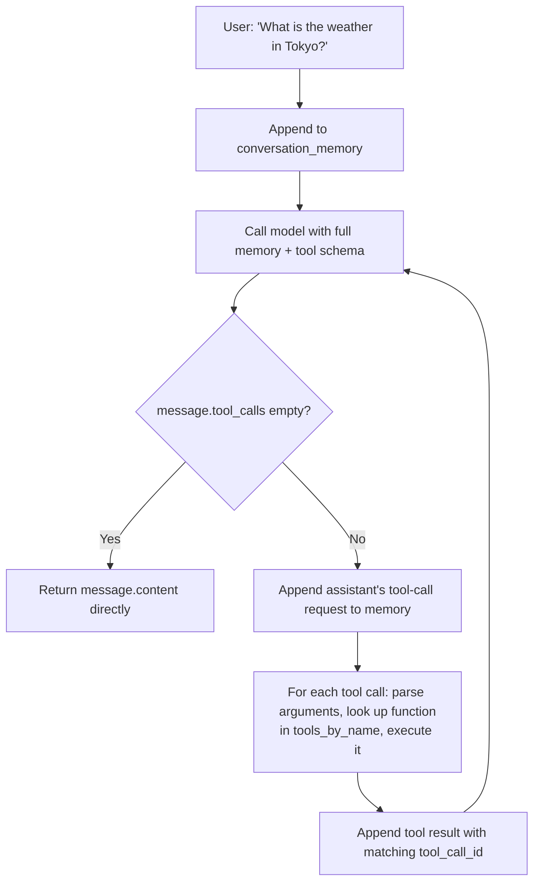
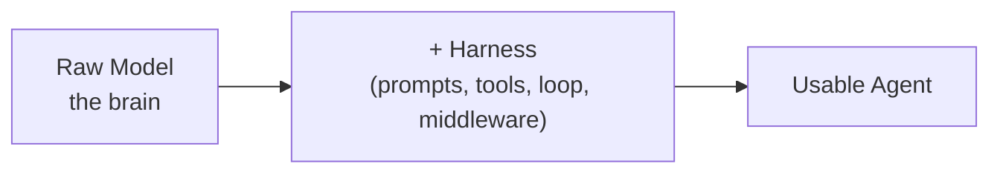
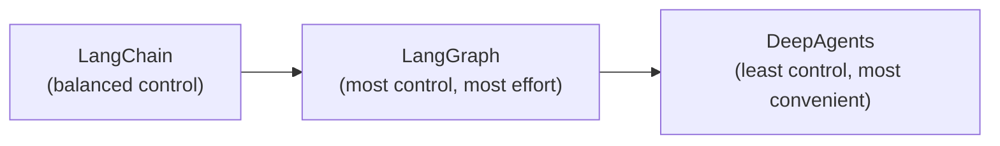
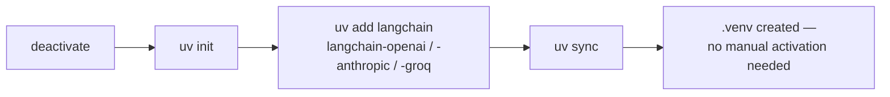
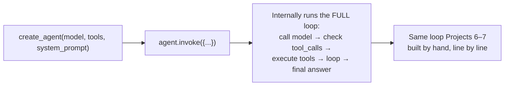
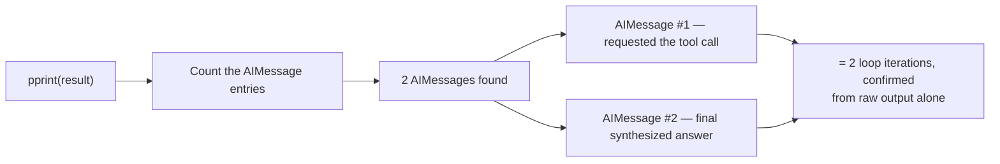
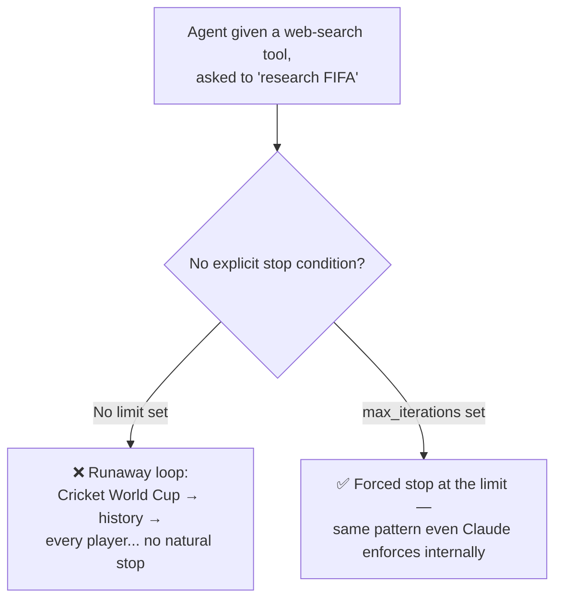

# 🦜 LangChain from First Principles: From Hand-Built Agents to create_agent()

- <i>**Session:** Day 7 — Class 6: "LangChain Part 1" · 
- **Instructor:** Mayank Aggarwal
- **Note on scope:** This class has two halves. The **first half** completes the pure-Python, framework-free agent series from the previous session — reviewing files 1–5 (AI model → chatbot → agent, provider compatibility, structured output, single/multi-tool calling) and then live-building **Project 6** (a full conversational "mini-Claude" with a real agentic loop, wrapped in a Streamlit UI) and **Project 7** (a multi-tool agent using a real currency API). The **second half** finally introduces **LangChain** itself — but only after the instructor is confident the class can recognize, underneath LangChain's `create_agent()`, the exact same brain/memory/tools loop they just built by hand. Deep LangChain coverage (memory, checkpointers, streaming, multi-agent patterns) is explicitly deferred to the next class — this guide reflects that honestly.</i>

---

## 📑 Table of Contents

1. [Session Overview](#-session-overview)
2. [Learning Objectives](#-learning-objectives)
3. [Detailed Notes](#-detailed-notes)
   - [1. Recap: The Five Prerequisite Files](#1-recap-the-five-prerequisite-files)
   - [2. Provider Compatibility: OpenAI-Compatible vs. Anthropic's Own Format](#2-provider-compatibility-openai-compatible-vs-anthropics-own-format)
   - [3. Project 6: Building "Mini-Claude" — A Full Conversational Agent](#3-project-6-building-mini-claude--a-full-conversational-agent)
   - [4. Project 7: A Multi-Tool Agent with a Real Currency API](#4-project-7-a-multi-tool-agent-with-a-real-currency-api)
   - [5. Why Frameworks Exist: Agent = Model + Harness](#5-why-frameworks-exist-agent--model--harness)
   - [6. LangChain vs. LangGraph vs. DeepAgents](#6-langchain-vs-langgraph-vs-deepagents)
   - [7. LangChain V1 vs. LangChain Classic](#7-langchain-v1-vs-langchain-classic)
   - [8. Setting Up a LangChain Project](#8-setting-up-a-langchain-project)
   - [9. Building Your First LangChain Agent: create_agent()](#9-building-your-first-langchain-agent-create_agent)
   - [10. Inspecting LangChain's Internals: Messages, Tool Calls & Token Usage](#10-inspecting-langchains-internals-messages-tool-calls--token-usage)
   - [11. The @tool Decorator & init_chat_model](#11-the-tool-decorator--init_chat_model)
   - [12. Why max_iterations Still Matters Inside a Framework](#12-why-max_iterations-still-matters-inside-a-framework)
4. [Glossary](#-glossary)
5. [Revision Notes — One-Minute Revision](#-revision-notes--one-minute-revision)
6. [Cheat Sheet](#-cheat-sheet)
7. [Interview Questions & Answers](#-interview-questions--answers)
8. [Scenario-Based Interview Questions](#-scenario-based-interview-questions)
9. [Hands-on Exercises](#-hands-on-exercises)
10. [Practice Assignment](#-practice-assignment)
11. [Additional Resources](#-additional-resources)
12. [Final Revision Sheet](#-final-revision-sheet)

---

## 🎯 Session Overview

This class is the payoff of every prior fundamentals-first session. It proceeds as:

1. A tight, code-focused revision of the five prerequisite Python files (AI model vs. chatbot vs. agent; calling providers; structured output with Pydantic; a single mocked tool; full tool-calling schemas).
2. **Project 6**: a live-built, fully conversational, multi-turn "mini-Claude" — a genuine agentic loop wrapped in a simple Streamlit chat UI, built entirely in raw Python.
3. **Project 7**: the same pattern extended to **three tools**, including a **real** (not mocked) currency-conversion API call, run again via Streamlit.
4. A deliberate pause to explain **why frameworks exist at all** — "agent = model + harness" — before finally opening LangChain's documentation.
5. A guided tour of **LangChain vs. LangGraph vs. DeepAgents**, LangChain's V1 vs. Classic versions, environment setup, and the first working `create_agent()` call — with its internal message/token output inspected line-by-line and mapped directly back to the hand-built loop from Projects 6–7.

> 💡 **Memory Trick — the instructor's framing for the entire session:** *"LangChain is not telling you what all is happening inside — for that, you have to go deep, deep, deep, which is exactly what we just did by hand. Now that your basics are right, this framework will never confuse you."*

---

## 🎯 Learning Objectives

By the end of this guide, you will be able to:

- [ ] Explain why Groq and OpenRouter can reuse the OpenAI SDK by simply changing the `base_url`, while Anthropic requires its own distinct client/API shape.
- [ ] Build a complete, multi-turn conversational agent in raw Python — with a running `conversation_memory` list, a bounded agentic loop, and multiple registered tools — and wrap it in a minimal Streamlit UI.
- [ ] Explain why a real (non-mocked) tool call, like a live currency-conversion API, behaves identically in the loop to a mocked one.
- [ ] State and explain the "agent = model + harness" definition, and correctly identify what "harness" includes.
- [ ] Distinguish LangChain, LangGraph, and DeepAgents using the Swiggy / home-cooked-meal / raw-vegetables analogy, and explain when each is the right level of abstraction.
- [ ] Explain the difference between LangChain V1 and LangChain Classic, and why the course standardizes on V1.
- [ ] Set up a new LangChain project from scratch with `uv`, including a correct `.env` / `.gitignore` / `.env.example` pattern.
- [ ] Build and run a first LangChain agent using `create_agent()`, and read its raw message output (HumanMessage, AIMessage, ToolMessage) to identify tool calls, tool call IDs, and token usage.
- [ ] Explain why `max_iterations`-style safety limits remain necessary even once a framework is managing the agentic loop for you.

---

## 📚 Detailed Notes

### 1. Recap: The Five Prerequisite Files



#### 🧠 Concept

Before building anything new, the instructor runs a compressed, five-minute recap of the pure-Python foundation laid in the previous session — deliberately reinforcing that this incremental, file-by-file approach ("1 through 7") is itself a teaching method, not busywork.

#### 🔍 Internal Working — What Each File Established

| File | Core concept | Why it matters going forward |
|---|---|---|
| **1** | AI model → chatbot → agent (conceptual progression) | The "brain, memory, tools" mental model everything else builds on |
| **2** | Calling a real provider (`client.chat.completions.create(...)`) | The base mechanic every subsequent file reuses |
| **3** | Structured output via Pydantic | Proved that even "structured" AI output is still fundamentally a string that must be parsed |
| **4** | A single, manually-wired mocked tool | Established the tool-schema pattern before scaling to multiple tools |
| **5** | Full tool-calling schemas + doubt-clearing | Established: an AI response is *either* a plain reply *or* a tool-call request — never both, never neither |

> 💡 **Memory Trick — on why this incremental structure worked:** *"If I'd started with LangChain directly, you never would have asked the questions you asked me yesterday — because LangChain would have just handled it silently. Building it by hand first is exactly what let those really good doubts surface."*

#### 🎯 Key Takeaways

* The five prerequisite files each added exactly one new capability, building toward a complete, hand-built agentic loop.
* Structured output (Pydantic) matters here specifically because it lets you reliably extract a value (like a city name) that a tool function actually needs as an argument.
* An AI response is always one of exactly two shapes: a plain reply, or a tool-call request — this binary distinction is the backbone of every agentic loop built in this course.

---

### 2. Provider Compatibility: OpenAI-Compatible vs. Anthropic's Own Format



#### 🧠 Concept

OpenAI was first to market and effectively became the *de facto* standard shape for chat completion APIs (`client.chat.completions.create(...)`). Providers like **Groq** and **OpenRouter** deliberately mimic this exact shape ("OpenAI-compatible"), while **Anthropic** does not.

#### ❓ Why It Exists

> 💡 **Memory Trick:** *"Think of how Apple defines a user behavior — swipe up to close an app. Other companies don't reinvent a new gesture; they copy it, because retraining user behavior is expensive. Same logic here: since developers already know OpenAI's shape, Groq and OpenRouter simply match it — you only change your `base_url` and key, and everything else works unchanged."*

#### ⚙ How It Works

| Provider | Compatibility | What changes in your code |
|---|---|---|
| **OpenAI** | The original standard | Nothing — this is the baseline shape |
| **Groq** | OpenAI-compatible | Only `base_url` + API key |
| **OpenRouter** | OpenAI-compatible | Only `base_url` + API key |
| **Anthropic** | **Not** OpenAI-compatible | Requires Anthropic's own distinct client and call shape entirely |

> ⚠️ **Common Mistake:** Assuming every AI provider can be swapped in just by changing a `base_url`. Anthropic is the explicit counter-example named in this session — it defines its own API shape and does not follow the OpenAI chat-completion convention.

#### 🚀 Best Practices

* The instructor's stated course-wide preference: default to **Groq or OpenRouter** for learning, specifically because they let students avoid unnecessary spend while practicing — "my approach in this course is that you spend the least of your money learning these things."

#### 🎯 Key Takeaways

* OpenAI's chat-completion shape became a de facto industry standard that Groq and OpenRouter deliberately mirror.
* Switching between OpenAI, Groq, and OpenRouter is typically just a `base_url` + key change.
* Anthropic is a genuine exception — its API shape is its own, not OpenAI-compatible.

---

### 3. Project 6: Building "Mini-Claude" — A Full Conversational Agent

#### 📖 Definition

Project 6 upgrades the single-shot tool-calling logic from File 5 into a genuinely **conversational, multi-turn agent** — maintaining a running `conversation_memory` list across a `while True` input loop, wrapped in a minimal **Streamlit** UI, and demonstrated live as what the instructor repeatedly calls **"a mini-Claude" or "mini-OpenAI."**

#### ⚙ How It Works — The Code Structure

```python
import json
import os
from dotenv import load_dotenv

load_dotenv()

# ... sample_weather_data, get_weather(city), tool schema, tools_by_name ...

def get_client_and_model():
    """Returns a configured OpenAI-compatible client and model name."""
    ...

def run_agent(messages: list, max_turns: int = 4) -> str:
    """Runs the full agentic loop against a growing message list."""
    client, model = get_client_and_model()

    for _ in range(max_turns):
        response = client.chat.completions.create(
            model=model,
            max_tokens=400,
            messages=messages,
            tools=[get_weather_schema],
        )
        message = response.choices[0].message

        if not message.tool_calls:
            messages.append({"role": "assistant", "content": message.content})
            return message.content

        # Append the assistant's tool-call request itself
        messages.append({
            "role": "assistant",
            "content": message.content,
            "tool_calls": message.tool_calls,
        })

        for call in message.tool_calls:
            arguments = json.loads(call.function.arguments)
            tool_function = tools_by_name[call.function.name]
            result = tool_function(**arguments)
            messages.append({
                "role": "tool",
                "tool_call_id": call.id,
                "content": str(result),
            })

    return "Reached max turns without a final answer."


conversation_memory = []
while True:
    try:
        user_input = input("You: ")
    except KeyboardInterrupt:
        break
    conversation_memory.append({"role": "user", "content": user_input})
    answer = run_agent(conversation_memory)
    print("Agent:", answer)
```

> 🛠️ **Reconstructed for completeness:** the transcript walks through this exact structure live, in depth, field by field (including a real, corrected live bug involving referencing `call` outside a loop's scope) — the code above is a faithful, complete reconstruction of the described logic, including the `max_turns=4` default, the `tools_by_name` mapping pattern, and the required `tool_call_id` echo-back.

#### 🪜 Step-by-Step Execution — Traced Live, Turn by Turn

1. **Turn 1 ("Hi, I am Mayank"):** memory starts empty → one message appended → sent to the model → `message.tool_calls` is empty → the plain reply is returned directly. **No loop iteration beyond the first was needed.**
2. **Turn 2 ("Who am I?"):** memory now has 2 prior messages (user + assistant) → all 3 messages (2 prior + 1 new) are sent → the model correctly answers **"You are Mayank"** — directly proving why conversational memory matters, demonstrated by asking the class to try answering "who am I" using *only* the current message, with no prior context, and confirming it's impossible.
3. **Turn 3 ("What is the weather in Tokyo?"):** this time `message.tool_calls` is **not** empty → the `if not message.tool_calls:` branch fails → execution falls through into the tool-handling code → the tool's raw result gets appended with role `"tool"` and the matching `tool_call_id` → the loop runs again, this time sending all 7 accumulated messages back to the model → the model finally synthesizes a natural-language weather answer.



#### 🔍 Internal Working — Why `tools_by_name` Is Necessary

> ⚠️ **A deliberately staged, illustrative mistake:** the instructor defines two plain functions, `add_numbers(a, b)` and `subtract_numbers(a, b)`, and asks: *"If your AI tells you to call `add` with `a=5, b=6`, can you actually call this string `'add'` directly? No — you cannot call a string. You must first extract the real function object from a mapping."* `tools_by_name = {"get_weather": get_weather, ...}` is exactly that mapping — the model only ever returns the tool's **name as a string**, never a callable reference, so this dictionary is what bridges "the AI's textual instruction" to "an actual, invokable Python function."

#### 🔍 Internal Working — Why the `tool_call_id` Is Non-Negotiable

> ⚠️ **Explicitly emphasized, repeated multiple times:** *"This ID is very, very important."* The `tool_call_id` is generated by the AI provider itself (never by your own code), and must be echoed back exactly, attached to the tool's result message. This is what lets the model correctly associate *which* tool call each result belongs to — critical the moment more than one tool call happens in a single turn (e.g., a request needing both weather **and** currency data). Without correctly matching IDs, the model has no reliable way to connect a result back to the request that produced it.

#### 🖥 Wrapping It in Streamlit

The exact same `run_agent()` logic is then wrapped in a minimal **Streamlit** chat interface (the instructor explicitly tells students unfamiliar with Streamlit to paste the code into an AI assistant for a walkthrough, rather than teaching Streamlit itself in depth) — demonstrating that the underlying agent logic is completely independent of whatever UI sits on top of it.

#### ⚠ Common Mistakes

* Believing memory must involve a database from the start — the instructor is explicit that a plain Python list is a completely valid (if session-scoped) memory implementation for learning purposes; more durable storage (a database, `mem0`, etc.) is a later, separate concern.
* Forgetting that identical questions (e.g., asking "What is the weather in Tokyo?" twice) will trigger the tool **again** each time, since no caching has been implemented — explicitly flagged live as expected behavior, not a bug: *"This is all software development — we haven't handled caching, and it's a very valid design question: should identical weather queries within 5 minutes actually re-call the tool?"*

#### 🎯 Key Takeaways

* Project 6 is the complete, working synthesis of every prior file: a bounded loop, a growing memory list, tool-name-to-function resolution via a dictionary, and correct `tool_call_id` handling.
* The exact same agent logic works identically whether driven by a plain `input()` loop or wrapped in a Streamlit chat UI — the UI layer is entirely separate from the agent logic.
* Caching (e.g., not re-fetching identical weather data within a short window) is explicitly named as a real, unsolved design decision left for the developer — not something "the agent" or "the framework" handles automatically by default.

---

### 4. Project 7: A Multi-Tool Agent with a Real Currency API

#### 🧠 Concept

Project 7 is architecturally **identical** to Project 6, with two changes: it registers **three tools** instead of one (weather, a calculator, and currency conversion), and the currency tool calls a **real, live API** (the Frankfurter API, reused from an earlier session) instead of mocked data.

#### ⚙ How It Works

```python
tools_by_name = {
    "get_weather": get_weather,
    "calculator": calculator,
    "convert_currency": convert_currency,  # calls the real Frankfurter API
}

# run_agent() is unchanged from Project 6 — only max_turns is raised to 5
```

> 💡 **Memory Trick — the instructor's framing of this "non-event":** *"Everything else is exactly the same. I'm giving the three tool schemas, tools_by_name is get_weather, calculator, convert_currency — I hope now it makes a lot of sense, because now your base is clear."* The point being deliberately made: **swapping a mocked tool for a real API call requires zero changes to the agentic loop itself** — only the tool function's internal implementation differs.

#### 💻 Live Demonstration — Real API Results, Verified Live

Run via the same Streamlit wrapper, the instructor asks real currency questions live and cross-checks the AI's answers against a real-world reference:

- *"Tell me the latest 1 USD to INR"* → close to the real exchange rate at the time.
- *"What is 1 Euro to INR?"* → also confirmed close to the real rate.
- A subsequent request for a less common pairing (AED, then CAD) **fails**, with the model reporting *"the current service is currently unavailable"* — an honest, live, unedited demonstration that the Frankfurter API itself intermittently failed for certain currency pairs, used as a teaching moment about handling real external API unreliability rather than a scripted success story.

#### ⚖ Advantages & Limitations

| Aspect | Demonstrated behavior |
|---|---|
| Multiple simultaneous tool calls | Confirmed working: asking for **both** weather in Tokyo **and** a currency rate in one message correctly triggers two separate tool calls in the same turn, exactly as designed via the `for call in message.tool_calls:` loop |
| Real API failure handling | When the Frankfurter API failed for a specific currency pair, the agent still responded gracefully (reporting the failure) rather than crashing — though no explicit `try`/`except` retry logic was highlighted as separately added for this specific demo |

#### 🎯 Key Takeaways

* The agentic loop architecture is completely indifferent to whether a tool is mocked or calls a real, live API — this is the direct, practical payoff of having built the loop correctly and generically in Project 6.
* Multiple tool calls in a single user turn work exactly as the underlying `for call in message.tool_calls:` loop implies — demonstrated live with a genuine two-tool request.
* Real external APIs can and do fail — this was shown honestly, live, rather than glossed over, reinforcing that production agent code must anticipate real-world API unreliability.

---

### 5. Why Frameworks Exist: Agent = Model + Harness

#### ❓ Why It Exists

Having now built two working agents entirely by hand, the instructor pauses deliberately before introducing any framework, to make the motivation for frameworks landed and earned rather than assumed.

> 💡 **Memory Trick:** *"If tomorrow someone says, 'Mayank, I also want an AWS Bedrock key,' then 'I want Azure Foundry as well' — don't you think we'd keep rewriting this same client-setup code over and over? That repetitive, provider-swapping, caching-adding, tool-adding maintenance burden is exactly what a framework exists to absorb."*

#### 📖 Definition

Quoting LangChain's own documentation directly, read live: *"Agent = model + harness. LangChain provides `create_agent`, a minimal, highly configurable harness. The harness is everything around the model loop — the prompts, the tools, and any middleware that shapes behavior."*

> 💡 **Memory Trick:** *"Harness," in its literal sense, means the equipment used to control and direct a draft animal. Applied here: the **model** is the raw horsepower (the brain); the **harness** is everything — tools, prompts, memory, the loop itself — that lets you actually direct and get useful work out of that raw power. A model with no harness, per everything covered so far, is not very useful on its own.*

#### ⚙ How It Works



#### 🎯 Key Takeaways

* **Agent = Model + Harness** is LangChain's own stated definition — directly consistent with the "brain + memory + tools" definition built up across the entire course.
* "Harness" specifically means everything *around* the raw model: the loop, the prompts, the tools, and any middleware shaping behavior.
* Frameworks exist to absorb the repetitive maintenance burden (new providers, caching, new tools) that hand-written agent code accumulates over time — not because hand-written code is "wrong."

---

### 6. LangChain vs. LangGraph vs. DeepAgents

#### 🧠 Concept

LangChain's own documentation presents **three related offerings** at increasing levels of abstraction/control, and the instructor translates each into a food-delivery analogy for intuition.

#### ⚙ How It Works — The Three-Tier Comparison

| Offering | LangChain's own description | The instructor's analogy | Level of control |
|---|---|---|---|
| **DeepAgents** | "Batteries-included agent" with automatic context compression, a virtual file system, and sub-agent spawning — built *on top of* LangChain agents | **Swiggy** — you order, food arrives; you cannot control the kitchen, hygiene, or recipe | Lowest control, highest convenience |
| **LangChain** | "Highly customizable harness, easily tailored to your use case and data" | **Home-cooked meal** — you choose the spice level, the ingredient quality, the cleanliness | Balanced control |
| **LangGraph** | "Low-level orchestration framework for advanced needs, combining deterministic and agentic workflows" | **Buying raw vegetables yourself** — full control over every individual ingredient | Highest control, most effort |

> 💡 **Memory Trick, stated directly:** *"Deep Agent is like Swiggy — go, order, done, you can't change how the food is made. LangChain is a home-cooked meal — you control the spice level, the ingredient brands, the cleanliness. LangGraph is buying all the vegetables yourself — the lowest level of orchestration, where you control things down to that level."*

#### 🪜 Step-by-Step — The Course's Learning Order



> ⚠️ **Note:** this progression order (LangChain first, then LangGraph, then DeepAgents) is a **deliberate teaching sequence choice** — it does not imply DeepAgents is "more advanced" than LangGraph in capability; per the comparison table above, DeepAgents actually sits at a *higher* abstraction level (more automated, less granular control) than LangGraph. The course simply builds understanding from the middle tier (LangChain) outward in both directions.

#### 🎯 Key Takeaways

* Three tiers, by increasing developer control (and decreasing built-in automation): DeepAgents → LangChain → LangGraph.
* LangSmith (mentioned in passing) is for **monitoring/observability**, not agent construction — a separate concern from these three.
* None of the three is "better" in an absolute sense — the right choice depends on how much control versus convenience a given use case needs.

---

### 7. LangChain V1 vs. LangChain Classic

#### 📖 Definition

LangChain recently underwent a major version shift: everything prior to version 1.x is now retroactively labeled **"LangChain Classic,"** while the current, actively-developed line is **LangChain V1** (at the time of this session, version 1.3.x).

#### ❓ Why It Exists

> 💡 **Memory Trick, directly answering a learner's question about whether Classic was a "disadvantage":** *"It wasn't a disadvantage — Classic was very much focused on raw LLM calls. V1 is tailored specifically toward agents, because that's how the industry evolved: in 2024, barely anyone was talking about agents; in the last six months, everyone is. LangChain adapted to become agent-first."*

#### ⚖ Advantages & Limitations

| | LangChain Classic | LangChain V1 |
|---|---|---|
| Primary focus | Raw LLM calls, chains | Agents, first-class |
| Where you'll still see it | Most existing YouTube tutorials and older company codebases | This course, and current documentation |
| Underlying design philosophy | Same general lineage — not a "radical" rewrite | Same lineage, refocused toward agent construction |

> 💡 **Memory Trick — reassurance for encountering legacy Classic code at work:** *"If you're using the latest iPhone, the design language is still recognizably related all the way back to iPhone 6. Same for Mac, same for Windows XP through Windows 11 — companies don't radically reinvent everything overnight. LangChain Classic and V1 share that same relationship: recognizably related, not a totally alien rewrite."*

#### ⚠ Common Mistakes

* Assuming a company using "LangChain" necessarily means the current V1 API — many real, currently-deployed systems (built 1–2 years prior) still run on LangChain Classic, and the instructor explicitly warns learners to expect this in real jobs.

#### 🎯 Key Takeaways

* "LangChain Classic" = everything before v1.x, focused on raw LLM calls/chains; "LangChain V1" = the current, agent-first line this course teaches.
* The shift reflects the industry's own shift toward agents as the default mental model, not a technical "fix" to something broken in Classic.
* Expect to encounter Classic-style code in real, existing company codebases — recognizing its lineage (rather than treating it as unrelated) is the practical skill being built here.

---

### 8. Setting Up a LangChain Project



#### ⚙ How It Works — Step by Step, Live

```bash
# 1. Deactivate any active virtual environment, navigate out, then in fresh
deactivate

# 2. Initialize a new UV project
uv init

# 3. Add LangChain and provider-specific integration packages
uv add langchain
uv add langchain-openai
uv add langchain-anthropic
uv add langchain-groq        # (as needed, per provider)

# 4. Sync environment (creates .venv; no manual activation required day-to-day)
uv sync
```

**Resulting project structure includes**, as demonstrated live:
```text
project/
├── .env                # real secrets — NEVER committed
├── .env.example         # placeholder keys — safe to commit, documents what's needed
├── .gitignore            # explicitly excludes .env and .venv
├── pyproject.toml
├── uv.lock
└── main.py
```

#### 🔍 Internal Working — The `.env` / `.gitignore` / `.env.example` Pattern

> 💡 **Memory Trick, demonstrated live end-to-end via GitHub Desktop:** *".gitignore tells Git: 'this person doesn't want `.env` sent.' So when you stage your changes, you'll see `.env` is simply absent from what gets committed — but `.env.example` (a duplicate of `.env` with placeholder values instead of real keys) **is** committed, so any collaborator immediately knows exactly which environment variables the project needs, without ever seeing your actual secrets."*

```env
# .env.example (safe to commit)
OPENAI_API_KEY=
GROQ_API_KEY=
ANTHROPIC_API_KEY=
GEMINI_API_KEY=
OPENROUTER_API_KEY=
```

#### ⚠ Common Mistakes

* Committing `.env` directly to a public repository — explicitly flagged as a real mistake the instructor has personally made and had to fix live in an earlier session, used here as the motivating cautionary example for teaching this pattern properly.
* Forgetting to also `.gitignore` the `.venv` directory — explicitly called out as equally important, since it's large and entirely regenerable from `pyproject.toml`/`uv.lock`, and therefore should never be committed.

#### 🎯 Key Takeaways

* LangChain is installed as a base `langchain` package plus separate, provider-specific integration packages (`langchain-openai`, `langchain-anthropic`, etc.) — install only what you need.
* The `.env` / `.gitignore` / `.env.example` pattern is the standard, correct way to keep real secrets out of version control while still documenting what environment variables a project requires.
* `uv sync` sets up a working virtual environment without requiring day-to-day manual activation for `uv`-driven commands.

---

### 9. Building Your First LangChain Agent: create_agent()



#### 💻 Code Example — The Minimal Working Agent

```python
from langchain.agents import create_agent
from langchain_openai import ChatOpenAI  # or the relevant provider integration

def get_weather(city: str) -> str:
    """Get the weather for a given city."""
    return f"It's always sunny in {city}"

agent = create_agent(
    model="openai:gpt-5.5",   # or an initialized chat model object
    tools=[get_weather],
    system_prompt="You are a helpful weather assistant.",
)

result = agent.invoke({
    "messages": [{"role": "user", "content": "What's the weather in San Francisco?"}]
})
```

> 🛠️ **Reconstructed for completeness:** this mirrors LangChain's own documented quickstart example, walked through live from the official docs; the instructor explicitly notes he is directly following LangChain's own "Build a basic agent" quickstart page rather than improvising a custom example.

#### 🪜 Step-by-Step Execution

1. `from langchain.agents import create_agent` — LangChain's single, primary entry point for building an agent (contrasted directly with the entire hand-written `run_agent()` function from Projects 6–7).
2. `create_agent(model=..., tools=[...], system_prompt=...)` — you supply exactly the same three ingredients the class had already been manually assembling: a brain (model), tools, and a system prompt.
3. `agent.invoke({...})` — a single call that internally runs the **entire** agentic loop (call model → check for tool calls → execute tools → loop → final answer) that Projects 6–7 built by hand, line by line.

#### 🔍 Internal Working — Confirmed by Reading the Raw Output

Running `pprint(result)` and inspecting the returned `messages` list live, the instructor maps each entry directly onto concepts already taught:

| Message in LangChain's output | Directly corresponds to (from Projects 6–7) |
|---|---|
| `HumanMessage`, content: *"What's the weather in San Francisco?"* | The initial `{"role": "user", ...}` dict appended to `conversation_memory` |
| `AIMessage`, content empty, `finish_reason: tool_call`, containing a `tool_calls` list with an `id`, `type: function`, `name`, and `arguments` | Exactly the `message.tool_calls` structure inspected in File 5 and Project 6 |
| `ToolMessage`, content: *"It's always sunny in San Francisco"*, matching `tool_call_id` | Exactly the `{"role": "tool", "tool_call_id": ..., "content": ...}` dict appended after executing a tool |
| Final `AIMessage`, content: *"It's currently sunny in San Francisco"* | The final natural-language synthesis after the second loop iteration |

> 💡 **Memory Trick, stated directly to the class:** *"Everyone, now tell me: do you know how this happens internally? Yes — because that's the exact benefit of having learned it in depth first."* Additionally observed live: each message carries token usage metadata (`prompt_tokens`, `completion_tokens`, `total_tokens`), directly confirming the token-cost concepts from earlier sessions apply identically inside LangChain.

#### ⚠ Common Mistakes

* Importing `create_agent` incorrectly (a real, live, unedited error occurred: `ImportError: cannot import name 'create_agent' from 'langchain.agents'` — resolved by ensuring the correct, current package version and import path) — modeling that even the instructor hits real import/version errors, and that reading the error message (which suggested the correct name) is the way to resolve it.
* Assuming `create_agent` requires exhaustively defining a tool schema by hand, the way File 4/5 did — LangChain instead accepts a **plain Python function directly** as a tool (with its docstring serving as the description), which is explicitly named as one of the concrete conveniences the framework provides over the fully manual approach.

#### 🎯 Key Takeaways

* `create_agent(model=..., tools=[...], system_prompt=...)` plus `.invoke(...)` replaces the entire hand-written `run_agent()` loop from Projects 6–7 — while running conceptually identical logic underneath.
* LangChain's raw output (`HumanMessage`/`AIMessage`/`ToolMessage`, tool call IDs, token usage) maps one-to-one onto concepts already built by hand, which is precisely why the fundamentals-first approach pays off here.
* LangChain accepts plain Python functions as tools directly (no manual JSON schema required) — a genuine, concrete convenience over the fully manual approach.

---

### 10. Inspecting LangChain's Internals: Messages, Tool Calls & Token Usage



#### 🧠 Concept

Rather than treating `create_agent()` as a black box, the instructor deliberately prints and reads the full raw response object, reinforcing that "convenient" does not mean "invisible" or "unlearnable."

#### ⚙ How It Works

```python
from pprint import pprint
pprint(result)
```

#### 🪜 Step-by-Step — What the Loop Count Reveals

Inspecting the message list live, the instructor counts **two AI messages** in the response — directly confirming, from the raw output alone (without any added print statements inside LangChain itself), that the internal agentic loop ran for **two iterations**: one that requested the tool call, and one that produced the final synthesized answer, exactly mirroring the loop behavior built by hand in Project 6.

#### ⚖ Advantages & Limitations

| Advantage of using `create_agent()` | Limitation, explicitly acknowledged live |
|---|---|
| Dramatically less code to write for the same behavior | *"With that, of course, you cannot control anything [as granularly]"* — the trade-off for convenience is reduced fine-grained control over the loop's internals |
| Handles memory-within-a-single-run and looping automatically | The tool schema LangChain builds internally has **less rich documentation** than the fully manual JSON schema approach from File 4/5, since it's inferred from the function's docstring rather than hand-authored field-by-field |
| Consistent, well-tested loop implementation | Slower per-call latency was observed live, attributed to LangChain's additional internal processing (ID generation, message-object construction) layered on top of the raw provider call |

#### 🎯 Key Takeaways

* Counting AI messages in the raw output is a direct, reliable way to observe how many agentic-loop iterations actually occurred — no extra instrumentation needed.
* `create_agent()` trades fine-grained manual control for convenience and consistency — an explicit, acknowledged trade-off, not a strictly "better in every way" upgrade.
* Reading a framework's raw output is a genuinely useful, ongoing debugging habit, not just a one-time teaching exercise.

---

### 11. The @tool Decorator & init_chat_model

#### 📖 Definition

Continuing through LangChain's own quickstart documentation, two further conveniences are introduced: the **`@tool` decorator** for defining tools with less boilerplate, and **`init_chat_model`** for flexibly configuring/swapping the underlying model.

#### 💻 Code Example — The `@tool` Decorator

```python
from langchain.tools import tool

@tool
def fetch_text_from_url(url: str) -> str:
    """Fetches and returns the text content from a given URL."""
    # ... raw request, decode UTF-8, error='replace' ...
    return text
```

> 💡 **Memory Trick:** *"`@tool` is a decorator — it takes in the function and returns the complete tool representation. This is exactly the decorator pattern already covered in a prior class — nothing new conceptually, just a new, convenient application of it."* This directly echoes the course's earlier decorator lesson: rather than hand-authoring a JSON schema (as in File 4/5), `@tool` derives the tool's description largely from the function's own docstring.

#### 💻 Code Example — init_chat_model

```python
from langchain.chat_models import init_chat_model

model = init_chat_model("openai:gpt-5.5", temperature=0, max_tokens=500, timeout=30)
```

> 💡 **Memory Trick:** *"This is syntax — do you need to remember it? No. Two minutes from now you won't remember the exact call shape, and that's fine; what matters is recognizing what it configures: timeout, temperature, max tokens — the same knobs you already understand conceptually from raw API calls."*

#### 🔍 Internal Working — Memory, Briefly Previewed (Deferred)

The instructor demonstrates that, *within a single running program*, a `create_agent()`-based agent genuinely can hold a conversation and correctly answer "who am I?" — but the moment the program itself stops running, that memory is gone, exactly like the plain Python-list memory from Project 6. Durable, persistent memory (databases, checkpointers) is explicitly named as a topic for a later class, deliberately not covered in depth here.

#### ⚠ Common Mistakes

* Assuming `@tool` requires **no** documentation at all — a docstring is still what LangChain uses to describe the tool to the model; an undocumented tool will still risk being misused/hallucinated, exactly as in the fully manual approach.
* Confusing in-memory, single-run conversational continuity (which `create_agent()` provides trivially, within one program execution) with true persistent memory across separate runs/sessions (which requires additional, explicitly deferred setup).

#### 🎯 Key Takeaways

* `@tool` is the same decorator pattern taught earlier in the course, applied to eliminate manual JSON-schema authoring for tools.
* `init_chat_model` is LangChain's flexible model-configuration entry point — conceptually identical to raw API parameters (timeout, temperature, max tokens) already understood, just wrapped in new syntax.
* `create_agent()` provides conversational continuity *within a single running program* automatically — but not durable, cross-session memory, which remains a deliberately deferred, separate topic.

---

### 12. Why max_iterations Still Matters Inside a Framework



#### ❓ Why It Exists

A sharp, extended live Q&A exchange (with learners Ankit and Deepanshu) directly addresses a natural question: *if LangChain is running the agentic loop for you, do you still need to worry about a maximum iteration/turn limit?*

#### ⚙ How It Works — The Instructor's Direct Answer

> 💡 **Memory Trick:** *"If your agent has, say, a web-search tool and you ask it to 'research FIFA,' it could keep searching — Cricket World Cup, then history, then every player — with no natural stopping point unless you explicitly define one. This is exactly why we always need a stop condition: a maximum number of iterations, a time limit, or both."*

- This safety mechanism is **not unique to hand-written code** — the instructor cites having personally seen Claude itself hit an internal limit and prompt *"the time limit for this tool has expired, click Continue"* — direct, observed evidence that even major, polished commercial AI products enforce exactly this kind of guardrail internally.
- The specific limit value (5, 10, 80, 100 — whatever) is **use-case dependent** and does not have one universally "correct" number — it's a deliberate design decision, not a fixed rule.

#### ⚖ Advantages & Limitations

| Position | Instructor's stance |
|---|---|
| "Do we still need a max-iteration safety check once using a framework?" | **Yes, always** — "I would never say we don't need that... every AI, for sure, has this, even if they don't disclose it." |
| "Isn't relying fully on the LLM's own judgment to stop simpler?" | Explicitly rejected as insufficient on its own — you cannot be certain the model will always naturally produce a stop condition; a fixed, explicit check is the reliable backstop |

#### 🎯 Key Takeaways

* Using a framework does not eliminate the need for an explicit maximum-iteration (or time-based) safety limit — this remains a fundamental, framework-independent agent design requirement.
* Even major commercial AI products (Claude, cited directly from firsthand observation) enforce comparable internal limits.
* The exact numeric limit is a use-case-specific design decision, not a fixed, universally "correct" value.

---

## 📝 Glossary

| Term | Definition | Why It Matters |
|---|---|---|
| **OpenAI-compatible** | A provider (e.g., Groq, OpenRouter) that mimics OpenAI's exact API request/response shape | Lets you switch providers by changing only `base_url` and API key |
| **`tools_by_name`** | A dictionary mapping a tool's string name to its actual callable Python function | Bridges the AI's textual tool-name output to an actually-invokable function |
| **`tool_call_id`** | A unique identifier generated by the AI provider for each requested tool call | Must be echoed back with the tool's result so the model can correctly match results to requests, especially with multiple simultaneous tool calls |
| **Harness** | Everything surrounding a raw model — prompts, tools, the loop, middleware — that makes it usable | LangChain's own stated definition: "Agent = model + harness" |
| **DeepAgents** | LangChain's "batteries-included" agent offering (automatic context compression, virtual file system, sub-agent spawning) | The highest-abstraction, lowest-control tier ("Swiggy") of the three LangChain offerings |
| **LangGraph** | LangChain's low-level orchestration framework for advanced, deterministic + agentic workflows | The lowest-abstraction, highest-control tier ("raw vegetables") |
| **LangChain V1** | The current, agent-first major version line of LangChain (1.x) | What this course teaches; reflects the industry's shift toward agent-centric development |
| **LangChain Classic** | Everything before LangChain 1.x, focused on raw LLM calls/chains | Still commonly found in existing company codebases and older tutorials |
| **`.env.example`** | A committed, placeholder-only duplicate of `.env`, documenting required environment variables without exposing real secrets | The correct pattern for sharing project setup requirements safely |
| **`create_agent()`** | LangChain's primary function for constructing an agent from a model, tools, and a system prompt | Replaces the fully hand-written `run_agent()` loop from Projects 6–7 |
| **`@tool` decorator** | A LangChain decorator that converts a plain Python function (with a docstring) into a usable agent tool | Eliminates manual JSON-schema authoring for tools |
| **`init_chat_model`** | LangChain's flexible entry point for configuring/instantiating a chat model | Wraps familiar raw-API parameters (temperature, timeout, max tokens) in LangChain's syntax |
| **`max_iterations` / max turns** | An explicit cap on how many times an agentic loop may run before forcibly stopping | A framework-independent safety requirement, confirmed to exist even in polished products like Claude |

---

## 🔄 Revision Notes — One-Minute Revision

* This class completes the hand-built agent series:
  * Files 1–5 built the foundational pieces.
  * **Project 6** — a full conversational agent with a running `conversation_memory` list, bounded loop, and `tools_by_name` dictionary resolving AI-given tool names to real functions, wrapped in Streamlit.
  * **Project 7** — the identical architecture extended to three tools including a **real** currency API, proving the loop is completely indifferent to mocked vs. real tools.
* **LangChain** is finally introduced, framed explicitly as **"Agent = Model + Harness"** (harness = everything around the model: prompts, tools, the loop, middleware).
* Three related LangChain offerings exist at different control levels:
  * **DeepAgents** — Swiggy: convenient, low control.
  * **LangChain** — home-cooked meal: balanced.
  * **LangGraph** — raw vegetables: maximum control, lowest abstraction.
* **LangChain Classic** (pre-1.x, LLM-call-focused) is distinguished from the course's chosen **LangChain V1** (agent-first).
* After setting up a project via `uv` (with a correct `.env`/`.gitignore`/`.env.example` pattern), the class builds a first working agent with **`create_agent(model=..., tools=[...], system_prompt=...)`** and **`.invoke(...)`**.
* Inspecting the raw returned messages (`HumanMessage`, `AIMessage` with `tool_calls` and a `tool_call_id`, `ToolMessage`) confirms this is running the **exact same loop** just built by hand, complete with visible token usage.
* The **`@tool`** decorator (the same decorator pattern from an earlier class) removes manual JSON-schema authoring, and **`init_chat_model`** wraps familiar model-configuration parameters in new syntax.
* An extended live Q&A firmly establishes that **`max_iterations`-style safety limits remain necessary even inside a framework** — confirmed to exist even in polished commercial products like Claude — since no framework can guarantee an LLM will always naturally produce a stopping condition on its own.

---

## 📋 Cheat Sheet

**Provider compatibility:**
```text
OpenAI-compatible (base_url + key only): Groq, OpenRouter
NOT OpenAI-compatible (own API shape):    Anthropic
```

**Hand-built agentic loop skeleton (Projects 6–7):**
```python
def run_agent(messages, max_turns=4):
    for _ in range(max_turns):
        response = client.chat.completions.create(model=model, messages=messages, tools=[...])
        message = response.choices[0].message
        if not message.tool_calls:
            return message.content
        messages.append({"role": "assistant", "tool_calls": message.tool_calls, "content": message.content})
        for call in message.tool_calls:
            args = json.loads(call.function.arguments)
            result = tools_by_name[call.function.name](**args)
            messages.append({"role": "tool", "tool_call_id": call.id, "content": str(result)})
    return "Reached max turns without a final answer."
```

**"Agent = Model + Harness."**

**Three LangChain offerings, by control level:**
```text
DeepAgents (Swiggy, least control) < LangChain (home-cooked, balanced) < LangGraph (raw vegetables, most control)
```

**New LangChain project setup:**
```bash
uv init
uv add langchain langchain-openai langchain-anthropic
uv sync
# .env (real secrets, gitignored) + .env.example (placeholders, committed)
```

**Minimal LangChain agent:**
```python
from langchain.agents import create_agent

agent = create_agent(model="openai:gpt-5.5", tools=[get_weather], system_prompt="...")
result = agent.invoke({"messages": [{"role": "user", "content": "..."}]})
```

**Tool via decorator:**
```python
from langchain.tools import tool

@tool
def my_tool(arg: str) -> str:
    """Docstring becomes the tool's description."""
    ...
```

---

## 🔥 Interview Questions & Answers

### 🟢 Beginner

**Q1.**

**Question:** Why can Groq and OpenRouter typically be used by just changing the `base_url` in OpenAI's SDK, while Anthropic cannot?

**Answer:** Groq and OpenRouter deliberately mimic OpenAI's exact chat-completion API shape ("OpenAI-compatible"); Anthropic defines its own distinct API shape entirely.

**Explanation:** Directly demonstrated and explained live via the Apple-gesture analogy.

**Why Interviewers Ask This:** A practical, frequently-encountered integration detail.

**Possible Follow-up:** "What two things typically need to change to switch from OpenAI to Groq?"

**Q2.**

**Question:** In the hand-built agentic loop, what is `tools_by_name` used for?

**Answer:** A dictionary mapping a tool's string name (as returned by the AI) to the actual, callable Python function — since the AI can never return a direct function reference, only a name string.

**Explanation:** Demonstrated with the deliberate "can you call this string directly? No" illustration.

**Why Interviewers Ask This:** A core, reusable pattern in any hand-built tool-calling system.

**Possible Follow-up:** "What would happen if a requested tool name weren't present in this dictionary?"

**Q3.**

**Question:** Why is the `tool_call_id` important?

**Answer:** It's generated by the AI provider and must be echoed back with the tool's result, so the model can correctly associate each result with the specific tool call that produced it — critical when multiple tool calls happen in one turn.

**Explanation:** Explicitly emphasized as "very, very important" multiple times live.

**Why Interviewers Ask This:** A frequent, testable implementation detail.

**Possible Follow-up:** "Does the tool_call_id ever repeat for identical repeated calls?"

**Q4.**

**Question:** What does LangChain mean by "Agent = Model + Harness"?

**Answer:** A raw model alone isn't very useful; "harness" is everything wrapped around it — prompts, tools, the loop, and middleware — that makes it a genuinely usable agent.

**Explanation:** Quoted directly from LangChain's own documentation.

**Why Interviewers Ask This:** LangChain's own foundational framing, directly consistent with the course's "brain + memory + tools" definition.

**Possible Follow-up:** "Name two things that count as part of the 'harness.'"

**Q5.**

**Question:** What are the three related LangChain offerings discussed, from least to most developer control?

**Answer:** DeepAgents (least control, most automation) → LangChain (balanced) → LangGraph (most control, lowest abstraction).

**Explanation:** The Swiggy / home-cooked meal / raw vegetables analogy.

**Why Interviewers Ask This:** Frequently-tested foundational LangChain-ecosystem knowledge.

**Possible Follow-up:** "Which offering would you choose for a use case needing very fine-grained, deterministic control?"

**Q6.**

**Question:** What is the difference between LangChain Classic and LangChain V1?

**Answer:** Classic (pre-1.x) was focused on raw LLM calls/chains; V1 (current) is agent-first, reflecting the industry's broader shift toward agents.

**Explanation:** Explicitly clarified live in response to a learner's question, including the iPhone/Windows analogy for why this isn't a "radical" rewrite.

**Why Interviewers Ask This:** Helps recognize and work with real, existing codebases built on either version.

**Possible Follow-up:** "Why might a company's existing codebase still be on LangChain Classic?"

**Q7.**

**Question:** What does `create_agent()` require as its core arguments?

**Answer:** A model, a list of tools, and a system prompt.

**Explanation:** Demonstrated directly from LangChain's own quickstart.

**Why Interviewers Ask This:** The single most basic, practical LangChain API to know.

**Possible Follow-up:** "What method do you call on the resulting agent to actually run it?"

**Q8.**

**Question:** Does LangChain require you to manually author a JSON tool schema, the way the fully manual approach did?

**Answer:** No — `create_agent()` (and the `@tool` decorator) accept plain Python functions directly, deriving the tool's description largely from the function's docstring.

**Explanation:** Explicitly named as a genuine convenience LangChain provides.

**Why Interviewers Ask This:** A concrete, practical benefit of using the framework over the fully manual approach.

**Possible Follow-up:** "What happens to tool-selection accuracy if that docstring is vague or missing?"

**Q9.**

**Question:** Is `max_iterations`-style safety limiting still necessary once using a framework like LangChain?

**Answer:** Yes — this remains a fundamental, framework-independent requirement, confirmed to exist even in polished commercial products like Claude.

**Explanation:** Directly and repeatedly confirmed in the live Q&A.

**Why Interviewers Ask This:** Corrects a natural but incorrect assumption that frameworks eliminate this concern entirely.

**Possible Follow-up:** "Name two different ways a stop condition could be defined, besides a fixed iteration count."

**Q10.**

**Question:** What is the correct pattern for keeping API keys out of version control while still documenting what a project needs?

**Answer:** A `.env` file (real secrets, listed in `.gitignore`) alongside a committed `.env.example` file (identical variable names, placeholder/empty values).

**Explanation:** Demonstrated live end-to-end via GitHub Desktop.

**Why Interviewers Ask This:** A universally applicable, essential software-engineering practice.

**Possible Follow-up:** "What else, besides `.env`, should typically also be gitignored in a `uv`-based project?"

---

### 🟡 Intermediate

**Q11.**

**Question:** Explain, step by step, why a second call to the model is necessary after a tool executes, using the Tokyo weather example.

**Answer:** The model's first response only requests the tool call (e.g., `get_weather(city="Tokyo")`) — it does not yet have the tool's actual result. Once the tool executes and its raw result (e.g., `"Tokyo: 22°C, partly cloudy"`) is appended to the message history with the matching `tool_call_id`, the loop must call the model **again**, now including that result, so the model can synthesize a natural-language final answer rather than the raw, unpolished tool output being returned to the user directly.

**Explanation:** Directly demonstrated and repeatedly reinforced live ("will you give this raw answer to your user? No.").

**Why Interviewers Ask This:** The core mechanical justification for why an agentic loop must be a *loop*, not a single call.

**Possible Follow-up:** "How many total model calls would a two-tool-call turn require, minimum?"

**Q12.**

**Question:** A learner asked whether the same argument (e.g., calling `get_weather` for Tokyo twice) reuses the same `tool_call_id`. What is the correct answer, and why does it matter?

**Answer:** No — the `tool_call_id` is never reused, even for an identical repeated call with identical arguments; it is freshly generated by the provider every single time. This matters because if caching identical tool calls is desired (to save cost/time), that caching logic must be built explicitly by the developer, keyed on the tool name and arguments — not something the ID mechanism itself provides for free.

**Explanation:** Directly and explicitly confirmed live in response to a learner's question.

**Why Interviewers Ask This:** Prevents a natural but incorrect assumption that identical calls are automatically deduplicated.

**Possible Follow-up:** "Design a simple caching key you could use to avoid redundant identical tool calls."

**Q13.**

**Question:** Why does the instructor argue that caching a stock-price tool result would be a mistake, while caching a weather result for a day might be reasonable?

**Answer:** The appropriateness of caching depends entirely on how fast the underlying data changes relative to how "fresh" the user genuinely needs it to be — stock prices change every second, so caching would return stale, potentially misleading data; weather conditions are comparatively stable over the course of a day, making a same-day cache a reasonable trade-off (a concept explicitly named "TTL," time-to-live).

**Explanation:** Directly reasoned through live, contrasting the two use cases explicitly.

**Why Interviewers Ask This:** Tests the ability to apply a general caching principle (TTL matched to data volatility) to specific, concrete cases.

**Possible Follow-up:** "What TTL would you assign to a currency-conversion tool, and why?"

**Q14.**

**Question:** Explain the practical trade-off the instructor names between using `create_agent()` versus writing the loop by hand.

**Answer:** `create_agent()` provides dramatically less code, a consistent/well-tested loop implementation, and automatic handling of memory-within-a-single-run — but at the cost of less fine-grained control over the loop's internals, and (as observed live) somewhat higher latency due to LangChain's additional internal processing layered on top of the raw provider call.

**Explanation:** Explicitly acknowledged, not glossed over, in the session.

**Why Interviewers Ask This:** A realistic, balanced framework-adoption trade-off, not a one-sided endorsement.

**Possible Follow-up:** "In what scenario would the reduced control become a real, practical problem?"

**Q15.**

**Question:** Why does the instructor state that "no one actually cares how many frameworks you know," and how does this connect to his own real client work?

**Answer:** He explains that as a working software developer serving real clients, the actual measure of value is whether the software performs (e.g., is fast enough, reliable enough) — not which framework was used to build it; he states he has, on real projects, deliberately written custom agent logic or avoided a framework entirely when that better served performance or control needs, despite teaching frameworks extensively in this course.

**Explanation:** A direct, first-person point made forcefully mid-session, tied to real, cited professional experience (interviewing candidates for major companies, closing real client contracts).

**Why Interviewers Ask This:** Reinforces the course's consistent "fundamentals over framework-collecting" philosophy with concrete, personal stakes.

**Possible Follow-up:** "Under what conditions might hand-written agent logic genuinely outperform a framework in production?"

**Q16.**

**Question:** What does it mean that DeepAgents are "built on top of LangChain agents"?

**Answer:** DeepAgents are not a separate, unrelated system — per LangChain's own documentation, they are constructed using LangChain's own underlying agent primitives, with additional automated features (context compression, a virtual file system, sub-agent spawning) layered on top for convenience.

**Explanation:** Directly quoted and explained from LangChain's own documentation, read live.

**Why Interviewers Ask This:** Clarifies the actual architectural relationship between the three offerings, beyond just the food-delivery analogy.

**Possible Follow-up:** "Why might understanding LangChain's primitives first make DeepAgents easier to learn later?"

**Q17.**

**Question:** In the raw LangChain output inspected live, what specifically indicated that the internal agentic loop ran for exactly two iterations?

**Answer:** Counting the number of distinct `AIMessage` entries in the returned message list — two were present: one requesting the tool call, and one delivering the final synthesized answer — directly mirroring how many times the model itself was called.

**Explanation:** A concrete, demonstrated debugging/inspection technique, not just an assertion.

**Why Interviewers Ask This:** A genuinely transferable debugging skill for working with any LangChain-based agent.

**Possible Follow-up:** "How would this message count differ for a turn requiring two separate tool calls?"

**Q18.**

**Question:** Why does the instructor say that even though LangChain accepts a plain Python function as a tool, "tools should still be created by us"?

**Answer:** LangChain's framework provides the *mechanism* for registering and invoking tools conveniently, but the actual tool logic — what the function does, what real system/API it connects to, and (critically) its docstring/description quality — remains entirely the developer's responsibility; the framework does not generate meaningful tool behavior or documentation on its own.

**Explanation:** Directly stated in response to a learner's question about whether LangChain supplies tools itself.

**Why Interviewers Ask This:** Prevents a misconception that a framework provides ready-made, business-relevant tools out of the box.

**Possible Follow-up:** "What LangChain-provided tools, if any, were mentioned as available versus needing to be custom-built?"

**Q19.**

**Question:** A learner observed real-world latency of ~10 seconds for a simple LangChain-based question and asked about optimizing it. What factors did the instructor attribute this to?

**Answer:** Latency in a LangChain-based call stems from a combination of the raw provider call itself, plus LangChain's own additional internal processing layered on top (constructing message objects, generating/tracking IDs, and other framework bookkeeping) — meaning some latency overhead versus a fully raw API call is an inherent trade-off of using the framework's convenience layer, not purely a network or provider-side factor.

**Explanation:** Directly addressed in the extended live Q&A on this exact topic.

**Why Interviewers Ask This:** A realistic, practical performance consideration for anyone evaluating framework overhead.

**Possible Follow-up:** "How would you empirically isolate how much of the latency is framework overhead versus raw API latency?"

**Q20.**

**Question:** Explain why the instructor considers it acceptable, even valuable, that Project 7's real currency API call visibly failed live during the demo.

**Answer:** Because it authentically demonstrated a real, production-relevant concern — external API unreliability — rather than a sanitized, always-succeeding scripted demo; it reinforced that a genuinely robust agent must be designed to handle real external failures gracefully (as the agent did here, reporting the failure rather than crashing), not just to work correctly in ideal conditions.

**Explanation:** An explicit teaching-philosophy point embedded in an unscripted, live moment.

**Why Interviewers Ask This:** Encourages designing for real-world unreliability rather than assuming happy-path-only behavior.

**Possible Follow-up:** "What specific code-level handling would you add to make this failure mode even more gracefully handled?"

---

### 🔴 Advanced

**Q21.**

**Question:** Design a decision framework for choosing between LangChain, LangGraph, and DeepAgents for a new project, using this session's control-vs-convenience framing.

**Answer:** Start by assessing how deterministic versus open-ended the required workflow is, and how much the team needs to customize internals: if the use case is well-served by a fairly standard "model + a handful of tools + a system prompt" pattern with modest customization needs, LangChain (the "home-cooked meal" tier) is the natural default. If the workflow requires combining genuinely deterministic, non-agentic steps (fixed pipelines, precise branching logic) with agentic decision-making at specific points — i.e., fine-grained orchestration control — LangGraph (the "raw vegetables" tier) is appropriate, accepting the added implementation effort. If the goal is to ship a capable, general-purpose agent quickly with minimal custom orchestration work, and the team is comfortable ceding fine-grained control (e.g., trusting built-in context compression and sub-agent spawning), DeepAgents (the "Swiggy" tier, itself built atop LangChain) is the fastest path — with the explicit understanding that this sacrifices the customization LangChain or LangGraph would offer.

**Explanation:** Synthesizes the three-tier comparison into an actionable decision process, going beyond simply restating the analogy.

**Why Interviewers Ask This:** Tests whether a candidate can translate a conceptual framework into a genuine architectural decision.

**Possible Follow-up:** "Could a single real project reasonably use more than one of these three tiers together? Give an example."

**Q22.**

**Question:** Critically evaluate: "Since create_agent() runs the exact same loop we built by hand, there's no remaining reason to ever write a hand-built agentic loop again." Is this accurate, based on this session?

**Answer:** Not fully accurate. While the session confirms `create_agent()`'s internal behavior is conceptually identical to the hand-built loop (same message structure, same tool-call/result cycle, same token accounting), the session *also* explicitly acknowledges real trade-offs: reduced fine-grained control, observed higher latency from framework overhead, and the instructor's own stated professional practice of sometimes deliberately writing custom agent logic or avoiding frameworks entirely for specific client performance needs. The accurate conclusion is that `create_agent()` is the better default for typical development velocity and maintainability, but hand-built loops remain a legitimate, sometimes-preferable choice when maximal control, minimal latency overhead, or highly specific custom behavior is required — exactly the nuance the instructor states directly ("no one cares how many frameworks you know... when software works... I many times deliberately create either my own agents or don't use agents at all").

**Explanation:** Tests whether a learner over-generalizes a valid observation (behavioral equivalence) into an invalid absolute claim (never write custom loops again), correctly identifying the session's own explicit counter-evidence.

**Why Interviewers Ask This:** Distinguishes candidates who track nuance and stated caveats from those who round off to an oversimplified takeaway.

**Possible Follow-up:** "Describe a specific, realistic scenario where you would choose the hand-built loop over create_agent()."

**Q23.**

**Question:** The instructor states LangChain Classic and V1 share "the same general lineage, not a radical rewrite," using the iPhone/Windows analogy. Identify a limitation of this analogy, and propose a more precise way to characterize the actual V1 shift described in the session.

**Answer:** The iPhone/Windows analogy emphasizes visual/design continuity, which risks understating what the session actually describes as a meaningful *focus* shift — from Classic's LLM-call/chain-centric design to V1's agent-first design, driven by the industry's broader pivot toward agents becoming the default mental model (explicitly dated: "2024, no one was talking about agents; last six months, everyone is"). A more precise characterization: V1 is not merely a stylistic refresh of the same underlying capability set, but a reprioritization of what the framework is *optimized and designed around* — agent construction as the primary use case, rather than one use case among several equally-weighted LLM-calling patterns. The lineage is real (concepts, general philosophy carry over), but the *center of gravity* of the framework's design genuinely shifted, which the visual-continuity analogy alone doesn't fully capture.

**Explanation:** Requires evaluating the limits of an analogy the instructor himself offered, and articulating a more precise technical characterization using other details from the same session.

**Why Interviewers Ask This:** Tests the ability to engage critically with a teaching analogy rather than accepting it uncritically, while still being fair to what it does capture correctly.

**Possible Follow-up:** "What practical consequence would this 'center of gravity' shift have for a team migrating an existing Classic codebase to V1?"

**Q24.**

**Question:** Synthesize this session's `tool_call_id` mechanism with the multi-tool-call demonstration (weather + currency in one turn) to explain precisely what would break if the ID-matching step were removed or implemented incorrectly.

**Answer:** Without correct ID matching, when multiple tool calls occur in a single turn (as demonstrated with simultaneous weather and currency requests), the model would receive multiple tool results with no reliable way to determine which result corresponds to which of its original requests — since results are appended as separate messages, and the *only* mechanism connecting a given `ToolMessage` back to its originating `tool_calls` entry is the matching `tool_call_id`. A broken or missing ID match could cause the model to either misattribute results (e.g., presenting the currency result as if it were the weather answer), fail to recognize a result as answering any of its outstanding requests (potentially triggering redundant re-calls), or produce a nonsensical synthesis blending mismatched information — all failure modes that scale in severity as the number of simultaneous tool calls per turn increases.

**Explanation:** Requires connecting the mechanism (ID matching) to a concrete, demonstrated multi-tool scenario and reasoning through specific, plausible failure modes — genuine synthesis rather than restating the definition.

**Why Interviewers Ask This:** A senior-level systems-reasoning question testing whether a candidate understands *why* a seemingly small implementation detail (an ID field) is load-bearing for correctness at scale.

**Possible Follow-up:** "How would you write a unit test to specifically catch a broken tool_call_id matching implementation?"

**Q25.**

**Question:** The session shows that both a hand-built loop and `create_agent()` still require an explicit maximum-iteration safety limit. Design a monitoring/alerting strategy that would let a production team detect when their chosen iteration limit is being hit too often — and explain what that signal would indicate.

**Answer:** Instrument the agent (whether hand-built or LangChain-based) to log, per request: the number of loop iterations actually consumed before returning a final answer, and specifically flag any request that hit the maximum limit without producing a genuine final answer (the "reached max turns without a final answer" case explicitly coded in Project 6). Track this as a rate (e.g., "% of requests hitting the iteration ceiling") over time, with alerting on any meaningful upward trend. A rising rate would indicate one of several likely root causes worth investigating in order: (1) the configured limit is genuinely too low for legitimate, more complex user requests that need more iterations — a case for raising the limit; (2) a specific tool or prompt pattern is causing the model to loop unnecessarily (e.g., repeatedly re-requesting a tool it already has sufficient data from, echoing the "researching FIFA endlessly" example) — a case for improving tool descriptions or prompt clarity, not raising the limit; or (3) a genuine model/provider regression causing degraded tool-call decision-making. Distinguishing between these requires correlating the iteration-ceiling-hit rate against which specific tools/prompts were involved in the affected requests, not just the aggregate rate alone.

**Explanation:** Extends the session's qualitative safety-limit discussion into a concrete, actionable production-monitoring design, requiring genuine synthesis of the loop mechanics with practical observability practice.

**Why Interviewers Ask This:** A realistic, senior/production-readiness systems-design question directly grounded in this session's own explicit content (the "reached max turns" failure case, the FIFA-research runaway-loop example).

**Possible Follow-up:** "Would you set the same iteration limit for every tool/use case in a multi-tool agent, or vary it? Justify your answer."

---

## 🧪 Scenario-Based Interview Questions

> **Scenario 1:** A teammate's LangChain-based agent occasionally returns an answer that seems to blend information from two unrelated tool calls made in the same turn (e.g., mixing weather data into a currency-conversion answer). Using this session's concepts, walk through your diagnosis.

**Structured Answer:**
1. **Initial investigation:** Confirm the request genuinely triggered multiple simultaneous tool calls in one turn (e.g., by inspecting the raw message list for multiple `tool_calls` entries in a single `AIMessage`, as demonstrated live in this session).
2. **Metrics/logs to check:** Compare each `ToolMessage`'s `tool_call_id` against the `id` values present in the preceding `AIMessage`'s `tool_calls` list, checking for mismatches, duplicates, or missing IDs.
3. **Possible causes:** A bug in custom tool-execution code (if any custom logic sits between LangChain's internals and the actual tool functions) incorrectly reusing or dropping a `tool_call_id`; or, less likely if using `create_agent()` directly, a genuine framework-level issue worth isolating with a minimal reproduction.
4. **Debugging approach:** Reproduce the exact multi-tool-call scenario with verbose/raw output inspection enabled, and manually trace each ID from its origin in the `AIMessage.tool_calls` entry through to its corresponding `ToolMessage`.
5. **Resolution:** Fix the ID-handling bug wherever it's introduced (custom code, most likely, if using `create_agent()`'s built-in loop) so each tool result is unambiguously tied to its originating request.
6. **Prevention:** Add an automated test specifically simulating a two-tool-call turn and asserting correct ID pairing in the resulting message list, directly modeled on Advanced Interview Q24's reasoning.

> **Scenario 2 (Advanced):** Your team is deciding whether to migrate a working, hand-written Python agentic loop (like Projects 6–7) to LangChain's `create_agent()`. Using this session's explicitly stated trade-offs, present the case for and against.

**Structured Answer:**
1. **Initial investigation:** Assess current pain points with the hand-written implementation — is the team spending significant time maintaining provider-switching code, caching logic, or adding new tools, per the exact motivating scenario the instructor used to introduce frameworks?
2. **Case for migrating:** Dramatically less code to maintain for the same core behavior; a consistent, well-tested loop implementation; simpler onboarding for new team members already familiar with LangChain; built-in conveniences like the `@tool` decorator and `init_chat_model`.
3. **Case for staying hand-written:** Full, fine-grained control over the loop's internals; potentially lower latency, since this session directly observed added overhead from LangChain's internal processing; and — echoing the instructor's own stated professional practice — genuine production performance requirements may justify custom logic even while using frameworks elsewhere in the same organization.
4. **Debugging/decision approach:** Benchmark both implementations directly on the team's actual real-world workload (not a synthetic example) for latency and correctness before committing to either fully.
5. **Resolution:** A hybrid, use-case-by-use-case decision is often most realistic — migrating lower-stakes, standard-pattern agents to `create_agent()` for maintainability, while retaining hand-written control for latency- or control-critical paths, directly mirroring the instructor's own stated real-world practice.
6. **Prevention:** Document this decision rationale explicitly per-agent, so future team members understand *why* a given agent is hand-written versus framework-based, rather than assuming inconsistency is accidental.

---

## 🛠 Hands-on Exercises

### 🟢 Easy

1. Take the `run_agent()` function structure from Project 6 (Section 3) and implement it yourself with a single mocked `get_weather(city)` tool — verify that asking "who am I?" after introducing yourself by name works correctly, and that it fails correctly (with no crash) if asked before any introduction.
2. Set up a new LangChain project from scratch using `uv init`, `uv add langchain langchain-openai`, and the `.env`/`.gitignore`/`.env.example` pattern described in Section 8 — verify via a version-control tool (Git/GitHub Desktop) that `.env` is correctly excluded while `.env.example` is included.
3. Using LangChain's official quickstart documentation, build and run the minimal `create_agent()` example from Section 9 with your own single tool, and print the raw `result` to confirm you can identify the `HumanMessage`, `AIMessage`, and `ToolMessage` entries yourself.

### 🟡 Medium

4. Extend your Exercise 1 implementation to three tools (weather, a simple calculator, and one more of your choice), and verify — exactly as demonstrated live in Project 7 — that a single user message requiring two of the three tools correctly triggers two separate tool calls in one turn.
5. Take your Exercise 3 LangChain agent and rewrite its tool using the `@tool` decorator instead of a plain function, comparing the two approaches — does the agent's behavior change at all? Document your findings.
6. Deliberately reproduce the "why do we need a loop" demonstration from Section 3: temporarily set `max_turns=1` in a hand-written agent that needs a tool call to answer correctly, and document exactly what (incorrect/incomplete) output results — connecting your observation back to Section 12's discussion of iteration limits.

### 🔴 Advanced

7. Implement a simple TTL-based cache (Section 3's "should we cache weather for a day?" discussion) for one of your tools, keyed on the tool name and arguments, and verify that identical repeated calls within the TTL window skip the actual tool execution while still functioning correctly outside that window.
8. Build the same weather-plus-currency-in-one-turn scenario from Project 7 using `create_agent()` instead of your hand-written loop, and compare the raw message output between your two implementations (hand-written vs. LangChain) — write a short comparison of exactly where the message structures are identical versus different.
9. Design and implement a monitoring wrapper (per Advanced Interview Q25) around either your hand-written or LangChain-based agent that logs the number of loop iterations consumed per request, and specifically flags any request that hit your configured maximum without producing a genuine final answer.

---

## 🏗 Practice Assignment

### Build: "Mini-Claude v2" — A Three-Tool Streamlit Agent (Hand-Built + LangChain Comparison)

**Objective:** Directly replicate this session's Project 6/7 arc, then extend it with a LangChain-based version, producing a genuine side-by-side comparison of both approaches.

**Requirements — Part A (Hand-Built, per Projects 6–7):**
- A `run_agent()` function with a bounded loop (`max_turns`), a `conversation_memory` list, and a `tools_by_name` dictionary.
- Three tools: a mocked or real weather tool, a calculator, and a real API-backed tool of your choice (currency conversion, a joke API, or similar).
- Correct `tool_call_id` handling, verified by testing a request requiring two simultaneous tool calls.
- A minimal Streamlit chat UI wrapping the agent.

**Requirements — Part B (LangChain, per Sections 9–11):**
- The same three tools reimplemented using the `@tool` decorator.
- An agent built with `create_agent(model=..., tools=[...], system_prompt=...)`.
- A test confirming the same two-simultaneous-tool-call scenario works identically.

**Requirements — Part C (Comparison Write-up):**
- A short document (200–400 words) comparing: lines of code required, observed latency (rough, informal timing is fine), and how closely the raw message outputs matched between your two implementations.

**Architecture (suggested):**

```text
mini_claude_v2/
├── handwritten/
│   ├── agent.py       # run_agent(), tools_by_name
│   ├── tools.py         # get_weather, calculator, real API tool
│   └── app.py            # Streamlit wrapper
├── langchain_version/
│   ├── agent.py         # create_agent() setup
│   ├── tools.py           # @tool-decorated versions
│   └── app.py              # Streamlit wrapper (can reuse handwritten/app.py's UI pattern)
└── COMPARISON.md         # Part C write-up
```

**Expected Functionality:**
- Both versions correctly handle: a simple greeting (no tool call), a single-tool request, and a dual-tool request in one message.
- Both versions demonstrate correct, working `tool_call_id`/message-matching behavior when inspected via raw output.
- The comparison write-up cites specific, concrete observations (not just general impressions).

**Challenges:**
- Ensuring your real API-backed tool (per Project 7's honest live-failure demonstration) fails gracefully rather than crashing the whole agent, in both implementations.
- Getting the LangChain version's raw output structure genuinely comparable to your hand-written version's message list — you may need to normalize/print both in a similar format to make a fair comparison.

**Bonus Improvements:**
- Add the TTL-based caching from Hands-on Exercise 7 to *both* implementations, and note in your comparison write-up whether it was easier or harder to add to one versus the other.
- Add basic iteration-count logging/flagging (Hands-on Exercise 9) to both implementations for a fuller comparison.

---

## 📚 Additional Resources

- **LangChain official documentation** (`docs.langchain.com` or equivalent, per the version current at the time of the session) — the quickstart, "Build a basic agent," and integrations pages were all read directly live in this session.
- **LangChain GitHub repository** — checked live to confirm the current V1 version number (1.3.x at time of session) and to distinguish it from LangChain Classic.
- **Frankfurter API** — the free, real currency-conversion API reused from an earlier session for Project 7's real (non-mocked) tool.
- **Streamlit documentation** — referenced for learners unfamiliar with the framework, with the explicit suggestion to paste example code into an AI assistant for a guided walkthrough.

---

## 📌 Final Revision Sheet

### ⭐ Core Concepts
- **OpenAI-compatible providers** (Groq, OpenRouter) vs. **Anthropic's own API shape**.
- The complete hand-built agentic loop: bounded iteration, `conversation_memory`, `tools_by_name`, and correct `tool_call_id` handling — proven identical whether tools are mocked or call real APIs.
- **"Agent = Model + Harness"** — LangChain's own foundational definition.
- Three LangChain offerings by control level: **DeepAgents < LangChain < LangGraph** (Swiggy / home-cooked / raw vegetables).
- **LangChain Classic** (pre-1.x, LLM-focused) vs. **LangChain V1** (current, agent-first).

### ⭐ Important Definitions
- **`tool_call_id`**, **harness**, **`@tool` decorator**, **`init_chat_model`** (see Glossary for full definitions).

### ⭐ Important Commands/Code
```bash
uv init
uv add langchain langchain-openai langchain-anthropic
uv sync
```
```python
from langchain.agents import create_agent
from langchain.tools import tool
from langchain.chat_models import init_chat_model

agent = create_agent(model=..., tools=[...], system_prompt="...")
result = agent.invoke({"messages": [{"role": "user", "content": "..."}]})
```

### ⭐ Architecture/Process
- Hand-built loop: call model → check `tool_calls` → if none, return; if present, execute + append results with matching `tool_call_id` → loop.
- `.env` (secrets, gitignored) + `.env.example` (placeholders, committed) + `.gitignore` (excludes `.env` and `.venv`).
- `create_agent()`'s internal loop is confirmed, by direct message-count inspection, to run identically to the hand-built version.

### ⭐ Best Practices
- Default to Groq/OpenRouter for learning to minimize spend.
- Never commit `.env`; always provide `.env.example`.
- Always set an explicit maximum-iteration safety limit — with or without a framework.
- Treat real external API failures (Project 7's currency-API outage) as an expected, design-worthy condition, not an edge case to ignore.

### ⭐ Common Mistakes
- Assuming any provider can be swapped via `base_url` alone (false for Anthropic).
- Trying to call a tool-name string directly instead of resolving it through `tools_by_name`.
- Assuming identical repeated tool calls share a `tool_call_id` or are auto-cached.
- Assuming a framework eliminates the need for iteration/turn safety limits.

### ⭐ Interview Points
- Be ready to explain, precisely, why a second model call is required after a tool executes.
- Be ready to state "Agent = Model + Harness" and unpack what "harness" includes.
- Be ready to place DeepAgents, LangChain, and LangGraph correctly on the control-vs-convenience spectrum.
- Be ready to justify why `max_iterations` remains necessary even inside `create_agent()`.

### ⭐ Things to Remember
- Deep LangChain coverage (memory/checkpointers, streaming, multi-agent patterns) is explicitly deferred to the next class — this session only establishes the foundational `create_agent()` mechanics.
- The instructor's own stated professional practice — sometimes deliberately avoiding frameworks for real client work — is a genuine, first-person data point, not just a throwaway caveat.
- Reading a framework's raw output (message lists, IDs, token usage) is a durable debugging habit worth carrying forward into every future framework this course covers.