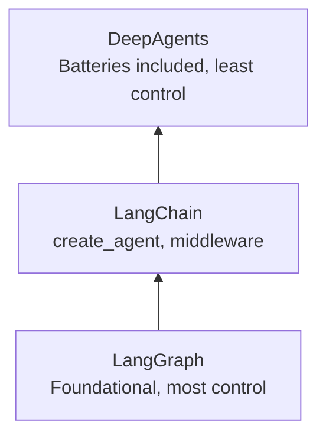

# 🦜 LangChain Concepts Deep Dive: The Lang Family, Harness Engineering & Models In-Depth

- <i>**Session:** Day 8 — Class 7: "LangChain Part 2" · 
- **Instructor:** Mayank Aggarwal
- **Note on scope:** This session deliberately slows down and goes *conceptual* before going deeper into code. It covers the full "Lang family" product landscape (LangChain, LangGraph, DeepAgents, LangSmith), the "harness engineering" mental model, LangChain's historical version timeline, a from-scratch project environment setup, and then a genuinely deep dive into the **Models** component of an agent — including a full free-vs-paid and open-vs-closed-source breakdown, and an extended live walkthrough of OpenRouter. The instructor explicitly states he only reached "messages and models" by the end of class — tools, memory, structured output, and middleware are deliberately deferred to the next session. This guide reflects that honestly.</i>

---

## 📑 Table of Contents

1. [Session Overview](#-session-overview)
2. [Learning Objectives](#-learning-objectives)
3. [Detailed Notes](#-detailed-notes)
   - [1. The Lang Family: LangChain, LangGraph, DeepAgents & LangSmith](#1-the-lang-family-langchain-langgraph-deepagents--langsmith)
   - [2. Harness Engineering: Agent = Model + Harness](#2-harness-engineering-agent--model--harness)
   - [3. LangChain's Historical Timeline](#3-langchains-historical-timeline)
   - [4. Why Start with LangChain, Not LangGraph or DeepAgents](#4-why-start-with-langchain-not-langgraph-or-deepagents)
   - [5. Project Environment Setup, From Scratch](#5-project-environment-setup-from-scratch)
   - [6. The create_agent() Sanity Check](#6-the-create_agent-sanity-check)
   - [7. The Core Components of an Agent](#7-the-core-components-of-an-agent)
   - [8. Calling Models Directly: init_chat_model vs. Provider-Specific Classes](#8-calling-models-directly-init_chat_model-vs-provider-specific-classes)
   - [9. Messages: SystemMessage & HumanMessage](#9-messages-systemmessage--humanmessage)
   - [10. The Standardized Response Object](#10-the-standardized-response-object)
   - [11. Free vs. Paid Models & the OpenRouter Deep Dive](#11-free-vs-paid-models--the-openrouter-deep-dive)
   - [12. Open Source vs. Closed Source Models](#12-open-source-vs-closed-source-models)
4. [Glossary](#-glossary)
5. [Revision Notes — One-Minute Revision](#-revision-notes--one-minute-revision)
6. [Cheat Sheet](#-cheat-sheet)
7. [Interview Questions & Answers](#-interview-questions--answers)
8. [Scenario-Based Interview Questions](#-scenario-based-interview-questions)
9. [Hands-on Exercises](#-hands-on-exercises)
10. [Practice Assignment](#-practice-assignment)
11. [Additional Resources](#-additional-resources)
12. [Final Revision Sheet](#-final-revision-sheet)

---

## 🎯 Session Overview

This class is the deliberate "strong base" session before the course accelerates into heavier LangChain code. It proceeds as:

1. A full map of the **"Lang family"** of products — LangChain, LangGraph, DeepAgents (all for *building* agents, at increasing levels of abstraction) and LangSmith (for *observing* agents) — explicitly distinguished from the unrelated, independently-open-source LangFuse.
2. The **"harness engineering"** mental model: *Agent = Model + Harness*, reinforced with an engine/car analogy.
3. LangChain's own **version history**, from its October 2022 launch through the ReAct agent, LangGraph's 2024 release, the major LangChain V1 overhaul, and the March 2026 DeepAgents release.
4. A deliberate justification for the course's teaching order — LangChain first, not LangGraph or DeepAgents — using a kitchen/chef analogy.
5. A full, from-scratch **project environment setup** (both in VS Code via `uv` and in Google Colab, run in parallel for accessibility).
6. A first working **`create_agent()`** sanity check.
7. A deep dive into the **Models** component specifically — direct model calls via `init_chat_model` and provider-specific classes, the standardized response object, and an extended, practical breakdown of **free vs. paid** and **open-source vs. closed-source** models, with a hands-on OpenRouter walkthrough.

> 💡 **Memory Trick — the instructor's framing for the whole session:** *"Once you understand one language in depth — Hindi, say — grammar, nouns, punctuation — English and future languages become far easier. In the exact same way, once you understand LangChain in depth, every other framework (LangGraph, CrewAI, Agent SDKs) becomes far easier to pick up."*

---

## 🎯 Learning Objectives

By the end of this guide, you will be able to:

- [ ] Name and correctly distinguish the four offerings in the "Lang family" (LangChain, LangGraph, DeepAgents, LangSmith), and explain why LangFuse is not officially part of it.
- [ ] State and explain "Agent = Model + Harness," and list what specifically counts as "harness."
- [ ] Recount LangChain's major version milestones (2022 launch, ReAct agent, LangGraph 2024, LangChain V1 2025, DeepAgents 2026) and explain what changed at each step.
- [ ] Explain, using the kitchen/chef analogy, why this course teaches LangChain before LangGraph or DeepAgents.
- [ ] Set up a new LangChain project from scratch with `uv`, a correct `.env`/`.gitignore`/`.env.example` pattern, and a parallel Google Colab environment for accessibility.
- [ ] Run a first `create_agent()` sanity check to confirm an environment is correctly configured.
- [ ] List the core components of an agent as LangChain defines them (model, tools, context, system prompt, memory, sub-agents).
- [ ] Call a model directly two ways — `init_chat_model` and a provider-specific class (`ChatOpenAI`, `ChatAnthropic`) — and explain when each is preferable.
- [ ] Construct `SystemMessage` and `HumanMessage` objects and invoke a model with them.
- [ ] Read a LangChain model response object's `content`, `content_blocks`, `id`, `tool_calls`, and `usage_metadata` fields.
- [ ] Correctly distinguish free vs. paid models and open-source vs. closed-source models — two genuinely separate axes that are commonly confused.
- [ ] Explain how OpenRouter's free-tier and "free model router" work, including their real rate limits.

---

## 📚 Detailed Notes

### 1. The Lang Family: LangChain, LangGraph, DeepAgents & LangSmith

#### 🧠 Concept

LangChain Inc. (the company) offers **four** related products, explicitly counted and confirmed live with the class: **LangChain**, **LangGraph**, **DeepAgents** (all for *building* agents), and **LangSmith** (for *observing/monitoring* agents).

#### ❓ Why It Exists

> 💡 **Memory Trick — a direct clarification of a common point of confusion:** *"LangFuse is NOT part of the Lang family, despite the name. It's an independent, open-source AI engineering platform — that's exactly why we're not covering it in this course."*

#### ⚙ How It Works — The Three Building Tools, By Abstraction Level

| Product | Abstraction level | What it gives you |
|---|---|---|
| **LangGraph** | Lowest (foundational, "load-bearing framework") | Total control, most effort — the base LangChain itself is built on top of |
| **LangChain** | Middle | `create_agent`, middleware, and the primary focus of this course |
| **DeepAgents** | Highest (most abstracted) | "Move-in ready" agents — built *on top of* LangChain agents, offering automatic context compression, a virtual file system, and sub-agent spawning, at the cost of configurability |



#### 🔍 Internal Working — What LangSmith Actually Does

> ⚠️ **Explicitly emphasized:** LangSmith is **not** for building agents at all — it is purely for **observability**. The instructor's justification: *"We cannot just read an agent's code to know what it did — we need to see its trace."* During its lifecycle, an agent reaches out to an LLM, checks memory, calls tools, and interacts with a UI — none of which is easy to reason about just by reading source code. LangSmith records this as a **trace**: when the model was called, when a tool was called, what happened in the middleware, and how it all ended — described live via a "black box in a flight" analogy (the flight recorder that logs everything happening around the aircraft).

#### 🎯 Key Takeaways

* Four official Lang family products: **LangChain, LangGraph, DeepAgents** (building) + **LangSmith** (observability).
* **LangFuse is not part of this family** — it's a separate, independent open-source project that happens to share "Lang" in its name.
* LangSmith's core value is **tracing** — making an agent's internal lifecycle (model calls, tool calls, memory writes) inspectable, since this isn't reasonable to reconstruct just by reading code.

---

### 2. Harness Engineering: Agent = Model + Harness

#### 📖 Definition

Directly quoting LangChain's own documentation, read live: *"Use LangChain for a highly customizable harness, easily tailored to your use case and data."* The instructor builds this into a full analogy: **Agent = Model + Harness**, where the **model is a raw engine**, and the **harness is everything that turns that raw power into something that can actually be driven.**

#### ❓ Why It Exists

> 💡 **Memory Trick — the engine/car analogy, stated in full:** *"Same engine, the harness is what turns raw power into something that can actually race. All the intelligence in an agent comes from the brain at the center — the AI. New models (Claude Fable, Claude Mythos, GPT's Terra and Sol) are extraordinary raw power — they can reason about almost anything. But if we don't harness that power properly, the model has no idea what tools exist. It's completely stuck. It cannot go anywhere by itself."*

#### ⚙ How It Works

| Component | What it provides |
|---|---|
| **Model** (the engine) | Raw reasoning power — but stateless, tool-blind, and unable to act on the world alone |
| **Harness** (everything else) | System prompt, tools, middleware, guardrails, checkpoints, memory — everything that lets the raw model actually accomplish something |
| **Agent** (the complete car) | Model + Harness together — what actually gets used |

> 💡 **Memory Trick:** *"The model is the raw engine — the brain. The agent is the complete car, which helps us take the best advantage of that engine. Frameworks like LangChain exist specifically to help us build this harness."*

#### 🔍 Internal Working — Where This Appears in Real Products

The instructor connects this directly to products the class already uses daily: *"Claude Code, ChatGPT — they are proper agent applications. At their core, they have this brain (e.g., Sonnet 5), but they also have multiple connectors, skills, memory, web search — each and every one of those is harnessing that underlying model."* This is directly reflected in LangChain's own documentation structure: models, messages, tools, memory, structured output, middleware, front end, guardrails — each one is a specific piece of "the harness."

#### 🎯 Key Takeaways

* **Agent = Model + Harness** is LangChain's own stated definition and the organizing principle for the rest of this course's LangChain coverage.
* A raw model alone is stateless, tool-blind, and cannot act on the world — exactly the same conclusion reached independently in earlier, framework-free sessions.
* "Harness engineering" is presented as a genuinely current, fast-emerging industry term for the discipline of building this surrounding layer well.

---

### 3. LangChain's Historical Timeline

#### 🧠 Concept

The instructor walks through LangChain's public version history directly from the company's own materials, reinforcing that the framework's design has evolved in lockstep with the industry's own shift from "LLM calls" to "agents."

#### 🪜 Step-by-Step — The Timeline

| Date | Milestone | What it means |
|---|---|---|
| **October 2022** | LangChain launched | Two core concepts: **LLM abstraction** and **chains** — predetermined sequences of computation (prompt → step → step) |
| **(Shortly after, pre-ChatGPT-era)** | The **ReAct Agent** released | LangChain's first general-purpose agent, based on the academic ReAct paper — "**Re**ason and **Act**" |
| **February 2024** | **LangGraph** released | The "low-level orchestration layer that was missing" — LangChain could define a basic agent, but developers needed more fine-grained control |
| **October 2024** | LangGraph becomes the **preferred way** of building anything beyond a single call | Most old LangChain chains/agents marked **deprecated** as the industry's own focus shifted toward more controllable, agent-centric workflows |
| **October 2025** | **LangChain V1** released | A **major overhaul** — all pre-1.x code moved to "LangChain Classic"; the new version (built on LangGraph) is agent-first, not LLM-call-first |
| **March 2026** (this year, at time of session) | **DeepAgents** released | A "batteries-included" harness built *on top of* LangChain agents — the newest, most abstracted offering |

#### 🔍 Internal Working — Why "Low-Level" Means "More Control," Not "Worse"

> 💡 **Memory Trick:** *"A low-level language provides little to no abstraction — it maps directly to processor instructions, giving precise, manual control over resources like CPU registers and memory addresses. In real life, the lowest level is where you have the most control — I can control everything on my own desk, but not, say, decisions made at the highest level of a large organization."* This is exactly why LangGraph (low-level orchestration) supports streaming, durable execution, short/long-term memory, and human-in-the-loop (HITL) patterns with maximum precision — capabilities that matter most when an application genuinely needs tight control.

#### ⚠ Common Mistakes

* Assuming "LangChain Classic" code found in tutorials/videos online is automatically wrong or unusable — it's explicitly still functional, just **legacy** (not actively maintained), directly compared to an old iPhone that still works and can still be charged, but is no longer the version the manufacturer maintains or recommends.

#### 🎯 Key Takeaways

* LangChain's evolution directly tracks the industry's own shift: from raw LLM chains (2022) → a first general-purpose agent (ReAct, pre-ChatGPT era) → low-level orchestration control (LangGraph, 2024) → agent-first as the default paradigm (LangChain V1, 2025) → the newest, most abstracted "batteries included" tier (DeepAgents, 2026).
* "Low-level" means *more control*, not *worse* — precisely why LangGraph exists as a deliberate, still-actively-developed option alongside LangChain, not a deprecated predecessor.
* Code from "LangChain Classic" (anything pre-1.x) still works but is legacy and unmaintained — expect to encounter it in real, older company codebases and most existing online tutorials.

---

### 4. Why Start with LangChain, Not LangGraph or DeepAgents

#### ❓ Why It Exists

A learner directly challenged the teaching order, asking why the course doesn't start with the more modern, convenient DeepAgents. The instructor's answer is a deliberate, reasoned pedagogical choice, not an arbitrary one.

> 💡 **Memory Trick — the full analogy, as given live:** *"Starting directly with DeepAgents would mean starting a job as a chef, but all you know is how to order from Swiggy or Zomato. Yes, you'd get food — but you'd have no control. LangChain is like a kitchen — you control the spice level, what goes into the dish, everything. LangGraph would be a lower level than that still — where you're even controlling the buying of the vegetables yourself."*

#### 🪜 Step-by-Step — The Course's Chosen Learning Order

```text
LangChain (the kitchen) → LangGraph (buying the vegetables) → DeepAgents (ordering from Swiggy)
```

> 💡 **Memory Trick — why this order, specifically:** *"After LangChain, the right way is LangGraph — and then DeepAgents will be very easy to master, because DeepAgents is built directly on top of LangChain."*

#### 🎯 Key Takeaways

* Starting with the most abstracted tool (DeepAgents) first would mean learning to "order food" without ever understanding how the kitchen works — the instructor explicitly rejects this as the wrong learning path.
* The chosen order (LangChain → LangGraph → DeepAgents) builds *increasing* control and understanding first, before finally circling back to the *most* convenient, least-controllable option — at which point it becomes trivially easy to understand, since it's built directly atop LangChain.

---

### 5. Project Environment Setup, From Scratch

#### ⚙ How It Works — Two Parallel Environments, Deliberately

The instructor sets up the exact same LangChain project **twice** — once locally via VS Code + `uv`, and once in Google Colab — explicitly to accommodate learners with office laptops, slow machines, or other local setup restrictions.

```bash
# Local setup (VS Code + uv)
uv init lang_chain_course
cd lang_chain_course
# .env, .gitignore, main.py, pyproject.toml, README.md, uv.lock all scaffolded
```

**`.env` (real secrets, gitignored):**
```env
OPENAI_API_KEY=
GROQ_API_KEY=
OPENROUTER_API_KEY=
ANTHROPIC_API_KEY=
```

> 💡 **Memory Trick — the `.env.example` pattern, restated for this new project:** *"In GitHub, only `.env.example` should be visible — placeholder values only. The real key never walks out. A collaborator removes `.example` from the filename and pastes their own key to get started."*

#### 🪜 Step-by-Step — The Google Colab Parallel Setup

1. Since a virtual environment cannot be created inside Colab, the instructor instead uses Colab's own **Secrets** feature (the key icon in the sidebar) to securely store API keys — functionally equivalent to a local `.env` file, but scoped to the Colab environment.
2. Keys are then loaded via `google.colab.userdata.get("OPENAI_API_KEY")`, or alternatively set directly into the process environment with `os.environ["OPENAI_API_KEY"] = ...`.
3. All theory/concept demonstrations in this course are run in Colab (so every learner can follow via a shared link regardless of local machine capability); actual multi-file **projects** are done locally in VS Code, since projects require proper environment management and multiple interdependent files.

#### 🔍 Internal Working — Verifying a Key Loaded Correctly

```python
import os
from dotenv import load_dotenv

load_dotenv()
print(os.getenv("OPENAI_API_KEY")[:5])   # prints only the first 5 characters — never log a full key
```

> ⚠️ **Common Mistake, explicitly demonstrated live as a deliberate debugging exercise:** Attempting to read a key that was never actually set (e.g., checking for a Groq key when only an OpenAI key was configured) correctly returns empty — used as a live confirmation that the loading mechanism itself was working correctly, not broken.

#### 🎯 Key Takeaways

* A brand-new LangChain project is scaffolded with `uv init`, plus a correct `.env` / `.gitignore` / `.env.example` pattern — identical in spirit to the pattern established in the previous session.
* Google Colab's **Secrets** feature is the Colab-native equivalent of a local `.env` file, used specifically to make concept demonstrations accessible to learners without a capable local setup.
* This course's convention: **concepts/theory → Colab; real multi-file projects → local VS Code.**

---

### 6. The create_agent() Sanity Check

#### 🧠 Concept

Before diving into any individual LangChain component, the instructor runs LangChain's own official quickstart code as a **pure sanity check** — confirming the environment (keys, installed packages) is correctly configured before building anything further.

#### 💻 Code Example

```python
from langchain.agents import create_agent

def get_weather(city: str) -> str:
    """Get the weather for a given city."""
    return f"It's always sunny in {city}"

agent = create_agent(
    model="openai:gpt-5.5",
    tools=[get_weather],
    system_prompt="You are a helpful assistant.",
)

result = agent.invoke({"messages": [{"role": "user", "content": "What's the weather in San Francisco?"}]})
```

> 💡 **Memory Trick:** *"If this works here [in Colab], the same thing should, for sure, work there [in VS Code] as well — this is just for us to quickly confirm everything is set up the way we want it."*

#### 🎯 Key Takeaways

* Running the official quickstart example first is a deliberate, low-risk way to confirm an environment is correctly configured before investing time in deeper, custom code.
* The exact same sanity-check code is run in both Colab and VS Code, confirming environment parity across both setups.

---

### 7. The Core Components of an Agent

#### 📖 Definition

Directly from LangChain's documentation, an agent's core components — everything that makes up "the harness" from Section 2 — are named and previewed as a roadmap for the rest of the course's LangChain coverage.

#### ⚙ How It Works

| Component | What it covers | Status in this session |
|---|---|---|
| **Model** | The LLM brain itself — which provider, which specific model | Covered **in depth** this session |
| **Messages** | System, human, and assistant message objects | Covered this session |
| **Tools** | External capabilities the agent can invoke | Explicitly deferred to the next session |
| **Context** | Previous messages, prior emails, or other situational data fed to the model | Named, not yet covered in depth |
| **System prompt** | Persistent behavioral instructions | Named, briefly demonstrated |
| **Memory** | Persistent state across interactions | Explicitly deferred |
| **Structured output** | Getting reliably-typed responses from a model | Explicitly deferred |
| **Middleware** | Logic that runs in between model/tool calls, shaping behavior | Explicitly deferred |
| **Sub-agents** | Agents composed of other agents | Named, not covered in depth |

> ⚠️ **Honesty Note:** The instructor is explicit and direct about the session's actual stopping point: *"I plan to cover it till this thing, which is messages and models, but should be fine — we continue tomorrow."* This guide reflects exactly that boundary — the components below Models/Messages in the table above are named as a roadmap here, but their deep-dive coverage belongs to the *next* session's notes, not this one.

#### 🎯 Key Takeaways

* LangChain's own documentation structure *is* the harness roadmap: model, messages, tools, context, system prompt, memory, structured output, middleware, sub-agents.
* This session covers **model** and **messages** in real depth — everything else is named as a preview, not yet taught.

---

### 8. Calling Models Directly: init_chat_model vs. Provider-Specific Classes

#### 🧠 Concept

LangChain offers **two** distinct ways to obtain a usable chat model object, demonstrated side-by-side.

#### 💻 Code Example — Method 1: init_chat_model

```python
from langchain.chat_models import init_chat_model

openai_model = init_chat_model("openai:gpt-5")
response = openai_model.invoke("Tell me what is LangChain")
print(response.content)
```

#### 💻 Code Example — Method 2: Provider-Specific Class

```python
from langchain_openai import ChatOpenAI

openai_model = ChatOpenAI(model="gpt-5")
response = openai_model.invoke("Tell me what is LangChain")
print(response.content)
```

#### ⚖ Advantages & Limitations

| | `init_chat_model` | Provider-specific class (`ChatOpenAI`, `ChatAnthropic`, ...) |
|---|---|---|
| Flexibility | Higher — a single, uniform entry point across providers, described live as "the newer and suggested way" | Lower — tied to one specific provider's class |
| Control over provider-specific parameters | Also fully supported, but requires understanding the unified parameter surface | More directly matches that provider's own documented options |
| When to prefer it | Default choice for most use cases, especially when provider-switching flexibility matters | When you need to lean into a very specific provider's own class-level configuration |

> 💡 **Memory Trick, directly answering a learner's "why use `init_chat_model` at all" question:** *"Because I need to control the model further as well — going inside the model, controlling each and every thing about it, is what this unlocks."*

#### 🔍 Internal Working — LangChain's "Smart" Key Resolution

> ⚠️ **Demonstrated live, deliberately, as a genuine failure case:** Setting an environment variable with a *non-standard* name (e.g., `OPENAI_2` instead of `OPENAI_API_KEY`) causes model initialization to fail with an authentication error — because LangChain looks for **specific, conventional environment variable names** per provider (e.g., `OPENAI_API_KEY`, `ANTHROPIC_API_KEY`). LangChain does not guess; if a key is stored under a non-standard name, it must be explicitly passed rather than auto-detected.

#### ⚠ Common Mistakes

* Assuming `init_chat_model` or any model call automatically handles chat history — explicitly clarified live: *"No, it is not doing anything for you [with respect to memory/history]"* — a model call alone is still just a single, stateless invocation.
* Assuming any custom-named environment variable will be auto-detected — LangChain relies on specific, documented conventional names per provider.

#### 🎯 Key Takeaways

* Two equally valid ways to get a model object: `init_chat_model("provider:model")` (unified, flexible) or a provider-specific class like `ChatOpenAI(model=...)` (more directly tied to that provider's own conventions).
* Neither method adds memory/chat-history handling on its own — a raw model call remains exactly as stateless as in every prior session.
* Environment variable names must match each provider's specific, documented convention for LangChain to auto-detect a key.

---

### 9. Messages: SystemMessage & HumanMessage

#### 📖 Definition

Rather than passing a single raw string to `invoke()`, LangChain provides typed message classes — `SystemMessage`, `HumanMessage` (and, implicitly, `AIMessage`) — imported from `langchain_core.messages`, mirroring the `system`/`user`/`assistant` roles already familiar from raw API work in earlier sessions.

#### 💻 Code Example

```python
from langchain_core.messages import SystemMessage, HumanMessage

messages = [
    SystemMessage(content="Answer everything in pirate language."),
    HumanMessage(content="What is the capital of France?"),
]

response = openai_model.invoke(messages)
print(response.content)
```

> 💡 **Memory Trick, on why these specific class names/patterns matter:** *"This is exactly the way LangChain's documentation writes it — it's not something to remember, it's something to always refer back to. You always have this reference available."*

#### 🎯 Key Takeaways

* `SystemMessage` and `HumanMessage` (imported from `langchain_core.messages`) are LangChain's typed equivalents of the raw `{"role": "system", ...}` / `{"role": "user", ...}` dictionaries used in earlier, framework-free sessions.
* A `messages` list, passed to `.invoke()`, works exactly the same conceptually as the raw provider API pattern already mastered — just with LangChain's own typed wrapper classes.

---

### 10. The Standardized Response Object

#### 🧠 Concept

Beyond simply returning text, LangChain's model responses expose a rich, **standardized** object — identical in shape regardless of which underlying provider generated it — demonstrated as one of the framework's most concrete, practical benefits.

#### ⚙ How It Works — Fields Explored Live

```python
response = openai_model.invoke(messages)

print(response.content)          # the plain text reply
print(response.text)              # equivalent plain text accessor
print(response.content_blocks)    # structured content, useful for multimodal/rich responses
print(response.id)                 # a unique identifier for this specific response
print(response.tool_calls)         # populated if/when the model requests a tool call
print(response.usage_metadata)     # token usage: input, output, total
```

#### 🔍 Internal Working — Why the "Same Shape, Any Provider" Property Matters

> 💡 **Memory Trick, motivated by a real, live comparison:** the instructor uses an AI assistant to generate raw Python code for calling **Claude**, **Gemini**, and **OpenAI** directly, side by side — revealing that each provider expects a *genuinely different* call shape: `client.messages.create(...)` for Claude, `client.models.generateContent(...)` for Gemini, `client.chat.completions.create(...)` for OpenAI. *"If tomorrow a new company — Kimi, Minimax, or anything — launches a genuinely good free model, we will not have to rewrite our code again and again. That is what LangChain helps with."*

#### 🏢 Real-World / Production Usage

The instructor connects this directly to a real, prior workplace example: *"At a company I worked at, engineers created an internal library — `mytical.ai.llm_calls` — where you just specify which LLM to call, no key handling needed by the caller, because LangChain was running underneath in the backend. Token usage, cost — all trackable via LangChain's own analytics and LangSmith."*

#### ⚠ Common Mistakes

* Assuming `response.tool_calls` will always be populated — it's only present *when the model actually requests a tool call*; for a plain conversational response, it will be empty, exactly as established in earlier, framework-free tool-calling sessions.

#### 🎯 Key Takeaways

* LangChain's response object is standardized across every supported provider — `content`, `content_blocks`, `id`, `tool_calls`, and `usage_metadata` behave identically whether the underlying call went to OpenAI, Anthropic, or anywhere else.
* This standardization is the concrete payoff of "harness engineering" applied to models specifically: switching providers requires changing far less code than calling each provider's raw, differently-shaped API directly.
* Real companies build internal abstraction libraries directly on top of this exact standardization to centralize model access, cost tracking, and observability across teams.

---

### 11. Free vs. Paid Models & the OpenRouter Deep Dive

#### 🧠 Concept

Models can be categorized along **two entirely separate axes**, frequently confused by learners: **free vs. paid**, and **open-source vs. closed-source** (covered in Section 12). This section covers the first axis in depth via a live, hands-on OpenRouter exploration.

#### ❓ Why It Exists

> ⚠️ **A foundational, repeatedly-emphasized correction:** *"In the AI world, there is unfortunately nothing like free-free. Every company giving you something for free is still spending money — they're subsidizing it, usually to acquire users during a growth/funding phase."*

#### ⚙ How It Works — OpenRouter, Explored Live

1. **What OpenRouter is:** a routing service — *"You tell me which model you want; I have access to all of them."* Demonstrated live: the same OpenAI model (e.g., "Luna Pro") is available via OpenRouter through **multiple underlying providers** (direct OpenAI, Azure US, Azure EU) — each with visibly different latency, since more intermediary hops (OpenRouter → Azure → OpenAI) add real, measurable delay, directly relevant for latency-sensitive use cases like fraud detection.
2. **Confirming it's still billed:** a real, live OpenRouter call is made and traced through the **Activity/Logs** dashboard, confirming an actual (tiny, e.g., $0.000005) charge, plus visible input/output token counts — directly disproving any assumption that OpenRouter access is free by default.
3. **OpenRouter's actual free tier:** a small number of genuinely free models exist (e.g., "NVIDIA Nemotron 3 Super," demonstrated live), but these come with **real, meaningfully restrictive limits**:

| Account tier | Rate limit |
|---|---|
| Free tier (no credits added) | **50 requests/day**, 20 requests/minute |
| Paid tier ($10+ spent) | **1,000 requests/day** |
| Free-model-ID variants ("...:free") | **20 requests/minute, 50 requests/day** — regardless of overall account tier |

4. **The "Free Model Router" trick:** OpenRouter offers a special model identifier that automatically routes a request to *whichever* free model is currently available — described live as effectively *"automatic, but for free"* — a genuinely useful convenience for learners who explicitly don't want to spend money while practicing.

> ⚠️ **A frank, practical caveat, stated directly:** *"Free models are not prioritized by OpenRouter — you will see higher latency and more frequent failures on them than on paid models. That's the real trade-off of using free tiers to learn."*

#### 🎯 Key Takeaways

* **"Free" AI is never truly free** — someone is always paying; free tiers are typically a deliberate, temporary user-acquisition subsidy.
* OpenRouter genuinely does have a small free-model catalog, but with real, meaningfully restrictive rate limits (as low as 50 requests/day).
* The "Free Model Router" identifier is a practical, real convenience for cost-conscious learning — automatically routing to *whatever* free model is currently available.
* Free-tier model calls are explicitly deprioritized by OpenRouter, leading to observably higher latency/failure rates than paid calls — a real, practical trade-off, not a hypothetical one.

---

### 12. Open Source vs. Closed Source Models

#### 📖 Definition

A **genuinely separate axis** from free/paid: **closed-source** models (you have no access to the underlying weights — you can only call them via an API) versus **open-source** models (the weights are published, meaning you can download and self-host them on your own infrastructure).

#### ❓ Why It Exists

> 💡 **Memory Trick — the Coca-Cola analogy, given directly:** *"Coca-Cola's recipe is closed source — you cannot recreate it at home. Many AI companies, in contrast, publish everything they use — 'here's our full recipe, go ahead and make it at home yourself.' That's an open-source model."*

#### ⚙ How It Works — The Four-Way Matrix

| | Closed-source | Open-source |
|---|---|---|
| **Paid** (e.g., Claude Opus, GPT-5.5) | Standard commercial API access — cannot self-host, ever | N/A — if it's open-source, self-hosting is available |
| **Free / self-hostable** (e.g., DeepSeek R1, various Ollama-supported models) | N/A | Weights published — download via tools like **Ollama** or **LM Studio**, run on your own infrastructure |

> ⚠️ **Explicitly, repeatedly corrected live:** *"You cannot download Claude Opus or Claude Haiku, because Anthropic has not made them open source. You cannot download GPT-5.5, Terra, or Sol, because OpenAI has not made those open source either — only `GPT-OSS` and `GPT-OSS Safeguard` have actually been released as open-source models by OpenAI, as far as the instructor is aware at time of session."*

#### 🔍 Internal Working — What "Parameters" Look Like for a Real Open-Source Model

Using **DeepSeek R1** as the live example: it's released in multiple parameter-count versions — 1.5B, 14B, 32B, all the way up to 671B parameters — with the largest requiring roughly **404GB of storage** to self-host. The instructor connects model size directly to real infrastructure cost/quality trade-offs: *"Smaller models are cheaper to self-host — less RAM, less disk — but they'll be slower, less capable, and behave worse. Larger models need serious infrastructure investment, but are more capable."*

#### ⚠ Common Mistakes

* Confusing **free vs. paid** with **open-source vs. closed-source** — these are explicitly named as the single most common point of learner confusion in this session. A model can be closed-source *and* free (e.g., a promotional free tier on a proprietary model via OpenRouter); the two axes are independent.
* Assuming OpenRouter's free closed-source model access (e.g., a free-tier Gemini call) means that model can also be self-hosted — it cannot; OpenRouter merely provides free/cheap *API access*, not the underlying weights.

#### 🎯 Key Takeaways

* **Free/paid** and **open-source/closed-source** are two entirely independent axes — never assume one implies the other.
* Closed-source models (essentially all frontier commercial models: Claude, GPT, Gemini) can only ever be accessed via API — self-hosting is never possible, regardless of price.
* Open-source models (DeepSeek, and various models supported by Ollama/LM Studio) can genuinely be self-hosted, at a real infrastructure cost that scales directly with the model's parameter count.

---

## 📝 Glossary

| Term | Definition | Why It Matters |
|---|---|---|
| **Lang Family** | LangChain Inc.'s four official products: LangChain, LangGraph, DeepAgents, LangSmith | The full product landscape this course will draw from |
| **LangSmith** | LangChain's observability/monitoring product — for *tracing* agent behavior, not building agents | Distinct from the three agent-building tools |
| **LangFuse** | An independent, open-source observability platform — explicitly NOT part of the official Lang family | A common naming-based point of confusion, clarified directly |
| **Harness** | Everything surrounding a raw model (prompts, tools, memory, middleware, guardrails) that makes it usable | LangChain's own foundational framing: "Agent = Model + Harness" |
| **ReAct Agent** | LangChain's first general-purpose agent, based on the academic "Reason + Act" paper | LangChain's earliest agent offering, pre-dating the modern agent-first era |
| **LangChain Classic** | All LangChain code/patterns prior to version 1.x | Legacy, unmaintained, but still functional; common in older tutorials/codebases |
| **`init_chat_model`** | LangChain's unified, provider-agnostic entry point for creating a chat model | The "newer, suggested" way to instantiate a model across any supported provider |
| **`ChatOpenAI` / `ChatAnthropic`** | Provider-specific model classes | An alternative to `init_chat_model`, more directly tied to a specific provider's conventions |
| **`SystemMessage` / `HumanMessage`** | LangChain's typed message classes (from `langchain_core.messages`) | The typed equivalent of raw `{"role": ..., "content": ...}` dictionaries |
| **`usage_metadata`** | A field on a LangChain response object reporting input/output/total token counts | Standardized across providers — the same field works regardless of which model was called |
| **OpenRouter** | A multi-provider model routing/gateway service | Provides access to many providers' models (paid and a limited free tier) behind one API key |
| **Free Model Router** | An OpenRouter model identifier that automatically routes to whichever free model is currently available | A practical convenience for cost-conscious learning |
| **Closed-source model** | A model whose underlying weights are not published — accessible only via API | Applies to essentially all frontier commercial models (Claude, GPT, Gemini) |
| **Open-source model** | A model whose weights are published, allowing self-hosting | E.g., DeepSeek R1; usable via tools like Ollama or LM Studio |
| **Parameters (in an open-source model context)** | The model's trained internal values; also used to describe different released "sizes" of the same model family | Larger parameter counts generally mean more capability, but also more infrastructure cost to self-host |

---

## 🔄 Revision Notes — One-Minute Revision

> The **Lang family** has four official products: **LangChain**, **LangGraph**, and **DeepAgents** (all for *building* agents, at increasing abstraction — LangGraph lowest/most control, DeepAgents highest/least control, LangChain in between), plus **LangSmith** (purely for *observability/tracing* — not building). **LangFuse is not officially part of this family**, despite the shared naming. The foundational mental model remains **"Agent = Model + Harness"** — the model is a raw engine; the harness (system prompt, tools, memory, middleware, guardrails) is what makes that engine actually usable, and this is precisely what frameworks like LangChain exist to help build. LangChain's own history tracks the industry's shift from raw LLM **chains** (Oct 2022) through a first general-purpose **ReAct agent**, LangGraph's 2024 release for fine-grained control, and finally **LangChain V1**'s 2025 agent-first overhaul (with everything before it now "**LangChain Classic**" — legacy but still functional) — leading to **DeepAgents**' 2026 "batteries included" release, built directly atop LangChain agents. The course deliberately teaches **LangChain first** (the "kitchen"), not DeepAgents ("ordering from Swiggy") or LangGraph ("buying the vegetables yourself") — building real understanding before convenience. After a from-scratch project setup (`uv`, `.env`/`.gitignore`/`.env.example`, plus a parallel Google Colab environment using Colab **Secrets**) and a `create_agent()` sanity check, the session dives deep into **models**: two ways to instantiate one (`init_chat_model`, the flexible/unified approach, or a provider-specific class like `ChatOpenAI`), typed **`SystemMessage`/`HumanMessage`** objects, and a **standardized response object** (`content`, `content_blocks`, `id`, `tool_calls`, `usage_metadata`) that behaves identically regardless of underlying provider — a concrete, demonstrated payoff versus each provider's genuinely different raw API shape. Finally, two **independent axes** for categorizing models were established: **free vs. paid** (nothing in AI is ever truly free — someone is always subsidizing it; OpenRouter's real free tier is capped at 50 requests/day, with a convenient "Free Model Router" identifier for automatic free-model routing) and **open-source vs. closed-source** (closed-source models like Claude/GPT can never be self-hosted regardless of price; open-source models like DeepSeek R1 can be self-hosted via Ollama/LM Studio, at an infrastructure cost that scales with parameter count) — explicitly named as the single most commonly confused pair of concepts.

---

## 📋 Cheat Sheet

**The Lang family, at a glance:**
```text
Building agents:     LangGraph (most control) < LangChain (balanced) < DeepAgents (least control)
Observing agents:    LangSmith
NOT part of family:  LangFuse (independent, open-source)
```

**"Agent = Model + Harness."**

**LangChain version timeline:**
```text
Oct 2022: launch (LLM abstraction + chains)
[soon after]: ReAct Agent (first general-purpose agent)
Feb 2024: LangGraph released (low-level orchestration)
Oct 2024: LangGraph becomes preferred for anything beyond a single call
Oct 2025: LangChain V1 (major, agent-first overhaul; pre-1.x → "LangChain Classic")
Mar 2026: DeepAgents released (batteries included, built on LangChain)
```

**Course teaching order:** LangChain → LangGraph → DeepAgents (kitchen → vegetables → Swiggy)

**Two ways to get a model:**
```python
from langchain.chat_models import init_chat_model
model = init_chat_model("openai:gpt-5")

from langchain_openai import ChatOpenAI
model = ChatOpenAI(model="gpt-5")
```

**Messages:**
```python
from langchain_core.messages import SystemMessage, HumanMessage
messages = [SystemMessage(content="..."), HumanMessage(content="...")]
response = model.invoke(messages)
```

**Standardized response fields:**
```python
response.content            # text
response.content_blocks      # structured content
response.id                   # unique response ID
response.tool_calls           # populated only if a tool call was requested
response.usage_metadata       # token counts
```

**Two independent model axes — never confuse them:**
```text
Free  <-------------------> Paid
Open-source <-----------> Closed-source
```

---

## 🔥 Interview Questions & Answers

### 🟢 Beginner

**Q1. Name the four official products in LangChain's "Lang family."**
**Answer:** LangChain, LangGraph, DeepAgents (for building agents), and LangSmith (for observability).
**Explanation:** Confirmed and counted directly with the class live.
**Why This Matters:** Foundational product-landscape knowledge.
**Possible Follow-up:** "Which of these is NOT for building agents?"

**Q2. Is LangFuse part of the official Lang family?**
**Answer:** No — it's an independent, open-source AI engineering platform that happens to share "Lang" in its name.
**Explanation:** Explicitly clarified as a common point of confusion.
**Why This Matters:** Prevents a genuine, commonly-made mistake.
**Possible Follow-up:** "What does LangFuse actually do, in general terms?"

**Q3. What does LangSmith actually do?**
**Answer:** It provides observability/tracing for agents — showing what an agent did during its lifecycle (model calls, tool calls, memory writes) — it does not build agents.
**Explanation:** Directly contrasted with the three agent-building tools.
**Why This Matters:** A frequently-tested distinction.
**Possible Follow-up:** "Why can't you just read an agent's source code to understand its behavior instead?"

**Q4. What does "Agent = Model + Harness" mean?**
**Answer:** A raw model (the "engine") alone is stateless and tool-blind; the "harness" (system prompt, tools, memory, middleware, guardrails) is everything that makes that raw power actually usable as a complete agent.
**Explanation:** LangChain's own stated framing, reinforced with the engine/car analogy.
**Why This Matters:** The organizing principle for the rest of the LangChain curriculum.
**Possible Follow-up:** "Name three things that count as part of the 'harness.'"

**Q5. In LangChain's history, what came first — chains or agents?**
**Answer:** Chains — LangChain launched in October 2022 with LLM abstraction and chains (predetermined computation steps); its first general-purpose agent (ReAct) came shortly after.
**Explanation:** Directly from the historical timeline covered live.
**Why This Matters:** Basic version-history literacy.
**Possible Follow-up:** "What does ReAct stand for?"

**Q6. What is "LangChain Classic"?**
**Answer:** All LangChain code/patterns from before version 1.x — legacy, no longer actively maintained, but still functional.
**Explanation:** Directly explained, with the "still-works-but-legacy-iPhone" analogy.
**Why This Matters:** Helps recognize and correctly interpret older tutorials/codebases.
**Possible Follow-up:** "Why might a company's real codebase still be on LangChain Classic?"

**Q7. Why does this course teach LangChain before LangGraph or DeepAgents?**
**Answer:** Starting with the most abstracted tool (DeepAgents) first would be like learning to be a chef by only knowing how to order from Swiggy — no real understanding or control. LangChain (the "kitchen") builds genuine understanding first.
**Explanation:** The chef/Swiggy/kitchen/vegetables analogy, given directly.
**Why This Matters:** Explains the course's own pedagogical reasoning.
**Possible Follow-up:** "What's the intended order after LangChain?"

**Q8. What are the two ways to instantiate a chat model in LangChain?**
**Answer:** `init_chat_model("provider:model")` (unified, provider-agnostic) or a provider-specific class like `ChatOpenAI(model=...)`.
**Explanation:** Both demonstrated side by side.
**Why This Matters:** Core, practical LangChain API knowledge.
**Possible Follow-up:** "Which one is described as the 'newer, suggested' approach?"

**Q9. Does calling `model.invoke(...)` on its own remember previous messages?**
**Answer:** No — explicitly clarified live that a model call alone does nothing with respect to chat history/memory; it remains exactly as stateless as raw provider API calls in earlier sessions.
**Explanation:** A direct, explicit correction of a natural but incorrect assumption.
**Why This Matters:** Reinforces statelessness as a universal, framework-independent property.
**Possible Follow-up:** "What would you need to add to get conversational memory?"

**Q10. Are free-tier AI models truly free?**
**Answer:** No — "there is nothing like free-free" in the AI world; providers offering free access are subsidizing it, typically as a growth/user-acquisition strategy.
**Explanation:** Directly and repeatedly emphasized live, with a real OpenRouter billing trace as proof.
**Why This Matters:** A foundational, practically important correction to a common assumption.
**Possible Follow-up:** "What real limits does OpenRouter's free tier actually have?"

---

### 🟡 Intermediate

**Q11. Explain the abstraction-level relationship between LangGraph, LangChain, and DeepAgents.**
**Answer:** LangGraph is the foundational, low-level orchestration layer that LangChain itself is built on top of; LangChain provides a higher-level, more customizable "harness" (via `create_agent` and middleware); DeepAgents is built on top of LangChain agents, offering the most abstraction and least configurability, but the fastest path to a working agent.
**Explanation:** Directly stated and diagrammed in the session.
**Why This Matters:** Tests genuine understanding of the layered relationship, not just naming the three tools.
**Possible Follow-up:** "If you needed maximum fine-grained control over a workflow, which would you choose, and why?"

**Q12. Why does the instructor say low-level languages/frameworks give "more control," using a real-life analogy?**
**Answer:** A low-level language provides little to no abstraction, mapping directly to processor instructions and giving precise, manual control over resources — analogous to real life, where the lowest level (e.g., your own desk) is where you have the most direct control, versus decisions made at a higher, more abstracted organizational level.
**Explanation:** The desk/organization analogy, given directly to answer a class question.
**Why This Matters:** Tests the ability to connect an abstract technical concept to a concrete, memorable analogy.
**Possible Follow-up:** "Apply this same logic to explain why LangGraph offers more control than LangChain."

**Q13. What specifically changed in LangChain V1 (October 2025) compared to LangChain Classic?**
**Answer:** LangChain V1 represents a major overhaul, built on top of LangGraph, that is agent-first by design — reflecting the industry's own shift toward agents becoming the default paradigm (as opposed to Classic's LLM-call/chain-centric focus).
**Explanation:** Directly stated in the timeline discussion.
**Why This Matters:** Tests understanding of *why* the version shift happened, not just that it did.
**Possible Follow-up:** "Why did this shift happen specifically around 2025, per the session's own framing?"

**Q14. Explain the difference in latency the instructor demonstrated when calling the same model via different underlying providers on OpenRouter.**
**Answer:** OpenRouter can route the same model (e.g., "Luna Pro") through multiple underlying providers (direct OpenAI, Azure US, Azure EU); calling directly through the original provider (OpenAI) showed noticeably lower latency than routing through an intermediary like Azure, since each additional hop (OpenRouter → Azure → OpenAI) adds real, measurable delay.
**Explanation:** Directly observed and explained live, with an explicit connection to latency-sensitive use cases (fraud detection was named as an example).
**Why This Matters:** A concrete, practically relevant infrastructure/performance consideration.
**Possible Follow-up:** "In what kind of application would this latency difference genuinely matter enough to choose a direct provider over a router?"

**Q15. What is the "Free Model Router" on OpenRouter, and why is it useful?**
**Answer:** A special model identifier that automatically routes a request to whichever free model is currently available, rather than requiring you to manually pick and hardcode one specific free model — described live as "automatic, but for free."
**Explanation:** Demonstrated as a practical convenience for cost-conscious learners.
**Why This Matters:** A genuinely useful, practical tool for anyone learning AI development on a budget.
**Possible Follow-up:** "What trade-off comes with using free models via this router, even with this convenience?"

**Q16. Why can't you self-host a model like Claude Opus, even if you're willing to pay for the infrastructure?**
**Answer:** Because Claude Opus is closed-source — Anthropic has not published its weights — so self-hosting is never possible, regardless of budget or infrastructure availability; this is a fundamental property of the model's release, not a cost or capability limitation.
**Explanation:** Explicitly, repeatedly emphasized as a common point of confusion.
**Why This Matters:** Tests correct understanding of the open/closed-source axis independent of pricing.
**Possible Follow-up:** "Name a real, open-source model family that COULD be self-hosted instead."

**Q17. A learner assumed that because OpenRouter offers some free model access, those models must also be open-source and self-hostable. Why is this incorrect?**
**Answer:** Free/paid and open-source/closed-source are two entirely independent axes; OpenRouter's free tier can include genuinely closed-source models (e.g., a promotional free-tier Gemini call) — free API access does not mean the underlying weights are published or that self-hosting is possible.
**Explanation:** Directly named as the single most common point of confusion in this session.
**Why This Matters:** Tests the ability to correctly separate two axes that are easy to conflate.
**Possible Follow-up:** "Give an example of a model that IS both free-tier accessible AND genuinely open-source."

**Q18. Why does model size (parameter count) matter for self-hosting decisions, using the DeepSeek R1 example?**
**Answer:** DeepSeek R1 is released in multiple parameter-count versions (1.5B up to 671B); larger versions require dramatically more storage (the largest needing roughly 404GB) and more powerful infrastructure to run, while smaller versions are cheaper to self-host but less capable and slower to reason well.
**Explanation:** Directly demonstrated with real, specific parameter-count figures.
**Why This Matters:** A practical, quantified understanding of the self-hosting trade-off, not just a qualitative statement.
**Possible Follow-up:** "How would you decide which DeepSeek R1 size to self-host for a given use case?"

**Q19. What is the standardized response object benefit of LangChain, and how was it demonstrated concretely?**
**Answer:** LangChain's response object (`content`, `content_blocks`, `id`, `tool_calls`, `usage_metadata`) has the identical shape regardless of which underlying provider generated it — demonstrated concretely by contrasting this against raw, genuinely different call shapes for Claude (`client.messages.create`), Gemini (`client.models.generateContent`), and OpenAI (`client.chat.completions.create`) obtained directly from an AI assistant.
**Explanation:** A concrete, side-by-side comparison, not just an assertion.
**Why This Matters:** Tests understanding of *why* this standardization is genuinely valuable, with the specific counter-evidence that motivates it.
**Possible Follow-up:** "How does this standardization concretely help if a new AI provider launches next month?"

**Q20. Why does LangChain fail to auto-detect an API key stored under a non-standard environment variable name, like `OPENAI_2`?**
**Answer:** LangChain looks for specific, conventional environment variable names per provider (e.g., `OPENAI_API_KEY`) — it does not guess or infer from arbitrary variable names; a key stored under a non-standard name must be passed explicitly rather than relying on automatic detection.
**Explanation:** Directly demonstrated live as a deliberate, real failure case.
**Why This Matters:** A practical, frequently-encountered configuration debugging skill.
**Possible Follow-up:** "How would you explicitly pass a key stored under a non-standard variable name?"

---

### 🔴 Advanced

**Q21. Design a decision framework for a team choosing between `init_chat_model` and a provider-specific class like `ChatOpenAI`, based on this session's stated trade-offs.**
**Answer:** Default to `init_chat_model` when provider flexibility matters — e.g., the team anticipates switching models/providers, wants a uniform interface across multiple models in the same codebase, or is building something (like an internal LLM-calling library, as described in the real company example from this session) intended to abstract away provider specifics entirely. Prefer a provider-specific class (`ChatOpenAI`, `ChatAnthropic`) when the team is committed to a single provider long-term and wants direct, unambiguous access to that provider's own fully-documented configuration options without an additional abstraction layer in between. In practice, many production systems benefit from `init_chat_model` at the outer, application-facing layer (for flexibility) while still understanding the provider-specific classes underneath for debugging and edge-case configuration.
**Explanation:** Synthesizes the session's stated trade-offs into an actionable team decision process, beyond simply restating "both exist."
**Why Interviewers Ask This:** Tests whether a candidate can translate a documented API choice into genuine architectural reasoning.
**Possible Follow-up:** "Could a single codebase reasonably use both approaches together? Give an example."

**Q22. Critically evaluate: "Since LangChain standardizes the response object across providers, switching from OpenAI to Anthropic in a LangChain-based application requires zero code changes." Is this accurate, based on this session?**
**Answer:** Not fully accurate. While the *response object shape* is standardized (`content`, `tool_calls`, `usage_metadata`, etc., identical regardless of provider), the session also demonstrates that provider-specific capabilities genuinely differ — for example, it's explicitly noted that Anthropic's models (as of this session) cannot generate image output, a capability difference that exists at the *model* level, not something LangChain's standardization can paper over. Additionally, environment variable naming (`OPENAI_API_KEY` vs. `ANTHROPIC_API_KEY`) and the specific model identifier string both still require deliberate changes when switching providers. The accurate, more precise claim: LangChain minimizes and standardizes *call/response mechanics* across providers, but does not eliminate the need to account for genuine, provider-specific capability differences.
**Explanation:** Tests whether a learner over-generalizes a real, demonstrated benefit (standardized response shape) into an inaccurate absolute claim (zero-change provider switching), correctly identifying the session's own counter-evidence (Anthropic's lack of image generation).
**Why Interviewers Ask This:** Distinguishes candidates who track important caveats from those who round a real benefit off into an overstated one.
**Possible Follow-up:** "What specific code changes would still be required to switch this session's example from OpenAI to Anthropic?"

**Q23. The session frames LangGraph as "more control, more effort" and DeepAgents as "less control, less effort," with LangChain in between. Design a scenario where a team might legitimately need to use all three tools together in one real system.**
**Answer:** A plausible real system: a customer-facing product uses **DeepAgents** for a rapidly-shipped, general-purpose "ask anything" support agent (prioritizing speed of delivery and automatic context management over fine-grained control, appropriate for a broad, less-critical use case); simultaneously, the same company's **LangChain**-based agents handle a set of well-defined, moderately customized internal workflows (e.g., an internal document-search agent with specific, tailored tool sets and system prompts, per LangChain's "highly customizable harness" framing); and a **LangGraph**-based workflow handles a genuinely complex, mixed deterministic-and-agentic process (e.g., a multi-step approval pipeline combining fixed business-rule steps with agentic decision points at specific junctures) where fine-grained orchestration control is a hard requirement, not a nice-to-have. Since DeepAgents is built on LangChain, and LangChain is built on LangGraph, all three coexisting in one organization's tooling is architecturally coherent, not contradictory — each tool is matched to the specific control/convenience trade-off that its particular use case actually needs.
**Explanation:** Requires synthesizing the three-tier control/convenience framing into a genuinely plausible, differentiated multi-tool real-world scenario, rather than treating the three tools as mutually exclusive choices.
**Why Interviewers Ask This:** A senior-level systems-design question testing whether a candidate can apply a conceptual framework flexibly to real, heterogeneous organizational needs.
**Possible Follow-up:** "What operational/maintenance cost does using all three simultaneously introduce, and how would you justify it?"

**Q24. Explain, with reference to this session's DeepSeek R1 example, why "open-source" does not automatically mean "cheap" or "easy" to use in practice.**
**Answer:** While open-source models like DeepSeek R1 remove the *licensing/access* cost of using the model (no per-token API fees, since you own the weights), self-hosting the largest, most capable version (671B parameters, requiring roughly 404GB of storage) demands substantial infrastructure investment — sufficient RAM, storage, and compute — that can meaningfully exceed the cost of simply paying a closed-source provider's API fees for a comparable smaller-scale usage pattern, especially before accounting for the ongoing operational burden of maintaining that infrastructure yourself. Smaller DeepSeek R1 versions are genuinely cheaper to self-host, but trade away capability and speed as a direct consequence — meaning "open-source" primarily shifts *where* the cost and complexity lives (infrastructure and operational burden, versus per-token billing), rather than eliminating it outright.
**Explanation:** Requires reasoning through the actual infrastructure trade-off using the session's specific, quantified DeepSeek R1 example, rather than treating "open-source = free/easy" as an unexamined assumption.
**Why Interviewers Ask This:** Tests nuanced understanding of a genuine, frequently-oversimplified trade-off in AI infrastructure decision-making.
**Possible Follow-up:** "At what usage volume might self-hosting an open-source model actually become more cost-effective than a closed-source API?"

**Q25. Synthesize this session's "harness engineering" framing with its historical timeline to explain why LangChain's own internal architecture had to change (Classic → V1) as the industry's understanding of "harness" evolved.**
**Answer:** LangChain Classic was built around a world where the primary unit of work was a single LLM call or a predetermined chain of calls — the "harness" concept, as this session defines it (tools, memory, middleware, guardrails working together around a model in an ongoing, decision-driven loop), was not yet the framework's central organizing principle, because agents themselves were not yet the industry's default mental model. As the industry shifted (explicitly dated in this session to "since 2025 mid," when agents became the go-to concept), the *kind* of harness developers actually needed shifted too — from primarily "chain the right sequence of prompts and outputs together" toward "give a model tools, memory, and middleware, and let it decide dynamically what to do across an ongoing loop." LangChain V1's agent-first redesign (built directly on LangGraph, itself explicitly introduced to provide the fine-grained orchestration control that agentic behavior demands) is the framework's own internal architecture catching up to this shift — the "harness" abstractions genuinely needed by the industry in 2022 (chain-building tools) were meaningfully different from those needed by 2025 (agent-building tools with tool-calling, memory, and dynamic control flow as first-class concerns), and LangChain Classic's deprecation reflects that real, substantive shift, not a cosmetic rebrand.
**Explanation:** Requires connecting two separately-taught threads (the harness-engineering mental model and the historical version timeline) into a single, coherent causal explanation for *why* the framework itself had to evolve — genuine synthesis beyond restating either thread alone.
**Why Interviewers Ask This:** A capstone-level conceptual question testing whether a candidate understands framework evolution as a response to genuine shifts in engineering need, not arbitrary versioning.
**Possible Follow-up:** "Predict, based on this same reasoning, what kind of shift might drive LangChain's NEXT major architectural version."

---

## 🧪 Scenario-Based Interview Questions

> **Scenario 1:** A teammate insists that since their team is only using free-tier OpenRouter models, "AI costs nothing for our prototype phase" — and wants to remove all cost-monitoring from the prototype's design. Using this session's concepts, respond.

**Structured Answer:**
1. **Initial investigation:** Confirm exactly which models and account tier the team is actually using — genuinely free-tier models (per this session, capped at 50 requests/day, 20/minute) versus paid models being called under a subsidized promotional credit (which will eventually run out).
2. **Metrics/logs to check:** OpenRouter's own Activity/Logs dashboard (demonstrated live in this session) to confirm actual per-call costs, even fractional ones, and to track cumulative request counts against the free tier's real rate limits.
3. **Possible causes for the teammate's misunderstanding:** Conflating "free-tier access" with "genuinely zero cost forever" — this session explicitly established that "nothing is free-free" in the AI world, and that free tiers are typically a deliberate, temporary subsidy.
4. **Debugging/evaluation approach:** Project the prototype's expected request volume against the free tier's actual 50-requests/day limit — a genuinely low ceiling for anything beyond light, occasional testing — to determine if the "free" assumption will hold even during the prototype phase itself.
5. **Resolution:** Recommend retaining basic cost/usage monitoring even during the free-tier prototype phase, both to catch the moment usage approaches the free tier's real limits, and to have accurate cost data ready for when (not if) the team eventually needs to move to paid usage at scale.
6. **Prevention:** Document the team's actual account tier and its real, specific limits (not just "free") as part of the prototype's technical documentation, so future team members don't inherit the same incorrect "AI is free" assumption.

> **Scenario 2 (Advanced):** Your organization is deciding whether to self-host an open-source model (like a smaller DeepSeek R1 variant) versus continuing to pay for closed-source API access, purely to reduce per-token costs. Using this session's concepts, outline your evaluation approach.

**Structured Answer:**
1. **Initial investigation:** Determine the organization's actual, realistic usage volume and required model capability level — a smaller, cheaper-to-self-host DeepSeek R1 variant may not match the reasoning quality of a comparable closed-source model, per this session's explicit trade-off between model size and capability.
2. **Relevant principle:** Recognize that "open-source" shifts cost from per-token API billing to infrastructure/operational cost, per Advanced Q24's reasoning — it does not eliminate cost, and the comparison must be apples-to-apples across both cost structures.
3. **Possible causes for a naive cost estimate:** Comparing only per-token API pricing against zero (forgetting to account for the real infrastructure cost of self-hosting, including hardware, ongoing maintenance, and the opportunity cost of engineering time spent operating the self-hosted system).
4. **Debugging/evaluation approach:** Build a genuine total-cost-of-ownership comparison: (closed-source API cost at current volume) versus (self-hosting infrastructure cost + operational/maintenance overhead + any capability gap's business impact, if the self-hosted model is meaningfully weaker).
5. **Resolution:** Only recommend self-hosting if the total-cost-of-ownership comparison genuinely favors it at the organization's real usage volume *and* the smaller/self-hostable model's capability is sufficient for the actual use case — not purely based on "open-source models don't have per-token fees."
6. **Prevention:** Revisit this cost comparison periodically as usage volume grows or shrinks, since the crossover point between "closed-source API is cheaper" and "self-hosting is cheaper" shifts directly with usage scale.

---

## 🛠 Hands-on Exercises

### 🟢 Easy

1. Set up a new LangChain project from scratch using `uv init`, with a correct `.env`/`.gitignore`/`.env.example` pattern, and verify (via a version-control tool) that `.env` is excluded while `.env.example` is included.
2. Using Google Colab's Secrets feature, store an API key and load it into a notebook using `google.colab.userdata.get(...)`, printing only the first 5 characters to confirm it loaded correctly without ever exposing the full key.
3. Run LangChain's `create_agent()` sanity-check example (Section 6) in both Colab and your local VS Code setup, confirming both produce a working response.

### 🟡 Medium

4. Instantiate the same model two different ways — `init_chat_model("openai:gpt-5")` and `ChatOpenAI(model="gpt-5")` — and confirm both produce equivalent responses to the same prompt.
5. Build a `SystemMessage` + `HumanMessage` list that instructs a model to answer only in a specific, distinctive style (e.g., haiku, or a specific persona), and verify the style is correctly reflected in the response.
6. Sign up for OpenRouter, create an API key, and make one call to a genuinely free model (search OpenRouter's model list for "free"). Check the Activity/Logs dashboard afterward and document the exact cost shown (should be $0) versus a call to a paid model (document the actual, non-zero cost).

### 🔴 Advanced

7. Write a short Python script that prints `response.content`, `response.content_blocks`, `response.id`, `response.tool_calls`, and `response.usage_metadata` for the same prompt sent to two different providers (e.g., OpenAI and a free OpenRouter model), and confirm the field *names* are identical even though the actual values differ.
8. Research and document (in a short write-up) the current parameter-count versions available for one real open-source model family (e.g., DeepSeek, Llama, or Qwen), including the approximate storage/infrastructure requirements for at least two different sizes — directly extending Section 12's DeepSeek R1 example to a different model family.
9. Design a short internal onboarding note (200–300 words) explaining, for a new team member, the difference between free/paid and open-source/closed-source models — using this session's own analogies (Coca-Cola recipe, "nothing is free-free") but in your own words, as a genuine test of whether you could re-teach this session's most commonly confused concept.

---

## 🏗 Practice Assignment

### Build: "Model Explorer" — A Multi-Provider Comparison Tool

**Objective:** Build a small LangChain-based tool that queries multiple models/providers with the same prompt and produces a structured comparison — directly applying this session's standardized-response-object concept to a genuinely useful artifact.

**Requirements:**
- A project set up per Section 5's pattern (`uv`, `.env`/`.gitignore`/`.env.example`).
- A function `query_model(model_identifier: str, prompt: str) -> dict` that uses `init_chat_model` to call any supported provider/model, and returns a dictionary containing: `content`, `id`, `usage_metadata`, and the model identifier used.
- A script that calls this function against at least **three** different models — at minimum, one paid model (e.g., an OpenAI or Anthropic model), one free OpenRouter model, and one model accessed via OpenRouter's "Free Model Router."
- A clear, readable printed (or saved-to-file) comparison table showing each model's response content, token usage, and approximate response time (measured informally, e.g., via Python's `time` module).

**Architecture (suggested):**

```text
model_explorer/
├── .env / .env.example / .gitignore
├── explorer.py       # query_model() function + comparison logic
└── main.py            # runs the comparison across 3+ models, prints results
```

**Expected Functionality:**
- Running `main.py` sends the same prompt to all configured models and prints a clean, side-by-side comparison of their responses, token usage, and (informal) response time.
- The tool correctly handles a free-tier model occasionally failing/timing out (per Section 11's noted reliability trade-off) without crashing the entire comparison — reporting that specific model's failure gracefully instead.

**Challenges:**
- Correctly distinguishing, in your comparison output, which models are free vs. paid AND which are open-source vs. closed-source (per Section 12) — labeling each model along both axes correctly, not just one.
- Handling the genuinely different rate limits/latency characteristics of free vs. paid models gracefully within the same comparison run.

**Bonus Improvements:**
- Extend the tool to also compare a genuinely open-source, self-hostable model (via Ollama, if available to you) alongside the API-based models, completing the full four-way matrix from Section 12.
- Add basic cost estimation to the comparison output, using each model's documented per-token pricing (where applicable) alongside the actual `usage_metadata` token counts.

---

## 📚 Additional Resources

- **LangChain official documentation** (`docs.langchain.com` or equivalent, current at time of session) — the primary source for the Lang family overview, harness/agent definitions, models section, and integrations list, all read directly live in this session.
- **LangChain GitHub / version history** — referenced for confirming the current V1 version number and the historical timeline covered in Section 3.
- **OpenRouter** (`openrouter.ai`) — used extensively live for the free/paid model exploration, including its Activity/Logs dashboard and model catalog.
- **Ollama** and **LM Studio** — referenced as the standard tools for downloading and self-hosting open-source models locally.
- **CrewAI documentation** — briefly opened live to show that CrewAI's own `LLM` class follows the exact same "specify your model, we handle the provider differences" pattern as LangChain — reinforcing that this session's model-abstraction concepts generalize across frameworks, not just LangChain specifically.

---

## 📌 Final Revision Sheet

### ⭐ Core Concepts
- **The Lang family**: LangChain, LangGraph, DeepAgents (building) + LangSmith (observability) — LangFuse is NOT part of it.
- **"Agent = Model + Harness"** — the model is a raw engine; the harness (tools, memory, middleware, guardrails, system prompt) makes it usable.
- LangChain's evolution tracks the industry's shift from chains (2022) to agent-first (V1, 2025).
- Course teaching order: **LangChain → LangGraph → DeepAgents** (kitchen → vegetables → Swiggy).
- Two independent model axes: **free/paid** and **open-source/closed-source** — never conflate them.

### ⭐ Important Definitions
- **Harness**, **LangChain Classic**, **standardized response object**, **Free Model Router** (see Glossary for full definitions).

### ⭐ Important Commands/Code
```python
from langchain.chat_models import init_chat_model
from langchain_openai import ChatOpenAI
from langchain_core.messages import SystemMessage, HumanMessage

model = init_chat_model("openai:gpt-5")   # or ChatOpenAI(model="gpt-5")
response = model.invoke([SystemMessage(content="..."), HumanMessage(content="...")])

response.content
response.content_blocks
response.id
response.tool_calls
response.usage_metadata
```

### ⭐ Architecture/Process
- Project setup: `uv init` + `.env`/`.gitignore`/`.env.example`, mirrored in Colab via Secrets.
- Concepts/theory → Colab; real multi-file projects → local VS Code.
- Sanity-check any new environment with LangChain's own official quickstart before building further.

### ⭐ Best Practices
- Never assume "free" means zero cost to anyone — someone is always subsidizing it.
- Never assume open-source implies cheap/easy — infrastructure and operational cost still apply.
- Use `init_chat_model` for provider flexibility; use provider-specific classes when tied to one provider's own conventions.
- Track token usage (`usage_metadata`) as a standard practice, even during "free" prototyping phases.

### ⭐ Common Mistakes
- Confusing free/paid with open-source/closed-source — the single most emphasized point of confusion in this session.
- Assuming any custom-named environment variable will be auto-detected by LangChain.
- Assuming `model.invoke(...)` alone provides conversational memory.
- Assuming LangChain's standardized response shape eliminates ALL provider-specific differences (it doesn't — e.g., Anthropic's lack of image generation, noted directly in this session).

### ⭐ Interview Points
- Be ready to state "Agent = Model + Harness" and name what counts as "harness."
- Be ready to correctly place LangGraph, LangChain, and DeepAgents on the control-vs-convenience spectrum.
- Be ready to explain, precisely, why free/paid and open-source/closed-source are independent axes.
- Be ready to explain what changed (and why) between LangChain Classic and LangChain V1.

### ⭐ Things to Remember
- This session explicitly stopped at "messages and models" — tools, memory, structured output, and middleware are deferred to the next session, not covered here.
- The instructor's own real-world example (an internal `mytical.ai.llm_calls` library built on LangChain) is a genuine, first-person data point for why this standardization matters in production, not just theory.
- Documentation-first learning is repeatedly modeled throughout this session — the instructor's own stated professional habit of always tracing explanations back to official documentation is itself a transferable skill worth adopting.