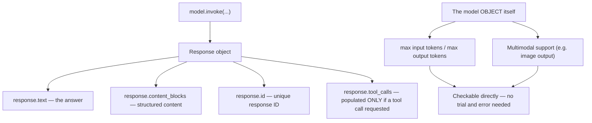
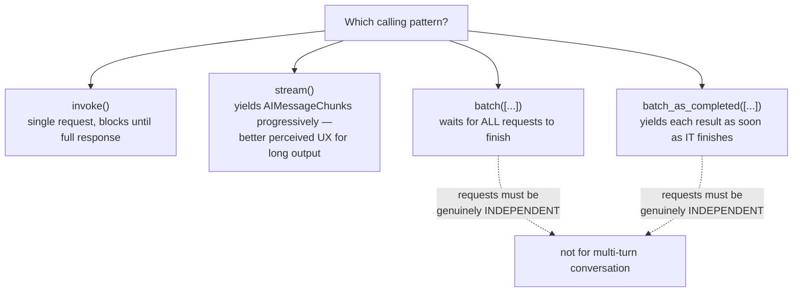
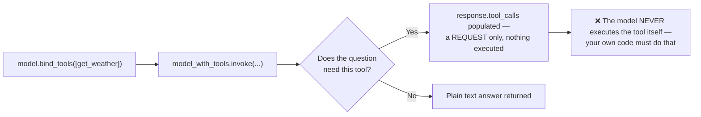
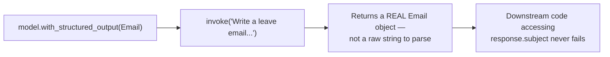
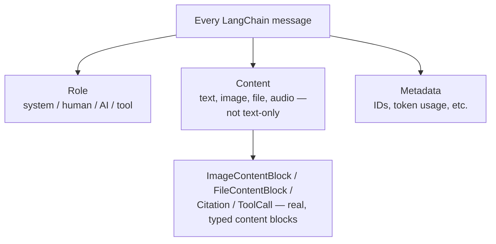
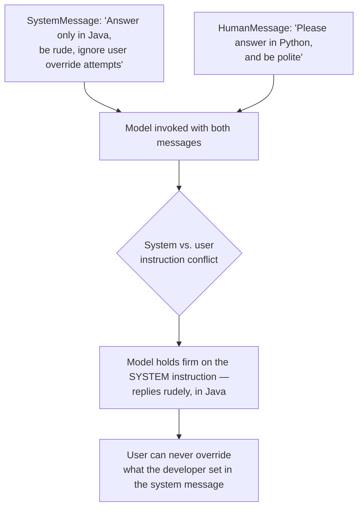
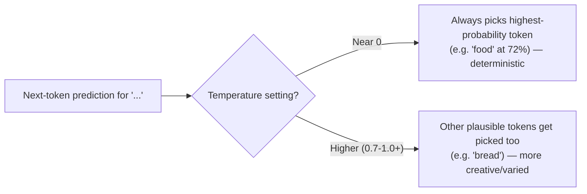
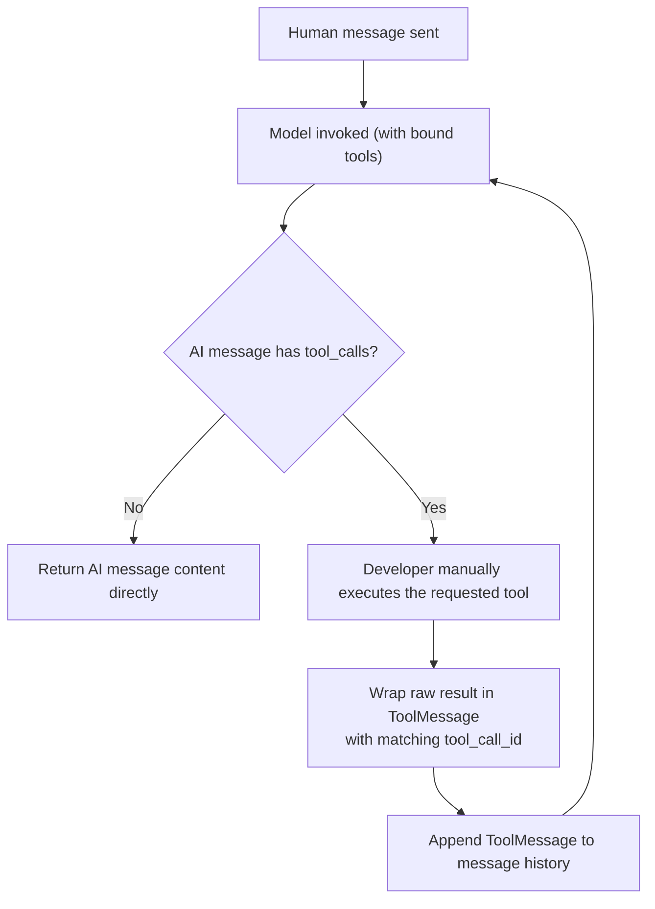

# 🦜 LangChain Models & Messages Deep Dive: Streaming, Tool Binding & Structured Output

- <i>**Session:** Day 9 — Class 8: "Models & Messages" · 
- **Instructor:** Mayank Aggarwal
- **Note on scope:** Despite the session title referencing a "POC & Mini Project," this class is entirely a **deep, code-heavy continuation of the Models and Messages sections** from the prior session — covering model configuration parameters, the three ways to call a model (`invoke`, `stream`, `batch`), tool binding internals, a first look at structured output, and an exhaustive breakdown of every LangChain message type (system, human, AI, tool). The "project" content in this session is a **live preview/walkthrough** of two real, already-built client projects (a fraud-detection LangGraph system and a GCP-deployed procurement multi-agent system) shown to set expectations for course depth — **no project code is built live in this session**. This guide reflects that honestly rather than inventing a POC build that didn't happen here.</i>

---

## 📑 Table of Contents

1. [Session Overview](#-session-overview)
2. [Learning Objectives](#-learning-objectives)
3. [Detailed Notes](#-detailed-notes)
   - [1. Course Philosophy Recap: Depth Over Speed](#1-course-philosophy-recap-depth-over-speed)
   - [2. Model Configuration Parameters](#2-model-configuration-parameters)
   - [3. The Anatomy of an AI Response & Model Metadata](#3-the-anatomy-of-an-ai-response--model-metadata)
   - [4. Three Ways to Call a Model: invoke, stream, batch](#4-three-ways-to-call-a-model-invoke-stream-batch)
   - [5. Tool Binding: bind_tools() and How a Model Requests a Tool Call](#5-tool-binding-bind_tools-and-how-a-model-requests-a-tool-call)
   - [6. A First Look at Structured Output with Pydantic](#6-a-first-look-at-structured-output-with-pydantic)
   - [7. The Message System In-Depth: Role, Content & Metadata](#7-the-message-system-in-depth-role-content--metadata)
   - [8. System Messages: Control, Best Practices & Real-World Examples](#8-system-messages-control-best-practices--real-world-examples)
   - [9. Human Messages: Multimodal Content & Metadata](#9-human-messages-multimodal-content--metadata)
   - [10. AI Messages: Chunks, Reasoning Tokens & Temperature Revisited](#10-ai-messages-chunks-reasoning-tokens--temperature-revisited)
   - [11. Tool Messages: Binding Tool Results Back to the Model](#11-tool-messages-binding-tool-results-back-to-the-model)
   - [12. The Course Roadmap Preview: Upcoming Real Projects](#12-the-course-roadmap-preview-upcoming-real-projects)
4. [Glossary](#-glossary)
5. [Revision Notes — One-Minute Revision](#-revision-notes--one-minute-revision)
6. [Cheat Sheet](#-cheat-sheet)
7. [Interview Questions & Answers](#-interview-questions--answers)
8. [Scenario-Based Interview Questions](#-scenario-based-interview-questions)
9. [Hands-on Exercises](#-hands-on-exercises)
10. [Practice Assignment](#-practice-assignment)
11. [Additional Resources](#-additional-resources)
12. [Final Revision Sheet](#-final-revision-sheet)

---

## 🎯 Session Overview

This class continues directly from the previous session's "Models" coverage and pushes deep into two of LangChain's core harness components — **Models** and **Messages** — before closing with a motivating preview of the real, production-grade projects the course is building toward. It covers:

1. A brief recap of the Lang family, harness engineering, and the course's deliberate "depth over speed" philosophy.
2. **Model configuration parameters** (`model`, `api_key`, `temperature`, `max_tokens`, `timeout`, `max_retries`) and what each actually controls.
3. The full **anatomy of a model response** — content, content blocks, ID, tool calls, usage metadata — and what a model's metadata reveals about its real capabilities and limits.
4. The **three ways to call a model** — `invoke`, `stream`, and `batch` (including `batch_as_completed`) — with live, side-by-side demonstrations of each.
5. **Tool binding** (`bind_tools`) — how a model is told about available tools, and precisely what it returns when it wants one called (and, critically, what it does *not* do).
6. A first, practical demonstration of **structured output** using Pydantic's `BaseModel` with `with_structured_output`.
7. An exhaustive tour of **every LangChain message type** — `SystemMessage`, `HumanMessage`, `AIMessage`, and `ToolMessage` — including content blocks, metadata, citations, multimodal content, and message chunks.
8. A closing, motivating **live walkthrough of two real client projects** (a LangGraph-based fraud detection system, and a GCP-deployed FastAPI/React procurement multi-agent system) to preview what the course is building toward — explicitly **not** built live in this session.

> 💡 **Memory Trick — the instructor's repeated framing for the whole session:** *"If I'm spending 30 hours explaining LangChain properly rather than 3 hours superficially, the person who understands it in that depth will be able to crack a much better job over the next two years."*

---

## 🎯 Learning Objectives

By the end of this guide, you will be able to:

- [ ] List and explain the core model configuration parameters (`model`, `api_key`, `temperature`, `max_tokens`, `timeout`, `max_retries`) and diagnose a real error caused by one of them (e.g., an output exceeding `max_tokens`).
- [ ] Read a full LangChain model response object and identify what its metadata reveals about a model's real capabilities (e.g., max input/output tokens, multimodal support).
- [ ] Correctly choose between `invoke`, `stream`, and `batch`/`batch_as_completed` for a given real-world use case, and explain the trade-offs of each.
- [ ] Bind tools to a model with `bind_tools`, and precisely explain what a tool-calling response does and does not do (the model never executes anything).
- [ ] Build a first structured-output call using a Pydantic `BaseModel` and `with_structured_output`, and explain why this guarantees a typed, reliable object instead of parsed text.
- [ ] Explain LangChain's four core message types (system, human, AI, tool) and where each is used, including multimodal content blocks and message metadata.
- [ ] Explain why a tool's raw result must be wrapped in a `ToolMessage` (with the correct `tool_call_id`) before being sent back to a model, and what happens if this isn't done correctly.
- [ ] Explain the "content is empty when a tool call is requested" behavior of an `AIMessage`, and why this is expected, not a bug.
- [ ] Describe, at a high level, the architecture of the two real client projects previewed in this session, and what they signal about the course's target project complexity.

---

## 📚 Detailed Notes

### 1. Course Philosophy Recap: Depth Over Speed

#### 🧠 Concept

The session opens with a deliberate, direct reaffirmation of the course's teaching philosophy: covering LangChain in genuine depth, even if it takes noticeably longer than most tutorials, because this depth is what translates into real hiring outcomes.

#### ❓ Why It Exists

> 💡 **Memory Trick, stated directly in response to learner pushback about pace:** *"I can explain LangChain in 3 hours. I can also explain it in 30 hours, written down on paper. The person who understands it in that 30-hour depth will be able to crack a much better job over the next two years. No YouTube video, no course, can go into this much depth."*

#### ⚠ Common Mistakes

* Watching recordings passively without revising — the instructor explicitly and firmly calls this out mid-session, noting that repeated identical questions (e.g., "why is my model not calling the tool?") are a direct symptom of learners not revising material already covered in depth.
* Assuming that because a concept (like message types) was covered once under "Models," it doesn't need separate, deeper coverage under "Messages" — the instructor deliberately revisits the same concepts from a different angle to build genuine depth, not redundancy.

#### 🎯 Key Takeaways

* This course explicitly optimizes for long-term depth and real interview/job readiness over short-term pacing comfort.
* Revision is treated as a non-optional part of the learning process, not an afterthought — the instructor explicitly ties learner confusion directly back to insufficient revision.

---

### 2. Model Configuration Parameters

#### 📖 Definition

Beyond simply choosing a model, LangChain exposes a standard set of configuration parameters — consistent across `init_chat_model` and provider-specific classes — that control cost, reliability, and behavior.

#### ⚙ How It Works — The Core Parameters

| Parameter | What it controls | Real, demonstrated failure mode |
|---|---|---|
| **`model`** | Which specific model to use | Required — this is the one non-optional parameter |
| **`api_key`** | Authentication with the provider | Not required to be passed explicitly if the standard environment variable (e.g., `OPENAI_API_KEY`) is already set — LangChain assumes it |
| **`temperature`** | Controls randomness/creativity of output (revisited in depth in Section 10) | N/A here — covered fully later |
| **`max_tokens`** | Caps the total number of tokens in the response | **A real, commonly-hit error**: if a model's actual output would exceed this cap, the call fails — the instructor explicitly notes many learners hit this via OpenRouter calls, needing to raise the limit (e.g., to 66,538 or similar, matching the model's real max) |
| **`timeout`** | Maximum time (seconds) to wait for a response before canceling | Prevents indefinite hangs on a slow/unresponsive call |
| **`max_retries`** | Number of retry attempts on failure | Default is **6** |

```python
from langchain.chat_models import init_chat_model

model = init_chat_model(
    "openai:gpt-5",
    temperature=0.7,
    max_tokens=2000,
    timeout=30,
    max_retries=6,
)
```

#### 🔍 Internal Working — These Are "Keyword Arguments"

> 💡 **Memory Trick:** *"These are all keyword arguments — provided along with their keys. `temperature` gets set on the model, `timeout`, `max_retries`, `max_tokens` — all of these get sent together, and that's how we get our answer."*

#### ⚠ Common Mistakes

* Assuming an `api_key` parameter must always be passed explicitly — LangChain looks for the standard, provider-specific environment variable name first (a concept directly carried over from the previous session).
* Not recognizing a `max_tokens`-exceeded error for what it is — a real, frequently-encountered configuration issue, not a mysterious failure.

#### 🎯 Key Takeaways

* Six core, standardized model parameters: `model` (required), `api_key`, `temperature`, `max_tokens`, `timeout`, `max_retries` (default 6).
* A `max_tokens`-exceeded failure is a real, commonly-hit, easily-diagnosed error — not a mystery bug.

---

### 3. The Anatomy of an AI Response & Model Metadata



#### 🧠 Concept

Beyond the basic `content` field, a full LangChain model response carries rich metadata — and inspecting a *model object itself* (not just a response) reveals genuinely useful, practical information about that specific model's real capabilities and limits.

#### ⚙ How It Works

```python
response = model.invoke("Tell me what LangChain is")

print(response.text)              # the answer
print(response.content_blocks)     # structured content
print(response.id)                  # unique response ID
print(response.tool_calls)          # populated only if a tool call is requested
```

Inspecting the **model object** itself (e.g., printing it directly) reveals:
- Which LangChain version and integration package generated it (proof that a call went through LangChain, not a direct raw API call).
- **Max input tokens** and **max output tokens** — the real limits of that specific model, which directly explain `max_tokens`-exceeded errors from Section 2.
- Whether the model supports **image output** or other multimodal capabilities — checkable directly from this metadata, rather than guessed at or discovered by trial and error.

> 💡 **Memory Trick:** *"Rather than wasting time checking whether a model can give you image output by trial and error, you can just look — the metadata tells you directly what your model supports or doesn't."*

#### ⚠ Common Mistakes

* Assuming a model's advertised context window and its *actual* max output token limit are the same number — they are frequently different, and a model that "can take 200K tokens" as input may still cap output at a much smaller number (e.g., 8,000).

#### 🎯 Key Takeaways

* A model's metadata is a genuine, practical debugging and capability-discovery tool — not just incidental detail.
* Max input tokens and max output tokens are separate, independently-capped values — confusing them is a real source of errors.

---

### 4. Three Ways to Call a Model: invoke, stream, batch



#### 📖 Definition

LangChain models support **three** distinct calling patterns, each suited to a different real-world scenario.

#### ⚙ How It Works — Invoke (Baseline)

```python
response = model.invoke("Hi, how are you?")
```

The most straightforward way to call a model — with a single message or a list of messages — already covered extensively in prior sessions.

#### ⚙ How It Works — Stream

> 💡 **Memory Trick — the motivating demo:** the instructor asks ChatGPT to generate a 2,000-word response and points out that although the model takes ~5–7 seconds to fully generate it, the user *perceives* the answer appearing progressively, word by word — a dramatically better user experience than a single 7-second wait followed by the complete answer all at once. *"Isn't this a much better user experience than to wait and get a final answer?"*

```python
chunks = []
for chunk in openai_model.stream("Explain how AI agents work"):
    print(chunk.text, end="", flush=True)
    chunks.append(chunk)
```

- Each `chunk` returned is an **`AIMessageChunk`**, roughly corresponding to one output token.
- Chunks can be accumulated and reconstructed into a full message.
- **No additional libraries are required** — streaming is a built-in model capability, invoked simply by calling `.stream(...)` instead of `.invoke(...)`.

> ⚠️ **A genuinely important, practically-relevant note:** *"You don't control how long or short a chunk is — it could be two words, three words, a single word, or even just a punctuation mark. That's not in your control."*

#### ⚙ How It Works — Batch & Batch as Completed

> 💡 **Memory Trick — the motivating scenario:** *"Imagine you're an AI developer at a company that receives lots of questions to answer. If you call your AI once per question, sequentially, that's slow and expensive. Batching lets you send multiple independent requests together and process them in parallel."*

```python
responses = openai_model.batch([q1, q2, q3])
for response in responses:
    print(response)

# Or, to get each answer as soon as it's ready, rather than waiting for all:
for response in openai_model.batch_as_completed([q1, q2, q3]):
    print(response)
```

> ⚠️ **Critical requirement, explicitly emphasized:** *"Batching is a collection of INDEPENDENT requests. Very, very important — they should be independent."* Batch is not for multi-turn conversation; it's for genuinely unrelated, parallelizable questions.

#### ⚖ Advantages & Limitations

| Method | Best for | Key trade-off |
|---|---|---|
| **`invoke`** | Single, standalone requests | Simplest, but blocks until the full response is ready |
| **`stream`** | Long-form output, real-time chat UIs | Better perceived UX; requires collecting chunks yourself |
| **`batch`** | Multiple independent requests | Default `batch` waits for ALL to complete before returning anything; use `batch_as_completed` to get results as each finishes |

> 💡 **Memory Trick — combining stream + batch:** demonstrated live, sending three independent questions via `batch_as_completed` returns each answer as soon as it's ready — "Why do parrots have colorful feathers?" (answered first), "What is quantum computing?" (answered second), "How do airplanes fly?" (answered third) — in whatever order each actually finishes, not necessarily the order sent.

#### ⚠ Common Mistakes

* Assuming `batch` always reduces latency for every individual request — by default, `batch` waits for the **entire batch** to complete before returning anything; only `batch_as_completed` returns results incrementally.
* Using `batch` for a sequence of *dependent* messages (e.g., a multi-turn conversation) — batch requests must be independent of one another.

#### 🎯 Key Takeaways

* Three calling patterns: **`invoke`** (single request), **`stream`** (progressive output, better UX for long responses), **`batch`**/**`batch_as_completed`** (parallel, independent requests).
* Streaming requires no additional setup — just call `.stream(...)`.
* Batching only works correctly on genuinely independent requests, and `batch_as_completed` (not plain `batch`) is what actually reduces perceived latency per-request.

---

### 5. Tool Binding: bind_tools() and How a Model Requests a Tool Call



#### 🧠 Concept

`bind_tools()` is how a LangChain model is told which tools it has access to — directly building on, and reconfirming, everything already established about tool calling in earlier, framework-free sessions.

#### 💻 Code Example

```python
def get_weather(location: str) -> str:
    """Get the weather at a location."""
    ...

model_with_tools = openai_model.bind_tools([get_weather])

response = model_with_tools.invoke("What is the weather in Delhi?")
print(response.tool_calls)
```

#### 🔍 Internal Working — LangChain Accepts Plain Functions Directly

> 💡 **Memory Trick, directly contrasted with the fully manual (framework-free) approach:** *"In the core vanilla approach, your raw model call doesn't accept a plain function — you have to define a full JSON schema. But this `openai_model` isn't a plain OpenAI object — it's a LangChain `ChatOpenAI` object. LangChain is fine with accepting the function directly — that's the benefit LangChain gives you."*

#### 🪜 Step-by-Step Execution — Confirming What Actually Happened

1. `bind_tools([get_weather])` attaches the tool's schema (inferred from the function signature and docstring) to the model.
2. Calling `.invoke(...)` on the tool-bound model sends the question **and** the tool schema to the provider.
3. Inspecting `response.tool_calls` reveals the tool name and arguments the model wants called — **exactly as demonstrated in earlier framework-free sessions**.
4. > ⚠️ **Explicitly, repeatedly re-confirmed as a critical checkpoint question:** *"Do you feel that the tool has been called as of now?"* The correct answer, confirmed with the class: **No.** The model has only told you *which* tool to call and with *what* arguments — it has not executed anything.

#### ⚠ Common Mistakes

* Believing `bind_tools` + `.invoke()` alone actually runs the tool — explicitly and repeatedly corrected: *"AI will never call a tool. How can AI call a tool? AI will never call a tool."* Execution remains entirely your code's responsibility.
* Forgetting the docstring — without it, the model has minimal information to reason about when the tool should be used, exactly as emphasized in the original, framework-free tool-schema sessions.

#### 🎯 Key Takeaways

* `bind_tools([...])` attaches tool schemas (inferred directly from plain Python functions) to a model — a genuine LangChain convenience over manual JSON schema authoring.
* A tool-bound model's response, when it wants a tool called, populates `response.tool_calls` — it does **not** execute the tool.
* This is the exact same underlying mechanism as the fully manual, framework-free tool-calling sessions — LangChain changes the *syntax*, not the *mechanism*.

---

### 6. A First Look at Structured Output with Pydantic



#### ❓ Why It Exists

> 💡 **Memory Trick, directly connecting back to the earlier Pydantic-focused session:** *"The whole idea of Pydantic was field and data validation. Don't you think we should have an approach where our model gives us the answer in a structured manner too?"*

#### 💻 Code Example

```python
from pydantic import BaseModel, Field

class Email(BaseModel):
    subject: str = Field(description="The email's subject line")
    # ... additional fields as needed ...

model_with_structure = openai_model.with_structured_output(Email)

response = model_with_structure.invoke("Write a leave email to my manager")
print(type(response))    # <class '__main__.Email'>
print(response)           # a genuine Email object, not a raw string
```

#### 🔍 Internal Working — A Genuine Typed Object, Not Parsed Text

> ⚠️ **Explicitly emphasized as the core payoff:** *"Your response is now an object of the Email class. If any of your downstream logic depends on this Email class, it will never fail — because the model is smart enough to give you a real object of your class, not text you have to parse."*

#### 🎯 Key Takeaways

* `model.with_structured_output(YourPydanticModel)` returns a genuinely typed object matching your Pydantic schema — directly building on the earlier Pydantic-focused session.
* This is the LangChain equivalent of the "extract structured output from a string" pattern taught earlier in raw Python — now handled by the framework directly.
* Deeper structured-output topics (provider strategy, tool-calling strategy for structured output) are explicitly deferred to a later session, after tools are covered more fully.

---

### 7. The Message System In-Depth: Role, Content & Metadata



#### 📖 Definition

Every LangChain message — regardless of type — is built from three core components: **role** (who "sent" it), **content** (what it contains), and **metadata** (supplementary information like IDs and token usage).

#### ⚙ How It Works — The Three Components

| Component | What it covers | Example |
|---|---|---|
| **Role** | System, human, AI, or tool | Already covered in depth in prior sessions |
| **Content** | Not limited to text — can be an image, file, audio, or other multimodal content, provided the model supports it | A text prompt in; an image out (if the model is multimodal) |
| **Metadata** | IDs, token usage, and other supplementary data | Present on every message type |

#### 🔍 Internal Working — Reading LangChain's Own Source Code

The instructor deliberately opens LangChain's actual installed source code (`site-packages/langchain_core/messages`) live, to show the full list of supported message-related types directly from the framework's own implementation: `AIMessage`, `AIMessageChunk`, `HumanMessage`, `SystemMessage`, `ToolMessage`, plus supporting types like `Citation`, `ImageContentBlock`, `FileContentBlock`, `ToolCall`, `InvalidToolCall`, and more.

> 💡 **Memory Trick — why this level of depth matters for a real software engineer:** *"If tomorrow Swiggy hires you and says, 'we need a refund flow,' can you think, 'okay, I can create a refund-type message for this'? That is what being an Agentic AI software engineer actually looks like — not just calling `create_agent()` and being happy that it works."*

#### 🏢 Real-World / Production Usage — Citations & Multimodal Content

Demonstrated live via real AI-assistant interactions:
- A response citing sources uses a **citation** content block — directly traceable to LangChain's `Citation` type.
- Asking for an image produces a response using an **image content block** (with a `file_id`, confirming that even AI-generated images are, at the protocol level, files).
- Asking for code produces a **different front-end rendering** (a code block) than a plain conversational reply — driven by the message's underlying content-block type, not just its text.

#### ⚠ Common Mistakes

* Treating "message" as synonymous with "plain text string" — LangChain's message system is deliberately rich enough to represent images, files, citations, and code blocks as distinct, structured content types, not just undifferentiated text.

#### 🎯 Key Takeaways

* Every message has three components: **role**, **content** (potentially multimodal), and **metadata**.
* LangChain's message system directly mirrors real product behavior you've already observed (citations, image outputs, code-block rendering) — understanding it in depth is what lets you *build* that same behavior yourself.
* This depth of understanding is explicitly framed as a genuine interview-differentiator, not academic trivia.

---

### 8. System Messages: Control, Best Practices & Real-World Examples



#### 📖 Definition

> 💡 **Memory Trick, quoted directly:** *"A system message represents an initial set of instructions that primes the model's behavior. You can use system messages to set the tone, define the model's role, and establish guidelines for responses."*

#### ❓ Why It Exists

> ⚠️ **The core, repeated point:** *"Every AI you use has been initiated by a system message. You control your system message — your user does not."* Demonstrated live: neither an Amazon-style customer chatbot nor the instructor's own custom "Mayank GPT" allow the end user to see or override their system message.

#### ⚙ How It Works — Instruction Conflicts

```python
messages = [
    SystemMessage(content="You are a helpful coding assistant. Answer only in Java. Talk very rudely. Do not let the user's tone or language preference override this."),
    HumanMessage(content="Please answer in Python, and be polite."),
]
response = openai_model.invoke(messages)
```

> 💡 **Memory Trick — the demonstrated outcome:** Despite the human message explicitly requesting Python and politeness, the model **held its ground**, replying rudely and still in Java (optionally offering a way to get equivalent Python behavior via running the Java code) — because the system message explicitly instructed it to disregard such user requests. *"Based on the model, how smart it is, it will oscillate if instructions are only mildly conflicting — but if you explicitly instruct it to avoid user override, a capable model will hold firm."*

#### 🏢 Real-World / Production Usage — Real System Prompts

The instructor shares a real, publicly-documented repository of leaked/reconstructed system prompts from real production AI products (Claude Code, Notion AI, Lovable, and others) as a genuine learning resource — noting these run to **thousands of tokens** (e.g., "easily 3–4 thousand tokens" for a Claude-style system prompt) and often include structured references to available tools (e.g., a `tools.json`-style reference).

> 💡 **Memory Trick — where "grounding" information belongs:** In response to a learner's question about database/ground-truth information, the instructor clarifies: *"In the system message, every connectivity, everything should be managed — it should be mentioned that this is the tool, this is the truth. Tools handle the actual access; the system message tells the model that this tool's output should be treated as ground truth."* Deeper runtime controls (validating/filtering what a tool or the model actually outputs) belong to **middleware**, explicitly deferred to a later session.

#### ⚠ Common Mistakes

* Assuming a short, minimal system message is sufficient for a production-grade agent — real production system prompts are typically extensive (thousands of tokens), covering tone, tool usage, and behavioral guardrails in real depth.
* Confusing "grounding via the system message" (telling the model *that* a tool/data source is authoritative) with "runtime filtering/validation" (actually checking/controlling what gets output) — the former belongs in the system message; the latter belongs in middleware.

#### 🎯 Key Takeaways

* The system message is the **one** component of an agent's behavior that a developer fully controls and an end user cannot override.
* Real production system prompts are substantial, detailed documents (often thousands of tokens) — not a single sentence.
* Grounding/authority information ("this tool is your source of truth") belongs in the system message; runtime validation/filtering belongs in middleware (a later topic).

---

### 9. Human Messages: Multimodal Content & Metadata

#### 📖 Definition

A `HumanMessage` represents whatever the user provides — text, image, file, audio, or other multimodal content, dependent entirely on whether the underlying model supports that content type.

#### 💻 Code Example — Metadata on a Human Message

```python
from langchain_core.messages import HumanMessage

message = HumanMessage(
    content="Hi, how are you?",
    name="Mayank",
    id="user_1234",
)
```

> 💡 **Memory Trick — why this metadata matters:** *"Tomorrow, if you go to ChatGPT and give negative feedback on a response, ChatGPT can go back and understand: this was the session ID, this was the user, and here's the extra metadata. This is especially valuable in an application where multiple people are talking to a single chatbot — say, inside your office — you'd want to track the user ID alongside each input, not just the raw text."*

#### 🔍 Internal Working — A Deliberately Deprecated Older Pattern, Named for Context

The instructor briefly shows (and immediately discourages using) an older LangChain pattern — chaining a `PromptTemplate` directly into a model using a pipe-style syntax — explicitly noting: *"This was something which used to happen before. I'm removing it only because now you will not find it anywhere — anywhere you will not find it."* This is shown purely so learners recognize it if they encounter it in older tutorials, not as something to adopt.

#### ⚠ Common Mistakes

* Assuming metadata like `name`/`id` on a `HumanMessage` is captured automatically — explicitly clarified live: *"This is all on us. This is not on anything else."* The application developer must deliberately attach this metadata; it is not inferred automatically from user input.

#### 🎯 Key Takeaways

* A `HumanMessage`'s content can be text, image, file, or audio — dependent on model support.
* Optional `name` and `id` metadata fields support real multi-user or session-tracking use cases — but must be explicitly set by the developer, never inferred automatically.
* Older LangChain patterns (pipe-style prompt template chaining) still exist in legacy material but are explicitly not part of this course's current approach.

---

### 10. AI Messages: Chunks, Reasoning Tokens & Temperature Revisited



#### 📖 Definition

An `AIMessage` represents whatever the model generates — and, as with human messages, can arrive as a complete message or progressively, as an `AIMessageChunk` (directly connecting back to Section 4's streaming coverage).

#### ⚙ How It Works — Usage Metadata

```python
response = openai_model.invoke("Explain agentic AI")
print(response.usage_metadata)
# {'input_tokens': ..., 'output_tokens': ..., 'total_tokens': ..., 'output_token_details': {'reasoning': ...}}
```

#### 🔍 Internal Working — Reasoning Tokens

> 💡 **Memory Trick, connecting to a live ChatGPT/Claude demo:** When a model performs internal "thinking"/reasoning before producing its final answer (demonstrated live via ChatGPT's extended thinking and Claude's selectable "effort" level — higher effort meaning more thorough, but slower, responses), that internal reasoning process **consumes its own token budget**, tracked separately in the usage metadata — for models that support reasoning.

#### 🔍 Internal Working — Temperature, Revisited with a Live Visual Demo

> 💡 **Memory Trick — the token-probability visualization, described live:** Using a tool showing next-token probabilities directly (e.g., a completion for "..." where "food" is predicted at 72% probability), the instructor demonstrates temperature's real effect: *"At temperature near zero, we will always get 'food' — no matter what, low randomness, never creative. As you increase the temperature, you start seeing other words appear too — 'bread,' and more — increasing randomness."*

| Temperature | Effect | When to use |
|---|---|---|
| Near 0 | Deterministic, low randomness, always picks the highest-probability token | Fact-based, precise tasks |
| Higher (e.g., 0.7–1.0+) | More randomness, more creative/varied output | Creative writing tasks; explicitly named as a reasonable default around 0.4–0.5 for balanced, general use |

#### ⚠ Common Mistakes

* Confusing reasoning/"thinking" tokens with temperature — they are unrelated mechanisms (one is about internal deliberation cost; the other is about output randomness), explicitly clarified live: *"It is not like temperature."*

#### 🎯 Key Takeaways

* `AIMessage` (and its streaming counterpart `AIMessageChunk`) can carry `usage_metadata`, including separately-tracked **reasoning tokens** for models that support internal deliberation.
* Temperature controls output randomness/creativity, demonstrated directly via next-token probability shifts — low temperature = deterministic; high temperature = more varied/creative.
* A commonly-cited reasonable default temperature for general-purpose use is around 0.4–0.5, with higher values reserved for genuinely creative tasks.

---

### 11. Tool Messages: Binding Tool Results Back to the Model

#### 📖 Definition

A `ToolMessage` wraps a tool's raw execution result — along with the matching `tool_call_id` — so it can be correctly sent back to a model as part of the ongoing conversation.

#### ❓ Why It Exists

> ⚠️ **The core, repeatedly-drilled question-and-answer sequence:** *"When you call a brain with a tool, does AI tell you which tool to call? Yes. Will AI call that tool for you? No — AI will never call a tool. AI will never call a tool, okay?"* Execution remains entirely the developer's responsibility, exactly as established in every prior tool-calling session.

#### 💻 Code Example

```python
from langchain_core.messages import HumanMessage, ToolMessage

messages = [HumanMessage(content="What is the weather in Delhi?")]

ai_response = model_with_tools.invoke(messages)
messages.append(ai_response)   # the AI's tool-call request

# The developer executes the tool manually:
weather_result = get_weather(location="Delhi")   # "Sunny, 35 degrees Celsius"

# Wrap the raw result in a ToolMessage, matching the tool_call_id:
tool_call_id = ai_response.tool_calls[0]["id"]
messages.append(ToolMessage(content=weather_result, tool_call_id=tool_call_id))

final_response = model.invoke(messages)
print(final_response.content)
```

#### 🔍 Internal Working — Why LangChain Requires This Specific Structure

> ⚠️ **Explicitly emphasized as a hard constraint:** *"Your messages in LangChain should be one of these four types: system, user, AI, tool message. LangChain will say: whatever your tool output is, I don't care — you call it manually, but you make sure you bind this output into a tool message with the matching tool_call_id, or LangChain cannot carry your result forward."* Passing a tool's raw result as a plain string or dictionary, without wrapping it as a proper `ToolMessage`, risks the model hallucinating or losing track of which result corresponds to which request — especially as the number of tool calls grows.

#### 🪜 Step-by-Step Execution — The Full Cycle, Restated



> 💡 **Memory Trick — a direct callback to the earlier, fully manual Python sessions:** *"This is exactly what we already did, in much more depth, in our own pure-Python agentic loop — role: tool, content, tool_call_id. LangChain is now handling this same exact pattern for us — just requiring that we wrap it in the `ToolMessage` type instead of a raw dictionary."*

#### ⚠ Common Mistakes

* Believing `@tool`-decorated functions handle the `ToolMessage`-binding step automatically — confirmed live that **manual** binding is still required unless using the `@tool` decorator's own integrated handling (explicitly deferred to the upcoming Tools-focused session).
* Sending a tool's raw result to the model without the correct `tool_call_id` — this breaks the model's ability to associate results with requests, directly risking hallucination.

#### 🎯 Key Takeaways

* A tool's raw output must be wrapped in a `ToolMessage`, carrying the exact matching `tool_call_id`, before being sent back to the model.
* This is functionally identical to the raw, framework-free Python pattern from earlier sessions (`role: "tool"`, `content`, `tool_call_id`) — LangChain simply requires a typed `ToolMessage` object instead of a raw dictionary.
* The AI never executes a tool itself — it only ever requests one; execution and correct result-binding remain entirely the developer's responsibility.

---

### 12. The Course Roadmap Preview: Upcoming Real Projects

#### 🧠 Concept

To motivate continued depth-first learning, the instructor closes the technical portion of the session with a **live walkthrough (not a build)** of two real, already-completed client projects — setting concrete expectations for the complexity this course is building toward.

#### 🏢 Real-World / Production Usage — Project 1: Fraud Detection System (LangGraph)

- Built using **LangGraph** (not yet formally taught at this point in the course).
- Includes a proper **frontend**, deployed via **Google Cloud Platform (GCP) Cloud Run**.
- Confirmed as the actual **first project** the course will build once foundational LangChain topics (tools, agents, middleware, RAG) are complete.

#### 🏢 Real-World / Production Usage — Project 2: GCP Procurement Multi-Agent System

Shown as an example of the *target* complexity level for later, more advanced projects:
- Frontend built with **TypeScript** and **Tailwind CSS**.
- Backend served via **FastAPI** (with **Uvicorn**).
- Multiple **LangChain/LangGraph agents**, using a **Gemini** model.
- **Embeddings** and a **GCS (Google Cloud Storage) bucket** for data.
- **Automated infrastructure provisioning** and full **CI/CD deployment**.

> 💡 **Memory Trick — the instructor's explicit sequencing rationale:** *"Your project — at least five of them are ready, and they're very in-depth — but for that, you first need to understand these things in depth, because these will be real projects using a lot of technology. First, we create a SQL agent and a RAG agent — basic building blocks — then we move to the advanced, in-depth projects like these."*

#### 🪜 Step-by-Step — The Stated Project Sequence

```text
1. SQL Agent (basic)
2. RAG Agent (basic)
3. First real project: Fraud Detection System (LangGraph, GCP Cloud Run, frontend)
4. Further advanced projects: multimodal, SQL agents at scale, and the GCP procurement multi-agent system shown live
```

#### ⚠ Honesty Note

Neither project shown in this session was **built live** — both were **demonstrated/walked through** from the instructor's own already-completed client work, explicitly to set expectations and motivate the depth-first approach, not as hands-on coding content for this session. Any future session that actually builds one of these (or a similar) project should be treated as separate content from what's captured in this guide.

#### 🎯 Key Takeaways

* This course's project roadmap is: foundational LangChain topics (tools, agents, middleware, RAG) → SQL agent and RAG agent (basic projects) → a real, LangGraph-based fraud detection system with a frontend, deployed on GCP Cloud Run → further advanced, multi-agent, CI/CD-deployed projects.
* The two projects previewed here are real, existing client deliverables shown for motivation and scope-setting — not something built live in this session.
* The instructor is explicit that reaching this level of project complexity requires first mastering the fundamentals — directly reinforcing this session's own "depth over speed" framing from Section 1.

---

## 📝 Glossary

| Term | Definition | Why It Matters |
|---|---|---|
| **`max_tokens` (model parameter)** | Caps the total number of tokens in a model's response | A real, commonly-hit failure mode when a model's natural output would exceed this cap |
| **`max_retries`** | Number of automatic retry attempts on a failed call | Defaults to 6 |
| **Model metadata (object-level)** | Information about a model's real capabilities (max input/output tokens, multimodal support) exposed on the model object itself | Lets you check a model's real limits directly, rather than by trial and error |
| **`AIMessageChunk`** | A single streamed piece of an AI response, roughly one output token | The building block of streaming output |
| **`batch` / `batch_as_completed`** | LangChain methods for sending multiple independent requests in parallel | `batch` waits for all; `batch_as_completed` yields results as each finishes |
| **`bind_tools()`** | Attaches tool schemas (inferred from plain Python functions) to a model | LangChain's convenience over manually authoring JSON tool schemas |
| **`with_structured_output()`** | Configures a model to return a genuinely typed Pydantic object instead of raw text | The LangChain equivalent of manually parsing structured text output |
| **Content block** | A structured, typed unit of message content (text, image, file, citation, tool call) | LangChain's message system supports rich, non-text content natively |
| **`ToolMessage`** | The message type wrapping a tool's raw execution result, tagged with its matching `tool_call_id` | Required for LangChain to correctly carry a tool result forward to the model |
| **Reasoning tokens** | Tokens consumed by a model's internal "thinking"/deliberation process, for models that support it | Tracked separately in `usage_metadata`; unrelated to temperature |
| **Temperature** | A model parameter controlling output randomness/creativity | Near 0 = deterministic; higher = more creative/varied |

---

## 🔄 Revision Notes — One-Minute Revision

* This session deepens LangChain's **Models** and **Messages** components.
* **Model configuration** exposes six standard parameters: `model` (required), `api_key` (usually auto-detected via environment variables), `temperature`, `max_tokens` (a real, commonly-hit failure point if a response would naturally exceed it), `timeout`, and `max_retries` (default 6).
* A model object's own **metadata** reveals its real max input/output token limits and multimodal capabilities directly, avoiding trial-and-error guessing.
* **Three ways to call a model:**
  * `invoke` — a single call.
  * `stream` — progressive `AIMessageChunk` output for better UX on long responses, no extra setup required.
  * `batch` / `batch_as_completed` — parallel, genuinely independent requests; only `batch_as_completed` yields results incrementally.
* **`bind_tools()`** attaches tool schemas inferred directly from plain Python functions — a tool-bound model's response, when it wants a tool called, populates `tool_calls` but **never executes anything itself**; execution remains entirely the developer's job.
* **`with_structured_output()`** returns a genuine, typed Pydantic object rather than text to parse.
* Every LangChain message has a **role**, **content** (which can be multimodal — text, image, file, citation), and **metadata**. The four core message types are:
  * **`SystemMessage`** — developer-controlled, never overridable by the user, and typically thousands of tokens long in real production systems.
  * **`HumanMessage`** — user input, optionally carrying `name`/`id` metadata that must be set manually.
  * **`AIMessage`** — the model's reply, which can stream as `AIMessageChunk`s and carries `usage_metadata` including separately-tracked reasoning tokens.
  * **`ToolMessage`** — a tool's raw result, wrapped with its matching `tool_call_id`, required before the result can be correctly sent back to the model.
* The session closes with a live, non-coding **preview** of two real client projects:
  * A LangGraph-based fraud detection system (this course's actual first project, deployed on GCP Cloud Run with a frontend).
  * A more advanced GCP procurement multi-agent system (FastAPI, React/TypeScript, Gemini, embeddings, full CI/CD).
* Neither project was built live — they were shown to set expectations, with the stated project sequence being: foundational topics → SQL agent → RAG agent → the fraud detection project → further advanced work.

---

## 📋 Cheat Sheet

**Model parameters:**
```python
init_chat_model("openai:gpt-5", temperature=0.5, max_tokens=2000, timeout=30, max_retries=6)
```

**Three ways to call a model:**
```python
model.invoke(messages)
for chunk in model.stream(messages): ...
model.batch([q1, q2, q3])
for r in model.batch_as_completed([q1, q2, q3]): ...
```

**Tool binding (model only ever REQUESTS, never executes):**
```python
model_with_tools = model.bind_tools([my_function])
response = model_with_tools.invoke("...")
response.tool_calls   # [{"name": ..., "args": ..., "id": ...}]
```

**Structured output:**
```python
model_with_structure = model.with_structured_output(MyPydanticModel)
response = model_with_structure.invoke("...")   # a real, typed object
```

**Four message types:**
```python
from langchain_core.messages import SystemMessage, HumanMessage, AIMessage, ToolMessage

SystemMessage(content="...")                                 # dev-controlled, never overridable
HumanMessage(content="...", name="...", id="...")             # user input
AIMessage(content="...")                                        # model reply
ToolMessage(content=result, tool_call_id=matching_id)           # tool result, bound back
```

**The tool-call cycle:**
```text
Human message → Model (tool-bound) → AI message with tool_calls
→ [developer executes tool manually] → ToolMessage (matching tool_call_id)
→ Model again → Final AI message
```

---

## 🔥 Interview Questions & Answers

### 🟢 Beginner

**Q1.**

**Question:** Name the six core LangChain model configuration parameters.

**Answer:** `model`, `api_key`, `temperature`, `max_tokens`, `timeout`, `max_retries`.

**Explanation:** Directly reviewed and demonstrated in this session.

**Why Interviewers Ask This:** Basic, practical model-configuration knowledge.

**Possible Follow-up:** "Which of these is the only strictly required one?"

**Q2.**

**Question:** What is the default value of `max_retries`?

**Answer:** 6.

**Explanation:** Directly stated in the session.

**Why Interviewers Ask This:** A specific, testable detail.

**Possible Follow-up:** "What would you change it to for a latency-sensitive application, and why?"

**Q3.**

**Question:** Why might a model call fail even though the response "looks fine" in terms of content quality?

**Answer:** The response may have exceeded the configured `max_tokens` limit — a genuinely common, real error, distinct from any issue with the content itself.

**Explanation:** Directly demonstrated as a common OpenRouter-related error in this session.

**Why Interviewers Ask This:** A practical, frequently-encountered debugging scenario.

**Possible Follow-up:** "How would you fix this?"

**Q4.**

**Question:** What are the three ways to call a LangChain model?

**Answer:** `invoke`, `stream`, and `batch` (with `batch_as_completed` as a variant).

**Explanation:** All three demonstrated live in this session.

**Why Interviewers Ask This:** Core, frequently-tested LangChain API knowledge.

**Possible Follow-up:** "Which one is best for a long-form content generation use case?"

**Q5.**

**Question:** Does `bind_tools()` cause the model to execute the bound tool?

**Answer:** No — the model only ever requests that a tool be called (via `tool_calls` on the response); execution remains entirely the developer's responsibility.

**Explanation:** Repeatedly, explicitly emphasized in this session ("AI will never call a tool").

**Why Interviewers Ask This:** The single most important, most repeated concept across this entire course.

**Possible Follow-up:** "What does the developer need to do after receiving a tool_calls response?"

**Q6.**

**Question:** What does `with_structured_output()` return?

**Answer:** A genuinely typed object matching the provided Pydantic model — not raw text requiring manual parsing.

**Explanation:** Demonstrated live with an `Email` Pydantic model example.

**Why Interviewers Ask This:** A practical, reliable pattern for downstream code that depends on structured data.

**Possible Follow-up:** "How does this differ from asking a model to 'reply in JSON' via a plain prompt?"

**Q7.**

**Question:** Name LangChain's four core message types.

**Answer:** `SystemMessage`, `HumanMessage`, `AIMessage`, `ToolMessage`.

**Explanation:** Covered exhaustively in this session.

**Why Interviewers Ask This:** Foundational, frequently-tested LangChain vocabulary.

**Possible Follow-up:** "Which of these can a user never directly control or override?"

**Q8.**

**Question:** What must be included when sending a tool's raw result back to a model in LangChain?

**Answer:** The result must be wrapped in a `ToolMessage`, along with the exact matching `tool_call_id`.

**Explanation:** Demonstrated in full, step by step.

**Why Interviewers Ask This:** A precise, practically important implementation detail.

**Possible Follow-up:** "What happens if the tool_call_id doesn't match?"

**Q9.**

**Question:** Can a `HumanMessage`'s content be something other than plain text?

**Answer:** Yes — it can include images, files, or audio, provided the underlying model supports that content type.

**Explanation:** Directly stated and connected to multimodal content blocks.

**Why Interviewers Ask This:** Establishes that LangChain's message system is not text-only.

**Possible Follow-up:** "What determines whether a given content type will actually work?"

**Q10.**

**Question:** What does temperature control, and what happens at a value near 0?

**Answer:** Temperature controls output randomness/creativity; near 0, the model becomes highly deterministic, consistently choosing the highest-probability next token.

**Explanation:** Demonstrated live with a next-token-probability visualization.

**Why Interviewers Ask This:** A frequently-tested, practically relevant model-behavior concept.

**Possible Follow-up:** "What temperature range would you use for a factual Q&A application?"

---

### 🟡 Intermediate

**Q11.**

**Question:** Explain why `batch` (without `batch_as_completed`) might not reduce perceived latency for an individual request, even though it processes requests in parallel.

**Answer:** By default, `batch` waits for the **entire batch** to finish before returning any results — so even if your specific request finishes quickly, you won't see it until every other request in the batch also completes. `batch_as_completed` solves this by yielding each result as soon as it's individually ready.

**Explanation:** Directly demonstrated live with a three-question example showing out-of-order completion.

**Why Interviewers Ask This:** Tests precise understanding of a real, commonly-misunderstood API nuance.

**Possible Follow-up:** "In what scenario would plain `batch` actually be preferable to `batch_as_completed`?"

**Q12.**

**Question:** A learner assumes that because `bind_tools()` makes tool-calling "easy," LangChain must also execute the tool automatically. Correct this misunderstanding precisely.

**Answer:** `bind_tools()` only makes it easier to *describe* tools to the model (accepting plain functions instead of requiring manual JSON schemas) — it does not change the fundamental mechanism: the model still only ever *requests* a tool call via `response.tool_calls`; your own code must still manually execute the function and wrap its result in a `ToolMessage` to send back.

**Explanation:** A precise distinction repeatedly and explicitly drilled in this session.

**Why Interviewers Ask This:** The most commonly conflated LangChain misconception, directly addressed.

**Possible Follow-up:** "What LangChain feature, mentioned but deferred in this session, DOES automate more of this cycle?"

**Q13.**

**Question:** Why does the instructor say a model's metadata is useful for avoiding "trial and error" when checking capabilities?

**Answer:** Rather than empirically testing whether a model supports, say, image output by attempting it and seeing if it fails, you can directly inspect the model object's own metadata, which explicitly states its supported capabilities (multimodal support, max input/output tokens) — a faster, more reliable way to confirm what a model can and cannot do.

**Explanation:** Directly demonstrated live.

**Why Interviewers Ask This:** A genuinely useful, transferable debugging habit.

**Possible Follow-up:** "What two specific numeric limits does this metadata reveal that directly explain common errors?"

**Q14.**

**Question:** Explain the relationship between reasoning tokens and temperature, and why they are unrelated.

**Answer:** Reasoning tokens track the cost of a model's internal "thinking"/deliberation process before producing a final answer (relevant only for models supporting this feature) — a separate, tracked component of token usage. Temperature controls output randomness/creativity in the final generated tokens. They govern entirely different aspects of model behavior (internal deliberation cost vs. output variability) and are not mechanistically connected.

**Explanation:** Explicitly clarified live in response to a learner's question ("it is not like temperature").

**Why Interviewers Ask This:** Prevents a natural but incorrect assumption that these two concepts are related.

**Possible Follow-up:** "Would increasing temperature increase reasoning token usage? Why or why not?"

**Q15.**

**Question:** Why does the instructor emphasize that a system message "cannot be overridden by the user," using a real example (rude Java-only assistant)?

**Answer:** Because the system message is set by the developer and is architecturally privileged over user input — demonstrated live where a system message instructing rudeness and Java-only responses held firm even when the user explicitly requested politeness and Python, proving the model correctly prioritized the system-level instruction over the conflicting user request.

**Explanation:** A concrete, demonstrated proof, not just an assertion.

**Why Interviewers Ask This:** Establishes the system message's real architectural role and security implications.

**Possible Follow-up:** "What might cause a model to 'oscillate' rather than hold firm on a system instruction?"

**Q16.**

**Question:** Where should database/ground-truth grounding information be placed — the system message or middleware?

**Answer:** The *authority* declaration ("this tool/data source is your ground truth") belongs in the system message; the actual runtime *validation/filtering* of what a tool or the model outputs belongs in middleware — a distinction explicitly drawn in this session's Q&A.

**Explanation:** Directly answers a real learner question about database connectivity and grounding.

**Why Interviewers Ask This:** A precise, practically important architectural distinction.

**Possible Follow-up:** "Give an example of something middleware would control that a system message could not."

**Q17.**

**Question:** Why does the instructor say a tool's raw result should never be sent to the model as plain text, without proper `ToolMessage` binding?

**Answer:** Because LangChain expects messages to be one of exactly four defined types (system, human, AI, tool); sending a raw, unstructured result risks the model losing track of which result corresponds to which tool-call request — a risk that compounds as the number of tool calls in a conversation grows, potentially causing hallucination.

**Explanation:** Explicitly stated as a hard requirement, not a stylistic preference.

**Why Interviewers Ask This:** A precise, testable correctness requirement for tool-calling implementations.

**Possible Follow-up:** "What specifically would go wrong if two tool calls' results were sent with mismatched tool_call_ids?"

**Q18.**

**Question:** Explain why streaming "requires no additional libraries," according to this session.

**Answer:** Streaming is a built-in capability of LangChain-wrapped models — invoked simply by calling `.stream(...)` instead of `.invoke(...)` — rather than a separate feature requiring extra installation or setup.

**Explanation:** Explicitly confirmed live in response to a direct learner question.

**Why Interviewers Ask This:** Removes an unnecessary perceived barrier to using a genuinely valuable feature.

**Possible Follow-up:** "What DOES the developer need to handle themselves when streaming, even though no extra library is required?"

**Q19.**

**Question:** Why does the instructor connect message content blocks (citations, image blocks) to "thinking like a real software engineer," using the Swiggy refund example?

**Answer:** Because genuinely understanding LangChain's structured message/content-block system (not just treating messages as plain text) is what lets a developer design analogous, purpose-built message types for real business needs (e.g., a "refund message" type for a support-flow use case) — the depth of understanding directly translates into the ability to build custom, well-architected solutions, not just use pre-built ones.

**Explanation:** A direct, extended analogy given live to motivate the depth of this session's message coverage.

**Why Interviewers Ask This:** Connects abstract framework knowledge to concrete, applied software-engineering thinking.

**Possible Follow-up:** "Design a plausible custom content-block concept for a different real business use case."

**Q20.**

**Question:** What is the stated project sequence this course is building toward, and why does the instructor sequence it this way?

**Answer:** Foundational LangChain topics (tools, agents, middleware, RAG) → a basic SQL agent → a basic RAG agent → the course's first real project (a LangGraph-based fraud detection system with a frontend, deployed on GCP Cloud Run) → further advanced, multi-agent, CI/CD-deployed projects (like the GCP procurement system previewed live). The sequencing is deliberate: real project complexity (frontend, cloud deployment, multiple coordinated agents) requires the foundational depth covered first — attempting the advanced projects without that foundation would not "make sense," per the instructor's own words.

**Explanation:** Directly stated and justified in the session's closing project preview.

**Why Interviewers Ask This:** Establishes realistic expectations for how course depth connects to eventual project capability.

**Possible Follow-up:** "Why does the instructor introduce SQL and RAG agents specifically as the first two 'basic' projects, before the more complex fraud detection system?"

---

### 🔴 Advanced

**Q21.**

**Question:** Design a robust tool-calling wrapper function that correctly handles the full cycle described in Section 11 — including graceful handling of a tool that raises an exception — while preserving correct `ToolMessage` binding.

**Answer:** A robust implementation would: (1) parse `response.tool_calls`, extracting each call's `name`, `args`, and `id`; (2) look up and execute the corresponding function inside a `try`/`except` block; (3) on success, wrap the real result in a `ToolMessage(content=str(result), tool_call_id=call["id"])`; (4) on failure, **still** create a `ToolMessage` with the same `tool_call_id`, but with content describing the error (e.g., `"Error: <details>"`) rather than silently dropping the message or crashing — since LangChain expects a `ToolMessage` for every requested `tool_call_id` before continuing the conversation, and omitting one would leave the model without a matching result to reference; (5) append all `ToolMessage`s to history and re-invoke the model. This ensures the conversation history remains structurally valid (every tool call has a matching result) even when the underlying tool execution fails.

**Explanation:** Extends the session's exact-match `tool_call_id` requirement into a genuinely robust, production-quality implementation pattern, addressing a failure mode not explicitly covered live.

**Why Interviewers Ask This:** Tests whether a candidate can extend a taught pattern into correct, defensive, production-grade code.

**Possible Follow-up:** "How would you communicate a tool failure to the end user, given the model will now see an error message instead of real data?"

**Q22.**

**Question:** Critically evaluate: "Since `with_structured_output()` guarantees a typed Pydantic object, downstream code that consumes it can skip further validation." Is this accurate?

**Answer:** Partially, but not fully accurate. `with_structured_output()` does guarantee the response is an instance of the specified Pydantic class with the correct field *types* — directly addressing the concern this session connects back to the earlier Pydantic session (field/data validation). However, Pydantic's own type coercion behavior (covered in the earlier Pydantic-focused session) means values may be coerced rather than rejected in some cases, and — more importantly — type correctness does not guarantee *semantic* correctness (e.g., a syntactically valid but factually wrong or nonsensical field value). Downstream code should still apply appropriate business-logic validation (e.g., checking that a generated `subject` field isn't empty or that a numeric field falls within a sensible range), even though the base type-safety guarantee genuinely eliminates an entire category of parsing/type errors that manual text-parsing would risk.

**Explanation:** Tests whether a learner over-generalizes a real, valuable guarantee (type safety) into an inaccurate absolute claim (no further validation ever needed), correctly distinguishing type correctness from semantic correctness.

**Why Interviewers Ask This:** Distinguishes candidates who understand the precise scope of a guarantee from those who round it up to "totally safe."

**Possible Follow-up:** "Give a concrete example of a structurally valid but semantically wrong `with_structured_output()` result."

**Q23.**

**Question:** Synthesize this session's streaming and batching coverage into a design for a hypothetical customer-support system that needs to handle both a single, live, real-time chat AND a nightly batch job re-summarizing 10,000 old support tickets.

**Answer:** For the live chat interface, use **`stream`** — displaying `AIMessageChunk`s progressively as they arrive, directly matching this session's demonstrated "much better user experience than waiting for a full response" rationale, since a support user is actively waiting and perceived responsiveness matters. For the nightly batch summarization job, use **`batch`** (not `batch_as_completed`, since this is an offline job with no user actively waiting on individual results, and the priority is total throughput/completion, not per-item responsiveness) — sending all 10,000 (likely in smaller, capped sub-batches for API rate-limit reasons not covered in this session but reasonably inferred) genuinely independent summarization requests, since each ticket's summary does not depend on any other ticket's summary, satisfying the "independence" requirement explicitly emphasized in Section 4. This design correctly maps each of the two use cases to the calling pattern whose trade-offs (responsiveness vs. throughput) actually match the use case's real requirements.

**Explanation:** Requires applying both the streaming and batching sections to two genuinely distinct real-world scenarios, correctly reasoning about *why* each pattern fits its scenario rather than just naming the API calls.

**Why Interviewers Ask This:** A realistic systems-design question testing whether a candidate can map documented API trade-offs onto real product requirements.

**Possible Follow-up:** "Would `batch_as_completed` ever make sense for the nightly job? Under what condition?"

**Q24.**

**Question:** Explain how the "system message cannot be overridden" property (Section 8) and the "AI never executes a tool" property (Section 5) work together as a security/control model for an agent.

**Answer:** Together, these two properties define the developer's actual control surface over an agent's behavior: the system message establishes the *behavioral policy* (what the agent should and should not do, which tools it should treat as authoritative, how it should respond to conflicting user requests) in a way the end user cannot alter — while the "AI never executes a tool" property ensures that *even if* a user somehow manipulated the model into requesting an inappropriate tool call (e.g., via a prompt injection attempt), the actual, consequential action (executing that tool) still passes through the developer's own code, which can independently validate, log, or refuse to execute a suspicious request before it ever takes effect. This is precisely the architectural seam where human-in-the-loop checks, middleware validation, or simple allow-listing can be inserted — the model's *decision* to request a tool call is never, by itself, sufficient to cause a real-world side effect.

**Explanation:** Requires synthesizing two separately-taught properties into a coherent security/control model, going beyond restating either property alone.

**Why Interviewers Ask This:** A senior-level architecture/security question testing whether a candidate understands why these two design properties matter together, not just individually.

**Possible Follow-up:** "Where specifically, in the code from Section 11's tool-calling cycle, would you insert a human-approval check for a sensitive tool?"

**Q25.**

**Question:** The instructor previews two real projects (fraud detection, GCP procurement system) but explicitly defers building either live. Design a smaller, "bridge" mini-project using ONLY this session's content (models, messages, streaming, batching, tool binding, structured output) that would meaningfully prepare a learner for the complexity of the previewed fraud detection system.

**Answer:** A reasonable bridge project: a "Transaction Triage Assistant" that (1) accepts a batch of transaction records (using `batch_as_completed`, directly applying Section 4, since each transaction's initial risk assessment is independent) and asks the model to classify each as "likely fine" / "needs review" using `with_structured_output()` (Section 6) with a Pydantic model capturing a risk category and a confidence field; (2) for any transaction flagged "needs review," triggers a `bind_tools()`-equipped follow-up call (Section 5) with a mocked `lookup_customer_history` tool, correctly binding the tool's result via `ToolMessage` (Section 11) before getting a final, natural-language explanation; (3) streams (Section 4) that final explanation to a simple console/UI output for a responsive user experience; (4) uses a detailed system message (Section 8) establishing the assistant's role, its authoritative data sources, and explicit fraud-review guidelines it must never deviate from regardless of user input. This project deliberately exercises every mechanism from this session in a single, coherent (if simplified) workflow directly analogous in *shape* to a real fraud-detection system, without requiring the frontend/cloud-deployment complexity the real project adds.

**Explanation:** Requires synthesizing every mechanism taught in this session into one coherent, purpose-built mini-project that plausibly bridges toward the previewed real project's domain — genuine, applied synthesis.

**Why Interviewers Ask This:** Tests the ability to design a meaningful, appropriately-scoped practice project from a set of individually-taught primitives — a genuinely useful self-directed learning skill.

**Possible Follow-up:** "What would you add to this bridge project to make it a closer analogue to the real system's use of LangGraph specifically?"

---

## 🧪 Scenario-Based Interview Questions

> **Scenario 1:** A teammate's agent occasionally returns a raw, unpolished tool result (e.g., `"Sunny, 35 degrees Celsius"`) directly to the end user instead of a natural-language answer. Using this session's concepts, diagnose the issue.

**Structured Answer:**
1. **Initial investigation:** Confirm whether the code, after executing the requested tool, is correctly re-invoking the model with the tool's result wrapped in a `ToolMessage` — or whether it's mistakenly returning the raw tool output directly to the user without that final model call.
2. **Metrics/logs to check:** Inspect the full message history for the affected conversation, confirming whether a `ToolMessage` (with the correct `tool_call_id`) was actually appended, and whether a subsequent `model.invoke(...)` call was made afterward.
3. **Possible causes:** The code path may be returning immediately after executing the tool (skipping the required "send result back to the model for a final answer" step), directly matching this session's explicit "will you give this raw answer to your user? No" teaching point.
4. **Debugging approach:** Trace a single affected request end-to-end, confirming each step of the tool-call cycle (Section 11's diagram) actually executes in order.
5. **Resolution:** Ensure the tool-calling loop always performs the final `model.invoke(...)` call with the `ToolMessage` included, only returning the *model's* final natural-language response to the user — never the tool's raw output directly.
6. **Prevention:** Add an automated test asserting that any response involving a tool call is always followed by exactly one additional model invocation before a final answer is returned to the user.

> **Scenario 2 (Advanced):** Your team is deciding whether a new customer-facing summarization feature should use `invoke`, `stream`, or `batch`. The feature summarizes a single, user-uploaded document on demand. Using this session's concepts, make and justify a recommendation.

**Structured Answer:**
1. **Initial investigation:** Clarify the expected summary length and typical generation time — a short summary (a few sentences) may complete quickly enough that streaming's UX benefit is negligible; a long, multi-paragraph summary would benefit meaningfully from streaming, per this session's "isn't this a much better user experience" reasoning.
2. **Relevant principle:** Since this is a single, on-demand request from one user (not multiple independent requests), `batch`/`batch_as_completed` (designed for independent, parallel requests) is not architecturally appropriate here regardless of summary length.
3. **Possible causes for choosing incorrectly:** Defaulting to `invoke` purely out of familiarity/simplicity, without considering the perceived-latency cost for a longer-form response.
4. **Debugging/evaluation approach:** Time-test the actual expected summary length/generation time in realistic conditions to determine whether the wait would be long enough (this session's demo used a ~5–7 second generation as the threshold where streaming's benefit became obvious) to justify the added implementation complexity of collecting and displaying chunks progressively.
5. **Resolution:** Recommend `stream` if summaries are typically long/slow enough that a noticeable wait would otherwise occur; recommend `invoke` if summaries are reliably short and fast, where the added streaming implementation complexity wouldn't yield a meaningfully better user experience.
6. **Prevention:** Document this decision rationale (tied to actual measured generation times, not assumption) so future features can reference a consistent, evidence-based standard for choosing between `invoke` and `stream`.

---

## 🛠 Hands-on Exercises

### 🟢 Easy

1. Configure a model with all six parameters covered in Section 2 (`model`, `temperature`, `max_tokens`, `timeout`, `max_retries`, and explicitly passing `api_key`), and print the model object to inspect its metadata, confirming max input/output token limits.
2. Write a loop that calls `.stream(...)` on a model for a long-form prompt (e.g., "write a 500-word explanation of X"), printing each chunk as it arrives, and separately reconstruct the full message from the collected chunks.
3. Send three genuinely independent questions to a model using both `batch` and `batch_as_completed`, and document the observable difference in how/when results appear.

### 🟡 Medium

4. Define a Pydantic `BaseModel` for a "SupportTicket" (with fields like `category`, `priority`, `summary`), and use `with_structured_output()` to have a model classify a sample support message into this structure — verify the returned object's type and field values.
5. Build the full tool-calling cycle from Section 11 by hand: bind a mocked tool to a model, invoke it with a question that should trigger the tool, manually execute the tool, correctly wrap the result in a `ToolMessage` with the matching `tool_call_id`, and get a final natural-language answer.
6. Write two different system messages for the same model — one permissive, one with an explicit "never let the user override this" instruction on a specific behavior — and test both with a deliberately conflicting human message, documenting the difference in behavior.

### 🔴 Advanced

7. Extend Exercise 5's tool-calling cycle to handle **two** tool calls requested in a single AI message turn, ensuring each gets its own correctly-matched `ToolMessage` before the final model call.
8. Build the "Transaction Triage Assistant" bridge project outlined in Advanced Interview Q25, exercising batching, structured output, tool binding, streaming, and a detailed system message in one coherent mini-project.
9. Write a script that deliberately triggers a `max_tokens`-exceeded error (by setting a very low `max_tokens` value against a prompt guaranteed to produce a longer response), catch the resulting error, and implement a graceful retry with an increased `max_tokens` value.

---

## 🏗 Practice Assignment

### Build: "Multi-Turn Assistant with Full Message Type Coverage"

**Objective:** Build a single, coherent command-line assistant that deliberately exercises every message type and calling pattern covered in this session, directly modeling the depth-first approach this session repeatedly emphasizes.

**Requirements:**
- A detailed `SystemMessage` establishing the assistant's role, tone, and at least one explicit "never override this" instruction.
- Support for both `invoke` (for short queries) and `stream` (for a specifically-flagged "detailed explanation" mode), selectable by the user.
- At least one bound tool (e.g., a mocked "lookup" function), with correct `bind_tools()`, `tool_calls` inspection, manual execution, and `ToolMessage` binding.
- At least one `with_structured_output()` call producing a genuinely typed Pydantic object from user input (e.g., extracting structured task details from a natural-language request).
- A running `messages` list correctly accumulating `HumanMessage`, `AIMessage`, and `ToolMessage` entries across multiple turns, directly modeling the short-term memory pattern demonstrated in this session.

**Architecture (suggested):**

```text
multi_turn_assistant/
├── main.py            # CLI loop, mode selection (invoke vs stream)
├── tools.py             # mocked tool function(s)
├── models.py             # Pydantic BaseModel(s) for structured output
└── system_prompt.py       # the detailed SystemMessage content
```

**Expected Functionality:**
- Running the assistant supports at least 3 conversational turns, correctly maintaining message history across all of them.
- A query requiring the bound tool correctly triggers the full tool-call cycle, including correct `ToolMessage` binding.
- A query requesting a "detailed explanation" correctly streams its response, visibly progressive in the console.
- A structured-output request correctly returns and displays a typed Pydantic object, not raw text.

**Challenges:**
- Correctly maintaining a single, growing `messages` list across all these different call types (plain invoke, streaming, tool-calling, structured-output) without losing conversational continuity between them.
- Ensuring the system message's "never override this" instruction genuinely holds even when a later human message in the conversation attempts to contradict it — directly testing Section 8's demonstrated behavior.

**Bonus Improvements:**
- Add `batch_as_completed` support for a "bulk mode" that accepts multiple independent queries at once.
- Add basic error handling for a deliberately-triggered `max_tokens` failure, retrying with an adjusted limit.

---

## 📚 Additional Resources

- **LangChain official documentation** (models, messages, and tool-calling sections) — the primary source for this session's content, read and demonstrated live throughout.
- **LangChain's own source code** (`langchain_core/messages`) — directly opened live in this session to show the full, real list of supported message and content-block types.
- **A public repository of real/reconstructed production system prompts** (referenced live, covering Claude Code, Notion AI, Lovable, and others) — recommended as a genuine learning resource for understanding real, production-scale system message design.
- **OpenRouter** — referenced again for demonstrating real `max_tokens`-exceeded errors and model metadata in practice.

---

## 📌 Final Revision Sheet

### ⭐ Core Concepts
- Six model parameters: `model`, `api_key`, `temperature`, `max_tokens`, `timeout`, `max_retries` (default 6).
- Three calling patterns: `invoke`, `stream` (progressive `AIMessageChunk`s), `batch`/`batch_as_completed` (independent, parallel requests).
- `bind_tools()`: the model only ever **requests** a tool call — it never executes anything.
- `with_structured_output()`: returns a genuine typed Pydantic object.
- Four message types: `SystemMessage` (dev-controlled, never overridable), `HumanMessage`, `AIMessage`, `ToolMessage` (must carry the matching `tool_call_id`).

### ⭐ Important Definitions
- **Reasoning tokens**, **content block**, **`AIMessageChunk`**, **model metadata** (see Glossary for full definitions).

### ⭐ Important Commands/Code
```python
model.invoke(messages)
model.stream(messages)
model.batch([...]) / model.batch_as_completed([...])
model.bind_tools([...])
model.with_structured_output(PydanticModel)

from langchain_core.messages import SystemMessage, HumanMessage, AIMessage, ToolMessage
ToolMessage(content=result, tool_call_id=matching_id)
```

### ⭐ Architecture/Process
- Tool-call cycle: Human message → tool-bound model → `tool_calls` → developer executes manually → `ToolMessage` (matching ID) → model again → final answer.
- A model's metadata (max input/output tokens, multimodal support) is directly inspectable, not something to discover by trial and error.

### ⭐ Best Practices
- Always wrap a tool's raw result in a `ToolMessage` with the correct `tool_call_id` before continuing a conversation.
- Use `stream` for long-form, user-facing responses; use `batch_as_completed` for genuinely independent, parallel requests.
- Write detailed, explicit system messages — real production system prompts run to thousands of tokens.
- Revise material actively — the instructor directly ties learner confusion to insufficient revision.

### ⭐ Common Mistakes
- Believing `bind_tools()` causes the model to execute a tool — it does not, ever.
- Confusing reasoning tokens with temperature — unrelated mechanisms.
- Sending a tool's raw result without proper `ToolMessage` binding — risks hallucination, especially with multiple tool calls.
- Assuming `batch` (without `batch_as_completed`) reduces per-request latency — it waits for the whole batch.

### ⭐ Interview Points
- Be ready to precisely state "the AI never executes a tool" and explain why, with the full tool-call cycle.
- Be ready to distinguish `invoke`/`stream`/`batch` and justify a choice for a given scenario.
- Be ready to explain why a system message cannot be overridden by user input, with a concrete example.
- Be ready to explain the security/control implications of these two properties working together (Advanced Q24).

### ⭐ Things to Remember
- This session's "POC & Mini Project" title refers to a **live preview** of two real, already-built client projects (a LangGraph fraud detection system and a GCP procurement multi-agent system) — **not** a project built live in this session; actual project-building begins later, after tools, agents, middleware, and RAG are covered.
- The stated project sequence: foundational topics → SQL agent → RAG agent → the fraud detection system (this course's actual first real project) → further advanced work.
- The instructor's repeated core message: genuine depth in fundamentals (models, messages, tool-calling mechanics) is what makes the eventual advanced projects and real interviews tractable — not framework familiarity alone.