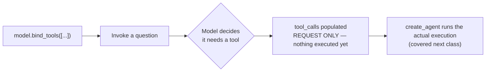
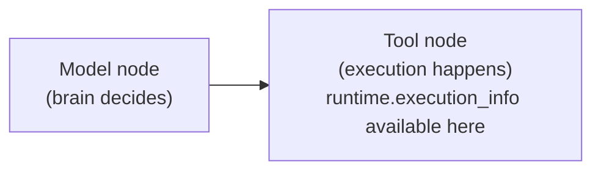
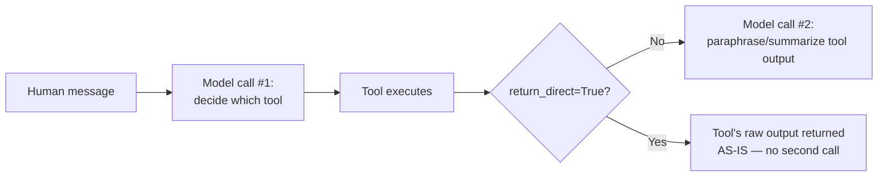

# 🛠 Tools Mastery: Runtime, Reserved Arguments, Dynamic Loading & return_direct

- <i>**Session:** Day 11 — Class 10: "LangChain-5" · 
- **Instructor:** Mayank Aggarwal
- **Note on scope:** Just like the previous session, this class opens by announcing "tools and agents" as the day's plan — but ends up being an **exhaustive, single-topic deep dive into Tools**, taught live through CineBot. Agents (and Middleware) are explicitly deferred to the next session, with only brief closing references. This guide reflects that honestly: it covers the `@tool` decorator, argument schemas, reserved argument names, server-side vs. local tools, pre-built tools, the powerful `ToolRuntime` object (state/context/store/stream), `return_direct`, and dynamic tool loading — everything actually taught — without inventing Agents content that wasn't delivered here.</i>

---

## 📑 Table of Contents

1. [Session Overview](#-session-overview)
2. [Learning Objectives](#-learning-objectives)
3. [Detailed Notes](#-detailed-notes)
   - [1. CineBot Recap: The Brain Still Has No Hands](#1-cinebot-recap-the-brain-still-has-no-hands)
   - [2. Defining a Tool: The @tool Decorator In Depth](#2-defining-a-tool-the-tool-decorator-in-depth)
   - [3. Argument Schemas: Pydantic-Backed Tool Inputs](#3-argument-schemas-pydantic-backed-tool-inputs)
   - [4. Reserved Argument Names: Why config and runtime Break Your Tool](#4-reserved-argument-names-why-config-and-runtime-break-your-tool)
   - [5. Binding vs. Execution (Recap)](#5-binding-vs-execution-recap)
   - [6. Server-Side Tools vs. Local/Custom Tools](#6-server-side-tools-vs-localcustom-tools)
   - [7. Pre-Built LangChain Tools: The Tavily Case Study](#7-pre-built-langchain-tools-the-tavily-case-study)
   - [8. ToolRuntime: Giving Tools Access to State, Context, Store & More](#8-toolruntime-giving-tools-access-to-state-context-store--more)
   - [9. A Working Example: Building Long-Term Memory with runtime.store](#9-a-working-example-building-long-term-memory-with-runtimestore)
   - [10. Execution Info & the Node-Level View of a Tool](#10-execution-info--the-node-level-view-of-a-tool)
   - [11. return_direct: Preventing Hallucination on Sensitive Tool Output](#11-return_direct-preventing-hallucination-on-sensitive-tool-output)
   - [12. Dynamic Tool Loading: The VIP-vs-Normal-User Problem](#12-dynamic-tool-loading-the-vip-vs-normal-user-problem)
4. [Glossary](#-glossary)
5. [Revision Notes — One-Minute Revision](#-revision-notes--one-minute-revision)
6. [Cheat Sheet](#-cheat-sheet)
7. [Interview Questions & Answers](#-interview-questions--answers)
8. [Scenario-Based Interview Questions](#-scenario-based-interview-questions)
9. [Hands-on Exercises](#-hands-on-exercises)
10. [Practice Assignment](#-practice-assignment)
11. [Additional Resources](#-additional-resources)
12. [Final Revision Sheet](#-final-revision-sheet)

---

## 🎯 Session Overview

Continuing directly from Day 10's structured-output deep dive, this session picks CineBot back up and asks a pointed question: our bot has a smart, structured-output-producing brain — but can it actually *do* anything? The answer is no, and this session is the fix: **Tools**, covered in genuine, practitioner-level depth. It covers:

1. Proving, live, that CineBot's brain alone hallucinates or refuses when asked something requiring real-world action or data (like real showtimes).
2. Defining tools with `@tool`, understanding what the decorator actually adds (name, description, args schema) versus a plain function.
3. Using a Pydantic model as a tool's `args_schema` — and proving, live, why this gives genuinely better validation than plain type hints.
4. A real, live-reproduced bug: **`config` and `runtime` are reserved argument names** in LangChain tools, and using them causes a runtime error — demonstrated as a real, practical gotcha.
5. Reconfirming binding vs. execution — a model can only *request* a tool call, never execute one.
6. Distinguishing **server-side tools** (like a model's own built-in web search, which never runs on your machine) from custom/local tools you define.
7. Exploring a real pre-built tool (Tavily) at the source-code level, to demystify "pre-built tools are still just functions."
8. A deep, genuinely advanced dive into **`ToolRuntime`** — giving a tool access to short-term state, context, long-term store, stream writers, and execution metadata that the model itself never sees.
9. A full working example: a tool that saves a user's movie-genre preference into a persistent store, and a second tool that recalls it — direct, hands-on long-term memory.
10. `return_direct=True` — motivated by a real, cited legal case (Air Canada's chatbot) — for tools whose output should never be paraphrased by the model.
11. **Dynamic tool loading** — the VIP-vs-normal-user problem, and why loading every tool for every user is both a cost and safety issue, demonstrated with a real, reproducible failure (a non-VIP user successfully booking a VIP seat).

> 💡 **Memory Trick — the instructor's stated philosophy for this entire session:** *"Tools are just glorified API calls, or functions. If you don't know how to write a proper function, you will never be able to create a good tool."*

---

## 🎯 Learning Objectives

By the end of this guide, you will be able to:

- [ ] Explain why CineBot's brain alone — even with structured output — cannot answer questions requiring real-world data or actions.
- [ ] Define a tool using `@tool`, and explain precisely what the decorator adds to a plain Python function (name, description, `.args`).
- [ ] Attach a Pydantic `args_schema` to a tool, and explain why this provides genuinely stronger validation than plain type hints or a JSON schema.
- [ ] Name the two reserved tool argument names (`config`, `runtime`) and explain why using them causes a runtime error.
- [ ] Re-explain, with a live-reproducible proof, why binding a tool to a model never causes that tool to actually execute.
- [ ] Distinguish server-side tools (run on the provider's infrastructure) from local/custom tools (run on your own machine).
- [ ] Read a pre-built LangChain tool's source code (e.g., Tavily) and explain that it is fundamentally "just a well-documented function."
- [ ] Use `ToolRuntime` to access `state`, `context`, `store`, and `stream_writer` from inside a tool — and build a working example that saves and recalls a user preference via `runtime.store`.
- [ ] Explain `runtime.execution_info` and its relevance for debugging, connecting it to the underlying fact that every tool is a LangGraph node.
- [ ] Configure `return_direct=True` on a tool, and explain — using a real legal case — why this matters for tools returning sensitive, exact text.
- [ ] Explain the dynamic-tool-loading problem (cost, confusion, and security risk of loading every tool for every user) with a concrete VIP-booking example.

---

## 📚 Detailed Notes

### 1. CineBot Recap: The Brain Still Has No Hands

#### 🧠 Concept

The session opens by directly demonstrating CineBot's current limitation: even with structured output configured, the underlying model is still just a brain — it has no way to access real-world data or take real-world action.

#### 💻 Code Example — The Demonstrated Failure

```python
response = model.invoke("Is Interstellar showing tonight at 7pm at Downtown Cinema?")
print(response.content)
# "I don't have access to live showtime listings. Which downtown cinema do you mean?
#  If you tell me the location, I can suggest how to check show times..."
```

Even after wrapping this in `with_structured_output(MovieShow)` (a simple `name`/`timing` schema), the model still cannot answer correctly — it either honestly declines, or worse, **hallucinates** a plausible-sounding but entirely invented showtime.

> 💡 **Memory Trick, stated directly:** *"It is limited by the brain which we have here. If the brain would know, it will give the answer. Otherwise, it will hallucinate — it will just invent anything related to, say, show timings, at any time."*

#### 🎯 Key Takeaways

* Structured output guarantees the *shape* of a response — it does nothing to guarantee the *correctness* of information the model doesn't actually have.
* A model with no real-world data access will either honestly refuse or hallucinate plausible-but-invented information — directly motivating why tools exist.

---

### 2. Defining a Tool: The @tool Decorator In Depth

#### 💻 Code Example

```python
from langchain_core.tools import tool

@tool
def check_showtimes(movie_title: str) -> str:
    """Get the showtimes for a given movie."""
    # ... real logic here, e.g., a database or API call ...
    return f"{movie_title} is showing at 7pm and 9:30pm."
```

#### 🔍 Internal Working — What the Decorator Actually Adds

| Component | Where it comes from |
|---|---|
| **Tool name** | The function's name, by default (`check_showtimes`) — overridable |
| **Description** | The function's docstring, by default — overridable |
| **Arguments (with type hints)** | The function's own parameter signature |
| **Output type** | The function's return type annotation |

> 💡 **Memory Trick, stated directly:** *"This wrapper makes sure that the function becomes 'tool-compatible' — the name becomes the tool's name, the docstring becomes the description. Whatever you want, you can interchangeably use."*

#### 💻 Code Example — Overriding Name and Description

```python
@tool("book_seats", description="Book or reserve a seat. Use whenever the customer wants to book.")
def reserve(movie: str, seats: int) -> str:
    """Reserve seats — this docstring is overridden by the explicit description above."""
    return f"Reserved {seats} seats for {movie}"
```

> 💡 **Memory Trick — why overriding matters:** *"Many times you're working on tools created by others — maybe they've already used the name `reserve` for something else in their codebase. Rather than renaming their function, LangChain lets you override the tool's exposed name and description directly at the decorator level."*

#### 🔍 Internal Working — The Docstring's Real Purpose

> ⚠️ **Explicitly emphasized:** *"This docstring goes to the AI as the description of the tool. With this docstring, your AI knows what exactly has to be done, and what not has to be done."* A vague or missing docstring directly degrades the model's ability to correctly decide when and how to use the tool.

#### ⚠ Common Mistakes

* Believing tools require some special, magic capability beyond ordinary function-writing — explicitly and repeatedly corrected: *"Whatever you could control, you could write out — that exactly is the function. Tools are just glorified API calls."*
* Writing a docstring that's too brief to actually communicate the tool's purpose — the instructor's guidance: *"Whatever can help the model understand the complete information about your function — that's how long the docstring should be. Not longer than that."*

#### 🎯 Key Takeaways

* `@tool` decorates a plain Python function, deriving its name (from the function name) and description (from the docstring) by default — both overridable.
* A tool's docstring is not documentation for humans alone — it is the literal text the model reads to decide when/how to use the tool.
* Any real capability a tool needs — a database connection, an authentication step — is written exactly as you would write it in ordinary application code; there is nothing magical about "AI tool code" versus regular functions.

---

### 3. Argument Schemas: Pydantic-Backed Tool Inputs

#### ❓ Why It Exists

A live, direct comparison proves that a Pydantic-backed `args_schema` provides genuinely stronger guarantees than plain function type hints alone.

#### 💻 Code Example

```python
from pydantic import BaseModel, Field
from typing import Literal

class SeatBookingInput(BaseModel):
    movie_title: str = Field(description="Exact movie title")
    seat_count: int = Field(description="Number of seats, must be positive", gt=0)
    preferred_row: Literal["front", "middle", "back"] = Field(default="middle")

@tool(args_schema=SeatBookingInput)
def book_seats(movie_title: str, seat_count: int, preferred_row: str) -> str:
    """Book seats for a movie."""
    return f"Booked {seat_count} seats for {movie_title} in the {preferred_row} row."
```

#### 🔍 Internal Working — Inspecting a Tool's Complete Argument Metadata

```python
print(book_seats.args)
# {'movie_title': {'description': 'Exact movie title', 'type': 'string'}, ...}
```

> 💡 **Memory Trick, demonstrated as a direct before/after proof:** *"By default, a plain function has no `.args` attribute at all — `AttributeError: 'function' object has no attribute 'args'`. The second I use the `@tool` wrapper, it has the complete details: title, description of each field, limitations, everything. That's why decorating with `@tool` is so helpful — it gives your model far more information to work with."*

#### 🔍 Internal Working — Why Pydantic Validation Beats a Plain JSON Schema

> ⚠️ **A directly demonstrated, precise distinction:** Using a plain JSON schema (`{"type": "string"}`) for a `location` field, passing an integer instead of a string produces **no error** — Python itself doesn't enforce it, and a JSON schema alone doesn't either. Using a **Pydantic** model for the same field, the same integer input **does** raise a validation error, because Pydantic performs genuine field-and-type validation, not just structural description.

#### ⚠ Common Mistakes

* Believing token cost concerns should discourage adding rich schema detail (field descriptions, constraints) — explicitly and directly addressed: *"For me, if I'm using AI, my first idea is to make sure I get the right answer. If you have to hit the model twice because it didn't understand your under-specified schema, saving 20-30 tokens on the first call was never worth it. Don't think about saving tokens — think about getting the right answer first, in as few tokens as reasonably possible."*

#### 🎯 Key Takeaways

* An `args_schema` (a Pydantic `BaseModel`) attached to a tool gives the model genuinely richer, better-validated argument information than plain function type hints alone.
* Pydantic-backed schemas perform real field/type validation; plain JSON schemas describe structure but don't enforce it the same way.
* Being generous with schema detail (descriptions, constraints) is a worthwhile token cost if it improves the odds of getting a correct answer on the first call.

---

### 4. Reserved Argument Names: Why config and runtime Break Your Tool

#### ⚠ Common Mistakes — A Real, Live-Reproduced Bug

> ⚠️ **Directly, deliberately demonstrated as a real failure:** Defining a tool with an argument literally named `config` or `runtime` does **not** raise an error at definition time — the tool appears to define successfully. The error only appears **at runtime**, when the tool is actually invoked by an agent: *"Error invoking tool `get_weather`... the following parameter names are reserved and cannot be used as a tool argument."*

```python
# This DEFINES without error, but FAILS at runtime when actually called:
@tool
def get_weather(location: str, units: str, config: str) -> str:   # 'config' is reserved!
    """Get the weather."""
    ...
```

#### 🔍 Internal Working — Why This Happens at Runtime, Not Definition Time

> 💡 **Memory Trick, directly answering a learner's "shouldn't this be a syntax error?" question:** *"LangChain is being cautious — you might use the same tool with some other framework that doesn't reserve these names, so it doesn't reject it outright at definition. Instead, it checks specifically when the tool is actually executed within LangChain's own agent system — at runtime."*

#### 🎯 Key Takeaways

* **`config`** and **`runtime`** are reserved argument names in LangChain tools — using either as a parameter name causes a **runtime** error (not a definition-time error), specifically when an agent tries to actually invoke the tool.
* This reservation exists precisely because `runtime` is the name of the special parameter (covered in Section 8) that gives a tool access to genuinely powerful, LangChain-managed information — reusing the name for an ordinary argument would create an unresolvable conflict.
* If you need an argument conceptually similar to "config" or "runtime" in your own tool, simply use a different name.

---

### 5. Binding vs. Execution (Recap)

#### 🔍 Internal Working — Reconfirmed, Live, Yet Again

> ⚠️ **Directly, repeatedly re-emphasized as the single most commonly misunderstood point across this entire course:** *"From the very first class, I've been telling you: AI can never call the tool. Agent, or you, or anyone else, will call the tool — it will never happen that AI calls a tool itself."*

```python
model_with_tools = model.bind_tools([check_showtimes, book_seats])
response = model_with_tools.invoke("Is Interstellar showing tonight?")

print(response.content)      # empty — no plain-text answer given
print(response.tool_calls)   # populated — the model's REQUEST, not an execution
```



#### 🎯 Key Takeaways

* Binding tools to a model changes what the model can *request* — it never changes what the model can *execute*.
* This distinction is explicitly flagged as a genuinely common interview trap, precisely because tools like ChatGPT and Claude are polished, complete agentic *applications* — easy to mistake for evidence that "the model itself" is doing the execution.

---

### 6. Server-Side Tools vs. Local/Custom Tools

#### 📖 Definition

> 💡 **Memory Trick, quoted directly from LangChain's documentation and reinforced live:** *"Some chat models feature built-in tools — web search, code interpreters — that are executed server-side."* These run entirely on the AI provider's own infrastructure, never on your machine.

#### 🔍 Internal Working — Proven Live

> 💡 **Memory Trick, demonstrated directly:** *"If you ask Claude to search and tell you about something, does that search run at your end? No — Claude has that functionality built in; the model's own infrastructure runs it. This is still NOT the model 'running a tool' in the sense we've been discussing — it's a built-in capability inside the model provider's own system, and it never runs on your machine."*

#### ⚖ Advantages & Limitations

| | Server-side (built-in) tools | Local/custom tools |
|---|---|---|
| Where they run | The provider's own infrastructure | Your own machine/server |
| Developer control | None — you cannot customize provider-side web search | Full — you write the logic entirely yourself |
| Relevance to this course | Not something you build or control directly | The primary focus of this entire session |

#### 🎯 Key Takeaways

* Server-side/built-in tools (like a model's native web search) run on the provider's own infrastructure — they are a real capability, but not something you as a developer build or control.
* This distinction matters mainly for correctly answering "does this tool run on my machine?" — a genuinely common point of confusion.

---
### 7. Pre-Built LangChain Tools: The Tavily Case Study

#### 📖 Definition

LangChain ships a number of **pre-built tools** — ready-made integrations (like Tavily, for web search) that you can use directly, without writing your own function.

#### 💻 Code Example

```python
from langchain_tavily import TavilySearch

search_tool = TavilySearch()   # requires TAVILY_API_KEY to be set
```

#### 🔍 Internal Working — Demystifying Pre-Built Tools via Source Code

> 💡 **Memory Trick — the instructor's explicit purpose for this exercise:** *"I'm showing you the actual LangChain backend source code for the Tavily tool, specifically so you're not afraid of these things. Look — it's a class, `TavilySearch`, with a name, description, argument schema, an `init`, and a `run` method that ultimately just calls an API wrapper. It's not scary. It's simple. You should be in the habit of doing exactly this level of investigation."*

#### 🏢 Real-World / Production Usage

> ⚠️ **A real, practical cost note:** Tavily provides 1,000 free calls, after which it becomes a paid, metered API — directly reinforcing that pre-built tools are genuinely "just glorified API calls," including their real-world billing implications.

#### ⚠ Common Mistakes

* Assuming LangChain's own tools give you unlimited, free usage — explicitly corrected live: *"LangChain is not going to give you any key that says 'use it for free.' It's based on your own key, and your own key's real, provider-set limits."*

#### 🎯 Key Takeaways

* Pre-built LangChain tools (like Tavily for web search) are genuine conveniences — but under the hood, they are exactly the same kind of well-documented function/class you'd write yourself.
* Reading a pre-built tool's actual source code is presented as a genuinely valuable, non-scary habit — directly reinforcing "tools are just glorified API calls."
* Pre-built tools carry real, provider-set usage limits and costs — LangChain itself provides no free tier of its own.

---

### 8. ToolRuntime: Giving Tools Access to State, Context, Store & More

#### ❓ Why It Exists

A genuinely advanced, real interview-differentiating topic: a tool's declared arguments are only what the *model* can see and populate. But a tool, as actual executable code, can access **far more** — via a special `runtime` parameter, typed as `ToolRuntime`.

#### 🧠 Concept — The Mirror Analogy

> 💡 **Memory Trick, given in full:** *"When you look in a mirror, you just see your own reflection — you don't see the whole world behind it. For the model, it just sees the tool's declared arguments — that's its 'reflection.' But a tool can accept a special argument called `runtime`, through which it can see the entire world behind the mirror: state, context, long-term memory, execution info, and more — none of which the model itself is ever aware exists."*

#### 💻 Code Example — Proving the Model Cannot See runtime

```python
from langchain.tools import ToolRuntime

@tool
def get_last_movie_mentioned(movie: str, runtime: ToolRuntime) -> str:
    """Get info about the last mentioned movie."""
    ...

print(get_last_movie_mentioned.args)
# Only shows 'movie' — 'runtime' is invisible to the model entirely, by design.
```

#### ⚙ How It Works — What `ToolRuntime` Actually Provides

| Component | What it gives access to |
|---|---|
| **`runtime.state`** | Short-term memory — mutable data for the current conversation (messages, counters, custom fields) |
| **`runtime.context`** | Immutable configuration passed at invocation time (e.g., whether the current user is on a paid tier) — set once, at the start |
| **`runtime.store`** | Long-term memory — persistent data surviving across conversations (saved preferences, knowledge bases) |
| **`runtime.stream_writer`** | Real-time updates during execution (e.g., "searching...", "found result...") |
| **`runtime.execution_info`** | Thread ID, run ID, attempt number — identifying/retry info for the current execution |
| **`runtime.server_info`** | Server-specific metadata, only populated when running on a LangGraph server (`None` for local development) |

> 💡 **Memory Trick, tying paid-tier product behavior directly to this mechanism:** *"Does the paid version of ChatGPT or Claude get access to more/better tools, or tools with more context? Yes. That's precisely what `runtime.context` (paid tier or not) and `runtime.store` (saved preferences) enable — a tool that's aware of who's asking, and what they've told you before, performs meaningfully better than a 'mindless' function that just gets called with arguments."*

#### 🏢 Real-World / Production Usage

> 💡 **Memory Trick — the instructor's direct answer to "why does this matter?":** *"Up till now, a function was just a tool that got called. With `runtime`, a function/tool that can access previous information, get the state, and act on it — that's when it truly becomes a tool for you. This is exactly the difference between a plain function and a genuinely intelligent, context-aware tool."*

#### ⚠ Common Mistakes

* Confusing `ToolRuntime`'s role in dynamic *tool selection* (loading fewer/more tools based on context — Section 12) with its role here (giving an *already-selected* tool access to richer information) — explicitly clarified live as two related but distinct concerns.
* Assuming this level of depth is unnecessary or "overkill" for typical tool-building — the instructor's stated professional-grade philosophy (drawing on his own Goldman Sachs interview/work experience) is that this exact depth is what genuinely differentiates strong AI engineering candidates.

#### 🎯 Key Takeaways

* A tool's model-visible arguments are only a small "reflection" of what the tool can actually access — `ToolRuntime` (a special, model-invisible parameter) unlocks state, context, long-term store, streaming, and execution metadata.
* This is what elevates a tool from "a mindless function that gets called with arguments" into a genuinely context-aware capability.
* This exact mechanism — access to prior preferences, tier/configuration awareness — is directly why paid AI products behave noticeably "smarter" than free ones in practice.

---

### 9. A Working Example: Building Long-Term Memory with runtime.store

#### 💻 Code Example — Saving a Preference

```python
from langchain.tools import ToolRuntime
from langgraph.store.memory import InMemoryStore

loyalty_store = InMemoryStore()

@tool
def save_favorite_genre(customer_id: str, genre: str, runtime: ToolRuntime) -> str:
    """Save a customer's favorite movie genre for future visits."""
    runtime.store.put(
        (customer_id, "preferences"),
        "favorite_genre",
        {"value": genre},
    )
    return f"Got it, I will remember you like {genre} movies."
```

#### 💻 Code Example — Recalling It Later

```python
@tool
def recall_favorite_genre(customer_id: str, runtime: ToolRuntime) -> str:
    """Recall a customer's favorite movie genre, if previously saved."""
    result = runtime.store.get((customer_id, "preferences"), "favorite_genre")
    if result:
        return f"Your favorite genre is {result.value['value']}."
    return "We don't have any saved preference for you yet."
```

#### 💻 Code Example — Wiring It Into an Agent

```python
from langchain.agents import create_agent

memory_agent = create_agent(
    model=model,
    tools=[save_favorite_genre, recall_favorite_genre],
    store=loyalty_store,   # attaches the store so tools can access it via runtime
)

result = memory_agent.invoke({"messages": [{"role": "user", "content": "Hi, I'm customer Priya, I love sci-fi movies."}]})
# Live-demonstrated: the agent correctly calls save_favorite_genre, and replies confirming the save.
```

#### 🔍 Internal Working — Inspecting the Raw Store

```python
for item in loyalty_store.search(()):
    print(item)
# Shows: key, value ({"favorite_genre": "sci-fi"}), created_at, updated_at, and a relevance score.
```

> 💡 **Memory Trick — a deliberate simplicity principle stated mid-demo:** *"Simple systems should avoid — or should have the least — moving parts. I could have used Redis, or saved this to a Word document, but I want my code to have the fewest possible libraries and moving pieces. This in-memory store, provided directly by LangGraph, is exactly that — a simple, no-extra-dependency dictionary-like store."*

#### ⚠ Common Mistakes

* Assuming `InMemoryStore` provides durable, production-scale persistence — explicitly, directly clarified: *"It is in the RAM. Once it restarts, everything is gone."* Real production long-term memory (e.g., via PostgreSQL) is explicitly deferred to a future, dedicated Memory session.
* Confusing `InMemorySaver` (a **checkpointing** class, for versioned conversation state — belongs to LangGraph's checkpointing system) with `InMemoryStore` (a genuine key-value **store** for arbitrary persisted data) — a real, live-committed mix-up in this session, corrected on the spot.

#### 🎯 Key Takeaways

* `runtime.store.put(...)` and `runtime.store.get(...)` let a tool save and recall arbitrary data — demonstrated end-to-end with a genuine customer-preference example.
* `InMemoryStore` (a real key-value store) is distinct from `InMemorySaver`/checkpointing (versioned conversation state) — a genuinely easy mix-up, directly modeled and corrected live.
* This exact pattern — a tool with `runtime.store` access — is presented as a real, production-relevant pattern (not just a toy demo) for building genuinely personalized, memory-aware agents.

---

### 10. Execution Info & the Node-Level View of a Tool

#### ⚙ How It Works

```python
@tool
def log_booking_context(runtime: ToolRuntime) -> str:
    """Log the current execution context for debugging."""
    info = runtime.execution_info
    return f"Run ID: {info.run_id}, Attempt: {info.attempt}"
```

#### 🔍 Internal Working — Why This Connects to LangGraph

> 💡 **Memory Trick — a genuinely important architectural insight, stated directly:** *"LangChain is built on top of LangGraph only. Even though we're not explicitly defining a graph, every tool is, underneath, just a node in that graph — first your model gets called (one node), then your tool can get called (another node). For each node, you can get information about how many times it's run, its run ID, its thread ID — and this is exactly where `runtime.execution_info` becomes useful, especially for debugging."*



#### ⚠ Common Mistakes

* Assuming `runtime.server_info` is broadly useful — explicitly clarified it's only populated when running on an actual **LangGraph server** (a separate, dedicated topic deferred to later LangGraph coverage) — it's `None` for ordinary local development.

#### 🎯 Key Takeaways

* Every LangChain tool call is, structurally, a **node** within an underlying LangGraph execution — directly explaining why `runtime.execution_info` (run ID, attempt number) exists and is genuinely useful for debugging.
* `runtime.server_info` only matters once running on a dedicated LangGraph server — not relevant to local/Colab development at this stage of the course.

---

### 11. return_direct: Preventing Hallucination on Sensitive Tool Output

#### ❓ Why It Exists

> 💡 **Memory Trick — the motivating real-world case, cited directly:** *"Air Canada was held legally liable after its chatbot gave a passenger incorrect bereavement-fare policy advice — inventing details ('you can apply for a discount within 90 days') that weren't in the actual written policy. The court ruled the company responsible: 'it is not that the company and the chatbot are different.'"*

#### 🧠 Concept

By default, a tool's raw output is fed back through the model, which then **paraphrases or reformats** it into a final answer — exactly the step that introduces the risk of the model unintentionally altering exact, sensitive, or legally significant text (like a refund policy).

#### 💻 Code Example — The Problem, Demonstrated Live

```python
@tool
def get_refund_policy() -> str:
    """Return the exact refund policy text — must be shown verbatim, never paraphrased."""
    return "We do not offer refunds. Please contact customer support for exceptions."

# Without return_direct, even with an explicit docstring instruction, the model still
# paraphrased the policy into bullet points and ADDED invented details
# ("contact customer support," "check your booking details") not present in the original text.
```

#### 💻 Code Example — The Fix

```python
@tool(return_direct=True)
def get_refund_policy() -> str:
    """Return the exact refund policy text — must be shown verbatim, never paraphrased."""
    return "We do not offer refunds. Please contact customer support for exceptions."
```

#### 🔍 Internal Working — What return_direct Actually Skips

> ⚠️ **Directly demonstrated and explained:** *"Normally, at least two LLM calls happen: one to decide which tool to call, and a second to summarize/polish the tool's output into a final answer. `return_direct=True` skips that second call entirely — the tool's raw output IS the final answer, verbatim, with no LLM 'polishing' step at all."*



#### ⚠ Common Mistakes

* Believing `temperature=0` would have prevented this hallucination — explicitly, directly corrected: *"Not really. Even with RAG, there are still chances it messes it up."* Lowering randomness reduces but does not eliminate the risk of a model altering exact text during a paraphrasing step; `return_direct` eliminates the paraphrasing step itself.
* Using `return_direct=True` for tools that genuinely need further processing/synthesis after their result — explicitly noted as inappropriate for that case, since no further model reasoning can occur after a direct-return tool executes.

#### 🎯 Key Takeaways

* By default, at least **two** model calls occur per tool-using turn: one to decide the tool call, one to synthesize the final answer from the tool's result.
* `return_direct=True` skips the second call entirely, returning the tool's exact output verbatim — directly preventing the exact class of hallucination that made Air Canada legally liable for its chatbot's invented policy details.
* This is the correct fix specifically for tools whose output is legally, factually, or otherwise sensitive to being paraphrased — not a general-purpose "save tokens" switch.

---

### 12. Dynamic Tool Loading: The VIP-vs-Normal-User Problem

#### ❓ Why It Exists — Two Real, Concrete Problems

> 💡 **Memory Trick — Problem 1, cost/confusion, demonstrated live via real Claude token counts:** *"A simple 'hi' to Claude starts around 4,169 tokens. Once tools/connectors are loaded, that can jump to 27,000+ tokens. Notably, Haiku (a smaller/cheaper model) loads ALL tools upfront regardless of need, while Sonnet, Opus, and Fable load tools only when actually required — a genuine argument for using a smarter model, since indiscriminate tool-loading is both expensive and confusing for the model."*

> ⚠️ **Problem 2, a real, live-reproduced safety failure:** the instructor deliberately defines two tools — `standard_booking` and `vip_launch_booking` — binds **both** to a single agent, and then asks, as a completely ordinary (non-VIP) user: *"Book me a VIP launch seat for June."* **The agent successfully calls the VIP tool anyway** — demonstrated live, unedited. *"Ideally, you should not have the VIP tool available from the start. It should only be loaded when a VIP user is actually present — otherwise, it's available to everyone, which is a real problem."*

#### 🔍 Internal Working — Why This Can't Simply Be "Trust the Model"

> ⚠️ **The core, repeatedly-emphasized point:** *"Can you be 100% sure the LLM will always be right? No. The model can make a mistake — and here, it did, right in front of you."* Relying purely on the model's own judgment (e.g., "the system prompt says only offer VIP booking to VIP users") is not a reliable safety mechanism on its own.

#### 🏢 Real-World / Production Usage — What Correct Behavior Looks Like

> 💡 **Memory Trick, directly observed on real Claude behavior:** *"If you try to use a tool/connector on Claude that isn't actually available to your account tier, it will tell you plainly that you cannot do it — it won't attempt and fail silently, and it certainly won't pretend the tool exists. This is a real guardrail, achieved specifically by not loading the tool in the first place for that user, not by hoping the model self-polices."*

#### ⚠ A Third, Related Problem — Dynamic Tool Discovery at Runtime

> 💡 **Memory Trick, raised as a further, genuinely advanced complication:** *"What if your agent starts with zero tools, but during execution, it connects to an MCP server and discovers new tools it didn't have at the start? Should it now be able to call those newly-discovered tools? This is a real requirement for the most capable, real-world agent systems — and it's not a straightforward, single-line-of-code problem."*

#### 🎯 Key Takeaways

* Loading every possible tool for every user, regardless of context, is both a **cost/confusion** problem (more tokens, more chances for model confusion — demonstrated via real Haiku vs. Sonnet/Opus token counts) and a genuine **security/correctness** problem (demonstrated live: a non-VIP user successfully triggering a VIP-only tool).
* Trusting the model's own judgment (via prompting alone) to avoid inappropriate tool use is not reliable — the model can and does make mistakes, as shown live.
* The correct fix is **not loading** a tool at all for users/contexts where it shouldn't be available — a guardrail enforced structurally, not just through instructions.
* This exact mechanism (`runtime.context` awareness feeding into which tools get bound/loaded) is explicitly named as the bridge to **middleware**, the next deferred topic.

---
## 📝 Glossary

| Term | Definition | Why It Matters |
|---|---|---|
| **`@tool`** | A decorator casting a plain Python function into a LangChain-compatible tool | Derives name/description from the function; overridable |
| **`args_schema`** | A Pydantic `BaseModel` attached to a tool, defining its input structure with real validation | Provides genuinely stronger validation than plain type hints or JSON schema |
| **Reserved argument names** | `config` and `runtime` — cannot be used as ordinary tool parameter names | Using them causes a runtime error, not a definition-time error |
| **Server-side tool** | A built-in model capability (e.g., native web search) executed on the provider's own infrastructure | Never runs on your machine; not something you build/control |
| **Pre-built tool** | A ready-made LangChain integration (e.g., Tavily) | Fundamentally "just a well-documented function," not magic |
| **`ToolRuntime`** | A special, model-invisible parameter giving a tool access to state, context, store, and more | The mechanism that turns a "mindless function" into a genuinely context-aware tool |
| **`runtime.state`** | Short-term memory — mutable data for the current conversation | Accessible only via `ToolRuntime`, never directly by the model |
| **`runtime.context`** | Immutable configuration set at invocation time (e.g., paid tier or not) | Enables tier/config-aware tool behavior |
| **`runtime.store`** | Long-term memory — persistent data across conversations | Demonstrated live via a customer-preference save/recall example |
| **`InMemoryStore`** | A real, RAM-based key-value store, provided by LangGraph | Not durable — lost on restart; distinct from `InMemorySaver`/checkpointing |
| **`runtime.execution_info`** | Run ID, thread ID, attempt number for the current tool execution | Directly connects to the fact that every tool is a LangGraph node |
| **`return_direct`** | A tool configuration returning the tool's raw output verbatim, skipping the model's paraphrasing step | Prevents hallucination on sensitive/exact-text tool output (e.g., legal policies) |
| **Dynamic tool loading** | Loading only the tools relevant to a given user/context, rather than all tools indiscriminately | A real cost, confusion, and security concern — demonstrated with a live VIP-booking failure |

---

## 🔄 Revision Notes — One-Minute Revision

> This session proves, live, that CineBot's smart, structured-output brain still cannot answer real-world questions or take real-world action — motivating **Tools**. A tool is defined with **`@tool`**, deriving its name and description from the function name and docstring (both overridable) — genuinely "just a glorified API call" or function, nothing magical. Attaching a Pydantic **`args_schema`** provides real, demonstrated validation benefits over plain type hints. **`config`** and **`runtime`** are **reserved argument names** — using them causes a real runtime error, live-reproduced and explained. **Binding vs. execution** is reconfirmed yet again: a model can only request a tool call, never execute one. **Server-side tools** (built-in model capabilities like web search) run on the provider's infrastructure, never your machine — distinct from the custom/local tools this session focuses on; **pre-built tools** (like Tavily, explored at the source-code level) are shown to be exactly the same kind of well-documented function you'd write yourself. The session's centerpiece: **`ToolRuntime`**, a special, model-invisible parameter (the "mirror" analogy — the model only sees its own reflection, not the world behind it) giving a tool access to `state` (short-term memory), `context` (immutable per-invocation config), `store` (long-term memory, demonstrated live with a working save/recall preference example using `runtime.store.put`/`.get`), `stream_writer` (real-time progress updates), and `execution_info` (run/thread/attempt IDs — directly tied to the fact that every tool is, underneath, a LangGraph node). **`return_direct=True`** skips the model's second, paraphrasing call entirely, returning a tool's raw output verbatim — motivated by a real, cited legal case (Air Canada's chatbot being held liable for inventing policy details during paraphrasing). Finally, **dynamic tool loading** addresses two real problems: cost/confusion (demonstrated via real token counts — Haiku loads all tools upfront; smarter models load them only as needed) and genuine security risk (live-demonstrated: a non-VIP user successfully triggering a VIP-only booking tool, proving that trusting the model's own judgment alone is not a reliable safety mechanism) — the correct fix is not loading inappropriate tools at all, a concept explicitly bridging toward **middleware**, deferred to the next session.

---

## 📋 Cheat Sheet

**Defining a tool:**
```python
from langchain_core.tools import tool

@tool("custom_name", description="Custom description overriding the docstring")
def my_function(arg: str) -> str:
    """This docstring becomes the description by default."""
    ...
```

**Pydantic args_schema:**
```python
from pydantic import BaseModel, Field

class MyInput(BaseModel):
    field: str = Field(description="...", gt=0)

@tool(args_schema=MyInput)
def my_tool(field: str) -> str: ...
```

**NEVER use these as tool argument names:**
```text
config
runtime
```

**ToolRuntime access:**
```python
from langchain.tools import ToolRuntime

@tool
def my_tool(arg: str, runtime: ToolRuntime) -> str:
    runtime.state           # short-term memory
    runtime.context          # immutable per-invocation config
    runtime.store.put(...)    # long-term memory: save
    runtime.store.get(...)     # long-term memory: recall
    runtime.stream_writer      # real-time progress updates
    runtime.execution_info     # run_id, thread_id, attempt
```

**return_direct (skip model paraphrasing):**
```python
@tool(return_direct=True)
def get_exact_policy() -> str:
    """Return exact text — must never be paraphrased."""
    return "..."
```

**Binding vs. execution — the model only ever REQUESTS:**
```python
model_with_tools = model.bind_tools([...])
response = model_with_tools.invoke("...")
response.tool_calls   # a REQUEST — nothing has been executed
```

---

## 🔥 Interview Questions & Answers

### 🟢 Beginner

**Q1. Why can't CineBot's brain alone answer a question about real movie showtimes?**
**Answer:** The model has no access to real-world, live data — it will either honestly decline or hallucinate a plausible-sounding but invented answer.
**Explanation:** Directly demonstrated live at the start of this session.
**Why This Matters:** The core motivation for tools existing at all.
**Possible Follow-up:** "Does structured output fix this problem?"

**Q2. What does the `@tool` decorator derive by default from a plain function?**
**Answer:** The tool's name (from the function name) and its description (from the docstring) — both overridable.
**Explanation:** Directly demonstrated with a live override example.
**Why This Matters:** Core, practical tool-definition knowledge.
**Possible Follow-up:** "Why might you want to override the default name?"

**Q3. Name the two reserved tool argument names in LangChain.**
**Answer:** `config` and `runtime`.
**Explanation:** Directly, live-reproduced as a real bug.
**Why This Matters:** A genuinely common, practical gotcha.
**Possible Follow-up:** "At what point does using one of these names actually cause an error?"

**Q4. Does binding a tool to a model cause that tool to be executed when the model is invoked?**
**Answer:** No — the model can only request a tool call (`response.tool_calls`); it never executes anything itself.
**Explanation:** Reconfirmed yet again, live.
**Why This Matters:** The single most repeated concept in this entire course.
**Possible Follow-up:** "What actually performs the execution?"

**Q5. Does a web search performed by ChatGPT or Claude run on your own machine?**
**Answer:** No — it's a server-side, built-in capability running entirely on the provider's own infrastructure.
**Explanation:** Directly demonstrated and explained.
**Why This Matters:** A frequently-confused distinction.
**Possible Follow-up:** "What's the difference between this and a custom tool you define yourself?"

**Q6. What does `ToolRuntime` give a tool access to that the model itself can never see?**
**Answer:** State (short-term memory), context (per-invocation config), store (long-term memory), stream writer, and execution info.
**Explanation:** The "mirror" analogy directly explains this.
**Why This Matters:** A genuinely advanced, differentiating topic.
**Possible Follow-up:** "Why is this information hidden from the model specifically?"

**Q7. What are `runtime.store.put()` and `runtime.store.get()` used for?**
**Answer:** Saving and recalling persistent, long-term data (like a user's preferences) from within a tool.
**Explanation:** Demonstrated with a full working example.
**Why This Matters:** A real, practical, production-relevant pattern.
**Possible Follow-up:** "Is InMemoryStore durable across a server restart?"

**Q8. What does `return_direct=True` do?**
**Answer:** It skips the model's second (paraphrasing/synthesis) call, returning the tool's raw output verbatim as the final answer.
**Explanation:** Motivated by a real, cited legal case.
**Why This Matters:** A concrete safety mechanism against a specific, real-world hallucination risk.
**Possible Follow-up:** "What kind of tool output is a good candidate for return_direct?"

**Q9. Why is loading every possible tool for every user a problem?**
**Answer:** It's both costly/confusing (more tokens, higher chance of model confusion) and a genuine security risk (a live demo showed a non-VIP user successfully triggering a VIP-only tool).
**Explanation:** Demonstrated with real token counts and a live security failure.
**Why This Matters:** A real, production-relevant design consideration.
**Possible Follow-up:** "What's the correct fix, according to this session?"

**Q10. What is `InMemoryStore`, and is it suitable for production long-term memory?**
**Answer:** A real, RAM-based key-value store provided by LangGraph — not durable, since all data is lost on restart; a real production system would use something like PostgreSQL instead.
**Explanation:** Explicitly clarified live.
**Why This Matters:** Prevents a common misunderstanding about persistence guarantees.
**Possible Follow-up:** "What's the difference between InMemoryStore and InMemorySaver?"

---

### 🟡 Intermediate

**Q11. Explain, precisely, why using `config` as a tool argument name fails at runtime rather than at definition time.**
**Answer:** LangChain doesn't reject the tool definition outright, since the same code might be reused with a different framework that doesn't reserve that name — instead, the reservation check happens specifically when LangChain's own agent system actually tries to invoke the tool, which is why the failure only surfaces at runtime, not when the `@tool`-decorated function is first defined.
**Explanation:** Directly answers a real learner question in this session.
**Why This Matters:** Tests precise understanding of *why*, not just *that*, this fails.
**Possible Follow-up:** "What practical debugging implication does this timing have?"

**Q12. Why does a Pydantic-backed `args_schema` catch a type mismatch (like an integer instead of a string) that a plain JSON schema does not?**
**Answer:** A plain JSON schema only *describes* the expected structure without LangChain (or Python) actually enforcing it at the point of use — passing a mismatched type simply passes through. Pydantic, by contrast, performs genuine field-and-type validation on every value, raising a real validation error when a value doesn't match its declared type.
**Explanation:** Directly, live demonstrated as a side-by-side comparison.
**Why This Matters:** Tests the ability to explain a demonstrated behavioral difference mechanistically.
**Possible Follow-up:** "Would this same distinction apply if you used Python dataclasses instead of a plain JSON schema?"

**Q13. A learner argues that adding rich field descriptions to a tool's schema wastes tokens unnecessarily. How does the instructor's philosophy directly counter this?**
**Answer:** The instructor argues that the actual cost trade-off isn't "fewer tokens vs. more tokens" — it's "a slightly larger single call that gets the right answer" vs. "a smaller call that fails and requires a second, full retry call." Since getting the correct answer on the first attempt is the actual goal, spending a modest number of extra tokens on clear field descriptions is nearly always cheaper and more reliable than saving those tokens and risking a failed, retried call.
**Explanation:** A direct, explicit philosophical stance stated in this session.
**Why This Matters:** Tests understanding of a genuine cost-reliability trade-off, not just rote recall.
**Possible Follow-up:** "Under what circumstance might minimizing schema verbosity genuinely be the right call instead?"

**Q14. Explain the mirror analogy precisely: what does the model see, and what does the tool (via runtime) see?**
**Answer:** The model only ever sees the tool's explicitly declared, non-`runtime` arguments — its own "reflection," so to speak. The tool itself, as executable code, additionally has access — via the special `ToolRuntime` parameter — to state, context, long-term store, streaming, and execution info: information that exists but is never sent to or visible by the model, "the world behind the mirror."
**Explanation:** A precise restatement of the session's core analogy for this topic.
**Why This Matters:** Tests whether a learner can explain the mechanism, not just recite the analogy.
**Possible Follow-up:** "Why is it important that the model specifically cannot see this information?"

**Q15. Using the paid-vs-free ChatGPT/Claude example, explain how `runtime.context` and `runtime.store` together explain why paid AI products often "feel smarter."**
**Answer:** `runtime.context` can carry immutable, per-invocation information like the user's account tier — letting tools behave differently (or be available at all) depending on whether the user is paid or free; `runtime.store` lets a tool persist and later recall genuine user-specific history/preferences across separate conversations. Together, these let a paid product's tools be both more capable (context-gated features) and more personalized (recalled preferences) — not because the underlying model itself is smarter, but because its surrounding tools are more informed.
**Explanation:** Synthesizes two runtime components into a coherent explanation of a real, observable product behavior.
**Why This Matters:** Tests the ability to connect abstract runtime mechanics to a concrete, familiar real-world observation.
**Possible Follow-up:** "Would this same effect be achievable purely through a more detailed system prompt, without runtime.context/store? Why or why not?"

**Q16. Why does the instructor say every tool is "just a node" in LangGraph, and why does this matter for understanding `runtime.execution_info`?**
**Answer:** Because LangChain's agent execution is built on top of LangGraph, even when you're not explicitly defining a graph yourself — every step (a model call, a tool call) corresponds to a node in an underlying graph execution. `runtime.execution_info` (run ID, thread ID, attempt number) exists specifically because each of these nodes can be individually tracked, retried, and debugged — a capability that only makes sense once you understand the underlying node-based execution model.
**Explanation:** Connects a specific runtime feature to a genuine architectural fact about LangChain's foundations.
**Why This Matters:** Reinforces the "LangChain is built on LangGraph" theme repeated across this course.
**Possible Follow-up:** "How might this node-based view help you debug a tool that seems to be running more times than expected?"

**Q17. Explain, precisely, what `return_direct=True` prevents, using the Air Canada example.**
**Answer:** By default, a tool's raw output is passed back to the model for a second, "polishing" call — and it was precisely during this polishing step that a chatbot (in the real Air Canada case) invented plausible-sounding but false additional policy details not present in the original text. `return_direct=True` eliminates this second call entirely, so the tool's exact, verified text is returned to the user completely unmodified — removing the specific mechanism (model paraphrasing) through which this exact class of legally consequential hallucination occurred.
**Explanation:** A precise mechanistic explanation tied to the specific motivating case.
**Why This Matters:** Tests whether a learner understands the causal mechanism, not just "return_direct prevents hallucination" as a slogan.
**Possible Follow-up:** "Would setting temperature to 0 have been an equally reliable fix? Why or why not, per this session?"

**Q18. Why does the instructor argue that "trust the system prompt" is not a sufficient safety mechanism for preventing a non-VIP user from booking a VIP seat?**
**Answer:** Because this was directly, live demonstrated to fail — even with tools/context that should theoretically inform the model of the user's non-VIP status, the model still incorrectly called the VIP-only tool for a non-VIP request. The model's own judgment (governed by prompting alone) is not 100% reliable, so genuine safety requires a structural mechanism (not loading the VIP tool at all for non-VIP users) rather than relying entirely on the model correctly reasoning its way to the right behavior every time.
**Explanation:** Directly reflects a real, unedited failure demonstrated in this session.
**Why This Matters:** A genuinely important lesson about the limits of prompt-based control alone.
**Possible Follow-up:** "What LangChain concept, explicitly named as the next topic, is the correct mechanism for enforcing this kind of structural restriction?"

**Q19. Why does Haiku loading all tools upfront (versus Sonnet/Opus/Fable loading tools only as needed) matter beyond just "using more tokens"?**
**Answer:** Beyond the direct token-cost difference (demonstrated live: ~4K tokens for a bare "hi" ballooning to 27K+ once tools/connectors load), indiscriminately loading every available tool also increases the model's chance of confusion — more options to reason about for every single request, even ones that clearly need none of them, directly increasing the likelihood of an incorrect tool selection (echoing the VIP-booking failure in Section 12).
**Explanation:** Connects the cost dimension and the correctness/confusion dimension of the same underlying problem.
**Why This Matters:** Tests whether a learner sees dynamic tool loading as a two-dimensional problem (cost AND correctness), not just a cost-optimization concern.
**Possible Follow-up:** "Why might a 'smarter,' more expensive model justify its cost specifically through better tool-loading behavior, not just better reasoning?"

**Q20. What genuinely advanced complication does the instructor raise regarding an agent connecting to an MCP server mid-execution, and why is it "not a straightforward, single-line-of-code problem"?**
**Answer:** If an agent starts with zero (or a limited set of) tools, but discovers new tools dynamically during execution (e.g., by connecting to an MCP server it wasn't initially bound to), the system must decide whether and how those newly-discovered tools become genuinely callable mid-conversation — a real requirement for the most capable agent systems, but one that goes beyond simply listing tools at agent-creation time, since it requires dynamically updating what the model is even aware exists partway through an ongoing interaction.
**Explanation:** A faithfully-preserved, genuinely advanced problem the instructor explicitly flags as unsolved by anything taught so far in the course.
**Why This Matters:** Tests whether a learner can recognize the boundary of what this session actually solved versus what remains a real, harder open problem.
**Possible Follow-up:** "What course topic, mentioned as upcoming, is likely to address this kind of dynamic capability discovery?"

---

### 🔴 Advanced

**Q21. Design a `ToolRuntime`-based solution to the VIP-vs-normal-user problem from Section 12 that does NOT rely on dynamic tool loading (which the session explicitly defers as a middleware topic) — using only `runtime.context` and the tool's own internal logic.**
**Answer:** Rather than avoiding binding the VIP tool at all, keep both tools bound, but have the `vip_launch_booking` tool itself check `runtime.context` for the user's tier as its very first action, and immediately return a clear refusal (e.g., "This option is only available to VIP members") if the context indicates a non-VIP user — functionally similar to a manual guard clause. This is explicitly a **weaker** mitigation than not loading the tool at all (since the model can still choose to call it, and a malicious or unusually-phrased request could still reach this check), but it demonstrates that `runtime.context` alone can provide a genuine, if imperfect, safety layer even before dynamic loading/middleware is introduced.
**Explanation:** Requires applying `runtime.context` creatively to approximate a solution the session explicitly says the *correct* fix (middleware/dynamic loading) handles better — testing whether a learner can reason about partial solutions using only currently-available primitives.
**Why Interviewers Ask This:** Tests the ability to reason about a security trade-off using an intentionally incomplete toolset, and to correctly identify that this is a WEAKER solution than the "real" fix.
**Possible Follow-up:** "Why is this context-check approach strictly weaker than not loading the tool at all?"

**Q22. Critically evaluate: "Since `return_direct=True` skips the model's paraphrasing step, it makes a tool's output completely immune to hallucination." Is this accurate?**
**Answer:** Not fully accurate. `return_direct=True` eliminates hallucination risk introduced specifically by the model's *paraphrasing* step (exactly the mechanism that caused the Air Canada incident) — but it does nothing about hallucination or errors that might exist within the tool's own logic itself. If the tool's underlying implementation contains a bug, an outdated data source, or flawed logic, `return_direct=True` will faithfully return that incorrect output verbatim, with no model-level "sanity check" opportunity to catch it. The accurate, more precise claim: `return_direct=True` eliminates one specific, real source of error (post-hoc paraphrasing hallucination) but does not validate or guarantee the correctness of the tool's own underlying implementation.
**Explanation:** Tests whether a learner over-generalizes a real, demonstrated fix into an inaccurate absolute guarantee.
**Why Interviewers Ask This:** Distinguishes candidates who track the precise scope of a fix from those who round it up to "solves hallucination entirely."
**Possible Follow-up:** "What kind of testing/validation would you add to a return_direct tool to compensate for the lack of a model-level sanity check?"

**Q23. Design a `runtime.store`-based schema for a genuinely production-realistic version of CineBot's preference system, supporting BOTH short-term (per-conversation) and long-term (cross-conversation) preferences for the same user, and explain which `runtime` component you'd use for each.**
**Answer:** Short-term, per-conversation preferences (e.g., "the user is currently browsing action movies for tonight, but hasn't said this is a permanent preference") belong in `runtime.state` — mutable, conversation-scoped data that doesn't need to survive beyond the current session. Long-term, cross-conversation preferences (e.g., "this customer has told us, across multiple past visits, that they generally prefer sci-fi") belong in `runtime.store`, keyed by a stable `customer_id`, exactly as demonstrated in Section 9 — since this needs to persist and be recalled in entirely separate future conversations. A tool designed to make a genuinely well-informed recommendation would check `runtime.state` first (immediate context) and fall back to `runtime.store` (established long-term preference) if the immediate conversation doesn't specify a preference.
**Explanation:** Requires correctly distinguishing and combining two runtime components (`state` vs. `store`) into a coherent, realistic design — genuine synthesis beyond either component alone.
**Why Interviewers Ask This:** A realistic architecture question testing whether a candidate can correctly map real requirements onto the right underlying mechanism.
**Possible Follow-up:** "What would you do if the short-term (state) and long-term (store) preferences directly conflict for the same user in the same conversation?"

**Q24. Explain precisely why the instructor's live demonstration of the reserved-argument-name bug (Section 4) is a more convincing teaching device than simply stating the rule.**
**Answer:** By deliberately, unscriptedly reproducing the exact failure live (including his own initial confusion about *why* it was failing, and the process of correctly diagnosing it), the instructor demonstrates the actual, realistic debugging experience a learner would encounter — including the fact that the tool *appears* to define successfully and only fails later, at runtime, exactly when actually invoked by an agent. This is pedagogically stronger than simply stating "don't use config or runtime as argument names," because it teaches the learner what the *symptom* of this specific bug looks like in practice (a runtime error mentioning reserved parameter names), which is directly transferable to recognizing and diagnosing the same issue independently in their own future work — versus merely memorizing an abstract rule they might not recognize when they actually encounter its real-world manifestation.
**Explanation:** Requires reflecting on pedagogical technique, not just recalling the taught fact itself.
**Why Interviewers Ask This:** Tests meta-level reasoning about effective learning/debugging habits — relevant for roles involving mentorship or documentation.
**Possible Follow-up:** "What other 'live, unscripted failure' moments in this session served a similar teaching purpose, and what did each specifically teach?"

**Q25. Synthesize Sections 8 (ToolRuntime) and 12 (dynamic tool loading) to design a coherent explanation of why `ToolRuntime`'s `context` component is described as a bridge toward middleware, the next session's topic.**
**Answer:** `ToolRuntime.context` provides immutable, per-invocation information (like a user's tier) that an *already-bound and already-executing* tool can read and act on — but Section 12 demonstrates that this alone is insufficient to prevent an *inappropriate tool from being offered to the model at all* in the first place (the live VIP-booking failure occurred despite the tools being fully defined and bound). The natural next question this directly raises — which components should even be available to bind to a given agent invocation, decided *before* the model ever sees the tool list — is precisely the kind of pre-execution, structural control that middleware (as a distinct LangChain concept, covered next) is designed to provide. In other words: `ToolRuntime.context` lets an *executing* tool behave differently based on who's asking; middleware is what would let you decide, *before execution even begins*, which tools the model is shown in the first place — a strictly earlier, and for the VIP-booking case, more appropriate point of control.
**Explanation:** Requires connecting two sections separated in the transcript into a single, coherent explanation of *why* the course's topic sequencing makes sense — genuine architectural synthesis.
**Why Interviewers Ask This:** A capstone-level question testing whether a candidate understands the relationship between runtime-level and pre-execution-level control, correctly anticipating why a framework would need both.
**Possible Follow-up:** "Predict, based on this reasoning alone, what mechanism middleware might use to decide which tools get bound to a given agent invocation."

---

## 🧪 Scenario-Based Interview Questions

> **Scenario 1:** A teammate's tool works correctly when tested in isolation, but throws a runtime error only when actually used inside a deployed agent. Using this session's concepts, walk through your diagnosis.

**Structured Answer:**
1. **Initial investigation:** Check the tool's full parameter list for any argument named `config` or `runtime` used as an ordinary (non-`ToolRuntime`-typed) parameter — directly matching this session's live-reproduced bug pattern.
2. **Metrics/logs to check:** Read the exact runtime error message — per this session, LangChain's error explicitly names "reserved parameter names" when this specific issue occurs.
3. **Possible causes:** A parameter literally named `config` or `runtime`, or (less likely but worth checking) a genuine `ToolRuntime`-typed parameter that's misconfigured or missing its correct type annotation.
4. **Debugging approach:** Reproduce the exact failure locally by directly invoking the tool through the agent (not testing the raw function alone), since this session explicitly demonstrated the bug only surfaces at that point, not at plain function definition/testing time.
5. **Resolution:** Rename the offending parameter to anything other than `config` or `runtime`.
6. **Prevention:** Add this exact check (no parameter literally named `config` or `runtime` unless properly typed as `ToolRuntime`) to a team code-review checklist or linting rule.

> **Scenario 2 (Advanced):** Your organization is building a customer support agent where certain tools should only be available to enterprise-tier customers, not free-tier ones. A teammate proposes handling this entirely within each tool's own logic (checking `runtime.context` and refusing if not enterprise-tier). Using this session's concepts, evaluate this proposal.

**Structured Answer:**
1. **Initial investigation:** Recognize this proposal is directly analogous to Advanced Q21's weaker mitigation — checking tier inside the tool's own logic, rather than not offering the tool at all to non-enterprise users.
2. **Relevant principle:** Per Section 12's live-demonstrated VIP-booking failure, relying on the model to correctly navigate toward (or away from) a tool based on logic embedded within that tool is not fully reliable — the model still has to correctly decide to call the tool in the first place, and its judgment can fail.
3. **Possible causes for the teammate's proposal:** Likely simplicity — checking within the tool avoids needing a separate, dynamic tool-binding mechanism.
4. **Debugging/evaluation approach:** Weigh the actual risk profile: for a low-stakes feature (e.g., a cosmetic "premium theme" tool), an in-tool check might be an acceptable, simpler trade-off; for a genuinely consequential feature (e.g., an enterprise-only bulk-refund tool), this session's evidence suggests it is not sufficiently reliable on its own.
5. **Resolution:** Recommend that consequential, tier-gated tools not be bound/loaded at all for ineligible users (the structurally stronger fix this session points toward, to be fully realized via middleware) — reserving simple in-tool checks only for low-stakes features where the cost of an occasional model misjudgment is genuinely tolerable.
6. **Prevention:** Establish a team policy explicitly classifying tools by consequence level, and requiring structural (not just in-tool) access control for anything above a defined risk threshold — directly modeled on this session's own VIP-booking example and its stated resolution.

---

## 🛠 Hands-on Exercises

### 🟢 Easy

1. Define a simple tool with `@tool`, then print its `.args` to confirm the decorator correctly derived argument metadata from your function's type hints.
2. Deliberately reproduce Section 4's bug: define a tool with a plain (non-`ToolRuntime`) parameter named `config`, bind it to a model, and invoke it through an agent — document the exact runtime error message you receive.
3. Attach a Pydantic `args_schema` to a tool with at least one field constraint (e.g., `gt=0`), and test it with both a valid and an invalid input, documenting the difference in behavior versus a version without the schema.

### 🟡 Medium

4. Build the full save/recall preference example from Section 9 yourself (using `runtime.store`), and verify it works correctly across two separate `invoke()` calls to the same agent within one script run.
5. Build a tool using `return_direct=True` that returns a fixed, "sensitive" piece of text (e.g., a mock terms-of-service snippet), and compare its behavior to an identical tool WITHOUT `return_direct`, asking the model to explain or summarize the result in both cases — document the difference.
6. Reproduce Section 12's VIP-booking demonstration yourself: bind both a "standard" and a "VIP-only" tool to one agent, and test whether an explicitly non-VIP-framed request can still trigger the VIP tool.

### 🔴 Advanced

7. Implement the context-check mitigation proposed in Advanced Interview Q21 (checking `runtime.context` inside the VIP tool itself) and test whether it successfully blocks the failure mode from Exercise 6 — document any remaining ways the check could still be bypassed.
8. Design and implement the short-term/long-term preference system proposed in Advanced Interview Q23, correctly using `runtime.state` for session-scoped preferences and `runtime.store` for cross-session ones, with a fallback logic tool that checks both.
9. Build a tool using `runtime.execution_info`, and deliberately invoke the same agent multiple times, logging the run ID/attempt number each time to confirm you can distinguish separate executions using this information alone.

---

## 🏗 Practice Assignment

### Build: "CineBot v3" — A Runtime-Aware, Safely-Gated Tool Suite

**Objective:** Extend CineBot with a genuinely production-minded tool suite exercising every mechanism from this session: schema validation, runtime-based memory, `return_direct`, and tier-gated tool safety.

**Requirements:**
- At least three tools defined with `@tool`, each with a proper Pydantic `args_schema`.
- One tool using `runtime.store` to save a customer preference, and a second recalling it — directly modeled on Section 9, but for a genre/actor preference of your choice.
- One tool using `return_direct=True` for a piece of text that should never be paraphrased (e.g., a mock cancellation policy), plus a demonstrated comparison against the same tool without `return_direct`.
- A VIP-tier gating mechanism using the in-tool `runtime.context` check proposed in Advanced Interview Q21, with a written note explaining why this is a weaker mitigation than not binding the tool at all (per Advanced Q25's reasoning).
- A demonstrated, deliberate reproduction of the reserved-argument-name bug (Section 4), including the exact error message received and the fix applied.

**Architecture (suggested):**

```text
cinebot_v3/
├── tools.py          # all @tool definitions with args_schema
├── memory.py           # runtime.store save/recall logic
├── agent.py              # create_agent() wiring, store attachment
├── demo.py                 # test cases: normal use, VIP gating, return_direct comparison
└── BUG_REPORT.md            # your reserved-argument-name bug reproduction + fix
```

**Expected Functionality:**
- Running `demo.py` demonstrates: a saved preference being correctly recalled in a later call; the `return_direct` tool returning text verbatim versus the non-`return_direct` version potentially altering it; and the VIP-gating tool correctly refusing a non-VIP request via its in-tool context check.

**Challenges:**
- Correctly distinguishing `InMemoryStore` from `InMemorySaver`/checkpointing when wiring up your agent (a real, live mix-up in this session).
- Writing a genuinely precise, informative docstring for each tool, directly applying Section 2's "not longer than necessary, but complete enough" guidance.

**Bonus Improvements:**
- Add a `runtime.execution_info`-based logging tool, and use it to trace exactly how many total tool/model calls a single complex user request triggers.
- Extend the VIP-gating logic to a third tier (e.g., "premium" between free and VIP), testing whether your context-check logic correctly generalizes beyond a simple binary check.

---

## 📚 Additional Resources

- **LangChain official documentation** (Tools section, including pre-built tools and runtime) — read directly, live, multiple times throughout this session, including the actual Tavily source code.
- **LangChain's GitHub repository** — directly opened live to inspect the real `TavilySearch` class implementation.
- **The Air Canada chatbot legal case** (referenced directly, real news coverage) — cited as the motivating real-world example for `return_direct`.
- **Anthropic's Claude web app** — used live to demonstrate real token-count differences between Haiku and Sonnet/Opus/Fable tool-loading behavior, and to demonstrate a tool-access refusal for an unavailable connector.

---

## 📌 Final Revision Sheet

### ⭐ Core Concepts
- Tools are "just glorified API calls" — `@tool` decorates a plain function, deriving name/description from it.
- `args_schema` (Pydantic) gives genuinely stronger validation than plain type hints.
- **`config`** and **`runtime`** are reserved argument names — using them fails at runtime, not definition time.
- Binding a tool never causes execution — the model only ever requests.
- **`ToolRuntime`** unlocks state, context, store, streaming, and execution info — invisible to the model, visible to the tool's own code.
- **`return_direct=True`** skips the model's paraphrasing call — critical for sensitive/exact-text tools.
- Dynamic tool loading (not loading inappropriate tools at all) is the correct fix for the VIP-vs-normal-user safety problem — not relying on the model's own judgment.

### ⭐ Important Definitions
- **Server-side tool**, **pre-built tool**, **`InMemoryStore`** (see Glossary for full definitions).

### ⭐ Important Commands/Code
```python
@tool(args_schema=MySchema, return_direct=True)
def my_tool(arg: str, runtime: ToolRuntime) -> str:
    runtime.store.put(...) / runtime.store.get(...)
    runtime.context / runtime.state / runtime.execution_info
```

### ⭐ Architecture/Process
- Default tool-use cycle: model decides tool → tool executes → model synthesizes final answer (2+ model calls).
- `return_direct=True` cuts this to: model decides tool → tool executes → raw output returned (1 model call + tool execution).
- Every tool call is a node in an underlying LangGraph execution — explaining `runtime.execution_info`.

### ⭐ Best Practices
- Write docstrings precise enough to fully describe the tool, no longer.
- Prefer Pydantic `args_schema` over plain type hints for genuine validation.
- Use `return_direct=True` for any tool returning legally/factually sensitive exact text.
- Don't load every tool for every user — cost, confusion, and safety all suffer.

### ⭐ Common Mistakes
- Using `config` or `runtime` as ordinary tool parameter names.
- Assuming binding a tool causes execution.
- Confusing `InMemoryStore` (a real store) with `InMemorySaver` (checkpointing).
- Trusting the model's own judgment alone to avoid inappropriate tool use.

### ⭐ Interview Points
- Be ready to explain the mirror analogy for `ToolRuntime` precisely.
- Be ready to explain, using the Air Canada case, exactly what `return_direct` prevents (and doesn't).
- Be ready to explain why dynamic tool loading is both a cost AND a safety concern, with the live VIP-booking failure as proof.
- Be ready to distinguish reserved-argument runtime errors from definition-time errors.

### ⭐ Things to Remember
- Just like Day 10, this session opened with "tools and agents" as the plan but ended up being **entirely** about Tools, in extraordinary depth. Agents and Middleware are explicitly deferred to the next session.
- The dynamic tool loading problem (Section 12) is explicitly named as the bridge to Middleware — the next topic.
- The instructor's repeated professional-grade philosophy (drawing on real Goldman Sachs interview experience) is that this exact level of depth — reserved argument names, runtime internals, dynamic loading trade-offs — is precisely what differentiates strong AI engineering candidates from those who can only say "add the `@tool` decorator and you're done."