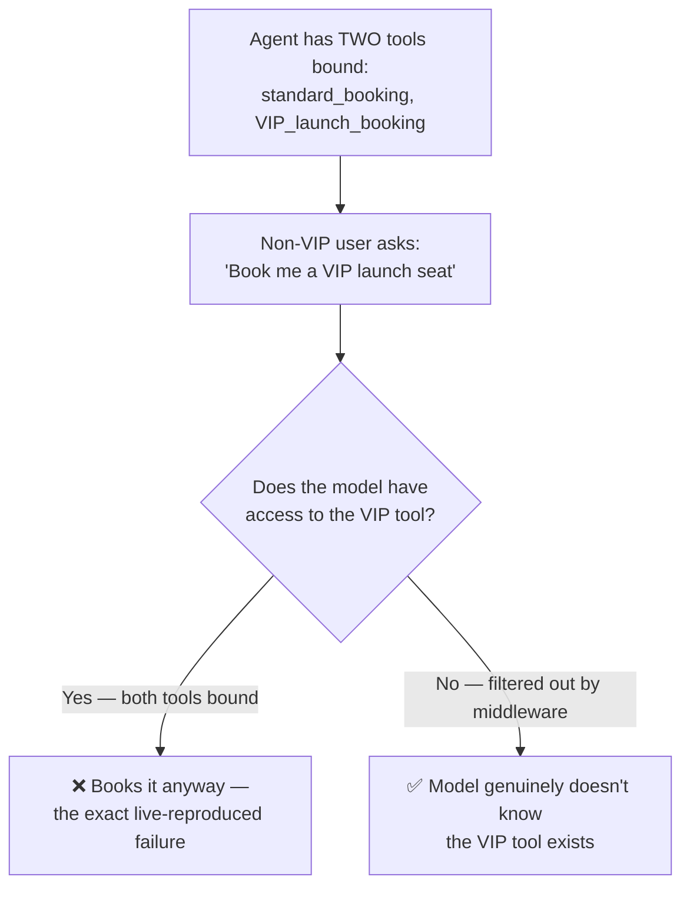
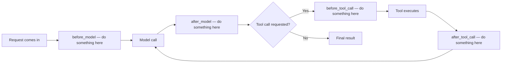
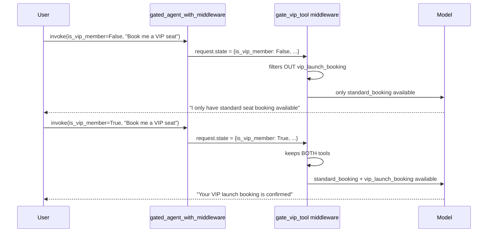
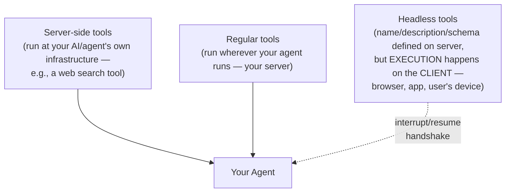
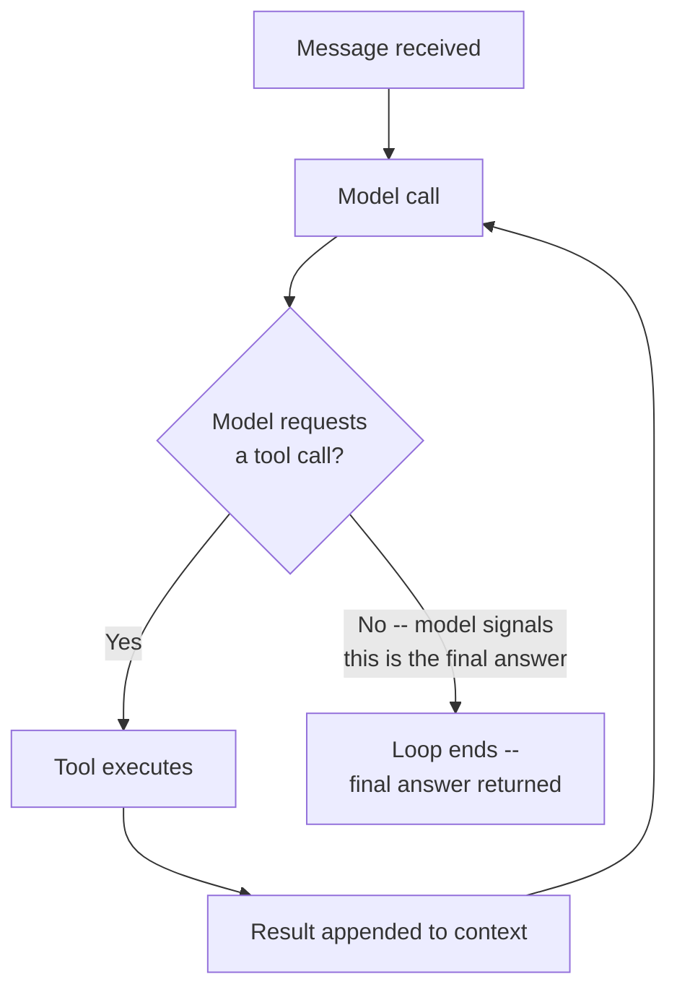

# 🧩 Middleware, Dynamic Tool Loading & Headless Tools: Controlling What an Agent Can Do

- <i>**Session:** LangChain — "Agents & Middleware" 
- **Instructor:** Mayank Aggarwal
- **Note on scope:** This class opens with an extensive, deliberate review of everything covered across the prior two sessions (structured output, tool binding, `ToolRuntime`) before delivering the genuinely new content: a full, live-coded fix for the VIP-booking dynamic tool loading problem using **middleware**, the introduction of **headless tools** (tools that execute on the user's device, not the server), and a renewed, more precise pass through the **Agentic Loop** and "Agent = Model + Harness." This guide focuses on the new material while summarizing the review efficiently, consistent with what was actually taught.</i>

---

## 📑 Table of Contents

1. [Session Overview](#-session-overview)
2. [Learning Objectives](#-learning-objectives)
3. [Detailed Notes](#-detailed-notes)
   - [1. Comprehensive Review: Structured Output & Tools, Revisited](#1-comprehensive-review-structured-output--tools-revisited)
   - [2. The Dynamic Tool Loading Problem, Revisited with a Real Example](#2-the-dynamic-tool-loading-problem-revisited-with-a-real-example)
   - [3. Middleware: The Core Concept](#3-middleware-the-core-concept)
   - [4. State-Based Middleware: Filtering Tools by Authentication](#4-state-based-middleware-filtering-tools-by-authentication)
   - [5. Store-Based Middleware: Filtering by User Context](#5-store-based-middleware-filtering-by-user-context)
   - [6. Live-Coded Fix: The Gated Agent with Middleware](#6-live-coded-fix-the-gated-agent-with-middleware)
   - [7. Headless Tools: When Execution Happens on the User's Device](#7-headless-tools-when-execution-happens-on-the-users-device)
   - [8. The Agentic Loop, Revisited with Precision](#8-the-agentic-loop-revisited-with-precision)
   - [9. Agent = Model + Harness, Revisited](#9-agent--model--harness-revisited)
4. [Glossary](#-glossary)
5. [Revision Notes — One-Minute Revision](#-revision-notes--one-minute-revision)
6. [Cheat Sheet](#-cheat-sheet)
7. [Interview Questions & Answers](#-interview-questions--answers)
8. [Scenario-Based Interview Questions](#-scenario-based-interview-questions)
9. [Hands-on Exercises](#-hands-on-exercises)
10. [Practice Assignment](#-practice-assignment)
11. [Additional Resources](#-additional-resources)
12. [Final Revision Sheet](#-final-revision-sheet)

---

## 🎯 Session Overview

This class delivers on the promise made at the end of the prior "Tools" session: a real, working fix for the VIP-booking dynamic tool loading problem, using **middleware** — live-coded, live-debugged, and explained from first principles. It covers:

1. A dense, efficient **review** of structured output (provider vs. tool strategy, `Union` schemas, automatic error retry) and tools (`@tool`, `args_schema`, reserved argument names, `ToolRuntime`) — reinforcing that this depth is what separates strong interview answers from superficial ones.
2. A **restaging of the VIP-booking failure**: a non-VIP user successfully triggering a VIP-only tool, demonstrated again live via ChatGPT's own tiered connector access as a real-world parallel.
3. **Middleware**, introduced conceptually as "cutting into the middle" of the agent's request/response cycle — before/after the model call, before/after a tool call — to filter, authenticate, or otherwise modify behavior mid-flow.
4. **State-based middleware**: filtering available tools using authentication status and message count, demonstrated via a real ChatGPT example (an unauthenticated user only gets public web search, never Gmail tools).
5. **Store-based middleware**: filtering available tools using persisted user context (feature flags, permission tiers).
6. A full, live-coded, live-debugged fix: the gated agent, wrapped in middleware, correctly withholding the VIP tool from non-VIP users and correctly granting it to VIP users — including a real bug (the state schema wasn't actually registered with the agent) diagnosed and fixed on screen.
7. **Headless tools** — a genuinely new concept: tools whose *definition* lives on the server/agent side, but whose *execution* happens on the user's own device (browser/app) — covering clipboard access, geolocation, and payment as concrete examples.
8. A renewed, more precise pass through the **Agentic Loop** (the `while` loop at every agent's core) and the **"Agent = Model + Harness"** definition, reinforcing that nothing fundamental has changed about software engineering — only that a new component (the LLM "brain") is now available to harness.

> 💡 **Memory Trick — the instructor's framing for the review-heavy opening:** *"I know that this is something you might think you should have gotten over already — why are we going in this depth? You should not think that way. Any video you pick up, people are missing this depth. I've had to learn it myself, straight from the documentation, rather than just telling you 'this is the tool' at a surface level."*

---

## 🎯 Learning Objectives

By the end of this guide, you will be able to:

- [ ] Recount, at a high level, the two structured-output strategies (provider vs. tool) and the four `ToolRuntime` components (state, context, store, execution info) from the prior sessions.
- [ ] Explain, using a real ChatGPT/connector example, why an agent should never be loaded with every possible tool upfront.
- [ ] Define middleware as code that "cuts into the middle" of an agent's request/response cycle — before/after the model call, before/after a tool call.
- [ ] Write a state-based middleware function that filters an agent's available tools based on an authentication flag stored in the agent's state.
- [ ] Explain why plain Python `if`/`else` logic cannot solve the dynamic tool loading problem, and why it requires state that only an agent (not surrounding code) can access.
- [ ] Correctly register a custom state schema with an agent so that middleware can actually read state fields like `is_vip_member`.
- [ ] Define what a "headless tool" is, and correctly identify at least three real examples (clipboard access, geolocation, payment) that must execute on the user's device, not the server.
- [ ] Explain why "Agent = Model + Harness" implies that no fundamental software engineering principle has changed — only that a new component (an LLM) is now available to harness.

---

## 📚 Detailed Notes

### 1. Comprehensive Review: Structured Output & Tools, Revisited

#### 🧠 Concept

The class opens with a rapid, dense review of everything from the prior two sessions, reinforcing recurring themes rather than introducing new material.

#### 🔍 Internal Working — Key Points Reinforced

> 💡 **Memory Trick, restated precisely:** *"A model, by itself, can never call a tool — it can only tell you which tool to call. This should be 110% clear. It holds true for every framework, not just LangChain."*

- **Structured output**: `with_structured_output()`, provider strategy vs. tool strategy, the reasoning behind ticket-limit enforcement being a **business decision** (never silently "split" an over-limit request into batches — that's a product/business call, not an engineering one).
- **Tools**: `@tool`, `args_schema`, reserved argument names (`config`, `runtime`), and `ToolRuntime`'s components (state, context, store, execution info, server info) — reinforced as directly analogous to what "makes production-grade agents" possible.
- **Pre-built tools** (like LangChain's Tavily integration) are reconfirmed as "just a function" LangChain provides — nothing more mysterious than that.

#### ⚠ Common Mistakes

* Assuming interview-relevant depth on these topics is "overkill" — directly, repeatedly rejected: this exact level of detail (naming the two structured-output strategies, explaining reserved argument names precisely) is framed as the actual differentiator in real interviews.

#### 🎯 Key Takeaways

* A model can only ever *request* a tool call — never execute one, "110% clear," across every framework.
* Business-logic decisions (like how to handle an over-limit request) are explicitly *not* engineering decisions to solve cleverly — they're product decisions to enforce as given.
* Every concept from the prior two sessions (structured output strategies, tool runtime components) remains directly relevant and is assumed as a working foundation for this session's new material.

---

### 2. The Dynamic Tool Loading Problem, Revisited with a Real Example

#### 💻 Live Demonstration — ChatGPT's Own Connector Tiers

> 💡 **Memory Trick, demonstrated live via the actual ChatGPT interface:** *"Each connector (Gmail, Slack, etc.) is genuinely just a collection of tools — the Slack connector alone has 11 tools. On the free plan, many connectors and models simply aren't available at all — this is dynamic tool/feature loading happening in a real, shipped product, right in front of you."*

#### 🧠 Concept — The Restaurant Menu Analogy

> 💡 **Memory Trick, given directly:** *"A menu that reprints itself before you sit down. A VIP member sees the full menu; a regular guest sees a shorter menu — not because they're told 'please don't order the VIP item,' but because those items simply aren't printed on their menu at all."*



#### ⚠ Common Mistakes — Two Tempting but Wrong Fixes

> ⚠️ **Directly, explicitly rejected live:** *"Why not just ask the agent to check with the user if they're VIP? Because the user will always say yes — who's going to say 'no, I'm not VIP'? Why not just remove the tool entirely when a VIP user needs it? Well, then what happens when a genuine VIP user IS using it? You still need the tool available — just conditionally, per-user."*

#### ❓ Why It Exists — Dynamic Tool Injection, Defined

> 💡 **Memory Trick, stated as a precise definition, repeated for retention:** *"With dynamic tool injection, the set of tools available to the agent is modified AT RUNTIME, rather than defined all upfront. Your Claude, when you refresh, when you run it, when you send the message — THAT is when it gets initialized with its tools, not fixed in advance."*

#### 🎯 Key Takeaways

* Real, shipped products (ChatGPT's own connector/tier system) already implement dynamic tool loading — this isn't a hypothetical, academic problem.
* Two tempting fixes — "ask the user if they're VIP" and "just remove the tool when needed" — are both explicitly, correctly rejected as inadequate.
* **Dynamic tool loading** (not "dynamic tool calling") is the precise term: the available toolset is determined at runtime, based on state/permissions/context, rather than fixed at agent creation.

---
### 3. Middleware: The Core Concept

#### 📖 Definition

> 💡 **Memory Trick, given directly:** *"Middleware means you're 'going in the middle' of things — cutting into the agent's flow to change something as it's happening, rather than only controlling everything at the very start."*



#### ❓ Why It Exists

> 💡 **Memory Trick, the core motivating question:** *"What if you want to cut in and do something — before calling the model? After calling the model? Before calling a tool? After observing a tool's result? Before returning the final answer? That's what middleware lets you do — insert logic at any of these specific points, rather than only being able to configure things once, upfront."*

#### ⚠ Common Mistakes

* Assuming middleware is a LangChain-specific novelty — explicitly connected to the same underlying concept in other ecosystems (the instructor names Spring AI/Spring Boot AI in Java as a direct parallel): *"This is a very important concept, generally, in every framework."*
* Assuming you could just write plain Python `if`/`else` logic instead of using an agent's middleware system — explicitly, precisely corrected: *"Your Python code cannot read the state your agent maintains. Plain Python logic sees a static snapshot; it cannot dynamically read message counts, authentication flags, or anything the agent itself is tracking as it runs."*

#### 🎯 Key Takeaways

* Middleware lets you insert custom logic at specific points in an agent's execution: before/after the model call, before/after a tool call.
* This is a general software-architecture pattern, not unique to LangChain or even to AI frameworks — directly parallel to middleware concepts in web frameworks like Spring.
* Plain Python code, external to the agent, **cannot** dynamically read an agent's own internal state — this is precisely why middleware (which runs *inside* the agent's execution) is required, not just avoidable via simpler code.

---

### 4. State-Based Middleware: Filtering Tools by Authentication

#### 💻 Code Example — Filtering by Authentication Status

```python
def auth_gated_middleware(request, handler):
    """Only expose 'public'-prefixed tools if the user isn't authenticated."""
    is_authenticated = request.state.get("authenticated", False)

    if not is_authenticated:
        request.tools = [t for t in request.tools if t.name.startswith("public")]
    if len(request.state.get("messages", [])) < 5:
        request.tools = [t for t in request.tools if t.name != "advanced_search"]

    return handler(request)
```

> 💡 **Memory Trick — line-by-line, as narrated live:** *"`request.state` gives me the state of my model — all the previous messages, everything the agent is currently tracking. `t for t in request.tools if t.name.startswith('public')` — I'm saying: if the user isn't authenticated, just give them tools whose names start with 'public.' Makes a lot of sense — don't give an unauthenticated user anything else."*

#### 💻 Live Demonstration — ChatGPT.com Without Login

> 💡 **Memory Trick — the real, live-tested proof:** *"Logged out, I asked ChatGPT who won the FIFA World Cup — it correctly searched the web (a public tool) and answered. But it initially answered 'Argentina' instead of the actual most recent winner, revealing it was pulling from an older context. If I ask it to send an email or connect to Gmail — no connectors are even shown, because I'm not logged in. This is exactly state-based tool filtering happening live, in a real, massive-scale product."*

#### 🏢 Real-World / Production Usage — The Cost Argument

> ⚠️ **A direct, business-relevant point:** *"ChatGPT is 'ready' with potentially 500 tools it could offer — but does that mean it should LOAD all of them into context for every single call, even for a user who can never use most of them? No — that's wasted tokens, on every single call, for every single user who will never use those tools. This is exactly the kind of unnecessary spend a manager should be catching and telling a junior engineer to cut down."*

#### 🎯 Key Takeaways

* State-based middleware reads live agent state (`request.state`) — authentication status, message count, or anything else being tracked — to decide which tools to expose on each call.
* A second, real design pattern demonstrated: limiting advanced/costly tools until a conversation reaches a certain depth (message count), not just based on identity.
* Loading every possible tool "just in case" is a real, quantifiable cost problem (wasted tokens on every call), not a theoretical concern — directly framed as something a competent engineer should actively prevent.

---

### 5. Store-Based Middleware: Filtering by User Context

#### 💻 Code Example — Filtering by Persisted Feature Flags

```python
def store_based_middleware(request, handler):
    """Filter tools based on persisted, per-user feature flags."""
    user_id = request.context.get("user_id")
    enabled_features = get_user_features(user_id)   # looked up from a persistent store

    request.tools = [t for t in request.tools if t.name in enabled_features]
    return handler(request)
```

> 💡 **Memory Trick — the distinction from state-based middleware, made precisely:** *"This time, rather than reading live conversational state, I'm reading `request.context` — specifically a user ID — and using that to look up which features/tools are enabled for this particular user from a persistent store. If you had 1,000 tools available system-wide, would you really want ALL 1,000 loading just because a user is authenticated? No — you're wrong in the design if you think that. You still filter down to only what's genuinely relevant for that specific user."*

#### ⚠ Common Mistakes

* Assuming "authenticated" alone is sufficient filtering criteria — explicitly corrected: even among fully authenticated users, further filtering (by role, feature flag, subscription tier) is still necessary; authentication and authorization/feature-access are two distinct concerns.

#### 🎯 Key Takeaways

* Store-based middleware differs from state-based middleware in *where* its filtering criteria comes from: `request.context` (persisted, per-user data, e.g., a user ID and looked-up feature flags) rather than live, in-conversation state.
* Even a fully authenticated user should typically NOT receive every tool the system has ever defined — feature/permission-based filtering remains necessary beyond simple authentication.

---
### 6. Live-Coded Fix: The Gated Agent with Middleware

#### 💻 Code Example — Two Tools, No Filtering (The Problem, Reproduced Live)

```python
from langchain.tools import tool
from langchain.agents import create_agent

@tool
def standard_booking(movie: str, seats: int) -> str:
    """Book standard seats for a movie."""
    return f"Standard booking confirmed: {movie}, {seats} seats."

@tool
def vip_launch_booking(movie: str, seats: int) -> str:
    """Book VIP launch seats for a movie — premium tier only."""
    return f"VIP launch booking confirmed: {movie}, {seats} seats."

gated_agent = create_agent(model="openai:gpt-5", tools=[standard_booking, vip_launch_booking])

# Live-reproduced failure: a "regular" user successfully books the VIP tool
result = gated_agent.invoke({"messages": [{"role": "user", "content": "Book me a VIP launch seat for Dune"}]})
# ❌ Live result: succeeds — the agent has NO way to know this user shouldn't have access
```

> ⚠️ **Directly, explicitly confirmed live:** *"There is genuinely no way, as this agent is currently defined, for it to filter out the VIP tool. If you give it two tools, it will just work with both — a regular user CAN book a VIP launch seat, exactly as we saw in the last class."*

#### 💻 Code Example — Adding the Middleware Fix

```python
def gate_vip_tool(request, handler):
    """Only expose vip_launch_booking to users whose state says they're VIP."""
    is_vip = request.state.get("is_vip_member", False)
    if not is_vip:
        request.tools = [t for t in request.tools if t.name != "vip_launch_booking"]
    return handler(request)

gated_agent_with_middleware = create_agent(
    model="openai:gpt-5",
    tools=[standard_booking, vip_launch_booking],
    middleware=[gate_vip_tool],
)
```

#### ⚠ Common Mistakes — A Real, Live-Debugged Bug

> ⚠️ **Directly, honestly reproduced live:** *"I passed `is_vip_member=True` into the agent's invocation, and it STILL failed to recognize the user as VIP — even the middleware's `request.state.get('is_vip_member', False)` kept returning `False`. The reason: I never actually told the agent, via a formal state schema, that `is_vip_member` was a field it should track and maintain. Passing the value alone isn't enough — the agent needs to be explicitly told, via a schema, that this is a real state field it's responsible for carrying."*

#### 💻 Code Example — The Actual Fix: Registering a Custom State Schema

```python
from langchain.agents import AgentState
from typing import TypedDict

class GatedAgentState(AgentState):
    is_vip_member: bool

gated_agent_with_middleware = create_agent(
    model="openai:gpt-5",
    tools=[standard_booking, vip_launch_booking],
    middleware=[gate_vip_tool],
    state_schema=GatedAgentState,
)

# Now this correctly works:
result = gated_agent_with_middleware.invoke({
    "messages": [{"role": "user", "content": "Book me a VIP launch seat for Dune"}],
    "is_vip_member": True,
})
```

> 💡 **Memory Trick, the precise fix explained:** *"Your agent maintains a state — which normally just holds messages and metadata. I have to explicitly tell my agent: 'you will ALSO maintain this field, `is_vip_member`, which I can pass to you.' Once that schema is registered, the value genuinely flows through — into the middleware, into the state, everywhere it's needed."*

#### 🪜 Step-by-Step — The Fully Verified, Working Behavior



#### 🎯 Key Takeaways

* Middleware alone is not sufficient — the state field it filters on (`is_vip_member`) must be **explicitly registered** via a custom state schema (extending `AgentState`), or the agent has no formal awareness it should track and pass through that field.
* This exact bug (middleware logic correct, but the underlying state field never registered) is presented as a genuinely common, realistic mistake — not an edge case.
* Once correctly wired, the same agent definition produces genuinely different tool availability at runtime, purely based on a per-invocation state value — this is dynamic tool loading, fully working.

---

### 7. Headless Tools: When Execution Happens on the User's Device

#### 📖 Definition

> 💡 **Memory Trick — the core distinguishing question, given directly:** *"If you have to access the user's clipboard, does that execution happen at your server's end, or at the user's own machine? If you have to get the user's location, does the browser ask you directly, or does it ask the user's device?"* A **headless tool** is defined and described on the server (name, description, argument schema — exactly like any other tool), but its actual **implementation runs on the client** (typically a browser), only after a short interrupt/resume handshake with the server.

#### ⚙ How It Works — Three Components, Visualized



#### 🔍 Internal Working — Why Certain Tools MUST Be Headless

> 💡 **Memory Trick, with three concrete, real examples given directly:** *"Payment: does that happen at your end, or the user's? Clipboard access: your machine, or the user's? Keyboard/location access: same question. All of these must run at the CLIENT level — not because of some AI-specific rule, but because of basic, ordinary software constraints: your server physically cannot read a user's clipboard, get their live GPS location, or process a payment method that only exists on their device."*

- **Real examples named directly:** browser APIs, geolocation, IndexedDB, Canvas, clipboard access.
- **Privacy/latency benefit, stated directly:** *"Data stays on the device — local memory, HTTP — this is a genuine front-end pattern, with real privacy and latency advantages, not just a technical necessity."*

#### 🏢 Real-World / Production Usage — Concrete, Named Examples

> 💡 **Memory Trick, directly walked through:** *"When you ask ChatGPT to use your location, the browser — not ChatGPT's own servers — asks you for permission and captures it, then sends it back to the application. Same when Amazon needs your location or clipboard: it cannot run that at Amazon's own US-based servers; it must run in your own browser, on your own device, then be sent back."*

#### ⚠ Common Mistakes

* Treating headless tools as an AI-specific or LangChain-specific novelty — explicitly reframed: *"This is a normal, ordinary software engineering concept — not related to AI specifically — but because your agent needs to be able to USE these things, understanding it becomes required knowledge for building real agentic applications."*

#### 🎯 Key Takeaways

* A **headless tool**'s definition (name, description, schema) lives with the agent/server, but its actual execution happens on the **client** (browser/app) — for anything the server physically cannot access (clipboard, live location, payment).
* This is a general software-engineering pattern, not a new AI concept — the AI-specific part is simply that an agent now needs to be *aware* such tools exist and can request them.
* Real products (ChatGPT, Amazon) already implement this exact pattern for location and clipboard access — directly observable, not hypothetical.

---
### 8. The Agentic Loop, Revisited with Precision

#### 🧠 Concept

> 💡 **Memory Trick, restated with fresh precision:** *"At the core of every agent is this Agentic Loop — effectively, internally, it's maintaining something like a `while` loop, because it keeps running until it finishes the job. Receive message → request a tool call (if needed) → execute the tool → append the result → repeat — until the model itself signals it has a final answer."*



#### 🔍 Internal Working -- How the Loop Knows to Stop

> ⚠️ **A precise clarification, directly addressing a common misconception:** *"Is the final answer based on whether a tool was called or not? No -- that's not the condition. The model itself signals a reason for stopping: 'I want to ask the user something,' or 'I feel I've done everything, this should be good now.' The loop's exit condition is the model's own stated completion signal, not simply 'no more tool calls happened.'"*

#### ⚠ Common Mistakes

* Assuming "ReAct pattern" and "Agentic Loop" are meaningfully different concepts requiring separate study -- explicitly clarified: *"You can call it the ReAct pattern if you want -- reason, act, again -- but 'Agentic Loop' is honestly the better, clearer term for the same underlying mechanism."*
* Assuming a model reliably produces the correct final answer on its first attempt -- explicitly rejected: *"How would any agent guarantee that? It's not possible for every case -- that's exactly why the loop exists at all, to allow multiple attempts/steps rather than requiring perfection in one shot."*

#### 🎯 Key Takeaways

* The Agentic Loop's exit condition is the **model's own signaled completion**, not simply "ran out of tool calls" -- a precise, frequently-misunderstood detail.
* "ReAct pattern" and "Agentic Loop" describe the same underlying mechanism -- the instructor's stated preference is for "Agentic Loop" as the clearer term.
* The loop exists specifically because no model can be guaranteed to produce a correct final answer in a single attempt -- multi-step iteration is the point, not a workaround.

---

### 9. Agent = Model + Harness, Revisited

#### 📖 Definition

> 💡 **Memory Trick, restated with the session's clearest framing yet:** *"What has actually changed in software engineering over the last 4-5 years? Genuinely -- nothing else. We have simply gained access to a new component: an artificial brain, an LLM. Everything else -- loops, state, tools, APIs -- is exactly the same software engineering it always was. The only new thing is this model; everything else is how well we can HARNESS it."*

#### 🎯 Key Takeaways

* "Agent = Model + Harness" is reframed here with maximum clarity: the LLM ("brain") is the singular genuinely new ingredient of the last several years; every other technique (loops, state management, middleware, tool design) is ordinary, pre-existing software engineering, now applied *around* that new ingredient.
* This reframing directly explains why this entire course invests so heavily in fundamentals (Python, OOP, error handling, Pydantic) before ever reaching "AI-specific" material -- because most of what makes a production agent good is *not* AI-specific at all.

---

## 📝 Glossary

| Term | Definition | Why It Matters |
|---|---|---|
| **Middleware** | Code that intercepts and modifies an agent's execution at specific points (before/after model call, before/after tool call) | The mechanism enabling dynamic tool loading and other runtime-conditional behavior |
| **Dynamic Tool Injection / Loading** | Modifying an agent's available toolset at runtime, rather than fixing it at creation time | Solves the VIP-booking problem and matches real products like ChatGPT's connector tiers |
| **`request.state`** | Live, in-conversation agent state accessible inside middleware | Used for authentication-status or message-count-based tool filtering |
| **`request.context`** | Persisted, per-user data (e.g., a user ID) accessible inside middleware | Used for feature-flag/permission-based tool filtering, distinct from live conversational state |
| **State Schema** | A formal declaration (extending `AgentState`) of which fields an agent tracks and passes through | Required for middleware to actually read custom fields like `is_vip_member` -- passing a value alone isn't sufficient |
| **Headless Tool** | A tool whose definition lives on the server, but whose execution happens on the client (browser/device) | Required for anything the server cannot physically access: clipboard, live location, payment |
| **Interrupt/Resume Handshake** | The mechanism by which a headless tool's execution is handed off to the client and its result returned | The technical process underlying headless tool execution |
| **Agentic Loop** | The core `while`-loop-like mechanism at the heart of every agent: call model, execute tool if requested, repeat until the model signals completion | The exit condition is the model's own completion signal, not simply "no more tool calls" |

---

## 🔄 Revision Notes — One-Minute Revision

* This session opens with a dense **review** of structured output (provider vs. tool strategy) and tools (`@tool`, `args_schema`, reserved arguments, `ToolRuntime`) -- reinforcing that this exact depth is what differentiates strong interview answers.
* The **dynamic tool loading problem** (a non-VIP user successfully booking a VIP-only seat) is restaged, with real proof from ChatGPT's own connector-tier system, and two tempting-but-wrong fixes ("ask the user if they're VIP," "just remove the tool when needed") are explicitly rejected.
* **Middleware** is defined as code that "cuts into the middle" of an agent's execution -- before/after the model call, before/after a tool call -- a general software pattern (directly paralleled to Spring AI in Java), not a LangChain-specific novelty.
* **State-based middleware** filters tools using live `request.state` (e.g., authentication status, message count) -- demonstrated live via ChatGPT.com logged out, correctly restricting to public tools only.
* **Store-based middleware** filters tools using `request.context` (persisted, per-user data like feature flags) -- a distinct filtering source from live conversational state.
* The full, live-coded fix for the VIP-booking problem required **two things together**: the middleware function itself, AND a custom **state schema** (extending `AgentState`) explicitly registering `is_vip_member` as a field the agent tracks -- a real, live-debugged bug occurred specifically because this registration step was initially skipped.
* **Headless tools** are a genuinely new concept: their *definition* (name, description, schema) lives on the server, but their *execution* happens on the **client** (browser/device) -- required for clipboard access, live geolocation, and payment, none of which a server can physically perform on the user's behalf.
* The **Agentic Loop** was revisited with precision: its exit condition is the **model's own signaled completion**, not simply "no more tool calls happened" -- and "ReAct pattern" and "Agentic Loop" describe the same underlying mechanism.
* **"Agent = Model + Harness"** was reframed at its clearest yet: the LLM is the one genuinely new ingredient of the last several years; everything else (loops, state, middleware, tool design) is ordinary, pre-existing software engineering now applied around it.

---

## 📋 Cheat Sheet

**Middleware intercept points:**
```text
before_model -> Model call -> after_model
before_tool_call -> Tool executes -> after_tool_call
```

**State-based vs. store-based middleware:**
```text
request.state    -> live, in-conversation data (auth flag, message count)
request.context  -> persisted, per-user data (user ID -> looked-up feature flags)
```

**The two-part fix for dynamic tool loading:**
```python
def gate_vip_tool(request, handler):
    if not request.state.get("is_vip_member", False):
        request.tools = [t for t in request.tools if t.name != "vip_launch_booking"]
    return handler(request)

class GatedAgentState(AgentState):
    is_vip_member: bool   # MUST be registered, or middleware reads a value that's never tracked

agent = create_agent(model=..., tools=[...], middleware=[gate_vip_tool], state_schema=GatedAgentState)
```

**Three tool execution locations:**
```text
Server-side tools -> run on the AI provider's own infrastructure (e.g., built-in web search)
Regular tools      -> run wherever your agent/backend runs
Headless tools      -> DEFINED on server, EXECUTED on the client (clipboard, location, payment)
```

**Agentic Loop exit condition:**
```text
NOT: "no more tool calls happened"
YES: "the model itself signals it has a final answer"
```

**"Agent = Model + Harness":** the model (LLM) is the only genuinely new ingredient; everything else is ordinary software engineering.

---

## 🔥 Interview Questions & Answers

### 🟢 Beginner

**Q1.**

**Question:** What does "middleware" mean in the context of an agent?

**Answer:** Code that intercepts and modifies an agent's execution at specific points -- before/after the model call, before/after a tool call.

**Explanation:** Directly, precisely defined via the "cutting into the middle" framing.

**Why Interviewers Ask This:** Core, frequently-tested LangChain vocabulary.

**Possible Follow-up:** "Name the four intercept points middleware can hook into."

**Q2.**

**Question:** Why can't plain Python `if`/`else` code solve the dynamic tool loading problem?

**Answer:** Plain Python code external to the agent cannot dynamically read the agent's own live state (message counts, authentication flags) -- only middleware running inside the agent's execution can.

**Explanation:** Directly, explicitly corrected in response to a live learner question.

**Why Interviewers Ask This:** Tests understanding of why middleware is architecturally necessary, not just convenient.

**Possible Follow-up:** "What specifically does an agent's 'state' contain that plain code can't access?"

**Q3.**

**Question:** What's the difference between `request.state` and `request.context` in middleware?

**Answer:** `request.state` is live, in-conversation data (e.g., authentication status, message count); `request.context` is persisted, per-user data (e.g., a user ID used to look up feature flags).

**Explanation:** Precisely distinguished via two separate, named middleware examples.

**Why Interviewers Ask This:** A precise, testable distinction.

**Possible Follow-up:** "Which one would you use to filter tools based on a subscription tier stored in a database?"

**Q4.**

**Question:** What is a headless tool?

**Answer:** A tool whose definition (name, description, schema) lives on the server/agent, but whose actual execution happens on the client (browser/device).

**Explanation:** Directly defined, with clipboard/location/payment as concrete examples.

**Why Interviewers Ask This:** A genuinely new, practically important concept for real agentic applications.

**Possible Follow-up:** "Name two real examples of a headless tool."

**Q5.**

**Question:** Why must clipboard access, geolocation, and payment be handled as headless tools?

**Answer:** A server physically cannot read a user's clipboard, get their live GPS location, or access a payment method that only exists on their device -- these can only execute at the client level.

**Explanation:** Directly, explicitly reasoned through with real examples (ChatGPT, Amazon).

**Why Interviewers Ask This:** Tests understanding of the underlying technical necessity, not just the definition.

**Possible Follow-up:** "Is this concept specific to AI, or does it apply to ordinary web/app development too?"

**Q6.**

**Question:** What actually determines when the Agentic Loop stops?

**Answer:** The model's own signaled completion -- not simply "no more tool calls happened."

**Explanation:** A precise correction of a common misconception, directly stated.

**Why Interviewers Ask This:** Tests precise understanding of the loop's actual exit condition.

**Possible Follow-up:** "Give an example of a reason a model might signal completion without any tool having been called."

**Q7.**

**Question:** In the VIP-booking middleware fix, why did passing `is_vip_member=True` initially fail to work?

**Answer:** The field was never registered via a formal state schema -- the agent had no awareness it should track and pass through that field, even though the value was being passed in.

**Explanation:** A real, live-debugged bug, directly explained.

**Why Interviewers Ask This:** Tests understanding that middleware alone isn't sufficient -- the underlying state schema must also be registered.

**Possible Follow-up:** "What class do you extend to define a custom state schema?"

**Q8.**

**Question:** What does "Agent = Model + Harness" mean, in this session's clearest restatement?

**Answer:** The LLM (model) is the one genuinely new ingredient added to software engineering in recent years; everything else (loops, state, tools, middleware) is ordinary, pre-existing software engineering now applied around it.

**Explanation:** Directly, precisely restated in this session.

**Why Interviewers Ask This:** Reinforces the course's foundational framing.

**Possible Follow-up:** "Why does this framing explain the course's heavy investment in fundamentals like OOP and error handling?"

**Q9.**

**Question:** Why shouldn't an agent be loaded with every possible tool it might ever need, upfront?

**Answer:** It wastes tokens on every single call for tools most users will never use, and increases the chance of the model selecting an inappropriate tool.

**Explanation:** Directly demonstrated via a real, live token-cost argument.

**Why Interviewers Ask This:** A practical, cost-relevant design principle.

**Possible Follow-up:** "Name a real, shipped product that implements exactly this kind of restriction."

**Q10.**

**Question:** What is store-based middleware used for, and how does it differ from state-based middleware?

**Answer:** It filters tools using persisted, per-user data (like feature flags looked up via a user ID from `request.context`), as opposed to state-based middleware, which uses live, in-conversation data.

**Explanation:** Precisely distinguished in the session.

**Why Interviewers Ask This:** Tests the specific, correct use case for each middleware type.

**Possible Follow-up:** "Give a real scenario where you'd need BOTH state-based and store-based middleware together."

---

### 🟡 Intermediate

**Q11.**

**Question:** Explain, precisely, why the two "tempting but wrong" fixes for the VIP-booking problem ("ask the user" and "remove the tool entirely") both fail.

**Answer:** "Ask the user if they're VIP" fails because the user will always claim yes -- self-reported identity claims provide no real access control. "Remove the tool entirely" fails because it doesn't account for genuine VIP users who legitimately need access -- the tool must remain conditionally available, not globally absent. Both fixes attempt to solve a per-user, runtime-conditional problem with a static, all-or-nothing solution, which is precisely why dynamic tool loading (conditional per invocation, based on actual state) is required instead.

**Explanation:** Directly, explicitly reasoned through live for both proposed "fixes."

**Why Interviewers Ask This:** Tests whether a learner understands *why* two intuitive-seeming solutions are both structurally inadequate, not just that they are.

**Possible Follow-up:** "Design a THIRD tempting-but-wrong fix, and explain why it would also fail."

**Q12.**

**Question:** A learner asks why middleware is described as a "general software pattern" rather than an AI-specific concept. Defend this claim using this session's content.

**Answer:** The instructor explicitly draws a direct parallel to Spring AI/Spring Boot in Java -- a non-AI, general web-framework ecosystem that implements the same underlying pattern (intercepting and modifying request/response flow at specific points). This demonstrates middleware, as a concept, predates and exists independently of AI/LLM frameworks; LangChain's implementation is a specific application of a well-established general pattern to the specific problem of agent tool/behavior control, not something newly invented for AI.

**Explanation:** Directly reflects the instructor's own stated cross-ecosystem comparison.

**Why Interviewers Ask This:** Tests whether a learner can correctly place a "new" AI concept within a broader, pre-existing software engineering context.

**Possible Follow-up:** "Name another general software pattern this course has connected to an 'AI-specific' concept in a prior session."

**Q13.**

**Question:** Explain the precise causal chain of the real middleware bug demonstrated live: why did the agent fail to recognize `is_vip_member=True` even though it was correctly passed at invocation time?

**Answer:** The middleware function's logic (`request.state.get("is_vip_member", False)`) was itself correct -- but the agent had no formal schema declaring `is_vip_member` as a tracked state field. Without this registration, the value passed at invocation time either wasn't properly persisted into the agent's actual internal state representation, or the middleware's `.get()` call couldn't reliably find it -- either way, the default (`False`) was returned regardless of what was actually passed in. The fix required extending `AgentState` with an explicit `is_vip_member: bool` field and passing that schema to `create_agent()` via `state_schema` -- only then did the passed value genuinely flow through to where the middleware could read it correctly.

**Explanation:** Requires precisely reconstructing the causal chain of a real, live-debugged bug, not just stating "it was a schema issue."

**Why Interviewers Ask This:** Tests deep, mechanistic understanding of a genuinely subtle, realistic bug -- exactly the kind of debugging skill real production work requires.

**Possible Follow-up:** "How would you have diagnosed this bug systematically, without already knowing the fix?"

**Q14.**

**Question:** Explain why the instructor considers "nothing else has changed in software engineering, only the model is new" to be a meaningful, non-trivial claim, rather than an oversimplification.

**Answer:** The claim is meaningful because it directly counters a common misconception that "AI engineering" requires learning an entirely new discipline from scratch -- instead, it reframes agent-building as applying well-established software engineering practices (state management, loops, middleware, error handling, modular design) to a new component (an LLM). This directly explains why this entire course spends so much time on Python fundamentals, OOP, Pydantic, and error handling before "AI-specific" content -- because most of what makes an agent genuinely production-grade is ordinary software engineering discipline, with the LLM itself being only one part of the picture.

**Explanation:** Requires connecting this specific restatement to the broader, repeated pedagogical philosophy of the entire course series.

**Why Interviewers Ask This:** Tests whether a learner sees this as a substantive architectural claim, not just a rhetorical flourish.

**Possible Follow-up:** "Give a concrete example, from this session, of 'ordinary software engineering' being what actually solved a problem, rather than the AI model itself."

**Q15.**

**Question:** Why does the instructor say the Agentic Loop's exit condition is NOT simply "no more tool calls happened"?

**Answer:** Because a model can validly signal completion for reasons entirely unrelated to tool-calling exhaustion -- e.g., deciding it needs to ask the user a clarifying question, or judging (based on its own reasoning) that it has sufficient information to answer, even mid-conversation. Treating "no tool calls" as the sole completion signal would incorrectly assume every agent interaction must end in a tool-driven resolution, when many valid interactions (conversational responses, clarifying questions) never call a tool at all, or call one and then still require further reasoning before concluding.

**Explanation:** A precise correction of a plausible-but-incorrect simplification.

**Why Interviewers Ask This:** Tests whether a learner tracks precise mechanistic detail rather than a rough approximation.

**Possible Follow-up:** "Design a scenario where a model would validly end the loop having never called any tool at all."

---

### 🔴 Advanced

**Q16.**

**Question:** Design a middleware chain (multiple middleware functions applied together) that combines state-based authentication filtering, store-based feature-flag filtering, AND the VIP-tool gating from this session's live example -- specifying the correct order of application and justifying it.

**Answer:** Apply middleware in order of increasing specificity/cost: (1) **authentication filtering first** (state-based) -- the cheapest, most fundamental check; an unauthenticated user should never even reach feature-flag or VIP logic, since they have no legitimate tools beyond `public`-prefixed ones regardless of any other criteria; (2) **feature-flag filtering second** (store-based) -- for authenticated users, narrow the toolset further based on their persisted, per-user enabled features (a broader, more general filtering layer than VIP-specific logic); (3) **VIP-tool gating last** (this session's specific state-based example) -- a narrow, specific override applied only to the already-narrowed toolset from steps 1-2, since VIP status is a specific instance of the broader "feature access" concept, best applied as a final, precise refinement rather than the first, broadest filter. This ordering ensures cheap, foundational checks run first (fail fast for unauthenticated users) and increasingly specific checks run last, minimizing wasted computation on users who'd be filtered out by an earlier, cheaper check anyway.

**Explanation:** Requires synthesizing all three middleware examples from this session (state/auth, store/feature-flag, state/VIP) into one coherent, ordered chain -- genuine architectural design beyond any single example given live.

**Why Interviewers Ask This:** A realistic, senior-level middleware-architecture question testing whether a candidate can reason about ordering/composition of multiple filtering layers, not just implement one in isolation.

**Possible Follow-up:** "What would go wrong if you applied the VIP-tool gating middleware BEFORE the authentication check?"

**Q17.**

**Question:** Critically evaluate: "Since headless tools execute entirely on the client, they don't need to be defined or described on the server at all -- the client can just handle them independently." Is this accurate?

**Answer:** Not accurate. The session explicitly states a headless tool's *definition* -- name, description, and argument schema -- is registered on the server, alongside every other tool the agent knows about; only the *implementation/execution* happens on the client, after an interrupt/resume handshake. This is necessary because the model (running server-side, or via a server-orchestrated call) needs to know a headless tool exists and what arguments it takes in order to correctly *decide* to request it in the first place -- exactly the same "model can only request, never execute" principle established for ordinary tools throughout this entire course. If the definition existed only client-side with no server awareness, the model would have no way to know the tool exists at all, making it impossible to ever request. The accurate framing: headless tools split *definition* (server) from *execution* (client) -- they don't eliminate the server's role entirely.

**Explanation:** Tests whether a learner over-generalizes "runs on the client" into "the server doesn't need to know about it at all," incorrectly extending the client/server split further than the session actually describes.

**Why Interviewers Ask This:** Distinguishes candidates who track the precise architectural split from those who round it off into an oversimplified, structurally incorrect claim.

**Possible Follow-up:** "What specific handshake mechanism does the session name for coordinating between the server's request and the client's execution?"

**Q18.**

**Question:** Synthesize this session's "Agent = Model + Harness" reframing with its middleware content to explain precisely where middleware fits within "the harness."

**Answer:** Per the session's own framing, the model (LLM) is the sole genuinely new ingredient; "harness" encompasses everything else surrounding it -- and middleware is specifically the part of the harness responsible for **runtime-conditional control**: deciding, dynamically, what the model is even allowed to see or do on any given call (which tools, based on live state or persisted context), as distinct from other harness components like tool definitions themselves (what capabilities exist at all) or the agentic loop (how many steps/iterations are allowed). In this framing, middleware is not a separate, bolted-on feature but a natural, necessary component of "harnessing" a model well -- specifically the component that prevents a powerful, capable model from being given more access or capability than a given user/context should actually receive, directly connecting back to the VIP-booking security failure that motivated this entire topic.

**Explanation:** Requires connecting two conceptually separate threads from this session (the harness reframing and middleware's specific function) into one coherent architectural placement -- genuine synthesis.

**Why Interviewers Ask This:** A capstone-level conceptual question testing whether a candidate can place a specific technique (middleware) within a broader stated architectural philosophy (Agent = Model + Harness), rather than treating them as unrelated facts.

**Possible Follow-up:** "Where would you place 'tool definition' and 'the agentic loop itself' within this same harness framing -- are they the same kind of harness component as middleware, or different?"

---

## 🧪 Scenario-Based Interview Questions

> **Scenario 1:** A teammate's middleware correctly filters tools for authenticated vs. unauthenticated users, but a QA tester reports that a specific authenticated, non-VIP user was still able to trigger a VIP-only tool. Using this session's concepts, walk through your diagnosis.

**Structured Answer:**
1. **Initial investigation:** Confirm whether this specific bug matches the exact live-demonstrated failure pattern from Section 6 -- check whether the VIP-gating middleware's underlying state field (`is_vip_member` or equivalent) is actually registered via a formal state schema, not just referenced in the middleware function's logic.
2. **Metrics/logs to check:** Log the actual value `request.state.get("is_vip_member", False)` returns for this specific user's request, comparing it against what should have been passed at invocation time.
3. **Possible causes:** Most likely, per this session's exact demonstrated bug: the state schema was never extended/registered with `create_agent()`, so the passed value silently defaults to `False`/absent rather than raising a visible error -- but paradoxically, in THIS scenario the user incorrectly GOT VIP access, suggesting either a default value bug (defaulting to `True` instead of `False` somewhere) or a genuinely different logic error, worth distinguishing from the session's exact demonstrated case.
4. **Debugging approach:** Reproduce the exact failing user's request with verbose state logging enabled, tracing the `is_vip_member` value at every step: invocation input -> agent state -> middleware read.
5. **Resolution:** Fix whichever specific point in the chain is losing or incorrectly defaulting the value -- ensuring the state schema is correctly registered and the middleware's default value (`False`, not `True`) is correct.
6. **Prevention:** Add an automated test case specifically covering "non-VIP user attempts VIP tool" as a required regression test, directly modeled on this session's own live-demonstrated test case, to catch this exact class of bug before it reaches QA.

> **Scenario 2 (Advanced):** Your organization wants to add a "process refund" headless tool that requires accessing the user's stored payment method, which only exists in their browser's secure local storage. Using this session's concepts, design the tool's architecture.

**Structured Answer:**
1. **Initial investigation:** Confirm this genuinely requires headless-tool treatment -- per Section 7, since the payment method exists only in the user's browser and cannot be accessed by the server, this is a textbook headless-tool case, not an ordinary server-side tool.
2. **Relevant principle:** Define the tool's name, description, and argument schema on the server/agent side (so the model can correctly decide when to request it), while the actual "read payment method and process the transaction" logic executes client-side, in the browser.
3. **Possible causes for getting this wrong:** Attempting to have the server directly request payment method data over the network (a real security anti-pattern) instead of using the interrupt/resume handshake pattern this session describes.
4. **Debugging/evaluation approach:** Verify, via testing, that the model can correctly decide to request this tool (based on its server-side definition) without ever needing direct access to the actual payment data itself -- the model should only see the tool's *description* and eventual *result*, never the raw sensitive data mid-flow.
5. **Resolution:** Implement the tool using the interrupt/resume pattern: the agent requests the tool, execution pauses (interrupts), the client-side application handles the actual payment processing using its local, secure data, and then resumes the agent's flow with only the necessary result (e.g., "payment successful," a transaction ID) -- never the raw payment method details themselves.
6. **Prevention:** Establish a team policy requiring any tool touching genuinely sensitive, client-only data (payment methods, biometrics, precise location) to be reviewed specifically for headless-tool treatment before implementation, preventing accidental server-side handling of data that should never leave the client.

---

## 🛠 Hands-on Exercises

### 🟢 Easy

1. Write a simple state-based middleware function that filters tools based on a boolean `is_authenticated` flag, and test it with both `True` and `False` values.
2. Reproduce this session's exact VIP-booking bug: write the middleware correctly, but deliberately skip registering the state schema -- confirm the middleware silently fails to recognize the passed value, exactly as demonstrated live.
3. List, in your own words, three real-world examples of headless tools (not copied from this guide) and explain, for each, why it must execute client-side.

### 🟡 Medium

4. Fix Exercise 2's deliberately-broken agent by correctly extending `AgentState` with the missing field and registering it via `state_schema` -- verify the fix works for both VIP and non-VIP test cases.
5. Build a store-based middleware function that looks up a mock "enabled features" list from a dictionary keyed by user ID (simulating `request.context`), and filters an agent's tools accordingly.
6. Design (in writing, no code required) a headless tool architecture for a "get user's current location" feature, correctly identifying what's defined server-side versus executed client-side.

### 🔴 Advanced

7. Implement the three-middleware ordered chain proposed in Advanced Interview Q16 (authentication -> feature-flag -> VIP-gating), and write test cases proving the ordering matters (e.g., an unauthenticated VIP-flagged user should still be blocked by the authentication check first).
8. Design and document a full interrupt/resume handshake flow for a headless "access clipboard" tool, specifying exactly what data crosses the server/client boundary at each step, and what the model does and does not see.
9. Write a short technical document (300-400 words) explaining, for a new team member, why "Agent = Model + Harness" means most of their existing software engineering skills (not new AI-specific skills) are what will make them effective at building production agents -- directly modeling this session's own framing in your own words.

---

## 🏗 Practice Assignment

### Build: "Tiered Access Agent" -- Full Middleware + Headless Tool Integration

**Objective:** Build a small agent demonstrating both dynamic tool loading (via correctly-registered state-based middleware) and at least one headless tool, directly extending this session's exact patterns to a new domain of your choosing.

**Requirements:**
- At least three tools, with at least one gated behind a permission tier (directly modeling the VIP-booking pattern) and correctly registered via a custom state schema.
- A middleware chain implementing at least two of the three types covered (state-based authentication, store-based feature flags, or VIP-style state gating), correctly ordered per Advanced Q16's reasoning.
- At least one genuinely headless tool (a mock is fine -- e.g., "get user's local timezone" or "access a mock clipboard") with a clear, documented split between its server-side definition and client-side execution logic.
- A deliberately reproduced and then fixed version of the state-schema-registration bug from Section 6, documented as a written case study.

**Architecture (suggested):**

```text
tiered_access_agent/
├── tools.py              # standard + gated tools
├── middleware.py           # auth, feature-flag, and gating middleware
├── state.py                  # custom AgentState schema
├── headless/
│   └── clipboard_tool.py       # server-side definition + client-side stub
├── demo.py                       # test cases: unauthenticated, authenticated-non-VIP, VIP
└── BUG_CASE_STUDY.md               # your reproduced/fixed schema-registration bug
```

**Expected Functionality:**
- Running `demo.py` demonstrates correctly different tool availability across three user tiers (unauthenticated, standard, VIP-equivalent).
- The headless tool's definition is visible to the model, but its mock "execution" is clearly separated into client-side logic.

**Challenges:**
- Correctly ordering your middleware chain per Advanced Q16's reasoning, and writing a test that would fail if the ordering were wrong.
- Avoiding the exact schema-registration bug on your first attempt (a genuine test of whether you internalized Section 6's lesson) -- document it honestly if you do hit it, per the assignment's case-study requirement.

**Bonus Improvements:**
- Extend to a genuinely dynamic feature-flag system (a small in-memory dictionary simulating a real user-permissions store) rather than a hardcoded boolean.
- Add a second headless tool of a different type (e.g., geolocation) to demonstrate the pattern generalizes.

---

## 📚 Additional Resources

- **LangChain official documentation** (middleware, dynamic tool loading, headless tools sections) -- read and demonstrated live throughout this session, including the pre-built vs. custom middleware documentation pages.
- **ChatGPT.com** (both logged-in and logged-out states) -- used live to demonstrate real state-based tool filtering (connectors, model access) in a genuinely massive-scale product.
- **Spring AI / Spring Boot AI** (Java) -- referenced as a direct, cross-ecosystem parallel for the middleware concept, for learners with a Java background.

---

## 📌 Final Revision Sheet

### ⭐ Core Concepts
- A model can only ever request a tool call, never execute one -- "110%," reconfirmed across every session.
- **Dynamic tool loading**: available tools determined at runtime based on state/context, not fixed at agent creation.
- **Middleware**: intercepts and modifies agent execution at before/after model-call and before/after tool-call points.
- **State-based** (`request.state`, live) vs. **store-based** (`request.context`, persisted) middleware -- two distinct filtering sources.
- A middleware's filtering logic requires a correctly **registered state schema** -- passing a value alone isn't sufficient.
- **Headless tools**: defined server-side, executed client-side, for anything a server cannot physically access.
- **Agentic Loop** exit condition: the model's own signaled completion, not simply "no more tool calls."
- **"Agent = Model + Harness"**: the LLM is the one genuinely new ingredient; everything else is ordinary software engineering.

### ⭐ Important Definitions
- **Interrupt/resume handshake**, **`AgentState`** (see Glossary for full definitions).

### ⭐ Important Commands/Code
```python
def gate_vip_tool(request, handler):
    if not request.state.get("is_vip_member", False):
        request.tools = [t for t in request.tools if t.name != "vip_launch_booking"]
    return handler(request)

class GatedAgentState(AgentState):
    is_vip_member: bool

agent = create_agent(model=..., tools=[...], middleware=[gate_vip_tool], state_schema=GatedAgentState)
```

### ⭐ Architecture/Process
- Middleware chain ordering: cheapest/broadest checks first (authentication), narrowest/most specific checks last (VIP gating).
- Headless tool flow: server defines -> model requests -> interrupt -> client executes -> resume -> result returned to model.

### ⭐ Best Practices
- Never load every possible tool upfront -- filter dynamically based on actual need, permission, and context.
- Always register a formal state schema for any custom field middleware needs to read.
- Reserve headless-tool treatment specifically for genuinely client-only data (clipboard, live location, payment) -- not as a general pattern for every tool.
- Order middleware chains from cheapest/broadest to narrowest/most specific.

### ⭐ Common Mistakes
- Assuming plain Python code can dynamically read agent state -- it cannot.
- Passing a state value at invocation without registering it in a formal schema.
- Assuming headless tools need no server-side definition at all.
- Assuming the Agentic Loop's exit condition is simply "no more tool calls."

### ⭐ Interview Points
- Be ready to explain state-based vs. store-based middleware with a concrete example of each.
- Be ready to walk through the exact live-debugged VIP-booking bug and its fix.
- Be ready to define headless tools precisely, including the definition/execution split.
- Be ready to restate "Agent = Model + Harness" and explain its implication for what skills actually matter.

### ⭐ Things to Remember
- This session opened with an unusually dense review specifically because the instructor considers this depth "the actual differentiator in real interviews" -- not optional extra detail.
- The real, live-debugged middleware bug (schema not registered) is presented as a genuinely common, realistic mistake worth internalizing, not an edge case to memorize and forget.
- Headless tools are a genuinely new concept in this course's sequence -- distinct from, and complementary to, the server-side tool concepts covered in the prior "Tools" session.