# 🧩 LangChain's Built-In Middleware: Summarization, HITL, Limits, Fallback & PII

- <i>**Session:** LangChain Weekend Class — "Middleware" (Deep Dive) · 
- **Instructor:** Mayank Aggarwal
- **Note on scope:** This is a genuinely distinct, deeper session from the earlier "Middleware, Dynamic Tool Loading & Headless Tools" class — that prior session introduced middleware conceptually and live-coded a custom, state-based fix for the VIP-booking dynamic-tool problem. **This** session goes further: it explains middleware from first principles again (for a class that missed a week), then works systematically through LangChain's actual **pre-built middleware library** — Summarization, Human-in-the-Loop (HITL), Model Call Limit, Model Fallback, Tool Call Limit, and PII Detection — each demonstrated live, on a real "CineBot" agent, including genuine live debugging (a syntax error fixed via ChatGPT, a deliberately-triggered model failure to prove fallback works). The class closes with an extensive, substantive Q&A covering LangChain vs. LangGraph vs. Deep Agents, guardrails vs. middleware, and observability.</i>

---

## 📑 Table of Contents

1. [Session Overview](#-session-overview)
2. [Learning Objectives](#-learning-objectives)
3. [Detailed Notes](#-detailed-notes)
   - [1. Session Context: A Deliberately Slower, Deeper Pace](#1-session-context-a-deliberately-slower-deeper-pace)
   - [2. What Is Middleware? The Core Concept, From First Principles](#2-what-is-middleware-the-core-concept-from-first-principles)
   - [3. Two Types of Middleware: Pre-Built vs. Custom](#3-two-types-of-middleware-pre-built-vs-custom)
   - [4. Summarization Middleware: Compressing Context Automatically](#4-summarization-middleware-compressing-context-automatically)
   - [5. Human-in-the-Loop (HITL) Middleware: Pausing for Approval](#5-human-in-the-loop-hitl-middleware-pausing-for-approval)
   - [6. Model Call Limit Middleware: Thread Limit vs. Run Limit](#6-model-call-limit-middleware-thread-limit-vs-run-limit)
   - [7. Model Fallback Middleware: Surviving Provider Outages](#7-model-fallback-middleware-surviving-provider-outages)
   - [8. Tool Call Limit Middleware: Global vs. Per-Tool Limits](#8-tool-call-limit-middleware-global-vs-per-tool-limits)
   - [9. PII Detection Middleware: Masking & Redacting Sensitive Data](#9-pii-detection-middleware-masking--redacting-sensitive-data)
   - [10. Closing Q&A: Guardrails vs. Middleware, and LangChain vs. LangGraph vs. Deep Agents](#10-closing-qa-guardrails-vs-middleware-and-langchain-vs-langgraph-vs-deep-agents)
4. [Glossary](#-glossary)
5. [Revision Notes — One-Minute Revision](#-revision-notes--one-minute-revision)
6. [Cheat Sheet](#-cheat-sheet)
7. [Interview Questions & Answers](#-interview-questions--answers)
8. [Scenario-Based Interview Questions](#-scenario-based-interview-questions)
9. [Hands-on Exercises](#-hands-on-exercises)
10. [Practice Assignment](#-practice-assignment)
11. [Additional Resources](#-additional-resources)
12. [Final Revision Sheet](#-final-revision-sheet)

---

## 🎯 Session Overview

This class methodically works through LangChain's genuine, pre-built middleware library — not just the concept, but real, working code for each one, live-demonstrated on a "CineBot" (movie ticketing) agent. It covers:

1. **A deliberately deep, first-principles re-explanation of middleware** — for a class that had a week off — reframed as nothing genuinely new: *"When we are creating a software, we are able to control each and every aspect of it... that is actually just what middleware is, nothing else."*
2. **The precise mechanics of where middleware "cuts in"**: before/after the agent, before/after the model, before/after a tool call — with a direct naming comparison to Google's Agent Development Kit (ADK), where the same concept is called a **callback**.
3. **Pre-built vs. custom middleware** — this session focuses entirely on the pre-built library LangChain ships with.
4. **Summarization Middleware** — automatically compressing conversation history once a token/message threshold is crossed, live-demonstrated with a real trigger and a real, inspectable summary.
5. **Human-in-the-Loop (HITL) Middleware** — pausing execution before a sensitive tool call, with four built-in response types (approve, edit, reject, respond), live-demonstrated via both a scripted `Command` resume and a genuinely interactive `input()`-driven demo — including both an approval and a rejection path.
6. **Model Call Limit Middleware** — a precise, dual-scope limit (per-invoke "run limit" vs. whole-conversation "thread limit"), live-proven by deliberately triggering the limit and watching the agent gracefully stop.
7. **Model Fallback Middleware** — automatically switching to a backup model when the primary one fails, live-demonstrated by deliberately using a nonexistent model name and watching the agent recover.
8. **Tool Call Limit Middleware** — both a global limit (across all tools) and a per-tool limit (e.g., "cancel booking" limited to once per thread).
9. **PII Detection Middleware** — masking or redacting sensitive information (phone numbers, credit cards, government IDs) before it ever reaches the model, including both built-in and fully custom, regex-based PII types.
10. **An extensive, substantive closing Q&A** — precisely distinguishing guardrails (the concept) from middleware (the mechanism), and LangChain vs. LangGraph vs. Deep Agents (increasing levels of control, in that order).

> 💡 **Memory Trick — the instructor's own, deliberately deflating framing for why middleware isn't actually a new idea:** *"To be very honest, when we create software, don't we already have control over these things? ... All these are the same things — just with a new name, which is Middleware. Just to make it more lucrative, it has been repackaged as Middleware."*

---

## 🎯 Learning Objectives

By the end of this guide, you will be able to:

- [ ] Define middleware precisely, using the "before/after agent, before/after model, before/after tool" framing, and name its equivalent concept in Google's ADK.
- [ ] Explain, with a concrete example, why summarization middleware is needed, and correctly configure its trigger and keep conditions.
- [ ] Explain all four built-in Human-in-the-Loop decision types (approve, edit, reject, respond), and why HITL specifically operates on tool calls, not model calls.
- [ ] Correctly distinguish a model call limit's "run limit" from its "thread limit."
- [ ] Explain why model fallback middleware is considered essential for any production agent, using a real-world outage scenario.
- [ ] Correctly distinguish a tool call limit's global scope from its per-tool scope.
- [ ] Explain the difference between masking and redacting PII, and explain why custom PII types (like an Aadhaar or PAN number) must be defined by the developer, not provided by LangChain itself.
- [ ] Precisely distinguish "guardrail" (a concept) from "middleware" (an implementation mechanism).
- [ ] State the correct hierarchy of control across LangChain, LangGraph, and Deep Agents.

---

## 📚 Detailed Notes

### 1. Session Context: A Deliberately Slower, Deeper Pace

#### 🧠 Concept

> 💡 **Memory Trick, given directly at the start:** *"We didn't connect last Sunday... today we will be starting off with a very, very important topic — middleware, of which I've given you a little bit of an idea earlier."*

#### 🎯 Key Takeaways

* This class opens by acknowledging a genuine scheduling gap (no prior Sunday session) — directly motivating a full, careful re-explanation of middleware from scratch, rather than assuming continuity.
* The instructor explicitly, repeatedly frames this session's depth as **deliberate**, not excessive — a recurring theme reinforced throughout: *"Any video you pick up, people are missing this depth."*
* The entire session is taught through **one running example** — a "CineBot" (movie ticketing) agent — explicitly chosen so middleware isn't seen as "a secluded concept" but as something genuinely integrated into a real, working agent.

---

### 2. What Is Middleware? The Core Concept, From First Principles

#### 📖 Definition

> 💡 **Memory Trick, given directly:** *"Middleware provides us a way to more tightly control what happens inside the agent."*

#### ❓ Why It Exists — Three Concrete, Motivating Failures

> ⚠️ **Precise, concrete gaps in an un-middlewared agent, stated directly:** *"If I ask my agent to talk in a rude manner, my agent can easily abuse or talk badly. If I give it some personal info, it will not be flagging the same. It is not that our agent is created badly — it's having all the components it might require. But we, as developers, need more control."*

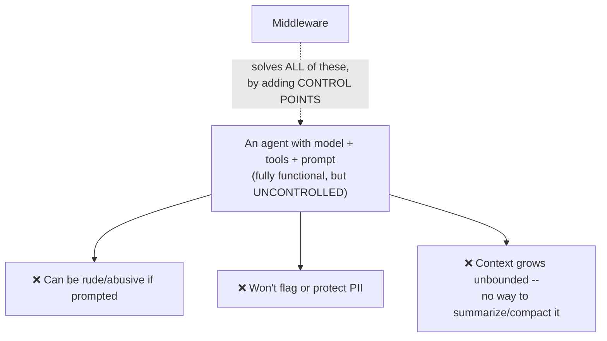

#### 🔍 Internal Working — The Six Precise Control Points

> 💡 **Memory Trick, given directly:** *"It can be before agent, after agent — before the agent is called, after the agent is called. Before model is called, after the model is called. Before tool is called, after the tool is called. We are able to control lots of things in the MIDDLE of my agent."*

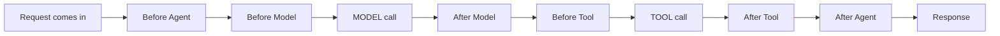

> 💡 **Memory Trick, the cross-framework naming comparison given directly:** *"The same concept can have different names in other frameworks. In ADK — Agent Development Kit, by Google — the same concept is known as a CALLBACK."*

#### 🏢 Real-World / Production Usage — A Genuinely Deflating, Grounding Analogy

> 💡 **Memory Trick, the instructor's own, deliberately grounding framing, given directly:** *"How many of you are from a software development background? When we create software, don't we already have control over these things — that when the agent is getting called, we can have it do something, maybe send an email, maybe send a notification? All these are the SAME things, just with a new name, which is Middleware. Just to make it more lucrative, it has been repackaged as Middleware."*

> 💡 **Memory Trick, a second, genuinely useful analogy given directly, from a student's own suggestion:** *"Whenever some document comes in — whenever there is a policy to be made in Parliament, it has to go through multiple reviews, notarization, filing. That is exactly what happens via our middleware — rather than our agent getting a free pass to do anything, we're able to control many things inside it."*

#### ⚠ Common Mistakes

* Assuming middleware is caching — explicitly, directly corrected in a one-word answer to a student's question: *"Cache is middleware? No. Caching is a different concept."*
* Assuming middleware adds genuinely new CAPABILITY to an agent — explicitly, directly corrected: *"Middleware is not something which is adding any new ability to my agent. It is just to make sure that I can control my agent a lot better."*

#### 🎯 Key Takeaways

* Middleware operates at exactly **six precise control points**: before/after the agent, before/after the model, before/after a tool call.
* The identical concept exists under a different name in Google's ADK (**"callback"**) — a genuinely useful, transferable framing: this is a general agentic-AI pattern, not a LangChain-specific quirk.
* Middleware doesn't add new *capability* — it adds *control* over capability the agent already has, directly analogous to control every software developer already exercises over their own code, just newly named for the agentic-AI context.

---
### 3. Two Types of Middleware: Pre-Built vs. Custom

#### 📖 Definition

> 💡 **Memory Trick, given directly:** *"We could have a middleware which is pre-built, given by your LangChain or any of the frameworks. Or we could write our own custom middleware as well."*

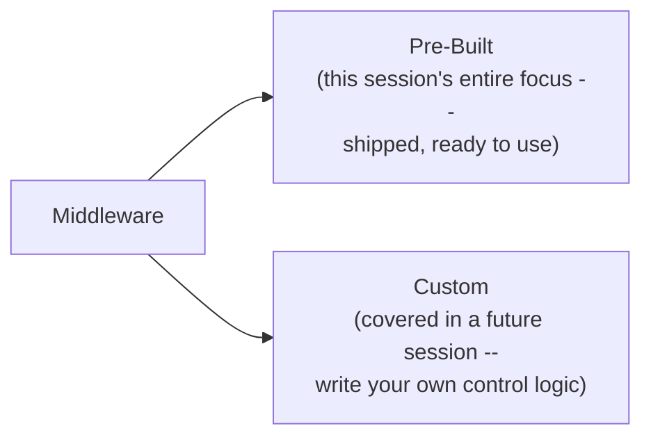

#### 💻 Code Example — The General Pattern for Attaching Middleware

> 💡 **Memory Trick, given directly:** *"Inside `create_agent`, along with model and tools, we can provide something known as `middleware`. We can have more than one middleware — it can be a list."*

```python
from langchain.agents import create_agent
from langchain.agents.middleware import SummarizationMiddleware  # example

agent = create_agent(
    model=model,
    tools=tools,
    middleware=[SummarizationMiddleware(...)],  # a LIST -- multiple middlewares allowed
)
```

#### ⚠ Common Mistakes

* Assuming only one middleware can be attached to an agent at a time — explicitly, directly corrected: `middleware` accepts a list, and multiple middlewares are genuinely common in real use.

#### 🎯 Key Takeaways

* This entire session focuses on LangChain's **pre-built middleware library** — custom middleware (writing your own before/after logic) is explicitly deferred to a future class.
* The `middleware` parameter of `create_agent` accepts a **list** — any number of middlewares can be combined on a single agent.
* Each pre-built middleware is imported from `langchain.agents.middleware` and configured with its own specific parameters.

---

### 4. Summarization Middleware: Compressing Context Automatically

#### ❓ Why It Exists

> 💡 **Memory Trick, given directly:** *"Over time, if we keep having chat with our agent, it can have over 1,000 plus messages. Don't you think we should have something to control it? We should have something to summarize it."*

#### 🏢 Real-World / Production Usage — A Genuinely Familiar Parallel

> 💡 **Memory Trick, given directly, connecting to a tool students likely already use:** *"How many of you have seen this kind of a diagram, if you've chatted with Claude for a long time? It's doing the same thing in the backend. There's this `/compact` command in Claude Code, everyone — where you can compact your conversation."*

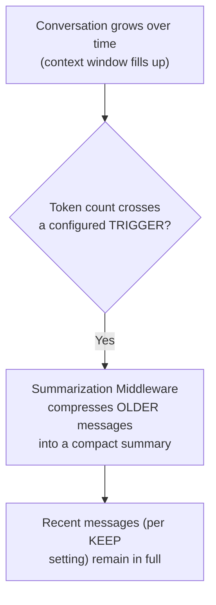

#### 💻 Code Example — Configuring the Middleware

> 💡 **Memory Trick, each parameter precisely explained, given directly:** *"We have to provide a MODEL — because summarizing requires a brain of its own, and it can genuinely be a different model than your main agent's brain. A TRIGGER — say, when tokens reach 4,000. And a KEEP — say, keep the last 10 messages, don't summarize those."*

```python
from langchain.agents.middleware import SummarizationMiddleware

summarization_middleware = SummarizationMiddleware(
    model="gpt-5-mini",       # can genuinely differ from the main agent's model
    trigger=("tokens", 1000),   # or ("messages", N), or a fraction of context length
    keep=("messages", 3),         # or a token count, or a fraction
)
```

> 💡 **Memory Trick, the precise, documented trigger/keep options given directly:** *"LangChain is saying: either you tell me the absolute TOKEN COUNT when you want me to summarize, or the MESSAGE COUNT, or a FRACTION of the model's context length — say, when it reaches 80%, that's where you compact. For KEEP: token count, message count, or a fraction of context size to preserve."*

#### 🪜 Step-by-Step — Live Demonstration: Watching Summarization Actually Trigger

> ⚠️ **A genuine, live, honestly-reported non-event, followed by a real trigger:** *"Let's ask it to check showtimes, refund policy, and order status... I don't think it will be summarizing, because there's very little tokens involved. Let's make it 100 or 300 instead, and ask it to keep just a single message."*

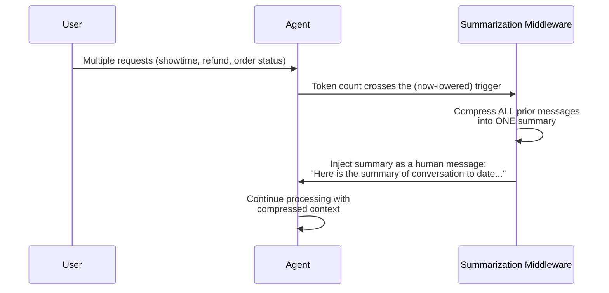

> 💡 **Memory Trick, the live-observed, inspected result given directly:** *"See — this time, summarization DID happen. The very first message now says: 'Here is the summary of conversation to date.' The middleware took the previous conversation and converted it — session intent, artifacts, next steps. And THEN, only after that, the LLM calls the three tools."*

#### ⚠ A Genuine, Honestly-Acknowledged Trade-Off

> ⚠️ **Directly, honestly acknowledged, when a student asked about it:** *"When we summarize, it might happen that important info gets lost. Well, yes, it CAN happen — that is exactly why your model hallucinates, as the chat goes longer. There is genuinely no way to fully save it, unless you're saving it into some long-term memory or store."*

#### ⚠ Common Mistakes

* Assuming summarization is free/costless — explicitly, directly corrected in Q&A: *"When I give it a summarization model, I will be charged. It will use tokens — it's a separate model call."*
* Confusing summarization with the in-memory saver/checkpointer — explicitly, directly clarified: *"Summarization doesn't care about in-memory saver or anything — it depends purely on the condition you're giving it."*

#### 🎯 Key Takeaways

* Summarization middleware requires a **model** (its own, separately-billed "brain"), a **trigger** (tokens, messages, or a fraction of context length), and a **keep** setting (how much recent context to preserve untouched).
* This directly, precisely mirrors a real, familiar product behavior — Claude's own `/compact` command in Claude Code — grounding an abstract mechanism in something students likely already use.
* Information loss during summarization is **explicitly, honestly acknowledged as a genuine, unavoidable risk** — directly connected to why long conversations cause LLM hallucination in general.
* A `trim_token_to_summarize` parameter caps the summary's own maximum length (default 4,000 tokens) — and this default is developer-configurable, but never determined automatically by LangChain itself; per the closing Q&A, *"no framework can define that — it's better if WE define it, because we have the idea of our domain."*

---
### 5. Human-in-the-Loop (HITL) Middleware: Pausing for Approval

#### ❓ Why It Exists

> 💡 **Memory Trick, given directly:** *"I told you your agent is like an intern. If it wants to delete data — can you just let it? If it wants to send an email to everyone — would you like to first check what exactly is in that email? Would you like to control that?"*

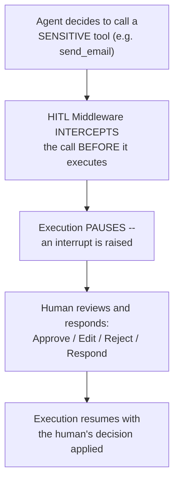

#### 📖 Definition — Why HITL Operates Specifically on Tool Calls

> 💡 **Memory Trick, given directly, precisely:** *"Tool call is where something changes in the real world. If you have an agent, when it's making a tool call, that's where things change — purchasing something, reading an email, sending an email. Before that, it's just the brain thinking. The ACTION — the hands of the agent — are the tools only. Human-in-the-loop is called BEFORE your agent calls the tool, not after — Claude will not ask you for permission AFTER it has already sent the email."*

#### 🔍 Internal Working — The Four Built-In Decision Types

> 💡 **Memory Trick, each of the four options precisely defined, given directly:**
> - **Approve**: *"Execute the tool with its original argument."*
> - **Edit**: *"Modify the tool argument — if my tool is about to send an email to the wrong address, I can change that."*
> - **Reject**: *"Skip execution, and return rejection feedback to the agent."*
> - **Respond**: *"Returns the human's message directly as a synthetic tool result, skipping execution entirely — for 'ask user' style tools, where you want to provide information rather than approve/deny an action."*

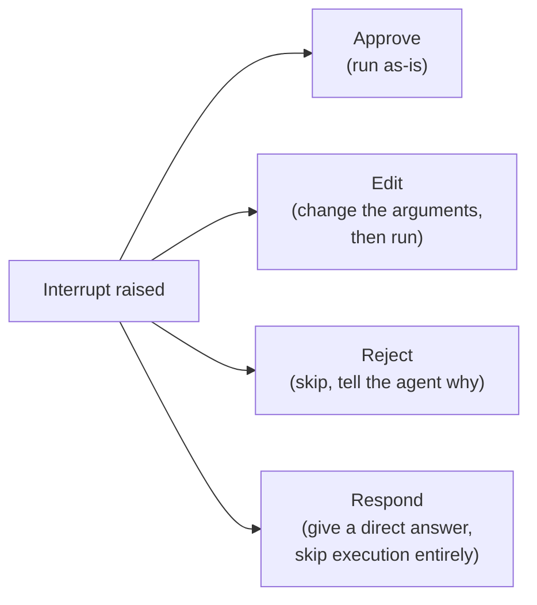

#### 💻 Code Example — Configuring HITL Middleware

```python
from langchain.agents.middleware import HumanInTheLoopMiddleware

agent = create_agent(
    model=model,
    tools=[read_email, send_email],
    middleware=[
        HumanInTheLoopMiddleware(
            interrupt_on={
                "send_email": {"allowed_decisions": ["approve", "edit", "reject"]},
                "read_email": False,   # no interruption needed
            }
        )
    ],
    checkpointer=in_memory_saver,   # REQUIRED -- see below
)
```

> 💡 **Memory Trick, given directly:** *"I'm mentioning: whenever `send_email` is about to be called, these are the decisions you can ask me. For `read_email`, false — don't interrupt at all."*

#### ❓ Why a Checkpointer Is Genuinely Required Here

> 💡 **Memory Trick, the precise reasoning given directly:** *"My agent flow is getting stopped IN BETWEEN. It will need to have the context of the previous messages. If I don't use an in-memory saver, when I say 'approve,' it will not know what I have approved on."*

#### 🪜 Step-by-Step — Live Demonstration 1: The Scripted `Command` Resume

> 💡 **Memory Trick, the exact, live-observed flow given directly:** *"I asked it to cancel booking BK104. AI decided to call `cancel_booking`. It got INTERRUPTED — description: 'tool execution requires approval.' The result STOPPED here. Now I check the state: `agent.get_state(config)` — I can see the interrupt sitting there."*

```python
# Resuming with an explicit approval:
from langgraph.types import Command

result = agent.invoke(
    Command(resume={"decision": "approve"}),
    config=config,   # MUST be the SAME config/thread_id
)
```

> 💡 **Memory Trick, given directly:** *"This time, since I commanded it, it is able to cancel — booking BK104 canceled. I told it explicitly how it is approved."*

#### 🪜 Step-by-Step — Live Demonstration 2: A Genuinely Interactive `input()`-Driven Demo

> 💡 **Memory Trick, given directly, describing the actual live code:** *"I'm getting the state of my agent. If `not state.next` — nothing is currently paused for approval — just return. Else, ask: 'The agent wants to call a guarded tool, choose a decision' — and now it is genuinely waiting for MY input, live, just like Claude does."*

```python
def run_interactive_hitl_demo(agent, config):
    state = agent.get_state(config)
    if not state.next:
        return   # nothing paused
    decision = input("The agent wants to call a guarded tool. Choose: ")
    result = agent.invoke(Command(resume={"decision": decision}), config=config)
    return result
```

> ⚠️ **A genuine, live-demonstrated rejection path, honestly narrated:** *"Let's try to REJECT it this time — reason: 'don't want to cancel the same.' See — it's running. Agent's final response: 'I couldn't cancel — reason: don't want to cancel the same.' That indicates the cancellation was intercepted."*

#### ⚠ A Genuinely Important, Directly-Corrected Student Misconception

> ⚠️ **Directly, precisely corrected, in response to a student's question about a customer-service chatbot escalating to a human:** *"Is this Human in the Loop? ... No. It is transferring the ENTIRE flow to the human — the agent is out of the picture. That's called HUMAN TRANSFER. Human in the loop would be: the agent wants to refund, and it ASKS the representative — should I refund or not? That's where you can change the amount, and everything."*

#### ⚠ Common Mistakes

* Confusing "handing the entire conversation off to a human" (human transfer) with HITL (the agent stays in control, but pauses for a specific decision) — explicitly, directly distinguished.
* Assuming HITL could reasonably apply after a model call rather than before a tool call — explicitly, directly corrected: *"Human in the loop will only be called before tool call. It cannot be called after."*
* Assuming a genuinely interactive HITL demo requires a complex UI to be meaningful — explicitly, directly demonstrated as achievable with a plain Python `input()` call: *"Of course you can create a UI around it — pretty simply. I am just doing this via simple input, which Python allows."*

#### 🎯 Key Takeaways

* HITL Middleware operates specifically on **tool calls** — the point where an agent's "thinking" becomes real-world **action**.
* Four built-in decision types: **approve, edit, reject, respond** — configured per-tool via `interrupt_on`.
* A **checkpointer (in-memory saver) is genuinely required** — without it, the paused agent has no memory of what it was interrupted on when execution resumes.
* Resuming uses LangGraph's **`Command(resume={...})`** — live-demonstrated both as a scripted, explicit call and as a genuinely interactive, `input()`-driven approval flow, including both an approval and a rejection path.
* **Human-in-the-loop ≠ human transfer** — a precise, important distinction directly, explicitly clarified in response to a real student misconception.

---
### 6. Model Call Limit Middleware: Thread Limit vs. Run Limit

#### ❓ Why It Exists

> 💡 **Memory Trick, given directly:** *"Do we want that after 4 or 5 calls, the model doesn't get called anymore, so we can save cost? It can run in a loop, everyone — this can keep on happening, where it goes to the model, and then goes back. Don't you think we should have some control that, hey, after 5 calls, please stop?"*

#### 🔍 Internal Working — The Precise, Dual-Scope Distinction

> 💡 **Memory Trick, given directly, the exact configuration:** *"`thread_limit`: across the WHOLE conversation. `run_limit`: per a SINGLE invoke call. In a single invoke, it can call the model multiple times — say 3 times. Across a full conversation — multiple invokes — it can call it 5 times total. I have the capability of limiting it at EVERY point — the complete conversation, or an individual invoke."*

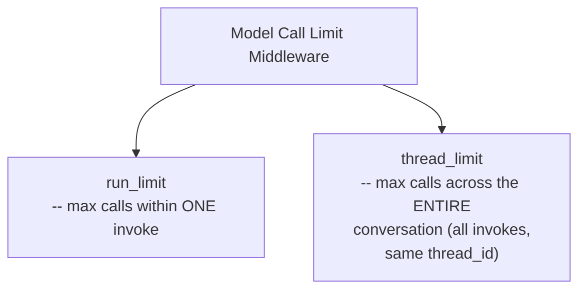

#### 💻 Code Example

```python
from langchain.agents.middleware import ModelCallLimitMiddleware

agent = create_agent(
    model=model,
    tools=tools,
    middleware=[
        ModelCallLimitMiddleware(
            thread_limit=5,   # across the whole conversation
            run_limit=2,        # per single invoke
            exit_behavior="end",  # gracefully stop, NOT an exception
        )
    ],
    checkpointer=in_memory_saver,
)
```

> 💡 **Memory Trick, given directly:** *"`exit_behavior` — end: gracefully stop, not an exception. I'm saying: just end it, don't give any error."*

#### 🪜 Step-by-Step — Live Demonstration: Deliberately Hitting the Limit

> 💡 **Memory Trick, the live, honestly-narrated sequence given directly:** *"I made it `run_limit=1` first — it asked for clarification instead of calling a tool multiple times. Let me make it 2 instead... this time it worked — human message, AI message, tool message, AI message. Now I've invoked it 3 times total... 5 times total... in the NEXT one, ideally, it should give me an error." (It did.) "Call limit exceeded — yeah, we've seen both scenarios."*

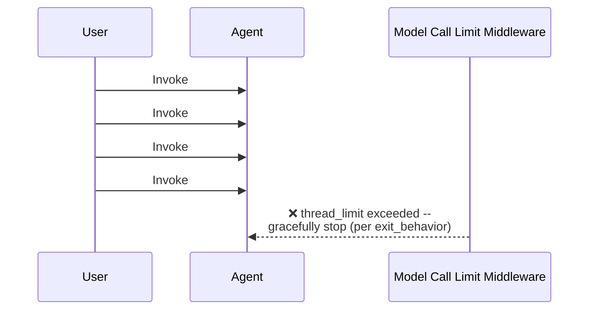

#### 🧠 Concept — Why the Limit Number Should Come from Domain Knowledge, Not Guesswork

> 💡 **Memory Trick, given directly, in response to a student asking how to pick the right limit:** *"Experience. When you create an agent, will you know about the domain, about the problem you're solving? When you're using an agent that searches the internet — by default, how many searches should it do? Can I say a million? No one will say 100. Because we know that much isn't required. This is exactly what a business analyst or product manager would define based on the use case."*

#### ⚠ Common Mistakes

* Assuming a checkpointer is unrelated to this middleware — explicitly, directly clarified: the thread-wide limit specifically requires memory of PRIOR invokes' call counts, which only a checkpointer provides.
* Assuming an agent hitting this limit means something has gone genuinely wrong — explicitly, directly reframed: *"If it stops, then it will again reach out there — not a problem. It will reach out in the next run."*

#### 🎯 Key Takeaways

* Model Call Limit Middleware enforces **two genuinely independent scopes**: `run_limit` (within one invoke) and `thread_limit` (across the entire conversation, requiring a checkpointer to track).
* `exit_behavior="end"` produces a **graceful stop**, not an exception — the agent tells the user it's reached its limit rather than crashing.
* The correct limit value is explicitly framed as a **domain-knowledge, business decision** — not something LangChain or any framework can determine automatically.

---

### 7. Model Fallback Middleware: Surviving Provider Outages

#### ❓ Why It Exists

> 💡 **Memory Trick, given directly:** *"Let's say your application depends on OpenAI, but there's an OpenAI issue. Should you say to the user, 'bye-bye, tata'? It should be able to call another model — but should YOU, as a developer, go manually and change the code every time this happens? Do you think that's a good solution?"*

#### 🔍 Internal Working — Precisely Distinguished from Routing

> ⚠️ **A precise, direct clarification given:** *"It is NOT routing, it is NOT based on speed, it is NOT based on anything. Fallback, by definition, means: when something fails, you fall back to something else. All my middleware is doing is: if 5.5 doesn't work, call 5.4 Mini. If THIS doesn't work, call this one."*

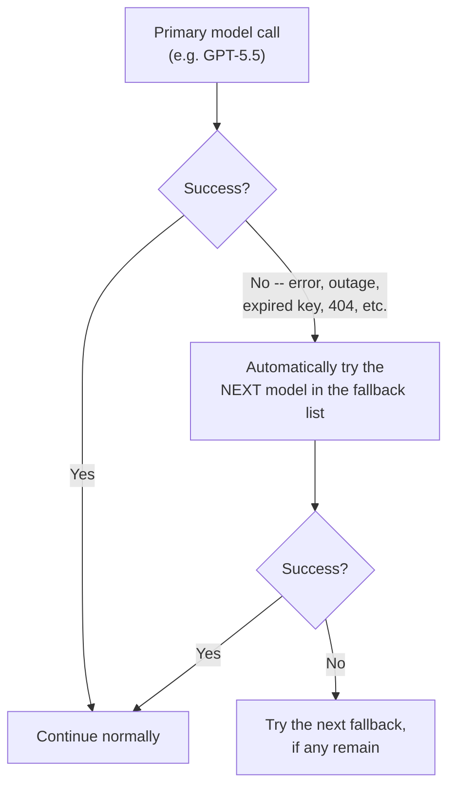

#### 💻 Code Example

```python
from langchain.agents.middleware import ModelFallbackMiddleware

agent = create_agent(
    model=primary_model,
    tools=tools,
    middleware=[
        ModelFallbackMiddleware(
            models=["gpt-5-mini", "gpt-5-4-mini"],   # tried in sequence
        )
    ],
)
```

#### 🪜 Step-by-Step — Live Demonstration: A Deliberately Broken Model Name

> ⚠️ **Directly, honestly demonstrated, deliberately triggering a real failure:** *"Let me try to make an error here — I'm saying my model is 'GPT-5.5 Haiku,' which doesn't exist. Do you think that model exists, everyone? ... It didn't give me an error. Let's check which model was actually used — GPT-5 Mini. As you can see, 5.5 Haiku was NOT used."*

> 💡 **Memory Trick, the reinforcing, deliberate failure-then-recovery demo given directly:** *"Let me remove the fallback and call it again, so you SEE the error — that it doesn't exist. Is it a good approach to show this error directly to the user? ... Now let me add the fallback back, and call it again. See — it's not failing anymore. It's taking a little time because it failed, then recovered, then called the other model."*

#### 🏢 Real-World / Production Usage — Why This Is Framed as Essential, Not Optional

> 💡 **Memory Trick, given directly:** *"In Claude's status page, you see so many outages — multiple outages. If there's a 4-hour outage at Claude, will you tell your Swiggy or Amazon customer 'come back later, Claude is facing an outage'? No, right? You'll switch to a different model — that is exactly why model fallback is there. If you are creating an agent, it SHOULD have a model fallback."*

#### ⚠ Common Mistakes

* Assuming fallback and retry are the same behavior — explicitly, directly clarified as related but distinct: fallback specifically switches to a DIFFERENT model, while retry re-attempts the SAME model; the two can, and by default do, work together.
* Assuming the model's context/conversation history is lost on fallback — explicitly, directly clarified: *"The model internally handles it and makes sure the context is passed to the different model too."*

#### 🎯 Key Takeaways

* Model Fallback Middleware is precisely NOT routing or a speed-based choice — it activates **only on genuine failure**, trying models in a configured, sequential order.
* This capability is framed as **essential for any genuinely production-grade agent**, directly grounded in real, observable provider-outage risk (Anthropic's own status page cited as evidence).
* Fallback and retry are related but distinct — retry re-attempts the same model; fallback switches to a different one — and they work together by default.

---
### 8. Tool Call Limit Middleware: Global vs. Per-Tool Limits

#### ❓ Why It Exists

> 💡 **Memory Trick, given directly:** *"Should we have a tool call limit too, so it doesn't keep on calling a tool? Say I ask you to read my emails and get important ones — and it's reading emails from 2013-14. Every tool call is a little costly — every time, the context increases too."*

#### 🔍 Internal Working — Two Genuinely Independent Scopes

> 💡 **Memory Trick, given directly:** *"We can control a SINGLE tool — how many times it's getting called. We can have a GLOBAL thing too — how many times ANY tool, across all tools, is getting called."*

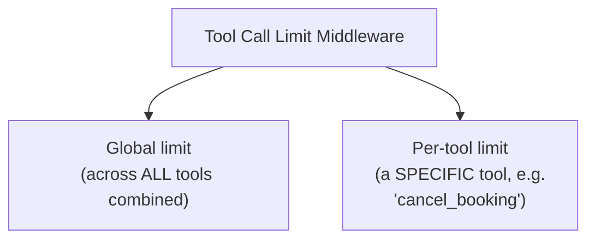

#### 💻 Code Example

```python
from langchain.agents.middleware import ToolCallLimitMiddleware

agent = create_agent(
    model=model,
    tools=tools,
    middleware=[
        ToolCallLimitMiddleware(
            global_limit=8,                  # ALL tools combined, whole conversation
            tool_limits={"cancel_booking": 2},  # THIS tool, max 2 times per thread
        )
    ],
    checkpointer=in_memory_saver,
)
```

> 💡 **Memory Trick, given directly, on choosing the right per-tool limit:** *"For `cancel_booking`, ideally I should keep it to ONE — then you can just cancel the booking once, and not again and again. This is very, very logical if you think about the real business case."*

#### ⚠ Common Mistakes

* Assuming a global limit and a per-tool limit are mutually exclusive, requiring a choice between them — explicitly, directly clarified: both can be configured simultaneously, on the same middleware instance.
* Confusing "tool call limit" (how many TIMES a tool can be called) with "retry" (re-attempting a FAILED tool call) — explicitly, directly distinguished in Q&A: *"Retry is when we are not getting the output. Limit is when you are calling some tool multiple times, and you want to limit it."*

#### 🎯 Key Takeaways

* Tool Call Limit Middleware supports both a **global limit** (across every tool combined) and **per-tool limits** (a specific tool, individually capped) — configured together on one middleware instance.
* Choosing the correct limit (e.g., capping `cancel_booking` at 1 per thread) is explicitly framed as a genuine, logical BUSINESS decision — directly paralleling the same domain-knowledge reasoning established for Model Call Limit Middleware.
* This middleware directly protects against **runaway agent loops** and **excessive, costly calls to external APIs** (web searches, database queries) — a concrete, stated production concern.

---

### 9. PII Detection Middleware: Masking & Redacting Sensitive Data

#### 📖 Definition

> 💡 **Memory Trick, given directly:** *"PII — Personal Identifiable Information. Date of birth, phone number, email, Aadhaar card, password — anything. When you're sending this to your agent, do you think it should reach all the way to your model?"*

#### 🔍 Internal Working — Two Distinct Handling Strategies

> 💡 **Memory Trick, precisely distinguished, given directly:** *"REDACTING means it's blocked out entirely — the detail will NOT be sent; your model will not be able to see it at all. MASKING is when I say `73XXXXXXXX` — like this. It depends how you're masking it, but the model still sees SOMETHING, just not the real value."*

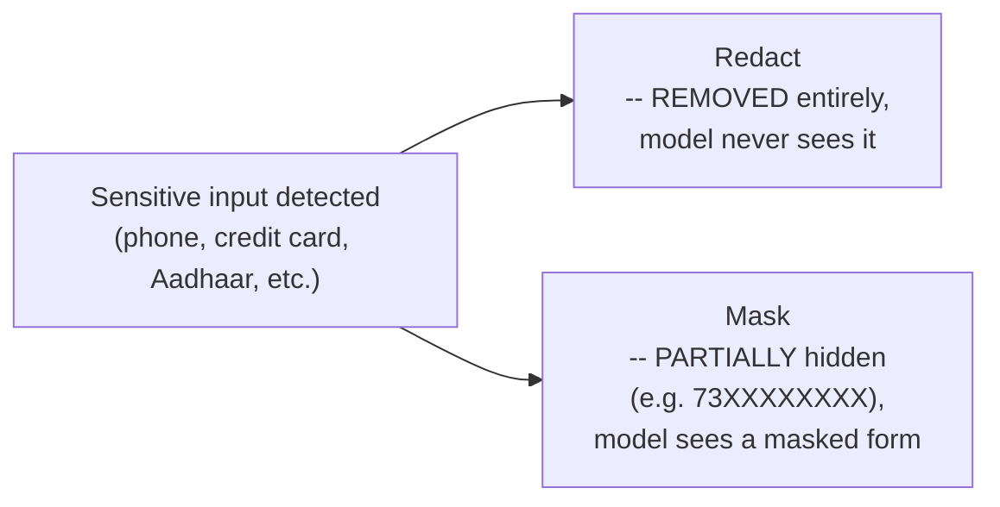

#### 💻 Code Example — Built-In PII Types

```python
from langchain.agents.middleware import PIIMiddleware

agent = create_agent(
    model=model,
    tools=tools,
    middleware=[
        PIIMiddleware("email", strategy="redact", apply_to_input=True),
        PIIMiddleware("credit_card", strategy="mask", apply_to_input=True),
    ],
)
```

#### 💻 Code Example — Custom, Regex-Based PII Types

> 💡 **Memory Trick, given directly:** *"Do you think LangChain will create a built-in PII type for Aadhaar? Do you feel that would be the case? No, right — because it's India-specific. There are 180+ countries; LangChain won't create this for everyone. It's better that we, the developer, create it."*

```python
import re
from langchain.agents.middleware import PIIMiddleware

phone_pattern = re.compile(r"\d{10}")   # example -- India-specific, developer-defined

agent = create_agent(
    model=model,
    tools=tools,
    middleware=[
        PIIMiddleware(
            "phone_number",
            detector=phone_pattern,
            strategy="mask",
        ),
    ],
)
```

#### 🏢 Real-World / Production Usage — A Live-Demonstrated, Genuine Model Behavior

> 💡 **Memory Trick, given directly, testing this live against a real model:** *"Let's say my Aadhaar number is [X] and phone is [Y]... I can't share that number or personal information — these are government IDs, personal details, but I don't keep it in memory. This makes sense, right?"*

#### ⚠ Common Mistakes

* Assuming PII middleware and guardrails are two separate, competing systems — explicitly, directly corrected: *"Guardrail is a basic CONCEPT that I want to guard my agent from doing something. Middleware is a WAY of doing it. PII is handled both — a guardrail concept, IMPLEMENTED via middleware."*
* Assuming a fixed, small set of PII types covers every organization's genuine needs — explicitly, directly corrected: developer-defined, regex-based custom types (like Aadhaar or PAN numbers) are explicitly necessary and expected, since PII formats are genuinely country/region-specific.

#### 🎯 Key Takeaways

* PII Detection Middleware supports two distinct strategies: **redact** (fully removed, the model never sees it) and **mask** (partially obscured, e.g., `73XXXXXXXX`).
* Built-in PII types cover common, cross-country cases (email, phone, credit card); genuinely **country/region-specific types** (Aadhaar, PAN) must be defined by the developer via **regex patterns**, since LangChain cannot reasonably anticipate every jurisdiction's ID formats.
* Sensitive data can also be **saved to a separate, developer-controlled database/memory store** even while being kept OUT of what's actually sent to the model — these are explicitly two separate concerns (protecting the model's input vs. an organization's own legitimate data storage).

---
### 10. Closing Q&A: Guardrails vs. Middleware, and LangChain vs. LangGraph vs. Deep Agents

#### ❓ Guardrails vs. Middleware, Precisely Distinguished

> ⚠️ **Directly, precisely stated, repeated for emphasis across multiple student questions:** *"Guardrail is a basic CONCEPT where we control our agent. Middleware is a WAY of doing it. Guardrail needs to be applied AS middleware — middleware is a way to apply guardrails. That simple."*

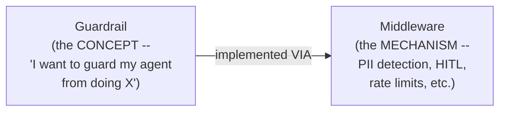

#### 📖 Definition — LangChain vs. LangGraph vs. Deep Agents: The Control Hierarchy

> 💡 **Memory Trick, given directly, in response to a student's direct comparison question:** *"LangChain gives you a little bit of an abstracted way — 'this is what I'm doing.' LangGraph lets you control much more in-depth — extract more properties, see the state, understand what all happens. If you have to very properly manage what's happening inside, create a very deterministic flow — that's where you go with LangGraph. LangChain is built ON TOP OF LangGraph. Then, LangChain, then LangGraph, then finally Deep Agents — Deep Agents give you much MORE, or LESS, control, depending on how you look at it."*

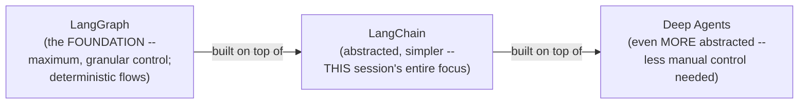

> 💡 **Memory Trick, the practical recommendation given directly:** *"For a simple agent, LangChain and everything will be pretty helpful. Otherwise, we will have to move to LangGraph and do things in-depth."*

#### 🧠 Concept — Do Frameworks Like Claude Code or Cursor Use the "Same" Concepts?

> 💡 **Memory Trick, given directly, in response to a student's real, work-related question:** *"It's exactly the same as what we're discussing here. Claude and Cursor just create it FOR you. They also have the same features — rather than 'middleware,' they call them HOOKS. You can control what exactly, how many times it's calling, which command or tool to run. But those agents are NOT deployable — those are local ones."*

#### ❓ Does a Simple RAG Application Genuinely Need Middleware?

> 💡 **Memory Trick, a genuinely direct, honest, non-inflated answer given:** *"For a RAG application, middleware you might not even need... it will help our agent become a lot more error-resistant, stronger, and give us more in-depth control. That is the idea" — but not framed as an unconditional, universal requirement for every application type.*

#### 🧠 Concept — Observability: An Honestly-Deferred Topic

> 💡 **Memory Trick, given directly, in response to a genuinely common student question about LangFuse, OpenTelemetry, and observability tooling:** *"It will depend, again, on the application... I don't always say that one is the best here — we will have to do a lot of testing first, because in theory I could give a best answer, but since I've created this for my clients, believe me — the one-in-ten-that's-'best' never really works. They're just good for starting things. Once I cover it properly, in depth, then it will be much more clear to you."*

#### ⚠ Common Mistakes

* Assuming "guardrail" and "middleware" are interchangeable, competing terms — explicitly, directly clarified: one is a goal/concept, the other is the mechanism used to achieve it.
* Assuming agent-building tools like Claude Code or Cursor operate on fundamentally different underlying principles from LangChain — explicitly, directly corrected: they use the SAME conceptual pattern (control points around model/tool calls), just under a different name ("hooks") and with a key practical difference (not deployable as standalone, production applications).
* Assuming there's one single, universally "best" observability tool — explicitly, directly avoided as an oversimplified claim, in favor of genuine, use-case-driven evaluation.

#### 🎯 Key Takeaways

* **Guardrail = the concept** ("I want to guard my agent from doing X"); **Middleware = the mechanism** (the actual, concrete implementation — PII detection, HITL, rate limits, and more).
* The control hierarchy, from most abstracted to most granular: **LangChain → LangGraph → Deep Agents** — LangChain is genuinely built ON TOP OF LangGraph, trading some depth of control for simplicity.
* The exact same conceptual pattern (control points around model/tool execution) appears across the broader agentic AI ecosystem under different names — LangChain's "middleware," Google ADK's "callback," and Claude Code/Cursor's "hooks" are all the same underlying idea.
* The instructor explicitly, honestly **declines to offer a single "best" observability tool recommendation**, grounding this refusal in genuine, real client experience rather than offering an easy but potentially misleading answer.

---

## 📝 Glossary

| Term | Definition | Why It Matters |
|---|---|---|
| **Middleware** | Code that "cuts into" an agent's execution at defined control points (before/after agent, model, or tool) | Provides CONTROL over an agent's existing capabilities, not new capability itself |
| **Callback (ADK)** | Google Agent Development Kit's name for the exact same middleware concept | Confirms this is a general agentic-AI pattern, not LangChain-specific |
| **Summarization Middleware** | Automatically compresses conversation history once a trigger threshold is crossed | Prevents unbounded context growth and its associated cost/hallucination risk |
| **Human-in-the-Loop (HITL) Middleware** | Pauses execution before a sensitive tool call, awaiting a human decision | Approve, edit, reject, or respond -- the four built-in decision types |
| **Model Call Limit Middleware** | Caps how many times the model can be called, per-invoke and/or per-thread | `run_limit` (one invoke) vs. `thread_limit` (whole conversation) |
| **Model Fallback Middleware** | Automatically switches to a backup model if the primary one fails | Framed as essential for any production agent, given real provider-outage risk |
| **Tool Call Limit Middleware** | Caps how many times a tool (or all tools combined) can be called | Global limit vs. per-tool limit, configurable together |
| **PII Middleware** | Detects and masks/redacts personal identifiable information before it reaches the model | Built-in types (email, phone) plus fully custom, regex-based types (Aadhaar, PAN) |
| **Redact** | Fully remove sensitive data -- the model never sees it | The stronger of the two PII-handling strategies |
| **Mask** | Partially obscure sensitive data (e.g. `73XXXXXXXX`) -- the model sees a masked form | The lighter-touch PII-handling strategy |
| **Guardrail** | The conceptual goal of controlling/restricting agent behavior | Implemented, in practice, via middleware |
| **`Command(resume=...)`** | The LangGraph mechanism for resuming an interrupted agent with a human decision | The precise syntax bridging HITL's pause and its resolution |

---

## 🔄 Revision Notes — One-Minute Revision

* **Middleware** operates at six precise control points: before/after the agent, before/after the model, before/after a tool call -- the same concept is called a **callback** in Google's ADK.
* Middleware adds no new *capability* -- it adds *control* over capability the agent already has; the instructor deliberately frames this as nothing genuinely new, just newly named.
* **Summarization Middleware** requires a `model`, `trigger` (tokens/messages/fraction), and `keep` setting -- live-proven by lowering the trigger and watching a real summary get injected as a human message; information loss is honestly acknowledged as a genuine, unavoidable risk.
* **HITL Middleware** operates specifically on TOOL calls (where "thinking" becomes real-world action), with four built-in decisions -- **approve, edit, reject, respond** -- requiring a checkpointer, and live-demonstrated via both a scripted `Command` resume and a genuinely interactive `input()`-driven demo (both approval and rejection paths shown). Human-in-the-loop is explicitly distinguished from "human transfer" (handing the whole conversation off).
* **Model Call Limit Middleware** has two independent scopes -- `run_limit` (one invoke) and `thread_limit` (whole conversation) -- live-proven by deliberately hitting the limit and watching a graceful stop (`exit_behavior="end"`).
* **Model Fallback Middleware** switches to a backup model ONLY on genuine failure (not routing, not speed-based) -- live-demonstrated with a deliberately broken model name, framed as essential for any production agent given real provider-outage risk.
* **Tool Call Limit Middleware** supports both a global limit (all tools) and per-tool limits (e.g. capping `cancel_booking` at 1 per thread) -- the correct value is explicitly framed as a business decision, not a technical guess.
* **PII Middleware** distinguishes **redact** (fully removed) from **mask** (partially obscured); built-in types cover common cases, while country-specific types (Aadhaar, PAN) require developer-defined regex patterns.
* **Guardrail = concept; Middleware = mechanism.** The control hierarchy is **LangChain → LangGraph → Deep Agents**, from most abstracted to most granular; the same underlying pattern appears elsewhere as "hooks" (Claude Code, Cursor).

---

## 📋 Cheat Sheet

**The six control points:**
```text
Before Agent -> Before Model -> [MODEL CALL] -> After Model
             -> Before Tool -> [TOOL CALL] -> After Tool -> After Agent
```

**LangChain's pre-built middleware library (this session):**
```text
SummarizationMiddleware      -- compress context on trigger (tokens/messages/fraction)
HumanInTheLoopMiddleware       -- pause before sensitive tool calls (approve/edit/reject/respond)
ModelCallLimitMiddleware         -- run_limit (per invoke) + thread_limit (whole conversation)
ModelFallbackMiddleware            -- switch models ONLY on genuine failure
ToolCallLimitMiddleware              -- global_limit + per-tool limits
PIIMiddleware                          -- redact (removed) or mask (obscured); built-in + custom types
```

**HITL's four decisions:**
```text
Approve  -> run with original arguments
Edit     -> modify arguments, then run
Reject   -> skip, return feedback to the agent
Respond  -> give a direct answer, skip execution entirely
```

**Resuming an interrupted agent:**
```python
from langgraph.types import Command
agent.invoke(Command(resume={"decision": "approve"}), config=config)
```

**Guardrail vs. Middleware:**
```text
Guardrail = the GOAL ("guard my agent from X")
Middleware = the MECHANISM (how you actually implement that goal)
```

**Control hierarchy:**
```text
LangGraph (max control, foundation) -> LangChain (abstracted, built on LangGraph)
                                     -> Deep Agents (even more abstracted)
```

---

## 🔥 Interview Questions & Answers

### 🟢 Beginner

**Q1.**

**Question:** What is middleware, in one sentence?

**Answer:** Code that "cuts into" an agent's execution at defined control points -- before/after the agent, model, or tool call -- to add control, not new capability.

**Explanation:** The session's own precise, repeated definition.

**Why Interviewers Ask This:** A foundational, near-universal agentic-AI concept.

**Possible Follow-up:** "Name the six precise control points middleware operates at."

**Q2.**

**Question:** What is this same concept called in Google's Agent Development Kit (ADK)?

**Answer:** A callback.

**Explanation:** Directly, explicitly stated.

**Why Interviewers Ask This:** Tests cross-framework awareness, not just LangChain-specific vocabulary.

**Possible Follow-up:** "What is it called in Claude Code or Cursor?"

**Q3.**

**Question:** Why does Human-in-the-Loop middleware operate on TOOL calls specifically, not model calls?

**Answer:** A tool call is where the agent's "thinking" becomes real-world action -- purchasing, sending an email, deleting data. The model call itself is just the brain deciding what to do.

**Explanation:** Directly, precisely explained.

**Why Interviewers Ask This:** Tests genuine understanding of WHY, not just WHERE, HITL applies.

**Possible Follow-up:** "Name all four built-in decision types HITL supports."

**Q4.**

**Question:** What's the difference between a model call limit's "run limit" and "thread limit"?

**Answer:** Run limit caps calls within a single invoke; thread limit caps calls across the entire conversation (all invokes on the same thread).

**Explanation:** Directly, precisely distinguished.

**Why Interviewers Ask This:** A commonly-tested, precise configuration detail.

**Possible Follow-up:** "What's required for the thread limit to genuinely work across multiple invokes?"

**Q5.**

**Question:** What is model fallback middleware, and how is it different from routing?

**Answer:** It switches to a backup model ONLY when the primary model genuinely fails (error, outage, invalid key) -- it is not based on speed, cost, or any routing logic.

**Explanation:** Directly, precisely distinguished.

**Why Interviewers Ask This:** Tests precise terminology, avoiding a common conflation.

**Possible Follow-up:** "Is fallback the same as retry? Explain the difference."

**Q6.**

**Question:** What's the difference between masking and redacting PII?

**Answer:** Redacting fully removes the data -- the model never sees it. Masking partially obscures it (e.g. `73XXXXXXXX`) -- the model sees a masked form, not nothing.

**Explanation:** Directly, precisely distinguished.

**Why Interviewers Ask This:** A commonly-tested PII-handling distinction.

**Possible Follow-up:** "Why might an Aadhaar or PAN number require a custom PII type, rather than a built-in one?"

**Q7.**

**Question:** What is a "guardrail," and how does it relate to "middleware"?

**Answer:** Guardrail is the concept/goal of controlling agent behavior; middleware is the mechanism used to actually implement that goal.

**Explanation:** Directly, precisely, repeatedly clarified across the session.

**Why Interviewers Ask This:** Tests precise conceptual vocabulary.

**Possible Follow-up:** "Give a concrete example of a guardrail implemented via a specific middleware."

**Q8.**

**Question:** What is the correct hierarchy of control across LangChain, LangGraph, and Deep Agents?

**Answer:** LangGraph is the foundation (maximum, granular control); LangChain is built on top of it (more abstracted, simpler); Deep Agents sit on top of LangChain (even more abstracted).

**Explanation:** Directly, precisely stated.

**Why Interviewers Ask This:** A commonly-asked, foundational LangChain-ecosystem question.

**Possible Follow-up:** "When would you choose to work directly in LangGraph instead of LangChain?"

**Q9.**

**Question:** Why does model call limit middleware require a checkpointer to enforce a thread-wide limit?

**Answer:** Tracking calls "across the whole conversation" requires memory of prior invokes' call counts -- without a checkpointer, each invoke starts with no memory of previous ones.

**Explanation:** Directly, precisely explained.

**Why Interviewers Ask This:** Tests understanding of the underlying mechanism, not just the parameter name.

**Possible Follow-up:** "What would happen if you configured a thread_limit without a checkpointer?"

**Q10.**

**Question:** Is caching a form of middleware?

**Answer:** No -- caching is a genuinely different, separate concept.

**Explanation:** Directly, explicitly clarified in a one-word correction.

**Why Interviewers Ask This:** Tests whether a learner correctly scopes what middleware does and doesn't cover.

**Possible Follow-up:** "What genuinely IS caching, in the context of an LLM application?"

---

### 🟡 Intermediate

**Q11.**

**Question:** Explain why the instructor deliberately frames middleware as "nothing genuinely new -- just repackaged" rather than presenting it as an exciting, novel LangChain innovation.

**Answer:** This deliberate framing serves a genuine pedagogical purpose: it prevents students from treating middleware as an intimidating, LangChain-specific black box, and instead grounds it in a genuinely familiar, transferable concept every software developer already understands -- controlling what happens at specific points in a program's execution. By explicitly connecting this to ADK's "callbacks" and Claude Code's "hooks," the instructor reinforces that this is a GENERAL agentic-AI pattern appearing across the entire ecosystem, not a piece of LangChain-specific trivia to memorize in isolation -- directly supporting genuine, transferable understanding over framework-specific rote learning.

**Explanation:** Requires recognizing a deliberate pedagogical framing choice and its intended effect on genuine, transferable understanding.

**Why Interviewers Ask This:** Tests whether a learner sees middleware as a transferable pattern or a memorized, framework-specific fact.

**Possible Follow-up:** "Name the middleware/callback/hook equivalent concept in at least two DIFFERENT agentic frameworks."

**Q12.**

**Question:** A learner argues that since PII middleware can "mask" sensitive data, redacting is therefore unnecessary -- masking alone is always sufficient. Evaluate this claim.

**Answer:** This claim is inaccurate, and conflates two genuinely different levels of protection the session explicitly distinguishes. Masking still allows the model to see a PARTIAL representation of the sensitive data (e.g., a masked phone number's format, or partial digits) -- for some genuinely high-sensitivity use cases (healthcare, financial compliance, per the session's own stated PII use cases), even this partial exposure may be unacceptable, and REDACTING (fully removing the data, so the model sees nothing at all) is the more appropriate, stronger choice. The choice between masking and redacting is a genuine, use-case-specific decision about acceptable risk, not a case where one strategy is universally sufficient and the other is redundant.

**Explanation:** Tests whether a learner recognizes masking and redacting as serving genuinely different risk-tolerance levels, not a strictly-better/strictly-worse pair.

**Why Interviewers Ask This:** Distinguishes candidates who understand the genuine trade-off between these two strategies from those who treat them as interchangeable.

**Possible Follow-up:** "For a healthcare application handling patient records, which strategy would you recommend by default, and why?"

**Q13.**

**Question:** Explain, precisely, why the instructor insists on live-demonstrating BOTH a failed attempt and a successful attempt for both the summarization middleware and the model fallback middleware, rather than only showing the working, successful version.

**Answer:** In BOTH cases, demonstrating the failure first provides direct, concrete PROOF that the middleware is genuinely doing something meaningful -- rather than simply asserting "this middleware summarizes" or "this middleware provides fallback," showing the SAME setup WITHOUT sufficient trigger conditions (for summarization) or WITHOUT the fallback configured (for model fallback) first demonstrates the underlying PROBLEM the middleware solves, making the SUBSEQUENT successful demonstration genuinely more convincing and meaningful by direct contrast. This is consistent with a broader, repeated pattern across agentic-AI and DevOps instruction generally: proving a claim via live, contrastive demonstration (before/after) is more persuasive and diagnostically useful than only showing a single, already-working final state.

**Explanation:** Requires recognizing a deliberate, repeated "before/after" demonstration technique and its persuasive/diagnostic value.

**Why Interviewers Ask This:** Tests whether a learner recognizes deliberate, evidence-based teaching technique as distinct from simple, single-state demonstration.

**Possible Follow-up:** "Describe the exact 'before' state the instructor showed for the model fallback demonstration, and what specifically it proved."

**Q14.**

**Question:** Using this session's tool call limit reasoning (Section 8), explain why capping `cancel_booking` at exactly 1 (rather than, say, 3 or 5) is described as "very, very logical," connecting this to the same reasoning pattern used for model call limits.

**Answer:** Both limits (tool call and model call) are explicitly grounded in the SAME underlying principle: the correct numeric value should reflect genuine DOMAIN/BUSINESS logic, not an arbitrary technical guess. For `cancel_booking` specifically, the real-world business reality is that a GENUINE, single booking cancellation should only need to happen ONCE per thread -- any attempt to call it repeatedly within the same conversation is far more likely to indicate a malfunctioning loop, a misunderstanding, or even a potential abuse pattern than a genuine, repeated business need. This directly mirrors the session's own web-search example (Section 6): just as nobody would reasonably need "a million searches," nobody would reasonably need to cancel the SAME booking multiple times in one conversation -- the correct limit emerges from understanding what the tool is FOR, not from an arbitrary technical default.

**Explanation:** Requires connecting this specific example back to the session's own broader, repeated "domain knowledge determines the limit" principle established for model call limits.

**Why Interviewers Ask This:** Tests whether a learner recognizes a recurring reasoning pattern across different, separately-introduced middleware types.

**Possible Follow-up:** "Propose a reasonable per-tool limit for a hypothetical `send_email` tool, with your own business reasoning."

**Q15.**

**Question:** Synthesize this session's guardrail-vs-middleware distinction (Section 10) with its PII middleware coverage (Section 9) to precisely explain what the "guardrail" is and what the "middleware" is, in the specific case of PII protection.

**Answer:** The GUARDRAIL, in this case, is the underlying business/safety GOAL: "sensitive personal information should never reach the model in unprotected form." The MIDDLEWARE is the specific, concrete MECHANISM implementing that goal: `PIIMiddleware`, configured with specific strategies (mask or redact) for specific PII types (built-in, like email, or custom, like Aadhaar), actively intercepting and transforming input before it reaches the model. This precisely illustrates the session's own general distinction: the goal ("protect PII") is conceptually simple and could theoretically be described in one sentence, but the ACTUAL, working implementation genuinely requires the specific, configured middleware mechanism -- you cannot simply "have a guardrail" without an actual mechanism enforcing it, exactly as the session's own repeated "guardrail is the concept, middleware is the way" framing states directly.

**Explanation:** Requires applying the session's own general conceptual distinction to a specific, concrete example from a DIFFERENT section, demonstrating genuine, applied understanding rather than only reciting the abstract definition.

**Why Interviewers Ask This:** Tests whether a learner can apply a stated conceptual distinction to a genuinely new, specific case, not just recite the distinction in the abstract.

**Possible Follow-up:** "Apply this same guardrail-vs-middleware distinction to the model call limit middleware -- what's the underlying guardrail/goal there?"

---

### 🔴 Advanced

**Q16.**

**Question:** Design a genuinely complete, production-grade middleware stack for a real financial-services agent (e.g., handling account inquiries and money transfers), explicitly justifying which of this session's six middleware types you'd include and how you'd configure each.

**Answer:** A reasonable, complete stack: (1) **PII Middleware** -- redact (not just mask, per Intermediate Q12's reasoning) genuinely sensitive fields like account numbers and SSNs/Aadhaar numbers, given the high-sensitivity financial context; mask lower-risk fields like partial phone numbers for reference. (2) **Human-in-the-Loop Middleware** -- interrupt specifically on any money-transfer or account-modification tool, with all four decision types available (approve/edit/reject/respond), directly matching the session's own stated "database writes, financial transactions" HITL use case. (3) **Model Call Limit Middleware** -- a conservative `run_limit` (e.g., 3) and `thread_limit` (e.g., 10), reflecting that financial inquiries are typically bounded, low-turn interactions, directly applying the session's own domain-knowledge reasoning. (4) **Tool Call Limit Middleware** -- a strict per-tool limit of 1 on any transfer-execution tool (directly mirroring the session's own `cancel_booking` example), with a more generous global limit for read-only inquiry tools. (5) **Model Fallback Middleware** -- essential here, given the session's own explicit "if you're creating an agent, it SHOULD have a model fallback" framing, especially critical for a financial application where an outage-caused failure could genuinely disrupt customer trust. (6) **Summarization Middleware** -- included but configured conservatively (a lower trigger, larger keep window), since financial conversations likely benefit from retaining more precise recent context than a general-purpose chatbot might need. This design directly, systematically applies each middleware's own stated purpose and configuration reasoning to a genuinely higher-stakes, realistic use case.

**Explanation:** Synthesizes ALL six middleware types covered in this session into one coherent, genuinely justified production stack -- real, applied extension beyond any single middleware's isolated demonstration.

**Why Interviewers Ask This:** A realistic, senior-level agent-architecture question testing whether a candidate can compose multiple middleware types into a coherent, justified, real-world-appropriate design.

**Possible Follow-up:** "Which of these six middleware types would you consider implementing FIRST, if building this stack incrementally under time pressure?"

**Q17.**

**Question:** Critically evaluate: "Since middleware is called 'nothing genuinely new -- just repackaged,' learning it doesn't provide any genuinely new capability, and is therefore not worth the depth of study this session dedicates to it." Is this an accurate implication of the session's own framing?

**Answer:** Not accurate, and this conflates two genuinely different claims. The instructor's "nothing genuinely new" framing is specifically about the underlying CONCEPTUAL PRINCIPLE (developers have always had control over their own software's execution points) -- it is NOT a claim that the specific, PRE-BUILT IMPLEMENTATIONS (Summarization, HITL, Model Call Limit, Model Fallback, Tool Call Limit, PII Middleware) are trivial or not worth learning. Precisely BECAUSE the underlying principle is familiar, LangChain's pre-built middleware library represents genuine, practical VALUE: instead of every developer re-implementing summarization logic, HITL interrupt handling, or PII regex detection from scratch (a genuinely substantial engineering effort), LangChain provides tested, ready-to-configure implementations of these common patterns. The session's deep, systematic coverage of SIX distinct pre-built middlewares, each with its own genuine configuration nuances (trigger conditions, decision types, limit scopes, fallback sequencing, masking strategies), represents exactly the kind of practical, immediately-applicable knowledge worth deep study -- "the underlying idea isn't new" and "this specific, ready-made implementation is genuinely worth learning in depth" are not contradictory claims.

**Explanation:** Tests whether a learner distinguishes a claim about CONCEPTUAL novelty from a claim about PRACTICAL VALUE, correctly recognizing these as independent, not contradictory.

**Why Interviewers Ask This:** Distinguishes candidates who track a specific claim's precise scope from those who draw an inaccurate, overreaching conclusion from a deliberately deflating framing choice.

**Possible Follow-up:** "Name one specific, concrete engineering effort this session's pre-built middleware library saves a developer from having to build themselves."

**Q18.**

**Question:** Synthesize this session's model fallback middleware (Section 7) with its model call limit middleware (Section 6) to identify a genuine, non-obvious INTERACTION risk between these two middlewares if configured carelessly together on the same agent.

**Answer:** A genuine, non-obvious risk: if Model Fallback Middleware is configured to try MULTIPLE models in sequence upon failure, and Model Call Limit Middleware is ALSO configured with a relatively LOW `run_limit`, each FALLBACK ATTEMPT likely counts as a separate model call against that same limit -- meaning a single logical "user request" that happens to trigger two or three fallback attempts (primary model fails, first fallback fails, second fallback succeeds) could consume MOST or ALL of the configured run_limit just recovering from failures, potentially leaving the agent with insufficient remaining calls to complete its actual, substantive work within that same invoke. This is a genuinely important, non-obvious interaction the session doesn't explicitly address when covering either middleware in isolation -- a production configuration combining both would need to set the run_limit generously enough to accommodate BOTH genuine task-completion calls AND potential fallback-recovery calls within the same invoke, rather than treating these two middlewares' configurations as fully independent of one another.

**Explanation:** Requires identifying a genuine, non-obvious interaction between two separately-taught middlewares that neither section explicitly addresses, through careful reasoning about how their underlying mechanisms would actually combine.

**Why Interviewers Ask This:** A capstone-level question testing whether a candidate can reason about middleware COMPOSITION risks, not just each middleware's isolated behavior.

**Possible Follow-up:** "Propose a specific configuration adjustment that would mitigate this identified interaction risk."

---

## 🧪 Scenario-Based Interview Questions

> **Scenario 1:** A teammate configures HITL middleware to interrupt on a `send_email` tool, but reports that when they test it, the agent seems to "get stuck" and never produces a final response, even after they believe they've approved the action. Using this session's concepts, diagnose this.

**Structured Answer:**
1. **Initial investigation:** Recognize this as most likely a checkpointer/config-mismatch issue, directly connecting to Section 5's own explicit "a checkpointer is genuinely required" reasoning.
2. **Metrics/logs to check:** Check whether a checkpointer (in-memory saver, or equivalent) was actually configured on the agent, and whether the SAME `config`/`thread_id` was used for both the original invoke and the resume attempt.
3. **Possible causes:** Most likely, either no checkpointer was configured at all (meaning the agent has no memory of the interrupt to resume from), OR a DIFFERENT `thread_id` was accidentally used for the resume call, which Section 5 explicitly warns would "go to a different chat" entirely.
4. **Debugging approach:** Call `agent.get_state(config)` (per Section 5's own demonstrated diagnostic pattern) with the EXACT same config used originally, to confirm whether the interrupt state is genuinely still present and being correctly located.
5. **Resolution:** Ensure a checkpointer is genuinely configured, and that the resume call's `config` precisely matches the original invoke's config (same `thread_id`), then retry the `Command(resume=...)` call.
6. **Prevention:** Establish a team code-review checklist item specifically verifying checkpointer configuration and config/thread_id consistency for any agent using HITL middleware, directly preventing this exact class of mistake going forward.

> **Scenario 2 (Advanced):** Your organization wants to deploy a customer-support agent that must handle both genuinely public, low-stakes questions (store hours, general policies) AND sensitive, account-specific actions (refunds, account changes) within the SAME conversation thread. Using this session's concepts (Section 5, Section 9, Advanced Q16), design an appropriate middleware configuration.

**Structured Answer:**
1. **Initial investigation:** Recognize this requires GRANULAR, per-tool configuration rather than a single, uniform policy across all tools -- directly connecting to HITL's own per-tool `interrupt_on` configuration (Section 5) and PII middleware's own selective, per-field configuration (Section 9).
2. **Relevant principle:** Per Section 5's exact demonstrated pattern (`read_email: False` vs. `send_email: {interrupt}`), configure HITL to interrupt ONLY on sensitive, account-modifying tools (refunds, account changes), while leaving low-stakes, informational tools (store hours, general policy lookups) entirely uninterrupted for a smooth user experience.
3. **Possible causes for needing this distinction:** A genuine, realistic business need -- uniformly interrupting EVERY tool call (including harmless, informational ones) would create unnecessary friction and a poor user experience for the majority of genuinely low-stakes interactions.
4. **Debugging/evaluation approach:** Audit every tool the agent has access to, explicitly categorizing each as "genuinely sensitive, requiring HITL" versus "genuinely low-stakes, no interruption needed" -- directly mirroring Section 5's own explicit two-tool (`read_email`/`send_email`) categorization example.
5. **Resolution:** Configure `HumanInTheLoopMiddleware` with per-tool granularity, interrupting only on the sensitive subset; additionally configure `PIIMiddleware` to redact/mask any account-identifying information (per Section 9's reasoning) regardless of which specific tool is being used, since sensitive data could plausibly appear in either category of interaction.
6. **Prevention:** Document this exact tool-categorization decision (which tools require HITL, which don't) as a living, reviewable artifact, updated whenever new tools are added to the agent -- ensuring the sensitive/non-sensitive distinction remains deliberate and current rather than becoming outdated as the agent's capabilities grow.

---

## 🛠 Hands-on Exercises

### 🟢 Easy

1. Write out, from memory, all six control points middleware operates at (before/after agent, model, tool), and the cross-framework name for this concept in ADK.
2. Write a one-paragraph explanation, in your own words, of the guardrail-vs-middleware distinction, using a PII example of your own choosing (not this session's).
3. Configure `SummarizationMiddleware` on a simple agent of your own, and deliberately trigger it by sending enough messages to cross your configured threshold.

### 🟡 Medium

4. Configure `HumanInTheLoopMiddleware` on an agent with at least two tools (one requiring interruption, one not), and demonstrate all four decision types (approve, edit, reject, respond) via genuine, live testing.
5. Configure `ModelCallLimitMiddleware` with distinct `run_limit` and `thread_limit` values, and deliberately trigger BOTH limits separately, documenting the exact behavior at each.
6. Write a custom, regex-based PII type for a real-world identifier from your own country (not Aadhaar/PAN), and configure it with both masking and redacting strategies to compare the difference.

### 🔴 Advanced

7. Implement the complete financial-services middleware stack proposed in Advanced Interview Q16, applying genuine configuration values with written justification for each.
8. Design and document (in writing) a test specifically probing the fallback/call-limit interaction risk identified in Advanced Interview Q18, and propose a concrete configuration fix.
9. Implement the dual-sensitivity customer-support agent design proposed in Scenario 2, with genuine, working per-tool HITL configuration and PII middleware applied consistently across both tool categories.

---

## 🏗 Practice Assignment

### Build: "Complete Middleware-Protected CineBot"

**Objective:** Extend this session's own CineBot example with a genuinely complete middleware stack, directly applying every middleware type covered in this session.

**Requirements:**
- A working agent with at least four tools (directly reusing or adapting this session's own mock tools: showtime check, refund policy, order status, cancel booking).
- `SummarizationMiddleware`, configured and genuinely tested with a real trigger.
- `HumanInTheLoopMiddleware`, interrupting specifically on the cancel-booking tool, with all four decision types genuinely tested (via either the scripted `Command` approach or the interactive `input()` approach).
- `ModelCallLimitMiddleware` AND `ToolCallLimitMiddleware`, both configured with genuine, justified limit values.
- `ModelFallbackMiddleware`, deliberately tested by triggering a genuine model failure.
- `PIIMiddleware`, protecting at least one built-in PII type and one custom, regex-based PII type of your own design.
- A written reflection (200-300 words) on which middleware you found most conceptually challenging, and why.

**Architecture (suggested):**

```text
cinebot_middleware_stack/
├── cinebot_agent.py               # your complete, middleware-protected agent
├── SUMMARIZATION_TEST.md            # documented trigger + resulting summary
├── HITL_TEST.md                       # documented approve/edit/reject/respond tests
├── LIMITS_TEST.md                       # documented model-call and tool-call limit tests
├── FALLBACK_TEST.md                       # documented deliberate failure + recovery
├── PII_TEST.md                              # documented built-in + custom PII tests
└── REFLECTION.md                              # your written reflection
```

**Expected Functionality:**
- Every middleware should be genuinely, individually testable and demonstrably working -- not just configured, but proven via real, observed behavior.
- Your custom PII type should correctly identify a real, region-specific identifier of your own choosing.

**Challenges:**
- Correctly configuring a checkpointer that works consistently across BOTH the summarization and HITL demonstrations.
- Deliberately, safely triggering a genuine model failure for the fallback test without accidentally breaking your entire agent setup.

**Bonus Improvements:**
- Combine multiple middlewares on the SAME tool (e.g., both HITL and a tool call limit on `cancel_booking`), and document how they interact.
- Research and implement the "respond" HITL decision type specifically, which this session covers conceptually but doesn't fully live-demonstrate in isolation.

---

## 📚 Additional Resources

- The **earlier "Middleware, Dynamic Tool Loading & Headless Tools" session** -- covers the ORIGINAL introduction to middleware and a custom, state-based fix for dynamic tool loading; this session goes further into LangChain's actual pre-built middleware library.
- **LangChain's official middleware documentation** -- directly, repeatedly referenced live throughout this session as the authoritative source for each middleware's exact configuration parameters.
- **A future, dedicated custom-middleware session** (referenced directly) -- covering how to write your OWN before/after logic, beyond this session's pre-built-only focus.
- **A future, dedicated LangGraph session** (referenced directly) -- covering checkpointers, persistence, and interrupts in genuinely deeper, foundational detail.
- **A future, dedicated observability/monitoring session** (referenced directly, deliberately deferred) -- covering LangFuse, OpenTelemetry, and related tooling once fully, properly prepared.

---

## 📌 Final Revision Sheet

### ⭐ Core Concepts
- Middleware = control (not new capability) at six precise points: before/after agent, model, tool -- same as ADK's "callback."
- **Six pre-built middlewares**: Summarization (compress on trigger), HITL (pause on tool call, 4 decisions), Model Call Limit (run vs. thread scope), Model Fallback (switch on genuine failure), Tool Call Limit (global vs. per-tool), PII (mask vs. redact, built-in vs. custom).
- **Guardrail = concept; Middleware = mechanism.**
- Control hierarchy: **LangGraph → LangChain → Deep Agents** (most to least granular control, in terms of foundation).

### ⭐ Important Definitions
- **Redact vs. mask**, **run limit vs. thread limit** (see Glossary for full definitions).

### ⭐ Important Commands/Code
```python
from langchain.agents.middleware import (
    SummarizationMiddleware, HumanInTheLoopMiddleware,
    ModelCallLimitMiddleware, ModelFallbackMiddleware,
    ToolCallLimitMiddleware, PIIMiddleware,
)
from langgraph.types import Command

agent.invoke(Command(resume={"decision": "approve"}), config=config)
```

### ⭐ Architecture/Process
- Attach middleware via `create_agent(model=..., tools=..., middleware=[...])` -- a list, supporting multiple middlewares simultaneously.
- HITL and thread-scoped limits genuinely require a checkpointer (in-memory saver) to function correctly.

### ⭐ Best Practices
- Choose limit values (model call, tool call) based on genuine domain/business knowledge, never arbitrary guesses.
- Redact (not just mask) genuinely high-sensitivity data; mask lower-risk fields.
- Every production agent should include model fallback middleware, given real, observable provider-outage risk.
- Define custom, region-specific PII types via regex rather than assuming built-in coverage is universal.

### ⭐ Common Mistakes
- Assuming middleware adds new agent capability, rather than control over existing capability.
- Confusing human-in-the-loop with human transfer (handing off the entire conversation).
- Assuming fallback and retry are the same mechanism.
- Assuming masking is always sufficient, without considering when redaction is genuinely required.

### ⭐ Interview Points
- Be ready to name and precisely define all six pre-built middlewares covered.
- Be ready to explain the guardrail-vs-middleware distinction with a concrete example.
- Be ready to state the LangChain-LangGraph-Deep-Agents control hierarchy precisely.
- Be ready to explain why HITL specifically targets tool calls, not model calls.

### ⭐ Things to Remember
- This session is a genuinely **deeper, more systematic** treatment of middleware than the earlier introductory session -- both should be studied together, not treated as redundant.
- **Custom middleware** (writing your own before/after logic) is explicitly deferred to a future session -- this entire class covers PRE-BUILT middleware only.
- The instructor **explicitly, honestly declines** to name a single "best" observability tool, grounding this in genuine, real client experience rather than an easy but potentially misleading answer.