# 🧩 LangChain Middleware Part 2: Todo Lists, Tool Selection, Retry & Error Handling

- <i>**Session:** LangChain Weekend Class — "Middleware" (Part 2, Continued) · 
- **Instructor:** Mayank Aggarwal
- **Note on scope:** This is a **direct continuation** of the "Middleware Deep Dive" session (Part 1) — picking up exactly where that class left off, mid-way through Tool Call Limit Middleware. This class covers five genuinely **new** middleware types not touched in Part 1 — **Todo List, LLM Tool Selector, Tool Error, Tool Retry, and LLM Tool Emulator** — plus a deeper, more precisely-analogized pass through guardrails and PII (including the **hash** strategy). Every middleware is demonstrated live, including two genuinely honest, unscripted moments: a real LangChain version incompatibility fixed live via `pip install --upgrade`, and a live, precisely-explained trace showing exactly why a tool got called **8 times** rather than 4. Custom middleware and MCP are both explicitly deferred to the following weekend.</i>

---

## 📑 Table of Contents

1. [Session Overview](#-session-overview)
2. [Learning Objectives](#-learning-objectives)
3. [Detailed Notes](#-detailed-notes)
   - [1. Session Context: Continuing From Part 1](#1-session-context-continuing-from-part-1)
   - [2. Model & Tool Call Limits, Revisited: The "Chapatis" Analogy](#2-model--tool-call-limits-revisited-the-chapatis-analogy)
   - [3. Guardrails, Precisely Defined: The Highway/Mountain Analogy](#3-guardrails-precisely-defined-the-highwaymountain-analogy)
   - [4. PII Detection, Extended: Custom Regex Types & the Hash Strategy](#4-pii-detection-extended-custom-regex-types--the-hash-strategy)
   - [5. Todo List Middleware: Structured, Trackable Task Planning](#5-todo-list-middleware-structured-trackable-task-planning)
   - [6. LLM Tool Selector Middleware: Query-Based, Not State-Based, Tool Filtering](#6-llm-tool-selector-middleware-query-based-not-state-based-tool-filtering)
   - [7. Tool Error Middleware: Converting Crashes Into Recoverable Tool Messages](#7-tool-error-middleware-converting-crashes-into-recoverable-tool-messages)
   - [8. Tool Retry Middleware: Exponential Backoff, Live-Proven](#8-tool-retry-middleware-exponential-backoff-live-proven)
   - [9. LLM Tool Emulator Middleware: Faking Tool Calls for Testing](#9-llm-tool-emulator-middleware-faking-tool-calls-for-testing)
   - [10. Closing: What's Next (Custom Middleware, MCP, a GCP Project)](#10-closing-whats-next-custom-middleware-mcp-a-gcp-project)
4. [Glossary](#-glossary)
5. [Revision Notes — One-Minute Revision](#-revision-notes--one-minute-revision)
6. [Cheat Sheet](#-cheat-sheet)
7. [Interview Questions & Answers](#-interview-questions--answers)
8. [Scenario-Based Interview Questions](#-scenario-based-interview-questions)
9. [Hands-on Exercises](#-hands-on-exercises)
10. [Practice Assignment](#-practice-assignment)
11. [Additional Resources](#-additional-resources)
12. [Final Revision Sheet](#-final-revision-sheet)

---

## 🎯 Session Overview

This session completes LangChain's pre-built middleware library, adding five genuinely new middleware types to the six already covered in Part 1, while deepening several concepts with new, sharper analogies. It covers:

1. **A direct continuation of Tool Call Limit Middleware**, live-debugged with a real example (canceling 3 bookings, hitting both run and thread limits), and a genuinely new, memorable analogy for run vs. thread limits: **chapatis per meal vs. chapatis per day**.
2. **Guardrails, precisely defined** via a highway/mountain-road analogy — the physical railings preventing a car from driving off the edge are directly compared to the mechanisms (middleware, system prompts, and more) preventing an agent from "driving off the edge" of acceptable behavior.
3. **PII Detection, extended** with a live, working custom regex example (a booking-code format) and the **hash** strategy — preserving a deterministic, reversible identity without ever exposing the real value to the model.
4. **Todo List Middleware** — genuinely new: equips an agent with structured, JSON-based task planning, directly mirroring the "checklist" behavior visible in tools like Claude Code and Claude's own Cowork feature.
5. **LLM Tool Selector Middleware** — genuinely new: uses a (potentially cheaper) LLM to dynamically select the most relevant SUBSET of tools for a given QUERY, precisely distinguished from dynamic tool loading (which filters by user STATE, not query content).
6. **Tool Error Middleware** — genuinely new: converts a raised Python exception into a graceful tool message the agent can read and recover from, rather than crashing the entire execution.
7. **Tool Retry Middleware** — genuinely new: automatically retries a failing tool call with configurable exponential backoff, live-demonstrated with a real timing trace and a precisely-explained "why did it call 8 times, not 4?" moment.
8. **LLM Tool Emulator Middleware** — genuinely new: lets an LLM "fake" a tool's response entirely, for safe testing of expensive, risky, or not-yet-built tools.
9. A closing preview of what's explicitly deferred: **custom middleware** and **MCP**, both promised for the following weekend, ahead of a planned Google Cloud Platform project.

> 💡 **Memory Trick — the instructor's own framing for why this depth matters, repeated across both sessions:** *"When I spend time on something, please have it saved inside your brain — because when you give interviews tomorrow, you need to have a recollection of these points... hardly 2-3% of people will have this level of knowledge."*

---

## 🎯 Learning Objectives

By the end of this guide, you will be able to:

- [ ] Explain the "chapatis per meal vs. chapatis per day" analogy for tool/model call run limits vs. thread limits, and apply it to a real, multi-booking cancellation scenario.
- [ ] Define a guardrail using the highway/mountain-road analogy, and explain why middleware is only ONE of several ways to implement one.
- [ ] Explain the hash PII strategy, and why it differs meaningfully from both masking and redacting.
- [ ] Explain what Todo List Middleware does, and why giving it via a system prompt alone would NOT produce the same structured, trackable behavior.
- [ ] Precisely distinguish LLM Tool Selector Middleware (query-based) from dynamic tool loading (state-based).
- [ ] Explain why Tool Error Middleware alone does not provide automatic retries, and what additional middleware is needed for that.
- [ ] Correctly calculate a tool retry's delay using the exponential backoff formula, and explain why exponential (rather than constant) delay is generally preferred.
- [ ] Explain what LLM Tool Emulator Middleware is for, and identify at least two genuine, practical use cases for it.

---

## 📚 Detailed Notes

### 1. Session Context: Continuing From Part 1

#### 🧠 Concept

> 💡 **Memory Trick, given directly at the start:** *"Yesterday we were discussing about the tool call limit — let's continue with the same. Just like all the middlewares — and the reason I'm going this in-depth is, for many of you, this might be the very first time you're learning middleware. As we've seen in other frameworks as well, this is very much the same."*

#### 🏢 Real-World / Production Usage — Middleware's Reach Across Industries, Restated

> 💡 **Memory Trick, given directly, opening with fresh, concrete industry examples before returning to the code:** *"Fraud detection in FinTech — a wrap-tool-style hook around every transaction-executing tool, flagging or blocking based on velocity, amount, or pattern. All of us make payments online — not all payments are accepted, right? That's because it waits, it checks. Healthcare AI assistant PII middleware-style detection is often a genuine legal requirement — HIPAA in the US. Customer support platform, human in the loop — the exact same 'cancel booking' pattern we've already done. Internal developer tools, audit logging via a wrap-tool-call."*

#### 🎯 Key Takeaways

* This session is explicitly, directly a **continuation**, not a standalone topic — it assumes full familiarity with Part 1's six middleware types (Summarization, HITL, Model Call Limit, Model Fallback, Tool Call Limit, PII).
* The instructor opens by **re-grounding middleware in real, cross-industry use cases** (FinTech fraud detection, healthcare compliance, customer support, developer tooling) before returning to code — reinforcing that these aren't abstract exercises.

---

### 2. Model & Tool Call Limits, Revisited: The "Chapatis" Analogy

#### 🔍 Internal Working — A New, Memorable Analogy for Run vs. Thread Limits

> 💡 **Memory Trick, given directly, extending a food-based analogy first introduced briefly in Part 1:** *"If, let's say, we understand that in a day you're having breakfast, lunch, dinner — and in a meal, you're having chapatis. RUN LIMIT is: how many chapatis you can have, MAXIMUM, in a SINGLE meal. Say you cannot have more than 4 chapatis in a single meal. If I take the ENTIRE day — you can have just 10 chapatis in total. That is the THREAD limit."*

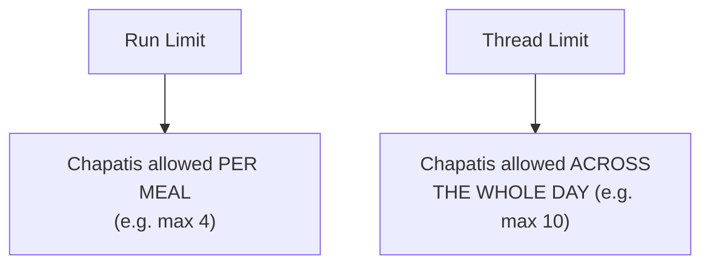

#### 💻 Live Demonstration — A Real Claude Trace, Counted Live

> 💡 **Memory Trick, given directly, using a real, live Claude session to count actual tool calls:** *"I'm asking Claude for the latest AI news. The second I press enter, I'm invoking the agent — this is the RUN. It searched the internet... first search, second, third, fourth. It used the internet 4 times — if the run limit was 3, Claude would have searched only 3 times. Now I invoke it AGAIN, asking for more news — this time it does 3 MORE searches. Across all runs, that's 7 total — the THREAD limit. This specific run's limit was 3."*

#### 🪜 Step-by-Step — Live-Traced: Exactly Why a Booking-Cancellation Hits Its Limit

> 💡 **Memory Trick, the precise, live-narrated trace given directly:** *"Tool call limit: global 8, but for `cancel_booking` SPECIFICALLY: thread limit 2, run limit 1. First cancel (B100): run limit of 1 used, thread limit becomes 1. Second cancel (B101): run limit REFRESHES (new invoke), thread limit becomes 2. Third cancel (B102): run limit refreshes again — but the THREAD limit is already at 2. It will NOT run in this thread anymore."*

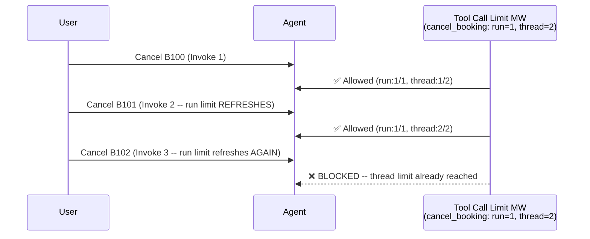

> 💡 **Memory Trick, the exact tool message content given directly:** *"Tool message: 'tool call limit exceeded, do not call cancel_booking again.' It says: 'I'm sorry, I can't run another automated cancellation process right now, because the system's cancel_booking tool has hit its call limit.' I hope you understand HOW important it is when you're building your logic — this is the exact language a real agent gives when it can't do something."*

#### 🔍 Internal Working — The Three `exit_behavior` Options, Precisely Named

> 💡 **Memory Trick, given directly, reading straight from the documentation:** *"CONTINUE — block the exceeded tool's call with an error message, let other tools and the model continue. This is the default. ERROR — raise a `ToolCallLimitExceededError` exception, stopping execution IMMEDIATELY. Also: stop execution immediately with a tool message AND an AI message for the exceeded tool call — this only works when limiting a SINGLE tool."*

#### ⚠ Common Mistakes

* Assuming a "run" refreshing after each invoke means the thread limit ALSO resets — explicitly, directly clarified via the live trace: the run limit refreshes per invoke, but the thread limit accumulates across ALL invokes in the same thread, and does NOT reset.
* Assuming tool call limits configured for demonstration purposes (e.g., a global limit of 8) reflect realistic, production values — explicitly, directly acknowledged: *"I'm taking these as an example to show you — in a real one, these values would be higher."*

#### 🎯 Key Takeaways

* The **"chapatis" analogy** (run limit = chapatis per meal; thread limit = chapatis across the whole day) provides a genuinely memorable, food-based mental model for this exact same run-vs-thread distinction covered more abstractly in Part 1.
* A **live-traced, real example** (canceling three separate bookings) makes the precise mechanics of run-limit-refreshing-per-invoke vs. thread-limit-accumulating-across-invokes fully concrete, not just theoretical.
* Three `exit_behavior` options exist: **continue** (default -- block with an error message, keep going), **error** (raise an exception, stop immediately), and a **tool+AI message combo** (stop immediately, but with clearer messaging -- single-tool limits only).

---
### 3. Guardrails, Precisely Defined: The Highway/Mountain Analogy

#### 📖 Definition — The Analogy, Given Directly

> 💡 **Memory Trick, the complete, vivid analogy given directly:** *"How many of you have driven or seen a highway or any road? On every mountain, there's some guardrail kind of thing, so you don't fall off — there's a barrier, right or wrong. Similarly, on the highway, there are guardrails so you don't slip off and drive onto the other side. In your AI agent as well — isn't the output a lot unpredictable? You can have ANYTHING as an output. So we should have these guardrails, right — so that AI doesn't say anything it shouldn't. It should ask you for something if it's unsure. It should not give out, or read, any personal information."*

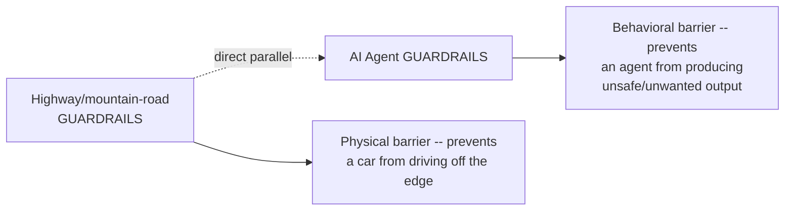

#### 📖 Definition — The Precise, Simple Definition Given Directly

> 💡 **Memory Trick, given directly:** *"Guardrail is a way to control the AI agent's behavior. That's a very simple definition. To be very, very honest — us not letting AI hit a tool multiple times, that can ALSO qualify as a guardrail. It's totally on us how we're having it — we're having SOME limit."*

#### 🔍 Internal Working — Multiple, Genuinely Different Ways to Implement a Guardrail

> 💡 **Memory Trick, given directly, extending the highway analogy to its logical conclusion:** *"There can be different ways of having guardrails. At night, we have paint that shines. There can be a traffic policeman standing and guiding you. You can have a divider, a red light, a traffic light — multiple things, for implementing the guardrails. ONE of those ways is middleware."*

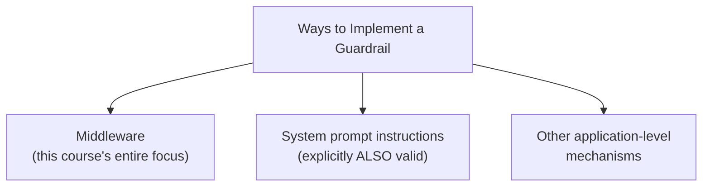

> ⚠️ **A direct, explicit correction of a genuine student misconception:** *"Guardrail means limitation to the AI agent, right? ... No, it's not a limitation. A good definition is: 'save, compliant AI application by validating and filtering content at key points' — nothing else. Giving proper system prompt instructions is ALSO a guardrail mechanism."*

#### 🏢 Real-World / Production Usage — A Live-Demonstrated Guardrail in a Real Product

> 💡 **Memory Trick, given directly, testing ChatGPT's own guardrails live:** *"Let's ask ChatGPT the best way to jump off a flying plane. See how it's NOT giving you the answer? It's asking if you're currently on a plane instead. It's also having guardrails when you ask it for its system message — it says 'I cannot provide it.' The better the guardrail, the more difficult it is [to bypass] — of course. If you leave a gap, people can easily go through it. So your guardrail should be very strong."*

#### ❓ Who Defines "Compliance"?

> 💡 **Memory Trick, a direct, precise answer given to a student's question:** *"Who defines compliance? The company, the state, government, certifications — all of them define compliance."*

#### ⚠ Common Mistakes

* Assuming "guardrail" specifically means restricting/limiting agent capability — explicitly, directly corrected: it means controlling/validating behavior, which can just as easily mean asking a clarifying question as blocking an action outright.
* Assuming middleware is the ONLY way to implement a guardrail — explicitly, directly corrected: system prompt instructions are given as an equally valid, alternative mechanism.

#### 🎯 Key Takeaways

* **Guardrail** = a way to control AI agent behavior — precisely defined, and directly, memorably grounded in a highway/mountain-road physical-barrier analogy.
* Guardrails can be implemented via **multiple, genuinely different mechanisms** — middleware is explicitly named as only ONE of them, alongside system prompt instructions and other application-level approaches.
* **Compliance** (HIPAA, GDPR, SOC2, and similar) is explicitly named as a genuine, real-world driver for why guardrails (and PII middleware specifically) matter — not an abstract, hypothetical concern.

---

### 4. PII Detection, Extended: Custom Regex Types & the Hash Strategy

#### 🪜 Step-by-Step — A Live-Debugged Built-In PII Example

> ⚠️ **A genuine, honestly-reported partial failure, live-debugged:** *"I said, 'my email is this, and my card is this — can you check showtimes for Dune?' Email was redacted properly — but credit card... I think it did NOT catch it. Let me check the version — credit card numbers are validated with the LUHN algorithm."*

#### 🔍 Internal Working — The LUHN Algorithm, Named Directly

> 💡 **Memory Trick, given directly:** *"Credit card numbers are validated with the LUHN algorithm — that's how it understands whether a sequence of numbers is a genuinely valid credit card format or not, rather than just any random 16-digit number."*

#### 💻 Code Example — A Fully Custom, Regex-Based PII Type (Booking Codes)

> 💡 **Memory Trick, the full, live-coded scenario given directly:** *"Say your company's booking IDs follow the format `BK` followed by 4 digits — will you have an inbuilt guardrail for this? Of course not, because it's specific to YOUR company. So we define our own."*

```python
import re
from langchain.agents.middleware import PIIMiddleware

def detect_booking_code(content: str):
    # Detects CineBot's own booking code format: BK + 4 digits
    pattern = re.compile(r"BK\d{4}")
    matches = []
    for match in pattern.finditer(content):
        matches.append({"text": match.group(), "start": match.start(), "end": match.end()})
    return matches

agent = create_agent(
    model=model,
    tools=tools,
    middleware=[
        PIIMiddleware("booking_code", detector=detect_booking_code, strategy="hash"),
    ],
)
```

#### 📖 Definition — The Four Strategies, Precisely Named Together

> 💡 **Memory Trick, all four strategies given directly, in one place:** *"BLOCK — raise an exception when PII is detected, totally blocks the flow. REDACT — replace PII with a redacted-type placeholder. MASK — partially mask it (e.g., for a credit card). HASH — replace PII with a DETERMINISTIC hash, which means the identity is still preserved -- you can use it for analytics and debugging."*

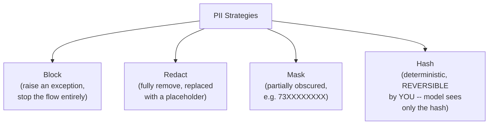

#### 🏢 Real-World / Production Usage — Precisely Why Hash Is Genuinely Different

> 💡 **Memory Trick, the precise, illustrative example given directly:** *"Let's say I tell you my credit card number in Amazon is `AMZ1234ABC`. Do you know my actual credit card number right now, everyone? No, you don't. But someone working AT Amazon can check if they have some hash ID matching this, and either use it or confirm it's valid — WITHOUT ever being told the real number. That was the main idea."*

#### 🪜 Step-by-Step — Live-Demonstrated: Hash vs. Mask, Same Scenario

> 💡 **Memory Trick, the live comparison given directly:** *"I asked for booking status BK1044 — this time it's been HASHED. Is that a problem for the AI? No, because it's not the real information — the booking status confirmation still went through successfully. If I switch the SAME booking code to MASK instead..." [demonstrated live, contrasting behavior]. "We are the decision maker, not AI. It is on OUR use case."*

#### ⚠ A Direct, Important Clarification on Hash's Actual Reversibility

> 💡 **Memory Trick, given directly, in response to a student's genuine question:** *"If the information is hashed or masked, how is AI able to give the correct value to the tools? We have to APPLY that in between — once we get the hashed value, WE can use it to unhash it and get the value, and then work on it. My main idea is that AI should NOT be getting my PII values — nothing else."*

#### ⚠ Common Mistakes

* Assuming a hashed value can be "unhashed" by the AI model itself, or by anyone who sees it — explicitly, directly clarified: only the DEVELOPER'S OWN, separate logic (not the LLM) performs the un-hashing, specifically outside of what the model itself ever sees.
* Assuming masked PII still allows the agent to complete an action requiring the real value (e.g., a payment) — explicitly, directly corrected in Q&A: *"If it is masked, can agents still make payment? No. Agent cannot make payment — it is not even getting it."*

#### 🎯 Key Takeaways

* Custom, company-specific PII types (like a proprietary booking code format) are built via **regex patterns or custom detector functions** — LangChain cannot reasonably anticipate every organization's own internal formats.
* The **hash strategy** is genuinely distinct from mask/redact: it preserves a **deterministic, developer-reversible identity** without ever exposing the real value to the model — directly useful for analytics, debugging, and legitimate backend lookups.
* The choice between mask, redact, hash, and block is explicitly framed as a **developer decision, not an AI decision** — *"We are the decision maker, not AI."*

---
### 5. Todo List Middleware: Structured, Trackable Task Planning

#### ❓ Why It Exists

> 💡 **Memory Trick, given directly, via a genuinely familiar reference point:** *"How many of you have used Claude Cowork? Do you see how it takes a decision and creates a to-do list multiple times, the way we work? [Live demo: 'create a live artifact of my day-to-day activities, my calendar and Gmail, a report on latest AI happenings, and clear the folder.'] See — it made a checklist, everyone. For complex tasks, it tries to get a checklist."*

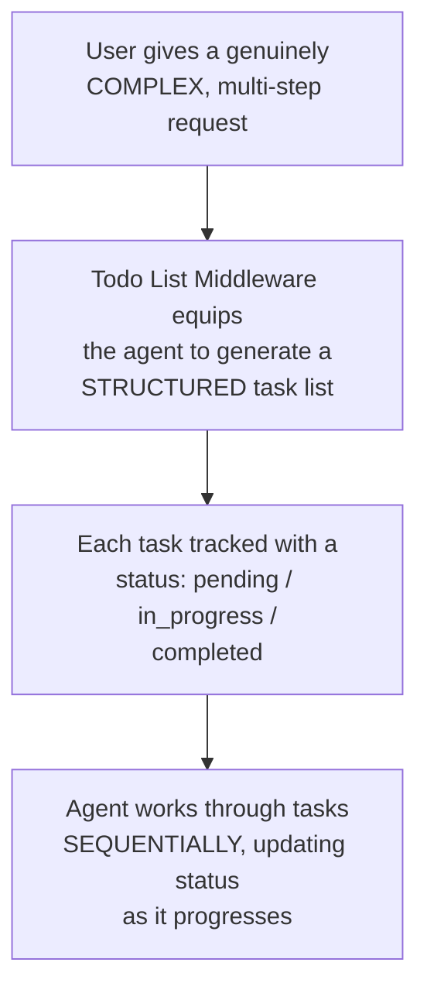

#### 💻 Code Example

```python
from langchain.agents.middleware import TodoListMiddleware

agent = create_agent(
    model=model,
    tools=tools,
    middleware=[TodoListMiddleware()],
    checkpointer=in_memory_saver,   # required to track progress across turns
)
```

#### 🪜 Step-by-Step — Live Demonstration: A Genuine, Multi-Step CineBot Request

> 💡 **Memory Trick, the live, precisely-observed result given directly:** *"'I want to plan a movie night, check what's showing, pick something good, and book two seats.' The AI message content was EMPTY first — it gave a complete `write_todos` tool call instead: 'gather user preferences,' status IN PROGRESS. Second: 'retrieve current showings.' Third: 'select recommended movie and showtime.' Then: 'confirm chosen movie.' It created a complete to-do list, just like this."*

#### ❓ Why a System Prompt Alone Wouldn't Achieve the Same Thing

> ⚠️ **A precise, direct clarification given to a student's genuinely reasonable question:** *"If you're thinking, 'ma'am, I could have set the same in my system prompt' — well, it's a problem, because there, the AI will NOT follow it like this. It will not create a SEPARATE to-do OBJECT. And that is actually how all these Claude Cowork [features] work — the reason they're so good is HOW they're able to get these structured things up."*

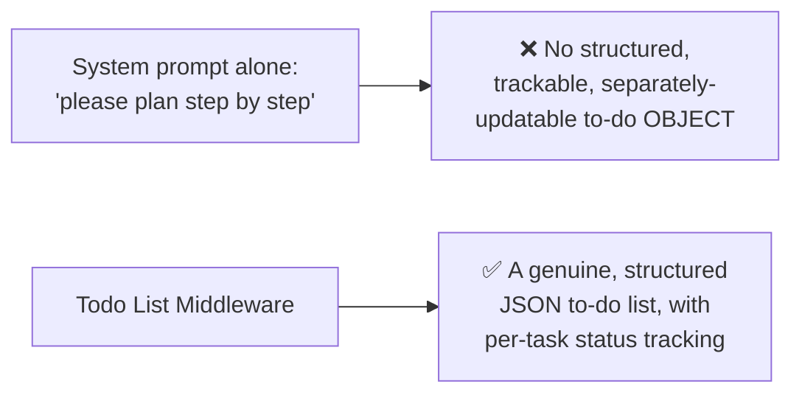

#### ⚠ Common Mistakes

* Assuming this middleware enables genuinely PARALLEL task execution — explicitly, directly corrected in Q&A: *"Can we run these tasks parallelly? They will not be done parallelly, because they have a REQUIREMENT — first you ask for preferences, THEN you run on user preferences, THEN select recommended showtime, THEN confirm, THEN book."*
* Assuming a checkpointer is optional here — implicitly required, since progress tracking across multiple turns (as tasks move from "in progress" to "completed") depends on persisted state, exactly as with HITL and thread-scoped limits.

#### 🎯 Key Takeaways

* Todo List Middleware equips an agent with **structured, JSON-based task planning** for complex, multi-step requests — directly mirroring the visible "checklist" behavior in Claude Cowork and similar tools.
* This produces a genuinely **different kind of behavior** than simply instructing the same thing via a system prompt — a separate, trackable to-do OBJECT the user (or front-end) can display and reference, not just implicit step-by-step reasoning.
* Tasks generated this way are typically **sequential, not parallel**, since real multi-step tasks usually have genuine dependencies between steps (you can't confirm a movie before knowing what's showing).

---

### 6. LLM Tool Selector Middleware: Query-Based, Not State-Based, Tool Filtering

#### ❓ Why It Exists — The Motivating Scale Problem

> 💡 **Memory Trick, given directly:** *"Say your agent has 15 tools, and you ask it to work on booking. Do you feel we should send ALL 15 tools? Claude has SO many connectors — Gmail, Slack, Calendar, and more — but Claude does NOT load all of them at the start. It picks up the connector required for the specific task."*

#### 🔍 Internal Working — Precisely Distinguished From Dynamic Tool Loading

> ⚠️ **A direct, precise clarification given in response to a genuinely important student question ("how is this different from dynamic tool loading?"):** *"In dynamic tool loading, we were loading tools based on some STATE — a particular CATEGORY of user (VIP, pro, free). Here, it is based on the QUERY. If a user is logged in vs. not — you'd remove tools DIRECTLY, yourself, based on that flag; you wouldn't let a model take that call. But what if the query itself needs a different, smaller subset each time, regardless of user category? That's where an LLM tool selector helps."*

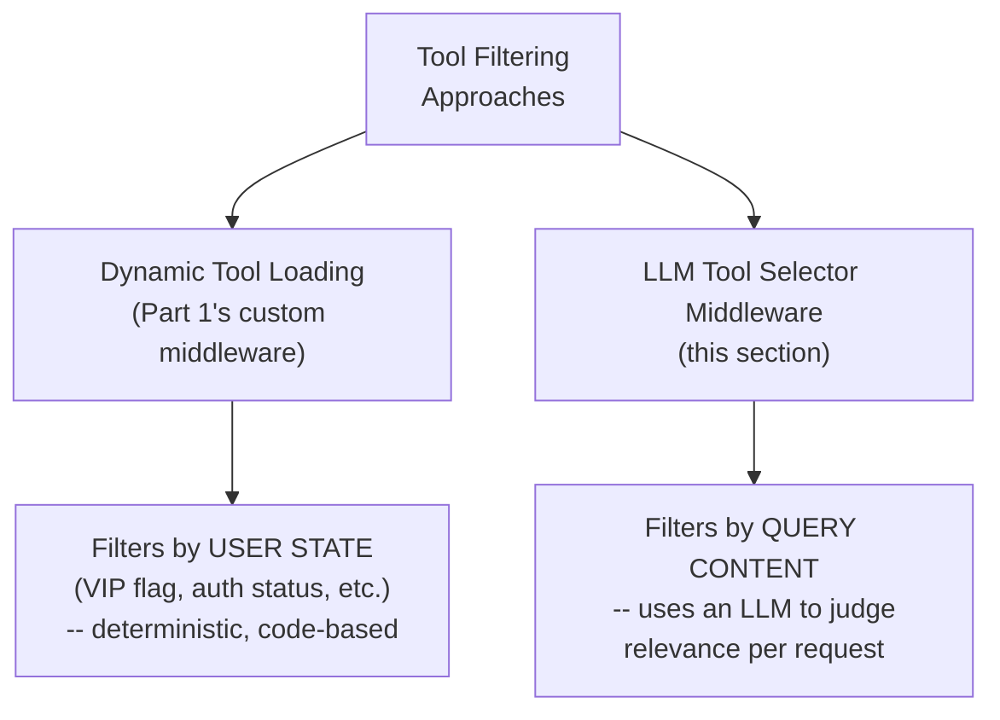

> 💡 **Memory Trick, the precise reasoning for WHY code should handle deterministic filtering, given directly:** *"Always remember: the agent, the model, the brain -- ChatGPT, Claude, OpenAI -- they are FUZZY in nature. They can make mistakes. CODE, if written properly, normally doesn't make mistakes. If I know a user isn't logged in, I should remove the 'book seats' tool BEFOREHAND, myself, rather than sending it to the agent, where it could, by mistake, still call it."*

#### 💻 Code Example

```python
from langchain.agents.middleware import LLMToolSelectorMiddleware

agent = create_agent(
    model=model,
    tools=cinebot_tools,  # 6 tools total, in this session's example
    middleware=[
        LLMToolSelectorMiddleware(
            model="gpt-5-mini",     # can be a CHEAPER model than the main agent
            max_tools=2,
            always_include=["check_showtimes"],  # doesn't count against max_tools
        )
    ],
)
```

#### 🪜 Step-by-Step — A Live-Built Custom Middleware, Specifically to REVEAL What Tools Get Sent

> 💡 **Memory Trick, given directly, an honest, on-the-spot workaround for a genuine documentation gap:** *"By default, I don't think there's a way to SEE which tools get selected -- so we'll hack into the system. Let me create a custom middleware, wrapping the model call, that just PRINTS the tools being sent."*

```python
# A minimal custom middleware, written live, purely for observability:
def show_tools_sent(request, handler):
    print([t.name for t in request.tools])
    return handler(request)
```

> 💡 **Memory Trick, the live-observed result given directly:** *"'What's your refund policy?' -- just `get_refund_policy` (plus the always-included `check_showtimes`) was sent. 'Can you cancel my booking with ID V1234?' -- `cancel_booking`, `check_order_status`, AND `check_showtimes` were sent -- I wasn't expecting `check_order_status`, but it genuinely makes sense in context."*

#### 🔍 Internal Working — Why TWO AI Calls, Each With Different Tool Sets

> 💡 **Memory Trick, the precise reasoning given directly, in response to a student's confusion:** *"How many AI messages do you see here? First, second. EVERY time you call the model, you send the AVAILABLE tools. First call: 4 tools were relevant. Second call (after the first tool executed): only 2 were sent -- `check_showtimes` (always included) plus whatever was STILL relevant given the conversation so far."*

#### ⚠ Common Mistakes

* Assuming the LLM Tool Selector is simply "model selection" (choosing which BRAIN to use) -- explicitly, directly corrected: *"It is NOT model selection -- it's just how we're sending the REQUIRED TOOLS, nothing else."*
* Assuming a model receiving fewer tools than `max_tools` (e.g., 4 sent when `max_tools=10`) indicates a bug -- explicitly, directly corrected: the middleware's entire GOAL is sending only genuinely RELEVANT tools, not maximizing the count up to the configured ceiling.
* Assuming this middleware guarantees the model NEVER makes a tool-selection mistake -- explicitly, directly acknowledged as a genuine, real limitation, with the fix being IMPROVING the tool descriptions and system prompt, not abandoning the middleware.

#### 🎯 Key Takeaways

* **LLM Tool Selector Middleware** filters tools by QUERY CONTENT, using a (potentially cheaper) LLM -- genuinely distinct from dynamic tool loading, which filters by USER STATE, using deterministic code.
* The underlying principle for choosing between these two approaches: use CODE for anything genuinely DETERMINISTIC (a user's login/VIP status is a known fact); use an LLM SELECTOR only for genuinely FUZZY, content-dependent relevance judgments a fixed rule can't easily capture.
* This middleware genuinely reduces TOKEN USAGE and improves MODEL FOCUS by avoiding sending irrelevant tools on every single call -- directly, concretely demonstrated via a custom, on-the-spot debugging middleware revealing the exact tool sets sent per call.

---
### 7. Tool Error Middleware: Converting Crashes Into Recoverable Tool Messages

#### ❓ Why It Exists

> 💡 **Memory Trick, given directly:** *"Can a tool make an error? Of course. When it does, should we STOP the flow, or try to retry, or make sure our agent still runs? We should NOT stop it -- ideally, we try to make sure the agent can still run."*

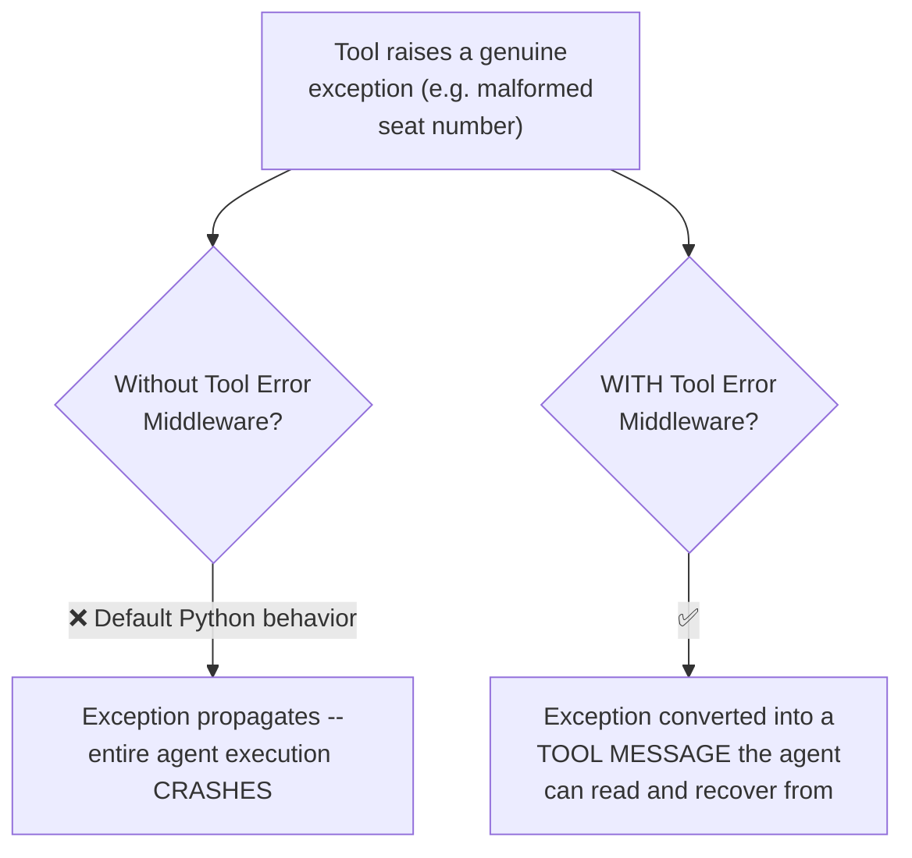

#### 🪜 Step-by-Step — Live-Demonstrated: Failure WITHOUT the Middleware First

> ⚠️ **A genuine, deliberately-triggered crash, shown BEFORE the fix, exactly as in Part 1's own pattern:** *"Let's run it WITHOUT this middleware first... see? This is a BAD way of doing this, everyone -- my tool threw an error, and I just stopped the execution. Should I have stopped here? No."*

#### 💻 Code Example — The Fix

```python
from langchain.agents.middleware import ToolErrorMiddleware

def on_error(exception, tool_call_request):
    return f"Tool '{tool_call_request.tool_name}' failed: {exception}. Please try a different approach."

agent = create_agent(
    model=model,
    tools=tools,
    middleware=[
        ToolErrorMiddleware(on_error=on_error, tools=["cancel_booking"]),  # tools= is optional -- omit for ALL tools
    ],
)
```

> 💡 **Memory Trick, the precise mechanism given directly:** *"Catch exceptions raised during tool execution, and convert them into ERROR TOOL MESSAGES the model can see and recover from. This tool message is the TYPE of message a tool sends -- so rather than saying 'I will fail here,' I'm saying: whatever error comes, I will NOT show it as an exception -- I'll show it as a tool message, so your AI can understand and correct it."*

#### ⚠ A Direct, Explicit Limitation

> ⚠️ **Directly, precisely stated -- and genuinely important, since it sets up the NEXT middleware:** *"Tool Error Middleware does NOT automatically retry failed calls. For retries, it must be composed with Tool Retry Middleware."*

#### ⚠ A Genuinely Honest, Live-Reproduced Version Issue

> ⚠️ **Directly, honestly demonstrated -- a real package version incompatibility, live-diagnosed and fixed:** *"It's saying it cannot import this from `langchain.agents.middleware`... let's check the version. It's 1.3.13, but this middleware requires at least 1.3.14. Let's upgrade: `pip install --upgrade 'langchain>=1.3.14'`. I hope you're able to understand HOW we solved it -- whenever something fails, try to understand how you can debug it, rather than saying 'it's not working on my machine.'"*

#### 🔍 Internal Working — Why an Unhandled Exception Genuinely Crashes Everything

> 💡 **Memory Trick, given directly, the underlying, precise reasoning:** *"At the end of the day, this is Python only. If there's an error which is RAISED in Python, Python STOPS the execution. If you wrap your error into something Python doesn't 'feel' is an error -- exactly what exception handling does -- it will not stop, and then you can use it."*

#### ⚠ Common Mistakes

* Assuming Tool Error Middleware alone makes an agent resilient to failing tools by AUTOMATICALLY retrying them -- explicitly, directly corrected: it only converts the crash into a readable message; RETRYING requires the separate Tool Retry Middleware.
* Assuming every tool's error-handling behavior should be identical -- explicitly, directly clarified: `tools=[...]` can scope this middleware to only specific tools, and different tools may reasonably warrant different error-handling strategies (a purchase tool might genuinely need to error out rather than retry).

#### 🎯 Key Takeaways

* **Tool Error Middleware** catches exceptions raised during tool execution and converts them into **tool messages** the model can read and reason about -- preventing a single failing tool from crashing the ENTIRE agent execution.
* This middleware explicitly does **NOT** provide automatic retries on its own -- that requires composing it with **Tool Retry Middleware** (Section 8).
* A genuine, live package-version incompatibility was diagnosed and fixed on screen -- directly modeling real, everyday debugging discipline rather than a pre-polished, error-free demo.

---

### 8. Tool Retry Middleware: Exponential Backoff, Live-Proven

#### ❓ Why It Exists

> 💡 **Memory Trick, given directly:** *"Tool Retry is used for: handling transient failures in external API calls, improving reliability of network-dependent tools, building resilient agents that gracefully handle temporary errors."*

#### 💻 Code Example

```python
from langchain.agents.middleware import ToolRetryMiddleware

agent = create_agent(
    model=model,
    tools=[flaky_showtime_tool],
    middleware=[
        ToolRetryMiddleware(
            max_retries=3,            # 3 RETRIES -- 4 total calls (1 initial + 3 retries)
            initial_delay=1.0,          # seconds, before the FIRST retry
            backoff_factor=2.0,           # exponential multiplier
            max_delay=60.0,                  # seconds, hard ceiling
            on_failure="continue",             # tool message with error details -- LLM can recover
        )
    ],
)
```

> ⚠️ **A precise, directly-stated clarification on the exact math:** *"`max_retries` is MAXIMUM RETRIES, not maximum CALLS. `max_retries=3` means: 1 default call, PLUS 3 more retries -- 4 total calls."*

#### 🔍 Internal Working — The Exact Exponential Backoff Formula

> 💡 **Memory Trick, the formula given directly, then verified against a real, live-measured trace:** *"Each retry waits: `initial_delay × backoff_factor^retry_number`. With initial_delay=1, backoff_factor=2: first retry = 1×2⁰ = 1 second. Second retry = 1×2¹ = 2 seconds. Third retry = 1×2² = 4 seconds."*


> 💡 **Memory Trick, the live-measured, real timing given directly, confirming the formula against reality:** *"0.19 seconds... 1.90 seconds... 3.59 seconds... as you can see, it's increasing, everyone. This is genuinely why exponential delay is preferred for a non-responding tool -- rather than hammering it with constant, rapid retries."*

#### 🪜 Step-by-Step — The Live, Precisely-Explained "Why 8, Not 4?" Trace

> 💡 **Memory Trick, the full, precisely-walked-through explanation given directly:** *"I made this tool ALWAYS fail. With `max_retries=3`, the maximum a SINGLE call can retry is 4 total (1+3). It called it 4 times, all failed -- but because we're handling the error gracefully (Tool Error Middleware, `on_error='continue'`), it went BACK to the AI with a tool message saying 'failed after 4 attempts.' The AI, on seeing this, decided ON ITS OWN to try again -- 4 MORE calls. Total: 8."*

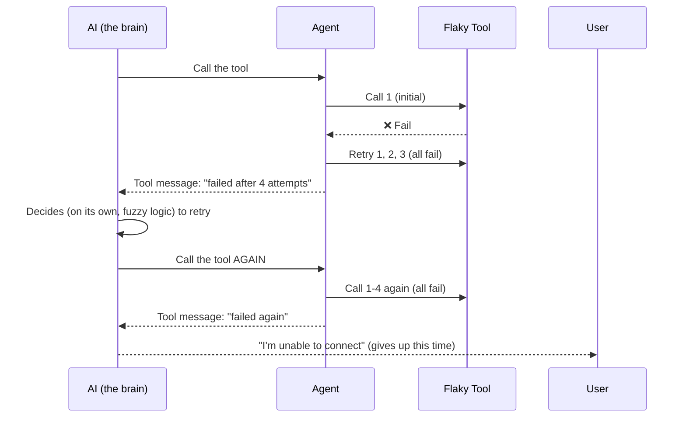

#### ⚠ A Genuinely Important, Honestly-Acknowledged Nuance

> 💡 **Memory Trick, given directly, in response to a student noticing the AI DIDN'T retry a third time:** *"This time, AI did NOT call it again. Why? Because AI is fuzzy-based, right? AI can make some use of it sometimes, other use other times. Can we CONTROL AI's retry behavior? Not directly -- but we CAN give it instructions in the system prompt: 'anytime a tool fails, don't retry it.' Then it will never do it."*

#### ⚠ Common Mistakes

* Confusing `max_retries` with the total number of calls a tool can make — explicitly, directly clarified via the precise "1 + retries" formula.
* Assuming the AI's own decision to re-attempt a failed tool (after the middleware's own retries are exhausted) is itself controlled by Tool Retry Middleware — explicitly, directly distinguished: the middleware controls its OWN retry count; the AI's SEPARATE decision to call the tool again afterward is a genuinely different, fuzzy, model-level decision, controllable only via system prompt instructions, not middleware configuration.
* Assuming constant-delay retries are just as good as exponential backoff — explicitly, directly, live-measured-and-proven as inferior for handling a genuinely down/overloaded external service.

#### 🎯 Key Takeaways

* **Tool Retry Middleware** automatically retries a failing tool call, with a precise, configurable **exponential backoff** formula: `initial_delay × backoff_factor^retry_number`.
* `max_retries` counts RETRIES, not total calls — `max_retries=3` means 4 total attempts (1 initial + 3 retries).
* A live, real timing trace **directly proved** the exponential formula's correctness — not just asserted, but measured and matched against the stated math.
* The **"why 8 calls, not 4?"** live trace revealed a genuinely important, non-obvious interaction: the MIDDLEWARE's own retry limit (4 total) is entirely separate from the AI MODEL's own, fuzzy, independent decision to try calling the tool again after seeing a graceful failure message — the total call count can exceed the middleware's own configured retry ceiling if the model decides to retry on its own.

---
### 9. LLM Tool Emulator Middleware: Faking Tool Calls for Testing

#### ❓ Why It Exists

> 💡 **Memory Trick, given directly:** *"Say we want to have a payment tool -- do you feel that while we're DEVELOPING it, we'd love to dummy the same out? There can be multiple tools you'd love to dummy out -- rather than defining them fully, this is very good for your DEVELOPMENT side."*

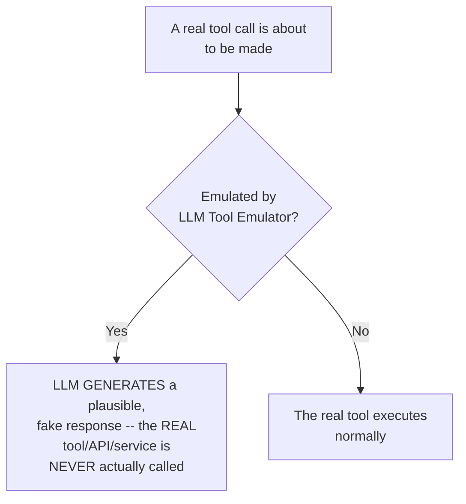

#### 💻 Code Example

```python
from langchain.agents.middleware import LLMToolEmulator

agent = create_agent(
    model=model,
    tools=[get_weather, send_email],   # real tool definitions still exist
    middleware=[
        LLMToolEmulator(),   # tools NOT listed here run for real; listed/matched ones get emulated
    ],
)
```

> 💡 **Memory Trick, the precise mechanism given directly:** *"You are just using an AI response, rather than calling the exact ones. Whenever there will be an actual tool call, we just change it with the AI-GENERATED response. LLM is emulating the tool -- it's FAKING the call, and saying 'this is what I received.'"*

#### 🪜 Step-by-Step — Live Demonstration: A Faked Weather Call, Feeding a Real Email Draft

> 💡 **Memory Trick, the live, precisely-narrated flow given directly:** *"'Please send an email to my manager for leave tomorrow, mentioning the bad weather in Gudhau.' AI decided to call `get_weather` with Gudhau. Ideally, if I called this tool for real, I'd get real weather in Gudhau. But it's EMULATED -- can your real tool return this exact message? No, because it's been generated by the LLM. LLM is emulating the tool -- OpenAI GPT-5 is faking the call, saying 'this is what I received,' and NOW it's writing an email for you based on that FAKE result."*

#### 🏢 Real-World / Production Usage — Two Genuine, Concrete Use Cases

> 💡 **Memory Trick, both use cases given directly:** *"If it's an EXPENSIVE tool -- or a PAYMENT tool where you genuinely don't want to trigger a real payment during testing -- or a tool where you'd have to send a real message to someone -- wouldn't you like it dummied up instead? This is majorly used for TESTING and EMULATION purposes."*

#### ⚠ A Direct, Precise Clarification: This Is Not the Same as Manually Writing a Mock Function

> 💡 **Memory Trick, given directly, addressing a genuinely reasonable "why not just write a mock myself" question:** *"Ideally, you CAN write dummy functions yourself -- not a problem. But this is where the middleware helps: rather than YOU defining a mock function every single time, for every tool, you can just use this instead. It's very logical -- you don't need to define anything; you can enter ANYTHING, and it will directly respond as if it called the tool."*

#### ⚠ Common Mistakes

* Assuming an emulated tool call reflects genuine, real-world data — explicitly, directly clarified: the response is entirely LLM-generated and plausible-SOUNDING, not connected to any real API, database, or service whatsoever.
* Assuming this middleware is meant for production use — explicitly, directly scoped to **development and testing** specifically, not live, customer-facing deployment.

#### 🎯 Key Takeaways

* **LLM Tool Emulator Middleware** replaces a real tool call with an LLM-GENERATED, plausible fake response — the actual underlying tool, API, or service is never genuinely invoked.
* Two concrete, stated use cases: avoiding real charges/side-effects from **expensive or payment-related tools** during development, and avoiding real, unwanted actions (like sending a genuine message) while **testing** an agent's overall flow.
* This middleware genuinely saves developer effort compared to manually writing individual mock functions for every tool — a real, practical convenience, not just a theoretical alternative to hand-rolled mocking.

---

### 10. Closing: What's Next (Custom Middleware, MCP, a GCP Project)

#### 🧠 Concept — A Brief, Honest Note on Deep-Agent-Specific Tools

> 💡 **Memory Trick, given directly, explicitly deferring file-system and shell-related middleware:** *"These file-system, file-search, and shell tools -- they're part of your DEEP AGENT, okay? Claude can write shell commands -- if I ask it to create a folder, it runs `mkdir`. An agent can have control of your shell as well. We'll cover these properly, in depth, in Deep Agents."*

#### 🪜 Step-by-Step — The Explicit, Stated Roadmap

> 💡 **Memory Trick, the precise, stated plan given directly:** *"Topic for next weekend: CUSTOM MIDDLEWARE, and I will first do MCP. Custom middleware, then MCP. I have to do a project on GCP -- Google Cloud Project -- with you all. That project requires LangChain, MCP, major understanding of this."*

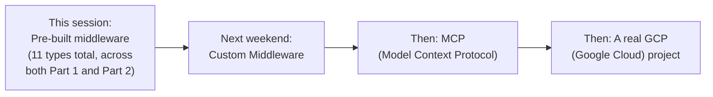

> 💡 **Memory Trick, the broader course-progress framing given directly:** *"I think we are almost done with LangChain, everyone -- the major backend-side topics. Then there would be LangGraph, which is very much in detail. Then Deep Agents, which is pretty easy for us now. After that, we can cover frameworks directly via projects if we need."*

#### ⚠ Common Mistakes

* Assuming this session's coverage of pre-built middleware is exhaustive, with nothing more to learn about middleware specifically — explicitly, directly clarified: **custom middleware** (writing entirely new, developer-defined before/after logic, beyond configuring existing pre-built types) remains explicitly deferred to the following weekend.

#### 🎯 Key Takeaways

* File-system and shell-command-related tools are explicitly, directly identified as belonging to **Deep Agents** specifically, not LangChain's general middleware library — deferred to a future, dedicated session.
* The **explicit, stated roadmap**: custom middleware next, then MCP, then a real Google Cloud Platform project applying both.
* The instructor's own **course-progress framing** situates this entire middleware arc (spanning both Part 1 and Part 2) as nearly completing LangChain's "backend-side" content, with LangGraph and Deep Agents explicitly named as the next major topics.

---
## 📝 Glossary

| Term | Definition | Why It Matters |
|---|---|---|
| **Run limit** | A cap on calls (model or tool) within a SINGLE invoke | "Chapatis per meal" -- refreshes with each new invoke |
| **Thread limit** | A cap on calls (model or tool) across an ENTIRE conversation | "Chapatis per day" -- accumulates across all invokes, requires a checkpointer |
| **Guardrail** | A way to control AI agent behavior | Implementable via middleware, system prompts, or other mechanisms -- middleware is only ONE way |
| **LUHN algorithm** | The validation algorithm used to detect genuine credit card number formats | How PII Middleware distinguishes a real card number from a random digit sequence |
| **Hash (PII strategy)** | Replacing PII with a deterministic, developer-reversible hash | Preserves identity for backend use WITHOUT exposing the real value to the model |
| **Todo List Middleware** | Equips an agent with structured, JSON-based task planning for complex requests | Produces a genuine, trackable to-do OBJECT -- not achievable via system prompt alone |
| **LLM Tool Selector Middleware** | Uses an LLM to filter available tools based on QUERY content | Distinct from dynamic tool loading, which filters by USER STATE |
| **Tool Error Middleware** | Converts a raised tool exception into a readable tool message | Prevents a single failing tool from crashing the entire agent |
| **Tool Retry Middleware** | Automatically retries a failing tool call with exponential backoff | Must be paired with Tool Error Middleware for graceful handling; `max_retries` ≠ total calls |
| **Exponential backoff** | A retry-delay formula: `initial_delay × backoff_factor^retry_number` | Increases wait time between retries, avoiding hammering a struggling service |
| **LLM Tool Emulator** | Replaces a real tool call with an LLM-generated, fake response | For safe development/testing of expensive, risky, or unbuilt tools |

---

## 🔄 Revision Notes — One-Minute Revision

* This is a **direct continuation of Part 1** -- picking up mid-way through Tool Call Limit Middleware, and covering five genuinely new middleware types: **Todo List, LLM Tool Selector, Tool Error, Tool Retry, LLM Tool Emulator**.
* **Run limit vs. thread limit**, via a new "chapatis" analogy: run limit = chapatis PER MEAL (refreshes each invoke); thread limit = chapatis PER DAY (accumulates across the whole conversation) -- live-traced through a real, three-booking cancellation scenario.
* **Guardrail**, precisely defined via a highway/mountain-road analogy: a way to control agent behavior -- implementable via middleware, system prompts, or other mechanisms; middleware is only ONE way, not the only way.
* **PII Detection extended**: credit cards validated via the **LUHN algorithm**; custom, company-specific PII types (e.g., a booking-code format) via regex; the **hash** strategy preserves a deterministic, DEVELOPER-reversible identity without exposing the real value to the model -- genuinely distinct from mask/redact.
* **Todo List Middleware** equips an agent with structured, trackable, JSON-based task planning -- directly mirroring Claude Cowork's own checklist behavior -- and produces genuinely different results than a system prompt alone.
* **LLM Tool Selector Middleware** filters tools by QUERY content (using an LLM, ideally a cheaper one) -- precisely distinguished from dynamic tool loading, which filters by USER STATE (using deterministic code); live-proven via a custom, on-the-spot debugging middleware revealing exactly which tools were sent per call.
* **Tool Error Middleware** converts a raised exception into a readable tool message, preventing a full agent crash -- but does NOT provide automatic retries on its own; requires pairing with **Tool Retry Middleware**.
* **Tool Retry Middleware** uses exponential backoff (`initial_delay × backoff_factor^retry_number`), live-measured and matched against the formula; `max_retries` counts RETRIES, not total calls (`max_retries=3` = 4 total attempts). A live, precisely-explained trace showed exactly why a tool was called **8 times** (4 middleware retries × the AI's OWN separate decision to try again).
* **LLM Tool Emulator Middleware** replaces a real tool call with an LLM-generated fake response, for safe testing of expensive, risky, or unbuilt tools.
* Closing roadmap: **custom middleware** and **MCP** are both explicitly deferred to the next weekend, ahead of a planned Google Cloud Platform project.

---

## 📋 Cheat Sheet

**Run vs. thread limit, the chapatis analogy:**
```text
Run Limit    -> chapatis allowed PER MEAL (resets each invoke)
Thread Limit -> chapatis allowed PER DAY (accumulates across ALL invokes)
```

**Guardrail vs. middleware:**
```text
Guardrail = the GOAL (control agent behavior)
Middleware = ONE way to implement it (system prompts are ANOTHER valid way)
```

**PII strategies, all four:**
```text
Block  -> raise an exception, stop entirely
Redact -> fully removed, placeholder only
Mask   -> partially obscured (e.g. 73XXXXXXXX)
Hash   -> deterministic, DEVELOPER-reversible -- model never sees the real value
```

**Dynamic Tool Loading vs. LLM Tool Selector:**
```text
Dynamic Tool Loading  -> filters by USER STATE (VIP flag, auth) -- deterministic, code-based
LLM Tool Selector       -> filters by QUERY CONTENT -- uses an LLM to judge relevance
```

**Tool Error + Tool Retry, paired:**
```python
ToolErrorMiddleware(on_error=..., tools=[...])   # converts crash -> tool message
ToolRetryMiddleware(max_retries=3, initial_delay=1.0, backoff_factor=2.0)  # auto-retries
```

**Exponential backoff formula:**
```text
delay = initial_delay x backoff_factor^retry_number
(e.g. 1s, 2s, 4s, 8s... for initial_delay=1, backoff_factor=2)
```

**LLM Tool Emulator -- use cases:**
```text
Expensive/payment tools during development
Testing an agent's flow without triggering real side effects
```

---

## 🔥 Interview Questions & Answers

### 🟢 Beginner

**Q1.**

**Question:** Using the "chapatis" analogy, explain run limit vs. thread limit.

**Answer:** Run limit is like chapatis allowed per meal (resets with each new invoke); thread limit is like chapatis allowed per day (accumulates across the whole conversation).

**Explanation:** The session's own precise, memorable analogy.

**Why Interviewers Ask This:** Tests genuine, intuitive understanding, not just memorized terminology.

**Possible Follow-up:** "Does the run limit resetting also reset the thread limit? Why or why not?"

**Q2.**

**Question:** Is middleware the only way to implement a guardrail?

**Answer:** No -- system prompt instructions are explicitly named as another valid mechanism; middleware is one way among several.

**Explanation:** Directly, explicitly clarified in response to a genuine student misconception.

**Why Interviewers Ask This:** Tests precise understanding of the guardrail concept's actual scope.

**Possible Follow-up:** "Name at least one other way (besides middleware) to implement a guardrail."

**Q3.**

**Question:** What algorithm does PII Middleware use to validate credit card numbers?

**Answer:** The LUHN algorithm.

**Explanation:** Directly, explicitly named.

**Why Interviewers Ask This:** Tests specific, technical recall of a real validation mechanism.

**Possible Follow-up:** "Why is this validation needed, rather than just matching any 16-digit number?"

**Q4.**

**Question:** What's the key difference between the hash PII strategy and the mask/redact strategies?

**Answer:** Hash preserves a deterministic, developer-reversible identity (useful for analytics/debugging), while mask/redact do not allow the original value to be recovered by the developer in the same way.

**Explanation:** Directly, precisely distinguished.

**Why Interviewers Ask This:** Tests understanding of a genuinely distinct, less commonly known PII strategy.

**Possible Follow-up:** "Give a real-world scenario where hash would be preferable to mask."

**Q5.**

**Question:** What does Todo List Middleware do?

**Answer:** Equips an agent with structured, JSON-based task planning and tracking for complex, multi-step requests.

**Explanation:** Directly, precisely defined.

**Why Interviewers Ask This:** Tests awareness of a genuinely useful, product-relevant middleware type.

**Possible Follow-up:** "Why can't a system prompt alone achieve the same structured behavior?"

**Q6.**

**Question:** What's the key difference between dynamic tool loading and LLM Tool Selector Middleware?

**Answer:** Dynamic tool loading filters tools based on user STATE (deterministic, code-based); LLM Tool Selector filters based on QUERY CONTENT, using an LLM.

**Explanation:** Directly, precisely distinguished.

**Why Interviewers Ask This:** A commonly-confused, important distinction between two similar-sounding concepts.

**Possible Follow-up:** "Which approach would you use for filtering tools based on a user's login status, and why?"

**Q7.**

**Question:** Does Tool Error Middleware automatically retry a failed tool call?

**Answer:** No -- it only converts the exception into a readable tool message; automatic retries require pairing it with Tool Retry Middleware.

**Explanation:** Directly, explicitly clarified.

**Why Interviewers Ask This:** Tests precise understanding of what each specific middleware does and doesn't provide.

**Possible Follow-up:** "What would happen if you used Tool Error Middleware WITHOUT Tool Retry Middleware?"

**Q8.**

**Question:** In `ToolRetryMiddleware`, does `max_retries=3` mean the tool is called 3 times total?

**Answer:** No -- `max_retries` counts retries only; the tool is called 4 times total (1 initial attempt + 3 retries).

**Explanation:** Directly, precisely clarified.

**Why Interviewers Ask This:** A commonly-tested, precise configuration detail.

**Possible Follow-up:** "Write the exponential backoff formula, and calculate the delay for the 2nd retry with initial_delay=1 and backoff_factor=3."

**Q9.**

**Question:** What is LLM Tool Emulator Middleware used for?

**Answer:** Replacing a real tool call with an LLM-generated, fake response -- for safe testing of expensive, risky, or not-yet-built tools.

**Explanation:** Directly, precisely defined.

**Why Interviewers Ask This:** Tests awareness of a genuinely practical, development-focused middleware type.

**Possible Follow-up:** "Name two concrete scenarios where this middleware would be genuinely useful."

**Q10.**

**Question:** What is explicitly deferred to the following weekend, per this session's closing roadmap?

**Answer:** Custom middleware and MCP (Model Context Protocol).

**Explanation:** Directly, explicitly stated.

**Why Interviewers Ask This:** Tests awareness of course structure and what remains genuinely uncovered.

**Possible Follow-up:** "What project is planned to follow custom middleware and MCP?"

---

### 🟡 Intermediate

**Q11.**

**Question:** Explain why the instructor deliberately live-traces the "why 8 calls, not 4?" scenario in such precise, step-by-step detail, rather than simply stating "sometimes the AI retries on its own."

**Answer:** Genuinely understanding this specific interaction (middleware-level retries vs. the AI's OWN, separate, fuzzy decision to retry again afterward) is a real, non-obvious source of confusion -- a learner who only knows "max_retries=3" might reasonably but INCORRECTLY expect exactly 4 total calls every time, and be confused when a real trace shows 8. By walking through the EXACT sequence (4 middleware-controlled attempts, a graceful failure message, then the AI's own independent decision to try again, triggering 4 MORE attempts), the instructor transforms a potentially confusing discrepancy into a precisely-understood, two-layered mechanism -- directly modeling the kind of rigorous, mechanism-level understanding this course consistently prioritizes over surface-level pattern matching.

**Explanation:** Requires recognizing why precise, traced explanation matters specifically for a genuinely counter-intuitive result.

**Why Interviewers Ask This:** Tests whether a learner understands this specific interaction precisely, not just that "sometimes there are more calls than expected."

**Possible Follow-up:** "How would you prevent the AI from retrying a tool call on its own, if you genuinely wanted to cap the TOTAL number of attempts at exactly 4?"

**Q12.**

**Question:** A learner argues that since LLM Tool Selector Middleware "reduces token usage," it should always be used on every agent with more than one or two tools, regardless of context. Evaluate this claim.

**Answer:** This claim overstates a genuinely context-dependent benefit into a universal rule. The session's own reasoning explicitly distinguishes DETERMINISTIC filtering (use code, directly, for things you already KNOW -- like a user's login status) from FUZZY, content-dependent filtering (use an LLM selector, for genuinely query-dependent relevance judgments a fixed rule can't easily capture). If an agent's tool relevance IS already fully determined by known, static state (e.g., a fixed per-user permission set), a deterministic, code-based filter is BOTH cheaper (no extra LLM call) and more reliable (code doesn't make fuzzy mistakes) than an LLM Tool Selector -- adding an LLM-based selector in that specific scenario would introduce unnecessary cost and a new potential source of error, not genuine additional value. The session's own explicit "we are smarter than AI... it's not that unnecessarily we use a middleware everywhere" framing directly supports evaluating each specific case, not applying LLM Tool Selector as a default, universal practice.

**Explanation:** Tests whether a learner recognizes that even a genuinely useful middleware type has a bounded, context-dependent appropriate use case, not universal applicability.

**Why Interviewers Ask This:** Distinguishes candidates who understand genuine trade-offs from those who treat "middleware reduces X" as an unconditional justification for using it everywhere.

**Possible Follow-up:** "Describe a specific scenario where LLM Tool Selector would be clearly WORSE than simple, deterministic, code-based tool filtering."

**Q13.**

**Question:** Explain, precisely, why the instructor's live "reveal what tools are actually sent" custom middleware (Section 6) was itself necessary -- what genuine documentation gap did it address?

**Answer:** The official LLM Tool Selector Middleware documentation, per the instructor's own live search, provided configuration OPTIONS (model, max_tools, always_include) but no DIRECT, built-in way to OBSERVE which specific tools were actually selected and sent for a given query -- a genuine, real gap between "what you can configure" and "what you can directly verify is happening." The instructor's on-the-spot custom middleware (wrapping the model call specifically to print the tools list) directly addressed this gap by tapping into the SAME underlying request object the middleware system already exposes (as demonstrated with the earlier dynamic tool loading custom middleware in Part 1) -- a genuine, applied example of using middleware's own general-purpose "before model call" hook not to CONTROL behavior, but purely for OBSERVABILITY/debugging purposes.

**Explanation:** Requires recognizing a specific, real documentation limitation and precisely explaining how the on-the-spot fix addressed it using the same general middleware mechanism covered elsewhere.

**Why Interviewers Ask This:** Tests whether a learner understands middleware's flexibility extends beyond behavior CONTROL into genuine OBSERVABILITY use cases.

**Possible Follow-up:** "Name another genuine observability use case (beyond seeing selected tools) you could implement using this same 'wrap the model call and print something' pattern."

**Q14.**

**Question:** Using this session's Tool Error + Tool Retry pairing (Sections 7-8), explain why a genuinely thoughtful agent design would apply DIFFERENT error-handling configurations to different tools, rather than one uniform policy for all tools.

**Answer:** Different tools genuinely carry different risk/retry-appropriateness profiles, directly connecting to the session's own explicit acknowledgment: *"it will depend on the tool -- if your agent has some purchase thing, then it can retry it; if it's very sensitive information, then it can error out as well."* A read-only, idempotent tool (checking a showtime) is genuinely SAFE to retry automatically many times with exponential backoff, since repeated identical calls produce no harmful side effects. A tool with genuine, real-world side effects (cancelling a booking, processing a payment) might be genuinely UNSAFE to retry automatically -- a transient network failure that actually succeeded on the backend, but appeared to fail to the client, could result in a DUPLICATE cancellation or charge if blindly retried. This is precisely why both `ToolErrorMiddleware` and `ToolRetryMiddleware` support a `tools=[...]` parameter, scoping their behavior to SPECIFIC tools rather than applying uniformly -- a genuinely important, risk-aware design consideration beyond simply "add error handling and retries everywhere."

**Explanation:** Requires connecting the session's own brief acknowledgment to a fuller, applied reasoning about WHY per-tool configuration genuinely matters, not just that the option exists.

**Why Interviewers Ask This:** Tests whether a learner recognizes idempotency and side-effect risk as genuine considerations in error-handling design, not just syntax knowledge.

**Possible Follow-up:** "Would you configure automatic retries for a tool that processes a real payment? Explain your reasoning."

**Q15.**

**Question:** Synthesize this session's Todo List Middleware (Section 5) with its LLM Tool Selector Middleware (Section 6) to explain a genuine, non-obvious interaction risk if both are used together on the same agent without careful configuration.

**Answer:** A genuine, non-obvious risk: Todo List Middleware generates a MULTI-STEP plan, where later steps in the plan may require tools that weren't relevant to the ORIGINAL query's immediate context (e.g., planning a movie night might eventually require a `book_seats` tool, even if the user's FIRST message only mentioned wanting to "check what's showing"). If LLM Tool Selector Middleware is ALSO active and filtering tools based on the CURRENT query's apparent content (rather than the full, planned task list), it's genuinely possible for a later step in the to-do list to reference or require a tool that got filtered OUT at that specific point in the conversation, since the selector's relevance judgment is query-by-query, not plan-aware. This suggests that combining these two middlewares requires either configuring `always_include` (per Section 6's own demonstrated parameter) to cover any tool genuinely likely to be needed across a MULTI-STEP plan, or accepting that the tool selector's `max_tools` should be set more GENEROUSLY when Todo List Middleware is also active, to avoid inadvertently starving a planned, multi-step task of tools it will genuinely need at a LATER step.

**Explanation:** Requires identifying a genuine, non-obvious interaction risk between two separately-taught middlewares that neither section explicitly addresses in combination.

**Why Interviewers Ask This:** A senior-level question testing whether a candidate can reason about middleware COMPOSITION risks specific to this session's own two new middleware types.

**Possible Follow-up:** "Propose a specific configuration change that would mitigate this identified risk."

---

### 🔴 Advanced

**Q16.**

**Question:** Design a genuinely complete, production-grade "resilience layer" for a CineBot-style agent, combining Tool Error Middleware, Tool Retry Middleware, and Model Fallback Middleware (from Part 1), with explicit, justified configuration for each, addressing genuinely different failure modes.

**Answer:** A reasonable, layered design: (1) **Tool Retry Middleware**, configured with exponential backoff (`initial_delay=1, backoff_factor=2, max_retries=3`) specifically for READ-ONLY, idempotent tools (checking showtimes, checking order status) -- directly per Intermediate Q14's reasoning, these are genuinely safe to retry automatically. (2) **Tool Error Middleware**, configured WITHOUT automatic retry pairing, specifically for STATE-CHANGING tools (cancel booking, process payment) -- converting failures into clear, readable tool messages the AI can reason about, but deliberately NOT auto-retrying, to avoid genuine duplicate-action risk. (3) **Model Fallback Middleware** (Part 1), configured with at least one backup model, addressing the SEPARATE failure mode of the underlying LLM PROVIDER itself being unavailable -- a genuinely different risk layer than individual tool failures, operating at the MODEL level rather than the tool level. (4) A custom, on-error function (per Section 7's exact demonstrated pattern) specifically for the payment/cancellation tools, explicitly instructing the AI (in the resulting tool message) to NOT automatically retry, directly addressing the "AI's own fuzzy retry decision" risk identified in Section 8's live trace. This design demonstrates genuine, risk-differentiated resilience -- treating idempotent and non-idempotent tools differently, and separately addressing tool-level versus model-level failure, rather than applying one uniform resilience policy everywhere.

**Explanation:** Synthesizes THREE separately-taught middleware types (two from this session, one from Part 1) into one coherent, genuinely risk-differentiated production design.

**Why Interviewers Ask This:** A realistic, senior-level resilience-architecture question testing whether a candidate can compose multiple middleware types with genuine, differentiated reasoning per tool/failure type.

**Possible Follow-up:** "Which of these four layers would you implement FIRST, if building this resilience layer incrementally under time pressure, and why?"

**Q17.**

**Question:** Critically evaluate: "Since LLM Tool Emulator Middleware can convincingly fake ANY tool's response, it should be used as a permanent, ongoing strategy for genuinely expensive or risky tools, rather than a temporary, development-only measure." Is this an accurate implication of this session's content?

**Answer:** Not accurate, and this misapplies a deliberately-scoped tool. The session explicitly, repeatedly frames LLM Tool Emulator as being "MAJORLY used for TESTING and EMULATION purposes" -- a DEVELOPMENT-phase tool, not a genuine, ongoing production strategy. Using it PERMANENTLY for a genuinely expensive or risky tool would mean the agent NEVER actually performs the real action it's meant to perform (a payment tool that's permanently emulated never processes a real payment) -- which defeats the entire PURPOSE of having that tool in the agent at all. The accurate, more precise claim: LLM Tool Emulator is valuable specifically DURING development and testing, when you want to verify an agent's overall REASONING and FLOW without triggering real, costly, or risky side effects yet -- but a genuinely complete, production-ready agent must eventually SWITCH to the real tool implementation for actual use, or the tool provides no real value to the deployed application at all.

**Explanation:** Tests whether a learner recognizes a tool's stated, bounded purpose (development/testing) versus an inaccurate, overreaching claim about permanent production applicability.

**Why Interviewers Ask This:** Distinguishes candidates who track a middleware's precisely stated scope from those who over-generalize a genuinely useful capability into an inappropriate, permanent strategy.

**Possible Follow-up:** "Describe a genuine, appropriate transition process for moving an agent from emulated tools (development) to real tools (production)."

**Q18.**

**Question:** Synthesize this session's guardrail definition (Section 3) with its complete middleware inventory (across both Part 1 and Part 2 -- eleven types total) to classify each middleware type as PRIMARILY a guardrail-implementing mechanism, PRIMARILY a resilience/reliability mechanism, or PRIMARILY a capability-enhancing mechanism -- explaining any genuinely ambiguous cases.

**Answer:** A reasonable classification: **Guardrail-implementing** (controlling/validating behavior): PII Middleware, HITL Middleware, Model Call Limit, Tool Call Limit -- these directly restrict or gate what the agent is ALLOWED to do. **Resilience/reliability** (keeping the agent running correctly despite failures): Model Fallback, Tool Error, Tool Retry -- these address FAILURE MODES, not behavioral restriction. **Capability-enhancing** (making the agent genuinely more effective, not more restricted): Summarization, Todo List, LLM Tool Selector -- these improve the agent's actual PERFORMANCE/organization, not its safety boundaries. A genuinely AMBIGUOUS case: **LLM Tool Emulator** -- it doesn't restrict behavior (guardrail), doesn't address a failure mode (resilience), and doesn't directly improve PRODUCTION capability (it's development-only) -- it sits in its own, distinct category: a DEVELOPMENT-TOOLING mechanism, genuinely different from all three other categories. This classification reveals that "middleware" as a category is genuinely BROADER than "guardrail" specifically -- directly reinforcing Section 3's own precise point that guardrails are only ONE motivating use case among several for the middleware mechanism generally, not the sole reason middleware exists.

**Explanation:** Requires synthesizing the COMPLETE set of middleware types covered across two full sessions into a genuinely reasoned taxonomy, correctly identifying and explaining an ambiguous edge case rather than forcing every middleware into the same category.

**Why Interviewers Ask This:** A capstone-level question testing whether a candidate can organize a large, multi-session body of specific knowledge into a coherent, genuinely reasoned conceptual framework.

**Possible Follow-up:** "Where would you classify Model Call Limit Middleware if it were configured specifically to control COST rather than behavior -- guardrail, resilience, or a fourth category?"

---

## 🧪 Scenario-Based Interview Questions

> **Scenario 1:** A teammate configures Tool Retry Middleware with `max_retries=5` on a tool that calls a genuinely slow, occasionally-timing-out external API, and reports the agent now takes an unacceptably long time to respond during outages. Using this session's concepts, diagnose and recommend a fix.

**Structured Answer:**
1. **Initial investigation:** Recognize this as directly connected to Section 8's exponential backoff formula -- with `max_retries=5` and even a modest `backoff_factor`, the CUMULATIVE delay across all retries can become genuinely substantial (per the live-measured formula, delays increase exponentially with each retry).
2. **Metrics/logs to check:** Calculate the theoretical maximum cumulative delay using the session's own formula (`initial_delay × backoff_factor^retry_number`, summed across all 5 retries), comparing it against the team's actual, acceptable response-time requirements.
3. **Possible causes:** A reasonable but overly-generous `max_retries` and/or `backoff_factor` configuration, not accounting for the genuinely exponential (not linear) growth in cumulative wait time as retry count increases.
4. **Debugging approach:** Directly test the configured retry sequence against the actual, real API's typical outage duration, confirming whether 5 retries with the current backoff genuinely provides meaningful recovery value, or mostly just adds unacceptable delay.
5. **Resolution:** Reduce `max_retries` to a more conservative value (e.g., 2-3, per Section 8's own demonstrated example), and/or configure `max_delay` (per Section 8's own documented parameter) to cap the worst-case wait time at an acceptable ceiling.
6. **Prevention:** Establish a team guideline requiring genuine, calculated worst-case-delay verification (using the session's own explicit formula) before deploying any Tool Retry Middleware configuration, rather than choosing retry counts arbitrarily.

> **Scenario 2 (Advanced):** Your organization wants to build a genuinely complete CineBot-style production agent, using ALL eleven middleware types covered across both this session and Part 1. A stakeholder asks you to justify why each one is included, in a single, coherent presentation. Using Advanced Q18's classification framework, structure your answer.

**Structured Answer:**
1. **Initial investigation:** Apply Advanced Q18's four-category classification (guardrail, resilience, capability-enhancing, development-tooling) to organize all eleven middleware types into a genuinely coherent presentation structure, rather than an unordered list.
2. **Relevant principle:** Per Section 3's guardrail definition, clarify upfront that not every included middleware is a "safety" measure -- some genuinely improve capability or resilience instead, directly preventing the stakeholder from assuming ALL middleware exists purely for restriction/compliance reasons.
3. **Possible causes for the stakeholder's request:** A reasonable, genuine desire to understand the actual VALUE each piece of added complexity provides, rather than accepting "we use eleven middlewares" as self-evidently justified.
4. **Debugging/evaluation approach:** For each middleware, articulate the SPECIFIC failure mode, risk, or capability gap it addresses (directly drawing on each middleware's own "why it exists" reasoning covered across both sessions), rather than a generic "it makes the agent better" justification.
5. **Resolution:** Present the four-category structure explicitly: Guardrails (PII, HITL, Model Call Limit, Tool Call Limit) for compliance/safety; Resilience (Model Fallback, Tool Error, Tool Retry) for genuine production reliability; Capability (Summarization, Todo List, LLM Tool Selector) for genuine user-experience/performance improvement; Development Tooling (LLM Tool Emulator) explicitly scoped OUT of the final production deployment, used only during the build process.
6. **Prevention:** Document this exact four-category framework as a standing, reusable template for justifying future middleware additions to ANY agent, ensuring the organization maintains genuine, differentiated reasoning rather than defaulting to "more middleware is always better."

---

## 🛠 Hands-on Exercises

### 🟢 Easy

1. Write out, from memory, the "chapatis" analogy for run limit vs. thread limit, in your own words.
2. Configure `TodoListMiddleware` on a simple agent of your own, and give it a genuinely multi-step request, documenting the resulting structured task list.
3. Write a custom, regex-based PII detector for an identifier of your own choosing (not this session's booking-code example), and test it with both the mask and hash strategies.

### 🟡 Medium

4. Configure `LLMToolSelectorMiddleware` on an agent with at least 5 tools, and build the same kind of "reveal what tools are sent" custom debugging middleware demonstrated live in Section 6.
5. Configure both `ToolErrorMiddleware` and `ToolRetryMiddleware` together on a deliberately-failing tool, and document the exact sequence of calls, matching it against the exponential backoff formula.
6. Configure `LLMToolEmulator` on a genuinely "risky" tool of your own design (e.g., a mock payment tool), and test that no real side effects occur while the agent's overall reasoning still works correctly.

### 🔴 Advanced

7. Implement the complete, four-layer resilience design proposed in Advanced Interview Q16, applying genuine, differentiated configuration to at least four different tools based on their idempotency/risk profile.
8. Implement the full, eleven-middleware CineBot agent proposed in Scenario 2, organizing your implementation according to Advanced Q18's four-category classification.
9. Design and document a test specifically probing the Todo List + LLM Tool Selector interaction risk identified in Intermediate Q15, and propose a concrete configuration fix.

---

## 🏗 Practice Assignment

*(This session's own stated assignment, reproduced faithfully)*

> 💡 **Memory Trick -- the instructor's own words, given directly:** *"Today, you will be getting an assignment for Middleware."*

### Build: "Complete Eleven-Middleware CineBot Agent"

**Objective:** Extend your CineBot agent (from Part 1's practice assignment) with all five new middleware types covered in this session, producing a genuinely complete, production-conscious agent.

**Requirements:**
- `TodoListMiddleware`, genuinely tested with a multi-step request (e.g., "plan a movie night, check showings, pick something good, book two seats").
- `LLMToolSelectorMiddleware`, configured with a genuine `max_tools` and `always_include` value, with documented evidence (via a custom debugging middleware, per Section 6's exact pattern) of which tools were actually sent for at least three different queries.
- `ToolErrorMiddleware` AND `ToolRetryMiddleware`, paired together on at least one deliberately-failing tool, with a documented trace of the exact call sequence and timing.
- `LLMToolEmulator`, applied to at least one "risky" tool (a mock payment or messaging tool), with documentation confirming no real side effects occurred.
- An extended custom PII type (beyond this session's booking-code example), using the hash strategy, with documented before/after behavior.
- A written reflection (200-300 words) on which of the eleven total middleware types (across both sessions) you'd genuinely prioritize for a real, production CineBot deployment, and why.

**Architecture (suggested):**

```text
cinebot_part2_middleware/
├── cinebot_agent_v2.py             # your extended, 11-middleware agent
├── TODO_LIST_TEST.md                 # documented multi-step task list test
├── TOOL_SELECTOR_TEST.md               # documented tool-selection traces
├── ERROR_RETRY_TEST.md                   # documented failure/retry sequence
├── EMULATOR_TEST.md                        # documented emulated tool test
├── CUSTOM_PII_HASH_TEST.md                   # documented custom PII + hash test
└── PRIORITIZATION_REFLECTION.md                # your written middleware-priority reflection
```

**Expected Functionality:**
- Every new middleware should be genuinely, individually testable and demonstrably working, directly reproducing this session's own live-verification standard.
- Your prioritization reflection should demonstrate genuine, differentiated reasoning (per Advanced Q18's classification framework), not a generic "all are important" answer.

**Challenges:**
- Correctly pairing Tool Error and Tool Retry middleware without accidentally masking genuine bugs in your own tool implementations.
- Building a genuinely useful custom debugging middleware to reveal LLM Tool Selector's actual tool-selection behavior, directly reproducing Section 6's own on-the-spot solution.

**Bonus Improvements:**
- Implement the full, four-layer resilience design from Advanced Interview Q16, with genuine, differentiated per-tool configuration.
- Extend your Todo List Middleware testing to a genuinely complex, 5+ step request, and document how the agent's task list evolves as it progresses.

---

## 📚 Additional Resources

- **Part 1: "Middleware Deep Dive"** -- the direct prerequisite session, covering Summarization, HITL, Model Call Limit, Model Fallback, Tool Call Limit, and PII (basic) middleware; this session assumes full familiarity with it.
- **LangChain's official middleware documentation and API reference** -- directly, repeatedly consulted live throughout this session, including a live version-upgrade fix and a live search for undocumented behavior.
- **A future, dedicated custom middleware session** (referenced directly, explicitly promised for the following weekend) -- covering how to write entirely new, developer-defined before/after logic.
- **A future, dedicated MCP (Model Context Protocol) session** (referenced directly) -- explicitly planned immediately after custom middleware.
- **A future Google Cloud Platform (GCP) project** (referenced directly) -- explicitly requiring both LangChain and MCP understanding as prerequisites.
- **A future, dedicated Deep Agents session** (referenced directly) -- covering file-system, file-search, and shell-command middleware, explicitly deferred from this session.

---

## 📌 Final Revision Sheet

### ⭐ Core Concepts
- **Run limit vs. thread limit**: chapatis per meal vs. chapatis per day.
- **Guardrail** = control agent behavior; middleware is ONE of several implementation mechanisms (system prompts are another).
- **Five new middleware types**: Todo List (structured task planning), LLM Tool Selector (query-based tool filtering), Tool Error (graceful failure), Tool Retry (exponential backoff), LLM Tool Emulator (fake tool responses for testing).
- **Dynamic Tool Loading (state-based) ≠ LLM Tool Selector (query-based)** -- a critical, precise distinction.
- **Tool Error + Tool Retry must be paired** for genuine, automatic, graceful recovery.
- **Hash PII strategy**: deterministic, developer-reversible, model never sees the real value -- distinct from mask/redact.

### ⭐ Important Definitions
- **LUHN algorithm**, **exponential backoff** (see Glossary for full definitions).

### ⭐ Important Commands/Code
```python
from langchain.agents.middleware import (
    TodoListMiddleware, LLMToolSelectorMiddleware,
    ToolErrorMiddleware, ToolRetryMiddleware, LLMToolEmulator,
)

ToolRetryMiddleware(max_retries=3, initial_delay=1.0, backoff_factor=2.0)
# delay = initial_delay x backoff_factor^retry_number
```

### ⭐ Architecture/Process
- Tool Error Middleware converts crashes to tool messages; Tool Retry Middleware auto-retries with exponential backoff -- combine both for genuinely graceful, resilient tool failure handling.
- LLM Tool Selector runs a (potentially cheaper) LLM call BEFORE the main model call, to filter tools per query.

### ⭐ Best Practices
- Use deterministic, code-based filtering for known state (login status); use LLM Tool Selector only for genuinely query-dependent relevance.
- Configure retry behavior per-tool, based on genuine idempotency/risk (safe to retry read-only tools; be cautious with state-changing ones).
- Use LLM Tool Emulator only during development/testing, never as a permanent production substitute for a real tool.
- Calculate worst-case cumulative retry delay before deploying any Tool Retry Middleware configuration.

### ⭐ Common Mistakes
- Confusing `max_retries` with total call count.
- Assuming Tool Error Middleware alone provides automatic retries.
- Assuming dynamic tool loading and LLM Tool Selector are the same mechanism.
- Assuming a hashed PII value can be "unhashed" by the model itself, rather than by separate, developer-controlled logic.

### ⭐ Interview Points
- Be ready to precisely distinguish run limit from thread limit, and dynamic tool loading from LLM Tool Selector.
- Be ready to explain why Tool Error and Tool Retry middleware must be paired.
- Be ready to walk through the exponential backoff formula and calculate a specific delay.
- Be ready to explain the hash PII strategy's genuine distinction from masking/redacting.

### ⭐ Things to Remember
- This session is a **direct continuation of Part 1** -- both should be studied together as one complete, eleven-middleware arc.
- **Custom middleware and MCP** are both explicitly deferred to the following weekend, ahead of a planned GCP project -- this session's coverage, while extensive, is not the final word on middleware.
- Two genuine, unscripted moments -- a live package-version upgrade, and a precisely-traced "why 8 calls, not 4?" explanation -- directly model real, honest debugging and reasoning, consistent with this course's broader teaching style.