# 🔧 Custom Middleware: Building Your Own Hooks Into a LangChain Agent's Execution

- <i>**Session:** LangChain Weekend Class — "Custom Middleware" · 
- **Instructor:** Mayank Aggarwal
- **Note on scope:** This is the **direct, explicitly-promised continuation** of the two prior Middleware sessions ("Middleware Deep Dive" and "Middleware Part 2") — both of which covered LangChain's *pre-built* middleware library. This session closes that arc by teaching how to write your **own** middleware from scratch: the exact hook points available (`before_agent`, `before_model`, `wrap_model_call`, `after_model`, `wrap_tool_call`, `after_agent`), the two ways to define them (decorators vs. classes), and the precise execution order when multiple middlewares are combined. The class opens with a genuinely compelling live demo — building a working "Claude Code"-style coding agent using nothing but a single Shell Tool Middleware — that motivates the entire rest of the session.</i>

---

## 📑 Table of Contents

1. [Session Overview](#-session-overview)
2. [Learning Objectives](#-learning-objectives)
3. [Detailed Notes](#-detailed-notes)
   - [1. Session Context: Recap & Why Custom Middleware Matters](#1-session-context-recap--why-custom-middleware-matters)
   - [2. The Shell Tool Middleware: A Live Demo of How Coding Agents Actually Work](#2-the-shell-tool-middleware-a-live-demo-of-how-coding-agents-actually-work)
   - [3. Why Custom Middleware Exists: The Limits of Pre-Built Middleware](#3-why-custom-middleware-exists-the-limits-of-pre-built-middleware)
   - [4. Two Styles of Hooks: Node-Style vs. Wrap-Style](#4-two-styles-of-hooks-node-style-vs-wrap-style)
   - [5. Building Custom Middleware, Live: Logging, DB Connections & Before-Model vs. Before-Agent](#5-building-custom-middleware-live-logging-db-connections--before-model-vs-before-agent)
   - [6. Runtime & State: What Your Middleware Can Actually Access and Change](#6-runtime--state-what-your-middleware-can-actually-access-and-change)
   - [7. Wrap Model Call, Revisited: Dynamic Model Selection](#7-wrap-model-call-revisited-dynamic-model-selection)
   - [8. Two Ways to Define Middleware: Decorator-Based vs. Class-Based](#8-two-ways-to-define-middleware-decorator-based-vs-class-based)
   - [9. Multiple Middleware & Execution Order: The FILO Rule](#9-multiple-middleware--execution-order-the-filo-rule)
   - [10. Closing: Best Practices & What's Next (MCP, LangGraph, Multi-Agent)](#10-closing-best-practices--whats-next-mcp-langgraph-multi-agent)
4. [Glossary](#-glossary)
5. [Revision Notes — One-Minute Revision](#-revision-notes--one-minute-revision)
6. [Cheat Sheet](#-cheat-sheet)
7. [Interview Questions & Answers](#-interview-questions--answers)
8. [Scenario-Based Interview Questions](#-scenario-based-interview-questions)
9. [Hands-on Exercises](#-hands-on-exercises)
10. [Practice Assignment](#-practice-assignment)
11. [Additional Resources](#-additional-resources)
12. [Final Revision Sheet](#-final-revision-sheet)

---

## 🎯 Session Overview

This session closes out the Middleware arc by teaching learners to build their own hooks into an agent's execution — genuinely completing the picture that "Middleware Deep Dive" and "Middleware Part 2" (both pre-built-middleware-only) deliberately left open. It covers:

1. **A live, genuinely compelling demo**: using nothing but Shell Tool Middleware, the instructor builds a working, Claude-Code-style coding agent — one capable of creating files, running scripts, and deleting entire folders on a real machine — directly motivating why understanding middleware deeply actually matters.
2. **Precisely why pre-built middleware isn't enough**: a cinema-chain chatbot's genuinely specific business rules ("never mention a rival cinema by name," "log every cancellation in our own audit format") that no generic, pre-built middleware could ever anticipate.
3. **Two categories of hooks**: **node-style** (`before_agent`, `before_model`, `after_model`, `after_agent`) which run at a single, fixed point, and **wrap-style** (`wrap_model_call`, `wrap_tool_call`) which wrap an entire call, letting you inspect and modify the actual request and response.
4. **A complete, from-scratch build of several working custom middlewares, live**: a logging middleware, a DB-connection-lifecycle middleware, and a precise, worked explanation of exactly why PII must be redacted specifically at `before_model` — not earlier, at `before_agent`.
5. **What "runtime" and "state" actually are**, and the precise, important clarification that a middleware doesn't just observe an agent — it can genuinely **modify** the agent's own state.
6. **A revisited, deeper explanation of `wrap_model_call`**, including a new, complete example: dynamically selecting between a "basic" and "advanced" model based on the number of messages in the conversation — directly explaining how ChatGPT and Claude's own "auto model selection" features actually work under the hood.
7. **The two syntaxes for defining middleware** — quick, single-hook **decorators** versus more powerful, multi-hook **classes** — with a precise explanation of when each is appropriate.
8. **The precise, provable execution order** when multiple middlewares are combined — "before" hooks run in the order you list them; "after" hooks run in **reverse** order, a genuine first-in-last-out (stack-like) pattern, explained via a memorable cooking analogy.
9. A closing roadmap: **MCP is next**, taught first as a standalone Python concept before being connected back to LangChain, followed by LangGraph, multi-agent systems, and memory.

> 💡 **Memory Trick — the instructor's own framing for why this topic deserves genuine focus, not a rushed pass:** *"I am genuinely, genuinely telling you, these are not simple use cases, these are advanced use cases. These are not something which you will just find anyone teaching... no one goes in this depth of agents, people just showcase that, hey, this is agent, this is tool, this is memory. This is actually what makes production-grade systems."*

---

## 🎯 Learning Objectives

By the end of this guide, you will be able to:

- [ ] Explain how coding assistants like Claude Code, Codex, and GitHub Copilot fundamentally work, using Shell Tool Middleware as the concrete mechanism.
- [ ] Explain, with a concrete business-rule example, why pre-built middleware is genuinely insufficient for real, production use cases.
- [ ] Precisely distinguish node-style hooks from wrap-style hooks, and correctly identify when each is appropriate.
- [ ] Correctly explain why PII redaction should happen at `before_model`, not `before_agent`, using the booking-lookup example.
- [ ] Explain what "runtime" and "state" are, and that custom middleware can genuinely modify an agent's state.
- [ ] Build a working `wrap_model_call` middleware that dynamically selects between two models based on conversation length.
- [ ] Correctly choose between decorator-based and class-based middleware definitions for a given use case.
- [ ] State and explain the precise execution order for multiple middlewares, including the reversed order of "after" hooks.

---

## 📚 Detailed Notes

### 1. Session Context: Recap & Why Custom Middleware Matters

#### 🧠 Concept

> 💡 **Memory Trick, given directly at the start:** *"We were mastering the middleware, everyone... we have already mastered around the core components of our agent, which is your model, messages, tools, streaming, structured output... Middleware is a very, very awesome way of making sure that you can control more in-depth part about your agent."*

#### ❓ Why It Exists — Agent Creation Is the Easy Part

> 💡 **Memory Trick, a genuinely direct, honest framing given at the start:** *"Agent creation, I think, is the easiest job. I could create 1,000 agents in under a minute... But when you actually want to crack good, product-based companies... if you want to make sure that you are able to create software which is going to put a dent, which is going to be actually helpful — that is where your agent should be something you have control over."*

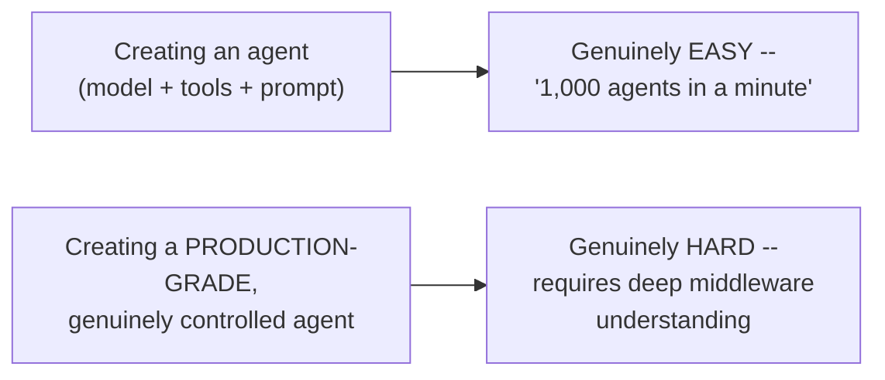

#### 🎯 Key Takeaways

* This session **directly, explicitly continues** the prior two Middleware sessions -- assuming full familiarity with the pre-built middleware library (Summarization, HITL, Model/Tool Call Limits, Model Fallback, PII, Todo List, LLM Tool Selector, Tool Error, Tool Retry, LLM Tool Emulator).
* The instructor draws a **sharp, explicit distinction** between the EASE of creating a basic agent and the genuine DIFFICULTY of creating a production-grade, properly-controlled one -- middleware being precisely the mechanism that bridges this gap.
* This session is explicitly framed as **genuinely advanced, production-relevant content** -- not the kind of surface-level "this is an agent, this is a tool" material the instructor contrasts it against.

---

### 2. The Shell Tool Middleware: A Live Demo of How Coding Agents Actually Work

#### ❓ Why It Exists — The Motivating Question

> 💡 **Memory Trick, given directly:** *"How many of you have ever used Claude Code or anything like that?... You must have seen that how if you ask it to create a file, it is able to create a file on your machine... Don't you think that all these different coding assistants — Cursor, Claude Code, GitHub Copilot, Antigravity, Gemini — they are just using your terminal?"*

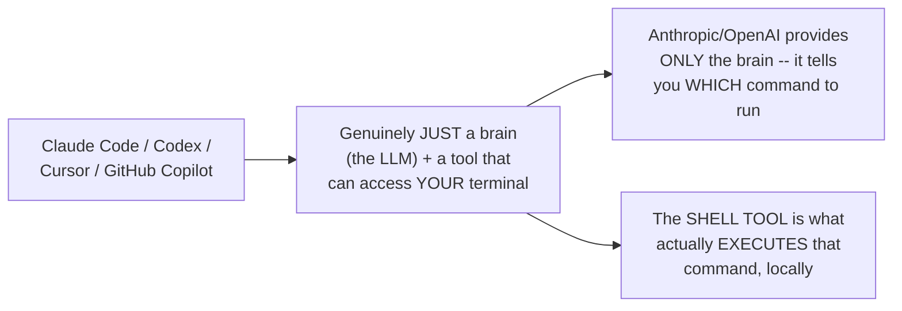

#### 📖 Definition — Shell Tool Middleware

> 💡 **Memory Trick, given directly, reading the actual documentation:** *"Shell tool middleware exposes a persistent shell session to agents for command execution. Useful for: agents that need to execute system commands, development and deployment automation tasks, testing and validation of workflows, file system operations and script execution."*

#### 🪜 Step-by-Step — Building a Working Coding Agent, Live

> 💡 **Memory Trick, the complete, live-built agent given directly:** *"I'm creating an agent. I'm not giving it any tools -- I'm giving it Shell Tool Middleware. Workspace root is `/content/cinebot_workspace`. Execution policy: host execution policy."*

```python
from langchain.agents.middleware import ShellToolMiddleware, HostExecutionPolicy
from langchain.agents import create_agent

agent = create_agent(
    model=model,   # e.g. Claude
    tools=[],       # deliberately EMPTY -- no explicit tools given
    middleware=[
        ShellToolMiddleware(
            workspace_root="/content/cinebot_workspace",
            execution_policy=HostExecutionPolicy(),
        )
    ],
)
```

> 💡 **Memory Trick, the live, real result given directly:** *"'Create a Python script which creates two folders, langchain_1 and langchain_2. Just create the script.' ... See, two folders are created, everyone. Able to understand what all is happening? How smart -- this is what Claude Code does, in a way, right?"*

#### 🔍 Internal Working — Three Execution Policies, Precisely Compared

> 💡 **Memory Trick, given directly:** *"Host execution policy: full host access, best for a trusted environment where the agent already runs. Docker: launches a separate Docker container for each agent run, so that everything is separated out. Codex sandbox execution: reuses the Codex CLI sandbox for additional syscalls."*

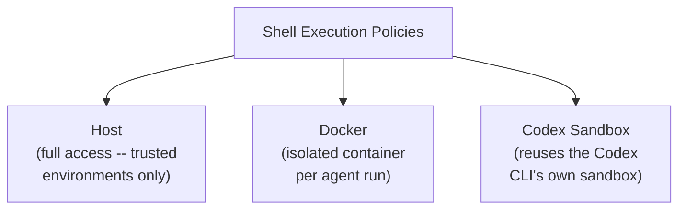

#### ⚠ A Genuine, Live-Demonstrated, Cautionary Moment

> ⚠️ **Directly, honestly demonstrated -- a real, deliberate risk shown live:** *"'Delete all files and folders inside your workspace.' Since it's Colab, I'm all fine, but let's see -- it worked. See, everyone, it is deleted. Don't you think it's a problematic thing? ... Now, if that is the case, I think we should be running it inside a Docker container, at least."*

#### ⚠ A Direct, Precise Clarification: Tool or Middleware?

> 💡 **Memory Trick, given directly, addressing a genuinely reasonable point of confusion:** *"Mayank, isn't it a tool? Well, yes, it is around the tool as well, okay -- should not be a problem, because in many different frameworks, it is just a tool only. LangChain has added it in Middleware -- for us, it is not a worry."*

#### ⚠ Common Mistakes

* Assuming Shell Tool Middleware requires the agent to be given an explicit, separate tool -- explicitly, directly demonstrated as unnecessary: the middleware itself provides the capability, with `tools=[]` left empty.
* Assuming the underlying LLM provider (Anthropic/OpenAI) itself has access to the local machine -- explicitly, directly corrected: the provider only supplies the "brain" (deciding WHICH command to run); the actual EXECUTION happens locally, via the shell tool.
* Running Shell Tool Middleware with full host access as a default, safe choice -- explicitly, directly demonstrated as genuinely risky (a real, deliberate folder-deletion demo), motivating Docker-based isolation for anything beyond a fully trusted environment.

#### 🎯 Key Takeaways

* **Claude Code, Codex, Cursor, and GitHub Copilot all work on the same underlying principle**: an LLM "brain" plus a tool granting access to a local terminal -- genuinely nothing more sophisticated than that, mechanically.
* **Shell Tool Middleware** is LangChain's own implementation of this exact capability -- workspace-scoped, with three selectable execution policies (Host, Docker, Codex Sandbox) trading off convenience against genuine safety.
* This demo is explicitly, deliberately positioned as **motivation**, not the main content -- proving middleware's real-world power BEFORE diving into how to build custom middleware from scratch.

---
### 3. Why Custom Middleware Exists: The Limits of Pre-Built Middleware

#### ❓ Why It Exists — A Concrete, Business-Specific Example

> 💡 **Memory Trick, the exact, worked example given directly:** *"Human-in-the-loop middleware handles approval for any tool. PII middleware handles any of the PII. But Cinebot's actual business has rules nothing built-in could know in advance: no customer books more than two movies in one session. Flag if the bot ever mentions a rival cinema's name. Log every cancellation in our own specific audit format. Do you think that any middleware can provide you with these things?"*

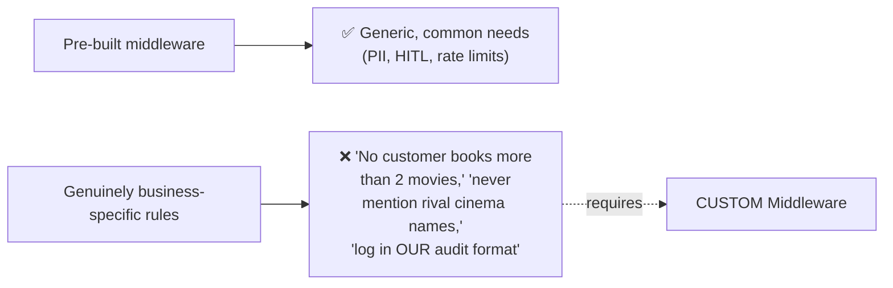

#### 🏢 Real-World / Production Usage — A Genuinely Apt Analogy

> 💡 **Memory Trick, given directly:** *"We have Pydantic in Python, because Python doesn't provide that approach to you, where you are having complete type and field validation. Just as an example... LangChain says, 'let me only provide you [what's common], because I do understand that not everyone's needs can be fulfilled by what I'm providing.'"*

#### 🧠 Concept — Custom Middleware Terminology Is a General Pattern, Not LangChain-Specific

> 💡 **Memory Trick, given directly:** *"Anytime you see callbacks, hooks, middleware -- more or less, they will be doing the same kind of thing. These terms are used in other frameworks as well."*

#### ⚠ Common Mistakes

* Assuming pre-built middleware's absence of a specific feature indicates a genuine LangChain limitation to complain about, rather than an intentional design choice -- explicitly, directly reframed: LangChain deliberately provides only common, generic middleware, precisely because it cannot anticipate every organization's specific business rules.

#### 🎯 Key Takeaways

* Custom middleware exists specifically because **genuinely business-specific rules** (a cinema chain's own booking limits, competitor-mention policies, internal audit-log formats) can never be fully anticipated by any generic, pre-built library.
* This mirrors a **general software-engineering pattern**: just as Python's own lack of built-in validation led to Pydantic, LangChain's deliberate focus on common cases leads naturally to the need for custom middleware.
* **"Callback," "hook," and "middleware"** are explicitly, directly identified as different names for the SAME underlying pattern across different frameworks (ADK's "callbacks" being the specific example returned to repeatedly across this entire Middleware arc).

---

### 4. Two Styles of Hooks: Node-Style vs. Wrap-Style

#### 📖 Definition — The Complete Execution Flow, With All Six Hook Points

> 💡 **Memory Trick, given directly:** *"When you send the request, the very first point will be BEFORE AGENT, before the request even reaches your agent. Then, most probably, agent calls the model -- so BEFORE MODEL. Then, WRAP MODEL CALL. Then AFTER MODEL. Then WRAP TOOL CALL. Then, finally, AFTER AGENT."*

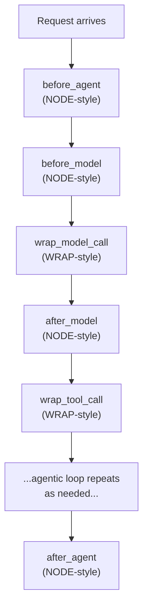

#### 🔍 Internal Working — Precisely Why Two Different Styles Exist

> 💡 **Memory Trick, given directly:** *"Node-style hooks run sequentially at a specific execution point -- used for logging, validation, and state updates... Wrap-style hooks WRAP the call, so whenever we will see the example, I think that would be much clearer."*

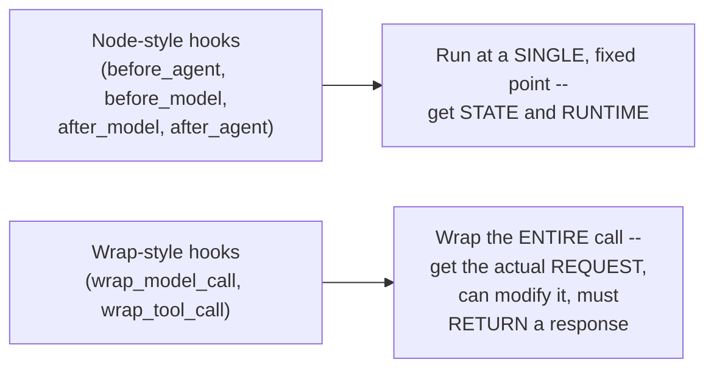

#### ❓ Why It Exists — Precisely Why There's No `before_tool`/`after_tool`

> 💡 **Memory Trick, a genuinely direct, honest answer given to a repeated student question:** *"Why is there no before-tool-call or after-tool-call? You're not missing anything -- we can handle the same via wrap_tool_call, so that's why it isn't present. It's just a LangChain-specific thing -- other frameworks (like ADK) CAN have before/after tool call separately."*

> 💡 **Memory Trick, a genuinely apt cross-language analogy given directly:** *"In Python, there is no way of having field validation directly without Pydantic. In C++ and Java, it is inherently present. In a similar manner, treat FRAMEWORKS as languages -- ADK says 'I'll provide before/after tool call'; LangChain says 'I'm not providing that specifically -- you do it with wrap_tool_call.'"*

#### 🔍 Internal Working — Precisely What Each Hook Type Gives You

> 💡 **Memory Trick, the precise, direct distinction given:** *"When you're using BEFORE MODEL, you get the STATE and the RUNTIME. In WRAP MODEL CALL, you actually get the EXACT REQUEST that's been created. So you can change it more in-depth."*

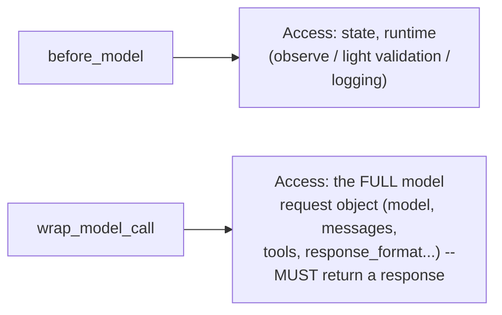

#### ⚠ Common Mistakes

* Assuming the absence of `before_tool`/`after_tool` hooks in LangChain represents a genuine gap or oversight -- explicitly, directly clarified: this exact functionality is fully achievable via `wrap_tool_call`; it's purely a naming/design choice specific to LangChain, not a missing capability.
* Confusing `before_model`'s access (state, runtime) with `wrap_model_call`'s access (the full, modifiable request object) -- explicitly, directly distinguished as genuinely different levels of control.

#### 🎯 Key Takeaways

* **Node-style hooks** (`before_agent`, `before_model`, `after_model`, `after_agent`) run at a single, fixed point, giving access to state and runtime -- suited for logging, validation, and lightweight state updates.
* **Wrap-style hooks** (`wrap_model_call`, `wrap_tool_call`) wrap an entire call, giving access to the FULL request object -- suited for genuinely modifying what gets sent (e.g., changing which model is used, or which tools are available).
* The absence of dedicated `before_tool`/`after_tool` hooks is explicitly, directly clarified as a LangChain-specific design choice, NOT a missing capability -- `wrap_tool_call` fully covers this need.

---
### 5. Building Custom Middleware, Live: Logging, DB Connections & Before-Model vs. Before-Agent

#### 💻 Code Example — A Simple, Live-Built Logging Middleware

> 💡 **Memory Trick, given directly, step by step:** *"Let's say that you want to log every request. Can I create a function like this -- `log_before_model`? It will be getting the state of the agent and the runtime. And it is printing what it is about to do."*

```python
from langchain.agents.middleware import before_model

@before_model
def log_before_model(state, runtime):
    print("About to call model with", len(state["messages"]), "messages so far.")

agent = create_agent(
    model=model,
    tools=[],
    middleware=[log_before_model],
)
```

> 💡 **Memory Trick, the live-observed result given directly:** *"'How are you?' ... See? It is able to understand -- 'about to call model with [N] messages so far.'"*

#### 💻 Code Example — A DB-Connection-Lifecycle Middleware, Using `before_agent` and `after_agent`

> 💡 **Memory Trick, given directly:** *"I am defining this middleware, which is connecting to DB. I'm saying, hey, I will do this BEFORE agent... In a similar manner, I could have one AFTER agent as well -- once the chat gets ended, or the session gets ended, close all the connections."*

```python
from langchain.agents.middleware import before_agent, after_agent

@before_agent
def connect_to_db(state, runtime):
    print("Connected to DB.")

@after_agent
def disconnect_from_db(state, runtime):
    print("Disconnected from DB.")

agent = create_agent(
    model=model,
    tools=[...],
    middleware=[connect_to_db, log_before_model, disconnect_from_db],
)
```

#### ❓ Why It Exists — Precisely Why `before_agent` and `after_agent` Run Only ONCE

> 💡 **Memory Trick, given directly, the precise reasoning:** *"When your agent starts, there is just ONE time where you can do anything -- you can load something up, connect to your DB. Your agent will not be called again and again -- that would be just one time. Similarly, in AFTER AGENT... once the chat gets ended, nothing will be there. There can be MULTIPLE tool calls, multiple model calls -- but before/after agent, that's just once per invocation."*

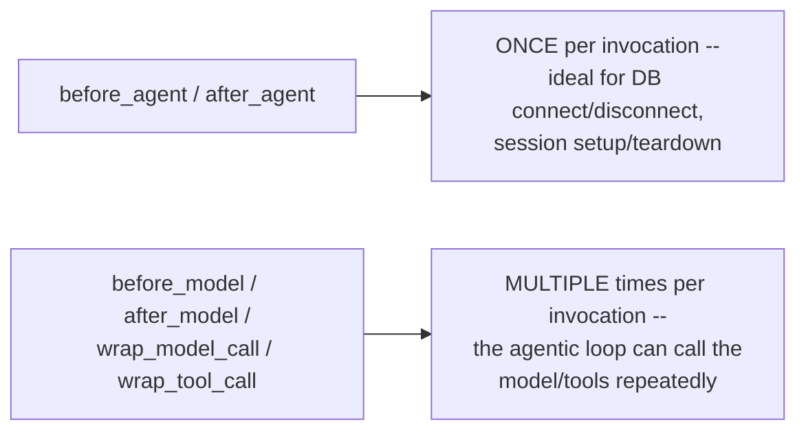

#### 🪜 Step-by-Step — A Precise, Worked Example: WHY PII Redaction Belongs at `before_model`, Not `before_agent`

> 💡 **Memory Trick, the complete, worked scenario given directly:** *"Let's say I'm calling this agent with my personal information: 'My name is Mayank, this is my email ID, this is my number.' This agent has two tools: `get_booking`, `cancel_booking`. Should I pass this information to my model? ... Agent might use this information to GET the booking -- this information might be used by the TOOL. But I should not just be passing it to my MODEL."*

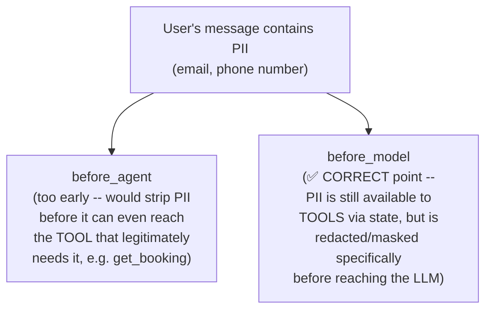

> 💡 **Memory Trick, the precise, direct conclusion given:** *"That means I need a middleware, something like BEFORE MODEL -- because that's one of the touchpoints. We can redact it or mask it -- but we should not mask it completely the second I'm getting it."*

#### ⚠ Common Mistakes

* Assuming ALL sensitive-data handling logic should default to `before_agent`, since it runs "first" -- explicitly, directly corrected via the booking example: `before_agent` would strip PII too early, BEFORE a legitimate tool (like `get_booking`) has a chance to genuinely use it; `before_model` is the correct, more precise point.
* Assuming `before_model`/`after_model` run only once, like `before_agent`/`after_agent` -- explicitly, directly corrected: since the agentic loop can call the model multiple times within a single invocation, these hooks fire correspondingly multiple times.

#### 🎯 Key Takeaways

* `before_agent`/`after_agent` are **genuinely one-time** hooks per invocation -- ideal for setup/teardown work like DB connection lifecycle management.
* `before_model`/`after_model`/`wrap_model_call`/`wrap_tool_call` can fire **multiple times** within a single invocation, tracking the agentic loop's actual model and tool calls.
* The precise choice of WHICH hook point to use for a given task (like PII protection) requires genuine reasoning about WHAT information different parts of the system legitimately need -- `before_model` is correct for PII specifically because tools may still need the raw data even though the LLM itself should not see it.

---

### 6. Runtime & State: What Your Middleware Can Actually Access and Change

#### 📖 Definition — Runtime

> 💡 **Memory Trick, given directly:** *"LangChain's `create_agent` runs on LangGraph runtime under the hood. LangGraph exposes a runtime object with: static context, user ID, connection, dependencies, store, execution info, stream writer."*

#### 📖 Definition — State

> 💡 **Memory Trick, given directly, connecting back to Part 1's own dynamic-tool-loading example:** *"All of you must remember we were having state as well -- this is the point where we actually passed 'is VIP member,' bool. We used to access this inside our request."*

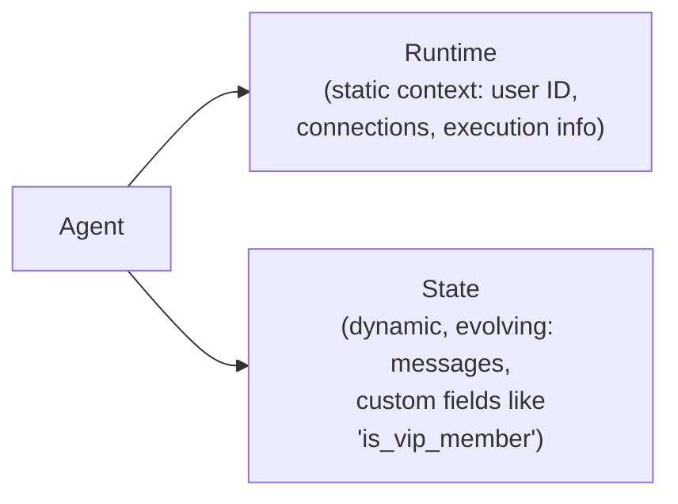

#### 🔍 Internal Working — Middleware Can GENUINELY Modify State, Not Just Observe It

> 💡 **Memory Trick, given directly, a genuinely important, precisely-stated clarification:** *"When you create your particular middleware, it can UPDATE the state of your agent... your middleware can ACTUALLY update the state of an agent. Just that -- simple thing... When we are stopping the flow in between, we can inherently change something in the agent if we want. That is the whole idea of stopping the flow."*

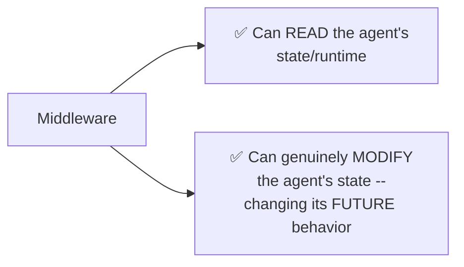

#### ⚠ Common Mistakes

* Assuming middleware is purely observational (logging, validating) and can never genuinely change how the agent subsequently behaves -- explicitly, directly corrected: middleware can update the agent's own state, which is precisely how dynamic behaviors (like the VIP-tool-filtering example from Part 1) actually work.

#### 🎯 Key Takeaways

* **Runtime** holds relatively static, per-execution context (user ID, connections, execution info); **state** holds dynamic, evolving information (messages, custom fields like `is_vip_member`) that can change throughout the conversation.
* Middleware can **genuinely modify agent state** -- this is not a side effect to be avoided, but precisely the mechanism that makes middleware powerful enough to change an agent's subsequent behavior.
* Deep architectural detail on runtime and state is explicitly, directly deferred to the upcoming LangGraph sessions -- this session provides only the working-level understanding needed to build effective custom middleware now.

---
### 7. Wrap Model Call, Revisited: Dynamic Model Selection

#### 🔄 A Direct, Explicit Callback to Part 1's Own VIP Dynamic Tool Loading Example

> 💡 **Memory Trick, given directly:** *"How many of you remember that VIP launch thing which we did? Where we were saying, this 'book VIP lounge' tool, I should not be sending it to the free user. We used a `wrap_model_call` there -- based on a condition, when you are calling the model, that is where I need to change something."*

#### 💻 Code Example — A New, Complete `wrap_model_call` Example: Dynamic Model Selection

> 💡 **Memory Trick, the full, live-built example given directly:** *"I've created two models -- basic model and advanced model. Now, based on the number of messages: if the message count is greater than 10, use the advanced model; otherwise, use the basic model."*

```python
from langchain.agents.middleware import wrap_model_call

basic_model = init_chat_model("claude-3-5-haiku-latest")
advanced_model = init_chat_model("claude-sonnet-4-5")

@wrap_model_call
def dynamic_model_selection(request, handler):
    if len(request.messages) > 10:
        request.model = advanced_model
    else:
        request.model = basic_model
    return handler(request)

agent = create_agent(
    model=basic_model,
    tools=[...],
    middleware=[dynamic_model_selection],
)
```

> 💡 **Memory Trick, the precise mechanism given directly:** *"I'm not doing this before or after -- I'm doing this EXACTLY when the model will be called. I want to OVERRIDE, in the request, the model with my chosen model."*

#### 🏢 Real-World / Production Usage — This Is How Auto Model Selection Actually Works

> 💡 **Memory Trick, given directly, in response to a genuinely sharp student observation:** *"Is this the same concept as auto LLM call selection in ChatGPT/Claude applications? Yes, yes, yes -- this is how they do it. When Claude or ChatGPT have their auto model selection, that is how they're able to do it."*

#### 🔍 Internal Working — What's Actually Inside a `model_request` Object

> 💡 **Memory Trick, given directly, the complete list:** *"In my model request, what is all the things which I get? I get the model, messages, system message, tool choice, different tools, response format, state of my agent, runtime, model settings. Now, you can change ANY of these things."*

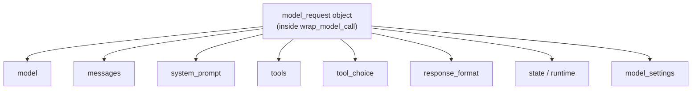

> 💡 **Memory Trick, given directly, generalizing the pattern for ANY future use case:** *"Rather than thinking of instance, just see: when you wrap the model, what do you get? You get this complete request. Now just think of any use case, and you can change any of these things -- that is the benefit."*

#### ⚠ Common Mistakes

* Assuming `wrap_model_call` is inherently tied to conditional logic in every use case -- explicitly, directly clarified: the wrapping mechanism itself is general-purpose (you get the full request object); conditional logic (like message-count thresholds) is simply ONE common way to decide what to change.
* Confusing "model fallback" (switching models on FAILURE, covered in Part 1) with this dynamic model selection pattern (switching models based on a DELIBERATE, proactive condition, unrelated to failure) -- explicitly, directly distinguished in Q&A.

#### 🎯 Key Takeaways

* `wrap_model_call` gives access to the **complete `model_request` object** -- model, messages, system prompt, tools, tool_choice, response_format, state, runtime, and model_settings -- ANY of which can be modified before the actual model call proceeds.
* **Dynamic model selection** (switching between a cheaper/faster and a more capable model based on conversation complexity) is explicitly identified as the SAME underlying mechanism real products like Claude and ChatGPT use for their own "auto model selection" features.
* This mechanism is explicitly, directly distinguished from **model fallback** (Part 1) -- fallback reacts to genuine FAILURE; dynamic selection proactively chooses based on a DELIBERATE condition, unrelated to any error.

---

### 8. Two Ways to Define Middleware: Decorator-Based vs. Class-Based

#### 📖 Definition — Decorator-Based Middleware

> 💡 **Memory Trick, given directly:** *"Decorator-based middleware are pretty simple. Quick and simple for single-hook middleware. Use a decorator to wrap individual functions... when to use: single hook needed, no complex configuration, quick prototyping."*

```python
@before_model
def log_before_model(state, runtime):
    ...
```

#### 📖 Definition — Class-Based Middleware

> 💡 **Memory Trick, given directly:** *"An AgentMiddleware subclass can declare attributes that Agent Factory picks up at compile time -- state schema, tools, transformers. More powerful for complex middleware with multiple hooks or configuration."*

```python
from langchain.agents.middleware import AgentMiddleware

class CallCounterMiddleware(AgentMiddleware):
    def __init__(self, warn_after=3):
        super().__init__()
        self.warn_after = warn_after
        self.num_calls = 0

    def before_model(self, state, runtime):
        self.num_calls += 1
        if self.num_calls > self.warn_after:
            print("Lots of calls being made -- keep your credit card ready!")

agent = create_agent(
    model=model,
    tools=[...],
    middleware=[CallCounterMiddleware(warn_after=3)],
)
```

#### 🔍 Internal Working — Precisely When Each Style Is Appropriate

> 💡 **Memory Trick, given directly, the complete comparison:**
> - **Use decorators when**: *"Single hook needed, no complex configuration, quick prototyping."*
> - **Use classes when**: *"You need to define BOTH sync AND async implementations for the same hook. Multiple hooks needed in a single middleware. Complex configuration (thresholds, custom models). Reuse across projects with initial-time configuration."*

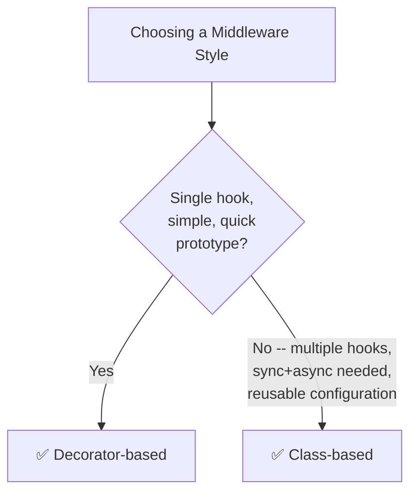

> 💡 **Memory Trick, a genuinely important, live-demonstrated point: ONE middleware class can hold MULTIPLE hooks:** *"Can I add inside it `after_model`? Then `def before_agent`? Can I add multiple hooks or execution points inside this? Pretty simple -- one middleware CAN have multiple points. A very good example: PII middleware has ONE `before_model` and ONE `after_model` -- before model, it's not letting your information go OUT; after model, it's not letting information the MODEL might be providing come back either."*

#### ⚠ Common Mistakes

* Assuming class-based middleware is unconditionally superior and should always be preferred -- explicitly, directly clarified: it should be used specifically WHEN its added complexity (multiple hooks, async support, reusable configuration) is genuinely needed; simple decorators remain appropriate for straightforward, single-hook cases.
* Assuming a single middleware can only implement one hook type -- explicitly, directly demonstrated as false via the PII middleware example: a genuinely complete, production-grade middleware often needs BOTH `before_model` and `after_model` hooks working together.

#### 🎯 Key Takeaways

* **Decorators** are appropriate for quick, single-hook, low-configuration middleware; **classes** (inheriting from `AgentMiddleware`) are appropriate for multi-hook, complex-configuration, or async-requiring middleware.
* A **single middleware class can implement multiple hooks simultaneously** -- the PII middleware's own real, dual `before_model`/`after_model` implementation is the canonical example, protecting BOTH outgoing user input and incoming model output.
* In production, **class-based middleware is the more common choice**, per the instructor's own direct statement -- specifically because real production needs typically outgrow a single decorator's scope.

---
### 9. Multiple Middleware & Execution Order: The FILO Rule

#### ❓ Why It Exists — A Genuinely Common, Repeated Student Question

> 💡 **Memory Trick, given directly:** *"Many people were asking me: Mayank, what is this shell tool middleware 'before agent' and shell tool middleware 'after agent'? What is the exact case when we have multiple middlewares?"*

#### 📖 Definition — The Core, Precise Rule

> 💡 **Memory Trick, given directly, the exact ordering:** *"If I'm adding [Middleware 1, Middleware 2, Middleware 3] like this: first, BEFORE AGENT -- Middleware 1 goes first, then Middleware 2, then Middleware 3. When the agent loop starts: before model -- Middleware 1, Middleware 2, Middleware 3, same way. But ALL THE 'AFTER' ONES WILL GET REVERSED. So: Middleware 3 after model, Middleware 2 after model, Middleware 1 after model. Middleware 3 after agent, Middleware 2 after agent, Middleware 1 after agent."*

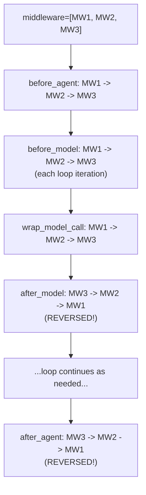

#### 🧠 Concept — The Cooking Analogy, Given Directly

> 💡 **Memory Trick, a genuinely memorable analogy given directly:** *"If you're cooking food -- there can be a 'tasting food' middleware. This middleware gets called AFTER adding salt, and BEFORE serving guests. So these are two hook points, or hooks, of ONE middleware."*

#### 🔍 Internal Working — Why "First In, Last Out" Is Genuinely Logical, Not Arbitrary

> 💡 **Memory Trick, the precise, direct reasoning given:** *"The connection which opens FIRST will get closed LAST. If I connect to the DB in the very first middleware, it will close last. First in, last out."*

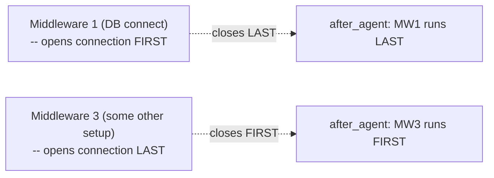

> ⚠️ **A precise, direct terminology correction, given live in Q&A:** *"Is this FIFO? No -- Stack. It is FIRST IN, LAST OUT. Queues are FIFO; stacks are LIFO/FILO."*

#### 🔍 Internal Working — This Applies to `wrap_tool_call` Too, But WITHOUT Reversal

> 💡 **Memory Trick, a genuinely important, precise clarification given directly:** *"Is it the same way as wrap_tool_call, does it execute in reverse order? No -- wrap_tool_call will be EXACTLY in the same order. Middleware 1 wrap tool call, Middleware 2 wrap tool call, Middleware 3 wrap tool call."*

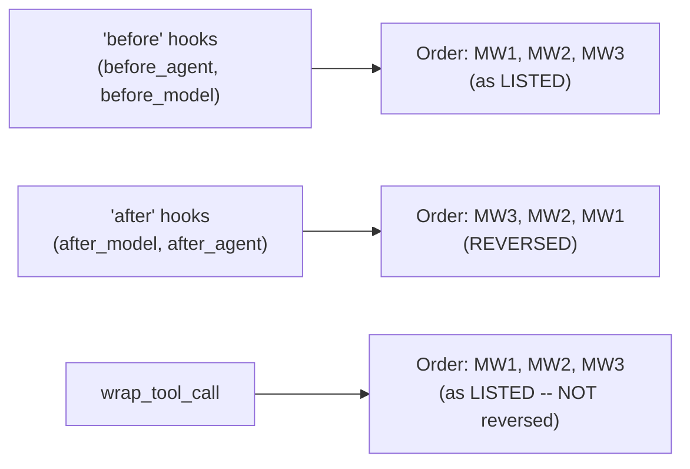

#### ⚠ Common Mistakes

* Assuming ALL hook types follow the same reversal rule as "after" hooks -- explicitly, directly corrected: `wrap_tool_call` runs in the SAME order the middlewares were listed, unlike `after_model`/`after_agent`.
* Assuming this ordering behavior is arbitrary or implementation-specific trivia -- explicitly, directly reframed as a genuinely logical consequence of resource lifecycle management (whatever opens first should close last).

#### 🎯 Key Takeaways

* **"Before" hooks execute in the order middlewares are listed**; **"after" hooks execute in REVERSE order** -- a genuine, first-in-last-out (stack-like) pattern, directly analogous to how nested resource connections should be opened and closed.
* This ordering is explicitly, precisely demonstrated as **logical, not arbitrary** -- whatever middleware opens a resource (like a DB connection) FIRST should close it LAST, since later middlewares may depend on that resource still being available.
* `wrap_tool_call` is explicitly, directly clarified as an EXCEPTION to the reversal pattern -- it runs in the SAME order middlewares were listed, unlike `after_model`/`after_agent`.

---

### 10. Closing: Best Practices & What's Next (MCP, LangGraph, Multi-Agent)

#### 📖 Definition — The Session's Own Stated Best Practices

> 💡 **Memory Trick, given directly, the complete list:** *"Keep it narrowly focused -- each one should do one thing well. Handle errors gracefully -- don't let middleware errors crash your agent. Use appropriate hook types (node-style or wrap-style). Clearly document any custom state properties. Unit-test middleware independently. Consider execution order. Use built-in middleware when possible."*

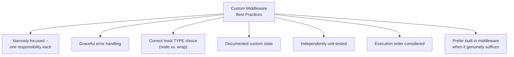

#### 🪜 Step-by-Step — The Explicit, Stated Roadmap Ahead

> 💡 **Memory Trick, given directly:** *"More or less, we are done with a major part of LangChain. We'll be learning about MCP in the next class, in depth -- but MCP, I will explain from the Python side FIRST, completely in-depth, as a separate, overall topic, and THEN we'll come back and understand how it's used in LangChain."*

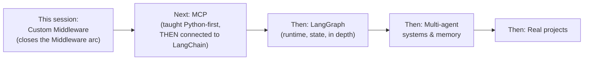

> 💡 **Memory Trick, a genuinely honest, direct course-progress estimate given:** *"If you ask me, I think around 20-25% of your course is done. The reason I say this: next time when you pick up a framework, you'll see that at least 60% of that framework you've already understood."*

#### ⚠ Common Mistakes

* Assuming middleware topics are now fully, completely exhausted after this session -- explicitly, directly noted as covering the major conceptual ground, while deeper LangGraph-level detail (runtime, state internals) remains explicitly deferred.

#### 🎯 Key Takeaways

* The session's **seven best practices** emphasize narrow focus, graceful error handling, correct hook-type selection, documentation, independent testing, awareness of execution order, and a genuine preference for built-in middleware when it suffices.
* This session **explicitly, formally closes the "pre-built vs. custom middleware" arc** spanning three total classes -- the next major topic is **MCP**, deliberately taught Python-first before being connected back to LangChain.
* The instructor's own **honest, direct course-progress estimate** (20-25% complete) reflects a genuinely deliberate, foundation-first pace consistent with this entire course's teaching philosophy.

---
## 📝 Glossary

| Term | Definition | Why It Matters |
|---|---|---|
| **Shell Tool Middleware** | Exposes a persistent shell session to an agent | The exact mechanism underlying Claude Code, Codex, Cursor, and similar coding agents |
| **Execution Policy** | Controls WHERE/HOW shell commands actually run (Host, Docker, Codex Sandbox) | Trades off convenience against genuine safety |
| **Hook** | An extension point in custom middleware, letting you intercept/inspect/modify agent execution | The foundational unit of all custom middleware |
| **Node-style hook** | Runs at a single, fixed point (`before_agent`, `before_model`, `after_model`, `after_agent`) | Gets state/runtime access; good for logging, validation |
| **Wrap-style hook** | Wraps an entire call (`wrap_model_call`, `wrap_tool_call`) | Gets the FULL request object; can genuinely modify it |
| **Runtime** | Relatively static, per-execution agent context (user ID, connections, execution info) | Distinct from state; less frequently mutated |
| **State** | Dynamic, evolving agent information (messages, custom fields) | Middleware can genuinely READ and MODIFY this |
| **Decorator-based middleware** | Quick, single-hook middleware defined via `@before_model` etc. | Best for simple, low-configuration cases |
| **Class-based middleware** | Multi-hook middleware defined via an `AgentMiddleware` subclass | Best for complex, reusable, or async-requiring cases |
| **FILO / LIFO execution order** | "After" hooks run in REVERSE middleware order | Mirrors correct resource lifecycle management (last opened, first closed... reversed here: first opened, LAST closed) |

---

## 🔄 Revision Notes — One-Minute Revision

* This session **closes the three-class Middleware arc**, moving from pre-built middleware (covered in the two prior sessions) to writing your OWN custom middleware from scratch.
* A live **Shell Tool Middleware** demo (creating/deleting real files on a machine) proves that Claude Code, Codex, and similar coding agents are fundamentally just "a brain + local terminal access" -- nothing more sophisticated. Three execution policies exist: **Host** (full access, trusted only), **Docker** (isolated container), **Codex Sandbox**.
* **Custom middleware exists** because genuinely business-specific rules (a cinema chain's own booking limits, competitor-mention policy, internal audit format) can never be fully anticipated by generic, pre-built middleware -- directly paralleling why Python needed Pydantic.
* **Two hook styles**: **node-style** (`before_agent`, `before_model`, `after_model`, `after_agent` -- single fixed point, state/runtime access) and **wrap-style** (`wrap_model_call`, `wrap_tool_call` -- wraps the entire call, full request object access). No dedicated `before_tool`/`after_tool` exists -- `wrap_tool_call` covers this need.
* `before_agent`/`after_agent` run **exactly once per invocation** (ideal for DB connection lifecycle); `before_model`/`after_model`/wrap-style hooks can run **multiple times** within one invocation (the agentic loop).
* A precise, worked example established WHY PII redaction belongs at `before_model`, not `before_agent`: redacting too early would prevent legitimate TOOLS (like `get_booking`) from ever seeing data they genuinely need.
* **Middleware can genuinely modify agent state**, not just observe it -- this is precisely the mechanism enabling dynamic behaviors like Part 1's VIP tool-filtering example.
* `wrap_model_call` was revisited with a new, complete example: **dynamic model selection** based on message count -- explicitly identified as the SAME mechanism behind Claude/ChatGPT's own "auto model selection" features. The full `model_request` object exposes model, messages, system prompt, tools, tool_choice, response_format, state, runtime, and model_settings -- all modifiable.
* **Decorators** suit quick, single-hook cases; **classes** (inheriting `AgentMiddleware`) suit multi-hook, async, or reusable-configuration cases -- ONE class can implement MULTIPLE hooks simultaneously (the PII middleware's real `before_model`+`after_model` combo is the canonical example).
* **Execution order with multiple middlewares**: "before" hooks run in LISTED order; "after" hooks run in **REVERSED** order (a genuine FILO/stack pattern) -- but `wrap_tool_call` is an exception, running in listed order, NOT reversed.
* Closing roadmap: **MCP is next** (taught Python-first, then connected to LangChain), followed by LangGraph, multi-agent systems, and memory -- the course is honestly estimated at **20-25% complete**.

---

## 📋 Cheat Sheet

**The complete hook sequence:**
```text
before_agent (once) -> before_model -> wrap_model_call -> after_model
    -> [agentic loop: wrap_tool_call as needed] -> after_agent (once)
```

**Node-style vs. wrap-style:**
```text
Node-style (before_agent, before_model, after_model, after_agent)
   -> single fixed point; access: state, runtime

Wrap-style (wrap_model_call, wrap_tool_call)
   -> wraps the ENTIRE call; access: full request object; MUST return a response
```

**Decorator syntax:**
```python
@before_model
def my_middleware(state, runtime):
    ...

@wrap_model_call
def my_middleware(request, handler):
    # modify request...
    return handler(request)
```

**Class syntax:**
```python
from langchain.agents.middleware import AgentMiddleware

class MyMiddleware(AgentMiddleware):
    def before_model(self, state, runtime):
        ...
    def after_model(self, state, runtime):
        ...
```

**Why before_model (not before_agent) for PII:**
```text
before_agent -> too early; would strip data TOOLS still legitimately need
before_model -> correct; protects the LLM specifically, tools still get raw data
```

**Multiple middleware execution order:**
```text
middleware = [MW1, MW2, MW3]

before_agent:  MW1 -> MW2 -> MW3   (listed order)
before_model:  MW1 -> MW2 -> MW3   (listed order)
wrap_model_call: MW1 -> MW2 -> MW3 (listed order)
after_model:   MW3 -> MW2 -> MW1   (REVERSED!)
after_agent:   MW3 -> MW2 -> MW1   (REVERSED!)
wrap_tool_call: MW1 -> MW2 -> MW3  (listed order -- NOT reversed)
```

---

## 🔥 Interview Questions & Answers

### 🟢 Beginner

**Q1.**

**Question:** How do coding agents like Claude Code and Codex fundamentally work, at a mechanical level?

**Answer:** An LLM "brain" decides WHICH command to run; a shell tool (like LangChain's Shell Tool Middleware) actually EXECUTES that command locally, on the machine where the agent is running.

**Explanation:** Directly, precisely explained and demonstrated live.

**Why Interviewers Ask This:** Tests genuine, mechanistic understanding of a widely-used tool category.

**Possible Follow-up:** "Name the three execution policies available for Shell Tool Middleware."

**Q2.**

**Question:** Why does custom middleware exist, if pre-built middleware already covers PII, HITL, and rate limits?

**Answer:** Genuinely business-specific rules (e.g., a cinema chain's own booking limits or audit-log format) can never be fully anticipated by generic, pre-built middleware.

**Explanation:** Directly, precisely explained via a concrete example.

**Why Interviewers Ask This:** Tests understanding of WHY custom middleware is a genuine, necessary capability, not just an advanced feature.

**Possible Follow-up:** "Give your own example of a business rule no pre-built middleware could anticipate."

**Q3.**

**Question:** What's the difference between node-style and wrap-style hooks?

**Answer:** Node-style hooks run at a single, fixed point with state/runtime access; wrap-style hooks wrap the entire call, giving access to the full request object.

**Explanation:** Directly, precisely distinguished.

**Why Interviewers Ask This:** A foundational, frequently-tested custom-middleware distinction.

**Possible Follow-up:** "Name the four node-style hooks and the two wrap-style hooks."

**Q4.**

**Question:** Why is there no dedicated `before_tool`/`after_tool` hook in LangChain?

**Answer:** This functionality is fully covered by `wrap_tool_call` -- it's a LangChain-specific design choice, not a missing capability.

**Explanation:** Directly, explicitly clarified.

**Why Interviewers Ask This:** Tests awareness of a commonly-asked, specific LangChain design detail.

**Possible Follow-up:** "Does ADK (Google's Agent Development Kit) have separate before/after tool call hooks?"

**Q5.**

**Question:** How many times does `before_agent` run within a single agent invocation?

**Answer:** Exactly once.

**Explanation:** Directly, precisely stated.

**Why Interviewers Ask This:** Tests understanding of hook frequency, a commonly-confused detail.

**Possible Follow-up:** "What's a genuine, practical use case for a hook that runs exactly once?"

**Q6.**

**Question:** Why should PII redaction happen at `before_model`, not `before_agent`?

**Answer:** Redacting too early (`before_agent`) would strip data that legitimate TOOLS (like a booking lookup) still genuinely need; `before_model` protects specifically what reaches the LLM.

**Explanation:** Directly, precisely explained via a worked example.

**Why Interviewers Ask This:** Tests genuine, applied understanding of hook-point selection, not just recall of hook names.

**Possible Follow-up:** "At what point should the MODEL's own output also be checked for PII leakage?"

**Q7.**

**Question:** Can custom middleware genuinely modify an agent's state, or only observe it?

**Answer:** It can genuinely modify state -- this is precisely the mechanism that enables dynamic agent behaviors.

**Explanation:** Directly, explicitly clarified.

**Why Interviewers Ask This:** Tests understanding of middleware's real power, beyond passive logging/observation.

**Possible Follow-up:** "Give an example of a middleware that modifies state to change future agent behavior."

**Q8.**

**Question:** When should you use decorator-based middleware versus class-based middleware?

**Answer:** Decorators for quick, single-hook, low-configuration cases; classes for multi-hook, async-requiring, or reusable-configuration cases.

**Explanation:** Directly, precisely distinguished.

**Why Interviewers Ask This:** A commonly-asked, practical middleware-design question.

**Possible Follow-up:** "Can a single class-based middleware implement more than one hook? Give an example."

**Q9.**

**Question:** With `middleware=[MW1, MW2, MW3]`, in what order do the `after_model` hooks execute?

**Answer:** MW3, then MW2, then MW1 -- reversed from the listed order.

**Explanation:** Directly, precisely stated.

**Why Interviewers Ask This:** A commonly-tested, precise execution-order detail.

**Possible Follow-up:** "Does `wrap_tool_call` follow this same reversed order?"

**Q10.**

**Question:** What is dynamic model selection, and how is it implemented?

**Answer:** Choosing between different models (e.g., basic vs. advanced) based on a condition (like message count), implemented via `wrap_model_call` by overriding `request.model`.

**Explanation:** Directly, precisely explained with working code.

**Why Interviewers Ask This:** Tests awareness of a genuinely common, real-world middleware pattern.

**Possible Follow-up:** "What real product feature works on this exact same underlying mechanism?"

---

### 🟡 Intermediate

**Q11.**

**Question:** Explain why the instructor opens this session with a live, deliberately risky demo (an agent deleting an entire folder), rather than starting directly with custom middleware syntax.

**Answer:** This demonstration serves two genuine purposes simultaneously: first, it viscerally proves Shell Tool Middleware's real power (motivating why middleware understanding matters at all) BEFORE any abstract syntax is introduced; second, and more subtly, it sets up the EXACT problem custom middleware exists to solve -- once students have directly witnessed an agent deleting files with full host access, the instructor's subsequent transition into Docker execution policies, and later into fully custom guardrails, lands with genuine, felt urgency rather than abstract justification. This is a deliberate "show the problem live, then teach the solution" pedagogical sequence, directly consistent with this course's broader teaching pattern of proving claims through live demonstration rather than assertion.

**Explanation:** Requires recognizing a deliberate pedagogical sequencing choice connecting the opening demo to the session's later content.

**Why Interviewers Ask This:** Tests whether a learner recognizes deliberate teaching structure, not just individual facts.

**Possible Follow-up:** "What specific execution policy did the instructor introduce immediately after this risky demo, and why?"

**Q12.**

**Question:** A learner argues that since `wrap_model_call` gives access to the FULL request object (including state, runtime, tools, and more), it should always be preferred over `before_model`, which only gives limited state/runtime access. Evaluate this claim.

**Answer:** This claim overstates the case by ignoring genuine trade-offs in complexity and intent. `before_model`'s more limited access is a genuine FEATURE, not merely a limitation, for use cases that are purely observational or lightly validating (like simple logging) -- using `wrap_model_call` for such cases would require unnecessarily handling the full request/handler contract (including the requirement to explicitly call and return `handler(request)`) for functionality that doesn't need to modify anything. The session's own logging example deliberately uses `before_model` specifically because it needs only to OBSERVE (print information), not modify the request -- `wrap_model_call` is the more powerful, but also more complex, tool for cases that genuinely need to CHANGE what's being sent (like dynamic model selection). Choosing the more powerful hook for every case isn't "always better" -- it adds unnecessary complexity for tasks that don't need that power.

**Explanation:** Tests whether a learner recognizes that hook selection should match genuine need (observe vs. modify), not default to the most powerful option available.

**Why Interviewers Ask This:** Distinguishes candidates who understand appropriate tool selection from those who assume "more access is always better."

**Possible Follow-up:** "Rewrite the session's own logging example using `wrap_model_call` instead of `before_model`, and explain what genuinely changes."

**Q13.**

**Question:** Explain, precisely, why the execution-order reversal for "after" hooks is described as "genuinely logical," using the DB connection example, rather than simply being an arbitrary implementation detail to memorize.

**Answer:** The reversal directly mirrors correct RESOURCE LIFECYCLE management: if Middleware 1 opens a DB connection FIRST (in `before_agent`), and Middleware 2 or 3 potentially DEPENDS on that connection being available during their own execution, then Middleware 1's connection must remain open until EVERY other middleware that might depend on it has finished -- meaning Middleware 1's corresponding CLOSE operation (in `after_agent`) must happen LAST, not first. If the order were NOT reversed (Middleware 1 closing its DB connection first, before Middleware 2 or 3 had finished), any middleware still depending on that connection would encounter it already closed -- a genuine, real bug. This is precisely why the instructor connects this to the general "first in, last out" / stack data structure principle -- it's a genuinely necessary property for correct resource management with nested dependencies, not an arbitrary choice.

**Explanation:** Requires reasoning through WHY this specific ordering prevents a genuine class of bugs, not just recalling that reversal happens.

**Why Interviewers Ask This:** Tests whether a learner understands the underlying resource-management logic, not just the stated rule.

**Possible Follow-up:** "Construct a concrete scenario where NOT reversing the 'after' hook order would cause a genuine bug."

**Q14.**

**Question:** Using this session's PII-redaction reasoning (Section 5), explain why a genuinely complete PII protection strategy requires BOTH `before_model` AND `after_model` hooks, not just one.

**Answer:** `before_model` protects against sensitive information the USER sends TO the model (e.g., a phone number in a request) -- but this only addresses INPUT-side exposure. A genuinely complete strategy must ALSO guard against the MODEL itself potentially generating or echoing sensitive information in its OUTPUT (e.g., if the model has access to some data and might repeat a masked value, or hallucinate a plausible-looking but sensitive-looking value) -- this is precisely why the session's own PII middleware example explicitly uses BOTH hooks: "before model, it is not letting your information go out. After model, it is not letting information which the model might be providing [come back]." Using only `before_model` would leave a genuine, asymmetric gap -- protecting what goes IN, but not what comes OUT.

**Explanation:** Requires connecting the session's own dual-hook PII example to a precise, reasoned explanation of why BOTH directions of protection are genuinely necessary.

**Why Interviewers Ask This:** Tests whether a learner recognizes a genuine, two-sided security consideration, not just a single-direction fix.

**Possible Follow-up:** "Design the `after_model` portion of a PII-protection middleware, describing what it should specifically check for."

**Q15.**

**Question:** Synthesize this session's dynamic model selection example (Section 7) with Part 1's model fallback middleware to precisely explain the genuine, structural difference between these two mechanisms, beyond simply "one reacts to failure and one doesn't."

**Answer:** Beyond the reactive/proactive distinction, these two mechanisms operate on genuinely different TRIGGERS and TIMING within the request lifecycle. Model FALLBACK (Part 1) is fundamentally an ERROR-HANDLING mechanism -- it only activates AFTER an attempted model call has already failed, meaning the primary model's call was genuinely attempted first, consuming time/resources, before any fallback logic engages. Dynamic model SELECTION (this session), via `wrap_model_call`, operates BEFORE any model call is attempted at all -- it inspects the request (e.g., message count) and DECIDES which model to use PROACTIVELY, meaning the "wrong" model is never actually invoked in the first place. This is a genuinely important structural distinction: fallback is a REACTIVE, cost-incurring safety net (you pay for the failed attempt before recovering); dynamic selection is a PROACTIVE, cost-avoiding optimization (you never pay for an inappropriate model call at all). A genuinely complete production system would likely use BOTH together: dynamic selection to proactively choose the RIGHT model for a given request's complexity, and fallback to gracefully handle the case where even the proactively-chosen model genuinely fails.

**Explanation:** Requires synthesizing two separately-taught mechanisms (across different sessions) into a precise, structural comparison beyond a surface-level "one reacts, one doesn't" distinction.

**Why Interviewers Ask This:** A senior-level question testing whether a candidate can precisely compare two related but structurally distinct middleware patterns.

**Possible Follow-up:** "Design a single agent configuration that uses BOTH dynamic model selection and model fallback together, and explain how they'd interact."

---

### 🔴 Advanced

**Q16.**

**Question:** Design a genuinely complete, production-grade custom middleware for the cinema-chain business rules this session explicitly names ("no customer books more than 2 movies in one session," "flag if the bot mentions a rival cinema by name," "log every cancellation in our own audit format"), specifying the exact hook type for each rule and justifying your choice.

**Answer:** A reasonable, complete design: (1) **"No more than 2 movies per session"** -- implement via a CLASS-BASED middleware (since it requires PERSISTENT state tracking across multiple tool calls within a session, per Section 8's own reasoning for when classes are appropriate) using `wrap_tool_call` specifically wrapping a `book_movie` tool -- incrementing a counter in custom state each time the tool is genuinely called, and blocking/rejecting the call if the count would exceed 2. (2) **"Flag if the bot mentions a rival cinema's name"** -- implement via `after_model` (a node-style hook), since this requires INSPECTING the model's OUTPUT after generation, directly checking the model's response text against a list of known rival cinema names, and either blocking the response or triggering a flag/notification if a match is found -- this could NOT be implemented at `before_model`, since the rival-name issue is specifically about what the MODEL generates, not what the user sends. (3) **"Log every cancellation in our own specific audit format"** -- implement via `wrap_tool_call` specifically wrapping a `cancel_booking` tool, capturing the tool's request/response and formatting it into the organization's own specific audit log structure, directly analogous to the session's own DB-connection-lifecycle pattern but scoped to a specific tool rather than the whole agent lifecycle. Each of these three rules maps to a genuinely DIFFERENT hook type specifically because each rule concerns a genuinely different part of the execution flow (a specific tool's call count, the model's own output content, and a specific tool's execution details respectively) -- directly demonstrating that hook-type selection should be driven by WHERE in the execution flow the relevant information genuinely becomes available, exactly as this session's own PII and dynamic-model-selection examples establish.

**Explanation:** Synthesizes this session's complete hook-type taxonomy into a genuinely applied, multi-rule production design, directly extending the session's own explicitly-named (but not implemented) business rules.

**Why Interviewers Ask This:** A realistic, senior-level middleware-architecture question testing whether a candidate can map genuinely different business requirements onto the correct, specific hook types with clear reasoning.

**Possible Follow-up:** "Which of these three middlewares would you implement as decorator-based versus class-based, and why?"

**Q17.**

**Question:** Critically evaluate: "Since this session proves that middleware execution order for 'after' hooks reverses (FILO), and this mirrors correct resource-lifecycle management, EVERY custom middleware combination should always assume dependencies exist between middlewares, and should be designed defensively around this reversal." Is this an accurate implication of this session's content?

**Answer:** Not entirely accurate -- this overstates a general, structural GUARANTEE (the reversal itself, which the framework provides automatically) into a claim about every middleware's DESIGN REQUIREMENTS. The reversal ordering is a genuine, automatic property of the framework -- it happens regardless of whether any actual dependency exists between specific middlewares. Many real middleware combinations genuinely have NO dependencies on each other at all (e.g., a logging middleware and a completely unrelated rate-limiting middleware) -- for these, the reversal ordering is simply irrelevant, since neither middleware's behavior depends on the other's state. The genuinely accurate claim is narrower: DEVELOPERS SHOULD BE AWARE that reversal happens (since the framework guarantees it), and should SPECIFICALLY design defensively around it WHEN a genuine dependency exists between middlewares (like the DB-connection example) -- not that every middleware combination must be designed as if dependencies always exist, which would introduce unnecessary complexity for the many genuinely independent middleware combinations.

**Explanation:** Tests whether a learner recognizes the difference between "the framework guarantees this ordering property" and "every middleware must be defensively designed around genuine dependencies," a meaningful distinction the session's own DB example doesn't claim applies universally.

**Why Interviewers Ask This:** Distinguishes candidates who correctly scope a structural guarantee from those who over-generalize it into an unconditional design requirement.

**Possible Follow-up:** "Give an example of two middlewares that would be entirely unaffected by the after-hook reversal ordering, because they share no genuine dependency."

**Q18.**

**Question:** Synthesize this session's complete custom middleware toolkit (hooks, decorators/classes, execution order) with the earlier Middleware Part 2 session's Tool Error + Tool Retry pairing to design a CUSTOM (not pre-built) equivalent of that same resilience pattern, explaining precisely which hook type(s) you'd use and why.

**Answer:** A reasonable custom implementation, directly reproducing Part 2's Tool Error + Tool Retry behavior using only this session's hook primitives: implement via a SINGLE class-based middleware (per Section 8's own reasoning: multiple related pieces of logic, benefiting from shared configuration like `max_retries` and `backoff_factor`) using `wrap_tool_call` as the SOLE hook -- since `wrap_tool_call` wraps the ENTIRE tool execution, it can genuinely: (1) attempt the tool call inside a try/except block, (2) on failure, catch the exception and convert it into a readable message (directly reproducing Tool Error Middleware's behavior) rather than letting Python's default exception propagate and crash the agent, and (3) if configured for retry, loop internally within the SAME `wrap_tool_call` invocation, implementing the exact exponential backoff formula from Part 2 (`initial_delay x backoff_factor^retry_number`) before re-attempting the tool call, up to a configured `max_retries`. This demonstrates that `wrap_tool_call`'s FULL access to the tool call's execution (not just observing before/after, per Section 4's own precise distinction) is EXACTLY the right hook type for this use case -- since genuinely catching AND retrying a failure requires intercepting the entire call, not just observing its start or end separately. This also reveals that Part 2's pre-built Tool Error + Tool Retry middlewares are themselves almost certainly implemented internally using this exact same `wrap_tool_call` pattern, directly connecting this session's "how middleware is built" content to Part 2's "what pre-built middleware does" content.

**Explanation:** Requires synthesizing this session's complete hook taxonomy with a genuinely separate, earlier session's pre-built middleware behavior, reconstructing that behavior from first principles using only this session's own primitives.

**Why Interviewers Ask This:** A capstone-level question testing whether a candidate can reverse-engineer how a pre-built middleware likely works internally, using the custom-middleware toolkit taught in this specific session.

**Possible Follow-up:** "Would this custom implementation genuinely behave identically to Part 2's pre-built Tool Error + Tool Retry middlewares, or would there be any observable differences?"

---

## 🧪 Scenario-Based Interview Questions

> **Scenario 1:** A teammate's custom middleware, meant to log every model call, is accidentally causing the agent to skip calling the model entirely. Using this session's concepts, diagnose this.

**Structured Answer:**
1. **Initial investigation:** Recognize this as likely a hook-TYPE confusion -- specifically, using `wrap_model_call` (which requires explicitly calling and returning `handler(request)` to actually proceed) when a simpler `before_model` (pure observation, no return-value requirement) was genuinely intended.
2. **Metrics/logs to check:** Review the middleware's actual function signature and body -- confirm whether it's decorated with `@wrap_model_call` and, if so, whether it correctly calls `return handler(request)`.
3. **Possible causes:** Most likely, the teammate wrote a `wrap_model_call` function that performs logging but FORGETS to call and return `handler(request)`, meaning the actual model call never proceeds -- directly connecting to Section 7's own explicit requirement that wrap-style hooks must return a response.
4. **Debugging approach:** Compare the teammate's code against Section 5's own simple `before_model` logging example, verifying whether the SIMPLER hook type (observation-only, no handler-calling requirement) would have been the more appropriate choice for a pure logging use case.
5. **Resolution:** Either fix the `wrap_model_call` implementation to correctly call and return `handler(request)`, or -- more appropriately, per Intermediate Q12's reasoning -- switch to `before_model` entirely, since pure logging doesn't need wrap-style's full request-modification power.
6. **Prevention:** Establish a team code-review checklist item specifically verifying that any `wrap_model_call`/`wrap_tool_call` implementation correctly calls and returns its handler, and that hook-type selection matches genuine need (observe vs. modify), directly reproducing this session's own Section 7/Intermediate Q12 guidance.

> **Scenario 2 (Advanced):** Your organization has three custom middlewares -- one connecting to a database, one connecting to an external API, and one performing PII redaction -- and a teammate reports that occasionally the API connection appears to close before the PII redaction middleware has finished using it. Using this session's concepts (Section 9, Advanced Q17), diagnose and resolve this.

**Structured Answer:**
1. **Initial investigation:** Recognize this as a genuine, real instance of the exact dependency risk Advanced Q17 identifies -- a middleware ordering issue where a genuine dependency exists (PII redaction needing the API connection) but the middleware LIST ordering doesn't correctly reflect that dependency.
2. **Metrics/logs to check:** Review the exact order middlewares are listed in the `middleware=[...]` parameter, directly comparing it against Section 9's own precise reversal rule for "after" hooks.
3. **Possible causes:** Per Section 9's exact reasoning, if the API-connection middleware is listed BEFORE the PII-redaction middleware, the API connection's `after_agent` (closing the connection) would run AFTER the PII middleware's own `after_agent` (since "after" hooks reverse) -- meaning this specific ordering should actually be SAFE. The reported bug more likely indicates the API-connection middleware is listed AFTER the PII-redaction middleware, causing its connection to close BEFORE PII redaction's own cleanup, if PII redaction genuinely depends on that connection during its own `after_agent` hook.
4. **Debugging approach:** Explicitly map out, using Section 9's own reversal rule, the EXACT execution order for all three middlewares' `before_agent` and `after_agent` hooks given their current listed order, identifying precisely where the dependency violation occurs.
5. **Resolution:** Reorder the `middleware=[...]` list so the API-connection middleware is listed BEFORE the PII-redaction middleware -- ensuring, per the reversal rule, that its connection closes AFTER PII redaction's own cleanup has genuinely completed.
6. **Prevention:** Document all genuine cross-middleware dependencies explicitly (as a comment or design doc), and establish a standing practice of verifying middleware LIST ORDER against the reversal rule specifically whenever a new middleware with genuine setup/teardown dependencies is added -- directly modeling Advanced Q17's own guidance that reversal-awareness matters specifically where genuine dependencies exist.

---

## 🛠 Hands-on Exercises

### 🟢 Easy

1. Write out, from memory, all six hook points in this session's execution flow, correctly labeling each as node-style or wrap-style.
2. Build a simple, decorator-based `before_agent`/`after_agent` middleware pair that prints "session started"/"session ended," and test it on a working agent.
3. Write a one-paragraph explanation, in your own words, of why PII redaction should happen at `before_model` rather than `before_agent`, using an example of your own choosing (not the booking example).

### 🟡 Medium

4. Build a working `wrap_model_call` middleware implementing dynamic model selection based on a condition of your own choosing (not message count -- try something like detecting a specific keyword in the latest message).
5. Build a class-based middleware implementing BOTH a `before_model` and an `after_model` hook, directly modeling the PII middleware's dual-hook pattern from Section 8.
6. Configure three custom middlewares on the same agent, and empirically verify the execution order (both listed-order "before" hooks and reversed-order "after" hooks) matches Section 9's stated rule.

### 🔴 Advanced

7. Implement the complete, three-rule cinema-chain middleware design proposed in Advanced Interview Q16, with genuine, working code for each of the three business rules.
8. Implement the custom Tool Error + Tool Retry equivalent proposed in Advanced Interview Q18, using only `wrap_tool_call`, and compare its behavior against Part 2's pre-built middlewares on the same failing tool.
9. Design and document a test specifically probing the middleware-dependency-ordering scenario from Scenario 2, using three middlewares with a genuine, deliberate setup/teardown dependency between them.

---

## 🏗 Practice Assignment

*(This session's own implicit assignment, reproduced from its stated intent)*

> 💡 **Memory Trick -- the instructor's own words, given directly:** *"Just do a very good exercise... take PII middleware, for example, and see where they will be, what kind of middlewares are they, what hooks are they having in the middleware."*

### Build: "Custom Middleware Toolkit for CineBot"

**Objective:** Produce a genuinely complete, working set of custom middlewares addressing the exact business rules this session names, directly applying the complete hook taxonomy taught.

**Requirements:**
- A working Shell Tool Middleware demo of your own (a genuinely different task than folder creation/deletion -- e.g., a small file-processing script), including documentation of which execution policy you chose and why.
- All three cinema-chain business rules from Advanced Interview Q16, implemented as genuinely working custom middleware (booking limit, rival-cinema flagging, custom audit logging).
- At least one decorator-based AND one class-based middleware, with a written justification for why each specific style was chosen for its specific use case.
- A documented, empirical verification of execution order using at least two custom middlewares together (directly reproducing Section 9's own demonstrated pattern).
- A written reflection (200-300 words) on which hook type (node-style or wrap-style) you found most useful for your specific business rules, and why.

**Architecture (suggested):**

```text
custom_middleware_toolkit/
├── shell_tool_demo.py               # your own Shell Tool Middleware demo
├── booking_limit_middleware.py        # wrap_tool_call, class-based
├── rival_cinema_middleware.py           # after_model, node-style
├── audit_log_middleware.py                # wrap_tool_call, class-based
├── EXECUTION_ORDER_TEST.md                  # your documented, empirical verification
└── REFLECTION.md                              # your written hook-type reflection
```

**Expected Functionality:**
- Every middleware should be genuinely, individually testable and demonstrably working -- not just configured, but proven via real, observed behavior.
- Your execution-order test should genuinely, empirically confirm (not just assert) the listed-vs-reversed ordering behavior.

**Challenges:**
- Correctly implementing the booking-limit middleware's PERSISTENT state tracking across multiple tool calls within a session.
- Correctly distinguishing which business rule genuinely requires `after_model` (output inspection) versus `wrap_tool_call` (tool-execution wrapping).

**Bonus Improvements:**
- Extend your audit-log middleware to write to a genuine, persistent file or database, rather than just printing to console.
- Combine all three business-rule middlewares onto a single agent, and document the complete, combined execution flow.

---

## 📚 Additional Resources

- **"Middleware Deep Dive" (Part 1)** and **"Middleware Part 2"** -- the two direct prerequisite sessions, covering LangChain's complete pre-built middleware library; this session assumes full familiarity with both.
- **LangChain's official middleware documentation** -- directly, repeatedly consulted live throughout this session, including the precise hooks definition and best-practices list.
- **Claude Code Hooks documentation** (referenced directly) -- explicitly cited as a genuinely analogous, in-depth hooks system in a different, real product.
- **A future, dedicated MCP session** (referenced directly, explicitly next) -- taught Python-first, then connected back to LangChain.
- **A future, dedicated LangGraph session** (referenced directly) -- covering runtime, state, and related concepts in genuinely deeper, foundational detail than this session's working-level treatment.
- **A future Deep Agents session** (referenced directly) -- covering File System Middleware and other Deep-Agent-specific tools this session explicitly deferred.

---

## 📌 Final Revision Sheet

### ⭐ Core Concepts
- **Shell Tool Middleware** = the mechanism underlying Claude Code/Codex-style coding agents -- an LLM brain + local terminal access, with three execution policies (Host/Docker/Codex Sandbox).
- **Custom middleware exists** for genuinely business-specific rules pre-built middleware can't anticipate.
- **Node-style hooks** (`before_agent`, `before_model`, `after_model`, `after_agent`) vs. **wrap-style hooks** (`wrap_model_call`, `wrap_tool_call`) -- no dedicated before/after tool call; `wrap_tool_call` covers it.
- `before_agent`/`after_agent` run **once**; other hooks can run **multiple times** per invocation.
- PII redaction belongs at `before_model`, not `before_agent` -- tools may still need raw data.
- **Middleware can genuinely modify agent state**, not just observe.
- **Decorators** for simple, single-hook cases; **classes** for complex, multi-hook, async, or reusable cases.
- **Execution order**: "before" hooks in listed order; "after" hooks REVERSED (FILO); `wrap_tool_call` is an exception, NOT reversed.

### ⭐ Important Definitions
- **Hook**, **Runtime vs. State** (see Glossary for full definitions).

### ⭐ Important Commands/Code
```python
from langchain.agents.middleware import before_model, wrap_model_call, AgentMiddleware

@before_model
def log_before_model(state, runtime): ...

@wrap_model_call
def dynamic_model_selection(request, handler):
    request.model = advanced_model if len(request.messages) > 10 else basic_model
    return handler(request)

class MyMiddleware(AgentMiddleware):
    def before_model(self, state, runtime): ...
    def after_model(self, state, runtime): ...
```

### ⭐ Architecture/Process
- Full execution flow: `before_agent` (once) -> `before_model` -> `wrap_model_call` -> `after_model` -> [agentic loop: `wrap_tool_call` as needed] -> `after_agent` (once).
- Multiple middlewares: "before"/wrap-tool hooks run in listed order; "after" hooks run reversed.

### ⭐ Best Practices
- Keep each middleware narrowly focused on one responsibility.
- Handle errors gracefully -- never let middleware crash the agent.
- Choose the correct hook type based on genuine need (observe vs. modify).
- Prefer built-in middleware when it genuinely suffices; write custom only when genuinely necessary.
- Unit-test middleware independently.

### ⭐ Common Mistakes
- Using `before_agent` for PII protection instead of `before_model`.
- Forgetting to call and return `handler(request)` in a wrap-style hook.
- Assuming `wrap_tool_call` follows the same reversed execution order as `after_model`/`after_agent` (it doesn't).
- Assuming class-based middleware is always superior to decorators, regardless of genuine need.

### ⭐ Interview Points
- Be ready to precisely distinguish node-style from wrap-style hooks.
- Be ready to explain WHY `before_model` (not `before_agent`) is correct for PII, with reasoning.
- Be ready to state the exact execution order for multiple middlewares, including the reversal rule and its `wrap_tool_call` exception.
- Be ready to explain when to choose decorators versus classes.

### ⭐ Things to Remember
- This session **explicitly, formally closes** the three-class Middleware arc -- built directly on both prior Middleware sessions.
- **MCP is next**, explicitly taught Python-first before being connected back to LangChain.
- The instructor's own **honest, direct course-progress estimate** (20-25% complete) reflects a genuinely deliberate, foundation-first teaching pace.