# 🔄 LangChain Runtime & Human-in-the-Loop, In Depth

- <i>**Session:** LangChain Weekend Class — "Runtime and HITL"· 
- **Instructor:** Mayank Aggarwal
- **Note on scope:** This session covers two deliberately-chosen topics **before** starting the promised, multi-class MCP deep dive: **Runtime** (a genuinely new, foundational topic, explained fully from scratch) and **Human-in-the-Loop** (a return to a concept covered earlier as pre-built middleware, but now taken to a genuinely deeper level — including conditional interrupts and the full "respond" decision type). Both topics are taught with the instructor's own explicit acknowledgment that they are "a little bit tricky" precisely because they concern **backend mechanics the developer doesn't directly, visibly write** — state and runtime objects LangChain silently threads through every tool and middleware call.</i>

---

## 📑 Table of Contents

1. [Session Overview](#-session-overview)
2. [Learning Objectives](#-learning-objectives)
3. [Detailed Notes](#-detailed-notes)
   - [1. Session Context: Runtime & HITL Before MCP](#1-session-context-runtime--hitl-before-mcp)
   - [2. State, Revisited: The Foundation for Understanding Runtime](#2-state-revisited-the-foundation-for-understanding-runtime)
   - [3. Runtime: The Five Components Every Agent Maintains](#3-runtime-the-five-components-every-agent-maintains)
   - [4. Context vs. State, Precisely Distinguished — the Hospital Wristband Analogy](#4-context-vs-state-precisely-distinguished--the-hospital-wristband-analogy)
   - [5. Tool Runtime: How Runtime Reaches Your Tools](#5-tool-runtime-how-runtime-reaches-your-tools)
   - [6. Runtime & Middleware: Node-Style vs. Wrap-Style Access](#6-runtime--middleware-node-style-vs-wrap-style-access)
   - [7. A Complete, Worked Example: Dynamic Prompting & Authorization Gates](#7-a-complete-worked-example-dynamic-prompting--authorization-gates)
   - [8. Human-in-the-Loop, Revisited: The Agentic Loop & the Four Decisions](#8-human-in-the-loop-revisited-the-agentic-loop--the-four-decisions)
   - [9. Conditional Interrupts: Human-in-the-Loop Based on a Condition](#9-conditional-interrupts-human-in-the-loop-based-on-a-condition)
   - [10. The Complete Interactive HITL Loop (Claude-Style)](#10-the-complete-interactive-hitl-loop-claude-style)
4. [Glossary](#-glossary)
5. [Revision Notes — One-Minute Revision](#-revision-notes--one-minute-revision)
6. [Cheat Sheet](#-cheat-sheet)
7. [Interview Questions & Answers](#-interview-questions--answers)
8. [Scenario-Based Interview Questions](#-scenario-based-interview-questions)
9. [Hands-on Exercises](#-hands-on-exercises)
10. [Practice Assignment](#-practice-assignment)
11. [Additional Resources](#-additional-resources)
12. [Final Revision Sheet](#-final-revision-sheet)

---

## 🎯 Session Overview

This session closes out the pre-MCP portion of the course by teaching two genuinely important, closely-related mechanics: how an agent's hidden execution context actually works, and how to pause an agent for genuine human judgment. It covers:

1. **A revision of agent state** — the typed dictionary holding conversation history and custom fields — as the necessary foundation before runtime can make sense.
2. **Runtime, explained fully from scratch**: the precise claim that `create_agent` runs on LangGraph's runtime under the hood, and the **five specific components** every running agent maintains — context, store, stream writer, execution info, and server info.
3. **A precisely worked, memorable distinction** between context (static, per-invocation information like a user ID) and state (the evolving conversation history) — illustrated via a genuinely vivid hospital-wristband analogy.
4. **Tool runtime**: the specific mechanism by which LangChain passes an agent's runtime (plus extra information — state, config, tool call ID) into every tool function, live-demonstrated via a genuine, deliberately-triggered error showing exactly what happens when a middleware function doesn't correctly accept `state` and `runtime`.
5. **Precisely how node-style and wrap-style middleware hooks each receive runtime differently** — node-style hooks get `state` and `runtime` directly; wrap-style hooks get them nested inside a `request` object (`model_request` or `tool_call_request`).
6. **Two complete, live-built examples**: a dynamic-prompting middleware that personalizes a system message using runtime context, and an authorization-gate middleware using `runtime.server_info`.
7. **A genuine return to Human-in-the-Loop**, revisited at a deeper level than its original introduction as pre-built middleware — re-establishing the agentic loop and all four decision types (approve, edit, reject, respond), including a live, honestly-debugged moment where a genuinely real bug (an undefined agent variable) is diagnosed on screen.
8. **Conditional interrupts**: using a custom predicate function (receiving a `ToolCallRequest`) to trigger Human-in-the-Loop only when a specific business condition is met — e.g., only requiring approval when a refund amount exceeds $100.
9. **The complete, interactive HITL loop pattern** — genuinely reproducing how Claude, ChatGPT, and similar production agents implement pause-and-resume behavior via a real, working Python loop.

> 💡 **Memory Trick — the instructor's own framing for why this depth matters, restated directly:** *"Not just with respect to the framework... you should not be limited by what a framework provides. Tomorrow, if a framework does not provide that you cannot maintain a state, you should still be knowing what exactly these things are, why they are useful."*

---

## 🎯 Learning Objectives

By the end of this guide, you will be able to:

- [ ] Explain what agent state is, and correctly distinguish it from runtime.
- [ ] Name and define all five components of an agent's runtime (context, store, stream writer, execution info, server info).
- [ ] Explain the hospital-wristband analogy, and why it clarifies the difference between context and conversation history.
- [ ] Explain what "tool runtime" is, and why it exists as a distinct concept from the general runtime object.
- [ ] Correctly explain how node-style hooks and wrap-style hooks each receive access to state and runtime differently.
- [ ] Build a working dynamic-prompting middleware that personalizes a system message using runtime context.
- [ ] Explain the agentic loop, and name all four Human-in-the-Loop decision types with a correct, working example of each.
- [ ] Build a conditional interrupt using a custom predicate function based on a tool call's actual arguments.
- [ ] Explain the complete, interactive HITL loop pattern used by production agents like Claude.

---

## 📚 Detailed Notes

### 1. Session Context: Runtime & HITL Before MCP

#### 🧠 Concept

> 💡 **Memory Trick, given directly at the start:** *"Our topic for today has to be MCP, but there are two quick topics which I would love to cover before. So, before we jump onto MCP, I would love to cover about runtime and human in the loop."*

#### ❓ Why It Exists — A Precise, Stated Reason

> 💡 **Memory Trick, given directly:** *"Many people were facing problem in that. So let me quickly help you to understand and revise... Now, when you want to control your agent, the whole approach becomes that, okay, how much in-depth do you know about these different things?"*

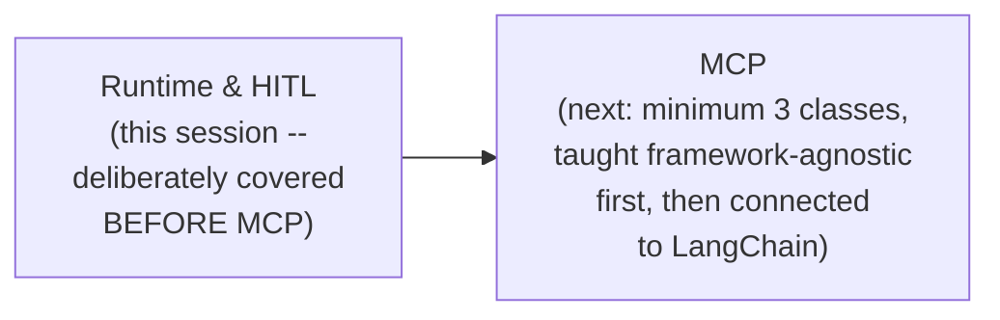

#### 🎯 Key Takeaways

* This session is explicitly, deliberately positioned as **necessary groundwork** before a genuinely deep, multi-class MCP unit begins — not a detour, but required foundation.
* The instructor's own stated motivation: **genuine, reported student confusion** from a prior class specifically around state and runtime, directly prompting this dedicated re-explanation.
* Both topics (runtime, HITL) are explicitly framed as directly relevant to an upcoming, real GCP-based project — not abstract theory.

---

### 2. State, Revisited: The Foundation for Understanding Runtime

#### 📖 Definition — Agent State

> 💡 **Memory Trick, given directly:** *"Every agent manages its execution context through agent state, a typed dictionary that holds current conversation history and any custom fields your tools and middleware needs... By default, it is having the messages field."*

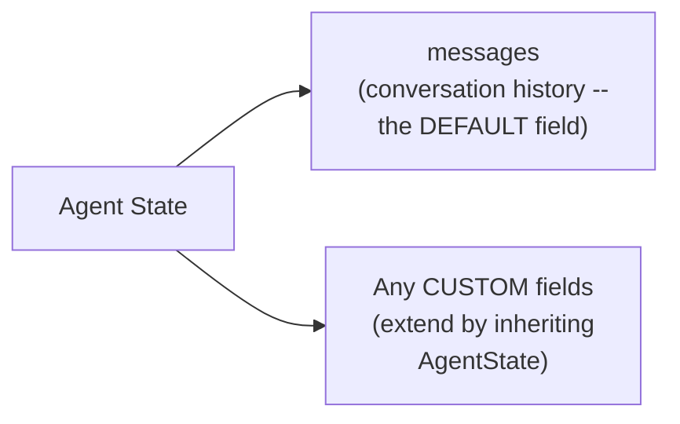

#### 🔍 Internal Working — Extending State

> 💡 **Memory Trick, given directly:** *"We can create our own state by expanding or inheriting the agent state... you can create your own state, your own state, you can have any other variable as well which you want."*

#### ⚠ Common Mistakes

* Assuming "conversation history" is stored as a genuinely separate variable from state — explicitly, directly corrected later in the session: *"There is no variable conversation history. Somewhere, this conversation history will be maintained. That somewhere is actually state."*

#### 🎯 Key Takeaways

* **Agent state** is a typed dictionary holding conversation history (`messages`, by default) plus any custom fields a specific agent's tools or middleware genuinely need.
* State is **extensible** — by inheriting from `AgentState`, a developer can add arbitrary custom fields (e.g., a VIP flag, a model-call counter) beyond the default `messages`.
* This revision is deliberately positioned as the **necessary prerequisite** for understanding runtime — the two concepts are closely related but genuinely distinct, and confusing them was explicitly identified as a real, common source of student difficulty.

---
### 3. Runtime: The Five Components Every Agent Maintains

#### 📖 Definition — Runtime, Precisely Introduced

> 💡 **Memory Trick, given directly:** *"LangChain create agent runs on LangGraph runtime under the hood... As the name suggests, runtime. Whenever an agent runs, it will be having something during the run which it maintains, which you can access, which you can make sure that you are able to change as well if required."*

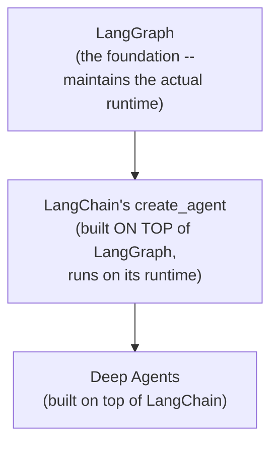

#### 🔍 Internal Working — The Five Components, Precisely Named

> 💡 **Memory Trick, given directly, each component defined:**
> - **Context**: *"Static information like user ID, DB connections, or other dependencies for an agent invocation."*
> - **Store**: *"A base store instance used for long-term memory."*
> - **Stream Writer**: *"An object used for streaming information via the custom stream mode."*
> - **Execution Info**: *"Identity and retry information for the current execution -- thread ID, run ID, attempt number."*
> - **Server Info**: *"Mainly for LangGraph server-only metadata."*

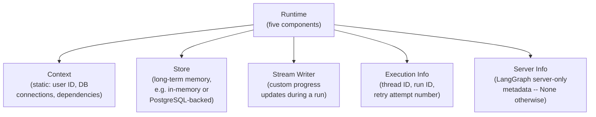

#### 💻 Code Example — Defining a Custom Context Schema

> 💡 **Memory Trick, the complete, live-built example given directly:** *"When creating an agent with create_agent, you can specify a context schema to define the structure of the context stored in the agent runtime."*

```python
from dataclasses import dataclass
from langchain.agents import create_agent

@dataclass
class CinebotContext:
    username: str
    geographical_state: str   # e.g. "Delhi", "Bangalore", "Chennai"

agent_with_context = create_agent(
    model=model,
    tools=[],
    context_schema=CinebotContext,   # declares the SHAPE of context this agent expects
)

result = agent_with_context.invoke(
    {"messages": [{"role": "user", "content": "What's my name?"}]},
    context=CinebotContext(username="Mayank", geographical_state="Delhi"),
)
```

> 💡 **Memory Trick, an honest, direct clarification given right after this demo:** *"How is this helpful? ... We have not parsed it as of now, so it is not going to say that [the user's name] -- it doesn't get parsed automatically. We have to control that... It is just getting passed for the timing. We have to use the same."*

#### ⚠ Common Mistakes

* Assuming passing context automatically makes an agent USE that information in its responses — explicitly, directly clarified: context is merely made AVAILABLE; the developer must still write logic (in a tool or middleware) that actually reads and applies it.
* Assuming runtime and state are the same concept — explicitly, directly, repeatedly distinguished throughout the session (see Section 4).

#### 🎯 Key Takeaways

* **Runtime** is what an agent maintains "under the hood," powered by LangGraph, exposing exactly **five components**: context, store, stream writer, execution info, and server info.
* **Context** specifically holds STATIC, per-invocation information (user ID, DB connections) — genuinely distinct from the evolving conversation history held in state.
* A **context schema** (defined via a dataclass) declares the expected SHAPE of this context — but passing context alone does NOT automatically make the agent use it; that requires explicit logic elsewhere (tools, middleware).

---

### 4. Context vs. State, Precisely Distinguished — the Hospital Wristband Analogy

#### ❓ Why It Exists — The Motivating Problem

> 💡 **Memory Trick, the complete, worked scenario given directly:** *"Your bot everywhere, it needs to have access to something which is not part of your conversation... which customer is talking, are they VIP or not, which cinema location this session is for. These are not your conversation history, but these things are required, right?"*

#### 🧠 Concept — The Hospital Wristband Analogy

> 💡 **Memory Trick, the complete, vivid analogy given directly:** *"As an example, if a patient is there in a hospital, we maintain a chart, the complete history. And normally you will notice how we have a wristband. A patient is having a wristband so that any department in which the patient visits -- the ER doctor, the pharmacist, any nurse -- they can all read the same wristband and understand exactly who you are, what room you are in, without asking you again and again."*

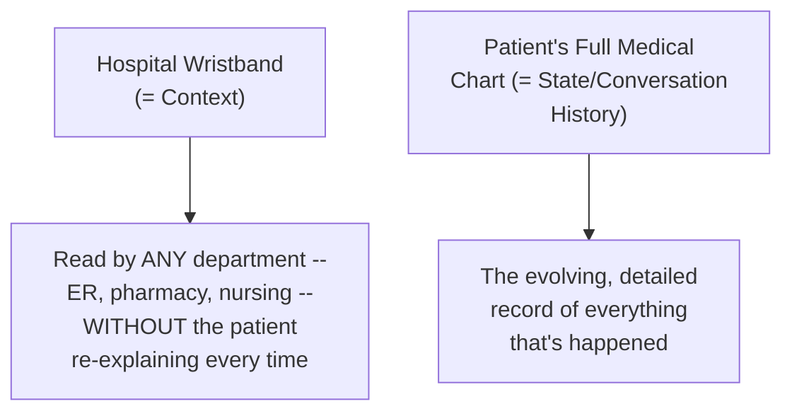

#### 🔍 Internal Working — The Precise Rule, Stated Directly

> 💡 **Memory Trick, given directly, repeated for emphasis:** *"Context is part of runtime, state is separate thing. State is for short-term memory and everything. Context, by default, you maintain the user ID and all these things up... State is having your messages, everyone. State is having your messages plus any other thing if custom state."*

| | State | Context (part of Runtime) |
|---|---|---|
| **Holds** | Conversation history (`messages`) + custom fields | Static, per-invocation info (user ID, DB connections) |
| **Scope** | Evolves DURING the conversation | Set once, at invocation time |
| **Analogy** | The patient's evolving medical chart | The wristband -- read by anyone, unchanging per visit |

#### ⚠ Common Mistakes

* Assuming context and conversation history are the same thing, just under different names — explicitly, directly distinguished via the wristband analogy: context is fixed, background identity information; conversation history (state) is the evolving record of what's actually been said.

#### 🎯 Key Takeaways

* **Context** (part of runtime) holds static, background information genuinely needed by tools/middleware but NOT part of the actual conversation -- directly analogous to a hospital wristband.
* **State** holds the evolving conversation history plus any custom fields -- directly analogous to a patient's full medical chart.
* This distinction is explicitly, repeatedly emphasized as the single most important thing to get right before the rest of the session's runtime content makes sense.

---
### 5. Tool Runtime: How Runtime Reaches Your Tools

#### ❓ Why It Exists — The Precise Reasoning

> 💡 **Memory Trick, given directly:** *"Tool can access runtime information through the tool runtime parameter... every tool, whenever you are defining it, it gets this tool runtime. In this tool runtime, you are having all this information."*

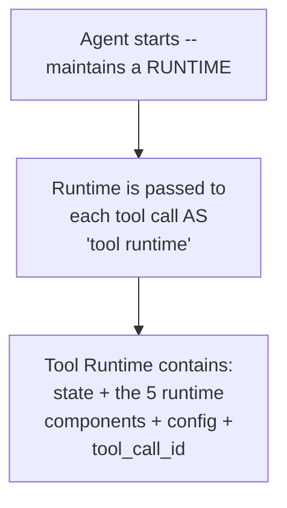

#### 💻 Code Example — A Working, Live-Built Tool Using Tool Runtime

> 💡 **Memory Trick, the complete, live-built scenario given directly:** *"Let's say that in this DB, we can save user preferences -- Mayank has a user ID Mayank123, and he likes horror and thriller movies... rather than you asking user about the user ID, you can just pass it across, and your tool can then access the same and use it."*

```python
from dataclasses import dataclass
from langchain.tools import tool, ToolRuntime
from langgraph.store.memory import InMemoryStore

@dataclass
class CustomerContext:
    user_id: str

loyalty_store = InMemoryStore()

@tool
def fetch_customer_preferences(runtime: ToolRuntime[CustomerContext]) -> str:
    """Fetch the customer's saved preferences from long-term memory."""
    user_id = runtime.context.user_id
    preferences = "no preferences"
    if runtime.store:
        memory = runtime.store.get(("preferences",), user_id)
        if memory:
            preferences = memory.value
    return preferences

pref_agent = create_agent(
    model=model,
    tools=[fetch_customer_preferences],
    context_schema=CustomerContext,
    store=loyalty_store,
)
```

#### 🔍 Internal Working — Why Tool Runtime, Not Just "Runtime" Directly

> 💡 **Memory Trick, a genuinely important, directly-answered student question:** *"Why the tool runtime? ... LangChain is a framework which has already been created by LangChain people. It is sending the tool runtime. I'm not controlling that. Tools can access runtime information through the tool runtime parameter... Context is part of runtime, state is separate thing."*

> ⚠️ **A precise, direct clarification on the genuinely ONLY way to access this data:** *"Is your tool getting the store directly? There is no user object, there is no store directly... When you define a tool, LangChain says, hey, I will be passing a tool [runtime]. In the tool runtime, [it] will have state, [and] five things of runtime, and tool ID and everything."*

#### ⚠ Common Mistakes

* Assuming a tool can directly call something like `loyalty_store.get(...)`, referencing a store variable defined elsewhere — explicitly, directly corrected: **the ONLY way** to access a store (or any runtime component) inside a tool is via the `tool_runtime` parameter LangChain automatically passes; there is no direct, standalone access.
* Assuming a `ToolRuntime` parameter is strictly required for every tool — explicitly, directly clarified: it's effectively optional syntactically (a tool without it still runs fine), but genuinely REQUIRED if the tool needs to access any runtime-provided information.

#### 🎯 Key Takeaways

* **Tool runtime** is the specific mechanism LangChain uses to pass an agent's runtime (plus extra fields: `state`, `config`, `tool_call_id`) into every tool function.
* This is explicitly, precisely the **ONLY way** to access a store, context, or other runtime data from inside a tool — there is no direct, alternative access path.
* A real, working example (fetching a customer's saved movie preferences by user ID, without asking them to repeat it) makes this genuinely concrete — directly mirroring how real products like Claude remember user preferences across sessions.

---

### 6. Runtime & Middleware: Node-Style vs. Wrap-Style Access

#### 🪜 Step-by-Step — A Genuine, Live-Triggered Error, Deliberately Reproduced

> ⚠️ **Directly, honestly demonstrated -- a genuine error, shown live to make the mechanism concrete:** *"Let me try to reproduce the error... Can you tell me what error is there, everyone? It is saying that, hey, log before model, you are not taking anything. I am passing two things. Why are you not taking it?"*

```python
# This FAILS -- LangChain passes 2 arguments, this function accepts 0:
@before_model
def log_before_model():
    pass

# This WORKS -- state and runtime are correctly caught:
@before_model
def log_before_model(state, runtime):
    pass
```

> 💡 **Memory Trick, the precise, direct explanation given:** *"When you write it up, whatever function I'm decorating, this particular function, I send two things here. I can send two things which you need to catch. What are those two things? State and runtime."*

#### 🔍 Internal Working — Node-Style Hooks: Direct Access

> 💡 **Memory Trick, given directly:** *"Node style hooks directly get the runtime parameter."*

```python
@before_model
def authorization_gate(state, runtime):
    server = runtime.server_info
    if server is not None:
        raise ValueError("Unauthenticated user")
```

#### 🔍 Internal Working — Wrap-Style Hooks: Nested Inside a Request Object

> 💡 **Memory Trick, given directly:** *"In wrap-style hooks, you get a request... This request is of type model request [or tool call request]. It will have your runtime and state."*

```python
from langchain.agents.middleware import wrap_model_call

@wrap_model_call
def personalize_the_prompt(request, handler):
    username = request.runtime.context.username
    request.system_prompt = f"You are Cinebot. Always address user as {username}."
    response = handler(request)
    return response
```

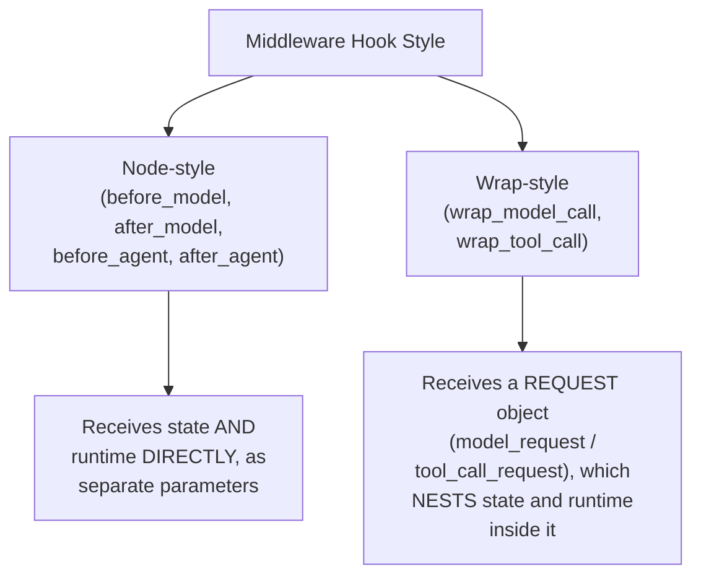

#### ❓ Why It Exists — This Pattern Is Universal, Not LangChain-Specific

> 💡 **Memory Trick, given directly, connecting to Google's ADK:** *"Let's say ADK, Google ADK, Build Agents... Agent runtime is there. Every other framework is following an approach where they're having very similar kind of a thing... Name will be different, but the concept will be the same."*

#### ⚠ Common Mistakes

* Assuming ALL middleware hooks (node-style and wrap-style) receive runtime the same way — explicitly, directly distinguished: node-style hooks get `state` and `runtime` as two SEPARATE, direct parameters; wrap-style hooks get a single REQUEST object with `state` and `runtime` nested as attributes inside it.
* Naming the `state`/`runtime` parameters something other than these exact names and assuming this breaks the mechanism — explicitly, directly clarified: *"Can you type A B instead of state, runtime? Yes, it will work. It doesn't care. You should just catch them up, nothing else."* (Parameter ORDER and COUNT matter; the specific NAMES do not.)

#### 🎯 Key Takeaways

* **Node-style hooks** (`before_model`, `after_model`, `before_agent`, `after_agent`) receive `state` and `runtime` as two DIRECT, separate parameters — a genuine, live-triggered error demonstrated exactly what happens if a function doesn't correctly accept both.
* **Wrap-style hooks** (`wrap_model_call`, `wrap_tool_call`) receive a single REQUEST object (`model_request` or `tool_call_request`), with `state` and `runtime` nested as attributes on that object.
* This entire pattern is explicitly, directly identified as a UNIVERSAL agentic-framework concept — Google's ADK has the equivalent "agent runtime," under a different name but the same underlying idea.

---
### 7. A Complete, Worked Example: Dynamic Prompting & Authorization Gates

#### 💻 Code Example — Dynamic Prompting, Fully Personalized via Runtime Context

> 💡 **Memory Trick, the complete, live-built example given directly:** *"Username, I can get the name of the user -- request.runtime.context.username. Now, because my model request, it is having the runtime, I know in my runtime I am having those five things up. I could just use that up, and I could say: return, you are Cinebot, always address user as [username]."*

```python
from langchain.agents.middleware import dynamic_prompt

@dynamic_prompt
def personalize_the_prompt(request):
    username = request.runtime.context.username
    return f"You are Cinebot. Always address user as {username}."
```

#### 🏢 Real-World / Production Usage — This Is How Claude Personalizes Every Chat

> 💡 **Memory Trick, given directly:** *"How real life? You go to Claude. Whenever you start a chat in Claude, new chat gets initiated. All your information with respect to instructions, your name and everything, they become part of your runtime. Without even you sending a single message, if I just send a hi, Claude has made sure that -- hi Mayank, what are you working on today?"*

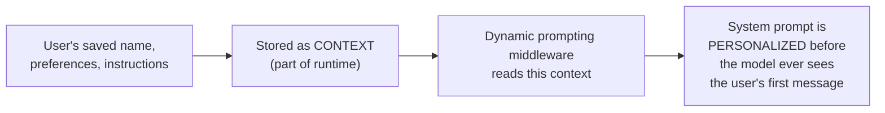

#### 💻 Code Example — An Authorization Gate Using `server_info`

> 💡 **Memory Trick, the complete, live-built example given directly:** *"Before my model, I could define an authorization gate. I get state, and I get a runtime... Block unauthenticated users."*

```python
from langchain.agents.middleware import before_model

@before_model
def authorization_gate(state, runtime):
    server = runtime.server_info
    if server is not None:
        raise ValueError("Unauthenticated user")
    # else: proceed -- e.g., extract user/thread info
    user = runtime.context
    thread_id = runtime.execution_info.thread_id
```

#### 🧠 Concept — Closing the Loop: How This All Connects, Directly Stated

> 💡 **Memory Trick, the session's own precise, closing summary given directly:** *"Any memory which it is storing, I hope you're able to understand that how it is able to get, because it will be stored in a store, right? This store will be able to access by using the runtime. So are the dots getting connected now? Any authentication, anything which you want to do? Right? So small thing, lots of impact. Because apart from the conversation history, anything which you want to send, these two are the ways through which you can send it up."*

#### ⚠ Common Mistakes

* Assuming dynamic prompting requires manually constructing a full system prompt string every time — explicitly, directly demonstrated as a simple, reusable middleware pattern that reads runtime context ONCE per request.
* Assuming a store is directly accessible outside of the runtime mechanism — explicitly, directly reinforced (again) as a common misconception: *"It is actually the store is directly accessible only via runtime only."*

#### 🎯 Key Takeaways

* **Dynamic prompting middleware** reads runtime context (like a username) to genuinely personalize the system prompt per request — directly explaining how real products like Claude greet users by name without them re-introducing themselves every chat.
* An **authorization gate**, built via `before_model`, uses `runtime.server_info` and `runtime.execution_info` to implement access control logic before the model is ever called.
* This section explicitly, directly closes the loop on the ENTIRE runtime discussion: conversation history (state) plus everything else genuinely needed (context, store, execution info) together give an agent its full, working "memory" and identity awareness — exactly the mechanism underlying real, production conversational AI products.

---

### 8. Human-in-the-Loop, Revisited: The Agentic Loop & the Four Decisions

#### 🔄 A Direct, Explicit Callback to the Original HITL Introduction

> 💡 **Memory Trick, given directly:** *"Human in the loop -- I think we have already discussed. We have discussed the pre-built middleware, which ideally is what human in the loop is. Just I want to go in a little bit more in-depth so that you are clear with this part."*

#### 📖 Definition — The Agentic Loop, Precisely Re-Stated

> 💡 **Memory Trick, given directly:** *"Agent runs in a loop, and ideally, we sit outside it. Terminology is that only -- human in the loop. Agent is running in a loop. It's called an agentic loop."*

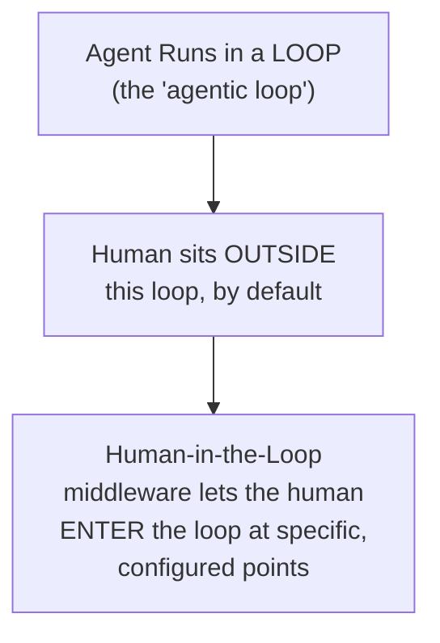

#### 🪜 Step-by-Step — Live-Demonstrated: Building an Unguarded Agent First (the Problem)

> ⚠️ **Directly, honestly demonstrated as a genuine, deliberate risk:** *"I am having a tool, cancel booking. It can cancel the booking for me, but I hope you understand the problem with this, right? If I give it a request like this, it will directly go and cancel the booking... Anyone can come up and cancel this booking."*

```python
@tool
def cancel_booking(booking_id: str) -> str:
    """Cancel a booking."""
    return f"Booking {booking_id} has been canceled."
```

#### 💻 Code Example — Adding HumanInTheLoopMiddleware

> 💡 **Memory Trick, the complete, corrected example given directly:** *"Guarded agent... model, cancel booking, send booking confirmation, middleware, human in the loop middleware. We can mention that -- cancel the booking or not, and it will listen to you."*

```python
from langchain.agents.middleware import HumanInTheLoopMiddleware

guarded_agent = create_agent(
    model=model,
    tools=[cancel_booking, send_booking_confirmation],
    middleware=[
        HumanInTheLoopMiddleware(
            interrupt_on={"cancel_booking": {"allowed_decisions": ["approve", "edit", "reject"]}}
        )
    ],
    checkpointer=in_memory_saver,
)

config = {"configurable": {"thread_id": "hitl-demo-1"}}
result = guarded_agent.invoke(
    {"messages": [{"role": "user", "content": "Cancel booking BK4201"}]},
    config=config,
)
# result contains an INTERRUPT -- e.g.:
# "Canceling is irreversible. Do you want me to permanently cancel booking BK4201?"
```

#### 🔍 Internal Working — Detecting an Interrupt Programmatically

> 💡 **Memory Trick, a genuinely important, practical question directly addressed:** *"How do we know, man, that it is asking for human in the loop? How will you tell your UI?... Result.interrupts -- if it is there."*

```python
if result.get("__interrupt__"):
    # An interrupt is pending -- surface this to the UI
    ...
```

#### 🪜 Step-by-Step — Resuming With `Command`

> 💡 **Memory Trick, given directly:** *"There is a resume, everyone, command, where we can send the resume object. It kind of expects a dictionary... There are four decisions, everyone: approve, edit, reject, or respond."*

```python
from langgraph.types import Command

resumed_result = guarded_agent.invoke(
    Command(resume={"decision": "approve"}),
    config=config,   # MUST be the SAME thread_id
)
```

#### ⚠ A Genuine, Honestly-Debugged Live Failure

> ⚠️ **Directly, honestly demonstrated -- a real bug, diagnosed live:** *"Where is it missing out? Config... I think we have defined it [the agent] multiple times, so that is where it might have failed... Since we defined it multiple times, I think that is where it failed the problem."*

> 💡 **Memory Trick, the precise root cause, stated directly:** *"I did a mistake where it was in the wrong state. I did not redefine my agent, and that is why it was having the previous error propagated as well."*

#### 📖 Definition — All Four Decisions, With Working Examples

> 💡 **Memory Trick, given directly, all four:**
> - **Approve**: *"Execute the tool with its original argument."*
> - **Edit**: *"If the arguments are wrong... we can edit it out."*
> - **Reject**: *"Cancellation requires manager sign-off first, ask the customer to call support."*
> - **Respond**: *"Ask customer a clarifying question and wait for their reply... This time you're not approving. This time you are not rejecting. This time you're just chatting with it."*

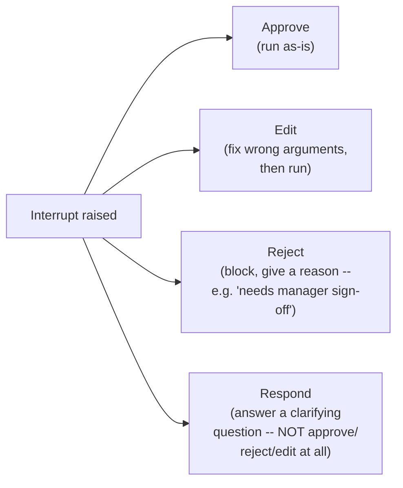

> 💡 **Memory Trick, a precise, direct clarification on what "respond" genuinely is:** *"You're not taking info from tool. Respond is taking info from human. Yes, human is replying it... Not injecting, not approving, not editing -- I'm just responding to it with something."*

#### ⚠ Common Mistakes

* Assuming a genuinely working HITL setup means the config/thread_id can be reused carelessly across redefined agents — explicitly, honestly demonstrated as a REAL, live bug: redefining the agent variable without also refreshing the thread ID/config caused a stale, propagated error.
* Confusing "respond" with "reject" — explicitly, directly distinguished: reject blocks an action and gives a reason; respond is genuinely conversational, answering a clarifying question the agent asked, with no tool call involved at all.
* Assuming "respond" enables the tool to actually be called with the human's answer as an argument — explicitly, directly clarified: *"It will never cancel as it doesn't have the tool to cancel [in this specific example]. It'll never cancel, but it can hallucinate and say that it has been canceled."*

#### 🎯 Key Takeaways

* **HumanInTheLoopMiddleware**, configured via `interrupt_on`, pauses execution before a specified tool call, requiring a checkpointer to genuinely function.
* All **four decision types** — approve, edit, reject, respond — were each demonstrated with a genuine, working example; **respond** specifically is conversational (answering a clarifying question), not an approval/rejection judgment at all.
* A real, live-diagnosed bug (agent redefinition causing stale state) is preserved as an honest, instructive troubleshooting moment — directly modeling real debugging discipline.

---
### 9. Conditional Interrupts: Human-in-the-Loop Based on a Condition

#### ❓ Why It Exists — A Genuine, Realistic Business Scenario

> 💡 **Memory Trick, the complete, worked scenario given directly:** *"Let's say that you are in a company, and you have created an agent -- let's say, for example, in Flipkart, Amazon. Amazon says that if the order value is more than 10,000, then only you have to ask the agent, like ask the executive to confirm or deny."*

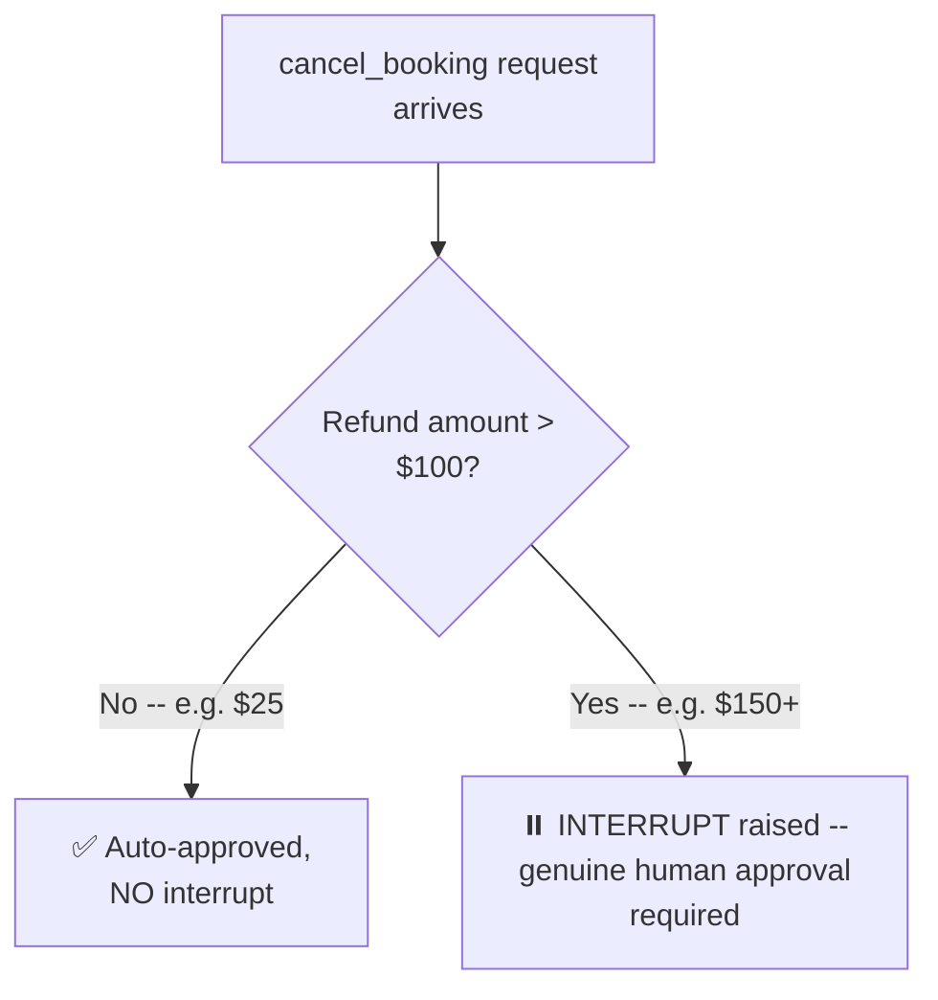

#### 📖 Definition — The Precise Mechanism: A Predicate Function Receiving `ToolCallRequest`

> 💡 **Memory Trick, given directly:** *"Optional predicate that receives a tool call request and returns true to interrupt or false to auto-approve."*

```python
from langchain.agents.middleware import ToolCallRequest

def is_large_refund(request: ToolCallRequest) -> bool:
    tool_call = request.tool_call
    arguments = tool_call.get("args", {})
    amount = arguments.get("amount", 0)
    return amount > 100

conditional_agent = create_agent(
    model=model,
    tools=[cancel_booking],
    middleware=[
        HumanInTheLoopMiddleware(
            interrupt_on={
                "cancel_booking": {
                    "allowed_decisions": ["approve", "edit", "reject"],
                    "when": is_large_refund,   # the CUSTOM predicate function
                }
            }
        )
    ],
    checkpointer=in_memory_saver,
)
```

#### 🔍 Internal Working — What's Genuinely Inside `ToolCallRequest`

> 💡 **Memory Trick, given directly:** *"What all will be there in tool call request? Tool call, tool, state, and runtime... If you want to have that condition based on the tool argument, you can have that based on the tool argument."*

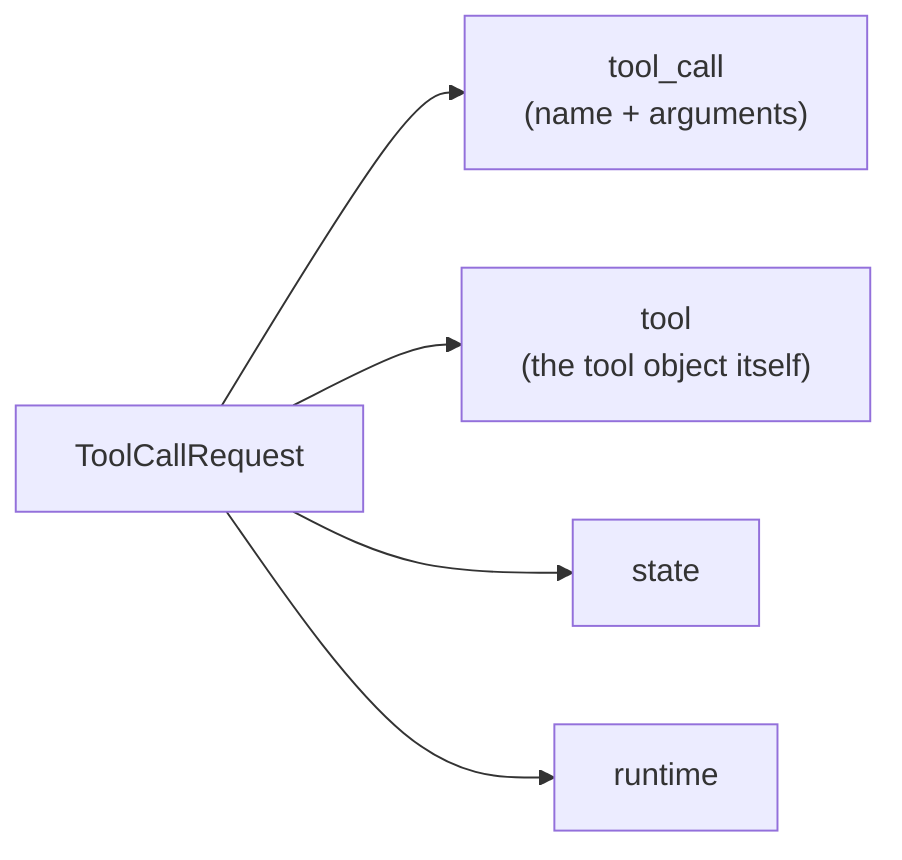

#### 🪜 Step-by-Step — Live-Demonstrated: Small Refund Auto-Approves, Large Refund Interrupts

> 💡 **Memory Trick, the live-observed contrast given directly:** *"The refund is user cancel booking refund $25. Is it greater than 100? It is not greater than 100, right? [Result:] no interrupt is there, nothing here present. Now, next time when it will be large... it will need to interrupt it... action request, name, cancel booking price, description, tool execution requires approval."*

#### ⚠ A Direct, Precise Clarification: This Predicate Is NOT the Same as `tool_runtime`

> ⚠️ **Directly, precisely corrected in response to a genuinely reasonable student question:** *"Can't we get the same via tool runtime and the messages via tool request? No, we cannot get it via tool runtime. LangChain is saying that whatever you are using in this `when` [predicate], it will get the tool call request."*

#### ⚠ Common Mistakes

* Assuming the same `tool_runtime` mechanism used inside tool functions is what the `when` predicate receives — explicitly, directly corrected: the `when` predicate specifically receives a `ToolCallRequest`, a genuinely different object with its own precise shape (tool_call, tool, state, runtime).
* Writing a predicate that always returns `True` and assuming this is a bug rather than a deliberate design choice — explicitly, directly demonstrated: *"If I do return true here... do you think that it will always be interrupted? It will always be interrupted, right? Because I'm normally sending true."* (A genuinely valid, if unconditional, configuration.)

#### 🎯 Key Takeaways

* **Conditional interrupts** use a custom predicate function (received via the `when` parameter of `interrupt_on`'s tool configuration) that inspects the actual tool call's arguments and returns `True`/`False` to decide whether a genuine interrupt is needed.
* This directly, precisely solves a realistic business requirement (e.g., "only require human approval for refunds above a specific threshold") that a blanket, always-interrupt HITL configuration cannot express.
* The predicate function receives a **`ToolCallRequest`** object — genuinely distinct from `ToolRuntime`, despite both being runtime-related, tool-adjacent concepts.

---

### 10. The Complete Interactive HITL Loop (Claude-Style)

#### 📖 Definition — The Complete, Reusable Pattern

> 💡 **Memory Trick, given directly, describing the exact, working code:** *"We are still doing the same thing. We are checking if interrupts are there, printing these things up. We are asking users for the input. It will keep on waiting for the input, no timeout, nothing we have added. When users select one, two, or three, we just take the case and we create our own command."*

```python
from langgraph.types import Command

def run_interactive_hitl_loop(agent, config, initial_input):
    result = agent.invoke(initial_input, config=config)

    while result.get("__interrupt__"):
        interrupt_info = result["__interrupt__"][0]
        print(interrupt_info)   # surface the pending action request to the user

        decision = input("Choose: approve / edit / reject / respond -> ")
        if decision == "respond":
            message = input("Your message: ")
            result = agent.invoke(
                Command(resume={"decision": "respond", "message": message}),
                config=config,
            )
        else:
            result = agent.invoke(
                Command(resume={"decision": decision}),
                config=config,
            )

    return result
```

#### 🏢 Real-World / Production Usage — This Is Genuinely How Claude Works

> 💡 **Memory Trick, given directly:** *"This is how you can control things in the UI. This time it is running in a loop like Claude runs. This is how Claude kind of does that with a good UI on top... This is how Claude handles it. This is how Claude also uses it, ChatGPT, every other framework, every other Agentic website or something are using it like this."*

```mermaid
sequenceDiagram
    participant User
    participant Loop as Interactive HITL Loop
    participant Agent

    User->>Loop: Initial request
    Loop->>Agent: invoke(initial_input)
    Agent-->>Loop: Interrupt raised
    Loop->>User: Show pending action request
    User->>Loop: Decision (approve/edit/reject/respond)
    Loop->>Agent: invoke(Command(resume={...}))
    Agent-->>Loop: Another interrupt, OR final result
    Note over Loop,Agent: Repeats until no more interrupts
    Loop-->>User: Final result
```

#### 🔍 Internal Working — This Is Explicitly the "Highest Level" of HITL Covered

> 💡 **Memory Trick, given directly, the session's own closing assessment:** *"This is at the highest level of HITL... This is very complex. No, it is not. I have almost revised you what you all knew. Otherwise, it was all just these two, three things extra, like the conditional one and the feedback [respond] one, nothing else."*

#### ⚠ Common Mistakes

* Assuming a genuinely production-ready HITL implementation requires a fundamentally different architecture from this session's own simple, `input()`-based demo — explicitly, directly clarified: *"Ideally, your UI will play a role here much better than this because your user, it will not write down those commands. It will have to click on some UI button."* (The underlying LOOP LOGIC is the same; only the input MECHANISM changes from a UI to a keyboard.)

#### 🎯 Key Takeaways

* The **complete interactive HITL loop** genuinely reproduces how production agents like Claude and ChatGPT implement pause-and-resume behavior — check for an interrupt, surface it, get a decision, resume, repeat until no interrupts remain.
* This session's own, honest self-assessment: despite feeling advanced, this loop is explicitly framed as mostly a **revision** of previously-covered concepts, with only conditional interrupts and the "respond" decision type being genuinely new additions.
* A real production UI would replace the `input()` call with UI button clicks, but the **underlying loop logic remains identical** — a genuinely important, transferable architectural insight.

---
## 📝 Glossary

| Term | Definition | Why It Matters |
|---|---|---|
| **Agent State** | A typed dictionary holding conversation history (`messages`) and custom fields | The default, extensible container for evolving conversation data |
| **Runtime** | The set of five components an agent maintains "under the hood," powered by LangGraph | Context, store, stream writer, execution info, server info |
| **Context** | Static, per-invocation information (user ID, DB connections) -- part of runtime | Genuinely distinct from conversation history; the "wristband," not the "chart" |
| **Store** | Long-term memory surviving across separate sessions | Accessible ONLY via runtime, never directly |
| **Stream Writer** | A channel for custom progress updates during a run | Not part of conversation history, but useful for status updates |
| **Execution Info** | Thread ID, run ID, retry attempt number | Identity/retry tracking for the current execution |
| **Server Info** | LangGraph server-only metadata | `None` unless running on an actual LangGraph server |
| **Tool Runtime** | The specific object LangChain passes into every tool function | Contains state, the 5 runtime components, config, and tool_call_id |
| **Agentic Loop** | The repeating cycle an agent runs in (model call, tool call, repeat) | Humans normally sit OUTSIDE this loop; HITL lets them enter it |
| **ToolCallRequest** | The object a conditional-interrupt predicate function receives | Contains tool_call (name+args), tool, state, and runtime |
| **Command(resume=...)** | The LangGraph mechanism for resuming an interrupted agent | Carries the human's decision (approve/edit/reject/respond) |

---

## 🔄 Revision Notes — One-Minute Revision

* This session covers **Runtime and Human-in-the-Loop**, deliberately positioned as necessary groundwork BEFORE a genuinely deep, multi-class MCP unit begins.
* **Agent State**: a typed dictionary holding `messages` (conversation history) plus any custom fields -- extensible by inheriting `AgentState`.
* **Runtime**: powered by LangGraph under the hood, exposing **five components**: **context** (static, per-invocation info), **store** (long-term memory), **stream writer** (custom progress updates), **execution info** (thread/run ID, retry count), and **server info** (LangGraph-server-only metadata).
* **Context vs. state**, via the **hospital wristband analogy**: context is the wristband (static identity info, read by anyone, doesn't change per visit); state is the full medical chart (the evolving conversation history).
* **Tool runtime** is the ONLY way to access runtime data (store, context) from inside a tool -- there is no direct, standalone access; a real, live-triggered error showed exactly what happens when a middleware function doesn't correctly accept `state` and `runtime`.
* **Node-style hooks** receive `state` and `runtime` as two DIRECT, separate parameters; **wrap-style hooks** receive them NESTED inside a request object (`model_request`/`tool_call_request`) -- this exact pattern is universal across agentic frameworks (Google ADK's own "agent runtime" is the direct parallel).
* Two complete, live-built examples: **dynamic prompting** (personalizing a system message via `request.runtime.context`) and an **authorization gate** (using `runtime.server_info`) -- directly explaining how products like Claude greet users by name automatically.
* **Human-in-the-Loop, revisited**: the **agentic loop** (humans sit outside it by default), and all **four decision types** -- **approve**, **edit**, **reject**, **respond** (genuinely conversational, not an approval/rejection judgment) -- each demonstrated with a real, working example, including an honestly-debugged live bug (stale agent state from redefinition).
* **Conditional interrupts**: a custom predicate function receiving a **`ToolCallRequest`** (genuinely distinct from `ToolRuntime`) decides, based on actual tool arguments (e.g., refund amount > $100), whether an interrupt is genuinely needed -- solving a real business requirement a blanket HITL policy can't express.
* The **complete interactive HITL loop** (check for interrupt -> surface it -> get decision -> resume -> repeat) genuinely reproduces how Claude, ChatGPT, and similar production agents implement pause-and-resume -- with a real UI simply replacing `input()` with button clicks, same underlying logic.

---

## 📋 Cheat Sheet

**State vs. runtime:**
```text
State   -> messages (conversation history) + custom fields
Runtime -> context, store, stream_writer, execution_info, server_info (5 things)
```

**The hospital wristband analogy:**
```text
Context (wristband)     -> static identity info, read by ANY department, unchanging
State (medical chart)     -> the evolving, detailed conversation record
```

**Tool runtime access pattern:**
```python
@tool
def my_tool(runtime: ToolRuntime[MyContext]) -> str:
    user_id = runtime.context.user_id
    if runtime.store:
        value = runtime.store.get((...), user_id)
```

**Node-style vs. wrap-style runtime access:**
```text
Node-style (before_model, after_model, before_agent, after_agent)
   -> def hook(state, runtime): ...             # DIRECT parameters

Wrap-style (wrap_model_call, wrap_tool_call)
   -> def hook(request, handler):
          request.runtime.context...              # NESTED inside request
          return handler(request)
```

**HITL's four decisions:**
```text
Approve  -> run with original arguments
Edit     -> modify arguments, then run
Reject   -> block, return a reason (e.g. "needs manager sign-off")
Respond  -> answer a clarifying question -- NOT approve/reject/edit at all
```

**Resuming an interrupted agent:**
```python
from langgraph.types import Command
agent.invoke(Command(resume={"decision": "approve"}), config=config)
```

**Conditional interrupts:**
```python
def is_large_refund(request: ToolCallRequest) -> bool:
    amount = request.tool_call.get("args", {}).get("amount", 0)
    return amount > 100

HumanInTheLoopMiddleware(
    interrupt_on={"cancel_booking": {"allowed_decisions": [...], "when": is_large_refund}}
)
```

---

## 🔥 Interview Questions & Answers

### 🟢 Beginner

**Q1.**

**Question:** What is the difference between agent state and runtime?

**Answer:** State holds conversation history (`messages`) and custom fields; runtime holds five separate components (context, store, stream writer, execution info, server info) -- genuinely distinct concepts.

**Explanation:** Directly, precisely distinguished, repeatedly emphasized.

**Why Interviewers Ask This:** A foundational, frequently-confused LangChain/LangGraph distinction.

**Possible Follow-up:** "Which one holds the conversation's message history?"

**Q2.**

**Question:** Name the five components of an agent's runtime.

**Answer:** Context, store, stream writer, execution info, server info.

**Explanation:** Directly, explicitly named.

**Why Interviewers Ask This:** Tests specific, structural knowledge of the runtime object.

**Possible Follow-up:** "What does 'context' specifically hold?"

**Q3.**

**Question:** Using the hospital wristband analogy, explain the difference between context and conversation history.

**Answer:** Context is like a wristband -- static identity information readable by anyone without re-asking; conversation history (state) is like the full medical chart -- the evolving record of everything discussed.

**Explanation:** Directly, precisely explained via the session's own analogy.

**Why Interviewers Ask This:** Tests genuine, intuitive understanding, not just memorized terminology.

**Possible Follow-up:** "Give a concrete example of information that belongs in context but not conversation history."

**Q4.**

**Question:** How does a tool access runtime information like a long-term memory store?

**Answer:** Via the `tool_runtime` parameter -- the ONLY way; there is no direct, standalone access to a store from inside a tool.

**Explanation:** Directly, explicitly clarified.

**Why Interviewers Ask This:** Tests understanding of a genuinely important access-pattern constraint.

**Possible Follow-up:** "What additional information (beyond the five runtime components) does tool_runtime include?"

**Q5.**

**Question:** What's the difference in how node-style and wrap-style middleware hooks receive runtime?

**Answer:** Node-style hooks receive `state` and `runtime` as two direct, separate parameters; wrap-style hooks receive a single request object with `state` and `runtime` nested inside it.

**Explanation:** Directly, precisely distinguished.

**Why Interviewers Ask This:** A commonly-tested, precise middleware-mechanics distinction.

**Possible Follow-up:** "Name two node-style hooks and two wrap-style hooks."

**Q6.**

**Question:** What is the "agentic loop," and where do humans sit relative to it by default?

**Answer:** The repeating cycle an agent runs in (model call, tool call, repeat); humans sit OUTSIDE this loop by default.

**Explanation:** Directly, precisely explained.

**Why Interviewers Ask This:** Foundational HITL terminology.

**Possible Follow-up:** "What does Human-in-the-Loop middleware specifically enable?"

**Q7.**

**Question:** Name Human-in-the-Loop's four decision types.

**Answer:** Approve, edit, reject, respond.

**Explanation:** Directly, explicitly named.

**Why Interviewers Ask This:** A foundational, frequently-tested HITL question.

**Possible Follow-up:** "Which decision type is genuinely conversational, rather than an approval judgment?"

**Q8.**

**Question:** What is a conditional interrupt, and how is it implemented?

**Answer:** An interrupt that only triggers when a specific condition is met (e.g., refund amount > $100), implemented via a custom predicate function receiving a `ToolCallRequest` and returning `True`/`False`.

**Explanation:** Directly, precisely explained.

**Why Interviewers Ask This:** Tests understanding of a genuinely practical, business-relevant HITL pattern.

**Possible Follow-up:** "What object type does the predicate function receive?"

**Q9.**

**Question:** Is `ToolCallRequest` the same as `ToolRuntime`?

**Answer:** No -- they're genuinely distinct objects, despite both being runtime-related and tool-adjacent.

**Explanation:** Directly, explicitly clarified.

**Why Interviewers Ask This:** Tests precise terminology, avoiding a common conflation.

**Possible Follow-up:** "What does `ToolCallRequest` contain that's specifically useful for conditional interrupts?"

**Q10.**

**Question:** What mechanism resumes an interrupted agent?

**Answer:** `Command(resume={"decision": ...})`.

**Explanation:** Directly, precisely stated.

**Why Interviewers Ask This:** Basic, practical HITL resume syntax.

**Possible Follow-up:** "What must remain consistent between the original invoke and the resume call?"

---

### 🟡 Intermediate

**Q11.**

**Question:** Explain why the instructor deliberately, live triggers a genuine error (an under-parameterized middleware function) rather than simply describing the state/runtime parameter requirement.

**Answer:** Live-triggering the actual error transforms an abstract rule ("middleware functions must accept state and runtime") into a concrete, directly-observed consequence -- students see EXACTLY what Python/LangChain's error message looks like when this requirement isn't met, making the underlying mechanism (LangChain actively PASSING two specific arguments) undeniable rather than merely asserted. This directly mirrors a consistent pattern across this instructor's broader teaching style: proving a claim via live, reproducible demonstration is more convincing and diagnostically useful than description alone, especially for genuinely "invisible," backend mechanics students can't otherwise directly observe.

**Explanation:** Requires recognizing a deliberate, evidence-based teaching technique.

**Why Interviewers Ask This:** Tests whether a learner recognizes deliberate pedagogical demonstration as distinct from mere assertion.

**Possible Follow-up:** "What specific error message did this demonstration produce, and what did it reveal about LangChain's internal behavior?"

**Q12.**

**Question:** A learner argues that since context and state are both "part of the agent," there's no genuinely important reason to keep information in one versus the other -- a developer could just put everything in state for simplicity. Evaluate this claim.

**Answer:** This claim overlooks a genuine, important distinction the session establishes: state is specifically designed for EVOLVING, per-conversation data (the messages history, custom conversation-scoped fields), while context is specifically for STATIC, per-invocation identity/configuration data (user ID, DB connections) that doesn't change WITHIN a single request. Putting genuinely static, cross-cutting information (like a user ID needed by many DIFFERENT tools) into state instead of context works technically, but loses the CONCEPTUAL clarity the distinction provides -- and more importantly, state specifically flows through conversation HISTORY (accumulating over multiple turns), while context is explicitly scoped to a SINGLE invocation, matching different actual USE CASES (a wristband you wear for one hospital visit vs. an evolving chart). Using state for everything blurs this genuinely useful architectural separation, even if it doesn't cause an immediate technical failure.

**Explanation:** Tests whether a learner recognizes a genuine, architecturally meaningful distinction versus dismissing it as arbitrary or redundant.

**Why Interviewers Ask This:** Distinguishes candidates who understand WHY a distinction exists from those who see two similar-sounding concepts as interchangeable.

**Possible Follow-up:** "Give a concrete example where conflating context and state would cause a genuine, observable problem."

**Q13.**

**Question:** Explain, precisely, why the "respond" HITL decision type is described as fundamentally different from the other three (approve, edit, reject), using the session's own reasoning.

**AnswER:** Approve, edit, and reject all share a common underlying structure: they are JUDGMENTS about whether and how a SPECIFIC, already-proposed TOOL CALL should proceed -- the agent has decided to take a concrete action, and the human is evaluating that specific action. "Respond," by contrast, is explicitly described as the human providing INFORMATION the agent genuinely needs to CONTINUE its own reasoning -- not a judgment on a proposed action at all. This is precisely why the session's own "ask customer" tool example uses respond: the agent isn't asking "should I do X?" (approve/edit/reject), it's asking "I need more information before I can decide what to do" -- a genuinely different kind of interaction, more collaborative/conversational than evaluative. The tool call being interrupted for approve/edit/reject actually EXECUTES (in some modified or original form); the "ask customer" tool interrupted for respond genuinely never executes its own logic at all -- the human's reply directly substitutes for what the tool would have returned.

**Explanation:** Requires reasoning through the structural difference the session's own examples reveal, not just recalling that four decision types exist.

**Why Interviewers Ask This:** Tests whether a learner understands WHY respond is categorically different, not just that it's a fourth option in a list.

**Possible Follow-up:** "Would it make sense to use 'respond' for a genuinely destructive action like a permanent data deletion? Why or why not?"

**Q14.**

**Question:** Using this session's conditional interrupt example (Section 9), design the reasoning for why a DIFFERENT tool (e.g., a `send_marketing_email` tool) might need a genuinely different conditional predicate than the refund-amount-based one shown for `cancel_booking`.

**Answer:** The specific PREDICATE LOGIC must directly reflect the specific BUSINESS RISK associated with that specific tool's actual arguments -- there's no single, universal "risk threshold" that applies across genuinely different tools. For `cancel_booking`, refund AMOUNT is the natural risk proxy (larger refunds warrant more scrutiny, per the session's own Amazon/Flipkart example). For a hypothetical `send_marketing_email` tool, a more relevant condition might instead check the RECIPIENT COUNT (e.g., interrupt only if sending to more than 10,000 recipients, since a small, targeted email carries far less business risk than a mass send) or perhaps whether the email CONTENT contains certain flagged keywords -- genuinely different from a dollar-amount threshold, since email sending risk isn't naturally measured in currency at all. This directly illustrates the session's own broader principle: `ToolCallRequest`'s `tool_call.args` gives access to WHATEVER arguments a specific tool actually receives, and the predicate function should be designed around THAT specific tool's genuine risk factors, not a copy-pasted, generic threshold pattern.

**Explanation:** Requires extending the session's own specific example to a genuinely new, different tool, reasoning through what the RIGHT condition would be based on that tool's own actual risk profile.

**Why Interviewers Ask This:** Tests whether a learner can apply the conditional-interrupt PATTERN to a genuinely new scenario, not just recall the refund-amount example verbatim.

**Possible Follow-up:** "Write the actual predicate function for the send_marketing_email example you just described."

**Q15.**

**Question:** Synthesize this session's tool runtime mechanics (Section 5) with its HITL conditional interrupt mechanics (Section 9) to explain a genuinely important architectural similarity between how tools access runtime data and how conditional interrupts access tool call data.

**Answer:** Both mechanisms share the SAME underlying architectural pattern: LangChain automatically PASSES a specific, framework-defined object into developer-written code, rather than the developer manually fetching or constructing that data themselves. For tools, this is `tool_runtime` (containing state, the five runtime components, config, and tool_call_id), automatically injected into any tool function that declares a `ToolRuntime`-typed parameter. For conditional interrupts, this is `ToolCallRequest` (containing tool_call, tool, state, and runtime), automatically passed into any predicate function used as a `when` condition. In BOTH cases, the developer never manually constructs or fetches this object -- LangChain's own internal execution flow determines WHEN and WHAT to pass, and the developer's only job is to correctly ACCEPT and USE the object once received (directly connecting to Section 6's own "you must catch state and runtime, or you'll get an error" demonstration). This reveals a genuinely consistent, repeated design philosophy across LangChain's entire middleware/tool ecosystem: dependency injection of framework-managed context, rather than manual, ad-hoc data-passing by the developer.

**Explanation:** Requires recognizing a genuinely consistent architectural pattern (dependency injection) recurring across two separately-taught mechanisms within the same session.

**Why Interviewers Ask This:** A senior-level question testing whether a candidate can identify a transferable design principle across superficially different framework features.

**Possible Follow-up:** "Name a third place in this session (or a prior one) where this same 'framework automatically passes an object, developer must correctly accept it' pattern appears."

---

### 🔴 Advanced

**Q16.**

**Question:** Design a genuinely complete, production-grade runtime and HITL configuration for a hypothetical banking agent (per the assignment referenced in this session's own closing Q&A) — specifically addressing: (1) how customer identity/context would be maintained, (2) which specific action(s) would warrant HITL, and (3) whether that HITL should be conditional or unconditional, with reasoning.

**Answer:** A reasonable, complete design: (1) **Context/Identity** -- define a `BankingContext` dataclass with `customer_id`, `account_tier`, and `session_channel` (e.g., mobile app vs. phone banking), passed at invocation time, directly mirroring Section 3's `CinebotContext` pattern -- this ensures every tool (balance check, transfer, dispute filing) can access the authenticated customer's identity without re-asking, directly per Section 7's authorization-gate reasoning. (2) **HITL-worthy actions** -- a `transfer_funds` tool and a `close_account` tool both genuinely warrant HITL, since both are irreversible, high-stakes actions directly analogous to Section 8's `cancel_booking` example. A read-only `check_balance` tool does NOT need HITL, directly mirroring the session's own `send_booking_confirmation` example ("this doesn't need my support"). (3) **Conditional vs. unconditional** -- `transfer_funds` should use a CONDITIONAL interrupt (per Section 9's exact pattern), with a predicate checking the transfer AMOUNT against a threshold (e.g., interrupt only for transfers exceeding $5,000, directly mirroring the session's own refund-amount example) -- smaller, routine transfers can auto-approve, preserving user experience for low-risk actions. `close_account`, by contrast, should use an genuinely UNCONDITIONAL interrupt (`interrupt_on={"close_account": {...}}` with no `when` predicate) -- since ANY account closure is a sufficiently high-stakes, rare action that blanket human review is appropriate regardless of account balance or other conditions, directly mirroring Section 9's own "if I do return true here... it will always be interrupted" pattern as a deliberate design choice for genuinely universal-risk actions.

**Explanation:** Synthesizes runtime (context/identity) and HITL (conditional vs. unconditional interrupts) into one coherent, genuinely reasoned production design for a realistic, higher-stakes domain than this session's own CineBot examples.

**Why Interviewers Ask This:** A realistic, senior-level agent-architecture question testing whether a candidate can compose runtime and HITL mechanics into a genuinely justified, risk-differentiated design.

**Possible Follow-up:** "Would you use the same conditional threshold logic for a dispute-filing tool? Why or why not?"

**Q17.**

**Question:** Critically evaluate: "Since node-style hooks receive state and runtime directly while wrap-style hooks receive them nested inside a request object, node-style hooks provide strictly less capability than wrap-style hooks, and should generally be avoided in favor of wrap-style hooks." Is this an accurate implication of this session's content?

**Answer:** Not accurate, and this conflates a difference in ACCESS PATTERN with a difference in genuine CAPABILITY. Node-style hooks receiving `state` and `runtime` as direct parameters is a genuinely SIMPLER access pattern for hooks that only need to OBSERVE or lightly modify state/runtime (e.g., the authorization-gate example in Section 7, which only reads `runtime.server_info`) -- these hooks don't need the FULL request object (including things like the model itself, tools, response format) that wrap-style hooks expose, because their job doesn't require modifying those things. Wrap-style hooks' request object provides genuinely MORE surface area specifically because wrap-style hooks are designed for a genuinely DIFFERENT purpose: intercepting and potentially REWRITING an entire model or tool call (as in the dynamic-prompting and dynamic-model-selection examples from the earlier Custom Middleware session), not merely observing state at a fixed point. Choosing node-style for a simple observation/validation task isn't "avoiding a more capable option" -- it's correctly matching the hook style to the genuine need, exactly as the earlier Custom Middleware session's own decorator-vs-class and node-vs-wrap guidance establishes.

**Explanation:** Tests whether a learner recognizes that "more nested access" doesn't mean "strictly more capable," and that hook-style choice should match genuine need, not default to the most complex option.

**Why Interviewers Ask This:** Distinguishes candidates who understand appropriate tool/pattern selection from those who assume more complex access always implies superiority.

**Possible Follow-up:** "Rewrite this session's authorization-gate example (Section 7) as a wrap-style hook instead, and explain what genuinely changes, if anything."

**Q18.**

**Question:** Synthesize this session's tool_runtime mechanics with the earlier Custom Middleware session's execution-order rules (before hooks in listed order, after hooks reversed) to explain a genuinely non-obvious implication: does the runtime object a LATER middleware in the list receives reflect changes made by an EARLIER middleware in the same invocation?

**Answer:** Yes, and this reveals a genuinely important, non-obvious consequence of combining these two sessions' content. Since middleware can genuinely MODIFY agent state (established in the earlier Custom Middleware session), and node-style "before" hooks execute in LISTED order (Middleware 1, then Middleware 2, then Middleware 3), if Middleware 1's `before_model` hook modifies the agent's state (e.g., incrementing a custom counter, or writing something to a custom state field), Middleware 2's OWN `before_model` hook -- executing immediately after, in the SAME invocation -- WOULD see that updated state, since state is a genuinely SHARED, mutable object being threaded through the SAME execution flow, not an independent, isolated copy per middleware. This means middleware ORDER genuinely matters not just for WHEN each middleware's code runs (the execution-order rule itself), but for WHAT DATA each middleware actually sees, if earlier middlewares in the list have already modified shared state or runtime-accessible data before a later middleware's own hook executes. This is a genuinely important, non-obvious interaction between two separately-taught concepts (state mutability from Custom Middleware, and node-style hook execution order also from Custom Middleware) that neither session's own individual examples explicitly walks through together.

**Explanation:** Requires synthesizing state-mutability knowledge with hook-execution-order knowledge (both from a separate, earlier session) to reason about a genuinely non-obvious cross-middleware data-visibility consequence.

**Why Interviewers Ask This:** A capstone-level question testing whether a candidate can reason about the INTERACTION between two separately-taught mechanics, producing a genuinely non-obvious, correct inference.

**Possible Follow-up:** "Design a specific, deliberate two-middleware example where this state-visibility interaction would be genuinely important to get right."

---

## 🧪 Scenario-Based Interview Questions

> **Scenario 1:** A teammate's tool function raises an `AttributeError` when trying to access `runtime.context.user_id`, even though the agent was genuinely invoked with a correctly-populated context object. Using this session's concepts, diagnose this.

**Structured Answer:**
1. **Initial investigation:** Recognize this as likely a `context_schema` mismatch or missing `ToolRuntime` type annotation issue, directly connecting to Section 5's own exact tool-runtime access pattern.
2. **Metrics/logs to check:** Review the tool function's signature -- confirm it correctly declares a `ToolRuntime[YourContextType]`-typed parameter, and that the agent's `context_schema` matches the type actually being passed at invocation.
3. **Possible causes:** Most likely, either the tool function's runtime parameter isn't correctly typed/declared (per Section 6's own demonstrated "you must correctly catch state and runtime" requirement), or the context object passed at invocation doesn't genuinely match the declared `context_schema`'s shape.
4. **Debugging approach:** Directly print/inspect `runtime.context` inside the tool (or via a temporary debug middleware, directly modeling the earlier Custom Middleware session's own "reveal what's happening" debugging pattern) to confirm what's genuinely being received.
5. **Resolution:** Correct the tool function's type annotation and/or the context object passed at invocation to ensure they genuinely match, directly reproducing Section 3's own correctly-working `CinebotContext` example.
6. **Prevention:** Establish a team code-review checklist item verifying that every tool needing runtime access correctly declares a properly-typed `ToolRuntime` parameter matching the agent's actual `context_schema`.

> **Scenario 2 (Advanced):** Your organization's production agent uses a conditional HITL interrupt for a `process_refund` tool (interrupting only for refunds over $500), but a customer support team reports that some genuinely large refunds are being auto-approved without any interrupt. Using this session's concepts, diagnose and resolve this.

**Structured Answer:**
1. **Initial investigation:** Recognize this as likely a predicate-logic bug, directly connecting to Section 9's own exact conditional-interrupt mechanism -- the `when` predicate function itself may be incorrectly extracting or comparing the refund amount.
2. **Metrics/logs to check:** Review the actual `tool_call.args` structure being passed for the affected refund requests, confirming the predicate function's argument-extraction logic (e.g., `arguments.get("amount", 0)`) correctly matches the tool's actual argument NAME and TYPE.
3. **Possible causes:** Per this session's own demonstrated pattern, a common bug source would be a MISMATCHED argument key (e.g., the tool's actual argument is named `refund_amount`, but the predicate checks for `amount`, silently defaulting to 0 and therefore always evaluating as "not large").
4. **Debugging approach:** Directly test the predicate function in isolation against a few known, real `ToolCallRequest` examples (both a large and small refund) to confirm it correctly returns `True`/`False` as expected -- directly reproducing Section 9's own live-demonstrated "small refund vs. large refund" contrast test.
5. **Resolution:** Correct the predicate function's argument-extraction key to genuinely match the tool's actual parameter name, then re-verify with the same test cases.
6. **Prevention:** Establish a standing practice of unit-testing conditional-interrupt predicate functions independently (directly modeling the earlier Custom Middleware session's own "unit-test middleware independently" best practice), rather than only testing them as part of a full, live agent invocation.

---

## 🛠 Hands-on Exercises

### 🟢 Easy

1. Write out, from memory, the five components of an agent's runtime, and one sentence describing each.
2. Draw (or describe in writing) the hospital wristband analogy, correctly mapping context to the wristband and state to the medical chart.
3. Build a simple tool that uses `ToolRuntime` to access a custom context field of your own choosing (not user_id).

### 🟡 Medium

4. Build a working dynamic-prompting middleware that personalizes a system message using at least two different runtime context fields.
5. Build a complete, working HITL configuration with all four decision types (approve, edit, reject, respond) genuinely demonstrated on a tool of your own design.
6. Deliberately reproduce the session's own live-triggered error (an under-parameterized middleware function), then fix it, documenting the exact error message you see.

### 🔴 Advanced

7. Implement the complete banking-agent design proposed in Advanced Interview Q16, with genuine, working conditional and unconditional HITL configurations.
8. Implement the complete interactive HITL loop pattern from Section 10, extended to handle a genuinely new scenario (not booking cancellation) of your own choosing.
9. Design and document a test specifically probing the cross-middleware state-visibility interaction identified in Advanced Interview Q18, using two middlewares with a genuine, deliberate before-hook data dependency.

---

## 🏗 Practice Assignment

### Build: "Complete Runtime + HITL CineBot Extension"

**Objective:** Extend a CineBot-style agent with genuinely complete runtime and HITL capabilities, directly applying every mechanism covered in this session.

**Requirements:**
- A working agent with a custom `context_schema`, genuinely used by at least one tool via `ToolRuntime`.
- A working long-term memory store, accessed correctly via `runtime.store` inside a tool (directly reproducing Section 5's own preferences example).
- A dynamic-prompting middleware personalizing the system message using runtime context.
- A complete HITL configuration with all four decision types genuinely tested (approve, edit, reject, respond).
- A conditional interrupt using a custom predicate function based on a genuine business condition of your own choosing (not refund amount).
- A complete, working interactive HITL loop (directly reproducing Section 10's pattern).
- A written reflection (200-300 words) on which specific runtime component (context, store, stream writer, execution info, or server info) you found most immediately useful for your own extension, and why.

**Architecture (suggested):**

```text
cinebot_runtime_hitl/
├── cinebot_context.py              # your custom context_schema
├── cinebot_tools.py                   # tools using ToolRuntime + store
├── dynamic_prompt_middleware.py          # personalized system message
├── hitl_config.py                          # all four decisions + conditional interrupt
├── interactive_loop.py                       # your complete HITL loop
└── REFLECTION.md                                # your written reflection
```

**Expected Functionality:**
- Your context and store access should be genuinely tested and demonstrably working, not just configured.
- Your conditional interrupt should be genuinely tested against both a triggering and a non-triggering case, directly reproducing Section 9's own demonstrated contrast.

**Challenges:**
- Correctly distinguishing which information belongs in context versus state for your specific extension.
- Correctly implementing the predicate function's argument extraction for your own chosen business condition.

**Bonus Improvements:**
- Extend your authorization-gate middleware (Section 7) with genuine, working logic beyond the session's own basic example.
- Combine your conditional interrupt with the "respond" decision type, allowing a genuinely conversational clarification flow before a large-refund approval decision.

---

## 📚 Additional Resources

- **The earlier "Middleware Deep Dive," "Middleware Part 2," and "Custom Middleware" sessions** -- directly, repeatedly referenced throughout this session as required prior context (node-style/wrap-style hooks, execution order, state mutability).
- **LangChain's official runtime and Human-in-the-Loop documentation** -- directly, repeatedly consulted live throughout this session.
- **Google's Agent Development Kit (ADK) documentation** -- directly, briefly browsed live to confirm the "agent runtime" concept is universal, not LangChain-specific.
- **A future, dedicated MCP unit** (referenced directly, explicitly next) -- a minimum three classes, taught framework-agnostic first, then connected back to LangChain, ahead of a real GCP-based project.
- **A future, dedicated LangGraph session** (referenced directly) -- covering checkpointing, thread IDs, and related concepts in genuinely deeper, foundational detail.

---

## 📌 Final Revision Sheet

### ⭐ Core Concepts
- **State** = conversation history (`messages`) + custom fields; **Runtime** = five components (context, store, stream writer, execution info, server info).
- **Context vs. state**: the hospital wristband (static identity) vs. the medical chart (evolving history).
- **Tool runtime** is the ONLY way to access runtime data inside a tool.
- **Node-style hooks** get `state`/`runtime` directly; **wrap-style hooks** get them nested inside a request object.
- **HITL's four decisions**: approve, edit, reject, respond (genuinely conversational, not a judgment).
- **Conditional interrupts** use a predicate function receiving `ToolCallRequest`, distinct from `ToolRuntime`.
- The **complete interactive HITL loop** genuinely mirrors how Claude/ChatGPT implement pause-and-resume.

### ⭐ Important Definitions
- **Execution Info, Server Info** (see Glossary for full definitions).

### ⭐ Important Commands/Code
```python
@tool
def my_tool(runtime: ToolRuntime[MyContext]) -> str:
    user_id = runtime.context.user_id

def is_large_refund(request: ToolCallRequest) -> bool:
    return request.tool_call.get("args", {}).get("amount", 0) > 100

agent.invoke(Command(resume={"decision": "approve"}), config=config)
```

### ⭐ Architecture/Process
- Agent starts -> maintains state + runtime -> runtime passed to tools as `tool_runtime`, to node-style hooks as direct params, to wrap-style hooks nested in a request object.
- HITL: agentic loop -> interrupt raised (unconditionally, or conditionally via a `when` predicate) -> human decision -> `Command(resume=...)` -> loop continues or completes.

### ⭐ Best Practices
- Use context for static, per-invocation data; use state for evolving conversation data.
- Always correctly type-annotate `ToolRuntime` parameters in tools that need runtime access.
- Match conditional-interrupt predicate logic precisely to each specific tool's genuine risk factors.
- Test conditional-interrupt predicates independently, against both triggering and non-triggering cases.

### ⭐ Common Mistakes
- Confusing context (static) with conversation history/state (evolving).
- Assuming a store is directly accessible without going through runtime.
- Confusing `ToolCallRequest` (used in conditional interrupts) with `ToolRuntime` (used inside tools).
- Reusing a stale agent/config after redefining the agent, causing propagated errors.

### ⭐ Interview Points
- Be ready to precisely distinguish state from runtime, and context from conversation history.
- Be ready to explain the node-style vs. wrap-style runtime access difference.
- Be ready to walk through all four HITL decision types with working examples.
- Be ready to design a conditional interrupt predicate for a genuinely new business scenario.

### ⭐ Things to Remember
- This session is **deliberately positioned before MCP** -- necessary groundwork, not a detour, directly motivated by genuine, reported student confusion from a prior class.
- Runtime and HITL mechanics are explicitly, repeatedly connected to **real production products** (Claude, ChatGPT) -- not abstract, LangChain-specific trivia.
- The instructor's own **honest, live-debugged bugs** (a genuine parameter error, a genuine stale-agent-state bug) are preserved as real, instructive troubleshooting moments, not edited away.