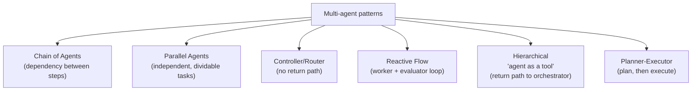
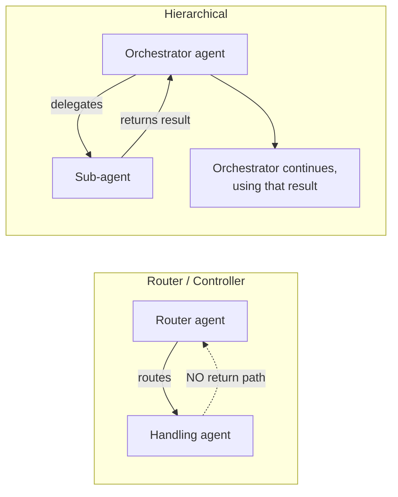

# 🔌 The LangChain MCP Adapter & Multi-Agent Architectures

- <i>**Series:** MCP Deep Dive (Agentic AI with LangChain course, batch "Agent Tki") — Part 5, circling back to LangChain after a deliberate, in-depth detour into MCP itself (Parts 3-4 of this series) ·
- **Instructor:** Mayank
- **Note on scope:** This session has two stated goals: (1) how LangChain connects to external MCP servers via its own MCP adapter, and (2) an introduction to multi-agent architectures. The live coding demo for goal (1) hit a real `langchain`/`langchain-mcp-adapters` version-mismatch bug that was diagnosed but not fully fixed on screen — the working demo is explicitly promised for a future class — so this guide captures the adapter's concepts and API surface as taught, flagging where the live run stayed broken. RAG, a completed MCP-adapter demo, deeper multi-agent internals (performance comparisons, Claude Code "skills"), the A2A protocol, memory, and an upcoming GCP project are all explicitly deferred to future classes. A recurring, garbled term ("Jeff"/"Jeb"/"JVA") is preserved here exactly as the instructor left it — functionally described as a classifier used in routing decisions, explicitly not equivalent to a schema-validation library like Pydantic — since the transcript never resolves its actual spelling.</i>

---

## 📑 Table of Contents

1. [Session Overview](#-session-overview)
2. [Learning Objectives](#-learning-objectives)
3. [Detailed Notes](#-detailed-notes)
   - [1. Framing: Back From the MCP Detour](#1-framing-back-from-the-mcp-detour)
   - [2. The LangChain MCP Adapter: The Universal-Translator Concept](#2-the-langchain-mcp-adapter-the-universal-translator-concept)
   - [3. Connecting to One or Many Servers: Transports, Config Dicts and Client Groups](#3-connecting-to-one-or-many-servers-transports-config-dicts-and-client-groups)
   - [4. Authentication: Delegation, Per-Server and Per-User Patterns](#4-authentication-delegation-per-server-and-per-user-patterns)
   - [5. Elicitation as a LangGraph Interrupt, and Multimodal Tool Output](#5-elicitation-as-a-langgraph-interrupt-and-multimodal-tool-output)
   - [6. The Live Debugging Saga: A Real Version-Mismatch Bug](#6-the-live-debugging-saga-a-real-version-mismatch-bug)
   - [7. Why Multi-Agent at All: The Single-Agent Failure Mode](#7-why-multi-agent-at-all-the-single-agent-failure-mode)
   - [8. Context Isolation: The Core Multi-Agent Payoff, Demonstrated Live](#8-context-isolation-the-core-multi-agent-payoff-demonstrated-live)
   - [9. Multi-Agent Patterns: Chain, Parallel, Router, Reactive, Hierarchical, Planner-Executor](#9-multi-agent-patterns-chain-parallel-router-reactive-hierarchical-planner-executor)
   - [10. Router vs. Hierarchical: The Precise Distinction](#10-router-vs-hierarchical-the-precise-distinction)
   - [11. Orchestrator Intelligence: How Routing Actually Works Under Ambiguity](#11-orchestrator-intelligence-how-routing-actually-works-under-ambiguity)
   - [12. Context Management Deep Dive: Lost in the Middle, Bloat, and Compaction vs. Summarization](#12-context-management-deep-dive-lost-in-the-middle-bloat-and-compaction-vs-summarization)
   - [13. Closing: Deferred Topics and Roadmap](#13-closing-deferred-topics-and-roadmap)
4. [Glossary](#-glossary)
5. [Revision Notes — One-Minute Revision](#-revision-notes--one-minute-revision)
6. [Cheat Sheet](#-cheat-sheet)
7. [Interview Questions & Answers](#-interview-questions--answers)
8. [Scenario-Based Interview Questions](#-scenario-based-interview-questions)
9. [Hands-on Exercises](#-hands-on-exercises)
10. [Practice Assignment](#-practice-assignment)
11. [Additional Resources](#-additional-resources)
12. [Final Revision Sheet](#-final-revision-sheet)

---

## 🎯 Session Overview

This session returns to LangChain after a deliberate, deep detour into MCP itself, and covers:

1. **LangChain's MCP adapter** (`langchain-mcp-adapters`, built on `fastmcp`) — the "universal translator" that lets a LangChain agent connect to any external MCP server (STDIO, in-memory, or HTTP) and automatically import its tools as native LangChain tools, removing the need to hand-write them.
2. **Connection patterns** for one server, many servers behind one connection (config dict), and many servers each needing separate protocols/credentials (client groups) — plus how the adapter bridges legacy and modern MCP architecture, authentication, elicitation, and multimodal tool output.
3. **A real, unresolved live debugging episode** — a `langchain` 1.4.0 / `langchain-mcp-adapters` version mismatch that broke the live demo, worked through conceptually while the code stayed broken.
4. **Why multi-agent systems exist at all** — the single-agent-with-many-tools failure mode, and a live, numbers-driven demonstration of **context isolation** (178K tokens inline vs. ~11K tokens with a delegated sub-agent).
5. **Six framework-agnostic multi-agent patterns**: Chain of Agents, Parallel Agents, Controller/Router, Reactive Flow, Hierarchical (agent-as-a-tool), and Planner-Executor — with a precise, tested distinction between router and hierarchical architectures.
6. **An unusually deep Q&A** on orchestrator routing intelligence under ambiguity, "lost in the middle," context bloat, and the precise (often-conflated) difference between summarization and compression.

> 💡 **Key framing, given directly:** *"MCP, at the end of the day, is just giving the tools. And we can just have the tools used anyways we want."*

---

## 🎯 Learning Objectives

By the end of this guide, you will be able to:

- [ ] Explain what the LangChain MCP adapter does and why it exists, using the "universal translator" framing.
- [ ] Distinguish connecting to a single MCP server, multiple servers via a config dict, and multiple servers needing separate protocols/credentials via a client group.
- [ ] Explain how MCP elicitation gets translated into a LangGraph interrupt, and why that translation is necessary.
- [ ] Explain the single-agent failure mode that motivates multi-agent design, and the concept of context isolation.
- [ ] Name and distinguish six multi-agent patterns, and correctly identify whether a given pattern returns control to a central agent afterward.
- [ ] Explain how an orchestrator agent routes ambiguous or unsupported requests, and what happens when it gets it wrong.
- [ ] Explain "lost in the middle" and "context bloat" as distinct phenomena, and the precise difference between summarization and compression in LLM context management.

---

## 📚 Detailed Notes

### 1. Framing: Back From the MCP Detour

#### 📖 Definition — Why the Detour Happened

> 💡 **Given directly:** *"We took a bigger detour to MCP, but in that detour, we understood MCP in very much depth... Now we are coming back to LangChain."*

Two stated goals for today: (1) connecting LangChain agents to external MCP servers via LangChain's own MCP adapter, and (2) an introduction to multi-agent systems. RAG is explicitly deferred: *"RAG and everything, we will circle back again to understand it afterwards. We are not going to do now."*

#### 🔍 Internal Working — What's Coming Next

A LangChain project on Google Cloud Platform is planned for the following weekend (students told to set up a GCP free-trial account); AWS and Azure will be covered in later projects, explicitly not out of vendor preference: *"If I will pick up GCP, though, you will say Azure and AWS. If I will pick up AWS, you will say GCP and Azure. I think we cannot play this game... I will be covering all of them in the projects."*

#### 🎯 Key Takeaways

* This class treats LangChain and MCP as complementary, not competing — MCP supplies tools, LangChain supplies the agent framework, and the adapter is the bridge between them.
* A recurring, garbled term appears throughout this session ("Jeff"/"Jeb"/"JVA") — functionally described later as a classifier used for routing decisions, explicitly **not** the same as a schema-validation library like Pydantic. Its actual name/spelling is never resolved in the transcript; treat it as unconfirmed and verify against the instructor's own referenced YouTube content before relying on it.

---

### 2. The LangChain MCP Adapter: The Universal-Translator Concept

#### 📖 Definition — Why the Adapter Exists

> 💡 **Given directly:** *"MCP gives you an MCP adapter, which is like a universal translator. One adapter, and it figures out on its own whether it's talking to a local MCP (in-device/STDIO) or [a remote HTTP one]."*

The core motivation: *"We might not have to actually create our tools, but we can connect with the tools which are given by others."* LangChain's agents are only as good as the tools they can reach, so the adapter's job is to make any external MCP server's tools usable as native LangChain tools without hand-writing them.

#### 🔍 Internal Working — Setup and the Canonical Pattern

```
pip install langchain-mcp-adapters
pip install fastmcp
```

```python
async with MCPAdapter(server) as adapter:
    tools = await adapter.list_tools()
    print("Tools discovered:", [t.name for t in tools])
    # agent = create_agent(..., tools=tools)
    # result = await agent.ainvoke(...)
```

The example used to demonstrate this was a previously-built **CineBot MCP server** (from the earlier MCP module) exposing tools to check showtimes, cancel a booking, and get a seat map.

#### ⚠ Common Mistakes

* Calling the raw FastMCP/MCP client's `list_tools()` directly instead of the adapter's — this does return tools, but they won't necessarily be shaped in a LangChain-compatible way: *"Could we have got the tools using just the client?... Yes. Will they always be Langchain compatible? No. So that is why we are doing `adapter.list_tools()`... not `client.list_tools()`."*

#### 🎯 Key Takeaways

* The adapter is explicitly generalizable beyond LangChain: *"We can have a CrewAI adapter, we can have an AutoGen adapter, we can have an ADK MCP adapter. All they do is to make sure that they can act as a translator and change whatever is coming from my MCP to my overall supported agent language."*
* This same "translator" framing recurs for elicitation (Section 5) — it's the unifying mental model for everything the adapter does.

---

### 3. Connecting to One or Many Servers: Transports, Config Dicts and Client Groups

#### 📖 Definition — What the Adapter Can Connect To

> 💡 **Given directly:** *"LangChain adapter inbuilt is trying to use the fast MCP, which handles transport inference, inferencing the transport if it is STDIO or remote. Protocol negotiation, connection management, and authentication."*

Supported connection targets: an HTTP URL, a script path, a transport object, an **in-memory FastMCP server instantiated directly in the same Python process** (no separate transport needed — *"this MCP server is created in the memory of my complete Langchain"*), or an overall MCP config dictionary.

#### 🪜 Step-by-Step — Single Server, Multiple Servers, and Client Groups

1. **Single server** → pass the one server object or URL directly to the adapter.
2. **Multiple servers behind one connection** → pass an **MCP config dictionary** (the same style of config used earlier in the MCP module for connecting a client to multiple servers). *"The adapter will itself handle how the client is starting up... it will start off with the latest way it can connect."*
3. **Multiple servers needing separate authentication/protocols** → use a **client group**: *"To keep each server on its own connection, pass a client group. Each member keeps its own negotiated protocol, error[s], authentication, and handlers, and the group routes each call back to the client that advertises the tool. This is what lets a legacy and a modern server run side by side, and it namespaces tools the same way, so identical tool names across servers never collide."*

#### 🔍 Internal Working — Legacy vs. Modern MCP Compatibility

Tying back to the earlier MCP module's legacy-vs-modern architecture split: *"The legacy era begins every connection with the initialize[d] handshake... The modern era discover[s] support by probing the server's discover endpoint... FastMCP negotiates the [version] per connection, so nothing on Langchain side has to know which [protocol] a given server speaks."* Client groups can mix legacy-mode and modern-mode servers side by side.

#### ⚠ Common Mistakes

* Assuming identical tool names across different servers will collide — client groups namespace tools specifically to prevent this.

#### 🎯 Key Takeaways

* The choice between a plain config dict and a client group comes down to whether servers can share one connection/protocol or need to be kept fully separate (different auth, different protocol version).

---

### 4. Authentication: Delegation, Per-Server and Per-User Patterns

#### 📖 Definition — Delegation to FastMCP

> 💡 **Given directly:** *"MCP adapter delegates authorization to FastMCP. So any credential of fastmcp.client accept works."* This includes a static bearer token, a full OAuth flow, or any HTTPX authorization type.

```python
# Conceptual pattern: pass url= and auth=<token> to the client/adapter constructor
adapter = MCPAdapter(url=server_url, auth=token)
```

> 💡 **Given directly:** *"By default, tokens are held in memory, so each run repeats the browser step. Pass a pre-built OAuth provider with token store to persist them across runs."*

#### 🔍 Internal Working — Per-Server and Per-User Authentication

**Per-server authentication** requires a client group — different servers can each carry their own OAuth token or bearer token.

**Per-user authentication** (flagged as an important, real-world deployment caveat):

> 💡 **Given directly:** *"In deployment, each run should reach [the] MCP server as the user who initiated it, not with one shared credential. The pattern has two halves: (1) Authenticate the caller at the LangGraph server — a custom auth handler resolves the incoming request to a user identity... (2) Mint or exchange a credential for that user. Inside the Graph Factory, read the user identity and build the MCP client with a per-user token, so the connection carries that user's authorization."*

The instructor illustrated the danger of skipping this with a concrete hypothetical:

> 💡 **Given directly:** *"Let's say that I have a MCP here and I connect to that MCP while running the application. I authenticate my Gmail server, for example. Should all of you be able to use it now in this application?... You should not be... Rather than saving my tokens in the application, that, hey, someone authenticated, so Mayank authenticated, now let everyone use the Mayank MCP for Gmail... That should not be the case."*

#### ⚠ Common Mistakes

* Sharing one authenticated credential across all users of a deployed application — each user's requests should carry their own authorization, not a single developer's cached token.

#### 🎯 Key Takeaways

* Authentication methods referenced generally (not LangChain-specific): Basic authentication, API keys, Bearer token & JWT, OAuth 2.0 and 2.1, HMAC, MTLS.
* Per-user auth is a two-part pattern: authenticate the caller at the server layer, then mint/exchange a per-user credential before building the MCP client connection.

---

### 5. Elicitation as a LangGraph Interrupt, and Multimodal Tool Output

#### 📖 Definition — Translating Elicitation

> 💡 **Given directly:** *"Elicitation is the MCP mechanism for a server to request input in the middle of a tool call. When the server needs input, the request surfaces as a Langgraph interrupt, so the person already reviewing the agent's work answers it and then resumes."*

#### 🔍 Internal Working — The Language Analogy

> 💡 **Given directly:** *"If you know Hindi, then if I say 'Ruko' [stop], then only you will stop, right? If I say the same in any other language, will you stop then?... Your Langchain agent will get stopped when it gets a Langchain interrupt, not otherwise."* Even if the raw MCP server sends a generic (non-LangGraph-specific) interrupt, the LangChain agent will keep working, because it doesn't understand that "language" — the adapter's specific job is translating the MCP-native interrupt into a LangGraph-specific interrupt so the agent actually halts.

> 💡 **Given directly, the generalizing takeaway:** *"All the other concepts and everything are the same... just that our adapter... can tomorrow be for any other framework as well — we can have a CrewAI adapter, we can have an AutoGen adapter, we can have an ADK [MCP] adapter. All they do is to make sure that they can act as a translator and change whatever is coming from my MCP to my overall supported agent language. Just that is the whole takeaway."*

#### 🪜 Step-by-Step — Multimodal and Structured Tool Output

* *"MCP tool result becomes Langchain native values (content the model can read), an artifact for structured output, and a tool message status that distinguishes a server-reported error from a transport failure."*
* *"MCP tool result arrives in Langchain content blocks. It is for the multimodal content"* — output can be text, image, audio, etc., each handled appropriately by the adapter.
* *"Our tool can give us structured content as well... the adapter attaches it to the tool message as an artifact, rather than folding it into model-visible text,"* and this structured content is read back from that artifact field.

#### 🎯 Key Takeaways

* Every adapter capability in this section reduces to the same idea: translate whatever MCP natively produces (an interrupt, a multimodal result, structured content) into the format the host agent framework already understands.

---

### 6. The Live Debugging Saga: A Real Version-Mismatch Bug

#### 📖 Definition — What Broke

Repeated `No module named...` errors on `langchain_mcp_adapters` imports during the live demo.

> 💡 **Given directly:** *"There is some version change because of which we are facing this... Langchain MCP require Langchain MCP, which is in beta. Importing it raises a Langchain warning once we're processed. That shouldn't have to be a problem for us."*

#### 🔍 Internal Working — Diagnosis, and an Honest Non-Resolution

After roughly 30 minutes of live troubleshooting (reinstalling packages, checking whether Colab's lack of top-level `async` support was the cause, considering a switch to VS Code, trying to run a standalone `.py` file instead of a notebook), and a further off-camera investigation during a break, the root cause was identified:

> 💡 **Given directly:** *"I think the issue is kind of clear. It was actually some new Langchain 1.4.0 library which they have introduced... it requires Langchain MCP 1.4.0."*

**This was not fully fixed live.** The instructor explicitly pivoted to teaching the concepts in parallel while leaving the code broken: *"Meanwhile, the code is getting fixed. Let me try to explain you anyways... Parallelly, let me explain you the same, because I think explanation-wise, it should not be a problem."* The completed, working demo was pushed to a future session: *"I will show you the practical of MCP maybe in the last class quickly."*

#### ⚠ Common Mistakes

* Assuming a library's API surface is stable across versions in a fast-moving ecosystem like this — a `langchain` core-library version bump (1.4.0) broke compatibility with the `langchain-mcp-adapters` package the instructor had cached/expected.

#### 🎯 Key Takeaways

* This is a real, honest example of encountering — and not immediately resolving — a dependency version mismatch; the conceptual material (Sections 2-5) held up and was taught regardless of the broken code.
* If you hit this yourself, check that your `langchain` and `langchain-mcp-adapters` versions are compatible releases (e.g., both at 1.4.0-series) before assuming your own code is wrong.

---

### 7. Why Multi-Agent at All: The Single-Agent Failure Mode

#### 📖 Definition — The Overloaded Single Agent

> 💡 **Given directly:** *"The simplest possible setup is one AI agent with a pile of tools bolted on. It can check email, look at [the] calendar, search the web, update a spreadsheet, all from a single prompt. That works for a small task; it starts breaking the moment a request touches more than one thing at once."*

#### 🔍 Internal Working — A Concrete Failure Anecdote

With 15-20+ tools available, asking an agent to *"Reply to Sarah confirming I can meet Thursday at 2pm"* produced a reply — *"Sounds good, confirming Thursday"* — **sent without ever actually checking the calendar**, risking a double-booking.

> 💡 **Given directly:** *"The agent had [the] calendar tool available. It just didn't reliably reach it before replying."*

#### 🎯 Key Takeaways

* The failure mode isn't that the agent lacks a needed tool — it's that overloading one agent with too many tools makes it unreliable about actually using the right one at the right time.
* The instructor draws a direct analogy to real teams: *"Don't all of us work in a team where we are having multiple employees or multiple people working together, sharing the context...?"* — multi-agent design mirrors how humans divide complex work.

---

### 8. Context Isolation: The Core Multi-Agent Payoff, Demonstrated Live

#### 📖 Definition — What Context Isolation Means

> 💡 **Given directly:** *"Let's say I want my agent to analyze a codebase. Don't you think it will be much better if any other agent can take up this task, analyze the codebase, and then give you the result back? So that my agent's context is not polluted."*

#### 🪜 Step-by-Step — The Live Demo (Claude Code + "Agent Flow")

1. A fresh session starts; sending "hi" shows roughly **5K tokens** of context.
2. Asking the agent (single-agent, no subagent instruction) to *"analyze the codebase and tell me what it does"* — context climbs live as it reads files: 8K → 9K → ~15K → 71K → 85K → 101K → up toward **~177K-178K tokens**.
3. A second, unrelated request at that point ("Can you fix the error of GitHub checkout...") would have to resend the **entire ~177K-token context**: *"Don't you think it will be very expensive? It will get my usage done very quickly."*
4. A **new session** is started, this time explicitly instructing: *"Hi, can you please make sure that you start off a subagent and ask it to analyze my code, and give me back the summary. Strictly do this via subagent, and not this agent."*
   - The subagent does the heavy file-reading inside its own **separate** context (estimated up to ~150K+ tokens there).
   - The **parent/main agent's context only grows to ~11K tokens** (from 5K), because it only receives the subagent's compact summary.

> 💡 **Given directly:** *"Even if that other agent would have, let's say, gone through all my files and spent 150K tokens, it could have just returned me the summary... Now my future call, don't you think it would have been much cheaper? Rather than me sending all these 150K tokens, I'm just sending maybe 20K or 11K."*

Clarified in Q&A: subagents are **not free** — *"subagent also cost[s tokens]. But at least now in the future calls, you're not [re-]calling it."* The savings compound across future turns in the conversation, not on the single subagent call itself.

#### 🔍 Internal Working — The Visualization Tool

**"Agent Flow"** is a GitHub-repo/VS Code extension that visualizes live context/token usage by reading Claude Code's own local session/hook files — it is a passive observability layer, not an independent agent making its own LLM calls: *"It is just getting the information which already Claude Code has internally and showcasing that, nothing else... The application works on [Claude Code] hooks... it creates some hooks [that] read the local files."* It requires a Claude Code subscription; per the instructor's own YouTube content, Claude Code can be run for free by swapping in an alternate model backend. Agent Flow reportedly supports Claude Code and Codex, but not GitHub Copilot (confirmed by the instructor checking live).

#### ⚠ Common Mistakes

* Assuming sub-agent delegation is entirely free — it isn't; the token savings show up in reduced context resent on *future* calls, not on the delegated call itself.

#### 🎯 Key Takeaways

* Other stated benefits of multi-agent/sub-agent design (rapid-fire list): distribution of work, parallelization (via `async`), and **per-agent model selection** — e.g., an expensive model (Opus/high-effort Sonnet) for orchestration, a cheaper model (Haiku, or a different provider) for a simple sub-task: *"Isn't it pretty good that you don't need to always use your most expensive model?"*
* A possible drawback acknowledged directly: summarization/handoff can lose detail — *"sometimes AI summarize and we lost some data that can cause an issue as well"* — but the instructor argues it's still net-better for cost long-run.
* Context management is maintained by the **framework** (LangChain), not the model: *"Who maintains the context — model or Langchain? Langchain maintains the context for us, not the model. We send the request to a model with that context."* Using different models for different sub-agents does not break this.

---

### 9. Multi-Agent Patterns: Chain, Parallel, Router, Reactive, Hierarchical, Planner-Executor

#### 📖 Definition — Framework-Agnostic Patterns

> 💡 **Given directly, on his teaching method:** *"Let me now first explain you Multi-Agent without any framework... Let's first understand the Multi-Agent architecture [conceptually]."* And his summary definition of the whole topic: *"Multi-agent is just when we are using more than one agent, nothing else."*

#### 🪜 Step-by-Step — The Six Patterns

1. **Chain of Agents (sequential)** — *"Whatever input you give to an agent, the output becomes input to another agent."* A simple sequential pipeline. Best fit: tasks with a genuine **dependency** — *"if there's a dependency between tasks, then chain of agents will only work, because if this one requires input of the earlier one, it will require that."*

2. **Parallel Agents** — the same input/request goes to multiple agents simultaneously, results combined afterward if needed. *"They might not directly be in the framework, but you can do the same via coding"* (often hand-rolled, e.g., via async fan-out). Best fit: **independent, dividable tasks** — *"if you want to do some research work, but your research work can be divided into independent tasks, then you can go with the Parallel Agent flow."*

3. **Controller/Router Agent** — *"One agent's only job is to decide who should handle the request."* Illustrated with a restaurant analogy (a seasonal-salad order routes to one section, a dessert order to pastry). Mechanism can be a switch node or a classifier that sends the request to the right agent. **Critical behavior**: *"In router architecture, it doesn't come back. Because my agent just routes it back and just runs on it."*

4. **Reactive Flow (feedback loop / evaluator pattern)** — one agent does something, another agent checks the work, and reports back what's right or wrong — a worker-agent-plus-evaluator-agent loop.

5. **Hierarchical Architecture ("agent as a tool")** — described as **the most commonly used pattern**. A main/orchestrator agent has sub-agents underneath it that it calls like tools; when a sub-agent finishes, **it returns its result back to the orchestrator, which continues using that result**. *"In the hierarchical architecture, it will be able to work it off, and then... my orchestrator agent... can use that understanding or that analysis to work [further]."* Matches the official LangChain docs' framing: *"A main agent coordinates sub-agents as tools."* Also called **"agent as a tool"**: *"you have multiple agents under an agent... it's like calling your own agent the way you'd call a tool. So that is why it is known as agent as a tool as well."* **Handoff** was mentioned as *"very similar to your routing agent, honestly"* but not elaborated in depth this session.

6. **Planner-Executor Architecture** — one agent creates a plan/to-do list, and other agent(s) execute the subtasks, in parallel or sequentially.

LangChain's own docs also expose a **"Custom workflow"** option, letting you build a totally bespoke architecture rather than using a named pattern.



#### 🎯 Key Takeaways

* These patterns are explicitly framework-agnostic — the instructor's teaching method is to build understanding "without any framework" first, then map onto LangChain's specific API surface.
* Router and hierarchical are the two patterns most likely to be confused with each other — Section 10 makes the distinction precise.

---

### 10. Router vs. Hierarchical: The Precise Distinction

#### 📖 Definition — The Core Difference

> 💡 **Given directly, the clearest statement of the session:** *"Multi-agent and hierarchical agent, both are the same? No. Multi-agent is — your agent can be in any base, you're having just more than one agent. Hierarchical is when [an] agent is having sub-agent or agent underneath it... If you have more than one agent, that is multi-agent, that's not a problem. Second is that if you are having an agent where you have a hierarchical pattern — keep one agent working under another agent — that is where you have the hierarchical pattern."*

> 💡 **Given directly, router vs. hierarchical specifically:** *"It just routes a request to the right one. For example, if it is a coding request, a literature request, or let's say a history question, it will just route to the exact agent which you might need... nothing else it is doing."* Crucially: *"Do you think this request will come back here to the routing agent? No, it will not."*

Versus hierarchical: *"It can send the request here, and it can have the result come[] in, which it can use as well. So my orchestrator agent... can use that understanding or that analysis to work [further]."*



#### ⚠ Common Mistakes

* Conflating "multi-agent" (any use of more than one agent) with "hierarchical" (a specific nested-agent structure) — multi-agent is the broader category; hierarchical, router, chain, parallel, etc. are all specific *kinds* of multi-agent architecture.
* Assuming a router agent incorporates the handling agent's output afterward — it doesn't; control does not return to the router.

#### 🎯 Key Takeaways

* The single most testable fact in this section: does control return to the dispatching agent afterward? No → router/controller. Yes → hierarchical/orchestrator.

---

### 11. Orchestrator Intelligence: How Routing Actually Works Under Ambiguity

#### 📖 Definition — Routing Is Reasoning, Not Keyword Matching

> 💡 **Given directly:** *"Same way as it understands the tool[s] — agent is having the name and a description... based on that, it takes the call because it is having the brain. Of course, it should be divided [distinctly]... The better you define your agent description and the name, the better your orchestrator agent will be able to route the request."*

#### 🪜 Step-by-Step — Handling Ambiguous and Unsupported Requests

Illustrated via an extended restaurant hypothetical (breakfast/lunch/dinner agents; a "paratha" order could plausibly belong to more than one agent; an item like "poha" might not be supported by any of them):

* **Ambiguous case**: the orchestrator *"can either route it wrongly"* — it's not foolproof. Mitigations: (1) give the orchestrator an explicit disambiguation rule (*"if there's a parantha, send it to the Breakfast agent"*), (2) instruct it to *"ask a follow-up question if you're not sure,"* or (3) tighten agent descriptions to be mutually exclusive.
* **Unsupported case**: the orchestrator routes to its best guess anyway; the **sub-agent itself reports back that it cannot fulfill the request**, and the orchestrator relays that failure to the user (*"We don't support it as of now"*). The orchestrator doesn't necessarily know in advance an item is unsupported — it discovers this from the sub-agent's own rejection.

> 💡 **Given directly:** *"Because of its intelligence, the brain is there. Orchestrator will have a brain. So that brain will tell only... either description will tell, or the brain, it will apply its own brain."*

#### ⚠ Common Mistakes

* Assuming perfect keyword coverage in agent descriptions is required or achievable — routing accuracy comes from a combination of good descriptions, the LLM's own reasoning, and graceful failure handling, not exhaustive rule enumeration.
* Not designing an explicit failure-relay path — without one, a sub-agent's rejection has nowhere useful to go.

#### 🎯 Key Takeaways

* Routing is fundamentally LLM reasoning over agent name/description metadata, supplemented by developer-authored disambiguation rules for known edge cases — it is not, and cannot be, deterministic keyword matching.
* It is explicitly not foolproof: *"It can make a mistake as well, like, it's totally possible it can make a mistake. It is not that it is foolproof without any mistake... As developers, we have to catch that mistake."*

---

### 12. Context Management Deep Dive: Lost in the Middle, Bloat, and Compaction vs. Summarization

#### 📖 Definition — "Lost in the Middle"

Introduced via a human-memory analogy: at the start and end of a long meeting, people remember details well, but the middle is vague. Applied to LLMs:

> 💡 **Given directly:** *"That is the way the brain is defined... it has that approach. So, similarly, our LLMs are also kind of [wired to] have that [bias], just like our humans."* Mechanistically: *"By the nature of the architecture, this thing happens"* — transformer attention weighting privileges the start and end of a sequence.

Proposed mitigation: externalize important context to persistent, retrievable memory rather than relying on raw in-context retention — *"can your agent then also store that timestamp[/]summary somewhere and access that if required?"* — pointing to the course's upcoming memory-feature coverage.

> 💡 **Given directly, on losslessness:** *"Context will always be lost. There is no way of saving the context... its idea is to send the relevant context, right?... Loss will always be there, there is no lossless method for the same."*

#### 🔍 Internal Working — Context Bloat, Precisely Defined

> 💡 **Given directly:** *"Context bloating [is] what happens... when your context bloat[s] up, it fills up with things which you might not be requiring."*

Room/books analogy: *"Either you can keep a single book, which is the summarization of the history, or you can keep thousands of books. When you have those thousands of books, that is where the context has bloated."*

Concrete numeric example: *"You send 5 messages to your LLM, it has 10K tokens. Next, you send it a file of 200K tokens. Now your context is bloated with this codebase, which can be, let's say in this example, 160K [tokens]."* Once something enters a session's context, it's resent on every subsequent call within that thread: *"Unnecessary, all the files will go again... all the files which it has read... everything will be sent to my LLM call. So in a way, that is a bloated context."*

#### 🪜 Step-by-Step — Why Naive Whole-Chat Summarization Is Worse Than Sub-Agent Isolation

If a large task (e.g., 170K of 178K tokens spent on code analysis) happens **inline** in the main chat, summarizing the *whole* chat afterward produces a summary **dominated/biased** by whatever consumed the most tokens — the original, smaller, important user questions get diluted or lost. Whereas if a separate sub-agent had handled that analysis and returned only a compact summary, the summary re-entering the main chat is proportionally small, so any later compaction of the *main* chat preserves the original conversational intent much better.

> 💡 **Given directly:** *"Is it much better that I just get the summary? Because... the proportions will be pretty good [after summarization]... otherwise your answer will get bad with the growing thing."*

#### ⚠ Common Mistakes

* Conflating **compression** and **summarization** as if they were the same operation. Pressed directly on this in Q&A, the instructor clarified: *"The way LLM compresses the context, or the way you do 'compact' on [an] LLM... it's not physically compressing, it's like just re-summarizing to reduce the volume of the whole context into small[er]."* Final position: *"It is re-summarizing it, or basically summarizing the same... there are compression and everything, which I don't guess LLM uses."* In short — a tool like Claude Code's `/compact` is technically **re-summarization**, not lossless, information-theoretic compression.
* Relying on periodic, framework-level chat summarization (without sub-agent isolation) as a substitute for context isolation — it's valid but structurally inferior, since it inherits the token-volume bias problem above.

#### 🎯 Key Takeaways

* "Lost in the middle" and "context bloat" are distinct problems: one is about *where* in the context something sits (position bias), the other is about *how much* irrelevant material accumulates (volume). Sub-agent isolation and memory address different halves of this.
* The router-agent vs. LLM-router distinction (raised in Q&A, re: OpenRouter) is conceptually the same underlying idea — a decision-making "brain" choosing among downstream options — just applied at different granularities (choosing an agent vs. choosing a model/provider).

---

### 13. Closing: Deferred Topics and Roadmap

#### 🎯 Key Takeaways — What's Explicitly Deferred

* **RAG** — stated as not covered today, to return "afterwards."
* **A completed, working live demo** of the LangChain MCP adapter + CineBot server + agent (broken by the version mismatch) — promised for a future class.
* **"Jeff"/the classifier tool** — mentioned twice as important but deferred both times; the instructor's own pre-existing YouTube video is the current source of truth, since the term was never spelled out fully live.
* **Deeper multi-agent architecture treatment** — context-handling internals, performance comparisons between architectures, and Claude Code's "skills" feature — explicitly promised "in the next class."
* **A2A (Agent-to-Agent) protocol** for cross-framework agent interoperability (e.g., a LangChain agent talking to an ADK agent) — raised in Q&A, flagged as needing coverage, not taught.
* **Memory** (for persistent context beyond a single session, and for mitigating "lost in the middle") — named as upcoming, not taught in depth here.
* **The LangChain project on GCP** — code to be shared during the week, project starting the following weekend.

#### 🎯 Key Takeaways — What Was Actually Covered Today

1. The LangChain MCP adapter's concept, setup, and API surface (transports, config dicts, client groups, authentication, elicitation-as-interrupt, multimodal output) — taught conceptually even after the live demo broke.
2. A real, honest, unresolved version-mismatch debugging episode.
3. The single-agent failure mode motivating multi-agent design, and a numbers-driven live demonstration of context isolation via sub-agents.
4. Six framework-agnostic multi-agent patterns, with a precise, testable distinction between router and hierarchical architectures.
5. An unusually deep Q&A on orchestrator routing under ambiguity, lost-in-the-middle, context bloat, and summarization vs. compression.

---

## 📝 Glossary

| Term | Definition |
|---|---|
| **LangChain MCP adapter** | The bridge (`langchain-mcp-adapters`, built on `fastmcp`) that lets a LangChain agent connect to any MCP server and use its tools as native LangChain tools. |
| **Client group** | A way to connect to multiple MCP servers that each need their own protocol/authentication, keeping each on its own connection while namespacing tools to avoid collisions. |
| **Elicitation** | The MCP mechanism for a server to request input mid-tool-call; surfaces to a LangChain/LangGraph agent as an interrupt, once translated by the adapter. |
| **Context isolation** | Delegating expensive, exploratory work (e.g., reading an entire codebase) to a separate sub-agent so the parent agent's own context stays small, receiving only a compact summary back. |
| **Router/Controller agent** | A multi-agent pattern where one agent's only job is deciding which other agent should handle a request; control does not return to the router afterward. |
| **Hierarchical architecture ("agent as a tool")** | A multi-agent pattern where an orchestrator calls sub-agents like tools and receives their results back, continuing to use them — the most commonly used pattern per this session. |
| **Chain of Agents** | A sequential multi-agent pattern where one agent's output becomes the next agent's input; used when tasks have a genuine dependency. |
| **Parallel Agents** | A multi-agent pattern where the same request is fanned out to multiple agents simultaneously; used for independent, dividable tasks. |
| **Reactive Flow** | A worker-agent-plus-evaluator-agent feedback loop. |
| **Planner-Executor** | A pattern where one agent creates a plan/to-do list and other agent(s) execute the subtasks. |
| **Lost in the middle** | The tendency (in both humans and LLMs) to retain the start and end of a long context well, but lose detail in the middle. |
| **Context bloat** | Accumulation of context with material that's no longer relevant to the current request, inflating every subsequent call's token cost. |
| **Compaction / summarization (LLM sense)** | Re-summarizing context to reduce its volume — explicitly NOT the same as information-theoretic, lossless compression. |

---

## 🔄 Revision Notes — One-Minute Revision

* The LangChain MCP adapter is a "universal translator" between MCP and LangChain — handles transport inference, tool discovery/adaptation, auth delegation, elicitation-as-interrupt, and multimodal output.
* Single server → direct connection; multiple servers, shared connection → config dict; multiple servers, separate protocols/auth → client group.
* Per-user auth in deployment: authenticate the caller at the server, then mint/exchange a per-user credential before building the MCP client connection — never share one credential across users.
* Single-agent failure mode: too many tools bolted onto one agent makes it unreliable about using the right one at the right time.
* Context isolation: delegating heavy work to a sub-agent keeps the parent's context small — demonstrated live as 178K tokens (inline) vs. ~11K tokens (delegated).
* Six patterns: Chain (dependency), Parallel (independence), Router/Controller (no return path), Reactive (worker+evaluator loop), Hierarchical (return path, most common), Planner-Executor (plan then execute).
* Router vs. hierarchical: does control return to the dispatcher afterward? No = router. Yes = hierarchical.
* Routing is LLM reasoning over agent descriptions, not keyword matching — it can misroute, and failure handling (sub-agent rejects → orchestrator relays) must be designed explicitly.
* Lost in the middle (positional bias) and context bloat (volume accumulation) are distinct problems; compaction/summarization is re-summarization, not lossless compression.

---

## 📋 Cheat Sheet

| Connection scenario | What to use |
|---|---|
| One MCP server | Pass the server object/URL directly to the adapter |
| Multiple servers, shared connection | MCP config dictionary |
| Multiple servers, separate auth/protocols | Client group |

| Pattern | Returns to dispatcher? | Best for |
|---|---|---|
| Chain of Agents | N/A (sequential) | Tasks with a dependency |
| Parallel Agents | N/A (fan-out) | Independent, dividable tasks |
| Router/Controller | ❌ No | Pure dispatch, no follow-up needed |
| Reactive Flow | ✅ (loop) | Work that needs checking/evaluation |
| Hierarchical ("agent as a tool") | ✅ Yes | Most general-purpose multi-agent need |
| Planner-Executor | ✅ (to planner) | Complex tasks needing decomposition |

```python
# Canonical LangChain MCP adapter pattern
async with MCPAdapter(server) as adapter:
    tools = await adapter.list_tools()
    # agent = create_agent(..., tools=tools)
```

---

## 🔥 Interview Questions & Answers

### 🟢 Beginner

**Q1.**

**Question:** What does the LangChain MCP adapter actually do?

**Answer:** It lets a LangChain agent connect to any external MCP server and automatically imports that server's tools as native LangChain tools, without the developer hand-writing them.

**Explanation:** Directly, explicitly confirmed via the "universal translator" analogy.

**Why Interviewers Ask This:** Tests basic understanding of the adapter's purpose before going deeper.

**Possible Follow-up:** "What transport types can the adapter connect to?"

**Q2.**

**Question:** When would you use a client group instead of a plain MCP config dictionary?

**Answer:** When connecting to multiple MCP servers that each need their own protocol negotiation, error handling, or authentication — a client group keeps each server on its own connection while namespacing tools to prevent name collisions.

**Explanation:** Directly, explicitly confirmed.

**Why Interviewers Ask This:** Tests whether a candidate distinguishes "just multiple servers" from "multiple servers with genuinely separate concerns."

**Possible Follow-up:** "How does a client group prevent identical tool names across servers from colliding?"

**Q3.**

**Question:** Why can't you just call the raw FastMCP client's `list_tools()` instead of the LangChain adapter's?

**Answer:** Because the raw client's tools aren't guaranteed to be shaped in a LangChain-compatible format; the adapter specifically adapts discovered MCP tools into standard LangChain tool objects.

**Explanation:** Directly, explicitly confirmed.

**Why Interviewers Ask This:** Tests understanding of what the adapter actually adds over the raw client.

**Possible Follow-up:** "What would break if you used the raw client's tools directly in a LangChain agent?"

**Q4.**

**Question:** What's the single-agent failure mode that motivates multi-agent design, per this session?

**Answer:** An agent with too many tools bolted on becomes unreliable about actually using the right tool at the right time — e.g., replying to confirm a meeting without ever checking the calendar, despite having that tool available.

**Explanation:** Directly, explicitly confirmed via the Sarah/Thursday-meeting anecdote.

**Why Interviewers Ask This:** Tests whether a candidate understands multi-agent design as solving a reliability problem, not just a "more tools = more capability" story.

**Possible Follow-up:** "How would you detect this failure mode in a production single-agent system?"

**Q5.**

**Question:** What is context isolation, and why does it save tokens on future calls specifically (not the delegated call itself)?

**Answer:** Delegating expensive, exploratory work to a separate sub-agent keeps that work's token cost inside the sub-agent's own context; the parent only receives a compact summary, so every subsequent call in the parent's conversation resends far less context than it would if the work had happened inline.

**Explanation:** Directly, explicitly confirmed, with a live 178K-vs-11K token demonstration.

**Why Interviewers Ask This:** Tests understanding of context-window economics, a real production cost driver in agentic systems.

**Possible Follow-up:** "Is delegating to a sub-agent ever more expensive overall? When?"

**Q6.**

**Question:** In a router/controller architecture, does the result come back to the router agent after the handling agent finishes?

**Answer:** No — the router hands off and does not reincorporate the result; this is the key distinguishing behavior versus hierarchical architecture.

**Explanation:** Directly, explicitly, repeatedly confirmed.

**Why Interviewers Ask This:** Tests precise, mechanical understanding of a commonly-confused pair of patterns.

**Possible Follow-up:** "What pattern would you use instead if you DO need the result to come back?"

**Q7.**

**Question:** What's the difference between "multi-agent" and "hierarchical" as terms?

**Answer:** Multi-agent just means more than one agent is involved, in any structure; hierarchical specifically means one agent has sub-agents nested underneath it that it calls and receives results from — hierarchical is one specific kind of multi-agent architecture, not a synonym for the category.

**Explanation:** Directly, explicitly confirmed.

**Why Interviewers Ask This:** Tests whether a candidate uses these terms precisely rather than interchangeably.

**Possible Follow-up:** "Name three other multi-agent patterns that are NOT hierarchical."

**Q8.**

**Question:** What is "lost in the middle"?

**Answer:** The tendency, in both humans and LLMs, to retain the start and end of a long context well while losing detail from the middle — attributed to how attention weighting works in transformer architectures.

**Explanation:** Directly, explicitly confirmed via an extended analogy and mechanistic explanation.

**Why Interviewers Ask This:** A frequently-tested concept in agentic AI/RAG interviews.

**Possible Follow-up:** "What's one mitigation strategy discussed in this session?"

**Q9.**

**Question:** Is compaction/summarization in LLM tooling (e.g., a `/compact` command) the same thing as data compression?

**Answer:** No — it's technically re-summarization (lossy, reconstructing a shorter version of the content), not information-theoretic, lossless compression.

**Explanation:** Directly, explicitly confirmed after being pressed on the distinction in Q&A.

**Why Interviewers Ask This:** Tests precision about a commonly-conflated pair of engineering terms.

**Possible Follow-up:** "Why does this distinction matter practically for context management design?"

**Q10.**

**Question:** Per this session, is agent-based routing/orchestration guaranteed to be correct?

**Answer:** No — it's explicitly not foolproof; it can misroute, and developers must design explicit handling for both ambiguous requests and outright routing mistakes.

**Explanation:** Directly, explicitly confirmed.

**Why Interviewers Ask This:** Tests realistic expectations about agentic routing versus assuming it's deterministic.

**Possible Follow-up:** "What are two concrete mitigations for ambiguous routing described in this session?"

---

### 🟡 Intermediate

**Q11.**

**Question:** Walk through why the parent agent's context only grew to ~11K tokens (from 5K) in the sub-agent demo, even though the sub-agent itself may have spent ~150K tokens.

**Answer:** The sub-agent's exploratory work (reading files, analyzing the codebase) happened entirely within its own separate context. Only its final, compact summary was returned to and absorbed into the parent's context — so the parent never had to hold or resend the full exploration, only the summary.

**Explanation:** Directly, explicitly confirmed with concrete numbers from the live demo.

**Why Interviewers Ask This:** Tests whether a candidate can explain the mechanism, not just recite "sub-agents save tokens."

**Possible Follow-up:** "Does this same saving apply on the very first call, or only on subsequent calls in the same session?"

**Q12.**

**Question:** Why is periodic, whole-chat summarization (without sub-agent isolation) considered structurally inferior to sub-agent-based context isolation?

**Answer:** Because summarization weight is proportional to token volume — if a single large task (like reading an entire codebase) consumed most of the conversation's tokens inline, the resulting summary gets dominated by that content, diluting or losing the original, smaller, important conversational intent. Sub-agent isolation avoids this by keeping that large task's tokens out of the main chat's context entirely.

**Explanation:** Directly, explicitly confirmed via the Karthikeyan and Mandar Panse exchanges.

**Why Interviewers Ask This:** Tests nuanced understanding that "summarize later" isn't equivalent to "isolate at the source."

**Possible Follow-up:** "How would you detect that a summary has become biased this way in production?"

**Q13.**

**Question:** How does an orchestrator agent decide which sub-agent should handle an ambiguous request (e.g., an item that could plausibly belong to two different sub-agents)?

**Answer:** Through a combination of the LLM's own reasoning over each sub-agent's name and description, developer-authored explicit disambiguation rules for known ambiguous cases, and optionally instructing the orchestrator to ask a clarifying follow-up question when uncertain.

**Explanation:** Directly, explicitly confirmed via the extended restaurant (paratha/poha) hypothetical.

**Why Interviewers Ask This:** Tests whether a candidate understands routing as probabilistic reasoning plus explicit engineering safeguards, not hardcoded logic.

**Possible Follow-up:** "What happens when the orchestrator routes to a sub-agent that can't actually fulfill the request at all?"

**Q14.**

**Question:** Explain the two-part pattern for per-user authentication in a deployed MCP + LangGraph application.

**Answer:** First, authenticate the caller at the LangGraph server via a custom auth handler that resolves the incoming request to a user identity. Second, mint or exchange a credential for that specific user, and build the MCP client connection with that per-user token — so each run reaches the MCP server as the actual initiating user, not a single shared credential.

**Explanation:** Directly, explicitly confirmed.

**Why Interviewers Ask This:** Tests production-security awareness beyond a toy single-user demo.

**Possible Follow-up:** "What goes wrong if you skip this and use one shared authenticated token for all users?"

**Q15.**

**Question:** How does the LangChain MCP adapter translate MCP's elicitation mechanism into something a LangChain/LangGraph agent can act on?

**Answer:** It translates the MCP-native elicitation request into a LangGraph-specific interrupt, since the agent only halts and waits for input when it receives an interrupt in the framework's own "language" — a raw, non-LangGraph-specific interrupt from the MCP server would otherwise be ignored and the agent would keep working.

**Explanation:** Directly, explicitly confirmed via the "Ruko" (Hindi for "stop") language analogy.

**Why Interviewers Ask This:** Tests understanding of why adapters must translate protocol-level signals into framework-specific ones, not just tool calls.

**Possible Follow-up:** "What's the general pattern this exemplifies, applicable to any other agent framework?"

---

### 🔴 Advanced

**Q16.**

**Question:** Your team is debating whether to use a router/controller pattern or a hierarchical pattern for a customer-support multi-agent system, where some requests need a single specialist's answer and others need the answer combined with additional processing afterward. How do you decide?

**Answer:** Use router/controller when the handling agent's response is the final answer and nothing further needs to happen with it — the router just dispatches and steps aside. Use hierarchical when the orchestrator needs to receive the sub-agent's result and do something further with it (combine it with other information, apply additional logic, or decide on a next step) — the defining test is whether control needs to return to a central agent afterward.

**Explanation:** Directly, explicitly confirmed via the precise router-vs-hierarchical distinction.

**Why Interviewers Ask This:** Tests applied architectural judgment, not just definitional recall.

**Possible Follow-up:** "Could a single system legitimately use both patterns for different request types?"

**Q17.**

**Question:** A colleague argues that since your orchestrator can't perfectly cover every possible user request in its agent descriptions, the whole routing approach is fundamentally unreliable and should be replaced with hardcoded keyword rules. How do you respond, based on this session's framing?

**Answer:** Routing was never meant to rely on exhaustive keyword coverage — it works because the underlying LLM reasons over agent descriptions and can generalize to cases the developer didn't explicitly anticipate. The real engineering task isn't eliminating ambiguity through hardcoding; it's designing for graceful handling of ambiguity and failure — disambiguation instructions for known edge cases, clarifying follow-up questions when uncertain, and a clear relay path when a sub-agent reports it can't fulfill a request.

**Explanation:** Directly, explicitly confirmed via the extended Murthy Q&A exchange.

**Why Interviewers Ask This:** Tests whether a candidate can defend probabilistic, LLM-based routing design against a naive "just hardcode it" objection.

**Possible Follow-up:** "How would you monitor and improve agent descriptions over time based on observed misrouting?"

**Q18.**

**Question:** Design a token-cost-aware multi-agent architecture for a request that involves (a) an expensive, in-depth codebase analysis, and (b) a cheap, simple classification step, both needed to answer one user question. How would you structure this, and why?

**Answer:** Use a hierarchical (orchestrator + sub-agent) pattern: delegate the expensive codebase analysis to a sub-agent (potentially on a stronger, more expensive model), which returns only a compact summary to the orchestrator, avoiding the resend cost on every future call in the session. Route the cheap classification step to a separate, cheaper-model sub-agent, since per-agent model selection lets you avoid always using your most expensive model for simple work. The orchestrator combines both results, since hierarchical architecture (unlike router/controller) returns control to it for exactly this kind of downstream integration.

**Explanation:** Directly, explicitly confirmed by combining the context-isolation demo, per-agent model-selection guidance, and the router-vs-hierarchical distinction.

**Why Interviewers Ask This:** Tests synthesis of multiple concepts from the session into one coherent, cost-aware design.

**Possible Follow-up:** "What would change if the classification step's result were needed to decide whether to even run the codebase analysis?"

---

## 🧪 Scenario-Based Interview Questions

**Scenario 1:** Your single agent, fully equipped with calendar, email, and search tools, occasionally sends confirmations without actually checking the calendar first — exactly the failure mode described in this session. What architectural change would you propose, and why?

**Approach:** Split the overloaded agent into a multi-agent system — at minimum, isolate the calendar-checking step into its own sub-agent (or an explicit hierarchical delegation) so the orchestrating agent is forced to receive and use a real calendar-check result before drafting a reply, rather than relying on a single agent to reliably reach for the right tool among many.

**Scenario 2:** A user reports that after a long multi-turn conversation involving a huge document upload, the assistant's later responses seem to "forget" details from earlier turns despite everything technically still being "in context." How would you diagnose and address this using concepts from this session?

**Approach:** Diagnose whether this is "lost in the middle" (positional bias — the relevant detail is buried in the middle of a long context) or context bloat (the context is full of now-irrelevant material crowding out what matters). For the former, consider externalizing key facts to retrievable memory rather than relying on raw in-context retention; for the latter, consider whether the large document should have been processed by an isolated sub-agent that returns only a summary, rather than remaining in the main conversation's context indefinitely.

---

## 🛠 Hands-on Exercises

### 🟢 Easy

- Write out, from memory, the six multi-agent patterns from this session with a one-line description of each and which of them has a "return path" to a dispatching agent.
- Sketch the two-part per-user authentication pattern for an MCP + LangGraph deployment, labeling each part's responsibility.

### 🟡 Medium

- Build a small LangChain agent connected to a single MCP server via the adapter, and print the discovered tools' names — reproducing the session's canonical pattern.
- Design (in writing) an orchestrator with three sub-agents whose descriptions are deliberately overlapping, then rewrite the descriptions to remove the ambiguity, following the session's "tighten descriptions" mitigation.

### 🔴 Advanced

- Implement a hierarchical (orchestrator + sub-agent) architecture where the sub-agent does a token-heavy exploratory task and returns only a summary; instrument it to measure and compare the parent's context size with and without the sub-agent delegation, similar to the session's live demo.
- Design a client-group-based connection to two MCP servers with different authentication schemes (e.g., one bearer-token, one OAuth), and describe how tool-name collisions would be handled.

---

## 🏗 Practice Assignment

### Build: "A Router vs. Hierarchical Comparison System"

1. Design a multi-agent system for a hypothetical customer-support use case with at least three specialist sub-agents (e.g., billing, technical support, account management).
2. Implement it once as a router/controller pattern (no return path) and describe what limitation this creates for any request needing follow-up processing.
3. Re-implement it as a hierarchical pattern, and describe concretely what the orchestrator does differently with the sub-agent's returned result.
4. Write a short paragraph (referencing this session's ambiguity-handling guidance) on how you'd handle a request that could plausibly go to two different sub-agents.
5. Write a second short paragraph explaining, using this session's context-isolation demo as a reference point, how you'd decide which of your sub-agents (if any) should run on a cheaper model.

---

## 📚 Additional Resources

- LangChain's own documentation on multi-agent architectures ("a main agent coordinates sub-agents as tools" — matches this session's hierarchical pattern) and its "Custom workflow" option.
- The instructor's own YouTube video(s) on the still-unresolved "Jeff"/classifier tool referenced in this session, and on running Claude Code without a paid subscription via an alternate model backend.
- "Agent Flow" (GitHub repo / VS Code extension) — for visualizing live Claude Code context/token usage via session hooks; confirmed to support Claude Code and Codex, not GitHub Copilot.
- General background on "lost in the middle" and context-window attention bias in transformer architectures, for the mechanistic explanation behind Section 12.

---

## 📌 Final Revision Sheet

### ⭐ Core Concepts

- The LangChain MCP adapter is a universal translator between MCP servers and LangChain's agent/tool format.
- Context isolation via sub-agents is the core multi-agent payoff, demonstrated with concrete token numbers (178K vs. 11K).
- Router/controller (no return path) vs. hierarchical (return path) is the single most testable architectural distinction in this session.

### ⭐ Important Definitions

- **Client group:** keeps each MCP server on its own connection/protocol/auth, namespacing tools to avoid collisions.
- **Lost in the middle:** positional bias — context in the middle of a long sequence is retained less reliably than the start/end.
- **Context bloat:** volume-based problem — irrelevant accumulated material inflates every subsequent call's cost.

### ⭐ Important Commands/Code

```python
async with MCPAdapter(server) as adapter:
    tools = await adapter.list_tools()
```

### ⭐ Architecture/Process

- Single server → direct connection; multiple servers, shared connection → config dict; multiple servers, separate protocols → client group.
- Per-user auth: authenticate the caller at the server, then mint/exchange a per-user credential before building the MCP client.
- Six multi-agent patterns: Chain, Parallel, Router/Controller, Reactive, Hierarchical, Planner-Executor.

### ⭐ Best Practices

- Delegate token-heavy exploratory work to sub-agents to keep the parent's context (and future-call cost) small.
- Match model tier to sub-task difficulty — don't default every sub-agent to the most expensive model.
- Design explicit disambiguation and failure-relay paths for orchestrator routing; don't assume it's foolproof.

### ⭐ Common Mistakes

- Sharing one authenticated credential across all users of a deployed application.
- Treating whole-chat summarization as equivalent to sub-agent-based context isolation (it inherits a token-volume bias).
- Conflating "compression" with "summarization"/"compaction" in LLM context management.

### ⭐ Interview Points

- Be ready to explain the router-vs-hierarchical distinction mechanically (does control return afterward?), not just by name.
- Be ready to explain why context isolation saves tokens on future calls, not the delegated call itself.
- Be ready to distinguish "lost in the middle" from "context bloat" as separate phenomena with separate mitigations.

### ⭐ Things to Remember

- The live MCP-adapter demo broke on a real `langchain` 1.4.0 version mismatch and was never fully fixed in this session — treat the adapter code patterns here as conceptually correct but unverified end-to-end.
- RAG, a completed adapter demo, deeper multi-agent internals, the A2A protocol, memory, and the GCP project are all explicitly deferred to future classes.
- The "Jeff"/"Jeb" term is functionally a classifier used in routing, explicitly not equivalent to Pydantic — but its exact name/spelling was never resolved in this transcript.