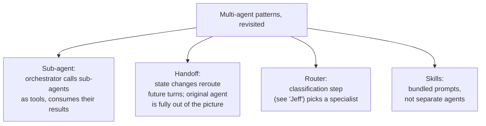

# 🔌 MCP Deep Dive — The New LangChain MCP Module, End to End, & a Second Pass on Multi-Agent Patterns

- <i>**Series:** MCP Deep Dive (Agentic AI with LangChain course, batch "Agent Tki") — Part 6. Despite this session's filename ("LangChain GCP Project"), **no GCP project was actually built in this class** — it turned out to be a full completion of the LangChain MCP adapter material from Part 5, plus a second, deeper pass on multi-agent patterns. The actual GCP build was explicitly pushed to the next class(es) ·
- **Instructor:** Mayank Aggarwal
- **Note on scope:** This class completes everything Part 5 left unfinished on the LangChain↔MCP adapter side: tool discovery and invocation, structured output, error handling, tool metadata for custom logic, elicitation (shown but currently broken/deprecated in the new beta module), multi-server connection patterns, and authentication. It also resolves the recurring, previously-garbled "Jeff" term from Parts 4-5 — it's a lightweight classifier/router mechanism, not a schema library. GCP account setup, the actual LangChain+GCP project, LangGraph, RAG, the A2A protocol, and memory are all explicitly deferred to upcoming classes.</i>

---

## 📑 Table of Contents

1. [Session Overview](#-session-overview)F
2. [Learning Objectives](#-learning-objectives)
3. [Detailed Notes](#-detailed-notes)
   - [1. Framing: What This Class Actually Covers](#1-framing-what-this-class-actually-covers)
   - [2. The New `langchain.mcp` Module: What Changed Since Part 5](#2-the-new-langchainmcp-module-what-changed-since-part-5)
   - [3. Starting a Local MCP Server and Connecting via the Adapter](#3-starting-a-local-mcp-server-and-connecting-via-the-adapter)
   - [4. Direct Tool Invocation vs. Agent Invocation, and Why the Adapter Matters](#4-direct-tool-invocation-vs-agent-invocation-and-why-the-adapter-matters)
   - [5. Structured Output: `content` vs. `artifact`](#5-structured-output-content-vs-artifact)
   - [6. Error Handling: Tool-Level Failure vs. Transport-Level Failure](#6-error-handling-tool-level-failure-vs-transport-level-failure)
   - [7. Tool Metadata and Annotations: Building Human-in-the-Loop Logic](#7-tool-metadata-and-annotations-building-human-in-the-loop-logic)
   - [8. Elicitation Revisited: What Broke in the New Module](#8-elicitation-revisited-what-broke-in-the-new-module)
   - [9. Connecting to Multiple Servers: Config Dict vs. Client Group](#9-connecting-to-multiple-servers-config-dict-vs-client-group)
   - [10. Authentication Patterns: Bearer, OAuth, Per-Server, Per-User](#10-authentication-patterns-bearer-oauth-per-server-per-user)
   - [11. Scope Reduction: What the New Module Does Not (Yet) Support](#11-scope-reduction-what-the-new-module-does-not-yet-support)
   - [12. A Three-Server Mini Demo: Local, Context7, and TimeTrack](#12-a-three-server-mini-demo-local-context7-and-timetrack)
   - [13. Multi-Agent Patterns Revisited: Sub-Agent, Handoff, Router, Skills](#13-multi-agent-patterns-revisited-sub-agent-handoff-router-skills)
   - [14. "Jeff" Resolved: The Classifier and Router Concept](#14-jeff-resolved-the-classifier-and-router-concept)
   - [15. Closing: Deferred Topics and Roadmap](#15-closing-deferred-topics-and-roadmap)
4. [Glossary](#-glossary)
5. [Revision Notes — One-Minute Revision](#-revision-notes--one-minute-revision)
6. [Cheat Sheet](#-cheat-sheet)
7. [Interview Questions & Answers](#-interview-questions--answers)
8. [Scenario-Based Interview Questions](#-scenario-based-interview-questions)
9. [Hands-on Exercises](#-hands-on-exercises)
10. [Practice Assignment](#-practice-assignment)
11. [Additional Resources](#-additional-resources)
12. [Final Revision Sheet](#-final-revision-sheet)

---

## 🎯 Session Overview

Despite its title, this class is a full, hands-on completion of the LangChain↔MCP adapter story, plus a second, more detailed pass on multi-agent patterns. It covers:

1. **The brand-new `langchain.mcp` module**, which recently replaced the old `langchain-mcp-adapters` package — still in beta, and narrower in scope (tools only, no resources/prompts yet).
2. **A full, live, working MCP-adapter demo**: starting a local MCP server, discovering and calling its tools both directly and through an agent, and seeing exactly why the adapter's tool-message conversion is what makes any of this usable by an LLM.
3. **Structured output, error handling, and tool metadata** — how `content` vs. `artifact` works, the difference between a tool-level failure and a transport-level failure, and how to read MCP tool annotations to drive custom logic like human-in-the-loop confirmation.
4. **Elicitation, demoed but currently broken** in this new beta module — an honest account of a real, unresolved library limitation.
5. **Multi-server connection patterns** (config dict vs. client group) and **authentication patterns** (bearer, OAuth, per-server, per-user).
6. **A second pass on multi-agent patterns** — sub-agent, handoff, router, and Claude Skills — including a live Claude Code + "Agent Flow" demonstration of context isolation.
7. **The long-unresolved "Jeff" term, finally explained**: a lightweight, non-generative classifier used for fast routing decisions.

> 💡 **Key framing, given directly:** *"If my Langchain MCP adapter doesn't change it into tool message, it is all waste... The reason we need to use Langchain MCP adapter, not any other adapter."*

---

## 🎯 Learning Objectives

By the end of this guide, you will be able to:

- [ ] Explain what changed when LangChain moved from `langchain-mcp-adapters` to the new, built-in `langchain.mcp` module.
- [ ] Discover and invoke MCP tools both directly and through a LangChain agent, and explain why the adapter's tool-message conversion step is essential.
- [ ] Distinguish a tool-level failure from a transport-level failure, and handle each appropriately.
- [ ] Use MCP tool metadata/annotations to drive custom client-side logic, such as gating destructive tools behind human-in-the-loop approval.
- [ ] Choose between an MCP config dictionary and a client group when connecting to multiple servers.
- [ ] Explain the four/five authentication patterns covered, and when each applies.
- [ ] Distinguish the sub-agent, handoff, router, and Claude Skills multi-agent patterns, and explain what "Jeff" refers to in the router context.

---

## 📚 Detailed Notes

### 1. Framing: What This Class Actually Covers

#### 📖 Definition — A Title That Doesn't Match the Content

This class is filed as "LangChain GCP Project," but **no GCP services were used, configured, or deployed to anywhere in this session** — no Cloud Run, Compute Engine, Vertex AI, or Cloud Functions appear. The instructor is explicit about this near the end:

> 💡 **Given directly:** *"Tomorrow, I will show you how to maybe create a GCP account, and then you can create it, and we will cover the project in the next class."*

What this class actually delivers is a complete, working follow-through on the LangChain MCP adapter material that was left unfinished (and partly broken) in the prior class, plus a deeper second pass on multi-agent patterns — framed as preparation for the GCP project still to come.

#### 🔍 Internal Working — Why VS Code This Time

The class works directly in VS Code rather than Colab, because Colab doesn't properly support STDIO transport/async MCP server execution the way a local environment does.

#### 🎯 Key Takeaways

* Treat this guide as "MCP adapter mastery + multi-agent pattern review," not as a GCP deployment walkthrough — the GCP content genuinely comes later.
* LangChain reorganizes its internal modules frequently; this class confirms such changes are routine and not conceptually disruptive.

---

### 2. The New `langchain.mcp` Module: What Changed Since Part 5

#### 📖 Definition — The Breaking Change

LangChain moved away from the old `langchain-mcp-adapters` package to a new, **built-in** `langchain.mcp` module, roughly two to three weeks before this class. Importing it raises a `LangChainBetaWarning`, since it's brand new and still in beta. `pyproject.toml` now requires `langchain-mcp >= 1.4.0` — this is the exact version mismatch that broke the live demo in Part 5.

#### 🔍 Internal Working — Setup Code

```python
from dotenv import load_dotenv
load_dotenv()

import os
assert os.environ.get("OPENAI_API_KEY")

from pathlib import Path
from langchain.mcp import MCPAdapter
from fastmcp.client.transports import PythonStdioTransport
```

#### ⚠ Common Mistakes

* Assuming the old `langchain-mcp-adapters` import paths still work after this change — they don't; the module moved into LangChain's own namespace.

#### 🎯 Key Takeaways

* This is a genuinely fast-moving library; the instructor repeatedly flags that today's behavior may change again soon (e.g., resource/prompt support being re-added in a future point release).
* Confirmed repeatedly: the new module is built directly on top of **FastMCP**, the same underlying library used throughout this MCP series.

---

### 3. Starting a Local MCP Server and Connecting via the Adapter

#### 🪜 Step-by-Step — The Canonical Pattern

The reused example is the "Cinebot" MCP server (a movie-ticketing demo built with FastMCP in an earlier class), exposing `check_showtime`, `cancel_booking`, and `get_seat_map` (later joined by a fourth tool, `risky_lookup`, used for the error-handling demo).

```python
transport = PythonStdioTransport(
    script_path="cinebot_mcp_server.py"  # exact filename must match
)

async with MCPAdapter(transport) as adapter:
    tools = await adapter.list_tools()
    print([t.name for t in tools])
```

#### 🔍 Internal Working — A Real Live Debugging Moment

The first live attempt threw **"Connection closed... during handling of the exception."** The root cause: in a notebook, merely *importing* an MCP server module doesn't execute/start it the way running the file standalone does. The fix was a helper that writes the file and runs it so the server actually initializes on import, confirmed by inspecting the server's own log file (`cinebot_mcp_server.log`) for matching timestamps.

> 💡 **Given directly:** *"My [code] is not doing any magic without explaining you... it is actually starting an MCP server, something which I've told you multiple times, [about] how Claude starts the same."*

#### ⚠ Common Mistakes

* Assuming importing a Python module that defines an MCP server is equivalent to running it as a standalone process — it isn't, and this exact assumption caused the live connection failure.

#### 🎯 Key Takeaways

* A log file is a reliable way to confirm an STDIO MCP server genuinely started, independent of whatever the client-side code reports.

---

### 4. Direct Tool Invocation vs. Agent Invocation, and Why the Adapter Matters

#### 📖 Definition — Two Ways to Call a Tool

**Direct invocation** (no agent/LLM involved):

```python
showtime_tool = tools[0]  # or find by name
direct_result = await showtime_tool.ainvoke({"movie_title": "Interstellar"})
```

**Agent-based invocation**:

```python
agent = create_agent(model="openai:gpt-5-mini", tools=tools)
result = await agent.ainvoke({"messages": [{"role": "user", "content": "What are the showtimes for Interstellar?"}]})
tool_call_result = result["messages"][-1]
```

#### 🔍 Internal Working — Why the Adapter Is Not Optional

> 💡 **Given directly:** *"MCP never returns a tool-message reply on its own — it returns raw structured/text content. It is the LangChain MCP adapter that wraps/converts this into a proper ToolMessage object the agent/LLM can understand."*

The instructor's analogy: explaining something to someone in a language they don't speak — the concept is correct, but useless without translation. A `ToolMessage` is the "language" a LangChain agent actually understands; raw MCP output is not automatically in that shape.

#### 🎯 Key Takeaways

* `langchain.mcp` converts whatever an MCP server returns (text, images, embedded files) into standard LangChain **content blocks**, so the model sees a uniform shape regardless of which MCP server produced it. Audio is not yet supported in this beta.
* Each agent framework (LangChain, CrewAI, AutoGen, etc.) implements its own MCP adapter/client with this same normalization responsibility — understanding *why* this conversion is necessary matters more for interviews than just knowing "it connects to MCP."

---

### 5. Structured Output: `content` vs. `artifact`

#### 📖 Definition — Two Fields, Two Purposes

`get_seat_map` returns structured output, not just a plain string:

- `message.content` → the text summary the LLM sees.
- `message.artifact` → the full structured/JSON content, preserved for programmatic use, **not** folded into model-visible context.

```python
tool_call = {"name": "get_seat_map", "args": {"movie_title": "Interstellar"}, "id": "...", "type": "tool_call"}
message = await seat_map_tool.ainvoke(tool_call)
print(message.content)    # text seen by LLM
print(message.artifact)   # structured content for code
```

> 💡 **Given directly:** *"When a tool returns structured content, the adapter attaches it to the tool message as an artifact rather than folding it into model-visible context or text."*

#### 🔍 Internal Working — Why This Matters for Cost

The instructor stresses using **middleware** to send only the "available rows" rather than an entire giant JSON blob to the LLM, saving tokens and cost: *"These are the small, small things which you do in step by step improvisation in your code... so that your company can save cost."*

#### 🎯 Key Takeaways

* `artifact` is for your code to consume programmatically; `content` is what actually reaches the model's context — conflating the two wastes tokens needlessly.

---

### 6. Error Handling: Tool-Level Failure vs. Transport-Level Failure

#### 📖 Definition — Two Distinct Failure Modes

1. **Tool-level failure** (`is_error=True`): the tool executed and explicitly failed (bad input, business rule violation) → becomes a normal `ToolMessage` with an "error" status that the agent can read and self-correct from.
2. **Transport/session failure**: the connection dropped, the server crashed, or the process couldn't start → raises a Python exception; there's no tool message to reason about because nothing came back to convert. Must be caught with `try/except` around the MCP call.

#### 🔍 Internal Working — Demo

Using a modified "error Cinebot" server where `risky_lookup` throws a `ValueError` if a booking ID doesn't start with the expected prefix: calling it with a malformed ID returns the `ValueError`, which the adapter auto-converts into a `ToolMessage` of type `text` ("Error calling tool risky_lookup: invalid...").

> 💡 **Given directly, the repeated rhetorical drill:** *"Did it return a tool message type? It returned a value error. Which thing converted value error into tool message?... Will your agent be able to understand it?"*

#### ⚠ Common Mistakes

* Treating every MCP failure the same way — a tool-level error is something the agent can see and reason about; a transport-level failure is invisible to the agent and must be caught in your own code.

#### 🎯 Key Takeaways

* This distinction directly determines whether your agent can self-correct (tool-level) or whether your application code must intervene (transport-level).

---

### 7. Tool Metadata and Annotations: Building Human-in-the-Loop Logic

#### 📖 Definition — Metadata as a Logic Hook

MCP tools can carry annotations/metadata (e.g., `destructive_hint: true`, `read_only_hint`) under an `mcp` namespace on the LangChain tool's `.metadata`.

```python
def is_destructive_tool_call(message):
    meta = tool.metadata or {}
    mcp = meta.get("mcp", {})
    fastmcp = mcp.get("fastmcp", {})
    annotations = fastmcp.get("annotations", {})
    return bool(annotations.get("destructive_hint"))
```

#### 🪜 Step-by-Step — Gating Destructive Tools Behind Human Approval

```python
from langchain.agents.middleware import HumanInTheLoopMiddleware

HumanInTheLoopMiddleware(
    interrupt_on={t.name: {"allowed_decisions": ["approve", "edit", "reject"]}
                  for t in tools if is_destructive_tool_call(t)}
)
```

This way, any tool flagged `destructive_hint` (e.g., `cancel_booking`) always triggers a human confirmation — driven by the tool's own metadata, not a hardcoded tool name.

#### ⚠ Common Mistakes

* Confusing this pattern with elicitation. **This is not elicitation.** Elicitation is the *server* asking the client a mid-call question (`ctx.elicit(...)`); this human-in-the-loop pattern is *client/agent-side* logic that decides to pause based on metadata it already has.

#### 🎯 Key Takeaways

* Driving logic off metadata/annotations rather than hardcoded tool names makes your gating logic robust to tools being renamed or new destructive tools being added later.

---

### 8. Elicitation Revisited: What Broke in the New Module

#### 📖 Definition — What Elicitation Is Supposed to Do

A "Cinebot Elicit" server was built, calling `ctx.elicit()` server-side to confirm a cancellation before proceeding.

#### 🔍 Internal Working — The Live Failure

The demo **failed**: *"elicitation via server-initiated request is unavailable"* — because the new `langchain.mcp` module has not yet (re-)added support for server-initiated elicitation in this beta.

> 💡 **Given directly:** *"Honestly, it will work [with the previous version]... but since it has been deprecated... I think it's fine."*

The instructor still walked through the intended logic (`ctx.elicit` → `confirm_cancellation_on_booking`) for conceptual completeness, even though it couldn't be demonstrated working.

#### ⚠ Common Mistakes

* Assuming a feature that worked in a prior library version still works after a module migration — always verify against the current beta's actual capabilities before relying on it.

#### 🎯 Key Takeaways

* This is a second honest, unresolved library limitation in this series (the first being the version-mismatch bug in Part 5) — a useful reminder that building on fast-moving libraries means occasionally hitting real gaps.

---

### 9. Connecting to Multiple Servers: Config Dict vs. Client Group

#### 📖 Definition — Two Patterns

**1. MCP config dictionary** (familiar from Claude Desktop-style configs):

```python
mcp_config = {
    "cinebot": {"transport": "stdio", "command": "python", "args": ["cinebot_mcp_server.py"]},
    "timetrack": {"transport": "http", "url": "http://localhost:xxxx/mcp"}
}
```

One aggregated connection across several servers; tools get prefixed by the config key (e.g., `cinebot_check_showtime`). *"The whole fleet negotiates down to the oldest protocol era any member requires."*

**2. Client Group** (`from langchain.mcp import ClientGroup`):

Independent connection per server; tools namespaced `server_tool` automatically; **each member keeps its own protocol version, error handling, and authorization independently**. Supports a `mode` parameter per client: `"legacy"`, `"modern"`, `"auto"` (auto negotiates the newest understanding, falling back to legacy if needed).

#### 🔍 Internal Working — When to Use Which

> 💡 **Given directly:** *"First, try to connect with [MCP] config. If everything works... if there is any error or warning coming, then maybe you can move on to client group."*

The legacy/modern MCP protocol split is itself brand new ("put back in August"), so compatibility issues mixing old and new servers are expected to increase.

#### 🎯 Key Takeaways

* Config dict = simplicity, shared negotiation; client group = independence, per-server control — needed specifically when mixing legacy and modern servers, or servers with different auth requirements.

---

### 10. Authentication Patterns: Bearer, OAuth, Per-Server, Per-User

#### 📖 Definition — The Patterns Covered

1. **Bearer token** — simplest; a static secret token passed on each request.
2. **OAuth 2.1** — discovery, browser redirect, or token exchange.
3. **Persisted OAuth across runs** — store and reuse the token rather than re-authenticating every run.
4. **Different auth per server** → use a **Client Group**, since each server authenticates independently.
5. **Per-user auth in a deployment** — a custom auth handler resolves the caller server-side, and the "graph factory" mints or exchanges a token per user; this is flagged as more properly a **LangGraph** concept, deferred until that topic is covered.

#### 🔍 Internal Working — Adding Auth Live With Claude Code

Claude Code (Opus) was used live to add a bearer-token auth layer to the Cinebot server on the fly, via natural-language instructions ("add a simple auth token so whenever someone connects, they should pass that exact token to my MCP server," then "make the token constant") — producing a `StaticTokenVerifier` server-side check (`verify_access_token`: if token == auth_token, allow).

> 💡 **Given directly:** *"Claude Code is, of course, a pretty awesome piece of technology. At this point, I will not say to stay away from it. That said, don't be a user who doesn't know what he's doing."*

#### 🪜 Step-by-Step — User-Level vs. Server-Level Authentication

Illustrated with a Facebook-style analogy: a company-internal server (like "TimeTrack") can be authenticated once at the application level — anyone using the app can use it. A server handling individual accounts or money (Gmail, Outlook, payment systems) **must** authenticate per individual user, so one person's login doesn't silently grant everyone else access.

**Context7 MCP server** was used as a live key-based-auth demo: signing in with Google on context7's site, creating an API key named "langchain demo," and plugging it in as a bearer token for higher rate limits (it works without a key too, just at lower limits).

#### ⚠ Common Mistakes

* Sharing one authenticated credential across all users of a multi-user application, for any service that is genuinely per-user (money, personal accounts) — this is the same warning repeated from Part 5, now reinforced with a concrete Facebook-style illustration.

#### 🎯 Key Takeaways

* Every MCP server's own documentation tells you exactly what credential type it needs — you don't have to guess; this was confirmed directly in Q&A (see Q11 in the Interview section).

---

### 11. Scope Reduction: What the New Module Does Not (Yet) Support

#### 📖 Definition — Tools Only, For Now

The new `langchain.mcp` module, as of this beta, **only exposes tools** — it does **not** expose MCP **resources or prompts**, unlike the earlier adapter approach.

> 💡 **Given directly:** *"Tomorrow, actually, Langchain can have 1.4.1, where it is saying that, hey, many people were asking for the resource and prompt, so we are bringing it back."*

#### 🔍 Internal Working — The Workaround

If you need resources or prompts right now, drop to the underlying **FastMCP client** directly and build your own client — the same technique used in an earlier class to fetch resources/prompts manually.

#### 🎯 Key Takeaways

* This is a direct, practical consequence of the library still being in beta — expect this gap to close in a near-future release, but don't assume resources/prompts work through the new module today.

---

### 12. A Three-Server Mini Demo: Local, Context7, and TimeTrack

#### 🪜 Step-by-Step — One Agent, Three MCP Servers

A standalone companion demo connected one agent to:

1. **Local STDIO Cinebot server** (`check_showtime` only, in this mini demo).
2. **Context7 MCP server** (real, hosted) — documentation lookup for any library (`resolve_library_id`, `query_docs`). Asked *"Can you use context7 and tell me about the latest in MCP in Langchain library?"*, the agent first asked a clarifying question about what "MCP" meant, then successfully queried Context7 and explained it. Pitched as **one of the top 5 most-used MCP servers** (alongside GitHub, Playwright, filesystem, sequential-thinking), claimed **"34% cheaper, 37% fewer tokens"** versus raw web search for up-to-date library docs. The instructor was careful to distinguish this agent clarification question from true elicitation: *"This is not elicitation. Elicitation is specifically when server is asking the question."*
3. **TimeTrack MCP server** (HTTP, no auth) — asked to "log time on the time track MCP server," the agent correctly asked for missing required fields (employee name, project name, entry) before proceeding, since it cannot invent required tool arguments.

```python
while True:
    question = input("Ask the fleet agent or quit: ")
    if question == "quit":
        break
    result = await agent.ainvoke(...)
    # print tool call vs. skip
```

The combined agent ended up with **11 tools**, because re-running the notebook repeatedly appended duplicate tool registrations each time (no dedup) — the fix is Python's **`set`** data structure, as the instructor asked the class to identify.

#### 🎯 Key Takeaways

* The headline value proposition of MCP, restated plainly: *"Our MCP server or our application which we created, it is now usable by everyone, like no matter what... Anyone can use that application."* Wrapping any app/data source as an MCP server turns it into something any AI client can consume.

---

### 13. Multi-Agent Patterns Revisited: Sub-Agent, Handoff, Router, Skills

#### 📖 Definition — Four Patterns, Re-Explained With New Detail

1. **Sub-agent**: the main agent coordinates sub-agents **as tools**; *"all routing passes through the main agent, which decides when and how to invoke each sub-agent."* Demonstrated live using **Claude Code's own subagent/orchestrator mechanism**, visualized with the **"Agent Flow" VS Code extension**: prompted with *"Hi, can you please spawn a subagent and make sure that it explores my codebase while you work on understanding it as well,"* the result showed a separate sub-agent context spinning up with its own token count (main agent ~5K tokens, sub-agent ~7K tokens, separate contexts) — directly reprising the context-isolation demo from Part 5.

2. **Handoff**: a concept coined by **OpenAI's Agent SDK**. *"Behavior changes dynamically based on state."* A tool call updates a state variable (e.g., `transfer_to_sales_agent`) that persists and reroutes all **future** turns to a different agent — the original agent is fully out of the picture once handed off.

   > 💡 **Given directly, the consultancy analogy:** *"I get a request, and I'm sending it to you... I'm not transferring you, I'm not orchestrating you, I'm giving you directly... I am out of the picture. You are handling it. I have handed off the task to you."*

   Contrasted with sub-agent: in sub-agent, the orchestrator still wraps/consumes the sub-agent's output; in handoff, it doesn't — the handling agent talks directly back to the user via shared state. LangChain implements handoff via state (described as a bit clunky); OpenAI uses tool calls like `transfer_to_sales_agent`; AutoGen has its own handoff concept, though the instructor prefers **AutoGen's "team" concept** as a cleaner abstraction, noting CrewAI has an equivalent "Crew" concept — LangChain has no first-class "team" abstraction of its own.

3. **Router**: a routing/classification step directs a request to a specialized agent (illustrated with a math/geography/history-teacher analogy). This is the pattern where **"Jeff"** gets invoked — see Section 14.

4. **Skills** (distinguished from sub-agents): Claude Skills are **just well-written prompts** with bundled instructions for on-demand use — not actual separate agents. Shown live in Claude's "Customize → Skills" settings (e.g., an "outreach campaign" skill).



#### ⚠ Common Mistakes

* Treating handoff and sub-agent as the same pattern — the defining difference is whether the orchestrator still processes/wraps the result afterward (sub-agent: yes; handoff: no).
* Treating Claude Skills as a form of sub-agent — they are prompt bundles, not independent agents.

#### 🎯 Key Takeaways

* LangChain supports both sub-agent and handoff-style patterns, but lacks a first-class "team"/"crew" abstraction that AutoGen and CrewAI both offer.

---

### 14. "Jeff" Resolved: The Classifier and Router Concept

#### 📖 Definition — What "Jeff" Actually Is

After being left unresolved across Parts 4 and 5, this term is finally explained directly in response to a student's question about the router pattern:

> 💡 **Given directly:** *"Jeff, you can think of like an API call. Or a smart person, very, very smart person, but who doesn't speak much. Either he nods his head, or he uses hand to just route you to the right solution. He doesn't generate tokens, he doesn't see anything. You give him the problem, you tell him the available option, whether it has to say yes or no, whether it has to score it... It will try to just do that. Nothing else it can do. It will not tell you the reason... It's a classification-based LLM, if you want to learn, think about that. Although the architecture and everything is very different, to be honest."*

#### 🔍 Internal Working — Why It Matters for Routing

This is functionally a lightweight, non-generative classification mechanism: fast, scores or labels inputs, but never explains itself or generates free-form text — contrasted with a full reasoning LLM, which "spends tokens" explaining its reasoning. It's well-suited precisely to the router pattern from Section 13, where the only decision needed is "which specialist agent should handle this."

#### ⚠ Common Mistakes

* Confusing this classifier-style mechanism with a schema-validation library like Pydantic (the exact confusion a student raised in Part 5, and which was corrected there) — "Jeff" makes routing *decisions*, it doesn't define or validate data *shapes*.

#### 🎯 Key Takeaways

* A dedicated, standalone "Jeff crash course" video is planned by the instructor but not yet delivered — treat this session's explanation as the clearest available account within this series.
* Note for the record: the transcript never gives an unambiguous spelling or proper name for this term — "Jeff" is preserved here as a phonetic transcription artifact, now at least functionally defined.

---

### 15. Closing: Deferred Topics and Roadmap

#### 🎯 Key Takeaways — What's Explicitly Deferred

* **GCP account setup** — promised "tomorrow" (the next class day).
* **The actual LangChain + GCP project build and deploy** — pushed to the next class, with a second project planned after that, both to be front-loaded with provided code for pre-reading.
* **LangGraph** — to start "after this" (after the GCP project classes).
* **RAG** — mentioned only in passing as something the upcoming project will use, not taught this session.
* **The A2A (agent-to-agent) protocol** and **memory** — not mentioned at all in this session (both were flagged as upcoming in Part 5).
* **MCP resources/prompts support** in the new LangChain module — a do-it-yourself FastMCP-client workaround for now; LangChain may re-add this in a near-future release.
* **Deep authentication implementation** — explicitly called out of scope for this session; promised for coverage "maybe in some project."
* **Payment system integration** in a project — planned for a future project, pending the instructor vetting newer, emerging payment-related protocols (including one from Google) for safety/maturity.
* **An async/await standalone deep-dive video**, and a dedicated **"Jeff" crash course video** — both planned, neither yet delivered.
* **A Big Data/Databricks course** — pre-existing, separate content explicitly out of scope for this Agentic AI batch.

#### 🎯 Key Takeaways — What Was Actually Covered Today

1. A full completion of the LangChain MCP adapter topic: tool discovery and invocation (direct and via agent), structured output, error handling, tool metadata for custom logic, elicitation (demoed but currently broken), multi-server connection patterns, authentication patterns, and the new module's scope limitations versus the old adapter.
2. A three-MCP-server mini demo combining a local server, Context7, and TimeTrack.
3. A second, deeper pass on multi-agent patterns: sub-agent, handoff, router, and Claude Skills — including a live Claude Code + Agent Flow demonstration.
4. A full resolution of the previously-unresolved "Jeff" term as a lightweight routing classifier.

---

## 📝 Glossary

| Term | Definition |
|---|---|
| **`langchain.mcp`** | The new, built-in LangChain module (beta) that replaced the separate `langchain-mcp-adapters` package; currently tools-only, built on FastMCP. |
| **`message.content` vs. `message.artifact`** | `content` is the text summary the LLM sees; `artifact` is the full structured data preserved for programmatic use, kept out of model-visible context. |
| **Tool-level failure** | A tool executed and explicitly reported failure (`is_error=True`); becomes a readable `ToolMessage` the agent can reason about and self-correct from. |
| **Transport-level failure** | A connection/process failure with no tool message produced; must be caught in application code via `try/except`. |
| **Client Group** | A way to connect to multiple MCP servers that each need independent protocol negotiation, error handling, and authentication. |
| **Handoff** | A multi-agent pattern (from OpenAI's Agent SDK) where a state change reroutes all future turns to a different agent, which then operates independently of the original. |
| **Sub-agent** | A multi-agent pattern where an orchestrator calls other agents as tools and continues to use their returned results. |
| **"Jeff"** | A lightweight, non-generative classifier used for fast routing/scoring decisions — not a schema-validation library, and not a full reasoning LLM. |
| **Context7** | A real, hosted MCP server providing up-to-date library/framework documentation; one of the most-used MCP servers in practice. |

---

## 🔄 Revision Notes — One-Minute Revision

* `langchain.mcp` replaced `langchain-mcp-adapters`; still beta, tools-only (no resources/prompts yet).
* MCP never returns a ready-made tool message on its own — the adapter's conversion step is what makes raw MCP output usable by an LLM.
* `content` = what the model sees; `artifact` = structured data for your code, kept out of context.
* Tool-level failure → agent can self-correct; transport-level failure → your code must catch it.
* Tool metadata/annotations (e.g., `destructive_hint`) can drive custom logic like human-in-the-loop gating — distinct from elicitation, which is server-initiated.
* Elicitation is currently broken/unsupported in the new beta module.
* Config dict = shared connection, simpler; client group = independent per-server protocol/auth, needed for mixed legacy/modern servers.
* Authentication: bearer, OAuth, persisted OAuth, per-server (client group), per-user (deferred to LangGraph).
* Sub-agent (orchestrator consumes result) vs. handoff (orchestrator is out of the picture) vs. router (classification-based dispatch) vs. Skills (bundled prompts, not agents).
* "Jeff" = a fast, non-generative classifier for routing decisions.

---

## 📋 Cheat Sheet

| Connection need | Use |
|---|---|
| Single server | Direct `MCPAdapter(transport)` |
| Multiple servers, shared negotiation | MCP config dictionary |
| Multiple servers, independent protocol/auth | Client Group |

| Failure type | What you get | How to handle |
|---|---|---|
| Tool-level | A `ToolMessage` with error status | Agent can read and self-correct |
| Transport-level | A raised exception, no tool message | `try/except` in your own code |

```python
# Canonical tool-call + structured-output pattern
message = await tool.ainvoke(tool_call)
print(message.content)    # text seen by LLM
print(message.artifact)   # structured data for code
```

```python
# Tool-metadata-driven HITL gating
from langchain.agents.middleware import HumanInTheLoopMiddleware

HumanInTheLoopMiddleware(
    interrupt_on={t.name: {"allowed_decisions": ["approve", "edit", "reject"]}
                  for t in tools if is_destructive_tool_call(t)}
)
```

---

## 🔥 Interview Questions & Answers

### 🟢 Beginner

**Q1.**

**Question:** What replaced `langchain-mcp-adapters`, and what is its current main limitation?

**Answer:** The new, built-in `langchain.mcp` module — currently it only exposes MCP tools, not resources or prompts.

**Explanation:** Directly, explicitly confirmed.

**Why Interviewers Ask This:** Tests awareness of fast-moving library changes and their practical consequences.

**Possible Follow-up:** "What would you do today if you needed MCP resources or prompts in LangChain?"

**Q2.**

**Question:** Why can't an agent directly understand raw output from an MCP server without the LangChain MCP adapter?

**Answer:** MCP returns raw structured/text content, not a ready-made `ToolMessage`; the adapter performs that conversion, which is what makes the output usable by the agent/LLM.

**Explanation:** Directly, explicitly confirmed via the language-translation analogy.

**Why Interviewers Ask This:** Tests understanding of what the adapter actually contributes, beyond "it connects things."

**Possible Follow-up:** "What would happen if you skipped the adapter and fed raw MCP output directly to an LLM call?"

**Q3.**

**Question:** What's the difference between `message.content` and `message.artifact` on a tool's structured output?

**Answer:** `content` is the text summary the LLM sees in context; `artifact` is the full structured data, kept out of model-visible context for programmatic use.

**Explanation:** Directly, explicitly confirmed.

**Why Interviewers Ask This:** Tests practical knowledge of cost-aware structured-output handling.

**Possible Follow-up:** "Why does separating these two fields help reduce token cost?"

**Q4.**

**Question:** What's the difference between a tool-level failure and a transport-level failure in MCP?

**Answer:** A tool-level failure means the tool ran and explicitly reported an error, producing a readable `ToolMessage`; a transport-level failure means the connection/process itself failed, producing no tool message at all — just an exception your own code must catch.

**Explanation:** Directly, explicitly confirmed.

**Why Interviewers Ask This:** Tests whether a candidate distinguishes failures the agent can reason about from failures only the surrounding application can handle.

**Possible Follow-up:** "Which of these can an agent self-correct from, and why?"

**Q5.**

**Question:** Is the human-in-the-loop pattern driven by tool metadata the same thing as elicitation?

**Answer:** No — elicitation is the server asking the client a mid-call question; the metadata-driven HITL pattern is client/agent-side logic deciding to pause, based on metadata it already has.

**Explanation:** Directly, explicitly confirmed, corrected twice across two classes when students conflated them.

**Why Interviewers Ask This:** Tests precise terminology for two commonly-confused MCP concepts.

**Possible Follow-up:** "Where does elicitation's request actually originate — client or server?"

**Q6.**

**Question:** When would you use a client group instead of an MCP config dictionary?

**Answer:** When connecting to multiple MCP servers that need independent protocol negotiation, error handling, or authentication — especially when mixing legacy-mode and modern-mode servers.

**Explanation:** Directly, explicitly confirmed.

**Why Interviewers Ask This:** Tests understanding of when shared negotiation breaks down and independent connections become necessary.

**Possible Follow-up:** "What does `mode='auto'` do in a client group?"

**Q7.**

**Question:** Per this session, how should you authenticate an MCP server used by many different individual users (e.g., a Gmail-like service) versus a shared internal company tool?

**Answer:** A shared internal tool (e.g., a company TimeTrack server) can be authenticated once at the application level; a per-user service (Gmail, payments) must authenticate each user individually, so one person's credential doesn't grant everyone else access.

**Explanation:** Directly, explicitly confirmed via the Facebook-style analogy.

**Why Interviewers Ask This:** Tests security judgment about credential scope in multi-user applications.

**Possible Follow-up:** "What happens in production if you get this wrong?"

**Q8.**

**Question:** What is the sub-agent multi-agent pattern, and how does it differ from handoff?

**Answer:** In sub-agent, an orchestrator calls other agents as tools and continues to use their returned results. In handoff, a state change reroutes all future turns to a different agent, and the original agent is fully out of the picture afterward — no result comes back for the orchestrator to process.

**Explanation:** Directly, explicitly confirmed via the consultancy analogy.

**Why Interviewers Ask This:** Tests precise mechanical understanding of two commonly-conflated patterns.

**Possible Follow-up:** "Which framework coined the 'handoff' term, and how does it implement it?"

**Q9.**

**Question:** Are Claude Skills a form of sub-agent?

**Answer:** No — Skills are well-written, bundled prompts with instructions for on-demand use, not independent agents.

**Explanation:** Directly, explicitly confirmed.

**Why Interviewers Ask This:** Tests whether a candidate distinguishes prompt-engineering constructs from actual multi-agent architecture.

**Possible Follow-up:** "What would make a Skill behave more like a sub-agent?"

**Q10.**

**Question:** What is "Jeff," as resolved in this session?

**Answer:** A lightweight, non-generative classifier used for fast routing/scoring decisions — it doesn't generate free-form text or explain its reasoning, unlike a full reasoning LLM.

**Explanation:** Directly, explicitly confirmed, resolving a term left ambiguous across two prior classes.

**Why Interviewers Ask This:** Tests attentiveness to a recurring, previously-unclear concept finally being defined.

**Possible Follow-up:** "Why is a classifier like this better suited to routing than a full LLM call?"

---

### 🟡 Intermediate

**Q11.**

**Question:** How does a client know what credential type a given MCP server requires?

**Answer:** The server's own documentation specifies exactly what credential type and format it needs — this is standard practice; you don't have to guess or reverse-engineer it.

**Explanation:** Directly, explicitly confirmed (shown live via Context7's documentation).

**Why Interviewers Ask This:** Tests practical knowledge of how real integration work actually proceeds, rather than assuming trial-and-error.

**Possible Follow-up:** "What would you do if a server's documentation were missing or unclear on this?"

**Q12.**

**Question:** Explain the complete flow of using tool metadata to gate destructive MCP tools behind human approval.

**Answer:** Each tool's `.metadata` carries an `mcp.fastmcp.annotations` dict, which may include a `destructive_hint` flag. A helper function reads this safely (defaulting to an empty dict at each level), and a `HumanInTheLoopMiddleware` is configured to require `approve`/`edit`/`reject` for any tool whose `destructive_hint` is true — driven entirely by the tool's own self-reported metadata, not a hardcoded list of tool names.

**Explanation:** Directly, explicitly confirmed and demonstrated in code.

**Why Interviewers Ask This:** Tests whether a candidate can trace a full metadata-to-middleware implementation, not just recite that "annotations exist."

**Possible Follow-up:** "What happens if a new destructive tool is added to the server later — does your gating logic need to change?"

**Q13.**

**Question:** Why did the live elicitation demo in this class fail, and what does that tell you about working with beta libraries?

**Answer:** The new `langchain.mcp` module hasn't yet (re-)added support for server-initiated elicitation — a capability that worked in the previous adapter version. This illustrates that moving to a newer, still-beta module can silently drop previously-working functionality, so features should be verified against the current library version rather than assumed to still work.

**Explanation:** Directly, explicitly confirmed as an honest, unresolved limitation.

**Why Interviewers Ask This:** Tests realistic expectations about working with fast-moving, beta-stage libraries in production-adjacent work.

**Possible Follow-up:** "How would you detect this kind of regression before it reaches production?"

**Q14.**

**Question:** A vendor offers a paid, official MCP server wrapping their REST API. Is it worth building your own MCP wrapper around their underlying API instead, to avoid the MCP licensing cost?

**Answer:** Only if the underlying API itself is free or separately, affordably licensed. If the vendor charges for their official MCP server, their underlying APIs are likely costed similarly, so building a workaround might not actually avoid the cost — it would defeat the purpose. If the underlying API is genuinely free, building your own wrapper is reasonable.

**Explanation:** Directly, explicitly confirmed via the Muthu exchange.

**Why Interviewers Ask This:** Tests cost-engineering judgment in a realistic enterprise integration scenario, not just "can you build it."

**Possible Follow-up:** "How would you verify the underlying API's actual cost structure before committing to either approach?"

**Q15.**

**Question:** For roughly 2,000 enterprise users needing access to multiple backend systems via an agent, should you build a single orchestrated application or have each user interact with MCP servers directly through their own AI client?

**Answer:** Build a dedicated application that uses MCP under the hood as needed, rather than relying on every individual user to configure and use MCP connections themselves — this scales and governs far better at that user count.

**Explanation:** Directly, explicitly confirmed via the Muthu exchange.

**Why Interviewers Ask This:** Tests architectural judgment about when "let users configure their own MCP client" stops being practical.

**Possible Follow-up:** "What governance or auditing concerns would this centralized application need to address?"

---

### 🔴 Advanced

**Q16.**

**Question:** Design the authentication strategy for a deployed multi-tenant application that uses an MCP server to send emails on behalf of different users. What pattern applies, and why?

**Answer:** Per-user authentication — each user's request must carry their own authorization (not a single shared credential), since email access is inherently per-individual. In a deployment, this requires a custom auth handler to resolve the caller's identity server-side, and minting/exchanging a credential specific to that user before the MCP client connection is built — the same two-part pattern discussed for per-user auth in deployment (and more fully covered when LangGraph is introduced).

**Explanation:** Directly, explicitly confirmed, combining the per-user authentication pattern with the Gmail/money-handling example.

**Why Interviewers Ask This:** Tests whether a candidate can apply the per-user-vs-shared-credential distinction to a concrete, security-sensitive scenario.

**Possible Follow-up:** "What would go wrong if this application instead cached one shared OAuth token for all users?"

**Q17.**

**Question:** You need to implement OTP-based verification for a WhatsApp-integrated agent. Per this session's guidance, where should that OTP logic live, and why?

**Answer:** Not inside the agent/MCP conversation at all — OTP (and any sensitive auth) should happen via a secure browser redirect, the same pattern used for payments and services like Gmail, never by having the LLM directly ask the user for a mobile number or OTP in-chat, since that channel is insecure and spoofable.

**Explanation:** Directly, explicitly confirmed via the Priyabrata exchange.

**Why Interviewers Ask This:** Tests security judgment about keeping sensitive authentication flows outside of LLM-mediated channels.

**Possible Follow-up:** "What's the specific risk of letting an LLM handle OTP verification directly in conversation?"

**Q18.**

**Question:** Your team is deciding between the sub-agent pattern and the handoff pattern for a customer-service system where a billing specialist needs to take over a conversation permanently once a payment issue is identified. Which pattern fits, and what does your orchestrator lose by using it?

**Answer:** Handoff fits — the billing specialist should take over the conversation directly going forward, with the original agent fully out of the picture, rather than the orchestrator continuing to wrap and re-process every subsequent turn. The trade-off: the orchestrator no longer has visibility into or control over how the rest of the conversation proceeds, since no result is routed back through it — any evaluation/oversight needed afterward has to be implemented as a separate, overarching component rather than through the original orchestrator's own logic.

**Explanation:** Directly, explicitly confirmed via the Hardik Vora exchange on handoff and its evaluation implications.

**Why Interviewers Ask This:** Tests whether a candidate can reason about the real trade-off (lost oversight) that comes with choosing handoff over sub-agent, not just which pattern "sounds right."

**Possible Follow-up:** "How would you design that separate evaluator component to work across both sub-agent and handoff architectures?"

---

## 🧪 Scenario-Based Interview Questions

**Scenario 1:** Your agent calls an MCP tool and gets back a `ValueError` about a malformed booking ID. Walk through what happens to this error, and what your agent can do about it.

**Approach:** The MCP server's raised `ValueError` is a tool-level failure; the LangChain MCP adapter converts it into a `ToolMessage` the agent can read, reporting the error status and message. Because this is tool-level (not transport-level), the agent itself can see this feedback and attempt to self-correct — e.g., retrying with a corrected booking ID format — without your application code needing to intervene directly.

**Scenario 2:** You're migrating a project from the old `langchain-mcp-adapters` package to the new `langchain.mcp` module, and your elicitation-based confirmation flow stops working. How do you diagnose and respond?

**Approach:** Confirm the new module's current beta scope — elicitation support may simply not be (re-)implemented yet, as happened in this exact session. Don't assume your code is broken; check the module's current documented capabilities first. In the interim, replace the elicitation-based confirmation with a client-side pattern instead: use tool metadata/annotations (e.g., `destructive_hint`) to drive a `HumanInTheLoopMiddleware` confirmation step, which doesn't depend on server-initiated elicitation support at all.

---

## 🛠 Hands-on Exercises

### 🟢 Easy

- Start a local FastMCP server as a standalone process, confirm it's running via its log file, then connect to it with `MCPAdapter` and print the discovered tools' names.
- Write a helper function that safely extracts a tool's `destructive_hint` annotation, defaulting gracefully through each nested metadata level if any level is missing.

### 🟡 Medium

- Build a tool that returns structured output (e.g., a JSON object alongside a text summary), and demonstrate reading both `message.content` and `message.artifact` separately.
- Implement error handling that distinguishes a tool-level failure (caught and shown to the agent) from a transport-level failure (caught in a `try/except` around the MCP call itself), using a deliberately-broken server to trigger each.

### 🔴 Advanced

- Connect to two MCP servers with different authentication requirements (one bearer-token, one OAuth) using a client group, and verify each maintains its own independent connection/credential.
- Design (in writing) a per-user authentication flow for a deployed, multi-tenant MCP-based application, covering caller identity resolution and per-user credential minting/exchange.

---

## 🏗 Practice Assignment

### Build: "A Metadata-Driven, Multi-Server Agent With Safe Defaults"

1. Build or reuse an MCP server with at least one destructive tool (e.g., a cancellation or delete action) carrying a `destructive_hint` annotation.
2. Connect a LangChain agent to this server via `MCPAdapter`, and implement a `HumanInTheLoopMiddleware` that gates only the destructive tool, driven entirely by its metadata.
3. Add a second MCP server (local or hosted, e.g., a documentation server like Context7) via a client group, with its own independent authentication.
4. Demonstrate both a tool-level failure (agent sees and reports the error) and a transport-level failure (your code catches an exception) using deliberately broken inputs/connections.
5. Write a short paragraph explaining which of the four multi-agent patterns from this session (sub-agent, handoff, router, Skills) would best extend this project if you needed to add a second, specialized agent — and why.

---

## 📚 Additional Resources

- LangChain's own documentation on the new `langchain.mcp` module and its beta status/roadmap (resource/prompt support expected in a near-future release).
- Context7 MCP server's own documentation/GitHub README — a live example of a well-documented MCP server specifying its exact credential requirements.
- FastMCP's documentation, since `langchain.mcp` is built directly on top of it.
- AutoGen's "team" concept and CrewAI's "Crew" concept, as cleaner alternatives to LangChain's state-based handoff implementation, referenced for comparison.

---

## 📌 Final Revision Sheet

### ⭐ Core Concepts

- `langchain.mcp` (new, beta) replaced `langchain-mcp-adapters`; tools-only for now.
- The adapter's tool-message conversion is what makes raw MCP output usable by an agent at all.
- `content` (model-visible) vs. `artifact` (code-only structured data) is a cost-relevant distinction.
- Tool-level failure (agent-visible, self-correctable) vs. transport-level failure (code must catch it).

### ⭐ Important Definitions

- **Client Group:** independent per-server connection, protocol, and authentication.
- **Handoff:** a state-driven pattern where the original agent is fully out of the picture after delegating.
- **"Jeff":** a lightweight, non-generative classifier for routing decisions.

### ⭐ Important Commands/Code

```python
message = await tool.ainvoke(tool_call)
print(message.content)
print(message.artifact)
```

### ⭐ Architecture/Process

- Config dict (shared, simpler) vs. client group (independent, needed for mixed legacy/modern servers or differing auth).
- Authentication tiers: bearer → OAuth → persisted OAuth → per-server (client group) → per-user (deployment-level, tied to LangGraph).

### ⭐ Best Practices

- Use middleware to trim structured tool output (e.g., "available rows only") before it reaches the model, to save tokens.
- Drive gating logic (e.g., human-in-the-loop) off tool metadata, not hardcoded tool names.
- Never share one authenticated credential across multiple users for per-user services.
- Keep sensitive auth flows (OTP, payments) out of LLM-mediated channels entirely — use secure browser redirects.

### ⭐ Common Mistakes

- Assuming importing an MCP server module starts it the way running it standalone does.
- Confusing metadata-driven human-in-the-loop logic with server-initiated elicitation.
- Assuming a feature that worked in a prior library version still works after a module migration, without checking.

### ⭐ Interview Points

- Be ready to explain exactly why the LangChain MCP adapter's conversion step is necessary, not optional.
- Be ready to distinguish sub-agent, handoff, router, and Skills precisely, including which pattern loses orchestrator oversight.
- Be ready to explain "Jeff" as a routing classifier if asked, now that the term is resolved.

### ⭐ Things to Remember

- This class's title promised a GCP project; the actual GCP build is still upcoming — don't expect deployment content here.
- Elicitation is currently broken in the new beta module — a real, acknowledged gap, not a usage error.
- RAG, the A2A protocol, memory, and LangGraph remain explicitly deferred to future classes.