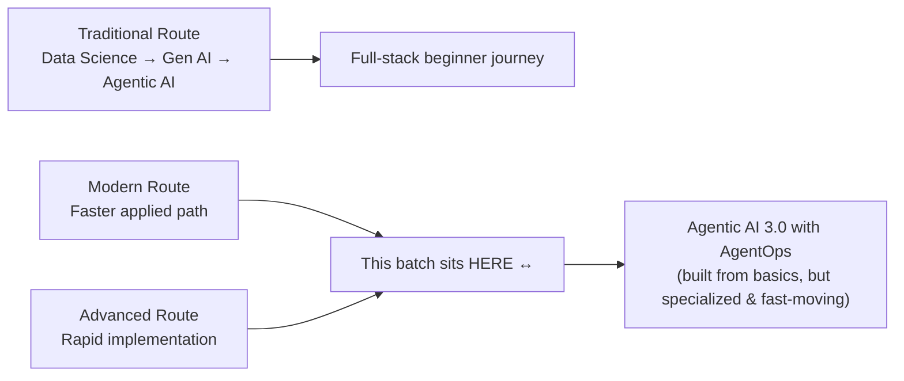
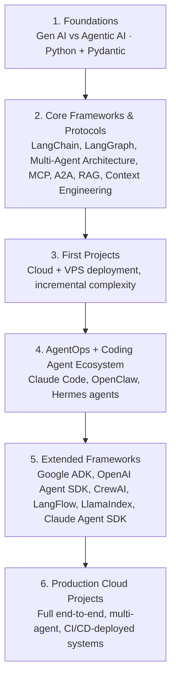
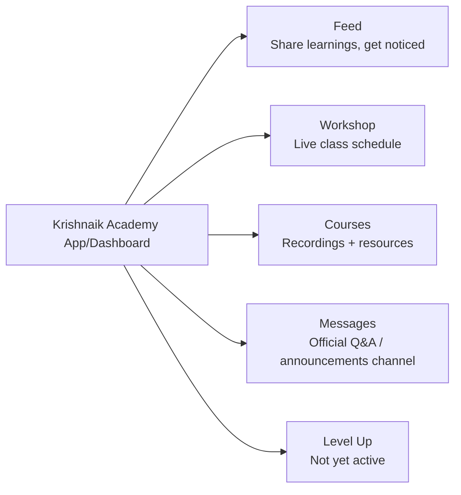
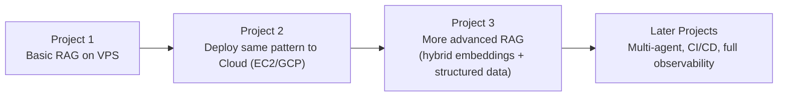

# 🎓 Agentic AI 3.0 with AgentOps — Induction Session Study Guide

> **Session:** Day 1 — Induction Session ·   
**Speakers:** Krish Naik (Founder, Krishnaik Academy) & Mayank Aggarwal (Mentor)  
> **Note on scope:** This session is a **course orientation, not a technical lecture**. There is no code, no API call, and no framework walkthrough — the goal is to align expectations: what the batch covers, how it runs, what's required before class, and how to build a career around it. This guide treats it accordingly: it captures the curriculum roadmap, learning methodology, platform mechanics, and career strategy as *teachable content in their own right*, since understanding "how to learn this domain and operate inside this program" is itself the actionable takeaway of Day 1.

---

## 📑 Table of Contents

1. [Session Overview](#-session-overview)
2. [Learning Objectives](#-learning-objectives)
3. [Detailed Notes](#-detailed-notes)
   - [1. The Three AI-Learning Routes — Where This Batch Fits](#1-the-three-ai-learning-routes--where-this-batch-fits)
   - [2. Course Curriculum: The Learning Path from Foundations to Production](#2-course-curriculum-the-learning-path-from-foundations-to-production)
   - [3. The Framework & Tooling Ecosystem Covered](#3-the-framework--tooling-ecosystem-covered)
   - [4. Prerequisites & How to Prepare Before Class](#4-prerequisites--how-to-prepare-before-class)
   - [5. Platform & Dashboard Walkthrough](#5-platform--dashboard-walkthrough)
   - [6. Class Format, Schedule & Doubt-Clearing Methodology](#6-class-format-schedule--doubt-clearing-methodology)
   - [7. Project-Assisted Learning: How Projects Are Actually Taught](#7-project-assisted-learning-how-projects-are-actually-taught)
   - [8. Career Strategy: Personal Branding & Visibility](#8-career-strategy-personal-branding--visibility)
   - [9. Certificates vs. Real-World Skill: The Academy's Philosophy](#9-certificates-vs-real-world-skill-the-academys-philosophy)
   - [10. Production Engineering Philosophy (from the Q&A)](#10-production-engineering-philosophy-from-the-qa)
4. [Glossary](#-glossary)
5. [Revision Notes — One-Minute Revision](#-revision-notes--one-minute-revision)
6. [Cheat Sheet](#-cheat-sheet)
7. [Interview & Course-Readiness Questions & Answers](#-interview--course-readiness-questions--answers)
8. [Scenario-Based Questions](#-scenario-based-questions)
9. [Hands-on Exercises](#-hands-on-exercises)
10. [Practice Assignment](#-practice-assignment)
11. [Additional Resources](#-additional-resources)
12. [Final Revision Sheet](#-final-revision-sheet)

---

## 🎯 Session Overview

This is the **induction (orientation) session** for the *"Agentic AI 3.0 Specialization Batch with AgentOps"* offered by Krishnaik Academy. It covers, in order:

1. Krish Naik's framing of the **overall AI learning roadmap** and where this batch fits within it.
2. Mayank Aggarwal's walkthrough of the **complete syllabus**, live demos of real production-grade projects built for actual clients, and the **learning philosophy** (project-assisted learning).
3. A full **platform/dashboard tour** (Feed, Workshop, Courses, Messages).
4. **Logistics**: schedule, recording turnaround, doubt-clearing format.
5. **Prerequisites** and hardware/subscription expectations.
6. An extended, live **Q&A** covering course fit for different experience levels, roles, and specific technical interests (voice agents, MLflow, custom SLMs, AgentOps dashboards) — several of which surface useful, transferable production-engineering advice.

> 💡 **Memory Trick:** Think of this session as the **map before the trek** — it doesn't teach you to climb, but it tells you exactly which mountain you're climbing, what gear you need, and how the guides will support you along the way.

---

## 🎯 Learning Objectives

By the end of this guide, you will be able to:

- [ ] Explain the three AI-learning routes (Traditional, Modern, Advanced) and correctly place this batch within that framework.
- [ ] Reconstruct the full course curriculum arc: Foundations → Core Frameworks & Protocols → Projects → AgentOps → Extended Frameworks → Production Cloud Projects.
- [ ] List the major frameworks, protocols, and cloud platforms this batch covers, and explain *why* each category matters.
- [ ] State the exact prerequisites (Python, basic ML/DL/NLP, basic Gen AI) required to start the course confidently.
- [ ] Navigate the five core sections of the learning platform (Feed, Workshop, Courses, Messages, Level Up).
- [ ] Describe the class schedule, recording SLA, and doubt-clearing queue system.
- [ ] Explain "project-assisted learning" as a pedagogy and how it differs from theory-first teaching.
- [ ] Articulate why personal branding (sharing learnings on LinkedIn/community feed) is treated as a core, non-optional part of the learning journey.
- [ ] Explain the instructors' philosophy on certificates versus demonstrable project work.
- [ ] List the basic production KPIs for an LLM/agent-based application (cost, failure rate, latency, quality) as shared informally in the Q&A.

---

## 📚 Detailed Notes

### 1. The Three AI-Learning Routes — Where This Batch Fits

#### 🧠 Concept

Krishnaik Academy frames all AI learning journeys into **three routes**, based on a learner's starting point and goals. This batch (Agentic AI 3.0) is explicitly positioned as sitting **between the Modern and Advanced routes**.

| Route | Best for | Learning order |
|---|---|---|
| **Traditional** | Absolute beginners starting AI from zero | Data Science → Generative AI → Agentic AI (full foundational stack first) |
| **Modern** | Learners with some existing background who want to move faster | Skips deep foundational data-science theory; goes more directly into applied Gen AI / Agentic AI |
| **Advanced** | Highly experienced practitioners who want to implement quickly | Assumes strong existing fundamentals; focuses purely on rapid, hands-on implementation |

#### ❓ Why It Exists

Not everyone starts from the same place — a fresher, a working data engineer, and a 20-year industry leader all need AI skills, but need a different *on-ramp*. Explicitly naming these routes helps a learner (and the Academy) calibrate expectations correctly instead of assuming one-size-fits-all pacing.

#### ⚙️ How It Works



#### 💡 Real-World Example

The Academy also runs a **no-code Generative AI / Agentic AI batch** for non-technical roles (e.g., managers) — proof that the "route" concept is applied consistently across their entire course catalog, not just this batch.

#### 🎯 Key Takeaways

* This batch is **not** a ground-zero beginner course, but it also does **not** assume advanced ML theory — it starts from basics and moves quickly into specialization.
* "Modern/Advanced hybrid" = learn agentic AI application-building from fundamentals, but reach industry-grade depth (best practices, security/guardrails, scalable deployment) within the batch.

---

### 2. Course Curriculum: The Learning Path from Foundations to Production

#### 📖 Definition

The course name itself encodes its scope: **"Gen AI and Agentic AI Agentic Ops with Cloud 3.0."** The addition of **"AgentOps"** compared to the previous (2.0) edition signals a deliberate shift: this iteration emphasizes not just *building* agents, but **operating, securing, and scaling them** in production — informed by a year of corporate training engagements and direct client work.

#### ⚙️ How It Works — The Six-Stage Arc



| Stage | What's covered | Approx. sequencing |
|---|---|---|
| **Foundations** | Gen AI vs. Agentic AI conceptually; Python refresher; Pydantic | First ~2 weeks / first 3 classes |
| **Core Frameworks & Protocols** | LangChain, LangGraph, multi-agent architecture, MCP (Model Context Protocol), A2A (agent-to-agent), RAG, context engineering — taught via small mini-projects per concept | After foundations, before the first big project |
| **First Projects** | Real projects on both **VPS** (simple single machine) and **cloud** (AWS/GCP/Azure) | ~After 1–1.5 months |
| **AgentOps & Coding-Agent Ecosystem** | Claude Code, OpenClaw, Hermes agents — the newer "agentic coding" tools reshaping how engineers work; also monitoring/observability dashboards (cost, errors) | Once basics + first projects are solid |
| **Extended Frameworks** | Google ADK, OpenAI Agent SDK, CrewAI, LangFlow (no-code), LlamaIndex, Claude Agent SDK — taught primarily *through* projects, since "conceptually, all [agent frameworks] are the same" once fundamentals are clear | Mid-to-late course |
| **Production Cloud Projects** | Full end-to-end multi-agent systems with proper CI/CD, infrastructure-as-code, vector search provisioning, and live cloud hosting | Later stage / capstone-style |

#### 🔍 Internal Working — Memory, Knowledge & AgentOps Layers

Beyond the six stages above, two cross-cutting layers run throughout the course:

- **Memory & Knowledge:** LangGraph checkpointing, LlamaIndex memory, GraphDAG-based memory, and memory frameworks like **Mem0** — covered wherever relevant to a project, not as an isolated theory block.
- **AgentOps:** Once agent-building is mastered, this layer covers *operating* agents responsibly — deployment practices, **guardrails**, **evals**, and scalable, secure deployment patterns.

#### 💻 Example — Real Projects Demonstrated Live

Two real, client-derived projects were demoed live to set expectations for project depth:

1. **A Dockerized RAG-based "AI Analyst"** (built for a US-based client) — ~20GB Docker image, document ingestion with intelligent chunking/bucketing (using a tool referred to as "DocLink"), embeddings generation, and a chat interface over uploaded documents. Also demonstrated the pattern of an AI agent auto-commenting on tickets/PRs with likely root causes.
2. **A financial/procurement multi-agent system on GCP** — built with FastAPI + React + LangChain + Gemini, deployed on **Cloud Run** (auto-scaling), provisioned via a full **CI/CD pipeline** (infrastructure-as-code that provisions Vertex AI vector search/indexes automatically). Composed of multiple specialized agents (**risk agent, tax agent, control agent**) coordinated by a **procurement supervisor agent**, capable of answering financial questions by searching ingested documents and producing manager-ready reports.

> 🛠️ **Reconstructed for completeness:** exact tool/service names (e.g., "DocLink") are as spoken in the transcript; some product names may be approximate due to live-transcription artifacts, but the architecture pattern described (Docker → RAG → chunking → embeddings → chat UI; and FastAPI/React/LangChain → GCP Cloud Run → CI/CD → Vertex AI vector search → multi-agent system) is accurately reconstructed from the demo narration.

#### ⚖️ Advantages & Limitations

| Advantages of this curriculum design | Limitations / trade-offs (as acknowledged by the instructor) |
|---|---|
| Projects are **sequenced, not random** — each reuses concepts from the last (e.g., VPS deployment skills transfer directly to EC2/GCP deployment; basic RAG skills extend into more advanced hybrid RAG+structured approaches) | Projects can look "overwhelming" up front (acknowledged live) — mitigated by not front-loading complexity; deployment, for instance, is deliberately *not* taught in week one |
| Framework breadth (LangChain, LangGraph, ADK, Agent SDKs, CrewAI, coding agents) mirrors real industry fragmentation — different companies use different stacks | Broad framework coverage: without strong fundamentals first, this could create confusion — mitigated by teaching "framework-agnostic" fundamentals before any specific framework |
| Deployment targets progress **local → VPS → cloud**, matching how a learner would realistically progress in a job | Full mastery of any single cloud platform (AWS/GCP/Azure) is explicitly **out of scope** — only the AI-relevant services (e.g., Vertex AI, Bedrock, Azure AI Foundry) are covered in depth |

#### ⚠️ Common Mistakes

* Assuming this course is *only* about LangChain — it explicitly also covers LangGraph, Google ADK, OpenAI Agent SDK, CrewAI, LlamaIndex, LangFlow, and coding-agent ecosystems (Claude Code, OpenClaw, Hermes).
* Assuming the 2.0 batch recording (given complimentary access) is "just as good" and skipping 3.0 — the instructors explicitly warn that 3.0's curriculum, projects, and frameworks have moved "leaps and bounds" ahead due to how fast the field changes.

#### 🚀 Best Practices

* *(Transcript-specific)* Treat framework mastery as secondary to fundamentals: "frameworks are just like languages — once you understand OOP/variables, learning the syntax in any of them is easy."
* *(General industry practice)* When a genuinely new, high-traction tool/technique emerges mid-course (as happened with n8n during the 2.0 batch), the curriculum is designed to flexibly absorb it via ad hoc modules — a good practice for any fast-moving technical curriculum.

#### 🎯 Key Takeaways

* The course arc is: **Foundations → Frameworks/Protocols → Sequenced Projects → AgentOps → Extended Frameworks → Full Production Projects.**
* "AgentOps" (new in 3.0 vs. 2.0) = monitoring, cost/error dashboards, guardrails, evals, and scalable deployment — the *operational* half of agentic AI, not just the "build it" half.
* Real, client-derived, cloud-deployed, CI/CD-driven multi-agent projects are the benchmark for what "production-grade" means in this course — explicitly **not** toy demos.

---

### 3. The Framework & Tooling Ecosystem Covered

#### 🧠 Concept

The course deliberately spans the **entire modern agentic-AI toolchain**, organized into distinct categories rather than betting on a single framework.

#### 📊 Ecosystem Map

| Category | Tools/Frameworks Named |
|---|---|
| **Agent-building frameworks (code-first)** | LangChain, LangGraph, Google ADK, OpenAI Agent SDK, CrewAI |
| **Agent-building tools (no-code / low-code)** | LangFlow, LlamaIndex |
| **Agentic coding tools / "coding agent ecosystem"** | Claude Code, OpenClaw, Hermes agents |
| **Protocols connecting agents/tools** | MCP (Model Context Protocol), A2A (Agent-to-Agent) |
| **Memory & knowledge layers** | LangGraph checkpointing, LlamaIndex memory, GraphDAG-based memory, Mem0 |
| **Deployment & CI/CD tooling** | Docker, GitHub Actions, FastAPI, Streamlit |
| **Cloud platforms** | AWS, GCP, Azure, and plain VPS (a single simple machine) |
| **AI-specific cloud services (mentioned for later coverage)** | AWS Bedrock, Google Vertex AI, Azure AI Foundry |
| **LLM providers** | OpenAI, Anthropic, Gemini, Grok, and local/open-source options (e.g., via Ollama-style local hosting) |
| **Observability (raised in Q&A, to be covered via projects)** | Cost/error/latency monitoring dashboards; tools like MLflow for LLM tracking (to be explored where relevant, e.g. Databricks/Azure environments) |

#### ❓ Why It Exists

Real companies do **not** standardize on one framework — the instructor notes seeing different frameworks used across different teams even within the same company. Broad exposure, anchored in strong fundamentals, is meant to make a learner adaptable to *whatever* stack a given employer or client uses, rather than a specialist in exactly one tool.

#### 💡 Real-World Example

> 💡 **Memory Trick:** *"Rather than showing you how to make pizza using pre-built dough on day one, we'll discuss how the dough itself is made first."* — i.e., fundamentals (Python, Gen AI vs. Agentic AI basics, message/token concepts) come before any specific framework, so that every framework afterward feels like "just a new syntax for something you already understand."

#### 🏢 Real-World / Production Usage

* **Claude Code** is highlighted as a priority to master in depth — the instructor notes even large companies (e.g., a friend's team at Amazon) are moving toward Claude Code–style coding-agent workflows.
* New, emerging roles like **"harness engineering"** and **FDE (Forward-Deployed Engineer)** are explicitly named as roles this curriculum should make learners eligible for — described as being fundamentally about *"managing agents and making sure nothing breaks."*

#### 🎯 Key Takeaways

* The course is intentionally **framework-plural**, not framework-exclusive.
* MCP and A2A are the two protocols specifically named for how agents/tools interconnect — worth recognizing by name even before deep coverage.
* "AgentOps," "harness engineering," and "FDE" are presented as *emerging job-market categories* this course is designed to prepare learners for.

---

### 4. Prerequisites & How to Prepare Before Class

#### 📖 Definition

The stated prerequisites are intentionally **lightweight but non-zero** — this is not a ground-zero beginner course, but it also does not require deep ML-theory mastery.

#### ⚙️ How It Works — The Prerequisite Checklist

| Area | Required depth |
|---|---|
| **Python** | Not expert-level. Should be able to write basic scripts, call APIs, and orchestrate functions/logic sequentially. |
| **Machine Learning / Deep Learning / NLP** | Conceptual familiarity only — what a neural network broadly is, etc. A short refresher video (~5–6 hours) provided on the platform is stated to be "more than enough." |
| **Generative AI basics** | Comfort with the idea that "OpenAI has an API" and similar basic Gen AI literacy — e.g., a working notion of what a **token** and a **context window** are (these will still be explicitly re-covered in class). |
| **Deep theory (transformers, "Attention Is All You Need")** | Explicitly **not required** — "good to have," not mandatory, since the course is practice-first. |
| **Hardware** | A "decent," non-office laptop is sufficient (no local LLM training happens). One learner's 8GB RAM / integrated GPU / 512GB SSD laptop was confirmed as workable, since heavy compute work happens on cloud once projects are deployed. |
| **Budget** | A minimum of roughly **$5** for LLM API usage is a realistic expectation, alongside free/open-source alternatives that will also be demonstrated. |

#### ⚠️ Common Mistakes

* Buying **paid subscriptions/credits before the course starts** — explicitly discouraged. The instructor's advice: "when you buy shoes, you try them on first" — free/open-source/trial options will be shown before any purchase decision is recommended.
* Using an **office laptop** — explicitly discouraged, since many workplaces block external links/tools (e.g., Claude access) that will be actively used in live demos.

#### 🚀 Best Practices

* Use trial tiers of AWS/GCP/Azure where possible rather than committing to paid infrastructure upfront.
* Watch the platform's short ML/DL refresher videos *before* the first substantive class, rather than trying to "catch up" mid-course.
* Bring a genuine willingness to continuously re-learn — the instructor stresses that most of what's being taught is only 1–2 years old as a field, so an "eagerness to learn new things repeatedly" is itself treated as a prerequisite mindset, not just a technical skill.

#### 🎯 Key Takeaways

* Minimum bar: basic Python + basic ML/DL/NLP literacy + basic Gen AI familiarity (tokens, context windows, "APIs exist for models").
* No requirement for deep transformer/attention-mechanism theory.
* No requirement for a powerful laptop or existing cloud experience — both are explicitly de-risked by design (cloud trials, and heavy compute happening on cloud, not locally).

---

### 5. Platform & Dashboard Walkthrough

#### 🧠 Concept

All course delivery happens through the Krishnaik Academy web dashboard and companion mobile app (Android/iOS), organized into five key sections.

#### ⚙️ How It Works — The Five Dashboard Sections

| Section | Purpose |
|---|---|
| **Feed** | A LinkedIn-style internal feed — post progress, screenshots, and learnings; mentors like/comment/amplify visible posts; explicitly encouraged as a **networking and hiring signal** (the instructor states he has personally hired an intern discovered via this feed). |
| **Workshop** | Shows the **schedule** of upcoming live classes (typically published mid-week, by Wednesday/Thursday) so learners always know when the next session is. |
| **Courses** | Where **recordings**, resources, and materials for enrolled batches appear after each live session. |
| **Messages** | The **single official chat channel** for the batch — used for announcements and doubt-clearing outside of live class. |
| **Level Up** | An in-progress/unreleased LMS feature — currently inactive; learners can ignore it for now. |



#### 🔍 Internal Working — Recording SLA

* Recordings are targeted for upload within **4–6 hours**, with a **maximum guaranteed window of 24 hours** — the dependency is Zoom's own processing time, which scales with session length.
* Course/recording **access duration** was extended live during this session from **1.5 years to 2 years**, based on learner feedback, reflecting the instructors' view that most taught content stays valid for roughly that long before meaningful updates are needed.

#### ⚠️ Common Mistakes

* Creating **unofficial WhatsApp/Telegram groups** — explicitly prohibited; violators risk being banned. All official communication is required to route through the in-platform **Messages** section, to keep support centralized and trackable.
* Assuming Zoom chat is a reliable place to get doubts answered — Zoom chat during class is explicitly one-directional/limited by design (to reduce distraction); the **Messages** section and the live doubt-clearing queue are the reliable channels.

#### 🎯 Key Takeaways

* Five sections: **Feed** (networking/visibility), **Workshop** (schedule), **Courses** (recordings), **Messages** (official support channel), **Level Up** (inactive).
* Recording turnaround: **target 4–6 hrs, guaranteed ≤24 hrs**.
* Access duration: **2 years** from enrollment (extended from the originally stated 1.5 years).
* **One official channel only** — no unofficial WhatsApp/Telegram groups permitted.

---

### 6. Class Format, Schedule & Doubt-Clearing Methodology

#### ⚙️ How It Works

| Detail | Value |
|---|---|
| **Class days** | Every Saturday and Sunday |
| **Class timing** | 8:00 AM – 11:00 AM IST (may run longer for doubt-clearing) |
| **Total batch duration** | ~5–7 months (varies with public holidays) |
| **Session structure** | ~3 hours of focused teaching, followed by a ~10-minute break, then an open, queue-based doubt-clearing session (first-come-first-served hand-raise) |
| **Recording availability** | Within 4–6 hrs typically, ≤24 hrs guaranteed |
| **Time-zone accommodation** | Learners in far time zones (e.g., US/EST) are asked to flag themselves in chat so their doubts can be prioritized earlier in the queue, given the late local hour |

#### 🪜 Step-by-Step: A Typical Session

```text
1. Live teaching (~3 hours, Zoom)
     ↓
2. Short break (~10 minutes)
     ↓
3. Doubt-clearing (queue-based, hand-raise, first-come-first-served)
     ↓
4. Recording + resources processed and uploaded (≤24 hrs)
```

#### ⚠️ Common Mistakes

* Expecting **individual immediate replies** to every chat message during live teaching — the instructors are explicit that message volume makes this impractical during teaching; doubts are addressed in bulk during the dedicated doubt-clearing window and asynchronously afterward.
* Getting frustrated about queue position — the instructors frame **patience and listening to others' questions** as itself part of the learning process, since many doubts overlap and get pre-emptively answered.

#### 🚀 Best Practices

* Come prepared with a concise, specific question when your turn arrives in the queue — this respects the group's shared time.
* Actively listen to *other* learners' Q&A — a large fraction of your own doubts are statistically likely to already be covered by someone else's question.

#### 🎯 Key Takeaways

* Weekly cadence: **Sat & Sun, 8–11 AM IST**, over **5–7 months**.
* Doubt-clearing is a **structured, queued, patience-dependent process** — not instant chat support.
* Recordings arrive well within a guaranteed 24-hour SLA.

---

### 7. Project-Assisted Learning: How Projects Are Actually Taught

#### 📖 Definition

**Project-Assisted Learning** is the course's core pedagogy: rather than completing all theory first and projects last, the course interleaves concept mastery with real project-building — roughly starting after the first ~1.5 months of foundational content.

#### ⚙️ How It Works

For each project, the teaching flow is:

1. **Concept explanation** — each module/component of the project is explained conceptually first (what it is, why it's needed).
2. **Guided build** — the instructor writes/explains the relevant code live, sometimes using an AI coding assistant (e.g., Claude Code) to scaffold boilerplate — but always *explaining*, never blind "vibe coding."
3. **Full code + diagrams + explanation delivered** — so learners can run it directly (saving time) while still understanding every part.
4. **Optional deeper exploration** — learners with more time can extend/modify the provided code further.

> ⚠️ **Common Mistake:** Assuming "project-assisted" means projects are vibe-coded/AI-generated without understanding. The instructor is explicit: *"We are not going to have projects wipe-coded [vibe-coded]. We will understand each and everything, we will understand what we are asking Claude or any other agent to [do] for us."*

#### 🔍 Internal Working — Why Projects Are Sequenced, Not Random

Each project deliberately **reuses and extends** skills from the previous one:



This mirrors the instructor's cooking-class analogy from Section 3 — you learn "how the dough is made" (fundamentals) before layering on complexity (advanced project features).

#### 💡 Real-World Example

The two live demos (Docker-based RAG "AI Analyst" for a US client, and the FastAPI/React/LangChain/Gemini procurement multi-agent system on GCP Cloud Run) are explicitly cited as the **caliber** of project this batch targets — described as CV-worthy, interview-relevant, real production systems, not toy demos — while reassuring learners that early projects will be much simpler and build up gradually.

#### ⚖️ Advantages & Limitations

| Advantages | Limitations (acknowledged live) |
|---|---|
| Learners are never asked to "master everything at once" | Some learners (e.g., full-time working professionals) raised legitimate concerns about time for hands-on practice outside class — addressed by providing full code + explanations so time-constrained learners can still run and understand projects even without extensive independent coding time |
| Deployment/cloud concepts are introduced **only when contextually needed**, not front-loaded | This means some learners eager to "learn everything upfront" (e.g., Streamlit, deployment basics) will need patience, as these arrive at their natural point in the sequence (deployment specifically ~after 1.5 months) |

#### 🎯 Key Takeaways

* Projects begin after roughly **1.5 months** of foundational learning.
* Each project **builds directly on the last** — this is a deliberate sequencing, not an accident.
* Full code, diagrams, and explanations are always provided — the goal is *understanding*, not just runnable output ("wipe coding"/vibe coding is explicitly rejected as a teaching method).

---

### 8. Career Strategy: Personal Branding & Visibility

#### ❓ Why It Exists

Both instructors treat **public sharing of learning progress** as a non-optional, structurally important part of the course — not a soft "nice to have."

> 💡 **Memory Trick — Krish Naik's stated proverb:** *"Share your knowledge before it becomes meaningless."*

#### ⚙️ How It Works

1. After each class/project, share a learning update — a screenshot, a short write-up, a demo — on **LinkedIn** (and/or the platform's internal **Feed**).
2. **Tag the instructors and the Academy** — they commit to actively liking/commenting/reposting to amplify visible learner work.
3. Over time, this builds a visible, searchable trail of demonstrated skill — which the instructors argue is now **the actual mechanism** by which opportunities (jobs, consulting, contract work) arrive in 2026's job market.

#### 💡 Real-World Example

Mayank states he personally **hired an intern** he discovered purely through that person's consistent learning posts on the platform's Feed — used as direct proof that this isn't just motivational filler, but a described real hiring channel.

#### ⚖️ Advantages & Limitations

| Advantages | Limitations / caveats |
|---|---|
| Creates a visible portfolio trail without needing to build a separate personal website | Value depends on consistency — sporadic, one-off posts are unlikely to reproduce the described outcome |
| Increases the surface area for organic opportunities (industry professionals cross-enrolled in other batches were cited as one audience that notices strong posts) | Requires ongoing personal discipline outside of class time — the course structure encourages but cannot enforce this |

#### 🎯 Key Takeaways

* Treat **LinkedIn/Feed posting after every class or project** as a required habit, not an optional extra.
* Tagging mentors is explicitly invited — they commit to amplifying visible learner work.
* This is framed as directly linked to job/consulting/contract opportunities, with a concrete example (an internship hire) cited as evidence.

---

### 9. Certificates vs. Real-World Skill: The Academy's Philosophy

#### 🧠 Concept

Krish Naik explicitly **de-emphasizes certificates** as a credential of value, in favor of demonstrable, explainable project work.

#### ❓ Why It Exists

> 💡 **Memory Trick:** *"I cannot say in a certificate that you're one of the most amazing engineers out there — unless it's co-branded by a company like NVIDIA or Google, a certificate from us doesn't carry that kind of weight. Your work is what should be speaking, not a piece of paper."*

#### ⚖️ Advantages & Limitations

| Position taken | Rationale given |
|---|---|
| Certificates are **not the focus** of this program | A self-issued certificate has limited external signaling value compared to demonstrable projects |
| **Projects completed by the end of the batch** are positioned as the real "certificate" | This is consistent with the personal-branding strategy in Section 8 — a visible project trail *is* the credential |

#### 🎯 Key Takeaways

* Don't expect (or prioritize) a formal certificate as the primary outcome of this course.
* The intended "proof of learning" is a portfolio of real, explainable, deployed projects — reinforced by consistent public sharing (Section 8).

---

### 10. Production Engineering Philosophy (from the Q&A)

#### 🧠 Concept

In a detailed, senior-level Q&A exchange near the end of the session, Mayank shared several **transferable engineering principles** for building and operating agentic systems in production — genuinely useful content beyond pure course logistics.

#### 📖 Core Production KPIs for an Agentic Application

| KPI | What it measures | Priority |
|---|---|---|
| **Cost** | Token/API spend per request or per time period | #1 — explicitly named as the most fundamental metric to track |
| **Failure rate** | How often calls/tools/agents fail or error out | #2 — should be "as close to zero as possible" |
| **Latency (speed)** | How long responses take | Core operational metric |
| **Quality** | Whether the system is actually solving the intended problem well | Core, though harder to quantify; may need separate analysis tooling |

#### ⚖️ Advantages & Limitations — On System Design Complexity

> 💡 **Memory Trick — a directly quoted engineering philosophy:** *"Simple design, always scale[s] up."* / *"Simple is scalable."*

| Principle | Explanation |
|---|---|
| **Prefer automation/simple LLM calls with human-in-the-loop over "necessarily agentic" solutions** | If a simpler, more deterministic approach (plain automation, a single LLM call, human-in-the-loop) solves the problem, it is preferred over an unnecessarily complex multi-agent architecture — because it is more deterministic, more cost-effective, easier to observe, and easier to optimize. |
| **Minimize the number of outside/API calls per step** | Every step — an API call, an LLM call, any external dependency — costs time and money and represents a loss of control ("whenever you give control to any outside API, it's going away from you, and it can take a lot of time"). |
| **Avoid unnecessary tool/observability sprawl** | When asked whether to integrate multiple observability tools (e.g., "Linesmith"-style tracing) vs. a simple local JSON log, the guidance was: understand the system's actual needs first; don't default to complexity "because it's good for teaching," since over-engineered systems "never scale up" in practice. |
| **Whether to call multiple LLMs redundantly for quality assurance** | Explicitly **depends on the problem** — no universal answer. If multiple models are called *only as a fallback when one fails*, cost does not simply multiply; if called *in parallel/always*, cost does scale roughly linearly with the number of models called. |

#### 🎯 Key Takeaways

* The four baseline production KPIs for any LLM/agent system: **cost, failure rate, latency, quality.**
* Default to the **simplest architecture that solves the problem** — automation or a single LLM call with human-in-the-loop is often preferable to a full multi-agent system.
* Every additional external call (API, LLM, tool) adds cost, latency, and loss of control — minimize call count deliberately.
* There is no universal answer to "should I call multiple LLMs" — it's a problem-specific, cost/quality trade-off decision.

---

## 📝 Glossary

| Term | Definition | Why It Matters |
|---|---|---|
| **Agentic AI** | AI systems that can take multi-step actions (via tools/decisions), as opposed to single-shot text generation | The central subject of the entire course |
| **AgentOps** | The operational discipline of monitoring, securing, and scaling deployed AI agents (cost, error rate, guardrails, evals) | The defining new emphasis of the 3.0 batch vs. 2.0 |
| **Guardrails** | Safety/behavioral constraints put around an AI agent to keep it within intended bounds | Named as a core AgentOps concern |
| **Evals** | Systematic evaluation methods for measuring an AI system's output quality | Named as a core AgentOps concern |
| **MCP (Model Context Protocol)** | A protocol for connecting external tools/context sources to an LLM/agent | Named as a protocol covered in the "Core Frameworks & Protocols" module |
| **A2A (Agent-to-Agent)** | A protocol/pattern for how multiple agents communicate/coordinate with each other | Named alongside MCP as core protocol coverage |
| **RAG (Retrieval-Augmented Generation)** | Technique of retrieving relevant external data (often via embeddings/vector search) to ground an LLM's response | Central to nearly every demoed project |
| **Agentic RAG** | RAG where an agent actively decides how/when/what to retrieve, rather than a fixed retrieval pipeline | Named as a "core concept," to be taught via projects |
| **Context Engineering** | The practice of deliberately designing what information/context is fed to an LLM/agent | Named as a core module topic |
| **Embeddings** | Numeric vector representations of text/data used for semantic search/retrieval | Central to how RAG projects are built (referenced in both demoed projects) |
| **Vector Search / Vector Index** | A search mechanism over embeddings enabling semantic (meaning-based) lookup | Demoed live via Vertex AI provisioning in the GCP project |
| **Token** | A sub-word unit of text used to measure LLM input/output size and billing | Named as baseline Gen AI literacy expected before class |
| **Context Window** | The maximum amount of text (in tokens) an LLM can process in a single call | Named as baseline Gen AI literacy expected before class |
| **Multi-Agent Architecture / Multi-Agent System** | A system composed of multiple specialized agents coordinating on a task | Demonstrated live via the risk/tax/control/procurement-supervisor agent system |
| **CI/CD (Continuous Integration/Continuous Deployment)** | Automated pipelines for building, testing, and deploying software/infrastructure | Demonstrated live via the GCP project's automated provisioning pipeline |
| **Infrastructure as Code (IaC)** | Defining/provisioning cloud infrastructure via code/config rather than manual setup | Demonstrated in the GCP project's pipeline (auto-provisioning vector search/index) |
| **VPS (Virtual Private Server)** | A single simple remote server, as opposed to a full cloud platform's managed services | Used as the "simplest" deployment target before progressing to full cloud |
| **Cloud Run** | Google Cloud's auto-scaling managed container hosting service | The hosting platform for the demoed GCP multi-agent project |
| **Vertex AI** | Google Cloud's managed AI/ML platform (models, vector search, etc.) | Used in the GCP demo for vector search/index provisioning |
| **Bedrock / Azure AI Foundry** | AWS's and Microsoft's respective managed AI/model platforms | Named as upcoming coverage topics within the cloud modules |
| **Project-Assisted Learning** | A pedagogy interleaving concept teaching with real project building, rather than theory-then-practice | The stated core teaching methodology of this batch |
| **Harness Engineering / FDE (Forward-Deployed Engineer)** | Emerging job roles focused on managing/maintaining agent systems in the field/production | Named as roles this curriculum is intended to prepare learners for |
| **Vibe Coding ("Wipe Coding")** | Generating code via AI without understanding it | Explicitly rejected as a course methodology — all code is explained |

---

## 🔄 Revision Notes — One-Minute Revision

> This batch (**Agentic AI 3.0 with AgentOps**) sits between the Modern and Advanced AI-learning routes: it builds agentic-AI skills from fundamentals but moves quickly into specialization. The curriculum runs **Foundations (Gen AI vs. Agentic AI, Python + Pydantic) → Core Frameworks & Protocols (LangChain, LangGraph, multi-agent architecture, MCP, A2A, RAG, context engineering) → sequenced real Projects (VPS → cloud) → AgentOps (monitoring, guardrails, evals) → Extended Frameworks (Google ADK, OpenAI Agent SDK, CrewAI, LlamaIndex, LangFlow, Claude Agent SDK, plus the coding-agent ecosystem: Claude Code, OpenClaw, Hermes) → full Production Cloud Projects** with real CI/CD and multi-agent orchestration. Prerequisites are light: basic Python, basic ML/DL/NLP awareness, and basic Gen AI literacy (tokens, context windows) — no deep transformer theory or powerful hardware required. Classes run **Saturday & Sunday, 8–11 AM IST**, for **5–7 months**, with recordings guaranteed within 24 hours and **2 years** of platform access. All official communication happens through the platform's **Messages** section — no external groups permitted. The course explicitly favors **project-assisted learning** over theory-first teaching, rejects vibe-coding, and treats **public sharing of learning progress** (LinkedIn, the platform's Feed) as core to career growth — valued above formal certificates. A closing production-engineering principle worth remembering: track **cost, failure rate, latency, and quality**, and always **prefer the simplest architecture that solves the problem** — "simple design always scales up."

---

## 📋 Cheat Sheet

**Batch essentials:**
- Name: *Agentic AI 3.0 Specialization Batch with AgentOps*
- Schedule: **Sat & Sun, 8–11 AM IST**, ~5–7 months
- Access: **2 years**
- Recording SLA: target 4–6 hrs, guaranteed **≤24 hrs**
- Official comms: **Messages** tab only — no external groups

**Curriculum arc (memorize this order):**
```
Foundations → Core Frameworks & Protocols → Sequenced Projects
→ AgentOps → Extended Frameworks → Production Cloud Projects
```

**Frameworks/tools by category:**
- Code-first agent frameworks: LangChain, LangGraph, Google ADK, OpenAI Agent SDK, CrewAI
- No-code: LangFlow, LlamaIndex
- Coding agents: Claude Code, OpenClaw, Hermes
- Protocols: MCP, A2A
- Cloud: AWS, GCP, Azure, VPS

**Prerequisites checklist:**
- [ ] Basic Python (scripts, API calls, function orchestration)
- [ ] Basic ML/DL/NLP awareness
- [ ] Basic Gen AI literacy (token, context window)
- [ ] A decent personal (not office) laptop
- [ ] ~$5 minimum budget for LLM usage (free alternatives also covered)

**Production KPIs to remember:** Cost → Failure Rate → Latency → Quality

**Guiding engineering principle:** *"Simple design always scales up."*

---

## 🔥 Interview & Course-Readiness Questions & Answers

### 🟢 Beginner

**Q1. What are the three AI-learning routes described, and where does this batch fall?**
**Answer:** Traditional, Modern, and Advanced. This batch sits between the Modern and Advanced routes.
**Explanation:** It starts from basics but is not a ground-zero beginner course, and moves toward specialization quickly.
**Why Interviewers/Mentors Ask This:** Confirms the learner understands the course's intended pace and depth.
**Possible Follow-up:** "What would you have chosen if you were an absolute beginner instead?"

**Q2. What are the minimum Python prerequisites for this course?**
**Answer:** The ability to write basic scripts, call APIs, and orchestrate functions sequentially — not expert-level Python.
**Explanation:** The course is applied/practical, not a Python mastery course.
**Why This Matters:** Sets realistic self-assessment expectations before enrolling/starting.
**Possible Follow-up:** "What specific Python skill would you personally need to brush up on most?"

**Q3. How often does the class meet, and for how long is the batch expected to run?**
**Answer:** Every Saturday and Sunday, 8–11 AM IST, for roughly 5–7 months.
**Explanation:** Duration can extend due to public holidays.
**Why This Matters:** Basic logistics comprehension.
**Possible Follow-up:** "What happens if a class runs past 11 AM?"

**Q4. What is the guaranteed maximum time for a recording to be uploaded after a live class?**
**Answer:** 24 hours (though the target is 4–6 hours).
**Explanation:** The bottleneck is Zoom's own processing time, which scales with session length.
**Why This Matters:** Basic platform-usage literacy.
**Possible Follow-up:** "Why might a longer class take closer to the 24-hour limit?"

**Q5. What are the five sections of the learning dashboard/platform?**
**Answer:** Feed, Workshop, Courses, Messages, Level Up.
**Explanation:** Each serves a distinct purpose (visibility, schedule, recordings, official support, and an inactive future feature, respectively).
**Why This Matters:** Practical navigation competency.
**Possible Follow-up:** "Which section would you use to find next weekend's class time?"

**Q6. Is a formal certificate the primary goal of this course, according to the instructors?**
**Answer:** No — demonstrable project work and public sharing of learning are emphasized far more than a certificate.
**Explanation:** The instructors explicitly state a self-issued certificate carries limited external value compared to visible project work.
**Why This Matters:** Aligns learner expectations about "proof of skill."
**Possible Follow-up:** "What would you put on a resume instead of a certificate, based on this philosophy?"

**Q7. What is "project-assisted learning"?**
**Answer:** A teaching approach where concepts are taught alongside and through real project-building, rather than all theory first, all projects later.
**Explanation:** Projects begin roughly 1.5 months into the course and interleave with continued concept coverage.
**Why This Matters:** Core pedagogical concept of the batch.
**Possible Follow-up:** "How does this differ from a theory-first curriculum you may have experienced before?"

**Q8. Name at least three frameworks or tools mentioned as part of the course's "core frameworks" coverage.**
**Answer:** Any three of: LangChain, LangGraph, Google ADK, OpenAI Agent SDK, CrewAI, LangFlow, LlamaIndex.
**Explanation:** These represent the code-first and no-code agent-building ecosystem covered.
**Why This Matters:** Basic curriculum-content recall.
**Possible Follow-up:** "Which of these are no-code tools?"

**Q9. What is the stated official channel for all batch communication?**
**Answer:** The platform's "Messages" section — no external WhatsApp/Telegram groups are permitted.
**Explanation:** Keeps support centralized, trackable, and consistent across the batch.
**Why This Matters:** Basic compliance/logistics understanding.
**Possible Follow-up:** "What happens if someone shares an external group link?"

**Q10. What is a "token" and a "context window," as expected baseline knowledge before this course?**
**Answer:** A token is a sub-word unit of text used to measure LLM input/output size (and billing); a context window is the maximum amount of text (in tokens) an LLM can process in a single call.
**Explanation:** Named explicitly as expected baseline Gen AI literacy.
**Why This Matters:** Minimum technical vocabulary for the course.
**Possible Follow-up:** "Why would a longer conversation history affect context window usage?"

---

### 🟡 Intermediate

**Q11. Why does the course explicitly discourage buying LLM subscriptions or cloud credits before starting?**
**Answer:** Because the course will first demonstrate free/open-source/trial alternatives, so learners can make an informed decision before spending money — analogous to trying on shoes before buying them.
**Explanation:** Reflects a "try before you invest" philosophy.
**Why This Matters:** Tests understanding of the course's practical, cost-conscious approach.
**Possible Follow-up:** "What's the minimum realistic budget mentioned, and for what?"

**Q12. Explain why the course sequences projects rather than presenting them independently.**
**Answer:** Each project deliberately reuses and extends skills from the previous one (e.g., basic VPS deployment skills transfer to cloud deployment; basic RAG extends into more advanced hybrid RAG).
**Explanation:** Mirrors real skill accumulation rather than isolated, disconnected exercises.
**Why This Matters:** Deeper grasp of curriculum design intent, not just its content list.
**Possible Follow-up:** "Give an example of how skills might transfer between two named projects."

**Q13. What distinguishes "AgentOps" (new emphasis in 3.0) from what was covered in the 2.0 batch?**
**Answer:** AgentOps focuses on operating, securing, and scaling already-built agents — monitoring (cost, errors), guardrails, and evals — rather than just building agent logic.
**Explanation:** Reflects a full year of industry learning about how AI projects are actually deployed and maintained in companies.
**Why This Matters:** Tests understanding of *why* the course evolved, not just *that* it did.
**Possible Follow-up:** "Why might 'building' skills alone be insufficient for a production AI role?"

**Q14. According to the Q&A, when should deployment/cloud topics be introduced in the learning sequence, and why?**
**Answer:** Only when contextually needed for a specific project (roughly after ~1.5 months), not front-loaded — because introducing deployment before learners understand *what* is being deployed and *why* would cause confusion.
**Explanation:** Reflects the instructor's explicit pedagogical stance against premature complexity.
**Why This Matters:** Tests grasp of sequencing rationale, a transferable teaching/learning principle.
**Possible Follow-up:** "What's a risk of teaching deployment too early in a curriculum?"

**Q15. What four KPIs were named as the baseline metrics for a production LLM/agent application, and which is prioritized first?**
**Answer:** Cost, failure rate, latency, and quality — cost is named as the #1 metric to track.
**Explanation:** These form a minimal, extensible monitoring baseline for any LLM-based system.
**Why This Matters:** One of the few genuinely technical/production-engineering takeaways from this session.
**Possible Follow-up:** "How would you measure 'quality' for an LLM application in practice?"

**Q16. What is the stated engineering guidance on choosing between a multi-agent architecture and a simpler automation/single-LLM-call approach?**
**Answer:** Prefer the simplest solution that solves the problem — plain automation or a single LLM call with human-in-the-loop is often preferable to an unnecessarily complex multi-agent system, since simpler designs are more deterministic, cheaper, easier to observe, and — per the stated principle — "simple design always scales up."
**Explanation:** A direct, transferable production-engineering philosophy shared in the Q&A.
**Why This Matters:** Tests whether the learner internalized substantive engineering advice, not just course logistics.
**Possible Follow-up:** "Give an example of a task where a single LLM call with human-in-the-loop would beat a multi-agent system."

**Q17. Why does minimizing the number of external/API calls matter, according to the session's closing Q&A?**
**Answer:** Every external call (API, LLM, tool) adds cost and latency, and represents a loss of control, since you're depending on something outside your own system that could be slow, fail, or behave unpredictably.
**Explanation:** A direct quote-derived principle: "whenever you give control to any outside API, it's going away from you."
**Why This Matters:** Connects directly to system design and cost-optimization thinking.
**Possible Follow-up:** "How would you decide whether an additional tool call is worth its added cost/latency?"

**Q18. Is calling multiple LLMs for the same task always more expensive, according to the guidance given?**
**Answer:** It depends on *how* they're called — if called only as a fallback when one fails, cost does not simply multiply; if called in parallel/always, cost scales roughly linearly with the number of models used.
**Explanation:** Nuanced, problem-specific guidance rather than a blanket rule.
**Why This Matters:** Tests careful listening/comprehension rather than oversimplified recall.
**Possible Follow-up:** "In what scenario would calling multiple LLMs in parallel actually be justified despite the extra cost?"

**Q19. Why are personal branding and public learning-sharing treated as core (not optional) parts of this course?**
**Answer:** Because, per the instructors, this is now the primary real-world mechanism by which opportunities (jobs, consulting, contracts) arise — supported by a concrete example of an intern hired directly from feed activity.
**Explanation:** Reflects a deliberate, career-outcomes-driven design choice, not just motivational framing.
**Why This Matters:** Tests whether the learner grasps the *stated rationale*, not just the instruction to "post on LinkedIn."
**Possible Follow-up:** "What's one risk of only sharing sporadically instead of consistently?"

**Q20. Why does the course avoid teaching a single cloud platform (AWS/GCP/Azure) in full depth?**
**Answer:** Because the goal is to use cloud platforms as *tools* to build and deploy AI applications, not to become a certified cloud specialist — only the AI-relevant services (e.g., Vertex AI, Bedrock, Azure AI Foundry) get deep coverage.
**Explanation:** Keeps focus aligned with the course's actual subject (agentic AI), not adjacent, broader cloud-engineering mastery.
**Why This Matters:** Tests understanding of curriculum scope boundaries.
**Possible Follow-up:** "Which specific AI-relevant cloud services were named as in-scope?"

---

### 🔴 Advanced

**Q21. A learner argues: "Since frameworks like LangChain, LangGraph, and CrewAI are all conceptually similar once fundamentals are clear, why does this course bother teaching multiple frameworks instead of just one?" Evaluate this argument using the course's own stated rationale.**
**Answer:** The course's stated rationale is that real companies do **not** standardize on a single framework — different teams even within the same company may use different stacks — so breadth (anchored in strong fundamentals) makes a learner adaptable to whatever a given employer/client actually uses, rather than narrowly specialized in one tool that may not match every job's stack.
**Explanation:** Tests whether the learner can reproduce and apply the instructors' own justification, not just recall that "multiple frameworks are taught."
**Why Interviewers Ask This:** Assesses whether the learner engaged with *reasoning*, not just facts.
**Possible Follow-up:** "What's a risk of teaching too many frameworks without sufficient fundamentals first?"

**Q22. Critically assess the "simple design always scales up" principle against the fact that the course's flagship demo projects use multi-agent architectures (risk agent, tax agent, control agent, procurement supervisor). Is there a contradiction?**
**Answer:** No inherent contradiction — the principle is not "never use multi-agent systems," but "don't default to complexity when a simpler solution suffices." The demoed multi-agent system represents a case where the problem's genuine complexity (distinct domains: risk, tax, compliance, coordinated reporting) justifies specialized, coordinated agents. The guidance from the Q&A was explicitly to *first understand whether the complexity is required*, and only then build multi-agent architecture — not to avoid multi-agent systems altogether.
**Explanation:** Tests the ability to reconcile a general principle with a specific counter-example rather than treating either as an absolute rule.
**Why Interviewers Ask This:** Distinguishes learners who absorb principles as flexible judgment tools versus rigid slogans.
**Possible Follow-up:** "What signals would tell you a task genuinely needs a multi-agent architecture rather than a single agent?"

**Q23. The course extended access from 1.5 to 2 years and stated that "fundamentals rarely go out of fashion" while specific frameworks/tools change quickly. Analyze the implicit curriculum-design strategy this suggests, and how it should shape a learner's own note-taking/revision priorities.**
**Answer:** The implicit strategy is to invest most durable, long-term learning effort into fundamentals (Python orchestration patterns, agent/tool-calling concepts, RAG principles, deployment patterns) since these remain valid for years, while treating specific framework syntax/tool names as a *thinner, more disposable layer* that will need periodic refreshing as the ecosystem shifts (as demonstrated by the ad hoc addition of n8n coverage in the 2.0 batch, and LangChain's "newest version" being highlighted repeatedly in 3.0). A learner should therefore prioritize deeply internalizing *why* a pattern works (e.g., why RAG needs embeddings, why an agent needs a decision-making loop) over memorizing today's exact framework API surface.
**Explanation:** Tests synthesis of multiple session details (2-year access extension rationale, repeated "frameworks are just languages" framing, the n8n ad hoc addition) into a coherent meta-strategy.
**Why Interviewers Ask This:** Assesses higher-order reasoning about how to learn a fast-moving field effectively, a genuinely valuable interview-adjacent skill for any AI role.
**Possible Follow-up:** "How would you personally structure your own notes to separate 'durable fundamentals' from 'volatile framework specifics'?"

**Q24. A senior learner (13 years' Java experience) asked how to identify genuine AI use cases in existing enterprise projects rather than "AI-washing" every feature. Reconstruct the guidance given and generalize it into a decision framework.**
**Answer:** The guidance given was explicitly to avoid "unnecessarily trying to make things AI-fied," and instead evaluate — the same way one would with any client, per the instructor's own practice — whether AI/a given technology is *actually* needed for the use case at hand, based on genuine problem analysis rather than technology-first enthusiasm. Generalized: before proposing an AI/agentic solution, ask (1) does the problem genuinely require language understanding, multi-step reasoning, or unstructured-data handling that simpler rule-based/deterministic logic cannot handle, and (2) does the expected value (accuracy, speed, cost savings) outweigh the added cost/complexity/failure-rate risk of an AI-based approach versus a simpler alternative — directly echoing the "simple design always scales up" principle from Section 10.
**Explanation:** Connects a specific Q&A answer to the broader engineering-philosophy thread running through the session (Section 10).
**Why Interviewers Ask This:** A realistic, senior-level "technology fit" judgment question relevant to any AI engineering or architecture role.
**Possible Follow-up:** "Describe a hypothetical enterprise feature where AI would clearly NOT be the right fit, and justify why."

**Q25. Synthesize the session's guidance on observability tooling (e.g., the discussion about avoiding "multiple API tools" for tracing/debugging versus a simple local JSON log) into a general principle for choosing observability infrastructure at different project maturity stages.**
**Answer:** The guidance was to first deeply understand the system's actual debugging/monitoring needs before adding tooling, rather than defaulting to sophisticated multi-tool observability stacks "because it's good for teaching" or looks impressive — since over-engineered systems tend not to scale well in practice. Generalized into a maturity-based principle: early-stage/low-traffic systems may be well served by lightweight, self-contained logging (e.g., a local JSON log capturing key/value debugging details), while observability tooling investment should scale up only as genuine operational complexity (traffic, failure diversity, team size) justifies it — directly paralleling the cost/failure-rate/latency/quality KPI framework from Section 10, where you instrument what you actually need to act on, not everything that's theoretically measurable.
**Explanation:** Requires connecting a specific, narrow Q&A exchange to a generalized production-readiness principle.
**Why Interviewers Ask This:** Tests the ability to extract durable engineering judgment from a single anecdotal exchange — a skill valuable well beyond this specific course.
**Possible Follow-up:** "At what point would you say a project has outgrown a simple local log file for observability?"

---

## 🧪 Scenario-Based Questions

> **Scenario 1:** You are a working professional (like several learners in this session) with limited weekday availability. Based on the session's stated teaching methodology, design a realistic weekly study plan for this batch.

**Structured Answer:**
1. **Initial investigation:** Confirm the weekend live-class times (Sat/Sun, 8–11 AM IST) are workable given your timezone; if not, flag yourself in chat as being in a distant time zone (e.g., EST) so doubts get prioritized earlier.
2. **Resources to use:** Rely on the platform's "Courses" section for recordings (available within 24 hrs) if you must skip a live session; use the provided full code + diagrams + explanations for projects to save independent build time while still reviewing the explanation thoroughly.
3. **Possible constraints:** Limited weekday hours for independent project extension/exploration.
4. **Approach:** Attend live sessions fully when possible (to benefit from real-time doubt-clearing); during the week, focus study time on reviewing recordings/resources and running (not necessarily rebuilding from scratch) the provided project code with its explanations.
5. **Resolution:** Prioritize understanding over re-implementation when time is scarce — the course explicitly supports this by providing full code and explanation, not just a build-it-yourself mandate.
6. **Prevention (of falling behind):** Post learnings/progress on the Feed regularly regardless of pace — this reinforces the personal-branding habit (Section 8) even during lower-bandwidth weeks.

> **Scenario 2 (Advanced):** A learner leading an enterprise digital-transformation initiative wants to justify, to skeptical leadership, whether a proposed customer-support workflow should be built as (a) a simple rule-based automation, (b) a single LLM call with human-in-the-loop, or (c) a full multi-agent agentic system. Using the principles from Section 10, construct their decision process.

**Structured Answer:**
1. **Initial investigation:** Map the actual task: is it a narrow, well-defined lookup/response task, or does it require multi-step reasoning across multiple distinct domains (e.g., separate risk, compliance, and financial sub-tasks, as in the demoed procurement system)?
2. **Metrics/considerations to weigh:** Estimate cost per interaction (more agents/calls = more cost), acceptable failure rate (can errors be tolerated with human review, or must it be near-zero?), and required latency.
3. **Possible causes for choosing complexity unnecessarily:** Enthusiasm for "using AI" without genuine need (explicitly warned against); assuming more sophistication signals higher quality.
4. **Debugging/decision approach:** Start from the simplest viable design (rule-based automation, or a single LLM call with human-in-the-loop) and only escalate to a multi-agent architecture if the task genuinely decomposes into distinct specialized sub-domains that benefit from separate, coordinated agents — mirroring the procurement system's risk/tax/control agent breakdown.
5. **Resolution:** Present leadership with a cost/failure-rate/latency comparison across the simplest and more complex options, recommending the least complex design that meets the requirements — directly applying "simple design always scales up."
6. **Prevention:** Build in KPI monitoring (cost, failure rate, latency, quality) from day one regardless of which architecture is chosen, so the team can *empirically* justify scaling up complexity later if the simple version proves insufficient.

---

## 🛠️ Hands-on Exercises

### 🟢 Easy

1. Log into the Krishnaik Academy dashboard (or recall from this guide) and list, in order, the five dashboard sections and one purpose for each.
2. Write a one-paragraph LinkedIn-style post (as encouraged in Section 8) summarizing one thing you personally learned from this induction session.
3. Draft your personal prerequisite self-check: for each item in the Section 4 checklist, honestly rate yourself (Ready / Needs Review / Not Started) and identify which free refresher resource you'd use for any "Needs Review" items.

### 🟡 Medium

4. Recreate the six-stage curriculum flowchart (Section 2) from memory, labeling at least two named tools/frameworks per relevant stage.
5. Using the KPI framework from Section 10 (cost, failure rate, latency, quality), design a simple mock monitoring dashboard (on paper or in a spreadsheet) for a hypothetical customer-support LLM application — decide what specific metric you'd track for each KPI and how often you'd review it.
6. Write a short comparison (3–5 sentences) explaining, in your own words, the difference between the "Traditional," "Modern," and "Advanced" AI-learning routes, and justify which route best matches your own current background.

### 🔴 Advanced

7. Design a one-page "project sequencing plan" for a hypothetical solo learning journey (not this specific course) that follows the same "local → VPS → cloud" and "basic RAG → advanced hybrid RAG" progression logic described in Section 7 — specify at least 4 sequenced mini-projects and what each builds on from the last.
8. Draft a short internal proposal (as if for a real workplace) applying the Section 10 decision framework: pick a real or hypothetical business process at your own organization, and argue whether it should be automated via (a) simple rule-based logic, (b) a single LLM call with human-in-the-loop, or (c) a multi-agent system — justifying your choice using the cost/failure-rate/latency/quality lens.
9. Critically evaluate (in writing, ~200–300 words) the course's personal-branding strategy (Section 8) as a career mechanism: under what circumstances might it *not* work as well as described, and what would you personally do differently to adapt it to your own visibility/goals?

---

## 🏗️ Practice Assignment

### Build: "My Agentic AI 3.0 Readiness Plan"

**Objective:** Produce a personal, structured readiness document that operationalizes everything covered in this induction session, so you enter the first substantive class fully prepared.

**Requirements:**
- A completed **prerequisite self-assessment** (Section 4 checklist) with an action plan for any gaps (e.g., "watch the platform's 6-hour ML refresher by [date]").
- A **weekly time-block plan** mapping when you will (a) attend live class, (b) review recordings/resources if needed, and (c) post a learning update, consistent with the "project-assisted learning" and personal-branding expectations (Sections 7–8).
- A **one-page curriculum map** you create yourself (not copied) reproducing the six-stage arc (Section 2) with your own annotations on which stages you're most and least familiar with going in.
- A **first public post draft** (LinkedIn-style, 3–5 sentences) introducing your intent to complete this batch — ready to publish after your first live class, per Section 8's guidance.

**Architecture (suggested structure of your readiness document):**

```text
1. Prerequisite Self-Assessment (checklist + gap-closing plan)
2. Weekly Time Commitment Plan
3. Personal Curriculum Map (annotated six-stage arc)
4. Career/Branding Plan (posting cadence + first draft post)
5. Personal "Why I'm Doing This" statement (1 paragraph)
```

**Expected Output:** A single personal document (markdown, doc, or notebook — your choice) you can revisit after each class to track whether your plan is holding up, and adjust as needed.

**Challenges:**
- Being honest about time constraints (as several working-professional learners raised live) without letting that honesty become an excuse to skip the personal-branding habit entirely.
- Resisting the urge to front-load learning about deployment/cloud/advanced frameworks before they are contextually needed, per the course's own stated sequencing philosophy.

**Bonus Improvements:**
- After each future class, add a short "what changed in my plan" note — this becomes a genuine learning journal, itself shareable content for your Feed/LinkedIn posts.
- Cross-reference your evolving curriculum map against the actual class schedule (Workshop tab) to catch any gaps early.

---

## 📚 Additional Resources

- **Krishnaik Academy roadmaps page** (`krishnaik.in` → Roadmaps section) — for the full Traditional/Modern/Advanced AI-learning route breakdown referenced in Section 1.
- **Platform's built-in ML/DL refresher videos** — short (~5–6 hour) crash courses referenced as sufficient prerequisite preparation (Section 4).
- **Platform's Python playlist** — referenced as an additional prerequisite resource for learners wanting a quick refresher.
- **Krishnaik Academy mobile app** (Android/iOS) — for notifications, recordings, and community feed access on the go.
- **LinkedIn** — the primary recommended platform for public learning-progress sharing (Section 8).

---

## 📌 Final Revision Sheet

### ⭐ Core Concepts
- Three AI-learning routes: **Traditional, Modern, Advanced** — this batch sits between Modern and Advanced.
- Curriculum arc: **Foundations → Core Frameworks & Protocols → Sequenced Projects → AgentOps → Extended Frameworks → Production Cloud Projects.**
- **Project-Assisted Learning**: concepts taught interleaved with real, sequenced projects — never disconnected theory-only or blind "vibe-coded" projects.

### ⭐ Important Definitions
- **AgentOps**, **MCP**, **A2A**, **RAG / Agentic RAG**, **Context Engineering**, **Token**, **Context Window** (see Glossary for full definitions).

### ⭐ Important Commands/Code
- N/A this session (no code was taught) — first code/technical content begins in the next class.

### ⭐ Architecture/Process
- Dashboard sections: **Feed → Workshop → Courses → Messages → Level Up.**
- Class flow: **~3 hrs teaching → 10-min break → queued doubt-clearing.**
- Recording SLA: **target 4–6 hrs, guaranteed ≤24 hrs.**

### ⭐ Best Practices
- Don't buy paid tools/subscriptions before the course shows free/trial alternatives.
- Use a personal (not office) laptop.
- Post learning progress publicly and consistently (LinkedIn + Feed).
- Prefer the **simplest architecture that solves the problem** — "simple design always scales up."
- Track **cost, failure rate, latency, and quality** for any production AI system.

### ⭐ Common Mistakes
- Assuming this is a single-framework (LangChain-only) course — it spans many frameworks and the coding-agent ecosystem.
- Creating unofficial WhatsApp/Telegram groups instead of using the official Messages channel.
- Expecting instant, individual chat replies during live teaching instead of using the doubt-clearing queue.
- Treating a certificate as the primary goal instead of demonstrable project work.

### ⭐ Interview Points
- Be ready to explain the **six-stage curriculum arc** from memory.
- Be ready to state the **four production KPIs** (cost, failure rate, latency, quality) and which is prioritized first (cost).
- Be ready to articulate the **"simple design scales up"** philosophy and apply it to a hypothetical scenario.
- Be ready to explain **why personal branding/sharing is treated as core**, not optional, to this program's career outcomes.

### ⭐ Things to Remember
- Access lasts **2 years**; classes run **Sat/Sun, 8–11 AM IST**, for **~5–7 months**.
- Fundamentals (Python orchestration, tool/agent concepts, RAG principles) are the durable, long-term-valuable layer; specific framework syntax is the faster-changing, "refresh as needed" layer.
- The instructors explicitly commit to amplifying visible learner work — tagging them on shared progress is genuinely part of the intended system, not just etiquette.