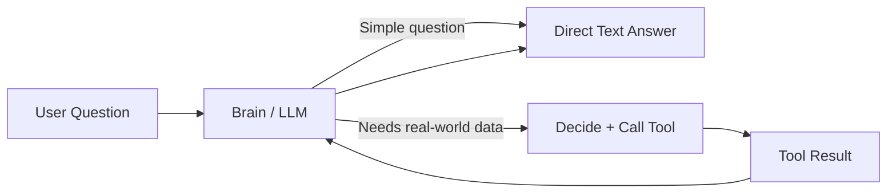
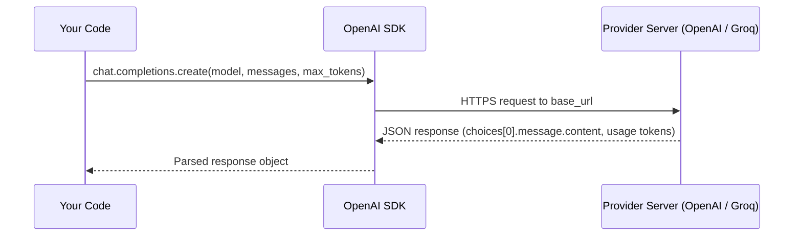
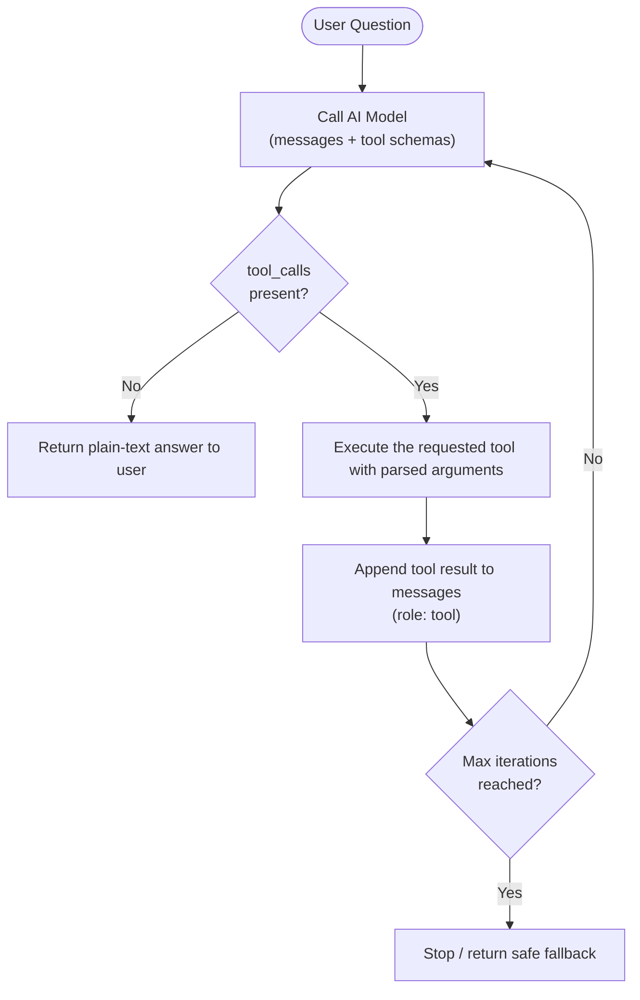
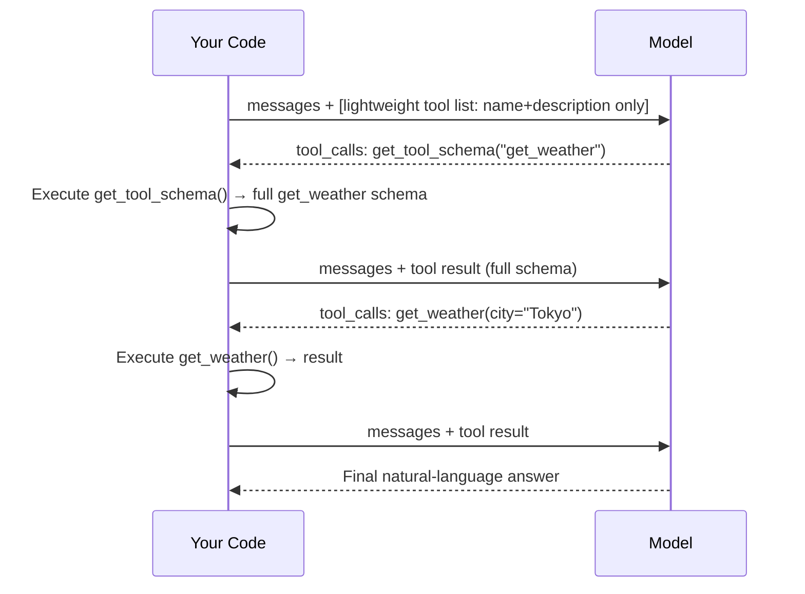

# 🤖 Building AI Agents from First Principles: The Agentic Loop, Tool Calling & Structured Output

- <i>**Session:** Day 6 — "LangChain‑1" (Pre‑Framework Foundations) · 
- **Instructor:** Mayank
- **Note on scope:** Despite the session title, the class deliberately does **not** touch the LangChain library. The instructor's stated goal is to make sure every learner can build an AI agent using *only* raw Python and a raw LLM API call — no framework "magic" — so that LangChain (covered in the next session) is understood rather than memorized. This guide reflects that scope and teaches the underlying mechanics in depth.</i>

---

## 📑 Table of Contents

1. [Session Overview](#-session-overview)
2. [Learning Objectives](#-learning-objectives)
3. [Detailed Notes](#-detailed-notes)
   - [1. The Three Layers: AI Model → Chatbot → Agent](#1-the-three-layers-ai-model--chatbot--agent)
   - [2. Anatomy of an LLM Call: Messages, Roles & Statelessness](#2-anatomy-of-an-llm-call-messages-roles--statelessness)
   - [3. Calling Real LLMs: Providers, Base URLs & Cost Control](#3-calling-real-llms-providers-base-urls--cost-control)
   - [4. Structuring AI Output with Pydantic](#4-structuring-ai-output-with-pydantic)
   - [5. Giving Your AI Tools: The Tool Schema](#5-giving-your-ai-tools-the-tool-schema)
   - [6. Tool Calling: The Model Decides, You Execute](#6-tool-calling-the-model-decides-you-execute)
   - [7. Multiple Tools & Avoiding Hallucinated Tool Calls](#7-multiple-tools--avoiding-hallucinated-tool-calls)
   - [8. The Agentic Loop: From Tool Calling to a Real Agent](#8-the-agentic-loop-from-tool-calling-to-a-real-agent)
   - [9. Scaling Tool Calling for Production](#9-scaling-tool-calling-for-production)
   - [10. Security, Privacy & Architectural Judgment](#10-security-privacy--architectural-judgment)
4. [Glossary](#-glossary)
5. [Revision Notes — One-Minute Revision](#-revision-notes--one-minute-revision)
6. [Cheat Sheet](#-cheat-sheet)
7. [Interview Questions & Answers](#-interview-questions--answers)
8. [Scenario-Based Interview Questions](#-scenario-based-interview-questions)
9. [Hands-on Exercises](#-hands-on-exercises)
10. [Practice Assignment](#-practice-assignment)
11. [Additional Resources](#-additional-resources)
12. [Final Revision Sheet](#-final-revision-sheet)

---

## 🎯 Session Overview

This session is the **prerequisite backbone** of Agentic AI engineering. Before touching any framework (LangChain, LangGraph, CrewAI, etc.), the instructor builds an AI agent from scratch using nothing but the Python standard library, an LLM provider's raw HTTP/SDK call, and `pydantic`. The philosophy driving this approach:

> 💡 **Memory Trick:** *"Frameworks are just a language. If you know OOP and variables, learning that in Python, Java, or Go is easy. If you don't know the fundamentals, no framework will save you."*

The session progresses through five mocked/real code files that each add **one new capability** on top of the last:

```text
File 1: AI Model → Chatbot → Agent (concept + memory as a list)
File 2: Real API calls (OpenAI, Groq) — mocked call replaced with real call
File 3: Structured output using Pydantic
File 4: A single tool, manually wired
File 5: A tool schema — the AI tells you which tool + arguments to use
File 6: The Agentic Loop — full tool-calling agent with a loop
```

By the end, learners understand **exactly** what a framework like LangChain hides from them — which is the point: you should be able to reconstruct what any "black box" agent framework does internally.

---

## 🎯 Learning Objectives

By the end of this guide, you will be able to:

- [ ] Explain the conceptual and architectural difference between an **AI model**, a **chatbot**, and an **agent**.
- [ ] Describe why LLMs are **stateless** and how conversation memory is manually reconstructed via message history.
- [ ] Make a raw API call to an LLM provider (OpenAI, Groq) and explain every field in the request/response.
- [ ] Explain why providers like Groq are "OpenAI-compatible" and how `base_url` swapping works.
- [ ] Use **Pydantic** to force an LLM's free-text output into a structured, application-usable object.
- [ ] Design a JSON **tool schema** (`type`, `name`, `description`, `parameters`) that an LLM can reliably use for tool selection.
- [ ] Correctly state the single most misunderstood fact in tool calling: **the model never executes a tool — it only tells you which one to call.**
- [ ] Implement the **Agentic Loop**: call model → check for `tool_calls` → execute tool(s) → feed result back → repeat until a plain-text answer.
- [ ] Identify and mitigate **tool bloat** (context/token explosion from too many tool schemas) using lazy-loaded tool metadata.
- [ ] Discuss production concerns: hallucinated tool selection, human-in-the-loop, sub-agents, caching, and data-privacy trade-offs of hosted vs. self-hosted models.

---

## 📚 Detailed Notes

### 1. The Three Layers: AI Model → Chatbot → Agent

#### 🧠 Concept

Every "AI product" you have ever used is a stack of exactly three architectural layers built on top of each other. Understanding these layers precisely is the single most important mental model for this entire session.

| Layer | What it is | What it remembers | What it can do |
|---|---|---|---|
| **AI Model** | A stateless, one-shot text predictor | Nothing — no memory of prior calls | Answer purely from training data |
| **Chatbot** | AI Model + conversation history | The full list of past user/assistant turns | Hold a coherent conversation |
| **Agent** | Chatbot + Tools | Conversation history *and* tool results | Take real-world actions (search, calculate, call APIs) |

#### ❓ Why It Exists

A raw AI model call is **stateless**: send a question, get an answer, and the model "forgets" everything the instant the call completes. Without wrapping logic, you cannot build a multi-turn conversation, and you cannot let the model act on the real world (e.g., it cannot know today's weather, since that fact did not exist in its training data).

#### ⚙ How It Works

**AI Model** — a single-shot prediction:

```text
Question → [AI Model] → Answer
(No memory before or after this call)
```

**Chatbot** — the model wrapped with a growing history list; every call re-sends the *entire* conversation so far, because the model itself remembers nothing:

```text
self.history = []

def ask(question):
    self.history.append({"role": "user", "content": question})
    answer = call_model(self.history)     # sends the WHOLE history, every time
    self.history.append({"role": "assistant", "content": answer})
    return answer
```

> ⚠️ **Common Mistake:** Assuming the model "remembers" the previous message on its own. It does not. If you don't re-send the history, the model has zero context of anything said before.

**Agent** — the chatbot, plus the ability to call external tools when the question requires real-world information the model cannot know from training alone:



#### 💡 Real-World Example

Ask "Who won the FIFA match yesterday?" to a plain chatbot: it will honestly say it has no real-time access and cannot answer. Ask the same to an **agent** with a web-search tool attached: it recognizes the knowledge gap, calls the search tool, reads the result, and *then* answers — exactly like Claude or ChatGPT do when they show "Searching the web…".

#### 🎯 Key Takeaways

* An AI model = brain only, stateless, single-shot.
* A chatbot = brain + memory (a list of past messages you maintain yourself).
* An agent = brain + memory + tools (the brain can now request real-world actions).
* All three share the **same underlying brain (LLM)** — what differs is the *wrapping logic* around it.

---

### 2. Anatomy of an LLM Call: Messages, Roles & Statelessness

#### 📖 Definition

Every call to a chat-based LLM API sends a list of **messages**, each tagged with a **role**: `system`, `user`, or `assistant`. This list — not some hidden server-side session — *is* the model's entire understanding of the conversation.

#### ❓ Why It Exists

Because the model is stateless, the API needs a standard way to represent "who said what" in the conversation so far, so the model can generate a coherent next turn.

#### ⚙ How It Works

| Role | Meaning | Sent how often |
|---|---|---|
| `system` | Instructions defining the AI's persona/behavior (e.g., "You are a helpful assistant") | Every single call — it is **not** a one-time setup |
| `user` | What the human asked | Every call, accumulated |
| `assistant` | What the model previously replied | Every call, accumulated (echoed back so the model has continuity) |

```json
[
  {"role": "system", "content": "You are a helpful assistant."},
  {"role": "user", "content": "Hi, how are you?"},
  {"role": "assistant", "content": "I'm doing well! How can I help?"},
  {"role": "user", "content": "Thanks for telling me."}
]
```

> 💡 **Memory Trick:** Even if you type a single character into ChatGPT/Claude, the *actual* payload sent behind the scenes can be thousands of tokens — because the system message, prior turns, and (for many apps) tool schemas are silently re-sent with every message.

#### 🔍 Internal Working

- The **system message is optional**, but it is a *good practice*, not a hard requirement.
- The system message is **re-sent on every call** — there is no server-side "remember this forever" mechanism at the raw-API level.
- Typical system messages run ~4–5K tokens for consumer products like ChatGPT/Claude (background instructions, formatting rules, tool descriptions, etc.) — this is why a "hi" can cost far more tokens than it looks like it should.

#### ⚠ Common Mistakes

* Believing the system message is sent only once at the start of a chat session — it is resent with **every** API call.
* Believing statelessness is a bug — it is a **deliberate design choice** of how LLM inference works; the model has no persistent memory across calls by design.

#### 🎯 Key Takeaways

* The 3 message roles are `system`, `user`, `assistant` — know these cold for interviews.
* "Memory" in an LLM app is nothing more than a client-side list you re-send every time.
* Longer message history → more tokens → higher cost and slower responses. This is the direct cause of "context window" concerns in production.

---

### 3. Calling Real LLMs: Providers, Base URLs & Cost Control

#### 🧠 Concept

Once you understand the message format, calling *any* LLM provider is "just an API call." The session demonstrates this with OpenAI (paid) and Groq (free, open-source models).

#### 💻 Code Example — Calling OpenAI

```python
from openai import OpenAI
import os

client = OpenAI(api_key=os.environ.get("OPENAI_API_KEY"))

def ask_openai(question: str) -> str:
    response = client.chat.completions.create(
        model="gpt-4o-mini",
        max_tokens=200,                      # cost/output guardrail
        messages=[{"role": "user", "content": question}],
    )
    return response.choices[0].message.content
```

> 🛠️ **Reconstructed for completeness:** the transcript walks through this call live but does not show the full file verbatim; the shape above matches exactly what was demonstrated (`client.chat.completions.create`, `model`, `max_tokens`, `messages`, and extracting the answer via `response.choices[0].message.content`).

#### 🔄 Provider Switching: Why `base_url` Matters

Groq (⚠️ *not* to be confused with Elon Musk's "Grok") hosts **open-source models for free** (up to a generous limit) and exposes an **OpenAI-compatible API** — meaning you use the *same* `openai` Python SDK, just pointed at a different server:

```python
from openai import OpenAI

client = OpenAI(
    api_key=os.environ["GROQ_API_KEY"],
    base_url="https://api.groq.com/openai/v1",   # only this changes
)

response = client.chat.completions.create(
    model="llama-3.3-70b-versatile",
    max_tokens=200,
    messages=[{"role": "user", "content": question}],
)
```

> 💡 **Memory Trick:** *"Calling ChatGPT is like calling McDonald's. You can't ask McDonald's for a North Indian thali. But if McDonald's said 'redirect my number to Haldiram's for that,' you'd dial the same number and get a totally different kitchen. That's exactly what changing `base_url` does — same calling code, different provider/model 'kitchen' behind it."*

#### ⚙ How It Works — Request Flow



#### 📊 Providers Compared

| Provider | Cost | Model Ownership | Notes |
|---|---|---|---|
| OpenAI | Paid (per-token) | Own models only (GPT family) | Industry default; `platform.openai.com` for keys |
| Anthropic | Paid | Own models only (Claude family) | Different SDK/response shape than OpenAI |
| Groq | Free (rate-limited) / cheap | Hosts open-source models (Llama, GPT-OSS, DeepSeek, etc.) | OpenAI-compatible endpoint |
| OpenRouter | Mixed free/paid | Routes to many providers' models under one API | Good for comparing providers; adds a small latency overhead since it proxies calls |

> ⚠️ **Common Mistake:** Thinking you can just change the `model` string to call Groq while still hitting OpenAI's endpoint. You **cannot** — you must also change the API key *and* the `base_url`. Every provider needs its own key; keys are not interchangeable across providers.

#### 💰 Cost & Token Guardrails

* `max_tokens` caps the length of the model's *output* (per most providers' documentation, it is primarily an output-token cap, though this can vary by provider/version — always verify in current docs). It exists purely as a **guardrail**: if someone tries to make your production agent generate "1 million tokens," this cap prevents runaway billing.
* Providers return token usage in every response (`prompt_tokens`, `completion_tokens`, `total_tokens`) — this is how you monitor and debug cost.
* Provider dashboards (e.g., OpenAI's "Usage" tab, Groq's "Activity" tab) show per-call token consumption for auditing.

#### 🚀 Best Practices

* *(Transcript-specific)* Always set a sane `max_tokens` even for "simple" agents — there is rarely a reason for unlimited output.
* *(Transcript-specific)* Never commit API keys to source control (the instructor accidentally pushed a key to `.env` in GitHub live and had to revoke it immediately — a real, common mistake).
* *(General industry practice)* Store keys in environment variables (`.env` + `python-dotenv`'s `load_dotenv()`), never hard-code them.

#### 🎯 Key Takeaways

* Every AI product in the world, under the hood, is "just an API call" with a JSON messages array.
* Free/open-source access (Groq) and paid/proprietary access (OpenAI, Anthropic) both use the same conceptual request shape — providers differentiate mainly in cost, model ownership, and minor response-format quirks.
* `max_tokens` is a cost guardrail, not a "quality" setting.

---

### 4. Structuring AI Output with Pydantic

#### ❓ Why It Exists

An LLM's raw reply is just prose: *"The weather in Tokyo is currently 25 degrees."* That's pleasant for a human to read, but painful for **code** to consume reliably — you'd need fragile string parsing to extract "25" and "Tokyo" every time the model phrases things slightly differently. Applications need **structured, predictable data**, not prose.

> 💡 **Memory Trick:** Compare `"Sure, I can send that email, subject: leave request, body: hi, I'll be out tomorrow"` (hard to program against) vs. `{"subject": "Leave Request", "body": "Hi, I'll be out tomorrow."}` (trivial to program against). Same information, wildly different usability.

#### ⚙ How It Works

Two things need to happen:
1. You **instruct** the model (via prompt/system message) to reply with *only* a JSON object matching an exact shape.
2. You **validate/cast** that JSON into a Python object using a `pydantic.BaseModel`, rather than manually writing `"reply the JSON like this: {...}"` strings by hand for every field.

```python
from pydantic import BaseModel, Field

class WeatherQuestion(BaseModel):
    city: str = Field(..., description="Name of the city to get the weather for, e.g. Tokyo")
    wants_fahrenheit: bool = Field(default=False, description="True if user explicitly wants Fahrenheit")
```

```python
instruction = (
    "Read the user message and reply with only a JSON object, no other text, "
    "in this exact shape: {\"city\": str, \"wants_fahrenheit\": bool}. "
    f"User message: {user_message}"
)
raw_reply = ask_ai(instruction)          # still a STRING, even though it "looks like" JSON
cleaned = raw_reply.strip("`").strip()   # trim markdown fences / stray text the model adds
weather_question = WeatherQuestion.model_validate_json(cleaned)
```

#### 🔍 Internal Working — The Critical Insight

> ⚠️ **Most important fact in this section:** No matter how "structured" the output looks, **the LLM's response is always and only a string.** Even a perfectly formatted JSON object is a *string that happens to contain JSON syntax* — you must always parse/clean it before it becomes a real Python object.

```mermaid
flowchart LR
    A[User Message] --> B["AI (told to reply in strict JSON)"]
    B --> C["Raw string reply<br/>e.g. &#96;&#96;&#96;json {...} &#96;&#96;&#96;"]
    C --> D[Strip markdown fences / extra text]
    D --> E[json.loads / Pydantic model_validate_json]
    E --> F[Typed Python object]
```



#### 🪜 Step-by-Step Execution

1. Define the desired shape as a `pydantic.BaseModel` with typed fields, defaults, and `description`s.
2. Compose an instruction telling the model to reply in *only* that JSON shape (no prose, no markdown fences).
3. Call the model — you get back a **string**.
4. Strip any stray characters the model may add around the JSON (backticks, the word "json", leading/trailing whitespace).
5. Parse the cleaned string into your Pydantic model.
6. Use the now-typed object (`weather_question.city`, etc.) safely in your application code.

#### ⚖ Advantages & Limitations

| Advantages of Pydantic over manual prompting | Limitations |
|---|---|
| Centralized, reusable schema definition (write once, reuse across the app) | Model can still occasionally deviate from the schema — you must still handle parsing failures |
| Built-in validation, defaults, and field-level descriptions that also *improve the prompt context* sent to the AI | Adds a dependency and a small amount of boilerplate vs. raw dict parsing |
| Type-safety downstream in your code (IDE autocomplete, type checking) | Not every model/provider supports **native** structured-output modes (some still require the "reply only in JSON" prompting trick shown above) |

> 🔍 **Deep Dive (beyond the transcript):** Many providers now offer **native structured output** (e.g., OpenAI's `response_format` with a JSON schema, or "tool calling" repurposed for guaranteed-shape output). The instructor mentions this exists but intentionally does not use it in this session, to make sure learners first understand *why* structured output is needed and what a framework does for them when it "auto-handles" this.

#### ⚠ Common Mistakes

* Trying to `json.loads()` a raw LLM reply without stripping markdown code fences (```json ... ```) — this throws a `JSONDecodeError`.
* Forgetting that a Pydantic-typed response still requires the *prompt* to instruct JSON-only output; Pydantic does not magically force the model to produce JSON on its own (unless you use a provider's native structured-output feature).

#### 🎯 Key Takeaways

* Structured output = better downstream code, better error handling, better cost control — and it's foundational to reliable tool calling (next section).
* `pydantic.BaseModel` gives you validation, defaults, and self-documenting fields in one place.
* Always remember: **LLM output is a string, even when it's "JSON."**

---

### 5. Giving Your AI Tools: The Tool Schema

#### 🧠 Concept

To let the model *choose* actions instead of you hard-coding "if the question contains the word 'weather', call the weather function," you describe your tools to the model in a standardized **tool schema** — a JSON structure the AI reads at call time.

#### ❓ Why It Exists

Naive tool routing (`if "weather" in question.lower(): call_weather()`) does not scale, is brittle, and duplicates intelligence the LLM already has. Instead, you hand the model a **menu of tools with rich descriptions** and let its language understanding do the routing.

#### ⚙ How It Works

```python
get_weather_schema = {
    "type": "function",
    "function": {
        "name": "get_weather",
        "description": "Get the current weather for a given city.",
        "parameters": {
            "type": "object",
            "properties": {
                "city": {
                    "type": "string",
                    "description": "Name of the city, e.g. Tokyo",
                },
                "wants_fahrenheit": {
                    "type": "boolean",
                    "description": "True if the user wants the temperature in Fahrenheit",
                },
            },
            "required": ["city"],
        },
    },
}
```

| Schema field | Purpose |
|---|---|
| `type` | Tells the model this entry is a callable `function` (vs. other tool types like built-in web search) |
| `function.name` | Unique tool identifier the model will echo back when it wants this tool called |
| `function.description` | **The most important field** — natural-language context the model uses to decide *when* to use this tool |
| `parameters.properties` | What inputs the tool accepts, with per-field types and descriptions |
| `parameters.required` | Which fields must be present for the tool call to be valid |

#### 💡 Real-World Example

> 💡 **Memory Trick:** *"An AI cannot read your Python code, so `delete_user` on its own is ambiguous — the model only sees tokens. A description like 'Permanently deletes a user account. Use with caution; requires user_id.' is the difference between an AI safely declining to call it casually vs. confidently misusing it."*

This mirrors why ChatGPT's built-in "web search" tool has a rich description telling the model exactly when to search vs. answer from memory — and why MCP (Model Context Protocol) servers inject full tool schemas (name, description, parameters) into the system prompt of every message, which is precisely why connecting many MCP tools can balloon your token usage before you've even typed a message.

#### ⚠ Common Mistakes

* Passing a raw Python function object directly instead of a JSON-serializable schema — this throws `TypeError: Object of type function is not JSON serializable`. Providers require **schemas**, not function objects.
* Vague or overlapping descriptions across multiple similar tools (e.g., `get_weather` and `get_weather_usa` with near-identical descriptions), which directly causes the model to hallucinate the wrong tool call (covered in Section 7).
* Omitting `required` fields — without it, the model may call the tool with missing arguments, causing a runtime `TypeError` in your own function.

#### 🚀 Best Practices

* Treat `description` as a **prompt**, not documentation — write it the way you'd explain the tool to a new teammate, not the way you'd write a code comment.
* Explicitly disambiguate near-duplicate tools in their descriptions (e.g., *"Use this only for US cities. For all other countries, use `get_weather`."*).
* This schema shape (`type`/`function`/`name`/`description`/`parameters`) is not legally "mandatory," but it is the de-facto **industry standard** popularized by OpenAI's function-calling format — most frameworks (LangChain, decorators like `@tool`) generate exactly this shape under the hood.

#### 🎯 Key Takeaways

* A tool schema has 4 essential parts: type, name, description, parameters.
* Description quality is *the* lever that determines whether the correct tool gets called.
* You cannot pass a Python function directly to the API — it must be serialized into this JSON schema.

---

### 6. Tool Calling: The Model Decides, You Execute

#### 🚨 The Single Most Important Concept in This Session

> ⚠️ **Critical distinction, repeated multiple times by the instructor because it is the #1 misconception:** **The model can only tell you *which* tool to call and *with what arguments* — it never executes the tool itself.** Your code is always responsible for actually running the function. Tool calling is 100% based on your own code calling it afterward.

#### ⚙ How It Works

When you send tool schemas alongside a question, the model's response contains either:
- Plain text (`message.content`) — the model answered directly, no tool needed, **or**
- A `tool_calls` list — the model is asking *you* to run a specific function with specific arguments, and is explicitly **not** giving you a final answer yet.

```json
{
  "id": "chatcmpl-...",
  "choices": [{
    "message": {
      "role": "assistant",
      "content": null,
      "tool_calls": [{
        "id": "call_abc123",
        "type": "function",
        "function": {
          "name": "get_weather",
          "arguments": "{\"city\": \"Tokyo\"}"
        }
      }]
    }
  }]
}
```

```python
message = response.choices[0].message

if message.tool_calls:
    call = message.tool_calls[0]
    fn_name = call.function.name                     # "get_weather"
    fn_args = json.loads(call.function.arguments)     # {"city": "Tokyo"}
    result = get_weather(**fn_args)                   # YOU execute it
else:
    result = message.content                          # plain text answer
```

#### 🪜 Step-by-Step Execution

1. Send `messages` + `tools=[get_weather_schema]` to the model.
2. Model inspects the question against every tool's `description`.
3. If the question needs a tool → model responds with `tool_calls` (name + JSON-string arguments), **not** a plain answer.
4. If the question is generic ("hi, how are you?") → model responds normally with `content`, and `tool_calls` is empty/`None`.
5. Your code parses `function.name` and `function.arguments` (note: `arguments` is itself a **JSON string** and needs `json.loads`).
6. Your code calls the actual Python function.
7. *(Covered next in Section 8)* the result is fed back to the model to produce the final natural-language answer.

#### 💡 Real-World Example

This is literally how Claude/ChatGPT's web search works: ask "who won the FIFA match yesterday?" → the model recognizes it lacks this knowledge → it doesn't try to hallucinate an answer → it returns a `tool_calls` request for the web-search tool with a *short query* (not your entire raw message) → the **client application** (Claude/ChatGPT's own backend) executes the search → feeds the results back → the model composes the final reply.

#### ⚠ Common Mistakes

* Assuming a tool schema alone gives the model the ability to reach out to the internet or your database — it does not. The schema only enables **selection**; execution is 100% your responsibility.
* Forgetting that `function.arguments` comes back as a **JSON string**, not a Python dict — you must `json.loads()` it before use.
* Sending only the function name without a schema (e.g., passing `"get_weather"` as a bare string) — the model has almost no context to reason about it; always send the full schema.

#### 🎯 Key Takeaways

* Model → decides *what* to call. Your code → *executes* it. Never confuse the two.
* `message.tool_calls` being non-empty is your signal that a function needs to run before you can answer the user.
* `message.tool_calls` being empty/`None` means the model is confident it can answer directly — no tool needed for this particular question.

---

### 7. Multiple Tools & Avoiding Hallucinated Tool Calls

#### ⚙ How It Works

Once more than one tool is registered, the model must pick the *right* one. This works because the model reads across **all** provided schemas and matches the user's intent against each `description`.

```python
tools = [get_weather_schema, calculator_schema, get_capital_schema]

response = client.chat.completions.create(
    model="gpt-4o-mini",
    messages=[{"role": "user", "content": "What is the capital of Japan?"}],
    tools=tools,
)
# → model correctly returns tool_calls for get_capital, not get_weather or calculator
```

#### ⚠ Common Mistakes ("Hallucinated" Tool Selection)

The instructor demonstrates this live with a deliberately ambiguous pair: `get_weather` and `get_weather_usa`.

> 💡 **Memory Trick:** *"If I gave you two functions named `get_weather` and `get_weather_india` with vague descriptions and asked for the weather in New York, you (a human) would be confused too. Clear that confusion for yourself first — with an explicit rule like 'for US cities always use get_weather_usa' — and the AI, being trained similarly to how humans reason, will follow the same clarity."*

| Cause of hallucinated tool calls | Fix |
|---|---|
| Two tools with near-identical descriptions | Make descriptions mutually exclusive and explicit about scope |
| Weak/small model | Use a stronger, more capable model for tool-heavy agents |
| Too many tools sent at once | Reduce tool count per call; use lazy loading (Section 9) |
| Missing `required` fields in schema | Model may call the tool with incomplete arguments → runtime error |

#### 🔍 Internal Working

- If a query could be answered by **either** a tool or the model's own reasoning (e.g., "what is 2+2" with a calculator tool present), a *capable* model will often just answer directly rather than force a tool call — smaller/weaker models are more likely to over-call tools unnecessarily.
- Whether a tool is called at all depends entirely on the question — there is no way to force "always call this tool" purely through schema; you'd need explicit system-prompt instructions or code-level constraints.
- The model **can** return multiple tool calls in a single response if it decides multiple tools are needed (e.g., "weather in Tokyo and Delhi" → two `get_weather` calls with different arguments). Sequencing/parallelizing those calls is entirely up to your code — the model does not orchestrate execution order for you.

#### 🎯 Key Takeaways

* Tool-call hallucination is a description-quality and model-capability problem — not an unsolvable one.
* More tools = more chances for confusion = more tokens. Every added tool is a design decision, not a free action.
* The model can request multiple tool calls in one turn; your code decides how to execute them (sequential vs. parallel).

---

### 8. The Agentic Loop: From Tool Calling to a Real Agent

#### 📖 Definition

The **Agentic Loop** is the pattern that upgrades "single tool calling" into a true agent: repeatedly call the model, check whether it wants a tool executed, execute it, feed the result back, and repeat — until the model finally returns a plain-text answer (or a max-iteration safety limit is hit).

#### ❓ Why It Exists

A single tool-call round only gets you *one* step: "here's the raw tool output." A real conversation needs the model to **interpret** that raw output and phrase a natural final answer (e.g., turning `{"temp_c": 24, "condition": "sunny"}` into *"It's 24°C and sunny in Delhi today!"*). That requires sending the tool's result back into another model call — hence a *loop*, not a single call.

#### ⚙ How It Works



```python
def run_agent(question: str, tools_schema: list, tool_functions: dict, max_iterations: int = 4):
    messages = [{"role": "user", "content": question}]

    for _ in range(max_iterations):
        response = client.chat.completions.create(
            model="gpt-4o-mini",
            messages=messages,
            tools=tools_schema,
            max_tokens=200,
        )
        message = response.choices[0].message

        if not message.tool_calls:
            # Simple text answer — no tool needed, we are done.
            messages.append({"role": "assistant", "content": message.content})
            return message.content

        # The model wants a tool executed.
        messages.append(message)                      # keep the assistant's tool_call request
        for call in message.tool_calls:
            fn_name = call.function.name
            fn_args = json.loads(call.function.arguments)
            result = tool_functions[fn_name](**fn_args)  # WE execute it
            messages.append({
                "role": "tool",
                "tool_call_id": call.id,
                "content": str(result),
            })
        # loop continues: send the tool result back to the model

    return "Sorry, I couldn't complete this within the allowed steps."
```

> 🛠️ **Reconstructed for completeness:** the transcript walks through this loop conceptually and live in code, describing each branch precisely as shown; the exact variable names above are a representative, correct implementation of the described logic (including the `max_iterations` safety cap the instructor explicitly mentions using, e.g., a max of 4).

#### 🪜 Step-by-Step Execution

1. Start with just the user's question in `messages`.
2. Call the model with the current `messages` **and** the full `tools_schema`.
3. **Branch A — no `tool_calls`:** the model gave a direct answer → return it. Loop ends.
4. **Branch B — `tool_calls` present:** for each requested call, parse `function.name`/`function.arguments`, execute the matching Python function, and append the **result** back into `messages` (tagged appropriately, e.g. `role: "tool"`).
5. Loop back to step 2 — now the model sees the original question *and* the tool's result, and can either answer in plain text or request another tool call (e.g., a dependent, sequential tool call).
6. A `max_iterations` cap prevents infinite loops if the model keeps requesting tools indefinitely.

#### 🔍 Internal Working — Why the "Outer" Loop Matters

A common point of confusion (raised live in the Q&A): *if the model already told us the tool name once, why call the model again after running the tool?* Because the **tool's raw output is not a user-friendly answer**. Sending it back to the model lets the model **compose** a final, natural response using both the original question and the fresh tool result — and, crucially, the model uses this second call to decide there's *nothing further to call*, ending the loop with a plain-text answer.

#### 💡 Real-World Example

*"Agent decide karta hai tool ko call karna hai ki nahi (the agent decides whether a tool needs to be called or not)"* — this is the exact behavior difference from the earlier "File 4/5" tool-calling demos, where the *developer* manually decided which tool to invoke. In the true agent, the loop itself — driven entirely by the model's own decisions each iteration — decides that.

#### ⚠ Common Mistakes

* Forgetting the `max_iterations` safety cap — a model that keeps requesting tools (due to bad descriptions, a bug in your tool, or model confusion) can loop indefinitely and burn tokens/cost.
* Not appending the tool's result back into `messages` before the next loop iteration — without this, the model has no idea the tool even ran, and will likely just request the same tool call again.
* Confusing "the loop calls the API multiple times" with "the model calls the tool multiple times" — the model **never** calls anything; every iteration is still *you* calling the model API, and *you* executing tools.

#### 🚀 Best Practices

* Always cap iterations (`max_iterations`) as a cost/safety guardrail.
* Consider **not** storing the full, verbose raw tool output in message history long-term — store a summarized version to save tokens on long conversations (an explicit optimization mentioned in the Q&A).
* Design tools to fail gracefully (`try`/`except`) and return a clear, LLM-readable error message rather than crashing — so the model can tell the user "please try again shortly" instead of the loop breaking.

#### 🎯 Key Takeaways

* The Agentic Loop = *Call model → tool_calls? → Execute → Append result → Repeat → Plain answer*.
* This loop, not any framework's abstraction, **is** what "an agent" fundamentally is.
* Multiple/sequential/dependent tool calls are all just multiple trips around this same loop.

---

### 9. Scaling Tool Calling for Production

#### ❓ Why It Exists

Sending 5 tool schemas per call is cheap. Sending **200 tool schemas** (a real use-case raised in the Q&A — an MIS-reporting agent needing 200+ internal tools) is not: every schema's `name`, `description`, and `parameters` gets serialized into the request on **every single call**, inflating token usage, cost, latency, and — critically — the model's chance of confusing similar tools.

> 💡 **Memory Trick:** *"If I hand you 100 laptops and ask you to pick the right one for a task, you'll struggle — not because you're incapable, but because the sheer volume creates confusion. Same with an LLM and too many tool schemas in context."* This is precisely why connecting many MCP servers to a client like Claude can silently burn tens of thousands of tokens before you type a word — each connected server injects its own tools' schemas into the system prompt of every message.

| Symptom of tool bloat | Root cause |
|---|---|
| Very high `prompt_tokens` even for a trivial "hi" | All tool schemas resent on every call |
| Wrong tool selected among similar ones | Too much competing context / weak descriptions |
| Slower responses | Bigger payload to transmit and for the model to attend over |
| Higher cost | Billed per input token, regardless of whether a tool was used |

#### ⚙ How It Works — Lazy-Loaded Tool Metadata (the Optimization)

Instead of sending every tool's full schema (name + description + full parameters) on every call, send only lightweight **name + description** entries up front. If the model decides it needs a specific tool, it first calls a small **meta-tool** — e.g. `get_tool_schema(tool_name)` — to fetch that one tool's *full* schema, and only *then* makes the real call with the complete arguments.



```python
def get_tool_schema_for_llm(tool_name: str) -> dict:
    """Meta-tool: returns the FULL schema for one tool, only when the model asks for it."""
    return full_schema_registry[tool_name]
```

> 🛠️ **Reconstructed for completeness:** the instructor implements this live as a `Lambda`-style single-line helper and a `get_tool_information` function; the pattern above accurately reflects the described "send name+description first, fetch full schema on demand" design.

#### ⚖ Advantages & Limitations

| Advantages | Limitations |
|---|---|
| Dramatically reduces tokens sent per call when you have dozens/hundreds of tools | Adds one extra round-trip (one more loop iteration) before the real tool is called |
| Scales to hundreds of tools without blowing the context window | Slightly more complex code to maintain (a schema registry + meta-tool) |
| Mirrors how production systems like MCP-based clients (e.g., Claude Sonnet) already behave — sending only name/description by default, fetching full details on demand | Still requires excellent name/description hygiene to avoid ambiguity at the *first* (lightweight) selection stage |

#### 🏢 Real-World / Production Usage

* This is functionally similar to what **MCP (Model Context Protocol)** servers and modern LLM UIs (e.g. Claude) do: they avoid dumping every connected tool's full schema into every request, favoring lighter references resolved on demand.
* **Sub-agents / "agents as tools":** rather than flattening 200 tools into one agent's tool list, group related tools behind a **sub-agent**, and expose the sub-agent itself as a single "tool" to the parent agent (a description-only entry: *"Delegates reporting-related questions to the Reporting sub-agent"*). This is a common industry pattern for very large tool surfaces.
* **Human-in-the-loop:** for sensitive or destructive tool calls, insert an explicit approval/confirmation step between "model requests tool call" and "code executes tool call," rather than auto-executing everything the model asks for.
* **README-as-context pattern:** the instructor's closing analogy — rather than letting a coding agent scan an entire Git repository (burning enormous tokens), maintain a concise, well-structured `README.md` describing architecture/relationships so the agent can "look up the map" instead of "driving to every restaurant to see what's on the menu."

#### ⚠ Common Errors & Troubleshooting

| Problem | Possible Cause | Solution |
|---|---|---|
| `401 Invalid API key` | Wrong key pasted (e.g., an xAI "Grok" key used where a Groq "GSK…" key was expected) — a real mix-up in the live class | Double-check provider-specific key prefixes; Groq keys are not the same as "Grok" (xAI) keys |
| `TypeError: Object of type function is not JSON serializable` | Passing a raw Python function instead of the JSON tool schema | Always pass the serialized schema dict, never the function object |
| `get_weather() missing 1 required positional argument: 'city'` | `required` field omitted from the schema, so the model called the tool with incomplete arguments | Add `"required": ["city"]` to the schema's `parameters` |
| Tool never gets called even though it's relevant | Description too vague, or too many competing tools in context | Improve description specificity; consider lazy-loading tools |
| Wrong regional tool called (e.g., US weather tool used for a Japanese city) | Ambiguous/overlapping descriptions across similar tools, or a weaker model | Sharpen descriptions with explicit scope; use a more capable model |

#### 🎯 Key Takeaways

* Tool bloat is a real, measurable cost and accuracy problem — not a hypothetical one.
* The fix is **lazy loading**: send name+description first, fetch the full schema only for the tool actually needed.
* Sub-agents, human-in-the-loop, and README-style context summarization are all variations of the same principle: *give the model only the context it needs, when it needs it.*

---

### 10. Security, Privacy & Architectural Judgment

#### 🏢 Real-World / Production Usage

A recurring, important Q&A thread: whenever your tool's output (which may contain **proprietary/sensitive organizational data**) is fed back into the model for the next loop iteration, that data effectively becomes part of the payload sent to whichever provider is hosting the "brain."

| Concern | Mitigation |
|---|---|
| Sensitive data sent to a third-party hosted model (OpenAI, Anthropic, etc.) | Use **open-source, self-hosted models** (or private cloud deployments — Azure OpenAI, AWS Bedrock, on-prem Foundry-style setups) so data never leaves your infrastructure |
| Need for a "custom" branded model | Two real approaches: (1) **system-prompt engineering** on top of an existing foundation model (fast, cheap — what the instructor did with his own "Mayank GPT"), or (2) **fine-tuning** (expensive, requires infra and, for closed-source models, is often not even possible since you don't own the weights) |
| Repeated identical tool calls (e.g., same city's weather fetched many times) | Add a caching layer — entirely an application-level *design decision*, not something the LLM handles |
| Synchronous vs asynchronous tool execution | By default, the demo code is synchronous; production systems commonly run tool calls asynchronously for latency-sensitive or parallelizable tool calls — this is a software-engineering choice layered on top of the same agentic loop, not a different loop |

#### ⚖ Advantages & Limitations

- Fine-tuning a closed-source model is often **not possible** at all (you don't have access to the weights); it's really only viable for open-source models, and even then requires meaningful infrastructure investment.
- System-prompt engineering is fast and low-cost but is fundamentally limited by what the base model already knows and can be steered to do — it cannot teach a model genuinely new knowledge the way fine-tuning theoretically can.

#### 🎯 Key Takeaways

* "Which tool to call" and "how to store/cache/secure the data" are **software engineering decisions**, not AI decisions — the model is only ever the "brain" component making one narrow decision (tool selection).
* Open-source/self-hosted models are the standard mitigation when data cannot leave your organization's boundary.
* Most orchestration (sync/async, caching, retries, human approval) is *ordinary backend engineering* wrapped around the LLM call — this is the instructor's repeated point that "controlling the smallest details of your agent" is what makes someone valuable versus someone who can only "use ChatGPT."

---

## 📝 Glossary

| Term | Definition | Why It Matters |
|---|---|---|
| **AI Model** | A stateless, single-shot text predictor with no memory across calls | The foundational "brain" every chatbot/agent is built around |
| **Chatbot** | An AI model wrapped with client-maintained conversation history | Enables multi-turn coherent conversations |
| **Agent** | A chatbot additionally equipped with tools it can request to be called | Enables real-world actions beyond pure text generation |
| **Statelessness** | The property that an LLM retains no memory between separate API calls | Explains why full conversation history must be resent every call |
| **System message / prompt** | A `role: "system"` message defining the AI's persona/behavior | Shapes model behavior consistently; resent on every call |
| **Token** | A sub-word unit of text the model reads/generates; billing unit for most providers | Cost, context-window limits, and latency all scale with token count |
| **`max_tokens`** | A request parameter capping generated output length | Cost/safety guardrail against runaway generation |
| **`base_url`** | The API endpoint an SDK sends requests to | Lets you point the same OpenAI-compatible SDK at different providers (e.g., Groq) |
| **OpenAI-compatible API** | A third-party API that mimics OpenAI's request/response shape | Lets you swap providers by only changing `api_key` and `base_url` |
| **Pydantic `BaseModel`** | A Python class defining typed, validated fields | Used to force/parse LLM output into structured, application-safe data |
| **Structured output** | LLM output shaped to match a predefined schema (typically JSON) | Makes AI responses safely consumable by downstream code |
| **Tool / Function schema** | A JSON object (`type`, `name`, `description`, `parameters`) describing a callable tool to the model | Lets the model select the right tool based on natural-language description |
| **Tool calling / Function calling** | The model responding with a request to invoke a named tool with specific arguments, instead of plain text | The mechanism underlying essentially all "agentic" behavior |
| **`tool_calls`** | The field in an API response containing the model's requested tool invocation(s) | Presence of this field is the signal your code must branch into "execute a tool" logic |
| **Agentic Loop** | Repeated cycle of model call → tool execution → feed result back → repeat, until a plain-text answer | The core architecture underlying every AI agent, framework or not |
| **Hallucination (tool context)** | The model selecting the wrong tool or inventing arguments not grounded in the actual request | Directly caused by poor tool descriptions, tool ambiguity, or a weak model |
| **Tool bloat / Context bloat** | Excessive token usage from sending too many/too-verbose tool schemas on every call | Major production cost and accuracy concern at scale |
| **Lazy-loaded tool schema** | Sending only name+description upfront; fetching the full schema only when a tool is actually selected | Key optimization pattern for agents with many tools |
| **MCP (Model Context Protocol)** | A standard for connecting external tools/servers to an LLM client, each injecting its own tool schemas | Real-world example of both the power and token cost of many connected tools |
| **Sub-agent / Agent-as-a-tool** | Treating an entire specialized agent as a single callable "tool" from a parent agent's perspective | Pattern for scaling to very large tool surfaces without flat tool lists |
| **Human-in-the-loop** | Inserting a manual approval step before executing a sensitive tool call | Safety pattern for high-risk actions |
| **Fine-tuning** | Further training a model's weights on custom data | Alternative to prompt engineering for customizing model behavior; requires model weight access + infra |

---

## 🔄 Revision Notes — One-Minute Revision

> An **AI model** is a stateless brain: ask, answer, forget. A **chatbot** adds memory by re-sending the whole conversation (system, user, assistant messages) on every call. An **agent** adds **tools**: you describe each tool with a JSON schema (name, description, parameters), and the model — never your code alone — decides *if* and *which* tool is needed, returning `tool_calls` instead of plain text. **The model never executes anything; your code always does.** Free-text output is unreliable for programs, so you instruct the model to reply in strict JSON and parse it into a `pydantic.BaseModel` — remembering the reply is always a *string*, even when it looks like JSON. Chaining "call model → run requested tool → feed result back → call model again" in a loop, with a max-iteration safety cap, **is** the Agentic Loop — the true definition of an agent. At scale, sending every tool's full schema on every call gets expensive and error-prone (tool bloat/hallucination), so production systems lazy-load full schemas only for the tool actually selected, use sub-agents to group large tool sets, and add human-in-the-loop checks for sensitive actions.

---

## 📋 Cheat Sheet

**Message roles:** `system` (persona, resent every call), `user` (human input), `assistant` (model's past replies)

**Minimal OpenAI-style call:**
```python
client.chat.completions.create(
    model="gpt-4o-mini",
    max_tokens=200,
    messages=[{"role": "user", "content": "..."}],
    tools=[schema, ...],   # omit if no tools needed
)
```

**Switch provider (OpenAI-compatible):**
```python
client = OpenAI(api_key=KEY, base_url="https://api.groq.com/openai/v1")
```

**Tool schema skeleton:**
```json
{
  "type": "function",
  "function": {
    "name": "tool_name",
    "description": "Clear, unambiguous, scoped description.",
    "parameters": {
      "type": "object",
      "properties": {"field": {"type": "string", "description": "..."}},
      "required": ["field"]
    }
  }
}
```

**Detect if a tool call was requested:**
```python
if response.choices[0].message.tool_calls:
    # execute tool(s) yourself
else:
    # plain-text answer, use message.content
```

**Agentic Loop skeleton:**
```
1. messages = [user question]
2. loop (max N times):
     call model with messages + tools
     if no tool_calls: return message.content
     else: execute each requested tool, append results to messages
3. return fallback if loop exhausted
```

**Rules of thumb:**
- Tool schema quality (esp. `description`) > everything else for correct tool selection.
- Never pass a raw function — always the JSON schema.
- Always cap loop iterations.
- Always strip/clean LLM JSON strings before parsing.
- Lazy-load full tool schemas when tool count is large (>~10–20).

---

## 🔥 Interview Questions & Answers

### 🟢 Beginner

**Q1. What is the fundamental difference between an AI model, a chatbot, and an agent?**
**Answer:** An AI model is a stateless, single-shot predictor with no memory. A chatbot wraps that model with client-maintained conversation history so it can hold multi-turn conversations. An agent further wraps the chatbot with tools, letting the model request real-world actions.
**Explanation:** Each layer builds on the last; only the "wrapping logic" changes, not the underlying LLM.
**Why Interviewers Ask This:** It tests whether a candidate understands agent architecture conceptually, not just as a framework buzzword.
**Possible Follow-up:** "Where does 'memory' actually live in this architecture?"

**Q2. Why are LLMs described as 'stateless'?**
**Answer:** Because each API call is independent — the model retains no information about prior calls unless the full conversation history is explicitly resent as part of the request.
**Explanation:** This is a design property of how inference works, not a bug.
**Why Interviewers Ask This:** Tests basic understanding of how "memory" is simulated, not native.
**Possible Follow-up:** "How would you reduce the token cost of resending a long history?"

**Q3. What are the three standard message roles used in an LLM chat API?**
**Answer:** `system`, `user`, and `assistant`.
**Explanation:** `system` sets behavior/persona, `user` is human input, `assistant` is the model's past responses — all resent every call.
**Why Interviewers Ask This:** Baseline knowledge required for any hands-on LLM API work.
**Possible Follow-up:** "Is the system message mandatory?"

**Q4. Is the system message sent only once, or with every API call?**
**Answer:** With every single call — there is no persistent server-side memory of it.
**Explanation:** Because the model is stateless, the full context (including the system message) must accompany every request.
**Why Interviewers Ask This:** A very common misconception among beginners.
**Possible Follow-up:** "What's the cost implication of this?"

**Q5. What does `max_tokens` control?**
**Answer:** It caps the length of the model's generated output for that call, acting primarily as a cost/safety guardrail.
**Explanation:** Without it, a malicious or careless request could generate extremely long (and expensive) output.
**Why Interviewers Ask This:** Tests operational/production awareness, not just API syntax.
**Possible Follow-up:** "What happens if a user's request genuinely needs more tokens than the cap allows?"

**Q6. What does it mean that Groq's API is "OpenAI-compatible"?**
**Answer:** It accepts the same request/response shape as OpenAI's API, so you can reuse the same `openai` Python SDK — only the `api_key` and `base_url` need to change.
**Explanation:** This lowers the switching cost between providers dramatically.
**Why Interviewers Ask This:** Tests understanding of provider abstraction in real systems.
**Possible Follow-up:** "Can you use an OpenAI key with Groq's base_url?"

**Q7. Why can't you just use ChatGPT.com directly inside your company's product?**
**Answer:** ChatGPT.com is a consumer application, not an API; to embed LLM capability into your own product, you must call the underlying model via its API (e.g., OpenAI's API), which gives you only the raw LLM — not ChatGPT's UI features (web search, file upload, etc.) unless you build/wire them yourself.
**Explanation:** Distinguishes "the model" from "the product built around the model."
**Why Interviewers Ask This:** Common early confusion for engineers new to LLM app development.
**Possible Follow-up:** "How would you replicate ChatGPT's web search feature in your own app?"

**Q8. What Python library was used in this session to enforce structured output, and why?**
**Answer:** `pydantic` — because it provides typed, validated, self-documenting schemas that both constrain the AI's expected reply shape and make the parsed result safe to use in code.
**Explanation:** Prevents fragile manual string-parsing of free-text LLM output.
**Why Interviewers Ask This:** Tests familiarity with real, industry-standard tooling.
**Possible Follow-up:** "What happens if the model's reply doesn't match the schema?"

**Q9. True or False: An LLM's structured JSON reply is returned as an actual JSON object by the API.**
**Answer:** False — it is always returned as a **string**, even if that string contains valid JSON syntax; you must parse it yourself.
**Explanation:** A widely misunderstood but critical detail for building reliable pipelines.
**Why Interviewers Ask This:** Tests attention to a subtle-but-important implementation detail.
**Possible Follow-up:** "What issues can arise when parsing this string, and how do you handle them?"

**Q10. What are the four essential fields of a tool/function schema?**
**Answer:** `type` (usually `"function"`), `name`, `description`, and `parameters` (including `properties` and `required`).
**Explanation:** This is the standard shape popularized by OpenAI's function-calling format and reused by most frameworks.
**Why Interviewers Ask This:** Core, testable knowledge for anyone claiming tool-calling experience.
**Possible Follow-up:** "Which field most influences whether the correct tool gets selected?"

---

### 🟡 Intermediate

**Q11. Does the LLM ever execute a tool itself? Explain precisely what happens instead.**
**Answer:** No. The model only returns a `tool_calls` entry indicating which tool it wants invoked and with what arguments; your application code is solely responsible for actually executing that function.
**Explanation:** This is the single most repeated, most tested concept in tool-calling interviews.
**Why Interviewers Ask This:** Distinguishes candidates who've only read framework docs from those who understand the underlying mechanics.
**Possible Follow-up:** "What would happen if your code ignored a tool_calls request and just returned message.content (which may be null)?"

**Q12. What is the Agentic Loop, and why is a loop necessary instead of a single request/response?**
**Answer:** It's the repeated cycle of calling the model, checking for `tool_calls`, executing any requested tools, appending the results back into the message history, and calling the model again — repeated until the model returns a plain-text answer. A single call can only get you the *tool selection*, not a final natural-language answer incorporating the tool's result — hence the need to loop back.
**Explanation:** This defines what "an agent" fundamentally *is*, independent of any framework.
**Why Interviewers Ask This:** Core architectural concept for any agentic-systems role.
**Possible Follow-up:** "How do you prevent infinite loops?"

**Q13. Why would you cap the number of loop iterations in an agentic loop (`max_iterations`)?**
**Answer:** To prevent runaway cost/latency if the model keeps requesting tool calls indefinitely (due to ambiguous tools, bugs, or model confusion), and to guarantee the system eventually returns *some* response to the user.
**Explanation:** A production safety guardrail, analogous to `max_tokens` for output length.
**Why Interviewers Ask This:** Tests production-readiness thinking, not just happy-path implementation.
**Possible Follow-up:** "What should your system do when the cap is hit?"

**Q14. What causes an LLM to select the wrong tool among several similar ones, and how do you fix it?**
**Answer:** Ambiguous or overlapping tool `description`s, too many competing tools in context, or an insufficiently capable model. Fix by writing mutually exclusive, explicit descriptions (scoping when each tool should/shouldn't be used), reducing tool count via lazy loading, and/or using a stronger model.
**Explanation:** Tool-selection hallucination is a description-engineering problem more than a "the AI is broken" problem.
**Why Interviewers Ask This:** Tests practical debugging skill for agent systems.
**Possible Follow-up:** "How would you test/validate tool-selection accuracy before shipping?"

**Q15. What is "tool bloat," and how do you mitigate it in a system with 100+ tools?**
**Answer:** Tool bloat is the token/cost/accuracy degradation caused by sending every tool's full schema on every request. Mitigate via lazy-loading (send only name+description up front, fetch full schema for the selected tool via a meta-tool), grouping tools into sub-agents, and pruning genuinely unused tools.
**Explanation:** A key production-scaling concern raised repeatedly in the Q&A by learners with real-world use cases (e.g., 200-tool MIS reporting agents).
**Why Interviewers Ask This:** Distinguishes toy-project experience from production-scale thinking.
**Possible Follow-up:** "What's the trade-off of lazy-loading tool schemas?"

**Q16. Explain what happens, step by step, when a tool's `arguments` field is parsed.**
**Answer:** `function.arguments` in the API response is a JSON-formatted **string**; your code must `json.loads()` it to get a Python dict of keyword arguments, which you then unpack (`**kwargs`) into the actual tool function call.
**Explanation:** A concrete implementation detail candidates must know to actually build a working agent.
**Why Interviewers Ask This:** Tests hands-on implementation familiarity, not just conceptual understanding.
**Possible Follow-up:** "What if `arguments` is malformed JSON — how would you handle that safely?"

**Q17. Why is a `required` array important in a tool's parameter schema?**
**Answer:** It tells the model which arguments are mandatory. Omitting it can lead the model to issue a tool call missing critical arguments, causing a runtime error (e.g., `missing 1 required positional argument`) when your code tries to execute the function.
**Explanation:** A schema-design detail with direct, testable runtime consequences.
**Why Interviewers Ask This:** Tests whether the candidate has actually debugged real tool-calling errors.
**Possible Follow-up:** "How would you handle a tool call that's missing a required argument gracefully instead of crashing?"

**Q18. Compare "manual tool routing" (e.g., keyword matching on the question) with "AI-driven tool selection." What are the trade-offs?**
**Answer:** Manual routing (e.g., `if "weather" in question`) is simple, deterministic, and cheap, but brittle and doesn't scale past a handful of tools/phrasing variations. AI-driven selection (via tool schemas) scales to many tools and understands natural-language intent flexibly, but is probabilistic, can hallucinate, and adds token cost per call.
**Explanation:** Reflects the exact architectural progression shown across the session's demo files.
**Why Interviewers Ask This:** Tests judgment about when simpler approaches are actually preferable.
**Possible Follow-up:** "When would you choose manual routing over AI-driven selection in production?"

**Q19. What is a sub-agent / "agent as a tool" pattern, and why would you use it?**
**Answer:** Instead of flattening a huge number of tools into a single agent's tool list, you group related tools under a specialized sub-agent, and expose that entire sub-agent as a single callable "tool" (with its own description) to a parent/orchestrator agent. This keeps each individual agent's tool list small and manageable while still supporting large overall tool surfaces.
**Explanation:** A key production pattern for scaling beyond what a flat tool list can handle cleanly.
**Why Interviewers Ask This:** Tests awareness of multi-agent architecture patterns.
**Possible Follow-up:** "How does this affect latency compared to a single flat agent?"

**Q20. Why might an organization choose to self-host an open-source model instead of calling OpenAI/Anthropic's hosted API?**
**Answer:** Primarily data privacy/security — tool outputs and proprietary organizational data get fed back into the model on every loop iteration, and with a third-party hosted API, that data leaves the organization's boundary. Self-hosting (or private cloud deployment) keeps that data internal.
**Explanation:** A recurring, realistic enterprise concern raised directly in the Q&A.
**Why Interviewers Ask This:** Tests awareness of real deployment/compliance trade-offs beyond pure ML knowledge.
**Possible Follow-up:** "What are the downsides of self-hosting compared to a hosted API?"

---

### 🔴 Advanced

**Q21. Design an agentic loop that must call two dependent tools sequentially (tool B needs tool A's output as an argument). How does the model orchestrate this, and how does your code differ from the single-tool case?**
**Answer:** The model does **not** orchestrate multi-step sequencing on its own in a single response; it typically requests tool A first, your code executes it and appends the result, and the model — seeing that result on the *next* loop iteration — then requests tool B using A's result as an argument. Your code structure doesn't fundamentally change; it's the *same* agentic loop, just running for more iterations, since each dependent step naturally requires its own round-trip to let the model "see" the prior result before deciding the next action.
**Explanation:** Demonstrates the loop's generality — dependent, sequential tool chains are not a special case architecturally.
**Why Interviewers Ask This:** Tests deep understanding of how the loop generalizes to complex, realistic workflows.
**Possible Follow-up:** "How would you reduce the extra latency this adds?"

**Q22. A production agent occasionally calls a tool with hallucinated arguments not present in the user's message. Walk through your full debugging and mitigation strategy.**
**Answer:** (1) Inspect the tool's `description` and `parameters` for ambiguity or missing constraints; (2) check whether too many tools were in context, diluting focus — consider lazy-loading; (3) verify the model's capability tier — a weaker/smaller model is far more prone to this; (4) add explicit validation in your own tool-execution code (reject/clarify calls with implausible or out-of-range arguments) rather than trusting the model blindly; (5) consider adding a system-prompt rule reinforcing strict grounding ("only use arguments explicitly present in the user's message; ask for clarification otherwise").
**Explanation:** A holistic, multi-layered mitigation strategy mirrors real production debugging.
**Why Interviewers Ask This:** Senior-level troubleshooting competency check.
**Possible Follow-up:** "How would you monitor for this issue at scale, in production, automatically?"

**Q23. Explain the token-cost trade-off between sending full tool schemas on every call versus using a lazy-loading meta-tool pattern. When is lazy loading *not* worth the added complexity?**
**Answer:** Full schemas cost more tokens per call but resolve tool selection in a single round-trip. Lazy loading (name+description first, full schema fetched only for the selected tool) reduces token cost significantly for large tool sets but adds an extra model round-trip (latency + one more API call) for every tool invocation. For small tool counts (roughly under ~10–20, exact threshold depends on schema size and latency budget), the added round-trip overhead of lazy loading may not be worth it — full schemas sent directly can be simpler and just as cost-effective.
**Explanation:** Tests ability to reason about trade-offs quantitatively rather than applying "best practices" blindly.
**Why Interviewers Ask This:** Distinguishes engineers who understand *why* a pattern helps from those who just apply it by rote.
**Possible Follow-up:** "How would you empirically decide the right threshold for your specific system?"

**Q24. Your agent needs to expose 200+ internal reporting tools. Propose a complete architecture, referencing concepts from this session.**
**Answer:** A layered design: (1) group the 200 tools into logical sub-agents (e.g., by report category), each with its own focused tool list; (2) expose each sub-agent as a single "tool" with a clear description to a top-level orchestrator agent; (3) within each sub-agent, use lazy-loaded tool schemas (name+description first, full schema fetched via a meta-tool only for the selected tool) to keep even sub-agent-level context small; (4) use a strong model at the orchestrator level for accurate routing, and add human-in-the-loop confirmation for any tool with write/destructive effects; (5) log token usage and tool-selection accuracy for ongoing monitoring.
**Explanation:** Synthesizes essentially every scaling technique covered in Section 9 into one coherent design.
**Why Interviewers Ask This:** A realistic, senior-level system-design prompt directly informed by the actual Q&A scenario raised in class.
**Possible Follow-up:** "How would this design change if latency were the primary constraint instead of token cost?"

**Q25. Explain precisely why "structured output via Pydantic + prompting" and "native provider structured-output/JSON modes" solve the same underlying problem differently. What's the trade-off?**
**Answer:** Both aim to make LLM output machine-consumable. The prompting approach ("reply only in this JSON shape") relies on the model *following instructions*, with no hard guarantee of compliance — you must still defensively parse/clean/validate the string reply. Native structured-output modes (where supported) let the provider enforce schema conformance server-side, offering stronger guarantees but tying you to provider-specific features and potentially limiting flexibility/portability across providers.
**Explanation:** Requires understanding both the manual mechanism taught in the session *and* awareness of the more advanced alternative it deliberately avoided teaching first.
**Why Interviewers Ask This:** Tests depth beyond what was explicitly demonstrated — genuine understanding versus rote recall.
**Possible Follow-up:** "When would you still prefer prompt-based structuring even if native structured output is available?"

**Q26. How would you redesign the agentic loop to support asynchronous/parallel execution of multiple tool calls returned in a single model response?**
**Answer:** When `message.tool_calls` contains multiple entries, instead of executing them in a `for` loop sequentially, dispatch them concurrently (e.g., via `asyncio.gather` or a thread/task pool), collect all results, then append all of them back into `messages` (each tagged with its corresponding `tool_call_id`) before making the next model call. This reduces total latency when tool calls are independent (e.g., weather for two different cities), while preserving correctness by still waiting for **all** results before continuing the loop.
**Explanation:** Extends the baseline synchronous loop taught in class to a realistic, higher-performance production variant.
**Why Interviewers Ask This:** Tests ability to extend a taught pattern into a non-trivial, correct engineering enhancement.
**Possible Follow-up:** "What happens if one of the parallel tool calls fails while others succeed?"

**Q27. Critically evaluate: "Since frameworks like LangChain make agent creation trivial, understanding the raw agentic loop by hand is unnecessary for most engineers." Do you agree?**
**Answer:** Disagree, or agree only partially. Frameworks abstract away the mechanics (message formatting, loop control, schema generation via decorators), which speeds up development — but engineers who don't understand what's underneath struggle to debug non-happy-path failures (hallucinated tool calls, runaway loops, token blowups, schema mismatches), cannot make informed cost/latency trade-offs, and are limited to whatever the framework's abstractions expose. Deep understanding is what differentiates an engineer who can *build/customize/debug* agent systems from one who can only *wire together* prebuilt components — directly echoing the instructor's stated rationale for this entire session.
**Explanation:** An open-ended, judgment-based question mirroring the session's own explicit pedagogical thesis.
**Why Interviewers Ask This:** Assesses engineering maturity and depth of thinking, not just factual recall.
**Possible Follow-up:** "Give a concrete example of a bug you could diagnose only because you understood the raw loop."

**Q28. What security/privacy risk is introduced the moment a tool's output is appended back into `messages` and sent to a third-party-hosted model, and how would you architect around it for a regulated industry (e.g., banking)?**
**Answer:** Any data returned by a tool (which may include PII, financial records, internal system details, etc.) becomes part of the payload transmitted to the model provider on the very next loop iteration — effectively leaving your infrastructure's trust boundary. For regulated industries, mitigate via: self-hosted/open-source models within your own VPC, provider offerings with contractual data-non-retention/zero-data-retention guarantees, redacting/masking sensitive fields from tool output before it re-enters the message history, and/or routing only non-sensitive summarized data back to the model while keeping raw sensitive data in a separate, access-controlled system.
**Explanation:** Extends the session's brief privacy discussion into a fuller, regulation-aware answer.
**Why Interviewers Ask This:** Tests whether a candidate can connect architecture decisions to compliance/regulatory reality — critical for enterprise AI roles.
**Possible Follow-up:** "How would zero-data-retention agreements with a provider change your architecture?"

**Q29. Explain why a smaller/weaker LLM is more prone to tool-calling failures than a larger, more capable one, in terms of what's actually happening during inference.**
**Answer:** Tool selection and argument extraction require the model to reason over natural-language descriptions, disambiguate between similar options, and follow structured formatting instructions precisely — capabilities that scale with model size/training quality. Smaller models have less capacity to hold and reason over this instruction-following + disambiguation task simultaneously, especially as the number of tools/complexity of instructions grows, leading to higher rates of ignoring instructions, calling the wrong tool, or fabricating arguments.
**Explanation:** Connects an observed empirical behavior (repeatedly noted in the Q&A: "small models don't call multiple tools correctly") to underlying model-capability reasoning.
**Why Interviewers Ask This:** Tests ability to reason about *why* observed behavior happens, not just recall that it does.
**Possible Follow-up:** "How would you validate whether a smaller model is 'good enough' for your specific tool-calling use case before deploying it?"

**Q30. Design a monitoring/observability strategy for a production agentic system built on the raw loop taught in this session.**
**Answer:** Track, per request: total loop iterations used (vs. `max_iterations` cap), per-call token usage (prompt/completion/total), which tools were selected and their arguments, tool execution success/failure rates and latencies, cases where the loop was terminated by hitting the iteration cap (a strong signal of a stuck/looping agent), and end-user-visible latency. Layer on top: alerting on anomalous spikes in iteration counts or token usage (possible tool-description regressions or hallucination spikes), and periodic sampling of tool-selection accuracy against a labeled test set as the tool catalog grows.
**Explanation:** Synthesizes cost guardrails, loop mechanics, and hallucination-detection concerns from the whole session into a coherent operational plan.
**Why Interviewers Ask This:** Senior/production-readiness system-design question distinguishing prototype-builders from production-owners.
**Possible Follow-up:** "What's your rollback/circuit-breaker strategy if tool-selection accuracy degrades after a model version update?"

---

## 🧪 Scenario-Based Interview Questions

> **Scenario 1:** Your customer-support agent, built with the agentic loop from this session, suddenly starts responding very slowly and your OpenAI bill spikes 5x overnight. No code was deployed. How would you investigate?

**Structured Answer:**
1. **Initial investigation:** Check provider usage dashboard for `prompt_tokens` vs `completion_tokens` trends — did average tokens-per-call spike, or did call *volume* spike?
2. **Metrics/logs to check:** Loop iteration counts per request (are requests now consistently hitting `max_iterations`?); which tools are being called and how often; any new tool recently added to the schema list.
3. **Possible causes:** A new/modified tool description that's ambiguous with an existing one, causing repeated wrong-tool-then-retry cycles; a tool now returning much larger raw output that's bloating message history each loop turn; a traffic spike unrelated to the agent itself.
4. **Debugging approach:** Reproduce with a known test question and inspect the full `messages` array iteration-by-iteration; compare tool-call patterns before/after the suspected change window.
5. **Resolution:** Sharpen the offending tool description(s); truncate/summarize large tool outputs before appending to history; add/tighten `max_iterations`.
6. **Prevention:** Add automated monitoring on iteration count and token usage per request (see Advanced Q30) with alerting thresholds, and require description-quality review before adding new tools.

> **Scenario 2 (Senior-level):** You're asked to add a "delete customer record" tool to an existing 50-tool agent. What do you do differently compared to adding a read-only tool like "get weather"?

**Structured Answer:**
1. **Initial investigation:** Confirm whether this action is genuinely necessary to expose to the LLM at all, versus keeping it as a manually-triggered admin action outside the agent's scope.
2. **Metrics/logs to check:** N/A pre-launch — instead, plan test cases specifically probing for accidental/ambiguous triggering (e.g., "delete my old messages" vs. "delete my account").
3. **Possible causes of risk:** Destructive tools are uniquely dangerous under hallucination — a wrongly-triggered read tool just returns bad info; a wrongly-triggered delete tool causes real, possibly irreversible damage.
4. **Debugging/design approach:** Add a **human-in-the-loop confirmation step** between the model's `tool_calls` request and actual execution for this specific tool; write an unusually explicit, narrow description; consider requiring an additional confirmation argument (e.g., `confirm: true`) that the model must be explicitly told to set only after asking the user to confirm.
5. **Resolution:** Ship with confirmation gating and audit logging of every invocation (who/what triggered it, arguments used).
6. **Prevention:** Establish an internal policy: any tool with side effects beyond "read" gets mandatory human-in-the-loop review before being added to any agent's tool list.

---

## 🛠 Hands-on Exercises

### 🟢 Easy

1. Write a Python `pydantic.BaseModel` called `Movie` with fields `title` (str), `year` (int), and `is_sequel` (bool, default `False`). Write the exact prompt instruction you would send an LLM to reliably fill this shape from the sentence: *"The Dark Knight came out in 2008 and it's a sequel."*
2. Given a mocked `raw_reply` string like `` "```json\n{\"city\": \"Paris\"}\n```" ``, write the cleaning + parsing code to turn it into a plain Python dict.
3. List the three message roles and, for each, write one example message dict as it would appear in a `messages` list.

### 🟡 Medium

4. Implement a `get_capital_schema` tool schema (following the exact structure from Section 5) for a tool that takes a `country` string and returns its capital city. Include a `description` explicit enough to avoid being confused with a hypothetical `get_population_schema` tool.
5. Implement the **Agentic Loop** function from Section 8 for a scenario with two tools: `get_weather(city)` and `convert_currency(amount, from_currency, to_currency)`. Test it with a query that requires only one tool, and a query that requires none.
6. Modify your Section 8 loop implementation to log, on every iteration, the number of tokens used (`response.usage.total_tokens`) and print a warning if cumulative tokens for a single user request exceed 2,000.

### 🔴 Advanced

7. Implement the **lazy-loaded tool schema** pattern from Section 9: build a registry of 10 mock tool schemas, expose only `name`+`description` to the model initially, and implement a `get_tool_schema(tool_name)` meta-tool the model must call before it can call any real tool. Verify via logging that full schemas are only fetched for tools actually used in a given conversation.
8. Simulate the "hallucination" scenario from Section 7: define two tools, `get_weather_us(city)` and `get_weather_intl(city)`, with **intentionally vague, overlapping** descriptions. Run 10 test queries for non-US cities and measure how often the wrong tool is selected. Then rewrite the descriptions to be explicit and mutually exclusive, and re-run the same 10 queries — compare accuracy.
9. Extend your Agentic Loop to support **parallel** execution of multiple `tool_calls` returned in a single response (see Advanced Interview Q26), and add a `try/except` around each tool execution so that one failing tool call doesn't crash the whole loop — instead, feed an error message back to the model for that specific `tool_call_id`.

---

## 🏗 Practice Assignment

### Build: "Pocket Ops Agent" — A Multi-Tool Personal Assistant (Pure Python, No Frameworks)

**Objective:** Build a from-scratch agent, using only the raw provider SDK (OpenAI or Groq) and `pydantic`, that can answer general questions and use at least three tools via a full agentic loop.

**Requirements:**
- At least **3 distinct tools**, each with a proper JSON schema (`type`, `name`, `description`, `parameters`, `required`):
  - `get_weather(city, wants_fahrenheit=False)` — can be mocked with a small hardcoded dataset (as in the session).
  - `calculate(expression)` — evaluates a basic arithmetic expression safely (do **not** use raw `eval` without sandboxing — this is itself a good discussion point for the "Common Mistakes" list).
  - `convert_currency(amount, from_currency, to_currency)` — can be mocked with hardcoded exchange rates.
- A full **Agentic Loop** (Section 8) with a `max_iterations` safety cap of 4.
- Structured output: at least one tool's *final answer* should be cast into a `pydantic.BaseModel` before being shown to the user (e.g., a `WeatherReport` model).
- Cost guardrail: `max_tokens` set on every call.
- Basic error handling: if a tool call fails (e.g., unknown city), the tool should return a clear message the model can gracefully relay to the user — not a raw stack trace.

**Architecture (suggested):**

```text
User Question
     │
     ▼
[Agentic Loop] ── calls ──▶ [LLM Provider API (OpenAI/Groq)]
     │                              │
     │◀── tool_calls / content ─────┘
     ▼
[Tool Dispatcher] ──▶ get_weather / calculate / convert_currency
     │
     ▼
Append result to messages → loop again
     │
     ▼
Final natural-language answer (pydantic-validated where applicable)
```

**Expected Functionality:**
- `"What's the weather in Tokyo?"` → correctly calls `get_weather` once, returns a natural sentence.
- `"What is 45 * 12, and what's the weather in Delhi in Fahrenheit?"` → model requests **two** tool calls in one turn (calculator + weather); your dispatcher executes both and feeds both results back.
- `"Hi, how are you?"` → answered directly, **no** tool call triggered.
- An intentionally ambiguous query (e.g., asking about a city not in your mock weather dataset) → tool returns a graceful "no data" message, and the model relays that naturally rather than crashing.

**Expected Output:** A runnable Python script (or small module) with clear console output showing each loop iteration's decision (tool call vs. final answer) for debugging/demo purposes.

**Challenges:**
- Handling a query that legitimately requires **two dependent, sequential** tool calls (e.g., "convert today's Tokyo temperature from Celsius to a currency-style report" — contrived, but forces you to test the dependent-call path from Advanced Q21).
- Preventing tool-name collisions from confusing the model if you add a 4th, deliberately similar tool.

**Bonus Improvements:**
- Implement the lazy-loaded tool schema pattern (Section 9) once you exceed 5 tools.
- Add a simple in-memory cache so identical weather queries within the same run don't re-trigger the tool.
- Add a human-in-the-loop confirmation step for a mock "send_email" tool.

---

## 📚 Additional Resources

- **OpenAI Function Calling / Tools documentation** — official reference for the exact tool-schema shape used throughout this session (`platform.openai.com` API docs, "Function calling" section).
- **Groq documentation** (`groq.com` docs) — confirms the OpenAI-compatible endpoint shape and available free/open-source models.
- **Pydantic documentation** (`docs.pydantic.dev`) — for `BaseModel`, `Field`, validators, and `model_validate_json`.
- **Model Context Protocol (MCP) specification** — for understanding how real-world tool schema injection at scale (referenced in Section 9) is standardized.
- **LangChain documentation** — the natural next step after this session; revisit the raw Agentic Loop in Section 8 while reading LangChain's `AgentExecutor`/tool-calling agent internals to see exactly what the framework automates.

---

## 📌 Final Revision Sheet

### ⭐ Core Concepts
- AI Model (stateless) → Chatbot (+ memory) → Agent (+ tools).
- The **Agentic Loop**: call model → check `tool_calls` → execute → append result → repeat → final answer.
- The model **never** executes tools — it only *requests* them; your code executes.

### ⭐ Important Definitions
- **Statelessness**, **tool schema**, **tool_calls**, **structured output**, **tool bloat**, **lazy-loaded schema**, **sub-agent**, **human-in-the-loop** (see Glossary for full definitions).

### ⭐ Important Commands/Code
```python
client.chat.completions.create(model=..., messages=..., tools=..., max_tokens=...)
response.choices[0].message.tool_calls
json.loads(call.function.arguments)
WeatherQuestion.model_validate_json(cleaned_string)
```

### ⭐ Architecture/Process
- Message roles: `system` (resent every call) → `user` → `assistant`.
- Tool schema fields: `type`, `name`, `description`, `parameters` (`properties`, `required`).
- Lazy-loading flow: send name+description → model requests full schema via meta-tool → send full schema → model requests real tool call.

### ⭐ Best Practices
- Always set `max_tokens` and `max_iterations` as cost/safety guardrails.
- Write tool descriptions as clear, mutually exclusive, scoped natural language.
- Never commit API keys; use environment variables.
- Lazy-load tool schemas once you exceed roughly a dozen or more tools.
- Add human-in-the-loop gating for any destructive/sensitive tool.

### ⭐ Common Mistakes
- Believing the system message is sent once, not every call.
- Believing LLM "JSON" output is a real object, not a string requiring parsing.
- Passing a raw Python function instead of a JSON tool schema.
- Omitting `required` fields, causing incomplete tool-call arguments.
- Forgetting `max_iterations`, risking infinite/expensive loops.
- Sending too many verbose tool schemas at once (tool bloat).

### ⭐ Interview Points
- Be ready to state, precisely and without hedging: *"The model decides which tool to call; the application always executes it."*
- Be ready to draw the Agentic Loop flowchart from memory.
- Know the four tool-schema fields and why `description` is the most important one.
- Know at least two production-scaling techniques for many tools (lazy loading, sub-agents).

### ⭐ Things to Remember
- Frameworks like LangChain automate exactly the mechanics taught here — understanding this session deeply is what makes framework internals "click" instead of feeling like magic.
- Every AI product you've ever used — ChatGPT, Claude, Cursor, MCP-connected assistants — is built from these same primitives: messages, roles, tool schemas, and a loop.