# 🔄 Introduction to CI/CD: From Manual Delivery to Zero-Idle-Compute Pipelines

- <i>**Session:** DevOps Zero to Hero — Day 18: "Introduction to CI/CD" · 
- **Instructor:** Abhishek
- **Note on scope:** This is explicitly the most-requested topic across the entire course, addressed here at Day 18 rather than earlier, since it deliberately builds on prior content (Git/GitHub, AWS, EC2). This session is genuinely theory-focused — no hands-on pipeline is written here — but it culminates in a real, live demonstration on the actual, public `kubernetes/kubernetes` GitHub repository, proving its central architectural claim (genuine, zero-idle-compute CI/CD at scale) with real, observed data rather than only asserting it. Hands-on Jenkins and GitHub Actions projects are explicitly previewed for the following two sessions.</i>

---

## 📑 Table of Contents

1. [Session Overview](#-session-overview)
2. [Learning Objectives](#-learning-objectives)
3. [Detailed Notes](#-detailed-notes)
   - [1. Why This Topic, and What's Already Available](#1-why-this-topic-and-whats-already-available)
   - [2. What Is CI/CD? From Textbook Definition to Real-World Delivery](#2-what-is-cicd-from-textbook-definition-to-real-world-delivery)
   - [3. The Standard CI/CD Steps, One by One](#3-the-standard-cicd-steps-one-by-one)
   - [4. The Trigger Point: Version Control Systems](#4-the-trigger-point-version-control-systems)
   - [5. Jenkins as Orchestrator: Pipelines & Multi-Stage Environment Promotion](#5-jenkins-as-orchestrator-pipelines--multi-stage-environment-promotion)
   - [6. Why Jenkins Is Called "Legacy": The Scaling Problem](#6-why-jenkins-is-called-legacy-the-scaling-problem)
   - [7. The Modern Solution, Proven Live: Kubernetes' Real GitHub Actions Setup](#7-the-modern-solution-proven-live-kubernetes-real-github-actions-setup)
   - [8. Alternatives & a Personal Preference: GitHub Actions vs. Jenkins](#8-alternatives--a-personal-preference-github-actions-vs-jenkins)
4. [Glossary](#-glossary)
5. [Revision Notes — One-Minute Revision](#-revision-notes--one-minute-revision)
6. [Cheat Sheet](#-cheat-sheet)
7. [Interview Questions & Answers](#-interview-questions--answers)
8. [Scenario-Based Interview Questions](#-scenario-based-interview-questions)
9. [Hands-on Exercises](#-hands-on-exercises)
10. [Practice Assignment](#-practice-assignment)
11. [Additional Resources](#-additional-resources)
12. [Final Revision Sheet](#-final-revision-sheet)

---

## 🎯 Session Overview

This session builds CI/CD from first principles — not by writing a pipeline, but by walking through WHY every one of its standard steps exists, then proving its most important architectural claim live, on real infrastructure. It covers:

1. **Why this topic is addressed now, at Day 18** — explicitly the single most-requested topic since Day 0, deliberately positioned to build on prior Git/GitHub and AWS/EC2 knowledge.
2. **A precise, real-world definition of CI/CD**: continuous integration (the steps performed BEFORE delivery) and continuous delivery (actually deploying to the customer) — grounded in a genuinely relatable scenario: a developer on a personal laptop, a customer on the other side of the world.
3. **Five standard CI/CD steps**, each explained via a concrete example: unit testing (a calculator addition function), static code analysis (wasted memory from unused variables), code quality/vulnerability testing (an Android security-update analogy), automation/functional/end-to-end testing (verifying the WHOLE application, not just the changed function), and reporting.
4. **The Version Control System (VCS) as the trigger point** — a developer's incremental commits (v1, v2, v3...) accumulate in Git/GitHub/Bitbucket/GitLab; the CI/CD pipeline activates specifically upon a push or pull request.
5. **Jenkins as "orchestrator"** — integrating Maven, Sonar, ALM, and deployment targets (Kubernetes, Docker, EC2) into one automated pipeline, including a precise, well-reasoned explanation of multi-stage environment promotion (Dev → Staging → Production), each stage progressively more resource-rich and costly.
6. **Why Jenkins is explicitly called a "legacy" tool** — NOT a dismissal, but a precise, architectural limitation: even with auto-scaling groups, Jenkins cannot genuinely scale to ZERO idle compute, since its master node must persist regardless of activity.
7. **A real, live proof of the modern alternative**: the actual, public `kubernetes/kubernetes` GitHub repository (3,347 contributors, 77 repositories) — genuinely, live-observed to have zero new compute spun up during a real four-hour window with no code activity, using GitHub Actions' pod-per-commit, delete-after-execution model.
8. **Alternatives beyond Jenkins and GitHub Actions** (GitLab CI/CD, Travis CI, Circle CI), and a directly-stated personal preference — GitHub Actions over Jenkins, specifically because of its default event-driven architecture — with a full head-to-head comparison video explicitly promised for later.

> 💡 **Memory Trick — the instructor's own framing for why this topic arrives at Day 18, not earlier:** *"This is one of the most-asked videos since day zero — I get a lot of comment requests asking for a CI/CD video. As part of this 45-days-of-DevOps course, we should talk about CI/CD, where we'll understand what it is, introduce ourselves to the tools involved, and take a look at a couple of projects."*

---

## 🎯 Learning Objectives

By the end of this guide, you will be able to:

- [ ] Define CI/CD precisely, distinguishing continuous integration from continuous delivery.
- [ ] Explain, using concrete examples, what each of the five standard CI/CD steps (unit testing, static code analysis, code quality/vulnerability testing, automation/functional testing, reporting) actually verifies.
- [ ] Explain why a Version Control System commit/pull request is the specific trigger point for a CI/CD pipeline to activate.
- [ ] Explain Jenkins' role as an "orchestrator," and correctly map real tools (Maven, Sonar, ALM) onto the CI/CD steps they perform.
- [ ] Explain multi-stage environment promotion (Dev → Staging → Production), including why each stage is progressively more resource-rich and costly.
- [ ] Explain precisely why Jenkins is described as a "legacy" tool, focusing specifically on its inability to scale to zero idle compute.
- [ ] Explain how GitHub Actions' pod-per-commit model achieves genuine, zero-idle-compute CI/CD, using the real Kubernetes project as a concrete example.
- [ ] Name at least three CI/CD tools beyond Jenkins and GitHub Actions, and state the instructor's own stated reasoning for preferring GitHub Actions.

---

## 📚 Detailed Notes

### 1. Why This Topic, and What's Already Available

#### 🧠 Concept

> 💡 **Memory Trick, given directly:** *"This is one of the videos most asked from the day we started — I get a lot of comment requests asking, 'can you please do a video on CI/CD?' I've also done a couple of videos on CI/CD already if you look at my channel — a basic CI/CD setup, and a more complicated/advanced CI/CD setup. But as part of this course, we should also talk about CI/CD directly."*

#### 🎯 Key Takeaways

* CI/CD is explicitly, directly identified as the **single most-requested topic** across the entire course's run so far — a genuine, audience-driven reason for its inclusion at this specific point.
* This session builds on **prior, separately-published CI/CD videos** on the instructor's channel (a basic setup, and a more advanced one) — this session provides the course-integrated, foundational version.
* This session's own content is explicitly, deliberately **theory-first** — hands-on Jenkins and GitHub Actions projects are directly previewed for the following two sessions, not delivered here.

---

### 2. What Is CI/CD? From Textbook Definition to Real-World Delivery

#### 📖 Definition — The Textbook Version

> 💡 **Memory Trick, given directly:** *"CI/CD is basically two steps: continuous integration and continuous delivery. Continuous integration is a process where you integrate a set of tools or processes you follow BEFORE delivering your application to your customer. Continuous delivery is the process of actually deploying your application on a specific platform, to your customer."*

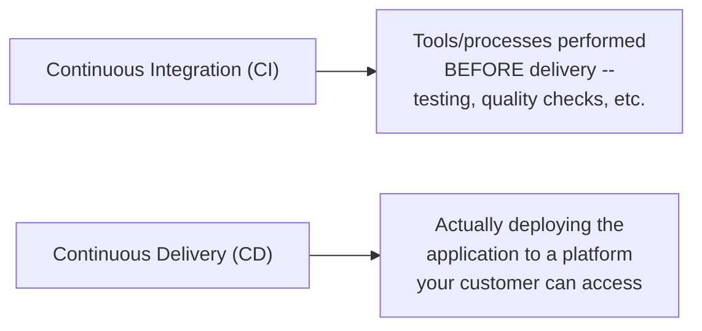

#### 🧠 Concept — The Real-World Scenario

> 💡 **Memory Trick, the full, relatable scenario given directly:** *"You're an application developer, you've built your application on your personal laptop, and your customer is sitting in the USA, Europe, or somewhere else in the world, while you're sitting elsewhere entirely. How does your application get delivered from your laptop to that customer? Every organization goes through this -- whether a startup, an MNC, or a mid-size company -- everyone has customers across the globe, and the application has to be delivered promptly, efficiently, and reliably."*

#### 🎯 Key Takeaways

* **CI/CD** consists of two genuinely distinct phases: **continuous integration** (the pre-delivery process of testing, verifying, and validating) and **continuous delivery** (the actual deployment to a customer-accessible platform).
* The real-world motivating scenario -- a developer's laptop, a customer on the other side of the world -- grounds this otherwise abstract definition in a genuinely universal, relatable problem every organization, regardless of size, actually faces.
* The specific steps a given application/organization follows can genuinely **vary** -- a mobile application, a highly secure government project, or a simple web app might each require a different number/type of steps, though a general, common structure exists across most organizations.

---
### 3. The Standard CI/CD Steps, One by One

#### ❓ Why It Exists — Manual Execution Genuinely Doesn't Scale

> ⚠️ **The precise, real-world timing problem, stated directly:** *"If you have to do all of these things manually -- unit test every time, functionally test or regression test every time, even for a single code commit -- by the time your application reaches the customer, it would take MONTHS. But these days, you're talking about delivering an application in weeks, or even days. To achieve that, all of these steps have to be automated."*

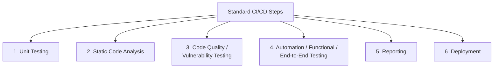

#### 📖 Definition — Unit Testing

> 💡 **Memory Trick, given directly:** *"Say you're writing a calculator's addition functionality -- `a + b = c` in Python. In your test, you'd pass 2 and 3, and verify the output is 5. That's unit testing -- testing your code in that SPECIFIC block, that specific functionality. This process can't be manual, since developers make changes hundreds of times, and you can't manually re-run this every single time before delivering to the customer or promoting between stages."*

#### 📖 Definition — Static Code Analysis

> 💡 **Memory Trick, given directly:** *"Same calculator example -- say I declared 20 variables but only use two. There's a lot of unnecessary memory allocation happening -- you're wasting memory. Static code analysis verifies you're syntactically correct, well-formatted (indentation matters in some languages), and haven't declared unnecessary variables. Sometimes your code reviewer or peer reviewer won't catch all of this."*

#### 📖 Definition — Code Quality / Vulnerability Testing

> 💡 **Memory Trick, given directly, via a genuinely relatable analogy:** *"Say you upgraded your Android version yesterday, and today you learn there's a security vulnerability -- a hacker could attack your mobile. That's a very bad user experience. Before delivering to customers, or promoting between environments, you perform code quality testing specifically to catch this kind of issue."*

#### 📖 Definition — Automation / Functional / End-to-End Testing

> 💡 **Memory Trick, the precise distinction from unit testing given directly:** *"Unit testing verified the SPECIFIC function -- 2+3=5. Functional testing verifies that the CHANGE you made doesn't impact OTHER functionality -- does your addition change accidentally break subtraction, multiplication, or division? You verify your application in an END-TO-END manner, not just the specific function you changed."*

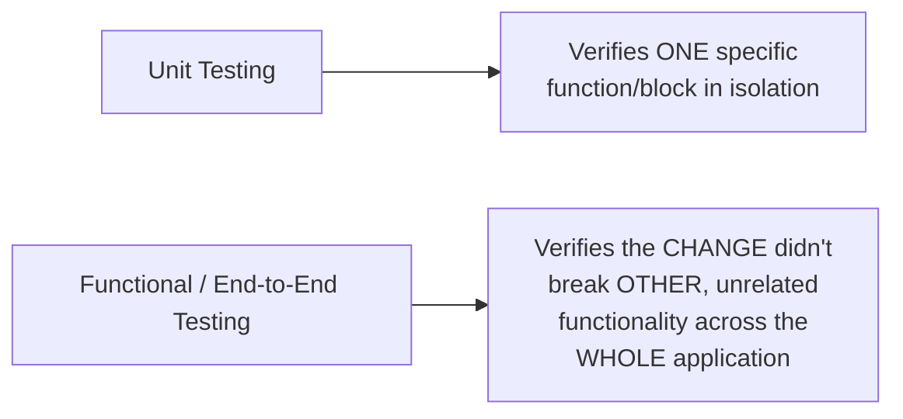

#### 📖 Definition — Reporting

> 💡 **Memory Trick, given directly:** *"These reports are essential -- tomorrow, if somebody asks 'what's your unit test coverage,' or 'how many unit tests/end-to-end tests passed,' or 'is your code quality fine or not,' you need to have reports stored somewhere. Every organization does this."*

#### ⚠ Common Mistakes

* Assuming unit testing and functional/end-to-end testing verify the same thing, just at different scales -- explicitly, directly distinguished: unit testing checks a SPECIFIC function in isolation; functional testing checks that a change hasn't broken OTHER, seemingly-unrelated parts of the application.

#### 🎯 Key Takeaways

* Five (plus deployment) standard steps make up a typical CI/CD pipeline: **unit testing, static code analysis, code quality/vulnerability testing, automation/functional testing, and reporting** -- each addressing a genuinely distinct verification concern, illustrated with a concrete, memorable example.
* **Manual execution of these steps genuinely doesn't scale** -- the precise motivating reason automation (CI/CD) exists at all, not merely a convenience.
* These steps, and their exact number/order, can **genuinely vary** by organization and application type -- this is a common, standard structure, not a rigid, universal law.

---

### 4. The Trigger Point: Version Control Systems

#### 🧠 Concept — Incremental Versions, Accumulated in Git

> 💡 **Memory Trick, given directly, extending the calculator example:** *"You don't write your entire feature in one step -- you break it into chunks. You create Jira stories for each functionality, and keep submitting them to your Git repository. Say I write version 1 of my addition functionality today, version 2 tomorrow, version 3 the day after -- eventually, maybe by version 15, I'm satisfied, and THAT version has to go to the customer."*

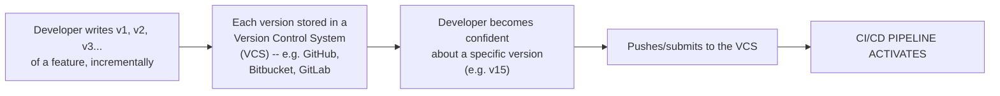

#### ❓ Why It Exists — The Precise Trigger Mechanism

> 💡 **Memory Trick, the precise, direct statement of the trigger point:** *"Your CI/CD gets executed when you push your changes to one of these tools. Once the developer is confident about their local changes and submits them to a Version Control System, THEN the CI/CD pipeline actually takes place -- instead of manually executing all of these steps."*

#### 🎯 Key Takeaways

* A **Version Control System (VCS)** -- GitHub, Bitbucket, GitLab, or similar -- is where a developer's incremental versions accumulate, directly building on Day 9's own version-control fundamentals.
* The **precise trigger point** for a CI/CD pipeline is a push or pull request to the VCS -- not simply "writing code," but the deliberate act of submitting a version the developer is genuinely confident about.
* This directly, precisely sets up the next section: HOW a tool like Jenkins actually watches for and reacts to this specific trigger.

---
### 5. Jenkins as Orchestrator: Pipelines & Multi-Stage Environment Promotion

#### 📖 Definition — Jenkins as Orchestrator

> 💡 **Memory Trick, given directly:** *"We deploy Jenkins in our organization and tell it: always watch this GitHub repository, and whenever there's a pull request or new commit on a specific branch/repo, notify me and run a set of actions. Jenkins acts as an ORCHESTRATOR, or a pipe/tunnel -- it automates and orchestrates a lot of OTHER tools within it."*

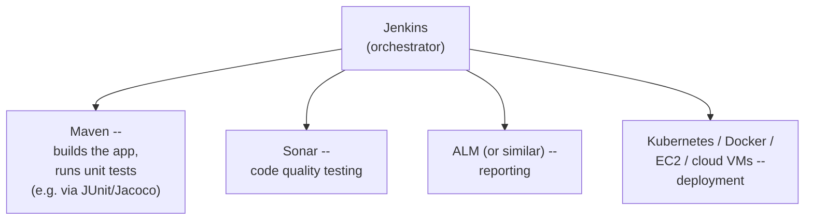

> 💡 **Memory Trick, given directly:** *"For a Java application, you can integrate Maven, which builds your application and runs your unit tests. Jenkins can also integrate Sonar for code quality testing, and ALM (or another reporting tool) for reports. A DevOps engineer installs and configures all of these tools WITHIN Jenkins, so they run automatically whenever code is committed."*

#### 🔍 Internal Working — Why Jenkins Pipelines Matter for Your Career

> 💡 **Memory Trick, given directly:** *"Whenever you're looking at a job description or DevOps openings, I'm pretty sure you've heard the word 'pipelines,' or at least seen the term 'CI/CD.' Why is it so important? Because of everything we just discussed -- without CI/CD, your application would be delivered to customers months after development. The CI/CD process is what ensures delivery happens within minutes or hours instead."*

#### 📖 Definition — Multi-Stage Environment Promotion

> 💡 **Memory Trick, the full, precise explanation given directly:** *"Organizations divide their environments into multiple stages. PRODUCTION is the exact environment your customer is using -- lots of servers, replicating the real, full-scale setup. STAGING has less CPU/RAM -- you deploy there before every production deployment. DEV is like '-1' relative to staging -- an even simpler environment."*

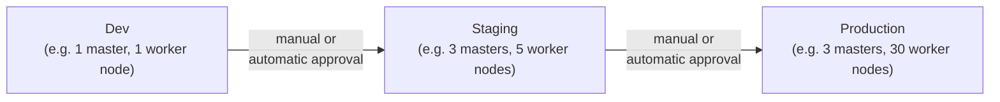

#### ❓ Why It Exists — The Precise, Cost-Driven Reasoning

> 💡 **Memory Trick, the precise reasoning given directly:** *"Why deploy initially to Dev? Your QA engineers, or your automation, might first want to execute on a simple environment -- a basic EC2 instance. Once things look good (via manual or automatic approval), Jenkins promotes the application to staging -- maybe an auto-scaled pair of instances, or a small Kubernetes cluster. Why can't staging just BE production-scale? Because that's a very costly setup -- your customer might justify a rich, robust setup, but your local QA/testing team doesn't need (and shouldn't cost) that much every single time they test."*

#### ⚠ Common Mistakes

* Assuming every environment (Dev, Staging, Production) should be identically resourced for consistency -- explicitly, directly corrected: the deliberate, INCREASING resource allocation across stages is a genuine, cost-driven design choice, not an oversight.

#### 🎯 Key Takeaways

* **Jenkins** functions as an **orchestrator** -- it doesn't perform testing/building/deployment itself, but integrates and triggers OTHER specialized tools (Maven, Sonar, ALM, Kubernetes/Docker/EC2) to do so.
* **Multi-stage environment promotion** (Dev → Staging → Production) exists specifically because replicating production-scale infrastructure at every stage would be genuinely, unnecessarily costly -- each stage is deliberately, progressively more resource-rich.
* Promotion between stages can be **manual or automatic**, based on approval -- a real, configurable governance point within the pipeline.

---

### 6. Why Jenkins Is Called "Legacy": The Scaling Problem

#### ⚠ A Direct, Explicit Clarification — Not a Dismissal

> ⚠️ **Directly, explicitly clarified before making this claim:** *"I don't mean to say Jenkins isn't used these days, or that I want to defame Jenkins. Jenkins has been around since people started with Hudson -- everybody who's been a developer or DevOps engineer for seven or eight years likely started there, dealing with on-premises infrastructure first, then moving to cloud."*

#### ❓ Why It Exists — The Precise, Architectural Limitation

> 💡 **Memory Trick, the precise scaling mechanics given directly:** *"Jenkins is basically a binary -- you install it on one host (your laptop or an EC2 instance), then keep adding machines to it, since one Jenkins node can't handle all the load from hundreds of developers. You might deploy a Jenkins master on one EC2 instance, then connect multiple instances to it -- team one runs on node one, team two on node two, and so on."*

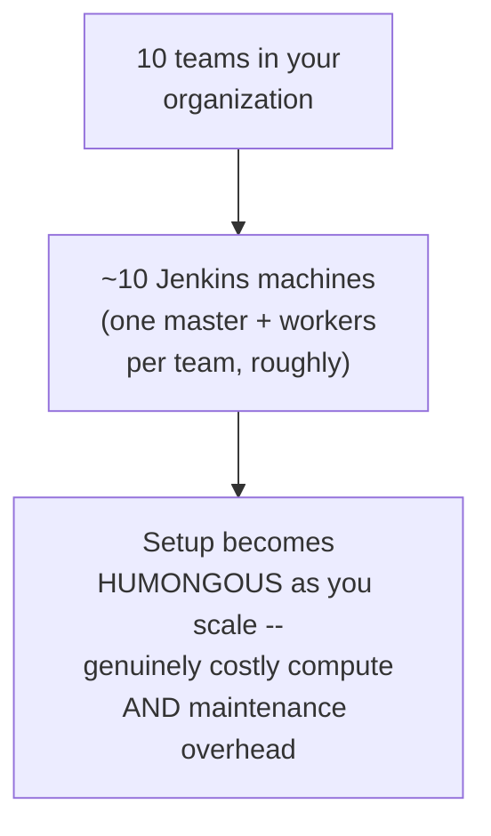

#### 🔍 Internal Working — Why Auto-Scaling Groups Don't Actually Solve This

> ⚠️ **The precise, directly-stated architectural limitation:** *"You might ask: can't I just integrate Jenkins with auto-scaling groups, and scale up/down automatically? Yes -- but we're talking about REAL scaling to ZERO. I don't even want my Jenkins MASTER NODE to exist when there's no activity -- say, on weekends, or odd hours with zero code changes. In a genuine microservices scenario (20-30 Jenkins master nodes, plus 3-4 worker nodes each), if not configured carefully, you have HUNDREDS of virtual machines created but genuinely NOT USED. My actual requirement is ZERO servers when there's zero activity -- and Jenkins is NOT the tool for that."*

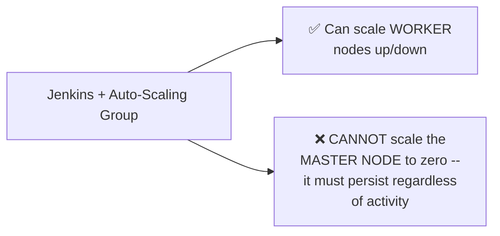

#### ⚠ Common Mistakes

* Assuming auto-scaling groups fully solve Jenkins' resource-waste problem -- explicitly, directly corrected: auto-scaling can manage WORKER nodes, but the Jenkins MASTER itself cannot scale to zero, an architectural (not merely configuration) limitation.

#### 🎯 Key Takeaways

* Jenkins is explicitly, carefully described as "legacy" with a **direct, deliberate clarification** that this isn't a dismissal -- it remains a genuinely capable, widely-used tool, with a specific, real architectural limitation at extreme microservices scale.
* The core, precise limitation: even with auto-scaling groups, Jenkins **cannot scale its master node to zero** -- it must persist regardless of actual activity, creating genuine, ongoing compute waste at scale.
* This limitation is explicitly, precisely quantified via a realistic microservices scenario (20-30 master nodes, hundreds of underlying VMs) -- a real, felt cost problem, not an abstract concern.

---
### 7. The Modern Solution, Proven Live: Kubernetes' Real GitHub Actions Setup

#### 💻 Live Demonstration — The Real, Public Kubernetes Repository

> 💡 **Memory Trick, given directly, live:** *"Let's take a look at one very popular open-source application -- Kubernetes -- and see how it manages this, since it has thousands of developers across the globe, communicating via GitHub. Kubernetes has 3,347 contributors. At the point I logged in, there were 761 pull requests -- and even now, still 761. The last pull request was FOUR HOURS ago. So for the past four hours, there's been NO code change, no new pull request."*

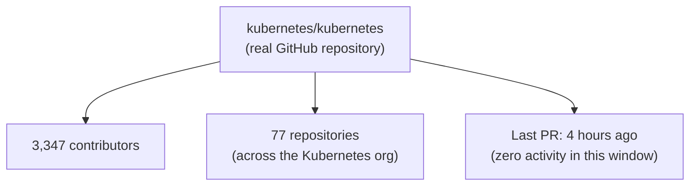

#### ❓ Why It Exists — The Precise, Testable Prediction

> ⚠️ **A direct, precise, falsifiable claim, stated before verification:** *"The expectation, the IDEAL scenario, should be: for these past four hours, there should be ZERO compute instances the Kubernetes project is wasting. If not, you're losing a lot of money for your organization."*

#### 🔍 Internal Working — GitHub Actions' Pod-Per-Commit Model

> 💡 **Memory Trick, given directly:** *"Kubernetes has configured this using GitHub Actions -- another way of doing CI/CD, just like Jenkins. Whenever a code change is made, it spins up a Kubernetes pod (or Docker container) for you, and everything executes on that container. If you're not using it, the worker running these containers gets used by OTHER projects -- a genuinely shared-resource model."*

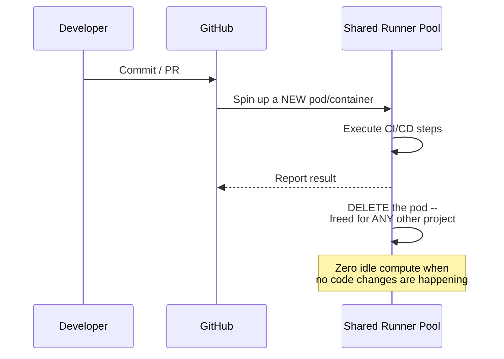

#### 🏢 Real-World / Production Usage — Two Genuine Sub-Options

> 💡 **Memory Trick, given directly:** *"If you use Microsoft's own GitHub-hosted runners (worker nodes from Microsoft/Azure), it creates containers/pods for you on their servers -- you don't even know where. If it's public/open-source, it's free. If you don't want to use Microsoft's runners -- say your code needs to stay more controlled -- you can host ONE common server or Kubernetes cluster yourself (on Azure, AWS, anywhere), shared across all 77 Kubernetes repositories. Whenever a developer commits on ANY of those repos, a pod gets created on YOUR cluster, executes, then gets deleted -- freeing that resource for the next project."*

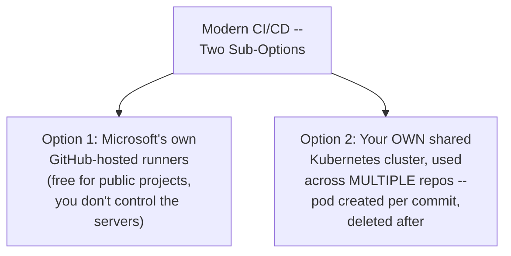

#### ⚠ Common Mistakes

* Assuming zero-idle-compute CI/CD is only achievable via Microsoft's own hosted infrastructure -- explicitly, directly corrected: a self-hosted, shared cluster achieves the exact same genuine resource efficiency, for organizations with security or control requirements.

#### 🎯 Key Takeaways

* Kubernetes' real, public GitHub repository is used as **live, genuine proof** -- not a hypothetical example -- that a real, massive project achieves genuine, zero-idle-compute CI/CD during periods of no activity.
* **GitHub Actions' pod-per-commit model** (create on trigger, execute, delete after) is the specific, precise mechanism enabling this -- directly, architecturally distinct from Jenkins' persistent-master-node limitation (Section 6).
* This resource-sharing model works across **multiple repositories simultaneously** (all 77 in the Kubernetes organization) -- a genuinely efficient, shared-infrastructure pattern, whether using Microsoft's own runners or a self-hosted, shared cluster.
* **Scalability** is also explicitly, directly favored: adding capacity to a Kubernetes cluster (a new node) is described as genuinely easier than manually attaching a new Jenkins worker node -- especially on a managed offering like EKS.

---

### 8. Alternatives & a Personal Preference: GitHub Actions vs. Jenkins

#### 📖 Definition — The Broader CI/CD Landscape

> 💡 **Memory Trick, given directly:** *"Most people, when starting with CI/CD for the first time, begin with Jenkins -- but you should also understand there are very good alternatives: GitHub Actions, GitLab CI/CD, Travis CI, Circle CI. These are all viable, emerging CI/CD solutions. Even without deep, hands-on experience with all of them, you should understand they exist -- eventually, everyone might move toward one of them."*

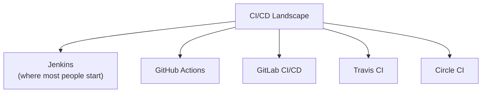

#### ❓ Why It Exists — A Directly-Stated Personal Preference, With Reasoning

> 💡 **Memory Trick, the instructor's own stated preference and precise reasoning given directly:** *"If you ask me, I personally like GitHub Actions over Jenkins. One key reason: GitHub Actions is EVENT-DRIVEN BY DEFAULT. Jenkins CAN also be event-driven, but only if you configure webhooks yourself -- without that configuration, Jenkins is NOT event-driven by default. GitHub Actions also lets you integrate pipelines across projects more easily. I'll do a full, dedicated comparison video on this in the future."*

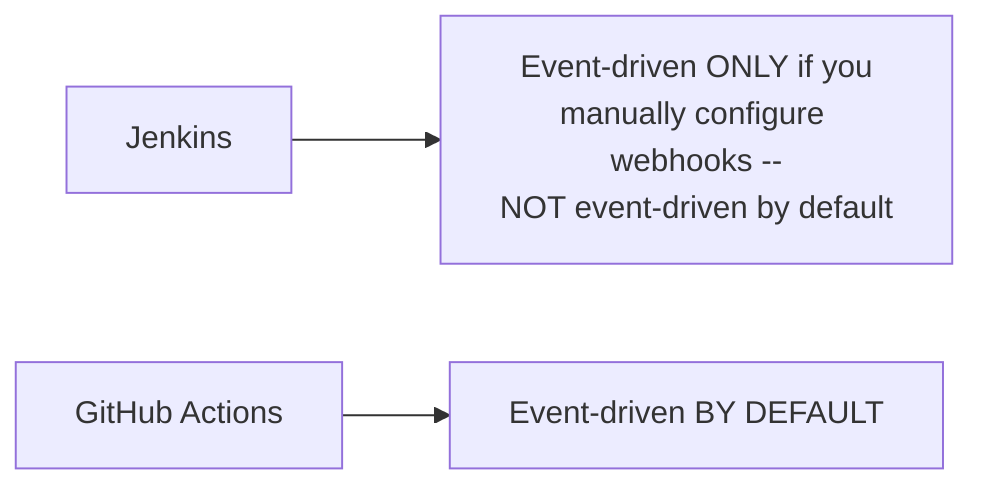

#### 🔍 Internal Working — A Direct Note on GitLab CI/CD

> 💡 **Memory Trick, given directly:** *"People are also asking about GitLab pipelines/CI/CD -- we can't cover all of them, but if you know GitHub Actions, GitLab CI/CD is very similar. If you look it up (even on Stack Overflow), you'll find them nearly identical -- the only real difference is syntactical."*

#### ⚠ Common Mistakes

* Assuming this stated preference for GitHub Actions is presented as an absolute, universal verdict -- explicitly, directly qualified as a PERSONAL preference, with a full, dedicated comparison video explicitly promised for later, rather than a final, conclusive ruling delivered here.

#### 🎯 Key Takeaways

* Beyond Jenkins and GitHub Actions, **GitLab CI/CD, Travis CI, and Circle CI** are explicitly named as genuine, viable alternatives worth being aware of.
* The instructor's own **stated, reasoned preference** for GitHub Actions over Jenkins centers specifically on its **default event-driven architecture** -- Jenkins requires manual webhook configuration to achieve the same behavior.
* **GitLab CI/CD** is explicitly, directly described as syntactically similar to GitHub Actions -- a genuinely low-friction transfer of knowledge between the two, if already comfortable with one.
* Hands-on practice with **both Jenkins and GitHub Actions** is explicitly previewed for the following two sessions -- this session's role is establishing the conceptual "why," not yet the practical "how."

---
## 📝 Glossary

| Term | Definition | Why It Matters |
|---|---|---|
| **Continuous Integration (CI)** | The pre-delivery process of testing, verifying, and validating code changes | The first of CI/CD's two phases |
| **Continuous Delivery (CD)** | The process of actually deploying an application to a customer-accessible platform | The second of CI/CD's two phases |
| **Unit Testing** | Testing a specific function/block of code in isolation (e.g. 2+3=5) | Verifies the SPECIFIC change works correctly |
| **Static Code Analysis** | Verifying syntax, formatting, and absence of unnecessary resource usage | Catches issues even peer review might miss |
| **Code Quality / Vulnerability Testing** | Checking for security vulnerabilities and code-quality issues | Prevents a bad, or dangerous, customer experience |
| **Functional / End-to-End Testing** | Verifying a change hasn't broken OTHER, unrelated functionality | Distinct from unit testing -- checks the whole application |
| **Reporting** | Storing test-coverage and pass/fail records | Provides essential accountability and visibility |
| **Version Control System (VCS)** | Where incremental code versions accumulate (GitHub, Bitbucket, GitLab) | The specific trigger point for CI/CD pipeline activation |
| **Jenkins** | A CI/CD "orchestrator" tool integrating other tools (Maven, Sonar, etc.) | Described as "legacy" due to its master-node scaling limitation |
| **Multi-Stage Environment Promotion** | Progressing an application through Dev, Staging, and Production | Each stage is deliberately, progressively more resource-rich |
| **GitHub Actions** | A modern, event-driven CI/CD solution using pod-per-commit execution | Achieves genuine, zero-idle-compute CI/CD at scale |

---

## 🔄 Revision Notes — One-Minute Revision

* CI/CD is explicitly the **single most-requested topic** across this entire course, deliberately positioned at Day 18 to build on prior Git/GitHub and AWS knowledge.
* **CI/CD = Continuous Integration** (pre-delivery testing/verification) **+ Continuous Delivery** (actual deployment) -- grounded in a real scenario: a developer's laptop, a customer across the world.
* Manual execution of CI/CD steps genuinely **doesn't scale** -- automation is what makes days/weeks-scale delivery possible instead of months.
* Five standard steps, each precisely illustrated: **unit testing** (2+3=5), **static code analysis** (unused-variable memory waste), **code quality/vulnerability testing** (an Android security-update analogy), **functional/end-to-end testing** (verifying OTHER functionality wasn't broken), and **reporting** (test-coverage/pass-fail records).
* The **Version Control System (VCS)** is the specific trigger point -- a CI/CD pipeline activates upon a push/pull request, not simply "writing code."
* **Jenkins** functions as an **orchestrator**, integrating Maven (build/unit test), Sonar (code quality), ALM (reporting), and deployment targets (Kubernetes/Docker/EC2) -- with **multi-stage environment promotion** (Dev → Staging → Production) deliberately, progressively more resource-rich to control cost.
* Jenkins is explicitly, carefully called **"legacy"** -- NOT a dismissal, but a precise architectural limitation: even with auto-scaling groups, its **master node cannot scale to zero**, causing genuine, ongoing compute waste at true microservices scale.
* The **modern alternative was live-proven** on the real, public `kubernetes/kubernetes` repository (3,347 contributors, 77 repos, zero PR activity for 4 hours) -- **GitHub Actions' pod-per-commit model** creates compute only on trigger and deletes it after, achieving genuine, verifiable zero-idle-compute CI/CD, whether via Microsoft's own hosted runners or a self-hosted, shared cluster.
* Beyond Jenkins and GitHub Actions, **GitLab CI/CD, Travis CI, and Circle CI** are named as genuine alternatives; the instructor's own **stated, reasoned preference** for GitHub Actions centers on its **default event-driven architecture** (vs. Jenkins requiring manual webhook configuration) -- with a full, dedicated comparison video explicitly promised for later.
* Hands-on **Jenkins and GitHub Actions projects** are explicitly previewed for the following two sessions.

---

## 📋 Cheat Sheet

**CI/CD, in one line:**
```text
Continuous Integration (test/verify BEFORE delivery) + Continuous Delivery (deploy TO the customer)
```

**The five standard steps:**
```text
1. Unit Testing              -> tests ONE specific function (2+3=5)
2. Static Code Analysis        -> syntax, formatting, unused resources
3. Code Quality / Vulnerability  -> security checks (Android update analogy)
4. Functional / End-to-End Testing -> did this change break OTHER things?
5. Reporting                         -> test-coverage / pass-fail records
   (+ Deployment -- the final, CD step)
```

**The trigger point:**
```text
Developer confident about a version -> push/PR to VCS -> CI/CD pipeline activates
```

**Jenkins as orchestrator:**
```text
Jenkins -> integrates: Maven (build+unit test) + Sonar (quality) + ALM (reports)
                      + Kubernetes/Docker/EC2 (deployment)
```

**Multi-stage promotion:**
```text
Dev (smallest) -> Staging (mid-size) -> Production (full-scale)
   (each stage deliberately, progressively more resource-rich & costly)
```

**Why Jenkins = "legacy":**
```text
Auto-scaling groups CAN scale WORKER nodes to zero.
Auto-scaling groups CANNOT scale the Jenkins MASTER NODE to zero.
-> genuine, ongoing compute waste at true microservices scale
```

**The modern alternative (GitHub Actions):**
```text
Commit/PR -> spin up a pod/container -> execute -> DELETE it
-> ZERO idle compute when there's no activity (live-proven on Kubernetes' real repo)
```

**CI/CD landscape:**
```text
Jenkins | GitHub Actions | GitLab CI/CD | Travis CI | Circle CI
(personal preference stated: GitHub Actions, for its default event-driven architecture)
```

---

## 🔥 Interview Questions & Answers

### 🟢 Beginner

**Q1.**

**Question:** What do CI and CD stand for, and what does each one do?

**Answer:** Continuous Integration (pre-delivery testing/verification) and Continuous Delivery (actually deploying to the customer).

**Explanation:** The session's own precise, textbook definition.

**Why Interviewers Ask This:** A foundational, near-universal DevOps question.

**Possible Follow-up:** "Give a real-world example illustrating why this process is needed."

**Q2.**

**Question:** What is the difference between unit testing and functional/end-to-end testing?

**Answer:** Unit testing verifies one specific function in isolation; functional testing verifies that a change hasn't broken OTHER, unrelated parts of the whole application.

**Explanation:** Directly, precisely distinguished via a concrete example.

**Why Interviewers Ask This:** A genuinely common, important testing-terminology distinction.

**Possible Follow-up:** "Using the addition-functionality example, what would functional testing specifically check?"

**Q3.**

**Question:** What is the specific trigger point that activates a CI/CD pipeline?

**Answer:** A push or pull request to a Version Control System (VCS) like GitHub, Bitbucket, or GitLab.

**Explanation:** Directly, precisely stated.

**Why Interviewers Ask This:** Basic, foundational CI/CD mechanics knowledge.

**Possible Follow-up:** "Name three example Version Control System tools."

**Q4.**

**Question:** What role does Jenkins play in a CI/CD pipeline?

**Answer:** An orchestrator -- it integrates and triggers other, specialized tools (like Maven, Sonar, ALM) rather than performing testing/building itself.

**Explanation:** Directly, precisely explained.

**Why Interviewers Ask This:** Tests understanding of Jenkins' actual architectural role.

**Possible Follow-up:** "Name a tool Jenkins might integrate specifically for code quality testing."

**Q5.**

**Question:** Why do organizations use multiple environments (Dev, Staging, Production) instead of just one?

**Answer:** Replicating production-scale infrastructure at every stage would be genuinely, unnecessarily costly -- each stage is deliberately, progressively more resource-rich.

**Explanation:** Directly, precisely explained.

**Why Interviewers Ask This:** A common, practical DevOps environment-management question.

**Possible Follow-up:** "Which environment is typically the smallest/simplest, and which is the largest?"

**Q6.**

**Question:** Why is Jenkins sometimes described as a "legacy" CI/CD tool?

**Answer:** Because even with auto-scaling groups, its master node cannot scale to zero idle compute -- it must persist regardless of actual activity, unlike modern, pod-per-commit alternatives.

**Explanation:** Directly, explicitly explained, with an equally direct clarification that this isn't a dismissal.

**Why Interviewers Ask This:** Tests genuine understanding of a real architectural limitation, not just a label.

**Possible Follow-up:** "Can auto-scaling groups fully solve this problem? Why or why not?"

**Q7.**

**Question:** How does GitHub Actions achieve genuine, zero-idle-compute CI/CD?

**Answer:** It spins up a pod/container specifically upon a commit/PR trigger, executes the pipeline, then deletes it afterward -- no persistent infrastructure exists when there's no activity.

**Explanation:** Directly, precisely explained and live-proven on a real repository.

**Why Interviewers Ask This:** Tests understanding of the modern, architectural alternative to Jenkins' limitation.

**Possible Follow-up:** "What real, public project was used as live proof of this in this session?"

**Q8.**

**Question:** Name three CI/CD tools beyond Jenkins and GitHub Actions.

**Answer:** GitLab CI/CD, Travis CI, Circle CI.

**Explanation:** Directly, explicitly named.

**Why Interviewers Ask This:** Tests awareness of the broader CI/CD tooling landscape.

**Possible Follow-up:** "How does GitLab CI/CD's syntax compare to GitHub Actions'?"

**Q9.**

**Question:** What specific reason does the instructor give for personally preferring GitHub Actions over Jenkins?

**Answer:** GitHub Actions is event-driven by default; Jenkins requires manual webhook configuration to achieve the same behavior.

**Explanation:** Directly, precisely stated.

**Why Interviewers Ask This:** Tests recall of a specific, reasoned tool-preference argument, not just a general opinion.

**Possible Follow-up:** "Is Jenkins CAPABLE of being event-driven at all? Under what condition?"

**Q10.**

**Question:** What is static code analysis, and give an example of what it might catch.

**Answer:** Verifying syntax correctness, formatting, and absence of unnecessary resource usage -- e.g., catching 20 declared variables when only 2 are actually used.

**Explanation:** Directly, precisely explained via a concrete example.

**Why Interviewers Ask This:** Basic, practical CI/CD step knowledge.

**Possible Follow-up:** "Why might a peer/code reviewer miss this kind of issue?"

---

### 🟡 Intermediate

**Q11.**

**Question:** Explain why the instructor explicitly, directly clarifies that calling Jenkins "legacy" isn't meant to dismiss or defame it, rather than simply stating the limitation and moving on.

**Answer:** Jenkins remains a genuinely, widely-used, capable tool -- many organizations and even many learners following this exact course likely use it in real, current production environments. An unqualified "Jenkins is legacy" framing risks being read as a blanket dismissal, potentially undermining confidence in genuinely valid, ongoing Jenkins usage or discouraging learners from studying it. The explicit clarification preserves genuine, balanced accuracy: Jenkins has a REAL, specific architectural limitation at EXTREME microservices scale, while remaining an entirely legitimate, capable choice for many organizations that haven't reached that specific scale or requirement -- directly consistent with this course's broader, repeated pattern of balanced, non-absolute tool evaluation (e.g., Day 14's honest Ansible disadvantages, Day 20's honest GitHub Actions ecosystem limitations).

**Explanation:** Requires recognizing a deliberate, balanced qualification and connecting it to the course's broader pattern of avoiding absolute, one-sided tool judgments.

**Why Interviewers Ask This:** Tests whether a learner distinguishes "has a specific, real limitation" from "should never be used," a genuinely important practical distinction.

**Possible Follow-up:** "For what SPECIFIC organizational scale or scenario would Jenkins' limitation genuinely NOT matter much in practice?"

**Q12.**

**Question:** A learner argues that since Jenkins "can" be made event-driven via webhooks, there's no genuine functional difference between Jenkins and GitHub Actions in this respect -- only a configuration-effort difference. Evaluate this claim.

**Answer:** This claim is largely correct on the FUNCTIONAL end-state (both CAN achieve event-driven behavior), but understates a genuinely meaningful practical difference: DEFAULT behavior matters significantly for real-world adoption and correctness. A tool that is event-driven by DEFAULT (GitHub Actions) reduces the chance of a team FORGETTING or misconfiguring this behavior -- whereas Jenkins' non-default event-driven behavior means a team must REMEMBER to explicitly configure webhooks correctly, introducing genuine, real risk of oversight or misconfiguration that a default-event-driven tool doesn't share. "Just a configuration-effort difference" understates this: default behavior genuinely shapes real-world reliability and correctness outcomes, not merely initial setup convenience.

**Explanation:** Tests whether a learner recognizes that "default vs. must-configure" is a genuinely meaningful practical distinction, not merely a minor convenience difference.

**Why Interviewers Ask This:** Distinguishes candidates who understand the real-world reliability implications of sensible defaults from those who see them as purely cosmetic.

**Possible Follow-up:** "Describe a realistic scenario where a team's failure to correctly configure Jenkins webhooks could cause a genuine, practical problem."

**Q13.**

**Question:** Explain, precisely, why the instructor chooses to verify the "zero idle compute" claim LIVE on Kubernetes' real repository, rather than simply asserting it as a known fact about GitHub Actions' architecture.

**Answer:** Live verification transforms an ABSTRACT ARCHITECTURAL CLAIM into a CONCRETE, OBSERVED, FALSIFIABLE fact -- the instructor explicitly states a precise, testable prediction BEFORE checking ("the expectation should be zero compute instances for these past four hours") and then genuinely verifies it against real, live data (761 PRs, unchanged; last PR four hours ago). This is significantly more convincing and memorable than simply stating "GitHub Actions achieves zero idle compute" as an assertion to be trusted -- it directly demonstrates the SAME "prove it live" pedagogical pattern established consistently across this entire course (Days 5, 7, 8, 11, 12, 15), reinforcing genuine, evidence-based understanding rather than requiring blind trust in a stated architectural claim.

**Explanation:** Requires connecting this specific live-verification choice to the course's broader, consistent "prove it live" pedagogical pattern.

**Why Interviewers Ask This:** Tests recognition of deliberate, evidence-based teaching technique as distinct from simple assertion.

**Possible Follow-up:** "What SPECIFIC, falsifiable prediction did the instructor state before checking Kubernetes' actual GitHub activity?"

**Q14.**

**Question:** Using this session's multi-stage environment promotion reasoning (Section 5), explain why a genuinely security-sensitive organization (e.g., a bank) might deviate from the standard Dev-is-smallest, Production-is-largest resource pattern.

**Answer:** The session's own stated reasoning for scaling environments (Section 5) is primarily COST-driven -- avoiding unnecessary expense by not replicating full production scale for routine, everyday testing. A genuinely security-sensitive organization might layer an ADDITIONAL consideration on top of this cost logic: even a Dev-scale environment handling sensitive data or logic might warrant SECURITY-driven infrastructure choices (e.g., network isolation, restricted access) that aren't purely about COMPUTE SIZE at all -- meaning "smaller" doesn't have to mean "less secure," even though this session's own example focuses primarily on the cost/scale dimension specifically. This directly parallels the self-hosted-runner reasoning from a separate, related session (CI/CD Week's self-hosted-runners video), where security concerns were explicitly identified as a genuinely SEPARATE consideration from cost/resource sizing alone.

**Explanation:** Requires extending the session's own stated (cost-focused) reasoning with an additional, genuinely distinct consideration (security) not explicitly covered in this specific session, while correctly connecting it to a related session's own parallel reasoning.

**Why Interviewers Ask This:** Tests whether a learner can identify a genuine gap/extension in a session's stated reasoning and reasonably fill it using logic established elsewhere.

**Possible Follow-up:** "Would this security consideration argue for MORE or FEWER distinct environment stages, compared to the session's own standard Dev-Staging-Production model?"

**Q15.**

**Question:** Synthesize this session's "Jenkins as legacy, due to the master-node scaling limitation" reasoning (Section 6) with the CI/CD Week self-hosted-runners session's own reasoning to explain whether GitHub Actions' self-hosted runners (rather than GitHub-hosted ones) reintroduce this same master-node-style scaling limitation.

**Answer:** A genuinely important, non-obvious connection: if an organization chooses a SELF-HOSTED GitHub Actions runner (per the CI/CD Week session, for private-repo, resource, or security reasons) using a PERSISTENT, always-on EC2 instance (as demonstrated in that session's own basic setup), this could potentially reintroduce a VERSION of this session's exact Jenkins-master-node limitation -- a persistent piece of infrastructure that must exist regardless of actual activity, undermining the genuine "zero idle compute" advantage this session attributes to GitHub Actions generally. However, this ISN'T an inherent, unavoidable limitation of self-hosted runners specifically -- the more advanced, EPHEMERAL, auto-scaling self-hosted runner pattern (referenced in that same session's own advanced hardening discussion) can genuinely recapture the "zero idle compute when inactive" property this session's Kubernetes example demonstrates, by provisioning runner infrastructure fresh per-job rather than maintaining it persistently. This means the "zero idle compute" advantage this session attributes broadly to "GitHub Actions" more precisely depends on the SPECIFIC RUNNER ARCHITECTURE chosen (GitHub-hosted, or ephemeral self-hosted) rather than being an unconditional property of GitHub Actions as a platform in the abstract.

**Explanation:** Requires connecting this session's core architectural claim to a genuinely separate, related session's own more detailed runner-configuration reasoning, identifying a real, non-obvious nuance neither session states directly on its own.

**Why Interviewers Ask This:** A senior-level, cross-session synthesis question testing whether a candidate recognizes that a general architectural claim ("GitHub Actions achieves zero idle compute") has genuine, important conditions/caveats revealed by combining it with more detailed knowledge from a related session.

**Possible Follow-up:** "Design a self-hosted GitHub Actions runner configuration that would genuinely preserve the 'zero idle compute' property this session attributes to Kubernetes' real setup."

---

### 🔴 Advanced

**Q16.**

**Question:** Design a detailed technical case (not just a summary) for migrating a hypothetical, genuinely large-scale microservices organization (comparable to the "20-30 Jenkins masternode" scenario this session describes) from Jenkins to a GitHub-Actions-style architecture, addressing at least three specific, concrete migration challenges this session's own content doesn't directly resolve.

**Answer:** A reasonable case, directly extending this session's own reasoning with genuinely necessary additional detail: (1) **Existing pipeline logic migration** -- this session doesn't address HOW existing, working Jenkins pipeline logic (potentially years of accumulated, organization-specific automation) would actually be TRANSLATED into GitHub Actions' workflow syntax; a genuine migration plan would need to inventory existing Jenkins pipelines, prioritize migration by criticality/complexity, and likely run BOTH systems in parallel during a genuine transition period rather than a single, immediate cutover. (2) **Plugin/integration parity gap** -- directly connecting to the separate GitHub Actions sessions' own honest acknowledgment of GitHub Actions' comparatively immature plugin ecosystem versus Jenkins' mature one, a genuine migration case must identify which SPECIFIC Jenkins plugins/integrations the organization currently depends on, and verify genuinely equivalent GitHub Actions support exists (or can be custom-built) before committing to migration -- not simply assuming feature parity. (3) **Self-hosted runner architecture for private, large-scale infrastructure** -- per Advanced Q15's reasoning, a genuinely large, PRIVATE organization (unlike Kubernetes' public, Microsoft-runner-eligible example) would need to design and implement its OWN ephemeral, auto-scaling self-hosted runner infrastructure to genuinely preserve the "zero idle compute" property this session demonstrates -- a real, additional engineering investment this session's own public-project example doesn't require, since Kubernetes leverages free, Microsoft-hosted runners. This case demonstrates that while this session's ARCHITECTURAL case for moving beyond Jenkins is genuinely sound, a REAL, large-scale migration requires substantially more detailed planning than this session's introductory treatment directly provides.

**Explanation:** Synthesizes this session's core architectural argument with genuinely necessary, additional migration-planning detail the session's introductory scope doesn't cover -- real, applied extension for a realistic, large-scale scenario.

**Why Interviewers Ask This:** A realistic, senior-level migration-planning question testing whether a candidate can move beyond a session's conceptual argument into genuine, practical implementation planning.

**Possible Follow-up:** "Which of these three challenges would you expect to be the SLOWEST to resolve for a genuinely large, established organization, and why?"

**Q17.**

**Question:** Critically evaluate: "Since this session live-proves GitHub Actions achieves zero idle compute on Kubernetes' real repository, ALL organizations using GitHub Actions automatically, guaranteed achieve this same zero-idle-compute property." Is this an accurate implication of this session's content?

**Answer:** Not accurate as an unconditional, universal guarantee. Per Advanced Q15's reasoning, this property specifically depends on the RUNNER CONFIGURATION CHOSEN, not simply "using GitHub Actions" as a platform in the abstract -- an organization using GitHub-hosted runners (as Kubernetes genuinely does, per this session's own live demonstration) or a genuinely EPHEMERAL self-hosted runner setup would achieve this property; an organization using a PERSISTENT, always-on self-hosted runner (a real, legitimate, commonly-demonstrated configuration in the separate CI/CD Week self-hosted-runners session) would NOT automatically achieve genuine zero-idle-compute, since that persistent infrastructure exists regardless of actual job activity -- structurally similar to Jenkins' own master-node limitation this session explicitly critiques. The accurate, more precise claim: GitHub Actions' ARCHITECTURE genuinely ENABLES zero-idle-compute CI/CD (unlike Jenkins' architecture, which cannot achieve this even in principle for its master node) -- but actually ACHIEVING this property in practice depends on the specific runner configuration an organization chooses to implement, not an automatic, guaranteed consequence of merely adopting GitHub Actions as a platform.

**Explanation:** Tests whether a learner recognizes the difference between "architecturally ENABLES" and "automatically GUARANTEES," correctly identifying a genuine, important conditionality this session's own live demo (using a specific, GitHub-hosted-runner example) doesn't fully generalize to every possible GitHub Actions configuration.

**Why Interviewers Ask This:** A genuinely subtle, senior-level distinction testing whether a candidate over-generalizes a specific, demonstrated example into an unconditional, universal architectural guarantee.

**Possible Follow-up:** "What SPECIFIC runner configuration choice would cause an organization using GitHub Actions to genuinely FAIL to achieve zero-idle-compute, despite using the 'right' platform?"

**Q18.**

**Question:** Synthesize this session's five standard CI/CD steps (Section 3) with Day 13's AWS Config / CloudWatch+Lambda governance reasoning to design a genuinely integrated CI/CD-plus-cloud-governance pipeline, identifying which specific CI/CD step(s) each AWS governance mechanism would most naturally extend or complement.

**Answer:** A reasonable, genuinely integrated design: **Static code analysis** (Section 3) checks CODE-level correctness/formatting BEFORE deployment -- **AWS Config** (Day 13) extends this same underlying "verify configuration compliance" principle to the DEPLOYED INFRASTRUCTURE itself, post-deployment (e.g., verifying a newly-created EBS volume is genuinely encrypted, directly complementing static analysis's pre-deployment code checks with a post-deployment infrastructure check). **Code quality/vulnerability testing** (Section 3) checks for CODE-level security issues BEFORE deployment -- the **CloudWatch+Lambda guardrail pattern** (Day 13) extends this same underlying security-verification principle to ONGOING, RUNTIME infrastructure monitoring, catching security-relevant configuration drift that might occur AFTER initial, successful deployment (which pre-deployment code scanning alone cannot catch, since it only examines the CODE, not the deployed environment's ongoing state). **Reporting** (Section 3) -- both AWS Config's own audit/compliance dashboard and CloudWatch's own metrics/logging naturally extend this session's reporting step beyond just CODE-level test results, into ongoing INFRASTRUCTURE-level compliance and health reporting, providing a genuinely more complete picture of application health than code-level reports alone. This synthesis demonstrates that the FIVE standard CI/CD steps this session establishes for CODE aren't the complete picture for a genuinely production-grade pipeline -- equivalent, complementary INFRASTRUCTURE-level verification (via AWS's own governance tooling from Day 13) extends the same underlying principles (pre-deployment verification, ongoing security monitoring, comprehensive reporting) into the deployed, running environment itself.

**Explanation:** Requires synthesizing this session's CI/CD step framework with a genuinely separate, earlier session's AWS governance tooling, identifying precise, non-obvious correspondences between code-level and infrastructure-level verification -- deep, cross-session, cross-domain synthesis.

**Why Interviewers Ask This:** A capstone-level question testing whether a candidate can recognize that CI/CD's standard steps (typically CODE-focused) and cloud governance tooling (typically INFRASTRUCTURE-focused) address genuinely parallel, complementary concerns across different layers of a complete, production-grade system.

**Possible Follow-up:** "Where in this integrated pipeline would you place the CloudWatch+Lambda guardrail check, relative to this session's own standard deployment step -- before, during, or after?"

---

## 🧪 Scenario-Based Interview Questions

> **Scenario 1:** A junior team member proposes eliminating the Staging environment entirely, deploying directly from Dev to Production to "save time and infrastructure cost." Using this session's concepts, evaluate this proposal.

**Structured Answer:**
1. **Initial investigation:** Recognize this proposal directly conflicts with Section 5's own stated reasoning for WHY multiple stages exist -- Staging specifically provides a genuinely important, lower-cost-than-production but higher-fidelity-than-dev environment for pre-production validation.
2. **Metrics/logs to check:** Review historical incident data (if available) for any past production issues that Staging-stage testing had previously caught, directly illustrating the real value Staging provides.
3. **Possible causes for this proposal:** A reasonable, well-intentioned but incomplete cost/time optimization instinct, missing the genuine RISK-REDUCTION value Staging provides beyond its own infrastructure cost.
4. **Debugging/evaluation approach:** Weigh the genuine, quantifiable infrastructure cost of maintaining Staging against the potential cost of a production incident that Staging-stage testing might have caught but a direct Dev-to-Production pipeline would miss.
5. **Resolution:** Recommend retaining Staging specifically because it addresses a genuinely different verification need than Dev (closer approximation to production-scale behavior) that a Dev-only validation process cannot fully replicate -- while acknowledging genuine opportunities to OPTIMIZE Staging's own cost/efficiency (e.g., more aggressive auto-scaling, shorter-lived Staging instances) rather than eliminating the stage entirely.
6. **Prevention:** Document this exact reasoning (Section 5's cost-vs-risk trade-off) as a standing team guideline for evaluating any future environment-simplification proposals, ensuring genuine trade-offs are explicitly weighed rather than optimizing for cost alone.

> **Scenario 2 (Advanced):** Your organization's Jenkins-based CI/CD setup has grown to genuinely resemble this session's "20-30 master nodes" scaling-problem scenario, and leadership is asking for a migration recommendation. Using this session's concepts and Advanced Q16's framework, provide your recommendation.

**Structured Answer:**
1. **Initial investigation:** Confirm this organization genuinely matches the scaling-problem profile this session describes -- multiple Jenkins master/worker node clusters, genuine, observable idle-compute waste during low-activity periods.
2. **Relevant principle:** Per Section 6's precise reasoning, this is exactly the scenario where Jenkins' architectural limitation (inability to scale the master node to zero) becomes a genuine, quantifiable cost problem, not merely a theoretical concern.
3. **Possible causes for reaching this scaling problem:** Likely organic, incremental growth over time -- each new team/project reasonably added its own Jenkins infrastructure without a coordinated, organization-wide architecture review, exactly the kind of gradual accumulation this session's own microservices example describes.
4. **Debugging/evaluation approach:** Quantify the organization's actual, current idle-compute waste (comparing total provisioned Jenkins infrastructure against genuine utilization during low-activity periods) to build a concrete, data-driven case for migration.
5. **Resolution:** Recommend a genuine migration evaluation using Advanced Q16's three-part framework (existing pipeline logic migration, plugin/integration parity assessment, and self-hosted runner architecture design for private infrastructure) -- NOT an immediate, wholesale cutover, but a structured, phased migration plan directly addressing the specific challenges this session's introductory treatment doesn't fully resolve.
6. **Prevention:** Establish an organization-wide CI/CD architecture review process for any NEW team/project's infrastructure requests, preventing this same kind of uncoordinated, cost-inefficient growth from recurring after migration, regardless of which specific CI/CD platform is ultimately chosen.

---

## 🛠 Hands-on Exercises

### 🟢 Easy

1. Write out, from memory, the five standard CI/CD steps this session covers, with a one-sentence example for each, without referring back to this guide.
2. Draw (or describe in writing) the multi-stage environment promotion flow (Dev → Staging → Production), labeling each stage's relative resource size and the approval mechanism between stages.
3. Write a one-paragraph explanation, in your own words, of precisely why Jenkins is called "legacy" in this session, being careful to include the explicit clarification that this isn't a dismissal.

### 🟡 Medium

4. Browse the real, public `kubernetes/kubernetes` GitHub repository yourself, and check its current pull-request activity, directly reproducing this session's own live-verification approach.
5. Research (outside this transcript) the actual GitHub Actions workflow syntax for a pod-per-commit execution model, and compare it structurally to what you know of Jenkins pipeline syntax.
6. Write a short comparison document (150-200 words) explaining, in your own words, why "GitHub Actions is event-driven by default" is a genuinely meaningful practical advantage, not just a minor convenience, directly applying Intermediate Q12's reasoning.

### 🔴 Advanced

7. Implement the migration case proposed in Advanced Interview Q16, applying it in full written detail to a hypothetical organization with specific, detailed Jenkins infrastructure characteristics of your own design.
8. Design the integrated CI/CD-plus-cloud-governance pipeline proposed in Advanced Interview Q18, specifying exactly where each AWS governance mechanism (Config, CloudWatch+Lambda) fits relative to this session's five standard CI/CD steps.
9. Research (outside this transcript) a genuine, real-world case study of an organization migrating from Jenkins to GitHub Actions (or a similar modern CI/CD platform) at scale, and document the specific migration challenges they encountered, comparing them to Advanced Q16's proposed framework.

---

## 🏗 Practice Assignment

### Build: "CI/CD Architecture Decision Document"

**Objective:** Produce a complete, genuinely-reasoned architecture decision document for a hypothetical (or real) organization's CI/CD strategy, directly applying this session's concepts.

**Requirements:**
- A description of your hypothetical organization's application(s), including approximate scale (number of services/repositories, team size).
- A complete mapping of your organization's CI/CD pipeline to this session's five standard steps (unit testing, static code analysis, code quality/vulnerability testing, functional/end-to-end testing, reporting) plus deployment, specifying what each step would concretely check for YOUR chosen application.
- A multi-stage environment design (Dev/Staging/Production or your own variant), with explicit reasoning for each stage's relative resource allocation.
- A tooling recommendation (Jenkins, GitHub Actions, or another alternative), justified using this session's specific reasoning (scaling behavior, event-driven architecture, or another factor of your choosing) -- not a generic, unsupported preference.
- A written reflection (150-200 words) on whether your hypothetical organization would genuinely benefit from GitHub Actions' zero-idle-compute property, or whether Jenkins' architecture would be perfectly adequate at your chosen organization's specific scale.

**Architecture (suggested):**

```text
cicd_architecture_decision/
├── 01_application_profile.md         # your hypothetical organization's scale/needs
├── 02_pipeline_steps_mapping.md         # your 5-step (+deployment) CI/CD mapping
├── 03_environment_design.md               # your Dev/Staging/Production design
├── 04_tooling_recommendation.md             # Jenkins vs. GitHub Actions, justified
└── 05_scale_reflection.md                     # your zero-idle-compute relevance analysis
```

**Expected Functionality:**
- Your pipeline-steps mapping should be genuinely specific to your chosen application, not a generic restatement of this session's own calculator example.
- Your tooling recommendation should demonstrate genuine reasoning tied to your organization's actual, stated scale -- not a default, unsupported preference.

**Challenges:**
- Avoiding a simplistic "always use GitHub Actions" or "always use Jenkins" recommendation, given this session's own nuanced, scale-dependent reasoning.
- Writing a genuinely specific, non-generic pipeline-steps mapping for your chosen application.

**Bonus Improvements:**
- Extend your document with the integrated CI/CD-plus-cloud-governance design from Advanced Interview Q18, if your hypothetical organization uses AWS.
- Research and incorporate a genuine, real-world example of an organization's publicly-documented CI/CD architecture decision, comparing it to your own reasoning.

---

## 📚 Additional Resources

- The instructor's **prior, separately-published CI/CD videos** (referenced directly) -- a basic CI/CD setup, and a more advanced/complicated one, both predating this course-integrated session.
- The instructor's **Day 0 through Day 17 videos** (referenced implicitly, building on prior Git/GitHub and AWS/EC2 knowledge) -- required prior context.
- The **`kubernetes/kubernetes` GitHub repository** -- directly browsed live as this session's core, real-world proof of zero-idle-compute CI/CD.
- **The following two sessions** (referenced directly) -- hands-on, practical projects using both Jenkins and GitHub Actions.
- **A future, dedicated Jenkins-vs-GitHub-Actions comparison video** (referenced directly, explicitly promised) -- not yet delivered as of this session.

---

## 📌 Final Revision Sheet

### ⭐ Core Concepts
- **CI/CD = Continuous Integration** (pre-delivery testing/verification) **+ Continuous Delivery** (actual deployment).
- Five standard steps: **unit testing, static code analysis, code quality/vulnerability testing, functional/end-to-end testing, reporting** -- each addressing a genuinely distinct verification concern.
- The **VCS push/pull request** is the precise CI/CD trigger point.
- **Jenkins as orchestrator** -- integrates Maven, Sonar, ALM, and deployment targets; **multi-stage promotion** (Dev → Staging → Production) is deliberately, progressively more resource-rich for cost reasons.
- Jenkins is "legacy" specifically because its **master node cannot scale to zero** -- a real, quantified architectural limitation, not a blanket dismissal.
- **GitHub Actions' pod-per-commit model** achieves genuine zero-idle-compute CI/CD -- live-proven on the real Kubernetes repository.

### ⭐ Important Definitions
- **Static code analysis**, **multi-stage environment promotion** (see Glossary for full definitions).

### ⭐ Important Commands/Code
- N/A -- this session is explicitly theory-only; hands-on Jenkins and GitHub Actions syntax are explicitly deferred to the following two sessions.

### ⭐ Architecture/Process
- CI/CD flow: developer commits incrementally to VCS → confident version pushed → pipeline triggers → unit test → static analysis → code quality/vulnerability scan → functional/end-to-end test → report → deploy (Dev → Staging → Production).

### ⭐ Best Practices
- Automate all standard CI/CD steps -- manual execution genuinely doesn't scale.
- Deliberately scale environment resources progressively (Dev < Staging < Production) rather than uniformly, for cost efficiency.
- Evaluate CI/CD tooling choice based on genuine organizational scale and architecture, not just familiarity or default habit.
- Verify architectural claims (like "zero idle compute") with real, observable evidence where possible, rather than relying on assertion alone.

### ⭐ Common Mistakes
- Assuming unit testing and functional/end-to-end testing check the same thing.
- Assuming auto-scaling groups fully solve Jenkins' resource-waste problem.
- Assuming "GitHub Actions achieves zero idle compute" is an unconditional guarantee regardless of runner configuration.
- Treating "Jenkins is legacy" as a blanket dismissal rather than a specific, scale-dependent architectural limitation.

### ⭐ Interview Points
- Be ready to precisely define CI vs. CD, and name all five standard steps with examples.
- Be ready to explain Jenkins' master-node scaling limitation precisely, not just recite "Jenkins is legacy."
- Be ready to explain GitHub Actions' pod-per-commit model and why it achieves zero idle compute.
- Be ready to name CI/CD alternatives beyond Jenkins and GitHub Actions.

### ⭐ Things to Remember
- This session is explicitly the **single most-requested topic** across the entire course -- deliberately positioned at Day 18 to build on prior knowledge, not delivered earlier.
- This session is **theory-only** -- hands-on Jenkins and GitHub Actions projects are explicitly previewed for the following two sessions, not delivered here.
- The instructor's **preference for GitHub Actions over Jenkins is explicitly, directly qualified as personal**, with a full, dedicated comparison video explicitly promised for later -- not presented as a final, absolute verdict in this session.

---

## 🔗 Source

- [Introduction to CICD](https://youtu.be/CmVxoNkkACQ?si=Iio6uZ2RQcCTWA9e)