# 🎤 How to Explain Your CI/CD Pipeline in a DevOps Interview

- <i>**Session:** Standalone Interview-Prep Video — "CI/CD Process in DevOps" · 
- **Instructor:** Abhishek
- **Note on scope:** This is a **standalone, interview-coaching-focused video** — distinct in format and purpose from the numbered "Day X" DevOps Zero to Hero course, though delivered by the same instructor. It exists specifically to solve a real, reported problem: viewers who HAD implemented a CI/CD pipeline but genuinely struggled to ARTICULATE it clearly when asked in an interview. The entire video walks through one complete, realistic, end-to-end pipeline (Git → Jenkins CI → container image build/scan/push → Kubernetes deployment via GitOps or a scripted alternative) as a reusable narrative template — the instructor explicitly tells viewers to screenshot the reference diagram and write their own notes from it.</i>

---

## 📑 Table of Contents

1. [Session Overview](#-session-overview)
2. [Learning Objectives](#-learning-objectives)
3. [Detailed Notes](#-detailed-notes)
   - [1. Why This Video Exists: The Most Common CI/CD Interview Question](#1-why-this-video-exists-the-most-common-cicd-interview-question)
   - [2. The Starting Point: Version Control System & Target Platform](#2-the-starting-point-version-control-system--target-platform)
   - [3. Continuous Integration in Jenkins: Six Stages, Explained One by One](#3-continuous-integration-in-jenkins-six-stages-explained-one-by-one)
   - [4. Declarative vs. Scripted Jenkins Pipelines: The Interview-Ready Answer](#4-declarative-vs-scripted-jenkins-pipelines-the-interview-ready-answer)
   - [5. From Image to Cluster: Updating Kubernetes Manifests](#5-from-image-to-cluster-updating-kubernetes-manifests)
   - [6. The Deployment Mechanism: GitOps (Argo CD) vs. the Non-GitOps Alternative](#6-the-deployment-mechanism-gitops-argo-cd-vs-the-non-gitops-alternative)
   - [7. Multi-Cluster Scaling: Why Ansible Might Still Matter](#7-multi-cluster-scaling-why-ansible-might-still-matter)
   - [8. The Complete, Interview-Ready Narration](#8-the-complete-interview-ready-narration)
4. [Glossary](#-glossary)
5. [Revision Notes — One-Minute Revision](#-revision-notes--one-minute-revision)
6. [Cheat Sheet](#-cheat-sheet)
7. [Interview Questions & Answers](#-interview-questions--answers)
8. [Scenario-Based Interview Questions](#-scenario-based-interview-questions)
9. [Hands-on Exercises](#-hands-on-exercises)
10. [Practice Assignment](#-practice-assignment)
11. [Additional Resources](#-additional-resources)
12. [Final Revision Sheet](#-final-revision-sheet)

---

## 🎯 Session Overview

This video is built entirely around one goal: giving viewers a genuinely usable, memorable template for answering "explain the CI/CD pipeline you've implemented" — one of the single most commonly asked DevOps interview questions. It covers:

1. **Why this specific video exists** — a direct, genuine response to viewers who reported having actually implemented a CI/CD pipeline but still struggling to clearly EXPLAIN it in an interview setting.
2. **The starting architecture**: a Git-based version control system (GitHub, GitLab, or Bitbucket) as the source, with Kubernetes as the target deployment platform — the specific combination this entire template is built around.
3. **A complete, six-stage Continuous Integration pipeline in Jenkins**: checkout, build + unit testing, code scanning, image building, image scanning, and image push — each stage explained with concrete, real tool examples (Maven, SonarQube, Docker, ECR/Docker Hub/Quay.io).
4. **A direct, ready-made answer** to a likely interview follow-up: why declarative Jenkins pipelines are generally preferred over scripted ones, specifically for collaboration reasons.
5. **The transition from CI to CD**: updating Kubernetes YAML manifests (or Helm chart values) with the newly-built image, and pushing that update to a Git repository — ideally a SEPARATE repository from the source code, though a shared repository is explicitly acknowledged as a valid, simpler alternative.
6. **Two genuine deployment mechanism options**, explicitly compared: GitOps (via Argo CD or Flux CD) as the generally preferred approach, versus a simpler, script-based alternative (Ansible, shell scripts, or Python, using `kubectl`/Helm) for those not yet comfortable with GitOps.
7. **A specific, precise reason Ansible might still be the better choice** even over GitOps — genuine MULTI-cluster scenarios, though GitOps is explicitly noted as scaling equally well to 1, 10, or 100 clusters.
8. **A complete, clean, closing narration** of the entire pipeline end to end — precisely modeling the exact answer a viewer should be able to give in a real interview.

> 💡 **Memory Trick — the instructor's own framing for this video's specific, targeted purpose:** *"Many of our subscribers have been asking me: I have implemented the CI/CD pipeline, I've followed your videos, but I'm finding it difficult to explain during the interview about the CI/CD pipeline I've implemented. Watch this video till the end, because I'm going to make it very simple for you to explain to the interviewer."*

---

## 🎯 Learning Objectives

By the end of this guide, you will be able to:

- [ ] Explain why "explain your CI/CD pipeline" is one of the most commonly asked DevOps interview questions, and why simply HAVING implemented a pipeline isn't sufficient interview preparation on its own.
- [ ] Name and describe, in order, all six Continuous Integration stages this template uses, with a concrete tool example for each.
- [ ] Explain the precise difference between code scanning (source code) and image scanning (the built container image), and why both are genuinely necessary.
- [ ] State and justify the recommendation for declarative over scripted Jenkins pipelines.
- [ ] Explain the role of the Kubernetes manifest/Helm chart repository in bridging Continuous Integration and Continuous Delivery.
- [ ] Precisely compare GitOps (Argo CD/Flux CD) and script-based (Ansible/shell/Python) deployment mechanisms, including the specific advantage of each.
- [ ] Explain the specific scenario where Ansible's multi-cluster capability is highlighted as a genuine advantage.
- [ ] Deliver a complete, coherent, end-to-end narration of this entire pipeline, as if answering a real interview question.

---

## 📚 Detailed Notes

### 1. Why This Video Exists: The Most Common CI/CD Interview Question

#### 🧠 Concept

> 💡 **Memory Trick, given directly:** *"If you're a DevOps engineer or an aspiring DevOps engineer planning to give interviews, CI/CD is one of the most anticipated topics you'll discuss. Many times, the question interviewers ask is: explain the CI/CD pipeline you've implemented in your current or previous projects. Why? Because in your DevOps engineering job role, CI/CD is one of the critical components -- you should be genuinely prepared for this."*

#### ❓ Why It Exists — A Genuine, Reported Gap

> 💡 **Memory Trick, the precise, real problem this video addresses, given directly:** *"Many of our subscribers have told me: I have implemented the CI/CD pipeline, I followed your videos -- but I'm finding it difficult to EXPLAIN it during the interview."*

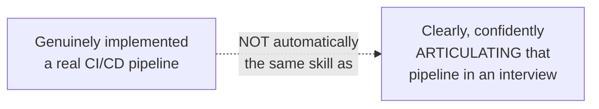

#### 🎯 Key Takeaways

* This video addresses a genuinely important, **real gap** between HAVING implemented a CI/CD pipeline and being able to CLEARLY, CONFIDENTLY explain it under interview conditions — a distinct skill worth deliberate practice.
* "Explain the CI/CD pipeline you've implemented" is explicitly, directly identified as **one of the most commonly asked DevOps interview questions** — worth genuine, deliberate preparation, not left to improvisation.
* This entire video is structured around providing a **directly reusable narrative template**, not just abstract concepts — the instructor explicitly instructs viewers to screenshot the reference diagram and take their own notes from it.

---

### 2. The Starting Point: Version Control System & Target Platform

#### 📖 Definition

> 💡 **Memory Trick, given directly:** *"Always start with Git, or any Git-based Version Control System -- GitHub, GitLab, or Bitbucket. Choose your target platform as Kubernetes. You'll tell the interviewer: we use GitHub (or GitLab or Bitbucket) as our source code repository, and our target platform is Kubernetes."*

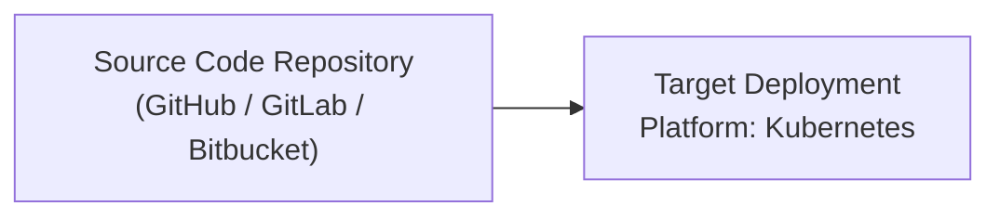

#### 🪜 Step-by-Step — The Trigger Sequence

> 💡 **Memory Trick, given directly:** *"A user makes a code commit. The pull request is reviewed, then the commit lands in the version control system -- let's assume it's a GitHub repository. Then we use an orchestrator -- a Continuous Integration/Continuous Delivery orchestrator, like Jenkins. Whenever there's new code coming to the Git repository, a Git WEBHOOK triggers the Jenkins pipeline."*

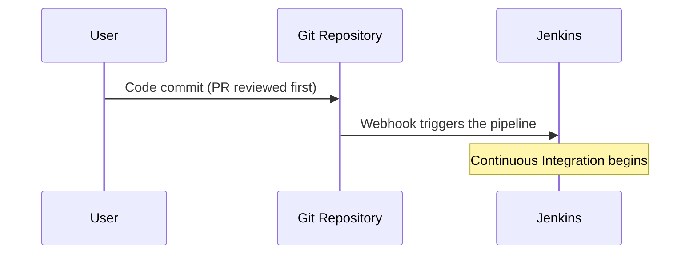

#### 🎯 Key Takeaways

* This template's specific, stated architecture: a **Git-based VCS** (GitHub/GitLab/Bitbucket) as the source, with **Kubernetes** explicitly named as the target platform — the concrete pairing this entire video builds its example around.
* **Jenkins** is introduced specifically as an **orchestrator**, directly echoing Day 18's own precise framing of Jenkins' role.
* A **Git webhook** is the precise, named mechanism triggering the Jenkins pipeline upon a new commit — directly reinforcing the "VCS push as trigger point" concept established in Day 18.

---
### 3. Continuous Integration in Jenkins: Six Stages, Explained One by One

#### 📖 Definition — Stage 1: Checkout

> 💡 **Memory Trick, given directly:** *"Explain to the interviewer: as part of the first stage in the Jenkins pipeline, we check out the code -- specifically, the code commit the user just made, along with all the code that comes with it."*

#### 📖 Definition — Stage 2: Build + Unit Testing

> 💡 **Memory Trick, given directly:** *"In the second stage, we perform a build action along with unit test cases. Some people also perform static code analysis (linting, formatting) in this same stage, depending on your use case. For a Java application, you'd say: we use Maven for building, and we use the unit testing framework to test the unit tests. If it's Node.js or Python instead, convert your unit-testing framework and build language accordingly."*

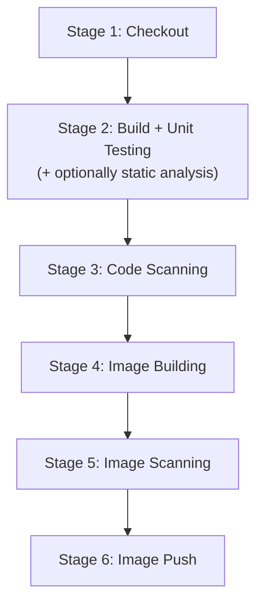

#### 📖 Definition — Stage 3: Code Scanning

> 💡 **Memory Trick, given directly:** *"After build/unit testing is done, move to code scanning -- use SonarQube, a self-hosted Sonar solution, or another code-scanning solution. Say: we scan the code for security-related vulnerabilities, or even for static code analysis at this stage -- we perform security checks to ensure our code is free from any security issues."*

#### 📖 Definition — Stage 4: Image Building

> 💡 **Memory Trick, given directly:** *"Because the target platform is Kubernetes, you build a container image. Let's not get hung up on Docker specifically -- some people use Docker, some use Buildah or other builders -- but end of the day, you create a container image using the Dockerfile in your GitHub repository."*

#### 📖 Definition — Stage 5: Image Scanning

> ⚠️ **Directly, explicitly distinguished from Stage 3's code scanning:** *"It's very important to perform IMAGE scanning too -- verify whether the image you've created has any vulnerabilities. This includes the binaries and default packages you're using in the image, and the BASE IMAGE itself -- you have to verify the base image and the overall built image are free from vulnerabilities."*

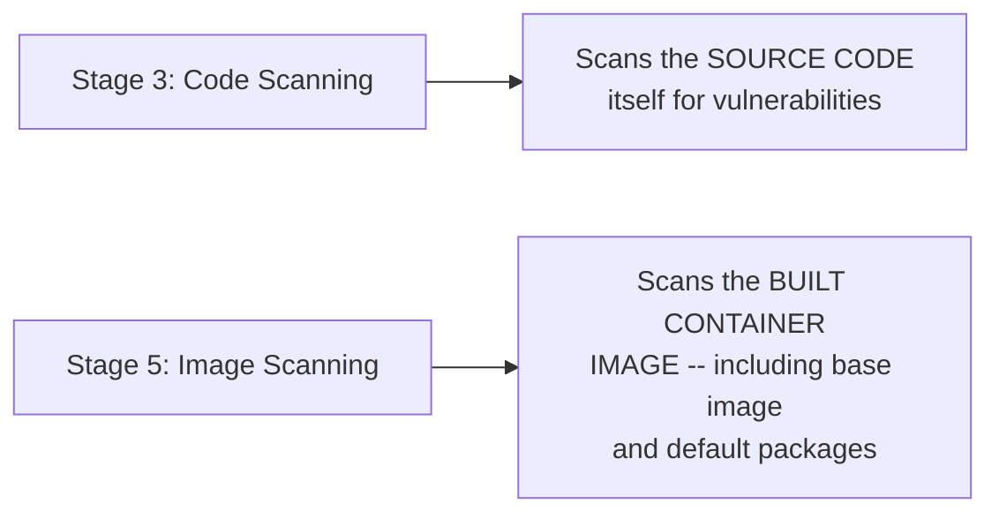

#### 📖 Definition — Stage 6: Image Push

> 💡 **Memory Trick, given directly:** *"Finally, once everything is done, push the image to your image registry -- Docker Hub, Quay.io, or ECR if you're on AWS. Say: I'm using ECR as a registry (or whichever you actually use)."*

#### ⚠ Common Mistakes

* Treating code scanning (Stage 3) and image scanning (Stage 5) as redundant or interchangeable — explicitly, directly distinguished: one examines SOURCE CODE, the other examines the BUILT CONTAINER IMAGE (including its base image and packages), a genuinely different, additional layer of verification.
* Assuming this exact stage sequence and tool selection is rigidly universal — explicitly, directly noted as adaptable based on the specific application's language/stack (Java/Maven vs. Node.js/Python, with correspondingly different tools).

#### 🎯 Key Takeaways

* The complete, six-stage Continuous Integration sequence: **checkout → build+unit testing (+optional static analysis) → code scanning → image building → image scanning → image push**.
* **Code scanning** and **image scanning** are genuinely distinct, complementary verification steps — one for source code, one for the actual, built artifact (including its base image and dependencies).
* Real, concrete tool examples are given throughout (Maven, SonarQube, Docker Hub/Quay.io/ECR) — directly usable, specific answers rather than vague, generic descriptions, precisely what makes this template genuinely interview-ready.

---

### 4. Declarative vs. Scripted Jenkins Pipelines: The Interview-Ready Answer

#### ❓ Why It Exists — A Direct, Anticipated Interview Follow-Up

> ⚠️ **Directly, explicitly anticipated as a likely follow-up question:** *"If the interviewer asks you HOW you write this pipeline, say: we use declarative Jenkins pipelines. It's always good to go with declarative pipelines over scripted ones."*

#### 📖 Definition — The Precise Trade-Off

> 💡 **Memory Trick, given directly:** *"Scripted pipelines don't have as much flexibility -- wait, actually, in scripted pipelines you CAN write your own code, giving MORE flexibility -- but declarative pipelines are much easier to collaborate on, even with people who don't have much scripting experience."*

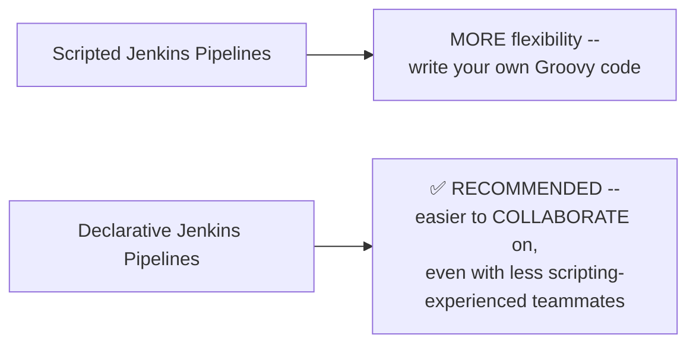

#### 🎯 Key Takeaways

* **Declarative Jenkins pipelines** are explicitly, directly recommended over **scripted** ones — specifically for genuine **collaboration/accessibility** reasons, not because scripted pipelines are technically inferior.
* This trade-off is precisely stated: scripted pipelines offer more raw flexibility (custom Groovy code); declarative pipelines are more broadly accessible to a team with mixed scripting experience.
* This is explicitly presented as a **directly anticipated interview follow-up question**, worth having a ready, precise answer for, rather than being caught off guard.

---
### 5. From Image to Cluster: Updating Kubernetes Manifests

#### ❓ Why It Exists — The Bridge Between CI and CD

> 💡 **Memory Trick, given directly:** *"Once the image is pushed to the registry, what's the next step? Getting this image -- which has your application's new changes -- onto your Kubernetes platform. To do that, some people use the SAME Jenkins pipeline to update the image reference in the Kubernetes YAML manifests, then push this updated manifest to a GitHub repository hosting all of it."*

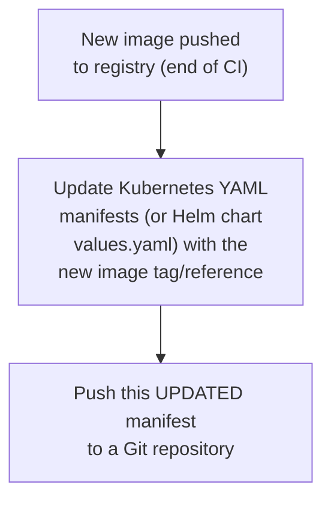

#### 🔍 Internal Working — One Repository or Two?

> 💡 **Memory Trick, the precise, direct recommendation given:** *"It's IDEALLY preferred to have a DIFFERENT GitHub repository for this -- one is your source code repository, and a different one stores your image manifests (or you can store them as Helm charts, customized however you like). Some people keep the same Git repository for both source code and image manifests -- if you feel that's easier, that's fine too."*

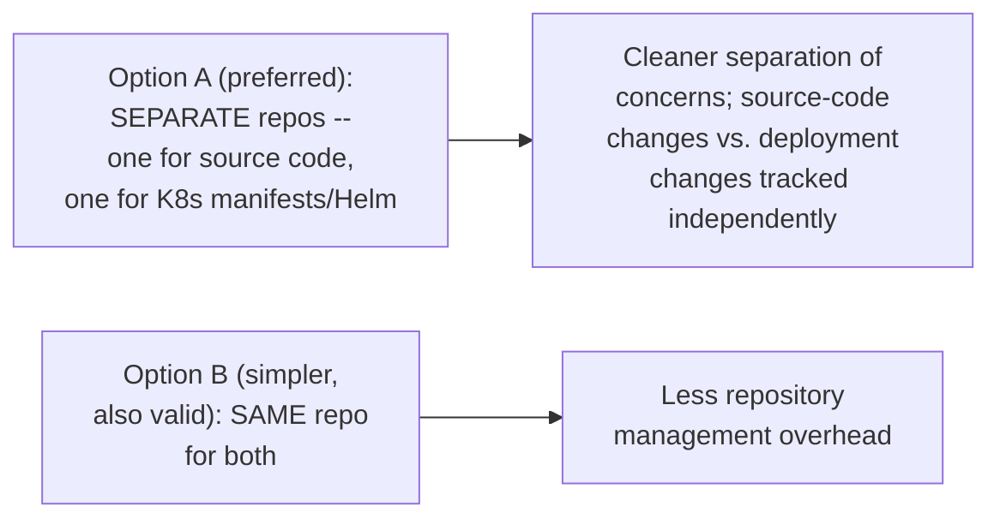

#### ⚠ Common Mistakes

* Assuming a separate manifest repository is strictly mandatory — explicitly, directly clarified: a shared, single repository is a genuinely valid, simpler alternative, not a mistake, just a different trade-off.

#### 🎯 Key Takeaways

* The step bridging CI and CD is updating **Kubernetes YAML manifests** (or **Helm chart `values.yaml`**) with the newly-built image's reference, then pushing that update to a Git repository.
* A **separate repository** for manifests (vs. source code) is the IDEALLY preferred pattern — but a **shared, single repository** is explicitly, directly acknowledged as a genuinely valid, simpler alternative.
* This step is explicitly performed using the **SAME Jenkins pipeline** already established for CI — a continuous, unified workflow rather than a separate, disconnected process.

---

### 6. The Deployment Mechanism: GitOps (Argo CD) vs. the Non-GitOps Alternative

#### 📖 Definition — The GitOps Approach (Preferred)

> 💡 **Memory Trick, given directly:** *"The final stage uses Argo CD, or any GitOps tool like Flux CD. It's always preferred to go with the GitOps approach if you're comfortable with it. Argo CD continuously watches your Git repository -- wherever you're pushing the updated Kubernetes YAML manifest -- and you configure Argo CD to watch that repository and push changes to the Kubernetes cluster."*

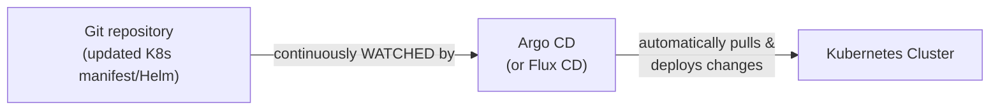

#### 🏢 Real-World / Production Usage — Why GitOps Specifically

> 💡 **Memory Trick, given directly:** *"The advantage of GitOps: Git becomes a SINGLE SOURCE OF TRUTH -- any change made to this repository is automatically pulled and deployed to the Kubernetes cluster. It also has other advantages, like continuous reconciliation -- I won't go into full detail here, but you can watch my dedicated GitOps playlist."*

#### 📖 Definition — The Non-GitOps Alternative

> 💡 **Memory Trick, given directly:** *"If you find the entire GitOps approach complicated, or you're not comfortable with it, you can replace this with scripting -- Ansible, shell scripts, or Python scripts. As part of the same pipeline, use a shell script with the `kubectl` binary, or the `helm` command, to push this new commit from the Git repository directly onto the Kubernetes platform."*

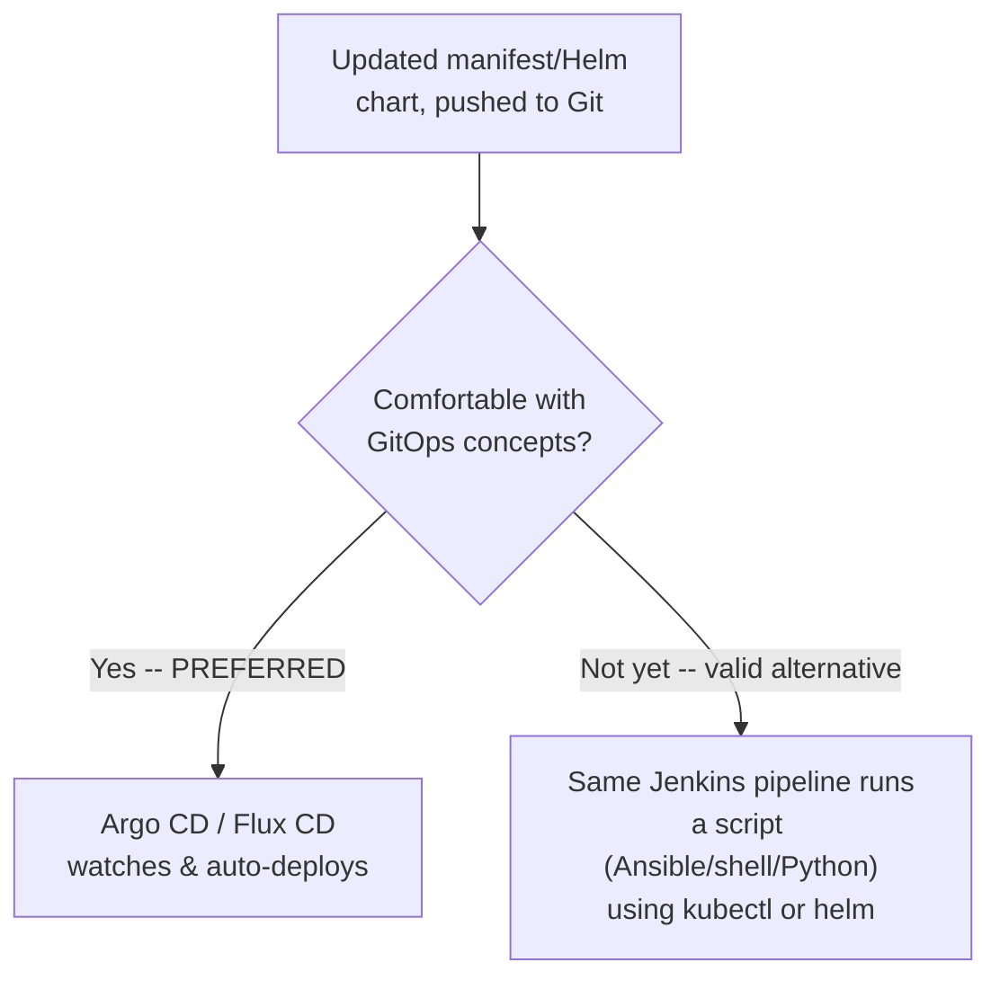

#### ⚠ Common Mistakes

* Assuming GitOps is the ONLY correct, acceptable answer for this stage — explicitly, directly presented as a genuinely valid alternative existing specifically for those not yet comfortable with GitOps, not a lesser or incorrect choice.

#### 🎯 Key Takeaways

* **GitOps** (via **Argo CD** or **Flux CD**) is explicitly, directly preferred — Git becomes a genuine single source of truth, with automatic, continuous reconciliation between the repository's declared state and the cluster's actual state.
* A genuinely valid **non-GitOps alternative** exists for those less comfortable with GitOps: using the same Jenkins pipeline to run a script (**Ansible, shell, or Python**) that directly applies the updated manifest via `kubectl` or `helm`.
* This choice is explicitly framed as a genuine, comfort-level-based decision, not a strict technical hierarchy — both are presented as legitimate options.

---
### 7. Multi-Cluster Scaling: Why Ansible Might Still Matter

#### ❓ Why It Exists — The Precise, Scale-Dependent Reasoning

> 💡 **Memory Trick, given directly:** *"In this diagram, I've only shown one Kubernetes cluster -- but if there are 10 Kubernetes clusters, Ansible will genuinely make your life easier. If you already know GitOps, go with GitOps -- because in GitOps, you can manage 1, 10, or 100 Kubernetes clusters just as easily."*

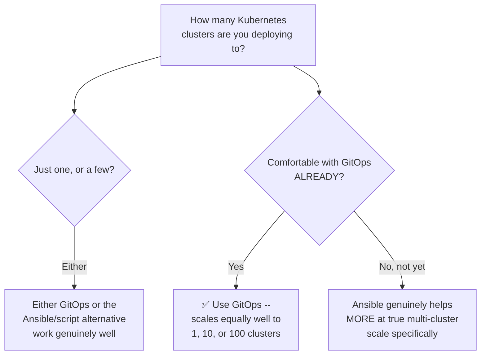

#### ⚠ Common Mistakes

* Assuming Ansible is recommended as generally superior to GitOps — explicitly, directly clarified: GitOps is the overall preferred approach IF you're already comfortable with it, precisely because it scales equally well regardless of cluster count; Ansible's specific advantage is narrower, mattering most for those NOT yet comfortable with GitOps who are managing genuinely many clusters.

#### 🎯 Key Takeaways

* Ansible's specific advantage in this context is **narrowly, precisely scoped**: genuine multi-cluster scenarios, specifically for those not yet comfortable adopting GitOps.
* **GitOps itself is explicitly stated to scale equally well** to 1, 10, or 100 clusters — meaning Ansible's advantage here is about COMFORT/FAMILIARITY at scale, not a claim that GitOps genuinely struggles with multi-cluster scenarios.
* This directly, precisely reinforces the video's own overall stance: GitOps remains the generally preferred default, with Ansible/scripting offered as a genuinely valid fallback specifically for those still building GitOps comfort.

---

### 8. The Complete, Interview-Ready Narration

#### 🪜 Step-by-Step — The Full, Closing Recap, Verbatim in Structure

> 💡 **Memory Trick, the instructor's own complete, closing narration, given directly as the exact model to reuse:** *"Once the user commits code to a Git repository, we use Jenkins as an orchestrator, which takes care of our Continuous Integration part using multiple stages. We use Jenkins Groovy scripting, with declarative Jenkins pipelines, for writing these stages. The first stage is the checkout stage, where we check out the code. The second stage is build and unit testing -- we also perform static code analysis in this stage, if required. Then we move to the code scanning stage, and once that's done and everything's fine, we move to building the image -- in this case, a container image, since our target platform is Kubernetes. Then we perform image scanning, to verify the built image is safe from security vulnerabilities. Finally, we push this image to the image registry."*

> 💡 **Memory Trick, the narration continued, given directly:** *"Once the image is pushed to the registry, we take this new version of the image and update the Kubernetes YAML manifest -- or the Helm chart -- depending on the use case, onto a Git repository (which can be a different one, or the same one). Finally, we have a GitOps tool called Argo CD, which is watching for changes to this Helm chart. Whenever there's a new version or code commit to this Git repository, it picks up the new commit and deploys it onto the Kubernetes cluster."*

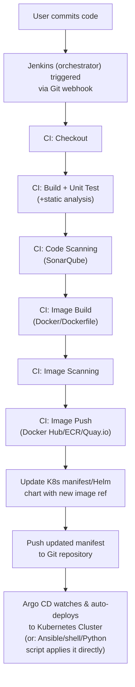

#### ⚠ Honesty Note — An Explicit Invitation for Further Depth

> 💡 **Memory Trick, given directly:** *"If you have any questions, put them in the comment section -- if you find a specific stage difficult to understand, let me know, and I'll definitely make a detailed video on that as well."*

#### 🎯 Key Takeaways

* This closing narration is explicitly presented as the **direct, reusable template** for answering "explain your CI/CD pipeline" in a real interview — precisely modeling both the CONTENT and the DELIVERY STYLE (clear, sequential, stage-by-stage) a strong answer should have.
* The instructor **explicitly invites further, dedicated deep-dives** on any specific stage viewers find difficult — this video is deliberately positioned as a complete OVERVIEW/template, not necessarily the final word on every individual stage's full depth.
* The full pipeline, narrated end to end, integrates every concept covered in this video into one coherent, memorable story — precisely the goal the video opened with.

---
## 📝 Glossary

| Term | Definition | Why It Matters |
|---|---|---|
| **Git Webhook** | The mechanism that triggers a Jenkins pipeline when a new commit lands in a Git repository | The precise, named trigger point for this template's pipeline |
| **Checkout Stage** | The first CI stage -- retrieves the newly-committed code | Where Jenkins actually accesses the developer's committed changes |
| **Static Code Analysis** | Linting/formatting checks, sometimes performed alongside build+unit testing | Optional, depending on use case |
| **Code Scanning** | Scanning SOURCE CODE for security vulnerabilities (e.g. via SonarQube) | Distinct from image scanning -- examines the code itself |
| **Image Scanning** | Scanning the BUILT CONTAINER IMAGE (including base image/packages) for vulnerabilities | Distinct from code scanning -- examines the built artifact |
| **Image Registry** | Where built container images are stored (Docker Hub, Quay.io, ECR) | The destination of the CI pipeline's final stage |
| **Declarative Jenkins Pipeline** | A structured, easier-to-collaborate-on Jenkins pipeline syntax | Explicitly recommended over scripted pipelines |
| **Scripted Jenkins Pipeline** | A more flexible, code-based Jenkins pipeline syntax | Offers more raw flexibility, at some collaboration cost |
| **Kubernetes Manifest / Helm Chart** | The declarative configuration describing what should run on a Kubernetes cluster | Updated with the new image reference, bridging CI and CD |
| **GitOps** | A deployment approach where a Git repository is the single source of truth, continuously reconciled to the cluster | Implemented via Argo CD or Flux CD; explicitly the preferred approach |
| **Argo CD** | A specific GitOps tool that watches a Git repository and auto-deploys changes to Kubernetes | The template's named, preferred deployment mechanism |

---

## 🔄 Revision Notes — One-Minute Revision

* This is a **standalone, interview-coaching video** -- addressing a genuine, reported gap: viewers who'd implemented a real CI/CD pipeline but struggled to CLEARLY EXPLAIN it in an interview.
* The template's architecture: a **Git-based VCS** (GitHub/GitLab/Bitbucket) as source, **Kubernetes** as the target platform -- a user's commit, after PR review, triggers a **Jenkins pipeline via a Git webhook**.
* **Six Continuous Integration stages**: **checkout** (get the code) → **build + unit testing** (+optional static analysis, e.g. Maven for Java) → **code scanning** (SonarQube -- SOURCE CODE vulnerabilities) → **image building** (a container image, via a Dockerfile) → **image scanning** (the BUILT IMAGE's vulnerabilities, including base image/packages -- genuinely distinct from code scanning) → **image push** (to Docker Hub/ECR/Quay.io).
* A directly-anticipated interview follow-up: **declarative Jenkins pipelines are recommended over scripted ones**, specifically for easier team collaboration (scripted pipelines offer more raw flexibility, at a collaboration cost).
* Bridging CI and CD: the new image's reference is updated into **Kubernetes YAML manifests or Helm chart values**, pushed to a Git repository -- ideally a SEPARATE repo from source code, though a shared repo is a genuinely valid, simpler alternative.
* The final deployment stage offers **two genuine options**: **GitOps** (Argo CD/Flux CD -- the preferred approach, Git as single source of truth, continuous reconciliation) or a **non-GitOps alternative** (Ansible/shell/Python scripts using `kubectl`/`helm`, for those not yet comfortable with GitOps).
* **Ansible's specific advantage** is narrowly scoped to genuine MULTI-CLUSTER scenarios for those not yet using GitOps -- GitOps itself is explicitly stated to scale equally well to 1, 10, or 100 clusters.
* The video closes with a **complete, clean, end-to-end narration** of the entire pipeline -- explicitly presented as the direct, reusable template for a real interview answer, with further, dedicated deep-dives explicitly invited for any stage viewers find difficult.

---

## 📋 Cheat Sheet

**The starting architecture:**
```text
Source: GitHub / GitLab / Bitbucket  -->  Target: Kubernetes
```

**The trigger:**
```text
User commits (PR reviewed) -> Git webhook -> Jenkins pipeline triggered
```

**The six CI stages:**
```text
1. Checkout           -- get the new commit's code
2. Build + Unit Test  -- e.g. Maven (Java); + optional static analysis
3. Code Scanning        -- SonarQube; SOURCE CODE vulnerabilities
4. Image Building         -- Dockerfile -> container image
5. Image Scanning           -- BUILT IMAGE vulnerabilities (base image + packages)
6. Image Push                 -- Docker Hub / ECR / Quay.io
```

**Pipeline syntax:**
```text
Declarative Jenkins Pipeline -- RECOMMENDED (easier team collaboration)
Scripted Jenkins Pipeline     -- more raw flexibility, less collaborative
```

**Bridging CI -> CD:**
```text
New image ref -> update K8s manifest / Helm values.yaml -> push to Git repo
(ideally a SEPARATE repo from source code; shared repo also valid)
```

**Deployment mechanism (two options):**
```text
GitOps (Argo CD / Flux CD)  -- PREFERRED; Git = single source of truth,
                                 continuous reconciliation; scales to 1-100 clusters equally
Ansible / shell / Python      -- valid alternative if not yet comfortable with GitOps;
                                 genuinely helps most at MULTI-cluster scale
```

---

## 🔥 Interview Questions & Answers

### 🟢 Beginner

**Q1.**

**Question:** What triggers a Jenkins pipeline in this template's architecture?

**Answer:** A Git webhook, fired when a new commit lands in the Git repository.

**Explanation:** Directly, precisely stated.

**Why Interviewers Ask This:** Basic, foundational CI/CD trigger mechanics.

**Possible Follow-up:** "What has to happen to the code BEFORE it's committed, per this template?"

**Q2.**

**Question:** Name the six Continuous Integration stages in this template's pipeline, in order.

**Answer:** Checkout, build + unit testing, code scanning, image building, image scanning, image push.

**Explanation:** Directly, explicitly named and sequenced.

**Why Interviewers Ask This:** Tests whether a candidate can articulate a genuinely complete, structured pipeline.

**Possible Follow-up:** "Which stage would you use SonarQube in?"

**Q3.**

**Question:** What is the difference between code scanning and image scanning?

**Answer:** Code scanning examines the source code itself for vulnerabilities; image scanning examines the BUILT container image, including its base image and packages.

**Explanation:** Directly, precisely distinguished.

**Why Interviewers Ask This:** A genuinely common, important CI/CD security distinction.

**Possible Follow-up:** "Why isn't code scanning alone sufficient -- why also scan the built image?"

**Q4.**

**Question:** Which type of Jenkins pipeline is recommended in this template -- declarative or scripted -- and why?

**Answer:** Declarative -- specifically for easier collaboration, even with team members who don't have much scripting experience.

**Explanation:** Directly, explicitly recommended, with reasoning.

**Why Interviewers Ask This:** A commonly-asked Jenkins pipeline-design question.

**Possible Follow-up:** "What's the specific advantage scripted pipelines offer instead?"

**Q5.**

**Question:** What is updated to bridge Continuous Integration and Continuous Delivery in this template?

**Answer:** The Kubernetes YAML manifests (or Helm chart values) -- updated with the newly-built image's reference, then pushed to a Git repository.

**Explanation:** Directly, precisely explained.

**Why Interviewers Ask This:** Tests understanding of the actual CI-to-CD transition mechanism.

**Possible Follow-up:** "Should this manifest repository be the same as, or different from, the source code repository?"

**Q6.**

**Question:** What GitOps tool is named as the preferred deployment mechanism in this template?

**Answer:** Argo CD (with Flux CD named as an alternative GitOps tool).

**Explanation:** Directly, explicitly named.

**Why Interviewers Ask This:** Tests recall of specific, real GitOps tooling.

**Possible Follow-up:** "What does Argo CD actually DO, mechanically, to deploy a change?"

**Q7.**

**Question:** What is GitOps' core advantage, as stated in this video?

**Answer:** Git becomes a single source of truth -- any change to the repository is automatically pulled and deployed to the cluster, with continuous reconciliation.

**Explanation:** Directly, explicitly stated.

**Why Interviewers Ask This:** Basic, foundational GitOps conceptual knowledge.

**Possible Follow-up:** "What alternative deployment mechanism does this video offer for those not comfortable with GitOps?"

**Q8.**

**Question:** What non-GitOps alternative deployment mechanism does this template offer?

**Answer:** Using the same Jenkins pipeline to run a script (Ansible, shell, or Python) that applies the updated manifest via `kubectl` or `helm`.

**Explanation:** Directly, precisely explained.

**Why Interviewers Ask This:** Tests awareness of a genuine, practical alternative to GitOps.

**Possible Follow-up:** "In what specific scenario does this video suggest Ansible might be preferable?"

**Q9.**

**Question:** Does GitOps genuinely struggle with managing many (e.g., 10 or 100) Kubernetes clusters?

**Answer:** No -- GitOps is explicitly stated to scale equally well to 1, 10, or 100 clusters.

**Explanation:** Directly, explicitly clarified.

**Why Interviewers Ask This:** Tests whether a candidate correctly understands GitOps' genuine scaling properties, not an inaccurate limitation.

**Possible Follow-up:** "Then why might Ansible still be recommended for a genuine multi-cluster scenario?"

**Q10.**

**Question:** What image registries are named as examples in this template?

**Answer:** Docker Hub, Quay.io, and ECR (Amazon's registry).

**Explanation:** Directly, explicitly named.

**Why Interviewers Ask This:** Tests recall of real, specific tooling examples.

**Possible Follow-up:** "Which of these would you specifically name if your organization is on AWS?"

---

### 🟡 Intermediate

**Q11.**

**Question:** Explain why this video's specific format -- providing a complete, ready-to-narrate template with an explicit instruction to "screenshot the diagram" -- is a genuinely different pedagogical approach than the course's typical, deeper conceptual teaching style.

**Answer:** This video is explicitly optimized for a narrow, practical GOAL (successfully articulating a CI/CD pipeline in an interview setting) rather than deep, first-principles conceptual understanding of every individual stage -- the instructor explicitly acknowledges this scope limitation by inviting further, dedicated videos on any specific stage viewers find difficult. This represents a genuinely different pedagogical mode: a MEMORIZABLE, REPRODUCIBLE NARRATIVE TEMPLATE, optimized for interview performance under real time pressure, rather than the deeper, "why does this work this way" exploration typical of the numbered course's other sessions (e.g., Day 18's live verification on Kubernetes' real repository). Both are legitimate pedagogical goals, but they're genuinely different: this video prioritizes FLUENT, CONFIDENT RECALL over exhaustive, first-principles understanding.

**Explanation:** Requires recognizing a deliberate shift in pedagogical mode/goal, connecting the video's specific instructional choices (screenshot the diagram, use as-is) to its stated purpose.

**Why Interviewers Ask This:** Tests whether a learner recognizes different content is optimized for different learning goals, appropriately using each for its intended purpose.

**Possible Follow-up:** "Which specific CI/CD stage from this template would benefit most from a separate, deeper conceptual video, in your own view?"

**Q12.**

**Question:** A learner argues that since this template explicitly allows using the SAME repository for both source code and Kubernetes manifests, there's no genuine reason to ever use separate repositories. Evaluate this claim.

**Answer:** This claim overstates the video's actual, more nuanced guidance. The video explicitly states separate repositories are the IDEALLY PREFERRED pattern, while acknowledging a shared repository as a genuinely valid, SIMPLER alternative -- not equally optimal in every respect, but an acceptable trade-off for reduced complexity. The genuine reasoning FOR separation (though not explicitly elaborated in this specific video) likely includes: keeping SOURCE CODE changes and DEPLOYMENT/CONFIGURATION changes independently trackable and reviewable, allowing different access-control policies for developers (who modify source code) versus platform/ops teams (who might manage deployment configuration), and enabling GitOps tools like Argo CD to watch a cleaner, deployment-focused repository without needing to filter out unrelated source-code changes. The claim "no genuine reason to ever use separate repos" ignores these real, if not exhaustively detailed, benefits the "ideally preferred" framing implies.

**Explanation:** Tests whether a learner recognizes "X is an acceptable simpler alternative" as different from "there's no reason to prefer the more thorough approach," a meaningful distinction.

**Why Interviewers Ask This:** Distinguishes candidates who track a stated preference's genuine reasoning from those who treat any acknowledged alternative as equally optimal.

**Possible Follow-up:** "Name a genuine, practical scenario where a shared source-code-and-manifest repository might cause a real problem."

**Q13.**

**Question:** Explain, precisely, why this template explicitly recommends performing BOTH code scanning (Stage 3) AND image scanning (Stage 5), rather than considering one sufficient on its own.

**Answer:** These two scanning stages address genuinely DIFFERENT, non-overlapping sources of potential vulnerability. Code scanning (Stage 3) examines vulnerabilities INTRODUCED BY THE APPLICATION'S OWN SOURCE CODE -- logic errors, insecure coding patterns, or known-vulnerable dependencies the developers themselves wrote or imported. Image scanning (Stage 5), by contrast, examines vulnerabilities in the BASE IMAGE and DEFAULT PACKAGES that come from OUTSIDE the application's own source code entirely -- the underlying OS layer, pre-installed system libraries, or other components the Dockerfile pulls in that the application developers may have no direct control over or even awareness of. A codebase could be entirely vulnerability-free in its OWN logic while still being deployed inside a genuinely vulnerable base image (e.g., an outdated OS image with known CVEs) -- meaning code scanning alone would miss this risk entirely, and image scanning specifically exists to catch it.

**Explanation:** Requires reasoning through the precise, non-overlapping risk each scanning stage addresses, rather than treating them as redundant checks of "the same thing, twice."

**Why Interviewers Ask This:** Tests genuine understanding of WHY both stages are necessary, not just recall that both exist.

**Possible Follow-up:** "If your organization had to cut one of these two scanning stages for time/cost reasons, which risk would you be accepting, and would you recommend this trade-off?"

**Q14.**

**Question:** Using this video's own stated reasoning about declarative vs. scripted Jenkins pipelines, explain a realistic organizational scenario where the "more flexibility" advantage of scripted pipelines might genuinely outweigh declarative's collaboration advantage.

**Answer:** A realistic scenario: an organization with a SMALL, highly-experienced, dedicated platform/DevOps team (rather than many developers with varying scripting comfort levels directly authoring or modifying pipeline definitions) building a GENUINELY COMPLEX, highly-customized pipeline requiring conditional logic, dynamic stage generation, or integration patterns that declarative syntax's more constrained, structured format might make awkward or genuinely difficult to express. In THIS specific context, the collaboration advantage declarative pipelines offer (accessibility to less-scripting-experienced teammates) provides LESS genuine value, since the team authoring/maintaining the pipeline is uniformly experienced -- while scripted pipelines' greater raw flexibility becomes genuinely more valuable for the complex, custom logic required. This directly illustrates that the video's general recommendation (declarative, for collaboration) is a reasonable DEFAULT for typical, mixed-experience teams, not an absolute, context-independent rule.

**Explanation:** Requires generating a genuinely plausible counter-scenario where the stated trade-off's less-emphasized side becomes the more compelling consideration.

**Why Interviewers Ask This:** Tests whether a learner can reason beyond a stated default recommendation to identify when its underlying trade-off might genuinely favor the alternative.

**Possible Follow-up:** "Would your hypothetical organization's specific scenario still benefit from ANY declarative pipeline elements, even within an overall scripted approach?"

**Q15.**

**Question:** Synthesize this video's GitOps-vs-scripted-deployment comparison (Section 6) with Day 15's Ansible coverage (push model, agentless architecture) to explain precisely why Ansible is specifically named as the scripted alternative here, rather than a different configuration management tool.

**AnswER:** Day 15 establishes Ansible's PUSH model and AGENTLESS architecture as core, defining properties -- directly relevant to this video's deployment scenario: applying a Kubernetes manifest update to one or MANY clusters is fundamentally a PUSH-style operation (actively sending/applying a specific, known configuration TO target clusters), not a PULL-style one, aligning naturally with Ansible's own core architecture rather than requiring some translation or mismatch. Additionally, Ansible's AGENTLESS property (Day 15) means no dedicated agent software needs to be pre-installed on each target Kubernetes cluster specifically for Ansible's own sake -- it can genuinely just use `kubectl`/`helm` directly, exactly as this video describes, without introducing an entirely separate, Ansible-specific installation/configuration burden on each cluster. This explains why Ansible specifically (rather than, say, Puppet's pull-based, master-slave architecture from Day 14) is the natural, well-fitting choice this video names for the genuine multi-cluster, script-based deployment scenario it describes.

**Explanation:** Requires connecting this video's specific tool recommendation to detailed, architectural reasoning established in a genuinely separate, earlier session -- non-obvious, cross-session synthesis explaining WHY this specific tool fits this specific use case.

**Why Interviewers Ask This:** A senior-level question testing whether a candidate can explain WHY a specific tool recommendation makes sense architecturally, not just recall that it was recommended.

**Possible Follow-up:** "Would Puppet's pull-based, master-slave architecture (from Day 14) be a natural fit for this same multi-cluster deployment scenario? Why or why not?"

---

### 🔴 Advanced

**Q16.**

**Question:** Design a genuinely complete, production-grade interview answer extending this video's template with at least three specific enhancements a senior interviewer might probe for, that this video's introductory template doesn't explicitly cover.

**Answer:** Three reasonable, genuine extensions: (1) **Rollback strategy** -- this video's template describes the FORWARD deployment path in detail, but a senior interviewer would likely ask: "what happens if the newly-deployed image causes a production issue?" A complete answer should address Argo CD's own rollback capabilities (reverting to a previous, known-good Git commit) or a manual rollback procedure for the scripted alternative, directly extending Section 6's deployment mechanism with a genuine failure-recovery plan. (2) **Multi-environment promotion within THIS specific pipeline** -- this video's template doesn't explicitly address Dev/Staging/Production promotion (covered separately in Day 18's own content) -- a complete, senior-level answer should explain how THIS SPECIFIC template's manifest-update-and-GitOps-deploy pattern would be adapted across multiple environments (e.g., separate Argo CD "Applications" or separate branches/directories per environment within the manifest repository). (3) **Secrets management within the pipeline** -- this video's template mentions pushing images and updating manifests, but doesn't explicitly address how genuinely sensitive configuration (database credentials, API keys the deployed application needs) would be securely injected, rather than committed in plain text to the manifest repository -- a complete answer should reference a dedicated secrets-management approach (e.g., Kubernetes Secrets combined with a tool like Sealed Secrets or External Secrets Operator, or a cloud provider's own secrets manager) as a genuinely necessary addition for a real, production deployment. These three extensions directly demonstrate senior-level depth beyond this video's own explicitly-stated, introductory scope.

**Explanation:** Synthesizes this video's template with genuinely necessary, senior-level considerations the video's own introductory scope doesn't explicitly cover -- real, applied extension for deeper interview scenarios.

**Why Interviewers Ask This:** A realistic, senior-level question testing whether a candidate can extend a solid, foundational answer with genuinely deeper, production-relevant considerations when probed further.

**Possible Follow-up:** "Which of these three extensions would you expect a JUNIOR-level interview to probe for, versus a genuinely SENIOR-level one?"

**Q17.**

**Question:** Critically evaluate: "Since this video explicitly recommends GitOps as generally preferred, using the non-GitOps, scripted alternative in a real interview answer would make a candidate seem less knowledgeable or less senior." Is this an accurate implication of this video's content?

**Answer:** Not necessarily accurate, and this risks a genuinely important misreading of the video's actual guidance. The video explicitly frames the non-GitOps alternative as a genuinely VALID choice for those "not yet comfortable with GitOps" -- not as an inherently inferior or less-sophisticated approach for ALL contexts. A candidate genuinely, deliberately choosing a scripted approach for a SPECIFIC, well-reasoned context (e.g., Advanced Q16's genuine multi-cluster scenario where Ansible's specific properties, per Q15's reasoning, provide a natural fit) and articulating THAT reasoning clearly could appear MORE senior/knowledgeable than a candidate who simply defaults to "GitOps" without genuine understanding of when and why it's the better choice. The accurate, more precise claim: DEFAULTING to GitOps without being able to explain genuine trade-offs might actually seem LESS senior than confidently, precisely explaining EITHER choice with clear, context-specific reasoning -- interview strength comes from demonstrated understanding of trade-offs, not merely naming the "preferred" option.

**Explanation:** Tests whether a learner recognizes that articulating genuine, context-aware reasoning matters more for interview impression than simply naming the stated "preferred" default option.

**Why Interviewers Ask This:** Distinguishes candidates who understand that interview strength comes from demonstrated reasoning, not merely pattern-matching to a "correct" stated answer.

**Possible Follow-up:** "How would you frame a genuine, deliberate choice of the non-GitOps alternative, in an interview setting, to demonstrate senior-level reasoning rather than appearing to have simply avoided GitOps out of unfamiliarity?"

**Q18.**

**Question:** Synthesize this video's complete pipeline template with Day 18's five standard CI/CD steps to identify precisely which of Day 18's steps map onto which of THIS video's six stages, and note any genuine mismatches or additions between the two sessions' frameworks.

**Answer:** A precise mapping: Day 18's **unit testing** maps directly onto this video's **Stage 2 (build + unit testing)**. Day 18's **static code analysis** maps onto the OPTIONAL static-analysis component this video ALSO places within Stage 2, rather than as its own separate stage. Day 18's **code quality/vulnerability testing** maps onto this video's **Stage 3 (code scanning)**. Day 18's **automation/functional/end-to-end testing** has NO DIRECT, explicitly-named equivalent stage in THIS video's specific six-stage template -- a genuine, notable gap/addition: this video's template, as stated, doesn't explicitly include a dedicated functional/end-to-end testing stage the way Day 18's more general framework does. Day 18's **reporting** step also has no explicitly-named, dedicated stage in this video's template, though it's plausibly implied as occurring implicitly within or after several stages (test results, scan reports) without being called out as its own distinct step here. This video ADDS two stages Day 18's own general framework doesn't explicitly separate out: **image building** and **image scanning** -- reflecting this video's specific, Kubernetes-container-focused architecture, which Day 18's more general, tool-agnostic framework doesn't specifically require (since Day 18 doesn't assume a containerized deployment target). This comparison reveals these two sessions' frameworks are genuinely COMPLEMENTARY rather than identical: Day 18 provides a more general, tool-agnostic conceptual framework, while this video provides a more SPECIFIC, container/Kubernetes-focused implementation template -- a real interview answer would ideally synthesize both, explicitly including functional/end-to-end testing and reporting (from Day 18) alongside this video's more specific image-focused stages.

**Explanation:** Requires precise, granular cross-referencing between two separately-delivered frameworks covering genuinely overlapping but not identical content, identifying real gaps and additions rather than assuming perfect correspondence.

**Why Interviewers Ask This:** A capstone-level question testing whether a candidate can synthesize multiple, related pieces of course content into one genuinely more complete framework, rather than treating each session's content as isolated and non-overlapping.

**Possible Follow-up:** "How would you modify this video's six-stage template to explicitly incorporate Day 18's functional/end-to-end testing and reporting steps, without disrupting its existing structure?"

---

## 🧪 Scenario-Based Interview Questions

> **Scenario 1:** During a real interview, after you finish narrating this video's complete pipeline template, the interviewer asks: "What happens if the image scanning stage finds a critical vulnerability?" Using this session's concepts, construct your answer.

**Structured Answer:**
1. **Initial investigation:** Recognize this as a genuine, reasonable follow-up probing beyond the video's own stated template -- the video describes WHAT each stage does, but doesn't explicitly detail FAILURE-HANDLING behavior for each stage.
2. **Metrics/logs to check:** N/A directly (an interview-reasoning scenario, not a technical diagnostic) -- instead, reason through what a well-designed pipeline would logically do at this specific point.
3. **Possible causes for this being a genuine gap:** This video is explicitly, deliberately an introductory OVERVIEW template (per Intermediate Q11's reasoning) -- not every possible failure-handling detail is covered, by design, since the video explicitly invites further, dedicated depth on specific stages.
4. **Debugging/evaluation approach:** Reason through the LOGICAL, sensible behavior: a critical vulnerability found during image scanning should genuinely HALT the pipeline before the image push stage, preventing a known-vulnerable image from ever reaching the registry (and therefore, the cluster) at all.
5. **Resolution:** Construct a genuine, reasoned answer: "The pipeline would fail at the image scanning stage specifically, preventing progression to image push -- the vulnerability would need to be remediated (e.g., updating the base image or affected package) and the pipeline re-run from an earlier stage before the image could genuinely proceed toward deployment."
6. **Prevention:** Use this exact kind of reasoning -- extending a stated template with genuine, sensible failure-handling logic -- as a general interview-answering STRATEGY whenever a follow-up question probes beyond a memorized template's explicitly stated content.

> **Scenario 2 (Advanced):** An interviewer, after hearing your complete pipeline narration, asks you to compare this video's specific template against a DIFFERENT CI/CD architecture you might have seen elsewhere (e.g., a Jenkins-to-Ansible-only pipeline with no Kubernetes/containers at all). Using this session's concepts and Advanced Q18's reasoning, construct your comparative answer.

**Structured Answer:**
1. **Initial investigation:** Recognize this interviewer is testing whether your understanding is GENUINELY FLEXIBLE and context-aware, not merely a single, memorized template applied rigidly regardless of context.
2. **Relevant principle:** Per Advanced Q18's reasoning, this video's specific template is tailored to a CONTAINER/KUBERNETES-focused architecture -- a genuinely different target platform (e.g., direct VM/EC2 deployment without containers) would reasonably OMIT this template's image-building and image-scanning stages entirely, since there'd be no container image involved at all.
3. **Possible causes for the interviewer's question:** A genuine, reasonable test of whether the candidate understands the TEMPLATE'S specific assumptions (container/Kubernetes target) versus the GENERAL, underlying CI/CD principles (Day 18's five standard steps) that would still apply regardless of target platform.
4. **Debugging/evaluation approach:** Explicitly separate, in your answer, which elements of this video's template are GENUINELY PLATFORM-SPECIFIC (image building/scanning, Kubernetes manifest updates, Argo CD) versus which reflect GENERAL CI/CD PRINCIPLES that would apply to any target platform (checkout, build/unit test, code scanning, some form of deployment).
5. **Resolution:** Construct a genuine, comparative answer: "This specific template assumes a containerized, Kubernetes-based deployment target, which is why it includes image-building and image-scanning stages, and uses GitOps/Argo CD specifically for deployment. A direct-VM deployment scenario would follow the same GENERAL principles -- checkout, build, test, scan -- but would replace the image-building/scanning/GitOps-deployment stages with something like a direct artifact deployment via Ansible or a similar configuration management tool, applying the built artifact directly to target VMs instead."
6. **Prevention:** Practice explicitly articulating WHICH parts of any memorized template are general, transferable principles versus platform-specific implementation details -- directly demonstrating the kind of flexible, senior-level understanding Advanced Q18's cross-session synthesis reveals.

---

## 🛠 Hands-on Exercises

### 🟢 Easy

1. Write out, from memory, all six Continuous Integration stages this video's template uses, in order, with one concrete tool example for each.
2. Practice narrating this video's complete, closing pipeline explanation OUT LOUD, timing yourself, as if genuinely answering an interviewer.
3. Draw (or describe in writing) the complete pipeline diagram from memory, without referring back to this guide, then compare it against the guide's own diagrams for accuracy.

### 🟡 Medium

4. Write your own, personalized version of this video's closing narration, substituting genuine tools/technologies from a real or hypothetical project of your own (e.g., a different build tool, a different image registry, a different GitOps tool).
5. Construct a written answer to Scenario 1's follow-up question ("what happens if image scanning finds a critical vulnerability?"), demonstrating the reasoning-extension technique described in that scenario's structured answer.
6. Research (outside this transcript) the actual, specific syntax for updating a Kubernetes manifest's image tag within a Jenkins pipeline stage, and document what you find.

### 🔴 Advanced

7. Implement the three senior-level extensions proposed in Advanced Interview Q16 (rollback strategy, multi-environment promotion, secrets management) as a complete, written addition to this video's own template.
8. Construct the comparative answer proposed in Scenario 2, applied to a genuinely different target platform of your own choosing (not Kubernetes), explicitly separating general CI/CD principles from platform-specific implementation details.
9. Write a complete cross-reference document mapping every stage/step from THIS video's template against Day 18's five standard CI/CD steps, directly reproducing and extending Advanced Interview Q18's analysis in full written detail.

---

## 🏗 Practice Assignment

### Build: "My Personal CI/CD Interview Answer"

**Objective:** Produce a genuinely personalized, interview-ready narration of a CI/CD pipeline, directly modeling this video's template but reflecting your own real or hypothetical project's specific tools and architecture.

**Requirements:**
- A complete, written narration (300-500 words) of your own CI/CD pipeline, following this video's exact structural pattern (source/target platform → trigger → CI stages → CI-to-CD bridge → deployment mechanism).
- Genuine, specific tool names throughout (your actual VCS, build tool, testing framework, scanning tool, registry, and deployment mechanism) -- not generic placeholders.
- A clear, explicit statement of your chosen deployment mechanism (GitOps or scripted), with genuine reasoning for your choice, directly modeling Section 6-7's comparative reasoning.
- A prepared answer to at least one likely follow-up question (declarative vs. scripted pipelines, or code vs. image scanning), written out in full.
- A brief written reflection (150-200 words) on which specific stage of your own pipeline you'd want a deeper, dedicated explanation of, directly modeling this video's own closing invitation for further depth.

**Architecture (suggested):**

```text
my_cicd_interview_answer/
├── PIPELINE_NARRATION.md       # your complete, personalized narration
├── FOLLOW_UP_ANSWERS.md          # your prepared answers to likely follow-ups
└── DEEPER_DIVE_REFLECTION.md       # which stage you'd want more depth on, and why
```

**Expected Functionality:**
- Your narration should be genuinely deliverable OUT LOUD, in a real interview setting, within a reasonable time frame (roughly 2-4 minutes of spoken explanation).
- Your tool choices should be genuinely consistent with a real or realistic hypothetical project, not an arbitrary assortment.

**Challenges:**
- Avoiding simply copying this video's exact tool choices (Maven, SonarQube, Argo CD) without genuine adaptation to your own actual or hypothetical project's real stack.
- Practicing genuine, confident, out-loud delivery -- not just written preparation.

**Bonus Improvements:**
- Record yourself delivering this narration, and review it for clarity, pacing, and confidence.
- Extend your narration with one of Advanced Interview Q16's three senior-level extensions (rollback, multi-environment, or secrets management).

---

## 📚 Additional Resources

- The instructor's **basic and advanced CI/CD videos** (referenced directly) -- prior, separately-published content on the instructor's channel, predating this specific interview-focused video.
- **Day 18: Introduction to CI/CD** (from the numbered DevOps Zero to Hero course) -- provides the more general, conceptual CI/CD framework this video's specific template complements.
- The instructor's **dedicated GitOps playlist** (referenced directly) -- for deeper coverage of GitOps concepts (including continuous reconciliation) beyond this video's brief mention.
- **A future, dedicated video on any specific pipeline stage** (referenced directly, invited based on viewer comments) -- not yet delivered as of this video, contingent on genuine viewer requests.

---

## 📌 Final Revision Sheet

### ⭐ Core Concepts
- This is a **standalone, interview-coaching video** -- explicitly optimized for CLEAR ARTICULATION of a CI/CD pipeline, not exhaustive, first-principles teaching of every stage.
- **Six CI stages**: checkout → build+unit test (+static analysis) → code scanning → image build → image scanning → image push.
- **Code scanning** (source code) and **image scanning** (built container image) are genuinely distinct, complementary checks.
- **Declarative Jenkins pipelines** are recommended over scripted ones, specifically for collaboration.
- **GitOps** (Argo CD/Flux CD) is the preferred deployment mechanism; a **scripted alternative** (Ansible/shell/Python + kubectl/helm) is a genuinely valid fallback, especially for genuine multi-cluster scenarios when not yet GitOps-comfortable.

### ⭐ Important Definitions
- **Checkout stage**, **Kubernetes manifest/Helm chart** (see Glossary for full definitions).

### ⭐ Important Commands/Code
- N/A -- this video is a conceptual/narrative template, not a hands-on coding session; specific syntax is explicitly deferred to other, dedicated videos.

### ⭐ Architecture/Process
- Full pipeline: commit → webhook → Jenkins CI (6 stages) → manifest/Helm update → Git push → GitOps (Argo CD) or scripted deployment → Kubernetes cluster.

### ⭐ Best Practices
- Perform BOTH code scanning and image scanning -- they address genuinely different vulnerability sources.
- Prefer declarative Jenkins pipelines for team collaboration, unless a specific, complex-logic scenario genuinely warrants scripted flexibility.
- Prefer GitOps for deployment when comfortable with it; it scales equally well to 1-100 clusters.
- Practice narrating your own real pipeline out loud, not just understanding it conceptually.

### ⭐ Common Mistakes
- Treating code scanning and image scanning as redundant.
- Assuming GitOps struggles with multi-cluster scenarios (it doesn't -- Ansible's advantage here is about comfort/familiarity, not GitOps limitation).
- Assuming a shared source-code-and-manifest repository is never acceptable (it's a genuinely valid, simpler alternative).
- Memorizing this exact template without genuinely adapting it to your own real project's actual tools.

### ⭐ Interview Points
- Be ready to narrate a COMPLETE, coherent, stage-by-stage pipeline explanation, not fragmented facts.
- Be ready for the declarative-vs-scripted follow-up question specifically.
- Be ready to explain WHY both code and image scanning are needed.
- Be ready to justify your OWN deployment-mechanism choice with genuine, context-specific reasoning, not just naming the "preferred" option.

### ⭐ Things to Remember
- This is a **standalone, interview-coaching video**, genuinely distinct in purpose from the numbered course's deeper conceptual sessions -- optimized for fluent recall, not exhaustive first-principles depth.
- The instructor **explicitly invites further, dedicated videos** on any specific stage viewers find difficult -- this template is deliberately an overview, not a complete, final treatment of every stage.
- **Personalizing this template** to your own genuine project/tools (rather than reciting it verbatim) is explicitly the more effective, more senior-appearing interview strategy, per this guide's own Advanced Q17 reasoning.

---

## 🔗 Source

- [CICD Pipeline Process](https://youtu.be/hTAvtgZPyP8?si=HDg2HU5A1Vsm6D0z)