# 🚀 CI/CD Workflow: Promoting an Application from Dev to Staging to Production

- <i>**Session:** Standalone Conceptual/Interview-Prep Video — "CI/CD Workflow from Dev to Stage to Prod Environments: Complete CI/CD Process"· 
- **Instructor:** Abhishek
- **Note on scope:** This is a **standalone conceptual video**, distinct from the numbered "Day X" course, though it directly builds on and explicitly cites Day 10's branching-strategy session. The instructor is explicit about this video's genuinely NEW contribution: all prior CI/CD content on this channel (Jenkins, GitHub Actions, GitLab, AWS CodePipeline) taught how to build a pipeline for ONE environment — this video specifically addresses the higher-level question of how an application's code moves across MULTIPLE environments (feature/dev → staging → pre-production/UAT → production), governed by a coordinated branching strategy.</i>

---

## 📑 Table of Contents

1. [Session Overview](#-session-overview)
2. [Learning Objectives](#-learning-objectives)
3. [Detailed Notes](#-detailed-notes)
   - [1. Why This Video Exists: Beyond a Single-Environment Pipeline](#1-why-this-video-exists-beyond-a-single-environment-pipeline)
   - [2. Quick Recap: The Single-Environment CI/CD Pipeline](#2-quick-recap-the-single-environment-cicd-pipeline)
   - [3. Branching Strategy, Revisited: Feature, Main, Release & Hotfix Branches](#3-branching-strategy-revisited-feature-main-release--hotfix-branches)
   - [4. The iOS Analogy: Understanding Release Branches](#4-the-ios-analogy-understanding-release-branches)
   - [5. The Full Promotion Workflow, Step 1: Feature Branch → Dev Environment](#5-the-full-promotion-workflow-step-1-feature-branch--dev-environment)
   - [6. Step 2: Main Branch → Staging, Where QA Takes Over](#6-step-2-main-branch--staging-where-qa-takes-over)
   - [7. Step 3: Release Branch → Pre-Production → Production](#7-step-3-release-branch--pre-production--production)
   - [8. Why Separate Kubernetes Clusters (Not Just Namespaces) Per Environment](#8-why-separate-kubernetes-clusters-not-just-namespaces-per-environment)
   - [9. Scaling the Pipeline: Multiple Pipelines vs. Multi-Branch + Single Argo CD](#9-scaling-the-pipeline-multiple-pipelines-vs-multi-branch--single-argo-cd)
4. [Glossary](#-glossary)
5. [Revision Notes — One-Minute Revision](#-revision-notes--one-minute-revision)
6. [Cheat Sheet](#-cheat-sheet)
7. [Interview Questions & Answers](#-interview-questions--answers)
8. [Scenario-Based Interview Questions](#-scenario-based-interview-questions)
9. [Hands-on Exercises](#-hands-on-exercises)
10. [Practice Assignment](#-practice-assignment)
11. [Additional Resources](#-additional-resources)
12. [Final Revision Sheet](#-final-revision-sheet)

---

## 🎯 Session Overview

This video elevates CI/CD understanding from "how do I build one pipeline" to "how does an application's code genuinely travel from a developer's first commit all the way to real customers" — a distinct, higher-level, and explicitly interview-relevant topic. It covers:

1. **Why this video is genuinely new content**: all of this channel's prior CI/CD material — Jenkins, GitHub Actions, GitLab, AWS CodePipeline — taught single-environment pipeline construction; this video addresses the coordinated, MULTI-environment promotion workflow those prior videos didn't cover.
2. **A brief, necessary recap** of the single-environment CI pipeline (checkout → build/unit test → code scanning → image build → image scan → image push → manifest update → GitOps deployment) — the foundational building block this video's larger workflow is built from.
3. **A precise, four-branch strategy**, directly building on Day 10's branching-strategy content: feature branches (zero, one, or many, simultaneously), the main/master branch (always exactly one, holding "active development"), release branches, and hotfix branches — with a genuinely clarifying analogy (iOS version numbers) for understanding what a release branch actually represents.
4. **The complete, step-by-step promotion workflow**: a feature-branch commit deploys to a Dev Kubernetes cluster; merging into main triggers deployment to Staging (where QA takes real, extended ownership); a release branch, cut once QA signs off, deploys to Pre-Production/UAT; and finally, from that SAME release pipeline, promotion to Production.
5. **A precise, direct interview answer** on why separate Kubernetes clusters (not merely separate namespaces within one cluster) are the recommended practice per environment — with an even stronger, access-control-driven requirement specifically for Pre-Production and Production.
6. **Genuine, environment-dependent pipeline differences**: lighter-weight stage sets for Dev/Staging (skipping long-running tests on every single commit) versus heavier, additional testing (performance, penetration testing) specifically gated at Pre-Production/Production promotion.
7. **Two genuinely valid architectural approaches** for scaling this workflow across environments — either fully separate pipelines/GitOps instances per environment, or a Jenkins multi-branch pipeline paired with a single Argo CD instance watching folder-per-environment structure — both explicitly validated as acceptable, interview-ready answers.

> 💡 **Memory Trick — the instructor's own framing for this video's genuinely new contribution:** *"On this channel, we've done a lot of CI/CD videos... but all of that is for ONE environment. So now let's talk about the entire workflow of promoting these changes from the developer environment to the production environment."*

---

## 🎯 Learning Objectives

By the end of this guide, you will be able to:

- [ ] Explain precisely why understanding a single-environment CI/CD pipeline is insufficient for explaining a complete, real-world application-promotion workflow.
- [ ] Name and define all four branch types in this session's standard branching strategy (feature, main, release, hotfix), and explain how many of each can genuinely exist at once.
- [ ] Explain the iOS-version-number analogy for release branches, and why it clarifies what a release branch actually represents.
- [ ] Walk through the complete, step-by-step promotion workflow from a feature-branch commit through to production, correctly naming each environment and its corresponding pipeline.
- [ ] Explain what QA teams specifically do in the staging environment, beyond what automated pipeline tests already cover.
- [ ] Justify, in interview-ready terms, why separate Kubernetes clusters (not just namespaces) are the recommended practice per environment, especially for pre-production and production.
- [ ] Explain why pre-production/production pipelines typically include additional testing stages that dev/staging pipelines skip.
- [ ] Compare the two valid architectural approaches (separate pipelines/Argo CD instances vs. multi-branch pipeline + single Argo CD instance) for implementing this multi-environment workflow.

---

## 📚 Detailed Notes

### 1. Why This Video Exists: Beyond a Single-Environment Pipeline

#### 🧠 Concept

> 💡 **Memory Trick, given directly:** *"On this channel, we've done a lot of CI/CD videos -- there's even a dedicated CI/CD playlist, where we've learned how to create CI/CD pipelines using Jenkins, GitHub Actions, GitLab, AWS CodePipeline, and more. But all of that is for ONE particular environment."*

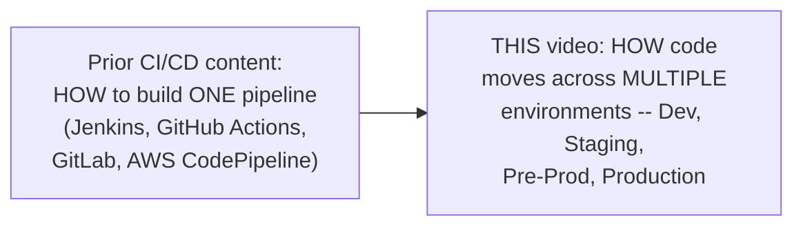

#### ❓ Why It Exists — The Genuinely New Question

> 💡 **Memory Trick, given directly:** *"After the feature branch, this change would move to the main branch, and from the main branch to the release branch, and from the release branch to production. So how does the application or code change move from the feature branch's Kubernetes cluster -- the developer environment -- to staging, to UAT/pre-production, to production? Here we've only talked about ONE CI/CD pipeline, one Jenkins pipeline, deploying to ONE Kubernetes cluster. Now let's talk about the ENTIRE workflow of promoting these changes."*

#### 🎯 Key Takeaways

* This video's genuinely new contribution: while prior content taught HOW to build a single CI/CD pipeline, this video addresses the coordinated, MULTI-ENVIRONMENT workflow those pipelines fit into.
* The core, motivating question: how does one code change genuinely travel from a developer's feature branch all the way to real, production customers, across multiple distinct environments and Kubernetes clusters?
* This topic is explicitly framed around **branching strategy and release process** — directly building on, and explicitly citing, Day 10's own branching-strategy content.

---

### 2. Quick Recap: The Single-Environment CI/CD Pipeline

#### 🪜 Step-by-Step — The Familiar, Foundational Pipeline

> 💡 **Memory Trick, the complete recap given directly:** *"Whenever a user makes a code change to the feature branch, there's a webhook on the GitHub repository that triggers the Jenkins pipeline. First: continuous integration, with stages like code checkout, then building and unit testing (using Maven for Java, running unit tests). Once successful, code scanning -- using SonarQube for static code analysis. After that, image build creation -- a container image, typically via Docker. Then image scanning -- using Trivy, Snyk, or Clair, all open-source options, to verify no critical vulnerabilities exist. Finally, pushing the image to your image registry -- Docker Hub, Quay, or Artifactory."*

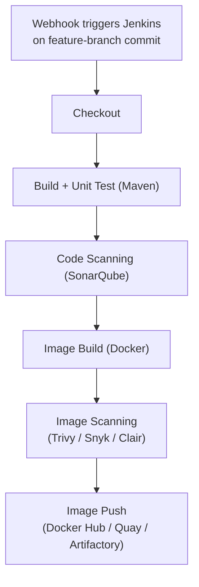

#### 🪜 Step-by-Step — Bridging to Deployment

> 💡 **Memory Trick, given directly:** *"Once you have your new image -- say `test:v2` -- the next step is updating your Kubernetes manifest (deployment.yaml, StatefulSet, or DaemonSet, whatever your application is) with the new version. Good practice: keep your manifest in a DIFFERENT Git repository from your source code. You can also use a Helm chart, updating the new version in `values.yaml`. Then use advanced deployment/delivery tools like Argo CD, Flux, or Spinnaker -- essentially a GitOps approach -- to deploy onto your Kubernetes platform."*

#### ⚠ Common Mistakes

* Assuming this recap represents genuinely new content — explicitly, directly framed as a necessary but brief REVIEW, since this exact pipeline structure has already been taught in depth across this channel's prior, dedicated CI/CD videos.

#### 🎯 Key Takeaways

* This session's recap directly reuses the SAME single-environment CI/CD pipeline structure already established across this instructor's prior Jenkins/GitHub Actions/GitLab content — image build/scan tools (Trivy, Snyk, Clair) and deployment tools (Argo CD, Flux, Spinnaker) named as interchangeable, genuinely equivalent options.
* This recap is explicitly, deliberately brief — it establishes the SHARED, FOUNDATIONAL building block (one pipeline, one environment) this video's actual new content (the multi-environment workflow) is built from.
* **Manifest repository separation** and **GitOps deployment** are directly reused, unchanged concepts from this instructor's broader body of prior work — not redefined here.

---
### 3. Branching Strategy, Revisited: Feature, Main, Release & Hotfix Branches

#### ❓ Why It Exists — The Session's Own Stated Priority

> 💡 **Memory Trick, given directly:** *"The key factor here is to understand the branching strategy. If you understand the branching strategy, you can assume you've already understood half of this process."*

#### 📖 Definition — Feature Branches: Zero, One, or MANY

> 💡 **Memory Trick, the full, realistic scenario given directly:** *"In an ideal world, there will be a LOT of feature branches -- not just one. Take a company like amazon.com: one development team might be working on enhancement one -- as simple as adding a new UI page. Another team might be working on adding new database tables and enhancing the user experience by retrieving additional data. Another team might be working on enhancement two entirely. For all of these, you create feature branches."*

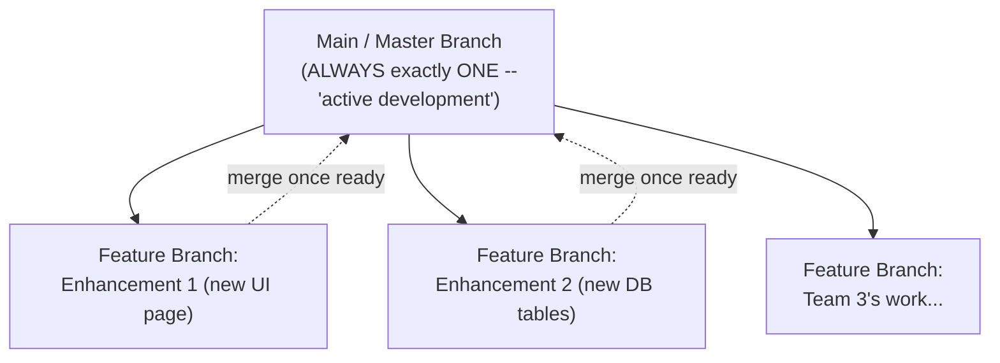

#### 📖 Definition — Main/Master Branch: Always Exactly One

> 💡 **Memory Trick, given directly:** *"The main branch -- previously called the master branch -- is always ONE single branch where the active development is going on. What does 'active development' mean? Fixes, or small new features (not extensive ones) -- just little changes or bug fixes to existing, already-live code. In some organizations, at some point, there won't be any new features -- then you simply don't create feature branches. Feature branches can be zero, one, or many; main branch is always one."*

#### 📖 Definition — Release Branches

> 💡 **Memory Trick, given directly:** *"Versions released to production come from release branches -- I'll explain more using a relatable analogy shortly."*

#### 📖 Definition — Hotfix Branches

> 💡 **Memory Trick, given directly:** *"Hotfix branches are for CUSTOMER issues -- say, on iOS 15 (currently released to customers), someone identifies a critical bug. From the iOS 15 RELEASE branch specifically, you create a hotfix branch, fix the code there, and then merge the changes to the main branch, feature branches, AND the release branches. The name itself indicates something critical happened in production."*

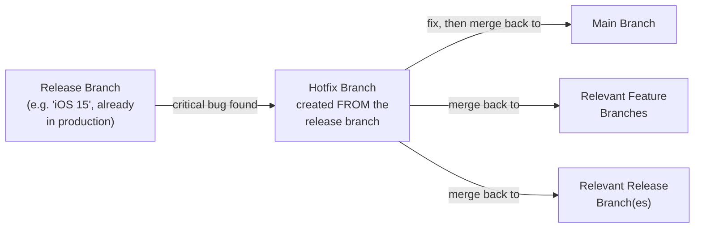

#### ⚠ Common Mistakes

* Assuming a hotfix branch is created from the main branch — explicitly, directly corrected: hotfix branches are created FROM the specific RELEASE branch experiencing the critical issue, then merged back to main, feature, and release branches, not the other way around.
* Assuming only one feature branch can exist at a time — explicitly, directly corrected via the realistic, multi-team Amazon example.

#### 🎯 Key Takeaways

* This session's **four-branch strategy** — feature, main, release, hotfix — is explicitly, directly presented as the standard, most common pattern used across top MNCs and open-source projects, though some organizations add a "develop"/"integration" branch as a variant.
* **Feature branches**: zero, one, or many, simultaneously. **Main/master**: always exactly one, holding active, incremental development. **Release branches**: distinct, production-bound versions. **Hotfix branches**: created FROM a release branch for critical production issues, merged back to main, feature, AND release branches.
* This entire discussion **directly, explicitly builds on Day 10's own branching-strategy session** — the instructor directly points viewers there for additional depth.

---

### 4. The iOS Analogy: Understanding Release Branches

#### 🧠 Concept — A Genuinely Clarifying, Real-World Analogy

> 💡 **Memory Trick, the complete analogy given directly:** *"Take your mobile application -- say you're using an iPhone. There are different iOS versions currently available: iOS 10, 11, 12, 13, 14. These are different versions of iOS available IN PRODUCTION -- you can install iOS 15, iOS 16 -- there will typically be three or four SUPPORTED versions at any given point, and you can install one of them. These versions are released to production FROM release branches."*

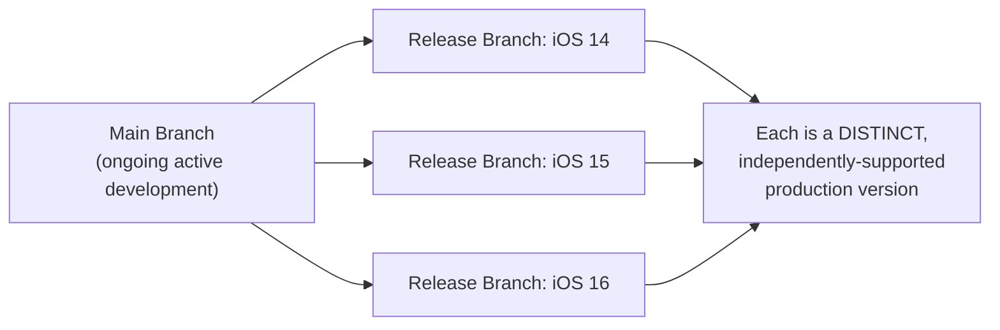

#### 🎯 Key Takeaways

* The iOS-version analogy makes a genuinely abstract concept (a "release branch") concrete: each release branch represents a **distinct, independently-supported, production-deployed version** — directly analogous to how multiple iOS versions can be simultaneously "in production" and installable by different users.
* This analogy also implicitly explains WHY hotfix branches specifically target a SPECIFIC release branch (Section 3) — a critical bug on "iOS 15" specifically needs a fix targeted at THAT version, not some other, unrelated release.

---
### 5. The Full Promotion Workflow, Step 1: Feature Branch → Dev Environment

#### 🪜 Step-by-Step — The Complete, Worked Example

> 💡 **Memory Trick, the concrete scenario given directly:** *"Let's call this Git repository the 'Payments App' repository. A user is working on one of the features and commits a change to the feature branch. This triggers the Jenkins pipeline -- which, using Argo CD, runs all the stages and finally deploys on one of the Kubernetes clusters assigned specifically for THIS feature branch."*

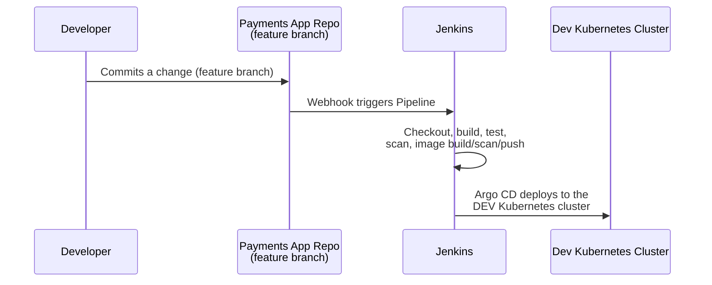

#### 🎯 Key Takeaways

* This step exactly reproduces the "single-environment pipeline" recap (Section 2), now explicitly, precisely anchored to a SPECIFIC branch (feature) and a SPECIFIC, dedicated Kubernetes cluster ("developer environment").
* This concrete, named example (a "Payments App" repository) gives the abstract workflow a genuine, memorable, reusable interview narrative — directly consistent with this instructor's broader teaching pattern of concrete, worked examples over pure abstraction.

---

### 6. Step 2: Main Branch → Staging, Where QA Takes Over

#### 🪜 Step-by-Step — The Second Pipeline, Triggered by a Merge

> 💡 **Memory Trick, given directly:** *"Once the change goes to the main branch, there's a DIFFERENT webhook configured for main, triggering a DIFFERENT Jenkins pipeline. This pipeline runs almost the same stages as the feature-branch pipeline -- but now your feature branch's changes are merged into master, where the ACTIVE DEVELOPMENT code lives. Using Argo CD, this deploys to the STAGING environment -- a DIFFERENT Kubernetes cluster."*

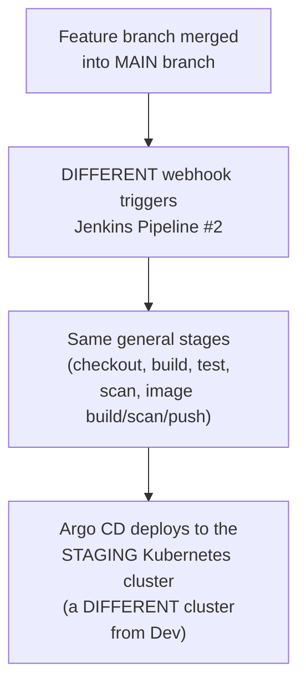

#### ❓ Why It Exists — Precisely Why This Distinction Matters

> 💡 **Memory Trick, the precise, direct reasoning given:** *"Why is this called the 'developer' platform? Because it's very particular to a SPECIFIC feature one developer/team is working on. Why is THIS called 'staging'? Because your feature branch has now merged into master, integrating with ALL the other changes the entire company/project is working on. It's genuinely important your feature branch not only works in isolation, but is well-integrated with everyone else's changes too."*

#### 🧠 Concept — What QA Genuinely Does in Staging

> 💡 **Memory Trick, given directly, precisely distinguishing this from automated pipeline testing:** *"In the staging Kubernetes environment, your QA team (or automated tests) can run ADDITIONAL manual tests once the application is deployed -- beyond the functional/regression tests already integrated into your Jenkins pipeline. QA can run performance tests, DDoS attack tests, or penetration (pen) testing. Because QA OWNS the staging environment (sometimes called the 'QA environment'), they can verify the application for two to three days, or four to five days -- taking real, meaningful time."*

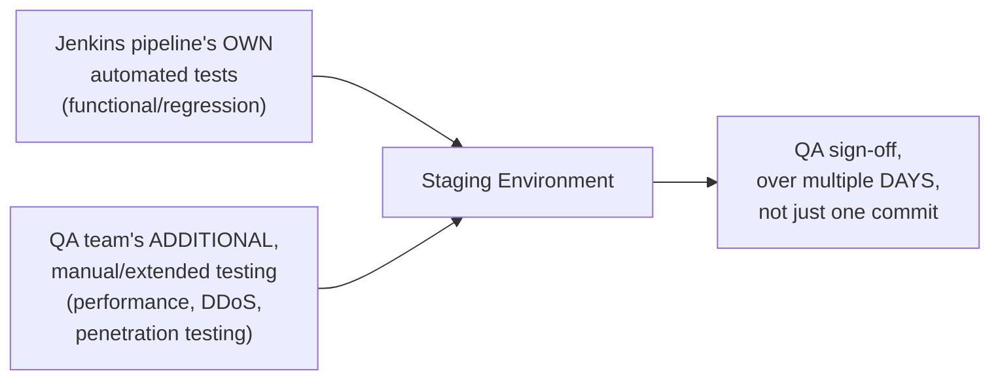

#### ⚠ Common Mistakes

* Assuming automated, pipeline-integrated testing alone is sufficient at the staging stage — explicitly, directly clarified: QA's manual, extended, multi-day testing (performance, DDoS, penetration testing) provides genuine, ADDITIONAL verification beyond what automated tests cover.
* Assuming "staging" and "developer" environments serve the same conceptual purpose, just with different names — explicitly, precisely distinguished: developer environment verifies ONE feature in isolation; staging verifies that feature's genuine INTEGRATION with everyone else's simultaneous changes.

#### 🎯 Key Takeaways

* The **main-branch pipeline** deploys to a genuinely SEPARATE Kubernetes cluster (staging), triggered by a genuinely SEPARATE webhook from the feature-branch pipeline.
* **Staging's** distinct purpose: verifying INTEGRATION with the rest of the codebase, not just isolated, single-feature correctness — a precise, important distinction from the "developer" environment's narrower scope.
* **QA ownership of staging** enables genuinely extended, manual testing (performance, DDoS, penetration testing) over multiple days — explicitly, directly distinguished from the faster, automated tests already built into the pipeline itself.

---
### 7. Step 3: Release Branch → Pre-Production → Production

#### 🪜 Step-by-Step — Cutting a Release Branch, and Its Own Pipeline

> 💡 **Memory Trick, given directly:** *"Once QA provides sign-off that all the features intended for a release are working fine in staging, a DevOps engineer creates a RELEASE branch from the main branch. From this release branch, you trigger a Jenkins pipeline -- called the RELEASE PIPELINE, the most important pipeline in most cases. Using Argo CD, you deploy this onto a PRE-PRODUCTION environment -- some call it 'pre-prod,' others 'UAT.'"*

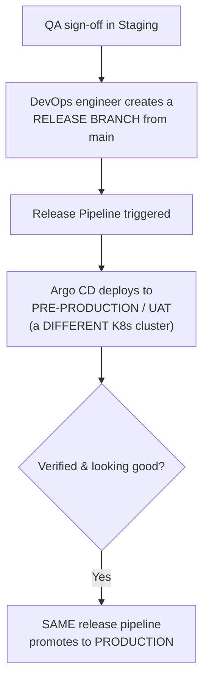

#### ❓ Why It Exists — Release Timing, Kept Deliberately Simple

> 💡 **Memory Trick, given directly:** *"Some teams, depending on their work culture, release every two to three weeks. Others release whenever they're ready. Let's not get into that complexity -- the key trigger is: whenever QA signs off that all features intended for a release are working fine on staging."*

#### 🪜 Step-by-Step — From Pre-Production to Production

> 💡 **Memory Trick, given directly:** *"You verify everything is working on pre-production for some time, and if it looks good, you promote from the SAME release pipeline to production. In your interview, you can say: from the release branch, we use Argo CD to deploy to pre-production, verify it, and then promote from that same release pipeline to production."*

#### ⚠ Common Mistakes

* Assuming release timing follows one single, universal rule across all organizations — explicitly, directly acknowledged as varying by team/work culture (fixed cadence vs. readiness-based), with the instructor deliberately choosing not to prescribe one "correct" answer.
* Assuming pre-production and production use separate, independently-triggered pipelines — explicitly, directly clarified: BOTH deployments happen from the SAME release pipeline, just promoted at different points.

#### 🎯 Key Takeaways

* A **release branch** is deliberately, manually created by a DevOps engineer FROM main, specifically once QA has signed off — not an automatic, every-commit action like the feature/main pipelines.
* The **release pipeline** is explicitly named as "the most important pipeline in most cases" — deploying first to **pre-production/UAT**, then, from that SAME pipeline, promoting to **production**.
* Release timing/cadence genuinely **varies by organization** — this session deliberately avoids prescribing one universal rule, focusing instead on the underlying WORKFLOW (QA sign-off → release branch → pre-prod → production).

---

### 8. Why Separate Kubernetes Clusters (Not Just Namespaces) Per Environment

#### ❓ Why It Exists — The Direct, Interview-Ready Recommendation

> 💡 **Memory Trick, given directly:** *"In all of these stages, it's a good practice to have DIFFERENT Kubernetes clusters -- a different cluster for development, a different one for staging, different ones for pre-production and production. Some companies club environments together and use different namespaces instead -- but this is NOT a good practice."*

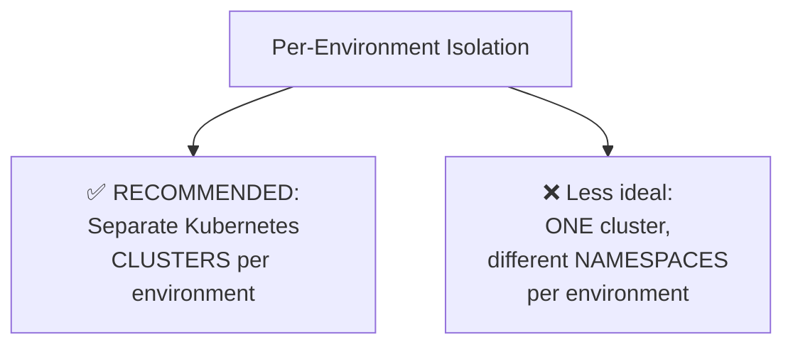

#### 🔍 Internal Working — An Especially Strong Requirement for Pre-Prod/Production

> ⚠️ **A direct, precise, access-control-driven reasoning given:** *"At LEAST for pre-production and production, you need to maintain DIFFERENT Kubernetes clusters -- because NOBODY should have access to the production cluster, whereas QA or development teams CAN have access to development/staging clusters. Pre-production is specifically used for debugging production issues: if someone reports something isn't working in production, you don't immediately log into production to debug -- instead, you try to REPRODUCE the issue on pre-production and work on it there."*

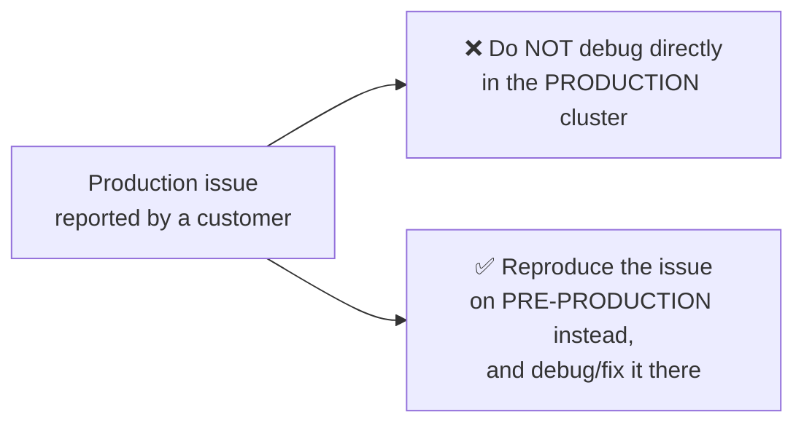

#### ⚠ Common Mistakes

* Using shared namespaces within one Kubernetes cluster across all environments purely for convenience — explicitly, directly discouraged as NOT a good practice, even though acknowledged as something some companies genuinely do.
* Assuming access-control reasoning applies equally to all environment pairs — explicitly, directly emphasized as an especially STRONG, near-mandatory requirement specifically for pre-production/production (nobody should access production directly), somewhat more flexible for dev/staging.

#### 🎯 Key Takeaways

* **Separate Kubernetes clusters per environment** is the recommended, best-practice pattern — explicitly preferred over shared-cluster/different-namespace approaches.
* The core justification is **access control and safe debugging**: production access should be genuinely restricted, and pre-production exists specifically as a safe space to reproduce and debug reported production issues without directly touching the live, customer-facing environment.
* This is explicitly framed as a **ready-made, precise interview answer** — a genuinely common question interviewers ask about environment architecture.

---
### 9. Scaling the Pipeline: Multiple Pipelines vs. Multi-Branch + Single Argo CD

#### 📖 Definition — Genuine, Environment-Dependent Pipeline Differences

> 💡 **Memory Trick, given directly:** *"The pipeline you build will be SIMILAR across environments -- I say 'similar' because sometimes, for production, you add a FEW MORE stages. For development, use all the stages I explained -- checkout, build/unit testing, code quality analysis, Docker image creation, image scanning, image push, then deployment via Argo CD. For pre-production or production, ADDITIONALLY add things like pen testing -- these take a lot of time, which is exactly why you'd want to SKIP them for every single commit on development and staging."*

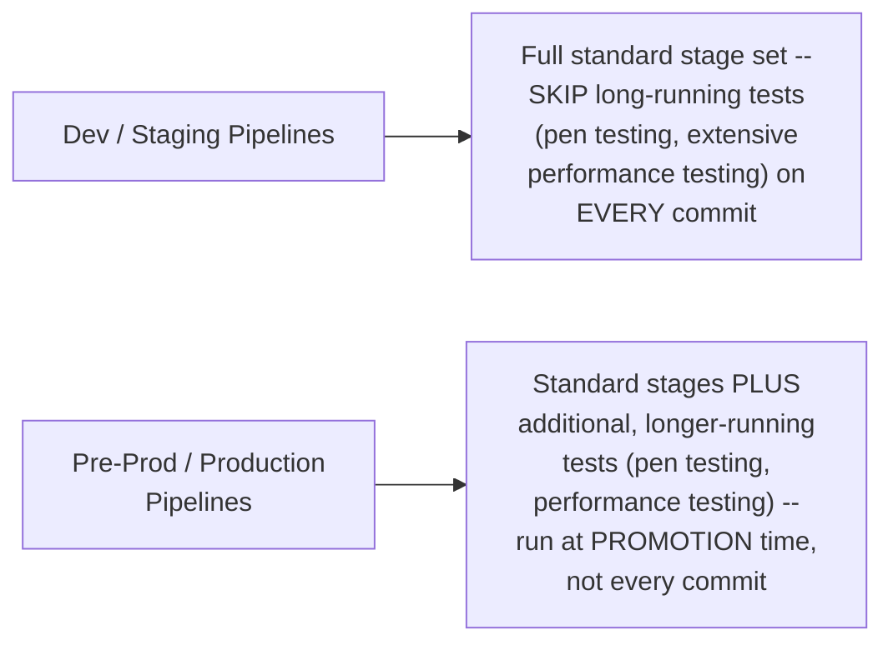

#### 📖 Definition — Architectural Option A: Separate Pipelines & Argo CD Instances

> 💡 **Memory Trick, given directly:** *"You can tell your interviewer: we're using DIFFERENT Jenkins pipelines for each environment -- that's totally fine, and totally valid."*

#### 📖 Definition — Architectural Option B: Multi-Branch Pipeline + Single Argo CD Instance

> 💡 **Memory Trick, given directly:** *"In some companies, you can use something like Jenkins MULTI-BRANCH pipelines instead of writing multiple pipelines -- write ONE single pipeline, and configure it for multiple branches. Similarly, instead of deploying an Argo CD instance for EACH stage, you can use ONE single Argo CD instance -- your CI can be different Jenkins pipelines, but Argo CD watches ONE Git repository containing DIFFERENT FOLDERS -- one for development, one for staging, one for pre-prod/prod (or Helm charts per environment). In Argo CD, you create separate APPLICATIONS, each watching its own folder, with DIFFERENT DESTINATION Kubernetes clusters."*

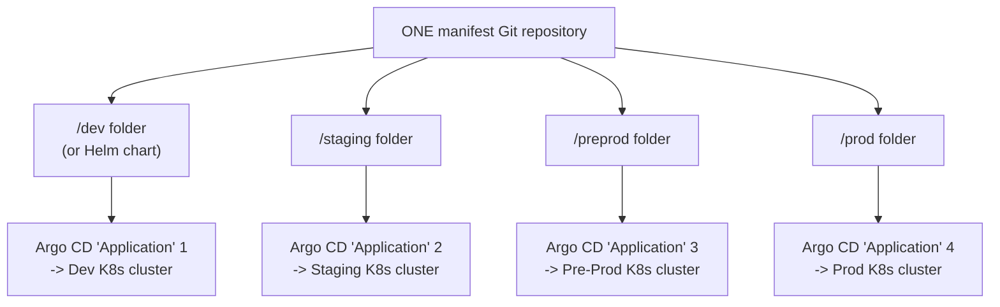

#### ❓ Why It Exists — Both Options Are Explicitly, Directly Validated

> 💡 **Memory Trick, given directly, the session's own closing, precise guidance:** *"Don't confuse this or complicate it -- you can also say 'for each environment we have different pipelines,' which is totally fine. Or, if you're comfortable, tell your interviewer: 'we're using a multi-branch strategy for Jenkins, and a single Argo CD instance watching different folders in the Git repository.' It does not matter, end of the day -- what matters is how you explain the branching strategy, and that you understand how applications are promoted, whether using one Jenkins pipeline or different Jenkins pipelines."*

#### ⚠ Common Mistakes

* Assuming one specific architectural implementation (separate pipelines vs. multi-branch + single Argo CD) is the single, "correct" answer interviewers expect — explicitly, directly clarified: BOTH are genuinely valid, and the underlying conceptual understanding (branching strategy, promotion workflow) matters far more than the specific implementation choice.

#### 🎯 Key Takeaways

* Pipelines across environments are **similar but not identical** — pre-production/production pipelines typically ADD heavier, longer-running tests (pen testing, extensive performance testing) that dev/staging pipelines deliberately SKIP on every commit, for genuine time-efficiency reasons.
* **Two genuinely valid architectural approaches** exist for scaling this workflow: (A) fully separate Jenkins pipelines and Argo CD instances per environment, or (B) a Jenkins multi-branch pipeline paired with ONE Argo CD instance watching a folder-per-environment manifest repository structure.
* The session's own **explicit, closing guidance**: what matters most — especially in an interview — is genuine understanding of the BRANCHING STRATEGY and PROMOTION WORKFLOW, not memorizing one single "correct" architectural implementation.

---

## 📝 Glossary

| Term | Definition | Why It Matters |
|---|---|---|
| **Feature Branch** | An isolated branch for new/breaking work; zero, one, or many can exist simultaneously | Deploys to the "developer" environment/Kubernetes cluster |
| **Main / Master Branch** | The single branch holding ongoing "active development" (small fixes/incremental features) | Deploys to the Staging environment upon merge |
| **Release Branch** | A branch representing a distinct, production-bound version (the iOS-version analogy) | Deploys to Pre-Production, then promotes to Production |
| **Hotfix Branch** | Created FROM a release branch for critical production issues | Merged back to main, feature branches, AND release branches |
| **Developer Environment** | The Kubernetes cluster a specific feature branch deploys to | Verifies ONE feature in isolation |
| **Staging Environment** | The Kubernetes cluster the main branch deploys to; also called "QA environment" | Verifies INTEGRATION with all other simultaneous changes |
| **Pre-Production (Pre-Prod / UAT)** | The Kubernetes cluster a release branch deploys to before production | Used to safely reproduce and debug production issues |
| **Release Pipeline** | The Jenkins pipeline triggered from a release branch | Deploys to pre-production, then promotes to production |
| **Multi-Branch Pipeline** | A single Jenkins pipeline definition, configured to run across multiple branches | An alternative to writing separate pipelines per environment |
| **Argo CD Application** | A distinct GitOps target within Argo CD, watching a specific folder/path | Enables one Argo CD instance to manage multiple environments |

---

## 🔄 Revision Notes — One-Minute Revision

* This video's genuinely new contribution: prior CI/CD content taught HOW to build ONE pipeline for ONE environment; this video addresses the coordinated, MULTI-ENVIRONMENT promotion workflow -- explicitly building on Day 10's branching strategy.
* Quick recap of the familiar, single-environment pipeline: **checkout → build/unit test (Maven) → code scanning (SonarQube) → image build (Docker) → image scan (Trivy/Snyk/Clair) → image push → manifest update (separate repo, possibly Helm) → GitOps deployment (Argo CD/Flux/Spinnaker)**.
* **Branching strategy is "half the process"**: **feature branches** (zero, one, or MANY simultaneously), **main/master** (always exactly ONE, "active development"), **release branches** (distinct, production-bound versions -- clarified via the **iOS-version-number analogy**), and **hotfix branches** (created FROM a release branch for critical issues, merged back to main/feature/release).
* **The full promotion workflow**: feature-branch commit → Jenkins Pipeline #1 → **Dev** Kubernetes cluster → merge to main → Jenkins Pipeline #2 (different webhook) → **Staging** cluster (QA takes real ownership: performance/DDoS/penetration testing, over multiple days) → QA sign-off → DevOps engineer manually creates a **release branch** → **release pipeline** → **Pre-Production/UAT** cluster → verified → SAME release pipeline promotes to **Production**.
* **Separate Kubernetes clusters** (not just namespaces) per environment is the recommended, interview-ready best practice -- especially strong for pre-prod/production, since nobody should have direct production access, and pre-production exists specifically for safely reproducing/debugging reported production issues.
* **Pre-prod/production pipelines add heavier testing** (pen testing, extensive performance testing) that dev/staging pipelines deliberately skip on every commit, for genuine time efficiency.
* **Two genuinely valid architectural options**: separate Jenkins pipelines + separate Argo CD instances per environment, OR a Jenkins multi-branch pipeline + a SINGLE Argo CD instance watching a folder-per-environment manifest repository. The session's own closing guidance: understanding the branching strategy and promotion workflow matters far more than which specific implementation you choose.

---

## 📋 Cheat Sheet

**The four-branch strategy:**
```text
Feature Branch(es) -- zero, one, or MANY simultaneously
Main / Master       -- ALWAYS exactly one; "active development"
Release Branch(es)    -- distinct, production-bound versions (iOS-version analogy)
Hotfix Branch            -- created FROM a release branch; merged back to main + feature + release
```

**The full promotion workflow:**
```text
Feature branch commit  -> Pipeline #1 -> DEV cluster
Merge to main           -> Pipeline #2 -> STAGING cluster (QA: perf/DDoS/pen testing)
QA sign-off               -> create RELEASE branch -> Release Pipeline
                              -> PRE-PROD cluster -> verify -> PRODUCTION cluster
                              (same release pipeline promotes to both)
```

**Environment isolation:**
```text
✅ RECOMMENDED: separate Kubernetes CLUSTER per environment
❌ Less ideal:   one cluster, different NAMESPACES per environment
   (especially strict for pre-prod/production: nobody should
    have direct production access)
```

**Pipeline differences by environment:**
```text
Dev / Staging     -> standard stages; SKIP long-running tests every commit
Pre-Prod / Prod     -> standard stages + pen testing / extensive perf testing
                        (run at PROMOTION time, not every commit)
```

**Two valid architectures:**
```text
Option A: separate Jenkins pipeline + separate Argo CD instance PER environment
Option B: Jenkins MULTI-BRANCH pipeline + ONE Argo CD instance,
          watching folder-per-environment in one manifest repo
(BOTH are valid, interview-acceptable answers)
```

---

## 🔥 Interview Questions & Answers

### 🟢 Beginner

**Q1.**

**Question:** Name the four branch types in this session's standard branching strategy.

**Answer:** Feature, main/master, release, and hotfix.

**Explanation:** Directly, explicitly named, building on Day 10's own content.

**Why Interviewers Ask This:** A foundational, frequently-asked branching-strategy question.

**Possible Follow-up:** "How many feature branches can exist at once?"

**Q2.**

**Question:** How many main/master branches typically exist in a repository at once?

**Answer:** Always exactly one.

**Explanation:** Directly, precisely stated, contrasted with feature branches (zero, one, or many).

**Why Interviewers Ask This:** Tests precise understanding of branch cardinality.

**Possible Follow-up:** "What kind of work happens directly on the main branch?"

**Q3.**

**Question:** Using the iOS analogy, what does a "release branch" represent?

**Answer:** A distinct, independently-supported, production-deployed version -- just as multiple iOS versions can be simultaneously "in production" and installable.

**Explanation:** Directly, precisely explained via this session's own analogy.

**Why Interviewers Ask This:** Tests conceptual, not just terminological, understanding of release branches.

**Possible Follow-up:** "Where does a hotfix branch get created from, specifically?"

**Q4.**

**Question:** From which branch is a hotfix branch created?

**Answer:** From the specific release branch experiencing the critical issue -- not from main.

**Explanation:** Directly, explicitly stated.

**Why Interviewers Ask This:** A commonly-tested, precise branching detail.

**Possible Follow-up:** "Which branches does a hotfix eventually get merged back into?"

**Q5.**

**Question:** What environment does a feature-branch commit deploy to?

**Answer:** The "developer" environment -- a dedicated Kubernetes cluster specific to that feature.

**Explanation:** Directly, precisely stated.

**Why Interviewers Ask This:** Basic, foundational promotion-workflow knowledge.

**Possible Follow-up:** "What environment does merging into main deploy to instead?"

**Q6.**

**Question:** What does the staging environment verify that the developer environment doesn't?

**Answer:** Integration with all the OTHER simultaneous changes across the entire project/company, not just the one feature in isolation.

**Explanation:** Directly, precisely distinguished.

**Why Interviewers Ask This:** Tests genuine understanding of WHY staging exists as a distinct stage.

**Possible Follow-up:** "What additional, manual testing does QA typically perform in staging?"

**Q7.**

**Question:** Who typically creates a release branch, and what triggers this?

**Answer:** A DevOps engineer, once QA provides sign-off that all intended features are working correctly in staging.

**Explanation:** Directly, explicitly stated.

**Why Interviewers Ask This:** Tests understanding of the genuine, human-driven trigger for this specific promotion step.

**Possible Follow-up:** "What environment does the release branch deploy to first?"

**Q8.**

**Question:** Why is it recommended to use separate Kubernetes clusters, rather than just separate namespaces, per environment?

**Answer:** For genuine access control and safe debugging -- especially, nobody should have direct access to the production cluster, and pre-production exists specifically to safely reproduce and debug reported production issues.

**Explanation:** Directly, explicitly explained.

**Why Interviewers Ask This:** A commonly-asked, practical environment-architecture question.

**Possible Follow-up:** "Is this requirement equally strict for dev vs. staging as it is for pre-prod vs. production?"

**Q9.**

**Question:** Why do pre-production/production pipelines typically include additional stages that dev/staging pipelines skip?

**Answer:** Tests like penetration testing and extensive performance testing take significant time -- genuinely impractical to run on every single commit in dev/staging, but appropriate as a promotion gate before pre-prod/production.

**Explanation:** Directly, explicitly explained.

**Why Interviewers Ask This:** Tests understanding of genuine, practical pipeline-design trade-offs.

**Possible Follow-up:** "Name two specific tests mentioned as examples of this additional testing."

**Q10.**

**Question:** Name the two architectural options presented for scaling this workflow across environments.

**Answer:** Separate Jenkins pipelines + separate Argo CD instances per environment, OR a Jenkins multi-branch pipeline + a single Argo CD instance watching a folder-per-environment manifest repository.

**Explanation:** Directly, explicitly named, both validated as acceptable.

**Why Interviewers Ask This:** Tests awareness of genuine architectural flexibility, not a single rigid answer.

**Possible Follow-up:** "What does an Argo CD 'Application' correspond to in the folder-per-environment approach?"

---

### 🟡 Intermediate

**Q11.**

**Question:** Explain why the instructor explicitly states "if you understand the branching strategy, you can assume you've already understood half of this process" -- why does branching strategy carry this much conceptual weight?

**Answer:** The ENTIRE multi-environment promotion workflow this session describes is fundamentally STRUCTURED AROUND the branching strategy -- each branch type maps directly and precisely onto a specific environment and pipeline (feature → dev, main → staging, release → pre-prod/production, hotfix → targeted, urgent fixes). Once a learner genuinely understands WHICH branch corresponds to WHICH environment and WHY, the remaining content (specific pipeline stages, specific tools like Argo CD, specific Kubernetes cluster configurations) becomes a natural, logical EXTENSION of that branching foundation, rather than a separate, independently-memorized set of facts. This is precisely why the instructor frames branching strategy as "half the process" -- it's the organizing PRINCIPLE the rest of the workflow's specific mechanics hang from.

**Explanation:** Requires recognizing branching strategy as the STRUCTURAL foundation the rest of the session's content is organized around, not merely one topic among several equally-weighted ones.

**Why Interviewers Ask This:** Tests whether a learner grasps the CONCEPTUAL HIERARCHY of this material, not just its individual facts.

**Possible Follow-up:** "If you had to explain this entire workflow to someone in exactly two sentences, what would you say?"

**Q12.**

**Question:** A learner argues that since this session validates BOTH architectural options (separate pipelines vs. multi-branch + single Argo CD) as acceptable, the choice between them is essentially arbitrary and doesn't matter in practice. Evaluate this claim.

**Answer:** This claim overstates the session's actual guidance. The session validates BOTH as acceptable ANSWERS IN AN INTERVIEW CONTEXT specifically -- it does not claim the choice is arbitrary for a REAL, PRODUCTION ORGANIZATION'S actual architecture. In practice, genuine trade-offs exist: separate pipelines/Argo CD instances offer simpler, more isolated mental models and potentially easier per-environment customization, while a multi-branch pipeline + single Argo CD instance offers reduced duplication and centralized GitOps visibility across environments, at the cost of some added configuration complexity (parameterizing one pipeline for multiple branches, managing one Argo CD instance's multiple Applications). The session's own guidance is specifically about INTERVIEW COMMUNICATION flexibility (either answer demonstrates genuine understanding) -- not a claim that a real organization's actual implementation choice is inconsequential.

**Explanation:** Tests whether a learner distinguishes "acceptable interview answer flexibility" from "the actual implementation choice doesn't matter in real practice" -- a meaningful distinction the session's own framing doesn't fully collapse.

**Why Interviewers Ask This:** Distinguishes candidates who understand the session's guidance is scoped to interview communication, not a claim about real-world architectural equivalence.

**Possible Follow-up:** "For a genuinely large organization with 50+ microservices, which of these two architectural options would you expect to scale more efficiently, and why?"

**Q13.**

**Question:** Explain, precisely, why the session specifically distinguishes "active development" (on main) from feature-branch work, rather than treating all pre-release code changes as conceptually equivalent.

**Answer:** This distinction matters because it defines exactly WHAT KIND of change is appropriate to make DIRECTLY on main, versus what requires a dedicated feature branch first. "Active development" (per the session's own definition: small fixes, minor incremental features on ALREADY-LIVE code) represents changes SMALL and LOW-RISK enough to reasonably integrate directly into the shared, active branch without needing full feature-branch isolation. Larger, more substantial work (a new UI page, new database tables -- the session's own stated examples) genuinely warrants a DEDICATED feature branch specifically because it represents bigger, more disruptive changes that could genuinely destabilize main if worked on directly there, especially with MULTIPLE teams working simultaneously (per Section 3's own multi-team Amazon example). This distinction is precisely what determines the appropriate BRANCHING DECISION for any given piece of work, not merely a naming convention.

**Explanation:** Requires reasoning through the PRACTICAL, decision-relevant distinction between these two categories of change, not just recalling that they're named differently.

**Why Interviewers Ask This:** Tests whether a learner understands the genuine, functional criterion for choosing a feature branch versus direct main-branch work.

**Possible Follow-up:** "Would fixing a typo in a UI label warrant a dedicated feature branch, per this session's own criteria? Why or why not?"

**Q14.**

**Question:** Using this session's pre-production reasoning (Section 8), explain why "reproduce the issue on pre-production" is a genuinely more disciplined debugging approach than directly investigating in production, beyond simply avoiding unauthorized access.

**Answer:** Beyond the stated access-control reasoning, reproducing an issue on pre-production BEFORE attempting any fix offers a genuine, additional methodological benefit: it provides a SAFE, ISOLATED environment to experiment with potential fixes, run diagnostic tools, or even deliberately trigger failure conditions -- actions that would be genuinely risky or outright unacceptable to perform directly against a LIVE, customer-facing production environment, where any exploratory debugging action itself risks causing FURTHER customer-facing disruption. This transforms debugging from a high-stakes, "one attempt only" scenario (directly in production) into a genuinely iterative, safe process (in pre-production) where a team can try multiple diagnostic approaches, confirm they've correctly identified the root cause, and validate their fix works BEFORE ever touching the actual production environment -- a genuinely more disciplined, lower-risk approach than the access-control framing alone fully captures.

**Explanation:** Requires extending the session's own stated (access-control-focused) reasoning with an additional, genuinely important methodological benefit not explicitly stated but reasonably implied.

**Why Interviewers Ask This:** Tests whether a learner can reason beyond a stated justification to identify additional, genuine benefits of a described practice.

**Possible Follow-up:** "What would you do if an issue genuinely could NOT be reproduced on pre-production, despite genuine effort?"

**Q15.**

**Question:** Synthesize this session's environment-specific pipeline differences (Section 9) with Day 18's own five standard CI/CD steps to explain precisely how Day 18's general framework needs to be EXTENDED, not simply applied unchanged, to account for this session's multi-environment reality.

**Answer:** Day 18's five standard steps (unit testing, static code analysis, code quality/vulnerability testing, functional/end-to-end testing, reporting) are presented there as a GENERAL, largely environment-agnostic pipeline structure -- this session reveals a genuinely important REFINEMENT: these steps aren't uniformly applied identically at every environment/promotion stage. Specifically, this session shows that "functional/end-to-end testing" (Day 18's step) genuinely EXPANDS in SCOPE and DEPTH as code moves toward production -- dev/staging pipelines run a lighter, faster version (appropriate for every-commit execution), while pre-prod/production promotion gates add SUBSTANTIALLY MORE testing (penetration testing, extensive performance testing) that would be genuinely impractical to run at every-commit frequency. This means Day 18's five-step framework needs to be understood as a MINIMUM, BASELINE structure that GENUINELY SCALES IN RIGOR as code approaches production, rather than a fixed, identically-applied checklist regardless of which promotion stage a given pipeline execution represents -- a genuinely important refinement this session provides that Day 18's own, more general treatment doesn't fully address.

**Explanation:** Requires recognizing that this session doesn't merely ADD new content to Day 18's framework, but genuinely REFINES how that framework's own steps should be understood to scale across the multi-environment reality this session introduces.

**Why Interviewers Ask This:** A senior-level question testing whether a candidate can synthesize related course content into a genuinely more sophisticated, refined understanding, rather than treating each session's content as simply additive, disconnected facts.

**Possible Follow-up:** "Which of Day 18's OTHER four standard steps (besides functional/end-to-end testing) would you also expect to scale in rigor across this session's multiple environments, and how?"

---

### 🔴 Advanced

**Q16.**

**Question:** Design a genuinely complete branching-and-environment strategy for an organization that ALSO needs to support a genuine hotfix scenario spanning MULTIPLE, simultaneously-supported release branches (e.g., both "v14" and "v15" are still in active production use, and a critical security bug affects both), using only this session's stated reasoning.

**Answer:** Directly extending this session's own hotfix reasoning (Section 3): (1) Create a hotfix branch from the SPECIFIC release branch where the issue was FIRST identified/reported (e.g., "v15"), fix the issue there, following this session's exact demonstrated pattern. (2) Since the SAME underlying issue affects "v14" as well (a genuinely realistic scenario for widely-deployed software with multiple concurrent supported versions), create a SECOND, PARALLEL hotfix branch specifically from the "v14" release branch, applying the equivalent fix there -- since a single hotfix branch cannot simultaneously target two genuinely different, independently-versioned codebases that may have diverged in other ways since branching. (3) Both hotfix branches independently merge back into their RESPECTIVE release branches (v14's hotfix -> v14 release branch; v15's hotfix -> v15 release branch), directly following this session's stated merge pattern. (4) BOTH hotfix branches should ALSO merge into the shared MAIN branch (per this session's own stated "merge to main branch" requirement), ensuring the fix is present in ALL future development, not just the two currently-affected release branches -- critically, this main-branch merge should happen ONCE, reflecting that main represents a SINGLE, ongoing development stream, even though two SEPARATE release-branch merges were needed. This design directly, precisely extends this session's stated hotfix pattern to a genuinely more complex, multi-version scenario the session's own single-example demonstration doesn't explicitly cover, while remaining fully consistent with its stated underlying principles.

**Explanation:** Extends the session's own stated hotfix pattern to a genuinely more complex, realistic scenario (multiple simultaneously-supported versions) not explicitly demonstrated, while remaining logically consistent with the session's own stated reasoning.

**Why Interviewers Ask This:** A realistic, senior-level branching-strategy question testing whether a candidate can extend a taught pattern to a genuinely more complex, realistic scenario.

**Possible Follow-up:** "How would you decide WHICH currently-supported release branches genuinely need this same hotfix, versus which might be unaffected by this specific issue?"

**Q17.**

**Question:** Critically evaluate: "Since this session states pre-production/production pipelines should include additional tests like penetration testing that dev/staging pipelines skip, penetration testing is therefore unnecessary or unimportant at the dev/staging stage." Is this an accurate implication of this session's content?

**Answer:** Not accurate. The session's own stated reasoning for skipping these tests at dev/staging is specifically about EVERY-COMMIT PRACTICALITY (these tests "take a lot of time," genuinely impractical to run on every single commit) -- NOT a claim that security/performance concerns are irrelevant or unimportant at earlier stages. A more precise, accurate reading: dev/staging pipelines rely on FASTER, automated security/quality checks (code scanning via SonarQube, image scanning via Trivy/Snyk/Clair -- both explicitly covered in this session's own recap, Section 2) as a FIRST, frequent line of defense, while the SLOWER, more comprehensive penetration/performance testing is deliberately RESERVED as a promotion GATE specifically because it's too time-costly to run continuously, not because it's unimportant at earlier stages. The accurate claim: different TESTING DEPTHS are appropriate at different PROMOTION FREQUENCIES, not that security testing itself is unimportant until late in the pipeline.

**Explanation:** Tests whether a learner distinguishes "deferred due to practical time constraints" from "unimportant until this stage," correctly recognizing that faster, complementary checks (already covered earlier in this session) remain active throughout.

**Why Interviewers Ask This:** Distinguishes candidates who understand the genuine, practical reasoning behind staged testing depth from those who draw an inaccurate conclusion about security's overall importance at earlier stages.

**Possible Follow-up:** "Name the SPECIFIC, faster security/quality checks this session's own recap (Section 2) states ARE run at every stage, including dev/staging."

**Q18.**

**Question:** Synthesize this session's complete multi-environment workflow with the earlier CI/CD Week "Ultimate GitLab CI" session's own single-environment pipeline to design what a genuinely complete, multi-environment GitLab-based (rather than Jenkins-based) implementation of THIS session's exact workflow would look like.

**Answer:** Directly translating this session's Jenkins-centric workflow into the GitLab-based architecture from the earlier CI/CD Week session: (1) Replace each "Jenkins pipeline" reference with an equivalent **`.gitlab-ci.yml`**-defined pipeline (or, per this session's own Option B, a single, BRANCH-PARAMETERIZED `.gitlab-ci.yml` using GitLab's own `rules:`/`only:`/`except:` branch-targeting syntax, directly analogous to Jenkins' multi-branch pipeline concept). (2) The SonarQube integration, GitLab CI/CD Variables for secrets, and Docker-executor-based runner architecture from the GitLab session would apply IDENTICALLY at EVERY environment stage in this session's workflow (dev, staging, pre-prod, production), with the SonarQube server and Docker executor image genuinely REUSED across all of them, directly per the GitLab session's own stated "reuse across hundreds of Java applications" reasoning. (3) The "Project Runners" (self-hosted, for private/enterprise codebases) reasoning from the GitLab session would apply with PARTICULAR force specifically for pre-production/production stages, directly reinforcing THIS session's own separate, independent reasoning (Section 8) about restricted, controlled access to these specific environments -- a genuine, mutually-reinforcing connection between the GitLab session's runner-security reasoning and this session's own environment-access reasoning. (4) The GitOps deployment layer (Argo CD, per this session's Option B) would remain architecturally UNCHANGED regardless of whether the CI portion uses Jenkins or GitLab CI specifically -- since Argo CD watches a GIT REPOSITORY (the manifest repo) rather than depending on which specific CI tool produced the updated manifest, directly demonstrating that this session's CI-tool-agnostic promotion workflow genuinely, cleanly separates the CI TOOL CHOICE from the underlying BRANCHING/ENVIRONMENT/GITOPS architecture.

**Explanation:** Requires synthesizing this session's complete conceptual workflow with a genuinely separate, detailed, tool-specific session's content, producing a coherent, cross-tool translation that reveals genuine architectural separability.

**Why Interviewers Ask This:** A capstone-level question testing whether a candidate understands this session's workflow as genuinely CI-TOOL-AGNOSTIC (as the session itself explicitly claims when naming Jenkins, GitHub Actions, GitLab, and AWS CodePipeline interchangeably), capable of being implemented with any specific CI tool while preserving the same underlying branching/environment/GitOps architecture.

**Possible Follow-up:** "What GENUINE differences (not just naming/syntax) would exist between a Jenkins-based and a GitLab-based implementation of this exact workflow, if any?"

---

## 🧪 Scenario-Based Interview Questions

> **Scenario 1:** A junior team member asks why their feature branch's changes, which worked perfectly in the developer environment, failed once merged into main and deployed to staging. Using this session's concepts, diagnose this.

**Structured Answer:**
1. **Initial investigation:** Recognize this as a direct, textbook instance of exactly the distinction Section 6 establishes -- the developer environment verifies a feature in ISOLATION; staging verifies genuine INTEGRATION with all other simultaneous changes.
2. **Metrics/logs to check:** Review what OTHER feature branches/changes were also recently merged into main around the same time, to identify potential conflicts or integration issues between this feature and others.
3. **Possible causes:** Most likely, per Section 6's own precise reasoning, this feature genuinely works in isolation but conflicts with, or is incompatible with, another team's simultaneously-merged changes -- exactly the kind of integration issue staging exists specifically to catch.
4. **Debugging approach:** Compare the application's behavior/dependencies in the isolated developer environment against its behavior when integrated with the FULL, current main-branch codebase in staging, identifying the specific point of conflict.
5. **Resolution:** Work with the team(s) responsible for the conflicting change(s) to resolve the incompatibility, directly reinforcing why staging's INTEGRATION-focused verification (not just isolated feature correctness) is genuinely necessary before further promotion.
6. **Prevention:** Encourage more frequent merging/syncing of main into active feature branches during development (reducing the SIZE of eventual integration surprises), directly connecting to the broader Git branching-hygiene principles established in Day 10's own content.

> **Scenario 2 (Advanced):** Your organization currently uses Option A (separate Jenkins pipelines + separate Argo CD instances per environment) but is struggling with significant pipeline-definition duplication and inconsistency across environments as the number of microservices grows. Using this session's concepts (Section 9) and Advanced Q12's reasoning, provide your recommendation.

**Structured Answer:**
1. **Initial investigation:** Recognize this as a genuine, realistic trade-off materializing over time -- Option A's simpler, more isolated mental model (per Advanced Q12's analysis) comes at the real cost of duplication that becomes genuinely more burdensome as scale increases.
2. **Relevant principle:** Per Section 9's own explicit validation of BOTH options, Option B (multi-branch pipeline + single Argo CD instance) directly addresses the SPECIFIC pain point reported here (duplication, inconsistency) by centralizing pipeline logic and GitOps configuration.
3. **Possible causes for reaching this point:** Organic growth -- likely started with Option A for its initial simplicity when the organization had fewer microservices/environments, without a coordinated review as scale increased, directly mirroring similar organic-growth patterns seen in this course's other sessions (e.g., Day 18's own Jenkins-scaling discussion).
4. **Debugging/evaluation approach:** Quantify the actual, current duplication/inconsistency burden (how many separate pipeline definitions exist, how often they diverge unintentionally) to build a genuine, data-driven case for migration effort.
5. **Resolution:** Recommend a structured migration toward Option B specifically -- consolidating to a single, branch-parameterized Jenkins pipeline and a single Argo CD instance watching a folder-per-environment manifest repository, directly addressing the reported duplication/inconsistency pain point while preserving this session's same underlying branching-strategy and promotion-workflow principles.
6. **Prevention:** Establish a standing architectural review checkpoint (e.g., triggered by microservice count crossing a defined threshold) to proactively reassess whether Option A or Option B remains the more appropriate choice as the organization continues to scale, rather than allowing duplication/inconsistency to grow unchecked before addressing it.

---

## 🛠 Hands-on Exercises

### 🟢 Easy

1. Write out, from memory, the four branch types this session covers, and one sentence describing each, including how many of each can exist simultaneously.
2. Draw (or describe in writing) the complete promotion workflow diagram, from a feature-branch commit through to production, labeling each environment and its corresponding branch/pipeline.
3. Write a one-paragraph explanation, in your own words, of why separate Kubernetes clusters (not just namespaces) are recommended per environment.

### 🟡 Medium

4. Write your own, personalized narration of this session's complete workflow (directly modeling the earlier "CI/CD Process Interview Prep" video's own reusable-template approach), substituting a real or hypothetical application of your own choosing for the "Payments App" example.
5. Design a written comparison (150-200 words) of Option A vs. Option B (Section 9), evaluating which you'd genuinely recommend for a hypothetical organization of your own choosing, with explicit reasoning.
6. Research (outside this transcript) the actual GitLab CI syntax (`rules:`, `only:`, `except:`) for branch-based pipeline behavior, directly connecting it to this session's own Jenkins multi-branch pipeline concept.

### 🔴 Advanced

7. Implement the multi-version hotfix strategy proposed in Advanced Interview Q16, applied to a hypothetical scenario with at least three simultaneously-supported release branches.
8. Write a complete architecture document proposing the migration from Option A to Option B described in Scenario 2, including a genuine, quantified justification.
9. Design the complete, cross-tool GitLab-based implementation of this session's workflow proposed in Advanced Interview Q18, in full written detail.

---

## 🏗 Practice Assignment

### Build: "My Organization's Complete Promotion Workflow"

**Objective:** Produce a genuinely complete, personalized document describing a full, multi-environment CI/CD promotion workflow, directly applying this session's concepts to a real or hypothetical organization of your own choosing.

**Requirements:**
- A complete branching-strategy diagram (feature, main, release, hotfix), using a real or hypothetical application/product of your own choosing (not "Payments App").
- A complete, written walkthrough of the full promotion workflow, from feature-branch commit through to production, correctly naming each environment, its trigger, and its corresponding pipeline.
- An explicit, justified choice between Option A and Option B (Section 9) for your specific hypothetical organization, with genuine reasoning.
- A written justification (150-200 words) for your environment-isolation strategy (separate clusters vs. namespaces), directly addressing the access-control reasoning from Section 8.
- A worked hotfix scenario, following this session's exact demonstrated pattern, for a hypothetical critical bug in one of your release branches.

**Architecture (suggested):**

```text
my_promotion_workflow/
├── BRANCHING_STRATEGY.md           # your four-branch diagram + explanation
├── PROMOTION_WORKFLOW.md             # your complete, step-by-step walkthrough
├── ARCHITECTURE_CHOICE.md              # Option A vs. B, justified
├── ENVIRONMENT_ISOLATION.md              # your cluster/namespace justification
└── HOTFIX_SCENARIO.md                      # your worked hotfix example
```

**Expected Functionality:**
- Your promotion workflow should be genuinely deliverable as a clear, coherent interview answer, directly modeling this session's own narrative style.
- Your architecture choice should demonstrate genuine reasoning specific to your hypothetical organization's characteristics, not a generic, unsupported preference.

**Challenges:**
- Avoiding simply copying this session's exact "Payments App" example without genuine adaptation.
- Correctly, precisely distinguishing the developer vs. staging environments' distinct verification purposes in your own written explanation.

**Bonus Improvements:**
- Extend your document with the multi-version hotfix scenario from Advanced Interview Q16.
- Research and incorporate genuine, real-world GitLab or GitHub Actions syntax for implementing your chosen architectural option (A or B).

---

## 📚 Additional Resources

- **Day 10: Git Branching Strategy** (from the numbered DevOps Zero to Hero course) -- directly, explicitly cited as required prior context for this session's branching-strategy content.
- The instructor's **dedicated CI/CD playlist** (referenced directly) -- containing all of this channel's prior, single-environment CI/CD pipeline content (Jenkins, GitHub Actions, GitLab, AWS CodePipeline).
- The **"CI/CD Week" series** (Jenkins Shared Libraries, GitHub Actions Self-Hosted Runners, Ultimate GitLab CI) -- directly relevant, tool-specific implementations of the single-environment pipeline this session's recap (Section 2) summarizes.

---

## 📌 Final Revision Sheet

### ⭐ Core Concepts
- This video's new contribution: the MULTI-ENVIRONMENT promotion workflow, beyond any single pipeline's internal structure.
- **Branching strategy is "half the process"**: feature (many), main (always one), release (production versions, via the iOS analogy), hotfix (from a release branch, merged back to main/feature/release).
- **Full workflow**: feature branch → Dev cluster; main branch → Staging cluster (QA ownership, extended testing); release branch → Pre-Prod → Production (same release pipeline).
- **Separate Kubernetes clusters per environment** — recommended, especially strict for pre-prod/production, for access control and safe debugging.
- **Pipeline stages scale in rigor** as code approaches production — heavier tests (pen testing, performance testing) deferred to promotion gates, not run on every commit.
- **Two valid architectures**: separate pipelines/Argo CD per environment, OR multi-branch pipeline + single Argo CD instance with folder-per-environment.

### ⭐ Important Definitions
- **Pre-Production/UAT**, **Release Pipeline**, **Argo CD Application** (see Glossary for full definitions).

### ⭐ Important Commands/Code
- N/A -- this session is explicitly conceptual/architectural, building on tool-specific syntax already covered in this channel's other, dedicated CI/CD videos.

### ⭐ Architecture/Process
- Full flow: feature commit → Pipeline #1 → Dev → merge to main → Pipeline #2 → Staging (QA sign-off) → release branch created → Release Pipeline → Pre-Prod → verified → Production.

### ⭐ Best Practices
- Use separate Kubernetes clusters per environment, not shared namespaces.
- Defer long-running tests (pen testing, extensive performance testing) to promotion gates, not every commit.
- Never allow direct production access; use pre-production to reproduce and debug reported issues.
- Choose between separate-pipelines and multi-branch+single-Argo-CD architectures based on genuine organizational scale/needs, not an assumed "one correct answer."

### ⭐ Common Mistakes
- Assuming hotfix branches are created from main rather than the specific affected release branch.
- Assuming staging and developer environments serve the same verification purpose.
- Assuming skipping heavy tests at dev/staging means those concerns are unimportant there.
- Assuming one specific architectural implementation is the single "correct" interview answer.

### ⭐ Interview Points
- Be ready to walk through the complete, four-branch-mapped promotion workflow from memory.
- Be ready to justify separate Kubernetes clusters per environment, with the access-control/debugging reasoning.
- Be ready to explain why pipeline rigor scales toward production.
- Be ready to present EITHER valid architectural option confidently, with genuine reasoning.

### ⭐ Things to Remember
- This is a **standalone conceptual video**, explicitly building on and citing **Day 10's branching-strategy session** — not a fully independent topic.
- The session explicitly, repeatedly emphasizes that **genuine conceptual understanding** (branching strategy, promotion workflow) matters more, especially in interviews, than memorizing one single "correct" implementation detail.
- This session's workflow is explicitly, directly **CI-tool-agnostic** — built on concepts (branching, environments, GitOps) that apply identically whether the underlying CI tool is Jenkins, GitHub Actions, GitLab, or AWS CodePipeline.

---

## 🔗 Source

- [CI/CD Workflow from Dev to Stage to Prod Environments](https://youtu.be/WUra9ugnVhs?si=1WCG1Za3-vI6ilNJ)
